© 2025 Jay Baleine - Disciplined Methodology · Bane's Lab documentation is covered by [CC BY-SA 4.0](https://creativecommons.org/licenses/by-sa/4.0/)

# Build — Methodology — Bane's Lab

> Seen from outside, the work is one cycle, as shown in the loop from outside. The tools run with their fixers on and report what the fixers could not repair.

Canonical: https://banes-lab.com/disciplined-methodology/build

# Disciplined Methodology

Constraints, checks and skepticism for building software with LLMs

# Build

## Detect, log, fix

Seen from outside, the work is one cycle, as shown in [A1·a the loop from outside](#detect-log-fix-panel-a). The tools run with their fixers on and report what the fixers could not repair. The model then fixes what the report names, and the tools run again, until they report nothing. The cycle closes because the tools speak to the model in a typed format, the finding shown in [A1·b an actionable finding](#detect-log-fix-panel-b), and because the report on disk holds the state of the work rather than the output of a single run. The architecture page arrives at the same contract from the author's side: because [the author is probabilistic](architecture/SCALE.md#the-author-is-probabilistic), a finding is the contract between the check and the model.

### Detect, heal, report, fix

Telling the model about your principles and hoping for [compliance](ontology/PRINCIPLES.md#architecture-compliance) does not hold across a session. You explain the architecture at length, the model agrees, and the next file it writes breaks it in a way the explanation did not anticipate. A principle has to be turned into an action again at every line, and the model is likely to turn it into a different action each time.

For this reason I give the model specific findings rather than abstract principles, because a model refactoring against a finding tends to do better than a model generating from a principle. The effort goes into the check that produces findings, rather than into the explanation that produces agreement. In practice, the model is given the finding rather than the rule: which file, which line, what the tool expected, what it found, and the one action that would close it. It is asked to repair that and nothing else, and the tools run again once the tree has changed.

To check this, compare a session driven by findings with one driven by explanation, and count the fixes that stuck. The findings session should keep more of them; if it does not, the findings are not specific enough. A finding whose only repair the toolchain refuses to perform is withdrawn or exempted, with that refusal given as the reason. A report that can never be emptied teaches you and the model to discount its color, and the findings beside it pay for that.

Healing comes before reporting, and the ontology calls this [auto-remediation](ontology/PRINCIPLES.md#architecture-auto-remediation). A violation whose repair has exactly [one correct answer](VERIFY.md#one-correct-answer) is repaired in the same run that caught it, without the developer or the model asking: a missing type the grammar computes, a form the registry records, or a name whose only legal spelling can be derived. The fix flag can switch healing off but never on, because a fix that has to be opted into turns a computed repair into a queue of work. A fix is applied, validated again and converges, so applying it twice changes nothing, which is [idempotency](ontology/PRINCIPLES.md#architecture-idempotency); a fix that fails its own check is not a fix. What reaches the model is what remains: the findings that need judgement, such as which concern a file belongs to, whether two roles should be split, or where a duplicated fact should live.

The error log is how the tools talk to the model, so it is typed. A finding carries the id of the check that fired, the path and the position inside the file, the steps the check took to reach its result, the value it found, the value it expected where one can be derived, a repair stated as an action with real operands, and whether the fixer already applied it. Prose in a finding counts as a defect, because the model reading it should not have to repeat the analysis the check already did. A sentence describing a rename is only a description, while the action and its two operands are a contract the model can carry out.

Because every run leaves its report on disk, the reports also serve as [audit logging](ontology/PRINCIPLES.md#architecture-audit-logging): you can go back and read what each run found, as described in [a report, not a checkbox](VERIFY.md#a-report-not-a-checkbox).

A1·a the loop from outside

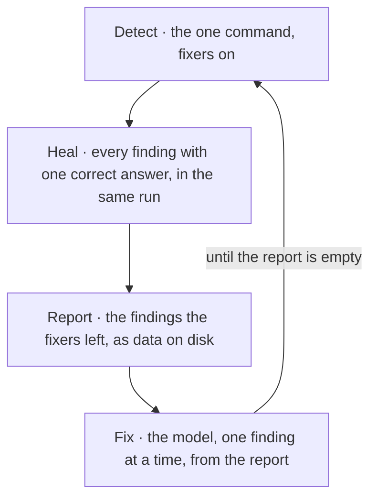

A1·b an actionable finding

```text
engine/registries/route.registry.ts:41
rule      literal-in-lookup
locus     the first argument of the lookup call
trail     resolved the callee verb, matched the lookup form, read the argument
expected  an imported constant as the lookup key
found     the string literal "home"
fix       replace the argument with the id from the ids module: HOME_PAGE
healed    no
```

## The gate holds the line

You can write a rule down and the model may follow it for a while, but nothing notices when it stops, which is why every rule in this method comes with a check. [B1·a a check's events](#the-gate-holds-the-line-panel-a) shows what happens to that check once it exists. Every other rule depends on this one. A rule held by a check costs the same to hold on the thousandth change as on the first, while a rule held by attention costs more each time. The checks are [fitness functions](ontology/PRINCIPLES.md#architecture-fitness-functions), and what they do is [policy enforcement](ontology/PRINCIPLES.md#architecture-policy-enforcement). The architecture page turns the same idea into an account of decay, in which [an anti-pattern is a decay path](architecture/DECAY.md#an-anti-pattern-is-a-decay-path), and the section [seven controls, seven classes](architecture/DECAY.md#seven-controls-seven-classes) places each anti-pattern by the check that was missing.

### The check is the rule

Convention does not survive contact with a model or with a tired developer. The team agrees on a rule, you tell the model about it, and a month later half the tree follows it, because nothing ever refused the other half. Convention decides a rule again at every use, and the model has no reason to decide it the same way twice.

For this reason I hold a rule with a check rather than with discipline. A rule holds only while a check enforces it: the model's attention and yours both drift, and the gate runs the check on every change regardless. The check ships in the same change as the rule, rather than the rule now and the check when it bites. In practice, the check is written the moment the pattern is introduced, and it is made to catch the pattern's bypasses too. When a violation slips past it, the check is extended before the content that slipped is touched, so the gate gets stronger before the cleanup. A check is never weakened, a case is never excluded to make the run green, and no tier softer than failure is added.

To check this, introduce the pattern's nearest bypass and confirm that the same check reports it. A check that catches the pattern but not its bypass holds the line on one side only. A pattern that no static check can catch is a question for the developer who owns the work, not a license to skip the check. The honest answer to that question is a rule declared unobservable, with the evidence a check would need written beside it.

The check is the fix, and the content edit is the cleanup. The order matters because a repaired instance with an unrepaired check is the same defect waiting for its next instance, and the developer or the model who found it has already spent the attention it would take to find it again. A caught duplicate, a caught escape hatch and a better approach discovered mid-task all call for the same response: the affected rule is extended to cover the shape.

Every check returns pass or fail, which applies [fail fast](ontology/PRINCIPLES.md#architecture-fail-fast) to the gate. There is no warning tier and no advisory level, because a middle tier would let a run finish as successful while a failure is still open, and the verdict is binary to prevent exactly that. A red result that is tolerated is [flaky test normalization](ontology/PRINCIPLES.md#architecture-flaky-test-normalization) under another name. Severity survives only as the order in which failures are repaired, never as a softer verdict, so a check that would warn is either promoted to a failure or deleted. The same refusal covers exclusions. A finding is resolved by fixing the code, or by proving that it tests a false premise, in which case the finding is deleted; it is never resolved by widening an exemption or disabling the rule for one file.

B1·a a check's events

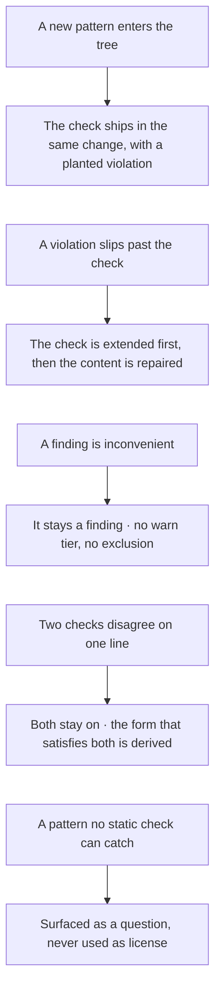

## The check comes first

A check is proven before it is trusted, as shown in [C1·a the order](#the-check-comes-first-panel-a). The proof has two halves, and each catches a failure the other cannot. The same discipline applied to checks that already exist is described in [verify the verifier](VERIFY.md#verify-the-verifier).

### Check, prove, then build

A check written after the code describes the code rather than the rule. The check comes last and passes on its first run, and neither you nor the model ever learns that it would have passed anything. A check has only the code in front of it to be shaped by, so it learns the code's accidents as the rule; [testability](ontology/PRINCIPLES.md#architecture-testability) is either designed in or absent.

For this reason the check comes before the code, and I trust a check only after it has caught something on purpose and let something through on purpose. Every change is ordered as check, planted violation, conforming member, then code, rather than code first with a check fitted around it. In practice, the check is written first, then broken on purpose to see that it fires with the expected message. It is then run over the real population to confirm that at least one real member passes for the right reason. The planted file is restored, and only then is the code the check will hold written. After a check is narrowed for precision, the case that motivated it is run again.

To check this, find the change where each check first fired and the member it first cleared. A check with no such moments has never shown that it works. A check that every member satisfies for free always says the same thing, and its green result then passes for evidence that what it measures is working. Where nothing can disagree with a check, it is kept with the property it cannot test written down, rather than shipped in a weaker form.

The two halves of the proof answer two different questions. A planted violation shows that the check can reject, because a check that has never been seen to fail looks the same as one that cannot fail. A real member passing shows that the check can tell members apart. A check that every member fails has only been shown to reject, and its first green result looks the same as a scope that stopped reaching anything, the [mock mirage](ontology/PRINCIPLES.md#architecture-mock-mirage) of a test that exercises nothing real. Where no member can pass yet because the correct shape does not exist in the tree, the first conforming member is written beside the check in the same change, and the check is proven against it before either is trusted.

Narrowing is where a correct check can lose its subject without anything reporting it, and it is where the rule in [a check matches a shape](BUILD.md#a-check-matches-a-shape) is easiest to break. A rule is written against one case and then scoped for precision. Each refinement is judged by the false positives it removes, and neither the developer nor the model runs the true positive again, so a scope that excludes the motivating case reads exactly like a scope that got tighter. The cheapest scoping is the harmful one, because it keys on the property the correct members share rather than on the property the defect has. Running the motivating case again after every scoping costs a sentence, and it is the only step that tells a check that became precise from one that became blind.

C1·a the order

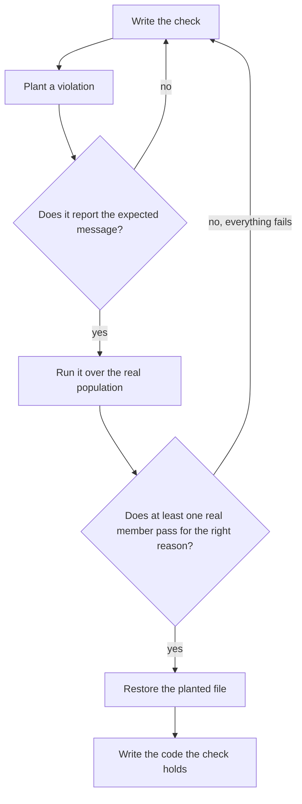

## A check matches a shape

A check enforces the shape of an anti-pattern, never a particular provider, package, filename or threshold. Because of that, the check and its message carry over: the same rule catches every later occurrence of the same shape, whatever library or symbol it involves. It is also how a small number of checks can govern a growing tree without growing with it, since the mechanism stays general and a registry holds the instances, as shown in [D1·a mechanism and registry](#a-check-matches-a-shape-panel-a). Where a check runs depends on what it needs to see, as shown in [D1·b placed by sight](#a-check-matches-a-shape-panel-b), and a check becomes active when its file is dropped in, as shown in [D1·c dropped in](#a-check-matches-a-shape-panel-c). Its contract is typed as shown in [D1·d a rule contract](#a-check-matches-a-shape-panel-d), and the finding it produces as shown in [D1·e a finding](#a-check-matches-a-shape-panel-e). The shapes themselves are catalogued on the architecture page, as described in [an anti-pattern is a decay path](architecture/DECAY.md#an-anti-pattern-is-a-decay-path), and each one carries the control whose absence lets it in.

### Mechanism general, data specific

The obvious check names the thing that went wrong, and the thing that went wrong is one instance of a shape that will recur under other names. A rule bans one library's direct import by name, a second library with the same hazard arrives, and the rule says nothing because it never knew what it was protecting. A check that names an instance is correct on the case that motivated it and silent on the next case, which is the one it was written to prevent.

For this reason one mechanism covers a whole class of mistakes, and only the list of known cases grows. Constructs are gated rather than literals. In practice, the check is written for the whole class: it detects a construct in a syntax tree, a token sequence or a structural relation, never a name. The instances are kept as data in a registry the check reads, seeded only with instances verified to have the shape. The message states the shape and its one fix in terms a developer working with a different library would understand unchanged, and a rule becomes active when its file is dropped in.

To check this, read a check's message with the vendor, the path and the symbol removed. If it still says what is wrong and how to fix it, the check matches a shape; if it says nothing, the check matched an instance. A shape whose defining property is semantic rather than structural may carry a registry of classified instances. The split is then strict: the mechanism reads the registry, the registry is the only place a specific name appears, and the message stays general whatever the registry holds.

### Two properties decide

Two properties decide whether a shape can be gated, and both have to hold. The first is that detection is deterministic: the bad shape can be recognized by [static analysis](ontology/PRINCIPLES.md#architecture-static-analysis), from an import edge, a manifest field or a path, never by a runtime probe that sometimes fails. Where the only way to catch something is to observe non-determinism at runtime, the work is to trace it back to the static shape that causes the non-determinism and gate that shape instead. The second is that remediation is deterministic: there is one correct fix, and it can be stated without reference to any particular case. Where both hold, the shape is gated. Where either fails, it is raised as a question rather than glossed over, and [the honest gaps](SHIP.md#the-honest-gaps) lists the ones raised so far.

### Placed by what it needs to see

Where a check runs depends on what it needs to see. A rule over one file's syntax tree is the lightest kind, and it applies [the filesystem is the architecture](BUILD.md#the-filesystem-is-the-architecture) to the checks themselves. A rule over relations between files reads a graph that an earlier stage wrote, and it fails closed when that graph is missing, so the order of the stages matters rather than being incidental. A rule over a folder rather than a file walks from the root, and it needs an anchor, because a finding has to be reported against a file the rule visits: a placement finding attaches to a file inside the offending folder, and a declaration that points at something absent attaches to the manifest that declared it. A check over the whole tree that does not work file by file becomes a stage of its own, and a rewriter checks its own output by parsing it again before it writes.

### Discovered by shape, matched exactly

The mechanism that discovers rules also works by shape, and that is what lets the core stay untouched. A rule becomes active by declaring a contract that the [registry pattern](ontology/PRINCIPLES.md#architecture-registry-pattern) discovers; if any core file has to learn the rule's name, the design is wrong. The gate also checks the contract against itself, so a rule that is missing a message, declares its own severity, or reaches for an untyped escape fails at lint rather than at load. The mechanism that enforces every other rule is the one most likely to decay unnoticed, because nothing else watches it, so the rule host passes through the same gate it enforces.

Matching is exact rather than approximate. A check is derived, never guessed, because a check that is usually right is wrong: its misses are invisible, and its false accusations fall on the developer or the model who did the right thing. The tooling I write matches by walking the syntax tree, comparing tokens or comparing exact strings, never by a pattern language that hides the grammar it implements. A hand-written scanner tells use apart from mention, so a detector never matches its own detection strings inside a report about them. It also tests the form of a call rather than a list of names, because a list of names is a check naming instances, and it stops working the moment one more name exists.

### The contract, typed

The rule contract is small and typed, and its [type safety](ontology/PRINCIPLES.md#architecture-type-safety) is what lets the registry discover it and the gate check it. A rule declares its kind, a description, an options schema and its messages, and it exports a function that returns a listener over the syntax tree. The message ids form a [closed vocabulary](ontology/PRINCIPLES.md#architecture-closed-vocabulary), so a report that names an undeclared message fails to compile, and a declared message that no report uses is a finding against the rule. The rule object is exported directly rather than bound to a name, because the filename is the rule's identity, and a second name would be a second fact that has to agree with it. A rule never declares a severity, because there is only one.

What a rule emits is the finding described in [detect, log, fix](BUILD.md#detect-log-fix), in typed form: a closed vocabulary of actions, resolved operands and a flag saying whether it healed.

D1·a mechanism and registry

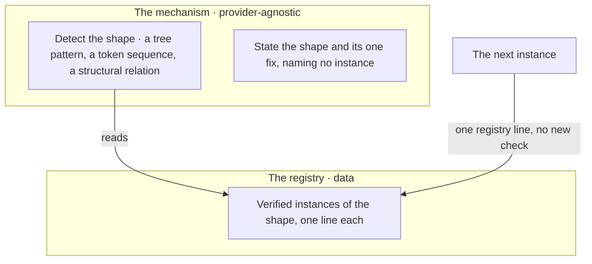

D1·b placed by sight

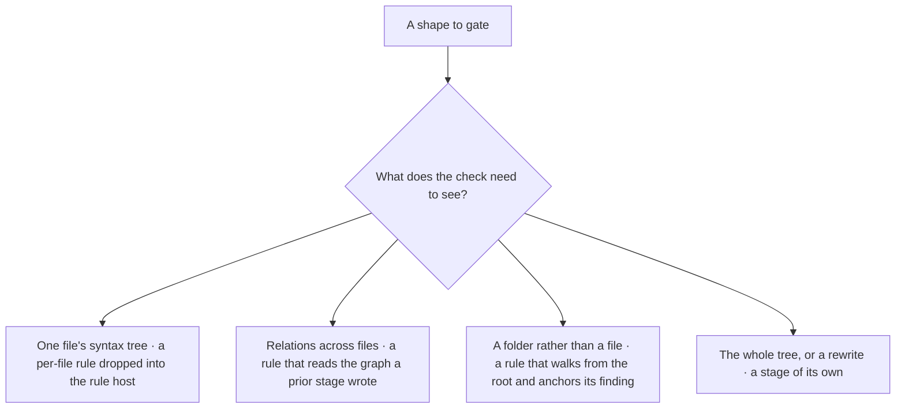

D1·c dropped in

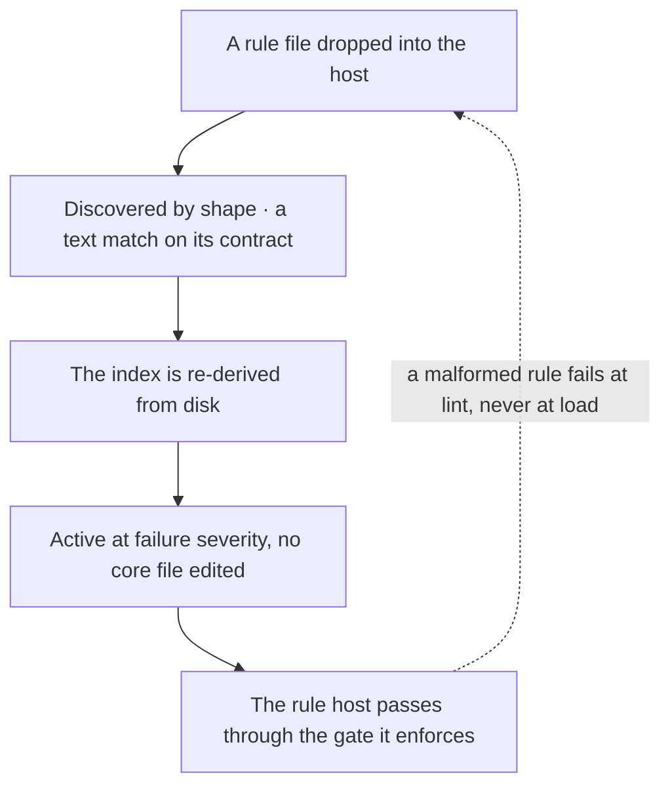

D1·d a rule contract

```typescript
export interface RuleContract<MessageId extends string> {
  readonly meta: {
    readonly type: "problem";
    readonly docs: { readonly description: string };
    readonly schema: readonly [];
    readonly messages: Readonly<Record<MessageId, string>>;
  };
  readonly create: (context: RuleContext<MessageId>) => RuleListener;
}

export default {
  meta: {
    type: "problem",
    docs: {
      description:
        "a single-instance resource is reached through its one owner",
    },
    schema: [],
    messages: {
      directReach:
        "A single-instance resource must be reached through its owner, which serializes access; route the call through the owner's API.",
    },
  },
  create(context) {
    return listener({
      callExpression(view, node) {
        if (reachesSharedInstance(view)) {
          context.report({ node, messageId: "directReach" });
        }
      },
    });
  },
} satisfies RuleContract<"directReach">;
```

D1·e a finding

```typescript
export type Severity = "error";

export interface Remediation<Action extends string> {
  readonly action: Action;
  readonly operands: Readonly<Record<string, string>>;
}

export interface Finding<Action extends string = string> {
  readonly rule: string;
  readonly path: string;
  readonly locus: {
    readonly line: number;
    readonly column: number;
    readonly member?: string;
  };
  readonly trail: readonly string[];
  readonly actual: string;
  readonly expected: string | null;
  readonly remediation: Remediation<Action>;
  readonly healed: boolean;
  readonly severity: Severity;
}
```

## Tools live in the tree

When the method lacks a capability, the gap is closed by a tool that lives in the tree with a command surface of its own, as shown in [E1·a closing a gap](#tools-live-in-the-tree-panel-a). That is how [the stance](START.md#the-stance)'s third sentence, that every manual step is a failure of automation, is held by something other than the developer's memory. Which tools exist, what kind each one is and why it exists follow from the method rather than from preference: a tool exists where a check needs an input, where a developer would otherwise repeat a step, or where an eye would otherwise stand in for a measurement, as shown in [E1·b a look tool](#tools-live-in-the-tree-panel-b). A tool that does something irreversible reads its preconditions first, as shown in [E1·c before an irreversible tool](#tools-live-in-the-tree-panel-c). The grammar page states the caller's half of the same contract under [semantic operations](pag/GUIDE.md#tool-invocation): an instruction names an operation, and the binding names the tool.

### Every manual step is a missing tool

The cheapest response to a missing capability is to do the thing by hand, and doing it by hand is where the variation comes in. A ten-minute manual procedure runs weekly for a year, differently each time, and the one week it is skipped is the week it mattered. A manual loop is faster the first time and slower every time after, and nothing records how it was done.

For this reason I close a capability gap with a tool in the tree, never with a manual loop or a workaround. The tool that already owns the concern is extended first, rather than a second tool being added beside it. In practice, a gap is closed by writing a tool with a declared command surface that lives in the tree. The tool shows its contract before it has any effect: its flags are declared, an undeclared flag is refused, and its help is printed on request. A tool that allocates or rewrites values runs in preview and shows its diff before it applies it. Where a mechanism needs something written to a surface, that surface is made writable by a tool before the requirement exists.

To check this, list every step you performed by hand this week. Each one is either a tool that does not exist yet, or a tool that exists and was not used. A one-off script belongs in a scratch location, and it moves into the tree as soon as its [reusability](ontology/PRINCIPLES.md#architecture-reusability) shows. The discipline applies to anything a second run will need, so a scratch tool that gets a second run has already crossed that line.

The tools fall into kinds by what they stand in for. A generator stands in for a fact that would otherwise be typed by hand, such as an index, a catalog, a document derived from a manifest or a rendered diagram; this is [derived state](VERIFY.md#derived-state) written by code. A validator stands in for a review that would otherwise be done from memory, such as finding every route, catching internal names that leak into public copy, or resolving every reference a document makes. A fixer stands in for a repair that has [one correct answer](VERIFY.md#one-correct-answer), and a probe stands in for an eye. Every kind is reached through [one chain](SHIP.md#one-chain), for the reason that section gives.

The probe deserves the most attention, because the eye is the measurement most often trusted and least often right, the failure described in [it looked right](VERIFY.md#it-looked-right). A visual, numeric or timing defect is diagnosed by adding a probe that writes out a value you can read before anything is changed, which is [observability](ontology/PRINCIPLES.md#architecture-observability) built for one question, and by binary-searching the pipeline against a known-good control. Adjusting values over repeated runs proves nothing. A look tool therefore returns what the eye cannot see: beside the screenshot, it returns the console log the page produced while rendering, the layout the engine computed and the markup that was actually in the tree. A screenshot the developer hands over counts as the measurement. The tool takes one capture per question rather than relaunching in a loop, because a second capture is exactly the tuning by eye the probe is there to replace.

A tool that performs an irreversible operation skips any standing precondition its code does not implement, and it still reports success. So before such a tool runs, the standing instructions that bear on the operation are compared with what the tool actually does, by reading its code rather than its help, since the help has no reason to mention a precondition the code does not implement. A missing step is first taken by hand and declared, and then built into the tool, so the next run does not depend on the developer or the model remembering it. A step skipped before a deletion cannot be made up later, because what it needed is gone.

The requirement and the means of writing what it needs tend to arrive in different changes, and only the requirement feels like the work. A mechanism is built, it needs an input, the input lives in a file, and nothing in building the mechanism asks how that file gets written. The requirement lands complete, and the write it depends on is left to whichever developer or model runs into it, done by hand without any of the protections a tool's write carries. For this reason the question of what writes a file is asked as soon as that file becomes an input, and the answer is a tool that writes it, in place before the requirement that needs it.

E1·a closing a gap

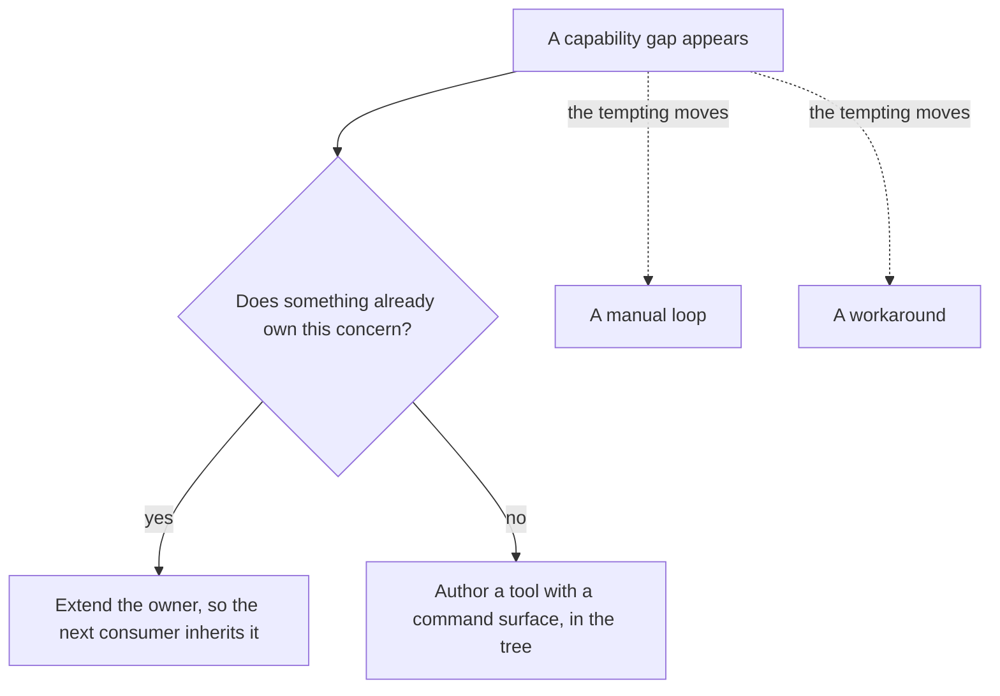

E1·b a look tool


E1·c before an irreversible tool

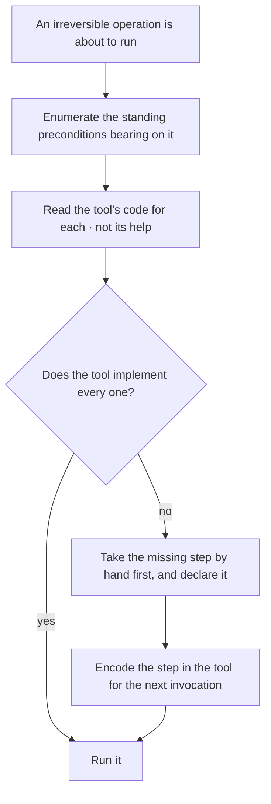

## One home

Every fact has one home, as shown in [F1·c one limit](#one-home-panel-c). Any other place that repeats the fact either derives it from that home, as shown in [F1·d one truth per concern](#one-home-panel-d), or holds a copy that will drift sooner or later. The principle is [single source of truth](ontology/PRINCIPLES.md#architecture-single-source-of-truth), and [DRY](ontology/PRINCIPLES.md#architecture-duplicate-code) is its everyday name. It applies equally to a number in a config, a location in a script, a word in a filename and a sentence in a document, and each of these has one mechanism that holds it. For a location, that mechanism is shown in [F1·a a location declaration](#one-home-panel-a) and [F1·b the lookup](#one-home-panel-b). The architecture page states the same split under [definitions own what, code owns how](architecture/MODEL.md#definitions-own-what), and [derived state](VERIFY.md#derived-state) describes the [verification](ontology/PRINCIPLES.md#architecture-verification) side of it.

### One home per fact

The same fact gets stated in several places, and the places stop agreeing. A limit lives in the tool's config, in a checker, in a script and in three documents. You change it in the config, and the other five keep enforcing the old value. A copy is cheaper to make than a derivation, and the two agree on the day of copying, so the drift is invisible until it costs something.

For this reason I give every fact one home, and any second appearance is either derived from it or treated as a defect. The second appearance is a lookup rather than a copy, even where the copy would be shorter. In practice, a home is chosen for each fact, and every other appearance is derived from it by a generator or a lookup. Any copy that cannot be derived is deleted.

To check this, change the fact at its home. Every other appearance should follow without a second edit, and any appearance that stayed behind was a copy. A declaration file is the one exempt place, because there the string is the declaration rather than a copy of one. Every consumer reads that file by key, and the exemption never widens to a second file.

Three sources of truth carry most of the tree. The first is for quality: every tool's configuration is built in memory from one declaration, a validator refuses a second configuration on disk, and because the defaults are catalogued, the declaration carries only the deviations. The second is for locations: one declaration holds where every member lives, branches compose so each directory is spelled once, and every script resolves a location by key, so a rename is one edit. This is [configuration externalization](ontology/PRINCIPLES.md#architecture-configuration-externalization), and a path spelled out in a script is [hardcoded configuration](ontology/PRINCIPLES.md#architecture-hardcoded-configuration). The third is for naming: one [closed vocabulary](ontology/PRINCIPLES.md#architecture-closed-vocabulary) holds every word a filename may carry, and an undeclared word is an edit to the vocabulary that has to be approved, not a naming choice.

A location is never spelled out in a string, and the check for that recognizes four shapes: a declared location written as a literal anywhere; the same location assembled from parts, after local constants, arrays and concatenation are folded; a literal tail appended to a lookup when a key already covers the whole path; and any path-shaped string with no anchor at all. Where the path sits makes no difference, so a path in an array entry or a template is the same defect as a path in a value.

The location declaration is shaped so that composing locations costs nothing. A branch declares its own place under a root key, and every key beneath it resolves relative to that place, so a directory is spelled once and a rename is one edit. A branch that declares a root also resolves as a leaf, so a key keeps working after it gains children. The keys are generic and the values are the project's own: the governance tooling finds the application by a fixed key whatever the directory is called, so renaming the directory means editing one value. The lookup is typed over the declared keys, so a key that does not exist fails to compile instead of resolving to nothing at run time. The declaration answers one question only, where a member lives and which governed roots sit inside it. What lives below a root belongs to the naming vocabulary and is not listed here again.

F1·a a location declaration

```yaml
app:
root: <application-root>
member: <application-member> # → <application-root>/<application-member>
builds: <build-output> # → <application-root>/<build-output>
testing:
root: <test-root>
app: <application-suite> # → <test-root>/<application-suite>
governance:
root: <governance-host>
rules: <rule-host> # → <governance-host>/<rule-host>
reports: <report-root> # → <governance-host>/<report-root>
```

F1·b the lookup

```typescript
type LocationKey =
  "app.root" | "app.member" | "app.builds" | "testing.app" | "governance.rules";

export declare function relativePath(key: LocationKey): string;
export declare function absolutePath(key: LocationKey): string;

const ruleHost = absolutePath("governance.rules");
const suite = relativePath("testing.app");
```

F1·c one limit

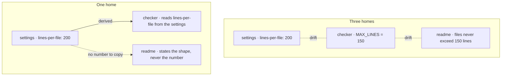

F1·d one truth per concern

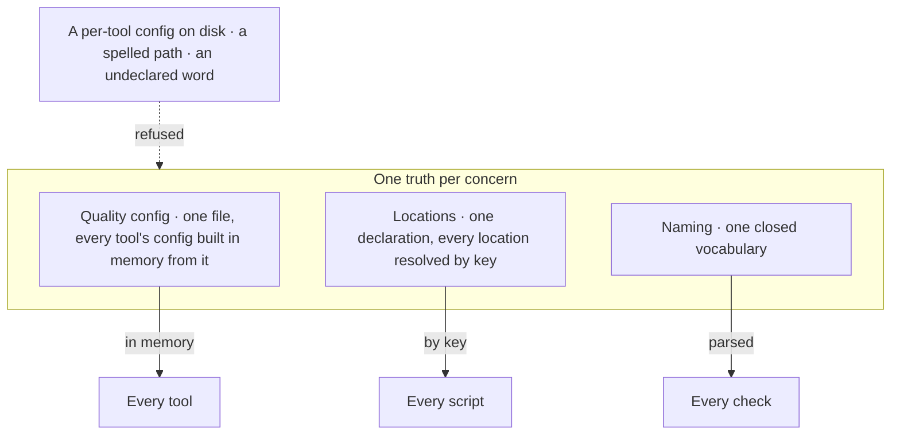

## The filesystem is the architecture

Every [extension point](ontology/PRINCIPLES.md#architecture-extension-points) in the tree is a file in a directory, so adding a capability means adding a file, and removing one means deleting a file. A list of what exists that is maintained by hand is a registry in disguise, and that is where the next inconsistency appears, as shown in [G1·b wired then collected](#the-filesystem-is-the-architecture-panel-b). The same shape governs pages, rules, checks, templates and documents, typed as shown in [G1·a the registry](#the-filesystem-is-the-architecture-panel-a). The [registry pattern](ontology/PRINCIPLES.md#architecture-registry-pattern), filled by [auto-discovery](ontology/PRINCIPLES.md#architecture-runtime-discovery), is the [open/closed principle](ontology/PRINCIPLES.md#architecture-open-closed) made physical, and it grows into a [plugin architecture](ontology/PRINCIPLES.md#architecture-plugin-architecture).

### Adding is adding a file

Every switch over a kind, every record literal of variants and every import list in a composer is a list that you or the model have to remember to update. A new variant renders through the fallback branch because the switch that dispatches it never learned its name, and nothing reported that. A list is complete on the day it is written, and nothing compares it against the directory afterwards.

For this reason the directory is the registry, and a core file that has to learn a name is the wrong design. Discovery replaces enumeration, rather than a central list kept in step with the directory. In practice, each variant has its own file that registers itself at module scope, and the files are collected by pattern, never by name. The switch, the lookup table and the list of imports that had to learn each new name are deleted. Where a barrel file collects the files, it is generated from the directory rather than written by hand, and it is checked in both directions: for an entry with no file and for a file with no entry.

To check this, add a variant by adding one file and touching nothing else. If it needed a second edit, the registry is still in disguise. A surface discovered by shape is the riskiest thing in any rename, because a change of suffix quietly changes what it collects. The collection is compared before and after every move, as described in [moves and renames](VERIFY.md#moves-and-renames), and a count that dropped to zero means the move broke something, not that it was clean.

A barrel file that lists its side-effect imports by hand is the same disguise one level down, and the rules follow the same approach, as described in [a check matches a shape](BUILD.md#a-check-matches-a-shape).

A generated index over authored data is regenerated from its source and checked for drift in the gate, never edited by hand. Every scan works at any depth, because a scan fixed to one depth reports a pass over whatever sits one level below it. The index is checked in both directions because checking only one direction is decoration: the failure that actually happens is a scan that resolves a smaller set than it claims, with the difference passing for coverage.

The registry has the same shape wherever it appears, and its kind is a closed union, so a variant of an undeclared kind fails to compile, and a lookup for one cannot be written. The same three parts appear whether the variants are pages, checks, codemods or document forms, which is why one primitive serves all of them, and a second registry implementation is a duplicate rather than a convenience.

G1·a the registry

```typescript
export interface Variant<Kind extends string> {
  readonly kind: Kind;
  readonly applies: (subject: Subject) => boolean;
  readonly run: (subject: Subject) => Finding[];
}

export interface Registry<Kind extends string> {
  readonly register: (variant: Variant<Kind>) => void;
  readonly all: () => readonly Variant<Kind>[];
  readonly get: (kind: Kind) => Variant<Kind>;
}

export const checks = createRegistry<CheckKind>();

checks.register({
  kind: "unreachable-export",
  applies: isModule,
  run: findUnreachableExports,
});
```

G1·b wired then collected

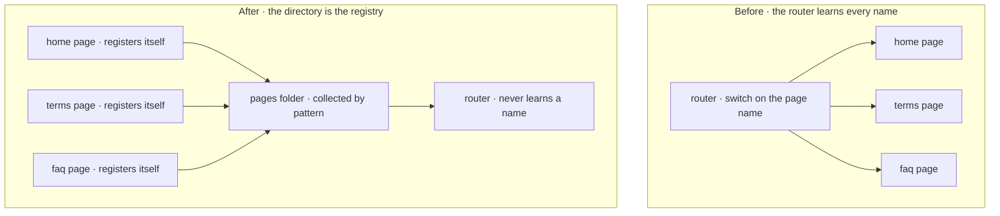

## Fail at the boundary

A failure should surface at the boundary where it happens, as shown in [H1·a masked and surfaced](#fail-at-the-boundary-panel-a). The principle is [fail fast](ontology/PRINCIPLES.md#architecture-fail-fast): no default, no fallback and no second path carries on as if nothing went wrong, and [H1·b the debt shapes](#fail-at-the-boundary-panel-b) shows what replaces each of them. The architecture page gives errors their place in the language under [execution joins the halves](architecture/PRINCIPLES.md#execution-joins-the-halves). This section covers the practice at the boundary, and the pairs below are derived in [never and always](architecture/DECAY.md#never-and-always).

### Loud at the boundary

Code that handles every edge case by carrying on hides the one case that should have stopped it. A missing secret falls back to a placeholder and the deploy succeeds. The service starts talking to nothing, and the first sign is a customer reporting it. A fallback turns a loud failure into a quiet wrong answer, and a quiet wrong answer costs more than any crash.

For this reason I treat errors as part of the language: a failure surfaces where it occurs, and no default is allowed to mask it. Fallbacks, dual paths and silent defaults are refused, rather than kept as a safety net. In practice, the code fails at the first point where a precondition does not hold, and the error says what was expected and what was found. A default value is refused for anything the configuration should have supplied, and so is a second path that carries on when the first one cannot. Replaced code is deleted in the same edit rather than marked, because a marker is a second path with a label on it.

To check this, remove one required input and run. The run should stop at the boundary that needed the input and name it; a run that continued has a fallback somewhere. Fail fast applies to the boundaries of your own system. A surface a visitor meets still gets [graceful degradation](ontology/PRINCIPLES.md#architecture-graceful-degradation), a real page rather than a bare error, and the failure behind it is logged where you will see it.

The debt shapes are named as pairs rather than as a list of prohibitions, because each pair states what to do instead. A deprecation marker, a tombstone or a compatibility shim is how [lava flow](ontology/PRINCIPLES.md#architecture-lava-flow) and [zombie code](ontology/PRINCIPLES.md#architecture-zombie-code) begin, and its pair is explicit removal in the same edit. Every write is checked for those markers before it lands, so only living code on a single forward path remains; the accounting behind the pairs is described in [debt and leverage](architecture/DECAY.md#debt-and-leverage).

An environment variable never carries a fallback value, and a missing one fails at startup with its name; a placeholder there is a [hidden side effect](ontology/PRINCIPLES.md#architecture-hidden-side-effect) waiting for production. A guard that fails open is itself a defect, because a guard exists to stop a state, and a guard that lets the state through on error has stopped nothing. That is why [secure by default](ontology/PRINCIPLES.md#architecture-secure-by-default) is the same rule seen from the [security core](ontology/SCHEMA.md#layer-security-core). A boolean flag is written as an explicit positive test rather than a negated default, so an absent flag hides the feature rather than switching it on by accident.

H1·a masked and surfaced

```javascript
const masked = env.HOST ?? "localhost";

const surfaced =
  env.HOST ?? fail("HOST is not set; the deploy needs a droplet");
```

H1·b the debt shapes

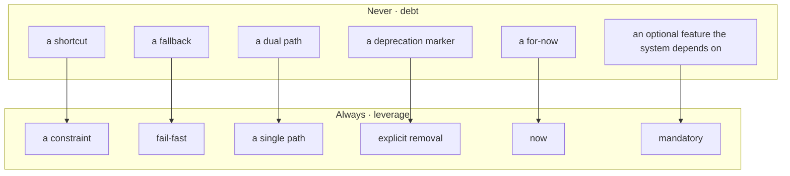

## Placement is a grammar

Where a file lives and what its name says follow one grammar, shown in [I1·a the grammar](#placement-is-a-grammar-panel-a): a container, an optional subject, a concern, and then the file, as shown in [I1·b one tree](#placement-is-a-grammar-panel-b). The file's name ends with the concern of its folder, which is [concern-folder correspondence](ontology/PRINCIPLES.md#architecture-concern-folder-correspondence). Every word comes from a [closed vocabulary](ontology/PRINCIPLES.md#architecture-closed-vocabulary): [I1·c where a word goes](#placement-is-a-grammar-panel-c) shows how a word is placed, [I1·e the vocabulary](#placement-is-a-grammar-panel-e) shows how the words are declared, and [I1·d jurisdiction](#placement-is-a-grammar-panel-d) shows what the grammar claims and what it leaves alone. A file with two concerns is split rather than given a vague name, which is [one concern per file](ontology/PRINCIPLES.md#architecture-one-concern-per-file). Only an overlap between two tags for one concern that cannot be reduced takes the tag closer to the domain, following the precedence [the layer spine](architecture/MODEL.md#the-layer-spine) holds on the architecture page. The grammar is what turns [separation of concerns](ontology/PRINCIPLES.md#architecture-separation-of-concerns) from advice into a check, and the layer spine is the axis it uses to classify every concern.

### One legal path per file

Separation of concerns given as advice produces a different tree for every developer who follows it. A helper folder appears, then a utils folder, then a second helper folder inside a feature, and six months later you can't say where a new file goes, and neither can the model. Nothing parses a path, so a wrong placement fails no check and reads as a preference.

For this reason I treat placement as a grammar. A name is a claim about what the code does, and it is checked against the code, never against the old name. The vocabulary is closed and the path is parsed, rather than placement being reviewed by eye. In practice, the closed vocabulary and the roots it governs are declared, and a check parses every path against the grammar. A collision is resolved sideways with a variant, never downward with another folder. An undeclared word is a decision for the developer, worked down a ladder: an existing word first, then the is-a test, then the conclusion that the filename is wrong, then the conclusion that the file itself is wrong. Every file is created conformant, because there is no queue of files waiting to be converted.

To check this, pick a file at random and work out its path from its contents alone. If the derived path differs from the real one, one of them is wrong, and the grammar says which. Files that an ecosystem names for you keep their names. The grammar governs what you write, not what your tools require, and a tree carrying another system's ownership markers is never declared a governed root, because its names are identifiers that system resolves at runtime.

### Slots, not words

Words are resolved by their position rather than by their spelling, which is [positional slot resolution](ontology/PRINCIPLES.md#architecture-positional-slot-resolution). A word is read by the slot it lands in, so a concern tag can also serve as a subject: a registry of pools and a pool named base use the same word in two slots without ambiguity. The one restriction on the words themselves is that a subject never equals its own concern. A subject folder exists exactly when a container holds two or more sets of one concern that must not merge, because optional grouping would give classification two right answers and make placement impossible to check. [Sideways overflow](ontology/PRINCIPLES.md#architecture-sideways-overflow) handles the rest: a collision takes the filename's variant slot, breadth takes a sibling subject folder, and the [bounded nesting depth](ontology/PRINCIPLES.md#architecture-bounded-nesting-depth) is the reason both slots exist.

### Jurisdiction is declared

[Declared jurisdiction](ontology/PRINCIPLES.md#architecture-declared-jurisdiction) decides what the grammar reaches. Each key in the configuration is a governed root, and without a declaration there is no enforcement, so a tree outside the jurisdiction keeps its own names. A declaration is a claim that is checked against the disk: a root declared before its folder exists governs nothing and fails nothing, yet it reads as coverage. Material written elsewhere is declared once as an upstream root, and that one declaration exempts it from the naming, tense and reference checks together, because all three fail on such a tree and none of those failures is a defect in it.

### Judgement classifies, the check parses

Classification is a matter of judgement, while structure can be decided by a machine, and the tooling stops at the line between them. A check reports that a name does not parse or that a tag disagrees with its folder, but it never decides what a file is; the classification rule lives in the layer spine on the architecture page. Reshaping an existing tree is therefore a [manual identity migration](ontology/PRINCIPLES.md#architecture-manual-identity-migration), done one container at a time with the gate green between each, and the rest is described in [moves and renames](VERIFY.md#moves-and-renames).

### A vocabulary that proves itself

The vocabulary is one typed declaration, and its type is what makes it closed: the legal words for each slot are a union derived from the data rather than written out a second time, and a flat bucket is declared explicitly rather than inferred from the folder's shape.

The declaration also asserts its own [consistency](ontology/PRINCIPLES.md#architecture-consistency) when it compiles. A subject that is already a concern tag, a variant that is already a subject, or a concern whose layer lies outside the spine fails to compile, so the vocabulary cannot become inconsistent without the whole gate refusing to load. Every closed vocabulary here takes the same shape: a configuration that carries data and the proofs of its own consistency, and no reasoning.

I1·a the grammar

```text
folder = <container> | <subject> | <concern>       one word, never a dot
file   = <subject>.<concern>.<ext>
| <subject>.<variant>.<concern>.<ext>        only when two files would collide

depth  = container(1) → subject(2, optional) → concern(3) → file
a role may be skipped, never repeated, never revisited
the file's parent is always the concern folder
the file's concern tag equals its parent folder
```

I1·b one tree

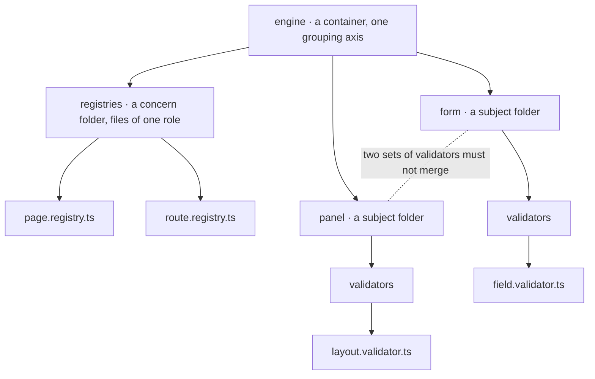

I1·c where a word goes

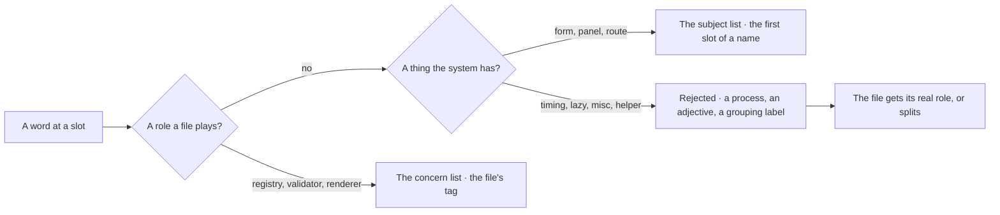

I1·d jurisdiction

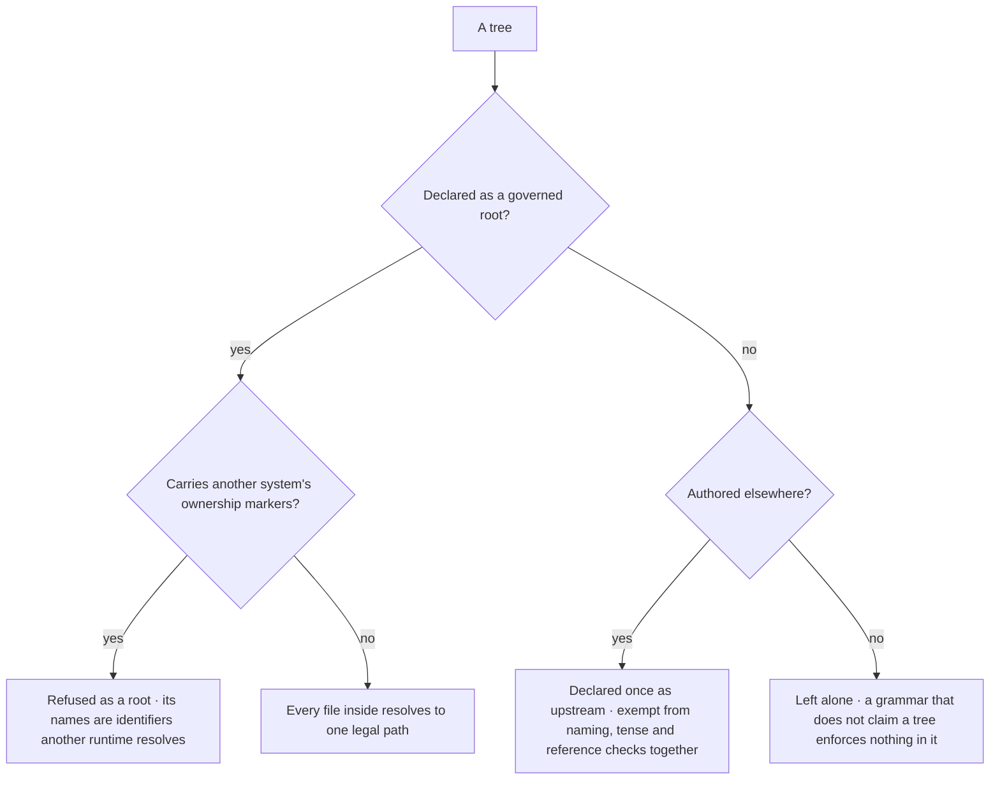

I1·e the vocabulary

```typescript
export const LAYERS = [
  "domain",
  "application",
  "processing",
  "runtime",
  "infrastructure",
  "operations",
  "product",
] as const;

export const taxonomy = {
  containers: {
    "<governed-root>": ["<container>", "<container>"],
  },
  specialContainers: {
    "<governed-root>": ["<flat-bucket>"],
  },
  concerns: [
    { folder: "registries", tag: "registry", layer: "infrastructure" },
    { folder: "validators", tag: "validator", layer: "processing" },
    { folder: "strings", tag: "strings", layer: "product" },
  ],
  subjects: ["base", "<domain-noun>", "<domain-noun>"],
  variants: ["<facet>", "<facet>"],
  grammar: {
    separator: ".",
    maxDepthFromRoot: 3,
    compoundMarkers: ["test", "spec", "generated"],
  },
} as const;

type Config = typeof taxonomy;
export type Subject = Config["subjects"][number];
export type Variant = Config["variants"][number];
export type ConcernTag = Config["concerns"][number]["tag"];
export type GovernedRoot = keyof Config["containers"];

type Assert<Name extends string, Overlap> = [Overlap] extends [never]
  ? true
  : [Name, Overlap];

export const NO_SUBJECT_CONCERN_OVERLAP: Assert<
  "subject is already a concern tag",
  Extract<Subject, ConcernTag>
> = true;
export const NO_VARIANT_SUBJECT_OVERLAP: Assert<
  "variant is already a subject",
  Extract<Variant, Subject>
> = true;
export const EVERY_LAYER_DECLARED: Assert<
  "concern layer is not in the spine",
  Exclude<Config["concerns"][number]["layer"], (typeof LAYERS)[number]>
> = true;
```

---

Chapters: [Start](START.md) · [Plan](PLAN.md) · [Build](BUILD.md) · [Verify](VERIFY.md) · [Collaborate](COLLABORATE.md) · [Ship](SHIP.md)
