© 2025 Jay Baleine - Disciplined AI Software Development · Documentation is covered by [CC BY-SA 4.0](https://creativecommons.org/licenses/by-sa/4.0/)

# Build — Methodology — Bane's Lab

> From the outside the work is one loop: detect with the fixers on, report what they left, fix what the report names, repeat until the tools are quiet, as the…

Canonical: https://banes-lab.com/disciplined-methodology/build

# Disciplined AI Collaboration

Constraints, checks and skepticism for building software with AI.

# Build

## Detect, log, fix

From the outside the work is one loop: detect with the fixers on, report what they left, fix what the report names, repeat until the tools are quiet, as [A1·a the loop from outside](#detect-log-fix-panel-a) draws. [The loop](START.md#the-loop) closes because the tools speak to the AI in a typed vocabulary, the finding [A1·b an actionable finding](#detect-log-fix-panel-b) shows, and the report on disk is the state of the work rather than a rendering of one run. The architecture page reaches the same contract from the author's side: because [the author is probabilistic](architecture/SCALE.md#the-author-is-probabilistic), a finding is the contract between the check and the model.

### Detect, heal, report, fix

An AI refactoring against a specific finding tends to do better than an AI generating from an abstract principle. Telling the AI about your principles and hoping for [compliance](ontology/PRINCIPLES.md#arch-compliance) does not hold across a session.

You explain the architecture at length, the AI agrees, and the next file it writes breaks it in a way the explanation did not anticipate. A principle has to be re-derived into an action at every line, and the model re-derives it differently each time.

Spend the effort on the check that produces findings rather than on the explanation that produces agreement. Feed the AI the finding, not the rule. Say which file, which line, what the tool expected, what it found, and the one action that would close it. Let it repair that and nothing else. Run the tools again once the tree has changed.

Compare a session driven by findings with one driven by explanation. Count the fixes that stuck. The findings session wins, and if it does not, the findings are not specific enough.

A finding whose only repair the toolchain refuses to perform is withdrawn or exempted with that refusal as the stated reason. A report nobody can drain trains every reader to discount the colour, and the cost lands on the findings beside it.

Healing comes before reporting, and it is [auto-remediation](ontology/PRINCIPLES.md#arch-auto-remediation) in the ontology's sense. A violation whose remediation has exactly [one correct answer](VERIFY.md#one-correct-answer) is repaired in the same run that caught it, without being asked: a missing type the grammar computes, a form the registry records, a name whose only legal spelling is derivable. The flag disables healing and never enables it, because an opt-in fix flag inverts the rule and turns a computed repair into a queue. A fix is applied, re-validated and converges, so applying it twice changes nothing, which is [idempotency](ontology/PRINCIPLES.md#arch-idempotency), and one that fails its own check is not a fix. What reaches the AI is the residue: the findings that need judgement, which concern a file is, whether two roles split, what a duplicated fact's source should be.

The error log is the communication channel, so it is typed. A finding carries the id of the check that fired, the path, the locus inside the file, the trail of what the check resolved on the way, the observed value, the derived expected value where one exists, a remediation as an action with real operands, and whether it healed. Prose in a finding is a defect, because the consumer is a reasoning agent that must not re-derive the analysis the check already performed. A sentence describing a rename is a description; the action and its two operands are a contract the agent can execute.

The report on disk is the state of the work and the run is the measurement, as a report, not a checkbox spells out; it is [audit logging](ontology/PRINCIPLES.md#arch-audit-logging), and it is what gives the run [auditability](ontology/PRINCIPLES.md#arch-auditability).

A1·a the loop from outside

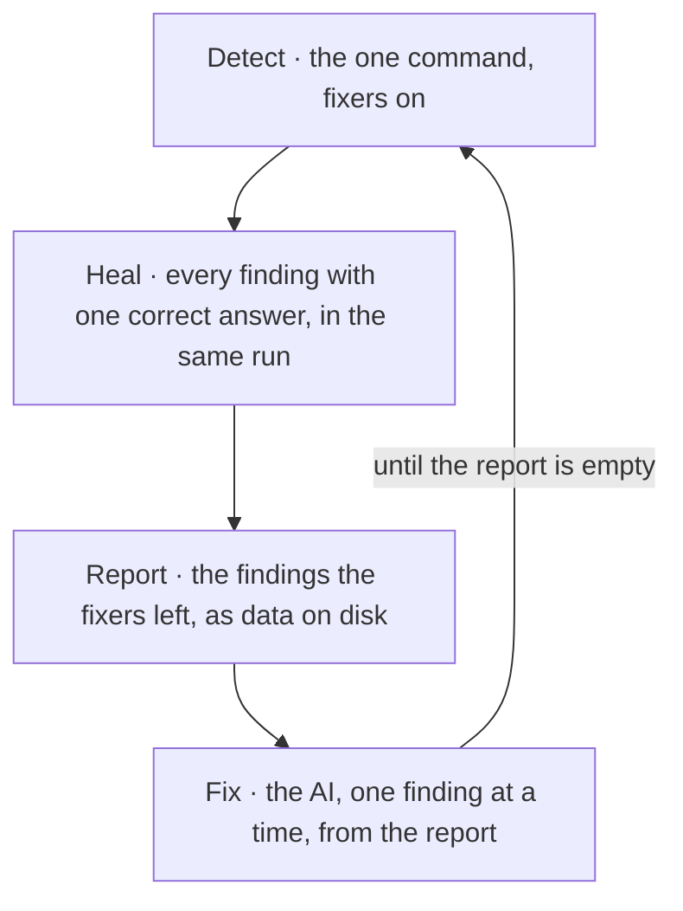

```text
engine/registries/route.registry.ts:41
rule      literal-in-lookup
locus     the first argument of the lookup call
trail     resolved the callee verb, matched the lookup form, read the argument
expected  an imported constant as the lookup key
found     the string literal "home"
fix       replace the argument with the id from the ids module: HOME_PAGE
healed    no
```

## The gate holds the line

A rule without a check is a wish. The check ships with the rule, in the same change, or the rule does not exist, and what happens to it afterwards is what [B1·a a check's events](#the-gate-holds-the-line-panel-a) draws. This is the one rule every other rule depends on, and its intent is not strictness for its own sake: it is that a rule held by a check costs the same to hold on the thousandth change as on the first, while a rule held by attention costs more every time. The checks are [fitness functions](ontology/PRINCIPLES.md#arch-fitness-functions), [policy enforcement](ontology/PRINCIPLES.md#arch-policy-enforcement) is what they do, and the architecture page turns the same idea into a theory of decay: [an anti-pattern is a decay path](architecture/DECAY.md#an-anti-pattern-is-a-decay-path), and seven controls, seven classes places each by the check that was missing.

### The check is the rule

The gate holds the line, not discipline. A rule holds only when a check enforces it. Convention does not survive contact with a model or with a tired person.

The team agrees on a rule, someone tells the AI about it, and a month later half the tree follows it because nothing ever refused the other half. Convention re-decides a rule at every use, and the model has no reason to decide it the same way twice.

Ship the check in the same change as the rule, rather than the rule now and the check when it bites. Write the check the moment you introduce the pattern, and make it catch the pattern's bypasses too. When a violation slips past it, extend the check before you touch the content that slipped, so the gate strengthens before the cleanup. Never weaken a check, never exclude a case to go green, and never add a tier softer than failure. Where a pattern cannot be gated statically, raise that as a question rather than treating it as permission.

Introduce the pattern's nearest bypass and confirm the same check reports it; a check that catches the pattern and not its bypass holds the line on one side only.

A pattern no static check can catch is a question for the person who owns the work, not a licence to skip the check. The honest answer to that question is a rule declared unobservable, with the evidence a check would need written beside it.

The check is the fix and the content edit is the cleanup. That order matters because a repaired instance with an unrepaired check is the same defect waiting for its next instance, and the party who found it has already spent the attention that would find it again. A caught duplicate, a caught escape hatch and a better approach discovered mid-task are all the same trigger: the affected rule absorbs the shape.

Every check returns pass or fail, which is [fail fast](ontology/PRINCIPLES.md#arch-fail-fast) applied to the gate. There is no warning tier and no advisory level, because a middle tier lets a run terminate as successful while a failure is still open, which is the outcome a binary verdict exists to prevent; a tolerated red is [flaky test normalization](ontology/PRINCIPLES.md#arch-flaky-test-normalization) by another name. Severity survives as repair ordering among failures, never as a softer verdict. A check that would warn is promoted or deleted. The same refusal covers exclusions: a caught finding is resolved by fixing the code or by proving the finding tests a false premise, which deletes it, and never by widening an exemption or disabling the rule for one file.

B1·a a check's events


## The check comes first

The check is proven before it is trusted, and the order is check, proof, then code, as [C1·a the order](#the-check-comes-first-panel-a) draws; each half of the proof catches a failure the other cannot. [Verify the verifier](VERIFY.md#verify-the-verifier) is the same discipline applied to the checks that already exist.

### Check, prove, then build

The check precedes the code, and nobody trusts a check until it has caught something on purpose and let something through on purpose. A check written after the code describes the code rather than the rule.

The check comes last, passes on the first run, and nobody ever learns that it would have passed anything. A check has only the code in front of it to be shaped by, so it learns the code's accidents as the rule; [testability](ontology/PRINCIPLES.md#arch-testability) is designed in or it is absent.

Order every change as check, proof of firing, positive control, then code. Write the check first. Break it on purpose and watch it fire with the message you expected. Then run it over the real population and confirm at least one real member passes for the right reason. Restore the planted file, and only then write the code the check will hold. After narrowing a check for precision, run the case that motivated it again.

Find the change where each check first fired and the member it first cleared. A check with no such moments has never shown that it works.

A check every member satisfies for free is a field that always says the same thing, and its own greenness becomes the evidence that what it measures is working. Where nothing can disagree with a check, it is held with the forgone property written down rather than shipped weaker.

The two halves of the proof answer two different questions. A planted violation shows the check can reject, and a check nobody has seen fail is indistinguishable from one that cannot. A real member passing shows the check can discriminate, and a check whose every member fails has only been shown to reject: its first green is indistinguishable from a scope that stopped reaching, the [mock mirage](ontology/PRINCIPLES.md#arch-mock-mirage) of a test that exercises nothing real. Where no member can pass yet because the correct shape does not exist in the tree, the first conformant member is written beside the check in the same change, so the check is proven against it before either is trusted.

Narrowing is where a correct check silently loses its subject, and it is the point where [a check matches a shape](BUILD.md#a-check-matches-a-shape) has to stay true. A rule is authored against a case and then scoped for precision, every refinement is judged on the false positives it removes, and nobody re-runs the true positive, so a scope that excludes the motivating case reads exactly like a scope that got tighter. The cheapest scoping is the harmful one, because it keys on the property the correct members share rather than on the property the defect has. Re-running the motivating case after every scoping costs a sentence, and it is the only step that separates a check that became precise from one that became blind.

C1·a the order

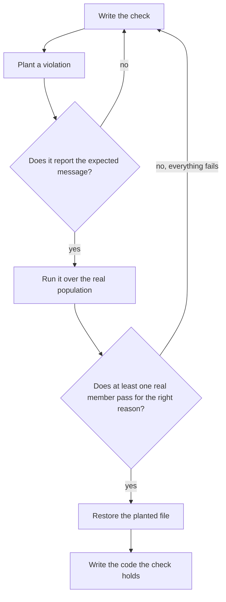

## A check matches a shape

A check enforces the shape of an anti-pattern, never a provider, a package, a filename or a threshold. The check and its message transfer: the same rule catches every future occurrence of the same shape, whatever library or symbol it happens to involve. This is how a small number of checks governs a growing tree without growing with it: the mechanism stays general and a registry holds the instances, as [D1·a mechanism and registry](#a-check-matches-a-shape-panel-a) draws. A check is placed by what it needs to see, as [D1·b placed by sight](#a-check-matches-a-shape-panel-b) draws, and it becomes active by being dropped in, as [D1·c dropped in](#a-check-matches-a-shape-panel-c) draws, with the contract [D1·d a rule contract](#a-check-matches-a-shape-panel-d) types and the finding [D1·e a finding](#a-check-matches-a-shape-panel-e) types. The shapes themselves are catalogued: [an anti-pattern is a decay path](architecture/DECAY.md#an-anti-pattern-is-a-decay-path) on the architecture page, and each carries the control whose absence lets it in.

### Mechanism general, data specific

A check matches a shape, its instances are data, and its message states the fix generically. The obvious check names the thing that went wrong, and the thing that went wrong is one instance of a shape that will recur under other names.

A rule bans one library's direct import by name, a second library with the same hazard arrives, and the rule says nothing because it never knew what it was protecting. A check that names an instance is correct on the case that motivated it and silent on the next case, which is the one it was written to prevent.

Gate constructs, never literals. Write the check for the class. Detect a construct in a syntax tree, a token sequence or a structural relation, never a name. Keep the instances as data in a registry the check reads, seeded only with instances verified to have the shape. Write the message as the shape and its one fix, in terms a reader on a different library understands unchanged. Make a rule active by dropping a file.

Read a check's message with the vendor, the path and the symbol removed. If it still says what is wrong and how to fix it, the check matches a shape. If it says nothing, the check matched an instance.

A shape whose classifying property is semantic rather than structural may carry a registry of classified instances. The split is strict: the mechanism reads the registry, the registry is the only place a specific name appears, and the message stays general whatever the registry holds.

### Two properties decide

Two properties decide whether a shape is gateable, and both must hold. Detection is deterministic: the bad shape is recognisable by [static analysis](ontology/PRINCIPLES.md#arch-static-analysis), an import edge, a manifest field, a path, never by a flaky runtime probe. Where the only way to catch a thing is to observe non-determinism at runtime, the work is to reduce it to the static shape that causes the non-determinism and gate that. Remediation is deterministic: there is one correct fix, statable without reference to any case. Where both hold the shape is gated. Where neither holds, it is surfaced as a question rather than hand-waved, and [the honest gaps](SHIP.md#the-honest-gaps) holds the ones surfaced so far.

### Placed by what it needs to see

A check is placed by what it needs to see. A rule over one file's syntax tree is the lightest, which is [the filesystem is the architecture](BUILD.md#the-filesystem-is-the-architecture) applied to the checks. A rule over relations between files reads a graph a prior stage wrote, and it fails closed when the graph is missing, so the stage order is load-bearing rather than incidental. A rule over a folder rather than a file walks from the root, and it needs an anchor, because a finding is reported against a file it visits: a placement finding attaches to a file inside the offending folder, and a declaration pointing at something absent attaches to the manifest that declared it. A check over the whole tree that is not per file is a stage of its own, and a rewriter verifies its own output by re-parsing before it writes.

### Discovered by shape, matched exactly

The mechanism that discovers rules is itself shape-based, and that is what lets the core stay untouched. A rule becomes active by declaring a contract a [registry pattern](ontology/PRINCIPLES.md#arch-registry-pattern) discovers; if any core file must learn its name, the design is wrong. The contract is checked by the gate against itself: a rule missing a message, declaring a severity of its own, or reaching for an untyped escape fails at lint rather than at load. The mechanism enforcing every other rule is the one most able to decay silently, because nothing else watches it, so the rule host passes through the gate it enforces.

Matching is exact rather than approximate. A check is derived, never guessed: a check that is usually right is wrong, because its misses are invisible and its false accusations punish the party who did the right thing. Authored tooling matches by tree traversal, token comparison or exact string, never by a pattern language that hides the grammar it implements. A hand-written scanner separates use from mention, so a detector never matches its own detection strings inside a report about them, and it tests the call form rather than a list of names, because a name list is a check naming instances and reopens the moment one more name exists.

### The contract, typed

The rule contract is small and typed, and its [type safety](ontology/PRINCIPLES.md#arch-type-safety) is what lets the registry discover it and the gate check it. A rule declares its kind, a description, an options schema and its messages, and it exports a function that returns a listener over the syntax tree. The message ids are a [closed vocabulary](ontology/PRINCIPLES.md#arch-closed-vocabulary), so a report naming an undeclared message fails to compile and a declared message nobody reports is a finding against the rule. The rule object is exported directly rather than bound to a name, because the filename is the rule's identity and a second name would be a second fact that has to agree. Severity is never declared by a rule, because there is exactly one.

What a rule emits is the finding detect, log, fix describes, typed: a closed action vocabulary, resolved operands, and a healed flag.

D1·a mechanism and registry

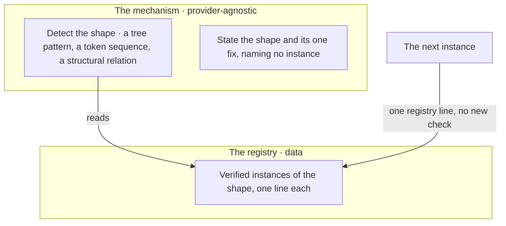

D1·b placed by sight

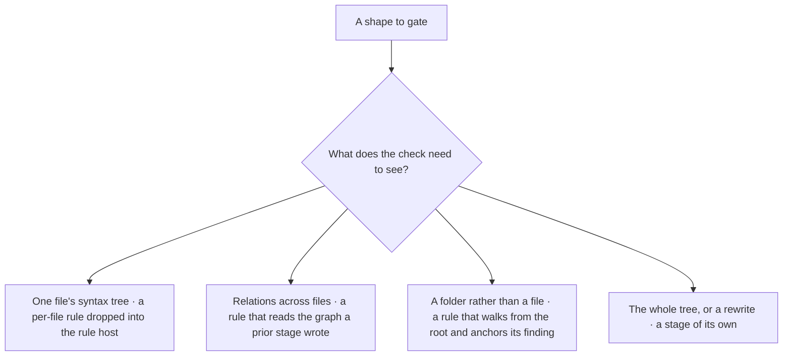

D1·c dropped in

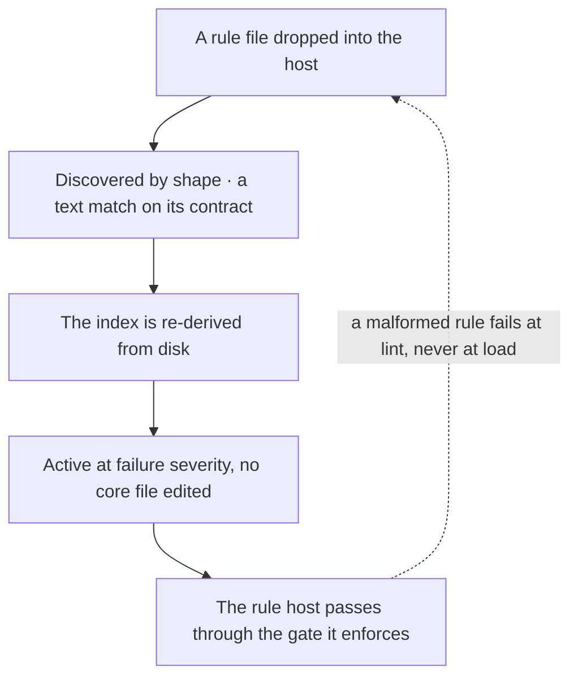

```typescript
export interface RuleContract<MessageId extends string> {
  readonly meta: {
    readonly type: "problem";
    readonly docs: { readonly description: string };
    readonly schema: readonly [];
    readonly messages: Readonly<Record<MessageId, string>>;
  };
  readonly create: (context: RuleContext<MessageId>) => RuleListener;
}

export default {
  meta: {
    type: "problem",
    docs: {
      description:
        "a single-instance resource is reached through its one owner",
    },
    schema: [],
    messages: {
      directReach:
        "A single-instance resource must be reached through its owner, which serialises access; route the call through the owner's API.",
    },
  },
  create(context) {
    return listener({
      callExpression(view, node) {
        if (reachesSharedInstance(view)) {
          context.report({ node, messageId: "directReach" });
        }
      },
    });
  },
} satisfies RuleContract<"directReach">;
```

```typescript
export type Severity = "error";

export interface Remediation<Action extends string> {
  readonly action: Action;
  readonly operands: Readonly<Record<string, string>>;
}

export interface Finding<Action extends string = string> {
  readonly rule: string;
  readonly path: string;
  readonly locus: {
    readonly line: number;
    readonly column: number;
    readonly member?: string;
  };
  readonly trail: readonly string[];
  readonly actual: string;
  readonly expected: string | null;
  readonly remediation: Remediation<Action>;
  readonly healed: boolean;
  readonly severity: Severity;
}
```

## Tools live in the tree

A capability gap is closed by a tool that lives in the tree with a command surface of its own, as [E1·a closing a gap](#tools-live-in-the-tree-panel-a) draws, which is how [the stance](START.md#the-stance)'s manual-step sentence is held by something other than a person. Which tools exist, what kind each one is, and why it exists follow from the method rather than from preference: a tool exists where a check needs an input, a person would otherwise repeat a step, or an eye would otherwise stand in for a measurement, as [E1·b a look tool](#tools-live-in-the-tree-panel-b) shows. An irreversible one reads its preconditions first, as [E1·c before an irreversible tool](#tools-live-in-the-tree-panel-c) draws. [Semantic operations](pag/GUIDE.md#tool-invocation) on the grammar page states the caller's half of the same contract: an instruction names an operation, and the binding names the tool.

### Every manual step is a missing tool

A capability gap is closed by a tool in the tree, never by a manual loop or a workaround. The cheapest response to a missing capability is to do the thing by hand, and by hand is where the variance lives.

A ten-minute manual procedure runs weekly for a year, differently each time, and the one week it is skipped is the week it mattered. A manual loop is faster the first time and slower every time after, and nothing records how it was done.

Extend the tool that already owns the concern before authoring a second one. Close a gap by authoring a tool with a declared command surface that lives in the tree. Give the tool a contract a reader sees before any effect: its flags declared, an undeclared flag refused, its help printed on request. Let a tool that allocates or rewrites values run in preview and show its diff before it applies. Where a mechanism requires a write to a surface, make that surface tool-writable before the requirement exists.

List every step you performed by hand this week. Each one is either a tool that does not exist yet or a tool that exists and was not used.

A one-off script belongs in a scratch location and is promoted into the tree the moment its [reusability](ontology/PRINCIPLES.md#arch-reusability) appears. The discipline is for anything a second run will need, and a scratch tool that gets a second run has already crossed that line.

The tools fall into kinds by what they stand in for. A generator stands in for a fact that would otherwise be typed by hand: an index, a catalogue, a document derived from a manifest, a rendered diagram, which is [derived state](VERIFY.md#derived-state) written by code. A validator stands in for a review that would otherwise be performed from memory: discovery of every route, leaks of internal names into public copy, the resolution of every reference a document makes. A fixer stands in for a repair that has [one correct answer](VERIFY.md#one-correct-answer). A probe stands in for an eye. Each kind is reached through [one chain](SHIP.md#one-chain), for the reason one chain gives.

The probe is the kind worth dwelling on, because the eye is the measurement most often trusted and least often right, the failure [it looked right](VERIFY.md#it-looked-right) names. A visual, numeric or timing defect is diagnosed by adding a probe that writes a value you can read before changing anything, [observability](ontology/PRINCIPLES.md#arch-observability) built for the one question, and by binary-searching the pipeline against a known-good control. Adjusting values across repeated runs proves nothing. So a look tool returns what the eye cannot: beside the screenshot, the console log the page produced while rendering, the layout the engine computed, and the markup that was actually in the tree. A screenshot the person hands over is the measurement, and the tool takes one capture per question, never a loop of relaunches, because the second capture is the tuning-by-eye the probe exists to replace.

A tool that performs an irreversible operation performs it without any standing precondition its code does not implement, and it reports success. So before such a tool runs, the standing instructions bearing on that operation are read against what the tool does, its code rather than its help, since a precondition it does not implement is one its help has no reason to mention. A missing step is taken by hand first and declared, then encoded in the tool so the next invocation does not depend on whoever remembers. A tool omitting a step before a deletion closes nothing later, because the operand is gone.

The mandate and the write path arrive in different changes, and only the mandate feels like the work. A mechanism is built, it needs an operand, the operand lives in a file, and nothing in building the mechanism asks how that file gets written. The requirement lands complete and the write it depends on is left to whoever hits it, by hand, with none of the protections a tool write carries. So the question what writes this is asked the moment a surface becomes an operand, and the answer is a tool path before the mandate that needs it.

E1·a closing a gap

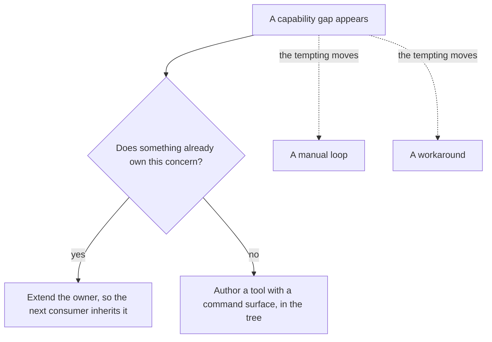

E1·b a look tool

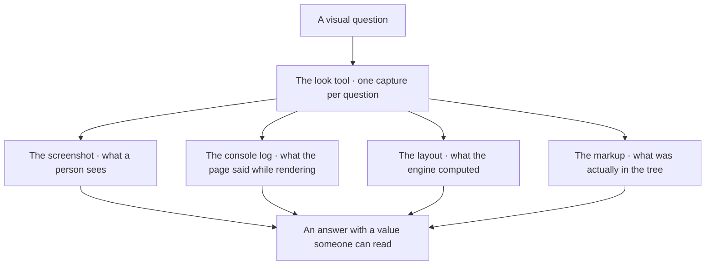

E1·c before an irreversible tool

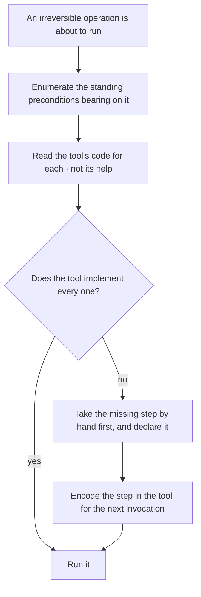

## One home

Every fact has one home, as [F1·c one limit](#one-home-panel-c) draws. Everything else that repeats the fact is a derivation from that home, as [F1·d one truth per concern](#one-home-panel-d) draws, or it is drift waiting for a day to happen. [Single source of truth](ontology/PRINCIPLES.md#arch-single-source-of-truth) is the principle, [DRY](ontology/PRINCIPLES.md#arch-duplicate-code) is its everyday name, and the rule applies to a number in a config, a location in a script, a word in a filename and a sentence in a document alike, each with one mechanism that holds it. For a location the mechanism is [F1·a a location declaration](#one-home-panel-a) and [F1·b the lookup](#one-home-panel-b). The architecture page states the same split as definitions own what, code owns how, and [derived state](VERIFY.md#derived-state) is the [verification](ontology/PRINCIPLES.md#arch-verification) side of it.

### One home per fact

One home per fact. A second appearance is a derivation, or it is a defect. The same fact gets stated in several places, and the places stop agreeing.

A limit lives in the tool's config, in a checker, in a script and in three documents. Someone changes one. The others keep enforcing the old value. A copy is cheaper to make than a derivation, and the two agree on the day of copying, so the drift is invisible until it costs something.

Make the second appearance a lookup rather than a copy, even where the copy is shorter. Pick the home for each fact. Derive every other appearance from it by a generator or a lookup. Delete every copy you cannot derive.

Change the fact at its home. Every other appearance must follow without a second edit. An appearance that stayed behind was a copy.

A declaration file is the one exempt place, because there the string is the declaration rather than a copy of one. Every consumer reads that file by key, and the exemption never widens to a second file.

Three truths carry most of the tree. One quality truth: every tool's configuration is built in memory from one declaration, a validator refuses a second one on disk, and a catalogued default means the declaration carries deviations only. One location declaration holds where every member lives, branches compose so a directory is spelled once, and every script resolves a location by key, so a rename is one edit; that is [configuration externalization](ontology/PRINCIPLES.md#arch-configuration-externalization), and a spelled path is [hardcoded configuration](ontology/PRINCIPLES.md#arch-hardcoded-configuration). One [closed vocabulary](ontology/PRINCIPLES.md#arch-closed-vocabulary) holds every word a filename may carry, and an undeclared word is an approved edit to the vocabulary rather than a naming choice.

A location is never spelled in a string, and the check for that has four shapes. A declared location spelled as a literal anywhere. The same location assembled from parts, with local constants, arrays and concatenation folded first. A literal tail appended to a lookup when a key already covers the whole path. And any path-shaped string with no anchor at all. Position is not a defence; a path in an array entry or a template is the same defect as a path in a value.

The location declaration has a shape that makes composition free. A branch declares its own place under a root key and every key beneath it resolves relative to that, so a directory is spelled once and a rename is one edit, and a branch that declares a root also resolves as a leaf, so a key keeps working after it gains children. The keys are agnostic and the values are yours: the governance stack reads the application by a fixed key whatever the directory is called, and renaming the directory is editing the value. The lookup is typed over the declared keys, so a key that does not exist fails to compile rather than resolving to nothing at run time. The declaration answers one question only, where a member lives and which governed roots sit inside it. What lives below a root belongs to the naming vocabulary and is never re-listed here.

```yaml
app:
root: <application-root>
member: <application-member> # → <application-root>/<application-member>
builds: <build-output> # → <application-root>/<build-output>
testing:
root: <test-root>
app: <application-suite> # → <test-root>/<application-suite>
governance:
root: <governance-host>
rules: <rule-host> # → <governance-host>/<rule-host>
reports: <report-root> # → <governance-host>/<report-root>
```

```typescript
type LocationKey =
  "app.root" | "app.member" | "app.builds" | "testing.app" | "governance.rules";

export declare function relativePath(key: LocationKey): string;
export declare function absolutePath(key: LocationKey): string;

const ruleHost = absolutePath("governance.rules");
const suite = relativePath("testing.app");
```

F1·c one limit

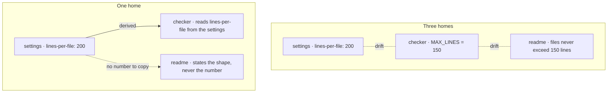

F1·d one truth per concern

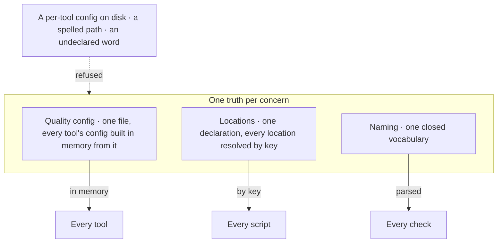

## The filesystem is the architecture

Every [extension point](ontology/PRINCIPLES.md#arch-extension-points) is a file in a directory. Adding a capability is adding a file. Removing one is deleting a file. A hand-maintained list of what exists is a registry in disguise, and a registry in disguise is where the next inconsistency lives, as [G1·b wired then collected](#the-filesystem-is-the-architecture-panel-b) draws. The same shape governs pages, rules, checks, templates and documents, the shape [G1·a the registry](#the-filesystem-is-the-architecture-panel-a) types: the [registry pattern](ontology/PRINCIPLES.md#arch-registry-pattern), filled by [auto-discovery](ontology/PRINCIPLES.md#arch-auto-discovery), is the [open/closed principle](ontology/PRINCIPLES.md#arch-open-closed) made physical, and a [plugin architecture](ontology/PRINCIPLES.md#arch-plugin-architecture) is what it grows into.

### Adding is adding a file

The filesystem is the architecture. A core file that must learn a name is the wrong design. Every switch over a kind, every record literal of variants and every import list in a composer is a list someone has to remember to update.

A new variant renders through the fallback branch because the switch that dispatches it never learned its name, and nothing reported that. A list is complete on the day it is written, and nothing compares it against the directory afterwards.

Make the directory the registry. Give each variant its own file that registers itself at module scope. Collect the files by pattern, never by name. Delete the switch, the lookup table and the list of imports that had to learn each new name. Where a barrel collects the files, let it be generated from the directory rather than written, and check it in both directions: an entry with no file, and a file with no entry.

Add a variant by adding one file and touching nothing else. If it needed a second edit, the registry is still in disguise.

A shape-discovered surface is the highest-risk artifact in any rename, because a suffix change silently changes what it collects. The collection is compared before and after every move, as [moves and renames](VERIFY.md#moves-and-renames) describes, and a count that dropped to zero is a broken move rather than a clean one.

A barrel that hand-writes its side-effect imports is the disguise reappearing one level down, and the same move governs the rules, as [a check matches a shape](BUILD.md#a-check-matches-a-shape) shows.

A generated index over authored data is regenerated from its source and drift-checked in the gate, never hand-edited. Every scan is depth-agnostic, because a scan anchored to a fixed depth reports pass over what sits one level below it. The index is checked both ways because one direction is decorative: the failure that occurs is a scan resolving a smaller set than it claims and the difference reading as coverage.

The registry has one shape wherever it appears, and the kind is a closed union, so a variant of an undeclared kind fails to compile and a lookup for one cannot be written. The same three parts appear whether the variants are pages, checks, codemods or document forms, which is why one primitive serves all of them and a second registry implementation is a duplicate rather than a convenience.

```typescript
export interface Variant<Kind extends string> {
  readonly kind: Kind;
  readonly applies: (subject: Subject) => boolean;
  readonly run: (subject: Subject) => Finding[];
}

export interface Registry<Kind extends string> {
  readonly register: (variant: Variant<Kind>) => void;
  readonly all: () => readonly Variant<Kind>[];
  readonly get: (kind: Kind) => Variant<Kind>;
}

export const checks = createRegistry<CheckKind>();

checks.register({
  kind: "unreachable-export",
  applies: isModule,
  run: findUnreachableExports,
});
```

G1·b wired then collected

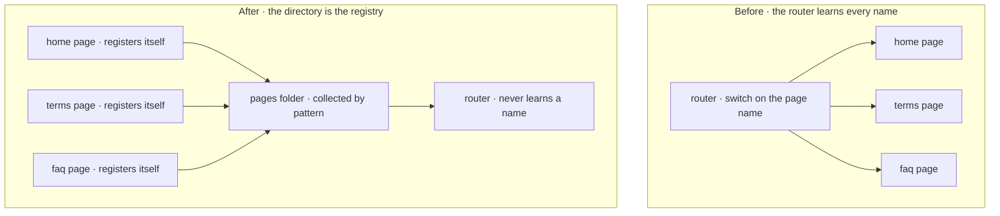

## Fail at the boundary

A failure surfaces at the boundary where it happens, as [H1·a masked and surfaced](#fail-at-the-boundary-panel-a) shows. [Fail fast](ontology/PRINCIPLES.md#arch-fail-fast) is the principle: no default, no fallback and no second path carries on as if nothing went wrong, and [H1·b the debt shapes](#fail-at-the-boundary-panel-b) draws what replaces each. [Execution joins the halves](architecture/PRINCIPLES.md#execution-joins-the-halves) on the architecture page gives errors their place in the language; this chapter is the practice at the boundary, and [never and always](architecture/DECAY.md#never-and-always) derives the pairs below.

### Loud at the boundary

Errors are language. A failure surfaces where it occurs, and no default masks it. Code that handles every edge case by carrying on hides the one case that should have stopped it.

A missing secret falls back to a placeholder. The deploy succeeds. The service starts talking to nothing, and the first sign is a customer. A fallback turns a loud failure into a quiet wrong answer, and a quiet wrong answer costs more than any crash.

Refuse fallbacks, dual paths and silent defaults. Fail at the first point a precondition does not hold. Say what you expected and what you found. Refuse a default value for anything the configuration should have supplied, and refuse a second path that carries on when the first one cannot. Delete replaced code in the same edit rather than marking it, because a marker is a second path with a label.

Remove one required input and run. The run must stop at the boundary that needed it, naming it. A run that continued has a fallback somewhere.

Fail-fast is for the boundaries of your own system. A surface a person meets still gets [graceful degradation](ontology/PRINCIPLES.md#arch-graceful-degradation), a real page rather than a bare error, and the failure it hides is logged where you will see it.

The debt shapes are named as pairs, never as a list of don'ts, because each pair states what to do instead. A deprecation marker, a tombstone or a compatibility shim is how [lava flow](ontology/PRINCIPLES.md#arch-lava-flow) and [zombie code](ontology/PRINCIPLES.md#arch-zombie-code) begin, and its pair is explicit removal in the same edit. Every write is checked for those markers before it lands, and only living code on one forward path survives; the accounting behind the pairs is [debt and leverage](architecture/DECAY.md#debt-and-leverage).

An environment variable never carries a fallback value, and a missing one fails at boot with its name; a placeholder there is a [hidden side effect](ontology/PRINCIPLES.md#arch-hidden-side-effect) waiting for production. A guard that fails open is itself a defect, because a guard exists to stop a state and a guard that lets the state through on error has stopped nothing, which is why [secure by default](ontology/PRINCIPLES.md#arch-secure-by-default) is the same rule seen from the [security core](ontology/SCHEMA.md#layer-security-core). A boolean flag reads as an explicit positive test rather than a negated default, so an absent flag hides the feature rather than enabling it by accident.

```javascript
const masked = env.HOST ?? "localhost";

const surfaced =
  env.HOST ?? fail("HOST is not set; the deploy needs a droplet");
```

H1·b the debt shapes

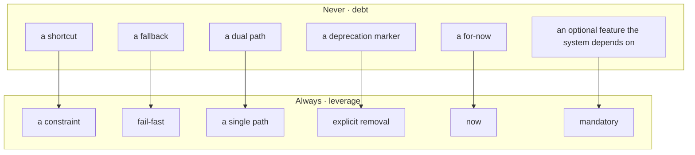

## Placement is a grammar

Where a file lives and what its name says are one grammar, [I1·a the grammar](#placement-is-a-grammar-panel-a). A container, an optional subject, a concern, then the file, as [I1·b one tree](#placement-is-a-grammar-panel-b) draws. The file's name ends with the concern of its folder, which is [concern-folder correspondence](ontology/PRINCIPLES.md#arch-concern-folder-correspondence). Every word comes from a [closed vocabulary](ontology/PRINCIPLES.md#arch-closed-vocabulary), placed as [I1·c where a word goes](#placement-is-a-grammar-panel-c) draws and declared as [I1·e the vocabulary](#placement-is-a-grammar-panel-e) types, and what the grammar claims and leaves alone is what [I1·d jurisdiction](#placement-is-a-grammar-panel-d) draws. A file with two concerns is a split and never takes a vague name, which is [one concern per file](ontology/PRINCIPLES.md#arch-one-concern-per-file), and only an irreducible overlap between two tags for one concern takes the domain-ward tag, the precedence [the layer spine](architecture/MODEL.md#the-layer-spine) on the architecture page holds. The grammar is what turns [separation of concerns](ontology/PRINCIPLES.md#arch-separation-of-concerns) from advice into a check, and the layer spine is the classification axis it places every concern on.

### One legal path per file

Placement is a grammar. A name is a claim about what the code does, verified against the code and never against the old name. Separation of concerns as advice produces a different tree from every person who follows it.

A helper folder appears. Then a utils folder. Then a second helper folder inside a feature. Six months later nobody can say where a new file goes. Nothing parses a path, so a wrong placement fails no check and reads as a preference.

Close the vocabulary and parse the path, rather than review placement by eye. Declare the closed vocabulary and the roots it governs. Parse every path against the grammar in a check. Resolve a collision sideways with a variant, never downward with another folder. Treat an undeclared word as a decision for a person, worked down a ladder: an existing word first, then the is-a test, then the filename is wrong, then the file is wrong. Create every file conformant, because there is no conversion queue.

Pick a file at random and derive its path from its contents alone. If the derived path differs from the real one, one of them is wrong, and the grammar says which.

Files an ecosystem names for you keep their names. The grammar governs what you author, not what your tools require, and a tree carrying another system's ownership markers is never declared a governed root, because its names are identifiers that system resolves at runtime.

### Slots, not words

[Positional slot resolution](ontology/PRINCIPLES.md#arch-positional-slot-resolution) rather than lexical. A word is read by the slot it lands in, so a concern tag is a legal subject: a registry of pools and a pool named base use the same word in two slots with no ambiguity. The one lexical bar is that a subject never equals its concern. A subject folder exists if and only if a container holds two or more sets of one concern that must not merge, because optional grouping would give classification two right answers and make placement uncheckable. [Sideways overflow](ontology/PRINCIPLES.md#arch-sideways-overflow) relieves the rest: a collision takes the filename's variant slot and breadth takes a sibling subject folder, and the [bounded nesting depth](ontology/PRINCIPLES.md#arch-bounded-nesting-depth) is why both slots exist.

### Jurisdiction is declared

[Declared jurisdiction](ontology/PRINCIPLES.md#arch-declared-jurisdiction) decides what the grammar reaches. A key in the configuration is a governed root, and no declaration means no enforcement, so a tree outside jurisdiction keeps its own names. A declaration is a claim verified against the disk: a root declared ahead of the folder governs nothing, fails nothing and reads as coverage. Material authored elsewhere is declared once as an upstream root, and that one declaration exempts it from the naming, tense and reference checks together, because all three fail such a tree and not one of the failures is a defect in it.

### Judgement classifies, the check parses

Classification is judgement and structure is machine-decidable, and the line between them is where the tooling stops. A check reports that a name does not parse or that a tag disagrees with its folder. It never decides what a file is; the layer spine on the architecture page carries the classification rule. The reshape of an existing tree is therefore a [manual identity migration](ontology/PRINCIPLES.md#arch-manual-identity-migration), one container at a time with the gate green between each, and [moves and renames](VERIFY.md#moves-and-renames) carries the rest.

### A vocabulary that proves itself

The vocabulary is one typed declaration, and its type is what makes it closed: each slot's legal words are a union derived from the data rather than written a second time, and a flat bucket is declared rather than inferred from shape.

The declaration then asserts its own [consistency](ontology/PRINCIPLES.md#arch-consistency) at compile time. A subject that is already a concern tag, a variant that is already a subject, or a concern whose layer is outside the spine fails to compile, so the vocabulary cannot go inconsistent without the whole gate refusing to load. A configuration that carries data and its own consistency proofs, and no reasoning, is the shape every closed vocabulary here takes.

```text
folder = <container> | <subject> | <concern>       one word, never a dot
file   = <subject>.<concern>.<ext>
| <subject>.<variant>.<concern>.<ext>        only when two files would collide

depth  = container(1) → subject(2, optional) → concern(3) → file
a role may be skipped, never repeated, never revisited
the file's parent is always the concern folder
the file's concern tag equals its parent folder
```

I1·b one tree

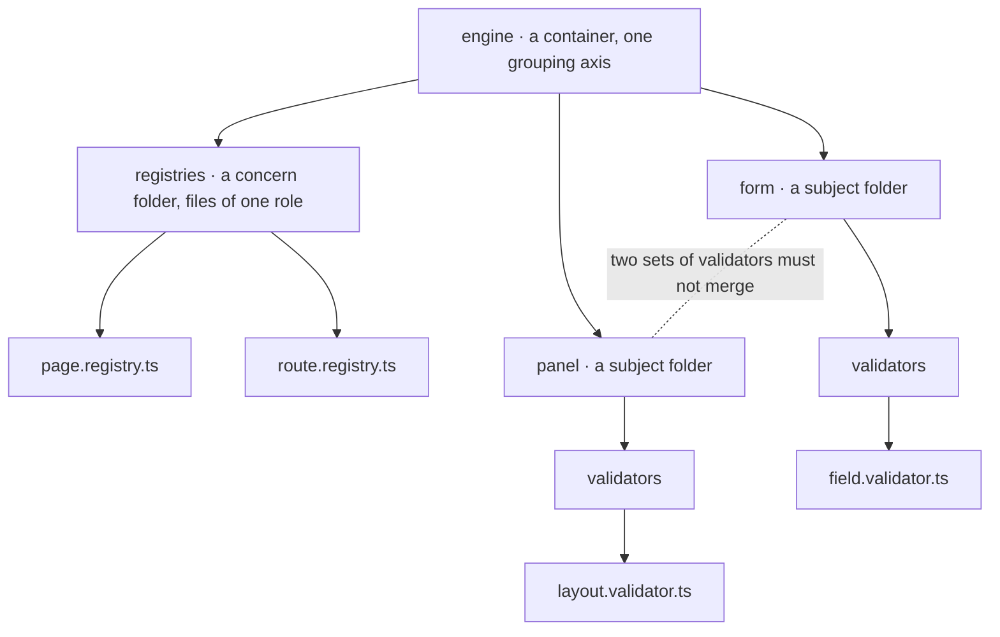

I1·c where a word goes

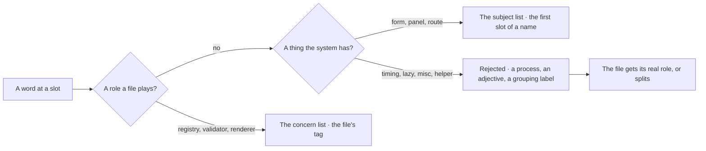

I1·d jurisdiction

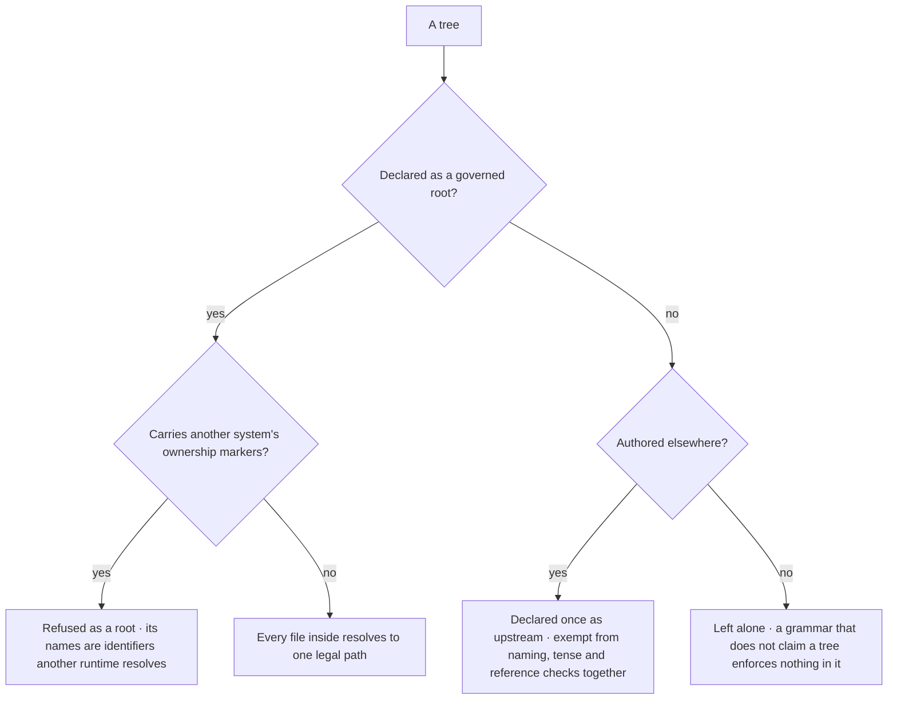

```typescript
export const LAYERS = [
  "domain",
  "application",
  "processing",
  "runtime",
  "infrastructure",
  "operations",
  "product",
] as const;

export const taxonomy = {
  containers: {
    "<governed-root>": ["<container>", "<container>"],
  },
  specialContainers: {
    "<governed-root>": ["<flat-bucket>"],
  },
  concerns: [
    { folder: "registries", tag: "registry", layer: "infrastructure" },
    { folder: "validators", tag: "validator", layer: "processing" },
    { folder: "strings", tag: "strings", layer: "product" },
  ],
  subjects: ["base", "<domain-noun>", "<domain-noun>"],
  variants: ["<facet>", "<facet>"],
  grammar: {
    separator: ".",
    maxDepthFromRoot: 3,
    compoundMarkers: ["test", "spec", "generated"],
  },
} as const;

type Config = typeof taxonomy;
export type Subject = Config["subjects"][number];
export type Variant = Config["variants"][number];
export type ConcernTag = Config["concerns"][number]["tag"];
export type GovernedRoot = keyof Config["containers"];

type Assert<Name extends string, Overlap> = [Overlap] extends [never]
  ? true
  : [Name, Overlap];

export const NO_SUBJECT_CONCERN_OVERLAP: Assert<
  "subject is already a concern tag",
  Extract<Subject, ConcernTag>
> = true;
export const NO_VARIANT_SUBJECT_OVERLAP: Assert<
  "variant is already a subject",
  Extract<Variant, Subject>
> = true;
export const EVERY_LAYER_DECLARED: Assert<
  "concern layer is not in the spine",
  Exclude<Config["concerns"][number]["layer"], (typeof LAYERS)[number]>
> = true;
```

Documentation is covered by [CC BY-SA 4.0](https://creativecommons.org/licenses/by-sa/4.0/)

© 2025 [Jay Baleine](https://linkedin.com/in/jay-baleine) - Disciplined AI Software Development

---

Chapters: [Start](START.md) · [Plan](PLAN.md) · [Build](BUILD.md) · [Verify](VERIFY.md) · [Collaborate](COLLABORATE.md) · [Ship](SHIP.md)
