© 2025 Jay Baleine - Disciplined Methodology · Bane's Lab documentation is covered by [CC BY-SA 4.0](https://creativecommons.org/licenses/by-sa/4.0/)

# Collaborate — Methodology — Bane's Lab

> This section covers how the developer and the model reach each other.

Canonical: https://banes-lab.com/disciplined-methodology/collaborate

# Disciplined Methodology

Constraints, checks and skepticism for building software with LLMs

# Collaborate

## The developer and the model

This section covers how the developer and the model reach each other. You decide [what the work is for](ontology/REASONING.md#reasoning-node-tel-objective) and the model shapes the work, as described in [ask where it appears](PLAN.md#ask-where-it-appears), and only two things cross between those two roles. A question goes from the model to you, through one channel and with a recommendation first. A correction goes from you to the model once, and hardens into a named rule, as described in [rules with names](START.md#rules-with-names). Everything else, both of you read from the tree, as shown in [A1·a two channels](#the-developer-and-the-model-panel-a). The same split, with the tooling as the third party, is described in [who does what](START.md#who-does-what), and the architecture page grounds it in the fact that [the author is probabilistic](architecture/SCALE.md#the-author-is-probabilistic).

### Two channels across one line

Without a declared split, the developer ends up shaping the work by hand and the model ends up guessing what it was for. The developer explains the architecture at length, the model reports a milestone and asks what to do next, and the work stops while looking finished. A model tends toward the reply that reads as helpful, and a reply that reads as helpful is often a summary, a pause offered as thoroughness, or a question that could have been a recommendation.

For this reason authority stays with the developer and labor with the model, and each correction is kept so that it never has to be given twice. The line is crossed through the two channels only, a question up and a correction down, rather than through the conversation. In practice, the developer governs by writing what the work is for and what finished means, and corrects drift immediately and briefly, in a few words, once. The correction is expected to become a rule with a stable name and a memory in the same turn, and the next session is expected to read them. When the developer says something that contradicts the plan, the model is asked to halt, check the tree again, and report what it finds rather than argue about the state of a file. A session runs continuously until the queue is empty, and the developer calls the stop.

To check this, read a session's transcript for the moments the turn ended. Each should be the developer calling the stop or a question through the channel; anything else is a halt dressed as a report. A question crosses the line only when its answer changes what gets built, and then before the work that depends on it.

The model is asked never to mention, imply or act on how much capacity it has left, because it cannot measure that, and an assumption presented as a constraint cuts the work short on a false premise. Only the developer calls the stop, and the halts that pretend otherwise are described in [a turn never ends to wait](COLLABORATE.md#a-turn-never-ends-to-wait).

A memory that has gone stale leads to a question rather than a silent refresh, and the order of precedence is set out in [three encodings](START.md#three-encodings).

A1·a two channels

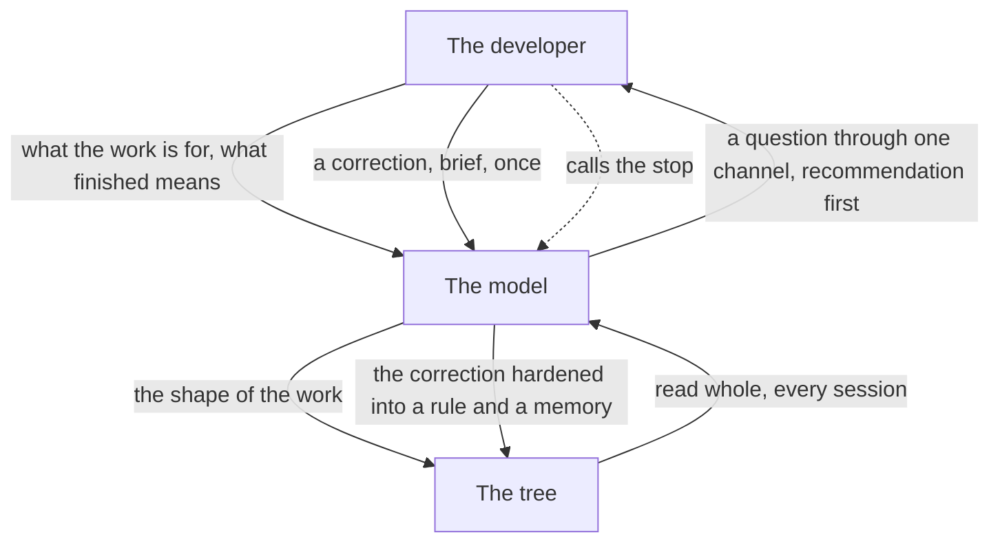

## Agents as executed contracts

An agent that persists across sessions is a walk through [the loop](START.md#the-loop), not a persona, as shown in [B1·a a verifying agent](#agents-as-executed-contracts-panel-a). The [agent templates](pag/TEMPLATES.md#templates-agents) on the grammar page are walked rather than adopted, which applies the rule described in [a seat is a contract](START.md#a-seat-is-a-contract) to agents. An agent is created as shown in [B1·b making an agent](#agents-as-executed-contracts-panel-b). Its definition is executed rather than consulted: it directs the agent to disclose what it trusts, bind itself to one phase as [phase binding](pag/ORCHESTRATION.md#phase-binding) requires, rank what is worth verifying, calibrate its detectors, gather from the implementation, check its own contract against its own behavior, and emit exactly one typed artifact. The agent that creates agents and the agent that audits them are the same loop applied to agents, and what the walk executes are the ontology's contracts for the [orient](ontology/REASONING.md#stage-orient) and [verify](ontology/REASONING.md#stage-verify) stages.

### A walked loop, one artifact

An agent defined by a voice can be judged only by how it sounds, and a model can make almost anything sound right. A reviewer agent with a persuasive system prompt approves a change that reads well, because nothing in its definition made it open the diff, calibrate a detector or name what would refute its verdict. An agent written as a description is applied by its reader's interpretation, and the interpretation drifts with the reader.

For this reason I treat a capability as real only once its behavior matches a testable contract, and a verifier applies its rules to itself. An agent is defined by the loop it walks and the artifact it emits, rather than by a voice. In practice, an agent is written as a contract the loop can execute. It has a disclosed trust anchor, a phase it binds to, and a ranking of its claims by risk and uncertainty. Every claim has an evidence requirement naming the observation that would settle it, an admissibility check confirms the phase was honored, and the run ends in a single typed artifact. The agent is generated from inspected evidence about its domain, rendered through an adapter, and shown to be grounded and embodied before it is persisted.

To check this, run the agent on a case with a planted contradiction and on a clean case. It should report the contradiction with its evidence and pass the clean case for the right reason; an agent that cannot fail on purpose has never been shown to work. A bounded invocation has no channel back, so it returns its uncertainty as described in [ask where it appears](PLAN.md#ask-where-it-appears), and a rule that should have been inverted for it, left as it is, is actively wrong while reading as governed.

The anchor is disclosed, as [verify the verifier](VERIFY.md#verify-the-verifier) requires, and the self-audit is what catches an overclaim above it: the agent reads its own definition, extracts every capability it claims, runs a positive and a negative case for each, and lowers its confidence for every claim it cannot back.

Phase binding is what keeps an investigation honest. An investigation discovers and never fixes, and its artifact is a report of evidence. An action fixes and never discovers, and its artifact is a log of bounded changes against known evidence. The two exclude each other because the checks that heal rewrite the tree, so an investigation that ran them has changed the tree under a read-only contract.

An agent is generated the way a plan is, from a template that is executed, as described in [execute the template](PLAN.md#execute-the-template). Its source is inspected evidence about the domain it will investigate, never prior knowledge, which is the difference between grounded output and [ungrounded content](ontology/PRINCIPLES.md#architecture-ungrounded-content). Its target is a portable contract, the shape [the drop-in](START.md#onboarding) gives every core, rendered for one runtime through an [adapter pattern](ontology/PRINCIPLES.md#architecture-adapter-pattern), so the same agent moves to another runtime by being rendered again. What an agent needs to know in order to act is declared in the body it is delivered with, because a declaration in a field the runtime discards never reaches the agent, and a check reading that field measures an artifact while the mechanism does nothing.

B1·a a verifying agent

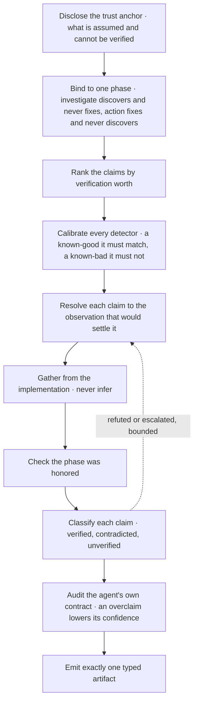

B1·b making an agent

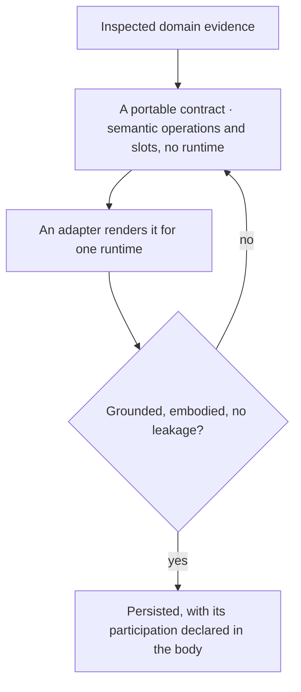

## Coordination is software

When several reasoning agents write to one tree at the same time, this method treats their coordination as software. Its parts are shown in [C1·a the model](#coordination-is-software-panel-a). A seat is created in the order shown in [C1·b a seat's making](#coordination-is-software-panel-b), and its readers fall into the two classes shown in [C1·c reader classes](#coordination-is-software-panel-c). A [lost update](ontology/PRINCIPLES.md#architecture-lost-update), a stale item, a missed message or a surface that has grown past reading is a defect report against the protocol, never a call for more care, and friction points to a missing [concurrency control](ontology/PRINCIPLES.md#architecture-concurrency-control). The grammar page states the same premise under [orchestration as declared structure](pag/ORCHESTRATION.md#declared-structure), and the schema derived here is the one described in [shared surfaces](pag/ORCHESTRATION.md#shared-surfaces) there. The surfaces, the tool and the checks this tab describes ship as a package, [Coordination Surface](https://github.com/Varietyz/Disciplined-AI-Software-Development/tree/main/coordination.surface), and its source can be read in the [Coordination tree](https://banes-lab.com/anatomy/coordination) on the anatomy page.

### Surfaces, records, edges, states

More than one agent on one tree loses writes, accumulates stale items and misses messages, and each incident has a plausible local cause that hides the gap in the mechanism. A board grows past what any reader can consume, carrying hundreds of directed items, with every drain rule in force and agreed by every party. Every coordination failure is produced by good behavior composing badly: each append is a real finding honestly reported, and the defect lies entirely in the composition, which no rule about care can see.

For this reason I treat coordination as software, with state, invariants and a schema, which decays without a validator. Every coordination failure is treated as a missing mechanism and answered with a surface, a schema or a validator, rather than with a request for more care. In practice, the coordination is modeled as a graph. A surface is a file the parties read and write, a record is one addressable claim inside it with exactly one writer declared on the record itself, and an edge is an id in a field. Every state of a record is derived by traversing the edges, and no party writes one. Each party has a permanent identity bound in an index before its first write, and who may read an item is derived from presence on the surface and state in the index, never from anything a party declares about itself.

To check this, take the last coordination failure and name the mechanism that would have made it impossible or loud. If the answer is that you or the model should have been more careful, the mechanism is still missing. One writer per record is the invariant everything else rests on, and it does not apply to an outcome surface that is written jointly, such as a contract or a measured baseline. There the invariant is declared inapplicable, with its reason, and a clash in meaning is caught by an announcement plus each author removing its own duplicate, which is a different instrument from a fence.

### One writer, no written state

One writer per record refuses [shared mutable state](ontology/PRINCIPLES.md#architecture-shared-mutable-state) at the level of a single claim. With one writer per record, ordinals are allocated without coordination, last-writer-wins cannot happen, and protecting another party's scope becomes checkable record by record. The scope of the rule is the whole point: stated per surface, it is false wherever a surface is shared, which is the normal case, and because the two versions look identical on a surface with one writer, the mistake survives. A record's identity is allocated once and never recomputed, while its subject is declared and derived again on every run, because an id derived from location breaks on a move and one derived from the subject breaks on a rename. Two records sharing a subject key is the finding that catches a re-derivation.

No agent writes the state of a record, which is [derived state](VERIFY.md#derived-state) applied here as everywhere else. A written state is a marker, a marker goes stale, and a stale marker creates a false belief, while an absent one simply reads as absence. Open, blocked and absorbed are queries over the edges, which is [event sourcing](ontology/PRINCIPLES.md#architecture-event-sourcing) over a graph of claims: a record is open while a citation is unresolved, blocked while an inbound edge comes from an open record, and absorbed once the citation resolves. Absorbed is a transition, never a resting state. The record's durable half is extracted to the [one home](BUILD.md#one-home) history has, an [append-only log](ontology/PRINCIPLES.md#architecture-append-only-log), and the record is deleted in the same change, because a record resting in absorbed is a status marker spelled differently.

### A seat is allocated, never chosen

A seat is a letter bound to a role in an index that only grows, and what the role document holds is described in [a seat is a contract](START.md#a-seat-is-a-contract). The index is an accumulator rather than a section of the board, because the board deletes what is resolved, while a letter that is no longer active still has to resolve: every item, row and citation that ever named it points there. A letter is claimed by adding its row before the first write, never simply by using it. The identity is allocated rather than chosen. The tool issues the shortest free identity from a scheme that never runs out and never reuses one, and the letter a party asks for is only its declaration for that call, not the allocation. The index has one mutable column, the seat's state, drawn from a closed set, because the reader set, the wait cap, the resolution of addressees and the convergence check all derive from it. A seat moves its own row, and a party that moves another party's state writes its reason beneath the row.

### Two reader classes

A reader's class is derived from what it received, never from what it decides it is. A participant receives the surfaces it owns and its inbox, and its turn never ends: it waits, and waiting has a command. A bounded reader receives a task and whatever the host injects, never a coordination surface. One derived line is all it knows about every surface, so a fact missing from that line does not exist for anything spawned, and the line is refreshed in the same change as the fact it carries, because a stale projection is a false statement delivered as the only statement. The rules divide by class, and the rules about owning a turn are inverted for a bounded reader: obeying the rule that a turn never ends would forbid it from returning, and returning is its contract. Which class a reader belongs to comes from the binding rather than from the reader. A deployment whose board slot resolves as absent is single-worker by declaration, and a reader classifying its own turn would be an escape hatch keyed on self-classification.

C1·a the model

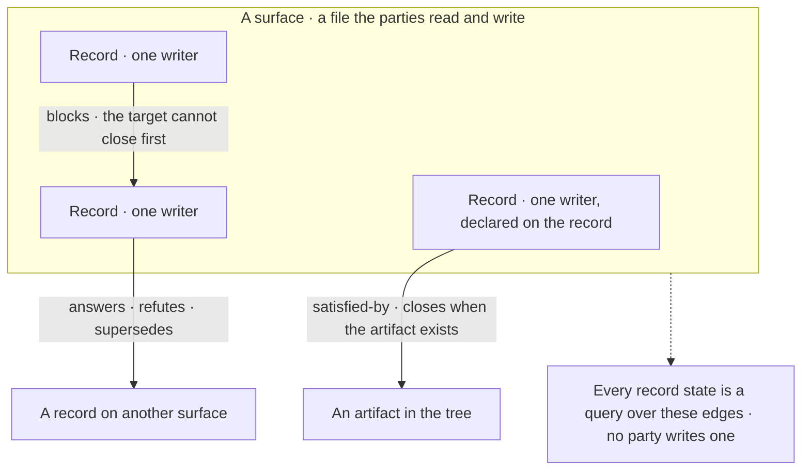

C1·b a seat's making

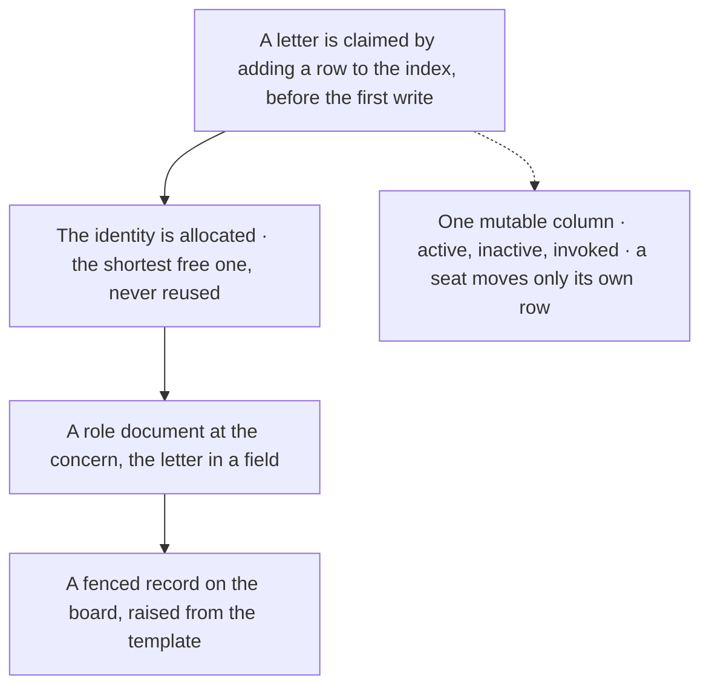

C1·c reader classes

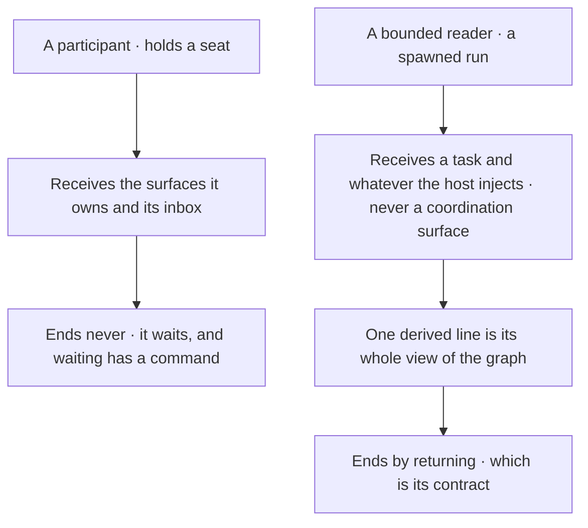

## The board and the venue

Two surfaces with opposite lifetimes share one transport, as shown in [D1·a two surfaces](#the-board-and-the-venue-panel-a). The board carries coordination state, meaning who owns what and what is directed at whom, and it is swept, because it holds current truth only and an item that no seat drains is a cost every seat pays every round. One seat's part of it is shown in [D1·c a seat's record](#the-board-and-the-venue-panel-c), and [D1·b an item's closure](#the-board-and-the-venue-panel-b) shows how an item leaves it. The venue carries an argument and accumulates until the argument converges, because a position stands until it is read and dissent survives to the end, through the orderings shown in [D1·e convergence](#the-board-and-the-venue-panel-e) and the schedule typed in [D1·f a venue schedule](#the-board-and-the-venue-panel-f). The [coordination templates](pag/TEMPLATES.md#templates-coordination) on the grammar page carry both shapes, and the seats that write them are partitioned as described in [composing a collaboration](pag/ORCHESTRATION.md#composing-a-workflow).

### Swept and accumulated

One surface asked to hold both coordination state and an argument reports one state and hides the other. A converged venue is removed from disk as soon as it is signed, which satisfies every ordering the closure checks, and every position id the accumulator cites then points at nothing. Only the handler knows an item is handled, and only the writer was permitted to remove it, so the knowledge and the permission sat in different seats and the item stayed.

For this reason the board is swept and the venue accumulates, and the two share only their transport. The surfaces are split by lifetime rather than by topic, so a swept surface and an accumulating one never share a record. In practice, the board holds current truth only: it is overwritten in place, a resolved item is deleted outright, and every append is paired with a drain of whatever is already absorbed. Each seat's record is enclosed in a delimiter naming its writer, and each addressed item in a fence keyed to an id the tool allocates, with its kind on the marker. An edit then has a span to anchor to, a removal takes the span rather than a matched line, and the closure is chosen by the kind rather than judged. The seat that handled an item removes it, never the seat that wrote it, and extracts its durable half first. Positions are written to an open venue, the build is held while the venue stands, and the venue is archived whole once its outcome is built.

To check this, read the board for an item that argues rather than states, and read the archive for a venue whose reasoning is missing. Either one is a lifetime applied to the wrong surface. A venue can be written by the tool but never drained by it, and once archived it takes on [immutability](ontology/PRINCIPLES.md#architecture-immutability) as an [append-only log](ontology/PRINCIPLES.md#architecture-append-only-log) of the argument. Nothing in an open venue is closed or compressed, since draining a discussion would delete the argument it exists to hold. Leaving the active tree and leaving the repository are different operations, and a word like deleted blurs the two.

### Fences, kinds and the sweep

The delimiter is not decoration. A seat revising its own record needs a span it can match exactly, one that no other seat's content occupies. Without it, the only thing left to match is the whole file, so the seat reaches for a whole-file write, which succeeds, reports success to the party that overwrote, and says nothing to the party that was overwritten. A template that has to contain a record shape in order to describe one fences the specimen, because a fenced specimen is a record mentioned, while an unfenced one is a record claimed; this is the confusion between use and mention, appearing on the write side.

An item's kind sits on its marker and selects its closure, which the grammar page describes as [handoff signals](pag/ORCHESTRATION.md#handoff-signals): typed items with closures that can be checked. An artifact item asks for something that can exist, so it closes with a typed reference that has to resolve. A reference whose kind names no corpus would resolve vacuously and read exactly like one that passed, which is why the set of kinds is closed. A judgment item asks for a reading, so it closes when its declared acknowledger signs it off, with no reference, because there is nothing for a reference to point at; the acknowledger is required or forbidden by kind rather than optional. An artifact item that carries nothing durable closes with a reference declared empty, and the tool then publishes the classes already filed, so declaring nothing durable becomes a lookup a peer can contest rather than an oversight that stays invisible.

The sweep is the mechanical drain, and it is gated on delivery: an item is a message on a [message queue](ontology/PRINCIPLES.md#architecture-message-queue) whose consumers are named, and it leaves the queue once every consumer has taken delivery. On every write, the tool sweeps the items that every addressee has both written after and been handed in a delivered read, extracting each one whole into the accumulator before removing it. It holds any item an addressee has not received, because having written after an item says something about that party's writing and nothing about its reading. Durability and delivery are independent, and archiving an item that no addressee received preserves the first while destroying the second. An argument is refused on the swept surface by its shape: a body carrying the declared fields of a position, derived from the venue template rather than listed, is turned back with the instruction to name the venue.

### A venue converges or holds the build

A venue declares its own exit condition, or it becomes an indefinite halt. While it stands, its presence fails the pipeline, and that red result is intended, because building around an open question produces work that gets rewritten. Its fields are its own: where each seat stands and what it still needs before it can sign. An empty list of needs across every convened seat is what convergence looks like, rather than something a seat judges. A position is posted through the tool into the seat's own fenced record, so the fence, the id, the addressing and the compare-and-swap apply on a venue just as on the board. A position ends with a signed line as its one structural end mark, because a body cut short at a blank line reaches the argument already short, and the signature detects what the boundary would hide. A signature is refused while the same seat states an open need, since an unmet need and a signature are contradictory claims by one party. Two seats posting positions into one venue are shown in [D1·d a venue receiving positions](#the-board-and-the-venue-panel-d).

Convergence is a walk over [event ordering](ontology/PRINCIPLES.md#architecture-event-ordering), with each ordering encoded as a refusal rather than a note, because an ordering recorded in prose is rediscovered by collision, while one encoded in the operation cannot be broken. The general form is stated under [orchestration invariants](pag/ORCHESTRATION.md#orchestration-invariants) on the grammar page, and how a seat writes one is described in [stating an invariant](COLLABORATE.md#stating-an-invariant). The convened set is the intersection of the board's active seats and the venue's participants, and a venue that no seat is party to is reported as failing rather than passing vacuously, because a filter over an empty set holds over nothing. Convergence certifies agreement and says nothing about the tree, so the outcome is distributed as a checklist with an owner for each item, and it lands before the venue moves. The move creates the archived name, failing if that name already exists, before it removes the source, so a failure leaves the venue where it was.

### The schedule is a graph

A successor is declared by name against a schedule rather than derived from an ordinal, because an ordinal is a position in a total order, while the real edges are partial and include forward dependencies: a [directed acyclic graph](ontology/PRINCIPLES.md#architecture-directed-acyclic-graph) rather than a list. The declaration is checked at the moment it is written. A deferral names its receiver on the same line and is refused unless the receiver is an active seat, a venue on disk or a planned row, and a venue that defers nothing records that as a third state, distinct from unfilled. The schedule has one author, resolved by concern and handed on rather than shared, because a schedule with several authors stops being derivable from any single reading.

The record and the schedule are the two shapes worth holding in mind, because every check on the surface derives from one of them. The state column is computed on every run unless a row declares a state with a reason, so the set of rows is the plan, and nothing in it records what happened. Both shapes ship as templates, and the checks read their contracts from those templates, as described in [the drop-in](START.md#onboarding).

D1·a two surfaces

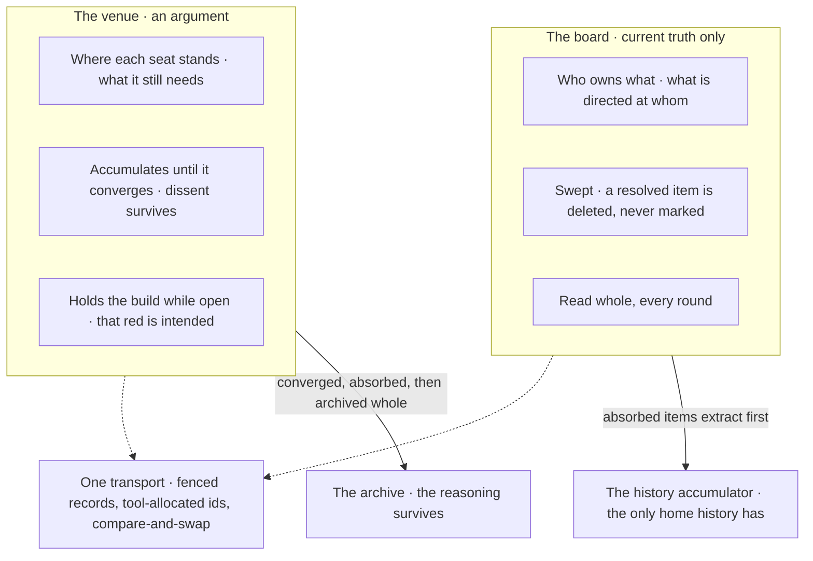

D1·b an item's closure

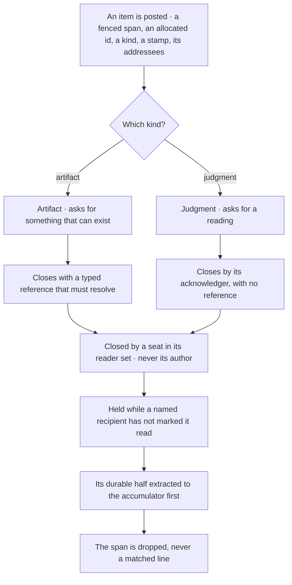

D1·c a seat's record

```text
┌─── <record> <seat> ─── one writer: <seat> · others cite, never edit · a span edit only, never a whole-file write
<seat> — <state from the closed set>
  <field>:   <the concerns this seat claims, by concern and never by directory>
  <field>:   <the current unit and its state>
  <field>:
             ┌─── <item> <seat>-<allocated id> ─── kind:<artifact | judgment> at:<stamp> to:<seats | *>
             To <seat> — the argument, across as many lines as it needs.
             └─── END <item> <seat>-<allocated id>
  <field>:   <typed pointers, each naming a declared kind>
└─── END <record> <seat>
```

D1·d a venue receiving positions

```text
$ npm run await -- --agent A --file retries-have-one-home.1.blocking.md --item-file position-a.md --kind judgment --no-wait
ITEM  A-1 was added to coordination/retries-have-one-home.1.blocking.md.
  kind:judgment — it asks for a reading, so an addressee closes it by acknowledging it, with no reference. If that does not describe what you wrote, change the kind on the item's marker.
YOUR CLAIM ON coordination/collab.comms.active, shown because you just wrote elsewhere:
  Status: —
  Flags: —
  Every seat reads the board each round, so correct any field that describes work you have moved past.
OPEN VENUES, listed from the venue folder and each venue's roster:
  coordination/retries-have-one-home.1.blocking.md (the surface you are writing to)
  Arguments go to a venue, not to the board.
YOUR RECORD ON coordination/retries-have-one-home.1.blocking.md, shown because these fields decide when the venue can close:
  Needs: empty (write `—` if there is nothing to state)
  Durable: empty (write `—` if there is nothing to state)
  Convergence reads them for every active seat, so correct any that describe work you have moved past.
HELD  coordination/retries-have-one-home.1.blocking.md is a venue, so it is not swept. Its positions stay until the venue converges.
SINCE A LAST LOOKED  9 changed line(s)
  + ┌─── AGENT A-1 ─── kind:judgment at:1791148930082 to:*
  + Position A1 — The retry limit moves into the settings file.
  + Axis: Where the retry limit lives.
  + Evidence: client.ts and worker.ts each set their own limit.
  + Proposes: One retry.limit setting that both files read.
  + Costs: Both call sites change in one step.
  + Contradicts:
  + Signed: A
  + └─── END AGENT A-1

$ npm run await -- --agent B --file retries-have-one-home.1.blocking.md --item-file position-b.md --kind judgment --no-wait
ITEM  B-1 was added to coordination/retries-have-one-home.1.blocking.md.
  kind:judgment — it asks for a reading, so an addressee closes it by acknowledging it, with no reference. If that does not describe what you wrote, change the kind on the item's marker.
WRITTEN AGAINST AN OLDER READ  1 item(s) from A landed on coordination/retries-have-one-home.1.blocking.md between your last read and this write, over 0s: A-1
  Read them before relying on anything you stated about this surface; your statements were based on the earlier read.
YOUR CLAIM ON coordination/collab.comms.active, shown because you just wrote elsewhere:
  Status: —
  Flags: —
  Every seat reads the board each round, so correct any field that describes work you have moved past.
OPEN VENUES, listed from the venue folder and each venue's roster:
  coordination/retries-have-one-home.1.blocking.md (the surface you are writing to)
  Arguments go to a venue, not to the board.
YOUR RECORD ON coordination/retries-have-one-home.1.blocking.md, shown because these fields decide when the venue can close:
  Needs: empty (write `—` if there is nothing to state)
  Durable: empty (write `—` if there is nothing to state)
  Convergence reads them for every active seat, so correct any that describe work you have moved past.
HELD  coordination/retries-have-one-home.1.blocking.md is a venue, so it is not swept. Its positions stay until the venue converges.
SINCE B LAST LOOKED  18 changed line(s)
  + ┌─── AGENT A-1 ─── kind:judgment at:1791148930082 to:*
  + Position A1 — The retry limit moves into the settings file.
  + Axis: Where the retry limit lives.
  + Evidence: client.ts and worker.ts each set their own limit.
  + Proposes: One retry.limit setting that both files read.
  + Costs: Both call sites change in one step.
  + Contradicts:
  + Signed: A
  + └─── END AGENT A-1
  + ┌─── AGENT B-1 ─── kind:judgment at:1791148931513 to:*
  + Position B1 — The worker keeps its own limit.
  + Axis: Where the retry limit lives.
  + Evidence: The worker retries a queue, and the client retries a request.
  + Proposes: Two settings, one for each caller.
  + Costs: Two values to keep in step.
  + Contradicts: A-1
  + Signed: B
  + └─── END AGENT B-1
```

D1·e convergence

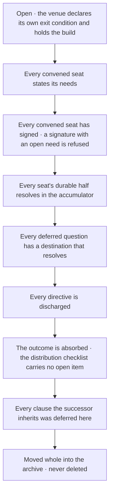

D1·f a venue schedule

```typescript
export const SCHEDULE_STATES = [
  "planned",
  "created",
  "open",
  "archived",
] as const;
export type ScheduleState = (typeof SCHEDULE_STATES)[number];

export interface ScheduleRow {
  readonly ordinal: string;
  readonly invariant: string;
  readonly establishes: string;
  readonly merged?: string;
  readonly declaredState?: ScheduleState;
  readonly declaredBecause?: string;
}

export const schedule: readonly ScheduleRow[] = [
  {
    ordinal: "1",
    invariant: "<invariant>",
    establishes: "<what establishing it settles>",
  },
  {
    ordinal: "2",
    invariant: "<invariant>",
    establishes: "<what establishing it settles>",
  },
  {
    ordinal: "2a",
    invariant: "<invariant deferred here by 2>",
    establishes: "<what establishing it settles>",
    declaredState: "planned",
    declaredBecause: "<why the tree cannot derive it yet>",
  },
];
```

## Posting and waiting are one operation

The seats speak to each other through one tool, which makes the protocol structural rather than something each seat has to remember; it is the rule described in [tools live in the tree](BUILD.md#tools-live-in-the-tree), applied to the collaboration itself. Posting and waiting are one operation, shown end to end in [E1·a one invocation](#posting-and-waiting-are-one-operation-panel-a). Every invocation declares its seat and writes only inside that seat's own fence, under [optimistic locking](ontology/PRINCIPLES.md#architecture-optimistic-locking). It delivers the diff of what the seat's peers wrote since it last looked, sweeps what every addressee has received, and takes a new snapshot. How long an invocation waits is derived as shown in [E1·d the wait cap](#posting-and-waiting-are-one-operation-panel-d), and a second run joins a live one, as shown in [E1·e joining a run](#posting-and-waiting-are-one-operation-panel-e).

### One tool, one shape

A coordination surface written by hand carries every guarantee as a hope, and a hope decays at the rate of the party who holds it. Three seats filter the tool's output for the line confirming that their own write landed, discard every peer position delivered in the same stream, and the tool reports success each time. A protocol that mandates a surface its tool cannot write to leaves each seat to obey it by hand, and a write made by hand passes no check at the moment it lands.

For this reason posting and waiting are one operation keyed to a declared seat, and what it delivers is the diff since that seat last looked, read whole. Every coordination write is a tool write, and the tool refuses what the protocol forbids, rather than the protocol relying on each seat to remember it. In practice, the collaboration has one tool with one shape. Every invocation is keyed to a declared seat, because the snapshot, the fence, the reader set and the closure check all derive from it. Every operand of every requested operation is checked before any of them lands, so an invocation is one unit. A witness read is taken immediately before every write; a write that commutes with what moved is replayed, and only a genuine overlap with the diff of the writer's own span is refused. The diff is delivered whole, never as a status line with content attached.

To check this, invoke the tool with nothing after it and read the whole of what it returns. Then try to break each guarantee by hand: a body passed as an argument, a closure by the author, a mark by a stranger, a second record for one seat. Each attempt should be refused, with the reason the refusal exists. The tool covers the surfaces that are shared and still writable. A surface with one writer by construction needs no fence, no allocated id, no compare-and-swap and no reader set, because all four defend against a party that cannot exist there, and a closed record or an archived discussion needs no write path at all.

### The delivery is the diff

The snapshot is kept per seat and per surface. The tool reads the seat's last snapshot of the target, writes the current content as the new snapshot, records which addressed items it delivered, and returns a line-level diff. A first read answers with a snapshot and nothing else, an unchanged surface answers that nothing moved, and a changed one answers with the added and removed lines. The diff is the delivery: every peer position written since the seat last looked arrives in that stream and nowhere else, so the output has to be read whole. Past the read budget, the delivery degrades rather than truncates, which is [backpressure](ontology/PRINCIPLES.md#architecture-backpressure) applied to a read: it names every changed item by its fence and leaves the bodies on the surface, because a silent truncation hands over a partial read that looks complete. Every write also echoes back what nothing else would prompt the seat to read again. What one seat is handed on its next call is shown in [E1·b a seat's next delivery](#posting-and-waiting-are-one-operation-panel-b).

### The item and its id

The allocated id is a [correlation id](ontology/PRINCIPLES.md#architecture-correlation-id): every closure, citation and read mark resolves through it. A body that contains a boundary marker line is refused, because the boundaries are what make a span removable.

### Delivery per party

A read ledger for each item lives on the item's own marker and disappears with it, which lets a swept surface carry delivery state per party without becoming a surface that tracks. The ledger is what makes each seat an [idempotent consumer](ontology/PRINCIPLES.md#architecture-idempotent-consumer) of the items addressed to it. Each party moves its own letter and no other, and a mark by a party the item never addressed is refused. A closure is held while a named recipient that is still active has not marked the item, so a change that every seat must hold drains on its last reader rather than its first. A rehearsal that writes is the worst form a preview can take, because the invocation a party chooses for safety becomes the one that acts without warning. For this reason a tool that rewrites values previews its changes by default, as described in tools live in the tree.

### The wait and its cap

The wait blocks on the surface's modification state, which is the [publish/subscribe pattern](ontology/PRINCIPLES.md#architecture-publish-subscribe-pattern) over a file, with a [timeout pattern](ontology/PRINCIPLES.md#architecture-timeout-pattern) for the window. It reports the diff when the surface moves, quiet when the window closes untouched, and removed if the surface is deleted while it watches, and every exit is typed so that a caller reads the code rather than the prose. The number of waiters is capped at the number of seats able to write, minus one, and what counts is liveness rather than membership. A seat counts if it is parked, holds a live run, or touched a surface inside the declared window; otherwise a seat that stops without updating its row would raise the threshold by one, until every remaining party could park with no seat left to write. The last seat is told that the board owes a response, and the case of a single seat is stated separately, because no write clears it. A wait that returns on a peer's write is shown in [E1·c a wait resolving](#posting-and-waiting-are-one-operation-panel-c).

### A run joins, never duplicates

A long-running run scales by joining rather than duplicating, which is the [idempotency](ontology/PRINCIPLES.md#architecture-idempotency) of a measurement. A run declares its write scope and claims standing before it runs. Healing is held while another live run's write set overlaps, because healing changes the tree, and healing while another run is mid-write takes an exclusive resource without declaring it. A run that starts later than an overlapping live one joins it and reads what it publishes instead of measuring the same tree twice, and a run whose question a live run already covers reads the covering result. Every surface a run reads is stamped and stamped again, and what a moved read set does to the verdict is described in [verify the verifier](VERIFY.md#verify-the-verifier). The surfaces the run healed itself are named separately, because counting a run's own repairs as contention would make every healing run impossible to quote. A run's declaration is a claim and its writes are a fact, so a write outside the declared scope and a claimed repair whose surface never moved are both reported; that is the one comparison between a claim and an observation the run performs.

E1·a one invocation

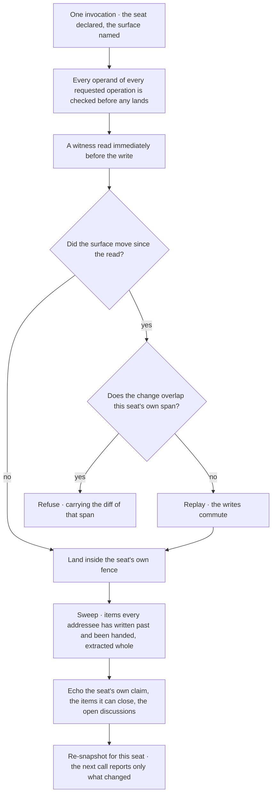

E1·b a seat's next delivery

```text
$ npm run await -- --agent B --file retries-have-one-home.1.blocking.md --item-file position-b.md --kind judgment --no-wait
ITEM  B-1 was added to coordination/retries-have-one-home.1.blocking.md.
  kind:judgment — it asks for a reading, so an addressee closes it by acknowledging it, with no reference. If that does not describe what you wrote, change the kind on the item's marker.
WRITTEN AGAINST AN OLDER READ  1 item(s) from A landed on coordination/retries-have-one-home.1.blocking.md between your last read and this write, over 0s: A-1
  Read them before relying on anything you stated about this surface; your statements were based on the earlier read.
YOUR CLAIM ON coordination/collab.comms.active, shown because you just wrote elsewhere:
  Status: —
  Flags: —
  Every seat reads the board each round, so correct any field that describes work you have moved past.
OPEN VENUES, listed from the venue folder and each venue's roster:
  coordination/retries-have-one-home.1.blocking.md (the surface you are writing to)
  Arguments go to a venue, not to the board.
YOUR RECORD ON coordination/retries-have-one-home.1.blocking.md, shown because these fields decide when the venue can close:
  Needs: empty (write `—` if there is nothing to state)
  Durable: empty (write `—` if there is nothing to state)
  Convergence reads them for every active seat, so correct any that describe work you have moved past.
HELD  coordination/retries-have-one-home.1.blocking.md is a venue, so it is not swept. Its positions stay until the venue converges.
SINCE B LAST LOOKED  18 changed line(s)
  + ┌─── AGENT A-1 ─── kind:judgment at:1791148930082 to:*
  + Position A1 — The retry limit moves into the settings file.
  + Axis: Where the retry limit lives.
  + Evidence: client.ts and worker.ts each set their own limit.
  + Proposes: One retry.limit setting that both files read.
  + Costs: Both call sites change in one step.
  + Contradicts:
  + Signed: A
  + └─── END AGENT A-1
  + ┌─── AGENT B-1 ─── kind:judgment at:1791148931513 to:*
  + Position B1 — The worker keeps its own limit.
  + Axis: Where the retry limit lives.
  + Evidence: The worker retries a queue, and the client retries a request.
  + Proposes: Two settings, one for each caller.
  + Costs: Two values to keep in step.
  + Contradicts: A-1
  + Signed: B
  + └─── END AGENT B-1

$ npm run await -- --agent A --file retries-have-one-home.1.blocking.md --no-wait
HELD  coordination/retries-have-one-home.1.blocking.md is a venue, so it is not swept. Its positions stay until the venue converges.
SINCE A LAST LOOKED  9 changed line(s)
  + Axis: Where the retry limit lives.
  + ┌─── AGENT B-1 ─── kind:judgment at:1791148931513 to:*
  + Position B1 — The worker keeps its own limit.
  + Evidence: The worker retries a queue, and the client retries a request.
  + Proposes: Two settings, one for each caller.
  + Costs: Two values to keep in step.
  + Contradicts: A-1
  + Signed: B
  + └─── END AGENT B-1
```

E1·c a wait resolving

```text
$ npm run await -- --agent C --file retries-have-one-home.1.blocking.md
HELD  coordination/retries-have-one-home.1.blocking.md is a venue, so it is not swept. Its positions stay until the venue converges.
WATCHING  coordination/retries-have-one-home.1.blocking.md for up to 3600s (1 of 3 able to write are waiting).

$ npm run await -- --agent B --file retries-have-one-home.1.blocking.md --item-file position-b.md --kind judgment --no-wait
ITEM  B-1 was added to coordination/retries-have-one-home.1.blocking.md.
  kind:judgment — it asks for a reading, so an addressee closes it by acknowledging it, with no reference. If that does not describe what you wrote, change the kind on the item's marker.
WRITTEN AGAINST AN OLDER READ  1 item(s) from A landed on coordination/retries-have-one-home.1.blocking.md between your last read and this write, over 0s: A-1
  Read them before relying on anything you stated about this surface; your statements were based on the earlier read.
YOUR CLAIM ON coordination/collab.comms.active, shown because you just wrote elsewhere:
  Status: —
  Flags: —
  Every seat reads the board each round, so correct any field that describes work you have moved past.
OPEN VENUES, listed from the venue folder and each venue's roster:
  coordination/retries-have-one-home.1.blocking.md (the surface you are writing to)
  Arguments go to a venue, not to the board.
YOUR RECORD ON coordination/retries-have-one-home.1.blocking.md, shown because these fields decide when the venue can close:
  Needs: empty (write `—` if there is nothing to state)
  Durable: empty (write `—` if there is nothing to state)
  Convergence reads them for every active seat, so correct any that describe work you have moved past.
HELD  coordination/retries-have-one-home.1.blocking.md is a venue, so it is not swept. Its positions stay until the venue converges.
SINCE B LAST LOOKED  18 changed line(s)
  + ┌─── AGENT A-1 ─── kind:judgment at:1791148930082 to:*
  + Position A1 — The retry limit moves into the settings file.
  + Axis: Where the retry limit lives.
  + Evidence: client.ts and worker.ts each set their own limit.
  + Proposes: One retry.limit setting that both files read.
  + Costs: Both call sites change in one step.
  + Contradicts:
  + Signed: A
  + └─── END AGENT A-1
  + ┌─── AGENT B-1 ─── kind:judgment at:1791148931513 to:*
  + Position B1 — The worker keeps its own limit.
  + Axis: Where the retry limit lives.
  + Evidence: The worker retries a queue, and the client retries a request.
  + Proposes: Two settings, one for each caller.
  + Costs: Two values to keep in step.
  + Contradicts: A-1
  + Signed: B
  + └─── END AGENT B-1

$ npm run await -- --agent C --file retries-have-one-home.1.blocking.md
HELD  coordination/retries-have-one-home.1.blocking.md is a venue, so it is not swept. Its positions stay until the venue converges.
WATCHING  coordination/retries-have-one-home.1.blocking.md for up to 3600s (1 of 3 able to write are waiting).
CHANGED  coordination/retries-have-one-home.1.blocking.md was updated after 2s.
SINCE C LAST LOOKED  18 changed line(s)
  + ┌─── AGENT A-1 ─── kind:judgment at:1791148930082 to:*
  + Position A1 — The retry limit moves into the settings file.
  + Axis: Where the retry limit lives.
  + Evidence: client.ts and worker.ts each set their own limit.
  + Proposes: One retry.limit setting that both files read.
  + Costs: Both call sites change in one step.
  + Contradicts:
  + Signed: A
  + └─── END AGENT A-1
  + ┌─── AGENT B-1 ─── kind:judgment at:1791148931513 to:*
  + Position B1 — The worker keeps its own limit.
  + Axis: Where the retry limit lives.
  + Evidence: The worker retries a queue, and the client retries a request.
  + Proposes: Two settings, one for each caller.
  + Costs: Two values to keep in step.
  + Contradicts: A-1
  + Signed: B
  + └─── END AGENT B-1
```

E1·d the wait cap

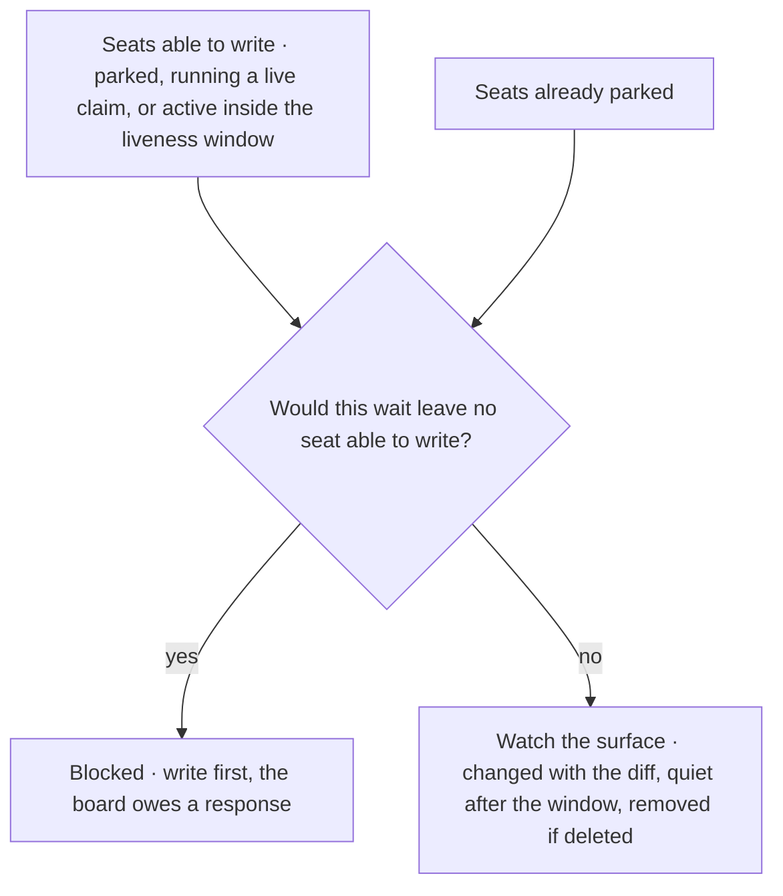

E1·e joining a run

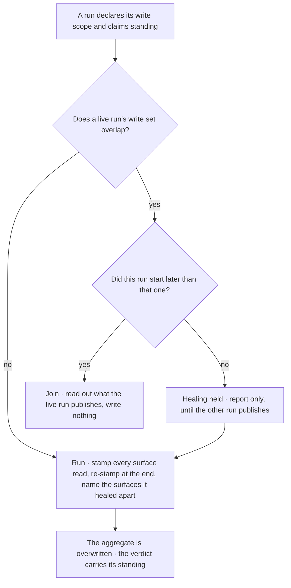

## A turn never ends to wait

A turn never ends because work is [blocked](ontology/REASONING.md#reasoning-node-ter-block) on a peer, which is the one edge [F1·b a turn](#a-turn-never-ends-to-wait-panel-b) never takes: ending the turn would be the wait, and that wait is a halt. Waiting costs a tool call rather than a turn. A seat reports to its peers on the surface, never to the developer, because a report addressed to the developer reads as an ending and stops the collaboration for as long as the developer takes to reply. The tool this section relies on is described in [posting and waiting are one operation](COLLABORATE.md#posting-and-waiting-are-one-operation), and [phase binding](pag/ORCHESTRATION.md#phase-binding) on the grammar page explains why a bounded run returns instead.

### Waiting has a command

Every coordination failure that outlives its mechanisms takes the shape of a turn that ended on prose. A seat's own queue empties, it reports a milestone, the turn ends, and the peers whose writes would have created its next work never receive what it found. A well-organized summary delivered at a moment that felt conclusive is the most common disguise a halt wears, and the quality of the summary is not a defense.

For this reason a turn ends on a tool call, a wait is a call rather than a halt, and findings go to the seats that need them. A blocked item is routed to the next open one, and the wait goes through the tool only when every item is blocked, rather than the turn ending on a report. In practice, the model is asked to work the next open item and, where one blocks, to move to the next unblocked one. Where every item depends on a peer, it waits through the tool, naming the surface the argument is on, and keeps the turn open across the wait. When the wait returns a change, it reads the surface whole and acts on every live item addressed to it, without waiting again straight away and without narrating what the read found. When the wait returns quiet, it picks up its own work and waits again. Findings, status and conclusions are written as directed items to the seats that need them.

To check this, read the last action of every response in a session. A response whose last action is prose while work remained stopped the collaboration, however much work came before it. Where the work is clear and nothing blocks it, the work is simply done. Every coordination mechanism is a way of moving work, and moving work feels like doing it, so the blocker is named before anything is routed; where naming it produces nothing, the item is clear and routing it would be a substitute for the work.

A second wait straight after the first throws away the signal just delivered while looking like diligence, because a tool call is present and the turn stays open. Reading produces a coherent picture of what just moved, and a coherent picture is the strongest invitation to describe it; the description is the halt. Quiet is a fact about the peers, never about the queue, and the queue is not empty while a surface is unaudited, a pattern is ungated or a claim is unverified.

A decision that no seat is making is a routing signal rather than a stall, and it travels as one of the [handoff signals](pag/ORCHESTRATION.md#handoff-signals) the grammar page types. Two independent refusals are the trigger. A question that every existing seat has declined is an input that exists in no file, which is exactly what makes the work suited to an agent, and it is assigned to a seat without waiting to be asked: either an existing seat whose concern covers it, or a new one created for it. A question a seat correctly judges to be above its own authority goes to the seat whose surface the decision binds, named in the same position that declines it, because saying a decision is not yours is a routing statement, not an end point. A contradiction that is fully diagnosed, with a named repair and no seat to take it, reads as handled while nothing lands. How the developer takes part is one setting with two values. In the default mode, overseer, the developer is out of [the loop](START.md#the-loop) for venues and signs off on every venue automatically, so no venue waits on the developer's signature and no decision inside one is the developer's to take. An entry the developer writes into a venue still reaches every seat with its next wait, as shown in [F1·a an owner entry](#a-turn-never-ends-to-wait-panel-a). In the interactive mode, the seats are asked to bring each decision to the developer and wait for the answer. What the work is for remains the developer's to answer whenever they choose, at the cost of a message rather than a held venue. A question to the developer binds a seat only; a bounded invocation returns its uncertainty instead, as described in [ask where it appears](PLAN.md#ask-where-it-appears).

F1·a an owner entry

```text
$ echo "# Owner note: The worker and the client share one limit for now." >> retries-have-one-home.1.blocking.md


$ npm run await -- --agent A --file retries-have-one-home.1.blocking.md --no-wait
HELD  coordination/retries-have-one-home.1.blocking.md is a venue, so it is not swept. Its positions stay until the venue converges.
SINCE A LAST LOOKED  1 changed line(s)
  + # Owner note: The worker and the client share one limit for now.

$ npm run await -- --agent B --file retries-have-one-home.1.blocking.md --no-wait
HELD  coordination/retries-have-one-home.1.blocking.md is a venue, so it is not swept. Its positions stay until the venue converges.
SINCE B LAST LOOKED  1 changed line(s)
  + # Owner note: The worker and the client share one limit for now.

$ npm run await -- --agent C --file retries-have-one-home.1.blocking.md --no-wait
HELD  coordination/retries-have-one-home.1.blocking.md is a venue, so it is not swept. Its positions stay until the venue converges.
SINCE C LAST LOOKED  1 changed line(s)
  + # Owner note: The worker and the client share one limit for now.
```

F1·b a turn

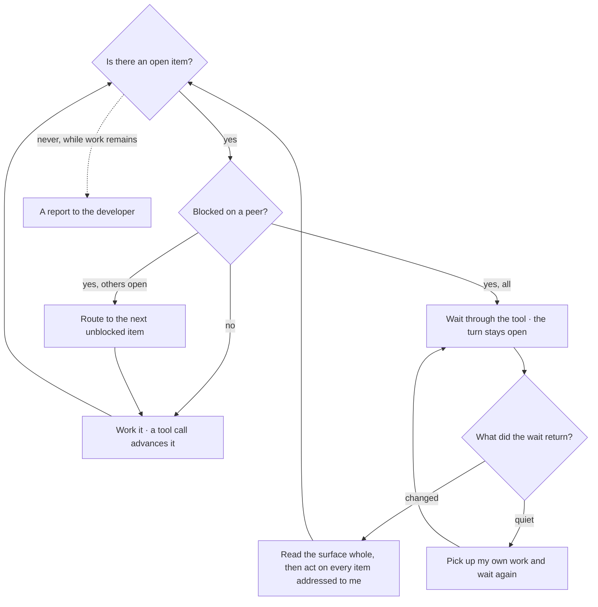

## Stating an invariant

This section covers how an invariant is written down so that something can object when it breaks. A topology relies on invariants, and an invariant it relies on without stating cannot be told apart from a property a reader happened to infer. Stating one is [design by contract](ontology/PRINCIPLES.md#architecture-design-by-contract) for a collaboration, where the preconditions and postconditions belong to the parties. The test is not whether the invariant is true, but whether anything would disagree if it stopped being true. A [stated invariant](ontology/PRINCIPLES.md#architecture-stated-invariant) fills the four slots shown in [G1·a four slots](#stating-an-invariant-panel-a). A lifetime has the three axes shown in [G1·b three axes](#stating-an-invariant-panel-b) and typed in [G1·c a lifetime declaration](#stating-an-invariant-panel-c), and a relation between two states needs the two readings shown in [G1·d two readings](#stating-an-invariant-panel-d). The same four slots appear for a declared workflow under [orchestration invariants](pag/ORCHESTRATION.md#orchestration-invariants) on the grammar page.

### Property, set, parties, objector

An unstated invariant is not a gap in the documentation but a defect in every claim that rests on it. Two documents state opposite versions of one invariant, every mechanism faithfully implements its own version, nothing reports a defect, and the contradiction exists only for a reader who holds both documents in mind at once. Nothing objects when an unstated invariant stops holding, so its first violation goes unnoticed.

For this reason an invariant counts as held only while something would notice it breaking. The objector is named before the property is relied on, rather than the property being stated alone. In practice, an invariant is written with four parts: the property, in a form that could turn out false; the set it quantifies over; the parties it binds; and whatever would object if it stopped holding. The invariant is delivered in a surface the bound parties receive, because a mechanism that must honor an invariant is the consumer most easily forgotten, being the only one that cannot ask. Where no objector exists, the invariant is stated as unheld, and every derivation that rests on it is marked.

To check this, take an invariant the design relies on and name what would disagree if it stopped holding. If nothing would, the invariant is held by circumstance. Stating an invariant does not enforce it. A statement is a claim about the topology, while a check is a mechanism over artifacts, and where one exists without the other, the honest form says which. An invariant held by a tool holds only as long as every party uses the tool, and a path around the tool by hand is invisible to everything.

The [contradicted invariant](ontology/PRINCIPLES.md#architecture-contradicted-invariant) is the failure that no single check can see, so the unit of checking is the set of statements rather than any one statement. An invariant is restated wherever a party needs it, because delivery requires that, and every restatement is a copy that can disagree. Adding a statement therefore adds an obligation to re-derive the whole set whenever the invariant changes, starting with the copies delivered most often.

### A lifetime is three axes

A lifetime has three independent axes, and describing it in one word makes the other two impossible to state; [immutability](ontology/PRINCIPLES.md#architecture-immutability), for example, is a single value on one of them. Retention says what ends a piece of content. Mutability says whether a statement that has landed may be rewritten, and by whom. Removal authority says who may take content out. None of the three can be derived from another, and a topology that runs more than one kind of surface has surfaces that differ on each axis independently. The axis a one-word description drops first is removal authority, because a reader assumes it follows from retention. It does not: keeping content and forbidding its removal are separate claims, and a mechanism that faithfully implements the first can still remove content. Each axis takes its value from a closed set, which is what makes the declaration something a check can read rather than a sentence.

### Two states need two readings

A property that is a relation between two states cannot be enforced by a check that looks at only one of them. Presence, shape, membership and conformance can be decided from a single reading, through the [structural](ontology/REASONING.md#reasoning-node-ana-structural) lens. A rule that content may grow but not shrink, be corrected but not removed, or advance but not retreat is a [happens-before relationship](ontology/PRINCIPLES.md#architecture-happens-before-relationship), seen through the [temporal](ontology/REASONING.md#reasoning-node-ana-temporal) lens, and it can be decided only from two readings. A required section is enforced as it goes from empty to full, but nothing notices when it goes from full to empty, and a stricter single-state check has exactly the same blind spot. The repair is to change the number of readings: the prior state is kept, the set it was taken over is recorded, and the two are compared. The comparison has three results rather than two, because a comparison across differing sets refuses to compute, and a refusal is the safe direction when the alternative is a false accusation.

### Declared as data

Declared as data, a lifetime takes the form shown in [G1·c a lifetime declaration](#stating-an-invariant-panel-c). Each axis is a literal tuple, and the field type is derived from it, so a value outside the closed set fails to compile instead of resolving as a fourth state that was never declared. A surface is a key and its lifetime is one record over the three axes, so a check joins on the axis name and reads the value. A region declares only where it differs from its file, naming the span it covers, the lifetime it carries and the reason, and that limit is what keeps the declaration small enough to count.

A seed names which live surface a template creates, so the template declares a lifetime for an instance rather than for itself, and a seed pointing at an undeclared surface is a compile error rather than a citation that resolves to nothing. The values have no order and none is a default. A surface that declares nothing is undeclared, which is a state distinct from every value, and treating the two as the same would make an unmeasured surface impossible to tell apart from a measured one.

G1·a four slots

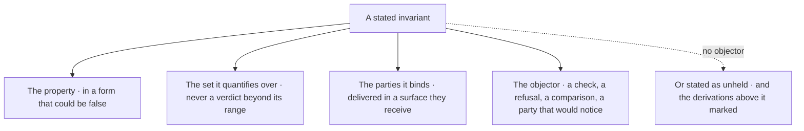

G1·b three axes

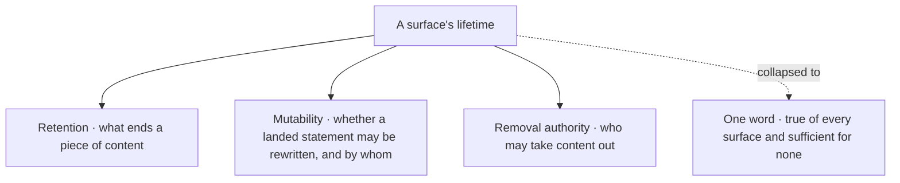

G1·c a lifetime declaration

```typescript
export const RETENTION = [
  "accumulating",
  "current-truth",
  "discharged",
  "computed",
] as const;
export const MUTABILITY = [
  "append-only",
  "owner-rewritable",
  "frozen",
] as const;
export const REMOVAL = ["none", "author", "handler", "producer"] as const;

export interface Lifetime {
  readonly retention: (typeof RETENTION)[number];
  readonly mutability: (typeof MUTABILITY)[number];
  readonly removal: (typeof REMOVAL)[number];
}

export interface LifetimeRegion {
  readonly name: string;
  readonly span: "item" | "field" | "row" | "column";
  readonly lifetime: Lifetime;
  readonly why: string;
}

export interface LifetimeDeclaration {
  readonly declared: Readonly<Record<SurfaceKey, Lifetime>>;
  readonly regions: Readonly<Record<SurfaceKey, readonly LifetimeRegion[]>>;
  readonly seeds: Readonly<Record<SurfaceKey, SurfaceKey>>;
}

export const lifetime: LifetimeDeclaration = {
  declared: {
    "<swept-surface>": {
      retention: "current-truth",
      mutability: "owner-rewritable",
      removal: "handler",
    },
    "<accumulating-surface>": {
      retention: "accumulating",
      mutability: "frozen",
      removal: "none",
    },
    "<generated-surface>": {
      retention: "computed",
      mutability: "frozen",
      removal: "producer",
    },
  },
  regions: {
    "<rule-surface>": [
      {
        name: "<region>",
        span: "field",
        lifetime: {
          retention: "accumulating",
          mutability: "owner-rewritable",
          removal: "author",
        },
        why: "<why this span differs from its file>",
      },
    ],
  },
  seeds: { "<template>": "<swept-surface>" },
};
```

G1·d two readings

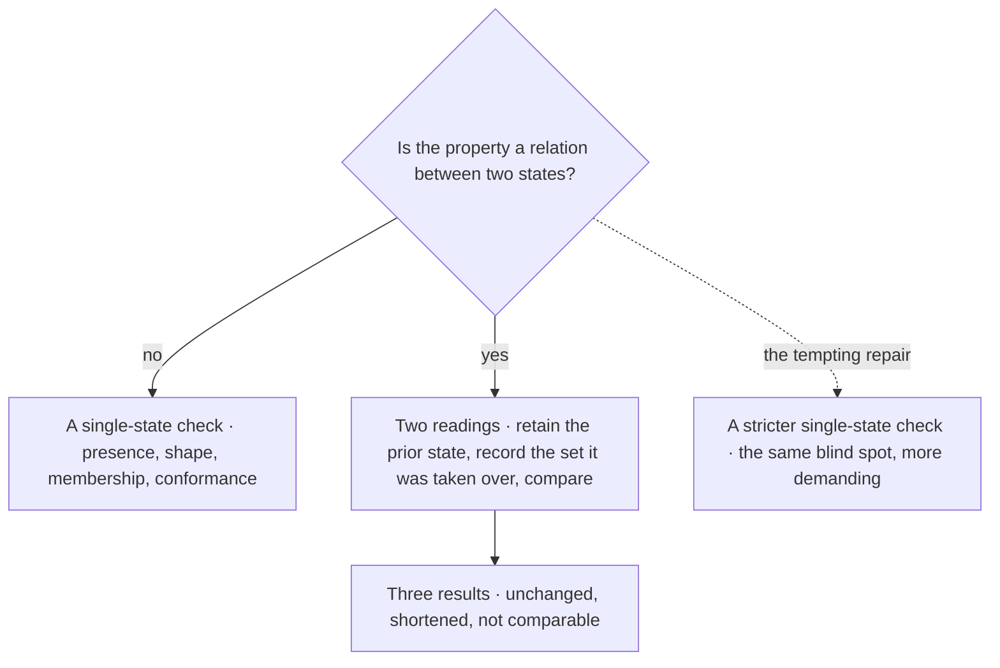

---

Chapters: [Start](START.md) · [Plan](PLAN.md) · [Build](BUILD.md) · [Verify](VERIFY.md) · [Collaborate](COLLABORATE.md) · [Ship](SHIP.md)
