© 2025 Jay Baleine - Disciplined AI Software Development · Documentation is covered by [CC BY-SA 4.0](https://creativecommons.org/licenses/by-sa/4.0/)

# Collaborate — Methodology — Bane's Lab

> The line ask where it appears draws, what the work is for against the shape of the work, is crossed in two directions and only two, as two channels draws: a…

Canonical: https://banes-lab.com/disciplined-methodology/collaborate

# Disciplined AI Collaboration

Constraints, checks and skepticism for building software with AI.

# Collaborate

## The human and the AI

The line [ask where it appears](PLAN.md#ask-where-it-appears) draws, what the work is for against the shape of the work, is crossed in two directions and only two, as [A1·a two channels](#the-human-and-the-ai-panel-a) draws: a question travels up through one channel with a recommendation first, and a correction travels down once and hardens into [rules with names](START.md#rules-with-names). Everything else the two need to know, they read from the tree. [Who does what](START.md#who-does-what) states the same split with the tooling as the third party, and the architecture page grounds it in what the author is: probabilistic.

### Two channels across one line

The human governs, the AI executes inside the boundaries, and a correction hardens rather than repeats. Without a declared split, the person ends up shaping the work by hand and the AI ends up guessing what it was for.

The person explains the architecture at length, the AI reports a milestone and asks what to do next, and the work stops while looking finished. A model optimises for the reply that reads as helpful, and a reply that reads as helpful is a summary, a pause offered as thoroughness, or a question that could have been a recommendation.

Cross the line through the two channels only, a question up and a correction down, rather than through the conversation. Govern by writing what the work is for and what finished means, and correct drift immediately and briefly, in a few words, once. Expect the correction to become a rule with a stable name and a memory the same turn, and expect the next session to read them. Halt on any statement of yours that contradicts the plan, re-verify, and report rather than argue file state. Let a session run continuously until the queue is empty, and call the stop yourself.

Read a session's transcript for the moments the turn ended. Each is either the person calling the stop, a question through the channel, or a halt wearing a report's clothes.

A question crosses the line only when its answer changes what gets built, and then before the dependent work.

The AI never surfaces, implies or acts on its own remaining capacity, because it cannot measure it and an assumption presented as a constraint is a lie that truncates the work. Only the human calls the stop, and [a turn never ends to wait](COLLABORATE.md#a-turn-never-ends-to-wait) names the halts that pretend otherwise.

A stale memory triggers a question rather than a silent refresh; [three encodings](START.md#three-encodings) holds the precedence.

A1·a two channels

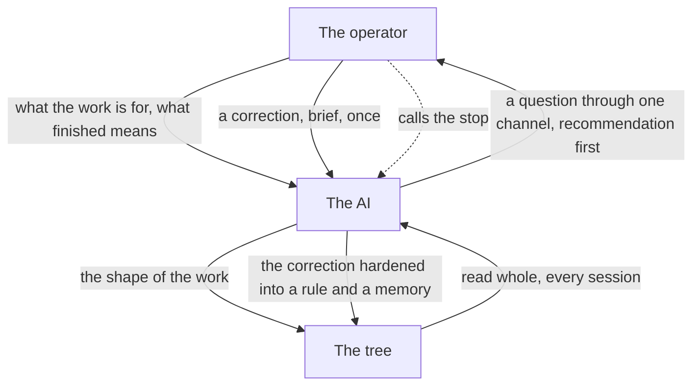

## Agents as executed contracts

A persisted agent is a walked loop, not a persona, [the loop](START.md#the-loop) [B1·a a verifying agent](#agents-as-executed-contracts-panel-a) draws; the [agent templates](pag/TEMPLATES.md#templates-agents) on the grammar page are walked, not adopted, and [a seat is a contract](START.md#a-seat-is-a-contract) is the same rule for a seat, and an agent comes to be as [B1·b making an agent](#agents-as-executed-contracts-panel-b) draws. Its definition is executed rather than consulted: it discloses what it trusts, binds itself to one phase as [phase binding](pag/ORCHESTRATION.md#phase-binding) requires, ranks what is worth verifying, calibrates its detectors, gathers from the implementation, checks its own contract against its own behaviour, and emits exactly one typed artifact. The agent that creates agents and the agent that audits them are the same loop applied to agents themselves, and the ontology's contracts for the [orient](ontology/REASONING.md#stage-orient) and [verify](ontology/REASONING.md#stage-verify) stages are what the walk executes.

### A walked loop, one artifact

A capability is not real until its behaviour matches a testable contract, and a verifier applies its rules to itself. An agent defined by a voice can be judged only by how it sounds, and sounding right is what a model always does.

A reviewer agent with a persuasive system prompt affirms a change that reads well, because nothing in its definition made it open the diff, calibrate a detector or name what would refute its verdict. An agent written as a description is applied by its reader's interpretation, and the interpretation drifts with the reader.

Define an agent by the loop it walks and the artifact it emits. Write an agent as a contract the loop can execute. Give it a disclosed trust anchor, a phase it binds to, and a ranking of its claims by risk and uncertainty. Give every claim an evidence requirement that names the observation that would settle it, an admissibility check that the phase was honoured, and a single typed artifact at the end. Generate it from inspected evidence about its domain, render it through an adapter, and prove it is grounded and embodied before it is persisted.

Run the agent on a case with a planted contradiction and on a case that is clean. It must report the contradiction with its evidence and pass the clean case for the right reason. An agent that cannot fail on purpose has never been shown to work.

A bounded invocation has no channel back, so it returns its uncertainty the way [ask where it appears](PLAN.md#ask-where-it-appears) describes, and an inverted rule is actively wrong while reading as governed.

The anchor is disclosed, as [verify the verifier](VERIFY.md#verify-the-verifier) requires, and the self-audit is what catches the overclaim above it: the agent reads its own definition, extracts every capability it claims, runs a positive and a negative case for each, and downgrades its confidence for every claim it cannot back.

Phase binding is what keeps an investigation honest. An investigation discovers and never fixes; its artifact is a report of evidence. An action fixes and never discovers; its artifact is a log of bounded changes against known evidence. The two are exclusive because the checks that heal rewrite the tree, so an investigation that ran them has mutated under a read-only contract.

An agent is generated the way a plan is: from a template, executed, as [execute the template](PLAN.md#execute-the-template) describes. Its source is inspected evidence about the domain it will investigate, never prior knowledge, which is the difference between grounded output and [ungrounded AI output](ontology/PRINCIPLES.md#arch-ungrounded-ai-output). Its target is a portable contract, the shape [the drop-in](START.md#onboarding) gives every core, rendered for one runtime through an [adapter pattern](ontology/PRINCIPLES.md#arch-adapter-pattern), so the same agent ports by re-rendering. What an agent must know to act is declared in the body it is delivered with, because a declaration in a field the runtime discards reaches nobody, and a check reading that field measures an artifact while the mechanism stands inert.

B1·a a verifying agent

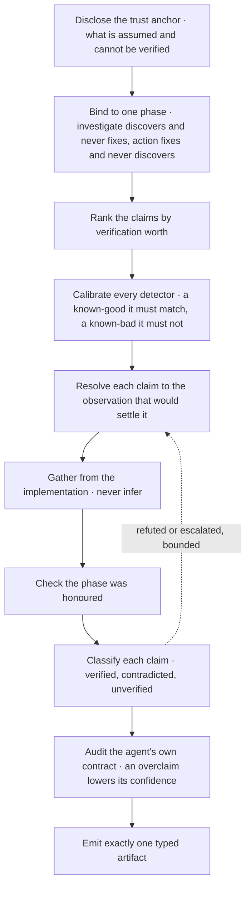

B1·b making an agent

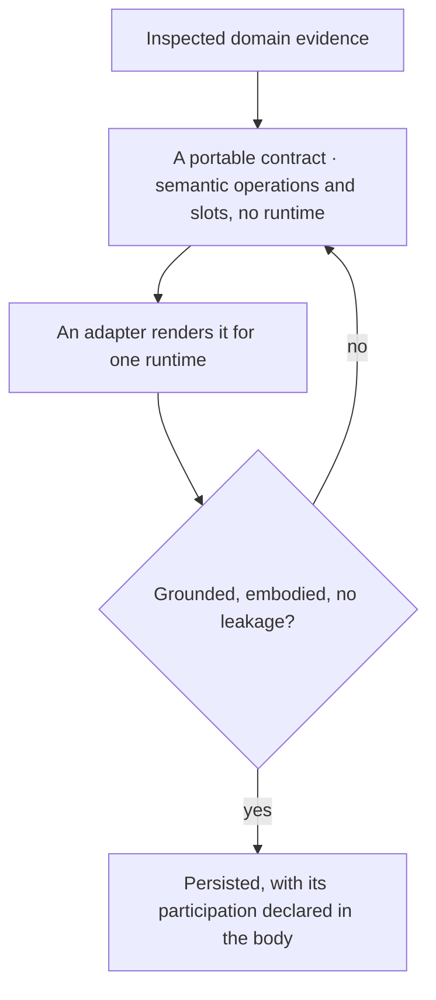

## Coordination is software

Several reasoning agents write one tree concurrently, and the premise is that their coordination is software. It has state, invariants and a schema, as [C1·a the model](#coordination-is-software-panel-a) draws, and it decays without a validator; a seat comes to be in the order [C1·b a seat's making](#coordination-is-software-panel-b) draws, and its readers fall into the two classes [C1·c reader classes](#coordination-is-software-panel-c) derives. A [lost update](ontology/PRINCIPLES.md#arch-lost-update), a stale item, a missed message or a surface grown past reading is a defect report against the protocol, never a call for more care, and friction is a missing [concurrency control](ontology/PRINCIPLES.md#arch-concurrency-control). The grammar page states the same premise as [orchestration as declared structure](pag/ORCHESTRATION.md#declared-structure), and [shared surfaces](pag/ORCHESTRATION.md#shared-surfaces) there is the schema this chapter derives.

### Surfaces, records, edges, states

Coordination is software. It has state, invariants and a schema, and it decays without a validator. More than one agent on one tree loses writes, accumulates stale items and misses messages, and each incident has a plausible local cause that hides the mechanism gap.

A board grows past what any reader can consume, carrying hundreds of directed items, with every drain rule in force and agreed by every party. Every coordination failure is produced by good behaviour composing badly: each append is a real finding honestly reported, and the defect is entirely in the composition, which no rule about care can see.

Treat every coordination failure as a missing mechanism, and answer it with a surface, a schema or a validator. Model the coordination as a graph. Let a surface be a file the parties read and write, a record be one addressable claim inside it with exactly one writer declared on the record itself, and an edge be an id in a field. Derive every state by traversing the edges and let no party write one. Give each party a permanent identity bound in an index before its first write, and derive who may read an item from presence on the surface and state in the index rather than from anything a party declares about itself.

Take the last coordination failure and name the mechanism that would have made it impossible or loud. If the answer is that someone should have been more careful, the mechanism is still missing.

One writer per record is the load-bearing invariant, and it has no operand on an outcome surface that is authored jointly, a contract or a measured baseline. There the invariant is declared inapplicable with its reason, and the mechanism that reaches a semantic collision is an announcement plus each author cutting its own duplicate, which is a different instrument from a fence.

### One writer, no written state

It is the refusal of [shared mutable state](ontology/PRINCIPLES.md#arch-shared-mutable-state) at the granularity of a claim: with one writer per record, ordinals allocate without coordination, last-writer-wins cannot occur, and protection of another party's scope becomes checkable per record. The quantifier is the whole of it: stated per surface it is false wherever a surface is shared, which is the normal case, and the two forms are indistinguishable at a single-writer surface, which is why the error survives. A record's identity is allocated once and never recomputed, and its subject is declared and re-derived every run, because an id derived from location breaks on a move and one derived from subject breaks on a rename. Two records sharing a subject key is the finding that catches re-derivation.

No agent writes a state; [derived state](VERIFY.md#derived-state) is the rule here as everywhere. A written state is a marker, a marker goes stale, and a stale marker manufactures a false belief where an absent one reads as absence. Open, blocked and absorbed are queries over the edges, [event sourcing](ontology/PRINCIPLES.md#arch-event-sourcing) over a graph of claims: open while a citation is unresolved, blocked while an inbound edge comes from an open node, absorbed when the citation resolves. Absorbed is a transition, never a resting state: the record's durable half is extracted to the [one home](BUILD.md#one-home) history has, an [append-only log](ontology/PRINCIPLES.md#arch-append-only-log), then the record is deleted in the same change, because a record resting in absorbed is a status marker under another spelling.

### A seat is allocated, never chosen

A seat is a letter bound to a role in an index that only grows, and [a seat is a contract](START.md#a-seat-is-a-contract) says what the role document holds. The index is an accumulator rather than a board section because the board deletes what is resolved while a letter that has stopped being active still has to resolve, since every item, row and citation that ever named it points there. The letter is claimed by adding the row before the first write and never by using it. The identity is allocated rather than chosen: the tool issues the shortest free identity from a scheme that never exhausts and never recycles, and the letter a party asks for is its declaration for that call, not the allocation. The index has one mutable column, the seat's state, drawn from a closed set, because the reader set, the wait cap, the addressee resolution and the convergence quantifier all derive from it. A seat moves its own row, and a party moving another party's state states its warrant beneath the row.

### Two reader classes

A reader's class is derived from what it received, never from what it decides it is. A participant receives the surfaces it owns and its inbox, and it never ends: it waits, and waiting has a command. A bounded reader receives a task and whatever the host injects, and never a coordination surface. One derived line is the whole of what it knows about every surface, so a fact absent from that line does not exist for anything spawned. The line is refreshed in the same change as the fact it carries, because a stale projection is a false statement delivered as the only statement. The rules divide by class, and turn-owning rules invert for a bounded reader: obeying never end a turn forbids returning, and returning is its contract. Which class a reader is comes from the binding rather than from the reader: a deployment whose board slot resolves absent is single-worker by declaration, and a reader classifying its own turn is an escape hatch keyed on self-classification.

C1·a the model

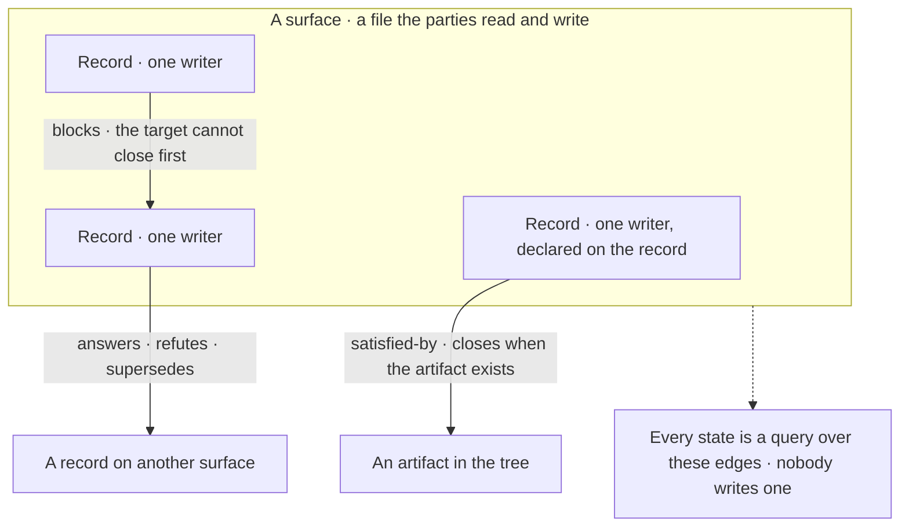

C1·b a seat's making

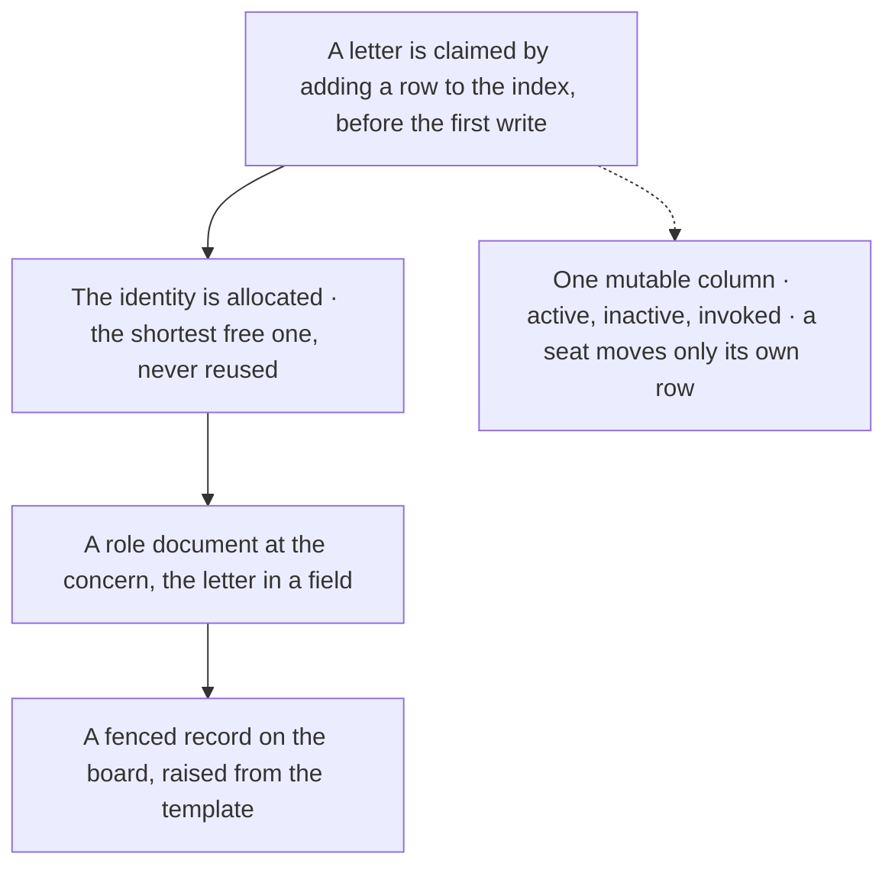

C1·c reader classes

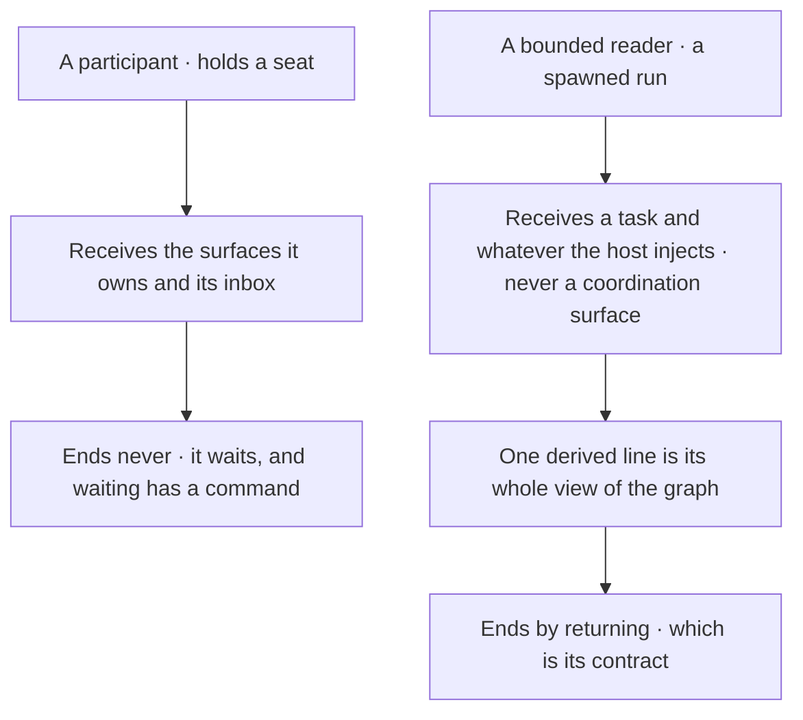

## The board and the venue

Two surfaces with opposite lifetimes share one transport, as [D1·a two surfaces](#the-board-and-the-venue-panel-a) draws. The board carries coordination state, who owns what and what is directed at whom, and is swept, because it is current truth only and an item nobody drains is a tax every seat pays every round. One seat's span is what [D1·c a seat's record](#the-board-and-the-venue-panel-c) shows, and [D1·b an item's closure](#the-board-and-the-venue-panel-b) draws how an item leaves it. The venue carries an argument, and accumulates until it converges, because a position stands until read and dissent survives to the end, through the orderings [D1·d convergence](#the-board-and-the-venue-panel-d) draws and the schedule [D1·e a venue schedule](#the-board-and-the-venue-panel-e) types. The grammar page's [coordination templates](pag/TEMPLATES.md#templates-coordination) carry both shapes, and [composing a collaboration](pag/ORCHESTRATION.md#composing-a-workflow) is where the seats that write them are partitioned.

### Swept and accumulated

The board is swept and the venue accumulates, and the two share only their transport. One surface asked to hold both coordination state and an argument reports one state and hides the other.

A converged venue is removed from disk on signature, satisfying every ordering the closure checks, and every position id the accumulator cites resolves to nothing. Only the handler knows an item is handled and only the writer was permitted to remove it, so the knowledge and the permission sat in different seats and the item stayed.

Split the surfaces by lifetime rather than by topic, so a swept surface and an accumulating one never share a record. Keep the board current-truth-only: overwrite it in place, delete a resolved item outright, and pair every append with a drain of whatever is already absorbed. Enclose each seat's record in a delimiter naming its writer, and each addressed item in a fence keyed to an id the tool allocates, with its kind on the marker. An edit then has a span to anchor to, a removal takes the span rather than a matched line, and the closure is selected by the kind rather than judged. Let the seat that handled an item remove it, never the seat that wrote it, and extract its durable half first. Write positions to an open venue, hold the build while it stands, and archive it whole once its outcome is built.

Read the board for an item that argues rather than states, and read the archive for a venue whose reasoning is missing. Either one is a lifetime applied to the wrong surface.

A venue is writable by tool and never drainable by tool, and once archived it has [immutability](ontology/PRINCIPLES.md#arch-immutability): an [append-only log](ontology/PRINCIPLES.md#arch-append-only-log) of the argument. Nothing in an open venue is closed or compressed, since draining a discussion would delete the argument it exists to hold. Leaving the active tree and leaving the repository are different operations, and a wording that says deleted collapses them.

### Fences, kinds and the sweep

The delimiter is not decoration. A seat revising its own record needs a span it can match exactly that no other seat's content occupies. Without one the only thing left to match is the whole file, so the seat reaches for a whole-file write, which succeeds, reports success to the party who overwrote, and says nothing to the party overwritten. A template that must contain a record shape to state one fences the specimen, because a fenced specimen is a record mentioned and an unfenced one is a record claimed, the use-against-mention class arriving on the write side.

An item's kind sits on its marker and selects its closure, which is what the grammar page calls [handoff signals](pag/ORCHESTRATION.md#handoff-signals): typed items, falsifiable closures. An artifact item asks for something that can exist, so it closes with a typed reference that must resolve, and a reference whose kind names no corpus resolves vacuously and reads exactly like one that passed, which is why the kind set is closed. A judgement item asks for a reading, so it closes by its declared acknowledger with no reference, because there is nothing for one to point at, and the acknowledger is required or forbidden by kind rather than optional. An artifact item carrying nothing durable closes with a declared-empty reference, and the tool then publishes the classes already filed, so declaring nothing durable is a lookup a peer can contest rather than an oversight nobody can see.

The sweep is the mechanical drain, and it is delivery-gated: an item is a message on a [message queue](ontology/PRINCIPLES.md#arch-message-queue) whose consumers are named, and it leaves the queue when every consumer has taken delivery. On every write the tool sweeps items whose every addressee has both written after the item and been handed it in a delivered read, extracting each whole into the accumulator before removal. It holds any item an addressee has not received, because the write-past rule is a fact about their writing and never about their reading. Durability and delivery are independent, and archiving an item nobody received preserves the first while destroying the second. An argument is refused on the swept surface by its shape: a body carrying a position's own declared fields, derived from the venue template rather than listed, is turned back with the instruction to name the venue.

### A venue converges or holds the build

A venue declares its own exit condition or it is an indefinite halt. While it stands, its presence fails the pipeline, and that red is the intended state: building around an open question produces work that gets rewritten. Its fields are its own, where each seat stands and what it still needs before it can sign, and an empty need across every convened seat is what convergence looks like rather than something a seat judges. A position is posted through the tool into the seat's own fenced record, so the fence, the id, the addressing and the compare-and-swap apply on a venue as on the board. A position carries a signed line as its one structural end mark, because a body cut short at a blank line reaches the argument already short, and the signature is the detection the boundary hides. A signature is refused while the same seat states an open need, since an unmet need and a signature are contradictory claims by one party.

Convergence is a walk over [event ordering](ontology/PRINCIPLES.md#arch-event-ordering), each ordering encoded as a refusal rather than a note, because an ordering recorded in prose is rediscovered by collision while one encoded in the operation cannot be. [Orchestration invariants](pag/ORCHESTRATION.md#orchestration-invariants) on the grammar page states the general form, and [stating an invariant](COLLABORATE.md#stating-an-invariant) is how a seat writes one. The convened set is the intersection of the board's active seats and the venue's participants, and a venue no seat is party to is reported as failing rather than vacuously passing, because a filter over an empty set holds over nothing. Convergence certifies agreement and nothing about the tree, so the outcome is distributed as a checklist with an owner per item and lands before the venue moves. The move creates the archived name and fails if it exists before it unlinks the source, so a failure leaves the venue where it was.

### The schedule is a graph

A successor is declared by name against a schedule rather than derived from an ordinal, because an ordinal is a position in a total order while the real edges are partial with forward dependencies, a [directed acyclic graph](ontology/PRINCIPLES.md#arch-directed-acyclic-graph) rather than a list. The declaration is checked at the moment it is written, a deferral names its receiver on the same line and is refused unless the receiver is an active seat, a venue on disk or a planned row, and a venue that defers nothing records that as a third state distinct from unfilled. The schedule has one author, resolved by concern and succeeded rather than shared, because a schedule with several authors stops being derivable from any single reading. The schedule's state column is computed from the tree on every run rather than written.

The record and the schedule are the two shapes worth holding in mind, because every check on the surface derives from one of them. The schedule's state column is computed on every run unless a row declares it with a reason, so the row set is the plan and nothing in it records what happened. Both shapes ship as templates, and the checks read their contracts from those templates the way [the drop-in](START.md#onboarding) describes.

D1·a two surfaces

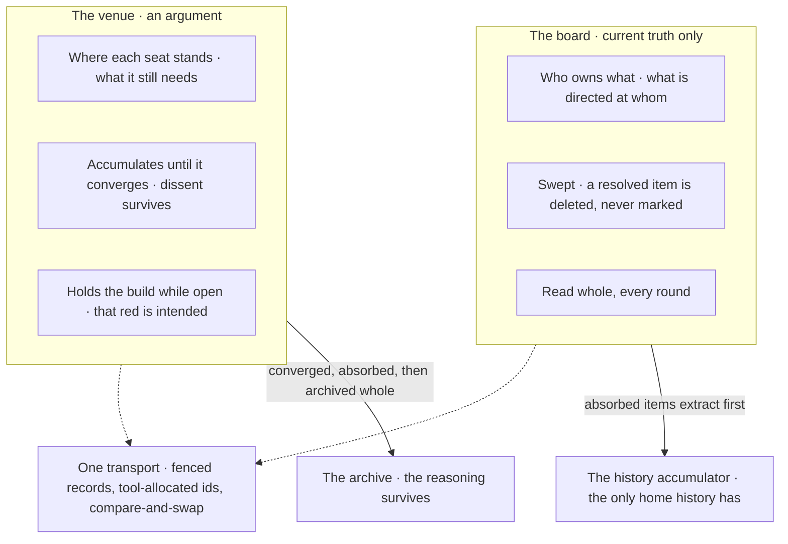

D1·b an item's closure

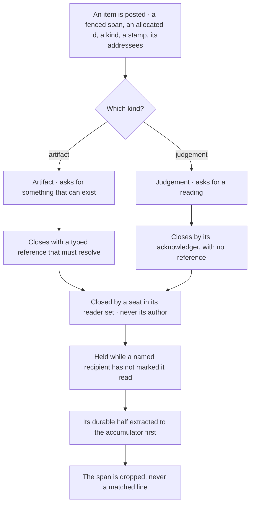

```text
┌─── <record> <seat> ─── one writer: <seat> · others cite, never edit · a span edit only, never a whole-file write
<seat> — <state from the closed set>
<field>:   <the concerns this seat claims, by concern and never by directory>
<field>:   <the current unit and its state>
<field>:
┌─── <item> <seat>-<allocated id> ─── kind:<artifact | judgement> at:<stamp> to:<seats | *>
To <seat> — the argument, across as many lines as it needs.
└─── END <item> <seat>-<allocated id>
<field>:   <typed pointers, each naming a declared kind>
└─── END <record> <seat>
```

D1·d convergence

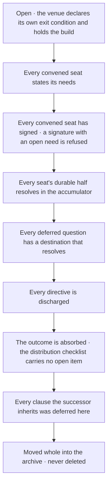

```typescript
export const SCHEDULE_STATES = [
  "planned",
  "created",
  "open",
  "archived",
] as const;
export type ScheduleState = (typeof SCHEDULE_STATES)[number];

export interface ScheduleRow {
  readonly ordinal: string;
  readonly invariant: string;
  readonly establishes: string;
  readonly merged?: string;
  readonly declaredState?: ScheduleState;
  readonly declaredBecause?: string;
}

export const schedule: readonly ScheduleRow[] = [
  {
    ordinal: "1",
    invariant: "<invariant>",
    establishes: "<what establishing it settles>",
  },
  {
    ordinal: "2",
    invariant: "<invariant>",
    establishes: "<what establishing it settles>",
  },
  {
    ordinal: "2a",
    invariant: "<invariant deferred here by 2>",
    establishes: "<what establishing it settles>",
    declaredState: "planned",
    declaredBecause: "<why the tree cannot derive it yet>",
  },
];
```

## Posting and waiting are one operation

The seats speak to each other through one tool, and the tool makes the protocol structural rather than remembered. Posting and waiting are one operation, [E1·a one invocation](#posting-and-waiting-are-one-operation-panel-a) end to end. Every invocation declares its seat, writes only inside that seat's own fence under [optimistic locking](ontology/PRINCIPLES.md#arch-optimistic-locking), delivers the diff of what its peers wrote since that seat last looked, sweeps what every addressee has received, and re-snapshots. How long it waits is what [E1·b the wait cap](#posting-and-waiting-are-one-operation-panel-b) derives, and a second run joins a live one, as [E1·c joining a run](#posting-and-waiting-are-one-operation-panel-c) draws. What a seat cannot do by hand is what the tool refuses to let it do, which is [tools live in the tree](BUILD.md#tools-live-in-the-tree) applied to the collaboration itself.

### One tool, one shape

Posting and waiting are one operation keyed to a declared seat, and the delivery is the diff since that seat last looked, consumed whole. A coordination surface written by hand carries every guarantee as a hope, and a hope decays at the rate of the party who holds it.

Three seats filter the tool's output for the line confirming their own write landed, discard every peer position delivered in the same stream, and the tool reports success each time. A protocol mandating a surface its tool cannot write to is obeyed by hand, and a hand write has no fence, no allocated id, no compare-and-swap, no reader set and no gate.

Make every coordination write a tool write, and make the tool refuse what the protocol forbids. Give the collaboration one tool with one shape. Key every invocation to a declared seat, because the snapshot, the fence, the reader set and the closure check are all derived from it. Check every operand of every requested operation before any of them lands, so an invocation is one unit. Take a witness read immediately before every write, replay a write that commutes with what moved, and refuse only a genuine overlap with the diff of the writer's own span. Deliver the diff whole, never a status line with content attached.

Invoke the tool with nothing after it and read the whole of what it returns. Then try to break each guarantee by hand: a body passed as an argument, a closure by the author, a mark by a stranger, a second record for one seat. Each must be refused with the reason the refusal exists.

The tool reaches the surfaces that are shared and still writable. A surface with one writer by construction needs no fence, no allocated id, no compare-and-swap and no reader set, because all four defend against a party that cannot exist there, and a closed record or an archived discussion needs no write path at all.

### The delivery is the diff

The snapshot is per seat per surface. The tool reads the seat's last snapshot of the target, writes the current content as the new one, records which addressed items it delivered, and returns a line-level diff. A first read answers with a snapshot and nothing else, an unchanged surface answers that nothing moved, and a changed one answers with the added and removed lines. The diff is the delivery: every peer position written since this seat last looked arrives in that stream and nowhere else, so the output is consumed whole. Past the read budget the delivery degrades rather than truncates, [backpressure](ontology/PRINCIPLES.md#arch-backpressure) applied to a read: it names every changed item by its fence and leaves the bodies on the surface, because a silent truncation hands a partial read that looks complete. Every write also echoes what nothing else would prompt the seat to re-read.

### The item and its id

The allocated id is a [correlation id](ontology/PRINCIPLES.md#arch-correlation-id): every closure, citation and read mark resolves through it. A body carrying a boundary marker line is refused, because boundaries are what make a span removable.

### Delivery per party

A per-item read ledger lives on the item's own marker and dies with it, which is what lets a swept surface carry per-party delivery state without becoming a surface that tracks. The ledger is what makes each seat an [idempotent consumer](ontology/PRINCIPLES.md#arch-idempotent-consumer) of the items addressed to it. Each party moves its own letter and no other, a mark by a party the item never addressed is refused, and a closure is held while a named recipient still active has not marked, so a change every seat must hold drains on its last reader rather than its first. A rehearsal that writes is the worst shape a preview can take, because the invocation a party chooses for safety becomes the one that acts unannounced, which is why tools live in the tree has a mutation preview by default.

### The wait and its cap

The wait blocks on the surface's modification state, the [publish/subscribe pattern](ontology/PRINCIPLES.md#arch-publish-subscribe-pattern) over a file with a [timeout pattern](ontology/PRINCIPLES.md#arch-timeout-pattern) for the window. It reports the diff when it moves, quiet when the window closes untouched, and removed if the surface is deleted while watching, and every exit is typed so a caller reads the code rather than the prose. Waiters are capped at the number of seats able to write minus one, and the denominator is liveness rather than membership. A seat counts where it is parked, where it holds a live run, or where it touched a surface inside the declared window, because a seat that stops without moving its row would otherwise raise the threshold by one until every remaining party could park with nobody left to write. The last seat is told the board owes a response, and the solitary case is stated apart because no write clears it.

### A run joins, never duplicates

A long-running run scales by joining rather than duplicating, the [idempotency](ontology/PRINCIPLES.md#arch-idempotency) of a measurement. A run declares its write scope and claims standing before it runs. Healing is held while another live run's write set overlaps, because a run mutates, and healing while another run is mid-write takes an exclusive resource without declaring it. A run that starts later than an overlapping live one joins it and reads out what it publishes instead of measuring the same tree twice, and a run whose question a live run already covers reads the covering result. Every surface a run reads is stamped and re-stamped, and [verify the verifier](VERIFY.md#verify-the-verifier) says what a moved read set does to the verdict; the surfaces the run itself healed are named apart, because counting a run's own repairs as contention would make every healing run un-quotable. A run's declaration is a claim and its writes are a fact, so a write outside the declared scope and a claimed repair whose surface never moved are both reported, and they are the one comparison between a claim and an observation the run performs.

E1·a one invocation

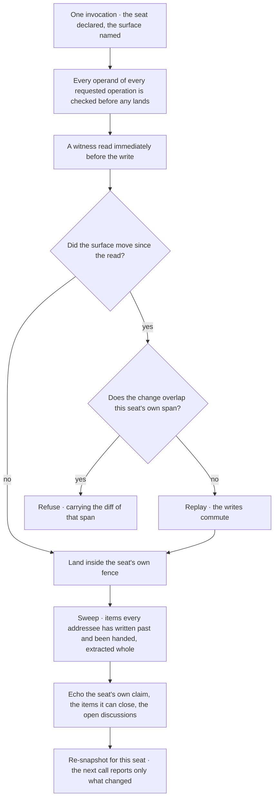

E1·b the wait cap

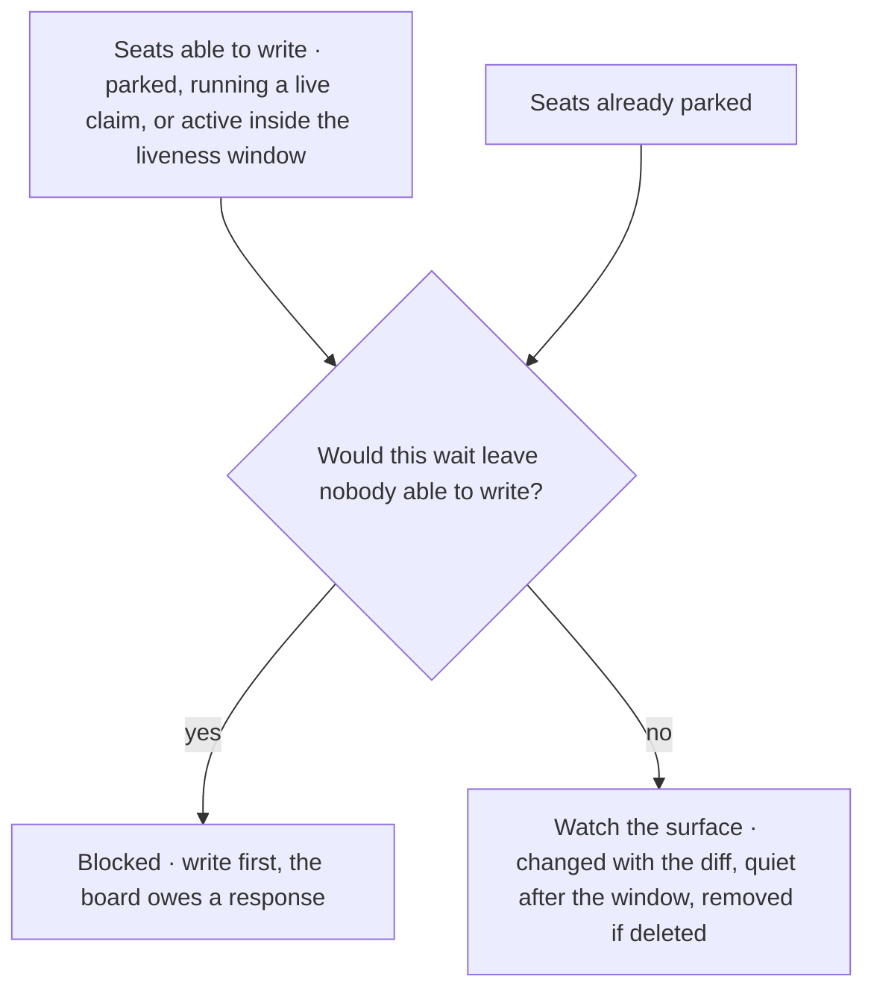

E1·c joining a run

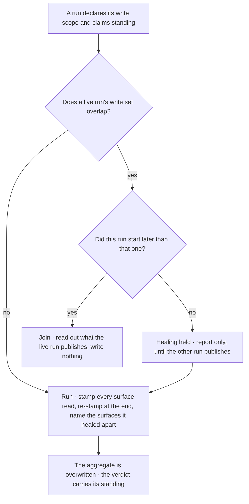

## A turn never ends to wait

A turn never ends because work blocks on a peer, which is the one edge [F1·a a turn](#a-turn-never-ends-to-wait-panel-a) never takes. Ending the turn is the wait, and the wait is the halt. Waiting costs a tool call instead of a turn, and a seat reports to its peers on the surface, never to the operator, because a report addressed to the operator reads as an ending and stops the collaboration for as long as it takes them to reply. [Posting and waiting are one operation](COLLABORATE.md#posting-and-waiting-are-one-operation) is the tool this chapter leans on, and [phase binding](pag/ORCHESTRATION.md#phase-binding) on the grammar page is why a bounded run returns instead.

### Waiting has a command

A turn ends on a tool call, a wait is a call rather than a halt, and findings go to the seats that need them. Every coordination failure that outlives its mechanisms takes the shape of a turn that ended on prose.

A seat's own queue empties, it reports a milestone, the turn ends, and the peers whose writes would have created its next work never receive what it found. A well-organised summary delivered at a moment that felt conclusive is the most common disguise a halt wears, and the quality of the summary is not a defence.

Route a blocked item to the next open one, and wait through the tool only when every item is blocked. Work the next open item, and where one blocks, route to the next unblocked one. Where every item depends on a peer, take the wait through the tool, naming the surface the argument is on, and keep the turn open across it. On a change, read the surface whole and act on every live item addressed to you, never wait again immediately and never narrate what the read found. On quiet, pick up your own work and wait again. Write findings, status and conclusions as directed items to the seats that need them.

Read the last action of every response in a session. A response whose last action is prose while work remained stopped the collaboration however much work preceded it.

Where the work is clear and nothing blocks it, do it. Every coordination mechanism is a way of moving work, and moving work feels like doing it, so before routing anything name the blocker, and where naming it produces nothing the item is clear and the routing is a substitution.

A second consecutive wait discards the signal just delivered while looking like diligence, because a tool call is present and the turn stays open. Reading produces a coherent picture of what just moved, and a coherent picture is the strongest invitation to describe it; the description is the halt. Quiet is a fact about the peers, never about the queue, and the queue is never empty while a surface is unaudited, a pattern is ungated or a claim is unverified.

A decision nobody is making is a routing signal rather than a stall, and it travels as one of the [handoff signals](pag/ORCHESTRATION.md#handoff-signals) the grammar page types. Two independent declines are the trigger: a question every existing seat has declined is an input that exists in no file, which is exactly what makes work agent-shaped, and it resolves to a seat proactively, an existing one whose concern covers it or one created for it. A question a seat correctly identifies as above its own authority routes to the seat whose surface the decision binds, named in the same position that declines it, because not mine to take is a routing statement rather than a terminal state. A fully diagnosed contradiction with a named repair and no taker reads as handled while nothing lands. The operator is out of [the loop](START.md#the-loop) and signs off on every venue automatically, so no venue waits on their signature and no decision inside one is theirs to take. What the work is for stays theirs to answer whenever they choose, at the cost of a message rather than a held venue. A question to the operator binds a seat only; a bounded invocation returns its uncertainty instead, as [ask where it appears](PLAN.md#ask-where-it-appears) describes.

F1·a a turn

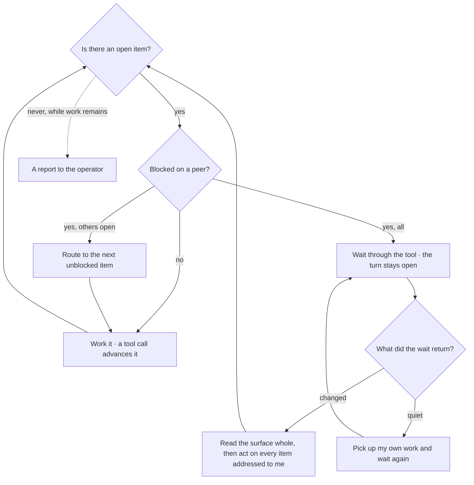

## Stating an invariant

A topology relies on invariants, and one it relies on without stating is indistinguishable from a property a reader happened to infer; [design by contract](ontology/PRINCIPLES.md#arch-design-by-contract) for a collaboration, where the preconditions and postconditions are the parties'. The test is not whether the invariant is true. It is whether anything would disagree if it stopped being. A property that holds today with no dissenting mechanism is held by circumstance, and its first violation is silent. A stated invariant fills the slots [G1·a four slots](#stating-an-invariant-panel-a) draws, a lifetime is the three axes [G1·b three axes](#stating-an-invariant-panel-b) draws and [G1·c a lifetime declaration](#stating-an-invariant-panel-c) types, and a relation between two states needs the two readings [G1·d two readings](#stating-an-invariant-panel-d) draws. [Orchestration invariants](pag/ORCHESTRATION.md#orchestration-invariants) on the grammar page carries the same four slots for a declared workflow.

### Property, set, parties, objector

An invariant is stated with its property, its set, its parties and its objector, or it is stated as unheld. An unstated invariant is not a documentation gap but a defect in every claim standing on it.

Two documents state the opposite of one invariant, every mechanism implements its own statement faithfully, nothing reports a defect, and the contradiction exists only in a reader who holds both at once. Nothing objects when an unstated invariant stops holding, so its first violation is silent.

Name the objector before relying on the property, rather than the property alone. State an invariant with four things: the property in a form that could be false, the set it quantifies over, the parties it binds, and the thing that would object if it stopped holding. Deliver it in a surface the bound parties receive, because a mechanism that must honour an invariant is the hardest consumer to remember, being the only one that cannot ask. Where no objector exists, state the invariant as unheld and mark every derivation that rests on it.

For an invariant the design relies on, name what would disagree if it stopped holding. If nothing would, the invariant is held by circumstance and its first violation will be silent.

Stating an invariant does not make it enforced. A statement is a claim about the topology and a check is a mechanism over artifacts, and where one exists without the other the honest form names which. An invariant held by a tool holds exactly as long as every party uses the tool, and a hand path around it is invisible to everything.

The contradicted invariant is the failure no check can see, so the unit of the check is the set of statements rather than one statement. An invariant is restated wherever a party needs it, which delivery demands, and every restatement is a copy that can disagree, so adding a statement adds an obligation to re-derive the set whenever the invariant changes, ordered by how often each copy is delivered.

### A lifetime is three axes

A lifetime is three independent axes, and one word makes the rest unstatable; [immutability](ontology/PRINCIPLES.md#arch-immutability), for instance, is one value on one of them. Retention says what ends a piece of content. Mutability says whether a landed statement may be rewritten and by whom. Removal authority says who may take content out. No two are derivable from each other, a topology running more than one kind of surface exhibits surfaces differing on each axis independently, and the axis a one-word form drops first is removal authority, because a reader assumes it follows from retention. It does not: keeping content and forbidding its removal are separate claims, and a mechanism implementing the first faithfully can perform the second. Each axis takes a value from a closed set, which is what makes the declaration an operand rather than a sentence.

### Two states need two readings

A property that is a relation between two states is not enforceable by any check evaluated against one. Presence, shape, membership and conformance are decided from a single reading, the [structural](ontology/REASONING.md#reason-node-ana-structural) lens. That content may grow and not shrink, be corrected and not removed, advance and not retreat, is a [happens-before relationship](ontology/PRINCIPLES.md#arch-happens-before-relationship), the [temporal](ontology/REASONING.md#reason-node-ana-temporal) lens, and it is decided only from two. A required section is enforced from empty to full and silent from full to empty, and a stricter single-state check has the identical blind spot. The repair is an arity change: retain the prior state, record the set it was taken over, and compare, with three results rather than two, because a comparison across differing sets refuses rather than computing, and a false accusation is the direction a refusal acts on.

### Declared as data

Declared as data, a lifetime looks like this. Each axis is a literal tuple and the field type is derived from it, so a value outside the closed set fails to compile rather than resolving as a fourth state nobody declared. A surface is a key and its lifetime is one record over the three axes, so a check joins on the axis name and reads the value. A region declares only where it differs from its file, naming the span it covers, the lifetime it carries and why, which is the bound that keeps the declaration countable.

A seed names which live surface a template raises, so the template declares a lifetime for an instance rather than for itself, and a seed pointing at an undeclared surface is a compile error rather than a citation that resolves to nothing. The values are not ordered and none is a default: a surface that declares nothing is undeclared, which is a different state from any value, and collapsing the two makes an unmeasured surface indistinguishable from a measured one.

G1·a four slots

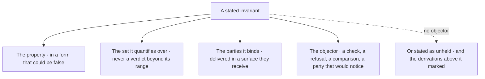

G1·b three axes

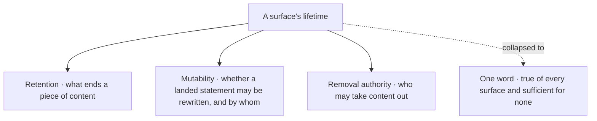

```typescript
export const RETENTION = [
  "accumulating",
  "current-truth",
  "discharged",
  "computed",
] as const;
export const MUTABILITY = [
  "append-only",
  "owner-rewritable",
  "frozen",
] as const;
export const REMOVAL = ["none", "author", "handler", "producer"] as const;

export interface Lifetime {
  readonly retention: (typeof RETENTION)[number];
  readonly mutability: (typeof MUTABILITY)[number];
  readonly removal: (typeof REMOVAL)[number];
}

export interface LifetimeRegion {
  readonly name: string;
  readonly span: "item" | "field" | "row" | "column";
  readonly lifetime: Lifetime;
  readonly why: string;
}

export interface LifetimeDeclaration {
  readonly declared: Readonly<Record<SurfaceKey, Lifetime>>;
  readonly regions: Readonly<Record<SurfaceKey, readonly LifetimeRegion[]>>;
  readonly seeds: Readonly<Record<SurfaceKey, SurfaceKey>>;
}

export const lifetime: LifetimeDeclaration = {
  declared: {
    "<swept-surface>": {
      retention: "current-truth",
      mutability: "owner-rewritable",
      removal: "handler",
    },
    "<accumulating-surface>": {
      retention: "accumulating",
      mutability: "frozen",
      removal: "none",
    },
    "<generated-surface>": {
      retention: "computed",
      mutability: "frozen",
      removal: "producer",
    },
  },
  regions: {
    "<rule-surface>": [
      {
        name: "<region>",
        span: "field",
        lifetime: {
          retention: "accumulating",
          mutability: "owner-rewritable",
          removal: "author",
        },
        why: "<why this span differs from its file>",
      },
    ],
  },
  seeds: { "<template>": "<swept-surface>" },
};
```

G1·d two readings

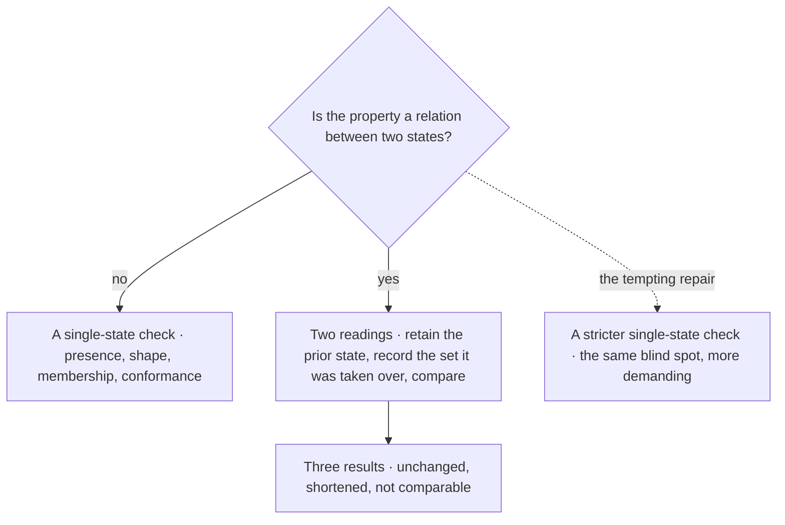

Documentation is covered by [CC BY-SA 4.0](https://creativecommons.org/licenses/by-sa/4.0/)

© 2025 [Jay Baleine](https://linkedin.com/in/jay-baleine) - Disciplined AI Software Development

---

Chapters: [Start](START.md) · [Plan](PLAN.md) · [Build](BUILD.md) · [Verify](VERIFY.md) · [Collaborate](COLLABORATE.md) · [Ship](SHIP.md)
