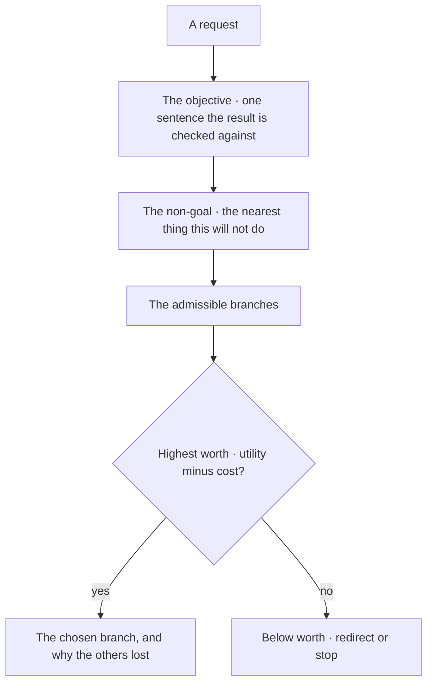
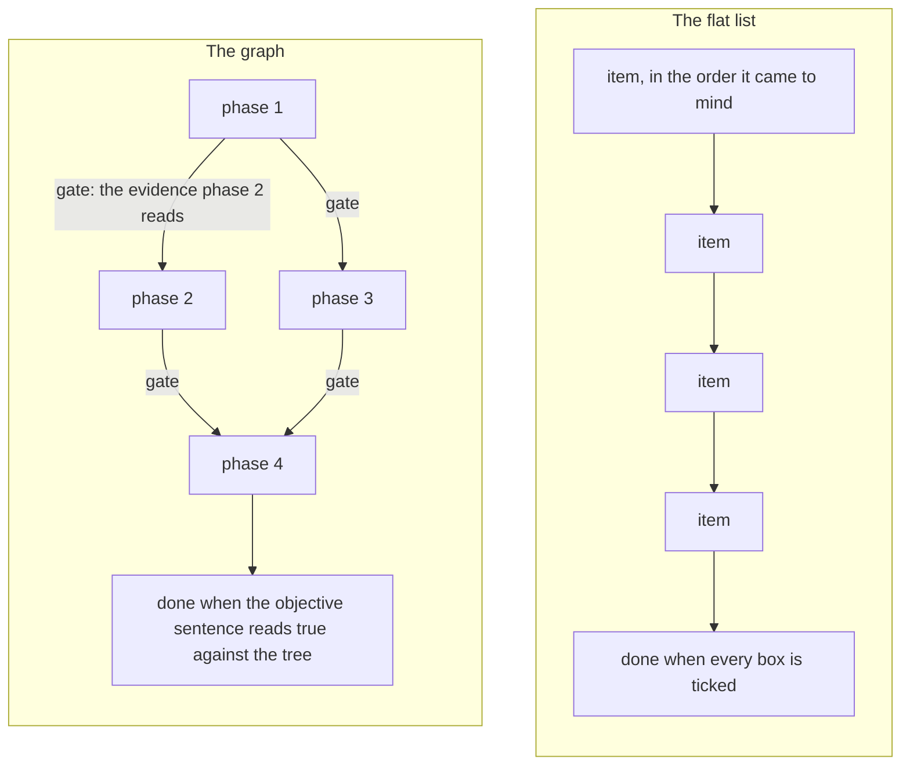
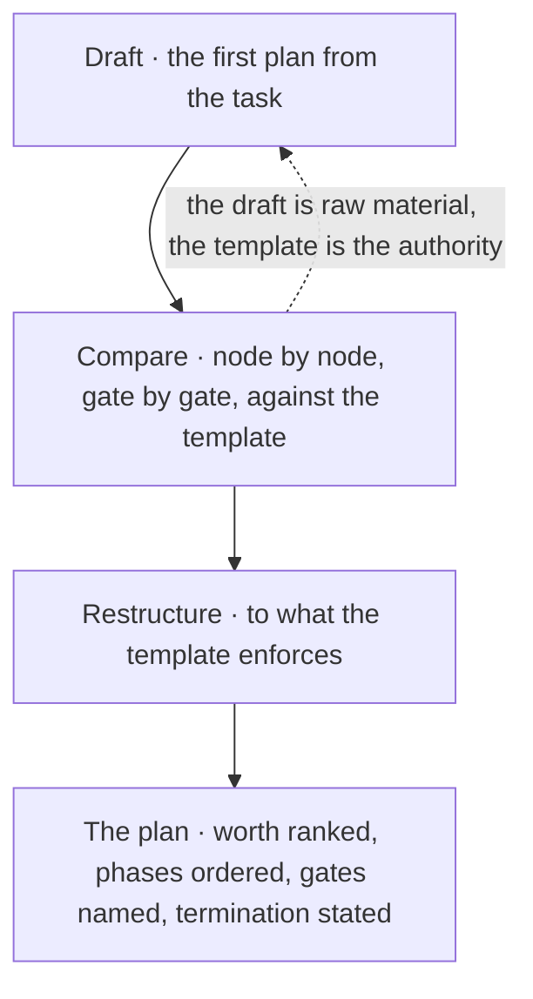
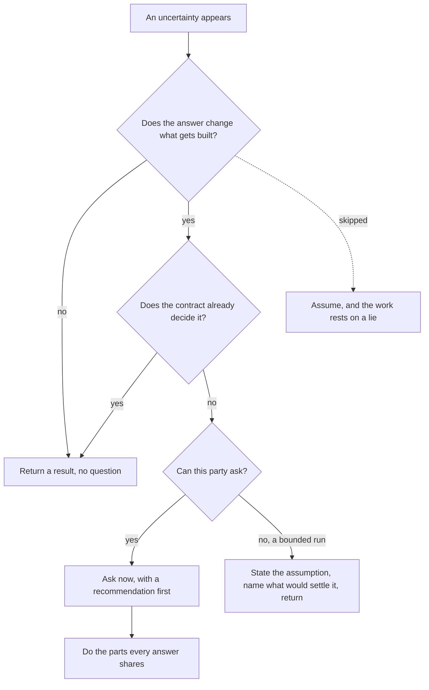
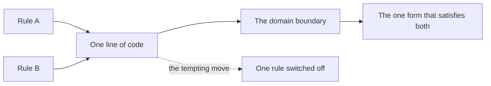

© 2025 Jay Baleine - Disciplined AI Software Development · Documentation is covered by [CC BY-SA 4.0](https://creativecommons.org/licenses/by-sa/4.0/)

# Plan — Methodology — Bane's Lab

> Before any work starts, one gate decides whether it starts at all, the gate the worth gate draws. What is this for, what does finished look like, and is this…

Canonical: https://banes-lab.com/disciplined-methodology/plan

# Disciplined AI Collaboration

Constraints, checks and skepticism for building software with AI.

# Plan

## Worth before work

Before any work starts, one gate decides whether it starts at all, the gate [A1·a the worth gate](#worth-before-work-panel-a) draws. What is this for, what does finished look like, and is this the highest-worth branch among the ones that are admissible? That is the [intent](ontology/REASONING.md#stage-intent) node of [the loop](START.md#the-loop), and the ontology grounds it on the teleology axis: an [objective](ontology/REASONING.md#reason-node-tel-objective), a [utility](ontology/REASONING.md#reason-node-tel-utility), a [cost](ontology/REASONING.md#reason-node-tel-cost) and a [priority](ontology/REASONING.md#reason-node-tel-priority). A task that cannot answer that is not ready to be a task.

### What is this for

Worth comes before work, and a non-goal is stated as plainly as a goal. Work that skips the question of worth is done well and needed by nobody.

Three days into a refactor, the question of whether anyone needed the refactor comes up for the first time. Starting is cheaper than deciding, and a model will always start if you let it.

Rank the admissible branches before any effort, rather than take the first workable one. Write the objective in one sentence before the first step, named so the result can be checked against it. Write what is out of scope beside it, because unstated scope grows silently. Rank the admissible ways of getting there by what each advances against what it costs, and say why the chosen one won. Then plan.

Read the objective back after the work. The result must be the thing the sentence named. A result that needs a new sentence to describe it answered a different question.

Worth is not computed here. Nothing evaluates utility minus cost over branches for you. The gate is judgement I apply and write down, and naming that absence is what keeps it from being assumed as a mechanism.

The gate has a shape, and the shape is why it holds. Intent yields an objective and a ranking, never a yes. A ranking needs more than one branch, so a plan with one option has not ranked anything and has not passed the gate. Each branch carries what it advances and what it costs, and the chosen branch is the one where that difference is largest among the branches that are admissible at all. A branch that would cross a hard limit is not a worse option, it is not an option, and admissibility is asked again at the [constrain](ontology/REASONING.md#stage-constrain) node after the work exists, because a plan that was admissible on paper can produce a change that is not. [When rules collide](PLAN.md#when-rules-collide) is the same gate applied to two rules on one construct.

A non-goal does more work than a goal. A unit's stated scope is what its author intended, and its unstated scope is whatever accretes onto it because nothing said no; the ontology calls the accretion [speculative generality](ontology/PRINCIPLES.md#arch-speculative-generality). Writing down the nearest thing the change will not do is what makes the next reader able to refuse the addition that would have turned a focused unit into a [god object](ontology/PRINCIPLES.md#arch-god-object). The same test applies to every surface, record or field a plan proposes: it names a consumer that breaks without it, rather than one that would merely read it, and a thing that cannot break either way is the finding.

The same task reads differently once worth is decided. Without it: _clean up the config and the checker, they have gotten messy_. With it: *objective, one limit with * [one home](BUILD.md#one-home); not in scope, the checker's other options; chosen, derive it from the config, because the two other homes cannot be deleted otherwise. The second version can be finished. The first cannot.

A1·a the worth gate



## The plan is a graph

Ask an AI for a plan and you get a flat list. Ten items, no order that matters, no gate between them, and a checkbox after each one that the AI ticks itself. A plan is a [directed acyclic graph](ontology/PRINCIPLES.md#arch-directed-acyclic-graph) whose phases pass evidence to each other, whose tasks carry contracts, and whose closed tasks are deleted rather than ticked, the difference [B1·a list against graph](#the-flat-checklist-panel-a) draws. It is the same claim the architecture page makes of the code, that [a system is a graph](architecture/MODEL.md#a-system-is-a-graph), applied to the work on the code.

### The list that ticks itself

A checklist is a dependency-ordered graph with gated phases, not a list of tasks. A task compiled straight into a flat checklist is ungated and unordered, and the ticks on it mean nothing.

Item four depends on item seven, the AI does them in list order, and the plan reaches the end with three items silently undone. A flat list is the cheapest structure to generate and the cheapest to tick, so both the model and the person prefer it.

Refuse a plan that has no dependency order and no gates. Order the phases by what depends on what, and within that by what has to exist before what can be built on it. Put a gate between phases that names the evidence the next phase reads before it starts. Give every task a contract: the file it touches, the evidence that proves it, the verifier that reads that evidence, and the thing it deliberately leaves alone. Let severity route a failure to its handler and never order the list.

Ask what each phase needs from the one before it. A phase that needs nothing from its predecessor is in the wrong place or the wrong plan.

Priority and sprint are metadata on a phase, useful for routing attention, and they never become the section structure. A plan ordered by urgency is a plan whose dependencies are hidden.

Ordering has two axes and they are applied in order. The first is dependency: a phase comes after every phase whose output it reads. The second is genesis: a thing exists before it is distinguished, is distinguished before it is related, is related before it is structured, is structured before it is transformed, and is transformed before it is constrained. A phase never depends on an output later in that cycle than the one it produces, so a plan that builds a transformation on a structure that does not exist yet is inverted, and the inversion is a decomposition defect rather than a tie to break.

[Impact analysis](ontology/PRINCIPLES.md#arch-impact-analysis) is recorded as names, never as counts. A row that says three files are affected carries nothing a reader can act on; the three names do. A dimension with no impact carries the evidence that it was assessed and found empty, because a silent cell and an unassessed cell look identical and only one of them is safe. Every task carries a unique id and every citation of an id resolves to a declared task, so a dependency note cannot point at a task that was deleted while reading as live.

The plan carries what is true now and what remains, and nothing else. No findings about defects already repaired, no narrative about how the plan came to be, no inventory of what exists, no closed task left in place with a note. A closed task is deleted, because deleting it is what makes the remaining set the work, and because past on a checklist invites re-implementing what is already done; the [planning templates](pag/TEMPLATES.md#templates-planning) on the grammar page are produced by stages and derived by deletion for that reason. A count written into the plan is written state, and [derived state](VERIFY.md#derived-state) says what happens to it.

B1·a list against graph



## Execute the template

A plan is executed from a template and never written to look like one, as [C1·c draft, compare, restructure](#execute-the-template-panel-c) draws. The template is a program: it walks the ten nodes of [the loop](START.md#the-loop), asks the questions in order, worth, admissibility, evidence, termination, and emits the artifact the loop terminates on, the node [C1·a a node contract](#execute-the-template-panel-a) types and the shape [C1·b a plan's shape](#execute-the-template-panel-b) shows. There is one template per genesis question, as [C1·d one per question](#execute-the-template-panel-d) draws. The grammar page publishes the [template families](pag/TEMPLATES.md#templates-families) this chapter executes, and [core templates](pag/TEMPLATES.md#templates-core) states the rule they all obey: contract, not content.

### Executed, not imitated

A recurring shape is a template, and a template runs as a procedure rather than serving as a copy. A plan that imitates a template's shape carries none of the template's guarantees.

The plan has all the right headings and none of the right answers, and the reader trusts the headings. A template copied as a shape gives the reader the look of rigour without one of its questions answered.

Restructure the draft to the template rather than defend the draft. Draft the first plan from the task. Compare the draft against the template node by node and gate by gate. Restructure the draft to what the template enforces, and treat the draft as raw material rather than as something to defend. Keep only current and future work in the result, and delete a task the moment it closes.

Read the plan for its answers, not its headings. Every heading must be followed by a decision that could have gone the other way.

Only an executed artifact takes the full loop. A reference, a specification, a contract or a note is descriptive, and forcing the loop onto it is the failure of fitting a thing to a shape it does not have.

The restructure adds what the draft lacks: the ranking [worth before work](PLAN.md#worth-before-work) demands, the ordering [the plan is a graph](PLAN.md#the-flat-checklist) demands, an evidence contract on every material claim with a named refuter and a confidence at or above the threshold, and explicit termination. No contradiction found is not support, and termination is saturation and completion and [verification](ontology/PRINCIPLES.md#arch-verification) together, never a feeling that the work is finished.

A template is chosen by its genesis question, and there is one template per question. How does anything come to be produces a plan, a checklist or a task set. How does a verdict come to be produces an audit or a context check. How does a base [abstraction](ontology/PRINCIPLES.md#arch-abstraction) come to be produces a shared pattern from repeated evidence. How does an agent come to be produces a reusable investigator, the [agent templates](pag/TEMPLATES.md#templates-agents) the grammar page carries. How does a template come to be produces a template from an executed document. When two could apply, the artifact being terminated on decides, and when none applies that is stated rather than one being forced.

The second instance of any shape is the trigger to write its template. One instance is an artifact and two is a shape, and the second is authored from a template or it is authored twice, because a party who reads a sibling to learn the format inherits that sibling's accidents as a contract. The template carries the constraint and never one instance's content, and the checks read their contracts from it, as [the drop-in](START.md#onboarding) describes. Each template inlines its whole structure, which is the one place duplication is deliberate: the shared spine is what makes each template independently executable, and refactoring them toward an import would make none of them so.

A template's loop, typing and gates are domain-neutral and transfer to any tree unchanged; its catalogues are re-derived against what exists, the rule the drop-in states for every core. Gates resolved while producing an artifact are also separated from the gates that run when it executes: an artifact whose generation gates passed is not an artifact whose execution gates passed, and saying so is what keeps the two from being confused.

Every node of a template carries the same contract, and the contract is what makes a template a program rather than a document. A node declares its layer, the mathematical shape its decision yields, the input it reads, which is only the prior node's output, the transformation it applies, the constraints stated at that step, its output, and one evidence-bearing handoff gate. The gate names its checks with the evidence each reads, the node it passes to, and the earliest node a failure routes back to, bounded. The yields type is a discriminated union, so a gate that owes a ranking cannot be satisfied by a boolean and the compiler says so, and the four gates that never fold are a closed subset of the node names rather than a convention a reader remembers. Written this way, a template is checkable by a walk that reads its own declarations: a node without a gate, a gate without evidence, or a decision without a shape fails before anything runs.

```typescript
export const LAYERS = ["epistemic", "conative", "evaluative"] as const;
export const NODES = [
  "orient",
  "intent",
  "see",
  "derive",
  "project",
  "act",
  "constrain",
  "verify",
  "commit",
  "terminate",
] as const;

export type Yields =
  | { readonly mathType: "set-theory"; readonly shape: "set" | "boolean" }
  | { readonly mathType: "logic"; readonly shape: "boolean" }
  | { readonly mathType: "graph"; readonly shape: "edge-list" }
  | { readonly mathType: "optimisation"; readonly shape: "boolean" | "ranking" }
  | { readonly mathType: "probability"; readonly shape: "number[0,1]" }
  | { readonly mathType: "computation"; readonly shape: "procedure" };

export interface Gate<Node extends (typeof NODES)[number]> {
  readonly rule: Node;
  readonly checks: readonly {
    readonly claim: string;
    readonly evidence: string;
  }[];
  readonly onPass: Node | "STOP";
  readonly onFail: { readonly owner: Node; readonly bounded: true };
}

export interface NodeContract<
  Node extends (typeof NODES)[number],
  Input,
  Output,
> {
  readonly node: Node;
  readonly layer: (typeof LAYERS)[number];
  readonly yields: Yields;
  readonly input: Input;
  readonly transform: (input: Input) => Output;
  readonly constraints: readonly string[];
  readonly output: Output;
  readonly handoff: Gate<Node>;
}

export type Mandatory = "intent" | "constrain" | "verify" | "terminate";
```

```markdown
# <what this change is for, in one sentence>

## Worth

Objective: the outcome, named so the result can be checked against it.
Not in scope: the nearest things this change will not do.
Branches ranked: the way chosen, and why the others lost.

## Admissible

Hard limits: what no phase may cross, whatever it would gain.
Cost: what this is allowed to take, and the point past which it stops.

## Phases, ordered by dependency

### Phase 1: <name>

Needs: nothing.
Gate: the evidence Phase 2 reads before it starts.

- [ ] task: <one change> — file: <where> — evidence: <what proves it> — verifier: <who reads it> — not: <what this task leaves alone>

### Phase 2: <name>

Needs: the gate of Phase 1.
Gate: ...

## Termination

The run stops when the objective sentence reads true against the tree, not when the list is ticked.
```

C1·c draft, compare, restructure



C1·d one per question


## Ask where it appears

You own what the work is for, which [worth before work](PLAN.md#worth-before-work) settles. The AI owns the shape of the work. A question crosses that line at the moment it appears, and never after the work that depended on it, and an answer nobody had to give is an assumption; [D1·a three fates](#ask-where-it-appears-panel-a) draws where an uncertainty can go.

### The pause, not the rework

The question belongs where it appears, and the assumption belongs where you make it. An unasked question turns into an assumption, and an assumption is a lie the work rests on: [unowned risk](ontology/PRINCIPLES.md#arch-unowned-risk), in the ontology's words.

The AI guesses the missing decision, builds a day of work on the guess, and reports the guess as a footnote at the end. Asking feels like slowing down, and both the model and the person prefer momentum to a pause.

Pay for the pause at the uncertainty rather than the rework after it. Raise an uncertainty the moment it changes what you would build. Carry a recommendation with it, first, with its reasoning, and let the alternatives be real options with their cost stated rather than strawmen. Do everything that does not depend on the answer while you wait. Where the party cannot ask, because it is a bounded run with no channel back, state the uncertainty, state the assumption taken, name what would settle it, and return it as one of the [handoff signals](pag/ORCHESTRATION.md#handoff-signals) the grammar page types.

Look at the questions the AI raised in a session and where in the work they landed. A question that arrived after its dependent work was an assumption wearing a question's clothes.

A bounded task with a clear contract returns a result instead of asking. Questions are for the decisions that are yours, not for the ones the contract already made, and a question about what the project is for is always yours while a question about how a thing should be shaped rarely is.

The channel is one tool with one shape, and the shape does the discipline. A question goes through the tool or it was not asked. It carries few questions, each with options a person can hold in one read. One option is a reasoned recommendation, placed first, whose description states the reasoning and not just the choice. The others are genuine alternatives that say what happens if chosen, including the cost. _It depends_ is not an answer, and a weak recommendation is stated as weak with what would strengthen it. The tool is what turns a question into a decision the person can take in one read, and a question in chat prose is what the same person scrolls past.

Asked late, it reads _done, note that I assumed the second shape, let me know if you wanted the first_. Asked in place, it reads _two shapes fit here, I recommend the second because the first needs a second config, which one, and meanwhile I am doing the parts both share_. The first sentence hands you a day of work to undo. The second hands you a decision.

D1·a three fates



## When rules collide

Two rules will meet on one line of code and disagree. That is a boundary between domains, not an exception, and it has one resolution, the one [E1·a one form](#when-rules-collide-panel-a) draws.

### A tension is a boundary

Two enforced rules on one construct have one resolution, the form that satisfies both, never an exception; where the rules hold in different scopes the boundary between them is that form. When two rules conflict, the tempting move is to silence one of them.

A rule gets turned off for one file so another rule can pass, and the file becomes the place where both rules stop meaning anything. Two rules that collide came from two domains, and the collision marks the line between them.

Resolve a tension architecturally, never by disabling one side. Find the domain each rule serves. Find the form that satisfies both. Record the resolution once, where the next person will meet the same collision, and never satisfy one rule by violating the other.

Search for every rule someone switched off somewhere. Each one is either a resolved tension with its resolution written down, or an unresolved one hiding.

Two collisions from this tree. A rule that bans literal file paths meets a declaration file that must spell its own paths. The boundary is declaration against consumption, and the one form is that the declaration file is the single exempt place while every consumer reads it by key. A rule that every export needs a consumer meets a registry entry that has no consumer until a variant registers. The boundary is capability against use, and the one form is that the [registry pattern](ontology/PRINCIPLES.md#arch-registry-pattern) resolves by [auto-discovery](ontology/PRINCIPLES.md#arch-auto-discovery), so the variant file is the consumer.

[A tension has a mechanism](architecture/PRINCIPLES.md#a-tension-has-a-mechanism), and separate, trade, or mitigate on the architecture page derives when a boundary is the answer and when a measured point is. The two rules are both right inside their own [bounded context](ontology/PRINCIPLES.md#arch-bounded-context), and the line of code sits where the contexts touch, which is why [explicit boundaries](ontology/PRINCIPLES.md#arch-explicit-boundaries) are the first thing to name. Naming the boundary is what makes the answer transferable: the next collision on the same boundary has the same answer, and a collision on a different boundary is a different tension rather than a precedent.

E1·a one form



Documentation is covered by [CC BY-SA 4.0](https://creativecommons.org/licenses/by-sa/4.0/)

© 2025 [Jay Baleine](https://linkedin.com/in/jay-baleine) - Disciplined AI Software Development

---

Chapters: [Start](START.md) · [Plan](PLAN.md) · [Build](BUILD.md) · [Verify](VERIFY.md) · [Collaborate](COLLABORATE.md) · [Ship](SHIP.md)
