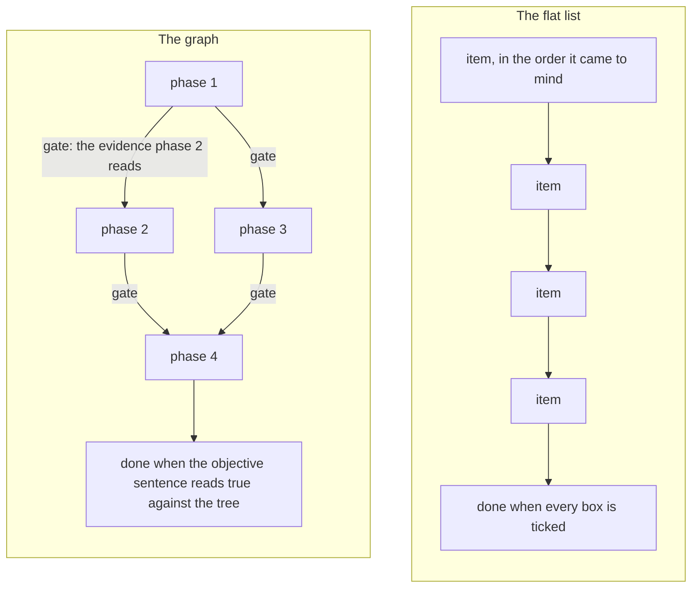
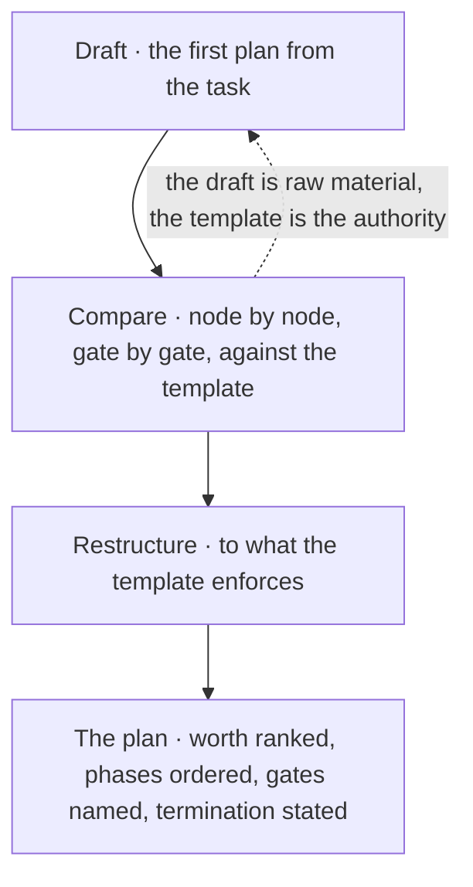
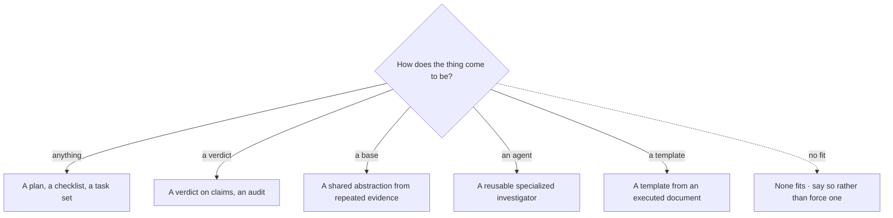
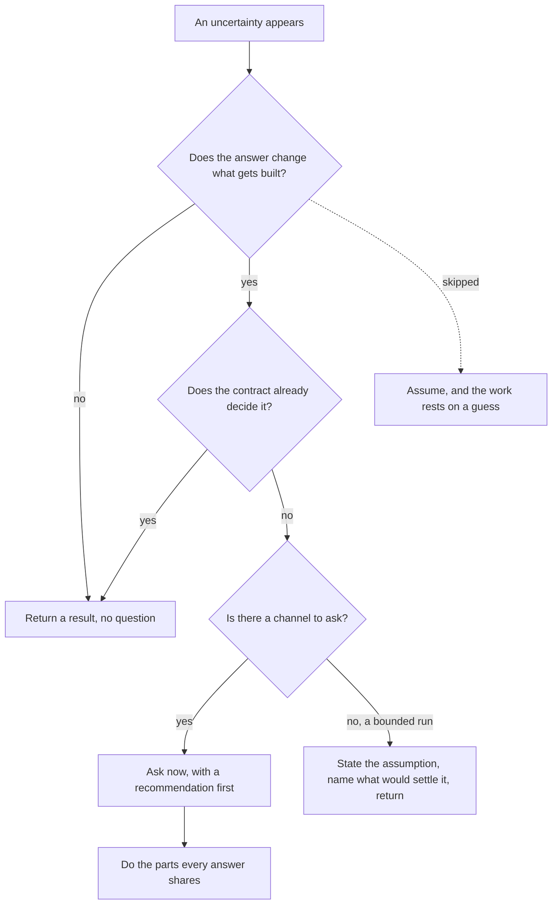
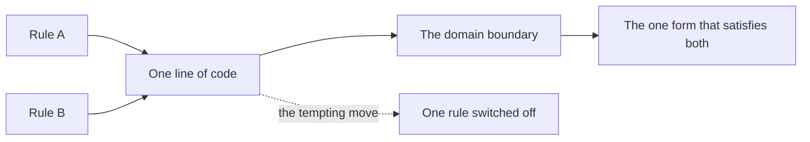

© 2025 Jay Baleine - Disciplined Methodology · Bane's Lab documentation is covered by [CC BY-SA 4.0](https://creativecommons.org/licenses/by-sa/4.0/)

# Plan — Methodology — Bane's Lab

> Before any work starts, one gate decides whether it starts at all.

Canonical: https://banes-lab.com/disciplined-methodology/plan

# Disciplined Methodology

Constraints, checks and skepticism for building software with LLMs

# Plan

## Worth before work

Before any work starts, one gate decides whether it starts at all. It asks three questions, as shown in [A1·a the worth gate](#worth-before-work-panel-a): what the work is for, what finished looks like, and whether this is the most worthwhile of the approaches that are allowed. This gate is the [intent](ontology/REASONING.md#stage-intent) node of [the loop](START.md#the-loop), and on the ontology page it rests on four records: an [objective](ontology/REASONING.md#reasoning-node-tel-objective), a [utility](ontology/REASONING.md#reasoning-node-tel-utility), a [cost](ontology/REASONING.md#reasoning-node-tel-cost) and a [priority](ontology/REASONING.md#reasoning-node-tel-priority). A task that cannot answer these questions is not ready to be a task.

### What is this for

Work that skips the question of worth can be done well and still turn out to be unnecessary. Three days into a refactor, the question of whether the refactor was needed comes up for the first time. Starting is cheaper than deciding, and a model tends to start as soon as you let it.

For this reason worth is decided before any work begins, and what the work will not do is stated as plainly as what it will. The approaches that are allowed are ranked before any effort is spent, rather than the first workable one being taken. In practice, the objective is written in one sentence before the first step, worded so the result can be checked against it. What is out of scope is written beside it, because scope that is never stated grows quietly. Each approach is weighed by what it achieves against what it costs, the reason the chosen one won is written down, and only then does planning begin.

To check this, read the objective again once the work is done. The result should be the thing the sentence named; a result that needs a new sentence to describe it answered a different question. Worth is not computed anywhere in this method: no tool weighs utility against cost across the approaches for you. The gate is a judgement I make and write down, and saying so openly is what stops it from being mistaken for a mechanism.

The gate has a particular shape, and the shape is what makes it hold. The intent node produces an objective and a ranking, never a simple yes. A ranking needs more than one option, so a plan with only one option has not ranked anything and has not passed the gate. Each option records what it achieves and what it costs, and the chosen one is the option where that difference is largest among those that are allowed at all. An option that would cross a hard limit is not a worse option; it is not an option. Whether a change is allowed is asked again at the [constrain](ontology/REASONING.md#stage-constrain) node once the work exists, because a plan that looked acceptable on paper can still produce a change that is not. [When rules collide](PLAN.md#when-rules-collide) applies the same gate to two rules that meet on one piece of code.

Stating what the work will not do often matters more than stating what it will. The stated scope of a unit is what its author intended, and its unstated scope is whatever collects around it because nothing ruled it out; the ontology calls that [speculative generality](ontology/PRINCIPLES.md#architecture-speculative-generality). Writing down the nearest thing the change will not do is what lets the next reader turn down the addition that would have made a focused unit into a [god object](ontology/PRINCIPLES.md#architecture-god-object). The same test applies to every surface, record or field a plan proposes: it has to name something that would break without it, not merely something that would read it, and an addition that breaks nothing either way is the problem.

The same task reads differently once worth has been decided. Without it: _clean up the config and the checker, they have gotten messy_. With it: _objective, one limit with [one home](BUILD.md#one-home); not in scope, the checker's other options; chosen, derive it from the config, because the two other homes cannot be deleted otherwise_. The second version can be finished. The first cannot.

A1·a the worth gate


## The plan is a graph

When you ask a model for a plan, it usually comes back as a flat list of about ten items, in no order that matters, with no gate between them, and with a checkbox after each one that the model ticks itself. In this method a plan is a [directed acyclic graph](ontology/PRINCIPLES.md#architecture-directed-acyclic-graph) instead. Its phases pass evidence to each other, its tasks carry contracts, and a finished task is deleted rather than ticked, as [B1·a list against graph](#the-flat-checklist-panel-a) shows. The architecture page claims that [a system is a graph](architecture/MODEL.md#a-system-is-a-graph), and this section applies the same claim to the work done on the code.

### The list that ticks itself

A task turned straight into a flat checklist has no order and no gates, so the ticks on it say nothing about whether the work is done. Item four depends on item seven, but the model works through them in list order, and the plan reaches the end with three items quietly left undone. A flat list is the cheapest structure to write and the cheapest to tick, which is why the model and the developer both reach for it.

For this reason I treat a plan as a set of phases with gates between them, not as a list of tasks. A plan with no dependency order and no gates is sent back rather than started. In practice, the phases are ordered by what depends on what, and within that by what has to exist before something else can be built on it. A gate between two phases names the evidence the next phase reads before it starts. Every task has a contract with four parts: the file it touches, the evidence that proves it, the verifier that reads that evidence, and the thing it deliberately leaves alone. Severity decides which handler a failure goes to, and never the order of the list.

To check this, ask what each phase needs from the one before it. A phase that needs nothing from its predecessor is either in the wrong place or in the wrong plan. Priority and sprint are labels on a phase. They help decide where attention goes, but they never become the plan's structure, because a plan ordered by urgency hides its dependencies.

The two orderings in that practice are dependency and genesis, applied in that sequence. Under dependency, a phase comes after every phase whose output it reads. Genesis is the order in which things come into being: a thing exists, it is told apart from other things, it is related to them, it is structured, it is transformed, and it is constrained. A phase should never depend on something that comes later in that order than what it produces. A plan that builds a transformation on a structure that does not exist yet is inverted, and that is a fault in the decomposition, not a tie to settle.

[Impact analysis](ontology/PRINCIPLES.md#architecture-impact-analysis) records names, never counts. A row saying three files are affected gives the reader nothing to act on, while the three file names do. When a dimension has no impact, the row records the evidence that it was checked and found empty, because a blank cell looks the same whether it was checked or skipped, and only the checked one is safe. Every task has a unique id, and every mention of an id has to point to a task that exists, so a dependency note cannot keep pointing at a deleted task while still looking current.

The plan holds what is true now and what is left to do, and nothing else. It holds no findings about defects already fixed, no account of how the plan came about, no inventory of what already exists, and no finished task kept in place with a note. A finished task is deleted, which keeps the remaining tasks equal to the remaining work, and past work left on a checklist invites doing it a second time. The [planning templates](pag/TEMPLATES.md#templates-planning) on the grammar page are built in stages and trimmed by deletion for the same reason. A count written into the plan is written state that goes stale, as [derived state](VERIFY.md#derived-state) explains.

B1·a list against graph



## Execute the template

A plan in this method is produced by running a template against the task, as shown in [C1·c draft, compare, restructure](#execute-the-template-panel-c), rather than by writing a document that copies the template's headings. The template works like a program. It walks the ten nodes of [the loop](START.md#the-loop) and asks its questions in a fixed order, from worth through admissibility and evidence to termination, and it produces the artifact the loop ends on. Each node is typed as shown in [C1·a a node contract](#execute-the-template-panel-a), and the resulting plan has the shape shown in [C1·b a plan's shape](#execute-the-template-panel-b). There is one template for each genesis question, as shown in [C1·d one per question](#execute-the-template-panel-d). The grammar page publishes the [template families](pag/TEMPLATES.md#templates-families) used here, and [core templates](pag/TEMPLATES.md#templates-core) states the rule they all follow: a template carries the contract, never the content.

### Executed, not imitated

A plan that copies a template's headings gets none of the guarantees the template was written to give. It can have every right heading and none of the right answers, and the reader still trusts it because of the headings. This happens because a template copied for its shape gives the look of rigour without any of its questions being answered.

For this reason, when a shape recurs I turn it into a template, and I run the template as a procedure rather than copying it. When the draft and the template disagree, the draft is restructured to fit the template rather than defended. In practice, the first plan is drafted from the task and then compared with the template node by node and gate by gate, with the draft treated as raw material for the restructure. Only current and future work stays in the result, and a task is deleted as soon as it is finished.

To check this, read the plan for its answers rather than its headings, and ask of each heading whether the decision under it could have gone the other way. The full loop applies only to an artifact that is executed. A reference, a specification, a contract or a note describes something rather than runs, and forcing the loop onto it fits it to a shape it does not have.

The restructure adds what the draft is missing: the ranking asked for in [worth before work](PLAN.md#worth-before-work), the ordering asked for in [the plan is a graph](PLAN.md#the-flat-checklist), an evidence contract on every material claim, and explicit termination. Each evidence contract names what would refute the claim and carries a confidence at or above the threshold, and finding no contradiction does not count as support. Termination requires saturation, completion and [verification](ontology/PRINCIPLES.md#architecture-verification) together, so a feeling that the work is finished does not end it.

Each template answers one genesis question, and a template is chosen by the question the work raises. The question of how anything comes to be leads to a plan, a checklist or a task set. How a verdict comes to be leads to an audit or a context check, and how a base [abstraction](ontology/PRINCIPLES.md#architecture-abstraction) comes to be leads to a shared pattern drawn from repeated evidence. How an agent comes to be leads to a reusable investigator, built from the [agent templates](pag/TEMPLATES.md#templates-agents) on the grammar page. How a template comes to be leads to a template drawn from a document that has already been executed. When two templates could apply, the artifact the work ends on decides between them, and when none applies, I say so rather than force one to fit.

The time to write a template is when a shape appears for the second time. A single instance is only an artifact, but a second one makes a shape, and unless the second is written from a template, the shape ends up written twice. When the developer or the model reads a sibling file to learn the format, they pick up that sibling's accidents as though they were rules. The template therefore carries the constraint and never the content of one instance, and the checks read their contracts from it, as described in [the drop-in](START.md#onboarding). Each template also spells out its whole structure. This is the one place where I duplicate on purpose, because the shared structure is what lets each template run on its own, and moving it into an import would take that away from all of them.

A template's loop, types and gates name no domain, so they carry over to any tree unchanged. Its catalogs are worked out again against what exists there, which is the rule the drop-in states for every core. I also keep the gates that run while an artifact is produced apart from the gates that run when it executes, because an artifact that passed its generation gates has not yet passed its execution gates.

Every node of a template carries the same contract, and that contract is what lets a template run as a program rather than be read as a document. A node declares its layer, the mathematical shape its decision yields, the input it reads, which is only the previous node's output, the transformation it applies, the constraints stated at that step, its output, and one handoff gate that carries evidence. The gate in turn names its checks and the evidence each one reads, the node it passes to, and the earliest node a failure is sent back to, with a limit on how far back that can be. Because the yields type is a discriminated union, a gate that owes a ranking cannot be satisfied by a boolean, and the compiler reports the mismatch. The four gates that can never be skipped are a closed subset of the node names rather than a convention the reader has to remember. As a result, a template can be checked by walking its own declarations, and a node without a gate, a gate without evidence, or a decision without a shape fails before anything runs.

C1·a a node contract

```typescript
export const LAYERS = ["epistemic", "conative", "evaluative"] as const;
export const NODES = [
  "orient",
  "intent",
  "see",
  "derive",
  "project",
  "act",
  "constrain",
  "verify",
  "commit",
  "terminate",
] as const;

export type Yields =
  | { readonly mathType: "set-theory"; readonly shape: "set" | "boolean" }
  | { readonly mathType: "logic"; readonly shape: "boolean" }
  | { readonly mathType: "graph"; readonly shape: "edge-list" }
  | { readonly mathType: "optimization"; readonly shape: "boolean" | "ranking" }
  | { readonly mathType: "probability"; readonly shape: "number[0,1]" }
  | { readonly mathType: "computation"; readonly shape: "procedure" };

export interface Gate<Node extends (typeof NODES)[number]> {
  readonly rule: Node;
  readonly checks: readonly {
    readonly claim: string;
    readonly evidence: string;
  }[];
  readonly onPass: Node | "STOP";
  readonly onFail: { readonly owner: Node; readonly bounded: true };
}

export interface NodeContract<
  Node extends (typeof NODES)[number],
  Input,
  Output,
> {
  readonly node: Node;
  readonly layer: (typeof LAYERS)[number];
  readonly yields: Yields;
  readonly input: Input;
  readonly transform: (input: Input) => Output;
  readonly constraints: readonly string[];
  readonly output: Output;
  readonly handoff: Gate<Node>;
}

export type Mandatory = "intent" | "constrain" | "verify" | "terminate";
```

C1·b a plan's shape

```markdown
# <what this change is for, in one sentence>

## Worth

Objective: the outcome, named so the result can be checked against it.
Not in scope: the nearest things this change will not do.
Branches ranked: the way chosen, and why the others lost.

## Admissible

Hard limits: what no phase may cross, whatever it would gain.
Cost: what this is allowed to take, and the point past which it stops.

## Phases, ordered by dependency

### Phase 1: <name>

Needs: nothing.
Gate: the evidence Phase 2 reads before it starts.

- [ ] task: <one change> — file: <where> — evidence: <what proves it> — verifier: <who reads it> — not: <what this task leaves alone>

### Phase 2: <name>

Needs: the gate of Phase 1.
Gate: ...

## Termination

The run stops when the objective sentence reads true against the tree, not when the list is ticked.
```

C1·c draft, compare, restructure



C1·d one per question



## Ask where it appears

You decide what the work is for, as described in [worth before work](PLAN.md#worth-before-work), while the shape of the work is left to the model. When a question crosses from the model's side to yours, the model is asked to raise it at the point where it appears, before any work that depends on it, because a decision the model makes without asking is an assumption. [D1·a three fates](#ask-where-it-appears-panel-a) shows where an uncertainty can go.

### The pause, not the rework

A question that is never asked turns into an assumption, and the work then rests on a decision that neither you nor the model made on purpose, which the ontology calls [unowned risk](ontology/PRINCIPLES.md#architecture-unowned-risk). The model guesses the missing decision, builds a day of work on the guess, and mentions the guess in a footnote at the end. Asking feels like slowing down, and the model and the developer both tend to prefer momentum to a pause.

For this reason the model is asked to raise a question where it appears, and to state an assumption where it makes one. The cost of the pause is paid at the uncertainty, rather than the cost of the rework after it. In practice, the model is asked to raise an uncertainty as soon as it would change what gets built, with a recommendation placed first and its reasoning given, and with the other options as real alternatives whose cost is stated. While the answer is pending, the model is asked to do the parts that do not depend on it. When the model runs as a bounded agent with no channel back to you, it is asked instead to state the uncertainty and the assumption it took, name what would settle it, and return it as one of the [handoff signals](pag/ORCHESTRATION.md#handoff-signals) typed on the grammar page.

To check this, look at the questions the model raised in a session and where in the work each one landed. A question that arrived after the work depending on it was an assumption reported late. A bounded task with a clear contract returns a result rather than a question, since questions are for decisions that belong to you, not for ones the contract has already made. A question about what the project is for is almost always yours, while a question about how something should be shaped rarely is.

Questions go through the harness's question tool, which has a fixed shape, and a question that does not go through the tool is treated as not asked. The reason is practical: a question in chat prose is easy to scroll past, while the tool presents it as a decision you can take in one read. Each call carries only a few questions, each with options you can hold in mind at once. The first option is the recommendation, and its description gives the reasoning as well as the choice. The other options are genuine alternatives that say what happens if chosen, including the cost. _It depends_ does not count as an answer, and a weak recommendation is marked as weak, together with what would make it stronger.

The same uncertainty reads differently depending on when it is raised. Asked late, it reads _done, note that I assumed the second shape, let me know if you wanted the first_. Asked where it appears, it reads _two shapes fit here, I recommend the second because the first needs a second config, which one, and meanwhile I am doing the parts both share_. The first leaves you a day of work to undo, while the second leaves you a decision to make.

D1·a three fates



## When rules collide

Sometimes two rules meet on one line of code and disagree. This method treats that as a boundary between two domains rather than as an exception, and the collision has one resolution, as shown in [E1·a one form](#when-rules-collide-panel-a).

### A tension is a boundary

When two rules conflict, the tempting move is to switch one of them off. A rule is turned off for one file so that another rule can pass, and that file becomes the place where neither rule means anything any more. Two rules that collide come from two different domains, and the collision marks the line between them.

For this reason, when two enforced rules apply to the same code, I look for the one form that satisfies both, and where the rules hold in different scopes, that form is the boundary between the scopes. A tension is resolved in the architecture rather than by disabling one of the rules. In practice, the first step is to find the domain each rule serves, and the second is to find the form that satisfies both. The resolution is recorded once, at the place where the next collision of the same kind will be met, and one rule is never satisfied by breaking the other.

To check this, search for every rule that you or the model switched off. Each one is either a resolved tension with its resolution written down, or an unresolved tension that is still hidden.

Two collisions from this site's own code show how this works. In the first, a rule that bans literal file paths meets a declaration file that has to spell out its own paths. The boundary lies between declaring a path and using one, and the one form is that the declaration file is the single exempt place while every consumer reads the path from it by key. In the second, a rule that every export needs a consumer meets a registry entry that has no consumer until a variant registers itself. The boundary lies between a capability and its use, and the one form is that the [registry pattern](ontology/PRINCIPLES.md#architecture-registry-pattern) resolves variants by [auto-discovery](ontology/PRINCIPLES.md#architecture-runtime-discovery), so the variant file is the consumer.

The architecture page describes three ways to handle a tension, separating, trading or mitigating, and its principle [a tension has a mechanism](architecture/PRINCIPLES.md#a-tension-has-a-mechanism) decides when a boundary is the answer and when a measured trade-off is. Both rules are right inside their own [bounded context](ontology/PRINCIPLES.md#architecture-bounded-context), and the line of code sits where the two contexts touch, which is why [explicit boundaries](ontology/PRINCIPLES.md#architecture-explicit-boundaries) are the first thing to name. Once the boundary is named, the answer carries over: the next collision on the same boundary has the same answer, while a collision on a different boundary is a different tension rather than a precedent.

E1·a one form



---

Chapters: [Start](START.md) · [Plan](PLAN.md) · [Build](BUILD.md) · [Verify](VERIFY.md) · [Collaborate](COLLABORATE.md) · [Ship](SHIP.md)
