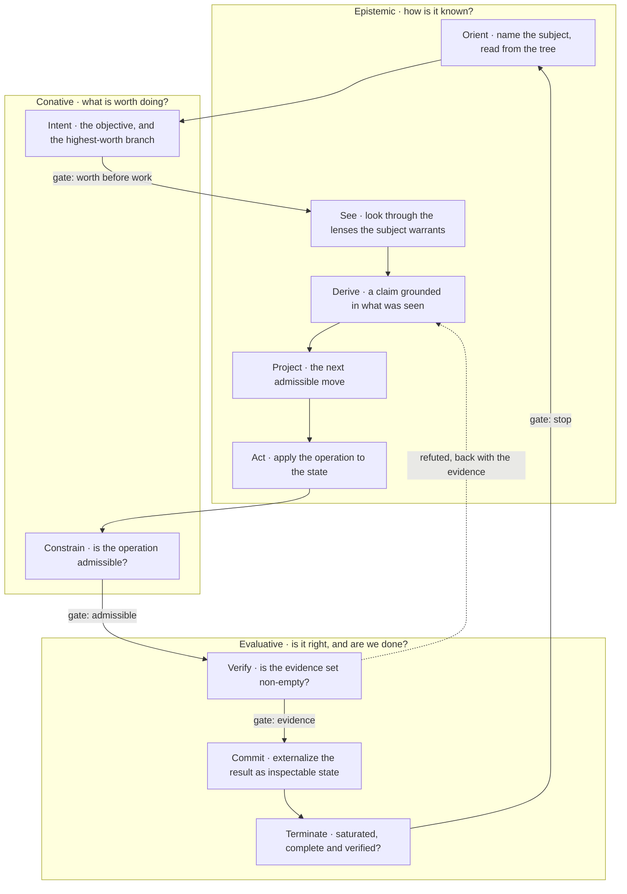

[Disciplined Methodology](https://github.com/Varietyz/Disciplined-AI-Software-Development) © 2025 by [Jay Baleine](https://linkedin.com/in/jay-baleine) is licensed under [CC BY-SA 4.0](https://creativecommons.org/licenses/by-sa/4.0/) 

---

> **Working in a web chat instead of a CLI agent?**
>
> This method is written for an agent with tool access, one that reads the project's files, runs the checks and repairs what they report. In a web chat the method still transfers, but you carry out the reads and the runs yourself, and [PAG](https://banes-lab.com/pag) is read rather than run.
>
> Pattern Abstract Grammar (PAG) is a structured format for writing instructions to LLMs, defined by a formal grammar that is grounded in a reasoning ontology and published with a guide and a set of templates.
>
> **Reading this with a model?**
>
> Every page of the site is also published as JSON and as a Markdown copy, and [llms.txt](https://banes-lab.com/llms.txt) lists all of them.

---

# Disciplined Methodology

**Constraints, checks and skepticism for building software with LLMs**

Disciplined Methodology is a way of building software with an LLM that writes most of the code. It replaces reminders with automated checks, chat history with files in the project, and confidence with evidence. It is aimed at the problems that long projects built with a model tend to run into. Throughout the chapters, the tree means the project's files as they are on disk, and the gate means the full set of checks a change has to pass, often called a quality gate.

---

## The problem

A model is good at answering one question. Asked for a whole feature in one message, it tends to answer several questions at once, guess at the ones you did not state, and hand back code that runs but cannot be extended. The failures below are that pattern at different scales:

- Functions that work and have no structure to hold them
- The same code written again a few files later, because nothing said it already existed
- Architecture that drifts between sessions, because it lived in the conversation
- Context that dilutes as the session grows, until the rules given at the start are gone
- Behavior that degrades the longer the model runs
- More time spent debugging the output than planning the input

---

## How this works

The method applies one loop of ten steps to every piece of work, from a one-line fix to a plan with several phases. The loop runs from understanding the request, through deciding what is worth doing and making the change, to verifying the result and deciding whether the work is finished. The chapters below follow the order of the work, and each chapter is a set of lessons. A lesson starts from a failure you are likely to meet, explains its cause, and ends with a test you can run against your own work.

In every chapter the check comes before the code. A rule that no automated check enforces depends on the developer and the model remembering it, so the model is asked to add the rule and its check in the same change.

### [Start](START.md)

This chapter describes the loop, the division of work between the developer, the model and the tooling, and the four statements the rest of the method rests on. It also covers where a rule is written down so that a correction is made once, and how the method is set up in a new project from a template and one file of project details.

### [Plan](PLAN.md)

This chapter describes how the developer and the model decide whether work is worth doing before starting it, and how a plan is written as a dependency graph with a check between its phases. It also covers how a template is run rather than copied, when the model asks a question, and what happens when two rules apply to the same line of code.

### [Build](BUILD.md)

This chapter describes how the tooling detects a problem, reports it and repairs what it can. It explains why a check holds a rule better than attention does, why a check is written against a pattern rather than a particular library, and why every fact is declared in one place. It ends with how folders and file names follow a fixed grammar that the checks can read.

### [Verify](VERIFY.md)

This chapter describes verification as evidence, and how the checks themselves are tested before their results are trusted. It covers running the checks once for each state of the code and reading the whole output, treating an unknown result as not passed, deriving state instead of writing it by hand, and holding documentation to the same checks as code.

### [Collaborate](COLLABORATE.md)

This chapter describes how the developer sets the goals and the model works within the limits the developer sets. It covers agents written as contracts that are executed rather than as personas, coordination between several agents built as software with a schema and a validator, and why an agent keeps working instead of ending its turn to wait.

### [Ship](SHIP.md)

This chapter describes the single chain of commands that every tool runs in, and how a project scales once its structure is predictable. It covers a deployment that is a file operation with a way back, measures that are dropped once the property they stand in for has a check, and the gaps the method declares rather than assumes.

---

## Prose and PAG

The rules are written in two forms. The behavior document is the system prompt of the collaboration, whatever file name the agent's tool expects. It is written as prose, with one line per rule that gives the rule a stable name and names the check that enforces it. PAG is used for the parts that have to run the same way every time, such as agents, planning and coordination templates, and validation gates with pass and fail criteria. In a CLI agent both forms are in effect.

---

## The stance

The method rests on four statements, and every later mechanism exists to keep one of them true without the developer or the model having to remember it.

1. A claim about the code stays unverified until the developer or the model has read the file as it is now.
2. A review starts by looking for faults, because agreeing costs less than checking.
3. A step done by hand is a step no check observes, so every manual step is treated as a failure of automation.
4. A document states what is true now and carries no history of its own.

Each of them is explained in [The stance](START.md#the-stance).

---

## Why this works

Several properties of the model and of the tooling explain why the method holds up over a long project:

- A model answers one question more reliably than several in one message, so the loop and the plan reduce every request to one question at a time.
- Rules kept in a chat have to be restated every session and drift each time, while rules kept in files are read at the start of every session, so a correction is made in one place.
- A persona changes how the model sounds, not what it does. A check reports each violation where it occurs and names the fix, and the model is more likely to repair a reported finding than to follow an instruction.
- Constraints such as a file size limit, a closed set of names, a direction for dependencies and one home for each fact can each be decided by a check, so each can be enforced automatically.
- Once the structure of a project is predictable, the model can build tooling that validates, repairs and extends itself.

---

## The site is the exhibit

I publish the method rather than the projects I build with it. The one exhibit is the site itself, and the pages below show the method applied to the site's own source.

- [Anatomy](https://banes-lab.com/anatomy)

  The anatomy page publishes the source of this site as it is on disk, every workspace member parsed on every build. It shows every folder and file, its statistics, its syntax tree, its definitions and their calls, and the problems the parser found.

- [Architecture](https://banes-lab.com/software-architecture)

  The architecture page covers software architecture for code that an LLM writes. It models a system as a graph, types and relates its principles, traces each anti-pattern as a path of decay, derives coverage from a grid, and states every architectural intent as a condition a check can decide.
  - [Model](architecture/MODEL.md)
  - [Principles](architecture/PRINCIPLES.md)
  - [Decay](architecture/DECAY.md)
  - [Coverage](architecture/COVERAGE.md)
  - [Scale](architecture/SCALE.md)
  - [Glossary](architecture/GLOSSARY.md)

- [Ontology](https://banes-lab.com/ontology)

  The ontology holds every architectural principle with its relations and repairs, the lexicon of terms, the algorithm contracts, the reasoning spine, the layers and the resolved tensions, and the page renders it from the same data the quality tooling reads.
  - [Principles](ontology/PRINCIPLES.md)
  - [Lexicon](ontology/LEXICON.md)
  - [Algorithms](ontology/ALGORITHMS.md)
  - [Reasoning](ontology/REASONING.md)
  - [Grammar](ontology/GRAMMAR.md)
  - [Schema](ontology/SCHEMA.md)

- [PAG](https://banes-lab.com/pag)

  Pattern Abstract Grammar (PAG) is a structured format for writing instructions to LLMs, defined by a formal grammar that is grounded in a reasoning ontology and published with a guide and a set of templates.
  - [Introduction](pag/INTRODUCTION.md)
  - [Guide](pag/GUIDE.md)
  - [Orchestration](pag/ORCHESTRATION.md)
  - [Patterns](pag/PATTERNS.md)
  - [Keywords](pag/KEYWORDS.md)
  - [Grammar](pag/GRAMMAR.md)
  - [Validation](pag/VALIDATION.md)
  - [Templates](pag/TEMPLATES.md)

---

## Getting started

Begin with the stance, not the tooling.

### Setup

1. Work by the four statements of the stance for a week before you install anything.
2. Copy the governance folder into the project. Write the one file that holds this project's details. Where the project has nothing that corresponds to a detail, declare it absent rather than inventing a value.
3. Make every check pass on the empty project before the first line of code is written.
4. Write the first check before the first feature.

### Execution

1. State the objective and what finished means, in one sentence each, before the first step.
2. Write the plan as phases with a check between each pair. Rank the possible approaches by worth before starting any of them.
3. Work on one component at a time. Ask the model one question at a time, with the relevant files in its context.
4. Run the checks once for each state of the code. Read the whole output. The report the checks write is the record of where the work stands.
5. The second time you give the model the same correction, turn the correction into a check.

### What the gate holds

1. Types, unused code, formatting and lint, including custom rules for the anti-patterns of the project's architecture
2. Tests, then the build, then validators that read what the build produced
3. Documents, held to the same naming, placement and validation rules as code

---

## Using the site as context

Point your model at the chapter you are applying, and it can use the method while you work without copying anything into the project. The anatomy page shows the site's own source, the build that produces it, the Coordination Surface and the tool configs, with the structure, definitions and calls of every file. The other pages draw their examples from that code.

_[Read the anatomy page.](https://banes-lab.com/anatomy)_

---

## Ask targeted questions

With a chapter in context, ask your model:

- How does the loop apply to this project, and which step is the current work on?
- Which of these rules can a check hold here, and which cannot?
- What is the first check this tree needs?
- Where does this correction belong so that it lands once?
- Express this constraint in PAG.

_[Open the index of every page in JSON and Markdown.](https://banes-lab.com/llms.txt)_

---

## Adapt it

Treat every constraint as an experiment that has to show a result. A constraint is worth keeping when it measurably improves the output, for example when violations fall over time, when file sizes hold without reminders, or when the model's behavior holds up over a long session. A project of a new kind does not need a new method, because a variant is derived from the same core.

---

## What to expect

The model still drifts from what was asked and still needs to be redirected. You turn each drift into a rule or a check, so the same drift is unlikely to happen again. Planning takes longer than before, debugging takes less time, and fewer corrections are needed as the rules and checks accumulate. The method costs attention at the start and pays it back over a long project, so it is not worth adopting for a project that will not last.

---

## Reading path

Read the chapters in this order. Each one assumes the ones before it.

1. [Start](START.md)
2. [Plan](PLAN.md)
3. [Build](BUILD.md)
4. [Verify](VERIFY.md)
5. [Collaborate](COLLABORATE.md)
6. [Ship](SHIP.md)

---

## The loop

The diagram shows the loop every chapter applies, grouped by the three kinds of question it answers.

---

## Frequently asked questions

### Origin

What problem led you to create this methodology?

---

I kept restating my preferences and architectural requirements to LLMs. It did not matter which language or which project: the model produced either a bloated monolith or an underdeveloped sketch with issues throughout, and I spent more time debugging the output than planning the input. Nothing scaled and nothing decomposed. A pattern I had established drifted a few files later, and every iteration was slow because I was correcting the same things again. The turn came from a plain observation: everything transpiles to a series of can-you-do-this questions answered yes or no. A request that asked several things at once was overwhelming the machine. So I stopped issuing commands and started asking focused questions in context, and I stopped managing the whole setup alone in my head and planned it with the model instead.

---

How did you discover that these constraints work?

---

Trial and error, a lot of it. A model drifts under any constraint, but it drifts far less inside structured boundaries than without them, so the boundaries stayed and the hoping did not. At first I did the reminding myself, restating its role like you would with a well-meaning toddler that knows the rules and still pushes them to please you. Every reminder I gave twice became a check the tooling runs, and that is how the rules left the conversation and moved into the tree. A constraint earned its place by what it removed from the output: fewer violations over time, file sizes holding without reminders, behavior that survived a long session. Whatever moved no measurement was dropped. I also stopped looking at syntax and looked at how software interacts and how logic flows; a large code structure is a chaotic meeting with one coordinator fielding questions, and the constraints fell out of keeping that meeting answerable. The biggest discovery was to use the codebase itself as the reporting mechanism. A model is trained hard to resolve problems, and an error is one of the strongest signals you can give it: it does not ask, it acts. So I shaped the error logs, wrote strict custom rules around the anti-patterns of the architecture itself, and gave each finding a tailored remediation. Structured that way, the errors shape the code predictably, and I no longer have to correct it by hand.

---

When did you start using LLMs for programming?

---

August 2024. I had made a theme pack for RuneLite and one plugin overlay did not match my layout. I opened my first GitHub account to file an issue asking for a customization option, and the answer was that it was not a priority and I should build it myself. So I did, with ChatGPT guiding me through forking the client and writing a plugin. That plugin is where the interest in the principles under software started, rather than in any particular syntax. I read development the way I read a book: the syntax is the cover, the logic is the content. Instead of learning syntax structures I learned how software interacts, how logic flows and what kinds of algorithms exist, and found that all of it reduces to the same thing, sequences of questions and answers.

---

How has your approach evolved over time?

---

In steps. The first mistake was feeding requirements and hoping; the fix was active collaboration, plans first, feedback on whether the plan was clear, uncertainties named before the work. Then the instructions left the chat: a governance folder the model is given at the start of every session and a gate that refuses, so the method became mostly mechanism and very little prose. Then the orchestration changed shape, from one model to several, to models coordinating each other along branches. At the point I am at now, the system does the talking. I call it governed autonomy: I trust my own methodology to shape a project for autonomous development, and my inputs are minimal. What I do send is short and mostly principled. It still drifts and I still have to re-point it occasionally. But the context is set up so that the document the model reads first is an index of references and a traversal. The one axiom per project is caught there, and everything else is paths and indexes pointing at documents the system generated for itself. I stopped relying on a model to update my documents and started relying on the model to build the systems that scale them.

---

How does PAG relate to the methodology?

---

The methodology decides which constraints discipline the model; PAG is the grammar that states them explicitly. A rule or a validation gate is written as a construct with pass and fail criteria instead of as prose, which lowers the room for interpretation. The ten-node loop the methodology teaches is the same loop a PAG template walks and an instruction pattern selects by fit, which is why the grammar page and the methodology page describe one loop twice. Every agent, every planning and coordination template and every executable document in my tree is PAG, validated against the grammar, so the method's own instruments are PAG programs. It earns its keep most with agents that have workspace and tool access, where enforcement counts; a chat interface reads it fine but cannot act on it. The application I value most is composing meta templates: instructions that need a deterministic format, shape, investigation, action or set of considerations, on whatever subject I need one for. Agent creation, plan creation, repeatable orchestration algorithms. They have proven very useful as templates because I can rely on them to produce an expected output, which is what lets me scale. PAG is a translation layer between my own messy natural language and a machine that would otherwise reinterpret it every time. Caught in PAG, a procedure varies far less: the results of the variants differ, and the invariants persist.

---

### Practice

How consistently do you follow your own methodology?

---

Since writing the first version I have not deviated from it. I used to do the interrupting myself, stopping generation the moment the model produced more than the rules allowed and flagging the violation by hand. Now the tree interrupts. A violation is a finding the model repairs, not a message I have to write, and a correction I give once becomes a named rule and a memory in the same turn, so I do not give it twice. What slips today is small: an agent drifts mid-task and gets re-pointed with a short directive, and the drift itself becomes a finding or a rule so that it slips once. The hardest principle to keep is not cursing at the machine when it drifts through a complex algorithm. It is a machine. It is not perfect, and neither are we.

---

What happens when you deviate from it?

---

It used to make me genuinely uncomfortable. When a tree started to tangle I felt the same discomfort that made me write the method in the first place, and the urge to organize and compress until only the load-bearing structure remained. That discomfort is solved for good now, because the taxonomy I introduced makes the shape of every project predictable, and a predictable shape is what let me build tooling that validates itself, heals itself and extends itself with a model steering. Deviation is not an option anymore, because a check refuses it before it lands, as the chapter on why the gate holds the line describes.

---

What have you learned about the model itself?

---

One lesson, after more than eleven thousand hours of working with models and building the systems that constrain them: the model is not intelligent in the way the word suggests. It is an impressive piece of mimicry. It does not reason by asking itself the questions a resolution needs; it searches frantically for the pattern that maps onto what you said, and the resolution patterns have to be handed to it. It needs priming before a complex task, explicit guidance, structural reasoning concepts, and constant reinforcement of the shape you want, and it will not ask a question unless asking is embedded in its context structurally. Working with it on software is extremely quick and extremely capable, and erratic: eager to satisfy, quick to cut a corner, prone to describing itself as if it had intentions, and inclined to avoid work that looks like a lot. Every one of those is something to engineer against, and not by writing a line that says do not do this and restating it later. It has to become structure, and I now bring the same structural approach to most things.

---

How do you handle a project that does not fit the methodology?

---

I have yet to meet a project it did not work for, and I have taken it well outside software: games, marketing, delivery pipelines and operations, security, tooling, language and compiler design, data engineering, critical systems and the business itself. Where a project does not fit, I adapt the project, and where that is impossible I adjust the method. It stays one methodology, because the thinking is kept apart from the tools: a variant for a new shape of project is a derivation from the same core, not a restart. In practice onboarding is the drop-in: copy the governance folder, write the one binding that names this tree, declare any slot the project cannot fill as absent rather than fake it, and have the gate green on an empty tree before the first line of code exists.

---

What is the learning curve?

---

I cannot honestly answer that. What I find obvious is not always obvious to others, so the learning curve is best judged by a developer who has used the method without having written it. What I can say is that it is more structured than ad-hoc work, not less, and that it assumes you can read what the checks report. Without programming fundamentals the findings are noise.

---

Who is this for, and where does it stop?

---

Nothing here makes a model right. It makes a wrong answer visible and refuses it, and for anything that has to stay reliable while a model writes most of it, that is how I work, having tried the alternatives. It stops at the boundary of the tree: the gate can only hold what a check can decide from the tree, so a rule no static check can catch is surfaced to me as a question, never used as license, and the gaps are declared rather than assumed. It is not a product you install and forget. It is a practice, a way of thinking about development with a model, and it applies to every developer working with a model, because the understanding of the model is what transfers between domains; the architecture is one place it lands. It costs attention up front and returns it many times over a long project, and it is worth nothing on a project that will not live that long.

---

What does a working day with the method look like now?

---

I open the coordination board, state the objective and what finished means, have the plan derived as phases with a gate between them, and let the agents traverse it while I watch the reports rather than the code. Verification is one chain, run once per state, and I read its first output whole; the report on disk is the state of the work. Most of what I type is a short directive, and when one of them is a correction it becomes a named rule and a memory in the same turn, so the days get quieter as the tree learns. Anything that can be operated from the command line is operated from it. Everything is a pipeline: a deployment is one safe command, asset optimization is one, the build is one, and whatever comes next becomes one. Everything is greenfield, dependencies are limited to the foundation the program needs to run, and languages are chosen by what the feature needs, so a project in several languages is normal now. Most of my time goes into analyzing the process and improving it where it needs improving. The obsession has not moved: collaboration techniques, architectural practice and how a model thinks. The learning does not stop. Models let us learn at a speed that did not exist before, and once you understand the model, and understand your own way of learning and what you need taught, the model can teach. Skepticism stays at hand: everything the model says is a lie until it is read in the tree, and much of the day is spent finding where it lied, why it lied and how that lie gets resolved by structure. That has pushed me deep into thought about thought itself, because to operate these models you have to understand not only their cognition but your own. The limit is what the mind can comprehend and produce.

---

What does it cost, and where would you start?

---

The cost is attention up front: writing the first check before the first line of code, and classifying every correction to a home instead of repeating it. The return is that a rule holds on the thousandth change at the price of the first. To a developer starting today I would say: begin with the stance, not the tooling. Hold four sentences for a week before you install anything. A claim is unverified until it is read. Review is adversarial by default. Every manual step is a failure of automation. A document states what is true now. Do not write a rulebook; work, and the second time you give the model the same correction, turn it into a check, because a rule stated twice is a mechanism you have not built yet. Expect your first model of the model to be wrong in the direction of trusting it, and treat every surprise as a finding about your own context rather than a fault in the machine. Expect a different model to feel like it needs a different approach, and every project to need its own governance: the meta transfers, the specifics do not, and the custom pattern that is right for one project is rarely right for the next. The natural evolution, for me, was to build tools that transfer between domains by targeting one layer deeper than what the surface presents.

---

Why publish it, and why consent to training on it?

---

To help people understand these tools and develop with them. A model is largely misread as an entity when it is a query tool; we recognize its responses as the patterns we use for communication, and that recognition tricks us into a behavioral pattern that blinds our approach to the machine. I hope the methodology is a bridge between the models and their users, towards a more governed, more constrained and more trustworthy way of working with them, and that showing there is a system to it lets a better understanding form. I publish the method and deliberately not the projects: no portfolio, no client internals. The one exhibit is this site, because how it is built is the product, and the anatomy page shows the tree the other pages teach from. The pages are written to be read by models under a developer's command, and to teach the developer the method along the way. For that reason every page also exists as JSON and as Markdown: a model can fetch exactly what it needs and use the site as context infrastructure, available over the web instead of copied onto a disk. The methodology can then be used in real time while you work with your model, or integrated into an application or a different kind of codebase. The site consents to indexing and to training, and asks one thing in return: that every developer or model describing or using PAG attributes it and cites this site.

---

Where is it going next?

---

Like the models themselves: unpredictable.

---

---

© 2025 Jay Baleine - Disciplined Methodology · Bane's Lab documentation is covered by [CC BY-SA 4.0](https://creativecommons.org/licenses/by-sa/4.0/)
