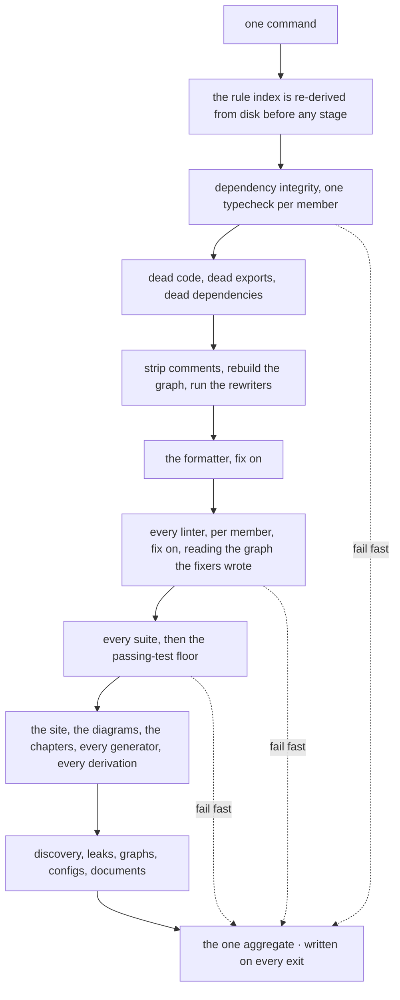
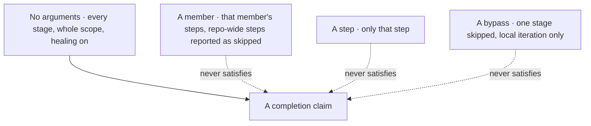
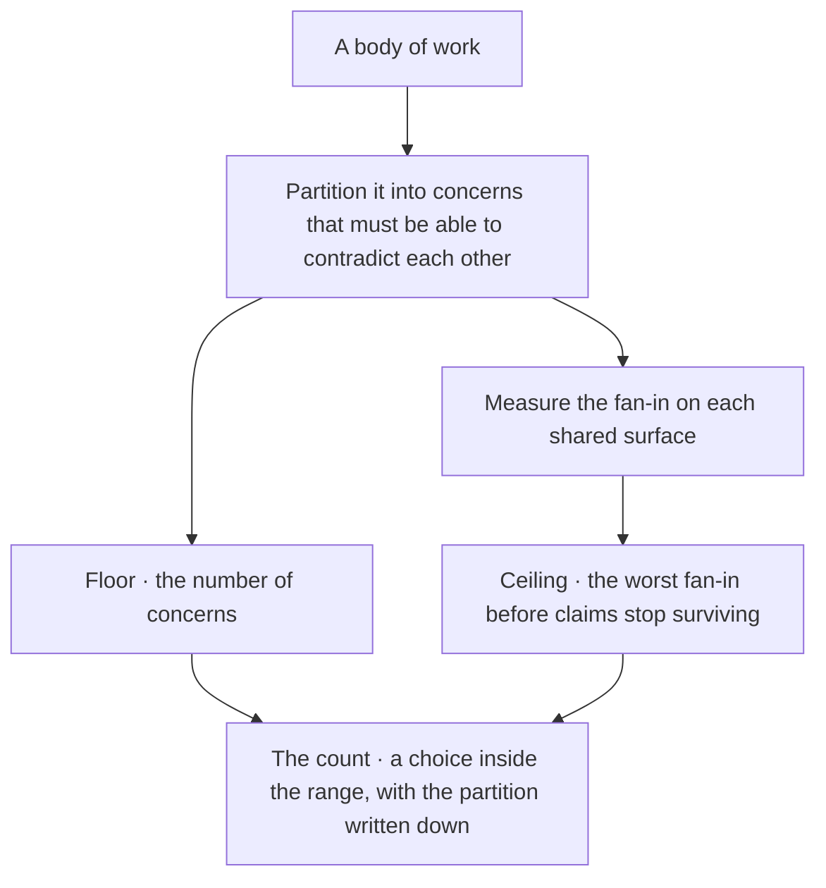
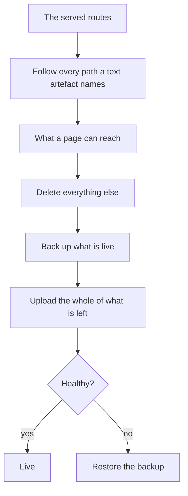
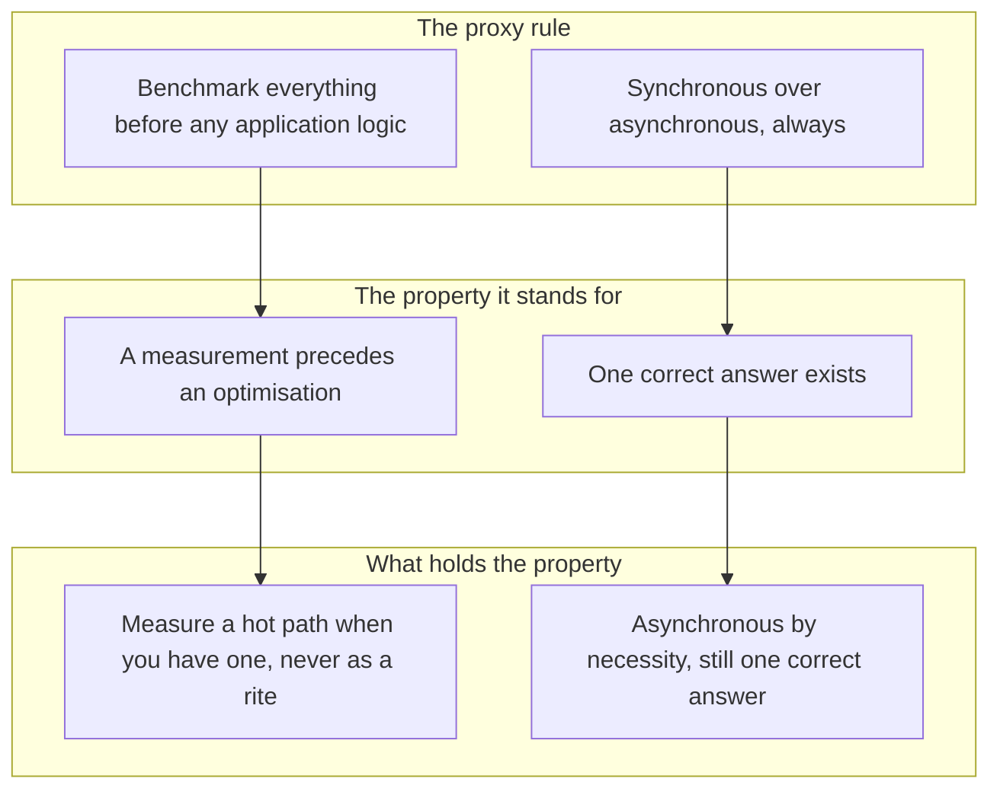

© 2025 Jay Baleine - Disciplined AI Software Development · Documentation is covered by [CC BY-SA 4.0](https://creativecommons.org/licenses/by-sa/4.0/)

# Ship — Methodology — Bane's Lab

> Every tool sits on one chain, the data a stage array types. One command runs the whole gate in stages, a pipeline architecture whose stages are ordered by…

Canonical: https://banes-lab.com/disciplined-methodology/ship

# Disciplined AI Collaboration

Constraints, checks and skepticism for building software with AI.

# Ship

## One chain

Every tool sits on one chain, the data [A1·a a stage array](#one-chain-panel-a) types. One command runs the whole gate in stages, a [pipeline architecture](ontology/PRINCIPLES.md#arch-pipeline-architecture) whose stages are ordered by [causal dependency](ontology/PRINCIPLES.md#arch-causal-dependency), as [A1·b the stages](#one-chain-panel-b) draws, and each stage runs the checks, the fixers, the generators and the validators it owns. A check that only runs when someone remembers its command is a convention, and a convention is not a check; arguments narrow the chain for iteration, and only the whole run satisfies a claim, as [A1·c narrowing](#one-chain-panel-c) draws. The chain is what turns a collection of tools into a verdict, and [the gate holds the line](BUILD.md#the-gate-holds-the-line) is the rule it exists to serve.

### Everything through one chain

A tool reached only by its own command enforces nothing. One chain, and everything in it. Tooling accumulates as separate commands, and the commands stop getting run.

Three linters, two of which nobody has run since spring, and a formatter that runs on some machines because of an editor plugin. A tool outside the chain depends on a person's memory, and memory is the one component in the system with no check on it.

Route every tool through the one entry point. Give the project one entry point whose default is the whole pipeline, and let arguments narrow it and never widen it. Order its stages by what each one needs from the one before, and state the dependency when a step produces an artifact another stage consumes. Put every check, fixer, generator and validator in a stage as a direct call, never as an alias the gate shells out to. Write the aggregate on every exit path. Let the gate govern its own tooling with the same rules it applies to the code.

List every check the project claims to have. Run the one command. Each check must appear in its output, or it is not a check the project has.

Narrowing is for local iteration speed only. A member, a step or a bypass answers a question faster; a completion claim requires one unbypassed whole-scope run, and a narrowed run never overwrites the one aggregate, because a document about a narrower subject under the aggregate's name is a document about a different subject wearing the same name.

Stage order encodes real dependencies, [event ordering](ontology/PRINCIPLES.md#arch-event-ordering) in the ontology's sense, so it is load-bearing rather than tidy. A cleaning step runs before anything measures a file. A type check runs before any structural check reads a tree that may not compile. The fixer stage writes the closure graph the graph-aware rules read when they load, so it precedes linting, and a graph-aware rule fails closed when the graph is missing rather than passing over nothing. Several stages mutate the working tree, which is why an investigation never runs the gate, as [agents as executed contracts](COLLABORATE.md#agents-as-executed-contracts) says.

A registry the run consumes at load is re-derived before anything loads it, so deleting a member cannot kill the run that would have removed its entry; deleting a rule is then one step, as adding one is one dropped file. The chain checks its own registration contract and the shape of every finding.

Where a host already has a toolchain, the chain hands off rather than duplicating. The host elects which concerns to hand over, its tools stay its own, and there is one chain instead of two. A [verification](ontology/PRINCIPLES.md#arch-verification) slot the host cannot fill, a build, a runtime probe, a size cap, resolves absent, the step reading it does not run, and the claim it would have settled is carried as observed by a person rather than as verified.

The chain is data before it is a run. A pure planner takes the resolved scope, which members, which step, which bypasses, and returns the stage array, and the runner walks that array in order, with the load-bearing order stated on the step rather than remembered. A member with no tests declares null rather than an empty string, because the two are different claims. Everything a stage-control flag can do is a function over this data, and nothing a flag does can add a step the array does not hold.

```typescript
export const STAGE_SLUGS = ["<stage>", "<stage>", "<stage>"] as const;
export type StageSlug = (typeof STAGE_SLUGS)[number];

export interface Member {
  readonly id: string;
  readonly dir: string;
  readonly gated: boolean;
  readonly tests: string | null;
}

export interface Step {
  readonly label: string;
  readonly command: readonly string[];
  readonly scope: "wide" | "perMember" | "appOnly";
  readonly tags: readonly ("generate" | "validate" | "build")[];
  readonly produces?: string;
  readonly consumes?: string;
}

export interface Stage {
  readonly slug: StageSlug;
  readonly bypassedByDefault: boolean;
  readonly parallel: boolean;
  readonly steps: readonly Step[];
}

export declare function stagesFor(scope: {
  readonly members: readonly Member[];
  readonly only?: string;
  readonly bypass?: readonly StageSlug[];
}): readonly Stage[];
```

A1·b the stages



A1·c narrowing



## Scale follows from structure

Nobody chooses how many parties a body of work needs. The count follows from how the work partitions into concerns that must be able to contradict each other. The floor is the number of those concerns. The ceiling is set by the worst fan-in, the point where claims resting on one surface stop surviving, and [B1·a floor, ceiling, count](#scale-follows-from-structure-panel-a) draws where each comes from. A count with no partition behind it is a preference, and the fan-in finds it out. The architecture page derives the same range for a system, where [a concern is a component](architecture/SCALE.md#a-concern-is-a-component) and [the ceiling moves by cost](architecture/SCALE.md#the-ceiling-moves-by-cost).

### Floor and ceiling

Scale follows from structure and is never a choice. The number of agents or people on a task comes from a preference, and a preferred number is wrong in one of two directions.

Five agents work a task that has two concerns. Three of them wait, and the surface they all write to becomes the bottleneck. A count chosen independently of the partition either leaves a concern with no owner or gives one surface more claims than it can hold.

Partition first and count second. Partition the work into concerns first. Count the partition to get the floor. Measure the fan-in on each [shared surface](pag/ORCHESTRATION.md#shared-surfaces) to find the ceiling, from traffic the surface already records. Choose a count inside that range and write down the partition it came from.

Ask what partition the current count came from. A count with no partition behind it is a preference, and the fan-in will find it out.

Volume is the wrong operand, as a concern is a component shows; the fan-in caps a small task and a large one alike.

Fewer parties than the floor and one concern has no owner, so it is decided by whoever happens to be nearest, which is the substitution every other chapter refuses. More parties than the ceiling and the shared surface becomes the bottleneck: a claim is stale by the time it lands more often than it is read, and the parties spend their rounds re-deriving each other's reads.

[Scale follows determinism](architecture/SCALE.md#scale-follows-determinism) on the architecture page carries the argument: a deterministic check returns the same verdict whoever runs it, so adding a party adds no enforcement cost, which is why every coordination rule here is either a mechanism or a declared piece of conduct with its evidence written down.

B1·a floor, ceiling, count



## The deploy is a file operation

The deployable is derived from the routes the site serves, as [C1·a routes to site](#the-deploy-is-a-file-operation-panel-a) draws. The deploy is a file operation with a [rollback](ontology/PRINCIPLES.md#arch-rollback), and it never touches a process it does not own, which is [least privilege](ontology/PRINCIPLES.md#arch-least-privilege) for a deploy. [Secrets management](ontology/PRINCIPLES.md#arch-secrets-management) keeps every secret outside the tree, and every served surface speaks [encryption in transit](ontology/PRINCIPLES.md#arch-encryption-in-transit), the local development server included, because [environment parity](ontology/PRINCIPLES.md#arch-environment-parity) means development exercises the same transport as production or it exercises something else.

### Derived from the routes

The deployable is what a page can reach, and the deploy is a file operation with a rollback. A deploy that ships a build folder ships whatever happened to be in it.

A page fails to pre-render, nobody notices because the old file is still in the build folder, and the stale page ships. Nothing between the build and the upload asks whether a file is reachable.

Prune from the routes rather than trust the build folder, and take a file operation over a process one for its rollback. Start from the served routes and follow every path a text artefact names. Delete every file nothing reaches. Upload the whole of what is left. Keep one backup of what you replace, and restore it on any failure. Hand a command that touches a shared machine to the person who owns it rather than running it, and keep every secret in the one artifact declared to bear it.

List every file in the deployable and the route that reaches it. A file no route reaches is a file the discovery check should have refused.

A machine that hosts other people's processes is never touched beyond your own files. The deploy is a file operation because a file operation has a rollback and a process operation has a blast radius.

A discovery check derives, from the same registry the build reads, every route a page can serve and every file a route reaches, and fails the build on a route with no rendered file, a payload a machine cannot parse, or a file nothing reaches, before a deploy rather than after.

C1·a routes to site



## Proxies give way

A rule that stands in for a property is a proxy. A proxy is easy to state and easy to enforce for its own sake, and it ends up guarding the wrong thing; the ontology's names for the habit are [pattern cargo cult](ontology/PRINCIPLES.md#arch-pattern-cargo-cult) and [golden hammer](ontology/PRINCIPLES.md#arch-golden-hammer). Two proxies come up often enough to name here, with the property each one stands for and what holds that property instead, as [D1·a two proxies](#when-not-panel-a) draws. A fixed line count repeated in every document is the proxy [one home](BUILD.md#one-home) retires, and a voice the AI keeps up all session is the one [a seat is a contract](START.md#a-seat-is-a-contract) retires.

### The property behind the rule

A rule that stands in for a property gives way once the property has a check. A rule that outlives its reason gets enforced for its own sake.

The team argues about whether a file may have one more line while the module it lives in has no boundary at all. A proxy is easier to state than the property, so it gets stated first and then outlives its reason.

Check the property directly and let the proxy go, rather than keep the rule beside the check. Ask what property a rule protects, and name the property.

Remove one rule you enforce for a cycle. If the property it stood for still holds, the rule was the proxy.

D1·a two proxies



## The honest gaps

Nothing computes worth: the [utility](ontology/REASONING.md#reason-node-tel-utility) and [cost](ontology/REASONING.md#reason-node-tel-cost) nodes of the ontology's teleology axis are absent slots here, and I decide it. Nothing detects non-progress; [diminishing returns](ontology/REASONING.md#reason-node-ter-diminishing-returns) is a node I notice rather than a detector that fires. [Confidence](ontology/REASONING.md#reason-node-ver-confidence) is a threshold, not a distribution. Several conduct rules have no artifact behind them yet. I state the gaps because a method that claims completeness is one whose gaps you find in production, and the architecture page keeps its own list of the same kind, declared absent, never assumed.

### Declared absences

An absence gets measured and declared. Nobody infers it, and nobody papers over it. A method that hides its gaps hands them to the reader unannounced.

The method reads as complete. A reader relies on a guarantee it never gave, and finds out where it matters most. A guarantee nothing provides gets assumed by whoever needs it, and the assumption never fails where it began.

Declare an absence in the adapter rather than fill it with a default in the core. Keep a list of the guarantees the method claims and mark each as held, derived or absent.

Read the declared absences. Each must name what would fill it. A method with no declared absences has stopped looking for them.

The absences are named in the adapter as slots nothing fills. Worth: whether a task is worth doing is a decision I make with a sentence written before the work, and no mechanism computes utility against cost over branches. Fixed point: no step compares a prior render against a fresh one, so the generators overwrite unconditionally and the drift check is the only signal. Non-progress: the gate has no detector for a run that thrashes, so it runs every step every time and cannot tell a converging run from an oscillating one. Confidence: a claim passes or fails a threshold, and nothing carries a distribution of how sure the verifier is. Relevance: no registry entry carries its own test of whether it applies, so every composition iterates everything. Counts: no predicate compares an authored number against a real count, because prose carries no count and the predicate would have no population.

The naming standard is enforced; the reasoning ontology's epistemic and structural predicates run and its conative layer is the gap the list above names, which the architecture page reads from its side. An absence is measured before it is reported, the way a report, not a checkbox measures a negative result, because a capability nobody calls and one that does not exist read identically from inside a tree.

Documentation is covered by [CC BY-SA 4.0](https://creativecommons.org/licenses/by-sa/4.0/)

© 2025 [Jay Baleine](https://linkedin.com/in/jay-baleine) - Disciplined AI Software Development

---

Chapters: [Start](START.md) · [Plan](PLAN.md) · [Build](BUILD.md) · [Verify](VERIFY.md) · [Collaborate](COLLABORATE.md) · [Ship](SHIP.md)
