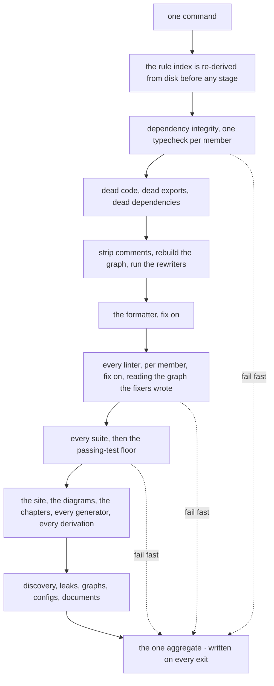
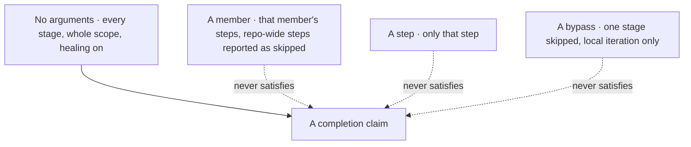
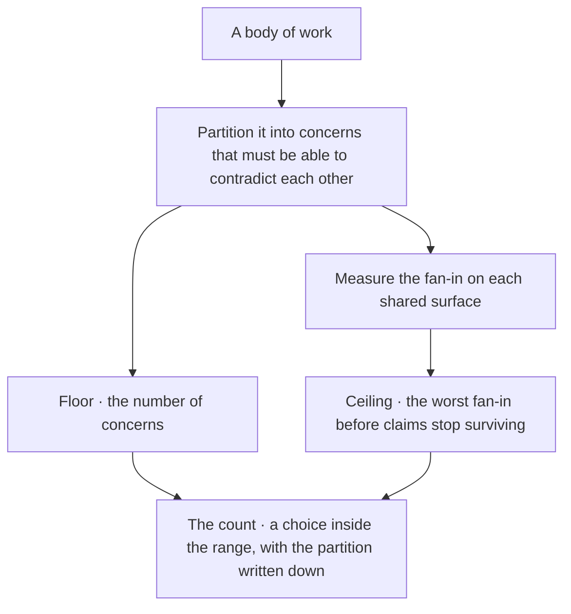
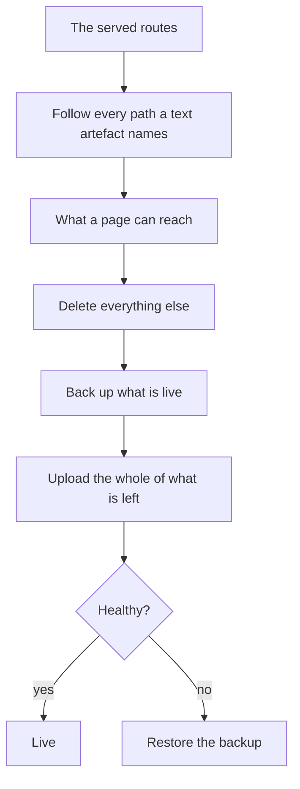
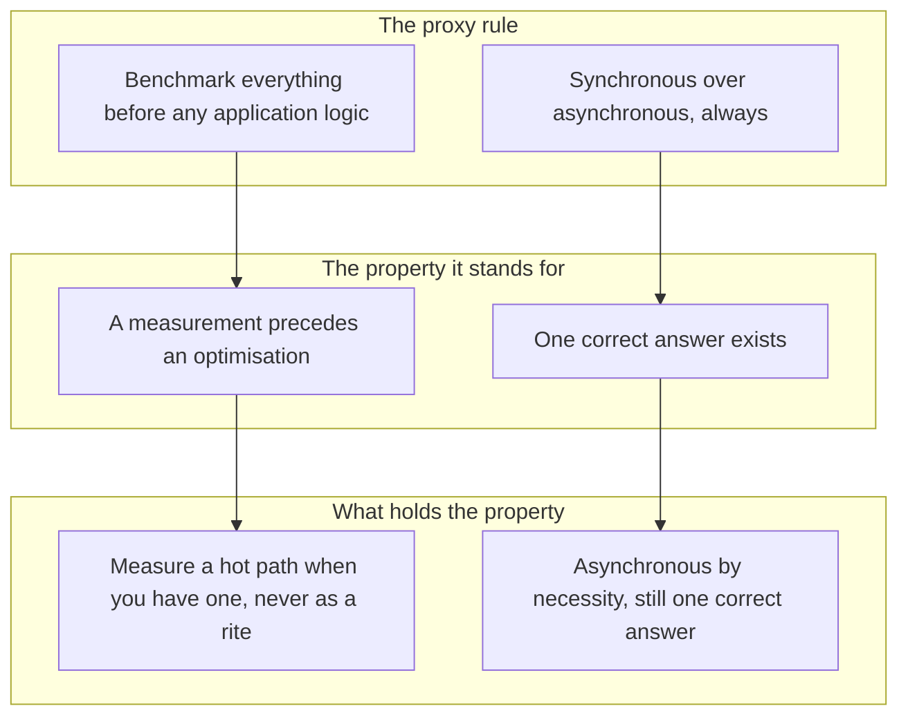

© 2025 Jay Baleine - Disciplined AI Software Development · Bane's Lab documentation is covered by [CC BY-SA 4.0](https://creativecommons.org/licenses/by-sa/4.0/)

# Ship — Methodology — Bane's Lab

> One command runs every tool in this method as a single gate, in stages typed as shown in a stage array. The stages form a pipeline architecture ordered by…

Canonical: https://banes-lab.com/disciplined-methodology/ship

# Disciplined Methodology

Constraints, checks and skepticism for building software with LLMs

# Ship

## One chain

One command runs every tool in this method as a single gate, in stages typed as shown in [A1·a a stage array](#one-chain-panel-a). The stages form a [pipeline architecture](ontology/PRINCIPLES.md#arch-pipeline-architecture) ordered by [causal dependency](ontology/PRINCIPLES.md#arch-causal-dependency), as shown in [A1·b the stages](#one-chain-panel-b), and each stage runs the checks, fixers, generators and validators it owns. A check that runs only when you or the model remember its command is a convention rather than a check. Arguments can narrow the chain while you iterate, but only the whole run supports a claim that the work is done, as shown in [A1·c narrowing](#one-chain-panel-c). The chain is what turns a collection of tools into a verdict, and the rule it serves is described in [the gate holds the line](BUILD.md#the-gate-holds-the-line).

### Everything through one chain

Tooling accumulates as separate commands, and the commands stop getting run. There are three linters, two of which have not been run since spring, and a formatter that runs on some machines only because of an editor plugin. A tool outside the chain depends on a developer's memory, and memory is the one component in the system with no check on it.

For this reason every tool runs through one chain, because a tool reached only by its own command enforces nothing. Every tool is routed through the one entry point, rather than kept as a command of its own. In practice, the project has one entry point whose default is the whole pipeline, and arguments can narrow it but never widen it. Its stages are ordered by what each one needs from the one before, and a dependency is stated wherever a step produces an artifact that another stage consumes. Every check, fixer, generator and validator sits in a stage as a direct call, never as an alias the gate shells out to. The aggregate report is written on every exit path, and the gate governs its own tooling with the same rules it applies to the code.

To check this, list every check the project claims to have and run the one command. Each check should appear in its output; one that does not is not a check the project has. Narrowing is only for speed while iterating locally. A member, a step or a bypass answers a question faster, but a claim that the work is done needs one whole-scope run with nothing bypassed. A narrowed run never overwrites the one aggregate, because a report about a narrower subject under the aggregate's name would describe a different subject under the same name.

The stage order encodes real dependencies, [event ordering](ontology/PRINCIPLES.md#arch-event-ordering) in the ontology's sense, so it carries weight rather than being tidy. A cleaning step runs before anything measures a file, and a type check runs before any structural check reads a tree that may not compile. The fixer stage writes the closure graph that the graph-aware rules read when they load, so it comes before linting, and a graph-aware rule fails closed when the graph is missing rather than passing over nothing. Several stages change the working tree, which is why an investigation never runs the gate, as described in [agents as executed contracts](COLLABORATE.md#agents-as-executed-contracts).

A registry the run consumes at load is derived again before anything loads it, so deleting a member cannot break the run that would have removed its entry. Deleting a rule is then one step, just as adding one is one dropped file. The chain also checks its own registration contract and the shape of every finding.

Where a host project already has a toolchain, the chain hands off rather than duplicating it. The host chooses which concerns to hand over, its tools stay its own, and there is one chain instead of two. A [verification](ontology/PRINCIPLES.md#arch-verification) slot the host cannot fill, such as a build, a runtime probe or a size cap, resolves as absent. The step that reads it does not run, and the claim it would have settled is carried as observed by the developer rather than as verified.

The chain is data before it is a run. A pure planner takes the resolved scope, meaning which members, which step and which bypasses, and returns the stage array, and the runner walks that array in order, with any order that carries weight stated on the step rather than remembered. A member with no tests declares null rather than an empty string, because the two are different claims. Everything a stage-control flag can do is a function over this data, and no flag can add a step that the array does not hold.

A1·a a stage array

```typescript
export const STAGE_SLUGS = ["<stage>", "<stage>", "<stage>"] as const;
export type StageSlug = (typeof STAGE_SLUGS)[number];

export interface Member {
  readonly id: string;
  readonly dir: string;
  readonly gated: boolean;
  readonly tests: string | null;
}

export interface Step {
  readonly label: string;
  readonly command: readonly string[];
  readonly scope: "wide" | "perMember" | "appOnly";
  readonly tags: readonly ("generate" | "validate" | "build")[];
  readonly produces?: string;
  readonly consumes?: string;
}

export interface Stage {
  readonly slug: StageSlug;
  readonly bypassedByDefault: boolean;
  readonly parallel: boolean;
  readonly steps: readonly Step[];
}

export declare function stagesFor(scope: {
  readonly members: readonly Member[];
  readonly only?: string;
  readonly bypass?: readonly StageSlug[];
}): readonly Stage[];
```

A1·b the stages



A1·c narrowing



## Scale follows from structure

How many parties a body of work needs is not a matter of choice. The count follows from how the work divides into concerns that must be able to contradict each other. The floor is the number of those concerns, and the ceiling is set by the worst fan-in, the point at which claims resting on one surface stop surviving; [B1·a floor, ceiling, count](#scale-follows-from-structure-panel-a) shows where each comes from. The architecture page derives the same range for a system, as described in [a concern is a component](architecture/SCALE.md#a-concern-is-a-component) and [the ceiling moves by cost](architecture/SCALE.md#the-ceiling-moves-by-cost).

### Floor and ceiling

The number of agents or people on a task comes from a preference, and a preferred number is wrong in one of two directions. Five agents work on a task that has two concerns, three of them wait, and the surface they all write to becomes the bottleneck. A count chosen independently of the partition either leaves a concern with no owner or gives one surface more claims than it can hold.

For this reason the number of parties follows from the structure of the work rather than from a preference. The work is partitioned first and counted second. In practice, the work is first divided into concerns, and counting them gives the floor. The fan-in on each [shared surface](pag/ORCHESTRATION.md#shared-surfaces) is measured from the traffic the surface already records, which gives the ceiling. A count is then chosen inside that range, and the partition it came from is written down.

To check this, ask what partition the current count came from. A count with no partition behind it is a preference, and the fan-in will expose it. Volume is the wrong input, as described in a concern is a component; the fan-in caps a small task and a large one alike.

With fewer parties than the floor, one concern has no owner, so it is decided by whichever party happens to be nearest, which is the substitution every other chapter refuses. With more parties than the ceiling, the shared surface becomes the bottleneck: a claim is more often stale by the time it lands than it is read, and the parties spend their rounds re-deriving each other's reads.

The argument is carried on the architecture page in [scale follows determinism](architecture/SCALE.md#scale-follows-determinism). A deterministic check returns the same verdict whoever runs it, so adding a party adds no enforcement cost, and that is why every coordination rule here is either a mechanism or a declared piece of conduct with its evidence written down.

B1·a floor, ceiling, count



## The deploy is a file operation

The deployable is derived from the routes the site serves, as shown in [C1·a routes to site](#the-deploy-is-a-file-operation-panel-a). The deploy is a file operation with a [rollback](ontology/PRINCIPLES.md#arch-rollback), and it never touches a process it does not own, which is [least privilege](ontology/PRINCIPLES.md#arch-least-privilege) applied to a deploy. [Secrets management](ontology/PRINCIPLES.md#arch-secrets-management) keeps every secret outside the tree. Every served surface uses [encryption in transit](ontology/PRINCIPLES.md#arch-encryption-in-transit), including the local development server, because [environment parity](ontology/PRINCIPLES.md#arch-environment-parity) means development exercises the same transport as production; otherwise it exercises something else.

### Derived from the routes

A deploy that ships a build folder ships whatever happened to be in it. A page fails to pre-render, and nothing reports it because the old file is still in the build folder, so the stale page ships. Nothing between the build and the upload asks whether a file is reachable.

For this reason the deployable is whatever a page can reach. The deployable is pruned from the routes rather than taken from the build folder on trust, and a file operation is chosen over a process operation for its rollback. In practice, the deploy starts from the served routes and follows every path a text artefact names. Every file that nothing reaches is deleted, and the whole of what is left is uploaded. One backup is kept of what is replaced, and it is restored on any failure. A command that touches a shared machine is handed to the developer who owns that machine rather than run, and every secret stays in the one artifact declared to hold it.

To check this, list every file in the deployable and the route that reaches it. A file that no route reaches is one the discovery check should have refused. On a machine that hosts other people's processes, nothing beyond your own files is touched. The deploy is a file operation because a file operation can be rolled back, while a process operation has a blast radius.

A discovery check derives, from the same registry the build reads, every route a page can serve and every file a route reaches. It fails the build on a route with no rendered file, a payload a machine cannot parse, or a file that nothing reaches, so the problem is found before a deploy rather than after.

C1·a routes to site



## Proxies give way

A rule that stands in for a property is a proxy. A proxy is easy to state and easy to enforce for its own sake, and it ends up guarding the wrong thing; the ontology's names for the habit are [pattern cargo cult](ontology/PRINCIPLES.md#arch-pattern-cargo-cult) and [golden hammer](ontology/PRINCIPLES.md#arch-golden-hammer). Two proxies come up often enough to name here, and [D1·a two proxies](#when-not-panel-a) shows each one with the property it stands for and what holds that property instead. Two others are retired elsewhere in the method: a fixed line count repeated in every document is retired in [one home](BUILD.md#one-home), and a voice the model keeps up all session is retired in [a seat is a contract](START.md#a-seat-is-a-contract).

### The property behind the rule

A rule that outlives its reason gets enforced for its own sake. The team argues about whether a file may have one more line, while the module it lives in has no boundary at all. A proxy is easier to state than the property, so it gets stated first and then outlives its reason.

For this reason a rule that stands in for a property gives way once the property has a check. The property is checked directly and the proxy is let go, rather than the rule being kept beside the check. In practice, the question for every rule is what property it protects, and that property is named.

To check this, stop enforcing one rule for a cycle. If the property it stood for still holds, the rule was the proxy.

D1·a two proxies



## The honest gaps

Some things this method does not do. Nothing computes worth: the [utility](ontology/REASONING.md#reason-node-tel-utility) and [cost](ontology/REASONING.md#reason-node-tel-cost) nodes of the ontology's teleology axis are empty slots here, and I make that decision myself. Nothing detects a lack of progress; [diminishing returns](ontology/REASONING.md#reason-node-ter-diminishing-returns) is a node I notice rather than a detector that fires. [Confidence](ontology/REASONING.md#reason-node-ver-confidence) is a threshold rather than a distribution, and several conduct rules have no artifact behind them yet. I state these gaps because a method that claims to be complete is one whose gaps you find in production. The architecture page keeps its own list of the same kind, where each gap is declared absent and never assumed.

### Declared absences

A method that hides its gaps hands them to the reader unannounced. The method reads as complete, a reader relies on a guarantee it never gave, and the reader finds out where it matters most. A guarantee that nothing provides gets assumed by the developer or the model who needs it, and the assumption never fails where it began.

For this reason an absence is measured and declared, rather than left for you or the model to infer or cover over. An absence is declared in the adapter rather than filled with a default in the core. In practice, a list is kept of the guarantees the method claims, and each is marked as held, derived or absent.

To check this, read the declared absences; each should name what would fill it. A method with no declared absences has stopped looking for them.

The absences are named in the adapter as slots that nothing fills. Whether a task is worth doing is a decision I make with a sentence written before the work, and no mechanism computes utility against cost across the options. No step compares a previous render with a fresh one, so the generators overwrite unconditionally and the drift check is the only signal of a fixed point. The gate has no detector for a run that thrashes, so it runs every step every time and cannot tell a converging run from an oscillating one. A claim passes or fails a threshold, and nothing carries a distribution of how sure the verifier is. No registry entry carries its own test of whether it applies, so every composition iterates over everything. Finally, no predicate compares a number written in prose against a real count, because prose carries no count and the predicate would have nothing to check.

The naming standard is enforced. The reasoning ontology's epistemic and structural predicates run, and its conative layer is the gap described above, which the architecture page reads from its own side. An absence is measured before it is reported, just as a negative result is, as described in [a report, not a checkbox](VERIFY.md#a-report-not-a-checkbox). From inside a tree, a capability that nothing calls and one that does not exist look the same.

---

Chapters: [Start](START.md) · [Plan](PLAN.md) · [Build](BUILD.md) · [Verify](VERIFY.md) · [Collaborate](COLLABORATE.md) · [Ship](SHIP.md)
