© 2025 Jay Baleine - Disciplined Methodology · Bane's Lab documentation is covered by [CC BY-SA 4.0](https://creativecommons.org/licenses/by-sa/4.0/)

# Methodology — Bane's Lab

> Disciplined Methodology is a method for building software with LLMs: one loop at every size, rules held by checks rather than attention, state derived rather than written, and evidence in place of claims.

Canonical: https://banes-lab.com/disciplined-methodology

# Disciplined Methodology

Constraints, checks and skepticism for building software with LLMs

# Start

## The loop

Every piece of work in this method follows the same loop of ten steps, which I call nodes, whether the work is a one-line fix or a plan that runs for weeks. A plan, a check, an agent, a refactor and a review are all this one loop, run at a different size. I treat it as the first thing to learn, because each later chapter applies it to one kind of work, and every mechanism in the method exists to hold one of its gates: the points where the work may not continue until a condition holds. The nodes are shown in [A1·a ten nodes](#the-loop-panel-a) and the sizes in [A1·b four sizes](#the-loop-panel-b), and each node is published as a record on the ontology page: [orient](ontology/REASONING.md#stage-orient), [intent](ontology/REASONING.md#stage-intent), [see](ontology/REASONING.md#stage-see), [derive](ontology/REASONING.md#stage-derive), [project](ontology/REASONING.md#stage-project), [act](ontology/REASONING.md#stage-act), [constrain](ontology/REASONING.md#stage-constrain), [verify](ontology/REASONING.md#stage-verify), [commit](ontology/REASONING.md#stage-commit), [terminate](ontology/REASONING.md#stage-terminate).

### Ten nodes, every size

Work with a model tends to begin at the doing and skip everything that should come before it. The model starts writing code in its first reply and guesses what the goal is, and after that each reply answers the previous one rather than the task, so the conversation drifts away from what was asked. Nothing gave the work a shape, so the shape came from whatever sentence the model found most likely next.

For this reason I give every piece of work the same shape, the loop, whatever its size. A one-line fix goes through the same ten nodes as a plan does, rather than through a lighter process kept for small tasks. In practice this means running the loop at the size of the task and always knowing which node the work is on. Four of the nodes are gates that apply at every size. The work has to be worth doing before any effort goes into it, a change has to be allowed before it is trusted, and a claim needs evidence before it is recorded. The loop only ends as done when nothing is left, everything is done and everything is checked. If that last condition is not met, it ends as blocked instead.

To check this on your own work, take the plan, the check and the agent for a single task and read each of them as the same ten nodes. A step that fits none of them is either missing from the loop or does not belong in the work. The loop has its limits as well. It is not worth the ceremony for a throwaway script, and it pays off where you or your model will read, change or rely on the work later. A reference, a note or a contract is something you read rather than run, so forcing the full loop onto it adds ceremony without making it more reliable.

The ten nodes fall into three groups. The first, the [epistemic](ontology/REASONING.md#reasoning-layer-epistemic) layer, is about knowing: orient decides what the subject is by reading it from the tree, see chooses how to look at it, derive draws a claim from what was seen, project picks the next step that is allowed, and act carries it out. The second, the [conative](ontology/REASONING.md#reasoning-layer-conative) layer, is about what is worth doing: intent states the [objective](ontology/REASONING.md#reasoning-node-tel-objective) and ranks the possible approaches by [priority](ontology/REASONING.md#reasoning-node-tel-priority), and constrain checks that a change is allowed once it has been made. The third, the [evaluative](ontology/REASONING.md#reasoning-layer-evaluative) layer, is about whether the result is right and whether the work is finished: verify asks for [evidence](ontology/REASONING.md#reasoning-node-ver-evidence), commit writes the result down where the next round can read it, and terminate decides whether to [stop](ontology/REASONING.md#reasoning-node-ter-stop).

The order between the nodes matters as much as the nodes themselves. A claim that turns out to be [refuted](ontology/REASONING.md#reasoning-node-ver-refutation) goes back to derive together with the evidence that refuted it; it never carries on with a note attached. A repair restarts at the earliest node that can supply the missing evidence, and everything after that node is redone. The number of repairs is limited, so a loop that keeps repairing ends as [blocked](ontology/REASONING.md#reasoning-node-ter-block) rather than as done. Each node also owes a specific kind of answer: a node that has to rank options is not satisfied by a yes, and a node that has to answer yes or no is not satisfied by a ranking. The same loop is what an [agent template](pag/TEMPLATES.md#templates-agents) follows and what an [instruction pattern](pag/PATTERNS.md#instruction-patterns) is chosen by, which is why the grammar page and this page describe one loop twice.

### Instruction and traversal

The loop also nests inside itself. A plan is one pass through the loop whose act node produces phases, each phase is a pass whose act node produces tasks, and each task is a pass that ends in an edit and a run of the checks. The gates apply at every level: a phase cannot start until the phase before it has recorded evidence the next one can read, and a plan cannot finish until every phase has done so. For this reason a plan has a gate between its phases rather than a tick beside each item, as described in [the plan is a graph](PLAN.md#the-flat-checklist).

The difference between an instruction and a traversal, meaning one pass through the loop, shows within the first minute. An instruction asks for an outcome. A traversal names the nodes it passes through, so a reader can see where it went wrong. For example, asked to raise a file-size limit, a traversal starts by opening every file that mentions the limit, and finds that the limit is declared in three places. Its intent is one limit with a [single source of truth](ontology/PRINCIPLES.md#architecture-single-source-of-truth), so it concludes that the problem is the limit having more than [one home](BUILD.md#one-home), not its value. It changes the declaration, deletes the two copies and keeps to the one option the checker offers. It then runs the gate once and reads the output in full, records the report, and stops because the objective reads as true against the tree. The edit touched one file instead of three, and a reader of the messages can tell which node the work was on.

A1·a ten nodes

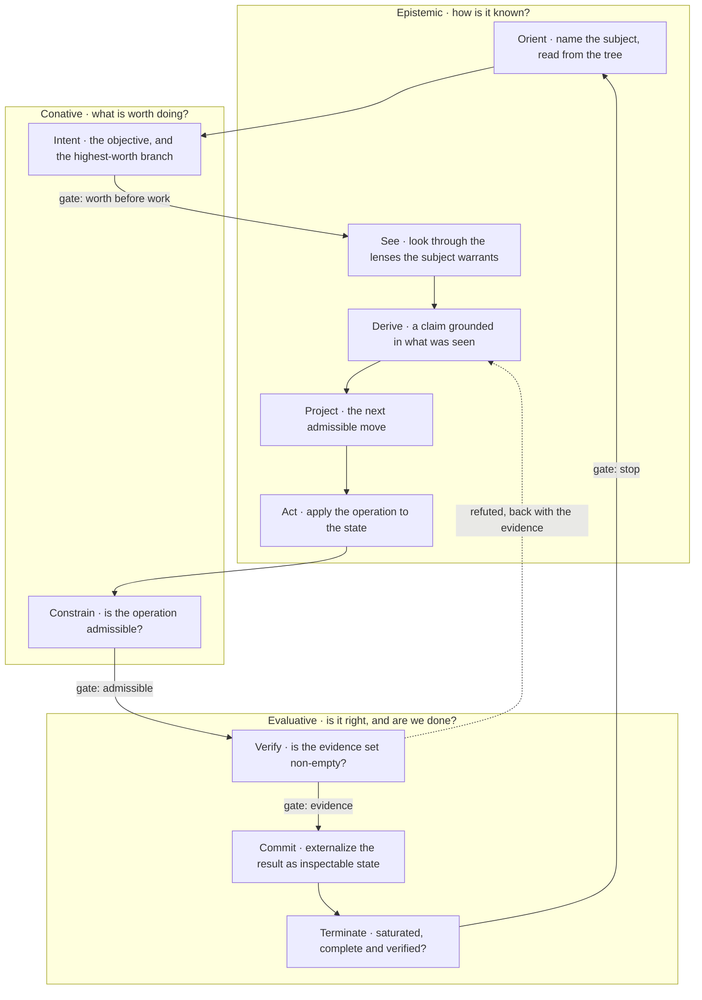

A1·b four sizes

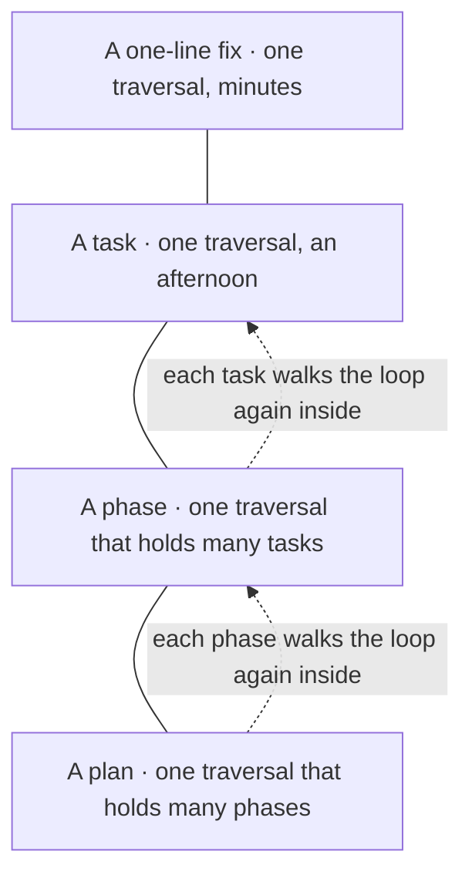

## Who does what

Three parties do the work in this method: the tooling, the model and me, as the developer. The tooling detects problems and repairs the ones it can, the model repairs what the tooling leaves, and I decide what the work is for and what finished means. The split is shown in [B1·a three parties](#who-does-what-panel-a), and the parts do not swap. I treat it as the second thing to learn, because every later chapter assumes it, and every failure the method knows turns out to be one party doing another party's job. The architecture page reaches the same three parties from a different starting point, that [the author is probabilistic](architecture/SCALE.md#the-author-is-probabilistic).

### Three parties, three jobs

When you don't name the roles, you end up doing work a check should do, and the model ends up guessing what you want. You review the code for style, the model reviews it for [correctness](ontology/PRINCIPLES.md#architecture-correctness), and both of you miss the architectural drift because neither of you owns it. A developer cannot pay attention to every line, and a model cannot tell a rule from a preference unless something outside it enforces the rule.

For this reason I treat quality as a property of the tooling, not of how much attention the developer or the model pays. Detection goes to the tooling and governance stays with the developer, rather than to a review that reads what a check could enforce. In practice, detection is a check that runs the same way every time, with its fixer switched on by default. The findings the fixer cannot close go to the model one at a time, each with its location and the value that was expected. The developer keeps the decisions about what the work is for, and hands nothing else down.

To check this on your own work, read the last ten findings your tooling raised. Each of them should name a check; a finding that a developer had to raise by hand points to a check that does not exist yet.

Detection is mechanical because it has to give the same result on every run. A reviewer who applies a rule from memory applies it differently on a tired day, and a model that applies a rule from a prompt applies it differently once its context fills up. A check, by contrast, is [static analysis](ontology/PRINCIPLES.md#architecture-static-analysis): it returns the same verdict for the same tree. The chapters [one correct answer](VERIFY.md#one-correct-answer) and [scale follows determinism](architecture/SCALE.md#scale-follows-determinism) work out what follows from that. Repairs that have exactly one correct answer belong to the tooling for the same reason: the fixer applies them in the same run that found the fault, without asking the developer or the model.

Repair belongs to the model because a finding is small and specific, and a model handles small, specific tasks well; what a finding contains is described in [detect, log, fix](BUILD.md#detect-log-fix). The model is not trusted to decide that its own work is finished, because reading an edit is not the same as running the checks, and [it looked right](VERIFY.md#it-looked-right) covers that failure. Governance stays with the developer because nothing in the method computes whether work is worth doing. What the work is for, what finished looks like and which of two acceptable approaches to take are decisions I make and write down before the work starts. When I correct the model, the correction is meant to become a rule rather than something I remember; a rule that lives only in my head is [manual-only governance](ontology/PRINCIPLES.md#architecture-manual-only-governance), and it decays.

B1·a three parties

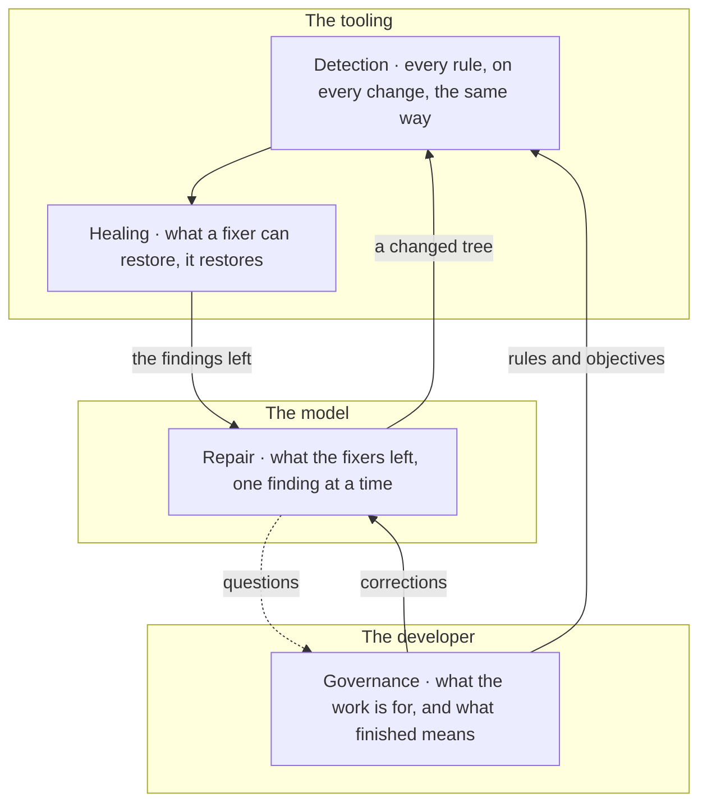

## The stance

The stance is four sentences, and the rest of the method depends on them. The first is that a claim stays unverified until you or your model read it in the current tree, as shown in [C1·a claim to evidence](#the-stance-panel-a). The second is that review is [adversarial by default](START.md#adversarial-by-default), because agreeing is cheaper than [verification](ontology/PRINCIPLES.md#architecture-verification), as shown in [C1·b agreement outruns](#the-stance-panel-b). The third is that every manual step is a failure of automation; the ontology names what a manual step decays into, [manual runbook dependency](ontology/PRINCIPLES.md#architecture-manual-runbook-dependency) and [manual-only governance](ontology/PRINCIPLES.md#architecture-manual-only-governance). The fourth is that a document states what is true now and carries no history of its own, which is [single source of truth](ontology/PRINCIPLES.md#architecture-single-source-of-truth) applied to prose. Everything else in the method is a mechanism that keeps one of these four sentences true without the developer or the model having to remember it.

### Read before you claim

A question about the code is often answered from memory, by the model or by the developer, without opening the file. The model describes a function the way it was before you renamed it two sessions ago, makes an edit based on that description, and the edit lands in the wrong place. The model remembers a version of the file that sounds right, and the developer remembers the version they last edited, and neither of those is the file as it is now.

For this reason I treat what either of you remembers as a lead to follow, never as evidence. A claim about the tree stays unverified until the model or the developer reads the tree, rather than being accepted because it sounds right. In practice, the file is opened before the model or you say what it contains, the command is run before the model or you say what it prints, and the line is quoted rather than recalled. A claim about what a mechanism does is settled by running the mechanism, because a report about it, a rule describing it and a peer's account of it are all prose.

To check this, ask the model for the file path and line behind each claim it makes. A claim it cannot point to is an assumption.

The stance applies to every input in the same way. My own messages, the model's reasoning, its edits and the reports that say they succeeded, a summary of an earlier turn, a peer's account and a file's claim about itself are all unverified until they are checked now. Reasoning is not verification, and a report that something succeeded is exactly the failure described in [it looked right](VERIFY.md#it-looked-right). Verified means read or run in the current state of the tree, which is what the [ground truth](ontology/REASONING.md#reasoning-node-ver-ground-truth) node of [the loop](START.md#the-loop) asks for. A file is also read in full, because reading part of it loses its structure, and the structure is what is being analyzed.

A wrong claim spreads faster than its correction, for a simple reason. Agreeing with a peer costs one read of what they wrote, while refuting them costs opening the thing they wrote about, and only a party with a reason to doubt goes to that effort. The more coherent the argument around a wrong claim, the faster it spreads, because a claim that fits invites agreement rather than inspection. What follows from this is a small discipline: a statement that rests on another party's reading is checked by opening the thing they read, not by reading their sentence, and a claim about a mechanism is settled by making the mechanism run rather than by reading its source.

The difference shows in one exchange. Asked whether the router uses the new name, the answer from memory is _the router already uses the new name, so nothing else needs to change_. The answer from the tree is _the handler in the router still calls the old name, here is the line_. Only the second answer can be shown to be wrong, because it points at a line that can be checked.

The last two sentences of the stance follow from the first two. A step a developer performs by hand is a step no check observes, so it is done differently the next time; the repair is described in [tools live in the tree](BUILD.md#tools-live-in-the-tree). A document that carries its own history makes the reader reconstruct what is true now, and a reader reconstructing the truth is guessing; the repair is described in [derived state](VERIFY.md#derived-state).

C1·a claim to evidence

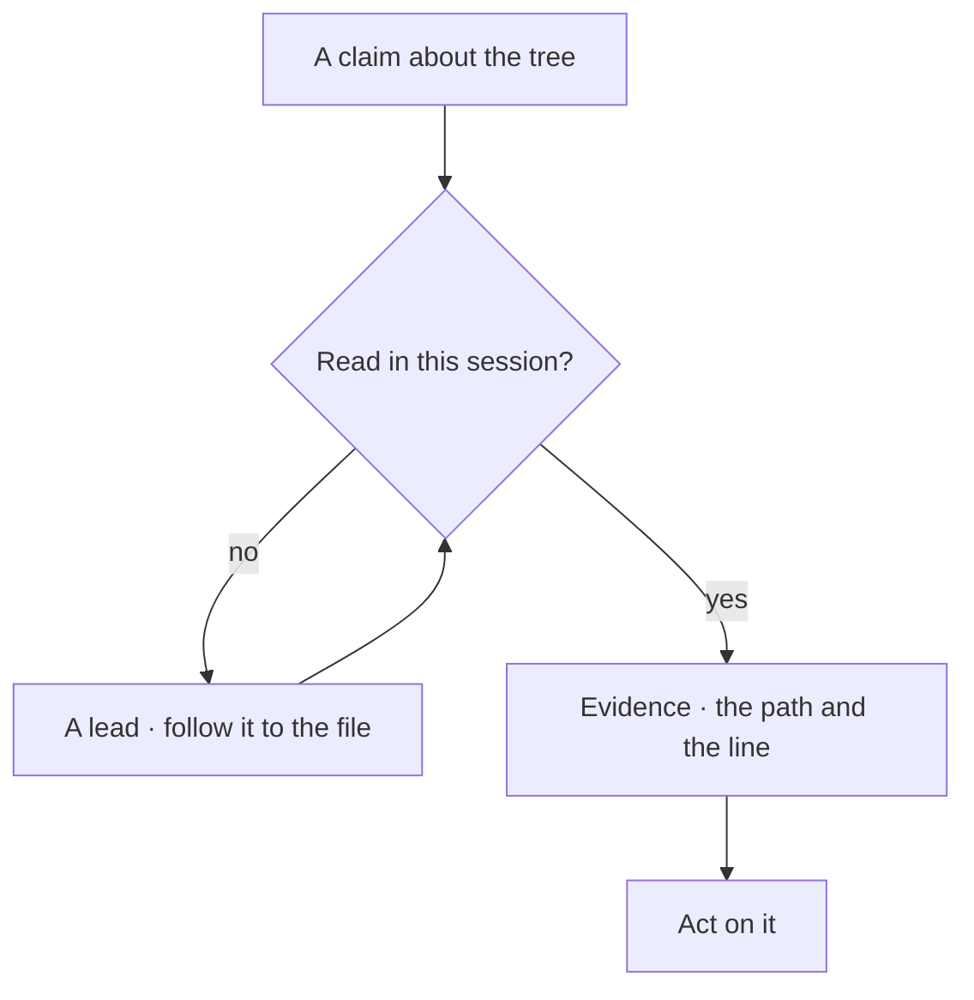

C1·b agreement outruns

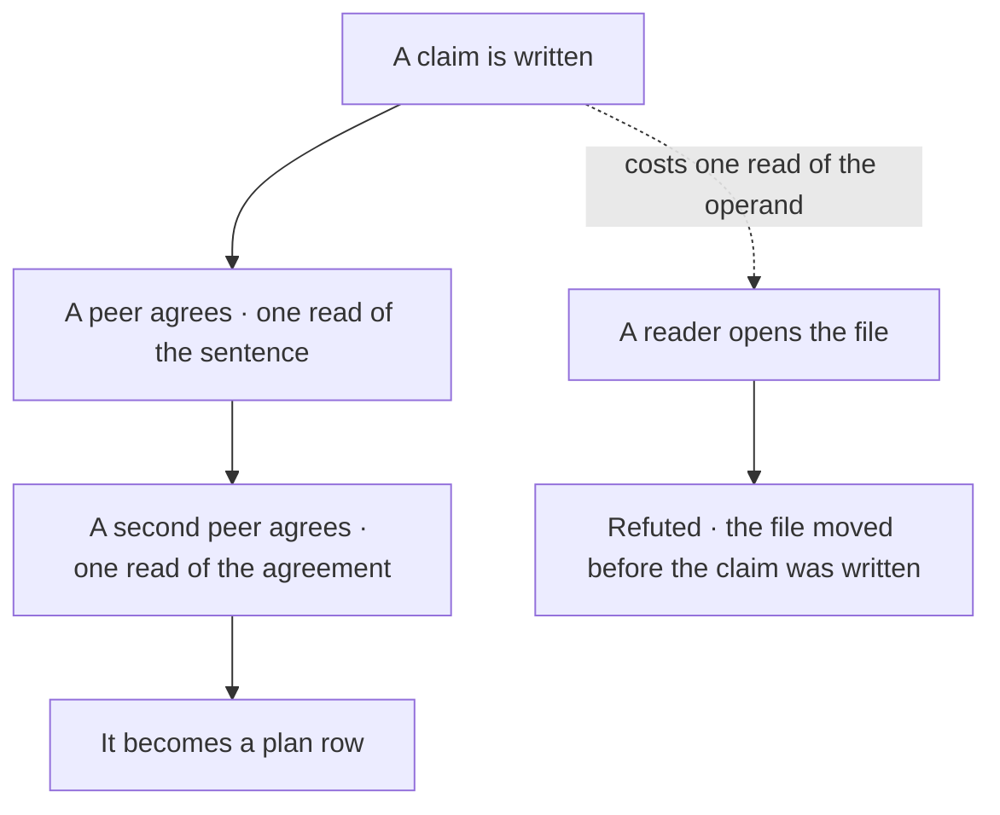

## Adversarial by default

The second sentence of [the stance](START.md#the-stance) says that review is adversarial by default, and it follows from the first. If a claim about the work stays unverified until the developer, the model or a check has tried to break it, then a review that starts by approving has nothing left to verify.

### The list before the verdict

A model asked to review a change tends to agree with it, and that agreement looks like a review. The review reads well and approves the change, and the regression ships, because no party in the review was looking for it. Training rewards the model for agreeing, so agreement is the easiest answer it can give.

For this reason, approval can only be the result of [verification](ontology/PRINCIPLES.md#architecture-verification), never the position a review starts from. The deliverable of a review is its list of findings, rather than a verdict with reasons attached. In practice, a review opens by listing what is wrong, and approval is what remains once that list is empty. A reply that opens with praise is rejected, and you or your model attack your own output before presenting it, because work that neither you nor a check has tried to break is not finished.

To check this, count the findings in a review. A review with none either checked nothing or checked the wrong thing.

## Resolving a message

A message from the developer is not simply answered. It is first understood as a whole, in one pass, before any reply is written, by reading it through the fifteen questions shown in [E1·a the readings](#resolving-a-message-panel-a). This is the [orient](ontology/REASONING.md#stage-orient) node of [the loop](START.md#the-loop) applied to a request. It matters because most drift starts here: a request answered at its surface is one the model answered without reading what lies under it.

### Fifteen readings, one pass

A message answered only at its surface gets wrong the details that only its structure would have shown. A request to rename a function is answered by renaming the function, and three collectors that found it by a naming pattern quietly stop finding anything, because the model never asked what the name was connected to. A reply forms from the first plausible reading of a message, and the first reading is the surface.

For this reason I treat the structure behind a request as what is being asked about, and the wording as evidence about that structure. A message is understood before it is answered, rather than answered from its first reading. In practice, the model is asked to read a request through the fifteen questions in their order before replying, and to write the reply as that understanding, in connected sentences rather than under headings.

To check this, take a reply and ask which of the fifteen questions it rests on. A reply that skipped one is incomplete rather than concise, and the question it skipped is where its mistake will be. The questions scale with the request. A one-line request that comes down to one file and one edit still goes through them, but they take a moment and most of the answers are empty; an empty answer is still an answer, not a skipped question.

The fifteen questions are what turn this kind of judgement into something a check can enforce, because each one has a defined kind of answer. [Identity](ontology/REASONING.md#reasoning-node-ont-identity) asks what exists, and the answer is a set. [Structure](ontology/REASONING.md#reasoning-node-ont-structure) asks how the parts are arranged, and the answer is an ordering. [Relation](ontology/REASONING.md#reasoning-node-ont-relation) asks what a thing connects to, and the answer is a graph. [Probability](ontology/REASONING.md#reasoning-node-ont-probability) asks how sure each reading is, and the answer is a number between zero and one. The others, [composition](ontology/REASONING.md#reasoning-node-ont-composition), [space](ontology/REASONING.md#reasoning-node-ont-space), [time](ontology/REASONING.md#reasoning-node-ont-time), [state](ontology/REASONING.md#reasoning-node-ont-state), [change](ontology/REASONING.md#reasoning-node-ont-change), [behavior](ontology/REASONING.md#reasoning-node-ont-behavior), [function](ontology/REASONING.md#reasoning-node-ont-function), [cause](ontology/REASONING.md#reasoning-node-ont-cause), [meaning](ontology/REASONING.md#reasoning-node-ont-meaning), [scale](ontology/REASONING.md#reasoning-node-ont-scale) and [novelty](ontology/REASONING.md#reasoning-node-ont-novelty), each have a kind of answer of their own.

A question with a defined kind of answer can be turned into a condition that a check can test. What that condition does from there is described in [from intent to predicate](architecture/COVERAGE.md#an-architecture-is-its-predicate-set), on the architecture page, and that is how a reading the developer did once becomes a check that runs every time.

[Introspection](ontology/PRINCIPLES.md#architecture-introspection) means looking one level below the [abstraction](ontology/PRINCIPLES.md#architecture-abstraction) a thing presents. A document's list of sections is its surface, and the rule that decides what may go into a section is its structure. A function's signature is its surface, and which state it owns and how long that state lives are its structure. A count is a surface, and the scope it was counted over is its structure. Reading at that level is what makes the first reading of a request agree with the final [verification](ontology/PRINCIPLES.md#architecture-verification) of its result, because both are then looking at the same thing.

E1·a the readings

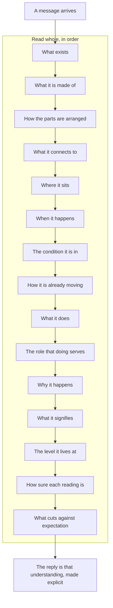

## Three encodings

The rules of the method are written down in three different forms, and each form holds a different kind of rule. Mechanical rules are enforced by checks, behavioral rules tell the model how to work, and the context architecture decides what the model is given to read. The three feed into each other, as shown in [F1·a three encodings](#three-encodings-panel-a). A method that uses only one of the three leaks through the other two, and when two documents disagree, the order shown in [F1·b precedence](#three-encodings-panel-b) decides which one wins.

### One kind of discipline per home

Rules are often written as one long instruction document, which mixes what a check should enforce with what [the developer and the model](COLLABORATE.md#the-developer-and-the-model) are expected to remember, and the whole document then decays as fast as its weakest part. A rule about the tree is written into the behavior policy, the model may keep to it for a session, and the tree drifts anyway, because nothing outside the conversation reads that sentence. A rule written where no check reads it is held only by memory, and a rule written in two places becomes two rules that drift apart.

For this reason I keep each kind of rule in its own form: mechanical rules, behavioral rules and context architecture each hold one kind, and all three defer to the tree. Each rule is assigned to one of the three forms before it is written down, rather than added wherever it happens to fit. In practice, a rule about the tree goes into a check. A rule about how the model should work goes into the behavior policy, as one line with a stable name. What the model needs to know goes into the context architecture, arranged so that the general part carries over to other projects and everything specific to this project sits in one file. A fact lives in exactly one of the three places, and the other two point to it.

To check this, pick one line from the instructions you give the model and say where it belongs. A line that fits none of the three forms is two rules, or a rule no check enforces. The split follows what a rule applies to, never how important it feels. A behavioral rule whose effect can be seen in an artifact is really a mechanical rule written as prose, and moving it into a check is progress, not a demotion.

Mechanical rules are the ones a check can decide from the tree alone: where a file may live, what a name may say, which imports cross a boundary, whether a fact is declared twice and whether a document's references resolve. They are [policy as code](ontology/PRINCIPLES.md#architecture-policy-as-code), enforced by checks, fixers, validators and generators through [static analysis](ontology/PRINCIPLES.md#architecture-static-analysis) and [fitness functions](ontology/PRINCIPLES.md#architecture-fitness-functions). Each returns pass or fail, and all of them run in [one chain](SHIP.md#one-chain), which is what [the gate holds the line](BUILD.md#the-gate-holds-the-line) describes. The developer has no part in this form at all, and that is intended: a mechanical rule that needs a developer to apply it is a behavioral rule disguised as a check.

Behavioral rules cover how the model is asked to work where no artifact can show whether it did: that it reads a file before saying what the file contains, that it asks a question before the work that depends on the answer rather than after, and that it never runs a step whose output it will not read in full. Each is one line with a stable name, in the shape [rules with names](START.md#rules-with-names) describes, so that a correction has a place to land and a citation has something to point to.

Context architecture is how the other two forms reach the model in the same way every session. Its core documents name no project: an ontology of readings, a canon of principles as [principles are typed](architecture/PRINCIPLES.md#principles-are-typed) describes, the naming standard that [placement is a grammar](BUILD.md#placement-is-a-grammar) describes, and the [core templates](pag/TEMPLATES.md#templates-core) the grammar page publishes. A single adapter binds them to one project, as [the drop-in](START.md#onboarding) explains. Digests expand one concern each where a rule needs more room. Memory holds one fact per file and serves as reference rather than authority, so a remembered fact is checked against the tree before anything is done with it. An order of precedence runs through all of it, and the tree outranks every document: a document that disagrees with what is on disk is wrong, and it is corrected in the same turn the disagreement is found.

The feedback between the three forms is what makes them work as one system rather than three separate ones. A check raises a finding, and the model is asked to repair it within the behavioral rules. A correction I give is written down as a behavioral rule and a memory in the same turn. When a behavioral rule has to be stated twice for the same kind of problem, that is the signal to build the check that makes it mechanical; the prose then becomes a pointer, and the rule has a [single source of truth](ontology/PRINCIPLES.md#architecture-single-source-of-truth). The core documents stay untouched throughout, because they name nothing specific to this project, and the adapter absorbs whatever changes.

F1·a three encodings

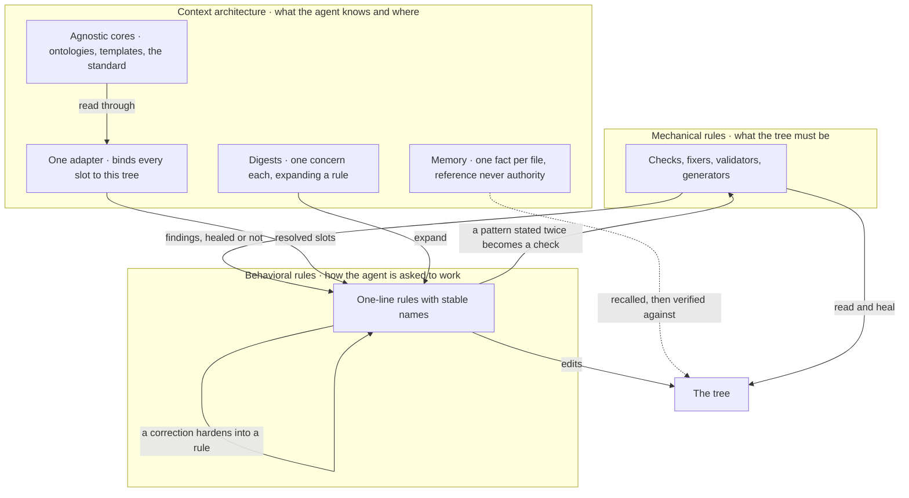

F1·b precedence

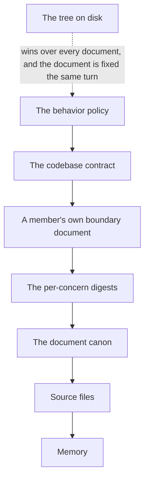

## Where a rule lives

A rule can live in one of two places, and [G1·a two homes](#from-chat-to-tree-panel-a) shows where each one leads. It can live in the conversation, where the developer has to restate it and hope it is followed, or it can live in the tree, where the model is given the policy file at the start of every session and a check refuses any change that breaks the rule. Everything in this method lives in the tree: as [policy as code](ontology/PRINCIPLES.md#architecture-policy-as-code) where a check can enforce it, and as a line in the policy where only the model's conduct can. An instruction that has to be restated is a mechanism that has not been built yet, and the ontology calls the state it leaves behind [manual-only governance](ontology/PRINCIPLES.md#architecture-manual-only-governance).

### Discipline decays, mechanism holds

Rules that live in a chat have to be restated every session, and each restatement is a chance for them to drift. The session starts well, the instructions fade as the context fills up, and by the end the model is back to its default behavior. A rule held only by discipline is decided again every time it applies, and every new decision is a chance to decide differently.

For this reason I hold rules in the tree rather than in the conversation, because a rule in the conversation decays and a check in the tree does not. Discipline is turned into mechanism as soon as a rule has been stated twice, rather than stated a third time. In practice, each instruction you keep repeating moves into a file the model is given at the start of every session, and each check you keep performing by hand moves into a command the pipeline runs. Once the mechanism holds, the old habit is dropped, because a habit kept alongside its mechanism is a second home for the same rule.

To check this, delete your custom instructions for one session. What still holds is mechanism, and what breaks was discipline. A conversation is the right place for a rule only when the model has no access to your files; as soon as it does, the tree is the right place.

The test that tells the two apart is whether anything would object if the rule stopped holding, the same objector test that the section [stating an invariant](COLLABORATE.md#stating-an-invariant) applies to a whole topology. A rule in a conversation has no objector: once it is forgotten, nothing notices. A rule in the tree has one of two. Either a check refuses the change that breaks it, or a policy line states it in the same words at the start of every session. The second is weaker than the first, because the model can still fail to follow a line it has been given, but it is still stronger than a memory, because a policy is delivered to every session and a memory reaches only the party who remembers to look it up.

Friction between several parties working on one tree is the same question at a larger scale, and [coordination is software](COLLABORATE.md#coordination-is-software) answers it. When two parties lose a write, leave a stale item behind or miss a message, the first question is what the [shared surface](pag/ORCHESTRATION.md#shared-surfaces) is missing, never who should have been more careful. A rule added without a mechanism behind it only asks for more care, and it decays at the same rate the care did.

G1·a two homes

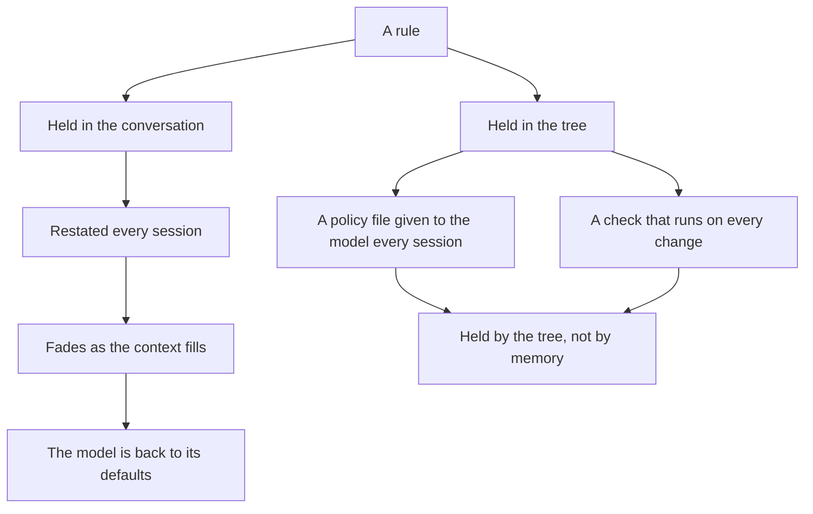

## Rules with names

Every behavioral rule is written as one line with three parts: a stable name, a directive, and either the name of the check that enforces it or a statement that no check can. [H1·a a policy file](#rules-with-names-panel-a) shows such lines, and [H1·b a rule record](#rules-with-names-panel-b) shows the shape they are read into. The name is what a correction attaches to and what a citation points to. When I correct the model, the correction is written down in the same turn as a named rule and a memory, so that the rule is there for the next session instead of the correction having to be given again, as shown in [H1·c a correction hardens](#rules-with-names-panel-c).

### A correction lands on a name

Instructions written as prose have no fixed place for a correction to attach to. The same correction is made in three sessions, each time as a new paragraph, and the three paragraphs end up contradicting each other. A correction with nowhere to attach is remembered by the developer and forgotten by the model, so it has to be given again the following week.

For this reason I keep behavior as a set of named rules, so that a correction becomes permanent rather than being repeated. Each rule gets a name that a correction can attach to, rather than a paragraph that corrections are appended to. In practice, each rule is one line: a short stable name, a directive in the present tense, and the gate that enforces it. The name is cited wherever the rule applies. When a correction arrives, it is assigned to [one home](BUILD.md#one-home), the rule is written first, then its reason and how it applies, a memory is stored beside it, and every place it was written to is confirmed by searching rather than by recollection. What is captured is the kind of mistake the correction belongs to, never the single case that triggered it.

To check this, take the last correction you gave the model and look for its name among the rules. If it has no name, you will have to give it again. A rule may mention the measured failure that led to it, in the past tense and only inside that rule, because that clause is part of what the rule depends on. It describes the shape of the failure and how it showed up, never who caused it, when, or in what order.

The shape of the line is the whole design. A name is a stable identity, so a rule can be cited from a digest, a memory, a finding or another party's message without quoting its text, and the citation survives any rewording; the names are the [ubiquitous language](ontology/PRINCIPLES.md#architecture-ubiquitous-language) the developer, the model and the tooling share. A directive that fits on one line cannot hide a second instruction, so it reads as a single step. The gate field is the honest part: it names the check that enforces the rule, or it says that no artifact can show whether the rule held, and a rule that says neither has never been assessed. That field is written in exactly one place per rule, because a [single source of truth](ontology/PRINCIPLES.md#architecture-single-source-of-truth) allows no second place to declare it. A rule without its reason gets argued over again, and a rule without its application gets admired and ignored, so the digest that expands a rule carries both; a digest is an [architecture decision record](ontology/PRINCIPLES.md#architecture-architecture-decision-records) for one line of conduct.

The reason and the application are written in the developer's own sharpest words wherever there are any, because a paraphrase loses the distinction that made the correction necessary. For example, one wrong path becomes a rule about checking paths, and one missed reference becomes a rule about places that find files by pattern.

The rules are grouped into the ones that apply every turn and the ones that apply when a particular kind of task comes up, plus a small set of declared exceptions. That grouping helps the reader and means nothing to the checks. A check reads the gate field and never the heading, which is why a rule can move between groups without any mechanism noticing, and why a new rule is one added line rather than a new section.

Once parsed, a rule is a record, and that record is what the inventory, the coverage walk and the leak check all read; [coverage is derived](VERIFY.md#coverage-is-derived) from that inventory rather than counted. The gate field has two allowed forms, a check or conduct, rather than being optional, so a rule that declares neither cannot be written down at all; the unassessed state is impossible rather than merely discouraged.

H1·a a policy file

```markdown
## <rules that bite every turn>

- `read_before_claim`: a claim about a file is a lie until the file is read in this session · gate: conduct
- `finding_not_principle`: the model is directed with a location and a mismatch, never with a principle · gate: conduct
- `one_run_is_the_answer`: a check runs once per state and its first output is read whole · gate: conduct

## <rules that fire on a matching task>

- `rename_by_hand`: a move is done by hand, every reference enumerated before and verified after · gate: reference
- `ask_at_the_uncertainty`: a question is raised where it appears, with a recommendation, before the dependent work · gate: conduct
```

H1·b a rule record

```typescript
export type Tier = "always" | "situational" | "exception";
export type Gate =
  | { readonly kind: "check"; readonly id: GateId }
  | { readonly kind: "conduct" };

export interface RuleRecord {
  readonly slug: string;
  readonly directive: string;
  readonly tier: Tier;
  readonly gate: Gate;
  readonly locked: boolean;
  readonly source: DocumentId;
}

export interface Digest {
  readonly slug: RuleRecord["slug"];
  readonly why: string;
  readonly how: string;
  readonly measured?: { readonly shape: string; readonly presents: string };
}
```

H1·c a correction hardens

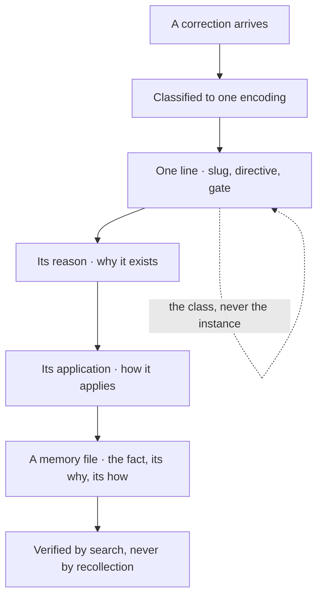

## A seat is a contract

A seat is a party's role in a collaboration, and it is defined by a contract, never by a character. A seat applies [design by contract](ontology/PRINCIPLES.md#architecture-design-by-contract) to a party: the contract is a role document with the same sections for every seat, as shown in [I1·a a role document](#a-seat-is-a-contract-panel-a). It names what the seat owns, what it refuses, how it works, the principles that decide its calls and the mistakes it tends to make.

### Contract over character

A persona gives a model a voice, and a voice is not a behavior. The persona keeps its voice through the whole session and still drifts as much as a session with no persona at all. A character is judged by how it sounds, and sounding right comes easily to a model even when the work underneath is wrong.

For this reason I get [consistency](ontology/PRINCIPLES.md#architecture-consistency) from checks rather than from roleplay. Output is judged against written obligations rather than against a persona's tone. In practice, a role is a short document with the same sections every time, and it names the mistakes that seat is known to make beside what it owns. The seat's output is checked against the contract, never against its tone. The seat's identity stays out of the filename, so that handing a role over changes a field rather than a path.

To check this, strip the voice from a session's output and check what remains against the contract. Whatever the voice was hiding becomes visible. A measured mistake is evidence and is kept in one place: it leaves a role document only by being moved to the [one home](BUILD.md#one-home) history has. A mistake that is only expected never replaces one that was measured.

A uniform shape is what makes a set of seats comparable. A reader looking for what a seat refuses finds it in the same place in every document; otherwise the documents are just prose filed together. The set of sections is the contract, and the declared fields are what a tool reads: the identity, the concern the seat holds, and the one line another seat uses to route work to it. The seat's identity is allocated and recorded before its first write, for the reasons [coordination is software](COLLABORATE.md#coordination-is-software) gives.

The section that matters most is the one about what the seat gets wrong. A reviewer that approves a change because it reads well, a builder that reviews the description instead of the diff, and a coordinator that routes work a single edit would have closed are all measured mistakes. A seat is given its own document before its first edit so that it can avoid repeating them. A contract without that section is a job description, and a job description does not constrain the seat at all.

I1·a a role document

```markdown
# Reviewer

## <identity>

The seat's identity, bound in the index before its first write.

## <what it owns>

The list of findings, and nothing else.

## <what finished means>

A change ships only once the list is empty.

## <how it works>

One finding per line: file, line, expected, found. No style comments, no rewrites.

## <the shapes it gets wrong>

Affirming a change that reads well. Reviewing the description instead of the diff.

## <what decides its calls>

A finding without a location is an opinion. Approval is what remains when the list is empty.
```

## The behavior document

The behavior policy is the system prompt of the collaboration, whatever file name the harness uses for it. It is the one document delivered to every session at startup, so it carries what has to be in force before the model knows what task it is on, and it points to everything else. The order of its parts is shown in [J1·a a behavior document](#the-behavior-document-panel-a) and [J1·b delivery order](#the-behavior-document-panel-b). It is written the same way for any harness and any model, because nothing in it names a tool: it names operations and slots, and a single binding says which tool performs each one, which applies [platform independence](ontology/PRINCIPLES.md#architecture-platform-independence) to a prompt, as shown in [J1·c one binding per harness](#the-behavior-document-panel-c). What each kind of reader receives is shown in [J1·d reader classes](#the-behavior-document-panel-d). The document is the behavioral form among the [three encodings](START.md#three-encodings), and [document structure](pag/GUIDE.md#document-structure) on the grammar page applies the same rule to a single document: declare first, then instruct.

### A system prompt with a composition

A prompt written as one long instruction document is delivered once at startup to a model that will lose track of most of it, and nothing in its shape says which parts matter most. The document grows by appending, every session opens on a wall of prose, the first rules get attention and the last ones barely any, and the same correction is added a fourth time at the bottom. A document delivered in one piece has no structure that marks what must be in force from the start and what can be looked up later, so every line competes for the same attention and the order is simply the order it was written in.

For this reason I give the behavior document a deliberate composition: what must be in force from the start comes first, the delivery order follows the order of precedence, and anything that only matters once the task is known is referred to rather than included. The document is arranged by precedence and kept free of anything specific to one harness, rather than grown in the order rules happened to arrive. In practice, it opens with [the stance](START.md#the-stance) and the hard prohibitions, because those apply before the task is known. Next comes what to read first and in which order, then the rules that apply every turn, then the ones that apply to particular tasks, then the declared exceptions. How the work is verified, how the tree is inspected and what the tree contains come after the rules, because each of them assumes a task. Anything that needs more room is moved into a digest the document points to. No tool is named anywhere: the document names the operation, and the binding decides which tool performs it.

To check this, rename the file to what another harness expects and give it to a different model. Where it breaks, a tool name or a path has leaked into a place that should hold a slot; where it holds, the composition has transferred. The document is delivered once to each reader, so a change to it does not reach a session that is already running. A rule edited mid-session reaches only the parties that start afterwards, which is why a governing change is also sent as a message to the parties already running, since messages reach them every round and the file does not.

### Resident, then referenced

One question decides where a part of the document goes. If it tells the model how to find out what it is doing, it belongs at the top, in the order it applies. If it tells the model what to do once it knows, it goes further down or into a digest the top points to. How often a rule applies is a poor guide: a rule that applies every hour but assumes a known task can safely be referred to, while a rule that applies once a month but decides which document to open belongs at the top.

### The document is a claim

The document is a claim like any other, and the stance applies to it: the model is asked to re-read it whenever it enters the context, because a version held in memory is only a memory, and it gives way to the tree in the order three encodings sets out.

It states what is true now and never what used to be, as [derived state](VERIFY.md#derived-state) requires of every document. Copying a sentence from one document into another is how a dead reference spreads, so each fact has a [single source of truth](ontology/PRINCIPLES.md#architecture-single-source-of-truth) and the other documents point to it, which [documentation is code](VERIFY.md#documentation-is-code) turns into a check. The whole set of documents is validated, each kind against its declared shape, and a document that does not match its shape fails before it is delivered.

### Operations and slots

[Portability](ontology/PRINCIPLES.md#architecture-portability) follows from what the document is allowed to say. It states what to do as [semantic operations](pag/GUIDE.md#tool-invocation), such as discovering resources, reading a resource, searching content, analyzing, running a tool, saving an artifact and reporting a result, the same rule stated under semantic operations on the grammar page. It states where things are as slots, such as the gate, the rule host, the test root and the depth cap. One binding per harness maps each operation to that harness's tool and each slot to that tree's value, which is [configuration externalization](ontology/PRINCIPLES.md#architecture-configuration-externalization) applied to a prompt. Moving the document to a harness that expects a different file name therefore takes a rename and one binding, and the rules do not change. The model is deliberately left as an empty slot, because choosing the model belongs to the harness, and a value written into that slot would have no source.

A set of rules meant for use in other projects is written as a block that a host project copies into its own document, rather than merging it. Where the host's rule and the block's rule collide on the same thing, the host's rule wins, and the collision is treated as a finding rather than a negotiation. Every path in the block is relative to one value the adopting project sets, and the only literal path that remains is the import a runtime resolves, because a runtime reading a path has no binding to consult.

### Who receives it

Who receives the document decides which of its rules apply, and the document states which kind of reader each rule applies to, rather than leaving the reader to decide; [coordination is software](COLLABORATE.md#coordination-is-software) explains where the two kinds of reader come from. The single line a bounded reader receives is updated in the same change as the fact it carries and kept under a size limit, because a summary that keeps growing under an update rule with no stated limit turns into the document's own clutter.

### How it grows

The document grows only in the shape [rules with names](START.md#rules-with-names) describes, and when a rule has had to be stated twice for the same kind of problem, it becomes a check that the line points to.

The document repeats nothing the codebase contract owns, and the contract repeats nothing the document owns; a reader who finds the same fact in both has found a copy that neither the developer nor the model maintains.

J1·a a behavior document

```markdown
# <the stance and the hard prohibitions>

A claim about the tree is unverified until the tree is read. Review is adversarial by default. Every manual step is a failure of automation. A document states what is true now.

# <what governs what, and the precedence>

The behavior policy governs the agent. The codebase contract governs the code. A digest expands one rule and declares nothing. The tree outranks all of them, and a document that disagrees with the tree is corrected the same turn.

# <what is read first>

A blocker outranks everything and is read first. Then the board, whole. Then the seat's own role. Then the document whose domain the task enters.

# <rules that bite every turn>

- `read_before_claim`: a claim about a file is a lie until the file is read in this session · gate: conduct

# <rules that fire on a matching task>

- `rename_by_hand`: a move is done by hand, every reference enumerated before and verified after · gate: reference

# <declared exceptions>

- `question_is_blocked`: a pending question is a blocked state, never a third verdict

# <how the work is verified>

One command runs every stage in order. It runs once per state, and its first output is read whole.

# <the layers>

<layer>: what it holds and what authority it carries, one line each.
```

J1·b delivery order

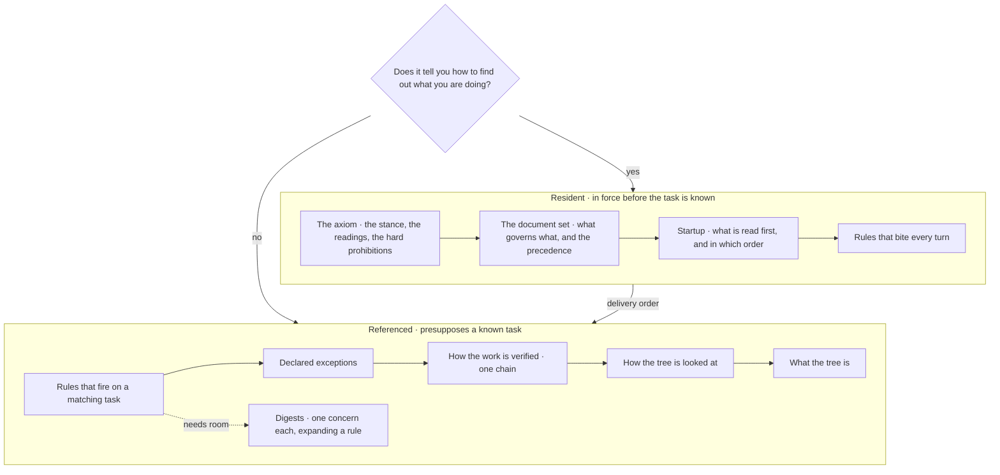

J1·c one binding per harness


J1·d reader classes


## The drop-in

Setting up the method in a new project means applying a template to one file of project details, not rebuilding the rules in a conversation. The whole governance set is a folder that names no project, plus one file that does, as shown in [K1·a a drop-in](#onboarding-panel-a). Adopting it means copying the folder and writing that one file, the binding shown in [K1·c a binding](#onboarding-panel-c), in which every fact about the host project is a slot in one of the three states shown in [K1·b slot states](#onboarding-panel-b). The gate is then green on an empty tree before the first line of code exists. All of this rests on one separation: the thinking is kept apart from the tools, which applies [platform independence](ontology/PRINCIPLES.md#architecture-platform-independence) to a method and [configuration externalization](ontology/PRINCIPLES.md#architecture-configuration-externalization) to its facts. The folder is generated from the [template families](pag/TEMPLATES.md#templates-families) the grammar page publishes.

### A template applied to a binding

A method written in one project's vocabulary does not carry over to the next project. Every new project starts with a long conversation that rebuilds rules which already exist somewhere else, and rebuilds them slightly wrong. A core document that names a path is tied to the project that has that path, so the next project has to edit the core.

For this reason the core documents name no project, a single adapter binds them to one, and every missing piece is declared rather than patched over. Porting touches the adapter alone, rather than the shared reasoning. In practice, the reasoning stays in core documents that name no project, and the bindings stay in one adapter that fills every slot the cores leave open. A slot that nothing can fill is declared absent in the adapter, rather than left for a core to assume, and the part of the method that depends on it does not run. The set is proven on an empty tree first: a gate that is red before any code exists is reporting a problem with the binding, and a gate that is green there becomes the baseline every later failure is measured against.

To check this, apply the set to an empty project. A red gate there points to a binding the adapter did not make. A green gate proves the binding and nothing more, because a check over an empty tree measures nothing. A catalog inside a core document, such as a list of principles, patterns or examples, may assume things this project does not have. The mechanism carries over unchanged, and the catalog is worked out again against what exists here. Replacing the mechanism would be the mistake; working out the catalog again is the work.

### Cores, one adapter, three slot states

A core is a document that says what to do in terms of [semantic operations](pag/GUIDE.md#tool-invocation) and slots, the same shape [the behavior document](START.md#the-behavior-document) has. It never names the tool that searches or the folder that holds the tests, because as soon as it does, it is tied to one project and the next project has to edit it. The adapter is the one file where those names live, and it is the only file rewritten when the set moves to another project.

A slot is always in one of three states, and the third is the one that matters most. Resolved means this project has the thing, and its value is in the adapter. Absent means this project has nothing that corresponds to it, so the part of the method that depends on it does not run, and that is declared rather than faked. Deferred means the thing will exist but does not yet, so the dependent part is blocked rather than skipped, which answers a different question in the right way. An adapter in which every slot is resolved is hiding something. The checks this project does not have, such as a computed measure of worth, a detector for work that stops making progress and a calibrated confidence, are declared absent in the adapter so that nothing assumes them; [the honest gaps](SHIP.md#the-honest-gaps) lists them, and the architecture page arrives at [the same declared absences](architecture/COVERAGE.md#the-honest-gaps) because an architecture is its predicate set.

### The generator removes itself

The template that generates the set keeps the mechanism and rewrites the content. A fact that would be wrong in the next project is turned into a slot. A statement written for one domain that holds for the whole kind is generalized to the kind. A mechanism that must know nothing about what it governs is made project-neutral. The generator then fills in the one binding and checks it in both directions, that every slot the cores name is bound and that every binding names a slot. It installs the set, runs the gate, and removes itself before the gate approves the tree. A generated project is therefore green when it arrives, with no edits by hand, and that is why every manual step in setting up a project counts as a [manual runbook dependency](ontology/PRINCIPLES.md#architecture-manual-runbook-dependency) rather than a chore.

The checks read their contracts from the same templates the surfaces are created from, so there is a [single source of truth](ontology/PRINCIPLES.md#architecture-single-source-of-truth) that the check reads while it runs. A check that copied a schema into itself would hold a second copy with nothing keeping the two the same, and the drift would only show when the developer or the model created a new surface and it failed on its first run, wrong from the start because it followed a template that looked authoritative.

### The binding as a module

The binding is a typed module rather than a written page, and its readable version is generated from the module, so the two cannot disagree, which is what [self-describing architecture](ontology/PRINCIPLES.md#architecture-self-describing-architecture) means for a binding. A slot is one record with three fields: a state from a fixed set, a value that is empty unless the state is resolved, and a note explaining why. A reader therefore sees the reason next to the value, and a mechanism sees the state before the value. The three constructors are the only way to create a slot, which is what stops a resolved slot from having no value and an absent slot from carrying an old one.

Slots are grouped by who supplies them: what the host project supplies, what the package owns, the conventions, the limits and the commands that run things. A count of slots in each state is worked out when the page is rendered, so it cannot disagree with the table above it, and a binding whose count shows every slot resolved is the one to distrust.

K1·a a drop-in

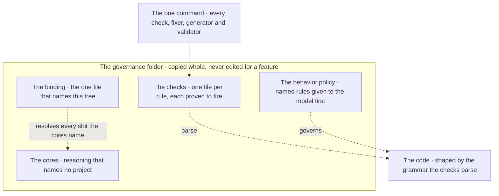

K1·b slot states

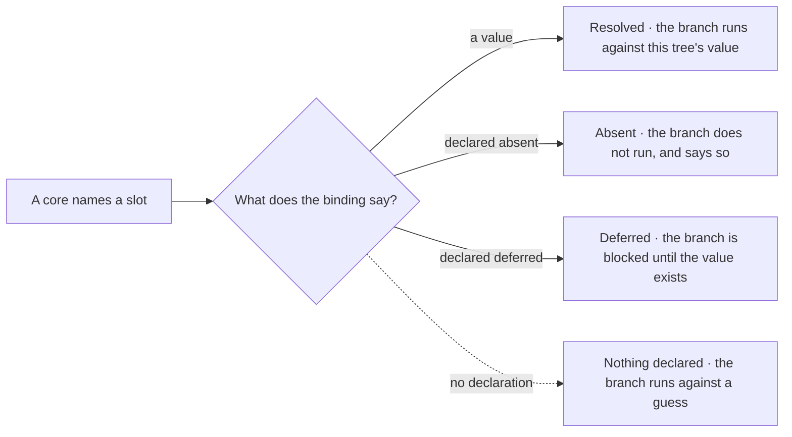

K1·c a binding

```typescript
export type SlotState = "RESOLVED" | "ABSENT" | "DEFERRED";
export type SlotValue = string | number | readonly string[] | null;

export interface Slot {
  readonly state: SlotState;
  readonly value: SlotValue;
  readonly note: string;
}

export const resolved = (
  value: Exclude<SlotValue, null>,
  note: string,
): Slot => ({ state: "RESOLVED", value, note });
export const absent = (note: string): Slot => ({
  state: "ABSENT",
  value: null,
  note,
});
export const deferred = (note: string): Slot => ({
  state: "DEFERRED",
  value: null,
  note,
});

export interface Binding {
  readonly project: Readonly<Record<string, Slot>>;
  readonly surface: Readonly<Record<string, Slot>>;
  readonly convention: Readonly<Record<string, Slot>>;
  readonly limits: Readonly<Record<string, Slot>>;
  readonly execution: Readonly<Record<string, Slot>>;
}

export const binding: Binding = {
  project: {
    root: resolved(
      "<host-root>",
      "the host root relative to this package, the one value an adopter sets",
    ),
    policy_projection: absent(
      "the host has not adopted the package, so no projection is written into its document",
    ),
    rollback_point: deferred(
      "a reversible checkpoint will exist once the host is under version control",
    ),
  },
  surface: { board: resolved("<board-file>", "the coordination board") },
  convention: {
    nesting_cap: resolved(
      "<depth>",
      "the placement depth cap from a governed root",
    ),
  },
  limits: {
    file_cap: absent(
      "no per-file cap; a host that wants one holds it in its own linter",
    ),
  },
  execution: { compile: absent("nothing here compiles") },
};
```

---

Chapters: [Start](START.md) · [Plan](PLAN.md) · [Build](BUILD.md) · [Verify](VERIFY.md) · [Collaborate](COLLABORATE.md) · [Ship](SHIP.md)
