© 2025 Jay Baleine - Disciplined AI Software Development · Documentation is covered by [CC BY-SA 4.0](https://creativecommons.org/licenses/by-sa/4.0/)

# Methodology — Bane's Lab

> Disciplined AI Collaboration is a method for building software with AI: one loop at every size, rules held by checks rather than attention, state derived rather than written, and evidence in place of claims.

Canonical: https://banes-lab.com/disciplined-methodology

# Disciplined AI Collaboration

Constraints, checks and skepticism for building software with AI.

# Start

## The loop

Every piece of work here has the same shape. A plan, a check, an agent, a refactor and a review are one loop at different sizes. The loop is the first thing to learn, because every later chapter is the loop applied to one kind of work, as [A1·a ten nodes](#the-loop-panel-a) draws and [A1·b four sizes](#the-loop-panel-b) nests, and every mechanism in this method exists to hold one of its gates. The loop is published as records on the ontology page, one per stage: [orient](ontology/REASONING.md#stage-orient), [intent](ontology/REASONING.md#stage-intent), [see](ontology/REASONING.md#stage-see), [derive](ontology/REASONING.md#stage-derive), [project](ontology/REASONING.md#stage-project), [act](ontology/REASONING.md#stage-act), [constrain](ontology/REASONING.md#stage-constrain), [verify](ontology/REASONING.md#stage-verify), [commit](ontology/REASONING.md#stage-commit), [terminate](ontology/REASONING.md#stage-terminate).

### Ten nodes, every size

Work has one shape, and the shape is the loop. Work with an AI tends to start at execution and skip everything before it.

The AI starts writing code in the first message, guesses the goal, and the conversation drifts as each reply answers the previous reply instead of the task. Nothing forced a shape onto the work, so the shape came from the model's next likely sentence.

Run the same ten nodes at every size, rather than a lighter shape for a smaller task. Run the loop at the size of the task, and name the node the work is on. The four gates never fold whatever the size: worth is decided before any effort, an operation is admitted before it is trusted, a claim needs evidence before it is committed, and the loop stops as done only when nothing is left, everything is done and everything is verified; otherwise it stops as blocked.

Read the plan, the check and the agent for one task as the same ten nodes. A step that fits none of them is either missing or noise.

The loop is not a ceremony for a throwaway script. It earns its cost where the work will be read, changed or trusted by someone later. A reference, a note or a contract is descriptive rather than executed, and forcing the full loop onto it produces ceremony rather than rigour.

Three layers own the nodes. The [epistemic](ontology/REASONING.md#reason-layer-epistemic) layer asks how a thing is known: orient names the subject as a bounded set of things read from the tree, see picks the lenses that subject warrants, derive produces a claim grounded in what was seen, project chooses the next admissible move, and act applies it to the state. The [conative](ontology/REASONING.md#reason-layer-conative) layer asks what is worth doing: intent states the [objective](ontology/REASONING.md#reason-node-tel-objective) and ranks the branches by [priority](ontology/REASONING.md#reason-node-tel-priority), and constrain admits or refuses the operation once it exists. The [evaluative](ontology/REASONING.md#reason-layer-evaluative) layer asks whether it is right and whether it is done: verify demands [evidence](ontology/REASONING.md#reason-node-ver-evidence), commit writes the result down as state the next cycle can read, and terminate decides whether to [stop](ontology/REASONING.md#reason-node-ter-stop).

The edges carry as much as the nodes. A [refuted](ontology/REASONING.md#reason-node-ver-refutation) claim goes back to derive with the evidence that refuted it, never forward with a caveat. A repair re-enters at the earliest node that can supply the missing evidence, invalidates everything after it, and is bounded, so a loop that keeps repairing terminates as [blocked](ontology/REASONING.md#reason-node-ter-block) rather than as done. Every decision has a declared shape: a gate that owes a ranking is not satisfied by a yes, and a gate that owes a yes is not satisfied by a ranking. The same loop is what an [agent template](pag/TEMPLATES.md#templates-agents) walks and what an [instruction pattern](pag/PATTERNS.md#instruction-patterns) selects by fit, which is why the grammar page and this page describe one loop twice.

### Instruction and traversal

The loop nests. A plan is one traversal whose act node produces phases, and each phase is a traversal whose act node produces tasks, and each task is a traversal that ends in an edit and a run of the checks. The gates hold at every level. A phase cannot start until the phase before it has committed evidence the next one reads, and a plan cannot stop until every phase has, which is why [the plan is a graph](PLAN.md#the-flat-checklist) with a gate between phases rather than a tick beside each.

The difference between an instruction and a traversal is visible in the first minute. The instruction asks for an outcome. The traversal names the nodes it passes through, so a reader can see where it went wrong. Asked to raise a file limit, a traversal orients by opening every file that mentions the limit and finds two copies of the first. It states its intent as one limit with a [single source of truth](ontology/PRINCIPLES.md#arch-single-source-of-truth), and derives that the request is a [one home](BUILD.md#one-home) problem rather than a limit change. It acts by changing the declaration and deleting the copies, and constrains itself to the checker's one option. It verifies by running the gate once and reading the output whole, commits the report, and terminates because the objective sentence reads true against the tree. The edit touched one file instead of three, and the reader can see which node the work is at from the message alone.

A1·a ten nodes


A1·b four sizes

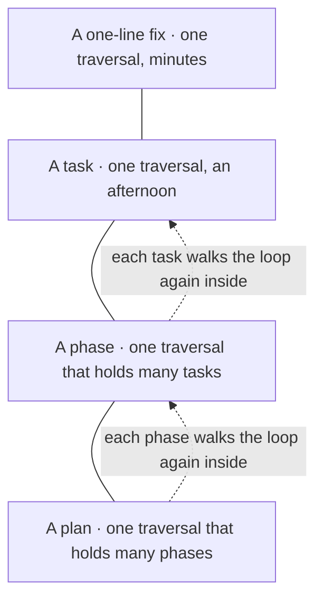

## Who does what

The tooling detects and heals what it can. The AI repairs what the fixers leave. I govern. Each of us does the part we are suited for, as [B1·a three parties](#who-does-what-panel-a) draws, and the parts do not swap. This division is the second thing to learn, because every later chapter assumes it, and every failure this method knows is one party doing another party's job. The architecture page derives the same split from a different premise, that [the author is probabilistic](architecture/SCALE.md#the-author-is-probabilistic), and lands on the same three parties.

### Three parties, three jobs

Quality is a property of the tooling, not of anyone's attention. When nobody names the roles, the human ends up doing the machine's job and the machine ends up guessing the human's.

The person reviews for style, the AI reviews for [correctness](ontology/PRINCIPLES.md#arch-correctness), and both miss the architectural drift because neither owns it. A person cannot attend to every line, and a model cannot tell a rule from a preference unless something outside it holds the line.

Give detection to the tooling and governance to the person, rather than a review that reads what a check could hold. Give detection to a check that runs the same way every time, with its fixer on by default. Give the findings the fixer cannot close to the AI, one at a time, each with its location and its expected value. Keep the decisions about what the work is for, and hand nothing else down.

Read the last ten findings your tooling raised. Every one of them names a check, not a person. If a person found it, the check is missing.

Detection is mechanical because it has to be identical on every run. A rule a reviewer applies from memory is applied differently on a tired day, and a rule a model applies from a prompt is applied differently once the context fills, while a check is [static analysis](ontology/PRINCIPLES.md#arch-static-analysis) that returns the same verdict for the same tree. [One correct answer](VERIFY.md#one-correct-answer) and [scale follows determinism](architecture/SCALE.md#scale-follows-determinism) derive what follows from that. Healing belongs to the same party for the same reason: where exactly one correct answer exists, the fixer applies it in the run that caught the fault, and nobody is asked.

Repair belongs to the AI because a finding is small and specific, and a model does small and specific things well; detect, log, fix carries the finding's shape. What it does not do is judge its own work as done, because reading an edit is not running the checks, which [it looked right](VERIFY.md#it-looked-right) is built on. Governance stays with the person because worth is not computed here. What the work is for, what finished looks like and which of two admissible branches wins are decisions I make and write down before the effort starts. A correction I give is expected to harden into a rule rather than to be remembered; a rule that lives only in a person is [manual-only governance](ontology/PRINCIPLES.md#arch-manual-only-governance), and it decays.

B1·a three parties

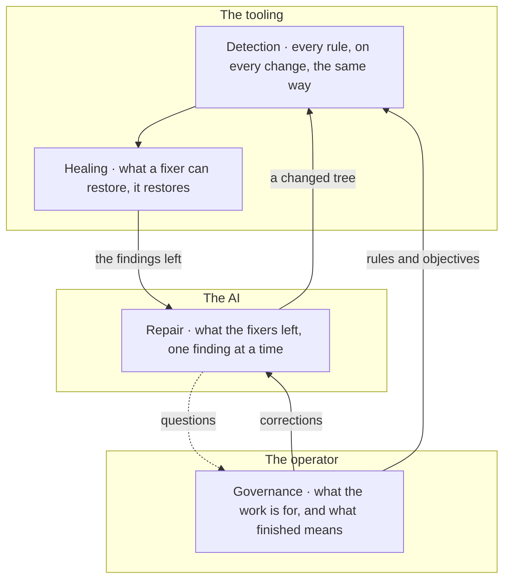

## The stance

Four sentences carry the whole stance. Every claim stays unverified until someone reads it in the current tree, the read [C1·a claim to evidence](#the-stance-panel-a) draws. Review is [adversarial by default](START.md#adversarial-by-default), because agreement is cheaper than [verification](ontology/PRINCIPLES.md#arch-verification), as [C1·b agreement outruns](#the-stance-panel-b) shows. Every manual step is a failure of automation, and the ontology names the decay it leads to: [manual runbook dependency](ontology/PRINCIPLES.md#arch-manual-runbook-dependency) and [manual-only governance](ontology/PRINCIPLES.md#arch-manual-only-governance). Documents state current truth and carry no history of their own, which is [single source of truth](ontology/PRINCIPLES.md#arch-single-source-of-truth) applied to prose. Everything else in this method is a mechanism that makes one of those four sentences hold without anyone remembering it.

### Read before you claim

A claim about the tree is a lie until someone reads the tree. A question about the code is answered without opening it.

The AI describes a function that someone renamed two sessions ago, edits against that description, and the edit lands in the wrong place. A model recalls a plausible version of the file, and a person recalls the version they last edited. Neither is the file.

Treat recollection as a lead, never as evidence. Open the file before you say what it contains. Run the command before you say what it prints. Quote the line, not the memory of it. Treat a claim about what a mechanism does as a claim about a file, and open that file, and where the claim is about what it does, run it, because a report about a mechanism, a rule describing it and a peer's account of it are all prose.

Ask for the file path and line of anything the AI asserts. An assertion with no location is an assumption.

The stance binds every input equally. My own messages, the AI's reasoning, its edits and their success reports, a prior turn's summary, a peer's account and a file's claim about itself are all unverified until observed now. Reasoning is not verification, and a success report is the failure [it looked right](VERIFY.md#it-looked-right) is built on. Verified means read or executed in the current state, which is what [the loop](START.md#the-loop)'s [ground truth](ontology/REASONING.md#reason-node-ver-ground-truth) node asks for, and a file is read whole, because a partial read destroys structure and structure is the object of analysis.

A claim spreads at the speed of agreement and its refutation at the speed of verification. Agreeing with a peer costs one read of what they wrote. Refuting them costs opening the thing they wrote about, and only a party with a reason to doubt pays that. So a wrong statement outruns its own correction by construction, and the more coherent the argument around it, the faster it spreads, because a claim that fits invites agreement rather than inspection. The discipline that follows is small: a statement resting on someone else's reading re-opens the thing they read, never their sentence, and a claim about a mechanism is settled by making the mechanism do the thing rather than by reading its source.

The difference shows in one exchange. Asked whether the router uses the new name, the answer from memory is _the router already uses the new name, so nothing else needs to change_. The answer from the tree is _the handler in the router still calls the old name, here is the line_. Only the second one can be wrong in a way someone can see.

C1·a claim to evidence

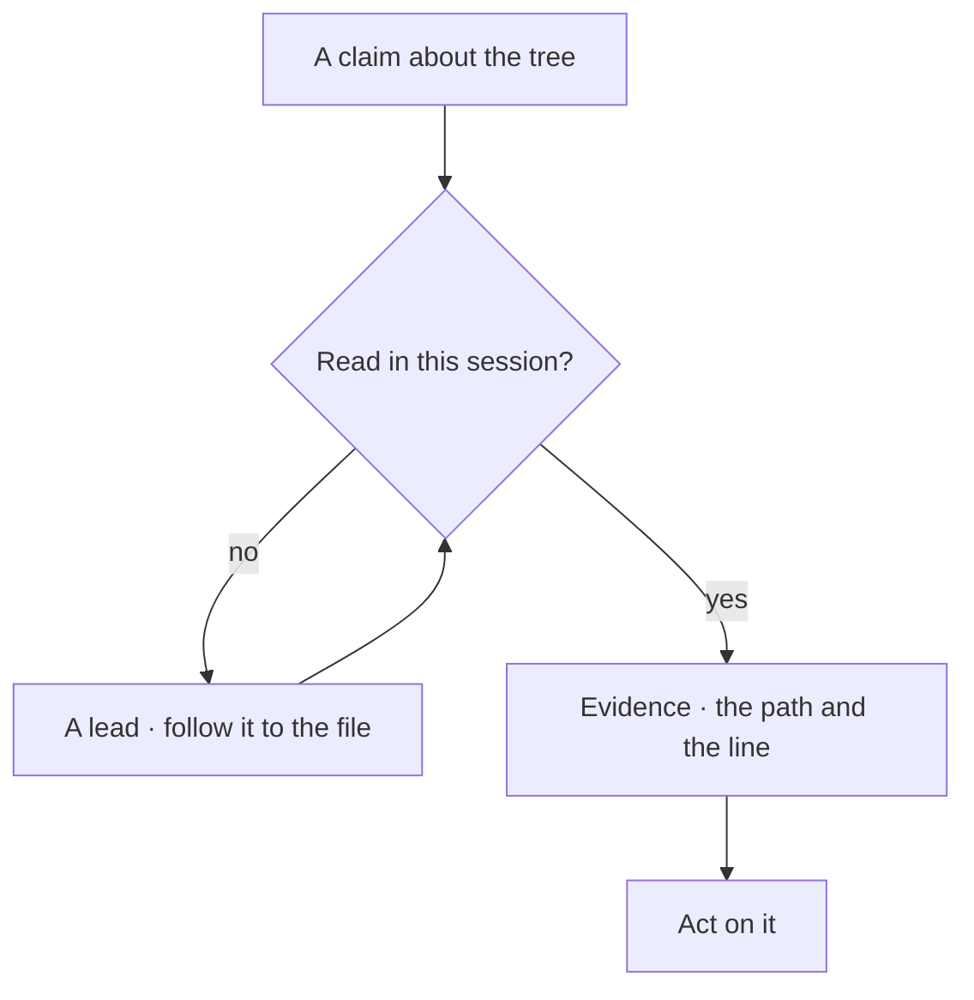

C1·b agreement outruns

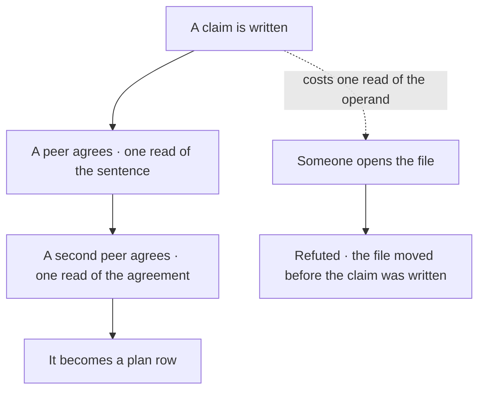

## Adversarial by default

The second sentence of [the stance](START.md#the-stance) is that review is adversarial by default. It follows from the first: a claim about the work is unverified until someone tries to break it, and a review that starts from approval has nothing to verify.

### The list before the verdict

Affirmation is a conclusion of [verification](ontology/PRINCIPLES.md#arch-verification), never a starting stance. An AI asked to review will tend to affirm, and affirmation feels like a review.

A review reads well, approves the change, and the regression ships because nobody was looking for it. Training rewards the model for agreement, so agreement is its cheapest answer.

Make the list of findings the deliverable of a review, rather than a verdict with reasons attached. Open a review by listing what is wrong. Let approval be what remains when the list is empty. Reject any reply that opens with praise, and attack your own output before presenting it, because a deliverable nobody has tried to break is unfinished.

Count the findings in the review. A review with none either checked nothing or checked the wrong thing.

The other two sentences follow from the first two. A step a person performs is a step nobody checks, so it is performed differently the next time, and the repair is that [tools live in the tree](BUILD.md#tools-live-in-the-tree). A document with history in it is a document whose current truth a reader has to reconstruct, and a reader reconstructing truth is a reader guessing, and the repair is [derived state](VERIFY.md#derived-state).

## Resolving a message

A message is never merely answered. It is resolved, and resolving it means seeing it whole in one pass before a word of reply forms, the readings [E1·a the readings](#resolving-a-message-panel-a) orders. This is the [orient](ontology/REASONING.md#stage-orient) node of [the loop](START.md#the-loop) applied to a request, walked along the ontology axis the reasoning face publishes, and it is where most drift starts, because a request answered at its surface is a request whose architecture nobody read.

### Fifteen readings, one pass

Architecture is the target, and wording is evidence about it rather than the subject of it. A message answered at its surface is answered wrong in the details that only the structure reveals.

A request to rename a function is answered by renaming the function, and the three collectors that resolved it by pattern go quietly empty because nobody asked what the name connected to. A reply forms from the first plausible reading, and the first reading is the surface.

Resolve the message before answering it. Read a request along the fifteen readings of the ontology axis, in their order, before replying, and let the reply be that understanding made explicit, carried in connected phrases rather than headings.

Take a reply and ask which of the readings it rests on. A reply that skipped a reading is incomplete, not concise, and the reading it skipped is where the defect lands.

A one-line request that resolves to one file and one edit still passes through the readings, but they take a second and most of them read as empty. The readings scale with the request, and an empty reading is a real answer rather than a skipped one.

The readings are an axis, and the axis is what turns judgement into something a check can hold. Each reading is a node of the ontology axis with a question and a mathematical shape behind it. [Identity](ontology/REASONING.md#reason-node-ont-identity) asks what exists and answers with a set, [structure](ontology/REASONING.md#reason-node-ont-structure) asks how the parts are arranged and answers with an ordering. [Relation](ontology/REASONING.md#reason-node-ont-relation) asks what it connects to and answers with a graph, and [probability](ontology/REASONING.md#reason-node-ont-probability) asks how sure each reading is and answers with a number between zero and one. The others, [composition](ontology/REASONING.md#reason-node-ont-composition), [space](ontology/REASONING.md#reason-node-ont-space), [time](ontology/REASONING.md#reason-node-ont-time), [state](ontology/REASONING.md#reason-node-ont-state), [change](ontology/REASONING.md#reason-node-ont-change), [behaviour](ontology/REASONING.md#reason-node-ont-behaviour), [function](ontology/REASONING.md#reason-node-ont-function), [cause](ontology/REASONING.md#reason-node-ont-cause), [meaning](ontology/REASONING.md#reason-node-ont-meaning), [scale](ontology/REASONING.md#reason-node-ont-scale) and [novelty](ontology/REASONING.md#reason-node-ont-novelty), each carry a shape of their own.

A question that resolves to a shape resolves to a predicate, and [an architecture is its predicate set](architecture/COVERAGE.md#an-architecture-is-its-predicate-set) on the architecture page carries what a predicate does with that, so the reading a person did once becomes the check a machine does every time.

[Introspection](ontology/PRINCIPLES.md#arch-introspection) goes one level below the [abstraction](ontology/PRINCIPLES.md#arch-abstraction) a thing presents. A document's section list is surface, and the rule that decides what may enter a section is the architecture. A function's signature is surface, and its state ownership and lifecycle are the architecture. A count is surface, and the scope it was taken over is the architecture. Reading at that level is what makes the first reading of a request agree with the last [verification](ontology/PRINCIPLES.md#arch-verification) of its result, because both are looking at the same thing.

E1·a the readings

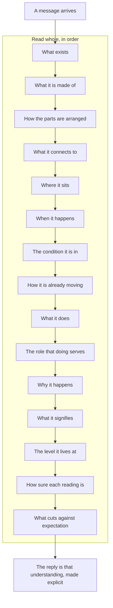

## Three encodings

Discipline is encoded three ways, and the three feed each other in a loop, as [F1·a three encodings](#three-encodings-panel-a) draws. A method with only one of the three is a method that leaks through the other two, and when two surfaces disagree a reader walks the order [F1·b precedence](#three-encodings-panel-b) draws.

### One kind of discipline per home

Mechanical rules, behavioural rules and context architecture each hold one kind of discipline, and each defers to the tree. Discipline written as one long instruction document mixes what a check should hold with what a person should remember, and both halves decay at the rate of the weaker one.

A rule about the tree sits in the behaviour policy, the agent follows it faithfully for a session, and the tree drifts anyway because nothing outside the conversation reads that sentence. A rule stated where nothing reads it is a rule held by memory, and a rule stated in two homes is two rules that drift.

Classify every rule to one encoding before writing it down. Keep the three encodings in three homes with one scope each. Put a constraint on the tree into a check. Put a constraint on the agent's conduct into the policy as one line with a stable name. Put what the agent needs to know into the context architecture, layered so that the agnostic part transfers and the bound part is one file. Let a fact live in exactly one of the three and let the others point at it.

Take any rule and name its home. A rule you cannot place in one of the three is either two rules or a rule nothing enforces.

The split is by scope, never by how important a rule feels. A behavioural rule that can be observed in an artifact is a mechanical rule wearing prose, and moving it to a check is the work rather than a demotion.

Mechanical rules are the constraints a check can decide from the tree alone: where a file may live, what a name may say, which imports cross a boundary, whether a fact is declared twice, whether a document's references resolve. They are [policy as code](ontology/PRINCIPLES.md#arch-policy-as-code), held by checks, fixers, validators and generators as [static analysis](ontology/PRINCIPLES.md#arch-static-analysis) and [fitness functions](ontology/PRINCIPLES.md#arch-fitness-functions); they return pass or fail, and they run in [one chain](SHIP.md#one-chain), which is what [the gate holds the line](BUILD.md#the-gate-holds-the-line) means. The person is not in this encoding at all, which is the point. A mechanical rule that needs a person is a behavioural rule wearing a check's clothes.

Behavioural rules are the constraints on how the agent works when no artifact can observe the act: that it reads a file before claiming what it holds, that it asks before the dependent work rather than after, that it never runs a step whose output it will not read whole. Each is one line with a stable name, the shape [rules with names](START.md#rules-with-names) describes, so a correction has a place to land and a citation has a target.

Context architecture is how the other two reach the agent the same way every time. The cores are agnostic: an ontology of readings, a principle canon that [principles are typed](architecture/PRINCIPLES.md#principles-are-typed) describes, the naming standard that [placement is a grammar](BUILD.md#placement-is-a-grammar) describes, and the [core templates](pag/TEMPLATES.md#templates-core) the grammar page publishes. The cores are agnostic and one adapter binds them, as [the drop-in](START.md#onboarding) explains. The digests expand one concern each where a rule needs room. Memory holds one fact per file and is reference rather than authority, so a recalled fact is verified against the tree before it is acted on. A precedence order runs through all of it, and every layer defers to the tree: a document that disagrees with the disk is wrong, and it is corrected the turn the disagreement is seen.

[The loop](START.md#the-loop) between the three is what makes the system cohere rather than merely coexist. A check raises a finding and the agent repairs it under the behavioural rules. A correction I give hardens into a behavioural rule and a memory the turn it arrives. A behavioural rule stated twice for the same shape is the trigger to build the check that makes it mechanical, at which point the prose becomes a pointer and the rule has a [single source of truth](ontology/PRINCIPLES.md#arch-single-source-of-truth). The cores stay untouched through all of that, because nothing in them named this tree, and the adapter absorbs whatever changed.

F1·a three encodings


F1·b precedence

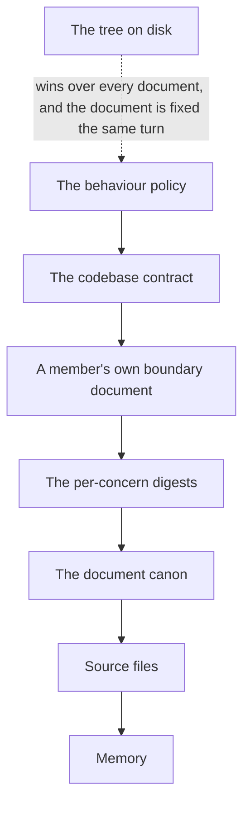

## Where a rule lives

A rule has two possible homes, and [G1·a two homes](#from-chat-to-tree-panel-a) draws where each one ends. It lives in the conversation, where someone restates it and hopes, or it lives in the tree, where the AI reads it on its own and a check refuses what breaks it. Everything in this method lives in the tree, as [policy as code](ontology/PRINCIPLES.md#arch-policy-as-code) where a check can hold it and as a policy line where only conduct can. An instruction that needs restating is a mechanism that has not been built yet, and the ontology's name for the state it leaves behind is [manual-only governance](ontology/PRINCIPLES.md#arch-manual-only-governance).

### Discipline decays, mechanism holds

Discipline held in a conversation decays. A mechanism held in the tree does not. Rules that live in a chat need restating every session, and the restating is where they drift.

The session starts well, the instructions fade as the context fills, and by the end the AI is back to its defaults. A rule held by discipline is re-decided at every use, and every re-decision is a chance to decide differently.

Convert discipline into mechanism the moment you have stated a rule twice. Move each instruction you keep repeating into a file the AI reads on its own. Move each check you keep performing into a command the pipeline runs. Delete the ritual once the mechanism holds, because a ritual kept beside its mechanism is a second home for the same rule.

Delete your custom instructions for one session. What still holds is mechanism. What breaks was discipline.

A conversation is the right home only when the AI has no access to your files. The tree is the home the moment it does.

The test that separates the two is whether anything would disagree if the rule stopped holding, the objector test that [stating an invariant](COLLABORATE.md#stating-an-invariant) applies to a whole topology. A rule in a conversation has no objector: the moment it is forgotten, nothing notices. A rule in the tree has one of two objectors. A check refuses the change that breaks it, or a policy line the AI reads every session states it in the same words every time. The second is weaker than the first and still stronger than a memory, because a policy is delivered to every session at startup and a memory is delivered to whoever remembers to look.

Coordination friction is the same question at a larger scale, answered where [coordination is software](COLLABORATE.md#coordination-is-software): when two parties on one tree lose a write, leave a stale item or miss a message, the first response is what the [shared surface](pag/ORCHESTRATION.md#shared-surfaces) is missing, never who should have been more careful. A rule added without a mechanism behind it is more care wearing a rule's clothes, and it decays at the same rate the care did.

G1·a two homes

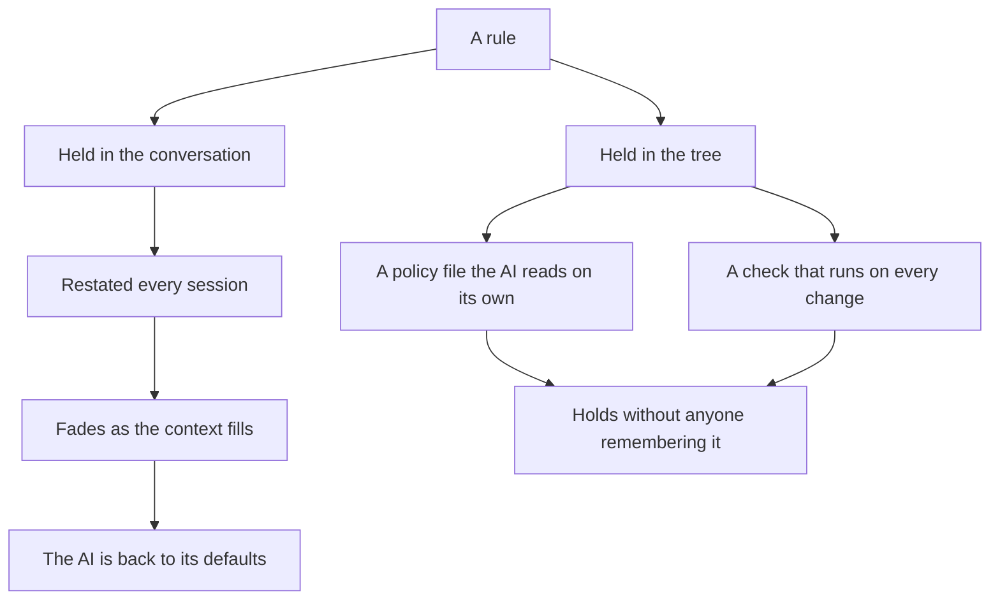

## Rules with names

Every behavioural rule is one line with a stable name, a directive, and the name of the check that enforces it or a declaration that none can, the lines [H1·a a policy file](#rules-with-names-panel-a) shows and [H1·b a rule record](#rules-with-names-panel-b) parses. The name is what a correction lands on and what a citation resolves to. When I correct the AI, the correction becomes a rule with a name and a memory the same turn, so it hardens instead of repeating, as [H1·c a correction hardens](#rules-with-names-panel-c) draws.

### A correction lands on a name

Behaviour is a set of named rules, so a correction hardens rather than repeats. Instructions written as prose have no stable place for a correction to land.

The same correction gets made in three sessions, each time as a new paragraph, and the three paragraphs disagree. A correction with nowhere to land is remembered by the person and forgotten by the model, so it arrives again next week.

Give each rule a name to land on rather than a paragraph to append to. Write each rule as one line: a short stable name, a directive in the present tense, and the gate that holds it. Cite the name wherever the rule applies. When a correction arrives, classify it to [one home](BUILD.md#one-home), write the rule first, then its reason and its application, land a memory beside it, and verify every destination by search rather than by recollection. Capture the class the correction belongs to, never the one instance that triggered it.

Take the last correction you gave the AI. Find its name in the rules. If it has no name, you will give it again.

A rule may state the measured failure that produced it, in past tense, inside the rule it justifies and nowhere else, because that clause is an operand the rule depends on. It carries the shape that failed and how it presented, never who did it, when, or in what order.

The line shape is the whole design. A slug is a stable identity, so a rule can be cited from a digest, a memory, a finding or a peer's message without quoting its text, and it survives every rewording; the slugs are the [ubiquitous language](ontology/PRINCIPLES.md#arch-ubiquitous-language) the operator, the model and the tooling share. A directive in one line cannot hide a second instruction, so a reader executes it as one step. The gate field is the honest part: it names the check that observes the rule, or it says that no artifact can, and a rule that says neither is a rule nobody has assessed. That field lives in exactly one place per rule, because a [single source of truth](ontology/PRINCIPLES.md#arch-single-source-of-truth) admits no second declaration site. A rule without its reason gets re-litigated, and a rule without its application gets admired and ignored, so the digest that expands a rule carries both; a digest is an [architecture decision record](ontology/PRINCIPLES.md#arch-architecture-decision-records) for one line of conduct.

The reason and the application are written in the operator's own sharpest words where there are any, since paraphrase loses the distinction that made the correction necessary. The unit captured is the class: one bad path becomes a rule about verifying paths, and one missed reference becomes a rule about surfaces that resolve by pattern.

The rules split into the ones that bite every turn and the ones that fire on a matching task, plus a small set of declared exceptions. That grouping is the reader's, not the checker's. A check reads the gate field and never the heading, which is why a rule can move between groups without any mechanism noticing and why a new rule is one appended line rather than a section.

Parsed, a rule is a record, and the record is what an inventory, a coverage walk and a leak check all read; [coverage is derived](VERIFY.md#coverage-is-derived) from that inventory rather than counted. The gate is a discriminated union rather than a nullable string, so a rule that declares neither cannot be represented, which is how the unassessed state becomes unwritable rather than merely discouraged.

```markdown
## <rules that bite every turn>

- `read_before_claim`: a claim about a file is a lie until the file is read in this session · gate: conduct
- `finding_not_principle`: the AI is directed with a location and a mismatch, never with a principle · gate: conduct
- `one_run_is_the_answer`: a check runs once per state and its first output is read whole · gate: conduct

## <rules that fire on a matching task>

- `rename_by_hand`: a move is done by hand, every reference enumerated before and verified after · gate: reference
- `ask_at_the_uncertainty`: a question is raised where it appears, with a recommendation, before the dependent work · gate: conduct
```

```typescript
export type Tier = "always" | "situational" | "exception";
export type Gate =
  | { readonly kind: "check"; readonly id: GateId }
  | { readonly kind: "conduct" };

export interface RuleRecord {
  readonly slug: string;
  readonly directive: string;
  readonly tier: Tier;
  readonly gate: Gate;
  readonly locked: boolean;
  readonly source: DocumentId;
}

export interface Digest {
  readonly slug: RuleRecord["slug"];
  readonly why: string;
  readonly how: string;
  readonly measured?: { readonly shape: string; readonly presents: string };
}
```

H1·c a correction hardens

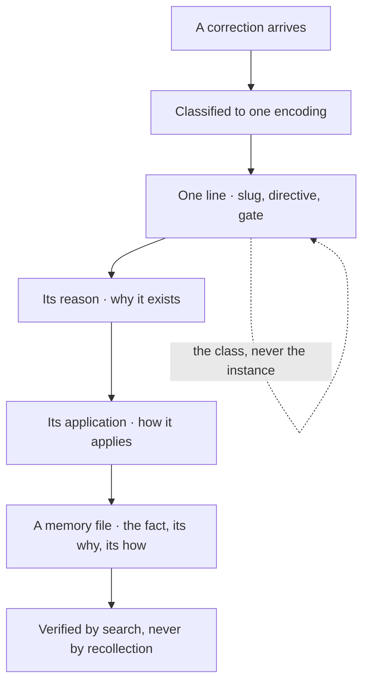

## A seat is a contract

A seat is defined by a contract, never by a character. [Design by contract](ontology/PRINCIPLES.md#arch-design-by-contract) applied to a party: the contract is [I1·a a role document](#a-seat-is-a-contract-panel-a) with the same sections for every seat, naming what it owns, what it refuses, how it works, the principles that decide its calls, and the mistakes it is prone to.

### Contract over character

[Consistency](ontology/PRINCIPLES.md#arch-consistency) comes from the check, not from the roleplay. A persona gives an AI a voice, and a voice is not a behaviour.

The persona stays in voice through the whole session and produces the same drift as a session with no persona at all. A character is judged by how it sounds, and sounding right is the one thing a model can always do.

Define a seat by its contract, never by its character. Write a role as a short document with the same sections every time, and name the failure modes that seat exhibits beside what it owns. Check the seat's output against the contract, never against its tone. Keep the identity out of the filename so a handover changes a field rather than a path.

Strip the voice from a session's output and check what remains against the contract. Whatever the voice was hiding is now visible.

A measured failure mode is evidence held in one place, so it leaves a role document only by extraction to the [one home](BUILD.md#one-home) history has. An anticipated failure never displaces a measured one.

A uniform shape is what makes a set of seats comparable. A reader looking for what a seat refuses finds it in the same place in every document, or the documents are prose that happens to be filed together. The section set is the contract and the declared fields are the operands a tool reads: the identity, the concern it holds, the one line another seat routes by. The seat's identity is allocated and bound before its first write, which [coordination is software](COLLABORATE.md#coordination-is-software) derives.

The section that carries the value is the one about what the seat gets wrong. A reviewer that affirms a change that reads well, a builder that reviews the description instead of the diff, a coordinator that routes work one edit would have closed: those are measured shapes, and a seat that opens its own document before its first edit is reading them to avoid repeating them. A contract without that section is a job description, and a job description constrains nobody.

```markdown
# Reviewer

## <identity>

The seat's identity, bound in the index before its first write.

## <what it owns>

The list of findings, and nothing else.

## <what finished means>

A change ships only once the list is empty.

## <how it works>

One finding per line: file, line, expected, found. No style comments, no rewrites.

## <the shapes it gets wrong>

Affirming a change that reads well. Reviewing the description instead of the diff.

## <what decides its calls>

A finding without a location is an opinion. Approval is what remains when the list is empty.
```

## The behaviour document

The behaviour policy is the system prompt of the collaboration, whatever file name the harness reads it under. It is the one document delivered to every session at startup, so it carries what has to be in force before the agent knows what it is doing, and it points at everything else, in the order [J1·a a behaviour document](#the-behaviour-document-panel-a) shows and [J1·b delivery order](#the-behaviour-document-panel-b) places. Its composition is the same in any harness and for any model, because nothing in it names a tool: it names operations and slots, and one binding says which tool performs which, which is [platform independence](ontology/PRINCIPLES.md#arch-platform-independence) applied to a prompt, as [J1·c one binding per harness](#the-behaviour-document-panel-c) draws. What each reader class receives is what [J1·d reader classes](#the-behaviour-document-panel-d) draws. It is the behavioural encoding of the [three encodings](START.md#three-encodings), and [document structure](pag/GUIDE.md#document-structure) on the grammar page is the same rule for a single document: declare, then instruct.

### A system prompt with a composition

The behaviour document is a system prompt with a composition. Resident context comes first, delivery order is precedence order, and what presupposes a known task is referenced rather than carried. A prompt written as one long instruction document is read once at startup by a model that will forget most of it, and nothing in its shape says which parts must survive.

The document grows by appending, every session opens on a wall of prose, the first rules hold and the last ones are never read, and the same correction is added a fourth time at the bottom. A document delivered once carries no shape that says what is resident and what is referenced, so every line competes for the same attention and the order is whatever it was written in.

Compose the behaviour document by orienting precedence, and treat its shape as portable across harnesses. Open with [the stance](START.md#the-stance) and the hard prohibitions, because those bind before the task is known. Follow with what to read first and in which order, then the rules that bite every turn, then the situational ones, then the declared exceptions. Put how the work is verified, how the tree is looked at and what the tree is after the rules, because each presupposes a task. Point at a digest for anything that needs room. Name no tool anywhere; name the operation, and let the binding resolve it.

Rename the file to what another harness reads and hand it to a different model. Where it fails, a tool name or a path leaked into a place a slot belongs. Where it holds, the composition transferred.

The document is delivered once per reader, so a change to it has no subscribers in a running session. A rule edited mid-session reaches only parties that start afterwards, which is why a governing change is also routed as a message to the parties already running, and the message is read whole every round where the file is not.

### Resident, then referenced

The test that decides where a part goes is one question. If it tells the agent how to find out what it is doing, it is resident, and it sits at the top in the order it binds. If it tells the agent what to do once it knows, it is referenced, and it sits below or in a digest the top points at. Frequency is a proxy and a bad one: a rule that fires every hour but presupposes a known task is safely referenced, and a rule that fires once a month but decides which document to open is resident.

### The document is a claim

The document is a claim like any other and the stance binds it: it is re-read whenever it enters context, because a version held in memory is a memory, and it defers to the tree as three encodings orders.

It states what is true now and never what used to be, as [derived state](VERIFY.md#derived-state) requires of every document. Copying a sentence from one document into another is how a dead reference propagates, so a fact keeps a [single source of truth](ontology/PRINCIPLES.md#arch-single-source-of-truth) and the other documents point at it, which [documentation is code](VERIFY.md#documentation-is-code) turns into a check. The set is validated as documents, each class to its declared shape, and a document off shape fails before it is delivered.

### Operations and slots

[Portability](ontology/PRINCIPLES.md#arch-portability) follows from what the document is allowed to say. It states what to do as [semantic operations](pag/GUIDE.md#tool-invocation): discover the resources, read the resource, search the content, analyse, execute a tool, persist the artifact, report the result, the same rule semantic operations on the grammar page states. It states where things are as slots: the gate, the rule host, the test root, the depth cap. One binding per harness maps each operation to that harness's tool and each slot to that tree's value, which is [configuration externalization](ontology/PRINCIPLES.md#arch-configuration-externalization) for a prompt, so moving the document to a harness that reads a different file name is a rename plus one binding, and the rules do not change. The model is an absent slot by construction, because model selection belongs to the harness and a value written into an absent slot has no source.

A body of rules meant for adoption elsewhere is written as a block a host copies into its own document rather than merges. The host's rule wins where the two collide on one construct, and the collision is a finding rather than a negotiation. Every path in the block is relative to one value the adopter re-points, and the one literal that survives is the import a runtime resolves, because a runtime reading a path has no binding to consult.

### Who receives it

Who receives the document decides which of its rules bind, and the document says which class each rule binds rather than leaving the reader to classify itself; [coordination is software](COLLABORATE.md#coordination-is-software) derives the two classes from what each receives. The one line a bounded reader gets is refreshed in the same change as the fact it carries and held to a cap, because a projection that grows by perfect [compliance](ontology/PRINCIPLES.md#arch-compliance) with a refresh rule stated without a shape is the document's own accumulation.

### How it grows

The document grows in the one shape [rules with names](START.md#rules-with-names) describes, and a rule stated twice for the same shape becomes a check the line points at.

The document restates nothing the codebase contract owns and the contract restates nothing the document owns, and a reader who finds one fact in both has found the copy nobody maintains.

```markdown
# <the stance and the hard prohibitions>

A claim about the tree is unverified until the tree is read. Review is adversarial by default. Every manual step is a failure of automation. A document states what is true now.

# <what governs what, and the precedence>

The behaviour policy governs the agent. The codebase contract governs the code. A digest expands one rule and declares nothing. The tree outranks all of them, and a document that disagrees with the tree is corrected the same turn.

# <what is read first>

A blocker outranks everything and is read first. Then the board, whole. Then the seat's own role. Then the document whose domain the task enters.

# <rules that bite every turn>

- `read_before_claim`: a claim about a file is a lie until the file is read in this session · gate: conduct

# <rules that fire on a matching task>

- `rename_by_hand`: a move is done by hand, every reference enumerated before and verified after · gate: reference

# <declared exceptions>

- `question_is_blocked`: a pending question is a blocked state, never a third verdict

# <how the work is verified>

One command runs every stage in order. It runs once per state, and its first output is read whole.

# <the layers>

<layer>: what it holds and what authority it carries, one line each.
```

J1·b delivery order

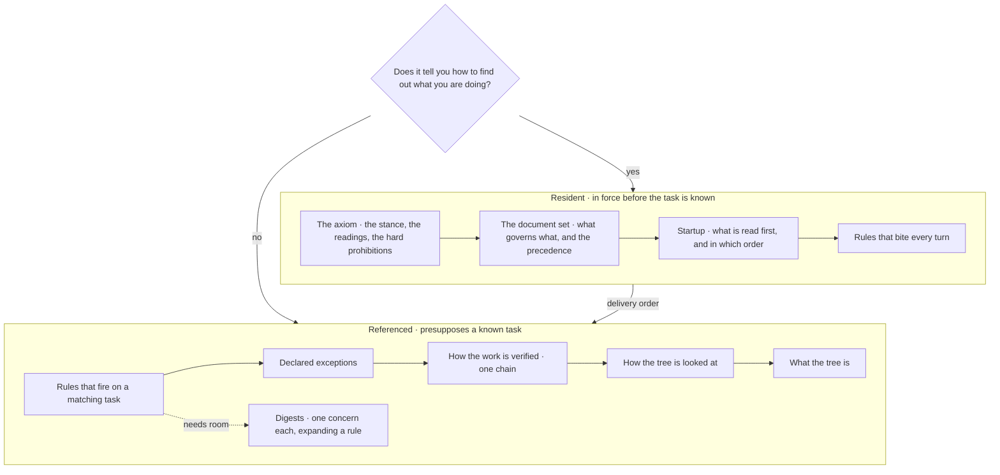

J1·c one binding per harness

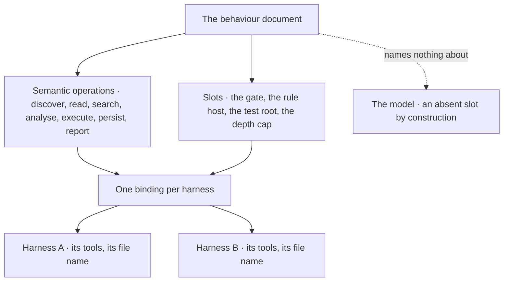

J1·d reader classes

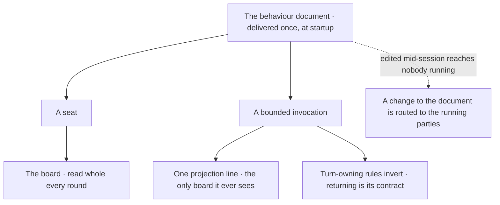

## The drop-in

Onboarding a project is a template applied to a binding, not a ritual performed in a chat. The whole governance set is a folder that names no project, plus one file that does, as [K1·a a drop-in](#onboarding-panel-a) draws. Adopting it means copying the folder and writing that one file, [K1·c a binding](#onboarding-panel-c), in which every host fact is a slot in one of the three states [K1·b slot states](#onboarding-panel-b) draws, and the gate is green on an empty tree before the first line of code exists. Everything about how that works follows from one separation: the thinking is kept apart from the tools, which is [platform independence](ontology/PRINCIPLES.md#arch-platform-independence) for a method and [configuration externalization](ontology/PRINCIPLES.md#arch-configuration-externalization) for its facts. The [template families](pag/TEMPLATES.md#templates-families) the grammar page publishes are what the folder is generated from.

### A template applied to a binding

Cores are agnostic, one adapter binds them, and every absence carries a declaration rather than a patch. A method that lives in one project's vocabulary does not transfer.

Every new project starts with a long conversation reconstructing rules that already exist somewhere else, slightly wrong. A core that names a path is bound to the tree that has it, so the next tree has to edit the core.

Port by rewriting one adapter rather than by editing the cores. Keep the reasoning in cores that name no project. Keep the bindings in one adapter that resolves every slot the cores leave open. Name a slot that nothing fills as absent, in the adapter, rather than letting the core assume it, and let the branch that depends on it not run. Prove the set on an empty tree, because a gate that is red before any code exists is reporting a binding, and a gate that is green there is the baseline every later red is measured against.

Apply the set to an empty project. A red gate there is a binding the adapter did not make; a green one proves the binding and nothing else, because a check over an empty tree measures nothing.

A catalogue inside a core, a list of principles or patterns or examples, may assume constructs this tree does not carry. The mechanism transfers unchanged and the catalogue is re-derived against what exists here. Substituting the mechanism is the violation and re-deriving the catalogue is the work.

### Cores, one adapter, three slot states

A core is a document that states what to do as [semantic operations](pag/GUIDE.md#tool-invocation) and slots, the shape [the behaviour document](START.md#the-behaviour-document) already has. It never says which tool discovers or which folder is the test root, because the moment it does it is bound to one tree and the next tree has to edit it. The adapter is the one file where those names live, and it is the only file rewritten when the set is ported.

A slot resolves to one of three states, and the third is the load-bearing one. Resolved means this tree has the thing and the value is here. Absent means this tree has no analogue, the branch that depends on it does not run, and that is declared rather than faked. Deferred means the thing will exist and does not yet, so the branch is blocked rather than skipped, which answers a different question in the right shape. An adapter that resolves everything is lying about something. The predicates this tree does not have, a computed worth, a non-progress detector, a calibrated confidence, are named as absent in the adapter so that nothing upstream assumes them; [the honest gaps](SHIP.md#the-honest-gaps) chapter lists them, and the architecture page reaches [the same declared absences](architecture/COVERAGE.md#the-honest-gaps) because [an architecture is its predicate set](architecture/COVERAGE.md#an-architecture-is-its-predicate-set).

### The generator removes itself

The template that generates the set retains mechanism and rewrites content. A fact that would be wrong in the next project is templatized into a slot. A statement true of one domain that is true of the class is generalized to the class. A mechanism that must carry no knowledge of what it governs is made agnostic. Then the generator substitutes the one binding, validates in both directions, that every slot the cores name is bound and that every binding names a slot, installs, runs the gate, and removes itself before the gate certifies the tree. A generated project is therefore green on arrival with no hand edit, which is what makes every manual step of onboarding a [manual runbook dependency](ontology/PRINCIPLES.md#arch-manual-runbook-dependency) rather than a chore.

The checks derive their contracts from the same templates the surfaces are raised from, a [single source of truth](ontology/PRINCIPLES.md#arch-single-source-of-truth) the check reads at run time. A check that transcribed a schema would hold a second copy with nothing keeping the two equal, and the drift would surface only when somebody raised a new surface and it failed on its first run, non-conformant at birth from a template that read as authoritative.

### The binding as a module

The binding is a typed module rather than a page, and the prose face of it is rendered from the module so the two cannot disagree, which is what [self-describing architecture](ontology/PRINCIPLES.md#arch-self-describing-architecture) means for a binding. A slot is one record with a state from a closed union, a value that is null in every state but resolved, and a note stating why, so a reader meets the reason beside the value and a mechanism meets the state before the value. The three constructors are the only way to make a slot, which is what keeps a resolved slot from carrying no value and an absent one from carrying a stale one.

Slots are grouped by who supplies them: what the host supplies, what the package owns, the conventions, the limits and the execution commands. A census over the states is derived on render, so it cannot disagree with the table above it, and a binding whose census shows every slot resolved is the one to distrust.

K1·a a drop-in

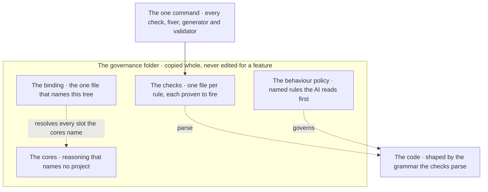

K1·b slot states

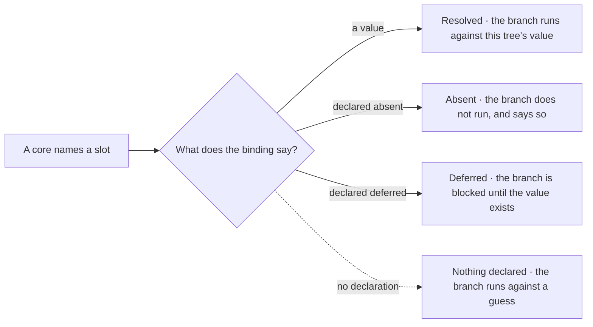

```typescript
export type SlotState = "RESOLVED" | "ABSENT" | "DEFERRED";
export type SlotValue = string | number | readonly string[] | null;

export interface Slot {
  readonly state: SlotState;
  readonly value: SlotValue;
  readonly note: string;
}

export const resolved = (
  value: Exclude<SlotValue, null>,
  note: string,
): Slot => ({ state: "RESOLVED", value, note });
export const absent = (note: string): Slot => ({
  state: "ABSENT",
  value: null,
  note,
});
export const deferred = (note: string): Slot => ({
  state: "DEFERRED",
  value: null,
  note,
});

export interface Binding {
  readonly project: Readonly<Record<string, Slot>>;
  readonly surface: Readonly<Record<string, Slot>>;
  readonly convention: Readonly<Record<string, Slot>>;
  readonly limits: Readonly<Record<string, Slot>>;
  readonly execution: Readonly<Record<string, Slot>>;
}

export const binding: Binding = {
  project: {
    root: resolved(
      "<host-root>",
      "the host root relative to this package, the one value an adopter sets",
    ),
    policy_projection: absent(
      "the host has not adopted the package, so no projection is written into its document",
    ),
    rollback_point: deferred(
      "a reversible checkpoint will exist once the host is under version control",
    ),
  },
  surface: { board: resolved("<board-file>", "the coordination board") },
  convention: {
    nesting_cap: resolved(
      "<depth>",
      "the placement depth cap from a governed root",
    ),
  },
  limits: {
    file_cap: absent(
      "no per-file cap; a host that wants one holds it in its own linter",
    ),
  },
  execution: { compile: absent("nothing here compiles") },
};
```

Documentation is covered by [CC BY-SA 4.0](https://creativecommons.org/licenses/by-sa/4.0/)

© 2025 [Jay Baleine](https://linkedin.com/in/jay-baleine) - Disciplined AI Software Development

---

Chapters: [Start](START.md) · [Plan](PLAN.md) · [Build](BUILD.md) · [Verify](VERIFY.md) · [Collaborate](COLLABORATE.md) · [Ship](SHIP.md)
