© 2025 Jay Baleine - Disciplined AI Software Development · Documentation is covered by [CC BY-SA 4.0](https://creativecommons.org/licenses/by-sa/4.0/)

# Verify — Methodology — Bane's Lab

> The most expensive failures I have had were the ones that looked right. The code read well. The AI said it was done. Nothing had run. Everything in this chapter…

Canonical: https://banes-lab.com/disciplined-methodology/verify

# Disciplined AI Collaboration

Constraints, checks and skepticism for building software with AI.

# Verify

## It looked right

The most expensive failures I have had were the ones that looked right. The code read well. The AI said it was done. Nothing had run. Everything in this chapter follows from one distinction: a claim is a sentence a party produced, [ungrounded AI output](ontology/PRINCIPLES.md#arch-ungrounded-ai-output) until something grounds it, and [evidence](ontology/REASONING.md#reason-node-ver-evidence) is an observation a mechanism produced, and only the second decides anything, which is what [A1·a a claim's source](#it-looked-right-panel-a) draws and [A1·b report and prose](#it-looked-right-panel-b) separates. The [verify](ontology/REASONING.md#stage-verify) node of [the loop](START.md#the-loop) asks exactly this, and the ontology's [verification](ontology/PRINCIPLES.md#arch-verification) axis names its parts: [ground truth](ontology/REASONING.md#reason-node-ver-ground-truth), [falsification](ontology/REASONING.md#reason-node-ver-falsification), [confidence](ontology/REASONING.md#reason-node-ver-confidence) and [refutation](ontology/REASONING.md#reason-node-ver-refutation).

### Looks right is not runs right

The machine derives the verdict. A model's judgement is never the completion signal. An AI judges its own edit as clean by reading it, and reading is not running.

[Compliance](ontology/PRINCIPLES.md#arch-compliance) claimed after one edit, never re-verified, and the next run of the tools finds the same fault plus a new one. A model produces text that resembles a finished result, because that is what finished results look like in its training.

Let the report on disk decide done, rather than the reply that describes it. Take the exit code as the answer. Take the parsed findings as the answer. Take the AI's summary as a story about the answer.

Find the verifier output behind every done claim in a session. A done with no output behind it is a claim, and a claim is unverified.

A mechanism's output is evidence about itself and prose about its neighbours. The sentence most likely to stop a reader looking further is one whose subject is not its own emitter, because it appears to have already done the looking.

A completion claim reads _all done, the change is clean and everything passes_. A completion signal reads _gate: every step passed, exit zero, report written to the run's path_. The first is a sentence a model produced. The second is a number a machine produced.

Evidence has tiers, and they are ranked. A measurement taken locally outranks a vendor's documentation, which outranks a community source, which outranks inference. A record carries its confidence and its derivation as two separate axes, because material adapted from elsewhere can be strong or weak evidence independently of having been adapted, and pushing a provenance word into the strength vocabulary leaves the whole set unrankable. Conflicting sources are both recorded and the conflict is stated. An unverified or single-sourced claim is labelled as such wherever it drives a decision.

A1·a a claim's source

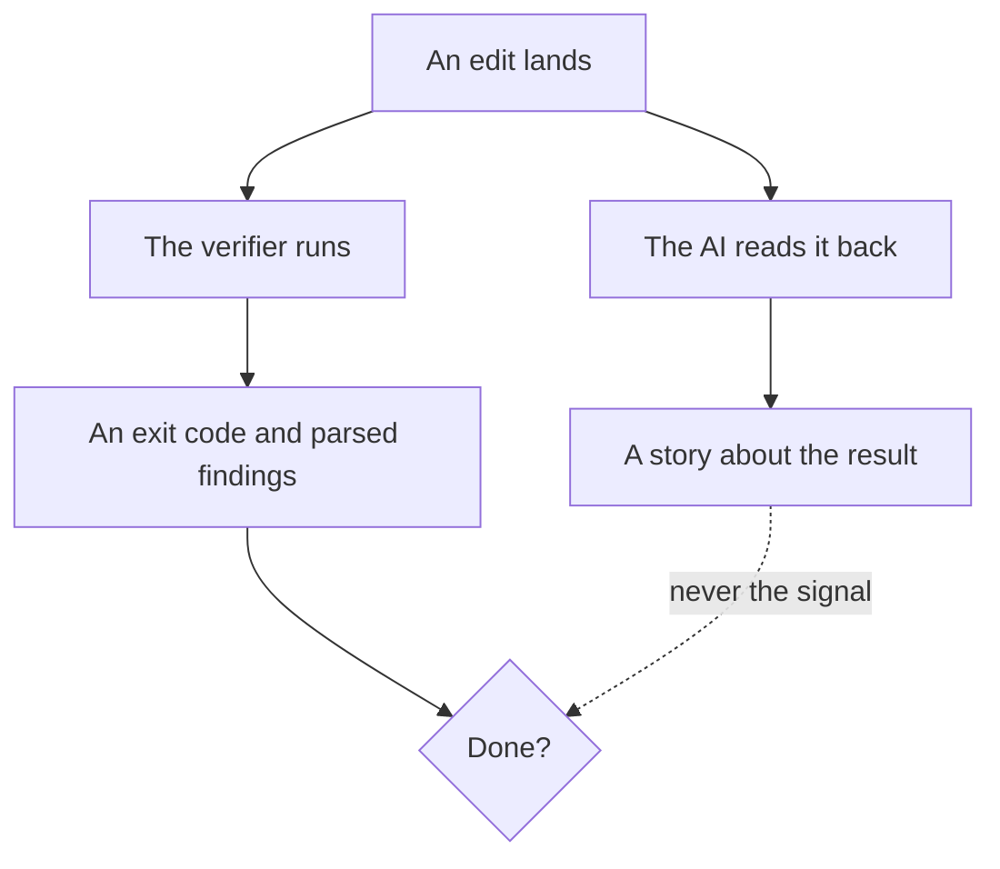

A1·b report and prose

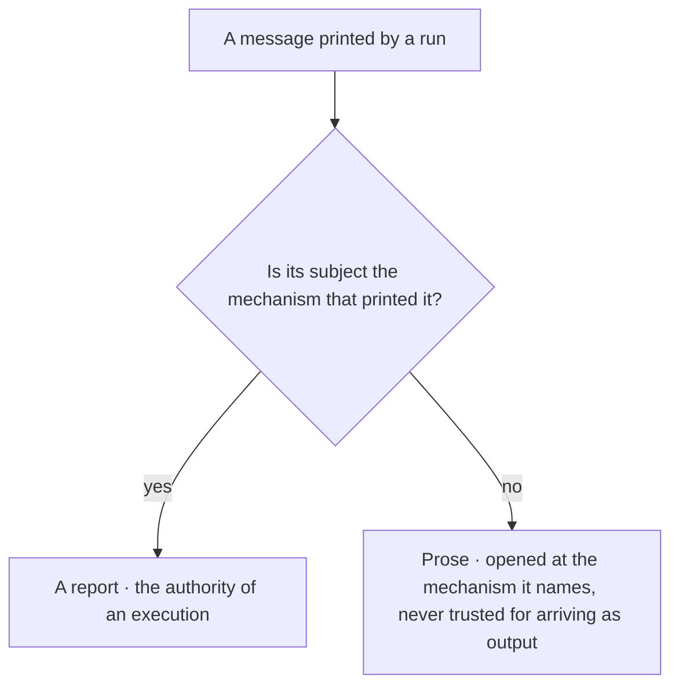

## Verify the verifier

[Verification](ontology/PRINCIPLES.md#arch-verification) is evidence, and the verifier itself gets verified, in the order [B1·b earning trust](#verify-the-verifier-panel-b) draws. A gate that has never failed on purpose has never shown that it can fail, and a green from a check that exercises nothing is the [mock mirage](ontology/PRINCIPLES.md#arch-mock-mirage). A checker applies its own rules to itself, or it asks of the code what it does not ask of its own source. And above every verifier sits an anchor that cannot be verified, only disclosed, because a gate cannot prove itself; a verdict is the value [B1·a a verdict](#verify-the-verifier-panel-a) types, and one whose surfaces moved beneath it loses its standing, as [B1·c lost standing](#verify-the-verifier-panel-c) draws. [The check comes first](BUILD.md#the-check-comes-first) is the same proof taken at authoring time.

### Positive control first

A positive control verifies the verifier before anyone believes what it says. A green check is evidence of nothing until you know the check can go red.

A gate is green for a year. Someone reads its source and finds it has matched nothing since a refactor changed the file suffix it looked for. A check's own green is the only evidence of its health, and green is also what a broken check produces.

Trust a verifier only after a positive control, a planted failure and an adversarial test. Trust a check only after the proof the check comes first requires, and keep both cases as tests. Test every detector adversarially with the inputs that fool a shallow match, a look-alike character, a pattern inside a comment, a shape without the structure. Run the governance tooling through the same gate it enforces. Disclose the anchor everything else rests on, and when a gate goes green after a structural change, confirm it still loads what it claims to load.

For each check, find the planted case that turned it red and the real case that turned it green. A check missing either one is unverified.

The anchor is the boundary. A verifier trusts that the runtime runs, that the filesystem reads, that a command executes and that tool output arrives, and it says so rather than pretending to verify them. Above the anchor everything is verified; the anchor itself is disclosed.

The failure the anchor guards against is concrete. A loader that discovers checks by a name pattern reports success while loading none of them if the pattern no longer matches what is on disk. Every step passes. Nothing is checked. So a green run after a structural change is followed by one question: does the run still load what it claims to load, with the generated index naming the checks and the loader's own count as the evidence. A harness that cannot fail is the same class: a stub standing in for an absent environment must answer only that environment, because a permissive stub that also absorbs the subject's own missing symbols converts every defect into a silent success.

A verifier that audits claims audits itself last, and an overclaim in its own contract drops its confidence below the threshold, so a run below the threshold is not a clearance. [Agents as executed contracts](COLLABORATE.md#agents-as-executed-contracts) shows how that self-audit runs and why a verifier binds to one phase at a time.

A verdict carries a standing beside its value. Every surface a run reads is stamped when it is read and re-stamped at the end, [optimistic locking](ontology/PRINCIPLES.md#arch-optimistic-locking) over a read set, and a run whose read set moved beneath it names the surfaces that moved and is not authoritative. The verdict is untouched, a pass stays a pass, and what is withdrawn is its standing to be quoted, because the report then describes an interleaving rather than a state. Holding a write barrier across a read would be the wrong repair, [pessimistic locking](ontology/PRINCIPLES.md#arch-pessimistic-locking) that serialises every verification against every write to answer a question about the past. As a type, the standing is derived from whether the moved set is empty rather than written by the run. The set the run reached is named, so a green is readable as coverage over that set and silence over the rest, and the surfaces the run itself healed are named apart from the ones that moved, because a run's own repairs are not contention. A clearance is then one function over the record: a pass whose standing is authoritative, and any other combination is a value without the standing to be quoted.

```typescript
export type Value = "pass" | "fail";
export type Standing = "authoritative" | "withdrawn";

export interface Stamp {
  readonly surface: string;
  readonly seen: string;
}

export interface Verdict {
  readonly value: Value;
  readonly standing: Standing;
  readonly reached: readonly string[];
  readonly moved: readonly Stamp[];
  readonly healedByThisRun: readonly string[];
  readonly derivations: readonly Finding[];
}

export const standingOf = (moved: readonly Stamp[]): Standing =>
  moved.length === 0 ? "authoritative" : "withdrawn";

export const quotable = (verdict: Verdict): boolean =>
  verdict.value === "pass" && verdict.standing === "authoritative";
```

B1·b earning trust

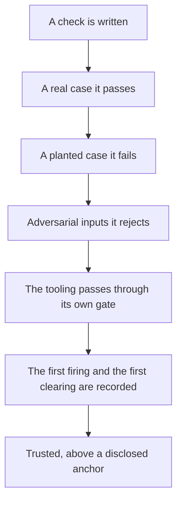

B1·c lost standing

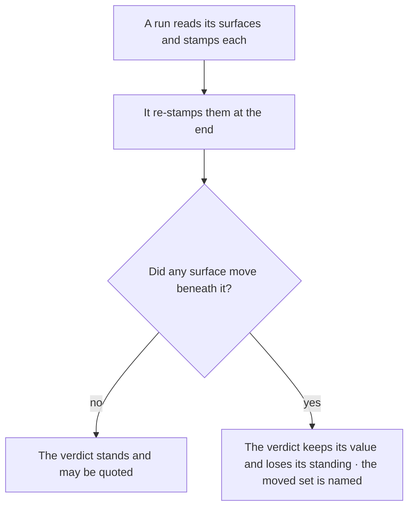

## A report, not a checkbox

A [verification](ontology/PRINCIPLES.md#arch-verification) runs once per state of the tree, and its first output is the answer; [reproducibility](ontology/PRINCIPLES.md#arch-reproducibility) is what a second run would test, and a differing second run is a finding rather than a retry. You read the output whole and never search it for the line you hoped to see. The run writes the report on every exit, so nobody mistakes a present report for a passing one. [Validation gates](pag/VALIDATION.md#validation-gates) on the grammar page hold an instruction's claims to the same standard: checkable, with evidence.

### One run, read whole

One run per state, output read whole, report written on every exit path. Re-running a check until it passes turns a verifier into a slot machine.

The check fails, gets re-run twice, passes on the third try, and the flake ships with the change: [flaky test normalization](ontology/PRINCIPLES.md#arch-flaky-test-normalization) in one sentence. A second run of the same state either repeats the answer or reveals non-determinism, and both are already findings from the first run.

Change the tree between runs rather than the filter between reads. Run the gate once. Write its full output to a file. Read the file whole. Fix what it names. Change the tree. Only then run again, and never re-run to see if the answer changes. Read a report's scope before its verdict, because a clearance from a check that cannot see the whole surface is worse than a visible gap.

Count the runs per tree state in a session. Anything above one is either a flake you should have filed or an answer you did not like.

A run is warranted when the tree has changed, and then the report is history and the run is the measurement. The tell of the misuse is a second invocation whose only difference is the filter.

Reading whole is a rule about structure, not about diligence. A slice of a report answers only the question the reader already thought to ask, and the reason a check writes a finding is to raise something the reader had not thought of. A search is worse than an offset: an offset shows what was skipped, and a search silently omits everything that did not match. The same holds for a file and for a coordination surface, and the oversize error a read returns is the cue to read in parts until the whole has been read, never the cue to sample.

A count is evidence of coverage only over the surface the scan reaches. A report therefore carries its derivations and not only its verdict: what it reached, what it excluded and why, so a green is readable as coverage rather than as silence. A negative result inherits the scope of the query that produced it and carries no evidence of its own, so before reporting that something does not exist the measurement is re-run one scope wider and taken over every surface where the thing could be declared.

## Unknown is not pass

A verdict has three values and the third is the one a percentage hides, as [D1·a three verdicts](#unknown-is-not-pass-panel-a) draws. A surface no test touches has not passed; it is unknown, and unknown never rounds up.

### Three verdicts, not two

No evidence yields unknown, never pass. A verdict is pass or fail only against a non-empty evidence set. Coverage pursued by intuition and reported as a percentage never walks the space a system can fail in.

Coverage is high, the failure that ships lives in a case the test suite never imagined, and the number never moved. A percentage counts lines executed, and a line can execute while no claim about it gets checked.

Measure coverage as the surfaces a unit can fail in, not as a percentage of lines. Map the surfaces a unit can fail in before writing its tests, the catalogue what can drift, seen through how it drifts projects onto [correctness](ontology/PRINCIPLES.md#arch-correctness): each surface with its failure modes, its technique, its predicate and its evidence source. Report the surfaces that are still unknown as unknown, never as passed, and treat an evidence set that is empty as a verdict of unknown rather than as an absence of failure.

For a unit, name a failure surface the tests do not touch. If you can, coverage is not complete, whatever the percentage says.

D1·a three verdicts

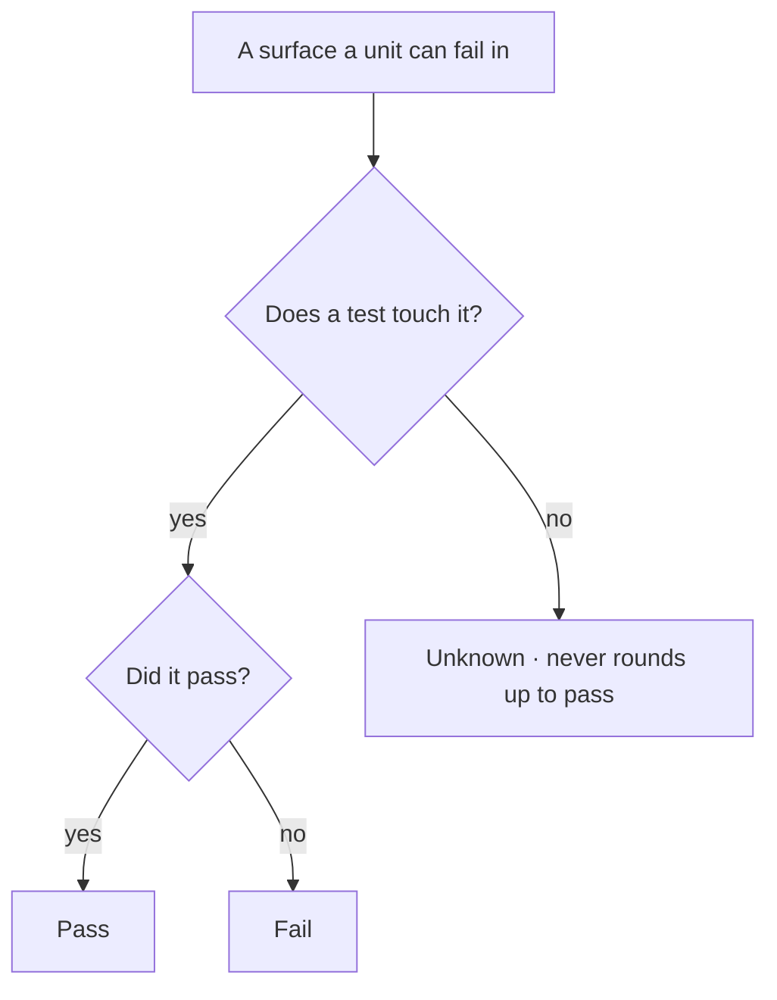

## One correct answer

[Determinism](ontology/PRINCIPLES.md#arch-determinism) is the one axis the others hang from, as [E1·a the four properties](#one-correct-answer-panel-a) draws. Deterministic means healable, enforceable, predictable and scalable, and pursuing those four separately produces mechanisms with none of them; [predictability](ontology/PRINCIPLES.md#arch-predictability), [repeatability](ontology/PRINCIPLES.md#arch-repeatability) and [reproducibility](ontology/PRINCIPLES.md#arch-reproducibility) are the ontology's names for what falls out of it. So the first question a mechanism answers is not whether its subject can be checked but whether its subject is deterministic, and [E1·b the first question](#one-correct-answer-panel-b) draws what follows from each answer. The architecture page carries the consequence for a system's size: [scale follows determinism](architecture/SCALE.md#scale-follows-determinism).

### Four properties, one axis

Determinism is the axis. Healable, enforceable, predictable and scalable follow from it. Most of what looks like a tooling problem is a non-determinism problem wearing a tooling costume.

A check passes on one machine and fails on another, and the team learns to re-run it until it passes. Nobody can check, heal or trust a mechanism with two possible answers at scale, because every consumer has to handle both.

Treat determinism as the property to reach for first, before speed and before elegance of any kind. Ask of every mechanism whether one correct answer exists for it. Where it does, build the mechanism to produce that answer and nothing else, with its healer beside it. Where it does not, ask whether the subject can be changed so that one does, and change the subject rather than loosening the check. Where neither holds, say so and keep a person in [the loop](START.md#the-loop), with the evidence a check would need written down.

Run the mechanism twice on the same input. Compare the bytes. A difference is a finding, whatever the tool says about itself.

The model's output is not deterministic and no instruction format makes it so; [the author is probabilistic](architecture/SCALE.md#the-author-is-probabilistic), as the architecture page puts it. Structure the input, then verify the output. A rule is often one deterministic half and one that is not, and the honest form names which is which.

Each of the four derived properties fails in a recognisable way when determinism is missing. A healer over a judgement call guesses. A check over a non-deterministic subject either saturates or flakes. A verdict that depends on who ran it cannot be quoted. A protocol resting on care multiplies its cost by the number of parties while its enforcement stays flat. Every one of those is the same defect, and naming determinism as the source is what makes the four testable with one question.

Changing the subject is the move most often missed. An act nothing records is not checkable; the same act performed through a tool that records it is, which is what [tools live in the tree](BUILD.md#tools-live-in-the-tree) is for. A rule that a reader must remember is not checkable; the same rule as a declaration a mechanism resolves is. The rule does not change a word in either case. What changes is the subject, from a thing that happens in a turn to a thing that leaves an artifact, and once it leaves an artifact the check, the healer and the verdict all follow.

E1·a the four properties

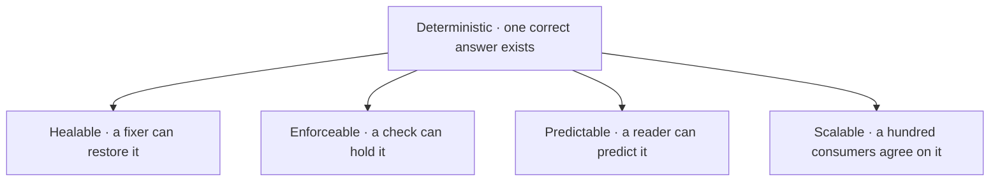

E1·b the first question

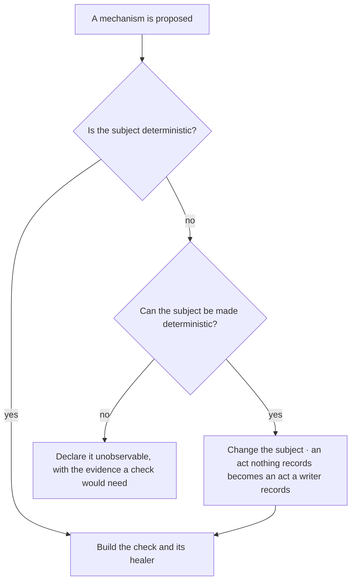

## Derived state

Nobody writes the state of the work. Every reader derives it by looking, every time, at what is on disk, the one of the two routes [F1·a two routes](#derived-state-panel-a) draws that passes through the tree. A checkbox someone ticked is a claim. A report a run wrote is evidence. A count someone typed is a copy of a fact the tree derives, wrong from the first change nobody propagated. [Self-describing architecture](ontology/PRINCIPLES.md#arch-self-describing-architecture) is the property this reaches for, the health test [a system is a graph](architecture/MODEL.md#a-system-is-a-graph) names; here [introspection](ontology/PRINCIPLES.md#arch-introspection) over the tree replaces every written status.

### Derived, never written

The state derives from the tree, and nobody writes it. History has its own homes and the current truth has another. Markers written into a plan describe the past and get read as the present.

The plan says three of five phases are done. Two of the three were undone by a later change. The plan still says three. Nothing re-reads a marker after the tree moves, so its staleness has no observer.

Pay the traversal on every read rather than the staleness on every write. Derive counts, statuses and progress by traversal. Write them nowhere. Keep history in exactly one place, and keep it out of the documents that state what is true now. Delete a superseded statement rather than marking it, and let a document that states how many of something exist be regenerated rather than authored.

Delete the written status and derive it again. If the derived value differs from the written one, the written one was already lying.

A prior value a mechanism consumes to compute a change is an operand, not history. A drift detector needs both states, and the earlier one lives in the artifact the comparison produces and goes when the comparison goes. The test is whether removing the comparison would leave the value still written.

Written into the plan, a status reads _phase three of five, done, updated last week_. Derived from the tree, it reads _phase three of five, two tasks open, one closed since the last run_. The first was true once. The second is true now. The difference is not diligence: a written marker goes stale by construction, and a stale marker manufactures a false belief where an absent one reads as absence.

The same rule reaches documents. Every document states what is true now. No change notes, no renamed-from clauses, no dates tied to our own actions, no explanation of a current state in terms of a former one. History has two homes and no third: an accumulator a mechanism can read, and the message a person receives. [Documentation is code](VERIFY.md#documentation-is-code) makes the rule a check.

F1·a two routes

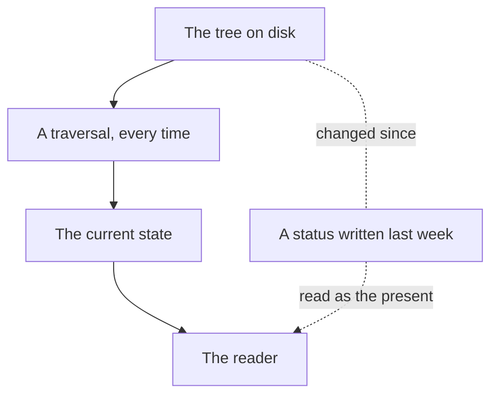

## Counting copies

A fact stated in more than one place is not yet a defect; [DRY](ontology/PRINCIPLES.md#arch-duplicate-code) names the aim and a [dual write](ontology/PRINCIPLES.md#arch-dual-write) names the failure, and the walk below decides which one a given pair is. What decides its disposition is a walk with an order, the one [G1·a the walk](#counting-copies-panel-a) draws: whether the copies collapse, how many of them are distinguished, at what period the derivation runs, and which consumer each copy reaches. Walked out of order the same set yields a repair that destroys evidence or a comparator over an edge that cannot exist.

### Count the distinguished copies

A duplicate resolves by counting its distinguished copies, and the period of the derivation decides whether a copy is a record or a stale one. Deciding which of two copies is right is guesswork until you count.

Two configs disagree. Each team believes theirs is the source. Both get edits. Neither derives from the other. Copying never records which copy was the original, so the walk has to count.

Decide every duplicate by its collapse, its distinguished-copy count, its derivation period and its delivery, in that order. Ask collapse first: where one copy is derivable from the other, stop authoring the derivable one and the divergence becomes unrepresentable. Only where collapse is unavailable, count the distinguished copies and resolve one to a derivation, zero to a declaration, and many to a decision. Then read the period of every derivation edge, because a copy that is regenerated is a stale instance and a copy fixed once at creation is a record. Last, ask what each copy reaches, because a set of copies can be fully collapsed and still deliver nothing.

For a duplicated fact, name the source and the period at which the copies refresh. A copy whose refresh nothing schedules is stale from the first change to its source.

A one-shot copy, authored once against the fact as it stood, is a record rather than a stale instance. Collapsing it destroys evidence instead of removing duplication, so the repair inverts: diagnose the copies and repair the source.

The zero-source refusal is the [directed acyclic graph](ontology/PRINCIPLES.md#arch-directed-acyclic-graph) ruling in the form a duplicate reaches it. A second declaration is an edge rather than a fact beside the first, so a set of copies is a [dependency graph](ontology/PRINCIPLES.md#arch-dependency-graph) and its collapse is a direction along it; a cycle among them is a [circular dependency](ontology/PRINCIPLES.md#arch-circular-dependency) between facts. Where no copy is distinguished the graph has no root, and a collapse would have to choose one the structure does not supply. Refusing is the whole of the correct behaviour there, and it is the part a builder is most tempted to improve: a tiebreak fired over a cyclic set converts a correct refusal into a confident wrong answer.

Every divergence repair asks which side is authoritative first. A join reports that two declarations agree and can never report that the agreed value is right. Where one side cites the other, the direction is forced and the repair is bookkeeping. Where both sides declare, a decision is being taken about which value is correct, and the gradient runs toward whichever side is free to change, so converging on the cheap side and reporting it as maintenance is the substitution to refuse. A comparison's green is a [correctness](ontology/PRINCIPLES.md#arch-correctness) verdict only where one operand is authoritative, and elsewhere it says two things match without saying either is right.

G1·a the walk

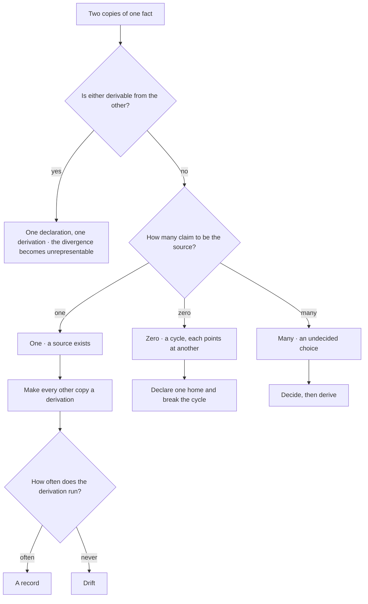

## Documentation is code

Documentation is code, and [H1·a every run](#documentation-is-code-panel-a) draws what a document passes through. It is typed, the same grammar that [placement is a grammar](BUILD.md#placement-is-a-grammar) describes places it, a check resolves its references so [traceability](ontology/PRINCIPLES.md#arch-traceability) runs both ways, the reference [H1·b a resolved reference](#documentation-is-code-panel-b) shows, a count in it is derived rather than typed, and a document that drifts fails the same gate the code does. A module's overview is generated from the manifest the module owns and never written by hand, which is [manifest-based design](ontology/PRINCIPLES.md#arch-manifest-based-design) taken literally, the surface [H1·c a manifest](#documentation-is-code-panel-c) types and [H1·d compiled from four](#documentation-is-code-panel-d) draws. Prose that cannot be parsed cannot be governed, so it is authored in a form that can be.

### Typed, placed, parsed

Documentation goes through the same typing, placement, parsing, validation and repair as any other code. Hand-written documentation is right on the day of writing and drifts every day after.

The readme names a script someone renamed a month ago. A new contributor runs it, gets nothing, and assumes the tooling is broken. Prose about code has no compiler, so nothing tells you when it stops being true.

Author the parseable form and generate the prose, rather than write the prose and hope it stays true. Give every document a type, and let the type select its schema, its rules and its one computed location. Point every reference at an identifier and a path with a declared verb, and let a check resolve both halves and fail an undeclared verb rather than skipping it. Generate each module's overview from a manifest the module owns plus its derived public surface. State no count in prose. Keep a scaling guide beside every system that has seams, and update it in the same change that adds a seam.

Rename one file the documents mention. The document gate must fail before anything else does. A rename the documents survived is a rename they never mentioned.

A generated document is exempt from the content scan and drift-checked instead, because the governed surface is the manifest it was generated from. The one place a generated document differs from generated source is its marker: the source carries its marker in its name, and a document opens with a banner the gate keys on.

### A path computed from three axes

A document's path is computed from three axes and never chosen. Its form says what it is: a guide, a reference, a contract, a template, a taxonomy. Its owner says which part of the tree it belongs to. Its name says the subject, prefixed by the activity verb where the form is directive. A document's location is a function of its declared type and its owner and never a choice, so one search finds every document of a type and every document an owner holds; a document is created through a tool that computes that location, and a filename that does not decompose fails.

Every document has one audience, one purpose and one [abstraction](ontology/PRINCIPLES.md#arch-abstraction) level: a behaviour policy, a codebase contract, a guide to extending one system, a reference to what is enforced, a taxonomy that is a standard and its vocabulary. Content that belongs to a different level moves there and is never duplicated. The test is to strip the words belonging to the wrong level and ask whether the entry still communicates at this one. A document that reads at two levels is two documents.

### References are constructs

A document points at code with a construct rather than a phrase. A declared verb, an identifier and a path, and the gate resolves both: the path must exist, and the identifier must be exported from, declared in or referenced in that file. An undeclared verb fails rather than being skipped, which is what keeps a typo from making a reference invisible. Every claim a document makes about what it validates is backed by a real construct. Documents form a [dependency graph](ontology/PRINCIPLES.md#arch-dependency-graph): a document's name is its export, its edge fields are imports resolved through a registry, a superseded edge sets the target's status, and a duplicate name or a dead edge is a finding.

### The manifest is the editorial surface

A module's overview is generated, and the manifest is its whole editorial surface. Everything derivable is computed: the public surface from the declarations, the dependencies from the descriptor, the governing principles resolved by identity against the canon, the diagrams from the module's own graph. A thin manifest is a bug. The content rules run on each field rendered to its fragment and report against the field, and the generated document is drift-checked in both directions so a hand edit is reverted on the next run.

The manifest is a typed record, and its type is what separates a stub from a document. The documentation block has a required core and self-expands: any further key renders as its own section with no generator change, so the type admits arbitrary lowercase keys beside the required ones. A start is runnable code with its intent and its language, never a sketch, and a validator holds every required field to its shape before anything is generated.

H1·a every run

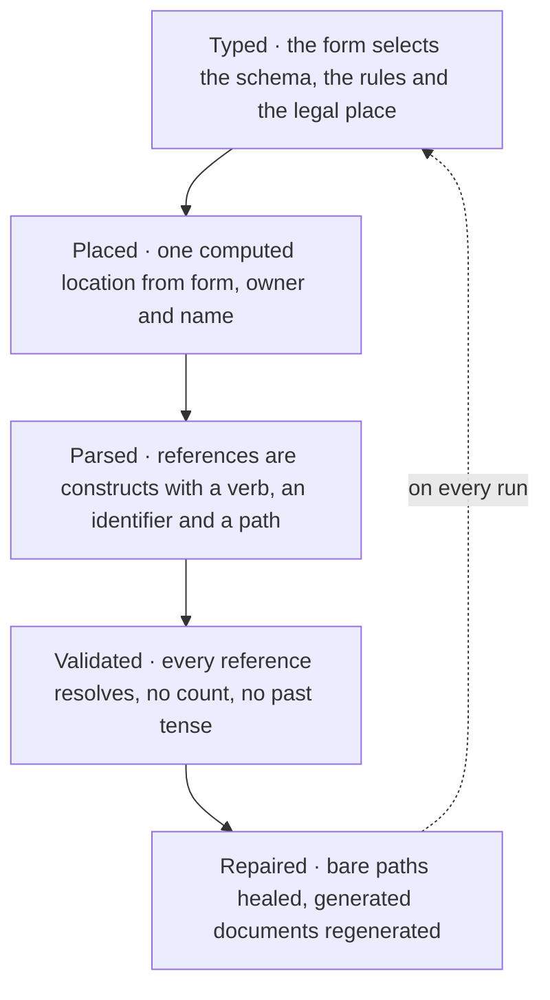

```markdown
The placement check parses every path, see: `parsePath` "engine/matchers/path.matcher.ts"

The validator resolves both halves:
the path must exist
the identifier must be declared in that file

A verb it does not know fails the document rather than being skipped,
so a typo cannot make a reference invisible.
```

```typescript
export interface Manifest {
  readonly label: string;
  readonly summary: string;
  readonly maturity: "experimental" | "stable";
  readonly domains: readonly {
    readonly meta: Domain;
    readonly sub: SubDomain;
  }[];
  readonly governedBy: readonly ConceptId[];
  readonly entries: readonly string[];
  readonly docs: {
    readonly overview: string;
    readonly whenToUse: readonly string[];
    readonly whenNotToUse: readonly string[];
    readonly quickStart: readonly {
      readonly intent: string;
      readonly lang: string;
      readonly code: string;
    }[];
    readonly configuration: string;
    readonly disposal: readonly string[];
    readonly aiContext: readonly string[];
    readonly apiNotes?: readonly {
      readonly name: string;
      readonly note: string;
    }[];
    readonly [section: string]: unknown;
  };
}
```

H1·d compiled from four

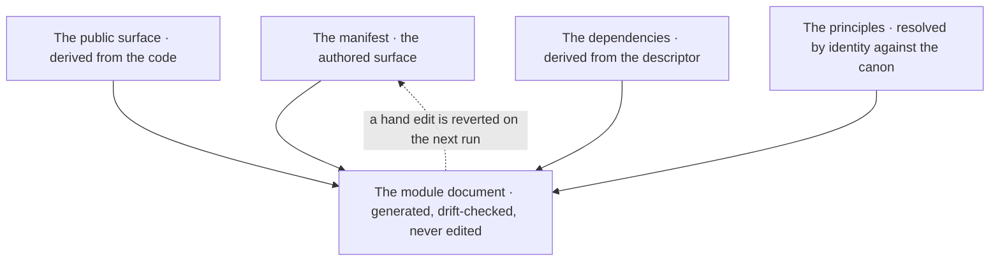

## Moves and renames

A move is a [manual identity migration](ontology/PRINCIPLES.md#arch-manual-identity-migration): done by hand, one container at a time, with the gate green between each, and it opens with [impact analysis](ontology/PRINCIPLES.md#arch-impact-analysis) over every reference, as [I1·a a surviving move](#moves-and-renames-panel-a) draws. The references that matter most are the ones a pattern collects rather than a path names, because [the filesystem is the architecture](BUILD.md#the-filesystem-is-the-architecture) and a [glob-resolvable tree](ontology/PRINCIPLES.md#arch-glob-resolvable-tree) is what a rename tool never sees.

### Enumerate, move, verify

A move starts with an enumeration and ends with a [verification](ontology/PRINCIPLES.md#arch-verification), and a count checks every surface that resolves by pattern. A rename tool reports a clean rename while the surfaces that resolve by pattern silently go empty.

A suffix changes. The collector that gathered files by that suffix now gathers nothing. Everything downstream passes because there is nothing left to check. A pattern-resolved surface holds no literal path a rewrite could touch.

Trade the rename tool's speed for a literal edit a search can verify. Enumerate every reference before the move, the pattern-resolved ones included. Move and rename by hand, one container at a time. Update every importer as a literal edit a search can verify. Land a structural rewrite as a draft beside the live file with a published migration map, and delete the original only after approval.

Compare what each pattern-based surface collects before and after the move. Any set that shrank without explanation is a broken move the tool would have called clean.

A throwaway script can move whatever it likes. The discipline is for code that something else depends on, and a rename is a create at its destination, so the destination is read before the write because the attention sits on the source.

Nothing is silently dropped. A restructure produces a migration map: every displaced block and its destination, or an explicit deletion with its reason. Content removed from one place appears in another or is listed as deleted. Relocation is a rewrite, so it takes the same approval as rewriting the contents, and a move plus a delete in one step is the most destructive form because the original is gone and there is nothing left to compare the replacement against.

I1·a a surviving move

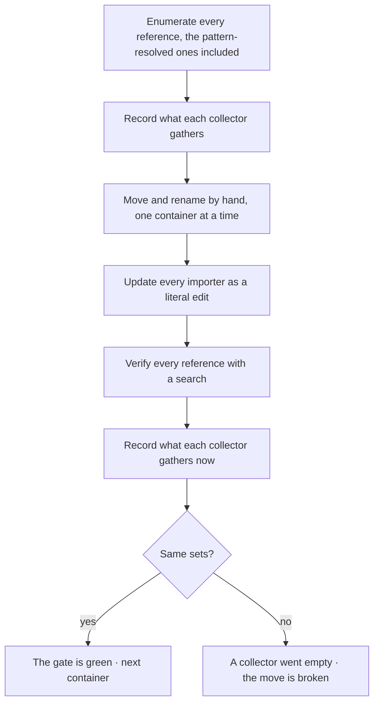

## Coverage is derived

Rule coverage is a derived set over the grid the architecture page builds in what can drift, seen through how it drifts: a dimension of the ontology axis such as [identity](ontology/REASONING.md#reason-node-ont-identity), [structure](ontology/REASONING.md#reason-node-ont-structure), [relation](ontology/REASONING.md#reason-node-ont-relation), [state](ontology/REASONING.md#reason-node-ont-state) or [behaviour](ontology/REASONING.md#reason-node-ont-behaviour), read through a lens of the analysis axis such as [structural](ontology/REASONING.md#reason-node-ana-structural), [causal](ontology/REASONING.md#reason-node-ana-causal) or [temporal](ontology/REASONING.md#reason-node-ana-temporal). The walk that finds an empty cell is [a cell that resists an invariant](architecture/COVERAGE.md#a-cell-that-resists-an-invariant). What this chapter adds is the rule side, [J1·b one cell per rule](#coverage-is-derived-panel-b): every rule declares the gate that observes it or declares conduct with the evidence a check would need, as [J1·c gate or conduct](#coverage-is-derived-panel-c) draws. The conduct roster, the vocabulary [J1·a the conduct roster](#coverage-is-derived-panel-a) types, shrinks by whatever a mechanism now observes in an artifact instead of a party holding it in mind. That sentence is this method's own definition of progress.

### The grid and the roster

Coverage is a derived set over the grid of drift dimensions and lenses, and every rule declares its gate or its conduct. Coverage claimed from a count of rules says nothing about which drift classes the rules reach.

A team believes its architecture is covered because it has many rules, and the failure that ships lives in a dimension no rule ever named. A rule stated without its cell has no address, so nobody can tell which drift it watches and which drift is unwatched.

Count the empty cells rather than the rules. Declare for every rule the check that observes it or that none can, and for every conduct rule name the half that is decidable and whether that half is built. Work the unbuilt halves to zero, and gate a gap found while gating in the same run.

Take any rule and name its dimension and its lens. A rule that fits no cell watches nothing in particular. Then find an empty cell and ask what would drift there unseen.

A cell is watched only by a predicate that can fail, as [the check comes first](BUILD.md#the-check-comes-first) requires.

Conduct is a closed question, not a softer state. A rule declares conduct when no construct in any artifact observes it, and the declaration stays falsifiable because each entry names what would have to become observable for the rule to acquire a check. Many such rules have a half that is decidable: whether a surface conforms to its template, whether a reader set resolves, whether a report states the boundary of its own negative result. That half is named in a cell with a [closed vocabulary](ontology/PRINCIPLES.md#arch-closed-vocabulary): observed, naming its gates; unbuilt, which is debt rather than a paragraph; none, with the reason from a closed set; and null, which is unassessed, and that too is a declared state. The reasons a half can be none are three: the subject is an act, no declared surface holds it, or the property is not evaluable on a member. The coverage report is then derived over the whole set: the gated rules with their gates, the conduct entries, the unassessed rows, which are exactly the entries whose cell is null, and the debt, which is exactly the unbuilt halves. Nobody writes a count. Every number a reader wants is the length of one of those arrays on the run that produced it.

The cell is filled by walking questions, never by reading the entry. Does the half name a declared surface, or is it imagined. Is its subject an artifact or an act. Is the population non-empty, because a check over an empty set is a green that measures nothing. Is the property evaluable on a member. Three of those are one search each and only the fourth is judgement, which inverts how the roster reads: every entry presents as a judgement and most of them turn on a fact. And the cell holds the value while the entry holds the range, because an observing check is often narrower than the rule whose half it answers and a bare id would assert more than it can.

Projected onto [correctness](ontology/PRINCIPLES.md#arch-correctness), the same grid is the test-surface catalogue what can drift, seen through how it drifts describes, and the verdict [unknown is not pass](VERIFY.md#unknown-is-not-pass) gives an unmeasured surface rests on it. A re-walk of the roster compares against the kinds a check emits rather than against the list of checks, because a half acquires an observer as a new kind far more often than as a new rule.

```typescript
export type CheckableHalf =
  | { readonly kind: "observed"; readonly by: readonly GateId[] }
  | { readonly kind: "unbuilt" }
  | {
      readonly kind: "none";
      readonly because:
        "subject-is-an-act" | "no-declared-surface" | "not-evaluable";
    };

export interface ConductEntry {
  readonly slug: RuleSlug;
  readonly whatACheckWouldNeed: string;
  readonly half: CheckableHalf | null;
}

export interface Coverage {
  readonly gated: readonly { readonly slug: RuleSlug; readonly gate: GateId }[];
  readonly conduct: readonly ConductEntry[];
  readonly unassessed: readonly RuleSlug[];
  readonly debt: readonly RuleSlug[];
}
```

J1·b one cell per rule

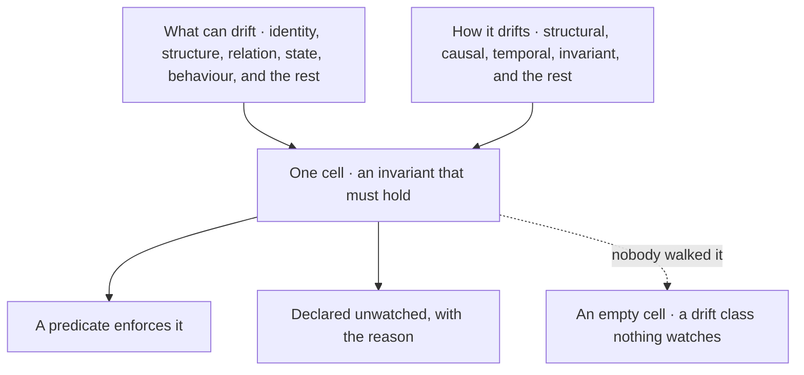

J1·c gate or conduct

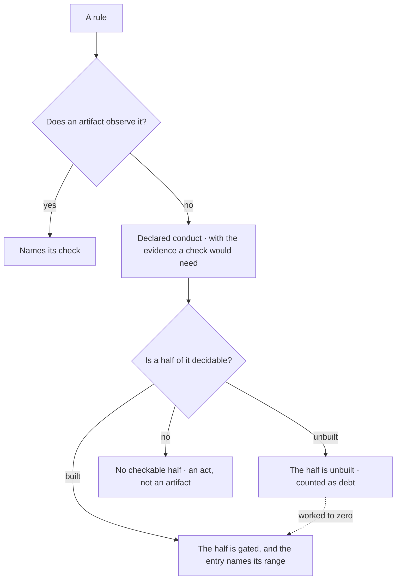

Documentation is covered by [CC BY-SA 4.0](https://creativecommons.org/licenses/by-sa/4.0/)

© 2025 [Jay Baleine](https://linkedin.com/in/jay-baleine) - Disciplined AI Software Development

---

Chapters: [Start](START.md) · [Plan](PLAN.md) · [Build](BUILD.md) · [Verify](VERIFY.md) · [Collaborate](COLLABORATE.md) · [Ship](SHIP.md)
