© 2025 Jay Baleine - Disciplined Methodology · Bane's Lab documentation is covered by [CC BY-SA 4.0](https://creativecommons.org/licenses/by-sa/4.0/)

# Verify — Methodology — Bane's Lab

> The most expensive failures I have had were the ones that looked right: the code read well and the model said it was done, but nothing had run.

Canonical: https://banes-lab.com/disciplined-methodology/verify

# Disciplined Methodology

Constraints, checks and skepticism for building software with LLMs

# Verify

## It looked right

The most expensive failures I have had were the ones that looked right: the code read well and the model said it was done, but nothing had run. Everything in this chapter follows from one distinction. A claim is a sentence that the developer or the model produced, and until something grounds it, it is [ungrounded content](ontology/PRINCIPLES.md#architecture-ungrounded-content). [Evidence](ontology/REASONING.md#reasoning-node-ver-evidence) is an observation that a mechanism produced. Only evidence decides anything, as shown in [A1·a a claim's source](#it-looked-right-panel-a), and [A1·b report and prose](#it-looked-right-panel-b) shows how to tell the two apart. The [verify](ontology/REASONING.md#stage-verify) node of [the loop](START.md#the-loop) asks exactly this question, and the ontology's [verification](ontology/PRINCIPLES.md#architecture-verification) axis names its parts: [ground truth](ontology/REASONING.md#reasoning-node-ver-ground-truth), [falsification](ontology/REASONING.md#reasoning-node-ver-falsification), [confidence](ontology/REASONING.md#reasoning-node-ver-confidence) and [refutation](ontology/REASONING.md#reasoning-node-ver-refutation).

### Looks right is not runs right

A model judges its own edit as clean by reading it, and reading is not running. The model claims [compliance](ontology/PRINCIPLES.md#architecture-compliance) after one edit and never checks it again, and the next run of the tools finds the same fault plus a new one. A model produces text that resembles a finished result, because that is what finished results look like in its training.

For this reason the verdict comes from a machine, and the model's judgment is never the signal that the work is done. The report on disk decides when the work is done, rather than the reply that describes it. In practice, the exit code is the answer and the parsed findings are the answer, while the model's summary is treated as a story about the answer.

To check this, find the verifier output behind every claim of done in a session. Each claim without one is still unverified. A mechanism's output is evidence about the mechanism itself and only prose about anything else. The sentence most likely to stop a reader looking further is one whose subject is not the thing that printed it, because it reads as if the looking has already been done.

A completion claim reads _all done, the change is clean and everything passes_, while a completion signal reads _gate: every step passed, exit zero, report written to the run's path_. The first is a sentence a model produced, and the second is a number a machine produced.

Evidence comes in tiers, and the tiers are ranked: a measurement taken locally outranks a vendor's documentation, which outranks a community source, which outranks inference. A record carries its confidence and its derivation as two separate axes, because material adapted from elsewhere can be strong or weak evidence regardless of having been adapted, and folding a word about provenance into the vocabulary of strength would make the whole set impossible to rank. When sources conflict, both are recorded and the conflict is stated. A claim that is unverified or rests on a single source is labeled as such wherever it drives a decision.

A1·a a claim's source

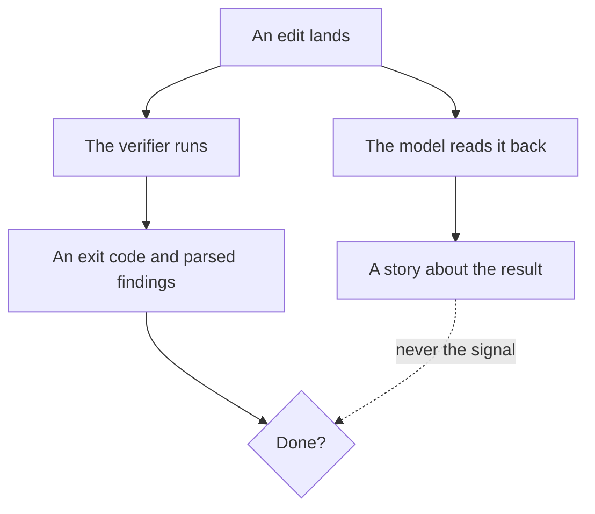

A1·b report and prose

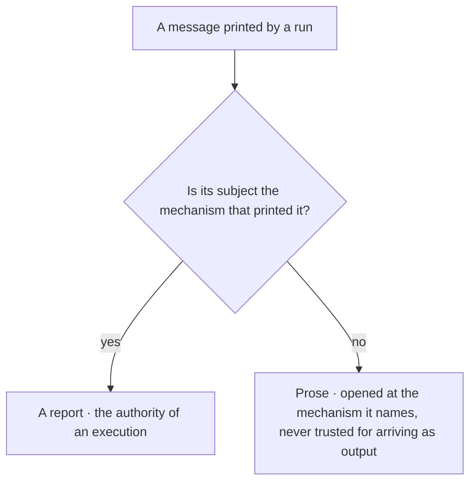

## Verify the verifier

[Verification](ontology/PRINCIPLES.md#architecture-verification) produces evidence, and the verifier itself has to be verified, in the order shown in [B1·b earning trust](#verify-the-verifier-panel-b). A gate that has never failed on purpose has never shown that it can fail, and a green result from a check that exercises nothing is the [mock mirage](ontology/PRINCIPLES.md#architecture-mock-mirage). A checker applies its own rules to itself; otherwise it asks of the code what it does not ask of its own source. Above every verifier sits an anchor that cannot be verified, only disclosed, because a gate cannot prove itself. A verdict is the value typed in [B1·a a verdict](#verify-the-verifier-panel-a), and a verdict whose surfaces moved beneath it loses its standing, as shown in [B1·c lost standing](#verify-the-verifier-panel-c). The same proof, taken when a check is first written, is described in [the check comes first](BUILD.md#the-check-comes-first).

### Conforming member first

A green check is evidence of nothing until you know the check can go red. A gate is green for a year, until you read its source and find it has matched nothing since a refactor changed the file suffix it looked for. A check's own green is the only evidence of its health, and green is also what a broken check produces.

For this reason I verify the verifier with a conforming member before believing what it says. A verifier is trusted only after a conforming member, a planted violation and an adversarial test, rather than on the strength of its green results. In practice, the two cases described in the check comes first are kept as tests beside the check. Every detector is also tested adversarially with the inputs that fool a shallow match, such as a look-alike character, a pattern inside a comment, or a shape without the structure. The governance tooling runs through the same gate it enforces. The anchor everything else rests on is disclosed, and when a gate goes green after a structural change, it is confirmed that the gate still loads what it claims to load.

To check this, find for each check the planted violation that turned it red and the conforming member that turned it green. A check missing either one is unverified. The anchor is the boundary of what can be verified. A verifier trusts that the runtime runs, that the filesystem reads, that a command executes and that tool output arrives, and it says so rather than pretending to verify them. Everything above the anchor is verified, and the anchor itself is disclosed.

The failure the anchor guards against is concrete. A loader that discovers checks by a name pattern reports success while loading none of them if the pattern no longer matches what is on disk: every step passes, and nothing is checked. So a green run after a structural change is followed by one question, whether the run still loads what it claims to load, and the evidence is the generated index naming the checks together with the loader's own count. A harness that cannot fail belongs to the same class. A stub that stands in for an absent environment must answer only for that environment, because a permissive stub that also absorbs the subject's own missing symbols turns every defect into a silent success.

A verifier that audits claims audits itself last, and an overclaim in its own contract drops its confidence below the threshold, so a run below the threshold is not a clearance. How that self-audit runs, and why a verifier binds to one phase at a time, is described in [agents as executed contracts](COLLABORATE.md#agents-as-executed-contracts).

A verdict carries a standing beside its value. Every surface a run reads is stamped when it is read and stamped again at the end, which is [optimistic locking](ontology/PRINCIPLES.md#architecture-optimistic-locking) over a read set. A run whose read set moved beneath it names the surfaces that moved and is not authoritative. The verdict itself is untouched, so a pass stays a pass; what is withdrawn is its standing to be quoted, because the report then describes an interleaving of changes rather than a state. Holding a [write barrier](ontology/PRINCIPLES.md#architecture-write-barrier) across the read would be the wrong repair: that is [pessimistic locking](ontology/PRINCIPLES.md#architecture-pessimistic-locking), which serializes every verification against every write to answer a question about the past. In the type, the standing is derived from whether the moved set is empty, rather than written by the run. The set the run reached is named, so a green result reads as coverage over that set and silence over the rest, and the surfaces the run healed itself are named apart from the ones that moved, because a run's own repairs are not contention. A clearance is then one function over the record: a pass whose standing is authoritative. Any other combination is a value without the standing to be quoted.

B1·a a verdict

```typescript
export type Value = "pass" | "fail";
export type Standing = "authoritative" | "withdrawn";

export interface Stamp {
  readonly surface: string;
  readonly seen: string;
}

export interface Verdict {
  readonly value: Value;
  readonly standing: Standing;
  readonly reached: readonly string[];
  readonly moved: readonly Stamp[];
  readonly healedByThisRun: readonly string[];
  readonly derivations: readonly Finding[];
}

export const standingOf = (moved: readonly Stamp[]): Standing =>
  moved.length === 0 ? "authoritative" : "withdrawn";

export const quotable = (verdict: Verdict): boolean =>
  verdict.value === "pass" && verdict.standing === "authoritative";
```

B1·b earning trust

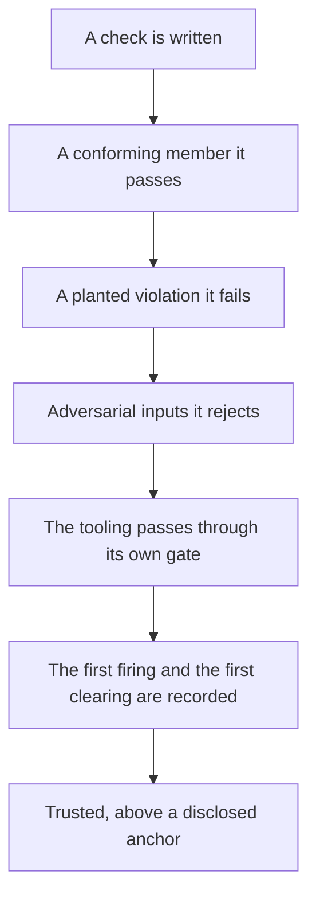

B1·c lost standing

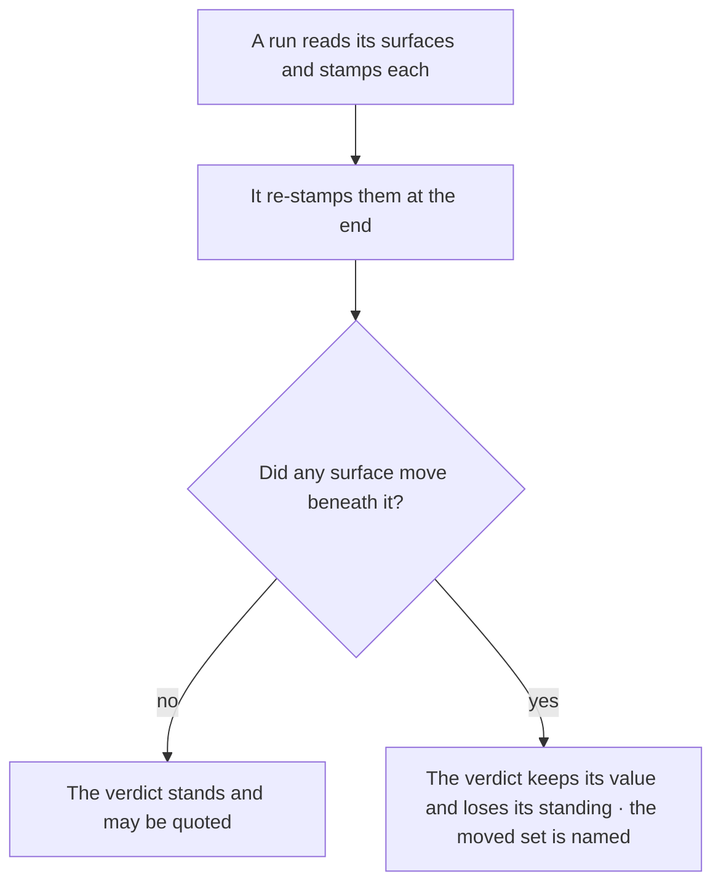

## A report, not a checkbox

A [verification](ontology/PRINCIPLES.md#architecture-verification) runs once per state of the tree, and its first output is the answer. [Reproducibility](ontology/PRINCIPLES.md#architecture-reproducibility) is what a second run would test, so a second run that differs is a finding rather than a [retry](ontology/PRINCIPLES.md#architecture-retry-pattern). The output is read whole and never searched for the line you hoped to see. The run writes its report on every exit, so a report being present is never mistaken for a pass. On the grammar page, [validation gates](pag/VALIDATION.md#validation-gates) hold an instruction's claims to the same standard: checkable, and backed by evidence.

### One run, read whole

Re-running a check until it passes turns a verifier into a slot machine. The check fails, is run twice more and passes on the third try, and the flake ships with the change, which is [flaky test normalization](ontology/PRINCIPLES.md#architecture-flaky-test-normalization) in miniature. A second run of the same state either repeats the answer or reveals non-determinism, and both are already findings from the first run.

For this reason each state of the tree gets one run, its output is read whole, and its report is written on every exit path. The tree is changed between runs, rather than the filter between reads. In practice, the gate runs once and its full output is written to a file. The file is read whole, what it names is fixed, and the tree changes. Only then does the gate run again. A report's scope is read before its verdict, because a clearance from a check that cannot see the whole surface is worse than a visible gap.

To check this, count the runs per tree state in a session. Anything above one is either a flake that should have been filed or an answer you did not like. A new run is warranted once the tree has changed, and the new run is the measurement. The sign of misuse is a second run whose only difference is the filter.

Reading whole is a rule about structure, not about diligence. A slice of a report answers only the question the reader already thought to ask, while the reason a check writes a finding is to raise something the reader had not thought of. A search is worse than an offset, because an offset shows what was skipped, and a search silently leaves out everything that did not match. The same holds for a file and for a coordination surface. When a read fails because the output is too large, that is the cue to read it in parts until the whole has been read, never the cue to sample it.

A count is evidence of coverage only over the surface the scan reaches. A report therefore carries its derivations as well as its verdict, meaning what it reached, what it excluded and why, so that a green result reads as coverage rather than as silence. A negative result inherits the scope of the query that produced it and carries no evidence of its own, so before reporting that something does not exist, the measurement is run again one scope wider, over every surface where the thing could be declared.

## Unknown is not pass

A verdict has three values, and the third is the one a percentage hides, as shown in [D1·a three verdicts](#unknown-is-not-pass-panel-a). A surface that no test touches has not passed. Its verdict is unknown, and unknown never rounds up to pass.

### Three verdicts, not two

Coverage pursued by intuition and reported as a percentage never walks the space a system can fail in. Coverage is high, the failure that ships lives in a case the test suite never imagined, and the number never moved. A percentage counts lines executed, and a line can execute while no claim about it gets checked.

For this reason no evidence means unknown, never pass: a verdict is pass or fail only against an evidence set that is not empty. Coverage is measured as the surfaces a unit can fail in, rather than as a percentage of lines. In practice, the surfaces a unit can fail in are mapped before its tests are written, using the catalog described in [what can drift, seen through how it drifts](architecture/COVERAGE.md#what-can-drift-seen-through-how-it-drifts), projected onto [correctness](ontology/PRINCIPLES.md#architecture-correctness): each surface with its failure modes, its technique, its predicate and its evidence source. Surfaces that are still unknown are reported as unknown, never as passed.

To check this, name a failure surface of one unit that the tests do not touch. If you can, coverage is not complete, whatever the percentage says.

D1·a three verdicts

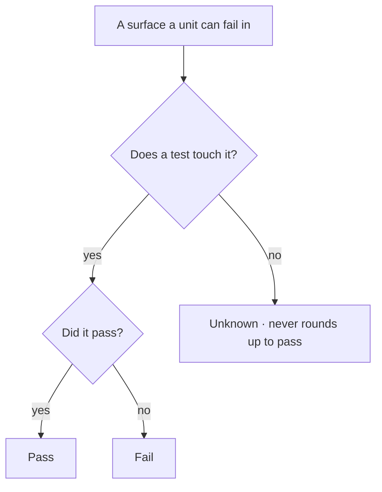

## One correct answer

[Determinism](ontology/PRINCIPLES.md#architecture-determinism) is the one property the others depend on, as shown in [E1·a the four properties](#one-correct-answer-panel-a). A deterministic mechanism can be healed, enforced, predicted and scaled, while pursuing those four separately produces mechanisms that have none of them; the ontology's names for what follows from determinism are [predictability](ontology/PRINCIPLES.md#architecture-predictability), [repeatability](ontology/PRINCIPLES.md#architecture-repeatability) and [reproducibility](ontology/PRINCIPLES.md#architecture-reproducibility). So the first question about a mechanism is not whether its subject can be checked, but whether its subject is deterministic, and [E1·b the first question](#one-correct-answer-panel-b) shows what follows from each answer. The architecture page draws the consequence for the size of a system in [scale follows determinism](architecture/SCALE.md#scale-follows-determinism).

### Four properties, one axis

Much of what looks like a tooling problem is a non-determinism problem in disguise. A check passes on one machine and fails on another, and the team learns to re-run it until it passes. A mechanism with two possible answers cannot be checked, healed or trusted at scale, because every consumer has to handle both.

For this reason I reach for determinism first, because the other four properties follow from it. Determinism comes before speed and before elegance of any kind, rather than being traded against them. In practice, every mechanism is asked whether one correct answer exists for it. Where one does, the mechanism is built to produce that answer and nothing else, with its healer beside it. Where none does, the question is whether the subject can be changed so that one exists, and the subject is changed rather than the check loosened. Where neither is possible, that is said openly and a developer stays in [the loop](START.md#the-loop), with the evidence a check would need written down.

To check this, run the mechanism twice on the same input and compare the bytes. A difference is a finding, whatever the tool says about itself. The model's output is not deterministic, and no instruction format makes it so; as the architecture page puts it, [the author is probabilistic](architecture/SCALE.md#the-author-is-probabilistic). The input is therefore structured and the output verified. A rule often has one deterministic half and one that is not, and the honest form of the rule names which half is which.

Each of the four derived properties fails in a recognizable way when determinism is missing. A healer working on a judgment call guesses. A check over a non-deterministic subject either fires on everything or flakes. A verdict that depends on who ran it cannot be quoted. A protocol that rests on care multiplies its cost by the number of parties while its enforcement stays flat. All four are the same defect, and naming determinism as the source is what lets one question test them all.

Changing the subject is the move most often missed. An act that nothing records cannot be checked, but the same act performed through a tool that records it can, which is the purpose described in [tools live in the tree](BUILD.md#tools-live-in-the-tree). A rule that a reader has to remember cannot be checked, but the same rule written as a declaration a mechanism resolves can. The rule's wording does not change in either case. What changes is the subject, from something that happens in a turn to something that leaves an artifact, and once it leaves an artifact, the check, the healer and the verdict all follow.

E1·a the four properties

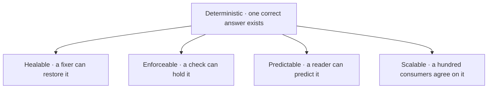

E1·b the first question

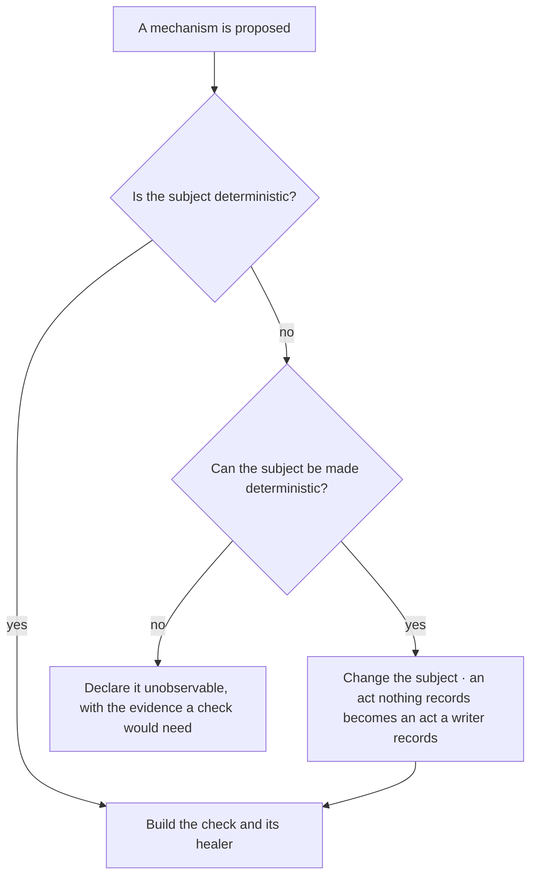

## Derived state

Every reader derives the state of the work each time, by looking at what is on disk, the route through the tree shown in [F1·a two routes](#derived-state-panel-a). A checkbox that you or the model ticked is a claim, while a report a run wrote is evidence. A count you typed is a copy of a fact the tree already holds, and it is wrong from the first change you did not carry over to it. The property this aims at is [self-describing architecture](ontology/PRINCIPLES.md#architecture-self-describing-architecture), the health test named in [a system is a graph](architecture/MODEL.md#a-system-is-a-graph), and here [introspection](ontology/PRINCIPLES.md#architecture-introspection) over the tree replaces every written status.

### Derived, never written

Markers written into a plan describe the past and get read as the present. The plan says three of five phases are done, two of the three were undone by a later change, and the plan still says three. Nothing re-reads a marker after the tree moves, so its staleness has no observer.

For this reason the state is derived from the tree and never written, and history is kept apart from the current truth. The cost of a traversal is paid on every read, rather than the cost of staleness on every write. In practice, counts, statuses and progress are derived by traversal and written nowhere, and history is kept out of the documents that state what is true now. A superseded statement is deleted rather than marked, and a document that states how many of something exist is regenerated rather than written by hand.

To check this, delete a written status and derive it again. If the derived value differs from the written one, the written one was already wrong. A prior value that a mechanism consumes to compute a change is an input, not history. A drift detector needs both states; the earlier one lives in the artifact the comparison produces and disappears when the comparison does. The test is whether removing the comparison would leave the value still written.

Written into the plan, a status reads _phase three of five, done, updated last week_; derived from the tree, it reads _phase three of five, two tasks open, one closed since the last run_. The first was true once, and the second is true now. The difference is not a matter of diligence. A written marker goes stale by construction, and a stale marker creates a false belief, while an absent marker simply reads as absence.

The same rule reaches documents: every document states what is true now. It carries no change notes, no clauses saying what something was renamed from, no dates tied to our own actions, and no explanation of the current state in terms of a former one. History has two homes and no third: an accumulator that a mechanism can read, and the message the developer receives. The check that enforces this is described in [documentation is code](VERIFY.md#documentation-is-code).

F1·a two routes

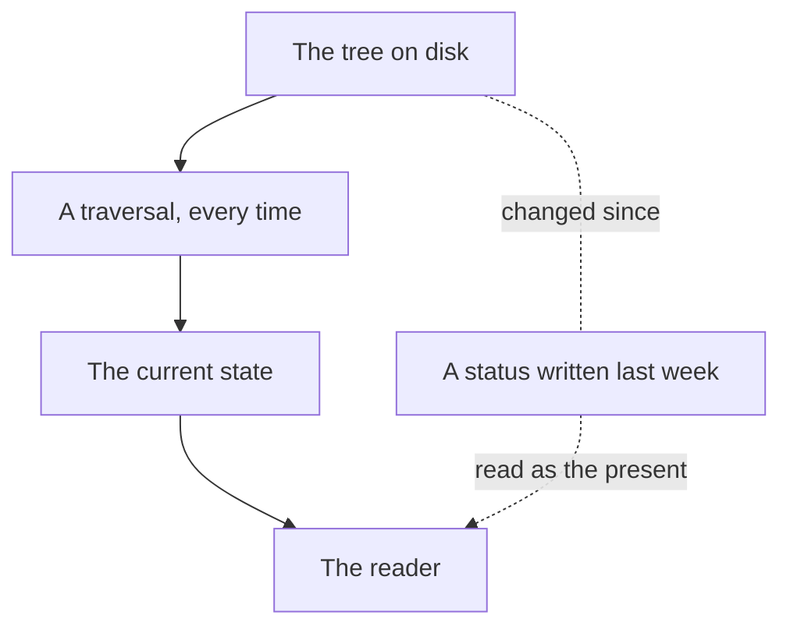

## Counting copies

A fact stated in more than one place is not yet a defect. [DRY](ontology/PRINCIPLES.md#architecture-duplicate-code) names the aim, a [dual write](ontology/PRINCIPLES.md#architecture-dual-write) names the failure, and a walk with a fixed order decides which of the two a given pair is, as shown in [G1·a the walk](#counting-copies-panel-a). The walk asks whether the copies can collapse into one, how many of them claim to be the source, how often each derivation runs, and which consumer each copy reaches. Walked out of order, the same set of copies leads either to a repair that destroys evidence or to a comparison over an edge that cannot exist.

### Count the distinguished copies

Deciding which of two copies is right is guesswork until you count. Two configs disagree, each team believes its own is the source, both get edited, and neither derives from the other. Copying never records which copy was the original, so the walk has to count.

For this reason a duplicate is resolved by counting its distinguished copies, and how often a derivation runs decides whether a copy is a record or a stale one. Every duplicate is decided by its collapse, its count of distinguished copies, its derivation period and its delivery, in that order, rather than by which copy looks newer. In practice, collapse is asked first: where one copy can be derived from the other, the derivable one stops being written, and the divergence can no longer occur. Only where collapse is not available are the distinguished copies counted, and then one resolves to a derivation, zero to a declaration, and many to a decision. Next, the period of every derivation edge is read, because a copy that is regenerated is an instance of the source that can go stale, while a copy fixed once at creation is a record. Last comes what each copy reaches, because a set of copies can be fully collapsed and still deliver nothing.

To check this, name the source of a duplicated fact and the period at which its copies refresh. A copy whose refresh nothing schedules is stale from the first change to its source. A one-shot copy, written once against the fact as it stood at the time, is a record rather than a stale instance. Collapsing it would destroy evidence rather than remove duplication, so the repair is inverted: the copies are diagnosed and the source is repaired.

Refusing to pick a source when there are zero is the [directed acyclic graph](ontology/PRINCIPLES.md#architecture-directed-acyclic-graph) ruling in the form a duplicate reaches it. A second declaration is an edge rather than a fact standing beside the first, so a set of copies is a [dependency graph](ontology/PRINCIPLES.md#architecture-dependency-graph) and collapsing it means choosing a direction along it; a cycle among the copies is a [circular dependency](ontology/PRINCIPLES.md#architecture-circular-dependency) between facts. Where no copy is distinguished, the graph has no root, and a collapse would have to choose one that the structure does not supply. Refusing is the whole of the correct behavior there, and it is the part a builder is most tempted to improve: a tiebreak applied to a cyclic set turns a correct refusal into a confident wrong answer.

Every repair of a divergence first asks which side is authoritative. A join can report that two declarations agree, but never that the value they agree on is right. Where one side cites the other, the direction is forced and the repair is bookkeeping. Where both sides declare, the repair is a decision about which value is correct, and the pull is always toward whichever side is free to change. Converging on the cheap side and reporting it as maintenance is the substitution to refuse. A comparison's green result is a [correctness](ontology/PRINCIPLES.md#architecture-correctness) verdict only where one side is authoritative; elsewhere it says the two match without saying that either is right.

G1·a the walk

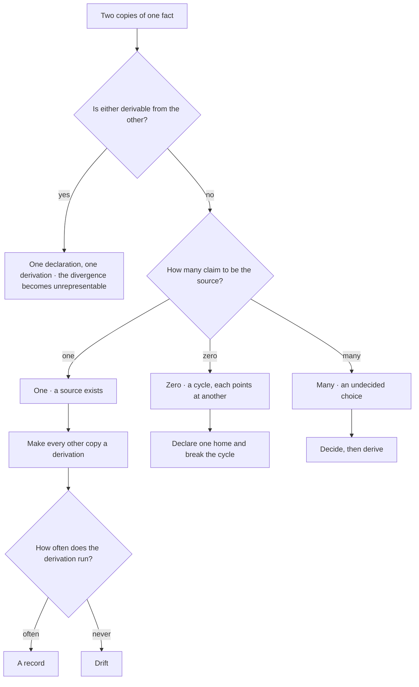

## Documentation is code

This method treats documentation as code, and [H1·a every run](#documentation-is-code-panel-a) shows what a document passes through. A document is typed, and it is placed by the same grammar described in [placement is a grammar](BUILD.md#placement-is-a-grammar). A check resolves its references, as shown in [H1·b a resolved reference](#documentation-is-code-panel-b), so [traceability](ontology/PRINCIPLES.md#architecture-traceability) runs in both directions. A count in a document is derived rather than typed, and a document that drifts fails the same gate as the code. A module's overview is generated from the manifest the module owns and never written by hand, which is [manifest-based design](ontology/PRINCIPLES.md#architecture-manifest-based-design) taken literally; the manifest is typed in [H1·c a manifest](#documentation-is-code-panel-c), and [H1·d compiled from four](#documentation-is-code-panel-d) shows how the overview is assembled. Prose that cannot be parsed cannot be governed, so documentation is written in a form that can be.

### Typed, placed, parsed

Hand-written documentation is right on the day of writing and drifts every day after. The readme names a script that was renamed a month ago, and a new contributor runs it, gets nothing, and assumes the tooling is broken. Prose about code has no compiler, so nothing tells you when it stops being true.

For this reason documentation goes through the same typing, placement, parsing, validation and repair as any other code. The parseable form is written and the prose generated from it, rather than the prose written in the hope that it stays true. In practice, every document has a type, and the type selects its schema, its rules and its one computed location. Every reference points at an identifier and a path with a declared verb, and a check resolves both halves and fails on an undeclared verb rather than skipping it. Each module's overview is generated from a manifest the module owns, together with its derived public surface. No count is stated in prose. A scaling guide sits beside every system that has seams, and it is updated in the same change that adds a seam.

To check this, rename one file that the documents mention. The document gate should fail before anything else does, and a rename the documents survived is a rename they never mentioned. A generated document is exempt from the content scan and checked for drift instead, because the governed surface is the manifest it was generated from. The one way a generated document differs from generated source is its marker: generated source carries its marker in its name, while a generated document opens with a banner that the gate looks for.

### A path computed from three axes

A document's path is computed from three axes and never chosen. Its form says what it is, such as a guide, a reference, a contract, a template or a taxonomy. Its owner says which part of the tree it belongs to. Its name states the subject, prefixed by the activity verb where the form is directive. Because a document's location is a function of its declared type and its owner, one search finds every document of a type and every document an owner holds. A document is created through a tool that computes that location, and a filename that does not break down into these parts fails.

Every document has one audience, one purpose and one [abstraction](ontology/PRINCIPLES.md#architecture-abstraction) level, as with a behavior policy, a codebase contract, a guide to extending one system, a reference to what is enforced, or a taxonomy that holds a standard and its vocabulary. Content that belongs to a different level moves to that level and is never duplicated. The test is to strip out the words that belong to the wrong level and ask whether the entry still says something at this one. A document that reads at two levels is two documents.

### References are constructs

A document points at code with a construct rather than a phrase: a declared verb, an identifier and a path. The gate resolves both halves, so the path has to exist, and the identifier has to be exported from, declared in or referenced in that file. An undeclared verb fails rather than being skipped, which is what stops a typo from making a reference invisible. Every claim a document makes about what it validates is backed by a real construct. Documents also form a [dependency graph](ontology/PRINCIPLES.md#architecture-dependency-graph): a document's name is its export, its edge fields are imports resolved through a registry, a superseded edge sets the target's status, and a duplicate name or a dead edge is a finding.

### The manifest is the editorial surface

A module's overview is generated, and the manifest is its whole editorial surface. Everything that can be derived is computed: the public surface from the declarations, the dependencies from the descriptor, the governing principles resolved by identity against the canon, and the diagrams from the module's own graph. A thin manifest is a bug. The content rules run on each field as rendered into its fragment and report against that field, and the generated document is checked for drift in both directions, so a hand edit is reverted on the next run.

The manifest is a typed record, and its type is what separates a stub from a document. The documentation block has a required core and expands itself: any further key renders as its own section without a change to the generator, so the type admits arbitrary lowercase keys beside the required ones. A quick start is runnable code with its intent and its language, never a sketch, and a validator holds every required field to its shape before anything is generated.

H1·a every run

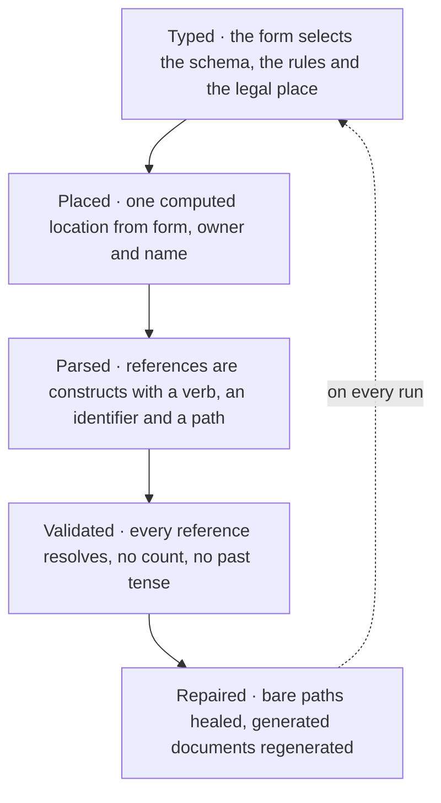

H1·b a resolved reference

```markdown
The placement check parses every path, see: `parsePath` "engine/matchers/path.matcher.ts"

The validator resolves both halves:
the path must exist
the identifier must be declared in that file

A verb it does not know fails the document rather than being skipped,
so a typo cannot make a reference invisible.
```

H1·c a manifest

```typescript
export interface Manifest {
  readonly label: string;
  readonly summary: string;
  readonly maturity: "experimental" | "stable";
  readonly domains: readonly {
    readonly meta: Domain;
    readonly sub: SubDomain;
  }[];
  readonly governedBy: readonly ConceptId[];
  readonly entries: readonly string[];
  readonly docs: {
    readonly overview: string;
    readonly whenToUse: readonly string[];
    readonly whenNotToUse: readonly string[];
    readonly quickStart: readonly {
      readonly intent: string;
      readonly lang: string;
      readonly code: string;
    }[];
    readonly configuration: string;
    readonly disposal: readonly string[];
    readonly aiContext: readonly string[];
    readonly apiNotes?: readonly {
      readonly name: string;
      readonly note: string;
    }[];
    readonly [section: string]: unknown;
  };
}
```

H1·d compiled from four

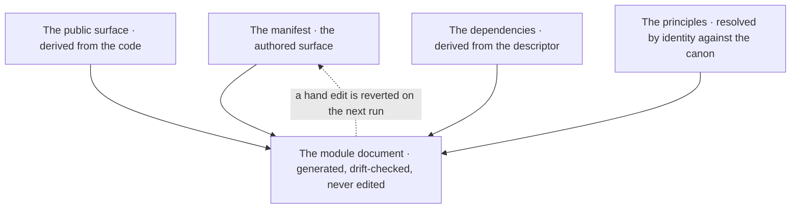

## Moves and renames

A move is a [manual identity migration](ontology/PRINCIPLES.md#architecture-manual-identity-migration): it is done by hand, one container at a time, with the gate green between each, and it opens with [impact analysis](ontology/PRINCIPLES.md#architecture-impact-analysis) over every reference, as shown in [I1·a a surviving move](#moves-and-renames-panel-a). The references that matter most are the ones a pattern collects rather than the ones a path names. As described in [the filesystem is the architecture](BUILD.md#the-filesystem-is-the-architecture), much of the tree is collected by pattern, and a [glob-resolvable tree](ontology/PRINCIPLES.md#architecture-glob-resolvable-tree) is exactly what a rename tool never sees.

### Enumerate, move, verify

A rename tool reports a clean rename while the surfaces that resolve by pattern quietly go empty. A suffix changes, the collector that gathered files by that suffix now gathers nothing, and everything downstream passes because nothing is left to check. A surface resolved by pattern holds no literal path that a rewrite could touch.

For this reason a move starts with an enumeration and ends with a [verification](ontology/PRINCIPLES.md#architecture-verification), and a count checks every surface that resolves by pattern. The rename tool's speed is traded for literal edits that a search can verify. In practice, every reference is enumerated before the move, including the ones resolved by pattern. Files are moved and renamed by hand, one container at a time, and every importer is updated by hand as well. A structural rewrite lands as a draft beside the live file, with a published migration map, and the original is deleted only after approval.

To check this, compare what each pattern-based surface collects before and after the move. Any set that shrank without explanation is a broken move that the tool would have called clean. A throwaway script can move whatever it likes. The discipline applies to code that something else depends on. A rename is also a create at its destination, so the destination is read before the write, because attention tends to stay on the source.

Nothing is dropped without a record. A restructure produces a migration map listing every displaced block with its destination, or an explicit deletion with its reason, so content removed from one place either appears in another or is listed as deleted. Relocation is a rewrite, so it needs the same approval as rewriting the contents. A move and a delete in one step is the most destructive form, because the original is gone and nothing is left to compare the replacement against.

I1·a a surviving move

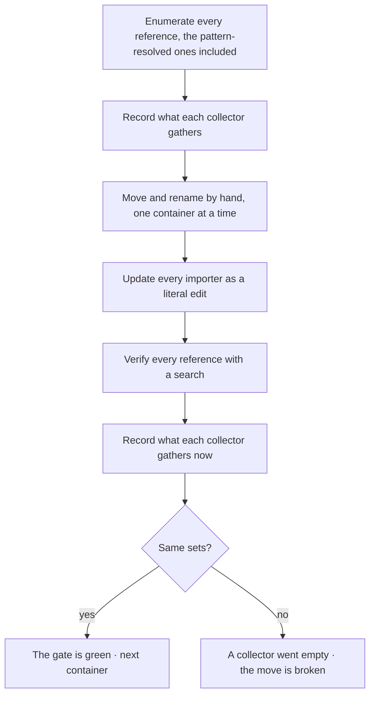

## Coverage is derived

Rule coverage is a set derived over the grid the architecture page builds in [what can drift, seen through how it drifts](architecture/COVERAGE.md#what-can-drift-seen-through-how-it-drifts). Each cell pairs a dimension of the ontology axis, such as [identity](ontology/REASONING.md#reasoning-node-ont-identity), [structure](ontology/REASONING.md#reasoning-node-ont-structure), [relation](ontology/REASONING.md#reasoning-node-ont-relation), [state](ontology/REASONING.md#reasoning-node-ont-state) or [behavior](ontology/REASONING.md#reasoning-node-ont-behavior), with a lens of the analysis axis, such as [structural](ontology/REASONING.md#reasoning-node-ana-structural), [causal](ontology/REASONING.md#reasoning-node-ana-causal) or [temporal](ontology/REASONING.md#reasoning-node-ana-temporal). The walk that finds an empty cell is described in [a cell that resists an invariant](architecture/COVERAGE.md#a-cell-that-resists-an-invariant). What this section adds is the rule side, shown in [J1·b one cell per rule](#coverage-is-derived-panel-b): every rule declares the gate that observes it, or declares conduct together with the evidence a check would need, as shown in [J1·c gate or conduct](#coverage-is-derived-panel-c). The conduct roster, whose vocabulary is typed in [J1·a the conduct roster](#coverage-is-derived-panel-a), shrinks whenever a mechanism starts observing in an artifact what the developer or the model previously had to remember. That shrinking is how this method defines progress.

### The grid and the roster

Coverage claimed from a count of rules says nothing about which drift classes the rules reach. A team believes its architecture is covered because it has many rules, and the failure that ships lives in a dimension no rule ever named. A rule stated without its cell has no address, so neither you nor the model can tell which drift it watches and which drift nothing watches.

For this reason coverage is a set derived over the grid of drift dimensions and lenses, and every rule declares either its gate or its conduct. Coverage is measured by the cells the grid leaves unwatched, rather than by the number of rules. In practice, every rule declares the check that observes it, or that no check can, and every conduct rule names the half of it that is decidable and whether that half has been built. The unbuilt halves are worked down to zero, and a gap found while building a gate is gated in the same run.

To check this, take any rule and name its dimension and its lens; a rule that fits no cell watches nothing in particular. Then find an empty cell and ask what would drift there unseen. A cell is watched only by a predicate that can fail, as described in [the check comes first](BUILD.md#the-check-comes-first).

Conduct is a closed question, not a softer state. A rule declares conduct when no construct in any artifact observes it, and the declaration stays falsifiable because each entry names what would have to become observable for the rule to gain a check. Many such rules have a half that is decidable, such as whether a surface conforms to its template, whether a set of readers resolves, or whether a report states the boundary of its own negative result. That half is recorded in a cell with a [closed vocabulary](ontology/PRINCIPLES.md#architecture-closed-vocabulary) of four values: observed, naming its gates; unbuilt, which counts as debt rather than a paragraph of explanation; none, with a reason taken from a closed set; and null, which means unassessed and is also a declared state. There are three reasons a half can be none: the subject is an act, no declared surface holds it, or the property cannot be evaluated on a member. The coverage report is then derived over the whole set: the gated rules with their gates, the conduct entries, the unassessed rows, which are exactly the entries whose cell is null, and the debt, which is exactly the unbuilt halves. No count is written by hand. Every number a reader wants is the length of one of those lists on the run that produced it.

The cell is filled by walking through questions, never by reading the entry. Does the half name a declared surface, or an imagined one? Is its subject an artifact or an act? Is the population non-empty, given that a check over an empty set is a green result that measures nothing? Can the property be evaluated on a member? Three of these questions take one search each, and only the fourth needs judgment. That changes how the roster reads: every entry looks like a judgment, yet most of them turn on a fact. The cell also holds the value while the entry holds the range, because an observing check is often narrower than the rule whose half it answers, and a bare id would claim more than the check covers.

Projected onto [correctness](ontology/PRINCIPLES.md#architecture-correctness), the same grid becomes the catalog of test surfaces described in what can drift, seen through how it drifts, and the unknown verdict that an unmeasured surface receives, described in [unknown is not pass](VERIFY.md#unknown-is-not-pass), rests on it. A fresh walk of the roster compares against the kinds of finding the checks emit rather than against the list of checks, because a half gains an observer far more often as a new kind than as a new rule.

J1·a the conduct roster

```typescript
export type CheckableHalf =
  | { readonly kind: "observed"; readonly by: readonly GateId[] }
  | { readonly kind: "unbuilt" }
  | {
      readonly kind: "none";
      readonly because:
        "subject-is-an-act" | "no-declared-surface" | "not-evaluable";
    };

export interface ConductEntry {
  readonly slug: RuleSlug;
  readonly whatACheckWouldNeed: string;
  readonly half: CheckableHalf | null;
}

export interface Coverage {
  readonly gated: readonly { readonly slug: RuleSlug; readonly gate: GateId }[];
  readonly conduct: readonly ConductEntry[];
  readonly unassessed: readonly RuleSlug[];
  readonly debt: readonly RuleSlug[];
}
```

J1·b one cell per rule


J1·c gate or conduct

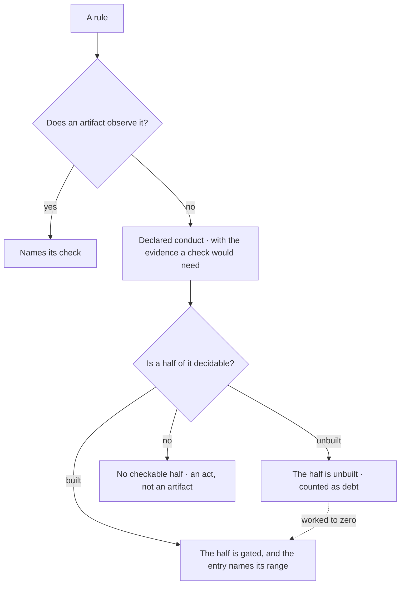

---

Chapters: [Start](START.md) · [Plan](PLAN.md) · [Build](BUILD.md) · [Verify](VERIFY.md) · [Collaborate](COLLABORATE.md) · [Ship](SHIP.md)
