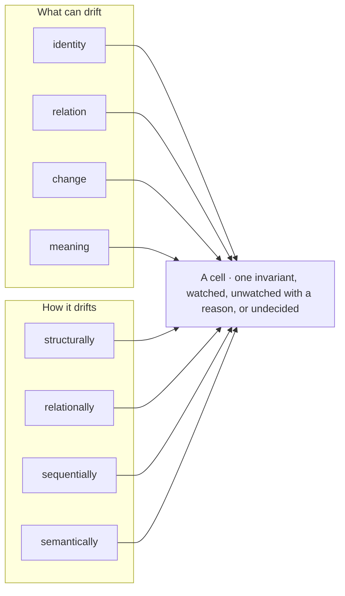
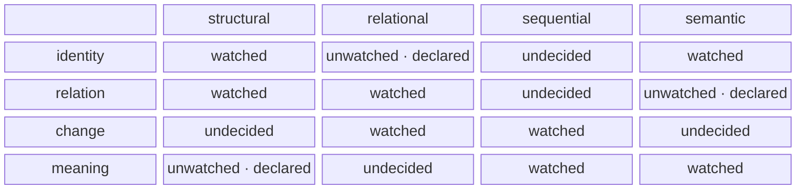
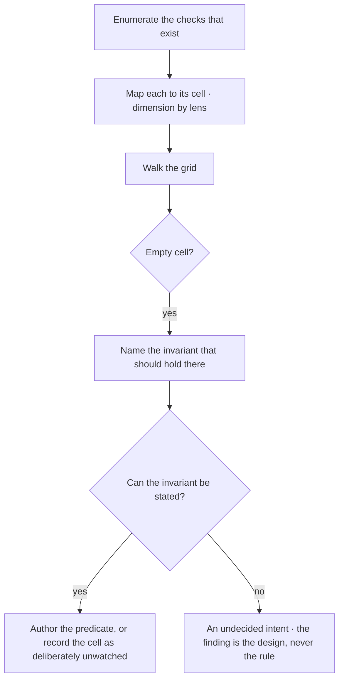
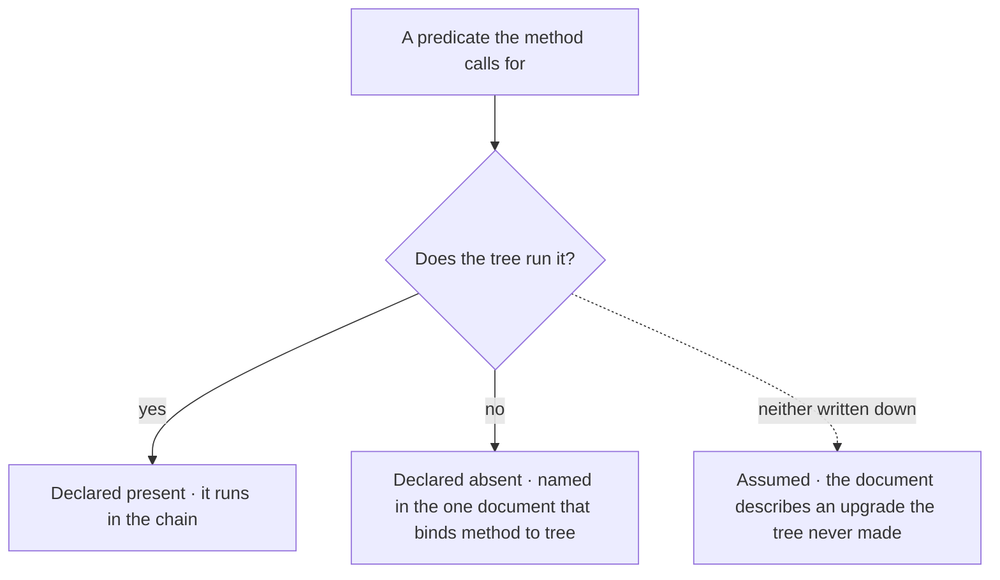

© 2025 Jay Baleine - Disciplined AI Software Development · Documentation is covered by [CC BY-SA 4.0](https://creativecommons.org/licenses/by-sa/4.0/)

# Coverage — Architecture — Bane's Lab

> An intent that never became a predicate is a habit, and a habit is held by whoever remembers it, for as long as they do. The reasoning axis of the ontology is…

Canonical: https://banes-lab.com/software-architecture/coverage

# Software Architecture

A system as a graph, principles as typed records, and the predicate set that makes an architecture real when a model writes the code.

# Coverage

## An architecture is its predicate set

An intent that never became a predicate is a habit, and a habit is held by whoever remembers it, for as long as they do. The reasoning axis of the ontology is what turns a question into a type and a type into a predicate, the walk [A1·a intent to predicate](#an-architecture-is-its-predicate-set-panel-a) draws, and [resolving a message](../START.md#resolving-a-message) on the methodology page walks the same axis on a request. How much of a design is real depends on who writes the code, as [A1·b what is real](#an-architecture-is-its-predicate-set-panel-b) draws.

### Question, type, predicate

An architecture is its predicate set, and a predicate selects what to examine and marks when the concern is closed. Architecture is usually a set of intentions, and an intention cannot be evaluated, so nobody can say how much of the architecture is real.

A design document states twelve principles, the codebase honours four, and nobody can say which four without reading everything, because the other eight were never anything a check could evaluate. An intention has no objector, so its first violation is silent, and a system whose rules are silent is governed by attention rather than by structure.

Count the architecture by what the gate refuses rather than by what the document states. State every architectural intent as a question about what can drift, seen through how it drifts. Resolve the question to a type: what exists is a set, how parts are arranged is an ordering, what connects is a graph, how sure you are is a number. Derive the predicate from the type and run it over the tree as a check.

List the architectural claims your system makes. Beside each, name the predicate that decides it and where that predicate runs. A claim with no predicate beside it is a sentence in a document, and the document is the only place it holds.

[Determinism](../ontology/PRINCIPLES.md#arch-determinism) lives in the predicate and never in the judgement that authored it. Which cells are worth watching is a decision; whether a cell's predicate holds is a computation. Keep the decision in the person and the computation in the check, and never let a predicate encode taste.

### A predicate does two jobs

The double duty is what makes derivation possible. The predicate that says an export is unreachable is the same predicate that says reachability is covered: one tells you where to work, the other tells you the dimension is watched. A project that has the first without the second accumulates checks by incident, and one that has both can derive its checks from its invariants.

[Policy as code](../ontology/PRINCIPLES.md#arch-policy-as-code) is the canon's name for the whole move, and [fitness functions](../ontology/PRINCIPLES.md#arch-fitness-functions) are the same predicates run against an architecture rather than a request. [Static analysis](../ontology/PRINCIPLES.md#arch-static-analysis) is where most predicates live, because a shape in a tree can be decided without running anything, and [design by contract](../ontology/PRINCIPLES.md#arch-design-by-contract) is the same idea one level down: preconditions, postconditions and invariants that a check can evaluate rather than a comment can promise.

### Coverage from the grid, never from a count

The coverage question is then answered from the grid what can drift, seen through how it drifts builds, rather than from a count of rules. [Security theater](../ontology/PRINCIPLES.md#arch-security-theater) is what a count produces: the presence of controls standing in for the coverage of them. A predicate set answers the other question, which cells have something that can disagree with them, and that is the only sense in which an architecture is enforced.

A1·a intent to predicate


A1·b what is real


## What can drift, seen through how it drifts

The grid has two closed axes. The [dimensions](../ontology/REASONING.md#the-dimensions) are what can drift and the [lenses](../ontology/REASONING.md#the-lenses) are how it drifts, and a cell is one invariant that must hold, watched by a predicate or declared unwatched with its reason, as [B1·a two axes, one cell](#what-can-drift-seen-through-how-it-drifts-panel-a) draws, [B1·b a corner](#what-can-drift-seen-through-how-it-drifts-panel-b) shows and [B1·c a rule surface](#what-can-drift-seen-through-how-it-drifts-panel-c) types. Two closed axes are what make coverage a derivation: the cells are enumerable, so the ones nothing watches are enumerable too, and a rule set is measured against the grid rather than against the incidents that happened to produce it.

### Two closed axes

Coverage is a grid of what can drift against how it drifts, and an unmeasured cell is unknown rather than clean. A rule set with no denominator reports how many checks exist, which says nothing about how many drift classes have none.

A suite reports hundreds of passing tests, the surface that fails in production was one none of them reached, and the green run was evidence over the wrong set. Without closed axes a rule set has no denominator, so coverage is reported as a count that grows with every incident and never says what is missing.

Close the axes before counting anything, so the count has a denominator. Name the dimensions along which your system can drift and the lenses through which each drift is seen, and close both lists. Place every existing check in the cell it watches, one invariant per cell, and read an empty cell as a drift class nothing watches.

Take the checks you have and place each in its cell. Then count the empty cells. If you cannot place a check, its invariant was never stated; if you cannot count the empties, the axes were never closed.

The grid enumerates where drift can be watched and says nothing about which cells deserve a rule. A full grid is not the goal; a grid whose every cell is either watched, unwatched with a stated reason, or marked undecided is, and the third state is the one that carries the design decisions still to make.

### The axes, and a cell read off them

A module reaching across a boundary is relation seen relationally, and a [circular dependency](../ontology/PRINCIPLES.md#arch-circular-dependency) is relation seen structurally. Two files claiming one role is identity seen structurally. A manifest entry rotting is composition seen through evolution. A discriminated union gaining a case nothing handles is change seen sequentially. A registry written and never read is function seen functionally. Intent living in a comment is meaning seen semantically. The same defect at every scale is scale seen fractally, and a convention followed everywhere except here is novelty seen as anomaly.

### Projected onto correctness

The same grid projected onto [correctness](../ontology/PRINCIPLES.md#arch-correctness) is the [test-surface catalogue](../ontology/REASONING.md#the-test-surfaces). Every surface a unit can fail in names its failure modes, its technique, its predicate and its evidence source, and its verdict domain carries unknown as a value distinct from pass. [Property-based testing](../ontology/PRINCIPLES.md#arch-property-based-testing) and [specification-based testing](../ontology/PRINCIPLES.md#arch-specification-based-testing) are techniques a surface names, and [chaos engineering](../ontology/PRINCIPLES.md#arch-chaos-engineering) is the technique for the surfaces only a running system can fail in.

An unmeasured surface is unknown rather than clean, as [unknown is not pass](../VERIFY.md#unknown-is-not-pass) states and [the evidence verdict](../ontology/ALGORITHMS.md#algo-evidence-verdict) records. [Test pyramid inversion](../ontology/PRINCIPLES.md#arch-test-pyramid-inversion) and the [mock mirage](../ontology/PRINCIPLES.md#arch-mock-mirage) are the two ways a green run stops being evidence, and [completion](../ontology/ALGORITHMS.md#algo-coverage-completion) is the absence of required surfaces still unknown, never a percentage, because a percentage averages the surfaces that matter with the ones that cannot fail.

B1·a two axes, one cell



B1·b a corner



```typescript
export const DIMENSIONS = [
  "identity",
  "composition",
  "structure",
  "relation",
  "space",
  "time",
  "state",
  "change",
  "behaviour",
  "function",
  "cause",
  "meaning",
  "scale",
  "probability",
  "novelty",
] as const;
export const LENSES = [
  "structural",
  "temporal",
  "spatial",
  "statistical",
  "frequency",
  "sequential",
  "relational",
  "behavioural",
  "functional",
  "semantic",
  "causal",
  "predictive",
  "anomaly",
  "evolutionary",
  "fractal",
  "transformational",
  "invariant",
  "optimisation",
  "complexity",
] as const;

export type Dimension = (typeof DIMENSIONS)[number];
export type Lens = (typeof LENSES)[number];

export type Cell =
  | {
      readonly kind: "watched";
      readonly invariant: string;
      readonly predicate: GateId;
    }
  | {
      readonly kind: "unwatched";
      readonly invariant: string;
      readonly because: string;
    }
  | { readonly kind: "undecided"; readonly question: string };

export type CellKey = readonly [Dimension, Lens];
export type RuleSurface = ReadonlyMap<CellKey, Cell | null>;

export const emptyCells = (surface: RuleSurface): readonly CellKey[] =>
  [...surface.entries()].flatMap(([cell, held]) =>
    held === null ? [cell] : [],
  );
```

## A cell that resists an invariant

Coverage is planned by walking the grid, as [C1·a the walk](#a-cell-that-resists-an-invariant-panel-a) draws, and the step that pays is the one where a cell resists: an invariant that cannot be stated is not a missing rule, it is an architectural intent nobody has decided, and that is the finding.

### Walk the grid

A cell that resists an invariant is an undecided intent rather than a missing rule. Checks accumulate by incident, so the covered cells are the ones that already failed and the uncovered ones are the ones that will.

A team adds a check after every outage, the check count grows, and the failure that ships next lives in a cell the outages never happened to touch. A rule set built by incident has a shape decided by which incidents happened, and the drift classes that never produced an incident are exactly the ones with nothing watching them.

Stop authoring when a cell resists, and decide the design before the check, because the cell is saying the convention it would enforce was never chosen. Walk the grid with the checks you have, and treat every empty cell as a question rather than a gap. Where the invariant states itself, author the predicate. Record the unwatched cells with their reasons, so the unassessed set stays countable and a later reader can tell a decision from an oversight.

Find an empty cell and try to state its invariant in one sentence that could be false. If the sentence comes, you were missing a check. If it does not, you are missing a decision, and no check can be written until it is made.

A cell whose predicate nothing could ever disagree with is not authored; it is held with the forgone property written down, for the reason [the check comes first](../BUILD.md#the-check-comes-first) gives on the methodology page.

### Two invariants of the walk

Two invariants keep this a method rather than a rule pile. No rule without a consuming failure mode: a rule earns its place only if a real drift class fires it, because a rule nothing can violate is ceremony, and ceremony costs the same review attention as a real rule, which is how a rule set stops being read.

And the rule set is derived while the judgement that authored it is not. Which cells need watching is a deterministic function of the architecture's declared invariants, whether an invariant was worth declaring is a decision, and the [determinism](../ontology/PRINCIPLES.md#arch-determinism) stays in the predicate rather than in the deciding.

### The walk in the canon

The [walk itself](../ontology/ALGORITHMS.md#algo-surface-grid-walk) and the [gap it derives](../ontology/ALGORITHMS.md#algo-uncovered-gap-derivation) are records in the canon, and the cells the canon has not yet covered are [listed rather than assumed away](../ontology/REASONING.md#the-uncovered-cells).

[Gap analysis](../ontology/PRINCIPLES.md#arch-gap-analysis) is the activity, and a resisting cell is its most useful output. A cell whose invariant states itself was a missing rule. A cell whose invariant will not state itself is an [architecture review](../ontology/PRINCIPLES.md#arch-architecture-review) waiting to happen, and an [architecture decision record](../ontology/PRINCIPLES.md#arch-architecture-decision-records) is where its answer lands, so the next walk finds a decision rather than the same empty cell.

C1·a the walk



## The honest gaps

Every cell that earns a rule renders two ways from one entry, a detect half and a report half, the shape [D1·b a rule entry](#the-honest-gaps-panel-b) types. Every predicate the method calls for is either running in the tree or declared absent in the one document that binds the method to the tree, the three states [D1·a running or absent](#the-honest-gaps-panel-a) draws. The second half is the honesty of the first: a method that cannot say which of its own predicates are missing has not measured itself, and a document that describes an upgrade the tree never made is the stale description the model section names.

### Detect, report, declare

A rule detects and reports from one entry, and a predicate the tree does not run is declared absent, never assumed. Checks that only block teach nothing, and methods that only describe cannot say which of their own predicates exist.

A check refuses a change with a message that names a rule id, the author works around the id, and the document that describes the method lists a predicate that has never run anywhere. A rule that only blocks teaches nothing, so the same violation returns from the next author, and a document that only describes the ideal cannot be checked against the tree, so its gaps are found by failure rather than by reading.

Write the report half beside the detect half rather than a blocking message alone, and name an absence in the binding document rather than leave it to be assumed. Author each rule as one entry with a detect half and a report half, discovered by shape and consumed whole by the gate. Then keep one document that names every predicate the method calls for and states, for each, whether the tree runs it or not, and never let an absence be assumed.

Take any finding your gate prints and ask whether it names the invariant and the remediation. Then take the document that describes your method and ask, for each predicate it calls for, whether the tree runs it. A finding that names only a rule, or a predicate nobody can locate, is the gap.

A declared gap is not a licence. Naming a predicate as absent keeps the document honest and leaves the drift class unwatched, so an absent predicate is still a cell to decide, and the declaration only says that the decision has not been made yet.

### One entry, two halves

The detect half is the predicate that fires on the violating shape. The report half is the message that names the invariant and the remediation, so the failure teaches the convention rather than only blocking. [Auto-remediation](../ontology/PRINCIPLES.md#arch-auto-remediation) follows where the remediation has [one correct answer](../VERIFY.md#one-correct-answer), and where it does not the report still carries the handle a reasoning agent needs.

That is the [registry pattern](../ontology/PRINCIPLES.md#arch-registry-pattern) applied to enforcement: one entry per rule, discovered by shape through [auto-discovery](../ontology/PRINCIPLES.md#arch-auto-discovery), consumed by the gate, with the whole set failing the build on drift. Where a project already has a registry primitive for code, enforcement reuses it rather than inventing a second one.

### Declared absent, never assumed

The walk is also how the gaps are named. A predicate the method calls for and the tree does not have is declared absent, in the one document that binds the method to the tree, rather than assumed. It is normal for the epistemic and structural predicates to exist and run: whether something is reachable, consumed, grounded, drifting or covered.

The conative ones are the usual gap: a computed worth over branches, a detector for a run that stops making progress, a calibrated confidence rather than a threshold. The methodology page keeps its own list under the same title, [the honest gaps](../SHIP.md#the-honest-gaps), and the two are one declaration read from two sides.

D1·a running or absent



```typescript
export interface Rule<Shape> {
  readonly cell: CellKey;
  readonly detect: (tree: Tree) => readonly Shape[];
  readonly report: (found: Shape) => {
    readonly invariant: string;
    readonly remediation: string;
  };
}

export interface Declared {
  readonly predicate: string;
  readonly status: "runs" | "absent";
  readonly because: string | null;
}
```

Documentation is covered by [CC BY-SA 4.0](https://creativecommons.org/licenses/by-sa/4.0/)

© 2025 [Jay Baleine](https://linkedin.com/in/jay-baleine) - Software Architecture

---

Chapters: [Model](MODEL.md) · [Principles](PRINCIPLES.md) · [Decay](DECAY.md) · [Coverage](COVERAGE.md) · [Scale](SCALE.md) · [Glossary](GLOSSARY.md)
