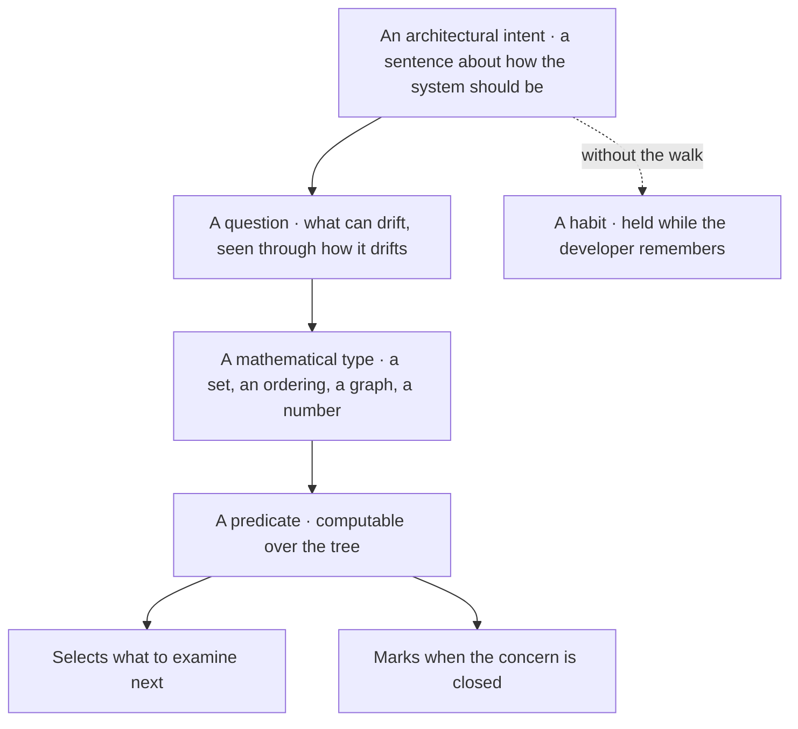
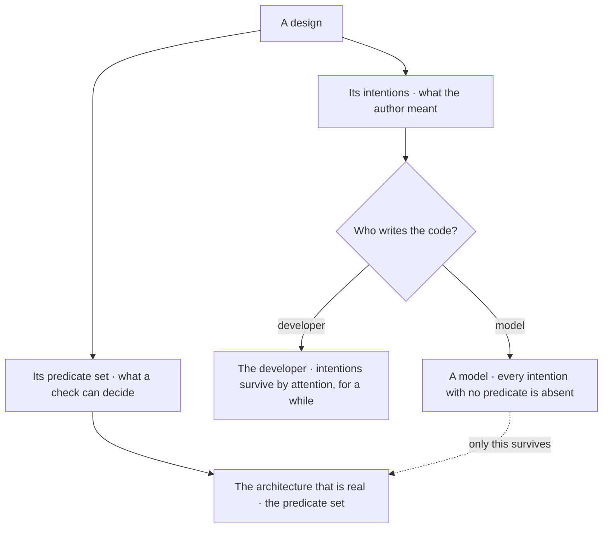
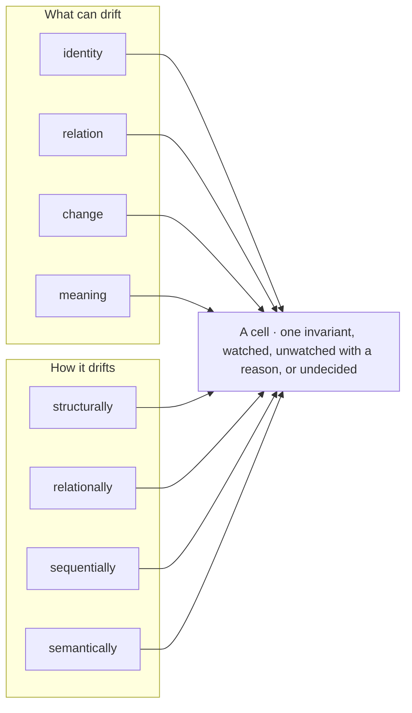
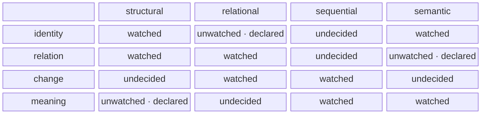
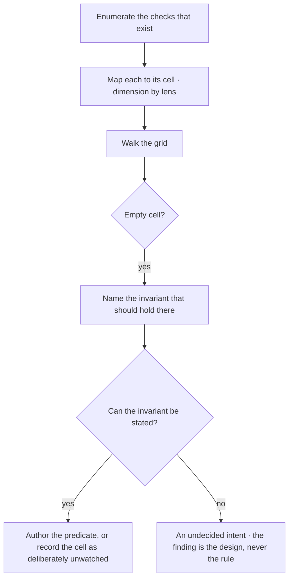
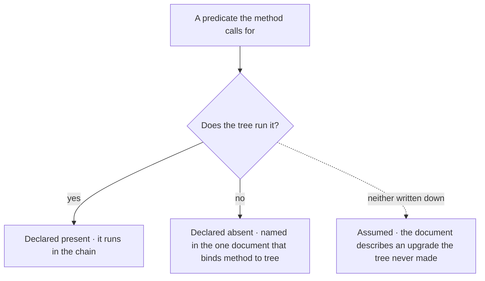

© 2025 Jay Baleine - Disciplined AI Software Development · Bane's Lab documentation is covered by [CC BY-SA 4.0](https://creativecommons.org/licenses/by-sa/4.0/)

# Coverage — Architecture — Bane's Lab

> This section covers how an architectural intent becomes a predicate a check can run. The reasoning axis of the ontology turns a question into a type and a type…

Canonical: https://banes-lab.com/software-architecture/coverage

# Software Architecture

A system as a graph, principles as typed records, and the predicate set that makes an architecture real when a model writes the code.

# Coverage

## From intent to predicate

This section covers how an architectural intent becomes a predicate a check can run. The reasoning axis of the ontology turns a question into a type and a type into a predicate, as shown in [A1·a intent to predicate](#an-architecture-is-its-predicate-set-panel-a), and the same axis is walked on a request in [resolving a message](../START.md#resolving-a-message) on the methodology page. How much of a design is real depends on who writes the code, as shown in [A1·b what is real](#an-architecture-is-its-predicate-set-panel-b).

### Question, type, predicate

Architecture is usually a set of intentions, and an intention cannot be evaluated, so neither the developer nor the model can say how much of the architecture is real. A design document states twelve principles, the codebase honours four, and no reviewer can say which four without reading everything, because the other eight were never anything a check could evaluate. An intention has no objector, so its first violation is silent, and a system whose rules are silent is governed by attention rather than by structure.

For this reason an architecture is its predicate set, and a predicate selects what to examine and marks when the concern is closed. The architecture is counted by what the gate refuses rather than by what the document states. In practice, every architectural intent is stated as a question about [what can drift, seen through how it drifts](COVERAGE.md#what-can-drift-seen-through-how-it-drifts), and the question is resolved to a type. What exists is a set, how parts are arranged is an ordering, what connects is a graph, and how sure you are is a number. The predicate is derived from the type and run over the tree as a check.

To check this, list the architectural claims your system makes. Beside each, name the predicate that decides it and where that predicate runs. A claim with no predicate beside it is a sentence in a document, and the document is the only place it holds. [Determinism](../ontology/PRINCIPLES.md#arch-determinism) lives in the predicate and never in the judgement that authored it. Which cells are worth watching is a decision, while whether a cell's predicate holds is a computation. The decision stays with the developer and the computation with the check, and a predicate never encodes taste.

### A predicate does two jobs

The double duty is what makes derivation possible. The predicate that says an export is unreachable is the same predicate that says reachability is covered, so one reading tells you where to work and the other tells you the dimension is watched. A project that has the first without the second accumulates checks by incident, and one that has both can derive its checks from its invariants.

[Policy as code](../ontology/PRINCIPLES.md#arch-policy-as-code) is the canon's name for the whole move, and [fitness functions](../ontology/PRINCIPLES.md#arch-fitness-functions) are the same predicates run against an architecture rather than a request. [Static analysis](../ontology/PRINCIPLES.md#arch-static-analysis) is where most predicates live, because a shape in a tree can be decided without running anything, and [design by contract](../ontology/PRINCIPLES.md#arch-design-by-contract) is the same idea one level down, with preconditions, postconditions and invariants that a check can evaluate rather than a comment can promise.

### Coverage from the grid, never from a count

The coverage question is then answered from the grid described in what can drift, seen through how it drifts, rather than from a count of rules. [Security theater](../ontology/PRINCIPLES.md#arch-security-theater) is what a count produces, with the presence of controls standing in for their coverage. A predicate set answers the other question, which cells have something that can disagree with them, and that is the only sense in which an architecture is enforced.

A1·a intent to predicate



A1·b what is real



## What can drift, seen through how it drifts

This section covers the coverage grid and its two closed axes. The [dimensions](../ontology/REASONING.md#the-dimensions) are what can drift and the [lenses](../ontology/REASONING.md#the-lenses) are how it drifts, and a cell is one invariant that must hold, watched by a predicate or declared unwatched with its reason, as shown in [B1·a two axes, one cell](#what-can-drift-seen-through-how-it-drifts-panel-a) and [B1·b a corner](#what-can-drift-seen-through-how-it-drifts-panel-b) and typed in [B1·c a rule surface](#what-can-drift-seen-through-how-it-drifts-panel-c). Because both axes are closed, the cells are enumerable, so the cells nothing watches are enumerable too, and a rule set is measured against the grid rather than against the incidents that happened to produce it.

### Two closed axes

A rule set with no denominator reports how many checks exist, which says nothing about how many drift classes have none. A suite reports hundreds of passing tests, the surface that fails in production was one none of them reached, and the green run was evidence over the wrong set. Without closed axes there is nothing to divide by, so coverage is reported as a count that grows with every incident and never says what is missing.

For this reason coverage is a grid of what can drift against how it drifts, and an unmeasured cell is unknown rather than clean. The axes are closed before anything is counted, so the count has a denominator. In practice, the dimensions along which the system can drift and the lenses through which each drift is seen are named as two lists. Every existing check is placed in the cell it watches, one invariant per cell, and an empty cell is read as a drift class nothing watches.

To check this, take the checks you have and place each in its cell, then count the empty cells. If you cannot place a check, its invariant was never stated, and if you cannot count the empties, the axes were never closed. The grid enumerates where drift can be watched and says nothing about which cells deserve a rule. A full grid is not the goal. The goal is a grid whose every cell is watched, unwatched with a stated reason, or marked undecided, and the undecided cells carry the design decisions still to make.

### The axes, and a cell read off them

A module reaching across a boundary is relation seen relationally, and a [circular dependency](../ontology/PRINCIPLES.md#arch-circular-dependency) is relation seen structurally. Two files claiming one role is identity seen structurally. A manifest entry rotting is composition seen through evolution. A discriminated union gaining a case nothing handles is change seen sequentially. A registry written and never read is function seen functionally. Intent living in a comment is meaning seen semantically. The same defect at every scale is scale seen fractally, and a convention followed everywhere except here is novelty seen as anomaly.

### Projected onto correctness

The same grid projected onto [correctness](../ontology/PRINCIPLES.md#arch-correctness) is the [test-surface catalogue](../ontology/REASONING.md#the-test-surfaces). Every surface a unit can fail in names its failure modes, its technique, its predicate and its evidence source, and its verdict domain carries unknown as a value distinct from pass. [Property-based testing](../ontology/PRINCIPLES.md#arch-property-based-testing) and [specification-based testing](../ontology/PRINCIPLES.md#arch-specification-based-testing) are techniques a surface names, and [chaos engineering](../ontology/PRINCIPLES.md#arch-chaos-engineering) is the technique for the surfaces only a running system can fail in.

An unmeasured surface is unknown rather than clean, as described in [unknown is not pass](../VERIFY.md#unknown-is-not-pass) and recorded in [the evidence verdict](../ontology/ALGORITHMS.md#algo-evidence-verdict). [Test pyramid inversion](../ontology/PRINCIPLES.md#arch-test-pyramid-inversion) and the [mock mirage](../ontology/PRINCIPLES.md#arch-mock-mirage) are the two ways a green run stops being evidence, and [completion](../ontology/ALGORITHMS.md#algo-coverage-completion) is the absence of required surfaces still unknown, never a percentage, because a percentage averages the surfaces that matter with the ones that cannot fail.

B1·a two axes, one cell



B1·b a corner



B1·c a rule surface

```typescript
export const DIMENSIONS = [
  "identity",
  "composition",
  "structure",
  "relation",
  "space",
  "time",
  "state",
  "change",
  "behaviour",
  "function",
  "cause",
  "meaning",
  "scale",
  "probability",
  "novelty",
] as const;
export const LENSES = [
  "structural",
  "temporal",
  "spatial",
  "statistical",
  "frequency",
  "sequential",
  "relational",
  "behavioural",
  "functional",
  "semantic",
  "causal",
  "predictive",
  "anomaly",
  "evolutionary",
  "fractal",
  "transformational",
  "invariant",
  "optimisation",
  "complexity",
] as const;

export type Dimension = (typeof DIMENSIONS)[number];
export type Lens = (typeof LENSES)[number];

export type Cell =
  | {
      readonly kind: "watched";
      readonly invariant: string;
      readonly predicate: GateId;
    }
  | {
      readonly kind: "unwatched";
      readonly invariant: string;
      readonly because: string;
    }
  | { readonly kind: "undecided"; readonly question: string };

export type CellKey = readonly [Dimension, Lens];
export type RuleSurface = ReadonlyMap<CellKey, Cell | null>;

export const emptyCells = (surface: RuleSurface): readonly CellKey[] =>
  [...surface.entries()].flatMap(([cell, held]) =>
    held === null ? [cell] : [],
  );
```

## A cell that resists an invariant

This section covers the walk over the grid that plans coverage, shown in [C1·a the walk](#a-cell-that-resists-an-invariant-panel-a), and the step in it where a cell resists an invariant.

### Walk the grid

Checks accumulate by incident, so the covered cells are the ones that already failed and the uncovered ones are the ones that will. A team adds a check after every outage, the check count grows, and the failure that ships next lives in a cell the outages never happened to touch. A rule set built by incident has a shape decided by which incidents happened, and the drift classes that never produced an incident are exactly the ones with nothing watching them.

For this reason a cell that resists an invariant is an undecided intent rather than a missing rule. Authoring stops when a cell resists, and the design is decided before the check, because the cell is saying the convention it would enforce was never chosen. In practice, the grid is walked with the checks that exist, and every empty cell is treated as a question rather than a gap. Where the invariant states itself, the predicate is authored. The unwatched cells are recorded with their reasons, so the unassessed set stays countable and a later reader can tell a decision from an oversight.

To check this, find an empty cell and try to state its invariant in one sentence that could be false. If the sentence comes, you were missing a check. If it does not, you are missing a decision, and no check can be written until it is made. A cell whose predicate nothing could ever disagree with is not authored. It is held with the forgone property written down, for the reason described in [the check comes first](../BUILD.md#the-check-comes-first) on the methodology page.

### Two invariants of the walk

Two invariants keep this a method rather than a rule pile. The first is that no rule exists without a consuming failure mode. A rule earns its place only if a real drift class fires it, because a rule nothing can violate is ceremony, and ceremony costs the same review attention as a real rule, which is how a rule set stops being read.

The second is that the rule set is derived while the judgement that authored it is not. Which cells need watching is a deterministic function of the architecture's declared invariants, whether an invariant was worth declaring is a decision, and the [determinism](../ontology/PRINCIPLES.md#arch-determinism) stays in the predicate rather than in the deciding.

### The walk in the canon

The [walk itself](../ontology/ALGORITHMS.md#algo-surface-grid-walk) and the [gap it derives](../ontology/ALGORITHMS.md#algo-uncovered-gap-derivation) are records in the canon, and the cells the canon has not yet covered are [listed rather than assumed away](../ontology/REASONING.md#the-uncovered-cells).

[Gap analysis](../ontology/PRINCIPLES.md#arch-gap-analysis) is the activity, and a resisting cell is its most useful output. A cell whose invariant states itself was a missing rule. A cell whose invariant will not state itself is an [architecture review](../ontology/PRINCIPLES.md#arch-architecture-review) waiting to happen, and an [architecture decision record](../ontology/PRINCIPLES.md#arch-architecture-decision-records) is where its answer lands, so the next walk finds a decision rather than the same empty cell.

C1·a the walk



## The honest gaps

This section covers how a rule reports what it finds and how a method declares what it lacks. Every cell that earns a rule renders two ways from one entry, a detect half and a report half, as typed in [D1·b a rule entry](#the-honest-gaps-panel-b). Every predicate the method calls for is either running in the tree or declared absent in the one document that binds the method to the tree, as shown in [D1·a running or absent](#the-honest-gaps-panel-a). A method that cannot say which of its own predicates are missing has not measured itself, and a document that describes an upgrade the tree never made is the [schema drift](../ontology/PRINCIPLES.md#arch-schema-drift) described in [a system is a graph](MODEL.md#a-system-is-a-graph).

### Detect, report, declare

Checks that only block teach nothing, and methods that only describe cannot say which of their own predicates exist. A check refuses a change with a message that names a rule id, the author works around the id, and the document that describes the method lists a predicate that has never run anywhere. A blocking message names a rule without its reason, so the same violation returns from the next author, and a document that only describes the ideal cannot be checked against the tree, so its gaps are found by failure rather than by reading.

For this reason a rule detects and reports from one entry, and a predicate the tree does not run is declared absent, never assumed. The report half is written beside the detect half rather than a blocking message alone, and an absence is named in the binding document rather than left to be assumed. In practice, each rule is authored as one entry with a detect half and a report half, discovered by shape and consumed whole by the gate. One document names every predicate the method calls for and states, for each, whether the tree runs it.

To check this, take any finding your gate prints and ask whether it names the invariant and the remediation. Then take the document that describes your method and ask, for each predicate it calls for, whether the tree runs it. A finding that names only a rule, or a predicate that cannot be located, is the gap. A declared gap is not a license. Naming a predicate as absent keeps the document honest and leaves the drift class unwatched, so an absent predicate is still a cell to decide, and the declaration only says that the decision has not been made yet.

### One entry, two halves

The detect half is the predicate that fires on the violating shape. The report half is the message that names the invariant and the remediation, so the failure teaches the convention rather than only blocking. [Auto-remediation](../ontology/PRINCIPLES.md#arch-auto-remediation) follows where the remediation has [one correct answer](../VERIFY.md#one-correct-answer), and where it does not the report still carries the handle a reasoning agent needs.

Enforcement then follows the [registry pattern](../ontology/PRINCIPLES.md#arch-registry-pattern), with one entry per rule discovered by shape through [auto-discovery](../ontology/PRINCIPLES.md#arch-auto-discovery) and consumed by the gate, and the whole set failing the build on drift. Where a project already has a registry primitive for code, enforcement reuses it rather than inventing a second one.

### Declared absent, never assumed

The walk is also how the gaps are named. A predicate the method calls for and the tree does not have is declared absent, in the one document that binds the method to the tree, rather than assumed. The epistemic and structural predicates normally exist and run, deciding whether something is reachable, consumed, grounded, drifting or covered.

The conative ones are the usual gap, such as a computed worth over branches, a detector for a run that stops making progress, and a calibrated confidence rather than a threshold. The methodology page keeps its own list under the same title, [the honest gaps](../SHIP.md#the-honest-gaps), and the two lists are one declaration read from two sides.

D1·a running or absent



D1·b a rule entry

```typescript
export interface Rule<Shape> {
  readonly cell: CellKey;
  readonly detect: (tree: Tree) => readonly Shape[];
  readonly report: (found: Shape) => {
    readonly invariant: string;
    readonly remediation: string;
  };
}

export interface Declared {
  readonly predicate: string;
  readonly status: "runs" | "absent";
  readonly because: string | null;
}
```

---

Chapters: [Model](MODEL.md) · [Principles](PRINCIPLES.md) · [Decay](DECAY.md) · [Coverage](COVERAGE.md) · [Scale](SCALE.md) · [Glossary](GLOSSARY.md)
