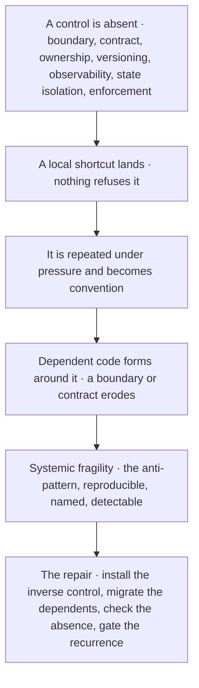
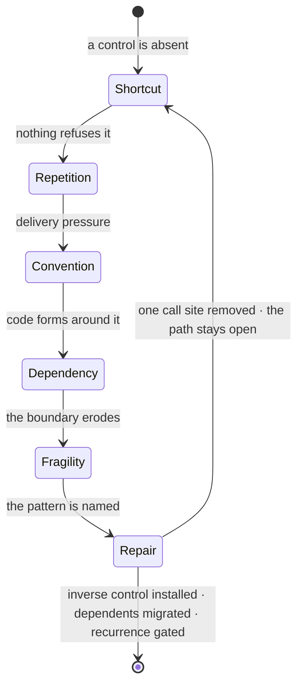
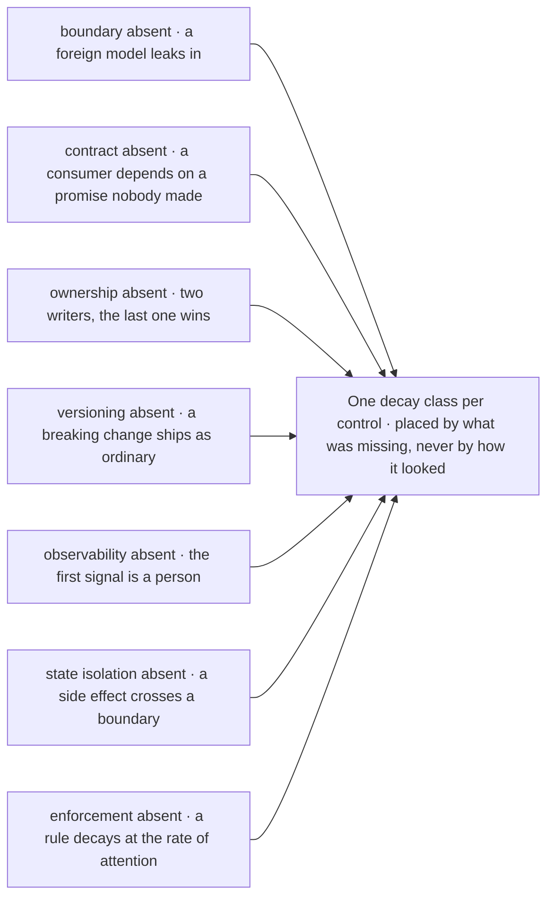
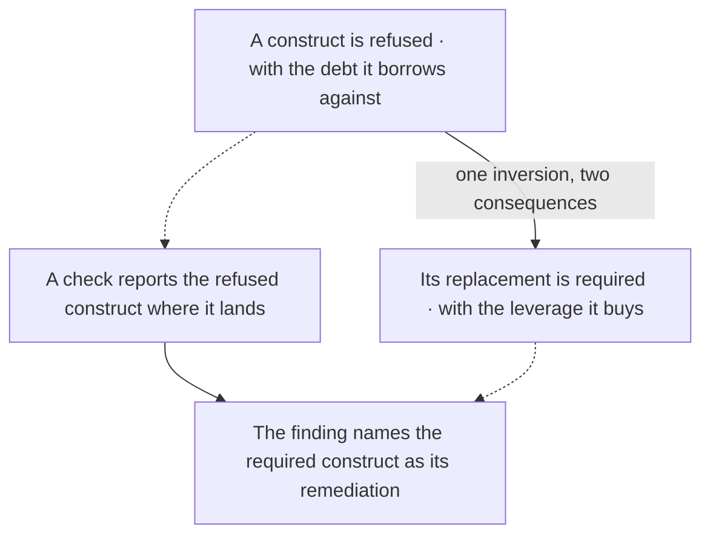
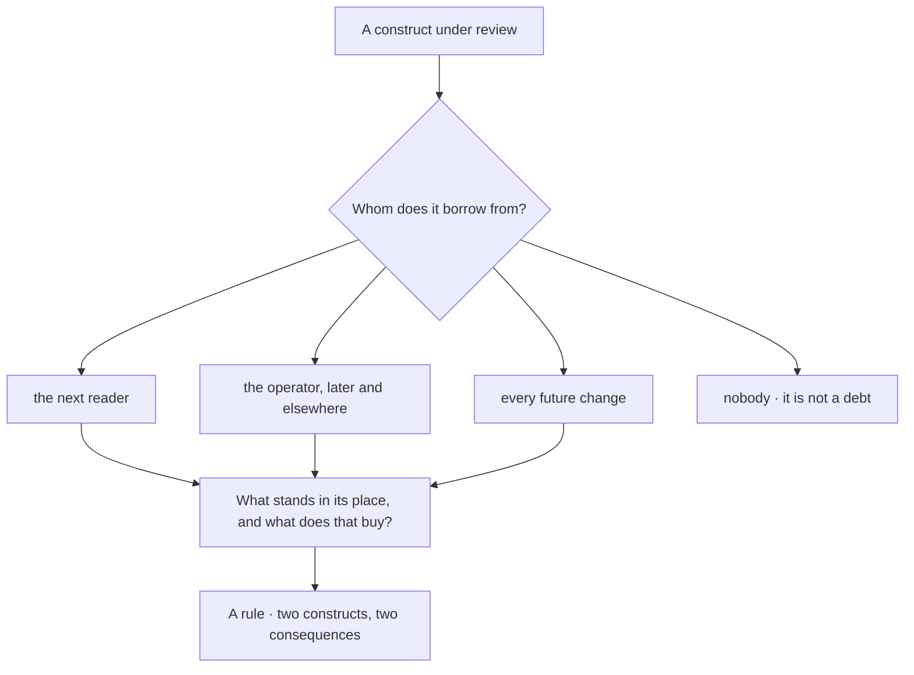

© 2025 Jay Baleine - Disciplined AI Software Development · Documentation is covered by [CC BY-SA 4.0](https://creativecommons.org/licenses/by-sa/4.0/)

# Decay — Architecture — Bane's Lab

> A decay starts as a local shortcut that nothing refused, and it becomes dangerous the moment the shortcut becomes infrastructure, the path a decay path draws…

Canonical: https://banes-lab.com/software-architecture/decay

# Software Architecture

A system as a graph, principles as typed records, and the predicate set that makes an architecture real when a model writes the code.

# Decay

## An anti-pattern is a decay path

A decay starts as a local shortcut that nothing refused, and it becomes dangerous the moment the shortcut becomes infrastructure, the path [A1·a a decay path](#an-anti-pattern-is-a-decay-path-panel-a) draws and [A1·b the propagation](#an-anti-pattern-is-a-decay-path-panel-b) states. The canon carries the class as a [contract of its own](../ontology/ALGORITHMS.md#algo-architecture-anti-pattern), and every anti-pattern it names is a [kind](../ontology/SCHEMA.md#kind-anti-pattern) a principle may point at and nothing else may.

### An absent control, a reproducible path

An anti-pattern is a reproducible decay path caused by the absence of a specific control. Anti-patterns are usually catalogued by how they look, and how they look is the last stage of a process that started with something missing.

A module gains a second writer, then a third, each with a good reason, and by the time two of them disagree about its state nobody can say which change was the wrong one because none of them was. A shortcut is cheap where it is taken and expensive where it is depended on, so blaming the first change finds a small thing, and the control whose absence let it through is invisible because absent things do not appear in reviews.

Repair the control rather than the change that revealed it, because the next change will reveal it again. Name an anti-pattern by the control whose absence causes it, and record the decay path as the sequence of stages that produces it, so it can be reproduced rather than argued about. Record how it presents, which principles it violates, which signals detect it, which repairs reverse it and which gate prevents its return.

Take an anti-pattern you have met and name the control whose presence would have made the first step of its decay path fail. If you cannot name one, you have named the symptom rather than the pattern.

A decay path is a class, never an incident. The catalogue carries the shape, how it starts, how it presents and what was missing, and never which file or who, because a class transfers to a tree with nothing else in common and an incident makes the next project inherit someone else's history as law.

### The path

A decay path is recorded as reproduction rather than description, and the [propagation](../ontology/ALGORITHMS.md#algo-anti-pattern-propagation-kernel) runs through the same stages every time. A local shortcut lands and nothing refuses it, which is where the missing control is named. The shortcut is repeated under delivery pressure until it is a convention, dependent code forms around it, and the repair is now expensive in proportion to what depends on it.

Recorded that way, the pattern is a test: install the control, replay the path, and the first stage should now fail. [Lava flow](../ontology/PRINCIPLES.md#arch-lava-flow) is what a path looks like once nobody can replay it, code kept because nobody knows what depends on it, and [temporal coupling](../ontology/PRINCIPLES.md#arch-temporal-coupling) is a path whose stages are hidden in the order things happen to be called.

### The repair

The [repair](../ontology/ALGORITHMS.md#algo-anti-pattern-remediation-algebra) follows the same algebra in reverse. Name the missing control, introduce its inverse, migrate the dependents off the shortcut, verify the old shape is absent, and gate its recurrence.

A repair that removes one call site leaves the propagation path open and the pattern returns somewhere else. [Shotgun surgery](../ontology/PRINCIPLES.md#arch-shotgun-surgery) is the shape of that failed repair, one change spread across many files because the control was never installed, and [divergent change](../ontology/PRINCIPLES.md#arch-divergent-change) is its mirror, one file changed for many reasons because its concern was never split.

A1·a a decay path



A1·b the propagation



## Seven controls, seven classes

The controls are few: a boundary, a contract, an ownership, a [versioning](../ontology/PRINCIPLES.md#arch-versioning), an [observability](../ontology/PRINCIPLES.md#arch-observability), a [state isolation](../ontology/PRINCIPLES.md#arch-state-isolation), an enforcement. Each owns a decay class, as [B1·a seven controls](#seven-controls-seven-classes-panel-a) draws and [B1·b an anti-pattern record](#seven-controls-seven-classes-panel-b) types, because the [anti-pattern record](../ontology/ALGORITHMS.md#algo-architecture-anti-pattern) holds as its invariant that every decay path is caused by the absence of one of those seven. The same idea generalises past architecture: a [taxonomy of smells](../ontology/ALGORITHMS.md#algo-smell-taxonomy) groups any bad practice by the control it lacks rather than by how it looks, and a catalogue organised that way answers a question a gallery of symptoms cannot: what to install.

### Placed by what was missing

Seven controls own seven decay classes, and an anti-pattern is placed by the control it lacks. A catalogue organised by appearance grows without bound and never says what to install.

A team keeps a growing list of things that went wrong, each with its own fix, and the next failure fits none of the entries because it was filed by appearance and appears differently this time. A catalogue of symptoms grows without bound and teaches recognition, while a catalogue of absent controls stays small and teaches repair, because the number of ways to look wrong is unbounded and the number of things that can be missing is not.

Keep a catalogue of absences rather than a gallery of symptoms. Place every anti-pattern under the one control whose absence lets it start, and read the catalogue as seven classes rather than as a list. When a new pattern appears, ask which of the seven was missing before asking what it looks like, because the answer names the repair.

Take any three anti-patterns you know and name the control each lacks. If two of them lack the same control, they are one class with two faces, and one check covers both.

The seven controls classify absence and never presence. A tree that has all seven is not thereby well designed; it is a tree in which the decay classes have something to refuse them, and what it refuses is still decided by the principles the controls hold.

### The seven, each with its class

A missing boundary lets a foreign model leak into yours until the two are one tangled model: [boundary leakage](../ontology/PRINCIPLES.md#arch-boundary-leakage), [framework leakage](../ontology/PRINCIPLES.md#arch-framework-leakage), the [anemic domain model](../ontology/PRINCIPLES.md#arch-anemic-domain-model) that follows. A missing contract lets a consumer depend on a behaviour nobody promised, an [implicit contract](../ontology/PRINCIPLES.md#arch-implicit-contract), so the next change breaks it silently. A missing ownership lets two parties write [shared mutable state](../ontology/PRINCIPLES.md#arch-shared-mutable-state), and the write that lands last wins with no report, which is the [lost update](../ontology/PRINCIPLES.md#arch-lost-update).

A missing versioning lets an [unversioned breaking change](../ontology/PRINCIPLES.md#arch-unversioned-breaking-change) ship as an ordinary one, and [schema drift](../ontology/PRINCIPLES.md#arch-schema-drift) follows. A missing observability lets a system run with [opaque runtime behavior](../ontology/PRINCIPLES.md#arch-opaque-runtime-behavior), so the first sign of an [unobservable failure](../ontology/PRINCIPLES.md#arch-unobservable-failure) is a person. A missing state isolation lets a [hidden side effect](../ontology/PRINCIPLES.md#arch-hidden-side-effect) reach across a boundary it should not see, and [action at a distance](../ontology/PRINCIPLES.md#arch-action-at-a-distance) is its name once nobody can find the cause. A missing enforcement is [manual-only governance](../ontology/PRINCIPLES.md#arch-manual-only-governance), a rule everyone agreed to decaying at the rate of attention.

### When an entry is real

Two questions decide whether a catalogue entry is real. Can the path be replayed from its first stage, so that a reader with a different tree reproduces the decay rather than recognising the picture? And does the entry name what it violates by identity, so that a finding on the [enforcement layer](../ontology/SCHEMA.md#layer-enforcement-core) resolves to the principle, its severity and the repair in one lookup?

An anti-pattern held as a [typed relationship record](../ontology/ALGORITHMS.md#algo-anti-pattern-relationship-record) answers both, and a smell [compiles into a rule](../ontology/ALGORITHMS.md#algo-anti-pattern-rule-compiler) only once it does. [Pattern cargo cult](../ontology/PRINCIPLES.md#arch-pattern-cargo-cult) and the [golden hammer](../ontology/PRINCIPLES.md#arch-golden-hammer) are what a catalogue of appearances produces: a shape applied because it was recognised, never because its absent control was named.

### The same classes at a model's speed

For a model-authored codebase the decay classes are the same and the rate is different. A model will tend to take a shortcut as readily as a person under a deadline, and it rarely objects to its own, so a system with an absent control decays at the model's speed rather than a team's.

A control that exists only as a reviewer's habit is absent for every change the reviewer did not see. Installing the seven as checks before the model writes anything is what makes them present for every change rather than for the ones somebody happened to read.

B1·a seven controls



```typescript
export const CONTROLS = [
  "boundary",
  "contract",
  "ownership",
  "versioning",
  "observability",
  "state-isolation",
  "enforcement",
] as const;
export type Control = (typeof CONTROLS)[number];

export const PROPAGATION = [
  "shortcut",
  "repetition",
  "normalisation",
  "dependency-formation",
  "institutionalisation",
  "high-cost-repair",
] as const;
export type Stage = (typeof PROPAGATION)[number];

export const REMEDIATION = [
  "missing-control",
  "inverse-control",
  "migration",
  "absence-check",
  "prevention-gate",
] as const;
export type Repair = (typeof REMEDIATION)[number];

export interface AntiPattern {
  readonly id: AntiPatternId;
  readonly absentControl: Control;
  readonly path: readonly { readonly stage: Stage; readonly change: string }[];
  readonly presentsAs: string;
  readonly violates: readonly PrincipleId[];
  readonly detectedBy: readonly SignalId[];
  readonly repairs: readonly {
    readonly step: Repair;
    readonly action: string;
  }[];
}
```

## Never and always

A rule that only says never leaves an empty action set the moment the forbidden thing is the obvious thing, and an empty action set is how the forbidden thing gets written anyway, which is why every rule is the pair [C1·a one inversion](#never-and-always-panel-a) draws. The canon holds every inversion as a [contract with an invariant](../ontology/ALGORITHMS.md#algo-domain-architectural-rules), and [fail at the boundary](../BUILD.md#fail-at-the-boundary) on the methodology page is the practice for the pairs that recur most.

### Half a rule

An avoidance rule is an inversion: a refused construct with the debt it borrows against, and a required construct with the leverage it buys. Avoidance rules written as a list of don'ts are obeyed until the first moment the don't is convenient.

A rule says no fallbacks, a value is missing at boot, the author has nowhere to go, and the fallback is written with a comment apologising for it. A prohibition without its replacement names what to avoid and not what to do, so under pressure the avoided thing is the only thing anyone knows how to write.

Write the replacement before the prohibition, so the rule is never a bare never. Give every prohibition its replacement, and give both halves their consequence: the debt the refused construct borrows against, and the leverage the required one buys. Keep the consequences as the reason, so the rule carries its own justification and is never re-argued. Let a check report the refused construct where it lands and name the required one as the remediation, and delete what the replacement supersedes in the same change, because a marker on the old path keeps two paths alive under one label.

Cover the second half of any rule you hold and ask what you would write instead. If nothing comes, the rule was a prohibition and the debt is already in the tree somewhere.

An inversion governs living code on one forward path: anything something else depends on, where a shortcut taken today is read as a decision by whoever finds it next. It says nothing about how strict a rule is, and it is not a threshold; a bound lives where the check reads it, and the inversion only says that the bound exists.

### The derivation

The generalised form is a small derivation, and it can be run on any construct in any tree. Take the construct, ask what it borrows against and from whom, name the construct that would stand in its place, and ask what that one buys.

If the second half comes, the pair is a rule and the consequences are its reason. If it does not, the construct is either not a debt or not yet understood, and either way it is not a rule.

### One forward path

Only living code on a single forward path survives that reading. A deprecation marker, a tombstone, a compatibility shim and [zombie code](../ontology/PRINCIPLES.md#arch-zombie-code) are each a refused construct whose replacement is deletion in the same edit. [Backward compatibility](../ontology/PRINCIPLES.md#arch-backward-compatibility) is a contract a boundary declares, never a second path kept alive inside one.

An export exists only while another file imports it now, unless it is staged behind a drift check that holds it to that promise. A [utility dump](../ontology/PRINCIPLES.md#arch-utility-dump) and a [repository dump](../ontology/PRINCIPLES.md#arch-repository-dump) are the same debt at the scale of a folder: a home for constructs whose replacement nobody named, and so a place where every one of them is kept.

C1·a one inversion



## Debt and leverage

The consequence on each side of an inversion is what lets the rule survive the moment it is inconvenient, derived by the two questions [D1·a lender and replacement](#debt-and-leverage-panel-a) draws, and it is what turns the pair into a finding a check can print, the record [D1·b an inversion record](#debt-and-leverage-panel-b) types.

### A lender and a purchase

A consequence is a named lender or a named purchase, and a pair with both is already a finding. Rules are justified with adjectives, and an adjective is re-argued every time the rule is inconvenient.

A rule is defended as good practice, the defence convinces nobody under deadline, and the construct it refused is written because no one could say who would pay for it. A rule whose reason is an adjective is re-argued because an adjective cannot be pointed at, while a rule whose reason names a lender ends the argument by naming who pays.

Justify a rule with who pays rather than with an adjective. Derive the refused consequence by asking whom the construct borrows from: the next reader, the operator who meets the failure later, every future change that has to keep two paths alive. Derive the required consequence by asking what holds without attention once the replacement is in place. Name both as a lender and a purchase rather than as an adjective, so the rule can be pointed at when it is questioned, and let the same two names become the message a check prints and the remediation it proposes.

Take any rule you hold and name who pays when it is broken and what is bought when it is kept. A rule where either answer is an adjective has no consequence yet, and it will lose the next argument it is in.

A consequence names a lender or a purchase and never a severity. How strictly a rule binds is a separate fact held beside it, so two rules with the same consequence can bind differently, and a consequence never argues for its own rule's rank.

### The lender

The same question derives the refused consequence every time: whom does this construct borrow from? A shortcut borrows from the next reader. A [fallback pattern](../ontology/ALGORITHMS.md#algo-no-fallback) borrows from the operator, because it converts a loud failure into a quiet wrong answer that surfaces later and elsewhere. A [deprecation](../ontology/ALGORITHMS.md#algo-no-deprecation) borrows from every future change, because it keeps two paths alive so nobody has to choose now.

A [second path](../ontology/ALGORITHMS.md#algo-no-dual-path) borrows from every reader, who now has to decide which one is real. Deferring borrows from the person who will not remember. [Shared mutable state](../ontology/ALGORITHMS.md#algo-no-shared-ownership) borrows from whoever has to find out which writer won, and [silent data corruption](../ontology/PRINCIPLES.md#arch-silent-data-corruption) from whoever meets the failure it hid.

### The purchase

The required consequence names what the replacement buys, and the purchase is what makes the rule worth keeping. A [constraint](../ontology/ALGORITHMS.md#algo-no-shortcuts) is leverage because it holds without attention. [Fail fast](../ontology/PRINCIPLES.md#arch-fail-fast) is clarity, because the failure lands where its cause is. Explicit removal is coherence, because a removed path cannot be taken.

A single path is [determinism](../ontology/PRINCIPLES.md#arch-determinism). A single owner is [auditability](../ontology/PRINCIPLES.md#arch-auditability). A bounded lifetime is deterministic release. [An emitted event](../ontology/ALGORITHMS.md#algo-no-callbacks) is [loose coupling](../ontology/PRINCIPLES.md#arch-low-coupling), and [policy as code](../ontology/ALGORITHMS.md#algo-no-convention-enforcement) is an automated gate. That shape is why the same record serves the person reading the rule and the check enforcing it, and why the two never drift apart.

D1·a lender and replacement



```typescript
export interface Inversion {
  readonly refused: {
    readonly construct: Construct;
    readonly borrowsAgainst: Consequence;
  };
  readonly required: {
    readonly construct: Construct;
    readonly buys: Consequence;
  };
}

export const inversionOf = (
  refused: Construct,
  required: Construct,
  debt: Consequence,
  leverage: Consequence,
): Inversion => ({
  refused: { borrowsAgainst: debt, construct: refused },
  required: { buys: leverage, construct: required },
});

export const asFinding = (rule: Inversion, at: Location): Finding => ({
  at,
  reported: rule.refused.construct,
  remediation: rule.required.construct,
  reason: rule.refused.borrowsAgainst,
});
```

Documentation is covered by [CC BY-SA 4.0](https://creativecommons.org/licenses/by-sa/4.0/)

© 2025 [Jay Baleine](https://linkedin.com/in/jay-baleine) - Software Architecture

---

Chapters: [Model](MODEL.md) · [Principles](PRINCIPLES.md) · [Decay](DECAY.md) · [Coverage](COVERAGE.md) · [Scale](SCALE.md) · [Glossary](GLOSSARY.md)
