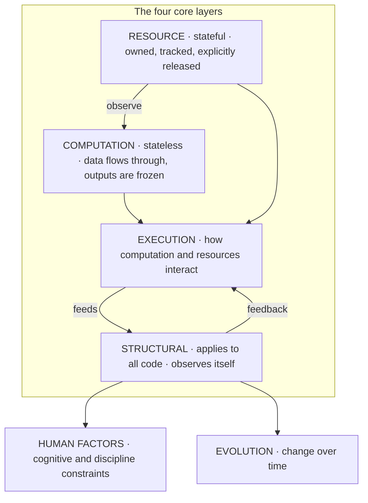
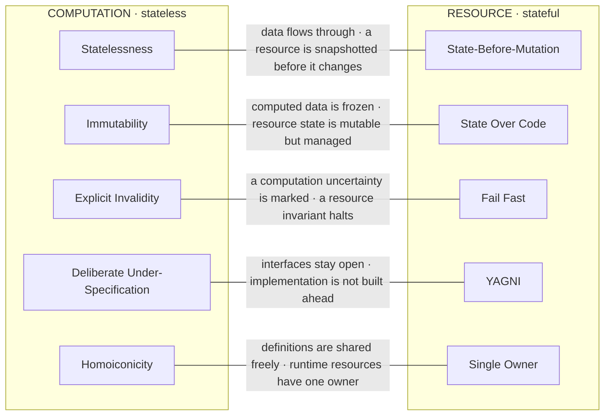
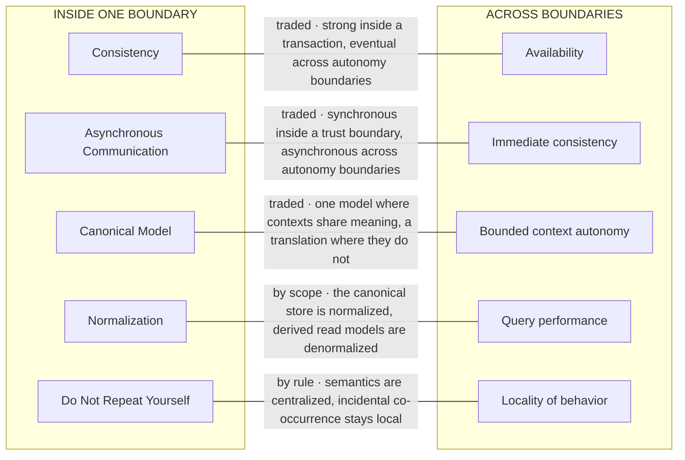

© 2025 Jay Baleine - Disciplined Methodology · Bane's Lab documentation is covered by [CC BY-SA 4.0](https://creativecommons.org/licenses/by-sa/4.0/)

# Glossary — Architecture — Bane's Lab

> Three maps place the terms below.

Canonical: https://banes-lab.com/software-architecture/glossary

# Software Architecture

A system as a graph, principles as typed records, and the predicate set that makes an architecture real when a model writes the code.

# Glossary

## The principle architecture

Three maps place the terms below. The first is the layer diagram the whole page rests on, the second sets the stateless half of the core against the stateful half, and the third sets what holds inside one boundary against what holds across boundaries. A term sits where its rule holds whole, and two terms that seem to contradict are two terms on two sides of a line the map draws.

### The layers

Four core layers carry the rules about code itself. Computation is where data flows through and nothing is retained. Resource is where state lives and every handle has one owner. Execution is where the two meet through control flow and events. Structural applies to all of it and observes itself.

Resource observes computation, both feed execution, execution feeds structural, and structural feeds back into execution, which is [the loop](../START.md#the-loop) that lets a system read its own behavior and correct it. Beneath the four sit [human factors](../ontology/SCHEMA.md#layer-human-factors), which bound the whole by what a developer can hold, and evolution, which says how the whole changes over time.

### Stateless against stateful

Five pairs of terms look like contradictions until the layer is read. They are [statelessness](../ontology/PRINCIPLES.md#architecture-statelessness) against state before mutation, [immutability](../ontology/PRINCIPLES.md#architecture-immutability) against state over code, explicit invalidity against [fail fast](../ontology/PRINCIPLES.md#architecture-fail-fast), deliberate under-specification against not building what is not needed, and [homoiconicity](../ontology/PRINCIPLES.md#architecture-homoiconicity) against single ownership.

Each pair is two principles on two layers, so each is resolved by scope, and the edge between them names the boundary. A computation flows through while a resource is snapshotted. Computed data is frozen while resource state is managed. An uncertainty is marked in a computation while a broken invariant halts a resource.

### Inside a boundary, across boundaries

The distributed pairs live where one boundary ends. [Consistency](../ontology/PRINCIPLES.md#architecture-consistency) against availability, and [asynchronous communication](../ontology/PRINCIPLES.md#architecture-asynchronous-communication) against immediate consistency, are trade-offs, strong or immediate inside one [transaction boundary](../ontology/PRINCIPLES.md#architecture-transaction-boundary) or trust boundary and eventual across [autonomy](../ontology/PRINCIPLES.md#architecture-autonomy) boundaries, with the operating point a measured choice. A [canonical model](../ontology/PRINCIPLES.md#architecture-canonical-model) against the autonomy of a [bounded context](../ontology/PRINCIPLES.md#architecture-bounded-context) is a trade-off too, one model where contexts share meaning and an [anti-corruption layer](../ontology/PRINCIPLES.md#architecture-anti-corruption-layer) where they do not.

[Normalization](../ontology/PRINCIPLES.md#architecture-normalization) against query performance separates by scope, the canonical store one way and the derived read models the other. [Do not repeat yourself](../ontology/PRINCIPLES.md#architecture-duplicate-code) against locality of behavior is the one pair a rule resolves, by asking whether a sameness is semantic or merely textual.

A1·a The principle architecture: the four core layers, the observe and feedback arrows across them, and the two domains beneath.

A1·b Stateless against stateful: each pair is resolved by scope, and the edge names the boundary that separates them.

A1·c Inside a boundary against across boundaries: the distributed pairs, each labeled with the mechanism that resolves it.

## Architectural rules and principles

This section lists the principles this page teaches, one term per entry, with its short code where one is in common use and the layer this page places it on. An entry that names a record in the canon is joined to it: its kind is read from the record, and the term opens it, where the record's own placement can be read. The rest are the core layers' own terms. Where two entries pull against each other on one construct, the entry names its counterpart and the mechanism that resolves the pair, by scope, by a measured trade-off, or by a rule, whether the canon records that resolution or the two layers derive it.

## A

**Anti-Corruption Layer · pattern · Domain Modeling**

A translation sits at the edge of a context, so a foreign model cannot leak in and corrupt the local one.

**Asynchronous Communication · principle · Execution Core**

Asynchronous communication does not wait for a reply and is routed through a broker, so the availability and the pace of both sides are decoupled. Traded against [immediate consistency](../ontology/LEXICON.md#lexicon-immediate-consistency): [synchronous inside a trust boundary](../ontology/SCHEMA.md#tension-asynchronous-communication-immediate-consistency), asynchronous across autonomy boundaries.

**Atomicity · principle · Atomic Boundary**

A change commits fully or not at all, within an explicit boundary.

## B

**Backpressure · mechanism · Correctness Core**

A producer is bound to what its consumer can absorb, so load is refused or slowed at the source instead of piling up unseen. Traded against [throughput](../ontology/SCHEMA.md#tension-backpressure-throughput): the bound is a measured point, never a reflex.

**Bounded Complexity · Human Factors**

Complexity stays under a declared bound the gate reads, and stopping with a stated uncertainty is preferred to continuing with a silent incorrectness.

**Bounded Context · constraint · Domain Modeling**

A bounded context is a boundary inside which one model and one language hold, and outside which they may not.

**Bounded Lifetime · Resource Core**

A resource lives no longer than its owner, and every open has its close.

## C

**Canonical Model · principle · Contracts Core**

Every view derives from one canonical model. Traded against [bounded context autonomy](../ontology/LEXICON.md#lexicon-bounded-context-autonomy): one model holds [where contexts share meaning](../ontology/SCHEMA.md#tension-bounded-context-autonomy-canonical-model), and a translation stands where they do not.

**Causality · principle · Causality Core**

Order is defined by what depended on what, tracked with logical clocks, never by a wall clock.

**Choreography · mechanism · Execution Core**

Parts react autonomously to events with no central conductor, which fits where they must stay independent and the sequence may emerge.

**Code as Data · principle · Declarative Core**

Definitions are held as inspectable, transformable data, so the same tooling that reads data can read code. It is the practice that Homoiconicity makes possible.

**Composability · principle · Structural Core**

Units combine freely into larger units, and the combination has no special cases the parts did not have.

**Configuration Externalization · principle · Resource Core**

Configuration comes from the environment, is validated at boot, and has no fallback default that would hide a missing value.

**Consistency · quality attribute · Atomic Boundary**

Every invariant that held before a change holds after it. Traded against [availability](../ontology/LEXICON.md#lexicon-availability): strong inside one [transaction boundary](../ontology/PRINCIPLES.md#architecture-transaction-boundary), eventual across [autonomy](../ontology/PRINCIPLES.md#architecture-autonomy) boundaries, and [where the point sits](../ontology/SCHEMA.md#tension-availability-consistency) is a measured choice.

**Contract-First Design · principle · Contracts Core**

The contract is defined before the implementation, so consumers depend on the interface and not on the first thing that happened to work.

**Convention over Configuration · principle · Declarative Core**

Configuration states what is wanted, and convention removes the boilerplate, so the only thing written down is the deviation from the default.

**CQRS · pattern · Execution Core**

Command query responsibility segregation keeps the write model and the read models separate, so each can take the shape its job needs.

## D

**Declarative Specification · Computation Core**

What is wanted is specified rather than how to get it, and the how is left to the system that reads the specification, which can explain why while it runs.

**Defense in Depth · principle · Security Core**

Controls exist at every layer, so a single bypassed control exposes nothing on its own.

**Deliberate Under-Specification · Evolution Principles**

An interface leaves room where the future is unknown, so a later feature is not blocked by an unneeded constraint. Resolved by scope against YAGNI: the restraint applies to implementation, the openness to interfaces.

**Dependency Injection · DI · pattern · Extensibility Core**

Dependencies are handed to a unit rather than constructed inside it, so they are visible, replaceable and testable.

**Dependency Inversion Principle · DIP · principle · Structural Core**

High-level policy depends on [abstractions](../ontology/PRINCIPLES.md#architecture-abstraction), and the concrete details depend on the same abstractions, so the direction of dependency runs toward stability.

**Design by Contract · principle · Contracts Core**

Preconditions, postconditions and invariants are stated and checked, never assumed.

**Determinism · principle · Computation Core**

The same inputs give the same outputs, and every source of nondeterminism is isolated and injected.

**Do Not Repeat Yourself · DRY · principle · Structural Core**

A piece of logic or knowledge has one definition, and a repetition is compressed by its type, such as a literal into a constant, a structure into a composition, a behavior into one orchestrator and a rule into one predicate. Mitigated against [locality of behavior](../ontology/LEXICON.md#lexicon-locality-of-behavior) by a [rule that names the discriminator](../ontology/SCHEMA.md#tension-do-not-repeat-yourself-dry-locality-of-behavior): semantics are centralized, incidental textual likeness stays local.

**Domain-Driven Design · DDD · style · Domain Modeling**

Software is structured around the domain rather than the framework, with the logic living in the model.

**Don't Call Back · Execution Core**

A child never calls back into its parent. Communication runs the other way, by events the parent subscribes to, so the child stays free of a parent it should not know.

## E

**Encapsulation · principle · Structural Core**

Internals are hidden behind an interface, and the interface is the only way in, but the system still ships with a live inspector, because hiding internals from callers is not the same as hiding them from the developer diagnosing the running system. Traded against [debuggability](../ontology/LEXICON.md#lexicon-debuggability): the [inspector](../ontology/SCHEMA.md#tension-debuggability-encapsulation) is where the operating point sits.

**Errors as Language · Computation Core**

Errors use the system's own vocabulary and are machine-processable, so a consumer dispatches on an error rather than parsing a sentence.

**Event Sourcing · pattern · Execution Core**

State is persisted as an immutable sequence of events, and the current state is a fold over them.

**Event-Driven Architecture · style · Execution Core**

Components communicate by emitting events, the producer does not know its subscribers, and a pause or a resume is an ordinary control message. Traded against [debuggability](../ontology/LEXICON.md#lexicon-debuggability): a flow that cannot be followed end to end cannot be fixed, so [tracing is bought explicitly](../ontology/SCHEMA.md#tension-debuggability-event-driven-architecture).

**Eventual Consistency · model · Execution Core**

Bounded staleness is accepted so that services stay independently available under partition. It is the availability side of the trade-off with Consistency, chosen where autonomy matters more than an immediate answer.

**Explicit Invalidity · Computation Core**

Temporary inconsistency is allowed exactly while it is marked. Resolved by scope against [Fail Fast](../ontology/PRINCIPLES.md#architecture-fail-fast): a broken resource invariant halts, a computation uncertainty is marked and carried on.

## F

**Fail Fast · principle · Correctness Core**

An error is detected and reported at once, and invalid state halts rather than carrying on behind a fallback that masks it. Resolved by scope against Explicit Invalidity: a resource halts, a computation marks and continues. Traded against [graceful degradation](../ontology/SCHEMA.md#tension-fail-fast-graceful-degradation): a halt is chosen where it costs less than a wrong answer.

## H

**High Cohesion · quality attribute · Structural Core**

Related logic lives together, bounded by what a developer can hold in mind at once rather than by what a file system permits.

**Homoiconicity · quality attribute · Declarative Core**

Code, data and state share one representation, so a definition can be inspected and transformed like any other value, and the degree to which a system has that property is what the term names. Resolved by scope against Single Owner: ownership governs runtime resources, homoiconicity governs definitions.

## I

**Idempotency · principle · Atomic Boundary**

Repeating an operation produces the same result as running it once, so a [retry](../ontology/PRINCIPLES.md#architecture-retry-pattern) is safe and a duplicate delivery has one effect.

**Immutability · principle · Computation Core**

Computed data is frozen after creation, and a variable is bound exactly once. Resolved by scope against State Over Code: computed outputs are immutable, resource state is mutable but managed.

**Interface Segregation Principle · ISP · principle · Structural Core**

An interface is cut by usage, so a client depends only on the operations it calls, never on a wide surface it mostly ignores.

**Inversion of Control · IoC · principle · Extensibility Core**

The framework calls the code rather than the code calling the framework, so control flows from the outside in.

## L

**Lazy Evaluation · approach · Execution Core**

A value is computed only when it is demanded, so nothing is materialized that nothing reads.

**Least Privilege · principle · Security Core**

Every actor holds the minimum authority its task needs, and anything not granted is denied.

**Liskov Substitution Principle · LSP · principle · Structural Core**

Anything that claims a type can stand in for it without a caller noticing. A substitute honors every behavioral guarantee of what it replaces.

**Loose Coupling · quality attribute · Structural Core**

Dependencies between units are few and explicit, so a change stays where it was made.

## M

**Modularity · principle · Structural Core**

A modular system is built from independent, swappable units with [explicit boundaries](../ontology/PRINCIPLES.md#architecture-explicit-boundaries), so a unit can be replaced without the rest knowing. Traded against [cross-cutting concerns](../ontology/LEXICON.md#lexicon-cross-cutting-concerns): a concern that [touches every unit](../ontology/SCHEMA.md#tension-cross-cutting-concerns-modularity) is placed once, at the boundary, rather than spread through them.

**Monotonic Growth · Execution Core**

Append, never retract. A retraction is a second path every reader must handle, and a correction is a new record that supersedes.

## O

**Observability · quality attribute · Observability**

A running system emits machine-parseable signals, so its behavior is legible from outside.

**Open/Closed Principle · OCP · principle · Structural Core**

A unit is open for extension and closed for modification, so new behavior arrives through a few composable primitives, and the existing tested code is not edited to admit it.

**Orchestration · mechanism · Execution Core**

A defined workflow is driven by one coordinating owner, which knows every step and is the one place the sequence can be read.

**Ordinal Time · Structural Core**

Order is a logical sequence or an append-only identifier, never a wall-clock timestamp, because a clock is a dependency on the host and a sequence depends on nothing.

**Orthogonality · Execution Core**

A change in one area does not affect an unrelated one, so the effect of an edit is local by construction.

## P

**Pattern by Fit · Design Patterns Core**

A named design pattern is applied only when the force it answers is present in the code, never speculatively. A pattern with no force behind it is accidental complexity.

**Plugin Architecture · style · Extensibility Core**

New behavior arrives as a plugin at a declared [extension point](../ontology/PRINCIPLES.md#architecture-extension-points), and the core stays unchanged.

**Policy as Code · mechanism · Security Core**

Every stated architectural invariant has an executable check that fails the build when it is broken.

**Ports and Adapters Architecture · style · Structural Core**

The domain core depends on nothing, and input, output and frameworks are adapters at the edge, which is dependency inversion at the scale of a system.

**Principle of Least Surprise · principle · Contracts Core**

Behavior matches what a reasonable reader expects from the name, and a surprise is a defect.

**Profile First · Performance Core**

[Optimization](../ontology/PRINCIPLES.md#architecture-optimization) follows measurement, so the bottleneck is profiled before anything is changed, and the change is judged by the measurement.

**Pure Functions · technique · Computation Core**

A pure function's only effect is its return value, so the core stays pure and the effects sit at the edge.

## R

**Referential Transparency · principle · Computation Core**

An expression can be replaced by its value without changing the program.

**Registry Pattern · pattern · Extensibility Core**

Capabilities are registered in one queryable place and discovered from it, never located through a hidden dependency. The registry is the one list, and adding a capability is registering it rather than editing every caller.

## S

**Secure by Default · principle · Security Core**

The default configuration is the safe one, and opening something up is a deliberate act.

**Semantic Addressing · Structural Core**

A reference names what a thing means, never where it sits, so a move changes no reference and a location is never a dependency.

**Separation of Concerns · SoC · principle · Structural Core**

Each module owns exactly one concern, and the cut is made with the whole system in view, so the pieces still compose into one thing rather than a pile of tidy parts that no longer fit. Traded against [over-layering](../ontology/LEXICON.md#lexicon-over-layering): a separation that [only adds indirection](../ontology/SCHEMA.md#tension-over-layering-separation-of-concerns) has cost more than it separated.

**Service Autonomy · principle · Structural Core**

A service owns its data and its availability, and depends on no other service being up to do its own work.

**Simplicity · KISS · quality attribute · Structural Core**

The chosen solution is the simplest one that meets the invariant, where simple means expressible as a rule or a generator rather than as an enumeration of cases. Compression is the test, since a repeated shape is compressed by its type, and the simplest form is the one nothing can be removed from without breaking the invariant.

**Single Owner · Resource Core**

Every resource has exactly one owner responsible for its release, and every other reference to it is weak. Resolved by scope against Homoiconicity: ownership governs runtime resources, definitions are freely shared.

**Single Responsibility Principle · SRP · principle · Structural Core**

A unit has one reason to change, and that reason is derived from an invariant it protects rather than from a feature it serves. Features cut across units, and an invariant belongs to one. Traded against [excessive fragmentation](../ontology/LEXICON.md#lexicon-excessive-fragmentation): units [split finer than their invariants](../ontology/SCHEMA.md#tension-excessive-fragmentation-single-responsibility-principle-srp) scatter one reason to change across many files.

**Single Source of Truth · principle · Contracts Core**

Every fact has one canonical, queryable home, and every other place it appears is a derivation of that home. Resolved by scope against [Decentralization](../ontology/SCHEMA.md#tension-decentralization-single-source-of-truth): the truth is one, and the parties that read it are many.

**State Isolation · principle · Atomic Boundary**

Mutable state is confined to its owner, and side effects are explicit, ordered and bounded.

**State Over Code · Evolution Principles**

State is the asset and code is the replaceable part, so a design protects the state before it protects the code. Resolved by scope against Immutability: computed data is frozen, resource state is mutable but managed.

**State-Before-Mutation · Resource Core**

Resource state is snapshotted before it changes, so a change can be reverted by reinstantiation rather than by patching. Resolved by scope against Statelessness: computation flows through, a resource is snapshotted.

**Statelessness · principle · Performance Core**

Computation carries no persistent state, so data flows through and nothing is retained between calls. Resolved by scope against State-Before-Mutation: computation is stateless, a resource is snapshotted before it changes.

**Structural Release · Resource Core**

Release is guaranteed by scope or structure, never by a developer remembering, because release that depends on discipline eventually leaks.

## T

**Type Safety · mechanism · Contracts Core**

Types make invalid states unrepresentable, and every boundary validates its data against a schema.

## U

**Ubiquitous Language · activity · Contracts Core**

Code and domain share one vocabulary, so a name in the code is a name the domain expert would use.

## Y

**YAGNI · principle · Evolution Principles**

You are not going to need it, so nothing is built for a need that does not exist yet. Resolved by scope against Deliberate Under-Specification: no code for hypothetical features, and no constraint that would block one.

---

Chapters: [Model](MODEL.md) · [Principles](PRINCIPLES.md) · [Decay](DECAY.md) · [Coverage](COVERAGE.md) · [Scale](SCALE.md) · [Glossary](GLOSSARY.md)
