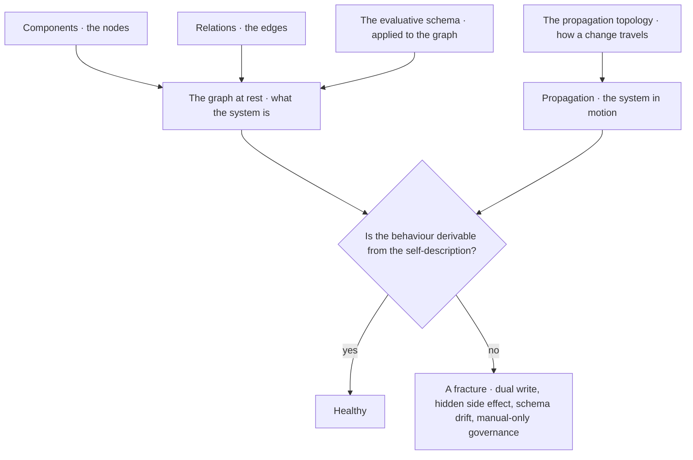
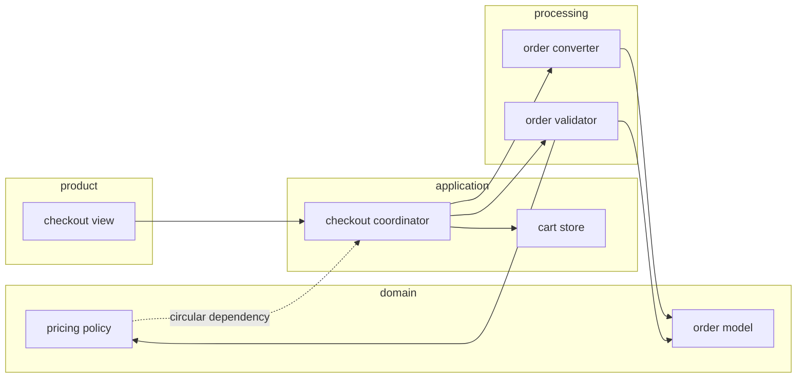
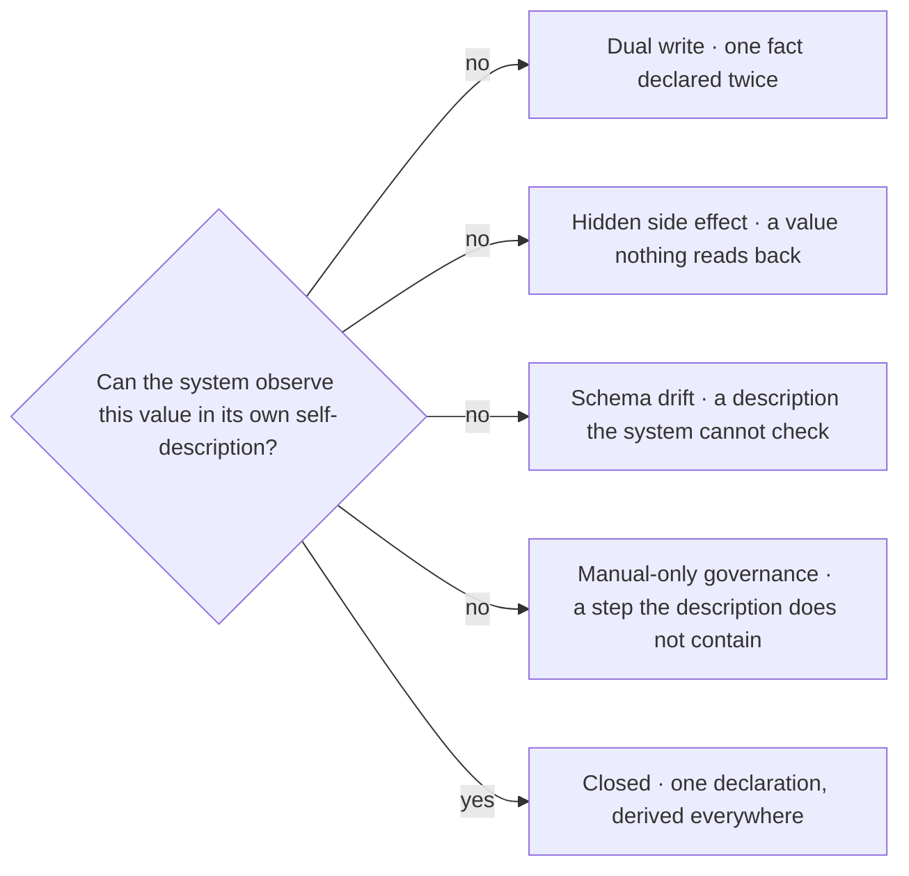
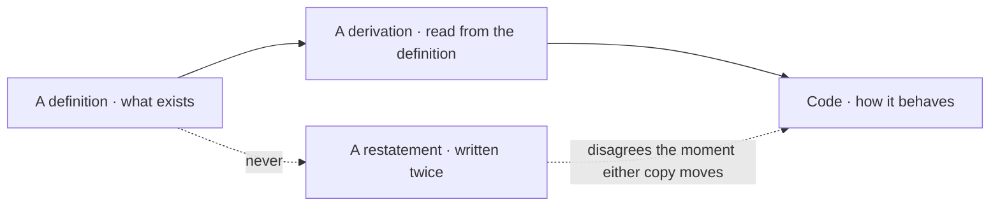
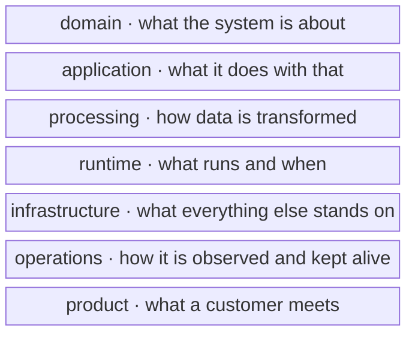
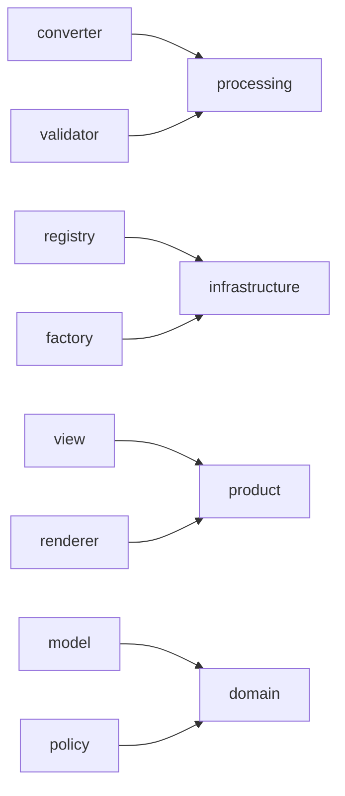
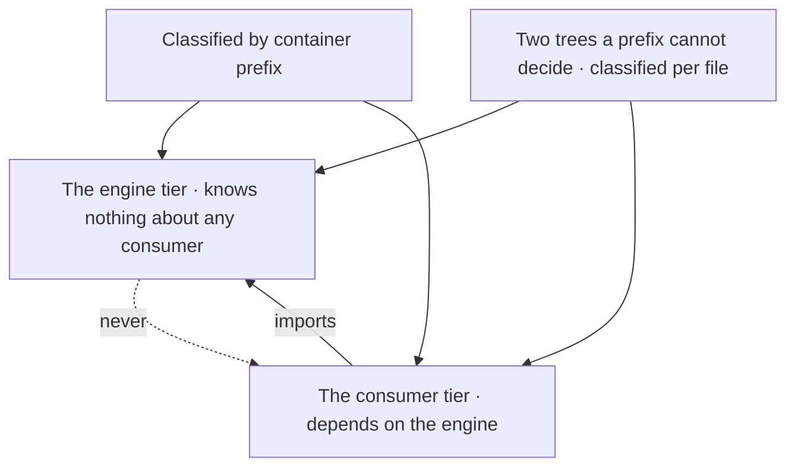
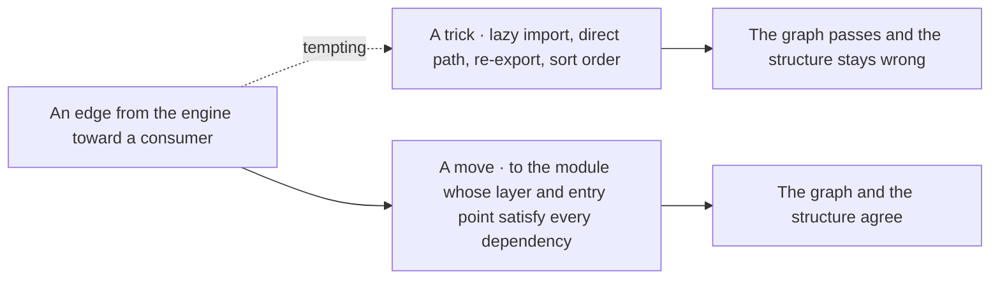

© 2025 Jay Baleine - Disciplined AI Software Development · Bane's Lab documentation is covered by [CC BY-SA 4.0](https://creativecommons.org/licenses/by-sa/4.0/)

# Architecture — Bane's Lab

> Software Architecture as it applies when an LLM writes the code: a system modelled as a graph, principles typed and related, anti-patterns as decay paths, coverage derived from a grid, and every architectural intent held as a predicate a gate can decide.

Canonical: https://banes-lab.com/software-architecture

# Software Architecture

A system as a graph, principles as typed records, and the predicate set that makes an architecture real when a model writes the code.

# Model

## A system is a graph

This section covers the model the rest of the page evaluates, in which a system is a graph and a question about the system is a question about reach, answered by a walk over that graph. [A1·a the four parts](#a-system-is-a-graph-panel-a) shows the parts of the model, [A1·b one feature](#a-system-is-a-graph-panel-b) shows a walk over one feature, and [A1·c the four fractures](#a-system-is-a-graph-panel-c) shows the test the model applies. The practice of the model for a tree is described in [derived state](../VERIFY.md#derived-state) on the methodology page.

### Components, relations, schema, propagation

Software is usually reasoned about as a pile of parts rather than as a graph, so neither the developer nor the model can say what a change reaches or what the system claims about itself. A limit is declared in two places, a state is written by hand where nothing reads it back, a description goes stale beside the code it describes, and a step is performed manually. None of the four is recorded as a defect, because none of them has a name. A system described in prose has parts that cannot be enumerated and relations that cannot be traversed, so every question about it is answered by recollection.

For this reason a system is modelled as components, relations, an evaluative schema and a propagation topology, and it is healthy when its behaviour is derivable from its self-description. The graph is modelled before any part of it, rather than parts being assembled and the graph inferred afterwards. In practice, the components and the relation kinds are named, the schema is stated as invariants a walk can evaluate over the graph, and the way a change propagates is stated, so [impact analysis](../ontology/PRINCIPLES.md#arch-impact-analysis) is a traversal rather than a guess. Every value the system carries is then tested by asking whether the system can observe that value in its own self-description, and a value that fails the question is treated as a fracture.

To check this, pick a component and derive what a change to it reaches, from the graph alone. Then change it and observe what actually moved. The difference between the two sets is the part of the topology that was never modelled. The model is a description of structure, and it says nothing about which components are good. A graph with clean edges and a bad decomposition is still a graph, and the decomposition is judged by the schema applied to it, never by the model that holds it.

### Why a graph and not a list

Which modules a change touches is a walk over the [dependency graph](../ontology/PRINCIPLES.md#arch-dependency-graph). Which of two components knows about the other is the direction of one edge. Whether the whole can be built in one pass is whether the graph is a [directed acyclic graph](../ontology/PRINCIPLES.md#arch-directed-acyclic-graph), and a [circular dependency](../ontology/PRINCIPLES.md#arch-circular-dependency) is the one shape that makes the answer no.

[Traceability](../ontology/PRINCIPLES.md#arch-traceability), from a requirement to the code that carries it and back, is a path. [Modularity](../ontology/PRINCIPLES.md#arch-modularity), [loose coupling](../ontology/PRINCIPLES.md#arch-low-coupling) and [high cohesion](../ontology/PRINCIPLES.md#arch-high-cohesion) are each a statement about how many edges cross a boundary and how many stay inside it. A list can hold every one of those facts and can answer none of the questions, because a list has no edges to walk.

### The four fractures

[Self-describing architecture](../ontology/PRINCIPLES.md#arch-self-describing-architecture) is the property the health test names, and it is stronger than [observability](../ontology/PRINCIPLES.md#arch-observability). An observable system can be watched from outside. A self-describing one carries its own description as data it can read, and [introspection](../ontology/PRINCIPLES.md#arch-introspection) over that data answers the reach questions without running anything.

The four fractures are the four ways a description and a behaviour come apart. A [dual write](../ontology/PRINCIPLES.md#arch-dual-write) is one fact declared twice, and it disagrees with itself the moment either copy moves. A [hidden side effect](../ontology/PRINCIPLES.md#arch-hidden-side-effect) is a value the system changes where nothing reads it back, so it can be wrong forever. [Schema drift](../ontology/PRINCIPLES.md#arch-schema-drift) is a description the system cannot check against itself, so it is right only on the day it was written. [Manual-only governance](../ontology/PRINCIPLES.md#arch-manual-only-governance) is a step the description does not contain, so the system behaves differently depending on who performs it.

### The example is the system you have

Take any system you already have and ask of each fact where it is declared and what reads that declaration. A port written in a manifest and again in a start script is a dual write. A [feature toggle](../ontology/PRINCIPLES.md#arch-feature-toggle) flipped by hand in a console is a hidden side effect. A document that names three services where the tree holds four is schema drift. A release checklist a developer walks is manual-only governance.

None of the four is a bug in the ordinary sense. All four are fractures in the derivation, and each has the same repair, which is one declaration with every other appearance derived from it or deleted.

A1·a the four parts



A1·b one feature



A1·c the four fractures



## Definitions own what, code owns how

This section covers the split between definitions and code. A registry declares what variants exist and the code discovers them, a schema declares what a record carries and the code validates against it, and a manifest declares what a module is for and the code derives its surface. The split runs through every fact a tree carries, as shown in [B1·a derivation or restatement](#definitions-own-what-panel-a) and typed in [B1·b the model typed](#definitions-own-what-panel-b), and its practice is described in [one home](../BUILD.md#one-home) on the methodology page.

### One declaration, derived everywhere

Code that restates a definition looks complete on the day it is written and becomes a second truth the day the definition moves. A registry lists twelve variants, a switch in the composer handles eleven, and the twelfth exists everywhere except where it is dispatched, because the switch was a second declaration that was never recognised as one. Restating a definition in code is cheaper than reading it at the moment of writing, and the cost only arrives when one of the two copies changes and the other keeps the old truth.

For this reason definitions own what, code owns how, and a fact with two declarations and no derivation between them is a fracture. The definition is read at the site rather than restated there, even where reading costs more on the day. In practice, every fact is assigned to the side that owns it. A fact about what exists goes into a definition the code reads, and the code derives the rest from it, such as the list of variants, the shape of a record and the surface of a module. Where a fact already has a definition, the copy in the code is deleted. Where the code holds a fact nothing declares, the declaration is written and the code derives the fact from it, because a fact that lives only in behaviour cannot be checked without running the behaviour.

To check this, take any fact the system carries and count the places it is stated. The target is one statement plus derivations. Two statements with no edge between them will disagree, and the only open question is when the disagreement is noticed. A definition declares what and never how. A schema that carries a validation routine, or a manifest that carries a build step, has crossed into code and gained a second implementation of something the code already does. The split holds only while each side stays on its own side.

### The patterns that keep the split

The split is [single source of truth](../ontology/PRINCIPLES.md#arch-single-source-of-truth) stated for a whole system rather than for a database. [Declarative configuration](../ontology/PRINCIPLES.md#arch-declarative-configuration) states what is wanted and leaves the how to whatever reads it. [Manifest-based design](../ontology/PRINCIPLES.md#arch-manifest-based-design) puts what a module is for into data beside the module, so its surface is derived rather than described. [Metadata-driven design](../ontology/PRINCIPLES.md#arch-metadata-driven-design) lets the description drive the behaviour.

[Code as data](../ontology/PRINCIPLES.md#arch-code-as-data) is where the split pays off, because a definition that is data can be inspected, transformed, validated and generated from, while a definition that is code can only be run. The [registry pattern](../ontology/PRINCIPLES.md#arch-registry-pattern) with [auto-discovery](../ontology/PRINCIPLES.md#arch-auto-discovery) applies the same idea to variants. The registry declares that variants exist, the tree holds one file per variant, and a [glob-resolvable tree](../ontology/PRINCIPLES.md#arch-glob-resolvable-tree) lets the code find them without a list that must be edited when one is added.

[Convention over configuration](../ontology/PRINCIPLES.md#arch-convention-over-configuration) is the complement. A convention is a definition too, written once as a rule the reader derives from rather than a value the reader looks up.

### The model as a type

The graph model is what makes the split checkable. A declaration is a node, a derivation is an edge, and a fact with two nodes and no edge between them is the [dual write](../ontology/PRINCIPLES.md#arch-dual-write) in the graph's own terms. Written as a type, the model is small.

A component carries an identity, a concern and a layer. A relation carries its two ends and a kind from a [closed vocabulary](../ontology/PRINCIPLES.md#arch-closed-vocabulary), so a new relation kind is a vocabulary edit rather than a new field. The schema carries the invariants and one evaluation over the graph, and [schema validation](../ontology/PRINCIPLES.md#arch-schema-validation) is that evaluation run over every record that claims the shape. Health is one derivation, in which the schema is evaluated against the system's description of itself, and an empty finding set means the system is healthy.

### Where the line sits

A definition may say a record has a name and a kind from a closed set. It may not say how the kind is checked, because checking is behaviour. A manifest may say a module publishes three entry points. It may not build them. Either crossing produces the same defect, a truth held in two places with no edge between them.

B1·a derivation or restatement



B1·b the model typed

```typescript
export interface Component {
  readonly id: ComponentId;
  readonly concern: Concern;
  readonly layer: Layer;
}

export interface Relation {
  readonly from: ComponentId;
  readonly to: ComponentId;
  readonly kind:
    | "imports"
    | "exports"
    | "registers"
    | "consumes"
    | "emits"
    | "subscribes"
    | "interfaces";
}

export interface Schema {
  readonly invariants: readonly Invariant[];
  readonly evaluate: (graph: SystemGraph) => readonly Finding[];
}

export interface Propagation {
  readonly reaches: (
    change: ComponentId,
    graph: SystemGraph,
  ) => readonly ComponentId[];
}

export interface SystemGraph {
  readonly components: readonly Component[];
  readonly relations: readonly Relation[];
  readonly schema: Schema;
  readonly propagation: Propagation;
}

export const derivable = (
  graph: SystemGraph,
  described: SystemGraph,
): boolean => graph.schema.evaluate(described).length === 0;
```

## The layer spine

This section covers the layer spine, the one axis along which systems decompose, running from domain through application, processing, runtime, infrastructure and operations to product, as shown in [C1·a the spine](#the-layer-spine-panel-a) and [C1·b concerns to layers](#the-layer-spine-panel-b). The spine is a classification axis, and who may import whom is described separately in [the direction axis](MODEL.md#the-direction-axis). The practice that parses a tree against the spine is described in [placement is a grammar](../BUILD.md#placement-is-a-grammar) on the methodology page.

### Classification

Layering is usually a diagram, and neither the developer nor the model can say which layer a given file is on, because the layer was never derived from anything the file declares. A converter sits in a folder named for the feature it serves, the feature is renamed, and every rule that keyed on the folder now sees a file of no layer at all. A layer inferred from a folder name changes when the folder is renamed, and a layer inferred from a file's importance is argued at every review, so only a layer derived from the concern stays true without attention.

For this reason the layer spine classifies what a file is, and a file's layer is read from its concern. The layer is derived from the concern rather than from the folder or from importance. In practice, every concern in the vocabulary is tagged to one layer of the spine, and a file's layer follows from its concern. A file is classified by what it does, never by the folder it happens to sit in, and a file that fits two concerns equally well is treated as two files rather than as a tie to break. The tagging is held in data a check reads, so a layer is a derivation from the concern and never a fact the developer or the model has to remember.

To check this, take a file and derive its layer from its concern tag alone, without opening it. A file whose layer cannot be derived is outside the model, and a file whose derived layer surprises you is misclassified, or is two files. The spine orders kinds of thing and never orders importance. A product-layer file is not lower than a domain-layer file, and a layer is never a folder. Two files in one concern folder sit on the same layer because their concern does, whatever the folder above them is called.

### Belonging by kind, never by folder

Every [layered architecture](../ontology/PRINCIPLES.md#arch-layered-architecture) has to answer what makes a thing belong to a layer, and most answer it by folder. A folder is a rule about placement and says nothing about kind, so the layer of a file is whatever its author believed on the day. [Clean architecture](../ontology/PRINCIPLES.md#arch-clean-architecture) and [hexagonal architecture](../ontology/PRINCIPLES.md#arch-hexagonal-architecture) answer the direction question well and leave this one to taste.

The spine answers it by kind. Every concern in a [closed vocabulary](../ontology/PRINCIPLES.md#arch-closed-vocabulary) is tagged to one layer, the concern is decided by reading what the file does under [one concern per file](../ontology/PRINCIPLES.md#arch-one-concern-per-file) and the [narrowest concern](../ontology/PRINCIPLES.md#arch-narrowest-concern) that fits, and the layer is a derivation. [Concern-folder correspondence](../ontology/PRINCIPLES.md#arch-concern-folder-correspondence) makes the derivation visible in the tree, because the folder names the concern and the concern names the layer, so nothing has to be remembered.

### The seven layers

The seven layers map onto how a system decomposes rather than onto how a team is organised. The domain holds what the system is about, such as its models, records, policies and specifications. The application holds what it does with that, such as coordinators, behaviours, intents, selectors and stores. Processing holds transformation, such as converters, normalizers, analyzers, validators and pipelines.

Runtime holds what runs and when, such as entrypoints, lifecycles, timers and pools. Infrastructure holds what everything else stands on, such as registries, factories, adapters, resolvers, constants, schemas and the vocabulary itself. Operations holds observation and upkeep, such as probes, counters and reporters. Product holds what a customer meets, such as views, components, renderers, styles and the strings.

A concern belongs to exactly one layer, and a concern whose layer is contested is two concerns. A file with two concerns is a split, never a tie to break. [Layer spine precedence](../ontology/PRINCIPLES.md#arch-layer-spine-precedence) is the one tie-break the canon holds, and it applies only to an irreducible overlap between two tags for one concern. In that case the file classifies to the domain-ward tag, and the rule stays a classification rule, never a dependency rule.

### A converter, placed twice

Take a converter. It takes one shape and returns another, so it is processing whatever it converts and whichever feature asked for it. Put it in a folder named for the feature and it has a home but no layer, and the next feature that needs the same conversion either reaches across a boundary or copies the file.

Put it under its concern and the layer follows, the second feature finds it where the concern says it is, and a check can hold that nothing in processing reaches into product. [Separation of concerns](../ontology/PRINCIPLES.md#arch-separation-of-concerns) then has a mechanism behind it. [Package by feature](../ontology/PRINCIPLES.md#arch-package-by-feature) answers a different question, how a team navigates, and a feature cuts across every layer as a layer cuts across every feature, so only one of the two can be the folder.

C1·a the spine



C1·b concerns to layers



## The direction axis

This section covers the direction axis, which says who may depend on whom, as shown in [D1·a one way](#the-direction-axis-panel-a), while the classification described in [the layer spine](MODEL.md#the-layer-spine) says what kind of thing a file is. The two axes are orthogonal, as typed in [D1·b two axes](#the-direction-axis-panel-b). The canon's architecture styles are each one picture of the same direction rule, and a wrong-way edge has one repair, shown in [D1·c the repair](#the-direction-axis-panel-c).

### Engine and consumer

Nothing refuses the import that crosses the wrong way, so the engine slowly learns about its consumers one convenient import at a time. A shared module gains one import from a page, the page changes, the module now breaks on every page, and the layering that was supposed to prevent that never had a rule behind it. A dependency rule that has no check behind it is a diagram, and the first import that crosses the wrong way is the one that was convenient that afternoon.

For this reason the dependency direction is an orthogonal axis that runs one way, from consumer to engine, and is held by its own check. The tier is declared as data a check reads, rather than inferred from what a file looks like. In practice, one tier is named the engine and the other the consumer. Each container is classified by prefix, and only the trees a prefix cannot decide are classified per file. Both classifications feed the check, which refuses an import that runs from the engine toward a consumer.

To check this, take any import and ask which tier each end is on. An import whose ends cannot be tiered is outside the model, and an import that runs from the engine toward a consumer is a move waiting to happen. The direction rule governs dependencies and says nothing about classification. A file is not on the engine tier because it is generic, and a consumer is not lower because it is specific. The tier is a fact declared about a tree, and the check reads the fact rather than inferring it.

### One rule, many pictures

The direction rule is the [dependency inversion principle](../ontology/PRINCIPLES.md#arch-dependency-inversion) drawn at the scale of a whole tree, and the canon's architecture styles are each one way of drawing it. [Hexagonal architecture](../ontology/PRINCIPLES.md#arch-hexagonal-architecture), [ports and adapters architecture](../ontology/PRINCIPLES.md#arch-ports-and-adapters-architecture) and [clean architecture](../ontology/PRINCIPLES.md#arch-clean-architecture) put the thing that knows nothing at the centre and let everything specific depend inward. [Layered architecture](../ontology/PRINCIPLES.md#arch-layered-architecture) draws the same arrow downward.

What they share is one direction and one rule. What they differ on is a picture, and the picture is not the mechanism. The mechanism is a tier declared for every file, a check that reads the [dependency graph](../ontology/PRINCIPLES.md#arch-dependency-graph) and refuses an edge from the engine toward a consumer, and a repair that is always a move.

[Inversion of control](../ontology/PRINCIPLES.md#arch-inversion-of-control) and [dependency injection](../ontology/PRINCIPLES.md#arch-dependency-injection) are the two techniques the rule pushes you toward. The only way an engine uses something specific without knowing it is to be handed it, and [extension points](../ontology/PRINCIPLES.md#arch-extension-points) with [runtime discovery](../ontology/PRINCIPLES.md#arch-runtime-discovery) are how the engine finds the consumers it must not import.

### Where a tier comes from

Most of a tree classifies by where it sits, because a container is built for one tier and everything under it inherits that. A few kinds of file resist that reading. Copy and type declarations serve whichever side names them, so their location says nothing about their tier, and those are classified one file at a time in data that starts empty.

What a file with no entry resolves to is a decision with a reason, not a default that fell out of the code. A type with no classification resolves to no tier, so the check treats it as unclassified rather than guessing a side. Copy with no classification resolves to the consumer tier, because copy is nearly always specific to one product. The two defaults differ because the cost of a wrong guess differs, and the general rule is that a default is chosen by which mistake is cheaper to discover.

### The repair is a move

The check reads a dependency graph derived from the tree, never the tree's claims about itself, and it fails closed, so a missing graph is a refusal rather than a pass over nothing. It refuses rather than repairs, because the only repair for a wrong-way import is to move the file.

A file that produces a [circular dependency](../ontology/PRINCIPLES.md#arch-circular-dependency), an upward dependency or a bypass of a declared entry point is in the wrong module. [Lazy evaluation](../ontology/PRINCIPLES.md#arch-lazy-evaluation) of an import, a direct path past the entry point, a re-export across modules and an import-sort trick each make the graph pass while the structure stays wrong. Those tricks preserve [concrete coupling](../ontology/PRINCIPLES.md#arch-concrete-coupling) and [inappropriate intimacy](../ontology/PRINCIPLES.md#arch-inappropriate-intimacy), because the engine still knows a consumer, only through a door no check watches. [Encapsulation](../ontology/PRINCIPLES.md#arch-encapsulation) and [information hiding](../ontology/PRINCIPLES.md#arch-information-hiding) are what the entry point protects.

D1·a one way



D1·b two axes

```typescript
export const SPINE = [
  "domain",
  "application",
  "processing",
  "runtime",
  "infrastructure",
  "operations",
  "product",
] as const;
export type Layer = (typeof SPINE)[number];

export const TIERS = ["engine", "consumer"] as const;
export type Tier = (typeof TIERS)[number];

export interface Classification {
  readonly concern: Concern;
  readonly layer: Layer;
}

export interface Direction {
  readonly byPrefix: Readonly<Record<string, Tier>>;
  readonly overrides: Readonly<Record<string, Tier>>;
}

export const tierOf = (path: string, direction: Direction): Tier | null =>
  direction.overrides[path] ?? direction.byPrefix[prefixOf(path)] ?? null;

export const crossesUpward = (
  from: string,
  to: string,
  direction: Direction,
): boolean =>
  tierOf(from, direction) === "engine" && tierOf(to, direction) === "consumer";
```

D1·c the repair



---

Chapters: [Model](MODEL.md) · [Principles](PRINCIPLES.md) · [Decay](DECAY.md) · [Coverage](COVERAGE.md) · [Scale](SCALE.md) · [Glossary](GLOSSARY.md)
