© 2025 Jay Baleine - Disciplined AI Software Development · Documentation is covered by [CC BY-SA 4.0](https://creativecommons.org/licenses/by-sa/4.0/)

# Principles — Architecture — Bane's Lab

> A principle is a typed record, never a slogan, the record a principle record types with the slots ten slots draws and the edges the five edges traces. The whole…

Canonical: https://banes-lab.com/software-architecture/principles

# Software Architecture

A system as a graph, principles as typed records, and the predicate set that makes an architecture real when a model writes the code.

# Principles

## Principles are typed

A principle is a typed record, never a slogan, the record [A1·c a principle record](#principles-are-typed-panel-c) types with the slots [A1·a ten slots](#principles-are-typed-panel-a) draws and the edges [A1·b the five edges](#principles-are-typed-panel-b) traces. The whole canon resolves by identity join, which is what turns a list of good ideas into something a check can consult, and [every record](../ontology/PRINCIPLES.md) this page names can be opened and walked on the ontology page.

### Ten slots, one gate

Principles are typed and related, and a canon that does not resolve by identity is refused by its gate. Architecture principles are usually a reading list, and a reading list cannot tell you which of its entries a given change just broke.

A review cites a principle by name, a second review cites its opposite by another name, both are in the document, and nobody can show that the two were ever meant to conflict or how the conflict resolves. Prose principles cannot be joined, so nothing can compute which principle a finding violates, which repair follows, or which two principles a design has set against each other.

Hold the canon as data a gate resolves rather than as a document a reviewer cites. Give every principle one identity that nothing else carries, a kind from a closed taxonomy and a category from the data that holds it. Record its relations to the other records as names that resolve to identities, never as free prose, and record what violates it, what detects and measures a violation, the repairs that reverse it and the gates that enforce it. Attach an exemplar with a before and an after, and let the gate prove the whole before anything consults it.

Take a finding from any check and resolve its canonical id. It must reach the principle, the principle's severity, its repairs and its relation graph in one lookup. A finding that reaches only a message has no canon behind it.

A canon is a vocabulary for reasoning, and it is the wrong home for a threshold or a path. A principle says that complexity is bounded; the number lives in the gate's config and the check reads it there. A canon that carries numbers is a second config, and a canon that carries paths is bound to one tree.

### The five edges

Requires says a principle cannot hold without another, so a design that adopts [modularity](../ontology/PRINCIPLES.md#arch-modularity) has adopted its [whole closure](../ontology/ALGORITHMS.md#algo-dependency-closure) whether it meant to or not. Reinforces says two principles hold more easily together, which is how an improvement [propagates](../ontology/ALGORITHMS.md#algo-reinforcement-propagation) past the record it was made to. Enables says one makes another possible.

In tension with says two records pull against each other on one construct, and every such pair carries a resolution whose mechanism follows from what the two records are. Conflicts with is the one negative edge: it points from a principle to the [anti-patterns](../ontology/SCHEMA.md#kind-anti-pattern) that negate it, and the polarity law says it may [point nowhere else](../ontology/SCHEMA.md#the-relation-ranges).

### The five descriptors

The descriptors are prose a person reads. Violated-by describes the violation, detected-by the [signals that see it](../ontology/ALGORITHMS.md#algo-violation-detection), measured-by the numbers that size it, refactored-by the [repairs that reverse it](../ontology/ALGORITHMS.md#algo-refactor-selection), and enforced-by the [gates that hold the line](../ontology/ALGORITHMS.md#algo-enforcement-gate).

[Severity](../ontology/ALGORITHMS.md#algo-severity-policy) says how strictly the principle binds and, where the record states one, the condition under which it binds that strictly. It is a routing field: it decides which handler a failure reaches, a refusal, a review note or an information line, and it never ranks one principle above another. A check still answers pass or fail; severity says what happens to the answer.

### One record, walked

Modularity is a mandatory principle in the [structural core](../ontology/SCHEMA.md#layer-structural-core). It requires [high cohesion](../ontology/PRINCIPLES.md#arch-high-cohesion), [low coupling](../ontology/PRINCIPLES.md#arch-low-coupling) and [explicit boundaries](../ontology/PRINCIPLES.md#arch-explicit-boundaries), because a module whose insides do not belong together, or whose edges nobody drew, is not one you can replace. It reinforces [separation of concerns](../ontology/PRINCIPLES.md#arch-separation-of-concerns) and [composability](../ontology/PRINCIPLES.md#arch-composability), and it enables [replaceability](../ontology/PRINCIPLES.md#arch-replaceability) and [plugin architecture](../ontology/PRINCIPLES.md#arch-plugin-architecture).

It is in tension with cross-cutting concerns, and that pair carries a recorded resolution. It conflicts with the [big ball of mud](../ontology/PRINCIPLES.md#arch-big-ball-of-mud), the one anti-pattern that is its outright negation. A reading list can tell you modularity is good. The record can tell you what you have already committed to by choosing it, what you will get for free, and what it refuses.

Its descriptors meet the tree. It is violated by cyclic dependencies, [shared mutable state](../ontology/PRINCIPLES.md#arch-shared-mutable-state) and [boundary leakage](../ontology/PRINCIPLES.md#arch-boundary-leakage). It is detected by dependency cycles and an unstable module graph, measured by a modularity score, graph density and instability, and refactored by splitting the module, introducing a boundary or inverting the dependency. It is enforced by module rules, package ownership and [fitness functions](../ontology/PRINCIPLES.md#arch-fitness-functions), and that last slot is the difference between a canon and a book: a principle with an empty enforced-by is a wish.

A1·a ten slots

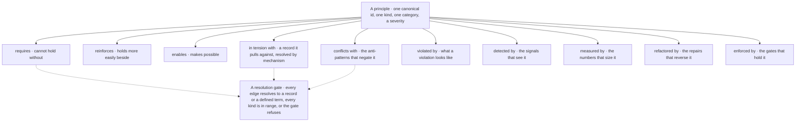

A1·b the five edges

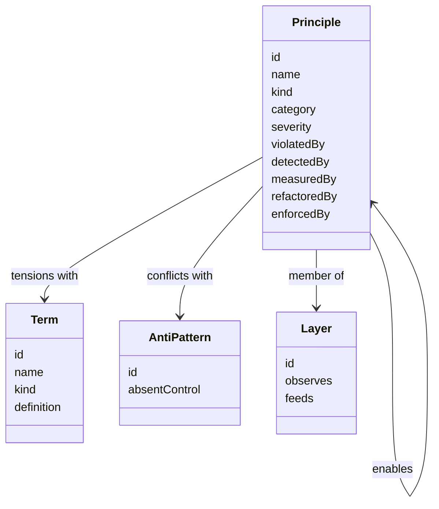

```typescript
export type Kind =
  | "anti-pattern"
  | "metric"
  | "quality-attribute"
  | "principle"
  | "constraint"
  | "capability"
  | "activity"
  | "pattern"
  | "mechanism"
  | "technique"
  | "approach"
  | "model"
  | "artifact"
  | "style";

export interface Principle {
  readonly id: string;
  readonly name: string;
  readonly type: Kind;
  readonly category: string;
  readonly scope: readonly string[];
  readonly requires: readonly string[];
  readonly reinforces: readonly string[];
  readonly enables: readonly string[];
  readonly conflictsWith: readonly string[];
  readonly tensionsWith: readonly string[];
  readonly violatedBy: string;
  readonly detectedBy: string;
  readonly measuredBy: string;
  readonly refactoredBy: string;
  readonly enforcedBy: string;
  readonly severity: string;
  readonly exemplar?: {
    readonly before: string;
    readonly after: string;
    readonly lang: string;
  };
}

export interface Issues {
  readonly danglingEdges: readonly {
    from: string;
    relation: string;
    target: string;
  }[];
  readonly duplicateIds: readonly string[];
}

export const validate = (
  canon: readonly Principle[],
  resolveId: (name: string) => string | null,
): Issues => {
  const ids = new Set(canon.map((principle) => principle.id));
  const edges = [
    "requires",
    "reinforces",
    "enables",
    "conflictsWith",
    "tensionsWith",
  ] as const;
  return {
    danglingEdges: canon.flatMap((principle) =>
      edges.flatMap((relation) =>
        principle[relation]
          .filter((target) => resolveId(target) === null && !ids.has(target))
          .map((target) => ({ from: principle.id, relation, target })),
      ),
    ),
    duplicateIds: canon
      .map((principle) => principle.id)
      .filter((id, index, all) => all.indexOf(id) !== index),
  };
};
```

## Every record has a kind

Every record carries a kind from a [closed taxonomy](../ontology/SCHEMA.md#the-kind-taxonomy). The kind is read the way [B1·a kind from definition](#every-record-has-a-kind-panel-a) draws, and the kinds are the set [B1·b the fourteen kinds](#every-record-has-a-kind-panel-b) groups and [B1·c a kind record](#every-record-has-a-kind-panel-c) types. The kind decides what may point at a record, how a tension with it resolves and whether a check can measure it, so a wrong kind is a wrong answer to every one of those questions at once.

### Read the definition, not the name

A record's kind follows from its definition, and the taxonomy of kinds is closed. Everything on a reading list is called a principle, so a quality, a mechanism and a technique are argued as though they were rules.

A quality that a system exhibits to a degree is filed as a principle, a check is written to enforce it as a rule, and the check has nothing to return because a degree has no violation to report. Names are chosen for recognition and definitions are written for precision, so the name of a record tends to overclaim its kind, and the overclaim is only visible once someone reads the definition against the taxonomy.

Hold each kind's discriminator as data the gate reads, rather than as a reviewer's judgement, so a record whose definition disagrees with its kind is refused rather than shipped. Read the definition and ask what it describes: a degree a system exhibits, a number, a rule that prescribes, a rule that must hold, a facility, a method, an arrangement, a representation, a produced thing, a convention of expression, or a condition to avoid. Assign the kind from that reading and never from the name.

Take any record and cover its name. Read the definition and name the kind from the definition alone. If it differs from the kind the record carries, the record is mis-filed, and every edge that points at it has been reasoning about the wrong thing.

A kind classifies what a record is, never how important it is. Two records of the same kind can differ in severity, and a quality that a whole system depends on is still a quality rather than a rule, because the taxonomy answers one question and severity answers another.

### The fourteen kinds

Each kind answers one question: a rule, a measure, a doing, a shape or a condition to avoid. The pairs that are most often confused sit closest: a metric is the measurement and a quality attribute is the property measured, a principle prescribes and a constraint binds, a mechanism is the facility and a technique is the method a person applies. The gate checks that every kind is in range, and for a [defined term](../ontology/LEXICON.md) it checks that the kind agrees with the definition, so a term cannot call itself a principle while defining a metric.

### What a name overclaims

Reading a kind off a name is the mistake the taxonomy exists to catch. [Homoiconicity](../ontology/PRINCIPLES.md#arch-homoiconicity) is a quality attribute, a degree a system exhibits, whatever a reading list calls it. [Orchestration](../ontology/PRINCIPLES.md#arch-orchestration) and [choreography](../ontology/PRINCIPLES.md#arch-choreography) are mechanisms, facilities that do a thing. [Pure functions](../ontology/PRINCIPLES.md#arch-pure-functions) are a technique a person applies. [Event sourcing](../ontology/PRINCIPLES.md#arch-event-sourcing) and [CQRS](../ontology/PRINCIPLES.md#arch-command-query-responsibility-segregation) are patterns, arrangements a design takes. [Fail fast](../ontology/PRINCIPLES.md#arch-fail-fast) is a principle and [idempotency](../ontology/PRINCIPLES.md#arch-idempotency) is a principle, because each prescribes.

A check can enforce a principle and measure a metric, but it cannot enforce a quality attribute. A tension between two principles can separate by scope, while a tension between a principle and a quality attribute can only be traded, which separate, trade, or mitigate derives.

B1·a kind from definition

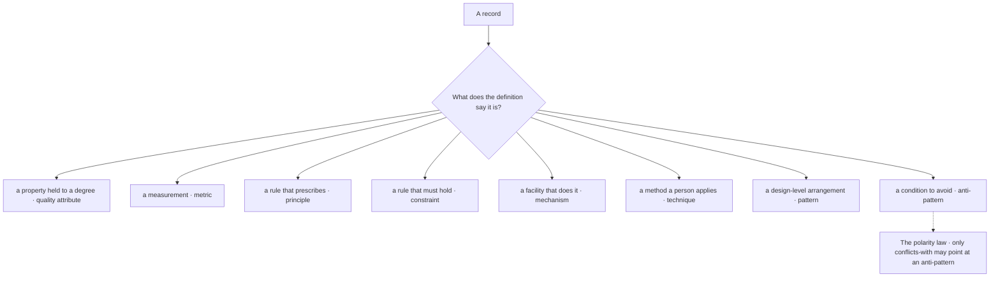

B1·b the fourteen kinds

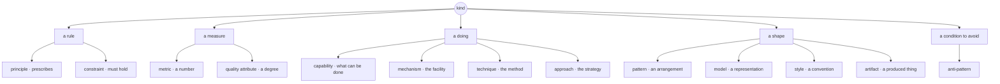

```typescript
export interface KindRecord {
  readonly kind: Kind;
  readonly discriminator: string;
  readonly distinguishesFrom: string;
  readonly definitionSignatures: readonly string[];
}

export const kindAgrees = (
  term: { readonly kind: Kind; readonly definition: string },
  taxonomy: readonly KindRecord[],
): boolean => {
  const record = taxonomy.find((entry) => entry.kind === term.kind);
  return (
    record !== undefined &&
    record.definitionSignatures.some((signature) =>
      term.definition.includes(signature),
    )
  );
};
```

## The canon is grouped twice

The canon is grouped twice, and the two groupings answer different questions. The records are held in topical categories, so a reader looking for [least privilege](../ontology/PRINCIPLES.md#arch-least-privilege) finds it beside the other security records and [backpressure](../ontology/PRINCIPLES.md#arch-backpressure) beside the other [resilience](../ontology/PRINCIPLES.md#arch-resilience) records. Each category is then [a member of one layer](../ontology/SCHEMA.md#the-membership), in the topology [C1·a the layers](#the-canon-is-grouped-twice-panel-a) draws, and the layers are where tensions resolve, because a layer is a scope a principle can hold whole in.

### By topic for people, by layer for checks

A canon is grouped by topic for people and by layer for checks, and the layer is derived from the topic rather than stated beside it. A canon organised one way answers one question, and the other question is answered from memory.

Two principles pull against each other, the reviewer looks for the domain each belongs to, and finds two topical categories that say nothing about scope, so the tension is settled by whoever argues longer. One grouping cannot serve both a reader and a check, because a reader looks by topic and a check decides by scope, and a canon that picks one leaves the other question answered by guesswork.

Keep both groupings rather than pick one, at the cost of one derivation between them. Group records by topic for the reader who is looking for one, and map every topical group to exactly one layer for the check that has to decide a scope. Keep the two groupings as data with one derivation between them, so a record's layer is read from its category and never stated twice. Record which layer observes, feeds or cuts across which, because that topology is what a scope-separation between two principles is decided against.

Take any principle and name its layer without opening the record, from its category alone. If the category does not decide it, the grouping is a reading order and not a scope, and no tension that names this principle can be resolved by data.

A grouping is a lookup structure and never a claim about a record. A principle in the security category is not more important than one in the structural category, and a layer is not a rank; the layer says only which scope a principle holds whole in.

### The layers

Four layers form the core. [Computation](../ontology/SCHEMA.md#layer-computation-core) is stateless and its outputs are frozen. [Resource](../ontology/SCHEMA.md#layer-resource-core) is stateful, and every handle has one owner and a bounded lifetime. [Execution](../ontology/SCHEMA.md#layer-execution-core) is control flow and events. [Structural](../ontology/SCHEMA.md#layer-structural-core) applies to everything and observes itself.

Beneath the core sit [human factors](../ontology/SCHEMA.md#layer-human-factors), which bound the whole by what a person can hold, and [evolution](../ontology/SCHEMA.md#layer-evolution-principles), which says how the whole changes over time. Around the core sit the layers that cut across it: [correctness](../ontology/SCHEMA.md#layer-correctness-core), [security](../ontology/SCHEMA.md#layer-security-core), [performance](../ontology/SCHEMA.md#layer-performance-core), [contracts](../ontology/SCHEMA.md#layer-contracts-core), [causality](../ontology/SCHEMA.md#layer-causality-core), [declarative design](../ontology/SCHEMA.md#layer-declarative-core), [extensibility](../ontology/SCHEMA.md#layer-extensibility-core), [observability](../ontology/SCHEMA.md#layer-observability), [enforcement](../ontology/SCHEMA.md#layer-enforcement-core), the [atomic boundary](../ontology/SCHEMA.md#layer-atomic-boundary), [domain modeling](../ontology/SCHEMA.md#layer-domain-modeling) and [design patterns](../ontology/SCHEMA.md#layer-design-patterns-core).

The [topology](../ontology/SCHEMA.md#the-layer-topology) records which layer observes, feeds or cuts across which. A principle stated in one layer reaches the others by relation, never by being restated there.

### One derivation, never two facts

The derivation is [single source of truth](../ontology/PRINCIPLES.md#arch-single-source-of-truth) applied to the grouping, and the same reasoning shapes how a record names its relations. Identity is the one thing written literally, and everything that points at a record does so by a name that resolves to that identity, so a leaf record depends on nothing beside it and a display name can be corrected without breaking an edge. Held that way the canon is a graph rather than a list, the [whole of it is traversable](../ontology/ALGORITHMS.md#algo-architecture-knowledge-graph), and each [principle record](../ontology/ALGORITHMS.md#algo-architectural-relationship-record) reconciles to one vocabulary rather than the vocabulary bending to the records.

C1·a the layers

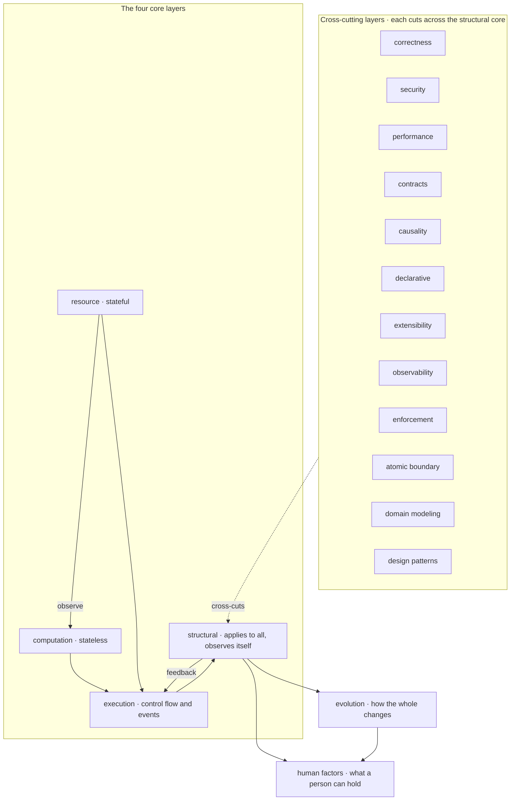

## Computation and resource

The core of the canon is a split between what happens to data, [computation](../ontology/SCHEMA.md#layer-computation-core), and where data lives, a [resource](../ontology/SCHEMA.md#layer-resource-core). The split is the first question to ask of any unit, because the two halves are answered by different rules on the same question: who releases decides whether a resource leaks, as [D1·a who releases](#computation-and-resource-panel-a) draws, and a lifetime runs from one owner to one release, as [D1·b a lifetime](#computation-and-resource-panel-b) draws and [D1·c ownership as types](#computation-and-resource-panel-c) states.

### What happens to data, where data lives

Computation is stateless and frozen, a resource has one owner and a bounded lifetime, and release is structural. Most code mixes the two, so data that should have been frozen is mutated and handles that should have been owned are shared, and the leaks are found in production.

A cache with no capacity grows until the process dies, a listener nobody unsubscribes fires against a component that was removed an hour ago, and both were written correctly by their authors. A stateful thing treated as stateless leaks, because nothing owns its release, and a stateless thing treated as stateful drifts, because it acquires a lifetime nothing bounds.

Release by structure rather than by discipline, and freeze rather than manage wherever a unit can be a computation. Sort every unit into computation or resource before designing it. Freeze what computation produces, assign each variable once, and let a computation carry no persistent state, so it can be replayed and its [rollback](../ontology/PRINCIPLES.md#arch-rollback) restores meaning rather than bytes. Give every resource one owner, bound its lifetime to that owner's, pair every open with a close and every start with a stop, and release by scope or by an explicit destroy rather than by anyone remembering. Bound every cache and pool with a declared capacity and an eviction policy, and register it where it can be seen.

Take any resource and name its owner and the structure that releases it. A resource with two owners, or with a release that depends on a person, will leak, and the only question is when.

Computation and resource are answered by different rules on the same question, and the split is what stops the rules from colliding. A computation is stateless and a resource is snapshotted before mutation. Computed data is immutable and resource state is mutable but managed. A broken resource invariant halts, and computation uncertainty is marked and carried on.

### The computation half

The computation half is the canon's [computation core](../ontology/SCHEMA.md#layer-computation-core) read as one rule. [Immutability](../ontology/PRINCIPLES.md#arch-immutability) freezes what a computation produces. [Pure functions](../ontology/PRINCIPLES.md#arch-pure-functions) give it no effect but its return value, and [referential transparency](../ontology/PRINCIPLES.md#arch-referential-transparency) lets any call be replaced by its result. [Determinism](../ontology/PRINCIPLES.md#arch-determinism) makes the same input give the same output, which is what makes [repeatability](../ontology/PRINCIPLES.md#arch-repeatability) and [reproducibility](../ontology/PRINCIPLES.md#arch-reproducibility) properties rather than hopes, and [testability](../ontology/PRINCIPLES.md#arch-testability) follows from all of them at once.

[Statelessness](../ontology/PRINCIPLES.md#arch-statelessness) is the same rule seen from the outside: nothing is retained between calls, so a computation can run anywhere and be replayed. [Idempotency](../ontology/PRINCIPLES.md#arch-idempotency) is its consequence at the edge, because a retry of a stateless step has one effect however many times it lands. Validation and [verification](../ontology/PRINCIPLES.md#arch-verification) are then cheap, since a frozen output can be compared against an expected one without a running system around it.

### The resource half

Reachable is not useful. A collector frees what nothing reaches and keeps what something still points at, so an architectural leak survives collection because it is reachable: a cache entry nobody will read, an observer on a dead subject, a handle held by an injection container.

That is why every non-owning reference is weak or ephemeral, why hidden retention in injection, mapping and observer machinery is made observable and bounded, and why anything that outlives a single call carries an initialise, a run and a shutdown. [Graceful shutdown](../ontology/PRINCIPLES.md#arch-graceful-shutdown) is the resource rule at the scale of a process. A long-lived component with no shutdown is a leak by construction, and the leak is a hole in the contract rather than a bug in the code.

### Where the halves meet

[Caching](../ontology/PRINCIPLES.md#arch-caching) is where the two halves meet most often and where the split is most often lost. A cache holds computed data, so its entries are immutable, and it is a resource, so it has one owner, a declared capacity and an eviction policy. [Cache poisoning by design](../ontology/PRINCIPLES.md#arch-cache-poisoning-by-design) is what happens when the first half is forgotten, and a cache with no capacity is what happens when the second is.

[Configuration externalization](../ontology/PRINCIPLES.md#arch-configuration-externalization) is the same split at the boundary of the process. What the process reads at boot is a resource with one source and a validation at the door, and what it computes from that is frozen for the run. [Environment parity](../ontology/PRINCIPLES.md#arch-environment-parity) follows: the same computation over a different resource behaves the same, or the difference is in the resource and can be named.

D1·a who releases

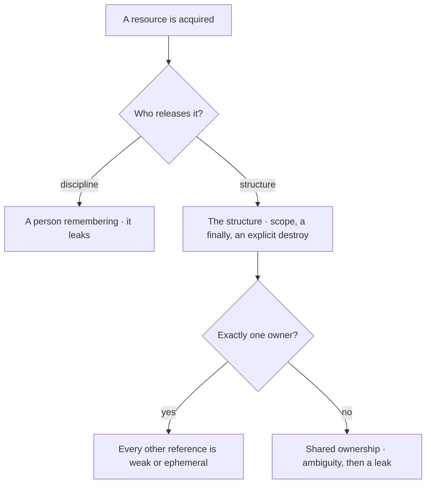

D1·b a lifetime

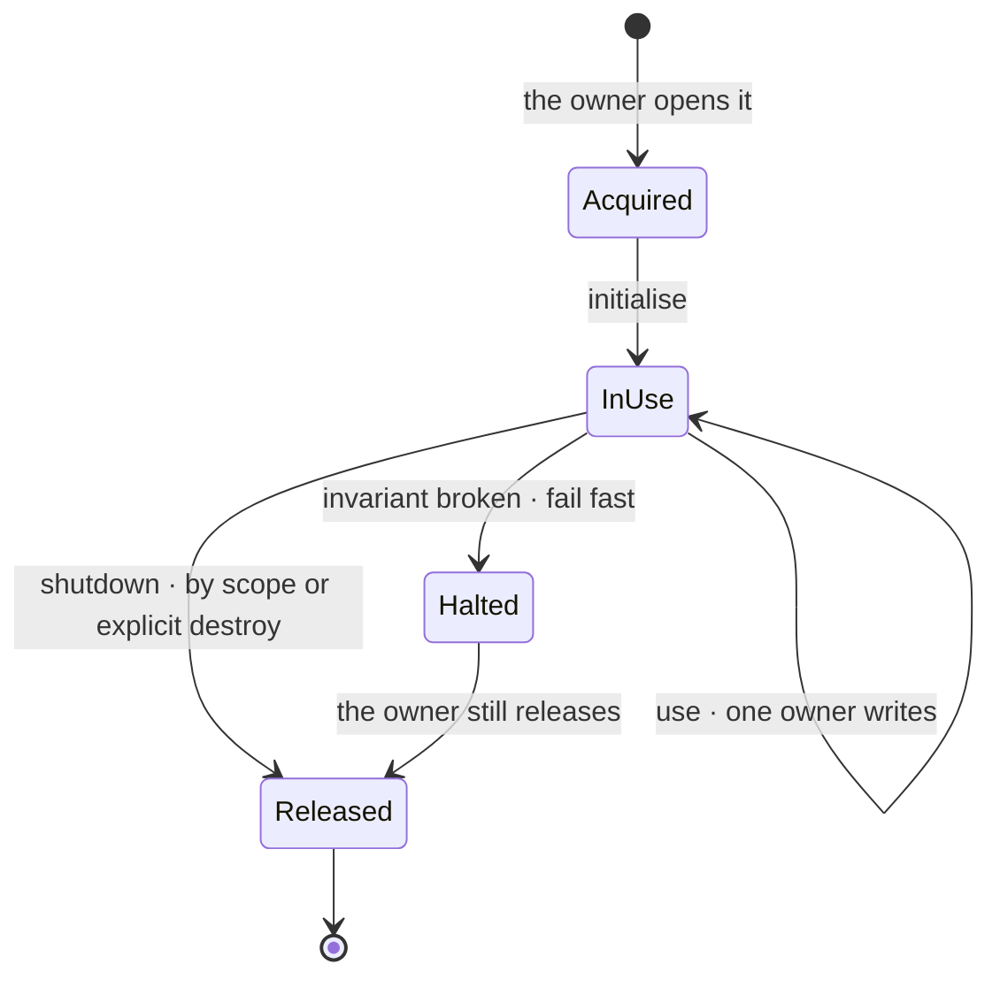

```typescript
export interface Owned<Handle> {
  readonly acquire: () => Handle;
  readonly release: (handle: Handle) => void;
}

export interface Lifecycle {
  readonly init: () => void;
  readonly run: () => void;
  readonly shutdown: () => void;
}

export const withOwned = <Handle, Result>(
  owned: Owned<Handle>,
  use: (handle: Handle) => Result,
): Result => {
  const handle = owned.acquire();
  try {
    return use(handle);
  } finally {
    owned.release(handle);
  }
};

export interface Bounded<Item> {
  readonly capacity: number;
  readonly evict: "lru" | "fifo";
  readonly items: readonly Item[];
}
```

## Execution joins the halves

[Execution](../ontology/SCHEMA.md#layer-execution-core) is how the two halves meet, as [E1·a the core split](#execution-joins-the-halves-panel-a) draws, and it has its own rules, each the refusal of one improvised join: the exchange [E1·b one exchange](#execution-joins-the-halves-panel-b) draws and [E1·c execution as types](#execution-joins-the-halves-panel-c) states.

### Events, growth, order, errors

Execution joins the halves through events rather than callbacks, appends rather than retracts, and treats errors as part of the language. Control flow is usually improvised per call site, so the same two halves are joined a different way in every place they meet.

A child calls back into its parent, the parent is replaced, and the child keeps calling into something that no longer exists, while the error that would have said so was a string nobody parsed. A callback couples a child to a parent it should not know, a retraction is a second path every reader must handle, a clock is a dependency on the host, and a sentence in an error is a contract nobody can dispatch on.

Own the sequence and the vocabulary rather than borrow the host's clock and prose. Let a child announce what happened as an event and let the parent decide what to do with it, so the child never holds a reference to who reacts. Append a correction as a new record that supersedes rather than editing history, and restore an earlier state by reinstantiating from a snapshot rather than by patching in place. Order by a monotonic sequence the system owns, never by the host's clock. Make every error a typed value in the system's own vocabulary, decide per error whether it halts or is carried, and let a guard that fails do so closed.

Follow one event from the child that emits it to every parent that reacts, and one error from where it is raised to where it is handled. A callback that runs upward, a retraction, or an error handled by string comparison is a place where execution has no rule.

Execution rules govern how [computation and resources](PRINCIPLES.md#computation-and-resource) interact at runtime, and they do not decide what either half is. A resource that halts on a broken invariant is obeying the resource rule, and a computation that marks an uncertainty is obeying the computation rule; execution only carries the result between them.

### Events and growth

[Event-driven architecture](../ontology/PRINCIPLES.md#arch-event-driven-architecture) is the shape the first rule produces. [Domain events](../ontology/PRINCIPLES.md#arch-domain-events) are what a child emits, the [publish/subscribe pattern](../ontology/PRINCIPLES.md#arch-publish-subscribe-pattern) is how a parent hears them without the child knowing who listens, and an [event bus](../ontology/PRINCIPLES.md#arch-event-bus) is the mechanism that carries them. The [observer pattern](../ontology/PRINCIPLES.md#arch-observer-pattern) is the same relation inside one process. Execution may counter-propose by emitting an intent a parent can refuse, which is [asynchronous communication](../ontology/PRINCIPLES.md#arch-asynchronous-communication) with the refusal kept explicit.

An [append-only log](../ontology/PRINCIPLES.md#arch-append-only-log) is the growth rule as a store, and [event sourcing](../ontology/PRINCIPLES.md#arch-event-sourcing) is it as a whole architecture, where the current state is a fold over the events and a correction is a new event that supersedes. Backtracking is by snapshot and reinstantiation rather than by patching state in place, which is the [memento pattern](../ontology/PRINCIPLES.md#arch-memento-pattern) held as a rule rather than a trick.

Ordering is by a monotonic sequence or an append-only id, never a wall clock. A clock is a dependency on the host and a sequence is a dependency on nothing, which is why [causality](../ontology/PRINCIPLES.md#arch-causality) is tracked with [Lamport clocks](../ontology/PRINCIPLES.md#arch-lamport-clocks), [vector clocks](../ontology/PRINCIPLES.md#arch-vector-clocks) or [hybrid logical clocks](../ontology/PRINCIPLES.md#arch-hybrid-logical-clocks) rather than timestamps, and why [event ordering](../ontology/PRINCIPLES.md#arch-event-ordering) is a constraint the system owns. A [happens-before relationship](../ontology/PRINCIPLES.md#arch-happens-before-relationship) is derivable from a sequence and never from two clocks.

### Errors as language

Errors are part of the language. [Error handling](../ontology/PRINCIPLES.md#arch-error-handling) uses the system's own vocabulary and the errors are machine-processable, so a consumer dispatches on an error rather than parsing a sentence. An [inconsistent error model](../ontology/PRINCIPLES.md#arch-inconsistent-error-model), one boundary raising and another returning a code, is the anti-pattern this rule refuses, and [exception control flow](../ontology/PRINCIPLES.md#arch-exception-control-flow) is its twin.

A resource invariant that breaks [fails fast](../ontology/PRINCIPLES.md#arch-fail-fast) and halts, because carrying on with a corrupt handle is worse than any crash. A computation that is uncertain marks the uncertainty and carries on, because temporary inconsistency in data is acceptable exactly while it is visible. [Defensive programming](../ontology/PRINCIPLES.md#arch-defensive-programming) is the wrong reflex here, and [fail at the boundary](../BUILD.md#fail-at-the-boundary) on the methodology page is the practice that replaces it. [Fail safe](../ontology/PRINCIPLES.md#arch-fail-safe) and [fail secure](../ontology/PRINCIPLES.md#arch-fail-secure) are the same decision made once for a domain rather than per call site.

E1·a the core split

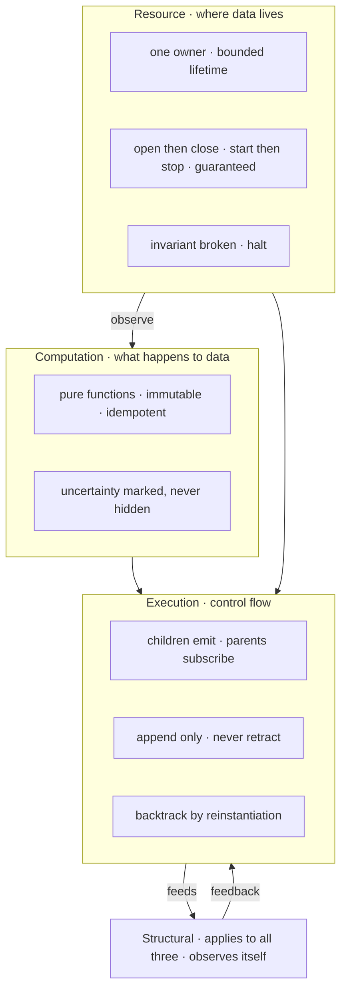

E1·b one exchange

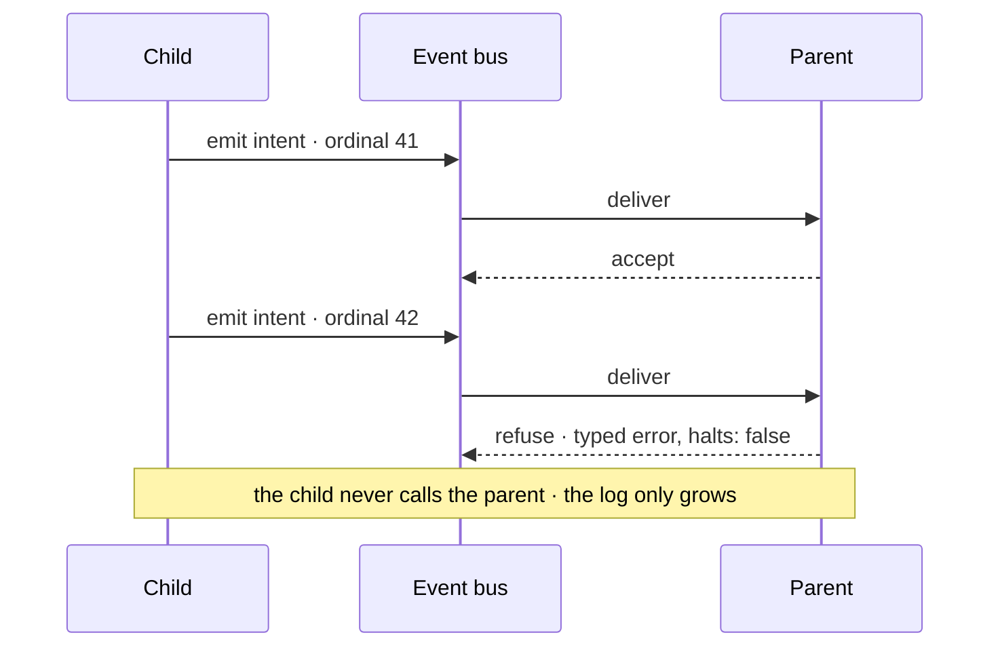

```typescript
export interface Emitted<Intent> {
  readonly ordinal: number;
  readonly intent: Intent;
}

export interface Child<Intent> {
  readonly emit: (intent: Intent) => Emitted<Intent>;
}

export interface Parent<Intent> {
  readonly subscribe: (
    react: (event: Emitted<Intent>) => "accept" | "refuse",
  ) => Unsubscribe;
}

export type Failure<Code extends string> =
  | { readonly ok: true }
  | { readonly ok: false; readonly code: Code; readonly halts: boolean };
```

## The structural domain

The [structural](../ontology/SCHEMA.md#layer-structural-core) domain applies to all three cores and observes itself. Its principles are the classical ones, each paired the way [F1·a principle and practice](#the-structural-domain-panel-a) draws, and this chapter says what the canon adds to each.

### A principle and the practice that sharpens it

A structural principle is a classical principle paired with the practice that makes it recognisable. Classical principles are agreed at a level nobody can check, so what they mean in a given file is argued every time.

Two reviewers agree that a module should have one responsibility and disagree about whether this one does, because responsibility was never derived from anything either of them could point at. A classical principle is stated at a level where everyone agrees and nobody can check, so the disagreement moves to what the principle means in this file, and that is the argument the pairing settles in advance.

Settle what a principle means in a file in advance, as a shape, rather than at each review. Take each classical principle and pair it with the practice that makes it recognisable in a tree, then write the violation as a shape a check can match. Where the pairing yields no shape, the principle is not yet held by anything.

Take any structural principle you hold and state, in one sentence, what a violation of it looks like in a file. If the sentence names a shape, the principle has its practice. If it names an opinion, the pairing is still missing.

A pairing sharpens a principle and never replaces it. The classical name still carries the intent a reader recognises, and the practice only says how that intent shows in a tree; a practice with no principle behind it is a house rule, and a principle with no practice is a wish.

### The pairs

[Separation of concerns](../ontology/PRINCIPLES.md#arch-separation-of-concerns) is paired with reasoning about the whole system, so one module holds one concern while the design is still read as one thing. Simplicity is paired with compression: the simplest solution is a rule or a generator, never an enumeration, and a repeated shape is compressed by its type. A literal becomes a constant, a structure a composition, a behaviour one orchestrator, a fact one source. [Do not repeat yourself](../ontology/PRINCIPLES.md#arch-duplicate-code) is that compression named for the case of knowledge.

The [single responsibility principle](../ontology/PRINCIPLES.md#arch-single-responsibility) is derived from an invariant rather than a feature. The [open/closed principle](../ontology/PRINCIPLES.md#arch-open-closed) is met through few composable primitives, so extension arrives without editing what is tested. The [Liskov substitution principle](../ontology/PRINCIPLES.md#arch-liskov-substitution) makes substitutable parts order-independent. The [interface segregation principle](../ontology/PRINCIPLES.md#arch-interface-segregation) cuts an interface by usage, and the [dependency inversion principle](../ontology/PRINCIPLES.md#arch-dependency-inversion) addresses it by meaning rather than by location. [Composition over inheritance](../ontology/PRINCIPLES.md#arch-composition-over-inheritance) is the practice all five share, because a composed part can be replaced and an inherited one cannot.

[Code as data](../ontology/PRINCIPLES.md#arch-code-as-data) makes code, data and state one interchangeable structure, and [homoiconicity](../ontology/PRINCIPLES.md#arch-homoiconicity) is the degree to which a system has that property. One truth lives in versioned, queryable symbols, which is [single source of truth](../ontology/PRINCIPLES.md#arch-single-source-of-truth) with a location. Placement in a hierarchy reflects meaning, time is a logical sequence rather than a wall clock, and the system observes its own execution as data it can query, which is where [introspection](../ontology/PRINCIPLES.md#arch-introspection) and [observability](../ontology/PRINCIPLES.md#arch-observability) meet.

### Beneath the core

[Human factors](../ontology/SCHEMA.md#layer-human-factors) bound the whole by what a person can hold. Related logic stays together, which is [high cohesion](../ontology/PRINCIPLES.md#arch-high-cohesion) read as a limit on attention. Complexity stays under a declared bound, and [bounded nesting depth](../ontology/PRINCIPLES.md#arch-bounded-nesting-depth) is one such bound made checkable. Uncertainty stops the work rather than passing silently. Internals are hidden but shipped with a live inspector, so [encapsulation](../ontology/PRINCIPLES.md#arch-encapsulation) is traded against debuggability at a point somebody chose.

[Evolution](../ontology/SCHEMA.md#layer-evolution-principles) says how the whole changes. Units are independent and swappable, with state protected before code. Features are added externally, through [extension points](../ontology/PRINCIPLES.md#arch-extension-points), with room left deliberately unspecified. Nothing is built that nothing needs, which refuses [speculative generality](../ontology/PRINCIPLES.md#arch-speculative-generality) and [premature abstraction](../ontology/PRINCIPLES.md#arch-premature-abstraction), and what the system will not do is written down in [architecture decision records](../ontology/PRINCIPLES.md#arch-architecture-decision-records) rather than remembered. [Evolutionary architecture](../ontology/PRINCIPLES.md#arch-evolutionary-architecture) with [fitness functions](../ontology/PRINCIPLES.md#arch-fitness-functions) is that domain held by checks rather than by review.

F1·a principle and practice

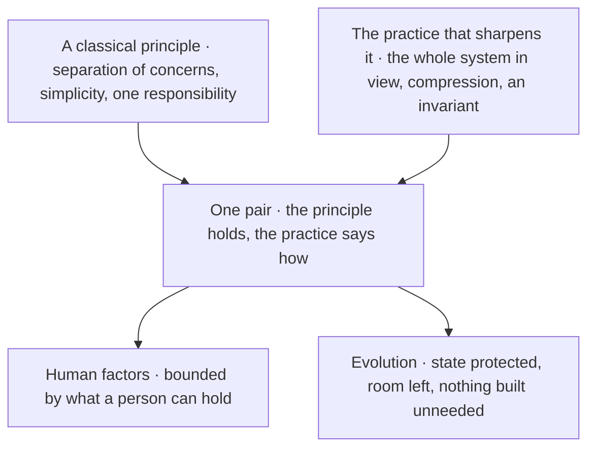

## A tension has a mechanism

Two things that pull against each other on one construct are resolved by first asking what kind of thing each of them is and which scope it holds in. Every resolution the canon holds is [readable as a record](../ontology/SCHEMA.md#tension-decentralization-single-source-of-truth), and where no record exists the mechanism is derived from the kinds and scopes of the two sides, in the order [G1·a recorded or derived](#a-tension-has-a-mechanism-panel-a) draws and over the grid [G1·b kinds against scopes](#a-tension-has-a-mechanism-panel-b) lays out. That is why a tension held as data, the shape [G1·c a resolution record](#a-tension-has-a-mechanism-panel-c) types, is consulted before the collision happens while one held in prose is rediscovered by collision.

### Recorded, never remembered

An apparent conflict has a mechanism that follows from the kinds and scopes on each side, and the resolution is recorded rather than remembered. Principles that appear to conflict are resolved case by case, and case-by-case resolution is a different rule in every case.

A review says the config must [fail fast](../ontology/PRINCIPLES.md#arch-fail-fast), the next review says the parser must tolerate bad input, both cite a principle, both are right, and the code ends up doing neither consistently. A principle stated without its scope reads as universal, so the moment two universal statements meet on one construct one of them has to lose, and the loser is chosen by whoever is reviewing.

Look for a recorded resolution before deriving one, and refuse an exemption as the third option, because one side winning for a reason nobody wrote down is a rule with no scope. Classify each side before resolving anything: a principle, a quality, a metric, a cost, and the scope it holds in. Record what you derive with its two records by identity, the mechanism, the scope each side holds in and the rule in one sentence, so the next reader finds a rule rather than a memory.

Take any construct where two things seemed to collide and name the kind and scope of each. If a resolution is recorded, it is settled; if a mechanism follows from the kinds and scopes, write it down and it is settled. If the construct still sits on both sides, it is two constructs and needs splitting.

A tension is a pair the canon relates by a tension edge, which is a different relation from a conflict. A conflict points from a principle to the anti-pattern that negates it, and it carries no resolution because one side is simply refused. Two rules that merely differ in strictness are not a tension, and neither is a rule that does not apply to a construct; the first is one rule with a scope, the second is a classification question.

### The derivation

The resolution is typed for the same reason a principle is. It names its two records by identity, the mechanism from the closed set of three, the scope each side holds in, and the rule in one sentence. The derivation has the shape of every default that must be safe when nobody has thought about the case.

A recorded resolution wins outright, since a person has already decided. Failing that, two principles that hold in different scopes separate, because each can hold whole on its own side. Everything else, a quality on either side or two principles that share one scope, falls to a trade-off, because the only thing that can be said about a pair nobody has decided is that it has to be measured. Mitigation is never derived: a discriminator is a judgement, and a judgement the data does not carry explicitly does not exist.

### What a check does with it

Recording it that way lets a check resolve a finding to its side. A validator that fires on a [fallback pattern](../ontology/PRINCIPLES.md#arch-fallback-pattern) in a resource path reaches the fail fast side, and one that fires on an unmarked uncertainty in a computation reaches the explicit-invalidity side, and neither has to know the other exists. The canon's [resolution contract](../ontology/ALGORITHMS.md#algo-conflict-and-tension-resolution) states the same obligation from the other direction: architecture is trade-off governance as much as principle application, and its policy admits an override only as a recorded decision beside the mitigations and the documented trade-offs.

Every resolution the canon currently holds is listed on [the schema tab](../ontology/SCHEMA.md#the-resolutions), with its mechanism, its two scopes and its rule.

### Two checks on one construct

Where two enforced checks conflict on one construct, neither is satisfied by violating the other and neither is disabled: the construct is reshaped into the single form that satisfies every rule, and where that form is not obvious the question goes to whoever owns the rules. An exclusion added to make a check pass is the exemption this whole section refuses, arriving through the tooling instead of the review; [when rules collide](../PLAN.md#when-rules-collide) on the methodology page walks two such collisions.

G1·a recorded or derived

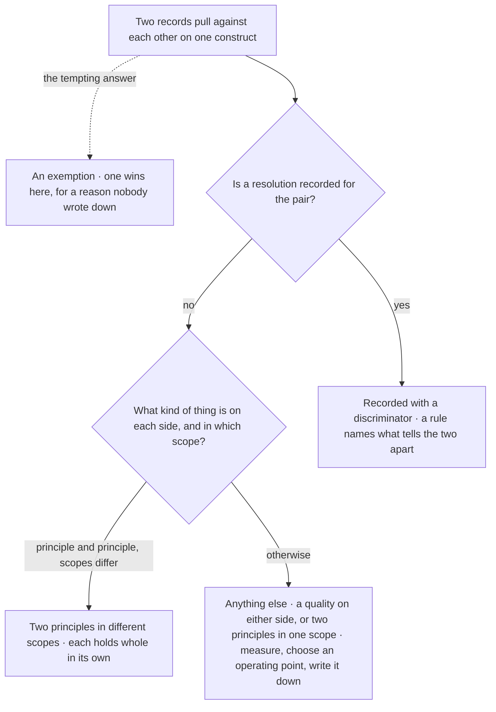

G1·b kinds against scopes

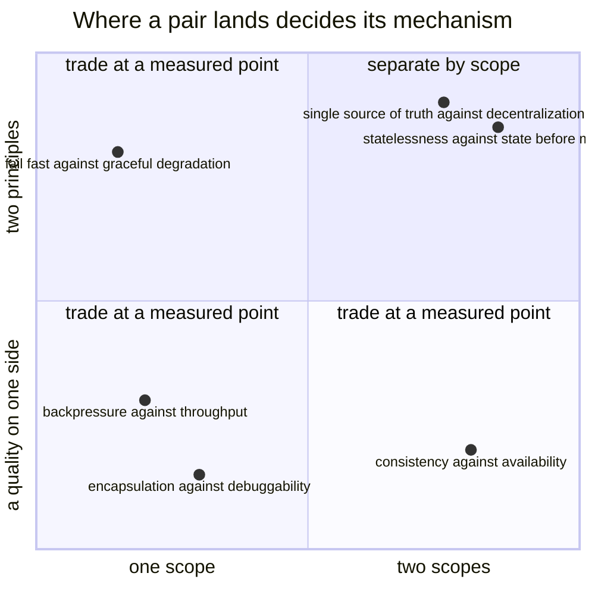

```typescript
export type Mechanism =
  "scope-separation" | "irreducible-tradeoff" | "mitigation";

export interface Resolution {
  readonly a: RecordId;
  readonly b: RecordId;
  readonly mechanism: Mechanism;
  readonly scopeA: LayerId;
  readonly scopeB: LayerId;
  readonly rule: string;
}

export const mechanismOf = (
  a: Record,
  b: Record,
  recorded: ReadonlyMap<PairKey, Resolution>,
): Mechanism => {
  const explicit = recorded.get(pairKey(a.id, b.id));
  if (explicit !== undefined) {
    return explicit.mechanism;
  }
  const separable =
    a.kind === "principle" && b.kind === "principle" && a.layer !== b.layer;
  return separable ? "scope-separation" : "irreducible-tradeoff";
};
```

## Separate, trade, or mitigate

Three mechanisms resolve every tension the canon holds, and the wrong one applied to a pair is what turns a review into an argument. [A tension has a mechanism](PRINCIPLES.md#a-tension-has-a-mechanism) derives which one applies; this chapter walks the recurring pairs under each, grouped as [H1·a the recurring pairs](#separate-trade-or-mitigate-panel-a) draws.

### Three mechanisms, no exemption

Scope separation, a measured trade-off and a mitigating rule are the three mechanisms, and which one applies follows from what is on each side and where it holds. One mechanism is applied to every tension, so a trade-off is argued as a violation and a semantic difference is drawn as a boundary that moves every time.

A team decides that [consistency](../ontology/PRINCIPLES.md#arch-consistency) beats availability, ships a service that refuses every request under partition, and discovers that the decision was never a boundary but an operating point nobody had measured. A quality treated as a rule has no scope to be given, so a review argues a trade-off as though it were a violation, and a semantic difference treated as a scope has no boundary to draw, so a review draws one anyway and moves it next time.

Apply the mechanism the pair's kinds and scopes select, rather than the one the reviewer prefers. Where two principles hold in different scopes, name the scope each holds in and what holding means there, and classify the construct under review to one scope before applying either. Where a principle meets a quality, or two principles share one scope, measure the thing in tension where the construct lives, choose the operating point, and write the point down beside the choice so it is a decision with an owner rather than a mood. Where two things share a scope and differ in meaning, write the rule that names the discriminator. Where a construct genuinely sits on both sides of a scope boundary, split it along the boundary rather than weakening either rule for it.

Take any resolved tension and ask which mechanism resolved it. If both sides are principles and their scopes differ, the boundary settles it and both sides survive whole. If one side is a quality, or both sides share one scope, ask where the operating point sits and who measured it. If the pair claims a discriminator, ask where it is written.

None of the three mechanisms is an exemption. A resolution where one principle is weakened inside its own scope was not a boundary, an operating point nobody measured is a mood, a discriminator held in someone's judgement is not yet a rule, and an override that names no scope and no reason is not a resolution at all.

### Separated by scope

Scope separation is the mechanism the core layers were built to produce, and its pairs recur because the [computation](../ontology/SCHEMA.md#layer-computation-core) and [resource](../ontology/SCHEMA.md#layer-resource-core) scopes answer the same question with different rules. [Statelessness](../ontology/PRINCIPLES.md#arch-statelessness) against snapshot before mutation: a computation flows through, a resource is snapshotted before it changes. [Immutability](../ontology/PRINCIPLES.md#arch-immutability) against protecting state: computed data is frozen after creation, resource state is mutable but managed.

[Fail fast](../ontology/PRINCIPLES.md#arch-fail-fast) against explicit invalidity: a broken resource invariant halts, a computation uncertainty is marked and carried. Not building the hypothetical against under-specifying deliberately: no code for a feature nobody asked for, and no constraint on an interface that would block one later. Each pair is the derivation at work, two principles on two layers.

The canon holds the same derivation as records where it has been consulted. [Single source of truth](../ontology/PRINCIPLES.md#arch-single-source-of-truth) against [decentralization](../ontology/PRINCIPLES.md#arch-decentralization), and [autonomy](../ontology/PRINCIPLES.md#arch-autonomy) against [standardization](../ontology/PRINCIPLES.md#arch-standardization), separate because each side governs a different layer. [Normalization](../ontology/PRINCIPLES.md#arch-normalization) against [query performance](../ontology/LEXICON.md#lex-query-performance) is [recorded explicitly](../ontology/SCHEMA.md#tension-normalization-query-performance): the [canonical model](../ontology/PRINCIPLES.md#arch-canonical-model) is normalised and only derived read models are denormalised, never the store. The test of a boundary is that both sides survive it whole.

### Traded at a measured point

A trade-off cannot be scoped away, and seeing why is what stops a review from arguing one as if it were a violation. A quality is exhibited on both sides of any boundary you draw. Consistency against [availability](../ontology/LEXICON.md#lex-availability) is strong inside one [transaction boundary](../ontology/PRINCIPLES.md#arch-transaction-boundary) and [eventual consistency](../ontology/PRINCIPLES.md#arch-eventual-consistency) across autonomy boundaries, and both halves of that sentence are an operating point somebody chose, [not a side that won](../ontology/SCHEMA.md#tension-availability-consistency). The [CAP theorem](../ontology/PRINCIPLES.md#arch-cap-theorem) is the reason the point exists and never the point itself.

Fail fast against [graceful degradation](../ontology/PRINCIPLES.md#arch-graceful-degradation) shows the other road into a trade-off. Both are principles, but both hold in the one [correctness](../ontology/PRINCIPLES.md#arch-correctness) scope, so there is no side for either to hold whole on. The pair is [decided](../ontology/SCHEMA.md#tension-fail-fast-graceful-degradation) by where a halt costs less than a wrong answer, which is a measurement of the failure's blast radius and never a principle outranking another.

[Encapsulation](../ontology/PRINCIPLES.md#arch-encapsulation) against [debuggability](../ontology/LEXICON.md#lex-debuggability) is [settled](../ontology/SCHEMA.md#tension-debuggability-encapsulation) by hiding internals and shipping a live inspector, a point on a line rather than a wall. [Backpressure](../ontology/PRINCIPLES.md#arch-backpressure) against [throughput](../ontology/PRINCIPLES.md#arch-throughput) is [bounded producers against sustained rate](../ontology/SCHEMA.md#tension-backpressure-throughput). In each case the mechanism is the same: name the quality, measure it where the construct lives, choose the point, and record who chose it and against what number.

### Mitigated by a rule

Mitigation is the mechanism for two things in one scope told apart by meaning. [Do not repeat yourself](../ontology/PRINCIPLES.md#arch-duplicate-code) against [locality of behaviour](../ontology/LEXICON.md#lex-locality-of-behavior) is the recurring case. Semantics are centralised, the rules, the schemas and the one place a fact lives, and incidental co-occurrence stays local, because two passages that happen to read alike are not one fact.

No boundary separates them, since both live in the [structural](../ontology/SCHEMA.md#layer-structural-core) scope, and no measurement decides them, since neither is a quality. What resolves them is a [rule that names the discriminator](../ontology/SCHEMA.md#tension-do-not-repeat-yourself-dry-locality-of-behavior): is the sameness semantic or textual? A discriminator written down is consultable before the collision. One held in someone's judgement is rediscovered at every clone report, and abstracted wrongly half the time.

H1·a the recurring pairs

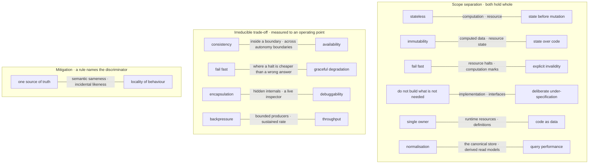

Documentation is covered by [CC BY-SA 4.0](https://creativecommons.org/licenses/by-sa/4.0/)

© 2025 [Jay Baleine](https://linkedin.com/in/jay-baleine) - Software Architecture

---

Chapters: [Model](MODEL.md) · [Principles](PRINCIPLES.md) · [Decay](DECAY.md) · [Coverage](COVERAGE.md) · [Scale](SCALE.md) · [Glossary](GLOSSARY.md)
