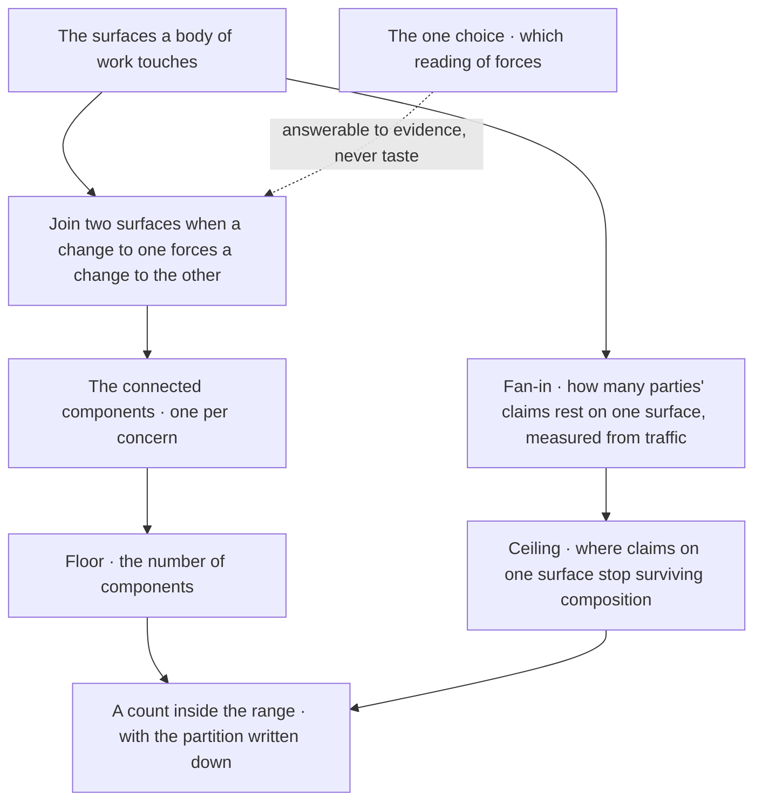
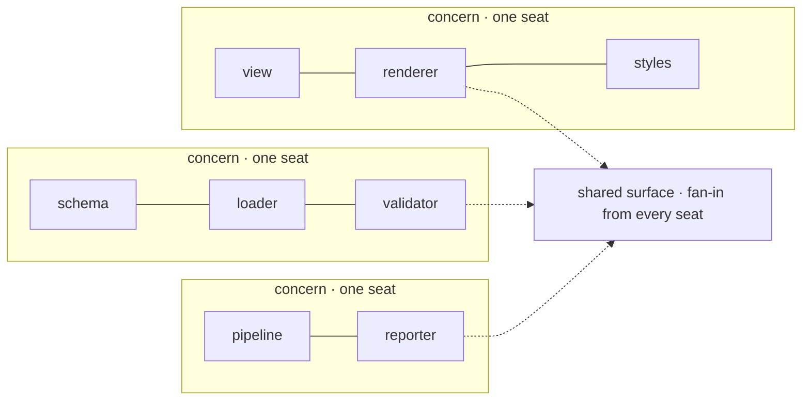
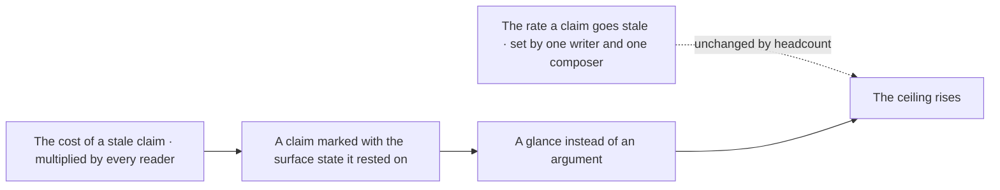
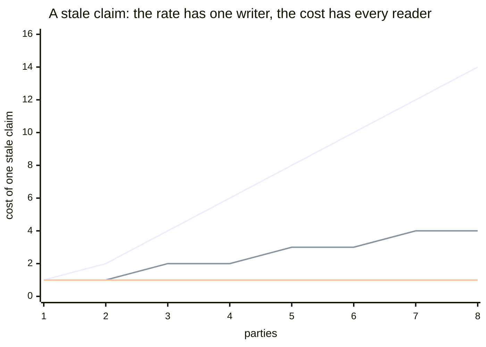
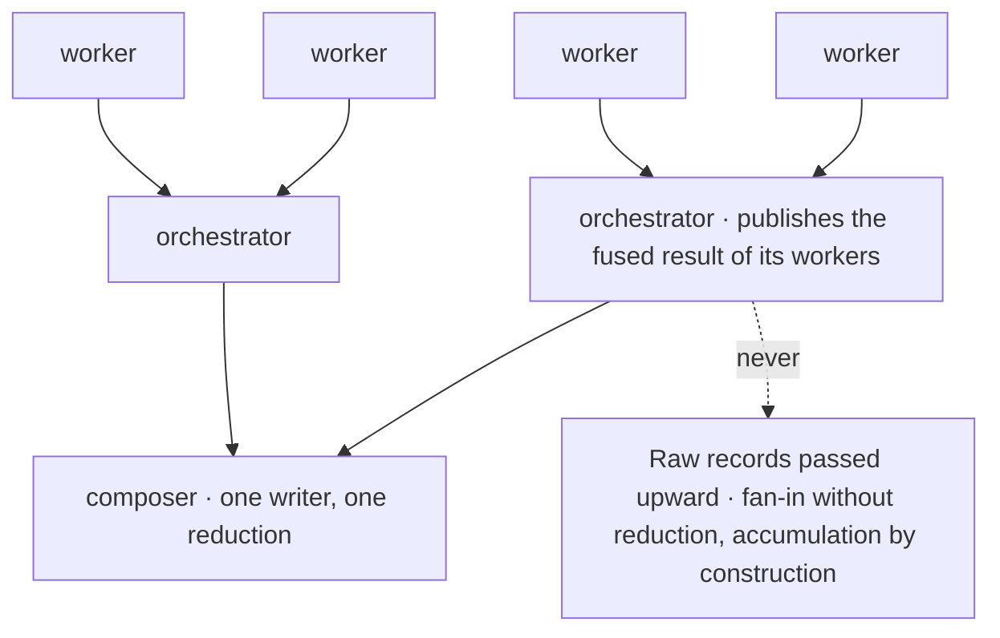
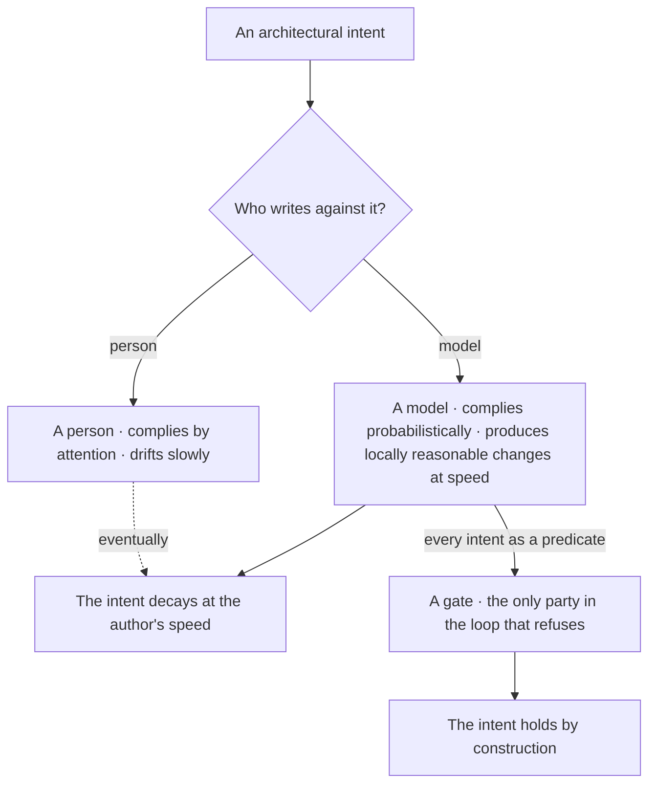
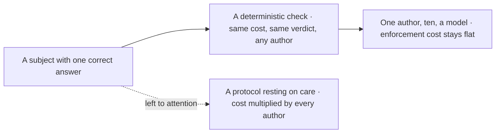
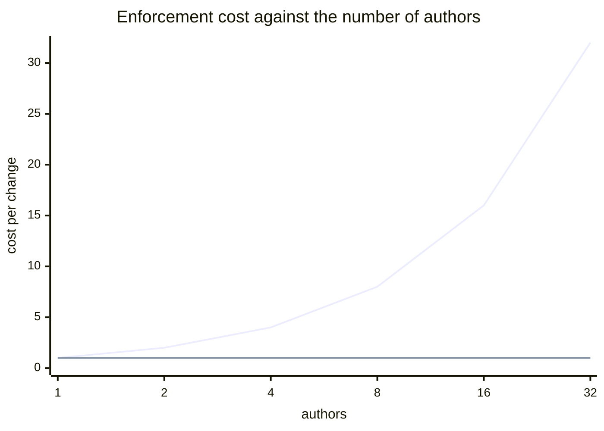
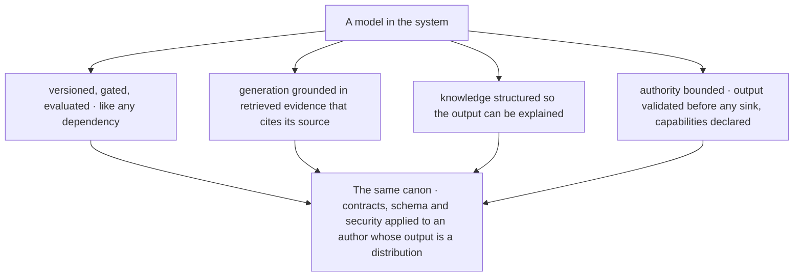

© 2025 Jay Baleine - Disciplined AI Software Development · Documentation is covered by [CC BY-SA 4.0](https://creativecommons.org/licenses/by-sa/4.0/)

# Scale — Architecture — Bane's Lab

> How work partitions decides how many parties it needs, and the partition is derived rather than drawn, as floor and ceiling places it, three components walks…

Canonical: https://banes-lab.com/software-architecture/scale

# Software Architecture

A system as a graph, principles as typed records, and the predicate set that makes an architecture real when a model writes the code.

# Scale

## A concern is a component

How work partitions decides how many parties it needs, and the partition is derived rather than drawn, as [A1·a floor and ceiling](#a-concern-is-a-component-panel-a) places it, [A1·b three components](#a-concern-is-a-component-panel-b) walks one body of work and [A1·c the derivation's records](#a-concern-is-a-component-panel-c) types what it reads. [Scale follows from structure](../SHIP.md#scale-follows-from-structure) on the methodology page is the practice for a body of work.

### Partition, floor, ceiling

A concern is a connected component of the relation that joins two surfaces when a change to one forces a change to the other. Concerns are drawn as areas of a work list, so a seat owns a region rather than a component, and every coupled edit crosses two seats.

Two seats each own half of one coupled pair of surfaces, every change one makes forces a change in the other's, and the surface between them fills with items about the same edit from both sides. A concern drawn as an area of a task list follows how the list was written, and a list is written by one person on one day, so its areas cut across the couplings that actually force changes.

Cut along what forces what rather than along what the work list happened to group. Enumerate the surfaces a body of work touches. Record, with evidence, which pairs force each other: a change to one that cannot land without a change to the other. Take the connected components of that relation as the concerns, give each one owner, and let the number of components be the floor. Measure the fan-in on each [shared surface](../pag/ORCHESTRATION.md#shared-surfaces) from the claims already recorded against it, and let the worst fan-in set the ceiling. Choose inside that range and write the partition down beside the choice.

Take any two concerns and find one change that forces edits in both. If one exists, the partition put a forcing edge across a boundary, and the two concerns are one component.

The relation is chosen once and the choice is the one place judgement enters: two defensible readings of what forces what yield component counts far apart, so the claim is a derivation with a choice at the bottom. The choice is answerable to evidence, and where no mechanism yet computes the partition or the fan-in, that absence is written down as debt with its operands rather than left to read as a measurement.

### A concern is a bounded context for people

This is [bounded context](../ontology/PRINCIPLES.md#arch-bounded-context) drawn for people rather than for models, and [context mapping](../ontology/PRINCIPLES.md#arch-context-mapping) is the activity that draws it. A concern is a component of the forcing relation for the same reason a bounded context is a region of one model: inside it one party can be authoritative, and across its edge two parties have to be able to disagree. [Separation of concerns](../ontology/PRINCIPLES.md#arch-separation-of-concerns) at the scale of seats is the same principle as at the scale of files, and it is derived the same way, from what forces what.

Volume is the wrong operand for the floor. Quantity divides across parties and argues for a longer schedule, never a wider one. What forces a second party is indivisibility, a concern that has to be able to contradict another while both stay authoritative, and the floor counts those. [Partitioning](../ontology/PRINCIPLES.md#arch-partitioning) by volume is [horizontal scaling](../ontology/PRINCIPLES.md#arch-horizontal-scaling) of people, and it buys [throughput](../ontology/PRINCIPLES.md#arch-throughput) where the concerns are already separate and nothing where they are not.

### Fan-in, measured

The ceiling is set by fan-in rather than by the count, because a surface with one writer cannot have its volatility raised by adding a party, and staleness rises only where parties converge on one subject. Ownership bounds fan-in without defining it: a formally owned surface that many parties reason about behaves like [shared mutable state](../ontology/PRINCIPLES.md#arch-shared-mutable-state), and the concentration is continuous.

That is why the ceiling is measured and never declared. A count chosen because it felt right is a bound nothing can disagree with, and a bound nothing can disagree with is not a bound. Fan-in read from the claims already recorded against each surface is a number a second reader can recompute, and the ceiling follows from the worst of them.

A1·a floor and ceiling



A1·b three components



```typescript
export interface Forces {
  readonly from: SurfaceId;
  readonly to: SurfaceId;
  readonly evidence: string;
}

export interface Concern {
  readonly id: ConcernId;
  readonly surfaces: readonly SurfaceId[];
  readonly owner: SeatId | null;
}

export interface Claim {
  readonly author: SeatId;
  readonly cites: readonly SurfaceId[];
  readonly observedAt: Ordinal;
}

export interface Bounds {
  readonly floor: number;
  readonly ceiling: number;
  readonly partition: readonly Concern[];
  readonly derivedBy: "mechanism" | "declared-unbuilt";
}
```

## The ceiling moves by cost

The bound on parties is movable, and a reader who takes it as fixed reaches for the wrong lever and the expensive one: the rate has one writer and the cost has every reader, as [B1·a rate and cost](#the-ceiling-moves-by-cost-panel-a) draws and [B1·b the two terms](#the-ceiling-moves-by-cost-panel-b) plots.

### The cost, not the rate

The ceiling on fan-in moves with the cost of a stale claim, not with the rate at which claims go stale. The bound on parties is read as fixed, so the only lever anyone reaches for is fewer parties.

A team that keeps tripping over stale claims removes a seat, the remaining seats trip at the same rate, and the work that seat owned is now nobody's. Staleness looks like a rate problem because it is felt as a rate, but the rate has one writer, and what actually grows with the population is how many parties pay for each stale claim.

Raise the ceiling by cutting what a stale claim costs, never by cutting who reads it. Separate the two terms before touching the headcount. Leave the rate alone, because one writer and one composer set it and no number of readers changes it. Attack the cost instead: mark every claim with the state of the surface it rested on when it was written, so a claim whose surface has since moved costs its readers a glance where an unmarked one costs every party a read and a reply. Measure the fan-in again after the marker is in place, and raise the ceiling only by what the measurement shows.

Take any stale claim and count who read it and who answered it. If the count is the population, the cost is the term to attack; if the claim went stale faster than one writer could produce it, you have found a second writer.

Two limits hold the argument honest. Added parties never answer a claim that something is absent; they produce agreement rather than coverage, and only a refusal that publishes its criterion turns an unanswerable absence into an ordinary read. And the bound does not move where the cost of a stale claim is dominated by the work already built on it, because no marker makes that work cheaper to redo.

### The marker

A claim that arrives marked as resting on a surface which has since moved costs its readers a glance where one that must be argued costs every party a read and a reply. So a mechanism recording when a claim's cited surface was observed reduces no staleness and reduces what staleness costs, which raises the ceiling without touching the partition.

That marker is a [correlation id](../ontology/PRINCIPLES.md#arch-correlation-id) for reasoning: it joins a claim to the state it was made against, the way a correlation id joins a log line to the request that produced it. [Causal consistency](../ontology/PRINCIPLES.md#arch-causal-consistency) is the property it buys, since a reader can tell whether a claim happened before or after the surface it rests on moved, without a clock and without asking.

### What the lever leaves alone

That is the whole shape of the lever. The partition stays what the forcing relation derived, the seats stay what the floor demanded, and the thing that changes is how expensive it is for the parties to be wrong about each other for a moment.

[Eventual consistency](../ontology/PRINCIPLES.md#arch-eventual-consistency) between parties is the state the marker makes affordable: each party holds a view that may lag, and the lag is visible rather than argued. Consensus is the expensive alternative, every party agreeing before any proceeds, and it is the right mechanism only where a stale claim costs more than a halt.

B1·a rate and cost



B1·b the two terms



## Above one tier, reduction

Above one tier a flat surface stops being a surface and becomes the accumulation, and the shape that survives is a tree, as [C1·a reduction](#above-one-tier-reduction-panel-a) draws.

### Fused results up, scope down

Above one tier, scale is reduction: fused results go up, scope comes down, and every record keeps one writer. Flat fan-in grows without bound, and the growth is read as a discipline problem when it is the structure doing exactly what it was built to do.

An orchestrator forwards its workers' raw records upward, the composer reads everything every worker wrote, and the surface that was supposed to bound reading has become the unbounded thing it replaced. Fan-in without reduction passes every record to every reader, so the volume a party has to read grows with the population, and that growth is the accumulation everyone then tries to drain by care.

Publish the fused result rather than the raw records, at every tier. Arrange the surfaces as a tree once one tier is not enough. Let a parent hand scope down and publish only the fused result of its children upward, and let every record keep its one writer at every depth, so identity and reduction hold unchanged whether the tree is two levels or ten. Make each reduction derivable and checkable, so a fusion that silently drops a live item fails exactly as a dropped record does. Declare the reduction step unbuilt where it is, rather than letting a design read as if it had been measured at a headcount it never reached.

Take any surface above the first tier and ask what it publishes upward. If it forwards raw records, it is accumulating by construction, and no drain rule will keep up with it.

Reduction changes what is published upward and never who may write. A parent that rewrites a child's record has taken a second writer's seat, and a child that reads the global view has bypassed the bound that made its reading finite; the tree holds only while both stay on their side.

### Fan-in taken seriously

This is [fan-out/fan-in](../ontology/PRINCIPLES.md#arch-fan-out-fan-in) with the fan-in half taken seriously. Fan-out is cheap: scope handed down divides. Fan-in is where every distributed design pays, because results handed up add, and the only way to keep the sum bounded is to reduce at each tier. [Orchestration](../ontology/PRINCIPLES.md#arch-orchestration) is the shape of one tier, a coordinating owner that hands scope down and publishes one fused result up, and [choreography](../ontology/PRINCIPLES.md#arch-choreography) is the shape between peers who share no parent.

Branching is fractal: workers into an orchestrator into an orchestrator into a composer. Every record keeps its one writer, and a reduced tier is published by one writer, so identity and reduction hold unchanged at any depth. A [message chain](../ontology/PRINCIPLES.md#arch-message-chain), one party relaying another's raw record to a third, is the anti-pattern that appears the moment a tier forwards rather than reduces.

### Checkable, and honestly unmeasured

A reduction is derived and checkable, and a fusion that silently drops one live item beneath it fails exactly as a dropped record does. [Missing backpressure](../ontology/PRINCIPLES.md#arch-missing-backpressure) is the same defect at a queue: a tier that accepts more than it reduces accumulates, and the accumulation is the design working as built.

The reduction step itself is declared unbuilt and unmeasured at any headcount, and saying so is what stops the design reading as though it had been measured. A design that claims [scalability](../ontology/PRINCIPLES.md#arch-scalability) it has not measured is the claim with no evidence the coverage tab refuses, arriving in prose.

C1·a reduction



## The author is probabilistic

When a model writes the code, the architecture is whatever the gates hold and nothing else, as [D1·a three authors](#the-author-is-probabilistic-panel-a) draws, and that is the whole relation between architecture and AI-driven design; what reaches the model is the finding [D1·b a finding record](#the-author-is-probabilistic-panel-b) types. [Who does what](../START.md#who-does-what) on the methodology page derives the same three parties from the tooling's side.

### Every principle becomes a gate

The author is probabilistic, so the architecture is the set of predicates the gate holds, and design is choosing them. AI-driven development scales code production and leaves architecture where it was, held by intentions the model does not keep.

An edit is judged clean by the model's own read of it, the check that would have disagreed never ran, and the design principle the edit violates is still the first paragraph of the document the model was given. A model's adherence to an instruction is a distribution rather than a commitment, so an architecture that rests on adherence is a bet placed on every change.

Spend design on choosing predicates rather than on explaining intentions to the model. Install the seven controls as checks before the model writes anything, and treat every architectural intent as unenforced until its predicate runs in the chain. Bound the model's authority: validate every model-produced artifact at the boundary it crosses, and never let raw model output reach a trusted sink. Direct the model with findings rather than principles, [the loop](../START.md#the-loop) the methodology's detect, log, fix chapter runs.

Delete the design document from the session and run the gate. Whatever the gate refuses is the architecture that exists. Whatever it accepts that the document forbade was never architecture, and the model has been writing it since the first session.

The model is not the reviewer and the gate is not the designer. A gate decides whether a predicate holds and nothing about whether the predicate was worth stating; that decision stays with the person, and a system whose predicates were chosen by the model has let the author grade its own work.

### Who does what

The division of labour follows from the author being a model, and here only the derivation matters. The tooling detects because detection is deterministic and a model's account of its own work is not. The model remediates because a finding is a task it performs consistently. The person governs because choosing the predicates and deciding the tensions is not computed.

That is [policy enforcement](../ontology/PRINCIPLES.md#arch-policy-enforcement) with the policy held as code and the enforcement held by a gate, and it is the only arrangement in which an [agentic architecture](../ontology/PRINCIPLES.md#arch-agentic-architecture) keeps an architecture at all. [Prompt engineering](../ontology/PRINCIPLES.md#arch-prompt-engineering) can raise the odds that a model honours an intent. It cannot make the intent hold, because a probability is not a predicate.

### A finding is the contract

A finding is machine-actionable for exactly this reason, and detect, log, fix on the methodology page carries its shape. [Auto-remediation](../ontology/PRINCIPLES.md#arch-auto-remediation) takes the findings with [one correct answer](../VERIFY.md#one-correct-answer), and the rest route to the model with their operands already resolved.

[Ungrounded AI output](../ontology/PRINCIPLES.md#arch-ungrounded-ai-output) is the failure this shape prevents. A model told a principle produces a plausible reading of it. A model handed a finding produces the one change the finding names, and the gate that produced the finding is the same gate that checks the change, so the loop closes on evidence rather than on the model's report of itself.

D1·a three authors



```typescript
export interface Finding<Shape> {
  readonly at: Location;
  readonly mismatch: { readonly expected: Shape; readonly found: Shape };
  readonly remediation: {
    readonly operation: Operation;
    readonly operands: readonly Operand[];
  };
}

export const route = (finding: Finding<unknown>): "heal" | "delegate" =>
  finding.remediation.operands.every((operand) => operand.resolved)
    ? "heal"
    : "delegate";
```

## Scale follows determinism

Scale follows from [determinism](../ontology/PRINCIPLES.md#arch-determinism), as [E1·a check against care](#scale-follows-determinism-panel-a) draws and [E1·b cost per change](#scale-follows-determinism-panel-b) plots, and a model author is the case where that matters most; [one correct answer](../VERIFY.md#one-correct-answer) on the methodology page is the same axis stated for a mechanism.

### The same verdict for any author

A deterministic subject is checkable, healable, predictable and scalable at once, and scale follows from determinism rather than from headcount. Enforcement that rests on care costs more for every author added, and a model is an author whose output rate makes the multiplication expensive.

A review process that worked for two people is applied to a model that produces a hundred changes a day, and the reviewers become the bottleneck the model was meant to remove. A verdict that depends on who is looking has to be produced once per author, while a verdict that depends only on the tree is produced once, so the cost of care scales with the population and the cost of a check does not.

Move judgement out of the check and into the choice of which checks to hold. Find, for every concern, the subject that has one correct answer, and make that subject the thing a check decides. Then count authors freely, because a deterministic verdict is the same for one author or ten, and confine the model's non-determinism to the one place it belongs, the choice among admissible changes.

Take any rule you enforce by review and ask whether two reviewers would return the same verdict on the same tree. If not, the subject is not yet deterministic, and every author you add costs another review.

Determinism is claimed for the check, never for the author. A model stays a distribution however deterministic the gate around it is, and the gate's job is to make that fact cost nothing rather than to pretend it away.

### Determinism is the axis the others derive from

A model is an author whose care tends not to hold from one change to the next, and whose output rate makes the multiplication expensive. Determinism is the property the others derive from, which the methodology states as one correct answer: a deterministic subject has [testability](../ontology/PRINCIPLES.md#arch-testability), [auto-remediation](../ontology/PRINCIPLES.md#arch-auto-remediation) reaches it, and [predictability](../ontology/PRINCIPLES.md#arch-predictability) and [scalability](../ontology/PRINCIPLES.md#arch-scalability) follow without being pursued.

The model's non-determinism is then confined to the one place it belongs, the choice among admissible changes. The rest of this page is the list of subjects that can be made deterministic: what a file is, what a principle requires, which control is absent, which cell is watched, which concern a change forces.

### When a verdict moves

[Flaky test normalization](../ontology/PRINCIPLES.md#arch-flaky-test-normalization) is what a team does when it stops believing this. A check that returns a different verdict on the same tree is treated as noise, the noise is tolerated, and every author learns that red means run it again. The repair is never a [retry pattern](../ontology/PRINCIPLES.md#arch-retry-pattern) around the check. It is finding the non-deterministic subject the check depends on and making it deterministic, or declaring that it cannot be and holding the check.

[Formal verification](../ontology/PRINCIPLES.md#arch-formal-verification) is the far end of the same axis, a subject made deterministic enough that a proof replaces a run, and [static analysis](../ontology/PRINCIPLES.md#arch-static-analysis) is the near end, a shape decided without running anything. Most of an architecture's predicates live at the near end, and that is enough: a verdict that is the same for any author is what lets the author be a model.

E1·a check against care



E1·b cost per change



## Systems built around a model

Systems built around a model are governed by the same canon with one extra category, and its records sit on the [correctness layer](../ontology/SCHEMA.md#layer-correctness-core) for a reason. Nothing about a model is special to the canon. It is the contracts, schema and security layers applied to an author whose output is a distribution, and the one thing the category adds is the insistence that the distribution be measured before it is trusted, the four obligations [F1·a one category](#systems-built-around-a-model-panel-a) draws.

### A dependency whose output is a distribution

A model is governed as a dependency whose output is a distribution, by the same canon applied at its boundary. A model is treated as a component that returns answers, so its output crosses every boundary a deterministic component's would and none of the contracts are applied.

A completion is written straight into a trusted store, the store is read as fact by the rest of the system, and the fact was a fluent guess nobody validated because the model was treated as a component rather than as an author. A model's output is a distribution, so every contract that assumes a deterministic component is violated by default where a model stands, and the only repair is to apply the contracts explicitly at the boundary the model's output crosses.

Treat the model as an author rather than a component, so every boundary its output crosses is one the contracts already govern. Version, gate and evaluate a model like any dependency, and measure it before trusting it. Ground what it generates in retrieved evidence that cites its source rather than in recollection, and structure the knowledge it reasons over so the output can be explained. Bound its authority at every boundary: validate its output before it reaches a sink, never let a raw completion land in a trusted store, and declare every capability it may invoke so it is discovered rather than reachable by default.

Follow one model output from generation to the first trusted sink and name the validation it crossed. If there is none, the model has authority nothing bounded, and the canon has a category for exactly that failure.

The category governs a model as a component of a system and says nothing about how a model should be built or trained. A model's internals are a dependency's internals, and the canon's claim stops at the boundary where its output crosses into the system.

### Governed, grounded, structured

[Model governance](../ontology/PRINCIPLES.md#arch-model-governance) versions, gates and evaluates a model like any dependency, and [model evaluation](../ontology/PRINCIPLES.md#arch-model-evaluation) measures it before it is trusted. [Model drift monitoring](../ontology/PRINCIPLES.md#arch-model-drift-monitoring) keeps measuring it after, because a distribution that was acceptable at one version is a claim about that version only, and [model version ambiguity](../ontology/PRINCIPLES.md#arch-model-version-ambiguity) is the anti-pattern of a system that cannot say which one answered.

[Retrieval-augmented generation](../ontology/PRINCIPLES.md#arch-retrieval-augmented-generation) grounds what the model produces in retrieved evidence that cites its source rather than in recollection, with [vector search](../ontology/PRINCIPLES.md#arch-vector-search) as the retrieval and the citation as the ground. [Knowledge graphs](../ontology/PRINCIPLES.md#arch-knowledge-graphs) structure what the system reasons over so that [explainability](../ontology/PRINCIPLES.md#arch-explainability) is a property of the output rather than a hope.

### Bounded

[AI safety](../ontology/PRINCIPLES.md#arch-ai-safety) bounds the model's authority at every boundary. Its output passes [input validation](../ontology/PRINCIPLES.md#arch-input-validation) before it reaches a sink, a raw completion never lands in a trusted store, and a capability the model may invoke is a [capability declaration](../ontology/PRINCIPLES.md#arch-capability-declaration) that is discovered rather than reachable by default. [Least privilege](../ontology/PRINCIPLES.md#arch-least-privilege) and [secure by default](../ontology/PRINCIPLES.md#arch-secure-by-default) are the same two principles they are for any actor, applied to one whose intentions are a distribution.

An [agentic architecture](../ontology/PRINCIPLES.md#arch-agentic-architecture) is [traded against determinism](../ontology/SCHEMA.md#tension-agentic-architecture-determinism), and the operating point is the set of gates [the loop](../START.md#the-loop) runs, which is the same answer this whole page gives. [AI prompt sprawl](../ontology/PRINCIPLES.md#arch-ai-prompt-sprawl) is what a system looks like when the gates were never built and the prompts took their place.

F1·a one category



Documentation is covered by [CC BY-SA 4.0](https://creativecommons.org/licenses/by-sa/4.0/)

© 2025 [Jay Baleine](https://linkedin.com/in/jay-baleine) - Software Architecture

---

Chapters: [Model](MODEL.md) · [Principles](PRINCIPLES.md) · [Decay](DECAY.md) · [Coverage](COVERAGE.md) · [Scale](SCALE.md) · [Glossary](GLOSSARY.md)
