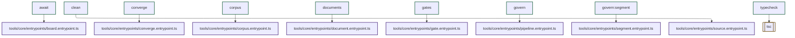

<!-- Auto-generated 2026-09-29T00:16Z v4 -->

# coordination-surface — architecture charts

## Lifecycle (npm scripts)

```mermaid
---
config:
  layout: elk
---
flowchart TD
    accTitle: coordination-surface npm-script lifecycle
    accDescr: how npm scripts compose the run, build, dev, and test lifecycle
    file_tools_core_entrypoints_board_entrypoint_ts["tools/core/entrypoints/board.entrypoint.ts"]
    file_tools_core_entrypoints_converge_entrypoint_ts["tools/core/entrypoints/converge.entrypoint.ts"]
    file_tools_core_entrypoints_corpus_entrypoint_ts["tools/core/entrypoints/corpus.entrypoint.ts"]
    file_tools_core_entrypoints_document_entrypoint_ts["tools/core/entrypoints/document.entrypoint.ts"]
    file_tools_core_entrypoints_gate_entrypoint_ts["tools/core/entrypoints/gate.entrypoint.ts"]
    file_tools_core_entrypoints_pipeline_entrypoint_ts["tools/core/entrypoints/pipeline.entrypoint.ts"]
    file_tools_core_entrypoints_segment_entrypoint_ts["tools/core/entrypoints/segment.entrypoint.ts"]
    file_tools_core_entrypoints_source_entrypoint_ts["tools/core/entrypoints/source.entrypoint.ts"]
    script_await["await"]
    script_clean["clean"]
    script_converge["converge"]
    script_corpus["corpus"]
    script_documents["documents"]
    script_gates["gates"]
    script_govern["govern"]
    script_govern_segment["govern:segment"]
    script_typecheck["typecheck"]
    tool_tsc[["tsc"]]
    script_await --> file_tools_core_entrypoints_board_entrypoint_ts
    script_clean --> file_tools_core_entrypoints_source_entrypoint_ts
    script_converge --> file_tools_core_entrypoints_converge_entrypoint_ts
    script_corpus --> file_tools_core_entrypoints_corpus_entrypoint_ts
    script_documents --> file_tools_core_entrypoints_document_entrypoint_ts
    script_gates --> file_tools_core_entrypoints_gate_entrypoint_ts
    script_govern --> file_tools_core_entrypoints_pipeline_entrypoint_ts
    script_govern_segment --> file_tools_core_entrypoints_segment_entrypoint_ts
    script_typecheck --> tool_tsc
    classDef kCollab stroke:#7a5c1e,stroke-width:2px;
    classDef kEntry stroke:#2f6f4f,stroke-width:2px;
    classDef kGate stroke:#8a3324,stroke-width:2px;
    classDef kHook stroke:#3a5a8a,stroke-width:2px;
    classDef kMethod stroke:#555555,stroke-width:2px;
    classDef kState stroke:#5a3a8a,stroke-width:2px;
    class tool_tsc kCollab;
    class script_await,script_clean,script_converge,script_corpus,script_documents,script_gates,script_govern,script_govern_segment,script_typecheck kEntry;
    class file_tools_core_entrypoints_board_entrypoint_ts,file_tools_core_entrypoints_converge_entrypoint_ts,file_tools_core_entrypoints_corpus_entrypoint_ts,file_tools_core_entrypoints_document_entrypoint_ts,file_tools_core_entrypoints_gate_entrypoint_ts,file_tools_core_entrypoints_pipeline_entrypoint_ts,file_tools_core_entrypoints_segment_entrypoint_ts,file_tools_core_entrypoints_source_entrypoint_ts kState;
```

Legend: green = npm script - amber = tool - purple = file - arrow = runs
