© 2025 Jay Baleine - Disciplined Methodology · Bane's Lab documentation is covered by [CC BY-SA 4.0](https://creativecommons.org/licenses/by-sa/4.0/)

# Algorithms — Ontology — Bane's Lab

> Every algorithm contract in this domain is listed with its position on the derivation loop, its intent and invariant, the flow it walks and its productions as a…

Canonical: https://banes-lab.com/ontology/algorithms

# The Ontology

The ontology is a queryable canon of software architecture. It holds every principle with its relations and its repair, every term with its definition, every algorithm with its contract, the reasoning that derives them, the layers they live in and how every tension between them is resolved, and every reference from one record to another is a link.

# Algorithms

452 of 452 shown

## Sections

- [Agent creation](#algorithms-domain-agent-creation)
- [Agent workflow](#algorithms-domain-agent-workflow)
- [Anti-patterns](#algorithms-domain-anti-patterns)
- [Architecture](#algorithms-domain-architecture)
- [Architecture relationships](#algorithms-domain-arch-relationships)
- [Architectural Clusters](#algorithms-domain-architectural-clusters)
- [Architectural Rules](#algorithms-domain-architectural-rules)
- [Automation](#algorithms-domain-automation)
- [Centralization](#algorithms-domain-centralization)
- [Checklist creation](#algorithms-domain-checklist-creation)
- [Codebase verification](#algorithms-domain-codebase-verification)
- [Context verification](#algorithms-domain-context-verification)
- [Coordination](#algorithms-domain-coordination)
- [Test coverage](#algorithms-domain-test-coverage)
- [Pattern Abstract Grammar](#algorithms-domain-pag)
- [Pattern distillation](#algorithms-domain-pattern-distillation)
- [Living profile](#algorithms-domain-living-profile)
- [Governed plan loop](#algorithms-domain-governed-plan-loop)
- [Quality engine](#algorithms-domain-quality-engine)
- [Mode-driven response schema](#algorithms-domain-mode-driven-response-schema)
- [CSS cascade](#algorithms-domain-css-cascade)
- [Taxonomy](#algorithms-domain-taxonomy)

## Agent creation

Every algorithm contract in this domain is listed with its position on the derivation loop, its intent and invariant, the flow it walks and its productions as a grammar. Each record also shows what it composes and is composed by, which forces and principles it answers to, what grounds it and what it grounds, and an exemplar where the record carries one. The diagram shows what composes what inside the domain.

Relations diagram

What composes what inside this domain.

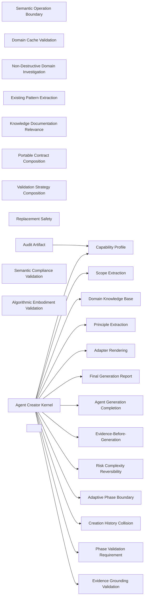

### Evidence-Before-Generation

- Domain: [agent-creation](ALGORITHMS.md#algorithms-domain-agent-creation)
- Tier: [process](SCHEMA.md#vocabulary-domain-tier-process)
- Stage: [orient](REASONING.md#stage-orient)
- Axis: [ontology](REASONING.md#reasoning-axis-ontology)
- Math type: [set-theory](REASONING.md#reasoning-math-type-set-theory)
- Yields: set | boolean

Details

Intent
Discover available context, inspect target-domain resources, extract concrete facts, construct a knowledge base, and generate only from verified evidence.

Invariant
Agent generation must be grounded in inspected domain structure, not assumptions.

Flow

```text
Request → Discover → Inspect → ExtractFacts → KnowledgeBase → Generate
```

Productions

```bnf
EvidenceBeforeGeneration ::= <UserRequest> "→" <ResourceDiscovery> "→" <DomainInspection> "→" <FactExtraction> "→" <KnowledgeBase> "→" <GeneratedAgent>
GeneratedAgent ::= "allowed_only_if_evidence_grounded"
```

Composes
none

Named in the derivation of
[Agent Creator Kernel](ALGORITHMS.md#algorithms-agent-creator-kernel)

Forces
[runtime_extensibility](SCHEMA.md#force-runtime-extensibility), [model_governance](SCHEMA.md#force-model-governance), [domain_boundary](SCHEMA.md#force-domain-boundary)

Grounds
none

Before

```text
An agent generated from the request text and prior model knowledge, never inspecting the target.
```

After

```text
request → discover resources → inspect domain → extract facts → knowledge base → generate only from verified evidence
```

How it is checked

Checked by
the agent auditor, which walks a generated agent against the agent-quality dimensions, the structured-document validator, which holds every agent to the grammar's node form

Population
Every agent the creator generates, and the domain evidence each one cites

Freshness
A verdict stands until the agent, its evidence or the grammar changes

Refusal
The validator fails an agent with a malformed node or gate, and the creator persists no agent that fails its grounding or embodiment check

Observation
None, because an agent contract is text; its runs are observed by the checks it declares

Evidence
Watched to fire and to accept: a suite plants a retired head in a real agent document and validates every agent on disk clean, while the auditor's walk is stated as a class

Authoritative side
The grammar and the agent-quality dimensions, which every generated agent conforms to

Depends on
Not answered

Shape it refuses
Not answered

### Semantic Operation Boundary

- Domain: [agent-creation](ALGORITHMS.md#algorithms-domain-agent-creation)
- Tier: [process](SCHEMA.md#vocabulary-domain-tier-process)
- Stage: [orient](REASONING.md#stage-orient)
- Axis: [ontology](REASONING.md#reasoning-axis-ontology)
- Math type: [logic](REASONING.md#reasoning-math-type-logic)
- Yields: boolean

Details

Intent
Define required work as semantic operations, defer runtime execution details to adapters, and reject runtime-specific primitives from the portable core contract.

Invariant
The core agent contract describes what must happen; the adapter decides how it happens.

Flow

```text
SemanticVerb → AdapterMapping → RuntimeAction → Result
```

Productions

```bnf
SemanticBoundary ::= <SemanticOperation> "→" <AdapterMapping> "→" <RuntimeExecution> "→" <EvidenceResult>
SemanticOperation ::= "DECLARE_RESOURCE" | "DISCOVER_RESOURCES" | "READ_RESOURCE" | "SEARCH_CONTENT" | "ANALYZE_CONTENT" | "EXTRACT_FACTS" | "CALCULATE_METRIC" | "COMPOSE_ARTIFACT" | "VALIDATE_ARTIFACT" | "PERSIST_ARTIFACT" | "REPORT_RESULT" | "REQUEST_DECISION"
CoreConstraint ::= "no_runtime_specific_paths_or_commands"
```

Composes
none

Forces
[modularity](SCHEMA.md#force-modularity), [contract_compatibility](SCHEMA.md#force-contract-compatibility), [semantic_consistency](SCHEMA.md#force-semantic-consistency)

Grounds
none

Before

```text
The agent core hardcodes a specific search command and an absolute path, so it only runs on one runtime.
```

After

```text
semantic op{DISCOVER/READ/SEARCH/ANALYZE} → adapter maps to the runtime → the core carries no runtime path or command
```

How it is checked

Checked by
the agent auditor, which walks a generated agent against the agent-quality dimensions, the structured-document validator, which holds every agent to the grammar's node form

Population
Every agent the creator generates, and the domain evidence each one cites

Freshness
A verdict stands until the agent, its evidence or the grammar changes

Refusal
The validator fails an agent with a malformed node or gate, and the creator persists no agent that fails its grounding or embodiment check

Observation
None, because an agent contract is text; its runs are observed by the checks it declares

Evidence
Watched to fire and to accept: a suite plants a retired head in a real agent document and validates every agent on disk clean, while the auditor's walk is stated as a class

Authoritative side
The grammar and the agent-quality dimensions, which every generated agent conforms to

Depends on
Not answered

Shape it refuses
Not answered

### Capability Profile

- Domain: [agent-creation](ALGORITHMS.md#algorithms-domain-agent-creation)
- Tier: [process](SCHEMA.md#vocabulary-domain-tier-process)
- Stage: [orient](REASONING.md#stage-orient)
- Axis: [ontology](REASONING.md#reasoning-axis-ontology)
- Math type: [set-theory](REASONING.md#reasoning-math-type-set-theory)
- Yields: set | boolean

Details

Intent
Detect filesystem, search, execution, persistence, validation, and user-interaction capabilities; mark unsupported capabilities; substitute where safe; block where required capability is non-substitutable.

Invariant
Generated workflows must know what their runtime can do.

Flow

```text
CapabilitySet → Probe → Available|Unavailable|Substituted → RuntimeMode
```

Productions

```bnf
CapabilityProfile ::= <RequiredCapabilitySet> "→" <CapabilityProbeSet> "→" <CapabilityVerdict>
CapabilityVerdict ::= "full" | "degraded" | "blocked"
Capability ::= "filesystem" | "search" | "execution" | "persistence" | "validation" | "user_interaction"
```

Composes
none

Composed by
[Audit Artifact](ALGORITHMS.md#algorithms-audit-artifact), [Agent Creator Kernel](ALGORITHMS.md#algorithms-agent-creator-kernel)

Forces
[correctness_verification](SCHEMA.md#force-correctness-verification)

Grounds
none

Before

```text
The agent assumes it can execute and write, then fails when it cannot.
```

After

```text
required capabilities{filesystem, search, execution, persistence, validation} → probe each → mode{full | degraded | blocked}
```

How it is checked

Checked by
the agent auditor, which walks a generated agent against the agent-quality dimensions, the structured-document validator, which holds every agent to the grammar's node form

Population
Every agent the creator generates, and the domain evidence each one cites

Freshness
A verdict stands until the agent, its evidence or the grammar changes

Refusal
The validator fails an agent with a malformed node or gate, and the creator persists no agent that fails its grounding or embodiment check

Observation
None, because an agent contract is text; its runs are observed by the checks it declares

Evidence
Watched to fire and to accept: a suite plants a retired head in a real agent document and validates every agent on disk clean, while the auditor's walk is stated as a class

Authoritative side
The grammar and the agent-quality dimensions, which every generated agent conforms to

Depends on
Not answered

Shape it refuses
Not answered

### Creation History Collision

- Domain: [agent-creation](ALGORITHMS.md#algorithms-domain-agent-creation)
- Tier: [process](SCHEMA.md#vocabulary-domain-tier-process)
- Stage: [constrain](REASONING.md#stage-constrain)
- Axis: [teleology](REASONING.md#reasoning-axis-teleology)
- Math type: [optimization](REASONING.md#reasoning-math-type-optimization)
- Yields: boolean | ranking

Details

Intent
Load existing agent and invocation registries, map existing identities, compare target name and domain, and require the developer's decision before refinement, renaming, replacement, or cancellation.

Invariant
Agent creation must not silently duplicate or overwrite prior work.

Flow

```text
TargetAgent → ExistingRegistry → NameCollision? → DomainCollision? → Decision
```

Productions

```bnf
CreationCollision ::= <TargetAgentName> "→" <ExistingAgentMap> "→" <CollisionCheck> "→" <AgentOperationMode>
AgentOperationMode ::= "CREATE" | "REFINE" | "RENAME" | "REPLACE" | "CANCEL"
CollisionCheck ::= "name_collision" | "domain_collision" | "none"
```

Composes
none

Named in the derivation of
[Agent Creator Kernel](ALGORITHMS.md#algorithms-agent-creator-kernel)

Forces
[semantic_consistency](SCHEMA.md#force-semantic-consistency), [domain_boundary](SCHEMA.md#force-domain-boundary)

Grounds
none

Before

```text
A new agent silently overwrites an existing one of the same name.
```

After

```text
target name → existing registry → name/domain collision? → developer decision{CREATE|REFINE|RENAME|REPLACE|CANCEL}
```

How it is checked

Checked by
the agent auditor, which walks a generated agent against the agent-quality dimensions, the structured-document validator, which holds every agent to the grammar's node form

Population
Every agent the creator generates, and the domain evidence each one cites

Freshness
A verdict stands until the agent, its evidence or the grammar changes

Refusal
The validator fails an agent with a malformed node or gate, and the creator persists no agent that fails its grounding or embodiment check

Observation
None, because an agent contract is text; its runs are observed by the checks it declares

Evidence
Watched to fire and to accept: a suite plants a retired head in a real agent document and validates every agent on disk clean, while the auditor's walk is stated as a class

Authoritative side
The grammar and the agent-quality dimensions, which every generated agent conforms to

Depends on
Not answered

Shape it refuses
Not answered

### Domain Cache Validation

- Domain: [agent-creation](ALGORITHMS.md#algorithms-domain-agent-creation)
- Tier: [process](SCHEMA.md#vocabulary-domain-tier-process)
- Stage: [orient](REASONING.md#stage-orient)
- Axis: [ontology](REASONING.md#reasoning-axis-ontology)
- Math type: [logic](REASONING.md#reasoning-math-type-logic)
- Yields: boolean

Details

Intent
Normalize the domain path, compute a domain hash, search cache entries, fingerprint the domain's sources, and reuse cached knowledge only when the entry's identity matches and its derivation fingerprint equals the current one.

Invariant
Prior domain intelligence can be reused only when freshness and identity are verified.

Flow

```text
DomainPath → Normalize → Hash → CacheLookup → FingerprintCheck → UseCache|Investigate
```

Productions

```bnf
DomainCache ::= <DomainPath> "→" <DomainHash> "→" <CacheEntry> "→" <SourceFingerprint> "→" <CacheDecision>
CacheDecision ::= "use_cached_domain" | "reject_stale_cache" | "no_cache_investigate"
```

Composes
none

Forces
[semantic_consistency](SCHEMA.md#force-semantic-consistency), [correctness_verification](SCHEMA.md#force-correctness-verification), [domain_boundary](SCHEMA.md#force-domain-boundary)

Grounds
none

Before

```text
Stale cached domain intelligence reused as if it were current.
```

After

```text
domain path → normalize + hash → cache lookup → fingerprint of the domain's sources vs the entry's derivation fingerprint → {use cached | reject stale | investigate}
```

How it is checked

Checked by
the agent auditor, which walks a generated agent against the agent-quality dimensions, the structured-document validator, which holds every agent to the grammar's node form

Population
Every agent the creator generates, and the domain evidence each one cites

Freshness
A verdict stands until the agent, its evidence or the grammar changes

Refusal
The validator fails an agent with a malformed node or gate, and the creator persists no agent that fails its grounding or embodiment check

Observation
None, because an agent contract is text; its runs are observed by the checks it declares

Evidence
Watched to fire and to accept: a suite plants a retired head in a real agent document and validates every agent on disk clean, while the auditor's walk is stated as a class

Authoritative side
The grammar and the agent-quality dimensions, which every generated agent conforms to

Depends on
Not answered

Shape it refuses
Not answered

### Scope Extraction

- Domain: [agent-creation](ALGORITHMS.md#algorithms-domain-agent-creation)
- Tier: [process](SCHEMA.md#vocabulary-domain-tier-process)
- Stage: [orient](REASONING.md#stage-orient)
- Axis: [ontology](REASONING.md#reasoning-axis-ontology)
- Math type: [set-theory](REASONING.md#reasoning-math-type-set-theory)
- Yields: set | boolean

Details

Intent
Determine whether the target is a resource, directory, module, repository, or unknown scope; then extract interfaces, declarations, dependencies, systems, or boundaries appropriate to that scope.

Invariant
Investigation depth must match target-domain shape.

Flow

```text
TargetPath → InvestigationType → ScopeModel → ResourceSet → InterfaceFacts
```

Productions

```bnf
ScopeExtraction ::= <TargetPath> "→" <InvestigationDepth> "→" <DomainScope>
InvestigationDepth ::= "single-resource" | "directory" | "module" | "repository" | "auto"
DomainScope ::= <ResourceScope> | <DirectoryScope> | <ModuleScope> | <RepositoryScope>
```

Composes
none

Composed by
[Agent Creator Kernel](ALGORITHMS.md#algorithms-agent-creator-kernel)

Forces
[modularity](SCHEMA.md#force-modularity), [contract_compatibility](SCHEMA.md#force-contract-compatibility), [domain_boundary](SCHEMA.md#force-domain-boundary)

Grounds
none

Before

```text
A repository investigated at single-file depth, missing every boundary.
```

After

```text
target → investigation depth{single-resource|directory|module|repository} → scope-matched facts{interfaces, deps, boundaries}
```

How it is checked

Checked by
the agent auditor, which walks a generated agent against the agent-quality dimensions, the structured-document validator, which holds every agent to the grammar's node form

Population
Every agent the creator generates, and the domain evidence each one cites

Freshness
A verdict stands until the agent, its evidence or the grammar changes

Refusal
The validator fails an agent with a malformed node or gate, and the creator persists no agent that fails its grounding or embodiment check

Observation
None, because an agent contract is text; its runs are observed by the checks it declares

Evidence
Watched to fire and to accept: a suite plants a retired head in a real agent document and validates every agent on disk clean, while the auditor's walk is stated as a class

Authoritative side
The grammar and the agent-quality dimensions, which every generated agent conforms to

Depends on
Not answered

Shape it refuses
Not answered

### Non-Destructive Domain Investigation

- Domain: [agent-creation](ALGORITHMS.md#algorithms-domain-agent-creation)
- Tier: [process](SCHEMA.md#vocabulary-domain-tier-process)
- Stage: [see](REASONING.md#stage-see)
- Axis: [analysis](REASONING.md#reasoning-axis-analysis)
- Math type: [analysis](REASONING.md#reasoning-axis-analysis)
- Yields: operation

Details

Intent
Prepare static investigation, optionally prepare safe executable analysis, prohibit source mutation, execute or emulate analysis, and merge observable outputs into domain intelligence.

Invariant
Domain discovery may inspect and analyze, but must not mutate the source domain.

Flow

```text
StaticPlan + OptionalExecutablePlan → Analyze → ExtractStructure → CacheResults
```

Productions

```bnf
DomainInvestigation ::= <InvestigationPlan> "→" <AnalysisExecution> "→" <DomainKnowledge>
InvestigationPlan ::= <StaticAnalysisPlan> "," <OptionalExecutableAnalysisPlan>
ExecutionConstraint ::= "non_destructive" "," "observable_output_required" "," "source_mutation_forbidden"
```

Composes
none

Forces
[runtime_extensibility](SCHEMA.md#force-runtime-extensibility), [state_transaction](SCHEMA.md#force-state-transaction), [observability_traceability](SCHEMA.md#force-observability-traceability), [domain_boundary](SCHEMA.md#force-domain-boundary)

Grounds
none

Before

```text
Investigation runs a script that mutates the source it is inspecting.
```

After

```text
static plan (+ optional safe executable) → analyze, never mutate the source → observable output → domain knowledge
```

How it is checked

Checked by
the agent auditor, which walks a generated agent against the agent-quality dimensions, the structured-document validator, which holds every agent to the grammar's node form

Population
Every agent the creator generates, and the domain evidence each one cites

Freshness
A verdict stands until the agent, its evidence or the grammar changes

Refusal
The validator fails an agent with a malformed node or gate, and the creator persists no agent that fails its grounding or embodiment check

Observation
None, because an agent contract is text; its runs are observed by the checks it declares

Evidence
Watched to fire and to accept: a suite plants a retired head in a real agent document and validates every agent on disk clean, while the auditor's walk is stated as a class

Authoritative side
The grammar and the agent-quality dimensions, which every generated agent conforms to

Depends on
Not answered

Shape it refuses
Not answered

### Domain Knowledge Base

- Domain: [agent-creation](ALGORITHMS.md#algorithms-domain-agent-creation)
- Tier: [process](SCHEMA.md#vocabulary-domain-tier-process)
- Stage: [orient](REASONING.md#stage-orient)
- Axis: [ontology](REASONING.md#reasoning-axis-ontology)
- Math type: [set-theory](REASONING.md#reasoning-math-type-set-theory)
- Yields: set | boolean

Details

Intent
Store target scope, discovered structure, purposes, dependencies, interfaces, patterns, statistics, timestamp, and evidence sources in a reusable knowledge object.

Invariant
Agent generation needs an explicit evidence substrate.

Flow

```text
DomainFacts → Statistics → EvidenceSources → KnowledgeBase
```

Productions

```bnf
DomainKnowledgeBase ::= <DomainScope> "," <DomainStructure> "," <PurposeSet> "," <DependencyMap> "," <InterfaceSet> "," <PatternSet> "," <Statistics> "," <EvidenceSourceSet>
Statistics ::= "resource_count" "," "interface_count" "," "dependency_count" "," "resource_types" "," "architectural_patterns"
```

Composes
none

Composed by
[Agent Creator Kernel](ALGORITHMS.md#algorithms-agent-creator-kernel)

Forces
[contract_compatibility](SCHEMA.md#force-contract-compatibility), [domain_boundary](SCHEMA.md#force-domain-boundary)

Grounds
none

Before

```text
Generation proceeds with no explicit evidence substrate to cite.
```

After

```text
domain facts + structure + purposes + deps + interfaces + patterns + statistics + evidence sources → reusable knowledge base
```

How it is checked

Checked by
the agent auditor, which walks a generated agent against the agent-quality dimensions, the structured-document validator, which holds every agent to the grammar's node form

Population
Every agent the creator generates, and the domain evidence each one cites

Freshness
A verdict stands until the agent, its evidence or the grammar changes

Refusal
The validator fails an agent with a malformed node or gate, and the creator persists no agent that fails its grounding or embodiment check

Observation
None, because an agent contract is text; its runs are observed by the checks it declares

Evidence
Watched to fire and to accept: a suite plants a retired head in a real agent document and validates every agent on disk clean, while the auditor's walk is stated as a class

Authoritative side
The grammar and the agent-quality dimensions, which every generated agent conforms to

Depends on
Not answered

Shape it refuses
Not answered

### Risk Complexity Reversibility

- Domain: [agent-creation](ALGORITHMS.md#algorithms-domain-agent-creation)
- Tier: [process](SCHEMA.md#vocabulary-domain-tier-process)
- Stage: [see](REASONING.md#stage-see)
- Axis: [analysis](REASONING.md#reasoning-axis-analysis)
- Math type: [analysis](REASONING.md#reasoning-axis-analysis)
- Yields: operation

Details

Intent
Analyze domain dependencies, side effects, resource count, interface count, dependency patterns, and uncertainty factors to assign risk, complexity, reversibility, and uncertainty.

Invariant
Phase rigor should be proportional to domain risk and complexity.

Flow

```text
KnowledgeBase → RiskFactors → ComplexityScore → Reversibility → Uncertainty
```

Productions

```bnf
DomainCharacteristics ::= <RiskLevel> "," <ComplexityScore> "," <Reversibility> "," <UncertaintyLevel>
RiskLevel ::= "low" | "medium" | "high"
Reversibility ::= "reversible" | "partially-reversible" | "irreversible"
UncertaintyLevel ::= "low" | "medium" | "high"
```

Composes
none

Named in the derivation of
[Agent Creator Kernel](ALGORITHMS.md#algorithms-agent-creator-kernel)

Forces
[contract_compatibility](SCHEMA.md#force-contract-compatibility), [domain_boundary](SCHEMA.md#force-domain-boundary)

Grounds
none

Before

```text
Every agent given the same phase count regardless of how risky its domain is.
```

After

```text
knowledge base → risk{low|medium|high} + complexity + reversibility{reversible|partial|irreversible} + uncertainty
```

How it is checked

Checked by
the agent auditor, which walks a generated agent against the agent-quality dimensions, the structured-document validator, which holds every agent to the grammar's node form

Population
Every agent the creator generates, and the domain evidence each one cites

Freshness
A verdict stands until the agent, its evidence or the grammar changes

Refusal
The validator fails an agent with a malformed node or gate, and the creator persists no agent that fails its grounding or embodiment check

Observation
None, because an agent contract is text; its runs are observed by the checks it declares

Evidence
Watched to fire and to accept: a suite plants a retired head in a real agent document and validates every agent on disk clean, while the auditor's walk is stated as a class

Authoritative side
The grammar and the agent-quality dimensions, which every generated agent conforms to

Depends on
Not answered

Shape it refuses
Not answered

### Existing Pattern Extraction

- Domain: [agent-creation](ALGORITHMS.md#algorithms-domain-agent-creation)
- Tier: [process](SCHEMA.md#vocabulary-domain-tier-process)
- Stage: [see](REASONING.md#stage-see)
- Axis: [analysis](REASONING.md#reasoning-axis-analysis)
- Math type: [set-theory](REASONING.md#reasoning-math-type-set-theory)
- Yields: set | boolean

Details

Intent
Inspect existing agent specifications, count phase markers, validation gates, and semantic operations, extract reusable structures, and derive baseline design conventions.

Invariant
New agents should conform to proven local agent grammar where evidence exists.

Flow

```text
ExistingSpecs → PhaseCount → GateCount → OperationUsage → ReusablePatterns
```

Productions

```bnf
ExistingPatternExtraction ::= <ExistingAgentSpecSet> "→" <StructuralMetricSet> "→" <ReusablePatternSet>
StructuralMetricSet ::= "phase_count" "," "validation_gate_count" "," "semantic_operation_count"
```

Composes
none

Forces
[semantic_consistency](SCHEMA.md#force-semantic-consistency), [correctness_verification](SCHEMA.md#force-correctness-verification)

Grounds
none

Before

```text
A new agent invented in a shape that ignores the local agent grammar.
```

After

```text
existing specs → count{phases, gates, semantic ops} → reusable structures → baseline conventions
```

How it is checked

Checked by
the agent auditor, which walks a generated agent against the agent-quality dimensions, the structured-document validator, which holds every agent to the grammar's node form

Population
Every agent the creator generates, and the domain evidence each one cites

Freshness
A verdict stands until the agent, its evidence or the grammar changes

Refusal
The validator fails an agent with a malformed node or gate, and the creator persists no agent that fails its grounding or embodiment check

Observation
None, because an agent contract is text; its runs are observed by the checks it declares

Evidence
Watched to fire and to accept: a suite plants a retired head in a real agent document and validates every agent on disk clean, while the auditor's walk is stated as a class

Authoritative side
The grammar and the agent-quality dimensions, which every generated agent conforms to

Depends on
Not answered

Shape it refuses
Not answered

### Knowledge Documentation Relevance

- Domain: [agent-creation](ALGORITHMS.md#algorithms-domain-agent-creation)
- Tier: [process](SCHEMA.md#vocabulary-domain-tier-process)
- Stage: [see](REASONING.md#stage-see)
- Axis: [analysis](REASONING.md#reasoning-axis-analysis)
- Math type: [probability](REASONING.md#reasoning-math-type-probability)
- Yields: number[0,1]

Details

Intent
Discover knowledge documents, read descriptions, compare them against domain characteristics, score relevance, and exclude irrelevant documents from core reasoning.

Invariant
Supporting documents should influence generation only when relevant to the target domain.

Flow

```text
KnowledgeDocs → RelevanceAnalysis → RelevantDocs → PrincipleInput
```

Productions

```bnf
KnowledgeRelevance ::= <KnowledgeDocumentSet> "→" <RelevanceScoreSet> "→" <RelevantKnowledgeSet>
RelevanceDecision ::= "include" | "exclude"
```

Composes
none

Forces
[runtime_extensibility](SCHEMA.md#force-runtime-extensibility), [domain_boundary](SCHEMA.md#force-domain-boundary)

Grounds
none

Before

```text
Every knowledge doc fed into reasoning, relevant or not.
```

After

```text
knowledge docs → read descriptions → score relevance vs domain → include relevant, exclude the rest
```

How it is checked

Checked by
the agent auditor, which walks a generated agent against the agent-quality dimensions, the structured-document validator, which holds every agent to the grammar's node form

Population
Every agent the creator generates, and the domain evidence each one cites

Freshness
A verdict stands until the agent, its evidence or the grammar changes

Refusal
The validator fails an agent with a malformed node or gate, and the creator persists no agent that fails its grounding or embodiment check

Observation
None, because an agent contract is text; its runs are observed by the checks it declares

Evidence
Watched to fire and to accept: a suite plants a retired head in a real agent document and validates every agent on disk clean, while the auditor's walk is stated as a class

Authoritative side
The grammar and the agent-quality dimensions, which every generated agent conforms to

Depends on
Not answered

Shape it refuses
Not answered

### Principle Extraction

- Domain: [agent-creation](ALGORITHMS.md#algorithms-domain-agent-creation)
- Tier: [process](SCHEMA.md#vocabulary-domain-tier-process)
- Stage: [derive](REASONING.md#stage-derive)
- Axis: [reasoning](REASONING.md#reasoning-axis-reasoning)
- Math type: [logic](REASONING.md#reasoning-math-type-logic)
- Yields: boolean

Details

Intent
Start from structural principles, test applicability against domain characteristics, add domain-specific principles from relevant documents, and exclude runtime-specific principles from the core.

Invariant
Generated agents should embody portable design principles selected from evidence.

Flow

```text
StructuralPrinciples + DomainDocs → Applicability → CorePrinciples
```

Productions

```bnf
PrincipleExtraction ::= <CandidatePrincipleSet> "→" <ApplicabilityAnalysis> "→" <CorePrincipleSet>
CorePrinciple ::= "phase_gated_execution" | "validation_boundaries" | "declaration_before_use" | "evidence_before_composition" | "adapter_separation" | "auditability"
```

Composes
none

Composed by
[Agent Creator Kernel](ALGORITHMS.md#algorithms-agent-creator-kernel)

Named in the derivation of
[Agent Creator Kernel](ALGORITHMS.md#algorithms-agent-creator-kernel)

Forces
[domain_boundary](SCHEMA.md#force-domain-boundary)

Grounds
none

Before

```text
Runtime-specific principles baked into the portable core.
```

After

```text
structural candidates + domain docs → test applicability → core principles{phase-gated, validation-boundaries, declaration-before-use, evidence-before-composition, adapter-separation, auditability}; runtime-specific excluded
```

How it is checked

Checked by
the agent auditor, which walks a generated agent against the agent-quality dimensions, the structured-document validator, which holds every agent to the grammar's node form

Population
Every agent the creator generates, and the domain evidence each one cites

Freshness
A verdict stands until the agent, its evidence or the grammar changes

Refusal
The validator fails an agent with a malformed node or gate, and the creator persists no agent that fails its grounding or embodiment check

Observation
None, because an agent contract is text; its runs are observed by the checks it declares

Evidence
Watched to fire and to accept: a suite plants a retired head in a real agent document and validates every agent on disk clean, while the auditor's walk is stated as a class

Authoritative side
The grammar and the agent-quality dimensions, which every generated agent conforms to

Depends on
Not answered

Shape it refuses
Not answered

### Adaptive Phase Boundary

- Domain: [agent-creation](ALGORITHMS.md#algorithms-domain-agent-creation)
- Tier: [process](SCHEMA.md#vocabulary-domain-tier-process)
- Stage: [intent](REASONING.md#stage-intent)
- Axis: [teleology](REASONING.md#reasoning-axis-teleology)
- Math type: [optimization](REASONING.md#reasoning-math-type-optimization)
- Yields: boolean | ranking

Details

Intent
Select phase count from risk and complexity, assign phase boundaries, and strengthen validation density for high-risk or high-complexity domains.

Invariant
Agent structure should scale with domain difficulty.

Flow

```text
Risk + Complexity + Uncertainty → PhaseCount → PhaseBoundaries
```

Productions

```bnf
PhaseBoundarySelection ::= <RiskLevel> "," <ComplexityScore> "," <UncertaintyLevel> "→" <PhaseStructure>
PhaseStructure ::= <ThreePhase> | <FivePhase> | <SevenPhase>
ThreePhase ::= "Discovery" "," "Generation" "," "Verification"
FivePhase ::= "Discovery" "," "Analysis" "," "Generation" "," "Verification" "," "Finalization"
SevenPhase ::= "Discovery" "," "Analysis" "," "Planning" "," "Validation" "," "Generation" "," "Verification" "," "Finalization"
```

Composes
none

Named in the derivation of
[Agent Creator Kernel](ALGORITHMS.md#algorithms-agent-creator-kernel)

Forces
[modularity](SCHEMA.md#force-modularity), [correctness_verification](SCHEMA.md#force-correctness-verification), [performance_scaling](SCHEMA.md#force-performance-scaling), [domain_boundary](SCHEMA.md#force-domain-boundary)

Grounds
[tel-priority](REASONING.md#reasoning-node-tel-priority)

Before

```text
A high-risk irreversible domain given a 3-phase agent.
```

After

```text
risk + complexity + uncertainty → phase count{3 | 5 | 7} → validation density proportional to difficulty
```

How it is checked

Checked by
the agent auditor, which walks a generated agent against the agent-quality dimensions, the structured-document validator, which holds every agent to the grammar's node form

Population
Every agent the creator generates, and the domain evidence each one cites

Freshness
A verdict stands until the agent, its evidence or the grammar changes

Refusal
The validator fails an agent with a malformed node or gate, and the creator persists no agent that fails its grounding or embodiment check

Observation
None, because an agent contract is text; its runs are observed by the checks it declares

Evidence
Watched to fire and to accept: a suite plants a retired head in a real agent document and validates every agent on disk clean, while the auditor's walk is stated as a class

Authoritative side
The grammar and the agent-quality dimensions, which every generated agent conforms to

Depends on
Not answered

Shape it refuses
Not answered

### Phase Validation Requirement

- Domain: [agent-creation](ALGORITHMS.md#algorithms-domain-agent-creation)
- Tier: [process](SCHEMA.md#vocabulary-domain-tier-process)
- Stage: [project](REASONING.md#stage-project)
- Axis: [reasoning](REASONING.md#reasoning-axis-reasoning)
- Math type: [logic](REASONING.md#reasoning-math-type-logic)
- Yields: boolean

Details

Intent
For every phase boundary, generate explicit validation requirements from the phase purpose, adapter-separation needs, evidence-grounding needs, and safety constraints.

Invariant
Every phase must end with verifiable exit conditions.

Flow

```text
PhaseSet → RequirementDerivation → ValidationGateSet
```

Productions

```bnf
PhaseValidation ::= <PhaseSet> "→" <ValidationRequirementSet> "→" <ValidationGateSet>
PhaseValidationGate ::= <PhaseName> ":" <RequirementSet>
RequirementSet ::= <Requirement> | <Requirement> "," <RequirementSet>
```

Composes
none

Named in the derivation of
[Agent Creator Kernel](ALGORITHMS.md#algorithms-agent-creator-kernel)

Forces
[modularity](SCHEMA.md#force-modularity), [correctness_verification](SCHEMA.md#force-correctness-verification), [model_governance](SCHEMA.md#force-model-governance)

Grounds
none

Before

```text
A phase ends with no verifiable exit condition.
```

After

```text
phase → derive requirements{purpose, adapter-separation, evidence-grounding, safety} → a validation gate per phase
```

How it is checked

Checked by
the agent auditor, which walks a generated agent against the agent-quality dimensions, the structured-document validator, which holds every agent to the grammar's node form

Population
Every agent the creator generates, and the domain evidence each one cites

Freshness
A verdict stands until the agent, its evidence or the grammar changes

Refusal
The validator fails an agent with a malformed node or gate, and the creator persists no agent that fails its grounding or embodiment check

Observation
None, because an agent contract is text; its runs are observed by the checks it declares

Evidence
Watched to fire and to accept: a suite plants a retired head in a real agent document and validates every agent on disk clean, while the auditor's walk is stated as a class

Authoritative side
The grammar and the agent-quality dimensions, which every generated agent conforms to

Depends on
Not answered

Shape it refuses
Not answered

### Portable Contract Composition

- Domain: [agent-creation](ALGORITHMS.md#algorithms-domain-agent-creation)
- Tier: [process](SCHEMA.md#vocabulary-domain-tier-process)
- Stage: [act](REASONING.md#stage-act)
- Axis: [formalization](REASONING.md#reasoning-axis-formalization)
- Math type: [computation](REASONING.md#reasoning-math-type-computation)
- Yields: procedure

Details

Intent
Compose identity, purpose, methodology, domain scope, characteristics, capabilities, phases, validation strategy, constraints, and required outputs into a runtime-neutral agent contract.

Invariant
The portable contract is the canonical artifact; adapter outputs are renderings.

Flow

```text
KnowledgeBase + Principles + Phases → PortableContract
```

Productions

```bnf
PortableAgentContract ::= <Identity> "," <Purpose> "," <DomainModel> "," <CapabilityRequirements> "," <PhaseSpecifications> "," <ValidationStrategy> "," <SafetyConstraints> "," <OutputContract>
OutputContract ::= "portable_agent_contract" | "invocation_contract" | "audit_report" | "final_report"
```

Composes
none

Forces
[contract_compatibility](SCHEMA.md#force-contract-compatibility), [semantic_consistency](SCHEMA.md#force-semantic-consistency), [correctness_verification](SCHEMA.md#force-correctness-verification), [domain_boundary](SCHEMA.md#force-domain-boundary)

Grounds
none

Before

```text
The agent authored directly as a runtime artifact, welded to one runtime.
```

After

```text
knowledge base + principles + phases → runtime-neutral contract{identity, purpose, domain model, capabilities, phase specs, validation strategy, constraints, outputs} = the canonical artifact
```

How it is checked

Checked by
the agent auditor, which walks a generated agent against the agent-quality dimensions, the structured-document validator, which holds every agent to the grammar's node form

Population
Every agent the creator generates, and the domain evidence each one cites

Freshness
A verdict stands until the agent, its evidence or the grammar changes

Refusal
The validator fails an agent with a malformed node or gate, and the creator persists no agent that fails its grounding or embodiment check

Observation
None, because an agent contract is text; its runs are observed by the checks it declares

Evidence
Watched to fire and to accept: a suite plants a retired head in a real agent document and validates every agent on disk clean, while the auditor's walk is stated as a class

Authoritative side
The grammar and the agent-quality dimensions, which every generated agent conforms to

Depends on
Not answered

Shape it refuses
Not answered

### Validation Strategy Composition

- Domain: [agent-creation](ALGORITHMS.md#algorithms-domain-agent-creation)
- Tier: [process](SCHEMA.md#vocabulary-domain-tier-process)
- Stage: [project](REASONING.md#stage-project)
- Axis: [reasoning](REASONING.md#reasoning-axis-reasoning)
- Math type: [logic](REASONING.md#reasoning-math-type-logic)
- Yields: boolean

Details

Intent
Define pre-generation, during-generation, and post-generation checks that enforce capabilities, creation history, evidence grounding, adapter separation, schema validity, and absence of unsupported assumptions.

Invariant
Generated artifacts must be validated throughout composition, not only afterward.

Flow

```text
PreChecks → DuringChecks → PostChecks → ValidationStrategy
```

Productions

```bnf
GenerationValidationStrategy ::= <PreGenerationChecks> "," <DuringGenerationChecks> "," <PostGenerationChecks>
PreGenerationChecks ::= "capabilities_detected" "," "history_checked" "," "domain_knowledge_available"
DuringGenerationChecks ::= "phase_gates_enforced" "," "evidence_grounded_content" "," "adapter_separated"
PostGenerationChecks ::= "schema_valid" "," "audit_complete" "," "unsupported_assumptions_absent"
```

Composes
none

Forces
[modularity](SCHEMA.md#force-modularity), [correctness_verification](SCHEMA.md#force-correctness-verification), [model_governance](SCHEMA.md#force-model-governance)

Grounds
none

Before

```text
The artifact validated only after it is written, never during.
```

After

```text
pre{capabilities detected, history checked, knowledge available} + during{phase gates, evidence-grounded, adapter-separated} + post{schema valid, audit complete, no unsupported assumptions}
```

How it is checked

Checked by
the agent auditor, which walks a generated agent against the agent-quality dimensions, the structured-document validator, which holds every agent to the grammar's node form

Population
Every agent the creator generates, and the domain evidence each one cites

Freshness
A verdict stands until the agent, its evidence or the grammar changes

Refusal
The validator fails an agent with a malformed node or gate, and the creator persists no agent that fails its grounding or embodiment check

Observation
None, because an agent contract is text; its runs are observed by the checks it declares

Evidence
Watched to fire and to accept: a suite plants a retired head in a real agent document and validates every agent on disk clean, while the auditor's walk is stated as a class

Authoritative side
The grammar and the agent-quality dimensions, which every generated agent conforms to

Depends on
Not answered

Shape it refuses
Not answered

### Replacement Safety

- Domain: [agent-creation](ALGORITHMS.md#algorithms-domain-agent-creation)
- Tier: [process](SCHEMA.md#vocabulary-domain-tier-process)
- Stage: [constrain](REASONING.md#stage-constrain)
- Axis: [teleology](REASONING.md#reasoning-axis-teleology)
- Math type: [optimization](REASONING.md#reasoning-math-type-optimization)
- Yields: boolean | ranking

Details

Intent
If replacing an existing artifact, require prior approval, archive existing artifacts, verify archive persistence, and block new persistence if archival cannot be confirmed.

Invariant
Destructive generation requires recoverability before mutation.

Flow

```text
ReplaceIntent → Approval → ArchiveExisting → VerifyArchive → Persist|Block
```

Productions

```bnf
ReplacementSafety ::= <AgentOperationMode> "→" <ArchivePolicy> "→" <SafetyCheck> "→" <PersistenceDecision>
ArchivePolicy ::= "archive_required_if_replace" | "archive_not_required"
PersistenceDecision ::= "safe_to_persist" | "blocked"
```

Composes
none

Forces
[state_transaction](SCHEMA.md#force-state-transaction), [correctness_verification](SCHEMA.md#force-correctness-verification)

Grounds
none

Before

```text
An existing agent overwritten with no archive — the original is lost.
```

After

```text
REPLACE → require approval → archive existing → verify the archive → persist only if recoverable, else block
```

How it is checked

Checked by
the agent auditor, which walks a generated agent against the agent-quality dimensions, the structured-document validator, which holds every agent to the grammar's node form

Population
Every agent the creator generates, and the domain evidence each one cites

Freshness
A verdict stands until the agent, its evidence or the grammar changes

Refusal
The validator fails an agent with a malformed node or gate, and the creator persists no agent that fails its grounding or embodiment check

Observation
None, because an agent contract is text; its runs are observed by the checks it declares

Evidence
Watched to fire and to accept: a suite plants a retired head in a real agent document and validates every agent on disk clean, while the auditor's walk is stated as a class

Authoritative side
The grammar and the agent-quality dimensions, which every generated agent conforms to

Depends on
Not answered

Shape it refuses
Not answered

### Adapter Rendering

- Domain: [agent-creation](ALGORITHMS.md#algorithms-domain-agent-creation)
- Tier: [process](SCHEMA.md#vocabulary-domain-tier-process)
- Stage: [act](REASONING.md#stage-act)
- Axis: [formalization](REASONING.md#reasoning-axis-formalization)
- Math type: [computation](REASONING.md#reasoning-math-type-computation)
- Yields: procedure

Details

Intent
Render the portable contract into runtime-specific agent specification, invocation contract, and audit artifacts only through adapter-defined schemas and destinations.

Invariant
Runtime-specific artifacts are projections of the portable contract, not replacements for it.

Flow

```text
PortableContract → AdapterSchema → RenderedArtifact → Validate → Persist
```

Productions

```bnf
AdapterRendering ::= <PortableContract> "→" <AdapterConfig> "→" <ArtifactSet> "→" <AdapterValidation> "→" <Persistence>
ArtifactSet ::= "agent_specification" "," "invocation_contract" "," "audit_report"
AdapterConstraint ::= "adapter_may_add_metadata_but_not_alter_core_intent"
```

Composes
none

Composed by
[Agent Creator Kernel](ALGORITHMS.md#algorithms-agent-creator-kernel)

Named in the derivation of
[Agent Creator Kernel](ALGORITHMS.md#algorithms-agent-creator-kernel)

Forces
[contract_compatibility](SCHEMA.md#force-contract-compatibility)

Grounds
none

Before

```text
The runtime artifact edited directly, diverging from the portable contract.
```

After

```text
portable contract → adapter schema → artifacts{agent spec, invocation contract, audit} → adapter may add metadata, never alter core intent
```

How it is checked

Checked by
the agent auditor, which walks a generated agent against the agent-quality dimensions, the structured-document validator, which holds every agent to the grammar's node form

Population
Every agent the creator generates, and the domain evidence each one cites

Freshness
A verdict stands until the agent, its evidence or the grammar changes

Refusal
The validator fails an agent with a malformed node or gate, and the creator persists no agent that fails its grounding or embodiment check

Observation
None, because an agent contract is text; its runs are observed by the checks it declares

Evidence
Watched to fire and to accept: a suite plants a retired head in a real agent document and validates every agent on disk clean, while the auditor's walk is stated as a class

Authoritative side
The grammar and the agent-quality dimensions, which every generated agent conforms to

Depends on
Not answered

Shape it refuses
Not answered

### Audit Artifact

- Domain: [agent-creation](ALGORITHMS.md#algorithms-domain-agent-creation)
- Tier: [process](SCHEMA.md#vocabulary-domain-tier-process)
- Stage: [commit](REASONING.md#stage-commit)
- Axis: [representation](REASONING.md#reasoning-axis-representation)
- Math type: [information-theory](REASONING.md#reasoning-math-type-information-theory)
- Yields: hash | novelty-score

Details

Intent
Record agent name, domain, operation mode, runtime environment, risk, complexity, reversibility, uncertainty, phase count, validation gates, evidence sources, capability profile, adapter identity, portability status, and timestamp.

Invariant
Generated agents require an inspectable provenance trail.

Flow

```text
GenerationState → AuditFields → AuditReport
```

Productions

```bnf
AuditReport ::= <AgentIdentity> "," <DomainReference> "," <AgentOperationMode> "," <RuntimeEnvironment> "," <RiskMetrics> "," <ValidationGateSet> "," <EvidenceSourceSet> "," <CapabilityProfile> "," <AdapterIdentity> "," <PortabilityStatus>
```

Composes
[Capability Profile](ALGORITHMS.md#algorithms-capability-profile)

Forces
[correctness_verification](SCHEMA.md#force-correctness-verification), [domain_boundary](SCHEMA.md#force-domain-boundary)

Grounds
none

Before

```text
A generated agent with no provenance — no record of how or from what it was built.
```

After

```text
generation state → audit{identity, domain, mode, risk metrics, gates, evidence sources, capability profile, adapter identity, portability status}
```

How it is checked

Checked by
the agent auditor, which walks a generated agent against the agent-quality dimensions, the structured-document validator, which holds every agent to the grammar's node form

Population
Every agent the creator generates, and the domain evidence each one cites

Freshness
A verdict stands until the agent, its evidence or the grammar changes

Refusal
The validator fails an agent with a malformed node or gate, and the creator persists no agent that fails its grounding or embodiment check

Observation
None, because an agent contract is text; its runs are observed by the checks it declares

Evidence
Watched to fire and to accept: a suite plants a retired head in a real agent document and validates every agent on disk clean, while the auditor's walk is stated as a class

Authoritative side
The grammar and the agent-quality dimensions, which every generated agent conforms to

Depends on
[Capability Profile](ALGORITHMS.md#algorithms-capability-profile)

Shape it refuses
Not answered

### Semantic Compliance Validation

- Domain: [agent-creation](ALGORITHMS.md#algorithms-domain-agent-creation)
- Tier: [process](SCHEMA.md#vocabulary-domain-tier-process)
- Stage: [verify](REASONING.md#stage-verify)
- Axis: [verification](REASONING.md#reasoning-axis-verification)
- Math type: [logic](REASONING.md#reasoning-math-type-logic)
- Yields: boolean

Details

Intent
Re-read the persisted agent specification, search for semantic operations, phase markers, validation gates, and runtime-specific leakage, then mark compliant only when required counts pass and leakage is absent.

Invariant
Persistence is not enough; the stored artifact must still satisfy semantic structure.

Flow

```text
PersistedSpec → MarkerSearch → CountMetrics → LeakageCheck → ComplianceVerdict
```

Productions

```bnf
SemanticCompliance ::= <PersistedArtifact> "→" <SemanticMarkerSet> "→" <MetricCheck> "→" <RuntimeLeakageCheck> "→" <ComplianceVerdict>
ComplianceVerdict ::= "compliant" | "non_compliant"
```

Composes
none

Forces
[semantic_consistency](SCHEMA.md#force-semantic-consistency), [correctness_verification](SCHEMA.md#force-correctness-verification)

Grounds
none

Before

```text
The in-memory plan judged compliant, but the stored artifact never re-checked.
```

After

```text
re-read persisted spec → search{semantic ops, phase markers, gates} + leakage check → compliant only if counts pass and zero runtime leakage
```

How it is checked

Checked by
the agent auditor, which walks a generated agent against the agent-quality dimensions, the structured-document validator, which holds every agent to the grammar's node form

Population
Every agent the creator generates, and the domain evidence each one cites

Freshness
A verdict stands until the agent, its evidence or the grammar changes

Refusal
The validator fails an agent with a malformed node or gate, and the creator persists no agent that fails its grounding or embodiment check

Observation
None, because an agent contract is text; its runs are observed by the checks it declares

Evidence
Watched to fire and to accept: a suite plants a retired head in a real agent document and validates every agent on disk clean, while the auditor's walk is stated as a class

Authoritative side
The grammar and the agent-quality dimensions, which every generated agent conforms to

Depends on
Not answered

Shape it refuses
Not answered

### Evidence Grounding Validation

- Domain: [agent-creation](ALGORITHMS.md#algorithms-domain-agent-creation)
- Tier: [process](SCHEMA.md#vocabulary-domain-tier-process)
- Stage: [verify](REASONING.md#stage-verify)
- Axis: [verification](REASONING.md#reasoning-axis-verification)
- Math type: [probability](REASONING.md#reasoning-math-type-probability)
- Yields: number[0,1]

Details

Intent
Search generated output for unsupported claims and evidence references, compare generated claims against the knowledge base, calculate grounding score, and reject artifacts below threshold.

Invariant
Generated architecture claims must trace back to evidence.

Flow

```text
GeneratedSpec → UnsupportedClaimSearch → EvidenceReferenceCheck → GroundingScore → Accept|Reject
```

Productions

```bnf
EvidenceGrounding ::= <GeneratedArtifact> "→" <ClaimAnalysis> "→" <KnowledgeBaseComparison> "→" <GroundingVerdict>
GroundingVerdict ::= "grounded" | "unsupported_claims_present" | "insufficient_evidence_references"
```

Composes
none

Named in the derivation of
[Agent Creator Kernel](ALGORITHMS.md#algorithms-agent-creator-kernel)

Forces
[correctness_verification](SCHEMA.md#force-correctness-verification), [observability_traceability](SCHEMA.md#force-observability-traceability), [model_governance](SCHEMA.md#force-model-governance)

Grounds
[ver-evidence](REASONING.md#reasoning-node-ver-evidence)

Before

```text
The generated agent asserts architecture claims that trace to nothing.
```

After

```text
generated spec → find claims → compare against the knowledge base → grounding score → reject below threshold
```

How it is checked

Checked by
the agent auditor, which walks a generated agent against the agent-quality dimensions, the structured-document validator, which holds every agent to the grammar's node form

Population
Every agent the creator generates, and the domain evidence each one cites

Freshness
A verdict stands until the agent, its evidence or the grammar changes

Refusal
The validator fails an agent with a malformed node or gate, and the creator persists no agent that fails its grounding or embodiment check

Observation
None, because an agent contract is text; its runs are observed by the checks it declares

Evidence
Watched to fire and to accept: a suite plants a retired head in a real agent document and validates every agent on disk clean, while the auditor's walk is stated as a class

Authoritative side
The grammar and the agent-quality dimensions, which every generated agent conforms to

Depends on
Not answered

Shape it refuses
Not answered

### Algorithmic Embodiment Validation

- Domain: [agent-creation](ALGORITHMS.md#algorithms-domain-agent-creation)
- Tier: [process](SCHEMA.md#vocabulary-domain-tier-process)
- Stage: [verify](REASONING.md#stage-verify)
- Axis: [verification](REASONING.md#reasoning-axis-verification)
- Math type: [logic](REASONING.md#reasoning-math-type-logic)
- Yields: boolean

Details

Intent
Verify that generated agents contain phase gates, declaration-before-use structure, calculated metrics, exact thresholds or comparisons, and iterative discovery patterns.

Invariant
The generated agent must embody the intended reasoning architecture, not merely describe it.

Flow

```text
GeneratedSpec → EmbodimentMarkers → Score → Pass|Fail
```

Productions

```bnf
AlgorithmicEmbodiment ::= <GeneratedArtifact> "→" <EmbodimentMarkerSet> "→" <EmbodimentScore> "→" <EmbodimentVerdict>
EmbodimentMarkerSet ::= "phase_gates" "," "declaration_before_use" "," "calculated_metrics" "," "thresholds" "," "iterative_discovery"
EmbodimentVerdict ::= "embodied" | "insufficiently_embodied"
```

Composes
none

Forces
[runtime_extensibility](SCHEMA.md#force-runtime-extensibility), [correctness_verification](SCHEMA.md#force-correctness-verification)

Grounds
none

Before

```text
The agent describes phase gates in prose but does not embody them.
```

After

```text
generated spec → markers{phase gates, declaration-before-use, calculated metrics, thresholds, iterative discovery} → embodied | insufficiently-embodied
```

How it is checked

Checked by
the agent auditor, which walks a generated agent against the agent-quality dimensions, the structured-document validator, which holds every agent to the grammar's node form

Population
Every agent the creator generates, and the domain evidence each one cites

Freshness
A verdict stands until the agent, its evidence or the grammar changes

Refusal
The validator fails an agent with a malformed node or gate, and the creator persists no agent that fails its grounding or embodiment check

Observation
None, because an agent contract is text; its runs are observed by the checks it declares

Evidence
Watched to fire and to accept: a suite plants a retired head in a real agent document and validates every agent on disk clean, while the auditor's walk is stated as a class

Authoritative side
The grammar and the agent-quality dimensions, which every generated agent conforms to

Depends on
Not answered

Shape it refuses
Not answered

### Final Generation Report

- Domain: [agent-creation](ALGORITHMS.md#algorithms-domain-agent-creation)
- Tier: [process](SCHEMA.md#vocabulary-domain-tier-process)
- Stage: [commit](REASONING.md#stage-commit)
- Axis: [representation](REASONING.md#reasoning-axis-representation)
- Math type: [information-theory](REASONING.md#reasoning-math-type-information-theory)
- Yields: hash | novelty-score

Details

Intent
Summarize generated agent, target domain, operation mode, adapter, risk, complexity, reversibility, uncertainty, phase count, validation-gate count, compliance results, artifact references, degraded mode, and unsupported capabilities.

Invariant
The final report must distinguish generated artifacts, validation status, and limitations.

Flow

```text
ValidationResults + ArtifactRefs + Limitations → FinalReport
```

Productions

```bnf
FinalGenerationReport ::= <GenerationSummary> "," <RiskSummary> "," <ComplianceSummary> "," <ArtifactReferences> "," <LimitationSet>
ComplianceSummary ::= "semantic_operations" "," "adapter" "," "evidence_grounding" "," "algorithmic_embodiment"
```

Composes
none

Composed by
[Agent Creator Kernel](ALGORITHMS.md#algorithms-agent-creator-kernel)

Named in the derivation of
[Agent Creator Kernel](ALGORITHMS.md#algorithms-agent-creator-kernel)

Forces
[correctness_verification](SCHEMA.md#force-correctness-verification), [domain_boundary](SCHEMA.md#force-domain-boundary)

Grounds
none

Before

```text
A report that conflates the artifact, its validation status, and its limitations.
```

After

```text
validation results + artifact refs + limitations{degraded mode, unsupported capabilities} → report distinguishing all three
```

How it is checked

Checked by
the agent auditor, which walks a generated agent against the agent-quality dimensions, the structured-document validator, which holds every agent to the grammar's node form

Population
Every agent the creator generates, and the domain evidence each one cites

Freshness
A verdict stands until the agent, its evidence or the grammar changes

Refusal
The validator fails an agent with a malformed node or gate, and the creator persists no agent that fails its grounding or embodiment check

Observation
None, because an agent contract is text; its runs are observed by the checks it declares

Evidence
Watched to fire and to accept: a suite plants a retired head in a real agent document and validates every agent on disk clean, while the auditor's walk is stated as a class

Authoritative side
The grammar and the agent-quality dimensions, which every generated agent conforms to

Depends on
Not answered

Shape it refuses
Not answered

### Agent Generation Completion

- Domain: [agent-creation](ALGORITHMS.md#algorithms-domain-agent-creation)
- Tier: [process](SCHEMA.md#vocabulary-domain-tier-process)
- Stage: [terminate](REASONING.md#stage-terminate)
- Axis: [termination](REASONING.md#reasoning-axis-termination)
- Math type: [logic](REASONING.md#reasoning-math-type-logic)
- Yields: boolean

Details

Intent
Accept the generated agent as complete only when semantic-compliance, evidence-grounding above threshold, and algorithmic-embodiment all pass and the audit trail is recorded; otherwise route to regeneration or a blocked report.

Invariant
Agent generation terminates as accepted only on a full validation pass — never a claim while any compliance, grounding, or embodiment gate is unmet.

Flow

```text
ValidationVerdicts → AuditPresence → Accept|Regenerate|Blocked
```

Productions

```bnf
AgentGenerationCompletion ::= <ValidationVerdictSet> "→" <AuditCheck> "→" <AcceptanceVerdict>
AcceptanceVerdict ::= "agent_accepted" | "regenerate_required" | "blocked"
```

Composes
none

Composed by
[Agent Creator Kernel](ALGORITHMS.md#algorithms-agent-creator-kernel)

Named in the derivation of
[Agent Creator Kernel](ALGORITHMS.md#algorithms-agent-creator-kernel)

Forces
[correctness_verification](SCHEMA.md#force-correctness-verification), [model_governance](SCHEMA.md#force-model-governance)

Grounds
[ter-stop](REASONING.md#reasoning-node-ter-stop)

Before

```text
A generated agent declared ready while its evidence-grounding failed and its algorithmic embodiment was insufficient.
```

After

```text
semantic compliance passed + evidence grounded above threshold + algorithmically embodied + audit recorded → agent_accepted; else regenerate | blocked
```

How it is checked

Checked by
the agent auditor, which walks a generated agent against the agent-quality dimensions, the structured-document validator, which holds every agent to the grammar's node form

Population
Every agent the creator generates, and the domain evidence each one cites

Freshness
A verdict stands until the agent, its evidence or the grammar changes

Refusal
The validator fails an agent with a malformed node or gate, and the creator persists no agent that fails its grounding or embodiment check

Observation
None, because an agent contract is text; its runs are observed by the checks it declares

Evidence
Watched to fire and to accept: a suite plants a retired head in a real agent document and validates every agent on disk clean, while the auditor's walk is stated as a class

Authoritative side
The grammar and the agent-quality dimensions, which every generated agent conforms to

Depends on
Not answered

Shape it refuses
Not answered

### Agent Creator Kernel

- Domain: [agent-creation](ALGORITHMS.md#algorithms-domain-agent-creation)
- Tier: [process](SCHEMA.md#vocabulary-domain-tier-process)
- Math type: [computation](REASONING.md#reasoning-math-type-computation)
- Yields: procedure

Details

Intent
Load configuration, detect capabilities, check creation history, validate cache, discover domain evidence, build knowledge base, analyze characteristics, extract principles, define phases, compose portable contract, render adapter artifacts, validate outputs, audit, and report.

Invariant
Agent creation is an evidence-gated compiler from target-domain structure into portable agent contracts.

Flow

```text
Config → Capabilities → History → Cache → Discovery → Knowledge → Analysis → Principles → Phases → Contract → AdapterRender → Validate → Audit → Report
```

Productions

```bnf
AgentCreatorKernel ::= <ConfigurationLoad> "→" <CapabilityProfile> "→" <CreationCollision> "→" <DomainCache> "→" <ScopeExtraction> "→" <DomainInvestigation> "→" <DomainKnowledgeBase> "→" <DomainCharacteristics> "→" <PrincipleExtraction> "→" <PhaseBoundarySelection> "→" <PortableAgentContract> "→" <AdapterRendering> "→" <SemanticCompliance> "→" <EvidenceGrounding> "→" <AlgorithmicEmbodiment> "→" <AuditReport> "→" <FinalGenerationReport>
```

Composes
[Capability Profile](ALGORITHMS.md#algorithms-capability-profile), [Scope Extraction](ALGORITHMS.md#algorithms-scope-extraction), [Domain Knowledge Base](ALGORITHMS.md#algorithms-domain-knowledge-base), [Principle Extraction](ALGORITHMS.md#algorithms-principle-extraction), [Adapter Rendering](ALGORITHMS.md#algorithms-adapter-rendering), [Final Generation Report](ALGORITHMS.md#algorithms-final-generation-report), [Agent Generation Completion](ALGORITHMS.md#algorithms-agent-generation-completion)

Forces
[contract_compatibility](SCHEMA.md#force-contract-compatibility), [runtime_extensibility](SCHEMA.md#force-runtime-extensibility), [correctness_verification](SCHEMA.md#force-correctness-verification), [domain_boundary](SCHEMA.md#force-domain-boundary)

Principle
[Ungrounded Content](PRINCIPLES.md#architecture-ungrounded-content)

Grounds
[derivation-loop](REASONING.md#reasoning-loop-derivation-loop)

Derivation map

orient
[Evidence-Before-Generation](ALGORITHMS.md#algorithms-evidence-before-generation)

see
[Risk Complexity Reversibility](ALGORITHMS.md#algorithms-risk-complexity-reversibility)

derive
[Principle Extraction](ALGORITHMS.md#algorithms-principle-extraction)

intent
[Adaptive Phase Boundary](ALGORITHMS.md#algorithms-adaptive-phase-boundary)

constrain
[Creation History Collision](ALGORITHMS.md#algorithms-creation-history-collision)

project
[Phase Validation Requirement](ALGORITHMS.md#algorithms-phase-validation-requirement)

act
[Adapter Rendering](ALGORITHMS.md#algorithms-adapter-rendering)

verify
[Evidence Grounding Validation](ALGORITHMS.md#algorithms-evidence-grounding-validation)

commit
[Final Generation Report](ALGORITHMS.md#algorithms-final-generation-report)

terminate
[Agent Generation Completion](ALGORITHMS.md#algorithms-agent-generation-completion)

Before

```text
A target domain turned straight into an agent by assumption, ungated.
```

After

```text
config → capabilities → history → cache → discover evidence → knowledge → risk analysis → principles → phases → portable contract → adapter render → validate{semantic/grounding/embodiment} → audit → report
```

How it is checked

Checked by
the agent auditor, which walks a generated agent against the agent-quality dimensions, the structured-document validator, which holds every agent to the grammar's node form

Population
Every agent the creator generates, and the domain evidence each one cites

Freshness
A verdict stands until the agent, its evidence or the grammar changes

Refusal
The validator fails an agent with a malformed node or gate, and the creator persists no agent that fails its grounding or embodiment check

Observation
None, because an agent contract is text; its runs are observed by the checks it declares

Evidence
Watched to fire and to accept: a suite plants a retired head in a real agent document and validates every agent on disk clean, while the auditor's walk is stated as a class

Authoritative side
The grammar and the agent-quality dimensions, which every generated agent conforms to

Depends on
[Capability Profile](ALGORITHMS.md#algorithms-capability-profile), [Scope Extraction](ALGORITHMS.md#algorithms-scope-extraction), [Domain Knowledge Base](ALGORITHMS.md#algorithms-domain-knowledge-base), [Principle Extraction](ALGORITHMS.md#algorithms-principle-extraction), [Adapter Rendering](ALGORITHMS.md#algorithms-adapter-rendering), [Final Generation Report](ALGORITHMS.md#algorithms-final-generation-report), [Agent Generation Completion](ALGORITHMS.md#algorithms-agent-generation-completion)

Shape it refuses
Not answered

### <Agent Generation Concern>

- Domain: [agent-creation](ALGORITHMS.md#algorithms-domain-agent-creation)
- Tier: [process](SCHEMA.md#vocabulary-domain-tier-process)
- Meta record

Details

Intent
<Load context> → <Detect capabilities> → <Check collisions> → <Discover domain evidence> → <Build knowledge> → <Analyze risk> → <Design phases> → <Compose portable contract> → <Render adapters> → <Validate grounding> → <Audit> → <Report>

Invariant
Any generated agent should be treated as a compiled artifact whose source is inspected domain evidence and whose target is a portable, adapter-renderable contract.

Flow

```text
Context → Capability → History → Evidence → Knowledge → Risk → Phases → Contract → Adapter → Validation → Audit → Report
```

Productions

```bnf
AgentGenerationConcern ::= <ContextContract> "→" <CapabilityContract> "→" <CollisionPolicy> "→" <EvidenceModel> "→" <KnowledgeBase> "→" <PhaseDesign> "→" <PortableContract> "→" <AdapterArtifactSet> "→" <ValidationSet> "→" <AuditTrail> "→" <FinalReport>
ValidationSet ::= "semantic_compliance" "," "adapter_compliance" "," "evidence_grounding" "," "algorithmic_embodiment" "," "runtime_specific_leakage_absent"
```

Composes
none

Forces
[contract_compatibility](SCHEMA.md#force-contract-compatibility), [runtime_extensibility](SCHEMA.md#force-runtime-extensibility), [correctness_verification](SCHEMA.md#force-correctness-verification), [model_governance](SCHEMA.md#force-model-governance), [domain_boundary](SCHEMA.md#force-domain-boundary)

Grounds
none

How it is checked

Checked by
the agent auditor, which walks a generated agent against the agent-quality dimensions, the structured-document validator, which holds every agent to the grammar's node form

Population
Every agent the creator generates, and the domain evidence each one cites

Freshness
A verdict stands until the agent, its evidence or the grammar changes

Refusal
The validator fails an agent with a malformed node or gate, and the creator persists no agent that fails its grounding or embodiment check

Observation
None, because an agent contract is text; its runs are observed by the checks it declares

Evidence
Watched to fire and to accept: a suite plants a retired head in a real agent document and validates every agent on disk clean, while the auditor's walk is stated as a class

Authoritative side
The grammar and the agent-quality dimensions, which every generated agent conforms to

Depends on
Not answered

Shape it refuses
Not answered

## Agent workflow

Every algorithm contract in this domain is listed with its position on the derivation loop, its intent and invariant, the flow it walks and its productions as a grammar. Each record also shows what it composes and is composed by, which forces and principles it answers to, what grounds it and what it grounds, and an exemplar where the record carries one. The diagram shows what composes what inside the domain.

Relations diagram

What composes what inside this domain.

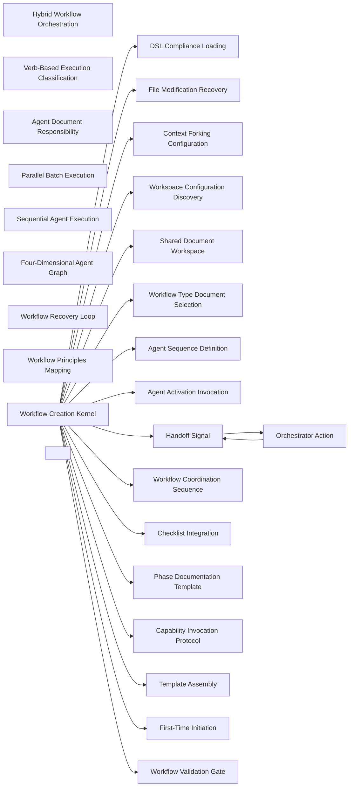

### Hybrid Workflow Orchestration

- Domain: [agent-workflow](ALGORITHMS.md#algorithms-domain-agent-workflow)
- Tier: [process](SCHEMA.md#vocabulary-domain-tier-process)
- Stage: [derive](REASONING.md#stage-derive)
- Axis: [reasoning](REASONING.md#reasoning-axis-reasoning)
- Math type: [logic](REASONING.md#reasoning-math-type-logic)
- Yields: boolean

Details

Intent
Classify workflow phases by execution verb, run discovery and investigation agents in parallel forked contexts, run action and mutation agents sequentially, and coordinate all agents through shared artifacts and handoff signals.

Invariant
Multi-agent workflows should parallelize independent knowledge gathering while serializing state-changing work.

Flow

```text
WorkflowObjective → AgentPhases → ExecutionClassification → ParallelDiscovery → SequentialAction → Handoff
```

Productions

```bnf
HybridWorkflowOrchestration ::= <WorkflowObjective> "→" <AgentSequence> "→" <ExecutionModeClassification> "→" <ParallelBatchSet> "→" <SequentialActionSet> "→" <WorkflowCompletion>
ExecutionMode ::= "PARALLEL" | "SEQUENTIAL"
ParallelPhase ::= "DISCOVERY" | "INVESTIGATION" | "RESEARCH" | "ANALYSIS" | "EXPLORATION"
SequentialPhase ::= "CREATE" | "WRITE" | "EXECUTE" | "VERIFY" | "IMPLEMENT" | "REFACTOR"
```

Composes
none

Forces
[runtime_extensibility](SCHEMA.md#force-runtime-extensibility), [state_transaction](SCHEMA.md#force-state-transaction), [model_governance](SCHEMA.md#force-model-governance), [event_messaging](SCHEMA.md#force-event-messaging), [control_coordination](SCHEMA.md#force-control-coordination)

Grounds
none

Before

```text
Every agent runs sequentially, even independent discovery — the workflow crawls.
```

After

```text
objective → agent sequence → classify by verb → parallel discovery (forked context) + sequential action (normal context) → handoff
```

How it is checked

Checked by
the workflow validation gate, which checks the orchestration, artifact, context and validation contracts, the structured-document validator over the workflow template

Population
Every workflow template and every agent it sequences

Freshness
A verdict stands until the template, an agent it sequences or the workspace configuration changes

Refusal
The gate refuses to mark a template complete while any of its contracts fails

Observation
The coordination record each run writes, which locates a failed handoff

Evidence
None, because the catalog states this check as a class, so a watched run belongs to each system that adopts it

Authoritative side
The workflow template's contracts, which each run's coordination record is compared against

Depends on
Not answered

Shape it refuses
Not answered

### DSL Compliance Loading

- Domain: [agent-workflow](ALGORITHMS.md#algorithms-domain-agent-workflow)
- Tier: [process](SCHEMA.md#vocabulary-domain-tier-process)
- Stage: [orient](REASONING.md#stage-orient)
- Axis: [ontology](REASONING.md#reasoning-axis-ontology)
- Math type: [set-theory](REASONING.md#reasoning-math-type-set-theory)
- Yields: set | boolean

Details

Intent
Load grammar, keyword, operator, workflow, and checklist references before workflow generation, then require generated content to follow the declared DSL, naming, handoff, execution, forking, spawning, and capability rules.

Invariant
Workflow generation must begin by loading the language and orchestration contracts that constrain output.

Flow

```text
DSLSources → Requirements → ComplianceGate → Proceed|Block
```

Productions

```bnf
DSLComplianceLoading ::= <DSLSpecSet> "→" <WorkflowRequirementSet> "→" <ComplianceValidationGate>
WorkflowRequirementSet ::= "agent_dsl_syntax" "," "agent_oriented_content" "," "stable_filename_convention" "," "handoff_protocol" "," "hybrid_parallel_sequential" "," "context_isolation" "," "agent_spawn_mechanism" "," "capability_invocation"
```

Composes
none

Composed by
[Workflow Creation Kernel](ALGORITHMS.md#algorithms-workflow-creation-kernel)

Named in the derivation of
[Workflow Creation Kernel](ALGORITHMS.md#algorithms-workflow-creation-kernel)

Forces
[contract_compatibility](SCHEMA.md#force-contract-compatibility), [runtime_extensibility](SCHEMA.md#force-runtime-extensibility), [correctness_verification](SCHEMA.md#force-correctness-verification), [model_governance](SCHEMA.md#force-model-governance), [event_messaging](SCHEMA.md#force-event-messaging), [metaprogramming_modeling](SCHEMA.md#force-metaprogramming-modeling), [architecture_evolution](SCHEMA.md#force-architecture-evolution)

Grounds
none

Before

```text
Workflow generated free-form, ignoring the DSL and handoff contracts.
```

After

```text
load DSL + keyword + workflow + checklist specs → require{agent-DSL syntax, handoff protocol, hybrid execution, context isolation, agent spawn} → compliance gate
```

How it is checked

Checked by
the workflow validation gate, which checks the orchestration, artifact, context and validation contracts, the structured-document validator over the workflow template

Population
Every workflow template and every agent it sequences

Freshness
A verdict stands until the template, an agent it sequences or the workspace configuration changes

Refusal
The gate refuses to mark a template complete while any of its contracts fails

Observation
The coordination record each run writes, which locates a failed handoff

Evidence
None, because the catalog states this check as a class, so a watched run belongs to each system that adopts it

Authoritative side
The workflow template's contracts, which each run's coordination record is compared against

Depends on
Not answered

Shape it refuses
Not answered

### File Modification Recovery

- Domain: [agent-workflow](ALGORITHMS.md#algorithms-domain-agent-workflow)
- Tier: [process](SCHEMA.md#vocabulary-domain-tier-process)
- Stage: [act](REASONING.md#stage-act)
- Axis: [formalization](REASONING.md#reasoning-axis-formalization)
- Math type: [computation](REASONING.md#reasoning-math-type-computation)
- Yields: procedure

Details

Intent
When a file modification conflict occurs, detect the error, re-read the current file, merge the intended delta into the current content, write the complete new version, verify persistence, and log recovery automatically without asking the developer.

Invariant
State-mutation conflicts are synchronization failures and should trigger deterministic recovery, not a prompt to the developer.

Flow

```text
ModificationError → RereadMerge → CompleteRewrite → Verify
```

Productions

```bnf
FileModificationRecovery ::= <FileModificationError> "→" <RecoveryProtocolSelection> "→" <RereadAndMerge> "→" <CompleteRewrite> "→" <RecoveryLog>
RecoveryProtocol ::= "reread-merge-complete-rewrite" | "snapshot-restore-on-failure"
ForbiddenRecovery ::= "retry_edit_without_recovery" | "ask_user_for_tool_error_recovery"
```

Composes
none

Composed by
[Workflow Creation Kernel](ALGORITHMS.md#algorithms-workflow-creation-kernel)

Forces
[state_transaction](SCHEMA.md#force-state-transaction), [correctness_verification](SCHEMA.md#force-correctness-verification), [resilience_recovery](SCHEMA.md#force-resilience-recovery)

Grounds
none

Before

```text
A stale-write conflict re-reads the file and retries the same edit, or stops to ask the developer.
```

After

```text
modification error → re-read current → merge the delta into full state → write complete version → verify → log; never retry-without-recovery, never ask for a tool error
```

How it is checked

Checked by
the workflow validation gate, which checks the orchestration, artifact, context and validation contracts, the structured-document validator over the workflow template

Population
Every workflow template and every agent it sequences

Freshness
A verdict stands until the template, an agent it sequences or the workspace configuration changes

Refusal
The gate refuses to mark a template complete while any of its contracts fails

Observation
The coordination record each run writes, which locates a failed handoff

Evidence
None, because the catalog states this check as a class, so a watched run belongs to each system that adopts it

Authoritative side
The workflow template's contracts, which each run's coordination record is compared against

Depends on
Not answered

Shape it refuses
Not answered

### Context Forking Configuration

- Domain: [agent-workflow](ALGORITHMS.md#algorithms-domain-agent-workflow)
- Tier: [process](SCHEMA.md#vocabulary-domain-tier-process)
- Stage: [derive](REASONING.md#stage-derive)
- Axis: [reasoning](REASONING.md#reasoning-axis-reasoning)
- Math type: [logic](REASONING.md#reasoning-math-type-logic)
- Yields: boolean

Details

Intent
Assign forked context to discovery, investigation, and documentation agents; assign normal context to action and validation agents; preserve model and parallel eligibility metadata per agent class.

Invariant
Context isolation improves independent analysis, while normal context preserves continuity for mutation and validation.

Flow

```text
AgentClass → ContextMode → ParallelEligibility → ExecutionPolicy
```

Productions

```bnf
ContextForkingConfiguration ::= <AgentClass> "→" <ContextMode> "→" <ParallelPolicy> "→" <ExecutionConfiguration>
AgentClass ::= "discovery" | "investigation" | "documentation" | "action" | "validation"
ContextMode ::= "fork" | "normal"
ParallelPolicy ::= "parallel_true" | "parallel_false"
```

Composes
none

Composed by
[Workflow Creation Kernel](ALGORITHMS.md#algorithms-workflow-creation-kernel)

Forces
[runtime_extensibility](SCHEMA.md#force-runtime-extensibility), [state_transaction](SCHEMA.md#force-state-transaction), [correctness_verification](SCHEMA.md#force-correctness-verification), [model_governance](SCHEMA.md#force-model-governance), [control_coordination](SCHEMA.md#force-control-coordination)

Grounds
none

Before

```text
Every agent shares one context — discovery pollutes the action agent's state.
```

After

```text
agent class → discovery/investigation/documentation → fork ; action/validation → normal → per-class parallel eligibility preserved
```

How it is checked

Checked by
the workflow validation gate, which checks the orchestration, artifact, context and validation contracts, the structured-document validator over the workflow template

Population
Every workflow template and every agent it sequences

Freshness
A verdict stands until the template, an agent it sequences or the workspace configuration changes

Refusal
The gate refuses to mark a template complete while any of its contracts fails

Observation
The coordination record each run writes, which locates a failed handoff

Evidence
None, because the catalog states this check as a class, so a watched run belongs to each system that adopts it

Authoritative side
The workflow template's contracts, which each run's coordination record is compared against

Depends on
Not answered

Shape it refuses
Not answered

### Verb-Based Execution Classification

- Domain: [agent-workflow](ALGORITHMS.md#algorithms-domain-agent-workflow)
- Tier: [process](SCHEMA.md#vocabulary-domain-tier-process)
- Stage: [derive](REASONING.md#stage-derive)
- Axis: [reasoning](REASONING.md#reasoning-axis-reasoning)
- Math type: [logic](REASONING.md#reasoning-math-type-logic)
- Yields: boolean

Details

Intent
Extract the primary verb from each agent purpose, classify it against parallel or sequential verb sets, and bind execution mode, context, and parallel eligibility.

Invariant
Execution mode should be derived from action semantics, not arbitrary phase numbering.

Flow

```text
AgentPurpose → PrimaryVerb → VerbClass → ExecutionMode
```

Productions

```bnf
VerbExecutionClassification ::= <AgentPurpose> "→" <PrimaryVerb> "→" <VerbSetMatch> "→" <AgentExecutionMode>
ParallelVerb ::= "ANALYZE" | "FIND" | "EXTRACT" | "READ" | "DISCOVER" | "INVESTIGATE" | "RESEARCH" | "EXPLORE" | "TRACE"
SequentialVerb ::= "CREATE" | "WRITE" | "EXECUTE" | "VERIFY" | "IMPLEMENT" | "LINK" | "ITERATE" | "REFACTOR" | "DEPLOY"
```

Composes
none

Forces
[model_governance](SCHEMA.md#force-model-governance), [control_coordination](SCHEMA.md#force-control-coordination)

Grounds
none

Before

```text
Execution mode assigned by phase number, not by what the agent does.
```

After

```text
agent purpose → primary verb → {ANALYZE/FIND/DISCOVER → PARALLEL(fork)} | {CREATE/WRITE/VERIFY → SEQUENTIAL(normal)}
```

How it is checked

Checked by
the workflow validation gate, which checks the orchestration, artifact, context and validation contracts, the structured-document validator over the workflow template

Population
Every workflow template and every agent it sequences

Freshness
A verdict stands until the template, an agent it sequences or the workspace configuration changes

Refusal
The gate refuses to mark a template complete while any of its contracts fails

Observation
The coordination record each run writes, which locates a failed handoff

Evidence
None, because the catalog states this check as a class, so a watched run belongs to each system that adopts it

Authoritative side
The workflow template's contracts, which each run's coordination record is compared against

Depends on
Not answered

Shape it refuses
Not answered

### Workspace Configuration Discovery

- Domain: [agent-workflow](ALGORITHMS.md#algorithms-domain-agent-workflow)
- Tier: [process](SCHEMA.md#vocabulary-domain-tier-process)
- Stage: [orient](REASONING.md#stage-orient)
- Axis: [ontology](REASONING.md#reasoning-axis-ontology)
- Math type: [set-theory](REASONING.md#reasoning-math-type-set-theory)
- Yields: set | boolean

Details

Intent
Read workspace configuration, extract zones, semantic extensions, root path, agent definitions, shared zone, workflow zone, and task zone before generating any workflow artifacts.

Invariant
Workflow artifacts must be placed by discovered workspace configuration, not hardcoded paths.

Flow

```text
WorkspaceConfig → Zones → AgentDefinitions → ArtifactBasePath
```

Productions

```bnf
WorkspaceConfigurationDiscovery ::= <WorkspaceConfigFile> "→" <WorkspaceConfig> "→" <ZoneConfig> "→" <AgentDefinitionSet> "→" <ArtifactPathPolicy>
ArtifactPathPolicy ::= "shared_zone/workflow_name" "," "workflow_zone" "," "task_zone" "," "no_hardcoded_paths"
```

Composes
none

Composed by
[Workflow Creation Kernel](ALGORITHMS.md#algorithms-workflow-creation-kernel)

Forces
[semantic_consistency](SCHEMA.md#force-semantic-consistency), [runtime_extensibility](SCHEMA.md#force-runtime-extensibility), [model_governance](SCHEMA.md#force-model-governance)

Grounds
none

Before

```text
Artifact paths hardcoded — the workflow only runs in one layout.
```

After

```text
workspace-config → zones + root + agent defs → artifact base = shared_zone/workflow_name; no hardcoded paths
```

How it is checked

Checked by
the workflow validation gate, which checks the orchestration, artifact, context and validation contracts, the structured-document validator over the workflow template

Population
Every workflow template and every agent it sequences

Freshness
A verdict stands until the template, an agent it sequences or the workspace configuration changes

Refusal
The gate refuses to mark a template complete while any of its contracts fails

Observation
The coordination record each run writes, which locates a failed handoff

Evidence
None, because the catalog states this check as a class, so a watched run belongs to each system that adopts it

Authoritative side
The workflow template's contracts, which each run's coordination record is compared against

Depends on
Not answered

Shape it refuses
Not answered

### Shared Document Workspace

- Domain: [agent-workflow](ALGORITHMS.md#algorithms-domain-agent-workflow)
- Tier: [process](SCHEMA.md#vocabulary-domain-tier-process)
- Stage: [act](REASONING.md#stage-act)
- Axis: [formalization](REASONING.md#reasoning-axis-formalization)
- Math type: [computation](REASONING.md#reasoning-math-type-computation)
- Yields: procedure

Details

Intent
Pre-create workflow documents once, require every agent to read and edit the same documents, prohibit duplicate versions, and enforce single source of truth across phases.

Invariant
Multi-agent coordination should refine shared artifacts rather than create divergent outputs.

Flow

```text
CoreDocuments → PreCreate → AgentReadEdit → SingleSourceValidation
```

Productions

```bnf
SharedDocumentWorkspace ::= <CoreDocumentSet> "→" <PreCreation> "→" <SharedAccessProtocol> "→" <IterativeRefinement> "→" <SingleSourceOfTruthGate>
SharedAccessProtocol ::= "all_agents_same_documents" "," "orchestrator_creates" "," "agents_refine" "," "append_mode_false"
```

Composes
none

Composed by
[Workflow Creation Kernel](ALGORITHMS.md#algorithms-workflow-creation-kernel)

Forces
[semantic_consistency](SCHEMA.md#force-semantic-consistency), [model_governance](SCHEMA.md#force-model-governance), [control_coordination](SCHEMA.md#force-control-coordination)

Grounds
none

Before

```text
Each agent writes its own output file; findings diverge across N versions.
```

After

```text
pre-create core documents once → every agent reads + edits the same set → no duplicate versions → single source of truth
```

How it is checked

Checked by
the workflow validation gate, which checks the orchestration, artifact, context and validation contracts, the structured-document validator over the workflow template

Population
Every workflow template and every agent it sequences

Freshness
A verdict stands until the template, an agent it sequences or the workspace configuration changes

Refusal
The gate refuses to mark a template complete while any of its contracts fails

Observation
The coordination record each run writes, which locates a failed handoff

Evidence
None, because the catalog states this check as a class, so a watched run belongs to each system that adopts it

Authoritative side
The workflow template's contracts, which each run's coordination record is compared against

Depends on
Not answered

Shape it refuses
Not answered

### Workflow Type Document Selection

- Domain: [agent-workflow](ALGORITHMS.md#algorithms-domain-agent-workflow)
- Tier: [process](SCHEMA.md#vocabulary-domain-tier-process)
- Stage: [derive](REASONING.md#stage-derive)
- Axis: [reasoning](REASONING.md#reasoning-axis-reasoning)
- Math type: [logic](REASONING.md#reasoning-math-type-logic)
- Yields: boolean

Details

Intent
Analyze workflow objective, classify workflow type, select five to eight semantically distinct core documents, and map each document to a non-overlapping purpose.

Invariant
Workflow coordination needs the right shared document set for the work type.

Flow

```text
WorkflowObjective → WorkflowType → CoreDocuments → PurposeMap
```

Productions

```bnf
WorkflowDocumentSelection ::= <WorkflowObjective> "→" <WorkflowType> "→" <CoreDocumentSet> "→" <DocumentPurposeMap>
WorkflowType ::= "cleanup" | "analysis" | "refactoring" | "documentation" | "implementation" | "security" | "performance" | "infrastructure" | "migration"
CoreDocumentConstraint ::= "document_count_between_5_and_8" "," "distinct_logical_purpose" "," "semantic_names_only"
```

Composes
none

Named in the derivation of
[Workflow Creation Kernel](ALGORITHMS.md#algorithms-workflow-creation-kernel)

Forces
[model_governance](SCHEMA.md#force-model-governance), [control_coordination](SCHEMA.md#force-control-coordination)

Grounds
none

Before

```text
Generic output.md / results.md documents with overlapping purpose.
```

After

```text
objective → workflow_type{cleanup|analysis|refactoring|security|migration} → 5-8 distinct-purpose documents → one non-overlapping purpose each
```

How it is checked

Checked by
the workflow validation gate, which checks the orchestration, artifact, context and validation contracts, the structured-document validator over the workflow template

Population
Every workflow template and every agent it sequences

Freshness
A verdict stands until the template, an agent it sequences or the workspace configuration changes

Refusal
The gate refuses to mark a template complete while any of its contracts fails

Observation
The coordination record each run writes, which locates a failed handoff

Evidence
None, because the catalog states this check as a class, so a watched run belongs to each system that adopts it

Authoritative side
The workflow template's contracts, which each run's coordination record is compared against

Depends on
Not answered

Shape it refuses
Not answered

### Agent Sequence Definition

- Domain: [agent-workflow](ALGORITHMS.md#algorithms-domain-agent-workflow)
- Tier: [process](SCHEMA.md#vocabulary-domain-tier-process)
- Stage: [project](REASONING.md#stage-project)
- Axis: [reasoning](REASONING.md#reasoning-axis-reasoning)
- Math type: [algebra](REASONING.md#reasoning-math-type-algebra)
- Yields: ordered-structure

Details

Intent
For each agent slot, create an agent object with name, type, phase, purpose, methodology, inputs, outputs, validation gates, document responsibilities, focus areas, edit protocol, agent activation, and 4D graph.

Invariant
An orchestration plan requires agent objects with executable metadata, not just agent names.

Flow

```text
AgentCount → AgentObjectSet → AgentSequence
```

Productions

```bnf
AgentSequenceDefinition ::= <AgentCount> "→" <AgentObjectSet> "→" <AgentSequence>
AgentObject ::= <AgentName> "," <AgentType> "," <PhaseNumber> "," <Purpose> "," <Methodology> "," <InputArtifacts> "," <OutputArtifacts> "," <ValidationGates> "," <DocumentResponsibilities> "," <ExecutionMode> "," <Graph4D>
```

Composes
none

Composed by
[Workflow Creation Kernel](ALGORITHMS.md#algorithms-workflow-creation-kernel)

Named in the derivation of
[Workflow Creation Kernel](ALGORITHMS.md#algorithms-workflow-creation-kernel)

Forces
[modularity](SCHEMA.md#force-modularity), [correctness_verification](SCHEMA.md#force-correctness-verification), [model_governance](SCHEMA.md#force-model-governance), [control_coordination](SCHEMA.md#force-control-coordination)

Grounds
none

Before

```text
A plan that is just a list of agent names, no executable metadata.
```

After

```text
agent_count → agent objects{name, type, phase, purpose, inputs, outputs, validation gates, doc responsibilities, execution mode, 4D graph}
```

How it is checked

Checked by
the workflow validation gate, which checks the orchestration, artifact, context and validation contracts, the structured-document validator over the workflow template

Population
Every workflow template and every agent it sequences

Freshness
A verdict stands until the template, an agent it sequences or the workspace configuration changes

Refusal
The gate refuses to mark a template complete while any of its contracts fails

Observation
The coordination record each run writes, which locates a failed handoff

Evidence
None, because the catalog states this check as a class, so a watched run belongs to each system that adopts it

Authoritative side
The workflow template's contracts, which each run's coordination record is compared against

Depends on
Not answered

Shape it refuses
Not answered

### Agent Document Responsibility

- Domain: [agent-workflow](ALGORITHMS.md#algorithms-domain-agent-workflow)
- Tier: [process](SCHEMA.md#vocabulary-domain-tier-process)
- Stage: [act](REASONING.md#stage-act)
- Axis: [formalization](REASONING.md#reasoning-axis-formalization)
- Math type: [computation](REASONING.md#reasoning-math-type-computation)
- Yields: procedure

Details

Intent
For each core document, require every agent to read current state, identify outdated or incorrect content, remove stale sections, replace with new discoveries, avoid duplicate findings, and maintain single source of truth.

Invariant
Shared-document workflows should use surgical refinement rather than additive accumulation.

Flow

```text
Document → Read → DetectStale → Remove → Replace → Deduplicate
```

Productions

```bnf
AgentDocumentResponsibility ::= <CoreDocument> "→" <ReadCurrentState> "→" <ContradictionDetection> "→" <StaleContentRemoval> "→" <AccurateReplacement> "→" <SingleSourceValidation>
ProhibitedDocumentOperation ::= "append_only" | "duplicate_findings" | "new_version_file"
```

Composes
none

Forces
[modularity](SCHEMA.md#force-modularity), [semantic_consistency](SCHEMA.md#force-semantic-consistency), [model_governance](SCHEMA.md#force-model-governance)

Grounds
none

Before

```text
Agents append findings, accumulating duplicates and contradictions.
```

After

```text
document → read current state → detect contradictions → remove stale → replace with new → single source of truth (never append, never a new version file)
```

How it is checked

Checked by
the workflow validation gate, which checks the orchestration, artifact, context and validation contracts, the structured-document validator over the workflow template

Population
Every workflow template and every agent it sequences

Freshness
A verdict stands until the template, an agent it sequences or the workspace configuration changes

Refusal
The gate refuses to mark a template complete while any of its contracts fails

Observation
The coordination record each run writes, which locates a failed handoff

Evidence
None, because the catalog states this check as a class, so a watched run belongs to each system that adopts it

Authoritative side
The workflow template's contracts, which each run's coordination record is compared against

Depends on
Not answered

Shape it refuses
Not answered

### Agent Activation Invocation

- Domain: [agent-workflow](ALGORITHMS.md#algorithms-domain-agent-workflow)
- Tier: [process](SCHEMA.md#vocabulary-domain-tier-process)
- Stage: [act](REASONING.md#stage-act)
- Axis: [formalization](REASONING.md#reasoning-axis-formalization)
- Math type: [computation](REASONING.md#reasoning-math-type-computation)
- Yields: procedure

Details

Intent
For every agent activation, construct a spawn invocation with agent type, prompt, description, model, and context; use forked context for parallel agents and normal context for sequential agents.

Invariant
Orchestrators must execute agents through the runtime spawn primitive, not simulate agent behavior in the main session.

Flow

```text
AgentObject → SpawnInvocation → AgentExecution
```

Productions

```bnf
AgentActivationInvocation ::= <AgentObject> "→" <SpawnCall> "→" <ExecutionResult>
SpawnCall ::= "agent_type" "," "prompt" "," "description" "," "model" "," "context_if_parallel"
ForbiddenOrchestration ::= "simulate_agent_execution_in_orchestrator"
```

Composes
none

Named in the derivation of
[Workflow Creation Kernel](ALGORITHMS.md#algorithms-workflow-creation-kernel)

Forces
[model_governance](SCHEMA.md#force-model-governance), [control_coordination](SCHEMA.md#force-control-coordination)

Grounds
none

Before

```text
The orchestrator simulates the agent's work in its own session.
```

After

```text
agent object → spawn primitive{agent_type, prompt, model, context-if-parallel} → real activation; never simulate in the orchestrator
```

How it is checked

Checked by
the workflow validation gate, which checks the orchestration, artifact, context and validation contracts, the structured-document validator over the workflow template

Population
Every workflow template and every agent it sequences

Freshness
A verdict stands until the template, an agent it sequences or the workspace configuration changes

Refusal
The gate refuses to mark a template complete while any of its contracts fails

Observation
The coordination record each run writes, which locates a failed handoff

Evidence
None, because the catalog states this check as a class, so a watched run belongs to each system that adopts it

Authoritative side
The workflow template's contracts, which each run's coordination record is compared against

Depends on
Not answered

Shape it refuses
Not answered

### Parallel Batch Execution

- Domain: [agent-workflow](ALGORITHMS.md#algorithms-domain-agent-workflow)
- Tier: [process](SCHEMA.md#vocabulary-domain-tier-process)
- Stage: [act](REASONING.md#stage-act)
- Axis: [formalization](REASONING.md#reasoning-axis-formalization)
- Math type: [computation](REASONING.md#reasoning-math-type-computation)
- Yields: procedure

Details

Intent
Accumulate adjacent parallel agents into a batch, invoke all spawns in a single concurrent batch, wait for all completions, and merge findings through shared documents.

Invariant
Parallel agents should execute concurrently only when their work is investigation-safe and state-isolated.

Flow

```text
ParallelAgents → ConcurrentSpawnBatch → WaitAll → MergeFindings
```

Productions

```bnf
ParallelBatchExecution ::= <ParallelAgentSet> "→" <ConcurrentSpawnBatch> "→" <CompletionWait> "→" <SharedDocumentMerge>
ConcurrentSpawnBatch ::= "single_batch_concurrent_spawn"
ParallelSafety ::= "context_fork" "," "discovery_or_investigation_only" "," "shared_artifact_refinement"
```

Composes
none

Forces
[model_governance](SCHEMA.md#force-model-governance), [event_messaging](SCHEMA.md#force-event-messaging), [control_coordination](SCHEMA.md#force-control-coordination)

Grounds
none

Before

```text
Parallel agents launched in separate messages, so they run one after another anyway.
```

After

```text
adjacent parallel agents → one concurrent batch of forked-context spawns → wait for all → merge via shared documents
```

How it is checked

Checked by
the workflow validation gate, which checks the orchestration, artifact, context and validation contracts, the structured-document validator over the workflow template

Population
Every workflow template and every agent it sequences

Freshness
A verdict stands until the template, an agent it sequences or the workspace configuration changes

Refusal
The gate refuses to mark a template complete while any of its contracts fails

Observation
The coordination record each run writes, which locates a failed handoff

Evidence
None, because the catalog states this check as a class, so a watched run belongs to each system that adopts it

Authoritative side
The workflow template's contracts, which each run's coordination record is compared against

Depends on
Not answered

Shape it refuses
Not answered

### Sequential Agent Execution

- Domain: [agent-workflow](ALGORITHMS.md#algorithms-domain-agent-workflow)
- Tier: [process](SCHEMA.md#vocabulary-domain-tier-process)
- Stage: [act](REASONING.md#stage-act)
- Axis: [formalization](REASONING.md#reasoning-axis-formalization)
- Math type: [computation](REASONING.md#reasoning-math-type-computation)
- Yields: procedure

Details

Intent
Execute state-changing or validation agents one at a time in normal context, pass handoff context from the previous phase, wait for completion signal, then activate the next agent.

Invariant
Mutating workflow phases must serialize to prevent conflicting edits and ambiguous state.

Flow

```text
PreviousHandoff → SpawnCall → WaitCompletion → NextHandoff
```

Productions

```bnf
SequentialAgentExecution ::= <HandoffContext> "→" <SequentialSpawnInvocation> "→" <CompletionSignal> "→" <NextAgentActivation>
SequentialConstraint ::= "one_spawn_at_a_time" "," "wait_for_completion" "," "context_normal"
```

Composes
none

Forces
[state_transaction](SCHEMA.md#force-state-transaction), [correctness_verification](SCHEMA.md#force-correctness-verification), [model_governance](SCHEMA.md#force-model-governance), [event_messaging](SCHEMA.md#force-event-messaging), [control_coordination](SCHEMA.md#force-control-coordination)

Grounds
none

Before

```text
Two mutating agents launched at once, producing conflicting edits.
```

After

```text
prior handoff → one normal-context spawn at a time → wait for completion → activate the next
```

How it is checked

Checked by
the workflow validation gate, which checks the orchestration, artifact, context and validation contracts, the structured-document validator over the workflow template

Population
Every workflow template and every agent it sequences

Freshness
A verdict stands until the template, an agent it sequences or the workspace configuration changes

Refusal
The gate refuses to mark a template complete while any of its contracts fails

Observation
The coordination record each run writes, which locates a failed handoff

Evidence
None, because the catalog states this check as a class, so a watched run belongs to each system that adopts it

Authoritative side
The workflow template's contracts, which each run's coordination record is compared against

Depends on
Not answered

Shape it refuses
Not answered

### Four-Dimensional Agent Graph

- Domain: [agent-workflow](ALGORITHMS.md#algorithms-domain-agent-workflow)
- Tier: [process](SCHEMA.md#vocabulary-domain-tier-process)
- Stage: [project](REASONING.md#stage-project)
- Axis: [reasoning](REASONING.md#reasoning-axis-reasoning)
- Math type: [graph](REASONING.md#reasoning-math-type-graph)
- Yields: edge-list

Details

Intent
For each agent, build sequential dependencies, lateral parallel peers, diagonal artifact/data dependencies, and propagation effects including superseded state, propagated contracts, and breakage risks.

Invariant
Multi-agent workflows need topology, not only order.

Flow

```text
Agent → Z + X + Y + W Graph
```

Productions

```bnf
FourDAgentGraph ::= <AgentObject> "→" <SequentialAxis> "," <LateralAxis> "," <DiagonalAxis> "," <PropagationAxis>
SequentialAxis ::= "Z: prior_required_agents"
LateralAxis ::= "X: peer_parallel_agents"
DiagonalAxis ::= "Y: cross_phase_artifact_dependencies"
PropagationAxis ::= "W: superseded_state, propagated_contracts, breaks_if_changed"
```

Composes
none

Forces
[contract_compatibility](SCHEMA.md#force-contract-compatibility), [model_governance](SCHEMA.md#force-model-governance), [control_coordination](SCHEMA.md#force-control-coordination)

Grounds
none

Before

```text
An agent records only its order, not its cross-phase data or downstream ripple.
```

After

```text
agent → Z{prior required agents} + X{peer parallel} + Y{cross-phase artifact deps} + W{superseded state, propagated contracts, breaks-if-changed}
```

How it is checked

Checked by
the workflow validation gate, which checks the orchestration, artifact, context and validation contracts, the structured-document validator over the workflow template

Population
Every workflow template and every agent it sequences

Freshness
A verdict stands until the template, an agent it sequences or the workspace configuration changes

Refusal
The gate refuses to mark a template complete while any of its contracts fails

Observation
The coordination record each run writes, which locates a failed handoff

Evidence
None, because the catalog states this check as a class, so a watched run belongs to each system that adopts it

Authoritative side
The workflow template's contracts, which each run's coordination record is compared against

Depends on
Not answered

Shape it refuses
Not answered

### Handoff Signal

- Domain: [agent-workflow](ALGORITHMS.md#algorithms-domain-agent-workflow)
- Tier: [process](SCHEMA.md#vocabulary-domain-tier-process)
- Stage: [act](REASONING.md#stage-act)
- Axis: [formalization](REASONING.md#reasoning-axis-formalization)
- Math type: [logic](REASONING.md#reasoning-math-type-logic)
- Yields: boolean

Details

Intent
Require every agent to end with a structured handoff signal containing completed agent, phase status, artifact location, next agent, execution mode, context used, findings, files, validation status, parallel results, 4D graph, and orchestrator action.

Invariant
Handoffs are control messages that preserve workflow state across agent boundaries.

Flow

```text
AgentCompletion → HandoffContext → OrchestratorAction
```

Productions

```bnf
HandoffSignal ::= <AgentCompleted> "," <PhaseStatus> "," <ArtifactsLocation> "," <NextAgent> "," <ExecutionMode> "," <ContextUsed> "," <KeyFindings> "," <CriticalFiles> "," <ValidationGatesPassed> "," <ParallelResults> "," <Graph4D> "," <OrchestratorAction>
OrchestratorAction ::= "ACTIVATE_NEXT_AGENT" | "PAUSE_FOR_USER" | "WORKFLOW_COMPLETE"
```

Composes
[Orchestrator Action](ALGORITHMS.md#algorithms-orchestrator-action)

Composed by
[Orchestrator Action](ALGORITHMS.md#algorithms-orchestrator-action), [Workflow Creation Kernel](ALGORITHMS.md#algorithms-workflow-creation-kernel)

Forces
[modularity](SCHEMA.md#force-modularity), [correctness_verification](SCHEMA.md#force-correctness-verification), [model_governance](SCHEMA.md#force-model-governance), [event_messaging](SCHEMA.md#force-event-messaging), [control_coordination](SCHEMA.md#force-control-coordination)

Grounds
none

Before

```text
An agent finishes with a prose summary the orchestrator cannot route on.
```

After

```text
agent completion → handoff{completed, phase status, artifacts, next agent, execution mode, context, findings, validation, 4D graph, orchestrator_action}
```

How it is checked

Checked by
the workflow validation gate, which checks the orchestration, artifact, context and validation contracts, the structured-document validator over the workflow template

Population
Every workflow template and every agent it sequences

Freshness
A verdict stands until the template, an agent it sequences or the workspace configuration changes

Refusal
The gate refuses to mark a template complete while any of its contracts fails

Observation
The coordination record each run writes, which locates a failed handoff

Evidence
None, because the catalog states this check as a class, so a watched run belongs to each system that adopts it

Authoritative side
The workflow template's contracts, which each run's coordination record is compared against

Depends on
[Orchestrator Action](ALGORITHMS.md#algorithms-orchestrator-action)

Shape it refuses
Not answered

### Orchestrator Action

- Domain: [agent-workflow](ALGORITHMS.md#algorithms-domain-agent-workflow)
- Tier: [process](SCHEMA.md#vocabulary-domain-tier-process)
- Stage: [act](REASONING.md#stage-act)
- Axis: [formalization](REASONING.md#reasoning-axis-formalization)
- Math type: [logic](REASONING.md#reasoning-math-type-logic)
- Yields: boolean

Details

Intent
Interpret handoff action as activate next agent, pause for the developer, or complete workflow; automatically continue unless a critical decision or repeated recovery failure requires the developer's involvement.

Invariant
The orchestrator is a control loop driven by structured handoff actions.

Flow

```text
HandoffSignal → ActionType → Execute|Pause|Complete
```

Productions

```bnf
OrchestratorActionHandling ::= <HandoffSignal> "→" <ActionType> "→" <OrchestrationDecision>
ActionType ::= "ACTIVATE_NEXT_AGENT" | "PAUSE_FOR_USER" | "WORKFLOW_COMPLETE"
ContinuationRule ::= "never_ask_should_I_continue" "," "use_orchestrator_action"
```

Composes
[Handoff Signal](ALGORITHMS.md#algorithms-handoff-signal)

Composed by
[Handoff Signal](ALGORITHMS.md#algorithms-handoff-signal)

Forces
[state_transaction](SCHEMA.md#force-state-transaction), [resilience_recovery](SCHEMA.md#force-resilience-recovery), [model_governance](SCHEMA.md#force-model-governance), [event_messaging](SCHEMA.md#force-event-messaging), [control_coordination](SCHEMA.md#force-control-coordination)

Grounds
none

Before

```text
The orchestrator asks the developer 'should I continue?' after every agent.
```

After

```text
handoff → orchestrator_action{ACTIVATE_NEXT_AGENT | PAUSE_FOR_USER | WORKFLOW_COMPLETE} → auto-continue unless a critical decision or repeated recovery failure
```

How it is checked

Checked by
the workflow validation gate, which checks the orchestration, artifact, context and validation contracts, the structured-document validator over the workflow template

Population
Every workflow template and every agent it sequences

Freshness
A verdict stands until the template, an agent it sequences or the workspace configuration changes

Refusal
The gate refuses to mark a template complete while any of its contracts fails

Observation
The coordination record each run writes, which locates a failed handoff

Evidence
None, because the catalog states this check as a class, so a watched run belongs to each system that adopts it

Authoritative side
The workflow template's contracts, which each run's coordination record is compared against

Depends on
[Handoff Signal](ALGORITHMS.md#algorithms-handoff-signal)

Shape it refuses
Not answered

### Workflow Coordination Sequence

- Domain: [agent-workflow](ALGORITHMS.md#algorithms-domain-agent-workflow)
- Tier: [process](SCHEMA.md#vocabulary-domain-tier-process)
- Stage: [act](REASONING.md#stage-act)
- Axis: [formalization](REASONING.md#reasoning-axis-formalization)
- Math type: [computation](REASONING.md#reasoning-math-type-computation)
- Yields: procedure

Details

Intent
Pre-create documents, execute parallel batches where eligible, execute sequential agents one at a time, update checkpoints, validate single source of truth, and mark workflow completion.

Invariant
Coordination is the explicit execution trace for the whole workflow.

Flow

```text
PreCreateDocs → ParallelBatch|SequentialTask → Handoff → Checkpoint → Complete
```

Productions

```bnf
WorkflowCoordinationSequence ::= <DocumentPreCreation> "→" <AgentExecutionStepSet> "→" <CheckpointUpdateSet> "→" <WorkflowCompletionState>
WorkflowCompletionState ::= "WORKFLOW_PROGRESS_100_percent" "," "core_documents_refined" "," "final_output_ready"
```

Composes
none

Composed by
[Workflow Creation Kernel](ALGORITHMS.md#algorithms-workflow-creation-kernel)

Forces
[semantic_consistency](SCHEMA.md#force-semantic-consistency), [correctness_verification](SCHEMA.md#force-correctness-verification), [observability_traceability](SCHEMA.md#force-observability-traceability), [model_governance](SCHEMA.md#force-model-governance), [control_coordination](SCHEMA.md#force-control-coordination)

Grounds
none

Before

```text
Coordination left implicit — no record states the spawn order.
```

After

```text
pre-create docs → parallel batches where eligible + sequential tasks one at a time → handoffs → checkpoint updates → 100% complete
```

How it is checked

Checked by
the workflow validation gate, which checks the orchestration, artifact, context and validation contracts, the structured-document validator over the workflow template

Population
Every workflow template and every agent it sequences

Freshness
A verdict stands until the template, an agent it sequences or the workspace configuration changes

Refusal
The gate refuses to mark a template complete while any of its contracts fails

Observation
The coordination record each run writes, which locates a failed handoff

Evidence
None, because the catalog states this check as a class, so a watched run belongs to each system that adopts it

Authoritative side
The workflow template's contracts, which each run's coordination record is compared against

Depends on
Not answered

Shape it refuses
Not answered

### Workflow Recovery Loop

- Domain: [agent-workflow](ALGORITHMS.md#algorithms-domain-agent-workflow)
- Tier: [process](SCHEMA.md#vocabulary-domain-tier-process)
- Stage: [act](REASONING.md#stage-act)
- Axis: [formalization](REASONING.md#reasoning-axis-formalization)
- Math type: [dynamical-systems](REASONING.md#reasoning-math-type-dynamical-systems)
- Yields: boolean | counter

Details

Intent
If an agent fails validation, read shared documents, identify unmet expectation, research the error pattern, relaunch the agent with adapted context, and pause for the developer after bounded recovery attempts.

Invariant
Agent failure should trigger bounded evidence-based recovery, not silent continuation.

Flow

```text
ValidationFail → Diagnose → Research → Relaunch → RetryLimit|Recover
```

Productions

```bnf
WorkflowRecoveryLoop ::= <FailedAgentResult> "→" <SharedDocumentRead> "→" <UnmetExpectationAnalysis> "→" <ResolutionResearch> "→" <AgentRelaunch> "→" <RecoveryDecision>
RecoveryDecision ::= "continue_after_recovery" | "pause_for_user_after_limit"
```

Composes
none

Forces
[state_transaction](SCHEMA.md#force-state-transaction), [correctness_verification](SCHEMA.md#force-correctness-verification), [resilience_recovery](SCHEMA.md#force-resilience-recovery), [model_governance](SCHEMA.md#force-model-governance)

Grounds
none

Before

```text
A failed agent is silently skipped and the workflow continues.
```

After

```text
validation fail → read shared docs → diagnose unmet expectation → research the error → relaunch with adapted context → pause for the developer after the bound
```

How it is checked

Checked by
the workflow validation gate, which checks the orchestration, artifact, context and validation contracts, the structured-document validator over the workflow template

Population
Every workflow template and every agent it sequences

Freshness
A verdict stands until the template, an agent it sequences or the workspace configuration changes

Refusal
The gate refuses to mark a template complete while any of its contracts fails

Observation
The coordination record each run writes, which locates a failed handoff

Evidence
None, because the catalog states this check as a class, so a watched run belongs to each system that adopts it

Authoritative side
The workflow template's contracts, which each run's coordination record is compared against

Depends on
Not answered

Shape it refuses
Not answered

### Checklist Integration

- Domain: [agent-workflow](ALGORITHMS.md#algorithms-domain-agent-workflow)
- Tier: [process](SCHEMA.md#vocabulary-domain-tier-process)
- Stage: [act](REASONING.md#stage-act)
- Axis: [formalization](REASONING.md#reasoning-axis-formalization)
- Math type: [computation](REASONING.md#reasoning-math-type-computation)
- Yields: procedure

Details

Intent
Create a workflow progress checklist in the artifact workspace, include execution model metadata, phases in linear dependency order with severity metadata, task checkboxes, progress bars, success criteria, and agent-edit coordination rules.

Invariant
Workflow state must persist independently of any one agent context.

Flow

```text
Workflow → Checklist → AgentUpdates → ResumableProgress
```

Productions

```bnf
ChecklistIntegration ::= <WorkflowName> "→" <ChecklistFrontmatter> "→" <PhaseStructure> "→" <TaskBreakdown> "→" <ProgressTracking> "→" <SuccessCriteria>
ChecklistCoordinationRule ::= "orchestrator_precreates" "," "all_agents_edit_same_checklist" "," "phase_complete_before_handoff" "," "resume_by_reading_checklist"
```

Composes
none

Composed by
[Workflow Creation Kernel](ALGORITHMS.md#algorithms-workflow-creation-kernel)

Forces
[model_governance](SCHEMA.md#force-model-governance), [control_coordination](SCHEMA.md#force-control-coordination), [architecture_evolution](SCHEMA.md#force-architecture-evolution)

Grounds
none

Before

```text
Workflow state lives only in the orchestrator context; a restart loses it.
```

After

```text
workflow → progress checklist{execution model, linear phases + severity metadata, task checkboxes, success criteria} → any agent resumes by reading it
```

How it is checked

Checked by
the workflow validation gate, which checks the orchestration, artifact, context and validation contracts, the structured-document validator over the workflow template

Population
Every workflow template and every agent it sequences

Freshness
A verdict stands until the template, an agent it sequences or the workspace configuration changes

Refusal
The gate refuses to mark a template complete while any of its contracts fails

Observation
The coordination record each run writes, which locates a failed handoff

Evidence
None, because the catalog states this check as a class, so a watched run belongs to each system that adopts it

Authoritative side
The workflow template's contracts, which each run's coordination record is compared against

Depends on
Not answered

Shape it refuses
Not answered

### Phase Documentation Template

- Domain: [agent-workflow](ALGORITHMS.md#algorithms-domain-agent-workflow)
- Tier: [process](SCHEMA.md#vocabulary-domain-tier-process)
- Stage: [act](REASONING.md#stage-act)
- Axis: [formalization](REASONING.md#reasoning-axis-formalization)
- Math type: [computation](REASONING.md#reasoning-math-type-computation)
- Yields: procedure

Details

Intent
For each agent phase, render phase header, execution mode, context mode, methodology, 4D graph, artifact flow, focus areas, deliverable, and agent activation example.

Invariant
Workflow templates must document how each agent is activated and what it contributes.

Flow

```text
AgentPhase → DocumentationSection → InvocationExample
```

Productions

```bnf
PhaseDocumentationTemplate ::= <AgentObject> "→" <PhaseHeader> "→" <ExecutionModeDescription> "→" <MethodologySummary> "→" <Graph4DRendering> "→" <ArtifactSection> "→" <FocusSection> "→" <OutputSection> "→" <AgentActivationExample>
```

Composes
none

Composed by
[Workflow Creation Kernel](ALGORITHMS.md#algorithms-workflow-creation-kernel)

Forces
[model_governance](SCHEMA.md#force-model-governance), [metaprogramming_modeling](SCHEMA.md#force-metaprogramming-modeling), [control_coordination](SCHEMA.md#force-control-coordination)

Grounds
none

Before

```text
A phase documented with no execution mode, graph, or invocation example.
```

After

```text
agent phase → header + execution mode + context + methodology + 4D graph + artifacts + focus + deliverable + agent activation example
```

How it is checked

Checked by
the workflow validation gate, which checks the orchestration, artifact, context and validation contracts, the structured-document validator over the workflow template

Population
Every workflow template and every agent it sequences

Freshness
A verdict stands until the template, an agent it sequences or the workspace configuration changes

Refusal
The gate refuses to mark a template complete while any of its contracts fails

Observation
The coordination record each run writes, which locates a failed handoff

Evidence
None, because the catalog states this check as a class, so a watched run belongs to each system that adopts it

Authoritative side
The workflow template's contracts, which each run's coordination record is compared against

Depends on
Not answered

Shape it refuses
Not answered

### Workflow Principles Mapping

- Domain: [agent-workflow](ALGORITHMS.md#algorithms-domain-agent-workflow)
- Tier: [process](SCHEMA.md#vocabulary-domain-tier-process)
- Stage: [derive](REASONING.md#stage-derive)
- Axis: [reasoning](REASONING.md#reasoning-axis-reasoning)
- Math type: [logic](REASONING.md#reasoning-math-type-logic)
- Yields: boolean

Details

Intent
Derive workflow principles from the agent sequence, first agent grounding role, final agent quality guarantee, intermediate agent contributions, automation, context awareness, recovery, scalability, hybrid execution, context forking, and workspace integration.

Invariant
A workflow should state the qualities guaranteed by its orchestration structure.

Flow

```text
AgentSequence → PrincipleSet → WorkflowValueStatement
```

Productions

```bnf
WorkflowPrinciplesMapping ::= <AgentSequence> "→" <AgentContributionSet> "→" <WorkflowPrincipleSet>
WorkflowPrinciple ::= "grounded_in_codebase_reality" | "fully_automated" | "context_aware" | "self_recovering" | "dynamically_scalable" | "hybrid_execution" | "context_forking" | "workspace_integrated"
```

Composes
none

Forces
[state_transaction](SCHEMA.md#force-state-transaction), [resilience_recovery](SCHEMA.md#force-resilience-recovery), [model_governance](SCHEMA.md#force-model-governance)

Grounds
none

Before

```text
A workflow that never states what its structure guarantees.
```

After

```text
agent sequence → per-agent contribution{first grounds, final guarantees quality} → principles{grounded, automated, context-aware, self-recovering, scalable}
```

How it is checked

Checked by
the workflow validation gate, which checks the orchestration, artifact, context and validation contracts, the structured-document validator over the workflow template

Population
Every workflow template and every agent it sequences

Freshness
A verdict stands until the template, an agent it sequences or the workspace configuration changes

Refusal
The gate refuses to mark a template complete while any of its contracts fails

Observation
The coordination record each run writes, which locates a failed handoff

Evidence
None, because the catalog states this check as a class, so a watched run belongs to each system that adopts it

Authoritative side
The workflow template's contracts, which each run's coordination record is compared against

Depends on
Not answered

Shape it refuses
Not answered

### Capability Invocation Protocol

- Domain: [agent-workflow](ALGORITHMS.md#algorithms-domain-agent-workflow)
- Tier: [process](SCHEMA.md#vocabulary-domain-tier-process)
- Stage: [act](REASONING.md#stage-act)
- Axis: [formalization](REASONING.md#reasoning-axis-formalization)
- Math type: [computation](REASONING.md#reasoning-math-type-computation)
- Yields: procedure

Details

Intent
Define specialized capability invocation patterns, classify which capabilities run forked or normal, include examples, and allow workflows to call capabilities for research, validation, calculation, and specialized subroutines.

Invariant
Workflows should support specialized capabilities without embedding every capability into every agent.

Flow

```text
CapabilityNeed → CapabilityPattern → ContextMode → Invocation
```

Productions

```bnf
CapabilityInvocationProtocol ::= <CapabilityNeed> "→" <CapabilitySelection> "→" <CapabilityInvocation> "→" <CapabilityResultIntegration>
CapabilityInvocation ::= "invoke(capability=name, args=args)"
CapabilityContextRule ::= "discovery_capability_context_fork" | "validation_capability_context_normal"
```

Composes
none

Composed by
[Workflow Creation Kernel](ALGORITHMS.md#algorithms-workflow-creation-kernel)

Forces
[correctness_verification](SCHEMA.md#force-correctness-verification), [model_governance](SCHEMA.md#force-model-governance)

Grounds
none

Before

```text
Every capability baked into every agent instead of a shared, invocable one.
```

After

```text
capability need → select → invoke(capability, args){discovery → forked, validation → normal} → integrate result
```

How it is checked

Checked by
the workflow validation gate, which checks the orchestration, artifact, context and validation contracts, the structured-document validator over the workflow template

Population
Every workflow template and every agent it sequences

Freshness
A verdict stands until the template, an agent it sequences or the workspace configuration changes

Refusal
The gate refuses to mark a template complete while any of its contracts fails

Observation
The coordination record each run writes, which locates a failed handoff

Evidence
None, because the catalog states this check as a class, so a watched run belongs to each system that adopts it

Authoritative side
The workflow template's contracts, which each run's coordination record is compared against

Depends on
Not answered

Shape it refuses
Not answered

### Template Assembly

- Domain: [agent-workflow](ALGORITHMS.md#algorithms-domain-agent-workflow)
- Tier: [process](SCHEMA.md#vocabulary-domain-tier-process)
- Stage: [commit](REASONING.md#stage-commit)
- Axis: [representation](REASONING.md#reasoning-axis-representation)
- Math type: [information-theory](REASONING.md#reasoning-math-type-information-theory)
- Yields: hash | novelty-score

Details

Intent
Assemble frontmatter, workspace config, overview, phase documentation, checklist requirements, orchestration protocol, handoff format, coordination sequence, capability integration, workflow principles, and domain notes into one workflow artifact.

Invariant
The workflow template is a compiled orchestration contract.

Flow

```text
Sections → FinalTemplate → OutputPath → Write
```

Productions

```bnf
TemplateAssembly ::= <WorkflowFrontmatter> "→" <WorkspaceConfigSection> "→" <WorkflowOverview> "→" <PhaseDocumentationSet> "→" <ChecklistRequirements> "→" <AgentOrchestrationProtocol> "→" <HandoffSignalFormat> "→" <WorkflowCoordination> "→" <CapabilityIntegrationProtocol> "→" <WorkflowPrinciples> "→" <OutputArtifact>
OutputArtifact ::= "{workflow_output_dir}/{workflow_name}-WORKFLOW.{workflow_ext}"
```

Composes
none

Composed by
[Workflow Creation Kernel](ALGORITHMS.md#algorithms-workflow-creation-kernel)

Named in the derivation of
[Workflow Creation Kernel](ALGORITHMS.md#algorithms-workflow-creation-kernel)

Forces
[contract_compatibility](SCHEMA.md#force-contract-compatibility), [model_governance](SCHEMA.md#force-model-governance), [event_messaging](SCHEMA.md#force-event-messaging), [metaprogramming_modeling](SCHEMA.md#force-metaprogramming-modeling), [control_coordination](SCHEMA.md#force-control-coordination), [architecture_evolution](SCHEMA.md#force-architecture-evolution)

Grounds
none

Before

```text
Workflow sections written ad hoc, missing the handoff format or coordination.
```

After

```text
assemble{frontmatter, workspace config, overview, phase docs, checklist, orchestration protocol, handoff format, coordination, capabilities, principles} → {name}-WORKFLOW file
```

How it is checked

Checked by
the workflow validation gate, which checks the orchestration, artifact, context and validation contracts, the structured-document validator over the workflow template

Population
Every workflow template and every agent it sequences

Freshness
A verdict stands until the template, an agent it sequences or the workspace configuration changes

Refusal
The gate refuses to mark a template complete while any of its contracts fails

Observation
The coordination record each run writes, which locates a failed handoff

Evidence
None, because the catalog states this check as a class, so a watched run belongs to each system that adopts it

Authoritative side
The workflow template's contracts, which each run's coordination record is compared against

Depends on
Not answered

Shape it refuses
Not answered

### First-Time Initiation

- Domain: [agent-workflow](ALGORITHMS.md#algorithms-domain-agent-workflow)
- Tier: [process](SCHEMA.md#vocabulary-domain-tier-process)
- Stage: [terminate](REASONING.md#stage-terminate)
- Axis: [termination](REASONING.md#reasoning-axis-termination)
- Math type: [optimization](REASONING.md#reasoning-math-type-optimization)
- Yields: boolean | ranking

Details

Intent
After generating the workflow template, present a summary and request explicit first-run action: execute workflow, edit template, or cancel.

Invariant
Generation and first execution are separate approval states.

Flow

```text
GeneratedWorkflow → UserChoice → Execute|Edit|Cancel
```

Productions

```bnf
FirstTimeInitiation ::= <GeneratedWorkflow> "→" <WorkflowSummary> "→" <UserChoice> "→" <InitialAction>
UserChoice ::= "Execute Workflow" | "Edit Template" | "Cancel"
```

Composes
none

Named in the derivation of
[Workflow Creation Kernel](ALGORITHMS.md#algorithms-workflow-creation-kernel)

Forces
[model_governance](SCHEMA.md#force-model-governance), [metaprogramming_modeling](SCHEMA.md#force-metaprogramming-modeling)

Grounds
[ter-stop](REASONING.md#reasoning-node-ter-stop)

Before

```text
The generated workflow auto-executes without the developer's go-ahead.
```

After

```text
generated workflow → summary → developer choice{Execute | Edit Template | Cancel} → generation and first execution are separate approvals
```

How it is checked

Checked by
the workflow validation gate, which checks the orchestration, artifact, context and validation contracts, the structured-document validator over the workflow template

Population
Every workflow template and every agent it sequences

Freshness
A verdict stands until the template, an agent it sequences or the workspace configuration changes

Refusal
The gate refuses to mark a template complete while any of its contracts fails

Observation
The coordination record each run writes, which locates a failed handoff

Evidence
None, because the catalog states this check as a class, so a watched run belongs to each system that adopts it

Authoritative side
The workflow template's contracts, which each run's coordination record is compared against

Depends on
Not answered

Shape it refuses
Not answered

### Workflow Validation Gate

- Domain: [agent-workflow](ALGORITHMS.md#algorithms-domain-agent-workflow)
- Tier: [process](SCHEMA.md#vocabulary-domain-tier-process)
- Stage: [verify](REASONING.md#stage-verify)
- Axis: [verification](REASONING.md#reasoning-axis-verification)
- Math type: [logic](REASONING.md#reasoning-math-type-logic)
- Yields: boolean

Details

Intent
Validate DSL compliance, workspace discovery, dynamic agent count, execution classification, context configuration, 4D graphs, handoff protocol, hybrid execution, checklist integration, capability integration, template assembly, dynamic paths, uppercase filenames, and agent-oriented content.

Invariant
A workflow template is complete only when orchestration, artifact, context, and validation contracts all pass.

Flow

```text
WorkflowTemplate → GateSet → Valid|Invalid
```

Productions

```bnf
WorkflowValidationGate ::= <GeneratedWorkflow> "→" <DSLComplianceCheck> "→" <WorkspaceConfigCheck> "→" <AgentSequenceCheck> "→" <ExecutionModeCheck> "→" <Graph4DCheck> "→" <HandoffProtocolCheck> "→" <ChecklistIntegrationCheck> "→" <CapabilityIntegrationCheck> "→" <ArtifactPathCheck> "→" <CompletionVerdict>
CompletionVerdict ::= "workflow_template_valid" | "workflow_template_invalid"
```

Composes
none

Composed by
[Workflow Creation Kernel](ALGORITHMS.md#algorithms-workflow-creation-kernel)

Named in the derivation of
[Workflow Creation Kernel](ALGORITHMS.md#algorithms-workflow-creation-kernel)

Forces
[contract_compatibility](SCHEMA.md#force-contract-compatibility), [runtime_extensibility](SCHEMA.md#force-runtime-extensibility), [correctness_verification](SCHEMA.md#force-correctness-verification), [model_governance](SCHEMA.md#force-model-governance), [event_messaging](SCHEMA.md#force-event-messaging), [metaprogramming_modeling](SCHEMA.md#force-metaprogramming-modeling), [architecture_evolution](SCHEMA.md#force-architecture-evolution)

Grounds
[ver-evidence](REASONING.md#reasoning-node-ver-evidence)

Before

```text
A workflow shipped without checking its handoff, 4D graphs, or dynamic paths.
```

After

```text
template → checks{DSL, workspace, agent sequence, execution mode, 4D graph, handoff, checklist, capabilities, artifact paths} → valid | invalid
```

How it is checked

Checked by
the workflow validation gate, which checks the orchestration, artifact, context and validation contracts, the structured-document validator over the workflow template

Population
Every workflow template and every agent it sequences

Freshness
A verdict stands until the template, an agent it sequences or the workspace configuration changes

Refusal
The gate refuses to mark a template complete while any of its contracts fails

Observation
The coordination record each run writes, which locates a failed handoff

Evidence
None, because the catalog states this check as a class, so a watched run belongs to each system that adopts it

Authoritative side
The workflow template's contracts, which each run's coordination record is compared against

Depends on
Not answered

Shape it refuses
Not answered

### Workflow Creation Kernel

- Domain: [agent-workflow](ALGORITHMS.md#algorithms-domain-agent-workflow)
- Tier: [process](SCHEMA.md#vocabulary-domain-tier-process)
- Math type: [computation](REASONING.md#reasoning-math-type-computation)
- Yields: procedure

Details

Intent
Load DSL and orchestration references, configure file recovery and context forking, discover workspace zones and agents, select shared documents, define dynamic agent sequence, classify execution mode, build 4D graphs, define handoff protocol, assemble coordination sequence, integrate checklist and capabilities, generate phase documentation, assemble template, and validate success criteria.

Invariant
Workflow creation is a compiler from objective and workspace configuration into an executable multi-agent orchestration contract.

Flow

```text
Specs → Workspace → Documents → Agents → Graphs → Handoffs → Coordination → Checklist → Capabilities → Template → Validation
```

Productions

```bnf
WorkflowCreationKernel ::= <DSLComplianceLoading> "→" <FileModificationRecovery> "→" <ContextForkingConfiguration> "→" <WorkspaceConfigurationDiscovery> "→" <WorkflowDocumentSelection> "→" <SharedDocumentWorkspace> "→" <AgentSequenceDefinition> "→" <VerbExecutionClassification> "→" <FourDAgentGraph> "→" <HandoffSignal> "→" <WorkflowCoordinationSequence> "→" <ChecklistIntegration> "→" <PhaseDocumentationTemplate> "→" <CapabilityInvocationProtocol> "→" <TemplateAssembly> "→" <WorkflowValidationGate>
```

Composes
[DSL Compliance Loading](ALGORITHMS.md#algorithms-dsl-compliance-loading), [File Modification Recovery](ALGORITHMS.md#algorithms-agent-workflow-file-modification-recovery), [Context Forking Configuration](ALGORITHMS.md#algorithms-context-forking-configuration), [Workspace Configuration Discovery](ALGORITHMS.md#algorithms-workspace-configuration-discovery), [Shared Document Workspace](ALGORITHMS.md#algorithms-shared-document-workspace), [Agent Sequence Definition](ALGORITHMS.md#algorithms-agent-sequence-definition), [Handoff Signal](ALGORITHMS.md#algorithms-handoff-signal), [Workflow Coordination Sequence](ALGORITHMS.md#algorithms-workflow-coordination-sequence), [Checklist Integration](ALGORITHMS.md#algorithms-checklist-integration), [Phase Documentation Template](ALGORITHMS.md#algorithms-phase-documentation-template), [Capability Invocation Protocol](ALGORITHMS.md#algorithms-capability-invocation-protocol), [Template Assembly](ALGORITHMS.md#algorithms-template-assembly), [Workflow Validation Gate](ALGORITHMS.md#algorithms-workflow-validation-gate)

Forces
[contract_compatibility](SCHEMA.md#force-contract-compatibility), [runtime_extensibility](SCHEMA.md#force-runtime-extensibility), [state_transaction](SCHEMA.md#force-state-transaction), [correctness_verification](SCHEMA.md#force-correctness-verification), [resilience_recovery](SCHEMA.md#force-resilience-recovery), [model_governance](SCHEMA.md#force-model-governance), [event_messaging](SCHEMA.md#force-event-messaging), [metaprogramming_modeling](SCHEMA.md#force-metaprogramming-modeling), [control_coordination](SCHEMA.md#force-control-coordination), [architecture_evolution](SCHEMA.md#force-architecture-evolution)

Principle
[Orchestration](PRINCIPLES.md#architecture-orchestration)

Grounds
[derivation-loop](REASONING.md#reasoning-loop-derivation-loop)

Derivation map

orient
[DSL Compliance Loading](ALGORITHMS.md#algorithms-dsl-compliance-loading)

derive
[Workflow Type Document Selection](ALGORITHMS.md#algorithms-workflow-type-document-selection)

project
[Agent Sequence Definition](ALGORITHMS.md#algorithms-agent-sequence-definition)

act
[Agent Activation Invocation](ALGORITHMS.md#algorithms-agent-activation-invocation)

verify
[Workflow Validation Gate](ALGORITHMS.md#algorithms-workflow-validation-gate)

commit
[Template Assembly](ALGORITHMS.md#algorithms-template-assembly)

terminate
[First-Time Initiation](ALGORITHMS.md#algorithms-first-time-initiation)

Before

```text
An objective turned straight into a hardcoded, single-threaded agent script.
```

After

```text
load specs → discover workspace → select docs → define agents → classify execution → 4D graphs → handoffs → coordinate → checklist + capabilities → assemble → validate
```

How it is checked

Checked by
the workflow validation gate, which checks the orchestration, artifact, context and validation contracts, the structured-document validator over the workflow template

Population
Every workflow template and every agent it sequences

Freshness
A verdict stands until the template, an agent it sequences or the workspace configuration changes

Refusal
The gate refuses to mark a template complete while any of its contracts fails

Observation
The coordination record each run writes, which locates a failed handoff

Evidence
None, because the catalog states this check as a class, so a watched run belongs to each system that adopts it

Authoritative side
The workflow template's contracts, which each run's coordination record is compared against

Depends on
[DSL Compliance Loading](ALGORITHMS.md#algorithms-dsl-compliance-loading), [File Modification Recovery](ALGORITHMS.md#algorithms-agent-workflow-file-modification-recovery), [Context Forking Configuration](ALGORITHMS.md#algorithms-context-forking-configuration), [Workspace Configuration Discovery](ALGORITHMS.md#algorithms-workspace-configuration-discovery), [Shared Document Workspace](ALGORITHMS.md#algorithms-shared-document-workspace), [Agent Sequence Definition](ALGORITHMS.md#algorithms-agent-sequence-definition), [Handoff Signal](ALGORITHMS.md#algorithms-handoff-signal), [Workflow Coordination Sequence](ALGORITHMS.md#algorithms-workflow-coordination-sequence), [Checklist Integration](ALGORITHMS.md#algorithms-checklist-integration), [Phase Documentation Template](ALGORITHMS.md#algorithms-phase-documentation-template), [Capability Invocation Protocol](ALGORITHMS.md#algorithms-capability-invocation-protocol), [Template Assembly](ALGORITHMS.md#algorithms-template-assembly), [Workflow Validation Gate](ALGORITHMS.md#algorithms-workflow-validation-gate)

Shape it refuses
Not answered

### <Workflow Orchestration Concern>

- Domain: [agent-workflow](ALGORITHMS.md#algorithms-domain-agent-workflow)
- Tier: [process](SCHEMA.md#vocabulary-domain-tier-process)
- Meta record

Details

Intent
<Load orchestration grammar> → <Discover workspace config> → <Select shared documents> → <Define agents> → <Classify parallel vs sequential> → <Fork discovery contexts> → <Serialize action phases> → <Build 4D graphs> → <Create handoff protocol> → <Coordinate shared-document refinement> → <Integrate checklist and capabilities> → <Validate template>

Invariant
Any multi-agent workflow should be generated as an executable orchestration contract where discovery is parallel, mutation is sequential, state is shared through documents, and handoffs preserve graph-aware context.

Flow

```text
Grammar → Workspace → Documents → Agents → ExecutionMode → Context → Graph → Handoff → Coordination → Validation
```

Productions

```bnf
WorkflowOrchestrationConcern ::= <GrammarContract> "→" <WorkspaceContract> "→" <SharedArtifactContract> "→" <AgentSequenceContract> "→" <HybridExecutionContract> "→" <ContextForkingContract> "→" <Graph4DContract> "→" <HandoffContract> "→" <ChecklistContract> "→" <CapabilityContract> "→" <ValidationGate>
HybridExecutionContract ::= "parallel_discovery" "," "sequential_actions" "," "spawn_primitive_required" "," "no_orchestrator_simulation" "," "single_source_of_truth_documents"
```

Composes
[Validation Gate](ALGORITHMS.md#algorithms-validation-gate)

Forces
[contract_compatibility](SCHEMA.md#force-contract-compatibility), [runtime_extensibility](SCHEMA.md#force-runtime-extensibility), [state_transaction](SCHEMA.md#force-state-transaction), [correctness_verification](SCHEMA.md#force-correctness-verification), [model_governance](SCHEMA.md#force-model-governance), [event_messaging](SCHEMA.md#force-event-messaging), [metaprogramming_modeling](SCHEMA.md#force-metaprogramming-modeling), [control_coordination](SCHEMA.md#force-control-coordination), [architecture_evolution](SCHEMA.md#force-architecture-evolution)

Grounds
none

How it is checked

Checked by
the workflow validation gate, which checks the orchestration, artifact, context and validation contracts, the structured-document validator over the workflow template

Population
Every workflow template and every agent it sequences

Freshness
A verdict stands until the template, an agent it sequences or the workspace configuration changes

Refusal
The gate refuses to mark a template complete while any of its contracts fails

Observation
The coordination record each run writes, which locates a failed handoff

Evidence
None, because the catalog states this check as a class, so a watched run belongs to each system that adopts it

Authoritative side
The workflow template's contracts, which each run's coordination record is compared against

Depends on
[Validation Gate](ALGORITHMS.md#algorithms-validation-gate)

Shape it refuses
Not answered

## Anti-patterns

Every algorithm contract in this domain is listed with its position on the derivation loop, its intent and invariant, the flow it walks and its productions as a grammar. Each record also shows what it composes and is composed by, which forces and principles it answers to, what grounds it and what it grounds, and an exemplar where the record carries one. The diagram shows what composes what inside the domain.

Relations diagram

What composes what inside this domain.

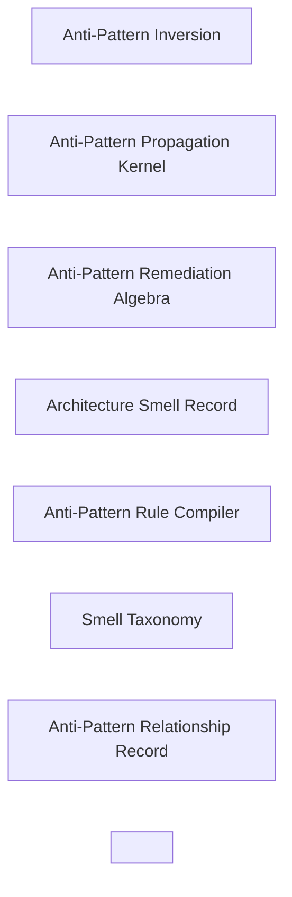

### Anti-Pattern Inversion

- Domain: [anti-patterns](ALGORITHMS.md#algorithms-domain-anti-patterns)
- Tier: [leaf](SCHEMA.md#vocabulary-domain-tier-leaf)
- Math type: [logic](REASONING.md#reasoning-math-type-logic)
- Yields: boolean

Details

Intent
Take any desired architectural principle, invert its invariants, identify the recurring violation shape, model its propagation mechanism, define detection signals, and derive its remediation inverse.

Invariant
Every anti-pattern is a stable failure algorithm created by repeated violation of an architectural contract.

Flow

```text
Principle → Invariant → Violation → Propagation → Detection → Remediation
```

Productions

```bnf
AntiPatternInversion ::= <HealthyPrinciple> "→" <RequiredInvariant> "→" <InvariantViolation> "→" <FailurePropagation> "→" <DetectionSignalSet> "→" <RemediationInverse>
AntiPatternRecord ::= <Name> "," <TriggerCondition> "," <DegenerationPath> "," <DetectionSignals> "," <DamageModel> "," <RemediationInverse>
```

Composes
none

Forces
[contract_compatibility](SCHEMA.md#force-contract-compatibility), [correctness_verification](SCHEMA.md#force-correctness-verification), [model_governance](SCHEMA.md#force-model-governance)

Grounds
none

Before

```text
Principle: Low Coupling — stated as a goal only; its violations are noticed ad hoc, named inconsistently, and caught late, with no derived failure algorithm.
```

After

```text
Low Coupling → invariant{no bidirectional dependency} → violation{Cyclic Dependency} → propagation{a convenience import closes a cycle, then spreads across modules} → detection{dependency-cycle scan} → remediation{invert the dependency / introduce a port}
```

How it is checked

Checked by
the quality rules compiled from the smell catalog, the cross-file quality gate

Population
Every source file the rules lint

Freshness
A verdict stands until the linted source or a rule changes

Refusal
A compiled rule fails the lint stage on the smell's signature

Observation
None, because these records describe decay paths found in source, not signals of a running system

Evidence
None, because the catalog states this check as a class, so a watched run belongs to each system that adopts it

Authoritative side
The smell catalog, which the compiled rules are derived from and the source is held to

Depends on
Not answered

Shape it refuses
Not answered

### Anti-Pattern Propagation Kernel

- Domain: [anti-patterns](ALGORITHMS.md#algorithms-domain-anti-patterns)
- Tier: [leaf](SCHEMA.md#vocabulary-domain-tier-leaf)
- Math type: [dynamical-systems](REASONING.md#reasoning-math-type-dynamical-systems)
- Yields: boolean | counter

Details

Intent
Start with a local shortcut, repeat it under delivery pressure, normalize it as convention, allow dependent code to form around it, then make remediation expensive through coupling and hidden assumptions.

Invariant
Most architecture anti-patterns become dangerous when a shortcut becomes infrastructure.

Flow

```text
Shortcut → Repetition → Normalization → DependencyFormation → Institutionalization → HighCostRepair
```

Productions

```bnf
AntiPatternPropagation ::= <LocalShortcut> "→" <RepeatedUse> "→" <ImplicitConvention> "→" <DependentCodeFormation> "→" <ArchitecturalDebt> "→" <RemediationCostIncrease>
DebtAmplifier ::= "copy_paste" | "missing_contract" | "missing_owner" | "missing_metric" | "missing_boundary" | "missing_version" | "missing_observability"
```

Composes
none

Forces
[modularity](SCHEMA.md#force-modularity), [semantic_consistency](SCHEMA.md#force-semantic-consistency), [correctness_verification](SCHEMA.md#force-correctness-verification)

Grounds
none

Before

```text
A one-off shortcut — inline a secret to ship a fix — treated as an isolated, cheap, local choice.
```

After

```text
Shortcut{inline secret} → repetition{reused under deadline} → normalization{becomes the team convention} → dependency-formation{configs read it directly} → institutionalization{deploy scripts assume it} → high-cost-repair{rotate the secret and rewire every dependent}
```

How it is checked

Checked by
the quality rules compiled from the smell catalog, the cross-file quality gate

Population
Every source file the rules lint

Freshness
A verdict stands until the linted source or a rule changes

Refusal
A compiled rule fails the lint stage on the smell's signature

Observation
None, because these records describe decay paths found in source, not signals of a running system

Evidence
None, because the catalog states this check as a class, so a watched run belongs to each system that adopts it

Authoritative side
The smell catalog, which the compiled rules are derived from and the source is held to

Depends on
Not answered

Shape it refuses
Not answered

### Anti-Pattern Remediation Algebra

- Domain: [anti-patterns](ALGORITHMS.md#algorithms-domain-anti-patterns)
- Tier: [leaf](SCHEMA.md#vocabulary-domain-tier-leaf)
- Math type: [algebra](REASONING.md#reasoning-math-type-algebra)
- Yields: ordered-structure

Details

Intent
For each anti-pattern, identify the missing architectural control, introduce the inverse control, migrate existing dependents, verify absence of the old failure shape, and enforce recurrence prevention.

Invariant
Anti-pattern repair is not complete until the propagation path is blocked.

Flow

```text
AntiPattern → MissingControl → InverseControl → Migration → AbsenceCheck → PreventionGate
```

Productions

```bnf
AntiPatternRemediationAlgebra ::= <AntiPatternRecord> "→" <MissingControl> "→" <InverseArchitecturalControl> "→" <MigrationPlan> "→" <EliminationVerification> "→" <RecurrencePrevention>
MissingControl ::= "boundary" | "contract" | "owner" | "version" | "telemetry" | "schema" | "policy" | "state_isolation" | "dependency_rule"
RecurrencePrevention ::= "static_check" | "contract_test" | "schema_gate" | "architecture_test" | "policy_as_code" | "review_gate" | "runtime_monitor"
```

Composes
none

Forces
[correctness_verification](SCHEMA.md#force-correctness-verification)

Grounds
none

Before

```text
The anti-pattern is deleted at one call site; the propagation path stays open, so it reappears elsewhere next sprint.
```

After

```text
Secret Sprawl → missing-control{no secret authority} → inverse-control{central store + injected access} → migration{repoint every reader} → absence-check{scan finds zero inline secrets} → prevention-gate{lint rule rejects new inline secrets}
```

How it is checked

Checked by
the quality rules compiled from the smell catalog, the cross-file quality gate

Population
Every source file the rules lint

Freshness
A verdict stands until the linted source or a rule changes

Refusal
A compiled rule fails the lint stage on the smell's signature

Observation
None, because these records describe decay paths found in source, not signals of a running system

Evidence
None, because the catalog states this check as a class, so a watched run belongs to each system that adopts it

Authoritative side
The smell catalog, which the compiled rules are derived from and the source is held to

Depends on
Not answered

Shape it refuses
Not answered

### Architecture Smell Record

- Domain: [anti-patterns](ALGORITHMS.md#algorithms-domain-anti-patterns)
- Tier: [leaf](SCHEMA.md#vocabulary-domain-tier-leaf)
- Math type: [logic](REASONING.md#reasoning-math-type-logic)
- Yields: boolean

Details

Intent
Model every smell as a recurring degeneration path with trigger conditions, enabling conditions, detection signals, damage model, remediation inverse, and prevention gate.

Invariant
A smell becomes enforceable when it is represented as a measurable failure contract.

Flow

```text
Smell → Trigger → Degeneration → Detection → Measurement → Remediation → Prevention
```

Productions

```bnf
ArchitectureSmellRecord ::= <SmellName> "," <TriggerCondition> "," <EnablingConditionSet> "," <DegenerationPath> "," <DetectionSignalSet> "," <MetricSet> "," <DamageModel> "," <RemediationInverse> "," <PreventionGate>
PreventionGate ::= "static_check" | "architecture_test" | "contract_test" | "schema_gate" | "review_gate" | "fitness_function" | "runtime_monitor"
```

Composes
none

Forces
[contract_compatibility](SCHEMA.md#force-contract-compatibility), [correctness_verification](SCHEMA.md#force-correctness-verification), [model_governance](SCHEMA.md#force-model-governance)

Grounds
none

Before

```text
Smell described in prose ('this class is too big') — unmeasurable, unenforceable, re-argued case by case.
```

After

```text
God Object : trigger{unrelated methods accrete} → degeneration{fan-in/out grows} → detection{LCOM + responsibility count} → measurement{cohesion score below threshold} → remediation{Extract Class} → prevention{architecture test on cohesion}
```

How it is checked

Checked by
the quality rules compiled from the smell catalog, the cross-file quality gate

Population
Every source file the rules lint

Freshness
A verdict stands until the linted source or a rule changes

Refusal
A compiled rule fails the lint stage on the smell's signature

Observation
None, because these records describe decay paths found in source, not signals of a running system

Evidence
None, because the catalog states this check as a class, so a watched run belongs to each system that adopts it

Authoritative side
The smell catalog, which the compiled rules are derived from and the source is held to

Depends on
Not answered

Shape it refuses
Not answered

### Anti-Pattern Rule Compiler

- Domain: [anti-patterns](ALGORITHMS.md#algorithms-domain-anti-patterns)
- Tier: [leaf](SCHEMA.md#vocabulary-domain-tier-leaf)
- Math type: [computation](REASONING.md#reasoning-math-type-computation)
- Yields: procedure

Details

Intent
Convert each smell record into detection checks, measurable thresholds, severity policy, remediation hints, and recurrence-prevention gates.

Invariant
A smell catalog is enforced only once it compiles into rules.

Flow

```text
SmellRecord → DetectionRule → MetricThreshold → Severity → RefactorHint → Gate
```

Productions

```bnf
AntiPatternRuleCompiler ::= <ArchitectureSmellRecordSet> "→" <DetectionRuleSet> "→" <MetricThresholdSet> "→" <SeverityPolicy> "→" <RemediationPlaybookSet> "→" <PreventionGateSet>
CompiledRule ::= <RuleName> "," <Scope> "," <Detector> "," <Threshold> "," <PriorityRank> "," <FailureMessage> "," <RefactorHint> "," <PreventionGate>
```

Composes
[Severity Policy](ALGORITHMS.md#algorithms-severity-policy)

Forces
[correctness_verification](SCHEMA.md#force-correctness-verification)

Grounds
none

Before

```text
A smell catalog read by the developer — each entry is advice that nothing executes.
```

After

```text
SmellRecord{God Object} → detection-rule{find unrelated method clusters} → metric-threshold{LCOM > 0.7} → severity{error} → refactor-hint{Extract Class} → gate{fails the build}
```

How it is checked

Checked by
the quality rules compiled from the smell catalog, the cross-file quality gate

Population
Every source file the rules lint

Freshness
A verdict stands until the linted source or a rule changes

Refusal
A compiled rule fails the lint stage on the smell's signature

Observation
None, because these records describe decay paths found in source, not signals of a running system

Evidence
None, because the catalog states this check as a class, so a watched run belongs to each system that adopts it

Authoritative side
The smell catalog, which the compiled rules are derived from and the source is held to

Depends on
[Severity Policy](ALGORITHMS.md#algorithms-severity-policy)

Shape it refuses
Not answered

### Smell Taxonomy

- Domain: [anti-patterns](ALGORITHMS.md#algorithms-domain-anti-patterns)
- Tier: [leaf](SCHEMA.md#vocabulary-domain-tier-leaf)
- Math type: [set-theory](REASONING.md#reasoning-math-type-set-theory)
- Yields: set | boolean

Details

Intent
Group smells by missing control so detection and remediation can be generalized.

Invariant
Most bad practices are symptoms of a missing architectural control.

Flow

```text
Smell → MissingControl → RuleFamily → RemediationFamily
```

Productions

```bnf
SmellTaxonomy ::= <SmellSet> "→" <MissingControlClassification> "→" <RuleFamilySet> "→" <RemediationFamilySet>
MissingControlClassification ::= "missing_boundary" | "missing_contract" | "missing_type" | "missing_owner" | "missing_version" | "missing_validation" | "missing_observability" | "missing_state_control" | "missing_release_control" | "missing_security_control" | "missing_evidence" | "excessive_abstraction" | "excessive_coupling" | "excessive_manual_process"
```

Composes
none

Forces
[correctness_verification](SCHEMA.md#force-correctness-verification)

Grounds
none

Before

```text
Dozens of smells listed flat, each handed its own bespoke, unrelated fix.
```

After

```text
smell-set{Magic Value, Secret Sprawl, Hardcoded Path} → missing-control{single source of truth} → rule-family{no-inline-authority checks} → remediation-family{centralize then inject}
```

How it is checked

Checked by
the quality rules compiled from the smell catalog, the cross-file quality gate

Population
Every source file the rules lint

Freshness
A verdict stands until the linted source or a rule changes

Refusal
A compiled rule fails the lint stage on the smell's signature

Observation
None, because these records describe decay paths found in source, not signals of a running system

Evidence
None, because the catalog states this check as a class, so a watched run belongs to each system that adopts it

Authoritative side
The smell catalog, which the compiled rules are derived from and the source is held to

Depends on
Not answered

Shape it refuses
Not answered

### Anti-Pattern Relationship Record

- Domain: [anti-patterns](ALGORITHMS.md#algorithms-domain-anti-patterns)
- Tier: [leaf](SCHEMA.md#vocabulary-domain-tier-leaf)
- Math type: [graph](REASONING.md#reasoning-math-type-graph)
- Yields: edge-list

Details

Intent
Model every anti-pattern as a typed relationship record: name, scope, causal links, conflicts, degradations, enabled failures, detection signals, measurement, remediation inverse, prevention, and severity.

Invariant
An anti-pattern is enforceable only when it is represented as a typed relationship record.

Productions

```bnf
AntiPatternRelationshipRecord ::= <AntiPatternName> ":" "Anti-Pattern" "," <scope> "," <caused_by> "," <conflicts_with> "," <degrades> "," <enables_failure> "," <detected_by> "," <measured_by> "," <refactored_by> "," <prevented_by> "," <severity>
```

Composes
none

Forces
[architecture_evolution](SCHEMA.md#force-architecture-evolution)

Grounds
none

Before

```text
An anti-pattern named as free text with no typed edges — not resolvable, not gate-checkable, not linkable to the principle it violates.
```

After

```text
Cyclic Dependency : Anti-Pattern, scope{module}, caused_by{convenience import}, conflicts_with{Low Coupling}, degrades{modularity}, enables_failure{build deadlock}, detected_by{cycle scan}, refactored_by{invert dependency}, prevented_by{dependency rule}, severity{mandatory}
```

How it is checked

Checked by
the quality rules compiled from the smell catalog, the cross-file quality gate

Population
Every source file the rules lint

Freshness
A verdict stands until the linted source or a rule changes

Refusal
A compiled rule fails the lint stage on the smell's signature

Observation
None, because these records describe decay paths found in source, not signals of a running system

Evidence
None, because the catalog states this check as a class, so a watched run belongs to each system that adopts it

Authoritative side
The smell catalog, which the compiled rules are derived from and the source is held to

Depends on
Not answered

Shape it refuses
Not answered

### <Architecture Anti-Pattern>

- Domain: [anti-patterns](ALGORITHMS.md#algorithms-domain-anti-patterns)
- Tier: [leaf](SCHEMA.md#vocabulary-domain-tier-leaf)
- Meta record

Details

Intent
<Local shortcut> → <Missing control> → <Repeated usage> → <Implicit dependency> → <Boundary/contract erosion> → <Systemic fragility> → <Expensive remediation>

Invariant
Every architecture anti-pattern is a reproducible decay path caused by the absence of a specific control: boundary, contract, ownership, versioning, observability, state isolation, or enforcement.

Flow

```text
Shortcut → Drift → Coupling → Fragility → Detection → Inversion
```

Productions

```bnf
ArchitectureAntiPattern ::= <TriggerCondition> "→" <MissingControl> "→" <DegenerationPath> "→" <DamageModel> "→" <DetectionSignalSet> "→" <RemediationInverse> "→" <PreventionGate>
RemediationInverse ::= "introduce_boundary" | "declare_contract" | "centralize_authority" | "assign_owner" | "version_change" | "add_observability" | "isolate_state" | "enforce_policy"
```

Composes
none

Forces
[modularity](SCHEMA.md#force-modularity), [contract_compatibility](SCHEMA.md#force-contract-compatibility), [correctness_verification](SCHEMA.md#force-correctness-verification), [observability_traceability](SCHEMA.md#force-observability-traceability)

Principle
[Big Ball of Mud](PRINCIPLES.md#architecture-big-ball-of-mud)

Grounds
none

How it is checked

Checked by
the quality rules compiled from the smell catalog, the cross-file quality gate

Population
Every source file the rules lint

Freshness
A verdict stands until the linted source or a rule changes

Refusal
A compiled rule fails the lint stage on the smell's signature

Observation
None, because these records describe decay paths found in source, not signals of a running system

Evidence
None, because the catalog states this check as a class, so a watched run belongs to each system that adopts it

Authoritative side
The smell catalog, which the compiled rules are derived from and the source is held to

Depends on
Not answered

Shape it refuses
Not answered

## Architecture

Every algorithm contract in this domain is listed with its position on the derivation loop, its intent and invariant, the flow it walks and its productions as a grammar. Each record also shows what it composes and is composed by, which forces and principles it answers to, what grounds it and what it grounds, and an exemplar where the record carries one. The diagram shows what composes what inside the domain.

Relations diagram

What composes what inside this domain.

```mermaid
flowchart LR
n_document_truth_alignment["Document Truth Alignment"]
n_architectural_contract_kernel["Architectural Contract Kernel"]
n_responsibility_boundary["Responsibility Boundary"]
n_coupling_control["Coupling Control"]
n_interface_contract["Interface Contract"]
n_substitutability["Substitutability"]
n_canonical_data["Canonical Data"]
n_domain_boundary["Domain Boundary"]
n_self_description_manifest["Self-Description Manifest"]
n_runtime_discovery["Runtime Discovery"]
n_extension_point["Extension Point"]
n_construction_boundary["Construction Boundary"]
n_structural_mediation["Structural Mediation"]
n_behavioral_dispatch["Behavioral Dispatch"]
n_architectural_style_boundary["Architectural Style Boundary"]
n_port_adapter["Port Adapter"]
n_event_messaging["Event Messaging"]
n_saga_compensation["Saga Compensation"]
n_transaction_boundary["Transaction Boundary"]
n_idempotent_side_effect["Idempotent Side Effect"]
n_deterministic_core["Deterministic Core"]
n_verification_fitness["Verification Fitness"]
n_error_boundary["Error Boundary"]
n_resilience_control["Resilience Control"]
n_recovery_deployment["Recovery Deployment"]
n_observability_trace["Observability Trace"]
n_causality_ordering["Causality Ordering"]
n_performance_scaling["Performance Scaling"]
n_cache_correctness["Cache Correctness"]
n_portability_environment["Portability Environment"]
n_security_policy["Security Policy"]
n_control_plane["Control Plane"]
n_declarative_metaprogramming["Declarative Metaprogramming"]
n_streaming_dataflow["Streaming Dataflow"]
n_rag_knowledge_boundary["RAG Knowledge Boundary"]
n_architecture_selection_meta_algorithm["Architecture Selection Meta-Algorithm"]
n_universal_architectural_concern_template["Universal Architectural Concern Template"]
n_architectural_contract_algebra["Architectural Contract Algebra"]
n_manifest_driven_documentation["Manifest-Driven Documentation"]
n_consumer_config_ssot["Consumer Config SSOT"]
n_finite_state_machine["Finite State Machine"]
n_statecharts["Statecharts"]
n_petri_nets["Petri Nets"]
n_queuing_theory["Queuing Theory"]
n_architectural_contract_algebra --> n_domain_boundary
n_architectural_contract_algebra --> n_transaction_boundary
n_manifest_driven_documentation --> n_document_truth_alignment
n_manifest_driven_documentation --> n_self_description_manifest
n_manifest_driven_documentation --> n_extension_point
n_consumer_config_ssot --> n_architectural_contract_kernel
n_consumer_config_ssot --> n_responsibility_boundary
n_statecharts --> n_finite_state_machine
```

### Document Truth Alignment

- Domain: [architecture](ALGORITHMS.md#algorithms-domain-architecture)
- Tier: [leaf](SCHEMA.md#vocabulary-domain-tier-leaf)
- Math type: [logic](REASONING.md#reasoning-math-type-logic)
- Yields: boolean

Details

Intent
For any document that states facts about a codebase, separate invariant facts (counts, paths, names, and the doc-type's structural schema) from variant prose, bind each invariant to a code-derived value through a stable key, compile the document from a template, and gate the output so a stated fact can never drift from the code it describes.

Invariant
A document is well-formed iff every rendered invariant equals its resolved code-truth and every doc-type-required meta-concern is present in order; prose is free.

Flow

```text
Concern → Variant → Invariant → TruthKey → Deriver → Template → Compilation → DriftGate
```

Productions

```bnf
DocumentTruth ::= <VariantProse> "+" <InvariantSet> "→" <TruthKeyBinding> "→" <DeriverResolution> "→" <TemplateCompilation> "→" <DriftGate>
InvariantBinding ::= <TruthKey> "," <TokenSlot> "," <DerivedValue> "," <DocTypeSchema>
```

Composes
none

Composed by
[Manifest-Driven Documentation](ALGORITHMS.md#algorithms-manifest-driven-documentation)

Forces
[correctness_verification](SCHEMA.md#force-correctness-verification), [contract_compatibility](SCHEMA.md#force-contract-compatibility), [modularity](SCHEMA.md#force-modularity)

Grounds
none

Before

```text
A doc states 'the system has 12 modules' — a hand-typed count that drifts the moment a module is added.
```

After

```text
invariant{moduleCount} → truth-key{modules.length} → deriver{scan workspaces} → template{'... has {moduleCount} modules'} → drift-gate{rendered == derived, else fail}
```

How it is checked

Checked by
the fitness functions, contract tests and architecture tests each contract names, the reviews a contract names where no automated check exists

Population
Every module and boundary the contract governs

Freshness
A verdict stands until the module, its dependencies or the contract changes

Refusal
A failing fitness function or contract test blocks the release

Observation
The traces and health signals the observability contracts require, which locate a contract failure in production

Evidence
None, because the catalog states this check as a class, so a watched run belongs to each system that adopts it

Authoritative side
The contract, which the module and its tests conform to

Depends on
Not answered

Shape it refuses
Not answered

### Architectural Contract Kernel

- Domain: [architecture](ALGORITHMS.md#algorithms-domain-architecture)
- Tier: [leaf](SCHEMA.md#vocabulary-domain-tier-leaf)
- Math type: [computation](REASONING.md#reasoning-math-type-computation)
- Yields: procedure

Details

Intent
For any programmatic system, identify architectural concerns, define explicit contracts for each concern, bind implementations to those contracts, validate invariants, observe behavior, and evolve through versioned change.

Invariant
Architecture is a graph of bounded contracts whose nodes expose stable intent and whose edges preserve compatibility, causality, and governance.

Flow

```text
Concern → Boundary → Contract → Implementation → Verification → Observation → Evolution
```

Productions

```bnf
ArchitectureKernel ::= <ConcernSet> "→" <BoundarySet> "→" <ContractSet> "→" <ImplementationGraph> "→" <VerificationSet> "→" <ObservationSet> "→" <EvolutionPolicy>
ConcernContract ::= <Intent> "," <Responsibility> "," <InputContract> "," <OutputContract> "," <InvariantSet> "," <FailurePolicy> "," <VersionPolicy>
```

Composes
none

Composed by
[Consumer Config SSOT](ALGORITHMS.md#algorithms-consumer-config-ssot)

Forces
[contract_compatibility](SCHEMA.md#force-contract-compatibility), [correctness_verification](SCHEMA.md#force-correctness-verification), [security_governance](SCHEMA.md#force-security-governance), [causality_ordering](SCHEMA.md#force-causality-ordering)

Grounds
none

Before

```typescript
class FooService {
  save(f) {
    db.write(f);
    log(f);
    notify(f);
  }
}
```

After

```typescript
interface FooPort {
  save(f: Foo): Promise<void>;
}
class FooService implements FooPort {
  constructor(
    private repo: FooRepo,
    private events: EventSink,
  ) {}
  async save(f: Foo) {
    await this.repo.save(f);
    this.events.emit({ type: "FooSaved", f });
  }
}
```

How it is checked

Checked by
the fitness functions, contract tests and architecture tests each contract names, the reviews a contract names where no automated check exists

Population
Every module and boundary the contract governs

Freshness
A verdict stands until the module, its dependencies or the contract changes

Refusal
A failing fitness function or contract test blocks the release

Observation
The traces and health signals the observability contracts require, which locate a contract failure in production

Evidence
None, because the catalog states this check as a class, so a watched run belongs to each system that adopts it

Authoritative side
The contract, which the module and its tests conform to

Depends on
Not answered

Shape it refuses
Not answered

### Responsibility Boundary

- Domain: [architecture](ALGORITHMS.md#algorithms-domain-architecture)
- Tier: [leaf](SCHEMA.md#vocabulary-domain-tier-leaf)
- Math type: [set-theory](REASONING.md#reasoning-math-type-set-theory)
- Yields: set | boolean

Details

Intent
Partition behavior into cohesive units, assign each unit one reason to change, hide internal details, expose only intentional interfaces, and reject cross-boundary leakage.

Invariant
Modularity is achieved when responsibility, knowledge, and change pressure are localized.

Flow

```text
Behavior → Responsibility → Boundary → Interface → Encapsulation → Replaceability
```

Productions

```bnf
ResponsibilityBoundary ::= <BehaviorSet> "→" <ResponsibilityPartition> "→" <ModuleBoundary> "→" <PublicInterface> "→" <PrivateImplementation>
ModuleBoundary ::= "single_responsibility" "," "high_cohesion" "," "low_coupling" "," "information_hiding" "," "replaceable_implementation"
```

Composes
none

Composed by
[Consumer Config SSOT](ALGORITHMS.md#algorithms-consumer-config-ssot), [Cascade Layer Partition](ALGORITHMS.md#algorithms-cascade-layer-partition), [Placement Isolation](ALGORITHMS.md#algorithms-placement-isolation), [Assembly Composition](ALGORITHMS.md#algorithms-assembly-composition)

Forces
[modularity](SCHEMA.md#force-modularity), [contract_compatibility](SCHEMA.md#force-contract-compatibility)

Grounds
none

Before

```typescript
class FooUtil {
  parse() {}
  save() {}
  render() {}
  notify() {}
}
```

After

```typescript
class FooParser {
  parse() {}
}
class FooRepository {
  save() {}
}
class FooView {
  render() {}
}
```

How it is checked

Checked by
the fitness functions, contract tests and architecture tests each contract names, the reviews a contract names where no automated check exists

Population
Every module and boundary the contract governs

Freshness
A verdict stands until the module, its dependencies or the contract changes

Refusal
A failing fitness function or contract test blocks the release

Observation
The traces and health signals the observability contracts require, which locate a contract failure in production

Evidence
None, because the catalog states this check as a class, so a watched run belongs to each system that adopts it

Authoritative side
The contract, which the module and its tests conform to

Depends on
Not answered

Shape it refuses
Not answered

### Coupling Control

- Domain: [architecture](ALGORITHMS.md#algorithms-domain-architecture)
- Tier: [leaf](SCHEMA.md#vocabulary-domain-tier-leaf)
- Math type: [graph](REASONING.md#reasoning-math-type-graph)
- Yields: edge-list

Details

Intent
Detect dependency directions, invert dependencies toward abstractions, restrict imports to approved boundaries, and preserve autonomy between modules.

Invariant
Low coupling is enforced by making dependencies point at contracts instead of concrete implementations.

Flow

```text
ConcreteDependency → AbstractionBoundary → DependencyRule → ImportValidation
```

Productions

```bnf
CouplingControl ::= <DependencyGraph> "→" <AbstractionNodeSet> "→" <AllowedEdgeSet> "→" <ForbiddenEdgeSet> "→" <DependencyValidation>
DependencyRule ::= "depend_on_interface" | "depend_on_port" | "same_boundary_only" | "adapter_required"
```

Composes
none

Composed by
[Constraints Over Shortcuts](ALGORITHMS.md#algorithms-no-shortcuts), [Event Emission Over Parent Callbacks](ALGORITHMS.md#algorithms-no-callbacks), [Least Privilege Over Broad Privilege](ALGORITHMS.md#algorithms-no-broad-privilege), [Saga Compensation Over Distributed 2PC](ALGORITHMS.md#algorithms-no-distributed-2pc), [Async Events Over Synchronous Cross-Boundary](ALGORITHMS.md#algorithms-no-sync-cross-boundary), [Injected Dependency Over Hidden](ALGORITHMS.md#algorithms-no-hidden-dependency), [Anti-Corruption Layer Over Cross-Context Leak](ALGORITHMS.md#algorithms-no-leaky-context), [Placement Isolation](ALGORITHMS.md#algorithms-placement-isolation)

Forces
[modularity](SCHEMA.md#force-modularity), [contract_compatibility](SCHEMA.md#force-contract-compatibility)

Grounds
none

Before

```typescript
import { SqlFooStore } from "./infra/sql";
class FooService {
  store = new SqlFooStore();
}
```

After

```typescript
interface FooStore {
  save(f: Foo): Promise<void>;
}
class FooService {
  constructor(private store: FooStore) {}
}
```

How it is checked

Checked by
the fitness functions, contract tests and architecture tests each contract names, the reviews a contract names where no automated check exists

Population
Every module and boundary the contract governs

Freshness
A verdict stands until the module, its dependencies or the contract changes

Refusal
A failing fitness function or contract test blocks the release

Observation
The traces and health signals the observability contracts require, which locate a contract failure in production

Evidence
None, because the catalog states this check as a class, so a watched run belongs to each system that adopts it

Authoritative side
The contract, which the module and its tests conform to

Depends on
Not answered

Shape it refuses
Not answered

### Interface Contract

- Domain: [architecture](ALGORITHMS.md#algorithms-domain-architecture)
- Tier: [leaf](SCHEMA.md#vocabulary-domain-tier-leaf)
- Math type: [logic](REASONING.md#reasoning-math-type-logic)
- Yields: boolean

Details

Intent
Define explicit interfaces with preconditions, postconditions, invariants, error semantics, version rules, and compatibility guarantees before implementation.

Invariant
Interfaces are executable promises between independently changeable parts.

Flow

```text
Intent → Interface → Preconditions → Postconditions → Compatibility → Implementation
```

Productions

```bnf
InterfaceContract ::= <InterfaceName> "," <OperationSet> "," <PreconditionSet> "," <PostconditionSet> "," <InvariantSet> "," <ErrorContract> "," <VersionContract>
CompatibilityRule ::= "backward_compatible" | "forward_compatible" | "breaking_change_requires_new_version"
```

Composes
none

Composed by
[Composed Turn Contract](ALGORITHMS.md#algorithms-composed-turn-contract), [<Mode-Driven Response Schema>](ALGORITHMS.md#algorithms-mode-driven-response-schema)

Forces
[contract_compatibility](SCHEMA.md#force-contract-compatibility), [semantic_consistency](SCHEMA.md#force-semantic-consistency)

Grounds
none

Before

```typescript
function doFoo(a, b, n) {}
```

After

```typescript
interface FooOp {
  (a: Foo, b: Bar, n: number): Result<FooOut, FooError>;
}
```

How it is checked

Checked by
the fitness functions, contract tests and architecture tests each contract names, the reviews a contract names where no automated check exists

Population
Every module and boundary the contract governs

Freshness
A verdict stands until the module, its dependencies or the contract changes

Refusal
A failing fitness function or contract test blocks the release

Observation
The traces and health signals the observability contracts require, which locate a contract failure in production

Evidence
None, because the catalog states this check as a class, so a watched run belongs to each system that adopts it

Authoritative side
The contract, which the module and its tests conform to

Depends on
Not answered

Shape it refuses
Not answered

### Substitutability

- Domain: [architecture](ALGORITHMS.md#algorithms-domain-architecture)
- Tier: [leaf](SCHEMA.md#vocabulary-domain-tier-leaf)
- Math type: [logic](REASONING.md#reasoning-math-type-logic)
- Yields: boolean

Details

Intent
Validate that every implementation of an abstraction preserves the abstraction’s behavior, accepts valid parent inputs, returns valid parent outputs, and does not strengthen forbidden constraints.

Invariant
Polymorphism is safe only when behavioral subtyping holds.

Flow

```text
Interface → Implementation → ContractCheck → Substitute|Reject
```

Productions

```bnf
Substitutability ::= <BaseContract> "→" <CandidateImplementation> "→" <BehavioralCompatibilityCheck> "→" <SubstitutionVerdict>
BehavioralCompatibilityCheck ::= "preconditions_not_stronger" "," "postconditions_not_weaker" "," "invariants_preserved" "," "errors_compatible"
```

Composes
none

Forces
[contract_compatibility](SCHEMA.md#force-contract-compatibility), [correctness_verification](SCHEMA.md#force-correctness-verification)

Grounds
none

Before

```typescript
class ReadOnlyFooStore extends FooStore {
  save() {
    throw new Error("unsupported");
  }
}
```

After

```typescript
interface FooReader {
  find(id: FooId): Foo | undefined;
}
interface FooWriter extends FooReader {
  save(f: Foo): void;
}
class ReadOnlyFooStore implements FooReader {
  find(id: FooId) {
    return fooCache.get(id);
  }
}
```

How it is checked

Checked by
the fitness functions, contract tests and architecture tests each contract names, the reviews a contract names where no automated check exists

Population
Every module and boundary the contract governs

Freshness
A verdict stands until the module, its dependencies or the contract changes

Refusal
A failing fitness function or contract test blocks the release

Observation
The traces and health signals the observability contracts require, which locate a contract failure in production

Evidence
None, because the catalog states this check as a class, so a watched run belongs to each system that adopts it

Authoritative side
The contract, which the module and its tests conform to

Depends on
Not answered

Shape it refuses
Not answered

### Canonical Data

- Domain: [architecture](ALGORITHMS.md#algorithms-domain-architecture)
- Tier: [leaf](SCHEMA.md#vocabulary-domain-tier-leaf)
- Math type: [set-theory](REASONING.md#reasoning-math-type-set-theory)
- Yields: set | boolean

Details

Intent
Normalize incoming data into a canonical schema, validate types and semantics, preserve one source of truth, and translate at system boundaries only.

Invariant
Semantic consistency requires one canonical model and controlled translation at edges.

Flow

```text
RawData → Validate → Normalize → CanonicalModel → BoundaryTranslation
```

Productions

```bnf
CanonicalDataFlow ::= <ExternalData> "→" <SchemaValidation> "→" <Canonicalization> "→" <CanonicalModel> "→" <BoundaryAdapter>
CanonicalModel ::= <Schema> "," <TypeRules> "," <SemanticRules> "," <NormalizationRules> "," <SourceOfTruth>
```

Composes
none

Composed by
[Seed Composition](ALGORITHMS.md#algorithms-seed-composition), [Canonical Config Resolution](ALGORITHMS.md#algorithms-canonical-config-resolution), [Composed Turn Contract](ALGORITHMS.md#algorithms-composed-turn-contract), [<Mode-Driven Response Schema>](ALGORITHMS.md#algorithms-mode-driven-response-schema), [Token Source-of-Truth](ALGORITHMS.md#algorithms-token-source-of-truth), [Type-Keyed Appearance](ALGORITHMS.md#algorithms-type-keyed-appearance)

Forces
[modularity](SCHEMA.md#force-modularity), [semantic_consistency](SCHEMA.md#force-semantic-consistency), [correctness_verification](SCHEMA.md#force-correctness-verification), [model_governance](SCHEMA.md#force-model-governance)

Grounds
none

Before

```typescript
function useFoo(raw) {
  const name = raw.name ?? raw.Name ?? raw.title;
}
```

After

```typescript
function toCanonicalFoo(raw: unknown): Foo {
  return { id: fooId(raw), name: pickName(raw) };
}
```

How it is checked

Checked by
the fitness functions, contract tests and architecture tests each contract names, the reviews a contract names where no automated check exists

Population
Every module and boundary the contract governs

Freshness
A verdict stands until the module, its dependencies or the contract changes

Refusal
A failing fitness function or contract test blocks the release

Observation
The traces and health signals the observability contracts require, which locate a contract failure in production

Evidence
None, because the catalog states this check as a class, so a watched run belongs to each system that adopts it

Authoritative side
The contract, which the module and its tests conform to

Depends on
Not answered

Shape it refuses
Not answered

### Domain Boundary

- Domain: [architecture](ALGORITHMS.md#algorithms-domain-architecture)
- Tier: [leaf](SCHEMA.md#vocabulary-domain-tier-leaf)
- Math type: [topology](REASONING.md#reasoning-math-type-topology)
- Yields: boolean

Details

Intent
Identify bounded contexts, define the ubiquitous language and the owner of each context's model, map the relationships between contexts, and use anti-corruption layers where semantics differ.

Invariant
Domain architecture protects meaning by making semantic boundaries explicit.

Flow

```text
Domain → BoundedContext → Language → ContextMap → TranslationBoundary
```

Productions

```bnf
DomainBoundary ::= <DomainModel> "→" <BoundedContextSet> "→" <UbiquitousLanguageSet> "→" <ContextMap> "→" <IntegrationPolicy>
IntegrationPolicy ::= "shared_kernel" | "customer_supplier" | "anti_corruption_layer" | "published_language" | "separate_ways"
```

Composes
none

Composed by
[Architectural Contract Algebra](ALGORITHMS.md#algorithms-architectural-contract-algebra), [Type-Keyed Appearance](ALGORITHMS.md#algorithms-type-keyed-appearance)

Forces
[modularity](SCHEMA.md#force-modularity), [semantic_consistency](SCHEMA.md#force-semantic-consistency), [domain_boundary](SCHEMA.md#force-domain-boundary)

Grounds
none

Before

```typescript
fooContext.use(sharedBaz);
barContext.use(sharedBaz);
```

After

```typescript
function toBarBaz(f: FooBaz): BarBaz {
  return { id: f.id };
}
```

How it is checked

Checked by
the fitness functions, contract tests and architecture tests each contract names, the reviews a contract names where no automated check exists

Population
Every module and boundary the contract governs

Freshness
A verdict stands until the module, its dependencies or the contract changes

Refusal
A failing fitness function or contract test blocks the release

Observation
The traces and health signals the observability contracts require, which locate a contract failure in production

Evidence
None, because the catalog states this check as a class, so a watched run belongs to each system that adopts it

Authoritative side
The contract, which the module and its tests conform to

Depends on
Not answered

Shape it refuses
Not answered

### Self-Description Manifest

- Domain: [architecture](ALGORITHMS.md#algorithms-domain-architecture)
- Tier: [leaf](SCHEMA.md#vocabulary-domain-tier-leaf)
- Math type: [set-theory](REASONING.md#reasoning-math-type-set-theory)
- Yields: set | boolean

Details

Intent
Require every component to declare identity, capabilities, contracts, dependencies, configuration, health model, and version metadata in a machine-readable manifest.

Invariant
Runtime systems become discoverable and governable when components describe themselves.

Flow

```text
Component → Manifest → CapabilityDeclaration → Discovery → Validation
```

Productions

```bnf
SelfDescription ::= <Component> "→" <Manifest> "→" <CapabilitySet> "→" <ContractReferenceSet> "→" <RuntimeRegistration>
Manifest ::= "identity" "," "version" "," "capabilities" "," "dependencies" "," "contracts" "," "configuration" "," "health"
```

Composes
none

Composed by
[Manifest-Driven Documentation](ALGORITHMS.md#algorithms-manifest-driven-documentation), [<Mode-Driven Response Schema>](ALGORITHMS.md#algorithms-mode-driven-response-schema), [Custom Type Registration](ALGORITHMS.md#algorithms-custom-type-registration)

Forces
[contract_compatibility](SCHEMA.md#force-contract-compatibility), [model_governance](SCHEMA.md#force-model-governance)

Grounds
none

Before

```typescript
export class FooPlugin {
  transform(x) {
    return x;
  }
}
```

After

```typescript
export const manifest = {
  identity: "foo-plugin",
  version: "1.2.0",
  capabilities: ["transform"],
  contracts: ["FooPort@1"],
  dependencies: [],
};
```

How it is checked

Checked by
the fitness functions, contract tests and architecture tests each contract names, the reviews a contract names where no automated check exists

Population
Every module and boundary the contract governs

Freshness
A verdict stands until the module, its dependencies or the contract changes

Refusal
A failing fitness function or contract test blocks the release

Observation
The traces and health signals the observability contracts require, which locate a contract failure in production

Evidence
None, because the catalog states this check as a class, so a watched run belongs to each system that adopts it

Authoritative side
The contract, which the module and its tests conform to

Depends on
Not answered

Shape it refuses
Not answered

### Runtime Discovery

- Domain: [architecture](ALGORITHMS.md#algorithms-domain-architecture)
- Tier: [leaf](SCHEMA.md#vocabulary-domain-tier-leaf)
- Math type: [set-theory](REASONING.md#reasoning-math-type-set-theory)
- Yields: set | boolean

Details

Intent
Discover available components by manifest, convention, registry, or service endpoint; validate discovered candidates against contracts; bind dynamically only after compatibility checks.

Invariant
Dynamic binding is safe only when discovery is filtered by explicit contracts.

Flow

```text
DiscoverySource → CandidateSet → ContractValidation → Binding → RuntimeUse
```

Productions

```bnf
RuntimeDiscovery ::= <DiscoveryMechanism> "→" <CandidateComponentSet> "→" <CapabilityMatch> "→" <ContractValidation> "→" <BindingDecision>
DiscoveryMechanism ::= "manifest" | "registry" | "service_discovery" | "convention" | "configuration"
```

Composes
none

Composed by
[Runtime Extensibility](ALGORITHMS.md#algorithms-runtime-extensibility), [<Mode-Driven Response Schema>](ALGORITHMS.md#algorithms-mode-driven-response-schema)

Forces
[contract_compatibility](SCHEMA.md#force-contract-compatibility), [runtime_extensibility](SCHEMA.md#force-runtime-extensibility), [correctness_verification](SCHEMA.md#force-correctness-verification)

Principle
[Runtime Discovery](PRINCIPLES.md#architecture-runtime-discovery)

Grounds
none

Before

```typescript
const plugin = new KnownFooPlugin();
```

After

```typescript
const candidates = registry.discover({ capability: "transform" });
const bound = candidates.filter((c) => satisfies(c.contract, FooPortV1));
```

How it is checked

Checked by
the fitness functions, contract tests and architecture tests each contract names, the reviews a contract names where no automated check exists

Population
Every module and boundary the contract governs

Freshness
A verdict stands until the module, its dependencies or the contract changes

Refusal
A failing fitness function or contract test blocks the release

Observation
The traces and health signals the observability contracts require, which locate a contract failure in production

Evidence
None, because the catalog states this check as a class, so a watched run belongs to each system that adopts it

Authoritative side
The contract, which the module and its tests conform to

Depends on
Not answered

Shape it refuses
Not answered

### Extension Point

- Domain: [architecture](ALGORITHMS.md#algorithms-domain-architecture)
- Tier: [leaf](SCHEMA.md#vocabulary-domain-tier-leaf)
- Math type: [logic](REASONING.md#reasoning-math-type-logic)
- Yields: boolean

Details

Intent
Define stable extension contracts, register implementations through IoC or plugin registries, isolate plugin failures, and expose deterministic loading order.

Invariant
Extensibility requires stable hooks, controlled registration, and observable binding.

Flow

```text
ExtensionContract → PluginRegistration → DependencyInjection → Isolation → Dispatch
```

Productions

```bnf
ExtensionArchitecture ::= <ExtensionPoint> "→" <PluginContract> "→" <PluginRegistry> "→" <BindingPolicy> "→" <FailureIsolation>
BindingPolicy ::= "dependency_injection" | "service_registry" | "service_locator" | "manual_registration" | "auto_discovery"
```

Composes
none

Composed by
[Manifest-Driven Documentation](ALGORITHMS.md#algorithms-manifest-driven-documentation), [Composed Turn Contract](ALGORITHMS.md#algorithms-composed-turn-contract), [<Mode-Driven Response Schema>](ALGORITHMS.md#algorithms-mode-driven-response-schema), [Custom Type Registration](ALGORITHMS.md#algorithms-custom-type-registration)

Forces
[contract_compatibility](SCHEMA.md#force-contract-compatibility), [runtime_extensibility](SCHEMA.md#force-runtime-extensibility), [correctness_verification](SCHEMA.md#force-correctness-verification), [observability_traceability](SCHEMA.md#force-observability-traceability)

Grounds
none

Before

```typescript
switch (kind) {
  case "foo":
    doFoo();
    break;
  case "bar":
    doBar();
    break;
}
```

After

```typescript
registry.register("foo", fooHandler);
registry.register("bar", barHandler);
registry.get(kind)?.handle(input);
```

How it is checked

Checked by
the fitness functions, contract tests and architecture tests each contract names, the reviews a contract names where no automated check exists

Population
Every module and boundary the contract governs

Freshness
A verdict stands until the module, its dependencies or the contract changes

Refusal
A failing fitness function or contract test blocks the release

Observation
The traces and health signals the observability contracts require, which locate a contract failure in production

Evidence
None, because the catalog states this check as a class, so a watched run belongs to each system that adopts it

Authoritative side
The contract, which the module and its tests conform to

Depends on
Not answered

Shape it refuses
Not answered

### Construction Boundary

- Domain: [architecture](ALGORITHMS.md#algorithms-domain-architecture)
- Tier: [leaf](SCHEMA.md#vocabulary-domain-tier-leaf)
- Math type: [computation](REASONING.md#reasoning-math-type-computation)
- Yields: procedure

Details

Intent
Hide object creation behind factories, builders, prototypes, or abstract factories so callers depend on creation contracts rather than concrete constructors.

Invariant
Creation logic is a boundary and should be replaceable independently from usage logic.

Flow

```text
CreationRequest → ConstructionContract → Factory|Builder|Prototype → Instance
```

Productions

```bnf
ConstructionBoundary ::= <CreationIntent> "→" <ConstructionStrategy> "→" <InstanceContract> "→" <ConstructedObject>
ConstructionStrategy ::= "factory" | "factory_method" | "abstract_factory" | "builder" | "prototype"
```

Composes
none

Composed by
[Governed Construction Boundary](ALGORITHMS.md#algorithms-governed-construction-boundary)

Forces
[modularity](SCHEMA.md#force-modularity), [contract_compatibility](SCHEMA.md#force-contract-compatibility), [object_creation](SCHEMA.md#force-object-creation)

Grounds
none

Before

```typescript
const c = new FooConnection(host, port, user, pw);
```

After

```typescript
const c = fooConnectionFactory.create(config);
```

How it is checked

Checked by
the fitness functions, contract tests and architecture tests each contract names, the reviews a contract names where no automated check exists

Population
Every module and boundary the contract governs

Freshness
A verdict stands until the module, its dependencies or the contract changes

Refusal
A failing fitness function or contract test blocks the release

Observation
The traces and health signals the observability contracts require, which locate a contract failure in production

Evidence
None, because the catalog states this check as a class, so a watched run belongs to each system that adopts it

Authoritative side
The contract, which the module and its tests conform to

Depends on
Not answered

Shape it refuses
Not answered

### Structural Mediation

- Domain: [architecture](ALGORITHMS.md#algorithms-domain-architecture)
- Tier: [leaf](SCHEMA.md#vocabulary-domain-tier-leaf)
- Math type: [algebra](REASONING.md#reasoning-math-type-algebra)
- Yields: ordered-structure

Details

Intent
Insert adapters, facades, proxies, bridges, or decorators where incompatible structure, access control, abstraction separation, or behavior layering is required.

Invariant
Structural patterns reshape access without corrupting the core contract.

Flow

```text
ClientNeed → StructuralMismatch → MediatingPattern → CompatibleInterface
```

Productions

```bnf
StructuralMediation ::= <ClientContract> "→" <MismatchType> "→" <StructuralPattern> "→" <CompatibleBoundary>
StructuralPattern ::= "adapter" | "facade" | "proxy" | "bridge" | "decorator"
```

Composes
none

Forces
[modularity](SCHEMA.md#force-modularity), [contract_compatibility](SCHEMA.md#force-contract-compatibility)

Grounds
none

Before

```typescript
legacyFooApi.call(new FooXmlPayload(foo));
```

After

```typescript
class FooAdapter implements FooPort {
  constructor(private legacy: FooXmlApi) {}
  save(f: Foo) {
    return this.legacy.call(toFooXml(f));
  }
}
```

How it is checked

Checked by
the fitness functions, contract tests and architecture tests each contract names, the reviews a contract names where no automated check exists

Population
Every module and boundary the contract governs

Freshness
A verdict stands until the module, its dependencies or the contract changes

Refusal
A failing fitness function or contract test blocks the release

Observation
The traces and health signals the observability contracts require, which locate a contract failure in production

Evidence
None, because the catalog states this check as a class, so a watched run belongs to each system that adopts it

Authoritative side
The contract, which the module and its tests conform to

Depends on
Not answered

Shape it refuses
Not answered

### Behavioral Dispatch

- Domain: [architecture](ALGORITHMS.md#algorithms-domain-architecture)
- Tier: [leaf](SCHEMA.md#vocabulary-domain-tier-leaf)
- Math type: [logic](REASONING.md#reasoning-math-type-logic)
- Yields: boolean

Details

Intent
Externalize variable behavior into strategies, template hooks, observers, or mediators while preserving stable orchestration contracts.

Invariant
Behavioral variation belongs behind dispatch contracts, not scattered conditionals.

Flow

```text
StableFlow → VariationPoint → DispatchPattern → RuntimeBehavior
```

Productions

```bnf
BehavioralDispatch ::= <StableOperation> "→" <VariationPoint> "→" <BehaviorPattern> "→" <SelectedBehavior>
BehaviorPattern ::= "strategy" | "template_method" | "observer" | "mediator" | "polymorphic_dispatch"
```

Composes
none

Forces
[contract_compatibility](SCHEMA.md#force-contract-compatibility), [control_coordination](SCHEMA.md#force-control-coordination)

Grounds
none

Before

```typescript
function handleFoo(f) {
  if (f.kind === "a") {
    return runA(f);
  } else if (f.kind === "b") {
    return runB(f);
  }
}
```

After

```typescript
const strategies: Record<FooKind, FooStrategy> = {
  a: fooStrategyA,
  b: fooStrategyB,
};
function handleFoo(f: Foo) {
  return strategies[f.kind].run(f);
}
```

How it is checked

Checked by
the fitness functions, contract tests and architecture tests each contract names, the reviews a contract names where no automated check exists

Population
Every module and boundary the contract governs

Freshness
A verdict stands until the module, its dependencies or the contract changes

Refusal
A failing fitness function or contract test blocks the release

Observation
The traces and health signals the observability contracts require, which locate a contract failure in production

Evidence
None, because the catalog states this check as a class, so a watched run belongs to each system that adopts it

Authoritative side
The contract, which the module and its tests conform to

Depends on
Not answered

Shape it refuses
Not answered

### Architectural Style Boundary

- Domain: [architecture](ALGORITHMS.md#algorithms-domain-architecture)
- Tier: [leaf](SCHEMA.md#vocabulary-domain-tier-leaf)
- Math type: [optimization](REASONING.md#reasoning-math-type-optimization)
- Yields: boolean | ranking

Details

Intent
Select an architectural style, from a monolith or modular monolith to layered, hexagonal or microservices, by dependency direction, deployment autonomy, domain complexity, team topology, operational maturity and change isolation needs, then enforce the style through boundary rules.

Invariant
Architecture style is a macro-contract for dependency flow and deployment shape.

Flow

```text
SystemForces → StyleSelection → BoundaryRules → FitnessValidation
```

Productions

```bnf
ArchitectureStyle ::= <SystemForces> "→" <Style> "→" <BoundaryRuleSet> "→" <FitnessFunctionSet>
Style ::= "hexagonal" | "ports_and_adapters" | "clean_architecture" | "layered" | "component_based" | "package_by_feature" | "microservices" | "modular_monolith" | "monolith"
SystemForces ::= "domain_complexity" "," "team_topology" "," "deployment_autonomy" "," "consistency_requirement" "," "operational_maturity" "," "scaling_pressure"
```

Composes
none

Composed by
[Cascade Layer Partition](ALGORITHMS.md#algorithms-cascade-layer-partition)

Forces
[modularity](SCHEMA.md#force-modularity), [contract_compatibility](SCHEMA.md#force-contract-compatibility), [domain_boundary](SCHEMA.md#force-domain-boundary)

Grounds
none

Before

```typescript
import { SqlDriver } from "../infra/sql";
```

After

```typescript
export const boundaries = { ui: ["app"], app: ["domain"], domain: [] };
```

How it is checked

Checked by
the fitness functions, contract tests and architecture tests each contract names, the reviews a contract names where no automated check exists

Population
Every module and boundary the contract governs

Freshness
A verdict stands until the module, its dependencies or the contract changes

Refusal
A failing fitness function or contract test blocks the release

Observation
The traces and health signals the observability contracts require, which locate a contract failure in production

Evidence
None, because the catalog states this check as a class, so a watched run belongs to each system that adopts it

Authoritative side
The contract, which the module and its tests conform to

Depends on
Not answered

Shape it refuses
Not answered

### Port Adapter

- Domain: [architecture](ALGORITHMS.md#algorithms-domain-architecture)
- Tier: [leaf](SCHEMA.md#vocabulary-domain-tier-leaf)
- Math type: [logic](REASONING.md#reasoning-math-type-logic)
- Yields: boolean

Details

Intent
Place domain logic behind inbound and outbound ports, implement external technology through adapters, and forbid domain dependence on infrastructure.

Invariant
The domain remains stable by depending on ports, not delivery or persistence mechanisms.

Flow

```text
UseCase → InboundPort → DomainLogic → OutboundPort → Adapter
```

Productions

```bnf
PortAdapterFlow ::= <ExternalDriver> "→" <InboundAdapter> "→" <InboundPort> "→" <UseCase> "→" <OutboundPort> "→" <OutboundAdapter>
DependencyDirection ::= "adapter_depends_on_port" "," "domain_depends_on_abstraction" "," "infrastructure_outside_core"
```

Composes
none

Composed by
[Persistence Fork](ALGORITHMS.md#algorithms-persistence-fork)

Forces
[domain_boundary](SCHEMA.md#force-domain-boundary)

Grounds
none

Before

```typescript
class FooUseCase {
  run(f) {
    new FooHttpClient().send(f);
  }
}
```

After

```typescript
interface FooOutPort {
  send(f: Foo): Promise<void>;
}
class FooUseCase {
  constructor(private out: FooOutPort) {}
}
```

How it is checked

Checked by
the fitness functions, contract tests and architecture tests each contract names, the reviews a contract names where no automated check exists

Population
Every module and boundary the contract governs

Freshness
A verdict stands until the module, its dependencies or the contract changes

Refusal
A failing fitness function or contract test blocks the release

Observation
The traces and health signals the observability contracts require, which locate a contract failure in production

Evidence
None, because the catalog states this check as a class, so a watched run belongs to each system that adopts it

Authoritative side
The contract, which the module and its tests conform to

Depends on
Not answered

Shape it refuses
Not answered

### Event Messaging

- Domain: [architecture](ALGORITHMS.md#algorithms-domain-architecture)
- Tier: [leaf](SCHEMA.md#vocabulary-domain-tier-leaf)
- Math type: [analysis](REASONING.md#reasoning-axis-analysis)
- Yields: operation

Details

Intent
Convert state changes into events, classify domain versus integration events, publish through durable channels, consume idempotently, and preserve ordering where required.

Invariant
Event-driven systems trade immediate consistency for decoupled causal propagation.

Flow

```text
StateChange → Event → Publish → Consume → IdempotentEffect → Consistency
```

Productions

```bnf
EventMessaging ::= <StateChange> "→" <EventClassification> "→" <MessageEnvelope> "→" <BrokerOrBus> "→" <Consumer> "→" <EffectPolicy>
EventClassification ::= "domain_event" | "integration_event" | "stream_event"
EffectPolicy ::= "idempotent" "," "retryable" "," "observable" "," "ordered_if_required"
```

Composes
none

Forces
[event_messaging](SCHEMA.md#force-event-messaging), [domain_boundary](SCHEMA.md#force-domain-boundary), [causality_ordering](SCHEMA.md#force-causality-ordering)

Grounds
none

Before

```typescript
async function doFoo(f) {
  await stepBar(f);
  await stepBaz(f);
  await stepQux(f);
}
```

After

```typescript
async function doFoo(f) {
  await fooStore.save(f);
  await bus.publish({ type: "FooHappened", f });
}
```

How it is checked

Checked by
the fitness functions, contract tests and architecture tests each contract names, the reviews a contract names where no automated check exists

Population
Every module and boundary the contract governs

Freshness
A verdict stands until the module, its dependencies or the contract changes

Refusal
A failing fitness function or contract test blocks the release

Observation
The traces and health signals the observability contracts require, which locate a contract failure in production

Evidence
None, because the catalog states this check as a class, so a watched run belongs to each system that adopts it

Authoritative side
The contract, which the module and its tests conform to

Depends on
Not answered

Shape it refuses
Not answered

### Saga Compensation

- Domain: [architecture](ALGORITHMS.md#algorithms-domain-architecture)
- Tier: [leaf](SCHEMA.md#vocabulary-domain-tier-leaf)
- Math type: [computation](REASONING.md#reasoning-math-type-computation)
- Yields: procedure

Details

Intent
For long-running distributed workflows, split work into steps, persist progress, define compensating actions, and recover from partial failure through forward or backward correction.

Invariant
Distributed transactions require explicit process state and compensation.

Flow

```text
Workflow → StepGraph → LocalTransaction → Event → Compensation|Continue
```

Productions

```bnf
Saga ::= <SagaState> "→" <Step> "→" <LocalTransaction> "→" <ProgressEvent> "→" (<NextStep> | <CompensatingTransaction>)
SagaStep ::= <Command> "," <SuccessEvent> "," <FailureEvent> "," <CompensationCommand>
```

Composes
none

Forces
[event_messaging](SCHEMA.md#force-event-messaging)

Grounds
none

Refused by rules
saga-compensation

Before

```typescript
await reserveFoo(x);
await reserveBar(x);
```

After

```typescript
const saga = [
  { do: reserveFoo, undo: releaseFoo },
  { do: reserveBar, undo: releaseBar },
];
runSaga(saga);
```

How it is checked

Checked by
the fitness functions, contract tests and architecture tests each contract names, the reviews a contract names where no automated check exists

Population
Every module and boundary the contract governs

Freshness
A verdict stands until the module, its dependencies or the contract changes

Refusal
A failing fitness function or contract test blocks the release

Observation
The traces and health signals the observability contracts require, which locate a contract failure in production

Evidence
None, because the catalog states this check as a class, so a watched run belongs to each system that adopts it

Authoritative side
The contract, which the module and its tests conform to

Depends on
Not answered

Shape it refuses
Not answered

### Transaction Boundary

- Domain: [architecture](ALGORITHMS.md#algorithms-domain-architecture)
- Tier: [leaf](SCHEMA.md#vocabulary-domain-tier-leaf)
- Math type: [logic](REASONING.md#reasoning-math-type-logic)
- Yields: boolean

Details

Intent
Define atomic state-change boundaries, isolate concurrent mutation, enforce consistency rules, and commit or roll back as a unit.

Invariant
Correct state change requires explicit transaction scope and isolation semantics.

Flow

```text
Command → UnitOfWork → Invariant → Commit|Rollback
```

Productions

```bnf
TransactionBoundary ::= <Command> "→" <TransactionScope> "→" <InvariantCheck> "→" <ConcurrencyControl> "→" <CommitDecision>
ConcurrencyControl ::= "optimistic_locking" | "pessimistic_locking" | "serial_execution" | "state_isolation"
```

Composes
none

Composed by
[Architectural Contract Algebra](ALGORITHMS.md#algorithms-architectural-contract-algebra), [State and Transaction Safety](ALGORITHMS.md#algorithms-state-and-transaction-safety)

Forces
[modularity](SCHEMA.md#force-modularity), [semantic_consistency](SCHEMA.md#force-semantic-consistency), [state_transaction](SCHEMA.md#force-state-transaction)

Principle
[Transaction Boundary](PRINCIPLES.md#architecture-transaction-boundary)

Grounds
none

Before

```typescript
decFoo(a, n);
incBar(b, n);
```

After

```typescript
await unitOfWork(async (tx) => {
  await decFoo(tx, a, n);
  await incBar(tx, b, n);
});
```

How it is checked

Checked by
the fitness functions, contract tests and architecture tests each contract names, the reviews a contract names where no automated check exists

Population
Every module and boundary the contract governs

Freshness
A verdict stands until the module, its dependencies or the contract changes

Refusal
A failing fitness function or contract test blocks the release

Observation
The traces and health signals the observability contracts require, which locate a contract failure in production

Evidence
None, because the catalog states this check as a class, so a watched run belongs to each system that adopts it

Authoritative side
The contract, which the module and its tests conform to

Depends on
Not answered

Shape it refuses
Not answered

### Idempotent Side Effect

- Domain: [architecture](ALGORITHMS.md#algorithms-domain-architecture)
- Tier: [leaf](SCHEMA.md#vocabulary-domain-tier-leaf)
- Math type: [logic](REASONING.md#reasoning-math-type-logic)
- Yields: boolean

Details

Intent
Assign a stable operation identity, check whether the effect was already applied, execute only once, and return the same semantic result for repeated requests.

Invariant
External side effects must be repeat-safe under retries.

Flow

```text
Request → IdempotencyKey → PriorResultCheck → ExecuteOnce → PersistOutcome
```

Productions

```bnf
Idempotency ::= <Request> "→" <IdempotencyKey> "→" <DeduplicationStore> "→" (<PriorResult> | <SideEffectExecution>) "→" <StableResponse>
StableResponse ::= "same_key_same_effect_same_semantic_result"
```

Composes
none

Composed by
[Idempotent Merge](ALGORITHMS.md#algorithms-idempotent-merge)

Forces
[semantic_consistency](SCHEMA.md#force-semantic-consistency), [state_transaction](SCHEMA.md#force-state-transaction), [resilience_recovery](SCHEMA.md#force-resilience-recovery)

Grounds
none

Before

```typescript
async function applyFoo(req) {
  await external.apply(req.value);
}
```

After

```typescript
async function applyFoo(req) {
  if (await seen(req.key)) return priorResult(req.key);
  const r = await external.apply(req.value);
  await persist(req.key, r);
  return r;
}
```

How it is checked

Checked by
the fitness functions, contract tests and architecture tests each contract names, the reviews a contract names where no automated check exists

Population
Every module and boundary the contract governs

Freshness
A verdict stands until the module, its dependencies or the contract changes

Refusal
A failing fitness function or contract test blocks the release

Observation
The traces and health signals the observability contracts require, which locate a contract failure in production

Evidence
None, because the catalog states this check as a class, so a watched run belongs to each system that adopts it

Authoritative side
The contract, which the module and its tests conform to

Depends on
Not answered

Shape it refuses
Not answered

### Deterministic Core

- Domain: [architecture](ALGORITHMS.md#algorithms-domain-architecture)
- Tier: [leaf](SCHEMA.md#vocabulary-domain-tier-leaf)
- Math type: [logic](REASONING.md#reasoning-math-type-logic)
- Yields: boolean

Details

Intent
Push nondeterminism to system edges, keep core logic pure where possible, use immutable inputs, and make outputs reproducible under identical inputs.

Invariant
Correctness improves when the core is deterministic and side effects are controlled.

Flow

```text
ExternalInput → Normalize → PureCore → DeterministicOutput → ControlledEffect
```

Productions

```bnf
DeterministicCore ::= <Input> "→" <Canonicalization> "→" <PureFunctionSet> "→" <Output> "→" <EffectBoundary>
PurityConstraint ::= "no_hidden_state" "," "no_hidden_time" "," "no_hidden_randomness" "," "referential_transparency"
```

Composes
none

Composed by
[Correctness Verification](ALGORITHMS.md#algorithms-correctness-verification), [Deterministic Merge Core](ALGORITHMS.md#algorithms-deterministic-merge-core)

Forces
[correctness_verification](SCHEMA.md#force-correctness-verification)

Grounds
none

Before

```typescript
function scoreFoo(f) {
  return f.base * (Date.now() % 2 ? 1.1 : 1);
}
```

After

```typescript
function scoreFoo(f: Foo, now: Date) {
  return f.base * rateAt(now);
}
```

How it is checked

Checked by
the fitness functions, contract tests and architecture tests each contract names, the reviews a contract names where no automated check exists

Population
Every module and boundary the contract governs

Freshness
A verdict stands until the module, its dependencies or the contract changes

Refusal
A failing fitness function or contract test blocks the release

Observation
The traces and health signals the observability contracts require, which locate a contract failure in production

Evidence
None, because the catalog states this check as a class, so a watched run belongs to each system that adopts it

Authoritative side
The contract, which the module and its tests conform to

Depends on
Not answered

Shape it refuses
Not answered

### Verification Fitness

- Domain: [architecture](ALGORITHMS.md#algorithms-domain-architecture)
- Tier: [leaf](SCHEMA.md#vocabulary-domain-tier-leaf)
- Math type: [optimization](REASONING.md#reasoning-math-type-optimization)
- Yields: boolean | ranking

Details

Intent
Define executable architecture rules, validate with static analysis, specification tests, property tests, and runtime checks, then block release when critical rules fail.

Invariant
Architecture must be continuously verified by fitness functions.

Flow

```text
Rule → Test → Evidence → Pass|Fail → Gate
```

Productions

```bnf
VerificationFitness ::= <SpecificationSet> "→" <VerificationMethodSet> "→" <EvidenceSet> "→" <FitnessVerdict>
VerificationMethod ::= "type_check" | "static_analysis" | "schema_validation" | "contract_test" | "property_based_test" | "specification_test" | "formal_verification" | "runtime_validation"
```

Composes
none

Composed by
[Layer Fitness Enforcement](ALGORITHMS.md#algorithms-layer-fitness-enforcement)

Forces
[runtime_extensibility](SCHEMA.md#force-runtime-extensibility), [correctness_verification](SCHEMA.md#force-correctness-verification), [architecture_evolution](SCHEMA.md#force-architecture-evolution)

Grounds
none

Before

```typescript
reviewChecklist.push("domain must not import infra");
```

After

```typescript
test("domain imports no infra", () =>
  expect(importsOf("domain")).not.toContain("infra"));
```

How it is checked

Checked by
the fitness functions, contract tests and architecture tests each contract names, the reviews a contract names where no automated check exists

Population
Every module and boundary the contract governs

Freshness
A verdict stands until the module, its dependencies or the contract changes

Refusal
A failing fitness function or contract test blocks the release

Observation
The traces and health signals the observability contracts require, which locate a contract failure in production

Evidence
None, because the catalog states this check as a class, so a watched run belongs to each system that adopts it

Authoritative side
The contract, which the module and its tests conform to

Depends on
Not answered

Shape it refuses
Not answered

### Error Boundary

- Domain: [architecture](ALGORITHMS.md#algorithms-domain-architecture)
- Tier: [leaf](SCHEMA.md#vocabulary-domain-tier-leaf)
- Math type: [logic](REASONING.md#reasoning-math-type-logic)
- Yields: boolean

Details

Intent
Detect invalid state early, fail fast for programmer errors, fail safe for recoverable runtime faults, fail secure for security-sensitive failures, and return typed errors.

Invariant
Error handling is a contract for containment, disclosure, and recovery.

Flow

```text
Operation → Guard → ErrorClass → BoundaryPolicy → RecoveryOrAbort
```

Productions

```bnf
ErrorBoundary ::= <Operation> "→" <PreconditionCheck> "→" <ErrorClassification> "→" <FailurePolicy> "→" <ResultContract>
FailurePolicy ::= "fail_fast" | "fail_safe" | "fail_secure" | "graceful_degradation" | "fallback"
```

Composes
none

Composed by
[Governed Construction Boundary](ALGORITHMS.md#algorithms-governed-construction-boundary)

Forces
[modularity](SCHEMA.md#force-modularity), [contract_compatibility](SCHEMA.md#force-contract-compatibility), [resilience_recovery](SCHEMA.md#force-resilience-recovery), [security_governance](SCHEMA.md#force-security-governance)

Grounds
none

Before

```typescript
try {
  doFoo();
} catch (e) {
  return null;
}
```

After

```typescript
try {
  return ok(doFoo());
} catch (e) {
  if (isProgrammerError(e)) throw e;
  Logger.error("doFoo failed", e);
  return err("foo.retry");
}
```

How it is checked

Checked by
the fitness functions, contract tests and architecture tests each contract names, the reviews a contract names where no automated check exists

Population
Every module and boundary the contract governs

Freshness
A verdict stands until the module, its dependencies or the contract changes

Refusal
A failing fitness function or contract test blocks the release

Observation
The traces and health signals the observability contracts require, which locate a contract failure in production

Evidence
None, because the catalog states this check as a class, so a watched run belongs to each system that adopts it

Authoritative side
The contract, which the module and its tests conform to

Depends on
Not answered

Shape it refuses
Not answered

### Resilience Control

- Domain: [architecture](ALGORITHMS.md#algorithms-domain-architecture)
- Tier: [leaf](SCHEMA.md#vocabulary-domain-tier-leaf)
- Math type: [dynamical-systems](REASONING.md#reasoning-math-type-dynamical-systems)
- Yields: boolean | counter

Details

Intent
Wrap remote or unreliable calls with timeout, retry, circuit breaker, bulkhead isolation, fallback, and backpressure policies.

Invariant
Resilience is controlled failure under resource and dependency stress.

Flow

```text
Call → Timeout → RetryPolicy → CircuitBreaker → Bulkhead → Fallback
```

Productions

```bnf
ResilienceControl ::= <ExternalCall> "→" <TimeoutPolicy> "→" <RetryPolicy> "→" <CircuitBreaker> "→" <Bulkhead> "→" <FallbackPolicy> "→" <BackpressurePolicy>
RetryPolicy ::= "bounded_attempts" "," "jittered_backoff" "," "idempotency_required"
```

Composes
none

Composed by
[Quality Governance Loop](ALGORITHMS.md#algorithms-quality-governance-loop)

Forces
[resilience_recovery](SCHEMA.md#force-resilience-recovery)

Grounds
none

Before

```typescript
const r = await callFoo(url);
```

After

```typescript
const r = await breaker.run(() => withTimeout(callFoo(url), 2000), {
  retries: 3,
  backoff: jitter,
});
```

How it is checked

Checked by
the fitness functions, contract tests and architecture tests each contract names, the reviews a contract names where no automated check exists

Population
Every module and boundary the contract governs

Freshness
A verdict stands until the module, its dependencies or the contract changes

Refusal
A failing fitness function or contract test blocks the release

Observation
The traces and health signals the observability contracts require, which locate a contract failure in production

Evidence
None, because the catalog states this check as a class, so a watched run belongs to each system that adopts it

Authoritative side
The contract, which the module and its tests conform to

Depends on
Not answered

Shape it refuses
Not answered

### Recovery Deployment

- Domain: [architecture](ALGORITHMS.md#algorithms-domain-architecture)
- Tier: [leaf](SCHEMA.md#vocabulary-domain-tier-leaf)
- Math type: [dynamical-systems](REASONING.md#reasoning-math-type-dynamical-systems)
- Yields: boolean | counter

Details

Intent
Continuously health-check services, isolate failed instances, fail over to redundancy, roll back unsafe releases, and use canary or blue-green deployment for controlled exposure.

Invariant
Deployment safety requires observable health and reversible rollout.

Flow

```text
Deploy → HealthCheck → TrafficShift → DetectFailure → Rollback|Promote
```

Productions

```bnf
RecoveryDeployment ::= <ReleaseCandidate> "→" <DeploymentStrategy> "→" <HealthSignalSet> "→" <PromotionDecision>
DeploymentStrategy ::= "blue_green" | "canary" | "rolling" | "rollback" | "auto_remediation"
```

Composes
none

Forces
[resilience_recovery](SCHEMA.md#force-resilience-recovery), [observability_traceability](SCHEMA.md#force-observability-traceability)

Grounds
none

Before

```typescript
deployAll(fooV2);
```

After

```typescript
canary(fooV2, { percent: 5, healthCheck });
```

How it is checked

Checked by
the fitness functions, contract tests and architecture tests each contract names, the reviews a contract names where no automated check exists

Population
Every module and boundary the contract governs

Freshness
A verdict stands until the module, its dependencies or the contract changes

Refusal
A failing fitness function or contract test blocks the release

Observation
The traces and health signals the observability contracts require, which locate a contract failure in production

Evidence
None, because the catalog states this check as a class, so a watched run belongs to each system that adopts it

Authoritative side
The contract, which the module and its tests conform to

Depends on
Not answered

Shape it refuses
Not answered

### Observability Trace

- Domain: [architecture](ALGORITHMS.md#algorithms-domain-architecture)
- Tier: [leaf](SCHEMA.md#vocabulary-domain-tier-leaf)
- Math type: [graph](REASONING.md#reasoning-math-type-graph)
- Yields: edge-list

Details

Intent
Attach correlation and causation identifiers to every operation, emit structured logs, metrics, traces, and audit records, then connect them into an explainable execution graph.

Invariant
A system is operable only when behavior can be reconstructed from evidence.

Flow

```text
Request → CorrelationID → Logs/Metrics/Traces → Audit → CausalGraph
```

Productions

```bnf
ObservabilityTrace ::= <Operation> "→" <CorrelationId> "→" <CausationId> "→" <TelemetryEventSet> "→" <TraceGraph> "→" <AuditRecord>
TelemetryEvent ::= "log" | "metric" | "trace_span" | "alert" | "audit_log"
```

Composes
none

Composed by
[Event and Messaging Consistency](ALGORITHMS.md#algorithms-event-and-messaging-consistency)

Forces
[observability_traceability](SCHEMA.md#force-observability-traceability)

Grounds
none

Before

```typescript
console.log("processing foo");
```

After

```typescript
logger.info("foo.process", {
  correlationId: ctx.cid,
  causationId: ctx.parentId,
  fooId: foo.id,
});
```

How it is checked

Checked by
the fitness functions, contract tests and architecture tests each contract names, the reviews a contract names where no automated check exists

Population
Every module and boundary the contract governs

Freshness
A verdict stands until the module, its dependencies or the contract changes

Refusal
A failing fitness function or contract test blocks the release

Observation
The traces and health signals the observability contracts require, which locate a contract failure in production

Evidence
None, because the catalog states this check as a class, so a watched run belongs to each system that adopts it

Authoritative side
The contract, which the module and its tests conform to

Depends on
Not answered

Shape it refuses
Not answered

### Causality Ordering

- Domain: [architecture](ALGORITHMS.md#algorithms-domain-architecture)
- Tier: [leaf](SCHEMA.md#vocabulary-domain-tier-leaf)
- Math type: [graph](REASONING.md#reasoning-math-type-graph)
- Yields: edge-list

Details

Intent
Model events as a dependency graph, assign causal metadata, preserve happens-before relationships with sequence numbers, Lamport clocks or vector clocks where physical timestamps are insufficient, and reject or compensate for invalid ordering.

Invariant
Distributed correctness depends on causal ordering, not just timestamps.

Flow

```text
Event → CausalMetadata → DependencyGraph → OrderingValidation
```

Productions

```bnf
CausalityOrdering ::= <EventSet> "→" <CausalMetadataSet> "→" <DependencyGraph> "→" <OrderingPolicy>
CausalMetadata ::= "correlation_id" | "causation_id" | "sequence_number" | "lamport_clock" | "vector_clock"
DependencyGraph ::= "DAG"
```

Composes
none

Forces
[correctness_verification](SCHEMA.md#force-correctness-verification), [observability_traceability](SCHEMA.md#force-observability-traceability), [model_governance](SCHEMA.md#force-model-governance), [event_messaging](SCHEMA.md#force-event-messaging), [causality_ordering](SCHEMA.md#force-causality-ordering)

Grounds
none

Before

```typescript
events.sort((a, b) => a.timestamp - b.timestamp);
```

After

```typescript
events.sort(byVectorClock);
```

How it is checked

Checked by
the fitness functions, contract tests and architecture tests each contract names, the reviews a contract names where no automated check exists

Population
Every module and boundary the contract governs

Freshness
A verdict stands until the module, its dependencies or the contract changes

Refusal
A failing fitness function or contract test blocks the release

Observation
The traces and health signals the observability contracts require, which locate a contract failure in production

Evidence
None, because the catalog states this check as a class, so a watched run belongs to each system that adopts it

Authoritative side
The contract, which the module and its tests conform to

Depends on
Not answered

Shape it refuses
Not answered

### Performance Scaling

- Domain: [architecture](ALGORITHMS.md#algorithms-domain-architecture)
- Tier: [leaf](SCHEMA.md#vocabulary-domain-tier-leaf)
- Math type: [optimization](REASONING.md#reasoning-math-type-optimization)
- Yields: boolean | ranking

Details

Intent
Measure workload, identify bottlenecks, choose vertical or horizontal scaling, partition load, cache safe data, enforce rate limits, and benchmark continuously.

Invariant
Scalability is achieved by measured bottleneck removal, not speculative optimization.

Flow

```text
Workload → Profile → Bottleneck → ScaleStrategy → Benchmark → Feedback
```

Productions

```bnf
PerformanceScaling ::= <WorkloadModel> "→" <ProfilingResult> "→" <BottleneckAnalysis> "→" <ScalingStrategy> "→" <OptimizationPolicy> "→" <BenchmarkResult>
ScalingStrategy ::= "vertical_scaling" | "horizontal_scaling" | "load_balancing" | "sharding" | "partitioning" | "caching" | "stateless_replication"
```

Composes
none

Forces
[performance_scaling](SCHEMA.md#force-performance-scaling)

Grounds
none

Before

```typescript
optimizeEverywhere(app);
```

After

```typescript
const hot = profile(load).topBottleneck();
scale(hot, hot.isCpuBound ? "horizontal" : "cache");
benchmark();
```

How it is checked

Checked by
the fitness functions, contract tests and architecture tests each contract names, the reviews a contract names where no automated check exists

Population
Every module and boundary the contract governs

Freshness
A verdict stands until the module, its dependencies or the contract changes

Refusal
A failing fitness function or contract test blocks the release

Observation
The traces and health signals the observability contracts require, which locate a contract failure in production

Evidence
None, because the catalog states this check as a class, so a watched run belongs to each system that adopts it

Authoritative side
The contract, which the module and its tests conform to

Depends on
Not answered

Shape it refuses
Not answered

### Cache Correctness

- Domain: [architecture](ALGORITHMS.md#algorithms-domain-architecture)
- Tier: [leaf](SCHEMA.md#vocabulary-domain-tier-leaf)
- Math type: [logic](REASONING.md#reasoning-math-type-logic)
- Yields: boolean

Details

Intent
Cache only data with defined freshness, key identity, invalidation triggers, consistency expectations, and fallback behavior.

Invariant
Caching is safe only when staleness and invalidation are explicit.

Flow

```text
Data → CacheKey → FreshnessPolicy → Invalidation → ReadThrough|Bypass
```

Productions

```bnf
CacheContract ::= <CacheableData> "→" <CacheKey> "→" <FreshnessPolicy> "→" <InvalidationPolicy> "→" <ConsistencyPolicy>
ConsistencyPolicy ::= "strong" | "eventual" | "read_your_writes" | "bounded_staleness"
```

Composes
none

Forces
[correctness_verification](SCHEMA.md#force-correctness-verification), [resilience_recovery](SCHEMA.md#force-resilience-recovery)

Grounds
none

Before

```typescript
cache.set(key, value);
```

After

```typescript
cache.set(fingerprint(inputs, deriverVersion), value, {
  invalidateOn: ["FooChanged"],
  consistency: "read_your_writes",
});
```

How it is checked

Checked by
the fitness functions, contract tests and architecture tests each contract names, the reviews a contract names where no automated check exists

Population
Every module and boundary the contract governs

Freshness
A verdict stands until the module, its dependencies or the contract changes

Refusal
A failing fitness function or contract test blocks the release

Observation
The traces and health signals the observability contracts require, which locate a contract failure in production

Evidence
None, because the catalog states this check as a class, so a watched run belongs to each system that adopts it

Authoritative side
The contract, which the module and its tests conform to

Depends on
Not answered

Shape it refuses
Not answered

### Portability Environment

- Domain: [architecture](ALGORITHMS.md#algorithms-domain-architecture)
- Tier: [leaf](SCHEMA.md#vocabulary-domain-tier-leaf)
- Math type: [topology](REASONING.md#reasoning-math-type-topology)
- Yields: boolean

Details

Intent
Externalize configuration, standardize protocols, isolate platform assumptions behind adapters, package runtime dependencies, and validate parity across environments.

Invariant
Portable systems separate behavior from deployment substrate.

Flow

```text
Code → ExternalConfig → StandardProtocol → Container|Package → EnvironmentParity
```

Productions

```bnf
PortabilityContract ::= <ApplicationCore> "→" <ConfigurationExternalization> "→" <ProtocolBoundary> "→" <InfrastructureAdapter> "→" <EnvironmentValidation>
EnvironmentValidation ::= "dev" "," "test" "," "staging" "," "production" "," "parity_check"
```

Composes
none

Forces
[correctness_verification](SCHEMA.md#force-correctness-verification)

Grounds
none

Before

```typescript
const db = connect("driver://prod-host:5432");
```

After

```typescript
const db = connect(config.databaseUrl);
```

How it is checked

Checked by
the fitness functions, contract tests and architecture tests each contract names, the reviews a contract names where no automated check exists

Population
Every module and boundary the contract governs

Freshness
A verdict stands until the module, its dependencies or the contract changes

Refusal
A failing fitness function or contract test blocks the release

Observation
The traces and health signals the observability contracts require, which locate a contract failure in production

Evidence
None, because the catalog states this check as a class, so a watched run belongs to each system that adopts it

Authoritative side
The contract, which the module and its tests conform to

Depends on
Not answered

Shape it refuses
Not answered

### Security Policy

- Domain: [architecture](ALGORITHMS.md#algorithms-domain-architecture)
- Tier: [leaf](SCHEMA.md#vocabulary-domain-tier-leaf)
- Math type: [logic](REASONING.md#reasoning-math-type-logic)
- Yields: boolean

Details

Intent
Threat-model the system, reduce attack surface, authenticate identity, authorize actions, validate input, encode output, encrypt data, protect secrets, and enforce policy continuously.

Invariant
Security is a default-deny contract over identity, data, and operations.

Flow

```text
ThreatModel → Identity → Authorization → Validation → Protection → Audit
```

Productions

```bnf
SecurityPolicy ::= <ThreatModel> "→" <IdentityProof> "→" <AccessDecision> "→" <InputOutputGuard> "→" <DataProtection> "→" <PolicyEnforcement> "→" <SecurityAudit>
AccessDecision ::= "RBAC" | "ABAC" | "least_privilege" | "zero_trust"
DataProtection ::= "encryption_at_rest" "," "encryption_in_transit" "," "secrets_management"
```

Composes
none

Composed by
[Governed Construction Boundary](ALGORITHMS.md#algorithms-governed-construction-boundary)

Forces
[contract_compatibility](SCHEMA.md#force-contract-compatibility), [correctness_verification](SCHEMA.md#force-correctness-verification), [security_governance](SCHEMA.md#force-security-governance), [model_governance](SCHEMA.md#force-model-governance)

Grounds
none

Before

```typescript
if (user) allowFoo();
```

After

```typescript
if (!policy.can(user, "foo:write", resource)) throw forbidden();
const foo = validate(FooSchema, input);
```

How it is checked

Checked by
the fitness functions, contract tests and architecture tests each contract names, the reviews a contract names where no automated check exists

Population
Every module and boundary the contract governs

Freshness
A verdict stands until the module, its dependencies or the contract changes

Refusal
A failing fitness function or contract test blocks the release

Observation
The traces and health signals the observability contracts require, which locate a contract failure in production

Evidence
None, because the catalog states this check as a class, so a watched run belongs to each system that adopts it

Authoritative side
The contract, which the module and its tests conform to

Depends on
Not answered

Shape it refuses
Not answered

### Control Plane

- Domain: [architecture](ALGORITHMS.md#algorithms-domain-architecture)
- Tier: [leaf](SCHEMA.md#vocabulary-domain-tier-leaf)
- Math type: [logic](REASONING.md#reasoning-math-type-logic)
- Yields: boolean

Details

Intent
Separate control concerns from data execution, centralize policy/configuration/authentication/logging where beneficial, and decentralize runtime execution where autonomy is required.

Invariant
A control plane coordinates policy while data planes execute work.

Flow

```text
Policy → ControlPlane → DistributedExecution → Feedback
```

Productions

```bnf
ControlPlane ::= <PolicySet> "→" <CentralizedCoordination> "→" <DataPlaneSet> "→" <TelemetryFeedback> "→" <PolicyAdjustment>
CentralizedCoordination ::= "configuration" | "authentication" | "authorization" | "logging" | "orchestration"
```

Composes
none

Composed by
[Control Plane Coordination](ALGORITHMS.md#algorithms-control-plane-coordination)

Forces
[semantic_consistency](SCHEMA.md#force-semantic-consistency), [security_governance](SCHEMA.md#force-security-governance), [control_coordination](SCHEMA.md#force-control-coordination)

Principle
[Control Plane](PRINCIPLES.md#architecture-control-plane)

Grounds
none

Before

```text
Every service reads its own ad-hoc config and does its own auth — policy is scattered and drifts.
```

After

```text
policy{central} → control-plane{config, auth, orchestration} → data-planes{Foo, Bar execute work} → telemetry-feedback → policy-adjustment
```

How it is checked

Checked by
the fitness functions, contract tests and architecture tests each contract names, the reviews a contract names where no automated check exists

Population
Every module and boundary the contract governs

Freshness
A verdict stands until the module, its dependencies or the contract changes

Refusal
A failing fitness function or contract test blocks the release

Observation
The traces and health signals the observability contracts require, which locate a contract failure in production

Evidence
None, because the catalog states this check as a class, so a watched run belongs to each system that adopts it

Authoritative side
The contract, which the module and its tests conform to

Depends on
Not answered

Shape it refuses
Not answered

### Declarative Metaprogramming

- Domain: [architecture](ALGORITHMS.md#algorithms-domain-architecture)
- Tier: [leaf](SCHEMA.md#vocabulary-domain-tier-leaf)
- Math type: [computation](REASONING.md#reasoning-math-type-computation)
- Yields: procedure

Details

Intent
Represent behavior as data, validate the model or DSL, compile or interpret it into runtime behavior, and restrict reflection or code generation behind safety contracts.

Invariant
Metaprogramming is safe when code-as-data has schema, validation, and bounded execution.

Flow

```text
Model → Schema → Compile|Interpret → RuntimeBehavior → SafetyCheck
```

Productions

```bnf
DeclarativeMetaprogramming ::= <ProgramModel> "→" <ModelSchema> "→" <TransformationEngine> "→" <GeneratedOrInterpretedBehavior> "→" <SafetyBoundary>
TransformationEngine ::= "reflection" | "introspection" | "compile_time_evaluation" | "runtime_code_generation" | "DSL_interpreter"
```

Composes
none

Forces
[contract_compatibility](SCHEMA.md#force-contract-compatibility), [correctness_verification](SCHEMA.md#force-correctness-verification), [model_governance](SCHEMA.md#force-model-governance), [metaprogramming_modeling](SCHEMA.md#force-metaprogramming-modeling)

Grounds
none

Before

```typescript
eval(fooExpression);
```

After

```typescript
const ast = parse(fooDsl, GRAMMAR);
validate(ast, SCHEMA);
run(compile(ast), sandbox);
```

How it is checked

Checked by
the fitness functions, contract tests and architecture tests each contract names, the reviews a contract names where no automated check exists

Population
Every module and boundary the contract governs

Freshness
A verdict stands until the module, its dependencies or the contract changes

Refusal
A failing fitness function or contract test blocks the release

Observation
The traces and health signals the observability contracts require, which locate a contract failure in production

Evidence
None, because the catalog states this check as a class, so a watched run belongs to each system that adopts it

Authoritative side
The contract, which the module and its tests conform to

Depends on
Not answered

Shape it refuses
Not answered

### Streaming Dataflow

- Domain: [architecture](ALGORITHMS.md#algorithms-domain-architecture)
- Tier: [leaf](SCHEMA.md#vocabulary-domain-tier-leaf)
- Math type: [analysis](REASONING.md#reasoning-axis-analysis)
- Yields: operation

Details

Intent
Process data sequentially through bounded pipeline stages, preserve forward-only semantics where required, apply backpressure, checkpoint state where needed, and keep stages stateless unless state is explicitly modeled.

Invariant
Streaming systems are contracts over flow, order, pressure, and bounded memory.

Flow

```text
Source → Stage → Stage → Sink → Checkpoint
```

Productions

```bnf
StreamingDataflow ::= <Source> "→" <PipelineStageSet> "→" <BackpressurePolicy> "→" <CheckpointPolicy> "→" <Sink>
PipelineStage ::= <InputStream> "→" <Transform> "→" <OutputStream>
ProcessingMode ::= "single_pass" | "lazy_evaluation" | "sequential_access" | "forward_only" | "stateless" | "stateful_with_checkpoint"
```

Composes
none

Forces
[contract_compatibility](SCHEMA.md#force-contract-compatibility), [semantic_consistency](SCHEMA.md#force-semantic-consistency), [resilience_recovery](SCHEMA.md#force-resilience-recovery), [streaming_dataflow](SCHEMA.md#force-streaming-dataflow), [causality_ordering](SCHEMA.md#force-causality-ordering)

Grounds
none

Before

```typescript
const all = await loadAllFoo();
return all.map(toBar).filter(isBaz);
```

After

```typescript
fooSource
  .pipe(mapStage(toBar))
  .pipe(filterStage(isBaz))
  .pipe(sink, { backpressure: true });
```

How it is checked

Checked by
the fitness functions, contract tests and architecture tests each contract names, the reviews a contract names where no automated check exists

Population
Every module and boundary the contract governs

Freshness
A verdict stands until the module, its dependencies or the contract changes

Refusal
A failing fitness function or contract test blocks the release

Observation
The traces and health signals the observability contracts require, which locate a contract failure in production

Evidence
None, because the catalog states this check as a class, so a watched run belongs to each system that adopts it

Authoritative side
The contract, which the module and its tests conform to

Depends on
Not answered

Shape it refuses
Not answered

### RAG Knowledge Boundary

- Domain: [architecture](ALGORITHMS.md#algorithms-domain-architecture)
- Tier: [leaf](SCHEMA.md#vocabulary-domain-tier-leaf)
- Math type: [probability](REASONING.md#reasoning-math-type-probability)
- Yields: number[0,1]

Details

Intent
Retrieve knowledge from indexed sources, validate relevance and freshness, ground generation in retrieved evidence, and distinguish known, inferred, and unsupported output.

Invariant
Retrieval-augmented systems must separate source evidence from generated synthesis.

Flow

```text
Query → Retrieve → Rank → Ground → Generate → Cite|Reject
```

Productions

```bnf
RAGBoundary ::= <UserQuery> "→" <Retriever> "→" <CandidateEvidenceSet> "→" <RelevanceValidation> "→" <GroundedGeneration> "→" <EvidenceDisclosure>
EvidenceDisclosure ::= "supported" | "partially_supported" | "unsupported_reject_or_disclose"
```

Composes
none

Composed by
[Profile Compose](ALGORITHMS.md#algorithms-profile-compose), [Delta Capture](ALGORITHMS.md#algorithms-delta-capture)

Forces
[modularity](SCHEMA.md#force-modularity), [correctness_verification](SCHEMA.md#force-correctness-verification), [model_governance](SCHEMA.md#force-model-governance)

Grounds
none

Before

```typescript
const answer = model.generate(query);
```

After

```typescript
const ev = retrieve(query);
const g = generate(query, ev);
return g.supported ? cite(g, ev) : disclose("unsupported");
```

How it is checked

Checked by
the fitness functions, contract tests and architecture tests each contract names, the reviews a contract names where no automated check exists

Population
Every module and boundary the contract governs

Freshness
A verdict stands until the module, its dependencies or the contract changes

Refusal
A failing fitness function or contract test blocks the release

Observation
The traces and health signals the observability contracts require, which locate a contract failure in production

Evidence
None, because the catalog states this check as a class, so a watched run belongs to each system that adopts it

Authoritative side
The contract, which the module and its tests conform to

Depends on
Not answered

Shape it refuses
Not answered

### Architecture Selection Meta-Algorithm

- Domain: [architecture](ALGORITHMS.md#algorithms-domain-architecture)
- Tier: [leaf](SCHEMA.md#vocabulary-domain-tier-leaf)
- Math type: [optimization](REASONING.md#reasoning-math-type-optimization)
- Yields: boolean | ranking

Details

Intent
Given a concern, classify its force type, select the corresponding contract family, compose required invariants, bind implementation patterns, and attach validation gates.

Invariant
Architectural patterns are reusable only when selected by force, not by name.

Flow

```text
Concern → ForceType → ContractFamily → PatternSet → ValidationGate
```

Productions

```bnf
ArchitectureSelection ::= <Concern> "→" <ForceFamily> "→" <ContractFamily> "→" <ImplementationPatternSet> "→" <ValidationGateSet>
ForceFamily ::= "modularity" | "compatibility" | "semantics" | "extension" | "state" | "correctness" | "resilience" | "security" | "scale" | "governance"
```

Composes
none

Forces
[contract_compatibility](SCHEMA.md#force-contract-compatibility), [correctness_verification](SCHEMA.md#force-correctness-verification)

Grounds
none

Before

```text
A pattern chosen by name ('let's use Foo') before the force it must resolve is known.
```

After

```text
concern → force{change-isolation} → contract-family{deployment-boundary} → pattern{selected by force, not by name} → validation-gate
```

How it is checked

Checked by
the fitness functions, contract tests and architecture tests each contract names, the reviews a contract names where no automated check exists

Population
Every module and boundary the contract governs

Freshness
A verdict stands until the module, its dependencies or the contract changes

Refusal
A failing fitness function or contract test blocks the release

Observation
The traces and health signals the observability contracts require, which locate a contract failure in production

Evidence
None, because the catalog states this check as a class, so a watched run belongs to each system that adopts it

Authoritative side
The contract, which the module and its tests conform to

Depends on
Not answered

Shape it refuses
Not answered

### Universal Architectural Concern Template

- Domain: [architecture](ALGORITHMS.md#algorithms-domain-architecture)
- Tier: [leaf](SCHEMA.md#vocabulary-domain-tier-leaf)
- Math type: [logic](REASONING.md#reasoning-math-type-logic)
- Yields: boolean

Details

Intent
For any architectural concern, define its intent, boundary, contract, invariants, allowed variation, forbidden leakage, validation strategy, observability model, and evolution policy.

Invariant
Every architecture principle can be operationalized as a bounded contract with verification and change rules.

Flow

```text
Intent → Boundary → Contract → Invariant → Variation → Validation → Evolution
```

Productions

```bnf
UniversalConcern ::= <Intent> "→" <Boundary> "→" <Contract> "→" <InvariantSet> "→" <AllowedVariationSet> "→" <ForbiddenLeakageSet> "→" <ValidationStrategy> "→" <ObservabilityModel> "→" <EvolutionPolicy>
Contract ::= <Input> "," <Output> "," <Preconditions> "," <Postconditions> "," <FailureModes> "," <CompatibilityRules>
```

Composes
none

Forces
[modularity](SCHEMA.md#force-modularity), [contract_compatibility](SCHEMA.md#force-contract-compatibility), [correctness_verification](SCHEMA.md#force-correctness-verification), [observability_traceability](SCHEMA.md#force-observability-traceability), [model_governance](SCHEMA.md#force-model-governance), [architecture_evolution](SCHEMA.md#force-architecture-evolution)

Grounds
none

Before

```text
A principle stated as prose ('be modular') with no operational contract.
```

After

```text
intent → boundary → contract{in, out, pre, post} → invariants → allowed-variation → forbidden-leakage → validation → observability → evolution
```

How it is checked

Checked by
the fitness functions, contract tests and architecture tests each contract names, the reviews a contract names where no automated check exists

Population
Every module and boundary the contract governs

Freshness
A verdict stands until the module, its dependencies or the contract changes

Refusal
A failing fitness function or contract test blocks the release

Observation
The traces and health signals the observability contracts require, which locate a contract failure in production

Evidence
None, because the catalog states this check as a class, so a watched run belongs to each system that adopts it

Authoritative side
The contract, which the module and its tests conform to

Depends on
Not answered

Shape it refuses
Not answered

### Architectural Contract Algebra

- Domain: [architecture](ALGORITHMS.md#algorithms-domain-architecture)
- Tier: [leaf](SCHEMA.md#vocabulary-domain-tier-leaf)
- Meta record

Details

Intent
<Classify architectural force> → <Declare boundary> → <Define contract> → <Choose pattern> → <Bind implementation> → <Verify invariant> → <Observe runtime> → <Govern evolution>

Invariant
Architecture becomes reproducible when every named principle is reduced to a force, every force becomes a contract, every contract has invariants, and every invariant has validation.

Flow

```text
Force → Contract → Pattern → Implementation → Verification → Operation → Evolution
```

Productions

```bnf
ArchitecturalContractAlgebra ::= <Force> "→" <Boundary> "→" <Contract> "→" <Pattern> "→" <Implementation> "→" <Verification> "→" <Observation> "→" <Evolution>
Force ::= "change" | "dependency" | "semantic_consistency" | "runtime_extension" | "state_mutation" | "failure" | "scale" | "security" | "governance" | "intelligence"
Boundary ::= <ModuleBoundary> | <DomainBoundary> | <InterfaceBoundary> | <TransactionBoundary> | <SecurityBoundary> | <DeploymentBoundary> | <ObservationBoundary>
Pattern ::= <CreationalPattern> | <StructuralPattern> | <BehavioralPattern> | <ArchitecturalStyle> | <MessagingPattern> | <ResiliencePattern> | <GovernancePattern>
Verification ::= <StaticCheck> | <ContractTest> | <SchemaValidation> | <PropertyTest> | <FitnessFunction> | <RuntimeHealthCheck> | <AuditReview>
Evolution ::= <VersioningPolicy> | <CompatibilityPolicy> | <MigrationPolicy> | <RollbackPolicy> | <ADRPolicy> | <ContinuousCompliancePolicy>
```

Composes
[Domain Boundary](ALGORITHMS.md#algorithms-domain-boundary), [Transaction Boundary](ALGORITHMS.md#algorithms-transaction-boundary)

Forces
[modularity](SCHEMA.md#force-modularity), [contract_compatibility](SCHEMA.md#force-contract-compatibility), [correctness_verification](SCHEMA.md#force-correctness-verification), [architecture_evolution](SCHEMA.md#force-architecture-evolution)

Principle
[Design by Contract](PRINCIPLES.md#architecture-design-by-contract)

Grounds
none

How it is checked

Checked by
the fitness functions, contract tests and architecture tests each contract names, the reviews a contract names where no automated check exists

Population
Every module and boundary the contract governs

Freshness
A verdict stands until the module, its dependencies or the contract changes

Refusal
A failing fitness function or contract test blocks the release

Observation
The traces and health signals the observability contracts require, which locate a contract failure in production

Evidence
None, because the catalog states this check as a class, so a watched run belongs to each system that adopts it

Authoritative side
The contract, which the module and its tests conform to

Depends on
[Domain Boundary](ALGORITHMS.md#algorithms-domain-boundary), [Transaction Boundary](ALGORITHMS.md#algorithms-transaction-boundary)

Shape it refuses
Not answered

### Manifest-Driven Documentation

- Domain: [architecture](ALGORITHMS.md#algorithms-domain-architecture)
- Tier: [leaf](SCHEMA.md#vocabulary-domain-tier-leaf)
- Math type: [computation](REASONING.md#reasoning-math-type-computation)
- Yields: procedure

Details

Intent
For a module whose public surface is machine-derivable, make its metadata manifest the single documentation source of truth: authored narrative lives in mandated, shape-validated manifest fields (with self-expanding custom fields), the API surface is collected deterministically from the built type-declarations, one marker-layered document is compiled per module from both, and a governance router runs the context-detection rules on the manifest strings where a manifest governs (rendering each field to its markdown fragment first) and on the document itself where none exists. Beyond the module document, a manifest may declare typed documents — each a form plus concern that routes through the pure location function to a computed path — generated and drift-checked the same way, so the manifest is the single content generator with no separate template mechanism.

Invariant
A module's document is well-formed iff it recompiles byte-identical from its manifest docs-block plus its derived surface, its docs-block satisfies the mandated schema with every custom field a renderable shape, and every governed string passes the context rules reported at its manifest field; the manifest, where present, is the governed surface and the document is exempt and drift-checked.

Flow

```text
Manifest → AuthoredField → DerivedSurface → SectionDeriver → MarkerLayer → Compilation → GovernanceRouter → DriftGate
```

Productions

```bnf
ModuleDocument ::= <ManifestAuthoredFields> "+" <DerivedSurface> "→" <SectionDeriverResolution> "→" <MarkerLayerTemplate> "→" <Compilation> "→" <DriftGate>
GovernanceRouter ::= <ManifestPresent> "→" <RenderFieldToFragment> <ScanFragment> | <ManifestAbsent> "→" <ScanDocument>
TypedDocument ::= <FormConcernName> "→" <LocationRouter> "→" <BodySections> "→" <Compilation> "→" <DriftGate>
```

Composes
[Document Truth Alignment](ALGORITHMS.md#algorithms-document-truth-alignment), [Self-Description Manifest](ALGORITHMS.md#algorithms-self-description-manifest), [Extension Point](ALGORITHMS.md#algorithms-extension-point)

Forces
[correctness_verification](SCHEMA.md#force-correctness-verification), [contract_compatibility](SCHEMA.md#force-contract-compatibility), [modularity](SCHEMA.md#force-modularity)

Grounds
none

Before

```text
A README hand-authored as prose that drifts from the exports it claims to document.
```

After

```text
manifest.docs{authored} + derivedSurface{from .d.ts} → section-derivers → marker-template → compile → drift-gate{recompiles byte-identical, else fail}
```

How it is checked

Checked by
the fitness functions, contract tests and architecture tests each contract names, the reviews a contract names where no automated check exists

Population
Every module and boundary the contract governs

Freshness
A verdict stands until the module, its dependencies or the contract changes

Refusal
A failing fitness function or contract test blocks the release

Observation
The traces and health signals the observability contracts require, which locate a contract failure in production

Evidence
None, because the catalog states this check as a class, so a watched run belongs to each system that adopts it

Authoritative side
The contract, which the module and its tests conform to

Depends on
[Document Truth Alignment](ALGORITHMS.md#algorithms-document-truth-alignment), [Self-Description Manifest](ALGORITHMS.md#algorithms-self-description-manifest), [Extension Point](ALGORITHMS.md#algorithms-extension-point)

Shape it refuses
Not answered

### Consumer Config SSOT

- Domain: [architecture](ALGORITHMS.md#algorithms-domain-architecture)
- Tier: [leaf](SCHEMA.md#vocabulary-domain-tier-leaf)
- Math type: [logic](REASONING.md#reasoning-math-type-logic)
- Yields: boolean

Details

Intent
For any reusable package that must stay agnostic of the applications consuming it, hardcode zero consumer-specific truths in package source; declare every consumer-specific value in one consumer-owned config of typed sections, load it through a framework the leaf packages never import, and hand each package only the section it needs through an injection surface — so a package drops into any consumer without a literal about that consumer leaking through its source.

Invariant
A package is consumer-agnostic iff every consumer-specific value it depends on arrives by injection at wiring time and no consumer token, path, or config-location appears in its source; the one consumer config is the single reader-visible source of those values and a static gate rejects any re-hardcoding.

Flow

```text
ConsumerValue → ConfigSection → FrameworkLoad → InjectionSurface → PackageConsumption → CouplingGate
```

Productions

```bnf
ConsumerConfigSSOT ::= <ConsumerValueSet> "→" <ConfigSectionSet> "→" <FrameworkLoad> "→" <InjectionSurface> "→" <PackageConsumption> "+" <CouplingGate>
InjectionSurface ::= <SettingsChannel> "|" <OptionsChannel> "|" <ArgvEnvChannel> "|" <FactoryOptionChannel>
```

Composes
[Architectural Contract Kernel](ALGORITHMS.md#algorithms-architectural-contract-kernel), [Responsibility Boundary](ALGORITHMS.md#algorithms-responsibility-boundary)

Forces
[modularity](SCHEMA.md#force-modularity), [contract_compatibility](SCHEMA.md#force-contract-compatibility), [correctness_verification](SCHEMA.md#force-correctness-verification)

Grounds
none

Before

```typescript
const ROOT = "my-app";
const cfg = read("../config/app.json");
```

After

```typescript
export function createFoo(opts: { root: string; store: FooStore }) {
  return new Foo(opts);
}
```

How it is checked

Checked by
the fitness functions, contract tests and architecture tests each contract names, the reviews a contract names where no automated check exists

Population
Every module and boundary the contract governs

Freshness
A verdict stands until the module, its dependencies or the contract changes

Refusal
A failing fitness function or contract test blocks the release

Observation
The traces and health signals the observability contracts require, which locate a contract failure in production

Evidence
None, because the catalog states this check as a class, so a watched run belongs to each system that adopts it

Authoritative side
The contract, which the module and its tests conform to

Depends on
[Architectural Contract Kernel](ALGORITHMS.md#algorithms-architectural-contract-kernel), [Responsibility Boundary](ALGORITHMS.md#algorithms-responsibility-boundary)

Shape it refuses
Not answered

### Finite State Machine

- Domain: [architecture](ALGORITHMS.md#algorithms-domain-architecture)
- Tier: [leaf](SCHEMA.md#vocabulary-domain-tier-leaf)
- Math type: [graph](REASONING.md#reasoning-math-type-graph)
- Yields: edge-list

Details

Intent
Model behavior as a finite set of states with explicit legal transitions, so illegal state combinations are unrepresentable.

Invariant
Every runtime state is one of the declared states and every transition is a declared edge.

Flow

```text
EnumerateStates → DefineEvents → DeclareTransitions → RejectUndeclared
```

Productions

```bnf
FiniteStateMachine ::= <EnumerateStates> "→" <DefineEvents> "→" <DeclareTransitions> "→" <RejectUndeclared>
```

Composes
[State Pattern](ALGORITHMS.md#algorithms-state-pattern), [Structural Core](ALGORITHMS.md#algorithms-structural-core)

Composed by
[Statecharts](ALGORITHMS.md#algorithms-statecharts)

Forces
boolean-flag-soup (illegal-states)

Principle
[Finite State Machine](PRINCIPLES.md#architecture-finite-state-machine)

Grounds
none

Before

```typescript
let isOpen = false,
  isLoading = false,
  isError = false;
function onClick() {
  isLoading = true;
  if (isOpen) isOpen = false;
}
```

After

```typescript
type FooState = "closed" | "loading" | "open" | "error";
const transitions: Record<FooState, Partial<Record<FooEvent, FooState>>> = {
  closed: { open: "loading" },
  loading: { ready: "open", fail: "error" },
  open: { close: "closed" },
  error: { retry: "loading" },
};
function next(state: FooState, event: FooEvent): FooState {
  return transitions[state][event] ?? state;
}
```

How it is checked

Checked by
the fitness functions, contract tests and architecture tests each contract names, the reviews a contract names where no automated check exists

Population
Every module and boundary the contract governs

Freshness
A verdict stands until the module, its dependencies or the contract changes

Refusal
A failing fitness function or contract test blocks the release

Observation
The traces and health signals the observability contracts require, which locate a contract failure in production

Evidence
None, because the catalog states this check as a class, so a watched run belongs to each system that adopts it

Authoritative side
The contract, which the module and its tests conform to

Depends on
[State Pattern](ALGORITHMS.md#algorithms-state-pattern), [Structural Core](ALGORITHMS.md#algorithms-structural-core)

Shape it refuses
Not answered

### Statecharts

- Domain: [architecture](ALGORITHMS.md#algorithms-domain-architecture)
- Tier: [leaf](SCHEMA.md#vocabulary-domain-tier-leaf)
- Math type: [graph](REASONING.md#reasoning-math-type-graph)
- Yields: edge-list

Details

Intent
Extend a flat state machine with hierarchy and parallel regions, so independent concerns compose without state explosion.

Invariant
Independent behavioral concerns live in separate parallel regions rather than a cross product of flat states.

Flow

```text
IdentifyIndependentConcerns → NestRelatedStates → SeparateParallelRegions → GuardTransitions
```

Productions

```bnf
Statecharts ::= <IdentifyIndependentConcerns> "→" <NestRelatedStates> "→" <SeparateParallelRegions> "→" <GuardTransitions>
```

Composes
[Finite State Machine](ALGORITHMS.md#algorithms-finite-state-machine), [Separation of Concerns](ALGORITHMS.md#algorithms-separation-of-concerns)

Forces
flat-state-explosion (combinatorial-growth)

Principle
[Statecharts](PRINCIPLES.md#architecture-statecharts)

Grounds
none

Before

```typescript
type S = "idleMuted" | "idleLoud" | "playingMuted" | "playingLoud";
```

After

```typescript
const fooChart = {
  initial: "idle",
  states: { idle: {}, playing: {} },
  parallel: { volume: { states: { muted: {}, loud: {} } } },
};
```

How it is checked

Checked by
the fitness functions, contract tests and architecture tests each contract names, the reviews a contract names where no automated check exists

Population
Every module and boundary the contract governs

Freshness
A verdict stands until the module, its dependencies or the contract changes

Refusal
A failing fitness function or contract test blocks the release

Observation
The traces and health signals the observability contracts require, which locate a contract failure in production

Evidence
None, because the catalog states this check as a class, so a watched run belongs to each system that adopts it

Authoritative side
The contract, which the module and its tests conform to

Depends on
[Finite State Machine](ALGORITHMS.md#algorithms-finite-state-machine), [Separation of Concerns](ALGORITHMS.md#algorithms-separation-of-concerns)

Shape it refuses
Not answered

### Petri Nets

- Domain: [architecture](ALGORITHMS.md#algorithms-domain-architecture)
- Tier: [leaf](SCHEMA.md#vocabulary-domain-tier-leaf)
- Math type: [graph](REASONING.md#reasoning-math-type-graph)
- Yields: edge-list

Details

Intent
Model concurrent flow as places, tokens, and transitions, so reachability and deadlock are analyzable before runtime.

Invariant
Concurrent progress is expressed as token flow through transitions whose enabling conditions are explicit.

Flow

```text
DefinePlaces → PlaceTokens → DefineTransitions → AnalyzeReachability → AssertNoDeadlock
```

Productions

```bnf
PetriNet ::= <DefinePlaces> "→" <PlaceTokens> "→" <DefineTransitions> "→" <AnalyzeReachability> "→" <AssertNoDeadlock>
```

Composes
[Concurrency Correctness](ALGORITHMS.md#algorithms-concurrency-correctness), [Correctness Core](ALGORITHMS.md#algorithms-correctness-core)

Forces
ad-hoc-lock-ordering (deadlock)

Principle
[Petri Nets](PRINCIPLES.md#architecture-petri-nets)

Grounds
none

Before

```typescript
acquire(a);
acquire(b);
work();
release(b);
release(a);
```

After

```typescript
const net = petriNet({
  places: { idle: 1, aHeld: 0, bHeld: 0 },
  transitions: [
    { name: "takeA", consume: { idle: 1 }, produce: { aHeld: 1 } },
    { name: "takeB", consume: { aHeld: 1 }, produce: { bHeld: 1 } },
  ],
});
assertNoDeadlock(reachableMarkings(net));
```

How it is checked

Checked by
the fitness functions, contract tests and architecture tests each contract names, the reviews a contract names where no automated check exists

Population
Every module and boundary the contract governs

Freshness
A verdict stands until the module, its dependencies or the contract changes

Refusal
A failing fitness function or contract test blocks the release

Observation
The traces and health signals the observability contracts require, which locate a contract failure in production

Evidence
None, because the catalog states this check as a class, so a watched run belongs to each system that adopts it

Authoritative side
The contract, which the module and its tests conform to

Depends on
[Concurrency Correctness](ALGORITHMS.md#algorithms-concurrency-correctness), [Correctness Core](ALGORITHMS.md#algorithms-correctness-core)

Shape it refuses
Not answered

### Queuing Theory

- Domain: [architecture](ALGORITHMS.md#algorithms-domain-architecture)
- Tier: [leaf](SCHEMA.md#vocabulary-domain-tier-leaf)
- Math type: [probability](REASONING.md#reasoning-math-type-probability)
- Yields: number[0,1]

Details

Intent
Size a system from arrival and service rates, so capacity and wait time are predicted rather than guessed.

Invariant
Utilization stays below one and predicted wait time is derived from the arrival/service-rate model.

Flow

```text
MeasureArrivalRate → MeasureServiceRate → ComputeUtilization → PredictWaitTime → SizeServers
```

Productions

```bnf
QueuingModel ::= <MeasureArrivalRate> "→" <MeasureServiceRate> "→" <ComputeUtilization> "→" <PredictWaitTime> "→" <SizeServers>
```

Composes
[Capacity Planning](ALGORITHMS.md#algorithms-capacity-planning), [Performance Core](ALGORITHMS.md#algorithms-performance-core)

Forces
guess-based-capacity (saturation)

Principle
[Queuing Theory](PRINCIPLES.md#architecture-queuing-theory)

Grounds
none

Before

```typescript
const workers = 4;
```

After

```typescript
const rho = arrivalRate / (workers * serviceRate);
if (rho >= 1) throw new Error("unstable queue: utilization >= 1");
const avgWaitMs = mm1WaitTime({ arrivalRate, serviceRate, servers: workers });
```

How it is checked

Checked by
the fitness functions, contract tests and architecture tests each contract names, the reviews a contract names where no automated check exists

Population
Every module and boundary the contract governs

Freshness
A verdict stands until the module, its dependencies or the contract changes

Refusal
A failing fitness function or contract test blocks the release

Observation
The traces and health signals the observability contracts require, which locate a contract failure in production

Evidence
None, because the catalog states this check as a class, so a watched run belongs to each system that adopts it

Authoritative side
The contract, which the module and its tests conform to

Depends on
[Capacity Planning](ALGORITHMS.md#algorithms-capacity-planning), [Performance Core](ALGORITHMS.md#algorithms-performance-core)

Shape it refuses
Not answered

## Architecture relationships

Every algorithm contract in this domain is listed with its position on the derivation loop, its intent and invariant, the flow it walks and its productions as a grammar. Each record also shows what it composes and is composed by, which forces and principles it answers to, what grounds it and what it grounds, and an exemplar where the record carries one. The diagram shows what composes what inside the domain.

Relations diagram

What composes what inside this domain.

```mermaid
flowchart LR
n_architectural_relationship_record["Architectural Relationship Record"]
n_architecture_knowledge_graph["Architecture Knowledge Graph"]
n_architectural_force_classification["Architectural Force Classification"]
n_dependency_closure["Dependency Closure"]
n_reinforcement_propagation["Reinforcement Propagation"]
n_conflict_and_tension_resolution["Conflict and Tension Resolution"]
n_severity_policy["Severity Policy"]
n_violation_detection["Violation Detection"]
n_measurement_normalization["Measurement Normalization"]
n_refactor_selection["Refactor Selection"]
n_enforcement_gate["Enforcement Gate"]
n_architecture_assessment["Architecture Assessment"]
n_modular_boundary_compliance["Modular Boundary Compliance"]
n_contract_compatibility["Contract Compatibility"]
n_canonical_semantics["Canonical Semantics"]
n_self_description_and_discovery["Self-Description and Discovery"]
n_runtime_extensibility["Runtime Extensibility"]
n_pattern_selection["Pattern Selection"]
n_event_and_messaging_consistency["Event and Messaging Consistency"]
n_state_and_transaction_safety["State and Transaction Safety"]
n_correctness_verification["Correctness Verification"]
n_resilience_policy["Resilience Policy"]
n_observability_and_auditability["Observability and Auditability"]
n_performance_and_scalability["Performance and Scalability"]
n_security_governance["Security Governance"]
n_architecture_evolution_governance["Architecture Evolution Governance"]
n_control_plane_coordination["Control Plane Coordination"]
n_metaprogramming_safety["Metaprogramming Safety"]
n_model_lifecycle_governance["Model Lifecycle Governance"]
n_architectural_recommendation["Architectural Recommendation"]
n_architecture_fitness_function_generation["Architecture Fitness Function Generation"]
n_architecture_refactoring_roadmap["Architecture Refactoring Roadmap"]
n_concept_cluster_extraction["Concept Cluster Extraction"]
n_architecture_decision_support["Architecture Decision Support"]
n_relationship_schema_validation["Relationship Schema Validation"]
n_architecture_catalog_compiler["Architecture Catalog Compiler"]
n_master_architecture_governance_kernel["Master Architecture Governance Kernel"]
n_architectural_relationship_algebra["Architectural Relationship Algebra"]
n_architecture_assessment --> n_dependency_closure
n_architecture_assessment --> n_violation_detection
n_architecture_assessment --> n_measurement_normalization
n_architecture_evolution_governance --> n_architecture_assessment
n_architectural_recommendation --> n_dependency_closure
n_architecture_fitness_function_generation --> n_architectural_relationship_record
n_architecture_fitness_function_generation --> n_enforcement_gate
n_architecture_fitness_function_generation --> n_severity_policy
n_master_architecture_governance_kernel --> n_relationship_schema_validation
n_master_architecture_governance_kernel --> n_concept_cluster_extraction
n_master_architecture_governance_kernel --> n_dependency_closure
n_master_architecture_governance_kernel --> n_violation_detection
n_master_architecture_governance_kernel --> n_measurement_normalization
n_master_architecture_governance_kernel --> n_refactor_selection
n_master_architecture_governance_kernel --> n_enforcement_gate
n_master_architecture_governance_kernel --> n_architecture_decision_support
n_architectural_relationship_algebra --> n_dependency_closure
n_architectural_relationship_algebra --> n_violation_detection
n_architectural_relationship_algebra --> n_measurement_normalization
n_architectural_relationship_algebra --> n_refactor_selection
n_architectural_relationship_algebra --> n_enforcement_gate
n_architectural_relationship_algebra --> n_architecture_evolution_governance
```

### Architectural Relationship Record

- Domain: [arch-relationships](ALGORITHMS.md#algorithms-domain-arch-relationships)
- Tier: [leaf](SCHEMA.md#vocabulary-domain-tier-leaf)
- Math type: [graph](REASONING.md#reasoning-math-type-graph)
- Yields: edge-list

Details

Intent
Represent every architectural concept as a typed relationship record containing scope, dependencies, reinforcing effects, enabled capabilities, conflicts, tensions, violations, detection signals, metrics, refactor actions, enforcement mechanisms, and severity.

Invariant
An architecture principle becomes operational when it is converted from a name into a measurable, enforceable relationship contract.

Flow

```text
Concept → Type → Scope → Requires → Violations → Detection → Measurement → Refactor → Enforcement → Severity
```

Productions

```bnf
ArchitecturalRelationshipRecord ::= <ConceptName> ":" <RecordType> "," <ScopeSet> "," <RequiresSet> "," <ReinforcesSet> "," <EnablesSet> "," <ConflictSet> "," <TensionSet> "," <ViolationSet> "," <DetectionSet> "," <MetricSet> "," <RefactorSet> "," <EnforcementSet> "," <EnforcementSeverity>
RecordType ::= "Principle" | "Quality Attribute" | "Contract" | "Architecture Style" | "Pattern" | "Mechanism" | "Metric" | "Practice"
EnforcementSeverity ::= "mandatory" | "recommended" | "contextual" | "discouraged"
MandatoryFor ::= "contextual" "+" <SystemCondition>
```

Composes
none

Composed by
[Architecture Fitness Function Generation](ALGORITHMS.md#algorithms-architecture-fitness-function-generation)

Forces
[contract_compatibility](SCHEMA.md#force-contract-compatibility)

Grounds
none

Before

```text
'Low Coupling' as a bare name in a list — not measurable, not enforceable.
```

After

```text
Low Coupling : Quality-Attribute, scope{module}, requires{Abstraction}, conflicts_with{Tight Coupling}, detected_by{cycle scan}, measured_by{coupling metric}, refactored_by{invert dependency}, enforced_by{dependency rule}, severity{mandatory}
```

How it is checked

Checked by
the ontology resolution gate, which validates every relationship record's fields, relations and references

Population
Every architecture record in the catalog

Freshness
A verdict stands until a record or the relation ranges change

Refusal
The gate fails on a dangling edge, an out-of-range relation, an unknown severity or an empty required field

Observation
None, because the catalog is data; the checks its records name observe the systems

Evidence
Watched to fire and to accept: a suite plants an unchecked principle, a blank required field, a severity outside the closed levels and a definition that opens as another kind, and the bundled records pass

Authoritative side
The relation ranges and the closed field vocabularies, which every record conforms to

Depends on
Not answered

Shape it refuses
Not answered

### Architecture Knowledge Graph

- Domain: [arch-relationships](ALGORITHMS.md#algorithms-domain-arch-relationships)
- Tier: [leaf](SCHEMA.md#vocabulary-domain-tier-leaf)
- Math type: [graph](REASONING.md#reasoning-math-type-graph)
- Yields: edge-list

Details

Intent
Parse all relationship records into a directed multigraph where concepts are nodes and fields such as requires, reinforces, enables, conflicts, tensions, detects, measures, refactors, and enforces are typed edges.

Invariant
The architecture catalog becomes reusable when its relationships can be traversed as a graph.

Flow

```text
Records → Nodes → TypedEdges → Graph → QueryableArchitectureModel
```

Productions

```bnf
ArchitectureGraph ::= <ConceptNodeSet> "," <RelationshipEdgeSet>
ConceptNode ::= <ConceptName> "," <RecordType> "," <ScopeSet> "," <EnforcementSeverity>
RelationshipEdge ::= <SourceConcept> "→" <RelationType> "→" <TargetConceptOrSignal>
RelationType ::= "requires" | "reinforces" | "enables" | "conflicts_with" | "tensions_with" | "violated_by" | "detected_by" | "measured_by" | "refactored_by" | "enforced_by"
```

Composes
none

Forces
[architecture_evolution](SCHEMA.md#force-architecture-evolution)

Grounds
none

Before

```text
A flat list of relationship records — no way to ask 'what does Foo require, transitively?'
```

After

```text
records → nodes{concepts} + typed-edges{requires, reinforces, enables, conflicts_with} → traversable graph
```

How it is checked

Checked by
the ontology resolution gate, which validates every relationship record's fields, relations and references

Population
Every architecture record in the catalog

Freshness
A verdict stands until a record or the relation ranges change

Refusal
The gate fails on a dangling edge, an out-of-range relation, an unknown severity or an empty required field

Observation
None, because the catalog is data; the checks its records name observe the systems

Evidence
Watched to fire and to accept: a suite plants an unchecked principle, a blank required field, a severity outside the closed levels and a definition that opens as another kind, and the bundled records pass

Authoritative side
The relation ranges and the closed field vocabularies, which every record conforms to

Depends on
Not answered

Shape it refuses
Not answered

### Architectural Force Classification

- Domain: [arch-relationships](ALGORITHMS.md#algorithms-domain-arch-relationships)
- Tier: [leaf](SCHEMA.md#vocabulary-domain-tier-leaf)
- Math type: [logic](REASONING.md#reasoning-math-type-logic)
- Yields: boolean

Details

Intent
Given a design issue or desired quality, classify it into a force family, then select all concepts whose scope, type, violation signals, and enabled capabilities match that force.

Invariant
Architectural decisions should be selected by force and evidence, not by pattern name recognition.

Flow

```text
Issue → ForceFamily → CandidateConcepts → ApplicableContracts
```

Productions

```bnf
ForceClassification ::= <DesignIssue> "→" <ForceFamily> "→" <ConceptQuery> "→" <ApplicableConceptSet>
ForceFamily ::= "modularity" | "contract_compatibility" | "semantic_consistency" | "domain_boundary" | "runtime_extensibility" | "object_creation" | "structural_mediation" | "behavioral_variation" | "event_messaging" | "state_transaction" | "correctness_verification" | "resilience_recovery" | "observability_traceability" | "causality_ordering" | "performance_scaling" | "security_governance" | "architecture_evolution" | "control_coordination" | "metaprogramming_modeling" | "streaming_dataflow" | "model_governance"
```

Composes
none

Forces
[architecture_evolution](SCHEMA.md#force-architecture-evolution)

Grounds
none

Before

```text
A design issue answered by pattern-name recall ('use a Factory').
```

After

```text
issue{concrete constructor everywhere} → force{object_creation} → concept-query → applicable{Construction Boundary}
```

How it is checked

Checked by
the ontology resolution gate, which validates every relationship record's fields, relations and references

Population
Every architecture record in the catalog

Freshness
A verdict stands until a record or the relation ranges change

Refusal
The gate fails on a dangling edge, an out-of-range relation, an unknown severity or an empty required field

Observation
None, because the catalog is data; the checks its records name observe the systems

Evidence
Watched to fire and to accept: a suite plants an unchecked principle, a blank required field, a severity outside the closed levels and a definition that opens as another kind, and the bundled records pass

Authoritative side
The relation ranges and the closed field vocabularies, which every record conforms to

Depends on
Not answered

Shape it refuses
Not answered

### Dependency Closure

- Domain: [arch-relationships](ALGORITHMS.md#algorithms-domain-arch-relationships)
- Tier: [leaf](SCHEMA.md#vocabulary-domain-tier-leaf)
- Math type: [graph](REASONING.md#reasoning-math-type-graph)
- Yields: edge-list

Details

Intent
For any target architectural concept, recursively collect its required concepts until no new requirements remain, then order the closure by dependency depth before implementation.

Invariant
A principle cannot be adopted safely unless its prerequisites are also satisfied.

Flow

```text
TargetConcept → RequiresEdges → TransitiveClosure → DependencyOrder
```

Productions

```bnf
DependencyClosure ::= <TargetConcept> "→" <RequiresTraversal> "→" <RequiredConceptSet> "→" <TopologicalOrder>
RequiresTraversal ::= "follow requires edges until fixed point"
TopologicalOrder ::= "prerequisites_before_dependents"
```

Composes
none

Composed by
[Architecture Assessment](ALGORITHMS.md#algorithms-architecture-assessment), [Architectural Recommendation](ALGORITHMS.md#algorithms-architectural-recommendation), [Master Architecture Governance Kernel](ALGORITHMS.md#algorithms-master-architecture-governance-kernel), [Architectural Relationship Algebra](ALGORITHMS.md#algorithms-architectural-relationship-algebra)

Forces
[architecture_evolution](SCHEMA.md#force-architecture-evolution)

Grounds
none

Before

```text
Adopt Foo without checking what Foo needs — its prerequisites are silently unmet.
```

After

```text
target{Foo} → follow requires-edges to fixed point → {Bar, Baz} → topological order{Baz, Bar, Foo}
```

How it is checked

Checked by
the ontology resolution gate, which validates every relationship record's fields, relations and references

Population
Every architecture record in the catalog

Freshness
A verdict stands until a record or the relation ranges change

Refusal
The gate fails on a dangling edge, an out-of-range relation, an unknown severity or an empty required field

Observation
None, because the catalog is data; the checks its records name observe the systems

Evidence
Watched to fire and to accept: a suite plants an unchecked principle, a blank required field, a severity outside the closed levels and a definition that opens as another kind, and the bundled records pass

Authoritative side
The relation ranges and the closed field vocabularies, which every record conforms to

Depends on
Not answered

Shape it refuses
Not answered

### Reinforcement Propagation

- Domain: [arch-relationships](ALGORITHMS.md#algorithms-domain-arch-relationships)
- Tier: [leaf](SCHEMA.md#vocabulary-domain-tier-leaf)
- Math type: [graph](REASONING.md#reasoning-math-type-graph)
- Yields: edge-list

Details

Intent
When a concept is implemented or strengthened, traverse its reinforces and enables edges to identify secondary quality gains and architecture capabilities unlocked.

Invariant
Architecture improvements produce second-order effects through reinforcing relationships.

Flow

```text
ImplementedConcept → Reinforces + Enables → CapabilityImpact
```

Productions

```bnf
ReinforcementPropagation ::= <SatisfiedConcept> "→" <ReinforcesTraversal> "→" <EnablesTraversal> "→" <ImpactSet>
ImpactSet ::= <QualityGainSet> "," <CapabilityGainSet>
QualityGain ::= <ReinforcedConcept> "," <Confidence> "," <EvidenceRequired>
```

Composes
none

Forces
[architecture_evolution](SCHEMA.md#force-architecture-evolution)

Grounds
none

Before

```text
Foo implemented; its second-order gains go unnoticed and unclaimed.
```

After

```text
satisfied{Foo} → reinforces → {Bar quality} → enables → {Baz capability} → impact set with confidence
```

How it is checked

Checked by
the ontology resolution gate, which validates every relationship record's fields, relations and references

Population
Every architecture record in the catalog

Freshness
A verdict stands until a record or the relation ranges change

Refusal
The gate fails on a dangling edge, an out-of-range relation, an unknown severity or an empty required field

Observation
None, because the catalog is data; the checks its records name observe the systems

Evidence
Watched to fire and to accept: a suite plants an unchecked principle, a blank required field, a severity outside the closed levels and a definition that opens as another kind, and the bundled records pass

Authoritative side
The relation ranges and the closed field vocabularies, which every record conforms to

Depends on
Not answered

Shape it refuses
Not answered

### Conflict and Tension Resolution

- Domain: [arch-relationships](ALGORITHMS.md#algorithms-domain-arch-relationships)
- Tier: [leaf](SCHEMA.md#vocabulary-domain-tier-leaf)
- Math type: [logic](REASONING.md#reasoning-math-type-logic)
- Yields: boolean

Details

Intent
For each selected concept, collect conflicts and tensions, classify conflicts as prohibitive or resolvable, classify tensions as trade-offs, and require an explicit decision when severity or impact is high.

Invariant
Architecture is not only principle application; it is trade-off governance.

Flow

```text
CandidateConcept → Conflicts + Tensions → TradeoffAnalysis → Decision
```

Productions

```bnf
ConflictTensionResolution ::= <CandidateConceptSet> "→" <ConflictSet> "→" <TensionSet> "→" <ResolutionPolicy>
ResolutionPolicy ::= "reject_combination" | "accept_with_mitigation" | "document_tradeoff" | "require_architecture_decision" | "contextual_override"
```

Composes
none

Forces
[security_governance](SCHEMA.md#force-security-governance)

Grounds
none

Before

```text
Two chosen concepts silently conflict at runtime; the developer never decided the trade-off.
```

After

```text
candidates{Foo, Bar} → conflict{prohibitive} → tension{trade-off} → policy{require architecture decision}
```

How it is checked

Checked by
the ontology resolution gate, which validates every relationship record's fields, relations and references

Population
Every architecture record in the catalog

Freshness
A verdict stands until a record or the relation ranges change

Refusal
The gate fails on a dangling edge, an out-of-range relation, an unknown severity or an empty required field

Observation
None, because the catalog is data; the checks its records name observe the systems

Evidence
Watched to fire and to accept: a suite plants an unchecked principle, a blank required field, a severity outside the closed levels and a definition that opens as another kind, and the bundled records pass

Authoritative side
The relation ranges and the closed field vocabularies, which every record conforms to

Depends on
Not answered

Shape it refuses
Not answered

### Severity Policy

- Domain: [arch-relationships](ALGORITHMS.md#algorithms-domain-arch-relationships)
- Tier: [leaf](SCHEMA.md#vocabulary-domain-tier-leaf)
- Math type: [optimization](REASONING.md#reasoning-math-type-optimization)
- Yields: boolean | ranking

Details

Intent
Interpret severity as an enforcement policy: mandatory concepts become gates, recommended concepts become review findings, contextual concepts require scope justification, and discouraged concepts require explicit exception approval.

Invariant
Severity converts architecture knowledge into governance behavior.

Flow

```text
Severity → EnforcementMode → GateBehavior
```

Productions

```bnf
SeverityPolicy ::= <EnforcementSeverity> "→" <EnforcementMode>
EnforcementMode ::= "blocking_gate" | "review_warning" | "context_required" | "exception_required" | "informational"
SeverityMapping ::= "mandatory → blocking_gate" | "recommended → review_warning" | "contextual → context_required" | "discouraged → exception_required"
```

Composes
none

Composed by
[Anti-Pattern Rule Compiler](ALGORITHMS.md#algorithms-anti-pattern-rule-compiler), [Architecture Fitness Function Generation](ALGORITHMS.md#algorithms-architecture-fitness-function-generation)

Forces
[security_governance](SCHEMA.md#force-security-governance)

Grounds
none

Before

```text
Every finding treated the same — a style nit blocks like a critical flaw.
```

After

```text
severity{mandatory} → blocking-gate ; severity{recommended} → review-warning ; severity{contextual} → context-required
```

How it is checked

Checked by
the ontology resolution gate, which validates every relationship record's fields, relations and references

Population
Every architecture record in the catalog

Freshness
A verdict stands until a record or the relation ranges change

Refusal
The gate fails on a dangling edge, an out-of-range relation, an unknown severity or an empty required field

Observation
None, because the catalog is data; the checks its records name observe the systems

Evidence
Watched to fire and to accept: a suite plants an unchecked principle, a blank required field, a severity outside the closed levels and a definition that opens as another kind, and the bundled records pass

Authoritative side
The relation ranges and the closed field vocabularies, which every record conforms to

Depends on
Not answered

Shape it refuses
Not answered

### Violation Detection

- Domain: [arch-relationships](ALGORITHMS.md#algorithms-domain-arch-relationships)
- Tier: [leaf](SCHEMA.md#vocabulary-domain-tier-leaf)
- Math type: [logic](REASONING.md#reasoning-math-type-logic)
- Yields: boolean

Details

Intent
For each concept applicable to the current scope, execute its detected_by signals against the implementation, map observations to violated_by patterns, and produce evidence-backed violation records.

Invariant
A principle violation must be grounded in observable implementation signals.

Flow

```text
ApplicableConcept → DetectionSignals → Observations → ViolationRecords
```

Productions

```bnf
ViolationDetection ::= <ApplicableConceptSet> "→" <DetectionSignalSet> "→" <ObservedEvidenceSet> "→" <ViolationRecordSet>
ViolationRecord ::= <Concept> "," <ViolationPattern> "," <EvidenceLocationSet> "," <MetricValueSet> "," <EnforcementSeverity> "," <RecommendedRefactorSet>
```

Composes
none

Composed by
[Architecture Assessment](ALGORITHMS.md#algorithms-architecture-assessment), [Master Architecture Governance Kernel](ALGORITHMS.md#algorithms-master-architecture-governance-kernel), [Architectural Relationship Algebra](ALGORITHMS.md#algorithms-architectural-relationship-algebra)

Forces
[observability_traceability](SCHEMA.md#force-observability-traceability), [model_governance](SCHEMA.md#force-model-governance)

Grounds
none

Before

```text
'Foo is violated' asserted from opinion, with no observable signal.
```

After

```text
concept{Foo} → detected_by signals run on code → observations → violation-record{concept, pattern, evidence, severity}
```

How it is checked

Checked by
the ontology resolution gate, which validates every relationship record's fields, relations and references

Population
Every architecture record in the catalog

Freshness
A verdict stands until a record or the relation ranges change

Refusal
The gate fails on a dangling edge, an out-of-range relation, an unknown severity or an empty required field

Observation
None, because the catalog is data; the checks its records name observe the systems

Evidence
Watched to fire and to accept: a suite plants an unchecked principle, a blank required field, a severity outside the closed levels and a definition that opens as another kind, and the bundled records pass

Authoritative side
The relation ranges and the closed field vocabularies, which every record conforms to

Depends on
Not answered

Shape it refuses
Not answered

### Measurement Normalization

- Domain: [arch-relationships](ALGORITHMS.md#algorithms-domain-arch-relationships)
- Tier: [leaf](SCHEMA.md#vocabulary-domain-tier-leaf)
- Math type: [analysis](REASONING.md#reasoning-axis-analysis)
- Yields: operation

Details

Intent
Convert each concept’s measured_by field into executable or reviewable metrics, collect metric values, normalize them to comparable scores, and attach confidence based on measurement quality.

Invariant
Architectural assessment requires metrics with provenance, not free-form judgment.

Flow

```text
MeasuredBy → MetricDefinition → Measurement → NormalizedScore → Confidence
```

Productions

```bnf
MeasurementNormalization ::= <MetricDescriptorSet> "→" <MetricDefinitionSet> "→" <MetricValueSet> "→" <NormalizedScoreSet>
MetricDefinition ::= <MetricName> "," <Scope> "," <CollectionMethod> "," <ThresholdPolicy> "," <ConfidencePolicy>
```

Composes
none

Composed by
[Architecture Assessment](ALGORITHMS.md#algorithms-architecture-assessment), [Master Architecture Governance Kernel](ALGORITHMS.md#algorithms-master-architecture-governance-kernel), [Architectural Relationship Algebra](ALGORITHMS.md#algorithms-architectural-relationship-algebra)

Forces
[semantic_consistency](SCHEMA.md#force-semantic-consistency)

Grounds
none

Before

```text
Architecture judged by free-form opinion, no comparable numbers.
```

After

```text
measured_by{coupling} → metric-definition{scope, method, threshold} → values → normalized score + confidence
```

How it is checked

Checked by
the ontology resolution gate, which validates every relationship record's fields, relations and references

Population
Every architecture record in the catalog

Freshness
A verdict stands until a record or the relation ranges change

Refusal
The gate fails on a dangling edge, an out-of-range relation, an unknown severity or an empty required field

Observation
None, because the catalog is data; the checks its records name observe the systems

Evidence
Watched to fire and to accept: a suite plants an unchecked principle, a blank required field, a severity outside the closed levels and a definition that opens as another kind, and the bundled records pass

Authoritative side
The relation ranges and the closed field vocabularies, which every record conforms to

Depends on
Not answered

Shape it refuses
Not answered

### Refactor Selection

- Domain: [arch-relationships](ALGORITHMS.md#algorithms-domain-arch-relationships)
- Tier: [leaf](SCHEMA.md#vocabulary-domain-tier-leaf)
- Math type: [optimization](REASONING.md#reasoning-math-type-optimization)
- Yields: boolean | ranking

Details

Intent
Given a violation record, select refactor actions from the concept’s refactored_by field, rank actions by severity, dependency closure, blast radius, and expected reinforcement gain.

Invariant
Refactoring should be selected from the violated concept’s remediation contract.

Flow

```text
Violation → RefactorCandidates → RiskRank → SelectedPlan
```

Productions

```bnf
RefactorSelection ::= <ViolationRecord> "→" <RefactorActionSet> "→" <RefactorRanking> "→" <RefactorPlan>
RefactorRanking ::= "severity" "," "required_dependency_count" "," "blast_radius" "," "reinforcement_gain" "," "rollback_feasibility"
```

Composes
none

Composed by
[Master Architecture Governance Kernel](ALGORITHMS.md#algorithms-master-architecture-governance-kernel), [Architectural Relationship Algebra](ALGORITHMS.md#algorithms-architectural-relationship-algebra)

Forces
[contract_compatibility](SCHEMA.md#force-contract-compatibility), [correctness_verification](SCHEMA.md#force-correctness-verification)

Grounds
none

Before

```text
A fix chosen ad hoc, unrelated to the violated concept's remediation contract.
```

After

```text
violation{Foo} → refactored_by candidates → rank{severity, blast-radius, reinforcement-gain} → refactor plan
```

How it is checked

Checked by
the ontology resolution gate, which validates every relationship record's fields, relations and references

Population
Every architecture record in the catalog

Freshness
A verdict stands until a record or the relation ranges change

Refusal
The gate fails on a dangling edge, an out-of-range relation, an unknown severity or an empty required field

Observation
None, because the catalog is data; the checks its records name observe the systems

Evidence
Watched to fire and to accept: a suite plants an unchecked principle, a blank required field, a severity outside the closed levels and a definition that opens as another kind, and the bundled records pass

Authoritative side
The relation ranges and the closed field vocabularies, which every record conforms to

Depends on
Not answered

Shape it refuses
Not answered

### Enforcement Gate

- Domain: [arch-relationships](ALGORITHMS.md#algorithms-domain-arch-relationships)
- Tier: [leaf](SCHEMA.md#vocabulary-domain-tier-leaf)
- Math type: [logic](REASONING.md#reasoning-math-type-logic)
- Yields: boolean

Details

Intent
Translate each concept’s enforced_by field into static checks, contract tests, schema validation, CI gates, policy rules, runtime monitors, review gates, or architecture fitness functions.

Invariant
Enforcement converts architectural intent into repeatable control.

Flow

```text
EnforcementDescriptor → GateType → ValidationProcedure → Pass|Fail
```

Productions

```bnf
EnforcementGate ::= <Concept> "→" <EnforcementDescriptorSet> "→" <GateSet> "→" <GateResultSet>
GateType ::= "static_analysis" | "architecture_test" | "schema_validation" | "contract_test" | "lint_rule" | "fitness_function" | "runtime_monitor" | "policy_as_code" | "review_gate"
```

Composes
none

Composed by
[Architecture Fitness Function Generation](ALGORITHMS.md#algorithms-architecture-fitness-function-generation), [Master Architecture Governance Kernel](ALGORITHMS.md#algorithms-master-architecture-governance-kernel), [Architectural Relationship Algebra](ALGORITHMS.md#algorithms-architectural-relationship-algebra)

Forces
[contract_compatibility](SCHEMA.md#force-contract-compatibility), [runtime_extensibility](SCHEMA.md#force-runtime-extensibility), [correctness_verification](SCHEMA.md#force-correctness-verification), [architecture_evolution](SCHEMA.md#force-architecture-evolution)

Grounds
none

Before

```text
'enforced_by: review' — a reviewer's promise that erodes under deadline.
```

After

```text
enforced_by{Foo} → gate-type{static-analysis | contract-test | fitness-function} → pass/fail in CI
```

How it is checked

Checked by
the ontology resolution gate, which validates every relationship record's fields, relations and references

Population
Every architecture record in the catalog

Freshness
A verdict stands until a record or the relation ranges change

Refusal
The gate fails on a dangling edge, an out-of-range relation, an unknown severity or an empty required field

Observation
None, because the catalog is data; the checks its records name observe the systems

Evidence
Watched to fire and to accept: a suite plants an unchecked principle, a blank required field, a severity outside the closed levels and a definition that opens as another kind, and the bundled records pass

Authoritative side
The relation ranges and the closed field vocabularies, which every record conforms to

Depends on
Not answered

Shape it refuses
Not answered

### Architecture Assessment

- Domain: [arch-relationships](ALGORITHMS.md#algorithms-domain-arch-relationships)
- Tier: [leaf](SCHEMA.md#vocabulary-domain-tier-leaf)
- Math type: [optimization](REASONING.md#reasoning-math-type-optimization)
- Yields: boolean | ranking

Details

Intent
Select concepts relevant to a target scope, compute dependency closure, detect violations, measure evidence, rank findings by severity, and emit a prioritized architecture assessment.

Invariant
Assessment is graph query plus evidence collection plus severity policy.

Flow

```text
Scope → RelevantConcepts → DependencyClosure → Detection → Measurement → Findings
```

Productions

```bnf
ArchitectureAssessment ::= <TargetScope> "→" <RelevantConceptSelection> "→" <DependencyClosure> "→" <ViolationDetection> "→" <MeasurementNormalization> "→" <FindingPrioritization> "→" <AssessmentReport>
FindingPrioritization ::= "mandatory_first" "," "high_blast_radius" "," "high_reinforcement_gain" "," "low_refactor_cost"
```

Composes
[Dependency Closure](ALGORITHMS.md#algorithms-dependency-closure), [Violation Detection](ALGORITHMS.md#algorithms-violation-detection), [Measurement Normalization](ALGORITHMS.md#algorithms-measurement-normalization)

Composed by
[Architecture Evolution Governance](ALGORITHMS.md#algorithms-architecture-evolution-governance)

Forces
[architecture_evolution](SCHEMA.md#force-architecture-evolution)

Grounds
none

Before

```text
'The architecture is fine' — an unscoped, evidence-free claim.
```

After

```text
scope → relevant concepts → dependency-closure → violation-detection → measurement → prioritized findings
```

How it is checked

Checked by
the ontology resolution gate, which validates every relationship record's fields, relations and references

Population
Every architecture record in the catalog

Freshness
A verdict stands until a record or the relation ranges change

Refusal
The gate fails on a dangling edge, an out-of-range relation, an unknown severity or an empty required field

Observation
None, because the catalog is data; the checks its records name observe the systems

Evidence
Watched to fire and to accept: a suite plants an unchecked principle, a blank required field, a severity outside the closed levels and a definition that opens as another kind, and the bundled records pass

Authoritative side
The relation ranges and the closed field vocabularies, which every record conforms to

Depends on
[Dependency Closure](ALGORITHMS.md#algorithms-dependency-closure), [Violation Detection](ALGORITHMS.md#algorithms-violation-detection), [Measurement Normalization](ALGORITHMS.md#algorithms-measurement-normalization)

Shape it refuses
Not answered

### Modular Boundary Compliance

- Domain: [arch-relationships](ALGORITHMS.md#algorithms-domain-arch-relationships)
- Tier: [leaf](SCHEMA.md#vocabulary-domain-tier-leaf)
- Math type: [logic](REASONING.md#reasoning-math-type-logic)
- Yields: boolean

Details

Intent
Evaluate SRP, separation of concerns, cohesion, coupling, encapsulation, information hiding, abstraction, modularity, composability, replaceability, and autonomy as a connected boundary cluster.

Invariant
Modular design is not one principle; it is a mutually reinforcing cluster around responsibility, dependency, and visibility.

Flow

```text
Module → Responsibility → Cohesion → Coupling → Visibility → BoundaryHealth
```

Productions

```bnf
ModularBoundaryCompliance ::= <ModuleSet> "→" <ResponsibilityAnalysis> "→" <CohesionMetric> "→" <CouplingMetric> "→" <VisibilityLeakCheck> "→" <BoundaryScore>
BoundaryScore ::= <ResponsibilityScore> "," <CohesionScore> "," <CouplingScore> "," <EncapsulationScore> "," <ReplaceabilityScore>
```

Composes
none

Forces
[modularity](SCHEMA.md#force-modularity), [correctness_verification](SCHEMA.md#force-correctness-verification)

Grounds
none

Before

```text
Modularity judged as one vague impression.
```

After

```text
modules → responsibility + cohesion + coupling + visibility-leak → boundary score{per-dimension}
```

How it is checked

Checked by
the ontology resolution gate, which validates every relationship record's fields, relations and references

Population
Every architecture record in the catalog

Freshness
A verdict stands until a record or the relation ranges change

Refusal
The gate fails on a dangling edge, an out-of-range relation, an unknown severity or an empty required field

Observation
None, because the catalog is data; the checks its records name observe the systems

Evidence
Watched to fire and to accept: a suite plants an unchecked principle, a blank required field, a severity outside the closed levels and a definition that opens as another kind, and the bundled records pass

Authoritative side
The relation ranges and the closed field vocabularies, which every record conforms to

Depends on
Not answered

Shape it refuses
Not answered

### Contract Compatibility

- Domain: [arch-relationships](ALGORITHMS.md#algorithms-domain-arch-relationships)
- Tier: [leaf](SCHEMA.md#vocabulary-domain-tier-leaf)
- Math type: [logic](REASONING.md#reasoning-math-type-logic)
- Yields: boolean

Details

Intent
For APIs, services, data, schemas, and protocols, validate explicit contracts, preconditions, postconditions, invariants, versioning, backward compatibility, forward compatibility, and interoperability.

Invariant
Compatibility is the contract cluster that allows independent evolution.

Flow

```text
Boundary → Contract → Version → CompatibilityMatrix → Gate
```

Productions

```bnf
ContractCompatibility ::= <BoundaryContract> "→" <SchemaOrInterfaceValidation> "→" <SemanticValidation> "→" <VersionPolicy> "→" <CompatibilityMatrix> "→" <CompatibilityVerdict>
CompatibilityMatrix ::= "producer_current_consumer_current" | "producer_new_consumer_old" | "producer_old_consumer_new" | "unknown_field_handling" | "breaking_diff_check"
```

Composes
none

Composed by
[Loop-Owned Mode Selection](ALGORITHMS.md#algorithms-loop-owned-mode-selection), [<Mode-Driven Response Schema>](ALGORITHMS.md#algorithms-mode-driven-response-schema)

Forces
[contract_compatibility](SCHEMA.md#force-contract-compatibility), [correctness_verification](SCHEMA.md#force-correctness-verification), [architecture_evolution](SCHEMA.md#force-architecture-evolution)

Grounds
none

Before

```text
A schema changed and downstreams broke — compatibility was never checked.
```

After

```text
boundary-contract → schema/semantic validation → version-policy → compatibility-matrix{new-producer/old-consumer} → verdict
```

How it is checked

Checked by
the ontology resolution gate, which validates every relationship record's fields, relations and references

Population
Every architecture record in the catalog

Freshness
A verdict stands until a record or the relation ranges change

Refusal
The gate fails on a dangling edge, an out-of-range relation, an unknown severity or an empty required field

Observation
None, because the catalog is data; the checks its records name observe the systems

Evidence
Watched to fire and to accept: a suite plants an unchecked principle, a blank required field, a severity outside the closed levels and a definition that opens as another kind, and the bundled records pass

Authoritative side
The relation ranges and the closed field vocabularies, which every record conforms to

Depends on
Not answered

Shape it refuses
Not answered

### Canonical Semantics

- Domain: [arch-relationships](ALGORITHMS.md#algorithms-domain-arch-relationships)
- Tier: [leaf](SCHEMA.md#vocabulary-domain-tier-leaf)
- Math type: [set-theory](REASONING.md#reasoning-math-type-set-theory)
- Yields: set | boolean

Details

Intent
Detect duplicated or conflicting models, schemas, terms, rules, and data definitions; select or create canonical authority; normalize variants; enforce single source of truth.

Invariant
Semantic consistency requires canonical authority and explicit translation where contexts differ.

Flow

```text
Concepts → Conflicts → CanonicalAuthority → Normalization → Enforcement
```

Productions

```bnf
CanonicalSemantics ::= <SemanticArtifactSet> "→" <ConflictDetection> "→" <CanonicalAuthoritySelection> "→" <NormalizationPolicy> "→" <TranslationBoundary> "→" <GovernanceGate>
SemanticArtifact ::= "schema" | "domain_model" | "field" | "term" | "rule" | "configuration"
```

Composes
none

Composed by
[Composed Turn Contract](ALGORITHMS.md#algorithms-composed-turn-contract)

Forces
[semantic_consistency](SCHEMA.md#force-semantic-consistency), [model_governance](SCHEMA.md#force-model-governance)

Grounds
none

Before

```text
Three models of 'Foo' drift apart; no single authority.
```

After

```text
artifacts{Foo-a, Foo-b} → conflict-detection → canonical authority → normalize variants → SSOT gate
```

How it is checked

Checked by
the ontology resolution gate, which validates every relationship record's fields, relations and references

Population
Every architecture record in the catalog

Freshness
A verdict stands until a record or the relation ranges change

Refusal
The gate fails on a dangling edge, an out-of-range relation, an unknown severity or an empty required field

Observation
None, because the catalog is data; the checks its records name observe the systems

Evidence
Watched to fire and to accept: a suite plants an unchecked principle, a blank required field, a severity outside the closed levels and a definition that opens as another kind, and the bundled records pass

Authoritative side
The relation ranges and the closed field vocabularies, which every record conforms to

Depends on
Not answered

Shape it refuses
Not answered

### Self-Description and Discovery

- Domain: [arch-relationships](ALGORITHMS.md#algorithms-domain-arch-relationships)
- Tier: [leaf](SCHEMA.md#vocabulary-domain-tier-leaf)
- Math type: [set-theory](REASONING.md#reasoning-math-type-set-theory)
- Yields: set | boolean

Details

Intent
Require components, services, APIs, plugins, and runtime structures to declare metadata, capabilities, contracts, dependencies, configuration, and health so they can be discovered and validated.

Invariant
Dynamic architecture requires self-description before runtime binding.

Flow

```text
Component → Manifest → CapabilityDeclaration → Discovery → ContractValidation → Binding
```

Productions

```bnf
SelfDescribingDiscovery ::= <RuntimeEntity> "→" <Manifest> "→" <CapabilityDeclaration> "→" <DiscoveryMechanism> "→" <ConformanceValidation> "→" <BindingDecision>
Manifest ::= "identity" "," "version" "," "capabilities" "," "dependencies" "," "contracts" "," "configuration" "," "health"
```

Composes
none

Forces
[contract_compatibility](SCHEMA.md#force-contract-compatibility), [runtime_extensibility](SCHEMA.md#force-runtime-extensibility)

Grounds
none

Before

```text
A runtime component's capabilities are unknowable without reading its source.
```

After

```text
entity → manifest{identity, capabilities, contracts} → discovery → conformance-validation → bind only if it matches
```

How it is checked

Checked by
the ontology resolution gate, which validates every relationship record's fields, relations and references

Population
Every architecture record in the catalog

Freshness
A verdict stands until a record or the relation ranges change

Refusal
The gate fails on a dangling edge, an out-of-range relation, an unknown severity or an empty required field

Observation
None, because the catalog is data; the checks its records name observe the systems

Evidence
Watched to fire and to accept: a suite plants an unchecked principle, a blank required field, a severity outside the closed levels and a definition that opens as another kind, and the bundled records pass

Authoritative side
The relation ranges and the closed field vocabularies, which every record conforms to

Depends on
Not answered

Shape it refuses
Not answered

### Runtime Extensibility

- Domain: [arch-relationships](ALGORITHMS.md#algorithms-domain-arch-relationships)
- Tier: [leaf](SCHEMA.md#vocabulary-domain-tier-leaf)
- Math type: [logic](REASONING.md#reasoning-math-type-logic)
- Yields: boolean

Details

Intent
Detect repeated core modification for variants, define extension points, create plugin contracts, register implementations, discover them dynamically, and isolate failures.

Invariant
Extensibility is controlled variation behind stable runtime contracts.

Flow

```text
VariantPressure → ExtensionPoint → PluginContract → Registry → Discovery → Isolation
```

Productions

```bnf
RuntimeExtensibility ::= <VariantPressure> "→" <ExtensionPointDesign> "→" <PluginContract> "→" <RegistrationPolicy> "→" <RuntimeDiscovery> "→" <FailureIsolation>
RegistrationPolicy ::= "manual_registration" | "manifest_based" | "service_registry" | "convention_based" | "configuration_based"
```

Composes
[Runtime Discovery](ALGORITHMS.md#algorithms-runtime-discovery)

Forces
[contract_compatibility](SCHEMA.md#force-contract-compatibility), [runtime_extensibility](SCHEMA.md#force-runtime-extensibility)

Principle
[Runtime Extensibility](PRINCIPLES.md#architecture-runtime-extensibility)

Grounds
none

Before

```text
Every new variant edits the core switch statement.
```

After

```text
variant-pressure → extension-point → plugin-contract → registry → runtime-discovery → failure-isolation
```

How it is checked

Checked by
the ontology resolution gate, which validates every relationship record's fields, relations and references

Population
Every architecture record in the catalog

Freshness
A verdict stands until a record or the relation ranges change

Refusal
The gate fails on a dangling edge, an out-of-range relation, an unknown severity or an empty required field

Observation
None, because the catalog is data; the checks its records name observe the systems

Evidence
Watched to fire and to accept: a suite plants an unchecked principle, a blank required field, a severity outside the closed levels and a definition that opens as another kind, and the bundled records pass

Authoritative side
The relation ranges and the closed field vocabularies, which every record conforms to

Depends on
[Runtime Discovery](ALGORITHMS.md#algorithms-runtime-discovery)

Shape it refuses
Not answered

### Pattern Selection

- Domain: [arch-relationships](ALGORITHMS.md#algorithms-domain-arch-relationships)
- Tier: [leaf](SCHEMA.md#vocabulary-domain-tier-leaf)
- Math type: [optimization](REASONING.md#reasoning-math-type-optimization)
- Yields: boolean | ranking

Details

Intent
Select creational, structural, or behavioral patterns based on the problem force: creation variation, interface mismatch, access control, behavior variation, notification, workflow reuse, or coordination complexity.

Invariant
Design patterns are remedies for specific force shapes, not generic decorations.

Flow

```text
ProblemForce → PatternFamily → CandidatePattern → ApplicabilityCheck
```

Productions

```bnf
PatternSelection ::= <ProblemForce> "→" <PatternFamily> "→" <CandidatePatternSet> "→" <ApplicabilityVerdict>
PatternFamily ::= "creational" | "structural" | "behavioral"
CandidatePattern ::= "factory" | "factory_method" | "abstract_factory" | "builder" | "prototype" | "adapter" | "facade" | "proxy" | "bridge" | "decorator" | "strategy" | "template_method" | "observer" | "mediator"
```

Composes
none

Forces
[contract_compatibility](SCHEMA.md#force-contract-compatibility), [control_coordination](SCHEMA.md#force-control-coordination)

Grounds
none

Before

```text
A pattern applied as decoration ('let's add a Facade') with no force to justify it.
```

After

```text
force{interface mismatch} → family{structural} → candidate{Adapter} → applicability verdict
```

How it is checked

Checked by
the ontology resolution gate, which validates every relationship record's fields, relations and references

Population
Every architecture record in the catalog

Freshness
A verdict stands until a record or the relation ranges change

Refusal
The gate fails on a dangling edge, an out-of-range relation, an unknown severity or an empty required field

Observation
None, because the catalog is data; the checks its records name observe the systems

Evidence
Watched to fire and to accept: a suite plants an unchecked principle, a blank required field, a severity outside the closed levels and a definition that opens as another kind, and the bundled records pass

Authoritative side
The relation ranges and the closed field vocabularies, which every record conforms to

Depends on
Not answered

Shape it refuses
Not answered

### Event and Messaging Consistency

- Domain: [arch-relationships](ALGORITHMS.md#algorithms-domain-arch-relationships)
- Tier: [leaf](SCHEMA.md#vocabulary-domain-tier-leaf)
- Math type: [logic](REASONING.md#reasoning-math-type-logic)
- Yields: boolean

Details

Intent
For asynchronous systems, validate event contracts, message schemas, idempotent consumers, outbox publication, correlation metadata, ordering guarantees, retry behavior, and dead-letter handling.

Invariant
Event-driven architecture is safe only when messages are contracts and consumers are replay-safe.

Flow

```text
StateChange → EventContract → Outbox → Broker → IdempotentConsumer → Trace
```

Productions

```bnf
EventMessagingConsistency ::= <StateChange> "→" <EventClassification> "→" <MessageContract> "→" <PublicationReliability> "→" <ConsumerIdempotency> "→" <OrderingPolicy> "→" <ObservabilityTrace>
EventClassification ::= "domain_event" | "integration_event" | "stream_event"
PublicationReliability ::= "transactional_outbox" | "append_only_log" | "broker_acknowledgement"
```

Composes
[Observability Trace](ALGORITHMS.md#algorithms-observability-trace)

Forces
[contract_compatibility](SCHEMA.md#force-contract-compatibility), [state_transaction](SCHEMA.md#force-state-transaction), [correctness_verification](SCHEMA.md#force-correctness-verification), [resilience_recovery](SCHEMA.md#force-resilience-recovery), [observability_traceability](SCHEMA.md#force-observability-traceability), [event_messaging](SCHEMA.md#force-event-messaging), [causality_ordering](SCHEMA.md#force-causality-ordering)

Grounds
none

Distinct from
[Event Messaging](ALGORITHMS.md#algorithms-event-messaging): Event messaging describes how state changes are published and consumed; this record validates that the published messages are contracts and that consumers are safe to replay.

Before

```text
Events published ad hoc; a consumer replays and double-applies.
```

After

```text
state-change → event-contract → transactional-outbox → broker → idempotent-consumer → ordering + trace
```

How it is checked

Checked by
the ontology resolution gate, which validates every relationship record's fields, relations and references

Population
Every architecture record in the catalog

Freshness
A verdict stands until a record or the relation ranges change

Refusal
The gate fails on a dangling edge, an out-of-range relation, an unknown severity or an empty required field

Observation
None, because the catalog is data; the checks its records name observe the systems

Evidence
Watched to fire and to accept: a suite plants an unchecked principle, a blank required field, a severity outside the closed levels and a definition that opens as another kind, and the bundled records pass

Authoritative side
The relation ranges and the closed field vocabularies, which every record conforms to

Depends on
[Observability Trace](ALGORITHMS.md#algorithms-observability-trace)

Shape it refuses
Not answered

### State and Transaction Safety

- Domain: [arch-relationships](ALGORITHMS.md#algorithms-domain-arch-relationships)
- Tier: [leaf](SCHEMA.md#vocabulary-domain-tier-leaf)
- Math type: [logic](REASONING.md#reasoning-math-type-logic)
- Yields: boolean

Details

Intent
Identify state mutation boundaries, enforce unit-of-work scope, validate invariants, apply concurrency control, guarantee idempotency where retries exist, and isolate side effects.

Invariant
State correctness depends on explicit mutation boundaries and repeat-safe effects.

Flow

```text
Command → TransactionBoundary → Invariant → Concurrency → Commit|Rollback → Idempotency
```

Productions

```bnf
StateTransactionSafety ::= <Command> "→" <TransactionBoundary> "→" <InvariantCheck> "→" <ConcurrencyControl> "→" <CommitDecision> "→" <SideEffectPolicy>
ConcurrencyControl ::= "optimistic_locking" | "pessimistic_locking" | "serial_execution" | "state_isolation"
SideEffectPolicy ::= "idempotent" | "outbox_published" | "compensatable" | "controlled_side_effect"
```

Composes
[Transaction Boundary](ALGORITHMS.md#algorithms-transaction-boundary)

Forces
[modularity](SCHEMA.md#force-modularity), [contract_compatibility](SCHEMA.md#force-contract-compatibility), [state_transaction](SCHEMA.md#force-state-transaction), [correctness_verification](SCHEMA.md#force-correctness-verification), [resilience_recovery](SCHEMA.md#force-resilience-recovery)

Grounds
none

Before

```text
Two mutations with no boundary; a crash between them corrupts state.
```

After

```text
command → transaction-boundary → invariant-check → concurrency-control → commit/rollback → idempotent side-effect
```

How it is checked

Checked by
the ontology resolution gate, which validates every relationship record's fields, relations and references

Population
Every architecture record in the catalog

Freshness
A verdict stands until a record or the relation ranges change

Refusal
The gate fails on a dangling edge, an out-of-range relation, an unknown severity or an empty required field

Observation
None, because the catalog is data; the checks its records name observe the systems

Evidence
Watched to fire and to accept: a suite plants an unchecked principle, a blank required field, a severity outside the closed levels and a definition that opens as another kind, and the bundled records pass

Authoritative side
The relation ranges and the closed field vocabularies, which every record conforms to

Depends on
[Transaction Boundary](ALGORITHMS.md#algorithms-transaction-boundary)

Shape it refuses
Not answered

### Correctness Verification

- Domain: [arch-relationships](ALGORITHMS.md#algorithms-domain-arch-relationships)
- Tier: [leaf](SCHEMA.md#vocabulary-domain-tier-leaf)
- Math type: [logic](REASONING.md#reasoning-math-type-logic)
- Yields: boolean

Details

Intent
Push nondeterminism to boundaries, prefer pure deterministic core logic, validate specifications with static analysis, type checks, property tests, contract tests, formal methods where useful, and reproducible test environments.

Invariant
Correctness is achieved by deterministic design plus evidence-based verification.

Flow

```text
Input → Canonicalize → DeterministicCore → Spec → Verification → Evidence
```

Productions

```bnf
CorrectnessVerification ::= <InputSet> "→" <Canonicalization> "→" <DeterministicCore> "→" <SpecificationSet> "→" <VerificationMethodSet> "→" <CorrectnessEvidence>
VerificationMethod ::= "type_check" | "static_analysis" | "schema_validation" | "contract_test" | "property_based_test" | "specification_test" | "formal_verification" | "runtime_validation"
```

Composes
[Deterministic Core](ALGORITHMS.md#algorithms-deterministic-core)

Forces
[modularity](SCHEMA.md#force-modularity), [contract_compatibility](SCHEMA.md#force-contract-compatibility), [runtime_extensibility](SCHEMA.md#force-runtime-extensibility), [correctness_verification](SCHEMA.md#force-correctness-verification)

Grounds
none

Before

```text
Correctness asserted by 'it worked on my machine'.
```

After

```text
input → canonicalize → deterministic-core → spec → {type-check, property-test, contract-test} → evidence
```

How it is checked

Checked by
the ontology resolution gate, which validates every relationship record's fields, relations and references

Population
Every architecture record in the catalog

Freshness
A verdict stands until a record or the relation ranges change

Refusal
The gate fails on a dangling edge, an out-of-range relation, an unknown severity or an empty required field

Observation
None, because the catalog is data; the checks its records name observe the systems

Evidence
Watched to fire and to accept: a suite plants an unchecked principle, a blank required field, a severity outside the closed levels and a definition that opens as another kind, and the bundled records pass

Authoritative side
The relation ranges and the closed field vocabularies, which every record conforms to

Depends on
[Deterministic Core](ALGORITHMS.md#algorithms-deterministic-core)

Shape it refuses
Not answered

### Resilience Policy

- Domain: [arch-relationships](ALGORITHMS.md#algorithms-domain-arch-relationships)
- Tier: [leaf](SCHEMA.md#vocabulary-domain-tier-leaf)
- Math type: [logic](REASONING.md#reasoning-math-type-logic)
- Yields: boolean

Details

Intent
Classify failure modes, apply fail-fast, fail-safe, fail-secure, retry, timeout, circuit breaker, fallback, bulkhead, backpressure, health check, failover, and rollback policies according to dependency criticality.

Invariant
Resilience is controlled degradation under known failure modes.

Flow

```text
FailureMode → Criticality → PolicySet → RuntimeGuard → Recovery
```

Productions

```bnf
ResiliencePolicy ::= <FailureModeSet> "→" <CriticalityClassification> "→" <ResiliencePatternSet> "→" <RuntimeGuardSet> "→" <RecoveryActionSet>
ResiliencePattern ::= "timeout" | "retry" | "circuit_breaker" | "fallback" | "bulkhead" | "backpressure" | "health_check" | "failover" | "rollback" | "auto_remediation"
```

Composes
none

Forces
[state_transaction](SCHEMA.md#force-state-transaction), [resilience_recovery](SCHEMA.md#force-resilience-recovery)

Grounds
none

Before

```text
A remote call with no failure policy takes the whole system down.
```

After

```text
failure-modes → criticality → {timeout, retry, circuit-breaker, bulkhead} → runtime-guard → recovery
```

How it is checked

Checked by
the ontology resolution gate, which validates every relationship record's fields, relations and references

Population
Every architecture record in the catalog

Freshness
A verdict stands until a record or the relation ranges change

Refusal
The gate fails on a dangling edge, an out-of-range relation, an unknown severity or an empty required field

Observation
None, because the catalog is data; the checks its records name observe the systems

Evidence
Watched to fire and to accept: a suite plants an unchecked principle, a blank required field, a severity outside the closed levels and a definition that opens as another kind, and the bundled records pass

Authoritative side
The relation ranges and the closed field vocabularies, which every record conforms to

Depends on
Not answered

Shape it refuses
Not answered

### Observability and Auditability

- Domain: [arch-relationships](ALGORITHMS.md#algorithms-domain-arch-relationships)
- Tier: [leaf](SCHEMA.md#vocabulary-domain-tier-leaf)
- Math type: [graph](REASONING.md#reasoning-math-type-graph)
- Yields: edge-list

Details

Intent
Attach correlation and causation identifiers, emit logs, metrics, traces, alerts, audit records, and runtime health signals, then reconstruct behavior as a causal execution graph.

Invariant
Operability requires reconstructable evidence across runtime boundaries.

Flow

```text
Operation → Correlation → Telemetry → Audit → TraceGraph → Diagnosis
```

Productions

```bnf
ObservabilityAuditability ::= <Operation> "→" <CorrelationId> "→" <CausationId> "→" <TelemetryEventSet> "→" <AuditRecordSet> "→" <TraceGraph>
TelemetryEvent ::= "structured_log" | "metric" | "trace_span" | "alert" | "audit_log" | "health_signal"
```

Composes
none

Forces
[modularity](SCHEMA.md#force-modularity), [observability_traceability](SCHEMA.md#force-observability-traceability), [causality_ordering](SCHEMA.md#force-causality-ordering)

Grounds
none

Before

```text
An incident with no correlation ids — behavior can't be reconstructed.
```

After

```text
operation → correlation-id + causation-id → {logs, metrics, traces, audit} → trace-graph → diagnosis
```

How it is checked

Checked by
the ontology resolution gate, which validates every relationship record's fields, relations and references

Population
Every architecture record in the catalog

Freshness
A verdict stands until a record or the relation ranges change

Refusal
The gate fails on a dangling edge, an out-of-range relation, an unknown severity or an empty required field

Observation
None, because the catalog is data; the checks its records name observe the systems

Evidence
Watched to fire and to accept: a suite plants an unchecked principle, a blank required field, a severity outside the closed levels and a definition that opens as another kind, and the bundled records pass

Authoritative side
The relation ranges and the closed field vocabularies, which every record conforms to

Depends on
Not answered

Shape it refuses
Not answered

### Performance and Scalability

- Domain: [arch-relationships](ALGORITHMS.md#algorithms-domain-arch-relationships)
- Tier: [leaf](SCHEMA.md#vocabulary-domain-tier-leaf)
- Math type: [optimization](REASONING.md#reasoning-math-type-optimization)
- Yields: boolean | ranking

Details

Intent
Establish workload model, profile runtime behavior, benchmark repeatably, identify bottlenecks, analyze time and space complexity, select scaling strategy, optimize only measured bottlenecks, and enforce SLO gates.

Invariant
Performance engineering is evidence-driven bottleneck control, not speculative optimization.

Flow

```text
Workload → Profile → Benchmark → Bottleneck → Complexity → Scale|Optimize → SLO
```

Productions

```bnf
PerformanceScalability ::= <WorkloadModel> "→" <ProfilingEvidence> "→" <BenchmarkResultSet> "→" <BottleneckAnalysis> "→" <ComplexityAnalysis> "→" <ScalingOrOptimizationPlan> "→" <PerformanceGate>
ScalingOrOptimizationPlan ::= "vertical_scale" | "horizontal_scale" | "load_balance" | "shard" | "partition" | "cache" | "stream" | "rate_limit" | "algorithm_replacement"
```

Composes
none

Forces
[performance_scaling](SCHEMA.md#force-performance-scaling), [model_governance](SCHEMA.md#force-model-governance)

Grounds
none

Before

```text
Optimize by guesswork; add capacity and hope.
```

After

```text
workload → profile → benchmark → bottleneck → complexity → scale/optimize the measured bottleneck → SLO gate
```

How it is checked

Checked by
the ontology resolution gate, which validates every relationship record's fields, relations and references

Population
Every architecture record in the catalog

Freshness
A verdict stands until a record or the relation ranges change

Refusal
The gate fails on a dangling edge, an out-of-range relation, an unknown severity or an empty required field

Observation
None, because the catalog is data; the checks its records name observe the systems

Evidence
Watched to fire and to accept: a suite plants an unchecked principle, a blank required field, a severity outside the closed levels and a definition that opens as another kind, and the bundled records pass

Authoritative side
The relation ranges and the closed field vocabularies, which every record conforms to

Depends on
Not answered

Shape it refuses
Not answered

### Security Governance

- Domain: [arch-relationships](ALGORITHMS.md#algorithms-domain-arch-relationships)
- Tier: [leaf](SCHEMA.md#vocabulary-domain-tier-leaf)
- Math type: [logic](REASONING.md#reasoning-math-type-logic)
- Yields: boolean

Details

Intent
Threat-model the system, reduce attack surface, authenticate identity, authorize actions, validate input, encode output, encrypt data, manage secrets, enforce policy as code, and continuously audit compliance.

Invariant
Security is an enforced policy graph over identity, data, operations, and infrastructure.

Flow

```text
ThreatModel → ControlSet → Policy → Enforcement → Audit
```

Productions

```bnf
SecurityGovernance ::= <ThreatModel> "→" <SecurityControlSet> "→" <PolicySet> "→" <PolicyEnforcement> "→" <ContinuousCompliance> "→" <RiskReview>
SecurityControl ::= "authentication" | "authorization" | "least_privilege" | "zero_trust" | "input_validation" | "output_encoding" | "encryption_at_rest" | "encryption_in_transit" | "secrets_management" | "audit_logging"
```

Composes
none

Forces
[correctness_verification](SCHEMA.md#force-correctness-verification), [security_governance](SCHEMA.md#force-security-governance), [model_governance](SCHEMA.md#force-model-governance)

Grounds
none

Before

```text
Security added as a late checklist, not a policy graph.
```

After

```text
threat-model → controls{authn, authz, validation, encryption, secrets} → policy-as-code → enforcement → continuous audit
```

How it is checked

Checked by
the ontology resolution gate, which validates every relationship record's fields, relations and references

Population
Every architecture record in the catalog

Freshness
A verdict stands until a record or the relation ranges change

Refusal
The gate fails on a dangling edge, an out-of-range relation, an unknown severity or an empty required field

Observation
None, because the catalog is data; the checks its records name observe the systems

Evidence
Watched to fire and to accept: a suite plants an unchecked principle, a blank required field, a severity outside the closed levels and a definition that opens as another kind, and the bundled records pass

Authoritative side
The relation ranges and the closed field vocabularies, which every record conforms to

Depends on
Not answered

Shape it refuses
Not answered

### Architecture Evolution Governance

- Domain: [arch-relationships](ALGORITHMS.md#algorithms-domain-arch-relationships)
- Tier: [leaf](SCHEMA.md#vocabulary-domain-tier-leaf)
- Math type: [optimization](REASONING.md#reasoning-math-type-optimization)
- Yields: boolean | ranking

Details

Intent
Assess architecture against quality attributes, record decisions, analyze impact, track gaps, enforce standards with fitness functions, standardize patterns, and evolve through ADR-backed controlled change.

Invariant
Evolutionary architecture requires decision memory and continuous fitness validation.

Flow

```text
Assessment → GapAnalysis → DecisionRecord → FitnessFunction → ChangePlan → Review
```

Productions

```bnf
ArchitectureEvolutionGovernance ::= <Assessment> "→" <GapAnalysis> "→" <ImpactAnalysis> "→" <DecisionRecord> "→" <FitnessFunctionSet> "→" <EvolutionPlan> "→" <ReviewGate>
DecisionRecord ::= "ADR" "," "context" "," "decision" "," "consequences" "," "status"
```

Composes
[Architecture Assessment](ALGORITHMS.md#algorithms-architecture-assessment)

Composed by
[Architectural Relationship Algebra](ALGORITHMS.md#algorithms-architectural-relationship-algebra), [Version Provenance](ALGORITHMS.md#algorithms-version-provenance), [Type-Migration Centralization](ALGORITHMS.md#algorithms-type-migration-centralization)

Forces
[correctness_verification](SCHEMA.md#force-correctness-verification), [security_governance](SCHEMA.md#force-security-governance), [architecture_evolution](SCHEMA.md#force-architecture-evolution)

Grounds
none

Before

```text
Architecture drifts; no decision memory, no fitness checks.
```

After

```text
assessment → gap-analysis → ADR → fitness-functions → change-plan → review gate
```

How it is checked

Checked by
the ontology resolution gate, which validates every relationship record's fields, relations and references

Population
Every architecture record in the catalog

Freshness
A verdict stands until a record or the relation ranges change

Refusal
The gate fails on a dangling edge, an out-of-range relation, an unknown severity or an empty required field

Observation
None, because the catalog is data; the checks its records name observe the systems

Evidence
Watched to fire and to accept: a suite plants an unchecked principle, a blank required field, a severity outside the closed levels and a definition that opens as another kind, and the bundled records pass

Authoritative side
The relation ranges and the closed field vocabularies, which every record conforms to

Depends on
[Architecture Assessment](ALGORITHMS.md#algorithms-architecture-assessment)

Shape it refuses
Not answered

### Control Plane Coordination

- Domain: [arch-relationships](ALGORITHMS.md#algorithms-domain-arch-relationships)
- Tier: [leaf](SCHEMA.md#vocabulary-domain-tier-leaf)
- Math type: [logic](REASONING.md#reasoning-math-type-logic)
- Yields: boolean

Details

Intent
Separate control-plane policy from data-plane execution, centralize configuration, authentication, logging, or orchestration only where shared governance is beneficial, and preserve local autonomy where decentralization is required.

Invariant
Control centralization should govern policy without collapsing execution autonomy.

Flow

```text
Policy → ControlPlane → DataPlane → Telemetry → PolicyAdjustment
```

Productions

```bnf
ControlPlaneCoordination ::= <PolicySet> "→" <ControlPlane> "→" <DataPlaneSet> "→" <TelemetryFeedback> "→" <GovernanceAdjustment>
ControlConcern ::= "configuration" | "authentication" | "authorization" | "logging" | "orchestration" | "service_registry"
```

Composes
[Control Plane](ALGORITHMS.md#algorithms-control-plane)

Forces
[semantic_consistency](SCHEMA.md#force-semantic-consistency), [security_governance](SCHEMA.md#force-security-governance), [control_coordination](SCHEMA.md#force-control-coordination)

Grounds
none

Distinct from
[Control Plane](ALGORITHMS.md#algorithms-control-plane): The control plane is the mechanism that coordinates policy; this record composes it and decides which concerns are centralized and which stay local.

Before

```text
Every service does its own config + auth; policy scatters and drifts.
```

After

```text
policy → control-plane{config, authn, orchestration} → data-planes execute → telemetry → governance adjustment
```

How it is checked

Checked by
the ontology resolution gate, which validates every relationship record's fields, relations and references

Population
Every architecture record in the catalog

Freshness
A verdict stands until a record or the relation ranges change

Refusal
The gate fails on a dangling edge, an out-of-range relation, an unknown severity or an empty required field

Observation
None, because the catalog is data; the checks its records name observe the systems

Evidence
Watched to fire and to accept: a suite plants an unchecked principle, a blank required field, a severity outside the closed levels and a definition that opens as another kind, and the bundled records pass

Authoritative side
The relation ranges and the closed field vocabularies, which every record conforms to

Depends on
[Control Plane](ALGORITHMS.md#algorithms-control-plane)

Shape it refuses
Not answered

### Metaprogramming Safety

- Domain: [arch-relationships](ALGORITHMS.md#algorithms-domain-arch-relationships)
- Tier: [leaf](SCHEMA.md#vocabulary-domain-tier-leaf)
- Math type: [logic](REASONING.md#reasoning-math-type-logic)
- Yields: boolean

Details

Intent
Treat code as data only through schemas, manifests, DSL grammars, reflection contracts, compile-time checks, runtime guards, and generated artifact validation.

Invariant
Metaprogramming is safe when generated behavior is bounded by a validated model.

Flow

```text
Model → Schema → Transform → Generate|Interpret → Validate → Execute
```

Productions

```bnf
MetaprogrammingSafety ::= <ProgramModel> "→" <ModelSchema> "→" <TransformationEngine> "→" <GeneratedOrInterpretedArtifact> "→" <SafetyValidation> "→" <ExecutionBoundary>
TransformationEngine ::= "reflection" | "introspection" | "compile_time_evaluation" | "runtime_code_generation" | "DSL_interpreter" | "model_driven_generator"
```

Composes
none

Forces
[contract_compatibility](SCHEMA.md#force-contract-compatibility), [correctness_verification](SCHEMA.md#force-correctness-verification), [model_governance](SCHEMA.md#force-model-governance), [metaprogramming_modeling](SCHEMA.md#force-metaprogramming-modeling)

Grounds
none

Before

```text
Code-as-string eval'd with no schema or bound.
```

After

```text
model → schema → transform{reflection | DSL} → generated artifact → safety-validation → bounded execution
```

How it is checked

Checked by
the ontology resolution gate, which validates every relationship record's fields, relations and references

Population
Every architecture record in the catalog

Freshness
A verdict stands until a record or the relation ranges change

Refusal
The gate fails on a dangling edge, an out-of-range relation, an unknown severity or an empty required field

Observation
None, because the catalog is data; the checks its records name observe the systems

Evidence
Watched to fire and to accept: a suite plants an unchecked principle, a blank required field, a severity outside the closed levels and a definition that opens as another kind, and the bundled records pass

Authoritative side
The relation ranges and the closed field vocabularies, which every record conforms to

Depends on
Not answered

Shape it refuses
Not answered

### Model Lifecycle Governance

- Domain: [arch-relationships](ALGORITHMS.md#algorithms-domain-arch-relationships)
- Tier: [leaf](SCHEMA.md#vocabulary-domain-tier-leaf)
- Math type: [logic](REASONING.md#reasoning-math-type-logic)
- Yields: boolean

Details

Intent
Register and version models, prompts, datasets, embeddings, retrieval sources and knowledge graphs, evaluate behavior against benchmarks, validate safety constraints, trace inference inputs through an inference contract, and monitor drift after deployment.

Invariant
Model-backed architecture requires governance over evidence, model behavior, inference, evaluation, and safety.

Flow

```text
ModelArtifact → Registry → Evaluation → Safety → InferenceTrace → Monitoring
```

Productions

```bnf
ModelLifecycleGovernance ::= <ModelArtifactSet> "→" <GovernanceRegistry> "→" <EvaluationSuite> "→" <InferenceContract> "→" <ExplainabilityTrace> "→" <SafetyPolicy> "→" <RuntimeMonitoring>
ModelArtifact ::= "model" | "prompt" | "embedding_index" | "retrieval_source" | "knowledge_graph" | "dataset" | "evaluation"
InferenceContract ::= "input_schema" "," "retrieval_context" "," "model_version" "," "output_schema" "," "explanation_or_trace"
```

Composes
none

Forces
[contract_compatibility](SCHEMA.md#force-contract-compatibility), [correctness_verification](SCHEMA.md#force-correctness-verification), [observability_traceability](SCHEMA.md#force-observability-traceability), [security_governance](SCHEMA.md#force-security-governance), [model_governance](SCHEMA.md#force-model-governance)

Grounds
none

Before

```text
A model shipped with no registry, eval, trace, or safety gate.
```

After

```text
artifacts{model, prompt, index} → governance-registry → evaluation → inference-contract → explainability-trace → safety + monitoring
```

How it is checked

Checked by
the ontology resolution gate, which validates every relationship record's fields, relations and references

Population
Every architecture record in the catalog

Freshness
A verdict stands until a record or the relation ranges change

Refusal
The gate fails on a dangling edge, an out-of-range relation, an unknown severity or an empty required field

Observation
None, because the catalog is data; the checks its records name observe the systems

Evidence
Watched to fire and to accept: a suite plants an unchecked principle, a blank required field, a severity outside the closed levels and a definition that opens as another kind, and the bundled records pass

Authoritative side
The relation ranges and the closed field vocabularies, which every record conforms to

Depends on
Not answered

Shape it refuses
Not answered

### Architectural Recommendation

- Domain: [arch-relationships](ALGORITHMS.md#algorithms-domain-arch-relationships)
- Tier: [leaf](SCHEMA.md#vocabulary-domain-tier-leaf)
- Math type: [optimization](REASONING.md#reasoning-math-type-optimization)
- Yields: boolean | ranking

Details

Intent
Given a target problem, query the graph for matching violated_by and detected_by signals, collect candidate concepts, compute required dependencies, remove conflicting concepts, rank by severity and reinforcement gain, then recommend an ordered implementation path.

Invariant
Recommendations are graph-derived paths from evidence to enforceable architecture change.

Flow

```text
ProblemEvidence → CandidateConcepts → DependencyClosure → ConflictPrune → Rank → Roadmap
```

Productions

```bnf
ArchitecturalRecommendation ::= <ProblemEvidenceSet> "→" <ConceptMatchSet> "→" <DependencyClosure> "→" <ConflictTensionResolution> "→" <SeverityRanking> "→" <ImplementationRoadmap>
SeverityRanking ::= "mandatory_before_recommended" "," "contextual_when_scope_matches" "," "discouraged_requires_exception"
```

Composes
[Dependency Closure](ALGORITHMS.md#algorithms-dependency-closure)

Forces
[architecture_evolution](SCHEMA.md#force-architecture-evolution)

Grounds
none

Before

```text
Advice given from intuition, not from the graph or the evidence.
```

After

```text
problem-evidence → concept-match → dependency-closure → conflict-prune → severity rank → ordered roadmap
```

How it is checked

Checked by
the ontology resolution gate, which validates every relationship record's fields, relations and references

Population
Every architecture record in the catalog

Freshness
A verdict stands until a record or the relation ranges change

Refusal
The gate fails on a dangling edge, an out-of-range relation, an unknown severity or an empty required field

Observation
None, because the catalog is data; the checks its records name observe the systems

Evidence
Watched to fire and to accept: a suite plants an unchecked principle, a blank required field, a severity outside the closed levels and a definition that opens as another kind, and the bundled records pass

Authoritative side
The relation ranges and the closed field vocabularies, which every record conforms to

Depends on
[Dependency Closure](ALGORITHMS.md#algorithms-dependency-closure)

Shape it refuses
Not answered

### Architecture Fitness Function Generation

- Domain: [arch-relationships](ALGORITHMS.md#algorithms-domain-arch-relationships)
- Tier: [leaf](SCHEMA.md#vocabulary-domain-tier-leaf)
- Math type: [computation](REASONING.md#reasoning-math-type-computation)
- Yields: procedure

Details

Intent
Convert mandatory and high-impact recommended records into executable fitness functions by binding detected_by signals to checks, measured_by fields to thresholds, and enforced_by fields to pipeline gates.

Invariant
The catalog becomes self-enforcing when records compile into fitness functions.

Flow

```text
RelationshipRecord → DetectionCheck → MetricThreshold → EnforcementGate → FitnessFunction
```

Productions

```bnf
FitnessFunctionGeneration ::= <ArchitecturalRelationshipRecord> "→" <DetectionCheck> "→" <MetricThreshold> "→" <EnforcementGate> "→" <FitnessFunction>
FitnessFunction ::= <Name> "," <Scope> "," <CheckProcedure> "," <Threshold> "," <SeverityPolicy> "," <FailureMessage> "," <RefactorHintSet>
```

Composes
[Architectural Relationship Record](ALGORITHMS.md#algorithms-architectural-relationship-record), [Enforcement Gate](ALGORITHMS.md#algorithms-enforcement-gate), [Severity Policy](ALGORITHMS.md#algorithms-severity-policy)

Forces
[streaming_dataflow](SCHEMA.md#force-streaming-dataflow), [architecture_evolution](SCHEMA.md#force-architecture-evolution)

Grounds
none

Before

```text
Mandatory records sit as prose no check executes.
```

After

```text
record → detection-check + metric-threshold + enforcement-gate → executable fitness function
```

How it is checked

Checked by
the ontology resolution gate, which validates every relationship record's fields, relations and references

Population
Every architecture record in the catalog

Freshness
A verdict stands until a record or the relation ranges change

Refusal
The gate fails on a dangling edge, an out-of-range relation, an unknown severity or an empty required field

Observation
None, because the catalog is data; the checks its records name observe the systems

Evidence
Watched to fire and to accept: a suite plants an unchecked principle, a blank required field, a severity outside the closed levels and a definition that opens as another kind, and the bundled records pass

Authoritative side
The relation ranges and the closed field vocabularies, which every record conforms to

Depends on
[Architectural Relationship Record](ALGORITHMS.md#algorithms-architectural-relationship-record), [Enforcement Gate](ALGORITHMS.md#algorithms-enforcement-gate), [Severity Policy](ALGORITHMS.md#algorithms-severity-policy)

Shape it refuses
Not answered

### Architecture Refactoring Roadmap

- Domain: [arch-relationships](ALGORITHMS.md#algorithms-domain-arch-relationships)
- Tier: [leaf](SCHEMA.md#vocabulary-domain-tier-leaf)
- Math type: [algebra](REASONING.md#reasoning-math-type-algebra)
- Yields: ordered-structure

Details

Intent
Group violations by shared refactor actions, order remediation by prerequisite concepts, apply low-risk structural fixes first, then enforce newly satisfied concepts through gates.

Invariant
Architecture repair is more efficient when refactors are grouped by shared conceptual cause.

Flow

```text
Violations → SharedCause → RefactorGroup → DependencyOrder → Apply → Enforce
```

Productions

```bnf
RefactoringRoadmap ::= <ViolationRecordSet> "→" <SharedCauseClustering> "→" <RefactorGroupSet> "→" <DependencyOrderedPlan> "→" <ExecutionGateSet>
SharedCause ::= "missing_boundary" | "missing_contract" | "semantic_drift" | "concrete_coupling" | "uncontrolled_state" | "missing_observability" | "manual_governance_only"
```

Composes
none

Forces
[correctness_verification](SCHEMA.md#force-correctness-verification)

Grounds
none

Before

```text
Violations fixed one-by-one in random order; shared causes re-fixed repeatedly.
```

After

```text
violations → cluster by shared-cause{missing-boundary} → refactor-groups → dependency-ordered plan → enforce
```

How it is checked

Checked by
the ontology resolution gate, which validates every relationship record's fields, relations and references

Population
Every architecture record in the catalog

Freshness
A verdict stands until a record or the relation ranges change

Refusal
The gate fails on a dangling edge, an out-of-range relation, an unknown severity or an empty required field

Observation
None, because the catalog is data; the checks its records name observe the systems

Evidence
Watched to fire and to accept: a suite plants an unchecked principle, a blank required field, a severity outside the closed levels and a definition that opens as another kind, and the bundled records pass

Authoritative side
The relation ranges and the closed field vocabularies, which every record conforms to

Depends on
Not answered

Shape it refuses
Not answered

### Concept Cluster Extraction

- Domain: [arch-relationships](ALGORITHMS.md#algorithms-domain-arch-relationships)
- Tier: [leaf](SCHEMA.md#vocabulary-domain-tier-leaf)
- Math type: [set-theory](REASONING.md#reasoning-math-type-set-theory)
- Yields: set | boolean

Details

Intent
Group concepts into clusters by mutual requires, reinforces, enables, and shared scope; treat clusters as higher-order architectural concerns.

Invariant
Large principle catalogs become usable when concepts are clustered by relationship density.

Flow

```text
Graph → EdgeDensity → Cluster → ConcernFamily
```

Productions

```bnf
ConceptClusterExtraction ::= <ArchitectureGraph> "→" <RelationshipDensityAnalysis> "→" <ClusterSet> "→" <ConcernFamilySet>
ConcernFamily ::= <ClusterName> "," <CoreConceptSet> "," <SupportingConceptSet> "," <ConflictConceptSet> "," <EnforcementPolicySet>
```

Composes
none

Composed by
[Master Architecture Governance Kernel](ALGORITHMS.md#algorithms-master-architecture-governance-kernel)

Forces
[architecture_evolution](SCHEMA.md#force-architecture-evolution)

Grounds
none

Before

```text
A flat catalog of hundreds of concepts, unusable at scale.
```

After

```text
graph → relationship-density analysis → clusters → concern-families{core + supporting + conflict concepts}
```

How it is checked

Checked by
the ontology resolution gate, which validates every relationship record's fields, relations and references

Population
Every architecture record in the catalog

Freshness
A verdict stands until a record or the relation ranges change

Refusal
The gate fails on a dangling edge, an out-of-range relation, an unknown severity or an empty required field

Observation
None, because the catalog is data; the checks its records name observe the systems

Evidence
Watched to fire and to accept: a suite plants an unchecked principle, a blank required field, a severity outside the closed levels and a definition that opens as another kind, and the bundled records pass

Authoritative side
The relation ranges and the closed field vocabularies, which every record conforms to

Depends on
Not answered

Shape it refuses
Not answered

### Architecture Decision Support

- Domain: [arch-relationships](ALGORITHMS.md#algorithms-domain-arch-relationships)
- Tier: [leaf](SCHEMA.md#vocabulary-domain-tier-leaf)
- Math type: [optimization](REASONING.md#reasoning-math-type-optimization)
- Yields: boolean | ranking

Details

Intent
For each proposed design decision, compute satisfied concepts, violated concepts, tensions introduced, conflicts triggered, enabled capabilities, and enforcement cost; require ADR when trade-offs are nontrivial.

Invariant
A design decision should be evaluated as a graph delta.

Flow

```text
Decision → GraphDelta → BenefitSet + RiskSet → ADRRequired?
```

Productions

```bnf
ArchitectureDecisionSupport ::= <ProposedDecision> "→" <SatisfiedConceptSet> "→" <ViolatedConceptSet> "→" <TensionSet> "→" <EnabledCapabilitySet> "→" <EnforcementCost> "→" <DecisionGovernance>
DecisionGovernance ::= "approve" | "approve_with_ADR" | "revise" | "reject"
```

Composes
none

Composed by
[Master Architecture Governance Kernel](ALGORITHMS.md#algorithms-master-architecture-governance-kernel)

Forces
[architecture_evolution](SCHEMA.md#force-architecture-evolution)

Grounds
none

Before

```text
A design decision judged by gut feel, not by its effect on the graph.
```

After

```text
decision → graph-delta{satisfied, violated, tensions, enabled} → enforcement-cost → approve / approve-with-ADR / revise / reject
```

How it is checked

Checked by
the ontology resolution gate, which validates every relationship record's fields, relations and references

Population
Every architecture record in the catalog

Freshness
A verdict stands until a record or the relation ranges change

Refusal
The gate fails on a dangling edge, an out-of-range relation, an unknown severity or an empty required field

Observation
None, because the catalog is data; the checks its records name observe the systems

Evidence
Watched to fire and to accept: a suite plants an unchecked principle, a blank required field, a severity outside the closed levels and a definition that opens as another kind, and the bundled records pass

Authoritative side
The relation ranges and the closed field vocabularies, which every record conforms to

Depends on
Not answered

Shape it refuses
Not answered

### Relationship Schema Validation

- Domain: [arch-relationships](ALGORITHMS.md#algorithms-domain-arch-relationships)
- Tier: [leaf](SCHEMA.md#vocabulary-domain-tier-leaf)
- Math type: [logic](REASONING.md#reasoning-math-type-logic)
- Yields: boolean

Details

Intent
Validate every concept record for required fields, known relation names, parseable scope, valid severity, nonempty detection and enforcement metadata, and resolvable references where possible.

Invariant
The architectural catalog itself must be governed as a schema-bearing artifact.

Flow

```text
Record → SchemaCheck → ReferenceCheck → CompletenessCheck → Valid|Invalid
```

Productions

```bnf
RelationshipSchemaValidation ::= <ArchitecturalRelationshipRecordSet> "→" <RequiredFieldValidation> "→" <ReferenceResolution> "→" <SeverityValidation> "→" <CompletenessScore> "→" <CatalogValidity>
RequiredFieldSet ::= "type" "," "scope" "," "requires" "," "reinforces" "," "enables" "," "conflicts_with" "," "tensions_with" "," "violated_by" "," "detected_by" "," "measured_by" "," "refactored_by" "," "enforced_by" "," "severity"
```

Composes
none

Composed by
[Master Architecture Governance Kernel](ALGORITHMS.md#algorithms-master-architecture-governance-kernel)

Forces
[correctness_verification](SCHEMA.md#force-correctness-verification)

Grounds
none

Before

```text
Catalog records with missing fields and dangling references ship unchecked.
```

After

```text
records → required-field validation → reference-resolution → severity validation → completeness score → catalog validity
```

How it is checked

Checked by
the ontology resolution gate, which validates every relationship record's fields, relations and references

Population
Every architecture record in the catalog

Freshness
A verdict stands until a record or the relation ranges change

Refusal
The gate fails on a dangling edge, an out-of-range relation, an unknown severity or an empty required field

Observation
None, because the catalog is data; the checks its records name observe the systems

Evidence
Watched to fire and to accept: a suite plants an unchecked principle, a blank required field, a severity outside the closed levels and a definition that opens as another kind, and the bundled records pass

Authoritative side
The relation ranges and the closed field vocabularies, which every record conforms to

Depends on
Not answered

Shape it refuses
Not answered

### Architecture Catalog Compiler

- Domain: [arch-relationships](ALGORITHMS.md#algorithms-domain-arch-relationships)
- Tier: [leaf](SCHEMA.md#vocabulary-domain-tier-leaf)
- Math type: [computation](REASONING.md#reasoning-math-type-computation)
- Yields: procedure

Details

Intent
Compile the relationship catalog into four executable artifacts: assessment rules, refactor playbooks, decision-support graphs, and governance gates.

Invariant
A comprehensive architecture catalog should compile into operational tooling.

Flow

```text
Catalog → Rules + Playbooks + DecisionGraph + Gates
```

Productions

```bnf
ArchitectureCatalogCompiler ::= <ArchitectureGraph> "→" <AssessmentRuleSet> "→" <RefactorPlaybookSet> "→" <DecisionSupportModel> "→" <GovernanceGateSet>
AssessmentRule ::= <Concept> "," <DetectedBy> "," <MeasuredBy> "," <EnforcementSeverity>
RefactorPlaybook ::= <ViolationPattern> "," <RefactoredBy> "," <EnforcedBy>
```

Composes
none

Forces
[security_governance](SCHEMA.md#force-security-governance)

Grounds
none

Before

```text
The catalog read only by the developer — no operational output.
```

After

```text
graph → {assessment-rules, refactor-playbooks, decision-support-model, governance-gates}
```

How it is checked

Checked by
the ontology resolution gate, which validates every relationship record's fields, relations and references

Population
Every architecture record in the catalog

Freshness
A verdict stands until a record or the relation ranges change

Refusal
The gate fails on a dangling edge, an out-of-range relation, an unknown severity or an empty required field

Observation
None, because the catalog is data; the checks its records name observe the systems

Evidence
Watched to fire and to accept: a suite plants an unchecked principle, a blank required field, a severity outside the closed levels and a definition that opens as another kind, and the bundled records pass

Authoritative side
The relation ranges and the closed field vocabularies, which every record conforms to

Depends on
Not answered

Shape it refuses
Not answered

### Master Architecture Governance Kernel

- Domain: [arch-relationships](ALGORITHMS.md#algorithms-domain-arch-relationships)
- Tier: [leaf](SCHEMA.md#vocabulary-domain-tier-leaf)
- Math type: [computation](REASONING.md#reasoning-math-type-computation)
- Yields: procedure

Details

Intent
Parse the catalog, validate records, build the graph, classify target scope, select relevant concept clusters, compute dependency closure, detect violations, measure evidence, resolve conflicts, generate refactor plans, enforce gates, and record decisions.

Invariant
The catalog can be executed as a governance kernel for architecture assessment, remediation, and evolution.

Flow

```text
Catalog → Graph → Scope → Concepts → Detection → Metrics → Refactor → Enforcement → ADR
```

Productions

```bnf
MasterArchitectureGovernanceKernel ::= <RelationshipSchemaValidation> "→" <ArchitectureGraph> "→" <TargetScopeClassification> "→" <ConceptClusterExtraction> "→" <DependencyClosure> "→" <ViolationDetection> "→" <MeasurementNormalization> "→" <ConflictTensionResolution> "→" <RefactorSelection> "→" <EnforcementGate> "→" <ArchitectureDecisionSupport> "→" <GovernanceReport>
GovernanceReport ::= <SatisfiedConceptSet> "," <ViolationRecordSet> "," <MetricEvidenceSet> "," <ConflictTensionSet> "," <RefactorRoadmap> "," <EnforcementGateSet> "," <ADRRecommendationSet> "," <ResidualRiskSet>
```

Composes
[Relationship Schema Validation](ALGORITHMS.md#algorithms-relationship-schema-validation), [Concept Cluster Extraction](ALGORITHMS.md#algorithms-concept-cluster-extraction), [Dependency Closure](ALGORITHMS.md#algorithms-dependency-closure), [Violation Detection](ALGORITHMS.md#algorithms-violation-detection), [Measurement Normalization](ALGORITHMS.md#algorithms-measurement-normalization), [Refactor Selection](ALGORITHMS.md#algorithms-refactor-selection), [Enforcement Gate](ALGORITHMS.md#algorithms-enforcement-gate), [Architecture Decision Support](ALGORITHMS.md#algorithms-architecture-decision-support)

Forces
[correctness_verification](SCHEMA.md#force-correctness-verification), [security_governance](SCHEMA.md#force-security-governance), [architecture_evolution](SCHEMA.md#force-architecture-evolution)

Grounds
none

Before

```text
Assessment, remediation, and evolution done by disconnected manual steps.
```

After

```text
validate → graph → scope → clusters → closure → detect → measure → resolve → refactor → enforce → ADR → governance report
```

How it is checked

Checked by
the ontology resolution gate, which validates every relationship record's fields, relations and references

Population
Every architecture record in the catalog

Freshness
A verdict stands until a record or the relation ranges change

Refusal
The gate fails on a dangling edge, an out-of-range relation, an unknown severity or an empty required field

Observation
None, because the catalog is data; the checks its records name observe the systems

Evidence
Watched to fire and to accept: a suite plants an unchecked principle, a blank required field, a severity outside the closed levels and a definition that opens as another kind, and the bundled records pass

Authoritative side
The relation ranges and the closed field vocabularies, which every record conforms to

Depends on
[Relationship Schema Validation](ALGORITHMS.md#algorithms-relationship-schema-validation), [Concept Cluster Extraction](ALGORITHMS.md#algorithms-concept-cluster-extraction), [Dependency Closure](ALGORITHMS.md#algorithms-dependency-closure), [Violation Detection](ALGORITHMS.md#algorithms-violation-detection), [Measurement Normalization](ALGORITHMS.md#algorithms-measurement-normalization), [Refactor Selection](ALGORITHMS.md#algorithms-refactor-selection), [Enforcement Gate](ALGORITHMS.md#algorithms-enforcement-gate), [Architecture Decision Support](ALGORITHMS.md#algorithms-architecture-decision-support)

Shape it refuses
Not answered

### Architectural Relationship Algebra

- Domain: [arch-relationships](ALGORITHMS.md#algorithms-domain-arch-relationships)
- Tier: [leaf](SCHEMA.md#vocabulary-domain-tier-leaf)
- Meta record

Details

Intent
<Parse concept records> → <Build relationship graph> → <Classify design force> → <Select applicable concepts> → <Resolve prerequisites> → <Detect violations> → <Measure evidence> → <Choose refactors> → <Enforce gates> → <Govern evolution>

Invariant
Every architectural principle, pattern, mechanism, metric, and quality attribute can be treated as a relationship contract whose operational lifecycle is detection, measurement, remediation, enforcement, and evolution.

Flow

```text
Record → Graph → Force → Concept → Evidence → Refactor → Gate → Governance
```

Productions

```bnf
ArchitecturalRelationshipAlgebra ::= <ArchitecturalRelationshipRecordSet> "→" <ArchitectureGraph> "→" <ForceClassification> "→" <ApplicableConceptSet> "→" <DependencyClosure> "→" <ViolationDetection> "→" <MeasurementNormalization> "→" <RefactorSelection> "→" <EnforcementGate> "→" <ArchitectureEvolutionGovernance>
ArchitecturalRelationshipRecord ::= <ConceptName> ":" <RecordType> "," <ScopeSet> "," <RequiresSet> "," <ReinforcesSet> "," <EnablesSet> "," <ConflictSet> "," <TensionSet> "," <ViolationSet> "," <DetectionSet> "," <MetricSet> "," <RefactorSet> "," <EnforcementSet> "," <EnforcementSeverity>
OperationalLifecycle ::= "define" | "select" | "detect" | "measure" | "refactor" | "enforce" | "observe" | "evolve"
CompletionCondition ::= "all_mandatory_concepts_satisfied" "," "contextual_concepts_justified" "," "recommended_concepts_reported" "," "discouraged_concepts_exception_reviewed" "," "residual_risk_recorded"
```

Composes
[Dependency Closure](ALGORITHMS.md#algorithms-dependency-closure), [Violation Detection](ALGORITHMS.md#algorithms-violation-detection), [Measurement Normalization](ALGORITHMS.md#algorithms-measurement-normalization), [Refactor Selection](ALGORITHMS.md#algorithms-refactor-selection), [Enforcement Gate](ALGORITHMS.md#algorithms-enforcement-gate), [Architecture Evolution Governance](ALGORITHMS.md#algorithms-architecture-evolution-governance)

Forces
[contract_compatibility](SCHEMA.md#force-contract-compatibility), [correctness_verification](SCHEMA.md#force-correctness-verification), [architecture_evolution](SCHEMA.md#force-architecture-evolution)

Principle
[Architectural Consistency](PRINCIPLES.md#architecture-architectural-consistency)

Grounds
none

Distinct from
[Architectural Contract Algebra](ALGORITHMS.md#algorithms-architectural-contract-algebra): The contract algebra designs a system by reducing each force to a contract; the relationship algebra processes the concept records themselves as a graph to detect, measure, refactor and enforce.

How it is checked

Checked by
the ontology resolution gate, which validates every relationship record's fields, relations and references

Population
Every architecture record in the catalog

Freshness
A verdict stands until a record or the relation ranges change

Refusal
The gate fails on a dangling edge, an out-of-range relation, an unknown severity or an empty required field

Observation
None, because the catalog is data; the checks its records name observe the systems

Evidence
Watched to fire and to accept: a suite plants an unchecked principle, a blank required field, a severity outside the closed levels and a definition that opens as another kind, and the bundled records pass

Authoritative side
The relation ranges and the closed field vocabularies, which every record conforms to

Depends on
[Dependency Closure](ALGORITHMS.md#algorithms-dependency-closure), [Violation Detection](ALGORITHMS.md#algorithms-violation-detection), [Measurement Normalization](ALGORITHMS.md#algorithms-measurement-normalization), [Refactor Selection](ALGORITHMS.md#algorithms-refactor-selection), [Enforcement Gate](ALGORITHMS.md#algorithms-enforcement-gate), [Architecture Evolution Governance](ALGORITHMS.md#algorithms-architecture-evolution-governance)

Shape it refuses
Not answered

## Architectural Clusters

Every algorithm contract in this domain is listed with its position on the derivation loop, its intent and invariant, the flow it walks and its productions as a grammar. Each record also shows what it composes and is composed by, which forces and principles it answers to, what grounds it and what it grounds, and an exemplar where the record carries one. The diagram shows what composes what inside the domain.

Relations diagram

What composes what inside this domain.

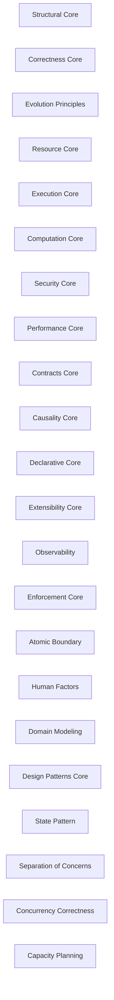

### Structural Core

- Domain: [Architectural Clusters](ALGORITHMS.md#algorithms-domain-architectural-clusters)
- Tier: [exempt](SCHEMA.md#vocabulary-domain-tier-exempt)
- Layer: [Structural Core](SCHEMA.md#layer-structural-core)
- Meta record

Details

Intent
The architectural rules that preserve structural integrity — a single authoritative source, no shortcuts, no fallbacks, no duplication, no orphaned artifacts.

Invariant
Structure stays sound only when every element has one authoritative home and no debt-incurring escape hatch exists.

Flow

```text
SingleSource → NoShortcut → NoFallback → NoOrphan
```

Composes
none

Composed by
[Finite State Machine](ALGORITHMS.md#algorithms-finite-state-machine), [Constraints Over Shortcuts](ALGORITHMS.md#algorithms-no-shortcuts), [Forward Compatibility Over Backward Compatibility](ALGORITHMS.md#algorithms-no-backward-compat), [Fail-Fast Over Fallback](ALGORITHMS.md#algorithms-no-fallback), [Explicit Removal Over Deprecation](ALGORITHMS.md#algorithms-no-deprecation), [Greenfield Over Legacy](ALGORITHMS.md#algorithms-no-legacy), [Single-Path Determinism Over Dual-Path](ALGORITHMS.md#algorithms-no-dual-path), [Compression Over Repetition](ALGORITHMS.md#algorithms-no-uncompressed), [Semantic Addressing Over Location Addressing](ALGORITHMS.md#algorithms-no-location), [Homoiconicity Over Separation](ALGORITHMS.md#algorithms-no-separation), [Bounded Complexity Over Unlimited](ALGORITHMS.md#algorithms-no-unlimited), [Rule As Code Over Convention](ALGORITHMS.md#algorithms-no-convention-enforcement), [Injected Dependency Over Hidden](ALGORITHMS.md#algorithms-no-hidden-dependency), [Convention Discovery Over Hardcoded Wiring](ALGORITHMS.md#algorithms-no-hardcoded-wiring)

Forces
none

Principle
[Single Source of Truth](PRINCIPLES.md#architecture-single-source-of-truth)

Grounds
none

How it is checked

Checked by
the layer and tension join, which places every principle in a cluster and resolves every tension between clusters

Population
Every architecture and lexicon record the membership map places in the cluster

Freshness
A verdict stands until the membership map, the topology or a member record changes

Refusal
The gate fails on a tension with no resolution, or an override that matches no live edge

Observation
None, because a cluster is a grouping of principles

Evidence
Watched to fire and to accept: a suite plants a tension between two principles no layer places, and the bundled tensions resolve with no dead override

Authoritative side
The membership map and the topology, which a tension's resolution is derived from

Depends on
Not answered

Shape it refuses
Not answered

### Correctness Core

- Domain: [Architectural Clusters](ALGORITHMS.md#algorithms-domain-architectural-clusters)
- Tier: [exempt](SCHEMA.md#vocabulary-domain-tier-exempt)
- Layer: [Correctness Core](SCHEMA.md#layer-correctness-core)
- Meta record

Details

Intent
The rules ensuring behavioral correctness and validity — no silent failures, no hidden invalidity, feedback acted on, results observed.

Invariant
Correctness holds only when every failure is surfaced and every invalid state is unrepresentable.

Flow

```text
SurfaceFailure → RejectInvalid → ActOnFeedback
```

Composes
none

Composed by
[Petri Nets](ALGORITHMS.md#algorithms-petri-nets), [Enforced Feedback Over Ignored](ALGORITHMS.md#algorithms-no-ignored-feedback), [Errors As Language Over Silent Errors](ALGORITHMS.md#algorithms-no-silent), [Explicit Invalidity Over Hidden](ALGORITHMS.md#algorithms-no-hidden-invalidity), [Computed Health Over Metric Health](ALGORITHMS.md#algorithms-no-metrics), [Boundary Validation Over Unvalidated Input](ALGORITHMS.md#algorithms-no-unvalidated-input), [Design By Contract Over Implicit Contract](ALGORITHMS.md#algorithms-no-implicit-contract), [Schema-Validated Boundary Over Untyped](ALGORITHMS.md#algorithms-no-untyped-boundary), [Injected Nondeterminism Over Hidden](ALGORITHMS.md#algorithms-no-hidden-nondeterminism)

Forces
none

Principle
[Fail Fast](PRINCIPLES.md#architecture-fail-fast)

Grounds
none

How it is checked

Checked by
the layer and tension join, which places every principle in a cluster and resolves every tension between clusters

Population
Every architecture and lexicon record the membership map places in the cluster

Freshness
A verdict stands until the membership map, the topology or a member record changes

Refusal
The gate fails on a tension with no resolution, or an override that matches no live edge

Observation
None, because a cluster is a grouping of principles

Evidence
Watched to fire and to accept: a suite plants a tension between two principles no layer places, and the bundled tensions resolve with no dead override

Authoritative side
The membership map and the topology, which a tension's resolution is derived from

Depends on
Not answered

Shape it refuses
Not answered

### Evolution Principles

- Domain: [Architectural Clusters](ALGORITHMS.md#algorithms-domain-architectural-clusters)
- Tier: [exempt](SCHEMA.md#vocabulary-domain-tier-exempt)
- Layer: [Evolution Principles](SCHEMA.md#layer-evolution-principles)
- Meta record

Details

Intent
The rules governing how a system changes over time — no backward-compat cruft, no deprecation debt, no legacy retention, no 'for now'.

Invariant
The system evolves cleanly only by deleting the superseded rather than accreting compatibility layers.

Flow

```text
Supersede → Delete → NoLegacy
```

Composes
none

Composed by
[Forward Compatibility Over Backward Compatibility](ALGORITHMS.md#algorithms-no-backward-compat), [Explicit Removal Over Deprecation](ALGORITHMS.md#algorithms-no-deprecation), [Greenfield Over Legacy](ALGORITHMS.md#algorithms-no-legacy), [Now Over For-Now](ALGORITHMS.md#algorithms-no-for-now), [Compression Over Repetition](ALGORITHMS.md#algorithms-no-uncompressed), [Approved Evolution Over Unapproved](ALGORITHMS.md#algorithms-no-unapproved), [Versioned Evolution Over Breaking Change](ALGORITHMS.md#algorithms-no-breaking-change), [Pattern By Fit Over Speculative Pattern](ALGORITHMS.md#algorithms-no-speculative-pattern)

Forces
none

Principle
[Evolutionary Architecture](PRINCIPLES.md#architecture-evolutionary-architecture)

Grounds
none

How it is checked

Checked by
the layer and tension join, which places every principle in a cluster and resolves every tension between clusters

Population
Every architecture and lexicon record the membership map places in the cluster

Freshness
A verdict stands until the membership map, the topology or a member record changes

Refusal
The gate fails on a tension with no resolution, or an override that matches no live edge

Observation
None, because a cluster is a grouping of principles

Evidence
Watched to fire and to accept: a suite plants a tension between two principles no layer places, and the bundled tensions resolve with no dead override

Authoritative side
The membership map and the topology, which a tension's resolution is derived from

Depends on
Not answered

Shape it refuses
Not answered

### Resource Core

- Domain: [Architectural Clusters](ALGORITHMS.md#algorithms-domain-architectural-clusters)
- Tier: [exempt](SCHEMA.md#vocabulary-domain-tier-exempt)
- Layer: [Resource Core](SCHEMA.md#layer-resource-core)
- Meta record

Details

Intent
The rules governing resource lifecycle and ownership — bounded lifetime, single ownership, no leaks, no implicit retention.

Invariant
Every resource has one owner and a bounded lifetime; nothing is retained implicitly.

Flow

```text
Acquire → Own → Bound → Release
```

Composes
none

Composed by
[Fail-Fast Over Fallback](ALGORITHMS.md#algorithms-no-fallback), [Mandatory Over Optional](ALGORITHMS.md#algorithms-no-optional), [Now Over For-Now](ALGORITHMS.md#algorithms-no-for-now), [Single Owner Over Shared Ownership](ALGORITHMS.md#algorithms-no-shared-ownership), [Bounded Lifetime Over Unbounded](ALGORITHMS.md#algorithms-no-unbounded), [Enforced Symmetry Over Asymmetric Lifecycle](ALGORITHMS.md#algorithms-no-asymmetric), [Explicit Retention Over Implicit](ALGORITHMS.md#algorithms-no-implicit-retention), [Structural Release Over Discipline](ALGORITHMS.md#algorithms-no-discipline-release), [Config Externalization Over Env Fallback](ALGORITHMS.md#algorithms-no-env-fallback), [Atomic Boundary Over Partial Commit](ALGORITHMS.md#algorithms-no-partial-commit)

Forces
none

Principle
[State Isolation](PRINCIPLES.md#architecture-state-isolation)

Grounds
none

How it is checked

Checked by
the layer and tension join, which places every principle in a cluster and resolves every tension between clusters

Population
Every architecture and lexicon record the membership map places in the cluster

Freshness
A verdict stands until the membership map, the topology or a member record changes

Refusal
The gate fails on a tension with no resolution, or an override that matches no live edge

Observation
None, because a cluster is a grouping of principles

Evidence
Watched to fire and to accept: a suite plants a tension between two principles no layer places, and the bundled tensions resolve with no dead override

Authoritative side
The membership map and the topology, which a tension's resolution is derived from

Depends on
Not answered

Shape it refuses
Not answered

### Execution Core

- Domain: [Architectural Clusters](ALGORITHMS.md#algorithms-domain-architectural-clusters)
- Tier: [exempt](SCHEMA.md#vocabulary-domain-tier-exempt)
- Layer: [Execution Core](SCHEMA.md#layer-execution-core)
- Meta record

Details

Intent
The rules governing execution flow — a single observable path, no deferring, no dual-path branching, nothing unobserved.

Invariant
Execution follows one observable path; nothing runs unobserved or deferred indefinitely.

Flow

```text
SinglePath → Observe → NoDefer
```

Composes
none

Composed by
[Single-Path Determinism Over Dual-Path](ALGORITHMS.md#algorithms-no-dual-path), [Immediacy Over Deferring](ALGORITHMS.md#algorithms-no-deferring), [Observed Execution Over Unobserved](ALGORITHMS.md#algorithms-no-unobserved), [Single Owner Over Shared Ownership](ALGORITHMS.md#algorithms-no-shared-ownership), [Event Emission Over Parent Callbacks](ALGORITHMS.md#algorithms-no-callbacks), [Monotonic Growth Over Retraction](ALGORITHMS.md#algorithms-no-retraction), [Ordinal Time Over Timestamps](ALGORITHMS.md#algorithms-no-timestamps), [Saga Compensation Over Distributed 2PC](ALGORITHMS.md#algorithms-no-distributed-2pc), [Async Events Over Synchronous Cross-Boundary](ALGORITHMS.md#algorithms-no-sync-cross-boundary), [Observable Signals Over Opaque Runtime](ALGORITHMS.md#algorithms-no-opaque-runtime)

Forces
none

Principle
[Controlled Side Effects](PRINCIPLES.md#architecture-controlled-side-effects)

Grounds
none

How it is checked

Checked by
the layer and tension join, which places every principle in a cluster and resolves every tension between clusters

Population
Every architecture and lexicon record the membership map places in the cluster

Freshness
A verdict stands until the membership map, the topology or a member record changes

Refusal
The gate fails on a tension with no resolution, or an override that matches no live edge

Observation
None, because a cluster is a grouping of principles

Evidence
Watched to fire and to accept: a suite plants a tension between two principles no layer places, and the bundled tensions resolve with no dead override

Authoritative side
The membership map and the topology, which a tension's resolution is derived from

Depends on
Not answered

Shape it refuses
Not answered

### Computation Core

- Domain: [Architectural Clusters](ALGORITHMS.md#algorithms-domain-architectural-clusters)
- Tier: [exempt](SCHEMA.md#vocabulary-domain-tier-exempt)
- Layer: [Computation Core](SCHEMA.md#layer-computation-core)
- Meta record

Details

Intent
The rules governing computation determinism and purity — no mutable shared state, no hidden nondeterminism, reproducible results.

Invariant
A computation is reproducible only when it has no hidden mutable or nondeterministic input.

Flow

```text
Immutable → Deterministic → Reproducible
```

Composes
none

Composed by
[Immutable Data Over Mutable State](ALGORITHMS.md#algorithms-no-mutable), [Errors As Language Over Silent Errors](ALGORITHMS.md#algorithms-no-silent), [Explicit Invalidity Over Hidden](ALGORITHMS.md#algorithms-no-hidden-invalidity), [Injected Nondeterminism Over Hidden](ALGORITHMS.md#algorithms-no-hidden-nondeterminism)

Forces
none

Principle
[Determinism](PRINCIPLES.md#architecture-determinism)

Grounds
none

How it is checked

Checked by
the layer and tension join, which places every principle in a cluster and resolves every tension between clusters

Population
Every architecture and lexicon record the membership map places in the cluster

Freshness
A verdict stands until the membership map, the topology or a member record changes

Refusal
The gate fails on a tension with no resolution, or an override that matches no live edge

Observation
None, because a cluster is a grouping of principles

Evidence
Watched to fire and to accept: a suite plants a tension between two principles no layer places, and the bundled tensions resolve with no dead override

Authoritative side
The membership map and the topology, which a tension's resolution is derived from

Depends on
Not answered

Shape it refuses
Not answered

### Security Core

- Domain: [Architectural Clusters](ALGORITHMS.md#algorithms-domain-architectural-clusters)
- Tier: [exempt](SCHEMA.md#vocabulary-domain-tier-exempt)
- Layer: [Security Core](SCHEMA.md#layer-security-core)
- Meta record

Details

Intent
The rules governing security posture — no hardcoded secrets, validated input, least privilege, no insecure fallbacks.

Invariant
The system is secure only when every input is validated and every privilege is least and explicit.

Flow

```text
ValidateInput → LeastPrivilege → NoSecretLeak
```

Composes
none

Composed by
[Secret Store Over Hardcoded Secrets](ALGORITHMS.md#algorithms-no-hardcoded-secrets), [Boundary Validation Over Unvalidated Input](ALGORITHMS.md#algorithms-no-unvalidated-input), [Least Privilege Over Broad Privilege](ALGORITHMS.md#algorithms-no-broad-privilege), [Config Externalization Over Env Fallback](ALGORITHMS.md#algorithms-no-env-fallback)

Forces
none

Principle
[Security by Design](PRINCIPLES.md#architecture-security-by-design)

Grounds
none

How it is checked

Checked by
the layer and tension join, which places every principle in a cluster and resolves every tension between clusters

Population
Every architecture and lexicon record the membership map places in the cluster

Freshness
A verdict stands until the membership map, the topology or a member record changes

Refusal
The gate fails on a tension with no resolution, or an override that matches no live edge

Observation
None, because a cluster is a grouping of principles

Evidence
Watched to fire and to accept: a suite plants a tension between two principles no layer places, and the bundled tensions resolve with no dead override

Authoritative side
The membership map and the topology, which a tension's resolution is derived from

Depends on
Not answered

Shape it refuses
Not answered

### Performance Core

- Domain: [Architectural Clusters](ALGORITHMS.md#algorithms-domain-architectural-clusters)
- Tier: [exempt](SCHEMA.md#vocabulary-domain-tier-exempt)
- Layer: [Performance Core](SCHEMA.md#layer-performance-core)
- Meta record

Details

Intent
The rules governing performance discipline — measured optimization, planned capacity, no guesswork.

Invariant
Performance is improved only by measuring first; no optimization is applied unmeasured.

Flow

```text
Measure → Optimize → Verify
```

Composes
none

Composed by
[Queuing Theory](ALGORITHMS.md#algorithms-queuing-theory), [Profile-First Over Unmeasured Optimization](ALGORITHMS.md#algorithms-no-unmeasured-optimization)

Forces
none

Principle
[Performance Engineering](PRINCIPLES.md#architecture-performance-engineering)

Grounds
none

How it is checked

Checked by
the layer and tension join, which places every principle in a cluster and resolves every tension between clusters

Population
Every architecture and lexicon record the membership map places in the cluster

Freshness
A verdict stands until the membership map, the topology or a member record changes

Refusal
The gate fails on a tension with no resolution, or an override that matches no live edge

Observation
None, because a cluster is a grouping of principles

Evidence
Watched to fire and to accept: a suite plants a tension between two principles no layer places, and the bundled tensions resolve with no dead override

Authoritative side
The membership map and the topology, which a tension's resolution is derived from

Depends on
Not answered

Shape it refuses
Not answered

### Contracts Core

- Domain: [Architectural Clusters](ALGORITHMS.md#algorithms-domain-architectural-clusters)
- Tier: [exempt](SCHEMA.md#vocabulary-domain-tier-exempt)
- Layer: [Contracts Core](SCHEMA.md#layer-contracts-core)
- Meta record

Details

Intent
The rules governing interfaces and contracts — explicit typed boundaries, versioned change, no implicit or breaking contracts.

Invariant
A boundary is safe only when its contract is explicit, typed, and versioned.

Flow

```text
ExplicitContract → TypedBoundary → VersionChange
```

Composes
none

Composed by
[Design By Contract Over Implicit Contract](ALGORITHMS.md#algorithms-no-implicit-contract), [Versioned Evolution Over Breaking Change](ALGORITHMS.md#algorithms-no-breaking-change), [Schema-Validated Boundary Over Untyped](ALGORITHMS.md#algorithms-no-untyped-boundary)

Forces
none

Principle
[Explicit Contracts](PRINCIPLES.md#architecture-explicit-contracts)

Grounds
none

How it is checked

Checked by
the layer and tension join, which places every principle in a cluster and resolves every tension between clusters

Population
Every architecture and lexicon record the membership map places in the cluster

Freshness
A verdict stands until the membership map, the topology or a member record changes

Refusal
The gate fails on a tension with no resolution, or an override that matches no live edge

Observation
None, because a cluster is a grouping of principles

Evidence
Watched to fire and to accept: a suite plants a tension between two principles no layer places, and the bundled tensions resolve with no dead override

Authoritative side
The membership map and the topology, which a tension's resolution is derived from

Depends on
Not answered

Shape it refuses
Not answered

### Causality Core

- Domain: [Architectural Clusters](ALGORITHMS.md#algorithms-domain-architectural-clusters)
- Tier: [exempt](SCHEMA.md#vocabulary-domain-tier-exempt)
- Layer: [Causality Core](SCHEMA.md#layer-causality-core)
- Meta record

Details

Intent
The rules governing causal ordering and time — logical ordering, retractable state, no wall-clock dependence.

Invariant
Order is well-defined only through logical causality, never wall-clock assumptions.

Flow

```text
LogicalOrder → Retract → NoWallClock
```

Composes
none

Composed by
[Monotonic Growth Over Retraction](ALGORITHMS.md#algorithms-no-retraction), [Ordinal Time Over Timestamps](ALGORITHMS.md#algorithms-no-timestamps)

Forces
none

Principle
[Causality](PRINCIPLES.md#architecture-causality)

Grounds
none

How it is checked

Checked by
the layer and tension join, which places every principle in a cluster and resolves every tension between clusters

Population
Every architecture and lexicon record the membership map places in the cluster

Freshness
A verdict stands until the membership map, the topology or a member record changes

Refusal
The gate fails on a tension with no resolution, or an override that matches no live edge

Observation
None, because a cluster is a grouping of principles

Evidence
Watched to fire and to accept: a suite plants a tension between two principles no layer places, and the bundled tensions resolve with no dead override

Authoritative side
The membership map and the topology, which a tension's resolution is derived from

Depends on
Not answered

Shape it refuses
Not answered

### Declarative Core

- Domain: [Architectural Clusters](ALGORITHMS.md#algorithms-domain-architectural-clusters)
- Tier: [exempt](SCHEMA.md#vocabulary-domain-tier-exempt)
- Layer: [Declarative Core](SCHEMA.md#layer-declarative-core)
- Meta record

Details

Intent
The rules favoring declarative over imperative — declared configuration, separated concerns, no imperative wiring.

Invariant
Behavior is declared as data, not encoded imperatively.

Flow

```text
Declare → Separate → NoImperativeConfig
```

Composes
none

Composed by
[Homoiconicity Over Separation](ALGORITHMS.md#algorithms-no-separation), [Declarative Config Over Imperative](ALGORITHMS.md#algorithms-no-imperative-config)

Forces
none

Principle
[Declarative Configuration](PRINCIPLES.md#architecture-declarative-configuration)

Grounds
none

How it is checked

Checked by
the layer and tension join, which places every principle in a cluster and resolves every tension between clusters

Population
Every architecture and lexicon record the membership map places in the cluster

Freshness
A verdict stands until the membership map, the topology or a member record changes

Refusal
The gate fails on a tension with no resolution, or an override that matches no live edge

Observation
None, because a cluster is a grouping of principles

Evidence
Watched to fire and to accept: a suite plants a tension between two principles no layer places, and the bundled tensions resolve with no dead override

Authoritative side
The membership map and the topology, which a tension's resolution is derived from

Depends on
Not answered

Shape it refuses
Not answered

### Extensibility Core

- Domain: [Architectural Clusters](ALGORITHMS.md#algorithms-domain-architectural-clusters)
- Tier: [exempt](SCHEMA.md#vocabulary-domain-tier-exempt)
- Layer: [Extensibility Core](SCHEMA.md#layer-extensibility-core)
- Meta record

Details

Intent
The rules governing extension — declarative discovered wiring over hardcoded, no imperative hardcoded registration.

Invariant
The system extends without modification only when wiring is declarative and discovered, not hardcoded.

Flow

```text
DeclareWiring → Discover → Extend
```

Composes
none

Composed by
[Convention Discovery Over Hardcoded Wiring](ALGORITHMS.md#algorithms-no-hardcoded-wiring), [Declarative Config Over Imperative](ALGORITHMS.md#algorithms-no-imperative-config)

Forces
none

Principle
[Open/Closed Principle (OCP)](PRINCIPLES.md#architecture-open-closed)

Grounds
none

How it is checked

Checked by
the layer and tension join, which places every principle in a cluster and resolves every tension between clusters

Population
Every architecture and lexicon record the membership map places in the cluster

Freshness
A verdict stands until the membership map, the topology or a member record changes

Refusal
The gate fails on a tension with no resolution, or an override that matches no live edge

Observation
None, because a cluster is a grouping of principles

Evidence
Watched to fire and to accept: a suite plants a tension between two principles no layer places, and the bundled tensions resolve with no dead override

Authoritative side
The membership map and the topology, which a tension's resolution is derived from

Depends on
Not answered

Shape it refuses
Not answered

### Observability

- Domain: [Architectural Clusters](ALGORITHMS.md#algorithms-domain-architectural-clusters)
- Tier: [exempt](SCHEMA.md#vocabulary-domain-tier-exempt)
- Layer: [Observability](SCHEMA.md#layer-observability)
- Meta record

Details

Intent
The rules ensuring a system is observable — emitted metrics and signals, no unobserved execution, no opaque runtime.

Invariant
A system is operable only when its behavior is observable through emitted signals.

Flow

```text
Emit → Trace → NoOpaque
```

Composes
none

Composed by
[Observed Execution Over Unobserved](ALGORITHMS.md#algorithms-no-unobserved), [Computed Health Over Metric Health](ALGORITHMS.md#algorithms-no-metrics), [Observable Signals Over Opaque Runtime](ALGORITHMS.md#algorithms-no-opaque-runtime)

Forces
none

Principle
[Observability](PRINCIPLES.md#architecture-observability)

Grounds
none

How it is checked

Checked by
the layer and tension join, which places every principle in a cluster and resolves every tension between clusters

Population
Every architecture and lexicon record the membership map places in the cluster

Freshness
A verdict stands until the membership map, the topology or a member record changes

Refusal
The gate fails on a tension with no resolution, or an override that matches no live edge

Observation
None, because a cluster is a grouping of principles

Evidence
Watched to fire and to accept: a suite plants a tension between two principles no layer places, and the bundled tensions resolve with no dead override

Authoritative side
The membership map and the topology, which a tension's resolution is derived from

Depends on
Not answered

Shape it refuses
Not answered

### Enforcement Core

- Domain: [Architectural Clusters](ALGORITHMS.md#algorithms-domain-architectural-clusters)
- Tier: [exempt](SCHEMA.md#vocabulary-domain-tier-exempt)
- Layer: [Enforcement Core](SCHEMA.md#layer-enforcement-core)
- Meta record

Details

Intent
The rules ensuring discipline is enforced programmatically — automated gates over convention, no discipline-only reliance.

Invariant
A rule holds only when a gate enforces it; a rule kept by convention alone drifts.

Flow

```text
Gate → Automate → NoConventionOnly
```

Composes
none

Composed by
[Structural Release Over Discipline](ALGORITHMS.md#algorithms-no-discipline-release), [Rule As Code Over Convention](ALGORITHMS.md#algorithms-no-convention-enforcement)

Forces
none

Principle
[Fitness Functions](PRINCIPLES.md#architecture-fitness-functions)

Grounds
none

How it is checked

Checked by
the layer and tension join, which places every principle in a cluster and resolves every tension between clusters

Population
Every architecture and lexicon record the membership map places in the cluster

Freshness
A verdict stands until the membership map, the topology or a member record changes

Refusal
The gate fails on a tension with no resolution, or an override that matches no live edge

Observation
None, because a cluster is a grouping of principles

Evidence
Watched to fire and to accept: a suite plants a tension between two principles no layer places, and the bundled tensions resolve with no dead override

Authoritative side
The membership map and the topology, which a tension's resolution is derived from

Depends on
Not answered

Shape it refuses
Not answered

### Atomic Boundary

- Domain: [Architectural Clusters](ALGORITHMS.md#algorithms-domain-architectural-clusters)
- Tier: [exempt](SCHEMA.md#vocabulary-domain-tier-exempt)
- Layer: [Atomic Boundary](SCHEMA.md#layer-atomic-boundary)
- Meta record

Details

Intent
The rules governing atomicity — a transactional boundary that fully commits or fully rolls back, no partial commit, no deferring within.

Invariant
A boundary either fully commits or fully rolls back; no partial state escapes.

Flow

```text
Begin → AllOrNothing → Commit
```

Composes
none

Composed by
[Immediacy Over Deferring](ALGORITHMS.md#algorithms-no-deferring), [Atomic Boundary Over Partial Commit](ALGORITHMS.md#algorithms-no-partial-commit)

Forces
none

Principle
[Atomicity](PRINCIPLES.md#architecture-atomicity)

Grounds
none

Refused by rules
atomic-boundary

How it is checked

Checked by
the layer and tension join, which places every principle in a cluster and resolves every tension between clusters

Population
Every architecture and lexicon record the membership map places in the cluster

Freshness
A verdict stands until the membership map, the topology or a member record changes

Refusal
The gate fails on a tension with no resolution, or an override that matches no live edge

Observation
None, because a cluster is a grouping of principles

Evidence
Watched to fire and to accept: a suite plants a tension between two principles no layer places, and the bundled tensions resolve with no dead override

Authoritative side
The membership map and the topology, which a tension's resolution is derived from

Depends on
Not answered

Shape it refuses
Not answered

### Human Factors

- Domain: [Architectural Clusters](ALGORITHMS.md#algorithms-domain-architectural-clusters)
- Tier: [exempt](SCHEMA.md#vocabulary-domain-tier-exempt)
- Layer: [Human Factors](SCHEMA.md#layer-human-factors)
- Meta record

Details

Intent
The rules governing human ergonomics — bounded cognitive complexity, acted-on feedback, explicit approval, no unlimited options.

Invariant
A system is usable only when its cognitive load is bounded and its decisions are approved and reversible.

Flow

```text
BoundComplexity → Approve → ActOnFeedback
```

Composes
none

Composed by
[Mandatory Over Optional](ALGORITHMS.md#algorithms-no-optional), [Approved Evolution Over Unapproved](ALGORITHMS.md#algorithms-no-unapproved), [Enforced Feedback Over Ignored](ALGORITHMS.md#algorithms-no-ignored-feedback), [Bounded Complexity Over Unlimited](ALGORITHMS.md#algorithms-no-unlimited)

Forces
none

Principle
[Principle of Least Surprise](PRINCIPLES.md#architecture-principle-of-least-surprise)

Grounds
none

How it is checked

Checked by
the layer and tension join, which places every principle in a cluster and resolves every tension between clusters

Population
Every architecture and lexicon record the membership map places in the cluster

Freshness
A verdict stands until the membership map, the topology or a member record changes

Refusal
The gate fails on a tension with no resolution, or an override that matches no live edge

Observation
None, because a cluster is a grouping of principles

Evidence
Watched to fire and to accept: a suite plants a tension between two principles no layer places, and the bundled tensions resolve with no dead override

Authoritative side
The membership map and the topology, which a tension's resolution is derived from

Depends on
Not answered

Shape it refuses
Not answered

### Domain Modeling

- Domain: [Architectural Clusters](ALGORITHMS.md#algorithms-domain-architectural-clusters)
- Tier: [exempt](SCHEMA.md#vocabulary-domain-tier-exempt)
- Layer: [Domain Modeling](SCHEMA.md#layer-domain-modeling)
- Meta record

Details

Intent
The rules governing domain boundaries — bounded contexts, ubiquitous language, no leaky context.

Invariant
A domain model stays coherent only when its context boundaries do not leak.

Flow

```text
BoundContext → NoLeak → UbiquitousLanguage
```

Composes
none

Composed by
[Anti-Corruption Layer Over Cross-Context Leak](ALGORITHMS.md#algorithms-no-leaky-context)

Forces
none

Principle
[Bounded Context](PRINCIPLES.md#architecture-bounded-context)

Grounds
none

How it is checked

Checked by
the layer and tension join, which places every principle in a cluster and resolves every tension between clusters

Population
Every architecture and lexicon record the membership map places in the cluster

Freshness
A verdict stands until the membership map, the topology or a member record changes

Refusal
The gate fails on a tension with no resolution, or an override that matches no live edge

Observation
None, because a cluster is a grouping of principles

Evidence
Watched to fire and to accept: a suite plants a tension between two principles no layer places, and the bundled tensions resolve with no dead override

Authoritative side
The membership map and the topology, which a tension's resolution is derived from

Depends on
Not answered

Shape it refuses
Not answered

### Design Patterns Core

- Domain: [Architectural Clusters](ALGORITHMS.md#algorithms-domain-architectural-clusters)
- Tier: [exempt](SCHEMA.md#vocabulary-domain-tier-exempt)
- Layer: [Design Patterns Core](SCHEMA.md#layer-design-patterns-core)
- Meta record

Details

Intent
The rules governing design-pattern use — patterns applied only to demonstrated recurrence, no speculative pattern application.

Invariant
A pattern is warranted only by demonstrated recurrence, never speculation.

Flow

```text
ObserveRecurrence → ApplyPattern → NoSpeculation
```

Composes
none

Composed by
[Pattern By Fit Over Speculative Pattern](ALGORITHMS.md#algorithms-no-speculative-pattern)

Forces
none

Principle
[First-Principles Design](PRINCIPLES.md#architecture-first-principles-design)

Grounds
none

How it is checked

Checked by
the layer and tension join, which places every principle in a cluster and resolves every tension between clusters

Population
Every architecture and lexicon record the membership map places in the cluster

Freshness
A verdict stands until the membership map, the topology or a member record changes

Refusal
The gate fails on a tension with no resolution, or an override that matches no live edge

Observation
None, because a cluster is a grouping of principles

Evidence
Watched to fire and to accept: a suite plants a tension between two principles no layer places, and the bundled tensions resolve with no dead override

Authoritative side
The membership map and the topology, which a tension's resolution is derived from

Depends on
Not answered

Shape it refuses
Not answered

### State Pattern

- Domain: [Architectural Clusters](ALGORITHMS.md#algorithms-domain-architectural-clusters)
- Tier: [exempt](SCHEMA.md#vocabulary-domain-tier-exempt)

Details

Intent
The State design pattern — encapsulate state-dependent behavior in distinct state objects so transitions replace conditional branching.

Invariant
State-dependent behavior is expressed by delegating to a current-state object, not by scattered conditionals.

Flow

```text
DefineStates → DelegateBehavior → Transition
```

Composes
none

Composed by
[Finite State Machine](ALGORITHMS.md#algorithms-finite-state-machine)

Forces
none

Principle
[State Pattern](PRINCIPLES.md#architecture-state-pattern)

Grounds
none

Before

```text
State-dependent behavior scattered as if/else conditionals on a status flag.
```

After

```text
define state objects → delegate behavior to the current-state object → transition replaces the conditional branching
```

How it is checked

Checked by
the layer and tension join, which places every principle in a cluster and resolves every tension between clusters

Population
Every architecture and lexicon record the membership map places in the cluster

Freshness
A verdict stands until the membership map, the topology or a member record changes

Refusal
The gate fails on a tension with no resolution, or an override that matches no live edge

Observation
None, because a cluster is a grouping of principles

Evidence
Watched to fire and to accept: a suite plants a tension between two principles no layer places, and the bundled tensions resolve with no dead override

Authoritative side
The membership map and the topology, which a tension's resolution is derived from

Depends on
Not answered

Shape it refuses
Not answered

### Separation of Concerns

- Domain: [Architectural Clusters](ALGORITHMS.md#algorithms-domain-architectural-clusters)
- Tier: [exempt](SCHEMA.md#vocabulary-domain-tier-exempt)

Details

Intent
The principle of separating a system into distinct concerns so each is addressed and changed independently.

Invariant
Each concern is localized to one place and changes independently of the others.

Flow

```text
IdentifyConcerns → Separate → IsolateChange
```

Composes
none

Composed by
[Statecharts](ALGORITHMS.md#algorithms-statecharts)

Forces
none

Grounds
none

Refused by rules
separation-of-concerns

Before

```text
One module mixes parsing, persistence, and rendering — a change in one ripples through all.
```

After

```text
identify concerns → separate each into one place → each concern changes independently
```

How it is checked

Checked by
the layer and tension join, which places every principle in a cluster and resolves every tension between clusters

Population
Every architecture and lexicon record the membership map places in the cluster

Freshness
A verdict stands until the membership map, the topology or a member record changes

Refusal
The gate fails on a tension with no resolution, or an override that matches no live edge

Observation
None, because a cluster is a grouping of principles

Evidence
Watched to fire and to accept: a suite plants a tension between two principles no layer places, and the bundled tensions resolve with no dead override

Authoritative side
The membership map and the topology, which a tension's resolution is derived from

Depends on
Not answered

Shape it refuses
Not answered

### Concurrency Correctness

- Domain: [Architectural Clusters](ALGORITHMS.md#algorithms-domain-architectural-clusters)
- Tier: [exempt](SCHEMA.md#vocabulary-domain-tier-exempt)

Details

Intent
The rules ensuring correct concurrent behavior — no data races, well-defined interleavings, verified with models such as Petri nets.

Invariant
Concurrent correctness holds only when every interleaving preserves the invariants.

Flow

```text
ModelInterleavings → PreventRaces → Verify
```

Composes
none

Composed by
[Petri Nets](ALGORITHMS.md#algorithms-petri-nets)

Forces
none

Grounds
none

Before

```text
Concurrent access with a data race; some interleaving violates the invariant.
```

After

```text
model interleavings → prevent races → verify every interleaving preserves the invariants
```

How it is checked

Checked by
the layer and tension join, which places every principle in a cluster and resolves every tension between clusters

Population
Every architecture and lexicon record the membership map places in the cluster

Freshness
A verdict stands until the membership map, the topology or a member record changes

Refusal
The gate fails on a tension with no resolution, or an override that matches no live edge

Observation
None, because a cluster is a grouping of principles

Evidence
Watched to fire and to accept: a suite plants a tension between two principles no layer places, and the bundled tensions resolve with no dead override

Authoritative side
The membership map and the topology, which a tension's resolution is derived from

Depends on
Not answered

Shape it refuses
Not answered

### Capacity Planning

- Domain: [Architectural Clusters](ALGORITHMS.md#algorithms-domain-architectural-clusters)
- Tier: [exempt](SCHEMA.md#vocabulary-domain-tier-exempt)

Details

Intent
The activity of forecasting resource demand and provisioning capacity to meet it, informed by queuing theory.

Invariant
Capacity meets demand only when provisioning is derived from measured or modeled load, not guessed.

Flow

```text
ModelLoad → Forecast → Provision
```

Composes
none

Composed by
[Queuing Theory](ALGORITHMS.md#algorithms-queuing-theory)

Forces
none

Grounds
none

Before

```text
Capacity guessed, then saturates under production load.
```

After

```text
model load → forecast demand → provision from measured/modeled load, not a guess
```

How it is checked

Checked by
the layer and tension join, which places every principle in a cluster and resolves every tension between clusters

Population
Every architecture and lexicon record the membership map places in the cluster

Freshness
A verdict stands until the membership map, the topology or a member record changes

Refusal
The gate fails on a tension with no resolution, or an override that matches no live edge

Observation
None, because a cluster is a grouping of principles

Evidence
Watched to fire and to accept: a suite plants a tension between two principles no layer places, and the bundled tensions resolve with no dead override

Authoritative side
The membership map and the topology, which a tension's resolution is derived from

Depends on
Not answered

Shape it refuses
Not answered

## Architectural Rules

Every algorithm contract in this domain is listed with its position on the derivation loop, its intent and invariant, the flow it walks and its productions as a grammar. Each record also shows what it composes and is composed by, which forces and principles it answers to, what grounds it and what it grounds, and an exemplar where the record carries one. The diagram shows what composes what inside the domain.

Relations diagram

What composes what inside this domain.

```mermaid
flowchart LR
n_no_shortcuts["Constraints Over Shortcuts"]
n_no_backward_compat["Forward Compatibility Over Backward Compatibility"]
n_no_fallback["Fail-Fast Over Fallback"]
n_no_deprecation["Explicit Removal Over Deprecation"]
n_no_legacy["Greenfield Over Legacy"]
n_no_dual_path["Single-Path Determinism Over Dual-Path"]
n_no_deferring["Immediacy Over Deferring"]
n_no_optional["Mandatory Over Optional"]
n_no_for_now["Now Over For-Now"]
n_no_unobserved["Observed Execution Over Unobserved"]
n_no_uncompressed["Compression Over Repetition"]
n_no_unapproved["Approved Evolution Over Unapproved"]
n_no_ignored_feedback["Enforced Feedback Over Ignored"]
n_no_shared_ownership["Single Owner Over Shared Ownership"]
n_no_unbounded["Bounded Lifetime Over Unbounded"]
n_no_asymmetric["Enforced Symmetry Over Asymmetric Lifecycle"]
n_no_implicit_retention["Explicit Retention Over Implicit"]
n_no_discipline_release["Structural Release Over Discipline"]
n_no_mutable["Immutable Data Over Mutable State"]
n_no_silent["Errors As Language Over Silent Errors"]
n_no_hidden_invalidity["Explicit Invalidity Over Hidden"]
n_no_callbacks["Event Emission Over Parent Callbacks"]
n_no_retraction["Monotonic Growth Over Retraction"]
n_no_location["Semantic Addressing Over Location Addressing"]
n_no_timestamps["Ordinal Time Over Timestamps"]
n_no_separation["Homoiconicity Over Separation"]
n_no_unlimited["Bounded Complexity Over Unlimited"]
n_no_metrics["Computed Health Over Metric Health"]
n_no_hardcoded_secrets["Secret Store Over Hardcoded Secrets"]
n_no_unvalidated_input["Boundary Validation Over Unvalidated Input"]
n_no_broad_privilege["Least Privilege Over Broad Privilege"]
n_no_env_fallback["Config Externalization Over Env Fallback"]
n_no_unmeasured_optimization["Profile-First Over Unmeasured Optimization"]
n_no_convention_enforcement["Rule As Code Over Convention"]
n_no_implicit_contract["Design By Contract Over Implicit Contract"]
n_no_breaking_change["Versioned Evolution Over Breaking Change"]
n_no_untyped_boundary["Schema-Validated Boundary Over Untyped"]
n_no_partial_commit["Atomic Boundary Over Partial Commit"]
n_no_distributed_2pc["Saga Compensation Over Distributed 2PC"]
n_no_sync_cross_boundary["Async Events Over Synchronous Cross-Boundary"]
n_no_opaque_runtime["Observable Signals Over Opaque Runtime"]
n_no_hidden_dependency["Injected Dependency Over Hidden"]
n_no_hardcoded_wiring["Convention Discovery Over Hardcoded Wiring"]
n_no_imperative_config["Declarative Config Over Imperative"]
n_no_leaky_context["Anti-Corruption Layer Over Cross-Context Leak"]
n_no_hidden_nondeterminism["Injected Nondeterminism Over Hidden"]
n_no_speculative_pattern["Pattern By Fit Over Speculative Pattern"]
```

### Constraints Over Shortcuts

- Domain: [Architectural Rules](ALGORITHMS.md#algorithms-domain-architectural-rules)
- Tier: [leaf](SCHEMA.md#vocabulary-domain-tier-leaf)
- Math type: [logic](REASONING.md#reasoning-math-type-logic)
- Yields: boolean

Details

Intent
Replace a debt-incurring shortcut with an encoded constraint that makes the invalid state unrepresentable, so the rule holds without relying on discipline.

Invariant
A value that could be constructed invalidly is instead constructed only through a validating boundary.

Flow

```text
ShortcutTaken → IdentifyInvariant → EncodeConstraint → RouteThroughBoundary → LeverageGained
```

Productions

```bnf
NoShortcuts ::= <ShortcutTaken> "→" <IdentifyInvariant> "→" <EncodeConstraint> "→" <RouteThroughBoundary> "→" <LeverageGained>
```

Composes
[Structural Core](ALGORITHMS.md#algorithms-structural-core), [Coupling Control](ALGORITHMS.md#algorithms-coupling-control)

Forces
shortcuts (debt)

Grounds
none

Before

```typescript
type FooId = string;

function loadFoo(raw: string) {
  return fooStore.get(raw as FooId);
}
```

After

```typescript
type FooId = string & { readonly __brand: "FooId" };

function fooId(raw: string): FooId {
  if (!raw.startsWith("foo_") || raw.length <= 4)
    throw new Error(`invalid FooId: ${raw}`);
  return raw as FooId;
}

function loadFoo(id: FooId) {
  return fooStore.get(id);
}
```

How it is checked

Checked by
the quality rules and auto-fixes that refuse the shortcut each architectural rule forbids, the cross-file quality gate

Population
Every source file under a governed root

Freshness
A verdict stands until the source or the rule changes

Refusal
A rule that fires fails the lint stage, and an auto-fix rewrites the shortcut where the fix is deterministic

Observation
The telemetry a runtime rule requires, such as observed execution, which locates a path that runs unobserved

Evidence
None, because the catalog states this check as a class, so a watched run belongs to each system that adopts it

Authoritative side
The architectural rule, which the source conforms to and an auto-fix rewrites toward

Depends on
[Structural Core](ALGORITHMS.md#algorithms-structural-core), [Coupling Control](ALGORITHMS.md#algorithms-coupling-control)

Shape it refuses
Not answered

### Forward Compatibility Over Backward Compatibility

- Domain: [Architectural Rules](ALGORITHMS.md#algorithms-domain-architectural-rules)
- Tier: [leaf](SCHEMA.md#vocabulary-domain-tier-leaf)
- Math type: [logic](REASONING.md#reasoning-math-type-logic)
- Yields: boolean

Details

Intent
Replace accreted legacy input shapes with one forward-compatible envelope that carries extensions, so evolution compounds instead of branching.

Invariant
One canonical shape with an open extension slot subsumes every prior variant; no shape-discriminating branch remains.

Flow

```text
ManyVariants → DefineEnvelope → MapToCanonical → OpenExtensionSlot → RemoveVariantBranches
```

Productions

```bnf
NoBackwardCompat ::= <ManyVariants> "→" <DefineEnvelope> "→" <MapToCanonical> "→" <OpenExtensionSlot> "→" <RemoveVariantBranches>
```

Composes
[Evolution Principles](ALGORITHMS.md#algorithms-evolution-principles), [Structural Core](ALGORITHMS.md#algorithms-structural-core)

Forces
backward_compatibility (debt)

Grounds
none

Before

```typescript
type FooInput = string | { name: string } | { label: string; flags?: string[] };

function readFoo(input: FooInput) {
  if (typeof input === "string") return { label: input, flags: [] };
  if ("name" in input) return { label: input.name, flags: [] };
  return { label: input.label, flags: input.flags ?? [] };
}
```

After

```typescript
type FooEnvelope = {
  kind: "foo";
  label: string;
  extensions: Readonly<Record<string, unknown>>;
};

function readFoo(input: FooEnvelope) {
  return { label: input.label, extensions: input.extensions };
}
```

How it is checked

Checked by
the quality rules and auto-fixes that refuse the shortcut each architectural rule forbids, the cross-file quality gate

Population
Every source file under a governed root

Freshness
A verdict stands until the source or the rule changes

Refusal
A rule that fires fails the lint stage, and an auto-fix rewrites the shortcut where the fix is deterministic

Observation
The telemetry a runtime rule requires, such as observed execution, which locates a path that runs unobserved

Evidence
None, because the catalog states this check as a class, so a watched run belongs to each system that adopts it

Authoritative side
The architectural rule, which the source conforms to and an auto-fix rewrites toward

Depends on
[Evolution Principles](ALGORITHMS.md#algorithms-evolution-principles), [Structural Core](ALGORITHMS.md#algorithms-structural-core)

Shape it refuses
Not answered

### Fail-Fast Over Fallback

- Domain: [Architectural Rules](ALGORITHMS.md#algorithms-domain-architectural-rules)
- Tier: [leaf](SCHEMA.md#vocabulary-domain-tier-leaf)
- Math type: [logic](REASONING.md#reasoning-math-type-logic)
- Yields: boolean

Details

Intent
Replace a silent fallback default with a required input that halts loudly when absent, so missing configuration surfaces at the boundary.

Invariant
Every required input is present and validated before use; absence throws rather than defaulting.

Flow

```text
OptionalInput → MarkRequired → ValidateAtBoundary → HaltOnAbsence → ClarityGained
```

Productions

```bnf
NoFallback ::= <OptionalInput> "→" <MarkRequired> "→" <ValidateAtBoundary> "→" <HaltOnAbsence> "→" <ClarityGained>
```

Composes
[Resource Core](ALGORITHMS.md#algorithms-resource-core), [Structural Core](ALGORITHMS.md#algorithms-structural-core)

Forces
fallback (debt)

Grounds
none

Before

```typescript
function makeFoo(config: { mode?: "foo" | "bar" }) {
  const mode = config.mode ?? "foo";
  return mode === "foo" ? new Foo() : new Bar();
}
```

After

```typescript
type FooConfig = { mode: "foo" | "bar" };

function makeFoo(config: FooConfig) {
  if (!config.mode) throw new Error("FooConfig.mode is required");
  return config.mode === "foo" ? new Foo() : new Bar();
}
```

How it is checked

Checked by
the quality rules and auto-fixes that refuse the shortcut each architectural rule forbids, the cross-file quality gate

Population
Every source file under a governed root

Freshness
A verdict stands until the source or the rule changes

Refusal
A rule that fires fails the lint stage, and an auto-fix rewrites the shortcut where the fix is deterministic

Observation
The telemetry a runtime rule requires, such as observed execution, which locates a path that runs unobserved

Evidence
None, because the catalog states this check as a class, so a watched run belongs to each system that adopts it

Authoritative side
The architectural rule, which the source conforms to and an auto-fix rewrites toward

Depends on
[Resource Core](ALGORITHMS.md#algorithms-resource-core), [Structural Core](ALGORITHMS.md#algorithms-structural-core)

Shape it refuses
Not answered

### Explicit Removal Over Deprecation

- Domain: [Architectural Rules](ALGORITHMS.md#algorithms-domain-architectural-rules)
- Tier: [leaf](SCHEMA.md#vocabulary-domain-tier-leaf)
- Math type: [logic](REASONING.md#reasoning-math-type-logic)
- Yields: boolean

Details

Intent
Replace a deprecated alias kept for compatibility with outright removal, so the single current name is the only path.

Invariant
No symbol exists solely to forward to another; every callsite targets the canonical name.

Flow

```text
DeprecatedAlias → MigrateCallsites → DeleteAlias → SinglePathRemains
```

Productions

```bnf
NoDeprecation ::= <DeprecatedAlias> "→" <MigrateCallsites> "→" <DeleteAlias> "→" <SinglePathRemains>
```

Composes
[Evolution Principles](ALGORITHMS.md#algorithms-evolution-principles), [Structural Core](ALGORITHMS.md#algorithms-structural-core)

Forces
deprecation (debt)

Grounds
none

Before

```typescript
class FooService {
  makeFoo() {
    return this.createFoo();
  }
  createFoo() {
    return new Foo();
  }
}
```

After

```typescript
class FooService {
  createFoo() {
    return new Foo();
  }
}
```

How it is checked

Checked by
the quality rules and auto-fixes that refuse the shortcut each architectural rule forbids, the cross-file quality gate

Population
Every source file under a governed root

Freshness
A verdict stands until the source or the rule changes

Refusal
A rule that fires fails the lint stage, and an auto-fix rewrites the shortcut where the fix is deterministic

Observation
The telemetry a runtime rule requires, such as observed execution, which locates a path that runs unobserved

Evidence
None, because the catalog states this check as a class, so a watched run belongs to each system that adopts it

Authoritative side
The architectural rule, which the source conforms to and an auto-fix rewrites toward

Depends on
[Evolution Principles](ALGORITHMS.md#algorithms-evolution-principles), [Structural Core](ALGORITHMS.md#algorithms-structural-core)

Shape it refuses
Not answered

### Greenfield Over Legacy

- Domain: [Architectural Rules](ALGORITHMS.md#algorithms-domain-architectural-rules)
- Tier: [leaf](SCHEMA.md#vocabulary-domain-tier-leaf)
- Math type: [logic](REASONING.md#reasoning-math-type-logic)
- Yields: boolean

Details

Intent
Replace a legacy-mode branch with one current algorithm, deleting the old path rather than gating it behind a flag.

Invariant
A single implementation serves the concern; no legacy-mode conditional selects behavior.

Flow

```text
LegacyBranch → ExtractCurrentPath → DeleteLegacyPath → RemoveFlag
```

Productions

```bnf
NoLegacy ::= <LegacyBranch> "→" <ExtractCurrentPath> "→" <DeleteLegacyPath> "→" <RemoveFlag>
```

Composes
[Evolution Principles](ALGORITHMS.md#algorithms-evolution-principles), [Structural Core](ALGORITHMS.md#algorithms-structural-core)

Forces
legacy (debt)

Grounds
none

Before

```typescript
function calculateFoo(input: FooInput, legacyMode: boolean) {
  if (legacyMode) return oldFooAlgorithm(input);
  return newFooAlgorithm(input);
}
```

After

```typescript
function calculateFoo(input: FooInput) {
  return fooAlgorithm(input);
}
```

How it is checked

Checked by
the quality rules and auto-fixes that refuse the shortcut each architectural rule forbids, the cross-file quality gate

Population
Every source file under a governed root

Freshness
A verdict stands until the source or the rule changes

Refusal
A rule that fires fails the lint stage, and an auto-fix rewrites the shortcut where the fix is deterministic

Observation
The telemetry a runtime rule requires, such as observed execution, which locates a path that runs unobserved

Evidence
None, because the catalog states this check as a class, so a watched run belongs to each system that adopts it

Authoritative side
The architectural rule, which the source conforms to and an auto-fix rewrites toward

Depends on
[Evolution Principles](ALGORITHMS.md#algorithms-evolution-principles), [Structural Core](ALGORITHMS.md#algorithms-structural-core)

Shape it refuses
Not answered

### Single-Path Determinism Over Dual-Path

- Domain: [Architectural Rules](ALGORITHMS.md#algorithms-domain-architectural-rules)
- Tier: [leaf](SCHEMA.md#vocabulary-domain-tier-leaf)
- Math type: [logic](REASONING.md#reasoning-math-type-logic)
- Yields: boolean

Details

Intent
Collapse a flag-selected dual path into one deterministic path, removing the branch and the flag that caused ambiguity.

Invariant
Exactly one code path handles the operation; no runtime flag chooses between equivalent implementations.

Flow

```text
DualPath → ChooseCanonical → MigrateConsumers → DeleteAlternate → DeterminismGained
```

Productions

```bnf
NoDualPath ::= <DualPath> "→" <ChooseCanonical> "→" <MigrateConsumers> "→" <DeleteAlternate> "→" <DeterminismGained>
```

Composes
[Structural Core](ALGORITHMS.md#algorithms-structural-core), [Execution Core](ALGORITHMS.md#algorithms-execution-core)

Forces
dual-path (confusion)

Grounds
none

Before

```typescript
function saveFoo(foo: Foo, flags: { useNewStore: boolean }) {
  return flags.useNewStore ? newFooStore.save(foo) : oldFooStore.save(foo);
}
```

After

```typescript
function saveFoo(foo: Foo) {
  return fooStore.save(foo);
}
```

How it is checked

Checked by
the quality rules and auto-fixes that refuse the shortcut each architectural rule forbids, the cross-file quality gate

Population
Every source file under a governed root

Freshness
A verdict stands until the source or the rule changes

Refusal
A rule that fires fails the lint stage, and an auto-fix rewrites the shortcut where the fix is deterministic

Observation
The telemetry a runtime rule requires, such as observed execution, which locates a path that runs unobserved

Evidence
None, because the catalog states this check as a class, so a watched run belongs to each system that adopts it

Authoritative side
The architectural rule, which the source conforms to and an auto-fix rewrites toward

Depends on
[Structural Core](ALGORITHMS.md#algorithms-structural-core), [Execution Core](ALGORITHMS.md#algorithms-execution-core)

Shape it refuses
Not answered

### Immediacy Over Deferring

- Domain: [Architectural Rules](ALGORITHMS.md#algorithms-domain-architectural-rules)
- Tier: [leaf](SCHEMA.md#vocabulary-domain-tier-leaf)
- Math type: [logic](REASONING.md#reasoning-math-type-logic)
- Yields: boolean

Details

Intent
Replace a deferred follow-up with an atomic action that completes every coupled effect now, so nothing is forgotten.

Invariant
Coupled effects commit together within one boundary; no effect is left as an implicit later step.

Flow

```text
PartialAction → IdentifyCoupledEffects → WrapInTransaction → CommitTogether
```

Productions

```bnf
NoDeferring ::= <PartialAction> "→" <IdentifyCoupledEffects> "→" <WrapInTransaction> "→" <CommitTogether>
```

Composes
[Execution Core](ALGORITHMS.md#algorithms-execution-core), [Atomic Boundary](ALGORITHMS.md#algorithms-atomic-boundary)

Forces
deferring (forgetting)

Grounds
none

Before

```typescript
async function renameFoo(id: FooId, name: string) {
  await fooStore.rename(id, name);
}
```

After

```typescript
async function renameFoo(id: FooId, name: string) {
  await transaction(async (tx) => {
    await tx.foos.rename(id, name);
    await tx.search.reindex(id, name);
  });
}
```

How it is checked

Checked by
the quality rules and auto-fixes that refuse the shortcut each architectural rule forbids, the cross-file quality gate

Population
Every source file under a governed root

Freshness
A verdict stands until the source or the rule changes

Refusal
A rule that fires fails the lint stage, and an auto-fix rewrites the shortcut where the fix is deterministic

Observation
The telemetry a runtime rule requires, such as observed execution, which locates a path that runs unobserved

Evidence
None, because the catalog states this check as a class, so a watched run belongs to each system that adopts it

Authoritative side
The architectural rule, which the source conforms to and an auto-fix rewrites toward

Depends on
[Execution Core](ALGORITHMS.md#algorithms-execution-core), [Atomic Boundary](ALGORITHMS.md#algorithms-atomic-boundary)

Shape it refuses
Not answered

### Mandatory Over Optional

- Domain: [Architectural Rules](ALGORITHMS.md#algorithms-domain-architectural-rules)
- Tier: [leaf](SCHEMA.md#vocabulary-domain-tier-leaf)
- Math type: [logic](REASONING.md#reasoning-math-type-logic)
- Yields: boolean

Details

Intent
Replace an optional dependency with a mandatory one, removing the null-guarded branch so behavior is system-defined not caller-defined.

Invariant
A dependency the behavior relies on is always supplied; no optional-chaining guards its use.

Flow

```text
OptionalDependency → MakeRequired → InjectAlways → RemoveGuards
```

Productions

```bnf
NoOptional ::= <OptionalDependency> "→" <MakeRequired> "→" <InjectAlways> "→" <RemoveGuards>
```

Composes
[Human Factors](ALGORITHMS.md#algorithms-human-factors), [Resource Core](ALGORITHMS.md#algorithms-resource-core)

Forces
optional (user-orientation)

Grounds
none

Before

```typescript
class FooService {
  constructor(private readonly audit?: AuditSink) {}

  create(foo: Foo) {
    this.audit?.write({ type: "foo.created", foo });
    return fooStore.save(foo);
  }
}
```

After

```typescript
class FooService {
  constructor(private readonly audit: AuditSink) {}

  create(foo: Foo) {
    this.audit.write({ type: "foo.created", foo });
    return fooStore.save(foo);
  }
}
```

How it is checked

Checked by
the quality rules and auto-fixes that refuse the shortcut each architectural rule forbids, the cross-file quality gate

Population
Every source file under a governed root

Freshness
A verdict stands until the source or the rule changes

Refusal
A rule that fires fails the lint stage, and an auto-fix rewrites the shortcut where the fix is deterministic

Observation
The telemetry a runtime rule requires, such as observed execution, which locates a path that runs unobserved

Evidence
None, because the catalog states this check as a class, so a watched run belongs to each system that adopts it

Authoritative side
The architectural rule, which the source conforms to and an auto-fix rewrites toward

Depends on
[Human Factors](ALGORITHMS.md#algorithms-human-factors), [Resource Core](ALGORITHMS.md#algorithms-resource-core)

Shape it refuses
Not answered

### Now Over For-Now

- Domain: [Architectural Rules](ALGORITHMS.md#algorithms-domain-architectural-rules)
- Tier: [leaf](SCHEMA.md#vocabulary-domain-tier-leaf)
- Math type: [logic](REASONING.md#reasoning-math-type-logic)
- Yields: boolean

Details

Intent
Replace a temporary in-memory placeholder with the real durable implementation immediately, so the stopgap never ossifies.

Invariant
State that must survive restarts is persisted through the real store, not a transient map.

Flow

```text
TemporaryStub → IdentifyDurabilityNeed → WireRealStore → DeleteStub
```

Productions

```bnf
NoForNow ::= <TemporaryStub> "→" <IdentifyDurabilityNeed> "→" <WireRealStore> "→" <DeleteStub>
```

Composes
[Resource Core](ALGORITHMS.md#algorithms-resource-core), [Evolution Principles](ALGORITHMS.md#algorithms-evolution-principles)

Forces
for_now (deferring)

Grounds
none

Before

```typescript
class FooRepository {
  private readonly data = new Map<string, Foo>();
  save(foo: Foo) {
    this.data.set(foo.id, foo);
  }
}
```

After

```typescript
class FooRepository {
  constructor(private readonly db: Database) {}

  save(foo: Foo) {
    return this.db.execute(
      "insert into foos(id, value) values (?, ?)",
      foo.id,
      foo,
    );
  }
}
```

How it is checked

Checked by
the quality rules and auto-fixes that refuse the shortcut each architectural rule forbids, the cross-file quality gate

Population
Every source file under a governed root

Freshness
A verdict stands until the source or the rule changes

Refusal
A rule that fires fails the lint stage, and an auto-fix rewrites the shortcut where the fix is deterministic

Observation
The telemetry a runtime rule requires, such as observed execution, which locates a path that runs unobserved

Evidence
None, because the catalog states this check as a class, so a watched run belongs to each system that adopts it

Authoritative side
The architectural rule, which the source conforms to and an auto-fix rewrites toward

Depends on
[Resource Core](ALGORITHMS.md#algorithms-resource-core), [Evolution Principles](ALGORITHMS.md#algorithms-evolution-principles)

Shape it refuses
Not answered

### Observed Execution Over Unobserved

- Domain: [Architectural Rules](ALGORITHMS.md#algorithms-domain-architectural-rules)
- Tier: [leaf](SCHEMA.md#vocabulary-domain-tier-leaf)
- Math type: [logic](REASONING.md#reasoning-math-type-logic)
- Yields: boolean

Details

Intent
Wrap an unobserved effect in structured telemetry so every execution emits a learnable signal on success and failure.

Invariant
Every significant effect opens and closes a span carrying its outcome; no path executes blind.

Flow

```text
BlindEffect → OpenSpan → ExecuteWithinSpan → RecordOutcome
```

Productions

```bnf
NoUnobserved ::= <BlindEffect> "→" <OpenSpan> "→" <ExecuteWithinSpan> "→" <RecordOutcome>
```

Composes
[Observability](ALGORITHMS.md#algorithms-observability), [Execution Core](ALGORITHMS.md#algorithms-execution-core)

Forces
unobserved-execution (missed-learning)

Grounds
none

Before

```typescript
function publishFoo(foo: Foo) {
  sendFoo(foo);
}
```

After

```typescript
async function publishFoo(foo: Foo, telemetry: Telemetry) {
  const span = telemetry.startSpan("foo.publish", { fooId: foo.id });
  try {
    await sendFoo(foo);
    span.end({ status: "ok" });
  } catch (error) {
    span.end({ status: "error", error });
    throw error;
  }
}
```

How it is checked

Checked by
the quality rules and auto-fixes that refuse the shortcut each architectural rule forbids, the cross-file quality gate

Population
Every source file under a governed root

Freshness
A verdict stands until the source or the rule changes

Refusal
A rule that fires fails the lint stage, and an auto-fix rewrites the shortcut where the fix is deterministic

Observation
The telemetry a runtime rule requires, such as observed execution, which locates a path that runs unobserved

Evidence
None, because the catalog states this check as a class, so a watched run belongs to each system that adopts it

Authoritative side
The architectural rule, which the source conforms to and an auto-fix rewrites toward

Depends on
[Observability](ALGORITHMS.md#algorithms-observability), [Execution Core](ALGORITHMS.md#algorithms-execution-core)

Shape it refuses
Not answered

### Compression Over Repetition

- Domain: [Architectural Rules](ALGORITHMS.md#algorithms-domain-architectural-rules)
- Tier: [leaf](SCHEMA.md#vocabulary-domain-tier-leaf)
- Math type: [logic](REASONING.md#reasoning-math-type-logic)
- Yields: boolean

Details

Intent
Extract a repeated pattern into one parameterized form, so the behavior lives once and duplication cannot drift.

Invariant
A behavior expressed more than once is factored to a single definition parameterized over its variation.

Flow

```text
DuplicatedPattern → IdentifyVariation → ExtractParameterized → RedirectCallsites
```

Productions

```bnf
NoUncompressed ::= <DuplicatedPattern> "→" <IdentifyVariation> "→" <ExtractParameterized> "→" <RedirectCallsites>
```

Composes
[Structural Core](ALGORITHMS.md#algorithms-structural-core), [Evolution Principles](ALGORITHMS.md#algorithms-evolution-principles)

Forces
pattern-without-compression (inefficiency)

Grounds
none

Before

```typescript
function validateFoo(foo: Foo) {
  if (!foo.name) throw new Error("foo.name required");
  if (foo.name.length > 40) throw new Error("foo.name too long");
}
function validateBar(bar: Bar) {
  if (!bar.name) throw new Error("bar.name required");
  if (bar.name.length > 40) throw new Error("bar.name too long");
}
```

After

```typescript
function requiredName(value: { name: string }, kind: string) {
  if (!value.name) throw new Error(`${kind}.name required`);
  if (value.name.length > 40) throw new Error(`${kind}.name too long`);
}

const validateFoo = (foo: Foo) => requiredName(foo, "foo");
const validateBar = (bar: Bar) => requiredName(bar, "bar");
```

How it is checked

Checked by
the quality rules and auto-fixes that refuse the shortcut each architectural rule forbids, the cross-file quality gate

Population
Every source file under a governed root

Freshness
A verdict stands until the source or the rule changes

Refusal
A rule that fires fails the lint stage, and an auto-fix rewrites the shortcut where the fix is deterministic

Observation
The telemetry a runtime rule requires, such as observed execution, which locates a path that runs unobserved

Evidence
None, because the catalog states this check as a class, so a watched run belongs to each system that adopts it

Authoritative side
The architectural rule, which the source conforms to and an auto-fix rewrites toward

Depends on
[Structural Core](ALGORITHMS.md#algorithms-structural-core), [Evolution Principles](ALGORITHMS.md#algorithms-evolution-principles)

Shape it refuses
Not answered

### Approved Evolution Over Unapproved

- Domain: [Architectural Rules](ALGORITHMS.md#algorithms-domain-architectural-rules)
- Tier: [leaf](SCHEMA.md#vocabulary-domain-tier-leaf)
- Math type: [logic](REASONING.md#reasoning-math-type-logic)
- Yields: boolean

Details

Intent
Gate a structural dependency behind a recorded architecture decision, so evolution proceeds only through approved boundaries.

Invariant
Every cross-boundary dependency traces to an approved decision record naming the allowed gateway.

Flow

```text
UnapprovedDependency → RaiseDecision → RecordApproval → WireApprovedGateway
```

Productions

```bnf
NoUnapproved ::= <UnapprovedDependency> "→" <RaiseDecision> "→" <RecordApproval> "→" <WireApprovedGateway>
```

Composes
[Evolution Principles](ALGORITHMS.md#algorithms-evolution-principles), [Human Factors](ALGORITHMS.md#algorithms-human-factors)

Forces
evolution-without-approval (architectural-drift)

Grounds
none

Before

```typescript
class FooService {
  private readonly barDb = connectDirectlyToBarDatabase();
}
```

After

```typescript
type ArchitectureDecision = {
  id: "ADR-0042";
  status: "approved";
  owner: "foo-platform";
  allowedDependency: "BarGateway";
};

const decision: ArchitectureDecision = approvedDecision("ADR-0042");
class FooService {
  constructor(
    private readonly bars: BarGateway,
    readonly adr = decision.id,
  ) {}
}
```

How it is checked

Checked by
the quality rules and auto-fixes that refuse the shortcut each architectural rule forbids, the cross-file quality gate

Population
Every source file under a governed root

Freshness
A verdict stands until the source or the rule changes

Refusal
A rule that fires fails the lint stage, and an auto-fix rewrites the shortcut where the fix is deterministic

Observation
The telemetry a runtime rule requires, such as observed execution, which locates a path that runs unobserved

Evidence
None, because the catalog states this check as a class, so a watched run belongs to each system that adopts it

Authoritative side
The architectural rule, which the source conforms to and an auto-fix rewrites toward

Depends on
[Evolution Principles](ALGORITHMS.md#algorithms-evolution-principles), [Human Factors](ALGORITHMS.md#algorithms-human-factors)

Shape it refuses
Not answered

### Enforced Feedback Over Ignored

- Domain: [Architectural Rules](ALGORITHMS.md#algorithms-domain-architectural-rules)
- Tier: [leaf](SCHEMA.md#vocabulary-domain-tier-leaf)
- Math type: [logic](REASONING.md#reasoning-math-type-logic)
- Yields: boolean

Details

Intent
Turn a logged-and-ignored warning into an enforced result, so negative feedback changes control flow instead of scrolling past.

Invariant
A detected invalid condition returns a typed failure; it is never merely logged and continued.

Flow

```text
WarnAndContinue → ModelFailureResult → ReturnTypedError → HaltHappyPath
```

Productions

```bnf
NoIgnoredFeedback ::= <WarnAndContinue> "→" <ModelFailureResult> "→" <ReturnTypedError> "→" <HaltHappyPath>
```

Composes
[Human Factors](ALGORITHMS.md#algorithms-human-factors), [Correctness Core](ALGORITHMS.md#algorithms-correctness-core)

Forces
feedback-ignored (stagnation)

Grounds
none

Before

```typescript
function ingestFoo(foo: Foo) {
  if (foo.score < 0) console.warn("bad foo score", foo.score);
  return fooStore.save(foo);
}
```

After

```typescript
function ingestFoo(foo: Foo) {
  if (foo.score < 0) {
    return {
      ok: false,
      error: { code: "INVALID_SCORE", value: foo.score },
    } as const;
  }
  fooStore.save(foo);
  return { ok: true } as const;
}
```

How it is checked

Checked by
the quality rules and auto-fixes that refuse the shortcut each architectural rule forbids, the cross-file quality gate

Population
Every source file under a governed root

Freshness
A verdict stands until the source or the rule changes

Refusal
A rule that fires fails the lint stage, and an auto-fix rewrites the shortcut where the fix is deterministic

Observation
The telemetry a runtime rule requires, such as observed execution, which locates a path that runs unobserved

Evidence
None, because the catalog states this check as a class, so a watched run belongs to each system that adopts it

Authoritative side
The architectural rule, which the source conforms to and an auto-fix rewrites toward

Depends on
[Human Factors](ALGORITHMS.md#algorithms-human-factors), [Correctness Core](ALGORITHMS.md#algorithms-correctness-core)

Shape it refuses
Not answered

### Single Owner Over Shared Ownership

- Domain: [Architectural Rules](ALGORITHMS.md#algorithms-domain-architectural-rules)
- Tier: [leaf](SCHEMA.md#vocabulary-domain-tier-leaf)
- Math type: [logic](REASONING.md#reasoning-math-type-logic)
- Yields: boolean

Details

Intent
Give one service authority over a piece of state and propagate to others by event, removing multi-writer ambiguity.

Invariant
Exactly one service mutates a given entity; peers react to its events rather than co-writing it.

Flow

```text
MultiWriter → AssignOwner → EmitEvent → ProjectDownstream
```

Productions

```bnf
NoSharedOwnership ::= <MultiWriter> "→" <AssignOwner> "→" <EmitEvent> "→" <ProjectDownstream>
```

Composes
[Resource Core](ALGORITHMS.md#algorithms-resource-core), [Execution Core](ALGORITHMS.md#algorithms-execution-core)

Forces
shared-ownership (ambiguity)

Grounds
none

Before

```typescript
async function renameFoo(id: FooId, name: string) {
  await fooService.rename(id, name);
  await barService.patchFooName(id, name);
}
```

After

```typescript
async function renameFoo(id: FooId, name: string) {
  await fooService.rename(id, name);
}

fooEvents.on("FooRenamed", (event) => {
  barProjection.apply(event);
});
```

How it is checked

Checked by
the quality rules and auto-fixes that refuse the shortcut each architectural rule forbids, the cross-file quality gate

Population
Every source file under a governed root

Freshness
A verdict stands until the source or the rule changes

Refusal
A rule that fires fails the lint stage, and an auto-fix rewrites the shortcut where the fix is deterministic

Observation
The telemetry a runtime rule requires, such as observed execution, which locates a path that runs unobserved

Evidence
None, because the catalog states this check as a class, so a watched run belongs to each system that adopts it

Authoritative side
The architectural rule, which the source conforms to and an auto-fix rewrites toward

Depends on
[Resource Core](ALGORITHMS.md#algorithms-resource-core), [Execution Core](ALGORITHMS.md#algorithms-execution-core)

Shape it refuses
Not answered

### Bounded Lifetime Over Unbounded

- Domain: [Architectural Rules](ALGORITHMS.md#algorithms-domain-architectural-rules)
- Tier: [leaf](SCHEMA.md#vocabulary-domain-tier-leaf)
- Math type: [logic](REASONING.md#reasoning-math-type-logic)
- Yields: boolean

Details

Intent
Replace an unbounded cache with a capacity-bounded structure that evicts and clears, so memory release is deterministic.

Invariant
Every retained collection has an explicit bound and an eviction policy; growth cannot be unlimited.

Flow

```text
UnboundedStore → SetCapacity → AddEviction → ExposeClear
```

Productions

```bnf
NoUnbounded ::= <UnboundedStore> "→" <SetCapacity> "→" <AddEviction> "→" <ExposeClear>
```

Composes
[Resource Core](ALGORITHMS.md#algorithms-resource-core)

Forces
unbounded-lifetime (leaks)

Grounds
none

Before

```typescript
const fooCache = new Map<string, Foo>();

function rememberFoo(foo: Foo) {
  fooCache.set(foo.id, foo);
}
```

After

```typescript
class FooCache {
  constructor(private readonly maxEntries: number) {}
  private readonly values = new Map<string, Foo>();

  set(foo: Foo) {
    if (this.values.size >= this.maxEntries) {
      const oldest = this.values.keys().next().value;
      if (oldest !== undefined) this.values.delete(oldest);
    }
    this.values.set(foo.id, foo);
  }

  clear() {
    this.values.clear();
  }
}
```

How it is checked

Checked by
the quality rules and auto-fixes that refuse the shortcut each architectural rule forbids, the cross-file quality gate

Population
Every source file under a governed root

Freshness
A verdict stands until the source or the rule changes

Refusal
A rule that fires fails the lint stage, and an auto-fix rewrites the shortcut where the fix is deterministic

Observation
The telemetry a runtime rule requires, such as observed execution, which locates a path that runs unobserved

Evidence
None, because the catalog states this check as a class, so a watched run belongs to each system that adopts it

Authoritative side
The architectural rule, which the source conforms to and an auto-fix rewrites toward

Depends on
[Resource Core](ALGORITHMS.md#algorithms-resource-core)

Shape it refuses
Not answered

### Enforced Symmetry Over Asymmetric Lifecycle

- Domain: [Architectural Rules](ALGORITHMS.md#algorithms-domain-architectural-rules)
- Tier: [leaf](SCHEMA.md#vocabulary-domain-tier-leaf)
- Math type: [logic](REASONING.md#reasoning-math-type-logic)
- Yields: boolean

Details

Intent
Pair every acquire with a guaranteed release via try/finally, so a fault mid-use cannot leak the resource.

Invariant
Acquisition and release are structurally symmetric; release runs on every exit path.

Flow

```text
UnbalancedAcquire → WrapTryFinally → ReleaseInFinally → GuaranteedCleanup
```

Productions

```bnf
NoAsymmetric ::= <UnbalancedAcquire> "→" <WrapTryFinally> "→" <ReleaseInFinally> "→" <GuaranteedCleanup>
```

Composes
[Resource Core](ALGORITHMS.md#algorithms-resource-core)

Forces
asymmetric-lifecycle (resource-leaks)

Grounds
none

Before

```typescript
async function readFoo() {
  const handle = await openFoo();
  const foo = await handle.read();
  await handle.close();
  return foo;
}
```

After

```typescript
async function readFoo() {
  const handle = await openFoo();
  try {
    return await handle.read();
  } finally {
    await handle.close();
  }
}
```

How it is checked

Checked by
the quality rules and auto-fixes that refuse the shortcut each architectural rule forbids, the cross-file quality gate

Population
Every source file under a governed root

Freshness
A verdict stands until the source or the rule changes

Refusal
A rule that fires fails the lint stage, and an auto-fix rewrites the shortcut where the fix is deterministic

Observation
The telemetry a runtime rule requires, such as observed execution, which locates a path that runs unobserved

Evidence
None, because the catalog states this check as a class, so a watched run belongs to each system that adopts it

Authoritative side
The architectural rule, which the source conforms to and an auto-fix rewrites toward

Depends on
[Resource Core](ALGORITHMS.md#algorithms-resource-core)

Shape it refuses
Not answered

### Explicit Retention Over Implicit

- Domain: [Architectural Rules](ALGORITHMS.md#algorithms-domain-architectural-rules)
- Tier: [leaf](SCHEMA.md#vocabulary-domain-tier-leaf)
- Math type: [logic](REASONING.md#reasoning-math-type-logic)
- Yields: boolean

Details

Intent
Replace an anonymous listener push with an explicit retention token that names its owner and exposes release.

Invariant
Every retained reference is held through an ownership token that can be observed and released.

Flow

```text
AnonymousRetention → MintToken → NameOwner → ExposeRelease
```

Productions

```bnf
NoImplicitRetention ::= <AnonymousRetention> "→" <MintToken> "→" <NameOwner> "→" <ExposeRelease>
```

Composes
[Resource Core](ALGORITHMS.md#algorithms-resource-core)

Forces
implicit-retention (hidden-leaks)

Grounds
none

Before

```typescript
const listeners: Array<() => void> = [];

function watchFoo(foo: Foo) {
  listeners.push(() => console.log(foo.id));
}
```

After

```typescript
type Retention = { owner: string; release(): void };

function retainFoo(foo: Foo, owner: string): Retention {
  const token = fooRetentions.add({ foo, owner });
  return {
    owner,
    release: () => fooRetentions.delete(token),
  };
}
```

How it is checked

Checked by
the quality rules and auto-fixes that refuse the shortcut each architectural rule forbids, the cross-file quality gate

Population
Every source file under a governed root

Freshness
A verdict stands until the source or the rule changes

Refusal
A rule that fires fails the lint stage, and an auto-fix rewrites the shortcut where the fix is deterministic

Observation
The telemetry a runtime rule requires, such as observed execution, which locates a path that runs unobserved

Evidence
None, because the catalog states this check as a class, so a watched run belongs to each system that adopts it

Authoritative side
The architectural rule, which the source conforms to and an auto-fix rewrites toward

Depends on
[Resource Core](ALGORITHMS.md#algorithms-resource-core)

Shape it refuses
Not answered

### Structural Release Over Discipline

- Domain: [Architectural Rules](ALGORITHMS.md#algorithms-domain-architectural-rules)
- Tier: [leaf](SCHEMA.md#vocabulary-domain-tier-leaf)
- Math type: [logic](REASONING.md#reasoning-math-type-logic)
- Yields: boolean

Details

Intent
Replace manual release calls with a language disposal scope, so cleanup is enforced structurally, not by the developer's memory.

Invariant
Resource cleanup is bound to scope exit by the language, not to a manually written release call.

Flow

```text
ManualRelease → ImplementDisposable → UseScopedBinding → AutomaticCleanup
```

Productions

```bnf
NoDisciplineRelease ::= <ManualRelease> "→" <ImplementDisposable> "→" <UseScopedBinding> "→" <AutomaticCleanup>
```

Composes
[Resource Core](ALGORITHMS.md#algorithms-resource-core), [Enforcement Core](ALGORITHMS.md#algorithms-enforcement-core)

Forces
discipline-release (human-error)

Grounds
none

Before

```typescript
async function useFoo() {
  const foo = await acquireFoo();
  await processFoo(foo);
  await foo.release();
}
```

After

```typescript
class FooLease implements Disposable {
  [Symbol.dispose]() {
    releaseFoo(this);
  }
}

function useFoo() {
  using foo = acquireFooLease();
  processFoo(foo);
}
```

How it is checked

Checked by
the quality rules and auto-fixes that refuse the shortcut each architectural rule forbids, the cross-file quality gate

Population
Every source file under a governed root

Freshness
A verdict stands until the source or the rule changes

Refusal
A rule that fires fails the lint stage, and an auto-fix rewrites the shortcut where the fix is deterministic

Observation
The telemetry a runtime rule requires, such as observed execution, which locates a path that runs unobserved

Evidence
None, because the catalog states this check as a class, so a watched run belongs to each system that adopts it

Authoritative side
The architectural rule, which the source conforms to and an auto-fix rewrites toward

Depends on
[Resource Core](ALGORITHMS.md#algorithms-resource-core), [Enforcement Core](ALGORITHMS.md#algorithms-enforcement-core)

Shape it refuses
Not answered

### Immutable Data Over Mutable State

- Domain: [Architectural Rules](ALGORITHMS.md#algorithms-domain-architectural-rules)
- Tier: [leaf](SCHEMA.md#vocabulary-domain-tier-leaf)
- Math type: [logic](REASONING.md#reasoning-math-type-logic)
- Yields: boolean

Details

Intent
Replace in-place mutation with a pure transform returning new data, so state transitions are reproducible.

Invariant
Data is readonly; a change produces a new value rather than mutating the existing one.

Flow

```text
InPlaceMutation → MarkReadonly → ReturnNewValue → ReproducibilityGained
```

Productions

```bnf
NoMutable ::= <InPlaceMutation> "→" <MarkReadonly> "→" <ReturnNewValue> "→" <ReproducibilityGained>
```

Composes
[Computation Core](ALGORITHMS.md#algorithms-computation-core)

Forces
mutable-state (unpredictability)

Grounds
none

Before

```typescript
type Foo = { name: string; tags: string[] };

function addTag(foo: Foo, tag: string) {
  foo.tags.push(tag);
  return foo;
}
```

After

```typescript
type Foo = Readonly<{ name: string; tags: readonly string[] }>;

function addTag(foo: Foo, tag: string): Foo {
  return { ...foo, tags: [...foo.tags, tag] };
}
```

How it is checked

Checked by
the quality rules and auto-fixes that refuse the shortcut each architectural rule forbids, the cross-file quality gate

Population
Every source file under a governed root

Freshness
A verdict stands until the source or the rule changes

Refusal
A rule that fires fails the lint stage, and an auto-fix rewrites the shortcut where the fix is deterministic

Observation
The telemetry a runtime rule requires, such as observed execution, which locates a path that runs unobserved

Evidence
None, because the catalog states this check as a class, so a watched run belongs to each system that adopts it

Authoritative side
The architectural rule, which the source conforms to and an auto-fix rewrites toward

Depends on
[Computation Core](ALGORITHMS.md#algorithms-computation-core)

Shape it refuses
Not answered

### Errors As Language Over Silent Errors

- Domain: [Architectural Rules](ALGORITHMS.md#algorithms-domain-architectural-rules)
- Tier: [leaf](SCHEMA.md#vocabulary-domain-tier-leaf)
- Math type: [logic](REASONING.md#reasoning-math-type-logic)
- Yields: boolean

Details

Intent
Replace a null-on-failure return with a typed result union, so failure is machine-processable rather than swallowed.

Invariant
A fallible operation returns a discriminated ok/error result; failure carries a typed code.

Flow

```text
NullOnFailure → DefineResultUnion → ReturnTypedError → ForceHandling
```

Productions

```bnf
NoSilent ::= <NullOnFailure> "→" <DefineResultUnion> "→" <ReturnTypedError> "→" <ForceHandling>
```

Composes
[Computation Core](ALGORITHMS.md#algorithms-computation-core), [Correctness Core](ALGORITHMS.md#algorithms-correctness-core)

Forces
silent-errors (unknown-failure)

Grounds
none

Before

```typescript
function parseFoo(raw: string): Foo | null {
  try {
    return JSON.parse(raw) as Foo;
  } catch {
    return null;
  }
}
```

After

```typescript
type ParseFooResult =
  | { ok: true; value: Foo }
  | {
      ok: false;
      error: { code: "INVALID_JSON" | "INVALID_FOO"; detail: string };
    };

function parseFoo(raw: string): ParseFooResult {
  try {
    const value = JSON.parse(raw);
    return isFoo(value)
      ? { ok: true, value }
      : {
          ok: false,
          error: { code: "INVALID_FOO", detail: "schema mismatch" },
        };
  } catch (error) {
    return {
      ok: false,
      error: { code: "INVALID_JSON", detail: String(error) },
    };
  }
}
```

How it is checked

Checked by
the quality rules and auto-fixes that refuse the shortcut each architectural rule forbids, the cross-file quality gate

Population
Every source file under a governed root

Freshness
A verdict stands until the source or the rule changes

Refusal
A rule that fires fails the lint stage, and an auto-fix rewrites the shortcut where the fix is deterministic

Observation
The telemetry a runtime rule requires, such as observed execution, which locates a path that runs unobserved

Evidence
None, because the catalog states this check as a class, so a watched run belongs to each system that adopts it

Authoritative side
The architectural rule, which the source conforms to and an auto-fix rewrites toward

Depends on
[Computation Core](ALGORITHMS.md#algorithms-computation-core), [Correctness Core](ALGORITHMS.md#algorithms-correctness-core)

Shape it refuses
Not answered

### Explicit Invalidity Over Hidden

- Domain: [Architectural Rules](ALGORITHMS.md#algorithms-domain-architectural-rules)
- Tier: [leaf](SCHEMA.md#vocabulary-domain-tier-leaf)
- Math type: [logic](REASONING.md#reasoning-math-type-logic)
- Yields: boolean

Details

Intent
Model invalid state as an explicit variant rather than coercing to a plausible default that hides uncertainty.

Invariant
Validity is a represented state; invalid inputs map to an invalid variant, never a silent valid default.

Flow

```text
CoercedDefault → AddInvalidVariant → MapInvalidInputs → HonestUncertainty
```

Productions

```bnf
NoHiddenInvalidity ::= <CoercedDefault> "→" <AddInvalidVariant> "→" <MapInvalidInputs> "→" <HonestUncertainty>
```

Composes
[Computation Core](ALGORITHMS.md#algorithms-computation-core), [Correctness Core](ALGORITHMS.md#algorithms-correctness-core)

Forces
hidden-invalidity (false-consistency)

Grounds
none

Before

```typescript
type FooState = { count: number };

function readFooCount(raw: unknown): FooState {
  return { count: typeof raw === "number" ? raw : 0 };
}
```

After

```typescript
type FooState =
  | { status: "valid"; count: number }
  | { status: "invalid"; reason: "NOT_A_NUMBER" };

function readFooCount(raw: unknown): FooState {
  return typeof raw === "number"
    ? { status: "valid", count: raw }
    : { status: "invalid", reason: "NOT_A_NUMBER" };
}
```

How it is checked

Checked by
the quality rules and auto-fixes that refuse the shortcut each architectural rule forbids, the cross-file quality gate

Population
Every source file under a governed root

Freshness
A verdict stands until the source or the rule changes

Refusal
A rule that fires fails the lint stage, and an auto-fix rewrites the shortcut where the fix is deterministic

Observation
The telemetry a runtime rule requires, such as observed execution, which locates a path that runs unobserved

Evidence
None, because the catalog states this check as a class, so a watched run belongs to each system that adopts it

Authoritative side
The architectural rule, which the source conforms to and an auto-fix rewrites toward

Depends on
[Computation Core](ALGORITHMS.md#algorithms-computation-core), [Correctness Core](ALGORITHMS.md#algorithms-correctness-core)

Shape it refuses
Not answered

### Event Emission Over Parent Callbacks

- Domain: [Architectural Rules](ALGORITHMS.md#algorithms-domain-architectural-rules)
- Tier: [leaf](SCHEMA.md#vocabulary-domain-tier-leaf)
- Math type: [logic](REASONING.md#reasoning-math-type-logic)
- Yields: boolean

Details

Intent
Replace a parent-supplied callback with an emitted event, decoupling the producer from its consumers.

Invariant
A component announces facts via events; it holds no reference to who reacts.

Flow

```text
ParentCallback → DefineEvent → EmitFact → SubscribeExternally
```

Productions

```bnf
NoCallbacks ::= <ParentCallback> "→" <DefineEvent> "→" <EmitFact> "→" <SubscribeExternally>
```

Composes
[Execution Core](ALGORITHMS.md#algorithms-execution-core), [Coupling Control](ALGORITHMS.md#algorithms-coupling-control)

Forces
parent-callbacks (tight-coupling)

Grounds
none

Before

```typescript
class FooEditor {
  constructor(private readonly onSaved: (foo: Foo) => void) {}

  save(foo: Foo) {
    fooStore.save(foo);
    this.onSaved(foo);
  }
}
```

After

```typescript
class FooEditor {
  constructor(private readonly events: EventSink) {}

  save(foo: Foo) {
    fooStore.save(foo);
    this.events.emit({ type: "FooSaved", fooId: foo.id });
  }
}

fooEvents.on("FooSaved", (event) => refreshFooView(event.fooId));
```

How it is checked

Checked by
the quality rules and auto-fixes that refuse the shortcut each architectural rule forbids, the cross-file quality gate

Population
Every source file under a governed root

Freshness
A verdict stands until the source or the rule changes

Refusal
A rule that fires fails the lint stage, and an auto-fix rewrites the shortcut where the fix is deterministic

Observation
The telemetry a runtime rule requires, such as observed execution, which locates a path that runs unobserved

Evidence
None, because the catalog states this check as a class, so a watched run belongs to each system that adopts it

Authoritative side
The architectural rule, which the source conforms to and an auto-fix rewrites toward

Depends on
[Execution Core](ALGORITHMS.md#algorithms-execution-core), [Coupling Control](ALGORITHMS.md#algorithms-coupling-control)

Shape it refuses
Not answered

### Monotonic Growth Over Retraction

- Domain: [Architectural Rules](ALGORITHMS.md#algorithms-domain-architectural-rules)
- Tier: [leaf](SCHEMA.md#vocabulary-domain-tier-leaf)
- Math type: [logic](REASONING.md#reasoning-math-type-logic)
- Yields: boolean

Details

Intent
Replace destructive deletion with an append-only removal event, so history is monotonic and projectable.

Invariant
State changes append events; nothing is deleted in place, and current state is a projection.

Flow

```text
DestructiveDelete → DefineEventLog → AppendRemoval → ProjectCurrent
```

Productions

```bnf
NoRetraction ::= <DestructiveDelete> "→" <DefineEventLog> "→" <AppendRemoval> "→" <ProjectCurrent>
```

Composes
[Execution Core](ALGORITHMS.md#algorithms-execution-core), [Causality Core](ALGORITHMS.md#algorithms-causality-core)

Forces
retraction (complexity)

Grounds
none

Before

```typescript
type FooIndex = Map<FooId, Foo>;

function deleteFoo(index: FooIndex, id: FooId) {
  index.delete(id);
}
```

After

```typescript
type FooEvent =
  | { seq: number; type: "FooAdded"; foo: Foo }
  | { seq: number; type: "FooRemoved"; fooId: FooId };

function removeFoo(log: FooEvent[], id: FooId) {
  log.push({ seq: log.length + 1, type: "FooRemoved", fooId: id });
}

const currentFoos = projectFoos(log);
```

How it is checked

Checked by
the quality rules and auto-fixes that refuse the shortcut each architectural rule forbids, the cross-file quality gate

Population
Every source file under a governed root

Freshness
A verdict stands until the source or the rule changes

Refusal
A rule that fires fails the lint stage, and an auto-fix rewrites the shortcut where the fix is deterministic

Observation
The telemetry a runtime rule requires, such as observed execution, which locates a path that runs unobserved

Evidence
None, because the catalog states this check as a class, so a watched run belongs to each system that adopts it

Authoritative side
The architectural rule, which the source conforms to and an auto-fix rewrites toward

Depends on
[Execution Core](ALGORITHMS.md#algorithms-execution-core), [Causality Core](ALGORITHMS.md#algorithms-causality-core)

Shape it refuses
Not answered

### Semantic Addressing Over Location Addressing

- Domain: [Architectural Rules](ALGORITHMS.md#algorithms-domain-architectural-rules)
- Tier: [leaf](SCHEMA.md#vocabulary-domain-tier-leaf)
- Math type: [logic](REASONING.md#reasoning-math-type-logic)
- Yields: boolean

Details

Intent
Replace positional path addressing with a semantic identity reference, so references survive structural change.

Invariant
An entity is referenced by stable identity, never by its position within a container.

Flow

```text
PositionalRef → AssignIdentity → ReferenceById → ResolveByLookup
```

Productions

```bnf
NoLocation ::= <PositionalRef> "→" <AssignIdentity> "→" <ReferenceById> "→" <ResolveByLookup>
```

Composes
[Structural Core](ALGORITHMS.md#algorithms-structural-core)

Forces
location-addressing (brittleness)

Grounds
none

Before

```typescript
const foo = document.sections[2].items[4];
const reference = "sections[2].items[4]";
```

After

```typescript
type FooRef = { kind: "foo"; id: FooId };

const reference: FooRef = { kind: "foo", id: fooId("foo_primary") };
const foo = document.foosById.get(reference.id);
```

How it is checked

Checked by
the quality rules and auto-fixes that refuse the shortcut each architectural rule forbids, the cross-file quality gate

Population
Every source file under a governed root

Freshness
A verdict stands until the source or the rule changes

Refusal
A rule that fires fails the lint stage, and an auto-fix rewrites the shortcut where the fix is deterministic

Observation
The telemetry a runtime rule requires, such as observed execution, which locates a path that runs unobserved

Evidence
None, because the catalog states this check as a class, so a watched run belongs to each system that adopts it

Authoritative side
The architectural rule, which the source conforms to and an auto-fix rewrites toward

Depends on
[Structural Core](ALGORITHMS.md#algorithms-structural-core)

Shape it refuses
Not answered

### Ordinal Time Over Timestamps

- Domain: [Architectural Rules](ALGORITHMS.md#algorithms-domain-architectural-rules)
- Tier: [leaf](SCHEMA.md#vocabulary-domain-tier-leaf)
- Math type: [logic](REASONING.md#reasoning-math-type-logic)
- Yields: boolean

Details

Intent
Replace wall-clock ordering with an ordinal sequence, so event order is logical and clock-independent.

Invariant
Ordering derives from a monotonic ordinal, not a physical timestamp subject to skew.

Flow

```text
WallClockOrder → AssignOrdinal → AppendWithOrdinal → SortByOrdinal
```

Productions

```bnf
NoTimestamps ::= <WallClockOrder> "→" <AssignOrdinal> "→" <AppendWithOrdinal> "→" <SortByOrdinal>
```

Composes
[Causality Core](ALGORITHMS.md#algorithms-causality-core), [Execution Core](ALGORITHMS.md#algorithms-execution-core)

Forces
timestamp-ordering (wall-clock-dependency)

Grounds
none

Before

```typescript
type FooEvent = { at: number; value: string };

const events = received.map((value) => ({ at: Date.now(), value }));
events.sort((a, b) => a.at - b.at);
```

After

```typescript
type FooEvent = { ordinal: bigint; value: string };

function appendFoo(value: string): FooEvent {
  return fooLog.append(nextOrdinal(), value);
}

const events = fooLog.read().sort((a, b) => Number(a.ordinal - b.ordinal));
```

How it is checked

Checked by
the quality rules and auto-fixes that refuse the shortcut each architectural rule forbids, the cross-file quality gate

Population
Every source file under a governed root

Freshness
A verdict stands until the source or the rule changes

Refusal
A rule that fires fails the lint stage, and an auto-fix rewrites the shortcut where the fix is deterministic

Observation
The telemetry a runtime rule requires, such as observed execution, which locates a path that runs unobserved

Evidence
None, because the catalog states this check as a class, so a watched run belongs to each system that adopts it

Authoritative side
The architectural rule, which the source conforms to and an auto-fix rewrites toward

Depends on
[Causality Core](ALGORITHMS.md#algorithms-causality-core), [Execution Core](ALGORITHMS.md#algorithms-execution-core)

Shape it refuses
Not answered

### Homoiconicity Over Separation

- Domain: [Architectural Rules](ALGORITHMS.md#algorithms-domain-architectural-rules)
- Tier: [leaf](SCHEMA.md#vocabulary-domain-tier-leaf)
- Math type: [logic](REASONING.md#reasoning-math-type-logic)
- Yields: boolean

Details

Intent
Fuse behavior and its separate metadata into one homoiconic data structure that is both the rule and its description.

Invariant
A rule is represented as data that is directly evaluated; no parallel metadata can drift from it.

Flow

```text
CodeAndMetadata → DefineExprData → EvaluateData → SingleSource
```

Productions

```bnf
NoSeparation ::= <CodeAndMetadata> "→" <DefineExprData> "→" <EvaluateData> "→" <SingleSource>
```

Composes
[Structural Core](ALGORITHMS.md#algorithms-structural-core), [Declarative Core](ALGORITHMS.md#algorithms-declarative-core)

Forces
separation (duplication)

Grounds
none

Before

```typescript
function calculateFoo(foo: Foo) {
  return foo.value * 2;
}

const fooRuleMetadata = {
  operation: "multiply",
  operand: 2,
};
```

After

```typescript
type Expr =
  | { op: "value"; key: keyof Foo }
  | { op: "const"; value: number }
  | { op: "multiply"; left: Expr; right: Expr };

const fooRule: Expr = {
  op: "multiply",
  left: { op: "value", key: "value" },
  right: { op: "const", value: 2 },
};

const result = evaluate(fooRule, foo);
```

How it is checked

Checked by
the quality rules and auto-fixes that refuse the shortcut each architectural rule forbids, the cross-file quality gate

Population
Every source file under a governed root

Freshness
A verdict stands until the source or the rule changes

Refusal
A rule that fires fails the lint stage, and an auto-fix rewrites the shortcut where the fix is deterministic

Observation
The telemetry a runtime rule requires, such as observed execution, which locates a path that runs unobserved

Evidence
None, because the catalog states this check as a class, so a watched run belongs to each system that adopts it

Authoritative side
The architectural rule, which the source conforms to and an auto-fix rewrites toward

Depends on
[Structural Core](ALGORITHMS.md#algorithms-structural-core), [Declarative Core](ALGORITHMS.md#algorithms-declarative-core)

Shape it refuses
Not answered

### Bounded Complexity Over Unlimited

- Domain: [Architectural Rules](ALGORITHMS.md#algorithms-domain-architectural-rules)
- Tier: [leaf](SCHEMA.md#vocabulary-domain-tier-leaf)
- Math type: [logic](REASONING.md#reasoning-math-type-logic)
- Yields: boolean

Details

Intent
Constrain an open-ended rule surface to a bounded grammar with depth and fan-out limits, capping cognitive load.

Invariant
A rule structure has enforced maximum depth and breadth; unbounded nesting is rejected.

Flow

```text
OpenEndedRule → DefineBoundedGrammar → ValidateDepth → ValidateFanOut
```

Productions

```bnf
NoUnlimited ::= <OpenEndedRule> "→" <DefineBoundedGrammar> "→" <ValidateDepth> "→" <ValidateFanOut>
```

Composes
[Human Factors](ALGORITHMS.md#algorithms-human-factors), [Structural Core](ALGORITHMS.md#algorithms-structural-core)

Forces
unlimited-complexity (cognitive-overload)

Grounds
none

Before

```typescript
type FooRule = {
  run(context: unknown): unknown;
};

function execute(rule: FooRule) {
  return rule.run(globalThis);
}
```

After

```typescript
type FooRule =
  | { op: "equals"; field: "name" | "kind"; value: string }
  | { op: "all"; rules: readonly FooRule[] };

function validateRule(rule: FooRule, depth = 0): void {
  if (depth > 5) throw new Error("FooRule depth exceeds 5");
  if (rule.op === "all") {
    if (rule.rules.length > 10) throw new Error("FooRule fan-out exceeds 10");
    rule.rules.forEach((child) => validateRule(child, depth + 1));
  }
}
```

How it is checked

Checked by
the quality rules and auto-fixes that refuse the shortcut each architectural rule forbids, the cross-file quality gate

Population
Every source file under a governed root

Freshness
A verdict stands until the source or the rule changes

Refusal
A rule that fires fails the lint stage, and an auto-fix rewrites the shortcut where the fix is deterministic

Observation
The telemetry a runtime rule requires, such as observed execution, which locates a path that runs unobserved

Evidence
None, because the catalog states this check as a class, so a watched run belongs to each system that adopts it

Authoritative side
The architectural rule, which the source conforms to and an auto-fix rewrites toward

Depends on
[Human Factors](ALGORITHMS.md#algorithms-human-factors), [Structural Core](ALGORITHMS.md#algorithms-structural-core)

Shape it refuses
Not answered

### Computed Health Over Metric Health

- Domain: [Architectural Rules](ALGORITHMS.md#algorithms-domain-architectural-rules)
- Tier: [leaf](SCHEMA.md#vocabulary-domain-tier-leaf)
- Math type: [logic](REASONING.md#reasoning-math-type-logic)
- Yields: boolean

Details

Intent
Replace threshold-on-metrics health with a symbolic diagnosis that names the causes of an unready state.

Invariant
Health is a computed state naming concrete blocking causes, not a boolean over numeric thresholds.

Flow

```text
MetricThreshold → EnumerateCauses → ComputeState → NameBlockers
```

Productions

```bnf
NoMetrics ::= <MetricThreshold> "→" <EnumerateCauses> "→" <ComputeState> "→" <NameBlockers>
```

Composes
[Observability](ALGORITHMS.md#algorithms-observability), [Correctness Core](ALGORITHMS.md#algorithms-correctness-core)

Forces
metric-health (symptom-tracking)

Grounds
none

Before

```typescript
function fooHealth(metrics: { errorRate: number; latencyMs: number }) {
  return metrics.errorRate < 0.01 && metrics.latencyMs < 200
    ? "healthy"
    : "unhealthy";
}
```

After

```typescript
type FooHealth =
  | { state: "ready" }
  | {
      state: "blocked";
      causes: readonly ("STORE_UNREACHABLE" | "SCHEMA_MISMATCH")[];
    };

function fooHealth(status: {
  storeReachable: boolean;
  schemaCompatible: boolean;
}): FooHealth {
  const causes = [
    ...(!status.storeReachable ? ["STORE_UNREACHABLE" as const] : []),
    ...(!status.schemaCompatible ? ["SCHEMA_MISMATCH" as const] : []),
  ];
  return causes.length ? { state: "blocked", causes } : { state: "ready" };
}
```

How it is checked

Checked by
the quality rules and auto-fixes that refuse the shortcut each architectural rule forbids, the cross-file quality gate

Population
Every source file under a governed root

Freshness
A verdict stands until the source or the rule changes

Refusal
A rule that fires fails the lint stage, and an auto-fix rewrites the shortcut where the fix is deterministic

Observation
The telemetry a runtime rule requires, such as observed execution, which locates a path that runs unobserved

Evidence
None, because the catalog states this check as a class, so a watched run belongs to each system that adopts it

Authoritative side
The architectural rule, which the source conforms to and an auto-fix rewrites toward

Depends on
[Observability](ALGORITHMS.md#algorithms-observability), [Correctness Core](ALGORITHMS.md#algorithms-correctness-core)

Shape it refuses
Not answered

### Secret Store Over Hardcoded Secrets

- Domain: [Architectural Rules](ALGORITHMS.md#algorithms-domain-architectural-rules)
- Tier: [leaf](SCHEMA.md#vocabulary-domain-tier-leaf)
- Math type: [logic](REASONING.md#reasoning-math-type-logic)
- Yields: boolean

Details

Intent
Replace an inline secret with a resolved read from a secret store that fails fast when the secret is absent.

Invariant
No secret literal appears in source; secrets are read at runtime from a store and validated present.

Flow

```text
InlineSecret → MoveToStore → ResolveAtRuntime → FailIfMissing
```

Productions

```bnf
NoHardcodedSecrets ::= <InlineSecret> "→" <MoveToStore> "→" <ResolveAtRuntime> "→" <FailIfMissing>
```

Composes
[Security Core](ALGORITHMS.md#algorithms-security-core)

Forces
hardcoded-secrets (exposure)

Principle
[Secrets Management](PRINCIPLES.md#architecture-secrets-management)

Grounds
none

Before

```typescript
const fooClient = new FooClient({
  apiKey: "foo_live_abc123",
});
```

After

```typescript
async function makeFooClient(secrets: SecretStore) {
  const apiKey = await secrets.read("services/foo/api-key");
  if (!apiKey) throw new Error("missing services/foo/api-key");
  return new FooClient({ apiKey });
}
```

How it is checked

Checked by
the quality rules and auto-fixes that refuse the shortcut each architectural rule forbids, the cross-file quality gate

Population
Every source file under a governed root

Freshness
A verdict stands until the source or the rule changes

Refusal
A rule that fires fails the lint stage, and an auto-fix rewrites the shortcut where the fix is deterministic

Observation
The telemetry a runtime rule requires, such as observed execution, which locates a path that runs unobserved

Evidence
None, because the catalog states this check as a class, so a watched run belongs to each system that adopts it

Authoritative side
The architectural rule, which the source conforms to and an auto-fix rewrites toward

Depends on
[Security Core](ALGORITHMS.md#algorithms-security-core)

Shape it refuses
Not answered

### Boundary Validation Over Unvalidated Input

- Domain: [Architectural Rules](ALGORITHMS.md#algorithms-domain-architectural-rules)
- Tier: [leaf](SCHEMA.md#vocabulary-domain-tier-leaf)
- Math type: [logic](REASONING.md#reasoning-math-type-logic)
- Yields: boolean

Details

Intent
Parse and validate untrusted input at the boundary into a typed shape, failing fast on malformed data.

Invariant
Input crosses the boundary only after schema validation; no raw external value reaches the core.

Flow

```text
RawInput → ParseAtBoundary → ValidateSchema → PassTypedValue
```

Productions

```bnf
NoUnvalidatedInput ::= <RawInput> "→" <ParseAtBoundary> "→" <ValidateSchema> "→" <PassTypedValue>
```

Composes
[Security Core](ALGORITHMS.md#algorithms-security-core), [Correctness Core](ALGORITHMS.md#algorithms-correctness-core)

Forces
unvalidated-input (injection)

Principle
[Input Validation](PRINCIPLES.md#architecture-input-validation)

Grounds
none

Before

```typescript
async function createFoo(request: Request) {
  const body = (await request.json()) as any;
  return fooDb.query(`insert into foo(name) values ('${body.name}')`);
}
```

After

```typescript
type CreateFoo = { name: string };

function parseCreateFoo(value: unknown): CreateFoo {
  if (!value || typeof value !== "object")
    throw new Error("body must be an object");
  const name = (value as Record<string, unknown>).name;
  if (typeof name !== "string" || name.length < 1 || name.length > 40) {
    throw new Error("name must be 1..40 characters");
  }
  return { name };
}

async function createFoo(request: Request) {
  const input = parseCreateFoo(await request.json());
  return fooDb.query("insert into foo(name) values (?)", input.name);
}
```

How it is checked

Checked by
the quality rules and auto-fixes that refuse the shortcut each architectural rule forbids, the cross-file quality gate

Population
Every source file under a governed root

Freshness
A verdict stands until the source or the rule changes

Refusal
A rule that fires fails the lint stage, and an auto-fix rewrites the shortcut where the fix is deterministic

Observation
The telemetry a runtime rule requires, such as observed execution, which locates a path that runs unobserved

Evidence
None, because the catalog states this check as a class, so a watched run belongs to each system that adopts it

Authoritative side
The architectural rule, which the source conforms to and an auto-fix rewrites toward

Depends on
[Security Core](ALGORITHMS.md#algorithms-security-core), [Correctness Core](ALGORITHMS.md#algorithms-correctness-core)

Shape it refuses
Not answered

### Least Privilege Over Broad Privilege

- Domain: [Architectural Rules](ALGORITHMS.md#algorithms-domain-architectural-rules)
- Tier: [leaf](SCHEMA.md#vocabulary-domain-tier-leaf)
- Math type: [logic](REASONING.md#reasoning-math-type-logic)
- Yields: boolean

Details

Intent
Narrow a broad capability to the minimal typed interface a task needs, shrinking the blast radius.

Invariant
A component receives only the narrow capability its task requires, never an ambient broad authority.

Flow

```text
BroadCapability → DefineNarrowInterface → InjectMinimal → DenyRest
```

Productions

```bnf
NoBroadPrivilege ::= <BroadCapability> "→" <DefineNarrowInterface> "→" <InjectMinimal> "→" <DenyRest>
```

Composes
[Security Core](ALGORITHMS.md#algorithms-security-core), [Coupling Control](ALGORITHMS.md#algorithms-coupling-control)

Forces
broad-privilege (blast-radius)

Principle
[Least Privilege](PRINCIPLES.md#architecture-least-privilege)

Grounds
none

Before

```typescript
class FooJob {
  constructor(private readonly admin: AdminDatabase) {}

  run(foo: Foo) {
    return this.admin.execute(
      `delete from bar; insert into foo values (?)`,
      foo,
    );
  }
}
```

After

```typescript
interface FooWriter {
  insert(foo: Foo): Promise<void>;
}

class FooJob {
  constructor(private readonly foos: FooWriter) {}

  run(foo: Foo) {
    return this.foos.insert(foo);
  }
}
```

How it is checked

Checked by
the quality rules and auto-fixes that refuse the shortcut each architectural rule forbids, the cross-file quality gate

Population
Every source file under a governed root

Freshness
A verdict stands until the source or the rule changes

Refusal
A rule that fires fails the lint stage, and an auto-fix rewrites the shortcut where the fix is deterministic

Observation
The telemetry a runtime rule requires, such as observed execution, which locates a path that runs unobserved

Evidence
None, because the catalog states this check as a class, so a watched run belongs to each system that adopts it

Authoritative side
The architectural rule, which the source conforms to and an auto-fix rewrites toward

Depends on
[Security Core](ALGORITHMS.md#algorithms-security-core), [Coupling Control](ALGORITHMS.md#algorithms-coupling-control)

Shape it refuses
Not answered

### Config Externalization Over Env Fallback

- Domain: [Architectural Rules](ALGORITHMS.md#algorithms-domain-architectural-rules)
- Tier: [leaf](SCHEMA.md#vocabulary-domain-tier-leaf)
- Math type: [logic](REASONING.md#reasoning-math-type-logic)
- Yields: boolean

Details

Intent
Replace env-var-or-default reads with a validated config loaded at boot that fails fast on missing values.

Invariant
Configuration is parsed and validated once at startup; a missing required var halts boot.

Flow

```text
EnvOrDefault → DefineConfigSchema → LoadAtBoot → FailIfIncomplete
```

Productions

```bnf
NoEnvFallback ::= <EnvOrDefault> "→" <DefineConfigSchema> "→" <LoadAtBoot> "→" <FailIfIncomplete>
```

Composes
[Security Core](ALGORITHMS.md#algorithms-security-core), [Resource Core](ALGORITHMS.md#algorithms-resource-core)

Forces
env-fallback-default (silent-misconfig)

Grounds
none

Before

```typescript
const fooUrl = process.env.FOO_URL || "http://localhost:3000";
const retryCount = Number(process.env.FOO_RETRIES || "3");
```

After

```typescript
type AppConfig = Readonly<{ fooUrl: URL; retryCount: number }>;

function loadConfig(env: NodeJS.ProcessEnv): AppConfig {
  if (!env.FOO_URL) throw new Error("FOO_URL is required");
  if (!env.FOO_RETRIES) throw new Error("FOO_RETRIES is required");
  const retryCount = Number(env.FOO_RETRIES);
  if (!Number.isInteger(retryCount) || retryCount < 0)
    throw new Error("invalid FOO_RETRIES");
  return Object.freeze({ fooUrl: new URL(env.FOO_URL), retryCount });
}

const config = loadConfig(process.env);
```

How it is checked

Checked by
the quality rules and auto-fixes that refuse the shortcut each architectural rule forbids, the cross-file quality gate

Population
Every source file under a governed root

Freshness
A verdict stands until the source or the rule changes

Refusal
A rule that fires fails the lint stage, and an auto-fix rewrites the shortcut where the fix is deterministic

Observation
The telemetry a runtime rule requires, such as observed execution, which locates a path that runs unobserved

Evidence
None, because the catalog states this check as a class, so a watched run belongs to each system that adopts it

Authoritative side
The architectural rule, which the source conforms to and an auto-fix rewrites toward

Depends on
[Security Core](ALGORITHMS.md#algorithms-security-core), [Resource Core](ALGORITHMS.md#algorithms-resource-core)

Shape it refuses
Not answered

### Profile-First Over Unmeasured Optimization

- Domain: [Architectural Rules](ALGORITHMS.md#algorithms-domain-architectural-rules)
- Tier: [leaf](SCHEMA.md#vocabulary-domain-tier-leaf)
- Math type: [logic](REASONING.md#reasoning-math-type-logic)
- Yields: boolean

Details

Intent
Gate any optimization behind a measured profile, so effort is evidence-driven rather than speculative.

Invariant
A performance change is justified by a before/after measurement of the actual bottleneck.

Flow

```text
SuspectedHotspot → Profile → IdentifyBottleneck → OptimizeMeasured → Verify
```

Productions

```bnf
NoUnmeasuredOptimization ::= <SuspectedHotspot> "→" <Profile> "→" <IdentifyBottleneck> "→" <OptimizeMeasured> "→" <Verify>
```

Composes
[Performance Core](ALGORITHMS.md#algorithms-performance-core)

Forces
unmeasured-optimization (guesswork)

Grounds
none

Before

```typescript
const fooCache = new Map<string, Foo>();

function getFoo(id: string) {
  if (!fooCache.has(id)) fooCache.set(id, expensiveLookup(id));
  return fooCache.get(id)!;
}
```

After

```typescript
const profile = profiler.measure("foo.batch", () => {
  for (const id of fooIds) expensiveLookup(id);
});

if (profile.hotspot === "repeated-foo-lookup") {
  const foos = fooStore.getMany(fooIds);
  consume(foos);
}
```

How it is checked

Checked by
the quality rules and auto-fixes that refuse the shortcut each architectural rule forbids, the cross-file quality gate

Population
Every source file under a governed root

Freshness
A verdict stands until the source or the rule changes

Refusal
A rule that fires fails the lint stage, and an auto-fix rewrites the shortcut where the fix is deterministic

Observation
The telemetry a runtime rule requires, such as observed execution, which locates a path that runs unobserved

Evidence
None, because the catalog states this check as a class, so a watched run belongs to each system that adopts it

Authoritative side
The architectural rule, which the source conforms to and an auto-fix rewrites toward

Depends on
[Performance Core](ALGORITHMS.md#algorithms-performance-core)

Shape it refuses
Not answered

### Rule As Code Over Convention

- Domain: [Architectural Rules](ALGORITHMS.md#algorithms-domain-architectural-rules)
- Tier: [leaf](SCHEMA.md#vocabulary-domain-tier-leaf)
- Math type: [logic](REASONING.md#reasoning-math-type-logic)
- Yields: boolean

Details

Intent
Replace a written convention with an automated gate, so the invariant is enforced by code not by memory.

Invariant
Every stated invariant has an executable check that fails the build on violation.

Flow

```text
WrittenConvention → EncodeCheck → WireGate → FailOnViolation
```

Productions

```bnf
NoConventionEnforcement ::= <WrittenConvention> "→" <EncodeCheck> "→" <WireGate> "→" <FailOnViolation>
```

Composes
[Enforcement Core](ALGORITHMS.md#algorithms-enforcement-core), [Structural Core](ALGORITHMS.md#algorithms-structural-core)

Forces
convention-only-enforcement (drift)

Grounds
none

Before

```typescript
import { sql } from "../infrastructure/database";

export function makeFoo() {
  return sql("select * from foo");
}
```

After

```typescript
const architectureRule = forbidImports({
  from: "src/domain/**",
  to: "src/infrastructure/**",
});

for (const violation of architectureRule.scan(projectGraph)) {
  throw new Error(`forbidden dependency: ${violation.from} → ${violation.to}`);
}
```

How it is checked

Checked by
the quality rules and auto-fixes that refuse the shortcut each architectural rule forbids, the cross-file quality gate

Population
Every source file under a governed root

Freshness
A verdict stands until the source or the rule changes

Refusal
A rule that fires fails the lint stage, and an auto-fix rewrites the shortcut where the fix is deterministic

Observation
The telemetry a runtime rule requires, such as observed execution, which locates a path that runs unobserved

Evidence
None, because the catalog states this check as a class, so a watched run belongs to each system that adopts it

Authoritative side
The architectural rule, which the source conforms to and an auto-fix rewrites toward

Depends on
[Enforcement Core](ALGORITHMS.md#algorithms-enforcement-core), [Structural Core](ALGORITHMS.md#algorithms-structural-core)

Shape it refuses
Not answered

### Design By Contract Over Implicit Contract

- Domain: [Architectural Rules](ALGORITHMS.md#algorithms-domain-architectural-rules)
- Tier: [leaf](SCHEMA.md#vocabulary-domain-tier-leaf)
- Math type: [logic](REASONING.md#reasoning-math-type-logic)
- Yields: boolean

Details

Intent
State pre-conditions, post-conditions, and invariants explicitly, so a boundary's contract is checkable not assumed.

Invariant
A boundary declares and enforces its pre/post/invariant conditions; callers are not left to guess.

Flow

```text
ImplicitAssumption → StatePreconditions → StatePostconditions → EnforceInvariants
```

Productions

```bnf
NoImplicitContract ::= <ImplicitAssumption> "→" <StatePreconditions> "→" <StatePostconditions> "→" <EnforceInvariants>
```

Composes
[Contracts Core](ALGORITHMS.md#algorithms-contracts-core), [Correctness Core](ALGORITHMS.md#algorithms-correctness-core)

Forces
implicit-contract (silent-breakage)

Grounds
none

Before

```typescript
function divideFoo(total: number, count: number) {
  return total / count;
}
```

After

```typescript
function divideFoo(total: number, count: number): number {
  if (!Number.isFinite(total)) throw new Error("pre: total must be finite");
  if (!Number.isInteger(count) || count <= 0)
    throw new Error("pre: count must be positive");

  const result = total / count;

  if (!Number.isFinite(result)) throw new Error("post: result must be finite");
  return result;
}
```

How it is checked

Checked by
the quality rules and auto-fixes that refuse the shortcut each architectural rule forbids, the cross-file quality gate

Population
Every source file under a governed root

Freshness
A verdict stands until the source or the rule changes

Refusal
A rule that fires fails the lint stage, and an auto-fix rewrites the shortcut where the fix is deterministic

Observation
The telemetry a runtime rule requires, such as observed execution, which locates a path that runs unobserved

Evidence
None, because the catalog states this check as a class, so a watched run belongs to each system that adopts it

Authoritative side
The architectural rule, which the source conforms to and an auto-fix rewrites toward

Depends on
[Contracts Core](ALGORITHMS.md#algorithms-contracts-core), [Correctness Core](ALGORITHMS.md#algorithms-correctness-core)

Shape it refuses
Not answered

### Versioned Evolution Over Breaking Change

- Domain: [Architectural Rules](ALGORITHMS.md#algorithms-domain-architectural-rules)
- Tier: [leaf](SCHEMA.md#vocabulary-domain-tier-leaf)
- Math type: [logic](REASONING.md#reasoning-math-type-logic)
- Yields: boolean

Details

Intent
Introduce change behind a version so existing consumers keep a stable contract while new ones adopt the new shape.

Invariant
A contract change is additive or versioned; no in-place change breaks an existing consumer silently.

Flow

```text
InPlaceChange → IntroduceVersion → RunBothContracts → MigrateConsumers
```

Productions

```bnf
NoBreakingChange ::= <InPlaceChange> "→" <IntroduceVersion> "→" <RunBothContracts> "→" <MigrateConsumers>
```

Composes
[Contracts Core](ALGORITHMS.md#algorithms-contracts-core), [Evolution Principles](ALGORITHMS.md#algorithms-evolution-principles)

Forces
unversioned-breaking-change (consumer-breakage)

Principle
[Versioning](PRINCIPLES.md#architecture-versioning)

Grounds
none

Before

```typescript
app.get("/foo", () => ({ label: "Foo", tags: [] }));
```

After

```typescript
app.get("/v1/foo", () => ({ name: "Foo" }));
app.get("/v2/foo", () => ({ label: "Foo", tags: [] }));
```

How it is checked

Checked by
the quality rules and auto-fixes that refuse the shortcut each architectural rule forbids, the cross-file quality gate

Population
Every source file under a governed root

Freshness
A verdict stands until the source or the rule changes

Refusal
A rule that fires fails the lint stage, and an auto-fix rewrites the shortcut where the fix is deterministic

Observation
The telemetry a runtime rule requires, such as observed execution, which locates a path that runs unobserved

Evidence
None, because the catalog states this check as a class, so a watched run belongs to each system that adopts it

Authoritative side
The architectural rule, which the source conforms to and an auto-fix rewrites toward

Depends on
[Contracts Core](ALGORITHMS.md#algorithms-contracts-core), [Evolution Principles](ALGORITHMS.md#algorithms-evolution-principles)

Shape it refuses
Not answered

### Schema-Validated Boundary Over Untyped

- Domain: [Architectural Rules](ALGORITHMS.md#algorithms-domain-architectural-rules)
- Tier: [leaf](SCHEMA.md#vocabulary-domain-tier-leaf)
- Math type: [logic](REASONING.md#reasoning-math-type-logic)
- Yields: boolean

Details

Intent
Type and schema-validate every boundary crossing, so invalid state cannot enter the typed core.

Invariant
Data entering the system is validated against a schema; untyped values never propagate inward.

Flow

```text
UntypedBoundary → DefineSchema → ValidateOnEntry → PropagateTyped
```

Productions

```bnf
NoUntypedBoundary ::= <UntypedBoundary> "→" <DefineSchema> "→" <ValidateOnEntry> "→" <PropagateTyped>
```

Composes
[Contracts Core](ALGORITHMS.md#algorithms-contracts-core), [Correctness Core](ALGORITHMS.md#algorithms-correctness-core)

Forces
untyped-boundary (invalid-state)

Grounds
none

Before

```typescript
async function loadFoo(response: Response): Promise<Foo> {
  return (await response.json()) as Foo;
}
```

After

```typescript
type Foo = Readonly<{ id: string; count: number }>;

function decodeFoo(value: unknown): Foo {
  if (!value || typeof value !== "object")
    throw new Error("Foo must be an object");
  const record = value as Record<string, unknown>;
  if (typeof record.id !== "string") throw new Error("Foo.id must be a string");
  if (!Number.isInteger(record.count))
    throw new Error("Foo.count must be an integer");
  return { id: record.id, count: record.count as number };
}

async function loadFoo(response: Response): Promise<Foo> {
  return decodeFoo(await response.json());
}
```

How it is checked

Checked by
the quality rules and auto-fixes that refuse the shortcut each architectural rule forbids, the cross-file quality gate

Population
Every source file under a governed root

Freshness
A verdict stands until the source or the rule changes

Refusal
A rule that fires fails the lint stage, and an auto-fix rewrites the shortcut where the fix is deterministic

Observation
The telemetry a runtime rule requires, such as observed execution, which locates a path that runs unobserved

Evidence
None, because the catalog states this check as a class, so a watched run belongs to each system that adopts it

Authoritative side
The architectural rule, which the source conforms to and an auto-fix rewrites toward

Depends on
[Contracts Core](ALGORITHMS.md#algorithms-contracts-core), [Correctness Core](ALGORITHMS.md#algorithms-correctness-core)

Shape it refuses
Not answered

### Atomic Boundary Over Partial Commit

- Domain: [Architectural Rules](ALGORITHMS.md#algorithms-domain-architectural-rules)
- Tier: [leaf](SCHEMA.md#vocabulary-domain-tier-leaf)
- Math type: [logic](REASONING.md#reasoning-math-type-logic)
- Yields: boolean

Details

Intent
Wrap coupled writes in an all-or-nothing boundary, so a fault cannot leave state half-applied.

Invariant
Coupled state changes either all commit or all roll back; no partial application persists.

Flow

```text
CoupledWrites → OpenTransaction → ApplyAll → CommitOrRollback
```

Productions

```bnf
NoPartialCommit ::= <CoupledWrites> "→" <OpenTransaction> "→" <ApplyAll> "→" <CommitOrRollback>
```

Composes
[Atomic Boundary](ALGORITHMS.md#algorithms-atomic-boundary), [Resource Core](ALGORITHMS.md#algorithms-resource-core)

Forces
partial-commit (corruption)

Grounds
none

Before

```typescript
async function moveFoo(id: FooId, from: BarId, to: BarId) {
  await barStore.removeFoo(from, id);
  await barStore.addFoo(to, id);
}
```

After

```typescript
async function moveFoo(id: FooId, from: BarId, to: BarId) {
  await database.transaction(async (tx) => {
    const removed = await tx.bars.removeFoo(from, id);
    if (!removed) throw new Error("Foo is not owned by source Bar");
    await tx.bars.addFoo(to, id);
  });
}
```

How it is checked

Checked by
the quality rules and auto-fixes that refuse the shortcut each architectural rule forbids, the cross-file quality gate

Population
Every source file under a governed root

Freshness
A verdict stands until the source or the rule changes

Refusal
A rule that fires fails the lint stage, and an auto-fix rewrites the shortcut where the fix is deterministic

Observation
The telemetry a runtime rule requires, such as observed execution, which locates a path that runs unobserved

Evidence
None, because the catalog states this check as a class, so a watched run belongs to each system that adopts it

Authoritative side
The architectural rule, which the source conforms to and an auto-fix rewrites toward

Depends on
[Atomic Boundary](ALGORITHMS.md#algorithms-atomic-boundary), [Resource Core](ALGORITHMS.md#algorithms-resource-core)

Shape it refuses
Not answered

### Saga Compensation Over Distributed 2PC

- Domain: [Architectural Rules](ALGORITHMS.md#algorithms-domain-architectural-rules)
- Tier: [leaf](SCHEMA.md#vocabulary-domain-tier-leaf)
- Math type: [logic](REASONING.md#reasoning-math-type-logic)
- Yields: boolean

Details

Intent
Replace a cross-service two-phase commit with a saga of compensable steps, preserving service autonomy.

Invariant
Cross-service consistency is achieved by compensating actions, not a distributed lock across services.

Flow

```text
CrossServiceLock → DefineSteps → DefineCompensations → RunSaga
```

Productions

```bnf
NoDistributed2pc ::= <CrossServiceLock> "→" <DefineSteps> "→" <DefineCompensations> "→" <RunSaga>
```

Composes
[Execution Core](ALGORITHMS.md#algorithms-execution-core), [Coupling Control](ALGORITHMS.md#algorithms-coupling-control)

Forces
cross-service-2PC (coupling)

Grounds
none

Before

```typescript
async function createFooAndBar(foo: Foo, bar: Bar) {
  const tx = await coordinator.begin();
  await fooService.prepare(tx.id, foo);
  await barService.prepare(tx.id, bar);
  await coordinator.commit(tx.id);
}
```

After

```typescript
async function createFooAndBar(foo: Foo, bar: Bar) {
  const fooId = await fooService.create(foo);
  try {
    await barService.create({ ...bar, fooId });
  } catch (error) {
    await fooService.cancel(fooId);
    throw error;
  }
}
```

How it is checked

Checked by
the quality rules and auto-fixes that refuse the shortcut each architectural rule forbids, the cross-file quality gate

Population
Every source file under a governed root

Freshness
A verdict stands until the source or the rule changes

Refusal
A rule that fires fails the lint stage, and an auto-fix rewrites the shortcut where the fix is deterministic

Observation
The telemetry a runtime rule requires, such as observed execution, which locates a path that runs unobserved

Evidence
None, because the catalog states this check as a class, so a watched run belongs to each system that adopts it

Authoritative side
The architectural rule, which the source conforms to and an auto-fix rewrites toward

Depends on
[Execution Core](ALGORITHMS.md#algorithms-execution-core), [Coupling Control](ALGORITHMS.md#algorithms-coupling-control)

Shape it refuses
Not answered

### Async Events Over Synchronous Cross-Boundary

- Domain: [Architectural Rules](ALGORITHMS.md#algorithms-domain-architectural-rules)
- Tier: [leaf](SCHEMA.md#vocabulary-domain-tier-leaf)
- Math type: [logic](REASONING.md#reasoning-math-type-logic)
- Yields: boolean

Details

Intent
Replace a synchronous call across an autonomy boundary with an asynchronous event, decoupling in time.

Invariant
Calls across autonomy boundaries are asynchronous; no boundary blocks on another's synchronous response.

Flow

```text
SyncCrossCall → DefineEvent → EmitAsync → ConsumeIndependently
```

Productions

```bnf
NoSyncCrossBoundary ::= <SyncCrossCall> "→" <DefineEvent> "→" <EmitAsync> "→" <ConsumeIndependently>
```

Composes
[Execution Core](ALGORITHMS.md#algorithms-execution-core), [Coupling Control](ALGORITHMS.md#algorithms-coupling-control)

Forces
synchronous-cross-autonomy-boundary (fragility)

Grounds
none

Before

```typescript
async function createFoo(foo: Foo) {
  const bar = await barServiceHttp.get(foo.barId);
  await bazServiceHttp.validate(foo, bar);
  return fooStore.save(foo);
}
```

After

```typescript
async function createFoo(foo: Foo) {
  await fooStore.transaction(async (tx) => {
    await tx.foos.save(foo);
    await tx.outbox.append({
      type: "FooCreated",
      fooId: foo.id,
      barId: foo.barId,
    });
  });
}

fooEvents.on("FooCreated", (event) => bazProjection.process(event));
```

How it is checked

Checked by
the quality rules and auto-fixes that refuse the shortcut each architectural rule forbids, the cross-file quality gate

Population
Every source file under a governed root

Freshness
A verdict stands until the source or the rule changes

Refusal
A rule that fires fails the lint stage, and an auto-fix rewrites the shortcut where the fix is deterministic

Observation
The telemetry a runtime rule requires, such as observed execution, which locates a path that runs unobserved

Evidence
None, because the catalog states this check as a class, so a watched run belongs to each system that adopts it

Authoritative side
The architectural rule, which the source conforms to and an auto-fix rewrites toward

Depends on
[Execution Core](ALGORITHMS.md#algorithms-execution-core), [Coupling Control](ALGORITHMS.md#algorithms-coupling-control)

Shape it refuses
Not answered

### Observable Signals Over Opaque Runtime

- Domain: [Architectural Rules](ALGORITHMS.md#algorithms-domain-architectural-rules)
- Tier: [leaf](SCHEMA.md#vocabulary-domain-tier-leaf)
- Math type: [logic](REASONING.md#reasoning-math-type-logic)
- Yields: boolean

Details

Intent
Emit structured signals around runtime behavior, so operation is observable rather than blind.

Invariant
Runtime paths emit structured telemetry sufficient to reconstruct what happened.

Flow

```text
OpaqueRuntime → InstrumentSignals → EmitStructured → EnableReconstruction
```

Productions

```bnf
NoOpaqueRuntime ::= <OpaqueRuntime> "→" <InstrumentSignals> "→" <EmitStructured> "→" <EnableReconstruction>
```

Composes
[Observability](ALGORITHMS.md#algorithms-observability), [Execution Core](ALGORITHMS.md#algorithms-execution-core)

Forces
opaque-runtime (blind-operation)

Grounds
none

Before

```typescript
async function processFoo(foo: Foo) {
  console.log("starting foo");
  await fooStore.save(foo);
  console.log("done");
}
```

After

```typescript
async function processFoo(foo: Foo, telemetry: Telemetry) {
  return telemetry.trace("foo.process", { fooId: foo.id }, async (span) => {
    const started = performance.now();
    try {
      await fooStore.save(foo);
      telemetry.count("foo.processed", 1, { result: "ok" });
      span.event("foo.saved", { durationMs: performance.now() - started });
    } catch (error) {
      telemetry.count("foo.processed", 1, { result: "error" });
      span.fail(error);
      throw error;
    }
  });
}
```

How it is checked

Checked by
the quality rules and auto-fixes that refuse the shortcut each architectural rule forbids, the cross-file quality gate

Population
Every source file under a governed root

Freshness
A verdict stands until the source or the rule changes

Refusal
A rule that fires fails the lint stage, and an auto-fix rewrites the shortcut where the fix is deterministic

Observation
The telemetry a runtime rule requires, such as observed execution, which locates a path that runs unobserved

Evidence
None, because the catalog states this check as a class, so a watched run belongs to each system that adopts it

Authoritative side
The architectural rule, which the source conforms to and an auto-fix rewrites toward

Depends on
[Observability](ALGORITHMS.md#algorithms-observability), [Execution Core](ALGORITHMS.md#algorithms-execution-core)

Shape it refuses
Not answered

### Injected Dependency Over Hidden

- Domain: [Architectural Rules](ALGORITHMS.md#algorithms-domain-architectural-rules)
- Tier: [leaf](SCHEMA.md#vocabulary-domain-tier-leaf)
- Math type: [logic](REASONING.md#reasoning-math-type-logic)
- Yields: boolean

Details

Intent
Surface a concealed dependency as a constructor parameter, inverting control and revealing coupling.

Invariant
Every dependency is injected and visible in the signature; none is reached for ambiently.

Flow

```text
HiddenDependency → LiftToParameter → InjectAtComposition → RevealCoupling
```

Productions

```bnf
NoHiddenDependency ::= <HiddenDependency> "→" <LiftToParameter> "→" <InjectAtComposition> "→" <RevealCoupling>
```

Composes
[Coupling Control](ALGORITHMS.md#algorithms-coupling-control), [Structural Core](ALGORITHMS.md#algorithms-structural-core)

Forces
hidden-dependency (concealed-coupling)

Grounds
none

Before

```typescript
import { globalFooStore } from "./globals";

class FooService {
  save(foo: Foo) {
    return globalFooStore.save(foo);
  }
}
```

After

```typescript
interface FooStore {
  save(foo: Foo): Promise<void>;
}

class FooService {
  constructor(private readonly store: FooStore) {}

  save(foo: Foo) {
    return this.store.save(foo);
  }
}
```

How it is checked

Checked by
the quality rules and auto-fixes that refuse the shortcut each architectural rule forbids, the cross-file quality gate

Population
Every source file under a governed root

Freshness
A verdict stands until the source or the rule changes

Refusal
A rule that fires fails the lint stage, and an auto-fix rewrites the shortcut where the fix is deterministic

Observation
The telemetry a runtime rule requires, such as observed execution, which locates a path that runs unobserved

Evidence
None, because the catalog states this check as a class, so a watched run belongs to each system that adopts it

Authoritative side
The architectural rule, which the source conforms to and an auto-fix rewrites toward

Depends on
[Coupling Control](ALGORITHMS.md#algorithms-coupling-control), [Structural Core](ALGORITHMS.md#algorithms-structural-core)

Shape it refuses
Not answered

### Convention Discovery Over Hardcoded Wiring

- Domain: [Architectural Rules](ALGORITHMS.md#algorithms-domain-architectural-rules)
- Tier: [leaf](SCHEMA.md#vocabulary-domain-tier-leaf)
- Math type: [logic](REASONING.md#reasoning-math-type-logic)
- Yields: boolean

Details

Intent
Replace enumerated wiring with convention-based discovery, so new components register without editing a central list.

Invariant
Components are discovered by convention at runtime; no central switch enumerates each one.

Flow

```text
HardcodedList → DefineConvention → DiscoverAtRuntime → SelfRegister
```

Productions

```bnf
NoHardcodedWiring ::= <HardcodedList> "→" <DefineConvention> "→" <DiscoverAtRuntime> "→" <SelfRegister>
```

Composes
[Extensibility Core](ALGORITHMS.md#algorithms-extensibility-core), [Structural Core](ALGORITHMS.md#algorithms-structural-core)

Forces
hardcoded-wiring (rigidity)

Grounds
none

Before

```typescript
import { FooHandler } from "./foo-handler";
import { BarHandler } from "./bar-handler";
import { BazHandler } from "./baz-handler";

const handlers = [new FooHandler(), new BarHandler(), new BazHandler()];
```

After

```typescript
interface HandlerModule {
  kind: string;
  create(): Handler;
}

const modules = await discover<HandlerModule>("./handlers/*.handler.js");
const handlers = new Map(
  modules.map((module) => [module.kind, module.create()]),
);
```

How it is checked

Checked by
the quality rules and auto-fixes that refuse the shortcut each architectural rule forbids, the cross-file quality gate

Population
Every source file under a governed root

Freshness
A verdict stands until the source or the rule changes

Refusal
A rule that fires fails the lint stage, and an auto-fix rewrites the shortcut where the fix is deterministic

Observation
The telemetry a runtime rule requires, such as observed execution, which locates a path that runs unobserved

Evidence
None, because the catalog states this check as a class, so a watched run belongs to each system that adopts it

Authoritative side
The architectural rule, which the source conforms to and an auto-fix rewrites toward

Depends on
[Extensibility Core](ALGORITHMS.md#algorithms-extensibility-core), [Structural Core](ALGORITHMS.md#algorithms-structural-core)

Shape it refuses
Not answered

### Declarative Config Over Imperative

- Domain: [Architectural Rules](ALGORITHMS.md#algorithms-domain-architectural-rules)
- Tier: [leaf](SCHEMA.md#vocabulary-domain-tier-leaf)
- Math type: [logic](REASONING.md#reasoning-math-type-logic)
- Yields: boolean

Details

Intent
Replace imperative setup steps with declarative configuration describing the desired state.

Invariant
Configuration declares the target state; it is not a sequence of mutation calls.

Flow

```text
ImperativeSetup → DescribeDesiredState → ApplyDeclaratively → ConvergeToState
```

Productions

```bnf
NoImperativeConfig ::= <ImperativeSetup> "→" <DescribeDesiredState> "→" <ApplyDeclaratively> "→" <ConvergeToState>
```

Composes
[Declarative Core](ALGORITHMS.md#algorithms-declarative-core), [Extensibility Core](ALGORITHMS.md#algorithms-extensibility-core)

Forces
imperative-config (drift)

Grounds
none

Before

```typescript
const app = new FooApp();
app.enableCache();
app.setRetries(3);
if (process.env.DEBUG) app.enableDebug();
app.register(new BarPlugin());
```

After

```typescript
type FooConfig = Readonly<{
  cache: { enabled: boolean };
  retries: number;
  debug: boolean;
  plugins: readonly ["bar"];
}>;

const config: FooConfig = {
  cache: { enabled: true },
  retries: 3,
  debug: false,
  plugins: ["bar"],
};

const app = FooApp.fromConfig(validateFooConfig(config));
```

How it is checked

Checked by
the quality rules and auto-fixes that refuse the shortcut each architectural rule forbids, the cross-file quality gate

Population
Every source file under a governed root

Freshness
A verdict stands until the source or the rule changes

Refusal
A rule that fires fails the lint stage, and an auto-fix rewrites the shortcut where the fix is deterministic

Observation
The telemetry a runtime rule requires, such as observed execution, which locates a path that runs unobserved

Evidence
None, because the catalog states this check as a class, so a watched run belongs to each system that adopts it

Authoritative side
The architectural rule, which the source conforms to and an auto-fix rewrites toward

Depends on
[Declarative Core](ALGORITHMS.md#algorithms-declarative-core), [Extensibility Core](ALGORITHMS.md#algorithms-extensibility-core)

Shape it refuses
Not answered

### Anti-Corruption Layer Over Cross-Context Leak

- Domain: [Architectural Rules](ALGORITHMS.md#algorithms-domain-architectural-rules)
- Tier: [leaf](SCHEMA.md#vocabulary-domain-tier-leaf)
- Math type: [logic](REASONING.md#reasoning-math-type-logic)
- Yields: boolean

Details

Intent
Insert an anti-corruption layer at a context boundary, so a foreign model cannot corrupt the local one.

Invariant
A foreign model is translated at the boundary; its shape never leaks into the local bounded context.

Flow

```text
ForeignModelLeak → DefineTranslation → TranslateAtBoundary → ProtectLocalModel
```

Productions

```bnf
NoLeakyContext ::= <ForeignModelLeak> "→" <DefineTranslation> "→" <TranslateAtBoundary> "→" <ProtectLocalModel>
```

Composes
[Domain Modeling](ALGORITHMS.md#algorithms-domain-modeling), [Coupling Control](ALGORITHMS.md#algorithms-coupling-control)

Forces
cross-context-leak (model-corruption)

Principle
[Anti-Corruption Layer](PRINCIPLES.md#architecture-anti-corruption-layer)

Grounds
none

Before

```typescript
function priceBar(foo: FooDatabaseRow) {
  return foo.status === "A" ? 10 : 0;
}
```

After

```typescript
type FooDatabaseRow = { id: string; status: "A" | "D" };
type BarEligibility = { fooId: string; eligible: boolean };

function toBarEligibility(row: FooDatabaseRow): BarEligibility {
  return { fooId: row.id, eligible: row.status === "A" };
}

function priceBar(input: BarEligibility) {
  return input.eligible ? 10 : 0;
}
```

How it is checked

Checked by
the quality rules and auto-fixes that refuse the shortcut each architectural rule forbids, the cross-file quality gate

Population
Every source file under a governed root

Freshness
A verdict stands until the source or the rule changes

Refusal
A rule that fires fails the lint stage, and an auto-fix rewrites the shortcut where the fix is deterministic

Observation
The telemetry a runtime rule requires, such as observed execution, which locates a path that runs unobserved

Evidence
None, because the catalog states this check as a class, so a watched run belongs to each system that adopts it

Authoritative side
The architectural rule, which the source conforms to and an auto-fix rewrites toward

Depends on
[Domain Modeling](ALGORITHMS.md#algorithms-domain-modeling), [Coupling Control](ALGORITHMS.md#algorithms-coupling-control)

Shape it refuses
Not answered

### Injected Nondeterminism Over Hidden

- Domain: [Architectural Rules](ALGORITHMS.md#algorithms-domain-architectural-rules)
- Tier: [leaf](SCHEMA.md#vocabulary-domain-tier-leaf)
- Math type: [logic](REASONING.md#reasoning-math-type-logic)
- Yields: boolean

Details

Intent
Inject clocks, randomness, and IO so the core is deterministic and testable, isolating nondeterminism at the edge.

Invariant
Sources of nondeterminism are injected; the core computes deterministically given its inputs.

Flow

```text
HiddenClockOrRandom → DefinePort → InjectSource → DeterministicCore
```

Productions

```bnf
NoHiddenNondeterminism ::= <HiddenClockOrRandom> "→" <DefinePort> "→" <InjectSource> "→" <DeterministicCore>
```

Composes
[Computation Core](ALGORITHMS.md#algorithms-computation-core), [Correctness Core](ALGORITHMS.md#algorithms-correctness-core)

Forces
hidden-nondeterminism (unreproducible)

Grounds
none

Before

```typescript
function makeFoo(name: string): Foo {
  return {
    id: crypto.randomUUID(),
    name,
    createdAt: new Date(),
  };
}
```

After

```typescript
interface Clock {
  now(): Date;
}
interface IdSource {
  nextFooId(): string;
}

function makeFoo(name: string, clock: Clock, ids: IdSource): Foo {
  return {
    id: ids.nextFooId(),
    name,
    createdAt: clock.now(),
  };
}
```

How it is checked

Checked by
the quality rules and auto-fixes that refuse the shortcut each architectural rule forbids, the cross-file quality gate

Population
Every source file under a governed root

Freshness
A verdict stands until the source or the rule changes

Refusal
A rule that fires fails the lint stage, and an auto-fix rewrites the shortcut where the fix is deterministic

Observation
The telemetry a runtime rule requires, such as observed execution, which locates a path that runs unobserved

Evidence
None, because the catalog states this check as a class, so a watched run belongs to each system that adopts it

Authoritative side
The architectural rule, which the source conforms to and an auto-fix rewrites toward

Depends on
[Computation Core](ALGORITHMS.md#algorithms-computation-core), [Correctness Core](ALGORITHMS.md#algorithms-correctness-core)

Shape it refuses
Not answered

### Pattern By Fit Over Speculative Pattern

- Domain: [Architectural Rules](ALGORITHMS.md#algorithms-domain-architectural-rules)
- Tier: [leaf](SCHEMA.md#vocabulary-domain-tier-leaf)
- Math type: [logic](REASONING.md#reasoning-math-type-logic)
- Yields: boolean

Details

Intent
Introduce a pattern only when a present force demands it, avoiding accidental complexity from anticipated needs.

Invariant
Every abstraction traces to a current force; none exists solely for a hypothesized future.

Flow

```text
SpeculativeAbstraction → IdentifyPresentForces → MatchPatternToForce → RemoveUnforced
```

Productions

```bnf
NoSpeculativePattern ::= <SpeculativeAbstraction> "→" <IdentifyPresentForces> "→" <MatchPatternToForce> "→" <RemoveUnforced>
```

Composes
[Evolution Principles](ALGORITHMS.md#algorithms-evolution-principles), [Design Patterns Core](ALGORITHMS.md#algorithms-design-patterns-core)

Forces
speculative-pattern (accidental-complexity)

Grounds
none

Before

```typescript
interface FooFactoryStrategy {
  create(builder: FooAbstractBuilder, provider: FooProvider): Foo;
}

class DefaultFooFactoryStrategy implements FooFactoryStrategy {
  create(builder: FooAbstractBuilder, provider: FooProvider) {
    return builder.withName(provider.getName()).build();
  }
}
```

After

```typescript
function makeFoo(name: string): Foo {
  return { name };
}
```

How it is checked

Checked by
the quality rules and auto-fixes that refuse the shortcut each architectural rule forbids, the cross-file quality gate

Population
Every source file under a governed root

Freshness
A verdict stands until the source or the rule changes

Refusal
A rule that fires fails the lint stage, and an auto-fix rewrites the shortcut where the fix is deterministic

Observation
The telemetry a runtime rule requires, such as observed execution, which locates a path that runs unobserved

Evidence
None, because the catalog states this check as a class, so a watched run belongs to each system that adopts it

Authoritative side
The architectural rule, which the source conforms to and an auto-fix rewrites toward

Depends on
[Evolution Principles](ALGORITHMS.md#algorithms-evolution-principles), [Design Patterns Core](ALGORITHMS.md#algorithms-design-patterns-core)

Shape it refuses
Not answered

## Automation

Every algorithm contract in this domain is listed with its position on the derivation loop, its intent and invariant, the flow it walks and its productions as a grammar. Each record also shows what it composes and is composed by, which forces and principles it answers to, what grounds it and what it grounds, and an exemplar where the record carries one. The diagram shows what composes what inside the domain.

Relations diagram

What composes what inside this domain.

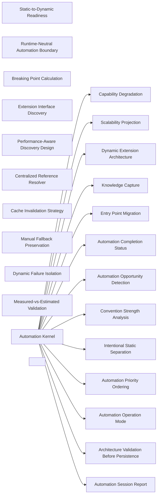

### Static-to-Dynamic Readiness

- Domain: [automation](ALGORITHMS.md#algorithms-domain-automation)
- Tier: [process](SCHEMA.md#vocabulary-domain-tier-process)
- Stage: [intent](REASONING.md#stage-intent)
- Axis: [teleology](REASONING.md#reasoning-axis-teleology)
- Math type: [optimization](REASONING.md#reasoning-math-type-optimization)
- Yields: boolean | ranking

Details

Intent
Detect static implementation patterns, classify whether they are intentional or problematic, measure maintainability pressure, verify convention strength, and automate only when stability or fallback exists.

Invariant
Static code is not debt by default; automation requires evidence that dynamism reduces maintenance risk without increasing fragility.

Flow

```text
StaticPattern → Classification → PressureMetric → ConventionStrength → Automate|RetainStatic|DesignFallback
```

Productions

```bnf
AutomationReadiness ::= <StaticPattern> "→" <OpportunityClassification> "→" <MaintainabilityAssessment> "→" <ConventionAssessment> "→" <AutomationDecision>
AutomationDecision ::= "automate" | "retain_static" | "formalize_convention_first" | "manual_fallback_required"
```

Composes
none

Forces
[runtime_extensibility](SCHEMA.md#force-runtime-extensibility), [correctness_verification](SCHEMA.md#force-correctness-verification), [resilience_recovery](SCHEMA.md#force-resilience-recovery)

Grounds
none

Before

```text
A static list rewritten as dynamic discovery on sight, adding fragility for no gain.
```

After

```text
static pattern → classify intentional vs problematic → maintainability pressure + convention strength → {automate | retain static | formalize convention first}
```

How it is checked

Checked by
the automation kernel's gates on convention strength, fallback preservation, performance and validation before persistence

Population
Every static list, switch or registry the automation pass considers

Freshness
A verdict stands until the code or its conventions change

Refusal
The kernel refuses to automate a candidate whose convention, fallback or validation contract fails

Observation
The discovery and startup reports dynamic loading must emit, which locate an extension that failed to load

Evidence
None, because the catalog states this check as a class, so a watched run belongs to each system that adopts it

Authoritative side
The discovered convention, which replaces the static list and which the startup report is compared against

Depends on
Not answered

Shape it refuses
Not answered

### Runtime-Neutral Automation Boundary

- Domain: [automation](ALGORITHMS.md#algorithms-domain-automation)
- Tier: [process](SCHEMA.md#vocabulary-domain-tier-process)
- Stage: [orient](REASONING.md#stage-orient)
- Axis: [ontology](REASONING.md#reasoning-axis-ontology)
- Math type: [logic](REASONING.md#reasoning-math-type-logic)
- Yields: boolean

Details

Intent
Express discovery, reading, searching, validation, persistence, and reporting as semantic operations, then delegate concrete mechanics to runtime adapters.

Invariant
Dynamic architecture must be portable across runtimes by separating automation intent from platform execution.

Flow

```text
SemanticVerb → AdapterCapability → RuntimeAction → Evidence
```

Productions

```bnf
RuntimeNeutralBoundary ::= <SemanticOperation> "→" <AdapterMapping> "→" <RuntimeExecution> "→" <EvidenceResult>
SemanticOperation ::= "DISCOVER_RESOURCES" | "READ_RESOURCE" | "SEARCH_CONTENT" | "ANALYZE_CONTENT" | "VALIDATE_ARTIFACT" | "PERSIST_ARTIFACT" | "REPORT_RESULT"
AdapterMapping ::= <CapabilityStatus> "," <RuntimeConstraint> "," <FallbackPolicy>
```

Composes
none

Forces
[modularity](SCHEMA.md#force-modularity), [semantic_consistency](SCHEMA.md#force-semantic-consistency), [runtime_extensibility](SCHEMA.md#force-runtime-extensibility), [correctness_verification](SCHEMA.md#force-correctness-verification)

Grounds
none

Before

```text
Automation logic hardcodes a runtime's glob and path, so it runs on one platform only.
```

After

```text
semantic op{DISCOVER/READ/SEARCH/VALIDATE/PERSIST} → adapter maps to the runtime → portable core, no platform mechanics inside
```

How it is checked

Checked by
the automation kernel's gates on convention strength, fallback preservation, performance and validation before persistence

Population
Every static list, switch or registry the automation pass considers

Freshness
A verdict stands until the code or its conventions change

Refusal
The kernel refuses to automate a candidate whose convention, fallback or validation contract fails

Observation
The discovery and startup reports dynamic loading must emit, which locate an extension that failed to load

Evidence
None, because the catalog states this check as a class, so a watched run belongs to each system that adopts it

Authoritative side
The discovered convention, which replaces the static list and which the startup report is compared against

Depends on
Not answered

Shape it refuses
Not answered

### Automation Operation Mode

- Domain: [automation](ALGORITHMS.md#algorithms-domain-automation)
- Tier: [process](SCHEMA.md#vocabulary-domain-tier-process)
- Stage: [constrain](REASONING.md#stage-constrain)
- Axis: [teleology](REASONING.md#reasoning-axis-teleology)
- Math type: [optimization](REASONING.md#reasoning-math-type-optimization)
- Yields: boolean | ranking

Details

Intent
Detect operation mode, bind allowed actions, prohibit source mutation outside implementation mode, and emit analysis, design, implementation, or validation artifacts accordingly.

Invariant
Automation design and automation execution are separate contracts.

Flow

```text
DetectMode → BindPermissions → EnforceMutationGate → ExecuteAllowedScope → EmitArtifact
```

Productions

```bnf
AutomationMode ::= "analysis_only" | "analysis_and_design" | "implementation" | "validation_only"
ModeExecution ::= <AutomationMode> "→" <PermissionSet> "→" <AllowedArtifact>
PermissionSet ::= "read_only" | "design_only" | "write_authorized" | "validate_only"
```

Composes
none

Named in the derivation of
[Automation Kernel](ALGORITHMS.md#algorithms-automation-kernel)

Forces
[contract_compatibility](SCHEMA.md#force-contract-compatibility), [state_transaction](SCHEMA.md#force-state-transaction), [correctness_verification](SCHEMA.md#force-correctness-verification)

Grounds
none

Before

```text
Analysis silently mutates source; a design run also implements.
```

After

```text
detect mode{analysis | design | implementation | validation} → bind permissions → mutation only in implementation mode → mode-legal artifact
```

How it is checked

Checked by
the automation kernel's gates on convention strength, fallback preservation, performance and validation before persistence

Population
Every static list, switch or registry the automation pass considers

Freshness
A verdict stands until the code or its conventions change

Refusal
The kernel refuses to automate a candidate whose convention, fallback or validation contract fails

Observation
The discovery and startup reports dynamic loading must emit, which locate an extension that failed to load

Evidence
None, because the catalog states this check as a class, so a watched run belongs to each system that adopts it

Authoritative side
The discovered convention, which replaces the static list and which the startup report is compared against

Depends on
Not answered

Shape it refuses
Not answered

### Capability Degradation

- Domain: [automation](ALGORITHMS.md#algorithms-domain-automation)
- Tier: [process](SCHEMA.md#vocabulary-domain-tier-process)
- Stage: [orient](REASONING.md#stage-orient)
- Axis: [ontology](REASONING.md#reasoning-axis-ontology)
- Math type: [set-theory](REASONING.md#reasoning-math-type-set-theory)
- Yields: set | boolean

Details

Intent
Declare required capabilities, probe availability, emulate missing behavior where safe, disclose unavailable capability, and downgrade confidence or block dependent operations.

Invariant
Automation systems must not silently assume filesystem, execution, persistence, validation, or search capabilities.

Flow

```text
CapabilityRequirement → Probe → Available|Emulated|Unavailable → ConfidencePolicy
```

Productions

```bnf
CapabilityDegradation ::= <RequiredCapabilitySet> "→" <CapabilityProbeSet> "→" <CapabilityVerdict> "→" <ExecutionPolicy>
CapabilityVerdict ::= "full" | "degraded" | "blocked"
ExecutionPolicy ::= "execute" | "emulate" | "skip_with_disclosure" | "block"
```

Composes
none

Composed by
[Automation Kernel](ALGORITHMS.md#algorithms-automation-kernel)

Forces
[correctness_verification](SCHEMA.md#force-correctness-verification), [resilience_recovery](SCHEMA.md#force-resilience-recovery)

Grounds
none

Before

```text
Automation assumes it can execute and persist, then fails silently when it can't.
```

After

```text
required capabilities → probe → {full | degraded | blocked} → execute | emulate | skip-with-disclosure | block
```

How it is checked

Checked by
the automation kernel's gates on convention strength, fallback preservation, performance and validation before persistence

Population
Every static list, switch or registry the automation pass considers

Freshness
A verdict stands until the code or its conventions change

Refusal
The kernel refuses to automate a candidate whose convention, fallback or validation contract fails

Observation
The discovery and startup reports dynamic loading must emit, which locate an extension that failed to load

Evidence
None, because the catalog states this check as a class, so a watched run belongs to each system that adopts it

Authoritative side
The discovered convention, which replaces the static list and which the startup report is compared against

Depends on
Not answered

Shape it refuses
Not answered

### Automation Opportunity Detection

- Domain: [automation](ALGORITHMS.md#algorithms-domain-automation)
- Tier: [process](SCHEMA.md#vocabulary-domain-tier-process)
- Stage: [orient](REASONING.md#stage-orient)
- Axis: [ontology](REASONING.md#reasoning-axis-ontology)
- Math type: [set-theory](REASONING.md#reasoning-math-type-set-theory)
- Yields: set | boolean

Details

Intent
Search target scope for manual registries, hardcoded references, static lists, and duplicated discovery logic; then classify each finding with count, location, role, and maintenance signal.

Invariant
Automation candidates emerge from repeated manual coordination points.

Flow

```text
TargetScope → DetectionProcedures → PatternGroups → ClassificationRegistry
```

Productions

```bnf
OpportunityDetection ::= <TargetScope> "→" <DetectionProcedureSet> "→" <PatternClassificationSet>
DetectionProcedureSet ::= "manual_registration" "," "hardcoded_reference" "," "static_list" "," "duplicated_discovery"
OpportunityClassification ::= <Location> "," <PatternType> "," <Count> "," <MaintenanceEvidence>
```

Composes
none

Named in the derivation of
[Automation Kernel](ALGORITHMS.md#algorithms-automation-kernel)

Forces
[semantic_consistency](SCHEMA.md#force-semantic-consistency), [runtime_extensibility](SCHEMA.md#force-runtime-extensibility), [control_coordination](SCHEMA.md#force-control-coordination)

Grounds
none

Before

```text
Automation targets guessed instead of found from repeated manual coordination points.
```

After

```text
scope → detect{manual registration, hardcoded reference, static list, duplicated discovery} → classify{location, type, count, maintenance signal}
```

How it is checked

Checked by
the automation kernel's gates on convention strength, fallback preservation, performance and validation before persistence

Population
Every static list, switch or registry the automation pass considers

Freshness
A verdict stands until the code or its conventions change

Refusal
The kernel refuses to automate a candidate whose convention, fallback or validation contract fails

Observation
The discovery and startup reports dynamic loading must emit, which locate an extension that failed to load

Evidence
None, because the catalog states this check as a class, so a watched run belongs to each system that adopts it

Authoritative side
The discovered convention, which replaces the static list and which the startup report is compared against

Depends on
Not answered

Shape it refuses
Not answered

### Intentional Static Separation

- Domain: [automation](ALGORITHMS.md#algorithms-domain-automation)
- Tier: [process](SCHEMA.md#vocabulary-domain-tier-process)
- Stage: [derive](REASONING.md#stage-derive)
- Axis: [reasoning](REASONING.md#reasoning-axis-reasoning)
- Math type: [logic](REASONING.md#reasoning-math-type-logic)
- Yields: boolean

Details

Intent
For each static pattern, compare size, frequency, stability, and risk; classify small or stable patterns as intentionally static candidates instead of automation debt.

Invariant
Keeping a static list may be correct when the domain is bounded and explicitness improves safety.

Flow

```text
StaticFinding → ScaleCheck → ChangeFrequencyCheck → RiskCheck → IntentionalStatic|AutomationCandidate
```

Productions

```bnf
StaticSeparation ::= <StaticFinding> "→" <ScaleMetric> "→" <MutationEvidence> "→" <RiskAssessment> "→" <StaticVerdict>
StaticVerdict ::= "intentionally_static_candidate" | "automation_candidate" | "needs_more_evidence"
```

Composes
none

Named in the derivation of
[Automation Kernel](ALGORITHMS.md#algorithms-automation-kernel)

Forces
[modularity](SCHEMA.md#force-modularity), [runtime_extensibility](SCHEMA.md#force-runtime-extensibility), [domain_boundary](SCHEMA.md#force-domain-boundary)

Grounds
none

Before

```text
A small, stable, bounded static list flagged as debt and automated away.
```

After

```text
static finding → scale + change-frequency + risk → {intentionally-static candidate | automation candidate | needs more evidence}
```

How it is checked

Checked by
the automation kernel's gates on convention strength, fallback preservation, performance and validation before persistence

Population
Every static list, switch or registry the automation pass considers

Freshness
A verdict stands until the code or its conventions change

Refusal
The kernel refuses to automate a candidate whose convention, fallback or validation contract fails

Observation
The discovery and startup reports dynamic loading must emit, which locate an extension that failed to load

Evidence
None, because the catalog states this check as a class, so a watched run belongs to each system that adopts it

Authoritative side
The discovered convention, which replaces the static list and which the startup report is compared against

Depends on
Not answered

Shape it refuses
Not answered

### Breaking Point Calculation

- Domain: [automation](ALGORITHMS.md#algorithms-domain-automation)
- Tier: [process](SCHEMA.md#vocabulary-domain-tier-process)
- Stage: [see](REASONING.md#stage-see)
- Axis: [analysis](REASONING.md#reasoning-axis-analysis)
- Math type: [analysis](REASONING.md#reasoning-axis-analysis)
- Yields: operation

Details

Intent
Measure current item count, estimate growth rate, compare against cognitive and maintenance limits, compute time or units until threshold breach, and assign severity.

Invariant
Automation priority should be driven by scale pressure, not aesthetic preference.

Flow

```text
CurrentScale + GrowthRate + Limits → BreakingPoint → Severity
```

Productions

```bnf
BreakingPoint ::= <CurrentCount> "," <GrowthRate> "," <LimitSet> "→" <ThresholdProjection> "→" <PriorityRank>
LimitSet ::= "cognitive_limit" "," "maintenance_limit" "," "duplication_limit"
PriorityRank ::= "critical" | "high" | "medium" | "low"
```

Composes
none

Forces
[performance_scaling](SCHEMA.md#force-performance-scaling)

Grounds
none

Before

```text
Automation prioritized by aesthetic preference, not scale pressure.
```

After

```text
current count + growth rate + limits{cognitive, maintenance, duplication} → time until breach → severity
```

How it is checked

Checked by
the automation kernel's gates on convention strength, fallback preservation, performance and validation before persistence

Population
Every static list, switch or registry the automation pass considers

Freshness
A verdict stands until the code or its conventions change

Refusal
The kernel refuses to automate a candidate whose convention, fallback or validation contract fails

Observation
The discovery and startup reports dynamic loading must emit, which locate an extension that failed to load

Evidence
None, because the catalog states this check as a class, so a watched run belongs to each system that adopts it

Authoritative side
The discovered convention, which replaces the static list and which the startup report is compared against

Depends on
Not answered

Shape it refuses
Not answered

### Automation Priority Ordering

- Domain: [automation](ALGORITHMS.md#algorithms-domain-automation)
- Tier: [process](SCHEMA.md#vocabulary-domain-tier-process)
- Stage: [intent](REASONING.md#stage-intent)
- Axis: [teleology](REASONING.md#reasoning-axis-teleology)
- Math type: [optimization](REASONING.md#reasoning-math-type-optimization)
- Yields: boolean | ranking

Details

Intent
Convert breaking points into urgency scores using severity, projected time-to-break, affected scope, and expected maintenance cost, then sort candidate migrations.

Invariant
Automation work should be sequenced by operational impact.

Flow

```text
BreakingPoints → UrgencyMetric → ImpactMetric → PriorityOrder
```

Productions

```bnf
PriorityOrdering ::= <BreakingPointSet> "→" <PriorityScoreSet> "→" <SortedAutomationBacklog>
PriorityScore ::= <PriorityRank> "+" <TimeToBreak> "+" <AffectedScope> "+" <MaintenanceCost>
```

Composes
none

Named in the derivation of
[Automation Kernel](ALGORITHMS.md#algorithms-automation-kernel)

Forces
[causality_ordering](SCHEMA.md#force-causality-ordering)

Grounds
[tel-priority](REASONING.md#reasoning-node-tel-priority)

Before

```text
Migrations tackled in arbitrary order, low-impact first.
```

After

```text
breaking points → urgency{severity + time-to-break + scope + maintenance cost} → sorted backlog
```

How it is checked

Checked by
the automation kernel's gates on convention strength, fallback preservation, performance and validation before persistence

Population
Every static list, switch or registry the automation pass considers

Freshness
A verdict stands until the code or its conventions change

Refusal
The kernel refuses to automate a candidate whose convention, fallback or validation contract fails

Observation
The discovery and startup reports dynamic loading must emit, which locate an extension that failed to load

Evidence
None, because the catalog states this check as a class, so a watched run belongs to each system that adopts it

Authoritative side
The discovered convention, which replaces the static list and which the startup report is compared against

Depends on
Not answered

Shape it refuses
Not answered

### Convention Strength Analysis

- Domain: [automation](ALGORITHMS.md#algorithms-domain-automation)
- Tier: [process](SCHEMA.md#vocabulary-domain-tier-process)
- Stage: [see](REASONING.md#stage-see)
- Axis: [analysis](REASONING.md#reasoning-axis-analysis)
- Math type: [probability](REASONING.md#reasoning-math-type-probability)
- Yields: number[0,1]

Details

Intent
Discover related resources, extract naming tokens and organization patterns, calculate consistency percentages, and mark auto-discovery readiness only when convention strength passes threshold.

Invariant
Convention-based discovery is safe only when conventions are measurable.

Flow

```text
RelatedResources → TokenExtraction → ConsistencyMetric → Strength → Readiness
```

Productions

```bnf
ConventionStrength ::= <ResourceSet> "→" <ConventionSignalSet> "→" <ConsistencyScore> "→" <StrengthVerdict>
StrengthVerdict ::= "strong" | "moderate" | "weak"
ReadinessRule ::= "strong → auto_discovery_ready" | "moderate → formalize_first" | "weak → establish_convention_first"
```

Composes
none

Named in the derivation of
[Automation Kernel](ALGORITHMS.md#algorithms-automation-kernel)

Forces
[runtime_extensibility](SCHEMA.md#force-runtime-extensibility)

Grounds
none

Before

```text
Auto-discovery built on a naming convention only 60% of files follow.
```

After

```text
related resources → naming tokens + organization → consistency % → {strong → auto-ready | moderate → formalize | weak → establish convention first}
```

How it is checked

Checked by
the automation kernel's gates on convention strength, fallback preservation, performance and validation before persistence

Population
Every static list, switch or registry the automation pass considers

Freshness
A verdict stands until the code or its conventions change

Refusal
The kernel refuses to automate a candidate whose convention, fallback or validation contract fails

Observation
The discovery and startup reports dynamic loading must emit, which locate an extension that failed to load

Evidence
None, because the catalog states this check as a class, so a watched run belongs to each system that adopts it

Authoritative side
The discovered convention, which replaces the static list and which the startup report is compared against

Depends on
Not answered

Shape it refuses
Not answered

### Extension Interface Discovery

- Domain: [automation](ALGORITHMS.md#algorithms-domain-automation)
- Tier: [process](SCHEMA.md#vocabulary-domain-tier-process)
- Stage: [derive](REASONING.md#stage-derive)
- Axis: [reasoning](REASONING.md#reasoning-axis-reasoning)
- Math type: [logic](REASONING.md#reasoning-math-type-logic)
- Yields: boolean

Details

Intent
Search for inheritance, composition, shared method contracts, and shared schema contracts; group similar implementations; infer interface candidates when implementation count exceeds threshold.

Invariant
Dynamic discovery requires an explicit or inferable contract boundary.

Flow

```text
ImplementationSet → ContractSignals → InterfaceCandidate → ExtensionContract
```

Productions

```bnf
ExtensionInterfaceDiscovery ::= <ImplementationPatternSet> "→" <ContractEvidence> "→" <InterfaceCandidateSet>
ContractEvidence ::= "inheritance" | "composition" | "common_methods" | "common_schema"
InterfaceCandidate ::= <InterfaceName> "," <ImplementationCount> "," <RequiredContractEvidence>
```

Composes
none

Forces
[modularity](SCHEMA.md#force-modularity), [contract_compatibility](SCHEMA.md#force-contract-compatibility), [runtime_extensibility](SCHEMA.md#force-runtime-extensibility)

Grounds
none

Before

```text
Dynamic discovery attempted with no contract boundary to validate against.
```

After

```text
implementations → contract signals{inheritance, composition, common methods, common schema} → interface candidate when count exceeds threshold
```

How it is checked

Checked by
the automation kernel's gates on convention strength, fallback preservation, performance and validation before persistence

Population
Every static list, switch or registry the automation pass considers

Freshness
A verdict stands until the code or its conventions change

Refusal
The kernel refuses to automate a candidate whose convention, fallback or validation contract fails

Observation
The discovery and startup reports dynamic loading must emit, which locate an extension that failed to load

Evidence
None, because the catalog states this check as a class, so a watched run belongs to each system that adopts it

Authoritative side
The discovered convention, which replaces the static list and which the startup report is compared against

Depends on
Not answered

Shape it refuses
Not answered

### Scalability Projection

- Domain: [automation](ALGORITHMS.md#algorithms-domain-automation)
- Tier: [process](SCHEMA.md#vocabulary-domain-tier-process)
- Stage: [see](REASONING.md#stage-see)
- Axis: [analysis](REASONING.md#reasoning-axis-analysis)
- Math type: [analysis](REASONING.md#reasoning-axis-analysis)
- Yields: operation

Details

Intent
Measure current resource counts, project tenfold and hundredfold growth, assess manual maintenance feasibility, and identify where dynamic discovery becomes necessary.

Invariant
Automation architecture should be evaluated against future scale, not only current scale.

Flow

```text
CurrentScale → 10xProjection → 100xProjection → ManualFeasibility → DiscoveryNeed
```

Productions

```bnf
ScalabilityProjection ::= <CurrentScale> "→" <GrowthScenarioSet> "→" <MaintenanceFeasibilitySet> "→" <AutomationNeed>
GrowthScenarioSet ::= "10x" | "100x"
AutomationNeed ::= "manual_ok" | "dynamic_recommended" | "dynamic_required"
```

Composes
none

Composed by
[Automation Kernel](ALGORITHMS.md#algorithms-automation-kernel)

Forces
[runtime_extensibility](SCHEMA.md#force-runtime-extensibility), [performance_scaling](SCHEMA.md#force-performance-scaling)

Grounds
none

Before

```text
Automation judged against today's 5 items, not tomorrow's 500.
```

After

```text
current scale → 10x + 100x projection → manual feasibility → {manual ok | dynamic recommended | dynamic required}
```

How it is checked

Checked by
the automation kernel's gates on convention strength, fallback preservation, performance and validation before persistence

Population
Every static list, switch or registry the automation pass considers

Freshness
A verdict stands until the code or its conventions change

Refusal
The kernel refuses to automate a candidate whose convention, fallback or validation contract fails

Observation
The discovery and startup reports dynamic loading must emit, which locate an extension that failed to load

Evidence
None, because the catalog states this check as a class, so a watched run belongs to each system that adopts it

Authoritative side
The discovered convention, which replaces the static list and which the startup report is compared against

Depends on
Not answered

Shape it refuses
Not answered

### Performance-Aware Discovery Design

- Domain: [automation](ALGORITHMS.md#algorithms-domain-automation)
- Tier: [process](SCHEMA.md#vocabulary-domain-tier-process)
- Stage: [project](REASONING.md#stage-project)
- Axis: [reasoning](REASONING.md#reasoning-axis-reasoning)
- Math type: [logic](REASONING.md#reasoning-math-type-logic)
- Yields: boolean

Details

Intent
Estimate discovery and loading cost, compare large-scale cost against performance targets, introduce caching only when justified, and record failure modes.

Invariant
Dynamic discovery must not hide runtime performance debt.

Flow

```text
ItemCount → DiscoveryCost → LoadingCost → CacheNeed → PerformanceVerdict
```

Productions

```bnf
DiscoveryPerformanceDesign ::= <ScaleMetric> "→" <CostEstimateSet> "→" <CacheDecision> "→" <FailureModeSet>
CostEstimateSet ::= "discovery_cost" "," "loading_cost" "," "memory_overhead"
CacheDecision ::= "cache_required" | "cache_not_required"
```

Composes
none

Forces
[runtime_extensibility](SCHEMA.md#force-runtime-extensibility), [performance_scaling](SCHEMA.md#force-performance-scaling)

Grounds
none

Before

```text
Dynamic discovery ships, hiding a per-startup scan cost that grows with scale.
```

After

```text
item count → {discovery cost, loading cost, memory} vs targets → cache only when justified → failure modes recorded
```

How it is checked

Checked by
the automation kernel's gates on convention strength, fallback preservation, performance and validation before persistence

Population
Every static list, switch or registry the automation pass considers

Freshness
A verdict stands until the code or its conventions change

Refusal
The kernel refuses to automate a candidate whose convention, fallback or validation contract fails

Observation
The discovery and startup reports dynamic loading must emit, which locate an extension that failed to load

Evidence
None, because the catalog states this check as a class, so a watched run belongs to each system that adopts it

Authoritative side
The discovered convention, which replaces the static list and which the startup report is compared against

Depends on
Not answered

Shape it refuses
Not answered

### Dynamic Extension Architecture

- Domain: [automation](ALGORITHMS.md#algorithms-domain-automation)
- Tier: [process](SCHEMA.md#vocabulary-domain-tier-process)
- Stage: [project](REASONING.md#stage-project)
- Axis: [reasoning](REASONING.md#reasoning-axis-reasoning)
- Math type: [logic](REASONING.md#reasoning-math-type-logic)
- Yields: boolean

Details

Intent
Infer extension contracts, define discovery conventions, validate discovered implementations against the contract, preserve manual registration fallback, and report discovered, skipped, failed, and manual items.

Invariant
Dynamic loading must be contract-validated and observable.

Flow

```text
Contract → Discovery → Filter → Validate → Load|Skip → Report
```

Productions

```bnf
DynamicExtensionArchitecture ::= <ExtensionContract> "→" <DiscoveryMechanism> "→" <ContractValidation> "→" <LoadingPolicy> "→" <ObservabilityReport>
LoadingPolicy ::= "load_valid" | "skip_invalid" | "manual_override" | "isolate_failure"
ObservabilityReport ::= "discovered_count" "," "manual_count" "," "skipped_count" "," "failed_count"
```

Composes
none

Composed by
[Automation Kernel](ALGORITHMS.md#algorithms-automation-kernel)

Named in the derivation of
[Automation Kernel](ALGORITHMS.md#algorithms-automation-kernel)

Forces
[contract_compatibility](SCHEMA.md#force-contract-compatibility), [runtime_extensibility](SCHEMA.md#force-runtime-extensibility), [correctness_verification](SCHEMA.md#force-correctness-verification), [resilience_recovery](SCHEMA.md#force-resilience-recovery), [observability_traceability](SCHEMA.md#force-observability-traceability)

Grounds
none

Before

```text
Implementations loaded dynamically with no contract validation, unobservable.
```

After

```text
contract → discovery → contract-validate → {load valid | skip invalid | manual override | isolate failure} → report{discovered, manual, skipped, failed}
```

How it is checked

Checked by
the automation kernel's gates on convention strength, fallback preservation, performance and validation before persistence

Population
Every static list, switch or registry the automation pass considers

Freshness
A verdict stands until the code or its conventions change

Refusal
The kernel refuses to automate a candidate whose convention, fallback or validation contract fails

Observation
The discovery and startup reports dynamic loading must emit, which locate an extension that failed to load

Evidence
None, because the catalog states this check as a class, so a watched run belongs to each system that adopts it

Authoritative side
The discovered convention, which replaces the static list and which the startup report is compared against

Depends on
Not answered

Shape it refuses
Not answered

### Centralized Reference Resolver

- Domain: [automation](ALGORITHMS.md#algorithms-domain-automation)
- Tier: [process](SCHEMA.md#vocabulary-domain-tier-process)
- Stage: [act](REASONING.md#stage-act)
- Axis: [formalization](REASONING.md#reasoning-axis-formalization)
- Math type: [computation](REASONING.md#reasoning-math-type-computation)
- Yields: procedure

Details

Intent
Group duplicated hardcoded references, derive resolver names, define scope-safe resolution rules, provide configuration override fallback, and map each old reference to a resolver migration.

Invariant
Hardcoded resource access should be centralized only through validated resolution boundaries.

Flow

```text
HardcodedReferenceGroup → Resolver → ScopeValidation → OverrideFallback → MigrationMap
```

Productions

```bnf
ReferenceResolver ::= <ReferenceGroup> "→" <ResolverDefinition> "→" <ScopePolicy> "→" <FallbackOverride> "→" <ReplacementMap>
ScopePolicy ::= "reject_outside_allowed_scope" | "require_explicit_approval_for_escape"
FallbackOverride ::= "configuration_override"
```

Composes
none

Forces
[modularity](SCHEMA.md#force-modularity), [semantic_consistency](SCHEMA.md#force-semantic-consistency), [resilience_recovery](SCHEMA.md#force-resilience-recovery), [architecture_evolution](SCHEMA.md#force-architecture-evolution)

Grounds
none

Before

```text
The same hardcoded path duplicated at a dozen call sites.
```

After

```text
reference group → resolver → scope-safe rule → config override fallback → map each old reference to the resolver
```

How it is checked

Checked by
the automation kernel's gates on convention strength, fallback preservation, performance and validation before persistence

Population
Every static list, switch or registry the automation pass considers

Freshness
A verdict stands until the code or its conventions change

Refusal
The kernel refuses to automate a candidate whose convention, fallback or validation contract fails

Observation
The discovery and startup reports dynamic loading must emit, which locate an extension that failed to load

Evidence
None, because the catalog states this check as a class, so a watched run belongs to each system that adopts it

Authoritative side
The discovered convention, which replaces the static list and which the startup report is compared against

Depends on
Not answered

Shape it refuses
Not answered

### Cache Invalidation Strategy

- Domain: [automation](ALGORITHMS.md#algorithms-domain-automation)
- Tier: [process](SCHEMA.md#vocabulary-domain-tier-process)
- Stage: [act](REASONING.md#stage-act)
- Axis: [formalization](REASONING.md#reasoning-axis-formalization)
- Math type: [logic](REASONING.md#reasoning-math-type-logic)
- Yields: boolean

Details

Intent
Define cache keys by scope, convention, adapter version, and implementation identity; invalidate by resource change, explicit request, time expiry, or implementation version change.

Invariant
Caching dynamic discovery is safe only when invalidation semantics are explicit.

Flow

```text
CacheSubject → CacheKey → Duration → InvalidationTrigger → Refresh
```

Productions

```bnf
CacheStrategy ::= <CacheSubject> "→" <CacheKey> "→" <CacheDuration> "→" <InvalidationPolicy>
CacheSubject ::= "discovery_results" | "loaded_extensions" | "reference_resolution"
InvalidationPolicy ::= "resource_change" | "explicit_invalidation" | "time_expiry" | "implementation_change"
```

Composes
none

Forces
[semantic_consistency](SCHEMA.md#force-semantic-consistency), [runtime_extensibility](SCHEMA.md#force-runtime-extensibility)

Grounds
none

Before

```text
Discovery results cached with no invalidation, serving stale data forever.
```

After

```text
cache subject → key{scope, convention, adapter version, identity} → invalidate on{resource change, explicit, time, implementation change}
```

How it is checked

Checked by
the automation kernel's gates on convention strength, fallback preservation, performance and validation before persistence

Population
Every static list, switch or registry the automation pass considers

Freshness
A verdict stands until the code or its conventions change

Refusal
The kernel refuses to automate a candidate whose convention, fallback or validation contract fails

Observation
The discovery and startup reports dynamic loading must emit, which locate an extension that failed to load

Evidence
None, because the catalog states this check as a class, so a watched run belongs to each system that adopts it

Authoritative side
The discovered convention, which replaces the static list and which the startup report is compared against

Depends on
Not answered

Shape it refuses
Not answered

### Manual Fallback Preservation

- Domain: [automation](ALGORITHMS.md#algorithms-domain-automation)
- Tier: [process](SCHEMA.md#vocabulary-domain-tier-process)
- Stage: [act](REASONING.md#stage-act)
- Axis: [formalization](REASONING.md#reasoning-axis-formalization)
- Math type: [computation](REASONING.md#reasoning-math-type-computation)
- Yields: procedure

Details

Intent
Keep explicit registration paths for non-conforming or exceptional implementations, order manual entries deterministically, and report manual items separately from auto-discovered items.

Invariant
Automation should reduce manual maintenance, not remove escape hatches.

Flow

```text
AutoDiscovery → NonConformingItem → ManualRegistration → DeterministicMerge → Observability
```

Productions

```bnf
ManualFallback ::= <DiscoveredSet> "," <ManualSet> "→" <Validation> "→" <DeterministicMerge> "→" <FallbackReport>
ManualSet ::= <ExplicitRegistration> | <ExplicitRegistration> "," <ManualSet>
FallbackReport ::= "manual_items_listed_separately"
```

Composes
none

Forces
[resilience_recovery](SCHEMA.md#force-resilience-recovery)

Grounds
none

Before

```text
Auto-discovery removes the escape hatch — a non-conforming item can't be registered.
```

After

```text
auto-discovery + manual registration for exceptions → deterministic merge → manual items reported separately
```

How it is checked

Checked by
the automation kernel's gates on convention strength, fallback preservation, performance and validation before persistence

Population
Every static list, switch or registry the automation pass considers

Freshness
A verdict stands until the code or its conventions change

Refusal
The kernel refuses to automate a candidate whose convention, fallback or validation contract fails

Observation
The discovery and startup reports dynamic loading must emit, which locate an extension that failed to load

Evidence
None, because the catalog states this check as a class, so a watched run belongs to each system that adopts it

Authoritative side
The discovered convention, which replaces the static list and which the startup report is compared against

Depends on
Not answered

Shape it refuses
Not answered

### Dynamic Failure Isolation

- Domain: [automation](ALGORITHMS.md#algorithms-domain-automation)
- Tier: [process](SCHEMA.md#vocabulary-domain-tier-process)
- Stage: [act](REASONING.md#stage-act)
- Axis: [formalization](REASONING.md#reasoning-axis-formalization)
- Math type: [logic](REASONING.md#reasoning-math-type-logic)
- Yields: boolean

Details

Intent
On individual discovery, loading, or validation failure, isolate the failing item, continue with valid items where safe, and report the failed item with reason.

Invariant
One bad extension must not collapse the whole dynamic system unless marked critical.

Flow

```text
ItemFailure → Isolate → ContinueSafeSubset → ReportFailure
```

Productions

```bnf
FailureIsolation ::= <ExtensionItem> "→" <FailureType> "→" <IsolationPolicy> "→" <ContinuationPolicy> "→" <FailureReport>
FailureType ::= "discovery_failure" | "loading_failure" | "validation_failure" | "execution_failure"
ContinuationPolicy ::= "continue" | "continue_with_warning" | "halt_if_systemic_or_critical"
```

Composes
none

Forces
[runtime_extensibility](SCHEMA.md#force-runtime-extensibility), [correctness_verification](SCHEMA.md#force-correctness-verification)

Grounds
none

Before

```text
One bad extension crashes the whole dynamic system.
```

After

```text
item failure{discovery | loading | validation} → isolate the item → continue with valid ones → report the failure; halt only if systemic or critical
```

How it is checked

Checked by
the automation kernel's gates on convention strength, fallback preservation, performance and validation before persistence

Population
Every static list, switch or registry the automation pass considers

Freshness
A verdict stands until the code or its conventions change

Refusal
The kernel refuses to automate a candidate whose convention, fallback or validation contract fails

Observation
The discovery and startup reports dynamic loading must emit, which locate an extension that failed to load

Evidence
None, because the catalog states this check as a class, so a watched run belongs to each system that adopts it

Authoritative side
The discovered convention, which replaces the static list and which the startup report is compared against

Depends on
Not answered

Shape it refuses
Not answered

### Entry Point Migration

- Domain: [automation](ALGORITHMS.md#algorithms-domain-automation)
- Tier: [process](SCHEMA.md#vocabulary-domain-tier-process)
- Stage: [act](REASONING.md#stage-act)
- Axis: [formalization](REASONING.md#reasoning-axis-formalization)
- Math type: [computation](REASONING.md#reasoning-math-type-computation)
- Yields: procedure

Details

Intent
Locate composition roots, identify manual registrations and hardcoded references, compose updates that use discovery registries and centralized resolvers, and apply only in implementation mode.

Invariant
Dynamic architecture takes effect at composition boundaries.

Flow

```text
CompositionRoot → StaticPatternScan → UpdatePlan → Validate → ApplyOrPlan
```

Productions

```bnf
EntryPointMigration ::= <CompositionRootSet> "→" <StaticPatternSet> "→" <EntryPointUpdate> "→" <Validation> "→" <PersistencePolicy>
PersistencePolicy ::= "persist_only_in_implementation_mode" | "emit_plan_only"
```

Composes
none

Composed by
[Automation Kernel](ALGORITHMS.md#algorithms-automation-kernel)

Named in the derivation of
[Automation Kernel](ALGORITHMS.md#algorithms-automation-kernel)

Forces
[modularity](SCHEMA.md#force-modularity), [semantic_consistency](SCHEMA.md#force-semantic-consistency), [runtime_extensibility](SCHEMA.md#force-runtime-extensibility), [architecture_evolution](SCHEMA.md#force-architecture-evolution)

Grounds
none

Before

```text
Discovery registries built but the composition root still hardcodes registrations.
```

After

```text
composition roots → scan static patterns → update to discovery + resolver → validate → persist only in implementation mode
```

How it is checked

Checked by
the automation kernel's gates on convention strength, fallback preservation, performance and validation before persistence

Population
Every static list, switch or registry the automation pass considers

Freshness
A verdict stands until the code or its conventions change

Refusal
The kernel refuses to automate a candidate whose convention, fallback or validation contract fails

Observation
The discovery and startup reports dynamic loading must emit, which locate an extension that failed to load

Evidence
None, because the catalog states this check as a class, so a watched run belongs to each system that adopts it

Authoritative side
The discovered convention, which replaces the static list and which the startup report is compared against

Depends on
Not answered

Shape it refuses
Not answered

### Measured-vs-Estimated Validation

- Domain: [automation](ALGORITHMS.md#algorithms-domain-automation)
- Tier: [process](SCHEMA.md#vocabulary-domain-tier-process)
- Stage: [verify](REASONING.md#stage-verify)
- Axis: [verification](REASONING.md#reasoning-axis-verification)
- Math type: [logic](REASONING.md#reasoning-math-type-logic)
- Yields: boolean

Details

Intent
Run validation when execution is available; otherwise estimate from static evidence, label the result as estimated, and never report estimated performance as measured.

Invariant
Validation truthfulness requires provenance on every metric.

Flow

```text
ValidationNeed → CanMeasure? → MeasuredResult|EstimatedResult → ProvenanceLabel
```

Productions

```bnf
ValidationProvenance ::= <ValidationCheck> "→" <CapabilityCheck> "→" <ValidationResult> "→" <Provenance>
Provenance ::= "measured" | "estimated" | "unavailable"
Rule ::= "estimated != measured"
```

Composes
none

Forces
[runtime_extensibility](SCHEMA.md#force-runtime-extensibility), [correctness_verification](SCHEMA.md#force-correctness-verification), [performance_scaling](SCHEMA.md#force-performance-scaling)

Grounds
none

Before

```text
An estimated performance number reported as if it were measured.
```

After

```text
validation need → can measure? → {measured | estimated (labeled)} → estimated is never reported as measured
```

How it is checked

Checked by
the automation kernel's gates on convention strength, fallback preservation, performance and validation before persistence

Population
Every static list, switch or registry the automation pass considers

Freshness
A verdict stands until the code or its conventions change

Refusal
The kernel refuses to automate a candidate whose convention, fallback or validation contract fails

Observation
The discovery and startup reports dynamic loading must emit, which locate an extension that failed to load

Evidence
None, because the catalog states this check as a class, so a watched run belongs to each system that adopts it

Authoritative side
The discovered convention, which replaces the static list and which the startup report is compared against

Depends on
Not answered

Shape it refuses
Not answered

### Architecture Validation Before Persistence

- Domain: [automation](ALGORITHMS.md#algorithms-domain-automation)
- Tier: [process](SCHEMA.md#vocabulary-domain-tier-process)
- Stage: [verify](REASONING.md#stage-verify)
- Axis: [verification](REASONING.md#reasoning-axis-verification)
- Math type: [logic](REASONING.md#reasoning-math-type-logic)
- Yields: boolean

Details

Intent
Validate generated contracts, registries, resolvers, plans, and entry point updates against schemas and architectural rules before saving or modifying any artifact.

Invariant
Generated architecture must satisfy structure before it becomes state.

Flow

```text
GeneratedArtifact → SchemaValidation → ArchitectureValidation → Persist|Reject
```

Productions

```bnf
PrePersistenceValidation ::= <GeneratedArtifact> "→" <SchemaCheck> "→" <ArchitectureCheck> "→" <PersistenceDecision>
PersistenceDecision ::= "persist" | "reject" | "emit_unpersisted_artifact"
```

Composes
none

Named in the derivation of
[Automation Kernel](ALGORITHMS.md#algorithms-automation-kernel)

Forces
[contract_compatibility](SCHEMA.md#force-contract-compatibility), [correctness_verification](SCHEMA.md#force-correctness-verification)

Grounds
none

Before

```text
A generated resolver saved before it is checked against the architecture rules.
```

After

```text
generated artifact → schema check → architecture check → {persist | reject | emit unpersisted}
```

How it is checked

Checked by
the automation kernel's gates on convention strength, fallback preservation, performance and validation before persistence

Population
Every static list, switch or registry the automation pass considers

Freshness
A verdict stands until the code or its conventions change

Refusal
The kernel refuses to automate a candidate whose convention, fallback or validation contract fails

Observation
The discovery and startup reports dynamic loading must emit, which locate an extension that failed to load

Evidence
None, because the catalog states this check as a class, so a watched run belongs to each system that adopts it

Authoritative side
The discovered convention, which replaces the static list and which the startup report is compared against

Depends on
Not answered

Shape it refuses
Not answered

### Knowledge Capture

- Domain: [automation](ALGORITHMS.md#algorithms-domain-automation)
- Tier: [process](SCHEMA.md#vocabulary-domain-tier-process)
- Stage: [act](REASONING.md#stage-act)
- Axis: [formalization](REASONING.md#reasoning-axis-formalization)
- Math type: [computation](REASONING.md#reasoning-math-type-computation)
- Yields: procedure

Details

Intent
Load or initialize the automation knowledge base, merge new detections, conventions, scalability concerns, architecture designs, migration history, and validation outcomes, then persist when capability exists.

Invariant
Automation systems improve when each session updates durable architectural memory.

Flow

```text
SessionFindings → KnowledgeMerge → PersistenceCheck → Store|ReportPreparedUpdate
```

Productions

```bnf
KnowledgeCapture ::= <KnowledgeBase> "," <SessionFindings> "→" <MergedKnowledge> "→" <KnowledgePersistenceStatus>
SessionFindings ::= <PatternClassifications> "," <ConventionReport> "," <ScalabilityReport> "," <ArchitectureDesign> "," <MigrationStatus>
KnowledgePersistenceStatus ::= "persisted" | "prepared_not_persisted"
```

Composes
none

Composed by
[Automation Kernel](ALGORITHMS.md#algorithms-automation-kernel)

Forces
[correctness_verification](SCHEMA.md#force-correctness-verification), [performance_scaling](SCHEMA.md#force-performance-scaling), [architecture_evolution](SCHEMA.md#force-architecture-evolution)

Grounds
none

Before

```text
Each automation session forgets the last — the same analysis re-run.
```

After

```text
knowledge base + session findings → merge{detections, conventions, scale, designs, migration, validation} → persist when capability exists
```

How it is checked

Checked by
the automation kernel's gates on convention strength, fallback preservation, performance and validation before persistence

Population
Every static list, switch or registry the automation pass considers

Freshness
A verdict stands until the code or its conventions change

Refusal
The kernel refuses to automate a candidate whose convention, fallback or validation contract fails

Observation
The discovery and startup reports dynamic loading must emit, which locate an extension that failed to load

Evidence
None, because the catalog states this check as a class, so a watched run belongs to each system that adopts it

Authoritative side
The discovered convention, which replaces the static list and which the startup report is compared against

Depends on
Not answered

Shape it refuses
Not answered

### Automation Session Report

- Domain: [automation](ALGORITHMS.md#algorithms-domain-automation)
- Tier: [process](SCHEMA.md#vocabulary-domain-tier-process)
- Stage: [commit](REASONING.md#stage-commit)
- Axis: [representation](REASONING.md#reasoning-axis-representation)
- Math type: [information-theory](REASONING.md#reasoning-math-type-information-theory)
- Yields: hash | novelty-score

Details

Intent
Summarize detected patterns, convention readiness, scalability pressure, dynamic architecture, generated artifacts, implementation status, measured versus estimated validation, and limitations.

Invariant
Automation reports must separate design intent from applied implementation and disclose degraded capability.

Flow

```text
SessionArtifacts → Metrics → ValidationProvenance → Limitations → UserReport
```

Productions

```bnf
AutomationReport ::= <DetectionSummary> "," <ConventionSummary> "," <ScalabilitySummary> "," <ArchitectureSummary> "," <ImplementationSummary> "," <PerformanceValidationSummary> "," <KnowledgeUpdateSummary> "," <Limitations>
```

Composes
none

Named in the derivation of
[Automation Kernel](ALGORITHMS.md#algorithms-automation-kernel)

Forces
[runtime_extensibility](SCHEMA.md#force-runtime-extensibility), [correctness_verification](SCHEMA.md#force-correctness-verification), [performance_scaling](SCHEMA.md#force-performance-scaling)

Grounds
none

Before

```text
A report that conflates the design intent with what was applied.
```

After

```text
session → {detection, convention, scale, architecture, implementation, measured-vs-estimated validation, limitations} → report separating design from applied
```

How it is checked

Checked by
the automation kernel's gates on convention strength, fallback preservation, performance and validation before persistence

Population
Every static list, switch or registry the automation pass considers

Freshness
A verdict stands until the code or its conventions change

Refusal
The kernel refuses to automate a candidate whose convention, fallback or validation contract fails

Observation
The discovery and startup reports dynamic loading must emit, which locate an extension that failed to load

Evidence
None, because the catalog states this check as a class, so a watched run belongs to each system that adopts it

Authoritative side
The discovered convention, which replaces the static list and which the startup report is compared against

Depends on
Not answered

Shape it refuses
Not answered

### Automation Completion Status

- Domain: [automation](ALGORITHMS.md#algorithms-domain-automation)
- Tier: [process](SCHEMA.md#vocabulary-domain-tier-process)
- Stage: [terminate](REASONING.md#stage-terminate)
- Axis: [termination](REASONING.md#reasoning-axis-termination)
- Math type: [logic](REASONING.md#reasoning-math-type-logic)
- Yields: boolean

Details

Intent
Mark the static-to-dynamic automation complete only when convention strength passed, a manual fallback is preserved, performance and architecture validation passed with measured provenance, and any degraded capability is disclosed; otherwise report planned-only or blocked.

Invariant
Automation completion is a verified terminal state — never a claim while convention, fallback, validation, or capability evidence is absent.

Flow

```text
CompletionCriteria → EvidenceCheck → CapabilityDisclosure → Complete|PlannedOnly|Blocked
```

Productions

```bnf
AutomationCompletionStatus ::= <CompletionCriteriaSet> "→" <EvidenceSet> "→" <CompletionVerdict>
CompletionVerdict ::= "automation_complete" | "planned_only" | "blocked"
```

Composes
none

Composed by
[Automation Kernel](ALGORITHMS.md#algorithms-automation-kernel)

Named in the derivation of
[Automation Kernel](ALGORITHMS.md#algorithms-automation-kernel)

Forces
[correctness_verification](SCHEMA.md#force-correctness-verification), [control_coordination](SCHEMA.md#force-control-coordination)

Grounds
[ter-stop](REASONING.md#reasoning-node-ter-stop)

Before

```text
'Automated' declared while the convention was never formalized, no fallback was preserved, and the validation was estimated not measured.
```

After

```text
convention strong + fallback preserved + performance validated + architecture validated + capability disclosed → complete; else planned_only | blocked
```

How it is checked

Checked by
the automation kernel's gates on convention strength, fallback preservation, performance and validation before persistence

Population
Every static list, switch or registry the automation pass considers

Freshness
A verdict stands until the code or its conventions change

Refusal
The kernel refuses to automate a candidate whose convention, fallback or validation contract fails

Observation
The discovery and startup reports dynamic loading must emit, which locate an extension that failed to load

Evidence
None, because the catalog states this check as a class, so a watched run belongs to each system that adopts it

Authoritative side
The discovered convention, which replaces the static list and which the startup report is compared against

Depends on
Not answered

Shape it refuses
Not answered

### Automation Kernel

- Domain: [automation](ALGORITHMS.md#algorithms-domain-automation)
- Tier: [process](SCHEMA.md#vocabulary-domain-tier-process)
- Math type: [computation](REASONING.md#reasoning-math-type-computation)
- Yields: procedure

Details

Intent
Load configuration, verify capabilities, initialize knowledge, detect static patterns, classify automation opportunity, analyze conventions, assess scale and performance, design dynamic architecture, optionally implement, validate, update knowledge, and report.

Invariant
Static-to-dynamic refactoring is a gated evidence pipeline that only automates when convention, fallback, performance, and validation contracts are satisfied.

Flow

```text
Init → Capabilities → Detect → Classify → Conventions → Scale → Design → Implement? → Validate → Knowledge → Report
```

Productions

```bnf
AutomationKernel ::= <Initialization> "→" <CapabilityDegradation> "→" <OpportunityDetection> "→" <StaticSeparation> "→" <BreakingPoint> "→" <ConventionStrength> "→" <ScalabilityProjection> "→" <DynamicExtensionArchitecture> "→" <ReferenceResolver> "→" <OptionalImplementation> "→" <ValidationProvenance> "→" <KnowledgeCapture> "→" <AutomationReport>
OptionalImplementation ::= "skip_unless_implementation_mode" | <EntryPointMigration>
```

Composes
[Capability Degradation](ALGORITHMS.md#algorithms-capability-degradation), [Scalability Projection](ALGORITHMS.md#algorithms-scalability-projection), [Dynamic Extension Architecture](ALGORITHMS.md#algorithms-dynamic-extension-architecture), [Knowledge Capture](ALGORITHMS.md#algorithms-knowledge-capture), [Entry Point Migration](ALGORITHMS.md#algorithms-entry-point-migration), [Automation Completion Status](ALGORITHMS.md#algorithms-automation-completion-status)

Forces
[contract_compatibility](SCHEMA.md#force-contract-compatibility), [runtime_extensibility](SCHEMA.md#force-runtime-extensibility), [correctness_verification](SCHEMA.md#force-correctness-verification), [resilience_recovery](SCHEMA.md#force-resilience-recovery), [performance_scaling](SCHEMA.md#force-performance-scaling), [streaming_dataflow](SCHEMA.md#force-streaming-dataflow)

Principle
[Convention over Configuration](PRINCIPLES.md#architecture-convention-over-configuration)

Grounds
[derivation-loop](REASONING.md#reasoning-loop-derivation-loop)

Derivation map

orient
[Automation Opportunity Detection](ALGORITHMS.md#algorithms-automation-opportunity-detection)

see
[Convention Strength Analysis](ALGORITHMS.md#algorithms-convention-strength-analysis)

derive
[Intentional Static Separation](ALGORITHMS.md#algorithms-intentional-static-separation)

intent
[Automation Priority Ordering](ALGORITHMS.md#algorithms-automation-priority-ordering)

constrain
[Automation Operation Mode](ALGORITHMS.md#algorithms-automation-operation-mode)

project
[Dynamic Extension Architecture](ALGORITHMS.md#algorithms-dynamic-extension-architecture)

act
[Entry Point Migration](ALGORITHMS.md#algorithms-entry-point-migration)

verify
[Architecture Validation Before Persistence](ALGORITHMS.md#algorithms-architecture-validation-before-persistence)

commit
[Automation Session Report](ALGORITHMS.md#algorithms-automation-session-report)

terminate
[Automation Completion Status](ALGORITHMS.md#algorithms-automation-completion-status)

Before

```text
A static pattern rewritten dynamic by intuition, with no convention, fallback, or validation.
```

After

```text
init → capabilities → detect → classify → conventions → scale → design → optional implement → validate → knowledge → report
```

How it is checked

Checked by
the automation kernel's gates on convention strength, fallback preservation, performance and validation before persistence

Population
Every static list, switch or registry the automation pass considers

Freshness
A verdict stands until the code or its conventions change

Refusal
The kernel refuses to automate a candidate whose convention, fallback or validation contract fails

Observation
The discovery and startup reports dynamic loading must emit, which locate an extension that failed to load

Evidence
None, because the catalog states this check as a class, so a watched run belongs to each system that adopts it

Authoritative side
The discovered convention, which replaces the static list and which the startup report is compared against

Depends on
[Capability Degradation](ALGORITHMS.md#algorithms-capability-degradation), [Scalability Projection](ALGORITHMS.md#algorithms-scalability-projection), [Dynamic Extension Architecture](ALGORITHMS.md#algorithms-dynamic-extension-architecture), [Knowledge Capture](ALGORITHMS.md#algorithms-knowledge-capture), [Entry Point Migration](ALGORITHMS.md#algorithms-entry-point-migration), [Automation Completion Status](ALGORITHMS.md#algorithms-automation-completion-status)

Shape it refuses
Not answered

### <Automation Concern>

- Domain: [automation](ALGORITHMS.md#algorithms-domain-automation)
- Tier: [process](SCHEMA.md#vocabulary-domain-tier-process)
- Meta record

Details

Intent
<Detect static coordination point> → <Classify intentional vs problematic> → <Measure scale pressure> → <Verify convention strength> → <Design dynamic contract> → <Preserve fallback> → <Validate performance and architecture> → <Capture knowledge>

Invariant
Any static implementation should become dynamic only when the domain has stable conventions, bounded failure modes, observable discovery, and safe manual fallback.

Flow

```text
Static → Evidence → Convention → Contract → Discovery → Fallback → Validation → Memory
```

Productions

```bnf
AutomationConcern ::= <StaticPattern> "→" <EvidenceClassification> "→" <ConventionReadiness> "→" <DynamicArchitecture> "→" <FallbackPolicy> "→" <PerformanceValidation> "→" <KnowledgeUpdate> "→" <Report>
DynamicArchitecture ::= <ExtensionContract> "," <DiscoveryMechanism> "," <CentralizedResolver> "," <CachingPolicy> "," <FailureIsolation>
```

Composes
none

Forces
[contract_compatibility](SCHEMA.md#force-contract-compatibility), [runtime_extensibility](SCHEMA.md#force-runtime-extensibility), [correctness_verification](SCHEMA.md#force-correctness-verification), [resilience_recovery](SCHEMA.md#force-resilience-recovery), [observability_traceability](SCHEMA.md#force-observability-traceability), [performance_scaling](SCHEMA.md#force-performance-scaling), [domain_boundary](SCHEMA.md#force-domain-boundary), [control_coordination](SCHEMA.md#force-control-coordination)

Grounds
none

How it is checked

Checked by
the automation kernel's gates on convention strength, fallback preservation, performance and validation before persistence

Population
Every static list, switch or registry the automation pass considers

Freshness
A verdict stands until the code or its conventions change

Refusal
The kernel refuses to automate a candidate whose convention, fallback or validation contract fails

Observation
The discovery and startup reports dynamic loading must emit, which locate an extension that failed to load

Evidence
None, because the catalog states this check as a class, so a watched run belongs to each system that adopts it

Authoritative side
The discovered convention, which replaces the static list and which the startup report is compared against

Depends on
Not answered

Shape it refuses
Not answered

## Centralization

Every algorithm contract in this domain is listed with its position on the derivation loop, its intent and invariant, the flow it walks and its productions as a grammar. Each record also shows what it composes and is composed by, which forces and principles it answers to, what grounds it and what it grounds, and an exemplar where the record carries one. The diagram shows what composes what inside the domain.

Relations diagram

What composes what inside this domain.

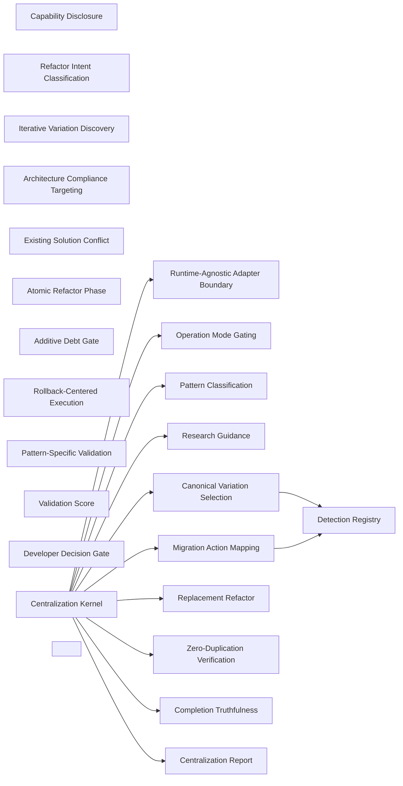

### Runtime-Agnostic Adapter Boundary

- Domain: [centralization](ALGORITHMS.md#algorithms-domain-centralization)
- Tier: [process](SCHEMA.md#vocabulary-domain-tier-process)
- Stage: [orient](REASONING.md#stage-orient)
- Axis: [ontology](REASONING.md#reasoning-axis-ontology)
- Math type: [logic](REASONING.md#reasoning-math-type-logic)
- Yields: boolean

Details

Intent
Express all workflow operations as semantic verbs, delegate runtime-specific mechanics to adapters, and prohibit repository-, shell-, framework-, model-, or path-specific logic from entering the core contract.

Invariant
Portable architecture separates intent from execution substrate.

Flow

```text
SemanticOperation → AdapterMapping → ConcreteExecution → EvidenceResult
```

Productions

```bnf
AdapterBoundary ::= <SemanticOperation> "→" <AdapterMapping> "→" <RuntimeAction> "→" <Result>
SemanticOperation ::= "DISCOVER_RESOURCES" | "READ_RESOURCE" | "SEARCH_CONTENT" | "APPLY_MIGRATION" | "VALIDATE_ARTIFACT" | "REPORT_RESULT"
AdapterMapping ::= <CapabilityStatus> "," <RuntimeConstraint> "," <FallbackPolicy>
```

Composes
none

Named in the derivation of
[Centralization Kernel](ALGORITHMS.md#algorithms-centralization-kernel)

Forces
[modularity](SCHEMA.md#force-modularity), [contract_compatibility](SCHEMA.md#force-contract-compatibility), [semantic_consistency](SCHEMA.md#force-semantic-consistency), [model_governance](SCHEMA.md#force-model-governance)

Grounds
none

Before

```text
Centralization logic hardcodes a repo path and shell command, so it runs on one setup only.
```

After

```text
semantic op{DISCOVER/READ/SEARCH/APPLY_MIGRATION/VALIDATE} → adapter maps to the runtime → core carries no repo/shell/path/model
```

How it is checked

Checked by
the zero-duplication verification, which proves no unapproved copy of the centralized pattern remains, the pattern-specific validation of each migrated occurrence

Population
Every occurrence in the detection registry

Freshness
A verdict stands until the code or the registry changes

Refusal
Completion is refused while any occurrence is neither migrated nor justified, or any old source remains

Observation
None, because centralization is verified on source

Evidence
None, because the catalog states this check as a class, so a watched run belongs to each system that adopts it

Authoritative side
The centralized pattern, which every occurrence migrates to or carries a justification against

Depends on
Not answered

Shape it refuses
Not answered

### Operation Mode Gating

- Domain: [centralization](ALGORITHMS.md#algorithms-domain-centralization)
- Tier: [process](SCHEMA.md#vocabulary-domain-tier-process)
- Stage: [constrain](REASONING.md#stage-constrain)
- Axis: [teleology](REASONING.md#reasoning-axis-teleology)
- Math type: [optimization](REASONING.md#reasoning-math-type-optimization)
- Yields: boolean | ranking

Details

Intent
Detect the requested operation mode, bind permitted capabilities, reject source mutation outside execution mode, and emit only artifacts valid for the current mode.

Invariant
Analysis, planning, execution, and validation are distinct contracts.

Flow

```text
DetectMode → BindPermissions → EnforceMutationPolicy → ExecuteModeScope → EmitModeArtifact
```

Productions

```bnf
MutationMode ::= "analysis_only" | "analysis_and_plan" | "execute_migration" | "validation_only"
ModeGate ::= <MutationMode> "→" <PermissionSet> "→" <ForbiddenActionSet> "→" <AllowedOutput>
ForbiddenActionSet ::= "NoSourceMutationUnlessExecuteMigration"
```

Composes
none

Named in the derivation of
[Centralization Kernel](ALGORITHMS.md#algorithms-centralization-kernel)

Forces
[contract_compatibility](SCHEMA.md#force-contract-compatibility), [state_transaction](SCHEMA.md#force-state-transaction), [correctness_verification](SCHEMA.md#force-correctness-verification)

Grounds
none

Before

```text
An analysis run silently migrates source; a plan run also executes.
```

After

```text
detect mode{analysis | plan | execute-migration | validation} → bind permissions → source mutation only in execute mode → mode-legal artifact
```

How it is checked

Checked by
the zero-duplication verification, which proves no unapproved copy of the centralized pattern remains, the pattern-specific validation of each migrated occurrence

Population
Every occurrence in the detection registry

Freshness
A verdict stands until the code or the registry changes

Refusal
Completion is refused while any occurrence is neither migrated nor justified, or any old source remains

Observation
None, because centralization is verified on source

Evidence
None, because the catalog states this check as a class, so a watched run belongs to each system that adopts it

Authoritative side
The centralized pattern, which every occurrence migrates to or carries a justification against

Depends on
Not answered

Shape it refuses
Not answered

### Capability Disclosure

- Domain: [centralization](ALGORITHMS.md#algorithms-domain-centralization)
- Tier: [process](SCHEMA.md#vocabulary-domain-tier-process)
- Stage: [orient](REASONING.md#stage-orient)
- Axis: [ontology](REASONING.md#reasoning-axis-ontology)
- Math type: [set-theory](REASONING.md#reasoning-math-type-set-theory)
- Yields: set | boolean

Details

Intent
Declare required capabilities, probe or emulate each capability, mark unavailable capabilities explicitly, and downgrade confidence where capability gaps affect evidence quality.

Invariant
A workflow cannot silently rely on unavailable infrastructure.

Flow

```text
RequiredCapability → Probe → Available|Unavailable|Emulated → ConfidenceImpact
```

Productions

```bnf
CapabilityModel ::= <CapabilitySet> "→" <CapabilityStatusSet> "→" <CapabilityVerdict>
CapabilityStatus ::= "available" | "unavailable" | "emulated"
CapabilityVerdict ::= "full" | "degraded" | "blocked"
```

Composes
none

Forces
[semantic_consistency](SCHEMA.md#force-semantic-consistency)

Grounds
none

Before

```text
Centralization assumes it can search and write, failing silently when it can't.
```

After

```text
required capabilities → probe/emulate → {available | unavailable | emulated} → confidence downgraded on a gap
```

How it is checked

Checked by
the zero-duplication verification, which proves no unapproved copy of the centralized pattern remains, the pattern-specific validation of each migrated occurrence

Population
Every occurrence in the detection registry

Freshness
A verdict stands until the code or the registry changes

Refusal
Completion is refused while any occurrence is neither migrated nor justified, or any old source remains

Observation
None, because centralization is verified on source

Evidence
None, because the catalog states this check as a class, so a watched run belongs to each system that adopts it

Authoritative side
The centralized pattern, which every occurrence migrates to or carries a justification against

Depends on
Not answered

Shape it refuses
Not answered

### Pattern Classification

- Domain: [centralization](ALGORITHMS.md#algorithms-domain-centralization)
- Tier: [process](SCHEMA.md#vocabulary-domain-tier-process)
- Stage: [derive](REASONING.md#stage-derive)
- Axis: [reasoning](REASONING.md#reasoning-axis-reasoning)
- Math type: [logic](REASONING.md#reasoning-math-type-logic)
- Yields: boolean

Details

Intent
Extract the target pattern description, classify it into a known centralization category, select a search strategy, select a validation strategy, and request the developer's decision only when classification remains ambiguous.

Invariant
Search must be shaped by pattern type before broad discovery begins.

Flow

```text
PatternDescription → ClassificationEvidence → PatternType → StrategySet
```

Productions

```bnf
PatternClassification ::= <PatternDescription> "→" <PatternType> "→" <SearchStrategy> "→" <ValidationStrategy>
PatternType ::= "STYLE_PATTERN" | "UTILITY" | "CONSTANT" | "CONFIGURATION" | "STRUCTURAL_CODE" | "CROSS_RESOURCE_DEPENDENCY" | "UNKNOWN"
StrategySet ::= <SearchStrategy> "," <RefactorApproach> "," <ValidationStrategy>
```

Composes
none

Composed by
[Centralization Kernel](ALGORITHMS.md#algorithms-centralization-kernel)

Named in the derivation of
[Centralization Kernel](ALGORITHMS.md#algorithms-centralization-kernel)

Forces
[semantic_consistency](SCHEMA.md#force-semantic-consistency), [runtime_extensibility](SCHEMA.md#force-runtime-extensibility), [correctness_verification](SCHEMA.md#force-correctness-verification)

Grounds
none

Before

```text
Broad discovery launched before knowing what kind of pattern it is.
```

After

```text
pattern description → type{style | utility | constant | config | structural | cross-resource} → search strategy + validation strategy
```

How it is checked

Checked by
the zero-duplication verification, which proves no unapproved copy of the centralized pattern remains, the pattern-specific validation of each migrated occurrence

Population
Every occurrence in the detection registry

Freshness
A verdict stands until the code or the registry changes

Refusal
Completion is refused while any occurrence is neither migrated nor justified, or any old source remains

Observation
None, because centralization is verified on source

Evidence
None, because the catalog states this check as a class, so a watched run belongs to each system that adopts it

Authoritative side
The centralized pattern, which every occurrence migrates to or carries a justification against

Depends on
Not answered

Shape it refuses
Not answered

### Refactor Intent Classification

- Domain: [centralization](ALGORITHMS.md#algorithms-domain-centralization)
- Tier: [process](SCHEMA.md#vocabulary-domain-tier-process)
- Stage: [derive](REASONING.md#stage-derive)
- Axis: [reasoning](REASONING.md#reasoning-axis-reasoning)
- Math type: [logic](REASONING.md#reasoning-math-type-logic)
- Yields: boolean

Details

Intent
Determine whether the scattered pattern represents a duplication problem, default multiple-occurrence problems to replacement refactor, and require explicit debt justification for additive enhancement.

Invariant
Centralization is replacement, not merely abstraction creation.

Flow

```text
OccurrenceCount + PatternIntent → RefactorType → DebtPolicy
```

Productions

```bnf
RefactorIntent ::= <DuplicationEvidence> "→" <RefactorType> "→" <DebtPolicy>
RefactorType ::= "REPLACEMENT_REFACTOR" | "ADDITIVE_ENHANCEMENT" | "CONFIGURATION_UPDATE" | "DOCUMENTATION_ONLY" | "REQUIRES_ANALYSIS"
DebtPolicy ::= "zero_duplication_required" | "explicit_retained_debt_required" | "documentation_sufficient"
```

Composes
none

Forces
[semantic_consistency](SCHEMA.md#force-semantic-consistency)

Grounds
none

Before

```text
A scattered pattern 'centralized' by adding an abstraction beside the old copies.
```

After

```text
occurrences + intent → refactor type{replacement | additive | config | doc} → replacement default; additive needs explicit debt justification
```

How it is checked

Checked by
the zero-duplication verification, which proves no unapproved copy of the centralized pattern remains, the pattern-specific validation of each migrated occurrence

Population
Every occurrence in the detection registry

Freshness
A verdict stands until the code or the registry changes

Refusal
Completion is refused while any occurrence is neither migrated nor justified, or any old source remains

Observation
None, because centralization is verified on source

Evidence
None, because the catalog states this check as a class, so a watched run belongs to each system that adopts it

Authoritative side
The centralized pattern, which every occurrence migrates to or carries a justification against

Depends on
Not answered

Shape it refuses
Not answered

### Research Guidance

- Domain: [centralization](ALGORITHMS.md#algorithms-domain-centralization)
- Tier: [process](SCHEMA.md#vocabulary-domain-tier-process)
- Stage: [see](REASONING.md#stage-see)
- Axis: [analysis](REASONING.md#reasoning-axis-analysis)
- Math type: [probability](REASONING.md#reasoning-math-type-probability)
- Yields: number[0,1]

Details

Intent
Query available external or local guidance, extract best practices and anti-patterns, score research quality, and disclose reduced confidence when current external research is unavailable.

Invariant
Architectural plans must distinguish evidence-backed guidance from local-only inference.

Flow

```text
GuidanceNeed → ExternalOrLocalResearch → ExtractPrinciples → ScoreConfidence → ReportLimitations
```

Productions

```bnf
ResearchGuidance ::= <ResearchQuerySet> "→" <SourceSet> "→" <BestPracticeSet> "→" <AntiPatternSet> "→" <ConfidenceScore>
SourceSet ::= <ExternalCurrentSources> | <LocalKnowledgeSources> | <Unavailable>
ConfidenceScore ::= <SourceCount> "+" <SourceQuality> "+" <Recency> "+" <ArchitectureAlignment>
```

Composes
none

Composed by
[Centralization Kernel](ALGORITHMS.md#algorithms-centralization-kernel)

Named in the derivation of
[Centralization Kernel](ALGORITHMS.md#algorithms-centralization-kernel)

Forces
[model_governance](SCHEMA.md#force-model-governance)

Grounds
none

Before

```text
A plan built on local inference presented as best practice.
```

After

```text
guidance need → external or local research → best practices + anti-patterns → confidence score → disclose local-only limitation
```

How it is checked

Checked by
the zero-duplication verification, which proves no unapproved copy of the centralized pattern remains, the pattern-specific validation of each migrated occurrence

Population
Every occurrence in the detection registry

Freshness
A verdict stands until the code or the registry changes

Refusal
Completion is refused while any occurrence is neither migrated nor justified, or any old source remains

Observation
None, because centralization is verified on source

Evidence
None, because the catalog states this check as a class, so a watched run belongs to each system that adopts it

Authoritative side
The centralized pattern, which every occurrence migrates to or carries a justification against

Depends on
Not answered

Shape it refuses
Not answered

### Iterative Variation Discovery

- Domain: [centralization](ALGORITHMS.md#algorithms-domain-centralization)
- Tier: [process](SCHEMA.md#vocabulary-domain-tier-process)
- Stage: [orient](REASONING.md#stage-orient)
- Axis: [ontology](REASONING.md#reasoning-axis-ontology)
- Math type: [dynamical-systems](REASONING.md#reasoning-math-type-dynamical-systems)
- Yields: boolean | counter

Details

Intent
Search for the primary pattern, inspect match context, infer variants, add new variants to the search set, and repeat until no new variations appear or the iteration cap is reached.

Invariant
Duplicates rarely appear in one exact form; centralization must discover variation families.

Flow

```text
PrimaryPattern → Search → ContextRead → VariationExtract → ExpandedSearch → FixedPoint
```

Productions

```bnf
VariationDiscovery ::= <SearchPatternSet> "→" <MatchSet> "→" <ContextSet> "→" <VariationSet> "→" <SearchPatternSet>
SearchLoop ::= <VariationDiscovery> "until" ("NoNewVariations" | "IterationCapReached")
VariationSet ::= <PrimaryVariation> | <PrimaryVariation> "," <DerivedVariationSet>
```

Composes
none

Forces
[semantic_consistency](SCHEMA.md#force-semantic-consistency), [runtime_extensibility](SCHEMA.md#force-runtime-extensibility)

Grounds
none

Before

```text
One exact form of the duplicate found; its variants missed.
```

After

```text
primary pattern → search → read context → infer variants → expand the search set → repeat until no new variations (or cap)
```

How it is checked

Checked by
the zero-duplication verification, which proves no unapproved copy of the centralized pattern remains, the pattern-specific validation of each migrated occurrence

Population
Every occurrence in the detection registry

Freshness
A verdict stands until the code or the registry changes

Refusal
Completion is refused while any occurrence is neither migrated nor justified, or any old source remains

Observation
None, because centralization is verified on source

Evidence
None, because the catalog states this check as a class, so a watched run belongs to each system that adopts it

Authoritative side
The centralized pattern, which every occurrence migrates to or carries a justification against

Depends on
Not answered

Shape it refuses
Not answered

### Detection Registry

- Domain: [centralization](ALGORITHMS.md#algorithms-domain-centralization)
- Tier: [process](SCHEMA.md#vocabulary-domain-tier-process)
- Stage: [orient](REASONING.md#stage-orient)
- Axis: [ontology](REASONING.md#reasoning-axis-ontology)
- Math type: [set-theory](REASONING.md#reasoning-math-type-set-theory)
- Yields: set | boolean

Details

Intent
For every discovered occurrence, record resource, location, local context, matched pattern, extracted value, occurrence role, variation type, and discovery iteration.

Invariant
Migration correctness depends on a complete occurrence ledger.

Flow

```text
Match → Context → OccurrenceRecord → Registry
```

Productions

```bnf
DetectionRegistry ::= <OccurrenceRecord> | <OccurrenceRecord> "," <DetectionRegistry>
OccurrenceRecord ::= <Resource> "," <Location> "," <Pattern> "," <Snippet> "," <ContextBefore> "," <ContextAfter> "," <Value> "," <OccurrenceRole> "," <VariationType> "," <Iteration>
VariationType ::= "primary" | "variant"
```

Composes
none

Composed by
[Canonical Variation Selection](ALGORITHMS.md#algorithms-canonical-variation-selection), [Migration Action Mapping](ALGORITHMS.md#algorithms-migration-action-mapping)

Forces
[runtime_extensibility](SCHEMA.md#force-runtime-extensibility), [correctness_verification](SCHEMA.md#force-correctness-verification), [architecture_evolution](SCHEMA.md#force-architecture-evolution)

Grounds
none

Before

```text
Occurrences half-tracked, so migration misses sites.
```

After

```text
each match + context → occurrence record{resource, location, matched pattern, value, role, variation type, iteration} → complete ledger
```

How it is checked

Checked by
the zero-duplication verification, which proves no unapproved copy of the centralized pattern remains, the pattern-specific validation of each migrated occurrence

Population
Every occurrence in the detection registry

Freshness
A verdict stands until the code or the registry changes

Refusal
Completion is refused while any occurrence is neither migrated nor justified, or any old source remains

Observation
None, because centralization is verified on source

Evidence
None, because the catalog states this check as a class, so a watched run belongs to each system that adopts it

Authoritative side
The centralized pattern, which every occurrence migrates to or carries a justification against

Depends on
Not answered

Shape it refuses
Not answered

### Canonical Variation Selection

- Domain: [centralization](ALGORITHMS.md#algorithms-domain-centralization)
- Tier: [process](SCHEMA.md#vocabulary-domain-tier-process)
- Stage: [intent](REASONING.md#stage-intent)
- Axis: [teleology](REASONING.md#reasoning-axis-teleology)
- Math type: [optimization](REASONING.md#reasoning-math-type-optimization)
- Yields: boolean | ranking

Details

Intent
Compare all detected variations by frequency, completeness, architectural fitness, and semantic coverage, then select the canonical implementation from evidence rather than preference.

Invariant
The centralized form must be derived from observed project semantics.

Flow

```text
DetectionRegistry → VariationMetrics → CanonicalCandidate → CanonicalVariation
```

Productions

```bnf
CanonicalSelection ::= <DetectionRegistry> "→" <VariationMetricSet> "→" <CanonicalVariation>
VariationMetricSet ::= "frequency" "," "structural_completeness" "," "semantic_coverage" "," "architecture_fit"
CanonicalVariation ::= <EvidenceDerivedImplementationForm>
```

Composes
[Detection Registry](ALGORITHMS.md#algorithms-detection-registry)

Named in the derivation of
[Centralization Kernel](ALGORITHMS.md#algorithms-centralization-kernel)

Forces
[semantic_consistency](SCHEMA.md#force-semantic-consistency)

Grounds
none

Before

```text
The centralized form chosen by preference, not by observed project semantics.
```

After

```text
detection registry → metrics{frequency, completeness, semantic coverage, architecture fit} → canonical form derived from evidence
```

How it is checked

Checked by
the zero-duplication verification, which proves no unapproved copy of the centralized pattern remains, the pattern-specific validation of each migrated occurrence

Population
Every occurrence in the detection registry

Freshness
A verdict stands until the code or the registry changes

Refusal
Completion is refused while any occurrence is neither migrated nor justified, or any old source remains

Observation
None, because centralization is verified on source

Evidence
None, because the catalog states this check as a class, so a watched run belongs to each system that adopts it

Authoritative side
The centralized pattern, which every occurrence migrates to or carries a justification against

Depends on
[Detection Registry](ALGORITHMS.md#algorithms-detection-registry)

Shape it refuses
Not answered

### Architecture Compliance Targeting

- Domain: [centralization](ALGORITHMS.md#algorithms-domain-centralization)
- Tier: [process](SCHEMA.md#vocabulary-domain-tier-process)
- Stage: [derive](REASONING.md#stage-derive)
- Axis: [reasoning](REASONING.md#reasoning-axis-reasoning)
- Math type: [logic](REASONING.md#reasoning-math-type-logic)
- Yields: boolean

Details

Intent
Load relevant architecture and validation guidance, inspect existing centralized patterns, check naming and capacity constraints, detect conflicts, and select a justified centralization target.

Invariant
A single source of truth must live in the correct architectural boundary.

Flow

```text
PatternType → ArchitectureRules → ExistingPatternScan → ConflictCheck → TargetSelection
```

Productions

```bnf
ArchitectureTargeting ::= <PatternType> "→" <GuidanceSet> "→" <ExistingCentralizationSet> "→" <ComplianceCheckSet> "→" <CentralizationTarget>
ComplianceCheckSet ::= "naming" "," "artifact_size" "," "folder_capacity" "," "dependency_direction" "," "single_responsibility"
CentralizationTarget ::= <Category> "," <LocationPolicy> "," <NamingConvention> "," <ReferenceMethod>
```

Composes
none

Forces
[modularity](SCHEMA.md#force-modularity), [semantic_consistency](SCHEMA.md#force-semantic-consistency), [correctness_verification](SCHEMA.md#force-correctness-verification)

Grounds
none

Before

```text
A single source of truth placed in the wrong architectural boundary.
```

After

```text
pattern type → guidance → existing centralized patterns → checks{naming, size, capacity, dependency direction, SRP} → justified target
```

How it is checked

Checked by
the zero-duplication verification, which proves no unapproved copy of the centralized pattern remains, the pattern-specific validation of each migrated occurrence

Population
Every occurrence in the detection registry

Freshness
A verdict stands until the code or the registry changes

Refusal
Completion is refused while any occurrence is neither migrated nor justified, or any old source remains

Observation
None, because centralization is verified on source

Evidence
None, because the catalog states this check as a class, so a watched run belongs to each system that adopts it

Authoritative side
The centralized pattern, which every occurrence migrates to or carries a justification against

Depends on
Not answered

Shape it refuses
Not answered

### Existing Solution Conflict

- Domain: [centralization](ALGORITHMS.md#algorithms-domain-centralization)
- Tier: [process](SCHEMA.md#vocabulary-domain-tier-process)
- Stage: [derive](REASONING.md#stage-derive)
- Axis: [reasoning](REASONING.md#reasoning-axis-reasoning)
- Math type: [logic](REASONING.md#reasoning-math-type-logic)
- Yields: boolean

Details

Intent
Search existing centralized locations for the same or overlapping pattern, classify whether to reuse, extend, create a distinct target, or cancel, and require the developer's decision when conflict resolution is not mechanically safe.

Invariant
Avoid creating a second source of truth while attempting centralization.

Flow

```text
ExistingPatternSearch → ConflictDetected → ResolutionOptions → Decision
```

Productions

```bnf
ConflictResolution ::= <DuplicateCheck> "→" <ConflictState> "→" <Resolution>
ConflictState ::= "none" | "overlap" | "duplicate" | "ambiguous"
Resolution ::= "reuse_existing" | "extend_existing" | "create_distinct_target" | "cancel"
```

Composes
none

Forces
[semantic_consistency](SCHEMA.md#force-semantic-consistency)

Grounds
none

Before

```text
A second source of truth created because an existing one was never searched.
```

After

```text
search existing centralized locations → conflict{none | overlap | duplicate | ambiguous} → {reuse | extend | distinct | cancel}
```

How it is checked

Checked by
the zero-duplication verification, which proves no unapproved copy of the centralized pattern remains, the pattern-specific validation of each migrated occurrence

Population
Every occurrence in the detection registry

Freshness
A verdict stands until the code or the registry changes

Refusal
Completion is refused while any occurrence is neither migrated nor justified, or any old source remains

Observation
None, because centralization is verified on source

Evidence
None, because the catalog states this check as a class, so a watched run belongs to each system that adopts it

Authoritative side
The centralized pattern, which every occurrence migrates to or carries a justification against

Depends on
Not answered

Shape it refuses
Not answered

### Migration Action Mapping

- Domain: [centralization](ALGORITHMS.md#algorithms-domain-centralization)
- Tier: [process](SCHEMA.md#vocabulary-domain-tier-process)
- Stage: [project](REASONING.md#stage-project)
- Axis: [reasoning](REASONING.md#reasoning-axis-reasoning)
- Math type: [graph](REASONING.md#reasoning-math-type-graph)
- Yields: edge-list

Details

Intent
Convert every detection-registry occurrence into an explicit migration action, including old content, replacement strategy, skip policy, and justification requirement.

Invariant
Every occurrence must be migrated or explicitly justified.

Flow

```text
DetectionRegistry → MigrationActionSet → CoverageCheck
```

Productions

```bnf
MigrationMapping ::= <DetectionRegistry> "→" <MigrationActionSet>
MigrationAction ::= <Resource> "," <Location> "," <OccurrenceRole> "," <OldContent> "," <NewContentStrategy> "," <MigrationStatus> "," <SkipJustificationPolicy>
MigrationStatus ::= "pending" | "migrated" | "skipped_with_justification"
```

Composes
[Detection Registry](ALGORITHMS.md#algorithms-detection-registry)

Named in the derivation of
[Centralization Kernel](ALGORITHMS.md#algorithms-centralization-kernel)

Forces
[runtime_extensibility](SCHEMA.md#force-runtime-extensibility), [architecture_evolution](SCHEMA.md#force-architecture-evolution)

Grounds
none

Before

```text
Some occurrences migrated, others silently left behind.
```

After

```text
detection registry → a migration action per occurrence{old content, replacement strategy, skip policy + justification} → every occurrence migrated or justified
```

How it is checked

Checked by
the zero-duplication verification, which proves no unapproved copy of the centralized pattern remains, the pattern-specific validation of each migrated occurrence

Population
Every occurrence in the detection registry

Freshness
A verdict stands until the code or the registry changes

Refusal
Completion is refused while any occurrence is neither migrated nor justified, or any old source remains

Observation
None, because centralization is verified on source

Evidence
None, because the catalog states this check as a class, so a watched run belongs to each system that adopts it

Authoritative side
The centralized pattern, which every occurrence migrates to or carries a justification against

Depends on
[Detection Registry](ALGORITHMS.md#algorithms-detection-registry)

Shape it refuses
Not answered

### Atomic Refactor Phase

- Domain: [centralization](ALGORITHMS.md#algorithms-domain-centralization)
- Tier: [process](SCHEMA.md#vocabulary-domain-tier-process)
- Stage: [project](REASONING.md#stage-project)
- Axis: [reasoning](REASONING.md#reasoning-axis-reasoning)
- Math type: [algebra](REASONING.md#reasoning-math-type-algebra)
- Yields: ordered-structure

Details

Intent
Divide the refactor into ordered phases, attach actions, attach verification criteria, attach rollback behavior, and prevent progression until the phase verification passes.

Invariant
Refactoring should advance through verified checkpoints, not broad unverified edits.

Flow

```text
Phase → Actions → Verification → Pass|Rollback → NextPhase
```

Productions

```bnf
RefactorPhase ::= <PhaseNumber> "," <PhaseName> "," <ActionSet> "," <VerificationSet> "," <RollbackStrategy>
PhaseTransition ::= <RefactorPhase> "→" ("NextPhase" | "RollbackAndStop")
VerificationSet ::= <Check> | <Check> "," <VerificationSet>
```

Composes
none

Forces
[state_transaction](SCHEMA.md#force-state-transaction), [correctness_verification](SCHEMA.md#force-correctness-verification)

Grounds
none

Before

```text
A broad unverified edit across all sites at once.
```

After

```text
phases → actions + verification + rollback per phase → no progression until the phase verification passes
```

How it is checked

Checked by
the zero-duplication verification, which proves no unapproved copy of the centralized pattern remains, the pattern-specific validation of each migrated occurrence

Population
Every occurrence in the detection registry

Freshness
A verdict stands until the code or the registry changes

Refusal
Completion is refused while any occurrence is neither migrated nor justified, or any old source remains

Observation
None, because centralization is verified on source

Evidence
None, because the catalog states this check as a class, so a watched run belongs to each system that adopts it

Authoritative side
The centralized pattern, which every occurrence migrates to or carries a justification against

Depends on
Not answered

Shape it refuses
Not answered

### Replacement Refactor

- Domain: [centralization](ALGORITHMS.md#algorithms-domain-centralization)
- Tier: [process](SCHEMA.md#vocabulary-domain-tier-process)
- Stage: [act](REASONING.md#stage-act)
- Axis: [formalization](REASONING.md#reasoning-axis-formalization)
- Math type: [computation](REASONING.md#reasoning-math-type-computation)
- Yields: procedure

Details

Intent
Create the centralized implementation, establish reference infrastructure, migrate all occurrences, delete old definitions, verify zero duplication, and run final validation.

Invariant
Zero-debt centralization requires replacement plus deletion plus verification.

Flow

```text
Centralize → Reference → Migrate → DeleteOld → VerifyZeroDuplication → Validate
```

Productions

```bnf
ReplacementRefactor ::= <CreateCentralImplementation> "→" <UpdateReferenceInfrastructure> "→" <MigrateOccurrences> "→" <DeleteOldDefinitions> "→" <ZeroDuplicationCheck> "→" <FinalValidation>
CompletionCondition ::= "all_occurrences_migrated_or_justified" "," "no_unapproved_old_patterns" "," "validation_passed"
```

Composes
none

Named in the derivation of
[Centralization Kernel](ALGORITHMS.md#algorithms-centralization-kernel)

Forces
[semantic_consistency](SCHEMA.md#force-semantic-consistency), [correctness_verification](SCHEMA.md#force-correctness-verification)

Grounds
none

Before

```text
An abstraction created but the old copies remain — two sources of truth.
```

After

```text
centralize → reference infra → migrate all → delete old definitions → verify zero duplication → final validation
```

How it is checked

Checked by
the zero-duplication verification, which proves no unapproved copy of the centralized pattern remains, the pattern-specific validation of each migrated occurrence

Population
Every occurrence in the detection registry

Freshness
A verdict stands until the code or the registry changes

Refusal
Completion is refused while any occurrence is neither migrated nor justified, or any old source remains

Observation
None, because centralization is verified on source

Evidence
None, because the catalog states this check as a class, so a watched run belongs to each system that adopts it

Authoritative side
The centralized pattern, which every occurrence migrates to or carries a justification against

Depends on
Not answered

Shape it refuses
Not answered

### Additive Debt Gate

- Domain: [centralization](ALGORITHMS.md#algorithms-domain-centralization)
- Tier: [process](SCHEMA.md#vocabulary-domain-tier-process)
- Stage: [verify](REASONING.md#stage-verify)
- Axis: [verification](REASONING.md#reasoning-axis-verification)
- Math type: [logic](REASONING.md#reasoning-math-type-logic)
- Yields: boolean

Details

Intent
When a proposed abstraction leaves old patterns in place, require explicit approval, document retained debt, define deprecation conditions, and prohibit calling the result complete centralization.

Invariant
Additive enhancement is not centralization unless debt is acknowledged and bounded.

Flow

```text
AdditivePlan → DebtDisclosure → Approval → DeprecationPlan → IncompleteOrDebtAcceptedStatus
```

Productions

```bnf
AdditiveDebtGate ::= <AdditiveEnhancement> "→" <DebtRecord> "→" <UserApproval> "→" <DeprecationPlan>
DebtRecord ::= <RetainedPatternSet> "," <Reason> "," <OwnerOrTrigger> "," <ExpirationOrReviewCondition>
CentralizationStatus ::= "not_zero_debt" | "approved_debt" | "canceled"
```

Composes
none

Forces
[semantic_consistency](SCHEMA.md#force-semantic-consistency)

Grounds
[ver-evidence](REASONING.md#reasoning-node-ver-evidence)

Before

```text
'Centralized' declared while the old patterns are still live and unowned.
```

After

```text
additive enhancement → disclose retained debt → approval → deprecation plan → never called complete centralization
```

How it is checked

Checked by
the zero-duplication verification, which proves no unapproved copy of the centralized pattern remains, the pattern-specific validation of each migrated occurrence

Population
Every occurrence in the detection registry

Freshness
A verdict stands until the code or the registry changes

Refusal
Completion is refused while any occurrence is neither migrated nor justified, or any old source remains

Observation
None, because centralization is verified on source

Evidence
None, because the catalog states this check as a class, so a watched run belongs to each system that adopts it

Authoritative side
The centralized pattern, which every occurrence migrates to or carries a justification against

Depends on
Not answered

Shape it refuses
Not answered

### Rollback-Centered Execution

- Domain: [centralization](ALGORITHMS.md#algorithms-domain-centralization)
- Tier: [process](SCHEMA.md#vocabulary-domain-tier-process)
- Stage: [act](REASONING.md#stage-act)
- Axis: [formalization](REASONING.md#reasoning-axis-formalization)
- Math type: [computation](REASONING.md#reasoning-math-type-computation)
- Yields: procedure

Details

Intent
Before each destructive or high-risk phase, create a checkpoint, execute actions, verify results, and roll back immediately on critical action or verification failure.

Invariant
Migration safety requires a recovery path at every phase boundary.

Flow

```text
Checkpoint → ExecutePhase → VerifyPhase → Commit|Rollback
```

Productions

```bnf
RollbackExecution ::= <Checkpoint> "→" <ActionExecution> "→" <Verification> "→" <PhaseOutcome>
PhaseOutcome ::= "commit_phase" | "rollback_and_halt"
RollbackTrigger ::= "action_failure" | "verification_failure" | "critical_invariant_failure"
```

Composes
none

Forces
[modularity](SCHEMA.md#force-modularity), [state_transaction](SCHEMA.md#force-state-transaction), [correctness_verification](SCHEMA.md#force-correctness-verification), [resilience_recovery](SCHEMA.md#force-resilience-recovery), [streaming_dataflow](SCHEMA.md#force-streaming-dataflow), [architecture_evolution](SCHEMA.md#force-architecture-evolution)

Grounds
none

Before

```text
A destructive migration phase runs with no recovery path.
```

After

```text
before each risky phase → checkpoint → execute → verify → commit | rollback on{action | verification | critical-invariant} failure
```

How it is checked

Checked by
the zero-duplication verification, which proves no unapproved copy of the centralized pattern remains, the pattern-specific validation of each migrated occurrence

Population
Every occurrence in the detection registry

Freshness
A verdict stands until the code or the registry changes

Refusal
Completion is refused while any occurrence is neither migrated nor justified, or any old source remains

Observation
None, because centralization is verified on source

Evidence
None, because the catalog states this check as a class, so a watched run belongs to each system that adopts it

Authoritative side
The centralized pattern, which every occurrence migrates to or carries a justification against

Depends on
Not answered

Shape it refuses
Not answered

### Pattern-Specific Validation

- Domain: [centralization](ALGORITHMS.md#algorithms-domain-centralization)
- Tier: [process](SCHEMA.md#vocabulary-domain-tier-process)
- Stage: [verify](REASONING.md#stage-verify)
- Axis: [verification](REASONING.md#reasoning-axis-verification)
- Math type: [logic](REASONING.md#reasoning-math-type-logic)
- Yields: boolean

Details

Intent
Select validation checks by pattern type, execute or mark each unavailable, verify architecture compliance, check all known variations for orphaned duplicates, and compute validation score.

Invariant
Validation must match what was centralized.

Flow

```text
PatternType → ValidationSet → ExecuteChecks → DuplicationScan → Score → Status
```

Productions

```bnf
PatternValidation ::= <PatternType> "→" <ValidationCheckSet> "→" <ValidationResultSet> "→" <RemainingIssueSet> "→" <FinalStatus>
ValidationCheckSet ::= <PrimaryValidation> "," <SecondaryValidationSet> "," <ArchitectureCompliance> "," <ZeroDuplicationCheck>
FinalStatus ::= "complete" | "incomplete"
```

Composes
none

Forces
[semantic_consistency](SCHEMA.md#force-semantic-consistency), [correctness_verification](SCHEMA.md#force-correctness-verification)

Grounds
none

Before

```text
Validation runs generic checks unrelated to what was centralized.
```

After

```text
pattern type → matched validation set → execute → scan every known variation for orphans → validation score
```

How it is checked

Checked by
the zero-duplication verification, which proves no unapproved copy of the centralized pattern remains, the pattern-specific validation of each migrated occurrence

Population
Every occurrence in the detection registry

Freshness
A verdict stands until the code or the registry changes

Refusal
Completion is refused while any occurrence is neither migrated nor justified, or any old source remains

Observation
None, because centralization is verified on source

Evidence
None, because the catalog states this check as a class, so a watched run belongs to each system that adopts it

Authoritative side
The centralized pattern, which every occurrence migrates to or carries a justification against

Depends on
Not answered

Shape it refuses
Not answered

### Zero-Duplication Verification

- Domain: [centralization](ALGORITHMS.md#algorithms-domain-centralization)
- Tier: [process](SCHEMA.md#vocabulary-domain-tier-process)
- Stage: [verify](REASONING.md#stage-verify)
- Axis: [verification](REASONING.md#reasoning-axis-verification)
- Math type: [logic](REASONING.md#reasoning-math-type-logic)
- Yields: boolean

Details

Intent
Search every known primary and variant pattern outside the approved centralized location, classify remaining matches as approved or orphaned, and require zero unapproved matches for replacement refactors.

Invariant
A single source of truth is invalid if old sources still exist.

Flow

```text
SearchPatterns → ExcludeCentralTarget → RemainingMatches → Approved?|Issue
```

Productions

```bnf
ZeroDuplication ::= <KnownVariationSet> "→" <ProjectSearch> "→" <RemainingMatchSet> "→" <DuplicationVerdict>
ProjectSearch ::= "search_all_modules_except_approved_central_location"
DuplicationVerdict ::= "zero_unapproved_duplication" | "remaining_duplicate_or_orphan"
```

Composes
none

Named in the derivation of
[Centralization Kernel](ALGORITHMS.md#algorithms-centralization-kernel)

Forces
[semantic_consistency](SCHEMA.md#force-semantic-consistency), [correctness_verification](SCHEMA.md#force-correctness-verification)

Grounds
[ver-evidence](REASONING.md#reasoning-node-ver-evidence)

Before

```text
A single source of truth declared while old sources still exist elsewhere.
```

After

```text
known primary + variant patterns → search all modules except the approved central location → zero unapproved matches required
```

How it is checked

Checked by
the zero-duplication verification, which proves no unapproved copy of the centralized pattern remains, the pattern-specific validation of each migrated occurrence

Population
Every occurrence in the detection registry

Freshness
A verdict stands until the code or the registry changes

Refusal
Completion is refused while any occurrence is neither migrated nor justified, or any old source remains

Observation
None, because centralization is verified on source

Evidence
None, because the catalog states this check as a class, so a watched run belongs to each system that adopts it

Authoritative side
The centralized pattern, which every occurrence migrates to or carries a justification against

Depends on
Not answered

Shape it refuses
Not answered

### Validation Score

- Domain: [centralization](ALGORITHMS.md#algorithms-domain-centralization)
- Tier: [process](SCHEMA.md#vocabulary-domain-tier-process)
- Stage: [verify](REASONING.md#stage-verify)
- Axis: [verification](REASONING.md#reasoning-axis-verification)
- Math type: [probability](REASONING.md#reasoning-math-type-probability)
- Yields: number[0,1]

Details

Intent
Count total validation checks, count passed checks, divide safely, and mark complete only when the score is perfect and no remaining issues exist.

Invariant
Numerical validation is useful only when combined with issue absence.

Flow

```text
Checks → PassedChecks → SafeDivide → Score → Complete|Incomplete
```

Productions

```bnf
ValidationScore ::= <TotalChecks> "," <PassedChecks> "→" <SafeDivide> "→" <ScorePercent>
CompletionRule ::= "ScorePercent == 100" "AND" "RemainingIssues == 0"
Status ::= "complete" | "incomplete"
```

Composes
none

Forces
[correctness_verification](SCHEMA.md#force-correctness-verification)

Grounds
none

Before

```text
A 90% score reported as complete while issues remain.
```

After

```text
total checks + passed → safe divide → score; complete only when score == 100 AND remaining issues == 0
```

How it is checked

Checked by
the zero-duplication verification, which proves no unapproved copy of the centralized pattern remains, the pattern-specific validation of each migrated occurrence

Population
Every occurrence in the detection registry

Freshness
A verdict stands until the code or the registry changes

Refusal
Completion is refused while any occurrence is neither migrated nor justified, or any old source remains

Observation
None, because centralization is verified on source

Evidence
None, because the catalog states this check as a class, so a watched run belongs to each system that adopts it

Authoritative side
The centralized pattern, which every occurrence migrates to or carries a justification against

Depends on
Not answered

Shape it refuses
Not answered

### Developer Decision Gate

- Domain: [centralization](ALGORITHMS.md#algorithms-domain-centralization)
- Tier: [process](SCHEMA.md#vocabulary-domain-tier-process)
- Stage: [intent](REASONING.md#stage-intent)
- Axis: [teleology](REASONING.md#reasoning-axis-teleology)
- Math type: [optimization](REASONING.md#reasoning-math-type-optimization)
- Yields: boolean | ranking

Details

Intent
Request the developer's decision before destructive, ambiguous, conflict-prone, additive-with-debt, or high-risk actions, then bind the selected decision into subsequent plan state.

Invariant
Ambiguity and risk require explicit governance.

Flow

```text
RiskCondition → DecisionOptions → DeveloperDecision → BoundPlanState
```

Productions

```bnf
DeveloperDecisionGate ::= <DecisionTrigger> "→" <OptionSet> "→" <SelectedOption> "→" <PlanUpdate>
DecisionTrigger ::= "ambiguous_classification" | "existing_solution_conflict" | "additive_debt" | "destructive_action" | "high_risk_refactor"
OptionSet ::= <Option> | <Option> "," <OptionSet>
```

Composes
none

Forces
[security_governance](SCHEMA.md#force-security-governance)

Grounds
[tel-priority](REASONING.md#reasoning-node-tel-priority)

Before

```text
A destructive or ambiguous action taken without governance.
```

After

```text
risk{ambiguous | conflict | additive-debt | destructive | high-risk} → options → developer decision → bound into plan state
```

How it is checked

Checked by
the zero-duplication verification, which proves no unapproved copy of the centralized pattern remains, the pattern-specific validation of each migrated occurrence

Population
Every occurrence in the detection registry

Freshness
A verdict stands until the code or the registry changes

Refusal
Completion is refused while any occurrence is neither migrated nor justified, or any old source remains

Observation
None, because centralization is verified on source

Evidence
None, because the catalog states this check as a class, so a watched run belongs to each system that adopts it

Authoritative side
The centralized pattern, which every occurrence migrates to or carries a justification against

Depends on
Not answered

Shape it refuses
Not answered

### Completion Truthfulness

- Domain: [centralization](ALGORITHMS.md#algorithms-domain-centralization)
- Tier: [process](SCHEMA.md#vocabulary-domain-tier-process)
- Stage: [terminate](REASONING.md#stage-terminate)
- Axis: [termination](REASONING.md#reasoning-axis-termination)
- Math type: [logic](REASONING.md#reasoning-math-type-logic)
- Yields: boolean

Details

Intent
Mark centralization complete only if all critical criteria pass, all old patterns are removed or justified, zero duplication is verified, validation evidence is recorded, and remaining issues are empty.

Invariant
Completion is a verified state, not a narrative claim.

Flow

```text
CriteriaSet → EvidenceSet → RemainingIssuesCheck → Complete|Incomplete
```

Productions

```bnf
CompletionContract ::= <CriticalCriteriaSet> "→" <EvidenceSet> "→" <RemainingIssueSet> "→" <CompletionVerdict>
CompletionVerdict ::= "centralization_complete" | "planned_only" | "incomplete" | "blocked"
CentralizationComplete ::= "single_source_of_truth_verified" "," "zero_unapproved_duplication" "," "validation_passed" "," "limitations_disclosed"
```

Composes
none

Named in the derivation of
[Centralization Kernel](ALGORITHMS.md#algorithms-centralization-kernel)

Forces
[semantic_consistency](SCHEMA.md#force-semantic-consistency), [correctness_verification](SCHEMA.md#force-correctness-verification)

Grounds
[ter-stop](REASONING.md#reasoning-node-ter-stop)

Before

```text
'Done' asserted while duplication and validation evidence are missing.
```

After

```text
critical criteria + old patterns removed/justified + zero duplication + validation evidence + no remaining issues → complete; else planned/incomplete/blocked
```

How it is checked

Checked by
the zero-duplication verification, which proves no unapproved copy of the centralized pattern remains, the pattern-specific validation of each migrated occurrence

Population
Every occurrence in the detection registry

Freshness
A verdict stands until the code or the registry changes

Refusal
Completion is refused while any occurrence is neither migrated nor justified, or any old source remains

Observation
None, because centralization is verified on source

Evidence
None, because the catalog states this check as a class, so a watched run belongs to each system that adopts it

Authoritative side
The centralized pattern, which every occurrence migrates to or carries a justification against

Depends on
Not answered

Shape it refuses
Not answered

### Centralization Report

- Domain: [centralization](ALGORITHMS.md#algorithms-domain-centralization)
- Tier: [process](SCHEMA.md#vocabulary-domain-tier-process)
- Stage: [commit](REASONING.md#stage-commit)
- Axis: [representation](REASONING.md#reasoning-axis-representation)
- Math type: [information-theory](REASONING.md#reasoning-math-type-information-theory)
- Yields: hash | novelty-score

Details

Intent
Compose a final report containing classification, research confidence, detection metrics, architecture decision, plan, execution status, validation score, remaining issues, artifact references, and unavailable capabilities.

Invariant
Reporting must preserve the evidence trail and distinguish planned work from executed work.

Flow

```text
WorkflowArtifacts → Metrics → Limitations → Status → UserReport
```

Productions

```bnf
UserReport ::= <ClassificationSummary> "," <ResearchSummary> "," <DetectionSummary> "," <ArchitectureSummary> "," <PlanSummary> "," <ExecutionSummary> "," <ValidationSummary> "," <ArtifactReferences> "," <Limitations>
ExecutionSummary ::= "executed" | "not_executed_planned_only"
```

Composes
none

Named in the derivation of
[Centralization Kernel](ALGORITHMS.md#algorithms-centralization-kernel)

Forces
[semantic_consistency](SCHEMA.md#force-semantic-consistency), [correctness_verification](SCHEMA.md#force-correctness-verification)

Grounds
none

Before

```text
A report that conflates planned work with executed work.
```

After

```text
artifacts → {classification, research confidence, detection metrics, architecture decision, plan, execution status, validation score, limitations} → planned vs executed distinguished
```

How it is checked

Checked by
the zero-duplication verification, which proves no unapproved copy of the centralized pattern remains, the pattern-specific validation of each migrated occurrence

Population
Every occurrence in the detection registry

Freshness
A verdict stands until the code or the registry changes

Refusal
Completion is refused while any occurrence is neither migrated nor justified, or any old source remains

Observation
None, because centralization is verified on source

Evidence
None, because the catalog states this check as a class, so a watched run belongs to each system that adopts it

Authoritative side
The centralized pattern, which every occurrence migrates to or carries a justification against

Depends on
Not answered

Shape it refuses
Not answered

### Centralization Kernel

- Domain: [centralization](ALGORITHMS.md#algorithms-domain-centralization)
- Tier: [process](SCHEMA.md#vocabulary-domain-tier-process)
- Math type: [computation](REASONING.md#reasoning-math-type-computation)
- Yields: procedure

Details

Intent
Initialize runtime context, classify the target pattern, gather research, discover all variations, analyze architecture, build a refactor plan, optionally execute migration, validate zero duplication, and report status.

Invariant
Centralization is a gated evidence machine that transforms scattered implementation into verified single-source-of-truth architecture.

Flow

```text
Init → Classify → Research → DetectVariations → AnalyzeArchitecture → Plan → Execute? → Validate → Report
```

Productions

```bnf
CentralizationKernel ::= <Initialization> "→" <PatternClassification> "→" <ResearchGuidance> "→" <VariationDiscovery> "→" <ArchitectureTargeting> "→" <MigrationMapping> "→" <RefactorPlan> "→" <OptionalExecution> "→" <PatternValidation> "→" <UserReport>
OptionalExecution ::= "skip_unless_execute_migration" | <RollbackExecution>
RefactorPlan ::= <RefactorPhaseSet> "," <MigrationActionSet> "," <VerificationChecklist> "," <RollbackStrategy>
```

Composes
[Pattern Classification](ALGORITHMS.md#algorithms-pattern-classification), [Research Guidance](ALGORITHMS.md#algorithms-research-guidance)

Composed by
[Canonical Config Resolution](ALGORITHMS.md#algorithms-canonical-config-resolution), [Type-Migration Centralization](ALGORITHMS.md#algorithms-type-migration-centralization)

Forces
[semantic_consistency](SCHEMA.md#force-semantic-consistency), [runtime_extensibility](SCHEMA.md#force-runtime-extensibility), [correctness_verification](SCHEMA.md#force-correctness-verification), [architecture_evolution](SCHEMA.md#force-architecture-evolution)

Principle
[Single Source of Truth](PRINCIPLES.md#architecture-single-source-of-truth)

Grounds
[derivation-loop](REASONING.md#reasoning-loop-derivation-loop)

Derivation map

orient
[Runtime-Agnostic Adapter Boundary](ALGORITHMS.md#algorithms-runtime-agnostic-adapter-boundary)

see
[Research Guidance](ALGORITHMS.md#algorithms-research-guidance)

derive
[Pattern Classification](ALGORITHMS.md#algorithms-pattern-classification)

intent
[Canonical Variation Selection](ALGORITHMS.md#algorithms-canonical-variation-selection)

constrain
[Operation Mode Gating](ALGORITHMS.md#algorithms-operation-mode-gating)

project
[Migration Action Mapping](ALGORITHMS.md#algorithms-migration-action-mapping)

act
[Replacement Refactor](ALGORITHMS.md#algorithms-replacement-refactor)

verify
[Zero-Duplication Verification](ALGORITHMS.md#algorithms-zero-duplication-verification)

commit
[Centralization Report](ALGORITHMS.md#algorithms-centralization-report)

terminate
[Completion Truthfulness](ALGORITHMS.md#algorithms-completion-truthfulness)

Before

```text
Scattered code merged by intuition, old copies left, never verified.
```

After

```text
init → classify → research → discover variations → analyze architecture → plan → optional execute → validate zero duplication → report
```

How it is checked

Checked by
the zero-duplication verification, which proves no unapproved copy of the centralized pattern remains, the pattern-specific validation of each migrated occurrence

Population
Every occurrence in the detection registry

Freshness
A verdict stands until the code or the registry changes

Refusal
Completion is refused while any occurrence is neither migrated nor justified, or any old source remains

Observation
None, because centralization is verified on source

Evidence
None, because the catalog states this check as a class, so a watched run belongs to each system that adopts it

Authoritative side
The centralized pattern, which every occurrence migrates to or carries a justification against

Depends on
[Pattern Classification](ALGORITHMS.md#algorithms-pattern-classification), [Research Guidance](ALGORITHMS.md#algorithms-research-guidance)

Shape it refuses
Not answered

### <Centralization Concern>

- Domain: [centralization](ALGORITHMS.md#algorithms-domain-centralization)
- Tier: [process](SCHEMA.md#vocabulary-domain-tier-process)
- Meta record

Details

Intent
<Detect context> → <Classify pattern> → <Discover all occurrences and variants> → <Choose canonical source> → <Map migration> → <Gate execution> → <Validate zero debt> → <Report evidence>

Invariant
Any scattered implementation pattern can be centralized only by converting every occurrence into an accounted-for migration unit and proving no unapproved duplicate remains.

Flow

```text
Context → Pattern → Registry → Canonical → Plan → ExecutionGate → Validation → Report
```

Productions

```bnf
CentralizationConcern ::= <ContextContract> "→" <PatternContract> "→" <OccurrenceRegistry> "→" <CanonicalSource> "→" <MigrationPlan> "→" <ExecutionPolicy> "→" <ZeroDebtValidation> "→" <EvidenceReport>
ZeroDebtValidation ::= "all_variants_checked" "," "old_patterns_removed_or_justified" "," "single_source_of_truth_verified"
```

Composes
none

Forces
[semantic_consistency](SCHEMA.md#force-semantic-consistency), [runtime_extensibility](SCHEMA.md#force-runtime-extensibility), [correctness_verification](SCHEMA.md#force-correctness-verification), [architecture_evolution](SCHEMA.md#force-architecture-evolution)

Grounds
none

How it is checked

Checked by
the zero-duplication verification, which proves no unapproved copy of the centralized pattern remains, the pattern-specific validation of each migrated occurrence

Population
Every occurrence in the detection registry

Freshness
A verdict stands until the code or the registry changes

Refusal
Completion is refused while any occurrence is neither migrated nor justified, or any old source remains

Observation
None, because centralization is verified on source

Evidence
None, because the catalog states this check as a class, so a watched run belongs to each system that adopts it

Authoritative side
The centralized pattern, which every occurrence migrates to or carries a justification against

Depends on
Not answered

Shape it refuses
Not answered

## Checklist creation

Every algorithm contract in this domain is listed with its position on the derivation loop, its intent and invariant, the flow it walks and its productions as a grammar. Each record also shows what it composes and is composed by, which forces and principles it answers to, what grounds it and what it grounds, and an exemplar where the record carries one. The diagram shows what composes what inside the domain.

Relations diagram

What composes what inside this domain.

```mermaid
flowchart LR
n_orientation_stage["Orientation Stage"]
n_authoritative_source_loading["Authoritative Source Loading"]
n_trust_anchor["Trust Anchor"]
n_intent_directionality_normalization["Intent & Directionality Normalization"]
n_skeptical_context_acquisition["Skeptical Context Acquisition"]
n_dynamic_discovery_pattern_generation["Dynamic Discovery Pattern Generation"]
n_teleological_intent_gate["Teleological Intent Gate"]
n_planning_stage["Planning Stage"]
n_principle_activation["Principle Activation"]
n_protocol_semantic_selection["Protocol Semantic Selection"]
n_phase_decomposition["Phase Decomposition"]
n_four_dimensional_phase_graph["Four-Dimensional Phase Graph"]
n_dependency_linearization["Dependency Linearization"]
n_severity_assignment["Severity Assignment"]
n_loop_class_labeling["Loop Class Labeling"]
n_compilation_stage["Compilation Stage"]
n_codebase_pattern_enforcement["Codebase Pattern Enforcement"]
n_verb_template_binding["Verb Template Binding"]
n_task_atomization["Task Atomization"]
n_ripple_chain_analysis["Ripple Chain Analysis"]
n_validator_coverage["Validator Coverage"]
n_structured_observability_context["Structured Observability Context"]
n_cross_cutting_surface_coverage["Cross-Cutting Surface Coverage"]
n_legacy_elimination["Legacy Elimination"]
n_hierarchical_numbering["Hierarchical Numbering"]
n_admissibility_constraint_stage["Admissibility Constraint Gate"]
n_validation_stage["Validation Stage"]
n_semantic_debt_policy["Semantic Debt Policy"]
n_evidence_based_claim_verification["Evidence-Based Claim Verification"]
n_validation_suite_battery["Validation Suite Battery"]
n_repair_stage["Repair Stage"]
n_bounded_repair_loop["Bounded Repair Loop"]
n_severity_failure_routing["Severity Failure Routing"]
n_rendering_stage["Rendering Stage"]
n_checklist_output_rendering["Checklist Output Rendering"]
n_explicit_termination["Explicit Termination"]
n_cross_stage_invariants["Cross-Stage Invariants"]
n_checklist_creation_kernel["Checklist Creation Kernel"]
n_checklist_governance_concern["<Checklist Governance Concern>"]
n_orientation_stage --> n_authoritative_source_loading
n_orientation_stage --> n_trust_anchor
n_orientation_stage --> n_intent_directionality_normalization
n_orientation_stage --> n_skeptical_context_acquisition
n_orientation_stage --> n_dynamic_discovery_pattern_generation
n_skeptical_context_acquisition --> n_dynamic_discovery_pattern_generation
n_planning_stage --> n_principle_activation
n_planning_stage --> n_protocol_semantic_selection
n_planning_stage --> n_phase_decomposition
n_planning_stage --> n_four_dimensional_phase_graph
n_planning_stage --> n_dependency_linearization
n_planning_stage --> n_severity_assignment
n_planning_stage --> n_loop_class_labeling
n_phase_decomposition --> n_four_dimensional_phase_graph
n_phase_decomposition --> n_severity_assignment
n_phase_decomposition --> n_loop_class_labeling
n_compilation_stage --> n_verb_template_binding
n_compilation_stage --> n_codebase_pattern_enforcement
n_compilation_stage --> n_task_atomization
n_compilation_stage --> n_ripple_chain_analysis
n_compilation_stage --> n_validator_coverage
n_compilation_stage --> n_structured_observability_context
n_compilation_stage --> n_cross_cutting_surface_coverage
n_compilation_stage --> n_legacy_elimination
n_compilation_stage --> n_hierarchical_numbering
n_task_atomization --> n_codebase_pattern_enforcement
n_validation_stage --> n_validation_suite_battery
n_validation_stage --> n_evidence_based_claim_verification
n_validation_stage --> n_semantic_debt_policy
n_repair_stage --> n_severity_failure_routing
n_repair_stage --> n_bounded_repair_loop
n_rendering_stage --> n_checklist_output_rendering
n_rendering_stage --> n_explicit_termination
n_checklist_creation_kernel --> n_orientation_stage
n_checklist_creation_kernel --> n_teleological_intent_gate
n_checklist_creation_kernel --> n_planning_stage
n_checklist_creation_kernel --> n_compilation_stage
n_checklist_creation_kernel --> n_admissibility_constraint_stage
n_checklist_creation_kernel --> n_validation_stage
n_checklist_creation_kernel --> n_repair_stage
n_checklist_creation_kernel --> n_rendering_stage
n_checklist_creation_kernel --> n_cross_stage_invariants
n_checklist_creation_kernel --> n_phase_decomposition
n_checklist_creation_kernel --> n_explicit_termination
```

### Orientation Stage

- Domain: [checklist-creation](ALGORITHMS.md#algorithms-domain-checklist-creation)
- Tier: [process](SCHEMA.md#vocabulary-domain-tier-process)
- Stage: [orient](REASONING.md#stage-orient)
- Axis: [ontology](REASONING.md#reasoning-axis-ontology)
- Math type: [set-theory](REASONING.md#reasoning-math-type-set-theory)
- Yields: set | boolean

Details

Intent
Establish authority, trust, intent, and change-directionality, and gather current-system evidence before any planning, emitting a context bundle that is the sole artifact the planning stage reads.

Invariant
Prior knowledge is untrusted; discover before assume; read authority before analysis; a resolved change-direction and a non-empty evidence inventory are the handoff precondition.

Flow

```text
RawTask + GoverningDocs → AuthorityLoad → ContextDiscovery → IntentNormalization → ContextBundle|RepairRoute
```

Productions

```bnf
OrientationStage ::= <RawTaskText> "," <HostGoverningDocs> "→" <AuthorityLoad> "→" <CurrentSystemDiscovery> "→" <IntentDirectionalityNormalization> "→" <ContextBundle>
ContextBundle ::= <NormalizedIntent> "," <ChangeRelation> "," <AuthoritativeSourceSet> "," <TrustAnchor> "," <PriorityStack> "," <DiscoveredArtifacts> "," <EvidenceInventory> "," <UnresolvedQuestions>
OrientationHandoff ::= "authority_loaded" "," "intent_and_change_direction_resolved" "," "evidence_inventory_non_empty" "→" "pass_to_planning" | "repair_owner_orientation"
```

Composes
[Authoritative Source Loading](ALGORITHMS.md#algorithms-authoritative-source-loading), [Trust Anchor](ALGORITHMS.md#algorithms-trust-anchor), [Intent & Directionality Normalization](ALGORITHMS.md#algorithms-intent-directionality-normalization), [Skeptical Context Acquisition](ALGORITHMS.md#algorithms-skeptical-context-acquisition), [Dynamic Discovery Pattern Generation](ALGORITHMS.md#algorithms-dynamic-discovery-pattern-generation)

Composed by
[Checklist Creation Kernel](ALGORITHMS.md#algorithms-checklist-creation-kernel)

Named in the derivation of
[Checklist Creation Kernel](ALGORITHMS.md#algorithms-checklist-creation-kernel)

Forces
[metaprogramming_modeling](SCHEMA.md#force-metaprogramming-modeling), [correctness_verification](SCHEMA.md#force-correctness-verification), [control_coordination](SCHEMA.md#force-control-coordination)

Grounds
none

Before

```text
Planning starts from the task text alone — prior model knowledge treated as current system truth.
```

After

```text
raw task + governing docs → load authority → discover current system → normalize intent + change_relation → context_bundle{evidence_inventory non-empty}
```

How it is checked

Checked by
the generator's validation stage and its validation suite, the structured-document validator over the checklist template

Population
Every phase and task the generated checklist carries

Freshness
A verdict stands until the plan, its sources or the codebase it targets change

Refusal
The generator renders no checklist while a blocker or error finding remains, and terminates blocked past its repair bound

Observation
None, because a checklist is verified before execution; its tasks name the checks that observe execution

Evidence
Watched to fire and to accept: a suite plants a retired head in a real template and validates the unplanted templates clean, while the generator's own stage is stated as a class

Authoritative side
The plan and its sources, which the checklist is derived from

Depends on
[Authoritative Source Loading](ALGORITHMS.md#algorithms-authoritative-source-loading), [Trust Anchor](ALGORITHMS.md#algorithms-trust-anchor), [Intent & Directionality Normalization](ALGORITHMS.md#algorithms-intent-directionality-normalization), [Skeptical Context Acquisition](ALGORITHMS.md#algorithms-skeptical-context-acquisition), [Dynamic Discovery Pattern Generation](ALGORITHMS.md#algorithms-dynamic-discovery-pattern-generation)

Shape it refuses
Not answered

### Authoritative Source Loading

- Domain: [checklist-creation](ALGORITHMS.md#algorithms-domain-checklist-creation)
- Tier: [process](SCHEMA.md#vocabulary-domain-tier-process)
- Stage: [orient](REASONING.md#stage-orient)
- Axis: [ontology](REASONING.md#reasoning-axis-ontology)
- Math type: [set-theory](REASONING.md#reasoning-math-type-set-theory)
- Yields: set | boolean

Details

Intent
Resolve the always-read core sources plus the conditional sources whose triggers appear in the task, read them before analysis, and block with a blocker finding if any required source is missing.

Invariant
Task decomposition is grounded in authoritative host rules read before analysis; a missing required source blocks at the orientation owner.

Flow

```text
TaskDescription → CoreSources + TriggeredSources → SourceRead → LoadedContext|BlockMissing
```

Productions

```bnf
AuthoritativeSourceLoading ::= <TaskDescription> "→" <CoreSourceSet> "," <TriggeredSourceSet> "→" <SourceReadSet> "→" <SourceValidationGate>
SourceSelection ::= "always_read_core" "," "read_conditional_source_when_trigger_present"
SourceValidationGate ::= "all_required_sources_loaded" | "blocked_missing_source"
```

Composes
none

Composed by
[Orientation Stage](ALGORITHMS.md#algorithms-orientation-stage)

Forces
[metaprogramming_modeling](SCHEMA.md#force-metaprogramming-modeling), [correctness_verification](SCHEMA.md#force-correctness-verification)

Grounds
none

Before

```text
Decomposition grounded in memory, not the host's rules; a missing source is discovered too late.
```

After

```text
task → always-read core{governance, principle-ontology} + triggered{architecture, design, component} → read before analysis → block on a missing required source
```

How it is checked

Checked by
the generator's validation stage and its validation suite, the structured-document validator over the checklist template

Population
Every phase and task the generated checklist carries

Freshness
A verdict stands until the plan, its sources or the codebase it targets change

Refusal
The generator renders no checklist while a blocker or error finding remains, and terminates blocked past its repair bound

Observation
None, because a checklist is verified before execution; its tasks name the checks that observe execution

Evidence
Watched to fire and to accept: a suite plants a retired head in a real template and validates the unplanted templates clean, while the generator's own stage is stated as a class

Authoritative side
The plan and its sources, which the checklist is derived from

Depends on
Not answered

Shape it refuses
Not answered

### Trust Anchor

- Domain: [checklist-creation](ALGORITHMS.md#algorithms-domain-checklist-creation)
- Tier: [process](SCHEMA.md#vocabulary-domain-tier-process)
- Stage: [orient](REASONING.md#stage-orient)
- Axis: [ontology](REASONING.md#reasoning-axis-ontology)
- Math type: [logic](REASONING.md#reasoning-math-type-logic)
- Yields: boolean

Details

Intent
Classify every input by trust level — source files, schema/config/data, build and validator output, tool output, and structured logs are trusted; narrative docs, comments, prior codebase knowledge, and unverified claims are untrusted and require verification before use.

Invariant
Planning reliability depends on explicit source trust; untrusted input cannot ground a task until it is verified.

Flow

```text
InputSource → TrustClassification → UsagePolicy
```

Productions

```bnf
TrustAnchor ::= <InputSourceSet> "→" <TrustedSourceSet> "," <UntrustedSourceSet> "→" <UsagePolicy>
UsagePolicy ::= "trusted_can_ground_tasks" | "untrusted_requires_verification"
```

Composes
none

Composed by
[Orientation Stage](ALGORITHMS.md#algorithms-orientation-stage)

Forces
[correctness_verification](SCHEMA.md#force-correctness-verification), [security_governance](SCHEMA.md#force-security-governance)

Grounds
none

Before

```text
Every input trusted equally — a narrative doc grounds a task the same as a build result.
```

After

```text
inputs → trusted{source files, schema/config, build/validator output, tool output} vs untrusted{narrative docs, comments, prior knowledge} → untrusted requires verification before it grounds a task
```

How it is checked

Checked by
the generator's validation stage and its validation suite, the structured-document validator over the checklist template

Population
Every phase and task the generated checklist carries

Freshness
A verdict stands until the plan, its sources or the codebase it targets change

Refusal
The generator renders no checklist while a blocker or error finding remains, and terminates blocked past its repair bound

Observation
None, because a checklist is verified before execution; its tasks name the checks that observe execution

Evidence
Watched to fire and to accept: a suite plants a retired head in a real template and validates the unplanted templates clean, while the generator's own stage is stated as a class

Authoritative side
The plan and its sources, which the checklist is derived from

Depends on
Not answered

Shape it refuses
Not answered

### Intent & Directionality Normalization

- Domain: [checklist-creation](ALGORITHMS.md#algorithms-domain-checklist-creation)
- Tier: [process](SCHEMA.md#vocabulary-domain-tier-process)
- Stage: [orient](REASONING.md#stage-orient)
- Axis: [ontology](REASONING.md#reasoning-axis-ontology)
- Math type: [logic](REASONING.md#reasoning-math-type-logic)
- Yields: boolean

Details

Intent
Normalize the task into a requested outcome, actions, and entities, and resolve the change relation — introduce, retain, remove, analyze, or mention — that later stages key their semantic policy on; an unresolved direction is recorded as ambiguity, never silently assumed.

Invariant
The change relation is explicit before planning; an unknown direction is surfaced as an unresolved question.

Flow

```text
TaskDescription → IntentExtraction → DirectionalityAnalysis → NormalizedIntent + Ambiguity
```

Productions

```bnf
IntentDirectionalityNormalization ::= <TaskDescription> "," <ExplicitConstraints> "→" <RequestedOutcome> "," <RequestedActions> "," <Entities> "→" <ChangeRelation> "," <AmbiguitySet>
ChangeRelation ::= "introduce" | "retain" | "remove" | "analyze" | "mention" | "unknown"
```

Composes
none

Composed by
[Orientation Stage](ALGORITHMS.md#algorithms-orientation-stage)

Forces
[semantic_consistency](SCHEMA.md#force-semantic-consistency), [correctness_verification](SCHEMA.md#force-correctness-verification)

Grounds
none

Before

```text
'update Foo' planned without resolving whether Foo is introduced, retained, or removed.
```

After

```text
task → outcome + actions + entities → change_relation{introduce|retain|remove|analyze|mention} → unknown direction recorded as an unresolved question, never assumed
```

How it is checked

Checked by
the generator's validation stage and its validation suite, the structured-document validator over the checklist template

Population
Every phase and task the generated checklist carries

Freshness
A verdict stands until the plan, its sources or the codebase it targets change

Refusal
The generator renders no checklist while a blocker or error finding remains, and terminates blocked past its repair bound

Observation
None, because a checklist is verified before execution; its tasks name the checks that observe execution

Evidence
Watched to fire and to accept: a suite plants a retired head in a real template and validates the unplanted templates clean, while the generator's own stage is stated as a class

Authoritative side
The plan and its sources, which the checklist is derived from

Depends on
Not answered

Shape it refuses
Not answered

### Skeptical Context Acquisition

- Domain: [checklist-creation](ALGORITHMS.md#algorithms-domain-checklist-creation)
- Tier: [process](SCHEMA.md#vocabulary-domain-tier-process)
- Stage: [orient](REASONING.md#stage-orient)
- Axis: [ontology](REASONING.md#reasoning-axis-ontology)
- Math type: [set-theory](REASONING.md#reasoning-math-type-set-theory)
- Yields: set | boolean

Details

Intent
Extract task keywords, generate discovery probes dynamically, inspect the existing implementation, and prevent new work from redefining architecture that already exists.

Invariant
Planning discovers current artifacts before making architecture assumptions.

Flow

```text
NormalizedIntent → Keywords → DiscoveryProbes → DiscoveredArtifacts + Evidence
```

Productions

```bnf
SkepticalContextAcquisition ::= <NormalizedIntent> "→" <KeywordExtraction> "→" <DiscoveryPatternGeneration> "→" <ContextDiscovery> "→" <EvidenceInventory>
KeywordExtraction ::= "technical_nouns" "," "action_verbs" "," "file_refs" "," "folders"
DiscoveredArtifacts ::= "base_classes" "," "implementations" "," "registrations" "," "migrations" "," "signatures"
```

Composes
[Dynamic Discovery Pattern Generation](ALGORITHMS.md#algorithms-dynamic-discovery-pattern-generation)

Composed by
[Orientation Stage](ALGORITHMS.md#algorithms-orientation-stage)

Forces
[runtime_extensibility](SCHEMA.md#force-runtime-extensibility), [correctness_verification](SCHEMA.md#force-correctness-verification)

Grounds
none

Before

```text
New work redefines a Foo abstraction that already exists, unseen.
```

After

```text
normalized intent → keywords → dynamic discovery probes → discovered artifacts{base classes, implementations, registrations} + evidence, before any architecture assumption
```

How it is checked

Checked by
the generator's validation stage and its validation suite, the structured-document validator over the checklist template

Population
Every phase and task the generated checklist carries

Freshness
A verdict stands until the plan, its sources or the codebase it targets change

Refusal
The generator renders no checklist while a blocker or error finding remains, and terminates blocked past its repair bound

Observation
None, because a checklist is verified before execution; its tasks name the checks that observe execution

Evidence
Watched to fire and to accept: a suite plants a retired head in a real template and validates the unplanted templates clean, while the generator's own stage is stated as a class

Authoritative side
The plan and its sources, which the checklist is derived from

Depends on
[Dynamic Discovery Pattern Generation](ALGORITHMS.md#algorithms-dynamic-discovery-pattern-generation)

Shape it refuses
Not answered

### Dynamic Discovery Pattern Generation

- Domain: [checklist-creation](ALGORITHMS.md#algorithms-domain-checklist-creation)
- Tier: [process](SCHEMA.md#vocabulary-domain-tier-process)
- Stage: [orient](REASONING.md#stage-orient)
- Axis: [ontology](REASONING.md#reasoning-axis-ontology)
- Math type: [computation](REASONING.md#reasoning-math-type-computation)
- Yields: procedure

Details

Intent
Convert extracted nouns, verbs, folders, and file references into glob, grep, and target-file probes generated from the task's own language rather than a fixed enumeration.

Invariant
Discovery probes are generated from task keywords, never from a fixed assumption list.

Flow

```text
Keywords → Globs + Greps + Targets → ProbeExecution
```

Productions

```bnf
DynamicDiscoveryPatternGeneration ::= <KeywordSet> "→" <GlobPatternSet> "," <GrepPatternSet> "," <TargetFileSet>
DiscoveryProbe ::= <ProbeTool> "," <Pattern> "," <Purpose>
ProbeTool ::= "Glob" | "Grep" | "Read"
```

Composes
none

Composed by
[Orientation Stage](ALGORITHMS.md#algorithms-orientation-stage), [Skeptical Context Acquisition](ALGORITHMS.md#algorithms-skeptical-context-acquisition)

Forces
[runtime_extensibility](SCHEMA.md#force-runtime-extensibility), [metaprogramming_modeling](SCHEMA.md#force-metaprogramming-modeling)

Grounds
none

Before

```text
Discovery runs a fixed checklist of globs, blind to the task's own nouns.
```

After

```text
keywords{nouns, verbs, folders, file-refs} → generated globs + greps + target-files from the task's own language, not a fixed enumeration
```

How it is checked

Checked by
the generator's validation stage and its validation suite, the structured-document validator over the checklist template

Population
Every phase and task the generated checklist carries

Freshness
A verdict stands until the plan, its sources or the codebase it targets change

Refusal
The generator renders no checklist while a blocker or error finding remains, and terminates blocked past its repair bound

Observation
None, because a checklist is verified before execution; its tasks name the checks that observe execution

Evidence
Watched to fire and to accept: a suite plants a retired head in a real template and validates the unplanted templates clean, while the generator's own stage is stated as a class

Authoritative side
The plan and its sources, which the checklist is derived from

Depends on
Not answered

Shape it refuses
Not answered

### Teleological Intent Gate

- Domain: [checklist-creation](ALGORITHMS.md#algorithms-domain-checklist-creation)
- Tier: [process](SCHEMA.md#vocabulary-domain-tier-process)
- Stage: [intent](REASONING.md#stage-intent)
- Axis: [teleology](REASONING.md#reasoning-axis-teleology)
- Math type: [optimization](REASONING.md#reasoning-math-type-optimization)
- Yields: boolean | ranking

Details

Intent
Resolve what the checklist is for before planning it: enumerate the admissible decomposition branches, score each by utility minus cost against the normalized intent and change relation, and gate on the highest-worth admissible branch before any seeing or deriving.

Invariant
Teleology is mandatory-always: planning never proceeds on a branch that is not the argmax(utility - cost) over admissible branches; no admissible branch routes to a blocked report, never a guess.

Flow

```text
ContextBundle → AdmissibleBranchEnumeration → UtilityCostScoring → ArgmaxSelection|Blocked
```

Productions

```bnf
TeleologicalIntentGate ::= <ContextBundle> "→" <AdmissibleBranchSet> "→" <UtilityCostScoring> "→" <SelectedBranch> | <BlockedNoAdmissibleBranch>
BranchSelection ::= "argmax_utility_minus_cost_over_admissible" | "blocked_no_admissible_branch"
```

Composes
none

Composed by
[Checklist Creation Kernel](ALGORITHMS.md#algorithms-checklist-creation-kernel)

Named in the derivation of
[Checklist Creation Kernel](ALGORITHMS.md#algorithms-checklist-creation-kernel)

Forces
[correctness_verification](SCHEMA.md#force-correctness-verification), [control_coordination](SCHEMA.md#force-control-coordination), [architecture_evolution](SCHEMA.md#force-architecture-evolution)

Grounds
[tel-priority](REASONING.md#reasoning-node-tel-priority)

Before

```text
Decomposition begins on the first approach that comes to mind — no worth comparison, so effort is spent before the objective is ranked.
```

After

```text
context_bundle → enumerate admissible decomposition branches → score utility - cost → select the argmax → WORTH_BEFORE_WORK gate before any planning
```

How it is checked

Checked by
the generator's validation stage and its validation suite, the structured-document validator over the checklist template

Population
Every phase and task the generated checklist carries

Freshness
A verdict stands until the plan, its sources or the codebase it targets change

Refusal
The generator renders no checklist while a blocker or error finding remains, and terminates blocked past its repair bound

Observation
None, because a checklist is verified before execution; its tasks name the checks that observe execution

Evidence
Watched to fire and to accept: a suite plants a retired head in a real template and validates the unplanted templates clean, while the generator's own stage is stated as a class

Authoritative side
The plan and its sources, which the checklist is derived from

Depends on
Not answered

Shape it refuses
Not answered

### Planning Stage

- Domain: [checklist-creation](ALGORITHMS.md#algorithms-domain-checklist-creation)
- Tier: [process](SCHEMA.md#vocabulary-domain-tier-process)
- Stage: [derive](REASONING.md#stage-derive)
- Axis: [reasoning](REASONING.md#reasoning-axis-reasoning)
- Math type: [logic](REASONING.md#reasoning-math-type-logic)
- Yields: boolean

Details

Intent
Activate the principles that govern the current decision surfaces, select protocols by semantic fit against the requested transition, decompose them into phases, build the four-dimensional graph, and linearize the phases by dependency.

Invariant
Order is by dependency, never by severity; every active principle binds a decision test and a validator; a protocol is never selected from a trigger word alone.

Flow

```text
ContextBundle → ActivePrinciples → SelectedProtocols → PhaseGraph → LinearizedPhases|CycleRepair
```

Productions

```bnf
PlanningStage ::= <ContextBundle> "→" <PrincipleActivation> "→" <ProtocolSemanticSelection> "→" <PhaseDecomposition> "→" <FourDPhaseGraph> "→" <DependencyLinearization>
PlanningHandoff ::= "z_graph_acyclic" "," "every_phase_has_inputs_outputs_four_axes" "," "order_topological_severity_metadata_only" "," "every_mandatory_principle_binds_a_validator" "→" "pass_to_compilation" | "repair_owner_planning"
```

Composes
[Principle Activation](ALGORITHMS.md#algorithms-principle-activation), [Protocol Semantic Selection](ALGORITHMS.md#algorithms-protocol-semantic-selection), [Phase Decomposition](ALGORITHMS.md#algorithms-phase-decomposition), [Four-Dimensional Phase Graph](ALGORITHMS.md#algorithms-four-dimensional-phase-graph), [Dependency Linearization](ALGORITHMS.md#algorithms-dependency-linearization), [Severity Assignment](ALGORITHMS.md#algorithms-severity-assignment), [Loop Class Labeling](ALGORITHMS.md#algorithms-loop-class-labeling)

Composed by
[Checklist Creation Kernel](ALGORITHMS.md#algorithms-checklist-creation-kernel)

Named in the derivation of
[Checklist Creation Kernel](ALGORITHMS.md#algorithms-checklist-creation-kernel)

Forces
[correctness_verification](SCHEMA.md#force-correctness-verification), [architecture_evolution](SCHEMA.md#force-architecture-evolution), [control_coordination](SCHEMA.md#force-control-coordination), [modularity](SCHEMA.md#force-modularity)

Grounds
none

Before

```text
Phases grouped under SPRINT: CRITICAL headers; a protocol picked from a trigger word.
```

After

```text
context_bundle → activate principles (each binds a decision-test + validator) → select protocols by semantic fit → decompose → 4D graph → linearize by dependency (severity is metadata)
```

How it is checked

Checked by
the generator's validation stage and its validation suite, the structured-document validator over the checklist template

Population
Every phase and task the generated checklist carries

Freshness
A verdict stands until the plan, its sources or the codebase it targets change

Refusal
The generator renders no checklist while a blocker or error finding remains, and terminates blocked past its repair bound

Observation
None, because a checklist is verified before execution; its tasks name the checks that observe execution

Evidence
Watched to fire and to accept: a suite plants a retired head in a real template and validates the unplanted templates clean, while the generator's own stage is stated as a class

Authoritative side
The plan and its sources, which the checklist is derived from

Depends on
[Principle Activation](ALGORITHMS.md#algorithms-principle-activation), [Protocol Semantic Selection](ALGORITHMS.md#algorithms-protocol-semantic-selection), [Phase Decomposition](ALGORITHMS.md#algorithms-phase-decomposition), [Four-Dimensional Phase Graph](ALGORITHMS.md#algorithms-four-dimensional-phase-graph), [Dependency Linearization](ALGORITHMS.md#algorithms-dependency-linearization), [Severity Assignment](ALGORITHMS.md#algorithms-severity-assignment), [Loop Class Labeling](ALGORITHMS.md#algorithms-loop-class-labeling)

Shape it refuses
Not answered

### Principle Activation

- Domain: [checklist-creation](ALGORITHMS.md#algorithms-domain-checklist-creation)
- Tier: [process](SCHEMA.md#vocabulary-domain-tier-process)
- Stage: [derive](REASONING.md#stage-derive)
- Axis: [reasoning](REASONING.md#reasoning-axis-reasoning)
- Math type: [logic](REASONING.md#reasoning-math-type-logic)
- Yields: boolean

Details

Intent
Test each principle in the ontology catalog against the current decision surfaces, mark it applies, uncertain, or not-applicable with a reason, and bind every applied principle to a decision test, a validator, and a severity that later routes its repair.

Invariant
A principle is activated only with an explicit applicability decision and a bound validator; a label alone is never proof that local reasoning occurred.

Flow

```text
ContextBundle → DecisionSurfaces → PrincipleFit → ActivePrincipleSet
```

Productions

```bnf
PrincipleActivation ::= <DecisionSurfaceSet> "→" <PrincipleCatalogTest> "→" <ApplicabilityDisposition> "," <ValidatorBinding> "," <Severity>
ApplicabilityDisposition ::= "applies" | "uncertain" | "not_applicable"
Severity ::= "mandatory" | "recommended" | "contextual" | "discouraged"
```

Composes
none

Composed by
[Planning Stage](ALGORITHMS.md#algorithms-planning-stage)

Forces
[correctness_verification](SCHEMA.md#force-correctness-verification), [architecture_evolution](SCHEMA.md#force-architecture-evolution), [contract_compatibility](SCHEMA.md#force-contract-compatibility)

Grounds
none

Before

```text
'SRP applies' asserted as a label, with no decision-test and nothing that enforces it.
```

After

```text
decision surfaces → test each principle{applies|uncertain|not-applicable + reason} → bind validator + severity → a label alone is never proof reasoning occurred
```

How it is checked

Checked by
the generator's validation stage and its validation suite, the structured-document validator over the checklist template

Population
Every phase and task the generated checklist carries

Freshness
A verdict stands until the plan, its sources or the codebase it targets change

Refusal
The generator renders no checklist while a blocker or error finding remains, and terminates blocked past its repair bound

Observation
None, because a checklist is verified before execution; its tasks name the checks that observe execution

Evidence
Watched to fire and to accept: a suite plants a retired head in a real template and validates the unplanted templates clean, while the generator's own stage is stated as a class

Authoritative side
The plan and its sources, which the checklist is derived from

Depends on
Not answered

Shape it refuses
Not answered

### Protocol Semantic Selection

- Domain: [checklist-creation](ALGORITHMS.md#algorithms-domain-checklist-creation)
- Tier: [process](SCHEMA.md#vocabulary-domain-tier-process)
- Stage: [derive](REASONING.md#stage-derive)
- Axis: [reasoning](REASONING.md#reasoning-axis-reasoning)
- Math type: [logic](REASONING.md#reasoning-math-type-logic)
- Yields: boolean

Details

Intent
Match the requested state transition and architecture surfaces semantically against the protocol library, select every protocol whose use-condition fits, and always inject the mandatory verification protocol.

Invariant
Protocols are selected by semantic fit against the requested transition, never from a trigger word; the verification protocol is always included.

Flow

```text
ContextBundle + ActivePrinciples → SemanticMatch → SelectedProtocols → VerificationInjected
```

Productions

```bnf
ProtocolSemanticSelection ::= <RequestedTransition> "," <ArchitectureSurfaceSet> "," <ActivePrincipleSet> "→" <SemanticFitMatch> "→" <SelectedProtocolSet> "→" <MandatoryVerificationInjection>
Protocol ::= "module-separation" | "extension-no-modify" | "dependency-inversion" | "intention-emission" | "invariant-inheritance" | "registry-resolution" | "security-hardening" | "performance-eng" | "infra-provisioning" | "resilience-recovery" | "replacement-elim" | "enforcement-authoring" | "verification-gate"
```

Composes
none

Composed by
[Planning Stage](ALGORITHMS.md#algorithms-planning-stage)

Forces
[correctness_verification](SCHEMA.md#force-correctness-verification), [semantic_consistency](SCHEMA.md#force-semantic-consistency), [runtime_extensibility](SCHEMA.md#force-runtime-extensibility)

Grounds
none

Before

```text
The word 'secure' in the task auto-selects the security protocol.
```

After

```text
requested transition + surfaces → semantic-fit match against the protocol library → selected set → the mandatory verification protocol always injected
```

How it is checked

Checked by
the generator's validation stage and its validation suite, the structured-document validator over the checklist template

Population
Every phase and task the generated checklist carries

Freshness
A verdict stands until the plan, its sources or the codebase it targets change

Refusal
The generator renders no checklist while a blocker or error finding remains, and terminates blocked past its repair bound

Observation
None, because a checklist is verified before execution; its tasks name the checks that observe execution

Evidence
Watched to fire and to accept: a suite plants a retired head in a real template and validates the unplanted templates clean, while the generator's own stage is stated as a class

Authoritative side
The plan and its sources, which the checklist is derived from

Depends on
Not answered

Shape it refuses
Not answered

### Phase Decomposition

- Domain: [checklist-creation](ALGORITHMS.md#algorithms-domain-checklist-creation)
- Tier: [process](SCHEMA.md#vocabulary-domain-tier-process)
- Stage: [project](REASONING.md#stage-project)
- Axis: [reasoning](REASONING.md#reasoning-axis-reasoning)
- Math type: [graph](REASONING.md#reasoning-math-type-graph)
- Yields: edge-list

Details

Intent
Expand each selected protocol's verb chain into phases, and annotate every phase with an id, verb, objective, preconditions, inputs, outputs, affected artifacts, local principles, severity, loop class, and a four-dimensional graph.

Invariant
A phase is a protocol step enriched with inputs, outputs, validation, severity, and dependency metadata, ordered by dependency and never by severity.

Flow

```text
SelectedProtocols → VerbChains → PhaseSet → AnnotatedPhases
```

Productions

```bnf
PhaseDecomposition ::= <SelectedProtocolSet> "→" <VerbChainSet> "→" <PhaseSet> "→" <PhaseAnnotationSet>
PhaseAnnotation ::= "id" "," "verb" "," "objective" "," "inputs" "," "outputs" "," "affected_artifacts" "," "principles" "," "severity" "," "loop_class" "," "graph_4d"
```

Composes
[Four-Dimensional Phase Graph](ALGORITHMS.md#algorithms-four-dimensional-phase-graph), [Severity Assignment](ALGORITHMS.md#algorithms-severity-assignment), [Loop Class Labeling](ALGORITHMS.md#algorithms-loop-class-labeling)

Composed by
[Planning Stage](ALGORITHMS.md#algorithms-planning-stage)

Named in the derivation of
[Checklist Creation Kernel](ALGORITHMS.md#algorithms-checklist-creation-kernel)

Forces
[correctness_verification](SCHEMA.md#force-correctness-verification), [metaprogramming_modeling](SCHEMA.md#force-metaprogramming-modeling), [control_coordination](SCHEMA.md#force-control-coordination), [architecture_evolution](SCHEMA.md#force-architecture-evolution)

Grounds
none

Before

```text
A protocol's steps emitted as a flat task list with no inputs, outputs, or dependency metadata.
```

After

```text
selected protocols → verb chains → phases annotated{id, verb, objective, inputs, outputs, principles, severity, loop_class, 4D graph}
```

How it is checked

Checked by
the generator's validation stage and its validation suite, the structured-document validator over the checklist template

Population
Every phase and task the generated checklist carries

Freshness
A verdict stands until the plan, its sources or the codebase it targets change

Refusal
The generator renders no checklist while a blocker or error finding remains, and terminates blocked past its repair bound

Observation
None, because a checklist is verified before execution; its tasks name the checks that observe execution

Evidence
Watched to fire and to accept: a suite plants a retired head in a real template and validates the unplanted templates clean, while the generator's own stage is stated as a class

Authoritative side
The plan and its sources, which the checklist is derived from

Depends on
[Four-Dimensional Phase Graph](ALGORITHMS.md#algorithms-four-dimensional-phase-graph), [Severity Assignment](ALGORITHMS.md#algorithms-severity-assignment), [Loop Class Labeling](ALGORITHMS.md#algorithms-loop-class-labeling)

Shape it refuses
Not answered

### Four-Dimensional Phase Graph

- Domain: [checklist-creation](ALGORITHMS.md#algorithms-domain-checklist-creation)
- Tier: [process](SCHEMA.md#vocabulary-domain-tier-process)
- Stage: [project](REASONING.md#stage-project)
- Axis: [reasoning](REASONING.md#reasoning-axis-reasoning)
- Math type: [graph](REASONING.md#reasoning-math-type-graph)
- Yields: edge-list

Details

Intent
For every phase, model the sequential dependency axis, the lateral independent-peer axis, the diagonal shared-data axis, and the propagation axis carrying superseded state, propagated contracts, and what breaks if the edge is omitted.

Invariant
A phase exposes not only order but ripple; an empty propagation axis carries explicit no-downstream-consumer evidence.

Flow

```text
Phase → Z + X + Y + W Graph
```

Productions

```bnf
FourDPhaseGraph ::= <Phase> "→" <SequentialAxis> "," <LateralAxis> "," <DiagonalAxis> "," <PropagationAxis>
SequentialAxis ::= "Z: prior_required_phases"
LateralAxis ::= "X: independent_peer_phases"
DiagonalAxis ::= "Y: shared_data_or_output_relationships"
PropagationAxis ::= "W: superseded_state, propagated_contracts, breaks_if_omitted"
```

Composes
none

Composed by
[Planning Stage](ALGORITHMS.md#algorithms-planning-stage), [Phase Decomposition](ALGORITHMS.md#algorithms-phase-decomposition)

Forces
[contract_compatibility](SCHEMA.md#force-contract-compatibility), [model_governance](SCHEMA.md#force-model-governance), [control_coordination](SCHEMA.md#force-control-coordination), [architecture_evolution](SCHEMA.md#force-architecture-evolution)

Grounds
none

Before

```text
A phase records only its order — its downstream ripple is invisible.
```

After

```text
phase → Z{prior required phases} + X{independent peers} + Y{shared-data} + W{superseded state, propagated contracts, breaks-if-omitted}; empty W carries no-consumer evidence
```

How it is checked

Checked by
the generator's validation stage and its validation suite, the structured-document validator over the checklist template

Population
Every phase and task the generated checklist carries

Freshness
A verdict stands until the plan, its sources or the codebase it targets change

Refusal
The generator renders no checklist while a blocker or error finding remains, and terminates blocked past its repair bound

Observation
None, because a checklist is verified before execution; its tasks name the checks that observe execution

Evidence
Watched to fire and to accept: a suite plants a retired head in a real template and validates the unplanted templates clean, while the generator's own stage is stated as a class

Authoritative side
The plan and its sources, which the checklist is derived from

Depends on
Not answered

Shape it refuses
Not answered

### Dependency Linearization

- Domain: [checklist-creation](ALGORITHMS.md#algorithms-domain-checklist-creation)
- Tier: [process](SCHEMA.md#vocabulary-domain-tier-process)
- Stage: [project](REASONING.md#stage-project)
- Axis: [reasoning](REASONING.md#reasoning-axis-reasoning)
- Math type: [graph](REASONING.md#reasoning-math-type-graph)
- Yields: edge-list

Details

Intent
Detect cycles in the sequential Z-graph, block if any exist, and otherwise order the phases in topological Z-order with a stable tie-breaker so execution order is fixed by dependency alone.

Invariant
Phases are linearized by topological dependency order; severity never controls order; a cycle blocks and routes to planning repair.

Flow

```text
PhaseGraph → CycleCheck → TopologicalOrder|BlockedCycle
```

Productions

```bnf
DependencyLinearization ::= <PhaseGraph> "→" <CycleDetection> "→" <TopologicalOrder> | <BlockedCycleSet>
LinearizationResult ::= "pass_topological_order" | "blocked_cycle"
```

Composes
none

Composed by
[Planning Stage](ALGORITHMS.md#algorithms-planning-stage)

Forces
[causality_ordering](SCHEMA.md#force-causality-ordering), [control_coordination](SCHEMA.md#force-control-coordination), [correctness_verification](SCHEMA.md#force-correctness-verification)

Grounds
none

Before

```text
Phases ordered by priority label; a hidden cycle ships undetected.
```

After

```text
phase graph → detect Z-cycles (block on any) → topological Z-order with a stable tie-breaker; severity never controls order
```

How it is checked

Checked by
the generator's validation stage and its validation suite, the structured-document validator over the checklist template

Population
Every phase and task the generated checklist carries

Freshness
A verdict stands until the plan, its sources or the codebase it targets change

Refusal
The generator renders no checklist while a blocker or error finding remains, and terminates blocked past its repair bound

Observation
None, because a checklist is verified before execution; its tasks name the checks that observe execution

Evidence
Watched to fire and to accept: a suite plants a retired head in a real template and validates the unplanted templates clean, while the generator's own stage is stated as a class

Authoritative side
The plan and its sources, which the checklist is derived from

Depends on
Not answered

Shape it refuses
Not answered

### Severity Assignment

- Domain: [checklist-creation](ALGORITHMS.md#algorithms-domain-checklist-creation)
- Tier: [process](SCHEMA.md#vocabulary-domain-tier-process)
- Stage: [project](REASONING.md#stage-project)
- Axis: [reasoning](REASONING.md#reasoning-axis-reasoning)
- Math type: [optimization](REASONING.md#reasoning-math-type-optimization)
- Yields: boolean | ranking

Details

Intent
Derive each phase's severity from the worst severity of its governing principles; severity is per-phase metadata that selects the repair route, while execution order stays linear by dependency.

Invariant
Severity reflects principle risk and is metadata that routes failure; it is never a grouping or ordering axis.

Flow

```text
Phase → LocalPrinciples → WorstSeverity
```

Productions

```bnf
SeverityAssignment ::= <Phase> "→" <LocalPrincipleSet> "→" <WorstSeverityResolution> "→" <Severity>
```

Composes
none

Composed by
[Planning Stage](ALGORITHMS.md#algorithms-planning-stage), [Phase Decomposition](ALGORITHMS.md#algorithms-phase-decomposition)

Forces
[control_coordination](SCHEMA.md#force-control-coordination), [architecture_evolution](SCHEMA.md#force-architecture-evolution)

Grounds
[tel-priority](REASONING.md#reasoning-node-tel-priority)

Before

```text
Severity used as a section header that groups the phases.
```

After

```text
phase → worst severity of its governing principles → per-phase metadata that routes the repair, never a grouping or ordering axis
```

How it is checked

Checked by
the generator's validation stage and its validation suite, the structured-document validator over the checklist template

Population
Every phase and task the generated checklist carries

Freshness
A verdict stands until the plan, its sources or the codebase it targets change

Refusal
The generator renders no checklist while a blocker or error finding remains, and terminates blocked past its repair bound

Observation
None, because a checklist is verified before execution; its tasks name the checks that observe execution

Evidence
Watched to fire and to accept: a suite plants a retired head in a real template and validates the unplanted templates clean, while the generator's own stage is stated as a class

Authoritative side
The plan and its sources, which the checklist is derived from

Depends on
Not answered

Shape it refuses
Not answered

### Loop Class Labeling

- Domain: [checklist-creation](ALGORITHMS.md#algorithms-domain-checklist-creation)
- Tier: [process](SCHEMA.md#vocabulary-domain-tier-process)
- Stage: [project](REASONING.md#stage-project)
- Axis: [reasoning](REASONING.md#reasoning-axis-reasoning)
- Math type: [logic](REASONING.md#reasoning-math-type-logic)
- Yields: boolean

Details

Intent
Classify each phase by its verb into a construction, perceptual, cognitive, executive, or linking loop class so the phase's cognitive role is explicit.

Invariant
Every phase carries an explicit cognitive loop class derived from its verb.

Flow

```text
Verb → LoopClass → LoopPattern
```

Productions

```bnf
LoopClassLabeling ::= <Verb> "→" <LoopClass> "→" <LoopPattern>
LoopClass ::= "Construction" | "Perceptual" | "Cognitive" | "Executive" | "Linking"
```

Composes
none

Composed by
[Planning Stage](ALGORITHMS.md#algorithms-planning-stage), [Phase Decomposition](ALGORITHMS.md#algorithms-phase-decomposition)

Forces
[control_coordination](SCHEMA.md#force-control-coordination)

Grounds
none

Before

```text
A phase's cognitive role is implicit in its verb.
```

After

```text
verb → loop class{Construction|Perceptual|Cognitive|Executive|Linking} → the phase's cognitive role made explicit
```

How it is checked

Checked by
the generator's validation stage and its validation suite, the structured-document validator over the checklist template

Population
Every phase and task the generated checklist carries

Freshness
A verdict stands until the plan, its sources or the codebase it targets change

Refusal
The generator renders no checklist while a blocker or error finding remains, and terminates blocked past its repair bound

Observation
None, because a checklist is verified before execution; its tasks name the checks that observe execution

Evidence
Watched to fire and to accept: a suite plants a retired head in a real template and validates the unplanted templates clean, while the generator's own stage is stated as a class

Authoritative side
The plan and its sources, which the checklist is derived from

Depends on
Not answered

Shape it refuses
Not answered

### Compilation Stage

- Domain: [checklist-creation](ALGORITHMS.md#algorithms-domain-checklist-creation)
- Tier: [process](SCHEMA.md#vocabulary-domain-tier-process)
- Stage: [act](REASONING.md#stage-act)
- Axis: [formalization](REASONING.md#reasoning-axis-formalization)
- Math type: [computation](REASONING.md#reasoning-math-type-computation)
- Yields: procedure

Details

Intent
Compile each phase into atomic, target-specific tasks under binding codebase-pattern execution constraints, attach a full nine-dimension named ripple chain to every task, and number the hierarchy N.N.N.

Invariant
Every emitted task is atomic and target-specific with an evidence contract, and carries all nine ripple dimensions expressed as names, never counts.

Flow

```text
PhaseRecords → TaskTemplates + PatternConstraints → AtomicTasks → RippleChains + Numbering
```

Productions

```bnf
CompilationStage ::= <PhaseRecordSet> "→" <VerbTemplateBinding> "," <CodebasePatternEnforcement> "→" <TaskAtomization> "→" <RippleChainAnalysis> "→" <HierarchicalNumbering>
CompilationHandoff ::= "every_task_atomic_and_target_specific" "," "every_task_has_evidence_contract" "," "nine_ripple_dimensions_with_names" "→" "pass_to_validation" | "repair_owner_compilation"
```

Composes
[Verb Template Binding](ALGORITHMS.md#algorithms-verb-template-binding), [Codebase Pattern Enforcement](ALGORITHMS.md#algorithms-codebase-pattern-enforcement), [Task Atomization](ALGORITHMS.md#algorithms-task-atomization), [Ripple Chain Analysis](ALGORITHMS.md#algorithms-ripple-chain-analysis), [Validator Coverage](ALGORITHMS.md#algorithms-validator-coverage), [Structured Observability Context](ALGORITHMS.md#algorithms-structured-observability-context), [Cross-Cutting Surface Coverage](ALGORITHMS.md#algorithms-cross-cutting-surface-coverage), [Legacy Elimination](ALGORITHMS.md#algorithms-legacy-elimination), [Hierarchical Numbering](ALGORITHMS.md#algorithms-hierarchical-numbering)

Composed by
[Checklist Creation Kernel](ALGORITHMS.md#algorithms-checklist-creation-kernel)

Named in the derivation of
[Checklist Creation Kernel](ALGORITHMS.md#algorithms-checklist-creation-kernel)

Forces
[correctness_verification](SCHEMA.md#force-correctness-verification), [control_coordination](SCHEMA.md#force-control-coordination), [architecture_evolution](SCHEMA.md#force-architecture-evolution), [object_creation](SCHEMA.md#force-object-creation)

Grounds
none

Before

```text
Phases emitted as vague tasks with count-only ripple ('touches 3 consumers').
```

After

```text
phase records → bind verb templates + codebase-pattern constraints → atomize → attach 9-dimension named ripple chain → number N.N.N
```

How it is checked

Checked by
the generator's validation stage and its validation suite, the structured-document validator over the checklist template

Population
Every phase and task the generated checklist carries

Freshness
A verdict stands until the plan, its sources or the codebase it targets change

Refusal
The generator renders no checklist while a blocker or error finding remains, and terminates blocked past its repair bound

Observation
None, because a checklist is verified before execution; its tasks name the checks that observe execution

Evidence
Watched to fire and to accept: a suite plants a retired head in a real template and validates the unplanted templates clean, while the generator's own stage is stated as a class

Authoritative side
The plan and its sources, which the checklist is derived from

Depends on
[Verb Template Binding](ALGORITHMS.md#algorithms-verb-template-binding), [Codebase Pattern Enforcement](ALGORITHMS.md#algorithms-codebase-pattern-enforcement), [Task Atomization](ALGORITHMS.md#algorithms-task-atomization), [Ripple Chain Analysis](ALGORITHMS.md#algorithms-ripple-chain-analysis), [Validator Coverage](ALGORITHMS.md#algorithms-validator-coverage), [Structured Observability Context](ALGORITHMS.md#algorithms-structured-observability-context), [Cross-Cutting Surface Coverage](ALGORITHMS.md#algorithms-cross-cutting-surface-coverage), [Legacy Elimination](ALGORITHMS.md#algorithms-legacy-elimination), [Hierarchical Numbering](ALGORITHMS.md#algorithms-hierarchical-numbering)

Shape it refuses
Not answered

### Codebase Pattern Enforcement

- Domain: [checklist-creation](ALGORITHMS.md#algorithms-domain-checklist-creation)
- Tier: [process](SCHEMA.md#vocabulary-domain-tier-process)
- Stage: [act](REASONING.md#stage-act)
- Axis: [formalization](REASONING.md#reasoning-axis-formalization)
- Math type: [logic](REASONING.md#reasoning-math-type-logic)
- Yields: boolean

Details

Intent
Bind every emitted step to the required architecture pattern for its concern — factory construction, dependency injection, registry discovery, event emission, ports and adapters, contract-first boundaries, encapsulation, structured observability, bounded complexity, secrets management, input validation, least privilege, config externalization, fail-fast, legacy elimination, and enforcement authoring — rewriting each forbidden form into its required form.

Invariant
Codebase patterns are binding execution constraints; a forbidden form is rewritten to its required form before the task is emitted.

Flow

```text
Task → PatternViolationScan → RequiredRewrite → CompliantTask
```

Productions

```bnf
CodebasePatternEnforcement ::= <Task> "→" <ForbiddenPatternSet> "→" <ViolationSet> "→" <CompliantRewrite>
PatternDomain ::= "factory_creation" | "dependency_injection" | "registry_discovery" | "event_emission" | "ports_adapters" | "contract_first" | "encapsulation" | "structured_observability" | "bounded_complexity" | "secrets_management" | "input_validation" | "least_privilege" | "config_externalization" | "fail_fast" | "legacy_elimination" | "enforcement_rule"
```

Composes
none

Composed by
[Compilation Stage](ALGORITHMS.md#algorithms-compilation-stage), [Task Atomization](ALGORITHMS.md#algorithms-task-atomization)

Forces
[architecture_evolution](SCHEMA.md#force-architecture-evolution), [object_creation](SCHEMA.md#force-object-creation), [correctness_verification](SCHEMA.md#force-correctness-verification)

Grounds
none

Before

```text
A task says 'construct Foo' with no required pattern — direct instantiation slips through.
```

After

```text
task → scan forbidden forms → rewrite each to its required form{factory, DI, registry, events, ports, contract-first, fail-fast, secrets} before emit
```

How it is checked

Checked by
the generator's validation stage and its validation suite, the structured-document validator over the checklist template

Population
Every phase and task the generated checklist carries

Freshness
A verdict stands until the plan, its sources or the codebase it targets change

Refusal
The generator renders no checklist while a blocker or error finding remains, and terminates blocked past its repair bound

Observation
None, because a checklist is verified before execution; its tasks name the checks that observe execution

Evidence
Watched to fire and to accept: a suite plants a retired head in a real template and validates the unplanted templates clean, while the generator's own stage is stated as a class

Authoritative side
The plan and its sources, which the checklist is derived from

Depends on
Not answered

Shape it refuses
Not answered

### Verb Template Binding

- Domain: [checklist-creation](ALGORITHMS.md#algorithms-domain-checklist-creation)
- Tier: [process](SCHEMA.md#vocabulary-domain-tier-process)
- Stage: [act](REASONING.md#stage-act)
- Axis: [formalization](REASONING.md#reasoning-axis-formalization)
- Math type: [computation](REASONING.md#reasoning-math-type-computation)
- Yields: procedure

Details

Intent
Map each execution verb to a task pattern, a tool set, and a blocking validation command, so a verb becomes a checklist task only through a validated template.

Invariant
An execution verb becomes a task only through a template that binds its tools and a blocking validation command.

Flow

```text
Verb → TaskPattern → Tools → ValidationCommand
```

Productions

```bnf
VerbTemplateBinding ::= <Verb> "→" <TaskPattern> "," <ToolSet> "," <ValidationCommand>
Verb ::= "ANALYZE" | "FIND" | "EXTRACT" | "CREATE" | "VERIFY" | "FILTER" | "EXECUTE" | "WRITE" | "READ" | "LINK" | "ITERATE"
```

Composes
none

Composed by
[Compilation Stage](ALGORITHMS.md#algorithms-compilation-stage)

Forces
[correctness_verification](SCHEMA.md#force-correctness-verification), [metaprogramming_modeling](SCHEMA.md#force-metaprogramming-modeling), [control_coordination](SCHEMA.md#force-control-coordination)

Grounds
none

Before

```text
'CREATE Foo' becomes a task with no tools and no way to validate it.
```

After

```text
verb → task pattern + tool set + blocking validation command → a verb becomes a task only through a validated template
```

How it is checked

Checked by
the generator's validation stage and its validation suite, the structured-document validator over the checklist template

Population
Every phase and task the generated checklist carries

Freshness
A verdict stands until the plan, its sources or the codebase it targets change

Refusal
The generator renders no checklist while a blocker or error finding remains, and terminates blocked past its repair bound

Observation
None, because a checklist is verified before execution; its tasks name the checks that observe execution

Evidence
Watched to fire and to accept: a suite plants a retired head in a real template and validates the unplanted templates clean, while the generator's own stage is stated as a class

Authoritative side
The plan and its sources, which the checklist is derived from

Depends on
Not answered

Shape it refuses
Not answered

### Task Atomization

- Domain: [checklist-creation](ALGORITHMS.md#algorithms-domain-checklist-creation)
- Tier: [process](SCHEMA.md#vocabulary-domain-tier-process)
- Stage: [act](REASONING.md#stage-act)
- Axis: [formalization](REASONING.md#reasoning-axis-formalization)
- Math type: [computation](REASONING.md#reasoning-math-type-computation)
- Yields: procedure

Details

Intent
Extract atomic, target-specific actions from each phase group, gate every action through the codebase-pattern constraints, and attach an evidence contract, local principle checks, a validation method, and a done-condition to each.

Invariant
A task is small enough to execute and strict enough to validate, carrying its own evidence contract and done-condition.

Flow

```text
Phase → TaskGroups → AtomicActions + Gates → AtomicTasks
```

Productions

```bnf
TaskAtomization ::= <Phase> "→" <TaskGroupSet> "→" <AtomicActionSet> "→" <CodebasePatternEnforcement> "→" <AtomicTaskSet>
AtomicTask ::= <Action> "," <Target> "," <ExpectedEvidence> "," <ValidationMethod> "," <DoneCondition>
```

Composes
[Codebase Pattern Enforcement](ALGORITHMS.md#algorithms-codebase-pattern-enforcement)

Composed by
[Compilation Stage](ALGORITHMS.md#algorithms-compilation-stage)

Forces
[correctness_verification](SCHEMA.md#force-correctness-verification), [control_coordination](SCHEMA.md#force-control-coordination), [modularity](SCHEMA.md#force-modularity)

Grounds
none

Before

```text
One coarse task 'refactor the Foo module' — too big to execute or validate.
```

After

```text
phase → task groups → atomic actions (gated by codebase patterns) → each carries an evidence contract + validation method + done-condition
```

How it is checked

Checked by
the generator's validation stage and its validation suite, the structured-document validator over the checklist template

Population
Every phase and task the generated checklist carries

Freshness
A verdict stands until the plan, its sources or the codebase it targets change

Refusal
The generator renders no checklist while a blocker or error finding remains, and terminates blocked past its repair bound

Observation
None, because a checklist is verified before execution; its tasks name the checks that observe execution

Evidence
Watched to fire and to accept: a suite plants a retired head in a real template and validates the unplanted templates clean, while the generator's own stage is stated as a class

Authoritative side
The plan and its sources, which the checklist is derived from

Depends on
[Codebase Pattern Enforcement](ALGORITHMS.md#algorithms-codebase-pattern-enforcement)

Shape it refuses
Not answered

### Ripple Chain Analysis

- Domain: [checklist-creation](ALGORITHMS.md#algorithms-domain-checklist-creation)
- Tier: [process](SCHEMA.md#vocabulary-domain-tier-process)
- Stage: [act](REASONING.md#stage-act)
- Axis: [formalization](REASONING.md#reasoning-axis-formalization)
- Math type: [graph](REASONING.md#reasoning-math-type-graph)
- Yields: edge-list

Details

Intent
Analyze each task across nine impact dimensions — registry, contracts, persistence, security, infrastructure, performance, observability, enforcement, and consumers — and record every named downstream effect with its consequence-if-omitted rather than a count, retaining an empty dimension with explicit applicability evidence.

Invariant
Every task exposes all nine downstream dimensions as named impacts; ripple is never count-only and never filtered to the first match.

Flow

```text
Task → RippleDimensions → NamedImpacts → DownstreamChain
```

Productions

```bnf
RippleChainAnalysis ::= <Task> "→" <RippleDimensionSet> "→" <ImpactSet> "→" <DownstreamEffectSet>
RippleDimensionSet ::= "registry" "," "contracts" "," "persistence" "," "security" "," "infrastructure" "," "performance" "," "observability" "," "enforcement" "," "consumers"
ImpactSet ::= <NamedImpact> | "none_with_applicability_evidence"
```

Composes
none

Composed by
[Compilation Stage](ALGORITHMS.md#algorithms-compilation-stage)

Forces
[runtime_extensibility](SCHEMA.md#force-runtime-extensibility), [correctness_verification](SCHEMA.md#force-correctness-verification), [architecture_evolution](SCHEMA.md#force-architecture-evolution)

Grounds
none

Before

```text
Impact recorded as a count ('affects 4 things'), filtered to the first match.
```

After

```text
task → 9 dims{registry, contracts, persistence, security, infrastructure, performance, observability, enforcement, consumers} → every named downstream impact + consequence-if-omitted; empty dim carries applicability evidence
```

How it is checked

Checked by
the generator's validation stage and its validation suite, the structured-document validator over the checklist template

Population
Every phase and task the generated checklist carries

Freshness
A verdict stands until the plan, its sources or the codebase it targets change

Refusal
The generator renders no checklist while a blocker or error finding remains, and terminates blocked past its repair bound

Observation
None, because a checklist is verified before execution; its tasks name the checks that observe execution

Evidence
Watched to fire and to accept: a suite plants a retired head in a real template and validates the unplanted templates clean, while the generator's own stage is stated as a class

Authoritative side
The plan and its sources, which the checklist is derived from

Depends on
Not answered

Shape it refuses
Not answered

### Validator Coverage

- Domain: [checklist-creation](ALGORITHMS.md#algorithms-domain-checklist-creation)
- Tier: [process](SCHEMA.md#vocabulary-domain-tier-process)
- Stage: [act](REASONING.md#stage-act)
- Axis: [formalization](REASONING.md#reasoning-axis-formalization)
- Math type: [logic](REASONING.md#reasoning-math-type-logic)
- Yields: boolean

Details

Intent
For every architectural pattern introduced or referenced, discover an existing detector or author a new one, register it, and regenerate the catalog so the rule becomes an active enforcement gate rather than a convention.

Invariant
A new or changed architectural invariant is protected by an automated detector that is registered and active — never convention-only.

Flow

```text
Pattern → DetectorDiscovery → AuthorOrUpdate → RegisterAndRegenerate → EnforcementActive
```

Productions

```bnf
ValidatorCoverage ::= <ArchitecturalPattern> "→" <DetectorDiscovery> "→" <CoverageDecision> "→" <RegisterAndRegenerate> "→" <EnforcementActive>
CoverageDecision ::= "update_existing_detector" | "author_new_detector"
```

Composes
none

Composed by
[Compilation Stage](ALGORITHMS.md#algorithms-compilation-stage)

Forces
[correctness_verification](SCHEMA.md#force-correctness-verification), [runtime_extensibility](SCHEMA.md#force-runtime-extensibility)

Grounds
none

Before

```text
A new Foo invariant protected by a convention no check enforces.
```

After

```text
pattern → discover a detector or author one → register + regenerate the catalog → the rule becomes an active gate, not a convention
```

How it is checked

Checked by
the generator's validation stage and its validation suite, the structured-document validator over the checklist template

Population
Every phase and task the generated checklist carries

Freshness
A verdict stands until the plan, its sources or the codebase it targets change

Refusal
The generator renders no checklist while a blocker or error finding remains, and terminates blocked past its repair bound

Observation
None, because a checklist is verified before execution; its tasks name the checks that observe execution

Evidence
Watched to fire and to accept: a suite plants a retired head in a real template and validates the unplanted templates clean, while the generator's own stage is stated as a class

Authoritative side
The plan and its sources, which the checklist is derived from

Depends on
Not answered

Shape it refuses
Not answered

### Structured Observability Context

- Domain: [checklist-creation](ALGORITHMS.md#algorithms-domain-checklist-creation)
- Tier: [process](SCHEMA.md#vocabulary-domain-tier-process)
- Stage: [act](REASONING.md#stage-act)
- Axis: [formalization](REASONING.md#reasoning-axis-formalization)
- Math type: [logic](REASONING.md#reasoning-math-type-logic)
- Yields: boolean

Details

Intent
Detect whether a task touches errors, contract or invariant violations, events, or resource lifecycle, and require the matching structured, machine-queryable observability context instead of a free-form message.

Invariant
An observability task carries schema-complete, queryable context matched to its concern, never a stringified blob.

Flow

```text
Task → ObservabilityTrigger → RequiredContext → SchemaValidation
```

Productions

```bnf
StructuredObservabilityContext ::= <Task> "→" <ObservabilityTriggerSet> "→" <RequiredContextSet> "→" <ObservabilitySchema>
RequiredContext ::= "error" | "violation" | "event" | "lifecycle" | "contract"
```

Composes
none

Composed by
[Compilation Stage](ALGORITHMS.md#algorithms-compilation-stage)

Forces
[observability_traceability](SCHEMA.md#force-observability-traceability)

Grounds
none

Before

```text
An error task emits a stringified blob instead of queryable context.
```

After

```text
task → observability trigger{error|violation|event|lifecycle|contract} → required schema-complete, machine-queryable context matched to the concern
```

How it is checked

Checked by
the generator's validation stage and its validation suite, the structured-document validator over the checklist template

Population
Every phase and task the generated checklist carries

Freshness
A verdict stands until the plan, its sources or the codebase it targets change

Refusal
The generator renders no checklist while a blocker or error finding remains, and terminates blocked past its repair bound

Observation
None, because a checklist is verified before execution; its tasks name the checks that observe execution

Evidence
Watched to fire and to accept: a suite plants a retired head in a real template and validates the unplanted templates clean, while the generator's own stage is stated as a class

Authoritative side
The plan and its sources, which the checklist is derived from

Depends on
Not answered

Shape it refuses
Not answered

### Cross-Cutting Surface Coverage

- Domain: [checklist-creation](ALGORITHMS.md#algorithms-domain-checklist-creation)
- Tier: [process](SCHEMA.md#vocabulary-domain-tier-process)
- Stage: [act](REASONING.md#stage-act)
- Axis: [formalization](REASONING.md#reasoning-axis-formalization)
- Math type: [logic](REASONING.md#reasoning-math-type-logic)
- Yields: boolean

Details

Intent
Gate the software surface beyond structure — security, performance, infrastructure and deployment, and resilience — so a change's threat, budget, config, and failure consequences are covered, not only its structural ones.

Invariant
A change is not covered until its security, performance, infrastructure, and resilience consequences are gated, not only its structural ones.

Flow

```text
Task → SurfaceDetection → SurfaceGates → CoverageVerification
```

Productions

```bnf
CrossCuttingSurfaceCoverage ::= <Task> "→" <SurfaceSet> "→" <SurfaceGateSet> "→" <CoverageGate>
SurfaceSet ::= "security" | "performance" | "infrastructure" | "resilience"
```

Composes
none

Composed by
[Compilation Stage](ALGORITHMS.md#algorithms-compilation-stage)

Forces
[security_governance](SCHEMA.md#force-security-governance), [performance_scaling](SCHEMA.md#force-performance-scaling), [resilience_recovery](SCHEMA.md#force-resilience-recovery), [architecture_evolution](SCHEMA.md#force-architecture-evolution)

Grounds
none

Before

```text
A change gated only on structure; its threat, budget, and failure consequences uncovered.
```

After

```text
task → surfaces{security, performance, infrastructure, resilience} → a gate per surface → coverage beyond structure verified
```

How it is checked

Checked by
the generator's validation stage and its validation suite, the structured-document validator over the checklist template

Population
Every phase and task the generated checklist carries

Freshness
A verdict stands until the plan, its sources or the codebase it targets change

Refusal
The generator renders no checklist while a blocker or error finding remains, and terminates blocked past its repair bound

Observation
None, because a checklist is verified before execution; its tasks name the checks that observe execution

Evidence
Watched to fire and to accept: a suite plants a retired head in a real template and validates the unplanted templates clean, while the generator's own stage is stated as a class

Authoritative side
The plan and its sources, which the checklist is derived from

Depends on
Not answered

Shape it refuses
Not answered

### Legacy Elimination

- Domain: [checklist-creation](ALGORITHMS.md#algorithms-domain-checklist-creation)
- Tier: [process](SCHEMA.md#vocabulary-domain-tier-process)
- Stage: [act](REASONING.md#stage-act)
- Axis: [formalization](REASONING.md#reasoning-axis-formalization)
- Math type: [logic](REASONING.md#reasoning-math-type-logic)
- Yields: boolean

Details

Intent
For any change that touches a replaced, deprecated, dual-path, or fallback code path, delete the superseded path and its orphaned exports in the same completed change so exactly one forward path remains.

Invariant
There is exactly one live path; dead, dual, deprecated, and fallback code is removed in the same change, never deferred.

Flow

```text
Change → SupersededDetection → SamePassRemoval → SinglePathGate
```

Productions

```bnf
LegacyElimination ::= <Change> "→" <SupersededPathSet> "→" <SamePassDeletion> "→" <SinglePathGate>
SupersededPathSet ::= "dual_path" | "fallback" | "deprecated" | "dead_code" | "orphaned_export"
```

Composes
none

Composed by
[Compilation Stage](ALGORITHMS.md#algorithms-compilation-stage)

Forces
[architecture_evolution](SCHEMA.md#force-architecture-evolution), [correctness_verification](SCHEMA.md#force-correctness-verification)

Grounds
none

Before

```text
A replaced Foo path left behind beside its successor as a dual path 'for now'.
```

After

```text
change → detect superseded{dual-path, fallback, deprecated, dead code, orphaned export} → delete in the same change → exactly one live path remains
```

How it is checked

Checked by
the generator's validation stage and its validation suite, the structured-document validator over the checklist template

Population
Every phase and task the generated checklist carries

Freshness
A verdict stands until the plan, its sources or the codebase it targets change

Refusal
The generator renders no checklist while a blocker or error finding remains, and terminates blocked past its repair bound

Observation
None, because a checklist is verified before execution; its tasks name the checks that observe execution

Evidence
Watched to fire and to accept: a suite plants a retired head in a real template and validates the unplanted templates clean, while the generator's own stage is stated as a class

Authoritative side
The plan and its sources, which the checklist is derived from

Depends on
Not answered

Shape it refuses
Not answered

### Hierarchical Numbering

- Domain: [checklist-creation](ALGORITHMS.md#algorithms-domain-checklist-creation)
- Tier: [process](SCHEMA.md#vocabulary-domain-tier-process)
- Stage: [act](REASONING.md#stage-act)
- Axis: [formalization](REASONING.md#reasoning-axis-formalization)
- Math type: [algebra](REASONING.md#reasoning-math-type-algebra)
- Yields: ordered-structure

Details

Intent
Render addressable coordinates — Phase N, Task N.N, Subtask N.N.N — assigned only after the phase order is stable.

Invariant
Checklist execution requires stable, addressable task coordinates numbered after order is fixed.

Flow

```text
Phases → Tasks → Subtasks → N.N.N Coordinates
```

Productions

```bnf
HierarchicalNumbering ::= <PhaseIndex> "→" <TaskIndex> "→" <SubtaskIndex> "→" <HierarchicalId>
HierarchicalId ::= "N" | "N.N" | "N.N.N"
```

Composes
none

Composed by
[Compilation Stage](ALGORITHMS.md#algorithms-compilation-stage)

Forces
[control_coordination](SCHEMA.md#force-control-coordination), [architecture_evolution](SCHEMA.md#force-architecture-evolution)

Grounds
none

Before

```text
Tasks numbered before the phase order is stable, so ids churn.
```

After

```text
stable order → Phase N → Task N.N → Subtask N.N.N → addressable coordinates assigned only after order is fixed
```

How it is checked

Checked by
the generator's validation stage and its validation suite, the structured-document validator over the checklist template

Population
Every phase and task the generated checklist carries

Freshness
A verdict stands until the plan, its sources or the codebase it targets change

Refusal
The generator renders no checklist while a blocker or error finding remains, and terminates blocked past its repair bound

Observation
None, because a checklist is verified before execution; its tasks name the checks that observe execution

Evidence
Watched to fire and to accept: a suite plants a retired head in a real template and validates the unplanted templates clean, while the generator's own stage is stated as a class

Authoritative side
The plan and its sources, which the checklist is derived from

Depends on
Not answered

Shape it refuses
Not answered

### Admissibility Constraint Gate

- Domain: [checklist-creation](ALGORITHMS.md#algorithms-domain-checklist-creation)
- Tier: [process](SCHEMA.md#vocabulary-domain-tier-process)
- Stage: [constrain](REASONING.md#stage-constrain)
- Axis: [teleology](REASONING.md#reasoning-axis-teleology)
- Math type: [optimization](REASONING.md#reasoning-math-type-optimization)
- Yields: boolean | ranking

Details

Intent
Gate the formalized plan on teleological admissibility before verification: sum the realized cost, compare it to the selected branch's budget and hard limits, and confirm every task traces to the selected branch — an over-budget, limit-breaching, or off-branch plan is inadmissible and routes back rather than being silently accepted.

Invariant
Teleology is mandatory-always: a plan is verified only after realized cost is within budget, every hard limit holds, and every task traces to the selected branch; the cost is never silently accepted.

Flow

```text
TaskRecords + PhaseRecords + SelectedBranch → RealisedCostSum → BudgetAndLimitCheck → Admissible|RouteBack
```

Productions

```bnf
AdmissibilityConstraintGate ::= <TaskRecordSet> "," <PhaseRecordSet> "," <SelectedBranch> "→" <RealisedCostSum> "→" <BudgetAndLimitCheck> "→" <AdmissibilityVerdict>
AdmissibilityVerdict ::= "admissible_within_budget_and_limits" | "inadmissible_route_to_intent" | "limit_breach_route_to_act"
```

Composes
none

Composed by
[Checklist Creation Kernel](ALGORITHMS.md#algorithms-checklist-creation-kernel)

Named in the derivation of
[Checklist Creation Kernel](ALGORITHMS.md#algorithms-checklist-creation-kernel)

Forces
[correctness_verification](SCHEMA.md#force-correctness-verification), [control_coordination](SCHEMA.md#force-control-coordination), [architecture_evolution](SCHEMA.md#force-architecture-evolution)

Grounds
none

Before

```text
The compiled plan goes straight to verification — its realized cost is never checked against the selected branch's budget, so an over-budget or off-branch plan is verified and shipped anyway.
```

After

```text
task_records + phase_records → sum realized cost → compare to branch budget + hard limits → every task traces to the selected branch → ADMISSIBLE_BEFORE_VERIFY gate | route back to intent/act
```

How it is checked

Checked by
the generator's validation stage and its validation suite, the structured-document validator over the checklist template

Population
Every phase and task the generated checklist carries

Freshness
A verdict stands until the plan, its sources or the codebase it targets change

Refusal
The generator renders no checklist while a blocker or error finding remains, and terminates blocked past its repair bound

Observation
None, because a checklist is verified before execution; its tasks name the checks that observe execution

Evidence
Watched to fire and to accept: a suite plants a retired head in a real template and validates the unplanted templates clean, while the generator's own stage is stated as a class

Authoritative side
The plan and its sources, which the checklist is derived from

Depends on
Not answered

Shape it refuses
Not answered

### Validation Stage

- Domain: [checklist-creation](ALGORITHMS.md#algorithms-domain-checklist-creation)
- Tier: [process](SCHEMA.md#vocabulary-domain-tier-process)
- Stage: [verify](REASONING.md#stage-verify)
- Axis: [verification](REASONING.md#reasoning-axis-verification)
- Math type: [logic](REASONING.md#reasoning-math-type-logic)
- Yields: boolean

Details

Intent
Judge the generated reasoning — not the future implementation — against evidence and semantic policy: run the governance validation suites, verify every material claim by evidence, and apply the semantic-debt rubric before rendering.

Invariant
A claim is supported only with evidence, never because no contradiction was found; policy is semantic on the relation to a concept, never a substring ban.

Flow

```text
ContextBundle + Phases + Tasks → ValidationSuites → ClaimVerification → SemanticPolicy → ValidationReport
```

Productions

```bnf
ValidationStage ::= <ContextBundle> "," <PhaseRecordSet> "," <TaskRecordSet> "→" <ValidationSuiteBattery> "," <EvidenceBasedClaimVerification> "," <SemanticDebtPolicy> "→" <ValidationReport>
ValidationReport ::= "pass" | "repair_required" | "blocked"
```

Composes
[Validation Suite Battery](ALGORITHMS.md#algorithms-validation-suite-battery), [Evidence-Based Claim Verification](ALGORITHMS.md#algorithms-evidence-based-claim-verification), [Semantic Debt Policy](ALGORITHMS.md#algorithms-semantic-debt-policy)

Composed by
[Checklist Creation Kernel](ALGORITHMS.md#algorithms-checklist-creation-kernel)

Named in the derivation of
[Checklist Creation Kernel](ALGORITHMS.md#algorithms-checklist-creation-kernel)

Forces
[correctness_verification](SCHEMA.md#force-correctness-verification), [model_governance](SCHEMA.md#force-model-governance), [semantic_consistency](SCHEMA.md#force-semantic-consistency)

Grounds
none

Before

```text
A claim marked supported because no contradiction was found; policy enforced by banning a word.
```

After

```text
context + phases + tasks → GV-* suites → verify every claim by evidence → semantic-debt rubric (relation to a concept) → validation report
```

How it is checked

Checked by
the generator's validation stage and its validation suite, the structured-document validator over the checklist template

Population
Every phase and task the generated checklist carries

Freshness
A verdict stands until the plan, its sources or the codebase it targets change

Refusal
The generator renders no checklist while a blocker or error finding remains, and terminates blocked past its repair bound

Observation
None, because a checklist is verified before execution; its tasks name the checks that observe execution

Evidence
Watched to fire and to accept: a suite plants a retired head in a real template and validates the unplanted templates clean, while the generator's own stage is stated as a class

Authoritative side
The plan and its sources, which the checklist is derived from

Depends on
[Validation Suite Battery](ALGORITHMS.md#algorithms-validation-suite-battery), [Evidence-Based Claim Verification](ALGORITHMS.md#algorithms-evidence-based-claim-verification), [Semantic Debt Policy](ALGORITHMS.md#algorithms-semantic-debt-policy)

Shape it refuses
Not answered

### Semantic Debt Policy

- Domain: [checklist-creation](ALGORITHMS.md#algorithms-domain-checklist-creation)
- Tier: [process](SCHEMA.md#vocabulary-domain-tier-process)
- Stage: [verify](REASONING.md#stage-verify)
- Axis: [verification](REASONING.md#reasoning-axis-verification)
- Math type: [logic](REASONING.md#reasoning-math-type-logic)
- Yields: boolean

Details

Intent
Classify the relation a task holds to each controlled debt concept — backward-compatibility path, failure-masking fallback, deprecated or dual production path, deferred required work, shortcut debt, and unsupported superlative claim — blocking only the introduce and retain relations while allowing mention, analysis, quotation, and removal.

Invariant
Policy keys on the relation to a concept, so a prohibited design cannot pass by renaming and legitimately mentioning, analyzing, or removing debt is never blocked.

Flow

```text
Content → ConceptMatch → RelationClassification → Allowed|Violation|Investigate
```

Productions

```bnf
SemanticDebtPolicy ::= <Content> "→" <ControlledConceptMatch> "→" <ConceptRelation> "→" <PolicyDecision>
ConceptRelation ::= "introduce" | "retain" | "remove" | "analyze" | "mention" | "assert"
PolicyDecision ::= "allowed" | "violation" | "investigate"
```

Composes
none

Composed by
[Validation Stage](ALGORITHMS.md#algorithms-validation-stage)

Forces
[semantic_consistency](SCHEMA.md#force-semantic-consistency), [correctness_verification](SCHEMA.md#force-correctness-verification), [architecture_evolution](SCHEMA.md#force-architecture-evolution)

Grounds
none

Before

```text
A substring ban blocks the word 'fallback' but the fallback design passes by renaming.
```

After

```text
content → match a controlled concept → classify the relation{introduce|retain → violation; mention|analyze|remove → allowed} → a renamed prohibited design still fails
```

How it is checked

Checked by
the generator's validation stage and its validation suite, the structured-document validator over the checklist template

Population
Every phase and task the generated checklist carries

Freshness
A verdict stands until the plan, its sources or the codebase it targets change

Refusal
The generator renders no checklist while a blocker or error finding remains, and terminates blocked past its repair bound

Observation
None, because a checklist is verified before execution; its tasks name the checks that observe execution

Evidence
Watched to fire and to accept: a suite plants a retired head in a real template and validates the unplanted templates clean, while the generator's own stage is stated as a class

Authoritative side
The plan and its sources, which the checklist is derived from

Depends on
Not answered

Shape it refuses
Not answered

### Evidence-Based Claim Verification

- Domain: [checklist-creation](ALGORITHMS.md#algorithms-domain-checklist-creation)
- Tier: [process](SCHEMA.md#vocabulary-domain-tier-process)
- Stage: [verify](REASONING.md#stage-verify)
- Axis: [verification](REASONING.md#reasoning-axis-verification)
- Math type: [logic](REASONING.md#reasoning-math-type-logic)
- Yields: boolean

Details

Intent
Extract every material claim from the generated records, weigh supporting against contradicting evidence in the inventory, and classify each as supported, contradicted, not-applicable, or unsupported — recording the searched scope for a zero-result claim.

Invariant
A material claim is supported only with evidence whose scope matches it; absence of contradiction is never treated as support.

Flow

```text
Records → MaterialClaims → EvidenceWeighing → ClaimVerdicts
```

Productions

```bnf
EvidenceBasedClaimVerification ::= <RecordSet> "→" <MaterialClaimSet> "→" <EvidenceWeighing> "→" <ClaimVerdictSet>
ClaimVerdict ::= "supported" | "contradicted" | "not_applicable" | "unsupported"
```

Composes
none

Composed by
[Validation Stage](ALGORITHMS.md#algorithms-validation-stage)

Forces
[correctness_verification](SCHEMA.md#force-correctness-verification), [model_governance](SCHEMA.md#force-model-governance)

Grounds
[ver-evidence](REASONING.md#reasoning-node-ver-evidence)

Before

```text
'Foo has no other consumers' asserted with no search recorded.
```

After

```text
records → material claims → weigh supporting vs contradicting evidence → verdict{supported|contradicted|not-applicable|unsupported}; a zero-result claim records its searched scope
```

How it is checked

Checked by
the generator's validation stage and its validation suite, the structured-document validator over the checklist template

Population
Every phase and task the generated checklist carries

Freshness
A verdict stands until the plan, its sources or the codebase it targets change

Refusal
The generator renders no checklist while a blocker or error finding remains, and terminates blocked past its repair bound

Observation
None, because a checklist is verified before execution; its tasks name the checks that observe execution

Evidence
Watched to fire and to accept: a suite plants a retired head in a real template and validates the unplanted templates clean, while the generator's own stage is stated as a class

Authoritative side
The plan and its sources, which the checklist is derived from

Depends on
Not answered

Shape it refuses
Not answered

### Validation Suite Battery

- Domain: [checklist-creation](ALGORITHMS.md#algorithms-domain-checklist-creation)
- Tier: [process](SCHEMA.md#vocabulary-domain-tier-process)
- Stage: [verify](REASONING.md#stage-verify)
- Axis: [verification](REASONING.md#reasoning-axis-verification)
- Math type: [logic](REASONING.md#reasoning-math-type-logic)
- Yields: boolean

Details

Intent
Run the governance validation suites over the generated context, phases, tasks, and claims — state integrity, authority, principle activation, plan graph, tasks, ripple, semantic policy, evidence, and output serializability — and emit findings that each name what was examined and carry an owner stage.

Invariant
Every gate names the evidence it examined and carries an owner stage; zero blocker or error findings is the sole pass condition.

Flow

```text
GeneratedRecords → SuiteChecks → OwnedFindings → Pass|RepairRequired
```

Productions

```bnf
ValidationSuiteBattery ::= <GeneratedRecordSet> "→" <SuiteCheckSet> "→" <OwnedFindingSet> "→" <SuiteVerdict>
ValidationSuite ::= "GV-STATE" | "GV-AUTHORITY" | "GV-ACTIVATION" | "GV-PLAN" | "GV-TASKS" | "GV-RIPPLE" | "GV-SEMANTIC" | "GV-EVIDENCE" | "GV-OUTPUT"
SuiteVerdict ::= "pass" | "repair_required"
```

Composes
none

Composed by
[Validation Stage](ALGORITHMS.md#algorithms-validation-stage)

Forces
[correctness_verification](SCHEMA.md#force-correctness-verification), [observability_traceability](SCHEMA.md#force-observability-traceability), [architecture_evolution](SCHEMA.md#force-architecture-evolution)

Grounds
none

Before

```text
A validation gate is a bare checkmark that names no evidence.
```

After

```text
records → GV-STATE/AUTHORITY/ACTIVATION/PLAN/TASKS/RIPPLE/SEMANTIC/EVIDENCE/OUTPUT → each finding names what it examined + an owner stage → zero blocker/error is the only pass
```

How it is checked

Checked by
the generator's validation stage and its validation suite, the structured-document validator over the checklist template

Population
Every phase and task the generated checklist carries

Freshness
A verdict stands until the plan, its sources or the codebase it targets change

Refusal
The generator renders no checklist while a blocker or error finding remains, and terminates blocked past its repair bound

Observation
None, because a checklist is verified before execution; its tasks name the checks that observe execution

Evidence
Watched to fire and to accept: a suite plants a retired head in a real template and validates the unplanted templates clean, while the generator's own stage is stated as a class

Authoritative side
The plan and its sources, which the checklist is derived from

Depends on
Not answered

Shape it refuses
Not answered

### Repair Stage

- Domain: [checklist-creation](ALGORITHMS.md#algorithms-domain-checklist-creation)
- Tier: [process](SCHEMA.md#vocabulary-domain-tier-process)
- Stage: [verify](REASONING.md#stage-verify)
- Axis: [verification](REASONING.md#reasoning-axis-verification)
- Math type: [dynamical-systems](REASONING.md#reasoning-math-type-dynamical-systems)
- Yields: boolean | counter

Details

Intent
Route every finding to its earliest responsible owner stage, apply the fix, invalidate every dependent record downstream, and re-run from that stage — bounded to a fixed number of cycles, after which the run terminates as blocked with the remaining findings.

Invariant
Repair originates at the earliest invalid stage, cascades invalidation forward only, and is bounded; a downstream record is never restored after an upstream repair.

Flow

```text
Findings → EarliestOwner → Invalidate + Rerun → Repaired|Blocked
```

Productions

```bnf
RepairStage ::= <FindingSet> "→" <EarliestOwnerStage> "→" <SeverityFailureRouting> "→" <DependentInvalidation> "→" <RerunFromOwner>
RepairTermination ::= "status_pass_to_rendering" | "cycle_exceeds_max_blocked"
```

Composes
[Severity Failure Routing](ALGORITHMS.md#algorithms-severity-failure-routing), [Bounded Repair Loop](ALGORITHMS.md#algorithms-bounded-repair-loop)

Composed by
[Checklist Creation Kernel](ALGORITHMS.md#algorithms-checklist-creation-kernel)

Forces
[resilience_recovery](SCHEMA.md#force-resilience-recovery), [control_coordination](SCHEMA.md#force-control-coordination), [correctness_verification](SCHEMA.md#force-correctness-verification)

Grounds
none

Before

```text
A finding patched at the last stage; upstream cause left intact, downstream records stale.
```

After

```text
findings → earliest responsible owner stage → apply fix → invalidate every dependent downstream → re-run from that stage (bounded to 3 cycles)
```

How it is checked

Checked by
the generator's validation stage and its validation suite, the structured-document validator over the checklist template

Population
Every phase and task the generated checklist carries

Freshness
A verdict stands until the plan, its sources or the codebase it targets change

Refusal
The generator renders no checklist while a blocker or error finding remains, and terminates blocked past its repair bound

Observation
None, because a checklist is verified before execution; its tasks name the checks that observe execution

Evidence
Watched to fire and to accept: a suite plants a retired head in a real template and validates the unplanted templates clean, while the generator's own stage is stated as a class

Authoritative side
The plan and its sources, which the checklist is derived from

Depends on
[Severity Failure Routing](ALGORITHMS.md#algorithms-severity-failure-routing), [Bounded Repair Loop](ALGORITHMS.md#algorithms-bounded-repair-loop)

Shape it refuses
Not answered

### Bounded Repair Loop

- Domain: [checklist-creation](ALGORITHMS.md#algorithms-domain-checklist-creation)
- Tier: [process](SCHEMA.md#vocabulary-domain-tier-process)
- Stage: [verify](REASONING.md#stage-verify)
- Axis: [verification](REASONING.md#reasoning-axis-verification)
- Math type: [dynamical-systems](REASONING.md#reasoning-math-type-dynamical-systems)
- Yields: boolean | counter

Details

Intent
Cap the repair loop at a fixed cycle limit, and on each cycle repair from the earliest invalid stage, invalidate all downstream records, and regenerate them; exceeding the limit sets the run blocked with the remaining findings.

Invariant
The repair loop is bounded by a fixed cycle limit; exceeding it terminates as blocked rather than looping unbounded.

Flow

```text
RepairRequired → CycleGuard → InvalidateAndRegenerate → Pass|Blocked
```

Productions

```bnf
BoundedRepairLoop ::= <RepairRequired> "→" <CycleGuard> "→" <InvalidateDependents> "," <RegenerateDownstream> "→" <BoundedTermination>
BoundedTermination ::= "repaired_pass" | "repair_limit_exceeded_blocked"
```

Composes
none

Composed by
[Repair Stage](ALGORITHMS.md#algorithms-repair-stage)

Forces
[resilience_recovery](SCHEMA.md#force-resilience-recovery), [control_coordination](SCHEMA.md#force-control-coordination)

Grounds
none

Before

```text
Repair loops unbounded, re-deriving forever on an unfixable finding.
```

After

```text
repair-required → cycle guard → invalidate + regenerate downstream → exceeding max_cycles terminates as blocked with the remaining findings
```

How it is checked

Checked by
the generator's validation stage and its validation suite, the structured-document validator over the checklist template

Population
Every phase and task the generated checklist carries

Freshness
A verdict stands until the plan, its sources or the codebase it targets change

Refusal
The generator renders no checklist while a blocker or error finding remains, and terminates blocked past its repair bound

Observation
None, because a checklist is verified before execution; its tasks name the checks that observe execution

Evidence
Watched to fire and to accept: a suite plants a retired head in a real template and validates the unplanted templates clean, while the generator's own stage is stated as a class

Authoritative side
The plan and its sources, which the checklist is derived from

Depends on
Not answered

Shape it refuses
Not answered

### Severity Failure Routing

- Domain: [checklist-creation](ALGORITHMS.md#algorithms-domain-checklist-creation)
- Tier: [process](SCHEMA.md#vocabulary-domain-tier-process)
- Stage: [verify](REASONING.md#stage-verify)
- Axis: [verification](REASONING.md#reasoning-axis-verification)
- Math type: [optimization](REASONING.md#reasoning-math-type-optimization)
- Yields: boolean | ranking

Details

Intent
Use each finding's severity to choose its repair route — a blocker blocks and repairs, an error repairs, a warning requires a disposition, and anything lower is investigated.

Invariant
Severity governs the failure route, not the phase order; each severity maps to exactly one route.

Flow

```text
Finding → Severity → RepairRoute
```

Productions

```bnf
SeverityFailureRouting ::= <Finding> "→" <Severity> "→" <RepairRoute>
RepairRoute ::= "block_and_repair" | "repair" | "disposition_required" | "investigate"
```

Composes
none

Composed by
[Repair Stage](ALGORITHMS.md#algorithms-repair-stage)

Forces
[resilience_recovery](SCHEMA.md#force-resilience-recovery), [control_coordination](SCHEMA.md#force-control-coordination)

Grounds
[tel-priority](REASONING.md#reasoning-node-tel-priority)

Before

```text
Every finding blocks the same way, regardless of severity.
```

After

```text
finding → severity → route{blocker → block+repair; error → repair; warning → disposition; lower → investigate} → severity routes failure, never phase order
```

How it is checked

Checked by
the generator's validation stage and its validation suite, the structured-document validator over the checklist template

Population
Every phase and task the generated checklist carries

Freshness
A verdict stands until the plan, its sources or the codebase it targets change

Refusal
The generator renders no checklist while a blocker or error finding remains, and terminates blocked past its repair bound

Observation
None, because a checklist is verified before execution; its tasks name the checks that observe execution

Evidence
Watched to fire and to accept: a suite plants a retired head in a real template and validates the unplanted templates clean, while the generator's own stage is stated as a class

Authoritative side
The plan and its sources, which the checklist is derived from

Depends on
Not answered

Shape it refuses
Not answered

### Rendering Stage

- Domain: [checklist-creation](ALGORITHMS.md#algorithms-domain-checklist-creation)
- Tier: [process](SCHEMA.md#vocabulary-domain-tier-process)
- Stage: [commit](REASONING.md#stage-commit)
- Axis: [representation](REASONING.md#reasoning-axis-representation)
- Math type: [information-theory](REASONING.md#reasoning-math-type-information-theory)
- Yields: hash | novelty-score

Details

Intent
Serialize only validated records into the checklist deterministically, or render the blocked report, emitting exactly one terminal — success or blocked — with future execution checkboxes left unchecked, and stop within the cycle bound.

Invariant
Rendering adds no new architecture decision, leaves future execution gates unchecked, and terminates exactly once; it never stops prematurely while repairable nor loops beyond the cycle bound.

Flow

```text
ValidatedRecords|BlockedReport → DeterministicRender → SuccessArtifact|BlockedArtifact
```

Productions

```bnf
RenderingStage ::= <ValidatedRecordSet> | <BlockedValidationReport> "→" <DeterministicRender> "→" <GenerationResult>
GenerationResult ::= "success_output_file" | "blocked_output_file"
```

Composes
[Checklist Output Rendering](ALGORITHMS.md#algorithms-checklist-output-rendering), [Explicit Termination](ALGORITHMS.md#algorithms-explicit-termination)

Composed by
[Checklist Creation Kernel](ALGORITHMS.md#algorithms-checklist-creation-kernel)

Named in the derivation of
[Checklist Creation Kernel](ALGORITHMS.md#algorithms-checklist-creation-kernel)

Forces
[correctness_verification](SCHEMA.md#force-correctness-verification), [control_coordination](SCHEMA.md#force-control-coordination), [architecture_evolution](SCHEMA.md#force-architecture-evolution)

Grounds
none

Before

```text
Rendering invents a new architecture decision and pre-checks future execution boxes.
```

After

```text
validated records | blocked report → deterministic render → exactly one terminal{success artifact | blocked report}; future execution checkboxes left unchecked
```

How it is checked

Checked by
the generator's validation stage and its validation suite, the structured-document validator over the checklist template

Population
Every phase and task the generated checklist carries

Freshness
A verdict stands until the plan, its sources or the codebase it targets change

Refusal
The generator renders no checklist while a blocker or error finding remains, and terminates blocked past its repair bound

Observation
None, because a checklist is verified before execution; its tasks name the checks that observe execution

Evidence
Watched to fire and to accept: a suite plants a retired head in a real template and validates the unplanted templates clean, while the generator's own stage is stated as a class

Authoritative side
The plan and its sources, which the checklist is derived from

Depends on
[Checklist Output Rendering](ALGORITHMS.md#algorithms-checklist-output-rendering), [Explicit Termination](ALGORITHMS.md#algorithms-explicit-termination)

Shape it refuses
Not answered

### Checklist Output Rendering

- Domain: [checklist-creation](ALGORITHMS.md#algorithms-domain-checklist-creation)
- Tier: [process](SCHEMA.md#vocabulary-domain-tier-process)
- Stage: [commit](REASONING.md#stage-commit)
- Axis: [representation](REASONING.md#reasoning-axis-representation)
- Math type: [information-theory](REASONING.md#reasoning-math-type-information-theory)
- Yields: hash | novelty-score

Details

Intent
Emit the markdown checklist — governing context, principle disposition, phases in Z-topological order with loop class, severity, four-dimensional graph, and named ripple chains, hierarchically numbered tasks with evidence contracts, per-phase execution gates, appendices, and a final blocking execution gate — all left unchecked for future execution.

Invariant
The rendered artifact preserves linear execution order, dependency topology, and every ripple impact by name, and leaves every future execution checkbox unchecked.

Flow

```text
Context + Phases + Graphs + Ripples + Gates → ChecklistMarkdown
```

Productions

```bnf
ChecklistOutputRendering ::= <GoverningContext> "→" <PrincipleDisposition> "→" <LinearOrderedPhaseSet> "→" <PerPhaseGraphAndRipple> "→" <TaskHierarchy> "→" <AppendixSet> "→" <FinalExecutionGate>
AppendixSet ::= "file_organization" "," "evidence_inventory" "," "registry_contract_enforcement_changes"
```

Composes
none

Composed by
[Rendering Stage](ALGORITHMS.md#algorithms-rendering-stage)

Forces
[correctness_verification](SCHEMA.md#force-correctness-verification), [observability_traceability](SCHEMA.md#force-observability-traceability), [architecture_evolution](SCHEMA.md#force-architecture-evolution)

Grounds
none

Before

```text
The checklist drops ripple impacts to counts and renders inactive principles as mandatory.
```

After

```text
context → principle disposition → phases in Z-order{loop class, severity, 4D graph, named ripple} → N.N.N tasks with evidence contracts → per-phase gate → appendices → final blocking gate (all unchecked)
```

How it is checked

Checked by
the generator's validation stage and its validation suite, the structured-document validator over the checklist template

Population
Every phase and task the generated checklist carries

Freshness
A verdict stands until the plan, its sources or the codebase it targets change

Refusal
The generator renders no checklist while a blocker or error finding remains, and terminates blocked past its repair bound

Observation
None, because a checklist is verified before execution; its tasks name the checks that observe execution

Evidence
Watched to fire and to accept: a suite plants a retired head in a real template and validates the unplanted templates clean, while the generator's own stage is stated as a class

Authoritative side
The plan and its sources, which the checklist is derived from

Depends on
Not answered

Shape it refuses
Not answered

### Explicit Termination

- Domain: [checklist-creation](ALGORITHMS.md#algorithms-domain-checklist-creation)
- Tier: [process](SCHEMA.md#vocabulary-domain-tier-process)
- Stage: [terminate](REASONING.md#stage-terminate)
- Axis: [termination](REASONING.md#reasoning-axis-termination)
- Math type: [set-theory](REASONING.md#reasoning-math-type-set-theory)
- Yields: set | boolean

Details

Intent
Guarantee the generator stops with exactly one terminal — a written success artifact whose rendering integrity is verified, or a written blocked report — never a premature stop while the status is repairable and never a loop beyond the cycle bound.

Invariant
Termination is explicit and bounded: one of success or blocked, no premature stop, no unbounded loop.

Flow

```text
ValidationStatus → TerminalSelection → WrittenArtifact
```

Productions

```bnf
ExplicitTermination ::= <ValidationStatus> "→" <TerminalSelection> "→" <RenderIntegrityCheck> "→" <WrittenArtifact>
TerminalSelection ::= "write_success_artifact" | "write_blocked_report"
```

Composes
none

Composed by
[Rendering Stage](ALGORITHMS.md#algorithms-rendering-stage)

Named in the derivation of
[Checklist Creation Kernel](ALGORITHMS.md#algorithms-checklist-creation-kernel)

Forces
[resilience_recovery](SCHEMA.md#force-resilience-recovery), [control_coordination](SCHEMA.md#force-control-coordination), [correctness_verification](SCHEMA.md#force-correctness-verification)

Grounds
[ter-stop](REASONING.md#reasoning-node-ter-stop)

Before

```text
The generator stops while the status is still repairable, or loops past its bound.
```

After

```text
validation status → terminal selection{write success artifact | write blocked report} → render-integrity check → exactly one written artifact, no premature stop, no unbounded loop
```

How it is checked

Checked by
the generator's validation stage and its validation suite, the structured-document validator over the checklist template

Population
Every phase and task the generated checklist carries

Freshness
A verdict stands until the plan, its sources or the codebase it targets change

Refusal
The generator renders no checklist while a blocker or error finding remains, and terminates blocked past its repair bound

Observation
None, because a checklist is verified before execution; its tasks name the checks that observe execution

Evidence
Watched to fire and to accept: a suite plants a retired head in a real template and validates the unplanted templates clean, while the generator's own stage is stated as a class

Authoritative side
The plan and its sources, which the checklist is derived from

Depends on
Not answered

Shape it refuses
Not answered

### Cross-Stage Invariants

- Domain: [checklist-creation](ALGORITHMS.md#algorithms-domain-checklist-creation)
- Tier: [process](SCHEMA.md#vocabulary-domain-tier-process)
- Meta record

Details

Intent
Bind every stage to the always-and-never rules of the generator — resolve authority and directionality before planning, discover before assuming, activate principles with a bound validator, order by dependency with severity as routing metadata, read only the prior stage's output contract through one evidence-bearing handoff, represent all four graph axes, require evidence for every claim, separate generation gates from future execution gates, repair from the earliest invalid stage, and render deterministically.

Invariant
The generator's cross-stage guarantees hold in every stage; violating any one invalidates the run regardless of local stage success.

Flow

```text
EveryStage → AlwaysRules + NeverRules → BoundGenerator
```

Productions

```bnf
CrossStageInvariants ::= <AlwaysRuleSet> "," <NeverRuleSet> "→" <BoundGeneratorContract>
InvariantClass ::= "authority_and_directionality_first" | "discover_before_assume" | "principle_bound_to_validator" | "dependency_order_severity_routes" | "single_output_contract_handoff" | "four_axis_graph_with_ripple" | "evidence_for_every_claim" | "generation_gate_not_execution_gate" | "repair_from_earliest_invalid_stage" | "deterministic_render_no_new_decision"
```

Composes
none

Composed by
[Checklist Creation Kernel](ALGORITHMS.md#algorithms-checklist-creation-kernel)

Forces
[model_governance](SCHEMA.md#force-model-governance), [correctness_verification](SCHEMA.md#force-correctness-verification), [architecture_evolution](SCHEMA.md#force-architecture-evolution), [control_coordination](SCHEMA.md#force-control-coordination)

Grounds
none

Before

```text
Each stage guards its own rules; a global always/never guarantee is nowhere enforced.
```

After

```text
every stage bound by ALWAYS{authority-first, discover-before-assume, principle-bound-to-validator, dependency-order, single-output handoff, 4D + ripple, evidence-for-claims, repair-from-earliest} + NEVER{prior-knowledge-as-evidence, protocol-from-trigger-word, substring-ban, severity-grouping}
```

How it is checked

Checked by
the generator's validation stage and its validation suite, the structured-document validator over the checklist template

Population
Every phase and task the generated checklist carries

Freshness
A verdict stands until the plan, its sources or the codebase it targets change

Refusal
The generator renders no checklist while a blocker or error finding remains, and terminates blocked past its repair bound

Observation
None, because a checklist is verified before execution; its tasks name the checks that observe execution

Evidence
Watched to fire and to accept: a suite plants a retired head in a real template and validates the unplanted templates clean, while the generator's own stage is stated as a class

Authoritative side
The plan and its sources, which the checklist is derived from

Depends on
Not answered

Shape it refuses
Not answered

### Checklist Creation Kernel

- Domain: [checklist-creation](ALGORITHMS.md#algorithms-domain-checklist-creation)
- Tier: [process](SCHEMA.md#vocabulary-domain-tier-process)
- Math type: [computation](REASONING.md#reasoning-math-type-computation)
- Yields: procedure

Details

Intent
Run the six-stage generator in order — orientation, planning, compilation, validation, repair, and rendering — bound by the cross-stage invariants, compiling a task description into a validated, dependency-aware execution checklist or an evidence-bearing blocked report.

Invariant
Checklist creation is a governance compiler: each of framing, decomposition, tasks, gates, repair, and termination is produced and gated by the stage that owns that decision, under one set of cross-stage invariants.

Flow

```text
Orientation → Planning → Compilation → Validation → Repair → Rendering
```

Productions

```bnf
ChecklistCreationKernel ::= <OrientationStage> "→" <PlanningStage> "→" <CompilationStage> "→" <ValidationStage> "→" <RepairStage> "→" <RenderingStage>
```

Composes
[Orientation Stage](ALGORITHMS.md#algorithms-orientation-stage), [Teleological Intent Gate](ALGORITHMS.md#algorithms-teleological-intent-gate), [Planning Stage](ALGORITHMS.md#algorithms-planning-stage), [Compilation Stage](ALGORITHMS.md#algorithms-compilation-stage), [Admissibility Constraint Gate](ALGORITHMS.md#algorithms-admissibility-constraint-stage), [Validation Stage](ALGORITHMS.md#algorithms-validation-stage), [Repair Stage](ALGORITHMS.md#algorithms-repair-stage), [Rendering Stage](ALGORITHMS.md#algorithms-rendering-stage), [Cross-Stage Invariants](ALGORITHMS.md#algorithms-cross-stage-invariants)

Forces
[runtime_extensibility](SCHEMA.md#force-runtime-extensibility), [correctness_verification](SCHEMA.md#force-correctness-verification), [security_governance](SCHEMA.md#force-security-governance), [architecture_evolution](SCHEMA.md#force-architecture-evolution), [control_coordination](SCHEMA.md#force-control-coordination)

Principle
[Directed Acyclic Graph (DAG)](PRINCIPLES.md#architecture-directed-acyclic-graph)

Grounds
[derivation-loop](REASONING.md#reasoning-loop-derivation-loop)

Grounded by
[derivation-loop](REASONING.md#reasoning-loop-derivation-loop)

Derivation map

orient
[Orientation Stage](ALGORITHMS.md#algorithms-orientation-stage)

intent
[Teleological Intent Gate](ALGORITHMS.md#algorithms-teleological-intent-gate)

derive
[Planning Stage](ALGORITHMS.md#algorithms-planning-stage)

project
[Phase Decomposition](ALGORITHMS.md#algorithms-phase-decomposition)

act
[Compilation Stage](ALGORITHMS.md#algorithms-compilation-stage)

constrain
[Admissibility Constraint Gate](ALGORITHMS.md#algorithms-admissibility-constraint-stage)

verify
[Validation Stage](ALGORITHMS.md#algorithms-validation-stage)

commit
[Rendering Stage](ALGORITHMS.md#algorithms-rendering-stage)

terminate
[Explicit Termination](ALGORITHMS.md#algorithms-explicit-termination)

Before

```text
A task compiled straight into a flat checklist, ungated and unordered.
```

After

```text
orientation → planning → compilation → validation → repair → rendering, bound by cross-stage invariants → a validated dependency-ordered checklist or an evidence-bearing blocked report
```

How it is checked

Checked by
the generator's validation stage and its validation suite, the structured-document validator over the checklist template

Population
Every phase and task the generated checklist carries

Freshness
A verdict stands until the plan, its sources or the codebase it targets change

Refusal
The generator renders no checklist while a blocker or error finding remains, and terminates blocked past its repair bound

Observation
None, because a checklist is verified before execution; its tasks name the checks that observe execution

Evidence
Watched to fire and to accept: a suite plants a retired head in a real template and validates the unplanted templates clean, while the generator's own stage is stated as a class

Authoritative side
The plan and its sources, which the checklist is derived from

Depends on
[Orientation Stage](ALGORITHMS.md#algorithms-orientation-stage), [Teleological Intent Gate](ALGORITHMS.md#algorithms-teleological-intent-gate), [Planning Stage](ALGORITHMS.md#algorithms-planning-stage), [Compilation Stage](ALGORITHMS.md#algorithms-compilation-stage), [Admissibility Constraint Gate](ALGORITHMS.md#algorithms-admissibility-constraint-stage), [Validation Stage](ALGORITHMS.md#algorithms-validation-stage), [Repair Stage](ALGORITHMS.md#algorithms-repair-stage), [Rendering Stage](ALGORITHMS.md#algorithms-rendering-stage), [Cross-Stage Invariants](ALGORITHMS.md#algorithms-cross-stage-invariants)

Shape it refuses
Not answered

### <Checklist Governance Concern>

- Domain: [checklist-creation](ALGORITHMS.md#algorithms-domain-checklist-creation)
- Tier: [process](SCHEMA.md#vocabulary-domain-tier-process)
- Meta record

Details

Intent
<Orient on authority + evidence> → <Plan principles + protocols + dependency graph> → <Compile atomic tasks + ripple chains> → <Validate reasoning by evidence + semantic policy> → <Repair from the earliest invalid stage> → <Render one bounded terminal>

Invariant
Any implementation checklist is generated as a validated, dependency-ordered execution graph whose every decision is owned and gated by a stage, not as a flat task list.

Flow

```text
Authority → Evidence → Principles → Phases → Graph → Ripples → Validation → Repair → Terminal
```

Productions

```bnf
ChecklistGovernanceConcern ::= <OrientationContext> "→" <PlanningGraph> "→" <CompiledTaskSet> "→" <ValidationVerdict> "→" <BoundedRepair> "→" <RenderedTerminal>
CompletionCondition ::= "authority_and_directionality_resolved" "," "phases_dependency_ordered_with_4d_graph" "," "tasks_atomic_with_named_ripple_chains" "," "claims_evidence_backed" "," "semantic_policy_satisfied" "," "bounded_repair_converged" "," "single_terminal_emitted"
```

Composes
none

Forces
[runtime_extensibility](SCHEMA.md#force-runtime-extensibility), [correctness_verification](SCHEMA.md#force-correctness-verification), [security_governance](SCHEMA.md#force-security-governance), [architecture_evolution](SCHEMA.md#force-architecture-evolution), [model_governance](SCHEMA.md#force-model-governance)

Grounds
none

How it is checked

Checked by
the generator's validation stage and its validation suite, the structured-document validator over the checklist template

Population
Every phase and task the generated checklist carries

Freshness
A verdict stands until the plan, its sources or the codebase it targets change

Refusal
The generator renders no checklist while a blocker or error finding remains, and terminates blocked past its repair bound

Observation
None, because a checklist is verified before execution; its tasks name the checks that observe execution

Evidence
Watched to fire and to accept: a suite plants a retired head in a real template and validates the unplanted templates clean, while the generator's own stage is stated as a class

Authoritative side
The plan and its sources, which the checklist is derived from

Depends on
Not answered

Shape it refuses
Not answered

## Codebase verification

Every algorithm contract in this domain is listed with its position on the derivation loop, its intent and invariant, the flow it walks and its productions as a grammar. Each record also shows what it composes and is composed by, which forces and principles it answers to, what grounds it and what it grounds, and an exemplar where the record carries one. The diagram shows what composes what inside the domain.

Relations diagram

What composes what inside this domain.

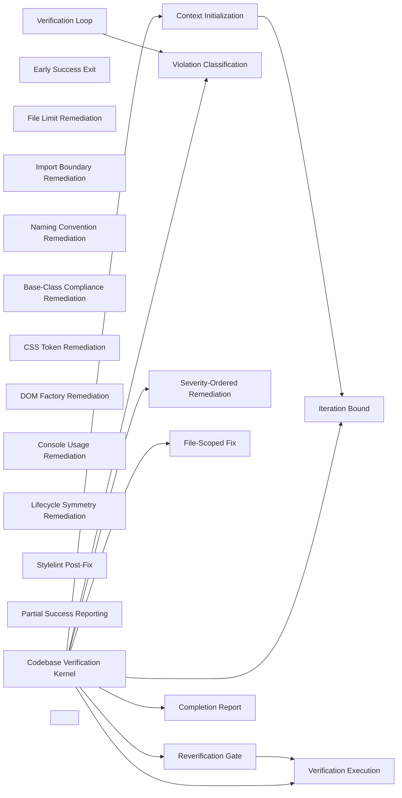

### Verification Loop

- Domain: [codebase-verification](ALGORITHMS.md#algorithms-domain-codebase-verification)
- Tier: [process](SCHEMA.md#vocabulary-domain-tier-process)
- Stage: [verify](REASONING.md#stage-verify)
- Axis: [verification](REASONING.md#reasoning-axis-verification)
- Math type: [dynamical-systems](REASONING.md#reasoning-math-type-dynamical-systems)
- Yields: boolean | counter

Details

Intent
Initialize verification context, execute the verification suite, classify failures, remediate violations, and repeat until pass or iteration limit.

Invariant
Architectural compliance is achieved through bounded verify-classify-fix cycles, not one-shot remediation.

Flow

```text
Init → Verify → Classify → Fix → Reverify → Pass|Limit
```

Productions

```bnf
VerificationLoop ::= <Initialization> "→" <VerificationRun> "→" (<PassReport> | <ViolationClassification> "→" <RemediationCycle> "→" <VerificationLoop>)
LoopExit ::= "passed" | "max_iterations_reached"
```

Composes
[Violation Classification](ALGORITHMS.md#algorithms-violation-classification)

Forces
[correctness_verification](SCHEMA.md#force-correctness-verification)

Grounds
none

Before

```text
A one-shot fix attempt, unverified — some violations remain, and neither the developer nor the model notices.
```

After

```text
init → verify → classify failures → fix → re-verify → repeat until pass or iteration limit
```

How it is checked

Checked by
the authoritative verification suite, whose output is the only completion signal

Population
Every file the suite checks

Freshness
A verdict stands until the code changes or a fix is applied

Refusal
The loop reports no completion until the suite passes, and stops at its iteration bound with the residue reported

Observation
None, because compliance is decided on the suite's output

Evidence
None, because the catalog states this check as a class, so a watched run belongs to each system that adopts it

Authoritative side
The suite's output, which a completion claim cites

Depends on
[Violation Classification](ALGORITHMS.md#algorithms-violation-classification)

Shape it refuses
Not answered

### Context Initialization

- Domain: [codebase-verification](ALGORITHMS.md#algorithms-domain-codebase-verification)
- Tier: [process](SCHEMA.md#vocabulary-domain-tier-process)
- Stage: [orient](REASONING.md#stage-orient)
- Axis: [ontology](REASONING.md#reasoning-axis-ontology)
- Math type: [set-theory](REASONING.md#reasoning-math-type-set-theory)
- Yields: set | boolean

Details

Intent
Discover architecture documents, load design guidance, initialize result containers, set iteration counters, and define maximum remediation attempts.

Invariant
Verification requires a known rule context before failures can be interpreted.

Flow

```text
DiscoverRules → LoadGuidance → InitializeState → SetBounds
```

Productions

```bnf
ContextInitialization ::= <RuleDiscovery> "→" <GuidanceLoad> "→" <VerificationState> "→" <IterationBound>
VerificationState ::= "verification_results" "," "iteration_count" "," "max_iterations"
```

Composes
[Iteration Bound](ALGORITHMS.md#algorithms-iteration-bound)

Composed by
[Codebase Verification Kernel](ALGORITHMS.md#algorithms-codebase-verification-kernel)

Named in the derivation of
[Codebase Verification Kernel](ALGORITHMS.md#algorithms-codebase-verification-kernel)

Forces
[runtime_extensibility](SCHEMA.md#force-runtime-extensibility), [correctness_verification](SCHEMA.md#force-correctness-verification)

Grounds
none

Before

```text
Failures interpreted with no known rule context, so fixes miss the point.
```

After

```text
discover architecture docs + design guidance → init result containers + iteration counter + max attempts
```

How it is checked

Checked by
the authoritative verification suite, whose output is the only completion signal

Population
Every file the suite checks

Freshness
A verdict stands until the code changes or a fix is applied

Refusal
The loop reports no completion until the suite passes, and stops at its iteration bound with the residue reported

Observation
None, because compliance is decided on the suite's output

Evidence
None, because the catalog states this check as a class, so a watched run belongs to each system that adopts it

Authoritative side
The suite's output, which a completion claim cites

Depends on
[Iteration Bound](ALGORITHMS.md#algorithms-iteration-bound)

Shape it refuses
Not answered

### Verification Execution

- Domain: [codebase-verification](ALGORITHMS.md#algorithms-domain-codebase-verification)
- Tier: [process](SCHEMA.md#vocabulary-domain-tier-process)
- Stage: [verify](REASONING.md#stage-verify)
- Axis: [verification](REASONING.md#reasoning-axis-verification)
- Math type: [logic](REASONING.md#reasoning-math-type-logic)
- Yields: boolean

Details

Intent
Run the configured verification procedure, capture raw output, parse errors and warnings, and derive pass status from zero-error condition.

Invariant
Compliance status must be based on executable verification output, not inferred confidence.

Flow

```text
ExecuteSuite → CaptureOutput → ParseErrors → ParseWarnings → PassBoolean
```

Productions

```bnf
VerificationExecution ::= <VerificationCommand> "→" <RawOutput> "→" <ParsedResult>
ParsedResult ::= <ErrorSet> "," <WarningSet> "," <PassStatus>
PassStatus ::= "errors.length == 0"
```

Composes
none

Composed by
[Reverification Gate](ALGORITHMS.md#algorithms-reverification-gate), [Codebase Verification Kernel](ALGORITHMS.md#algorithms-codebase-verification-kernel)

Named in the derivation of
[Codebase Verification Kernel](ALGORITHMS.md#algorithms-codebase-verification-kernel)

Forces
[correctness_verification](SCHEMA.md#force-correctness-verification)

Grounds
[ver-evidence](REASONING.md#reasoning-node-ver-evidence)

Before

```text
Compliance asserted from confidence, not from the verifier's output.
```

After

```text
run verification suite → capture raw output → parse errors + warnings → pass = errors.length == 0
```

How it is checked

Checked by
the authoritative verification suite, whose output is the only completion signal

Population
Every file the suite checks

Freshness
A verdict stands until the code changes or a fix is applied

Refusal
The loop reports no completion until the suite passes, and stops at its iteration bound with the residue reported

Observation
None, because compliance is decided on the suite's output

Evidence
None, because the catalog states this check as a class, so a watched run belongs to each system that adopts it

Authoritative side
The suite's output, which a completion claim cites

Depends on
Not answered

Shape it refuses
Not answered

### Early Success Exit

- Domain: [codebase-verification](ALGORITHMS.md#algorithms-domain-codebase-verification)
- Tier: [process](SCHEMA.md#vocabulary-domain-tier-process)
- Stage: [terminate](REASONING.md#stage-terminate)
- Axis: [termination](REASONING.md#reasoning-axis-termination)
- Math type: [set-theory](REASONING.md#reasoning-math-type-set-theory)
- Yields: set | boolean

Details

Intent
If verification has no errors, report successful compliance and terminate without remediation.

Invariant
A clean verification result is terminal and must not trigger unnecessary mutation.

Flow

```text
VerificationResult → IsPass? → ReportSuccess|Continue
```

Productions

```bnf
EarlyExit ::= <ParsedResult> "→" <PassCheck> "→" <SuccessReport>
PassCheck ::= "true" | "false"
SuccessReport ::= "zero_violations"
```

Composes
none

Forces
[state_transaction](SCHEMA.md#force-state-transaction), [correctness_verification](SCHEMA.md#force-correctness-verification)

Grounds
none

Before

```text
A clean verification result still triggers unnecessary remediation.
```

After

```text
parsed result → is pass? → report zero-violations success and terminate, no mutation
```

How it is checked

Checked by
the authoritative verification suite, whose output is the only completion signal

Population
Every file the suite checks

Freshness
A verdict stands until the code changes or a fix is applied

Refusal
The loop reports no completion until the suite passes, and stops at its iteration bound with the residue reported

Observation
None, because compliance is decided on the suite's output

Evidence
None, because the catalog states this check as a class, so a watched run belongs to each system that adopts it

Authoritative side
The suite's output, which a completion claim cites

Depends on
Not answered

Shape it refuses
Not answered

### Violation Classification

- Domain: [codebase-verification](ALGORITHMS.md#algorithms-domain-codebase-verification)
- Tier: [process](SCHEMA.md#vocabulary-domain-tier-process)
- Stage: [derive](REASONING.md#stage-derive)
- Axis: [reasoning](REASONING.md#reasoning-axis-reasoning)
- Math type: [logic](REASONING.md#reasoning-math-type-logic)
- Yields: boolean

Details

Intent
For each verification error, classify the violation into a known remediation category and attach the matching strategy.

Invariant
Fixes must be selected by violation semantics, not by ad hoc text editing.

Flow

```text
Error → Category → Strategy
```

Productions

```bnf
ViolationClassification ::= <ErrorSet> "→" <CategorizedViolationSet>
Category ::= "file_limit" | "import_pattern" | "naming" | "base_class" | "css_token" | "dom_factory" | "console" | "lifecycle" | "unknown"
CategorizedViolation ::= <Error> "," <Category> "," <RemediationStrategy>
```

Composes
none

Composed by
[Verification Loop](ALGORITHMS.md#algorithms-verification-loop), [Codebase Verification Kernel](ALGORITHMS.md#algorithms-codebase-verification-kernel)

Named in the derivation of
[Codebase Verification Kernel](ALGORITHMS.md#algorithms-codebase-verification-kernel)

Forces
[semantic_consistency](SCHEMA.md#force-semantic-consistency), [correctness_verification](SCHEMA.md#force-correctness-verification)

Grounds
none

Before

```text
Errors fixed by ad hoc text editing, not by their semantics.
```

After

```text
each error → category{file_limit | import | naming | base_class | css_token | dom_factory | console | lifecycle} → matching strategy
```

How it is checked

Checked by
the authoritative verification suite, whose output is the only completion signal

Population
Every file the suite checks

Freshness
A verdict stands until the code changes or a fix is applied

Refusal
The loop reports no completion until the suite passes, and stops at its iteration bound with the residue reported

Observation
None, because compliance is decided on the suite's output

Evidence
None, because the catalog states this check as a class, so a watched run belongs to each system that adopts it

Authoritative side
The suite's output, which a completion claim cites

Depends on
Not answered

Shape it refuses
Not answered

### Severity-Ordered Remediation

- Domain: [codebase-verification](ALGORITHMS.md#algorithms-domain-codebase-verification)
- Tier: [process](SCHEMA.md#vocabulary-domain-tier-process)
- Stage: [intent](REASONING.md#stage-intent)
- Axis: [teleology](REASONING.md#reasoning-axis-teleology)
- Math type: [optimization](REASONING.md#reasoning-math-type-optimization)
- Yields: boolean | ranking

Details

Intent
Group classified violations by category, order groups by severity, and apply fixes from highest architectural risk to lowest.

Invariant
Remediation should resolve structural blockers before cosmetic or secondary violations.

Flow

```text
CategorizedViolations → SeveritySort → OrderedFixQueue
```

Productions

```bnf
SeverityOrdering ::= <ViolationCategorySet> "→" <SeverityRank> "→" <OrderedViolationQueue>
SeverityRank ::= "critical" | "high" | "medium" | "low"
```

Composes
none

Named in the derivation of
[Codebase Verification Kernel](ALGORITHMS.md#algorithms-codebase-verification-kernel)

Forces
[correctness_verification](SCHEMA.md#force-correctness-verification)

Grounds
[tel-priority](REASONING.md#reasoning-node-tel-priority)

Before

```text
A cosmetic warning fixed before a structural blocker.
```

After

```text
classified violations → group by category → order by severity → fix highest architectural risk first
```

How it is checked

Checked by
the authoritative verification suite, whose output is the only completion signal

Population
Every file the suite checks

Freshness
A verdict stands until the code changes or a fix is applied

Refusal
The loop reports no completion until the suite passes, and stops at its iteration bound with the residue reported

Observation
None, because compliance is decided on the suite's output

Evidence
None, because the catalog states this check as a class, so a watched run belongs to each system that adopts it

Authoritative side
The suite's output, which a completion claim cites

Depends on
Not answered

Shape it refuses
Not answered

### Iteration Bound

- Domain: [codebase-verification](ALGORITHMS.md#algorithms-domain-codebase-verification)
- Tier: [process](SCHEMA.md#vocabulary-domain-tier-process)
- Stage: [terminate](REASONING.md#stage-terminate)
- Axis: [termination](REASONING.md#reasoning-axis-termination)
- Math type: [dynamical-systems](REASONING.md#reasoning-math-type-dynamical-systems)
- Yields: boolean | counter

Details

Intent
Increment iteration count before remediation, compare it to the maximum allowed attempts, and stop with partial success when the bound is exceeded.

Invariant
Automated remediation must be bounded to avoid infinite repair loops.

Flow

```text
Increment → CompareLimit → Continue|PartialExit
```

Productions

```bnf
IterationBound ::= <IterationCount> "→" <Increment> "→" <LimitCheck> "→" <LoopDecision>
LoopDecision ::= "continue_remediation" | "stop_manual_review_required"
```

Composes
none

Composed by
[Context Initialization](ALGORITHMS.md#algorithms-context-initialization), [Codebase Verification Kernel](ALGORITHMS.md#algorithms-codebase-verification-kernel)

Named in the derivation of
[Codebase Verification Kernel](ALGORITHMS.md#algorithms-codebase-verification-kernel)

Forces
[correctness_verification](SCHEMA.md#force-correctness-verification)

Grounds
[ter-stop](REASONING.md#reasoning-node-ter-stop)

Before

```text
Automated remediation loops forever on an unfixable violation.
```

After

```text
increment iteration → compare to max → {continue | stop, manual review required}
```

How it is checked

Checked by
the authoritative verification suite, whose output is the only completion signal

Population
Every file the suite checks

Freshness
A verdict stands until the code changes or a fix is applied

Refusal
The loop reports no completion until the suite passes, and stops at its iteration bound with the residue reported

Observation
None, because compliance is decided on the suite's output

Evidence
None, because the catalog states this check as a class, so a watched run belongs to each system that adopts it

Authoritative side
The suite's output, which a completion claim cites

Depends on
Not answered

Shape it refuses
Not answered

### File-Scoped Fix

- Domain: [codebase-verification](ALGORITHMS.md#algorithms-domain-codebase-verification)
- Tier: [process](SCHEMA.md#vocabulary-domain-tier-process)
- Stage: [act](REASONING.md#stage-act)
- Axis: [formalization](REASONING.md#reasoning-axis-formalization)
- Math type: [computation](REASONING.md#reasoning-math-type-computation)
- Yields: procedure

Details

Intent
Read the violating file, analyze the violation type, transform content according to design guidance, write the updated content, and preserve compatibility with verification rules.

Invariant
Each fix is a localized transformation constrained by architectural guidance.

Flow

```text
ReadFile → AnalyzeViolation → Transform → WriteFile
```

Productions

```bnf
FileScopedFix ::= <Violation> "→" <FileRead> "→" <ViolationAnalysis> "→" <DesignGuidedTransformation> "→" <FileWrite>
DesignGuidedTransformation ::= <CurrentContent> "," <ViolationType> "," <DesignGuide> "→" <UpdatedContent>
```

Composes
none

Composed by
[Codebase Verification Kernel](ALGORITHMS.md#algorithms-codebase-verification-kernel)

Named in the derivation of
[Codebase Verification Kernel](ALGORITHMS.md#algorithms-codebase-verification-kernel)

Forces
[contract_compatibility](SCHEMA.md#force-contract-compatibility), [correctness_verification](SCHEMA.md#force-correctness-verification)

Grounds
none

Before

```text
A fix edits broadly, breaking things the verifier didn't flag.
```

After

```text
violation → read file → analyze → transform per design guidance → write updated content
```

How it is checked

Checked by
the authoritative verification suite, whose output is the only completion signal

Population
Every file the suite checks

Freshness
A verdict stands until the code changes or a fix is applied

Refusal
The loop reports no completion until the suite passes, and stops at its iteration bound with the residue reported

Observation
None, because compliance is decided on the suite's output

Evidence
None, because the catalog states this check as a class, so a watched run belongs to each system that adopts it

Authoritative side
The suite's output, which a completion claim cites

Depends on
Not answered

Shape it refuses
Not answered

### File Limit Remediation

- Domain: [codebase-verification](ALGORITHMS.md#algorithms-domain-codebase-verification)
- Tier: [process](SCHEMA.md#vocabulary-domain-tier-process)
- Stage: [act](REASONING.md#stage-act)
- Axis: [formalization](REASONING.md#reasoning-axis-formalization)
- Math type: [computation](REASONING.md#reasoning-math-type-computation)
- Yields: procedure

Details

Intent
When a file exceeds the allowed size, split responsibilities into smaller compliant artifacts, preserve imports and exports, and rewire references.

Invariant
Size violations usually indicate excessive responsibility concentration.

Flow

```text
OversizedFile → ResponsibilitySplit → NewArtifacts → ReferenceUpdate → SizeCheck
```

Productions

```bnf
FileLimitFix ::= <OversizedArtifact> "→" <ResponsibilityPartition> "→" <ArtifactSplit> "→" <ReferenceRewrite> "→" <LineLimitValidation>
LineLimitValidation ::= "line_count <= configured_limit"
```

Composes
none

Forces
[modularity](SCHEMA.md#force-modularity), [correctness_verification](SCHEMA.md#force-correctness-verification)

Grounds
none

Before

```text
An oversized file trimmed by deleting code instead of splitting responsibility.
```

After

```text
oversized file → split responsibilities into compliant artifacts → preserve imports/exports → rewire references → size <= limit
```

How it is checked

Checked by
the authoritative verification suite, whose output is the only completion signal

Population
Every file the suite checks

Freshness
A verdict stands until the code changes or a fix is applied

Refusal
The loop reports no completion until the suite passes, and stops at its iteration bound with the residue reported

Observation
None, because compliance is decided on the suite's output

Evidence
None, because the catalog states this check as a class, so a watched run belongs to each system that adopts it

Authoritative side
The suite's output, which a completion claim cites

Depends on
Not answered

Shape it refuses
Not answered

### Import Boundary Remediation

- Domain: [codebase-verification](ALGORITHMS.md#algorithms-domain-codebase-verification)
- Tier: [process](SCHEMA.md#vocabulary-domain-tier-process)
- Stage: [act](REASONING.md#stage-act)
- Axis: [formalization](REASONING.md#reasoning-axis-formalization)
- Math type: [computation](REASONING.md#reasoning-math-type-computation)
- Yields: procedure

Details

Intent
Detect invalid cross-boundary imports, locate the approved dependency path or shared abstraction, rewrite imports, and verify dependency direction.

Invariant
Import fixes must restore architectural boundaries rather than merely silence errors.

Flow

```text
InvalidImport → BoundaryRule → ApprovedPath → RewriteImport → DependencyCheck
```

Productions

```bnf
ImportBoundaryFix ::= <ImportViolation> "→" <BoundaryPolicy> "→" <AllowedReference> "→" <ImportRewrite> "→" <DependencyValidation>
BoundaryPolicy ::= "same_module_only" | "shared_boundary_required" | "adapter_boundary_required"
```

Composes
none

Forces
[modularity](SCHEMA.md#force-modularity), [correctness_verification](SCHEMA.md#force-correctness-verification)

Grounds
none

Before

```text
A cross-boundary import error silenced without restoring the boundary.
```

After

```text
invalid import → boundary rule{same-module | shared | adapter} → approved path → rewrite → verify dependency direction
```

How it is checked

Checked by
the authoritative verification suite, whose output is the only completion signal

Population
Every file the suite checks

Freshness
A verdict stands until the code changes or a fix is applied

Refusal
The loop reports no completion until the suite passes, and stops at its iteration bound with the residue reported

Observation
None, because compliance is decided on the suite's output

Evidence
None, because the catalog states this check as a class, so a watched run belongs to each system that adopts it

Authoritative side
The suite's output, which a completion claim cites

Depends on
Not answered

Shape it refuses
Not answered

### Naming Convention Remediation

- Domain: [codebase-verification](ALGORITHMS.md#algorithms-domain-codebase-verification)
- Tier: [process](SCHEMA.md#vocabulary-domain-tier-process)
- Stage: [act](REASONING.md#stage-act)
- Axis: [formalization](REASONING.md#reasoning-axis-formalization)
- Math type: [computation](REASONING.md#reasoning-math-type-computation)
- Yields: procedure

Details

Intent
Compare file, folder, class, or symbol names against naming rules, derive compliant names, rename artifacts, and update all references.

Invariant
Naming remediation requires identity migration, not isolated renaming.

Flow

```text
InvalidName → NamingRule → NewName → Rename → ReferenceUpdate
```

Productions

```bnf
NamingFix ::= <NamingViolation> "→" <NamingConvention> "→" <CompliantIdentifier> "→" <RenameOperation> "→" <ReferenceConsistencyCheck>
```

Composes
none

Forces
[correctness_verification](SCHEMA.md#force-correctness-verification), [architecture_evolution](SCHEMA.md#force-architecture-evolution)

Grounds
none

Before

```text
A file renamed but its references left dangling.
```

After

```text
invalid name → naming rule → compliant identifier → rename → update all references (identity migration)
```

How it is checked

Checked by
the authoritative verification suite, whose output is the only completion signal

Population
Every file the suite checks

Freshness
A verdict stands until the code changes or a fix is applied

Refusal
The loop reports no completion until the suite passes, and stops at its iteration bound with the residue reported

Observation
None, because compliance is decided on the suite's output

Evidence
None, because the catalog states this check as a class, so a watched run belongs to each system that adopts it

Authoritative side
The suite's output, which a completion claim cites

Depends on
Not answered

Shape it refuses
Not answered

### Base-Class Compliance Remediation

- Domain: [codebase-verification](ALGORITHMS.md#algorithms-domain-codebase-verification)
- Tier: [process](SCHEMA.md#vocabulary-domain-tier-process)
- Stage: [act](REASONING.md#stage-act)
- Axis: [formalization](REASONING.md#reasoning-axis-formalization)
- Math type: [computation](REASONING.md#reasoning-math-type-computation)
- Yields: procedure

Details

Intent
Detect classes missing required base abstraction, refactor inheritance or composition according to role rules, migrate duplicated lifecycle logic into hooks, and verify behavior remains represented.

Invariant
Base-class violations are architectural adoption failures.

Flow

```text
NonCompliantClass → ExpectedBase → RefactorExtension → HookMigration → Verify
```

Productions

```bnf
BaseClassFix ::= <ClassRole> "→" <ExpectedBaseAbstraction> "→" <InheritanceOrCompositionUpdate> "→" <LifecycleHookMigration> "→" <ComplianceCheck>
ComplianceCheck ::= "class_extends_expected_base" | "uses_required_composition_boundary"
```

Composes
none

Forces
[semantic_consistency](SCHEMA.md#force-semantic-consistency), [correctness_verification](SCHEMA.md#force-correctness-verification)

Grounds
none

Before

```text
A class missing its required base 'fixed' by silencing the rule.
```

After

```text
class role → expected base → refactor inheritance/composition → migrate duplicated lifecycle into hooks → verify behavior represented
```

How it is checked

Checked by
the authoritative verification suite, whose output is the only completion signal

Population
Every file the suite checks

Freshness
A verdict stands until the code changes or a fix is applied

Refusal
The loop reports no completion until the suite passes, and stops at its iteration bound with the residue reported

Observation
None, because compliance is decided on the suite's output

Evidence
None, because the catalog states this check as a class, so a watched run belongs to each system that adopts it

Authoritative side
The suite's output, which a completion claim cites

Depends on
Not answered

Shape it refuses
Not answered

### CSS Token Remediation

- Domain: [codebase-verification](ALGORITHMS.md#algorithms-domain-codebase-verification)
- Tier: [process](SCHEMA.md#vocabulary-domain-tier-process)
- Stage: [act](REASONING.md#stage-act)
- Axis: [formalization](REASONING.md#reasoning-axis-formalization)
- Math type: [computation](REASONING.md#reasoning-math-type-computation)
- Yields: procedure

Details

Intent
Replace hardcoded style values with approved design tokens, verify token availability, and run style validation.

Invariant
Presentation constants should resolve through design-system tokens.

Flow

```text
HardcodedStyle → TokenLookup → Replacement → StyleValidation
```

Productions

```bnf
CssTokenFix ::= <HardcodedStyleValue> "→" <DesignTokenResolution> "→" <TokenReplacement> "→" <StyleValidation>
DesignTokenResolution ::= "existing_token" | "new_token_required" | "manual_review_required"
```

Composes
none

Forces
[correctness_verification](SCHEMA.md#force-correctness-verification)

Grounds
none

Before

```text
A hardcoded color left in place, the rule disabled instead.
```

After

```text
hardcoded style value → resolve design token{existing | new | manual review} → replace → style validation
```

How it is checked

Checked by
the authoritative verification suite, whose output is the only completion signal

Population
Every file the suite checks

Freshness
A verdict stands until the code changes or a fix is applied

Refusal
The loop reports no completion until the suite passes, and stops at its iteration bound with the residue reported

Observation
None, because compliance is decided on the suite's output

Evidence
None, because the catalog states this check as a class, so a watched run belongs to each system that adopts it

Authoritative side
The suite's output, which a completion claim cites

Depends on
Not answered

Shape it refuses
Not answered

### DOM Factory Remediation

- Domain: [codebase-verification](ALGORITHMS.md#algorithms-domain-codebase-verification)
- Tier: [process](SCHEMA.md#vocabulary-domain-tier-process)
- Stage: [act](REASONING.md#stage-act)
- Axis: [formalization](REASONING.md#reasoning-axis-formalization)
- Math type: [computation](REASONING.md#reasoning-math-type-computation)
- Yields: procedure

Details

Intent
Replace direct DOM manipulation with the approved DOM factory, component factory, or rendering abstraction.

Invariant
DOM creation must flow through the sanctioned construction boundary.

Flow

```text
DirectDOM → FactoryBoundary → Rewrite → BehaviorCheck
```

Productions

```bnf
DomFactoryFix ::= <DirectDomUsage> "→" <ApprovedCreationBoundary> "→" <FactoryRewrite> "→" <LifecycleCompatibilityCheck>
DirectDomUsage ::= "document.querySelector" | "document.createElement" | "innerHTML" | "direct_event_binding"
```

Composes
none

Forces
[modularity](SCHEMA.md#force-modularity), [correctness_verification](SCHEMA.md#force-correctness-verification), [object_creation](SCHEMA.md#force-object-creation)

Grounds
none

Before

```text
Direct document.createElement kept, the rule ignored.
```

After

```text
direct DOM{querySelector, createElement, innerHTML, direct event} → approved creation boundary → factory rewrite → lifecycle check
```

How it is checked

Checked by
the authoritative verification suite, whose output is the only completion signal

Population
Every file the suite checks

Freshness
A verdict stands until the code changes or a fix is applied

Refusal
The loop reports no completion until the suite passes, and stops at its iteration bound with the residue reported

Observation
None, because compliance is decided on the suite's output

Evidence
None, because the catalog states this check as a class, so a watched run belongs to each system that adopts it

Authoritative side
The suite's output, which a completion claim cites

Depends on
Not answered

Shape it refuses
Not answered

### Console Usage Remediation

- Domain: [codebase-verification](ALGORITHMS.md#algorithms-domain-codebase-verification)
- Tier: [process](SCHEMA.md#vocabulary-domain-tier-process)
- Stage: [act](REASONING.md#stage-act)
- Axis: [formalization](REASONING.md#reasoning-axis-formalization)
- Math type: [computation](REASONING.md#reasoning-math-type-computation)
- Yields: procedure

Details

Intent
Replace direct console calls with the approved logging abstraction, preserve severity and message context, and verify no direct console usage remains.

Invariant
Observability should be centralized behind a logging contract.

Flow

```text
ConsoleCall → LoggerMapping → Replacement → SearchNoConsole
```

Productions

```bnf
ConsoleFix ::= <ConsoleUsage> "→" <LoggerSeverityMapping> "→" <LoggerReplacement> "→" <ConsoleAbsenceCheck>
LoggerSeverityMapping ::= "console.log→info" | "console.warn→warn" | "console.error→error"
```

Composes
none

Forces
[contract_compatibility](SCHEMA.md#force-contract-compatibility), [semantic_consistency](SCHEMA.md#force-semantic-consistency), [correctness_verification](SCHEMA.md#force-correctness-verification), [observability_traceability](SCHEMA.md#force-observability-traceability), [event_messaging](SCHEMA.md#force-event-messaging)

Grounds
none

Before

```text
A console.log left in and the rule bypassed.
```

After

```text
console call → logger severity mapping{log→info, warn→warn, error→error} → replace → verify no direct console remains
```

How it is checked

Checked by
the authoritative verification suite, whose output is the only completion signal

Population
Every file the suite checks

Freshness
A verdict stands until the code changes or a fix is applied

Refusal
The loop reports no completion until the suite passes, and stops at its iteration bound with the residue reported

Observation
None, because compliance is decided on the suite's output

Evidence
None, because the catalog states this check as a class, so a watched run belongs to each system that adopts it

Authoritative side
The suite's output, which a completion claim cites

Depends on
Not answered

Shape it refuses
Not answered

### Lifecycle Symmetry Remediation

- Domain: [codebase-verification](ALGORITHMS.md#algorithms-domain-codebase-verification)
- Tier: [process](SCHEMA.md#vocabulary-domain-tier-process)
- Stage: [act](REASONING.md#stage-act)
- Axis: [formalization](REASONING.md#reasoning-axis-formalization)
- Math type: [computation](REASONING.md#reasoning-math-type-computation)
- Yields: procedure

Details

Intent
Detect resources created without corresponding cleanup, add destroy or teardown paths, and verify create/destroy symmetry.

Invariant
Lifecycle compliance requires every acquired resource to have a release path.

Flow

```text
AcquireResource → MissingRelease? → AddCleanup → SymmetryCheck
```

Productions

```bnf
LifecycleFix ::= <LifecycleViolation> "→" <AcquiredResourceSet> "→" <CleanupRequirementSet> "→" <DestroyPathUpdate> "→" <SymmetryValidation>
SymmetryValidation ::= "created_resources == destroyed_resources"
```

Composes
none

Forces
[correctness_verification](SCHEMA.md#force-correctness-verification)

Grounds
none

Before

```text
A resource acquired with no release path, leaking.
```

After

```text
lifecycle violation → acquired resources → add destroy/teardown → verify created == destroyed
```

How it is checked

Checked by
the authoritative verification suite, whose output is the only completion signal

Population
Every file the suite checks

Freshness
A verdict stands until the code changes or a fix is applied

Refusal
The loop reports no completion until the suite passes, and stops at its iteration bound with the residue reported

Observation
None, because compliance is decided on the suite's output

Evidence
None, because the catalog states this check as a class, so a watched run belongs to each system that adopts it

Authoritative side
The suite's output, which a completion claim cites

Depends on
Not answered

Shape it refuses
Not answered

### Stylelint Post-Fix

- Domain: [codebase-verification](ALGORITHMS.md#algorithms-domain-codebase-verification)
- Tier: [process](SCHEMA.md#vocabulary-domain-tier-process)
- Stage: [act](REASONING.md#stage-act)
- Axis: [formalization](REASONING.md#reasoning-axis-formalization)
- Math type: [computation](REASONING.md#reasoning-math-type-computation)
- Yields: procedure

Details

Intent
After remediation, run style validation, parse style errors, apply style-specific corrections, and block re-verification until style checks pass or are reported.

Invariant
Syntax and style conformance must be restored before the next architectural verification cycle.

Flow

```text
Remediation → Stylelint → StyleErrors? → FixStyle → Continue
```

Productions

```bnf
StylePostValidation ::= <RemediatedArtifacts> "→" <StyleValidationRun> "→" (<StylePass> | <StyleFixCycle>)
StyleFixCycle ::= <StyleErrorSet> "→" <StyleCorrectionSet> "→" <StyleValidationRun>
```

Composes
none

Forces
[correctness_verification](SCHEMA.md#force-correctness-verification)

Grounds
none

Before

```text
The next architectural cycle runs on style-broken code.
```

After

```text
remediation → run style validation → fix style errors → block re-verification until style passes
```

How it is checked

Checked by
the authoritative verification suite, whose output is the only completion signal

Population
Every file the suite checks

Freshness
A verdict stands until the code changes or a fix is applied

Refusal
The loop reports no completion until the suite passes, and stops at its iteration bound with the residue reported

Observation
None, because compliance is decided on the suite's output

Evidence
None, because the catalog states this check as a class, so a watched run belongs to each system that adopts it

Authoritative side
The suite's output, which a completion claim cites

Depends on
Not answered

Shape it refuses
Not answered

### Reverification Gate

- Domain: [codebase-verification](ALGORITHMS.md#algorithms-domain-codebase-verification)
- Tier: [process](SCHEMA.md#vocabulary-domain-tier-process)
- Stage: [verify](REASONING.md#stage-verify)
- Axis: [verification](REASONING.md#reasoning-axis-verification)
- Math type: [logic](REASONING.md#reasoning-math-type-logic)
- Yields: boolean

Details

Intent
After fixes and style validation, rerun the full verification suite rather than trusting local corrections.

Invariant
Only the authoritative verification suite can confirm global compliance.

Flow

```text
FixesApplied → LocalValidation → FullVerification
```

Productions

```bnf
ReverificationGate ::= <RemediationResult> "→" <PostFixValidation> "→" <VerificationExecution>
```

Composes
[Verification Execution](ALGORITHMS.md#algorithms-verification-execution)

Composed by
[Codebase Verification Kernel](ALGORITHMS.md#algorithms-codebase-verification-kernel)

Forces
[correctness_verification](SCHEMA.md#force-correctness-verification)

Grounds
[ver-evidence](REASONING.md#reasoning-node-ver-evidence)

Before

```text
Local corrections trusted as global compliance.
```

After

```text
fixes applied → local validation → rerun the full authoritative verification suite
```

How it is checked

Checked by
the authoritative verification suite, whose output is the only completion signal

Population
Every file the suite checks

Freshness
A verdict stands until the code changes or a fix is applied

Refusal
The loop reports no completion until the suite passes, and stops at its iteration bound with the residue reported

Observation
None, because compliance is decided on the suite's output

Evidence
None, because the catalog states this check as a class, so a watched run belongs to each system that adopts it

Authoritative side
The suite's output, which a completion claim cites

Depends on
[Verification Execution](ALGORITHMS.md#algorithms-verification-execution)

Shape it refuses
Not answered

### Partial Success Reporting

- Domain: [codebase-verification](ALGORITHMS.md#algorithms-domain-codebase-verification)
- Tier: [process](SCHEMA.md#vocabulary-domain-tier-process)
- Stage: [commit](REASONING.md#stage-commit)
- Axis: [representation](REASONING.md#reasoning-axis-representation)
- Math type: [information-theory](REASONING.md#reasoning-math-type-information-theory)
- Yields: hash | novelty-score

Details

Intent
When iteration bounds are exhausted, report remaining violations, categorize unresolved issues, and mark the result as requiring manual review.

Invariant
Bounded automation should fail visibly with actionable residue.

Flow

```text
MaxIterations → RemainingViolations → ManualReviewReport
```

Productions

```bnf
PartialSuccessReport ::= <IterationLimitReached> "→" <RemainingViolationSet> "→" <ManualReviewRequired>
ManualReviewRequired ::= "remaining_errors" "," "remaining_warnings" "," "blocked_categories"
```

Composes
none

Forces
[correctness_verification](SCHEMA.md#force-correctness-verification)

Grounds
none

Before

```text
Iteration bound hit and the run silently reports success.
```

After

```text
max iterations → remaining violations categorized → mark result manual-review-required (visible, actionable residue)
```

How it is checked

Checked by
the authoritative verification suite, whose output is the only completion signal

Population
Every file the suite checks

Freshness
A verdict stands until the code changes or a fix is applied

Refusal
The loop reports no completion until the suite passes, and stops at its iteration bound with the residue reported

Observation
None, because compliance is decided on the suite's output

Evidence
None, because the catalog states this check as a class, so a watched run belongs to each system that adopts it

Authoritative side
The suite's output, which a completion claim cites

Depends on
Not answered

Shape it refuses
Not answered

### Completion Report

- Domain: [codebase-verification](ALGORITHMS.md#algorithms-domain-codebase-verification)
- Tier: [process](SCHEMA.md#vocabulary-domain-tier-process)
- Stage: [commit](REASONING.md#stage-commit)
- Axis: [representation](REASONING.md#reasoning-axis-representation)
- Math type: [information-theory](REASONING.md#reasoning-math-type-information-theory)
- Yields: hash | novelty-score

Details

Intent
Report total iterations, fixed error count, remaining warnings, and final verification status.

Invariant
Completion output should separate fixed violations from tolerated or remaining warnings.

Flow

```text
FinalState → Iterations → FixedCount → WarningCount → Report
```

Productions

```bnf
CompletionReport ::= <FinalVerificationState> "," <IterationCount> "," <FixedCount> "," <RemainingWarningCount>
FinalVerificationState ::= "passed" | "partial_success" | "failed"
```

Composes
none

Composed by
[Codebase Verification Kernel](ALGORITHMS.md#algorithms-codebase-verification-kernel)

Named in the derivation of
[Codebase Verification Kernel](ALGORITHMS.md#algorithms-codebase-verification-kernel)

Forces
[correctness_verification](SCHEMA.md#force-correctness-verification)

Grounds
none

Before

```text
A report that mixes fixed violations with tolerated warnings.
```

After

```text
final state → {total iterations, fixed count, remaining warnings, final status{passed | partial | failed}}
```

How it is checked

Checked by
the authoritative verification suite, whose output is the only completion signal

Population
Every file the suite checks

Freshness
A verdict stands until the code changes or a fix is applied

Refusal
The loop reports no completion until the suite passes, and stops at its iteration bound with the residue reported

Observation
None, because compliance is decided on the suite's output

Evidence
None, because the catalog states this check as a class, so a watched run belongs to each system that adopts it

Authoritative side
The suite's output, which a completion claim cites

Depends on
Not answered

Shape it refuses
Not answered

### Codebase Verification Kernel

- Domain: [codebase-verification](ALGORITHMS.md#algorithms-domain-codebase-verification)
- Tier: [process](SCHEMA.md#vocabulary-domain-tier-process)
- Math type: [computation](REASONING.md#reasoning-math-type-computation)
- Yields: procedure

Details

Intent
Load compliance context, run verification, parse results, exit on pass, classify violations on failure, remediate by severity, run post-fix style validation, and repeat until zero errors or iteration limit.

Invariant
Codebase verification is a bounded remediation state machine driven by authoritative compliance output.

Flow

```text
Context → Verify → Parse → Pass? → Classify → Fix → StyleValidate → Reverify → Report
```

Productions

```bnf
CodebaseVerificationKernel ::= <ContextInitialization> "→" <VerificationExecution> "→" (<EarlyExit> | <ViolationClassification> "→" <IterationBound> "→" <SeverityOrdering> "→" <FileScopedFix> "→" <StylePostValidation> "→" <ReverificationGate>) "→" <CompletionReport>
SuccessCondition ::= "verification_errors == 0"
FailureBound ::= "iteration_count > max_iterations"
```

Composes
[Context Initialization](ALGORITHMS.md#algorithms-context-initialization), [Verification Execution](ALGORITHMS.md#algorithms-verification-execution), [Violation Classification](ALGORITHMS.md#algorithms-violation-classification), [Iteration Bound](ALGORITHMS.md#algorithms-iteration-bound), [File-Scoped Fix](ALGORITHMS.md#algorithms-file-scoped-fix), [Reverification Gate](ALGORITHMS.md#algorithms-reverification-gate), [Completion Report](ALGORITHMS.md#algorithms-completion-report)

Forces
[correctness_verification](SCHEMA.md#force-correctness-verification)

Principle
[Verification](PRINCIPLES.md#architecture-verification)

Grounds
[derivation-loop](REASONING.md#reasoning-loop-derivation-loop)

Derivation map

orient
[Context Initialization](ALGORITHMS.md#algorithms-context-initialization)

derive
[Violation Classification](ALGORITHMS.md#algorithms-violation-classification)

intent
[Severity-Ordered Remediation](ALGORITHMS.md#algorithms-severity-ordered-remediation)

act
[File-Scoped Fix](ALGORITHMS.md#algorithms-file-scoped-fix)

verify
[Verification Execution](ALGORITHMS.md#algorithms-verification-execution)

commit
[Completion Report](ALGORITHMS.md#algorithms-completion-report)

terminate
[Iteration Bound](ALGORITHMS.md#algorithms-iteration-bound)

Before

```text
Compliance claimed after one edit, never re-verified.
```

After

```text
context → verify → parse → pass? → classify → severity-order fix → style validate → reverify → repeat until zero errors or bound
```

How it is checked

Checked by
the authoritative verification suite, whose output is the only completion signal

Population
Every file the suite checks

Freshness
A verdict stands until the code changes or a fix is applied

Refusal
The loop reports no completion until the suite passes, and stops at its iteration bound with the residue reported

Observation
None, because compliance is decided on the suite's output

Evidence
None, because the catalog states this check as a class, so a watched run belongs to each system that adopts it

Authoritative side
The suite's output, which a completion claim cites

Depends on
[Context Initialization](ALGORITHMS.md#algorithms-context-initialization), [Verification Execution](ALGORITHMS.md#algorithms-verification-execution), [Violation Classification](ALGORITHMS.md#algorithms-violation-classification), [Iteration Bound](ALGORITHMS.md#algorithms-iteration-bound), [File-Scoped Fix](ALGORITHMS.md#algorithms-file-scoped-fix), [Reverification Gate](ALGORITHMS.md#algorithms-reverification-gate), [Completion Report](ALGORITHMS.md#algorithms-completion-report)

Shape it refuses
Not answered

### <Compliance Verification Concern>

- Domain: [codebase-verification](ALGORITHMS.md#algorithms-domain-codebase-verification)
- Tier: [process](SCHEMA.md#vocabulary-domain-tier-process)
- Meta record

Details

Intent
<Load rules> → <Run authoritative verifier> → <Parse failures> → <Classify by violation type> → <Apply bounded fixes> → <Run local post-fix validation> → <Rerun verifier> → <Exit on pass or bound>

Invariant
Any programmatic compliance workflow should be treated as a bounded verification-remediation loop whose only completion signal is the authoritative verifier passing.

Flow

```text
Rules → Verify → Errors → Categories → Fixes → LocalValidation → Reverify → Report
```

Productions

```bnf
ComplianceConcern ::= <RuleContext> "→" <AuthoritativeVerification> "→" <ViolationRegistry> "→" <RemediationQueue> "→" <BoundedMutationCycle> "→" <Reverification> "→" <FinalStatus>
FinalStatus ::= "passed" | "partial_success_manual_review" | "failed"
```

Composes
none

Forces
[correctness_verification](SCHEMA.md#force-correctness-verification)

Grounds
none

How it is checked

Checked by
the authoritative verification suite, whose output is the only completion signal

Population
Every file the suite checks

Freshness
A verdict stands until the code changes or a fix is applied

Refusal
The loop reports no completion until the suite passes, and stops at its iteration bound with the residue reported

Observation
None, because compliance is decided on the suite's output

Evidence
None, because the catalog states this check as a class, so a watched run belongs to each system that adopts it

Authoritative side
The suite's output, which a completion claim cites

Depends on
Not answered

Shape it refuses
Not answered

## Context verification

Every algorithm contract in this domain is listed with its position on the derivation loop, its intent and invariant, the flow it walks and its productions as a grammar. Each record also shows what it composes and is composed by, which forces and principles it answers to, what grounds it and what it grounds, and an exemplar where the record carries one. The diagram shows what composes what inside the domain.

Relations diagram

What composes what inside this domain.

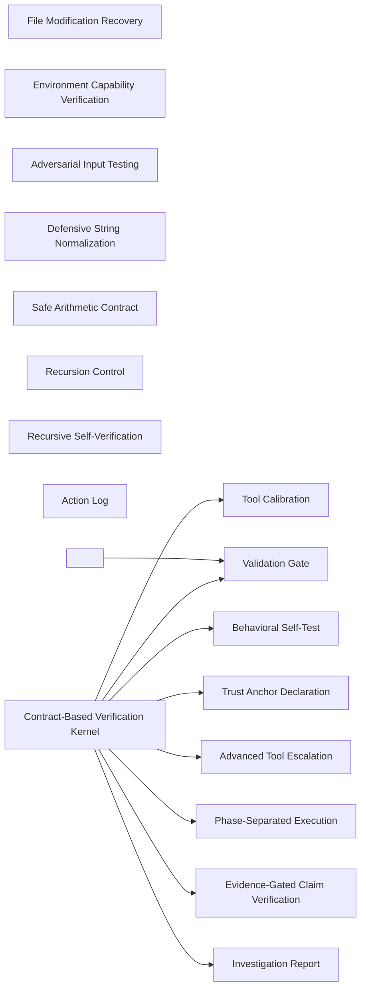

### Phase-Separated Execution

- Domain: [context-verification](ALGORITHMS.md#algorithms-domain-context-verification)
- Tier: [process](SCHEMA.md#vocabulary-domain-tier-process)
- Stage: [constrain](REASONING.md#stage-constrain)
- Axis: [teleology](REASONING.md#reasoning-axis-teleology)
- Math type: [optimization](REASONING.md#reasoning-math-type-optimization)
- Yields: boolean | ranking

Details

Intent
Detect the current workflow phase, bind allowed operations to that phase, reject operations outside the phase contract, and emit only the artifact valid for that phase.

Invariant
A system must separate discovery from mutation so that analysis cannot accidentally remediate and remediation cannot silently expand scope.

Flow

```text
DetectPhase → BindCapabilities → EnforceMode → ExecuteAllowedOnly → EmitPhaseArtifact
```

Productions

```bnf
PhaseExecution ::= <PhaseDetect> "→" <CapabilityBinding> "→" <ModeEnforcement> "→" <AllowedExecution> "→" <PhaseOutput>
PhaseDetect ::= "INVESTIGATE" | "ACTION"
AllowedExecution ::= <InvestigationOnly> | <ActionOnly>
InvestigationOnly ::= "Discover" "Test" "Document" "NoModify"
ActionOnly ::= "FixKnownGap" "Modify" "Version" "NoDiscovery"
```

Composes
none

Composed by
[Governed Autonomous Plan Loop](ALGORITHMS.md#algorithms-governed-autonomous-plan-loop)

Named in the derivation of
[Contract-Based Verification Kernel](ALGORITHMS.md#algorithms-contract-based-verification-kernel)

Forces
[contract_compatibility](SCHEMA.md#force-contract-compatibility), [runtime_extensibility](SCHEMA.md#force-runtime-extensibility), [state_transaction](SCHEMA.md#force-state-transaction), [correctness_verification](SCHEMA.md#force-correctness-verification)

Grounds
none

Before

```text
An investigation starts fixing gaps and a fix expands its scope, with neither reported.
```

After

```text
detect phase{INVESTIGATE | ACTION} → bind allowed ops → INVESTIGATE{discover, test, document, no-modify} | ACTION{fix known gap, version, no-discovery}
```

How it is checked

Checked by
the verifier's evidence gate, which maps every claim to implementation evidence, its calibration and self-tests, which check the verifier before its results are trusted

Population
Every claim under investigation and the files that could support it

Freshness
A verdict stands until the code or document behind a claim changes

Refusal
A claim with no mapped evidence is reported unverified, and the investigation writes no fix

Observation
The environment capability probes, which measure the runtime before the workflow relies on it

Evidence
None, because the catalog states this check as a class, so a watched run belongs to each system that adopts it

Authoritative side
The implementation evidence, which a claim is verified against

Depends on
Not answered

Shape it refuses
Not answered

### Evidence-Gated Claim Verification

- Domain: [context-verification](ALGORITHMS.md#algorithms-domain-context-verification)
- Tier: [process](SCHEMA.md#vocabulary-domain-tier-process)
- Stage: [verify](REASONING.md#stage-verify)
- Axis: [verification](REASONING.md#reasoning-axis-verification)
- Math type: [logic](REASONING.md#reasoning-math-type-logic)
- Yields: boolean

Details

Intent
Extract claims, resolve each claim into observable evidence requirements, collect direct implementation evidence, classify each claim as verified, contradicted, or unverified, and report discrepancies.

Invariant
No architectural claim is trusted until mapped to implementation evidence.

Flow

```text
Claim → EvidenceRequirement → Observation → Classification → Report
```

Productions

```bnf
ClaimVerification ::= <ClaimSet> "→" <EvidenceMap> "→" <ObservationSet> "→" <VerdictSet> "→" <Report>
ClaimSet ::= <Claim> | <Claim> "," <ClaimSet>
VerdictSet ::= "verified" | "contradicted" | "unverified"
```

Composes
none

Composed by
[Plan Phase Verification](ALGORITHMS.md#algorithms-plan-phase-verification)

Named in the derivation of
[Contract-Based Verification Kernel](ALGORITHMS.md#algorithms-contract-based-verification-kernel)

Forces
[correctness_verification](SCHEMA.md#force-correctness-verification), [observability_traceability](SCHEMA.md#force-observability-traceability)

Grounds
[ver-evidence](REASONING.md#reasoning-node-ver-evidence)

Before

```text
'The core has no infra imports' trusted because it sounds right.
```

After

```text
claims → map each to an observable evidence requirement → collect implementation evidence → verdict{verified | contradicted | unverified}
```

How it is checked

Checked by
the verifier's evidence gate, which maps every claim to implementation evidence, its calibration and self-tests, which check the verifier before its results are trusted

Population
Every claim under investigation and the files that could support it

Freshness
A verdict stands until the code or document behind a claim changes

Refusal
A claim with no mapped evidence is reported unverified, and the investigation writes no fix

Observation
The environment capability probes, which measure the runtime before the workflow relies on it

Evidence
None, because the catalog states this check as a class, so a watched run belongs to each system that adopts it

Authoritative side
The implementation evidence, which a claim is verified against

Depends on
Not answered

Shape it refuses
Not answered

### Validation Gate

- Domain: [context-verification](ALGORITHMS.md#algorithms-domain-context-verification)
- Tier: [process](SCHEMA.md#vocabulary-domain-tier-process)
- Stage: [terminate](REASONING.md#stage-terminate)
- Axis: [termination](REASONING.md#reasoning-axis-termination)
- Math type: [optimization](REASONING.md#reasoning-math-type-optimization)
- Yields: boolean | ranking

Details

Intent
After each critical stage, evaluate declared success criteria, block downstream progression when critical criteria fail, and carry warning-state forward when noncritical criteria fail.

Invariant
Complex workflows require explicit checkpoints that convert hidden uncertainty into visible control flow.

Flow

```text
Stage → Criteria → Evaluate → Pass|Warn|Block → Continue|Abort
```

Productions

```bnf
ValidationGate ::= <Stage> "→" <CriteriaSet> "→" <GateResult>
GateResult ::= "PASS" | "WARN" | "BLOCK"
CriteriaSet ::= <Criterion> | <Criterion> "," <CriteriaSet>
Criterion ::= <Condition> ":" <PriorityRank>
PriorityRank ::= "critical" | "high" | "medium" | "low"
```

Composes
none

Composed by
[<Workflow Orchestration Concern>](ALGORITHMS.md#algorithms-workflow-orchestration-concern), [Contract-Based Verification Kernel](ALGORITHMS.md#algorithms-contract-based-verification-kernel), [<Context Verification Concern>](ALGORITHMS.md#algorithms-context-verification-concern), [Phase Close Gate](ALGORITHMS.md#algorithms-phase-close-gate)

Named in the derivation of
[Contract-Based Verification Kernel](ALGORITHMS.md#algorithms-contract-based-verification-kernel)

Forces
[correctness_verification](SCHEMA.md#force-correctness-verification)

Grounds
[ter-stop](REASONING.md#reasoning-node-ter-stop)

Before

```text
A stage's uncertainty stays hidden and flows silently downstream.
```

After

```text
stage → criteria{critical | noncritical} → {PASS | WARN | BLOCK} → block downstream on a critical failure
```

How it is checked

Checked by
the verifier's evidence gate, which maps every claim to implementation evidence, its calibration and self-tests, which check the verifier before its results are trusted

Population
Every claim under investigation and the files that could support it

Freshness
A verdict stands until the code or document behind a claim changes

Refusal
A claim with no mapped evidence is reported unverified, and the investigation writes no fix

Observation
The environment capability probes, which measure the runtime before the workflow relies on it

Evidence
None, because the catalog states this check as a class, so a watched run belongs to each system that adopts it

Authoritative side
The implementation evidence, which a claim is verified against

Depends on
Not answered

Shape it refuses
Not answered

### File Modification Recovery

- Domain: [context-verification](ALGORITHMS.md#algorithms-domain-context-verification)
- Tier: [process](SCHEMA.md#vocabulary-domain-tier-process)
- Stage: [act](REASONING.md#stage-act)
- Axis: [formalization](REASONING.md#reasoning-axis-formalization)
- Math type: [computation](REASONING.md#reasoning-math-type-computation)
- Yields: procedure

Details

Intent
When a file mutation fails because state changed between read and edit, reread the current file, merge the intended delta into the current content, write the complete new version, and verify persistence.

Invariant
Treat stale-write failures as state synchronization failures, not as patch failures.

Flow

```text
EditFail → ReRead → MergeDelta → WriteFullState → Verify
```

Productions

```bnf
FileRecovery ::= "ModificationError" "→" <ReadCurrent> "→" <Merge> "→" <WriteComplete> "→" <VerifyWrite>
Merge ::= <CurrentContent> "+" <RequiredChange> "→" <NewContent>
VerifyWrite ::= "Exists" "&" "ContentMatches"
```

Composes
none

Forces
[state_transaction](SCHEMA.md#force-state-transaction), [correctness_verification](SCHEMA.md#force-correctness-verification), [resilience_recovery](SCHEMA.md#force-resilience-recovery)

Grounds
none

Before

```text
A stale-write failure re-patches the old content, corrupting state.
```

After

```text
edit fail → re-read current → merge the delta into full state → write complete version → verify{exists & content matches}
```

How it is checked

Checked by
the verifier's evidence gate, which maps every claim to implementation evidence, its calibration and self-tests, which check the verifier before its results are trusted

Population
Every claim under investigation and the files that could support it

Freshness
A verdict stands until the code or document behind a claim changes

Refusal
A claim with no mapped evidence is reported unverified, and the investigation writes no fix

Observation
The environment capability probes, which measure the runtime before the workflow relies on it

Evidence
None, because the catalog states this check as a class, so a watched run belongs to each system that adopts it

Authoritative side
The implementation evidence, which a claim is verified against

Depends on
Not answered

Shape it refuses
Not answered

### Trust Anchor Declaration

- Domain: [context-verification](ALGORITHMS.md#algorithms-domain-context-verification)
- Tier: [process](SCHEMA.md#vocabulary-domain-tier-process)
- Stage: [orient](REASONING.md#stage-orient)
- Axis: [ontology](REASONING.md#reasoning-axis-ontology)
- Math type: [set-theory](REASONING.md#reasoning-math-type-set-theory)
- Yields: set | boolean

Details

Intent
Declare the minimum assumptions required for the system to verify anything, bind all verification logic to those assumptions, and disclose the verification boundary.

Invariant
Every axiom a verifier rests on is declared explicitly.

Flow

```text
MinimalAssumptions → Boundary → VerificationScope → Disclosure
```

Productions

```bnf
TrustAnchor ::= <AssumptionSet> "→" <TrustBoundary> "→" <Scope>
AssumptionSet ::= <Assumption> | <Assumption> "," <AssumptionSet>
Assumption ::= "RuntimeWorks" | "FilesystemWorks" | "CommandExecutionWorks" | "ToolIOWorks"
TrustBoundary ::= "CannotVerifyVerifierWithoutExternalReference"
```

Composes
none

Named in the derivation of
[Contract-Based Verification Kernel](ALGORITHMS.md#algorithms-contract-based-verification-kernel)

Forces
[modularity](SCHEMA.md#force-modularity), [correctness_verification](SCHEMA.md#force-correctness-verification)

Grounds
none

Before

```text
The verifier's own axioms are hidden, so its boundary is unknowable.
```

After

```text
declare minimal assumptions{runtime, filesystem, execution, tool IO} → boundary{cannot verify the verifier} → disclosed, not verified
```

How it is checked

Checked by
the verifier's evidence gate, which maps every claim to implementation evidence, its calibration and self-tests, which check the verifier before its results are trusted

Population
Every claim under investigation and the files that could support it

Freshness
A verdict stands until the code or document behind a claim changes

Refusal
A claim with no mapped evidence is reported unverified, and the investigation writes no fix

Observation
The environment capability probes, which measure the runtime before the workflow relies on it

Evidence
None, because the catalog states this check as a class, so a watched run belongs to each system that adopts it

Authoritative side
The implementation evidence, which a claim is verified against

Depends on
Not answered

Shape it refuses
Not answered

### Environment Capability Verification

- Domain: [context-verification](ALGORITHMS.md#algorithms-domain-context-verification)
- Tier: [process](SCHEMA.md#vocabulary-domain-tier-process)
- Stage: [verify](REASONING.md#stage-verify)
- Axis: [verification](REASONING.md#reasoning-axis-verification)
- Math type: [logic](REASONING.md#reasoning-math-type-logic)
- Yields: boolean

Details

Intent
Before executing advanced behavior, probe required runtime dependencies, classify each dependency failure by severity, and degrade or block capability based on criticality.

Invariant
Runtime capability must be measured before the workflow relies on it.

Flow

```text
Requirement → Probe → Status → Severity → CapabilityMode
```

Productions

```bnf
EnvironmentVerification ::= <RequirementSet> "→" <ProbeSet> "→" <StatusSet> "→" <CapabilityVerdict>
CapabilityVerdict ::= "full" | "degraded" | "blocked"
Status ::= "passed" | "failed"
Requirement ::= "runtime" | "packageManager" | "writePermission" | "filesystem"
```

Composes
none

Forces
[correctness_verification](SCHEMA.md#force-correctness-verification)

Grounds
[ver-evidence](REASONING.md#reasoning-node-ver-evidence)

Before

```text
Advanced analysis relied on before checking the runtime can run it.
```

After

```text
requirements{runtime, package manager, write, filesystem} → probe each → classify by severity → mode{full | degraded | blocked}
```

How it is checked

Checked by
the verifier's evidence gate, which maps every claim to implementation evidence, its calibration and self-tests, which check the verifier before its results are trusted

Population
Every claim under investigation and the files that could support it

Freshness
A verdict stands until the code or document behind a claim changes

Refusal
A claim with no mapped evidence is reported unverified, and the investigation writes no fix

Observation
The environment capability probes, which measure the runtime before the workflow relies on it

Evidence
None, because the catalog states this check as a class, so a watched run belongs to each system that adopts it

Authoritative side
The implementation evidence, which a claim is verified against

Depends on
Not answered

Shape it refuses
Not answered

### Tool Calibration

- Domain: [context-verification](ALGORITHMS.md#algorithms-domain-context-verification)
- Tier: [process](SCHEMA.md#vocabulary-domain-tier-process)
- Stage: [see](REASONING.md#stage-see)
- Axis: [analysis](REASONING.md#reasoning-axis-analysis)
- Math type: [probability](REASONING.md#reasoning-math-type-probability)
- Yields: number[0,1]

Details

Intent
Create known-good and known-bad fixtures, run the verification tool against both, detect false positives and false negatives, and mark the tool reliable only if both controls pass.

Invariant
Verification tools must be tested against controls before their results are trusted.

Flow

```text
KnownGood + KnownBad → RunTool → CompareExpected → CalibrateReliability
```

Productions

```bnf
ToolCalibration ::= <FixtureSet> "→" <ToolRun> "→" <ExpectedComparison> "→" <ReliabilityVerdict>
FixtureSet ::= <KnownGood> "," <KnownBad>
ReliabilityVerdict ::= "reliable" | "false_positive_risk" | "false_negative_risk" | "unreliable"
```

Composes
none

Composed by
[Contract-Based Verification Kernel](ALGORITHMS.md#algorithms-contract-based-verification-kernel)

Named in the derivation of
[Contract-Based Verification Kernel](ALGORITHMS.md#algorithms-contract-based-verification-kernel)

Forces
[correctness_verification](SCHEMA.md#force-correctness-verification)

Grounds
none

Before

```text
A detector's match trusted with no control test.
```

After

```text
known-good + known-bad fixtures → run tool → detect false-positive AND false-negative → reliable only if both controls pass
```

How it is checked

Checked by
the verifier's evidence gate, which maps every claim to implementation evidence, its calibration and self-tests, which check the verifier before its results are trusted

Population
Every claim under investigation and the files that could support it

Freshness
A verdict stands until the code or document behind a claim changes

Refusal
A claim with no mapped evidence is reported unverified, and the investigation writes no fix

Observation
The environment capability probes, which measure the runtime before the workflow relies on it

Evidence
None, because the catalog states this check as a class, so a watched run belongs to each system that adopts it

Authoritative side
The implementation evidence, which a claim is verified against

Depends on
Not answered

Shape it refuses
Not answered

### Behavioral Self-Test

- Domain: [context-verification](ALGORITHMS.md#algorithms-domain-context-verification)
- Tier: [process](SCHEMA.md#vocabulary-domain-tier-process)
- Stage: [verify](REASONING.md#stage-verify)
- Axis: [verification](REASONING.md#reasoning-axis-verification)
- Math type: [logic](REASONING.md#reasoning-math-type-logic)
- Yields: boolean

Details

Intent
Execute the system’s claimed behaviors against simple positive and negative cases, compare actual output to expected output, and treat mismatch as implementation evidence failure.

Invariant
A capability counts only once its behavior matches a testable contract.

Flow

```text
ClaimedBehavior → PositiveCase + NegativeCase → Execute → Compare → Verdict
```

Productions

```bnf
BehavioralSelfTest ::= <BehaviorClaim> "→" <TestCasePair> "→" <ExecutionResult> "→" <BehaviorVerdict>
TestCasePair ::= <PositiveCase> "," <NegativeCase>
BehaviorVerdict ::= "matches_contract" | "false_positive" | "false_negative" | "failed"
```

Composes
none

Composed by
[Contract-Based Verification Kernel](ALGORITHMS.md#algorithms-contract-based-verification-kernel)

Forces
[contract_compatibility](SCHEMA.md#force-contract-compatibility)

Grounds
none

Before

```text
A claimed capability trusted without ever running it on a case.
```

After

```text
claimed behavior → positive + negative case → execute → compare → {matches contract | false-positive | false-negative | failed}
```

How it is checked

Checked by
the verifier's evidence gate, which maps every claim to implementation evidence, its calibration and self-tests, which check the verifier before its results are trusted

Population
Every claim under investigation and the files that could support it

Freshness
A verdict stands until the code or document behind a claim changes

Refusal
A claim with no mapped evidence is reported unverified, and the investigation writes no fix

Observation
The environment capability probes, which measure the runtime before the workflow relies on it

Evidence
None, because the catalog states this check as a class, so a watched run belongs to each system that adopts it

Authoritative side
The implementation evidence, which a claim is verified against

Depends on
Not answered

Shape it refuses
Not answered

### Adversarial Input Testing

- Domain: [context-verification](ALGORITHMS.md#algorithms-domain-context-verification)
- Tier: [process](SCHEMA.md#vocabulary-domain-tier-process)
- Stage: [verify](REASONING.md#stage-verify)
- Axis: [verification](REASONING.md#reasoning-axis-verification)
- Math type: [logic](REASONING.md#reasoning-math-type-logic)
- Yields: boolean

Details

Intent
Generate malicious, malformed, ambiguous, and deceptive inputs, execute the detection logic against them, and classify whether the system resists or accepts invalid patterns.

Invariant
Verification logic must be tested against hostile inputs, not only ordinary examples.

Flow

```text
AttackInput → ExecuteDetector → ExpectedReject|ExpectedIgnore → VulnerabilityVerdict
```

Productions

```bnf
AdversarialTesting ::= <AttackSet> "→" <DetectorExecution> "→" <SecurityVerdict>
AttackSet ::= <Attack> | <Attack> "," <AttackSet>
Attack ::= "pathTraversal" | "nullByte" | "unicodeHomoglyph" | "commentFalsePositive" | "patternSpoof"
SecurityVerdict ::= "blocked" | "ignored" | "vulnerable"
```

Composes
none

Forces
[correctness_verification](SCHEMA.md#force-correctness-verification)

Grounds
none

Before

```text
A detector accepted after ordinary examples pass, never tested hostilely.
```

After

```text
attacks{pathTraversal, nullByte, unicodeHomoglyph, commentFalsePositive, patternSpoof} → run detector → {blocked | ignored | vulnerable}
```

How it is checked

Checked by
the verifier's evidence gate, which maps every claim to implementation evidence, its calibration and self-tests, which check the verifier before its results are trusted

Population
Every claim under investigation and the files that could support it

Freshness
A verdict stands until the code or document behind a claim changes

Refusal
A claim with no mapped evidence is reported unverified, and the investigation writes no fix

Observation
The environment capability probes, which measure the runtime before the workflow relies on it

Evidence
None, because the catalog states this check as a class, so a watched run belongs to each system that adopts it

Authoritative side
The implementation evidence, which a claim is verified against

Depends on
Not answered

Shape it refuses
Not answered

### Defensive String Normalization

- Domain: [context-verification](ALGORITHMS.md#algorithms-domain-context-verification)
- Tier: [process](SCHEMA.md#vocabulary-domain-tier-process)
- Stage: [act](REASONING.md#stage-act)
- Axis: [formalization](REASONING.md#reasoning-axis-formalization)
- Math type: [computation](REASONING.md#reasoning-math-type-computation)
- Yields: procedure

Details

Intent
Reject null input, remove dangerous path/control patterns, normalize Unicode representation, and only pass sanitized strings to filesystem, parser, or command boundaries.

Invariant
All external strings must be converted from hostile representation into bounded representation before use.

Flow

```text
RawString → NullGuard → StripDanger → Normalize → SafeString
```

Productions

```bnf
StringNormalization ::= <RawString> "→" <NullGuard> "→" <DangerRemoval> "→" <UnicodeNormalize> "→" <SafeString>
NullGuard ::= "reject(null|undefined)"
DangerRemoval ::= "remove('../')" | "remove('..\\')" | "remove(NULL_BYTE)"
UnicodeNormalize ::= "NFC"
```

Composes
none

Forces
[modularity](SCHEMA.md#force-modularity), [semantic_consistency](SCHEMA.md#force-semantic-consistency)

Grounds
none

Before

```text
A raw external string passed straight to a filesystem or command boundary.
```

After

```text
raw string → null-guard → strip{'../', null byte} → Unicode NFC → only the sanitized string crosses a boundary
```

How it is checked

Checked by
the verifier's evidence gate, which maps every claim to implementation evidence, its calibration and self-tests, which check the verifier before its results are trusted

Population
Every claim under investigation and the files that could support it

Freshness
A verdict stands until the code or document behind a claim changes

Refusal
A claim with no mapped evidence is reported unverified, and the investigation writes no fix

Observation
The environment capability probes, which measure the runtime before the workflow relies on it

Evidence
None, because the catalog states this check as a class, so a watched run belongs to each system that adopts it

Authoritative side
The implementation evidence, which a claim is verified against

Depends on
Not answered

Shape it refuses
Not answered

### Safe Arithmetic Contract

- Domain: [context-verification](ALGORITHMS.md#algorithms-domain-context-verification)
- Tier: [process](SCHEMA.md#vocabulary-domain-tier-process)
- Stage: [act](REASONING.md#stage-act)
- Axis: [formalization](REASONING.md#reasoning-axis-formalization)
- Math type: [logic](REASONING.md#reasoning-math-type-logic)
- Yields: boolean

Details

Intent
Check operands before calculation, reject division by zero, reject non-finite results, enforce bounds, and return nullable or typed failure instead of unsafe numeric state.

Invariant
Arithmetic output is only valid if the operation and result both satisfy the numeric contract.

Flow

```text
Operands → PreconditionCheck → Compute → FiniteCheck → BoundsCheck → Result|Failure
```

Productions

```bnf
SafeArithmetic ::= <Operands> "→" <Preconditions> "→" <Computation> "→" <Postconditions> "→" <NumericOutput>
Preconditions ::= "denominator != 0" | "operands finite"
Postconditions ::= "isFinite(result)" | "withinBounds(result)"
NumericOutput ::= <Number> | "null" | <TypedFailure>
```

Composes
none

Forces
[contract_compatibility](SCHEMA.md#force-contract-compatibility)

Grounds
none

Before

```text
A division runs unchecked and returns NaN or Infinity into a decision.
```

After

```text
operands → preconditions{denominator != 0, finite} → compute → postconditions{isFinite, within bounds} → number | null | typed failure
```

How it is checked

Checked by
the verifier's evidence gate, which maps every claim to implementation evidence, its calibration and self-tests, which check the verifier before its results are trusted

Population
Every claim under investigation and the files that could support it

Freshness
A verdict stands until the code or document behind a claim changes

Refusal
A claim with no mapped evidence is reported unverified, and the investigation writes no fix

Observation
The environment capability probes, which measure the runtime before the workflow relies on it

Evidence
None, because the catalog states this check as a class, so a watched run belongs to each system that adopts it

Authoritative side
The implementation evidence, which a claim is verified against

Depends on
Not answered

Shape it refuses
Not answered

### Recursion Control

- Domain: [context-verification](ALGORITHMS.md#algorithms-domain-context-verification)
- Tier: [process](SCHEMA.md#vocabulary-domain-tier-process)
- Stage: [act](REASONING.md#stage-act)
- Axis: [formalization](REASONING.md#reasoning-axis-formalization)
- Math type: [dynamical-systems](REASONING.md#reasoning-math-type-dynamical-systems)
- Yields: boolean | counter

Details

Intent
Increment depth on recursive entry, compare against maximum depth, reject excessive recursion, and unwind depth on completion.

Invariant
Recursive systems require explicit depth governance to prevent runaway self-reference.

Flow

```text
Enter → IncrementDepth → CheckLimit → Continue|Reject → Exit
```

Productions

```bnf
RecursionControl ::= <EnterRecursiveCall> "→" <DepthIncrement> "→" <LimitCheck> "→" <Decision> "→" <Exit>
Decision ::= "continue" | "reject_max_depth_exceeded"
LimitCheck ::= "currentDepth <= maxDepth"
```

Composes
none

Composed by
[Boundary Reconciliation](ALGORITHMS.md#algorithms-boundary-reconciliation), [Plan Phase Verification](ALGORITHMS.md#algorithms-plan-phase-verification), [Quality Governance Loop](ALGORITHMS.md#algorithms-quality-governance-loop)

Forces
[security_governance](SCHEMA.md#force-security-governance)

Grounds
none

Before

```text
A recursive self-reference runs away with no depth bound.
```

After

```text
enter → increment depth → depth <= max? → {continue | reject max-depth} → unwind on exit
```

How it is checked

Checked by
the verifier's evidence gate, which maps every claim to implementation evidence, its calibration and self-tests, which check the verifier before its results are trusted

Population
Every claim under investigation and the files that could support it

Freshness
A verdict stands until the code or document behind a claim changes

Refusal
A claim with no mapped evidence is reported unverified, and the investigation writes no fix

Observation
The environment capability probes, which measure the runtime before the workflow relies on it

Evidence
None, because the catalog states this check as a class, so a watched run belongs to each system that adopts it

Authoritative side
The implementation evidence, which a claim is verified against

Depends on
Not answered

Shape it refuses
Not answered

### Recursive Self-Verification

- Domain: [context-verification](ALGORITHMS.md#algorithms-domain-context-verification)
- Tier: [process](SCHEMA.md#vocabulary-domain-tier-process)
- Stage: [verify](REASONING.md#stage-verify)
- Axis: [verification](REASONING.md#reasoning-axis-verification)
- Math type: [probability](REASONING.md#reasoning-math-type-probability)
- Yields: number[0,1]

Details

Intent
Load the system’s own definition, extract self-claims, search for implementation evidence of each claim, classify discrepancies, and downgrade confidence when self-description exceeds implemented behavior.

Invariant
A verifier should apply its verification rules to itself.

Flow

```text
SelfDefinition → ExtractClaims → VerifyClaims → DetectDiscrepancies → ConfidenceAdjustment
```

Productions

```bnf
SelfVerification ::= <SelfDefinition> "→" <SelfClaimSet> "→" <EvidenceSearch> "→" <DiscrepancySet> "→" <ConfidenceState>
ConfidenceState ::= "confirmed" | "partially_confirmed" | "overclaimed" | "invalid"
```

Composes
none

Forces
[correctness_verification](SCHEMA.md#force-correctness-verification)

Grounds
[ver-evidence](REASONING.md#reasoning-node-ver-evidence)

Before

```text
The verifier exempts itself from its own rules and overclaims.
```

After

```text
self definition → extract self-claims → search implementation evidence → discrepancies → confidence{confirmed | overclaimed | invalid}
```

How it is checked

Checked by
the verifier's evidence gate, which maps every claim to implementation evidence, its calibration and self-tests, which check the verifier before its results are trusted

Population
Every claim under investigation and the files that could support it

Freshness
A verdict stands until the code or document behind a claim changes

Refusal
A claim with no mapped evidence is reported unverified, and the investigation writes no fix

Observation
The environment capability probes, which measure the runtime before the workflow relies on it

Evidence
None, because the catalog states this check as a class, so a watched run belongs to each system that adopts it

Authoritative side
The implementation evidence, which a claim is verified against

Depends on
Not answered

Shape it refuses
Not answered

### Advanced Tool Escalation

- Domain: [context-verification](ALGORITHMS.md#algorithms-domain-context-verification)
- Tier: [process](SCHEMA.md#vocabulary-domain-tier-process)
- Stage: [act](REASONING.md#stage-act)
- Axis: [formalization](REASONING.md#reasoning-axis-formalization)
- Math type: [computation](REASONING.md#reasoning-math-type-computation)
- Yields: procedure

Details

Intent
When direct tools cannot answer a verification question, synthesize a specialized analyzer, execute it against the target, parse its output, and integrate the result as evidence.

Invariant
Missing capability should trigger controlled tool construction rather than unsupported inference.

Flow

```text
Need → CapabilityGap → GenerateTool → ExecuteTool → ParseEvidence → Integrate
```

Productions

```bnf
ToolEscalation ::= <AnalysisNeed> "→" <CapabilityCheck> "→" <ToolConstruction> "→" <ToolExecution> "→" <EvidenceIntegration>
CapabilityCheck ::= "direct_capability_available" | "requires_generated_tool"
ToolConstruction ::= "write_script" "→" "execute_script" "→" "parse_results"
```

Composes
none

Named in the derivation of
[Contract-Based Verification Kernel](ALGORITHMS.md#algorithms-contract-based-verification-kernel)

Forces
[correctness_verification](SCHEMA.md#force-correctness-verification), [model_governance](SCHEMA.md#force-model-governance), [object_creation](SCHEMA.md#force-object-creation)

Grounds
none

Before

```text
A capability gap filled by inference instead of evidence.
```

After

```text
analysis need → capability gap → write script → execute → parse → integrate the result as evidence
```

How it is checked

Checked by
the verifier's evidence gate, which maps every claim to implementation evidence, its calibration and self-tests, which check the verifier before its results are trusted

Population
Every claim under investigation and the files that could support it

Freshness
A verdict stands until the code or document behind a claim changes

Refusal
A claim with no mapped evidence is reported unverified, and the investigation writes no fix

Observation
The environment capability probes, which measure the runtime before the workflow relies on it

Evidence
None, because the catalog states this check as a class, so a watched run belongs to each system that adopts it

Authoritative side
The implementation evidence, which a claim is verified against

Depends on
Not answered

Shape it refuses
Not answered

### Investigation Report

- Domain: [context-verification](ALGORITHMS.md#algorithms-domain-context-verification)
- Tier: [process](SCHEMA.md#vocabulary-domain-tier-process)
- Stage: [commit](REASONING.md#stage-commit)
- Axis: [representation](REASONING.md#reasoning-axis-representation)
- Math type: [information-theory](REASONING.md#reasoning-math-type-information-theory)
- Yields: hash | novelty-score

Details

Intent
Collect verified findings, failed checks, warnings, discrepancies, environmental limits, adversarial results, and confidence level into a structured report without performing remediation.

Invariant
Investigation produces evidence, not fixes.

Flow

```text
EvidenceSet → FindingSet → RiskSet → Confidence → Report
```

Productions

```bnf
InvestigationReport ::= <EvidenceSet> "→" <Findings> "→" <Risks> "→" <Confidence> "→" <Report>
Findings ::= <VerifiedFinding> | <Discrepancy> | <UnverifiedClaim>
Report ::= "investigation_report"
```

Composes
none

Named in the derivation of
[Contract-Based Verification Kernel](ALGORITHMS.md#algorithms-contract-based-verification-kernel)

Forces
[correctness_verification](SCHEMA.md#force-correctness-verification)

Grounds
none

Before

```text
An investigation that also 'quickly fixes' what it found.
```

After

```text
evidence → findings + risks + adversarial results + confidence → one investigation report, no remediation
```

How it is checked

Checked by
the verifier's evidence gate, which maps every claim to implementation evidence, its calibration and self-tests, which check the verifier before its results are trusted

Population
Every claim under investigation and the files that could support it

Freshness
A verdict stands until the code or document behind a claim changes

Refusal
A claim with no mapped evidence is reported unverified, and the investigation writes no fix

Observation
The environment capability probes, which measure the runtime before the workflow relies on it

Evidence
None, because the catalog states this check as a class, so a watched run belongs to each system that adopts it

Authoritative side
The implementation evidence, which a claim is verified against

Depends on
Not answered

Shape it refuses
Not answered

### Action Log

- Domain: [context-verification](ALGORITHMS.md#algorithms-domain-context-verification)
- Tier: [process](SCHEMA.md#vocabulary-domain-tier-process)
- Stage: [commit](REASONING.md#stage-commit)
- Axis: [representation](REASONING.md#reasoning-axis-representation)
- Math type: [information-theory](REASONING.md#reasoning-math-type-information-theory)
- Yields: hash | novelty-score

Details

Intent
Accept only documented gaps as input, apply bounded changes, version the modified artifact, verify the write, and emit an action log without discovering new scope.

Invariant
Remediation operates only on known evidence.

Flow

```text
DocumentedGap → BoundedFix → Version → Verify → ActionLog
```

Productions

```bnf
ActionLog ::= <DocumentedGapSet> "→" <FixSet> "→" <VersionedArtifact> "→" <Verification> "→" <Log>
DocumentedGapSet ::= <Gap> | <Gap> "," <DocumentedGapSet>
FixSet ::= <Fix> | <Fix> "," <FixSet>
Log ::= "action_log"
```

Composes
none

Forces
[correctness_verification](SCHEMA.md#force-correctness-verification)

Grounds
none

Before

```text
A fix run against a gap that was never documented, discovering new scope mid-flight.
```

After

```text
documented gaps only → bounded fix → version → verify write → action log; discovers nothing new
```

How it is checked

Checked by
the verifier's evidence gate, which maps every claim to implementation evidence, its calibration and self-tests, which check the verifier before its results are trusted

Population
Every claim under investigation and the files that could support it

Freshness
A verdict stands until the code or document behind a claim changes

Refusal
A claim with no mapped evidence is reported unverified, and the investigation writes no fix

Observation
The environment capability probes, which measure the runtime before the workflow relies on it

Evidence
None, because the catalog states this check as a class, so a watched run belongs to each system that adopts it

Authoritative side
The implementation evidence, which a claim is verified against

Depends on
Not answered

Shape it refuses
Not answered

### Contract-Based Verification Kernel

- Domain: [context-verification](ALGORITHMS.md#algorithms-domain-context-verification)
- Tier: [process](SCHEMA.md#vocabulary-domain-tier-process)
- Math type: [computation](REASONING.md#reasoning-math-type-computation)
- Yields: procedure

Details

Intent
Declare assumptions, detect phase, verify environment, calibrate tools, execute phase-legal behavior, test adversarially, enforce validation gates, self-verify claims, and emit a typed artifact.

Invariant
A reusable verification kernel is a gated state machine whose transitions are evidence-bound and phase-constrained.

Flow

```text
Assumptions → Phase → Environment → Calibration → Execution → AdversarialTest → SelfVerify → TypedOutput
```

Productions

```bnf
VerificationKernel ::= <TrustAnchor> "→" <PhaseExecution> "→" <EnvironmentVerification> "→" <ToolCalibration> "→" <BehavioralSelfTest> "→" <AdversarialTesting> "→" <ValidationGate> "→" <SelfVerification> "→" <TypedOutput>
TypedOutput ::= "investigation_report" | "action_log" | "blocked_execution_report"
```

Composes
[Tool Calibration](ALGORITHMS.md#algorithms-tool-calibration), [Behavioral Self-Test](ALGORITHMS.md#algorithms-behavioral-self-test), [Validation Gate](ALGORITHMS.md#algorithms-validation-gate)

Forces
[contract_compatibility](SCHEMA.md#force-contract-compatibility), [correctness_verification](SCHEMA.md#force-correctness-verification)

Principle
[Design by Contract](PRINCIPLES.md#architecture-design-by-contract)

Grounds
[derivation-loop](REASONING.md#reasoning-loop-derivation-loop)

Derivation map

orient
[Trust Anchor Declaration](ALGORITHMS.md#algorithms-trust-anchor-declaration)

see
[Tool Calibration](ALGORITHMS.md#algorithms-tool-calibration)

act
[Advanced Tool Escalation](ALGORITHMS.md#algorithms-advanced-tool-escalation)

constrain
[Phase-Separated Execution](ALGORITHMS.md#algorithms-phase-separated-execution)

verify
[Evidence-Gated Claim Verification](ALGORITHMS.md#algorithms-evidence-gated-claim-verification)

commit
[Investigation Report](ALGORITHMS.md#algorithms-investigation-report)

terminate
[Validation Gate](ALGORITHMS.md#algorithms-validation-gate)

Before

```text
Behavior trusted because it looks right, with no phase, calibration, or self-check.
```

After

```text
declare assumptions → detect phase → verify environment → calibrate tools → phase-legal execution → adversarial test → validation gate → self-verify → typed artifact
```

How it is checked

Checked by
the verifier's evidence gate, which maps every claim to implementation evidence, its calibration and self-tests, which check the verifier before its results are trusted

Population
Every claim under investigation and the files that could support it

Freshness
A verdict stands until the code or document behind a claim changes

Refusal
A claim with no mapped evidence is reported unverified, and the investigation writes no fix

Observation
The environment capability probes, which measure the runtime before the workflow relies on it

Evidence
None, because the catalog states this check as a class, so a watched run belongs to each system that adopts it

Authoritative side
The implementation evidence, which a claim is verified against

Depends on
[Tool Calibration](ALGORITHMS.md#algorithms-tool-calibration), [Behavioral Self-Test](ALGORITHMS.md#algorithms-behavioral-self-test), [Validation Gate](ALGORITHMS.md#algorithms-validation-gate)

Shape it refuses
Not answered

### <Context Verification Concern>

- Domain: [context-verification](ALGORITHMS.md#algorithms-domain-context-verification)
- Tier: [process](SCHEMA.md#vocabulary-domain-tier-process)
- Meta record

Details

Intent
<Detect required contract> → <Bind allowed capability> → <Execute bounded operation> → <Validate evidence> → <Emit typed result>

Invariant
<Any system behavior should be treated as a contract-bound transition whose legitimacy depends on phase, evidence, and postcondition verification.>

Flow

```text
Contract → Capability → Operation → Gate → Artifact
```

Productions

```bnf
ConcernAlgorithm ::= <PhaseContract> "→" <CapabilityBinding> "→" <Operation> "→" <ValidationGate> "→" <TypedArtifact>
PhaseContract ::= <Precondition> "," <AllowedActionSet> "," <ForbiddenActionSet> "," <Postcondition>
TypedArtifact ::= <Report> | <Log> | <Failure>
```

Composes
[Validation Gate](ALGORITHMS.md#algorithms-validation-gate)

Forces
[contract_compatibility](SCHEMA.md#force-contract-compatibility), [correctness_verification](SCHEMA.md#force-correctness-verification)

Grounds
none

How it is checked

Checked by
the verifier's evidence gate, which maps every claim to implementation evidence, its calibration and self-tests, which check the verifier before its results are trusted

Population
Every claim under investigation and the files that could support it

Freshness
A verdict stands until the code or document behind a claim changes

Refusal
A claim with no mapped evidence is reported unverified, and the investigation writes no fix

Observation
The environment capability probes, which measure the runtime before the workflow relies on it

Evidence
None, because the catalog states this check as a class, so a watched run belongs to each system that adopts it

Authoritative side
The implementation evidence, which a claim is verified against

Depends on
[Validation Gate](ALGORITHMS.md#algorithms-validation-gate)

Shape it refuses
Not answered

## Coordination

Every algorithm contract in this domain is listed with its position on the derivation loop, its intent and invariant, the flow it walks and its productions as a grammar. Each record also shows what it composes and is composed by, which forces and principles it answers to, what grounds it and what it grounds, and an exemplar where the record carries one. The diagram shows what composes what inside the domain.

Relations diagram

What composes what inside this domain.

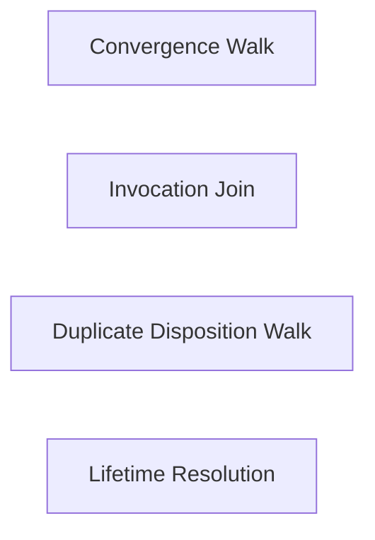

### Convergence Walk

- Domain: [coordination](ALGORITHMS.md#algorithms-domain-coordination)
- Tier: [process](SCHEMA.md#vocabulary-domain-tier-process)
- Stage: [commit](REASONING.md#stage-commit)
- Axis: [representation](REASONING.md#reasoning-axis-representation)
- Math type: [computation](REASONING.md#reasoning-math-type-computation)
- Yields: procedure

Details

Intent
Take a venue from its opening to the archive in a fixed order, so the question of whether a decision is made and the question of whether it is built are answered by two surfaces.

Invariant
A venue leaves the active surface only once its outcome is absorbed, and it leaves by moving to the archive, never by deletion.

Flow

```text
OpenVenue → HoldVenue → SignOutcome → CloseOutcome → AbsorbWork → ArchiveVenue
```

Productions

```bnf
ConvergenceWalk ::= <OpenVenue> "→" <HoldVenue> "→" <SignOutcome> "→" <CloseOutcome> "→" <AbsorbWork> "→" <ArchiveVenue>
ArchiveVenue ::= "moved_with_positions"
```

Composes
none

Forces
[control_coordination](SCHEMA.md#force-control-coordination), [observability_traceability](SCHEMA.md#force-observability-traceability)

Principle
[Independent Lifetime Axes](PRINCIPLES.md#architecture-independent-lifetime-axes)

Grounds
none

Before

```text
A discussion is closed once every party signs, so the ruling stands, the gate turns green and the change the ruling implied is never built.
```

After

```text
open with an exit condition → hold, failing the pipeline → sign, one own line per participant → close, outcome written to the surviving documents → absorb, a checklist with an owner per item that lands → archive, the venue moved with every position intact
```

How it is checked

Checked by
the coordination member's venue, archive and writer checks

Population
Every venue closure, run start, duplicate set and surface lifetime a coordination topology carries

Freshness
A verdict stands until a venue, a run declaration, a copy of a fact or a lifetime declaration changes

Refusal
The coordination checks refuse a venue closed without its outcome absorbed, a closure missing its extraction, and a writer outside the sanctioned set

Observation
Each closure, run and copy compared against the declarations that govern it

Evidence
None, because the catalog states this check as a class, so a watched run belongs to each system that adopts it

Authoritative side
The declared schema and lifetime of each surface, which every closure, run and copy conforms to

Depends on
Not answered

Shape it refuses
Not answered

### Invocation Join

- Domain: [coordination](ALGORITHMS.md#algorithms-domain-coordination)
- Tier: [process](SCHEMA.md#vocabulary-domain-tier-process)
- Stage: [derive](REASONING.md#stage-derive)
- Axis: [reasoning](REASONING.md#reasoning-axis-reasoning)
- Math type: [logic](REASONING.md#reasoning-math-type-logic)
- Yields: boolean

Details

Intent
Decide for each caller whether a live run already answers its question, joining by reading when one does and starting by declare-then-read ordering when none does.

Invariant
A joiner writes nothing and enters no collision comparison, and a starter writes its entry before it reads the set of live runs.

Flow

```text
Caller → CoverageTest → JoinByRead → DeclareEntry → ReadLiveSet → StartVerdict
```

Productions

```bnf
InvocationJoin ::= <Caller> "→" <CoverageTest> "→" <JoinByRead> "|" <DeclareEntry> "→" <ReadLiveSet> "→" <StartVerdict>
StartVerdict ::= "proceed" | "yield"
```

Composes
none

Forces
[control_coordination](SCHEMA.md#force-control-coordination), [state_transaction](SCHEMA.md#force-state-transaction)

Principle
[Read-Time Join](PRINCIPLES.md#architecture-read-time-join)

Grounds
none

Before

```text
Every caller of a shared measurement starts its own run, so two runs over one question collide and each writes a report.
```

After

```text
caller → a live declared scope covers the question: join, read the published result and its standing, write nothing → none covers it: start, write the entry, then read the set → the earlier stamp proceeds, the other exits without writing
```

How it is checked

Checked by
the coordination member's venue, archive and writer checks

Population
Every venue closure, run start, duplicate set and surface lifetime a coordination topology carries

Freshness
A verdict stands until a venue, a run declaration, a copy of a fact or a lifetime declaration changes

Refusal
The coordination checks refuse a venue closed without its outcome absorbed, a closure missing its extraction, and a writer outside the sanctioned set

Observation
Each closure, run and copy compared against the declarations that govern it

Evidence
None, because the catalog states this check as a class, so a watched run belongs to each system that adopts it

Authoritative side
The declared schema and lifetime of each surface, which every closure, run and copy conforms to

Depends on
Not answered

Shape it refuses
Not answered

### Duplicate Disposition Walk

- Domain: [coordination](ALGORITHMS.md#algorithms-domain-coordination)
- Tier: [process](SCHEMA.md#vocabulary-domain-tier-process)
- Stage: [derive](REASONING.md#stage-derive)
- Axis: [reasoning](REASONING.md#reasoning-axis-reasoning)
- Math type: [set-theory](REASONING.md#reasoning-math-type-set-theory)
- Yields: set | boolean

Details

Intent
Walk a duplicated fact in order, enumerating its copies, counting the distinguished ones, reading each derivation edge's period, choosing the disposition and checking which consumer each copy reaches.

Invariant
A collapse follows only a direction exactly one distinguished copy supplies, and a copy across a one-shot edge is diagnosed rather than rewritten.

Flow

```text
EnumerateCopies → CountDistinguished → ReadPeriods → ChooseDisposition → CheckDelivery
```

Productions

```bnf
DuplicateDispositionWalk ::= <EnumerateCopies> "→" <CountDistinguished> "→" <ReadPeriods> "→" <ChooseDisposition> "→" <CheckDelivery>
CountDistinguished ::= "direction" | "cycle" | "undeclared"
ChooseDisposition ::= "nothing_owed" | "comparator_owed" | "diagnose_and_repair_source"
```

Composes
none

Forces
[semantic_consistency](SCHEMA.md#force-semantic-consistency), [correctness_verification](SCHEMA.md#force-correctness-verification)

Principle
[Period-Decided Disposition](PRINCIPLES.md#architecture-period-decided-disposition)

Grounds
none

Before

```text
A fact stated in several places is collapsed toward whichever copy looks authoritative, and the copies written once against an earlier state of the source are overwritten.
```

After

```text
enumerate every copy any consumer reaches → count the distinguished copies: one gives a direction, none refuses as a cycle, more than one refuses as undeclared → read each edge's period → deliver: add the copy the population is missing
```

How it is checked

Checked by
the coordination member's venue, archive and writer checks

Population
Every venue closure, run start, duplicate set and surface lifetime a coordination topology carries

Freshness
A verdict stands until a venue, a run declaration, a copy of a fact or a lifetime declaration changes

Refusal
The coordination checks refuse a venue closed without its outcome absorbed, a closure missing its extraction, and a writer outside the sanctioned set

Observation
Each closure, run and copy compared against the declarations that govern it

Evidence
None, because the catalog states this check as a class, so a watched run belongs to each system that adopts it

Authoritative side
The declared schema and lifetime of each surface, which every closure, run and copy conforms to

Depends on
Not answered

Shape it refuses
Not answered

### Lifetime Resolution

- Domain: [coordination](ALGORITHMS.md#algorithms-domain-coordination)
- Tier: [process](SCHEMA.md#vocabulary-domain-tier-process)
- Stage: [see](REASONING.md#stage-see)
- Axis: [analysis](REASONING.md#reasoning-axis-analysis)
- Math type: [set-theory](REASONING.md#reasoning-math-type-set-theory)
- Yields: set

Details

Intent
Resolve the lifetime of the unit an operation targets from the file's declared default and the declared divergence of its section, reading each axis separately and never from the path.

Invariant
Every decision a mechanism takes about a surface resolves from a declared lifetime, and a surface that declares nothing is undeclared rather than defaulted.

Flow

```text
Surface → FileDefault → SectionDivergence → ResolvedAxes
```

Productions

```bnf
LifetimeResolution ::= <Surface> "→" <FileDefault> "→" <SectionDivergence> "→" <ResolvedAxes>
ResolvedAxes ::= "retention" "," "mutability" "," "removal_authority"
```

Composes
none

Forces
[control_coordination](SCHEMA.md#force-control-coordination), [model_governance](SCHEMA.md#force-model-governance)

Principle
[Independent Lifetime Axes](PRINCIPLES.md#architecture-independent-lifetime-axes)

Grounds
none

Before

```text
A mechanism decides what it may do to a surface from the shape of its path, so a retired surface under a working folder is swept like a live one.
```

After

```text
surface → the file's declared default on each axis → each section's declared divergence → the resolved retention, mutability and removal authority for the unit the operation targets → an undeclared surface stays undeclared
```

How it is checked

Checked by
the coordination member's venue, archive and writer checks

Population
Every venue closure, run start, duplicate set and surface lifetime a coordination topology carries

Freshness
A verdict stands until a venue, a run declaration, a copy of a fact or a lifetime declaration changes

Refusal
The coordination checks refuse a venue closed without its outcome absorbed, a closure missing its extraction, and a writer outside the sanctioned set

Observation
Each closure, run and copy compared against the declarations that govern it

Evidence
None, because the catalog states this check as a class, so a watched run belongs to each system that adopts it

Authoritative side
The declared schema and lifetime of each surface, which every closure, run and copy conforms to

Depends on
Not answered

Shape it refuses
Not answered

## Test coverage

Every algorithm contract in this domain is listed with its position on the derivation loop, its intent and invariant, the flow it walks and its productions as a grammar. Each record also shows what it composes and is composed by, which forces and principles it answers to, what grounds it and what it grounds, and an exemplar where the record carries one. The diagram shows what composes what inside the domain.

Relations diagram

What composes what inside this domain.

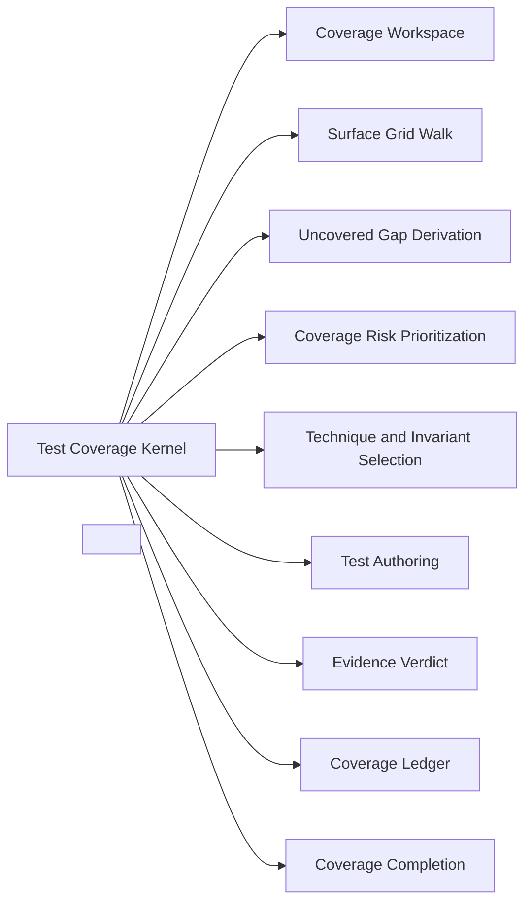

### Coverage Workspace

- Domain: [test-coverage](ALGORITHMS.md#algorithms-domain-test-coverage)
- Tier: [process](SCHEMA.md#vocabulary-domain-tier-process)
- Stage: [orient](REASONING.md#stage-orient)
- Axis: [ontology](REASONING.md#reasoning-axis-ontology)
- Math type: [set-theory](REASONING.md#reasoning-math-type-set-theory)
- Yields: set | boolean

Details

Intent
Establish the unit under test, load the test-surface catalog as the space of what can be wrong, and enumerate every surface the unit can carry, so coverage is measured against the full derivable space rather than an ad-hoc list.

Invariant
Coverage must be measured against the derivable surface space, not a remembered subset.

Flow

```text
UnitUnderTest → SurfaceCatalog → CandidateSurfaceSet → CoverageWorkspace
```

Productions

```bnf
CoverageWorkspace ::= <UnitUnderTest> "→" <SurfaceCatalog> "→" <CandidateSurfaceSet>
```

Composes
none

Composed by
[Test Coverage Kernel](ALGORITHMS.md#algorithms-test-coverage-kernel)

Named in the derivation of
[Test Coverage Kernel](ALGORITHMS.md#algorithms-test-coverage-kernel)

Forces
[correctness_verification](SCHEMA.md#force-correctness-verification)

Grounds
none

Before

```text
Testing starts from whatever surfaces come to mind, with no record of the full space a system can fail in.
```

After

```text
unit under test → load the test-surface catalog{dimension x lens → invariant, technique} → a coverage workspace enumerating every surface the unit can carry
```

How it is checked

Checked by
the evidence verdict, which is pass or fail only against a non-empty evidence set, the covered-surfaces check on each module's declaration

Population
Every surface the unit can fail in

Freshness
A verdict stands until the unit's code or its tests change

Refusal
A required surface with no evidence stays unknown, and completion is refused while any required surface is unknown

Observation
The runtime techniques among the surfaces' lists, which locate failures without certifying their absence

Evidence
None, because the catalog states this check as a class, so a watched run belongs to each system that adopts it

Authoritative side
The evidence set, which a verdict is decided from, so a required surface without evidence stays unknown

Depends on
Not answered

Shape it refuses
Not answered

### Surface Grid Walk

- Domain: [test-coverage](ALGORITHMS.md#algorithms-domain-test-coverage)
- Tier: [process](SCHEMA.md#vocabulary-domain-tier-process)
- Stage: [see](REASONING.md#stage-see)
- Axis: [analysis](REASONING.md#reasoning-axis-analysis)
- Math type: [set-theory](REASONING.md#reasoning-math-type-set-theory)
- Yields: set | boolean

Details

Intent
Walk the dimension-by-lens grid across the catalog, mark every cell that carries a surface, and surface the empty cells as candidate gaps using the anomaly lens, so a missing aspect is detected structurally rather than by recollection.

Invariant
An empty (dimension x lens) cell that can fail is an untested aspect until a surface is derived for it.

Flow

```text
SurfaceCatalog → GridWalk → PresentCellSet → CandidateGapSet
```

Productions

```bnf
SurfaceGridWalk ::= <CandidateSurfaceSet> "→" <DimensionLensGrid> "→" <PresentCellSet> "," <CandidateGapSet>
DimensionLensGrid ::= <OntologyDimension> "x" <AnalysisLens>
```

Composes
none

Composed by
[Test Coverage Kernel](ALGORITHMS.md#algorithms-test-coverage-kernel)

Named in the derivation of
[Test Coverage Kernel](ALGORITHMS.md#algorithms-test-coverage-kernel)

Forces
[correctness_verification](SCHEMA.md#force-correctness-verification), [semantic_consistency](SCHEMA.md#force-semantic-consistency)

Grounds
[anomaly](REASONING.md#reasoning-lens-anomaly), [semantic-correctness](REASONING.md#reasoning-test-surface-semantic-correctness)

Before

```text
Coverage is asserted from the surfaces already tested, so the empty cells of the dimension x lens grid stay invisible.
```

After

```text
catalog → walk (dimension x lens) grid → present cells (a surface exists) vs empty cells (no surface) → the candidate-gap set the anomaly lens surfaces
```

How it is checked

Checked by
the evidence verdict, which is pass or fail only against a non-empty evidence set, the covered-surfaces check on each module's declaration

Population
Every surface the unit can fail in

Freshness
A verdict stands until the unit's code or its tests change

Refusal
A required surface with no evidence stays unknown, and completion is refused while any required surface is unknown

Observation
The runtime techniques among the surfaces' lists, which locate failures without certifying their absence

Evidence
None, because the catalog states this check as a class, so a watched run belongs to each system that adopts it

Authoritative side
The evidence set, which a verdict is decided from, so a required surface without evidence stays unknown

Depends on
Not answered

Shape it refuses
Not answered

### Uncovered Gap Derivation

- Domain: [test-coverage](ALGORITHMS.md#algorithms-domain-test-coverage)
- Tier: [process](SCHEMA.md#vocabulary-domain-tier-process)
- Stage: [derive](REASONING.md#stage-derive)
- Axis: [reasoning](REASONING.md#reasoning-axis-reasoning)
- Math type: [logic](REASONING.md#reasoning-math-type-logic)
- Yields: boolean

Details

Intent
Reduce the candidate-gap set to the cells this unit can fail in, yielding the required-but-uncovered surfaces that still owe a test, so effort is spent on gaps that can fail rather than the full cartesian complement.

Invariant
A gap counts only where the unit can fail; the coverage obligation is the required set, not the whole grid.

Flow

```text
CandidateGapSet → FailabilityFilter → RequiredUncoveredSet
```

Productions

```bnf
UncoveredGapDerivation ::= <CandidateGapSet> "→" <FailabilityFilter> "→" <RequiredUncoveredSet>
```

Composes
none

Composed by
[Test Coverage Kernel](ALGORITHMS.md#algorithms-test-coverage-kernel)

Named in the derivation of
[Test Coverage Kernel](ALGORITHMS.md#algorithms-test-coverage-kernel)

Forces
[correctness_verification](SCHEMA.md#force-correctness-verification)

Grounds
none

Before

```text
The gap set is treated as final, so cells that cannot fail for this unit are chased and the gaps that can fail are diluted.
```

After

```text
candidate gaps → keep only cells this unit can fail in → required-but-uncovered set = the surfaces still owed a test
```

How it is checked

Checked by
the evidence verdict, which is pass or fail only against a non-empty evidence set, the covered-surfaces check on each module's declaration

Population
Every surface the unit can fail in

Freshness
A verdict stands until the unit's code or its tests change

Refusal
A required surface with no evidence stays unknown, and completion is refused while any required surface is unknown

Observation
The runtime techniques among the surfaces' lists, which locate failures without certifying their absence

Evidence
None, because the catalog states this check as a class, so a watched run belongs to each system that adopts it

Authoritative side
The evidence set, which a verdict is decided from, so a required surface without evidence stays unknown

Depends on
Not answered

Shape it refuses
Not answered

### Coverage Risk Prioritization

- Domain: [test-coverage](ALGORITHMS.md#algorithms-domain-test-coverage)
- Tier: [process](SCHEMA.md#vocabulary-domain-tier-process)
- Stage: [intent](REASONING.md#stage-intent)
- Axis: [teleology](REASONING.md#reasoning-axis-teleology)
- Math type: [optimization](REASONING.md#reasoning-math-type-optimization)
- Yields: boolean | ranking

Details

Intent
Score each required-uncovered surface by failure impact and reachability, rank the surfaces, and address the highest-risk gaps first, so limited testing effort removes the most risk.

Invariant
The highest-risk uncovered surface is tested first.

Flow

```text
RequiredUncoveredSet → RiskScore → PrioritisedSurfaceQueue
```

Productions

```bnf
CoverageRiskPrioritisation ::= <RequiredUncoveredSet> "→" <RiskScoreSet> "→" <PrioritisedSurfaceQueue>
RiskScore ::= <FailureImpact> "*" <Reachability>
```

Composes
none

Composed by
[Test Coverage Kernel](ALGORITHMS.md#algorithms-test-coverage-kernel)

Named in the derivation of
[Test Coverage Kernel](ALGORITHMS.md#algorithms-test-coverage-kernel)

Forces
[correctness_verification](SCHEMA.md#force-correctness-verification)

Grounds
[tel-priority](REASONING.md#reasoning-node-tel-priority)

Before

```text
Every uncovered surface is treated as equally urgent, so a rarely hit cosmetic gap competes with an unguarded security boundary.
```

After

```text
required-uncovered surfaces → failure-impact x reachability → priority → the highest-risk surfaces first
```

How it is checked

Checked by
the evidence verdict, which is pass or fail only against a non-empty evidence set, the covered-surfaces check on each module's declaration

Population
Every surface the unit can fail in

Freshness
A verdict stands until the unit's code or its tests change

Refusal
A required surface with no evidence stays unknown, and completion is refused while any required surface is unknown

Observation
The runtime techniques among the surfaces' lists, which locate failures without certifying their absence

Evidence
None, because the catalog states this check as a class, so a watched run belongs to each system that adopts it

Authoritative side
The evidence set, which a verdict is decided from, so a required surface without evidence stays unknown

Depends on
Not answered

Shape it refuses
Not answered

### Technique and Invariant Selection

- Domain: [test-coverage](ALGORITHMS.md#algorithms-domain-test-coverage)
- Tier: [process](SCHEMA.md#vocabulary-domain-tier-process)
- Stage: [project](REASONING.md#stage-project)
- Axis: [reasoning](REASONING.md#reasoning-axis-reasoning)
- Math type: [algebra](REASONING.md#reasoning-math-type-algebra)
- Yields: ordered-structure

Details

Intent
For each prioritized surface, state the invariant that must hold and select the technique whose reasoning mode matches how that surface is observed, so the test asserts the right property by the right method.

Invariant
The technique is chosen by matching its reasoning mode to the surface, and the assertion is the surface's invariant.

Flow

```text
Surface → InvariantStatement → ModeMatchedTechnique → SurfacePlan
```

Productions

```bnf
TechniqueInvariantSelection ::= <Surface> "→" <Invariant> "," <ModeMatchedTechnique> "→" <SurfacePlan>
```

Composes
none

Composed by
[Test Coverage Kernel](ALGORITHMS.md#algorithms-test-coverage-kernel)

Named in the derivation of
[Test Coverage Kernel](ALGORITHMS.md#algorithms-test-coverage-kernel)

Forces
[correctness_verification](SCHEMA.md#force-correctness-verification), [contract_compatibility](SCHEMA.md#force-contract-compatibility)

Grounds
none

Before

```text
A test is written before deciding what must hold or how to obtain evidence, so it asserts an accidental condition with the wrong technique.
```

After

```text
surface → state its invariant (the assertion) → pick the technique whose reasoning mode matches how the surface is observed → a matched (invariant, technique) plan
```

How it is checked

Checked by
the evidence verdict, which is pass or fail only against a non-empty evidence set, the covered-surfaces check on each module's declaration

Population
Every surface the unit can fail in

Freshness
A verdict stands until the unit's code or its tests change

Refusal
A required surface with no evidence stays unknown, and completion is refused while any required surface is unknown

Observation
The runtime techniques among the surfaces' lists, which locate failures without certifying their absence

Evidence
None, because the catalog states this check as a class, so a watched run belongs to each system that adopts it

Authoritative side
The evidence set, which a verdict is decided from, so a required surface without evidence stays unknown

Depends on
Not answered

Shape it refuses
Not answered

### Test Authoring

- Domain: [test-coverage](ALGORITHMS.md#algorithms-domain-test-coverage)
- Tier: [process](SCHEMA.md#vocabulary-domain-tier-process)
- Stage: [act](REASONING.md#stage-act)
- Axis: [formalization](REASONING.md#reasoning-axis-formalization)
- Math type: [computation](REASONING.md#reasoning-math-type-computation)
- Yields: procedure

Details

Intent
Realize each surface plan as an executable test: encode the predicate as an assertion and wire the evidence source the technique requires, producing a runnable test that covers the surface.

Invariant
A covered surface has an executable test whose predicate is checkable and whose evidence source is wired.

Flow

```text
SurfacePlan → PredicateAssertion → EvidenceWiring → RunnableTest
```

Productions

```bnf
TestAuthoring ::= <SurfacePlan> "→" <PredicateAssertion> "," <EvidenceWiring> "→" <RunnableTest>
```

Composes
none

Composed by
[Test Coverage Kernel](ALGORITHMS.md#algorithms-test-coverage-kernel)

Named in the derivation of
[Test Coverage Kernel](ALGORITHMS.md#algorithms-test-coverage-kernel)

Forces
[correctness_verification](SCHEMA.md#force-correctness-verification)

Grounds
none

Before

```text
The plan stays a note; the predicate is never realized as an executable check that gathers evidence.
```

After

```text
surface plan → realize the predicate as an executable assertion → wire the evidence source the technique requires → a runnable test for the surface
```

How it is checked

Checked by
the evidence verdict, which is pass or fail only against a non-empty evidence set, the covered-surfaces check on each module's declaration

Population
Every surface the unit can fail in

Freshness
A verdict stands until the unit's code or its tests change

Refusal
A required surface with no evidence stays unknown, and completion is refused while any required surface is unknown

Observation
The runtime techniques among the surfaces' lists, which locate failures without certifying their absence

Evidence
None, because the catalog states this check as a class, so a watched run belongs to each system that adopts it

Authoritative side
The evidence set, which a verdict is decided from, so a required surface without evidence stays unknown

Depends on
Not answered

Shape it refuses
Not answered

### Evidence Verdict

- Domain: [test-coverage](ALGORITHMS.md#algorithms-domain-test-coverage)
- Tier: [process](SCHEMA.md#vocabulary-domain-tier-process)
- Stage: [verify](REASONING.md#stage-verify)
- Axis: [verification](REASONING.md#reasoning-axis-verification)
- Math type: [logic](REASONING.md#reasoning-math-type-logic)
- Yields: boolean

Details

Intent
Run each test, gather its evidence, and issue the verdict: pass or fail when the evidence set is non-empty, unknown when it is empty, so an untested or unrun surface reads as unknown rather than as a silent pass.

Invariant
A verdict is pass or fail only against a non-empty evidence set; no evidence yields unknown, never pass.

Flow

```text
RunnableTest → EvidenceSet → Verdict
```

Productions

```bnf
EvidenceVerdict ::= <RunnableTest> "→" <EvidenceSet> "→" <Verdict>
Verdict ::= "pass" | "fail" | "unknown"
```

Composes
none

Composed by
[Test Coverage Kernel](ALGORITHMS.md#algorithms-test-coverage-kernel)

Named in the derivation of
[Test Coverage Kernel](ALGORITHMS.md#algorithms-test-coverage-kernel)

Forces
[correctness_verification](SCHEMA.md#force-correctness-verification)

Grounds
[ver-evidence](REASONING.md#reasoning-node-ver-evidence)

Before

```text
A surface with no run is silently treated as passing, so absence of evidence reads as evidence of correctness.
```

After

```text
run the test → gather evidence → non-empty evidence set: pass or fail; empty evidence set: unknown (the coverage-gap state), never pass
```

How it is checked

Checked by
the evidence verdict, which is pass or fail only against a non-empty evidence set, the covered-surfaces check on each module's declaration

Population
Every surface the unit can fail in

Freshness
A verdict stands until the unit's code or its tests change

Refusal
A required surface with no evidence stays unknown, and completion is refused while any required surface is unknown

Observation
The runtime techniques among the surfaces' lists, which locate failures without certifying their absence

Evidence
None, because the catalog states this check as a class, so a watched run belongs to each system that adopts it

Authoritative side
The evidence set, which a verdict is decided from, so a required surface without evidence stays unknown

Depends on
Not answered

Shape it refuses
Not answered

### Coverage Ledger

- Domain: [test-coverage](ALGORITHMS.md#algorithms-domain-test-coverage)
- Tier: [process](SCHEMA.md#vocabulary-domain-tier-process)
- Stage: [commit](REASONING.md#stage-commit)
- Axis: [representation](REASONING.md#reasoning-axis-representation)
- Math type: [information-theory](REASONING.md#reasoning-math-type-information-theory)
- Yields: hash | novelty-score

Details

Intent
Record each surface's verdict in a durable coverage ledger together with the residual uncovered and unknown set, so coverage state is reusable evidence rather than a fact re-derived on every run.

Invariant
Coverage state is durable ledger evidence, not a per-run recomputation.

Flow

```text
VerdictSet → CoverageLedger → ResidualGapSet
```

Productions

```bnf
CoverageLedger ::= <VerdictSet> "→" <SurfaceLedger> "→" <ResidualGapSet>
```

Composes
none

Composed by
[Test Coverage Kernel](ALGORITHMS.md#algorithms-test-coverage-kernel)

Named in the derivation of
[Test Coverage Kernel](ALGORITHMS.md#algorithms-test-coverage-kernel)

Forces
[correctness_verification](SCHEMA.md#force-correctness-verification), [architecture_evolution](SCHEMA.md#force-architecture-evolution)

Grounds
none

Before

```text
Each run forgets the last, so which surfaces are covered, uncovered, or unknown must be re-derived every time.
```

After

```text
verdicts → a durable coverage ledger{surface → verdict} + the residual uncovered/unknown set → reusable coverage state
```

How it is checked

Checked by
the evidence verdict, which is pass or fail only against a non-empty evidence set, the covered-surfaces check on each module's declaration

Population
Every surface the unit can fail in

Freshness
A verdict stands until the unit's code or its tests change

Refusal
A required surface with no evidence stays unknown, and completion is refused while any required surface is unknown

Observation
The runtime techniques among the surfaces' lists, which locate failures without certifying their absence

Evidence
None, because the catalog states this check as a class, so a watched run belongs to each system that adopts it

Authoritative side
The evidence set, which a verdict is decided from, so a required surface without evidence stays unknown

Depends on
Not answered

Shape it refuses
Not answered

### Coverage Completion

- Domain: [test-coverage](ALGORITHMS.md#algorithms-domain-test-coverage)
- Tier: [process](SCHEMA.md#vocabulary-domain-tier-process)
- Stage: [terminate](REASONING.md#stage-terminate)
- Axis: [termination](REASONING.md#reasoning-axis-termination)
- Math type: [logic](REASONING.md#reasoning-math-type-logic)
- Yields: boolean

Details

Intent
Mark coverage complete only when every required surface carries a surface, a technique, and an invariant, and its verdict is non-unknown; any required surface still unknown leaves coverage incomplete.

Invariant
Completion is the absence of required-unknown surfaces, not an aggregate percentage.

Flow

```text
CoverageLedger → RequiredSurfaceCheck → CompletionVerdict
```

Productions

```bnf
CoverageCompletion ::= <CoverageLedger> "→" <RequiredSurfaceCheck> "→" <CompletionVerdict>
CompletionVerdict ::= "coverage_complete" | "coverage_incomplete"
```

Composes
none

Composed by
[Test Coverage Kernel](ALGORITHMS.md#algorithms-test-coverage-kernel)

Named in the derivation of
[Test Coverage Kernel](ALGORITHMS.md#algorithms-test-coverage-kernel)

Forces
[correctness_verification](SCHEMA.md#force-correctness-verification)

Grounds
[ter-stop](REASONING.md#reasoning-node-ter-stop)

Before

```text
Coverage is declared done while required surfaces remain unknown, so the untested cells hide behind an aggregate percentage.
```

After

```text
ledger → every required surface carries a surface + technique + invariant AND a non-unknown verdict → complete; any required-unknown remains → incomplete
```

How it is checked

Checked by
the evidence verdict, which is pass or fail only against a non-empty evidence set, the covered-surfaces check on each module's declaration

Population
Every surface the unit can fail in

Freshness
A verdict stands until the unit's code or its tests change

Refusal
A required surface with no evidence stays unknown, and completion is refused while any required surface is unknown

Observation
The runtime techniques among the surfaces' lists, which locate failures without certifying their absence

Evidence
None, because the catalog states this check as a class, so a watched run belongs to each system that adopts it

Authoritative side
The evidence set, which a verdict is decided from, so a required surface without evidence stays unknown

Depends on
Not answered

Shape it refuses
Not answered

### Test Coverage Kernel

- Domain: [test-coverage](ALGORITHMS.md#algorithms-domain-test-coverage)
- Tier: [process](SCHEMA.md#vocabulary-domain-tier-process)
- Math type: [computation](REASONING.md#reasoning-math-type-computation)
- Yields: procedure

Details

Intent
Load the surface catalog for a unit, walk the dimension-by-lens grid, derive the required-uncovered surfaces, prioritize them by risk, select a mode-matched technique and invariant per surface, author the test, issue an evidence verdict, ledger the state, and terminate only when no required surface remains unknown.

Invariant
Test coverage is a derivation from the surface space to a durable verdict ledger, complete only when no required surface is unknown.

Flow

```text
Workspace → GridWalk → GapDerivation → RiskPriority → TechniqueInvariant → TestAuthoring → EvidenceVerdict → Ledger → Completion
```

Productions

```bnf
TestCoverageKernel ::= <CoverageWorkspace> "→" <SurfaceGridWalk> "→" <UncoveredGapDerivation> "→" <CoverageRiskPrioritisation> "→" <TechniqueInvariantSelection> "→" <TestAuthoring> "→" <EvidenceVerdict> "→" <CoverageLedger> "→" <CoverageCompletion>
```

Composes
[Coverage Workspace](ALGORITHMS.md#algorithms-coverage-workspace), [Surface Grid Walk](ALGORITHMS.md#algorithms-surface-grid-walk), [Uncovered Gap Derivation](ALGORITHMS.md#algorithms-uncovered-gap-derivation), [Coverage Risk Prioritization](ALGORITHMS.md#algorithms-coverage-risk-prioritization), [Technique and Invariant Selection](ALGORITHMS.md#algorithms-technique-invariant-selection), [Test Authoring](ALGORITHMS.md#algorithms-test-authoring), [Evidence Verdict](ALGORITHMS.md#algorithms-evidence-verdict), [Coverage Ledger](ALGORITHMS.md#algorithms-coverage-ledger), [Coverage Completion](ALGORITHMS.md#algorithms-coverage-completion)

Forces
[correctness_verification](SCHEMA.md#force-correctness-verification), [semantic_consistency](SCHEMA.md#force-semantic-consistency), [architecture_evolution](SCHEMA.md#force-architecture-evolution)

Principle
[Specification-Based Testing](PRINCIPLES.md#architecture-specification-based-testing)

Grounds
[derivation-loop](REASONING.md#reasoning-loop-derivation-loop)

Derivation map

orient
[Coverage Workspace](ALGORITHMS.md#algorithms-coverage-workspace)

see
[Surface Grid Walk](ALGORITHMS.md#algorithms-surface-grid-walk)

derive
[Uncovered Gap Derivation](ALGORITHMS.md#algorithms-uncovered-gap-derivation)

intent
[Coverage Risk Prioritization](ALGORITHMS.md#algorithms-coverage-risk-prioritization)

project
[Technique and Invariant Selection](ALGORITHMS.md#algorithms-technique-invariant-selection)

act
[Test Authoring](ALGORITHMS.md#algorithms-test-authoring)

verify
[Evidence Verdict](ALGORITHMS.md#algorithms-evidence-verdict)

commit
[Coverage Ledger](ALGORITHMS.md#algorithms-coverage-ledger)

terminate
[Coverage Completion](ALGORITHMS.md#algorithms-coverage-completion)

Before

```text
Coverage is pursued by intuition and reported as a percentage, so the space a system can fail in is never walked and unknown surfaces pass silently.
```

After

```text
workspace → grid walk → gap derivation → risk priority → technique+invariant → authored test → evidence verdict → ledger → completion
```

How it is checked

Checked by
the evidence verdict, which is pass or fail only against a non-empty evidence set, the covered-surfaces check on each module's declaration

Population
Every surface the unit can fail in

Freshness
A verdict stands until the unit's code or its tests change

Refusal
A required surface with no evidence stays unknown, and completion is refused while any required surface is unknown

Observation
The runtime techniques among the surfaces' lists, which locate failures without certifying their absence

Evidence
None, because the catalog states this check as a class, so a watched run belongs to each system that adopts it

Authoritative side
The evidence set, which a verdict is decided from, so a required surface without evidence stays unknown

Depends on
[Coverage Workspace](ALGORITHMS.md#algorithms-coverage-workspace), [Surface Grid Walk](ALGORITHMS.md#algorithms-surface-grid-walk), [Uncovered Gap Derivation](ALGORITHMS.md#algorithms-uncovered-gap-derivation), [Coverage Risk Prioritization](ALGORITHMS.md#algorithms-coverage-risk-prioritization), [Technique and Invariant Selection](ALGORITHMS.md#algorithms-technique-invariant-selection), [Test Authoring](ALGORITHMS.md#algorithms-test-authoring), [Evidence Verdict](ALGORITHMS.md#algorithms-evidence-verdict), [Coverage Ledger](ALGORITHMS.md#algorithms-coverage-ledger), [Coverage Completion](ALGORITHMS.md#algorithms-coverage-completion)

Shape it refuses
Not answered

### <Test Coverage Concern>

- Domain: [test-coverage](ALGORITHMS.md#algorithms-domain-test-coverage)
- Tier: [process](SCHEMA.md#vocabulary-domain-tier-process)
- Meta record

Details

Intent
<Load the surface catalog for a unit> → <Walk the dimension x lens grid> → <Derive the required-uncovered surfaces> → <Prioritize by risk> → <Select a mode-matched technique and its invariant> → <Author the test> → <Issue an evidence verdict> → <Ledger the coverage state> → <Terminate when no required surface is unknown>

Invariant
Coverage is complete when every (dimension x lens) surface the unit can fail in carries a surface, a technique, and an invariant with a non-unknown verdict.

Flow

```text
SurfaceSpace → GridWalk → RequiredGaps → Priority → TechniqueInvariant → AuthoredTest → Verdict → Ledger
```

Productions

```bnf
TestCoverageConcern ::= <SurfaceCatalog> "→" <DimensionLensGrid> "→" <RequiredUncoveredSet> "→" <PrioritisedSurfaceQueue> "→" <SurfacePlanSet> "→" <RunnableTestSet> "→" <VerdictSet> "→" <CoverageLedger>
```

Composes
none

Forces
[correctness_verification](SCHEMA.md#force-correctness-verification), [semantic_consistency](SCHEMA.md#force-semantic-consistency)

Grounds
none

How it is checked

Checked by
the evidence verdict, which is pass or fail only against a non-empty evidence set, the covered-surfaces check on each module's declaration

Population
Every surface the unit can fail in

Freshness
A verdict stands until the unit's code or its tests change

Refusal
A required surface with no evidence stays unknown, and completion is refused while any required surface is unknown

Observation
The runtime techniques among the surfaces' lists, which locate failures without certifying their absence

Evidence
None, because the catalog states this check as a class, so a watched run belongs to each system that adopts it

Authoritative side
The evidence set, which a verdict is decided from, so a required surface without evidence stays unknown

Depends on
Not answered

Shape it refuses
Not answered

## Pattern Abstract Grammar

Every algorithm contract in this domain is listed with its position on the derivation loop, its intent and invariant, the flow it walks and its productions as a grammar. Each record also shows what it composes and is composed by, which forces and principles it answers to, what grounds it and what it grounds, and an exemplar where the record carries one. The diagram shows what composes what inside the domain.

Relations diagram

What composes what inside this domain.

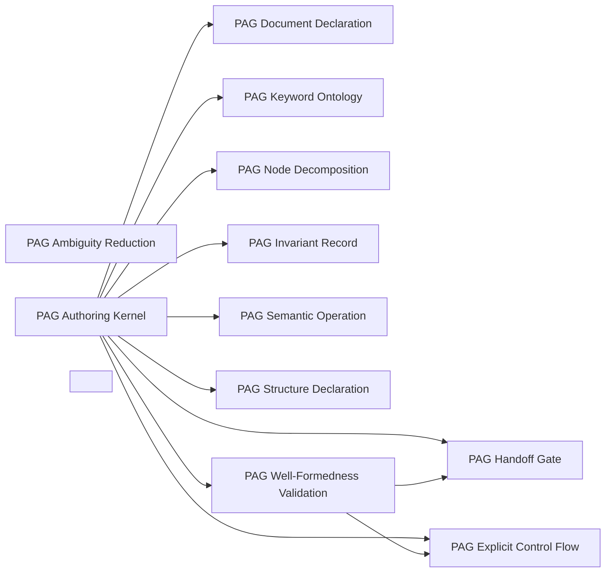

### PAG Document Declaration

- Domain: [pag](ALGORITHMS.md#algorithms-domain-pag)
- Tier: [process](SCHEMA.md#vocabulary-domain-tier-process)
- Stage: [orient](REASONING.md#stage-orient)
- Axis: [ontology](REASONING.md#reasoning-axis-ontology)
- Math type: [set-theory](REASONING.md#reasoning-math-type-set-theory)
- Yields: set | boolean

Details

Intent
Bind a document to a declared type and its default verb (THIS <TYPE> <VERB> <description>) after the YAML frontmatter and before any node, then declare in the meta block what the document is for, which sources ground which, what it trusts, what it may touch and what it declares outside itself, and how far repair may recurse.

Invariant
A PAG document announces what kind of instruction it is, and what it may touch, before it instructs.

Flow

```text
Frontmatter → TypeDeclaration → DefaultVerb → MetaBlock → Jurisdiction → DeclaredContract
```

Productions

```bnf
PagDocumentDeclaration ::= <Frontmatter> "→" <TypeDeclaration> "→" <MetaBlock> "→" <DeclaredContract>
PagDocumentType ::= "AGENT" | "WORKFLOW" | "PROTOCOL" | "POLICY" | "CHECKLIST" | "TEMPLATE" | "TASK" | "INSTRUCTION" | "PROMPT" | "COMMAND" | "TEST" | "DEBUG" | "VERIFICATION" | "DISTILLATION" | "AUDIT" | "TRANSLATION" | "COMPOSITION"
PagDocumentVerb ::= "IS" | "ENFORCES" | "EXECUTES" | "PERFORMS" | "PROVIDES" | "IMPLEMENTS" | "DEFINES" | "MANAGES" | "COORDINATES" | "HAS" | "GENERATES" | "RESOLVES" | "FINDS" | "FIXES" | "VERIFIES" | "CLASSIFIES" | "DISTILLS" | "ABSTRACTS" | "ELIMINATES" | "AUDITS" | "MEASURES" | "SCORES" | "CORRECTS" | "RENDERS" | "COMPOSES" | "FOLDS"
PagMetaField ::= "objective" | "priority" | "trust" | "jurisdiction" | "recursion_limit"
```

Composes
none

Composed by
[PAG Authoring Kernel](ALGORITHMS.md#algorithms-pag-authoring-kernel)

Named in the derivation of
[PAG Authoring Kernel](ALGORITHMS.md#algorithms-pag-authoring-kernel)

Forces
[semantic_consistency](SCHEMA.md#force-semantic-consistency), [contract_compatibility](SCHEMA.md#force-contract-compatibility), [metaprogramming_modeling](SCHEMA.md#force-metaprogramming-modeling)

Grounds
none

Before

```text
A document instructs with no declared type — its semantic contract, its authority and its jurisdiction are implicit.
```

After

```text
frontmatter → THIS {AGENT|WORKFLOW|CHECKLIST} {IS|EXECUTES|ENFORCES} description → META block{objective, priority, trust, jurisdiction, recursion_limit} → declared contract
```

How it is checked

Checked by
the structured-document validator, whose defect set is the grammar's failure taxonomy

Population
Every agent and template document written in the grammar

Freshness
A verdict stands until a document or the grammar changes

Refusal
The validation stage fails on any defect code

Observation
None, because a document is verified before any run

Evidence
Watched to fire and to accept: a suite plants each defect code in a node-form document and validates a well-formed document clean

Authoritative side
The grammar, which every document conforms to

Depends on
Not answered

Shape it refuses
Not answered

### PAG Keyword Ontology

- Domain: [pag](ALGORITHMS.md#algorithms-domain-pag)
- Tier: [process](SCHEMA.md#vocabulary-domain-tier-process)
- Stage: [see](REASONING.md#stage-see)
- Axis: [analysis](REASONING.md#reasoning-axis-analysis)
- Math type: [set-theory](REASONING.md#reasoning-math-type-set-theory)
- Yields: set | boolean

Details

Intent
Draw every operative token from a fixed, uppercase, code-frequent vocabulary partitioned into semantic categories, each token grounded to a record in the reasoning ontology, and bind targets to sources through explicit prepositions, so the model completes recognized structured patterns rather than interpreting prose.

Invariant
Explicit high-frequency uppercase tokens, each grounded to a reasoning record, reduce interpretive variance; prose does not.

Flow

```text
ProseIntent → KeywordCategory → UppercaseToken → ReasoningGround → PrepositionBinding → StructuredDirective
```

Productions

```bnf
PagKeywordOntology ::= <KeywordCategory> "→" <KeywordToken> "→" <ReasoningGround> "→" <PrepositionBinding> "→" <StructuredDirective>
PagKeywordCategory ::= "semantic_operation" | "node" | "action" | "control_flow" | "declaration" | "modifier" | "coordination" | "state_machine" | "dag" | "priority_queue" | "flowchart" | "document_type" | "document_verb" | "meta" | "validation" | "report" | "invariant" | "contextual"
PagPreposition ::= "FROM" | "TO" | "INTO" | "WITH" | "USING" | "AGAINST" | "IN" | "AS"
```

Composes
none

Composed by
[PAG Authoring Kernel](ALGORITHMS.md#algorithms-pag-authoring-kernel)

Named in the derivation of
[PAG Authoring Kernel](ALGORITHMS.md#algorithms-pag-authoring-kernel)

Forces
[metaprogramming_modeling](SCHEMA.md#force-metaprogramming-modeling), [semantic_consistency](SCHEMA.md#force-semantic-consistency), [correctness_verification](SCHEMA.md#force-correctness-verification)

Grounds
none

Before

```text
'Get the data and check it' — prose the model must interpret.
```

After

```text
prose intent → uppercase token{READ_RESOURCE|ANALYZE_CONTENT|VALIDATE_ARTIFACT} + preposition{FROM|INTO|AGAINST} → structured directive, low interpretive variance
```

How it is checked

Checked by
the structured-document validator, whose defect set is the grammar's failure taxonomy

Population
Every agent and template document written in the grammar

Freshness
A verdict stands until a document or the grammar changes

Refusal
The validation stage fails on any defect code

Observation
None, because a document is verified before any run

Evidence
Watched to fire and to accept: a suite plants each defect code in a node-form document and validates a well-formed document clean

Authoritative side
The grammar, which every document conforms to

Depends on
Not answered

Shape it refuses
Not answered

### PAG Node Decomposition

- Domain: [pag](ALGORITHMS.md#algorithms-domain-pag)
- Tier: [process](SCHEMA.md#vocabulary-domain-tier-process)
- Stage: [project](REASONING.md#stage-project)
- Axis: [reasoning](REASONING.md#reasoning-axis-reasoning)
- Math type: [graph](REASONING.md#reasoning-math-type-graph)
- Yields: edge-list

Details

Intent
Group directives into nodes, each one decision on one reasoning axis, headed by its layer, axis, math type and the shape its decision yields, tagged with the substrate stage its artifact comes to be at, and contracted so that its input names the prior node's output or a declared slot, its transform is stated in semantic operations, and its output is the one record the next node reads.

Invariant
Each node is one bounded decision whose data flow from the prior node is declared by identity, never inferred from a name.

Flow

```text
DirectiveSet → NodeHeader → GenesisStage → Contract → DeclaredInput → NodeOutput
```

Productions

```bnf
PagNodeDecomposition ::= <DirectiveSet> "→" <NodeSet> "→" <DataFlowGraph>
PagNodeHeader ::= "#" "NODE" <NodeNumber> "—" <NodeTitle> "[" <Layer> "·" <Axis> "·" <MathType> "·" "yields:" <Shape> "]"
PagNodeContract ::= "CONTRACT:" "input:" <PriorOutputOrSlot> "transform:" <SemanticOperations> "output:" <NodeOutput> <OptionalFreshness>
PagScopeRule ::= "declare_before_use" "," "document_wide_scope" "," "prior_output_only"
```

Composes
none

Composed by
[PAG Authoring Kernel](ALGORITHMS.md#algorithms-pag-authoring-kernel)

Named in the derivation of
[PAG Authoring Kernel](ALGORITHMS.md#algorithms-pag-authoring-kernel)

Forces
[modularity](SCHEMA.md#force-modularity), [domain_boundary](SCHEMA.md#force-domain-boundary), [contract_compatibility](SCHEMA.md#force-contract-compatibility)

Grounds
none

Before

```text
Directives poured in one flat block, forward-referencing later work, with no statement of what each block decides or what shape its decision takes.
```

After

```text
directives → nodes{# NODE n — NAME [layer · axis · math type · yields: shape], @genesis, CONTRACT input/transform/output, one gate} → a node reads only the prior node's output → explicit data flow
```

How it is checked

Checked by
the structured-document validator, whose defect set is the grammar's failure taxonomy

Population
Every agent and template document written in the grammar

Freshness
A verdict stands until a document or the grammar changes

Refusal
The validation stage fails on any defect code

Observation
None, because a document is verified before any run

Evidence
Watched to fire and to accept: a suite plants each defect code in a node-form document and validates a well-formed document clean

Authoritative side
The grammar, which every document conforms to

Depends on
Not answered

Shape it refuses
Not answered

### PAG Handoff Gate

- Domain: [pag](ALGORITHMS.md#algorithms-domain-pag)
- Tier: [process](SCHEMA.md#vocabulary-domain-tier-process)
- Stage: [verify](REASONING.md#stage-verify)
- Axis: [verification](REASONING.md#reasoning-axis-verification)
- Math type: [logic](REASONING.md#reasoning-math-type-logic)
- Yields: boolean

Details

Intent
Close every node with a handoff gate of three-to-five checks, each a claim about the output with the evidence that settles it and the population it was measured over, a refusal condition named before any irreversible write, the standing of the read set beside the verdict, and a result line that routes pass to the next node, each failure to the earliest node that owns its repair, and unknown to blocked.

Invariant
A node boundary is trusted only when its checks carry evidence and a population, its writes are refused before they land, and its unknown is routed; unknown is not pass.

Flow

```text
NodeOutput → CheckWithEvidence → Population → Refusal → Standing → ThreeVerdicts → ResultLine
```

Productions

```bnf
PagHandoffGate ::= <NodeOutput> "→" <CheckLineSet> "→" <OptionalRefusal> "→" <OptionalStanding> "→" <ResultLine>
PagCheckLine ::= "[check]" <Claim> "(evidence:" <Evidence> ")" "over:" <Set> "measured:" <Count> "/" <Count>
PagVerdict ::= "pass" | "fail" | "unknown"
PagResultLine ::= "result:" "pass" "→" <NextNode> "|" <Failure> "→" "REPAIR" "(owner:" <Node> ")" "|" "unknown" "→" "BLOCKED"
PagGateConstraint ::= "evidence_per_check" "," "population_declared" "," "three_to_five_checks" "," "refusal_before_write" "," "unknown_routed"
```

Composes
none

Composed by
[PAG Authoring Kernel](ALGORITHMS.md#algorithms-pag-authoring-kernel), [PAG Well-Formedness Validation](ALGORITHMS.md#algorithms-pag-well-formedness-validation)

Named in the derivation of
[PAG Authoring Kernel](ALGORITHMS.md#algorithms-pag-authoring-kernel)

Forces
[correctness_verification](SCHEMA.md#force-correctness-verification), [model_governance](SCHEMA.md#force-model-governance), [modularity](SCHEMA.md#force-modularity)

Grounds
[ver-evidence](REASONING.md#reasoning-node-ver-evidence), [ver-population](REASONING.md#reasoning-node-ver-population), [ver-refusal](REASONING.md#reasoning-node-ver-refusal), [ver-standing](REASONING.md#reasoning-node-ver-standing), [ter-block](REASONING.md#reasoning-node-ter-block)

Before

```text
A node ends with 'looks good' — a vague assertion with no evidence, no population, no refusal, and only two verdicts.
```

After

```text
node output → 3-5 checks{[check] claim (evidence: what settles it) over: set measured: n / N} + refuse: condition before write + standing: moved-set + result: pass → next | failure → REPAIR (owner) | unknown → BLOCKED
```

How it is checked

Checked by
the structured-document validator, whose defect set is the grammar's failure taxonomy

Population
Every agent and template document written in the grammar

Freshness
A verdict stands until a document or the grammar changes

Refusal
The validation stage fails on any defect code

Observation
None, because a document is verified before any run

Evidence
Watched to fire and to accept: a suite plants each defect code in a node-form document and validates a well-formed document clean

Authoritative side
The grammar, which every document conforms to

Depends on
Not answered

Shape it refuses
Not answered

### PAG Explicit Control Flow

- Domain: [pag](ALGORITHMS.md#algorithms-domain-pag)
- Tier: [process](SCHEMA.md#vocabulary-domain-tier-process)
- Stage: [act](REASONING.md#stage-act)
- Axis: [formalization](REASONING.md#reasoning-axis-formalization)
- Math type: [logic](REASONING.md#reasoning-math-type-logic)
- Yields: boolean

Details

Intent
Express branching with IF / ELSE IF / ELSE, iteration with FOR EACH over a collection (never a bare FOR), and failure handling with TRY / CATCH, every conditional colon-terminated and every branch a complete directive sequence.

Invariant
Control flow is explicit and colon-delimited so the model does not infer structure from prose sequence.

Flow

```text
Condition → BranchSet → IterationForm → FailureForm → DeterministicPath
```

Productions

```bnf
PagControlFlow ::= <Conditional> | <Iteration> | <FailureHandling>
PagIteration ::= "FOR" "EACH" <Iterator> "IN" <Collection> ":" <DirectiveSet>
PagControlConstraint ::= "colon_terminated" "," "for_each_not_for" "," "complete_branch_directives"
```

Composes
none

Composed by
[PAG Authoring Kernel](ALGORITHMS.md#algorithms-pag-authoring-kernel), [PAG Well-Formedness Validation](ALGORITHMS.md#algorithms-pag-well-formedness-validation)

Forces
[correctness_verification](SCHEMA.md#force-correctness-verification), [control_coordination](SCHEMA.md#force-control-coordination)

Grounds
none

Before

```text
Branching and iteration inferred from prose order; a bare FOR, a missing colon.
```

After

```text
IF/ELSE IF/ELSE + FOR EACH x IN collection + TRY/CATCH → every conditional colon-terminated, complete branch directives
```

How it is checked

Checked by
the structured-document validator, whose defect set is the grammar's failure taxonomy

Population
Every agent and template document written in the grammar

Freshness
A verdict stands until a document or the grammar changes

Refusal
The validation stage fails on any defect code

Observation
None, because a document is verified before any run

Evidence
Watched to fire and to accept: a suite plants each defect code in a node-form document and validates a well-formed document clean

Authoritative side
The grammar, which every document conforms to

Depends on
Not answered

Shape it refuses
Not answered

### PAG Invariant Record

- Domain: [pag](ALGORITHMS.md#algorithms-domain-pag)
- Tier: [process](SCHEMA.md#vocabulary-domain-tier-process)
- Stage: [constrain](REASONING.md#stage-constrain)
- Axis: [teleology](REASONING.md#reasoning-axis-teleology)
- Math type: [optimization](REASONING.md#reasoning-math-type-optimization)
- Yields: boolean | ranking

Details

Intent
State every behavioral invariant as a record with four slots: the property in a form that could be false, the set it quantifies over, the parties it binds, and the objector, the check that would disagree if the property stopped holding or none as declared debt, so an unwatched invariant is visible rather than assumed.

Invariant
An invariant is stated with its property, its set, its parties and its objector, or it is indistinguishable from a property a reader happened to infer.

Flow

```text
BehaviorPolicy → Property → Set → Parties → Objector → InvariantRecord
```

Productions

```bnf
PagInvariantBlock ::= "#" "CROSS-NODE" "INVARIANTS" <InvariantRecord>+
PagInvariantRecord ::= "INVARIANT" <Name> ":" <Property> "over:" <Set> "binds:" <Parties> "objector:" (<CheckRef> | "none")
PagInvariantQuality ::= "falsifiable" "," "quantified" "," "delivered" "," "watched"
```

Composes
none

Composed by
[PAG Authoring Kernel](ALGORITHMS.md#algorithms-pag-authoring-kernel)

Named in the derivation of
[PAG Authoring Kernel](ALGORITHMS.md#algorithms-pag-authoring-kernel)

Forces
[model_governance](SCHEMA.md#force-model-governance), [security_governance](SCHEMA.md#force-security-governance), [correctness_verification](SCHEMA.md#force-correctness-verification)

Grounds
none

Before

```text
Behavioral rules as a bullet list under ALWAYS and NEVER — no set the rule ranges over, no party it binds, nothing that would disagree if it stopped holding.
```

After

```text
INVARIANT name: property over: set binds: parties objector: check | none → each invariant stated in a form that could be false, with what watches it
```

How it is checked

Checked by
the structured-document validator, whose defect set is the grammar's failure taxonomy

Population
Every agent and template document written in the grammar

Freshness
A verdict stands until a document or the grammar changes

Refusal
The validation stage fails on any defect code

Observation
None, because a document is verified before any run

Evidence
Watched to fire and to accept: a suite plants each defect code in a node-form document and validates a well-formed document clean

Authoritative side
The grammar, which every document conforms to

Depends on
Not answered

Shape it refuses
Not answered

### PAG Semantic Operation

- Domain: [pag](ALGORITHMS.md#algorithms-domain-pag)
- Tier: [process](SCHEMA.md#vocabulary-domain-tier-process)
- Stage: [act](REASONING.md#stage-act)
- Axis: [formalization](REASONING.md#reasoning-axis-formalization)
- Math type: [computation](REASONING.md#reasoning-math-type-computation)
- Yields: procedure

Details

Intent
Name every external effect as one of the semantic operations (discover, read, search, analyze, extract, calculate, compose, validate, persist, execute, request a decision, report) with a uniform WITH / USING parameter clause and an INTO / arrow result binding, so the document names what it does and an adapter binding resolves how, and no host's tool name enters the document.

Invariant
Every external effect is a semantic operation with explicit parameters and an explicit result binding, and the host's tools are the adapter's data.

Flow

```text
SemanticOperation → OperationTarget → ParameterClause → ResultBinding → AdapterBinding
```

Productions

```bnf
PagToolInvocation ::= <SemanticOperation> <OperationTarget> <OptionalParamClause> <OptionalResultClause>
PagSemanticOperation ::= "DISCOVER_RESOURCES" | "READ_RESOURCE" | "SEARCH_CONTENT" | "ANALYZE_CONTENT" | "EXTRACT_FACTS" | "CALCULATE_METRIC" | "COMPOSE_ARTIFACT" | "VALIDATE_ARTIFACT" | "PERSIST_ARTIFACT" | "EXECUTE_TOOL" | "REQUEST_DECISION" | "REPORT_RESULT"
PagResultBinding ::= "INTO" <Identifier> | "→" <Identifier> | "AS" <Identifier>
```

Composes
none

Composed by
[PAG Authoring Kernel](ALGORITHMS.md#algorithms-pag-authoring-kernel)

Named in the derivation of
[PAG Authoring Kernel](ALGORITHMS.md#algorithms-pag-authoring-kernel)

Forces
[contract_compatibility](SCHEMA.md#force-contract-compatibility), [runtime_extensibility](SCHEMA.md#force-runtime-extensibility)

Grounds
none

Before

```text
An external effect described in prose, or named by one host's tool, so the document runs in one place only.
```

After

```text
semantic operation{READ_RESOURCE|PERSIST_ARTIFACT|EXECUTE_TOOL|REQUEST_DECISION} + WITH/USING params + INTO/→ result → a named effect the adapter binds to a host's tool
```

How it is checked

Checked by
the structured-document validator, whose defect set is the grammar's failure taxonomy

Population
Every agent and template document written in the grammar

Freshness
A verdict stands until a document or the grammar changes

Refusal
The validation stage fails on any defect code

Observation
None, because a document is verified before any run

Evidence
Watched to fire and to accept: a suite plants each defect code in a node-form document and validates a well-formed document clean

Authoritative side
The grammar, which every document conforms to

Depends on
Not answered

Shape it refuses
Not answered

### PAG Structure Declaration

- Domain: [pag](ALGORITHMS.md#algorithms-domain-pag)
- Tier: [process](SCHEMA.md#vocabulary-domain-tier-process)
- Stage: [project](REASONING.md#stage-project)
- Axis: [reasoning](REASONING.md#reasoning-axis-reasoning)
- Math type: [graph](REASONING.md#reasoning-math-type-graph)
- Yields: edge-list

Details

Intent
Make a document's structure explicit with the declaration that names it: a DAG for a dependency graph, a STATE_MACHINE for a lifetime or a set of derived states, a PRIORITY_QUEUE for a ranking, a FLOWCHART for the rendered projection of a declared structure, and for a shared surface the coordination model's SURFACE, RECORD and ITEM with their typed edges, derived states and the one post-and-wait operation, so ordering, ownership and state are declared as structure rather than narrated as prose.

Invariant
Ordering, ownership and state are declared through explicit structure constructs a check can read, never implied by textual order.

Flow

```text
StructureNeed → StructureDeclaration → DeclaredEdges → DerivedState → ReadableStructure
```

Productions

```bnf
PagStructure ::= <Dag> | <StateMachine> | <PriorityQueue> | <Flowchart> | <Surface>
PagStructureForm ::= "DAG" | "STATE_MACHINE" | "PRIORITY_QUEUE" | "FLOWCHART" | "SURFACE"
PagSurface ::= "SURFACE" <SurfaceKey> ":" ("RECORD" <RecordId> "subject:" <SubjectKey> <EdgeClause>*)+
PagEdgeKind ::= "PARENT" | "SATISFIED_BY" | "BLOCKS" | "ANSWERS" | "REFUTES" | "SUPERSEDES"
```

Composes
none

Composed by
[PAG Authoring Kernel](ALGORITHMS.md#algorithms-pag-authoring-kernel)

Forces
[control_coordination](SCHEMA.md#force-control-coordination), [event_messaging](SCHEMA.md#force-event-messaging), [causality_ordering](SCHEMA.md#force-causality-ordering)

Grounds
none

Before

```text
Concurrency, ordering, lifetimes and ownership implied by the order sentences appear in.
```

After

```text
a declared structure → DAG{dependency graph} | STATE_MACHINE{lifetime, derived states} | PRIORITY_QUEUE{ranking} | FLOWCHART{rendered projection} | SURFACE{RECORD, ITEM, typed edges, WAIT} → the structure is explicit and a check can read it
```

How it is checked

Checked by
the structured-document validator, whose defect set is the grammar's failure taxonomy

Population
Every agent and template document written in the grammar

Freshness
A verdict stands until a document or the grammar changes

Refusal
The validation stage fails on any defect code

Observation
None, because a document is verified before any run

Evidence
Watched to fire and to accept: a suite plants each defect code in a node-form document and validates a well-formed document clean

Authoritative side
The grammar, which every document conforms to

Depends on
Not answered

Shape it refuses
Not answered

### PAG Ambiguity Reduction

- Domain: [pag](ALGORITHMS.md#algorithms-domain-pag)
- Tier: [process](SCHEMA.md#vocabulary-domain-tier-process)
- Stage: [derive](REASONING.md#stage-derive)
- Axis: [reasoning](REASONING.md#reasoning-axis-reasoning)
- Math type: [logic](REASONING.md#reasoning-math-type-logic)
- Yields: boolean

Details

Intent
Replace interpretive prose with explicit structured tokens so the model completes recognized patterns, while accepting that output stays probabilistic: the grammar reduces input ambiguity, it does not constrain output tokens or guarantee determinism.

Invariant
PAG shapes the input toward consistent completion and does not always apply; it reduces the variance of the output without making it deterministic.

Flow

```text
ProseAmbiguity → TokenStructure → PatternRecognition → ReducedVariance
```

Productions

```bnf
PagAmbiguityReduction ::= <ProseIntent> "→" <StructuredPattern> "→" <ReducedInterpretationLoad>
PagApplicabilityBound ::= "input_shaping_only" "," "probabilistic_output" "," "not_always_applicable"
```

Composes
none

Forces
[model_governance](SCHEMA.md#force-model-governance), [semantic_consistency](SCHEMA.md#force-semantic-consistency), [correctness_verification](SCHEMA.md#force-correctness-verification)

Grounds
none

Before

```text
Prose intent claimed to guarantee deterministic model output.
```

After

```text
prose → structured tokens → reduced interpretation load; input-shaping only, output stays probabilistic (less variance, never deterministic)
```

How it is checked

Checked by
the structured-document validator, whose defect set is the grammar's failure taxonomy

Population
Every agent and template document written in the grammar

Freshness
A verdict stands until a document or the grammar changes

Refusal
The validation stage fails on any defect code

Observation
None, because a document is verified before any run

Evidence
Watched to fire and to accept: a suite plants each defect code in a node-form document and validates a well-formed document clean

Authoritative side
The grammar, which every document conforms to

Depends on
Not answered

Shape it refuses
Not answered

### PAG Authoring Kernel

- Domain: [pag](ALGORITHMS.md#algorithms-domain-pag)
- Tier: [process](SCHEMA.md#vocabulary-domain-tier-process)
- Math type: [computation](REASONING.md#reasoning-math-type-computation)
- Yields: procedure

Details

Intent
Compose a PAG document as frontmatter and typed declaration, then a meta block with jurisdiction, then nodes each headed by its layer, axis, math type and yields, contracted to read the prior node's output, and closed by a handoff gate with evidence, population, refusal and the three verdicts, drawing directives from the semantic operations, control flow and structure declarations, and closing with invariant records and a report.

Invariant
A well-formed PAG document is a node-gated, keyword-typed, invariant-bounded instruction contract whose every verdict carries its population.

Flow

```text
Declaration → MetaBlock → Nodes → Gates → Directives → Invariant → Report → PagDocument
```

Productions

```bnf
PagAuthoringKernel ::= <PagDocumentDeclaration> "→" <PagKeywordOntology> "→" <PagNodeDecomposition> "→" <PagHandoffGate> "→" <PagControlFlow> "→" <PagToolInvocation> "→" <PagStructure> "→" <PagInvariantBlock>
```

Composes
[PAG Document Declaration](ALGORITHMS.md#algorithms-pag-document-declaration), [PAG Keyword Ontology](ALGORITHMS.md#algorithms-pag-keyword-ontology), [PAG Node Decomposition](ALGORITHMS.md#algorithms-pag-node-decomposition), [PAG Handoff Gate](ALGORITHMS.md#algorithms-pag-validation-gate), [PAG Explicit Control Flow](ALGORITHMS.md#algorithms-pag-explicit-control-flow), [PAG Semantic Operation](ALGORITHMS.md#algorithms-pag-tool-invocation), [PAG Structure Declaration](ALGORITHMS.md#algorithms-pag-coordination-construct), [PAG Invariant Record](ALGORITHMS.md#algorithms-pag-constraint-boundary)

Forces
[metaprogramming_modeling](SCHEMA.md#force-metaprogramming-modeling), [model_governance](SCHEMA.md#force-model-governance), [contract_compatibility](SCHEMA.md#force-contract-compatibility), [correctness_verification](SCHEMA.md#force-correctness-verification)

Principle
[Explicit Contracts](PRINCIPLES.md#architecture-explicit-contracts)

Grounds
[derivation-loop](REASONING.md#reasoning-loop-derivation-loop)

Derivation map

orient
[PAG Document Declaration](ALGORITHMS.md#algorithms-pag-document-declaration)

see
[PAG Keyword Ontology](ALGORITHMS.md#algorithms-pag-keyword-ontology)

project
[PAG Node Decomposition](ALGORITHMS.md#algorithms-pag-node-decomposition)

constrain
[PAG Invariant Record](ALGORITHMS.md#algorithms-pag-constraint-boundary)

act
[PAG Semantic Operation](ALGORITHMS.md#algorithms-pag-tool-invocation)

verify
[PAG Handoff Gate](ALGORITHMS.md#algorithms-pag-validation-gate)

terminate
[PAG Well-Formedness Validation](ALGORITHMS.md#algorithms-pag-well-formedness-validation)

Before

```text
An instruction written as prose, ungated, untyped and unwatched.
```

After

```text
frontmatter + typed declaration → meta block with jurisdiction → nodes each headed, contracted and closed by a handoff gate → directives{semantic operations, control flow, structure declarations} → INVARIANT records → REPORT
```

How it is checked

Checked by
the structured-document validator, whose defect set is the grammar's failure taxonomy

Population
Every agent and template document written in the grammar

Freshness
A verdict stands until a document or the grammar changes

Refusal
The validation stage fails on any defect code

Observation
None, because a document is verified before any run

Evidence
Watched to fire and to accept: a suite plants each defect code in a node-form document and validates a well-formed document clean

Authoritative side
The grammar, which every document conforms to

Depends on
[PAG Document Declaration](ALGORITHMS.md#algorithms-pag-document-declaration), [PAG Keyword Ontology](ALGORITHMS.md#algorithms-pag-keyword-ontology), [PAG Node Decomposition](ALGORITHMS.md#algorithms-pag-node-decomposition), [PAG Handoff Gate](ALGORITHMS.md#algorithms-pag-validation-gate), [PAG Explicit Control Flow](ALGORITHMS.md#algorithms-pag-explicit-control-flow), [PAG Semantic Operation](ALGORITHMS.md#algorithms-pag-tool-invocation), [PAG Structure Declaration](ALGORITHMS.md#algorithms-pag-coordination-construct), [PAG Invariant Record](ALGORITHMS.md#algorithms-pag-constraint-boundary)

Shape it refuses
Not answered

### PAG Well-Formedness Validation

- Domain: [pag](ALGORITHMS.md#algorithms-domain-pag)
- Tier: [process](SCHEMA.md#vocabulary-domain-tier-process)
- Stage: [terminate](REASONING.md#stage-terminate)
- Axis: [termination](REASONING.md#reasoning-axis-termination)
- Math type: [logic](REASONING.md#reasoning-math-type-logic)
- Yields: boolean

Details

Intent
Scan a PAG document for structural and epistemic defects, each named for the shape it catches — a retired unit head, a node without a gate, a check without evidence, a gate without a population or with an empty one, an unknown left unrouted, a write without a refusal, an artifact without freshness, a node declared twice, an input naming no source, an invariant missing its set, parties or objector, a bare invariant block, a lowercase keyword, a bare FOR, a missing colon, a vague condition — and emit a token-based, regex-free verdict.

Invariant
A PAG document is trusted only after a deterministic well-formedness scan whose defect set is the epistemology's failure taxonomy, never because it reads fluently.

Flow

```text
PagDocument → DefectScan → DefectSet → WellFormednessVerdict
```

Productions

```bnf
PagWellFormedness ::= <PagDocument> "→" <DefectScanSet> "→" <WellFormednessVerdict>
PagDefect ::= "retired_unit_head" | "node_without_gate" | "node_tag_malformed" | "node_declared_twice" | "input_without_source" | "check_without_evidence" | "gate_without_population" | "empty_population" | "result_missing" | "unknown_unrouted" | "write_without_refusal" | "artifact_without_freshness" | "invariant_without_set" | "invariant_without_parties" | "invariant_without_objector" | "bare_invariant_block" | "gate_too_few_conditions" | "gate_too_many_conditions" | "vague_condition" | "for_without_each" | "lowercase_keyword" | "missing_colon" | "no_declaration"
PagWellFormednessVerdict ::= "well_formed" | "ill_formed"
```

Composes
[PAG Handoff Gate](ALGORITHMS.md#algorithms-pag-validation-gate), [PAG Explicit Control Flow](ALGORITHMS.md#algorithms-pag-explicit-control-flow)

Named in the derivation of
[PAG Authoring Kernel](ALGORITHMS.md#algorithms-pag-authoring-kernel)

Forces
[correctness_verification](SCHEMA.md#force-correctness-verification), [model_governance](SCHEMA.md#force-model-governance)

Grounds
none

Before

```text
A PAG document trusted because it reads fluently.
```

After

```text
document → defect scan{retired unit head, node without gate, check without evidence, gate without population, empty population, unknown unrouted, write without refusal, artifact without freshness, node declared twice, input without source, invariant without set/parties/objector, bare invariant block, lowercase keyword, for without each, missing colon, vague condition} → well-formed | ill-formed
```

How it is checked

Checked by
the structured-document validator, whose defect set is the grammar's failure taxonomy

Population
Every agent and template document written in the grammar

Freshness
A verdict stands until a document or the grammar changes

Refusal
The validation stage fails on any defect code

Observation
None, because a document is verified before any run

Evidence
Watched to fire and to accept: a suite plants each defect code in a node-form document and validates a well-formed document clean

Authoritative side
The grammar, which every document conforms to

Depends on
[PAG Handoff Gate](ALGORITHMS.md#algorithms-pag-validation-gate), [PAG Explicit Control Flow](ALGORITHMS.md#algorithms-pag-explicit-control-flow)

Shape it refuses
Not answered

### <PAG Instruction Concern>

- Domain: [pag](ALGORITHMS.md#algorithms-domain-pag)
- Tier: [process](SCHEMA.md#vocabulary-domain-tier-process)
- Meta record

Details

Intent
<Declare document type and jurisdiction> → <Draw grounded uppercase directives> → <Decompose into headed, contracted, gated nodes> → <Bind semantic operations and structure declarations> → <Bound with invariant records> → <Validate well-formedness against the failure taxonomy>

Invariant
Any PAG artifact should be treated as a structured instruction contract whose tokens are drawn from a fixed ontology grounded in the reasoning collection, whose nodes are closed by evidence-bearing gates that carry their population and route unknown to blocked, and whose invariants name their objector, reducing interpretive ambiguity without guaranteeing deterministic output.

Flow

```text
DocumentType → Keywords → Nodes → Gates → OperationsAndStructure → Invariant → WellFormedness
```

Productions

```bnf
PagInstructionConcern ::= <PagDocumentDeclaration> "→" <PagKeywordOntology> "→" <PagNodeDecomposition> "→" <PagHandoffGate> "→" <PagToolInvocation> "→" <PagStructure> "→" <PagInvariantBlock> "→" <PagWellFormedness>
```

Composes
none

Forces
[metaprogramming_modeling](SCHEMA.md#force-metaprogramming-modeling), [model_governance](SCHEMA.md#force-model-governance), [semantic_consistency](SCHEMA.md#force-semantic-consistency), [correctness_verification](SCHEMA.md#force-correctness-verification)

Grounds
none

How it is checked

Checked by
the structured-document validator, whose defect set is the grammar's failure taxonomy

Population
Every agent and template document written in the grammar

Freshness
A verdict stands until a document or the grammar changes

Refusal
The validation stage fails on any defect code

Observation
None, because a document is verified before any run

Evidence
Watched to fire and to accept: a suite plants each defect code in a node-form document and validates a well-formed document clean

Authoritative side
The grammar, which every document conforms to

Depends on
Not answered

Shape it refuses
Not answered

## Pattern distillation

Every algorithm contract in this domain is listed with its position on the derivation loop, its intent and invariant, the flow it walks and its productions as a grammar. Each record also shows what it composes and is composed by, which forces and principles it answers to, what grounds it and what it grounds, and an exemplar where the record carries one. The diagram shows what composes what inside the domain.

Relations diagram

What composes what inside this domain.

```mermaid
flowchart LR
n_analysis_workspace["Analysis Workspace"]
n_registry_baseline["Registry Baseline"]
n_compliance_gap["Compliance Gap"]
n_semantic_domain_partitioning["Semantic Domain Partitioning"]
n_behavioral_signature_extraction["Behavioral Signature Extraction"]
n_cross_class_pattern_detection["Cross-Class Pattern Detection"]
n_behavioral_inconsistency["Behavioral Inconsistency"]
n_sequential_chain_duplication["Sequential Chain Duplication"]
n_temporal_coupling_detection["Temporal Coupling Detection"]
n_relational_graph_duplication["Relational Graph Duplication"]
n_causal_wiring_duplication["Causal Wiring Duplication"]
n_anomaly_outlier_detection["Anomaly Outlier Detection"]
n_conceptual_duplication_detection["Conceptual Duplication Detection"]
n_fractal_scale_duplication["Fractal Scale Duplication"]
n_anti_pattern_classification["Anti-Pattern Classification"]
n_anti_pattern_priority_matrix["Anti-Pattern Priority Matrix"]
n_abstraction_boundary_principle["Abstraction Boundary Principle"]
n_base_class_candidate_selection["Base-Class Candidate Selection"]
n_concrete_vs_abstract_responsibility_split["Concrete-vs-Abstract Responsibility Split"]
n_template_method_lifecycle["Template Method Lifecycle"]
n_base_schematic_composition["Base Schematic Composition"]
n_migration_ordering["Migration Ordering"]
n_backup_verified_migration["Backup-Verified Migration"]
n_anti_pattern_elimination_verification["Anti-Pattern Elimination Verification"]
n_registry_regeneration["Registry Regeneration"]
n_anti_reintroduction_gate["Anti-Reintroduction Gate"]
n_distillation_metrics["Distillation Metrics"]
n_pattern_distillation_history["Pattern Distillation History"]
n_pattern_distillation_completion_truthfulness["Completion Truthfulness"]
n_pattern_distiller_kernel["Pattern Distiller Kernel"]
n_pattern_distillation_concern["<Pattern Distillation Concern>"]
n_pattern_distiller_kernel --> n_analysis_workspace
n_pattern_distiller_kernel --> n_registry_baseline
n_pattern_distiller_kernel --> n_compliance_gap
n_pattern_distiller_kernel --> n_semantic_domain_partitioning
n_pattern_distiller_kernel --> n_cross_class_pattern_detection
n_pattern_distiller_kernel --> n_anti_pattern_classification
n_pattern_distiller_kernel --> n_base_class_candidate_selection
n_pattern_distiller_kernel --> n_base_schematic_composition
n_pattern_distiller_kernel --> n_registry_regeneration
n_pattern_distiller_kernel --> n_distillation_metrics
n_pattern_distiller_kernel --> n_behavioral_signature_extraction
n_pattern_distiller_kernel --> n_anti_pattern_priority_matrix
n_pattern_distiller_kernel --> n_migration_ordering
n_pattern_distiller_kernel --> n_backup_verified_migration
n_pattern_distiller_kernel --> n_anti_pattern_elimination_verification
n_pattern_distiller_kernel --> n_pattern_distillation_history
n_pattern_distiller_kernel --> n_pattern_distillation_completion_truthfulness
```

### Analysis Workspace

- Domain: [pattern-distillation](ALGORITHMS.md#algorithms-domain-pattern-distillation)
- Tier: [process](SCHEMA.md#vocabulary-domain-tier-process)
- Stage: [orient](REASONING.md#stage-orient)
- Axis: [ontology](REASONING.md#reasoning-axis-ontology)
- Math type: [set-theory](REASONING.md#reasoning-math-type-set-theory)
- Yields: set | boolean

Details

Intent
Create a unique analysis session, allocate phase/metric/migration artifact locations, load baseline documentation and registries, write a manifest, and block continuation if required context is unavailable.

Invariant
Architectural refactoring must begin from an auditable workspace with explicit input provenance.

Flow

```text
Session → Workspace → ContextLoad → Manifest → Gate
```

Productions

```bnf
AnalysisWorkspace ::= <SessionId> "→" <WorkspacePath> "→" <ContextResourceSet> "→" <Manifest> "→" <InitializationGate>
InitializationGate ::= "workspace_exists" "," "manifest_written" "," "baseline_docs_loaded" "," "registry_loaded"
```

Composes
none

Composed by
[Pattern Distiller Kernel](ALGORITHMS.md#algorithms-pattern-distiller-kernel)

Named in the derivation of
[Pattern Distiller Kernel](ALGORITHMS.md#algorithms-pattern-distiller-kernel)

Forces
[architecture_evolution](SCHEMA.md#force-architecture-evolution)

Grounds
none

Before

```text
Refactoring begins ad hoc, with no auditable record of what it started from.
```

After

```text
session → workspace{phase/metric/migration locations} → load baseline + registries → manifest → block if required context missing
```

How it is checked

Checked by
the anti-pattern elimination verification and the anti-reintroduction gate, the duplication detectors the analysis lenses name

Population
Every class family the analysis partitions

Freshness
A verdict stands until the family's code or the architecture registry changes

Refusal
Completion is refused until the old pattern is gone and a gate forbids its return

Observation
None, because distillation is verified on source

Evidence
None, because the catalog states this check as a class, so a watched run belongs to each system that adopts it

Authoritative side
The distilled pattern, which the family's code migrates to

Depends on
Not answered

Shape it refuses
Not answered

### Registry Baseline

- Domain: [pattern-distillation](ALGORITHMS.md#algorithms-domain-pattern-distillation)
- Tier: [process](SCHEMA.md#vocabulary-domain-tier-process)
- Stage: [orient](REASONING.md#stage-orient)
- Axis: [ontology](REASONING.md#reasoning-axis-ontology)
- Math type: [set-theory](REASONING.md#reasoning-math-type-set-theory)
- Yields: set | boolean

Details

Intent
Read existing architectural registries, extract known base abstractions, count implementations, measure hierarchy depth, and record the current abstraction state before proposing changes.

Invariant
New abstractions must be compared against existing architecture before being created.

Flow

```text
Registry → ExistingAbstractions → ImplementationCounts → HierarchyMetrics → Baseline
```

Productions

```bnf
RegistryBaseline ::= <RegistryData> "→" <BaseAbstractionSet> "→" <ImplementationMetricSet> "→" <HierarchyMetricSet> "→" <BaselineReport>
ImplementationMetricSet ::= "total_base_classes" "," "total_implementations" "," "implementation_count_by_base"
```

Composes
none

Composed by
[Pattern Distiller Kernel](ALGORITHMS.md#algorithms-pattern-distiller-kernel)

Forces
[runtime_extensibility](SCHEMA.md#force-runtime-extensibility)

Grounds
none

Before

```text
A new base abstraction created without measuring what already exists.
```

After

```text
registry → existing bases + implementation counts + hierarchy depth → current abstraction state, before proposing a change
```

How it is checked

Checked by
the anti-pattern elimination verification and the anti-reintroduction gate, the duplication detectors the analysis lenses name

Population
Every class family the analysis partitions

Freshness
A verdict stands until the family's code or the architecture registry changes

Refusal
Completion is refused until the old pattern is gone and a gate forbids its return

Observation
None, because distillation is verified on source

Evidence
None, because the catalog states this check as a class, so a watched run belongs to each system that adopts it

Authoritative side
The distilled pattern, which the family's code migrates to

Depends on
Not answered

Shape it refuses
Not answered

### Compliance Gap

- Domain: [pattern-distillation](ALGORITHMS.md#algorithms-domain-pattern-distillation)
- Tier: [process](SCHEMA.md#vocabulary-domain-tier-process)
- Stage: [see](REASONING.md#stage-see)
- Axis: [analysis](REASONING.md#reasoning-axis-analysis)
- Math type: [probability](REASONING.md#reasoning-math-type-probability)
- Yields: number[0,1]

Details

Intent
Discover implementation classes by role, detect which ones conform to expected base abstractions, calculate noncompliance counts, and compute architectural compliance rate.

Invariant
Pattern distillation must distinguish missing adoption from missing abstraction.

Flow

```text
RoleClasses → ExpectedBaseRule → ConformingSet + NonconformingSet → ComplianceRate
```

Productions

```bnf
ComplianceGap ::= <RoleClassSet> "→" <BaseExpectation> "→" <ConformanceScan> "→" <GapReport>
BaseExpectation ::= <RoleName> "extends" <ExpectedBaseClass>
GapReport ::= "noncompliant_count" "," "compliant_count" "," "compliance_rate"
```

Composes
none

Composed by
[Pattern Distiller Kernel](ALGORITHMS.md#algorithms-pattern-distiller-kernel)

Forces
[runtime_extensibility](SCHEMA.md#force-runtime-extensibility), [correctness_verification](SCHEMA.md#force-correctness-verification)

Grounds
none

Before

```text
'The Foos don't extend a base' — but is the base missing, or just its adoption?
```

After

```text
role classes → expected base rule → conforming vs nonconforming → compliance rate distinguishing missing adoption from missing abstraction
```

How it is checked

Checked by
the anti-pattern elimination verification and the anti-reintroduction gate, the duplication detectors the analysis lenses name

Population
Every class family the analysis partitions

Freshness
A verdict stands until the family's code or the architecture registry changes

Refusal
Completion is refused until the old pattern is gone and a gate forbids its return

Observation
None, because distillation is verified on source

Evidence
None, because the catalog states this check as a class, so a watched run belongs to each system that adopts it

Authoritative side
The distilled pattern, which the family's code migrates to

Depends on
Not answered

Shape it refuses
Not answered

### Semantic Domain Partitioning

- Domain: [pattern-distillation](ALGORITHMS.md#algorithms-domain-pattern-distillation)
- Tier: [process](SCHEMA.md#vocabulary-domain-tier-process)
- Stage: [see](REASONING.md#stage-see)
- Axis: [analysis](REASONING.md#reasoning-axis-analysis)
- Math type: [set-theory](REASONING.md#reasoning-math-type-set-theory)
- Yields: set | boolean

Details

Intent
Group implementation resources by semantic role, such as manager, repository, handler, service, controller, adapter, or worker, then analyze each family separately.

Invariant
Reusable abstractions emerge from families of similar responsibility, not arbitrary files.

Flow

```text
ResourceSet → RoleClassifier → SemanticDomains → DomainMetrics
```

Productions

```bnf
SemanticDomainPartitioning ::= <ResourceSet> "→" <RoleClassification> "→" <SemanticDomainSet>
SemanticDomain ::= <DomainName> "," <ResourcePathSet> "," <ClassCount> "," <BehavioralSignatureSet>
RoleClassification ::= "manager" | "repository" | "handler" | "service" | "controller" | "adapter" | "worker" | "unknown"
```

Composes
none

Composed by
[Pattern Distiller Kernel](ALGORITHMS.md#algorithms-pattern-distiller-kernel)

Forces
[modularity](SCHEMA.md#force-modularity), [semantic_consistency](SCHEMA.md#force-semantic-consistency), [performance_scaling](SCHEMA.md#force-performance-scaling), [domain_boundary](SCHEMA.md#force-domain-boundary)

Grounds
none

Before

```text
Abstractions drawn from arbitrary files instead of families of like responsibility.
```

After

```text
resources → classify by role{manager|repository|handler|service|adapter} → per-family analysis
```

How it is checked

Checked by
the anti-pattern elimination verification and the anti-reintroduction gate, the duplication detectors the analysis lenses name

Population
Every class family the analysis partitions

Freshness
A verdict stands until the family's code or the architecture registry changes

Refusal
Completion is refused until the old pattern is gone and a gate forbids its return

Observation
None, because distillation is verified on source

Evidence
None, because the catalog states this check as a class, so a watched run belongs to each system that adopts it

Authoritative side
The distilled pattern, which the family's code migrates to

Depends on
Not answered

Shape it refuses
Not answered

### Behavioral Signature Extraction

- Domain: [pattern-distillation](ALGORITHMS.md#algorithms-domain-pattern-distillation)
- Tier: [process](SCHEMA.md#vocabulary-domain-tier-process)
- Stage: [see](REASONING.md#stage-see)
- Axis: [analysis](REASONING.md#reasoning-axis-analysis)
- Math type: [analysis](REASONING.md#reasoning-axis-analysis)
- Yields: operation

Details

Intent
For each class in a semantic domain, inspect constructor behavior, lifecycle hooks, error handling, state management, dependency acquisition, and public orchestration methods.

Invariant
Base-class candidates require behavioral evidence, not just naming similarity.

Flow

```text
ClassResource → BehaviorScan → Signature → DomainSignatureSet
```

Productions

```bnf
BehavioralSignature ::= <InitializationBehavior> "," <LifecycleBehavior> "," <ErrorHandlingBehavior> "," <StateManagementBehavior> "," <DependencyManagementBehavior> "," <PublicMethodPatternSet>
LifecycleBehavior ::= "initialize" "," "destroy" "," "onInitialize" "," "onDestroy"
```

Composes
none

Named in the derivation of
[Pattern Distiller Kernel](ALGORITHMS.md#algorithms-pattern-distiller-kernel)

Forces
[semantic_consistency](SCHEMA.md#force-semantic-consistency), [domain_boundary](SCHEMA.md#force-domain-boundary), [control_coordination](SCHEMA.md#force-control-coordination)

Grounds
none

Detector for
[structural](REASONING.md#reasoning-lens-structure), [behavioral](REASONING.md#reasoning-lens-behavior)

Before

```text
A base-class candidate proposed on naming similarity alone.
```

After

```text
class → scan{constructor, lifecycle hooks, error handling, state, dependencies, public methods} → behavioral signature (evidence, not names)
```

How it is checked

Checked by
the anti-pattern elimination verification and the anti-reintroduction gate, the duplication detectors the analysis lenses name

Population
Every class family the analysis partitions

Freshness
A verdict stands until the family's code or the architecture registry changes

Refusal
Completion is refused until the old pattern is gone and a gate forbids its return

Observation
None, because distillation is verified on source

Evidence
None, because the catalog states this check as a class, so a watched run belongs to each system that adopts it

Authoritative side
The distilled pattern, which the family's code migrates to

Depends on
Not answered

Shape it refuses
Not answered

### Cross-Class Pattern Detection

- Domain: [pattern-distillation](ALGORITHMS.md#algorithms-domain-pattern-distillation)
- Tier: [process](SCHEMA.md#vocabulary-domain-tier-process)
- Stage: [see](REASONING.md#stage-see)
- Axis: [analysis](REASONING.md#reasoning-axis-analysis)
- Math type: [set-theory](REASONING.md#reasoning-math-type-set-theory)
- Yields: set | boolean

Details

Intent
Search across semantic domains for repeated imports, repeated initialization, repeated lifecycle code, repeated error handling, repeated state setup, and repeated dependency wiring.

Invariant
Duplication becomes an abstraction candidate when it appears across multiple implementations with the same role.

Flow

```text
DomainSignatures → CrossClassSearch → DuplicatePatternSet
```

Productions

```bnf
CrossClassPatternDetection ::= <BehavioralSignatureSet> "→" <RepeatedStructureSearch> "→" <CrossClassPatternSet>
CrossClassPattern ::= <PatternName> "," <OccurrenceCount> "," <AffectedResourceSet> "," <PatternRole>
PatternRole ::= "initialization" | "lifecycle" | "error_handling" | "state_management" | "dependency_management"
```

Composes
none

Composed by
[Pattern Distiller Kernel](ALGORITHMS.md#algorithms-pattern-distiller-kernel)

Forces
[semantic_consistency](SCHEMA.md#force-semantic-consistency)

Grounds
none

Detector for
[structural](REASONING.md#reasoning-lens-structure), [frequency](REASONING.md#reasoning-lens-frequency)

Before

```text
One duplicated block noticed; the family-wide repetition stays invisible.
```

After

```text
signatures → search repeated{imports, init, lifecycle, error, state, deps} across the role family → cross-class pattern + occurrence count
```

How it is checked

Checked by
the anti-pattern elimination verification and the anti-reintroduction gate, the duplication detectors the analysis lenses name

Population
Every class family the analysis partitions

Freshness
A verdict stands until the family's code or the architecture registry changes

Refusal
Completion is refused until the old pattern is gone and a gate forbids its return

Observation
None, because distillation is verified on source

Evidence
None, because the catalog states this check as a class, so a watched run belongs to each system that adopts it

Authoritative side
The distilled pattern, which the family's code migrates to

Depends on
Not answered

Shape it refuses
Not answered

### Behavioral Inconsistency

- Domain: [pattern-distillation](ALGORITHMS.md#algorithms-domain-pattern-distillation)
- Tier: [process](SCHEMA.md#vocabulary-domain-tier-process)
- Stage: [see](REASONING.md#stage-see)
- Axis: [analysis](REASONING.md#reasoning-axis-analysis)
- Math type: [probability](REASONING.md#reasoning-math-type-probability)
- Yields: number[0,1]

Details

Intent
Detect multiple competing implementations of the same behavior, count each variation, compute dominant-pattern consistency, and flag low-consistency behavior for normalization.

Invariant
Inconsistent behavior is an architectural smell even when code is not textually duplicated.

Flow

```text
BehaviorFamily → VariationCounts → ConsistencyRate → NormalizeCandidate
```

Productions

```bnf
BehavioralInconsistency ::= <BehaviorFamily> "→" <VariationSet> "→" <ConsistencyMetric> "→" <InconsistencyVerdict>
ConsistencyMetric ::= "max_variation_count / total_variation_count"
InconsistencyVerdict ::= "consistent" | "weakly_consistent" | "inconsistent"
```

Composes
none

Forces
[semantic_consistency](SCHEMA.md#force-semantic-consistency)

Grounds
none

Detector for
[behavioral](REASONING.md#reasoning-lens-behavior)

Before

```text
Three competing implementations of one behavior, none textually duplicated, so nothing flags.
```

After

```text
behavior family → variation counts → consistency = dominant/total → {consistent | weakly | inconsistent} → normalize the inconsistent
```

How it is checked

Checked by
the anti-pattern elimination verification and the anti-reintroduction gate, the duplication detectors the analysis lenses name

Population
Every class family the analysis partitions

Freshness
A verdict stands until the family's code or the architecture registry changes

Refusal
Completion is refused until the old pattern is gone and a gate forbids its return

Observation
None, because distillation is verified on source

Evidence
None, because the catalog states this check as a class, so a watched run belongs to each system that adopts it

Authoritative side
The distilled pattern, which the family's code migrates to

Depends on
Not answered

Shape it refuses
Not answered

### Sequential Chain Duplication

- Domain: [pattern-distillation](ALGORITHMS.md#algorithms-domain-pattern-distillation)
- Tier: [process](SCHEMA.md#vocabulary-domain-tier-process)
- Stage: [see](REASONING.md#stage-see)
- Axis: [analysis](REASONING.md#reasoning-axis-analysis)
- Math type: [algebra](REASONING.md#reasoning-math-type-algebra)
- Yields: ordered-structure

Details

Intent
For each class in the role family, extract the ordered sequence of orchestration steps, align sequences across the family, and surface repeated ordered chains that no textual-duplication scan would catch.

Invariant
Order-sensitive repetition is duplication even when no contiguous block is textually identical.

Flow

```text
RoleFamily → OrderedCallSequence → SequenceAlignment → RepeatedChainSet
```

Productions

```bnf
SequentialChainDuplication ::= <CallSequenceSet> "→" <SequenceAlignment> "→" <RepeatedOrderedChainSet>
RepeatedOrderedChain ::= <OrderedStepList> "," <OccurrenceCount> "," <AffectedResourceSet>
```

Composes
none

Forces
[semantic_consistency](SCHEMA.md#force-semantic-consistency), [causality_ordering](SCHEMA.md#force-causality-ordering)

Grounds
[ana-sequential](REASONING.md#reasoning-node-ana-sequential)

Detector for
[sequential](REASONING.md#reasoning-lens-sequential)

Before

```text
Two classes call the same steps in the same order, but no single block is textually identical, so frequency scanning finds nothing.
```

After

```text
role family → extract ordered call-sequence per class → align sequences → repeated ordered chain + occurrence count
```

How it is checked

Checked by
the anti-pattern elimination verification and the anti-reintroduction gate, the duplication detectors the analysis lenses name

Population
Every class family the analysis partitions

Freshness
A verdict stands until the family's code or the architecture registry changes

Refusal
Completion is refused until the old pattern is gone and a gate forbids its return

Observation
None, because distillation is verified on source

Evidence
None, because the catalog states this check as a class, so a watched run belongs to each system that adopts it

Authoritative side
The distilled pattern, which the family's code migrates to

Depends on
Not answered

Shape it refuses
Not answered

### Temporal Coupling Detection

- Domain: [pattern-distillation](ALGORITHMS.md#algorithms-domain-pattern-distillation)
- Tier: [process](SCHEMA.md#vocabulary-domain-tier-process)
- Stage: [see](REASONING.md#stage-see)
- Axis: [analysis](REASONING.md#reasoning-axis-analysis)
- Math type: [set-theory](REASONING.md#reasoning-math-type-set-theory)
- Yields: set | boolean

Details

Intent
Detect must-precede and must-follow ordering constraints between operations in each class, intersect them across the role family, and surface the shared temporal-coupling contract that a base lifecycle would centralize.

Invariant
A lifecycle ordering constraint re-encoded across a family is a shared contract, not a per-class detail.

Flow

```text
RoleFamily → OrderingConstraintSet → CrossFamilyIntersection → SharedCouplingContract
```

Productions

```bnf
TemporalCouplingDetection ::= <OrderingConstraintSet> "→" <ConstraintIntersection> "→" <SharedTemporalContractSet>
OrderingConstraint ::= <Operation> "must_precede" <Operation> | <Operation> "must_follow" <Operation>
```

Composes
none

Forces
[semantic_consistency](SCHEMA.md#force-semantic-consistency), [control_coordination](SCHEMA.md#force-control-coordination)

Grounds
[ana-temporal](REASONING.md#reasoning-node-ana-temporal)

Detector for
[temporal](REASONING.md#reasoning-lens-time)

Before

```text
Every class re-encodes 'call setup before use, teardown after' as scattered ad-hoc ordering, and the shared lifecycle contract stays invisible.
```

After

```text
role family → must-precede/must-follow constraints per class → intersect across family → shared temporal-coupling contract
```

How it is checked

Checked by
the anti-pattern elimination verification and the anti-reintroduction gate, the duplication detectors the analysis lenses name

Population
Every class family the analysis partitions

Freshness
A verdict stands until the family's code or the architecture registry changes

Refusal
Completion is refused until the old pattern is gone and a gate forbids its return

Observation
None, because distillation is verified on source

Evidence
None, because the catalog states this check as a class, so a watched run belongs to each system that adopts it

Authoritative side
The distilled pattern, which the family's code migrates to

Depends on
Not answered

Shape it refuses
Not answered

### Relational Graph Duplication

- Domain: [pattern-distillation](ALGORITHMS.md#algorithms-domain-pattern-distillation)
- Tier: [process](SCHEMA.md#vocabulary-domain-tier-process)
- Stage: [see](REASONING.md#stage-see)
- Axis: [analysis](REASONING.md#reasoning-axis-analysis)
- Math type: [graph](REASONING.md#reasoning-math-type-graph)
- Yields: edge-list

Details

Intent
Build the dependency-acquisition subgraph for each class, test for isomorphic subgraphs across the role family, and surface repeated object-graph wiring that a base or factory would assemble once.

Invariant
A dependency subgraph reassembled across a family is duplicated structure, distinct from duplicated statements.

Flow

```text
RoleFamily → DependencySubgraph → SubgraphIsomorphism → RepeatedWiringSet
```

Productions

```bnf
RelationalGraphDuplication ::= <DependencySubgraphSet> "→" <IsomorphismScan> "→" <RepeatedWiringSubgraphSet>
RepeatedWiringSubgraph ::= <NodeSet> "," <EdgeSet> "," <OccurrenceCount> "," <AffectedResourceSet>
```

Composes
none

Forces
[modularity](SCHEMA.md#force-modularity), [domain_boundary](SCHEMA.md#force-domain-boundary)

Grounds
[ana-relational](REASONING.md#reasoning-node-ana-relational)

Detector for
[relational](REASONING.md#reasoning-lens-relation)

Before

```text
The same object graph — acquire A, wire B onto A, hand both to C — is reassembled by hand in every class.
```

After

```text
role family → dependency-acquisition subgraph per class → subgraph isomorphism across family → repeated wiring subgraph
```

How it is checked

Checked by
the anti-pattern elimination verification and the anti-reintroduction gate, the duplication detectors the analysis lenses name

Population
Every class family the analysis partitions

Freshness
A verdict stands until the family's code or the architecture registry changes

Refusal
Completion is refused until the old pattern is gone and a gate forbids its return

Observation
None, because distillation is verified on source

Evidence
None, because the catalog states this check as a class, so a watched run belongs to each system that adopts it

Authoritative side
The distilled pattern, which the family's code migrates to

Depends on
Not answered

Shape it refuses
Not answered

### Causal Wiring Duplication

- Domain: [pattern-distillation](ALGORITHMS.md#algorithms-domain-pattern-distillation)
- Tier: [process](SCHEMA.md#vocabulary-domain-tier-process)
- Stage: [see](REASONING.md#stage-see)
- Axis: [analysis](REASONING.md#reasoning-axis-analysis)
- Math type: [graph](REASONING.md#reasoning-math-type-graph)
- Yields: edge-list

Details

Intent
Extract cause-to-effect edges (event to handler, failure to recovery, state change to reaction) per class, match trigger/reaction pairs across the role family, and surface repeated causal wiring that a base policy would centralize.

Invariant
Repeated trigger-to-reaction wiring is duplicated causal policy even when the surrounding code differs.

Flow

```text
RoleFamily → CausalEdgeSet → TriggerReactionMatch → RepeatedCausalWiringSet
```

Productions

```bnf
CausalWiringDuplication ::= <CausalEdgeSet> "→" <TriggerReactionMatch> "→" <RepeatedCausalWiringSet>
CausalEdge ::= <Trigger> "causes" <Reaction> "," <OccurrenceCount>
```

Composes
none

Forces
[semantic_consistency](SCHEMA.md#force-semantic-consistency), [causality_ordering](SCHEMA.md#force-causality-ordering)

Grounds
[ana-causal](REASONING.md#reasoning-node-ana-causal)

Detector for
[causal](REASONING.md#reasoning-lens-cause)

Before

```text
The same trigger-to-reaction wiring — this event runs that handler, that failure invokes this recovery — is duplicated across the family.
```

After

```text
role family → cause→effect edges per class → match trigger/reaction pairs across family → repeated causal-wiring set
```

How it is checked

Checked by
the anti-pattern elimination verification and the anti-reintroduction gate, the duplication detectors the analysis lenses name

Population
Every class family the analysis partitions

Freshness
A verdict stands until the family's code or the architecture registry changes

Refusal
Completion is refused until the old pattern is gone and a gate forbids its return

Observation
None, because distillation is verified on source

Evidence
None, because the catalog states this check as a class, so a watched run belongs to each system that adopts it

Authoritative side
The distilled pattern, which the family's code migrates to

Depends on
Not answered

Shape it refuses
Not answered

### Anomaly Outlier Detection

- Domain: [pattern-distillation](ALGORITHMS.md#algorithms-domain-pattern-distillation)
- Tier: [process](SCHEMA.md#vocabulary-domain-tier-process)
- Stage: [see](REASONING.md#stage-see)
- Axis: [analysis](REASONING.md#reasoning-axis-analysis)
- Math type: [probability](REASONING.md#reasoning-math-type-probability)
- Yields: number[0,1]

Details

Intent
Score each class's deviation from the dominant behavioral signature, identify the outliers, and name why each deviates, so inconsistency is localized to the deviant implementation rather than reported as an aggregate rate.

Invariant
Inconsistency is an anomaly to be localized to a deviant implementation, not merely a family-level ratio.

Flow

```text
BehaviorFamily → DominantSignature → DeviationScore → OutlierSet
```

Productions

```bnf
AnomalyOutlierDetection ::= <BehaviorFamily> "→" <DominantSignature> "→" <DeviationScoreSet> "→" <OutlierSet>
Outlier ::= <Resource> "," <DeviationScore> "," <DeviationReason>
```

Composes
none

Forces
[semantic_consistency](SCHEMA.md#force-semantic-consistency), [correctness_verification](SCHEMA.md#force-correctness-verification)

Grounds
[ana-anomaly](REASONING.md#reasoning-node-ana-anomaly)

Detector for
[anomaly](REASONING.md#reasoning-lens-anomaly)

Before

```text
A family shares one behavior — except the one class that does it differently, and a consistency ratio only reports 'weakly consistent' without naming the deviant.
```

After

```text
behavior family → per-class deviation score against the dominant signature → outlier set + why each deviates → normalize or justify
```

How it is checked

Checked by
the anti-pattern elimination verification and the anti-reintroduction gate, the duplication detectors the analysis lenses name

Population
Every class family the analysis partitions

Freshness
A verdict stands until the family's code or the architecture registry changes

Refusal
Completion is refused until the old pattern is gone and a gate forbids its return

Observation
None, because distillation is verified on source

Evidence
None, because the catalog states this check as a class, so a watched run belongs to each system that adopts it

Authoritative side
The distilled pattern, which the family's code migrates to

Depends on
Not answered

Shape it refuses
Not answered

### Conceptual Duplication Detection

- Domain: [pattern-distillation](ALGORITHMS.md#algorithms-domain-pattern-distillation)
- Tier: [process](SCHEMA.md#vocabulary-domain-tier-process)
- Stage: [see](REASONING.md#stage-see)
- Axis: [analysis](REASONING.md#reasoning-axis-analysis)
- Math type: [information-theory](REASONING.md#reasoning-math-type-information-theory)
- Yields: novelty-score

Details

Intent
Derive a name-independent semantic signature for each behavior (intent, input-to-output shape, effects), cluster behaviors by meaning rather than identifier, and surface same-meaning/different-name clusters that only the semantic lens can detect.

Invariant
Same meaning under different names is duplication that textual, structural, and frequency lenses are blind to.

Flow

```text
RoleFamily → SemanticSignature → MeaningCluster → ConceptualDuplicateSet
```

Productions

```bnf
ConceptualDuplicationDetection ::= <SemanticSignatureSet> "→" <MeaningClustering> "→" <ConceptualDuplicateSet>
SemanticSignature ::= <Intent> "," <InputOutputShape> "," <EffectSet>
```

Composes
none

Forces
[semantic_consistency](SCHEMA.md#force-semantic-consistency), [domain_boundary](SCHEMA.md#force-domain-boundary)

Grounds
[ana-semantic](REASONING.md#reasoning-node-ana-semantic)

Detector for
[semantic](REASONING.md#reasoning-lens-meaning)

Before

```text
Two implementations mean the same thing under different names, so no textual, structural, or frequency scan flags them.
```

After

```text
role family → semantic signature per behavior (intent, inputs→outputs, effects) → cluster by meaning not name → same-meaning/different-name set + novelty score
```

How it is checked

Checked by
the anti-pattern elimination verification and the anti-reintroduction gate, the duplication detectors the analysis lenses name

Population
Every class family the analysis partitions

Freshness
A verdict stands until the family's code or the architecture registry changes

Refusal
Completion is refused until the old pattern is gone and a gate forbids its return

Observation
None, because distillation is verified on source

Evidence
None, because the catalog states this check as a class, so a watched run belongs to each system that adopts it

Authoritative side
The distilled pattern, which the family's code migrates to

Depends on
Not answered

Shape it refuses
Not answered

### Fractal Scale Duplication

- Domain: [pattern-distillation](ALGORITHMS.md#algorithms-domain-pattern-distillation)
- Tier: [process](SCHEMA.md#vocabulary-domain-tier-process)
- Stage: [see](REASONING.md#stage-see)
- Axis: [analysis](REASONING.md#reasoning-axis-analysis)
- Math type: [topology](REASONING.md#reasoning-math-type-topology)
- Yields: boolean

Details

Intent
Test whether a duplication shape recurs at more than one scale (method, class, module), and determine the scale at which the abstraction belongs, so single-scale scanning does not abstract at the wrong level.

Invariant
A shape that recurs across scales must be abstracted at the scale where it is invariant, not only where it was first noticed.

Flow

```text
CandidateShape → MultiScaleRecurrence → ScaleInvariance → AbstractionScale
```

Productions

```bnf
FractalScaleDuplication ::= <CandidateShape> "→" <MultiScaleRecurrenceScan> "→" <ScaleInvarianceVerdict>
ScaleInvarianceVerdict ::= "method_scale" | "class_scale" | "module_scale" | "scale_invariant"
```

Composes
none

Forces
[modularity](SCHEMA.md#force-modularity), [architecture_evolution](SCHEMA.md#force-architecture-evolution)

Grounds
[ana-fractal](REASONING.md#reasoning-node-ana-fractal)

Detector for
[fractal](REASONING.md#reasoning-lens-fractal)

Before

```text
The distiller scans one scale — the class family — and misses that the same shape repeats at the method level and again at the module level.
```

After

```text
candidate shape → test recurrence at method / class / module scale → scale-invariant duplication + the scale the abstraction belongs at
```

How it is checked

Checked by
the anti-pattern elimination verification and the anti-reintroduction gate, the duplication detectors the analysis lenses name

Population
Every class family the analysis partitions

Freshness
A verdict stands until the family's code or the architecture registry changes

Refusal
Completion is refused until the old pattern is gone and a gate forbids its return

Observation
None, because distillation is verified on source

Evidence
None, because the catalog states this check as a class, so a watched run belongs to each system that adopts it

Authoritative side
The distilled pattern, which the family's code migrates to

Depends on
Not answered

Shape it refuses
Not answered

### Anti-Pattern Classification

- Domain: [pattern-distillation](ALGORITHMS.md#algorithms-domain-pattern-distillation)
- Tier: [process](SCHEMA.md#vocabulary-domain-tier-process)
- Stage: [derive](REASONING.md#stage-derive)
- Axis: [reasoning](REASONING.md#reasoning-axis-reasoning)
- Math type: [logic](REASONING.md#reasoning-math-type-logic)
- Yields: boolean

Details

Intent
Convert duplicated, inconsistent, and architecture-violating findings into anti-pattern records with type, occurrence count, impact, effort, severity, and affected resources.

Invariant
Refactoring targets should be normalized into comparable anti-pattern contracts.

Flow

```text
Finding → AntiPatternRecord → PriorityInput
```

Productions

```bnf
AntiPatternClassification ::= <FindingSet> "→" <AntiPatternSet>
AntiPattern ::= <AntiPatternType> "," <Pattern> "," <OccurrenceCount> "," <Impact> "," <Effort> "," <PriorityRank> "," <AffectedResourceSet>
AntiPatternType ::= "copy_paste_duplication" | "behavioral_inconsistency" | "architectural_violation" | "conceptual_duplication" | "structural_duplication" | "sequential_duplication" | "temporal_coupling" | "relational_duplication" | "causal_duplication" | "scale_duplication"
PriorityRank ::= "critical" | "high" | "medium" | "low"
```

Composes
none

Composed by
[Pattern Distiller Kernel](ALGORITHMS.md#algorithms-pattern-distiller-kernel), [Custom-Rule Derivation](ALGORITHMS.md#algorithms-custom-rule-derivation)

Named in the derivation of
[Pattern Distiller Kernel](ALGORITHMS.md#algorithms-pattern-distiller-kernel)

Forces
[contract_compatibility](SCHEMA.md#force-contract-compatibility), [semantic_consistency](SCHEMA.md#force-semantic-consistency)

Grounds
none

Before

```text
Findings kept as loose notes, not comparable across the backlog.
```

After

```text
findings → anti-pattern records{type, occurrence, impact, effort, severity, affected resources}
```

How it is checked

Checked by
the anti-pattern elimination verification and the anti-reintroduction gate, the duplication detectors the analysis lenses name

Population
Every class family the analysis partitions

Freshness
A verdict stands until the family's code or the architecture registry changes

Refusal
Completion is refused until the old pattern is gone and a gate forbids its return

Observation
None, because distillation is verified on source

Evidence
None, because the catalog states this check as a class, so a watched run belongs to each system that adopts it

Authoritative side
The distilled pattern, which the family's code migrates to

Depends on
Not answered

Shape it refuses
Not answered

### Anti-Pattern Priority Matrix

- Domain: [pattern-distillation](ALGORITHMS.md#algorithms-domain-pattern-distillation)
- Tier: [process](SCHEMA.md#vocabulary-domain-tier-process)
- Stage: [intent](REASONING.md#stage-intent)
- Axis: [teleology](REASONING.md#reasoning-axis-teleology)
- Math type: [optimization](REASONING.md#reasoning-math-type-optimization)
- Yields: boolean | ranking

Details

Intent
Assign numeric impact and effort scores, calculate priority, sort anti-patterns, and group them into remediation bands.

Invariant
Distillation should address high-value anti-patterns first.

Flow

```text
AntiPattern → ImpactScore + EffortScore → Priority → SortedBacklog
```

Productions

```bnf
PriorityMatrix ::= <AntiPatternSet> "→" <ScoredAntiPatternSet> "→" <PriorityBandSet>
ScoredAntiPattern ::= <AntiPattern> "," <ImpactScore> "," <EffortScore> "," <PriorityValue>
PriorityValue ::= <ImpactScore> "*" <EffortScore>
PriorityBand ::= "priority_1" | "priority_2" | "priority_3"
```

Composes
none

Named in the derivation of
[Pattern Distiller Kernel](ALGORITHMS.md#algorithms-pattern-distiller-kernel)

Forces
[correctness_verification](SCHEMA.md#force-correctness-verification)

Grounds
[tel-priority](REASONING.md#reasoning-node-tel-priority)

Before

```text
Refactoring picks a target by gut feel, not value.
```

After

```text
anti-patterns → impact * effort → priority → sorted into remediation bands
```

How it is checked

Checked by
the anti-pattern elimination verification and the anti-reintroduction gate, the duplication detectors the analysis lenses name

Population
Every class family the analysis partitions

Freshness
A verdict stands until the family's code or the architecture registry changes

Refusal
Completion is refused until the old pattern is gone and a gate forbids its return

Observation
None, because distillation is verified on source

Evidence
None, because the catalog states this check as a class, so a watched run belongs to each system that adopts it

Authoritative side
The distilled pattern, which the family's code migrates to

Depends on
Not answered

Shape it refuses
Not answered

### Abstraction Boundary Principle

- Domain: [pattern-distillation](ALGORITHMS.md#algorithms-domain-pattern-distillation)
- Tier: [process](SCHEMA.md#vocabulary-domain-tier-process)
- Stage: [derive](REASONING.md#stage-derive)
- Axis: [reasoning](REASONING.md#reasoning-axis-reasoning)
- Math type: [logic](REASONING.md#reasoning-math-type-logic)
- Yields: boolean

Details

Intent
Evaluate each high-priority anti-pattern against boundary principles: universal, invariant, foundational, enforcing, and cognitive-load-reducing.

Invariant
A base abstraction is justified only when the behavior belongs below the subclass boundary.

Flow

```text
AntiPattern → BoundaryPrinciples → PrinciplesMet → AbstractionEligible
```

Productions

```bnf
BoundaryPrincipleEvaluation ::= <AntiPattern> "→" <BoundaryPrincipleSet> "→" <EligibilityVerdict>
BoundaryPrincipleSet ::= "universal" "," "invariant" "," "foundational" "," "enforcing" "," "reducing_load"
EligibilityVerdict ::= "base_candidate" | "utility_candidate" | "composition_candidate" | "local_refactor_only"
```

Composes
none

Forces
[modularity](SCHEMA.md#force-modularity), [contract_compatibility](SCHEMA.md#force-contract-compatibility)

Grounds
none

Before

```text
Duplication abstracted into a base whether or not the behavior belongs below the subclass boundary.
```

After

```text
anti-pattern → boundary principles{universal, invariant, foundational, enforcing, load-reducing} → {base | utility | composition | local-refactor}
```

How it is checked

Checked by
the anti-pattern elimination verification and the anti-reintroduction gate, the duplication detectors the analysis lenses name

Population
Every class family the analysis partitions

Freshness
A verdict stands until the family's code or the architecture registry changes

Refusal
Completion is refused until the old pattern is gone and a gate forbids its return

Observation
None, because distillation is verified on source

Evidence
None, because the catalog states this check as a class, so a watched run belongs to each system that adopts it

Authoritative side
The distilled pattern, which the family's code migrates to

Depends on
Not answered

Shape it refuses
Not answered

### Base-Class Candidate Selection

- Domain: [pattern-distillation](ALGORITHMS.md#algorithms-domain-pattern-distillation)
- Tier: [process](SCHEMA.md#vocabulary-domain-tier-process)
- Stage: [derive](REASONING.md#stage-derive)
- Axis: [reasoning](REASONING.md#reasoning-axis-reasoning)
- Math type: [logic](REASONING.md#reasoning-math-type-logic)
- Yields: boolean

Details

Intent
Promote an anti-pattern to a base-class candidate only when it satisfies enough boundary principles and applies across a meaningful portion of the semantic domain.

Invariant
Inheritance should encode stable lifecycle or invariant behavior, not incidental reuse.

Flow

```text
AntiPattern + DomainCoverage + BoundaryScore → Candidate|Reject
```

Productions

```bnf
BaseClassCandidateSelection ::= <AntiPattern> "," <DomainCoverage> "," <BoundaryScore> "→" <CandidateVerdict>
CandidateVerdict ::= "create_base_class" | "prefer_composition" | "prefer_utility" | "reject_abstraction"
DomainCoverage ::= "occurrence_count / total_domain_classes"
```

Composes
none

Composed by
[Pattern Distiller Kernel](ALGORITHMS.md#algorithms-pattern-distiller-kernel)

Forces
[modularity](SCHEMA.md#force-modularity), [contract_compatibility](SCHEMA.md#force-contract-compatibility), [semantic_consistency](SCHEMA.md#force-semantic-consistency), [domain_boundary](SCHEMA.md#force-domain-boundary)

Grounds
none

Before

```text
Incidental reuse promoted to inheritance.
```

After

```text
anti-pattern + domain coverage + boundary score → verdict{create_base | prefer_composition | prefer_utility | reject}
```

How it is checked

Checked by
the anti-pattern elimination verification and the anti-reintroduction gate, the duplication detectors the analysis lenses name

Population
Every class family the analysis partitions

Freshness
A verdict stands until the family's code or the architecture registry changes

Refusal
Completion is refused until the old pattern is gone and a gate forbids its return

Observation
None, because distillation is verified on source

Evidence
None, because the catalog states this check as a class, so a watched run belongs to each system that adopts it

Authoritative side
The distilled pattern, which the family's code migrates to

Depends on
Not answered

Shape it refuses
Not answered

### Concrete-vs-Abstract Responsibility Split

- Domain: [pattern-distillation](ALGORITHMS.md#algorithms-domain-pattern-distillation)
- Tier: [process](SCHEMA.md#vocabulary-domain-tier-process)
- Stage: [project](REASONING.md#stage-project)
- Axis: [reasoning](REASONING.md#reasoning-axis-reasoning)
- Math type: [algebra](REASONING.md#reasoning-math-type-algebra)
- Yields: ordered-structure

Details

Intent
Partition the family's behavior into what is invariant across every member (the topology preserved under substitution) and what varies per member (the novelty); the invariant set becomes the concrete base, the variant set becomes the abstract seam. The concrete/abstract boundary is derived from the evidence, not read off a fixed lifecycle vocabulary — so the split holds for any paradigm, not only OOP class lifecycles.

Invariant
The concrete/abstract boundary is the invariant/variant boundary of the family, discovered from evidence — never a pre-assumed lifecycle template.

Flow

```text
FamilyBehaviorSet → InvariantPartition + VariantPartition → ConcreteBase + AbstractSeam
```

Productions

```bnf
ResponsibilitySplit ::= <FamilyBehaviorSet> "→" <InvariantSet> "," <VariantSet> "→" <ConcreteBase> "," <AbstractSeamSet>
InvariantSet ::= "behavior identical across every family member"
VariantSet ::= "behavior that differs per family member"
AbstractSeam ::= <VariantBehaviorName> "," <SeamKind>
SeamKind ::= "hook" | "abstract_method" | "injected_strategy" | "parameter"
```

Composes
none

Forces
[modularity](SCHEMA.md#force-modularity), [contract_compatibility](SCHEMA.md#force-contract-compatibility), [control_coordination](SCHEMA.md#force-control-coordination)

Grounds
[substrate-node:invariant](REASONING.md#reasoning-substrate-node-invariant), [ont-novelty](REASONING.md#reasoning-node-ont-novelty)

Before

```text
The split is drawn from a fixed OOP lifecycle vocabulary (constructor/initialize/destroy/onInitialize/executeCore), which pre-decides the shape whether or not the family's behavior matches it.
```

After

```text
family behavior → partition INVARIANT (identical across every member) from VARIANT (differs per member) → invariant set = concrete base, variant set = the abstract seam; the hook names are read from the variant behavior, not assumed
```

How it is checked

Checked by
the anti-pattern elimination verification and the anti-reintroduction gate, the duplication detectors the analysis lenses name

Population
Every class family the analysis partitions

Freshness
A verdict stands until the family's code or the architecture registry changes

Refusal
Completion is refused until the old pattern is gone and a gate forbids its return

Observation
None, because distillation is verified on source

Evidence
None, because the catalog states this check as a class, so a watched run belongs to each system that adopts it

Authoritative side
The distilled pattern, which the family's code migrates to

Depends on
Not answered

Shape it refuses
Not answered

### Template Method Lifecycle

- Domain: [pattern-distillation](ALGORITHMS.md#algorithms-domain-pattern-distillation)
- Tier: [process](SCHEMA.md#vocabulary-domain-tier-process)
- Stage: [project](REASONING.md#stage-project)
- Axis: [reasoning](REASONING.md#reasoning-axis-reasoning)
- Math type: [algebra](REASONING.md#reasoning-math-type-algebra)
- Yields: ordered-structure

Details

Intent
Define public lifecycle methods that enforce guard checks, call shared setup or cleanup, invoke subclass hooks, and centralize error handling.

Invariant
Template method converts repeated lifecycle code into one predictable behavioral contract.

Flow

```text
PublicMethod → Guard → SharedBehavior → Hook → ErrorPolicy → Result
```

Productions

```bnf
TemplateLifecycle ::= <LifecycleMethod> "→" <GuardCheck> "→" <SharedOperation> "→" <SubclassHook> "→" <ErrorHandlingPolicy>
LifecycleMethod ::= "initialize" | "destroy" | "execute" | "process"
SubclassHook ::= "onInitialize" | "onDestroy" | "onExecute" | "onProcess"
```

Composes
none

Forces
[contract_compatibility](SCHEMA.md#force-contract-compatibility), [semantic_consistency](SCHEMA.md#force-semantic-consistency)

Grounds
none

Before

```text
Each subclass re-implements the same guard-setup-cleanup lifecycle.
```

After

```text
public lifecycle method → guard → shared setup/cleanup → subclass hook → centralized error handling → one predictable contract
```

How it is checked

Checked by
the anti-pattern elimination verification and the anti-reintroduction gate, the duplication detectors the analysis lenses name

Population
Every class family the analysis partitions

Freshness
A verdict stands until the family's code or the architecture registry changes

Refusal
Completion is refused until the old pattern is gone and a gate forbids its return

Observation
None, because distillation is verified on source

Evidence
None, because the catalog states this check as a class, so a watched run belongs to each system that adopts it

Authoritative side
The distilled pattern, which the family's code migrates to

Depends on
Not answered

Shape it refuses
Not answered

### Base Schematic Composition

- Domain: [pattern-distillation](ALGORITHMS.md#algorithms-domain-pattern-distillation)
- Tier: [process](SCHEMA.md#vocabulary-domain-tier-process)
- Stage: [act](REASONING.md#stage-act)
- Axis: [formalization](REASONING.md#reasoning-axis-formalization)
- Math type: [computation](REASONING.md#reasoning-math-type-computation)
- Yields: procedure

Details

Intent
Generate the base abstraction from the selected candidate, enforce size constraints, split if oversized, and record which anti-patterns the abstraction eliminates.

Invariant
Generated abstractions must remain small enough to be maintainable.

Flow

```text
Candidate → GenerateBase → SizeCheck → SplitIfNeeded → BaseArtifact
```

Productions

```bnf
BaseSchematicComposition ::= <BaseClassCandidate> "→" <GeneratedBaseArtifact> "→" <ConstraintCheck> "→" <PersistableBaseArtifact>
ConstraintCheck ::= "line_count <= max_allowed_lines" "," "name_matches_convention" "," "location_matches_architecture"
```

Composes
none

Composed by
[Pattern Distiller Kernel](ALGORITHMS.md#algorithms-pattern-distiller-kernel)

Forces
[modularity](SCHEMA.md#force-modularity)

Grounds
none

Before

```text
A base generated so large it becomes the new god object.
```

After

```text
candidate → generate base → size <= max (split if oversized) + name + location conventions → persistable base
```

How it is checked

Checked by
the anti-pattern elimination verification and the anti-reintroduction gate, the duplication detectors the analysis lenses name

Population
Every class family the analysis partitions

Freshness
A verdict stands until the family's code or the architecture registry changes

Refusal
Completion is refused until the old pattern is gone and a gate forbids its return

Observation
None, because distillation is verified on source

Evidence
None, because the catalog states this check as a class, so a watched run belongs to each system that adopts it

Authoritative side
The distilled pattern, which the family's code migrates to

Depends on
Not answered

Shape it refuses
Not answered

### Migration Ordering

- Domain: [pattern-distillation](ALGORITHMS.md#algorithms-domain-pattern-distillation)
- Tier: [process](SCHEMA.md#vocabulary-domain-tier-process)
- Stage: [project](REASONING.md#stage-project)
- Axis: [reasoning](REASONING.md#reasoning-axis-reasoning)
- Math type: [algebra](REASONING.md#reasoning-math-type-algebra)
- Yields: ordered-structure

Details

Intent
Sort target classes by complexity from lowest to highest, migrate simpler implementations first, and use early migrations to validate the abstraction before complex adoption.

Invariant
Migration risk decreases when the base pattern is proven on low-complexity cases first.

Flow

```text
TargetClasses → ComplexityMetric → SortedMigrationOrder
```

Productions

```bnf
MigrationOrdering ::= <TargetClassSet> "→" <ComplexityScoreSet> "→" <MigrationQueue>
ComplexityScore ::= "line_count" | "method_count" | "dependency_count" | "state_property_count"
MigrationQueue ::= "ascending_complexity"
```

Composes
none

Named in the derivation of
[Pattern Distiller Kernel](ALGORITHMS.md#algorithms-pattern-distiller-kernel)

Forces
[correctness_verification](SCHEMA.md#force-correctness-verification), [causality_ordering](SCHEMA.md#force-causality-ordering), [architecture_evolution](SCHEMA.md#force-architecture-evolution)

Grounds
none

Before

```text
The most complex implementation migrated first, and the base is wrong before it's proven.
```

After

```text
target classes → complexity score → migrate ascending complexity → prove the base on simple cases first
```

How it is checked

Checked by
the anti-pattern elimination verification and the anti-reintroduction gate, the duplication detectors the analysis lenses name

Population
Every class family the analysis partitions

Freshness
A verdict stands until the family's code or the architecture registry changes

Refusal
Completion is refused until the old pattern is gone and a gate forbids its return

Observation
None, because distillation is verified on source

Evidence
None, because the catalog states this check as a class, so a watched run belongs to each system that adopts it

Authoritative side
The distilled pattern, which the family's code migrates to

Depends on
Not answered

Shape it refuses
Not answered

### Backup-Verified Migration

- Domain: [pattern-distillation](ALGORITHMS.md#algorithms-domain-pattern-distillation)
- Tier: [process](SCHEMA.md#vocabulary-domain-tier-process)
- Stage: [act](REASONING.md#stage-act)
- Axis: [formalization](REASONING.md#reasoning-axis-formalization)
- Math type: [computation](REASONING.md#reasoning-math-type-computation)
- Yields: procedure

Details

Intent
For each target class, create a recoverable checkpoint, refactor it to extend or use the abstraction, verify the removed anti-pattern no longer exists, and restore from backup on failure.

Invariant
Structural migration must be reversible per target artifact.

Flow

```text
Backup → Refactor → Verify → Commit|Restore
```

Productions

```bnf
MigrationExecution ::= <TargetClass> "→" <Checkpoint> "→" <RefactorToBase> "→" <Verification> "→" <MigrationOutcome>
MigrationOutcome ::= "committed" | "restored_from_checkpoint" | "failed_with_log"
```

Composes
none

Composed by
[Custom-Rule Derivation](ALGORITHMS.md#algorithms-custom-rule-derivation)

Named in the derivation of
[Pattern Distiller Kernel](ALGORITHMS.md#algorithms-pattern-distiller-kernel)

Forces
[correctness_verification](SCHEMA.md#force-correctness-verification), [streaming_dataflow](SCHEMA.md#force-streaming-dataflow), [architecture_evolution](SCHEMA.md#force-architecture-evolution)

Grounds
none

Before

```text
A refactor breaks a target and there is no way back.
```

After

```text
per target → checkpoint → refactor to the base → verify the anti-pattern is gone → commit | restore from checkpoint
```

How it is checked

Checked by
the anti-pattern elimination verification and the anti-reintroduction gate, the duplication detectors the analysis lenses name

Population
Every class family the analysis partitions

Freshness
A verdict stands until the family's code or the architecture registry changes

Refusal
Completion is refused until the old pattern is gone and a gate forbids its return

Observation
None, because distillation is verified on source

Evidence
None, because the catalog states this check as a class, so a watched run belongs to each system that adopts it

Authoritative side
The distilled pattern, which the family's code migrates to

Depends on
Not answered

Shape it refuses
Not answered

### Anti-Pattern Elimination Verification

- Domain: [pattern-distillation](ALGORITHMS.md#algorithms-domain-pattern-distillation)
- Tier: [process](SCHEMA.md#vocabulary-domain-tier-process)
- Stage: [verify](REASONING.md#stage-verify)
- Axis: [verification](REASONING.md#reasoning-axis-verification)
- Math type: [logic](REASONING.md#reasoning-math-type-logic)
- Yields: boolean

Details

Intent
After migration, search the entire target scope for old duplicate patterns, allow only approved base-location occurrences, and fail completion if unapproved duplicates remain.

Invariant
Refactoring is incomplete until the old pattern is gone.

Flow

```text
KnownAntiPattern → ScopeSearch → RemainingOccurrences → Pass|Fail
```

Productions

```bnf
AntiPatternElimination ::= <AntiPatternPatternSet> "→" <WholeScopeSearch> "→" <RemainingOccurrenceSet> "→" <EliminationVerdict>
EliminationVerdict ::= "eliminated" | "remaining_unapproved_occurrences" | "base_only_occurrence"
```

Composes
none

Named in the derivation of
[Pattern Distiller Kernel](ALGORITHMS.md#algorithms-pattern-distiller-kernel)

Forces
[semantic_consistency](SCHEMA.md#force-semantic-consistency), [correctness_verification](SCHEMA.md#force-correctness-verification), [architecture_evolution](SCHEMA.md#force-architecture-evolution)

Grounds
[ver-evidence](REASONING.md#reasoning-node-ver-evidence)

Before

```text
Distillation declared done while the old pattern still lives at three sites.
```

After

```text
known anti-pattern → search the whole scope → allow only approved base-location occurrences → fail completion on unapproved duplicates
```

How it is checked

Checked by
the anti-pattern elimination verification and the anti-reintroduction gate, the duplication detectors the analysis lenses name

Population
Every class family the analysis partitions

Freshness
A verdict stands until the family's code or the architecture registry changes

Refusal
Completion is refused until the old pattern is gone and a gate forbids its return

Observation
None, because distillation is verified on source

Evidence
None, because the catalog states this check as a class, so a watched run belongs to each system that adopts it

Authoritative side
The distilled pattern, which the family's code migrates to

Depends on
Not answered

Shape it refuses
Not answered

### Registry Regeneration

- Domain: [pattern-distillation](ALGORITHMS.md#algorithms-domain-pattern-distillation)
- Tier: [process](SCHEMA.md#vocabulary-domain-tier-process)
- Stage: [act](REASONING.md#stage-act)
- Axis: [formalization](REASONING.md#reasoning-axis-formalization)
- Math type: [computation](REASONING.md#reasoning-math-type-computation)
- Yields: procedure

Details

Intent
After creating or migrating abstractions, regenerate or update the architecture registry, reread it, and confirm the new base and migrated implementations are represented.

Invariant
Architecture metadata must reflect the new implementation truth.

Flow

```text
RefactorResult → RegistryRegeneration → RegistryReadback → RepresentationCheck
```

Productions

```bnf
RegistryRegeneration ::= <MigrationResult> "→" <RegistryUpdate> "→" <UpdatedRegistry> "→" <RegistryVerification>
RegistryVerification ::= "new_base_present" "," "implementation_count_updated" "," "old_pattern_absent_or_marked"
```

Composes
none

Composed by
[Pattern Distiller Kernel](ALGORITHMS.md#algorithms-pattern-distiller-kernel)

Forces
[runtime_extensibility](SCHEMA.md#force-runtime-extensibility)

Grounds
none

Before

```text
The registry still reflects the pre-refactor architecture.
```

After

```text
migration result → regenerate registry → reread → confirm new base + migrated implementations represented
```

How it is checked

Checked by
the anti-pattern elimination verification and the anti-reintroduction gate, the duplication detectors the analysis lenses name

Population
Every class family the analysis partitions

Freshness
A verdict stands until the family's code or the architecture registry changes

Refusal
Completion is refused until the old pattern is gone and a gate forbids its return

Observation
None, because distillation is verified on source

Evidence
None, because the catalog states this check as a class, so a watched run belongs to each system that adopts it

Authoritative side
The distilled pattern, which the family's code migrates to

Depends on
Not answered

Shape it refuses
Not answered

### Anti-Reintroduction Gate

- Domain: [pattern-distillation](ALGORITHMS.md#algorithms-domain-pattern-distillation)
- Tier: [process](SCHEMA.md#vocabulary-domain-tier-process)
- Stage: [act](REASONING.md#stage-act)
- Axis: [formalization](REASONING.md#reasoning-axis-formalization)
- Math type: [computation](REASONING.md#reasoning-math-type-computation)
- Yields: procedure

Details

Intent
After eliminating an anti-pattern, author or strengthen the custom lint rule that statically forbids its reintroduction and any bypass of the new base, build the rule plugin, and regenerate the rule catalog, so the distilled boundary is enforced by a gate rather than by discipline.

Invariant
A distilled pattern is incomplete until a gate forbids its reintroduction.

Flow

```text
DistilledBoundary → LintRuleAuthored → PluginBuilt → CatalogRegenerated → EnforcedBoundary
```

Productions

```bnf
AntiReintroductionGate ::= <DistilledBoundary> "→" <CustomLintRule> "→" <PluginBuild> "→" <CatalogRegeneration> "→" <EnforcementVerdict>
EnforcementVerdict ::= "gate_active" | "gate_absent"
```

Composes
none

Forces
[contract_compatibility](SCHEMA.md#force-contract-compatibility), [correctness_verification](SCHEMA.md#force-correctness-verification), [architecture_evolution](SCHEMA.md#force-architecture-evolution)

Grounds
[constraint](REASONING.md#reasoning-substrate-node-constraint)

Before

```text
The distilled base eliminates the duplication today, but nothing stops the developer or the model from reintroducing the same anti-pattern — the gate held only for this run, by discipline.
```

After

```text
distilled boundary → author/strengthen a custom lint rule forbidding the anti-pattern + the base-bypass → build the plugin → regenerate the rule catalog → the boundary is enforced structurally
```

How it is checked

Checked by
the anti-pattern elimination verification and the anti-reintroduction gate, the duplication detectors the analysis lenses name

Population
Every class family the analysis partitions

Freshness
A verdict stands until the family's code or the architecture registry changes

Refusal
Completion is refused until the old pattern is gone and a gate forbids its return

Observation
None, because distillation is verified on source

Evidence
None, because the catalog states this check as a class, so a watched run belongs to each system that adopts it

Authoritative side
The distilled pattern, which the family's code migrates to

Depends on
Not answered

Shape it refuses
Not answered

### Distillation Metrics

- Domain: [pattern-distillation](ALGORITHMS.md#algorithms-domain-pattern-distillation)
- Tier: [process](SCHEMA.md#vocabulary-domain-tier-process)
- Stage: [verify](REASONING.md#stage-verify)
- Axis: [verification](REASONING.md#reasoning-axis-verification)
- Math type: [probability](REASONING.md#reasoning-math-type-probability)
- Yields: number[0,1]

Details

Intent
Calculate duplication reduction, code reduction, adoption rate, lines saved, maintenance burden reduction, and cognitive-load reduction after migration.

Invariant
Refactoring should produce measurable architectural ROI.

Flow

```text
BeforeMetrics + AfterMetrics → ReductionMetrics → ROISummary
```

Productions

```bnf
DistillationMetrics ::= <BaselineMetricSet> "," <PostMigrationMetricSet> "→" <FinalMetricSet>
FinalMetricSet ::= "duplication_reduction" "," "code_reduction" "," "base_class_adoption" "," "lines_saved" "," "maintenance_burden_reduction" "," "cognitive_load_reduction"
```

Composes
none

Composed by
[Pattern Distiller Kernel](ALGORITHMS.md#algorithms-pattern-distiller-kernel)

Forces
[semantic_consistency](SCHEMA.md#force-semantic-consistency), [architecture_evolution](SCHEMA.md#force-architecture-evolution)

Grounds
none

Before

```text
ROI asserted ('much cleaner now') with no numbers.
```

After

```text
before + after → {duplication reduction, code reduction, adoption rate, lines saved, maintenance + cognitive-load reduction}
```

How it is checked

Checked by
the anti-pattern elimination verification and the anti-reintroduction gate, the duplication detectors the analysis lenses name

Population
Every class family the analysis partitions

Freshness
A verdict stands until the family's code or the architecture registry changes

Refusal
Completion is refused until the old pattern is gone and a gate forbids its return

Observation
None, because distillation is verified on source

Evidence
None, because the catalog states this check as a class, so a watched run belongs to each system that adopts it

Authoritative side
The distilled pattern, which the family's code migrates to

Depends on
Not answered

Shape it refuses
Not answered

### Pattern Distillation History

- Domain: [pattern-distillation](ALGORITHMS.md#algorithms-domain-pattern-distillation)
- Tier: [process](SCHEMA.md#vocabulary-domain-tier-process)
- Stage: [commit](REASONING.md#stage-commit)
- Axis: [representation](REASONING.md#reasoning-axis-representation)
- Math type: [information-theory](REASONING.md#reasoning-math-type-information-theory)
- Yields: hash | novelty-score

Details

Intent
Append the completed analysis summary to a durable history log, store metric snapshots, and preserve lessons learned for future abstraction decisions.

Invariant
Refactoring intelligence improves when outcomes become reusable historical evidence.

Flow

```text
Summary → HistoryAppend → MetricSnapshot → LessonsLearned
```

Productions

```bnf
DistillationHistory ::= <SummaryReport> "→" <HistoryLog> "→" <MetricStore> "→" <ReusableLearningSet>
ReusableLearning ::= <Lesson> "," <Evidence> "," <ApplicabilityContext>
```

Composes
none

Named in the derivation of
[Pattern Distiller Kernel](ALGORITHMS.md#algorithms-pattern-distiller-kernel)

Forces
[modularity](SCHEMA.md#force-modularity)

Grounds
none

Before

```text
Each distillation forgets the last — the same lessons re-learned.
```

After

```text
summary → durable history log + metric snapshots + lessons → reusable evidence for future abstraction decisions
```

How it is checked

Checked by
the anti-pattern elimination verification and the anti-reintroduction gate, the duplication detectors the analysis lenses name

Population
Every class family the analysis partitions

Freshness
A verdict stands until the family's code or the architecture registry changes

Refusal
Completion is refused until the old pattern is gone and a gate forbids its return

Observation
None, because distillation is verified on source

Evidence
None, because the catalog states this check as a class, so a watched run belongs to each system that adopts it

Authoritative side
The distilled pattern, which the family's code migrates to

Depends on
Not answered

Shape it refuses
Not answered

### Completion Truthfulness

- Domain: [pattern-distillation](ALGORITHMS.md#algorithms-domain-pattern-distillation)
- Tier: [process](SCHEMA.md#vocabulary-domain-tier-process)
- Stage: [terminate](REASONING.md#stage-terminate)
- Axis: [termination](REASONING.md#reasoning-axis-termination)
- Math type: [logic](REASONING.md#reasoning-math-type-logic)
- Yields: boolean

Details

Intent
Mark pattern distillation complete only if workspace, baseline, semantic analysis, anti-pattern classification, abstraction selection, migration, verification, registry update, anti-reintroduction gate, and metrics logging all pass.

Invariant
Completion is an evidence state, not an assertion — and it includes a gate that forbids the anti-pattern's return.

Flow

```text
PhaseGates → VerificationResults → Metrics → Complete|Incomplete
```

Productions

```bnf
DistillationCompletion ::= <InitializationGate> "," <RegistryGate> "," <SemanticAnalysisGate> "," <AntiPatternGate> "," <AbstractionGate> "," <MigrationGate> "," <EnforcementGate> "," <MetricsGate> "→" <CompletionVerdict>
CompletionVerdict ::= "pattern_distillation_complete" | "pattern_distillation_incomplete"
```

Composes
none

Named in the derivation of
[Pattern Distiller Kernel](ALGORITHMS.md#algorithms-pattern-distiller-kernel)

Forces
[semantic_consistency](SCHEMA.md#force-semantic-consistency), [runtime_extensibility](SCHEMA.md#force-runtime-extensibility), [correctness_verification](SCHEMA.md#force-correctness-verification), [architecture_evolution](SCHEMA.md#force-architecture-evolution)

Grounds
[ter-stop](REASONING.md#reasoning-node-ter-stop)

Before

```text
'Done' asserted while verification, registry-update, and the anti-reintroduction gate never ran.
```

After

```text
gates{workspace, baseline, semantic, anti-pattern, abstraction, migration, verification, registry, enforcement, metrics} all pass → complete; else incomplete
```

How it is checked

Checked by
the anti-pattern elimination verification and the anti-reintroduction gate, the duplication detectors the analysis lenses name

Population
Every class family the analysis partitions

Freshness
A verdict stands until the family's code or the architecture registry changes

Refusal
Completion is refused until the old pattern is gone and a gate forbids its return

Observation
None, because distillation is verified on source

Evidence
None, because the catalog states this check as a class, so a watched run belongs to each system that adopts it

Authoritative side
The distilled pattern, which the family's code migrates to

Depends on
Not answered

Shape it refuses
Not answered

### Pattern Distiller Kernel

- Domain: [pattern-distillation](ALGORITHMS.md#algorithms-domain-pattern-distillation)
- Tier: [process](SCHEMA.md#vocabulary-domain-tier-process)
- Math type: [computation](REASONING.md#reasoning-math-type-computation)
- Yields: procedure

Details

Intent
Initialize an analysis workspace, read registry baselines, partition semantic domains, extract behavioral signatures, detect anti-patterns, prioritize them, evaluate abstraction boundaries, compose base schematics, migrate targets, verify elimination, update registries, calculate ROI, and persist history.

Invariant
Pattern distillation is a forensic compiler from repeated behavioral evidence into predictable implementation architecture.

Flow

```text
Workspace → Registry → Semantics → AntiPatterns → Abstraction → Migration → Verification → Metrics → History
```

Productions

```bnf
PatternDistillerKernel ::= <AnalysisWorkspace> "→" <RegistryBaseline> "→" <ComplianceGap> "→" <SemanticDomainPartitioning> "→" <BehavioralSignature> "→" <CrossClassPatternDetection> "→" <AntiPatternClassification> "→" <PriorityMatrix> "→" <BoundaryPrincipleEvaluation> "→" <BaseClassCandidateSelection> "→" <ResponsibilitySplit> "→" <BaseSchematicComposition> "→" <MigrationExecution> "→" <AntiPatternElimination> "→" <RegistryRegeneration> "→" <DistillationMetrics> "→" <DistillationHistory>
```

Composes
[Analysis Workspace](ALGORITHMS.md#algorithms-analysis-workspace), [Registry Baseline](ALGORITHMS.md#algorithms-registry-baseline), [Compliance Gap](ALGORITHMS.md#algorithms-compliance-gap), [Semantic Domain Partitioning](ALGORITHMS.md#algorithms-semantic-domain-partitioning), [Cross-Class Pattern Detection](ALGORITHMS.md#algorithms-cross-class-pattern-detection), [Anti-Pattern Classification](ALGORITHMS.md#algorithms-anti-pattern-classification), [Base-Class Candidate Selection](ALGORITHMS.md#algorithms-base-class-candidate-selection), [Base Schematic Composition](ALGORITHMS.md#algorithms-base-schematic-composition), [Registry Regeneration](ALGORITHMS.md#algorithms-registry-regeneration), [Distillation Metrics](ALGORITHMS.md#algorithms-distillation-metrics)

Composed by
[Custom-Rule Derivation](ALGORITHMS.md#algorithms-custom-rule-derivation)

Forces
[modularity](SCHEMA.md#force-modularity), [semantic_consistency](SCHEMA.md#force-semantic-consistency), [runtime_extensibility](SCHEMA.md#force-runtime-extensibility), [correctness_verification](SCHEMA.md#force-correctness-verification)

Principle
[Premature Abstraction](PRINCIPLES.md#architecture-premature-abstraction)

Grounds
[derivation-loop](REASONING.md#reasoning-loop-derivation-loop)

Derivation map

orient
[Analysis Workspace](ALGORITHMS.md#algorithms-analysis-workspace)

see
[Behavioral Signature Extraction](ALGORITHMS.md#algorithms-behavioral-signature-extraction)

derive
[Anti-Pattern Classification](ALGORITHMS.md#algorithms-anti-pattern-classification)

intent
[Anti-Pattern Priority Matrix](ALGORITHMS.md#algorithms-anti-pattern-priority-matrix)

project
[Migration Ordering](ALGORITHMS.md#algorithms-migration-ordering)

act
[Backup-Verified Migration](ALGORITHMS.md#algorithms-backup-verified-migration)

verify
[Anti-Pattern Elimination Verification](ALGORITHMS.md#algorithms-anti-pattern-elimination-verification)

commit
[Pattern Distillation History](ALGORITHMS.md#algorithms-pattern-distillation-history)

terminate
[Completion Truthfulness](ALGORITHMS.md#algorithms-pattern-distillation-completion-truthfulness)

Before

```text
Repeated behavior abstracted by intuition, migrated irreversibly, never verified.
```

After

```text
workspace → baseline → semantics → anti-patterns → abstraction boundary → base schematic → reversible migration → elimination proof → registry regenerate → ROI → history
```

How it is checked

Checked by
the anti-pattern elimination verification and the anti-reintroduction gate, the duplication detectors the analysis lenses name

Population
Every class family the analysis partitions

Freshness
A verdict stands until the family's code or the architecture registry changes

Refusal
Completion is refused until the old pattern is gone and a gate forbids its return

Observation
None, because distillation is verified on source

Evidence
None, because the catalog states this check as a class, so a watched run belongs to each system that adopts it

Authoritative side
The distilled pattern, which the family's code migrates to

Depends on
[Analysis Workspace](ALGORITHMS.md#algorithms-analysis-workspace), [Registry Baseline](ALGORITHMS.md#algorithms-registry-baseline), [Compliance Gap](ALGORITHMS.md#algorithms-compliance-gap), [Semantic Domain Partitioning](ALGORITHMS.md#algorithms-semantic-domain-partitioning), [Cross-Class Pattern Detection](ALGORITHMS.md#algorithms-cross-class-pattern-detection), [Anti-Pattern Classification](ALGORITHMS.md#algorithms-anti-pattern-classification), [Base-Class Candidate Selection](ALGORITHMS.md#algorithms-base-class-candidate-selection), [Base Schematic Composition](ALGORITHMS.md#algorithms-base-schematic-composition), [Registry Regeneration](ALGORITHMS.md#algorithms-registry-regeneration), [Distillation Metrics](ALGORITHMS.md#algorithms-distillation-metrics)

Shape it refuses
Not answered

### <Pattern Distillation Concern>

- Domain: [pattern-distillation](ALGORITHMS.md#algorithms-domain-pattern-distillation)
- Tier: [process](SCHEMA.md#vocabulary-domain-tier-process)
- Meta record

Details

Intent
<Initialize evidence workspace> → <Measure current architecture> → <Group semantic families> → <Extract behavioral signatures> → <Detect duplicate/inconsistent behavior> → <Score anti-patterns> → <Evaluate abstraction boundary> → <Compose reusable schematic> → <Migrate with rollback> → <Verify old-pattern elimination> → <Record ROI>

Invariant
Any repeated implementation behavior should become a shared abstraction only when evidence proves it is universal, invariant, foundational, enforceable, and cognitively load-reducing.

Flow

```text
Evidence → Semantics → AntiPattern → Boundary → Abstraction → Migration → Verification → Metrics
```

Productions

```bnf
PatternDistillationConcern ::= <EvidenceWorkspace> "→" <ArchitecturalBaseline> "→" <SemanticDomainSet> "→" <BehavioralSignatureSet> "→" <AntiPatternSet> "→" <AbstractionBoundary> "→" <ReusableSchematic> "→" <MigrationPlan> "→" <EliminationVerification> "→" <ROIMetrics>
AbstractionBoundary ::= "universal" "," "invariant" "," "foundational" "," "enforcing" "," "reducing_load"
```

Composes
none

Forces
[modularity](SCHEMA.md#force-modularity), [contract_compatibility](SCHEMA.md#force-contract-compatibility), [semantic_consistency](SCHEMA.md#force-semantic-consistency), [state_transaction](SCHEMA.md#force-state-transaction), [correctness_verification](SCHEMA.md#force-correctness-verification)

Grounds
none

How it is checked

Checked by
the anti-pattern elimination verification and the anti-reintroduction gate, the duplication detectors the analysis lenses name

Population
Every class family the analysis partitions

Freshness
A verdict stands until the family's code or the architecture registry changes

Refusal
Completion is refused until the old pattern is gone and a gate forbids its return

Observation
None, because distillation is verified on source

Evidence
None, because the catalog states this check as a class, so a watched run belongs to each system that adopts it

Authoritative side
The distilled pattern, which the family's code migrates to

Depends on
Not answered

Shape it refuses
Not answered

## Living profile

Every algorithm contract in this domain is listed with its position on the derivation loop, its intent and invariant, the flow it walks and its productions as a grammar. Each record also shows what it composes and is composed by, which forces and principles it answers to, what grounds it and what it grounds, and an exemplar where the record carries one. The diagram shows what composes what inside the domain.

Relations diagram

What composes what inside this domain.

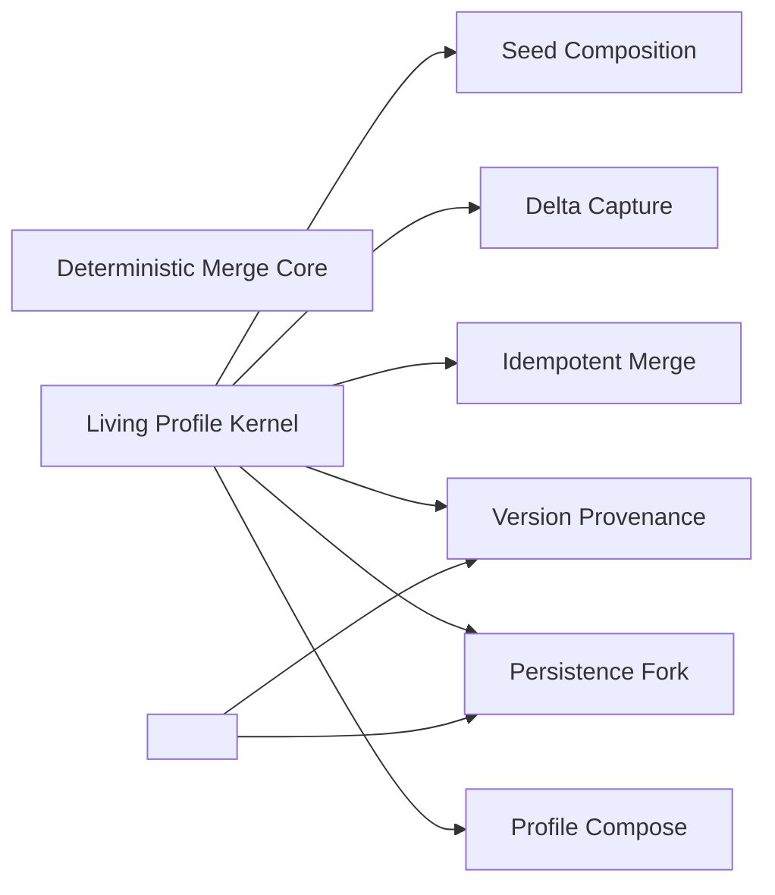

### Profile Compose

- Domain: [living-profile](ALGORITHMS.md#algorithms-domain-living-profile)
- Tier: [process](SCHEMA.md#vocabulary-domain-tier-process)
- Stage: [orient](REASONING.md#stage-orient)
- Axis: [ontology](REASONING.md#reasoning-axis-ontology)
- Math type: [set-theory](REASONING.md#reasoning-math-type-set-theory)
- Yields: set | boolean

Details

Intent
Specializing the RAG Knowledge Boundary, read the durable profile document (or an empty one), strip volatile metadata, and project a compact view injected into reasoning as retrieved memory rather than ground truth.

Invariant
Accumulated knowledge is disclosed as supported evidence, not authority; the consumer still grounds every use against live source.

Flow

```text
Store → ReadDoc|Empty → StripVolatileMetadata → CompactView → ContextInjection
```

Productions

```bnf
ProfileCompose ::= <ProfileStore> "→" (<StoredDocument> | <EmptyDocument>) "→" <MetadataStrip> "→" <CompactKnowledgeView> "→" <ContextEvidence>
CompactKnowledgeView ::= <AxisSet> "without" <VolatileMetadata>
ContextEvidence ::= "disclosed_as_memory" "," "not_ground_truth" "," "reverifiable_against_source"
```

Composes
[RAG Knowledge Boundary](ALGORITHMS.md#algorithms-rag-knowledge-boundary)

Composed by
[Living Profile Kernel](ALGORITHMS.md#algorithms-living-profile-kernel)

Forces
[modularity](SCHEMA.md#force-modularity), [model_governance](SCHEMA.md#force-model-governance), [event_messaging](SCHEMA.md#force-event-messaging)

Grounds
none

Before

```text
Accumulated profile knowledge treated as ground truth, never re-verified.
```

After

```text
profile store → read doc (or empty) → strip volatile metadata → compact view → injected as disclosed memory, reverifiable against source
```

How it is checked

Checked by
the merge core's determinism and idempotency checks, the provenance log, which records every version and the evidence behind it

Population
Every delta applied to the profile

Freshness
A verdict stands until a new turn produces evidence or the frozen baseline changes

Refusal
A delta without same-turn evidence is rejected, and the fallback mirror accepts no writes

Observation
The provenance log, which locates when and from what evidence each fact entered

Evidence
None, because the catalog states this check as a class, so a watched run belongs to each system that adopts it

Authoritative side
The same-turn evidence, which every delta cites, and the frozen baseline, which the mirror never overrides

Depends on
[RAG Knowledge Boundary](ALGORITHMS.md#algorithms-rag-knowledge-boundary)

Shape it refuses
Not answered

### Delta Capture

- Domain: [living-profile](ALGORITHMS.md#algorithms-domain-living-profile)
- Tier: [process](SCHEMA.md#vocabulary-domain-tier-process)
- Stage: [verify](REASONING.md#stage-verify)
- Axis: [verification](REASONING.md#reasoning-axis-verification)
- Math type: [logic](REASONING.md#reasoning-math-type-logic)
- Yields: boolean

Details

Intent
Specializing the RAG Knowledge Boundary, accept a structured knowledge delta the reasoning turn self-reports inline, admit only facts verified within that same turn, and reject speculation without a separate extraction pass.

Invariant
A durable fact enters the profile only from evidence produced in the same turn; unsupported claims are rejected, never guessed into memory.

Flow

```text
StructuredTurn → KnowledgeDelta|Null → VerifiedThisTurnFilter → AdmissibleDelta
```

Productions

```bnf
DeltaCapture ::= <StructuredTurn> "→" (<KnowledgeDelta> | <NullDelta>) "→" <EvidenceFilter> "→" <AdmissibleDelta>
EvidenceFilter ::= "verified_this_turn" "→" "supported" | "unverified" "→" "unsupported_reject"
AdmissibleDelta ::= <AxisDeltaSet>
```

Composes
[RAG Knowledge Boundary](ALGORITHMS.md#algorithms-rag-knowledge-boundary)

Composed by
[Living Profile Kernel](ALGORITHMS.md#algorithms-living-profile-kernel)

Named in the derivation of
[Living Profile Kernel](ALGORITHMS.md#algorithms-living-profile-kernel)

Forces
[modularity](SCHEMA.md#force-modularity), [model_governance](SCHEMA.md#force-model-governance)

Grounds
none

Before

```text
A speculative claim written into durable memory without same-turn evidence.
```

After

```text
structured turn → knowledge delta → keep only facts verified this turn → admissible delta; unverified rejected
```

How it is checked

Checked by
the merge core's determinism and idempotency checks, the provenance log, which records every version and the evidence behind it

Population
Every delta applied to the profile

Freshness
A verdict stands until a new turn produces evidence or the frozen baseline changes

Refusal
A delta without same-turn evidence is rejected, and the fallback mirror accepts no writes

Observation
The provenance log, which locates when and from what evidence each fact entered

Evidence
None, because the catalog states this check as a class, so a watched run belongs to each system that adopts it

Authoritative side
The same-turn evidence, which every delta cites, and the frozen baseline, which the mirror never overrides

Depends on
[RAG Knowledge Boundary](ALGORITHMS.md#algorithms-rag-knowledge-boundary)

Shape it refuses
Not answered

### Idempotent Merge

- Domain: [living-profile](ALGORITHMS.md#algorithms-domain-living-profile)
- Tier: [process](SCHEMA.md#vocabulary-domain-tier-process)
- Stage: [act](REASONING.md#stage-act)
- Axis: [formalization](REASONING.md#reasoning-axis-formalization)
- Math type: [computation](REASONING.md#reasoning-math-type-computation)
- Yields: procedure

Details

Intent
Specializing the Idempotent Side Effect, assign each fact a stable identity, apply the delta per field kind, deduplicate and cap, and guarantee that re-applying the same delta yields the same document.

Invariant
Merge is idempotent and bounded — the same delta applied twice is a no-op, and no axis grows without limit.

Flow

```text
Doc + Delta → StableFactIdentity → PerFieldKindMerge → DedupeAndCap → MergedDoc
```

Productions

```bnf
IdempotentMerge ::= <Document> "," <AdmissibleDelta> "→" <FactIdentitySet> "→" <PerFieldKindApplication> "→" <DedupeAndCap> "→" <MergedDocument>
FieldKind ::= "scalar_overwrite" | "set_union" | "list_append_dedupe_cap"
DedupeAndCap ::= "dedupe_by_stable_identity" "," "cap_list_axis_to_limit"
```

Composes
[Idempotent Side Effect](ALGORITHMS.md#algorithms-idempotent-side-effect)

Composed by
[Living Profile Kernel](ALGORITHMS.md#algorithms-living-profile-kernel)

Named in the derivation of
[Living Profile Kernel](ALGORITHMS.md#algorithms-living-profile-kernel)

Forces
[state_transaction](SCHEMA.md#force-state-transaction)

Grounds
none

Before

```text
Re-applying the same delta grows an axis and changes the document.
```

After

```text
doc + delta → stable fact identity → per-field-kind merge{overwrite | union | append-dedupe-cap} → double-apply is a no-op
```

How it is checked

Checked by
the merge core's determinism and idempotency checks, the provenance log, which records every version and the evidence behind it

Population
Every delta applied to the profile

Freshness
A verdict stands until a new turn produces evidence or the frozen baseline changes

Refusal
A delta without same-turn evidence is rejected, and the fallback mirror accepts no writes

Observation
The provenance log, which locates when and from what evidence each fact entered

Evidence
None, because the catalog states this check as a class, so a watched run belongs to each system that adopts it

Authoritative side
The same-turn evidence, which every delta cites, and the frozen baseline, which the mirror never overrides

Depends on
[Idempotent Side Effect](ALGORITHMS.md#algorithms-idempotent-side-effect)

Shape it refuses
Not answered

### Version Provenance

- Domain: [living-profile](ALGORITHMS.md#algorithms-domain-living-profile)
- Tier: [process](SCHEMA.md#vocabulary-domain-tier-process)
- Stage: [commit](REASONING.md#stage-commit)
- Axis: [representation](REASONING.md#reasoning-axis-representation)
- Math type: [information-theory](REASONING.md#reasoning-math-type-information-theory)
- Yields: hash | novelty-score

Details

Intent
Specializing Governance Evolution, detect whether the merge changed state, and only on real change bump the version, timestamp it, and append a modification record — leaving a no-op untouched.

Invariant
A no-op delta bumps nothing; every real change is auditable and reversible, and a version is never mutated in place without a provenance record.

Flow

```text
MergedDoc → ChangeDetect → (NoOp | VersionBump + Timestamp + ModificationRecord) → VersionedDoc
```

Productions

```bnf
VersionProvenance ::= <MergedDocument> "→" <ChangeDetection> "→" (<NoOpOutcome> | <VersionedOutcome>)
ChangeDetection ::= "merged_equals_prior" "→" "no_op" | "merged_differs" "→" "versioned"
VersionedOutcome ::= <VersionBump> "," <Timestamp> "," <ModificationRecord>
ModificationRecord ::= "at" "," "changed_axes" "," "prior_version"
```

Composes
[Architecture Evolution Governance](ALGORITHMS.md#algorithms-architecture-evolution-governance)

Composed by
[Living Profile Kernel](ALGORITHMS.md#algorithms-living-profile-kernel), [<Living Accumulation Concern>](ALGORITHMS.md#algorithms-living-accumulation-concern), [Versioned Turn Provenance](ALGORITHMS.md#algorithms-versioned-turn-provenance)

Named in the derivation of
[Living Profile Kernel](ALGORITHMS.md#algorithms-living-profile-kernel)

Forces
[security_governance](SCHEMA.md#force-security-governance), [architecture_evolution](SCHEMA.md#force-architecture-evolution)

Grounds
none

Before

```text
A version bumped and mutated in place even on a no-op merge.
```

After

```text
merged doc → change detect → {no-op: untouched | real change: bump + timestamp + modification record}
```

How it is checked

Checked by
the merge core's determinism and idempotency checks, the provenance log, which records every version and the evidence behind it

Population
Every delta applied to the profile

Freshness
A verdict stands until a new turn produces evidence or the frozen baseline changes

Refusal
A delta without same-turn evidence is rejected, and the fallback mirror accepts no writes

Observation
The provenance log, which locates when and from what evidence each fact entered

Evidence
None, because the catalog states this check as a class, so a watched run belongs to each system that adopts it

Authoritative side
The same-turn evidence, which every delta cites, and the frozen baseline, which the mirror never overrides

Depends on
[Architecture Evolution Governance](ALGORITHMS.md#algorithms-architecture-evolution-governance)

Shape it refuses
Not answered

### Deterministic Merge Core

- Domain: [living-profile](ALGORITHMS.md#algorithms-domain-living-profile)
- Tier: [process](SCHEMA.md#vocabulary-domain-tier-process)
- Stage: [act](REASONING.md#stage-act)
- Axis: [formalization](REASONING.md#reasoning-axis-formalization)
- Math type: [computation](REASONING.md#reasoning-math-type-computation)
- Yields: procedure

Details

Intent
Specializing the Deterministic Core, keep compose and merge pure functions over immutable inputs with the clock injected, so identical inputs reproduce identical outputs.

Invariant
No hidden time, state, or randomness — the clock is a parameter, and merge is referentially transparent.

Flow

```text
(Doc, Delta, Clock) → PureMerge → (Doc', Modification|Null)
```

Productions

```bnf
ProfileMergeCore ::= <Document> "," <AdmissibleDelta> "," <InjectedClock> "→" <PureMerge> "→" (<NextDocument> "," <ModificationOrNull>)
PurityConstraint ::= "no_hidden_state" "," "no_hidden_time" "," "no_hidden_randomness" "," "referential_transparency"
InjectedClock ::= "now_supplied_by_adapter"
```

Composes
[Deterministic Core](ALGORITHMS.md#algorithms-deterministic-core)

Forces
[correctness_verification](SCHEMA.md#force-correctness-verification)

Grounds
none

Before

```text
Merge reads the wall clock internally, so identical inputs differ.
```

After

```text
(doc, delta, injected clock) → pure merge → (doc', modification|null); no hidden time/state/randomness
```

How it is checked

Checked by
the merge core's determinism and idempotency checks, the provenance log, which records every version and the evidence behind it

Population
Every delta applied to the profile

Freshness
A verdict stands until a new turn produces evidence or the frozen baseline changes

Refusal
A delta without same-turn evidence is rejected, and the fallback mirror accepts no writes

Observation
The provenance log, which locates when and from what evidence each fact entered

Evidence
None, because the catalog states this check as a class, so a watched run belongs to each system that adopts it

Authoritative side
The same-turn evidence, which every delta cites, and the frozen baseline, which the mirror never overrides

Depends on
[Deterministic Core](ALGORITHMS.md#algorithms-deterministic-core)

Shape it refuses
Not answered

### Persistence Fork

- Domain: [living-profile](ALGORITHMS.md#algorithms-domain-living-profile)
- Tier: [process](SCHEMA.md#vocabulary-domain-tier-process)
- Stage: [act](REASONING.md#stage-act)
- Axis: [formalization](REASONING.md#reasoning-axis-formalization)
- Math type: [computation](REASONING.md#reasoning-math-type-computation)
- Yields: procedure

Details

Intent
Specializing the Port Adapter, resolve the durable store by connection mode — an authoritative per-owner store when the trusted arm is connected, a read-only mirror otherwise — and write back only where accumulation is trusted.

Invariant
Authoritative accumulation happens only against the trusted store; the fallback is a read mirror, never a divergent source of truth.

Flow

```text
ConnectionMode → AuthoritativeStore|LimitedMirror → ScopedKey → Persist|MirrorReadOnly
```

Productions

```bnf
PersistenceFork ::= <ConnectionMode> "→" (<AuthoritativeStore> | <LimitedMirror>) "→" <ScopedOwnerKey> "→" <PersistenceOutcome>
ConnectionMode ::= "trusted_arm_connected" | "disconnected_limited"
PersistenceOutcome ::= "persist_write_back" | "mirror_read_only"
ScopedOwnerKey ::= "stable_owner_identity" "," "sanitized"
```

Composes
[Port Adapter](ALGORITHMS.md#algorithms-port-adapter)

Composed by
[Living Profile Kernel](ALGORITHMS.md#algorithms-living-profile-kernel), [<Living Accumulation Concern>](ALGORITHMS.md#algorithms-living-accumulation-concern)

Forces
[semantic_consistency](SCHEMA.md#force-semantic-consistency), [resilience_recovery](SCHEMA.md#force-resilience-recovery)

Grounds
none

Before

```text
Accumulation written to a fallback mirror, creating a divergent source of truth.
```

After

```text
connection mode → {trusted arm connected: authoritative per-owner store, write back | disconnected: read-only mirror}
```

How it is checked

Checked by
the merge core's determinism and idempotency checks, the provenance log, which records every version and the evidence behind it

Population
Every delta applied to the profile

Freshness
A verdict stands until a new turn produces evidence or the frozen baseline changes

Refusal
A delta without same-turn evidence is rejected, and the fallback mirror accepts no writes

Observation
The provenance log, which locates when and from what evidence each fact entered

Evidence
None, because the catalog states this check as a class, so a watched run belongs to each system that adopts it

Authoritative side
The same-turn evidence, which every delta cites, and the frozen baseline, which the mirror never overrides

Depends on
[Port Adapter](ALGORITHMS.md#algorithms-port-adapter)

Shape it refuses
Not answered

### Seed Composition

- Domain: [living-profile](ALGORITHMS.md#algorithms-domain-living-profile)
- Tier: [process](SCHEMA.md#vocabulary-domain-tier-process)
- Stage: [orient](REASONING.md#stage-orient)
- Axis: [ontology](REASONING.md#reasoning-axis-ontology)
- Math type: [set-theory](REASONING.md#reasoning-math-type-set-theory)
- Yields: set | boolean

Details

Intent
Specializing Canonical Data, overlay the accumulated knowledge onto the frozen baseline scope as additive context without mutating the baseline.

Invariant
The frozen baseline is an immutable source of truth; accumulated knowledge is additive context, never a rewrite of scope.

Flow

```text
FrozenBaseline + ComposedKnowledge → AdditiveOverlay → TurnSeed
```

Productions

```bnf
SeedComposition ::= <FrozenBaseline> "," <ComposedKnowledgeView> "→" <AdditiveOverlay> "→" <TurnSeed>
AdditiveOverlay ::= "baseline_immutable" "," "knowledge_appended_not_merged_into_baseline"
TurnSeed ::= <BaselineScope> "," <AccumulatedKnowledge>
```

Composes
[Canonical Data](ALGORITHMS.md#algorithms-canonical-data)

Composed by
[Living Profile Kernel](ALGORITHMS.md#algorithms-living-profile-kernel)

Named in the derivation of
[Living Profile Kernel](ALGORITHMS.md#algorithms-living-profile-kernel)

Forces
[semantic_consistency](SCHEMA.md#force-semantic-consistency)

Grounds
none

Before

```text
Accumulated knowledge merged into the baseline, rewriting frozen scope.
```

After

```text
frozen baseline + composed knowledge → additive overlay (baseline immutable) → turn seed
```

How it is checked

Checked by
the merge core's determinism and idempotency checks, the provenance log, which records every version and the evidence behind it

Population
Every delta applied to the profile

Freshness
A verdict stands until a new turn produces evidence or the frozen baseline changes

Refusal
A delta without same-turn evidence is rejected, and the fallback mirror accepts no writes

Observation
The provenance log, which locates when and from what evidence each fact entered

Evidence
None, because the catalog states this check as a class, so a watched run belongs to each system that adopts it

Authoritative side
The same-turn evidence, which every delta cites, and the frozen baseline, which the mirror never overrides

Depends on
[Canonical Data](ALGORITHMS.md#algorithms-canonical-data)

Shape it refuses
Not answered

### Living Profile Kernel

- Domain: [living-profile](ALGORITHMS.md#algorithms-domain-living-profile)
- Tier: [process](SCHEMA.md#vocabulary-domain-tier-process)
- Math type: [computation](REASONING.md#reasoning-math-type-computation)
- Yields: procedure

Details

Intent
Compose the accumulated knowledge onto the frozen baseline into a seed, run the reasoning turn, capture the inline verified delta, merge it idempotently under an injected clock, version only real change, and persist against the fork — looping per turn.

Invariant
A living profile is a versioned, idempotently accumulated, provenance-logged memory that grows only from verified per-turn evidence and never overrides frozen scope or live source.

Flow

```text
Baseline → Compose → Seed → Turn → Delta → Merge(Clock) → Version → Persist → (next turn)
```

Productions

```bnf
LivingProfileKernel ::= <SeedComposition> "→" <ReasoningTurn> "→" <DeltaCapture> "→" <IdempotentMerge> "→" <ProfileMergeCore> "→" <VersionProvenance> "→" <PersistenceFork> "→" <ProfileCompose>
KernelInvariant ::= "grows_only_from_verified_evidence" "," "never_overrides_frozen_scope" "," "never_overrides_live_source" "," "bounded_and_idempotent" "," "auditable_and_reversible"
```

Composes
[Seed Composition](ALGORITHMS.md#algorithms-seed-composition), [Delta Capture](ALGORITHMS.md#algorithms-delta-capture), [Idempotent Merge](ALGORITHMS.md#algorithms-idempotent-merge), [Version Provenance](ALGORITHMS.md#algorithms-version-provenance), [Persistence Fork](ALGORITHMS.md#algorithms-persistence-fork), [Profile Compose](ALGORITHMS.md#algorithms-profile-compose)

Forces
[model_governance](SCHEMA.md#force-model-governance)

Principle
[Versioning](PRINCIPLES.md#architecture-versioning)

Grounds
[derivation-loop](REASONING.md#reasoning-loop-derivation-loop)

Derivation map

orient
[Seed Composition](ALGORITHMS.md#algorithms-seed-composition)

verify
[Delta Capture](ALGORITHMS.md#algorithms-delta-capture)

act
[Idempotent Merge](ALGORITHMS.md#algorithms-idempotent-merge)

commit
[Version Provenance](ALGORITHMS.md#algorithms-version-provenance)

Before

```text
Per-turn evidence written to memory ungated, unbounded, unversioned.
```

After

```text
compose → seed → turn → capture verified delta → idempotent merge (injected clock) → version only real change → persist against the fork → loop
```

How it is checked

Checked by
the merge core's determinism and idempotency checks, the provenance log, which records every version and the evidence behind it

Population
Every delta applied to the profile

Freshness
A verdict stands until a new turn produces evidence or the frozen baseline changes

Refusal
A delta without same-turn evidence is rejected, and the fallback mirror accepts no writes

Observation
The provenance log, which locates when and from what evidence each fact entered

Evidence
None, because the catalog states this check as a class, so a watched run belongs to each system that adopts it

Authoritative side
The same-turn evidence, which every delta cites, and the frozen baseline, which the mirror never overrides

Depends on
[Seed Composition](ALGORITHMS.md#algorithms-seed-composition), [Delta Capture](ALGORITHMS.md#algorithms-delta-capture), [Idempotent Merge](ALGORITHMS.md#algorithms-idempotent-merge), [Version Provenance](ALGORITHMS.md#algorithms-version-provenance), [Persistence Fork](ALGORITHMS.md#algorithms-persistence-fork), [Profile Compose](ALGORITHMS.md#algorithms-profile-compose)

Shape it refuses
Not answered

### <Living Accumulation Concern>

- Domain: [living-profile](ALGORITHMS.md#algorithms-domain-living-profile)
- Tier: [process](SCHEMA.md#vocabulary-domain-tier-process)
- Meta record

Details

Intent
<Compose prior memory as disclosed evidence> → <Capture only same-turn verified deltas> → <Merge idempotently by stable identity, bounded> → <Version and log only real change> → <Persist against the connection fork> → <Overlay onto the immutable baseline>

Invariant
Any per-turn evidence stream becomes durable memory only when accumulation is idempotent, bounded, provenance-logged, deterministic at its core, and additive to an immutable baseline it may never rewrite.

Flow

```text
Evidence → Admissibility → IdempotentMerge → Provenance → Persistence → AdditiveOverlay
```

Productions

```bnf
LivingAccumulationConcern ::= <DisclosedMemory> "→" <AdmissibleDelta> "→" <IdempotentBoundedMerge> "→" <VersionProvenance> "→" <PersistenceFork> "→" <AdditiveBaselineOverlay>
IdempotentBoundedMerge ::= "stable_identity" "," "dedupe" "," "cap" "," "double_apply_is_no_op"
```

Composes
[Version Provenance](ALGORITHMS.md#algorithms-version-provenance), [Persistence Fork](ALGORITHMS.md#algorithms-persistence-fork)

Forces
[state_transaction](SCHEMA.md#force-state-transaction), [correctness_verification](SCHEMA.md#force-correctness-verification), [streaming_dataflow](SCHEMA.md#force-streaming-dataflow)

Grounds
none

How it is checked

Checked by
the merge core's determinism and idempotency checks, the provenance log, which records every version and the evidence behind it

Population
Every delta applied to the profile

Freshness
A verdict stands until a new turn produces evidence or the frozen baseline changes

Refusal
A delta without same-turn evidence is rejected, and the fallback mirror accepts no writes

Observation
The provenance log, which locates when and from what evidence each fact entered

Evidence
None, because the catalog states this check as a class, so a watched run belongs to each system that adopts it

Authoritative side
The same-turn evidence, which every delta cites, and the frozen baseline, which the mirror never overrides

Depends on
[Version Provenance](ALGORITHMS.md#algorithms-version-provenance), [Persistence Fork](ALGORITHMS.md#algorithms-persistence-fork)

Shape it refuses
Not answered

## Governed plan loop

Every algorithm contract in this domain is listed with its position on the derivation loop, its intent and invariant, the flow it walks and its productions as a grammar. Each record also shows what it composes and is composed by, which forces and principles it answers to, what grounds it and what it grounds, and an exemplar where the record carries one. The diagram shows what composes what inside the domain.

Relations diagram

What composes what inside this domain.

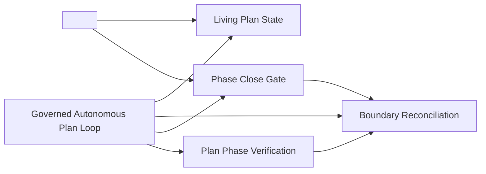

### Living Plan State

- Domain: [governed-plan-loop](ALGORITHMS.md#algorithms-domain-governed-plan-loop)
- Tier: [process](SCHEMA.md#vocabulary-domain-tier-process)
- Stage: [commit](REASONING.md#stage-commit)
- Axis: [representation](REASONING.md#reasoning-axis-representation)
- Math type: [information-theory](REASONING.md#reasoning-math-type-information-theory)
- Yields: hash | novelty-score

Details

Intent
Treat the plan as durable append/update-only state — tasks carrying status and grounding, a considerations backlog, and a dismissed-key set — maintained every turn and re-delivered on restart, so anything discovered mid-pass is retained instead of falling out of scope.

Invariant
Plan progress is authoritative persisted state, never inferred from transient conversation, and a completion is recorded only with evidence.

Flow

```text
EmitDelta → GuardTransition → AppendOnly → Persist → RenderFromState
```

Productions

```bnf
LivingPlanState ::= <PlanDelta> "→" <TransitionGuard> "→" <DurableMerge> "→" <StateRender>
TaskStatus ::= "pending" | "active" | "done"
ConsiderationStatus ::= "open" | "confirmed" | "dismissed"
DoneTransition ::= "requires" <GroundingCitation>
```

Composes
none

Composed by
[Governed Autonomous Plan Loop](ALGORITHMS.md#algorithms-governed-autonomous-plan-loop), [<Governed Plan Concern>](ALGORITHMS.md#algorithms-governed-plan-concern)

Named in the derivation of
[Governed Autonomous Plan Loop](ALGORITHMS.md#algorithms-governed-autonomous-plan-loop)

Forces
[state_transaction](SCHEMA.md#force-state-transaction), [causality_ordering](SCHEMA.md#force-causality-ordering), [correctness_verification](SCHEMA.md#force-correctness-verification)

Grounds
none

Before

```text
Plan progress inferred from the conversation, so a discovery mid-pass falls out of scope on restart.
```

After

```text
plan delta → transition guard{done requires grounding} → append/update-only durable state{tasks, considerations, dismissed keys} → render from state, restart-survivable
```

How it is checked

Checked by
the phase close gate, whose verification flag only deterministic engine code writes

Population
Every phase and task of the living plan

Freshness
A verdict stands until the plan or the verified work changes

Refusal
A phase does not close while its gate fails, and a failure routes back to execution

Observation
The persisted plan state, which records progress across restarts

Evidence
None, because the catalog states this check as a class, so a watched run belongs to each system that adopts it

Authoritative side
The engine's verification flag, which a phase closes on

Depends on
Not answered

Shape it refuses
Not answered

### Boundary Reconciliation

- Domain: [governed-plan-loop](ALGORITHMS.md#algorithms-domain-governed-plan-loop)
- Tier: [process](SCHEMA.md#vocabulary-domain-tier-process)
- Stage: [constrain](REASONING.md#stage-constrain)
- Axis: [teleology](REASONING.md#reasoning-axis-teleology)
- Math type: [optimization](REASONING.md#reasoning-math-type-optimization)
- Yields: boolean | ranking

Details

Intent
Capture considerations during a phase but act on them only at the phase boundary — triage each open consideration against code and canon into a confirmed task or a dismissed resolved-false key, deduping new opens against the confirmed and dismissed sets before triage.

Invariant
A dismissed consideration never resurfaces and the backlog converges monotonically, so the loop cannot oscillate.

Flow

```text
Capture → DeferToBoundary → DedupBeforeTriage → Triage → DryPassOrBound
```

Productions

```bnf
BoundaryReconciliation ::= <Backlog> "→" <Dedup> "→" <Triage> "→" <Termination>
Triage ::= "confirm" "→" <Task> | "dismiss" "→" <ResolvedFalse>
Dedup ::= "newOpens" "against" "(confirmed | resolvedFalse)"
Termination ::= "dryPass" | "maxReconcileRounds"
```

Composes
[Recursion Control](ALGORITHMS.md#algorithms-recursion-control)

Composed by
[Phase Close Gate](ALGORITHMS.md#algorithms-phase-close-gate), [Plan Phase Verification](ALGORITHMS.md#algorithms-plan-phase-verification), [Governed Autonomous Plan Loop](ALGORITHMS.md#algorithms-governed-autonomous-plan-loop)

Named in the derivation of
[Governed Autonomous Plan Loop](ALGORITHMS.md#algorithms-governed-autonomous-plan-loop)

Forces
[causality_ordering](SCHEMA.md#force-causality-ordering), [resilience_recovery](SCHEMA.md#force-resilience-recovery), [correctness_verification](SCHEMA.md#force-correctness-verification)

Grounds
none

Before

```text
Considerations acted on mid-phase, and a dismissed one resurfaces — the loop oscillates.
```

After

```text
capture during phase → act only at the boundary → dedup new opens vs (confirmed | dismissed) → triage{confirm → task | dismiss → resolved-false} → dry pass or bound
```

How it is checked

Checked by
the phase close gate, whose verification flag only deterministic engine code writes

Population
Every phase and task of the living plan

Freshness
A verdict stands until the plan or the verified work changes

Refusal
A phase does not close while its gate fails, and a failure routes back to execution

Observation
The persisted plan state, which records progress across restarts

Evidence
None, because the catalog states this check as a class, so a watched run belongs to each system that adopts it

Authoritative side
The engine's verification flag, which a phase closes on

Depends on
[Recursion Control](ALGORITHMS.md#algorithms-recursion-control)

Shape it refuses
Not answered

### Phase Close Gate

- Domain: [governed-plan-loop](ALGORITHMS.md#algorithms-domain-governed-plan-loop)
- Tier: [process](SCHEMA.md#vocabulary-domain-tier-process)
- Stage: [terminate](REASONING.md#stage-terminate)
- Axis: [termination](REASONING.md#reasoning-axis-termination)
- Math type: [optimization](REASONING.md#reasoning-math-type-optimization)
- Yields: boolean | ranking

Details

Intent
Make completion a gated state of the plan rather than a judgment call — a phase closes only when all tasks are done, a dry reconciliation pass holds, verify is clean for the chosen scope, and the coverage graph confirms the ripple set; otherwise the loop returns to execution.

Invariant
Completion can never be self-declared; closure is a composed evidence-bound gate whose failure routes back to execution, never to done.

Flow

```text
AllTasksDone → DryPass → VerifyClean → CoverageConfirmed → CloseOrExecute
```

Productions

```bnf
PhaseCloseGate ::= <TaskCompletion> "&" <DryPass> "&" <VerifyResult> "&" <CoverageResult> "→" <Decision>
Decision ::= "close" | "return_to_execute"
VerifyResult ::= "scope:full" | "scope:work"
```

Composes
[Validation Gate](ALGORITHMS.md#algorithms-validation-gate), [Boundary Reconciliation](ALGORITHMS.md#algorithms-boundary-reconciliation)

Composed by
[Governed Autonomous Plan Loop](ALGORITHMS.md#algorithms-governed-autonomous-plan-loop), [<Governed Plan Concern>](ALGORITHMS.md#algorithms-governed-plan-concern)

Named in the derivation of
[Governed Autonomous Plan Loop](ALGORITHMS.md#algorithms-governed-autonomous-plan-loop)

Forces
[security_governance](SCHEMA.md#force-security-governance), [correctness_verification](SCHEMA.md#force-correctness-verification), [state_transaction](SCHEMA.md#force-state-transaction)

Grounds
[ter-stop](REASONING.md#reasoning-node-ter-stop)

Before

```text
The phase is self-declared done.
```

After

```text
all tasks done & dry reconciliation holds & verify clean (scope) & coverage graph confirms ripple → close | return to execute; never self-declared
```

How it is checked

Checked by
the phase close gate, whose verification flag only deterministic engine code writes

Population
Every phase and task of the living plan

Freshness
A verdict stands until the plan or the verified work changes

Refusal
A phase does not close while its gate fails, and a failure routes back to execution

Observation
The persisted plan state, which records progress across restarts

Evidence
None, because the catalog states this check as a class, so a watched run belongs to each system that adopts it

Authoritative side
The engine's verification flag, which a phase closes on

Depends on
[Validation Gate](ALGORITHMS.md#algorithms-validation-gate), [Boundary Reconciliation](ALGORITHMS.md#algorithms-boundary-reconciliation)

Shape it refuses
Not answered

### Plan Phase Verification

- Domain: [governed-plan-loop](ALGORITHMS.md#algorithms-domain-governed-plan-loop)
- Tier: [process](SCHEMA.md#vocabulary-domain-tier-process)
- Stage: [verify](REASONING.md#stage-verify)
- Axis: [verification](REASONING.md#reasoning-axis-verification)
- Math type: [logic](REASONING.md#reasoning-math-type-logic)
- Yields: boolean

Details

Intent
Before a composed plan reaches the developer, the engine loops it back through evidence, completeness, and adversarial-skepticism passes, reconciles the findings into the plan, and increments a loop-owned pass counter the model cannot forge; a render boundary blocks an unverified plan.

Invariant
A plan is never presented un-reviewed, and the verification flag is written only by deterministic engine code, never by model tokens.

Flow

```text
AutoLoopback → ThreePassVerify → ReconcileFindings → LoopOwnedIncrement → PresentGate
```

Productions

```bnf
PlanPhaseVerification ::= <AutoLoopback> "→" <VerifyPasses> "→" <Reconcile> "→" <CounterIncrement> "→" <PresentGate>
VerifyPasses ::= "evidence" "," "completeness" "," "adversarial"
PresentGate ::= "verificationPasses >= 1"
Counter ::= "loop_owned" "not_model_emitted"
```

Composes
[Evidence-Gated Claim Verification](ALGORITHMS.md#algorithms-evidence-gated-claim-verification), [Boundary Reconciliation](ALGORITHMS.md#algorithms-boundary-reconciliation), [Recursion Control](ALGORITHMS.md#algorithms-recursion-control)

Composed by
[Governed Autonomous Plan Loop](ALGORITHMS.md#algorithms-governed-autonomous-plan-loop)

Named in the derivation of
[Governed Autonomous Plan Loop](ALGORITHMS.md#algorithms-governed-autonomous-plan-loop)

Forces
[correctness_verification](SCHEMA.md#force-correctness-verification), [security_governance](SCHEMA.md#force-security-governance), [observability_traceability](SCHEMA.md#force-observability-traceability)

Grounds
[ver-evidence](REASONING.md#reasoning-node-ver-evidence)

Before

```text
A plan presented to the developer un-reviewed, its verified flag set by model tokens.
```

After

```text
auto loopback → 3 passes{evidence, completeness, adversarial} → reconcile findings → loop-owned counter (not model-emitted) → render blocked until verified
```

How it is checked

Checked by
the phase close gate, whose verification flag only deterministic engine code writes

Population
Every phase and task of the living plan

Freshness
A verdict stands until the plan or the verified work changes

Refusal
A phase does not close while its gate fails, and a failure routes back to execution

Observation
The persisted plan state, which records progress across restarts

Evidence
None, because the catalog states this check as a class, so a watched run belongs to each system that adopts it

Authoritative side
The engine's verification flag, which a phase closes on

Depends on
[Evidence-Gated Claim Verification](ALGORITHMS.md#algorithms-evidence-gated-claim-verification), [Boundary Reconciliation](ALGORITHMS.md#algorithms-boundary-reconciliation), [Recursion Control](ALGORITHMS.md#algorithms-recursion-control)

Shape it refuses
Not answered

### Governed Autonomous Plan Loop

- Domain: [governed-plan-loop](ALGORITHMS.md#algorithms-domain-governed-plan-loop)
- Tier: [process](SCHEMA.md#vocabulary-domain-tier-process)
- Math type: [computation](REASONING.md#reasoning-math-type-computation)
- Yields: procedure

Details

Intent
Drive a large task to completion under gates — seed per phase, investigate, execute, self-inform from canon and self-audit, capture considerations, reconcile at the boundary, and close only when the plan is a mechanically resolved state, then re-seed the next phase.

Invariant
Autonomy is bounded by gates rather than disposition — the plan can only grow with code-verified work, completion is a gated state and not a judgment call, and every step is restart-survivable.

Flow

```text
SeedPhase → Investigate → Execute → GatedSelfAuditAndInform → CaptureConsiderations → BoundaryReconcile → CloseGate → ReSeedNextPhase
```

Productions

```bnf
GovernedPlanLoop ::= <PhaseSeed> "→" <ActivityCycle> "→" <BoundaryReconciliation> "→" <PhaseCloseGate> "→" <ReSeed>
ActivityCycle ::= "investigate" "→" "execute" "→" "verify"
SelfDrive ::= <CanonSelfInform> "&" <SkepticalSweep> "&" <PlanMaintenance>
Completion ::= "gated_state" "not_judgment_call"
```

Composes
[Living Plan State](ALGORITHMS.md#algorithms-living-plan-state), [Boundary Reconciliation](ALGORITHMS.md#algorithms-boundary-reconciliation), [Phase Close Gate](ALGORITHMS.md#algorithms-phase-close-gate), [Plan Phase Verification](ALGORITHMS.md#algorithms-plan-phase-verification), [Phase-Separated Execution](ALGORITHMS.md#algorithms-phase-separated-execution)

Forces
[state_transaction](SCHEMA.md#force-state-transaction), [security_governance](SCHEMA.md#force-security-governance), [correctness_verification](SCHEMA.md#force-correctness-verification), [resilience_recovery](SCHEMA.md#force-resilience-recovery), [runtime_extensibility](SCHEMA.md#force-runtime-extensibility)

Principle
[Auditability](PRINCIPLES.md#architecture-auditability)

Grounds
[derivation-loop](REASONING.md#reasoning-loop-derivation-loop)

Grounded by
[constrain](REASONING.md#stage-constrain)

Derivation map

commit
[Living Plan State](ALGORITHMS.md#algorithms-living-plan-state)

constrain
[Boundary Reconciliation](ALGORITHMS.md#algorithms-boundary-reconciliation)

verify
[Plan Phase Verification](ALGORITHMS.md#algorithms-plan-phase-verification)

terminate
[Phase Close Gate](ALGORITHMS.md#algorithms-phase-close-gate)

Before

```text
A long task driven from conversation memory, self-declared done, losing mid-pass discoveries on restart.
```

After

```text
seed phase → investigate → execute → gated self-audit + canon self-inform → capture + reconcile at boundary → close only on a mechanically resolved gated state → re-seed next phase
```

How it is checked

Checked by
the phase close gate, whose verification flag only deterministic engine code writes

Population
Every phase and task of the living plan

Freshness
A verdict stands until the plan or the verified work changes

Refusal
A phase does not close while its gate fails, and a failure routes back to execution

Observation
The persisted plan state, which records progress across restarts

Evidence
None, because the catalog states this check as a class, so a watched run belongs to each system that adopts it

Authoritative side
The engine's verification flag, which a phase closes on

Depends on
[Living Plan State](ALGORITHMS.md#algorithms-living-plan-state), [Boundary Reconciliation](ALGORITHMS.md#algorithms-boundary-reconciliation), [Phase Close Gate](ALGORITHMS.md#algorithms-phase-close-gate), [Plan Phase Verification](ALGORITHMS.md#algorithms-plan-phase-verification), [Phase-Separated Execution](ALGORITHMS.md#algorithms-phase-separated-execution)

Shape it refuses
Not answered

### <Governed Plan Concern>

- Domain: [governed-plan-loop](ALGORITHMS.md#algorithms-domain-governed-plan-loop)
- Tier: [process](SCHEMA.md#vocabulary-domain-tier-process)
- Meta record

Details

Intent
<Seed the phase> → <Investigate and execute under gates> → <Self-inform from canon and self-audit> → <Capture and reconcile considerations at the boundary> → <Close only on a mechanically resolved gated state> → <Re-seed the next phase>

Invariant
A large task reaches completion only under gates, never by disposition: the plan grows solely from code-verified work, completion is a gated state rather than a judgment call, and every step is restart-survivable.

Flow

```text
SeedPhase → GatedActivity → BoundaryReconcile → CloseGate → ReSeed
```

Productions

```bnf
GovernedPlanConcern ::= <PhaseSeed> "→" <GatedActivityCycle> "→" <BoundaryReconciliation> "→" <PhaseCloseGate> "→" <ReSeed>
GatedActivityCycle ::= "investigate" "→" "execute" "→" "gated_self_audit"
```

Composes
[Living Plan State](ALGORITHMS.md#algorithms-living-plan-state), [Phase Close Gate](ALGORITHMS.md#algorithms-phase-close-gate)

Forces
[state_transaction](SCHEMA.md#force-state-transaction), [correctness_verification](SCHEMA.md#force-correctness-verification), [security_governance](SCHEMA.md#force-security-governance)

Grounds
none

How it is checked

Checked by
the phase close gate, whose verification flag only deterministic engine code writes

Population
Every phase and task of the living plan

Freshness
A verdict stands until the plan or the verified work changes

Refusal
A phase does not close while its gate fails, and a failure routes back to execution

Observation
The persisted plan state, which records progress across restarts

Evidence
None, because the catalog states this check as a class, so a watched run belongs to each system that adopts it

Authoritative side
The engine's verification flag, which a phase closes on

Depends on
[Living Plan State](ALGORITHMS.md#algorithms-living-plan-state), [Phase Close Gate](ALGORITHMS.md#algorithms-phase-close-gate)

Shape it refuses
Not answered

## Quality engine

Every algorithm contract in this domain is listed with its position on the derivation loop, its intent and invariant, the flow it walks and its productions as a grammar. Each record also shows what it composes and is composed by, which forces and principles it answers to, what grounds it and what it grounds, and an exemplar where the record carries one. The diagram shows what composes what inside the domain.

Relations diagram

What composes what inside this domain.

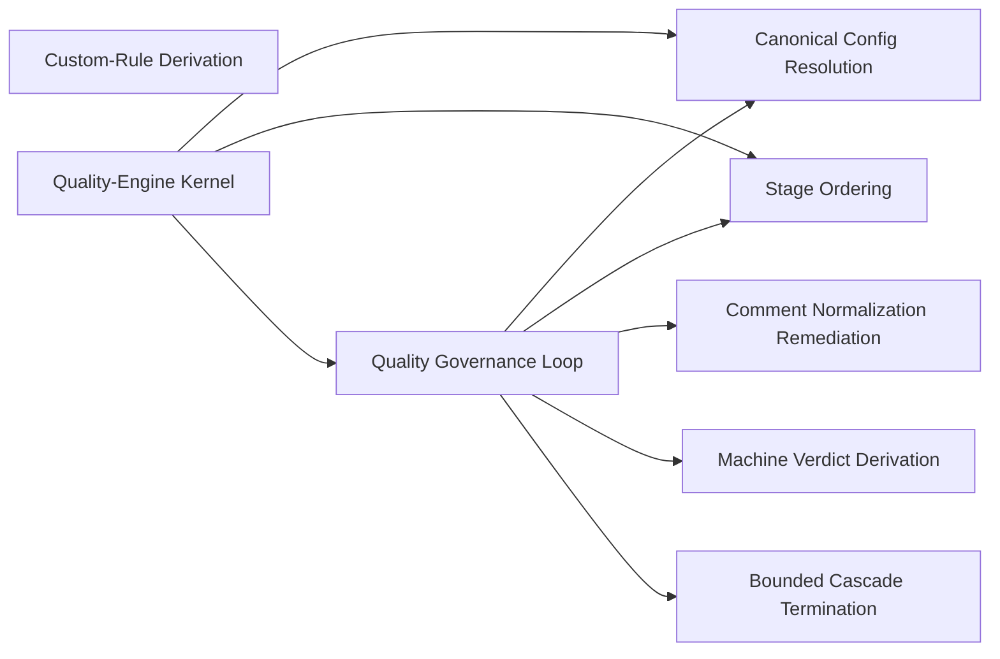

### Quality Governance Loop

- Domain: [quality-engine](ALGORITHMS.md#algorithms-domain-quality-engine)
- Tier: [process](SCHEMA.md#vocabulary-domain-tier-process)
- Math type: [computation](REASONING.md#reasoning-math-type-computation)
- Yields: procedure

Details

Intent
On each update (an apply), normalize the proposal, resolve a CheckPlan, verify it, and on failure fix-then-reverify the downstream set until the verdict is clean or the pass bound is reached, then escalate.

Invariant
Every code update is a bounded verify-remediate loop keyed to the apply event, not the turn; the machine verdict — never the model's read — is its only completion signal.

Flow

```text
Update → Normalize → Resolve → Verify → Clean? → Fix → Reverify → Clean|Escalate
```

Productions

```bnf
QualityGovernanceLoop ::= <Update> "→" <NormalizationPrefix> "→" <CheckPlanResolution> "→" <Verification> "→" (<CleanVerdict> | <DownstreamFixCycle> "→" <QualityGovernanceLoop>)
DownstreamFixCycle ::= <InScopeFindings> "→" <ModelFixBurst> "→" <Reapply> "→" <BoundedReverify>
BoundedReverify ::= "passCount <= MAX_CASCADE_PASSES" "AND" "in_scope_findings_strictly_decrease" | "escalate"
```

Composes
[Recursion Control](ALGORITHMS.md#algorithms-recursion-control), [Resilience Control](ALGORITHMS.md#algorithms-resilience-control)

Composed by
[Quality-Engine Kernel](ALGORITHMS.md#algorithms-quality-engine-concern)

Forces
[semantic_consistency](SCHEMA.md#force-semantic-consistency), [correctness_verification](SCHEMA.md#force-correctness-verification), [security_governance](SCHEMA.md#force-security-governance), [model_governance](SCHEMA.md#force-model-governance), [event_messaging](SCHEMA.md#force-event-messaging)

Principle
[Manual-Only Governance](PRINCIPLES.md#architecture-manual-only-governance)

Grounds
[derivation-loop](REASONING.md#reasoning-loop-derivation-loop)

Derivation map

derive
[Canonical Config Resolution](ALGORITHMS.md#algorithms-canonical-config-resolution)

project
[Stage Ordering](ALGORITHMS.md#algorithms-stage-ordering)

act
[Comment Normalization Remediation](ALGORITHMS.md#algorithms-comment-normalization-remediation)

verify
[Machine Verdict Derivation](ALGORITHMS.md#algorithms-machine-verdict-derivation)

terminate
[Bounded Cascade Termination](ALGORITHMS.md#algorithms-bounded-cascade-termination)

Before

```text
A code edit judged clean by the model's read, not the machine verdict.
```

After

```text
apply → normalize → resolve CheckPlan → verify → {clean | fix in-scope + reverify, bounded, findings strictly decrease} → clean | escalate
```

How it is checked

Checked by
the machine verdict, derived from the tools' exit codes and parsed findings

Population
Every file the configured tools reach

Freshness
A verdict stands until the code or the configuration changes

Refusal
The cascade stops on a violated progress bound and escalates, and reports clean only on a clean verdict

Observation
None, because the verdict is derived from tool output

Evidence
None, because the catalog states this check as a class, so a watched run belongs to each system that adopts it

Authoritative side
The tools' exit codes and parsed findings, which the verdict is derived from

Depends on
[Recursion Control](ALGORITHMS.md#algorithms-recursion-control), [Resilience Control](ALGORITHMS.md#algorithms-resilience-control)

Shape it refuses
Not answered

### Canonical Config Resolution

- Domain: [quality-engine](ALGORITHMS.md#algorithms-domain-quality-engine)
- Tier: [process](SCHEMA.md#vocabulary-domain-tier-process)
- Stage: [derive](REASONING.md#stage-derive)
- Axis: [reasoning](REASONING.md#reasoning-axis-reasoning)
- Math type: [logic](REASONING.md#reasoning-math-type-logic)
- Yields: boolean

Details

Intent
Expand one canonical config across selected profiles and native rules into per-tool config, resolve exactly one owner per contested surface, detect the four conflict kinds fail-closed, route loosening or self-certification to the developer's gate, and emit a resolved plan.

Invariant
A single canonical model expands to many tools without contradiction only when every contested surface has one owner and every conflict is caught before runtime.

Flow

```text
CanonicalConfig → Expand → OwnershipResolution → ConflictDetection → HumanAuthorityRouting → ResolvedPlan|ConflictReport
```

Productions

```bnf
CanonicalConfigResolution ::= <CanonicalConfig> "→" <PerToolExpansion> "→" <SingleOwnerPerSurface> "→" <ConflictDetection> "→" (<ResolvedPlan> | <ConflictReport>)
ConflictKind ::= "ownership_overlap" | "unsatisfiable_on_fixed" | "value_out_of_range" | "known_bad_pair"
Resolution ::= "single_owner_enabled" | "route_to_human_authority_gate"
```

Composes
[Centralization Kernel](ALGORITHMS.md#algorithms-centralization-kernel), [Canonical Data](ALGORITHMS.md#algorithms-canonical-data)

Composed by
[Quality-Engine Kernel](ALGORITHMS.md#algorithms-quality-engine-concern)

Named in the derivation of
[Quality Governance Loop](ALGORITHMS.md#algorithms-quality-governance-loop)

Forces
[semantic_consistency](SCHEMA.md#force-semantic-consistency), [model_governance](SCHEMA.md#force-model-governance)

Grounds
none

Before

```text
One config expanded to many tools with contradictory, unowned rules.
```

After

```text
canonical config → per-tool expansion → one owner per contested surface → detect conflicts{ownership overlap, unsatisfiable, out-of-range, known-bad-pair} fail-closed → resolved plan | conflict report
```

How it is checked

Checked by
the machine verdict, derived from the tools' exit codes and parsed findings

Population
Every file the configured tools reach

Freshness
A verdict stands until the code or the configuration changes

Refusal
The cascade stops on a violated progress bound and escalates, and reports clean only on a clean verdict

Observation
None, because the verdict is derived from tool output

Evidence
None, because the catalog states this check as a class, so a watched run belongs to each system that adopts it

Authoritative side
The tools' exit codes and parsed findings, which the verdict is derived from

Depends on
[Centralization Kernel](ALGORITHMS.md#algorithms-centralization-kernel), [Canonical Data](ALGORITHMS.md#algorithms-canonical-data)

Shape it refuses
Not answered

### Stage Ordering

- Domain: [quality-engine](ALGORITHMS.md#algorithms-domain-quality-engine)
- Tier: [process](SCHEMA.md#vocabulary-domain-tier-process)
- Stage: [project](REASONING.md#stage-project)
- Axis: [reasoning](REASONING.md#reasoning-axis-reasoning)
- Math type: [graph](REASONING.md#reasoning-math-type-graph)
- Yields: edge-list

Details

Intent
Build the runnability DAG from dependsOn, topologically order the cascade by the invalidates relation so fixes point forward, partition into normalization prefix, structural band, and semantic suffix, and permit back-edges only inside the suffix.

Invariant
The order determines the total work scope; a forward-pointing order makes each fix dirty only later stages, so the prefix converges once and the suffix is bounded.

Flow

```text
Stages → RunnabilityDAG → InvalidatesTopoSort → BandPartition → OrderedStages
```

Productions

```bnf
StageOrdering ::= <StageSet> "→" <DependsOnDAG> "→" <InvalidatesOrder> "→" <BandPartition> "→" <OrderedStages>
BandPartition ::= "normalization_prefix" "," "structural_band" "," "semantic_suffix"
BackEdgePolicy ::= "allowed_only_in_semantic_suffix_resolved_at_runtime"
```

Composes
none

Composed by
[Quality-Engine Kernel](ALGORITHMS.md#algorithms-quality-engine-concern)

Named in the derivation of
[Quality Governance Loop](ALGORITHMS.md#algorithms-quality-governance-loop)

Forces
[semantic_consistency](SCHEMA.md#force-semantic-consistency), [causality_ordering](SCHEMA.md#force-causality-ordering)

Grounds
none

Before

```text
Checks run in arbitrary order, so a fix re-dirties an already-passed stage forever.
```

After

```text
stages → runnability DAG (dependsOn) → topo-order by invalidates (fixes point forward) → bands{normalization prefix, structural, semantic suffix}; back-edges only in the suffix
```

How it is checked

Checked by
the machine verdict, derived from the tools' exit codes and parsed findings

Population
Every file the configured tools reach

Freshness
A verdict stands until the code or the configuration changes

Refusal
The cascade stops on a violated progress bound and escalates, and reports clean only on a clean verdict

Observation
None, because the verdict is derived from tool output

Evidence
None, because the catalog states this check as a class, so a watched run belongs to each system that adopts it

Authoritative side
The tools' exit codes and parsed findings, which the verdict is derived from

Depends on
Not answered

Shape it refuses
Not answered

### Comment Normalization Remediation

- Domain: [quality-engine](ALGORITHMS.md#algorithms-domain-quality-engine)
- Tier: [process](SCHEMA.md#vocabulary-domain-tier-process)
- Stage: [act](REASONING.md#stage-act)
- Axis: [formalization](REASONING.md#reasoning-axis-formalization)
- Math type: [computation](REASONING.md#reasoning-math-type-computation)
- Yields: procedure

Details

Intent
Express the comment-strip rule once as canonical behavior, bind it per language from a comment-grammar descriptor, run the toolchain-free token-scan backing on the in-memory proposal and the real-AST backing in the sandbox, preserve directive comments, and trust a backing only after calibration and adversarial testing.

Invariant
An agnostic auto-fix is behavior-as-data compiled per language behind a safety boundary — adding a language is adding a descriptor, not code.

Flow

```text
CanonicalRule + GrammarDescriptor → Compile → TokenScan|ASTBacking → DirectivePreservingStrip → CalibratedFix
```

Productions

```bnf
CommentNormalization ::= <CanonicalCommentRule> "→" <PerLanguageDescriptor> "→" <CompiledBacking> "→" <DirectivePreservingStrip> "→" <SafetyBoundary>
CompiledBacking ::= "ast_lite_token_scan_in_memory" | "real_ast_via_tier_p_sandbox"
SafetyBoundary ::= "tool_calibration" "," "adversarial_input_testing"
```

Composes
none

Named in the derivation of
[Quality Governance Loop](ALGORITHMS.md#algorithms-quality-governance-loop)

Forces
[modularity](SCHEMA.md#force-modularity), [semantic_consistency](SCHEMA.md#force-semantic-consistency), [correctness_verification](SCHEMA.md#force-correctness-verification)

Grounds
none

Before

```text
A comment-strip auto-fix hardcoded per language, so adding a language means new code.
```

After

```text
canonical rule + comment-grammar descriptor → compile per language → token-scan (in-memory) | real-AST (sandbox) → preserve directive comments → trust only after calibration + adversarial test
```

How it is checked

Checked by
the machine verdict, derived from the tools' exit codes and parsed findings

Population
Every file the configured tools reach

Freshness
A verdict stands until the code or the configuration changes

Refusal
The cascade stops on a violated progress bound and escalates, and reports clean only on a clean verdict

Observation
None, because the verdict is derived from tool output

Evidence
None, because the catalog states this check as a class, so a watched run belongs to each system that adopts it

Authoritative side
The tools' exit codes and parsed findings, which the verdict is derived from

Depends on
Not answered

Shape it refuses
Not answered

### Custom-Rule Derivation

- Domain: [quality-engine](ALGORITHMS.md#algorithms-domain-quality-engine)
- Tier: [process](SCHEMA.md#vocabulary-domain-tier-process)
- Stage: [act](REASONING.md#stage-act)
- Axis: [formalization](REASONING.md#reasoning-axis-formalization)
- Math type: [computation](REASONING.md#reasoning-math-type-computation)
- Yields: procedure

Details

Intent
Derive a candidate rule from repeated evidence through anti-pattern classification, boundary-principle evaluation, and candidate selection, migrate with rollback, verify elimination, and admit a tightening rule while routing a self-certifying or loosening rule through the developer's gate.

Invariant
A rule that governs the model's own output cannot be authored or loosened by the model; tightening is admitted, self-certification is gated.

Flow

```text
Evidence → AntiPattern → BoundaryPrinciple → Candidate → Migrate → Verify → Admit|HumanGate
```

Productions

```bnf
CustomRuleDerivation ::= <RepeatedEvidence> "→" <AntiPatternClassification> "→" <BoundaryPrincipleEvaluation> "→" <CandidateSelection> "→" <BackupVerifiedMigration> "→" <SelfCertGate>
SelfCertGate ::= "tightening_admitted" | "self_certifying_or_loosening_routes_to_human_authority"
```

Composes
[Pattern Distiller Kernel](ALGORITHMS.md#algorithms-pattern-distiller-kernel), [Anti-Pattern Classification](ALGORITHMS.md#algorithms-anti-pattern-classification), [Backup-Verified Migration](ALGORITHMS.md#algorithms-backup-verified-migration)

Forces
[modularity](SCHEMA.md#force-modularity), [state_transaction](SCHEMA.md#force-state-transaction), [correctness_verification](SCHEMA.md#force-correctness-verification), [model_governance](SCHEMA.md#force-model-governance)

Grounds
none

Before

```text
The model authors and loosens a rule that governs its own output.
```

After

```text
repeated evidence → anti-pattern classify → boundary principle → candidate → migrate with rollback → verify elimination → {tightening admitted | self-certify/loosen routes to the developer's gate}
```

How it is checked

Checked by
the machine verdict, derived from the tools' exit codes and parsed findings

Population
Every file the configured tools reach

Freshness
A verdict stands until the code or the configuration changes

Refusal
The cascade stops on a violated progress bound and escalates, and reports clean only on a clean verdict

Observation
None, because the verdict is derived from tool output

Evidence
None, because the catalog states this check as a class, so a watched run belongs to each system that adopts it

Authoritative side
The tools' exit codes and parsed findings, which the verdict is derived from

Depends on
[Pattern Distiller Kernel](ALGORITHMS.md#algorithms-pattern-distiller-kernel), [Anti-Pattern Classification](ALGORITHMS.md#algorithms-anti-pattern-classification), [Backup-Verified Migration](ALGORITHMS.md#algorithms-backup-verified-migration)

Shape it refuses
Not answered

### Machine Verdict Derivation

- Domain: [quality-engine](ALGORITHMS.md#algorithms-domain-quality-engine)
- Tier: [process](SCHEMA.md#vocabulary-domain-tier-process)
- Stage: [verify](REASONING.md#stage-verify)
- Axis: [verification](REASONING.md#reasoning-axis-verification)
- Math type: [logic](REASONING.md#reasoning-math-type-logic)
- Yields: boolean

Details

Intent
Derive the verify-stage verdict from the toolchain's machine output — exit codes and parsed findings — never from the model's reading, so a clean verdict is an observed machine fact.

Invariant
The verify verdict is machine-derived from exit codes and parsed findings; a model's judgement is never the completion signal.

Flow

```text
CheckResults → ExitCodesAndFindings → MachineVerdict
```

Productions

```bnf
MachineVerdictDerivation ::= <CheckResults> "→" <ExitCodeAndFindingParse> "→" <MachineVerdict>
MachineVerdict ::= "clean" | "violations"
```

Composes
none

Named in the derivation of
[Quality Governance Loop](ALGORITHMS.md#algorithms-quality-governance-loop)

Forces
[correctness_verification](SCHEMA.md#force-correctness-verification), [model_governance](SCHEMA.md#force-model-governance)

Grounds
[ver-evidence](REASONING.md#reasoning-node-ver-evidence)

Before

```text
A pass declared from the model's reading of the diff, not the tool's exit.
```

After

```text
check results → exit codes + parsed findings → machine verdict{clean | violations}; the model's read is never the signal
```

How it is checked

Checked by
the machine verdict, derived from the tools' exit codes and parsed findings

Population
Every file the configured tools reach

Freshness
A verdict stands until the code or the configuration changes

Refusal
The cascade stops on a violated progress bound and escalates, and reports clean only on a clean verdict

Observation
None, because the verdict is derived from tool output

Evidence
None, because the catalog states this check as a class, so a watched run belongs to each system that adopts it

Authoritative side
The tools' exit codes and parsed findings, which the verdict is derived from

Depends on
Not answered

Shape it refuses
Not answered

### Bounded Cascade Termination

- Domain: [quality-engine](ALGORITHMS.md#algorithms-domain-quality-engine)
- Tier: [process](SCHEMA.md#vocabulary-domain-tier-process)
- Stage: [terminate](REASONING.md#stage-terminate)
- Axis: [termination](REASONING.md#reasoning-axis-termination)
- Math type: [optimization](REASONING.md#reasoning-math-type-optimization)
- Yields: boolean | ranking

Details

Intent
Terminate the verify-remediate cascade on the completion AND-gate — a clean verdict, or bounded progress where findings strictly decrease within the pass bound — escalating when neither holds.

Invariant
The cascade terminates on a clean machine verdict or a violated progress bound; it never loops unbounded and never stops on an unclean state without escalating.

Flow

```text
PassResult → CompletionGate → Stop|Continue|Escalate
```

Productions

```bnf
BoundedCascadeTermination ::= <PassResult> "→" <CompletionGate> "→" (<Clean> | <BoundedContinue> | <Escalate>)
CompletionGate ::= "clean" | "findings_strictly_decrease" "AND" "passCount <= MAX_CASCADE_PASSES" | "escalate"
```

Composes
none

Named in the derivation of
[Quality Governance Loop](ALGORITHMS.md#algorithms-quality-governance-loop)

Forces
[correctness_verification](SCHEMA.md#force-correctness-verification), [resilience_recovery](SCHEMA.md#force-resilience-recovery)

Grounds
[ter-stop](REASONING.md#reasoning-node-ter-stop)

Before

```text
A remediation cascade that loops until it happens to pass, or forever.
```

After

```text
each pass → {clean: stop | findings strictly decrease AND passCount <= MAX: continue | else: escalate}
```

How it is checked

Checked by
the machine verdict, derived from the tools' exit codes and parsed findings

Population
Every file the configured tools reach

Freshness
A verdict stands until the code or the configuration changes

Refusal
The cascade stops on a violated progress bound and escalates, and reports clean only on a clean verdict

Observation
None, because the verdict is derived from tool output

Evidence
None, because the catalog states this check as a class, so a watched run belongs to each system that adopts it

Authoritative side
The tools' exit codes and parsed findings, which the verdict is derived from

Depends on
Not answered

Shape it refuses
Not answered

### Quality-Engine Kernel

- Domain: [quality-engine](ALGORITHMS.md#algorithms-domain-quality-engine)
- Tier: [process](SCHEMA.md#vocabulary-domain-tier-process)
- Meta record

Details

Intent
Resolve a canonical policy into a per-ecosystem CheckPlan, order its stages by the invalidates relation, normalize the proposal, run generation checks on the server and project tools via the relay, derive a machine verdict, and drive a bounded downstream cascade to clean — holding no runtime execution in the engine itself.

Invariant
Language-agnostic code governance is a pure planner-plus-judge behind a port; execution lives in the relay and the loop, the verdict is machine-derived, and the config gate has already removed every runtime contradiction.

Flow

```text
Policy → Resolve → Order → Normalize → Execute(G+P) → Verdict → Cascade → Clean|Escalate
```

Productions

```bnf
QualityEngineKernel ::= <QualityPolicy> "→" <CanonicalConfigResolution> "→" <StageOrdering> "→" <CommentNormalization> "→" <CheckPlanExecution> "→" <VerdictDerivation> "→" <QualityGovernanceLoop>
CheckPlanExecution ::= "generation_checks_server_side" "," "project_commands_via_relay"
VerdictDerivation ::= "exit_code" | "parse_findings"
EngineBoundary ::= "pure_core_no_runtime_execution_behind_port_adapter"
```

Composes
[Canonical Config Resolution](ALGORITHMS.md#algorithms-canonical-config-resolution), [Stage Ordering](ALGORITHMS.md#algorithms-stage-ordering), [Quality Governance Loop](ALGORITHMS.md#algorithms-quality-governance-loop)

Forces
[semantic_consistency](SCHEMA.md#force-semantic-consistency), [security_governance](SCHEMA.md#force-security-governance)

Grounds
none

How it is checked

Checked by
the machine verdict, derived from the tools' exit codes and parsed findings

Population
Every file the configured tools reach

Freshness
A verdict stands until the code or the configuration changes

Refusal
The cascade stops on a violated progress bound and escalates, and reports clean only on a clean verdict

Observation
None, because the verdict is derived from tool output

Evidence
None, because the catalog states this check as a class, so a watched run belongs to each system that adopts it

Authoritative side
The tools' exit codes and parsed findings, which the verdict is derived from

Depends on
[Canonical Config Resolution](ALGORITHMS.md#algorithms-canonical-config-resolution), [Stage Ordering](ALGORITHMS.md#algorithms-stage-ordering), [Quality Governance Loop](ALGORITHMS.md#algorithms-quality-governance-loop)

Shape it refuses
Not answered

## Mode-driven response schema

Every algorithm contract in this domain is listed with its position on the derivation loop, its intent and invariant, the flow it walks and its productions as a grammar. Each record also shows what it composes and is composed by, which forces and principles it answers to, what grounds it and what it grounds, and an exemplar where the record carries one. The diagram shows what composes what inside the domain.

Relations diagram

What composes what inside this domain.

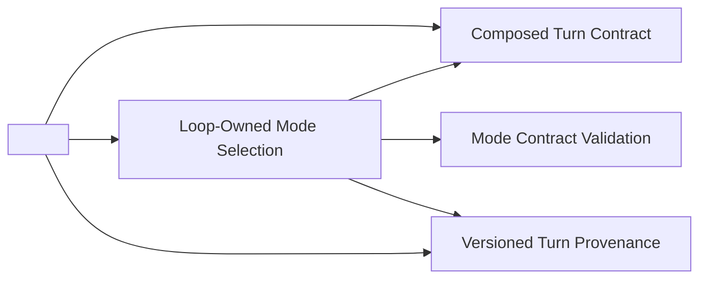

### Composed Turn Contract

- Domain: [mode-driven-response-schema](ALGORITHMS.md#algorithms-domain-mode-driven-response-schema)
- Tier: [process](SCHEMA.md#vocabulary-domain-tier-process)
- Stage: [act](REASONING.md#stage-act)
- Axis: [formalization](REASONING.md#reasoning-axis-formalization)
- Math type: [computation](REASONING.md#reasoning-math-type-computation)
- Yields: procedure

Details

Intent
Compose a model turn's validation schema and its instruction from one self-registering field registry, projected per mode, so the schema the response is graded against and the instruction the model is given can never drift.

Invariant
The per-mode validation schema and the per-mode instruction are projections of a single field registry; there is no second hand-authored contract surface, and adding or changing a field changes both at once.

Flow

```text
RegisterField → SelectByMode → ProjectSchema → ProjectInstruction → StampVersion
```

Productions

```bnf
ComposedTurnContract ::= <FieldRegistry> "→" <ModeProjection> "→" <SchemaAndInstruction>
ModeKey ::= "(" "phase" "," "activity" ")"
SchemaVersion ::= "content_hash" "(" <FieldSet> ")"
Determinism ::= "same_mode" "→" "byte_identical" "(" <Schema> "," <Instruction> ")"
```

Composes
[Interface Contract](ALGORITHMS.md#algorithms-interface-contract), [Canonical Data](ALGORITHMS.md#algorithms-canonical-data), [Canonical Semantics](ALGORITHMS.md#algorithms-canonical-semantics), [Extension Point](ALGORITHMS.md#algorithms-extension-point)

Composed by
[<Mode-Driven Response Schema>](ALGORITHMS.md#algorithms-mode-driven-response-schema)

Named in the derivation of
[Loop-Owned Mode Selection](ALGORITHMS.md#algorithms-loop-owned-mode-selection)

Forces
[contract_compatibility](SCHEMA.md#force-contract-compatibility), [semantic_consistency](SCHEMA.md#force-semantic-consistency), [runtime_extensibility](SCHEMA.md#force-runtime-extensibility)

Grounds
none

Before

```text
The validation schema and the model's instruction hand-maintained twice, so they drift.
```

After

```text
field registry → project per (phase, activity) mode → schema + instruction from one source → same mode = byte-identical, changing a field changes both
```

How it is checked

Checked by
the mode contract validation, which accepts a response only against the contract the loop selected

Population
Every model turn the loop grades

Freshness
A verdict stands until the field registry or the selected mode changes

Refusal
A response that fails its mode contract is rejected and retried with error-specific remediation, never against a relaxed contract

Observation
The append-only turn records, which locate a failed turn

Evidence
None, because the catalog states this check as a class, so a watched run belongs to each system that adopts it

Authoritative side
The selected mode contract, which every graded response conforms to

Depends on
[Interface Contract](ALGORITHMS.md#algorithms-interface-contract), [Canonical Data](ALGORITHMS.md#algorithms-canonical-data), [Canonical Semantics](ALGORITHMS.md#algorithms-canonical-semantics), [Extension Point](ALGORITHMS.md#algorithms-extension-point)

Shape it refuses
Not answered

### Loop-Owned Mode Selection

- Domain: [mode-driven-response-schema](ALGORITHMS.md#algorithms-domain-mode-driven-response-schema)
- Tier: [process](SCHEMA.md#vocabulary-domain-tier-process)
- Math type: [computation](REASONING.md#reasoning-math-type-computation)
- Yields: procedure

Details

Intent
The loop assigns the (phase, activity) mode that selects which contract a response is validated against; the model's output carries no contract-selecting field, so a model can never grade itself against a contract it chose.

Invariant
The mode that selects the response contract is loop-assigned; the model has no field that selects the contract it is graded against.

Flow

```text
LoopAssignMode → ComposeContract → ValidateAgainstContract
```

Productions

```bnf
LoopOwnedModeSelection ::= <LoopAssignedMode> "→" <ComposeContract> "→" <ValidateResponse>
ModeAuthority ::= "loop_owned" "not_model_selected"
```

Composes
[Contract Compatibility](ALGORITHMS.md#algorithms-contract-compatibility)

Composed by
[<Mode-Driven Response Schema>](ALGORITHMS.md#algorithms-mode-driven-response-schema)

Forces
[security_governance](SCHEMA.md#force-security-governance), [state_transaction](SCHEMA.md#force-state-transaction), [correctness_verification](SCHEMA.md#force-correctness-verification)

Grounds
[derivation-loop](REASONING.md#reasoning-loop-derivation-loop)

Derivation map

act
[Composed Turn Contract](ALGORITHMS.md#algorithms-composed-turn-contract)

verify
[Mode Contract Validation](ALGORITHMS.md#algorithms-mode-contract-validation)

commit
[Versioned Turn Provenance](ALGORITHMS.md#algorithms-versioned-turn-provenance)

Before

```text
The model's output carries the field that selects which contract it's graded against.
```

After

```text
loop assigns (phase, activity) mode → compose contract → validate; the model can never grade itself against a contract it chose
```

How it is checked

Checked by
the mode contract validation, which accepts a response only against the contract the loop selected

Population
Every model turn the loop grades

Freshness
A verdict stands until the field registry or the selected mode changes

Refusal
A response that fails its mode contract is rejected and retried with error-specific remediation, never against a relaxed contract

Observation
The append-only turn records, which locate a failed turn

Evidence
None, because the catalog states this check as a class, so a watched run belongs to each system that adopts it

Authoritative side
The selected mode contract, which every graded response conforms to

Depends on
[Contract Compatibility](ALGORITHMS.md#algorithms-contract-compatibility)

Shape it refuses
Not answered

### Versioned Turn Provenance

- Domain: [mode-driven-response-schema](ALGORITHMS.md#algorithms-domain-mode-driven-response-schema)
- Tier: [process](SCHEMA.md#vocabulary-domain-tier-process)
- Stage: [commit](REASONING.md#stage-commit)
- Axis: [representation](REASONING.md#reasoning-axis-representation)
- Math type: [information-theory](REASONING.md#reasoning-math-type-information-theory)
- Yields: hash | novelty-score

Details

Intent
Persist each accepted model turn as an append-only, mode-tagged, schema-versioned, causally ordered record with change-only provenance, so the turn history is a queryable, auditable log and a turn is never graded against a schema version its stored state never saw.

Invariant
Turn records are append-only and single-writer causally ordered; a version is stamped by content and never mutated in place; a no-op change appends nothing.

Flow

```text
StampVersion → AssignCausalOrder → AppendOnly → BumpOnChange → Query
```

Productions

```bnf
VersionedTurnProvenance ::= <SchemaVersion> "→" <CausalOrder> "→" <AppendOnlyRecord>
CausalOrder ::= "single_writer_counter" "not" "disk_read_max"
Provenance ::= "bump_on_real_change" "no_op_appends_nothing"
```

Composes
[Version Provenance](ALGORITHMS.md#algorithms-version-provenance)

Composed by
[<Mode-Driven Response Schema>](ALGORITHMS.md#algorithms-mode-driven-response-schema)

Named in the derivation of
[Loop-Owned Mode Selection](ALGORITHMS.md#algorithms-loop-owned-mode-selection)

Forces
[observability_traceability](SCHEMA.md#force-observability-traceability), [state_transaction](SCHEMA.md#force-state-transaction), [causality_ordering](SCHEMA.md#force-causality-ordering)

Grounds
none

Before

```text
A turn graded against a schema version its stored state never saw.
```

After

```text
accepted turn → stamp version by content → single-writer causal order → append-only, mode-tagged record; a no-op appends nothing
```

How it is checked

Checked by
the mode contract validation, which accepts a response only against the contract the loop selected

Population
Every model turn the loop grades

Freshness
A verdict stands until the field registry or the selected mode changes

Refusal
A response that fails its mode contract is rejected and retried with error-specific remediation, never against a relaxed contract

Observation
The append-only turn records, which locate a failed turn

Evidence
None, because the catalog states this check as a class, so a watched run belongs to each system that adopts it

Authoritative side
The selected mode contract, which every graded response conforms to

Depends on
[Version Provenance](ALGORITHMS.md#algorithms-version-provenance)

Shape it refuses
Not answered

### Mode Contract Validation

- Domain: [mode-driven-response-schema](ALGORITHMS.md#algorithms-domain-mode-driven-response-schema)
- Tier: [process](SCHEMA.md#vocabulary-domain-tier-process)
- Stage: [verify](REASONING.md#stage-verify)
- Axis: [verification](REASONING.md#reasoning-axis-verification)
- Math type: [logic](REASONING.md#reasoning-math-type-logic)
- Yields: boolean

Details

Intent
Validate the model's response against the loop-selected mode contract and, on a validation miss, drive an error-specific self-healing retry bounded by the contract, so a response is accepted only when it satisfies the schema it is graded against.

Invariant
A response is accepted only against the mode contract the loop selected; a validation miss self-heals with error-specific remediation, never against a relaxed contract.

Flow

```text
Response → ValidateAgainstContract → Valid|SelfHealRetry → Accepted|Rejected
```

Productions

```bnf
ModeContractValidation ::= <Response> "," <ModeContract> "→" <Validation> "→" (<Accepted> | <SelfHealRetry> "→" <ModeContractValidation>)
SelfHealRetry ::= "error_specific_remediation" "(" <ValidationIssues> ")" "bounded"
```

Composes
none

Named in the derivation of
[Loop-Owned Mode Selection](ALGORITHMS.md#algorithms-loop-owned-mode-selection)

Forces
[correctness_verification](SCHEMA.md#force-correctness-verification), [contract_compatibility](SCHEMA.md#force-contract-compatibility)

Grounds
[ver-evidence](REASONING.md#reasoning-node-ver-evidence)

Before

```text
A response accepted because it looked right, not because it satisfied the mode's schema.
```

After

```text
response + mode contract → validate → {valid | error-specific self-heal retry, bounded} → accepted | rejected
```

How it is checked

Checked by
the mode contract validation, which accepts a response only against the contract the loop selected

Population
Every model turn the loop grades

Freshness
A verdict stands until the field registry or the selected mode changes

Refusal
A response that fails its mode contract is rejected and retried with error-specific remediation, never against a relaxed contract

Observation
The append-only turn records, which locate a failed turn

Evidence
None, because the catalog states this check as a class, so a watched run belongs to each system that adopts it

Authoritative side
The selected mode contract, which every graded response conforms to

Depends on
Not answered

Shape it refuses
Not answered

### <Mode-Driven Response Schema>

- Domain: [mode-driven-response-schema](ALGORITHMS.md#algorithms-domain-mode-driven-response-schema)
- Tier: [process](SCHEMA.md#vocabulary-domain-tier-process)
- Meta record

Details

Intent
Make the model's structured output a mode-driven composed contract — the output mirror of composed input context: per loop-owned mode the schema and instruction are projected from one field registry, the response is validated and self-heals against it, the typed fields are governed, and every turn is persisted as a versioned queryable record — so the output has one source, cannot drift from its instruction, and can be audited.

Invariant
The response contract is composed per loop-owned mode from a single field registry; instruction and validation are the same source; a validation miss self-heals with error-specific remediation; output governance is advisory and never blocks the hard verify gate; and every accepted turn is a versioned, append-only record.

Flow

```text
ComposeContract → ValidateByMode → SelfRemediate → GovernFields → PersistVersioned
```

Productions

```bnf
ModeDrivenResponseSchema ::= <ComposedTurnContract> "→" <LoopOwnedModeSelection> "→" <SelfRemediation> "→" <GroundingAdvisory> "→" <VersionedTurnProvenance>
SingleSource ::= "instruction" "=" "validation" "=" "projection" "(" <FieldRegistry> ")"
SelfRemediation ::= "error_specific_retry" "(" <ValidationIssues> "," <ModeContract> ")"
GroundingAdvisory ::= "typed_field" "→" "validator" "(" "advisory_not_blocking" ")"
```

Composes
[Composed Turn Contract](ALGORITHMS.md#algorithms-composed-turn-contract), [Loop-Owned Mode Selection](ALGORITHMS.md#algorithms-loop-owned-mode-selection), [Versioned Turn Provenance](ALGORITHMS.md#algorithms-versioned-turn-provenance), [Interface Contract](ALGORITHMS.md#algorithms-interface-contract), [Canonical Data](ALGORITHMS.md#algorithms-canonical-data), [Contract Compatibility](ALGORITHMS.md#algorithms-contract-compatibility), [Self-Description Manifest](ALGORITHMS.md#algorithms-self-description-manifest), [Runtime Discovery](ALGORITHMS.md#algorithms-runtime-discovery), [Extension Point](ALGORITHMS.md#algorithms-extension-point)

Forces
[contract_compatibility](SCHEMA.md#force-contract-compatibility), [semantic_consistency](SCHEMA.md#force-semantic-consistency), [runtime_extensibility](SCHEMA.md#force-runtime-extensibility), [correctness_verification](SCHEMA.md#force-correctness-verification), [security_governance](SCHEMA.md#force-security-governance)

Grounds
none

How it is checked

Checked by
the mode contract validation, which accepts a response only against the contract the loop selected

Population
Every model turn the loop grades

Freshness
A verdict stands until the field registry or the selected mode changes

Refusal
A response that fails its mode contract is rejected and retried with error-specific remediation, never against a relaxed contract

Observation
The append-only turn records, which locate a failed turn

Evidence
None, because the catalog states this check as a class, so a watched run belongs to each system that adopts it

Authoritative side
The selected mode contract, which every graded response conforms to

Depends on
[Composed Turn Contract](ALGORITHMS.md#algorithms-composed-turn-contract), [Loop-Owned Mode Selection](ALGORITHMS.md#algorithms-loop-owned-mode-selection), [Versioned Turn Provenance](ALGORITHMS.md#algorithms-versioned-turn-provenance), [Interface Contract](ALGORITHMS.md#algorithms-interface-contract), [Canonical Data](ALGORITHMS.md#algorithms-canonical-data), [Contract Compatibility](ALGORITHMS.md#algorithms-contract-compatibility), [Self-Description Manifest](ALGORITHMS.md#algorithms-self-description-manifest), [Runtime Discovery](ALGORITHMS.md#algorithms-runtime-discovery), [Extension Point](ALGORITHMS.md#algorithms-extension-point)

Shape it refuses
Not answered

## CSS cascade

Every algorithm contract in this domain is listed with its position on the derivation loop, its intent and invariant, the flow it walks and its productions as a grammar. Each record also shows what it composes and is composed by, which forces and principles it answers to, what grounds it and what it grounds, and an exemplar where the record carries one. The diagram shows what composes what inside the domain.

Relations diagram

What composes what inside this domain.

```mermaid
flowchart LR
n_cascade_layer_partition["Cascade Layer Partition"]
n_token_source_of_truth["Token Source-of-Truth"]
n_type_keyed_appearance["Type-Keyed Appearance"]
n_custom_type_registration["Custom Type Registration"]
n_governed_construction_boundary["Governed Construction Boundary"]
n_placement_isolation["Placement Isolation"]
n_assembly_composition["Assembly Composition"]
n_layer_fitness_enforcement["Layer Fitness Enforcement"]
n_type_migration_centralization["Type-Migration Centralization"]
n_css_type_cascade_concern["CSS Type-Cascade Kernel"]
n_css_type_cascade_concern --> n_cascade_layer_partition
n_css_type_cascade_concern --> n_token_source_of_truth
n_css_type_cascade_concern --> n_type_keyed_appearance
n_css_type_cascade_concern --> n_custom_type_registration
n_css_type_cascade_concern --> n_placement_isolation
n_css_type_cascade_concern --> n_assembly_composition
n_css_type_cascade_concern --> n_layer_fitness_enforcement
```

### Cascade Layer Partition

- Domain: [css-cascade](ALGORITHMS.md#algorithms-domain-css-cascade)
- Tier: [leaf](SCHEMA.md#vocabulary-domain-tier-leaf)
- Math type: [algebra](REASONING.md#reasoning-math-type-algebra)
- Yields: ordered-structure

Details

Intent
Declare one ordered set of named cascade layers once at the stylesheet root, assign every rule to exactly one layer, and let layer order — not selector specificity nor source order — decide precedence, so values, appearance, placement, and assembly can never fight for the same declaration.

Invariant
Style precedence must be a property of the layer a rule lives in, not of how specific its selector is; an unlayered rule silently outranks every layer and is therefore forbidden.

Flow

```text
Root → LayerOrderDeclaration → PerFileLayerBinding → LayerPrecedence → DeterministicCascade
```

Productions

```bnf
CascadeLayerPartition ::= <LayerOrderDeclaration> "→" <LayeredBindingSet> "→" <PrecedencePolicy>
LayerOrderDeclaration ::= "@layer" "tokens" "," "globals" "," "shell" "," "components" "," "app"
LayeredBinding ::= <StyleFile> "assigned_to" <ExactlyOneLayer>
PrecedencePolicy ::= "app_over_components_over_shell_over_globals_over_tokens" "," "layer_beats_specificity" "," "no_unlayered_rule"
```

Composes
[Architectural Style Boundary](ALGORITHMS.md#algorithms-architectural-style-boundary), [Responsibility Boundary](ALGORITHMS.md#algorithms-responsibility-boundary)

Composed by
[CSS Type-Cascade Kernel](ALGORITHMS.md#algorithms-css-type-cascade-concern)

Forces
[modularity](SCHEMA.md#force-modularity)

Grounds
none

Before

```text
.foo { color: red; }
#page .foo { color: blue; }
```

After

```text
@layer tokens, globals, components, app;
@layer globals { [data-el="foo"] { color: var(--fg); } }
@layer app { .foo-view { gap: var(--space-4); } }
```

How it is checked

Checked by
the stylesheet linters and the element construction factory, the layer fitness functions that fail the build when the partition breaks

Population
Every stylesheet and every element the factory constructs

Freshness
A verdict stands until a stylesheet, the tokens or the factory change

Refusal
The lint stage fails an unlayered rule, a literal where a token exists, or appearance declared outside the global type rules

Observation
None, because the cascade is decided statically

Evidence
None, because the catalog states this check as a class, so a watched run belongs to each system that adopts it

Authoritative side
The layer order and the token set, which every stylesheet conforms to

Depends on
[Architectural Style Boundary](ALGORITHMS.md#algorithms-architectural-style-boundary), [Responsibility Boundary](ALGORITHMS.md#algorithms-responsibility-boundary)

Shape it refuses
Not answered

### Token Source-of-Truth

- Domain: [css-cascade](ALGORITHMS.md#algorithms-domain-css-cascade)
- Tier: [leaf](SCHEMA.md#vocabulary-domain-tier-leaf)
- Math type: [set-theory](REASONING.md#reasoning-math-type-set-theory)
- Yields: set | boolean

Details

Intent
Define every design primitive — color, space, radius, the type scale, size, duration, z-index — exactly once as a custom property in the tokens layer, and forbid any downstream literal where a token exists.

Invariant
Values are canonical data with a single source; a literal in globals, components, or app where a token exists is duplication, not styling.

Flow

```text
Primitive → TokenDeclaration → DownstreamReference → NoLiteralWhereTokenExists
```

Productions

```bnf
TokenSourceOfTruth ::= <PrimitiveSet> "→" <TokenDeclarationSet> "→" <ReferenceOnlyDownstream>
TokenCategory ::= "color" | "space" | "radius" | "type_scale" | "size" | "duration" | "z_index"
LiteralPolicy ::= "reference_token" | "zero_value_exempt"
```

Composes
[Canonical Data](ALGORITHMS.md#algorithms-canonical-data)

Composed by
[CSS Type-Cascade Kernel](ALGORITHMS.md#algorithms-css-type-cascade-concern)

Forces
[semantic_consistency](SCHEMA.md#force-semantic-consistency), [performance_scaling](SCHEMA.md#force-performance-scaling)

Grounds
none

Before

```text
.foo { color: #33bb55; }
.bar { color: #33bb55; }
```

After

```text
@layer tokens { :root { --foo: #33bb55; } }
@layer globals { [data-el="foo"], [data-el="bar"] { color: var(--foo); } }
```

How it is checked

Checked by
the stylesheet linters and the element construction factory, the layer fitness functions that fail the build when the partition breaks

Population
Every stylesheet and every element the factory constructs

Freshness
A verdict stands until a stylesheet, the tokens or the factory change

Refusal
The lint stage fails an unlayered rule, a literal where a token exists, or appearance declared outside the global type rules

Observation
None, because the cascade is decided statically

Evidence
None, because the catalog states this check as a class, so a watched run belongs to each system that adopts it

Authoritative side
The layer order and the token set, which every stylesheet conforms to

Depends on
[Canonical Data](ALGORITHMS.md#algorithms-canonical-data)

Shape it refuses
Not answered

### Type-Keyed Appearance

- Domain: [css-cascade](ALGORITHMS.md#algorithms-domain-css-cascade)
- Tier: [leaf](SCHEMA.md#vocabulary-domain-tier-leaf)
- Math type: [logic](REASONING.md#reasoning-math-type-logic)
- Yields: boolean

Details

Intent
In the globals layer, define how every element and component type looks, its size, and its spacing exactly once, keyed only by element tag, `data-el` custom type, and the orthogonal `data-*` axes (`data-variant` paint, `data-size` scale, `data-gap` child rhythm, `data-tone` palette, `data-measure` width); never key appearance by a purpose-class, and let every value be a token.

Invariant
Appearance is a contract owned by a type, not by a use-site; a purpose-class in globals fragments one type's look across many call-sites and is forbidden.

Flow

```text
Type → GlobalAppearanceRule → DefinedOncePerType → TokenizedValues
```

Productions

```bnf
TypeKeyedAppearance ::= <TypeSelector> "→" <AppearanceRule> "→" <DefinedOncePerType>
TypeSelector ::= <ElementTag> | "[data-el=" <CustomType> "]" | <TypeSelector> "[data-" ("variant"|"size"|"gap"|"tone"|"measure"|"layout") "=" <Value> "]"
AppearanceProperty ::= "look" | "size" | "spacing" | "intrinsic_rendering_behavior"
ForbiddenKey ::= "purpose_class"
```

Composes
[Canonical Data](ALGORITHMS.md#algorithms-canonical-data), [Domain Boundary](ALGORITHMS.md#algorithms-domain-boundary)

Composed by
[CSS Type-Cascade Kernel](ALGORITHMS.md#algorithms-css-type-cascade-concern)

Forces
[contract_compatibility](SCHEMA.md#force-contract-compatibility)

Grounds
none

Before

```text
.foo-label { font-size: 12px; color: gray; }
```

After

```text
@layer globals { [data-el="foo"] { font-size: var(--text-sm); color: var(--fg-muted); } }
```

How it is checked

Checked by
the stylesheet linters and the element construction factory, the layer fitness functions that fail the build when the partition breaks

Population
Every stylesheet and every element the factory constructs

Freshness
A verdict stands until a stylesheet, the tokens or the factory change

Refusal
The lint stage fails an unlayered rule, a literal where a token exists, or appearance declared outside the global type rules

Observation
None, because the cascade is decided statically

Evidence
None, because the catalog states this check as a class, so a watched run belongs to each system that adopts it

Authoritative side
The layer order and the token set, which every stylesheet conforms to

Depends on
[Canonical Data](ALGORITHMS.md#algorithms-canonical-data), [Domain Boundary](ALGORITHMS.md#algorithms-domain-boundary)

Shape it refuses
Not answered

### Custom Type Registration

- Domain: [css-cascade](ALGORITHMS.md#algorithms-domain-css-cascade)
- Tier: [leaf](SCHEMA.md#vocabulary-domain-tier-leaf)
- Math type: [set-theory](REASONING.md#reasoning-math-type-set-theory)
- Yields: set | boolean

Details

Intent
Extend the stylable element vocabulary beyond the native HTML tag set by registering each semantic type against a base tag and a `data-el` stamp; the registered type becomes a first-class node the globals layer binds one appearance contract to, so a concept no native tag can express — a field-label, an icon, a toast, an entry — is styled by its type, never by a class.

Invariant
The set of stylable types is open and self-registered, not limited to the HTML tag set; a new appearance contract is a newly registered type plus one global rule, never a new purpose-class.

Flow

```text
SemanticConcept → DefineElement(type, baseTag, dataEl) → TypeRegistry → DataElStamp → GlobalAppearanceContract
```

Productions

```bnf
CustomTypeRegistration ::= <SemanticConcept> "→" <ElementDefinition> "→" <TypeRegistryEntry> "→" <RenderedTypeStamp> "→" <AppearanceBinding>
ElementDefinition ::= "type" "," "baseTag" "," "dataElToken"
RenderedTypeStamp ::= <BaseTag> "carrying" "data-el=" <DataElToken>
AppearanceBinding ::= "[data-el=" <DataElToken> "]" "owns_exactly_one_global_appearance_rule"
```

Composes
[Extension Point](ALGORITHMS.md#algorithms-extension-point), [Self-Description Manifest](ALGORITHMS.md#algorithms-self-description-manifest)

Composed by
[CSS Type-Cascade Kernel](ALGORITHMS.md#algorithms-css-type-cascade-concern)

Forces
[contract_compatibility](SCHEMA.md#force-contract-compatibility), [semantic_consistency](SCHEMA.md#force-semantic-consistency)

Grounds
none

Before

```typescript
<span class="foo">…</span>
.foo { color: gray; }
```

After

```typescript
defineElement({ type: "foo", baseTag: "output", dataEl: "foo" });
@layer globals { [data-el="foo"] { color: var(--fg-muted); } }
```

How it is checked

Checked by
the stylesheet linters and the element construction factory, the layer fitness functions that fail the build when the partition breaks

Population
Every stylesheet and every element the factory constructs

Freshness
A verdict stands until a stylesheet, the tokens or the factory change

Refusal
The lint stage fails an unlayered rule, a literal where a token exists, or appearance declared outside the global type rules

Observation
None, because the cascade is decided statically

Evidence
None, because the catalog states this check as a class, so a watched run belongs to each system that adopts it

Authoritative side
The layer order and the token set, which every stylesheet conforms to

Depends on
[Extension Point](ALGORITHMS.md#algorithms-extension-point), [Self-Description Manifest](ALGORITHMS.md#algorithms-self-description-manifest)

Shape it refuses
Not answered

### Governed Construction Boundary

- Domain: [css-cascade](ALGORITHMS.md#algorithms-domain-css-cascade)
- Tier: [leaf](SCHEMA.md#vocabulary-domain-tier-leaf)
- Math type: [computation](REASONING.md#reasoning-math-type-computation)
- Yields: procedure

Details

Intent
Route all DOM creation through one governed factory that resolves a node spec of shape `{ el, variant, size, gap, tone, measure, layout, class, on, children }` against the type, handler, and component registries, maps each axis key to its `data-*` attribute, treats `class` as a gated hook (icon-font glyph, `u-*` utility, or `c-*` component — never bespoke, never appearance), throws on any unknown type, handler, or component, and refuses an inline `style` attribute.

Invariant
The construction surface must be structurally incapable of producing a node that is unstyled-by-type or carries an inline style; the illegal state is unrepresentable, not merely linted after the fact.

Flow

```text
NodeSpec → RegistryResolution → ScalarMapping → UnknownReject|InlineStyleReject → GovernedNode
```

Productions

```bnf
GovernedConstruction ::= <NodeSpec> "→" <RegistryLookup> "→" <ScalarApplication> "→" <GuardSet> "→" <RenderedNode>
NodeSpec ::= "el" "," "variant?" "," "size?" "," "gap?" "," "tone?" "," "measure?" "," "layout?" "," "class?" "," "on?" "," "children?"
ScalarApplication ::= "each_axis_key→data-attr" "," "class=gated_iconfont_or_u_or_c"
GuardSet ::= "throw_on_unknown_element" "," "throw_on_unknown_handler" "," "throw_on_unknown_component" "," "reject_style_attribute"
```

Composes
[Construction Boundary](ALGORITHMS.md#algorithms-construction-boundary), [Error Boundary](ALGORITHMS.md#algorithms-error-boundary), [Security Policy](ALGORITHMS.md#algorithms-security-policy)

Forces
[modularity](SCHEMA.md#force-modularity), [object_creation](SCHEMA.md#force-object-creation)

Grounds
none

Before

```typescript
const n = document.createElement("div");
n.className = "foo";
n.style.color = "red";
```

After

```typescript
const n = dom({ el: "foo", tone: "bar", children: [text] });
```

How it is checked

Checked by
the stylesheet linters and the element construction factory, the layer fitness functions that fail the build when the partition breaks

Population
Every stylesheet and every element the factory constructs

Freshness
A verdict stands until a stylesheet, the tokens or the factory change

Refusal
The lint stage fails an unlayered rule, a literal where a token exists, or appearance declared outside the global type rules

Observation
None, because the cascade is decided statically

Evidence
None, because the catalog states this check as a class, so a watched run belongs to each system that adopts it

Authoritative side
The layer order and the token set, which every stylesheet conforms to

Depends on
[Construction Boundary](ALGORITHMS.md#algorithms-construction-boundary), [Error Boundary](ALGORITHMS.md#algorithms-error-boundary), [Security Policy](ALGORITHMS.md#algorithms-security-policy)

Shape it refuses
Not answered

### Placement Isolation

- Domain: [css-cascade](ALGORITHMS.md#algorithms-domain-css-cascade)
- Tier: [leaf](SCHEMA.md#vocabulary-domain-tier-leaf)
- Math type: [topology](REASONING.md#reasoning-math-type-topology)
- Yields: boolean

Details

Intent
In the components layer, set only where a component sits — position, offsets, stacking, overlay — keyed by its type, and never its look, size, or spacing, which remain owned by globals.

Invariant
Placement and appearance are separate contracts; a placement rule that also sets a look re-opens a type's appearance outside its single global definition and breaks the layer partition.

Flow

```text
ComponentType → PlacementRule → PositionStackingOverlayOnly → NoAppearanceLeak
```

Productions

```bnf
PlacementIsolation ::= <ComponentType> "→" <PlacementRule> "→" <ForbiddenAppearanceSet>
PlacementProperty ::= "position" | "inset" | "top" | "right" | "bottom" | "left" | "z_index" | "float" | "clear"
ForbiddenInComponents ::= "color" | "font" | "size" | "spacing" | "border" | "radius"
```

Composes
[Responsibility Boundary](ALGORITHMS.md#algorithms-responsibility-boundary), [Coupling Control](ALGORITHMS.md#algorithms-coupling-control)

Composed by
[CSS Type-Cascade Kernel](ALGORITHMS.md#algorithms-css-type-cascade-concern)

Forces
[contract_compatibility](SCHEMA.md#force-contract-compatibility)

Grounds
none

Before

```text
@layer components { [data-el="foo"] { position: fixed; inset-block-end: 1rem; color: white; } }
```

After

```text
@layer components { [data-el="foo"] { position: fixed; inset-block-end: var(--space-4); z-index: var(--z-overlay); } }
```

How it is checked

Checked by
the stylesheet linters and the element construction factory, the layer fitness functions that fail the build when the partition breaks

Population
Every stylesheet and every element the factory constructs

Freshness
A verdict stands until a stylesheet, the tokens or the factory change

Refusal
The lint stage fails an unlayered rule, a literal where a token exists, or appearance declared outside the global type rules

Observation
None, because the cascade is decided statically

Evidence
None, because the catalog states this check as a class, so a watched run belongs to each system that adopts it

Authoritative side
The layer order and the token set, which every stylesheet conforms to

Depends on
[Responsibility Boundary](ALGORITHMS.md#algorithms-responsibility-boundary), [Coupling Control](ALGORITHMS.md#algorithms-coupling-control)

Shape it refuses
Not answered

### Assembly Composition

- Domain: [css-cascade](ALGORITHMS.md#algorithms-domain-css-cascade)
- Tier: [leaf](SCHEMA.md#vocabulary-domain-tier-leaf)
- Math type: [algebra](REASONING.md#reasoning-math-type-algebra)
- Yields: ordered-structure

Details

Intent
In the app layer, compose views from structural containers and arrange their children with flex or grid and token-valued gaps, pad each container once so its children are full-width and fill the padded box, forbid horizontal margins, and never set or override any element's or component's look.

Invariant
Assembly arranges typed parts and owns child layout plus gutter discipline, but holds zero appearance authority, so a view can be recomposed without restyling a single type.

Flow

```text
View → ContainerSet → ChildArrangement → GutterConvention → NoAppearanceOverride
```

Productions

```bnf
AssemblyComposition ::= <View> "→" <StructuralContainerSet> "→" <ChildArrangement> "→" <GutterConvention>
ChildArrangement ::= "flex" | "grid" | "token_valued_gap"
GutterConvention ::= "container_pads_once" "," "child_width_100" "," "no_horizontal_margin" "," "narrower_via_explicit_width" "," "zero_margin_exempt"
AppearanceAuthority ::= "none"
```

Composes
[Responsibility Boundary](ALGORITHMS.md#algorithms-responsibility-boundary)

Composed by
[CSS Type-Cascade Kernel](ALGORITHMS.md#algorithms-css-type-cascade-concern)

Forces
[modularity](SCHEMA.md#force-modularity)

Grounds
none

Before

```text
@layer app { .foo-view .bar { margin: 0 12px; box-shadow: 0 1px 2px; } }
```

After

```text
@layer app { .foo-view { display: grid; gap: var(--space-4); padding-inline: var(--space-4); } }
```

How it is checked

Checked by
the stylesheet linters and the element construction factory, the layer fitness functions that fail the build when the partition breaks

Population
Every stylesheet and every element the factory constructs

Freshness
A verdict stands until a stylesheet, the tokens or the factory change

Refusal
The lint stage fails an unlayered rule, a literal where a token exists, or appearance declared outside the global type rules

Observation
None, because the cascade is decided statically

Evidence
None, because the catalog states this check as a class, so a watched run belongs to each system that adopts it

Authoritative side
The layer order and the token set, which every stylesheet conforms to

Depends on
[Responsibility Boundary](ALGORITHMS.md#algorithms-responsibility-boundary)

Shape it refuses
Not answered

### Layer Fitness Enforcement

- Domain: [css-cascade](ALGORITHMS.md#algorithms-domain-css-cascade)
- Tier: [leaf](SCHEMA.md#vocabulary-domain-tier-leaf)
- Math type: [optimization](REASONING.md#reasoning-math-type-optimization)
- Yields: boolean | ranking

Details

Intent
Bind each layer invariant to a machine check — layer order declared once, placement properties barred from globals, class selectors barred from globals, literals barred where a token exists, no horizontal margin, all DOM through the factory, no inline style — run them as hard errors with no warn tier and no inline disables, and gate the push on a clean verdict.

Invariant
A layer contract holds only if a fitness function fails the build when it is broken; the factory makes appearance-by-type unrepresentable and the linters make any residue unshippable.

Flow

```text
LayerInvariant → FitnessFunction → StaticCheck → HardErrorNoWarn → PushGate
```

Productions

```bnf
LayerFitnessEnforcement ::= <InvariantSet> "→" <FitnessFunctionSet> "→" <VerdictGate>
CssFitnessRule ::= "layer_order" | "no_appearance_in_components_or_app" | "no_class_in_globals" | "layered_class_format_c_or_u" | "no_bespoke_class" | "tokens_only" | "axis_value_validation" | "no_horizontal_margin"
DomFitnessRule ::= "factory_only_creation" | "no_inline_style"
GatePolicy ::= "hard_error_no_warn_tier" "," "no_inline_disable" "," "block_push_on_fail"
```

Composes
[Verification Fitness](ALGORITHMS.md#algorithms-verification-fitness)

Composed by
[CSS Type-Cascade Kernel](ALGORITHMS.md#algorithms-css-type-cascade-concern)

Forces
[contract_compatibility](SCHEMA.md#force-contract-compatibility), [object_creation](SCHEMA.md#force-object-creation), [architecture_evolution](SCHEMA.md#force-architecture-evolution)

Grounds
none

Before

```typescript
reviewChecklist.push("no appearance in the app layer");
```

After

```typescript
export const rules = {
  "no-appearance-in-app": "error",
  "factory-only-creation": "error",
};
```

How it is checked

Checked by
the stylesheet linters and the element construction factory, the layer fitness functions that fail the build when the partition breaks

Population
Every stylesheet and every element the factory constructs

Freshness
A verdict stands until a stylesheet, the tokens or the factory change

Refusal
The lint stage fails an unlayered rule, a literal where a token exists, or appearance declared outside the global type rules

Observation
None, because the cascade is decided statically

Evidence
None, because the catalog states this check as a class, so a watched run belongs to each system that adopts it

Authoritative side
The layer order and the token set, which every stylesheet conforms to

Depends on
[Verification Fitness](ALGORITHMS.md#algorithms-verification-fitness)

Shape it refuses
Not answered

### Type-Migration Centralization

- Domain: [css-cascade](ALGORITHMS.md#algorithms-domain-css-cascade)
- Tier: [leaf](SCHEMA.md#vocabulary-domain-tier-leaf)
- Math type: [computation](REASONING.md#reasoning-math-type-computation)
- Yields: procedure

Details

Intent
To move an existing purpose-class or page-scoped stylesheet into this model, treat every appearance-bearing class rule as a migration unit, derive the element type it decorates, register a custom `data-el` type when no tag or variant expresses it, move its look, size, and spacing into one global rule keyed by that type, demote any residual position into components and any residual layout into app, and verify that zero appearance rule keyed by a purpose-class remains outside the globals layer.

Invariant
Migration is centralization by type: each scattered purpose-class appearance collapses into one type-keyed global rule, and completion is proven by the absence of appearance outside globals, not by a narrative claim.

Flow

```text
PurposeClassRule → DeriveType → RegisterTypeIfNeeded → MoveAppearanceToGlobals → DemoteResidue → ZeroAppearanceClassOutsideGlobals
```

Productions

```bnf
TypeMigration ::= <LegacyAppearanceRuleSet> "→" <TypeDerivation> "→" <GlobalCentralization> "→" <ResidueDemotion> "→" <ZeroDuplicationVerdict>
TypeDerivation ::= "existing_tag" | "existing_variant" | "register_new_data_el_type"
ResidueDemotion ::= "placement→components" "," "layout→app"
ZeroDuplicationVerdict ::= "no_appearance_keyed_by_purpose_class_outside_globals" | "incomplete"
```

Composes
[Centralization Kernel](ALGORITHMS.md#algorithms-centralization-kernel), [Architecture Evolution Governance](ALGORITHMS.md#algorithms-architecture-evolution-governance)

Forces
[semantic_consistency](SCHEMA.md#force-semantic-consistency), [correctness_verification](SCHEMA.md#force-correctness-verification), [model_governance](SCHEMA.md#force-model-governance), [architecture_evolution](SCHEMA.md#force-architecture-evolution)

Grounds
none

Before

```text
.foo { color: white; background: blue; position: sticky; top: 0; }
```

After

```text
@layer globals { [data-el="foo"] { color: var(--fg-on-accent); background: var(--bg-accent); } }
@layer components { [data-el="foo"] { position: sticky; top: 0; } }
```

How it is checked

Checked by
the stylesheet linters and the element construction factory, the layer fitness functions that fail the build when the partition breaks

Population
Every stylesheet and every element the factory constructs

Freshness
A verdict stands until a stylesheet, the tokens or the factory change

Refusal
The lint stage fails an unlayered rule, a literal where a token exists, or appearance declared outside the global type rules

Observation
None, because the cascade is decided statically

Evidence
None, because the catalog states this check as a class, so a watched run belongs to each system that adopts it

Authoritative side
The layer order and the token set, which every stylesheet conforms to

Depends on
[Centralization Kernel](ALGORITHMS.md#algorithms-centralization-kernel), [Architecture Evolution Governance](ALGORITHMS.md#algorithms-architecture-evolution-governance)

Shape it refuses
Not answered

### CSS Type-Cascade Kernel

- Domain: [css-cascade](ALGORITHMS.md#algorithms-domain-css-cascade)
- Tier: [leaf](SCHEMA.md#vocabulary-domain-tier-leaf)
- Meta record

Details

Intent
Declare one layer order, hold every value in tokens, key every appearance on a type — native or custom-registered — exactly once in globals, hold placement in components and assembly in app, create all DOM through a factory that stamps types and refuses inline style, and gate the whole contract behind machine fitness functions.

Invariant
Styling is reproducible when precedence is layer-decided, appearance is a per-type contract, the type vocabulary is open and factory-stamped, and every invariant has a build-failing check.

Flow

```text
LayerOrder → Tokens → TypeKeyedGlobals → Placement → Assembly → GovernedFactory → Fitness
```

Productions

```bnf
CssTypeCascadeKernel ::= <CascadeLayerPartition> "→" <TokenSourceOfTruth> "→" <TypeKeyedAppearance> "→" <CustomTypeRegistration> "→" <GovernedConstruction> "→" <PlacementIsolation> "→" <AssemblyComposition> "→" <LayerFitnessEnforcement>
StylingBoundary ::= "values_in_tokens" "," "appearance_by_type_in_globals" "," "app_frame_in_shell" "," "structure_in_components" "," "assembly_in_app"
OpenTypeVocabulary ::= "native_tag" | "registered_data_el_custom_type"
CascadeContract ::= "layer_decides_precedence" "," "one_definition_per_property_per_type" "," "factory_and_linters_enforce"
```

Composes
[Cascade Layer Partition](ALGORITHMS.md#algorithms-cascade-layer-partition), [Token Source-of-Truth](ALGORITHMS.md#algorithms-token-source-of-truth), [Type-Keyed Appearance](ALGORITHMS.md#algorithms-type-keyed-appearance), [Custom Type Registration](ALGORITHMS.md#algorithms-custom-type-registration), [Placement Isolation](ALGORITHMS.md#algorithms-placement-isolation), [Assembly Composition](ALGORITHMS.md#algorithms-assembly-composition), [Layer Fitness Enforcement](ALGORITHMS.md#algorithms-layer-fitness-enforcement)

Forces
[contract_compatibility](SCHEMA.md#force-contract-compatibility), [object_creation](SCHEMA.md#force-object-creation), [architecture_evolution](SCHEMA.md#force-architecture-evolution)

Principle
[Single Source of Truth](PRINCIPLES.md#architecture-single-source-of-truth)

Grounds
none

How it is checked

Checked by
the stylesheet linters and the element construction factory, the layer fitness functions that fail the build when the partition breaks

Population
Every stylesheet and every element the factory constructs

Freshness
A verdict stands until a stylesheet, the tokens or the factory change

Refusal
The lint stage fails an unlayered rule, a literal where a token exists, or appearance declared outside the global type rules

Observation
None, because the cascade is decided statically

Evidence
None, because the catalog states this check as a class, so a watched run belongs to each system that adopts it

Authoritative side
The layer order and the token set, which every stylesheet conforms to

Depends on
[Cascade Layer Partition](ALGORITHMS.md#algorithms-cascade-layer-partition), [Token Source-of-Truth](ALGORITHMS.md#algorithms-token-source-of-truth), [Type-Keyed Appearance](ALGORITHMS.md#algorithms-type-keyed-appearance), [Custom Type Registration](ALGORITHMS.md#algorithms-custom-type-registration), [Placement Isolation](ALGORITHMS.md#algorithms-placement-isolation), [Assembly Composition](ALGORITHMS.md#algorithms-assembly-composition), [Layer Fitness Enforcement](ALGORITHMS.md#algorithms-layer-fitness-enforcement)

Shape it refuses
Not answered

## Taxonomy

Every algorithm contract in this domain is listed with its position on the derivation loop, its intent and invariant, the flow it walks and its productions as a grammar. Each record also shows what it composes and is composed by, which forces and principles it answers to, what grounds it and what it grounds, and an exemplar where the record carries one. The diagram shows what composes what inside the domain.

Relations diagram

What composes what inside this domain.

```mermaid
flowchart LR
n_taxonomy_jurisdiction["Taxonomy Jurisdiction"]
n_reshape_risk_priority["Reshape Risk Priority"]
n_path_role_walk["Path Role Walk"]
n_concern_classification["Concern Classification"]
n_name_projection["Name Projection"]
n_container_reshape["Container Reshape"]
n_vocabulary_admission_gate["Vocabulary Admission Gate"]
n_discovery_verification["Discovery Verification"]
n_taxonomy_ledger["Taxonomy Ledger"]
n_taxonomy_completion["Taxonomy Completion"]
n_container_ladder["Container Ladder"]
n_export_triage_ladder["Export Triage Ladder"]
n_dialect_resolution["Dialect Resolution"]
n_alignment_cadence["Alignment Cadence"]
n_taxonomy_kernel["Taxonomy Kernel"]
n_taxonomy_concern["<Taxonomy Concern>"]
n_taxonomy_kernel --> n_taxonomy_jurisdiction
n_taxonomy_kernel --> n_reshape_risk_priority
n_taxonomy_kernel --> n_path_role_walk
n_taxonomy_kernel --> n_concern_classification
n_taxonomy_kernel --> n_name_projection
n_taxonomy_kernel --> n_container_reshape
n_taxonomy_kernel --> n_vocabulary_admission_gate
n_taxonomy_kernel --> n_discovery_verification
n_taxonomy_kernel --> n_taxonomy_ledger
n_taxonomy_kernel --> n_taxonomy_completion
```

### Taxonomy Jurisdiction

- Domain: [taxonomy](ALGORITHMS.md#algorithms-domain-taxonomy)
- Tier: [process](SCHEMA.md#vocabulary-domain-tier-process)
- Stage: [orient](REASONING.md#stage-orient)
- Axis: [ontology](REASONING.md#reasoning-axis-ontology)
- Math type: [set-theory](REASONING.md#reasoning-math-type-set-theory)
- Yields: set | boolean

Details

Intent
Read the registry's root, container, bucket and ignore declarations, enumerate every file under a declared root, and separate the governed set from the ignored set and from the folders declared as neither, so jurisdiction is read rather than inferred.

Invariant
No declaration, no enforcement: a file is governed only under a declared root, and a root folder in neither the container nor the bucket declaration is a finding rather than a new container.

Flow

```text
Registry → GovernedRootSet → ContainerSet → GovernedFileSet → FlaggedFolderSet
```

Productions

```bnf
TaxonomyJurisdiction ::= <Registry> "→" <GovernedRootSet> "→" <JurisdictionPartition>
JurisdictionPartition ::= <GovernedFileSet> "," <IgnoredSet> "," <FlaggedFolderSet>
GovernedRootSet ::= <ContainerSet> "," <BucketSet> "," <IgnoreSet>
```

Composes
none

Composed by
[Taxonomy Kernel](ALGORITHMS.md#algorithms-taxonomy-kernel)

Named in the derivation of
[Taxonomy Kernel](ALGORITHMS.md#algorithms-taxonomy-kernel)

Forces
[semantic_consistency](SCHEMA.md#force-semantic-consistency), [architecture_evolution](SCHEMA.md#force-architecture-evolution)

Principle
[Declared Jurisdiction](PRINCIPLES.md#architecture-declared-jurisdiction)

Grounds
none

Before

```text
Whether a file is governed is decided per file as it comes up, so an undeclared tree is silently exempt and a stray root-level folder reads as legitimate.
```

After

```text
registry → governed roots → containers + buckets + ignore entries → the governed file set, and the flagged set of root folders declared as neither
```

How it is checked

Checked by
the placement and naming gates, the discovery verification, which compares what each pattern-resolved surface collects before and after a rename

Population
Every file and folder under a declared governed root

Freshness
A verdict stands until a file is created, moved or renamed, or the vocabulary changes

Refusal
The lint stage fails an undeclared word, a tag that does not match its folder, or a path over the depth cap

Observation
None, because placement is decided on the tree

Evidence
Watched to fire and to accept: one suite lints a file whose tag is undeclared and one whose tag differs from its folder, another refuses a repeated role and a path past the depth cap, and both pass conforming paths

Authoritative side
The declared vocabularies and roots, which every path conforms to, so an undeclared word is an approved edit to the declaration

Depends on
Not answered

Shape it refuses
Not answered

### Reshape Risk Priority

- Domain: [taxonomy](ALGORITHMS.md#algorithms-domain-taxonomy)
- Tier: [process](SCHEMA.md#vocabulary-domain-tier-process)
- Stage: [intent](REASONING.md#stage-intent)
- Axis: [teleology](REASONING.md#reasoning-axis-teleology)
- Math type: [optimization](REASONING.md#reasoning-math-type-optimization)
- Yields: boolean | ranking

Details

Intent
Score each governed container by how much reference surface a rename disturbs — importer count and the number of surfaces that resolve by pattern rather than by literal path — and rank ascending, so the pilot is the lowest-risk container and the highest-risk one lands last.

Invariant
The container converted first is the one whose failure is cheapest to detect, not the one whose naming is worst.

Flow

```text
ContainerSet → ReferenceSurfaceCount → RiskScore → OrderedContainerQueue
```

Productions

```bnf
ReshapeRiskPriority ::= <ContainerSet> "→" <RiskScoreSet> "→" <OrderedContainerQueue>
RiskScore ::= <ImporterCount> "*" <ShapeDiscoveredSurfaceCount>
```

Composes
none

Composed by
[Taxonomy Kernel](ALGORITHMS.md#algorithms-taxonomy-kernel)

Named in the derivation of
[Taxonomy Kernel](ALGORITHMS.md#algorithms-taxonomy-kernel)

Forces
[architecture_evolution](SCHEMA.md#force-architecture-evolution), [correctness_verification](SCHEMA.md#force-correctness-verification)

Principle
[Manual Identity Migration](PRINCIPLES.md#architecture-manual-identity-migration)

Grounds
[tel-priority](REASONING.md#reasoning-node-tel-priority)

Before

```text
Conversion starts wherever the tree looks worst, so the first container is the one with the most importers and the most pattern-resolved aggregators.
```

After

```text
containers → score(importer count x shape-discovered surface count) → ascending rank → pilot the lowest-risk container end to end first
```

How it is checked

Checked by
the placement and naming gates, the discovery verification, which compares what each pattern-resolved surface collects before and after a rename

Population
Every file and folder under a declared governed root

Freshness
A verdict stands until a file is created, moved or renamed, or the vocabulary changes

Refusal
The lint stage fails an undeclared word, a tag that does not match its folder, or a path over the depth cap

Observation
None, because placement is decided on the tree

Evidence
Watched to fire and to accept: one suite lints a file whose tag is undeclared and one whose tag differs from its folder, another refuses a repeated role and a path past the depth cap, and both pass conforming paths

Authoritative side
The declared vocabularies and roots, which every path conforms to, so an undeclared word is an approved edit to the declaration

Depends on
Not answered

Shape it refuses
Not answered

### Path Role Walk

- Domain: [taxonomy](ALGORITHMS.md#algorithms-domain-taxonomy)
- Tier: [process](SCHEMA.md#vocabulary-domain-tier-process)
- Stage: [see](REASONING.md#stage-see)
- Axis: [analysis](REASONING.md#reasoning-axis-analysis)
- Math type: [graph](REASONING.md#reasoning-math-type-graph)
- Yields: edge-list

Details

Intent
Walk every governed path from its root, assign each folder depth a role from the declared grammar in the ordered sequence container then subject then concern, and emit the depth-to-role edge list together with the depths that repeat a role, revisit an earlier one, or exceed the cap.

Invariant
Each depth consumes a role strictly later than the depth before it, a role may be skipped but never repeated or revisited, and the file's parent always resolves to the concern role.

Flow

```text
GovernedPath → DepthSequence → RoleAssignment → RoleEdgeList → DepthViolationSet
```

Productions

```bnf
PathRoleWalk ::= <GovernedPath> "→" <RoleAssignment> "→" <RoleEdgeList> "," <DepthViolationSet>
RoleAssignment ::= <Container> "<" <Subject> "<" <Concern>
DepthViolation ::= "over_cap" | "role_repeated" | "role_revisited" | "file_outside_concern"
```

Composes
none

Composed by
[Taxonomy Kernel](ALGORITHMS.md#algorithms-taxonomy-kernel)

Named in the derivation of
[Taxonomy Kernel](ALGORITHMS.md#algorithms-taxonomy-kernel)

Forces
[modularity](SCHEMA.md#force-modularity), [semantic_consistency](SCHEMA.md#force-semantic-consistency)

Principle
[Bounded Nesting Depth](PRINCIPLES.md#architecture-bounded-nesting-depth)

Grounds
none

Before

```text
A path is judged by whether it looks tidy, so a concern folder nested under a concern folder and a subject folder below its concern both read as ordinary nesting.
```

After

```text
path → assign each depth a role in the order container < subject < concern → depth<=cap and no role repeated or revisited → the role-assignment edge list plus the violating depths
```

How it is checked

Checked by
the placement and naming gates, the discovery verification, which compares what each pattern-resolved surface collects before and after a rename

Population
Every file and folder under a declared governed root

Freshness
A verdict stands until a file is created, moved or renamed, or the vocabulary changes

Refusal
The lint stage fails an undeclared word, a tag that does not match its folder, or a path over the depth cap

Observation
None, because placement is decided on the tree

Evidence
Watched to fire and to accept: one suite lints a file whose tag is undeclared and one whose tag differs from its folder, another refuses a repeated role and a path past the depth cap, and both pass conforming paths

Authoritative side
The declared vocabularies and roots, which every path conforms to, so an undeclared word is an approved edit to the declaration

Depends on
Not answered

Shape it refuses
Not answered

### Concern Classification

- Domain: [taxonomy](ALGORITHMS.md#algorithms-domain-taxonomy)
- Tier: [process](SCHEMA.md#vocabulary-domain-tier-process)
- Stage: [derive](REASONING.md#stage-derive)
- Axis: [reasoning](REASONING.md#reasoning-axis-reasoning)
- Math type: [logic](REASONING.md#reasoning-math-type-logic)
- Yields: boolean

Details

Intent
Read each governed file, assign the narrowest accurate concern from the declared vocabulary by its primary responsibility, record a file that fits two concerns as a split candidate, and break an irreducible overlap by the domain-ward layer, so classification is judgement against the file rather than pattern-matching against its path.

Invariant
A concern is assigned by reading the file, never by its current location; a file that fits two concerns is a split candidate, not a tie to be broken arbitrarily.

Flow

```text
GovernedFile → PrimaryResponsibility → CandidateConcernSet → AssignedConcern → SplitCandidateSet
```

Productions

```bnf
ConcernClassification ::= <GovernedFile> "→" <CandidateConcernSet> "→" <AssignedConcern> "|" <SplitCandidate>
CandidateConcernSet ::= <PrimaryResponsibility> "→" <DeclaredConcern> "+"
AssignedConcern ::= <NarrowestAccurateConcern> "|" <DomainWardTieBreak>
```

Composes
none

Composed by
[Taxonomy Kernel](ALGORITHMS.md#algorithms-taxonomy-kernel)

Named in the derivation of
[Taxonomy Kernel](ALGORITHMS.md#algorithms-taxonomy-kernel)

Forces
[semantic_consistency](SCHEMA.md#force-semantic-consistency), [domain_boundary](SCHEMA.md#force-domain-boundary)

Principle
[Narrowest Concern](PRINCIPLES.md#architecture-narrowest-concern)

Grounds
[semantic-correctness](REASONING.md#reasoning-test-surface-semantic-correctness)

Before

```text
A file is tagged from where it currently sits, so a saturated label absorbs several distinct roles and a two-role file is hidden under whichever word came first.
```

After

```text
read the file → narrowest accurate declared concern → one concern: classified; two concerns: split candidate; irreducible overlap: domain-ward layer wins
```

How it is checked

Checked by
the placement and naming gates, the discovery verification, which compares what each pattern-resolved surface collects before and after a rename

Population
Every file and folder under a declared governed root

Freshness
A verdict stands until a file is created, moved or renamed, or the vocabulary changes

Refusal
The lint stage fails an undeclared word, a tag that does not match its folder, or a path over the depth cap

Observation
None, because placement is decided on the tree

Evidence
Watched to fire and to accept: one suite lints a file whose tag is undeclared and one whose tag differs from its folder, another refuses a repeated role and a path past the depth cap, and both pass conforming paths

Authoritative side
The declared vocabularies and roots, which every path conforms to, so an undeclared word is an approved edit to the declaration

Depends on
Not answered

Shape it refuses
Not answered

### Name Projection

- Domain: [taxonomy](ALGORITHMS.md#algorithms-domain-taxonomy)
- Tier: [process](SCHEMA.md#vocabulary-domain-tier-process)
- Stage: [project](REASONING.md#stage-project)
- Axis: [reasoning](REASONING.md#reasoning-axis-reasoning)
- Math type: [algebra](REASONING.md#reasoning-math-type-algebra)
- Yields: ordered-structure

Details

Intent
Compose the target name from the assigned concern, the subject, and a variant taken only where a collision or a facet requires one, and derive the folder chain from that same concern, so the filename and its placement are one projection rather than two decisions.

Invariant
The concern tag terminates the filename and names the parent folder, so the name determines the placement and one unanchored pattern resolves either level.

Flow

```text
AssignedConcern → SubjectSelection → VariantTrigger → TargetName → TargetFolderChain
```

Productions

```bnf
NameProjection ::= <AssignedConcern> "," <Subject> "," <VariantTrigger> "→" <TargetName> "," <TargetFolderChain>
TargetName ::= <Subject> "." <Variant>? "." <ConcernTag> "." <Extension>
TargetFolderChain ::= <Container> "/" <SubjectFolder>? "/" <ConcernFolder>
VariantTrigger ::= "collision" | "facet" | "none"
```

Composes
none

Composed by
[Taxonomy Kernel](ALGORITHMS.md#algorithms-taxonomy-kernel)

Named in the derivation of
[Taxonomy Kernel](ALGORITHMS.md#algorithms-taxonomy-kernel)

Forces
[semantic_consistency](SCHEMA.md#force-semantic-consistency), [contract_compatibility](SCHEMA.md#force-contract-compatibility)

Principle
[Positional Slot Resolution](PRINCIPLES.md#architecture-positional-slot-resolution)

Grounds
none

Before

```text
The new name is written by hand, so the tag lands mid-name, a compound swallows the concern, and the folder chain is chosen separately from the filename.
```

After

```text
(subject, variant?, concern, ext) → foo.<variant>.<concern>.<ext> with the tag terminating → the folder chain container/[subject]/<concern-folder> that the tag itself determines
```

How it is checked

Checked by
the placement and naming gates, the discovery verification, which compares what each pattern-resolved surface collects before and after a rename

Population
Every file and folder under a declared governed root

Freshness
A verdict stands until a file is created, moved or renamed, or the vocabulary changes

Refusal
The lint stage fails an undeclared word, a tag that does not match its folder, or a path over the depth cap

Observation
None, because placement is decided on the tree

Evidence
Watched to fire and to accept: one suite lints a file whose tag is undeclared and one whose tag differs from its folder, another refuses a repeated role and a path past the depth cap, and both pass conforming paths

Authoritative side
The declared vocabularies and roots, which every path conforms to, so an undeclared word is an approved edit to the declaration

Depends on
Not answered

Shape it refuses
Not answered

### Container Reshape

- Domain: [taxonomy](ALGORITHMS.md#algorithms-domain-taxonomy)
- Tier: [process](SCHEMA.md#vocabulary-domain-tier-process)
- Stage: [act](REASONING.md#stage-act)
- Axis: [formalization](REASONING.md#reasoning-axis-formalization)
- Math type: [computation](REASONING.md#reasoning-math-type-computation)
- Yields: procedure

Details

Intent
Convert one container at a time: split the multi-role files first, move and rename each remaining file to its projected name and folder, update every importer in the same pass, move the mirrored tests to match the new concern folders, and re-point every surface whose pattern encoded the old form.

Invariant
A rename is one identity migration completed within a single container, references included; the gate is green before the next container starts.

Flow

```text
OrderedContainerQueue → SplitExecution → MoveRename → ImporterUpdate → TestMirrorMove → SurfaceRepoint
```

Productions

```bnf
ContainerReshape ::= <Container> "→" <SplitExecution> "→" <MoveRename> "→" <ReferenceUpdate> "→" <SurfaceRepoint>
ReferenceUpdate ::= <ImporterUpdate> "," <TestMirrorMove>
```

Composes
none

Composed by
[Taxonomy Kernel](ALGORITHMS.md#algorithms-taxonomy-kernel)

Named in the derivation of
[Taxonomy Kernel](ALGORITHMS.md#algorithms-taxonomy-kernel)

Forces
[architecture_evolution](SCHEMA.md#force-architecture-evolution), [modularity](SCHEMA.md#force-modularity)

Principle
[Manual Identity Migration](PRINCIPLES.md#architecture-manual-identity-migration)

Grounds
none

Before

```text
A rename tool rewrites every literal path across the whole tree at once, and the surfaces that resolve by pattern are never re-pointed.
```

After

```text
one container → split candidates first → move and rename → update every importer → move the mirrored tests → re-point every shape-discovered surface → gate green before the next container
```

How it is checked

Checked by
the placement and naming gates, the discovery verification, which compares what each pattern-resolved surface collects before and after a rename

Population
Every file and folder under a declared governed root

Freshness
A verdict stands until a file is created, moved or renamed, or the vocabulary changes

Refusal
The lint stage fails an undeclared word, a tag that does not match its folder, or a path over the depth cap

Observation
None, because placement is decided on the tree

Evidence
Watched to fire and to accept: one suite lints a file whose tag is undeclared and one whose tag differs from its folder, another refuses a repeated role and a path past the depth cap, and both pass conforming paths

Authoritative side
The declared vocabularies and roots, which every path conforms to, so an undeclared word is an approved edit to the declaration

Depends on
Not answered

Shape it refuses
Not answered

### Vocabulary Admission Gate

- Domain: [taxonomy](ALGORITHMS.md#algorithms-domain-taxonomy)
- Tier: [process](SCHEMA.md#vocabulary-domain-tier-process)
- Stage: [constrain](REASONING.md#stage-constrain)
- Axis: [teleology](REASONING.md#reasoning-axis-teleology)
- Math type: [optimization](REASONING.md#reasoning-math-type-optimization)
- Yields: boolean

Details

Intent
Hold every proposed word against the declared vocabularies and the rejection table, resolve and name the declared word that covers it where one does, refuse a word that names a process, an adjective, a grouping label, or a measurement, sort a surviving word by the is-a test into concerns or subjects, and admit it only by developer-approved registry edit.

Invariant
An undeclared word is a finding, never a license to add one, and a refusal names the covering word wherever the table resolves one; coverage is decided by the role a file plays, never by general-language synonymy.

Flow

```text
ProposedWord → CoverageCheck → CoveringConcern → IsATest → AdmissionVerdict
```

Productions

```bnf
VocabularyAdmissionGate ::= <ProposedWord> "→" <CoverageCheck> "→" <IsATest> "→" <AdmissionVerdict>
CoverageCheck ::= <ProposedWord> "→" <RejectionTableIndex> "→" <CoveringConcern> "|" "uncovered"
RejectionTableIndex ::= <RefusedWord> "→" <DeclaredConcern>
AdmissionVerdict ::= "admit_concern" | "admit_subject" | "refuse_rename_file" | "refuse_covered_by" <CoveringConcern>
```

Composes
none

Composed by
[Taxonomy Kernel](ALGORITHMS.md#algorithms-taxonomy-kernel)

Named in the derivation of
[Taxonomy Kernel](ALGORITHMS.md#algorithms-taxonomy-kernel)

Forces
[semantic_consistency](SCHEMA.md#force-semantic-consistency), [model_governance](SCHEMA.md#force-model-governance)

Principle
[Closed Vocabulary](PRINCIPLES.md#architecture-closed-vocabulary)

Grounds
[tel-priority](REASONING.md#reasoning-node-tel-priority)

Before

```text
An unclassifiable file is answered by adding its word to the vocabulary, or by an ignore entry, and the check goes green either way; where a word is refused, the refusal names only what is wrong.
```

After

```text
proposed word → rejection-table index resolves the covering concern: refuse naming it, and rename the file → uncovered: is-a a role: concerns; has-a a thing: subjects → otherwise refuse; admission is a developer-approved registry edit
```

How it is checked

Checked by
the placement and naming gates, the discovery verification, which compares what each pattern-resolved surface collects before and after a rename

Population
Every file and folder under a declared governed root

Freshness
A verdict stands until a file is created, moved or renamed, or the vocabulary changes

Refusal
The lint stage fails an undeclared word, a tag that does not match its folder, or a path over the depth cap

Observation
None, because placement is decided on the tree

Evidence
Watched to fire and to accept: one suite lints a file whose tag is undeclared and one whose tag differs from its folder, another refuses a repeated role and a path past the depth cap, and both pass conforming paths

Authoritative side
The declared vocabularies and roots, which every path conforms to, so an undeclared word is an approved edit to the declaration

Depends on
Not answered

Shape it refuses
Not answered

### Discovery Verification

- Domain: [taxonomy](ALGORITHMS.md#algorithms-domain-taxonomy)
- Tier: [process](SCHEMA.md#vocabulary-domain-tier-process)
- Stage: [verify](REASONING.md#stage-verify)
- Axis: [verification](REASONING.md#reasoning-axis-verification)
- Math type: [logic](REASONING.md#reasoning-math-type-logic)
- Yields: boolean

Details

Intent
For every shape-discovered surface touched by the reshape, compare the member set it collects against what it collected before, and issue the verdict from that comparison, so a collection that silently emptied is caught rather than read as a clean pass.

Invariant
A green gate is not evidence for a pattern-resolved surface; the verdict comes from the collected member set, and an unexplained drop is a failure.

Flow

```text
ShapeDiscoveredSurfaceSet → CollectedSetBefore → CollectedSetAfter → DiscoveryVerdict
```

Productions

```bnf
DiscoveryVerification ::= <ShapeDiscoveredSurfaceSet> "→" <CollectedSetDelta> "→" <DiscoveryVerdict>
CollectedSetDelta ::= <CollectedSetBefore> "-" <CollectedSetAfter>
DiscoveryVerdict ::= "preserved" | "intended_change" | "silently_emptied"
```

Composes
none

Composed by
[Taxonomy Kernel](ALGORITHMS.md#algorithms-taxonomy-kernel)

Named in the derivation of
[Taxonomy Kernel](ALGORITHMS.md#algorithms-taxonomy-kernel)

Forces
[correctness_verification](SCHEMA.md#force-correctness-verification), [observability_traceability](SCHEMA.md#force-observability-traceability)

Principle
[Glob-Resolvable Tree](PRINCIPLES.md#architecture-glob-resolvable-tree)

Grounds
[ver-evidence](REASONING.md#reasoning-node-ver-evidence)

Before

```text
The gate is green after the rename, so the reshape is called done; the aggregator that collected by suffix now collects nothing and there is nothing left to check.
```

After

```text
per aggregator → collected member set before vs after → equal or intentionally changed: pass; silently emptied or shrunk: fail, and a green gate is not evidence
```

How it is checked

Checked by
the placement and naming gates, the discovery verification, which compares what each pattern-resolved surface collects before and after a rename

Population
Every file and folder under a declared governed root

Freshness
A verdict stands until a file is created, moved or renamed, or the vocabulary changes

Refusal
The lint stage fails an undeclared word, a tag that does not match its folder, or a path over the depth cap

Observation
None, because placement is decided on the tree

Evidence
Watched to fire and to accept: one suite lints a file whose tag is undeclared and one whose tag differs from its folder, another refuses a repeated role and a path past the depth cap, and both pass conforming paths

Authoritative side
The declared vocabularies and roots, which every path conforms to, so an undeclared word is an approved edit to the declaration

Depends on
Not answered

Shape it refuses
Not answered

### Taxonomy Ledger

- Domain: [taxonomy](ALGORITHMS.md#algorithms-domain-taxonomy)
- Tier: [process](SCHEMA.md#vocabulary-domain-tier-process)
- Stage: [commit](REASONING.md#stage-commit)
- Axis: [representation](REASONING.md#reasoning-axis-representation)
- Math type: [information-theory](REASONING.md#reasoning-math-type-information-theory)
- Yields: hash | novelty-score

Details

Intent
Record the registry version, the conversion state of each container, and every admitted and refused word with its reasoning, so the taxonomy's history is durable evidence rather than a fact re-derived from the tree on each pass.

Invariant
A refusal is recorded with its reason, so the answer to why a word is absent is retrievable rather than lost.

Flow

```text
RegistryVersion → ContainerConversionState → AdmissionRecordSet → TaxonomyLedger
```

Productions

```bnf
TaxonomyLedger ::= <RegistryVersion> "," <ContainerConversionState> "," <AdmissionRecordSet>
AdmissionRecord ::= <ProposedWord> "," <AdmissionVerdict> "," <Reasoning>
```

Composes
none

Composed by
[Taxonomy Kernel](ALGORITHMS.md#algorithms-taxonomy-kernel)

Named in the derivation of
[Taxonomy Kernel](ALGORITHMS.md#algorithms-taxonomy-kernel)

Forces
[observability_traceability](SCHEMA.md#force-observability-traceability), [architecture_evolution](SCHEMA.md#force-architecture-evolution)

Principle
[Derived Naming Registry](PRINCIPLES.md#architecture-derived-naming-registry)

Grounds
none

Before

```text
Which containers are converted and which words were refused is remembered rather than recorded, so the same rejected word is proposed again and the vocabulary drifts from the document.
```

After

```text
registry version + per-container conversion state + admitted and refused words → a durable ledger the next reshape and the next proposal both read
```

How it is checked

Checked by
the placement and naming gates, the discovery verification, which compares what each pattern-resolved surface collects before and after a rename

Population
Every file and folder under a declared governed root

Freshness
A verdict stands until a file is created, moved or renamed, or the vocabulary changes

Refusal
The lint stage fails an undeclared word, a tag that does not match its folder, or a path over the depth cap

Observation
None, because placement is decided on the tree

Evidence
Watched to fire and to accept: one suite lints a file whose tag is undeclared and one whose tag differs from its folder, another refuses a repeated role and a path past the depth cap, and both pass conforming paths

Authoritative side
The declared vocabularies and roots, which every path conforms to, so an undeclared word is an approved edit to the declaration

Depends on
Not answered

Shape it refuses
Not answered

### Taxonomy Completion

- Domain: [taxonomy](ALGORITHMS.md#algorithms-domain-taxonomy)
- Tier: [process](SCHEMA.md#vocabulary-domain-tier-process)
- Stage: [terminate](REASONING.md#stage-terminate)
- Axis: [termination](REASONING.md#reasoning-axis-termination)
- Math type: [logic](REASONING.md#reasoning-math-type-logic)
- Yields: boolean

Details

Intent
Mark the taxonomy complete only when every governed file resolves against the grammar at both levels, no split candidate is outstanding, and every shape-discovered surface has a preserved verdict, leaving it incomplete while any residual remains.

Invariant
Completion is the absence of residual findings, never a converted-container count, and never a finding removed by an ignore entry.

Flow

```text
TaxonomyLedger → ResidualFindingSet → CompletionVerdict
```

Productions

```bnf
TaxonomyCompletion ::= <TaxonomyLedger> "→" <ResidualFindingSet> "→" <CompletionVerdict>
ResidualFindingSet ::= <PlacementViolationSet> "+" <NamingViolationSet> "+" <SplitCandidateSet> "+" <UnverifiedSurfaceSet>
CompletionVerdict ::= "taxonomy_complete" | "taxonomy_incomplete"
```

Composes
none

Composed by
[Taxonomy Kernel](ALGORITHMS.md#algorithms-taxonomy-kernel)

Named in the derivation of
[Taxonomy Kernel](ALGORITHMS.md#algorithms-taxonomy-kernel)

Forces
[correctness_verification](SCHEMA.md#force-correctness-verification), [semantic_consistency](SCHEMA.md#force-semantic-consistency)

Principle
[Concern-Folder Correspondence](PRINCIPLES.md#architecture-concern-folder-correspondence)

Grounds
[ter-stop](REASONING.md#reasoning-node-ter-stop)

Before

```text
Conversion is declared done on the container count, while unclassified files sit under an ignore entry and one aggregator still collects nothing.
```

After

```text
every governed file placed and named to the grammar AND every split candidate resolved AND every surface verified preserved → complete; any residual → incomplete
```

How it is checked

Checked by
the placement and naming gates, the discovery verification, which compares what each pattern-resolved surface collects before and after a rename

Population
Every file and folder under a declared governed root

Freshness
A verdict stands until a file is created, moved or renamed, or the vocabulary changes

Refusal
The lint stage fails an undeclared word, a tag that does not match its folder, or a path over the depth cap

Observation
None, because placement is decided on the tree

Evidence
Watched to fire and to accept: one suite lints a file whose tag is undeclared and one whose tag differs from its folder, another refuses a repeated role and a path past the depth cap, and both pass conforming paths

Authoritative side
The declared vocabularies and roots, which every path conforms to, so an undeclared word is an approved edit to the declaration

Depends on
Not answered

Shape it refuses
Not answered

### Container Ladder

- Domain: [taxonomy](ALGORITHMS.md#algorithms-domain-taxonomy)
- Tier: [process](SCHEMA.md#vocabulary-domain-tier-process)
- Stage: [derive](REASONING.md#stage-derive)
- Axis: [reasoning](REASONING.md#reasoning-axis-reasoning)
- Math type: [logic](REASONING.md#reasoning-math-type-logic)
- Yields: boolean

Details

Intent
Decide what a folder found at a governed root is by asking, in order, whether it groups concern sets, holds one role, belongs under an existing container, or is not source at all, so a new container is declared only for a new grouping axis.

Invariant
A container is declared only for a grouping axis no existing container covers, and never to house a folder that resists placement or to shorten a path.

Flow

```text
RootFolder → SubjectTest → ConcernTest → ExistingContainerTest → SourceTest → LadderVerdict
```

Productions

```bnf
ContainerLadder ::= <RootFolder> "→" <SubjectTest> "→" <ConcernTest> "→" <ExistingContainerTest> "→" <SourceTest> "→" <LadderVerdict>
LadderVerdict ::= "subject_folder" | "concern_folder" | "move_under_container" | "ignore_entry" | "propose_container"
```

Composes
none

Forces
[modularity](SCHEMA.md#force-modularity), [semantic_consistency](SCHEMA.md#force-semantic-consistency)

Principle
[Declared Jurisdiction](PRINCIPLES.md#architecture-declared-jurisdiction)

Grounds
none

Before

```text
A folder appears at a governed root, so it is declared a container, and the next folder that resists placement gets one too.
```

After

```text
folder at a root → groups concern sets that must not merge: subject folder → holds one role: concern folder → an existing container groups it: move it there → not source: ignore entry → only a new grouping axis: container, by approved edit
```

How it is checked

Checked by
the placement and naming gates, the discovery verification, which compares what each pattern-resolved surface collects before and after a rename

Population
Every file and folder under a declared governed root

Freshness
A verdict stands until a file is created, moved or renamed, or the vocabulary changes

Refusal
The lint stage fails an undeclared word, a tag that does not match its folder, or a path over the depth cap

Observation
None, because placement is decided on the tree

Evidence
Watched to fire and to accept: one suite lints a file whose tag is undeclared and one whose tag differs from its folder, another refuses a repeated role and a path past the depth cap, and both pass conforming paths

Authoritative side
The declared vocabularies and roots, which every path conforms to, so an undeclared word is an approved edit to the declaration

Depends on
Not answered

Shape it refuses
Not answered

### Export Triage Ladder

- Domain: [taxonomy](ALGORITHMS.md#algorithms-domain-taxonomy)
- Tier: [process](SCHEMA.md#vocabulary-domain-tier-process)
- Stage: [derive](REASONING.md#stage-derive)
- Axis: [reasoning](REASONING.md#reasoning-axis-reasoning)
- Math type: [logic](REASONING.md#reasoning-math-type-logic)
- Yields: boolean

Details

Intent
Give each export nothing imports the first verdict that holds, in order: wire it where a call site repeats its work, stage it as capability awaiting a consumer, delete a superseded one with its references, or remove it with the duplicate it served.

Invariant
An unreferenced export is triaged one at a time while its file is being read, and a report that nothing imports it starts the ladder rather than concluding it.

Flow

```text
UnreferencedExport → HandRolledCallSite → AwaitingConsumer → Superseded → ConsolidatedDuplicate → TriageVerdict
```

Productions

```bnf
ExportTriageLadder ::= <UnreferencedExport> "→" <HandRolledCallSite> "→" <AwaitingConsumer> "→" <Superseded> "→" <ConsolidatedDuplicate> "→" <TriageVerdict>
TriageVerdict ::= "wire" | "stage" | "delete" | "remove_with_duplicate"
```

Composes
none

Forces
[architecture_evolution](SCHEMA.md#force-architecture-evolution), [modularity](SCHEMA.md#force-modularity)

Principle
[Manual Identity Migration](PRINCIPLES.md#architecture-manual-identity-migration)

Grounds
none

Before

```text
The dead-code report lists exports nothing imports, and they are removed in bulk; a capability a call site was hand-rolling disappears with the evidence of the gap.
```

After

```text
unreferenced export → a call site hand-rolls it: wire it → capability awaiting a consumer: stage it in the allowlist → superseded with no consumer: delete with every reference → only consumer was a merged duplicate: remove with the duplicate
```

How it is checked

Checked by
the placement and naming gates, the discovery verification, which compares what each pattern-resolved surface collects before and after a rename

Population
Every file and folder under a declared governed root

Freshness
A verdict stands until a file is created, moved or renamed, or the vocabulary changes

Refusal
The lint stage fails an undeclared word, a tag that does not match its folder, or a path over the depth cap

Observation
None, because placement is decided on the tree

Evidence
Watched to fire and to accept: one suite lints a file whose tag is undeclared and one whose tag differs from its folder, another refuses a repeated role and a path past the depth cap, and both pass conforming paths

Authoritative side
The declared vocabularies and roots, which every path conforms to, so an undeclared word is an approved edit to the declaration

Depends on
Not answered

Shape it refuses
Not answered

### Dialect Resolution

- Domain: [taxonomy](ALGORITHMS.md#algorithms-domain-taxonomy)
- Tier: [process](SCHEMA.md#vocabulary-domain-tier-process)
- Stage: [project](REASONING.md#stage-project)
- Axis: [reasoning](REASONING.md#reasoning-axis-reasoning)
- Math type: [algebra](REASONING.md#reasoning-math-type-algebra)
- Yields: ordered-structure

Details

Intent
Resolve a filename whose extension a dialect names by splitting its stem at that case's word boundaries, taking the longest trailing word run that is a declared tag as the concern and the leading words as the subject and an optional declared variant.

Invariant
A dialect changes how the slots are spelled and never which words may fill them, so every dialect file resolves against the same closed vocabularies as a dotted one.

Flow

```text
Extension → DialectCase → WordRun → ConcernRun → HeadSlots → ResolvedSlots
```

Productions

```bnf
DialectResolution ::= <Extension> "→" <DialectCase> "→" <WordRun> "→" <ConcernRun> "," <HeadSlots> "→" <ResolvedSlots>
DialectCase ::= "camel" | "pascal" | "snake" | "kebab"
```

Composes
none

Forces
[semantic_consistency](SCHEMA.md#force-semantic-consistency), [contract_compatibility](SCHEMA.md#force-contract-compatibility)

Principle
[Case Dialect](PRINCIPLES.md#architecture-case-dialect)

Grounds
none

Before

```text
A language that names its files in another case is either left outside the grammar or forced into dotted names its own tools cannot find.
```

After

```text
extension → dialect case → stem split at word boundaries → longest trailing run that is a declared tag: concern → leading words: subject, then a declared variant → the same three slots the dotted grammar reads
```

How it is checked

Checked by
the placement and naming gates, the discovery verification, which compares what each pattern-resolved surface collects before and after a rename

Population
Every file and folder under a declared governed root

Freshness
A verdict stands until a file is created, moved or renamed, or the vocabulary changes

Refusal
The lint stage fails an undeclared word, a tag that does not match its folder, or a path over the depth cap

Observation
None, because placement is decided on the tree

Evidence
Watched to fire and to accept: one suite lints a file whose tag is undeclared and one whose tag differs from its folder, another refuses a repeated role and a path past the depth cap, and both pass conforming paths

Authoritative side
The declared vocabularies and roots, which every path conforms to, so an undeclared word is an approved edit to the declaration

Depends on
Not answered

Shape it refuses
Not answered

### Alignment Cadence

- Domain: [taxonomy](ALGORITHMS.md#algorithms-domain-taxonomy)
- Tier: [process](SCHEMA.md#vocabulary-domain-tier-process)
- Stage: [verify](REASONING.md#stage-verify)
- Axis: [verification](REASONING.md#reasoning-axis-verification)
- Math type: [logic](REASONING.md#reasoning-math-type-logic)
- Yields: boolean

Details

Intent
Accept a conversion record only when the alignment entry it cites was written against the protocol's current revision and fewer than the declared span of records cite that entry, so the rules are re-read at a bounded cadence.

Invariant
Editing the protocol reopens every record written against the earlier revision, and no alignment entry covers more than the declared span of records.

Flow

```text
ConversionRecord → AlignmentEntry → RevisionCheck → SpanCheck → AlignmentVerdict
```

Productions

```bnf
AlignmentCadence ::= <ConversionRecord> "→" <AlignmentEntry> "→" <RevisionCheck> "," <SpanCheck> "→" <AlignmentVerdict>
AlignmentVerdict ::= "current" | "stale_revision" | "span_exceeded"
```

Composes
none

Forces
[correctness_verification](SCHEMA.md#force-correctness-verification), [observability_traceability](SCHEMA.md#force-observability-traceability)

Principle
[Manual Identity Migration](PRINCIPLES.md#architecture-manual-identity-migration)

Grounds
none

Before

```text
A long conversion runs on a protocol read once at the start, and later files are classified under rulings that have faded from working context while every record still looks correct.
```

After

```text
conversion record → cites an alignment entry → the entry's hash equals the protocol's current hash and the run citing it is within the declared span → accepted; otherwise → re-read the protocol whole and write a new entry
```

How it is checked

Checked by
the placement and naming gates, the discovery verification, which compares what each pattern-resolved surface collects before and after a rename

Population
Every file and folder under a declared governed root

Freshness
A verdict stands until a file is created, moved or renamed, or the vocabulary changes

Refusal
The lint stage fails an undeclared word, a tag that does not match its folder, or a path over the depth cap

Observation
None, because placement is decided on the tree

Evidence
Watched to fire and to accept: one suite lints a file whose tag is undeclared and one whose tag differs from its folder, another refuses a repeated role and a path past the depth cap, and both pass conforming paths

Authoritative side
The declared vocabularies and roots, which every path conforms to, so an undeclared word is an approved edit to the declaration

Depends on
Not answered

Shape it refuses
Not answered

### Taxonomy Kernel

- Domain: [taxonomy](ALGORITHMS.md#algorithms-domain-taxonomy)
- Tier: [process](SCHEMA.md#vocabulary-domain-tier-process)
- Math type: [computation](REASONING.md#reasoning-math-type-computation)
- Yields: procedure

Details

Intent
Resolve jurisdiction from the registry, order the containers by reshape risk, walk each path into its ordered roles, classify each file to its narrowest concern, project the name and the folder chain together, reshape one container at a time, hold every proposed word at the admission gate, verify that pattern-resolved surfaces still collect what they collected, ledger the state, and terminate only when no residual finding remains.

Invariant
Placement and naming are one derivation from a declared vocabulary to a verified tree, in which every folder and every filename slot resolves to a declared word and one unanchored pattern resolves a concern at either level.

Flow

```text
Jurisdiction → RiskPriority → RoleWalk → Classification → NameProjection → Reshape → AdmissionGate → DiscoveryVerification → Ledger → Completion
```

Productions

```bnf
TaxonomyKernel ::= <TaxonomyJurisdiction> "→" <ReshapeRiskPriority> "→" <PathRoleWalk> "→" <ConcernClassification> "→" <NameProjection> "→" <ContainerReshape> "→" <VocabularyAdmissionGate> "→" <DiscoveryVerification> "→" <TaxonomyLedger> "→" <TaxonomyCompletion>
```

Composes
[Taxonomy Jurisdiction](ALGORITHMS.md#algorithms-taxonomy-jurisdiction), [Reshape Risk Priority](ALGORITHMS.md#algorithms-reshape-risk-priority), [Path Role Walk](ALGORITHMS.md#algorithms-path-role-walk), [Concern Classification](ALGORITHMS.md#algorithms-concern-classification), [Name Projection](ALGORITHMS.md#algorithms-name-projection), [Container Reshape](ALGORITHMS.md#algorithms-container-reshape), [Vocabulary Admission Gate](ALGORITHMS.md#algorithms-vocabulary-admission-gate), [Discovery Verification](ALGORITHMS.md#algorithms-discovery-verification), [Taxonomy Ledger](ALGORITHMS.md#algorithms-taxonomy-ledger), [Taxonomy Completion](ALGORITHMS.md#algorithms-taxonomy-completion)

Forces
[semantic_consistency](SCHEMA.md#force-semantic-consistency), [modularity](SCHEMA.md#force-modularity), [architecture_evolution](SCHEMA.md#force-architecture-evolution), [correctness_verification](SCHEMA.md#force-correctness-verification)

Principle
[Closed Vocabulary](PRINCIPLES.md#architecture-closed-vocabulary)

Grounds
[derivation-loop](REASONING.md#reasoning-loop-derivation-loop)

Derivation map

orient
[Taxonomy Jurisdiction](ALGORITHMS.md#algorithms-taxonomy-jurisdiction)

intent
[Reshape Risk Priority](ALGORITHMS.md#algorithms-reshape-risk-priority)

see
[Path Role Walk](ALGORITHMS.md#algorithms-path-role-walk)

derive
[Concern Classification](ALGORITHMS.md#algorithms-concern-classification)

project
[Name Projection](ALGORITHMS.md#algorithms-name-projection)

act
[Container Reshape](ALGORITHMS.md#algorithms-container-reshape)

constrain
[Vocabulary Admission Gate](ALGORITHMS.md#algorithms-vocabulary-admission-gate)

verify
[Discovery Verification](ALGORITHMS.md#algorithms-discovery-verification)

commit
[Taxonomy Ledger](ALGORITHMS.md#algorithms-taxonomy-ledger)

terminate
[Taxonomy Completion](ALGORITHMS.md#algorithms-taxonomy-completion)

Before

```text
Naming and placement are conventions carried in reviewers' heads, so a path has more than one right answer, an undeclared word enters whenever a file resists classification, and no pattern resolves a concern tree-wide.
```

After

```text
jurisdiction → risk priority → role walk → classification → name projection → container reshape → admission gate → discovery verification → ledger → completion
```

How it is checked

Checked by
the placement and naming gates, the discovery verification, which compares what each pattern-resolved surface collects before and after a rename

Population
Every file and folder under a declared governed root

Freshness
A verdict stands until a file is created, moved or renamed, or the vocabulary changes

Refusal
The lint stage fails an undeclared word, a tag that does not match its folder, or a path over the depth cap

Observation
None, because placement is decided on the tree

Evidence
Watched to fire and to accept: one suite lints a file whose tag is undeclared and one whose tag differs from its folder, another refuses a repeated role and a path past the depth cap, and both pass conforming paths

Authoritative side
The declared vocabularies and roots, which every path conforms to, so an undeclared word is an approved edit to the declaration

Depends on
[Taxonomy Jurisdiction](ALGORITHMS.md#algorithms-taxonomy-jurisdiction), [Reshape Risk Priority](ALGORITHMS.md#algorithms-reshape-risk-priority), [Path Role Walk](ALGORITHMS.md#algorithms-path-role-walk), [Concern Classification](ALGORITHMS.md#algorithms-concern-classification), [Name Projection](ALGORITHMS.md#algorithms-name-projection), [Container Reshape](ALGORITHMS.md#algorithms-container-reshape), [Vocabulary Admission Gate](ALGORITHMS.md#algorithms-vocabulary-admission-gate), [Discovery Verification](ALGORITHMS.md#algorithms-discovery-verification), [Taxonomy Ledger](ALGORITHMS.md#algorithms-taxonomy-ledger), [Taxonomy Completion](ALGORITHMS.md#algorithms-taxonomy-completion)

Shape it refuses
Not answered

### <Taxonomy Concern>

- Domain: [taxonomy](ALGORITHMS.md#algorithms-domain-taxonomy)
- Tier: [process](SCHEMA.md#vocabulary-domain-tier-process)
- Meta record

Details

Intent
<Resolve jurisdiction from the declared roots> → <Order containers by reshape risk> → <Walk each path into ordered roles> → <Classify each file to its narrowest concern> → <Project the name and its folder chain together> → <Reshape one container at a time> → <Hold every proposed word at the admission gate> → <Verify pattern-resolved discovery survived> → <Ledger the state> → <Terminate on no residual finding>

Invariant
Every governed folder and every filename slot resolves to a word from a closed declared vocabulary, the concern tag terminates the filename and names its parent folder, and no path exceeds the declared depth cap.

Flow

```text
Jurisdiction → RoleWalk → Classification → NameProjection → Reshape → AdmissionGate → Verification → Ledger
```

Productions

```bnf
TaxonomyConcern ::= <GovernedRootSet> "→" <RoleEdgeList> "→" <AssignedConcern> "→" <TargetName> "," <TargetFolderChain> "→" <DiscoveryVerdict> "→" <TaxonomyLedger>
```

Composes
none

Forces
[semantic_consistency](SCHEMA.md#force-semantic-consistency), [modularity](SCHEMA.md#force-modularity)

Grounds
none

How it is checked

Checked by
the placement and naming gates, the discovery verification, which compares what each pattern-resolved surface collects before and after a rename

Population
Every file and folder under a declared governed root

Freshness
A verdict stands until a file is created, moved or renamed, or the vocabulary changes

Refusal
The lint stage fails an undeclared word, a tag that does not match its folder, or a path over the depth cap

Observation
None, because placement is decided on the tree

Evidence
Watched to fire and to accept: one suite lints a file whose tag is undeclared and one whose tag differs from its folder, another refuses a repeated role and a path past the depth cap, and both pass conforming paths

Authoritative side
The declared vocabularies and roots, which every path conforms to, so an undeclared word is an approved edit to the declaration

Depends on
Not answered

Shape it refuses
Not answered

---

Chapters: [Principles](PRINCIPLES.md) · [Lexicon](LEXICON.md) · [Algorithms](ALGORITHMS.md) · [Reasoning](REASONING.md) · [Grammar](GRAMMAR.md) · [Schema](SCHEMA.md)
