© 2025 Jay Baleine - Disciplined AI Software Development · Documentation is covered by [CC BY-SA 4.0](https://creativecommons.org/licenses/by-sa/4.0/)

# Ontology — Bane's Lab

> The Ontology: every architectural principle with its relations and repairs, the lexicon of terms, the algorithm contracts, the reasoning spine, the layer topology and the resolved tensions, rendered from the same queryable data the quality tooling reads.

Canonical: https://banes-lab.com/ontology

# The Ontology

A canon of software architecture you can query: every principle with its relations and its repair, every term with its definition, every algorithm with its contract, the reasoning that derives them, the layers they live in and the resolution of every tension between them. Every reference one record makes to another is a link, so any record is a starting point.

# Principles

446 of 446 shown

## Sections

- [AI / Model Architecture](#arch-category-ai-model-architecture)
- [anti-patterns](#arch-category-anti-patterns)
- [Architecture Review / Evolution / Governance Artifacts](#arch-category-architecture-review-evolution-governance-artifacts)
- [Behavioral Patterns](#arch-category-behavioral-patterns)
- [Causality / Ordering / Distributed Time](#arch-category-causality-ordering-distributed-time)
- [Codebase / System Architecture Styles](#arch-category-codebase-system-architecture-styles)
- [Contracts / Interfaces / Compatibility](#arch-category-contracts-interfaces-compatibility)
- [Control / Coordination / Centralization](#arch-category-control-coordination-centralization)
- [Core Modular Design](#arch-category-core-modular-design)
- [Correctness / Determinism / Verification](#arch-category-correctness-determinism-verification)
- [Creational Patterns](#arch-category-creational-patterns)
- [Domain Architecture](#arch-category-domain-architecture)
- [Error Handling / Resilience](#arch-category-error-handling-resilience)
- [Event / Messaging / Asynchronous Architecture](#arch-category-event-messaging-asynchronous-architecture)
- [Metadata / Self-Description / Declarative Systems](#arch-category-metadata-self-description-declarative-systems)
- [Metaprogramming / Language-Oriented Architecture](#arch-category-metaprogramming-language-oriented-architecture)
- [Observability / Auditability / Traceability](#arch-category-observability-auditability-traceability)
- [Plugin / Extensibility / IoC](#arch-category-plugin-extensibility-ioc)
- [Portability / Infrastructure / Deployment](#arch-category-portability-infrastructure-deployment)
- [Runtime Discovery / Dynamic Binding](#arch-category-runtime-discovery-dynamic-binding)
- [Scalability / Performance / Optimization](#arch-category-scalability-performance-optimization)
- [Schema / Canonical Data / Semantics](#arch-category-schema-canonical-data-semantics)
- [Security / Privacy / Compliance / Governance](#arch-category-security-privacy-compliance-governance)
- [Self-Healing / Recovery / Deployment Safety](#arch-category-self-healing-recovery-deployment-safety)
- [SOLID / Object-Oriented Design](#arch-category-solid-object-oriented-design)
- [Streaming / Pipeline / Dataflow Processing](#arch-category-streaming-pipeline-dataflow-processing)
- [Structural Patterns](#arch-category-structural-patterns)
- [Taxonomy / Classification / Naming](#arch-category-taxonomy-classification-naming)
- [Transactions / State / Concurrency](#arch-category-transactions-state-concurrency)

## AI / Model Architecture

Every principle in this category. Each record carries its kind, its severity, the scopes it applies at and the layer it lives in, then the edge relations that join it to other records, the records that point back at it, the contracts that answer to it and the tensions it takes part in. The descriptors say how it is violated, detected, measured, repaired and enforced. Where the record carries one, an exemplar shows the shape before and after the principle is applied.

Relations diagram

The relations inside this category.

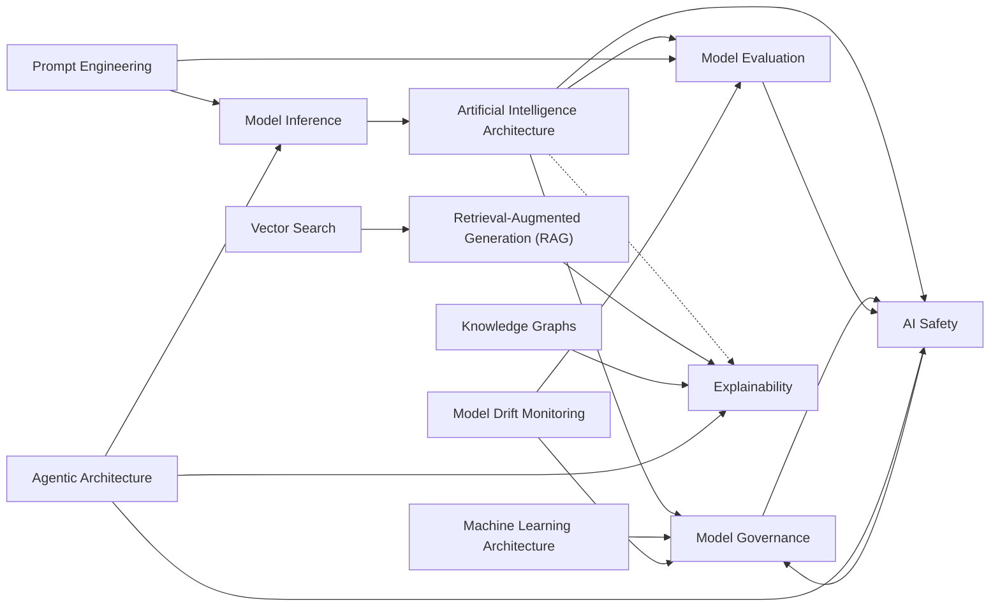
```mermaid
flowchart LR
n_artificial_intelligence_architecture["Artificial Intelligence Architecture"]
n_machine_learning_architecture["Machine Learning Architecture"]
n_model_governance["Model Governance"]
n_model_evaluation["Model Evaluation"]
n_model_inference["Model Inference"]
n_retrieval_augmented_generation["Retrieval-Augmented Generation (RAG)"]
n_vector_search["Vector Search"]
n_knowledge_graphs["Knowledge Graphs"]
n_explainability["Explainability"]
n_ai_safety["AI Safety"]
n_prompt_engineering["Prompt Engineering"]
n_model_drift_monitoring["Model Drift Monitoring"]
n_agentic_architecture["Agentic Architecture"]
n_artificial_intelligence_architecture --> n_model_governance
n_artificial_intelligence_architecture --> n_model_evaluation
n_artificial_intelligence_architecture --> n_ai_safety
n_artificial_intelligence_architecture -.-> n_explainability
n_machine_learning_architecture --> n_model_governance
n_model_governance --> n_ai_safety
n_model_evaluation --> n_ai_safety
n_model_inference --> n_artificial_intelligence_architecture
n_retrieval_augmented_generation --> n_explainability
n_vector_search --> n_retrieval_augmented_generation
n_knowledge_graphs --> n_explainability
n_ai_safety --> n_model_governance
n_prompt_engineering --> n_model_inference
n_prompt_engineering --> n_model_evaluation
n_model_drift_monitoring --> n_model_evaluation
n_model_drift_monitoring --> n_model_governance
n_agentic_architecture --> n_model_inference
n_agentic_architecture --> n_explainability
n_agentic_architecture --> n_ai_safety
```

### Artificial Intelligence Architecture

- Kind: [model](SCHEMA.md#kind-model)
- Severity: contextual/mandatory for AI systems
- Scope: AI system, application, platform
- Layer: [Correctness Core](SCHEMA.md#layer-correctness-core)

Details

Requires
[Model Governance](PRINCIPLES.md#arch-model-governance), [Data/Model Boundaries](LEXICON.md#lex-data-model-boundaries)
Reinforces
[Model Evaluation](PRINCIPLES.md#arch-model-evaluation), [AI Safety](PRINCIPLES.md#arch-ai-safety)
Enables
[AI-Integrated Systems](LEXICON.md#lex-ai-integrated-systems)
In tension with
[Determinism](PRINCIPLES.md#arch-determinism), [Explainability](PRINCIPLES.md#arch-explainability)
Conflicts with
[Opaque Ungoverned Model Use](LEXICON.md#lex-opaque-ungoverned-model-use)
Referenced by
[Model Inference](PRINCIPLES.md#arch-model-inference)
Tensions
[Artificial Intelligence Architecture Determinism](SCHEMA.md#tension-artificial-intelligence-architecture-determinism), [Artificial Intelligence Architecture Explainability](SCHEMA.md#tension-artificial-intelligence-architecture-explainability)

Violated by
model behavior integrated without evaluation/governance
Detected by
AI calls without tests, [logging](PRINCIPLES.md#arch-logging), [fallback](LEXICON.md#lex-fallback), [policy](LEXICON.md#lex-policy)
Measured by
model quality/safety/evaluation coverage
Refactored by
Add Evaluation Harness, Add Model Boundary, Add Guardrails
Enforced by
AI governance gates

```typescript
async function answerFoo(prompt: string) {
  return model.generate(prompt);
}
```

```typescript
async function answerFoo(request: FooRequest) {
  const input = FooRequestSchema.parse(request);
  const context = await fooRetriever.retrieve(input.query);
  const output = await fooModel.generate(buildFooPrompt(input, context));
  return FooResponseSchema.parse(output);
}
```

### Machine Learning Architecture

- Kind: [model](SCHEMA.md#kind-model)
- Severity: contextual
- Scope: ML pipeline, model serving, data
- Layer: [Correctness Core](SCHEMA.md#layer-correctness-core)

Details

Requires
[Data Pipeline](LEXICON.md#lex-data-pipeline), [Training/Inference Separation](LEXICON.md#lex-training-inference-separation)
Reinforces
[Reproducibility](PRINCIPLES.md#arch-reproducibility), [Model Governance](PRINCIPLES.md#arch-model-governance)
Enables
[Reliable ML Lifecycle](LEXICON.md#lex-reliable-ml-lifecycle)
In tension with
[Experimentation Speed](LEXICON.md#lex-experimentation-speed)
Conflicts with
[Ad-Hoc Notebook-to-Production](LEXICON.md#lex-ad-hoc-notebook-to-production)
Tensions
[Machine Learning Architecture Experimentation Speed](SCHEMA.md#tension-experimentation-speed-machine-learning-architecture)

Violated by
unversioned data/model/config
Detected by
missing lineage, untracked training inputs
Measured by
[reproducibility](PRINCIPLES.md#arch-reproducibility), drift, evaluation metrics
Refactored by
Add ML Pipeline, Version Data/Model/Config
Enforced by
MLOps gates

```typescript
const model = trainFoo(loadAllData());
serve(model);
```

```typescript
const dataset = datasetRegistry.load("foo", "v3");
const features = fooFeaturePipeline.transform(dataset);
const model = trainFoo(features, versionedTrainingConfig);
modelRegistry.register(model, evaluateFooModel(model, validationSet));
```

### Model Governance

- Kind: [activity](SCHEMA.md#kind-activity)
- Severity: mandatory for production AI
- Scope: model lifecycle, AI system
- Layer: [Correctness Core](SCHEMA.md#layer-correctness-core)

Details

Requires
[Model Registry](LEXICON.md#lex-model-registry), [Evaluation](LEXICON.md#lex-evaluation), [Approval Policy](LEXICON.md#lex-approval-policy)
Reinforces
[Compliance](PRINCIPLES.md#arch-compliance), [AI Safety](PRINCIPLES.md#arch-ai-safety)
Enables
[Controlled Model Deployment](LEXICON.md#lex-controlled-model-deployment)
In tension with
[Experiment Velocity](LEXICON.md#lex-experiment-velocity)
Conflicts with
[Unapproved Model Deployment](LEXICON.md#lex-unapproved-model-deployment), [Model Version Ambiguity](PRINCIPLES.md#arch-model-version-ambiguity)
Referenced by
[Artificial Intelligence Architecture](PRINCIPLES.md#arch-artificial-intelligence-architecture), [Machine Learning Architecture](PRINCIPLES.md#arch-machine-learning-architecture), [AI Safety](PRINCIPLES.md#arch-ai-safety), [Model Drift Monitoring](PRINCIPLES.md#arch-model-drift-monitoring)
Tensions
[Model Governance Experiment Velocity](SCHEMA.md#tension-experiment-velocity-model-governance)

Violated by
deploying unapproved/untracked models
Detected by
model without lineage/approval/eval
Measured by
governance coverage
Refactored by
Add Registry, Add Approval Workflow, Add Eval Gates
Enforced by
CI/CD model gates

```typescript
deployModel(newestModelFile());
```

```typescript
const candidate = modelRegistry.get("foo-model", "1.4.0");
requireApproval(candidate, ["model-owner", "risk-owner"]);
requirePolicyCompliance(candidate, fooModelPolicies);
deployModel(candidate);
```

### Model Evaluation

- Kind: [activity](SCHEMA.md#kind-activity)
- Severity: mandatory
- Scope: model, AI feature, pipeline
- Layer: [Correctness Core](SCHEMA.md#layer-correctness-core)

Details

Requires
[Dataset](LEXICON.md#lex-dataset), [Metrics](LEXICON.md#lex-metrics), [Acceptance Criteria](LEXICON.md#lex-acceptance-criteria)
Reinforces
[AI Safety](PRINCIPLES.md#arch-ai-safety), [Correctness](PRINCIPLES.md#arch-correctness)
Enables
[Model Selection/Regression Detection](LEXICON.md#lex-model-selection-regression-detection)
In tension with
[Metric Completeness](LEXICON.md#lex-metric-completeness)
Conflicts with
[Untested Model Deployment](LEXICON.md#lex-untested-model-deployment)
Referenced by
[Artificial Intelligence Architecture](PRINCIPLES.md#arch-artificial-intelligence-architecture), [Prompt Engineering](PRINCIPLES.md#arch-prompt-engineering), [Model Drift Monitoring](PRINCIPLES.md#arch-model-drift-monitoring)
Tensions
[Model Evaluation Metric Completeness](SCHEMA.md#tension-metric-completeness-model-evaluation)

Violated by
model change without evaluation
Detected by
missing eval report/gate
Measured by
task metrics, safety metrics, regression rate
Refactored by
Add Eval Suite, Add Regression Dataset
Enforced by
model CI gates

```typescript
if (model.accuracy > 0.8) deploy(model);
```

```typescript
const evaluation = evaluateModel(model, {
  datasets: [fooValidationSet, fooStressSet],
  metrics: [precision, recall, calibration, latencyP95],
  slices: ["foo-kind", "foo-region"],
});
requireThresholds(evaluation, fooModelThresholds);
```

### Model Inference

- Kind: [capability](SCHEMA.md#kind-capability)
- Severity: contextual
- Scope: service, model serving
- Layer: [Correctness Core](SCHEMA.md#layer-correctness-core)

Details

Requires
[Model Artifact](LEXICON.md#lex-model-artifact), [Input/Output Contract](LEXICON.md#lex-input-output-contract)
Reinforces
[Artificial Intelligence Architecture](PRINCIPLES.md#arch-artificial-intelligence-architecture)
Enables
[Runtime Prediction/Generation](LEXICON.md#lex-runtime-prediction-generation)
In tension with
[Latency/Cost](LEXICON.md#lex-latency-cost)
Conflicts with
[Training-Time-Only Model Logic](LEXICON.md#lex-training-time-only-model-logic)
Referenced by
[Prompt Engineering](PRINCIPLES.md#arch-prompt-engineering), [Agentic Architecture](PRINCIPLES.md#arch-agentic-architecture)
Tensions
[Model Inference Latency/Cost](SCHEMA.md#tension-latency-cost-model-inference)

Violated by
inference without validation/observability/fallback
Detected by
raw model calls in business logic
Measured by
[latency](PRINCIPLES.md#arch-latency), error rate, output quality
Refactored by
Add Inference Service, Add Adapter/Contract
Enforced by
serving standards

```typescript
const output = model.predict(input as any);
```

```typescript
const input = FooInferenceSchema.parse(rawInput);
const output = await inferenceRuntime.predict(fooModelVersion, input, {
  timeoutMs: 500,
  traceId,
});
return FooPredictionSchema.parse(output);
```

### Retrieval-Augmented Generation (RAG)

- Kind: [pattern](SCHEMA.md#kind-pattern)
- Severity: contextual
- Scope: LLM system, knowledge retrieval
- Aliases: RAG
- Layer: [Correctness Core](SCHEMA.md#layer-correctness-core)

Details

Requires
[Retriever](LEXICON.md#lex-retriever), [Document Store](LEXICON.md#lex-document-store), [Grounding Strategy](LEXICON.md#lex-grounding-strategy)
Reinforces
[Explainability](PRINCIPLES.md#arch-explainability), [Knowledge Freshness](LEXICON.md#lex-knowledge-freshness)
Enables
[Contextual Generation](LEXICON.md#lex-contextual-generation)
In tension with
[Retrieval Quality/Latency](LEXICON.md#lex-retrieval-quality-latency)
Conflicts with
[Ungrounded Generation](LEXICON.md#lex-ungrounded-generation)
Referenced by
[Vector Search](PRINCIPLES.md#arch-vector-search)
Tensions
[Retrieval-Augmented Generation (RAG) Retrieval Quality/Latency](SCHEMA.md#tension-retrieval-augmented-generation-rag-retrieval-quality-latency)

Violated by
answers generated without relevant retrieved context where required
Detected by
missing citations/context in grounded tasks
Measured by
retrieval precision/recall, groundedness
Refactored by
Add Retriever, Add Reranker, Add Citation Grounding
Enforced by
RAG evals

```typescript
const answer = await model.generate(`Answer: ${question}`);
```

```typescript
const query = normalizeFooQuery(question);
const documents = await fooRetriever.search(query, { topK: 8 });
const groundedPrompt = buildGroundedFooPrompt(question, documents);
const answer = await model.generate(groundedPrompt);
return attachCitations(answer, documents);
```

### Vector Search

- Kind: [mechanism](SCHEMA.md#kind-mechanism)
- Severity: contextual
- Scope: retrieval, search, RAG
- Layer: [Correctness Core](SCHEMA.md#layer-correctness-core)

Details

Requires
[Embeddings](LEXICON.md#lex-embeddings), [Vector Index](LEXICON.md#lex-vector-index)
Reinforces
[Retrieval-Augmented Generation (RAG)](PRINCIPLES.md#arch-retrieval-augmented-generation), [Semantic Search](LEXICON.md#lex-semantic-search)
Enables
[Similarity Retrieval](LEXICON.md#lex-similarity-retrieval)
In tension with
[Explainability/Recall](LEXICON.md#lex-explainability-recall)
Conflicts with
[Exact Keyword Search Only](LEXICON.md#lex-exact-keyword-search-only)
Tensions
[Vector Search Explainability/Recall](SCHEMA.md#tension-explainability-recall-vector-search)

Violated by
semantic retrieval requirement implemented with only brittle keyword matching
Detected by
poor semantic recall
Measured by
retrieval metrics, [latency](PRINCIPLES.md#arch-latency)
Refactored by
Add Embeddings, Add Vector Index, Tune Retrieval
Enforced by
retrieval evaluation

```typescript
const results = foos.filter((foo) => foo.text.includes(query));
```

```typescript
const queryVector = await embedder.embed(query);
const results = await fooVectorIndex.search(queryVector, {
  topK: 10,
  filter: { tenantId },
});
```

### Knowledge Graphs

- Kind: [pattern](SCHEMA.md#kind-pattern)
- Severity: contextual
- Scope: knowledge modeling, retrieval, reasoning
- Layer: [Correctness Core](SCHEMA.md#layer-correctness-core)

Details

Requires
[Entities](LEXICON.md#lex-entities), [Relations](LEXICON.md#lex-relations), [Schema/Ontology](LEXICON.md#lex-schema-ontology)
Reinforces
[Semantic Consistency](PRINCIPLES.md#arch-semantic-consistency), [Explainability](PRINCIPLES.md#arch-explainability)
Enables
[Relationship-Aware Retrieval/Reasoning](LEXICON.md#lex-relationship-aware-retrieval-reasoning)
In tension with
[Curation Cost](LEXICON.md#lex-curation-cost)
Conflicts with
[Flat Document-Only Knowledge](LEXICON.md#lex-flat-document-only-knowledge)
Tensions
[Knowledge Graphs Curation Cost](SCHEMA.md#tension-curation-cost-knowledge-graphs)

Violated by
relation-heavy domain modeled only as unstructured text
Detected by
repeated need for entity relationship traversal
Measured by
graph coverage, query accuracy
Refactored by
Extract Entities/Relations, Build Graph
Enforced by
schema/ontology validation

```typescript
const fooLinks = new Map<string, string[]>();
fooLinks.set(foo.id, [bar.id, baz.id]);
```

```typescript
const graph = new KnowledgeGraph();
graph.addNode(foo.id, "Foo", foo);
graph.addNode(bar.id, "Bar", bar);
graph.addEdge(foo.id, "DEPENDS_ON", bar.id);
graph.addEdge(bar.id, "PRODUCES", baz.id);
```

### Explainability

- Kind: [quality-attribute](SCHEMA.md#kind-quality-attribute)
- Severity: contextual/mandatory in regulated AI
- Scope: model, AI system, decision flow
- Layer: [Correctness Core](SCHEMA.md#layer-correctness-core)

Details

Requires
[Traceability](PRINCIPLES.md#arch-traceability), [Rationale/Evidence](LEXICON.md#lex-rationale-evidence)
Reinforces
[Governance](PRINCIPLES.md#arch-governance), [Trust](LEXICON.md#lex-trust)
Enables
[Audit and Debugging](LEXICON.md#lex-audit-and-debugging)
In tension with
[Model Complexity](LEXICON.md#lex-model-complexity)
Conflicts with
[Opaque Black-Box Decisions](LEXICON.md#lex-opaque-black-box-decisions)
Referenced by
[Artificial Intelligence Architecture](PRINCIPLES.md#arch-artificial-intelligence-architecture), [Retrieval-Augmented Generation (RAG)](PRINCIPLES.md#arch-retrieval-augmented-generation), [Knowledge Graphs](PRINCIPLES.md#arch-knowledge-graphs), [Agentic Architecture](PRINCIPLES.md#arch-agentic-architecture)
Tensions
[Explainability Model Complexity](SCHEMA.md#tension-explainability-model-complexity)

Violated by
consequential model decisions without explanation/evidence
Detected by
missing rationale/feature attribution/citations
Measured by
explanation coverage/quality
Refactored by
Add Explanation Layer, Add Evidence Trace
Enforced by
AI governance gates

```typescript
return model.predict(foo.features);
```

```typescript
const prediction = await model.predict(foo.features);
const explanation = await explainer.explain({
  modelVersion: model.version,
  input: foo.features,
  prediction,
});
return { prediction, explanation };
```

### AI Safety

- Kind: [quality-attribute](SCHEMA.md#kind-quality-attribute)
- Severity: mandatory for AI systems
- Scope: AI system, model, application
- Layer: [Correctness Core](SCHEMA.md#layer-correctness-core)

Details

Requires
[Evaluation](LEXICON.md#lex-evaluation), [Guardrails](LEXICON.md#lex-guardrails), [Monitoring](PRINCIPLES.md#arch-monitoring)
Reinforces
[Model Governance](PRINCIPLES.md#arch-model-governance), [Security](LEXICON.md#lex-security)
Enables
[Safe AI Deployment](LEXICON.md#lex-safe-ai-deployment)
In tension with
[Capability/Utility](LEXICON.md#lex-capability-utility)
Conflicts with
[Unguarded Model Autonomy](LEXICON.md#lex-unguarded-model-autonomy)
Referenced by
[Artificial Intelligence Architecture](PRINCIPLES.md#arch-artificial-intelligence-architecture), [Model Governance](PRINCIPLES.md#arch-model-governance), [Model Evaluation](PRINCIPLES.md#arch-model-evaluation), [Agentic Architecture](PRINCIPLES.md#arch-agentic-architecture)
Tensions
[AI Safety Capability/Utility](SCHEMA.md#tension-ai-safety-capability-utility)

Violated by
unsafe outputs/actions without guardrails
Detected by
safety eval failures, missing policy filters
Measured by
safety incident rate, eval pass rate
Refactored by
Add Guardrails, Add Human Review, Add Safety Evals
Enforced by
safety gates, runtime monitors

```typescript
return model.generate(userPrompt);
```

```typescript
const input = await safety.validateInput(userPrompt);
const draft = await model.generate(input);
const checked = await safety.validateOutput(draft, {
  policy: "foo-assistant-v2",
});
if (!checked.allowed) return safeRefusal(checked.reasons);
return checked.output;
```

### Prompt Engineering

- Kind: [technique](SCHEMA.md#kind-technique)
- Severity: contextual/mandatory for AI systems
- Scope: AI system, LLM system, application
- Layer: [Correctness Core](SCHEMA.md#layer-correctness-core)

Details

Requires
[Model Inference](PRINCIPLES.md#arch-model-inference)
Reinforces
[Model Evaluation](PRINCIPLES.md#arch-model-evaluation), [Reproducibility](PRINCIPLES.md#arch-reproducibility)
Enables
[Structured, Versioned Prompts](LEXICON.md#lex-structured-versioned-prompts)
In tension with
[Robustness](LEXICON.md#lex-robustness)
Conflicts with
[AI Prompt Sprawl](PRINCIPLES.md#arch-ai-prompt-sprawl)
Tensions
[Prompt Engineering Robustness](SCHEMA.md#tension-prompt-engineering-robustness)

Violated by
prompts inlined and duplicated across call sites
Detected by
scattered prompt string literals
Measured by
duplicated prompt count
Refactored by
Centralize and Version Prompts
Enforced by
AI design review

```typescript
const answer = await model.generate("summarize: " + text);
```

```typescript
const prompt = fooPromptTemplate.render({
  task: "summarize",
  input: text,
  format: "bullet-points",
  maxWords: 100,
});
const answer = await model.generate(prompt, { temperature: 0, stop: ["\n\n"] });
```

### Model Drift Monitoring

- Kind: [activity](SCHEMA.md#kind-activity)
- Severity: mandatory for production AI
- Scope: AI system, model lifecycle, operations
- Layer: [Correctness Core](SCHEMA.md#layer-correctness-core)

Details

Requires
[Model Evaluation](PRINCIPLES.md#arch-model-evaluation)
Reinforces
[Observability](PRINCIPLES.md#arch-observability), [Model Governance](PRINCIPLES.md#arch-model-governance)
Enables
[Degradation Detection](LEXICON.md#lex-degradation-detection), [Retraining Triggers](LEXICON.md#lex-retraining-triggers)
In tension with
[Monitoring Cost](LEXICON.md#lex-monitoring-cost)
Conflicts with
[Deploy-and-Forget Models](LEXICON.md#lex-deploy-and-forget-models)
Tensions
[Model Drift Monitoring Monitoring Cost](SCHEMA.md#tension-model-drift-monitoring-monitoring-cost)

Violated by
model quality assumed stable after deployment
Detected by
no ongoing evaluation of live model outputs
Measured by
drift in accuracy/quality metrics over time
Refactored by
Instrument Drift Monitoring
Enforced by
model governance review

```typescript
serveModel(fooModel);
```

```typescript
monitor.track(fooModel, {
  metrics: [inputDistribution, predictionConfidence, groundTruthLag],
  alertOn: { populationStabilityIndex: 0.2 },
});
```

### Agentic Architecture

- Kind: [pattern](SCHEMA.md#kind-pattern)
- Severity: contextual/mandatory in regulated AI
- Scope: AI system, reasoning, decision flow
- Layer: [Correctness Core](SCHEMA.md#layer-correctness-core)

Details

Requires
[Model Inference](PRINCIPLES.md#arch-model-inference), [Tool Interface](LEXICON.md#lex-tool-interface)
Reinforces
[Explainability](PRINCIPLES.md#arch-explainability), [AI Safety](PRINCIPLES.md#arch-ai-safety)
Enables
[Bounded Tool-Using Agents](LEXICON.md#lex-bounded-tool-using-agents), [Governed Autonomy](LEXICON.md#lex-governed-autonomy)
In tension with
[Determinism](PRINCIPLES.md#arch-determinism)
Conflicts with
[Ungrounded AI Output](PRINCIPLES.md#arch-ungrounded-ai-output)
Tensions
[Agentic Architecture Determinism](SCHEMA.md#tension-agentic-architecture-determinism)

Violated by
an unbounded model loop acting with no guardrails
Detected by
agent actions without tool scoping or step limits
Measured by
unguarded agent action rate
Refactored by
Bound the Agent with Tools, Limits, and Review
Enforced by
AI safety review

```typescript
const answer = await model.generate(question);
```

```typescript
const agent = createFooAgent({
  tools: [searchFoos, calculator, fooStore],
  maxSteps: 8,
});
const answer = await agent.run(question);
```

## anti-patterns

Every principle in this category. Each record carries its kind, its severity, the scopes it applies at and the layer it lives in, then the edge relations that join it to other records, the records that point back at it, the contracts that answer to it and the tensions it takes part in. The descriptors say how it is violated, detected, measured, repaired and enforced. Where the record carries one, an exemplar shows the shape before and after the principle is applied.

Relations diagram

The relations inside this category.


```mermaid
flowchart LR
n_big_ball_of_mud["Big Ball of Mud"]
n_god_object["God Object"]
n_concrete_coupling["Concrete Coupling"]
n_schema_drift["Schema Drift"]
n_implicit_contract["Implicit Contract"]
n_hardcoded_configuration["Hardcoded Configuration"]
n_shared_mutable_state["Shared Mutable State"]
n_boundary_leakage["Boundary Leakage"]
n_manual_only_governance["Manual-Only Governance"]
n_opaque_runtime_behavior["Opaque Runtime Behavior"]
n_unowned_risk["Unowned Risk"]
n_unobservable_failure["Unobservable Failure"]
n_unversioned_breaking_change["Unversioned Breaking Change"]
n_distributed_monolith["Distributed Monolith"]
n_shotgun_surgery["Shotgun Surgery"]
n_divergent_change["Divergent Change"]
n_feature_envy["Feature Envy"]
n_inappropriate_intimacy["Inappropriate Intimacy"]
n_message_chain["Message Chain"]
n_middle_man["Middle Man"]
n_data_clumps["Data Clumps"]
n_primitive_obsession["Primitive Obsession"]
n_stringly_typed_programming["Stringly Typed Programming"]
n_boolean_trap["Boolean Trap"]
n_long_parameter_list["Long Parameter List"]
n_magic_value["Magic Value"]
n_speculative_generality["Speculative Generality"]
n_premature_abstraction["Premature Abstraction"]
n_over_abstraction["Over-Abstraction"]
n_golden_hammer["Golden Hammer"]
n_pattern_cargo_cult["Pattern Cargo Cult"]
n_lava_flow["Lava Flow"]
n_zombie_code["Zombie Code"]
n_temporal_coupling["Temporal Coupling"]
n_hidden_side_effect["Hidden Side Effect"]
n_action_at_a_distance["Action at a Distance"]
n_ambient_context["Ambient Context"]
n_inconsistent_error_model["Inconsistent Error Model"]
n_exception_control_flow["Exception Control Flow"]
n_null_semantics_drift["Null Semantics Drift"]
n_anemic_domain_model["Anemic Domain Model"]
n_transaction_script_sprawl["Transaction Script Sprawl"]
n_fat_controller["Fat Controller"]
n_repository_dump["Repository Dump"]
n_utility_dump["Utility Dump"]
n_framework_leakage["Framework Leakage"]
n_vendor_lock_in_leakage["Vendor Lock-In Leakage"]
n_circular_dependency["Circular Dependency"]
n_cyclic_deployment_dependency["Cyclic Deployment Dependency"]
n_synchronous_chain_trap["Synchronous Chain Trap"]
n_chatty_interface["Chatty Interface"]
n_n_plus_one_query["N Plus One Query"]
n_cache_poisoning_by_design["Cache Poisoning by Design"]
n_retry_storm["Retry Storm"]
n_timeout_omission["Timeout Omission"]
n_missing_backpressure["Missing Backpressure"]
n_silent_data_corruption["Silent Data Corruption"]
n_lost_update["Lost Update"]
n_dual_write["Dual Write"]
n_read_your_writes_violation["Read-Your-Writes Violation"]
n_security_theater["Security Theater"]
n_authorization_scattering["Authorization Scattering"]
n_secret_sprawl["Secret Sprawl"]
n_pii_oversharing["PII Oversharing"]
n_observability_noise["Observability Noise"]
n_log_as_control_flow["Log-as-Control-Flow"]
n_manual_runbook_dependency["Manual Runbook Dependency"]
n_big_bang_release["Big-Bang Release"]
n_irreversible_migration["Irreversible Migration"]
n_big_upfront_frozen_architecture["Big-Upfront Frozen Architecture"]
n_architecture_astronaut["Architecture Astronaut"]
n_feature_only_design["Feature-Only Design"]
n_test_pyramid_inversion["Test Pyramid Inversion"]
n_mock_mirage["Mock Mirage"]
n_flaky_test_normalization["Flaky Test Normalization"]
n_ai_prompt_sprawl["AI Prompt Sprawl"]
n_ungrounded_ai_output["Ungrounded AI Output"]
n_model_version_ambiguity["Model Version Ambiguity"]
```

### Big Ball of Mud

- Kind: [anti-pattern](SCHEMA.md#kind-anti-pattern)
- Severity: discouraged
- Scope: [modularity](SCHEMA.md#force-modularity), [state_transaction](SCHEMA.md#force-state-transaction)
- Layer: [Enforcement Core](SCHEMA.md#layer-enforcement-core)

Details

Requires
none
Reinforces
none
Enables
none
In tension with
none
Conflicts with
none
Referenced by
[Component-Based Architecture](PRINCIPLES.md#arch-component-based-architecture), [Modularity](PRINCIPLES.md#arch-modularity)

Violated by
Allow boundaries to remain implicit, permit unrestricted dependencies, mix concerns freely, share mutable state broadly, and accumulate changes without architectural segmentation.
Detected by
[cyclic_dependencies](LEXICON.md#lex-cyclic-dependencies), high_graph_density, unowned_modules, cross_layer_imports, large_change_blast_radius
Measured by
none
Refactored by
define_boundaries, split_modules, enforce_dependency_rules, assign_ownership, add_fitness_functions
Enforced by
none

```typescript
function handle(req) {
  const foo = db.query(req.body.sql);
  render(foo);
  email(foo);
  audit(foo);
  cache(foo);
}
```

```typescript
class CreateFoo {
  constructor(
    private readonly foos: FooRepository,
    private readonly events: EventPublisher,
  ) {}
  execute(input: CreateFooInput) {
    const foo = Foo.create(input);
    this.foos.save(foo);
    this.events.publish(fooCreated(foo));
  }
}
```

### God Object

- Kind: [anti-pattern](SCHEMA.md#kind-anti-pattern)
- Severity: discouraged
- Scope: [modularity](SCHEMA.md#force-modularity), [semantic_consistency](SCHEMA.md#force-semantic-consistency), [domain_boundary](SCHEMA.md#force-domain-boundary), [control_coordination](SCHEMA.md#force-control-coordination)
- Layer: [Enforcement Core](SCHEMA.md#layer-enforcement-core)

Details

Requires
none
Reinforces
none
Enables
none
In tension with
none
Conflicts with
none
Referenced by
[Single Responsibility Principle (SRP)](PRINCIPLES.md#arch-single-responsibility), [High Cohesion](PRINCIPLES.md#arch-high-cohesion)

Violated by
Centralize unrelated responsibilities into one object, route unrelated behavior through it, accumulate state and dependencies, and make the object the default modification point.
Detected by
large_class, many_unrelated_methods, many_dependencies, high_fan_in, multiple_reasons_to_change
Measured by
none
Refactored by
extract_class, split_responsibilities, move_method, extract_domain_service, introduce_facade_only_if_boundary_needed
Enforced by
none

```typescript
class FooManager {
  createFoo() {}
  priceFoo() {}
  renderFoo() {}
  emailFoo() {}
  auditFoo() {}
  shipFoo() {}
}
```

```typescript
class FooFactory {
  create(input: CreateFooInput): Foo {}
}
class FooPricer {
  price(foo: Foo): Money {}
}
class FooShipper {
  ship(foo: Foo): void {}
}
```

### Concrete Coupling

- Kind: [anti-pattern](SCHEMA.md#kind-anti-pattern)
- Severity: discouraged
- Scope: [modularity](SCHEMA.md#force-modularity)
- Layer: [Enforcement Core](SCHEMA.md#layer-enforcement-core)

Details

Requires
none
Reinforces
none
Enables
none
In tension with
none
Conflicts with
none
Referenced by
[Interface-Based Design](PRINCIPLES.md#arch-interface-based-design), [Abstraction](PRINCIPLES.md#arch-abstraction), [Replaceability](PRINCIPLES.md#arch-replaceability)

Violated by
Let high-level policy depend directly on low-level implementations, vendor APIs, framework classes, or concrete constructors, then spread those concrete assumptions across the core.
Detected by
domain_imports_infrastructure, vendor_sdk_in_core, new_dependency_inside_business_logic, missing_interface_boundary
Measured by
none
Refactored by
extract_interface, introduce_port, extract_adapter, inject_dependency, apply_DIP
Enforced by
none

```typescript
class FooService {
  private readonly store = new SqlFooStore();
}
```

```typescript
class FooService {
  constructor(private readonly store: FooStore) {}
}
```

### Schema Drift

- Kind: [anti-pattern](SCHEMA.md#kind-anti-pattern)
- Severity: discouraged
- Scope: [contract_compatibility](SCHEMA.md#force-contract-compatibility), [security_governance](SCHEMA.md#force-security-governance), [ai_governance](SCHEMA.md#force-ai-governance)
- Layer: [Enforcement Core](SCHEMA.md#layer-enforcement-core)

Details

Requires
none
Reinforces
none
Enables
none
In tension with
none
Conflicts with
none
Referenced by
[Data Contract](PRINCIPLES.md#arch-data-contract), [Canonical Schema](PRINCIPLES.md#arch-canonical-schema)

Violated by
Allow producers, consumers, storage models, and documentation to evolve independently without versioned schema governance, then let payload meaning diverge over time.
Detected by
schema_diff_failure, missing_schema_registry, consumer_parse_errors, undocumented_field_changes, nullability_mismatch
Measured by
none
Refactored by
define_schema_contract, version_schema, add_compatibility_tests, centralize_schema_registry, validate_payloads
Enforced by
none

```typescript
type FooApi = { id: string; label: string };
type FooDb = { id: string; name: string; extra: string };
```

```typescript
const FooSchema = schema({ id: fooIdSchema, name: nonEmptyString });
type Foo = Infer<typeof FooSchema>;
fooApi.use(FooSchema);
fooDb.use(FooSchema);
```

### Implicit Contract

- Kind: [anti-pattern](SCHEMA.md#kind-anti-pattern)
- Severity: discouraged
- Scope: [contract_compatibility](SCHEMA.md#force-contract-compatibility), [causality_ordering](SCHEMA.md#force-causality-ordering)
- Layer: [Enforcement Core](SCHEMA.md#layer-enforcement-core)

Details

Requires
none
Reinforces
none
Enables
none
In tension with
none
Conflicts with
none
Referenced by
[Explicit Contracts](PRINCIPLES.md#arch-explicit-contracts)

Violated by
Encode assumptions in code behavior, naming, [ordering](LEXICON.md#lex-ordering), timing, [side effects](LEXICON.md#lex-side-effects), or undocumented payload shapes instead of declaring them as explicit contracts.
Detected by
public_API_without_schema, undocumented_side_effect, dynamic_map_boundary, tests_depend_on_internal_behavior, tribal_knowledge_required
Measured by
none
Refactored by
add_explicit_contract, define_preconditions, define_postconditions, add_schema, add_contract_tests
Enforced by
none

```typescript
function saveFoo(foo) {
  return db.insert(foo);
}
```

```typescript
interface Foo {
  id: FooId;
  name: NonEmptyString;
}
function saveFoo(foo: Foo): Promise<void> {
  return fooStore.save(foo);
}
```

### Hardcoded Configuration

- Kind: [anti-pattern](SCHEMA.md#kind-anti-pattern)
- Severity: discouraged
- Scope: [semantic_consistency](SCHEMA.md#force-semantic-consistency), [state_transaction](SCHEMA.md#force-state-transaction)
- Layer: [Enforcement Core](SCHEMA.md#layer-enforcement-core)

Details

Requires
none
Reinforces
none
Enables
none
In tension with
none
Conflicts with
none
Referenced by
[Declarative Configuration](PRINCIPLES.md#arch-declarative-configuration), [Configuration Externalization](PRINCIPLES.md#arch-configuration-externalization)

Violated by
Embed environment, path, credential, feature, service endpoint, or policy values directly into code, then duplicate those assumptions across runtime contexts.
Detected by
hardcoded_URL, hardcoded_path, hardcoded_secret, environment_branching_in_code, duplicated_config_literal
Measured by
none
Refactored by
externalize_configuration, add_config_schema, centralize_config_source, validate_environment, remove_secret_from_code
Enforced by
none

```typescript
const client = new FooClient("https://foo.prod.example", "sk_live_abc123");
```

```typescript
const config = FooConfigSchema.parse({
  url: process.env.FOO_URL,
  key: process.env.FOO_KEY,
});
const client = new FooClient(config);
```

### Shared Mutable State

- Kind: [anti-pattern](SCHEMA.md#kind-anti-pattern)
- Severity: discouraged
- Scope: [modularity](SCHEMA.md#force-modularity), [state_transaction](SCHEMA.md#force-state-transaction)
- Layer: [Enforcement Core](SCHEMA.md#layer-enforcement-core)

Details

Requires
none
Reinforces
none
Enables
none
In tension with
none
Conflicts with
none
Referenced by
[Immutability](PRINCIPLES.md#arch-immutability), [State Isolation](PRINCIPLES.md#arch-state-isolation)

Violated by
Expose writable state across modules, allow multiple actors to mutate it, omit ownership and synchronization, and let behavior depend on mutation order.
Detected by
global_mutable_object, public_mutable_fields, shared_cache_without_policy, race_condition, order_dependent_tests
Measured by
none
Refactored by
encapsulate_state, assign_owner, make_immutable, add_transaction_boundary, apply_concurrency_control
Enforced by
none

```typescript
let currentFoo = null;
function setFoo(f) {
  currentFoo = f;
}
function useFoo() {
  return currentFoo.name;
}
```

```typescript
class FooContext {
  constructor(private readonly foo: Foo) {}
  name() {
    return this.foo.name;
  }
}
```

### Boundary Leakage

- Kind: [anti-pattern](SCHEMA.md#kind-anti-pattern)
- Severity: discouraged
- Scope: [modularity](SCHEMA.md#force-modularity), [ai_governance](SCHEMA.md#force-ai-governance)
- Layer: [Enforcement Core](SCHEMA.md#layer-enforcement-core)

Details

Requires
none
Reinforces
none
Enables
none
In tension with
none
Conflicts with
none
Referenced by
[Explicit Boundaries](PRINCIPLES.md#arch-explicit-boundaries)

Violated by
Permit internal models, infrastructure types, persistence structures, or private module APIs to cross intended architectural boundaries.
Detected by
internal_package_imported_externally, database_entity_exposed_as_API, vendor_type_in_domain, private_module_used_by_other_module
Measured by
none
Refactored by
restrict_exports, introduce_DTO, add_adapter, add_facade, enforce_import_rules
Enforced by
none

```typescript
app.get("/foo/:id", async (req, res) =>
  res.json(await ormFoo.findByPk(req.params.id)),
);
```

```typescript
app.get("/foo/:id", async (req, res) =>
  res.json(toFooDto(await getFoo.execute(req.params.id))),
);
```

### Manual-Only Governance

- Kind: [anti-pattern](SCHEMA.md#kind-anti-pattern)
- Severity: discouraged
- Scope: [correctness_verification](SCHEMA.md#force-correctness-verification), [security_governance](SCHEMA.md#force-security-governance)
- Layer: [Enforcement Core](SCHEMA.md#layer-enforcement-core)

Details

Requires
none
Reinforces
none
Enables
none
In tension with
none
Conflicts with
none
Referenced by
[Policy as Code](PRINCIPLES.md#arch-policy-as-code)

Violated by
Encode architecture rules in documents, meetings, or reviewer memory without executable checks, [metrics](LEXICON.md#lex-metrics), or automated enforcement.
Detected by
rule_exists_only_in_docs, no_CI_gate, reviewer_specific_enforcement, repeated_same_violation, missing_fitness_function
Measured by
none
Refactored by
create_fitness_function, add_static_check, add_policy_as_code, add_architecture_test, track_rule_metrics
Enforced by
none

```typescript
const CONVENTION = "remember to prefix every foo id with foo_";
```

```typescript
export const rule = {
  id: "valid-foo-id",
  check: (id: string) => id.startsWith("foo_"),
};
```

### Opaque Runtime Behavior

- Kind: [anti-pattern](SCHEMA.md#kind-anti-pattern)
- Severity: discouraged
- Scope: [runtime_extensibility](SCHEMA.md#force-runtime-extensibility), [metaprogramming_modeling](SCHEMA.md#force-metaprogramming-modeling)
- Layer: [Enforcement Core](SCHEMA.md#layer-enforcement-core)

Details

Requires
none
Reinforces
none
Enables
none
In tension with
none
Conflicts with
none
Referenced by
[Introspection](PRINCIPLES.md#arch-introspection)

Violated by
Let runtime behavior emerge from hidden reflection, implicit registration, undocumented configuration, [side effects](LEXICON.md#lex-side-effects), or untraced dynamic binding.
Detected by
dynamic_binding_without_manifest, missing_startup_report, unlogged_plugin_loading, implicit_reflection_scan, untraceable_side_effect
Measured by
none
Refactored by
add_manifest, log_binding_decisions, emit_runtime_topology, add_capability_declaration, add_discovery_validation
Enforced by
none

```typescript
function processFoo(foo) {
  doWork(foo);
}
```

```typescript
function processFoo(foo: Foo) {
  logger.info("foo.process.start", { fooId: foo.id });
  const result = doWork(foo);
  logger.info("foo.process.done", { fooId: foo.id, outcome: result.status });
}
```

### Unowned Risk

- Kind: [anti-pattern](SCHEMA.md#kind-anti-pattern)
- Severity: discouraged
- Scope: [architecture_evolution](SCHEMA.md#force-architecture-evolution)
- Layer: [Enforcement Core](SCHEMA.md#layer-enforcement-core)

Details

Requires
none
Reinforces
none
Enables
none
In tension with
none
Conflicts with
none
Referenced by
[Risk Management](PRINCIPLES.md#arch-risk-management)

Violated by
Identify a risk without assigning owner, severity, [mitigation](LEXICON.md#lex-mitigation), review date, acceptance status, or escalation path.
Detected by
risk_without_owner, ADR_missing_consequence_owner, security_finding_unassigned, known_gap_without_due_date, accepted_risk_without_expiry
Measured by
none
Refactored by
assign_owner, classify_severity, define_mitigation, record_acceptance, schedule_review
Enforced by
none

```typescript
await payment.charge(foo);
```

```typescript
const outcome = await payment.charge(foo);
if (!outcome.ok) {
  logger.error("foo.charge.failed", outcome);
  throw new ChargeFailedError(foo.id);
}
```

### Unobservable Failure

- Kind: [anti-pattern](SCHEMA.md#kind-anti-pattern)
- Severity: discouraged
- Scope: [contract_compatibility](SCHEMA.md#force-contract-compatibility)
- Layer: [Enforcement Core](SCHEMA.md#layer-enforcement-core)

Details

Requires
none
Reinforces
none
Enables
none
In tension with
none
Conflicts with
none
Referenced by
[Observability](PRINCIPLES.md#arch-observability)

Violated by
Permit operations to fail without structured logs, [metrics](LEXICON.md#lex-metrics), alerts, [traces](LEXICON.md#lex-traces), audit records, or user-visible error contracts.
Detected by
empty_catch, swallowed_exception, missing_error_log, no_alert_on_critical_path, missing_trace_span, missing_audit_record
Measured by
none
Refactored by
add_error_boundary, emit_structured_log, add_metric, add_alert, add_trace_span, add_audit_log
Enforced by
none

```typescript
try {
  await ship(foo);
} catch {}
```

```typescript
try {
  await ship(foo);
} catch (error) {
  logger.error("foo.ship.failed", error);
  metrics.increment("foo.ship.failure");
  throw new ShipFailedError(foo.id);
}
```

### Unversioned Breaking Change

- Kind: [anti-pattern](SCHEMA.md#kind-anti-pattern)
- Severity: discouraged
- Scope: [contract_compatibility](SCHEMA.md#force-contract-compatibility), [event_messaging](SCHEMA.md#force-event-messaging), [architecture_evolution](SCHEMA.md#force-architecture-evolution)
- Layer: [Enforcement Core](SCHEMA.md#layer-enforcement-core)

Details

Requires
none
Reinforces
none
Enables
none
In tension with
none
Conflicts with
none
Referenced by
[Consumer-Driven Contracts](PRINCIPLES.md#arch-consumer-driven-contracts)

Violated by
Change a public API, [schema](LEXICON.md#lex-schema), event, protocol, behavior, or package contract incompatibly without version bump, deprecation path, compatibility test, or migration notice.
Detected by
API_diff_breaking, schema_field_removed, type_narrowed, event_semantics_changed, no_version_bump, no_deprecation_window
Measured by
none
Refactored by
bump_version, add_compatibility_adapter, deprecate_gradually, add_contract_tests, publish_migration_guide
Enforced by
none

```typescript
app.get("/foo", () => ({ label: foo.name }));
```

```typescript
app.get("/v2/foo", () => ({ name: foo.name }));
app.get("/v1/foo", () => ({ label: foo.name }));
```

### Distributed Monolith

- Kind: [anti-pattern](SCHEMA.md#kind-anti-pattern)
- Severity: discouraged
- Scope: [modularity](SCHEMA.md#force-modularity), [contract_compatibility](SCHEMA.md#force-contract-compatibility), [state_transaction](SCHEMA.md#force-state-transaction)
- Layer: [Enforcement Core](SCHEMA.md#layer-enforcement-core)

Details

Requires
none
Reinforces
none
Enables
none
In tension with
none
Conflicts with
none
Referenced by
[Microservices](PRINCIPLES.md#arch-microservices)

Violated by
Split deployment units without splitting data ownership, transaction boundaries, [failure isolation](LEXICON.md#lex-failure-isolation), [contracts](LEXICON.md#lex-contracts), or autonomous release capability.
Detected by
[shared_database](LEXICON.md#lex-shared-database), cross_service_transactions, lockstep_deployments, deep_sync_call_chain, shared_business_logic_package, consumer_breakage_on_service_change
Measured by
none
Refactored by
own_data_per_service, define_service_contracts, introduce_events, add_outbox, split_bounded_context, enable_independent_deployment
Enforced by
none

```typescript
async function createFoo(foo) {
  await http.post("bar-service/validate", foo);
  await http.post("baz-service/price", foo);
  await http.post("qux-service/save", foo);
}
```

```typescript
async function createFoo(input: CreateFooInput) {
  const foo = Foo.create(input);
  await fooStore.save(foo);
  await outbox.append(fooCreated(foo));
}
```

### Shotgun Surgery

- Kind: [anti-pattern](SCHEMA.md#kind-anti-pattern)
- Severity: discouraged
- Scope: [modularity](SCHEMA.md#force-modularity)
- Layer: [Enforcement Core](SCHEMA.md#layer-enforcement-core)

Details

Requires
none
Reinforces
none
Enables
none
In tension with
none
Conflicts with
none
Referenced by
[High Cohesion](PRINCIPLES.md#arch-high-cohesion)

Violated by
Scatter one conceptual responsibility across many files so one change requires many coordinated edits.
Detected by
same_change_touches_many_files, repeated_commit_cochanges, duplicated_rule_fragments
Measured by
none
Refactored by
centralize_rule, extract_module, move_behavior_to_owner, add_single_source_of_truth
Enforced by
none

```typescript
const taxA = value * 0.2;
const taxB = other * 0.2;
const taxC = more * 0.2;
```

```typescript
const FOO_TAX_RATE = 0.2;
function taxFoo(value: number) {
  return value * FOO_TAX_RATE;
}
```

### Divergent Change

- Kind: [anti-pattern](SCHEMA.md#kind-anti-pattern)
- Severity: discouraged
- Scope: [modularity](SCHEMA.md#force-modularity)
- Layer: [Enforcement Core](SCHEMA.md#layer-enforcement-core)

Details

Requires
none
Reinforces
none
Enables
none
In tension with
none
Conflicts with
none
Referenced by
[Single Responsibility Principle (SRP)](PRINCIPLES.md#arch-single-responsibility)

Violated by
Place unrelated responsibilities in the same module so unrelated change reasons repeatedly modify one artifact.
Detected by
unrelated_commits_touch_same_file, mixed_methods, mixed_dependencies
Measured by
none
Refactored by
split_module, extract_class, separate_concerns, move_method
Enforced by
none

```typescript
class Foo {
  renderHtml() {}
  saveToSql() {}
  sendEmail() {}
  parseCsv() {}
}
```

```typescript
class Foo {}
class FooView {
  render(foo: Foo): string {}
}
class FooStore {
  save(foo: Foo): Promise<void> {}
}
```

### Feature Envy

- Kind: [anti-pattern](SCHEMA.md#kind-anti-pattern)
- Severity: discouraged
- Scope: [modularity](SCHEMA.md#force-modularity), [contract_compatibility](SCHEMA.md#force-contract-compatibility)
- Layer: [Enforcement Core](SCHEMA.md#layer-enforcement-core)

Details

Requires
none
Reinforces
none
Enables
none
In tension with
none
Conflicts with
none
Referenced by
[Encapsulation](PRINCIPLES.md#arch-encapsulation)

Violated by
Let one module repeatedly inspect or manipulate another module’s data instead of moving behavior to the data owner.
Detected by
many_getters_from_other_object, logic_using_foreign_fields, domain_rule_outside_owner
Measured by
none
Refactored by
move_method, encapsulate_state, add_domain_behavior, introduce_service_boundary
Enforced by
none

```typescript
function totalFoo(bar: Bar) {
  return bar.items.reduce((s, i) => s + i.price * i.qty, 0);
}
```

```typescript
class Bar {
  total(): Money {
    return this.items.reduce((s, i) => s + i.subtotal(), 0);
  }
}
```

### Inappropriate Intimacy

- Kind: [anti-pattern](SCHEMA.md#kind-anti-pattern)
- Severity: discouraged
- Scope: [modularity](SCHEMA.md#force-modularity), [contract_compatibility](SCHEMA.md#force-contract-compatibility)
- Layer: [Enforcement Core](SCHEMA.md#layer-enforcement-core)

Details

Requires
none
Reinforces
none
Enables
none
In tension with
none
Conflicts with
none
Referenced by
[Low Coupling](PRINCIPLES.md#arch-low-coupling)

Violated by
Allow modules or classes to rely on each other’s internals, private structure, lifecycle, or undocumented state.
Detected by
friend-like access, private API usage, tests_reach_internals, internal_package_import
Measured by
none
Refactored by
hide_internal, introduce_public_contract, add_facade, restrict_exports
Enforced by
none

```typescript
bar.foo._internalState.status = "ready";
```

```typescript
bar.foo.markReady();
```

### Message Chain

- Kind: [anti-pattern](SCHEMA.md#kind-anti-pattern)
- Severity: discouraged
- Scope: [event_messaging](SCHEMA.md#force-event-messaging)
- Layer: [Enforcement Core](SCHEMA.md#layer-enforcement-core)

Details

Requires
none
Reinforces
none
Enables
none
In tension with
none
Conflicts with
none
Referenced by
[Low Coupling](PRINCIPLES.md#arch-low-coupling)

Violated by
Require clients to traverse a chain of objects to reach behavior or data, exposing internal object graph structure.
Detected by
a.getB().getC().doX, deep_property_access, repeated_navigation_paths
Measured by
none
Refactored by
hide_delegate, introduce_facade_method, move_behavior_to_owner
Enforced by
none

```typescript
const city = foo.getOwner().getAddress().getCity().getName();
```

```typescript
const city = foo.ownerCityName();
```

### Middle Man

- Kind: [anti-pattern](SCHEMA.md#kind-anti-pattern)
- Severity: discouraged
- Scope: [modularity](SCHEMA.md#force-modularity), [correctness_verification](SCHEMA.md#force-correctness-verification), [control_coordination](SCHEMA.md#force-control-coordination)
- Layer: [Enforcement Core](SCHEMA.md#layer-enforcement-core)

Details

Requires
none
Reinforces
none
Enables
none
In tension with
none
Conflicts with
none
Referenced by
[Abstraction](PRINCIPLES.md#arch-abstraction)

Violated by
Insert a module that delegates almost everything without adding policy, [abstraction](REASONING.md#reason-mode-abstraction), [validation](PRINCIPLES.md#arch-validation), [orchestration](PRINCIPLES.md#arch-orchestration), or simplification.
Detected by
thin_methods_only_delegate, low_logic_density, one_to_one_wrapper_methods
Measured by
none
Refactored by
remove_layer, inline_delegate, promote_to_real_facade_if_boundary_needed
Enforced by
none

```typescript
class FooService {
  save(foo: Foo) {
    return this.store.save(foo);
  }
  find(id: FooId) {
    return this.store.find(id);
  }
}
```

```typescript
const fooStore: FooStore = new SqlFooStore();
```

### Data Clumps

- Kind: [anti-pattern](SCHEMA.md#kind-anti-pattern)
- Severity: discouraged
- Scope: [contract_compatibility](SCHEMA.md#force-contract-compatibility)
- Layer: [Enforcement Core](SCHEMA.md#layer-enforcement-core)

Details

Requires
none
Reinforces
none
Enables
none
In tension with
none
Conflicts with
none
Referenced by
[Value Object](PRINCIPLES.md#arch-value-object)

Violated by
Pass the same group of fields together repeatedly without naming the group as a value object or contract.
Detected by
same_parameters_repeated, same_fields_appear_together, DTO_shape_duplicated
Measured by
none
Refactored by
introduce_value_object, add_DTO, name_concept, validate_as_group
Enforced by
none

```typescript
function shipFoo(street: string, city: string, zip: string, country: string) {}
```

```typescript
interface Address {
  street: string;
  city: string;
  zip: string;
  country: string;
}
function shipFoo(address: Address) {}
```

### Primitive Obsession

- Kind: [anti-pattern](SCHEMA.md#kind-anti-pattern)
- Severity: discouraged
- Scope: [correctness_verification](SCHEMA.md#force-correctness-verification), [domain_boundary](SCHEMA.md#force-domain-boundary)
- Layer: [Enforcement Core](SCHEMA.md#layer-enforcement-core)

Details

Requires
none
Reinforces
none
Enables
none
In tension with
none
Conflicts with
none
Referenced by
[Value Object](PRINCIPLES.md#arch-value-object)

Violated by
Represent meaningful domain concepts as raw strings, numbers, booleans, or maps without type, [validation](PRINCIPLES.md#arch-validation), or behavior.
Detected by
many_string_ids, repeated_validation, boolean_flags, magic_values
Measured by
none
Refactored by
introduce_value_object, narrow_type, add_enum, encapsulate_validation
Enforced by
none

```typescript
function transfer(fooId: string, amount: number, currency: string) {}
```

```typescript
class Money {
  constructor(
    readonly amount: number,
    readonly currency: Currency,
  ) {}
}
function transfer(fooId: FooId, money: Money) {}
```

### Stringly Typed Programming

- Kind: [anti-pattern](SCHEMA.md#kind-anti-pattern)
- Severity: discouraged
- Scope: [architecture_evolution](SCHEMA.md#force-architecture-evolution)
- Layer: [Enforcement Core](SCHEMA.md#layer-enforcement-core)

Details

Requires
none
Reinforces
none
Enables
none
In tension with
none
Conflicts with
none
Referenced by
[Type Safety](PRINCIPLES.md#arch-type-safety)

Violated by
Encode behavior, types, states, permissions, or protocols as unchecked strings.
Detected by
string_mode_switch, repeated_string_constants, string_permissions, string_status_values
Measured by
none
Refactored by
add_enum, add_discriminated_union, centralize_constants, schema_validate
Enforced by
none

```typescript
if (foo.status === "reddy") ship(foo);
```

```typescript
enum FooStatus {
  Ready,
  Shipped,
}
if (foo.status === FooStatus.Ready) ship(foo);
```

### Boolean Trap

- Kind: [anti-pattern](SCHEMA.md#kind-anti-pattern)
- Severity: discouraged
- Scope: [architecture_evolution](SCHEMA.md#force-architecture-evolution)
- Layer: [Enforcement Core](SCHEMA.md#layer-enforcement-core)

Details

Requires
none
Reinforces
none
Enables
none
In tension with
none
Conflicts with
none
Referenced by
[Intent-Revealing Interface](PRINCIPLES.md#arch-intent-revealing-interface)

Violated by
Use boolean parameters or flags that hide intent and create ambiguous call sites or combinatorial behavior.
Detected by
method(true, false), multiple_boolean_params, flag_argument_controls_behavior
Measured by
none
Refactored by
replace_boolean_with_enum, split_method, introduce_options_object, name_intent
Enforced by
none

```typescript
createFoo(true, false, true);
```

```typescript
createFoo({ active: true, archived: false, notify: true });
```

### Long Parameter List

- Kind: [anti-pattern](SCHEMA.md#kind-anti-pattern)
- Severity: discouraged
- Scope: [modularity](SCHEMA.md#force-modularity), [contract_compatibility](SCHEMA.md#force-contract-compatibility), [correctness_verification](SCHEMA.md#force-correctness-verification), [object_creation](SCHEMA.md#force-object-creation)
- Layer: [Enforcement Core](SCHEMA.md#layer-enforcement-core)

Details

Requires
none
Reinforces
none
Enables
none
In tension with
none
Conflicts with
none
Referenced by
[Value Object](PRINCIPLES.md#arch-value-object)

Violated by
Grow function or constructor signatures until related inputs, optional modes, and dependencies become hard to understand or validate.
Detected by
arity_above_threshold, repeated_parameter_groups, many_optional_params
Measured by
none
Refactored by
introduce_parameter_object, builder, [value_object](PRINCIPLES.md#arch-value-object), dependency_container
Enforced by
none

```typescript
function makeFoo(a, b, c, d, e, f, g) {}
```

```typescript
interface MakeFooInput {
  a: A;
  b: B;
  c: C;
  d: D;
  e: E;
  f: F;
  g: G;
}
function makeFoo(input: MakeFooInput) {}
```

### Magic Value

- Kind: [anti-pattern](SCHEMA.md#kind-anti-pattern)
- Severity: discouraged
- Scope: [domain_boundary](SCHEMA.md#force-domain-boundary)
- Layer: [Enforcement Core](SCHEMA.md#layer-enforcement-core)

Details

Requires
none
Reinforces
none
Enables
none
In tension with
none
Conflicts with
none
Referenced by
[Single Source of Truth](PRINCIPLES.md#arch-single-source-of-truth)

Violated by
Encode policy, [thresholds](LEXICON.md#lex-thresholds), status, timing, permissions, or domain rules as unexplained literals.
Detected by
repeated_number_literal, unexplained_string_literal, inline_threshold, hidden_timeout
Measured by
none
Refactored by
name_constant, centralize_rule, externalize_config_if_runtime_variable, document_semantics
Enforced by
none

```typescript
if (foo.retries > 3) fail(foo);
```

```typescript
const MAX_FOO_RETRIES = 3;
if (foo.retries > MAX_FOO_RETRIES) fail(foo);
```

### Speculative Generality

- Kind: [anti-pattern](SCHEMA.md#kind-anti-pattern)
- Severity: discouraged
- Scope: [runtime_extensibility](SCHEMA.md#force-runtime-extensibility)
- Layer: [Enforcement Core](SCHEMA.md#layer-enforcement-core)

Details

Requires
none
Reinforces
none
Enables
none
In tension with
none
Conflicts with
none
Referenced by
[Minimum Viable Architecture](PRINCIPLES.md#arch-minimum-viable-architecture)

Violated by
Build abstractions, [extension points](PRINCIPLES.md#arch-extension-points), layers, or configuration for variation that has no evidence of existing or near-term need.
Detected by
single_implementation_interface, unused_extension_point, config_never_varies, abstract_base_without_variants
Measured by
none
Refactored by
inline_abstraction, remove_unused_extension, defer_generalization, apply_minimum_viable_architecture
Enforced by
none

```typescript
abstract class AbstractFooProviderFactoryBase<T> {
  abstract create(): T;
}
```

```typescript
function createFoo(input: CreateFooInput): Foo {
  return Foo.create(input);
}
```

### Premature Abstraction

- Kind: [anti-pattern](SCHEMA.md#kind-anti-pattern)
- Severity: discouraged
- Scope: [modularity](SCHEMA.md#force-modularity)
- Layer: [Enforcement Core](SCHEMA.md#layer-enforcement-core)

Details

Requires
none
Reinforces
none
Enables
none
In tension with
none
Conflicts with
none
Referenced by
[Evolutionary Architecture](PRINCIPLES.md#arch-evolutionary-architecture)

Violated by
Extract a shared abstraction before variation is understood, causing the abstraction to fit no use case well.
Detected by
many_flags_in_shared_abstraction, subclasses_override_most_behavior, callers_work_around_abstraction
Measured by
none
Refactored by
duplicate_until_pattern_stabilizes, split_abstraction, extract_later_from_evidence
Enforced by
none

```typescript
interface FooStrategy {
  run(): void;
}
class OnlyFooStrategy implements FooStrategy {
  run() {}
}
```

```typescript
function runFoo() {}
```

### Over-Abstraction

- Kind: [anti-pattern](SCHEMA.md#kind-anti-pattern)
- Severity: discouraged
- Scope: [contract_compatibility](SCHEMA.md#force-contract-compatibility)
- Layer: [Enforcement Core](SCHEMA.md#layer-enforcement-core)

Details

Requires
none
Reinforces
none
Enables
none
In tension with
none
Conflicts with
none
Referenced by
[Minimum Viable Architecture](PRINCIPLES.md#arch-minimum-viable-architecture)

Violated by
Add too many interfaces, layers, factories, [adapters](LEXICON.md#lex-adapters), or generic types relative to actual variability.
Detected by
deep_call_stack_for_simple_task, one_method_interfaces, factory_of_factory, abstraction_ratio_too_high
Measured by
none
Refactored by
collapse_layers, inline_interface, remove_unused_indirection, preserve_only_real_boundaries
Enforced by
none

```typescript
const foo = fooFactoryProvider.getFactory().createBuilder().build();
```

```typescript
const foo = Foo.create(input);
```

### Golden Hammer

- Kind: [anti-pattern](SCHEMA.md#kind-anti-pattern)
- Severity: discouraged
- Scope: [architecture_evolution](SCHEMA.md#force-architecture-evolution)
- Layer: [Enforcement Core](SCHEMA.md#layer-enforcement-core)

Details

Requires
none
Reinforces
none
Enables
none
In tension with
none
Conflicts with
none
Referenced by
[First-Principles Design](PRINCIPLES.md#arch-first-principles-design)

Violated by
Apply a familiar pattern, framework, architecture style, or technology to problems regardless of fit.
Detected by
same_pattern_everywhere, solution_precedes_problem, ADR_missing_alternatives, high_workaround_count
Measured by
none
Refactored by
force_analysis, tradeoff_matrix, ADR_with_alternatives, contextual_pattern_selection
Enforced by
none

```typescript
const config = parseFooConfig(runRegexOverEverything(rawYaml));
```

```typescript
const config = FooConfigSchema.parse(yaml.load(rawYaml));
```

### Pattern Cargo Cult

- Kind: [anti-pattern](SCHEMA.md#kind-anti-pattern)
- Severity: discouraged
- Scope: [contract_compatibility](SCHEMA.md#force-contract-compatibility), [correctness_verification](SCHEMA.md#force-correctness-verification)
- Layer: [Enforcement Core](SCHEMA.md#layer-enforcement-core)

Details

Requires
none
Reinforces
none
Enables
none
In tension with
none
Conflicts with
none
Referenced by
[First-Principles Design](PRINCIPLES.md#arch-first-principles-design)

Violated by
Copy named patterns or architecture styles without implementing their required forces, [contracts](LEXICON.md#lex-contracts), constraints, or validation gates.
Detected by
ports_without_boundary_rules, plugins_without_contracts, events_without_idempotency, microservices_without_autonomy
Measured by
none
Refactored by
validate_required_forces, add_missing_contracts, rename_if_not_pattern, remove_pattern_shell
Enforced by
none

```typescript
class FooSingletonFactoryObserverProxy {}
```

```typescript
class FooService {
  constructor(private readonly store: FooStore) {}
}
```

### Lava Flow

- Kind: [anti-pattern](SCHEMA.md#kind-anti-pattern)
- Severity: discouraged
- Scope: [architecture_evolution](SCHEMA.md#force-architecture-evolution)
- Layer: [Enforcement Core](SCHEMA.md#layer-enforcement-core)

Details

Requires
none
Reinforces
none
Enables
none
In tension with
none
Conflicts with
none
Referenced by
[Evolutionary Architecture](PRINCIPLES.md#arch-evolutionary-architecture)

Violated by
Preserve obsolete, half-migrated, or unexplained code paths because nobody knows whether they are still needed.
Detected by
old_paths_never_called, deprecated_code_without_removal_date, feature_flags_stuck_on_or_off, comments_say_do_not_touch
Measured by
none
Refactored by
usage_instrumentation, owner_assignment, deprecation_plan, delete_after_evidence
Enforced by
none

```typescript
function saveFoo(foo) {
  legacySaveV1(foo);
  if (false) legacySaveV2(foo);
  newSave(foo);
}
```

```typescript
function saveFoo(foo: Foo) {
  return fooStore.save(foo);
}
```

### Zombie Code

- Kind: [anti-pattern](SCHEMA.md#kind-anti-pattern)
- Severity: discouraged
- Scope: [architecture_evolution](SCHEMA.md#force-architecture-evolution)
- Layer: [Enforcement Core](SCHEMA.md#layer-enforcement-core)

Details

Requires
none
Reinforces
none
Enables
none
In tension with
none
Conflicts with
none
Referenced by
[Evolutionary Architecture](PRINCIPLES.md#arch-evolutionary-architecture)

Violated by
Leave unreachable, unused, or disabled code in the system where it continues to confuse readers and sometimes reactivates accidentally.
Detected by
unused_exports, unreachable_branches, dead_feature_flags, zero_runtime_hits
Measured by
none
Refactored by
delete_code, archive_reference, remove_exports, add_dead_code_check
Enforced by
none

```typescript
function computeFoo() {}
function computeFooOld() {}
function computeFooDeprecated() {}
```

```typescript
function computeFoo() {}
```

### Temporal Coupling

- Kind: [anti-pattern](SCHEMA.md#kind-anti-pattern)
- Severity: discouraged
- Scope: [modularity](SCHEMA.md#force-modularity), [contract_compatibility](SCHEMA.md#force-contract-compatibility), [correctness_verification](SCHEMA.md#force-correctness-verification), [causality_ordering](SCHEMA.md#force-causality-ordering)
- Layer: [Enforcement Core](SCHEMA.md#layer-enforcement-core)

Details

Requires
none
Reinforces
none
Enables
none
In tension with
none
Conflicts with
none
Referenced by
[Statelessness](PRINCIPLES.md#arch-statelessness)

Violated by
Require operations to be called in a specific undocumented order for correctness.
Detected by
must_call_initialize_first, method_fails_before_setup, order_dependent_tests, state_machine_hidden_in_calls
Measured by
none
Refactored by
encode_state_machine, constructor_valid_state, make_order_explicit, add_precondition
Enforced by
none

```typescript
foo.init();
foo.configure();
foo.start();
```

```typescript
const foo = Foo.start(config);
```

### Hidden Side Effect

- Kind: [anti-pattern](SCHEMA.md#kind-anti-pattern)
- Severity: discouraged
- Scope: [event_messaging](SCHEMA.md#force-event-messaging)
- Layer: [Enforcement Core](SCHEMA.md#layer-enforcement-core)

Details

Requires
none
Reinforces
none
Enables
none
In tension with
none
Conflicts with
none
Referenced by
[Controlled Side Effects](PRINCIPLES.md#arch-controlled-side-effects)

Violated by
Make an operation appear like a query or pure function while it mutates state, performs I/O, emits events, or changes global context.
Detected by
getter_mutates_state, query_writes, function_emits_event_unexpectedly, global_context_modified
Measured by
none
Refactored by
rename_command, separate_query_from_command, make_effect_explicit, move_to_effect_boundary
Enforced by
none

```typescript
function getFoo(id: FooId) {
  audit.log(id);
  return fooStore.find(id);
}
```

```typescript
function getFoo(id: FooId) {
  return fooStore.find(id);
}
function auditFooAccess(id: FooId) {
  audit.log(id);
}
```

### Action at a Distance

- Kind: [anti-pattern](SCHEMA.md#kind-anti-pattern)
- Severity: discouraged
- Scope: [event_messaging](SCHEMA.md#force-event-messaging)
- Layer: [Enforcement Core](SCHEMA.md#layer-enforcement-core)

Details

Requires
none
Reinforces
none
Enables
none
In tension with
none
Conflicts with
none
Referenced by
[Controlled Side Effects](PRINCIPLES.md#arch-controlled-side-effects)

Violated by
Let one part of the system change behavior far away through globals, monkey patches, shared registries, [ambient context](PRINCIPLES.md#arch-ambient-context), or implicit event listeners.
Detected by
monkey_patch, global_registry_mutation, ambient_context_write, implicit_subscriber_side_effect
Measured by
none
Refactored by
explicit_dependency, localize_effect, trace_causation, restrict_global_mutation
Enforced by
none

```typescript
globalThis.fooFlag = true;
function runFoo() {
  if (globalThis.fooFlag) go();
}
```

```typescript
function runFoo(options: { enabled: boolean }) {
  if (options.enabled) go();
}
```

### Ambient Context

- Kind: [anti-pattern](SCHEMA.md#kind-anti-pattern)
- Severity: discouraged
- Scope: [state_transaction](SCHEMA.md#force-state-transaction)
- Layer: [Enforcement Core](SCHEMA.md#layer-enforcement-core)

Details

Requires
none
Reinforces
none
Enables
none
In tension with
none
Conflicts with
none
Referenced by
[Dependency Injection](PRINCIPLES.md#arch-dependency-injection)

Violated by
Read user, tenant, locale, transaction, permissions, or request state from implicit global context instead of explicit parameters or scoped context objects.
Detected by
global_current_user, thread_local_business_data, implicit_tenant_lookup, hidden_transaction_context
Measured by
none
Refactored by
pass_context_explicitly, scope_context_object, inject_request_context, limit_ambient_use_to_infrastructure
Enforced by
none

```typescript
function saveFoo(foo) {
  return CurrentTenant.get().db.save(foo);
}
```

```typescript
function saveFoo(foo: Foo, tenant: Tenant) {
  return tenant.db.save(foo);
}
```

### Inconsistent Error Model

- Kind: [anti-pattern](SCHEMA.md#kind-anti-pattern)
- Severity: discouraged
- Scope: [ai_governance](SCHEMA.md#force-ai-governance)
- Layer: [Enforcement Core](SCHEMA.md#layer-enforcement-core)

Details

Requires
none
Reinforces
none
Enables
none
In tension with
none
Conflicts with
none
Referenced by
[Semantic Consistency](PRINCIPLES.md#arch-semantic-consistency)

Violated by
Mix exceptions, nulls, booleans, strings, partial objects, console logging, and silent failure for the same error class.
Detected by
same_error_returns_null_or_throws, mixed_error_shapes, string_errors, partial_success_without_contract
Measured by
none
Refactored by
typed_result, standard_error_contract, [error_boundary](ALGORITHMS.md#algo-error-boundary), normalize_failure_modes
Enforced by
none

```typescript
function a() {
  return null;
}
function b() {
  throw "bad";
}
function c() {
  return { error: true };
}
```

```typescript
function a(): Result<Foo, FooError> {}
function b(): Result<Bar, FooError> {}
function c(): Result<Baz, FooError> {}
```

### Exception Control Flow

- Kind: [anti-pattern](SCHEMA.md#kind-anti-pattern)
- Severity: discouraged
- Scope: [correctness_verification](SCHEMA.md#force-correctness-verification)
- Layer: [Enforcement Core](SCHEMA.md#layer-enforcement-core)

Details

Requires
none
Reinforces
none
Enables
none
In tension with
none
Conflicts with
none
Referenced by
[Error Handling](PRINCIPLES.md#arch-error-handling)

Violated by
Use exceptions for expected branching, normal absence, validation alternatives, or loop control.
Detected by
try_catch_for_lookup_absence, exceptions_in_hot_loop, catch_chooses_normal_path
Measured by
none
Refactored by
return_result_type, use_option_type, validate_before_call, branch_explicitly
Enforced by
none

```typescript
try {
  return await fooStore.find(id);
} catch (notFound) {
  return fooStore.create(id);
}
```

```typescript
const foo = await fooStore.find(id);
return foo ?? fooStore.create(id);
```

### Null Semantics Drift

- Kind: [anti-pattern](SCHEMA.md#kind-anti-pattern)
- Severity: discouraged
- Scope: [semantic_consistency](SCHEMA.md#force-semantic-consistency)
- Layer: [Enforcement Core](SCHEMA.md#layer-enforcement-core)

Details

Requires
none
Reinforces
none
Enables
none
In tension with
none
Conflicts with
none
Referenced by
[Null Object Pattern](PRINCIPLES.md#arch-null-object-pattern)

Violated by
Use null, undefined, empty string, zero, false, missing field, and empty collection interchangeably.
Detected by
null_and_empty_string_same_field, optional_field_without_semantics, truthy_checks_for_domain_state
Measured by
none
Refactored by
define_absence_semantics, use_option_result, schema_nullability, normalize_input
Enforced by
none

```typescript
const foo = find(id);
if (foo) use(foo);
```

```typescript
const foo = find(id) ?? Foo.none();
foo.use();
```

### Anemic Domain Model

- Kind: [anti-pattern](SCHEMA.md#kind-anti-pattern)
- Severity: discouraged
- Scope: [modularity](SCHEMA.md#force-modularity), [contract_compatibility](SCHEMA.md#force-contract-compatibility), [semantic_consistency](SCHEMA.md#force-semantic-consistency), [ai_governance](SCHEMA.md#force-ai-governance), [domain_boundary](SCHEMA.md#force-domain-boundary)
- Layer: [Enforcement Core](SCHEMA.md#layer-enforcement-core)

Details

Requires
none
Reinforces
none
Enables
none
In tension with
none
Conflicts with
none
Referenced by
[Aggregate](PRINCIPLES.md#arch-aggregate), [Entity](PRINCIPLES.md#arch-entity)

Violated by
Store domain data in passive objects while business rules live in services, controllers, handlers, or scripts.
Detected by
entities_with_getters_setters_only, services_contain_all_rules, validation_outside_aggregate
Measured by
none
Refactored by
move_behavior_to_domain, add_value_object, add_aggregate_invariant, encapsulate_state
Enforced by
none

```typescript
class Foo {
  status: string;
}
function shipFoo(foo: Foo) {
  if (foo.status === "ready") foo.status = "shipped";
}
```

```typescript
class Foo {
  private status = FooStatus.Ready;
  ship() {
    if (this.status !== FooStatus.Ready) throw new NotReadyError();
    this.status = FooStatus.Shipped;
  }
}
```

### Transaction Script Sprawl

- Kind: [anti-pattern](SCHEMA.md#kind-anti-pattern)
- Severity: discouraged
- Scope: [state_transaction](SCHEMA.md#force-state-transaction), [correctness_verification](SCHEMA.md#force-correctness-verification), [domain_boundary](SCHEMA.md#force-domain-boundary), [control_coordination](SCHEMA.md#force-control-coordination)
- Layer: [Enforcement Core](SCHEMA.md#layer-enforcement-core)

Details

Requires
none
Reinforces
none
Enables
none
In tension with
none
Conflicts with
none
Referenced by
[Domain Service](PRINCIPLES.md#arch-domain-service)

Violated by
Encode business processes as procedural scripts that directly coordinate validation, persistence, external calls, and domain decisions.
Detected by
large_service_method, business_rules_in_controller, repeated_procedure_blocks
Measured by
none
Refactored by
extract_domain_model, extract_use_case, separate_ports, move_rules_to_domain
Enforced by
none

```typescript
function createFooHandler(req) {
  validate(req);
  price(req);
  tax(req);
  persist(req);
  notify(req);
}
```

```typescript
class CreateFoo {
  constructor(private readonly foos: FooRepository) {}
  execute(input: CreateFooInput) {
    const foo = Foo.create(input);
    return this.foos.save(foo);
  }
}
```

### Fat Controller

- Kind: [anti-pattern](SCHEMA.md#kind-anti-pattern)
- Severity: discouraged
- Scope: [correctness_verification](SCHEMA.md#force-correctness-verification), [security_governance](SCHEMA.md#force-security-governance), [control_coordination](SCHEMA.md#force-control-coordination)
- Layer: [Enforcement Core](SCHEMA.md#layer-enforcement-core)

Details

Requires
none
Reinforces
none
Enables
none
In tension with
none
Conflicts with
none
Referenced by
[Domain Service](PRINCIPLES.md#arch-domain-service)

Violated by
Put validation, business rules, persistence orchestration, mapping, [authorization](PRINCIPLES.md#arch-authorization), and response formatting in the controller layer.
Detected by
controller_method_too_large, repository_calls_plus_business_rules, domain_logic_in_route_handler
Measured by
none
Refactored by
extract_use_case, move_domain_logic, add_request_mapper, add_application_service
Enforced by
none

```typescript
class FooController {
  create(req) {
    const foo = { ...req.body };
    if (!foo.name) throw 0;
    db.insert(foo);
    email(foo);
  }
}
```

```typescript
class FooController {
  constructor(private readonly createFoo: CreateFoo) {}
  create(req: Request) {
    return this.createFoo.execute(req.body);
  }
}
```

### Repository Dump

- Kind: [anti-pattern](SCHEMA.md#kind-anti-pattern)
- Severity: discouraged
- Scope: [correctness_verification](SCHEMA.md#force-correctness-verification), [domain_boundary](SCHEMA.md#force-domain-boundary), [control_coordination](SCHEMA.md#force-control-coordination)
- Layer: [Enforcement Core](SCHEMA.md#layer-enforcement-core)

Details

Requires
none
Reinforces
none
Enables
none
In tension with
none
Conflicts with
none
Referenced by
[Interface Segregation Principle (ISP)](PRINCIPLES.md#arch-interface-segregation)

Violated by
Place business-specific querying, [orchestration](PRINCIPLES.md#arch-orchestration), mapping, [caching](PRINCIPLES.md#arch-caching), [validation](PRINCIPLES.md#arch-validation), and policy into a repository until it becomes a second service layer.
Detected by
repository_methods_encode_business_process, authorization_in_repository, repository_calls_external_services
Measured by
none
Refactored by
extract_query_service, move_policy_to_domain_or_use_case, split_repository, define_persistence_contract
Enforced by
none

```typescript
class FooRepository {
  findActiveFoosForBarInRegionSortedByBaz() {}
}
```

```typescript
class FooRepository {
  find(spec: FooSpecification): Foo[] {
    return this.query(spec.toQuery());
  }
}
```

### Utility Dump

- Kind: [anti-pattern](SCHEMA.md#kind-anti-pattern)
- Severity: discouraged
- Scope: [modularity](SCHEMA.md#force-modularity), [domain_boundary](SCHEMA.md#force-domain-boundary)
- Layer: [Enforcement Core](SCHEMA.md#layer-enforcement-core)

Details

Requires
none
Reinforces
none
Enables
none
In tension with
none
Conflicts with
none
Referenced by
[High Cohesion](PRINCIPLES.md#arch-high-cohesion)

Violated by
Accumulate unrelated helper functions in generic utility modules without ownership, cohesion, or domain language.
Detected by
utils_file_growth, unrelated_helpers, many_modules_import_same_dump, generic_names
Measured by
none
Refactored by
move_helper_to_owner, split_by_domain, extract_value_object, name_concept
Enforced by
none

```typescript
export function formatFoo() {}
export function parseBar() {}
export function hashBaz() {}
```

```typescript
export const fooFormatter = { format(foo: Foo): string {} };
export const barParser = { parse(raw: string): Bar {} };
```

### Framework Leakage

- Kind: [anti-pattern](SCHEMA.md#kind-anti-pattern)
- Severity: discouraged
- Scope: [domain_boundary](SCHEMA.md#force-domain-boundary)
- Layer: [Enforcement Core](SCHEMA.md#layer-enforcement-core)

Details

Requires
none
Reinforces
none
Enables
none
In tension with
none
Conflicts with
none
Referenced by
[Ports and Adapters Architecture](PRINCIPLES.md#arch-ports-and-adapters-architecture)

Violated by
Let framework classes, decorators, lifecycle assumptions, request objects, ORM entities, or infrastructure annotations enter core domain logic.
Detected by
request_object_in_domain, ORM_entity_as_domain, framework_annotation_in_core, container_lookup_in_business_logic
Measured by
none
Refactored by
add_adapter, map_to_domain_model, introduce_port, move_framework_outward
Enforced by
none

```typescript
class Foo {
  @Column() name: string;
  @OneToMany() bars: Bar[];
}
```

```typescript
class Foo {
  constructor(
    readonly name: string,
    readonly bars: readonly Bar[],
  ) {}
}
class FooEntity {
  @Column() name: string;
}
```

### Vendor Lock-In Leakage

- Kind: [anti-pattern](SCHEMA.md#kind-anti-pattern)
- Severity: discouraged
- Scope: [modularity](SCHEMA.md#force-modularity), [ai_governance](SCHEMA.md#force-ai-governance), [domain_boundary](SCHEMA.md#force-domain-boundary)
- Layer: [Enforcement Core](SCHEMA.md#layer-enforcement-core)

Details

Requires
none
Reinforces
none
Enables
none
In tension with
none
Conflicts with
none
Referenced by
[Anti-Corruption Layer](PRINCIPLES.md#arch-anti-corruption-layer)

Violated by
Spread vendor-specific APIs, models, exceptions, identifiers, or configuration throughout application and domain code.
Detected by
vendor_imports_outside_adapter, vendor_error_types_in_domain, vendor_schema_as_canonical_model
Measured by
none
Refactored by
extract_vendor_adapter, define_port, translate_errors, own_canonical_model
Enforced by
none

```typescript
import { BlobStore } from "acme-blob-sdk";
function saveFoo(foo) {
  return new BlobStore().putObject(foo);
}
```

```typescript
interface FooBlobStore {
  put(foo: Foo): Promise<void>;
}
function saveFoo(foo: Foo, store: FooBlobStore) {
  return store.put(foo);
}
```

### Circular Dependency

- Kind: [anti-pattern](SCHEMA.md#kind-anti-pattern)
- Severity: discouraged
- Scope: [modularity](SCHEMA.md#force-modularity)
- Layer: [Enforcement Core](SCHEMA.md#layer-enforcement-core)

Details

Requires
none
Reinforces
none
Enables
none
In tension with
none
Conflicts with
none
Referenced by
[Directed Acyclic Graph (DAG)](PRINCIPLES.md#arch-directed-acyclic-graph)

Violated by
Allow modules to depend on each other directly or indirectly until no module can change, test, deploy, or initialize independently.
Detected by
dependency_cycle, mutual_imports, bootstrap_order_hacks, bidirectional_service_calls
Measured by
none
Refactored by
invert_dependency, extract_interface, split_shared_contract, introduce_event_or_mediator
Enforced by
none

```typescript
import { bar } from "./bar";
export const foo = () => bar();
import { foo } from "./foo";
export const bar = () => foo();
```

```typescript
export const foo = (run: () => void) => run();
export const bar = () => {};
foo(bar);
```

### Cyclic Deployment Dependency

- Kind: [anti-pattern](SCHEMA.md#kind-anti-pattern)
- Severity: discouraged
- Scope: [architecture_evolution](SCHEMA.md#force-architecture-evolution)
- Layer: [Enforcement Core](SCHEMA.md#layer-enforcement-core)

Details

Requires
none
Reinforces
none
Enables
none
In tension with
none
Conflicts with
none
Referenced by
[Service Autonomy](PRINCIPLES.md#arch-service-autonomy)

Violated by
Require two or more services or packages to deploy in lockstep because each depends on the other’s current behavior.
Detected by
coordinated_release_required, consumer_breaks_without_provider_release, mutual_contract_change
Measured by
none
Refactored by
version_contract, backward_compatible_change, consumer_driven_contract_tests, adapter_phase_migration
Enforced by
none

```typescript
fooService.callsAtStartup(barService);
barService.callsAtStartup(fooService);
```

```typescript
fooService.publishes(fooReady);
barService.subscribes(fooReady);
```

### Synchronous Chain Trap

- Kind: [anti-pattern](SCHEMA.md#kind-anti-pattern)
- Severity: discouraged
- Scope: [modularity](SCHEMA.md#force-modularity)
- Layer: [Enforcement Core](SCHEMA.md#layer-enforcement-core)

Details

Requires
none
Reinforces
none
Enables
none
In tension with
none
Conflicts with
none
Referenced by
[Asynchronous Communication](PRINCIPLES.md#arch-asynchronous-communication)

Violated by
Build deep request-time chains across services or modules, making latency, [availability](LEXICON.md#lex-availability), and failure behavior multiplicative.
Detected by
sync_depth_above_threshold, request_path_many_remote_calls, cascading_timeout
Measured by
none
Refactored by
collapse_reads, introduce_async_event, cache_read_model, apply_timeout_bulkhead
Enforced by
none

```typescript
const foo = await a();
const bar = await b(foo);
const baz = await c(bar);
return slowSyncCall(a, b, c);
```

```typescript
const [foo, bar, baz] = await Promise.all([a(), b(), c()]);
```

### Chatty Interface

- Kind: [anti-pattern](SCHEMA.md#kind-anti-pattern)
- Severity: discouraged
- Scope: [modularity](SCHEMA.md#force-modularity), [contract_compatibility](SCHEMA.md#force-contract-compatibility)
- Layer: [Enforcement Core](SCHEMA.md#layer-enforcement-core)

Details

Requires
none
Reinforces
none
Enables
none
In tension with
none
Conflicts with
none
Referenced by
[Uniform Interface](PRINCIPLES.md#arch-uniform-interface)

Violated by
Require many small remote calls to complete one user or business operation.
Detected by
N_plus_1_API_calls, many_calls_per_screen, loop_contains_remote_call
Measured by
none
Refactored by
coarse_grained_endpoint, batch_api, query_projection, data_loader
Enforced by
none

```typescript
const results = [];
for (const id of fooIds) results.push(await fooApi.get(id));
```

```typescript
const results = await fooApi.getMany(fooIds);
```

### N Plus One Query

- Kind: [anti-pattern](SCHEMA.md#kind-anti-pattern)
- Severity: discouraged
- Scope: [architecture_evolution](SCHEMA.md#force-architecture-evolution)
- Layer: [Enforcement Core](SCHEMA.md#layer-enforcement-core)

Details

Requires
none
Reinforces
none
Enables
none
In tension with
none
Conflicts with
none
Referenced by
[Algorithmic Efficiency](PRINCIPLES.md#arch-algorithmic-efficiency)

Violated by
Fetch a collection, then issue one query or remote call per item rather than fetching required related data intentionally.
Detected by
query_inside_loop, remote_call_inside_loop, query_count_scales_with_rows
Measured by
none
Refactored by
batch_fetch, join_or_include, preload, cache_projection
Enforced by
none

```typescript
const foos = await fooStore.all();
for (const foo of foos) foo.bar = await barStore.find(foo.barId);
```

```typescript
const foos = await fooStore.all();
const bars = await barStore.findMany(foos.map((f) => f.barId));
```

### Cache Poisoning by Design

- Kind: [anti-pattern](SCHEMA.md#kind-anti-pattern)
- Severity: discouraged
- Scope: [correctness_verification](SCHEMA.md#force-correctness-verification), [security_governance](SCHEMA.md#force-security-governance)
- Layer: [Enforcement Core](SCHEMA.md#layer-enforcement-core)

Details

Requires
none
Reinforces
none
Enables
none
In tension with
none
Conflicts with
none
Referenced by
[Caching](PRINCIPLES.md#arch-caching)

Violated by
Cache data without key correctness, tenant isolation, authorization context, freshness, invalidation, or schema version.
Detected by
cache_key_missing_user_or_tenant, cache_without_version, no_invalidation, authorization_not_in_cache_key
Measured by
none
Refactored by
define_cache_contract, include_context_in_key, add_invalidation, add_ttl_and_version
Enforced by
none

```typescript
fooCache.set(request.path, response);
```

```typescript
if (response.ok && response.cacheable) {
  fooCache.set(cacheKey(request.identity, request.path), response, {
    ttlMs: 60_000,
  });
}
```

### Retry Storm

- Kind: [anti-pattern](SCHEMA.md#kind-anti-pattern)
- Severity: discouraged
- Scope: [resilience_recovery](SCHEMA.md#force-resilience-recovery)
- Layer: [Enforcement Core](SCHEMA.md#layer-enforcement-core)

Details

Requires
none
Reinforces
none
Enables
none
In tension with
none
Conflicts with
none
Referenced by
[Circuit Breaker Pattern](PRINCIPLES.md#arch-circuit-breaker-pattern)

Violated by
Allow many clients or workers to retry failed dependencies aggressively and synchronously, increasing pressure on the failing system.
Detected by
no_backoff, no_jitter, unbounded_retries, retry_on_non_idempotent_operation
Measured by
none
Refactored by
bounded_retry, exponential_backoff, jitter, circuit_breaker, idempotency_key
Enforced by
none

```typescript
while (true) {
  try {
    return await call();
  } catch {}
}
```

```typescript
return retry(call, { attempts: 5, backoff: exponentialJitter(), giveUp: dlq });
```

### Timeout Omission

- Kind: [anti-pattern](SCHEMA.md#kind-anti-pattern)
- Severity: discouraged
- Scope: [resilience_recovery](SCHEMA.md#force-resilience-recovery)
- Layer: [Enforcement Core](SCHEMA.md#layer-enforcement-core)

Details

Requires
none
Reinforces
none
Enables
none
In tension with
none
Conflicts with
none
Referenced by
[Timeout Pattern](PRINCIPLES.md#arch-timeout-pattern)

Violated by
Call external systems without explicit timeouts, cancellation, or deadline propagation.
Detected by
HTTP_call_without_timeout, DB_query_without_timeout, missing_cancellation_token, no_deadline_propagation
Measured by
none
Refactored by
add_timeout, propagate_deadline, add_cancellation, fallback_or_failfast
Enforced by
none

```typescript
const foo = await fetch(fooUrl);
```

```typescript
const foo = await fetch(fooUrl, { signal: AbortSignal.timeout(5000) });
```

### Missing Backpressure

- Kind: [anti-pattern](SCHEMA.md#kind-anti-pattern)
- Severity: discouraged
- Scope: [resilience_recovery](SCHEMA.md#force-resilience-recovery)
- Layer: [Enforcement Core](SCHEMA.md#layer-enforcement-core)

Details

Requires
none
Reinforces
none
Enables
none
In tension with
none
Conflicts with
none
Referenced by
[Backpressure](PRINCIPLES.md#arch-backpressure)

Violated by
Accept work faster than the system can process it without queue limits, admission control, rate limits, or shedding.
Detected by
unbounded_queue, no_rate_limit, no_admission_control, memory_grows_with_load
Measured by
none
Refactored by
bounded_queue, rate_limit, load_shed, apply_backpressure_signal
Enforced by
none

```typescript
stream.on("data", (d) => queue.push(process(d)));
```

```typescript
stream.pipe(new BoundedFooProcessor({ highWaterMark: 100 }));
```

### Silent Data Corruption

- Kind: [anti-pattern](SCHEMA.md#kind-anti-pattern)
- Severity: discouraged
- Scope: [contract_compatibility](SCHEMA.md#force-contract-compatibility), [correctness_verification](SCHEMA.md#force-correctness-verification)
- Layer: [Enforcement Core](SCHEMA.md#layer-enforcement-core)

Details

Requires
none
Reinforces
none
Enables
none
In tension with
none
Conflicts with
none
Referenced by
[Fail Fast](PRINCIPLES.md#arch-fail-fast)

Violated by
Accept, transform, or persist invalid data without validation, checksums, [invariants](PRINCIPLES.md#arch-invariants), [reconciliation](LEXICON.md#lex-reconciliation), or audit.
Detected by
missing_boundary_validation, no_invariant_check, impossible_state_in_database, reconciliation_failures
Measured by
none
Refactored by
validate_at_boundary, add_invariants, add_reconciliation, audit_data_changes
Enforced by
none

```typescript
const total = Number(a) + Number(b);
save(total);
```

```typescript
const total = Money.add(Money.parse(a), Money.parse(b));
save(total);
```

### Lost Update

- Kind: [anti-pattern](SCHEMA.md#kind-anti-pattern)
- Severity: discouraged
- Scope: [state_transaction](SCHEMA.md#force-state-transaction)
- Layer: [Enforcement Core](SCHEMA.md#layer-enforcement-core)

Details

Requires
none
Reinforces
none
Enables
none
In tension with
none
Conflicts with
none
Referenced by
[Concurrency Control](PRINCIPLES.md#arch-concurrency-control)

Violated by
Allow concurrent writers to overwrite each other without version checks, locks, compare-and-swap, or transaction isolation.
Detected by
last_write_wins_without_version, no_optimistic_lock, concurrent_update_defects
Measured by
none
Refactored by
[optimistic_locking](PRINCIPLES.md#arch-optimistic-locking), [pessimistic_locking](PRINCIPLES.md#arch-pessimistic-locking), merge_policy, transaction_isolation
Enforced by
none

```typescript
const foo = await load(id);
foo.count += 1;
await save(foo);
```

```typescript
await fooStore.update(
  id,
  { count: increment(1) },
  { expectedVersion: foo.version },
);
```

### Dual Write

- Kind: [anti-pattern](SCHEMA.md#kind-anti-pattern)
- Severity: discouraged
- Scope: [event_messaging](SCHEMA.md#force-event-messaging)
- Layer: [Enforcement Core](SCHEMA.md#layer-enforcement-core)

Details

Requires
none
Reinforces
none
Enables
none
In tension with
none
Conflicts with
none
Referenced by
[Outbox Pattern](PRINCIPLES.md#arch-outbox-pattern)

Violated by
Write related state to two systems without atomicity, outbox, [saga](LEXICON.md#lex-saga), [reconciliation](LEXICON.md#lex-reconciliation), or compensation.
Detected by
database_write_then_message_publish, two_databases_updated_without_transaction_or_outbox, manual_repair_needed
Measured by
none
Refactored by
transactional_outbox, [saga](LEXICON.md#lex-saga), [idempotent_consumer](PRINCIPLES.md#arch-idempotent-consumer), reconciliation_job
Enforced by
none

```typescript
await db.save(foo);
await searchIndex.add(foo);
```

```typescript
await db.save(foo);
await outbox.append(fooCreatedEvent(foo));
```

### Read-Your-Writes Violation

- Kind: [anti-pattern](SCHEMA.md#kind-anti-pattern)
- Severity: discouraged
- Scope: [contract_compatibility](SCHEMA.md#force-contract-compatibility)
- Layer: [Enforcement Core](SCHEMA.md#layer-enforcement-core)

Details

Requires
none
Reinforces
none
Enables
none
In tension with
none
Conflicts with
none
Referenced by
[Causal Consistency](PRINCIPLES.md#arch-causal-consistency)

Violated by
Let users or processes perform a write and then read from a stale replica, cache, projection, or eventually consistent view without explicit consistency contract.
Detected by
write_then_stale_read_defect, cache_not_invalidated_after_write, replica_read_after_write
Measured by
none
Refactored by
read_from_primary_after_write, invalidate_cache, show_pending_state, define_consistency_contract
Enforced by
none

```typescript
await primaryDb.write(foo);
const view = await replicaDb.read(foo.id);
```

```typescript
await primaryDb.write(foo);
const view = await readAfterWrite(foo.id, { consistency: "read-your-writes" });
```

### Security Theater

- Kind: [anti-pattern](SCHEMA.md#kind-anti-pattern)
- Severity: discouraged
- Scope: [security_governance](SCHEMA.md#force-security-governance), [ai_governance](SCHEMA.md#force-ai-governance)
- Layer: [Enforcement Core](SCHEMA.md#layer-enforcement-core)

Details

Requires
none
Reinforces
none
Enables
none
In tension with
none
Conflicts with
none
Referenced by
[Threat Modeling](PRINCIPLES.md#arch-threat-modeling)

Violated by
Add visible security controls that do not reduce the actual threat model or can be bypassed by alternate paths.
Detected by
control_not_linked_to_threat, bypass_endpoint, client_only_security, audit_passes_but_attack_succeeds
Measured by
none
Refactored by
threat_model, server_side_enforcement, penetration_test, [policy_as_code](PRINCIPLES.md#arch-policy-as-code)
Enforced by
none

```typescript
if (password.length > 0) grantFooAccess(user);
```

```typescript
const verified = await verifyPassword(password, user.passwordHash);
if (!verified) throw new UnauthorizedError();
grantFooAccess(user);
```

### Authorization Scattering

- Kind: [anti-pattern](SCHEMA.md#kind-anti-pattern)
- Severity: discouraged
- Scope: [security_governance](SCHEMA.md#force-security-governance), [ai_governance](SCHEMA.md#force-ai-governance)
- Layer: [Enforcement Core](SCHEMA.md#layer-enforcement-core)

Details

Requires
none
Reinforces
none
Enables
none
In tension with
none
Conflicts with
none
Referenced by
[Authorization](PRINCIPLES.md#arch-authorization)

Violated by
Spread authorization checks across controllers, services, repositories, UI, and ad hoc conditionals without a central policy model.
Detected by
repeated_role_checks, missing_policy_engine, endpoint_without_authz, inconsistent_resource_access
Measured by
none
Refactored by
centralize_policy, [policy_as_code](PRINCIPLES.md#arch-policy-as-code), ABAC_or_RBAC_model, authorization_tests
Enforced by
none

```typescript
if (user.role === "admin") deleteFoo();
if (user.role === "admin" || user.id === foo.owner) editFoo();
```

```typescript
if (policy.can(user, "delete", foo)) deleteFoo();
if (policy.can(user, "edit", foo)) editFoo();
```

### Secret Sprawl

- Kind: [anti-pattern](SCHEMA.md#kind-anti-pattern)
- Severity: discouraged
- Scope: [modularity](SCHEMA.md#force-modularity), [security_governance](SCHEMA.md#force-security-governance)
- Layer: [Enforcement Core](SCHEMA.md#layer-enforcement-core)

Details

Requires
none
Reinforces
none
Enables
none
In tension with
none
Conflicts with
none
Referenced by
[Secrets Management](PRINCIPLES.md#arch-secrets-management)

Violated by
Store credentials, tokens, keys, certificates, or sensitive configuration across code, config files, [logs](LEXICON.md#lex-logs), tickets, and local environments.
Detected by
secret_in_repo, secret_in_log, shared_static_token, manual_secret_distribution
Measured by
none
Refactored by
secret_manager, rotate_secret, scan_repository, least_privilege_credential
Enforced by
none

```typescript
const key = "sk_live_abc123";
const dbPass = "hunter2";
```

```typescript
const key = await secrets.get("foo.api.key");
const dbPass = await secrets.get("foo.db.password");
```

### PII Oversharing

- Kind: [anti-pattern](SCHEMA.md#kind-anti-pattern)
- Severity: discouraged
- Scope: [architecture_evolution](SCHEMA.md#force-architecture-evolution)
- Layer: [Enforcement Core](SCHEMA.md#layer-enforcement-core)

Details

Requires
none
Reinforces
none
Enables
none
In tension with
none
Conflicts with
none
Referenced by
[Privacy by Design](PRINCIPLES.md#arch-privacy-by-design)

Violated by
Collect, store, log, transmit, or expose more personal data than needed for the declared purpose.
Detected by
PII_in_logs, unused_sensitive_fields, broad_export, missing_data_minimization
Measured by
none
Refactored by
[data_minimization](LEXICON.md#lex-data-minimization), field_redaction, purpose_binding, retention_policy
Enforced by
none

```typescript
logger.info("created foo", { email: user.email, ssn: user.ssn });
```

```typescript
logger.info("created foo", { userId: user.id });
```

### Observability Noise

- Kind: [anti-pattern](SCHEMA.md#kind-anti-pattern)
- Severity: discouraged
- Scope: [observability_traceability](SCHEMA.md#force-observability-traceability)
- Layer: [Enforcement Core](SCHEMA.md#layer-enforcement-core)

Details

Requires
none
Reinforces
none
Enables
none
In tension with
none
Conflicts with
none
Referenced by
[Alerting](PRINCIPLES.md#arch-alerting)

Violated by
Emit excessive, low-signal logs, [metrics](LEXICON.md#lex-metrics), [traces](LEXICON.md#lex-traces), or alerts without severity, [ownership](LEXICON.md#lex-ownership), cardinality control, or actionability.
Detected by
high_alert_ack_without_action, high_cardinality_metrics, logs_without_context, duplicate_alerts
Measured by
none
Refactored by
define_signal_quality, reduce_cardinality, add_runbook_owner, sample_or_aggregate
Enforced by
none

```typescript
logger.info("entering loop");
for (const f of foos) logger.info("iter", f);
```

```typescript
logger.info("foo.batch.processed", { count: foos.length, durationMs });
```

### Log-as-Control-Flow

- Kind: [anti-pattern](SCHEMA.md#kind-anti-pattern)
- Severity: discouraged
- Scope: [correctness_verification](SCHEMA.md#force-correctness-verification), [resilience_recovery](SCHEMA.md#force-resilience-recovery)
- Layer: [Enforcement Core](SCHEMA.md#layer-enforcement-core)

Details

Requires
none
Reinforces
none
Enables
none
In tension with
none
Conflicts with
none
Referenced by
[Logging](PRINCIPLES.md#arch-logging)

Violated by
Log errors or warnings as if logging itself handles the failure, while the system continues without recovery, propagation, or safe fallback.
Detected by
catch_log_continue, logged_error_without_return_or_throw, critical_log_no_alert
Measured by
none
Refactored by
return_typed_error, fail_fast_or_fallback, add_recovery_policy, alert_critical_failure
Enforced by
none

```typescript
if (lastFooLogLine.includes("FooReady")) startBarProcessor();
```

```typescript
fooEvents.on("FooReady", startBarProcessor);
```

### Manual Runbook Dependency

- Kind: [anti-pattern](SCHEMA.md#kind-anti-pattern)
- Severity: discouraged
- Scope: [resilience_recovery](SCHEMA.md#force-resilience-recovery)
- Layer: [Enforcement Core](SCHEMA.md#layer-enforcement-core)

Details

Requires
none
Reinforces
none
Enables
none
In tension with
none
Conflicts with
none
Referenced by
[Auto-Remediation](PRINCIPLES.md#arch-auto-remediation)

Violated by
Rely on humans to perform repeatable operational actions during incidents, deploys, migrations, or recovery.
Detected by
same_manual_incident_steps, manual_migration_sequence, operator_specific_knowledge
Measured by
none
Refactored by
automate_runbook, add_guardrails, validate_preconditions, record_execution_log
Enforced by
none

```typescript
const RUNBOOK = "on failure, ssh in and run restart-foo.sh";
```

```typescript
health.onUnhealthy(() => orchestrator.restart("foo"));
```

### Big-Bang Release

- Kind: [anti-pattern](SCHEMA.md#kind-anti-pattern)
- Severity: discouraged
- Scope: [state_transaction](SCHEMA.md#force-state-transaction)
- Layer: [Enforcement Core](SCHEMA.md#layer-enforcement-core)

Details

Requires
none
Reinforces
none
Enables
none
In tension with
none
Conflicts with
none
Referenced by
[Canary Deployment](PRINCIPLES.md#arch-canary-deployment)

Violated by
Ship a large, irreversible, all-user change without staged rollout, feature flags, canary, [rollback](PRINCIPLES.md#arch-rollback), or blast-radius control.
Detected by
no_canary, no_feature_flag, no_rollback_plan, large_release_batch
Measured by
none
Refactored by
feature_flag, canary_deploy, blue_green, rollback_plan, small_batch_release
Enforced by
none

```typescript
deployEverything("foo", "bar", "baz");
```

```typescript
release("foo", { strategy: canary(0.1) });
```

### Irreversible Migration

- Kind: [anti-pattern](SCHEMA.md#kind-anti-pattern)
- Severity: discouraged
- Scope: [contract_compatibility](SCHEMA.md#force-contract-compatibility), [architecture_evolution](SCHEMA.md#force-architecture-evolution)
- Layer: [Enforcement Core](SCHEMA.md#layer-enforcement-core)

Details

Requires
none
Reinforces
none
Enables
none
In tension with
none
Conflicts with
none
Referenced by
[Rollback](PRINCIPLES.md#arch-rollback)

Violated by
Apply schema, data, or infrastructure changes that cannot safely run alongside old versions or be rolled back.
Detected by
drop_column_before_consumers_removed, destructive_data_transform_no_backup, no_backward_compatible_phase
Measured by
none
Refactored by
expand_contract_migration, backup, dual_read_write_temporarily, rollback_test
Enforced by
none

```typescript
await db.exec("ALTER TABLE foo DROP COLUMN legacy_name");
```

```typescript
await migrate({ up: addFooName, down: restoreFooName });
```

### Big-Upfront Frozen Architecture

- Kind: [anti-pattern](SCHEMA.md#kind-anti-pattern)
- Severity: discouraged
- Scope: [domain_boundary](SCHEMA.md#force-domain-boundary)
- Layer: [Enforcement Core](SCHEMA.md#layer-enforcement-core)

Details

Requires
none
Reinforces
none
Enables
none
In tension with
none
Conflicts with
none
Referenced by
[Evolutionary Architecture](PRINCIPLES.md#arch-evolutionary-architecture)

Violated by
Lock in major architectural decisions before validating domain forces, [quality attributes](PRINCIPLES.md#arch-quality-attributes), operational realities, and change vectors.
Detected by
heavy_architecture_before_usage, ADR_without_evidence, future-proofing_without_feedback
Measured by
none
Refactored by
[minimum_viable_architecture](PRINCIPLES.md#arch-minimum-viable-architecture), [evolutionary_architecture](PRINCIPLES.md#arch-evolutionary-architecture), [fitness_functions](PRINCIPLES.md#arch-fitness-functions), decision_review
Enforced by
none

```typescript
const ARCHITECTURE = designAllModulesForNextFiveYears();
```

```typescript
const foo = defineModule("foo", { exports: { createFoo } });
registry.add(foo);
```

### Architecture Astronaut

- Kind: [anti-pattern](SCHEMA.md#kind-anti-pattern)
- Severity: discouraged
- Scope: [ai_governance](SCHEMA.md#force-ai-governance), [domain_boundary](SCHEMA.md#force-domain-boundary)
- Layer: [Enforcement Core](SCHEMA.md#layer-enforcement-core)

Details

Requires
none
Reinforces
none
Enables
none
In tension with
none
Conflicts with
none
Referenced by
[Minimum Viable Architecture](PRINCIPLES.md#arch-minimum-viable-architecture)

Violated by
Prefer abstract frameworks, taxonomies, meta-models, and generic engines over concrete user, domain, and operational needs.
Detected by
generic_platform_before_product_need, few_real_consumers, high_framework_workaround_count
Measured by
none
Refactored by
anchor_to_use_cases, prove_with_vertical_slice, delete_unused_generality, measure_delivery_cost
Enforced by
none

```typescript
class AbstractFooMetaStrategyOrchestrationEngineFactory {}
```

```typescript
class CreateFoo {
  execute(input: CreateFooInput): Foo {}
}
```

### Feature-Only Design

- Kind: [anti-pattern](SCHEMA.md#kind-anti-pattern)
- Severity: discouraged
- Scope: [security_governance](SCHEMA.md#force-security-governance), [performance_scaling](SCHEMA.md#force-performance-scaling)
- Layer: [Enforcement Core](SCHEMA.md#layer-enforcement-core)

Details

Requires
none
Reinforces
none
Enables
none
In tension with
none
Conflicts with
none
Referenced by
[Quality Attributes](PRINCIPLES.md#arch-quality-attributes)

Violated by
Optimize architecture for immediate feature delivery while ignoring quality attributes such as security, [operability](LEXICON.md#lex-operability), [scalability](PRINCIPLES.md#arch-scalability), [maintainability](LEXICON.md#lex-maintainability), and evolvability.
Detected by
no_SLOs, no_security_review, no_operability_requirements, quality_attribute_absent_from_ADR
Measured by
none
Refactored by
define_quality_scenarios, add_fitness_functions, [architecture_review](PRINCIPLES.md#arch-architecture-review), risk_register
Enforced by
none

```typescript
function addFooFeature() {
  hack();
  patch();
  bypassLint();
}
```

```typescript
function addFooFeature(input: CreateFooInput) {
  return createFoo.execute(input);
}
```

### Test Pyramid Inversion

- Kind: [anti-pattern](SCHEMA.md#kind-anti-pattern)
- Severity: discouraged
- Scope: [contract_compatibility](SCHEMA.md#force-contract-compatibility)
- Layer: [Enforcement Core](SCHEMA.md#layer-enforcement-core)

Details

Requires
none
Reinforces
none
Enables
none
In tension with
none
Conflicts with
none
Referenced by
[Testability](PRINCIPLES.md#arch-testability)

Violated by
Rely mainly on slow, brittle end-to-end tests while unit, [contract](LEXICON.md#lex-contracts), component, and property tests are sparse.
Detected by
high_E2E_ratio, slow_CI, flaky_integration_tests, low_unit_contract_coverage
Measured by
none
Refactored by
add_unit_tests, contract_tests, component_tests, property_tests, reduce_E2E_scope
Enforced by
none

```typescript
test.e2e("create foo", fullBrowserFlow);
test.e2e("rename foo", fullBrowserFlow);
test.e2e("delete foo", fullBrowserFlow);
```

```typescript
test.unit("FooValidator rejects an empty name", () =>
  expect(() => validateFoo({ name: "" })).toThrow(),
);
test.integration("FooRepository persists a Foo", async () => {
  await fooRepository.save(foo);
  expect(await fooRepository.find(foo.id)).toEqual(foo);
});
test.e2e("the critical signup path", criticalPathOnly);
```

### Mock Mirage

- Kind: [anti-pattern](SCHEMA.md#kind-anti-pattern)
- Severity: discouraged
- Scope: [contract_compatibility](SCHEMA.md#force-contract-compatibility), [correctness_verification](SCHEMA.md#force-correctness-verification), [observability_traceability](SCHEMA.md#force-observability-traceability)
- Layer: [Enforcement Core](SCHEMA.md#layer-enforcement-core)

Details

Requires
none
Reinforces
none
Enables
none
In tension with
none
Conflicts with
none
Referenced by
[Specification-Based Testing](PRINCIPLES.md#arch-specification-based-testing)

Violated by
Overuse mocks so tests verify internal calls rather than observable behavior or contracts.
Detected by
tests_fail_on_refactor_without_behavior_change, assert_called_everywhere, no_contract_tests
Measured by
none
Refactored by
test_observable_behavior, contract_test, use_fake_at_boundary, reduce_internal_mocks
Enforced by
none

```typescript
const store = { save: fn(), find: fn().returns(foo) };
```

```typescript
const store = new InMemoryFooStore();
runFooStoreContract(store);
```

### Flaky Test Normalization

- Kind: [anti-pattern](SCHEMA.md#kind-anti-pattern)
- Severity: discouraged
- Scope: [semantic_consistency](SCHEMA.md#force-semantic-consistency), [correctness_verification](SCHEMA.md#force-correctness-verification)
- Layer: [Enforcement Core](SCHEMA.md#layer-enforcement-core)

Details

Requires
none
Reinforces
none
Enables
none
In tension with
none
Conflicts with
none
Referenced by
[Reproducibility](PRINCIPLES.md#arch-reproducibility)

Violated by
Accept intermittent test failures as normal and rerun until green instead of fixing nondeterminism or isolation defects.
Detected by
rerun_to_pass, quarantined_tests_never_fixed, time_order_random_test_failures
Measured by
none
Refactored by
isolate_state, control_time_randomness, fix_race, remove_external_dependency
Enforced by
none

```typescript
test.retry(5)("foo works sometimes", async () => {
  await sleep(random());
  expect(await getFoo()).toBeTruthy();
});
```

```typescript
test("foo is created deterministically", async () => {
  const foo = await createFoo.execute(input);
  expect(foo.id).toBe(expectedId);
});
```

### AI Prompt Sprawl

- Kind: [anti-pattern](SCHEMA.md#kind-anti-pattern)
- Severity: discouraged
- Scope: [contract_compatibility](SCHEMA.md#force-contract-compatibility), [ai_governance](SCHEMA.md#force-ai-governance)
- Layer: [Enforcement Core](SCHEMA.md#layer-enforcement-core)

Details

Requires
none
Reinforces
none
Enables
none
In tension with
none
Conflicts with
none
Referenced by
[Prompt Engineering](PRINCIPLES.md#arch-prompt-engineering)

Violated by
Scatter prompts, retrieval rules, model parameters, safety instructions, and output schemas across code without versioning, [evaluation](LEXICON.md#lex-evaluation), or ownership.
Detected by
prompt_literals_in_many_files, no_prompt_registry, no_eval_for_prompt_change, model_params_scattered
Measured by
none
Refactored by
prompt_registry, version_prompt, add_eval_suite, centralize_model_config
Enforced by
none

```typescript
const a = model.run("summarize this foo: " + foo);
const b = model.run("pls summarize foo " + foo);
```

```typescript
const summary = model.run(FOO_PROMPTS.summarize({ foo }));
```

### Ungrounded AI Output

- Kind: [anti-pattern](SCHEMA.md#kind-anti-pattern)
- Severity: discouraged
- Scope: [ai_governance](SCHEMA.md#force-ai-governance)
- Layer: [Enforcement Core](SCHEMA.md#layer-enforcement-core)

Details

Requires
none
Reinforces
none
Enables
none
In tension with
none
Conflicts with
none
Referenced by
[Agentic Architecture](PRINCIPLES.md#arch-agentic-architecture)

Violated by
Generate answers, classifications, plans, or decisions without evidence retrieval, source references, confidence limits, or unsupported-claim handling.
Detected by
answer_without_sources_when_sources_required, no_retrieval_trace, unsupported_claims, confidence_not_disclosed
Measured by
none
Refactored by
RAG_boundary, evidence_citation, claim_validation, abstain_or_disclose_uncertainty
Enforced by
none

```typescript
const answer = await model.run(question);
return answer;
```

```typescript
const context = await retrieve(question);
const answer = await model.run(FOO_PROMPTS.answer({ question, context }));
return withCitations(answer, context);
```

### Model Version Ambiguity

- Kind: [anti-pattern](SCHEMA.md#kind-anti-pattern)
- Severity: discouraged
- Scope: [ai_governance](SCHEMA.md#force-ai-governance)
- Layer: [Enforcement Core](SCHEMA.md#layer-enforcement-core)

Details

Requires
none
Reinforces
none
Enables
none
In tension with
none
Conflicts with
none
Referenced by
[Model Governance](PRINCIPLES.md#arch-model-governance)

Violated by
Use AI models, [embeddings](LEXICON.md#lex-embeddings), prompts, or evaluation artifacts without recording version, configuration, [dataset](LEXICON.md#lex-dataset), or inference context.
Detected by
model_name_missing_version, embedding_index_unversioned, eval_results_without_config, prompt_not_versioned
Measured by
none
Refactored by
[model_registry](LEXICON.md#lex-model-registry), version_prompt_dataset_index, record_inference_context, governance_log
Enforced by
none

```typescript
const result = await model.run(prompt);
```

```typescript
const result = await model.run(prompt, {
  model: "foo-llm-2024-06",
  temperature: 0,
});
logger.info("foo.inference", { model: result.model });
```

## Architecture Review / Evolution / Governance Artifacts

Every principle in this category. Each record carries its kind, its severity, the scopes it applies at and the layer it lives in, then the edge relations that join it to other records, the records that point back at it, the contracts that answer to it and the tensions it takes part in. The descriptors say how it is violated, detected, measured, repaired and enforced. Where the record carries one, an exemplar shows the shape before and after the principle is applied.

Relations diagram

The relations inside this category.

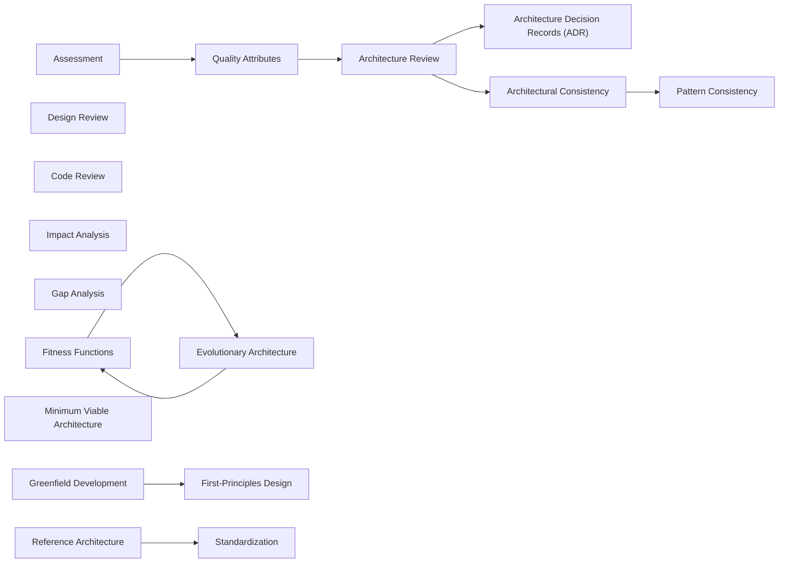
```mermaid
flowchart LR
n_assessment["Assessment"]
n_architecture_review["Architecture Review"]
n_design_review["Design Review"]
n_code_review["Code Review"]
n_impact_analysis["Impact Analysis"]
n_gap_analysis["Gap Analysis"]
n_fitness_functions["Fitness Functions"]
n_quality_attributes["Quality Attributes"]
n_architecture_decision_records["Architecture Decision Records (ADR)"]
n_evolutionary_architecture["Evolutionary Architecture"]
n_minimum_viable_architecture["Minimum Viable Architecture"]
n_greenfield_development["Greenfield Development"]
n_first_principles_design["First-Principles Design"]
n_reference_architecture["Reference Architecture"]
n_pattern_consistency["Pattern Consistency"]
n_architectural_consistency["Architectural Consistency"]
n_standardization["Standardization"]
n_assessment --> n_quality_attributes
n_architecture_review --> n_architecture_decision_records
n_architecture_review --> n_architectural_consistency
n_fitness_functions --> n_evolutionary_architecture
n_quality_attributes --> n_architecture_review
n_evolutionary_architecture --> n_fitness_functions
n_greenfield_development --> n_first_principles_design
n_reference_architecture --> n_standardization
n_architectural_consistency --> n_pattern_consistency
```

### Assessment

- Kind: [activity](SCHEMA.md#kind-activity)
- Severity: recommended
- Scope: codebase, architecture, risk
- Layer: [Evolution Principles](SCHEMA.md#layer-evolution-principles)

Details

Requires
[Criteria](LEXICON.md#lex-criteria), [Evidence](LEXICON.md#lex-evidence)
Reinforces
[Governance](PRINCIPLES.md#arch-governance), [Quality Attributes](PRINCIPLES.md#arch-quality-attributes)
Enables
[Prioritized Refactoring](LEXICON.md#lex-prioritized-refactoring)
In tension with
[Time Cost](LEXICON.md#lex-time-cost)
Conflicts with
[Assumption-Based Judgment](LEXICON.md#lex-assumption-based-judgment)
Tensions
[Assessment Time Cost](SCHEMA.md#tension-assessment-time-cost)

Violated by
decisions without assessment criteria
Detected by
missing evaluation artifacts
Measured by
assessment coverage
Refactored by
Add Assessment Checklist/Report
Enforced by
review process

```typescript
approveFooArchitecture();
```

```typescript
const assessment = assess(fooArchitecture, {
  dimensions: ["modularity", "reliability", "security", "operability"],
  evidence: collectArchitectureEvidence(fooSystem),
});
requirePassingAssessment(assessment);
```

### Architecture Review

- Kind: [activity](SCHEMA.md#kind-activity)
- Severity: recommended
- Scope: system, component, design change
- Layer: [Evolution Principles](SCHEMA.md#layer-evolution-principles)

Details

Requires
[Architecture Criteria](LEXICON.md#lex-architecture-criteria), [Architecture Decision Records (ADR)](PRINCIPLES.md#arch-architecture-decision-records)
Reinforces
[Architectural Consistency](PRINCIPLES.md#arch-architectural-consistency)
Enables
[Risk Detection](LEXICON.md#lex-risk-detection)
In tension with
[Delivery Speed](LEXICON.md#lex-delivery-speed)
Conflicts with
[Unreviewed Structural Change](LEXICON.md#lex-unreviewed-structural-change)
Referenced by
[Quality Attributes](PRINCIPLES.md#arch-quality-attributes)
Tensions
[Architecture Review Delivery Speed](SCHEMA.md#tension-architecture-review-delivery-speed)

Violated by
major architecture change without review
Detected by
unapproved dependency/style changes
Measured by
review coverage
Refactored by
Add Review, Resolve Findings
Enforced by
pull request gates

```typescript
mergeFooDesign();
```

```typescript
const review = architectureReview({
  context: fooContext,
  decisions: fooDecisions,
  risks: fooRisks,
  qualityAttributes: fooQualityAttributes,
});
review.requireApproval(["architecture-owner", "security-owner"]);
```

### Design Review

- Kind: [activity](SCHEMA.md#kind-activity)
- Severity: recommended
- Scope: component, module, feature
- Layer: [Evolution Principles](SCHEMA.md#layer-evolution-principles)

Details

Requires
[Design Criteria](LEXICON.md#lex-design-criteria)
Reinforces
[Correctness](PRINCIPLES.md#arch-correctness), [Maintainability](LEXICON.md#lex-maintainability)
Enables
[Early Defect Prevention](LEXICON.md#lex-early-defect-prevention)
In tension with
[Iteration Speed](LEXICON.md#lex-iteration-speed)
Conflicts with
[Ad-Hoc Design](LEXICON.md#lex-ad-hoc-design)
Tensions
[Design Review Iteration Speed](SCHEMA.md#tension-design-review-iteration-speed)

Violated by
complex feature without design check
Detected by
missing design record
Measured by
design review finding rate
Refactored by
Revise Design, Add Boundary/Contract
Enforced by
review checklist

```typescript
implementFooDesign(fooDesign);
```

```typescript
const review = designReview(fooDesign, {
  contracts: validateContracts,
  failureModes: analyzeFailureModes,
  testability: assessTestability,
});
if (!review.approved) throw new Error("design rejected");
```

### Code Review

- Kind: [activity](SCHEMA.md#kind-activity)
- Severity: mandatory
- Scope: code change
- Layer: [Evolution Principles](SCHEMA.md#layer-evolution-principles)

Details

Requires
[Review Standards](LEXICON.md#lex-review-standards)
Reinforces
[Quality](LEXICON.md#lex-quality), [Security](LEXICON.md#lex-security), [Consistency](PRINCIPLES.md#arch-consistency)
Enables
[Defect Detection](LEXICON.md#lex-defect-detection)
In tension with
[Throughput](PRINCIPLES.md#arch-throughput)
Conflicts with
[Direct-to-main Unreviewed Change](LEXICON.md#lex-direct-to-main-unreviewed-change)
Tensions
[Code Review Throughput](SCHEMA.md#tension-code-review-throughput)

Violated by
unreviewed production code changes
Detected by
missing approval/review
Measured by
review coverage, defect escape rate
Refactored by
Apply Review Feedback
Enforced by
branch protection

```typescript
git.merge(fooChange);
```

```typescript
const review = codeReview(fooChange);
review.require({
  approvals: 2,
  passingChecks: ["tests", "types", "security", "architecture"],
});
git.merge(review.approvedCommit);
```

### Impact Analysis

- Kind: [activity](SCHEMA.md#kind-activity)
- Severity: recommended
- Scope: change, dependency graph, API
- Layer: [Evolution Principles](SCHEMA.md#layer-evolution-principles)

Details

Requires
[Dependency Graph](PRINCIPLES.md#arch-dependency-graph), [Contracts](LEXICON.md#lex-contracts)
Reinforces
[Change Safety](LEXICON.md#lex-change-safety)
Enables
[Regression Scope Selection](LEXICON.md#lex-regression-scope-selection)
In tension with
[Analysis Overhead](LEXICON.md#lex-analysis-overhead)
Conflicts with
[Blind Change](LEXICON.md#lex-blind-change)
Referenced by
[Causal Dependency](PRINCIPLES.md#arch-causal-dependency), [Dependency Graph](PRINCIPLES.md#arch-dependency-graph)
Tensions
[Impact Analysis Analysis Overhead](SCHEMA.md#tension-analysis-overhead-impact-analysis)

Violated by
breaking dependent behavior without awareness
Detected by
change touching dependencies without impact note
Measured by
affected component count
Refactored by
Add Dependency Map, Add Regression Tests
Enforced by
PR template, dependency tooling

```typescript
renameFooField("name", "label");
```

```typescript
const impact = dependencyGraph.impactOf({
  contract: "FooV1.name",
  change: "rename-to-label",
});
for (const consumer of impact.consumers) requireMigration(consumer);
renameFooField("name", "label");
```

### Gap Analysis

- Kind: [activity](SCHEMA.md#kind-activity)
- Severity: contextual
- Scope: compliance, architecture, capability
- Layer: [Evolution Principles](SCHEMA.md#layer-evolution-principles)

Details

Requires
[Target State](LEXICON.md#lex-target-state), [Current State](LEXICON.md#lex-current-state)
Reinforces
[Governance](PRINCIPLES.md#arch-governance)
Enables
[Remediation Planning](LEXICON.md#lex-remediation-planning)
In tension with
[Time Cost](LEXICON.md#lex-time-cost)
Conflicts with
[Undefined Target](LEXICON.md#lex-undefined-target)
Tensions
[Gap Analysis Time Cost](SCHEMA.md#tension-gap-analysis-time-cost)

Violated by
missing comparison against required controls/principles
Detected by
unknown compliance/architecture status
Measured by
gap count/severity
Refactored by
Add Remediation Plan
Enforced by
governance process

```typescript
declareFooSystemReady();
```

```typescript
const target = fooTargetArchitecture();
const current = inspectFooArchitecture();
const gaps = compareArchitecture(current, target);
for (const gap of gaps) assignRemediation(gap);
```

### Fitness Functions

- Kind: [mechanism](SCHEMA.md#kind-mechanism)
- Severity: recommended
- Scope: codebase, pipeline, architecture
- Layer: [Evolution Principles](SCHEMA.md#layer-evolution-principles)

Details

Requires
[Measurable Architecture Rule](LEXICON.md#lex-measurable-architecture-rule)
Reinforces
[Evolutionary Architecture](PRINCIPLES.md#arch-evolutionary-architecture)
Enables
[Automated Architecture Compliance](LEXICON.md#lex-automated-architecture-compliance)
In tension with
[Rule Maintenance](LEXICON.md#lex-rule-maintenance)
Conflicts with
[Manual Architecture Review Only](LEXICON.md#lex-manual-architecture-review-only)
Referenced by
[Evolutionary Architecture](PRINCIPLES.md#arch-evolutionary-architecture)
Tensions
[Fitness Functions Rule Maintenance](SCHEMA.md#tension-fitness-functions-rule-maintenance)

Violated by
architecture rule not continuously checked
Detected by
missing executable architecture checks
Measured by
fitness pass/fail trend
Refactored by
Add Fitness Test, Codify Rule
Enforced by
CI architecture tests

```typescript
architectureGuidelines.write("Foo domain must not import infrastructure");
```

```typescript
const fitness = forbidImports({
  from: "src/foo/domain/**",
  to: "src/foo/infrastructure/**",
});
pipeline.enforce(fitness);
```

### Quality Attributes

- Kind: [model](SCHEMA.md#kind-model)
- Severity: recommended
- Scope: system, service, codebase
- Layer: [Performance Core](SCHEMA.md#layer-performance-core)

Details

Requires
[Attribute Scenarios](LEXICON.md#lex-attribute-scenarios)
Reinforces
[Architecture Review](PRINCIPLES.md#arch-architecture-review)
Enables
[Trade-Off Analysis](LEXICON.md#lex-trade-off-analysis)
In tension with
[Competing Attributes](LEXICON.md#lex-competing-attributes)
Conflicts with
[Feature-Only Design](PRINCIPLES.md#arch-feature-only-design)
Referenced by
[Assessment](PRINCIPLES.md#arch-assessment)
Tensions
[Quality Attributes Competing Attributes](SCHEMA.md#tension-competing-attributes-quality-attributes)

Violated by
no explicit nonfunctional requirements
Detected by
missing quality scenarios/SLOs
Measured by
quality attribute scenario pass rate
Refactored by
Define Scenarios, Add Fitness Functions
Enforced by
[architecture review](PRINCIPLES.md#arch-architecture-review)

```typescript
designFooService();
```

```typescript
const attributes = defineQualityAttributes({
  availability: "99.95%",
  p95LatencyMs: 200,
  recoveryTimeMinutes: 5,
  dataLossSeconds: 0,
});
designFooService(attributes);
```

### Architecture Decision Records (ADR)

- Kind: [artifact](SCHEMA.md#kind-artifact)
- Severity: recommended
- Scope: architecture decision
- Aliases: ADRs
- Layer: [Evolution Principles](SCHEMA.md#layer-evolution-principles)

Details

Requires
[Context](LEXICON.md#lex-context), [Decision](LEXICON.md#lex-decision), [Consequences](LEXICON.md#lex-consequences)
Reinforces
[Traceability](PRINCIPLES.md#arch-traceability), [Governance](PRINCIPLES.md#arch-governance)
Enables
[Decision History](LEXICON.md#lex-decision-history)
In tension with
[Documentation Maintenance](LEXICON.md#lex-documentation-maintenance)
Conflicts with
[Tribal Knowledge](LEXICON.md#lex-tribal-knowledge)
Referenced by
[Architecture Review](PRINCIPLES.md#arch-architecture-review)
Tensions
[Architecture Decision Records (ADR) Documentation Maintenance](SCHEMA.md#tension-architecture-decision-records-adr-documentation-maintenance)

Violated by
major decision not recorded
Detected by
architecture change without ADR
Measured by
ADR coverage
Refactored by
Add ADR, Link to Change
Enforced by
PR template, review policy

```typescript
chooseFooDatabase("postgres");
```

```typescript
const adr = recordDecision({
  id: "ADR-0042",
  title: "Use PostgreSQL for Foo persistence",
  status: "accepted",
  context: fooPersistenceForces,
  decision: "postgres",
  consequences: fooPersistenceConsequences,
});
```

### Evolutionary Architecture

- Kind: [approach](SCHEMA.md#kind-approach)
- Severity: contextual
- Scope: system, codebase
- Layer: [Evolution Principles](SCHEMA.md#layer-evolution-principles)

Details

Requires
[Fitness Functions](PRINCIPLES.md#arch-fitness-functions), [Incremental Change](LEXICON.md#lex-incremental-change)
Reinforces
[Continuous Improvement](LEXICON.md#lex-continuous-improvement)
Enables
[Controlled Architecture Evolution](LEXICON.md#lex-controlled-architecture-evolution)
In tension with
[Governance Discipline](LEXICON.md#lex-governance-discipline)
Conflicts with
[Big-Upfront Frozen Architecture](PRINCIPLES.md#arch-big-upfront-frozen-architecture), [Lava Flow](PRINCIPLES.md#arch-lava-flow), [Premature Abstraction](PRINCIPLES.md#arch-premature-abstraction), [Zombie Code](PRINCIPLES.md#arch-zombie-code)
Referenced by
[Fitness Functions](PRINCIPLES.md#arch-fitness-functions), [Forward Compatibility](PRINCIPLES.md#arch-forward-compatibility)
Tensions
[Evolutionary Architecture Governance Discipline](SCHEMA.md#tension-evolutionary-architecture-governance-discipline)

Violated by
architecture decay without feedback loops
Detected by
accumulating unmeasured drift
Measured by
fitness trend, architecture debt
Refactored by
Add Fitness Functions, Refactor Incrementally
Enforced by
CI/CD architecture checks

```typescript
designFinalFooArchitecture();
freezeArchitectureForever();
```

```typescript
const fooArchitecture = evolveArchitecture({
  current: minimumFooArchitecture,
  fitnessFunctions: fooFitnessFunctions,
  nextChange: highestValueArchitectureChange,
});
```

### Minimum Viable Architecture

- Kind: [approach](SCHEMA.md#kind-approach)
- Severity: contextual
- Scope: greenfield, early product
- Layer: [Evolution Principles](SCHEMA.md#layer-evolution-principles)

Details

Requires
[Essential Quality Attributes](LEXICON.md#lex-essential-quality-attributes)
Reinforces
[Simplicity](LEXICON.md#lex-simplicity)
Enables
[Early Delivery with Guardrails](LEXICON.md#lex-early-delivery-with-guardrails)
In tension with
[Future Scalability](LEXICON.md#lex-future-scalability)
Conflicts with
[Over-Architecture](LEXICON.md#lex-over-architecture), [Architecture Astronaut](PRINCIPLES.md#arch-architecture-astronaut), [Over-Abstraction](PRINCIPLES.md#arch-over-abstraction), [Speculative Generality](PRINCIPLES.md#arch-speculative-generality)
Tensions
[Minimum Viable Architecture Future Scalability](SCHEMA.md#tension-future-scalability-minimum-viable-architecture)

Violated by
adding complex patterns before need
Detected by
unused abstractions/infrastructure
Measured by
architecture complexity vs need
Refactored by
Simplify, Defer Optional Mechanisms
Enforced by
[design review](PRINCIPLES.md#arch-design-review)

```typescript
buildServiceMesh();
buildGlobalEventBus();
buildPluginPlatform();
createFooEndpoint();
```

```typescript
const architecture = defineMinimumArchitecture({
  useCase: "create-and-read-foo",
  components: ["foo-api", "foo-store"],
  deferredUntilForced: ["service-mesh", "plugin-platform"],
});
```

### Greenfield Development

- Kind: [model](SCHEMA.md#kind-model)
- Severity: contextual
- Scope: new codebase, system
- Layer: [Evolution Principles](SCHEMA.md#layer-evolution-principles)

Details

Requires
[First-Principles Design](PRINCIPLES.md#arch-first-principles-design)
Reinforces
[Architecture Foundation](LEXICON.md#lex-architecture-foundation)
Enables
[Clean Boundary Design](LEXICON.md#lex-clean-boundary-design)
In tension with
[Unknown Requirements](LEXICON.md#lex-unknown-requirements), [Legacy Constraints](LEXICON.md#lex-legacy-constraints)
Conflicts with
none
Tensions
[Greenfield Development Unknown Requirements](SCHEMA.md#tension-greenfield-development-unknown-requirements), [Greenfield Development Legacy Constraints](SCHEMA.md#tension-greenfield-development-legacy-constraints)

Violated by
premature irreversible architecture choices
Detected by
heavy structure without validated need
Measured by
[initial complexity](LEXICON.md#lex-initial-complexity), adaptability
Refactored by
Start Modular, Add ADRs, Define Boundaries
Enforced by
[architecture review](PRINCIPLES.md#arch-architecture-review)

```typescript
copyLegacyFooModule();
retainLegacyFooFlags();
retainLegacyFooSchema();
```

```typescript
const fooSystem = designFromCurrentForces({
  domain: fooDomain,
  constraints: currentConstraints,
  contracts: currentContracts,
});
```

### First-Principles Design

- Kind: [approach](SCHEMA.md#kind-approach)
- Severity: recommended
- Scope: architecture, domain, component
- Layer: [Evolution Principles](SCHEMA.md#layer-evolution-principles)

Details

Requires
[Problem Decomposition](LEXICON.md#lex-problem-decomposition)
Reinforces
[Correctness](PRINCIPLES.md#arch-correctness), [Simplicity](LEXICON.md#lex-simplicity)
Enables
[Fit-for-Purpose Architecture](LEXICON.md#lex-fit-for-purpose-architecture)
In tension with
[Reuse of Established Patterns](LEXICON.md#lex-reuse-of-established-patterns)
Conflicts with
[Cargo-Cult Pattern Use](LEXICON.md#lex-cargo-cult-pattern-use), [Golden Hammer](PRINCIPLES.md#arch-golden-hammer), [Pattern Cargo Cult](PRINCIPLES.md#arch-pattern-cargo-cult)
Referenced by
[Greenfield Development](PRINCIPLES.md#arch-greenfield-development)
Tensions
[First-Principles Design Reuse of Established Patterns](SCHEMA.md#tension-first-principles-design-reuse-of-established-patterns)

Violated by
applying patterns without problem fit
Detected by
unjustified pattern selection
Measured by
decision rationale quality
Refactored by
Re-evaluate Constraints, Remove Misfit Pattern
Enforced by
ADR review

```typescript
useMicroservicesBecauseIndustryUsesMicroservices();
```

```typescript
const forces = identifyForces(fooProblem);
const invariants = deriveInvariants(forces);
const design = synthesizeArchitecture({ forces, invariants });
```

### Reference Architecture

- Kind: [artifact](SCHEMA.md#kind-artifact)
- Severity: contextual
- Scope: platform, organization, system family
- Layer: [Evolution Principles](SCHEMA.md#layer-evolution-principles)

Details

Requires
[Standard Patterns](LEXICON.md#lex-standard-patterns), [Quality Goals](LEXICON.md#lex-quality-goals)
Reinforces
[Standardization](PRINCIPLES.md#arch-standardization), [Consistency](PRINCIPLES.md#arch-consistency)
Enables
[Reusable Architecture Guidance](LEXICON.md#lex-reusable-architecture-guidance)
In tension with
[Team Autonomy](LEXICON.md#lex-team-autonomy)
Conflicts with
[Uncoordinated Divergence](LEXICON.md#lex-uncoordinated-divergence)
Tensions
[Reference Architecture Team Autonomy](SCHEMA.md#tension-reference-architecture-team-autonomy)

Violated by
inconsistent implementations without rationale
Detected by
deviation without ADR
Measured by
conformance/deviation rate
Refactored by
Align to Reference or Document Exception
Enforced by
[architecture review](PRINCIPLES.md#arch-architecture-review)

```typescript
teamA.buildFooOneWay();
teamB.buildFooAnotherWay();
```

```typescript
const fooReference = defineReferenceArchitecture({
  modules: ["api", "application", "domain", "adapters"],
  allowedDependencies: fooDependencyRules,
});
teamA.instantiate(fooReference);
teamB.instantiate(fooReference);
```

### Pattern Consistency

- Kind: [quality-attribute](SCHEMA.md#kind-quality-attribute)
- Severity: recommended
- Scope: codebase, system
- Layer: [Evolution Principles](SCHEMA.md#layer-evolution-principles)

Details

Requires
[Naming/Structure Conventions](LEXICON.md#lex-naming-structure-conventions)
Reinforces
[Predictability](PRINCIPLES.md#arch-predictability), [Maintainability](LEXICON.md#lex-maintainability)
Enables
[Easier Refactoring](LEXICON.md#lex-easier-refactoring)
In tension with
[Local Optimization](LEXICON.md#lex-local-optimization)
Conflicts with
[Ad-Hoc Pattern Mixing](LEXICON.md#lex-ad-hoc-pattern-mixing)
Referenced by
[Architectural Consistency](PRINCIPLES.md#arch-architectural-consistency), [Convention over Configuration](PRINCIPLES.md#arch-convention-over-configuration)
Tensions
[Pattern Consistency Local Optimization](SCHEMA.md#tension-local-optimization-pattern-consistency)

Violated by
same problem solved with incompatible patterns
Detected by
inconsistent implementations of same concern
Measured by
pattern variance count
Refactored by
Normalize Pattern, Extract Shared Convention
Enforced by
linting, [review](LEXICON.md#lex-review), scaffolding

```typescript
fooModule.useRepository();
barModule.queryDatabaseDirectly();
bazModule.useActiveRecord();
```

```typescript
const persistencePattern = "repository" as const;
fooModule.use(persistencePattern);
barModule.use(persistencePattern);
bazModule.use(persistencePattern);
```

### Architectural Consistency

- Kind: [quality-attribute](SCHEMA.md#kind-quality-attribute)
- Severity: mandatory
- Scope: system, codebase
- Layer: [Evolution Principles](SCHEMA.md#layer-evolution-principles)

Details

Requires
[Architecture Rules](LEXICON.md#lex-architecture-rules), [Governance](PRINCIPLES.md#arch-governance)
Reinforces
[Pattern Consistency](PRINCIPLES.md#arch-pattern-consistency)
Enables
[Predictable Evolution](LEXICON.md#lex-predictable-evolution)
In tension with
[Local Autonomy](LEXICON.md#lex-local-autonomy)
Conflicts with
[Architecture Drift](LEXICON.md#lex-architecture-drift)
Referenced by
[Architecture Review](PRINCIPLES.md#arch-architecture-review)
Tensions
[Architectural Consistency Local Autonomy](SCHEMA.md#tension-architectural-consistency-local-autonomy)

Violated by
unapproved boundary/layer/dependency deviations
Detected by
architecture fitness failures
Measured by
violation trend
Refactored by
Align Dependency/Layer/Boundary
Enforced by
architecture tests

```typescript
fooDomain.imports(sqlClient);
barDomain.imports(httpClient);
```

```typescript
architectureRules.enforce([
  forbid("domain", "infrastructure"),
  requirePortFor("external-io"),
]);
```

### Standardization

- Kind: [principle](SCHEMA.md#kind-principle)
- Severity: contextual
- Scope: codebase, platform, organization
- Layer: [Evolution Principles](SCHEMA.md#layer-evolution-principles)

Details

Requires
[Standards Definition](LEXICON.md#lex-standards-definition)
Reinforces
[Consistency](PRINCIPLES.md#arch-consistency), [Interoperability](PRINCIPLES.md#arch-interoperability)
Enables
[Reuse](LEXICON.md#lex-reuse), [Operability](LEXICON.md#lex-operability)
In tension with
[Innovation/Autonomy](LEXICON.md#lex-innovation-autonomy)
Conflicts with
[Unbounded Variation](LEXICON.md#lex-unbounded-variation)
Referenced by
[Reference Architecture](PRINCIPLES.md#arch-reference-architecture), [Autonomy](PRINCIPLES.md#arch-autonomy)
Tensions
[Standardization Innovation/Autonomy](SCHEMA.md#tension-innovation-autonomy-standardization)

Violated by
inconsistent tooling/formats/patterns
Detected by
standards deviation
Measured by
conformance rate
Refactored by
Normalize Tooling/Format/Pattern
Enforced by
CI policies, templates

```typescript
teamA.emit({ foo_id: foo.id });
teamB.emit({ id: foo.id, type: "foo" });
```

```typescript
const FooCreatedV1 = standardEvent({
  type: "FooCreated",
  version: 1,
  fields: { fooId: FooIdSchema },
});
teamA.emit(FooCreatedV1.create(foo));
teamB.emit(FooCreatedV1.create(foo));
```

## Behavioral Patterns

Every principle in this category. Each record carries its kind, its severity, the scopes it applies at and the layer it lives in, then the edge relations that join it to other records, the records that point back at it, the contracts that answer to it and the tensions it takes part in. The descriptors say how it is violated, detected, measured, repaired and enforced. Where the record carries one, an exemplar shows the shape before and after the principle is applied.

Relations diagram

The relations inside this category.

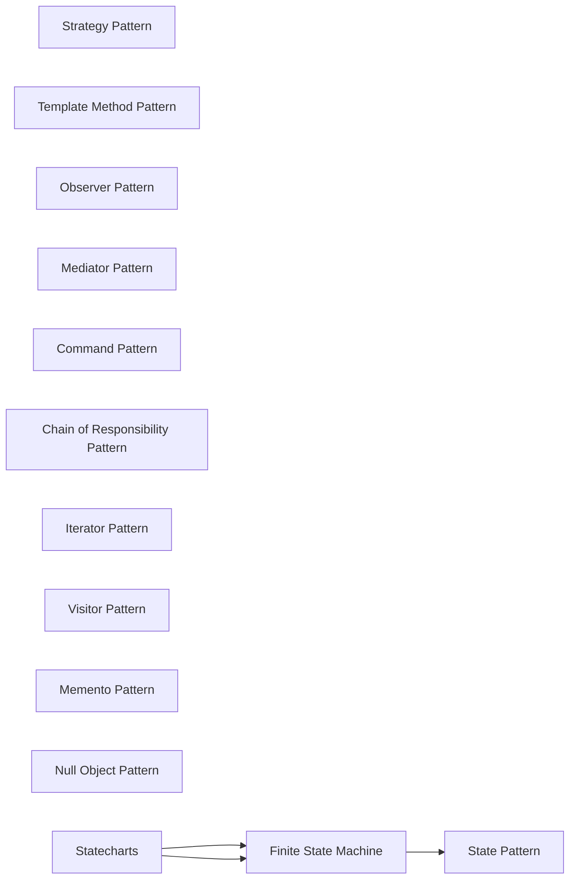
```mermaid
flowchart LR
n_strategy_pattern["Strategy Pattern"]
n_template_method_pattern["Template Method Pattern"]
n_observer_pattern["Observer Pattern"]
n_mediator_pattern["Mediator Pattern"]
n_command_pattern["Command Pattern"]
n_state_pattern["State Pattern"]
n_chain_of_responsibility_pattern["Chain of Responsibility Pattern"]
n_iterator_pattern["Iterator Pattern"]
n_visitor_pattern["Visitor Pattern"]
n_memento_pattern["Memento Pattern"]
n_null_object_pattern["Null Object Pattern"]
n_finite_state_machine["Finite State Machine"]
n_statecharts["Statecharts"]
n_finite_state_machine --> n_state_pattern
n_statecharts --> n_finite_state_machine
n_statecharts --> n_finite_state_machine
```

### Strategy Pattern

- Kind: [pattern](SCHEMA.md#kind-pattern)
- Severity: recommended
- Scope: algorithm, policy, behavior
- Layer: [Design Patterns Core](SCHEMA.md#layer-design-patterns-core)

Details

Requires
[Interchangeable Algorithms](LEXICON.md#lex-interchangeable-algorithms)
Reinforces
[Open/Closed Principle (OCP)](PRINCIPLES.md#arch-open-closed), [Polymorphism](PRINCIPLES.md#arch-polymorphism)
Enables
[Runtime Behavior Selection](LEXICON.md#lex-runtime-behavior-selection)
In tension with
[Class Count](LEXICON.md#lex-class-count)
Conflicts with
[Large Conditional Logic](LEXICON.md#lex-large-conditional-logic)
Referenced by
[Composition Over Inheritance](PRINCIPLES.md#arch-composition-over-inheritance), [Open/Closed Principle (OCP)](PRINCIPLES.md#arch-open-closed), [Polymorphism](PRINCIPLES.md#arch-polymorphism)
Tensions
[Strategy Pattern Class Count](SCHEMA.md#tension-class-count-strategy-pattern)

Violated by
switch over behavior modes
Detected by
conditional strategy selection with duplicated behavior
Measured by
conditional complexity
Refactored by
Extract Strategy
Enforced by
complexity thresholds, [review](LEXICON.md#lex-review)

```typescript
function priceFoo(kind: string, value: number) {
  if (kind === "standard") return value;
  if (kind === "double") return value * 2;
  return 0;
}
```

```typescript
interface FooPricing {
  price(value: number): number;
}
const standard: FooPricing = { price: (value) => value };
const doubled: FooPricing = { price: (value) => value * 2 };
function priceFoo(strategy: FooPricing, value: number) {
  return strategy.price(value);
}
```

### Template Method Pattern

- Kind: [pattern](SCHEMA.md#kind-pattern)
- Severity: contextual
- Scope: workflow, framework
- Layer: [Design Patterns Core](SCHEMA.md#layer-design-patterns-core)

Details

Requires
[Stable Algorithm Skeleton](LEXICON.md#lex-stable-algorithm-skeleton)
Reinforces
[Framework Reuse](LEXICON.md#lex-framework-reuse)
Enables
[Controlled Variation](LEXICON.md#lex-controlled-variation)
In tension with
[Inheritance Coupling](LEXICON.md#lex-inheritance-coupling)
Conflicts with
[Duplicated Workflow](LEXICON.md#lex-duplicated-workflow)
Tensions
[Template Method Pattern Inheritance Coupling](SCHEMA.md#tension-inheritance-coupling-template-method-pattern)

Violated by
copied workflows with small variations
Detected by
duplicated method sequences
Measured by
workflow duplication
Refactored by
Introduce Template Method
Enforced by
[design review](PRINCIPLES.md#arch-design-review)

```typescript
function importJsonFoo(raw: string) {
  validateJson(raw);
  return saveFoo(parseJson(raw));
}
function importCsvFoo(raw: string) {
  validateCsv(raw);
  return saveFoo(parseCsv(raw));
}
```

```typescript
abstract class FooImporter {
  import(raw: string) {
    this.validate(raw);
    return saveFoo(this.parse(raw));
  }
  protected abstract validate(raw: string): void;
  protected abstract parse(raw: string): Foo;
}
```

### Observer Pattern

- Kind: [pattern](SCHEMA.md#kind-pattern)
- Severity: recommended
- Scope: event notification, runtime
- Layer: [Design Patterns Core](SCHEMA.md#layer-design-patterns-core)

Details

Requires
[Subject/Subscriber Contract](LEXICON.md#lex-subject-subscriber-contract)
Reinforces
[Event-Driven Architecture](PRINCIPLES.md#arch-event-driven-architecture)
Enables
[Decoupled Notification](LEXICON.md#lex-decoupled-notification)
In tension with
[Ordering](LEXICON.md#lex-ordering), [Debuggability](LEXICON.md#lex-debuggability)
Conflicts with
[Direct Callback Coupling](LEXICON.md#lex-direct-callback-coupling)
Tensions
[Observer Pattern Ordering](SCHEMA.md#tension-observer-pattern-ordering), [Observer Pattern Debuggability](SCHEMA.md#tension-debuggability-observer-pattern)

Violated by
hardcoded notification targets
Detected by
direct calls to multiple listeners
Measured by
subscriber coupling count
Refactored by
Introduce Observer/Event Publisher
Enforced by
event contract tests

```typescript
class FooEditor {
  save(foo: Foo) {
    fooStore.save(foo);
    refreshFooView(foo);
    sendFooEmail(foo);
  }
}
```

```typescript
class FooEvents {
  #listeners = new Set<(event: FooEvent) => void>();
  subscribe(listener: (event: FooEvent) => void) {
    this.#listeners.add(listener);
  }
  publish(event: FooEvent) {
    this.#listeners.forEach((listener) => listener(event));
  }
}
class FooEditor {
  constructor(private readonly events: FooEvents) {}
  save(foo: Foo) {
    fooStore.save(foo);
    this.events.publish({ type: "FooSaved", foo });
  }
}
fooEvents.subscribe((event) => refreshFooView(event.foo));
fooEvents.subscribe((event) => sendFooEmail(event.foo));
```

### Mediator Pattern

- Kind: [pattern](SCHEMA.md#kind-pattern)
- Severity: contextual
- Scope: object coordination, module
- Layer: [Design Patterns Core](SCHEMA.md#layer-design-patterns-core)

Details

Requires
[Coordination Complexity](LEXICON.md#lex-coordination-complexity)
Reinforces
[Low Coupling](PRINCIPLES.md#arch-low-coupling)
Enables
[Centralized Interaction Logic](LEXICON.md#lex-centralized-interaction-logic)
In tension with
[Mediator God Object](LEXICON.md#lex-mediator-god-object)
Conflicts with
[Mesh Dependencies](LEXICON.md#lex-mesh-dependencies)
Tensions
[Mediator Pattern Mediator God Object](SCHEMA.md#tension-mediator-god-object-mediator-pattern)

Violated by
many-to-many object dependencies
Detected by
dense object dependency graph
Measured by
interaction graph density
Refactored by
Introduce Mediator
Enforced by
dependency graph checks

```typescript
fooEditor.notify(fooList, fooDetails, fooToolbar, foo);
fooList.update(fooDetails, fooToolbar, foo);
```

```typescript
class FooMediator {
  constructor(
    private readonly list: FooList,
    private readonly details: FooDetails,
  ) {}
  handle(event: FooEvent) {
    this.list.apply(event);
    this.details.apply(event);
  }
}
```

### Command Pattern

- Kind: [pattern](SCHEMA.md#kind-pattern)
- Severity: recommended
- Scope: behavior, invocation, workflow
- Layer: [Design Patterns Core](SCHEMA.md#layer-design-patterns-core)

Details

Requires
[Encapsulation](PRINCIPLES.md#arch-encapsulation)
Reinforces
[Open/Closed Principle (OCP)](PRINCIPLES.md#arch-open-closed), [Single Responsibility Principle (SRP)](PRINCIPLES.md#arch-single-responsibility)
Enables
[Undo/Redo](LEXICON.md#lex-undo-redo), [Deferred Execution](LEXICON.md#lex-deferred-execution), [Request Queuing](LEXICON.md#lex-request-queuing)
In tension with
[Simplicity](LEXICON.md#lex-simplicity)
Conflicts with
[Direct Method Invocation](LEXICON.md#lex-direct-method-invocation)
Tensions
[Command Pattern Simplicity](SCHEMA.md#tension-command-pattern-simplicity)

Violated by
inline conditional dispatch on an action name
Detected by
switch/if chains selecting an operation to run
Measured by
dispatch-branch count per action site
Refactored by
Encapsulate Invocation as a Command object
Enforced by
[design review](PRINCIPLES.md#arch-design-review)

```typescript
button.onClick = () => fooEditor.delete(foo.id);
```

```typescript
interface FooCommand {
  execute(): void;
  undo(): void;
}
class DeleteFooCommand implements FooCommand {
  constructor(private readonly id: FooId) {}
  execute() {
    fooStore.delete(this.id);
  }
  undo() {
    fooStore.restore(this.id);
  }
}
history.run(new DeleteFooCommand(foo.id));
```

### State Pattern

- Kind: [pattern](SCHEMA.md#kind-pattern)
- Severity: recommended
- Scope: behavior, state machine, lifecycle
- Layer: [Design Patterns Core](SCHEMA.md#layer-design-patterns-core)

Details

Requires
[Explicit State Model](LEXICON.md#lex-explicit-state-model)
Reinforces
[Open/Closed Principle (OCP)](PRINCIPLES.md#arch-open-closed), [Polymorphism](PRINCIPLES.md#arch-polymorphism)
Enables
[State-Local Behavior](LEXICON.md#lex-state-local-behavior), [Legal-Transition Enforcement](LEXICON.md#lex-legal-transition-enforcement)
In tension with
[Class Proliferation](LEXICON.md#lex-class-proliferation)
Conflicts with
[Boolean Flag Soup](LEXICON.md#lex-boolean-flag-soup)
Referenced by
[Finite State Machine](PRINCIPLES.md#arch-finite-state-machine)
Tensions
[State Pattern Class Proliferation](SCHEMA.md#tension-class-proliferation-state-pattern)

Violated by
behavior branched on scattered status flags
Detected by
repeated conditionals on a status field
Measured by
status-conditional density
Refactored by
Replace State-Conditional with State objects
Enforced by
[design review](PRINCIPLES.md#arch-design-review)

```typescript
function handleFoo(foo: Foo, event: string) {
  if (foo.status === "draft" && event === "submit") foo.status = "review";
  if (foo.status === "review" && event === "approve") foo.status = "published";
}
```

```typescript
interface FooState {
  submit(): FooState;
  approve(): FooState;
}
const published: FooState = {
  submit: () => published,
  approve: () => published,
};
const review: FooState = { submit: () => review, approve: () => published };
const draft: FooState = { submit: () => review, approve: () => draft };
class Foo {
  constructor(private state: FooState = draft) {}
  submit() {
    this.state = this.state.submit();
  }
  approve() {
    this.state = this.state.approve();
  }
}
```

### Chain of Responsibility Pattern

- Kind: [pattern](SCHEMA.md#kind-pattern)
- Severity: recommended
- Scope: behavior, request handling, pipeline
- Layer: [Design Patterns Core](SCHEMA.md#layer-design-patterns-core)

Details

Requires
[Uniform Handler Interface](LEXICON.md#lex-uniform-handler-interface)
Reinforces
[Open/Closed Principle (OCP)](PRINCIPLES.md#arch-open-closed), [Single Responsibility Principle (SRP)](PRINCIPLES.md#arch-single-responsibility)
Enables
[Pluggable Handling](LEXICON.md#lex-pluggable-handling), [Ordered Fallthrough](LEXICON.md#lex-ordered-fallthrough)
In tension with
[Traceability](PRINCIPLES.md#arch-traceability)
Conflicts with
[Monolithic Handler](LEXICON.md#lex-monolithic-handler)
Tensions
[Chain of Responsibility Pattern Traceability](SCHEMA.md#tension-chain-of-responsibility-pattern-traceability)

Violated by
one handler with nested conditionals for every case
Detected by
long if/else ladders handling heterogeneous requests
Measured by
handler cyclomatic complexity
Refactored by
Extract Handler Chain
Enforced by
[design review](PRINCIPLES.md#arch-design-review)

```typescript
function handleFoo(request: FooRequest) {
  if (request.size > MAX_SIZE) return reject(request);
  if (!request.authorized) return deny(request);
  return process(request);
}
```

```typescript
type FooHandler = (request: FooRequest, next: () => FooResult) => FooResult;
const enforceSize: FooHandler = (request, next) =>
  request.size > MAX_SIZE ? reject(request) : next();
const enforceAuth: FooHandler = (request, next) =>
  request.authorized ? next() : deny(request);
const chain = composeHandlers([
  enforceSize,
  enforceAuth,
  () => process(request),
]);
chain(request);
```

### Iterator Pattern

- Kind: [pattern](SCHEMA.md#kind-pattern)
- Severity: contextual
- Scope: behavior, traversal, collection
- Layer: [Design Patterns Core](SCHEMA.md#layer-design-patterns-core)

Details

Requires
[Uniform Traversal Interface](LEXICON.md#lex-uniform-traversal-interface)
Reinforces
[Encapsulation](PRINCIPLES.md#arch-encapsulation), [Single Responsibility Principle (SRP)](PRINCIPLES.md#arch-single-responsibility)
Enables
[Structure-Agnostic Iteration](LEXICON.md#lex-structure-agnostic-iteration), [Lazy Traversal](LEXICON.md#lex-lazy-traversal)
In tension with
[Simplicity](LEXICON.md#lex-simplicity)
Conflicts with
[Exposed Internal Representation](LEXICON.md#lex-exposed-internal-representation)
Tensions
[Iterator Pattern Simplicity](SCHEMA.md#tension-iterator-pattern-simplicity)

Violated by
callers walking a structure's internal fields directly
Detected by
index/pointer traversal of another type's internals
Measured by
internal-structure access count
Refactored by
Introduce Iterator
Enforced by
[design review](PRINCIPLES.md#arch-design-review)

```typescript
for (let i = 0; i < fooTree.nodes.length; i += 1) visit(fooTree.nodes[i]);
```

```typescript
class FooTree {
  #roots: FooNode[] = [];
  *[Symbol.iterator](): Iterator<Foo> {
    for (const node of this.#roots) yield* this.walk(node);
  }
}
for (const foo of fooTree) visit(foo);
```

### Visitor Pattern

- Kind: [pattern](SCHEMA.md#kind-pattern)
- Severity: contextual
- Scope: behavior, operation, type hierarchy
- Layer: [Design Patterns Core](SCHEMA.md#layer-design-patterns-core)

Details

Requires
[Stable Element Hierarchy](LEXICON.md#lex-stable-element-hierarchy)
Reinforces
[Open/Closed Principle (OCP)](PRINCIPLES.md#arch-open-closed), [Separation of Concerns](PRINCIPLES.md#arch-separation-of-concerns)
Enables
[Operation Extension Without Element Change](LEXICON.md#lex-operation-extension-without-element-change)
In tension with
[Element Stability](LEXICON.md#lex-element-stability)
Conflicts with
[Type-Switch Dispatch](LEXICON.md#lex-type-switch-dispatch)
Tensions
[Visitor Pattern Element Stability](SCHEMA.md#tension-element-stability-visitor-pattern)

Violated by
operations added by editing every element type
Detected by
type-tag switches repeated per operation
Measured by
type-switch duplication across operations
Refactored by
Introduce Visitor
Enforced by
[design review](PRINCIPLES.md#arch-design-review)

```typescript
function renderFoo(node: FooNode) {
  if (node.kind === "text") return node.value;
  if (node.kind === "group") return node.children.map(renderFoo).join("");
}
```

```typescript
interface FooVisitor<T> {
  text(node: TextNode): T;
  group(node: GroupNode): T;
}
class RenderFooVisitor implements FooVisitor<string> {
  text(node: TextNode) {
    return node.value;
  }
  group(node: GroupNode) {
    return node.children.map((child) => child.accept(this)).join("");
  }
}
```

### Memento Pattern

- Kind: [pattern](SCHEMA.md#kind-pattern)
- Severity: contextual
- Scope: behavior, state capture, history
- Layer: [Design Patterns Core](SCHEMA.md#layer-design-patterns-core)

Details

Requires
[Encapsulation](PRINCIPLES.md#arch-encapsulation)
Reinforces
[Information Hiding](PRINCIPLES.md#arch-information-hiding)
Enables
[Undo/Redo](LEXICON.md#lex-undo-redo), [Snapshot/Restore](LEXICON.md#lex-snapshot-restore)
In tension with
[Memory Footprint](LEXICON.md#lex-memory-footprint)
Conflicts with
[External State Reach-In](LEXICON.md#lex-external-state-reach-in)
Tensions
[Memento Pattern Memory Footprint](SCHEMA.md#tension-memento-pattern-memory-footprint)

Violated by
callers copying an object's private fields to save state
Detected by
external code reconstructing internal state
Measured by
private-field external access count
Refactored by
Capture State as a Memento
Enforced by
[design review](PRINCIPLES.md#arch-design-review)

```typescript
const backupName = foo.name;
const backupTags = [...foo.tags];
foo.rename(newName);
if (cancelled) {
  foo.name = backupName;
  foo.tags = backupTags;
}
```

```typescript
class FooMemento {
  constructor(readonly snapshot: Readonly<Foo>) {}
}
const memento = foo.save();
foo.rename(newName);
if (cancelled) foo.restore(memento);
```

### Null Object Pattern

- Kind: [pattern](SCHEMA.md#kind-pattern)
- Severity: contextual
- Scope: behavior, absence, default
- Layer: [Design Patterns Core](SCHEMA.md#layer-design-patterns-core)

Details

Requires
[Shared Behavioral Interface](LEXICON.md#lex-shared-behavioral-interface)
Reinforces
[Polymorphism](PRINCIPLES.md#arch-polymorphism), [Fail-Safe Defaults](LEXICON.md#lex-fail-safe-defaults)
Enables
[Null-Check Elimination](LEXICON.md#lex-null-check-elimination)
In tension with
[Silent No-Op Risk](LEXICON.md#lex-silent-no-op-risk)
Conflicts with
[Null Semantics Drift](PRINCIPLES.md#arch-null-semantics-drift)
Tensions
[Null Object Pattern Silent No-Op Risk](SCHEMA.md#tension-null-object-pattern-silent-no-op-risk)

Violated by
null-guards scattered across every call site
Detected by
repeated null checks before the same operation
Measured by
null-guard density
Refactored by
Introduce Null Object
Enforced by
[design review](PRINCIPLES.md#arch-design-review)

```typescript
const logger = config.logger;
if (logger) logger.info("foo saved");
```

```typescript
interface FooLogger {
  info(message: string): void;
}
const NoopFooLogger: FooLogger = { info() {} };
const logger = config.logger ?? NoopFooLogger;
logger.info("foo saved");
```

### Finite State Machine

- Kind: [model](SCHEMA.md#kind-model)
- Severity: recommended
- Scope: behavior, state modeling, control flow
- Layer: [Design Patterns Core](SCHEMA.md#layer-design-patterns-core)

Details

Requires
[Explicit State Set](LEXICON.md#lex-explicit-state-set)
Reinforces
[State Pattern](PRINCIPLES.md#arch-state-pattern), [Correctness](PRINCIPLES.md#arch-correctness)
Enables
[Legal-Transition Enforcement](LEXICON.md#lex-legal-transition-enforcement), [Exhaustive State Reasoning](LEXICON.md#lex-exhaustive-state-reasoning)
In tension with
[State Explosion](LEXICON.md#lex-state-explosion)
Conflicts with
[Boolean Flag Soup](LEXICON.md#lex-boolean-flag-soup)
Referenced by
[Statecharts](PRINCIPLES.md#arch-statecharts)
Contracts
[Finite State Machine](ALGORITHMS.md#algo-finite-state-machine)
Tensions
[Finite State Machine State Explosion](SCHEMA.md#tension-finite-state-machine-state-explosion)

Violated by
behavior driven by ad-hoc combinations of scattered status booleans
Detected by
impossible or contradictory state combinations reachable at runtime
Measured by
count of representable-but-illegal states
Refactored by
Model states and transitions as an explicit FSM
Enforced by
state model review

```typescript
let isOpen = false,
  isLoading = false,
  isError = false;
function onClick() {
  isLoading = true;
  if (isOpen) isOpen = false;
}
```

```typescript
type FooState = "closed" | "loading" | "open" | "error";
const transitions: Record<FooState, Partial<Record<FooEvent, FooState>>> = {
  closed: { open: "loading" },
  loading: { ready: "open", fail: "error" },
  open: { close: "closed" },
  error: { retry: "loading" },
};
function next(state: FooState, event: FooEvent): FooState {
  return transitions[state][event] ?? state;
}
```

### Statecharts

- Kind: [model](SCHEMA.md#kind-model)
- Severity: contextual
- Scope: behavior, state modeling, hierarchy
- Layer: [Design Patterns Core](SCHEMA.md#layer-design-patterns-core)

Details

Requires
[Finite State Machine](PRINCIPLES.md#arch-finite-state-machine)
Reinforces
[Finite State Machine](PRINCIPLES.md#arch-finite-state-machine), [Separation of Concerns](PRINCIPLES.md#arch-separation-of-concerns)
Enables
[Hierarchical States](LEXICON.md#lex-hierarchical-states), [Parallel Regions](LEXICON.md#lex-parallel-regions), [Guarded Transitions](LEXICON.md#lex-guarded-transitions)
In tension with
[Tooling Complexity](LEXICON.md#lex-tooling-complexity)
Conflicts with
[Flat State Explosion](LEXICON.md#lex-flat-state-explosion)
Contracts
[Statecharts](ALGORITHMS.md#algo-statecharts)
Tensions
[Statecharts Tooling Complexity](SCHEMA.md#tension-statecharts-tooling-complexity)

Violated by
a flat FSM duplicating shared transitions across many near-identical states
Detected by
combinatorial state growth from independent concerns modeled in one flat machine
Measured by
transition duplication across sibling states
Refactored by
Introduce nested and parallel statechart regions
Enforced by
state model review

```typescript
type S = "idleMuted" | "idleLoud" | "playingMuted" | "playingLoud";
```

```typescript
const fooChart = {
  initial: "idle",
  states: { idle: {}, playing: {} },
  parallel: { volume: { states: { muted: {}, loud: {} } } },
};
```

## Causality / Ordering / Distributed Time

Every principle in this category. Each record carries its kind, its severity, the scopes it applies at and the layer it lives in, then the edge relations that join it to other records, the records that point back at it, the contracts that answer to it and the tensions it takes part in. The descriptors say how it is violated, detected, measured, repaired and enforced. Where the record carries one, an exemplar shows the shape before and after the principle is applied.

Relations diagram

The relations inside this category.

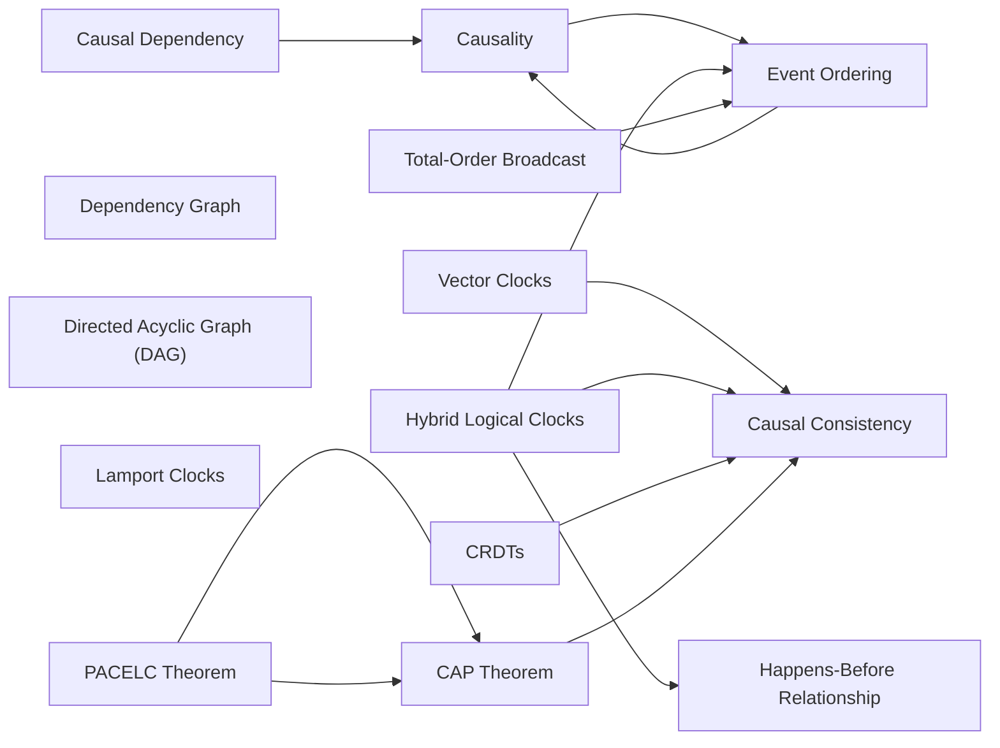
```mermaid
flowchart LR
n_causality["Causality"]
n_causal_consistency["Causal Consistency"]
n_happens_before_relationship["Happens-Before Relationship"]
n_event_ordering["Event Ordering"]
n_causal_dependency["Causal Dependency"]
n_dependency_graph["Dependency Graph"]
n_directed_acyclic_graph["Directed Acyclic Graph (DAG)"]
n_vector_clocks["Vector Clocks"]
n_lamport_clocks["Lamport Clocks"]
n_hybrid_logical_clocks["Hybrid Logical Clocks"]
n_crdts["CRDTs"]
n_total_order_broadcast["Total-Order Broadcast"]
n_cap_theorem["CAP Theorem"]
n_pacelc_theorem["PACELC Theorem"]
n_causality --> n_event_ordering
n_event_ordering --> n_causality
n_causal_dependency --> n_causality
n_vector_clocks --> n_causal_consistency
n_hybrid_logical_clocks --> n_happens_before_relationship
n_hybrid_logical_clocks --> n_causal_consistency
n_hybrid_logical_clocks --> n_event_ordering
n_crdts --> n_causal_consistency
n_total_order_broadcast --> n_event_ordering
n_cap_theorem --> n_causal_consistency
n_pacelc_theorem --> n_cap_theorem
n_pacelc_theorem --> n_cap_theorem
```

### Causality

- Kind: [principle](SCHEMA.md#kind-principle)
- Severity: contextual
- Scope: event, workflow, distributed state
- Layer: [Causality Core](SCHEMA.md#layer-causality-core)

Details

Requires
[Causation Tracking](LEXICON.md#lex-causation-tracking)
Reinforces
[Traceability](PRINCIPLES.md#arch-traceability), [Event Ordering](PRINCIPLES.md#arch-event-ordering)
Enables
[Correct Workflow Reasoning](LEXICON.md#lex-correct-workflow-reasoning)
In tension with
[Parallelism](PRINCIPLES.md#arch-parallelism)
Conflicts with
[Unordered Side Effects](LEXICON.md#lex-unordered-side-effects)
Referenced by
[Event Ordering](PRINCIPLES.md#arch-event-ordering), [Causal Dependency](PRINCIPLES.md#arch-causal-dependency), [Causation ID](PRINCIPLES.md#arch-causation-id), [Distributed Tracing](PRINCIPLES.md#arch-distributed-tracing)
Tensions
[Causality Parallelism](SCHEMA.md#tension-causality-parallelism)

Violated by
processing effects without known cause/order
Detected by
missing causation/correlation metadata
Measured by
causal trace completeness
Refactored by
Add Causation ID, Add Ordering Rules
Enforced by
event schema and workflow tests

```typescript
events.push({ type: "BarCreated", at: Date.now() });
events.push({ type: "FooCreated", at: Date.now() });
```

```typescript
const fooCreated = append({ type: "FooCreated" });
append({ type: "BarCreated", causedBy: fooCreated.id });
```

### Causal Consistency

- Kind: [model](SCHEMA.md#kind-model)
- Severity: contextual
- Scope: distributed data, events
- Layer: [Causality Core](SCHEMA.md#layer-causality-core)

Details

Requires
[Causal Ordering](LEXICON.md#lex-causal-ordering)
Reinforces
[Eventual Consistency Safety](LEXICON.md#lex-eventual-consistency-safety)
Enables
[User-Visible Ordering Guarantees](LEXICON.md#lex-user-visible-ordering-guarantees)
In tension with
[Latency/Availability](LEXICON.md#lex-latency-availability)
Conflicts with
[Arbitrary Reordering](LEXICON.md#lex-arbitrary-reordering), [Read-Your-Writes Violation](PRINCIPLES.md#arch-read-your-writes-violation)
Referenced by
[Vector Clocks](PRINCIPLES.md#arch-vector-clocks), [Hybrid Logical Clocks](PRINCIPLES.md#arch-hybrid-logical-clocks), [CRDTs](PRINCIPLES.md#arch-crdts), [CAP Theorem](PRINCIPLES.md#arch-cap-theorem)
Tensions
[Causal Consistency Latency/Availability](SCHEMA.md#tension-causal-consistency-latency-availability)

Violated by
observing effect before cause
Detected by
order anomaly tests
Measured by
causal anomaly rate
Refactored by
Add Causal Metadata, Enforce Read-Your-Writes
Enforced by
consistency tests

```typescript
replica.apply(barCreated);
replica.apply(fooCreated);
```

```typescript
replica.applyWhenReady(barCreated, {
  requires: [fooCreated.id],
});
replica.apply(fooCreated);
```

### Happens-Before Relationship

- Kind: [model](SCHEMA.md#kind-model)
- Severity: contextual
- Scope: concurrency, distributed events
- Layer: [Causality Core](SCHEMA.md#layer-causality-core)

Details

Requires
[Ordering Semantics](LEXICON.md#lex-ordering-semantics)
Reinforces
[Correctness](PRINCIPLES.md#arch-correctness), [Causal Reasoning](LEXICON.md#lex-causal-reasoning)
Enables
[Race Detection](LEXICON.md#lex-race-detection)
In tension with
[Parallel Execution](LEXICON.md#lex-parallel-execution)
Conflicts with
[Race Conditions](LEXICON.md#lex-race-conditions)
Referenced by
[Hybrid Logical Clocks](PRINCIPLES.md#arch-hybrid-logical-clocks)
Tensions
[Happens-Before Relationship Parallel Execution](SCHEMA.md#tension-happens-before-relationship-parallel-execution)

Violated by
assuming unordered operations are ordered
Detected by
race detectors, missing synchronization
Measured by
ordering violation count
Refactored by
Add Synchronization, Add Ordering Constraint
Enforced by
concurrency tests

```typescript
const a = { id: "a", at: Date.now() };
const b = { id: "b", at: Date.now() };
```

```typescript
const a = { id: "a", ordinal: 1 };
const b = { id: "b", ordinal: 2, after: [a.id] };
assert(happensBefore(a, b));
```

### Event Ordering

- Kind: [constraint](SCHEMA.md#kind-constraint)
- Severity: contextual
- Scope: stream, queue, consumer
- Layer: [Causality Core](SCHEMA.md#layer-causality-core)

Details

Requires
[Ordering Key or Sequence](LEXICON.md#lex-ordering-key-or-sequence)
Reinforces
[Causality](PRINCIPLES.md#arch-causality)
Enables
[Correct Stateful Processing](LEXICON.md#lex-correct-stateful-processing)
In tension with
[Throughput](PRINCIPLES.md#arch-throughput)
Conflicts with
[Unordered Parallel Consumption](LEXICON.md#lex-unordered-parallel-consumption)
Referenced by
[Causality](PRINCIPLES.md#arch-causality), [Hybrid Logical Clocks](PRINCIPLES.md#arch-hybrid-logical-clocks), [Total-Order Broadcast](PRINCIPLES.md#arch-total-order-broadcast)
Tensions
[Event Ordering Throughput](SCHEMA.md#tension-event-ordering-throughput)

Violated by
stateful consumers processing out of order
Detected by
missing ordering key/sequence checks
Measured by
out-of-order rate
Refactored by
Add Partition Key, Sequence Number, Reorder Buffer
Enforced by
stream config, consumer tests

```typescript
events.sort((a, b) => a.timestamp - b.timestamp);
```

```typescript
events.sort((a, b) => a.streamOrdinal - b.streamOrdinal);
```

### Causal Dependency

- Kind: [model](SCHEMA.md#kind-model)
- Severity: recommended
- Scope: event, workflow, module
- Layer: [Causality Core](SCHEMA.md#layer-causality-core)

Details

Requires
[Dependency Declaration](LEXICON.md#lex-dependency-declaration)
Reinforces
[Causality](PRINCIPLES.md#arch-causality), [Traceability](PRINCIPLES.md#arch-traceability)
Enables
[Impact Analysis](PRINCIPLES.md#arch-impact-analysis)
In tension with
[Graph Complexity](LEXICON.md#lex-graph-complexity)
Conflicts with
[Hidden Dependency](LEXICON.md#lex-hidden-dependency)
Tensions
[Causal Dependency Graph Complexity](SCHEMA.md#tension-causal-dependency-graph-complexity)

Violated by
implicit dependency not represented in workflow/event metadata
Detected by
undocumented call/event dependency
Measured by
hidden dependency count
Refactored by
Declare Dependency, Add Causation Link
Enforced by
dependency graph checks

```typescript
processBar(barEvent);
```

```typescript
if (!projection.has(barEvent.fooEventId)) defer(barEvent);
else processBar(barEvent);
```

### Dependency Graph

- Kind: [artifact](SCHEMA.md#kind-artifact)
- Severity: mandatory
- Scope: codebase, runtime, deployment
- Layer: [Causality Core](SCHEMA.md#layer-causality-core)

Details

Requires
[Dependency Extraction](LEXICON.md#lex-dependency-extraction)
Reinforces
[Architecture Compliance](LEXICON.md#lex-architecture-compliance)
Enables
[Cycle Detection](LEXICON.md#lex-cycle-detection), [Impact Analysis](PRINCIPLES.md#arch-impact-analysis)
In tension with
[Dynamic Loading](LEXICON.md#lex-dynamic-loading)
Conflicts with
[Hidden Dependencies](LEXICON.md#lex-hidden-dependencies)
Referenced by
[Impact Analysis](PRINCIPLES.md#arch-impact-analysis)
Tensions
[Dependency Graph Dynamic Loading](SCHEMA.md#tension-dependency-graph-dynamic-loading)

Violated by
undeclared dependencies
Detected by
graph extraction mismatch
Measured by
cycle count, graph density
Refactored by
Break Cycle, Invert Dependency
Enforced by
dependency graph CI checks

```typescript
const tasks = [loadFoo, buildBar, publishBaz];
await Promise.all(tasks.map((task) => task()));
```

```typescript
const graph = new DependencyGraph();
graph.add("buildBar", { dependsOn: ["loadFoo"] });
graph.add("publishBaz", { dependsOn: ["buildBar"] });
await graph.execute();
```

### Directed Acyclic Graph (DAG)

- Kind: [constraint](SCHEMA.md#kind-constraint)
- Severity: mandatory for dependency architecture
- Scope: dependency graph, workflow, build
- Layer: [Causality Core](SCHEMA.md#layer-causality-core)

Details

Requires
[Directed Dependencies](LEXICON.md#lex-directed-dependencies)
Reinforces
[Layering](LEXICON.md#lex-layering), [Build Order](LEXICON.md#lex-build-order)
Enables
[Topological Ordering](LEXICON.md#lex-topological-ordering)
In tension with
[Bidirectional Collaboration](LEXICON.md#lex-bidirectional-collaboration)
Conflicts with
[Cyclic Dependencies](LEXICON.md#lex-cyclic-dependencies), [Circular Dependency](PRINCIPLES.md#arch-circular-dependency)
Tensions
[Directed Acyclic Graph (DAG) Bidirectional Collaboration](SCHEMA.md#tension-bidirectional-collaboration-directed-acyclic-graph-dag)

Violated by
dependency cycle
Detected by
[cycle detection](LEXICON.md#lex-cycle-detection)
Measured by
cycle count
Refactored by
Invert Dependency, Extract Interface, Split Module
Enforced by
graph checks

```typescript
graph.addEdge("foo", "bar");
graph.addEdge("bar", "foo");
```

```typescript
const dag = new Dag();
dag.addEdge("foo", "bar");
if (dag.wouldCreateCycle("bar", "foo")) throw new Error("cycle rejected");
```

### Vector Clocks

- Kind: [mechanism](SCHEMA.md#kind-mechanism)
- Severity: contextual
- Scope: distributed events, replication
- Layer: [Causality Core](SCHEMA.md#layer-causality-core)

Details

Requires
[Node Identity](LEXICON.md#lex-node-identity), [Version Vector](LEXICON.md#lex-version-vector)
Reinforces
[Causal Consistency](PRINCIPLES.md#arch-causal-consistency)
Enables
[Concurrent Update Detection](LEXICON.md#lex-concurrent-update-detection)
In tension with
[Metadata Size](LEXICON.md#lex-metadata-size)
Conflicts with
[Single Global Clock Assumption](LEXICON.md#lex-single-global-clock-assumption)
Tensions
[Vector Clocks Metadata Size](SCHEMA.md#tension-metadata-size-vector-clocks)

Violated by
unresolved concurrent writes
Detected by
lost causality in distributed updates
Measured by
conflict detection accuracy
Refactored by
Add Version Vector
Enforced by
replication protocol tests

```typescript
const winner = a.updatedAt > b.updatedAt ? a : b;
```

```typescript
const relation = compareVectorClocks(a.clock, b.clock);
if (relation === "concurrent") return mergeFoo(a, b);
return relation === "after" ? a : b;
```

### Lamport Clocks

- Kind: [mechanism](SCHEMA.md#kind-mechanism)
- Severity: contextual
- Scope: distributed events
- Layer: [Causality Core](SCHEMA.md#layer-causality-core)

Details

Requires
[Logical Counter](LEXICON.md#lex-logical-counter)
Reinforces
[Happens-Before Reasoning](LEXICON.md#lex-happens-before-reasoning)
Enables
[Partial Ordering](LEXICON.md#lex-partial-ordering)
In tension with
[No Concurrent Causality Distinction](LEXICON.md#lex-no-concurrent-causality-distinction)
Conflicts with
[Wall-Clock Ordering Assumption](LEXICON.md#lex-wall-clock-ordering-assumption)
Tensions
[Lamport Clocks No Concurrent Causality Distinction](SCHEMA.md#tension-lamport-clocks-no-concurrent-causality-distinction)

Violated by
ordering by unsynchronized wall clocks
Detected by
timestamp ordering anomalies
Measured by
ordering anomaly rate
Refactored by
Add Logical Clock
Enforced by
protocol tests

```typescript
const event = { at: Date.now(), value: foo };
```

```typescript
const event = { logicalTime: lamport.tick(), value: foo };
lamport.observe(remoteEvent.logicalTime);
```

### Hybrid Logical Clocks

- Kind: [mechanism](SCHEMA.md#kind-mechanism)
- Severity: mandatory for distributed systems
- Scope: event, distributed state, time
- Layer: [Causality Core](SCHEMA.md#layer-causality-core)

Details

Requires
[Happens-Before Relationship](PRINCIPLES.md#arch-happens-before-relationship)
Reinforces
[Causal Consistency](PRINCIPLES.md#arch-causal-consistency), [Event Ordering](PRINCIPLES.md#arch-event-ordering)
Enables
[Wall-Clock-Correlated Causal Order](LEXICON.md#lex-wall-clock-correlated-causal-order)
In tension with
[Clock Skew](LEXICON.md#lex-clock-skew)
Conflicts with
[Physical-Clock-Only Ordering](LEXICON.md#lex-physical-clock-only-ordering)
Tensions
[Hybrid Logical Clocks Clock Skew](SCHEMA.md#tension-clock-skew-hybrid-logical-clocks)

Violated by
ordering events solely by wall-clock timestamps
Detected by
last-writer-wins on physical time
Measured by
out-of-causal-order event rate
Refactored by
Adopt Hybrid Logical Clocks
Enforced by
distributed-systems review

```typescript
const event = { at: Date.now(), value: foo };
```

```typescript
const event = { hlc: hlc.now(), value: foo };
hlc.update(remoteEvent.hlc);
```

### CRDTs

- Kind: [mechanism](SCHEMA.md#kind-mechanism)
- Severity: contextual
- Scope: distributed state, replication, convergence
- Layer: [Causality Core](SCHEMA.md#layer-causality-core)

Details

Requires
[Commutative Merge](LEXICON.md#lex-commutative-merge)
Reinforces
[Eventual Consistency](PRINCIPLES.md#arch-eventual-consistency), [Causal Consistency](PRINCIPLES.md#arch-causal-consistency)
Enables
[Conflict-Free Replica Convergence](LEXICON.md#lex-conflict-free-replica-convergence)
In tension with
[Metadata Overhead](LEXICON.md#lex-metadata-overhead), [Last-Write-Wins Overwrite](LEXICON.md#lex-last-write-wins-overwrite)
Conflicts with
none
Tensions
[CRDTs Metadata Overhead](SCHEMA.md#tension-crdts-metadata-overhead), [CRDTs Last-Write-Wins Overwrite](SCHEMA.md#tension-crdts-last-write-wins-overwrite)

Violated by
concurrent replica edits silently overwriting each other
Detected by
lost updates under concurrent replication
Measured by
merge-conflict data-loss rate
Refactored by
Model State as a CRDT
Enforced by
replication design review

```typescript
foo.tags = incoming.updatedAt > foo.updatedAt ? incoming.tags : foo.tags;
```

```typescript
foo.tags = orSet.merge(foo.tags, incoming.tags);
```

### Total-Order Broadcast

- Kind: [mechanism](SCHEMA.md#kind-mechanism)
- Severity: mandatory for distributed systems
- Scope: event, distributed state, ordering
- Layer: [Causality Core](SCHEMA.md#layer-causality-core)

Details

Requires
[Consensus](PRINCIPLES.md#arch-consensus)
Reinforces
[Event Ordering](PRINCIPLES.md#arch-event-ordering), [Consistency](PRINCIPLES.md#arch-consistency)
Enables
[Identical Delivery Order Across Nodes](LEXICON.md#lex-identical-delivery-order-across-nodes)
In tension with
[Latency](PRINCIPLES.md#arch-latency)
Conflicts with
[Per-Node Independent Ordering](LEXICON.md#lex-per-node-independent-ordering)
Tensions
[Total-Order Broadcast Latency](SCHEMA.md#tension-latency-total-order-broadcast)

Violated by
replicas applying events in divergent orders
Detected by
state divergence across nodes given same events
Measured by
cross-node order divergence rate
Refactored by
Introduce Total-Order Broadcast
Enforced by
distributed-systems review

```typescript
replica.apply(event);
```

```typescript
const sequenced = await totalOrder.broadcast(event);
replica.applyInOrder(sequenced.sequence, sequenced.event);
```

### CAP Theorem

- Kind: [model](SCHEMA.md#kind-model)
- Severity: mandatory for distributed systems
- Scope: distributed state, consistency, availability
- Layer: [Causality Core](SCHEMA.md#layer-causality-core)

Details

Requires
[Network Partition Possibility](LEXICON.md#lex-network-partition-possibility)
Reinforces
[Causal Consistency](PRINCIPLES.md#arch-causal-consistency), [Eventual Consistency](PRINCIPLES.md#arch-eventual-consistency)
Enables
[Explicit Consistency/Availability Choice Under Partition](LEXICON.md#lex-explicit-consistency-availability-choice-under-partition)
In tension with
[Latency](PRINCIPLES.md#arch-latency)
Conflicts with
[Assumed Total Consistency And Availability](LEXICON.md#lex-assumed-total-consistency-and-availability)
Referenced by
[PACELC Theorem](PRINCIPLES.md#arch-pacelc-theorem)
Tensions
[CAP Theorem Latency](SCHEMA.md#tension-cap-theorem-latency)

Violated by
a distributed store assumed to be both strongly consistent and fully available under partition
Detected by
split-brain writes or stalls during network partitions
Measured by
consistency/availability violations during partition events
Refactored by
Choose CP or AP explicitly per data class under partition
Enforced by
distributed-systems review

```typescript
await Promise.all(replicas.map((r) => r.write(foo)));
return "always consistent and available";
```

```typescript
const policy = partitionPolicyFor(foo.class);
return policy === "CP" ? writeWithQuorum(foo) : writeAvailableAndReconcile(foo);
```

### PACELC Theorem

- Kind: [model](SCHEMA.md#kind-model)
- Severity: contextual
- Scope: distributed state, consistency, latency
- Layer: [Causality Core](SCHEMA.md#layer-causality-core)

Details

Requires
[CAP Theorem](PRINCIPLES.md#arch-cap-theorem)
Reinforces
[CAP Theorem](PRINCIPLES.md#arch-cap-theorem), [Latency](PRINCIPLES.md#arch-latency)
Enables
[Else-Latency-vs-Consistency Tradeoff Even Without Partition](LEXICON.md#lex-else-latency-vs-consistency-tradeoff-even-without-partition)
In tension with
[Throughput](PRINCIPLES.md#arch-throughput)
Conflicts with
[Consistency Assumed Free When Healthy](LEXICON.md#lex-consistency-assumed-free-when-healthy)
Tensions
[PACELC Theorem Throughput](SCHEMA.md#tension-pacelc-theorem-throughput)

Violated by
consistency treated as free when the network is healthy, ignoring the latency it costs
Detected by
tail latency driven by synchronous cross-region consistency during normal operation
Measured by
latency-vs-staleness tradeoff per read class
Refactored by
Decide else-branch latency-vs-consistency per read class (PACELC)
Enforced by
distributed-systems review

```typescript
const foo = await readFromAllRegionsStrongly(id);
```

```typescript
const foo = tolerateStaleness(id.class)
  ? await readLocalReplica(id)
  : await readStronglyAcrossRegions(id);
```

## Codebase / System Architecture Styles

Every principle in this category. Each record carries its kind, its severity, the scopes it applies at and the layer it lives in, then the edge relations that join it to other records, the records that point back at it, the contracts that answer to it and the tensions it takes part in. The descriptors say how it is violated, detected, measured, repaired and enforced. Where the record carries one, an exemplar shows the shape before and after the principle is applied.

Relations diagram

The relations inside this category.

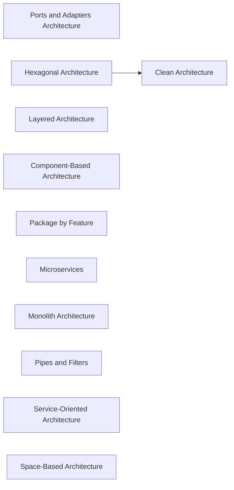
```mermaid
flowchart LR
n_ports_and_adapters_architecture["Ports and Adapters Architecture"]
n_hexagonal_architecture["Hexagonal Architecture"]
n_clean_architecture["Clean Architecture"]
n_layered_architecture["Layered Architecture"]
n_component_based_architecture["Component-Based Architecture"]
n_package_by_feature["Package by Feature"]
n_microservices["Microservices"]
n_monolith_architecture["Monolith Architecture"]
n_pipes_and_filters["Pipes and Filters"]
n_service_oriented_architecture["Service-Oriented Architecture"]
n_space_based_architecture["Space-Based Architecture"]
n_hexagonal_architecture --> n_clean_architecture
```

### Ports and Adapters Architecture

- Kind: [style](SCHEMA.md#kind-style)
- Severity: recommended
- Scope: application, service, component
- Layer: [Structural Core](SCHEMA.md#layer-structural-core)

Details

Requires
[Ports](LEXICON.md#lex-ports), [Adapters](LEXICON.md#lex-adapters), [Dependency Inversion Principle (DIP)](PRINCIPLES.md#arch-dependency-inversion)
Reinforces
[Replaceability](PRINCIPLES.md#arch-replaceability), [Testability](PRINCIPLES.md#arch-testability)
Enables
[Infrastructure Independence](LEXICON.md#lex-infrastructure-independence)
In tension with
[Boilerplate](LEXICON.md#lex-boilerplate)
Conflicts with
[Infrastructure-Centric Design](LEXICON.md#lex-infrastructure-centric-design), [Framework Leakage](PRINCIPLES.md#arch-framework-leakage)
Tensions
[Ports and Adapters Architecture Boilerplate](SCHEMA.md#tension-boilerplate-ports-and-adapters-architecture)

Violated by
domain/application importing infrastructure
Detected by
inward/outward dependency violations
Measured by
adapter coverage, boundary purity
Refactored by
Introduce Port, Extract Adapter
Enforced by
layer dependency rules

```typescript
class FooService {
  save(foo: Foo) {
    return sql.query("insert into foo values (?)", foo);
  }
}
```

```typescript
interface SaveFooPort {
  save(foo: Foo): Promise<void>;
}
class FooService {
  constructor(private readonly port: SaveFooPort) {}
  save(foo: Foo) {
    return this.port.save(foo);
  }
}
class SqlFooAdapter implements SaveFooPort {
  save(foo: Foo) {
    return sqlFooStore.save(foo);
  }
}
```

### Hexagonal Architecture

- Kind: [style](SCHEMA.md#kind-style)
- Severity: recommended
- Scope: application, service
- Layer: [Structural Core](SCHEMA.md#layer-structural-core)

Details

Requires
[Ports and Adapters](LEXICON.md#lex-ports-and-adapters), [Domain Core](LEXICON.md#lex-domain-core)
Reinforces
[Clean Architecture](PRINCIPLES.md#arch-clean-architecture), [Testability](PRINCIPLES.md#arch-testability)
Enables
[External System Isolation](LEXICON.md#lex-external-system-isolation)
In tension with
[Initial Complexity](LEXICON.md#lex-initial-complexity)
Conflicts with
[Framework-Centric Core](LEXICON.md#lex-framework-centric-core)
Tensions
[Hexagonal Architecture Initial Complexity](SCHEMA.md#tension-hexagonal-architecture-initial-complexity)

Violated by
framework/data types in core
Detected by
dependency direction violations
Measured by
core purity score
Refactored by
Move Framework Outward, Add Ports
Enforced by
architecture tests

```typescript
app.post("/foo", async (request) => sqlFooStore.save(await request.json()));
```

```typescript
class CreateFooUseCase {
  constructor(
    private readonly foos: FooRepository,
    private readonly events: EventPublisher,
  ) {}
  execute(input: CreateFoo) {
    return createFooCore(input, this.foos, this.events);
  }
}
httpAdapter.bind("POST", "/foo", (input) => useCase.execute(input));
```

### Clean Architecture

- Kind: [style](SCHEMA.md#kind-style)
- Severity: recommended
- Scope: application, system
- Layer: [Structural Core](SCHEMA.md#layer-structural-core)

Details

Requires
[Dependency Rule](LEXICON.md#lex-dependency-rule), [Use Cases](LEXICON.md#lex-use-cases), [Boundaries](LEXICON.md#lex-boundaries)
Reinforces
[Dependency Inversion Principle (DIP)](PRINCIPLES.md#arch-dependency-inversion), [Testability](PRINCIPLES.md#arch-testability)
Enables
[Framework Independence](LEXICON.md#lex-framework-independence)
In tension with
[Boilerplate](LEXICON.md#lex-boilerplate)
Conflicts with
[Layer Leakage](LEXICON.md#lex-layer-leakage)
Referenced by
[Hexagonal Architecture](PRINCIPLES.md#arch-hexagonal-architecture), [Dependency Inversion Principle (DIP)](PRINCIPLES.md#arch-dependency-inversion)
Tensions
[Clean Architecture Boilerplate](SCHEMA.md#tension-boilerplate-clean-architecture)

Violated by
outer layers imported by inner layers
Detected by
dependency rule violations
Measured by
inward dependency compliance
Refactored by
Move Logic Inward, Extract Interface, Add Adapter
Enforced by
dependency graph rules

```typescript
class FooController {
  async create(request: Request) {
    return orm.foo.create(await request.json());
  }
}
```

```typescript
interface CreateFooGateway {
  save(foo: Foo): Promise<void>;
}
class CreateFooInteractor {
  constructor(private readonly gateway: CreateFooGateway) {}
  execute(input: CreateFooInput) {
    return this.gateway.save(Foo.create(input));
  }
}
class FooController {
  constructor(private readonly useCase: CreateFooInteractor) {}
}
```

### Layered Architecture

- Kind: [style](SCHEMA.md#kind-style)
- Severity: contextual
- Scope: application, system
- Layer: [Structural Core](SCHEMA.md#layer-structural-core)

Details

Requires
[Layer Separation](LEXICON.md#lex-layer-separation)
Reinforces
[Separation of Concerns](PRINCIPLES.md#arch-separation-of-concerns)
Enables
[Structured Code Organization](LEXICON.md#lex-structured-code-organization)
In tension with
[Anemic Layers](LEXICON.md#lex-anemic-layers)
Conflicts with
[Layer Skipping](LEXICON.md#lex-layer-skipping)
Referenced by
[Separation of Concerns](PRINCIPLES.md#arch-separation-of-concerns)
Tensions
[Layered Architecture Anemic Layers](SCHEMA.md#tension-anemic-layers-layered-architecture)

Violated by
presentation accessing persistence directly
Detected by
forbidden layer imports
Measured by
layer violation count
Refactored by
Move Logic, Introduce Service/Repository Boundary
Enforced by
layer rules

```typescript
function createFoo(request: Request) {
  return sql.query("insert into foo values (?)", JSON.parse(request.body));
}
```

```typescript
class FooController {
  constructor(private readonly service: FooService) {}
}
class FooService {
  constructor(private readonly repository: FooRepository) {}
}
class SqlFooRepository implements FooRepository {
  save(foo: Foo) {
    return fooTable.insert(foo);
  }
}
```

### Component-Based Architecture

- Kind: [style](SCHEMA.md#kind-style)
- Severity: recommended
- Scope: component, system
- Layer: [Structural Core](SCHEMA.md#layer-structural-core)

Details

Requires
[Component Boundaries](LEXICON.md#lex-component-boundaries), [Contracts](LEXICON.md#lex-contracts)
Reinforces
[Modularity](PRINCIPLES.md#arch-modularity), [Composability](PRINCIPLES.md#arch-composability)
Enables
[Reuse](LEXICON.md#lex-reuse), [Replaceability](PRINCIPLES.md#arch-replaceability)
In tension with
[Integration Overhead](LEXICON.md#lex-integration-overhead)
Conflicts with
[Big Ball of Mud](PRINCIPLES.md#arch-big-ball-of-mud)
Tensions
[Component-Based Architecture Integration Overhead](SCHEMA.md#tension-component-based-architecture-integration-overhead)

Violated by
component internals accessed externally
Detected by
boundary import violations
Measured by
component cohesion/coupling
Refactored by
Extract Component, Define Contract
Enforced by
component ownership rules

```typescript
const app = {
  createFoo,
  createBar,
  renderFoo,
  saveBar,
  publishBaz,
};
```

```typescript
const fooComponent = defineComponent({
  name: "foo",
  exports: { createFoo, FooView },
  requires: { FooStore, EventBus },
});
```

### Package by Feature

- Kind: [principle](SCHEMA.md#kind-principle)
- Severity: recommended
- Scope: package, module
- Layer: [Structural Core](SCHEMA.md#layer-structural-core)

Details

Requires
[Feature Cohesion](LEXICON.md#lex-feature-cohesion)
Reinforces
[Modularity](PRINCIPLES.md#arch-modularity), [Bounded Context](PRINCIPLES.md#arch-bounded-context)
Enables
[Locality of Change](LEXICON.md#lex-locality-of-change)
In tension with
[Shared Technical Concerns](LEXICON.md#lex-shared-technical-concerns)
Conflicts with
[Package by Technical Layer Only](LEXICON.md#lex-package-by-technical-layer-only)
Tensions
[Package by Feature Shared Technical Concerns](SCHEMA.md#tension-package-by-feature-shared-technical-concerns)

Violated by
feature logic scattered across technical folders
Detected by
change sets spanning many layer packages
Measured by
change locality
Refactored by
Repackage by Feature, Move Classes
Enforced by
package conventions

```typescript
src / controllers / foo.ts;
src / controllers / bar.ts;
src / services / foo.ts;
src / services / bar.ts;
src / repositories / foo.ts;
src / repositories / bar.ts;
```

```typescript
src / foo / controller.ts;
src / foo / service.ts;
src / foo / repository.ts;
src / bar / controller.ts;
src / bar / service.ts;
src / bar / repository.ts;
```

### Microservices

- Kind: [style](SCHEMA.md#kind-style)
- Severity: contextual
- Scope: system, service, deployment
- Layer: [Structural Core](SCHEMA.md#layer-structural-core)

Details

Requires
[Service Autonomy](PRINCIPLES.md#arch-service-autonomy), [Independent Deployment](LEXICON.md#lex-independent-deployment)
Reinforces
[Scalability](PRINCIPLES.md#arch-scalability), [Bounded Context](PRINCIPLES.md#arch-bounded-context)
Enables
[Decentralized Ownership](LEXICON.md#lex-decentralized-ownership)
In tension with
[Operational Complexity](LEXICON.md#lex-operational-complexity), [Consistency](PRINCIPLES.md#arch-consistency)
Conflicts with
[Distributed Monolith](PRINCIPLES.md#arch-distributed-monolith)
Referenced by
[Decentralization](PRINCIPLES.md#arch-decentralization), [Autonomy](PRINCIPLES.md#arch-autonomy), [Bounded Context](PRINCIPLES.md#arch-bounded-context), [Service Autonomy](PRINCIPLES.md#arch-service-autonomy)
Tensions
[Microservices Operational Complexity](SCHEMA.md#tension-microservices-operational-complexity), [Microservices Consistency](SCHEMA.md#tension-consistency-microservices)

Violated by
shared databases, synchronous service chains
Detected by
deployment coupling, cross-service transactions
Measured by
deploy independence, coupling metrics
Refactored by
Split Service, [Own Data](LEXICON.md#lex-own-data), Add Events
Enforced by
service ownership, API contracts

```typescript
class SharedApplication {
  createFoo(foo: Foo) {
    return sharedDb.insert("foo", foo);
  }
  createBar(bar: Bar) {
    return sharedDb.insert("bar", bar);
  }
}
```

```typescript
class FooService {
  constructor(
    private readonly fooStore: FooStore,
    private readonly outbox: Outbox,
  ) {}
  create(foo: Foo) {
    return transact(() => [
      this.fooStore.save(foo),
      this.outbox.append(fooCreated(foo)),
    ]);
  }
}
class BarService {
  constructor(private readonly barStore: BarStore) {}
}
```

### Monolith Architecture

- Kind: [style](SCHEMA.md#kind-style)
- Severity: contextual
- Scope: application, deployment
- Layer: [Structural Core](SCHEMA.md#layer-structural-core)

Details

Requires
[Unified Deployment Boundary](LEXICON.md#lex-unified-deployment-boundary)
Reinforces
[Operational Simplicity](LEXICON.md#lex-operational-simplicity)
Enables
[Transactional Simplicity](LEXICON.md#lex-transactional-simplicity)
In tension with
[Team Autonomy](LEXICON.md#lex-team-autonomy), [Independent Scaling](LEXICON.md#lex-independent-scaling)
Conflicts with
[Unbounded Big Ball of Mud](LEXICON.md#lex-unbounded-big-ball-of-mud)
Tensions
[Monolith Architecture Team Autonomy](SCHEMA.md#tension-monolith-architecture-team-autonomy), [Monolith Architecture Independent Scaling](SCHEMA.md#tension-independent-scaling-monolith-architecture)

Violated by
unclear internal boundaries
Detected by
cyclic packages, high global coupling
Measured by
module boundary health
Refactored by
Modularize Internally, Add Boundaries
Enforced by
modular monolith rules

```typescript
await http.post("foo-service", foo);
await http.post("bar-service", bar);
await http.post("baz-service", baz);
```

```typescript
class ModularMonolith {
  constructor(
    readonly foo: FooModule,
    readonly bar: BarModule,
    readonly baz: BazModule,
  ) {}
}
await app.foo.create(foo);
await app.bar.create(bar);
```

### Pipes and Filters

- Kind: [style](SCHEMA.md#kind-style)
- Severity: recommended
- Scope: application, data processing, composition
- Layer: [Structural Core](SCHEMA.md#layer-structural-core)

Details

Requires
[Uniform Stage Interface](LEXICON.md#lex-uniform-stage-interface)
Reinforces
[Single Responsibility Principle (SRP)](PRINCIPLES.md#arch-single-responsibility), [Composability](PRINCIPLES.md#arch-composability)
Enables
[Reorderable Stages](LEXICON.md#lex-reorderable-stages), [Independent Stage Testing](LEXICON.md#lex-independent-stage-testing)
In tension with
[End-to-End Traceability](LEXICON.md#lex-end-to-end-traceability)
Conflicts with
[Monolithic Transform Function](LEXICON.md#lex-monolithic-transform-function)
Tensions
[Pipes and Filters End-to-End Traceability](SCHEMA.md#tension-end-to-end-traceability-pipes-and-filters)

Violated by
one function performing every transform step inline
Detected by
long sequential transform bodies
Measured by
transform-step count per function
Refactored by
Extract Filters, Connect via Pipeline
Enforced by
[design review](PRINCIPLES.md#arch-design-review)

```typescript
function processFoo(raw: string) {
  const parsed = parseFoo(raw);
  const cleaned = cleanFoo(parsed);
  return enrichFoo(cleaned);
}
```

```typescript
const filters: FooFilter[] = [parseFoo, cleanFoo, enrichFoo];
const fooPipeline = connect(filters);
fooPipeline.run(raw);
```

### Service-Oriented Architecture

- Kind: [style](SCHEMA.md#kind-style)
- Severity: contextual
- Scope: application, service, integration
- Layer: [Structural Core](SCHEMA.md#layer-structural-core)

Details

Requires
[Service Contract](PRINCIPLES.md#arch-service-contract)
Reinforces
[Service Autonomy](PRINCIPLES.md#arch-service-autonomy), [Low Coupling](PRINCIPLES.md#arch-low-coupling)
Enables
[Contract-Governed Service Reuse](LEXICON.md#lex-contract-governed-service-reuse)
In tension with
[Operational Overhead](LEXICON.md#lex-operational-overhead)
Conflicts with
[Shared Monolithic Application](LEXICON.md#lex-shared-monolithic-application)
Tensions
[Service-Oriented Architecture Operational Overhead](SCHEMA.md#tension-operational-overhead-service-oriented-architecture)

Violated by
capabilities bundled in one application object
Detected by
unrelated operations sharing one class/module
Measured by
capability cohesion per module
Refactored by
Expose Capabilities as Contracted Services
Enforced by
[architecture review](PRINCIPLES.md#arch-architecture-review)

```typescript
class Application {
  createFoo() {}
  createBar() {}
  createBaz() {}
}
```

```typescript
const fooService = registerService(
  "FooService",
  { create: createFoo },
  { contract: FooServiceContract },
);
serviceBus.expose(fooService);
```

### Space-Based Architecture

- Kind: [style](SCHEMA.md#kind-style)
- Severity: contextual
- Scope: application, scalability, distributed state
- Layer: [Structural Core](SCHEMA.md#layer-structural-core)

Details

Requires
[Replicated In-Memory State](LEXICON.md#lex-replicated-in-memory-state)
Reinforces
[Horizontal Scaling](PRINCIPLES.md#arch-horizontal-scaling), [Elasticity](PRINCIPLES.md#arch-elasticity)
Enables
[Database-Bottleneck Removal](LEXICON.md#lex-database-bottleneck-removal)
In tension with
[Consistency](PRINCIPLES.md#arch-consistency)
Conflicts with
[Central Database Bottleneck](LEXICON.md#lex-central-database-bottleneck)
Tensions
[Space-Based Architecture Consistency](SCHEMA.md#tension-consistency-space-based-architecture)

Violated by
all reads/writes funneled through one central database
Detected by
single datastore as the scaling limit
Measured by
central-datastore contention rate
Refactored by
Adopt a Replicated Data Space
Enforced by
[architecture review](PRINCIPLES.md#arch-architecture-review)

```typescript
const foo = await centralDatabase.find(id);
```

```typescript
const foo = await fooSpace.read(id);
fooSpace.on("write", replicateToPeers);
```

## Contracts / Interfaces / Compatibility

Every principle in this category. Each record carries its kind, its severity, the scopes it applies at and the layer it lives in, then the edge relations that join it to other records, the records that point back at it, the contracts that answer to it and the tensions it takes part in. The descriptors say how it is violated, detected, measured, repaired and enforced. Where the record carries one, an exemplar shows the shape before and after the principle is applied.

Relations diagram

The relations inside this category.

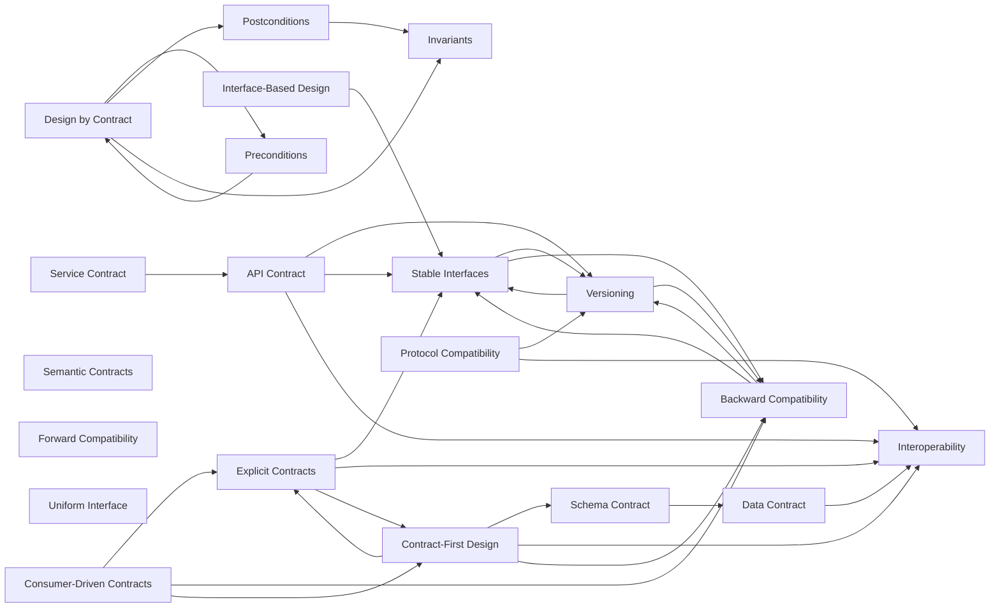
```mermaid
flowchart LR
n_design_by_contract["Design by Contract"]
n_explicit_contracts["Explicit Contracts"]
n_stable_interfaces["Stable Interfaces"]
n_interface_based_design["Interface-Based Design"]
n_contract_first_design["Contract-First Design"]
n_api_contract["API Contract"]
n_service_contract["Service Contract"]
n_data_contract["Data Contract"]
n_schema_contract["Schema Contract"]
n_semantic_contracts["Semantic Contracts"]
n_preconditions["Preconditions"]
n_postconditions["Postconditions"]
n_invariants["Invariants"]
n_backward_compatibility["Backward Compatibility"]
n_forward_compatibility["Forward Compatibility"]
n_versioning["Versioning"]
n_protocol_compatibility["Protocol Compatibility"]
n_interoperability["Interoperability"]
n_uniform_interface["Uniform Interface"]
n_consumer_driven_contracts["Consumer-Driven Contracts"]
n_design_by_contract --> n_preconditions
n_design_by_contract --> n_postconditions
n_design_by_contract --> n_invariants
n_explicit_contracts --> n_stable_interfaces
n_explicit_contracts --> n_interoperability
n_explicit_contracts --> n_contract_first_design
n_stable_interfaces --> n_versioning
n_stable_interfaces --> n_backward_compatibility
n_interface_based_design --> n_stable_interfaces
n_contract_first_design --> n_explicit_contracts
n_contract_first_design --> n_schema_contract
n_contract_first_design --> n_interoperability
n_contract_first_design --> n_backward_compatibility
n_api_contract --> n_versioning
n_api_contract --> n_stable_interfaces
n_api_contract --> n_interoperability
n_service_contract --> n_api_contract
n_data_contract --> n_interoperability
n_schema_contract --> n_data_contract
n_preconditions --> n_design_by_contract
n_postconditions --> n_invariants
n_backward_compatibility --> n_versioning
n_backward_compatibility --> n_stable_interfaces
n_versioning --> n_stable_interfaces
n_versioning --> n_backward_compatibility
n_protocol_compatibility --> n_versioning
n_protocol_compatibility --> n_interoperability
n_consumer_driven_contracts --> n_explicit_contracts
n_consumer_driven_contracts --> n_backward_compatibility
n_consumer_driven_contracts --> n_contract_first_design
```

### Design by Contract

- Kind: [principle](SCHEMA.md#kind-principle)
- Severity: recommended
- Scope: API, function, class, service
- Layer: [Contracts Core](SCHEMA.md#layer-contracts-core)

Details

Requires
[Preconditions](PRINCIPLES.md#arch-preconditions), [Postconditions](PRINCIPLES.md#arch-postconditions), [Invariants](PRINCIPLES.md#arch-invariants)
Reinforces
[Correctness](PRINCIPLES.md#arch-correctness), [Predictability](PRINCIPLES.md#arch-predictability)
Enables
[Contract Testing](LEXICON.md#lex-contract-testing), [Liskov Substitution Principle (LSP)](PRINCIPLES.md#arch-liskov-substitution)
In tension with
[Development Speed](LEXICON.md#lex-development-speed)
Conflicts with
[Implicit Behavior](LEXICON.md#lex-implicit-behavior)
Referenced by
[Preconditions](PRINCIPLES.md#arch-preconditions), [Correctness](PRINCIPLES.md#arch-correctness)
Tensions
[Design by Contract Development Speed](SCHEMA.md#tension-design-by-contract-development-speed)

Violated by
undocumented assumptions, unchecked inputs
Detected by
missing assertions, missing validation, vague public APIs
Measured by
contract coverage
Refactored by
Add Preconditions, Add Postconditions, Add Invariants
Enforced by
assertions, contract tests, [static analysis](REASONING.md#reason-technique-static-analysis)

```typescript
function divideFoo(total: number, count: number) {
  return total / count;
}
```

```typescript
function divideFoo(total: number, count: number): number {
  if (!Number.isFinite(total)) throw new Error("pre: total must be finite");
  if (!Number.isInteger(count) || count <= 0)
    throw new Error("pre: count must be positive");
  const result = total / count;
  if (!Number.isFinite(result)) throw new Error("post: result must be finite");
  return result;
}
```

### Explicit Contracts

- Kind: [principle](SCHEMA.md#kind-principle)
- Severity: mandatory
- Scope: API, service, data, protocol
- Layer: [Contracts Core](SCHEMA.md#layer-contracts-core)

Details

Requires
[Stable Interfaces](PRINCIPLES.md#arch-stable-interfaces), [Type Safety](PRINCIPLES.md#arch-type-safety)
Reinforces
[Predictability](PRINCIPLES.md#arch-predictability), [Interoperability](PRINCIPLES.md#arch-interoperability)
Enables
[Contract-First Design](PRINCIPLES.md#arch-contract-first-design)
In tension with
[Rapid Prototyping](LEXICON.md#lex-rapid-prototyping)
Conflicts with
[Implicit Payloads](LEXICON.md#lex-implicit-payloads), [Implicit Contract](PRINCIPLES.md#arch-implicit-contract)
Referenced by
[Contract-First Design](PRINCIPLES.md#arch-contract-first-design), [Consumer-Driven Contracts](PRINCIPLES.md#arch-consumer-driven-contracts), [Predictability](PRINCIPLES.md#arch-predictability), [Service Autonomy](PRINCIPLES.md#arch-service-autonomy)
Tensions
[Explicit Contracts Rapid Prototyping](SCHEMA.md#tension-explicit-contracts-rapid-prototyping)

Violated by
untyped boundaries, undocumented payloads
Detected by
public methods without DTO/schema, dynamic maps at boundaries
Measured by
boundary contract coverage
Refactored by
Add DTO, Add Schema, Add Interface
Enforced by
[schema validation](PRINCIPLES.md#arch-schema-validation), API linting

```typescript
function saveFoo(foo: any): any {
  return fooStore.save(foo);
}
```

```typescript
interface SaveFoo {
  execute(
    input: Readonly<{ id: FooId; name: string }>,
  ): Promise<{ saved: true; version: number }>;
}
const saveFoo: SaveFoo = { execute: (input) => fooStore.save(input) };
```

### Stable Interfaces

- Kind: [quality-attribute](SCHEMA.md#kind-quality-attribute)
- Severity: mandatory
- Scope: API, module, service
- Aliases: Stable Interface
- Layer: [Contracts Core](SCHEMA.md#layer-contracts-core)

Details

Requires
[Versioning](PRINCIPLES.md#arch-versioning), [Backward Compatibility](PRINCIPLES.md#arch-backward-compatibility)
Reinforces
[Low Coupling](PRINCIPLES.md#arch-low-coupling), [Replaceability](PRINCIPLES.md#arch-replaceability)
Enables
[Independent Consumers](LEXICON.md#lex-independent-consumers)
In tension with
[Evolution Speed](LEXICON.md#lex-evolution-speed)
Conflicts with
[Breaking Changes](LEXICON.md#lex-breaking-changes)
Referenced by
[Explicit Contracts](PRINCIPLES.md#arch-explicit-contracts), [Interface-Based Design](PRINCIPLES.md#arch-interface-based-design), [API Contract](PRINCIPLES.md#arch-api-contract), [Backward Compatibility](PRINCIPLES.md#arch-backward-compatibility), [Versioning](PRINCIPLES.md#arch-versioning), [Low Coupling](PRINCIPLES.md#arch-low-coupling), [Encapsulation](PRINCIPLES.md#arch-encapsulation), [Composability](PRINCIPLES.md#arch-composability), [Replaceability](PRINCIPLES.md#arch-replaceability), [Explicit Boundaries](PRINCIPLES.md#arch-explicit-boundaries), [Plugin Architecture](PRINCIPLES.md#arch-plugin-architecture), [Extension Points](PRINCIPLES.md#arch-extension-points), [Runtime Extensibility](PRINCIPLES.md#arch-runtime-extensibility), [Principle of Least Surprise](PRINCIPLES.md#arch-principle-of-least-surprise), [Dependency Inversion Principle (DIP)](PRINCIPLES.md#arch-dependency-inversion)
Tensions
[Stable Interfaces Evolution Speed](SCHEMA.md#tension-evolution-speed-stable-interfaces)

Violated by
signature churn, [schema drift](PRINCIPLES.md#arch-schema-drift)
Detected by
incompatible API diffs
Measured by
breaking-change frequency
Refactored by
Add Version, Add Adapter, Deprecate Gradually
Enforced by
API diff checks, contract tests

```typescript
class FooService {
  createFoo(name: string, tags: string[], notify: boolean, source: string) {}
}
```

```typescript
type CreateFooRequest = Readonly<{
  name: string;
  tags: readonly string[];
  extensions: Readonly<Record<string, unknown>>;
}>;
interface FooService {
  create(request: CreateFooRequest): Promise<FooId>;
}
```

### Interface-Based Design

- Kind: [principle](SCHEMA.md#kind-principle)
- Severity: recommended
- Scope: class, module, service
- Layer: [Contracts Core](SCHEMA.md#layer-contracts-core)

Details

Requires
[Abstraction](PRINCIPLES.md#arch-abstraction), [Stable Interfaces](PRINCIPLES.md#arch-stable-interfaces)
Reinforces
[Dependency Inversion Principle (DIP)](PRINCIPLES.md#arch-dependency-inversion), [Testability](PRINCIPLES.md#arch-testability)
Enables
[Dependency Injection](PRINCIPLES.md#arch-dependency-injection), [Adapter Pattern](PRINCIPLES.md#arch-adapter-pattern)
In tension with
[Interface Overuse](LEXICON.md#lex-interface-overuse)
Conflicts with
[Concrete Coupling](PRINCIPLES.md#arch-concrete-coupling)
Referenced by
[Composition Over Inheritance](PRINCIPLES.md#arch-composition-over-inheritance)
Tensions
[Interface-Based Design Interface Overuse](SCHEMA.md#tension-interface-based-design-interface-overuse)

Violated by
direct dependency on implementations
Detected by
concrete constructor dependencies
Measured by
interface-to-implementation boundary ratio
Refactored by
Extract Interface, Inject Dependency
Enforced by
dependency rules

```typescript
function processFoo(store: SqlFooStore, foo: Foo) {
  return store.insert(foo);
}
```

```typescript
interface FooWriter {
  save(foo: Foo): Promise<void>;
}
function processFoo(store: FooWriter, foo: Foo) {
  return store.save(foo);
}
```

### Contract-First Design

- Kind: [principle](SCHEMA.md#kind-principle)
- Severity: recommended
- Scope: API, service, integration
- Layer: [Contracts Core](SCHEMA.md#layer-contracts-core)

Details

Requires
[Explicit Contracts](PRINCIPLES.md#arch-explicit-contracts), [Schema Contract](PRINCIPLES.md#arch-schema-contract)
Reinforces
[Interoperability](PRINCIPLES.md#arch-interoperability), [Backward Compatibility](PRINCIPLES.md#arch-backward-compatibility)
Enables
[Consumer-Driven Development](LEXICON.md#lex-consumer-driven-development)
In tension with
[Iteration Speed](LEXICON.md#lex-iteration-speed)
Conflicts with
[Implementation-First Integration](LEXICON.md#lex-implementation-first-integration)
Referenced by
[Explicit Contracts](PRINCIPLES.md#arch-explicit-contracts), [Consumer-Driven Contracts](PRINCIPLES.md#arch-consumer-driven-contracts)
Tensions
[Contract-First Design Iteration Speed](SCHEMA.md#tension-contract-first-design-iteration-speed)

Violated by
generated contracts from unstable implementation
Detected by
absent contract before implementation
Measured by
contract-first coverage
Refactored by
Define Contract, Generate Stubs, Add Contract Tests
Enforced by
CI contract gates

```typescript
app.post("/foo", async (request) => fooStore.save(await request.json()));
```

```typescript
type CreateFooRequest = { name: string };
type CreateFooResponse = { id: FooId; version: 1 };
interface CreateFooContract {
  request: CreateFooRequest;
  response: CreateFooResponse;
}
app.post("/foo", implement<CreateFooContract>(createFoo));
```

### API Contract

- Kind: [constraint](SCHEMA.md#kind-constraint)
- Severity: mandatory
- Scope: API, service boundary
- Layer: [Contracts Core](SCHEMA.md#layer-contracts-core)

Details

Requires
[Schema](LEXICON.md#lex-schema), [Versioning](PRINCIPLES.md#arch-versioning), [Stable Interfaces](PRINCIPLES.md#arch-stable-interfaces)
Reinforces
[Interoperability](PRINCIPLES.md#arch-interoperability), [Predictability](PRINCIPLES.md#arch-predictability)
Enables
[Client Compatibility](LEXICON.md#lex-client-compatibility)
In tension with
[Evolution](LEXICON.md#lex-evolution)
Conflicts with
[Breaking API Change](LEXICON.md#lex-breaking-api-change)
Referenced by
[Service Contract](PRINCIPLES.md#arch-service-contract), [Self-Describing API](PRINCIPLES.md#arch-self-describing-api)
Tensions
[API Contract Evolution](SCHEMA.md#tension-api-contract-evolution)

Violated by
undocumented endpoints, inconsistent status/error formats
Detected by
OpenAPI drift, missing endpoint schemas
Measured by
contract coverage, breaking diff count
Refactored by
Add OpenAPI, Normalize Responses, Version API
Enforced by
OpenAPI linting, contract tests

```typescript
app.get("/foo/:id", async (request) => fooStore.find(request.params.id));
```

```typescript
const getFooApi = endpoint({
  method: "GET",
  path: "/v1/foo/{id}",
  request: FooIdSchema,
  response: FooResponseSchema,
  errors: ["FOO_NOT_FOUND"] as const,
});
```

### Service Contract

- Kind: [constraint](SCHEMA.md#kind-constraint)
- Severity: mandatory
- Scope: service, integration
- Layer: [Contracts Core](SCHEMA.md#layer-contracts-core)

Details

Requires
[API Contract](PRINCIPLES.md#arch-api-contract), [Semantic Contract](LEXICON.md#lex-semantic-contract)
Reinforces
[Service Autonomy](PRINCIPLES.md#arch-service-autonomy), [Compatibility](LEXICON.md#lex-compatibility)
Enables
[Independent Deployment](LEXICON.md#lex-independent-deployment)
In tension with
[Distributed Evolution](LEXICON.md#lex-distributed-evolution)
Conflicts with
[Hidden Service Coupling](LEXICON.md#lex-hidden-service-coupling)
Referenced by
[Service-Oriented Architecture](PRINCIPLES.md#arch-service-oriented-architecture)
Tensions
[Service Contract Distributed Evolution](SCHEMA.md#tension-distributed-evolution-service-contract)

Violated by
undocumented side effects, unstable service behavior
Detected by
consumer failures after service changes
Measured by
consumer contract pass rate
Refactored by
Add Consumer Contract, Define SLA, Version Service
Enforced by
contract tests, deployment gates

```typescript
class FooClient {
  create(body: any) {
    return http.post("/foo", body);
  }
}
```

```typescript
interface FooServiceContract {
  create(input: CreateFoo): Promise<Result<FooCreated, FooError>>;
}
class FooClient implements FooServiceContract {
  create(input: CreateFoo) {
    return transport.call("Foo.Create", input);
  }
}
```

### Data Contract

- Kind: [constraint](SCHEMA.md#kind-constraint)
- Severity: mandatory
- Scope: data, message, persistence, integration
- Layer: [Contracts Core](SCHEMA.md#layer-contracts-core)

Details

Requires
[Schema](LEXICON.md#lex-schema), [Type Safety](PRINCIPLES.md#arch-type-safety), [Semantic Consistency](PRINCIPLES.md#arch-semantic-consistency)
Reinforces
[Interoperability](PRINCIPLES.md#arch-interoperability), [Data Quality](LEXICON.md#lex-data-quality)
Enables
[Schema Evolution](LEXICON.md#lex-schema-evolution)
In tension with
[Flexible Ingestion](LEXICON.md#lex-flexible-ingestion)
Conflicts with
[Schema Drift](PRINCIPLES.md#arch-schema-drift)
Referenced by
[Schema Contract](PRINCIPLES.md#arch-schema-contract), [Schema Validation](PRINCIPLES.md#arch-schema-validation), [Canonical Data Model](PRINCIPLES.md#arch-canonical-data-model)
Tensions
[Data Contract Flexible Ingestion](SCHEMA.md#tension-data-contract-flexible-ingestion)

Violated by
untyped maps, implicit fields, undocumented nullability
Detected by
data validation failures, schema mismatch
Measured by
schema conformance rate
Refactored by
Add DTO, Add Schema, Normalize Field Semantics
Enforced by
schema registry, validation gates

```typescript
type FooMessage = Record<string, unknown>;
queue.publish("foo", payload);
```

```typescript
type FooMessageV1 = Readonly<{
  type: "FooCreated";
  version: 1;
  fooId: FooId;
  name: string;
}>;
queue.publish<FooMessageV1>("foo.created.v1", message);
```

### Schema Contract

- Kind: [constraint](SCHEMA.md#kind-constraint)
- Severity: mandatory
- Scope: data, API, message
- Layer: [Contracts Core](SCHEMA.md#layer-contracts-core)

Details

Requires
[Canonical Schema](PRINCIPLES.md#arch-canonical-schema), [Schema Validation](PRINCIPLES.md#arch-schema-validation)
Reinforces
[Data Contract](PRINCIPLES.md#arch-data-contract), [Compatibility](LEXICON.md#lex-compatibility)
Enables
[Automated Validation](LEXICON.md#lex-automated-validation)
In tension with
[Schema Flexibility](LEXICON.md#lex-schema-flexibility)
Conflicts with
[Ad-Hoc Payloads](LEXICON.md#lex-ad-hoc-payloads)
Referenced by
[Contract-First Design](PRINCIPLES.md#arch-contract-first-design), [Schema Validation](PRINCIPLES.md#arch-schema-validation), [Canonical Schema](PRINCIPLES.md#arch-canonical-schema)
Tensions
[Schema Contract Schema Flexibility](SCHEMA.md#tension-schema-contract-schema-flexibility)

Violated by
unvalidated payloads, undocumented field changes
Detected by
schema diff failures
Measured by
schema validation coverage
Refactored by
Add JSON Schema, Protobuf, Avro, OpenAPI
Enforced by
schema registry, CI schema checks

```typescript
const foo = JSON.parse(raw) as Foo;
```

```typescript
const FooSchema = object({ id: string(), count: integer() });
const foo: Foo = FooSchema.parse(JSON.parse(raw));
```

### Semantic Contracts

- Kind: [constraint](SCHEMA.md#kind-constraint)
- Severity: mandatory
- Scope: domain, API, data
- Layer: [Contracts Core](SCHEMA.md#layer-contracts-core)

Details

Requires
[Ubiquitous Language](PRINCIPLES.md#arch-ubiquitous-language), [Domain Model](PRINCIPLES.md#arch-domain-model)
Reinforces
[Semantic Consistency](PRINCIPLES.md#arch-semantic-consistency), [Correctness](PRINCIPLES.md#arch-correctness)
Enables
[Reliable Integration](LEXICON.md#lex-reliable-integration)
In tension with
[Cross-Domain Translation](LEXICON.md#lex-cross-domain-translation)
Conflicts with
[Ambiguous Naming](LEXICON.md#lex-ambiguous-naming)
Referenced by
[Domain Model](PRINCIPLES.md#arch-domain-model), [Semantic Consistency](PRINCIPLES.md#arch-semantic-consistency), [Ubiquitous Language](PRINCIPLES.md#arch-ubiquitous-language)
Tensions
[Semantic Contracts Cross-Domain Translation](SCHEMA.md#tension-cross-domain-translation-semantic-contracts)

Violated by
same term with different meanings
Detected by
conflicting field meanings, overloaded names
Measured by
semantic conflict count
Refactored by
Rename, Introduce Bounded Context, Add Anti-Corruption Layer
Enforced by
domain glossary, contract review

```typescript
function reserveFoo(count: number) {
  return fooStore.decrement(count);
}
```

```typescript
type PositiveCount = number & { readonly __brand: "PositiveCount" };
function reserveFoo(count: PositiveCount): Promise<{ reserved: true }> {
  return fooInventory.reserveExactly(count);
}
```

### Preconditions

- Kind: [constraint](SCHEMA.md#kind-constraint)
- Severity: mandatory
- Scope: function, method, API
- Layer: [Contracts Core](SCHEMA.md#layer-contracts-core)

Details

Requires
[Input Validation](PRINCIPLES.md#arch-input-validation)
Reinforces
[Design by Contract](PRINCIPLES.md#arch-design-by-contract), [Fail Fast](PRINCIPLES.md#arch-fail-fast)
Enables
[Correctness](PRINCIPLES.md#arch-correctness)
In tension with
[Permissive APIs](LEXICON.md#lex-permissive-apis)
Conflicts with
[Implicit Assumptions](LEXICON.md#lex-implicit-assumptions)
Referenced by
[Design by Contract](PRINCIPLES.md#arch-design-by-contract), [Fail Fast](PRINCIPLES.md#arch-fail-fast), [Liskov Substitution Principle (LSP)](PRINCIPLES.md#arch-liskov-substitution)
Tensions
[Preconditions Permissive APIs](SCHEMA.md#tension-permissive-apis-preconditions)

Violated by
accepting invalid state/input
Detected by
missing validation before state transition
Measured by
invalid-input handling coverage
Refactored by
Add Guard Clause, Add Validator
Enforced by
[validation rules](LEXICON.md#lex-validation-rules), [static analysis](REASONING.md#reason-technique-static-analysis)

```typescript
function renameFoo(foo: Foo, name: string) {
  foo.name = name;
}
```

```typescript
function renameFoo(foo: Foo, name: string) {
  if (foo.status !== "active") throw new Error("pre: Foo must be active");
  if (name.trim().length === 0) throw new Error("pre: name required");
  foo.rename(name.trim());
}
```

### Postconditions

- Kind: [constraint](SCHEMA.md#kind-constraint)
- Severity: recommended
- Scope: function, method, transaction
- Layer: [Contracts Core](SCHEMA.md#layer-contracts-core)

Details

Requires
[Result Validation](LEXICON.md#lex-result-validation), [Invariants](PRINCIPLES.md#arch-invariants)
Reinforces
[Correctness](PRINCIPLES.md#arch-correctness), [Predictability](PRINCIPLES.md#arch-predictability)
Enables
[Testability](PRINCIPLES.md#arch-testability)
In tension with
[Runtime Cost](LEXICON.md#lex-runtime-cost)
Conflicts with
[Undefined Results](LEXICON.md#lex-undefined-results)
Referenced by
[Design by Contract](PRINCIPLES.md#arch-design-by-contract), [Liskov Substitution Principle (LSP)](PRINCIPLES.md#arch-liskov-substitution)
Tensions
[Postconditions Runtime Cost](SCHEMA.md#tension-postconditions-runtime-cost)

Violated by
returning invalid output state
Detected by
missing assertions on results
Measured by
property test coverage
Refactored by
Add Assertions, Add Result Type, Add Contract Tests
Enforced by
property tests, invariant checks

```typescript
async function createFoo(foo: Foo) {
  return fooStore.save(foo);
}
```

```typescript
async function createFoo(foo: Foo): Promise<FooId> {
  await fooStore.save(foo);
  const saved = await fooStore.find(foo.id);
  if (!saved) throw new Error("post: Foo must be persisted");
  return saved.id;
}
```

### Invariants

- Kind: [constraint](SCHEMA.md#kind-constraint)
- Severity: mandatory
- Scope: entity, aggregate, module, system
- Layer: [Contracts Core](SCHEMA.md#layer-contracts-core)

Details

Requires
[Encapsulation](PRINCIPLES.md#arch-encapsulation), [Validation](PRINCIPLES.md#arch-validation)
Reinforces
[Correctness](PRINCIPLES.md#arch-correctness), [Consistency](PRINCIPLES.md#arch-consistency)
Enables
[Safe Refactoring](LEXICON.md#lex-safe-refactoring)
In tension with
[Flexibility](LEXICON.md#lex-flexibility)
Conflicts with
[External State Mutation](LEXICON.md#lex-external-state-mutation)
Referenced by
[Design by Contract](PRINCIPLES.md#arch-design-by-contract), [Postconditions](PRINCIPLES.md#arch-postconditions), [Domain Model](PRINCIPLES.md#arch-domain-model), [Aggregate](PRINCIPLES.md#arch-aggregate), [Liskov Substitution Principle (LSP)](PRINCIPLES.md#arch-liskov-substitution), [Consistency](PRINCIPLES.md#arch-consistency)
Tensions
[Invariants Flexibility](SCHEMA.md#tension-flexibility-invariants)

Violated by
invalid domain states, broken aggregate rules
Detected by
mutable public state, missing invariant checks
Measured by
invariant test coverage
Refactored by
Encapsulate State, Add Factory, Add Validation
Enforced by
domain tests, constructors, type system

```typescript
class FooAccount {
  balance = 0;
  withdraw(amount: number) {
    this.balance -= amount;
  }
}
```

```typescript
class FooAccount {
  #balance = 0;
  withdraw(amount: number) {
    if (amount <= 0 || amount > this.#balance)
      throw new Error("invariant: balance >= 0");
    this.#balance -= amount;
  }
}
```

### Backward Compatibility

- Kind: [constraint](SCHEMA.md#kind-constraint)
- Severity: mandatory
- Scope: API, schema, protocol
- Layer: [Contracts Core](SCHEMA.md#layer-contracts-core)

Details

Requires
[Versioning](PRINCIPLES.md#arch-versioning), [Stable Interfaces](PRINCIPLES.md#arch-stable-interfaces)
Reinforces
[Consumer Safety](LEXICON.md#lex-consumer-safety)
Enables
[Incremental Deployment](LEXICON.md#lex-incremental-deployment)
In tension with
[Cleanup / Simplification](LEXICON.md#lex-cleanup-simplification)
Conflicts with
[Breaking Change](LEXICON.md#lex-breaking-change)
Referenced by
[Stable Interfaces](PRINCIPLES.md#arch-stable-interfaces), [Contract-First Design](PRINCIPLES.md#arch-contract-first-design), [Versioning](PRINCIPLES.md#arch-versioning), [Consumer-Driven Contracts](PRINCIPLES.md#arch-consumer-driven-contracts)
Tensions
[Backward Compatibility Cleanup / Simplification](SCHEMA.md#tension-backward-compatibility-cleanup-simplification)

Violated by
removing fields, changing semantics, narrowing types
Detected by
API/schema diff
Measured by
breaking-change count
Refactored by
Add Version, Deprecate, Add Adapter
Enforced by
compatibility tests, API diff gates

```typescript
app.get("/foo", () => ({ label: "Foo", tags: [] }));
```

```typescript
app.get("/v1/foo", () => ({ name: "Foo" }));
app.get("/v2/foo", () => ({ label: "Foo", tags: [] }));
```

### Forward Compatibility

- Kind: [constraint](SCHEMA.md#kind-constraint)
- Severity: recommended
- Scope: API, schema, protocol
- Layer: [Contracts Core](SCHEMA.md#layer-contracts-core)

Details

Requires
[Extensible Schema](LEXICON.md#lex-extensible-schema), [Unknown Field Handling](LEXICON.md#lex-unknown-field-handling)
Reinforces
[Evolutionary Architecture](PRINCIPLES.md#arch-evolutionary-architecture)
Enables
[Rolling Upgrades](LEXICON.md#lex-rolling-upgrades)
In tension with
[Strong Validation](LEXICON.md#lex-strong-validation)
Conflicts with
[Strict Fragile Parsers](LEXICON.md#lex-strict-fragile-parsers)
Tensions
[Forward Compatibility Strong Validation](SCHEMA.md#tension-forward-compatibility-strong-validation)

Violated by
rejecting unknown safe fields
Detected by
parser failures on additive changes
Measured by
forward-compatibility test pass rate
Refactored by
Add Extension Points, Ignore Unknown Fields Safely
Enforced by
compatibility test matrix

```typescript
function readFoo(input: { name: string }) {
  if (Object.keys(input).length !== 1) throw new Error("unknown field");
  return input.name;
}
```

```typescript
type FooEnvelope = { name: string; extensions?: Record<string, unknown> };
function readFoo(input: FooEnvelope) {
  return { name: input.name, extensions: input.extensions ?? {} };
}
```

### Versioning

- Kind: [mechanism](SCHEMA.md#kind-mechanism)
- Severity: mandatory
- Scope: API, schema, package, service
- Layer: [Contracts Core](SCHEMA.md#layer-contracts-core)

Details

Requires
[Stable Interfaces](PRINCIPLES.md#arch-stable-interfaces), [Compatibility Policy](LEXICON.md#lex-compatibility-policy)
Reinforces
[Backward Compatibility](PRINCIPLES.md#arch-backward-compatibility), [Governance](PRINCIPLES.md#arch-governance)
Enables
[Controlled Evolution](LEXICON.md#lex-controlled-evolution)
In tension with
[Version Sprawl](LEXICON.md#lex-version-sprawl)
Conflicts with
[Silent Breaking Changes](LEXICON.md#lex-silent-breaking-changes)
Referenced by
[Stable Interfaces](PRINCIPLES.md#arch-stable-interfaces), [API Contract](PRINCIPLES.md#arch-api-contract), [Backward Compatibility](PRINCIPLES.md#arch-backward-compatibility), [Protocol Compatibility](PRINCIPLES.md#arch-protocol-compatibility), [Integration Events](PRINCIPLES.md#arch-integration-events)
Contracts
[Versioned Evolution Over Breaking Change](ALGORITHMS.md#algo-no-breaking-change)
Tensions
[Versioning Version Sprawl](SCHEMA.md#tension-version-sprawl-versioning)

Violated by
unversioned breaking changes
Detected by
incompatible diff without version bump
Measured by
version compliance, deprecation window
Refactored by
Add Semantic Versioning, Add API Version
Enforced by
release gates, API checks

```typescript
queue.publish("foo.created", { id: foo.id, name: foo.name });
```

```typescript
queue.publish("foo.created.v2", {
  schemaVersion: 2,
  id: foo.id,
  label: foo.name,
});
```

### Protocol Compatibility

- Kind: [constraint](SCHEMA.md#kind-constraint)
- Severity: mandatory
- Scope: integration, network, message
- Layer: [Contracts Core](SCHEMA.md#layer-contracts-core)

Details

Requires
[Protocol Contract](LEXICON.md#lex-protocol-contract), [Versioning](PRINCIPLES.md#arch-versioning)
Reinforces
[Interoperability](PRINCIPLES.md#arch-interoperability)
Enables
[Multi-Client Integration](LEXICON.md#lex-multi-client-integration)
In tension with
[Protocol Optimization](LEXICON.md#lex-protocol-optimization)
Conflicts with
[Proprietary Drift](LEXICON.md#lex-proprietary-drift)
Tensions
[Protocol Compatibility Protocol Optimization](SCHEMA.md#tension-protocol-compatibility-protocol-optimization)

Violated by
unsupported protocol changes
Detected by
protocol conformance failure
Measured by
conformance test pass rate
Refactored by
Add Adapter, Normalize Protocol
Enforced by
conformance tests

```typescript
socket.send(JSON.stringify({ action: "save", foo }));
```

```typescript
type FooFrameV1 = { protocol: "foo/1"; type: "save"; payload: Foo };
socket.send(
  encodeFrame<FooFrameV1>({ protocol: "foo/1", type: "save", payload: foo }),
);
```

### Interoperability

- Kind: [quality-attribute](SCHEMA.md#kind-quality-attribute)
- Severity: mandatory
- Scope: API, data, protocol, system
- Layer: [Contracts Core](SCHEMA.md#layer-contracts-core)

Details

Requires
[Contracts](LEXICON.md#lex-contracts), [Standards](LEXICON.md#lex-standards), [Compatibility](LEXICON.md#lex-compatibility)
Reinforces
[Portability](PRINCIPLES.md#arch-portability), [Integration](LEXICON.md#lex-integration)
Enables
[Cross-System Communication](LEXICON.md#lex-cross-system-communication)
In tension with
[Domain-Specific Optimization](LEXICON.md#lex-domain-specific-optimization)
Conflicts with
[Proprietary Coupling](LEXICON.md#lex-proprietary-coupling)
Referenced by
[Standardization](PRINCIPLES.md#arch-standardization), [Explicit Contracts](PRINCIPLES.md#arch-explicit-contracts), [Contract-First Design](PRINCIPLES.md#arch-contract-first-design), [API Contract](PRINCIPLES.md#arch-api-contract), [Data Contract](PRINCIPLES.md#arch-data-contract), [Protocol Compatibility](PRINCIPLES.md#arch-protocol-compatibility), [Robustness Principle](PRINCIPLES.md#arch-robustness-principle), [Integration Events](PRINCIPLES.md#arch-integration-events), [Self-Describing API](PRINCIPLES.md#arch-self-describing-api), [Standards Compliance](PRINCIPLES.md#arch-standards-compliance), [Schema Validation](PRINCIPLES.md#arch-schema-validation), [Canonical Data Model](PRINCIPLES.md#arch-canonical-data-model), [Semantic Consistency](PRINCIPLES.md#arch-semantic-consistency), [Adapter Pattern](PRINCIPLES.md#arch-adapter-pattern)
Tensions
[Interoperability Domain-Specific Optimization](SCHEMA.md#tension-domain-specific-optimization-interoperability)

Violated by
incompatible formats, hidden assumptions
Detected by
integration test failures
Measured by
interoperability test coverage
Refactored by
Standardize Format, Add Adapter, Add Schema
Enforced by
contract tests, standards checks

```typescript
fooClient.send(serializeWithPrivateFormat(foo));
```

```typescript
const payload: JsonFooV1 = toJsonFooV1(foo);
fooClient.send(JSON.stringify(payload), { contentType: "application/json" });
```

### Uniform Interface

- Kind: [constraint](SCHEMA.md#kind-constraint)
- Severity: recommended
- Scope: API, resource boundary
- Layer: [Contracts Core](SCHEMA.md#layer-contracts-core)

Details

Requires
[Consistent Semantics](LEXICON.md#lex-consistent-semantics), [Stable Contracts](LEXICON.md#lex-stable-contracts)
Reinforces
[Principle of Least Surprise](PRINCIPLES.md#arch-principle-of-least-surprise)
Enables
[API Usability](LEXICON.md#lex-api-usability)
In tension with
[Specialized Endpoints](LEXICON.md#lex-specialized-endpoints)
Conflicts with
[Ad-Hoc Endpoints](LEXICON.md#lex-ad-hoc-endpoints), [Chatty Interface](PRINCIPLES.md#arch-chatty-interface)
Referenced by
[Composite Pattern](PRINCIPLES.md#arch-composite-pattern)
Tensions
[Uniform Interface Specialized Endpoints](SCHEMA.md#tension-specialized-endpoints-uniform-interface)

Violated by
inconsistent verbs, response shapes, error formats
Detected by
API lint violations
Measured by
endpoint consistency score
Refactored by
Normalize API, Standardize Error Model
Enforced by
API style guide, OpenAPI linting

```typescript
fooApi.createFoo(foo);
barApi.post("/bar", bar);
bazApi.execute("DELETE_BAZ", baz.id);
```

```typescript
resourceClient.post("/foos", foo);
resourceClient.post("/bars", bar);
resourceClient.delete(`/bazes/${baz.id}`);
```

### Consumer-Driven Contracts

- Kind: [constraint](SCHEMA.md#kind-constraint)
- Severity: recommended
- Scope: API, service, integration
- Layer: [Contracts Core](SCHEMA.md#layer-contracts-core)

Details

Requires
[Explicit Contracts](PRINCIPLES.md#arch-explicit-contracts)
Reinforces
[Backward Compatibility](PRINCIPLES.md#arch-backward-compatibility), [Contract-First Design](PRINCIPLES.md#arch-contract-first-design)
Enables
[Provider Change Safety](LEXICON.md#lex-provider-change-safety), [Consumer-Verified Compatibility](LEXICON.md#lex-consumer-verified-compatibility)
In tension with
[Provider Autonomy](LEXICON.md#lex-provider-autonomy)
Conflicts with
[Unversioned Breaking Change](PRINCIPLES.md#arch-unversioned-breaking-change)
Tensions
[Consumer-Driven Contracts Provider Autonomy](SCHEMA.md#tension-consumer-driven-contracts-provider-autonomy)

Violated by
providers changing responses with no consumer expectation check
Detected by
integration breaks discovered only in production
Measured by
consumer-break incident rate
Refactored by
Introduce Consumer-Driven Contract tests
Enforced by
contract test gate

```typescript
fooProvider.deploy(newFooApi);
```

```typescript
const expectations = collectContractsFrom(["bar-service", "baz-service"]);
const result = verifyProvider(newFooApi, expectations);
if (!result.satisfied) throw new BrokenConsumerContractError(result.violations);
fooProvider.deploy(newFooApi);
```

## Control / Coordination / Centralization

Every principle in this category. Each record carries its kind, its severity, the scopes it applies at and the layer it lives in, then the edge relations that join it to other records, the records that point back at it, the contracts that answer to it and the tensions it takes part in. The descriptors say how it is violated, detected, measured, repaired and enforced. Where the record carries one, an exemplar shows the shape before and after the principle is applied.

Relations diagram

The relations inside this category.

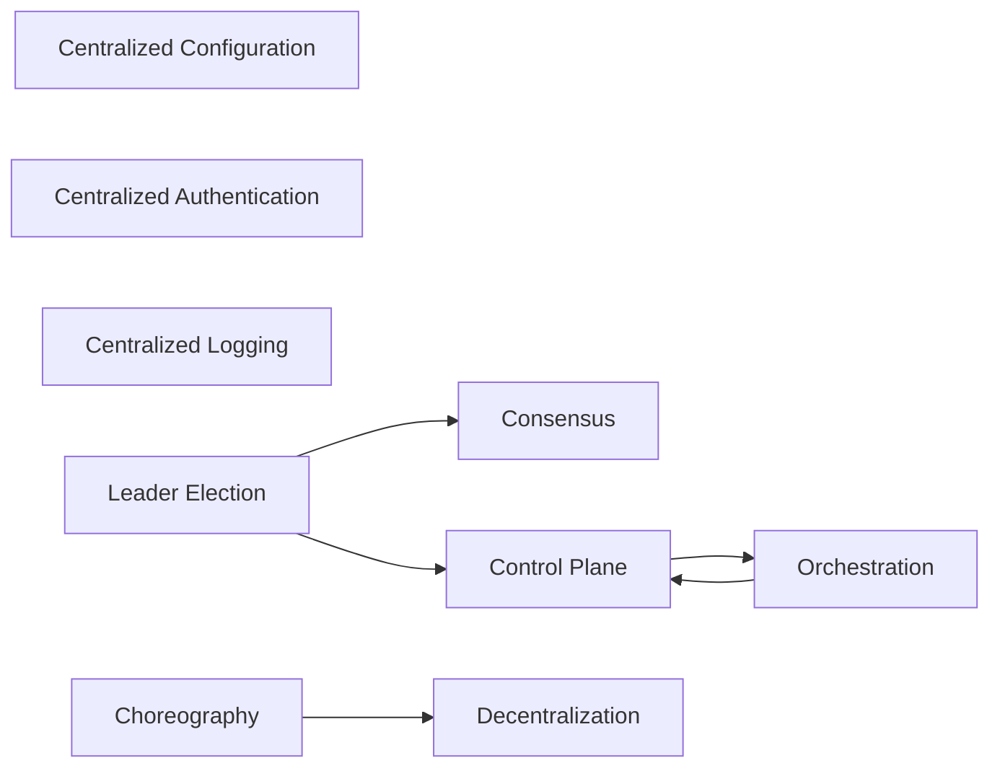
```mermaid
flowchart LR
n_control_plane["Control Plane"]
n_orchestration["Orchestration"]
n_centralized_configuration["Centralized Configuration"]
n_centralized_authentication["Centralized Authentication"]
n_centralized_logging["Centralized Logging"]
n_decentralization["Decentralization"]
n_leader_election["Leader Election"]
n_consensus["Consensus"]
n_choreography["Choreography"]
n_control_plane --> n_orchestration
n_orchestration --> n_control_plane
n_leader_election --> n_consensus
n_leader_election --> n_control_plane
n_choreography --> n_decentralization
```

### Control Plane

- Kind: [artifact](SCHEMA.md#kind-artifact)
- Severity: contextual
- Scope: platform, infrastructure, distributed system
- Layer: [Execution Core](SCHEMA.md#layer-execution-core)

Details

Requires
[Management API](LEXICON.md#lex-management-api), [Policy](LEXICON.md#lex-policy)
Reinforces
[Governance](PRINCIPLES.md#arch-governance), [Orchestration](PRINCIPLES.md#arch-orchestration)
Enables
[Centralized Control of Distributed Runtime](LEXICON.md#lex-centralized-control-of-distributed-runtime)
In tension with
[Availability](LEXICON.md#lex-availability)
Conflicts with
[Fully Decentralized Control](LEXICON.md#lex-fully-decentralized-control)
Referenced by
[Orchestration](PRINCIPLES.md#arch-orchestration), [Leader Election](PRINCIPLES.md#arch-leader-election)
Contracts
[Control Plane](ALGORITHMS.md#algo-control-plane)
Tensions
[Control Plane Availability](SCHEMA.md#tension-availability-control-plane)

Violated by
unmanaged distributed configuration/control
Detected by
manual node/service control
Measured by
control coverage, control-plane availability
Refactored by
Add Control Plane, Externalize Policy
Enforced by
platform architecture

```typescript
for (const node of fooNodes) {
  node.configure({ retries: 3, timeoutMs: 500 });
}
```

```typescript
controlPlane.apply("foo-service", {
  retries: 3,
  timeoutMs: 500,
  rollout: "progressive",
});
```

### Orchestration

- Kind: [mechanism](SCHEMA.md#kind-mechanism)
- Severity: contextual
- Scope: workflow, deployment, services
- Layer: [Execution Core](SCHEMA.md#layer-execution-core)

Details

Requires
[Coordinator](LEXICON.md#lex-coordinator)
Reinforces
[Control Plane](PRINCIPLES.md#arch-control-plane), [Saga](LEXICON.md#lex-saga)
Enables
[Ordered Multi-Step Execution](LEXICON.md#lex-ordered-multi-step-execution)
In tension with
[Centralized Coordinator Coupling](LEXICON.md#lex-centralized-coordinator-coupling)
Conflicts with
[Pure Choreography](LEXICON.md#lex-pure-choreography)
Referenced by
[Control Plane](PRINCIPLES.md#arch-control-plane)
Tensions
[Orchestration Centralized Coordinator Coupling](SCHEMA.md#tension-centralized-coordinator-coupling-orchestration)

Violated by
implicit fragile workflow spread across services
Detected by
unclear workflow ownership
Measured by
workflow observability/completion
Refactored by
Add Orchestrator, Define Workflow
Enforced by
workflow tests

```typescript
await fooService.create(foo);
await barService.create(bar);
await bazService.create(baz);
```

```typescript
await orchestrator.run("CreateFooFlow", {
  steps: [
    step("foo", () => fooService.create(foo)),
    step("bar", () => barService.create(bar)),
    step("baz", () => bazService.create(baz)),
  ],
});
```

### Centralized Configuration

- Kind: [pattern](SCHEMA.md#kind-pattern)
- Severity: contextual
- Scope: service, platform, runtime
- Layer: [Execution Core](SCHEMA.md#layer-execution-core)

Details

Requires
[Config Store](LEXICON.md#lex-config-store), [Access Control](PRINCIPLES.md#arch-access-control)
Reinforces
[Governance](PRINCIPLES.md#arch-governance), [Consistency](PRINCIPLES.md#arch-consistency)
Enables
[Unified Config Management](LEXICON.md#lex-unified-config-management)
In tension with
[Central Dependency Risk](LEXICON.md#lex-central-dependency-risk)
Conflicts with
[Scattered Configuration](LEXICON.md#lex-scattered-configuration)
Tensions
[Centralized Configuration Central Dependency Risk](SCHEMA.md#tension-central-dependency-risk-centralized-configuration)

Violated by
duplicated divergent configs
Detected by
config drift
Measured by
config drift count
Refactored by
Move to Central Config, Add Schema
Enforced by
config policy

```typescript
const fooConfig = loadLocalFooConfig();
const barConfig = loadLocalBarConfig();
const bazConfig = loadLocalBazConfig();
```

```typescript
const config = await configService.readVersioned("platform/v3");
fooApp.apply(config.foo);
barApp.apply(config.bar);
bazApp.apply(config.baz);
```

### Centralized Authentication

- Kind: [pattern](SCHEMA.md#kind-pattern)
- Severity: recommended
- Scope: identity, system
- Layer: [Execution Core](SCHEMA.md#layer-execution-core)

Details

Requires
[Identity Provider](LEXICON.md#lex-identity-provider)
Reinforces
[Security](LEXICON.md#lex-security), [Governance](PRINCIPLES.md#arch-governance)
Enables
[Unified Identity](LEXICON.md#lex-unified-identity)
In tension with
[Identity Provider Availability](LEXICON.md#lex-identity-provider-availability)
Conflicts with
[Scattered Auth Implementations](LEXICON.md#lex-scattered-auth-implementations)
Tensions
[Centralized Authentication Identity Provider Availability](SCHEMA.md#tension-centralized-authentication-identity-provider-availability)

Violated by
custom auth per service without federation
Detected by
duplicated credential stores
Measured by
auth centralization coverage
Refactored by
Introduce IdP, Federate Auth
Enforced by
[security policy](ALGORITHMS.md#algo-security-policy)

```typescript
fooService.verifyToken(token);
barService.verifyToken(token);
bazService.verifyToken(token);
```

```typescript
const identity = await identityProvider.authenticate(token);
await fooService.handle({ identity });
await barService.handle({ identity });
await bazService.handle({ identity });
```

### Centralized Logging

- Kind: [pattern](SCHEMA.md#kind-pattern)
- Severity: recommended
- Scope: services, platform
- Layer: [Execution Core](SCHEMA.md#layer-execution-core)

Details

Requires
[Log Aggregation](LEXICON.md#lex-log-aggregation)
Reinforces
[Observability](PRINCIPLES.md#arch-observability), [Auditability](PRINCIPLES.md#arch-auditability)
Enables
[Cross-Service Analysis](LEXICON.md#lex-cross-service-analysis)
In tension with
[Cost/PII](LEXICON.md#lex-cost-pii)
Conflicts with
[Local-Only Logs](LEXICON.md#lex-local-only-logs)
Tensions
[Centralized Logging Cost/PII](SCHEMA.md#tension-centralized-logging-cost-pii)

Violated by
logs only available per instance
Detected by
missing log shipping
Measured by
log ingestion coverage
Refactored by
Add Log Forwarder, Standardize Fields
Enforced by
observability policy

```typescript
fooService.writeLocalLog(event);
barService.writeLocalLog(event);
bazService.writeLocalLog(event);
```

```typescript
const sink = new CentralLogSink();
fooService.useLogger(structuredLogger(sink));
barService.useLogger(structuredLogger(sink));
bazService.useLogger(structuredLogger(sink));
```

### Decentralization

- Kind: [principle](SCHEMA.md#kind-principle)
- Severity: contextual
- Scope: system, team, service
- Layer: [Execution Core](SCHEMA.md#layer-execution-core)

Details

Requires
[Autonomy](PRINCIPLES.md#arch-autonomy), [Contracts](LEXICON.md#lex-contracts)
Reinforces
[Microservices](PRINCIPLES.md#arch-microservices), [Resilience](PRINCIPLES.md#arch-resilience)
Enables
[Independent Ownership](LEXICON.md#lex-independent-ownership)
In tension with
[Governance](PRINCIPLES.md#arch-governance), [Consistency](PRINCIPLES.md#arch-consistency)
Conflicts with
[Centralized Control](LEXICON.md#lex-centralized-control)
Referenced by
[Choreography](PRINCIPLES.md#arch-choreography), [Autonomy](PRINCIPLES.md#arch-autonomy), [Single Source of Truth](PRINCIPLES.md#arch-single-source-of-truth)
Tensions
[Decentralization Governance](SCHEMA.md#tension-decentralization-governance), [Decentralization Consistency](SCHEMA.md#tension-consistency-decentralization)

Violated by
central bottleneck for independent decisions/runtime
Detected by
centralized team/service dependency
Measured by
decision/deployment dependency count
Refactored by
Delegate Ownership, Split Service/Control
Enforced by
ownership model

```typescript
const coordinator = new GlobalFooCoordinator();
await coordinator.approveEveryFoo(foo);
```

```typescript
await fooNode.validate(foo);
await fooNode.commit(foo);
await fooNode.publish({ type: "FooCommitted", fooId: foo.id });
```

### Leader Election

- Kind: [mechanism](SCHEMA.md#kind-mechanism)
- Severity: mandatory for distributed systems
- Scope: distributed system, coordination, availability
- Layer: [Execution Core](SCHEMA.md#layer-execution-core)

Details

Requires
[Consensus](PRINCIPLES.md#arch-consensus)
Reinforces
[Control Plane](PRINCIPLES.md#arch-control-plane), [Fault Tolerance](PRINCIPLES.md#arch-fault-tolerance)
Enables
[Single-Writer Coordination](LEXICON.md#lex-single-writer-coordination), [Automatic Failover of Leadership](LEXICON.md#lex-automatic-failover-of-leadership)
In tension with
[Availability](LEXICON.md#lex-availability)
Conflicts with
[Split-Brain Coordination](LEXICON.md#lex-split-brain-coordination)
Tensions
[Leader Election Availability](SCHEMA.md#tension-availability-leader-election)

Violated by
multiple nodes assuming the coordinator role at once
Detected by
concurrent leader actions / split-brain
Measured by
split-brain incident rate
Refactored by
Introduce Leader Election
Enforced by
distributed-systems review

```typescript
if (process.env.IS_LEADER === "true") runFooScheduler();
```

```typescript
const lease = await fooCoordinator.acquireLeadership("foo-scheduler", {
  ttlMs: 10_000,
});
lease.onAcquired(() => runFooScheduler());
lease.onLost(() => stopFooScheduler());
```

### Consensus

- Kind: [mechanism](SCHEMA.md#kind-mechanism)
- Severity: mandatory for distributed systems
- Scope: distributed system, agreement, consistency
- Layer: [Execution Core](SCHEMA.md#layer-execution-core)

Details

Requires
[Quorum](LEXICON.md#lex-quorum)
Reinforces
[Consistency](PRINCIPLES.md#arch-consistency), [Fault Tolerance](PRINCIPLES.md#arch-fault-tolerance)
Enables
[Agreed Single Value Across Nodes](LEXICON.md#lex-agreed-single-value-across-nodes)
In tension with
[Latency](PRINCIPLES.md#arch-latency), [Availability](LEXICON.md#lex-availability)
Conflicts with
[Independent Node Decisions](LEXICON.md#lex-independent-node-decisions)
Referenced by
[Total-Order Broadcast](PRINCIPLES.md#arch-total-order-broadcast), [Leader Election](PRINCIPLES.md#arch-leader-election)
Tensions
[Consensus Latency](SCHEMA.md#tension-consensus-latency), [Consensus Availability](SCHEMA.md#tension-availability-consensus)

Violated by
nodes committing values without quorum agreement
Detected by
divergent committed state across replicas
Measured by
agreement-violation rate
Refactored by
Adopt a Consensus Protocol
Enforced by
distributed-systems review

```typescript
fooNodeA.setValue(value);
```

```typescript
const committed = await fooCluster.propose(value, {
  quorum: majority(fooNodes),
});
if (!committed.accepted) throw new NoQuorumError();
```

### Choreography

- Kind: [mechanism](SCHEMA.md#kind-mechanism)
- Severity: contextual
- Scope: distributed system, coordination, event
- Layer: [Execution Core](SCHEMA.md#layer-execution-core)

Details

Requires
[Event-Driven Architecture](PRINCIPLES.md#arch-event-driven-architecture)
Reinforces
[Decentralization](PRINCIPLES.md#arch-decentralization), [Service Autonomy](PRINCIPLES.md#arch-service-autonomy)
Enables
[Central-Orchestrator-Free Coordination](LEXICON.md#lex-central-orchestrator-free-coordination)
In tension with
[Traceability](PRINCIPLES.md#arch-traceability)
Conflicts with
[Central Orchestrator Bottleneck](LEXICON.md#lex-central-orchestrator-bottleneck)
Tensions
[Choreography Traceability](SCHEMA.md#tension-choreography-traceability)

Violated by
one orchestrator commanding every step of a cross-service flow
Detected by
a central coordinator coupled to all participants
Measured by
orchestrator fan-out coupling
Refactored by
Coordinate via Choreographed Events
Enforced by
[architecture review](PRINCIPLES.md#arch-architecture-review)

```typescript
await orchestrator.run("CreateFoo", [
  () => createFoo(foo),
  () => reserveBar(foo),
  () => notifyBaz(foo),
]);
```

```typescript
fooEvents.on("FooCreated", (event) => barService.reserve(event.fooId));
barEvents.on("BarReserved", (event) => bazService.notify(event.fooId));
```

## Core Modular Design

Every principle in this category. Each record carries its kind, its severity, the scopes it applies at and the layer it lives in, then the edge relations that join it to other records, the records that point back at it, the contracts that answer to it and the tensions it takes part in. The descriptors say how it is violated, detected, measured, repaired and enforced. Where the record carries one, an exemplar shows the shape before and after the principle is applied.

Relations diagram

The relations inside this category.

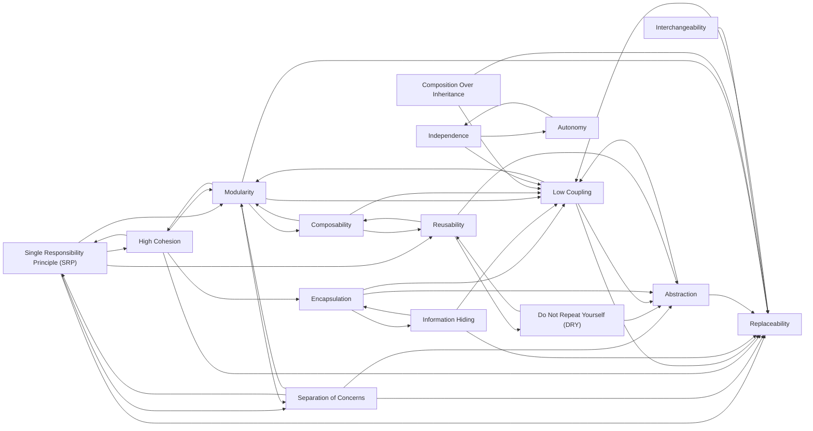
```mermaid
flowchart LR
n_single_responsibility["Single Responsibility Principle (SRP)"]
n_separation_of_concerns["Separation of Concerns"]
n_duplicate_code["Do Not Repeat Yourself (DRY)"]
n_high_cohesion["High Cohesion"]
n_low_coupling["Low Coupling"]
n_encapsulation["Encapsulation"]
n_information_hiding["Information Hiding"]
n_abstraction["Abstraction"]
n_modularity["Modularity"]
n_composability["Composability"]
n_composition_over_inheritance["Composition Over Inheritance"]
n_reusability["Reusability"]
n_replaceability["Replaceability"]
n_interchangeability["Interchangeability"]
n_independence["Independence"]
n_autonomy["Autonomy"]
n_single_responsibility --> n_high_cohesion
n_single_responsibility --> n_separation_of_concerns
n_single_responsibility --> n_modularity
n_single_responsibility --> n_replaceability
n_single_responsibility --> n_reusability
n_separation_of_concerns --> n_abstraction
n_separation_of_concerns --> n_single_responsibility
n_separation_of_concerns --> n_modularity
n_separation_of_concerns --> n_replaceability
n_duplicate_code --> n_abstraction
n_duplicate_code --> n_reusability
n_high_cohesion --> n_single_responsibility
n_high_cohesion --> n_modularity
n_high_cohesion --> n_encapsulation
n_high_cohesion --> n_replaceability
n_low_coupling --> n_abstraction
n_low_coupling --> n_modularity
n_low_coupling --> n_replaceability
n_encapsulation --> n_information_hiding
n_encapsulation --> n_abstraction
n_encapsulation --> n_low_coupling
n_information_hiding --> n_encapsulation
n_information_hiding --> n_low_coupling
n_information_hiding --> n_replaceability
n_abstraction --> n_low_coupling
n_abstraction --> n_replaceability
n_modularity --> n_high_cohesion
n_modularity --> n_low_coupling
n_modularity --> n_separation_of_concerns
n_modularity --> n_composability
n_modularity --> n_replaceability
n_composability --> n_low_coupling
n_composability --> n_modularity
n_composability --> n_reusability
n_composition_over_inheritance --> n_low_coupling
n_composition_over_inheritance --> n_replaceability
n_reusability --> n_abstraction
n_reusability --> n_duplicate_code
n_reusability --> n_composability
n_replaceability --> n_low_coupling
n_interchangeability --> n_replaceability
n_independence --> n_low_coupling
n_independence --> n_autonomy
n_autonomy --> n_independence
```

### Single Responsibility Principle (SRP)

- Kind: [principle](SCHEMA.md#kind-principle)
- Severity: mandatory
- Scope: class, module, service
- Aliases: SRP, Single Responsibility Principle (SRP)
- Layer: [Structural Core](SCHEMA.md#layer-structural-core)

Details

Requires
[High Cohesion](PRINCIPLES.md#arch-high-cohesion), [Explicit Boundaries](PRINCIPLES.md#arch-explicit-boundaries)
Reinforces
[Separation of Concerns](PRINCIPLES.md#arch-separation-of-concerns), [Modularity](PRINCIPLES.md#arch-modularity), [Testability](PRINCIPLES.md#arch-testability)
Enables
[Replaceability](PRINCIPLES.md#arch-replaceability), [Reusability](PRINCIPLES.md#arch-reusability)
In tension with
[Excessive Fragmentation](LEXICON.md#lex-excessive-fragmentation)
Conflicts with
[God Object](PRINCIPLES.md#arch-god-object), [Blob Class](LEXICON.md#lex-blob-class), [Divergent Change](PRINCIPLES.md#arch-divergent-change)
Referenced by
[Command Pattern](PRINCIPLES.md#arch-command-pattern), [Chain of Responsibility Pattern](PRINCIPLES.md#arch-chain-of-responsibility-pattern), [Iterator Pattern](PRINCIPLES.md#arch-iterator-pattern), [Pipes and Filters](PRINCIPLES.md#arch-pipes-and-filters), [Separation of Concerns](PRINCIPLES.md#arch-separation-of-concerns), [High Cohesion](PRINCIPLES.md#arch-high-cohesion), [Domain Service](PRINCIPLES.md#arch-domain-service), [Interface Segregation Principle (ISP)](PRINCIPLES.md#arch-interface-segregation)
Tensions
[Single Responsibility Principle (SRP) Excessive Fragmentation](SCHEMA.md#tension-excessive-fragmentation-single-responsibility-principle-srp)

Violated by
Mixed Responsibilities, Multi-Reason Change
Detected by
high fan-in/fan-out, unrelated methods, unrelated dependencies
Measured by
cohesion score, responsibility count, change-coupling
Refactored by
Extract Class, Extract Module, Split Service, Move Method
Enforced by
architecture tests, package boundaries, [static analysis](REASONING.md#reason-technique-static-analysis)

```typescript
class FooService {
  save(foo: Foo) {
    fooDb.insert(foo);
  }
  send(foo: Foo) {
    fooMail.send(foo);
  }
  report(foo: Foo) {
    return `${foo.id}:${foo.name}`;
  }
}
```

```typescript
class FooRepository {
  save(foo: Foo) {
    return fooDb.insert(foo);
  }
}
class FooNotifier {
  send(foo: Foo) {
    return fooMail.send(foo);
  }
}
class FooReporter {
  report(foo: Foo) {
    return `${foo.id}:${foo.name}`;
  }
}
```

### Separation of Concerns

- Kind: [principle](SCHEMA.md#kind-principle)
- Severity: mandatory
- Scope: module, package, component, system
- Layer: [Structural Core](SCHEMA.md#layer-structural-core)

Details

Requires
[Explicit Boundaries](PRINCIPLES.md#arch-explicit-boundaries), [Abstraction](PRINCIPLES.md#arch-abstraction)
Reinforces
[Single Responsibility Principle (SRP)](PRINCIPLES.md#arch-single-responsibility), [Modularity](PRINCIPLES.md#arch-modularity), [Layered Architecture](PRINCIPLES.md#arch-layered-architecture)
Enables
[Maintainability](LEXICON.md#lex-maintainability), [Replaceability](PRINCIPLES.md#arch-replaceability)
In tension with
[Over-Layering](LEXICON.md#lex-over-layering)
Conflicts with
[Cross-Cutting Leakage](LEXICON.md#lex-cross-cutting-leakage), [Mixed Layers](LEXICON.md#lex-mixed-layers)
Referenced by
[Visitor Pattern](PRINCIPLES.md#arch-visitor-pattern), [Statecharts](PRINCIPLES.md#arch-statecharts), [Layered Architecture](PRINCIPLES.md#arch-layered-architecture), [Single Responsibility Principle (SRP)](PRINCIPLES.md#arch-single-responsibility), [Modularity](PRINCIPLES.md#arch-modularity), [One Concern Per File](PRINCIPLES.md#arch-one-concern-per-file)
Tensions
[Separation of Concerns Over-Layering](SCHEMA.md#tension-over-layering-separation-of-concerns)

Violated by
business logic in controllers, persistence logic in domain
Detected by
layer imports, mixed naming roles, cross-boundary logic
Measured by
dependency direction, layer purity, concern overlap
Refactored by
Extract Layer, Move Logic, Introduce Boundary
Enforced by
import rules, dependency graph checks

```typescript
function handleFoo(request: Request) {
  const foo = JSON.parse(request.body);
  fooDb.insert(foo);
  return `<div>${foo.name}</div>`;
}
```

```typescript
function parseFoo(request: Request): Foo {
  return decodeFoo(request.body);
}
function saveFoo(foo: Foo) {
  return fooDb.insert(foo);
}
function renderFoo(foo: Foo) {
  return `<div>${foo.name}</div>`;
}
```

### Do Not Repeat Yourself (DRY)

- Kind: [principle](SCHEMA.md#kind-principle)
- Severity: mandatory
- Scope: function, module, domain
- Aliases: DRY
- Layer: [Structural Core](SCHEMA.md#layer-structural-core)

Details

Requires
[Abstraction](PRINCIPLES.md#arch-abstraction), [Canonical Source](LEXICON.md#lex-canonical-source)
Reinforces
[Single Source of Truth](PRINCIPLES.md#arch-single-source-of-truth), [Reusability](PRINCIPLES.md#arch-reusability)
Enables
[Consistency](PRINCIPLES.md#arch-consistency), [Maintainability](LEXICON.md#lex-maintainability)
In tension with
[Locality of Behavior](LEXICON.md#lex-locality-of-behavior), [Simplicity](LEXICON.md#lex-simplicity)
Conflicts with
[Copy-Paste Programming](LEXICON.md#lex-copy-paste-programming)
Referenced by
[Reusability](PRINCIPLES.md#arch-reusability), [Metaprogramming](PRINCIPLES.md#arch-metaprogramming), [Single Source of Truth](PRINCIPLES.md#arch-single-source-of-truth), [Normalization](PRINCIPLES.md#arch-normalization)
Tensions
[Do Not Repeat Yourself (DRY) Locality of Behavior](SCHEMA.md#tension-do-not-repeat-yourself-dry-locality-of-behavior), [Do Not Repeat Yourself (DRY) Simplicity](SCHEMA.md#tension-do-not-repeat-yourself-dry-simplicity)

Violated by
duplicated logic, duplicated constants, duplicated schemas
Detected by
clone detection, duplicated branches, repeated literals
Measured by
duplication percentage, clone count
Refactored by
Extract Function, Extract Module, Parameterize, Centralize Rule
Enforced by
clone analyzers, lint rules, review gates

```typescript
function validateFoo(foo: Foo) {
  if (!foo.name || foo.name.length > 40) throw new Error("invalid name");
}
function validateBar(bar: Bar) {
  if (!bar.name || bar.name.length > 40) throw new Error("invalid name");
}
```

```typescript
function validateName(name: string) {
  if (!name || name.length > 40) throw new Error("invalid name");
}
function validateFoo(foo: Foo) {
  validateName(foo.name);
}
function validateBar(bar: Bar) {
  validateName(bar.name);
}
```

### High Cohesion

- Kind: [quality-attribute](SCHEMA.md#kind-quality-attribute)
- Severity: mandatory
- Scope: class, module, component
- Layer: [Structural Core](SCHEMA.md#layer-structural-core)

Details

Requires
[Single Responsibility Principle (SRP)](PRINCIPLES.md#arch-single-responsibility), [Explicit Boundaries](PRINCIPLES.md#arch-explicit-boundaries)
Reinforces
[Modularity](PRINCIPLES.md#arch-modularity), [Encapsulation](PRINCIPLES.md#arch-encapsulation)
Enables
[Testability](PRINCIPLES.md#arch-testability), [Replaceability](PRINCIPLES.md#arch-replaceability)
In tension with
[Over-Specialization](LEXICON.md#lex-over-specialization)
Conflicts with
[God Object](PRINCIPLES.md#arch-god-object), [Utility Dump](PRINCIPLES.md#arch-utility-dump), [Shotgun Surgery](PRINCIPLES.md#arch-shotgun-surgery)
Referenced by
[Single Responsibility Principle (SRP)](PRINCIPLES.md#arch-single-responsibility), [Modularity](PRINCIPLES.md#arch-modularity)
Tensions
[High Cohesion Over-Specialization](SCHEMA.md#tension-high-cohesion-over-specialization)

Violated by
unrelated methods, unrelated fields, unstable responsibility grouping
Detected by
low LCOM, scattered dependencies, unrelated public API
Measured by
cohesion metrics, change locality
Refactored by
Extract Class, Split Module, Move Method
Enforced by
module ownership, [architecture review](PRINCIPLES.md#arch-architecture-review)

```typescript
class FooManager {
  saveFoo(foo: Foo) {
    return fooDb.insert(foo);
  }
  resizeImage(image: Image) {
    return image.resize(100, 100);
  }
  parseBar(raw: string) {
    return JSON.parse(raw) as Bar;
  }
}
```

```typescript
class FooRepository {
  save(foo: Foo) {
    return fooDb.insert(foo);
  }
  load(id: FooId) {
    return fooDb.find(id);
  }
  remove(id: FooId) {
    return fooDb.delete(id);
  }
}
class ImageResizer {
  resize(image: Image) {
    return image.resize(100, 100);
  }
}
class BarParser {
  parse(raw: string) {
    return JSON.parse(raw) as Bar;
  }
}
```

### Low Coupling

- Kind: [quality-attribute](SCHEMA.md#kind-quality-attribute)
- Severity: mandatory
- Scope: module, component, service
- Aliases: Loose Coupling
- Layer: [Structural Core](SCHEMA.md#layer-structural-core)

Details

Requires
[Abstraction](PRINCIPLES.md#arch-abstraction), [Stable Interfaces](PRINCIPLES.md#arch-stable-interfaces)
Reinforces
[Modularity](PRINCIPLES.md#arch-modularity), [Replaceability](PRINCIPLES.md#arch-replaceability), [Portability](PRINCIPLES.md#arch-portability)
Enables
[Independent Deployment](LEXICON.md#lex-independent-deployment), [Test Isolation](LEXICON.md#lex-test-isolation)
In tension with
[Runtime Indirection](LEXICON.md#lex-runtime-indirection)
Conflicts with
[Tight Coupling](LEXICON.md#lex-tight-coupling), [Cyclic Dependencies](LEXICON.md#lex-cyclic-dependencies), [Inappropriate Intimacy](PRINCIPLES.md#arch-inappropriate-intimacy), [Message Chain](PRINCIPLES.md#arch-message-chain)
Referenced by
[Mediator Pattern](PRINCIPLES.md#arch-mediator-pattern), [Service-Oriented Architecture](PRINCIPLES.md#arch-service-oriented-architecture), [Stable Interfaces](PRINCIPLES.md#arch-stable-interfaces), [Encapsulation](PRINCIPLES.md#arch-encapsulation), [Information Hiding](PRINCIPLES.md#arch-information-hiding), [Abstraction](PRINCIPLES.md#arch-abstraction), [Modularity](PRINCIPLES.md#arch-modularity), [Composability](PRINCIPLES.md#arch-composability), [Composition Over Inheritance](PRINCIPLES.md#arch-composition-over-inheritance), [Replaceability](PRINCIPLES.md#arch-replaceability), [Independence](PRINCIPLES.md#arch-independence), [Testability](PRINCIPLES.md#arch-testability), [Anti-Corruption Layer](PRINCIPLES.md#arch-anti-corruption-layer), [Event-Driven Architecture](PRINCIPLES.md#arch-event-driven-architecture), [Publish/Subscribe Pattern](PRINCIPLES.md#arch-publish-subscribe-pattern), [Asynchronous Communication](PRINCIPLES.md#arch-asynchronous-communication), [Interface Segregation Principle (ISP)](PRINCIPLES.md#arch-interface-segregation), [Dependency Inversion Principle (DIP)](PRINCIPLES.md#arch-dependency-inversion)
Tensions
[Low Coupling Runtime Indirection](SCHEMA.md#tension-low-coupling-runtime-indirection)

Violated by
concrete imports, [global state](LEXICON.md#lex-global-state), bidirectional dependencies
Detected by
dependency cycles, high afferent/efferent coupling
Measured by
coupling metrics, dependency graph density
Refactored by
Introduce Interface, [Dependency Injection](PRINCIPLES.md#arch-dependency-injection), Adapter Extraction
Enforced by
dependency rules, architecture fitness tests

```typescript
class FooService {
  save(foo: Foo) {
    const db = new SqlDatabase("foo-prod");
    barIndex.update(foo);
    return db.table("foos").insert(foo);
  }
}
```

```typescript
class FooService {
  constructor(private readonly events: EventSink) {}
  save(foo: Foo) {
    return this.events.emit({ type: "FooSaved", foo });
  }
}
```

### Encapsulation

- Kind: [principle](SCHEMA.md#kind-principle)
- Severity: mandatory
- Scope: class, module, component
- Layer: [Structural Core](SCHEMA.md#layer-structural-core)

Details

Requires
[Information Hiding](PRINCIPLES.md#arch-information-hiding), [Stable Interfaces](PRINCIPLES.md#arch-stable-interfaces)
Reinforces
[Abstraction](PRINCIPLES.md#arch-abstraction), [Low Coupling](PRINCIPLES.md#arch-low-coupling)
Enables
[Change Isolation](LEXICON.md#lex-change-isolation), [Invariant Protection](LEXICON.md#lex-invariant-protection)
In tension with
[Debuggability](LEXICON.md#lex-debuggability)
Conflicts with
[Exposed Internals](LEXICON.md#lex-exposed-internals), [Anemic Encapsulation](LEXICON.md#lex-anemic-encapsulation), [Feature Envy](PRINCIPLES.md#arch-feature-envy)
Referenced by
[Command Pattern](PRINCIPLES.md#arch-command-pattern), [Iterator Pattern](PRINCIPLES.md#arch-iterator-pattern), [Memento Pattern](PRINCIPLES.md#arch-memento-pattern), [Invariants](PRINCIPLES.md#arch-invariants), [High Cohesion](PRINCIPLES.md#arch-high-cohesion), [Information Hiding](PRINCIPLES.md#arch-information-hiding), [Factory Pattern](PRINCIPLES.md#arch-factory-pattern), [Explicit Boundaries](PRINCIPLES.md#arch-explicit-boundaries), [Aggregate](PRINCIPLES.md#arch-aggregate), [Value Object](PRINCIPLES.md#arch-value-object), [Entity](PRINCIPLES.md#arch-entity), [Introspection](PRINCIPLES.md#arch-introspection), [Facade Pattern](PRINCIPLES.md#arch-facade-pattern), [Proxy Pattern](PRINCIPLES.md#arch-proxy-pattern), [State Isolation](PRINCIPLES.md#arch-state-isolation)
Tensions
[Encapsulation Debuggability](SCHEMA.md#tension-debuggability-encapsulation)

Violated by
public mutable fields, leaky getters, direct state mutation
Detected by
public state, excessive setters, external invariant manipulation
Measured by
public surface area, mutation exposure
Refactored by
Hide Field, Introduce Method, Restrict Visibility
Enforced by
visibility rules, linting, API review

```typescript
class FooCounter {
  count = 0;
}
const counter = new FooCounter();
counter.count = -100;
```

```typescript
class FooCounter {
  #count = 0;
  increment() {
    this.#count += 1;
  }
  value() {
    return this.#count;
  }
}
```

### Information Hiding

- Kind: [principle](SCHEMA.md#kind-principle)
- Severity: mandatory
- Scope: class, module, package
- Layer: [Structural Core](SCHEMA.md#layer-structural-core)

Details

Requires
[Encapsulation](PRINCIPLES.md#arch-encapsulation), [Explicit Interfaces](LEXICON.md#lex-explicit-interfaces)
Reinforces
[Low Coupling](PRINCIPLES.md#arch-low-coupling), [Replaceability](PRINCIPLES.md#arch-replaceability)
Enables
[Internal Refactoring](LEXICON.md#lex-internal-refactoring)
In tension with
[Observability](PRINCIPLES.md#arch-observability)
Conflicts with
[Leaky Abstraction](LEXICON.md#lex-leaky-abstraction)
Referenced by
[Memento Pattern](PRINCIPLES.md#arch-memento-pattern), [Encapsulation](PRINCIPLES.md#arch-encapsulation), [Facade Pattern](PRINCIPLES.md#arch-facade-pattern)
Tensions
[Information Hiding Observability](SCHEMA.md#tension-information-hiding-observability)

Violated by
exposing implementation details, shared internals
Detected by
internal packages imported externally, exposed persistence models
Measured by
internal API exposure, dependency leakage
Refactored by
Introduce Facade, Hide Module, Restrict Exports
Enforced by
package visibility, module export rules

```typescript
class FooStore {
  public readonly rows = new Map<string, Foo>();
}
fooStore.rows.set(foo.id, foo);
```

```typescript
interface FooStore {
  save(foo: Foo): void;
  find(id: string): Foo | undefined;
}
class MapFooStore implements FooStore {
  #rows = new Map<string, Foo>();
  save(foo: Foo) {
    this.#rows.set(foo.id, foo);
  }
  find(id: string) {
    return this.#rows.get(id);
  }
}
```

### Abstraction

- Kind: [principle](SCHEMA.md#kind-principle)
- Severity: mandatory
- Scope: class, module, service, system
- Layer: [Structural Core](SCHEMA.md#layer-structural-core)

Details

Requires
[Stable Semantics](LEXICON.md#lex-stable-semantics), [Interface Definition](LEXICON.md#lex-interface-definition)
Reinforces
[Dependency Inversion Principle (DIP)](PRINCIPLES.md#arch-dependency-inversion), [Low Coupling](PRINCIPLES.md#arch-low-coupling), [Portability](PRINCIPLES.md#arch-portability)
Enables
[Polymorphism](PRINCIPLES.md#arch-polymorphism), [Replaceability](PRINCIPLES.md#arch-replaceability)
In tension with
[Simplicity](LEXICON.md#lex-simplicity)
Conflicts with
[Concrete Coupling](PRINCIPLES.md#arch-concrete-coupling), [Middle Man](PRINCIPLES.md#arch-middle-man)
Referenced by
[Interface-Based Design](PRINCIPLES.md#arch-interface-based-design), [Separation of Concerns](PRINCIPLES.md#arch-separation-of-concerns), [Do Not Repeat Yourself (DRY)](PRINCIPLES.md#arch-duplicate-code), [Low Coupling](PRINCIPLES.md#arch-low-coupling), [Encapsulation](PRINCIPLES.md#arch-encapsulation), [Reusability](PRINCIPLES.md#arch-reusability), [Inversion of Control (IoC)](PRINCIPLES.md#arch-inversion-of-control), [Dependency Injection](PRINCIPLES.md#arch-dependency-injection), [Portability](PRINCIPLES.md#arch-portability), [Dynamic Binding](PRINCIPLES.md#arch-dynamic-binding), [Dependency Inversion Principle (DIP)](PRINCIPLES.md#arch-dependency-inversion), [Open/Closed Principle (OCP)](PRINCIPLES.md#arch-open-closed), [Polymorphism](PRINCIPLES.md#arch-polymorphism)
Tensions
[Abstraction Simplicity](SCHEMA.md#tension-abstraction-simplicity)

Violated by
hardcoded implementation dependency, implementation leakage
Detected by
concrete type usage across boundaries
Measured by
abstraction ratio, interface stability
Refactored by
Extract Interface, Introduce Port, Generalize Dependency
Enforced by
architecture tests, dependency inversion rules

```typescript
function saveFoo(foo: Foo) {
  return sqlClient.query("insert into foos(id,name) values($1,$2)", [
    foo.id,
    foo.name,
  ]);
}
```

```typescript
interface FooRepository {
  save(foo: Foo): Promise<void>;
}
class SqlFooRepository implements FooRepository {
  save(foo: Foo) {
    return sqlClient.query("insert into foos(id,name) values($1,$2)", [
      foo.id,
      foo.name,
    ]);
  }
}
class HttpFooRepository implements FooRepository {
  save(foo: Foo) {
    return http.post("/foos", foo);
  }
}
function saveFoo(foo: Foo, repository: FooRepository) {
  return repository.save(foo);
}
```

### Modularity

- Kind: [principle](SCHEMA.md#kind-principle)
- Severity: mandatory
- Scope: package, component, service, system
- Layer: [Structural Core](SCHEMA.md#layer-structural-core)

Details

Requires
[High Cohesion](PRINCIPLES.md#arch-high-cohesion), [Low Coupling](PRINCIPLES.md#arch-low-coupling), [Explicit Boundaries](PRINCIPLES.md#arch-explicit-boundaries)
Reinforces
[Separation of Concerns](PRINCIPLES.md#arch-separation-of-concerns), [Composability](PRINCIPLES.md#arch-composability)
Enables
[Replaceability](PRINCIPLES.md#arch-replaceability), [Plugin Architecture](PRINCIPLES.md#arch-plugin-architecture)
In tension with
[Cross-Cutting Concerns](LEXICON.md#lex-cross-cutting-concerns)
Conflicts with
[Big Ball of Mud](PRINCIPLES.md#arch-big-ball-of-mud)
Referenced by
[Component-Based Architecture](PRINCIPLES.md#arch-component-based-architecture), [Package by Feature](PRINCIPLES.md#arch-package-by-feature), [Single Responsibility Principle (SRP)](PRINCIPLES.md#arch-single-responsibility), [Separation of Concerns](PRINCIPLES.md#arch-separation-of-concerns), [High Cohesion](PRINCIPLES.md#arch-high-cohesion), [Low Coupling](PRINCIPLES.md#arch-low-coupling), [Composability](PRINCIPLES.md#arch-composability), [Bounded Context](PRINCIPLES.md#arch-bounded-context), [Explicit Boundaries](PRINCIPLES.md#arch-explicit-boundaries), [Plugin Architecture](PRINCIPLES.md#arch-plugin-architecture)
Tensions
[Modularity Cross-Cutting Concerns](SCHEMA.md#tension-cross-cutting-concerns-modularity)

Violated by
[cyclic dependencies](LEXICON.md#lex-cyclic-dependencies), [shared mutable state](PRINCIPLES.md#arch-shared-mutable-state), [boundary leakage](PRINCIPLES.md#arch-boundary-leakage)
Detected by
dependency cycles, unstable module graph
Measured by
modularity score, graph density, instability
Refactored by
Split Module, Introduce Boundary, Invert Dependency
Enforced by
module rules, package ownership, [fitness functions](PRINCIPLES.md#arch-fitness-functions)

```typescript
class FooApplication {
  parse(raw: string) {
    return JSON.parse(raw) as Foo;
  }
  save(foo: Foo) {
    return fooDb.insert(foo);
  }
  publish(foo: Foo) {
    return fooBus.emit(foo);
  }
}
```

```typescript
export const fooParser = { parse: (raw: string) => decodeFoo(raw) };
export const fooRepository = { save: (foo: Foo) => fooDb.insert(foo) };
export const fooPublisher = { publish: (foo: Foo) => fooBus.emit(foo) };
```

### Composability

- Kind: [principle](SCHEMA.md#kind-principle)
- Severity: recommended
- Scope: function, component, system
- Layer: [Structural Core](SCHEMA.md#layer-structural-core)

Details

Requires
[Stable Interfaces](PRINCIPLES.md#arch-stable-interfaces), [Low Coupling](PRINCIPLES.md#arch-low-coupling)
Reinforces
[Modularity](PRINCIPLES.md#arch-modularity), [Reusability](PRINCIPLES.md#arch-reusability)
Enables
[Pipeline Architecture](PRINCIPLES.md#arch-pipeline-architecture), [Plugin Architecture](PRINCIPLES.md#arch-plugin-architecture)
In tension with
[Performance Overhead](LEXICON.md#lex-performance-overhead)
Conflicts with
[Monolithic Procedures](LEXICON.md#lex-monolithic-procedures)
Referenced by
[Component-Based Architecture](PRINCIPLES.md#arch-component-based-architecture), [Pipes and Filters](PRINCIPLES.md#arch-pipes-and-filters), [Modularity](PRINCIPLES.md#arch-modularity), [Reusability](PRINCIPLES.md#arch-reusability), [Pipeline Architecture](PRINCIPLES.md#arch-pipeline-architecture), [Decorator Pattern](PRINCIPLES.md#arch-decorator-pattern)
Tensions
[Composability Performance Overhead](SCHEMA.md#tension-composability-performance-overhead)

Violated by
[hidden side effects](LEXICON.md#lex-hidden-side-effects), [incompatible interfaces](LEXICON.md#lex-incompatible-interfaces)
Detected by
non-chainable APIs, incompatible contracts
Measured by
composition count, interface compatibility
Refactored by
Normalize Interface, Extract Component, Introduce Adapter
Enforced by
contract tests, type checks

```typescript
function processFoo(raw: string) {
  const foo = JSON.parse(raw) as Foo;
  const normalized = { ...foo, name: foo.name.trim() };
  return fooDb.insert(normalized);
}
```

```typescript
const parseFoo = (raw: string): Foo => decodeFoo(raw);
const normalizeFoo = (foo: Foo): Foo => ({ ...foo, name: foo.name.trim() });
const saveFoo = (foo: Foo) => fooDb.insert(foo);
const processFoo = flow(parseFoo, normalizeFoo, saveFoo);
```

### Composition Over Inheritance

- Kind: [principle](SCHEMA.md#kind-principle)
- Severity: recommended
- Scope: class, component
- Layer: [Structural Core](SCHEMA.md#layer-structural-core)

Details

Requires
[Delegation](LEXICON.md#lex-delegation), [Interface-Based Design](PRINCIPLES.md#arch-interface-based-design)
Reinforces
[Low Coupling](PRINCIPLES.md#arch-low-coupling), [Replaceability](PRINCIPLES.md#arch-replaceability)
Enables
[Strategy Pattern](PRINCIPLES.md#arch-strategy-pattern), [Decorator Pattern](PRINCIPLES.md#arch-decorator-pattern)
In tension with
[Simplicity for trivial reuse](LEXICON.md#lex-simplicity-for-trivial-reuse)
Conflicts with
[Deep Inheritance Hierarchy](LEXICON.md#lex-deep-inheritance-hierarchy)
Referenced by
[Bridge Pattern](PRINCIPLES.md#arch-bridge-pattern)
Tensions
[Composition Over Inheritance Simplicity for trivial reuse](SCHEMA.md#tension-composition-over-inheritance-simplicity-for-trivial-reuse)

Violated by
fragile base class, inherited behavior misuse
Detected by
inheritance depth, overridden behavior conflicts
Measured by
inheritance depth, composition ratio
Refactored by
Replace Inheritance with Delegation, Extract Strategy
Enforced by
inheritance depth limits, review rules

```typescript
class RetryingSqlFooStore extends SqlFooStore {
  async save(foo: Foo) {
    for (let attempt = 0; attempt < 3; attempt += 1) {
      try {
        return await super.save(foo);
      } catch (error) {
        if (attempt === 2) throw error;
      }
    }
  }
}
```

```typescript
class RetryingFooStore implements FooStore {
  constructor(
    private readonly inner: FooStore,
    private readonly attempts: number,
  ) {}
  async save(foo: Foo) {
    for (let attempt = 0; attempt < this.attempts; attempt += 1) {
      try {
        return await this.inner.save(foo);
      } catch (error) {
        if (attempt === this.attempts - 1) throw error;
      }
    }
  }
}
```

### Reusability

- Kind: [quality-attribute](SCHEMA.md#kind-quality-attribute)
- Severity: recommended
- Scope: function, module, component
- Layer: [Structural Core](SCHEMA.md#layer-structural-core)

Details

Requires
[Abstraction](PRINCIPLES.md#arch-abstraction), [Stable Contracts](LEXICON.md#lex-stable-contracts)
Reinforces
[Do Not Repeat Yourself (DRY)](PRINCIPLES.md#arch-duplicate-code), [Composability](PRINCIPLES.md#arch-composability)
Enables
[Shared Libraries](LEXICON.md#lex-shared-libraries), [Product Lines](LEXICON.md#lex-product-lines)
In tension with
[YAGNI](LEXICON.md#lex-yagni), [Over-Generalization](LEXICON.md#lex-over-generalization)
Conflicts with
[Context-Specific Coupling](LEXICON.md#lex-context-specific-coupling)
Referenced by
[Single Responsibility Principle (SRP)](PRINCIPLES.md#arch-single-responsibility), [Do Not Repeat Yourself (DRY)](PRINCIPLES.md#arch-duplicate-code), [Composability](PRINCIPLES.md#arch-composability)
Tensions
[Reusability YAGNI](SCHEMA.md#tension-reusability-yagni), [Reusability Over-Generalization](SCHEMA.md#tension-over-generalization-reusability)

Violated by
hardcoded context, hidden assumptions
Detected by
environment-specific logic in reusable code
Measured by
reuse count, dependency portability
Refactored by
Parameterize, Extract Library, Remove Context Coupling
Enforced by
API review, dependency rules

```typescript
function saveAdminFoo(foo: Foo) {
  return adminFooDb.insert(foo);
}
function savePublicFoo(foo: Foo) {
  return publicFooDb.insert(foo);
}
```

```typescript
function saveFoo(store: FooStore, foo: Foo) {
  return store.save(foo);
}
const saveAdminFoo = (foo: Foo) => saveFoo(adminFooStore, foo);
const savePublicFoo = (foo: Foo) => saveFoo(publicFooStore, foo);
```

### Replaceability

- Kind: [quality-attribute](SCHEMA.md#kind-quality-attribute)
- Severity: recommended
- Scope: component, service, infrastructure
- Layer: [Structural Core](SCHEMA.md#layer-structural-core)

Details

Requires
[Stable Interfaces](PRINCIPLES.md#arch-stable-interfaces), [Low Coupling](PRINCIPLES.md#arch-low-coupling)
Reinforces
[Dependency Inversion Principle (DIP)](PRINCIPLES.md#arch-dependency-inversion), [Ports and Adapters](LEXICON.md#lex-ports-and-adapters)
Enables
[Vendor Swap](LEXICON.md#lex-vendor-swap), [Plugin Architecture](PRINCIPLES.md#arch-plugin-architecture)
In tension with
[Deep Optimization](LEXICON.md#lex-deep-optimization)
Conflicts with
[Concrete Coupling](PRINCIPLES.md#arch-concrete-coupling)
Referenced by
[Ports and Adapters Architecture](PRINCIPLES.md#arch-ports-and-adapters-architecture), [Component-Based Architecture](PRINCIPLES.md#arch-component-based-architecture), [Stable Interfaces](PRINCIPLES.md#arch-stable-interfaces), [Single Responsibility Principle (SRP)](PRINCIPLES.md#arch-single-responsibility), [Separation of Concerns](PRINCIPLES.md#arch-separation-of-concerns), [High Cohesion](PRINCIPLES.md#arch-high-cohesion), [Low Coupling](PRINCIPLES.md#arch-low-coupling), [Information Hiding](PRINCIPLES.md#arch-information-hiding), [Abstraction](PRINCIPLES.md#arch-abstraction), [Modularity](PRINCIPLES.md#arch-modularity), [Composition Over Inheritance](PRINCIPLES.md#arch-composition-over-inheritance), [Interchangeability](PRINCIPLES.md#arch-interchangeability), [Explicit Boundaries](PRINCIPLES.md#arch-explicit-boundaries), [Dependency Injection](PRINCIPLES.md#arch-dependency-injection), [Portability](PRINCIPLES.md#arch-portability), [Protocol Independence](PRINCIPLES.md#arch-protocol-independence), [Adapter Pattern](PRINCIPLES.md#arch-adapter-pattern)
Tensions
[Replaceability Deep Optimization](SCHEMA.md#tension-deep-optimization-replaceability)

Violated by
direct vendor SDK usage in domain/application
Detected by
infrastructure imports in core layers
Measured by
adapter coverage, boundary purity
Refactored by
Introduce Port, Extract Adapter, Invert Dependency
Enforced by
import restrictions, adapter tests

```typescript
class FooService {
  private readonly store = new SqlFooStore();
  save(foo: Foo) {
    return this.store.save(foo);
  }
}
```

```typescript
class FooService {
  constructor(private readonly store: FooStore) {}
  save(foo: Foo) {
    return this.store.save(foo);
  }
}
test("saves without a database", async () => {
  const store = new MemoryFooStore();
  await new FooService(store).save(foo);
  expect(store.find(foo.id)).toEqual(foo);
});
```

### Interchangeability

- Kind: [quality-attribute](SCHEMA.md#kind-quality-attribute)
- Severity: recommended
- Scope: component, plugin, service
- Layer: [Structural Core](SCHEMA.md#layer-structural-core)

Details

Requires
[Contract Compatibility](LEXICON.md#lex-contract-compatibility), [Interface Conformance](LEXICON.md#lex-interface-conformance)
Reinforces
[Replaceability](PRINCIPLES.md#arch-replaceability), [Polymorphism](PRINCIPLES.md#arch-polymorphism)
Enables
[Strategy Swap](LEXICON.md#lex-strategy-swap), [Plugin Swap](LEXICON.md#lex-plugin-swap)
In tension with
[Specialized Optimization](LEXICON.md#lex-specialized-optimization)
Conflicts with
[Implementation-Specific Contracts](LEXICON.md#lex-implementation-specific-contracts)
Referenced by
[Abstract Factory Pattern](PRINCIPLES.md#arch-abstract-factory-pattern), [Polymorphism](PRINCIPLES.md#arch-polymorphism)
Tensions
[Interchangeability Specialized Optimization](SCHEMA.md#tension-interchangeability-specialized-optimization)

Violated by
non-conforming substitutes
Detected by
contract test failure, incompatible schema
Measured by
conformance score, compatibility tests
Refactored by
Normalize Interface, Add Adapter, Align Contract
Enforced by
contract tests, [schema validation](PRINCIPLES.md#arch-schema-validation)

```typescript
function loadFoo(kind: "sql" | "memory", id: FooId) {
  if (kind === "sql") return sqlFooStore.find(id);
  return memoryFooStore.get(id);
}
```

```typescript
interface FooStore {
  find(id: FooId): Promise<Foo | undefined>;
}
function loadFoo(store: FooStore, id: FooId) {
  return store.find(id);
}
```

### Independence

- Kind: [principle](SCHEMA.md#kind-principle)
- Severity: recommended
- Scope: module, service, deployment
- Layer: [Structural Core](SCHEMA.md#layer-structural-core)

Details

Requires
[Low Coupling](PRINCIPLES.md#arch-low-coupling), [Explicit Boundaries](PRINCIPLES.md#arch-explicit-boundaries)
Reinforces
[Autonomy](PRINCIPLES.md#arch-autonomy), [Portability](PRINCIPLES.md#arch-portability)
Enables
[Independent Testing](LEXICON.md#lex-independent-testing), [Independent Deployment](LEXICON.md#lex-independent-deployment)
In tension with
[Coordination Cost](LEXICON.md#lex-coordination-cost)
Conflicts with
[Shared Runtime Dependency](LEXICON.md#lex-shared-runtime-dependency)
Referenced by
[Autonomy](PRINCIPLES.md#arch-autonomy), [Service Autonomy](PRINCIPLES.md#arch-service-autonomy)
Tensions
[Independence Coordination Cost](SCHEMA.md#tension-coordination-cost-independence)

Violated by
shared database coupling, synchronous dependency chains
Detected by
shared mutable resources, deployment coupling
Measured by
independent deployability, dependency count
Refactored by
Split Boundary, Introduce Events, Decouple Persistence
Enforced by
deployment rules, service ownership

```typescript
class FooModule {
  create(foo: Foo) {
    barModule.refresh(foo.id);
    bazModule.rebuild(foo.id);
    return fooDb.insert(foo);
  }
}
```

```typescript
class FooModule {
  constructor(
    private readonly store: FooStore,
    private readonly events: EventSink,
  ) {}
  async create(foo: Foo) {
    await this.store.save(foo);
    this.events.emit({ type: "FooCreated", fooId: foo.id });
  }
}
```

### Autonomy

- Kind: [principle](SCHEMA.md#kind-principle)
- Severity: contextual
- Scope: service, team, bounded context
- Layer: [Structural Core](SCHEMA.md#layer-structural-core)

Details

Requires
[Independence](PRINCIPLES.md#arch-independence), [Service Autonomy](PRINCIPLES.md#arch-service-autonomy)
Reinforces
[Decentralization](PRINCIPLES.md#arch-decentralization), [Resilience](PRINCIPLES.md#arch-resilience)
Enables
[Microservices](PRINCIPLES.md#arch-microservices), [Bounded Context Ownership](LEXICON.md#lex-bounded-context-ownership)
In tension with
[Governance](PRINCIPLES.md#arch-governance), [Standardization](PRINCIPLES.md#arch-standardization)
Conflicts with
[Centralized Runtime Control](LEXICON.md#lex-centralized-runtime-control)
Referenced by
[Decentralization](PRINCIPLES.md#arch-decentralization), [Independence](PRINCIPLES.md#arch-independence), [Bounded Context](PRINCIPLES.md#arch-bounded-context)
Tensions
[Autonomy Governance](SCHEMA.md#tension-autonomy-governance), [Autonomy Standardization](SCHEMA.md#tension-autonomy-standardization)

Violated by
cross-service database writes, shared business logic ownership
Detected by
external writes to owned data, cross-team coupling
Measured by
ownership clarity, deployment independence
Refactored by
[Own Data](LEXICON.md#lex-own-data), Split Context, Introduce Events
Enforced by
ownership boundaries, API policies

```typescript
async function createFoo(foo: Foo) {
  const bar = await barService.get(foo.barId);
  await bazService.validate(foo, bar);
  return fooStore.save(foo);
}
```

```typescript
async function createFoo(foo: Foo) {
  await fooStore.save(foo);
  await outbox.append({ type: "FooCreated", fooId: foo.id, barId: foo.barId });
}
```

## Correctness / Determinism / Verification

Every principle in this category. Each record carries its kind, its severity, the scopes it applies at and the layer it lives in, then the edge relations that join it to other records, the records that point back at it, the contracts that answer to it and the tensions it takes part in. The descriptors say how it is violated, detected, measured, repaired and enforced. Where the record carries one, an exemplar shows the shape before and after the principle is applied.

Relations diagram

The relations inside this category.

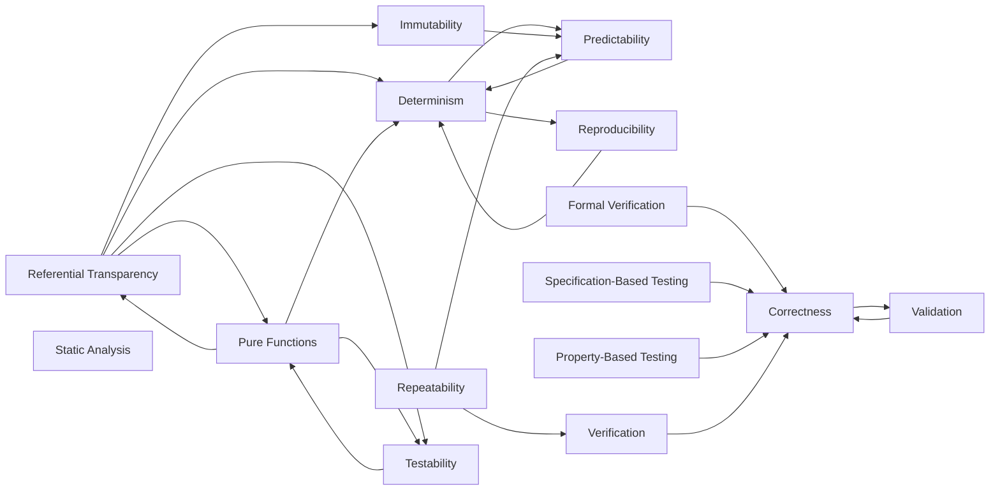
```mermaid
flowchart LR
n_determinism["Determinism"]
n_predictability["Predictability"]
n_referential_transparency["Referential Transparency"]
n_pure_functions["Pure Functions"]
n_immutability["Immutability"]
n_reproducibility["Reproducibility"]
n_repeatability["Repeatability"]
n_correctness["Correctness"]
n_formal_verification["Formal Verification"]
n_specification_based_testing["Specification-Based Testing"]
n_property_based_testing["Property-Based Testing"]
n_static_analysis["Static Analysis"]
n_testability["Testability"]
n_validation["Validation"]
n_verification["Verification"]
n_determinism --> n_predictability
n_determinism --> n_reproducibility
n_predictability --> n_determinism
n_referential_transparency --> n_pure_functions
n_referential_transparency --> n_immutability
n_referential_transparency --> n_determinism
n_referential_transparency --> n_testability
n_pure_functions --> n_testability
n_pure_functions --> n_determinism
n_pure_functions --> n_referential_transparency
n_immutability --> n_predictability
n_reproducibility --> n_determinism
n_repeatability --> n_verification
n_repeatability --> n_predictability
n_correctness --> n_validation
n_formal_verification --> n_correctness
n_specification_based_testing --> n_correctness
n_property_based_testing --> n_correctness
n_testability --> n_pure_functions
n_validation --> n_correctness
n_verification --> n_correctness
```

### Determinism

- Kind: [principle](SCHEMA.md#kind-principle)
- Severity: recommended
- Scope: function, process, build, test
- Layer: [Computation Core](SCHEMA.md#layer-computation-core)

Details

Requires
[Controlled Inputs](LEXICON.md#lex-controlled-inputs), [Controlled State](LEXICON.md#lex-controlled-state)
Reinforces
[Predictability](PRINCIPLES.md#arch-predictability), [Reproducibility](PRINCIPLES.md#arch-reproducibility)
Enables
[Reliable Testing](LEXICON.md#lex-reliable-testing)
In tension with
[Runtime Adaptivity](LEXICON.md#lex-runtime-adaptivity)
Conflicts with
[Hidden Time/Randomness/Global State](LEXICON.md#lex-hidden-time-randomness-global-state)
Referenced by
[Artificial Intelligence Architecture](PRINCIPLES.md#arch-artificial-intelligence-architecture), [Agentic Architecture](PRINCIPLES.md#arch-agentic-architecture), [Predictability](PRINCIPLES.md#arch-predictability), [Referential Transparency](PRINCIPLES.md#arch-referential-transparency), [Pure Functions](PRINCIPLES.md#arch-pure-functions), [Reproducibility](PRINCIPLES.md#arch-reproducibility)
Tensions
[Determinism Runtime Adaptivity](SCHEMA.md#tension-determinism-runtime-adaptivity)

Violated by
nondeterministic behavior without explicit source
Detected by
flaky tests, hidden random/time calls
Measured by
flake rate, reproducibility score
Refactored by
Inject Clock/RNG, Control State
Enforced by
deterministic test rules

```typescript
function makeFoo(name: string) {
  return { id: crypto.randomUUID(), name, createdAt: new Date() };
}
```

```typescript
function makeFoo(name: string, id: FooId, createdAt: Date): Foo {
  return { id, name, createdAt };
}
```

### Predictability

- Kind: [quality-attribute](SCHEMA.md#kind-quality-attribute)
- Severity: recommended
- Scope: API, module, runtime
- Layer: [Computation Core](SCHEMA.md#layer-computation-core)

Details

Requires
[Determinism](PRINCIPLES.md#arch-determinism), [Explicit Contracts](PRINCIPLES.md#arch-explicit-contracts)
Reinforces
[Principle of Least Surprise](PRINCIPLES.md#arch-principle-of-least-surprise)
Enables
[Safe Refactoring](LEXICON.md#lex-safe-refactoring)
In tension with
[Dynamic Runtime Behavior](LEXICON.md#lex-dynamic-runtime-behavior)
Conflicts with
[Hidden Behavior](LEXICON.md#lex-hidden-behavior)
Referenced by
[Pattern Consistency](PRINCIPLES.md#arch-pattern-consistency), [Design by Contract](PRINCIPLES.md#arch-design-by-contract), [Explicit Contracts](PRINCIPLES.md#arch-explicit-contracts), [API Contract](PRINCIPLES.md#arch-api-contract), [Postconditions](PRINCIPLES.md#arch-postconditions), [Determinism](PRINCIPLES.md#arch-determinism), [Immutability](PRINCIPLES.md#arch-immutability), [Repeatability](PRINCIPLES.md#arch-repeatability), [Declarative Configuration](PRINCIPLES.md#arch-declarative-configuration), [Convention over Configuration](PRINCIPLES.md#arch-convention-over-configuration), [Runtime Discovery](PRINCIPLES.md#arch-runtime-discovery), [Late Binding](PRINCIPLES.md#arch-late-binding), [Runtime Extensibility](PRINCIPLES.md#arch-runtime-extensibility), [Principle of Least Surprise](PRINCIPLES.md#arch-principle-of-least-surprise), [State Isolation](PRINCIPLES.md#arch-state-isolation), [Controlled Side Effects](PRINCIPLES.md#arch-controlled-side-effects)
Tensions
[Predictability Dynamic Runtime Behavior](SCHEMA.md#tension-dynamic-runtime-behavior-predictability)

Violated by
surprising side effects, implicit ordering
Detected by
nondeterministic tests, ambiguous APIs
Measured by
flake/misuse rate
Refactored by
Make Behavior Explicit, Add Contracts
Enforced by
[tests](LEXICON.md#lex-tests), [contracts](LEXICON.md#lex-contracts), linting

```typescript
function saveFoo(foo: Foo) {
  if (Math.random() > 0.5) return memoryStore.save(foo);
  return sqlStore.save(foo);
}
```

```typescript
function saveFoo(store: FooStore, foo: Foo) {
  return store.save(foo);
}
```

### Referential Transparency

- Kind: [principle](SCHEMA.md#kind-principle)
- Severity: contextual
- Scope: function, expression
- Layer: [Computation Core](SCHEMA.md#layer-computation-core)

Details

Requires
[Pure Functions](PRINCIPLES.md#arch-pure-functions), [Immutability](PRINCIPLES.md#arch-immutability)
Reinforces
[Determinism](PRINCIPLES.md#arch-determinism), [Testability](PRINCIPLES.md#arch-testability)
Enables
[Safe Substitution](LEXICON.md#lex-safe-substitution)
In tension with
[Stateful IO](LEXICON.md#lex-stateful-io)
Conflicts with
[Side Effects](LEXICON.md#lex-side-effects)
Referenced by
[Pure Functions](PRINCIPLES.md#arch-pure-functions)
Tensions
[Referential Transparency Stateful IO](SCHEMA.md#tension-referential-transparency-stateful-io)

Violated by
same input producing different output
Detected by
hidden dependency on time/random/global state
Measured by
pure function coverage
Refactored by
Extract Pure Function, Inject Dependency
Enforced by
[code review](PRINCIPLES.md#arch-code-review), functional boundaries

```typescript
function fooTotal(values: number[]) {
  globalCounter += 1;
  return values.reduce((a, b) => a + b, 0) + globalCounter;
}
```

```typescript
function fooTotal(values: readonly number[]) {
  return values.reduce((a, b) => a + b, 0);
}
```

### Pure Functions

- Kind: [technique](SCHEMA.md#kind-technique)
- Severity: recommended
- Scope: function, domain logic
- Layer: [Computation Core](SCHEMA.md#layer-computation-core)

Details

Requires
[No Side Effects](LEXICON.md#lex-no-side-effects), [Explicit Inputs](LEXICON.md#lex-explicit-inputs)
Reinforces
[Testability](PRINCIPLES.md#arch-testability), [Determinism](PRINCIPLES.md#arch-determinism)
Enables
[Referential Transparency](PRINCIPLES.md#arch-referential-transparency)
In tension with
[Stateful Operations](LEXICON.md#lex-stateful-operations)
Conflicts with
[Hidden IO](LEXICON.md#lex-hidden-io)
Referenced by
[Referential Transparency](PRINCIPLES.md#arch-referential-transparency), [Testability](PRINCIPLES.md#arch-testability)
Tensions
[Pure Functions Stateful Operations](SCHEMA.md#tension-pure-functions-stateful-operations)

Violated by
mutation, IO, global reads/writes
Detected by
side-effect calls inside pure layer
Measured by
pure core ratio
Refactored by
Extract Pure Logic, Move IO Outward
Enforced by
layer rules, [tests](LEXICON.md#lex-tests)

```typescript
function normalizeFoo(foo: Foo) {
  foo.name = foo.name.trim();
  fooStore.save(foo);
  return foo;
}
```

```typescript
function normalizeFoo(foo: Foo): Foo {
  return { ...foo, name: foo.name.trim() };
}
```

### Immutability

- Kind: [principle](SCHEMA.md#kind-principle)
- Severity: recommended
- Scope: data, value object, concurrency
- Layer: [Computation Core](SCHEMA.md#layer-computation-core)

Details

Requires
[Value Semantics](LEXICON.md#lex-value-semantics)
Reinforces
[Thread Safety](LEXICON.md#lex-thread-safety), [Predictability](PRINCIPLES.md#arch-predictability)
Enables
[Safe Sharing](LEXICON.md#lex-safe-sharing)
In tension with
[Allocation Cost](LEXICON.md#lex-allocation-cost)
Conflicts with
[Shared Mutable State](PRINCIPLES.md#arch-shared-mutable-state)
Referenced by
[Referential Transparency](PRINCIPLES.md#arch-referential-transparency), [Value Object](PRINCIPLES.md#arch-value-object)
Tensions
[Immutability Allocation Cost](SCHEMA.md#tension-allocation-cost-immutability)

Violated by
mutating value objects, exposed mutable collections
Detected by
setters on value objects, mutable public fields
Measured by
mutable state count
Refactored by
Make Immutable, Copy-on-Write
Enforced by
type system, lint rules

```typescript
type Foo = { name: string; tags: string[] };
function addTag(foo: Foo, tag: string) {
  foo.tags.push(tag);
  return foo;
}
```

```typescript
type Foo = Readonly<{ name: string; tags: readonly string[] }>;
function addTag(foo: Foo, tag: string): Foo {
  return { ...foo, tags: [...foo.tags, tag] };
}
```

### Reproducibility

- Kind: [quality-attribute](SCHEMA.md#kind-quality-attribute)
- Severity: recommended
- Scope: build, test, deployment, ML
- Layer: [Computation Core](SCHEMA.md#layer-computation-core)

Details

Requires
[Determinism](PRINCIPLES.md#arch-determinism), [Versioned Inputs](LEXICON.md#lex-versioned-inputs)
Reinforces
[Auditability](PRINCIPLES.md#arch-auditability)
Enables
[Debugging](LEXICON.md#lex-debugging), [Compliance](PRINCIPLES.md#arch-compliance)
In tension with
[Continuous Updates](LEXICON.md#lex-continuous-updates)
Conflicts with
[Floating Dependencies](LEXICON.md#lex-floating-dependencies), [Flaky Test Normalization](PRINCIPLES.md#arch-flaky-test-normalization)
Referenced by
[Machine Learning Architecture](PRINCIPLES.md#arch-machine-learning-architecture), [Prompt Engineering](PRINCIPLES.md#arch-prompt-engineering), [Determinism](PRINCIPLES.md#arch-determinism), [Environment Parity](PRINCIPLES.md#arch-environment-parity), [Infrastructure as Code](PRINCIPLES.md#arch-infrastructure-as-code), [Immutable Infrastructure](PRINCIPLES.md#arch-immutable-infrastructure), [Benchmarking](PRINCIPLES.md#arch-benchmarking)
Tensions
[Reproducibility Continuous Updates](SCHEMA.md#tension-continuous-updates-reproducibility)

Violated by
unpinned dependencies, nondeterministic builds
Detected by
build output drift
Measured by
reproducible build/test pass rate
Refactored by
Pin Versions, Lock Inputs, Capture Environment
Enforced by
lockfiles, build verification

```typescript
const result = trainFoo(data, { seed: Math.random() });
```

```typescript
const config = {
  seed: 42,
  datasetVersion: "foo-v3",
  algorithmVersion: "1.2.0",
} as const;
const result = trainFoo(data, config);
```

### Repeatability

- Kind: [quality-attribute](SCHEMA.md#kind-quality-attribute)
- Severity: mandatory
- Scope: test, build, process
- Layer: [Computation Core](SCHEMA.md#layer-computation-core)

Details

Requires
[Controlled Inputs](LEXICON.md#lex-controlled-inputs)
Reinforces
[Verification](PRINCIPLES.md#arch-verification), [Predictability](PRINCIPLES.md#arch-predictability)
Enables
[Reliable Automation](LEXICON.md#lex-reliable-automation)
In tension with
[Real-World Variability](LEXICON.md#lex-real-world-variability)
Conflicts with
[Environment-Sensitive Behavior](LEXICON.md#lex-environment-sensitive-behavior)
Tensions
[Repeatability Real-World Variability](SCHEMA.md#tension-real-world-variability-repeatability)

Violated by
tests depending on ordering/time/external state
Detected by
flaky test results
Measured by
rerun consistency
Refactored by
Isolate Environment, Mock External Inputs
Enforced by
CI rerun policy

```typescript
test("foo", () => expect(runFoo(Date.now())).toEqual(snapshot()));
```

```typescript
test("foo", () => {
  const clock = new FixedClock("2026-01-01T00:00:00Z");
  expect(runFoo(clock)).toEqual(expectedFoo);
});
```

### Correctness

- Kind: [quality-attribute](SCHEMA.md#kind-quality-attribute)
- Severity: mandatory
- Scope: function, module, system
- Layer: [Computation Core](SCHEMA.md#layer-computation-core)

Details

Requires
[Specification](LEXICON.md#lex-specification), [Validation](PRINCIPLES.md#arch-validation), [Tests](LEXICON.md#lex-tests)
Reinforces
[Design by Contract](PRINCIPLES.md#arch-design-by-contract)
Enables
[Safe Operation](LEXICON.md#lex-safe-operation)
In tension with
[Delivery Speed](LEXICON.md#lex-delivery-speed)
Conflicts with
[Undefined Behavior](LEXICON.md#lex-undefined-behavior)
Referenced by
[Model Evaluation](PRINCIPLES.md#arch-model-evaluation), [Design Review](PRINCIPLES.md#arch-design-review), [First-Principles Design](PRINCIPLES.md#arch-first-principles-design), [Finite State Machine](PRINCIPLES.md#arch-finite-state-machine), [Happens-Before Relationship](PRINCIPLES.md#arch-happens-before-relationship), [Design by Contract](PRINCIPLES.md#arch-design-by-contract), [Semantic Contracts](PRINCIPLES.md#arch-semantic-contracts), [Preconditions](PRINCIPLES.md#arch-preconditions), [Postconditions](PRINCIPLES.md#arch-postconditions), [Invariants](PRINCIPLES.md#arch-invariants), [Formal Verification](PRINCIPLES.md#arch-formal-verification), [Specification-Based Testing](PRINCIPLES.md#arch-specification-based-testing), [Property-Based Testing](PRINCIPLES.md#arch-property-based-testing), [Validation](PRINCIPLES.md#arch-validation), [Verification](PRINCIPLES.md#arch-verification), [Domain Model](PRINCIPLES.md#arch-domain-model), [Fail Fast](PRINCIPLES.md#arch-fail-fast), [Error Handling](PRINCIPLES.md#arch-error-handling), [Schema Validation](PRINCIPLES.md#arch-schema-validation), [Type Safety](PRINCIPLES.md#arch-type-safety), [Single Source of Truth](PRINCIPLES.md#arch-single-source-of-truth), [Semantic Consistency](PRINCIPLES.md#arch-semantic-consistency), [Input Validation](PRINCIPLES.md#arch-input-validation), [Atomicity](PRINCIPLES.md#arch-atomicity), [ACID](PRINCIPLES.md#arch-acid), [Consistency](PRINCIPLES.md#arch-consistency), [Isolation](PRINCIPLES.md#arch-isolation), [Concurrency Control](PRINCIPLES.md#arch-concurrency-control)
Tensions
[Correctness Delivery Speed](SCHEMA.md#tension-correctness-delivery-speed)

Violated by
behavior diverging from specification
Detected by
failing tests, invariant violations
Measured by
defect rate, spec coverage
Refactored by
Add Tests, Fix Logic, Add Contracts
Enforced by
CI, formal/static checks

```typescript
function averageFoo(total: number, count: number) {
  return total / count;
}
```

```typescript
function averageFoo(total: number, count: number) {
  if (!Number.isFinite(total)) throw new Error("invalid total");
  if (!Number.isInteger(count) || count <= 0) throw new Error("invalid count");
  return total / count;
}
```

### Formal Verification

- Kind: [activity](SCHEMA.md#kind-activity)
- Severity: contextual
- Scope: algorithm, protocol, critical system
- Layer: [Computation Core](SCHEMA.md#layer-computation-core)

Details

Requires
[Formal Specification](LEXICON.md#lex-formal-specification)
Reinforces
[Correctness](PRINCIPLES.md#arch-correctness)
Enables
[Mathematical Assurance](LEXICON.md#lex-mathematical-assurance)
In tension with
[Cost/Complexity](LEXICON.md#lex-cost-complexity)
Conflicts with
[Informal Validation Only](LEXICON.md#lex-informal-validation-only)
Tensions
[Formal Verification Cost/Complexity](SCHEMA.md#tension-cost-complexity-formal-verification)

Violated by
critical logic without proof where required
Detected by
missing formal model for critical invariant
Measured by
proven property coverage
Refactored by
Specify Model, Prove Invariant
Enforced by
proof tooling

```typescript
function transferFoo(a: FooBalance, b: FooBalance, amount: number) {
  a.value -= amount;
  b.value += amount;
}
```

```typescript
function transferFoo(state: FooState, amount: PositiveAmount): FooState {
  requires(state.from >= amount.value);
  const next = { from: state.from - amount.value, to: state.to + amount.value };
  ensures(next.from + next.to === state.from + state.to);
  return next;
}
```

### Specification-Based Testing

- Kind: [activity](SCHEMA.md#kind-activity)
- Severity: recommended
- Scope: function, API, module
- Layer: [Computation Core](SCHEMA.md#layer-computation-core)

Details

Requires
[Specification](LEXICON.md#lex-specification)
Reinforces
[Correctness](PRINCIPLES.md#arch-correctness), [Contracts](LEXICON.md#lex-contracts)
Enables
[Behavior Validation](LEXICON.md#lex-behavior-validation)
In tension with
[Spec Maintenance](LEXICON.md#lex-spec-maintenance)
Conflicts with
[Implementation-Only Testing](LEXICON.md#lex-implementation-only-testing), [Mock Mirage](PRINCIPLES.md#arch-mock-mirage)
Tensions
[Specification-Based Testing Spec Maintenance](SCHEMA.md#tension-spec-maintenance-specification-based-testing)

Violated by
tests coupled to implementation details
Detected by
lack of spec-derived tests
Measured by
spec coverage
Refactored by
Add Spec Tests
Enforced by
test gates

```typescript
test("saveFoo", async () => expect(await saveFoo(foo)).toBeTruthy());
```

```typescript
describeContract("FooStore", (store) => {
  it("returns the saved Foo", async () => {
    await store.save(foo);
    expect(await store.find(foo.id)).toEqual(foo);
  });
});
```

### Property-Based Testing

- Kind: [activity](SCHEMA.md#kind-activity)
- Severity: recommended
- Scope: function, algorithm, parser, domain invariant
- Layer: [Computation Core](SCHEMA.md#layer-computation-core)

Details

Requires
[Properties/Invariants](LEXICON.md#lex-properties-invariants)
Reinforces
[Correctness](PRINCIPLES.md#arch-correctness), [Robustness](LEXICON.md#lex-robustness)
Enables
[Broad Input Exploration](LEXICON.md#lex-broad-input-exploration)
In tension with
[Shrinking/Debug Complexity](LEXICON.md#lex-shrinking-debug-complexity)
Conflicts with
[Example-Only Testing](LEXICON.md#lex-example-only-testing)
Tensions
[Property-Based Testing Shrinking/Debug Complexity](SCHEMA.md#tension-property-based-testing-shrinking-debug-complexity)

Violated by
invariant-heavy code with only example tests
Detected by
missing generative tests for critical properties
Measured by
property coverage, counterexample count
Refactored by
Define Property, Add Generator
Enforced by
property test suite

```typescript
test("normalizeFoo", () =>
  expect(normalizeFoo({ name: " Foo " }).name).toBe("Foo"));
```

```typescript
property(string(), (name) => {
  const once = normalizeFoo({ name });
  const twice = normalizeFoo(once);
  expect(twice).toEqual(once);
});
```

### Static Analysis

- Kind: [mechanism](SCHEMA.md#kind-mechanism)
- Severity: mandatory
- Scope: codebase, build
- Layer: [Computation Core](SCHEMA.md#layer-computation-core)

Details

Requires
[Ruleset](LEXICON.md#lex-ruleset)
Reinforces
[Type Safety](PRINCIPLES.md#arch-type-safety), [Security](LEXICON.md#lex-security), [Architecture Compliance](LEXICON.md#lex-architecture-compliance)
Enables
[Automated Enforcement](LEXICON.md#lex-automated-enforcement)
In tension with
[False Positives](LEXICON.md#lex-false-positives)
Conflicts with
[Unchecked Dynamic Code](LEXICON.md#lex-unchecked-dynamic-code)
Referenced by
[Metaprogramming](PRINCIPLES.md#arch-metaprogramming), [Reflection](PRINCIPLES.md#arch-reflection), [Plugin Architecture](PRINCIPLES.md#arch-plugin-architecture), [Runtime Discovery](PRINCIPLES.md#arch-runtime-discovery), [Type Safety](PRINCIPLES.md#arch-type-safety)
Tensions
[Static Analysis False Positives](SCHEMA.md#tension-false-positives-static-analysis)

Violated by
ignored analyzer findings
Detected by
static analysis rule failures
Measured by
issue count, false-positive rate
Refactored by
Fix Violations, Tune Rules
Enforced by
CI quality gates

```typescript
const foo: any = loadFoo();
foo.nmae.toUpperCase();
```

```typescript
const foo: Foo = loadFoo();
foo.name.toUpperCase();
runTypeCheck({ noImplicitAny: true, strictNullChecks: true });
```

### Testability

- Kind: [quality-attribute](SCHEMA.md#kind-quality-attribute)
- Severity: mandatory
- Scope: class, module, service
- Layer: [Computation Core](SCHEMA.md#layer-computation-core)

Details

Requires
[Low Coupling](PRINCIPLES.md#arch-low-coupling), [Deterministic Behavior](LEXICON.md#lex-deterministic-behavior)
Reinforces
[Dependency Inversion Principle (DIP)](PRINCIPLES.md#arch-dependency-inversion), [Pure Functions](PRINCIPLES.md#arch-pure-functions)
Enables
[Regression Safety](LEXICON.md#lex-regression-safety)
In tension with
[Encapsulation Extremes](LEXICON.md#lex-encapsulation-extremes)
Conflicts with
[Hidden Dependencies](LEXICON.md#lex-hidden-dependencies), [Test Pyramid Inversion](PRINCIPLES.md#arch-test-pyramid-inversion)
Referenced by
[Ports and Adapters Architecture](PRINCIPLES.md#arch-ports-and-adapters-architecture), [Hexagonal Architecture](PRINCIPLES.md#arch-hexagonal-architecture), [Clean Architecture](PRINCIPLES.md#arch-clean-architecture), [Interface-Based Design](PRINCIPLES.md#arch-interface-based-design), [Postconditions](PRINCIPLES.md#arch-postconditions), [Single Responsibility Principle (SRP)](PRINCIPLES.md#arch-single-responsibility), [High Cohesion](PRINCIPLES.md#arch-high-cohesion), [Referential Transparency](PRINCIPLES.md#arch-referential-transparency), [Pure Functions](PRINCIPLES.md#arch-pure-functions), [Singleton Pattern](PRINCIPLES.md#arch-singleton-pattern), [Dependency Injection](PRINCIPLES.md#arch-dependency-injection), [Service Locator Pattern](PRINCIPLES.md#arch-service-locator-pattern), [Stateless Processing](PRINCIPLES.md#arch-stateless-processing), [State Isolation](PRINCIPLES.md#arch-state-isolation), [Controlled Side Effects](PRINCIPLES.md#arch-controlled-side-effects)
Tensions
[Testability Encapsulation Extremes](SCHEMA.md#tension-encapsulation-extremes-testability)

Violated by
hardcoded dependencies, [global state](LEXICON.md#lex-global-state), nondeterminism
Detected by
difficult setup, excessive mocking, flaky tests
Measured by
test setup complexity, coverage, flake rate
Refactored by
Inject Dependencies, Isolate Side Effects
Enforced by
test gates, [architecture review](PRINCIPLES.md#arch-architecture-review)

```typescript
function createFoo(name: string) {
  return fooDb.save({ id: crypto.randomUUID(), name, createdAt: new Date() });
}
```

```typescript
function createFoo(name: string, ids: IdSource, clock: Clock, store: FooStore) {
  return store.save({ id: ids.nextFooId(), name, createdAt: clock.now() });
}
```

### Validation

- Kind: [activity](SCHEMA.md#kind-activity)
- Severity: mandatory
- Scope: input, behavior, requirement
- Layer: [Computation Core](SCHEMA.md#layer-computation-core)

Details

Requires
[Acceptance Criteria](LEXICON.md#lex-acceptance-criteria)
Reinforces
[Correctness](PRINCIPLES.md#arch-correctness)
Enables
[Fitness for Use](LEXICON.md#lex-fitness-for-use)
In tension with
[Iteration Speed](LEXICON.md#lex-iteration-speed)
Conflicts with
[Assumption-Driven Delivery](LEXICON.md#lex-assumption-driven-delivery)
Referenced by
[Invariants](PRINCIPLES.md#arch-invariants), [Correctness](PRINCIPLES.md#arch-correctness), [Fail Fast](PRINCIPLES.md#arch-fail-fast), [Self-Describing Structures](PRINCIPLES.md#arch-self-describing-structures), [Metadata-Driven Design](PRINCIPLES.md#arch-metadata-driven-design), [Canonicalization](PRINCIPLES.md#arch-canonicalization), [Consistency](PRINCIPLES.md#arch-consistency)
Tensions
[Validation Iteration Speed](SCHEMA.md#tension-iteration-speed-validation)

Violated by
unvalidated user/system assumptions
Detected by
missing acceptance tests
Measured by
acceptance coverage
Refactored by
Add Validation Rules, Add Acceptance Tests
Enforced by
CI gates, QA policy

```typescript
function createFoo(input: any) {
  return fooStore.save(input);
}
```

```typescript
function createFoo(input: unknown) {
  const foo = CreateFooSchema.parse(input);
  return fooStore.save(foo);
}
```

### Verification

- Kind: [activity](SCHEMA.md#kind-activity)
- Severity: mandatory
- Scope: implementation, system
- Layer: [Computation Core](SCHEMA.md#layer-computation-core)

Details

Requires
[Specification](LEXICON.md#lex-specification)
Reinforces
[Correctness](PRINCIPLES.md#arch-correctness)
Enables
[Specification Compliance](LEXICON.md#lex-specification-compliance)
In tension with
[Cost](LEXICON.md#lex-cost)
Conflicts with
[Untested Implementation](LEXICON.md#lex-untested-implementation)
Referenced by
[Repeatability](PRINCIPLES.md#arch-repeatability)
Tensions
[Verification Cost](SCHEMA.md#tension-cost-verification)

Violated by
code lacking spec conformance checks
Detected by
missing tests/static checks
Measured by
verification coverage
Refactored by
Add Tests, Add Static Checks
Enforced by
CI gates

```typescript
await fooStore.save(foo);
return { ok: true };
```

```typescript
await fooStore.save(foo);
const persisted = await fooStore.find(foo.id);
if (!persisted || persisted.version !== foo.version)
  throw new Error("verification failed");
return { ok: true } as const;
```

## Creational Patterns

Every principle in this category. Each record carries its kind, its severity, the scopes it applies at and the layer it lives in, then the edge relations that join it to other records, the records that point back at it, the contracts that answer to it and the tensions it takes part in. The descriptors say how it is violated, detected, measured, repaired and enforced. Where the record carries one, an exemplar shows the shape before and after the principle is applied.

Relations diagram

The relations inside this category.

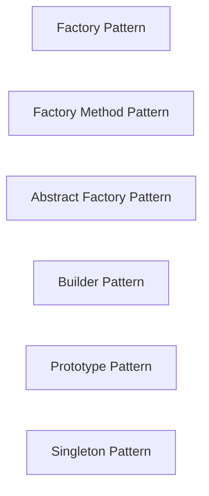
```mermaid
flowchart LR
n_factory_pattern["Factory Pattern"]
n_factory_method_pattern["Factory Method Pattern"]
n_abstract_factory_pattern["Abstract Factory Pattern"]
n_builder_pattern["Builder Pattern"]
n_prototype_pattern["Prototype Pattern"]
n_singleton_pattern["Singleton Pattern"]
```

### Factory Pattern

- Kind: [pattern](SCHEMA.md#kind-pattern)
- Severity: recommended
- Scope: object creation, module
- Layer: [Design Patterns Core](SCHEMA.md#layer-design-patterns-core)

Details

Requires
[Creation Variation](LEXICON.md#lex-creation-variation)
Reinforces
[Open/Closed Principle (OCP)](PRINCIPLES.md#arch-open-closed), [Encapsulation](PRINCIPLES.md#arch-encapsulation)
Enables
[Polymorphic Construction](LEXICON.md#lex-polymorphic-construction)
In tension with
[Simplicity](LEXICON.md#lex-simplicity)
Conflicts with
[Scattered Construction Logic](LEXICON.md#lex-scattered-construction-logic)
Referenced by
[Registry Pattern](PRINCIPLES.md#arch-registry-pattern)
Tensions
[Factory Pattern Simplicity](SCHEMA.md#tension-factory-pattern-simplicity)

Violated by
duplicated conditional construction
Detected by
repeated constructors/switches
Measured by
construction duplication count
Refactored by
Extract Factory
Enforced by
creation policy review

```typescript
const foo = new Foo("foo", 0, [], new Date(), "draft");
```

```typescript
function makeFoo(name: string): Foo {
  return new Foo(fooId(), name, 0, [], clock.now(), "draft");
}
```

### Factory Method Pattern

- Kind: [pattern](SCHEMA.md#kind-pattern)
- Severity: contextual
- Scope: class hierarchy, framework
- Layer: [Design Patterns Core](SCHEMA.md#layer-design-patterns-core)

Details

Requires
[Subclass-Controlled Creation](LEXICON.md#lex-subclass-controlled-creation)
Reinforces
[Open/Closed Principle (OCP)](PRINCIPLES.md#arch-open-closed)
Enables
[Deferred Instantiation](LEXICON.md#lex-deferred-instantiation)
In tension with
[Inheritance Complexity](LEXICON.md#lex-inheritance-complexity)
Conflicts with
[Concrete Constructor Coupling](LEXICON.md#lex-concrete-constructor-coupling)
Tensions
[Factory Method Pattern Inheritance Complexity](SCHEMA.md#tension-factory-method-pattern-inheritance-complexity)

Violated by
fixed construction in base workflow
Detected by
base class directly instantiates variant
Measured by
variant construction duplication
Refactored by
Introduce Factory Method
Enforced by
[design review](PRINCIPLES.md#arch-design-review)

```typescript
class FooImporter {
  import(raw: string) {
    return new JsonFooParser().parse(raw);
  }
}
```

```typescript
abstract class FooImporter {
  protected abstract parser(): FooParser;
  import(raw: string) {
    return this.parser().parse(raw);
  }
}
class JsonFooImporter extends FooImporter {
  protected parser() {
    return new JsonFooParser();
  }
}
```

### Abstract Factory Pattern

- Kind: [pattern](SCHEMA.md#kind-pattern)
- Severity: contextual
- Scope: product family, component
- Layer: [Design Patterns Core](SCHEMA.md#layer-design-patterns-core)

Details

Requires
[Related Product Variants](LEXICON.md#lex-related-product-variants)
Reinforces
[Interchangeability](PRINCIPLES.md#arch-interchangeability)
Enables
[Family-Level Replacement](LEXICON.md#lex-family-level-replacement)
In tension with
[Boilerplate](LEXICON.md#lex-boilerplate)
Conflicts with
[Mixed Product Families](LEXICON.md#lex-mixed-product-families)
Tensions
[Abstract Factory Pattern Boilerplate](SCHEMA.md#tension-abstract-factory-pattern-boilerplate)

Violated by
incompatible product combinations
Detected by
manual selection of related product classes
Measured by
family mismatch defects
Refactored by
Introduce Abstract Factory
Enforced by
factory conformance tests

```typescript
const store = env === "test" ? new MemoryFooStore() : new SqlFooStore();
const bus = env === "test" ? new MemoryFooBus() : new KafkaFooBus();
```

```typescript
interface FooPlatformFactory {
  store(): FooStore;
  bus(): FooBus;
}
class TestFooPlatformFactory implements FooPlatformFactory {
  store() {
    return new MemoryFooStore();
  }
  bus() {
    return new MemoryFooBus();
  }
}
```

### Builder Pattern

- Kind: [pattern](SCHEMA.md#kind-pattern)
- Severity: recommended
- Scope: object construction, API
- Layer: [Design Patterns Core](SCHEMA.md#layer-design-patterns-core)

Details

Requires
[Complex Construction](LEXICON.md#lex-complex-construction)
Reinforces
[Intent-Revealing Interface](PRINCIPLES.md#arch-intent-revealing-interface)
Enables
[Valid Object Creation](LEXICON.md#lex-valid-object-creation)
In tension with
[Boilerplate](LEXICON.md#lex-boilerplate)
Conflicts with
[Telescoping Constructor](LEXICON.md#lex-telescoping-constructor)
Tensions
[Builder Pattern Boilerplate](SCHEMA.md#tension-boilerplate-builder-pattern)

Violated by
constructors with many optional params
Detected by
high-arity constructors
Measured by
constructor parameter count
Refactored by
Introduce Builder
Enforced by
API review

```typescript
const foo = new Foo("foo_1", "Foo", [], 0, false, undefined, "draft");
```

```typescript
const foo = new FooBuilder()
  .withId("foo_1")
  .withName("Foo")
  .withStatus("draft")
  .build();
```

### Prototype Pattern

- Kind: [pattern](SCHEMA.md#kind-pattern)
- Severity: contextual
- Scope: object creation, runtime
- Layer: [Design Patterns Core](SCHEMA.md#layer-design-patterns-core)

Details

Requires
[Cloneable Template Object](LEXICON.md#lex-cloneable-template-object)
Reinforces
[Runtime Extensibility](PRINCIPLES.md#arch-runtime-extensibility)
Enables
[Dynamic Object Creation](LEXICON.md#lex-dynamic-object-creation)
In tension with
[Copy Semantics](LEXICON.md#lex-copy-semantics)
Conflicts with
[Complex Factory Hierarchies](LEXICON.md#lex-complex-factory-hierarchies)
Tensions
[Prototype Pattern Copy Semantics](SCHEMA.md#tension-copy-semantics-prototype-pattern)

Violated by
expensive repeated setup
Detected by
duplicate initialization flows
Measured by
initialization duplication/cost
Refactored by
Introduce Prototype, Add Clone Semantics
Enforced by
clone tests

```typescript
function copyFoo(foo: Foo) {
  return new Foo(
    foo.id,
    foo.name,
    [...foo.tags],
    foo.settings.theme,
    foo.settings.mode,
  );
}
```

```typescript
class FooPrototype {
  constructor(private readonly base: Foo) {}
  clone(overrides: Partial<Foo> = {}): Foo {
    return structuredClone({ ...this.base, ...overrides });
  }
}
const template = new FooPrototype(await buildExpensiveFoo());
const draft = template.clone({ name: "quick" });
```

### Singleton Pattern

- Kind: [pattern](SCHEMA.md#kind-pattern)
- Severity: contextual/discouraged unless justified
- Scope: object creation, lifetime, composition root
- Layer: [Design Patterns Core](SCHEMA.md#layer-design-patterns-core)

Details

Requires
[Single-Instance Need](LEXICON.md#lex-single-instance-need)
Reinforces
[Controlled Instantiation](LEXICON.md#lex-controlled-instantiation)
Enables
[Shared Resource Access](LEXICON.md#lex-shared-resource-access)
In tension with
[Testability](PRINCIPLES.md#arch-testability), [Dependency Injection](PRINCIPLES.md#arch-dependency-injection)
Conflicts with
[Global Mutable State](LEXICON.md#lex-global-mutable-state)
Tensions
[Singleton Pattern Testability](SCHEMA.md#tension-singleton-pattern-testability), [Singleton Pattern Dependency Injection](SCHEMA.md#tension-dependency-injection-singleton-pattern)

Violated by
a global mutable instance reached from anywhere
Detected by
static global access to a shared service
Measured by
global-instance reach-in count
Refactored by
Compose Single Instance at the Root, Inject It
Enforced by
composition-root review

```typescript
let instance: FooService | undefined;
function getFooService() {
  return (instance ??= new FooService());
}
```

```typescript
class FooService {}
export function composeApp() {
  const fooService = new FooService();
  return { fooService, fooController: new FooController(fooService) };
}
```

## Domain Architecture

Every principle in this category. Each record carries its kind, its severity, the scopes it applies at and the layer it lives in, then the edge relations that join it to other records, the records that point back at it, the contracts that answer to it and the tensions it takes part in. The descriptors say how it is violated, detected, measured, repaired and enforced. Where the record carries one, an exemplar shows the shape before and after the principle is applied.

Relations diagram

The relations inside this category.

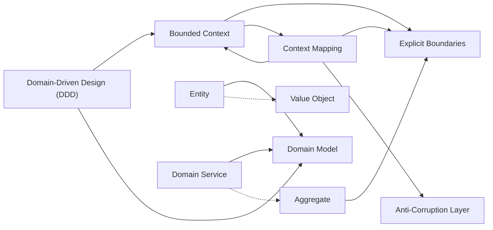
```mermaid
flowchart LR
n_domain_driven_design["Domain-Driven Design (DDD)"]
n_domain_model["Domain Model"]
n_bounded_context["Bounded Context"]
n_context_mapping["Context Mapping"]
n_anti_corruption_layer["Anti-Corruption Layer"]
n_explicit_boundaries["Explicit Boundaries"]
n_aggregate["Aggregate"]
n_value_object["Value Object"]
n_entity["Entity"]
n_domain_service["Domain Service"]
n_domain_driven_design --> n_bounded_context
n_domain_driven_design --> n_domain_model
n_bounded_context --> n_explicit_boundaries
n_bounded_context --> n_context_mapping
n_context_mapping --> n_bounded_context
n_context_mapping --> n_explicit_boundaries
n_context_mapping --> n_anti_corruption_layer
n_aggregate --> n_explicit_boundaries
n_entity --> n_domain_model
n_entity -.-> n_value_object
n_domain_service --> n_domain_model
n_domain_service -.-> n_aggregate
```

### Domain-Driven Design (DDD)

- Kind: [style](SCHEMA.md#kind-style)
- Severity: contextual
- Scope: domain, bounded context, system
- Aliases: DDD
- Layer: [Domain Modeling](SCHEMA.md#layer-domain-modeling)

Details

Requires
[Ubiquitous Language](PRINCIPLES.md#arch-ubiquitous-language), [Bounded Context](PRINCIPLES.md#arch-bounded-context)
Reinforces
[Domain Model](PRINCIPLES.md#arch-domain-model), [Semantic Consistency](PRINCIPLES.md#arch-semantic-consistency)
Enables
[Domain Alignment](LEXICON.md#lex-domain-alignment)
In tension with
[Simple CRUD](LEXICON.md#lex-simple-crud)
Conflicts with
[Anemic Transaction Script](LEXICON.md#lex-anemic-transaction-script)
Referenced by
[Domain Events](PRINCIPLES.md#arch-domain-events), [Ubiquitous Language](PRINCIPLES.md#arch-ubiquitous-language)
Tensions
[Domain-Driven Design (DDD) Simple CRUD](SCHEMA.md#tension-domain-driven-design-ddd-simple-crud)

Violated by
domain logic in infrastructure/controllers
Detected by
anemic models, scattered business rules
Measured by
domain logic locality
Refactored by
Extract Domain Model, Add Aggregate, Split Context
Enforced by
layer rules, domain tests

```typescript
function updateFoo(row: FooRow, name: string) {
  row.name = name;
  row.updated_at = Date.now();
  return fooTable.save(row);
}
```

```typescript
class Foo {
  private constructor(
    readonly id: FooId,
    private name: string,
  ) {}
  rename(name: FooName) {
    this.name = name.value;
  }
}
foo.rename(FooName.create(name));
```

### Domain Model

- Kind: [artifact](SCHEMA.md#kind-artifact)
- Severity: contextual
- Scope: domain, bounded context
- Layer: [Domain Modeling](SCHEMA.md#layer-domain-modeling)

Details

Requires
[Ubiquitous Language](PRINCIPLES.md#arch-ubiquitous-language), [Invariants](PRINCIPLES.md#arch-invariants)
Reinforces
[Correctness](PRINCIPLES.md#arch-correctness), [Semantic Contracts](PRINCIPLES.md#arch-semantic-contracts)
Enables
[Business Rule Encapsulation](LEXICON.md#lex-business-rule-encapsulation)
In tension with
[Persistence Simplicity](LEXICON.md#lex-persistence-simplicity)
Conflicts with
[Anemic Model](LEXICON.md#lex-anemic-model)
Referenced by
[Semantic Contracts](PRINCIPLES.md#arch-semantic-contracts), [Domain-Driven Design (DDD)](PRINCIPLES.md#arch-domain-driven-design), [Entity](PRINCIPLES.md#arch-entity), [Domain Service](PRINCIPLES.md#arch-domain-service), [Domain Events](PRINCIPLES.md#arch-domain-events)
Tensions
[Domain Model Persistence Simplicity](SCHEMA.md#tension-domain-model-persistence-simplicity)

Violated by
business rules outside domain objects/services
Detected by
procedural domain logic in services/controllers
Measured by
rule locality, invariant coverage
Refactored by
Move Logic to Domain, Add Value Object, Add Aggregate
Enforced by
domain layer rules, [tests](LEXICON.md#lex-tests)

```typescript
type Foo = { status: string; count: number };
function closeFoo(foo: Foo) {
  foo.status = "closed";
}
```

```typescript
class Foo {
  #status: "open" | "closed" = "open";
  close() {
    if (this.#status === "closed") throw new Error("Foo already closed");
    this.#status = "closed";
  }
}
```

### Bounded Context

- Kind: [constraint](SCHEMA.md#kind-constraint)
- Severity: recommended
- Scope: domain, service, team
- Aliases: Bounded Contexts
- Layer: [Domain Modeling](SCHEMA.md#layer-domain-modeling)

Details

Requires
[Explicit Boundaries](PRINCIPLES.md#arch-explicit-boundaries), [Ubiquitous Language](PRINCIPLES.md#arch-ubiquitous-language)
Reinforces
[Modularity](PRINCIPLES.md#arch-modularity), [Autonomy](PRINCIPLES.md#arch-autonomy)
Enables
[Context Mapping](PRINCIPLES.md#arch-context-mapping), [Microservices](PRINCIPLES.md#arch-microservices)
In tension with
[Cross-Context Reuse](LEXICON.md#lex-cross-context-reuse)
Conflicts with
[Shared Global Model](LEXICON.md#lex-shared-global-model)
Referenced by
[Package by Feature](PRINCIPLES.md#arch-package-by-feature), [Microservices](PRINCIPLES.md#arch-microservices), [Domain-Driven Design (DDD)](PRINCIPLES.md#arch-domain-driven-design), [Context Mapping](PRINCIPLES.md#arch-context-mapping)
Tensions
[Bounded Context Cross-Context Reuse](SCHEMA.md#tension-bounded-context-cross-context-reuse)

Violated by
cross-context model leakage
Detected by
shared domain entities across contexts
Measured by
context coupling
Refactored by
Split Model, Add Anti-Corruption Layer, Define Context Map
Enforced by
package/service boundaries

```typescript
type FooStatus = "A" | "D";
function priceBar(status: FooStatus) {
  return status === "A" ? 10 : 0;
}
```

```typescript
type FooStatus = "active" | "disabled";
type BarEligibility = "eligible" | "ineligible";
function toBarEligibility(status: FooStatus): BarEligibility {
  return status === "active" ? "eligible" : "ineligible";
}
```

### Context Mapping

- Kind: [activity](SCHEMA.md#kind-activity)
- Severity: recommended
- Scope: bounded contexts, integration
- Layer: [Domain Modeling](SCHEMA.md#layer-domain-modeling)

Details

Requires
[Bounded Context](PRINCIPLES.md#arch-bounded-context), [Relationship Semantics](LEXICON.md#lex-relationship-semantics)
Reinforces
[Explicit Boundaries](PRINCIPLES.md#arch-explicit-boundaries), [Integration Clarity](LEXICON.md#lex-integration-clarity)
Enables
[Anti-Corruption Layer](PRINCIPLES.md#arch-anti-corruption-layer)
In tension with
[Documentation Overhead](LEXICON.md#lex-documentation-overhead)
Conflicts with
[Implicit Integration](LEXICON.md#lex-implicit-integration)
Referenced by
[Bounded Context](PRINCIPLES.md#arch-bounded-context)
Tensions
[Context Mapping Documentation Overhead](SCHEMA.md#tension-context-mapping-documentation-overhead)

Violated by
undocumented service/domain relationships
Detected by
unclear ownership, ambiguous integration flows
Measured by
undocumented dependency count
Refactored by
Define Context Map, Classify Upstream/Downstream
Enforced by
architecture docs, dependency reviews

```typescript
fooService.writeDirectly(barDatabase, foo);
barService.readDirectly(fooDatabase, foo.id);
```

```typescript
const contextMap = {
  upstream: "FooContext",
  downstream: "BarContext",
  relationship: "published-language",
} as const;
fooEvents.publish(toBarIntegrationEvent(foo));
```

### Anti-Corruption Layer

- Kind: [pattern](SCHEMA.md#kind-pattern)
- Severity: recommended
- Scope: integration, bounded context boundary
- Layer: [Domain Modeling](SCHEMA.md#layer-domain-modeling)

Details

Requires
[Explicit Boundary](LEXICON.md#lex-explicit-boundary), [Translation Model](LEXICON.md#lex-translation-model)
Reinforces
[Domain Purity](LEXICON.md#lex-domain-purity), [Low Coupling](PRINCIPLES.md#arch-low-coupling)
Enables
[Legacy/System Integration](LEXICON.md#lex-legacy-system-integration)
In tension with
[Mapping Overhead](LEXICON.md#lex-mapping-overhead)
Conflicts with
[Shared Model Coupling](LEXICON.md#lex-shared-model-coupling), [Vendor Lock-In Leakage](PRINCIPLES.md#arch-vendor-lock-in-leakage)
Referenced by
[Context Mapping](PRINCIPLES.md#arch-context-mapping), [Adapter Pattern](PRINCIPLES.md#arch-adapter-pattern)
Contracts
[Anti-Corruption Layer Over Cross-Context Leak](ALGORITHMS.md#algo-no-leaky-context)
Tensions
[Anti-Corruption Layer Mapping Overhead](SCHEMA.md#tension-anti-corruption-layer-mapping-overhead)

Violated by
external model leaking into domain
Detected by
external DTOs used in domain layer
Measured by
leakage count, adapter coverage
Refactored by
Add Translator, Add Adapter, Introduce Boundary DTO
Enforced by
import rules, layer tests

```typescript
function createBar(fooResponse: FooApiResponse) {
  return barService.create({ foo_status: fooResponse.state_code });
}
```

```typescript
type BarInput = { eligible: boolean };
function fromFoo(response: FooApiResponse): BarInput {
  return { eligible: response.state_code === "A" };
}
barService.create(fromFoo(fooResponse));
```

### Explicit Boundaries

- Kind: [principle](SCHEMA.md#kind-principle)
- Severity: mandatory
- Scope: module, component, service, domain
- Layer: [Domain Modeling](SCHEMA.md#layer-domain-modeling)

Details

Requires
[Stable Interfaces](PRINCIPLES.md#arch-stable-interfaces), [Ownership](LEXICON.md#lex-ownership)
Reinforces
[Modularity](PRINCIPLES.md#arch-modularity), [Encapsulation](PRINCIPLES.md#arch-encapsulation)
Enables
[Replaceability](PRINCIPLES.md#arch-replaceability), [Governance](PRINCIPLES.md#arch-governance)
In tension with
[Cross-Cutting Concerns](LEXICON.md#lex-cross-cutting-concerns)
Conflicts with
[Boundary Leakage](PRINCIPLES.md#arch-boundary-leakage)
Referenced by
[Single Responsibility Principle (SRP)](PRINCIPLES.md#arch-single-responsibility), [Separation of Concerns](PRINCIPLES.md#arch-separation-of-concerns), [High Cohesion](PRINCIPLES.md#arch-high-cohesion), [Modularity](PRINCIPLES.md#arch-modularity), [Independence](PRINCIPLES.md#arch-independence), [Bounded Context](PRINCIPLES.md#arch-bounded-context), [Context Mapping](PRINCIPLES.md#arch-context-mapping), [Aggregate](PRINCIPLES.md#arch-aggregate), [Declared Jurisdiction](PRINCIPLES.md#arch-declared-jurisdiction)
Tensions
[Explicit Boundaries Cross-Cutting Concerns](SCHEMA.md#tension-cross-cutting-concerns-explicit-boundaries)

Violated by
internal imports, shared mutable internals
Detected by
forbidden imports, [cyclic dependencies](LEXICON.md#lex-cyclic-dependencies)
Measured by
boundary violation count
Refactored by
Move Code, Extract API, Restrict Exports
Enforced by
module rules, architecture tests

```typescript
import { fooDatabase } from "../../foo/infrastructure/database";
export function loadBar(id: string) {
  return fooDatabase.query(id);
}
```

```typescript
export interface FooGateway {
  find(id: FooId): Promise<FooSnapshot>;
}
export function loadBar(id: FooId, foos: FooGateway) {
  return foos.find(id);
}
```

### Aggregate

- Kind: [pattern](SCHEMA.md#kind-pattern)
- Severity: contextual
- Scope: domain, consistency boundary, bounded context
- Layer: [Domain Modeling](SCHEMA.md#layer-domain-modeling)

Details

Requires
[Explicit Boundaries](PRINCIPLES.md#arch-explicit-boundaries)
Reinforces
[Invariants](PRINCIPLES.md#arch-invariants), [Encapsulation](PRINCIPLES.md#arch-encapsulation)
Enables
[Transactional Consistency Boundary](LEXICON.md#lex-transactional-consistency-boundary), [Root-Guarded Invariants](LEXICON.md#lex-root-guarded-invariants)
In tension with
[Aggregate Size](LEXICON.md#lex-aggregate-size)
Conflicts with
[Anemic Domain Model](PRINCIPLES.md#arch-anemic-domain-model)
Referenced by
[Domain Service](PRINCIPLES.md#arch-domain-service)
Tensions
[Aggregate Aggregate Size](SCHEMA.md#tension-aggregate-aggregate-size)

Violated by
invariants enforced by services outside the entity cluster
Detected by
cross-entity invariant checks scattered in services
Measured by
out-of-aggregate invariant enforcement count
Refactored by
Define Aggregate Root, Enforce Invariants Within
Enforced by
domain model review

```typescript
fooOrder.total -= item.price;
fooOrderItems.delete(item.id);
```

```typescript
class FooOrder {
  #items: FooItem[] = [];
  #total = 0;
  removeItem(id: FooItemId) {
    this.#items = this.#items.filter((item) => item.id !== id);
    this.#total = this.#items.reduce((sum, item) => sum + item.price, 0);
  }
}
```

### Value Object

- Kind: [pattern](SCHEMA.md#kind-pattern)
- Severity: recommended
- Scope: domain, modeling, immutability
- Layer: [Domain Modeling](SCHEMA.md#layer-domain-modeling)

Details

Requires
[Value Equality](LEXICON.md#lex-value-equality)
Reinforces
[Immutability](PRINCIPLES.md#arch-immutability), [Encapsulation](PRINCIPLES.md#arch-encapsulation)
Enables
[Self-Validating Values](LEXICON.md#lex-self-validating-values), [Side-Effect-Free Equality](LEXICON.md#lex-side-effect-free-equality)
In tension with
[Object Count](LEXICON.md#lex-object-count)
Conflicts with
[Primitive Obsession](PRINCIPLES.md#arch-primitive-obsession), [Data Clumps](PRINCIPLES.md#arch-data-clumps), [Long Parameter List](PRINCIPLES.md#arch-long-parameter-list)
Referenced by
[Entity](PRINCIPLES.md#arch-entity)
Tensions
[Value Object Object Count](SCHEMA.md#tension-object-count-value-object)

Violated by
domain concepts carried as bare primitives
Detected by
repeated validation of the same primitive shape
Measured by
primitive-typed domain concept count
Refactored by
Introduce Value Object
Enforced by
domain model review

```typescript
function priceFoo(amount: number, currency: string) {
  return { amount, currency };
}
```

```typescript
class Money {
  private constructor(
    readonly amount: number,
    readonly currency: string,
  ) {}
  static of(amount: number, currency: string): Money {
    if (amount < 0) throw new Error("negative money");
    return new Money(amount, currency);
  }
  equals(other: Money) {
    return this.amount === other.amount && this.currency === other.currency;
  }
  add(other: Money): Money {
    return Money.of(this.amount + other.amount, this.currency);
  }
}
```

### Entity

- Kind: [pattern](SCHEMA.md#kind-pattern)
- Severity: contextual
- Scope: domain, identity, lifecycle
- Layer: [Domain Modeling](SCHEMA.md#layer-domain-modeling)

Details

Requires
[Stable Identity](LEXICON.md#lex-stable-identity)
Reinforces
[Domain Model](PRINCIPLES.md#arch-domain-model), [Encapsulation](PRINCIPLES.md#arch-encapsulation)
Enables
[Identity-Based Equality](LEXICON.md#lex-identity-based-equality), [Lifecycle Tracking](LEXICON.md#lex-lifecycle-tracking)
In tension with
[Value Object](PRINCIPLES.md#arch-value-object)
Conflicts with
[Anemic Domain Model](PRINCIPLES.md#arch-anemic-domain-model)
Tensions
[Entity Value Object](SCHEMA.md#tension-entity-value-object)

Violated by
identity equated by attribute comparison
Detected by
equality by field value where identity is meant
Measured by
attribute-equality misuse count
Refactored by
Model Identity Explicitly
Enforced by
domain model review

```typescript
type Foo = { id: string; name: string; status: string };
foo.status = "active";
```

```typescript
class Foo {
  constructor(
    readonly id: FooId,
    private name: string,
    private status: FooStatus,
  ) {}
  equals(other: Foo) {
    return this.id === other.id;
  }
  activate() {
    this.status = "active";
  }
}
```

### Domain Service

- Kind: [pattern](SCHEMA.md#kind-pattern)
- Severity: contextual
- Scope: domain, behavior, coordination
- Layer: [Domain Modeling](SCHEMA.md#layer-domain-modeling)

Details

Requires
[Domain Model](PRINCIPLES.md#arch-domain-model)
Reinforces
[Single Responsibility Principle (SRP)](PRINCIPLES.md#arch-single-responsibility), [Ubiquitous Language](PRINCIPLES.md#arch-ubiquitous-language)
Enables
[Cross-Entity Domain Logic](LEXICON.md#lex-cross-entity-domain-logic)
In tension with
[Aggregate](PRINCIPLES.md#arch-aggregate)
Conflicts with
[Fat Controller](PRINCIPLES.md#arch-fat-controller), [Transaction Script Sprawl](PRINCIPLES.md#arch-transaction-script-sprawl)
Tensions
[Domain Service Aggregate](SCHEMA.md#tension-aggregate-domain-service)

Violated by
multi-entity domain rules living in controllers
Detected by
domain logic in application/transport layers
Measured by
misplaced domain-rule count
Refactored by
Extract Domain Service
Enforced by
domain model review

```typescript
class FooAccount {
  transferTo(other: FooAccount, amount: number) {
    this.balance -= amount;
    other.balance += amount;
  }
}
```

```typescript
class FooTransferService {
  transfer(from: FooAccount, to: FooAccount, amount: Money) {
    from.withdraw(amount);
    to.deposit(amount);
  }
}
```

## Error Handling / Resilience

Every principle in this category. Each record carries its kind, its severity, the scopes it applies at and the layer it lives in, then the edge relations that join it to other records, the records that point back at it, the contracts that answer to it and the tensions it takes part in. The descriptors say how it is violated, detected, measured, repaired and enforced. Where the record carries one, an exemplar shows the shape before and after the principle is applied.

Relations diagram

The relations inside this category.

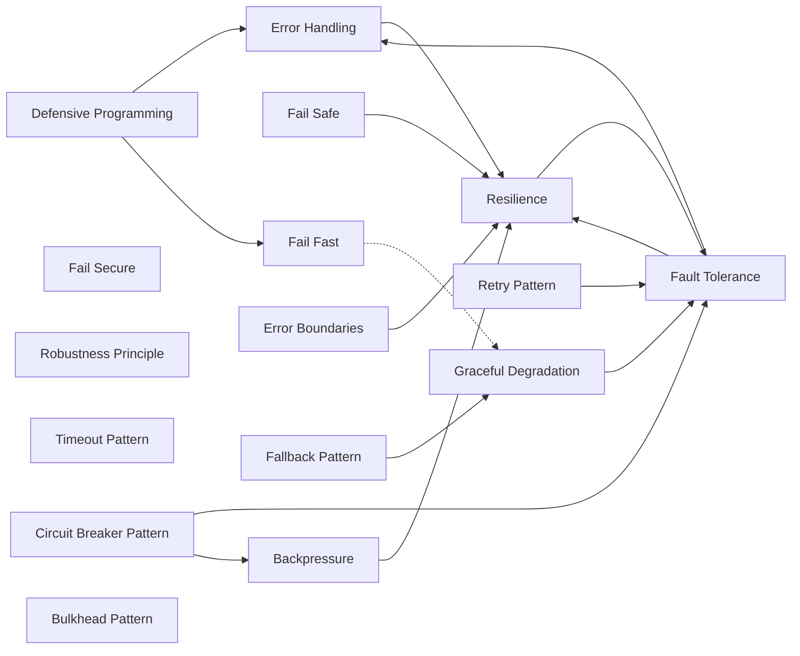
```mermaid
flowchart LR
n_defensive_programming["Defensive Programming"]
n_fail_fast["Fail Fast"]
n_fail_safe["Fail Safe"]
n_fail_secure["Fail Secure"]
n_graceful_degradation["Graceful Degradation"]
n_fault_tolerance["Fault Tolerance"]
n_resilience["Resilience"]
n_robustness_principle["Robustness Principle"]
n_error_handling["Error Handling"]
n_error_boundaries["Error Boundaries"]
n_fallback_pattern["Fallback Pattern"]
n_retry_pattern["Retry Pattern"]
n_timeout_pattern["Timeout Pattern"]
n_circuit_breaker_pattern["Circuit Breaker Pattern"]
n_bulkhead_pattern["Bulkhead Pattern"]
n_backpressure["Backpressure"]
n_defensive_programming --> n_error_handling
n_defensive_programming --> n_fail_fast
n_fail_fast -.-> n_graceful_degradation
n_fail_safe --> n_resilience
n_graceful_degradation --> n_fault_tolerance
n_fault_tolerance --> n_error_handling
n_fault_tolerance --> n_resilience
n_resilience --> n_fault_tolerance
n_error_handling --> n_resilience
n_error_boundaries --> n_resilience
n_fallback_pattern --> n_graceful_degradation
n_retry_pattern --> n_fault_tolerance
n_circuit_breaker_pattern --> n_fault_tolerance
n_circuit_breaker_pattern --> n_backpressure
n_backpressure --> n_resilience
```

### Defensive Programming

- Kind: [principle](SCHEMA.md#kind-principle)
- Severity: mandatory
- Scope: function, module, boundary
- Layer: [Correctness Core](SCHEMA.md#layer-correctness-core)

Details

Requires
[Input Validation](PRINCIPLES.md#arch-input-validation), [Error Handling](PRINCIPLES.md#arch-error-handling)
Reinforces
[Robustness](LEXICON.md#lex-robustness), [Fail Fast](PRINCIPLES.md#arch-fail-fast)
Enables
[Safe Failure](LEXICON.md#lex-safe-failure)
In tension with
[Verbosity](LEXICON.md#lex-verbosity)
Conflicts with
[Trusting Invalid Inputs](LEXICON.md#lex-trusting-invalid-inputs)
Tensions
[Defensive Programming Verbosity](SCHEMA.md#tension-defensive-programming-verbosity)

Violated by
unchecked assumptions
Detected by
null/empty/range unsafe access
Measured by
guard coverage, runtime exception rate
Refactored by
Add Guards, Validate Inputs
Enforced by
linting, [tests](LEXICON.md#lex-tests)

```typescript
function renameFoo(foo: Foo, name: string) {
  foo.name = name.trim();
}
```

```typescript
function renameFoo(foo: Foo | undefined, name: unknown) {
  if (!foo) throw new Error("Foo required");
  if (typeof name !== "string" || name.trim().length === 0)
    throw new Error("valid name required");
  return { ...foo, name: name.trim() };
}
```

### Fail Fast

- Kind: [principle](SCHEMA.md#kind-principle)
- Severity: recommended
- Scope: input, startup, invariant boundary
- Layer: [Correctness Core](SCHEMA.md#layer-correctness-core)

Details

Requires
[Preconditions](PRINCIPLES.md#arch-preconditions), [Validation](PRINCIPLES.md#arch-validation)
Reinforces
[Correctness](PRINCIPLES.md#arch-correctness), [Observability](PRINCIPLES.md#arch-observability)
Enables
[Early Defect Detection](LEXICON.md#lex-early-defect-detection)
In tension with
[Graceful Degradation](PRINCIPLES.md#arch-graceful-degradation)
Conflicts with
[Silent Failure](LEXICON.md#lex-silent-failure), [Silent Data Corruption](PRINCIPLES.md#arch-silent-data-corruption)
Referenced by
[Preconditions](PRINCIPLES.md#arch-preconditions), [Defensive Programming](PRINCIPLES.md#arch-defensive-programming), [Schema Validation](PRINCIPLES.md#arch-schema-validation), [Input Validation](PRINCIPLES.md#arch-input-validation)
Tensions
[Fail Fast Graceful Degradation](SCHEMA.md#tension-fail-fast-graceful-degradation)

Violated by
swallowing invalid state
Detected by
ignored exceptions, default fallbacks masking errors
Measured by
late failure rate
Refactored by
Add Guard Clause, Throw Explicit Error
Enforced by
validation tests

```typescript
const fooUrl = process.env.FOO_URL ?? "http://localhost:3000";
startFooApp(fooUrl);
```

```typescript
const fooUrl = process.env.FOO_URL;
if (!fooUrl) throw new Error("FOO_URL is required");
startFooApp(new URL(fooUrl));
```

### Fail Safe

- Kind: [principle](SCHEMA.md#kind-principle)
- Severity: mandatory
- Scope: runtime, operation, security
- Layer: [Correctness Core](SCHEMA.md#layer-correctness-core)

Details

Requires
[Safe Defaults](LEXICON.md#lex-safe-defaults)
Reinforces
[Resilience](PRINCIPLES.md#arch-resilience)
Enables
[Damage Limitation](LEXICON.md#lex-damage-limitation)
In tension with
[Availability](LEXICON.md#lex-availability)
Conflicts with
[Unsafe Default Continuation](LEXICON.md#lex-unsafe-default-continuation)
Tensions
[Fail Safe Availability](SCHEMA.md#tension-availability-fail-safe)

Violated by
continuing in unsafe state
Detected by
fallback to unsafe behavior
Measured by
unsafe failure modes
Refactored by
Add Safe Fallback, Stop Unsafe Operation
Enforced by
failure-mode tests

```typescript
try {
  await openFooGate();
} catch {
  fooGate.unlock();
}
```

```typescript
try {
  await openFooGate();
} catch {
  fooGate.lock();
  throw new Error("Foo gate remains locked");
}
```

### Fail Secure

- Kind: [principle](SCHEMA.md#kind-principle)
- Severity: mandatory
- Scope: auth, access, infrastructure
- Layer: [Correctness Core](SCHEMA.md#layer-correctness-core)

Details

Requires
[Secure Defaults](LEXICON.md#lex-secure-defaults)
Reinforces
[Security by Design](PRINCIPLES.md#arch-security-by-design)
Enables
[Deny-by-Default Behavior](LEXICON.md#lex-deny-by-default-behavior)
In tension with
[Availability](LEXICON.md#lex-availability)
Conflicts with
[Fail Open](LEXICON.md#lex-fail-open)
Referenced by
[Secure by Default](PRINCIPLES.md#arch-secure-by-default)
Tensions
[Fail Secure Availability](SCHEMA.md#tension-availability-fail-secure)

Violated by
allowing access after auth/policy failure
Detected by
fail-open branches
Measured by
fail-open count
Refactored by
Default Deny, Add Explicit Allow
Enforced by
security tests, policy checks

```typescript
function authorizeFoo(token?: string) {
  if (!token) return { role: "admin" };
  return decodeToken(token);
}
```

```typescript
function authorizeFoo(token?: string): FooIdentity {
  if (!token) throw new UnauthorizedError();
  const identity = verifyToken(token);
  if (!identity) throw new UnauthorizedError();
  return identity;
}
```

### Graceful Degradation

- Kind: [principle](SCHEMA.md#kind-principle)
- Severity: recommended
- Scope: service, UX, system
- Layer: [Correctness Core](SCHEMA.md#layer-correctness-core)

Details

Requires
[Fallback](LEXICON.md#lex-fallback), [Feature Isolation](LEXICON.md#lex-feature-isolation)
Reinforces
[Fault Tolerance](PRINCIPLES.md#arch-fault-tolerance)
Enables
[Partial Availability](LEXICON.md#lex-partial-availability)
In tension with
[Consistency / Feature Completeness](LEXICON.md#lex-consistency-feature-completeness)
Conflicts with
[All-Or-Nothing Failure](LEXICON.md#lex-all-or-nothing-failure)
Referenced by
[Fail Fast](PRINCIPLES.md#arch-fail-fast), [Fallback Pattern](PRINCIPLES.md#arch-fallback-pattern)
Tensions
[Graceful Degradation Consistency / Feature Completeness](SCHEMA.md#tension-consistency-feature-completeness-graceful-degradation)

Violated by
total outage from noncritical dependency failure
Detected by
critical path dependency on optional service
Measured by
partial availability under failure
Refactored by
Add Fallback, Isolate Optional Dependency
Enforced by
chaos tests

```typescript
async function renderFooPage() {
  const foo = await fooService.get();
  const bar = await barRecommendations.get();
  return render(foo, bar);
}
```

```typescript
async function renderFooPage() {
  const foo = await fooService.get();
  const bar = await barRecommendations.get().catch(() => [] as Bar[]);
  return render(foo, bar);
}
```

### Fault Tolerance

- Kind: [quality-attribute](SCHEMA.md#kind-quality-attribute)
- Severity: contextual
- Scope: service, system, infrastructure
- Layer: [Correctness Core](SCHEMA.md#layer-correctness-core)

Details

Requires
[Redundancy](PRINCIPLES.md#arch-redundancy), [Error Handling](PRINCIPLES.md#arch-error-handling)
Reinforces
[Resilience](PRINCIPLES.md#arch-resilience)
Enables
[Continued Operation Under Failure](LEXICON.md#lex-continued-operation-under-failure)
In tension with
[Cost](LEXICON.md#lex-cost)
Conflicts with
[Single Point of Failure](LEXICON.md#lex-single-point-of-failure)
Referenced by
[Leader Election](PRINCIPLES.md#arch-leader-election), [Consensus](PRINCIPLES.md#arch-consensus), [Graceful Degradation](PRINCIPLES.md#arch-graceful-degradation), [Resilience](PRINCIPLES.md#arch-resilience), [Retry Pattern](PRINCIPLES.md#arch-retry-pattern), [Circuit Breaker Pattern](PRINCIPLES.md#arch-circuit-breaker-pattern), [Redundancy](PRINCIPLES.md#arch-redundancy), [Chaos Engineering](PRINCIPLES.md#arch-chaos-engineering), [RAID Redundancy](PRINCIPLES.md#arch-raid-redundancy)
Tensions
[Fault Tolerance Cost](SCHEMA.md#tension-cost-fault-tolerance)

Violated by
unrecoverable dependency failure
Detected by
no retry/failover/fallback for critical path
Measured by
failure recovery rate, [availability](LEXICON.md#lex-availability)
Refactored by
Add Retry, [Failover](PRINCIPLES.md#arch-failover), [Redundancy](PRINCIPLES.md#arch-redundancy)
Enforced by
resilience tests

```typescript
const foo = await fooReplicaA.read(id);
```

```typescript
const foo = await firstSuccessful([
  () => fooReplicaA.read(id),
  () => fooReplicaB.read(id),
  () => fooReplicaC.read(id),
]);
```

### Resilience

- Kind: [quality-attribute](SCHEMA.md#kind-quality-attribute)
- Severity: mandatory for production systems
- Scope: service, system, infrastructure
- Layer: [Correctness Core](SCHEMA.md#layer-correctness-core)

Details

Requires
[Fault Tolerance](PRINCIPLES.md#arch-fault-tolerance), [Observability](PRINCIPLES.md#arch-observability)
Reinforces
[Self-Healing](LEXICON.md#lex-self-healing), [Recovery](LEXICON.md#lex-recovery)
Enables
[Stability Under Stress](LEXICON.md#lex-stability-under-stress)
In tension with
[Complexity](LEXICON.md#lex-complexity)
Conflicts with
[Brittle Architecture](LEXICON.md#lex-brittle-architecture)
Referenced by
[Decentralization](PRINCIPLES.md#arch-decentralization), [Autonomy](PRINCIPLES.md#arch-autonomy), [Fail Safe](PRINCIPLES.md#arch-fail-safe), [Fault Tolerance](PRINCIPLES.md#arch-fault-tolerance), [Error Handling](PRINCIPLES.md#arch-error-handling), [Error Boundaries](PRINCIPLES.md#arch-error-boundaries), [Backpressure](PRINCIPLES.md#arch-backpressure), [Message Queue](PRINCIPLES.md#arch-message-queue), [Asynchronous Communication](PRINCIPLES.md#arch-asynchronous-communication), [Compensating Transaction](PRINCIPLES.md#arch-compensating-transaction), [Observability](PRINCIPLES.md#arch-observability), [Service Discovery](PRINCIPLES.md#arch-service-discovery), [Statelessness](PRINCIPLES.md#arch-statelessness), [Self-Healing Architecture](PRINCIPLES.md#arch-self-healing-architecture), [Rollback](PRINCIPLES.md#arch-rollback)
Tensions
[Resilience Complexity](SCHEMA.md#tension-complexity-resilience)

Violated by
cascading failures
Detected by
[failure propagation](LEXICON.md#lex-failure-propagation), lack of isolation
Measured by
MTTR, error budget, [availability](LEXICON.md#lex-availability)
Refactored by
Add Circuit Breaker, Bulkhead, [Retry](LEXICON.md#lex-retry), [Timeout](LEXICON.md#lex-timeout)
Enforced by
[chaos testing](REASONING.md#reason-technique-chaos-testing), SLO gates

```typescript
async function loadFoo(id: FooId) {
  return remoteFoo.get(id);
}
```

```typescript
async function loadFoo(id: FooId) {
  return circuitBreaker.execute(() =>
    retry.withBackoff(() => remoteFoo.get(id), { attempts: 3 }),
  );
}
```

### Robustness Principle

- Kind: [principle](SCHEMA.md#kind-principle)
- Severity: contextual
- Scope: protocol, API, input processing
- Layer: [Correctness Core](SCHEMA.md#layer-correctness-core)

Details

Requires
[Strict Output](LEXICON.md#lex-strict-output), [Tolerant Input](LEXICON.md#lex-tolerant-input)
Reinforces
[Compatibility](LEXICON.md#lex-compatibility)
Enables
[Interoperability](PRINCIPLES.md#arch-interoperability)
In tension with
[Strict Validation](LEXICON.md#lex-strict-validation)
Conflicts with
[Fragile Parsing](LEXICON.md#lex-fragile-parsing)
Tensions
[Robustness Principle Strict Validation](SCHEMA.md#tension-robustness-principle-strict-validation)

Violated by
rejecting harmless compatible input variations
Detected by
parser brittleness
Measured by
compatibility failure rate
Refactored by
Normalize Input, Validate Semantics
Enforced by
compatibility test suite

```typescript
function readFoo(message: any) {
  return { id: message.id, name: message.name };
}
function writeFoo(foo: Foo) {
  return { ...foo, debug: globalThis };
}
```

```typescript
function readFoo(message: unknown) {
  const value = FooEnvelopeSchema.parse(message);
  return { id: value.id, name: value.name };
}
function writeFoo(foo: Foo): FooEnvelopeV1 {
  return { version: 1, id: foo.id, name: foo.name };
}
```

### Error Handling

- Kind: [principle](SCHEMA.md#kind-principle)
- Severity: mandatory
- Scope: function, module, service
- Layer: [Correctness Core](SCHEMA.md#layer-correctness-core)

Details

Requires
[Error Model](LEXICON.md#lex-error-model), [Observability](PRINCIPLES.md#arch-observability)
Reinforces
[Resilience](PRINCIPLES.md#arch-resilience), [Correctness](PRINCIPLES.md#arch-correctness)
Enables
[Controlled Failure](LEXICON.md#lex-controlled-failure)
In tension with
[Simplicity](LEXICON.md#lex-simplicity)
Conflicts with
[Exception Swallowing](LEXICON.md#lex-exception-swallowing), [Exception Control Flow](PRINCIPLES.md#arch-exception-control-flow)
Referenced by
[Defensive Programming](PRINCIPLES.md#arch-defensive-programming), [Fault Tolerance](PRINCIPLES.md#arch-fault-tolerance)
Tensions
[Error Handling Simplicity](SCHEMA.md#tension-error-handling-simplicity)

Violated by
ignored errors, generic catches, lost context
Detected by
empty catch blocks, unchecked result errors
Measured by
unhandled error count
Refactored by
Add Error Type, Propagate Context, Handle Explicitly
Enforced by
linting, [tests](LEXICON.md#lex-tests)

```typescript
async function loadFoo(id: FooId) {
  try {
    return await fooStore.find(id);
  } catch {
    return null;
  }
}
```

```typescript
type LoadFooResult =
  | { ok: true; value: Foo }
  | { ok: false; error: "NOT_FOUND" | "STORE_UNAVAILABLE" };
async function loadFoo(id: FooId): Promise<LoadFooResult> {
  return fooStore.findResult(id);
}
```

### Error Boundaries

- Kind: [pattern](SCHEMA.md#kind-pattern)
- Severity: recommended
- Scope: component, UI, service boundary
- Layer: [Correctness Core](SCHEMA.md#layer-correctness-core)

Details

Requires
[Failure Isolation](LEXICON.md#lex-failure-isolation)
Reinforces
[Resilience](PRINCIPLES.md#arch-resilience)
Enables
[Localized Recovery](LEXICON.md#lex-localized-recovery)
In tension with
[Hidden Errors](LEXICON.md#lex-hidden-errors)
Conflicts with
[Failure Propagation](LEXICON.md#lex-failure-propagation)
Tensions
[Error Boundaries Hidden Errors](SCHEMA.md#tension-error-boundaries-hidden-errors)

Violated by
uncontained failures crashing whole system
Detected by
uncaught exceptions crossing boundary
Measured by
blast radius
Refactored by
Add Boundary Handler, Isolate Component
Enforced by
failure tests

```typescript
function renderApp() {
  return renderFooPanel(loadFoo());
}
```

```typescript
function FooBoundary({ render }: { render(): View }) {
  try {
    return render();
  } catch (error) {
    return renderFooError(toFooError(error));
  }
}
const app = FooBoundary({ render: () => renderFooPanel(loadFoo()) });
```

### Fallback Pattern

- Kind: [pattern](SCHEMA.md#kind-pattern)
- Severity: contextual
- Scope: service, dependency call
- Layer: [Correctness Core](SCHEMA.md#layer-correctness-core)

Details

Requires
[Alternate Behavior](LEXICON.md#lex-alternate-behavior)
Reinforces
[Graceful Degradation](PRINCIPLES.md#arch-graceful-degradation)
Enables
[Partial Availability](LEXICON.md#lex-partial-availability)
In tension with
[Stale/Reduced Results](LEXICON.md#lex-stale-reduced-results)
Conflicts with
[Single Behavior Path](LEXICON.md#lex-single-behavior-path)
Tensions
[Fallback Pattern Stale/Reduced Results](SCHEMA.md#tension-fallback-pattern-stale-reduced-results)

Violated by
no alternate path for noncritical dependency
Detected by
hard dependency in optional path
Measured by
fallback coverage
Refactored by
Add Fallback Response/Provider
Enforced by
failure injection tests

```typescript
const foo = await primaryFooStore.find(id);
```

```typescript
const foo = await primaryFooStore
  .find(id)
  .catch(() => replicaFooStore.find(id));
if (!foo) throw new FooUnavailableError(id);
```

### Retry Pattern

- Kind: [pattern](SCHEMA.md#kind-pattern)
- Severity: contextual
- Scope: network, IO, message handling
- Layer: [Correctness Core](SCHEMA.md#layer-correctness-core)

Details

Requires
[Idempotency](PRINCIPLES.md#arch-idempotency), [Timeout](LEXICON.md#lex-timeout), [Backoff](LEXICON.md#lex-backoff)
Reinforces
[Fault Tolerance](PRINCIPLES.md#arch-fault-tolerance)
Enables
[Transient Failure Recovery](LEXICON.md#lex-transient-failure-recovery)
In tension with
[Load Amplification](LEXICON.md#lex-load-amplification)
Conflicts with
[Non-Idempotent Operation](LEXICON.md#lex-non-idempotent-operation)
Tensions
[Retry Pattern Load Amplification](SCHEMA.md#tension-load-amplification-retry-pattern)

Violated by
blind retry without backoff/idempotency
Detected by
retry loops without timeout/backoff
Measured by
retry success rate, retry storm rate
Refactored by
Add Exponential Backoff, Idempotency Key
Enforced by
resilience libraries, policy checks

```typescript
await remoteFoo.save(foo);
```

```typescript
await retry.withBackoff(() => remoteFoo.save(foo), {
  attempts: 3,
  retryIf: isTransientError,
  jitter: true,
});
```

### Timeout Pattern

- Kind: [pattern](SCHEMA.md#kind-pattern)
- Severity: mandatory
- Scope: network, IO, dependency call
- Layer: [Correctness Core](SCHEMA.md#layer-correctness-core)

Details

Requires
[Time Budget](LEXICON.md#lex-time-budget)
Reinforces
[Fault Isolation](LEXICON.md#lex-fault-isolation)
Enables
[Bounded Waiting](LEXICON.md#lex-bounded-waiting)
In tension with
[Slow Operation Tolerance](LEXICON.md#lex-slow-operation-tolerance)
Conflicts with
[Infinite Wait](LEXICON.md#lex-infinite-wait), [Timeout Omission](PRINCIPLES.md#arch-timeout-omission)
Tensions
[Timeout Pattern Slow Operation Tolerance](SCHEMA.md#tension-slow-operation-tolerance-timeout-pattern)

Violated by
external calls without timeout
Detected by
missing timeout config
Measured by
timeout coverage, latency tail
Refactored by
Add Timeout, Propagate Deadline
Enforced by
lint/config checks

```typescript
const foo = await remoteFoo.find(id);
```

```typescript
const foo = await withTimeout(
  remoteFoo.find(id),
  500,
  () => new FooTimeoutError(id),
);
```

### Circuit Breaker Pattern

- Kind: [pattern](SCHEMA.md#kind-pattern)
- Severity: contextual
- Scope: dependency call, service
- Layer: [Correctness Core](SCHEMA.md#layer-correctness-core)

Details

Requires
[Failure Threshold](LEXICON.md#lex-failure-threshold), [Fallback](LEXICON.md#lex-fallback)
Reinforces
[Fault Tolerance](PRINCIPLES.md#arch-fault-tolerance), [Backpressure](PRINCIPLES.md#arch-backpressure)
Enables
[Cascading Failure Prevention](LEXICON.md#lex-cascading-failure-prevention)
In tension with
[Availability of Degraded Dependency](LEXICON.md#lex-availability-of-degraded-dependency)
Conflicts with
[Unbounded Retry](LEXICON.md#lex-unbounded-retry), [Retry Storm](PRINCIPLES.md#arch-retry-storm)
Tensions
[Circuit Breaker Pattern Availability of Degraded Dependency](SCHEMA.md#tension-availability-of-degraded-dependency-circuit-breaker-pattern)

Violated by
continuing calls to failing dependency
Detected by
high failure dependency calls without breaker
Measured by
breaker trip rate, downstream error rate
Refactored by
Add Circuit Breaker
Enforced by
[resilience policy](ALGORITHMS.md#algo-resilience-policy)

```typescript
async function loadFoo(id: FooId) {
  return remoteFoo.find(id);
}
```

```typescript
const fooBreaker = new CircuitBreaker({
  failureThreshold: 5,
  resetAfterMs: 30_000,
});
async function loadFoo(id: FooId) {
  return fooBreaker.execute(() => remoteFoo.find(id));
}
```

### Bulkhead Pattern

- Kind: [pattern](SCHEMA.md#kind-pattern)
- Severity: contextual
- Scope: resource pool, service, runtime
- Layer: [Correctness Core](SCHEMA.md#layer-correctness-core)

Details

Requires
[Resource Isolation](LEXICON.md#lex-resource-isolation)
Reinforces
[Fault Isolation](LEXICON.md#lex-fault-isolation)
Enables
[Blast-Radius Reduction](LEXICON.md#lex-blast-radius-reduction)
In tension with
[Resource Utilization](PRINCIPLES.md#arch-resource-utilization)
Conflicts with
[Shared Resource Pool](LEXICON.md#lex-shared-resource-pool)
Tensions
[Bulkhead Pattern Resource Utilization](SCHEMA.md#tension-bulkhead-pattern-resource-utilization)

Violated by
one dependency consuming all threads/connections
Detected by
shared pools across critical/noncritical workloads
Measured by
resource saturation isolation
Refactored by
Split Resource Pools, Add Isolation
Enforced by
resource policy

```typescript
const pool = new WorkerPool(100);
pool.submit(fooTask);
pool.submit(barTask);
```

```typescript
const fooPool = new WorkerPool(20);
const barPool = new WorkerPool(20);
fooPool.submit(fooTask);
barPool.submit(barTask);
```

### Backpressure

- Kind: [mechanism](SCHEMA.md#kind-mechanism)
- Severity: mandatory for high-load systems
- Scope: stream, queue, service
- Layer: [Correctness Core](SCHEMA.md#layer-correctness-core)

Details

Requires
[Capacity Signaling](LEXICON.md#lex-capacity-signaling)
Reinforces
[Resilience](PRINCIPLES.md#arch-resilience), [Stability](LEXICON.md#lex-stability)
Enables
[Overload Protection](LEXICON.md#lex-overload-protection)
In tension with
[Throughput](PRINCIPLES.md#arch-throughput)
Conflicts with
[Unbounded Ingestion](LEXICON.md#lex-unbounded-ingestion), [Missing Backpressure](PRINCIPLES.md#arch-missing-backpressure)
Referenced by
[Circuit Breaker Pattern](PRINCIPLES.md#arch-circuit-breaker-pattern), [Message Queue](PRINCIPLES.md#arch-message-queue), [Rate Limiting](PRINCIPLES.md#arch-rate-limiting), [Streaming Architecture](PRINCIPLES.md#arch-streaming-architecture)
Tensions
[Backpressure Throughput](SCHEMA.md#tension-backpressure-throughput)

Violated by
unbounded queues, uncontrolled producers
Detected by
queue growth without throttling
Measured by
queue depth, rejection/throttle rate
Refactored by
Add Rate Limit, Bounded Queue, Demand Signal
Enforced by
load tests, runtime policies

```typescript
stream.on("data", (foo) => processFoo(foo));
```

```typescript
for await (const foo of stream) {
  await capacity.acquire();
  void processFoo(foo).finally(() => capacity.release());
}
```

## Event / Messaging / Asynchronous Architecture

Every principle in this category. Each record carries its kind, its severity, the scopes it applies at and the layer it lives in, then the edge relations that join it to other records, the records that point back at it, the contracts that answer to it and the tensions it takes part in. The descriptors say how it is violated, detected, measured, repaired and enforced. Where the record carries one, an exemplar shows the shape before and after the principle is applied.

Relations diagram

The relations inside this category.

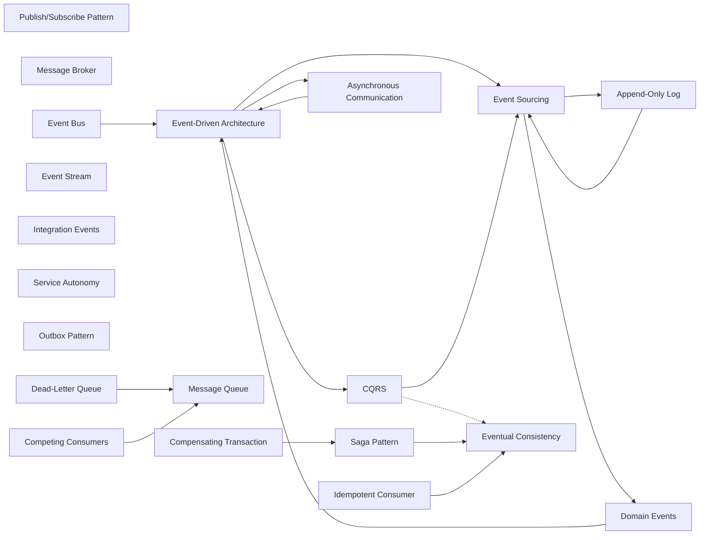
```mermaid
flowchart LR
n_event_driven_architecture["Event-Driven Architecture"]
n_publish_subscribe_pattern["Publish/Subscribe Pattern"]
n_message_queue["Message Queue"]
n_message_broker["Message Broker"]
n_event_bus["Event Bus"]
n_event_stream["Event Stream"]
n_event_sourcing["Event Sourcing"]
n_command_query_responsibility_segregation["CQRS"]
n_domain_events["Domain Events"]
n_integration_events["Integration Events"]
n_asynchronous_communication["Asynchronous Communication"]
n_service_autonomy["Service Autonomy"]
n_eventual_consistency["Eventual Consistency"]
n_saga_pattern["Saga Pattern"]
n_outbox_pattern["Outbox Pattern"]
n_compensating_transaction["Compensating Transaction"]
n_append_only_log["Append-Only Log"]
n_dead_letter_queue["Dead-Letter Queue"]
n_idempotent_consumer["Idempotent Consumer"]
n_competing_consumers["Competing Consumers"]
n_event_driven_architecture --> n_asynchronous_communication
n_event_driven_architecture --> n_event_sourcing
n_event_driven_architecture --> n_command_query_responsibility_segregation
n_event_bus --> n_event_driven_architecture
n_event_sourcing --> n_append_only_log
n_event_sourcing --> n_domain_events
n_command_query_responsibility_segregation --> n_event_sourcing
n_command_query_responsibility_segregation -.-> n_eventual_consistency
n_domain_events --> n_event_driven_architecture
n_asynchronous_communication --> n_event_driven_architecture
n_saga_pattern --> n_eventual_consistency
n_compensating_transaction --> n_saga_pattern
n_append_only_log --> n_event_sourcing
n_dead_letter_queue --> n_message_queue
n_idempotent_consumer --> n_eventual_consistency
n_competing_consumers --> n_message_queue
```

### Event-Driven Architecture

- Kind: [style](SCHEMA.md#kind-style)
- Severity: contextual
- Scope: service, integration, system
- Layer: [Execution Core](SCHEMA.md#layer-execution-core)

Details

Requires
[Events](LEXICON.md#lex-events), [Message Contract](LEXICON.md#lex-message-contract), [Idempotency](PRINCIPLES.md#arch-idempotency)
Reinforces
[Low Coupling](PRINCIPLES.md#arch-low-coupling), [Asynchronous Communication](PRINCIPLES.md#arch-asynchronous-communication)
Enables
[Event Sourcing](PRINCIPLES.md#arch-event-sourcing), [CQRS](PRINCIPLES.md#arch-command-query-responsibility-segregation), [Saga](LEXICON.md#lex-saga)
In tension with
[Debuggability](LEXICON.md#lex-debuggability), [Strong Consistency](LEXICON.md#lex-strong-consistency)
Conflicts with
[Hidden Temporal Coupling](LEXICON.md#lex-hidden-temporal-coupling)
Referenced by
[Observer Pattern](PRINCIPLES.md#arch-observer-pattern), [Choreography](PRINCIPLES.md#arch-choreography), [Event Bus](PRINCIPLES.md#arch-event-bus), [Domain Events](PRINCIPLES.md#arch-domain-events), [Asynchronous Communication](PRINCIPLES.md#arch-asynchronous-communication), [Idempotency](PRINCIPLES.md#arch-idempotency)
Tensions
[Event-Driven Architecture Debuggability](SCHEMA.md#tension-debuggability-event-driven-architecture), [Event-Driven Architecture Strong Consistency](SCHEMA.md#tension-event-driven-architecture-strong-consistency)

Violated by
non-idempotent consumers, undocumented event schemas
Detected by
missing correlation IDs, direct synchronous chains
Measured by
event contract coverage, [retry safety](LEXICON.md#lex-retry-safety)
Refactored by
Publish Event, Add Outbox, Add Consumer Contract
Enforced by
schema registry, idempotency tests

```typescript
async function createFoo(foo: Foo) {
  await fooStore.save(foo);
  await barService.refresh(foo.id);
  await bazService.notify(foo.id);
}
```

```typescript
async function createFoo(foo: Foo) {
  await fooStore.save(foo);
  await events.publish({ type: "FooCreated", fooId: foo.id });
}
events.on("FooCreated", updateBarProjection);
events.on("FooCreated", notifyBaz);
```

### Publish/Subscribe Pattern

- Kind: [pattern](SCHEMA.md#kind-pattern)
- Severity: contextual
- Scope: integration, eventing
- Layer: [Execution Core](SCHEMA.md#layer-execution-core)

Details

Requires
[Publisher](LEXICON.md#lex-publisher), [Subscriber](LEXICON.md#lex-subscriber), [Broker/Event Bus](LEXICON.md#lex-broker-event-bus)
Reinforces
[Low Coupling](PRINCIPLES.md#arch-low-coupling)
Enables
[Fan-Out Notification](LEXICON.md#lex-fan-out-notification)
In tension with
[Delivery Ordering](LEXICON.md#lex-delivery-ordering)
Conflicts with
[Direct Point-to-Point Calls](LEXICON.md#lex-direct-point-to-point-calls)
Tensions
[Publish/Subscribe Pattern Delivery Ordering](SCHEMA.md#tension-delivery-ordering-publish-subscribe-pattern)

Violated by
publisher knowing all subscribers
Detected by
direct calls to subscriber list
Measured by
publisher-subscriber coupling
Refactored by
Introduce Topic/Event Bus
Enforced by
messaging contracts

```typescript
function saveFoo(foo: Foo) {
  fooStore.save(foo);
  auditFoo(foo);
  indexFoo(foo);
}
```

```typescript
publisher.publish("foo.saved", { fooId: foo.id });
subscriber.on("foo.saved", auditFoo);
subscriber.on("foo.saved", indexFoo);
```

### Message Queue

- Kind: [mechanism](SCHEMA.md#kind-mechanism)
- Severity: contextual
- Scope: integration, async processing
- Layer: [Execution Core](SCHEMA.md#layer-execution-core)

Details

Requires
[Message Contract](LEXICON.md#lex-message-contract), [Consumer](LEXICON.md#lex-consumer)
Reinforces
[Resilience](PRINCIPLES.md#arch-resilience), [Backpressure](PRINCIPLES.md#arch-backpressure)
Enables
[Asynchronous Processing](LEXICON.md#lex-asynchronous-processing)
In tension with
[Latency](PRINCIPLES.md#arch-latency)
Conflicts with
[In-Memory Direct Invocation](LEXICON.md#lex-in-memory-direct-invocation)
Referenced by
[Dead-Letter Queue](PRINCIPLES.md#arch-dead-letter-queue), [Competing Consumers](PRINCIPLES.md#arch-competing-consumers)
Tensions
[Message Queue Latency](SCHEMA.md#tension-latency-message-queue)

Violated by
unbounded in-memory work queues
Detected by
synchronous blocking chains for async work
Measured by
queue depth, retry/dead-letter rates
Refactored by
Introduce Queue, Add Worker
Enforced by
infrastructure policy, load tests

```typescript
for (const foo of foos) await processFoo(foo);
```

```typescript
for (const foo of foos) await fooQueue.enqueue({ type: "ProcessFoo", foo });
fooWorker.consume(fooQueue, (message) => processFoo(message.foo));
```

### Message Broker

- Kind: [artifact](SCHEMA.md#kind-artifact)
- Severity: contextual
- Scope: integration, messaging
- Layer: [Execution Core](SCHEMA.md#layer-execution-core)

Details

Requires
[Message Queue/Topics](LEXICON.md#lex-message-queue-topics), [Routing](LEXICON.md#lex-routing)
Reinforces
[Decoupling](LEXICON.md#lex-decoupling), [Scalability](PRINCIPLES.md#arch-scalability)
Enables
[Pub/Sub](LEXICON.md#lex-pub-sub), [Work Distribution](LEXICON.md#lex-work-distribution)
In tension with
[Operational Dependency](LEXICON.md#lex-operational-dependency)
Conflicts with
[Point-to-Point Coupling](LEXICON.md#lex-point-to-point-coupling)
Tensions
[Message Broker Operational Dependency](SCHEMA.md#tension-message-broker-operational-dependency)

Violated by
broker bypass for async integration
Detected by
direct service calls in async workflows
Measured by
broker usage coverage
Refactored by
Add Broker, Route Messages
Enforced by
architecture policy

```typescript
await fooService.sendToBar(barMessage);
await fooService.sendToBaz(bazMessage);
```

```typescript
await broker.publish("foo.created", fooMessage, { durable: true });
broker.subscribe(
  "foo.created",
  { group: "bar-consumer", ack: "manual" },
  handleBar,
);
broker.subscribe(
  "foo.created",
  { group: "baz-consumer", ack: "manual" },
  handleBaz,
);
```

### Event Bus

- Kind: [mechanism](SCHEMA.md#kind-mechanism)
- Severity: contextual
- Scope: application, integration
- Layer: [Execution Core](SCHEMA.md#layer-execution-core)

Details

Requires
[Event Contract](LEXICON.md#lex-event-contract), [Subscriber Model](LEXICON.md#lex-subscriber-model)
Reinforces
[Pub/Sub](LEXICON.md#lex-pub-sub), [Event-Driven Architecture](PRINCIPLES.md#arch-event-driven-architecture)
Enables
[Decoupled Event Distribution](LEXICON.md#lex-decoupled-event-distribution)
In tension with
[Event Storm / Traceability](LEXICON.md#lex-event-storm-traceability)
Conflicts with
[Direct Event Handler Calls](LEXICON.md#lex-direct-event-handler-calls)
Tensions
[Event Bus Event Storm / Traceability](SCHEMA.md#tension-event-bus-event-storm-traceability)

Violated by
hidden implicit event dependencies
Detected by
undocumented subscribers
Measured by
event dependency visibility
Refactored by
Introduce Event Bus, Register Handlers
Enforced by
handler registry validation

```typescript
fooEditor.onSave = (foo) => fooView.refresh(foo);
fooEditor.onDelete = (id) => fooView.remove(id);
```

```typescript
eventBus.emit({ type: "FooSaved", foo });
eventBus.emit({ type: "FooDeleted", fooId: id });
eventBus.on("FooSaved", (event) => fooView.refresh(event.foo));
```

### Event Stream

- Kind: [mechanism](SCHEMA.md#kind-mechanism)
- Severity: contextual
- Scope: stream processing, integration
- Layer: [Execution Core](SCHEMA.md#layer-execution-core)

Details

Requires
[Ordered Log](LEXICON.md#lex-ordered-log), [Event Schema](LEXICON.md#lex-event-schema)
Reinforces
[Streaming Architecture](PRINCIPLES.md#arch-streaming-architecture)
Enables
[Replay](LEXICON.md#lex-replay), [Continuous Processing](LEXICON.md#lex-continuous-processing)
In tension with
[Storage Volume](LEXICON.md#lex-storage-volume)
Conflicts with
[Mutable State Only](LEXICON.md#lex-mutable-state-only)
Referenced by
[Streaming Architecture](PRINCIPLES.md#arch-streaming-architecture)
Tensions
[Event Stream Storage Volume](SCHEMA.md#tension-event-stream-storage-volume)

Violated by
non-replayable event processing
Detected by
missing offsets, missing event schema
Measured by
replay success, lag
Refactored by
Add Stream, Add Offset Tracking
Enforced by
stream contract tests

```typescript
const latest = await fooApi.getCurrentState(fooId);
```

```typescript
const stream = fooEvents.stream(fooId);
for await (const event of stream) fooProjection.apply(event);
```

### Event Sourcing

- Kind: [pattern](SCHEMA.md#kind-pattern)
- Severity: contextual
- Scope: domain, persistence
- Layer: [Execution Core](SCHEMA.md#layer-execution-core)

Details

Requires
[Append-Only Log](PRINCIPLES.md#arch-append-only-log), [Domain Events](PRINCIPLES.md#arch-domain-events)
Reinforces
[Auditability](PRINCIPLES.md#arch-auditability), [Temporal Modeling](LEXICON.md#lex-temporal-modeling)
Enables
[Replay](LEXICON.md#lex-replay), [Historical Reconstruction](LEXICON.md#lex-historical-reconstruction)
In tension with
[Query Complexity](LEXICON.md#lex-query-complexity)
Conflicts with
[CRUD-Only State Persistence](LEXICON.md#lex-crud-only-state-persistence)
Referenced by
[Event-Driven Architecture](PRINCIPLES.md#arch-event-driven-architecture), [CQRS](PRINCIPLES.md#arch-command-query-responsibility-segregation), [Append-Only Log](PRINCIPLES.md#arch-append-only-log)
Tensions
[Event Sourcing Query Complexity](SCHEMA.md#tension-event-sourcing-query-complexity)

Violated by
mutating state without event record
Detected by
state changes lacking events
Measured by
event/state consistency
Refactored by
Persist Events, Build Projections
Enforced by
event append rules

```typescript
type FooRow = { id: FooId; name: string; status: string };
await fooTable.update(foo);
```

```typescript
type FooEvent = FooCreated | FooRenamed | FooClosed;
await fooEventStore.append(foo.id, foo.uncommittedEvents());
const foo = fooEventStore.read(fooId).reduce(applyFooEvent, emptyFoo());
```

### CQRS

- Kind: [pattern](SCHEMA.md#kind-pattern)
- Severity: contextual
- Scope: application, data access
- Aliases: CQRS
- Layer: [Execution Core](SCHEMA.md#layer-execution-core)

Details

Requires
[Command/Query Separation](LEXICON.md#lex-command-query-separation)
Reinforces
[Scalability](PRINCIPLES.md#arch-scalability), [Event Sourcing](PRINCIPLES.md#arch-event-sourcing)
Enables
[Read/Write Model Optimization](LEXICON.md#lex-read-write-model-optimization)
In tension with
[Eventual Consistency](PRINCIPLES.md#arch-eventual-consistency)
Conflicts with
[Unified CRUD Model](LEXICON.md#lex-unified-crud-model)
Referenced by
[Event-Driven Architecture](PRINCIPLES.md#arch-event-driven-architecture)
Tensions
[CQRS Eventual Consistency](SCHEMA.md#tension-cqrs-eventual-consistency)

Violated by
queries mutating state, commands returning complex read models
Detected by
command/query side-effect violations
Measured by
read/write separation compliance
Refactored by
Split Command and Query Models
Enforced by
handler conventions, [tests](LEXICON.md#lex-tests)

```typescript
class FooRepository {
  save(foo: Foo) {}
  search(query: string): Foo[] {
    return complexJoin(query);
  }
}
```

```typescript
class FooCommandStore {
  save(foo: Foo) {
    return fooDb.write(foo);
  }
}
class FooQueryStore {
  search(query: string) {
    return fooReadModel.search(query);
  }
}
commandBus.execute(new SaveFoo(foo));
queryBus.execute(new SearchFoos(query));
```

### Domain Events

- Kind: [pattern](SCHEMA.md#kind-pattern)
- Severity: recommended
- Scope: domain, bounded context
- Layer: [Execution Core](SCHEMA.md#layer-execution-core)

Details

Requires
[Domain Model](PRINCIPLES.md#arch-domain-model), [Event Semantics](LEXICON.md#lex-event-semantics)
Reinforces
[Domain-Driven Design (DDD)](PRINCIPLES.md#arch-domain-driven-design), [Event-Driven Architecture](PRINCIPLES.md#arch-event-driven-architecture)
Enables
[Decoupled Domain Reactions](LEXICON.md#lex-decoupled-domain-reactions)
In tension with
[Event Granularity](LEXICON.md#lex-event-granularity)
Conflicts with
[Infrastructure Events in Domain](LEXICON.md#lex-infrastructure-events-in-domain)
Referenced by
[Event Sourcing](PRINCIPLES.md#arch-event-sourcing)
Tensions
[Domain Events Event Granularity](SCHEMA.md#tension-domain-events-event-granularity)

Violated by
events named after technical operations only
Detected by
CRUD-named domain events
Measured by
semantic event quality
Refactored by
Rename Event, Emit from Aggregate
Enforced by
domain review

```typescript
class Foo {
  rename(name: string) {
    this.name = name;
  }
}
```

```typescript
class Foo {
  #events: FooDomainEvent[] = [];
  rename(name: string) {
    this.name = name;
    this.#events.push({ type: "FooRenamed", fooId: this.id, name });
  }
}
```

### Integration Events

- Kind: [pattern](SCHEMA.md#kind-pattern)
- Severity: recommended
- Scope: service boundary, messaging
- Layer: [Execution Core](SCHEMA.md#layer-execution-core)

Details

Requires
[Message Contract](LEXICON.md#lex-message-contract), [Versioning](PRINCIPLES.md#arch-versioning)
Reinforces
[Interoperability](PRINCIPLES.md#arch-interoperability)
Enables
[Cross-Service Communication](LEXICON.md#lex-cross-service-communication)
In tension with
[Duplication with Domain Events](LEXICON.md#lex-duplication-with-domain-events)
Conflicts with
[Internal Domain Event Leakage](LEXICON.md#lex-internal-domain-event-leakage)
Tensions
[Integration Events Duplication with Domain Events](SCHEMA.md#tension-duplication-with-domain-events-integration-events)

Violated by
exposing internal domain events directly to external consumers
Detected by
internal event schema published externally
Measured by
boundary event contract coverage
Refactored by
Map Domain Event to Integration Event
Enforced by
event schema review

```typescript
barService.consume(fooDomainEvent);
```

```typescript
const integrationEvent: FooCreatedV1 = {
  type: "com.example.foo-created.v1",
  fooId: event.fooId,
  occurredAt: clock.now().toISOString(),
};
integrationBus.publish(integrationEvent);
```

### Asynchronous Communication

- Kind: [principle](SCHEMA.md#kind-principle)
- Severity: contextual
- Scope: service, system
- Layer: [Execution Core](SCHEMA.md#layer-execution-core)

Details

Requires
[Message Contract](LEXICON.md#lex-message-contract), [Retry Safety](LEXICON.md#lex-retry-safety)
Reinforces
[Resilience](PRINCIPLES.md#arch-resilience), [Low Coupling](PRINCIPLES.md#arch-low-coupling)
Enables
[Event-Driven Architecture](PRINCIPLES.md#arch-event-driven-architecture)
In tension with
[Immediate Consistency](LEXICON.md#lex-immediate-consistency)
Conflicts with
[Blocking Synchronous Chains](LEXICON.md#lex-blocking-synchronous-chains), [Synchronous Chain Trap](PRINCIPLES.md#arch-synchronous-chain-trap)
Referenced by
[Event-Driven Architecture](PRINCIPLES.md#arch-event-driven-architecture)
Tensions
[Asynchronous Communication Immediate Consistency](SCHEMA.md#tension-asynchronous-communication-immediate-consistency)

Violated by
synchronous call chain for non-immediate work
Detected by
long blocking chains
Measured by
sync dependency depth
Refactored by
Introduce Queue/Event, Add Callback/Projection
Enforced by
[architecture review](PRINCIPLES.md#arch-architecture-review)

```typescript
const bar = await barService.createFromFoo(foo);
const baz = await bazService.createFromBar(bar);
```

```typescript
await outbox.append({ type: "FooCreated", fooId: foo.id });
return { accepted: true, fooId: foo.id };
```

### Service Autonomy

- Kind: [principle](SCHEMA.md#kind-principle)
- Severity: contextual
- Scope: service, bounded context
- Layer: [Execution Core](SCHEMA.md#layer-execution-core)

Details

Requires
[Own Data](LEXICON.md#lex-own-data), [Explicit Contracts](PRINCIPLES.md#arch-explicit-contracts)
Reinforces
[Microservices](PRINCIPLES.md#arch-microservices), [Independence](PRINCIPLES.md#arch-independence)
Enables
[Independent Deployment](LEXICON.md#lex-independent-deployment)
In tension with
[Global Consistency](LEXICON.md#lex-global-consistency)
Conflicts with
[Shared Database](LEXICON.md#lex-shared-database), [Cyclic Deployment Dependency](PRINCIPLES.md#arch-cyclic-deployment-dependency)
Referenced by
[Microservices](PRINCIPLES.md#arch-microservices), [Service-Oriented Architecture](PRINCIPLES.md#arch-service-oriented-architecture), [Service Contract](PRINCIPLES.md#arch-service-contract), [Choreography](PRINCIPLES.md#arch-choreography), [Autonomy](PRINCIPLES.md#arch-autonomy)
Tensions
[Service Autonomy Global Consistency](SCHEMA.md#tension-global-consistency-service-autonomy)

Violated by
external writes to service-owned data
Detected by
shared schema writes, cross-service table access
Measured by
ownership violation count
Refactored by
Encapsulate Data, Add API/Event Boundary
Enforced by
database permissions, service contracts

```typescript
async function saveFoo(foo: Foo) {
  await barDb.verify(foo.barId);
  await bazDb.reserve(foo.bazId);
  await fooDb.save(foo);
}
```

```typescript
async function saveFoo(foo: Foo) {
  await fooDb.save(foo);
  await outbox.append({
    type: "FooSaved",
    fooId: foo.id,
    barId: foo.barId,
    bazId: foo.bazId,
  });
}
```

### Eventual Consistency

- Kind: [model](SCHEMA.md#kind-model)
- Severity: contextual
- Scope: distributed system, data
- Layer: [Execution Core](SCHEMA.md#layer-execution-core)

Details

Requires
[Idempotency](PRINCIPLES.md#arch-idempotency), [Retry](LEXICON.md#lex-retry), [Reconciliation](LEXICON.md#lex-reconciliation)
Reinforces
[Availability](LEXICON.md#lex-availability), [Scalability](PRINCIPLES.md#arch-scalability)
Enables
[Distributed Autonomy](LEXICON.md#lex-distributed-autonomy)
In tension with
[User Expectations](LEXICON.md#lex-user-expectations), [Strong Immediate Consistency](LEXICON.md#lex-strong-immediate-consistency)
Conflicts with
none
Referenced by
[CRDTs](PRINCIPLES.md#arch-crdts), [CAP Theorem](PRINCIPLES.md#arch-cap-theorem), [CQRS](PRINCIPLES.md#arch-command-query-responsibility-segregation), [Saga Pattern](PRINCIPLES.md#arch-saga-pattern), [Idempotent Consumer](PRINCIPLES.md#arch-idempotent-consumer)
Tensions
[Eventual Consistency User Expectations](SCHEMA.md#tension-eventual-consistency-user-expectations), [Eventual Consistency Strong Immediate Consistency](SCHEMA.md#tension-eventual-consistency-strong-immediate-consistency)

Violated by
assuming immediate cross-service consistency
Detected by
synchronous compensation hacks
Measured by
convergence time, inconsistency window
Refactored by
Add Projection, Add Reconciliation, Add Saga
Enforced by
consistency tests

```typescript
await fooStore.save(foo);
await fooSearch.update(foo);
await fooAnalytics.update(foo);
```

```typescript
await fooStore.save(foo);
fooEvents.emit({ type: "FooSaved", foo });
const view = await fooSearchView.find(foo.id);
const converged = view.version >= foo.version;
return { foo: view, converged };
```

### Saga Pattern

- Kind: [pattern](SCHEMA.md#kind-pattern)
- Severity: contextual
- Scope: service workflow, distributed system
- Layer: [Execution Core](SCHEMA.md#layer-execution-core)

Details

Requires
[Compensating Transactions](LEXICON.md#lex-compensating-transactions), [Idempotency](PRINCIPLES.md#arch-idempotency)
Reinforces
[Eventual Consistency](PRINCIPLES.md#arch-eventual-consistency)
Enables
[Long-Running Transactions](LEXICON.md#lex-long-running-transactions)
In tension with
[Workflow Complexity](LEXICON.md#lex-workflow-complexity)
Conflicts with
[Global ACID Transaction](LEXICON.md#lex-global-acid-transaction)
Referenced by
[Compensating Transaction](PRINCIPLES.md#arch-compensating-transaction)
Tensions
[Saga Pattern Workflow Complexity](SCHEMA.md#tension-saga-pattern-workflow-complexity)

Violated by
cross-service transaction requiring atomic database commit
Detected by
distributed transaction attempts
Measured by
compensation coverage
Refactored by
Introduce Saga, Add Compensation
Enforced by
workflow tests

```typescript
const tx = coordinator.begin();
await fooService.prepare(tx, foo);
await barService.prepare(tx, bar);
await bazService.prepare(tx, baz);
await coordinator.commit(tx);
```

```typescript
await saga([
  {
    action: () => fooService.create(foo),
    compensate: (id) => fooService.cancel(id),
  },
  {
    action: () => barService.create(bar),
    compensate: (id) => barService.cancel(id),
  },
  {
    action: () => bazService.create(baz),
    compensate: (id) => bazService.cancel(id),
  },
]).run();
```

### Outbox Pattern

- Kind: [pattern](SCHEMA.md#kind-pattern)
- Severity: recommended
- Scope: persistence, messaging
- Layer: [Execution Core](SCHEMA.md#layer-execution-core)

Details

Requires
[Local Transaction](LEXICON.md#lex-local-transaction), [Message Relay](LEXICON.md#lex-message-relay)
Reinforces
[Event Reliability](LEXICON.md#lex-event-reliability)
Enables
[Atomic State Change + Message Publish](LEXICON.md#lex-atomic-state-change-message-publish)
In tension with
[Relay Complexity](LEXICON.md#lex-relay-complexity)
Conflicts with
[Dual Write](PRINCIPLES.md#arch-dual-write)
Tensions
[Outbox Pattern Relay Complexity](SCHEMA.md#tension-outbox-pattern-relay-complexity)

Violated by
database write followed by direct publish without atomicity
Detected by
dual-write patterns
Measured by
lost-message rate, outbox coverage
Refactored by
Add Outbox Table, Add Relay Worker
Enforced by
persistence rules, integration tests

```typescript
await fooStore.save(foo);
await eventBus.publish({ type: "FooSaved", fooId: foo.id });
```

```typescript
await database.transaction(async (tx) => {
  await tx.foos.save(foo);
  await tx.outbox.insert({ id: eventId(), type: "FooSaved", fooId: foo.id });
});
await outboxRelay.publishPending();
```

### Compensating Transaction

- Kind: [mechanism](SCHEMA.md#kind-mechanism)
- Severity: contextual
- Scope: workflow, distributed transaction
- Layer: [Execution Core](SCHEMA.md#layer-execution-core)

Details

Requires
[Reversible/Compensable Step](LEXICON.md#lex-reversible-compensable-step)
Reinforces
[Saga Pattern](PRINCIPLES.md#arch-saga-pattern), [Resilience](PRINCIPLES.md#arch-resilience)
Enables
[Failure Recovery](LEXICON.md#lex-failure-recovery)
In tension with
[Business Complexity](LEXICON.md#lex-business-complexity)
Conflicts with
[Irreversible Side Effects](LEXICON.md#lex-irreversible-side-effects)
Tensions
[Compensating Transaction Business Complexity](SCHEMA.md#tension-business-complexity-compensating-transaction)

Violated by
unrecoverable partial workflow failure
Detected by
saga steps without compensation
Measured by
compensation coverage
Refactored by
Add Compensation Action
Enforced by
workflow tests

```typescript
await fooService.create(foo);
await barService.create(bar);
```

```typescript
const fooId = await fooService.create(foo);
try {
  await barService.create(bar);
} catch (error) {
  await fooService.compensateCreate(fooId);
  throw error;
}
```

### Append-Only Log

- Kind: [pattern](SCHEMA.md#kind-pattern)
- Severity: contextual
- Scope: event store, audit, stream
- Layer: [Execution Core](SCHEMA.md#layer-execution-core)

Details

Requires
[Immutable Events](LEXICON.md#lex-immutable-events)
Reinforces
[Auditability](PRINCIPLES.md#arch-auditability), [Event Sourcing](PRINCIPLES.md#arch-event-sourcing)
Enables
[Replay](LEXICON.md#lex-replay), [Temporal Queries](LEXICON.md#lex-temporal-queries)
In tension with
[Storage Growth](LEXICON.md#lex-storage-growth)
Conflicts with
[In-Place Mutation](LEXICON.md#lex-in-place-mutation)
Referenced by
[Event Sourcing](PRINCIPLES.md#arch-event-sourcing)
Tensions
[Append-Only Log Storage Growth](SCHEMA.md#tension-append-only-log-storage-growth)

Violated by
updating historical records destructively
Detected by
mutable event rows
Measured by
append-only compliance
Refactored by
Append Events, Add Snapshot/Compaction
Enforced by
database constraints

```typescript
fooState.set(foo.id, foo);
fooState.delete(foo.id);
```

```typescript
type FooLogEntry = FooCreated | FooUpdated | FooRemoved;
fooLog.append({ seq: nextSeq(), type: "FooRemoved", fooId: foo.id });
const state = projectFooLog(fooLog.read());
```

### Dead-Letter Queue

- Kind: [pattern](SCHEMA.md#kind-pattern)
- Severity: mandatory for production systems
- Scope: service, messaging, resilience
- Layer: [Execution Core](SCHEMA.md#layer-execution-core)

Details

Requires
[Message Queue](PRINCIPLES.md#arch-message-queue)
Reinforces
[Fault Isolation](LEXICON.md#lex-fault-isolation), [Observability](PRINCIPLES.md#arch-observability)
Enables
[Poison-Message Quarantine](LEXICON.md#lex-poison-message-quarantine), [Reprocessing After Fix](LEXICON.md#lex-reprocessing-after-fix)
In tension with
[Operational Overhead](LEXICON.md#lex-operational-overhead)
Conflicts with
[Infinite Redelivery Loop](LEXICON.md#lex-infinite-redelivery-loop)
Tensions
[Dead-Letter Queue Operational Overhead](SCHEMA.md#tension-dead-letter-queue-operational-overhead)

Violated by
unprocessable messages redelivered forever
Detected by
retry storms on a single poison message
Measured by
redelivery count per failed message
Refactored by
Route Failures to a Dead-Letter Queue
Enforced by
messaging design review

```typescript
worker.consume(fooQueue, async (message) => {
  await processFoo(message);
});
```

```typescript
worker.consume(fooQueue, async (message) => {
  try {
    await processFoo(message);
  } catch (error) {
    if (message.attempts >= 5) return fooDeadLetterQueue.send(message, error);
    throw error;
  }
});
```

### Idempotent Consumer

- Kind: [pattern](SCHEMA.md#kind-pattern)
- Severity: mandatory for distributed systems
- Scope: service, messaging, correctness
- Layer: [Execution Core](SCHEMA.md#layer-execution-core)

Details

Requires
[Deduplication Key](LEXICON.md#lex-deduplication-key)
Reinforces
[Eventual Consistency](PRINCIPLES.md#arch-eventual-consistency), [At-Least-Once Delivery Safety](LEXICON.md#lex-at-least-once-delivery-safety)
Enables
[Safe Message Redelivery](LEXICON.md#lex-safe-message-redelivery)
In tension with
[State Overhead](LEXICON.md#lex-state-overhead)
Conflicts with
[Duplicate Side Effects](LEXICON.md#lex-duplicate-side-effects)
Tensions
[Idempotent Consumer State Overhead](SCHEMA.md#tension-idempotent-consumer-state-overhead)

Violated by
a redelivered message applied twice
Detected by
duplicate effects under at-least-once delivery
Measured by
duplicate-processing incident rate
Refactored by
Make the Consumer Idempotent
Enforced by
messaging design review

```typescript
worker.consume(fooQueue, (message) => chargeFoo(message.fooId, message.amount));
```

```typescript
worker.consume(fooQueue, async (message) => {
  if (await processedMessages.has(message.id)) return;
  await chargeFoo(message.fooId, message.amount);
  await processedMessages.add(message.id);
});
```

### Competing Consumers

- Kind: [pattern](SCHEMA.md#kind-pattern)
- Severity: contextual
- Scope: service, messaging, scalability
- Layer: [Execution Core](SCHEMA.md#layer-execution-core)

Details

Requires
[Message Queue](PRINCIPLES.md#arch-message-queue)
Reinforces
[Horizontal Scaling](PRINCIPLES.md#arch-horizontal-scaling), [Load Balancing](PRINCIPLES.md#arch-load-balancing)
Enables
[Parallel Message Processing](LEXICON.md#lex-parallel-message-processing), [Consumer Elasticity](LEXICON.md#lex-consumer-elasticity)
In tension with
[Ordering](LEXICON.md#lex-ordering)
Conflicts with
[Single Serial Consumer](LEXICON.md#lex-single-serial-consumer)
Tensions
[Competing Consumers Ordering](SCHEMA.md#tension-competing-consumers-ordering)

Violated by
one consumer serially draining a growing backlog
Detected by
queue depth rising with a single processor
Measured by
consumer utilization vs backlog growth
Refactored by
Scale Out Competing Consumers
Enforced by
messaging design review

```typescript
fooWorker.consume(fooQueue, processFoo);
```

```typescript
for (let worker = 0; worker < WORKER_COUNT; worker += 1) {
  new FooWorker(worker).consume(fooQueue, processFoo);
}
```

## Metadata / Self-Description / Declarative Systems

Every principle in this category. Each record carries its kind, its severity, the scopes it applies at and the layer it lives in, then the edge relations that join it to other records, the records that point back at it, the contracts that answer to it and the tensions it takes part in. The descriptors say how it is violated, detected, measured, repaired and enforced. Where the record carries one, an exemplar shows the shape before and after the principle is applied.

Relations diagram

The relations inside this category.

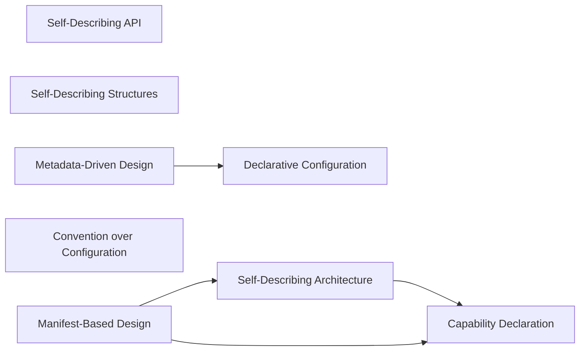
```mermaid
flowchart LR
n_self_describing_architecture["Self-Describing Architecture"]
n_self_describing_api["Self-Describing API"]
n_self_describing_structures["Self-Describing Structures"]
n_metadata_driven_design["Metadata-Driven Design"]
n_declarative_configuration["Declarative Configuration"]
n_convention_over_configuration["Convention over Configuration"]
n_capability_declaration["Capability Declaration"]
n_manifest_based_design["Manifest-Based Design"]
n_self_describing_architecture --> n_capability_declaration
n_metadata_driven_design --> n_declarative_configuration
n_manifest_based_design --> n_self_describing_architecture
n_manifest_based_design --> n_capability_declaration
```

### Self-Describing Architecture

- Kind: [principle](SCHEMA.md#kind-principle)
- Severity: contextual
- Scope: system, runtime, integration
- Layer: [Declarative Core](SCHEMA.md#layer-declarative-core)

Details

Requires
[Metadata](LEXICON.md#lex-metadata), [Capability Declaration](PRINCIPLES.md#arch-capability-declaration)
Reinforces
[Discoverability](LEXICON.md#lex-discoverability), [Runtime Discovery](PRINCIPLES.md#arch-runtime-discovery)
Enables
[Plugin Architecture](PRINCIPLES.md#arch-plugin-architecture), [Automation](LEXICON.md#lex-automation)
In tension with
[Metadata Drift](LEXICON.md#lex-metadata-drift)
Conflicts with
[Hidden Runtime Behavior](LEXICON.md#lex-hidden-runtime-behavior)
Referenced by
[Manifest-Based Design](PRINCIPLES.md#arch-manifest-based-design)
Tensions
[Self-Describing Architecture Metadata Drift](SCHEMA.md#tension-metadata-drift-self-describing-architecture)

Violated by
behavior not represented in metadata/contracts
Detected by
undocumented runtime capability
Measured by
metadata coverage
Refactored by
Add Manifest, Add Metadata, Add Schema
Enforced by
manifest validation, metadata tests

```typescript
const modules = [new FooModule(), new BarModule()];
```

```typescript
type ModuleDescriptor = {
  name: string;
  version: string;
  provides: readonly string[];
  requires: readonly string[];
};
const fooModule = defineModule({
  name: "foo",
  version: "1.0.0",
  provides: ["FooStore"],
  requires: ["EventBus"],
});
```

### Self-Describing API

- Kind: [principle](SCHEMA.md#kind-principle)
- Severity: recommended
- Scope: API, integration
- Layer: [Declarative Core](SCHEMA.md#layer-declarative-core)

Details

Requires
[API Contract](PRINCIPLES.md#arch-api-contract), [Metadata](LEXICON.md#lex-metadata)
Reinforces
[Discoverability](LEXICON.md#lex-discoverability), [Interoperability](PRINCIPLES.md#arch-interoperability)
Enables
[Client Generation](LEXICON.md#lex-client-generation), [HATEOAS-style Navigation](LEXICON.md#lex-hateoas-style-navigation)
In tension with
[Payload Verbosity](LEXICON.md#lex-payload-verbosity)
Conflicts with
[Opaque API](LEXICON.md#lex-opaque-api)
Tensions
[Self-Describing API Payload Verbosity](SCHEMA.md#tension-payload-verbosity-self-describing-api)

Violated by
undocumented endpoints, opaque error responses
Detected by
missing OpenAPI/metadata
Measured by
API documentation/contract coverage
Refactored by
Add OpenAPI, Add Metadata, Normalize Responses
Enforced by
API linting, docs gates

```typescript
app.post("/foo", createFoo);
```

```typescript
const createFooApi = defineEndpoint({
  method: "POST",
  path: "/foos",
  request: CreateFooSchema,
  response: FooCreatedSchema,
  errors: FooErrorSchema,
});
```

### Self-Describing Structures

- Kind: [principle](SCHEMA.md#kind-principle)
- Severity: contextual
- Scope: data, runtime, metadata
- Layer: [Declarative Core](SCHEMA.md#layer-declarative-core)

Details

Requires
[Type Metadata](LEXICON.md#lex-type-metadata), [Schema](LEXICON.md#lex-schema)
Reinforces
[Introspection](PRINCIPLES.md#arch-introspection), [Validation](PRINCIPLES.md#arch-validation)
Enables
[Dynamic Processing](LEXICON.md#lex-dynamic-processing)
In tension with
[Size Overhead](LEXICON.md#lex-size-overhead)
Conflicts with
[Opaque Binary/Untyped Structures](LEXICON.md#lex-opaque-binary-untyped-structures)
Referenced by
[Derived Naming Registry](PRINCIPLES.md#arch-derived-naming-registry)
Tensions
[Self-Describing Structures Size Overhead](SCHEMA.md#tension-self-describing-structures-size-overhead)

Violated by
data requiring external hidden assumptions
Detected by
missing type/schema markers
Measured by
metadata completeness
Refactored by
Add Type Tags, Add Schema, Add Manifest
Enforced by
[schema validation](PRINCIPLES.md#arch-schema-validation)

```typescript
const node = ["foo", "foo_1", 3, true];
```

```typescript
const node = { kind: "foo", id: "foo_1", count: 3, active: true } as const;
```

### Metadata-Driven Design

- Kind: [approach](SCHEMA.md#kind-approach)
- Severity: contextual
- Scope: runtime, configuration, framework
- Layer: [Declarative Core](SCHEMA.md#layer-declarative-core)

Details

Requires
[Metadata Schema](LEXICON.md#lex-metadata-schema), [Validation](PRINCIPLES.md#arch-validation)
Reinforces
[Declarative Configuration](PRINCIPLES.md#arch-declarative-configuration), [Runtime Discovery](PRINCIPLES.md#arch-runtime-discovery)
Enables
[Code Generation](LEXICON.md#lex-code-generation), [Plugins](LEXICON.md#lex-plugins)
In tension with
[Debuggability](LEXICON.md#lex-debuggability)
Conflicts with
[Hardcoded Behavior](LEXICON.md#lex-hardcoded-behavior)
Referenced by
[Model-Driven Architecture](PRINCIPLES.md#arch-model-driven-architecture)
Tensions
[Metadata-Driven Design Debuggability](SCHEMA.md#tension-debuggability-metadata-driven-design)

Violated by
unvalidated metadata, hidden magic
Detected by
metadata/config drift
Measured by
metadata coverage, config error rate
Refactored by
Extract Metadata, Add Schema, Validate Config
Enforced by
metadata schema tests

```typescript
if (field === "name") renderText();
if (field === "count") renderNumber();
```

```typescript
const fooFields = {
  name: { kind: "text", required: true },
  count: { kind: "integer", min: 0 },
} as const;
renderForm(fooFields);
```

### Declarative Configuration

- Kind: [principle](SCHEMA.md#kind-principle)
- Severity: recommended
- Scope: configuration, infrastructure, runtime
- Layer: [Declarative Core](SCHEMA.md#layer-declarative-core)

Details

Requires
[Schema Validation](PRINCIPLES.md#arch-schema-validation), [Explicit Semantics](LEXICON.md#lex-explicit-semantics)
Reinforces
[Predictability](PRINCIPLES.md#arch-predictability), [Infrastructure as Code](PRINCIPLES.md#arch-infrastructure-as-code)
Enables
[Runtime Configuration without Code Change](LEXICON.md#lex-runtime-configuration-without-code-change)
In tension with
[Dynamic Complexity](LEXICON.md#lex-dynamic-complexity)
Conflicts with
[Hardcoded Configuration](PRINCIPLES.md#arch-hardcoded-configuration)
Referenced by
[Metadata-Driven Design](PRINCIPLES.md#arch-metadata-driven-design), [Domain-Specific Language (DSL)](PRINCIPLES.md#arch-domain-specific-language), [Infrastructure as Code](PRINCIPLES.md#arch-infrastructure-as-code)
Tensions
[Declarative Configuration Dynamic Complexity](SCHEMA.md#tension-declarative-configuration-dynamic-complexity)

Violated by
behavior hidden in code constants
Detected by
hardcoded environment values
Measured by
configuration externalization coverage
Refactored by
Extract Config, Add Config Schema
Enforced by
config linting, [validation](PRINCIPLES.md#arch-validation)

```typescript
const app = new FooApp();
app.enableCache();
app.setRetries(3);
app.register(new BarPlugin());
```

```typescript
const config = defineFooConfig({
  cache: { enabled: true },
  retries: 3,
  plugins: ["bar"],
});
const app = FooApp.fromConfig(config);
```

### Convention over Configuration

- Kind: [principle](SCHEMA.md#kind-principle)
- Severity: contextual
- Scope: framework, application structure
- Layer: [Declarative Core](SCHEMA.md#layer-declarative-core)

Details

Requires
[Stable Conventions](LEXICON.md#lex-stable-conventions)
Reinforces
[Pattern Consistency](PRINCIPLES.md#arch-pattern-consistency), [Predictability](PRINCIPLES.md#arch-predictability)
Enables
[Reduced Boilerplate](LEXICON.md#lex-reduced-boilerplate)
In tension with
[Explicitness](LEXICON.md#lex-explicitness)
Conflicts with
[Excessive Configuration](LEXICON.md#lex-excessive-configuration)
Referenced by
[Derived Naming Registry](PRINCIPLES.md#arch-derived-naming-registry)
Tensions
[Convention over Configuration Explicitness](SCHEMA.md#tension-convention-over-configuration-explicitness)

Violated by
inconsistent project conventions
Detected by
convention deviations
Measured by
convention compliance score
Refactored by
Normalize Structure, Remove Redundant Config
Enforced by
scaffolding, lint rules

```typescript
registerHandler("foo", "./handlers/foo-handler", "FooHandler");
registerHandler("bar", "./handlers/bar-handler", "BarHandler");
```

```typescript
const handlers = discoverHandlers("./handlers/*.handler.ts");
```

### Capability Declaration

- Kind: [mechanism](SCHEMA.md#kind-mechanism)
- Severity: recommended
- Scope: plugin, service, runtime
- Layer: [Declarative Core](SCHEMA.md#layer-declarative-core)

Details

Requires
[Manifest](LEXICON.md#lex-manifest), [Contracts](LEXICON.md#lex-contracts)
Reinforces
[Runtime Discovery](PRINCIPLES.md#arch-runtime-discovery), [Self-Description](LEXICON.md#lex-self-description)
Enables
[Dynamic Binding](PRINCIPLES.md#arch-dynamic-binding)
In tension with
[Declaration Drift](LEXICON.md#lex-declaration-drift)
Conflicts with
[Implicit Capability](LEXICON.md#lex-implicit-capability)
Referenced by
[Self-Describing Architecture](PRINCIPLES.md#arch-self-describing-architecture), [Manifest-Based Design](PRINCIPLES.md#arch-manifest-based-design)
Tensions
[Capability Declaration Declaration Drift](SCHEMA.md#tension-capability-declaration-declaration-drift)

Violated by
capability exists but is undocumented/unregistered
Detected by
manifest-code mismatch
Measured by
declared/actual capability match rate
Refactored by
Add Manifest Entry, Add Capability Interface
Enforced by
manifest validation, conformance tests

```typescript
try {
  await plugin.exportFoo(foo);
} catch (error) {
  if (isMissingMethod(error)) return;
}
```

```typescript
type FooPlugin = {
  capabilities: readonly ("read" | "write" | "export")[];
  exportFoo?: (foo: Foo) => Promise<void>;
};
if (plugin.capabilities.includes("export")) await plugin.exportFoo!(foo);
```

### Manifest-Based Design

- Kind: [pattern](SCHEMA.md#kind-pattern)
- Severity: contextual
- Scope: plugin, module, deployment
- Layer: [Declarative Core](SCHEMA.md#layer-declarative-core)

Details

Requires
[Manifest Schema](LEXICON.md#lex-manifest-schema)
Reinforces
[Self-Describing Architecture](PRINCIPLES.md#arch-self-describing-architecture), [Runtime Discovery](PRINCIPLES.md#arch-runtime-discovery)
Enables
[Plugin Loading](LEXICON.md#lex-plugin-loading), [Capability Declaration](PRINCIPLES.md#arch-capability-declaration)
In tension with
[Manifest Drift](LEXICON.md#lex-manifest-drift)
Conflicts with
[Hardcoded Registration](LEXICON.md#lex-hardcoded-registration)
Tensions
[Manifest-Based Design Manifest Drift](SCHEMA.md#tension-manifest-based-design-manifest-drift)

Violated by
undeclared dependencies/capabilities
Detected by
manifest mismatch, load failure
Measured by
manifest validation pass rate
Refactored by
Add Manifest, Validate Manifest, Generate Manifest
Enforced by
CI validation

```typescript
loadPlugin("./foo.js");
loadPlugin("./bar.js");
```

```typescript
const manifest = {
  name: "foo-suite",
  plugins: [
    { name: "foo", entry: "./foo.js", version: "1.0.0" },
    { name: "bar", entry: "./bar.js", version: "1.0.0" },
  ],
} as const;
loadManifest(manifest);
```

## Metaprogramming / Language-Oriented Architecture

Every principle in this category. Each record carries its kind, its severity, the scopes it applies at and the layer it lives in, then the edge relations that join it to other records, the records that point back at it, the contracts that answer to it and the tensions it takes part in. The descriptors say how it is violated, detected, measured, repaired and enforced. Where the record carries one, an exemplar shows the shape before and after the principle is applied.

Relations diagram

The relations inside this category.

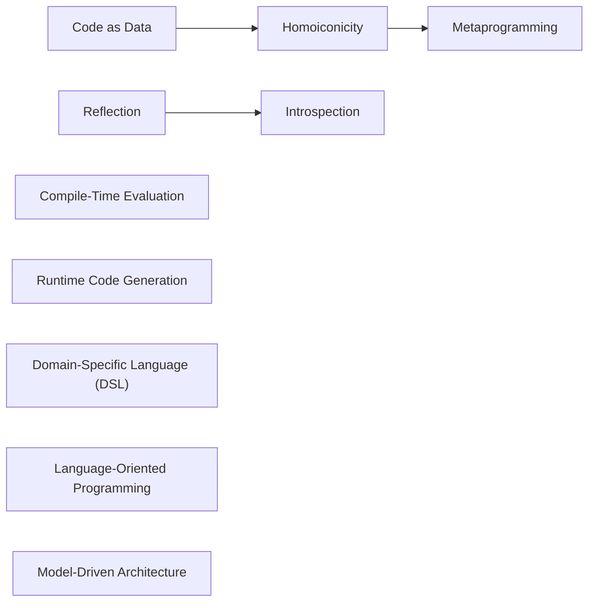
```mermaid
flowchart LR
n_homoiconicity["Homoiconicity"]
n_code_as_data["Code as Data"]
n_metaprogramming["Metaprogramming"]
n_reflection["Reflection"]
n_introspection["Introspection"]
n_compile_time_evaluation["Compile-Time Evaluation"]
n_runtime_code_generation["Runtime Code Generation"]
n_domain_specific_language["Domain-Specific Language (DSL)"]
n_language_oriented_programming["Language-Oriented Programming"]
n_model_driven_architecture["Model-Driven Architecture"]
n_homoiconicity --> n_metaprogramming
n_code_as_data --> n_homoiconicity
n_reflection --> n_introspection
```

### Homoiconicity

- Kind: [quality-attribute](SCHEMA.md#kind-quality-attribute)
- Severity: contextual
- Scope: language, metaprogramming
- Layer: [Declarative Core](SCHEMA.md#layer-declarative-core)

Details

Requires
[Code-as-Data Representation](LEXICON.md#lex-code-as-data-representation)
Reinforces
[Metaprogramming](PRINCIPLES.md#arch-metaprogramming)
Enables
[Macro Systems](LEXICON.md#lex-macro-systems), [DSLs](LEXICON.md#lex-dsls)
In tension with
[Readability](LEXICON.md#lex-readability)
Conflicts with
[Opaque Syntax Trees](LEXICON.md#lex-opaque-syntax-trees)
Referenced by
[Code as Data](PRINCIPLES.md#arch-code-as-data)
Tensions
[Homoiconicity Readability](SCHEMA.md#tension-homoiconicity-readability)

Violated by
not applicable as compliance principle unless language supports it
Detected by
language capability check
Measured by
macro/code-as-data usage
Refactored by
Use AST/DSL/Macro Representation
Enforced by
language/tooling constraints

```typescript
function evaluateFoo(foo: Foo) {
  return foo.value * 2;
}
const fooRule = { operation: "multiply", operand: 2 };
```

```typescript
type Expr =
  | { op: "value"; key: keyof Foo }
  | { op: "const"; value: number }
  | { op: "multiply"; left: Expr; right: Expr };
const fooRule: Expr = {
  op: "multiply",
  left: { op: "value", key: "value" },
  right: { op: "const", value: 2 },
};
const result = evaluate(fooRule, foo);
```

### Code as Data

- Kind: [principle](SCHEMA.md#kind-principle)
- Severity: contextual
- Scope: language, compiler, runtime
- Layer: [Declarative Core](SCHEMA.md#layer-declarative-core)

Details

Requires
[AST or Data Representation](LEXICON.md#lex-ast-or-data-representation)
Reinforces
[Homoiconicity](PRINCIPLES.md#arch-homoiconicity), [Code Generation](LEXICON.md#lex-code-generation)
Enables
[Program Transformation](LEXICON.md#lex-program-transformation)
In tension with
[Safety/Debuggability](LEXICON.md#lex-safety-debuggability)
Conflicts with
[String-Based Code Generation](LEXICON.md#lex-string-based-code-generation)
Tensions
[Code as Data Safety/Debuggability](SCHEMA.md#tension-code-as-data-safety-debuggability)

Violated by
unsafe string eval/generation
Detected by
dynamic eval/string code construction
Measured by
unsafe eval count
Refactored by
Use AST Builder, Typed DSL
Enforced by
banned API rules

```typescript
function fooRule(foo: Foo) {
  return foo.count > 3 && foo.active;
}
```

```typescript
const fooRule = {
  op: "and",
  args: [
    { op: "gt", field: "count", value: 3 },
    { op: "eq", field: "active", value: true },
  ],
} as const;
executeRule(fooRule, foo);
```

### Metaprogramming

- Kind: [technique](SCHEMA.md#kind-technique)
- Severity: contextual
- Scope: compile-time, runtime, framework
- Layer: [Declarative Core](SCHEMA.md#layer-declarative-core)

Details

Requires
[Reflection/AST/Code Generation](LEXICON.md#lex-reflection-ast-code-generation)
Reinforces
[Do Not Repeat Yourself (DRY)](PRINCIPLES.md#arch-duplicate-code), [DSLs](LEXICON.md#lex-dsls)
Enables
[Boilerplate Elimination](LEXICON.md#lex-boilerplate-elimination)
In tension with
[Debuggability](LEXICON.md#lex-debuggability), [Static Analysis](PRINCIPLES.md#arch-static-analysis), [Explicit Handwritten Code](LEXICON.md#lex-explicit-handwritten-code)
Conflicts with
none
Referenced by
[Homoiconicity](PRINCIPLES.md#arch-homoiconicity)
Tensions
[Metaprogramming Debuggability](SCHEMA.md#tension-debuggability-metaprogramming), [Metaprogramming Static Analysis](SCHEMA.md#tension-metaprogramming-static-analysis), [Metaprogramming Explicit Handwritten Code](SCHEMA.md#tension-explicit-handwritten-code-metaprogramming)

Violated by
unsafe/opaque generated behavior
Detected by
dynamic generation without tests/schema
Measured by
generated code coverage, [complexity](REASONING.md#reason-lens-complexity)
Refactored by
Add Generator Tests, Make Metadata Explicit
Enforced by
generator validation

```typescript
class FooDto {
  id!: string;
  name!: string;
}
class BarDto {
  id!: string;
  name!: string;
}
```

```typescript
const entity = defineEntity({ id: string(), name: string() });
const FooDto = generateType("FooDto", entity);
const BarDto = generateType("BarDto", entity);
```

### Reflection

- Kind: [mechanism](SCHEMA.md#kind-mechanism)
- Severity: contextual
- Scope: runtime, metadata, framework
- Layer: [Declarative Core](SCHEMA.md#layer-declarative-core)

Details

Requires
[Runtime Type Metadata](LEXICON.md#lex-runtime-type-metadata)
Reinforces
[Introspection](PRINCIPLES.md#arch-introspection), [Runtime Discovery](PRINCIPLES.md#arch-runtime-discovery)
Enables
[Dynamic Binding](PRINCIPLES.md#arch-dynamic-binding)
In tension with
[Performance/Safety](LEXICON.md#lex-performance-safety), [Static Analysis](PRINCIPLES.md#arch-static-analysis)
Conflicts with
none
Tensions
[Reflection Performance/Safety](SCHEMA.md#tension-performance-safety-reflection), [Reflection Static Analysis](SCHEMA.md#tension-reflection-static-analysis)

Violated by
reflection used to bypass contracts/visibility
Detected by
reflective access to internals
Measured by
unsafe reflection count
Refactored by
Replace with Explicit Interface/Metadata
Enforced by
lint/security rules

```typescript
const fields = ["id", "name", "count"];
for (const field of fields) renderField(foo[field]);
```

```typescript
for (const [field, metadata] of reflect(FooSchema).entries()) {
  renderField(field, metadata, foo[field]);
}
```

### Introspection

- Kind: [mechanism](SCHEMA.md#kind-mechanism)
- Severity: contextual
- Scope: runtime, metadata
- Layer: [Declarative Core](SCHEMA.md#layer-declarative-core)

Details

Requires
[Type Metadata](LEXICON.md#lex-type-metadata)
Reinforces
[Self-Describing Systems](LEXICON.md#lex-self-describing-systems)
Enables
[Discovery](LEXICON.md#lex-discovery), [Diagnostics](LEXICON.md#lex-diagnostics)
In tension with
[Encapsulation](PRINCIPLES.md#arch-encapsulation)
Conflicts with
[Opaque Runtime](LEXICON.md#lex-opaque-runtime), [Opaque Runtime Behavior](PRINCIPLES.md#arch-opaque-runtime-behavior)
Referenced by
[Self-Describing Structures](PRINCIPLES.md#arch-self-describing-structures), [Reflection](PRINCIPLES.md#arch-reflection)
Tensions
[Introspection Encapsulation](SCHEMA.md#tension-encapsulation-introspection)

Violated by
relying on undocumented internal structure
Detected by
introspection of private internals
Measured by
introspection usage risk
Refactored by
Add Public Metadata API
Enforced by
API boundaries

```typescript
function supportsExport(plugin: any) {
  try {
    plugin.exportFoo(foo);
    return true;
  } catch {
    return false;
  }
}
```

```typescript
function supportsExport(plugin: Plugin) {
  return introspect(plugin).methods.includes("exportFoo");
}
```

### Compile-Time Evaluation

- Kind: [mechanism](SCHEMA.md#kind-mechanism)
- Severity: contextual
- Scope: compiler, build
- Layer: [Declarative Core](SCHEMA.md#layer-declarative-core)

Details

Requires
[Compile-Time Inputs](LEXICON.md#lex-compile-time-inputs)
Reinforces
[Optimization](PRINCIPLES.md#arch-optimization), [Type Safety](PRINCIPLES.md#arch-type-safety)
Enables
[Early Error Detection](LEXICON.md#lex-early-error-detection)
In tension with
[Build Complexity](LEXICON.md#lex-build-complexity), [Runtime Dynamic Evaluation](LEXICON.md#lex-runtime-dynamic-evaluation)
Conflicts with
none
Tensions
[Compile-Time Evaluation Build Complexity](SCHEMA.md#tension-build-complexity-compile-time-evaluation), [Compile-Time Evaluation Runtime Dynamic Evaluation](SCHEMA.md#tension-compile-time-evaluation-runtime-dynamic-evaluation)

Violated by
runtime work that could be validated/generated at compile time
Detected by
repeated runtime reflection/validation
Measured by
compile-time coverage
Refactored by
Move Check/Generation to Compile Time
Enforced by
compiler plugins/build checks

```typescript
const fooRoutes = buildRoutesAtStartup(fooRouteDefinitions);
```

```typescript
const fooRoutes = compileTime(() => buildRoutes(fooRouteDefinitions));
export const routeTable = fooRoutes;
```

### Runtime Code Generation

- Kind: [mechanism](SCHEMA.md#kind-mechanism)
- Severity: contextual/discouraged unless justified
- Scope: runtime, framework
- Layer: [Declarative Core](SCHEMA.md#layer-declarative-core)

Details

Requires
[Safe Generation Boundary](LEXICON.md#lex-safe-generation-boundary)
Reinforces
[Runtime Extensibility](PRINCIPLES.md#arch-runtime-extensibility)
Enables
[Dynamic Optimization/Adaptation](LEXICON.md#lex-dynamic-optimization-adaptation)
In tension with
[Security/Debugging](LEXICON.md#lex-security-debugging), [Static Safety](LEXICON.md#lex-static-safety)
Conflicts with
none
Tensions
[Runtime Code Generation Security/Debugging](SCHEMA.md#tension-runtime-code-generation-security-debugging), [Runtime Code Generation Static Safety](SCHEMA.md#tension-runtime-code-generation-static-safety)

Violated by
unsafe eval, untrusted code generation
Detected by
dynamic eval with external input
Measured by
unsafe generation paths
Refactored by
Use Safe Generator, Sandbox, Precompile
Enforced by
[security policy](ALGORITHMS.md#algo-security-policy)

```typescript
function mapFoo(row: any) {
  return { id: row["foo_id"], name: row["foo_name"], count: row["foo_count"] };
}
```

```typescript
const mapFoo = generateMapper<FooRow, Foo>({
  foo_id: "id",
  foo_name: "name",
  foo_count: "count",
});
```

### Domain-Specific Language (DSL)

- Kind: [pattern](SCHEMA.md#kind-pattern)
- Severity: contextual
- Scope: domain, configuration, rules
- Layer: [Declarative Core](SCHEMA.md#layer-declarative-core)

Details

Requires
[Formal Grammar/Semantics](LEXICON.md#lex-formal-grammar-semantics)
Reinforces
[Declarative Configuration](PRINCIPLES.md#arch-declarative-configuration), [Ubiquitous Language](PRINCIPLES.md#arch-ubiquitous-language)
Enables
[Domain Expressiveness](LEXICON.md#lex-domain-expressiveness)
In tension with
[Tooling/Maintenance](LEXICON.md#lex-tooling-maintenance)
Conflicts with
[General-Purpose Boilerplate](LEXICON.md#lex-general-purpose-boilerplate)
Tensions
[Domain-Specific Language (DSL) Tooling/Maintenance](SCHEMA.md#tension-domain-specific-language-dsl-tooling-maintenance)

Violated by
ambiguous ad-hoc mini-language
Detected by
stringly-typed rules without parser/schema
Measured by
DSL validation coverage
Refactored by
Define Grammar, Add Parser/Validator
Enforced by
DSL tests, schema/grammar checks

```typescript
createWorkflow([
  { type: "validate", target: "foo" },
  { type: "save", target: "foo" },
  { type: "publish", target: "foo.created" },
]);
```

```typescript
fooWorkflow("create", (flow) =>
  flow.validate(FooSchema).save("FooStore").publish("FooCreated"),
);
```

### Language-Oriented Programming

- Kind: [approach](SCHEMA.md#kind-approach)
- Severity: contextual
- Scope: domain, platform, code generation
- Layer: [Declarative Core](SCHEMA.md#layer-declarative-core)

Details

Requires
[DSLs](LEXICON.md#lex-dsls), [Code Generation or Interpreters](LEXICON.md#lex-code-generation-or-interpreters)
Reinforces
[Domain Modeling](LEXICON.md#lex-domain-modeling)
Enables
[High-Level Domain Expression](LEXICON.md#lex-high-level-domain-expression)
In tension with
[Toolchain Complexity](LEXICON.md#lex-toolchain-complexity), [One-Size General-Purpose Code](LEXICON.md#lex-one-size-general-purpose-code)
Conflicts with
none
Tensions
[Language-Oriented Programming Toolchain Complexity](SCHEMA.md#tension-language-oriented-programming-toolchain-complexity), [Language-Oriented Programming One-Size General-Purpose Code](SCHEMA.md#tension-language-oriented-programming-one-size-general-purpose-code)

Violated by
proliferation of informal unvalidated DSLs
Detected by
multiple inconsistent rule/config syntaxes
Measured by
language consistency/tooling
Refactored by
Consolidate DSL, Add Tooling
Enforced by
grammar/schema validation

```typescript
function processFoo(config: Record<string, unknown>) {
  interpretAdHocConfig(config);
}
```

```typescript
const FooPolicyLanguage = defineLanguage({
  expressions: ["field", "equals", "all", "any"],
  typeChecker: fooPolicyTypeChecker,
  evaluator: fooPolicyEvaluator,
});
FooPolicyLanguage.run(fooPolicy, foo);
```

### Model-Driven Architecture

- Kind: [approach](SCHEMA.md#kind-approach)
- Severity: contextual
- Scope: system, code generation, domain model
- Layer: [Declarative Core](SCHEMA.md#layer-declarative-core)

Details

Requires
[Formal Model](LEXICON.md#lex-formal-model), [Transformation Rules](LEXICON.md#lex-transformation-rules)
Reinforces
[Metadata-Driven Design](PRINCIPLES.md#arch-metadata-driven-design)
Enables
[Generated Implementations](LEXICON.md#lex-generated-implementations)
In tension with
none
Conflicts with
[Handwritten Divergence](LEXICON.md#lex-handwritten-divergence), [Model Drift](LEXICON.md#lex-model-drift)

Violated by
generated code manually edited/diverged
Detected by
model-code drift
Measured by
generation conformance
Refactored by
Regenerate, Lock Generated Files, Update Model
Enforced by
generation CI

```typescript
class FooController {}
class FooService {}
class FooRepository {}
class FooDto {}
```

```typescript
const fooModel = defineModel({
  entity: "Foo",
  fields: { id: "FooId", name: "string" },
  operations: ["create", "read", "rename"],
});
generateApplication(fooModel);
```

## Observability / Auditability / Traceability

Every principle in this category. Each record carries its kind, its severity, the scopes it applies at and the layer it lives in, then the edge relations that join it to other records, the records that point back at it, the contracts that answer to it and the tensions it takes part in. The descriptors say how it is violated, detected, measured, repaired and enforced. Where the record carries one, an exemplar shows the shape before and after the principle is applied.

Relations diagram

The relations inside this category.

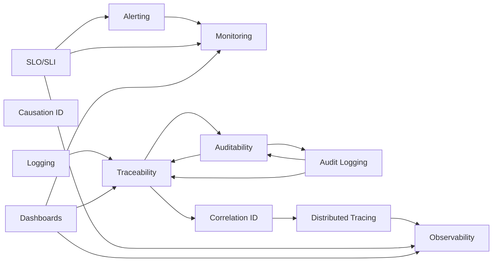
```mermaid
flowchart LR
n_observability["Observability"]
n_logging["Logging"]
n_monitoring["Monitoring"]
n_alerting["Alerting"]
n_auditability["Auditability"]
n_audit_logging["Audit Logging"]
n_traceability["Traceability"]
n_correlation_id["Correlation ID"]
n_causation_id["Causation ID"]
n_distributed_tracing["Distributed Tracing"]
n_slo_sli["SLO/SLI"]
n_dashboards["Dashboards"]
n_logging --> n_traceability
n_alerting --> n_monitoring
n_auditability --> n_audit_logging
n_auditability --> n_traceability
n_audit_logging --> n_auditability
n_audit_logging --> n_traceability
n_traceability --> n_correlation_id
n_traceability --> n_auditability
n_correlation_id --> n_distributed_tracing
n_distributed_tracing --> n_observability
n_slo_sli --> n_monitoring
n_slo_sli --> n_observability
n_slo_sli --> n_alerting
n_dashboards --> n_monitoring
n_dashboards --> n_observability
n_dashboards --> n_traceability
```

### Observability

- Kind: [quality-attribute](SCHEMA.md#kind-quality-attribute)
- Severity: mandatory for production systems
- Scope: service, system, runtime
- Layer: [Observability](SCHEMA.md#layer-observability)

Details

Requires
[Logs](LEXICON.md#lex-logs), [Metrics](LEXICON.md#lex-metrics), [Traces](LEXICON.md#lex-traces)
Reinforces
[Resilience](PRINCIPLES.md#arch-resilience), [Debuggability](LEXICON.md#lex-debuggability)
Enables
[Incident Diagnosis](LEXICON.md#lex-incident-diagnosis)
In tension with
[Cost/Noise](LEXICON.md#lex-cost-noise)
Conflicts with
[Opaque System](LEXICON.md#lex-opaque-system), [Unobservable Failure](PRINCIPLES.md#arch-unobservable-failure)
Referenced by
[Model Drift Monitoring](PRINCIPLES.md#arch-model-drift-monitoring), [Centralized Logging](PRINCIPLES.md#arch-centralized-logging), [Information Hiding](PRINCIPLES.md#arch-information-hiding), [Fail Fast](PRINCIPLES.md#arch-fail-fast), [Resilience](PRINCIPLES.md#arch-resilience), [Error Handling](PRINCIPLES.md#arch-error-handling), [Dead-Letter Queue](PRINCIPLES.md#arch-dead-letter-queue), [Distributed Tracing](PRINCIPLES.md#arch-distributed-tracing), [SLO/SLI](PRINCIPLES.md#arch-slo-sli), [Dashboards](PRINCIPLES.md#arch-dashboards), [Self-Healing Architecture](PRINCIPLES.md#arch-self-healing-architecture), [Canary Deployment](PRINCIPLES.md#arch-canary-deployment), [Chaos Engineering](PRINCIPLES.md#arch-chaos-engineering)
Tensions
[Observability Cost/Noise](SCHEMA.md#tension-cost-noise-observability)

Violated by
production behavior cannot be inferred
Detected by
missing telemetry around critical paths
Measured by
telemetry coverage, MTTR
Refactored by
Add Logs/Metrics/Traces
Enforced by
observability standards

```typescript
async function processFoo(foo: Foo) {
  await fooStore.save(foo);
}
```

```typescript
async function processFoo(foo: Foo, telemetry: Telemetry) {
  return telemetry.trace("foo.process", { fooId: foo.id }, async (span) => {
    await fooStore.save(foo);
    span.event("foo.saved");
    telemetry.count("foo.processed", 1);
  });
}
```

### Logging

- Kind: [mechanism](SCHEMA.md#kind-mechanism)
- Severity: mandatory
- Scope: application, service
- Layer: [Observability](SCHEMA.md#layer-observability)

Details

Requires
[Structured Events](LEXICON.md#lex-structured-events), [Context](LEXICON.md#lex-context)
Reinforces
[Traceability](PRINCIPLES.md#arch-traceability), [Debugging](LEXICON.md#lex-debugging)
Enables
[Incident Analysis](LEXICON.md#lex-incident-analysis)
In tension with
[Noise/PII Leakage](LEXICON.md#lex-noise-pii-leakage)
Conflicts with
[Silent Failure](LEXICON.md#lex-silent-failure), [Log-as-Control-Flow](PRINCIPLES.md#arch-log-as-control-flow)
Tensions
[Logging Noise/PII Leakage](SCHEMA.md#tension-logging-noise-pii-leakage)

Violated by
missing or unstructured critical logs
Detected by
absence of logs on error/business events
Measured by
log coverage, signal/noise ratio
Refactored by
Add Structured Logs, Add Context
Enforced by
logging policy, linting

```typescript
console.log("saved", foo);
```

```typescript
logger.info("foo.saved", { fooId: foo.id, version: foo.version });
```

### Monitoring

- Kind: [mechanism](SCHEMA.md#kind-mechanism)
- Severity: mandatory
- Scope: service, infrastructure
- Layer: [Observability](SCHEMA.md#layer-observability)

Details

Requires
[Metrics](LEXICON.md#lex-metrics), [Thresholds](LEXICON.md#lex-thresholds)
Reinforces
[Reliability](LEXICON.md#lex-reliability)
Enables
[Failure Detection](LEXICON.md#lex-failure-detection)
In tension with
[Alert Noise](LEXICON.md#lex-alert-noise)
Conflicts with
[Blind Operation](LEXICON.md#lex-blind-operation)
Referenced by
[AI Safety](PRINCIPLES.md#arch-ai-safety), [Alerting](PRINCIPLES.md#arch-alerting), [SLO/SLI](PRINCIPLES.md#arch-slo-sli), [Dashboards](PRINCIPLES.md#arch-dashboards), [Resource Utilization](PRINCIPLES.md#arch-resource-utilization)
Tensions
[Monitoring Alert Noise](SCHEMA.md#tension-alert-noise-monitoring)

Violated by
no metrics for critical resources/SLIs
Detected by
missing dashboards/SLI metrics
Measured by
metric coverage, detection latency
Refactored by
Add Metrics, Define SLIs
Enforced by
production readiness checklist

```typescript
setInterval(() => report(fooQueue.length), 60_000);
```

```typescript
metrics.gauge("foo.queue.depth", () => fooQueue.length);
metrics.histogram("foo.processing.duration_ms", fooProcessingDuration);
```

### Alerting

- Kind: [mechanism](SCHEMA.md#kind-mechanism)
- Severity: mandatory
- Scope: operations, service
- Layer: [Observability](SCHEMA.md#layer-observability)

Details

Requires
[Monitoring](PRINCIPLES.md#arch-monitoring), [Thresholds](LEXICON.md#lex-thresholds)
Reinforces
[Incident Response](LEXICON.md#lex-incident-response)
Enables
[Timely Intervention](LEXICON.md#lex-timely-intervention)
In tension with
[Alert Fatigue](LEXICON.md#lex-alert-fatigue)
Conflicts with
[Silent Failure](LEXICON.md#lex-silent-failure), [Observability Noise](PRINCIPLES.md#arch-observability-noise)
Referenced by
[SLO/SLI](PRINCIPLES.md#arch-slo-sli)
Tensions
[Alerting Alert Fatigue](SCHEMA.md#tension-alert-fatigue-alerting)

Violated by
critical failures without alert
Detected by
incident discovered by users before systems
Measured by
MTTD, alert precision
Refactored by
Add Alert, Tune Thresholds
Enforced by
on-call policy

```typescript
if (errorRate > 0.05) notify("foo errors");
```

```typescript
alerts.define("FooErrorBudgetBurn", {
  condition: rate("foo.errors", "5m") > 0.05,
  for: "10m",
  severity: "critical",
});
```

### Auditability

- Kind: [quality-attribute](SCHEMA.md#kind-quality-attribute)
- Severity: mandatory for regulated/sensitive systems
- Scope: system, data, security
- Layer: [Observability](SCHEMA.md#layer-observability)

Details

Requires
[Audit Logging](PRINCIPLES.md#arch-audit-logging), [Traceability](PRINCIPLES.md#arch-traceability)
Reinforces
[Compliance](PRINCIPLES.md#arch-compliance)
Enables
[Accountability](LEXICON.md#lex-accountability)
In tension with
[Storage/Privacy](LEXICON.md#lex-storage-privacy)
Conflicts with
[Opaque Mutation](LEXICON.md#lex-opaque-mutation)
Referenced by
[Centralized Logging](PRINCIPLES.md#arch-centralized-logging), [Reproducibility](PRINCIPLES.md#arch-reproducibility), [Event Sourcing](PRINCIPLES.md#arch-event-sourcing), [Append-Only Log](PRINCIPLES.md#arch-append-only-log), [Audit Logging](PRINCIPLES.md#arch-audit-logging), [Traceability](PRINCIPLES.md#arch-traceability), [Compliance](PRINCIPLES.md#arch-compliance), [Continuous Compliance](PRINCIPLES.md#arch-continuous-compliance)
Tensions
[Auditability Storage/Privacy](SCHEMA.md#tension-auditability-storage-privacy)

Violated by
critical action without audit record
Detected by
missing audit event for sensitive operation
Measured by
audit event coverage
Refactored by
Add Audit Log, Add Actor/Reason Metadata
Enforced by
compliance gates

```typescript
function renameFoo(foo: Foo, name: string) {
  foo.name = name;
}
```

```typescript
function renameFoo(foo: Foo, name: string, actor: Actor) {
  const previous = foo.name;
  foo.rename(name);
  audit.append({
    action: "FooRenamed",
    fooId: foo.id,
    actorId: actor.id,
    previous,
    next: name,
  });
}
```

### Audit Logging

- Kind: [mechanism](SCHEMA.md#kind-mechanism)
- Severity: mandatory for sensitive systems
- Scope: security, compliance, data mutation
- Layer: [Observability](SCHEMA.md#layer-observability)

Details

Requires
[Actor](LEXICON.md#lex-actor), [Action](LEXICON.md#lex-action), [Timestamp](LEXICON.md#lex-timestamp), [Target](LEXICON.md#lex-target)
Reinforces
[Auditability](PRINCIPLES.md#arch-auditability), [Traceability](PRINCIPLES.md#arch-traceability)
Enables
[Forensics](LEXICON.md#lex-forensics)
In tension with
[Privacy](LEXICON.md#lex-privacy)
Conflicts with
[Untracked Mutation](LEXICON.md#lex-untracked-mutation)
Referenced by
[Auditability](PRINCIPLES.md#arch-auditability)
Tensions
[Audit Logging Privacy](SCHEMA.md#tension-audit-logging-privacy)

Violated by
sensitive operation without immutable record
Detected by
missing audit instrumentation
Measured by
audit coverage
Refactored by
Add Audit Event, Protect Audit Store
Enforced by
[policy-as-code](PRINCIPLES.md#arch-policy-as-code), [tests](LEXICON.md#lex-tests)

```typescript
logger.info(`user ${user.id} changed foo ${foo.id}`);
```

```typescript
auditLog.append({
  eventId: eventId(),
  action: "FOO_UPDATE",
  actorId: user.id,
  resourceId: foo.id,
  occurredAt: clock.now().toISOString(),
});
```

### Traceability

- Kind: [quality-attribute](SCHEMA.md#kind-quality-attribute)
- Severity: mandatory
- Scope: request, workflow, change
- Layer: [Observability](SCHEMA.md#layer-observability)

Details

Requires
[Correlation ID](PRINCIPLES.md#arch-correlation-id), [Logs/Traces](LEXICON.md#lex-logs-traces)
Reinforces
[Debuggability](LEXICON.md#lex-debuggability), [Auditability](PRINCIPLES.md#arch-auditability)
Enables
[End-to-End Causality](LEXICON.md#lex-end-to-end-causality)
In tension with
[Metadata Propagation Overhead](LEXICON.md#lex-metadata-propagation-overhead)
Conflicts with
[Anonymous Flow](LEXICON.md#lex-anonymous-flow)
Referenced by
[Explainability](PRINCIPLES.md#arch-explainability), [Architecture Decision Records (ADR)](PRINCIPLES.md#arch-architecture-decision-records), [Chain of Responsibility Pattern](PRINCIPLES.md#arch-chain-of-responsibility-pattern), [Causality](PRINCIPLES.md#arch-causality), [Causal Dependency](PRINCIPLES.md#arch-causal-dependency), [Choreography](PRINCIPLES.md#arch-choreography), [Logging](PRINCIPLES.md#arch-logging), [Auditability](PRINCIPLES.md#arch-auditability), [Audit Logging](PRINCIPLES.md#arch-audit-logging), [Dashboards](PRINCIPLES.md#arch-dashboards), [Inversion of Control (IoC)](PRINCIPLES.md#arch-inversion-of-control), [Dynamic Dispatch](PRINCIPLES.md#arch-dynamic-dispatch), [Polymorphism](PRINCIPLES.md#arch-polymorphism)
Tensions
[Traceability Metadata Propagation Overhead](SCHEMA.md#tension-metadata-propagation-overhead-traceability)

Violated by
uncorrelated logs/events
Detected by
missing correlation propagation
Measured by
trace completeness
Refactored by
Add Correlation ID, Propagate Context
Enforced by
middleware, tracing policy

```typescript
await processFoo(foo);
```

```typescript
const trace = traceContext.start({ operation: "processFoo", fooId: foo.id });
await processFoo(foo, trace);
trace.finish();
```

### Correlation ID

- Kind: [mechanism](SCHEMA.md#kind-mechanism)
- Severity: mandatory for distributed systems
- Scope: request, message, workflow
- Layer: [Observability](SCHEMA.md#layer-observability)

Details

Requires
[Context Propagation](LEXICON.md#lex-context-propagation)
Reinforces
[Distributed Tracing](PRINCIPLES.md#arch-distributed-tracing)
Enables
[Request-Level Traceability](LEXICON.md#lex-request-level-traceability)
In tension with
[Header/Metadata Management](LEXICON.md#lex-header-metadata-management)
Conflicts with
[Uncorrelated Events](LEXICON.md#lex-uncorrelated-events)
Referenced by
[Traceability](PRINCIPLES.md#arch-traceability)
Tensions
[Correlation ID Header/Metadata Management](SCHEMA.md#tension-correlation-id-header-metadata-management)

Violated by
logs/events without correlation identifier
Detected by
missing correlation field
Measured by
correlation coverage
Refactored by
Add Middleware, Propagate Header
Enforced by
logging/tracing standards

```typescript
await http.post("/bar", { fooId: foo.id });
```

```typescript
const correlationId =
  request.headers.get("X-Correlation-ID") ?? idSource.next();
await http.post(
  "/bar",
  { fooId: foo.id },
  { headers: { "X-Correlation-ID": correlationId } },
);
```

### Causation ID

- Kind: [mechanism](SCHEMA.md#kind-mechanism)
- Severity: recommended
- Scope: event, message, workflow
- Layer: [Observability](SCHEMA.md#layer-observability)

Details

Requires
[Event Metadata](LEXICON.md#lex-event-metadata)
Reinforces
[Causality](PRINCIPLES.md#arch-causality), [Audit Trail](LEXICON.md#lex-audit-trail)
Enables
[Cause-Effect Reconstruction](LEXICON.md#lex-cause-effect-reconstruction)
In tension with
[Metadata Verbosity](LEXICON.md#lex-metadata-verbosity)
Conflicts with
[Unlinked Events](LEXICON.md#lex-unlinked-events)
Tensions
[Causation ID Metadata Verbosity](SCHEMA.md#tension-causation-id-metadata-verbosity)

Violated by
event chains without parent cause
Detected by
missing causation field in event metadata
Measured by
causation coverage
Refactored by
Add Causation Metadata
Enforced by
event schema rules

```typescript
events.publish({ id: eventId(), type: "BarCreated", fooId: event.fooId });
```

```typescript
events.publish({
  id: eventId(),
  type: "BarCreated",
  fooId: event.fooId,
  correlationId: event.correlationId,
  causationId: event.id,
});
```

### Distributed Tracing

- Kind: [mechanism](SCHEMA.md#kind-mechanism)
- Severity: mandatory for distributed systems
- Scope: distributed system, service mesh
- Layer: [Observability](SCHEMA.md#layer-observability)

Details

Requires
[Trace Context Propagation](LEXICON.md#lex-trace-context-propagation)
Reinforces
[Observability](PRINCIPLES.md#arch-observability), [Causality](PRINCIPLES.md#arch-causality)
Enables
[Latency/Failure Root Cause Analysis](LEXICON.md#lex-latency-failure-root-cause-analysis)
In tension with
[Overhead/Sampling](LEXICON.md#lex-overhead-sampling)
Conflicts with
[Opaque Distributed Calls](LEXICON.md#lex-opaque-distributed-calls)
Referenced by
[Correlation ID](PRINCIPLES.md#arch-correlation-id)
Tensions
[Distributed Tracing Overhead/Sampling](SCHEMA.md#tension-distributed-tracing-overhead-sampling)

Violated by
service calls without trace propagation
Detected by
broken traces, missing spans
Measured by
trace completeness, span coverage
Refactored by
Add Tracing Middleware, Propagate Context
Enforced by
observability policy

```typescript
await fooService.call();
await barService.call();
```

```typescript
await tracer.span("foo.request", async (span) => {
  await fooService.call({ traceparent: span.traceparent });
  await barService.call({ traceparent: span.traceparent });
});
```

### SLO/SLI

- Kind: [constraint](SCHEMA.md#kind-constraint)
- Severity: mandatory for production systems
- Scope: service, reliability, operations
- Layer: [Observability](SCHEMA.md#layer-observability)

Details

Requires
[Monitoring](PRINCIPLES.md#arch-monitoring)
Reinforces
[Observability](PRINCIPLES.md#arch-observability), [Alerting](PRINCIPLES.md#arch-alerting)
Enables
[Objective Reliability Targets](LEXICON.md#lex-objective-reliability-targets), [Error-Budget Decisions](LEXICON.md#lex-error-budget-decisions)
In tension with
[Feature Velocity](LEXICON.md#lex-feature-velocity)
Conflicts with
[Vague Reliability Goals](LEXICON.md#lex-vague-reliability-goals)
Tensions
[SLO/SLI Feature Velocity](SCHEMA.md#tension-feature-velocity-slo-sli)

Violated by
reliability judged by subjective feel
Detected by
no measured indicator behind reliability claims
Measured by
SLO attainment vs error budget
Refactored by
Define SLIs and SLOs
Enforced by
reliability review

```typescript
alert.when(latency > 1000);
```

```typescript
const fooLatencySli = ratio("foo.requests.fast", "foo.requests.total");
defineSLO("foo-latency", {
  sli: fooLatencySli,
  objective: 0.99,
  window: "30d",
  errorBudget: 0.01,
});
```

### Dashboards

- Kind: [artifact](SCHEMA.md#kind-artifact)
- Severity: recommended
- Scope: service, operations, visibility
- Layer: [Observability](SCHEMA.md#layer-observability)

Details

Requires
[Monitoring](PRINCIPLES.md#arch-monitoring)
Reinforces
[Observability](PRINCIPLES.md#arch-observability), [Traceability](PRINCIPLES.md#arch-traceability)
Enables
[At-a-Glance System Health](LEXICON.md#lex-at-a-glance-system-health), [Trend Visibility](LEXICON.md#lex-trend-visibility)
In tension with
[Dashboard Sprawl](LEXICON.md#lex-dashboard-sprawl)
Conflicts with
[Log-Grep-Only Diagnosis](LEXICON.md#lex-log-grep-only-diagnosis)
Tensions
[Dashboards Dashboard Sprawl](SCHEMA.md#tension-dashboard-sprawl-dashboards)

Violated by
operators grepping raw logs to judge health
Detected by
no curated view of key signals
Measured by
time-to-diagnose during incidents
Refactored by
Build Signal Dashboards
Enforced by
operations review

```typescript
grepLogsForFooErrors();
```

```typescript
const fooDashboard = dashboard("foo-health", {
  panels: [
    rate("foo.errors"),
    histogram("foo.latency"),
    gauge("foo.queue.depth"),
  ],
});
```

## Plugin / Extensibility / IoC

Every principle in this category. Each record carries its kind, its severity, the scopes it applies at and the layer it lives in, then the edge relations that join it to other records, the records that point back at it, the contracts that answer to it and the tensions it takes part in. The descriptors say how it is violated, detected, measured, repaired and enforced. Where the record carries one, an exemplar shows the shape before and after the principle is applied.

Relations diagram

The relations inside this category.

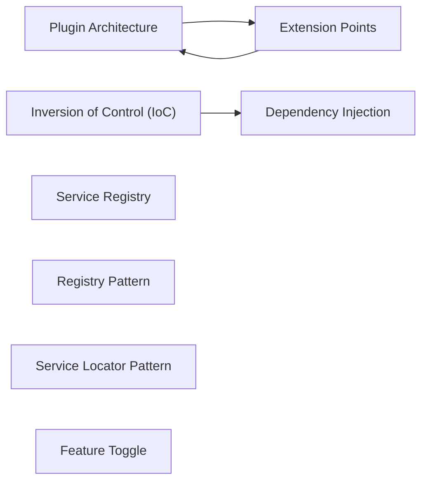
```mermaid
flowchart LR
n_plugin_architecture["Plugin Architecture"]
n_extension_points["Extension Points"]
n_inversion_of_control["Inversion of Control (IoC)"]
n_dependency_injection["Dependency Injection"]
n_service_registry["Service Registry"]
n_registry_pattern["Registry Pattern"]
n_service_locator_pattern["Service Locator Pattern"]
n_feature_toggle["Feature Toggle"]
n_plugin_architecture --> n_extension_points
n_extension_points --> n_plugin_architecture
n_inversion_of_control --> n_dependency_injection
```

### Plugin Architecture

- Kind: [style](SCHEMA.md#kind-style)
- Severity: contextual
- Scope: component, runtime, system
- Layer: [Extensibility Core](SCHEMA.md#layer-extensibility-core)

Details

Requires
[Extension Points](PRINCIPLES.md#arch-extension-points), [Stable Interfaces](PRINCIPLES.md#arch-stable-interfaces), [Discovery](LEXICON.md#lex-discovery)
Reinforces
[Open/Closed Principle (OCP)](PRINCIPLES.md#arch-open-closed), [Modularity](PRINCIPLES.md#arch-modularity)
Enables
[Runtime Extensibility](PRINCIPLES.md#arch-runtime-extensibility)
In tension with
[Static Analysis](PRINCIPLES.md#arch-static-analysis), [Security](LEXICON.md#lex-security)
Conflicts with
[Hardcoded Extensions](LEXICON.md#lex-hardcoded-extensions)
Referenced by
[Modularity](PRINCIPLES.md#arch-modularity), [Composability](PRINCIPLES.md#arch-composability), [Replaceability](PRINCIPLES.md#arch-replaceability), [Self-Describing Architecture](PRINCIPLES.md#arch-self-describing-architecture), [Extension Points](PRINCIPLES.md#arch-extension-points), [Runtime Discovery](PRINCIPLES.md#arch-runtime-discovery), [Runtime Extensibility](PRINCIPLES.md#arch-runtime-extensibility), [Open/Closed Principle (OCP)](PRINCIPLES.md#arch-open-closed)
Tensions
[Plugin Architecture Static Analysis](SCHEMA.md#tension-plugin-architecture-static-analysis), [Plugin Architecture Security](SCHEMA.md#tension-plugin-architecture-security)

Violated by
core importing plugin implementations
Detected by
direct plugin imports, central switch for plugins
Measured by
plugin isolation score
Refactored by
Introduce SPI, Add Registry, Extract Extension Point
Enforced by
plugin contract tests, dependency rules

```typescript
class FooApp {
  run() {
    new FooExport().run();
    new BarExport().run();
  }
}
```

```typescript
interface FooPlugin {
  name: string;
  setup(app: FooApp): void;
}
class FooApp {
  constructor(private readonly plugins: readonly FooPlugin[]) {}
  run() {
    this.plugins.forEach((plugin) => plugin.setup(this));
  }
}
```

### Extension Points

- Kind: [mechanism](SCHEMA.md#kind-mechanism)
- Severity: recommended
- Scope: framework, plugin, module
- Layer: [Extensibility Core](SCHEMA.md#layer-extensibility-core)

Details

Requires
[Stable Interfaces](PRINCIPLES.md#arch-stable-interfaces), [Contracts](LEXICON.md#lex-contracts)
Reinforces
[Open/Closed Principle (OCP)](PRINCIPLES.md#arch-open-closed), [Plugin Architecture](PRINCIPLES.md#arch-plugin-architecture)
Enables
[Third-Party Extension](LEXICON.md#lex-third-party-extension)
In tension with
[API Surface Growth](LEXICON.md#lex-api-surface-growth)
Conflicts with
[Closed Core](LEXICON.md#lex-closed-core)
Referenced by
[Plugin Architecture](PRINCIPLES.md#arch-plugin-architecture), [Runtime Extensibility](PRINCIPLES.md#arch-runtime-extensibility), [Open/Closed Principle (OCP)](PRINCIPLES.md#arch-open-closed)
Tensions
[Extension Points API Surface Growth](SCHEMA.md#tension-api-surface-growth-extension-points)

Violated by
modifying internals to add behavior
Detected by
repeated core edits for variants
Measured by
extension coverage
Refactored by
Add Hook, Add SPI, Extract Interface
Enforced by
extension tests, API review

```typescript
function saveFoo(foo: Foo) {
  validateFoo(foo);
  fooStore.save(foo);
  sendFooEmail(foo);
}
```

```typescript
type FooHooks = {
  beforeSave: Array<(foo: Foo) => void>;
  afterSave: Array<(foo: Foo) => void>;
};
function saveFoo(foo: Foo, hooks: FooHooks) {
  hooks.beforeSave.forEach((hook) => hook(foo));
  fooStore.save(foo);
  hooks.afterSave.forEach((hook) => hook(foo));
}
```

### Inversion of Control (IoC)

- Kind: [principle](SCHEMA.md#kind-principle)
- Severity: recommended
- Scope: framework, runtime, component
- Layer: [Extensibility Core](SCHEMA.md#layer-extensibility-core)

Details

Requires
[Abstraction](PRINCIPLES.md#arch-abstraction), [Composition Root](LEXICON.md#lex-composition-root)
Reinforces
[Dependency Inversion Principle (DIP)](PRINCIPLES.md#arch-dependency-inversion), [Dependency Injection](PRINCIPLES.md#arch-dependency-injection)
Enables
[Framework Control Flow](LEXICON.md#lex-framework-control-flow), [Plugins](LEXICON.md#lex-plugins)
In tension with
[Traceability](PRINCIPLES.md#arch-traceability)
Conflicts with
[Direct Control Ownership](LEXICON.md#lex-direct-control-ownership)
Tensions
[Inversion of Control (IoC) Traceability](SCHEMA.md#tension-inversion-of-control-ioc-traceability)

Violated by
application manually controlling framework-owned lifecycle
Detected by
scattered object lifecycle construction
Measured by
composition centralization
Refactored by
Introduce Container, Extract Composition Root
Enforced by
lifecycle rules

```typescript
class FooJob {
  run() {
    const store = new SqlFooStore();
    return store.save(makeFoo());
  }
}
```

```typescript
class FooJob {
  constructor(
    private readonly make: () => Foo,
    private readonly store: FooStore,
  ) {}
  run() {
    return this.store.save(this.make());
  }
}
container.run(FooJob);
```

### Dependency Injection

- Kind: [pattern](SCHEMA.md#kind-pattern)
- Severity: recommended
- Scope: class, module, component
- Layer: [Extensibility Core](SCHEMA.md#layer-extensibility-core)

Details

Requires
[Abstraction](PRINCIPLES.md#arch-abstraction), [Composition Root](LEXICON.md#lex-composition-root)
Reinforces
[Dependency Inversion Principle (DIP)](PRINCIPLES.md#arch-dependency-inversion), [Testability](PRINCIPLES.md#arch-testability)
Enables
[Mocking](LEXICON.md#lex-mocking), [Replaceability](PRINCIPLES.md#arch-replaceability)
In tension with
[Constructor Complexity](LEXICON.md#lex-constructor-complexity)
Conflicts with
[Hardcoded Instantiation](LEXICON.md#lex-hardcoded-instantiation), [Ambient Context](PRINCIPLES.md#arch-ambient-context)
Referenced by
[Interface-Based Design](PRINCIPLES.md#arch-interface-based-design), [Singleton Pattern](PRINCIPLES.md#arch-singleton-pattern), [Inversion of Control (IoC)](PRINCIPLES.md#arch-inversion-of-control), [Dependency Inversion Principle (DIP)](PRINCIPLES.md#arch-dependency-inversion)
Tensions
[Dependency Injection Constructor Complexity](SCHEMA.md#tension-constructor-complexity-dependency-injection)

Violated by
newing dependencies inside business logic
Detected by
direct construction of external dependencies
Measured by
injected dependency ratio
Refactored by
Inject Constructor Parameter, Add Factory
Enforced by
lint rules, dependency review

```typescript
class FooService {
  private readonly clock = new SystemClock();
  private readonly store = new SqlFooStore();
}
```

```typescript
class FooService {
  constructor(
    private readonly clock: Clock,
    private readonly store: FooStore,
  ) {}
}
```

### Service Registry

- Kind: [mechanism](SCHEMA.md#kind-mechanism)
- Severity: contextual
- Scope: runtime, service, plugin
- Layer: [Extensibility Core](SCHEMA.md#layer-extensibility-core)

Details

Requires
[Registration Protocol](LEXICON.md#lex-registration-protocol)
Reinforces
[Discovery](LEXICON.md#lex-discovery), [Runtime Binding](PRINCIPLES.md#arch-runtime-binding)
Enables
[Dynamic Resolution](LEXICON.md#lex-dynamic-resolution)
In tension with
[Registry Availability](LEXICON.md#lex-registry-availability)
Conflicts with
[Hardcoded Lookup](LEXICON.md#lex-hardcoded-lookup)
Referenced by
[Service Discovery](PRINCIPLES.md#arch-service-discovery)
Tensions
[Service Registry Registry Availability](SCHEMA.md#tension-registry-availability-service-registry)

Violated by
manual endpoint/plugin lookup
Detected by
static lookup tables
Measured by
registry coverage
Refactored by
Register Service, Add Discovery Client
Enforced by
startup checks, [health checks](PRINCIPLES.md#arch-health-checks)

```typescript
const fooService = new FooService(new SqlFooStore());
const barService = new BarService(new SqlBarStore());
```

```typescript
const services = new ServiceRegistry();
services.register("FooStore", () => new SqlFooStore());
services.register("FooService", (r) => new FooService(r.resolve("FooStore")));
```

### Registry Pattern

- Kind: [pattern](SCHEMA.md#kind-pattern)
- Severity: contextual
- Scope: runtime, module, plugin
- Layer: [Extensibility Core](SCHEMA.md#layer-extensibility-core)

Details

Requires
[Keyed Registration](LEXICON.md#lex-keyed-registration)
Reinforces
[Discovery](LEXICON.md#lex-discovery), [Factory Pattern](PRINCIPLES.md#arch-factory-pattern)
Enables
[Dynamic Lookup](LEXICON.md#lex-dynamic-lookup)
In tension with
[Global State](LEXICON.md#lex-global-state)
Conflicts with
[Direct Reference](LEXICON.md#lex-direct-reference)
Tensions
[Registry Pattern Global State](SCHEMA.md#tension-global-state-registry-pattern)

Violated by
ungoverned global registry
Detected by
mutable global maps without lifecycle
Measured by
registry consistency
Refactored by
Encapsulate Registry, Add Typed Keys
Enforced by
registry validation

```typescript
function makeFoo(kind: string) {
  if (kind === "foo") return new Foo1();
  if (kind === "bar") return new Bar();
  throw new Error("unknown kind");
}
```

```typescript
type FooFactory = () => Foo;
const registry = new Map<string, FooFactory>();
export const registerFoo = (kind: string, factory: FooFactory) =>
  registry.set(kind, factory);
export const makeFoo = (kind: string) =>
  registry.get(kind)?.() ?? fail(`unknown ${kind}`);
```

### Service Locator Pattern

- Kind: [pattern](SCHEMA.md#kind-pattern)
- Severity: discouraged
- Scope: runtime, dependency access
- Layer: [Extensibility Core](SCHEMA.md#layer-extensibility-core)

Details

Requires
[Registry](LEXICON.md#lex-registry)
Reinforces
[Runtime Lookup](LEXICON.md#lex-runtime-lookup)
Enables
[Late Resolution](LEXICON.md#lex-late-resolution)
In tension with
[Testability](PRINCIPLES.md#arch-testability), [Dependency Inversion Principle (DIP)](PRINCIPLES.md#arch-dependency-inversion), [Explicit Dependencies](LEXICON.md#lex-explicit-dependencies)
Conflicts with
none
Tensions
[Service Locator Pattern Testability](SCHEMA.md#tension-service-locator-pattern-testability), [Service Locator Pattern Dependency Inversion Principle (DIP)](SCHEMA.md#tension-dependency-inversion-principle-dip-service-locator-pattern), [Service Locator Pattern Explicit Dependencies](SCHEMA.md#tension-explicit-dependencies-service-locator-pattern)

Violated by
hidden dependencies through global locator
Detected by
service locator calls inside domain logic
Measured by
hidden dependency count
Refactored by
Replace with Dependency Injection
Enforced by
banned API rules

```typescript
class FooController {
  save(foo: Foo) {
    const store = serviceLocator.resolve<FooStore>("FooStore");
    return store.save(foo);
  }
}
```

```typescript
class FooController {
  constructor(private readonly store: FooStore) {}
  save(foo: Foo) {
    return this.store.save(foo);
  }
}
```

### Feature Toggle

- Kind: [mechanism](SCHEMA.md#kind-mechanism)
- Severity: contextual
- Scope: application, release, runtime
- Layer: [Extensibility Core](SCHEMA.md#layer-extensibility-core)

Details

Requires
[Externalized Flag State](LEXICON.md#lex-externalized-flag-state)
Reinforces
[Continuous Delivery](LEXICON.md#lex-continuous-delivery), [Runtime Extensibility](PRINCIPLES.md#arch-runtime-extensibility)
Enables
[Decoupled Deploy and Release](LEXICON.md#lex-decoupled-deploy-and-release), [Gradual Rollout](LEXICON.md#lex-gradual-rollout)
In tension with
[Flag Debt](LEXICON.md#lex-flag-debt)
Conflicts with
[Hardcoded Branch Constant](LEXICON.md#lex-hardcoded-branch-constant)
Tensions
[Feature Toggle Flag Debt](SCHEMA.md#tension-feature-toggle-flag-debt)

Violated by
release paths gated by a hardcoded boolean constant
Detected by
compile-time flags requiring redeploy to flip
Measured by
redeploys per behavior change
Refactored by
Introduce Runtime Feature Flags
Enforced by
release review

```typescript
if (NEW_FOO_FLOW_ENABLED) runNewFooFlow();
else runOldFooFlow();
```

```typescript
if (featureFlags.enabled("new-foo-flow", { user, percentage: 10 }))
  runNewFooFlow();
else runOldFooFlow();
```

## Portability / Infrastructure / Deployment

Every principle in this category. Each record carries its kind, its severity, the scopes it applies at and the layer it lives in, then the edge relations that join it to other records, the records that point back at it, the contracts that answer to it and the tensions it takes part in. The descriptors say how it is violated, detected, measured, repaired and enforced. Where the record carries one, an exemplar shows the shape before and after the principle is applied.

Relations diagram

The relations inside this category.

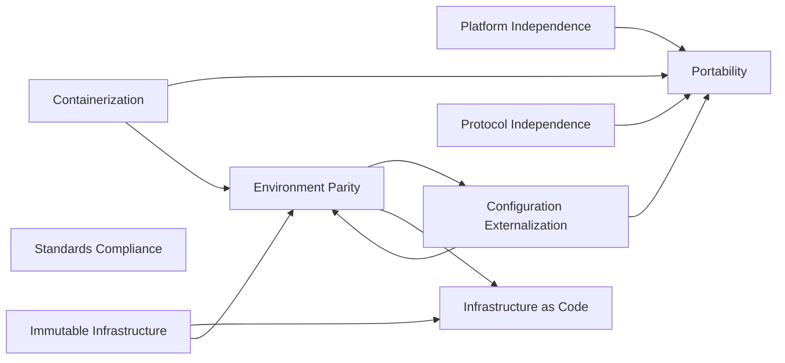
```mermaid
flowchart LR
n_portability["Portability"]
n_platform_independence["Platform Independence"]
n_environment_parity["Environment Parity"]
n_containerization["Containerization"]
n_infrastructure_as_code["Infrastructure as Code"]
n_standards_compliance["Standards Compliance"]
n_protocol_independence["Protocol Independence"]
n_configuration_externalization["Configuration Externalization"]
n_immutable_infrastructure["Immutable Infrastructure"]
n_platform_independence --> n_portability
n_environment_parity --> n_configuration_externalization
n_environment_parity --> n_infrastructure_as_code
n_containerization --> n_portability
n_containerization --> n_environment_parity
n_protocol_independence --> n_portability
n_configuration_externalization --> n_portability
n_configuration_externalization --> n_environment_parity
n_immutable_infrastructure --> n_infrastructure_as_code
n_immutable_infrastructure --> n_environment_parity
```

### Portability

- Kind: [quality-attribute](SCHEMA.md#kind-quality-attribute)
- Severity: contextual
- Scope: application, infrastructure, runtime
- Layer: [Resource Core](SCHEMA.md#layer-resource-core)

Details

Requires
[Abstraction](PRINCIPLES.md#arch-abstraction), [Standards](LEXICON.md#lex-standards)
Reinforces
[Replaceability](PRINCIPLES.md#arch-replaceability)
Enables
[Platform Migration](LEXICON.md#lex-platform-migration)
In tension with
[Platform Optimization](LEXICON.md#lex-platform-optimization)
Conflicts with
[Platform-Specific Coupling](LEXICON.md#lex-platform-specific-coupling)
Referenced by
[Interoperability](PRINCIPLES.md#arch-interoperability), [Low Coupling](PRINCIPLES.md#arch-low-coupling), [Abstraction](PRINCIPLES.md#arch-abstraction), [Independence](PRINCIPLES.md#arch-independence), [Platform Independence](PRINCIPLES.md#arch-platform-independence), [Containerization](PRINCIPLES.md#arch-containerization), [Protocol Independence](PRINCIPLES.md#arch-protocol-independence), [Configuration Externalization](PRINCIPLES.md#arch-configuration-externalization)
Tensions
[Portability Platform Optimization](SCHEMA.md#tension-platform-optimization-portability)

Violated by
direct dependency on non-abstracted platform APIs
Detected by
platform-specific imports in core
Measured by
portability violation count
Refactored by
Add Adapter, Externalize Platform Dependency
Enforced by
dependency rules

```typescript
const path = "C:\\foo\\data\\foos.json";
const processId = windowsApi.currentProcessId();
```

```typescript
const path = join(config.dataDirectory, "foos.json");
const processId = runtime.processId();
```

### Platform Independence

- Kind: [principle](SCHEMA.md#kind-principle)
- Severity: contextual
- Scope: application, runtime
- Layer: [Resource Core](SCHEMA.md#layer-resource-core)

Details

Requires
[Platform Abstraction](LEXICON.md#lex-platform-abstraction)
Reinforces
[Portability](PRINCIPLES.md#arch-portability)
Enables
[Cross-Platform Deployment](LEXICON.md#lex-cross-platform-deployment)
In tension with
[Native Optimization](LEXICON.md#lex-native-optimization)
Conflicts with
[OS/Vendor Lock-In](LEXICON.md#lex-os-vendor-lock-in)
Tensions
[Platform Independence Native Optimization](SCHEMA.md#tension-native-optimization-platform-independence)

Violated by
hardcoded platform assumptions
Detected by
OS-specific paths/APIs in portable layers
Measured by
cross-platform test pass rate
Refactored by
Abstract Platform API, Normalize Paths
Enforced by
cross-platform CI

```typescript
function saveFoo(foo: Foo) {
  return winRegistry.write("Foo", foo);
}
```

```typescript
interface FooPersistence {
  save(foo: Foo): Promise<void>;
}
function saveFoo(foo: Foo, persistence: FooPersistence) {
  return persistence.save(foo);
}
```

### Environment Parity

- Kind: [principle](SCHEMA.md#kind-principle)
- Severity: recommended
- Scope: dev, test, staging, production
- Layer: [Resource Core](SCHEMA.md#layer-resource-core)

Details

Requires
[Configuration Externalization](PRINCIPLES.md#arch-configuration-externalization), [Infrastructure as Code](PRINCIPLES.md#arch-infrastructure-as-code)
Reinforces
[Reproducibility](PRINCIPLES.md#arch-reproducibility)
Enables
[Reliable Deployment](LEXICON.md#lex-reliable-deployment)
In tension with
[Cost](LEXICON.md#lex-cost)
Conflicts with
[Snowflake Environments](LEXICON.md#lex-snowflake-environments)
Referenced by
[Containerization](PRINCIPLES.md#arch-containerization), [Configuration Externalization](PRINCIPLES.md#arch-configuration-externalization), [Immutable Infrastructure](PRINCIPLES.md#arch-immutable-infrastructure)
Tensions
[Environment Parity Cost](SCHEMA.md#tension-cost-environment-parity)

Violated by
environment-specific behavior not config-driven
Detected by
works-in-dev-only defects
Measured by
[environment drift](LEXICON.md#lex-environment-drift)
Refactored by
Containerize, Externalize Config, Use IaC
Enforced by
environment drift checks

```typescript
if (env === "dev") useMemoryFooStore();
if (env === "prod") useSqlFooStore();
```

```typescript
const container = buildFooImage("foo-app:1.0.0");
runEnvironment("dev", container, devConfig);
runEnvironment("prod", container, prodConfig);
```

### Containerization

- Kind: [mechanism](SCHEMA.md#kind-mechanism)
- Severity: contextual
- Scope: application, runtime, deployment
- Layer: [Resource Core](SCHEMA.md#layer-resource-core)

Details

Requires
[Image Definition](LEXICON.md#lex-image-definition), [Externalized Config](LEXICON.md#lex-externalized-config)
Reinforces
[Portability](PRINCIPLES.md#arch-portability), [Environment Parity](PRINCIPLES.md#arch-environment-parity)
Enables
[Repeatable Runtime Packaging](LEXICON.md#lex-repeatable-runtime-packaging)
In tension with
[Image Complexity](LEXICON.md#lex-image-complexity)
Conflicts with
[Host-Coupled Deployment](LEXICON.md#lex-host-coupled-deployment)
Tensions
[Containerization Image Complexity](SCHEMA.md#tension-containerization-image-complexity)

Violated by
undeclared host dependency
Detected by
manual host setup requirements
Measured by
image reproducibility
Refactored by
Add Containerfile, Externalize Runtime Dependencies
Enforced by
image scans, build pipeline

```typescript
installFooDependenciesOnHost();
startFooWithHostRuntime();
```

```typescript
const image = containerImage({
  base: "node:22-alpine",
  copy: ["dist", "package.json"],
  command: ["node", "dist/main.js"],
});
```

### Infrastructure as Code

- Kind: [activity](SCHEMA.md#kind-activity)
- Severity: mandatory for managed infrastructure
- Scope: infrastructure, deployment
- Aliases: IaC
- Layer: [Resource Core](SCHEMA.md#layer-resource-core)

Details

Requires
[Declarative Configuration](PRINCIPLES.md#arch-declarative-configuration), [Version Control](LEXICON.md#lex-version-control)
Reinforces
[Reproducibility](PRINCIPLES.md#arch-reproducibility), [Governance](PRINCIPLES.md#arch-governance)
Enables
[Automated Provisioning](LEXICON.md#lex-automated-provisioning)
In tension with
[Tooling Complexity](LEXICON.md#lex-tooling-complexity)
Conflicts with
[Manual Infrastructure Changes](LEXICON.md#lex-manual-infrastructure-changes)
Referenced by
[Declarative Configuration](PRINCIPLES.md#arch-declarative-configuration), [Environment Parity](PRINCIPLES.md#arch-environment-parity), [Immutable Infrastructure](PRINCIPLES.md#arch-immutable-infrastructure)
Tensions
[Infrastructure as Code Tooling Complexity](SCHEMA.md#tension-infrastructure-as-code-tooling-complexity)

Violated by
untracked manual infra mutation
Detected by
drift between code and live infra
Measured by
drift count, IaC coverage
Refactored by
Codify Resource, Import State
Enforced by
[policy-as-code](PRINCIPLES.md#arch-policy-as-code), drift detection

```typescript
operator.createDatabase("foo-prod");
operator.openPort(5432);
```

```typescript
const fooDatabase = databaseResource({
  name: "foo-prod",
  engine: "postgres",
  encrypted: true,
  networkPolicy: "foo-only",
});
```

### Standards Compliance

- Kind: [constraint](SCHEMA.md#kind-constraint)
- Severity: contextual
- Scope: protocol, security, data, infrastructure
- Layer: [Resource Core](SCHEMA.md#layer-resource-core)

Details

Requires
[Applicable Standard](LEXICON.md#lex-applicable-standard)
Reinforces
[Interoperability](PRINCIPLES.md#arch-interoperability), [Compliance](PRINCIPLES.md#arch-compliance)
Enables
[Certification/Compatibility](LEXICON.md#lex-certification-compatibility)
In tension with
[Innovation/Flexibility](LEXICON.md#lex-innovation-flexibility)
Conflicts with
[Proprietary Deviation](LEXICON.md#lex-proprietary-deviation)
Tensions
[Standards Compliance Innovation/Flexibility](SCHEMA.md#tension-innovation-flexibility-standards-compliance)

Violated by
nonconforming implementation
Detected by
conformance test failure
Measured by
standard compliance score
Refactored by
Align Implementation, Add Conformance Tests
Enforced by
standards checks

```typescript
const payload = encodePrivateFooBinary(foo);
```

```typescript
const payload: JsonFooV1 = toJsonFoo(foo);
http.send(JSON.stringify(payload), {
  contentType: "application/json; charset=utf-8",
});
```

### Protocol Independence

- Kind: [principle](SCHEMA.md#kind-principle)
- Severity: recommended
- Scope: integration, service boundary
- Layer: [Resource Core](SCHEMA.md#layer-resource-core)

Details

Requires
[Adapter/Port Abstraction](LEXICON.md#lex-adapter-port-abstraction)
Reinforces
[Portability](PRINCIPLES.md#arch-portability), [Replaceability](PRINCIPLES.md#arch-replaceability)
Enables
[Protocol Swap](LEXICON.md#lex-protocol-swap)
In tension with
[Protocol-Specific Features](LEXICON.md#lex-protocol-specific-features)
Conflicts with
[Protocol-Coupled Domain Logic](LEXICON.md#lex-protocol-coupled-domain-logic)
Tensions
[Protocol Independence Protocol-Specific Features](SCHEMA.md#tension-protocol-independence-protocol-specific-features)

Violated by
HTTP/gRPC/etc. types in domain core
Detected by
protocol imports in core layer
Measured by
protocol leakage count
Refactored by
Add Port, Add Protocol Adapter
Enforced by
import rules

```typescript
class FooService {
  handleHttp(request: HttpRequest) {
    return fooStore.save(request.body);
  }
}
```

```typescript
class CreateFoo {
  constructor(private readonly store: FooStore) {}
  execute(input: CreateFooInput) {
    return this.store.save(Foo.create(input));
  }
}
httpAdapter.bind(createFoo);
grpcAdapter.bind(createFoo);
```

### Configuration Externalization

- Kind: [principle](SCHEMA.md#kind-principle)
- Severity: mandatory
- Scope: application, deployment, runtime
- Layer: [Resource Core](SCHEMA.md#layer-resource-core)

Details

Requires
[Config Schema](LEXICON.md#lex-config-schema), [Secure Config Handling](LEXICON.md#lex-secure-config-handling)
Reinforces
[Portability](PRINCIPLES.md#arch-portability), [Environment Parity](PRINCIPLES.md#arch-environment-parity)
Enables
[Environment-Specific Deployment](LEXICON.md#lex-environment-specific-deployment)
In tension with
[Config Sprawl](LEXICON.md#lex-config-sprawl)
Conflicts with
[Hardcoded Configuration](PRINCIPLES.md#arch-hardcoded-configuration)
Referenced by
[Environment Parity](PRINCIPLES.md#arch-environment-parity)
Tensions
[Configuration Externalization Config Sprawl](SCHEMA.md#tension-config-sprawl-configuration-externalization)

Violated by
environment values hardcoded in code
Detected by
hardcoded URLs/secrets/paths
Measured by
externalized config coverage
Refactored by
Move to Config, Add Validation
Enforced by
secret/config scans

```typescript
const config = {
  fooUrl: "https://foo.prod.example",
  retries: 3,
};
```

```typescript
type FooConfig = Readonly<{ fooUrl: URL; retries: number }>;
const config = FooConfigSchema.parse({
  fooUrl: process.env.FOO_URL,
  retries: process.env.FOO_RETRIES,
});
```

### Immutable Infrastructure

- Kind: [approach](SCHEMA.md#kind-approach)
- Severity: mandatory for managed infrastructure
- Scope: infrastructure, deployment, reproducibility
- Layer: [Resource Core](SCHEMA.md#layer-resource-core)

Details

Requires
[Infrastructure as Code](PRINCIPLES.md#arch-infrastructure-as-code)
Reinforces
[Environment Parity](PRINCIPLES.md#arch-environment-parity), [Reproducibility](PRINCIPLES.md#arch-reproducibility)
Enables
[Deterministic Redeploys](LEXICON.md#lex-deterministic-redeploys), [Instance Replacement over Mutation](LEXICON.md#lex-instance-replacement-over-mutation)
In tension with
[Deploy Time](LEXICON.md#lex-deploy-time)
Conflicts with
[In-Place Server Mutation](LEXICON.md#lex-in-place-server-mutation)
Tensions
[Immutable Infrastructure Deploy Time](SCHEMA.md#tension-deploy-time-immutable-infrastructure)

Violated by
patching running servers in place
Detected by
SSH mutation of live instances
Measured by
config drift across instances
Refactored by
Replace Instances from Immutable Images
Enforced by
deployment review

```typescript
ssh(server, "apt-get update && systemctl restart foo");
```

```typescript
const image = buildFooImage("foo:1.4.0");
replaceInstances("foo", image);
```

## Runtime Discovery / Dynamic Binding

Every principle in this category. Each record carries its kind, its severity, the scopes it applies at and the layer it lives in, then the edge relations that join it to other records, the records that point back at it, the contracts that answer to it and the tensions it takes part in. The descriptors say how it is violated, detected, measured, repaired and enforced. Where the record carries one, an exemplar shows the shape before and after the principle is applied.

Relations diagram

The relations inside this category.

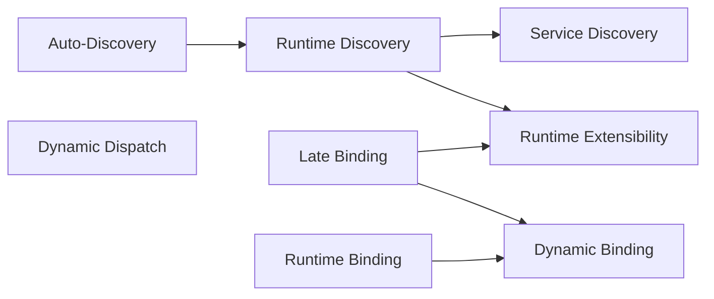
```mermaid
flowchart LR
n_runtime_discovery["Runtime Discovery"]
n_service_discovery["Service Discovery"]
n_auto_discovery["Auto-Discovery"]
n_dynamic_binding["Dynamic Binding"]
n_late_binding["Late Binding"]
n_runtime_binding["Runtime Binding"]
n_dynamic_dispatch["Dynamic Dispatch"]
n_runtime_extensibility["Runtime Extensibility"]
n_runtime_discovery --> n_runtime_extensibility
n_runtime_discovery --> n_service_discovery
n_auto_discovery --> n_runtime_discovery
n_late_binding --> n_dynamic_binding
n_late_binding --> n_runtime_extensibility
n_runtime_binding --> n_dynamic_binding
```

### Runtime Discovery

- Kind: [mechanism](SCHEMA.md#kind-mechanism)
- Severity: contextual
- Scope: runtime, plugin, service
- Layer: [Extensibility Core](SCHEMA.md#layer-extensibility-core)

Details

Requires
[Metadata](LEXICON.md#lex-metadata), [Registry/Discovery Mechanism](LEXICON.md#lex-registry-discovery-mechanism)
Reinforces
[Runtime Extensibility](PRINCIPLES.md#arch-runtime-extensibility)
Enables
[Plugin Architecture](PRINCIPLES.md#arch-plugin-architecture), [Service Discovery](PRINCIPLES.md#arch-service-discovery)
In tension with
[Predictability](PRINCIPLES.md#arch-predictability), [Static Analysis](PRINCIPLES.md#arch-static-analysis)
Conflicts with
[Static Linking](LEXICON.md#lex-static-linking)
Referenced by
[Self-Describing Architecture](PRINCIPLES.md#arch-self-describing-architecture), [Metadata-Driven Design](PRINCIPLES.md#arch-metadata-driven-design), [Capability Declaration](PRINCIPLES.md#arch-capability-declaration), [Manifest-Based Design](PRINCIPLES.md#arch-manifest-based-design), [Reflection](PRINCIPLES.md#arch-reflection), [Auto-Discovery](PRINCIPLES.md#arch-auto-discovery)
Contracts
[Runtime Discovery](ALGORITHMS.md#algo-runtime-discovery)
Tensions
[Runtime Discovery Predictability](SCHEMA.md#tension-predictability-runtime-discovery), [Runtime Discovery Static Analysis](SCHEMA.md#tension-runtime-discovery-static-analysis)

Violated by
hardcoded dependency discovery
Detected by
manual class/service lists
Measured by
discovery coverage
Refactored by
Add Registry, Add Scanner, Add Manifest
Enforced by
startup validation

```typescript
import { FooHandler } from "./foo-handler";
import { BarHandler } from "./bar-handler";
const handlers = [new FooHandler(), new BarHandler()];
```

```typescript
const modules = await discover<HandlerModule>("./handlers/*.handler.js");
const handlers = modules.map((module) => module.create());
```

### Service Discovery

- Kind: [mechanism](SCHEMA.md#kind-mechanism)
- Severity: contextual
- Scope: service, network, runtime
- Layer: [Extensibility Core](SCHEMA.md#layer-extensibility-core)

Details

Requires
[Service Registry](PRINCIPLES.md#arch-service-registry), [Health Checks](PRINCIPLES.md#arch-health-checks)
Reinforces
[Scalability](PRINCIPLES.md#arch-scalability), [Resilience](PRINCIPLES.md#arch-resilience)
Enables
[Dynamic Routing](LEXICON.md#lex-dynamic-routing), [Failover](PRINCIPLES.md#arch-failover)
In tension with
[Operational Complexity](LEXICON.md#lex-operational-complexity)
Conflicts with
[Hardcoded Endpoints](LEXICON.md#lex-hardcoded-endpoints)
Referenced by
[Runtime Discovery](PRINCIPLES.md#arch-runtime-discovery)
Tensions
[Service Discovery Operational Complexity](SCHEMA.md#tension-operational-complexity-service-discovery)

Violated by
fixed service addresses in code
Detected by
hardcoded URLs, missing registry lookup
Measured by
dynamic resolution coverage
Refactored by
Introduce Discovery Client, Externalize Endpoint
Enforced by
config scans, deployment policy

```typescript
const fooUrl = "http://10.0.0.14:8080";
await http.get(`${fooUrl}/foo/${id}`);
```

```typescript
const endpoint = await serviceDiscovery.resolve("foo-service");
await http.get(new URL(`/foo/${id}`, endpoint));
```

### Auto-Discovery

- Kind: [mechanism](SCHEMA.md#kind-mechanism)
- Severity: contextual
- Scope: plugin, module, service
- Layer: [Extensibility Core](SCHEMA.md#layer-extensibility-core)

Details

Requires
[Metadata](LEXICON.md#lex-metadata), [Conventions](LEXICON.md#lex-conventions)
Reinforces
[Runtime Discovery](PRINCIPLES.md#arch-runtime-discovery)
Enables
[Self-Registration](LEXICON.md#lex-self-registration)
In tension with
[Startup Cost](LEXICON.md#lex-startup-cost)
Conflicts with
[Manual Registration](LEXICON.md#lex-manual-registration)
Tensions
[Auto-Discovery Startup Cost](SCHEMA.md#tension-auto-discovery-startup-cost)

Violated by
manual enumeration of discoverable components
Detected by
static lists of handlers/plugins
Measured by
manual registration count
Refactored by
Add Scanner, Add Annotation, Add Manifest
Enforced by
registry validation

```typescript
register(new FooPlugin());
register(new BarPlugin());
register(new BazPlugin());
```

```typescript
for (const plugin of await scan<Plugin>("./plugins/*.plugin.js"))
  register(plugin);
```

### Dynamic Binding

- Kind: [mechanism](SCHEMA.md#kind-mechanism)
- Severity: contextual
- Scope: runtime, interface, plugin
- Layer: [Extensibility Core](SCHEMA.md#layer-extensibility-core)

Details

Requires
[Abstraction](PRINCIPLES.md#arch-abstraction), [Runtime Resolution](LEXICON.md#lex-runtime-resolution)
Reinforces
[Polymorphism](PRINCIPLES.md#arch-polymorphism), [Extensibility](LEXICON.md#lex-extensibility)
Enables
[Plugin Swap](LEXICON.md#lex-plugin-swap)
In tension with
[Static Safety](LEXICON.md#lex-static-safety)
Conflicts with
[Compile-Time Binding](LEXICON.md#lex-compile-time-binding)
Referenced by
[Capability Declaration](PRINCIPLES.md#arch-capability-declaration), [Reflection](PRINCIPLES.md#arch-reflection), [Late Binding](PRINCIPLES.md#arch-late-binding), [Runtime Binding](PRINCIPLES.md#arch-runtime-binding)
Tensions
[Dynamic Binding Static Safety](SCHEMA.md#tension-dynamic-binding-static-safety)

Violated by
fixed concrete binding where runtime selection required
Detected by
hardcoded implementation selection
Measured by
runtime binding coverage
Refactored by
Introduce Factory, [Registry](LEXICON.md#lex-registry), Strategy
Enforced by
integration tests

```typescript
const formatter = new JsonFooFormatter();
formatter.format(foo);
```

```typescript
const formatter = formatterRegistry.get(config.format);
if (!formatter) throw new Error(`unknown formatter: ${config.format}`);
formatter.format(foo);
```

### Late Binding

- Kind: [mechanism](SCHEMA.md#kind-mechanism)
- Severity: contextual
- Scope: runtime, plugin, module
- Layer: [Extensibility Core](SCHEMA.md#layer-extensibility-core)

Details

Requires
[Dynamic Binding](PRINCIPLES.md#arch-dynamic-binding)
Reinforces
[Runtime Extensibility](PRINCIPLES.md#arch-runtime-extensibility)
Enables
[Deferred Implementation Choice](LEXICON.md#lex-deferred-implementation-choice)
In tension with
[Predictability](PRINCIPLES.md#arch-predictability)
Conflicts with
[Early Binding](LEXICON.md#lex-early-binding)
Tensions
[Late Binding Predictability](SCHEMA.md#tension-late-binding-predictability)

Violated by
premature concrete resolution
Detected by
compile-time dependency on runtime extension
Measured by
late-bound extension count
Refactored by
Add Interface, Defer Resolution, Add Registry
Enforced by
dependency checks

```typescript
const store = new SqlFooStore();
export const fooService = new FooService(store);
```

```typescript
export function bootstrap(config: Config) {
  const store = storeRegistry.create(config.fooStore);
  return new FooService(store);
}
```

### Runtime Binding

- Kind: [mechanism](SCHEMA.md#kind-mechanism)
- Severity: contextual
- Scope: runtime, plugin, service
- Layer: [Extensibility Core](SCHEMA.md#layer-extensibility-core)

Details

Requires
[Runtime Discovery or Configuration](LEXICON.md#lex-runtime-discovery-or-configuration)
Reinforces
[Dynamic Binding](PRINCIPLES.md#arch-dynamic-binding)
Enables
[Environment-Specific Composition](LEXICON.md#lex-environment-specific-composition)
In tension with
[Debugging](LEXICON.md#lex-debugging)
Conflicts with
[Static Wiring](LEXICON.md#lex-static-wiring)
Referenced by
[Service Registry](PRINCIPLES.md#arch-service-registry)
Tensions
[Runtime Binding Debugging](SCHEMA.md#tension-debugging-runtime-binding)

Violated by
compile-time wiring of runtime choices
Detected by
fixed binding tables
Measured by
configurable binding coverage
Refactored by
Add DI Container, Add Registry
Enforced by
composition root tests

```typescript
import { FooPolicy } from "./foo-policy";
const policy = new FooPolicy();
```

```typescript
const policyModule = await import(config.fooPolicyModule);
const policy: FooPolicy = policyModule.create(config.fooPolicyOptions);
```

### Dynamic Dispatch

- Kind: [mechanism](SCHEMA.md#kind-mechanism)
- Severity: recommended
- Scope: method, interface, runtime
- Layer: [Extensibility Core](SCHEMA.md#layer-extensibility-core)

Details

Requires
[Polymorphism](PRINCIPLES.md#arch-polymorphism)
Reinforces
[Open/Closed Principle (OCP)](PRINCIPLES.md#arch-open-closed)
Enables
[Replace Conditional with Polymorphism](LEXICON.md#lex-replace-conditional-with-polymorphism)
In tension with
[Traceability](PRINCIPLES.md#arch-traceability)
Conflicts with
[Type-Switch Dispatch](LEXICON.md#lex-type-switch-dispatch)
Referenced by
[Polymorphism](PRINCIPLES.md#arch-polymorphism)
Tensions
[Dynamic Dispatch Traceability](SCHEMA.md#tension-dynamic-dispatch-traceability)

Violated by
manual dispatch over concrete type
Detected by
switch/if chains on type
Measured by
conditional dispatch count
Refactored by
Introduce Polymorphic Method, Strategy
Enforced by
lint rules, [review](LEXICON.md#lex-review)

```typescript
function execute(kind: string, foo: Foo) {
  if (kind === "save") return saveFoo(foo);
  if (kind === "publish") return publishFoo(foo);
}
```

```typescript
const commands: Record<string, (foo: Foo) => unknown> = {
  save: saveFoo,
  publish: publishFoo,
};
function execute(kind: string, foo: Foo) {
  const command = commands[kind];
  if (!command) throw new Error(`unknown command ${kind}`);
  return command(foo);
}
```

### Runtime Extensibility

- Kind: [quality-attribute](SCHEMA.md#kind-quality-attribute)
- Severity: contextual
- Scope: runtime, plugin, system
- Layer: [Extensibility Core](SCHEMA.md#layer-extensibility-core)

Details

Requires
[Extension Points](PRINCIPLES.md#arch-extension-points), [Stable Interfaces](PRINCIPLES.md#arch-stable-interfaces)
Reinforces
[Plugin Architecture](PRINCIPLES.md#arch-plugin-architecture), [Open/Closed Principle (OCP)](PRINCIPLES.md#arch-open-closed)
Enables
[Capability Addition without Core Modification](LEXICON.md#lex-capability-addition-without-core-modification)
In tension with
[Predictability](PRINCIPLES.md#arch-predictability), [Security](LEXICON.md#lex-security)
Conflicts with
[Closed Static Core](LEXICON.md#lex-closed-static-core)
Referenced by
[Prototype Pattern](PRINCIPLES.md#arch-prototype-pattern), [Runtime Code Generation](PRINCIPLES.md#arch-runtime-code-generation), [Plugin Architecture](PRINCIPLES.md#arch-plugin-architecture), [Feature Toggle](PRINCIPLES.md#arch-feature-toggle), [Runtime Discovery](PRINCIPLES.md#arch-runtime-discovery), [Late Binding](PRINCIPLES.md#arch-late-binding)
Contracts
[Runtime Extensibility](ALGORITHMS.md#algo-runtime-extensibility)
Tensions
[Runtime Extensibility Predictability](SCHEMA.md#tension-predictability-runtime-extensibility), [Runtime Extensibility Security](SCHEMA.md#tension-runtime-extensibility-security)

Violated by
modifying core for every extension
Detected by
repeated core changes for variants
Measured by
extension/core-change ratio
Refactored by
Add Extension Point, Add Plugin Interface
Enforced by
extension conformance tests

```typescript
switch (pluginName) {
  case "foo":
    return new FooPlugin();
  case "bar":
    return new BarPlugin();
}
```

```typescript
export function registerPlugin(name: string, create: () => Plugin) {
  pluginRegistry.set(name, create);
}
const plugin = pluginRegistry.get(pluginName)?.();
```

## Scalability / Performance / Optimization

Every principle in this category. Each record carries its kind, its severity, the scopes it applies at and the layer it lives in, then the edge relations that join it to other records, the records that point back at it, the contracts that answer to it and the tensions it takes part in. The descriptors say how it is violated, detected, measured, repaired and enforced. Where the record carries one, an exemplar shows the shape before and after the principle is applied.

Relations diagram

The relations inside this category.

```mermaid
flowchart LR
n_scalability["Scalability"]
n_horizontal_scaling["Horizontal Scaling"]
n_vertical_scaling["Vertical Scaling"]
n_elasticity["Elasticity"]
n_load_balancing["Load Balancing"]
n_sharding["Sharding"]
n_partitioning["Partitioning"]
n_caching["Caching"]
n_statelessness["Statelessness"]
n_concurrency["Concurrency"]
n_parallelism["Parallelism"]
n_throughput["Throughput"]
n_latency["Latency"]
n_performance_engineering["Performance Engineering"]
n_algorithmic_efficiency["Algorithmic Efficiency"]
n_time_complexity["Time Complexity"]
n_space_complexity["Space Complexity"]
n_big_o_notation["Big O Notation"]
n_optimization["Optimization"]
n_profiling["Profiling"]
n_benchmarking["Benchmarking"]
n_bottleneck_analysis["Bottleneck Analysis"]
n_resource_utilization["Resource Utilization"]
n_rate_limiting["Rate Limiting"]
n_memory_efficiency["Memory Efficiency"]
n_cdn_edge_caching["CDN / Edge Caching"]
n_read_replica["Read Replica"]
n_queuing_theory["Queuing Theory"]
n_scalability --> n_performance_engineering
n_horizontal_scaling --> n_elasticity
n_elasticity --> n_scalability
n_load_balancing --> n_scalability
n_sharding --> n_horizontal_scaling
n_partitioning --> n_scalability
n_partitioning --> n_parallelism
n_caching --> n_scalability
n_statelessness --> n_horizontal_scaling
n_statelessness --> n_load_balancing
n_concurrency --> n_throughput
n_parallelism --> n_throughput
n_throughput --> n_scalability
n_throughput -.-> n_latency
n_latency --> n_performance_engineering
n_performance_engineering --> n_profiling
n_performance_engineering --> n_benchmarking
n_performance_engineering --> n_scalability
n_algorithmic_efficiency --> n_scalability
n_time_complexity --> n_algorithmic_efficiency
n_time_complexity -.-> n_space_complexity
n_space_complexity --> n_resource_utilization
n_space_complexity -.-> n_time_complexity
n_big_o_notation --> n_algorithmic_efficiency
n_optimization --> n_profiling
n_optimization --> n_performance_engineering
n_profiling --> n_performance_engineering
n_benchmarking --> n_performance_engineering
n_bottleneck_analysis --> n_profiling
n_bottleneck_analysis --> n_optimization
n_resource_utilization --> n_performance_engineering
n_memory_efficiency --> n_scalability
n_cdn_edge_caching --> n_caching
n_cdn_edge_caching --> n_latency
n_read_replica --> n_horizontal_scaling
n_read_replica --> n_load_balancing
n_queuing_theory --> n_latency
```

### Scalability

- Kind: [quality-attribute](SCHEMA.md#kind-quality-attribute)
- Severity: contextual
- Scope: service, system, infrastructure
- Layer: [Performance Core](SCHEMA.md#layer-performance-core)

Details

Requires
[Load Model](LEXICON.md#lex-load-model), [Bottleneck Awareness](LEXICON.md#lex-bottleneck-awareness)
Reinforces
[Performance Engineering](PRINCIPLES.md#arch-performance-engineering)
Enables
[Growth Handling](LEXICON.md#lex-growth-handling)
In tension with
[Simplicity](LEXICON.md#lex-simplicity), [Consistency](PRINCIPLES.md#arch-consistency)
Conflicts with
[Fixed-Capacity Design](LEXICON.md#lex-fixed-capacity-design)
Referenced by
[Microservices](PRINCIPLES.md#arch-microservices), [Message Broker](PRINCIPLES.md#arch-message-broker), [CQRS](PRINCIPLES.md#arch-command-query-responsibility-segregation), [Eventual Consistency](PRINCIPLES.md#arch-eventual-consistency), [Service Discovery](PRINCIPLES.md#arch-service-discovery), [Elasticity](PRINCIPLES.md#arch-elasticity), [Load Balancing](PRINCIPLES.md#arch-load-balancing), [Partitioning](PRINCIPLES.md#arch-partitioning), [Caching](PRINCIPLES.md#arch-caching), [Throughput](PRINCIPLES.md#arch-throughput), [Performance Engineering](PRINCIPLES.md#arch-performance-engineering), [Algorithmic Efficiency](PRINCIPLES.md#arch-algorithmic-efficiency), [Memory Efficiency](PRINCIPLES.md#arch-memory-efficiency), [Replication](PRINCIPLES.md#arch-replication), [Stateless Processing](PRINCIPLES.md#arch-stateless-processing)
Tensions
[Scalability Simplicity](SCHEMA.md#tension-scalability-simplicity), [Scalability Consistency](SCHEMA.md#tension-consistency-scalability)

Violated by
single bottleneck preventing growth
Detected by
saturation under load test
Measured by
throughput under increasing load
Refactored by
Add Caching, [Partitioning](PRINCIPLES.md#arch-partitioning), Async Processing, Scaling
Enforced by
load tests, SLO gates

```typescript
class FooServer {
  private readonly foos = new Map<FooId, Foo>();
  handle(request: FooRequest) {
    return processFoo(request, this.foos);
  }
}
```

```typescript
class FooServer {
  constructor(private readonly store: DistributedFooStore) {}
  handle(request: FooRequest) {
    return processFoo(request, this.store);
  }
}
```

### Horizontal Scaling

- Kind: [technique](SCHEMA.md#kind-technique)
- Severity: contextual
- Scope: service, infrastructure
- Layer: [Performance Core](SCHEMA.md#layer-performance-core)

Details

Requires
[Statelessness or Shared State Strategy](LEXICON.md#lex-statelessness-or-shared-state-strategy)
Reinforces
[Elasticity](PRINCIPLES.md#arch-elasticity), [Availability](LEXICON.md#lex-availability)
Enables
[Scale-Out](LEXICON.md#lex-scale-out)
In tension with
[Distributed Coordination](LEXICON.md#lex-distributed-coordination)
Conflicts with
[Instance-Local State](LEXICON.md#lex-instance-local-state)
Referenced by
[Space-Based Architecture](PRINCIPLES.md#arch-space-based-architecture), [Competing Consumers](PRINCIPLES.md#arch-competing-consumers), [Sharding](PRINCIPLES.md#arch-sharding), [Statelessness](PRINCIPLES.md#arch-statelessness), [Read Replica](PRINCIPLES.md#arch-read-replica)
Tensions
[Horizontal Scaling Distributed Coordination](SCHEMA.md#tension-distributed-coordination-horizontal-scaling)

Violated by
sticky instance state required for correctness
Detected by
local session/state coupling
Measured by
scale-out efficiency
Refactored by
Externalize State, Add Load Balancer
Enforced by
deployment tests

```typescript
deployFoo({ replicas: 1, cpu: 32, memoryGb: 128 });
```

```typescript
deployFoo({ replicas: 12, cpu: 2, memoryGb: 4, stateless: true });
```

### Vertical Scaling

- Kind: [technique](SCHEMA.md#kind-technique)
- Severity: contextual
- Scope: infrastructure, process
- Layer: [Performance Core](SCHEMA.md#layer-performance-core)

Details

Requires
[Resource Headroom](LEXICON.md#lex-resource-headroom)
Reinforces
[Simplicity](LEXICON.md#lex-simplicity)
Enables
[Capacity Increase without Distribution](LEXICON.md#lex-capacity-increase-without-distribution)
In tension with
[Cost/Limit](LEXICON.md#lex-cost-limit)
Conflicts with
[Hard Resource Ceiling](LEXICON.md#lex-hard-resource-ceiling)
Tensions
[Vertical Scaling Cost/Limit](SCHEMA.md#tension-cost-limit-vertical-scaling)

Violated by
relying only on vertical scale past ceiling
Detected by
resource saturation trends
Measured by
utilization/headroom
Refactored by
Optimize Resources, Prepare Horizontal Scale
Enforced by
[capacity planning](LEXICON.md#lex-capacity-planning)

```typescript
deployFoo({ cpu: 1, memoryGb: 1 });
queueFooWhenSaturated();
```

```typescript
deployFoo({ cpu: 8, memoryGb: 32 });
verifyFooCapacity({ targetConcurrency: 200 });
```

### Elasticity

- Kind: [quality-attribute](SCHEMA.md#kind-quality-attribute)
- Severity: contextual
- Scope: deployment, infrastructure
- Layer: [Performance Core](SCHEMA.md#layer-performance-core)

Details

Requires
[Auto-Scaling](PRINCIPLES.md#arch-auto-scaling), [Metrics](LEXICON.md#lex-metrics)
Reinforces
[Scalability](PRINCIPLES.md#arch-scalability), [Cost Efficiency](LEXICON.md#lex-cost-efficiency)
Enables
[Dynamic Capacity](LEXICON.md#lex-dynamic-capacity)
In tension with
[Warm-Up Latency](LEXICON.md#lex-warm-up-latency)
Conflicts with
[Fixed Provisioning](LEXICON.md#lex-fixed-provisioning)
Referenced by
[Space-Based Architecture](PRINCIPLES.md#arch-space-based-architecture), [Horizontal Scaling](PRINCIPLES.md#arch-horizontal-scaling), [Auto-Scaling](PRINCIPLES.md#arch-auto-scaling)
Tensions
[Elasticity Warm-Up Latency](SCHEMA.md#tension-elasticity-warm-up-latency)

Violated by
capacity not adapting to demand
Detected by
under/over-provisioning patterns
Measured by
scale response time, utilization
Refactored by
Add Scaling Policy, Remove Stateful Constraint
Enforced by
infrastructure policy

```typescript
deployFooWorkers({ replicas: 10 });
```

```typescript
deployFooWorkers({
  minReplicas: 2,
  maxReplicas: 50,
  target: { queueDepthPerReplica: 100 },
});
```

### Load Balancing

- Kind: [mechanism](SCHEMA.md#kind-mechanism)
- Severity: contextual
- Scope: traffic, service
- Layer: [Performance Core](SCHEMA.md#layer-performance-core)

Details

Requires
[Multiple Targets](LEXICON.md#lex-multiple-targets), [Health Checks](PRINCIPLES.md#arch-health-checks)
Reinforces
[Availability](LEXICON.md#lex-availability), [Scalability](PRINCIPLES.md#arch-scalability)
Enables
[Traffic Distribution](LEXICON.md#lex-traffic-distribution)
In tension with
[Session Affinity](LEXICON.md#lex-session-affinity)
Conflicts with
[Single Target Routing](LEXICON.md#lex-single-target-routing)
Referenced by
[Competing Consumers](PRINCIPLES.md#arch-competing-consumers), [Statelessness](PRINCIPLES.md#arch-statelessness), [Read Replica](PRINCIPLES.md#arch-read-replica), [Health Checks](PRINCIPLES.md#arch-health-checks)
Tensions
[Load Balancing Session Affinity](SCHEMA.md#tension-load-balancing-session-affinity)

Violated by
uneven traffic causing hotspots
Detected by
skewed instance utilization
Measured by
request distribution, [latency](PRINCIPLES.md#arch-latency)
Refactored by
Add Load Balancer, Externalize Session State
Enforced by
infrastructure config checks

```typescript
const endpoint = fooServers[0];
endpoint.handle(request);
```

```typescript
const endpoint = fooLoadBalancer.next({ key: request.fooId });
endpoint.handle(request);
```

### Sharding

- Kind: [pattern](SCHEMA.md#kind-pattern)
- Severity: contextual
- Scope: database, storage, messaging
- Layer: [Performance Core](SCHEMA.md#layer-performance-core)

Details

Requires
[Partition Key](LEXICON.md#lex-partition-key)
Reinforces
[Horizontal Scaling](PRINCIPLES.md#arch-horizontal-scaling)
Enables
[Large Dataset Scaling](LEXICON.md#lex-large-dataset-scaling)
In tension with
[Cross-Shard Queries](LEXICON.md#lex-cross-shard-queries)
Conflicts with
[Single Monolithic Store](LEXICON.md#lex-single-monolithic-store)
Tensions
[Sharding Cross-Shard Queries](SCHEMA.md#tension-cross-shard-queries-sharding)

Violated by
unbounded single partition growth
Detected by
hotspot partitions, storage bottleneck
Measured by
shard balance, query fan-out
Refactored by
Introduce Shard Key, Split Data
Enforced by
data architecture review

```typescript
const foo = await singleFooDatabase.find(id);
```

```typescript
const shard = fooShardMap.resolve(id);
const foo = await shard.find(id);
```

### Partitioning

- Kind: [technique](SCHEMA.md#kind-technique)
- Severity: contextual
- Scope: data, workload, service
- Layer: [Performance Core](SCHEMA.md#layer-performance-core)

Details

Requires
[Partition Strategy](LEXICON.md#lex-partition-strategy)
Reinforces
[Scalability](PRINCIPLES.md#arch-scalability), [Isolation](PRINCIPLES.md#arch-isolation)
Enables
[Parallelism](PRINCIPLES.md#arch-parallelism)
In tension with
[Rebalancing Complexity](LEXICON.md#lex-rebalancing-complexity)
Conflicts with
[Global Shared State](LEXICON.md#lex-global-shared-state)
Tensions
[Partitioning Rebalancing Complexity](SCHEMA.md#tension-partitioning-rebalancing-complexity)

Violated by
no partitioning for unbounded workload
Detected by
hotspot resource usage
Measured by
partition balance
Refactored by
Add Partition Key, Split Workload
Enforced by
[architecture review](PRINCIPLES.md#arch-architecture-review)

```typescript
const events = await fooLog.readAll();
```

```typescript
const partition = hash(fooId) % partitionCount;
const events = await fooLog.readPartition(partition);
```

### Caching

- Kind: [pattern](SCHEMA.md#kind-pattern)
- Severity: contextual
- Scope: data access, computation, API
- Layer: [Performance Core](SCHEMA.md#layer-performance-core)

Details

Requires
[Invalidation Policy](LEXICON.md#lex-invalidation-policy)
Reinforces
[Latency Reduction](LEXICON.md#lex-latency-reduction), [Scalability](PRINCIPLES.md#arch-scalability)
Enables
[Reduced Load](LEXICON.md#lex-reduced-load)
In tension with
[Consistency](PRINCIPLES.md#arch-consistency), [Always-Fresh Reads](LEXICON.md#lex-always-fresh-reads)
Conflicts with
[Cache Poisoning by Design](PRINCIPLES.md#arch-cache-poisoning-by-design)
Referenced by
[CDN / Edge Caching](PRINCIPLES.md#arch-cdn-edge-caching)
Tensions
[Caching Consistency](SCHEMA.md#tension-caching-consistency), [Caching Always-Fresh Reads](SCHEMA.md#tension-always-fresh-reads-caching)

Violated by
repeated expensive computation/query with stable result
Detected by
hot repeated reads, high latency calls
Measured by
hit ratio, stale read rate
Refactored by
Add Cache, Define TTL/Invalidation
Enforced by
performance tests

```typescript
async function loadFoo(id: FooId) {
  return fooStore.find(id);
}
```

```typescript
async function loadFoo(id: FooId) {
  const cached = await fooCache.get(id);
  if (cached) return cached;
  const foo = await fooStore.find(id);
  if (foo) await fooCache.set(id, foo, { ttlMs: 60_000 });
  return foo;
}
```

### Statelessness

- Kind: [principle](SCHEMA.md#kind-principle)
- Severity: recommended
- Scope: service, process, handler
- Layer: [Performance Core](SCHEMA.md#layer-performance-core)

Details

Requires
[Externalized State](LEXICON.md#lex-externalized-state)
Reinforces
[Horizontal Scaling](PRINCIPLES.md#arch-horizontal-scaling), [Resilience](PRINCIPLES.md#arch-resilience)
Enables
[Load Balancing](PRINCIPLES.md#arch-load-balancing), [Auto-Scaling](PRINCIPLES.md#arch-auto-scaling)
In tension with
[State Access Latency](LEXICON.md#lex-state-access-latency)
Conflicts with
[Instance Affinity](LEXICON.md#lex-instance-affinity), [Temporal Coupling](PRINCIPLES.md#arch-temporal-coupling)
Tensions
[Statelessness State Access Latency](SCHEMA.md#tension-state-access-latency-statelessness)

Violated by
correctness depends on in-memory instance state
Detected by
mutable static/session-local state
Measured by
state externalization coverage
Refactored by
Move State to Store, Use Token/Session Store
Enforced by
architecture tests

```typescript
class FooHandler {
  private currentUser?: User;
  handle(request: Request) {
    this.currentUser = request.user;
    return processFoo(request, this.currentUser);
  }
}
```

```typescript
class FooHandler {
  handle(request: Request) {
    return processFoo(request, request.user);
  }
}
```

### Concurrency

- Kind: [model](SCHEMA.md#kind-model)
- Severity: contextual
- Scope: runtime, service, algorithm
- Layer: [Performance Core](SCHEMA.md#layer-performance-core)

Details

Requires
[Concurrency Control](PRINCIPLES.md#arch-concurrency-control)
Reinforces
[Throughput](PRINCIPLES.md#arch-throughput)
Enables
[Overlapping Work](LEXICON.md#lex-overlapping-work)
In tension with
[Complexity](LEXICON.md#lex-complexity)
Conflicts with
[Race Conditions](LEXICON.md#lex-race-conditions)
Tensions
[Concurrency Complexity](SCHEMA.md#tension-complexity-concurrency)

Violated by
unsafe shared mutation
Detected by
data races, flaky concurrent tests
Measured by
[throughput](PRINCIPLES.md#arch-throughput), race count
Refactored by
Add Synchronization, Use Immutable State
Enforced by
race detectors, [tests](LEXICON.md#lex-tests)

```typescript
for (const foo of foos) await processFoo(foo);
```

```typescript
await Promise.all(foos.map((foo) => processFoo(foo)));
```

### Parallelism

- Kind: [technique](SCHEMA.md#kind-technique)
- Severity: contextual
- Scope: algorithm, processing, runtime
- Layer: [Performance Core](SCHEMA.md#layer-performance-core)

Details

Requires
[Independent Work Units](LEXICON.md#lex-independent-work-units)
Reinforces
[Throughput](PRINCIPLES.md#arch-throughput), [Performance](LEXICON.md#lex-performance)
Enables
[Multi-Core Utilization](LEXICON.md#lex-multi-core-utilization)
In tension with
[Coordination Overhead](LEXICON.md#lex-coordination-overhead)
Conflicts with
[Sequential Bottleneck](LEXICON.md#lex-sequential-bottleneck)
Referenced by
[Causality](PRINCIPLES.md#arch-causality), [Partitioning](PRINCIPLES.md#arch-partitioning), [Fan-out/Fan-in](PRINCIPLES.md#arch-fan-out-fan-in)
Tensions
[Parallelism Coordination Overhead](SCHEMA.md#tension-coordination-overhead-parallelism)

Violated by
serial processing of independent heavy tasks
Detected by
CPU bottlenecks with independent work
Measured by
speedup, utilization
Refactored by
Split Work, Add Parallel Execution
Enforced by
performance benchmarks

```typescript
const results = foos.map((foo) => cpuHeavyFoo(foo));
```

```typescript
const results = await workerPool.map(foos, (foo) => cpuHeavyFoo(foo));
```

### Throughput

- Kind: [metric](SCHEMA.md#kind-metric)
- Severity: contextual
- Scope: service, pipeline, system
- Layer: [Performance Core](SCHEMA.md#layer-performance-core)

Details

Requires
[Capacity Model](LEXICON.md#lex-capacity-model)
Reinforces
[Scalability](PRINCIPLES.md#arch-scalability)
Enables
[Load Handling](LEXICON.md#lex-load-handling)
In tension with
[Latency](PRINCIPLES.md#arch-latency)
Conflicts with
[Bottlenecks](LEXICON.md#lex-bottlenecks)
Referenced by
[Code Review](PRINCIPLES.md#arch-code-review), [Event Ordering](PRINCIPLES.md#arch-event-ordering), [PACELC Theorem](PRINCIPLES.md#arch-pacelc-theorem), [Backpressure](PRINCIPLES.md#arch-backpressure), [Concurrency](PRINCIPLES.md#arch-concurrency), [Parallelism](PRINCIPLES.md#arch-parallelism), [Fan-out/Fan-in](PRINCIPLES.md#arch-fan-out-fan-in), [Isolation](PRINCIPLES.md#arch-isolation)
Tensions
[Throughput Latency](SCHEMA.md#tension-latency-throughput)

Violated by
processing rate below SLO
Detected by
load test failures
Measured by
requests/messages/items per second
Refactored by
Optimize Bottleneck, Add Parallelism, Add Scaling
Enforced by
performance gates

```typescript
for (const foo of foos) await fooStore.save(foo);
```

```typescript
for (const batch of chunk(foos, 500)) await fooStore.saveBatch(batch);
```

### Latency

- Kind: [metric](SCHEMA.md#kind-metric)
- Severity: contextual
- Scope: API, service, user flow
- Layer: [Performance Core](SCHEMA.md#layer-performance-core)

Details

Requires
[Time Budget](LEXICON.md#lex-time-budget)
Reinforces
[User Experience](LEXICON.md#lex-user-experience), [Performance Engineering](PRINCIPLES.md#arch-performance-engineering)
Enables
[Responsiveness](LEXICON.md#lex-responsiveness)
In tension with
[Throughput/Batching](LEXICON.md#lex-throughput-batching)
Conflicts with
[Long Blocking Work](LEXICON.md#lex-long-blocking-work)
Referenced by
[Total-Order Broadcast](PRINCIPLES.md#arch-total-order-broadcast), [CAP Theorem](PRINCIPLES.md#arch-cap-theorem), [PACELC Theorem](PRINCIPLES.md#arch-pacelc-theorem), [Consensus](PRINCIPLES.md#arch-consensus), [Message Queue](PRINCIPLES.md#arch-message-queue), [Throughput](PRINCIPLES.md#arch-throughput), [CDN / Edge Caching](PRINCIPLES.md#arch-cdn-edge-caching), [Queuing Theory](PRINCIPLES.md#arch-queuing-theory), [Consistency](PRINCIPLES.md#arch-consistency), [Pessimistic Locking](PRINCIPLES.md#arch-pessimistic-locking)
Tensions
[Latency Throughput/Batching](SCHEMA.md#tension-latency-throughput-batching)

Violated by
response time above SLO
Detected by
trace span delays
Measured by
p50/p95/p99 latency
Refactored by
Cache, Async Offload, Optimize Query
Enforced by
SLO gates

```typescript
async function renderFoo(id: FooId) {
  const foo = await fooStore.find(id);
  const bar = await barStore.find(foo.barId);
  const baz = await bazStore.find(foo.bazId);
  return render(foo, bar, baz);
}
```

```typescript
async function renderFoo(id: FooId) {
  const foo = await fooStore.find(id);
  const [bar, baz] = await Promise.all([
    barStore.find(foo.barId),
    bazStore.find(foo.bazId),
  ]);
  return render(foo, bar, baz);
}
```

### Performance Engineering

- Kind: [activity](SCHEMA.md#kind-activity)
- Severity: recommended
- Scope: codebase, service, system
- Layer: [Performance Core](SCHEMA.md#layer-performance-core)

Details

Requires
[Profiling](PRINCIPLES.md#arch-profiling), [Benchmarking](PRINCIPLES.md#arch-benchmarking)
Reinforces
[Scalability](PRINCIPLES.md#arch-scalability), [Resource Efficiency](LEXICON.md#lex-resource-efficiency)
Enables
[Evidence-Based Optimization](LEXICON.md#lex-evidence-based-optimization)
In tension with
[Maintainability](LEXICON.md#lex-maintainability)
Conflicts with
[Guess-Based Optimization](LEXICON.md#lex-guess-based-optimization)
Referenced by
[Scalability](PRINCIPLES.md#arch-scalability), [Latency](PRINCIPLES.md#arch-latency), [Optimization](PRINCIPLES.md#arch-optimization), [Profiling](PRINCIPLES.md#arch-profiling), [Benchmarking](PRINCIPLES.md#arch-benchmarking), [Resource Utilization](PRINCIPLES.md#arch-resource-utilization)
Tensions
[Performance Engineering Maintainability](SCHEMA.md#tension-maintainability-performance-engineering)

Violated by
optimization without measurement
Detected by
performance changes lacking benchmark
Measured by
benchmark trend, SLO compliance
Refactored by
Profile, Optimize Bottleneck, Add Benchmark
Enforced by
performance CI

```typescript
optimizeFooCode();
```

```typescript
const budget = { p95LatencyMs: 150, throughputPerSecond: 1000 } as const;
const profile = await measureFooWorkload(representativeLoad);
const change = optimize(profile.hotspot);
assertPerformance(change, budget);
```

### Algorithmic Efficiency

- Kind: [principle](SCHEMA.md#kind-principle)
- Severity: contextual
- Scope: algorithm, data structure
- Layer: [Performance Core](SCHEMA.md#layer-performance-core)

Details

Requires
[Complexity Awareness](LEXICON.md#lex-complexity-awareness)
Reinforces
[Scalability](PRINCIPLES.md#arch-scalability)
Enables
[Efficient Processing](LEXICON.md#lex-efficient-processing)
In tension with
[Implementation Simplicity](LEXICON.md#lex-implementation-simplicity)
Conflicts with
[Inefficient Algorithm Choice](LEXICON.md#lex-inefficient-algorithm-choice), [N Plus One Query](PRINCIPLES.md#arch-n-plus-one-query)
Referenced by
[Time Complexity](PRINCIPLES.md#arch-time-complexity), [Big O Notation](PRINCIPLES.md#arch-big-o-notation)
Tensions
[Algorithmic Efficiency Implementation Simplicity](SCHEMA.md#tension-algorithmic-efficiency-implementation-simplicity)

Violated by
avoidable quadratic/exponential behavior
Detected by
complexity analysis, benchmark slope
Measured by
time/space complexity
Refactored by
Replace Algorithm, Add Index, Change Data Structure
Enforced by
[review](LEXICON.md#lex-review), benchmarks

```typescript
function hasFoo(foos: Foo[], id: FooId) {
  return foos.some((foo) => foo.id === id);
}
```

```typescript
function indexFoos(foos: readonly Foo[]) {
  return new Map(foos.map((foo) => [foo.id, foo]));
}
const hasFoo = (index: ReadonlyMap<FooId, Foo>, id: FooId) => index.has(id);
```

### Time Complexity

- Kind: [metric](SCHEMA.md#kind-metric)
- Severity: contextual
- Scope: algorithm, function
- Layer: [Performance Core](SCHEMA.md#layer-performance-core)

Details

Requires
[Input Size Model](LEXICON.md#lex-input-size-model)
Reinforces
[Algorithmic Efficiency](PRINCIPLES.md#arch-algorithmic-efficiency)
Enables
[Scalability Analysis](LEXICON.md#lex-scalability-analysis)
In tension with
[Space Complexity](PRINCIPLES.md#arch-space-complexity)
Conflicts with
[Unbounded Runtime Growth](LEXICON.md#lex-unbounded-runtime-growth)
Referenced by
[Space Complexity](PRINCIPLES.md#arch-space-complexity)
Tensions
[Time Complexity Space Complexity](SCHEMA.md#tension-space-complexity-time-complexity)

Violated by
unacceptable asymptotic runtime
Detected by
nested loops over large inputs, benchmark slope
Measured by
Big O, runtime scaling
Refactored by
Improve Algorithm, Add Index/Cache
Enforced by
benchmark thresholds

```typescript
function duplicateFooIds(foos: Foo[]) {
  return foos.filter(
    (foo, index) => foos.findIndex((x) => x.id === foo.id) !== index,
  );
}
```

```typescript
function duplicateFooIds(foos: readonly Foo[]) {
  const seen = new Set<FooId>();
  return foos.filter((foo) => seen.has(foo.id) || !seen.add(foo.id));
}
```

### Space Complexity

- Kind: [metric](SCHEMA.md#kind-metric)
- Severity: contextual
- Scope: algorithm, process
- Layer: [Performance Core](SCHEMA.md#layer-performance-core)

Details

Requires
[Memory Model](LEXICON.md#lex-memory-model)
Reinforces
[Resource Utilization](PRINCIPLES.md#arch-resource-utilization)
Enables
[Memory Scalability](LEXICON.md#lex-memory-scalability)
In tension with
[Time Complexity](PRINCIPLES.md#arch-time-complexity)
Conflicts with
[Unbounded Memory Growth](LEXICON.md#lex-unbounded-memory-growth)
Referenced by
[Time Complexity](PRINCIPLES.md#arch-time-complexity)
Tensions
[Space Complexity Time Complexity](SCHEMA.md#tension-space-complexity-time-complexity)

Violated by
loading unbounded data into memory
Detected by
memory profiling, [full materialization](LEXICON.md#lex-full-materialization)
Measured by
Big O space, peak memory
Refactored by
Stream Data, Use Iterator, Chunk Processing
Enforced by
memory benchmarks

```typescript
function processFoos(stream: AsyncIterable<Foo>) {
  return collectAll(stream).then((foos) => foos.map(transformFoo));
}
```

```typescript
async function* processFoos(stream: AsyncIterable<Foo>) {
  for await (const foo of stream) yield transformFoo(foo);
}
```

### Big O Notation

- Kind: [technique](SCHEMA.md#kind-technique)
- Severity: contextual
- Scope: algorithm
- Layer: [Performance Core](SCHEMA.md#layer-performance-core)

Details

Requires
[Complexity Model](LEXICON.md#lex-complexity-model)
Reinforces
[Algorithmic Efficiency](PRINCIPLES.md#arch-algorithmic-efficiency)
Enables
[Comparative Analysis](LEXICON.md#lex-comparative-analysis)
In tension with
[Constant-Factor Practicality](LEXICON.md#lex-constant-factor-practicality)
Conflicts with
[Anecdotal Performance Claims](LEXICON.md#lex-anecdotal-performance-claims)
Tensions
[Big O Notation Constant-Factor Practicality](SCHEMA.md#tension-big-o-notation-constant-factor-practicality)

Violated by
ignoring growth behavior for large inputs
Detected by
missing complexity note for critical algorithm
Measured by
asymptotic classification
Refactored by
Analyze Complexity, Replace Algorithm
Enforced by
review checklist

```typescript
function pairFoosWithBars(foos: Foo[], bars: Bar[]) {
  return foos.flatMap((foo) =>
    bars.filter((bar) => bar.fooId === foo.id).map((bar) => [foo, bar]),
  );
}
```

```typescript
function pairFoosWithBars(foos: readonly Foo[], bars: readonly Bar[]) {
  const barsByFoo = groupBy(bars, (bar) => bar.fooId);
  return foos.flatMap((foo) =>
    (barsByFoo.get(foo.id) ?? []).map((bar) => [foo, bar]),
  );
}
```

### Optimization

- Kind: [activity](SCHEMA.md#kind-activity)
- Severity: contextual
- Scope: code, database, system
- Layer: [Performance Core](SCHEMA.md#layer-performance-core)

Details

Requires
[Profiling](PRINCIPLES.md#arch-profiling), [Bottleneck Evidence](LEXICON.md#lex-bottleneck-evidence)
Reinforces
[Performance Engineering](PRINCIPLES.md#arch-performance-engineering)
Enables
[Resource Efficiency](LEXICON.md#lex-resource-efficiency)
In tension with
[Readability/Maintainability](LEXICON.md#lex-readability-maintainability)
Conflicts with
[Premature Optimization](LEXICON.md#lex-premature-optimization)
Referenced by
[Compile-Time Evaluation](PRINCIPLES.md#arch-compile-time-evaluation), [Bottleneck Analysis](PRINCIPLES.md#arch-bottleneck-analysis)
Tensions
[Optimization Readability/Maintainability](SCHEMA.md#tension-optimization-readability-maintainability)

Violated by
optimizing without measured bottleneck
Detected by
complex code without performance evidence
Measured by
benchmark delta, SLO improvement
Refactored by
Optimize Bottleneck, Simplify After Optimization
Enforced by
benchmark review

```typescript
const fooCache = new Map<FooId, Foo>();
function loadFoo(id: FooId) {
  return fooCache.get(id) ?? expensiveLoad(id);
}
```

```typescript
const profile = profiler.measure("foo.load", representativeFooIds);
if (profile.hotspot === "foo-store-read") {
  enableBoundedFooCache({ maxEntries: 10_000, ttlMs: 30_000 });
}
```

### Profiling

- Kind: [technique](SCHEMA.md#kind-technique)
- Severity: recommended
- Scope: runtime, code path
- Layer: [Performance Core](SCHEMA.md#layer-performance-core)

Details

Requires
[Representative Workload](LEXICON.md#lex-representative-workload)
Reinforces
[Performance Engineering](PRINCIPLES.md#arch-performance-engineering)
Enables
[Bottleneck Detection](LEXICON.md#lex-bottleneck-detection)
In tension with
[Measurement Overhead](LEXICON.md#lex-measurement-overhead)
Conflicts with
[Guesswork](LEXICON.md#lex-guesswork)
Referenced by
[Performance Engineering](PRINCIPLES.md#arch-performance-engineering), [Optimization](PRINCIPLES.md#arch-optimization), [Bottleneck Analysis](PRINCIPLES.md#arch-bottleneck-analysis)
Tensions
[Profiling Measurement Overhead](SCHEMA.md#tension-measurement-overhead-profiling)

Violated by
performance decisions without profiling
Detected by
missing profile evidence
Measured by
hotspot attribution
Refactored by
Profile Path, Target Hotspot
Enforced by
performance review

```typescript
rewriteFooParserForSpeed();
```

```typescript
const profile = await profiler.capture(() => parseFooBatch(batch));
const hotspot = profile.topFrame();
optimizeFooFrame(hotspot);
```

### Benchmarking

- Kind: [activity](SCHEMA.md#kind-activity)
- Severity: recommended
- Scope: function, service, system
- Layer: [Performance Core](SCHEMA.md#layer-performance-core)

Details

Requires
[Repeatable Test Environment](LEXICON.md#lex-repeatable-test-environment)
Reinforces
[Reproducibility](PRINCIPLES.md#arch-reproducibility), [Performance Engineering](PRINCIPLES.md#arch-performance-engineering)
Enables
[Regression Detection](LEXICON.md#lex-regression-detection)
In tension with
[Environment Drift](LEXICON.md#lex-environment-drift)
Conflicts with
[Anecdotal Timing](LEXICON.md#lex-anecdotal-timing)
Referenced by
[Performance Engineering](PRINCIPLES.md#arch-performance-engineering)
Tensions
[Benchmarking Environment Drift](SCHEMA.md#tension-benchmarking-environment-drift)

Violated by
performance claim without benchmark
Detected by
missing benchmark for perf-sensitive changes
Measured by
benchmark score/trend
Refactored by
Add Benchmark, Stabilize Environment
Enforced by
benchmark CI

```typescript
const start = clock.now();
runFoo();
report(clock.now() - start);
```

```typescript
benchmark("foo.parse", {
  warmup: 100,
  iterations: 10_000,
  run: () => parseFoo(fixture),
});
```

### Bottleneck Analysis

- Kind: [activity](SCHEMA.md#kind-activity)
- Severity: recommended
- Scope: code path, system
- Layer: [Performance Core](SCHEMA.md#layer-performance-core)

Details

Requires
[Profiling](PRINCIPLES.md#arch-profiling), [Metrics](LEXICON.md#lex-metrics)
Reinforces
[Optimization](PRINCIPLES.md#arch-optimization)
Enables
[Targeted Improvement](LEXICON.md#lex-targeted-improvement)
In tension with
[Distributed Complexity](LEXICON.md#lex-distributed-complexity)
Conflicts with
[Local Micro-Optimization](LEXICON.md#lex-local-micro-optimization)
Tensions
[Bottleneck Analysis Distributed Complexity](SCHEMA.md#tension-bottleneck-analysis-distributed-complexity)

Violated by
optimizing non-bottleneck code
Detected by
performance work without hotspot evidence
Measured by
bottleneck contribution percentage
Refactored by
Remove Bottleneck, Parallelize, Cache
Enforced by
performance review

```typescript
addMoreFooWorkers();
```

```typescript
const trace = await measureFooPipeline();
const bottleneck = trace.stages.sort((a, b) => b.waitMs - a.waitMs)[0];
removeBottleneck(bottleneck);
```

### Resource Utilization

- Kind: [metric](SCHEMA.md#kind-metric)
- Severity: contextual
- Scope: CPU, memory, IO, network
- Layer: [Performance Core](SCHEMA.md#layer-performance-core)

Details

Requires
[Monitoring](PRINCIPLES.md#arch-monitoring)
Reinforces
[Performance Engineering](PRINCIPLES.md#arch-performance-engineering)
Enables
[Capacity Planning](LEXICON.md#lex-capacity-planning)
In tension with
[Over-Provisioning](LEXICON.md#lex-over-provisioning)
Conflicts with
[Resource Waste/Saturation](LEXICON.md#lex-resource-waste-saturation)
Referenced by
[Bulkhead Pattern](PRINCIPLES.md#arch-bulkhead-pattern), [Space Complexity](PRINCIPLES.md#arch-space-complexity)
Tensions
[Resource Utilization Over-Provisioning](SCHEMA.md#tension-over-provisioning-resource-utilization)

Violated by
persistent saturation or idle waste
Detected by
monitoring metrics
Measured by
CPU/memory/IO/network utilization
Refactored by
Optimize Resource Use, [Scale](REASONING.md#reason-dimension-scale), Tune Config
Enforced by
SLO/capacity policy

```typescript
deployFoo({ cpu: 16, memoryGb: 64 });
```

```typescript
const sizing = rightSizeFoo({
  cpuP95: metrics.cpu("foo", "p95"),
  memoryP95: metrics.memory("foo", "p95"),
  headroom: 0.25,
});
deployFoo(sizing);
```

### Rate Limiting

- Kind: [mechanism](SCHEMA.md#kind-mechanism)
- Severity: mandatory for public APIs
- Scope: API, service, queue
- Layer: [Performance Core](SCHEMA.md#layer-performance-core)

Details

Requires
[Quota Policy](LEXICON.md#lex-quota-policy)
Reinforces
[Backpressure](PRINCIPLES.md#arch-backpressure), [Security](LEXICON.md#lex-security)
Enables
[Abuse/Overload Protection](LEXICON.md#lex-abuse-overload-protection)
In tension with
[User Experience](LEXICON.md#lex-user-experience)
Conflicts with
[Unbounded Access](LEXICON.md#lex-unbounded-access)
Tensions
[Rate Limiting User Experience](SCHEMA.md#tension-rate-limiting-user-experience)

Violated by
unlimited calls to constrained resource
Detected by
missing rate limiter on public/expensive endpoints
Measured by
limit hit rate, overload incidents
Refactored by
Add Rate Limiter, Define Quotas
Enforced by
API gateway/policy

```typescript
app.post("/foo", createFoo);
```

```typescript
app.post(
  "/foo",
  rateLimit({
    key: (request) => request.identity.id,
    limit: 100,
    windowMs: 60_000,
  }),
  createFoo,
);
```

### Memory Efficiency

- Kind: [quality-attribute](SCHEMA.md#kind-quality-attribute)
- Severity: contextual
- Scope: algorithm, process, stream
- Layer: [Performance Core](SCHEMA.md#layer-performance-core)

Details

Requires
[Space Complexity Awareness](LEXICON.md#lex-space-complexity-awareness)
Reinforces
[Scalability](PRINCIPLES.md#arch-scalability)
Enables
[Large Input Handling](LEXICON.md#lex-large-input-handling)
In tension with
[CPU Cost](LEXICON.md#lex-cpu-cost)
Conflicts with
[Full Materialization](LEXICON.md#lex-full-materialization)
Referenced by
[Single-Pass Processing](PRINCIPLES.md#arch-single-pass-processing), [Lazy Evaluation](PRINCIPLES.md#arch-lazy-evaluation), [Sequential Access](PRINCIPLES.md#arch-sequential-access), [Flyweight Pattern](PRINCIPLES.md#arch-flyweight-pattern)
Tensions
[Memory Efficiency CPU Cost](SCHEMA.md#tension-cpu-cost-memory-efficiency)

Violated by
loading unbounded data into memory
Detected by
memory profile spikes
Measured by
peak memory, allocation rate
Refactored by
Stream, Chunk, Use Iterator
Enforced by
memory benchmarks

```typescript
const copies = foos.map((foo) => structuredClone(foo));
```

```typescript
function* fooViews(foos: readonly Foo[]) {
  for (const foo of foos) yield { id: foo.id, name: foo.name };
}
```

### CDN / Edge Caching

- Kind: [mechanism](SCHEMA.md#kind-mechanism)
- Severity: contextual
- Scope: service, infrastructure, latency
- Layer: [Performance Core](SCHEMA.md#layer-performance-core)

Details

Requires
[Cacheable Content](LEXICON.md#lex-cacheable-content)
Reinforces
[Caching](PRINCIPLES.md#arch-caching), [Latency](PRINCIPLES.md#arch-latency)
Enables
[Origin Offload](LEXICON.md#lex-origin-offload), [Geographically-Local Delivery](LEXICON.md#lex-geographically-local-delivery)
In tension with
[Cache Invalidation](LEXICON.md#lex-cache-invalidation)
Conflicts with
[Origin-Only Serving](LEXICON.md#lex-origin-only-serving)
Tensions
[CDN / Edge Caching Cache Invalidation](SCHEMA.md#tension-cache-invalidation-cdn-edge-caching)

Violated by
every request hitting the origin regardless of locality
Detected by
static assets served from origin per request
Measured by
origin request rate / cache hit ratio
Refactored by
Serve via CDN / Edge Cache
Enforced by
performance review

```typescript
app.get("/foo/:id/avatar", serveFooAvatarFromOrigin);
```

```typescript
app.get(
  "/foo/:id/avatar",
  edgeCache({ ttl: "7d", key: (request) => request.params.id }),
  serveFooAvatarFromOrigin,
);
```

### Read Replica

- Kind: [technique](SCHEMA.md#kind-technique)
- Severity: contextual
- Scope: service, database, scalability
- Layer: [Performance Core](SCHEMA.md#layer-performance-core)

Details

Requires
[Replication](PRINCIPLES.md#arch-replication)
Reinforces
[Horizontal Scaling](PRINCIPLES.md#arch-horizontal-scaling), [Load Balancing](PRINCIPLES.md#arch-load-balancing)
Enables
[Read Traffic Offload](LEXICON.md#lex-read-traffic-offload)
In tension with
[Read-Your-Writes Consistency](LEXICON.md#lex-read-your-writes-consistency)
Conflicts with
[Single-Primary Read Contention](LEXICON.md#lex-single-primary-read-contention)
Tensions
[Read Replica Read-Your-Writes Consistency](SCHEMA.md#tension-read-replica-read-your-writes-consistency)

Violated by
all reads and writes hitting one primary
Detected by
read load saturating the write primary
Measured by
primary read/write contention ratio
Refactored by
Route Reads to Replicas
Enforced by
database design review

```typescript
const foo = await primaryDb.query(fooQuery);
await primaryDb.write(fooCommand);
```

```typescript
const foo = await replicaRouter.read(fooQuery);
await primaryDb.write(fooCommand);
```

### Queuing Theory

- Kind: [model](SCHEMA.md#kind-model)
- Severity: contextual
- Scope: performance, capacity, system
- Layer: [Performance Core](SCHEMA.md#layer-performance-core)

Details

Requires
[Arrival and Service Rates](LEXICON.md#lex-arrival-and-service-rates)
Reinforces
[Capacity Planning](LEXICON.md#lex-capacity-planning), [Latency](PRINCIPLES.md#arch-latency)
Enables
[Wait-Time Prediction](LEXICON.md#lex-wait-time-prediction), [Utilization-Based Sizing](LEXICON.md#lex-utilization-based-sizing)
In tension with
[Model Assumptions](LEXICON.md#lex-model-assumptions)
Conflicts with
[Guess-Based Capacity](LEXICON.md#lex-guess-based-capacity)
Contracts
[Queuing Theory](ALGORITHMS.md#algo-queuing-theory)
Tensions
[Queuing Theory Model Assumptions](SCHEMA.md#tension-model-assumptions-queuing-theory)

Violated by
worker pool sized by guesswork with no arrival/service-rate model
Detected by
latency collapsing as utilization approaches saturation unexpectedly
Measured by
predicted vs actual queue depth and wait time
Refactored by
Size the system from an M/M/1 (or M/M/c) queuing model
Enforced by
capacity review

```typescript
const workers = 4;
```

```typescript
const rho = arrivalRate / (workers * serviceRate);
if (rho >= 1) throw new Error("unstable queue: utilization >= 1");
const avgWaitMs = mm1WaitTime({ arrivalRate, serviceRate, servers: workers });
```

## Schema / Canonical Data / Semantics

Every principle in this category. Each record carries its kind, its severity, the scopes it applies at and the layer it lives in, then the edge relations that join it to other records, the records that point back at it, the contracts that answer to it and the tensions it takes part in. The descriptors say how it is violated, detected, measured, repaired and enforced. Where the record carries one, an exemplar shows the shape before and after the principle is applied.

Relations diagram

The relations inside this category.

```mermaid
flowchart LR
n_schema_validation["Schema Validation"]
n_type_safety["Type Safety"]
n_canonical_model["Canonical Model"]
n_canonical_data_model["Canonical Data Model"]
n_canonical_schema["Canonical Schema"]
n_canonicalization["Canonicalization"]
n_single_source_of_truth["Single Source of Truth"]
n_normalization["Normalization"]
n_semantic_consistency["Semantic Consistency"]
n_ubiquitous_language["Ubiquitous Language"]
n_intent_revealing_interface["Intent-Revealing Interface"]
n_principle_of_least_surprise["Principle of Least Surprise"]
n_database_normalization["Database Normalization"]
n_canonical_model --> n_semantic_consistency
n_canonical_model --> n_ubiquitous_language
n_canonical_model --> n_single_source_of_truth
n_canonical_data_model --> n_canonical_model
n_canonical_data_model --> n_normalization
n_canonical_schema --> n_canonical_data_model
n_canonical_schema --> n_schema_validation
n_semantic_consistency --> n_ubiquitous_language
n_ubiquitous_language --> n_intent_revealing_interface
n_intent_revealing_interface --> n_principle_of_least_surprise
n_principle_of_least_surprise --> n_intent_revealing_interface
n_database_normalization --> n_single_source_of_truth
```

### Schema Validation

- Kind: [mechanism](SCHEMA.md#kind-mechanism)
- Severity: mandatory
- Scope: data, API, message
- Layer: [Contracts Core](SCHEMA.md#layer-contracts-core)

Details

Requires
[Schema Contract](PRINCIPLES.md#arch-schema-contract)
Reinforces
[Correctness](PRINCIPLES.md#arch-correctness), [Data Contract](PRINCIPLES.md#arch-data-contract)
Enables
[Fail Fast](PRINCIPLES.md#arch-fail-fast), [Interoperability](PRINCIPLES.md#arch-interoperability)
In tension with
[Flexible Input](LEXICON.md#lex-flexible-input)
Conflicts with
[Untyped Payloads](LEXICON.md#lex-untyped-payloads)
Referenced by
[Schema Contract](PRINCIPLES.md#arch-schema-contract), [Declarative Configuration](PRINCIPLES.md#arch-declarative-configuration), [Canonical Schema](PRINCIPLES.md#arch-canonical-schema)
Tensions
[Schema Validation Flexible Input](SCHEMA.md#tension-flexible-input-schema-validation)

Violated by
accepting unvalidated payloads
Detected by
missing validator at boundary
Measured by
validation coverage
Refactored by
Add Schema Validator, Add DTO
Enforced by
[runtime validation](REASONING.md#reason-technique-runtime-validation), CI schema checks

```typescript
const foo = JSON.parse(raw) as Foo;
```

```typescript
const FooSchema = object({
  id: string(),
  name: string().min(1),
  count: integer().min(0),
});
const foo = FooSchema.parse(JSON.parse(raw));
```

### Type Safety

- Kind: [mechanism](SCHEMA.md#kind-mechanism)
- Severity: mandatory
- Scope: function, module, API, data
- Layer: [Contracts Core](SCHEMA.md#layer-contracts-core)

Details

Requires
[Explicit Types](LEXICON.md#lex-explicit-types)
Reinforces
[Correctness](PRINCIPLES.md#arch-correctness), [Contracts](LEXICON.md#lex-contracts)
Enables
[Static Analysis](PRINCIPLES.md#arch-static-analysis)
In tension with
[Rapid Scripting](LEXICON.md#lex-rapid-scripting)
Conflicts with
[Dynamic Untyped Boundaries](LEXICON.md#lex-dynamic-untyped-boundaries), [Stringly Typed Programming](PRINCIPLES.md#arch-stringly-typed-programming)
Referenced by
[Explicit Contracts](PRINCIPLES.md#arch-explicit-contracts), [Data Contract](PRINCIPLES.md#arch-data-contract), [Static Analysis](PRINCIPLES.md#arch-static-analysis), [Compile-Time Evaluation](PRINCIPLES.md#arch-compile-time-evaluation), [Liskov Substitution Principle (LSP)](PRINCIPLES.md#arch-liskov-substitution), [Composite Pattern](PRINCIPLES.md#arch-composite-pattern)
Tensions
[Type Safety Rapid Scripting](SCHEMA.md#tension-rapid-scripting-type-safety)

Violated by
any/unknown maps crossing boundaries
Detected by
weak type usage, unsafe casts
Measured by
type coverage, unsafe cast count
Refactored by
Add Types, Replace Map with DTO, Narrow Types
Enforced by
compiler flags, type checker

```typescript
function loadFoo(id: string): any {
  return fooStore.get(id);
}
const count = loadFoo("x").coutn + 1;
```

```typescript
type FooId = string & { readonly __brand: "FooId" };
type Foo = Readonly<{ id: FooId; count: number }>;
function loadFoo(id: FooId): Foo | undefined {
  return fooStore.get(id);
}
```

### Canonical Model

- Kind: [principle](SCHEMA.md#kind-principle)
- Severity: contextual
- Scope: domain, integration, data
- Layer: [Contracts Core](SCHEMA.md#layer-contracts-core)

Details

Requires
[Semantic Consistency](PRINCIPLES.md#arch-semantic-consistency), [Ubiquitous Language](PRINCIPLES.md#arch-ubiquitous-language)
Reinforces
[Single Source of Truth](PRINCIPLES.md#arch-single-source-of-truth)
Enables
[Normalized Translation](LEXICON.md#lex-normalized-translation)
In tension with
[Bounded Context Autonomy](LEXICON.md#lex-bounded-context-autonomy)
Conflicts with
[Multiple Competing Models](LEXICON.md#lex-multiple-competing-models)
Referenced by
[Canonical Data Model](PRINCIPLES.md#arch-canonical-data-model)
Tensions
[Canonical Model Bounded Context Autonomy](SCHEMA.md#tension-bounded-context-autonomy-canonical-model)

Violated by
duplicate conflicting representations
Detected by
same concept modeled inconsistently
Measured by
model duplication count
Refactored by
Introduce Canonical Model, Add Translator
Enforced by
schema governance, domain review

```typescript
type ApiFoo = { foo_id: string; label: string };
type DbFoo = { id: string; name: string };
type UiFoo = { key: string; title: string };
```

```typescript
type Foo = Readonly<{ id: FooId; name: string }>;
const fromApi = (value: ApiFoo): Foo => ({
  id: fooId(value.foo_id),
  name: value.label,
});
const toUi = (foo: Foo): UiFoo => ({ key: foo.id, title: foo.name });
```

### Canonical Data Model

- Kind: [pattern](SCHEMA.md#kind-pattern)
- Severity: contextual
- Scope: integration, enterprise data
- Layer: [Contracts Core](SCHEMA.md#layer-contracts-core)

Details

Requires
[Canonical Model](PRINCIPLES.md#arch-canonical-model), [Data Contract](PRINCIPLES.md#arch-data-contract)
Reinforces
[Interoperability](PRINCIPLES.md#arch-interoperability), [Normalization](PRINCIPLES.md#arch-normalization)
Enables
[Cross-System Mapping](LEXICON.md#lex-cross-system-mapping)
In tension with
[Bounded Context Purity](LEXICON.md#lex-bounded-context-purity), [Local Model Autonomy](LEXICON.md#lex-local-model-autonomy)
Conflicts with
none
Referenced by
[Canonical Schema](PRINCIPLES.md#arch-canonical-schema)
Tensions
[Canonical Data Model Bounded Context Purity](SCHEMA.md#tension-bounded-context-purity-canonical-data-model), [Canonical Data Model Local Model Autonomy](SCHEMA.md#tension-canonical-data-model-local-model-autonomy)

Violated by
point-to-point inconsistent mappings
Detected by
duplicated transformation logic
Measured by
transformation duplication
Refactored by
Centralize Data Mapping, Add Anti-Corruption Layer
Enforced by
data contract review

```typescript
fooTable.insert({ foo_id: foo.id, foo_name: foo.name });
barTable.insert({ id: foo.id, label: foo.name });
```

```typescript
type CanonicalFoo = Readonly<{ id: FooId; name: string }>;
fooRepository.save(canonicalFoo);
barProjection.apply(canonicalFoo);
```

### Canonical Schema

- Kind: [artifact](SCHEMA.md#kind-artifact)
- Severity: recommended
- Scope: data, message, API
- Layer: [Contracts Core](SCHEMA.md#layer-contracts-core)

Details

Requires
[Canonical Data Model](PRINCIPLES.md#arch-canonical-data-model)
Reinforces
[Schema Contract](PRINCIPLES.md#arch-schema-contract)
Enables
[Schema Validation](PRINCIPLES.md#arch-schema-validation)
In tension with
[Service-Specific Schemas](LEXICON.md#lex-service-specific-schemas)
Conflicts with
[Schema Drift](PRINCIPLES.md#arch-schema-drift)
Referenced by
[Schema Contract](PRINCIPLES.md#arch-schema-contract)
Tensions
[Canonical Schema Service-Specific Schemas](SCHEMA.md#tension-canonical-schema-service-specific-schemas)

Violated by
divergent schemas for same concept
Detected by
schema diff conflict
Measured by
schema reuse/conformance rate
Refactored by
Align Schema, Add Versioned Schema
Enforced by
schema registry

```typescript
const fooSchema = { id: "string", name: "string" };
const barFooSchema = { fooId: "text", label: "text" };
```

```typescript
export const CanonicalFooSchema = schema({
  id: fooIdSchema,
  name: nonEmptyString,
});
fooApi.use(CanonicalFooSchema);
barProjection.use(CanonicalFooSchema);
```

### Canonicalization

- Kind: [technique](SCHEMA.md#kind-technique)
- Severity: recommended
- Scope: input, data, security
- Layer: [Contracts Core](SCHEMA.md#layer-contracts-core)

Details

Requires
[Canonical Format](LEXICON.md#lex-canonical-format)
Reinforces
[Validation](PRINCIPLES.md#arch-validation), [Deduplication](LEXICON.md#lex-deduplication)
Enables
[Idempotency](PRINCIPLES.md#arch-idempotency), [Security Checks](LEXICON.md#lex-security-checks)
In tension with
[Lossless Preservation](LEXICON.md#lex-lossless-preservation)
Conflicts with
[Ambiguous Encoding](LEXICON.md#lex-ambiguous-encoding)
Tensions
[Canonicalization Lossless Preservation](SCHEMA.md#tension-canonicalization-lossless-preservation)

Violated by
comparing non-normalized forms
Detected by
duplicate semantically equivalent values
Measured by
normalization defect count
Refactored by
Normalize Input, Canonicalize Before Compare
Enforced by
validation pipeline

```typescript
const keys = ["Foo", " foo ", "FOO"];
const map = new Map(keys.map((key) => [key, loadFoo(key)]));
```

```typescript
function canonicalFooKey(value: string) {
  return value.trim().normalize("NFKC").toLowerCase();
}
const map = new Map(
  keys.map((key) => [canonicalFooKey(key), loadFoo(canonicalFooKey(key))]),
);
```

### Single Source of Truth

- Kind: [principle](SCHEMA.md#kind-principle)
- Severity: mandatory
- Scope: configuration, data, rule, schema
- Layer: [Contracts Core](SCHEMA.md#layer-contracts-core)

Details

Requires
[Ownership](LEXICON.md#lex-ownership), [Canonical Definition](LEXICON.md#lex-canonical-definition)
Reinforces
[Do Not Repeat Yourself (DRY)](PRINCIPLES.md#arch-duplicate-code), [Consistency](PRINCIPLES.md#arch-consistency)
Enables
[Governance](PRINCIPLES.md#arch-governance), [Correctness](PRINCIPLES.md#arch-correctness)
In tension with
[Availability](LEXICON.md#lex-availability), [Decentralization](PRINCIPLES.md#arch-decentralization)
Conflicts with
[Duplicated Authority](LEXICON.md#lex-duplicated-authority), [Magic Value](PRINCIPLES.md#arch-magic-value)
Referenced by
[Do Not Repeat Yourself (DRY)](PRINCIPLES.md#arch-duplicate-code), [Canonical Model](PRINCIPLES.md#arch-canonical-model), [Database Normalization](PRINCIPLES.md#arch-database-normalization), [Closed Vocabulary](PRINCIPLES.md#arch-closed-vocabulary), [Derived Naming Registry](PRINCIPLES.md#arch-derived-naming-registry)
Tensions
[Single Source of Truth Availability](SCHEMA.md#tension-availability-single-source-of-truth), [Single Source of Truth Decentralization](SCHEMA.md#tension-decentralization-single-source-of-truth)

Violated by
duplicate configs/rules/schemas
Detected by
conflicting definitions
Measured by
duplicate authority count
Refactored by
Centralize Definition, Reference Shared Source
Enforced by
config governance, schema registry

```typescript
let fooCount = 0;
const foos: Foo[] = [];
function addFoo(foo: Foo) {
  foos.push(foo);
  fooCount += 1;
}
```

```typescript
const foos: Foo[] = [];
function addFoo(foo: Foo) {
  foos.push(foo);
}
function fooCount() {
  return foos.length;
}
```

### Normalization

- Kind: [technique](SCHEMA.md#kind-technique)
- Severity: contextual
- Scope: database, schema, data model
- Layer: [Contracts Core](SCHEMA.md#layer-contracts-core)

Details

Requires
[Data Semantics](LEXICON.md#lex-data-semantics)
Reinforces
[Consistency](PRINCIPLES.md#arch-consistency), [Do Not Repeat Yourself (DRY)](PRINCIPLES.md#arch-duplicate-code)
Enables
[Reduced Redundancy](LEXICON.md#lex-reduced-redundancy)
In tension with
[Query Performance](LEXICON.md#lex-query-performance), [Denormalized Read Models](LEXICON.md#lex-denormalized-read-models)
Conflicts with
none
Referenced by
[Canonical Data Model](PRINCIPLES.md#arch-canonical-data-model)
Tensions
[Normalization Query Performance](SCHEMA.md#tension-normalization-query-performance), [Normalization Denormalized Read Models](SCHEMA.md#tension-denormalized-read-models-normalization)

Violated by
uncontrolled duplicated data
Detected by
update anomalies, duplicated facts
Measured by
redundancy/anomaly count
Refactored by
Extract Entity, Normalize Table, Add Reference
Enforced by
schema review, database constraints

```typescript
type Foo = { id: FooId; barName: string; barEmail: string };
const foos: Foo[] = duplicateBarAcrossFoos();
```

```typescript
type Foo = { id: FooId; barId: BarId };
type Bar = { id: BarId; name: string; email: string };
const foos = new Map<FooId, Foo>();
const bars = new Map<BarId, Bar>();
```

### Semantic Consistency

- Kind: [quality-attribute](SCHEMA.md#kind-quality-attribute)
- Severity: mandatory
- Scope: domain, API, data
- Layer: [Contracts Core](SCHEMA.md#layer-contracts-core)

Details

Requires
[Ubiquitous Language](PRINCIPLES.md#arch-ubiquitous-language), [Semantic Contracts](PRINCIPLES.md#arch-semantic-contracts)
Reinforces
[Correctness](PRINCIPLES.md#arch-correctness), [Interoperability](PRINCIPLES.md#arch-interoperability)
Enables
[Disambiguation](LEXICON.md#lex-disambiguation)
In tension with
[Polysemy Across Contexts](LEXICON.md#lex-polysemy-across-contexts)
Conflicts with
[Ambiguous Naming](LEXICON.md#lex-ambiguous-naming), [Inconsistent Error Model](PRINCIPLES.md#arch-inconsistent-error-model)
Referenced by
[Knowledge Graphs](PRINCIPLES.md#arch-knowledge-graphs), [Data Contract](PRINCIPLES.md#arch-data-contract), [Semantic Contracts](PRINCIPLES.md#arch-semantic-contracts), [Domain-Driven Design (DDD)](PRINCIPLES.md#arch-domain-driven-design), [Canonical Model](PRINCIPLES.md#arch-canonical-model)
Tensions
[Semantic Consistency Polysemy Across Contexts](SCHEMA.md#tension-polysemy-across-contexts-semantic-consistency)

Violated by
same name with different meanings
Detected by
conflicting glossary/schema definitions
Measured by
semantic conflict count
Refactored by
Rename, Split Context, Add Translator
Enforced by
glossary review, schema review

```typescript
function createFoo(name: string) {}
function renameFoo(label: string) {}
function findFoo(title: string) {}
```

```typescript
type FooName = string & { readonly __brand: "FooName" };
function createFoo(name: FooName) {}
function renameFoo(name: FooName) {}
function findFoo(name: FooName) {}
```

### Ubiquitous Language

- Kind: [activity](SCHEMA.md#kind-activity)
- Severity: recommended
- Scope: bounded context, domain, codebase
- Layer: [Contracts Core](SCHEMA.md#layer-contracts-core)

Details

Requires
[Domain Collaboration](LEXICON.md#lex-domain-collaboration)
Reinforces
[Domain-Driven Design (DDD)](PRINCIPLES.md#arch-domain-driven-design), [Semantic Contracts](PRINCIPLES.md#arch-semantic-contracts)
Enables
[Intent-Revealing Interface](PRINCIPLES.md#arch-intent-revealing-interface)
In tension with
[Cross-Context Terminology](LEXICON.md#lex-cross-context-terminology)
Conflicts with
[Technical/Domain Mismatch](LEXICON.md#lex-technical-domain-mismatch)
Referenced by
[Semantic Contracts](PRINCIPLES.md#arch-semantic-contracts), [Domain-Driven Design (DDD)](PRINCIPLES.md#arch-domain-driven-design), [Domain Model](PRINCIPLES.md#arch-domain-model), [Bounded Context](PRINCIPLES.md#arch-bounded-context), [Domain Service](PRINCIPLES.md#arch-domain-service), [Domain-Specific Language (DSL)](PRINCIPLES.md#arch-domain-specific-language), [Canonical Model](PRINCIPLES.md#arch-canonical-model), [Semantic Consistency](PRINCIPLES.md#arch-semantic-consistency), [Closed Vocabulary](PRINCIPLES.md#arch-closed-vocabulary)
Tensions
[Ubiquitous Language Cross-Context Terminology](SCHEMA.md#tension-cross-context-terminology-ubiquitous-language)

Violated by
inconsistent domain terms
Detected by
synonym drift, ambiguous names
Measured by
naming consistency score
Refactored by
Rename Class/Method/Field, Update Glossary
Enforced by
naming rules, domain review

```typescript
function changeThingState(record: any, code: string) {
  record.s = code;
}
```

```typescript
function activateFoo(foo: Foo) {
  foo.activate();
  fooEvents.emit({ type: "FooActivated", fooId: foo.id });
}
```

### Intent-Revealing Interface

- Kind: [principle](SCHEMA.md#kind-principle)
- Severity: recommended
- Scope: API, method, class, module
- Aliases: Intent-Revealing Interfaces, Intent-Revealing API
- Layer: [Contracts Core](SCHEMA.md#layer-contracts-core)

Details

Requires
[Clear Semantics](LEXICON.md#lex-clear-semantics), [Naming Consistency](LEXICON.md#lex-naming-consistency)
Reinforces
[Principle of Least Surprise](PRINCIPLES.md#arch-principle-of-least-surprise)
Enables
[Readability](LEXICON.md#lex-readability), [Correct Usage](LEXICON.md#lex-correct-usage)
In tension with
[Concise Naming](LEXICON.md#lex-concise-naming)
Conflicts with
[Ambiguous API](LEXICON.md#lex-ambiguous-api), [Boolean Trap](PRINCIPLES.md#arch-boolean-trap)
Referenced by
[Builder Pattern](PRINCIPLES.md#arch-builder-pattern), [Ubiquitous Language](PRINCIPLES.md#arch-ubiquitous-language), [Principle of Least Surprise](PRINCIPLES.md#arch-principle-of-least-surprise)
Tensions
[Intent-Revealing Interface Concise Naming](SCHEMA.md#tension-concise-naming-intent-revealing-interface)

Violated by
vague method names, boolean traps
Detected by
generic names, unclear parameters
Measured by
API clarity review findings
Refactored by
Rename Method, Replace Boolean with Enum, Add Value Object
Enforced by
naming lint, API review

```typescript
foo.update("s", "A");
foo.apply(3, true);
```

```typescript
foo.activate();
foo.reserve({ quantity: 3, notify: true });
```

### Principle of Least Surprise

- Kind: [principle](SCHEMA.md#kind-principle)
- Severity: recommended
- Scope: API, UX, module behavior
- Layer: [Contracts Core](SCHEMA.md#layer-contracts-core)

Details

Requires
[Predictability](PRINCIPLES.md#arch-predictability), [Convention](LEXICON.md#lex-convention)
Reinforces
[Stable Interfaces](PRINCIPLES.md#arch-stable-interfaces), [Intent-Revealing Interface](PRINCIPLES.md#arch-intent-revealing-interface)
Enables
[Safe Use](LEXICON.md#lex-safe-use)
In tension with
[Clever Abstractions](LEXICON.md#lex-clever-abstractions)
Conflicts with
[Hidden Side Effects](LEXICON.md#lex-hidden-side-effects)
Referenced by
[Uniform Interface](PRINCIPLES.md#arch-uniform-interface), [Predictability](PRINCIPLES.md#arch-predictability), [Intent-Revealing Interface](PRINCIPLES.md#arch-intent-revealing-interface)
Tensions
[Principle of Least Surprise Clever Abstractions](SCHEMA.md#tension-clever-abstractions-principle-of-least-surprise)

Violated by
unexpected mutation, nonstandard behavior
Detected by
misleading names, [hidden behavior](LEXICON.md#lex-hidden-behavior)
Measured by
surprise defects, misuse reports
Refactored by
Rename, Make Side Effects Explicit, Normalize Behavior
Enforced by
API review, [tests](LEXICON.md#lex-tests)

```typescript
function getFoo(id: FooId) {
  fooStore.delete(id);
  return undefined;
}
```

```typescript
function getFoo(id: FooId) {
  return fooStore.find(id);
}
function deleteFoo(id: FooId) {
  return fooStore.delete(id);
}
```

### Database Normalization

- Kind: [technique](SCHEMA.md#kind-technique)
- Severity: recommended
- Scope: schema, data modeling, integrity
- Layer: [Contracts Core](SCHEMA.md#layer-contracts-core)

Details

Requires
[Functional Dependencies](LEXICON.md#lex-functional-dependencies)
Reinforces
[Single Source of Truth](PRINCIPLES.md#arch-single-source-of-truth), [Data Integrity](LEXICON.md#lex-data-integrity)
Enables
[Update-Anomaly Elimination](LEXICON.md#lex-update-anomaly-elimination), [Non-Redundant Storage](LEXICON.md#lex-non-redundant-storage)
In tension with
[Read Performance](LEXICON.md#lex-read-performance)
Conflicts with
[Duplicated Denormalized Columns](LEXICON.md#lex-duplicated-denormalized-columns)
Tensions
[Database Normalization Read Performance](SCHEMA.md#tension-database-normalization-read-performance)

Violated by
repeating groups and transitively-dependent columns duplicated across rows
Detected by
the same fact stored in multiple places drifting out of sync
Measured by
update-anomaly incidents and redundant-column count
Refactored by
Normalize to 3NF, extracting dependent attributes into their own relations
Enforced by
schema review

```typescript
type FooRow = {
  id: string;
  customerName: string;
  customerCity: string;
  customerCityZip: string;
};
```

```typescript
type Foo = { id: FooId; customerId: CustomerId };
type Customer = { id: CustomerId; name: string; cityId: CityId };
type City = { id: CityId; name: string; zip: string };
```

## Security / Privacy / Compliance / Governance

Every principle in this category. Each record carries its kind, its severity, the scopes it applies at and the layer it lives in, then the edge relations that join it to other records, the records that point back at it, the contracts that answer to it and the tensions it takes part in. The descriptors say how it is violated, detected, measured, repaired and enforced. Where the record carries one, an exemplar shows the shape before and after the principle is applied.

Relations diagram

The relations inside this category.

```mermaid
flowchart LR
n_security_by_design["Security by Design"]
n_defense_in_depth["Defense in Depth"]
n_least_privilege["Least Privilege"]
n_zero_trust_architecture["Zero Trust Architecture"]
n_secure_by_default["Secure by Default"]
n_attack_surface_reduction["Attack Surface Reduction"]
n_threat_modeling["Threat Modeling"]
n_authentication["Authentication"]
n_authorization["Authorization"]
n_access_control["Access Control"]
n_role_based_access_control["RBAC"]
n_attribute_based_access_control["ABAC"]
n_input_validation["Input Validation"]
n_output_encoding["Output Encoding"]
n_encryption_at_rest["Encryption at Rest"]
n_encryption_in_transit["Encryption in Transit"]
n_secrets_management["Secrets Management"]
n_privacy_by_design["Privacy by Design"]
n_compliance["Compliance"]
n_governance["Governance"]
n_policy_enforcement["Policy Enforcement"]
n_policy_as_code["Policy as Code"]
n_risk_management["Risk Management"]
n_continuous_compliance["Continuous Compliance"]
n_csrf_protection["CSRF Protection"]
n_parameterized_queries["Parameterized Queries"]
n_session_management["Session Management"]
n_security_by_design --> n_threat_modeling
n_security_by_design --> n_defense_in_depth
n_security_by_design --> n_compliance
n_defense_in_depth --> n_security_by_design
n_least_privilege --> n_access_control
n_zero_trust_architecture --> n_least_privilege
n_attack_surface_reduction --> n_security_by_design
n_threat_modeling --> n_security_by_design
n_threat_modeling --> n_risk_management
n_authentication --> n_access_control
n_authorization --> n_least_privilege
n_access_control --> n_least_privilege
n_role_based_access_control --> n_access_control
n_privacy_by_design --> n_compliance
n_compliance --> n_governance
n_compliance --> n_risk_management
n_governance --> n_compliance
n_policy_enforcement --> n_compliance
n_policy_as_code --> n_continuous_compliance
n_risk_management --> n_compliance
n_risk_management --> n_security_by_design
n_continuous_compliance --> n_policy_as_code
n_continuous_compliance --> n_compliance
n_csrf_protection --> n_authentication
n_csrf_protection --> n_defense_in_depth
n_parameterized_queries --> n_input_validation
n_parameterized_queries --> n_secure_by_default
n_session_management --> n_authentication
n_session_management --> n_access_control
n_session_management --> n_least_privilege
```

### Security by Design

- Kind: [principle](SCHEMA.md#kind-principle)
- Severity: mandatory
- Scope: system, service, codebase
- Layer: [Security Core](SCHEMA.md#layer-security-core)

Details

Requires
[Threat Modeling](PRINCIPLES.md#arch-threat-modeling), [Secure Defaults](LEXICON.md#lex-secure-defaults)
Reinforces
[Defense in Depth](PRINCIPLES.md#arch-defense-in-depth), [Compliance](PRINCIPLES.md#arch-compliance)
Enables
[Proactive Risk Reduction](LEXICON.md#lex-proactive-risk-reduction)
In tension with
[Developer Ergonomics](LEXICON.md#lex-developer-ergonomics)
Conflicts with
[Security as Afterthought](LEXICON.md#lex-security-as-afterthought)
Referenced by
[Fail Secure](PRINCIPLES.md#arch-fail-secure), [Defense in Depth](PRINCIPLES.md#arch-defense-in-depth), [Attack Surface Reduction](PRINCIPLES.md#arch-attack-surface-reduction), [Threat Modeling](PRINCIPLES.md#arch-threat-modeling), [Risk Management](PRINCIPLES.md#arch-risk-management)
Tensions
[Security by Design Developer Ergonomics](SCHEMA.md#tension-developer-ergonomics-security-by-design)

Violated by
security controls added only at perimeter
Detected by
missing authz/input validation/threat model
Measured by
security control coverage
Refactored by
Add Security Boundary, Validate Input, Enforce Access
Enforced by
security gates, [policy-as-code](PRINCIPLES.md#arch-policy-as-code)

```typescript
function createFoo(request: Request) {
  return fooStore.save(request.body as Foo);
}
```

```typescript
function createFoo(request: Request, identity: Identity) {
  const input = CreateFooSchema.parse(request.body);
  authorize(identity, "foo:create");
  return fooStore.save(Foo.create(input));
}
```

### Defense in Depth

- Kind: [principle](SCHEMA.md#kind-principle)
- Severity: mandatory
- Scope: system, infrastructure, application
- Layer: [Security Core](SCHEMA.md#layer-security-core)

Details

Requires
[Layered Controls](LEXICON.md#lex-layered-controls)
Reinforces
[Security by Design](PRINCIPLES.md#arch-security-by-design)
Enables
[Compromise Containment](LEXICON.md#lex-compromise-containment)
In tension with
[Complexity](LEXICON.md#lex-complexity)
Conflicts with
[Single Control Reliance](LEXICON.md#lex-single-control-reliance)
Referenced by
[Security by Design](PRINCIPLES.md#arch-security-by-design), [CSRF Protection](PRINCIPLES.md#arch-csrf-protection)
Tensions
[Defense in Depth Complexity](SCHEMA.md#tension-complexity-defense-in-depth)

Violated by
relying on only one security layer
Detected by
missing secondary control
Measured by
control depth
Refactored by
Add Layered Controls
Enforced by
threat model review

```typescript
app.post("/foo", createFoo);
```

```typescript
app.post(
  "/foo",
  authenticate(),
  authorize("foo:create"),
  validate(CreateFooSchema),
  rateLimit({ limit: 100 }),
  audit("FOO_CREATE"),
  createFoo,
);
```

### Least Privilege

- Kind: [principle](SCHEMA.md#kind-principle)
- Severity: mandatory
- Scope: user, service, process, data
- Layer: [Security Core](SCHEMA.md#layer-security-core)

Details

Requires
[Access Control](PRINCIPLES.md#arch-access-control), [Minimal Permissions](LEXICON.md#lex-minimal-permissions)
Reinforces
[Zero Trust](LEXICON.md#lex-zero-trust), [Damage Limitation](LEXICON.md#lex-damage-limitation)
Enables
[Reduced Blast Radius](LEXICON.md#lex-reduced-blast-radius)
In tension with
[Operational Convenience](LEXICON.md#lex-operational-convenience)
Conflicts with
[Broad Admin Access](LEXICON.md#lex-broad-admin-access)
Referenced by
[Zero Trust Architecture](PRINCIPLES.md#arch-zero-trust-architecture), [Authorization](PRINCIPLES.md#arch-authorization), [Access Control](PRINCIPLES.md#arch-access-control), [Session Management](PRINCIPLES.md#arch-session-management)
Contracts
[Least Privilege Over Broad Privilege](ALGORITHMS.md#algo-no-broad-privilege)
Tensions
[Least Privilege Operational Convenience](SCHEMA.md#tension-least-privilege-operational-convenience)

Violated by
excessive permissions
Detected by
overbroad roles/scopes
Measured by
privilege excess count
Refactored by
Narrow Role, Split Permission
Enforced by
IAM policy checks

```typescript
class FooJob {
  constructor(private readonly db: AdminDatabase) {}
  run(foo: Foo) {
    return this.db.execute(`insert into foo values (?)`, foo);
  }
}
```

```typescript
interface FooWriter {
  insert(foo: Foo): Promise<void>;
}
class FooJob {
  constructor(private readonly foos: FooWriter) {}
  run(foo: Foo) {
    return this.foos.insert(foo);
  }
}
```

### Zero Trust Architecture

- Kind: [style](SCHEMA.md#kind-style)
- Severity: contextual
- Scope: system, network, identity
- Layer: [Security Core](SCHEMA.md#layer-security-core)

Details

Requires
[Strong Identity](LEXICON.md#lex-strong-identity), [Continuous Authorization](LEXICON.md#lex-continuous-authorization)
Reinforces
[Least Privilege](PRINCIPLES.md#arch-least-privilege)
Enables
[Perimeterless Security](LEXICON.md#lex-perimeterless-security)
In tension with
[Latency/Complexity](LEXICON.md#lex-latency-complexity)
Conflicts with
[Trusted Internal Network Assumption](LEXICON.md#lex-trusted-internal-network-assumption)
Tensions
[Zero Trust Architecture Latency/Complexity](SCHEMA.md#tension-latency-complexity-zero-trust-architecture)

Violated by
implicit trust based on network location
Detected by
internal endpoints without authz/authn
Measured by
trustless control coverage
Refactored by
Add AuthN/AuthZ, Segment Network
Enforced by
[policy-as-code](PRINCIPLES.md#arch-policy-as-code), gateway rules

```typescript
if (request.network === "internal") return createFoo(request.body);
```

```typescript
const identity = authenticate(request.credentials);
authorize(identity, "foo:create", { resource: request.body.id });
verifyDevice(request.deviceAttestation);
return createFoo(CreateFooSchema.parse(request.body));
```

### Secure by Default

- Kind: [principle](SCHEMA.md#kind-principle)
- Severity: mandatory
- Scope: configuration, API, product
- Layer: [Security Core](SCHEMA.md#layer-security-core)

Details

Requires
[Safe Defaults](LEXICON.md#lex-safe-defaults)
Reinforces
[Fail Secure](PRINCIPLES.md#arch-fail-secure)
Enables
[Reduced Misconfiguration Risk](LEXICON.md#lex-reduced-misconfiguration-risk)
In tension with
[Ease of Initial Use](LEXICON.md#lex-ease-of-initial-use)
Conflicts with
[Insecure Defaults](LEXICON.md#lex-insecure-defaults)
Referenced by
[Parameterized Queries](PRINCIPLES.md#arch-parameterized-queries)
Tensions
[Secure by Default Ease of Initial Use](SCHEMA.md#tension-ease-of-initial-use-secure-by-default)

Violated by
default open access, default weak settings
Detected by
insecure default config
Measured by
insecure default count
Refactored by
Change Default to Secure, Require Explicit Opt-In
Enforced by
config policy

```typescript
const fooApi = createApi({ public: true, tls: false, audit: false });
```

```typescript
const fooApi = createApi({
  public: false,
  tls: "required",
  authentication: "required",
  audit: true,
});
```

### Attack Surface Reduction

- Kind: [principle](SCHEMA.md#kind-principle)
- Severity: mandatory
- Scope: API, service, infrastructure
- Layer: [Security Core](SCHEMA.md#layer-security-core)

Details

Requires
[Minimal Exposure](LEXICON.md#lex-minimal-exposure)
Reinforces
[Security by Design](PRINCIPLES.md#arch-security-by-design)
Enables
[Reduced Exploitability](LEXICON.md#lex-reduced-exploitability)
In tension with
[Feature Exposure](LEXICON.md#lex-feature-exposure)
Conflicts with
[Unnecessary Public Surface](LEXICON.md#lex-unnecessary-public-surface)
Tensions
[Attack Surface Reduction Feature Exposure](SCHEMA.md#tension-attack-surface-reduction-feature-exposure)

Violated by
unused open ports/endpoints/permissions
Detected by
exposed unused routes/services
Measured by
exposed surface count
Refactored by
Remove Endpoint, Restrict Access, Disable Feature
Enforced by
attack surface scanning

```typescript
app.enableDebugConsole();
app.exposeAdminApi();
app.loadAllPlugins();
```

```typescript
app.register(fooPublicApi);
app.disable("debug-console");
app.disable("admin-api");
app.loadPlugins(approvedFooPlugins);
```

### Threat Modeling

- Kind: [activity](SCHEMA.md#kind-activity)
- Severity: mandatory for sensitive systems
- Scope: feature, system, architecture
- Layer: [Security Core](SCHEMA.md#layer-security-core)

Details

Requires
[Assets](LEXICON.md#lex-assets), [Trust Boundaries](LEXICON.md#lex-trust-boundaries), [Threat Scenarios](LEXICON.md#lex-threat-scenarios)
Reinforces
[Security by Design](PRINCIPLES.md#arch-security-by-design), [Risk Management](PRINCIPLES.md#arch-risk-management)
Enables
[Control Selection](LEXICON.md#lex-control-selection)
In tension with
[Delivery Speed](LEXICON.md#lex-delivery-speed)
Conflicts with
[Assumption-Driven Security](LEXICON.md#lex-assumption-driven-security), [Security Theater](PRINCIPLES.md#arch-security-theater)
Referenced by
[Security by Design](PRINCIPLES.md#arch-security-by-design)
Tensions
[Threat Modeling Delivery Speed](SCHEMA.md#tension-delivery-speed-threat-modeling)

Violated by
security-sensitive change without threat review
Detected by
missing threat model for sensitive flow
Measured by
threat model coverage
Refactored by
Add Threat Model, Add Mitigation
Enforced by
security review gates

```typescript
designFooUpload();
shipFooUpload();
```

```typescript
const threats = modelThreats(fooUploadFlow, [
  "spoofing",
  "tampering",
  "repudiation",
  "disclosure",
  "denial",
  "elevation",
]);
for (const threat of threats) requireMitigation(threat);
shipFooUpload();
```

### Authentication

- Kind: [mechanism](SCHEMA.md#kind-mechanism)
- Severity: mandatory
- Scope: user, service, API
- Layer: [Security Core](SCHEMA.md#layer-security-core)

Details

Requires
[Identity Proof](LEXICON.md#lex-identity-proof)
Reinforces
[Access Control](PRINCIPLES.md#arch-access-control)
Enables
[Identity-Aware Authorization](LEXICON.md#lex-identity-aware-authorization)
In tension with
[User Experience](LEXICON.md#lex-user-experience)
Conflicts with
[Anonymous Sensitive Access](LEXICON.md#lex-anonymous-sensitive-access)
Referenced by
[CSRF Protection](PRINCIPLES.md#arch-csrf-protection), [Session Management](PRINCIPLES.md#arch-session-management)
Tensions
[Authentication User Experience](SCHEMA.md#tension-authentication-user-experience)

Violated by
sensitive action without identity verification
Detected by
unauthenticated protected endpoints
Measured by
auth coverage
Refactored by
Add AuthN Middleware/Provider
Enforced by
route policies, [tests](LEXICON.md#lex-tests)

```typescript
const userId = request.headers.get("X-User-ID");
return loadFooFor(userId!);
```

```typescript
const credential = requireHeader(request, "Authorization");
const identity = await authenticator.verify(credential);
if (!identity) throw new UnauthorizedError();
return loadFooFor(identity.subject);
```

### Authorization

- Kind: [mechanism](SCHEMA.md#kind-mechanism)
- Severity: mandatory
- Scope: API, domain action, data access
- Layer: [Security Core](SCHEMA.md#layer-security-core)

Details

Requires
[Authenticated Principal](LEXICON.md#lex-authenticated-principal), [Policy](LEXICON.md#lex-policy)
Reinforces
[Least Privilege](PRINCIPLES.md#arch-least-privilege)
Enables
[Controlled Access](LEXICON.md#lex-controlled-access)
In tension with
[Policy Complexity](LEXICON.md#lex-policy-complexity)
Conflicts with
[Authenticated-Equals-Authorized](LEXICON.md#lex-authenticated-equals-authorized), [Authorization Scattering](PRINCIPLES.md#arch-authorization-scattering)
Referenced by
[Proxy Pattern](PRINCIPLES.md#arch-proxy-pattern)
Tensions
[Authorization Policy Complexity](SCHEMA.md#tension-authorization-policy-complexity)

Violated by
missing permission check
Detected by
protected operation without authz guard
Measured by
authorization coverage
Refactored by
Add Policy Check, Centralize Authorization
Enforced by
security tests, [policy-as-code](PRINCIPLES.md#arch-policy-as-code)

```typescript
const identity = authenticate(request);
return fooStore.delete(request.params.id);
```

```typescript
const identity = authenticate(request);
authorize(identity, "foo:delete", { fooId: request.params.id });
return fooStore.delete(request.params.id);
```

### Access Control

- Kind: [mechanism](SCHEMA.md#kind-mechanism)
- Severity: mandatory
- Scope: API, data, infrastructure
- Layer: [Security Core](SCHEMA.md#layer-security-core)

Details

Requires
[Authorization Policy](LEXICON.md#lex-authorization-policy)
Reinforces
[Least Privilege](PRINCIPLES.md#arch-least-privilege)
Enables
[Resource Protection](LEXICON.md#lex-resource-protection)
In tension with
[Usability](LEXICON.md#lex-usability)
Conflicts with
[Unrestricted Access](LEXICON.md#lex-unrestricted-access)
Referenced by
[Centralized Configuration](PRINCIPLES.md#arch-centralized-configuration), [Least Privilege](PRINCIPLES.md#arch-least-privilege), [Authentication](PRINCIPLES.md#arch-authentication), [RBAC](PRINCIPLES.md#arch-role-based-access-control), [Session Management](PRINCIPLES.md#arch-session-management)
Tensions
[Access Control Usability](SCHEMA.md#tension-access-control-usability)

Violated by
broad or missing access controls
Detected by
resource endpoint lacking policy
Measured by
access control coverage
Refactored by
Add ACL/RBAC/ABAC Policy
Enforced by
policy tests

```typescript
if (user.role === "admin") return fooStore.findAll();
```

```typescript
const decision = accessPolicy.evaluate({
  subject: user,
  action: "foo:list",
  resource: { tenantId: request.tenantId },
});
if (!decision.allowed) throw new ForbiddenError();
return fooStore.findAll(request.tenantId);
```

### RBAC

- Kind: [model](SCHEMA.md#kind-model)
- Severity: contextual
- Scope: user, role, resource
- Layer: [Security Core](SCHEMA.md#layer-security-core)

Details

Requires
[Role Definitions](LEXICON.md#lex-role-definitions)
Reinforces
[Access Control](PRINCIPLES.md#arch-access-control)
Enables
[Coarse-Grained Permission Management](LEXICON.md#lex-coarse-grained-permission-management)
In tension with
[Role Explosion](LEXICON.md#lex-role-explosion)
Conflicts with
[Ad-Hoc Permission Checks](LEXICON.md#lex-ad-hoc-permission-checks)
Tensions
[RBAC Role Explosion](SCHEMA.md#tension-rbac-role-explosion)

Violated by
hardcoded user-specific access logic
Detected by
scattered role checks
Measured by
role-policy consistency
Refactored by
Centralize Role Policy
Enforced by
authorization tests

```typescript
if (user.name === "Developer") allowDeleteFoo();
```

```typescript
const roles = new Map([
  ["foo-reader", ["foo:read"]],
  ["foo-editor", ["foo:read", "foo:write"]],
  ["foo-admin", ["foo:read", "foo:write", "foo:delete"]],
]);
authorizeRole(user.roles, "foo:delete", roles);
```

### ABAC

- Kind: [model](SCHEMA.md#kind-model)
- Severity: contextual
- Scope: user, resource, context
- Layer: [Security Core](SCHEMA.md#layer-security-core)

Details

Requires
[Attribute Definitions](LEXICON.md#lex-attribute-definitions), [Policy Engine](LEXICON.md#lex-policy-engine)
Reinforces
[Fine-Grained Access Control](LEXICON.md#lex-fine-grained-access-control)
Enables
[Context-Aware Authorization](LEXICON.md#lex-context-aware-authorization)
In tension with
[Policy Complexity](LEXICON.md#lex-policy-complexity)
Conflicts with
[Hardcoded Rules](LEXICON.md#lex-hardcoded-rules)
Tensions
[ABAC Policy Complexity](SCHEMA.md#tension-abac-policy-complexity)

Violated by
complex access logic embedded in code
Detected by
duplicated attribute checks in handlers
Measured by
policy centralization
Refactored by
Extract Policy, Add Policy Engine
Enforced by
[policy-as-code](PRINCIPLES.md#arch-policy-as-code)

```typescript
if (user.role === "editor") return updateFoo(foo);
```

```typescript
const decision = policy.evaluate({
  subject: { id: user.id, department: user.department },
  action: "foo:update",
  resource: { ownerId: foo.ownerId, classification: foo.classification },
  environment: { time: clock.now() },
});
if (!decision.allowed) throw new ForbiddenError();
```

### Input Validation

- Kind: [mechanism](SCHEMA.md#kind-mechanism)
- Severity: mandatory
- Scope: API, boundary, function
- Layer: [Security Core](SCHEMA.md#layer-security-core)

Details

Requires
[Validation Rules](LEXICON.md#lex-validation-rules), [Schema](LEXICON.md#lex-schema)
Reinforces
[Security](LEXICON.md#lex-security), [Correctness](PRINCIPLES.md#arch-correctness)
Enables
[Fail Fast](PRINCIPLES.md#arch-fail-fast)
In tension with
[Input Flexibility](LEXICON.md#lex-input-flexibility)
Conflicts with
[Trusting External Input](LEXICON.md#lex-trusting-external-input)
Referenced by
[Preconditions](PRINCIPLES.md#arch-preconditions), [Defensive Programming](PRINCIPLES.md#arch-defensive-programming), [Parameterized Queries](PRINCIPLES.md#arch-parameterized-queries)
Contracts
[Boundary Validation Over Unvalidated Input](ALGORITHMS.md#algo-no-unvalidated-input)
Tensions
[Input Validation Input Flexibility](SCHEMA.md#tension-input-flexibility-input-validation)

Violated by
raw external data entering core logic
Detected by
missing boundary validators
Measured by
validation coverage
Refactored by
Add Validator, Add Schema
Enforced by
validation middleware, [tests](LEXICON.md#lex-tests)

```typescript
const input = request.body as Foo;
fooStore.save(input);
```

```typescript
const input = CreateFooSchema.parse(request.body);
fooStore.save(input);
```

### Output Encoding

- Kind: [mechanism](SCHEMA.md#kind-mechanism)
- Severity: mandatory
- Scope: UI, API, serialization
- Layer: [Security Core](SCHEMA.md#layer-security-core)

Details

Requires
[Context-Aware Encoding](LEXICON.md#lex-context-aware-encoding)
Reinforces
[Injection Prevention](LEXICON.md#lex-injection-prevention)
Enables
[Safe Rendering](LEXICON.md#lex-safe-rendering)
In tension with
[Formatting Flexibility](LEXICON.md#lex-formatting-flexibility)
Conflicts with
[Raw Output Rendering](LEXICON.md#lex-raw-output-rendering)
Tensions
[Output Encoding Formatting Flexibility](SCHEMA.md#tension-formatting-flexibility-output-encoding)

Violated by
unescaped user-controlled output
Detected by
raw HTML/SQL/shell output paths
Measured by
unsafe sink count
Refactored by
Encode Output, Use Safe Templates
Enforced by
security linting

```typescript
response.html(`<div>${foo.name}</div>`);
```

```typescript
response.html(`<div>${escapeHtml(foo.name)}</div>`);
```

### Encryption at Rest

- Kind: [mechanism](SCHEMA.md#kind-mechanism)
- Severity: mandatory for sensitive data
- Scope: storage, database, backups
- Layer: [Security Core](SCHEMA.md#layer-security-core)

Details

Requires
[Key Management](LEXICON.md#lex-key-management)
Reinforces
[Data Protection](LEXICON.md#lex-data-protection)
Enables
[Confidentiality of Stored Data](LEXICON.md#lex-confidentiality-of-stored-data)
In tension with
[Key Operations](LEXICON.md#lex-key-operations)
Conflicts with
[Plaintext Sensitive Storage](LEXICON.md#lex-plaintext-sensitive-storage)
Tensions
[Encryption at Rest Key Operations](SCHEMA.md#tension-encryption-at-rest-key-operations)

Violated by
sensitive data stored unencrypted
Detected by
storage config scan
Measured by
encrypted storage coverage
Refactored by
Enable Encryption, Add KMS
Enforced by
infrastructure policy

```typescript
await disk.write("foos.json", JSON.stringify(foos));
```

```typescript
const ciphertext = await keyManager.encrypt(
  "foo-data-key",
  JSON.stringify(foos),
);
await disk.write("foos.enc", ciphertext);
```

### Encryption in Transit

- Kind: [mechanism](SCHEMA.md#kind-mechanism)
- Severity: mandatory
- Scope: network, service communication
- Layer: [Security Core](SCHEMA.md#layer-security-core)

Details

Requires
[TLS/mTLS](LEXICON.md#lex-tls-mtls)
Reinforces
[Confidentiality](LEXICON.md#lex-confidentiality), [Integrity](LEXICON.md#lex-integrity)
Enables
[Secure Communication](LEXICON.md#lex-secure-communication)
In tension with
[Certificate Management](LEXICON.md#lex-certificate-management)
Conflicts with
[Plaintext Transport](LEXICON.md#lex-plaintext-transport)
Tensions
[Encryption in Transit Certificate Management](SCHEMA.md#tension-certificate-management-encryption-in-transit)

Violated by
sensitive traffic over plaintext
Detected by
HTTP/plain socket usage
Measured by
encrypted transport coverage
Refactored by
Enable TLS/mTLS
Enforced by
gateway/network policy

```typescript
const client = new HttpClient("http://foo.internal");
```

```typescript
const client = new HttpClient("https://foo.internal", {
  tls: { minVersion: "TLSv1.3", verifyPeer: true },
});
```

### Secrets Management

- Kind: [activity](SCHEMA.md#kind-activity)
- Severity: mandatory
- Scope: config, deployment, runtime
- Layer: [Security Core](SCHEMA.md#layer-security-core)

Details

Requires
[Secret Store](LEXICON.md#lex-secret-store), [Rotation Policy](LEXICON.md#lex-rotation-policy)
Reinforces
[Secure Configuration](LEXICON.md#lex-secure-configuration)
Enables
[Safe Credential Handling](LEXICON.md#lex-safe-credential-handling)
In tension with
[Operational Complexity](LEXICON.md#lex-operational-complexity)
Conflicts with
[Hardcoded Secrets](LEXICON.md#lex-hardcoded-secrets), [Secret Sprawl](PRINCIPLES.md#arch-secret-sprawl)
Contracts
[Secret Store Over Hardcoded Secrets](ALGORITHMS.md#algo-no-hardcoded-secrets)
Tensions
[Secrets Management Operational Complexity](SCHEMA.md#tension-operational-complexity-secrets-management)

Violated by
secrets in code/config files/logs
Detected by
secret scanning
Measured by
secret exposure count
Refactored by
Move to Secret Manager, Rotate Secret
Enforced by
secret scans, CI gates

```typescript
const fooClient = new FooClient({ apiKey: "foo_live_abc123" });
```

```typescript
const apiKey = await secretStore.read("services/foo/api-key");
if (!apiKey) throw new Error("missing foo api key");
const fooClient = new FooClient({ apiKey });
```

### Privacy by Design

- Kind: [principle](SCHEMA.md#kind-principle)
- Severity: mandatory for PII systems
- Scope: data, product, system
- Layer: [Security Core](SCHEMA.md#layer-security-core)

Details

Requires
[Data Minimization](LEXICON.md#lex-data-minimization), [Consent/Policy](LEXICON.md#lex-consent-policy)
Reinforces
[Compliance](PRINCIPLES.md#arch-compliance), [Security](LEXICON.md#lex-security)
Enables
[Privacy Compliance](LEXICON.md#lex-privacy-compliance)
In tension with
[Analytics/Personalization](LEXICON.md#lex-analytics-personalization)
Conflicts with
[Unbounded Data Collection](LEXICON.md#lex-unbounded-data-collection), [PII Oversharing](PRINCIPLES.md#arch-pii-oversharing)
Tensions
[Privacy by Design Analytics/Personalization](SCHEMA.md#tension-analytics-personalization-privacy-by-design)

Violated by
collecting or retaining unnecessary personal data
Detected by
PII flow without policy
Measured by
PII surface, retention compliance
Refactored by
Minimize Data, Add Retention/Delete Controls
Enforced by
privacy review, [policy-as-code](PRINCIPLES.md#arch-policy-as-code)

```typescript
auditLog.append({ user, request, foo, headers: request.headers });
```

```typescript
auditLog.append({
  actorId: pseudonymize(user.id),
  action: "FOO_READ",
  fooId: foo.id,
  purpose: "support",
});
```

### Compliance

- Kind: [constraint](SCHEMA.md#kind-constraint)
- Severity: contextual/mandatory when regulated
- Scope: system, organization, process
- Layer: [Security Core](SCHEMA.md#layer-security-core)

Details

Requires
[Controls](LEXICON.md#lex-controls), [Evidence](LEXICON.md#lex-evidence), [Auditability](PRINCIPLES.md#arch-auditability)
Reinforces
[Governance](PRINCIPLES.md#arch-governance), [Risk Management](PRINCIPLES.md#arch-risk-management)
Enables
[Regulatory Alignment](LEXICON.md#lex-regulatory-alignment)
In tension with
[Delivery Speed](LEXICON.md#lex-delivery-speed)
Conflicts with
[Uncontrolled Change](LEXICON.md#lex-uncontrolled-change)
Referenced by
[Model Governance](PRINCIPLES.md#arch-model-governance), [Reproducibility](PRINCIPLES.md#arch-reproducibility), [Auditability](PRINCIPLES.md#arch-auditability), [Standards Compliance](PRINCIPLES.md#arch-standards-compliance), [Security by Design](PRINCIPLES.md#arch-security-by-design), [Privacy by Design](PRINCIPLES.md#arch-privacy-by-design), [Governance](PRINCIPLES.md#arch-governance), [Policy Enforcement](PRINCIPLES.md#arch-policy-enforcement), [Risk Management](PRINCIPLES.md#arch-risk-management), [Continuous Compliance](PRINCIPLES.md#arch-continuous-compliance)
Tensions
[Compliance Delivery Speed](SCHEMA.md#tension-compliance-delivery-speed)

Violated by
missing controls/evidence for required regulation
Detected by
compliance gap assessment
Measured by
control pass rate
Refactored by
Add Control, Add Evidence Capture
Enforced by
compliance gates

```typescript
storeFooData(foo);
```

```typescript
const classified = classify(foo);
const controls = compliance.requirements(classified, "foo-storage");
await enforceControls(controls);
await storeFooData(foo);
```

### Governance

- Kind: [principle](SCHEMA.md#kind-principle)
- Severity: contextual
- Scope: organization, architecture, platform
- Layer: [Security Core](SCHEMA.md#layer-security-core)

Details

Requires
[Policy](LEXICON.md#lex-policy), [Standards](LEXICON.md#lex-standards), [Review](LEXICON.md#lex-review)
Reinforces
[Compliance](PRINCIPLES.md#arch-compliance), [Consistency](PRINCIPLES.md#arch-consistency)
Enables
[Controlled Evolution](LEXICON.md#lex-controlled-evolution)
In tension with
[Team Velocity](LEXICON.md#lex-team-velocity)
Conflicts with
[Unbounded Autonomy](LEXICON.md#lex-unbounded-autonomy)
Referenced by
[Explainability](PRINCIPLES.md#arch-explainability), [Assessment](PRINCIPLES.md#arch-assessment), [Gap Analysis](PRINCIPLES.md#arch-gap-analysis), [Architecture Decision Records (ADR)](PRINCIPLES.md#arch-architecture-decision-records), [Architectural Consistency](PRINCIPLES.md#arch-architectural-consistency), [Versioning](PRINCIPLES.md#arch-versioning), [Control Plane](PRINCIPLES.md#arch-control-plane), [Centralized Configuration](PRINCIPLES.md#arch-centralized-configuration), [Centralized Authentication](PRINCIPLES.md#arch-centralized-authentication), [Decentralization](PRINCIPLES.md#arch-decentralization), [Autonomy](PRINCIPLES.md#arch-autonomy), [Explicit Boundaries](PRINCIPLES.md#arch-explicit-boundaries), [Infrastructure as Code](PRINCIPLES.md#arch-infrastructure-as-code), [Single Source of Truth](PRINCIPLES.md#arch-single-source-of-truth), [Compliance](PRINCIPLES.md#arch-compliance)
Tensions
[Governance Team Velocity](SCHEMA.md#tension-governance-team-velocity)

Violated by
unmanaged architecture divergence
Detected by
standard violations, undocumented decisions
Measured by
policy compliance
Refactored by
Add Standards, Add Review Process
Enforced by
architecture board, [policy-as-code](PRINCIPLES.md#arch-policy-as-code)

```typescript
teams.defineFooApisIndependently();
```

```typescript
const governance = defineArchitecturePolicy({
  apiVersioning: "required",
  schemaRegistry: "required",
  ownership: "single-team",
});
architectureGate.enforce(governance);
```

### Policy Enforcement

- Kind: [mechanism](SCHEMA.md#kind-mechanism)
- Severity: mandatory
- Scope: code, infrastructure, runtime
- Layer: [Security Core](SCHEMA.md#layer-security-core)

Details

Requires
[Defined Policy](LEXICON.md#lex-defined-policy)
Reinforces
[Compliance](PRINCIPLES.md#arch-compliance), [Security](LEXICON.md#lex-security)
Enables
[Automated Control](LEXICON.md#lex-automated-control)
In tension with
[False Positives](LEXICON.md#lex-false-positives)
Conflicts with
[Manual-Only Review](LEXICON.md#lex-manual-only-review)
Tensions
[Policy Enforcement False Positives](SCHEMA.md#tension-false-positives-policy-enforcement)

Violated by
unenforced policy
Detected by
policy drift
Measured by
policy violation count
Refactored by
Codify Policy, Add Gate
Enforced by
CI/CD, runtime policy engine

```typescript
if (!policyAllows(user, foo)) fooLog.record("policy violation");
return updateFoo(foo);
```

```typescript
if (!policyAllows(user, foo)) throw new ForbiddenError();
return updateFoo(foo);
```

### Policy as Code

- Kind: [mechanism](SCHEMA.md#kind-mechanism)
- Severity: recommended
- Scope: infrastructure, deployment, security
- Layer: [Security Core](SCHEMA.md#layer-security-core)

Details

Requires
[Machine-Readable Policies](LEXICON.md#lex-machine-readable-policies)
Reinforces
[Continuous Compliance](PRINCIPLES.md#arch-continuous-compliance)
Enables
[Automated Enforcement](LEXICON.md#lex-automated-enforcement)
In tension with
[Policy Maintenance](LEXICON.md#lex-policy-maintenance)
Conflicts with
[Document-Only Policy](LEXICON.md#lex-document-only-policy), [Manual-Only Governance](PRINCIPLES.md#arch-manual-only-governance)
Referenced by
[Continuous Compliance](PRINCIPLES.md#arch-continuous-compliance)
Tensions
[Policy as Code Policy Maintenance](SCHEMA.md#tension-policy-as-code-policy-maintenance)

Violated by
manual policy checks not represented in code
Detected by
missing policy rule for known control
Measured by
automated policy coverage
Refactored by
Encode Policy, Add CI Gate
Enforced by
[policy engine](LEXICON.md#lex-policy-engine)

```typescript
document.write("Only foo-admin may delete Foo");
```

```typescript
const fooDeletePolicy = policy({
  action: "foo:delete",
  allow: (input) => input.subject.roles.includes("foo-admin"),
});
policyGate.enforce(fooDeletePolicy);
```

### Risk Management

- Kind: [activity](SCHEMA.md#kind-activity)
- Severity: contextual
- Scope: architecture, security, delivery
- Layer: [Security Core](SCHEMA.md#layer-security-core)

Details

Requires
[Risk Identification](LEXICON.md#lex-risk-identification), [Mitigation](LEXICON.md#lex-mitigation)
Reinforces
[Compliance](PRINCIPLES.md#arch-compliance), [Security by Design](PRINCIPLES.md#arch-security-by-design)
Enables
[Priority-Based Controls](LEXICON.md#lex-priority-based-controls)
In tension with
[Speed](LEXICON.md#lex-speed)
Conflicts with
[Unknown/Unowned Risk](LEXICON.md#lex-unknown-unowned-risk), [Unowned Risk](PRINCIPLES.md#arch-unowned-risk)
Referenced by
[Threat Modeling](PRINCIPLES.md#arch-threat-modeling), [Compliance](PRINCIPLES.md#arch-compliance)
Tensions
[Risk Management Speed](SCHEMA.md#tension-risk-management-speed)

Violated by
critical risk without owner/mitigation
Detected by
risk register gaps
Measured by
residual risk score
Refactored by
Add Mitigation, Reduce Exposure
Enforced by
review gates

```typescript
shipFooFeature();
```

```typescript
const risk = assessRisk(fooFeature, {
  likelihood: 3,
  impact: 5,
  controls: ["rate-limit", "audit", "rollback"],
});
if (risk.residual > riskTolerance) throw new Error("risk not accepted");
shipFooFeature();
```

### Continuous Compliance

- Kind: [capability](SCHEMA.md#kind-capability)
- Severity: contextual
- Scope: CI/CD, infrastructure, codebase
- Layer: [Security Core](SCHEMA.md#layer-security-core)

Details

Requires
[Policy as Code](PRINCIPLES.md#arch-policy-as-code), [Evidence Automation](LEXICON.md#lex-evidence-automation)
Reinforces
[Compliance](PRINCIPLES.md#arch-compliance), [Auditability](PRINCIPLES.md#arch-auditability)
Enables
[Ongoing Assurance](LEXICON.md#lex-ongoing-assurance)
In tension with
[Pipeline Complexity](LEXICON.md#lex-pipeline-complexity)
Conflicts with
[Point-in-Time Audit Only](LEXICON.md#lex-point-in-time-audit-only)
Referenced by
[Policy as Code](PRINCIPLES.md#arch-policy-as-code)
Tensions
[Continuous Compliance Pipeline Complexity](SCHEMA.md#tension-continuous-compliance-pipeline-complexity)

Violated by
compliance verified only manually/reactively
Detected by
missing automated compliance checks
Measured by
continuous control pass rate
Refactored by
Add Automated Evidence, Add Policy Gates
Enforced by
CI/CD controls

```typescript
runComplianceAuditOncePerYear();
```

```typescript
pipeline.on("change", async (change) => {
  const result = await complianceScanner.evaluate(change);
  if (!result.compliant) throw new ComplianceGateError(result.violations);
});
```

### CSRF Protection

- Kind: [mechanism](SCHEMA.md#kind-mechanism)
- Severity: mandatory for public APIs
- Scope: service, web, security
- Layer: [Security Core](SCHEMA.md#layer-security-core)

Details

Requires
[Request Origin Verification](LEXICON.md#lex-request-origin-verification)
Reinforces
[Authentication](PRINCIPLES.md#arch-authentication), [Defense in Depth](PRINCIPLES.md#arch-defense-in-depth)
Enables
[Forged-Request Rejection](LEXICON.md#lex-forged-request-rejection)
In tension with
[Client Complexity](LEXICON.md#lex-client-complexity)
Conflicts with
[Ambient-Credential Trust](LEXICON.md#lex-ambient-credential-trust)
Tensions
[CSRF Protection Client Complexity](SCHEMA.md#tension-client-complexity-csrf-protection)

Violated by
state-changing requests trusted on cookie presence alone
Detected by
no anti-forgery token on mutating endpoints
Measured by
unprotected state-changing endpoint count
Refactored by
Add CSRF Tokens / SameSite Enforcement
Enforced by
security review

```typescript
app.post("/foo/delete", deleteFoo);
```

```typescript
app.post("/foo/delete", verifyCsrfToken(), requireSameSite(), deleteFoo);
```

### Parameterized Queries

- Kind: [mechanism](SCHEMA.md#kind-mechanism)
- Severity: mandatory
- Scope: service, database, security
- Layer: [Security Core](SCHEMA.md#layer-security-core)

Details

Requires
[Query Parameter Binding](LEXICON.md#lex-query-parameter-binding)
Reinforces
[Input Validation](PRINCIPLES.md#arch-input-validation), [Secure by Default](PRINCIPLES.md#arch-secure-by-default)
Enables
[Injection-Safe Data Access](LEXICON.md#lex-injection-safe-data-access)
In tension with
[Dynamic Query Flexibility](LEXICON.md#lex-dynamic-query-flexibility)
Conflicts with
[String-Concatenated SQL](LEXICON.md#lex-string-concatenated-sql)
Tensions
[Parameterized Queries Dynamic Query Flexibility](SCHEMA.md#tension-dynamic-query-flexibility-parameterized-queries)

Violated by
SQL assembled by concatenating user input
Detected by
string interpolation into query text
Measured by
concatenated-query count
Refactored by
Use Parameterized Queries
Enforced by
security review

```typescript
db.query(`select * from foos where id = '${id}'`);
```

```typescript
db.query("select * from foos where id = $1", [id]);
```

### Session Management

- Kind: [mechanism](SCHEMA.md#kind-mechanism)
- Severity: mandatory for sensitive systems
- Scope: service, authentication, security
- Layer: [Security Core](SCHEMA.md#layer-security-core)

Details

Requires
[Authentication](PRINCIPLES.md#arch-authentication)
Reinforces
[Access Control](PRINCIPLES.md#arch-access-control), [Least Privilege](PRINCIPLES.md#arch-least-privilege)
Enables
[Bounded Session Lifetime](LEXICON.md#lex-bounded-session-lifetime), [Revocable Access](LEXICON.md#lex-revocable-access)
In tension with
[User Convenience](LEXICON.md#lex-user-convenience)
Conflicts with
[Immortal Client-Trusted Session](LEXICON.md#lex-immortal-client-trusted-session)
Tensions
[Session Management User Convenience](SCHEMA.md#tension-session-management-user-convenience)

Violated by
client-supplied identity trusted without server-side session
Detected by
no expiry/rotation/revocation on sessions
Measured by
unbounded-session count
Refactored by
Introduce Server-Side Session Management
Enforced by
security review

```typescript
res.cookie("userId", user.id);
```

```typescript
const session = await sessions.create(user.id, {
  ttlMs: 3_600_000,
  rotateOnAuth: true,
});
res.cookie("sid", session.id, {
  httpOnly: true,
  secure: true,
  sameSite: "strict",
});
```

## Self-Healing / Recovery / Deployment Safety

Every principle in this category. Each record carries its kind, its severity, the scopes it applies at and the layer it lives in, then the edge relations that join it to other records, the records that point back at it, the contracts that answer to it and the tensions it takes part in. The descriptors say how it is violated, detected, measured, repaired and enforced. Where the record carries one, an exemplar shows the shape before and after the principle is applied.

Relations diagram

The relations inside this category.

```mermaid
flowchart LR
n_self_healing_architecture["Self-Healing Architecture"]
n_autonomous_recovery["Autonomous Recovery"]
n_health_checks["Health Checks"]
n_failover["Failover"]
n_redundancy["Redundancy"]
n_replication["Replication"]
n_auto_scaling["Auto-Scaling"]
n_auto_remediation["Auto-Remediation"]
n_rollback["Rollback"]
n_blue_green_deployment["Blue-Green Deployment"]
n_canary_deployment["Canary Deployment"]
n_chaos_engineering["Chaos Engineering"]
n_graceful_shutdown["Graceful Shutdown"]
n_raid_redundancy["RAID Redundancy"]
n_self_healing_architecture --> n_health_checks
n_self_healing_architecture --> n_autonomous_recovery
n_failover --> n_redundancy
n_redundancy --> n_failover
n_replication --> n_failover
n_blue_green_deployment --> n_rollback
n_chaos_engineering --> n_self_healing_architecture
n_raid_redundancy --> n_redundancy
```

### Self-Healing Architecture

- Kind: [capability](SCHEMA.md#kind-capability)
- Severity: contextual
- Scope: system, infrastructure, runtime
- Layer: [Correctness Core](SCHEMA.md#layer-correctness-core)

Details

Requires
[Observability](PRINCIPLES.md#arch-observability), [Health Checks](PRINCIPLES.md#arch-health-checks), [Automation](LEXICON.md#lex-automation)
Reinforces
[Resilience](PRINCIPLES.md#arch-resilience)
Enables
[Autonomous Recovery](PRINCIPLES.md#arch-autonomous-recovery)
In tension with
[Automation Risk](LEXICON.md#lex-automation-risk)
Conflicts with
[Manual-Only Recovery](LEXICON.md#lex-manual-only-recovery)
Referenced by
[Chaos Engineering](PRINCIPLES.md#arch-chaos-engineering)
Tensions
[Self-Healing Architecture Automation Risk](SCHEMA.md#tension-automation-risk-self-healing-architecture)

Violated by
detectable failure without automated remediation
Detected by
recurring manual recovery steps
Measured by
MTTR, auto-recovery success
Refactored by
Add Health Checks, Add Restart/Remediation Policy
Enforced by
orchestration policy, runbooks

```typescript
process.on("error", (error) => fooLog.record(error));
```

```typescript
supervisor.watch("foo-worker", {
  start: startFooWorker,
  health: fooWorkerHealth,
  restart: { maxAttempts: 5, backoffMs: 1000 },
});
```

### Autonomous Recovery

- Kind: [capability](SCHEMA.md#kind-capability)
- Severity: contextual
- Scope: service, infrastructure
- Layer: [Correctness Core](SCHEMA.md#layer-correctness-core)

Details

Requires
[Health Signal](LEXICON.md#lex-health-signal), [Remediation Action](LEXICON.md#lex-remediation-action)
Reinforces
[Self-Healing](LEXICON.md#lex-self-healing)
Enables
[Reduced MTTR](LEXICON.md#lex-reduced-mttr)
In tension with
[False Recovery Actions](LEXICON.md#lex-false-recovery-actions)
Conflicts with
[Manual Intervention Dependency](LEXICON.md#lex-manual-intervention-dependency)
Referenced by
[Self-Healing Architecture](PRINCIPLES.md#arch-self-healing-architecture)
Tensions
[Autonomous Recovery False Recovery Actions](SCHEMA.md#tension-autonomous-recovery-false-recovery-actions)

Violated by
known remediable failure requiring human action
Detected by
incidents resolved by repetitive manual restart/rollback
Measured by
auto-remediation success rate
Refactored by
Add Auto-Restart, Add Remediation Workflow
Enforced by
orchestration automation

```typescript
if (fooProjection.failed) operator.rebuild(fooProjection);
```

```typescript
fooProjection.onFailure(async (checkpoint) => {
  await fooProjection.reset(checkpoint.lastValidOffset);
  await fooProjection.replay();
});
```

### Health Checks

- Kind: [mechanism](SCHEMA.md#kind-mechanism)
- Severity: mandatory for services
- Scope: service, deployment, runtime
- Layer: [Correctness Core](SCHEMA.md#layer-correctness-core)

Details

Requires
[Observable Health Criteria](LEXICON.md#lex-observable-health-criteria)
Reinforces
[Self-Healing](LEXICON.md#lex-self-healing), [Load Balancing](PRINCIPLES.md#arch-load-balancing)
Enables
[Readiness/Liveness Routing](LEXICON.md#lex-readiness-liveness-routing)
In tension with
[False Positives](LEXICON.md#lex-false-positives)
Conflicts with
[Blind Routing](LEXICON.md#lex-blind-routing)
Referenced by
[Service Discovery](PRINCIPLES.md#arch-service-discovery), [Load Balancing](PRINCIPLES.md#arch-load-balancing), [Self-Healing Architecture](PRINCIPLES.md#arch-self-healing-architecture)
Tensions
[Health Checks False Positives](SCHEMA.md#tension-false-positives-health-checks)

Violated by
traffic routed to unhealthy instance
Detected by
missing or shallow health endpoint
Measured by
health-check accuracy
Refactored by
Add Liveness/Readiness/Dependency Checks
Enforced by
deployment policy

```typescript
app.get("/health", () => "ok");
```

```typescript
app.get("/health", async () => {
  const fooStoreOk = await fooStore.ping();
  const eventBusOk = await eventBus.ping();
  return {
    state: fooStoreOk && eventBusOk ? "ready" : "blocked",
    checks: { fooStore: fooStoreOk, eventBus: eventBusOk },
  };
});
```

### Failover

- Kind: [mechanism](SCHEMA.md#kind-mechanism)
- Severity: contextual
- Scope: service, infrastructure, data
- Layer: [Correctness Core](SCHEMA.md#layer-correctness-core)

Details

Requires
[Redundancy](PRINCIPLES.md#arch-redundancy), [Health Detection](LEXICON.md#lex-health-detection)
Reinforces
[Availability](LEXICON.md#lex-availability)
Enables
[Continuity During Failure](LEXICON.md#lex-continuity-during-failure)
In tension with
[Consistency](PRINCIPLES.md#arch-consistency)
Conflicts with
[Single Instance Dependency](LEXICON.md#lex-single-instance-dependency)
Referenced by
[Service Discovery](PRINCIPLES.md#arch-service-discovery), [Redundancy](PRINCIPLES.md#arch-redundancy), [Replication](PRINCIPLES.md#arch-replication)
Tensions
[Failover Consistency](SCHEMA.md#tension-consistency-failover)

Violated by
no alternate instance/path for critical dependency
Detected by
single active dependency with no failover
Measured by
failover time, [availability](LEXICON.md#lex-availability)
Refactored by
Add Replica, Add Failover Routing
Enforced by
disaster recovery tests

```typescript
const foo = await primaryFooStore.find(id);
```

```typescript
const foo = await failover.read([primaryFooStore, secondaryFooStore], (store) =>
  store.find(id),
);
```

### Redundancy

- Kind: [mechanism](SCHEMA.md#kind-mechanism)
- Severity: contextual
- Scope: infrastructure, service, data
- Layer: [Correctness Core](SCHEMA.md#layer-correctness-core)

Details

Requires
[Replication or Alternate Capacity](LEXICON.md#lex-replication-or-alternate-capacity)
Reinforces
[Fault Tolerance](PRINCIPLES.md#arch-fault-tolerance)
Enables
[Failover](PRINCIPLES.md#arch-failover)
In tension with
[Cost](LEXICON.md#lex-cost)
Conflicts with
[Single Point of Failure](LEXICON.md#lex-single-point-of-failure)
Referenced by
[Fault Tolerance](PRINCIPLES.md#arch-fault-tolerance), [Failover](PRINCIPLES.md#arch-failover), [RAID Redundancy](PRINCIPLES.md#arch-raid-redundancy)
Tensions
[Redundancy Cost](SCHEMA.md#tension-cost-redundancy)

Violated by
critical singleton dependency
Detected by
SPOF analysis
Measured by
redundancy factor
Refactored by
Add Replica, Add Backup Path
Enforced by
[architecture review](PRINCIPLES.md#arch-architecture-review)

```typescript
const fooService = deploy({ replicas: 1 });
```

```typescript
const fooService = deploy({
  replicas: 3,
  spreadAcross: ["zone-a", "zone-b", "zone-c"],
});
```

### Replication

- Kind: [mechanism](SCHEMA.md#kind-mechanism)
- Severity: contextual
- Scope: database, service, cache
- Layer: [Correctness Core](SCHEMA.md#layer-correctness-core)

Details

Requires
[Consistency Policy](LEXICON.md#lex-consistency-policy)
Reinforces
[Scalability](PRINCIPLES.md#arch-scalability), [Availability](LEXICON.md#lex-availability)
Enables
[Read Scaling](LEXICON.md#lex-read-scaling), [Failover](PRINCIPLES.md#arch-failover)
In tension with
[Consistency Lag](LEXICON.md#lex-consistency-lag)
Conflicts with
[Single Copy State](LEXICON.md#lex-single-copy-state)
Referenced by
[Read Replica](PRINCIPLES.md#arch-read-replica)
Tensions
[Replication Consistency Lag](SCHEMA.md#tension-consistency-lag-replication)

Violated by
unreplicated critical state
Detected by
SPOF data stores
Measured by
replication lag, replica count
Refactored by
Add Replica, Define Consistency Model
Enforced by
infrastructure policy

```typescript
await primaryFooStore.save(foo);
```

```typescript
await replicatedFooStore.save(foo, { replicas: 3, writeQuorum: 2 });
```

### Auto-Scaling

- Kind: [capability](SCHEMA.md#kind-capability)
- Severity: contextual
- Scope: deployment, service, infrastructure
- Layer: [Correctness Core](SCHEMA.md#layer-correctness-core)

Details

Requires
[Horizontal Scalability](LEXICON.md#lex-horizontal-scalability), [Metrics](LEXICON.md#lex-metrics)
Reinforces
[Elasticity](PRINCIPLES.md#arch-elasticity)
Enables
[Demand-Based Capacity](LEXICON.md#lex-demand-based-capacity)
In tension with
[Cost/Cold Start](LEXICON.md#lex-cost-cold-start), [Fixed Capacity](LEXICON.md#lex-fixed-capacity)
Conflicts with
none
Referenced by
[Elasticity](PRINCIPLES.md#arch-elasticity), [Statelessness](PRINCIPLES.md#arch-statelessness)
Tensions
[Auto-Scaling Cost/Cold Start](SCHEMA.md#tension-auto-scaling-cost-cold-start), [Auto-Scaling Fixed Capacity](SCHEMA.md#tension-auto-scaling-fixed-capacity)

Violated by
manual-only scaling for variable load
Detected by
saturation under load without scale policy
Measured by
scaling latency, saturation rate
Refactored by
Add Scaling Policy, Make Service Stateless
Enforced by
infrastructure-as-code policy

```typescript
deployFooWorkers({ replicas: 4 });
```

```typescript
deployFooWorkers({
  minReplicas: 2,
  maxReplicas: 20,
  scaleOn: { queueDepthPerWorker: 100 },
  scaleInCooldownSeconds: 300,
});
```

### Auto-Remediation

- Kind: [capability](SCHEMA.md#kind-capability)
- Severity: contextual
- Scope: runtime, infrastructure
- Layer: [Correctness Core](SCHEMA.md#layer-correctness-core)

Details

Requires
[Detection Signal](LEXICON.md#lex-detection-signal), [Remediation Workflow](LEXICON.md#lex-remediation-workflow)
Reinforces
[Self-Healing](LEXICON.md#lex-self-healing)
Enables
[Incident Reduction](LEXICON.md#lex-incident-reduction)
In tension with
[Unsafe Automation](LEXICON.md#lex-unsafe-automation), [Manual Remediation](LEXICON.md#lex-manual-remediation)
Conflicts with
[Manual Runbook Dependency](PRINCIPLES.md#arch-manual-runbook-dependency)
Tensions
[Auto-Remediation Unsafe Automation](SCHEMA.md#tension-auto-remediation-unsafe-automation), [Auto-Remediation Manual Remediation](SCHEMA.md#tension-auto-remediation-manual-remediation)

Violated by
repeatable failure with no automated response
Detected by
repeated manual runbook actions
Measured by
remediation success, false action rate
Refactored by
Automate Runbook, Add Guardrails
Enforced by
operations policy

```typescript
alert.on("FooDiskFull", notifyOperator);
```

```typescript
alert.on("FooDiskFull", async (event) => {
  await fooStorage.compact(event.volumeId);
  await fooStorage.verify(event.volumeId);
});
```

### Rollback

- Kind: [mechanism](SCHEMA.md#kind-mechanism)
- Severity: mandatory
- Scope: deployment, release
- Layer: [Correctness Core](SCHEMA.md#layer-correctness-core)

Details

Requires
[Versioned Artifact](LEXICON.md#lex-versioned-artifact), [Reversible Deployment](LEXICON.md#lex-reversible-deployment)
Reinforces
[Resilience](PRINCIPLES.md#arch-resilience), [Recovery](LEXICON.md#lex-recovery)
Enables
[Fast Failure Recovery](LEXICON.md#lex-fast-failure-recovery)
In tension with
[Data Migration Compatibility](LEXICON.md#lex-data-migration-compatibility)
Conflicts with
[Irreversible Deployment](LEXICON.md#lex-irreversible-deployment), [Irreversible Migration](PRINCIPLES.md#arch-irreversible-migration)
Referenced by
[Blue-Green Deployment](PRINCIPLES.md#arch-blue-green-deployment)
Tensions
[Rollback Data Migration Compatibility](SCHEMA.md#tension-data-migration-compatibility-rollback)

Violated by
deployment cannot be reverted
Detected by
no rollback path
Measured by
rollback success time
Refactored by
Add Rollback Plan, Make Migration Backward-Compatible
Enforced by
release gates

```typescript
deploy(fooVersion);
```

```typescript
const release = await deploy(fooVersion);
if (!(await release.verify())) await release.rollback(previousFooVersion);
```

### Blue-Green Deployment

- Kind: [pattern](SCHEMA.md#kind-pattern)
- Severity: contextual
- Scope: deployment, release
- Layer: [Correctness Core](SCHEMA.md#layer-correctness-core)

Details

Requires
[Parallel Environments](LEXICON.md#lex-parallel-environments)
Reinforces
[Rollback](PRINCIPLES.md#arch-rollback), [Availability](LEXICON.md#lex-availability)
Enables
[Low-Risk Cutover](LEXICON.md#lex-low-risk-cutover)
In tension with
[Infrastructure Cost](LEXICON.md#lex-infrastructure-cost)
Conflicts with
[In-Place Mutation Only](LEXICON.md#lex-in-place-mutation-only)
Tensions
[Blue-Green Deployment Infrastructure Cost](SCHEMA.md#tension-blue-green-deployment-infrastructure-cost)

Violated by
high-risk in-place production deploys
Detected by
no parallel release environment
Measured by
cutover failure rate
Refactored by
Add Blue/Green Environments
Enforced by
deployment pipeline

```typescript
routeAllTraffic(deployFoo("v2"));
```

```typescript
const green = await deployFoo("v2");
await verify(green);
await router.switch({ from: "blue", to: "green" });
```

### Canary Deployment

- Kind: [pattern](SCHEMA.md#kind-pattern)
- Severity: contextual
- Scope: deployment, release
- Layer: [Correctness Core](SCHEMA.md#layer-correctness-core)

Details

Requires
[Traffic Splitting](LEXICON.md#lex-traffic-splitting), [Observability](PRINCIPLES.md#arch-observability)
Reinforces
[Progressive Delivery](LEXICON.md#lex-progressive-delivery)
Enables
[Controlled Exposure](LEXICON.md#lex-controlled-exposure)
In tension with
[Rollout Complexity](LEXICON.md#lex-rollout-complexity)
Conflicts with
[Big-Bang Deployment](LEXICON.md#lex-big-bang-deployment), [Big-Bang Release](PRINCIPLES.md#arch-big-bang-release)
Tensions
[Canary Deployment Rollout Complexity](SCHEMA.md#tension-canary-deployment-rollout-complexity)

Violated by
full rollout without health/error guard
Detected by
no staged traffic policy
Measured by
canary error budget, rollback trigger rate
Refactored by
Add Canary Stage, Add Automated Guardrails
Enforced by
deployment pipeline

```typescript
await router.route("foo-v2", 100);
```

```typescript
await router.route("foo-v2", 5);
await verifyCanary({ errorRate: 0.01, latencyP95Ms: 200 });
await router.progressiveShift("foo-v2", [25, 50, 100]);
```

### Chaos Engineering

- Kind: [activity](SCHEMA.md#kind-activity)
- Severity: contextual
- Scope: system, resilience, operations
- Layer: [Correctness Core](SCHEMA.md#layer-correctness-core)

Details

Requires
[Observability](PRINCIPLES.md#arch-observability)
Reinforces
[Self-Healing Architecture](PRINCIPLES.md#arch-self-healing-architecture), [Fault Tolerance](PRINCIPLES.md#arch-fault-tolerance)
Enables
[Empirical Resilience Verification](LEXICON.md#lex-empirical-resilience-verification)
In tension with
[Production Risk](LEXICON.md#lex-production-risk)
Conflicts with
[Untested Failure Assumptions](LEXICON.md#lex-untested-failure-assumptions)
Tensions
[Chaos Engineering Production Risk](SCHEMA.md#tension-chaos-engineering-production-risk)

Violated by
resilience assumed but never exercised
Detected by
no fault-injection testing of recovery paths
Measured by
unverified failure-mode count
Refactored by
Introduce Controlled Fault Injection
Enforced by
resilience review

```typescript
assumeFooSurvivesZoneLoss();
```

```typescript
chaos.experiment("foo-zone-loss", {
  inject: () => killZone("zone-a"),
  hypothesis: () => fooHealth.available(),
});
```

### Graceful Shutdown

- Kind: [mechanism](SCHEMA.md#kind-mechanism)
- Severity: mandatory for production systems
- Scope: service, runtime, resilience
- Layer: [Correctness Core](SCHEMA.md#layer-correctness-core)

Details

Requires
[Lifecycle Signals](LEXICON.md#lex-lifecycle-signals)
Reinforces
[Reliability](LEXICON.md#lex-reliability), [Data Integrity](LEXICON.md#lex-data-integrity)
Enables
[In-Flight Work Drain](LEXICON.md#lex-in-flight-work-drain), [Connection Cleanup](LEXICON.md#lex-connection-cleanup)
In tension with
[Shutdown Latency](LEXICON.md#lex-shutdown-latency)
Conflicts with
[Hard Process Kill](LEXICON.md#lex-hard-process-kill)
Tensions
[Graceful Shutdown Shutdown Latency](SCHEMA.md#tension-graceful-shutdown-shutdown-latency)

Violated by
processes terminated mid-request with no drain
Detected by
dropped in-flight work on deploy/restart
Measured by
requests lost per restart
Refactored by
Implement Graceful Drain on Shutdown
Enforced by
operations review

```typescript
process.on("SIGTERM", () => process.exit(0));
```

```typescript
process.on("SIGTERM", async () => {
  server.stopAccepting();
  await fooQueue.drain();
  await server.close();
  process.exit(0);
});
```

### RAID Redundancy

- Kind: [technique](SCHEMA.md#kind-technique)
- Severity: mandatory for managed infrastructure
- Scope: storage, redundancy, infrastructure
- Layer: [Correctness Core](SCHEMA.md#layer-correctness-core)

Details

Requires
[Multiple Physical Disks](LEXICON.md#lex-multiple-physical-disks)
Reinforces
[Redundancy](PRINCIPLES.md#arch-redundancy), [Fault Tolerance](PRINCIPLES.md#arch-fault-tolerance)
Enables
[Disk-Failure Survival](LEXICON.md#lex-disk-failure-survival), [Parity-Based Recovery](LEXICON.md#lex-parity-based-recovery)
In tension with
[Write Amplification](LEXICON.md#lex-write-amplification)
Conflicts with
[Single-Disk Point of Failure](LEXICON.md#lex-single-disk-point-of-failure)
Tensions
[RAID Redundancy Write Amplification](SCHEMA.md#tension-raid-redundancy-write-amplification)

Violated by
durable data written to a single disk with no physical redundancy
Detected by
total data loss when one drive fails
Measured by
tolerated simultaneous disk failures
Refactored by
Place data on a mirrored or parity RAID array (RAID 1/5/10)
Enforced by
storage architecture review

```typescript
const store = new SingleDiskFooStore("/dev/sda");
```

```typescript
const store = new FooStore({
  volume: raidArray({
    level: 10,
    disks: ["/dev/sda", "/dev/sdb", "/dev/sdc", "/dev/sdd"],
  }),
});
```

## SOLID / Object-Oriented Design

Every principle in this category. Each record carries its kind, its severity, the scopes it applies at and the layer it lives in, then the edge relations that join it to other records, the records that point back at it, the contracts that answer to it and the tensions it takes part in. The descriptors say how it is violated, detected, measured, repaired and enforced. Where the record carries one, an exemplar shows the shape before and after the principle is applied.

Relations diagram

The relations inside this category.

```mermaid
flowchart LR
n_interface_segregation["Interface Segregation Principle (ISP)"]
n_dependency_inversion["Dependency Inversion Principle (DIP)"]
n_open_closed["Open/Closed Principle (OCP)"]
n_liskov_substitution["Liskov Substitution Principle (LSP)"]
n_polymorphism["Polymorphism"]
n_liskov_substitution --> n_polymorphism
n_polymorphism --> n_open_closed
```

### Interface Segregation Principle (ISP)

- Kind: [principle](SCHEMA.md#kind-principle)
- Severity: mandatory
- Scope: interface, service, module
- Layer: [Structural Core](SCHEMA.md#layer-structural-core)

Details

Requires
[Role-Specific Interfaces](LEXICON.md#lex-role-specific-interfaces)
Reinforces
[Single Responsibility Principle (SRP)](PRINCIPLES.md#arch-single-responsibility), [Low Coupling](PRINCIPLES.md#arch-low-coupling)
Enables
[Consumer-Specific Contracts](LEXICON.md#lex-consumer-specific-contracts)
In tension with
[Interface Proliferation](LEXICON.md#lex-interface-proliferation)
Conflicts with
[Fat Interface](LEXICON.md#lex-fat-interface), [Repository Dump](PRINCIPLES.md#arch-repository-dump)
Tensions
[Interface Segregation Principle (ISP) Interface Proliferation](SCHEMA.md#tension-interface-proliferation-interface-segregation-principle-isp)

Violated by
clients depending on unused methods
Detected by
unused interface method implementations
Measured by
interface method usage ratio
Refactored by
Split Interface, Extract Role Interface
Enforced by
interface usage analysis, lint rules

```typescript
interface FooWorker {
  load(id: FooId): Foo;
  save(foo: Foo): void;
  delete(id: FooId): void;
  export(): string;
}
class FooReader implements FooWorker {}
```

```typescript
interface FooReader {
  load(id: FooId): Foo;
}
interface FooWriter {
  save(foo: Foo): void;
}
interface FooRemover {
  delete(id: FooId): void;
}
class CachedFooReader implements FooReader {
  load(id: FooId) {
    return fooCache.get(id)!;
  }
}
```

### Dependency Inversion Principle (DIP)

- Kind: [principle](SCHEMA.md#kind-principle)
- Severity: mandatory
- Scope: module, component, layer
- Aliases: DIP
- Layer: [Structural Core](SCHEMA.md#layer-structural-core)

Details

Requires
[Abstraction](PRINCIPLES.md#arch-abstraction), [Stable Interfaces](PRINCIPLES.md#arch-stable-interfaces)
Reinforces
[Low Coupling](PRINCIPLES.md#arch-low-coupling), [Clean Architecture](PRINCIPLES.md#arch-clean-architecture)
Enables
[Dependency Injection](PRINCIPLES.md#arch-dependency-injection), [Ports and Adapters](LEXICON.md#lex-ports-and-adapters)
In tension with
[Runtime Indirection](LEXICON.md#lex-runtime-indirection)
Conflicts with
[Concrete Dependency](LEXICON.md#lex-concrete-dependency)
Referenced by
[Ports and Adapters Architecture](PRINCIPLES.md#arch-ports-and-adapters-architecture), [Clean Architecture](PRINCIPLES.md#arch-clean-architecture), [Interface-Based Design](PRINCIPLES.md#arch-interface-based-design), [Abstraction](PRINCIPLES.md#arch-abstraction), [Replaceability](PRINCIPLES.md#arch-replaceability), [Testability](PRINCIPLES.md#arch-testability), [Inversion of Control (IoC)](PRINCIPLES.md#arch-inversion-of-control), [Dependency Injection](PRINCIPLES.md#arch-dependency-injection), [Service Locator Pattern](PRINCIPLES.md#arch-service-locator-pattern)
Tensions
[Dependency Inversion Principle (DIP) Runtime Indirection](SCHEMA.md#tension-dependency-inversion-principle-dip-runtime-indirection)

Violated by
domain importing infrastructure
Detected by
dependency direction violations
Measured by
inward dependency ratio
Refactored by
Extract Interface, Introduce Port, Inject Dependency
Enforced by
dependency graph rules, architecture tests

```typescript
class FooService {
  private readonly store = new SqlFooStore();
  save(foo: Foo) {
    return this.store.save(foo);
  }
}
```

```typescript
interface FooStore {
  save(foo: Foo): Promise<void>;
}
class FooService {
  constructor(private readonly store: FooStore) {}
  save(foo: Foo) {
    return this.store.save(foo);
  }
}
```

### Open/Closed Principle (OCP)

- Kind: [principle](SCHEMA.md#kind-principle)
- Severity: recommended
- Scope: class, module, component
- Aliases: OCP
- Layer: [Structural Core](SCHEMA.md#layer-structural-core)

Details

Requires
[Abstraction](PRINCIPLES.md#arch-abstraction), [Extension Points](PRINCIPLES.md#arch-extension-points)
Reinforces
[Plugin Architecture](PRINCIPLES.md#arch-plugin-architecture), [Strategy Pattern](PRINCIPLES.md#arch-strategy-pattern)
Enables
[Feature Extension without Modification](LEXICON.md#lex-feature-extension-without-modification)
In tension with
[Simplicity](LEXICON.md#lex-simplicity)
Conflicts with
[Switch-Based Extension](LEXICON.md#lex-switch-based-extension)
Referenced by
[Strategy Pattern](PRINCIPLES.md#arch-strategy-pattern), [Command Pattern](PRINCIPLES.md#arch-command-pattern), [State Pattern](PRINCIPLES.md#arch-state-pattern), [Chain of Responsibility Pattern](PRINCIPLES.md#arch-chain-of-responsibility-pattern), [Visitor Pattern](PRINCIPLES.md#arch-visitor-pattern), [Factory Pattern](PRINCIPLES.md#arch-factory-pattern), [Factory Method Pattern](PRINCIPLES.md#arch-factory-method-pattern), [Plugin Architecture](PRINCIPLES.md#arch-plugin-architecture), [Extension Points](PRINCIPLES.md#arch-extension-points), [Dynamic Dispatch](PRINCIPLES.md#arch-dynamic-dispatch), [Runtime Extensibility](PRINCIPLES.md#arch-runtime-extensibility), [Polymorphism](PRINCIPLES.md#arch-polymorphism), [Decorator Pattern](PRINCIPLES.md#arch-decorator-pattern), [Composite Pattern](PRINCIPLES.md#arch-composite-pattern)
Tensions
[Open/Closed Principle (OCP) Simplicity](SCHEMA.md#tension-open-closed-principle-ocp-simplicity)

Violated by
repeated modification of stable core for variants
Detected by
growing conditionals, repeated edits to central classes
Measured by
modification frequency of core modules
Refactored by
Extract Strategy, Add Extension Point, Introduce Plugin
Enforced by
extension policies, change analysis

```typescript
function priceFoo(kind: string, value: number) {
  if (kind === "foo") return value;
  if (kind === "bar") return value * 2;
  throw new Error("unknown kind");
}
```

```typescript
interface FooPricing {
  price(value: number): number;
}
const registry = new Map<string, FooPricing>();
export function registerPricing(kind: string, pricing: FooPricing) {
  registry.set(kind, pricing);
}
export function priceFoo(kind: string, value: number) {
  const pricing = registry.get(kind);
  if (!pricing) throw new Error(`unknown kind ${kind}`);
  return pricing.price(value);
}
registerPricing("bar", { price: (value) => value * 2 });
```

### Liskov Substitution Principle (LSP)

- Kind: [principle](SCHEMA.md#kind-principle)
- Severity: mandatory
- Scope: class, interface, type hierarchy
- Aliases: LSP
- Layer: [Structural Core](SCHEMA.md#layer-structural-core)

Details

Requires
[Contract Preservation](LEXICON.md#lex-contract-preservation), [Preconditions](PRINCIPLES.md#arch-preconditions), [Postconditions](PRINCIPLES.md#arch-postconditions), [Invariants](PRINCIPLES.md#arch-invariants)
Reinforces
[Polymorphism](PRINCIPLES.md#arch-polymorphism), [Type Safety](PRINCIPLES.md#arch-type-safety)
Enables
[Safe Substitution](LEXICON.md#lex-safe-substitution), [Substitutability](LEXICON.md#lex-substitutability)
In tension with
[Narrow Specialized Behavior](LEXICON.md#lex-narrow-specialized-behavior)
Conflicts with
[Broken Inheritance](LEXICON.md#lex-broken-inheritance), [Incompatible Override](LEXICON.md#lex-incompatible-override)
Referenced by
[Design by Contract](PRINCIPLES.md#arch-design-by-contract)
Tensions
[Liskov Substitution Principle (LSP) Narrow Specialized Behavior](SCHEMA.md#tension-liskov-substitution-principle-lsp-narrow-specialized-behavior)

Violated by
subclass weakening postconditions or strengthening preconditions
Detected by
overridden method contract divergence
Measured by
contract test pass rate across subtypes
Refactored by
Replace Inheritance, Extract Interface, Split Hierarchy
Enforced by
contract tests, type tests

```typescript
class FooStore {
  save(foo: Foo): Promise<Receipt> {
    return persist(foo);
  }
}
class ReadOnlyFooStore extends FooStore {
  save(): Promise<Receipt> {
    throw new Error("not supported");
  }
}
```

```typescript
class FooStore {
  save(foo: Foo): Promise<Receipt> {
    return persist(foo);
  }
}
class AuditedFooStore extends FooStore {
  async save(foo: Foo): Promise<Receipt> {
    const receipt = await super.save(foo);
    audit.record(receipt);
    return receipt;
  }
}
```

### Polymorphism

- Kind: [mechanism](SCHEMA.md#kind-mechanism)
- Severity: recommended
- Scope: class, interface, runtime
- Layer: [Structural Core](SCHEMA.md#layer-structural-core)

Details

Requires
[Abstraction](PRINCIPLES.md#arch-abstraction), [Substitutability](LEXICON.md#lex-substitutability)
Reinforces
[Open/Closed Principle (OCP)](PRINCIPLES.md#arch-open-closed), [Strategy Pattern](PRINCIPLES.md#arch-strategy-pattern)
Enables
[Dynamic Dispatch](PRINCIPLES.md#arch-dynamic-dispatch), [Interchangeability](PRINCIPLES.md#arch-interchangeability)
In tension with
[Traceability](PRINCIPLES.md#arch-traceability)
Conflicts with
[Type Switching](LEXICON.md#lex-type-switching)
Referenced by
[Strategy Pattern](PRINCIPLES.md#arch-strategy-pattern), [State Pattern](PRINCIPLES.md#arch-state-pattern), [Null Object Pattern](PRINCIPLES.md#arch-null-object-pattern), [Abstraction](PRINCIPLES.md#arch-abstraction), [Interchangeability](PRINCIPLES.md#arch-interchangeability), [Dynamic Binding](PRINCIPLES.md#arch-dynamic-binding), [Dynamic Dispatch](PRINCIPLES.md#arch-dynamic-dispatch), [Liskov Substitution Principle (LSP)](PRINCIPLES.md#arch-liskov-substitution)
Tensions
[Polymorphism Traceability](SCHEMA.md#tension-polymorphism-traceability)

Violated by
instanceof/switch dispatch over types
Detected by
conditional type checks, duplicated branching
Measured by
polymorphic dispatch ratio
Refactored by
[Replace Conditional with Polymorphism](LEXICON.md#lex-replace-conditional-with-polymorphism)
Enforced by
[code review](PRINCIPLES.md#arch-code-review), static analysis rules

```typescript
function renderFoo(kind: string, foo: Foo) {
  if (kind === "text") return foo.name;
  if (kind === "json") return JSON.stringify(foo);
  throw new Error("unknown renderer");
}
```

```typescript
interface FooRenderer {
  render(foo: Foo): string;
}
class TextFooRenderer implements FooRenderer {
  render(foo: Foo) {
    return foo.name;
  }
}
class JsonFooRenderer implements FooRenderer {
  render(foo: Foo) {
    return JSON.stringify(foo);
  }
}
function renderFoo(renderer: FooRenderer, foo: Foo) {
  return renderer.render(foo);
}
```

## Streaming / Pipeline / Dataflow Processing

Every principle in this category. Each record carries its kind, its severity, the scopes it applies at and the layer it lives in, then the edge relations that join it to other records, the records that point back at it, the contracts that answer to it and the tensions it takes part in. The descriptors say how it is violated, detected, measured, repaired and enforced. Where the record carries one, an exemplar shows the shape before and after the principle is applied.

Relations diagram

The relations inside this category.

```mermaid
flowchart LR
n_streaming_architecture["Streaming Architecture"]
n_single_pass_processing["Single-Pass Processing"]
n_pipeline_architecture["Pipeline Architecture"]
n_lazy_evaluation["Lazy Evaluation"]
n_sequential_access["Sequential Access"]
n_forward_only_processing["Forward-Only Processing"]
n_dataflow_architecture["Dataflow Architecture"]
n_stateless_processing["Stateless Processing"]
n_windowing["Windowing"]
n_fan_out_fan_in["Fan-out/Fan-in"]
n_batch_vs_stream["Batch-vs-Stream"]
n_streaming_architecture --> n_single_pass_processing
n_forward_only_processing --> n_single_pass_processing
n_dataflow_architecture --> n_pipeline_architecture
n_windowing --> n_streaming_architecture
```

### Streaming Architecture

- Kind: [style](SCHEMA.md#kind-style)
- Severity: contextual
- Scope: data processing, integration
- Layer: [Execution Core](SCHEMA.md#layer-execution-core)

Details

Requires
[Event Stream](PRINCIPLES.md#arch-event-stream), [Backpressure](PRINCIPLES.md#arch-backpressure)
Reinforces
[Single-Pass Processing](PRINCIPLES.md#arch-single-pass-processing)
Enables
[Continuous Processing](LEXICON.md#lex-continuous-processing)
In tension with
[Ordering/State](LEXICON.md#lex-ordering-state), [Batch-Only Processing](LEXICON.md#lex-batch-only-processing)
Conflicts with
none
Referenced by
[Event Stream](PRINCIPLES.md#arch-event-stream), [Windowing](PRINCIPLES.md#arch-windowing)
Tensions
[Streaming Architecture Ordering/State](SCHEMA.md#tension-ordering-state-streaming-architecture), [Streaming Architecture Batch-Only Processing](SCHEMA.md#tension-batch-only-processing-streaming-architecture)

Violated by
materializing unbounded streams
Detected by
unbounded collection over stream source
Measured by
lag, [throughput](PRINCIPLES.md#arch-throughput), memory usage
Refactored by
Use Stream Processor, Add Backpressure
Enforced by
load/memory tests

```typescript
const foos = await source.readAll();
const results = foos.map(transformFoo);
await sink.writeAll(results);
```

```typescript
for await (const foo of source.stream()) {
  await sink.write(transformFoo(foo));
}
```

### Single-Pass Processing

- Kind: [principle](SCHEMA.md#kind-principle)
- Severity: contextual
- Scope: algorithm, stream, parser
- Layer: [Execution Core](SCHEMA.md#layer-execution-core)

Details

Requires
[Forward-Only State Model](LEXICON.md#lex-forward-only-state-model)
Reinforces
[Memory Efficiency](PRINCIPLES.md#arch-memory-efficiency)
Enables
[Large Input Handling](LEXICON.md#lex-large-input-handling)
In tension with
[Global Optimization](LEXICON.md#lex-global-optimization), [Multi-Pass Full Materialization](LEXICON.md#lex-multi-pass-full-materialization)
Conflicts with
none
Referenced by
[Streaming Architecture](PRINCIPLES.md#arch-streaming-architecture), [Forward-Only Processing](PRINCIPLES.md#arch-forward-only-processing)
Tensions
[Single-Pass Processing Global Optimization](SCHEMA.md#tension-global-optimization-single-pass-processing), [Single-Pass Processing Multi-Pass Full Materialization](SCHEMA.md#tension-multi-pass-full-materialization-single-pass-processing)

Violated by
repeated scans over large data where avoidable
Detected by
multiple loops/materializations over same large input
Measured by
pass count, memory use
Refactored by
Fuse Passes, Use Iterator/Accumulator
Enforced by
performance review

```typescript
const names = foos.map((foo) => foo.name);
const active = foos.filter((foo) => foo.active);
const total = foos.reduce((sum, foo) => sum + foo.count, 0);
```

```typescript
const names: string[] = [];
const active: Foo[] = [];
let total = 0;
for (const foo of foos) {
  names.push(foo.name);
  if (foo.active) active.push(foo);
  total += foo.count;
}
```

### Pipeline Architecture

- Kind: [pattern](SCHEMA.md#kind-pattern)
- Severity: recommended
- Scope: processing, dataflow, build
- Layer: [Execution Core](SCHEMA.md#layer-execution-core)

Details

Requires
[Stage Contracts](LEXICON.md#lex-stage-contracts)
Reinforces
[Composability](PRINCIPLES.md#arch-composability), [Streaming](LEXICON.md#lex-streaming)
Enables
[Stepwise Transformation](LEXICON.md#lex-stepwise-transformation)
In tension with
[Error Propagation/Debugging](LEXICON.md#lex-error-propagation-debugging)
Conflicts with
[Monolithic Processing Function](LEXICON.md#lex-monolithic-processing-function)
Referenced by
[Composability](PRINCIPLES.md#arch-composability), [Dataflow Architecture](PRINCIPLES.md#arch-dataflow-architecture)
Tensions
[Pipeline Architecture Error Propagation/Debugging](SCHEMA.md#tension-error-propagation-debugging-pipeline-architecture)

Violated by
one giant processor handling all stages
Detected by
long procedural transformation chain
Measured by
stage cohesion, stage contract coverage
Refactored by
Split into Stages, Define Stage Contracts
Enforced by
pipeline tests

```typescript
function processFoo(raw: string) {
  const parsed = JSON.parse(raw);
  const validated = validateFoo(parsed);
  const normalized = normalizeFoo(validated);
  return saveFoo(normalized);
}
```

```typescript
const fooPipeline = pipeline(
  parseJson,
  validateWith(FooSchema),
  normalizeFoo,
  saveFoo,
);
fooPipeline.run(raw);
```

### Lazy Evaluation

- Kind: [approach](SCHEMA.md#kind-approach)
- Severity: contextual
- Scope: computation, collection, stream
- Layer: [Execution Core](SCHEMA.md#layer-execution-core)

Details

Requires
[Deferred Execution Semantics](LEXICON.md#lex-deferred-execution-semantics)
Reinforces
[Memory Efficiency](PRINCIPLES.md#arch-memory-efficiency)
Enables
[Avoiding Unneeded Work](LEXICON.md#lex-avoiding-unneeded-work)
In tension with
[Debuggability/Resource Lifetime](LEXICON.md#lex-debuggability-resource-lifetime), [Eager Full Materialization](LEXICON.md#lex-eager-full-materialization)
Conflicts with
none
Tensions
[Lazy Evaluation Debuggability/Resource Lifetime](SCHEMA.md#tension-debuggability-resource-lifetime-lazy-evaluation), [Lazy Evaluation Eager Full Materialization](SCHEMA.md#tension-eager-full-materialization-lazy-evaluation)

Violated by
computing/materializing unused results
Detected by
eager loading of large unused data
Measured by
avoided work, memory reduction
Refactored by
Use Iterator/Generator, Defer Computation
Enforced by
performance tests

```typescript
const normalized = millionFoos.map(normalizeFoo);
const active = normalized.filter((foo) => foo.active);
const firstTen = active.slice(0, 10);
```

```typescript
const firstTen = sequence(millionFoos)
  .map(normalizeFoo)
  .filter((foo) => foo.active)
  .take(10)
  .toArray();
```

### Sequential Access

- Kind: [pattern](SCHEMA.md#kind-pattern)
- Severity: contextual
- Scope: file, stream, iterator
- Layer: [Execution Core](SCHEMA.md#layer-execution-core)

Details

Requires
[Ordered Read Model](LEXICON.md#lex-ordered-read-model)
Reinforces
[Memory Efficiency](PRINCIPLES.md#arch-memory-efficiency)
Enables
[Large Data Processing](LEXICON.md#lex-large-data-processing)
In tension with
[Lookup Performance](LEXICON.md#lex-lookup-performance), [Random Access Requirement](LEXICON.md#lex-random-access-requirement)
Conflicts with
none
Tensions
[Sequential Access Lookup Performance](SCHEMA.md#tension-lookup-performance-sequential-access), [Sequential Access Random Access Requirement](SCHEMA.md#tension-random-access-requirement-sequential-access)

Violated by
random access over stream-only source
Detected by
seek/index assumptions on sequential source
Measured by
access pattern cost
Refactored by
Use Buffer/Index or Stream Sequentially
Enforced by
performance tests

```typescript
for (const id of fooIds) await fooStore.randomRead(id);
```

```typescript
for await (const foo of fooStore.scan({ orderBy: "id" })) {
  processFoo(foo);
}
```

### Forward-Only Processing

- Kind: [constraint](SCHEMA.md#kind-constraint)
- Severity: contextual
- Scope: stream, parser, iterator
- Layer: [Execution Core](SCHEMA.md#layer-execution-core)

Details

Requires
[No Backtracking Requirement](LEXICON.md#lex-no-backtracking-requirement)
Reinforces
[Single-Pass Processing](PRINCIPLES.md#arch-single-pass-processing)
Enables
[Streaming Parsers](LEXICON.md#lex-streaming-parsers)
In tension with
[Complex Grammar/Global State](LEXICON.md#lex-complex-grammar-global-state), [Backtracking Algorithm](LEXICON.md#lex-backtracking-algorithm)
Conflicts with
none
Tensions
[Forward-Only Processing Complex Grammar/Global State](SCHEMA.md#tension-complex-grammar-global-state-forward-only-processing), [Forward-Only Processing Backtracking Algorithm](SCHEMA.md#tension-backtracking-algorithm-forward-only-processing)

Violated by
requiring prior/future full data in stream path
Detected by
buffering full stream to look back
Measured by
buffer size, pass count
Refactored by
Add Rolling State, Redesign Parser
Enforced by
memory tests

```typescript
const cursor = fooStream.cursor();
cursor.next();
cursor.previous();
cursor.seek(0);
```

```typescript
for await (const foo of fooStream) {
  await processFoo(foo);
}
```

### Dataflow Architecture

- Kind: [style](SCHEMA.md#kind-style)
- Severity: contextual
- Scope: processing, workflow, stream
- Layer: [Execution Core](SCHEMA.md#layer-execution-core)

Details

Requires
[Data Dependencies](LEXICON.md#lex-data-dependencies), [Stages](LEXICON.md#lex-stages)
Reinforces
[Pipeline Architecture](PRINCIPLES.md#arch-pipeline-architecture)
Enables
[Parallel/Stream Processing](LEXICON.md#lex-parallel-stream-processing)
In tension with
[State Coordination](LEXICON.md#lex-state-coordination)
Conflicts with
[Control-Flow-Centric Monolith](LEXICON.md#lex-control-flow-centric-monolith)
Tensions
[Dataflow Architecture State Coordination](SCHEMA.md#tension-dataflow-architecture-state-coordination)

Violated by
hidden data dependencies between stages
Detected by
implicit shared state in pipeline
Measured by
data dependency clarity
Refactored by
Make Data Edges Explicit, Split Stages
Enforced by
pipeline contracts

```typescript
controller.runFoo();
controller.runBar();
controller.runBaz();
```

```typescript
const graph = dataflow()
  .source("foo", fooSource)
  .map("bar", "foo", toBar)
  .map("baz", "bar", toBaz)
  .sink("output", "baz", bazSink);
await graph.run();
```

### Stateless Processing

- Kind: [principle](SCHEMA.md#kind-principle)
- Severity: recommended
- Scope: function, stream processor, service
- Layer: [Execution Core](SCHEMA.md#layer-execution-core)

Details

Requires
[Explicit Inputs](LEXICON.md#lex-explicit-inputs), [No Hidden State](LEXICON.md#lex-no-hidden-state)
Reinforces
[Scalability](PRINCIPLES.md#arch-scalability), [Testability](PRINCIPLES.md#arch-testability)
Enables
[Parallel Processing](LEXICON.md#lex-parallel-processing)
In tension with
[Stateful Business Rules](LEXICON.md#lex-stateful-business-rules)
Conflicts with
[Stateful Hidden Accumulation](LEXICON.md#lex-stateful-hidden-accumulation)
Tensions
[Stateless Processing Stateful Business Rules](SCHEMA.md#tension-stateful-business-rules-stateless-processing)

Violated by
hidden mutable state in processor
Detected by
mutable state across records/requests
Measured by
stateful operator count
Refactored by
Externalize State, Pass State Explicitly
Enforced by
[code review](PRINCIPLES.md#arch-code-review), [tests](LEXICON.md#lex-tests)

```typescript
class FooProcessor {
  private previous?: Foo;
  process(foo: Foo) {
    const result = merge(this.previous, foo);
    this.previous = foo;
    return result;
  }
}
```

```typescript
function processFoo(foo: Foo, context: Readonly<FooContext>): FooResult {
  return deriveFooResult(foo, context);
}
```

### Windowing

- Kind: [mechanism](SCHEMA.md#kind-mechanism)
- Severity: contextual
- Scope: data processing, streaming, aggregation
- Layer: [Execution Core](SCHEMA.md#layer-execution-core)

Details

Requires
[Event Time](LEXICON.md#lex-event-time)
Reinforces
[Streaming Architecture](PRINCIPLES.md#arch-streaming-architecture), [Bounded State](LEXICON.md#lex-bounded-state)
Enables
[Bounded Aggregation over Unbounded Streams](LEXICON.md#lex-bounded-aggregation-over-unbounded-streams)
In tension with
[Late-Data Handling](LEXICON.md#lex-late-data-handling)
Conflicts with
[Unbounded Accumulation](LEXICON.md#lex-unbounded-accumulation)
Tensions
[Windowing Late-Data Handling](SCHEMA.md#tension-late-data-handling-windowing)

Violated by
aggregating an unbounded stream into ever-growing state
Detected by
unbounded accumulator over a stream
Measured by
aggregation state growth rate
Refactored by
Aggregate over Windows
Enforced by
streaming design review

```typescript
const total = allFooEvents.reduce((sum, event) => sum + event.value, 0);
```

```typescript
for await (const window of fooStream.tumbling({ seconds: 60 })) {
  emit(
    window.start,
    window.events.reduce((sum, event) => sum + event.value, 0),
  );
}
```

### Fan-out/Fan-in

- Kind: [pattern](SCHEMA.md#kind-pattern)
- Severity: contextual
- Scope: data processing, parallelism, pipeline
- Layer: [Execution Core](SCHEMA.md#layer-execution-core)

Details

Requires
[Independent Work Units](LEXICON.md#lex-independent-work-units)
Reinforces
[Parallelism](PRINCIPLES.md#arch-parallelism), [Throughput](PRINCIPLES.md#arch-throughput)
Enables
[Parallel Branch Processing](LEXICON.md#lex-parallel-branch-processing), [Result Aggregation](LEXICON.md#lex-result-aggregation)
In tension with
[Coordination Overhead](LEXICON.md#lex-coordination-overhead), [Serial Item Processing](LEXICON.md#lex-serial-item-processing)
Conflicts with
none
Tensions
[Fan-out/Fan-in Coordination Overhead](SCHEMA.md#tension-coordination-overhead-fan-out-fan-in), [Fan-out/Fan-in Serial Item Processing](SCHEMA.md#tension-fan-out-fan-in-serial-item-processing)

Violated by
independent items processed strictly one at a time
Detected by
serial loop over parallelizable work
Measured by
parallelism utilization
Refactored by
Fan Out Work, Fan In Results
Enforced by
pipeline design review

```typescript
const report = await buildFullFooReport(foos);
```

```typescript
const partials = await fanOut(partition(foos), buildPartialFooReport);
const report = fanIn(partials, mergeFooReports);
```

### Batch-vs-Stream

- Kind: [approach](SCHEMA.md#kind-approach)
- Severity: contextual
- Scope: data processing, latency, architecture
- Layer: [Execution Core](SCHEMA.md#layer-execution-core)

Details

Requires
[Latency Requirement Clarity](LEXICON.md#lex-latency-requirement-clarity)
Reinforces
[Fitness for Purpose](LEXICON.md#lex-fitness-for-purpose)
Enables
[Latency-Appropriate Processing Model](LEXICON.md#lex-latency-appropriate-processing-model)
In tension with
[Operational Duplication](LEXICON.md#lex-operational-duplication)
Conflicts with
[One-Size-Fits-All Processing](LEXICON.md#lex-one-size-fits-all-processing)
Tensions
[Batch-vs-Stream Operational Duplication](SCHEMA.md#tension-batch-vs-stream-operational-duplication)

Violated by
low-latency needs served by periodic batch jobs
Detected by
batch cadence mismatched to freshness requirements
Measured by
data-freshness lag vs requirement
Refactored by
Choose Batch or Stream by Latency Need
Enforced by
data architecture review

```typescript
schedule.daily(() => reprocessAllFoos());
```

```typescript
fooStream.subscribe((foo) => processFoo(foo));
```

## Structural Patterns

Every principle in this category. Each record carries its kind, its severity, the scopes it applies at and the layer it lives in, then the edge relations that join it to other records, the records that point back at it, the contracts that answer to it and the tensions it takes part in. The descriptors say how it is violated, detected, measured, repaired and enforced. Where the record carries one, an exemplar shows the shape before and after the principle is applied.

Relations diagram

The relations inside this category.

```mermaid
flowchart LR
n_adapter_pattern["Adapter Pattern"]
n_facade_pattern["Facade Pattern"]
n_proxy_pattern["Proxy Pattern"]
n_bridge_pattern["Bridge Pattern"]
n_decorator_pattern["Decorator Pattern"]
n_composite_pattern["Composite Pattern"]
n_flyweight_pattern["Flyweight Pattern"]
```

### Adapter Pattern

- Kind: [pattern](SCHEMA.md#kind-pattern)
- Severity: mandatory
- Scope: integration, boundary
- Layer: [Design Patterns Core](SCHEMA.md#layer-design-patterns-core)

Details

Requires
[Incompatible Interfaces](LEXICON.md#lex-incompatible-interfaces)
Reinforces
[Anti-Corruption Layer](PRINCIPLES.md#arch-anti-corruption-layer), [Replaceability](PRINCIPLES.md#arch-replaceability)
Enables
[Interoperability](PRINCIPLES.md#arch-interoperability)
In tension with
[Mapping Overhead](LEXICON.md#lex-mapping-overhead)
Conflicts with
[Direct External Coupling](LEXICON.md#lex-direct-external-coupling)
Referenced by
[Interface-Based Design](PRINCIPLES.md#arch-interface-based-design)
Tensions
[Adapter Pattern Mapping Overhead](SCHEMA.md#tension-adapter-pattern-mapping-overhead)

Violated by
foreign model leaking into core
Detected by
external SDK types in domain/application
Measured by
external leakage count
Refactored by
Add Adapter, Add Translator
Enforced by
boundary import rules

```typescript
function saveFoo(foo: Foo) {
  return legacyClient.put(foo.id, foo.name, foo.count);
}
```

```typescript
class LegacyFooAdapter implements FooStore {
  constructor(private readonly client: LegacyClient) {}
  save(foo: Foo) {
    return this.client.put(foo.id, foo.name, foo.count);
  }
}
```

### Facade Pattern

- Kind: [pattern](SCHEMA.md#kind-pattern)
- Severity: recommended
- Scope: module, subsystem, API
- Layer: [Design Patterns Core](SCHEMA.md#layer-design-patterns-core)

Details

Requires
[Subsystem Complexity](LEXICON.md#lex-subsystem-complexity)
Reinforces
[Encapsulation](PRINCIPLES.md#arch-encapsulation), [Information Hiding](PRINCIPLES.md#arch-information-hiding)
Enables
[Simplified Access](LEXICON.md#lex-simplified-access)
In tension with
[Over-Centralization](LEXICON.md#lex-over-centralization)
Conflicts with
[Leaky Subsystem API](LEXICON.md#lex-leaky-subsystem-api)
Tensions
[Facade Pattern Over-Centralization](SCHEMA.md#tension-facade-pattern-over-centralization)

Violated by
consumers depending on many subsystem internals
Detected by
broad dependency surface to subsystem
Measured by
consumer dependency count
Refactored by
Introduce Facade
Enforced by
API boundary rules

```typescript
const foo = fooValidator.validate(fooParser.parse(raw));
await fooStore.save(foo);
await fooEvents.publish(foo);
```

```typescript
class FooFacade {
  async create(raw: string) {
    const foo = fooValidator.validate(fooParser.parse(raw));
    await fooStore.save(foo);
    await fooEvents.publish(foo);
  }
}
```

### Proxy Pattern

- Kind: [pattern](SCHEMA.md#kind-pattern)
- Severity: contextual
- Scope: access control, remote access, lazy loading
- Layer: [Design Patterns Core](SCHEMA.md#layer-design-patterns-core)

Details

Requires
[Controlled Access](LEXICON.md#lex-controlled-access)
Reinforces
[Encapsulation](PRINCIPLES.md#arch-encapsulation), [Security](LEXICON.md#lex-security)
Enables
[Lazy Load](LEXICON.md#lex-lazy-load), [Authorization](PRINCIPLES.md#arch-authorization), [Remote Stub](LEXICON.md#lex-remote-stub)
In tension with
[Transparency / Debugging](LEXICON.md#lex-transparency-debugging)
Conflicts with
[Direct Access](LEXICON.md#lex-direct-access)
Tensions
[Proxy Pattern Transparency / Debugging](SCHEMA.md#tension-proxy-pattern-transparency-debugging)

Violated by
uncontrolled direct resource access
Detected by
bypassed access wrapper
Measured by
proxy bypass count
Refactored by
Introduce Proxy
Enforced by
access rules

```typescript
function loadFoo(id: FooId) {
  return remoteFooStore.find(id);
}
```

```typescript
class CachingFooStoreProxy implements FooStore {
  constructor(private readonly target: FooStore) {}
  async find(id: FooId) {
    const cached = fooCache.get(id);
    if (cached) return cached;
    const foo = await this.target.find(id);
    fooCache.set(id, foo);
    return foo;
  }
}
```

### Bridge Pattern

- Kind: [pattern](SCHEMA.md#kind-pattern)
- Severity: contextual
- Scope: abstraction, implementation variation
- Layer: [Design Patterns Core](SCHEMA.md#layer-design-patterns-core)

Details

Requires
[Independent Variation Axes](LEXICON.md#lex-independent-variation-axes)
Reinforces
[Composition Over Inheritance](PRINCIPLES.md#arch-composition-over-inheritance)
Enables
[Implementation Swap](LEXICON.md#lex-implementation-swap)
In tension with
[Indirection](LEXICON.md#lex-indirection)
Conflicts with
[Cartesian Inheritance Explosion](LEXICON.md#lex-cartesian-inheritance-explosion)
Tensions
[Bridge Pattern Indirection](SCHEMA.md#tension-bridge-pattern-indirection)

Violated by
subclass explosion for combinations
Detected by
parallel hierarchies / deep variant classes
Measured by
variant class count
Refactored by
Introduce Bridge
Enforced by
[design review](PRINCIPLES.md#arch-design-review)

```typescript
class SqlJsonFooExporter {}
class SqlCsvFooExporter {}
class MemoryJsonFooExporter {}
class MemoryCsvFooExporter {}
```

```typescript
interface FooSource {
  read(): Promise<readonly Foo[]>;
}
interface FooFormat {
  encode(foos: readonly Foo[]): string;
}
class FooExporter {
  constructor(
    private readonly source: FooSource,
    private readonly format: FooFormat,
  ) {}
  async export() {
    return this.format.encode(await this.source.read());
  }
}
```

### Decorator Pattern

- Kind: [pattern](SCHEMA.md#kind-pattern)
- Severity: contextual
- Scope: behavior composition
- Layer: [Design Patterns Core](SCHEMA.md#layer-design-patterns-core)

Details

Requires
[Common Interface](LEXICON.md#lex-common-interface)
Reinforces
[Open/Closed Principle (OCP)](PRINCIPLES.md#arch-open-closed), [Composability](PRINCIPLES.md#arch-composability)
Enables
[Runtime Behavior Extension](LEXICON.md#lex-runtime-behavior-extension)
In tension with
[Stack Debugging](LEXICON.md#lex-stack-debugging)
Conflicts with
[Subclass Explosion](LEXICON.md#lex-subclass-explosion)
Referenced by
[Composition Over Inheritance](PRINCIPLES.md#arch-composition-over-inheritance)
Tensions
[Decorator Pattern Stack Debugging](SCHEMA.md#tension-decorator-pattern-stack-debugging)

Violated by
many subclasses for optional features
Detected by
repeated wrapper-like subclasses
Measured by
variant explosion count
Refactored by
Introduce Decorator
Enforced by
interface conformance tests

```typescript
class LoggedSqlFooStore extends SqlFooStore {
  override save(foo: Foo) {
    logger.info("foo.saved", { fooId: foo.id });
    return super.save(foo);
  }
}
```

```typescript
class LoggedFooStore implements FooStore {
  constructor(
    private readonly inner: FooStore,
    private readonly log: Log,
  ) {}
  save(foo: Foo) {
    this.log.write(foo.id);
    return this.inner.save(foo);
  }
}
```

### Composite Pattern

- Kind: [pattern](SCHEMA.md#kind-pattern)
- Severity: recommended
- Scope: structure, tree, hierarchy
- Layer: [Design Patterns Core](SCHEMA.md#layer-design-patterns-core)

Details

Requires
[Uniform Component Interface](LEXICON.md#lex-uniform-component-interface)
Reinforces
[Uniform Interface](PRINCIPLES.md#arch-uniform-interface), [Open/Closed Principle (OCP)](PRINCIPLES.md#arch-open-closed)
Enables
[Recursive Composition](LEXICON.md#lex-recursive-composition), [Leaf/Composite Transparency](LEXICON.md#lex-leaf-composite-transparency)
In tension with
[Type Safety](PRINCIPLES.md#arch-type-safety)
Conflicts with
[Leaf-vs-Container Special-Casing](LEXICON.md#lex-leaf-vs-container-special-casing)
Tensions
[Composite Pattern Type Safety](SCHEMA.md#tension-composite-pattern-type-safety)

Violated by
callers branching on leaf-vs-container at every node
Detected by
isContainer/isLeaf conditionals during traversal
Measured by
node-kind conditional count
Refactored by
Unify Leaf and Composite behind one interface
Enforced by
[design review](PRINCIPLES.md#arch-design-review)

```typescript
function totalFoo(item: Foo | FooGroup): number {
  if ("children" in item)
    return item.children.reduce((sum, child) => sum + totalFoo(child), 0);
  return item.value;
}
```

```typescript
interface FooComponent {
  total(): number;
}
class FooLeaf implements FooComponent {
  constructor(private readonly value: number) {}
  total() {
    return this.value;
  }
}
class FooGroup implements FooComponent {
  constructor(private readonly children: readonly FooComponent[]) {}
  total() {
    return this.children.reduce((sum, child) => sum + child.total(), 0);
  }
}
```

### Flyweight Pattern

- Kind: [pattern](SCHEMA.md#kind-pattern)
- Severity: contextual
- Scope: structure, memory, sharing
- Layer: [Design Patterns Core](SCHEMA.md#layer-design-patterns-core)

Details

Requires
[Separable Intrinsic State](LEXICON.md#lex-separable-intrinsic-state)
Reinforces
[Memory Efficiency](PRINCIPLES.md#arch-memory-efficiency)
Enables
[Shared Immutable State](LEXICON.md#lex-shared-immutable-state), [High-Cardinality Object Reuse](LEXICON.md#lex-high-cardinality-object-reuse)
In tension with
[Complexity](LEXICON.md#lex-complexity)
Conflicts with
[Per-Instance Duplicate State](LEXICON.md#lex-per-instance-duplicate-state)
Tensions
[Flyweight Pattern Complexity](SCHEMA.md#tension-complexity-flyweight-pattern)

Violated by
identical heavy state duplicated across many instances
Detected by
repeated equal intrinsic state across objects
Measured by
duplicate-state memory footprint
Refactored by
Extract Flyweight, Share Intrinsic State
Enforced by
profiling review

```typescript
const icons = foos.map(
  (foo) => new FooIcon(foo.position, loadSprite(foo.kind)),
);
```

```typescript
const spriteCache = new Map<string, Sprite>();
function fooSprite(kind: string) {
  const cached = spriteCache.get(kind);
  if (cached) return cached;
  const sprite = loadSprite(kind);
  spriteCache.set(kind, sprite);
  return sprite;
}
const icons = foos.map((foo) => ({
  position: foo.position,
  sprite: fooSprite(foo.kind),
}));
```

## Taxonomy / Classification / Naming

Every principle in this category. Each record carries its kind, its severity, the scopes it applies at and the layer it lives in, then the edge relations that join it to other records, the records that point back at it, the contracts that answer to it and the tensions it takes part in. The descriptors say how it is violated, detected, measured, repaired and enforced. Where the record carries one, an exemplar shows the shape before and after the principle is applied.

Relations diagram

The relations inside this category.

```mermaid
flowchart LR
n_closed_vocabulary["Closed Vocabulary"]
n_positional_slot_resolution["Positional Slot Resolution"]
n_concern_folder_correspondence["Concern-Folder Correspondence"]
n_glob_resolvable_tree["Glob-Resolvable Tree"]
n_declared_jurisdiction["Declared Jurisdiction"]
n_bounded_nesting_depth["Bounded Nesting Depth"]
n_sideways_overflow["Sideways Overflow"]
n_one_concern_per_file["One Concern Per File"]
n_narrowest_concern["Narrowest Concern"]
n_layer_spine_precedence["Layer Spine Precedence"]
n_agnostic_first_vocabulary["Agnostic-First Vocabulary"]
n_guided_vocabulary_refusal["Guided Vocabulary Refusal"]
n_derived_naming_registry["Derived Naming Registry"]
n_member_never_restates_the_set["Member Never Restates the Set"]
n_manual_identity_migration["Manual Identity Migration"]
n_closed_vocabulary --> n_concern_folder_correspondence
n_positional_slot_resolution --> n_closed_vocabulary
n_concern_folder_correspondence --> n_glob_resolvable_tree
n_glob_resolvable_tree --> n_concern_folder_correspondence
n_declared_jurisdiction --> n_bounded_nesting_depth
n_bounded_nesting_depth --> n_sideways_overflow
n_sideways_overflow --> n_bounded_nesting_depth
n_one_concern_per_file --> n_narrowest_concern
n_narrowest_concern --> n_layer_spine_precedence
n_layer_spine_precedence --> n_narrowest_concern
n_agnostic_first_vocabulary --> n_closed_vocabulary
n_guided_vocabulary_refusal --> n_closed_vocabulary
n_guided_vocabulary_refusal --> n_agnostic_first_vocabulary
n_derived_naming_registry --> n_declared_jurisdiction
```

### Closed Vocabulary

- Kind: [principle](SCHEMA.md#kind-principle)
- Severity: mandatory
- Scope: repository, folder, filename
- Layer: [Structural Core](SCHEMA.md#layer-structural-core)

Details

Requires
[Vocabulary Admission](LEXICON.md#lex-vocabulary-admission), [Rejection Table](LEXICON.md#lex-rejection-table)
Reinforces
[Single Source of Truth](PRINCIPLES.md#arch-single-source-of-truth), [Ubiquitous Language](PRINCIPLES.md#arch-ubiquitous-language)
Enables
[Placement Predictability](LEXICON.md#lex-placement-predictability), [Concern-Folder Correspondence](PRINCIPLES.md#arch-concern-folder-correspondence)
In tension with
[Naming Expressiveness](LEXICON.md#lex-naming-expressiveness)
Conflicts with
[Vocabulary Inflation](LEXICON.md#lex-vocabulary-inflation), [Nominalized Process Word](LEXICON.md#lex-nominalized-process-word)
Referenced by
[Positional Slot Resolution](PRINCIPLES.md#arch-positional-slot-resolution), [Agnostic-First Vocabulary](PRINCIPLES.md#arch-agnostic-first-vocabulary), [Guided Vocabulary Refusal](PRINCIPLES.md#arch-guided-vocabulary-refusal)
Contracts
[Vocabulary Admission Gate](ALGORITHMS.md#algo-vocabulary-admission-gate), [Taxonomy Kernel](ALGORITHMS.md#algo-taxonomy-kernel)
Tensions
[Closed Vocabulary Naming Expressiveness](SCHEMA.md#tension-closed-vocabulary-naming-expressiveness)

Violated by
adding a word so a check passes
Detected by
a name slot holding a word absent from its declared array
Measured by
undeclared-word count per governed root
Refactored by
Rename to a Declared Word, Propose by Reasoning
Enforced by
registry-backed naming gate, maintainer approval

```text
<container>/managers/foo.manager.ts -> neither "managers" nor "manager" is a declared word
```

```text
<container>/coordinators/foo.coordinator.ts -> the declared concern that already covers the role
```

### Positional Slot Resolution

- Kind: [mechanism](SCHEMA.md#kind-mechanism)
- Severity: mandatory
- Scope: filename
- Layer: [Structural Core](SCHEMA.md#layer-structural-core)

Details

Requires
[Concern Tag](LEXICON.md#lex-concern-tag), [Subject Slot](LEXICON.md#lex-subject-slot)
Reinforces
[Closed Vocabulary](PRINCIPLES.md#arch-closed-vocabulary)
Enables
[Variant Slot](LEXICON.md#lex-variant-slot), [Glob Resolvability](LEXICON.md#lex-glob-resolvability)
In tension with
none
Conflicts with
[Concern-Swallowing Compound](LEXICON.md#lex-concern-swallowing-compound)
Contracts
[Name Projection](ALGORITHMS.md#algo-name-projection)

Violated by
reading a word by which vocabulary declares it rather than by the slot it lands in
Detected by
a filename whose last segment before the extension is not a declared concern tag
Measured by
unparseable filename count
Refactored by
Split the Compound, Move the Tag to the Concern Slot
Enforced by
filename parser, naming gate

```text
foo-registry.ts -> one fused word, so neither slot resolves
```

```text
foo.registry.ts -> subject "foo", concern "registry"; position decides, so a concern word is legal in the subject slot too
```

### Concern-Folder Correspondence

- Kind: [constraint](SCHEMA.md#kind-constraint)
- Severity: mandatory
- Scope: folder, filename
- Layer: [Structural Core](SCHEMA.md#layer-structural-core)

Details

Requires
[Concern Folder](LEXICON.md#lex-concern-folder), [Concern Tag](LEXICON.md#lex-concern-tag)
Reinforces
[Glob Resolvability](LEXICON.md#lex-glob-resolvability)
Enables
[Glob-Resolvable Tree](PRINCIPLES.md#arch-glob-resolvable-tree)
In tension with
none
Conflicts with
[Free-Form Folder Level](LEXICON.md#lex-free-form-folder-level)
Referenced by
[Closed Vocabulary](PRINCIPLES.md#arch-closed-vocabulary), [Glob-Resolvable Tree](PRINCIPLES.md#arch-glob-resolvable-tree)
Contracts
[Taxonomy Completion](ALGORITHMS.md#algo-taxonomy-completion)

Violated by
a file whose concern tag differs from its parent folder's label
Detected by
tag/folder mismatch on a filesystem walk
Measured by
mismatched file count
Refactored by
Move to the Matching Concern Folder, Reclassify the File
Enforced by
placement gate, naming gate

```text
<container>/caches/foo.store.ts -> the folder says cache, the tag says store
```

```text
<container>/stores/foo.store.ts -> the tag terminates the name and names the parent folder
```

### Glob-Resolvable Tree

- Kind: [mechanism](SCHEMA.md#kind-mechanism)
- Severity: mandatory
- Scope: repository
- Layer: [Structural Core](SCHEMA.md#layer-structural-core)

Details

Requires
[Concern-Folder Correspondence](PRINCIPLES.md#arch-concern-folder-correspondence)
Reinforces
[Discoverability](LEXICON.md#lex-discoverability), [Glob Resolvability](LEXICON.md#lex-glob-resolvability)
Enables
[Shape-Discovered Surface](LEXICON.md#lex-shape-discovered-surface)
In tension with
none
Conflicts with
[Concern-Swallowing Compound](LEXICON.md#lex-concern-swallowing-compound)
Referenced by
[Concern-Folder Correspondence](PRINCIPLES.md#arch-concern-folder-correspondence)
Contracts
[Discovery Verification](ALGORITHMS.md#algo-discovery-verification)

Violated by
anchoring discovery to a depth, so a grouped set falls out of the pattern
Detected by
a pattern that must enumerate depths to collect one concern
Measured by
depth-anchored pattern count
Refactored by
Unanchor the Pattern, Restore the Terminating Tag
Enforced by
aggregator review, placement gate

```text
<root>/*/validators/*.ts and <root>/*/*/validators/*.ts -> one pattern per depth, and a new grouping adds another
```

```text
**/*.validator.ts for the files, **/validators/ for the folders -> two unanchored patterns resolve the concern tree-wide
```

### Declared Jurisdiction

- Kind: [principle](SCHEMA.md#kind-principle)
- Severity: mandatory
- Scope: repository, root
- Layer: [Structural Core](SCHEMA.md#layer-structural-core)

Details

Requires
[Governed Root](LEXICON.md#lex-governed-root), [Container Level](LEXICON.md#lex-container-level), [Flat Bucket](LEXICON.md#lex-flat-bucket)
Reinforces
[Explicit Boundaries](PRINCIPLES.md#arch-explicit-boundaries)
Enables
[Bounded Nesting Depth](PRINCIPLES.md#arch-bounded-nesting-depth)
In tension with
none
Conflicts with
[Ignore-List Silencing](LEXICON.md#lex-ignore-list-silencing), [Depth-Relief Container](LEXICON.md#lex-depth-relief-container)
Referenced by
[Derived Naming Registry](PRINCIPLES.md#arch-derived-naming-registry)
Contracts
[Taxonomy Jurisdiction](ALGORITHMS.md#algo-taxonomy-jurisdiction)

Violated by
inferring jurisdiction from folder shape rather than reading a declaration
Detected by
a folder at a governed root that is in neither the container nor the bucket declaration
Measured by
undeclared root-level folder count
Refactored by
Declare the Root, Place the Folder Inside an Existing Container
Enforced by
jurisdiction gate

```text
"a folder holding no folders is a bucket" -> inferred, so a container that loses its last folder silently reclassifies and its next loose file passes
```

```text
containers{<root>: [...]} + specialContainers{<root>: [...]} -> both kinds declared; a folder in neither is flagged
```

### Bounded Nesting Depth

- Kind: [constraint](SCHEMA.md#kind-constraint)
- Severity: mandatory
- Scope: folder, root
- Layer: [Structural Core](SCHEMA.md#layer-structural-core)

Details

Requires
[Depth Cap](LEXICON.md#lex-depth-cap), [Ordered Role Sequence](LEXICON.md#lex-ordered-role-sequence)
Reinforces
[Placement Predictability](LEXICON.md#lex-placement-predictability)
Enables
[Sideways Overflow](PRINCIPLES.md#arch-sideways-overflow)
In tension with
[Tree Compactness](LEXICON.md#lex-tree-compactness)
Conflicts with
[Downward Nesting](LEXICON.md#lex-downward-nesting)
Referenced by
[Declared Jurisdiction](PRINCIPLES.md#arch-declared-jurisdiction), [Sideways Overflow](PRINCIPLES.md#arch-sideways-overflow)
Contracts
[Path Role Walk](ALGORITHMS.md#algo-path-role-walk)
Tensions
[Bounded Nesting Depth Tree Compactness](SCHEMA.md#tension-bounded-nesting-depth-tree-compactness)

Violated by
adding a level to relieve collision or breadth pressure
Detected by
a path over the cap, or a role repeated or revisited along it
Measured by
over-cap path count
Refactored by
Take the Variant Slot, Add a Sibling Subject Folder
Enforced by
placement gate

```text
<container>/foo/pools/lru/bar.pool.ts -> one folder past the cap, and the extra level resolves to no role at all
```

```text
<container>/foo/pools/bar.lru.pool.ts -> container, subject, concern, in order and at the cap; the discriminator moved into the variant slot
```

### Sideways Overflow

- Kind: [pattern](SCHEMA.md#kind-pattern)
- Severity: mandatory
- Scope: folder, filename
- Layer: [Structural Core](SCHEMA.md#layer-structural-core)

Details

Requires
[Variant Slot](LEXICON.md#lex-variant-slot), [Subject Folder](LEXICON.md#lex-subject-folder)
Reinforces
[Bounded Nesting Depth](PRINCIPLES.md#arch-bounded-nesting-depth)
Enables
[Glob Resolvability](LEXICON.md#lex-glob-resolvability)
In tension with
none
Conflicts with
[Downward Nesting](LEXICON.md#lex-downward-nesting)
Referenced by
[Bounded Nesting Depth](PRINCIPLES.md#arch-bounded-nesting-depth)

Violated by
relieving pressure downward, by nesting, instead of sideways
Detected by
a folder level introduced where a variant or a sibling subject folder resolves the collision
Measured by
nesting-relief count
Refactored by
Insert a Declared Variant, Split into Sibling Subject Folders
Enforced by
placement gate, reshape review

```text
<container>/caches/lru/foo.cache.ts beside <container>/caches/fifo/foo.cache.ts -> the collision was relieved by a new level
```

```text
<container>/caches/foo.lru.cache.ts beside <container>/caches/foo.fifo.cache.ts -> relieved by the variant slot, at the same depth
```

### One Concern Per File

- Kind: [principle](SCHEMA.md#kind-principle)
- Severity: mandatory
- Scope: file
- Layer: [Structural Core](SCHEMA.md#layer-structural-core)

Details

Requires
[Classification Judgment](LEXICON.md#lex-classification-judgment)
Reinforces
[Separation of Concerns](PRINCIPLES.md#arch-separation-of-concerns)
Enables
[Narrowest Concern](PRINCIPLES.md#arch-narrowest-concern)
In tension with
none
Conflicts with
[Multi-Role File](LEXICON.md#lex-multi-role-file)

Violated by
forcing a two-role file under an arbitrary tag instead of splitting it
Detected by
a file that classifies equally well under two declared concerns
Measured by
split-candidate count
Refactored by
Split by Responsibility
Enforced by
classification review

```text
foo.store.ts -> holds the state AND validates every write, so its concern is two words
```

```text
foo.store.ts + foo.validator.ts -> the ambiguity was the finding; the split is the fix
```

### Narrowest Concern

- Kind: [principle](SCHEMA.md#kind-principle)
- Severity: mandatory
- Scope: file
- Layer: [Structural Core](SCHEMA.md#layer-structural-core)

Details

Requires
[Classification Judgment](LEXICON.md#lex-classification-judgment)
Reinforces
[Placement Predictability](LEXICON.md#lex-placement-predictability)
Enables
[Layer Spine Precedence](PRINCIPLES.md#arch-layer-spine-precedence)
In tension with
none
Conflicts with
[Saturated Role Tag](LEXICON.md#lex-saturated-role-tag)
Referenced by
[One Concern Per File](PRINCIPLES.md#arch-one-concern-per-file), [Layer Spine Precedence](PRINCIPLES.md#arch-layer-spine-precedence)
Contracts
[Concern Classification](ALGORITHMS.md#algo-concern-classification)

Violated by
classifying to a saturated high-level label where a narrower accurate one fits
Detected by
one tag carrying files of several distinct roles
Measured by
files per tag, skew toward the broadest tags
Refactored by
Reclassify to the Narrower Role
Enforced by
classification review

```text
foo.manager.ts -> names a stature, so it fits lifecycle owners, caches, registries and coordinators alike
```

```text
foo.coordinator.ts -> the narrowest declared role that is accurate; a file that cannot choose is doing both
```

### Layer Spine Precedence

- Kind: [mechanism](SCHEMA.md#kind-mechanism)
- Severity: contextual
- Scope: file
- Layer: [Structural Core](SCHEMA.md#layer-structural-core)

Details

Requires
[Layer Spine](LEXICON.md#lex-layer-spine)
Reinforces
[Narrowest Concern](PRINCIPLES.md#arch-narrowest-concern)
Enables
[Placement Predictability](LEXICON.md#lex-placement-predictability)
In tension with
none
Conflicts with
[Multi-Role File](LEXICON.md#lex-multi-role-file)
Referenced by
[Narrowest Concern](PRINCIPLES.md#arch-narrowest-concern)

Violated by
reading the spine as a dependency-direction rule rather than a classification tie-break
Detected by
an irreducible two-concern overlap resolved by preference rather than by layer
Measured by
unresolved overlap count
Refactored by
Apply the Domain-Ward Tie-Break
Enforced by
classification review

```text
a file that is irreducibly both is tagged by whichever word came to mind first
```

```text
model (domain) beats schema (infrastructure) -> domain-ward wins, and only as a tie-break after the split test fails
```

### Agnostic-First Vocabulary

- Kind: [principle](SCHEMA.md#kind-principle)
- Severity: mandatory
- Scope: repository, vocabulary
- Layer: [Structural Core](SCHEMA.md#layer-structural-core)

Details

Requires
[Is-A Test](LEXICON.md#lex-is-a-test), [Rejection Table](LEXICON.md#lex-rejection-table)
Reinforces
[Closed Vocabulary](PRINCIPLES.md#arch-closed-vocabulary)
Enables
[Discoverability](LEXICON.md#lex-discoverability)
In tension with
none
Conflicts with
[Vocabulary Inflation](LEXICON.md#lex-vocabulary-inflation), [Nominalized Process Word](LEXICON.md#lex-nominalized-process-word)
Referenced by
[Guided Vocabulary Refusal](PRINCIPLES.md#arch-guided-vocabulary-refusal)

Violated by
restating an agnostic role in local domain dialect
Detected by
a domain tag whose role a declared agnostic concern already covers
Measured by
domain-tag share of the vocabulary
Refactored by
Classify to the Meta Concern
Enforced by
[rejection table](LEXICON.md#lex-rejection-table), maintainer approval

```text
<container>/managers/ and <container>/helpers/ -> two catch-all words for roles the agnostic set already names
```

```text
<container>/coordinators/ and <container>/predicates/ -> a domain tag is admitted only where no agnostic concern covers the role
```

### Guided Vocabulary Refusal

- Kind: [mechanism](SCHEMA.md#kind-mechanism)
- Severity: mandatory
- Scope: repository, vocabulary, tooling
- Layer: [Structural Core](SCHEMA.md#layer-structural-core)

Details

Requires
[Rejection Table](LEXICON.md#lex-rejection-table), [Covering Concern](LEXICON.md#lex-covering-concern), [Reverse Coverage Resolution](LEXICON.md#lex-reverse-coverage-resolution)
Reinforces
[Closed Vocabulary](PRINCIPLES.md#arch-closed-vocabulary), [Agnostic-First Vocabulary](PRINCIPLES.md#arch-agnostic-first-vocabulary)
Enables
[Vocabulary Admission](LEXICON.md#lex-vocabulary-admission), [Discoverability](LEXICON.md#lex-discoverability)
In tension with
none
Conflicts with
[Unguided Refusal](LEXICON.md#lex-unguided-refusal), [Borrowed Synonymy](LEXICON.md#lex-borrowed-synonymy)

Violated by
reporting that a word is undeclared without resolving the declared word that covers it
Detected by
a refusal message naming only the rejected word, and a rejection table readable by a person but not by the gate
Measured by
share of refusals carrying a resolved replacement
Refactored by
Index the Rejection Table by Refused Word, Name the Covering Concern in the Refusal
Enforced by
registry-backed naming gate, rejection-table index drift-check

```text
'foo.manager.ts' -> "'manager' is not a declared concern tag" -> the author guesses again, and the table that already answered this sits in prose no gate reads
```

```text
refused word -> rejection-table index -> "'manager' is covered by 'coordinator'" -> foo.coordinator.ts; coverage is decided by the role a file plays, never by a general-language synonym set
```

### Derived Naming Registry

- Kind: [artifact](SCHEMA.md#kind-artifact)
- Severity: mandatory
- Scope: repository, tooling
- Layer: [Structural Core](SCHEMA.md#layer-structural-core)

Details

Requires
[Single Source of Truth](PRINCIPLES.md#arch-single-source-of-truth)
Reinforces
[Convention over Configuration](PRINCIPLES.md#arch-convention-over-configuration), [Self-Describing Structures](PRINCIPLES.md#arch-self-describing-structures)
Enables
[Declared Jurisdiction](PRINCIPLES.md#arch-declared-jurisdiction), [Placement Predictability](LEXICON.md#lex-placement-predictability)
In tension with
none
Conflicts with
[Reasoning in the Registry](LEXICON.md#lex-reasoning-in-the-registry)
Contracts
[Taxonomy Ledger](ALGORITHMS.md#algo-taxonomy-ledger)

Violated by
keeping the vocabulary in prose the gate cannot read, or the reasoning in the file the gate does read
Detected by
a tag in the document and absent from the registry, or either way round
Measured by
document/registry drift count
Refactored by
Derive the Registry from the Document, Move Reasoning Back to the Document
Enforced by
registry/document cross-check

```text
the vocabulary lives only in prose, so every gate re-reads it by hand and a rule written into the config is read by nobody
```

```text
document holds the reasoning -> registry holds the declarations -> one gate and one classifier read the registry; drift either way is a bug
```

### Member Never Restates the Set

- Kind: [constraint](SCHEMA.md#kind-constraint)
- Severity: mandatory
- Scope: filename
- Layer: [Structural Core](SCHEMA.md#layer-structural-core)

Details

Requires
[Subject Folder](LEXICON.md#lex-subject-folder)
Reinforces
[Naming Consistency](LEXICON.md#lex-naming-consistency)
Enables
[Concise Naming](LEXICON.md#lex-concise-naming)
In tension with
none
Conflicts with
[Restated Set Member](LEXICON.md#lex-restated-set-member)

Violated by
repeating the grouping folder's subject in the filename
Detected by
a file subject equal to the subject folder above it
Measured by
restated-member count
Refactored by
Drop the Redundant Head
Enforced by
naming gate

```text
<container>/foo/behaviors/foo-bar.behavior.ts -> restates what the folder already said
```

```text
<container>/foo/behaviors/bar.behavior.ts -> the folder names the set, the file names the member
```

### Manual Identity Migration

- Kind: [technique](SCHEMA.md#kind-technique)
- Severity: mandatory
- Scope: repository, refactor
- Layer: [Structural Core](SCHEMA.md#layer-structural-core)

Details

Requires
[Identity Migration](LEXICON.md#lex-identity-migration), [Shape-Discovered Surface](LEXICON.md#lex-shape-discovered-surface)
Reinforces
[Container-by-Container Reshape](LEXICON.md#lex-container-by-container-reshape)
Enables
[Maintainability](LEXICON.md#lex-maintainability)
In tension with
none
Conflicts with
[Automated Reshape](LEXICON.md#lex-automated-reshape)
Contracts
[Reshape Risk Priority](ALGORITHMS.md#algo-reshape-risk-priority), [Container Reshape](ALGORITHMS.md#algo-container-reshape)

Violated by
renaming by tool across a tree whose aggregators resolve by pattern
Detected by
a shape-discovered surface whose collected count changed across a rename
Measured by
collected-member delta per aggregator
Refactored by
Re-point the Pattern, Verify the Collected Count
Enforced by
per-container reshape review, gate green between containers

```text
a rename tool rewrites every literal path; **/*.validator.ts now collects nothing and the gate stays green because nothing is left to check
```

```text
one container -> rename -> update every importer -> re-point every pattern -> compare collected counts against the previous run -> gate green before the next container
```

## Transactions / State / Concurrency

Every principle in this category. Each record carries its kind, its severity, the scopes it applies at and the layer it lives in, then the edge relations that join it to other records, the records that point back at it, the contracts that answer to it and the tensions it takes part in. The descriptors say how it is violated, detected, measured, repaired and enforced. Where the record carries one, an exemplar shows the shape before and after the principle is applied.

Relations diagram

The relations inside this category.

```mermaid
flowchart LR
n_idempotency["Idempotency"]
n_atomicity["Atomicity"]
n_acid["ACID"]
n_transaction_boundary["Transaction Boundary"]
n_unit_of_work_pattern["Unit of Work Pattern"]
n_consistency["Consistency"]
n_isolation["Isolation"]
n_concurrency_control["Concurrency Control"]
n_optimistic_locking["Optimistic Locking"]
n_pessimistic_locking["Pessimistic Locking"]
n_state_isolation["State Isolation"]
n_controlled_side_effects["Controlled Side Effects"]
n_petri_nets["Petri Nets"]
n_atomicity --> n_transaction_boundary
n_atomicity --> n_consistency
n_acid --> n_atomicity
n_acid --> n_consistency
n_acid --> n_isolation
n_transaction_boundary --> n_atomicity
n_transaction_boundary --> n_unit_of_work_pattern
n_unit_of_work_pattern --> n_transaction_boundary
n_unit_of_work_pattern --> n_atomicity
n_unit_of_work_pattern --> n_consistency
n_isolation --> n_concurrency_control
n_concurrency_control --> n_isolation
n_optimistic_locking --> n_concurrency_control
n_pessimistic_locking --> n_isolation
```

### Idempotency

- Kind: [principle](SCHEMA.md#kind-principle)
- Severity: mandatory
- Scope: API, command, message handler
- Layer: [Atomic Boundary](SCHEMA.md#layer-atomic-boundary)

Details

Requires
[Idempotency Key or Deterministic Operation](LEXICON.md#lex-idempotency-key-or-deterministic-operation)
Reinforces
[Retry Safety](LEXICON.md#lex-retry-safety), [Event-Driven Architecture](PRINCIPLES.md#arch-event-driven-architecture)
Enables
[Safe Retries](LEXICON.md#lex-safe-retries)
In tension with
[State Tracking](LEXICON.md#lex-state-tracking)
Conflicts with
[Non-Repeatable Side Effects](LEXICON.md#lex-non-repeatable-side-effects)
Referenced by
[Retry Pattern](PRINCIPLES.md#arch-retry-pattern), [Event-Driven Architecture](PRINCIPLES.md#arch-event-driven-architecture), [Eventual Consistency](PRINCIPLES.md#arch-eventual-consistency), [Saga Pattern](PRINCIPLES.md#arch-saga-pattern), [Canonicalization](PRINCIPLES.md#arch-canonicalization)
Tensions
[Idempotency State Tracking](SCHEMA.md#tension-idempotency-state-tracking)

Violated by
duplicate charges/orders/messages on retry
Detected by
side-effectful handlers without deduplication
Measured by
duplicate-effect defect rate
Refactored by
Add Idempotency Key, Add Dedup Store
Enforced by
retry tests, API policy

```typescript
app.post("/foo", async (request) => fooStore.create(await request.json()));
```

```typescript
app.post("/foo", async (request) => {
  const key = requireHeader(request, "Idempotency-Key");
  const body = await request.json();
  return idempotency.execute(key, () => fooStore.create(body));
});
```

### Atomicity

- Kind: [principle](SCHEMA.md#kind-principle)
- Severity: mandatory
- Scope: transaction, operation, workflow
- Layer: [Atomic Boundary](SCHEMA.md#layer-atomic-boundary)

Details

Requires
[Transaction Boundary](PRINCIPLES.md#arch-transaction-boundary)
Reinforces
[Consistency](PRINCIPLES.md#arch-consistency), [Correctness](PRINCIPLES.md#arch-correctness)
Enables
[All-or-Nothing State Change](LEXICON.md#lex-all-or-nothing-state-change)
In tension with
[Distributed Scalability](LEXICON.md#lex-distributed-scalability)
Conflicts with
[Partial Commit](LEXICON.md#lex-partial-commit)
Referenced by
[ACID](PRINCIPLES.md#arch-acid), [Transaction Boundary](PRINCIPLES.md#arch-transaction-boundary), [Unit of Work Pattern](PRINCIPLES.md#arch-unit-of-work-pattern)
Tensions
[Atomicity Distributed Scalability](SCHEMA.md#tension-atomicity-distributed-scalability)

Violated by
partial updates after failure
Detected by
multi-step writes without transaction/compensation
Measured by
partial failure rate
Refactored by
Add Transaction, Add Saga/Compensation
Enforced by
transaction tests

```typescript
await fooStore.remove(from, foo.id);
await fooStore.add(to, foo.id);
```

```typescript
await database.transaction(async (tx) => {
  await tx.foos.remove(from, foo.id);
  await tx.foos.add(to, foo.id);
});
```

### ACID

- Kind: [model](SCHEMA.md#kind-model)
- Severity: contextual
- Scope: database, transaction
- Layer: [Atomic Boundary](SCHEMA.md#layer-atomic-boundary)

Details

Requires
[Atomicity](PRINCIPLES.md#arch-atomicity), [Consistency](PRINCIPLES.md#arch-consistency), [Isolation](PRINCIPLES.md#arch-isolation), [Durability](LEXICON.md#lex-durability)
Reinforces
[Correctness](PRINCIPLES.md#arch-correctness)
Enables
[Strong Transactional Guarantees](LEXICON.md#lex-strong-transactional-guarantees)
In tension with
[Distributed Availability](LEXICON.md#lex-distributed-availability), [BASE/Eventual Consistency](LEXICON.md#lex-base-eventual-consistency)
Conflicts with
none
Tensions
[ACID Distributed Availability](SCHEMA.md#tension-acid-distributed-availability), [ACID BASE/Eventual Consistency](SCHEMA.md#tension-acid-base-eventual-consistency)

Violated by
inconsistent transactional boundaries
Detected by
non-transactional multi-write invariants
Measured by
transactional invariant defects
Refactored by
Define Transaction Boundary, Add Constraints
Enforced by
DB transactions, isolation tests

```typescript
await fooDb.write(foo);
await barDb.write(bar);
```

```typescript
await database.transaction({ isolation: "serializable" }, async (tx) => {
  await tx.foos.save(foo);
  await tx.bars.save(bar);
  assertInvariant(foo, bar);
});
```

### Transaction Boundary

- Kind: [constraint](SCHEMA.md#kind-constraint)
- Severity: mandatory
- Scope: unit of work, aggregate, service
- Layer: [Atomic Boundary](SCHEMA.md#layer-atomic-boundary)

Details

Requires
[Consistency Rules](LEXICON.md#lex-consistency-rules)
Reinforces
[Atomicity](PRINCIPLES.md#arch-atomicity), [Unit of Work Pattern](PRINCIPLES.md#arch-unit-of-work-pattern)
Enables
[Safe State Mutation](LEXICON.md#lex-safe-state-mutation)
In tension with
[Large Transaction Scope](LEXICON.md#lex-large-transaction-scope)
Conflicts with
[Hidden Distributed Transaction](LEXICON.md#lex-hidden-distributed-transaction)
Referenced by
[Atomicity](PRINCIPLES.md#arch-atomicity), [Unit of Work Pattern](PRINCIPLES.md#arch-unit-of-work-pattern)
Contracts
[Transaction Boundary](ALGORITHMS.md#algo-transaction-boundary)
Tensions
[Transaction Boundary Large Transaction Scope](SCHEMA.md#tension-large-transaction-scope-transaction-boundary)

Violated by
spanning transactions across service boundaries
Detected by
transaction scope leakage
Measured by
transaction size/duration
Refactored by
Shrink Boundary, Add Saga
Enforced by
transaction policy

```typescript
await beginTransaction();
await controller.parse(request);
await service.validate(foo);
await repository.save(foo);
await commitTransaction();
```

```typescript
async function createFoo(input: CreateFoo) {
  const foo = validateFoo(input);
  return database.transaction((tx) => new FooRepository(tx).save(foo));
}
```

### Unit of Work Pattern

- Kind: [pattern](SCHEMA.md#kind-pattern)
- Severity: recommended
- Scope: application service, persistence
- Aliases: Unit of Work
- Layer: [Atomic Boundary](SCHEMA.md#layer-atomic-boundary)

Details

Requires
[Transaction Boundary](PRINCIPLES.md#arch-transaction-boundary)
Reinforces
[Atomicity](PRINCIPLES.md#arch-atomicity), [Consistency](PRINCIPLES.md#arch-consistency)
Enables
[Coordinated Persistence](LEXICON.md#lex-coordinated-persistence)
In tension with
[Repository Complexity](LEXICON.md#lex-repository-complexity)
Conflicts with
[Scattered Save Calls](LEXICON.md#lex-scattered-save-calls)
Referenced by
[Transaction Boundary](PRINCIPLES.md#arch-transaction-boundary)
Tensions
[Unit of Work Pattern Repository Complexity](SCHEMA.md#tension-repository-complexity-unit-of-work-pattern)

Violated by
unmanaged partial persistence
Detected by
multiple independent saves in one use case
Measured by
save coordination defects
Refactored by
Introduce Unit of Work
Enforced by
persistence conventions

```typescript
await fooRepository.save(foo);
await barRepository.save(bar);
await eventRepository.save(event);
```

```typescript
const uow = unitOfWork.begin();
uow.foos.save(foo);
uow.bars.save(bar);
uow.events.append(event);
await uow.commit();
```

### Consistency

- Kind: [quality-attribute](SCHEMA.md#kind-quality-attribute)
- Severity: mandatory
- Scope: data, transaction, distributed system
- Layer: [Atomic Boundary](SCHEMA.md#layer-atomic-boundary)

Details

Requires
[Invariants](PRINCIPLES.md#arch-invariants), [Validation](PRINCIPLES.md#arch-validation)
Reinforces
[Correctness](PRINCIPLES.md#arch-correctness)
Enables
[Reliable State](LEXICON.md#lex-reliable-state)
In tension with
[Availability](LEXICON.md#lex-availability), [Latency](PRINCIPLES.md#arch-latency)
Conflicts with
[Inconsistent Replicas/Models](LEXICON.md#lex-inconsistent-replicas-models)
Referenced by
[Code Review](PRINCIPLES.md#arch-code-review), [Reference Architecture](PRINCIPLES.md#arch-reference-architecture), [Standardization](PRINCIPLES.md#arch-standardization), [Total-Order Broadcast](PRINCIPLES.md#arch-total-order-broadcast), [Microservices](PRINCIPLES.md#arch-microservices), [Space-Based Architecture](PRINCIPLES.md#arch-space-based-architecture), [Invariants](PRINCIPLES.md#arch-invariants), [Centralized Configuration](PRINCIPLES.md#arch-centralized-configuration), [Decentralization](PRINCIPLES.md#arch-decentralization), [Consensus](PRINCIPLES.md#arch-consensus), [Do Not Repeat Yourself (DRY)](PRINCIPLES.md#arch-duplicate-code), [Scalability](PRINCIPLES.md#arch-scalability), [Caching](PRINCIPLES.md#arch-caching), [Single Source of Truth](PRINCIPLES.md#arch-single-source-of-truth), [Normalization](PRINCIPLES.md#arch-normalization), [Governance](PRINCIPLES.md#arch-governance), [Failover](PRINCIPLES.md#arch-failover), [Atomicity](PRINCIPLES.md#arch-atomicity), [ACID](PRINCIPLES.md#arch-acid), [Unit of Work Pattern](PRINCIPLES.md#arch-unit-of-work-pattern)
Tensions
[Consistency Availability](SCHEMA.md#tension-availability-consistency), [Consistency Latency](SCHEMA.md#tension-consistency-latency)

Violated by
invariant-breaking writes
Detected by
data anomalies, failed invariant checks
Measured by
consistency violation count
Refactored by
Add Constraints, Add Transaction, Add Reconciliation
Enforced by
database constraints, invariant tests

```typescript
foo.total = foo.items.reduce((sum, item) => sum + item.value, 0);
foo.itemCount = externalCount;
```

```typescript
function rebuildFoo(items: readonly FooItem[]): Foo {
  return { items, total: sum(items), itemCount: items.length };
}
const foo = rebuildFoo(items);
```

### Isolation

- Kind: [constraint](SCHEMA.md#kind-constraint)
- Severity: contextual
- Scope: database, transaction, concurrency
- Layer: [Atomic Boundary](SCHEMA.md#layer-atomic-boundary)

Details

Requires
[Concurrency Control](PRINCIPLES.md#arch-concurrency-control)
Reinforces
[Correctness](PRINCIPLES.md#arch-correctness)
Enables
[Safe Concurrent Operations](LEXICON.md#lex-safe-concurrent-operations)
In tension with
[Throughput](PRINCIPLES.md#arch-throughput)
Conflicts with
[Dirty Reads/Writes](LEXICON.md#lex-dirty-reads-writes)
Referenced by
[Partitioning](PRINCIPLES.md#arch-partitioning), [ACID](PRINCIPLES.md#arch-acid), [Concurrency Control](PRINCIPLES.md#arch-concurrency-control), [Pessimistic Locking](PRINCIPLES.md#arch-pessimistic-locking)
Tensions
[Isolation Throughput](SCHEMA.md#tension-isolation-throughput)

Violated by
race-condition state corruption
Detected by
concurrency tests, isolation anomalies
Measured by
anomaly rate, lock contention
Refactored by
Add Locking, Set Isolation Level
Enforced by
DB isolation, concurrency tests

```typescript
const foo = await fooStore.find(id);
foo.count += 1;
await fooStore.save(foo);
```

```typescript
await database.transaction({ isolation: "serializable" }, async (tx) => {
  const foo = await tx.foos.lock(id);
  await tx.foos.save({ ...foo, count: foo.count + 1 });
});
```

### Concurrency Control

- Kind: [mechanism](SCHEMA.md#kind-mechanism)
- Severity: mandatory
- Scope: transaction, memory, distributed system
- Layer: [Atomic Boundary](SCHEMA.md#layer-atomic-boundary)

Details

Requires
[Shared State Identification](LEXICON.md#lex-shared-state-identification)
Reinforces
[Isolation](PRINCIPLES.md#arch-isolation), [Correctness](PRINCIPLES.md#arch-correctness)
Enables
[Safe Parallel Mutation](LEXICON.md#lex-safe-parallel-mutation)
In tension with
[Performance](LEXICON.md#lex-performance)
Conflicts with
[Race Conditions](LEXICON.md#lex-race-conditions), [Lost Update](PRINCIPLES.md#arch-lost-update)
Referenced by
[Concurrency](PRINCIPLES.md#arch-concurrency), [Isolation](PRINCIPLES.md#arch-isolation), [Optimistic Locking](PRINCIPLES.md#arch-optimistic-locking)
Tensions
[Concurrency Control Performance](SCHEMA.md#tension-concurrency-control-performance)

Violated by
unsynchronized shared mutation
Detected by
race detectors, flaky concurrent tests
Measured by
race count, contention
Refactored by
Add Locking, Use Immutable State, Add CAS
Enforced by
thread-safety analysis, [tests](LEXICON.md#lex-tests)

```typescript
const foo = await fooStore.find(id);
await fooStore.save({ ...foo, count: foo.count + 1 });
```

```typescript
await fooStore.update(
  id,
  (current) => ({
    ...current,
    count: current.count + 1,
  }),
  { expectedVersion: foo.version },
);
```

### Optimistic Locking

- Kind: [pattern](SCHEMA.md#kind-pattern)
- Severity: contextual
- Scope: persistence, transaction
- Layer: [Atomic Boundary](SCHEMA.md#layer-atomic-boundary)

Details

Requires
[Version Field](LEXICON.md#lex-version-field)
Reinforces
[Concurrency Control](PRINCIPLES.md#arch-concurrency-control)
Enables
[Conflict Detection](LEXICON.md#lex-conflict-detection)
In tension with
[Retry Complexity](LEXICON.md#lex-retry-complexity)
Conflicts with
[Blind Overwrite](LEXICON.md#lex-blind-overwrite)
Tensions
[Optimistic Locking Retry Complexity](SCHEMA.md#tension-optimistic-locking-retry-complexity)

Violated by
[lost update](PRINCIPLES.md#arch-lost-update)
Detected by
updates without version check
Measured by
conflict/retry rate
Refactored by
Add Version Column, Add Compare-And-Swap
Enforced by
repository rules, integration tests

```typescript
await fooTable.update({ id: foo.id, name: foo.name });
```

```typescript
const updated = await fooTable.update({
  id: foo.id,
  expectedVersion: foo.version,
  next: { ...foo, version: foo.version + 1 },
});
if (!updated) throw new ConflictError(foo.id);
```

### Pessimistic Locking

- Kind: [pattern](SCHEMA.md#kind-pattern)
- Severity: contextual
- Scope: persistence, critical section
- Layer: [Atomic Boundary](SCHEMA.md#layer-atomic-boundary)

Details

Requires
[Lock Ownership](LEXICON.md#lex-lock-ownership)
Reinforces
[Isolation](PRINCIPLES.md#arch-isolation)
Enables
[Strong Conflict Prevention](LEXICON.md#lex-strong-conflict-prevention)
In tension with
[Deadlocks](LEXICON.md#lex-deadlocks), [Latency](PRINCIPLES.md#arch-latency), [Lock-Free Throughput](LEXICON.md#lex-lock-free-throughput)
Conflicts with
none
Tensions
[Pessimistic Locking Deadlocks](SCHEMA.md#tension-deadlocks-pessimistic-locking), [Pessimistic Locking Latency](SCHEMA.md#tension-latency-pessimistic-locking), [Pessimistic Locking Lock-Free Throughput](SCHEMA.md#tension-lock-free-throughput-pessimistic-locking)

Violated by
missing lock around critical mutation
Detected by
concurrent update conflicts
Measured by
lock wait/deadlock rate
Refactored by
Add Lock, Narrow Lock Scope
Enforced by
transactional tests

```typescript
const foo = await fooTable.find(id);
await fooTable.save(change(foo));
```

```typescript
await database.transaction(async (tx) => {
  const foo = await tx.foos.findForUpdate(id);
  await tx.foos.save(change(foo));
});
```

### State Isolation

- Kind: [principle](SCHEMA.md#kind-principle)
- Severity: mandatory
- Scope: function, component, service
- Layer: [Atomic Boundary](SCHEMA.md#layer-atomic-boundary)

Details

Requires
[Encapsulation](PRINCIPLES.md#arch-encapsulation), [Ownership](LEXICON.md#lex-ownership)
Reinforces
[Predictability](PRINCIPLES.md#arch-predictability), [Concurrency Safety](LEXICON.md#lex-concurrency-safety)
Enables
[Testability](PRINCIPLES.md#arch-testability)
In tension with
[Data Sharing](LEXICON.md#lex-data-sharing)
Conflicts with
[Shared Mutable State](PRINCIPLES.md#arch-shared-mutable-state)
Tensions
[State Isolation Data Sharing](SCHEMA.md#tension-data-sharing-state-isolation)

Violated by
[global mutable state](LEXICON.md#lex-global-mutable-state)
Detected by
static mutable fields, shared caches without ownership
Measured by
global state count
Refactored by
Encapsulate State, Pass Explicit State, Use Immutable Data
Enforced by
lint rules, architecture tests

```typescript
const globalFooState: Foo[] = [];
function addFoo(foo: Foo) {
  globalFooState.push(foo);
}
```

```typescript
class FooSession {
  #state: Foo[] = [];
  add(foo: Foo) {
    this.#state = [...this.#state, foo];
  }
  snapshot() {
    return [...this.#state];
  }
}
```

### Controlled Side Effects

- Kind: [principle](SCHEMA.md#kind-principle)
- Severity: recommended
- Scope: function, module, boundary
- Layer: [Atomic Boundary](SCHEMA.md#layer-atomic-boundary)

Details

Requires
[Effect Boundaries](LEXICON.md#lex-effect-boundaries)
Reinforces
[Predictability](PRINCIPLES.md#arch-predictability), [Testability](PRINCIPLES.md#arch-testability)
Enables
[Pure Core / Imperative Shell](LEXICON.md#lex-pure-core-imperative-shell)
In tension with
[Performance Optimization](LEXICON.md#lex-performance-optimization)
Conflicts with
[Hidden Side Effects](LEXICON.md#lex-hidden-side-effects), [Action at a Distance](PRINCIPLES.md#arch-action-at-a-distance), [Hidden Side Effect](PRINCIPLES.md#arch-hidden-side-effect)
Tensions
[Controlled Side Effects Performance Optimization](SCHEMA.md#tension-controlled-side-effects-performance-optimization)

Violated by
mutation/network/persistence hidden in pure-looking code
Detected by
side effects in domain/pure functions
Measured by
side-effect boundary violations
Refactored by
Move Side Effect to Boundary, Return Command/Event
Enforced by
effect linting, layer rules

```typescript
function calculateFoo(foo: Foo) {
  foo.count += 1;
  fooLog.record(foo);
  fooDb.save(foo);
  return foo.count;
}
```

```typescript
function nextFoo(foo: Foo): Foo {
  return { ...foo, count: foo.count + 1 };
}
async function applyFoo(foo: Foo, store: FooStore, log: Log) {
  const next = nextFoo(foo);
  log.write(next);
  await store.save(next);
  return next;
}
```

### Petri Nets

- Kind: [model](SCHEMA.md#kind-model)
- Severity: contextual
- Scope: concurrency, workflow, verification
- Layer: [Atomic Boundary](SCHEMA.md#layer-atomic-boundary)

Details

Requires
[Places and Transitions](LEXICON.md#lex-places-and-transitions)
Reinforces
[Concurrency Correctness](LEXICON.md#lex-concurrency-correctness), [Deadlock Freedom](LEXICON.md#lex-deadlock-freedom)
Enables
[Concurrent-Flow Modeling](LEXICON.md#lex-concurrent-flow-modeling), [Reachability and Deadlock Analysis](LEXICON.md#lex-reachability-and-deadlock-analysis)
In tension with
[Modeling Overhead](LEXICON.md#lex-modeling-overhead)
Conflicts with
[Ad-Hoc Lock Ordering](LEXICON.md#lex-ad-hoc-lock-ordering)
Contracts
[Petri Nets](ALGORITHMS.md#algo-petri-nets)
Tensions
[Petri Nets Modeling Overhead](SCHEMA.md#tension-modeling-overhead-petri-nets)

Violated by
concurrent resource flows coordinated by hand-reasoned lock ordering
Detected by
deadlocks or lost tokens found only at runtime
Measured by
unreachable or deadlock-prone markings
Refactored by
Model concurrent flow as a Petri net and analyze reachability
Enforced by
concurrency model review

```typescript
acquire(a);
acquire(b);
work();
release(b);
release(a);
```

```typescript
const net = petriNet({
  places: { idle: 1, aHeld: 0, bHeld: 0 },
  transitions: [
    { name: "takeA", consume: { idle: 1 }, produce: { aHeld: 1 } },
    { name: "takeB", consume: { aHeld: 1 }, produce: { bHeld: 1 } },
  ],
});
assertNoDeadlock(reachableMarkings(net));
```

Documentation is covered by [CC BY-SA 4.0](https://creativecommons.org/licenses/by-sa/4.0/)

© 2025 [Jay Baleine](https://linkedin.com/in/jay-baleine)The ontology is authored and maintained by Bane's Lab as one canon and published here in full.

---

Chapters: [Principles](PRINCIPLES.md) · [Lexicon](LEXICON.md) · [Algorithms](ALGORITHMS.md) · [Reasoning](REASONING.md) · [Schema](SCHEMA.md)
