© 2025 Jay Baleine - Disciplined Methodology · Bane's Lab documentation is covered by [CC BY-SA 4.0](https://creativecommons.org/licenses/by-sa/4.0/)

# Ontology — Bane's Lab

> The ontology holds every architectural principle with its relations and repairs, the lexicon of terms, the algorithm contracts, the reasoning spine, the layers and the resolved tensions, and the page renders it from the same data the quality tooling reads.

Canonical: https://banes-lab.com/ontology

# The Ontology

The ontology is a queryable canon of software architecture. It holds every principle with its relations and its repair, every term with its definition, every algorithm with its contract, the reasoning that derives them, the layers they live in and how every tension between them is resolved, and every reference from one record to another is a link.

# Principles

476 of 476 shown

## Sections

- [Anti-patterns](#architecture-category-anti-patterns)
- [Domain Architecture](#architecture-category-domain-architecture)
- [Runtime Discovery / Dynamic Binding](#architecture-category-runtime-discovery-dynamic-binding)
- [Causality / Ordering / Distributed Time](#architecture-category-causality-ordering-distributed-time)
- [Contracts / Interfaces / Compatibility](#architecture-category-contracts-interfaces-compatibility)
- [Control / Coordination / Centralization](#architecture-category-control-coordination-centralization)
- [Correctness / Determinism / Verification](#architecture-category-correctness-determinism-verification)
- [Portability / Infrastructure / Deployment](#architecture-category-portability-infrastructure-deployment)
- [Core Modular Design](#architecture-category-core-modular-design)
- [SOLID / Object-Oriented Design](#architecture-category-solid-object-oriented-design)
- [Event / Messaging / Asynchronous Architecture](#architecture-category-event-messaging-asynchronous-architecture)
- [Error Handling / Resilience](#architecture-category-error-handling-resilience)
- [Architecture Review / Evolution / Governance Artifacts](#architecture-category-architecture-review-evolution-governance-artifacts)
- [Metadata / Self-Description / Declarative Systems](#architecture-category-metadata-self-description-declarative-systems)
- [Metaprogramming / Language-Oriented Architecture](#architecture-category-metaprogramming-language-oriented-architecture)
- [Model Architecture](#architecture-category-model-architecture)
- [Observability / Auditability / Traceability](#architecture-category-observability-auditability-traceability)
- [Behavioral Patterns](#architecture-category-behavioral-patterns)
- [Creational Patterns](#architecture-category-creational-patterns)
- [Structural Patterns](#architecture-category-structural-patterns)
- [Scalability / Performance / Optimization](#architecture-category-scalability-performance-optimization)
- [Streaming / Pipeline / Dataflow Processing](#architecture-category-streaming-pipeline-dataflow-processing)
- [Plugin / Extensibility / IoC](#architecture-category-plugin-extensibility-ioc)
- [Self-Healing / Recovery / Deployment Safety](#architecture-category-self-healing-recovery-deployment-safety)
- [Schema / Canonical Data / Semantics](#architecture-category-schema-canonical-data-semantics)
- [Security / Privacy / Compliance / Governance](#architecture-category-security-privacy-compliance-governance)
- [Codebase / System Architecture Styles](#architecture-category-codebase-system-architecture-styles)
- [Coordination Surfaces](#architecture-category-coordination-surfaces)
- [Taxonomy / Classification / Naming](#architecture-category-taxonomy-classification-naming)
- [Transactions / State / Concurrency](#architecture-category-transactions-state-concurrency)

## Anti-patterns

Every principle in this category is listed as a record. Each record carries its kind, its severity, the scopes it applies at and the layer it lives in, then the edge relations that join it to other records, the records that point back at it, the contracts that answer to it and the tensions it takes part in. The descriptors say how it is violated, detected, measured, repaired and enforced. Where the record carries one, an exemplar shows the shape before and after the principle is applied.

Relations diagram

The relations inside this category.


```mermaid
flowchart LR
    n_big_ball_of_mud["Big Ball of Mud"]
    n_god_object["God Object"]
    n_concrete_coupling["Concrete Coupling"]
    n_schema_drift["Schema Drift"]
    n_implicit_contract["Implicit Contract"]
    n_hardcoded_configuration["Hardcoded Configuration"]
    n_shared_mutable_state["Shared Mutable State"]
    n_boundary_leakage["Boundary Leakage"]
    n_manual_only_governance["Manual-Only Governance"]
    n_opaque_runtime_behavior["Opaque Runtime Behavior"]
    n_unowned_risk["Unowned Risk"]
    n_unobservable_failure["Unobservable Failure"]
    n_unversioned_breaking_change["Unversioned Breaking Change"]
    n_distributed_monolith["Distributed Monolith"]
    n_shotgun_surgery["Shotgun Surgery"]
    n_divergent_change["Divergent Change"]
    n_feature_envy["Feature Envy"]
    n_inappropriate_intimacy["Inappropriate Intimacy"]
    n_message_chain["Message Chain"]
    n_middle_man["Middle Man"]
    n_data_clumps["Data Clumps"]
    n_primitive_obsession["Primitive Obsession"]
    n_stringly_typed_programming["Stringly Typed Programming"]
    n_boolean_trap["Boolean Trap"]
    n_long_parameter_list["Long Parameter List"]
    n_magic_value["Magic Value"]
    n_speculative_generality["Speculative Generality"]
    n_premature_abstraction["Premature Abstraction"]
    n_over_abstraction["Over-Abstraction"]
    n_golden_hammer["Golden Hammer"]
    n_pattern_cargo_cult["Pattern Cargo Cult"]
    n_lava_flow["Lava Flow"]
    n_zombie_code["Zombie Code"]
    n_temporal_coupling["Temporal Coupling"]
    n_hidden_side_effect["Hidden Side Effect"]
    n_action_at_a_distance["Action at a Distance"]
    n_ambient_context["Ambient Context"]
    n_inconsistent_error_model["Inconsistent Error Model"]
    n_exception_control_flow["Exception Control Flow"]
    n_null_semantics_drift["Null Semantics Drift"]
    n_anemic_domain_model["Anemic Domain Model"]
    n_transaction_script_sprawl["Transaction Script Sprawl"]
    n_fat_controller["Fat Controller"]
    n_repository_dump["Repository Dump"]
    n_utility_dump["Utility Dump"]
    n_framework_leakage["Framework Leakage"]
    n_vendor_lock_in_leakage["Vendor Lock-In Leakage"]
    n_circular_dependency["Circular Dependency"]
    n_cyclic_deployment_dependency["Cyclic Deployment Dependency"]
    n_synchronous_chain_trap["Synchronous Chain Trap"]
    n_chatty_interface["Chatty Interface"]
    n_n_plus_one_query["N Plus One Query"]
    n_cache_poisoning_by_design["Cache Poisoning by Design"]
    n_retry_storm["Retry Storm"]
    n_timeout_omission["Timeout Omission"]
    n_missing_backpressure["Missing Backpressure"]
    n_silent_data_corruption["Silent Data Corruption"]
    n_lost_update["Lost Update"]
    n_dual_write["Dual Write"]
    n_read_your_writes_violation["Read-Your-Writes Violation"]
    n_security_theater["Security Theater"]
    n_authorization_scattering["Authorization Scattering"]
    n_secret_sprawl["Secret Sprawl"]
    n_personal_data_oversharing["Personal Data Oversharing"]
    n_observability_noise["Observability Noise"]
    n_log_as_control_flow["Log-as-Control-Flow"]
    n_manual_runbook_dependency["Manual Runbook Dependency"]
    n_big_bang_release["Big-Bang Release"]
    n_irreversible_migration["Irreversible Migration"]
    n_big_upfront_frozen_architecture["Big-Upfront Frozen Architecture"]
    n_architecture_astronaut["Architecture Astronaut"]
    n_feature_only_design["Feature-Only Design"]
    n_test_pyramid_inversion["Test Pyramid Inversion"]
    n_mock_mirage["Mock Mirage"]
    n_flaky_test_normalization["Flaky Test Normalization"]
    n_prompt_sprawl["Prompt Sprawl"]
    n_ungrounded_content["Ungrounded Content"]
    n_model_version_ambiguity["Model Version Ambiguity"]
```

### Big Ball of Mud

- Kind: [anti-pattern](SCHEMA.md#kind-anti-pattern)
- Category: [anti-patterns](PRINCIPLES.md#architecture-category-anti-patterns)
- Severity: [discouraged](SCHEMA.md#vocabulary-severity-discouraged)
- Scope: [modularity](SCHEMA.md#force-modularity), [state_transaction](SCHEMA.md#force-state-transaction)
- Layer: [Enforcement Core](SCHEMA.md#layer-enforcement-core)

Details

Definition
A defect in which a system has no discernible boundaries, so any part can depend on and change any other.

Requires
none

Reinforces
none

Enables
none

In tension with
none

Conflicts with
none

Referenced by
[Modularity](PRINCIPLES.md#architecture-modularity), [Component-Based Architecture](PRINCIPLES.md#architecture-component-based-architecture), [Monolith Architecture](PRINCIPLES.md#architecture-monolith-architecture)

Contracts
[<Architecture Anti-Pattern>](ALGORITHMS.md#algorithms-architecture-anti-pattern)

Formed by
Allow boundaries to remain implicit, permit unrestricted dependencies, mix concerns freely, share mutable state broadly, and accumulate changes without architectural segmentation.

Detected by
[cyclic_dependencies](PRINCIPLES.md#architecture-circular-dependency), high_graph_density, unowned_modules, cross_layer_imports, large_change_blast_radius

Measured by
dependency-cycle count, graph density, share of modules without an owner

Refactored by
[Define Module Boundaries](LEXICON.md#lexicon-define-module-boundaries), [Split Module](LEXICON.md#lexicon-split-module), [Architecture Test](LEXICON.md#lexicon-architecture-test), [Assign Owner](LEXICON.md#lexicon-assign-owner), [Fitness Functions](PRINCIPLES.md#architecture-fitness-functions)

Enforced by
dependency rules, architecture fitness functions, module ownership map

Before

```typescript
function handle(req) {
  const foo = db.query(req.body.sql);
  render(foo);
  email(foo);
  audit(foo);
  cache(foo);
}
```

After

```typescript
class CreateFoo {
  constructor(
    private readonly foos: FooRepository,
    private readonly events: EventPublisher,
  ) {}
  execute(input: CreateFooInput) {
    const foo = Foo.create(input);
    this.foos.save(foo);
    this.events.publish(fooCreated(foo));
  }
}
```

How it is checked

Checked by
dependency rules, architecture fitness functions, module ownership map

Population
Every module, boundary and change the anti-pattern's detection signals scan

Freshness
A verdict stands until the scanned code or the enforcing rule changes

Refusal
The enforcing check fails the gate on a new instance, so a closed decay path cannot re-enter

Observation
The detection signals the record lists, read from source or from runtime telemetry as each signal requires

Evidence
None, because the catalog states this check as a class, so a watched run belongs to each system that adopts it

Authoritative side
The principle the anti-pattern conflicts with, which the enforcing check holds new code to

Depends on
Not answered

Shape it refuses
[Big Ball of Mud](PRINCIPLES.md#architecture-big-ball-of-mud)

### God Object

- Kind: [anti-pattern](SCHEMA.md#kind-anti-pattern)
- Category: [anti-patterns](PRINCIPLES.md#architecture-category-anti-patterns)
- Severity: [discouraged](SCHEMA.md#vocabulary-severity-discouraged)
- Scope: [modularity](SCHEMA.md#force-modularity), [semantic_consistency](SCHEMA.md#force-semantic-consistency), [domain_boundary](SCHEMA.md#force-domain-boundary), [control_coordination](SCHEMA.md#force-control-coordination)
- Aliases: Blob Class, God Class
- Layer: [Enforcement Core](SCHEMA.md#layer-enforcement-core)

Details

Definition
A defect in which one object accumulates unrelated responsibilities and becomes the default place for every change.

Requires
none

Reinforces
none

Enables
none

In tension with
none

Conflicts with
none

Referenced by
[Single Responsibility Principle (SRP)](PRINCIPLES.md#architecture-single-responsibility), [High Cohesion](PRINCIPLES.md#architecture-high-cohesion)

Distinct from
[Divergent Change](PRINCIPLES.md#architecture-divergent-change): A god object is one object holding many responsibilities, while divergent change is the symptom of one module changing for many reasons.

Distinct from
[Shotgun Surgery](PRINCIPLES.md#architecture-shotgun-surgery): A god object concentrates responsibilities in one place, while shotgun surgery scatters one responsibility across many.

Distinct from
[Utility Dump](PRINCIPLES.md#architecture-utility-dump): A god object is a domain object that absorbs every change, while a utility dump is a generic helper module that no one owns.

Formed by
Centralize unrelated responsibilities into one object, route unrelated behavior through it, accumulate state and dependencies, and make the object the default modification point.

Detected by
large_class, many_unrelated_methods, many_dependencies, high_fan_in, multiple_reasons_to_change

Measured by
methods and dependencies per class, [fan-in](LEXICON.md#lexicon-fan-in), distinct reasons to change

Refactored by
[Extract Class](LEXICON.md#lexicon-extract-class), [Move Behavior to Its Owner](LEXICON.md#lexicon-move-behavior-to-its-owner), [Domain Service](PRINCIPLES.md#architecture-domain-service), [Facade Pattern](PRINCIPLES.md#architecture-facade-pattern)

Enforced by
class size and responsibility limits in lint, [design review](PRINCIPLES.md#architecture-design-review)

Before

```typescript
class FooManager {
  createFoo() {}
  priceFoo() {}
  renderFoo() {}
  emailFoo() {}
  auditFoo() {}
  shipFoo() {}
}
```

After

```typescript
class FooFactory {
  create(input: CreateFooInput): Foo {}
}
class FooPricer {
  price(foo: Foo): Money {}
}
class FooShipper {
  ship(foo: Foo): void {}
}
```

How it is checked

Checked by
class size and responsibility limits in lint, design review

Population
Every module, boundary and change the anti-pattern's detection signals scan

Freshness
A verdict stands until the scanned code or the enforcing rule changes

Refusal
The enforcing check fails the gate on a new instance, so a closed decay path cannot re-enter

Observation
The detection signals the record lists, read from source or from runtime telemetry as each signal requires

Evidence
None, because the catalog states this check as a class, so a watched run belongs to each system that adopts it

Authoritative side
The principle the anti-pattern conflicts with, which the enforcing check holds new code to

Depends on
Not answered

Shape it refuses
[God Object](PRINCIPLES.md#architecture-god-object)

### Concrete Coupling

- Kind: [anti-pattern](SCHEMA.md#kind-anti-pattern)
- Category: [anti-patterns](PRINCIPLES.md#architecture-category-anti-patterns)
- Severity: [discouraged](SCHEMA.md#vocabulary-severity-discouraged)
- Scope: [modularity](SCHEMA.md#force-modularity)
- Aliases: Concrete Dependency
- Layer: [Enforcement Core](SCHEMA.md#layer-enforcement-core)

Details

Definition
A defect in which high-level policy depends directly on concrete implementations instead of on abstractions.

Requires
none

Reinforces
none

Enables
none

In tension with
none

Conflicts with
none

Referenced by
[Interface-Based Design](PRINCIPLES.md#architecture-interface-based-design), [Abstraction](PRINCIPLES.md#architecture-abstraction), [Replaceability](PRINCIPLES.md#architecture-replaceability), [Dependency Inversion Principle (DIP)](PRINCIPLES.md#architecture-dependency-inversion)

Distinct from
[Middle Man](PRINCIPLES.md#architecture-middle-man): Concrete coupling depends on an implementation instead of an abstraction, while a middle man is a layer of indirection that adds nothing.

Formed by
Let high-level policy depend directly on low-level implementations, vendor APIs, framework classes, or concrete constructors, then spread those concrete assumptions across the core.

Detected by
domain_imports_infrastructure, vendor_sdk_in_core, new_dependency_inside_business_logic, missing_interface_boundary

Measured by
concrete infrastructure imports in core modules

Refactored by
[Extract Interface](LEXICON.md#lexicon-extract-interface), [Introduce Port](LEXICON.md#lexicon-introduce-port), [Extract Adapter](LEXICON.md#lexicon-extract-adapter), [Dependency Injection](PRINCIPLES.md#architecture-dependency-injection), [Invert Dependency](LEXICON.md#lexicon-invert-dependency)

Enforced by
import rules that forbid infrastructure in the core, architecture tests

Refused by rules
concrete-coupling

Before

```typescript
class FooService {
  private readonly store = new SqlFooStore();
}
```

After

```typescript
class FooService {
  constructor(private readonly store: FooStore) {}
}
```

How it is checked

Checked by
import rules that forbid infrastructure in the core, architecture tests

Population
Every module, boundary and change the anti-pattern's detection signals scan

Freshness
A verdict stands until the scanned code or the enforcing rule changes

Refusal
The enforcing check fails the gate on a new instance, so a closed decay path cannot re-enter

Observation
The detection signals the record lists, read from source or from runtime telemetry as each signal requires

Evidence
None, because the catalog states this check as a class, so a watched run belongs to each system that adopts it

Authoritative side
The principle the anti-pattern conflicts with, which the enforcing check holds new code to

Depends on
Not answered

Shape it refuses
[Concrete Coupling](PRINCIPLES.md#architecture-concrete-coupling)

### Schema Drift

- Kind: [anti-pattern](SCHEMA.md#kind-anti-pattern)
- Category: [anti-patterns](PRINCIPLES.md#architecture-category-anti-patterns)
- Severity: [discouraged](SCHEMA.md#vocabulary-severity-discouraged)
- Scope: [contract_compatibility](SCHEMA.md#force-contract-compatibility), [security_governance](SCHEMA.md#force-security-governance), [model_governance](SCHEMA.md#force-model-governance)
- Layer: [Enforcement Core](SCHEMA.md#layer-enforcement-core)

Details

Definition
A defect in which the producers, consumers and stores of one payload evolve its shape independently until its meaning diverges.

Requires
none

Reinforces
none

Enables
none

In tension with
none

Conflicts with
none

Referenced by
[Data Contract](PRINCIPLES.md#architecture-data-contract), [Canonical Schema](PRINCIPLES.md#architecture-canonical-schema)

Formed by
Allow producers, consumers, storage models, and documentation to evolve independently without versioned schema governance, then let payload meaning diverge over time.

Detected by
schema_diff_failure, missing_schema_registry, consumer_parse_errors, undocumented_field_changes, nullability_mismatch

Measured by
schema diff failures and consumer parse errors per release

Refactored by
[Define Contract](LEXICON.md#lexicon-define-contract), [Versioning](PRINCIPLES.md#architecture-versioning), [Contract Testing](LEXICON.md#lexicon-contract-testing), [Schema Registry](LEXICON.md#lexicon-schema-registry), [Schema Validation](PRINCIPLES.md#architecture-schema-validation)

Enforced by
[schema registry](LEXICON.md#lexicon-schema-registry), compatibility tests in the build

Before

```typescript
type FooApi = { id: string; label: string };
type FooDb = { id: string; name: string; extra: string };
```

After

```typescript
const FooSchema = schema({ id: fooIdSchema, name: nonEmptyString });
type Foo = Infer<typeof FooSchema>;
fooApi.use(FooSchema);
fooDb.use(FooSchema);
```

How it is checked

Checked by
schema registry, compatibility tests in the build

Population
Every module, boundary and change the anti-pattern's detection signals scan

Freshness
A verdict stands until the scanned code or the enforcing rule changes

Refusal
The enforcing check fails the gate on a new instance, so a closed decay path cannot re-enter

Observation
The detection signals the record lists, read from source or from runtime telemetry as each signal requires

Evidence
None, because the catalog states this check as a class, so a watched run belongs to each system that adopts it

Authoritative side
The principle the anti-pattern conflicts with, which the enforcing check holds new code to

Depends on
Not answered

Shape it refuses
[Schema Drift](PRINCIPLES.md#architecture-schema-drift)

### Implicit Contract

- Kind: [anti-pattern](SCHEMA.md#kind-anti-pattern)
- Category: [anti-patterns](PRINCIPLES.md#architecture-category-anti-patterns)
- Severity: [discouraged](SCHEMA.md#vocabulary-severity-discouraged)
- Scope: [contract_compatibility](SCHEMA.md#force-contract-compatibility), [causality_ordering](SCHEMA.md#force-causality-ordering)
- Aliases: Implicit Payloads
- Layer: [Enforcement Core](SCHEMA.md#layer-enforcement-core)

Details

Definition
A defect in which a boundary's assumptions, including the shape and meaning of the data it passes, live in behavior, naming or ordering rather than in a declared contract.

Requires
none

Reinforces
none

Enables
none

In tension with
none

Conflicts with
none

Referenced by
[Explicit Contracts](PRINCIPLES.md#architecture-explicit-contracts)

Formed by
Encode assumptions in code behavior, naming, ordering, timing, side effects, or undocumented payload shapes instead of declaring them as explicit contracts.

Detected by
public_API_without_schema, undocumented_side_effect, dynamic_map_boundary, tests_depend_on_internal_behavior, tribal_knowledge_required

Measured by
public operations without a declared schema

Refactored by
[Define Contract](LEXICON.md#lexicon-define-contract), [Precondition Check](LEXICON.md#lexicon-precondition-check), [Postcondition Check](LEXICON.md#lexicon-postcondition-check), [Schema Validation](PRINCIPLES.md#architecture-schema-validation), [Contract Testing](LEXICON.md#lexicon-contract-testing)

Enforced by
contract tests, schema validation at public boundaries

Before

```typescript
function saveFoo(foo) {
  return db.insert(foo);
}
```

After

```typescript
interface Foo {
  id: FooId;
  name: NonEmptyString;
}
function saveFoo(foo: Foo): Promise<void> {
  return fooStore.save(foo);
}
```

How it is checked

Checked by
contract tests, schema validation at public boundaries

Population
Every module, boundary and change the anti-pattern's detection signals scan

Freshness
A verdict stands until the scanned code or the enforcing rule changes

Refusal
The enforcing check fails the gate on a new instance, so a closed decay path cannot re-enter

Observation
The detection signals the record lists, read from source or from runtime telemetry as each signal requires

Evidence
None, because the catalog states this check as a class, so a watched run belongs to each system that adopts it

Authoritative side
The principle the anti-pattern conflicts with, which the enforcing check holds new code to

Depends on
Not answered

Shape it refuses
[Implicit Contract](PRINCIPLES.md#architecture-implicit-contract)

### Hardcoded Configuration

- Kind: [anti-pattern](SCHEMA.md#kind-anti-pattern)
- Category: [anti-patterns](PRINCIPLES.md#architecture-category-anti-patterns)
- Severity: [discouraged](SCHEMA.md#vocabulary-severity-discouraged)
- Scope: [semantic_consistency](SCHEMA.md#force-semantic-consistency), [state_transaction](SCHEMA.md#force-state-transaction)
- Layer: [Enforcement Core](SCHEMA.md#layer-enforcement-core)

Details

Definition
A defect in which environment, credential or policy values are written into code instead of being supplied as configuration.

Requires
none

Reinforces
none

Enables
none

In tension with
none

Conflicts with
none

Referenced by
[Configuration Externalization](PRINCIPLES.md#architecture-configuration-externalization), [Declarative Configuration](PRINCIPLES.md#architecture-declarative-configuration)

Formed by
Embed environment, path, credential, feature, service endpoint, or policy values directly into code, then duplicate those assumptions across runtime contexts.

Detected by
hardcoded_URL, hardcoded_path, hardcoded_secret, environment_branching_in_code, duplicated_config_literal

Measured by
configuration literals and secrets found in source

Refactored by
[Externalize Configuration](LEXICON.md#lexicon-externalize-configuration), [Configuration Schema](LEXICON.md#lexicon-configuration-schema), [Centralized Configuration](PRINCIPLES.md#architecture-centralized-configuration), [Remove Secret from Code](LEXICON.md#lexicon-remove-secret-from-code)

Enforced by
configuration and secret scans, a configuration schema validated at startup

Before

```typescript
const client = new FooClient("https://foo.prod.example", "sk_live_abc123");
```

After

```typescript
const config = FooConfigSchema.parse({
  url: process.env.FOO_URL,
  key: process.env.FOO_KEY,
});
const client = new FooClient(config);
```

How it is checked

Checked by
configuration and secret scans, a configuration schema validated at startup

Population
Every module, boundary and change the anti-pattern's detection signals scan

Freshness
A verdict stands until the scanned code or the enforcing rule changes

Refusal
The enforcing check fails the gate on a new instance, so a closed decay path cannot re-enter

Observation
The detection signals the record lists, read from source or from runtime telemetry as each signal requires

Evidence
None, because the catalog states this check as a class, so a watched run belongs to each system that adopts it

Authoritative side
The principle the anti-pattern conflicts with, which the enforcing check holds new code to

Depends on
Not answered

Shape it refuses
[Hardcoded Configuration](PRINCIPLES.md#architecture-hardcoded-configuration)

### Shared Mutable State

- Kind: [anti-pattern](SCHEMA.md#kind-anti-pattern)
- Category: [anti-patterns](PRINCIPLES.md#architecture-category-anti-patterns)
- Severity: [discouraged](SCHEMA.md#vocabulary-severity-discouraged)
- Scope: [modularity](SCHEMA.md#force-modularity), [state_transaction](SCHEMA.md#force-state-transaction)
- Layer: [Enforcement Core](SCHEMA.md#layer-enforcement-core)

Details

Definition
A defect in which writable state is shared across modules with no owner and no synchronization.

Requires
none

Reinforces
none

Enables
none

In tension with
none

Conflicts with
none

Referenced by
[Immutability](PRINCIPLES.md#architecture-immutability), [State Isolation](PRINCIPLES.md#architecture-state-isolation)

Formed by
Expose writable state across modules, allow multiple actors to mutate it, omit ownership and synchronization, and let behavior depend on mutation order.

Detected by
global_mutable_object, public_mutable_fields, shared_cache_without_policy, race_condition, order_dependent_tests

Measured by
writable state reachable from more than one module, race-detector findings

Refactored by
[Encapsulate State](LEXICON.md#lexicon-encapsulate-state), [Assign Owner](LEXICON.md#lexicon-assign-owner), [Make Immutable](LEXICON.md#lexicon-make-immutable), [Introduce Transaction Boundary](LEXICON.md#lexicon-introduce-transaction-boundary), [Apply Concurrency Control](LEXICON.md#lexicon-apply-concurrency-control)

Enforced by
immutability and visibility lint rules, concurrency tests

Before

```typescript
let currentFoo = null;
function setFoo(f) {
  currentFoo = f;
}
function useFoo() {
  return currentFoo.name;
}
```

After

```typescript
class FooContext {
  constructor(private readonly foo: Foo) {}
  name() {
    return this.foo.name;
  }
}
```

How it is checked

Checked by
immutability and visibility lint rules, concurrency tests

Population
Every module, boundary and change the anti-pattern's detection signals scan

Freshness
A verdict stands until the scanned code or the enforcing rule changes

Refusal
The enforcing check fails the gate on a new instance, so a closed decay path cannot re-enter

Observation
The detection signals the record lists, read from source or from runtime telemetry as each signal requires

Evidence
None, because the catalog states this check as a class, so a watched run belongs to each system that adopts it

Authoritative side
The principle the anti-pattern conflicts with, which the enforcing check holds new code to

Depends on
Not answered

Shape it refuses
[Shared Mutable State](PRINCIPLES.md#architecture-shared-mutable-state)

### Boundary Leakage

- Kind: [anti-pattern](SCHEMA.md#kind-anti-pattern)
- Category: [anti-patterns](PRINCIPLES.md#architecture-category-anti-patterns)
- Severity: [discouraged](SCHEMA.md#vocabulary-severity-discouraged)
- Scope: [modularity](SCHEMA.md#force-modularity), [model_governance](SCHEMA.md#force-model-governance)
- Layer: [Enforcement Core](SCHEMA.md#layer-enforcement-core)

Details

Definition
A defect in which internal, persistence or vendor types cross an architectural boundary.

Requires
none

Reinforces
none

Enables
none

In tension with
none

Conflicts with
none

Referenced by
[Explicit Boundaries](PRINCIPLES.md#architecture-explicit-boundaries)

Formed by
Permit internal models, infrastructure types, persistence structures, or private module APIs to cross intended architectural boundaries.

Detected by
internal_package_imported_externally, database_entity_exposed_as_API, vendor_type_in_domain, private_module_used_by_other_module

Measured by
internal types exposed across boundaries

Refactored by
[Restrict Exports](LEXICON.md#lexicon-restrict-exports), [Introduce Boundary DTO](LEXICON.md#lexicon-introduce-boundary-dto), [Extract Adapter](LEXICON.md#lexicon-extract-adapter), [Facade Pattern](PRINCIPLES.md#architecture-facade-pattern), [Architecture Test](LEXICON.md#lexicon-architecture-test)

Enforced by
export and import restrictions, boundary architecture tests

Before

```typescript
app.get("/foo/:id", async (req, res) =>
  res.json(await ormFoo.findByPk(req.params.id)),
);
```

After

```typescript
app.get("/foo/:id", async (req, res) =>
  res.json(toFooDto(await getFoo.execute(req.params.id))),
);
```

How it is checked

Checked by
export and import restrictions, boundary architecture tests

Population
Every module, boundary and change the anti-pattern's detection signals scan

Freshness
A verdict stands until the scanned code or the enforcing rule changes

Refusal
The enforcing check fails the gate on a new instance, so a closed decay path cannot re-enter

Observation
The detection signals the record lists, read from source or from runtime telemetry as each signal requires

Evidence
None, because the catalog states this check as a class, so a watched run belongs to each system that adopts it

Authoritative side
The principle the anti-pattern conflicts with, which the enforcing check holds new code to

Depends on
Not answered

Shape it refuses
[Boundary Leakage](PRINCIPLES.md#architecture-boundary-leakage)

### Manual-Only Governance

- Kind: [anti-pattern](SCHEMA.md#kind-anti-pattern)
- Category: [anti-patterns](PRINCIPLES.md#architecture-category-anti-patterns)
- Severity: [discouraged](SCHEMA.md#vocabulary-severity-discouraged)
- Scope: [correctness_verification](SCHEMA.md#force-correctness-verification), [security_governance](SCHEMA.md#force-security-governance)
- Aliases: Document-Only Policy
- Layer: [Enforcement Core](SCHEMA.md#layer-enforcement-core)

Details

Definition
A defect in which architecture rules or security policies exist only in documents or in reviewers' memory, with no executable check, so they drift from what the system does.

Requires
none

Reinforces
none

Enables
none

In tension with
none

Conflicts with
none

Referenced by
[Policy as Code](PRINCIPLES.md#architecture-policy-as-code)

Contracts
[Quality Governance Loop](ALGORITHMS.md#algorithms-quality-governance-loop)

Formed by
Encode architecture rules in documents, meetings, or reviewer memory without executable checks, metrics, or automated enforcement.

Detected by
rule_exists_only_in_docs, no_CI_gate, reviewer_specific_enforcement, repeated_same_violation, missing_fitness_function

Measured by
stated rules without an executable check, repeat violations of one rule

Refactored by
[Fitness Functions](PRINCIPLES.md#architecture-fitness-functions), [Static Analysis](PRINCIPLES.md#architecture-static-analysis), [Policy as Code](PRINCIPLES.md#architecture-policy-as-code), [Architecture Test](LEXICON.md#lexicon-architecture-test), [Track Rule Metrics](LEXICON.md#lexicon-track-rule-metrics)

Enforced by
a rule-coverage check that requires every stated rule to name its executable gate

Before

```typescript
const CONVENTION = "remember to prefix every foo id with foo_";
```

After

```typescript
export const rule = {
  id: "valid-foo-id",
  check: (id: string) => id.startsWith("foo_"),
};
```

How it is checked

Checked by
a rule-coverage check that requires every stated rule to name its executable gate

Population
Every module, boundary and change the anti-pattern's detection signals scan

Freshness
A verdict stands until the scanned code or the enforcing rule changes

Refusal
The enforcing check fails the gate on a new instance, so a closed decay path cannot re-enter

Observation
The detection signals the record lists, read from source or from runtime telemetry as each signal requires

Evidence
None, because the catalog states this check as a class, so a watched run belongs to each system that adopts it

Authoritative side
The principle the anti-pattern conflicts with, which the enforcing check holds new code to

Depends on
Not answered

Shape it refuses
[Manual-Only Governance](PRINCIPLES.md#architecture-manual-only-governance)

### Opaque Runtime Behavior

- Kind: [anti-pattern](SCHEMA.md#kind-anti-pattern)
- Category: [anti-patterns](PRINCIPLES.md#architecture-category-anti-patterns)
- Severity: [discouraged](SCHEMA.md#vocabulary-severity-discouraged)
- Scope: [runtime_extensibility](SCHEMA.md#force-runtime-extensibility), [metaprogramming_modeling](SCHEMA.md#force-metaprogramming-modeling)
- Aliases: Opaque Runtime
- Layer: [Enforcement Core](SCHEMA.md#layer-enforcement-core)

Details

Definition
A defect in which runtime behavior emerges from hidden reflection, registration or binding that nothing reports, so the runtime's structure and state cannot be inspected.

Requires
none

Reinforces
none

Enables
none

In tension with
none

Conflicts with
none

Referenced by
[Introspection](PRINCIPLES.md#architecture-introspection)

Formed by
Let runtime behavior emerge from hidden reflection, implicit registration, undocumented configuration, side effects, or untraced dynamic binding.

Detected by
dynamic_binding_without_manifest, missing_startup_report, unlogged_plugin_loading, implicit_reflection_scan, untraceable_side_effect

Measured by
dynamic bindings without a manifest entry

Refactored by
[Manifest-Based Design](PRINCIPLES.md#architecture-manifest-based-design), [Binding Decision Log](LEXICON.md#lexicon-binding-decision-log), [Runtime Topology Report](LEXICON.md#lexicon-runtime-topology-report), [Declare Capability](LEXICON.md#lexicon-declare-capability), [Discovery Validation](LEXICON.md#lexicon-discovery-validation)

Enforced by
manifest validation, a startup report that lists every binding

Before

```typescript
function processFoo(foo) {
  doWork(foo);
}
```

After

```typescript
function processFoo(foo: Foo) {
  logger.info("foo.process.start", { fooId: foo.id });
  const result = doWork(foo);
  logger.info("foo.process.done", { fooId: foo.id, outcome: result.status });
}
```

How it is checked

Checked by
manifest validation, a startup report that lists every binding

Population
Every module, boundary and change the anti-pattern's detection signals scan

Freshness
A verdict stands until the scanned code or the enforcing rule changes

Refusal
The enforcing check fails the gate on a new instance, so a closed decay path cannot re-enter

Observation
The detection signals the record lists, read from source or from runtime telemetry as each signal requires

Evidence
None, because the catalog states this check as a class, so a watched run belongs to each system that adopts it

Authoritative side
The principle the anti-pattern conflicts with, which the enforcing check holds new code to

Depends on
Not answered

Shape it refuses
[Opaque Runtime Behavior](PRINCIPLES.md#architecture-opaque-runtime-behavior)

### Unowned Risk

- Kind: [anti-pattern](SCHEMA.md#kind-anti-pattern)
- Category: [anti-patterns](PRINCIPLES.md#architecture-category-anti-patterns)
- Severity: [discouraged](SCHEMA.md#vocabulary-severity-discouraged)
- Scope: [architecture_evolution](SCHEMA.md#force-architecture-evolution)
- Aliases: Unknown/Unowned Risk
- Layer: [Enforcement Core](SCHEMA.md#layer-enforcement-core)

Details

Definition
A defect in which a risk is never identified, or is identified and has no owner, severity, mitigation or review date.

Requires
none

Reinforces
none

Enables
none

In tension with
none

Conflicts with
none

Referenced by
[Risk Management](PRINCIPLES.md#architecture-risk-management)

Formed by
Identify a risk without assigning owner, severity, mitigation, review date, acceptance status, or escalation path.

Detected by
risk_without_owner, ADR_missing_consequence_owner, security_finding_unassigned, known_gap_without_due_date, accepted_risk_without_expiry

Measured by
risks without an owner, reviews past their date

Refactored by
[Assign Owner](LEXICON.md#lexicon-assign-owner), [Severity Classification](LEXICON.md#lexicon-severity-classification), [Mitigation Plan](LEXICON.md#lexicon-mitigation-plan), [Accepted Risk Record](LEXICON.md#lexicon-accepted-risk-record), [Scheduled Review](LEXICON.md#lexicon-scheduled-review)

Enforced by
a risk register whose entries are validated for owner, severity and review date

Before

```typescript
risks.push({ title: "the foo store has no backup" });
```

After

```typescript
risks.push({
  title: "the foo store has no backup",
  owner: "storage team",
  severity: "high",
  mitigation: "nightly snapshot",
  reviewBy: "2026-12-01",
});
```

How it is checked

Checked by
a risk register whose entries are validated for owner, severity and review date

Population
Every module, boundary and change the anti-pattern's detection signals scan

Freshness
A verdict stands until the scanned code or the enforcing rule changes

Refusal
The enforcing check fails the gate on a new instance, so a closed decay path cannot re-enter

Observation
The detection signals the record lists, read from source or from runtime telemetry as each signal requires

Evidence
None, because the catalog states this check as a class, so a watched run belongs to each system that adopts it

Authoritative side
The principle the anti-pattern conflicts with, which the enforcing check holds new code to

Depends on
Not answered

Shape it refuses
[Unowned Risk](PRINCIPLES.md#architecture-unowned-risk)

### Unobservable Failure

- Kind: [anti-pattern](SCHEMA.md#kind-anti-pattern)
- Category: [anti-patterns](PRINCIPLES.md#architecture-category-anti-patterns)
- Severity: [discouraged](SCHEMA.md#vocabulary-severity-discouraged)
- Scope: [contract_compatibility](SCHEMA.md#force-contract-compatibility)
- Aliases: Opaque System
- Layer: [Enforcement Core](SCHEMA.md#layer-enforcement-core)

Details

Definition
A defect in which an operation can fail without leaving a log, metric, trace or error contract.

Requires
none

Reinforces
none

Enables
none

In tension with
none

Conflicts with
none

Referenced by
[Observability](PRINCIPLES.md#architecture-observability)

Formed by
Permit operations to fail without structured logs, metrics, alerts, traces, audit records, or user-visible error contracts.

Detected by
empty_catch, swallowed_exception, missing_error_log, no_alert_on_critical_path, missing_trace_span, missing_audit_record

Measured by
swallowed exceptions, critical paths without error telemetry

Refactored by
[Error Boundaries](PRINCIPLES.md#architecture-error-boundaries), [Structured Log](LEXICON.md#lexicon-structured-log), [Metrics](LEXICON.md#lexicon-metrics), [Alert on Critical Failure](LEXICON.md#lexicon-alert-on-critical-failure), [Trace Span](LEXICON.md#lexicon-trace-span), [Audit Logging](PRINCIPLES.md#architecture-audit-logging)

Enforced by
lint rules against empty and swallowing catch blocks, telemetry coverage checks

Before

```typescript
try {
  await ship(foo);
} catch {}
```

After

```typescript
try {
  await ship(foo);
} catch (error) {
  logger.error("foo.ship.failed", error);
  metrics.increment("foo.ship.failure");
  throw new ShipFailedError(foo.id);
}
```

How it is checked

Checked by
lint rules against empty and swallowing catch blocks, telemetry coverage checks

Population
Every module, boundary and change the anti-pattern's detection signals scan

Freshness
A verdict stands until the scanned code or the enforcing rule changes

Refusal
The enforcing check fails the gate on a new instance, so a closed decay path cannot re-enter

Observation
The detection signals the record lists, read from source or from runtime telemetry as each signal requires

Evidence
None, because the catalog states this check as a class, so a watched run belongs to each system that adopts it

Authoritative side
The principle the anti-pattern conflicts with, which the enforcing check holds new code to

Depends on
Not answered

Shape it refuses
[Unobservable Failure](PRINCIPLES.md#architecture-unobservable-failure)

### Unversioned Breaking Change

- Kind: [anti-pattern](SCHEMA.md#kind-anti-pattern)
- Category: [anti-patterns](PRINCIPLES.md#architecture-category-anti-patterns)
- Severity: [discouraged](SCHEMA.md#vocabulary-severity-discouraged)
- Scope: [contract_compatibility](SCHEMA.md#force-contract-compatibility), [event_messaging](SCHEMA.md#force-event-messaging), [architecture_evolution](SCHEMA.md#force-architecture-evolution)
- Layer: [Enforcement Core](SCHEMA.md#layer-enforcement-core)

Details

Definition
A defect in which a public contract changes incompatibly without a version, a deprecation path or a compatibility test.

Requires
none

Reinforces
none

Enables
none

In tension with
none

Conflicts with
none

Referenced by
[Consumer-Driven Contracts](PRINCIPLES.md#architecture-consumer-driven-contracts)

Formed by
Change a public API, schema, event, protocol, behavior, or package contract incompatibly without version bump, deprecation path, compatibility test, or migration notice.

Detected by
API_diff_breaking, schema_field_removed, type_narrowed, event_semantics_changed, no_version_bump, no_deprecation_window

Measured by
breaking diffs released without a version bump

Refactored by
[Version Bump](LEXICON.md#lexicon-version-bump), [Compatibility Adapter](LEXICON.md#lexicon-compatibility-adapter), [Gradual Deprecation](LEXICON.md#lexicon-gradual-deprecation), [Contract Testing](LEXICON.md#lexicon-contract-testing), [Migration Guide](LEXICON.md#lexicon-migration-guide)

Enforced by
API and schema diff gates in the release pipeline

Before

```typescript
app.get("/foo", () => ({ label: foo.name }));
```

After

```typescript
app.get("/v2/foo", () => ({ name: foo.name }));
app.get("/v1/foo", () => ({ label: foo.name }));
```

How it is checked

Checked by
API and schema diff gates in the release pipeline

Population
Every module, boundary and change the anti-pattern's detection signals scan

Freshness
A verdict stands until the scanned code or the enforcing rule changes

Refusal
The enforcing check fails the gate on a new instance, so a closed decay path cannot re-enter

Observation
The detection signals the record lists, read from source or from runtime telemetry as each signal requires

Evidence
None, because the catalog states this check as a class, so a watched run belongs to each system that adopts it

Authoritative side
The principle the anti-pattern conflicts with, which the enforcing check holds new code to

Depends on
Not answered

Shape it refuses
[Unversioned Breaking Change](PRINCIPLES.md#architecture-unversioned-breaking-change)

### Distributed Monolith

- Kind: [anti-pattern](SCHEMA.md#kind-anti-pattern)
- Category: [anti-patterns](PRINCIPLES.md#architecture-category-anti-patterns)
- Severity: [discouraged](SCHEMA.md#vocabulary-severity-discouraged)
- Scope: [modularity](SCHEMA.md#force-modularity), [contract_compatibility](SCHEMA.md#force-contract-compatibility), [state_transaction](SCHEMA.md#force-state-transaction)
- Layer: [Enforcement Core](SCHEMA.md#layer-enforcement-core)

Details

Definition
A defect in which services are deployed separately but still share data, transactions and release cycles.

Requires
none

Reinforces
none

Enables
none

In tension with
none

Conflicts with
none

Referenced by
[Microservices](PRINCIPLES.md#architecture-microservices)

Formed by
Split deployment units without splitting data ownership, transaction boundaries, failure isolation, contracts, or autonomous release capability.

Detected by
[shared_database](LEXICON.md#lexicon-shared-database), cross_service_transactions, lockstep_deployments, deep_sync_call_chain, shared_business_logic_package, consumer_breakage_on_service_change

Measured by
shared databases, lockstep deployments, cross-service transactions

Refactored by
[Own Data per Service](LEXICON.md#lexicon-own-data-per-service), [Define Contract](LEXICON.md#lexicon-define-contract), [Domain Events](PRINCIPLES.md#architecture-domain-events), [Outbox Pattern](PRINCIPLES.md#architecture-outbox-pattern), [Split Bounded Context](LEXICON.md#lexicon-split-bounded-context), [Backward-Compatible Change](LEXICON.md#lexicon-backward-compatible-change)

Enforced by
service-ownership rules, contract tests, independent-deployment checks

Before

```typescript
async function createFoo(foo) {
  await http.post("bar-service/validate", foo);
  await http.post("baz-service/price", foo);
  await http.post("qux-service/save", foo);
}
```

After

```typescript
async function createFoo(input: CreateFooInput) {
  const foo = Foo.create(input);
  await fooStore.save(foo);
  await outbox.append(fooCreated(foo));
}
```

How it is checked

Checked by
service-ownership rules, contract tests, independent-deployment checks

Population
Every module, boundary and change the anti-pattern's detection signals scan

Freshness
A verdict stands until the scanned code or the enforcing rule changes

Refusal
The enforcing check fails the gate on a new instance, so a closed decay path cannot re-enter

Observation
The detection signals the record lists, read from source or from runtime telemetry as each signal requires

Evidence
None, because the catalog states this check as a class, so a watched run belongs to each system that adopts it

Authoritative side
The principle the anti-pattern conflicts with, which the enforcing check holds new code to

Depends on
Not answered

Shape it refuses
[Distributed Monolith](PRINCIPLES.md#architecture-distributed-monolith)

### Shotgun Surgery

- Kind: [anti-pattern](SCHEMA.md#kind-anti-pattern)
- Category: [anti-patterns](PRINCIPLES.md#architecture-category-anti-patterns)
- Severity: [discouraged](SCHEMA.md#vocabulary-severity-discouraged)
- Scope: [modularity](SCHEMA.md#force-modularity)
- Layer: [Enforcement Core](SCHEMA.md#layer-enforcement-core)

Details

Definition
A defect in which one responsibility is scattered so that a single change needs edits in many files.

Requires
none

Reinforces
none

Enables
none

In tension with
none

Conflicts with
none

Referenced by
[High Cohesion](PRINCIPLES.md#architecture-high-cohesion)

Formed by
Scatter one conceptual responsibility across many files so one change requires many coordinated edits.

Detected by
same_change_touches_many_files, repeated_commit_cochanges, duplicated_rule_fragments

Measured by
files touched per logical change, co-change frequency

Refactored by
[Centralize the Rule](LEXICON.md#lexicon-centralize-the-rule), [Extract Module](LEXICON.md#lexicon-extract-module), [Move Behavior to Its Owner](LEXICON.md#lexicon-move-behavior-to-its-owner)

Enforced by
duplication detection, change-coupling review

Before

```typescript
const taxA = value * 0.2;
const taxB = other * 0.2;
const taxC = more * 0.2;
```

After

```typescript
const FOO_TAX_RATE = 0.2;
function taxFoo(value: number) {
  return value * FOO_TAX_RATE;
}
```

How it is checked

Checked by
duplication detection, change-coupling review

Population
Every module, boundary and change the anti-pattern's detection signals scan

Freshness
A verdict stands until the scanned code or the enforcing rule changes

Refusal
The enforcing check fails the gate on a new instance, so a closed decay path cannot re-enter

Observation
The detection signals the record lists, read from source or from runtime telemetry as each signal requires

Evidence
None, because the catalog states this check as a class, so a watched run belongs to each system that adopts it

Authoritative side
The principle the anti-pattern conflicts with, which the enforcing check holds new code to

Depends on
Not answered

Shape it refuses
[Shotgun Surgery](PRINCIPLES.md#architecture-shotgun-surgery)

### Divergent Change

- Kind: [anti-pattern](SCHEMA.md#kind-anti-pattern)
- Category: [anti-patterns](PRINCIPLES.md#architecture-category-anti-patterns)
- Severity: [discouraged](SCHEMA.md#vocabulary-severity-discouraged)
- Scope: [modularity](SCHEMA.md#force-modularity)
- Layer: [Enforcement Core](SCHEMA.md#layer-enforcement-core)

Details

Definition
A defect in which one module changes for many unrelated reasons.

Requires
none

Reinforces
none

Enables
none

In tension with
none

Conflicts with
none

Referenced by
[Single Responsibility Principle (SRP)](PRINCIPLES.md#architecture-single-responsibility)

Formed by
Place unrelated responsibilities in the same module so unrelated change reasons repeatedly modify one artifact.

Detected by
unrelated_commits_touch_same_file, mixed_methods, mixed_dependencies

Measured by
distinct reasons to change per module in the change history

Refactored by
[Split Module](LEXICON.md#lexicon-split-module), [Extract Class](LEXICON.md#lexicon-extract-class), [Move Behavior to Its Owner](LEXICON.md#lexicon-move-behavior-to-its-owner)

Enforced by
module cohesion limits, [design review](PRINCIPLES.md#architecture-design-review)

Before

```typescript
class Foo {
  renderHtml() {}
  saveToSql() {}
  sendEmail() {}
  parseCsv() {}
}
```

After

```typescript
class Foo {}
class FooView {
  render(foo: Foo): string {}
}
class FooStore {
  save(foo: Foo): Promise<void> {}
}
```

How it is checked

Checked by
module cohesion limits, design review

Population
Every module, boundary and change the anti-pattern's detection signals scan

Freshness
A verdict stands until the scanned code or the enforcing rule changes

Refusal
The enforcing check fails the gate on a new instance, so a closed decay path cannot re-enter

Observation
The detection signals the record lists, read from source or from runtime telemetry as each signal requires

Evidence
None, because the catalog states this check as a class, so a watched run belongs to each system that adopts it

Authoritative side
The principle the anti-pattern conflicts with, which the enforcing check holds new code to

Depends on
Not answered

Shape it refuses
[Divergent Change](PRINCIPLES.md#architecture-divergent-change)

### Feature Envy

- Kind: [anti-pattern](SCHEMA.md#kind-anti-pattern)
- Category: [anti-patterns](PRINCIPLES.md#architecture-category-anti-patterns)
- Severity: [discouraged](SCHEMA.md#vocabulary-severity-discouraged)
- Scope: [modularity](SCHEMA.md#force-modularity), [contract_compatibility](SCHEMA.md#force-contract-compatibility)
- Layer: [Enforcement Core](SCHEMA.md#layer-enforcement-core)

Details

Definition
A defect in which one module mostly works on another module's data instead of its own.

Requires
none

Reinforces
none

Enables
none

In tension with
none

Conflicts with
none

Referenced by
[Encapsulation](PRINCIPLES.md#architecture-encapsulation)

Formed by
Let one module repeatedly inspect or manipulate another module’s data instead of moving behavior to the data owner.

Detected by
many_getters_from_other_object, logic_using_foreign_fields, domain_rule_outside_owner

Measured by
foreign field accesses per method

Refactored by
[Move Behavior to Its Owner](LEXICON.md#lexicon-move-behavior-to-its-owner), [Encapsulate State](LEXICON.md#lexicon-encapsulate-state), [Move Logic to the Domain](LEXICON.md#lexicon-move-logic-to-the-domain), [Extract Use Case](LEXICON.md#lexicon-extract-use-case)

Enforced by
coupling analysis in lint, [design review](PRINCIPLES.md#architecture-design-review)

Before

```typescript
function totalFoo(bar: Bar) {
  return bar.items.reduce((s, i) => s + i.price * i.qty, 0);
}
```

After

```typescript
class Bar {
  total(): Money {
    return this.items.reduce((s, i) => s + i.subtotal(), 0);
  }
}
```

How it is checked

Checked by
coupling analysis in lint, design review

Population
Every module, boundary and change the anti-pattern's detection signals scan

Freshness
A verdict stands until the scanned code or the enforcing rule changes

Refusal
The enforcing check fails the gate on a new instance, so a closed decay path cannot re-enter

Observation
The detection signals the record lists, read from source or from runtime telemetry as each signal requires

Evidence
None, because the catalog states this check as a class, so a watched run belongs to each system that adopts it

Authoritative side
The principle the anti-pattern conflicts with, which the enforcing check holds new code to

Depends on
Not answered

Shape it refuses
[Feature Envy](PRINCIPLES.md#architecture-feature-envy)

### Inappropriate Intimacy

- Kind: [anti-pattern](SCHEMA.md#kind-anti-pattern)
- Category: [anti-patterns](PRINCIPLES.md#architecture-category-anti-patterns)
- Severity: [discouraged](SCHEMA.md#vocabulary-severity-discouraged)
- Scope: [modularity](SCHEMA.md#force-modularity), [contract_compatibility](SCHEMA.md#force-contract-compatibility)
- Layer: [Enforcement Core](SCHEMA.md#layer-enforcement-core)

Details

Definition
A defect in which modules depend on each other's internal structure or private state.

Requires
none

Reinforces
none

Enables
none

In tension with
none

Conflicts with
none

Referenced by
[Low Coupling](PRINCIPLES.md#architecture-low-coupling)

Distinct from
[Message Chain](PRINCIPLES.md#architecture-message-chain): Inappropriate intimacy reads another module's internals, while a message chain navigates a chain of public references.

Formed by
Allow modules or classes to rely on each other’s internals, private structure, lifecycle, or undocumented state.

Detected by
friend-like access, private API usage, tests_reach_internals, internal_package_import

Measured by
private-member accesses across modules

Refactored by
[Restrict Exports](LEXICON.md#lexicon-restrict-exports), [Define Contract](LEXICON.md#lexicon-define-contract), [Facade Pattern](PRINCIPLES.md#architecture-facade-pattern)

Enforced by
visibility and export rules, tests limited to public interfaces

Before

```typescript
bar.foo._internalState.status = "ready";
```

After

```typescript
bar.foo.markReady();
```

How it is checked

Checked by
visibility and export rules, tests limited to public interfaces

Population
Every module, boundary and change the anti-pattern's detection signals scan

Freshness
A verdict stands until the scanned code or the enforcing rule changes

Refusal
The enforcing check fails the gate on a new instance, so a closed decay path cannot re-enter

Observation
The detection signals the record lists, read from source or from runtime telemetry as each signal requires

Evidence
None, because the catalog states this check as a class, so a watched run belongs to each system that adopts it

Authoritative side
The principle the anti-pattern conflicts with, which the enforcing check holds new code to

Depends on
Not answered

Shape it refuses
[Inappropriate Intimacy](PRINCIPLES.md#architecture-inappropriate-intimacy)

### Message Chain

- Kind: [anti-pattern](SCHEMA.md#kind-anti-pattern)
- Category: [anti-patterns](PRINCIPLES.md#architecture-category-anti-patterns)
- Severity: [discouraged](SCHEMA.md#vocabulary-severity-discouraged)
- Scope: [event_messaging](SCHEMA.md#force-event-messaging)
- Aliases: Train Wreck
- Layer: [Enforcement Core](SCHEMA.md#layer-enforcement-core)

Details

Definition
A defect in which a client navigates a chain of objects to reach the behavior it needs.

Requires
none

Reinforces
none

Enables
none

In tension with
none

Conflicts with
none

Referenced by
[Low Coupling](PRINCIPLES.md#architecture-low-coupling)

Formed by
Require clients to traverse a chain of objects to reach behavior or data, exposing internal object graph structure.

Detected by
a.getB().getC().doX, deep_property_access, repeated_navigation_paths

Measured by
member-access chain depth at call sites

Refactored by
[Hide Delegate](LEXICON.md#lexicon-hide-delegate), [Move Behavior to Its Owner](LEXICON.md#lexicon-move-behavior-to-its-owner)

Enforced by
a lint rule on member-access chain depth

Before

```typescript
const city = foo.getOwner().getAddress().getCity().getName();
```

After

```typescript
const city = foo.ownerCityName();
```

How it is checked

Checked by
a lint rule on member-access chain depth

Population
Every module, boundary and change the anti-pattern's detection signals scan

Freshness
A verdict stands until the scanned code or the enforcing rule changes

Refusal
The enforcing check fails the gate on a new instance, so a closed decay path cannot re-enter

Observation
The detection signals the record lists, read from source or from runtime telemetry as each signal requires

Evidence
None, because the catalog states this check as a class, so a watched run belongs to each system that adopts it

Authoritative side
The principle the anti-pattern conflicts with, which the enforcing check holds new code to

Depends on
Not answered

Shape it refuses
[Message Chain](PRINCIPLES.md#architecture-message-chain)

### Middle Man

- Kind: [anti-pattern](SCHEMA.md#kind-anti-pattern)
- Category: [anti-patterns](PRINCIPLES.md#architecture-category-anti-patterns)
- Severity: [discouraged](SCHEMA.md#vocabulary-severity-discouraged)
- Scope: [modularity](SCHEMA.md#force-modularity), [correctness_verification](SCHEMA.md#force-correctness-verification), [control_coordination](SCHEMA.md#force-control-coordination)
- Layer: [Enforcement Core](SCHEMA.md#layer-enforcement-core)

Details

Definition
A defect in which a module delegates almost every call without adding behavior of its own.

Requires
none

Reinforces
none

Enables
none

In tension with
none

Conflicts with
none

Referenced by
[Abstraction](PRINCIPLES.md#architecture-abstraction)

Formed by
Insert a module that delegates almost everything without adding policy, abstraction, validation, orchestration, or simplification.

Detected by
thin_methods_only_delegate, low_logic_density, one_to_one_wrapper_methods

Measured by
share of methods that only delegate

Refactored by
[Collapse Layers](LEXICON.md#lexicon-collapse-layers), [Inline Abstraction](LEXICON.md#lexicon-inline-abstraction), [Facade Pattern](PRINCIPLES.md#architecture-facade-pattern)

Enforced by
delegation-ratio analysis, [design review](PRINCIPLES.md#architecture-design-review)

Before

```typescript
class FooService {
  save(foo: Foo) {
    return this.store.save(foo);
  }
  find(id: FooId) {
    return this.store.find(id);
  }
}
```

After

```typescript
const fooStore: FooStore = new SqlFooStore();
```

How it is checked

Checked by
delegation-ratio analysis, design review

Population
Every module, boundary and change the anti-pattern's detection signals scan

Freshness
A verdict stands until the scanned code or the enforcing rule changes

Refusal
The enforcing check fails the gate on a new instance, so a closed decay path cannot re-enter

Observation
The detection signals the record lists, read from source or from runtime telemetry as each signal requires

Evidence
None, because the catalog states this check as a class, so a watched run belongs to each system that adopts it

Authoritative side
The principle the anti-pattern conflicts with, which the enforcing check holds new code to

Depends on
Not answered

Shape it refuses
[Middle Man](PRINCIPLES.md#architecture-middle-man)

### Data Clumps

- Kind: [anti-pattern](SCHEMA.md#kind-anti-pattern)
- Category: [anti-patterns](PRINCIPLES.md#architecture-category-anti-patterns)
- Severity: [discouraged](SCHEMA.md#vocabulary-severity-discouraged)
- Scope: [contract_compatibility](SCHEMA.md#force-contract-compatibility)
- Layer: [Enforcement Core](SCHEMA.md#layer-enforcement-core)

Details

Definition
A defect in which the same group of values travels together without being named as one type.

Requires
none

Reinforces
none

Enables
none

In tension with
none

Conflicts with
none

Referenced by
[Value Object](PRINCIPLES.md#architecture-value-object)

Distinct from
[Long Parameter List](PRINCIPLES.md#architecture-long-parameter-list): Data clumps are one group of values traveling together unnamed, while a long parameter list is one signature with too many parameters of any kind.

Formed by
Pass the same group of fields together repeatedly without naming the group as a value object or contract.

Detected by
same_parameters_repeated, same_fields_appear_together, DTO_shape_duplicated

Measured by
repeated parameter groups across signatures

Refactored by
[Value Object](PRINCIPLES.md#architecture-value-object), [Introduce Boundary DTO](LEXICON.md#lexicon-introduce-boundary-dto), [Name the Concept](LEXICON.md#lexicon-name-the-concept), [Validate as a Group](LEXICON.md#lexicon-validate-as-a-group)

Enforced by
duplicate parameter-group detection in lint

Before

```typescript
function shipFoo(street: string, city: string, zip: string, country: string) {}
```

After

```typescript
interface Address {
  street: string;
  city: string;
  zip: string;
  country: string;
}
function shipFoo(address: Address) {}
```

How it is checked

Checked by
duplicate parameter-group detection in lint

Population
Every module, boundary and change the anti-pattern's detection signals scan

Freshness
A verdict stands until the scanned code or the enforcing rule changes

Refusal
The enforcing check fails the gate on a new instance, so a closed decay path cannot re-enter

Observation
The detection signals the record lists, read from source or from runtime telemetry as each signal requires

Evidence
None, because the catalog states this check as a class, so a watched run belongs to each system that adopts it

Authoritative side
The principle the anti-pattern conflicts with, which the enforcing check holds new code to

Depends on
Not answered

Shape it refuses
[Data Clumps](PRINCIPLES.md#architecture-data-clumps)

### Primitive Obsession

- Kind: [anti-pattern](SCHEMA.md#kind-anti-pattern)
- Category: [anti-patterns](PRINCIPLES.md#architecture-category-anti-patterns)
- Severity: [discouraged](SCHEMA.md#vocabulary-severity-discouraged)
- Scope: [correctness_verification](SCHEMA.md#force-correctness-verification), [domain_boundary](SCHEMA.md#force-domain-boundary)
- Layer: [Enforcement Core](SCHEMA.md#layer-enforcement-core)

Details

Definition
A defect in which domain concepts are held in raw primitives with no type or validation.

Requires
none

Reinforces
none

Enables
none

In tension with
none

Conflicts with
none

Referenced by
[Value Object](PRINCIPLES.md#architecture-value-object)

Distinct from
[Data Clumps](PRINCIPLES.md#architecture-data-clumps): Primitive obsession holds one concept in a raw primitive, while data clumps are several values that belong together as one type.

Distinct from
[Long Parameter List](PRINCIPLES.md#architecture-long-parameter-list): Primitive obsession is about the type of one value, while a long parameter list is about the number of parameters in one signature.

Formed by
Represent meaningful domain concepts as raw strings, numbers, booleans, or maps without type, validation, or behavior.

Detected by
many_string_ids, repeated_validation, boolean_flags, magic_values

Measured by
domain concepts held in primitive types

Refactored by
[Value Object](PRINCIPLES.md#architecture-value-object), [Narrow Type](LEXICON.md#lexicon-narrow-type), [Replace Boolean with Enum](LEXICON.md#lexicon-replace-boolean-with-enum), [Encapsulate Validation](LEXICON.md#lexicon-encapsulate-validation)

Enforced by
type checks and a lint rule against primitive-typed domain identifiers

Before

```typescript
function transfer(fooId: string, amount: number, currency: string) {}
```

After

```typescript
class Money {
  constructor(
    readonly amount: number,
    readonly currency: Currency,
  ) {}
}
function transfer(fooId: FooId, money: Money) {}
```

How it is checked

Checked by
type checks and a lint rule against primitive-typed domain identifiers

Population
Every module, boundary and change the anti-pattern's detection signals scan

Freshness
A verdict stands until the scanned code or the enforcing rule changes

Refusal
The enforcing check fails the gate on a new instance, so a closed decay path cannot re-enter

Observation
The detection signals the record lists, read from source or from runtime telemetry as each signal requires

Evidence
None, because the catalog states this check as a class, so a watched run belongs to each system that adopts it

Authoritative side
The principle the anti-pattern conflicts with, which the enforcing check holds new code to

Depends on
Not answered

Shape it refuses
[Primitive Obsession](PRINCIPLES.md#architecture-primitive-obsession)

### Stringly Typed Programming

- Kind: [anti-pattern](SCHEMA.md#kind-anti-pattern)
- Category: [anti-patterns](PRINCIPLES.md#architecture-category-anti-patterns)
- Severity: [discouraged](SCHEMA.md#vocabulary-severity-discouraged)
- Scope: [architecture_evolution](SCHEMA.md#force-architecture-evolution)
- Layer: [Enforcement Core](SCHEMA.md#layer-enforcement-core)

Details

Definition
A defect in which states, types or permissions are encoded as unchecked strings.

Requires
none

Reinforces
none

Enables
none

In tension with
none

Conflicts with
none

Referenced by
[Type Safety](PRINCIPLES.md#architecture-type-safety)

Formed by
Encode behavior, types, states, permissions, or protocols as unchecked strings.

Detected by
string_mode_switch, repeated_string_constants, string_permissions, string_status_values

Measured by
string comparisons against values of a closed set

Refactored by
[Replace Boolean with Enum](LEXICON.md#lexicon-replace-boolean-with-enum), [Introduce Discriminated Union](LEXICON.md#lexicon-introduce-discriminated-union), [Centralize the Rule](LEXICON.md#lexicon-centralize-the-rule), [Schema Validation](PRINCIPLES.md#architecture-schema-validation)

Enforced by
lint rules that require an enum or a discriminated union for a closed set

Before

```typescript
if (foo.status === "reddy") ship(foo);
```

After

```typescript
enum FooStatus {
  Ready,
  Shipped,
}
if (foo.status === FooStatus.Ready) ship(foo);
```

How it is checked

Checked by
lint rules that require an enum or a discriminated union for a closed set

Population
Every module, boundary and change the anti-pattern's detection signals scan

Freshness
A verdict stands until the scanned code or the enforcing rule changes

Refusal
The enforcing check fails the gate on a new instance, so a closed decay path cannot re-enter

Observation
The detection signals the record lists, read from source or from runtime telemetry as each signal requires

Evidence
None, because the catalog states this check as a class, so a watched run belongs to each system that adopts it

Authoritative side
The principle the anti-pattern conflicts with, which the enforcing check holds new code to

Depends on
Not answered

Shape it refuses
[Stringly Typed Programming](PRINCIPLES.md#architecture-stringly-typed-programming)

### Boolean Trap

- Kind: [anti-pattern](SCHEMA.md#kind-anti-pattern)
- Category: [anti-patterns](PRINCIPLES.md#architecture-category-anti-patterns)
- Severity: [discouraged](SCHEMA.md#vocabulary-severity-discouraged)
- Scope: [architecture_evolution](SCHEMA.md#force-architecture-evolution)
- Aliases: Flag Argument
- Layer: [Enforcement Core](SCHEMA.md#layer-enforcement-core)

Details

Definition
A defect in which boolean parameters hide the intent of a call site.

Requires
none

Reinforces
none

Enables
none

In tension with
none

Conflicts with
none

Referenced by
[Intent-Revealing Interface](PRINCIPLES.md#architecture-intent-revealing-interface)

Formed by
Use boolean parameters or flags that hide intent and create ambiguous call sites or combinatorial behavior.

Detected by
method(true,false), multiple_boolean_params, flag_argument_controls_behavior

Measured by
calls that pass more than one boolean literal

Refactored by
[Replace Boolean with Enum](LEXICON.md#lexicon-replace-boolean-with-enum), [Split Method](LEXICON.md#lexicon-split-method), [Introduce Parameter Object](LEXICON.md#lexicon-introduce-parameter-object), [Name the Concept](LEXICON.md#lexicon-name-the-concept)

Enforced by
a lint rule against positional boolean parameters

Refused by rules
boolean-trap

Before

```typescript
createFoo(true, false, true);
```

After

```typescript
createFoo({ active: true, archived: false, notify: true });
```

How it is checked

Checked by
a lint rule against positional boolean parameters

Population
Every module, boundary and change the anti-pattern's detection signals scan

Freshness
A verdict stands until the scanned code or the enforcing rule changes

Refusal
The enforcing check fails the gate on a new instance, so a closed decay path cannot re-enter

Observation
The detection signals the record lists, read from source or from runtime telemetry as each signal requires

Evidence
None, because the catalog states this check as a class, so a watched run belongs to each system that adopts it

Authoritative side
The principle the anti-pattern conflicts with, which the enforcing check holds new code to

Depends on
Not answered

Shape it refuses
[Boolean Trap](PRINCIPLES.md#architecture-boolean-trap)

### Long Parameter List

- Kind: [anti-pattern](SCHEMA.md#kind-anti-pattern)
- Category: [anti-patterns](PRINCIPLES.md#architecture-category-anti-patterns)
- Severity: [discouraged](SCHEMA.md#vocabulary-severity-discouraged)
- Scope: [modularity](SCHEMA.md#force-modularity), [contract_compatibility](SCHEMA.md#force-contract-compatibility), [correctness_verification](SCHEMA.md#force-correctness-verification), [object_creation](SCHEMA.md#force-object-creation)
- Layer: [Enforcement Core](SCHEMA.md#layer-enforcement-core)

Details

Definition
A defect in which a signature grows so many parameters that a caller can no longer read or validate it.

Requires
none

Reinforces
none

Enables
none

In tension with
none

Conflicts with
none

Referenced by
[Value Object](PRINCIPLES.md#architecture-value-object)

Formed by
Grow function or constructor signatures until related inputs, optional modes, and dependencies become hard to understand or validate.

Detected by
arity_above_threshold, repeated_parameter_groups, many_optional_params

Measured by
parameters per signature above the threshold

Refactored by
[Introduce Parameter Object](LEXICON.md#lexicon-introduce-parameter-object), [Builder Pattern](PRINCIPLES.md#architecture-builder-pattern), [Value Object](PRINCIPLES.md#architecture-value-object), [Dependency Injection](PRINCIPLES.md#architecture-dependency-injection)

Enforced by
a lint rule on parameter count

Before

```typescript
function makeFoo(a, b, c, d, e, f, g) {}
```

After

```typescript
interface MakeFooInput {
  a: A;
  b: B;
  c: C;
  d: D;
  e: E;
  f: F;
  g: G;
}
function makeFoo(input: MakeFooInput) {}
```

How it is checked

Checked by
a lint rule on parameter count

Population
Every module, boundary and change the anti-pattern's detection signals scan

Freshness
A verdict stands until the scanned code or the enforcing rule changes

Refusal
The enforcing check fails the gate on a new instance, so a closed decay path cannot re-enter

Observation
The detection signals the record lists, read from source or from runtime telemetry as each signal requires

Evidence
None, because the catalog states this check as a class, so a watched run belongs to each system that adopts it

Authoritative side
The principle the anti-pattern conflicts with, which the enforcing check holds new code to

Depends on
Not answered

Shape it refuses
[Long Parameter List](PRINCIPLES.md#architecture-long-parameter-list)

### Magic Value

- Kind: [anti-pattern](SCHEMA.md#kind-anti-pattern)
- Category: [anti-patterns](PRINCIPLES.md#architecture-category-anti-patterns)
- Severity: [discouraged](SCHEMA.md#vocabulary-severity-discouraged)
- Scope: [domain_boundary](SCHEMA.md#force-domain-boundary)
- Aliases: Magic Number
- Layer: [Enforcement Core](SCHEMA.md#layer-enforcement-core)

Details

Definition
A defect in which policy, thresholds or states are written as unexplained literals.

Requires
none

Reinforces
none

Enables
none

In tension with
none

Conflicts with
none

Referenced by
[Single Source of Truth](PRINCIPLES.md#architecture-single-source-of-truth)

Formed by
Encode policy, thresholds, status, timing, permissions, or domain rules as unexplained literals.

Detected by
repeated_number_literal, unexplained_string_literal, inline_threshold, hidden_timeout

Measured by
unnamed literals in conditions

Refactored by
[Name Constant](LEXICON.md#lexicon-name-constant), [Centralize the Rule](LEXICON.md#lexicon-centralize-the-rule), [Externalize Configuration](LEXICON.md#lexicon-externalize-configuration), [Name the Concept](LEXICON.md#lexicon-name-the-concept)

Enforced by
a lint rule against unnamed numeric and string literals in logic

Before

```typescript
if (foo.retries > 3) fail(foo);
```

After

```typescript
const MAX_FOO_RETRIES = 3;
if (foo.retries > MAX_FOO_RETRIES) fail(foo);
```

How it is checked

Checked by
a lint rule against unnamed numeric and string literals in logic

Population
Every module, boundary and change the anti-pattern's detection signals scan

Freshness
A verdict stands until the scanned code or the enforcing rule changes

Refusal
The enforcing check fails the gate on a new instance, so a closed decay path cannot re-enter

Observation
The detection signals the record lists, read from source or from runtime telemetry as each signal requires

Evidence
None, because the catalog states this check as a class, so a watched run belongs to each system that adopts it

Authoritative side
The principle the anti-pattern conflicts with, which the enforcing check holds new code to

Depends on
Not answered

Shape it refuses
[Magic Value](PRINCIPLES.md#architecture-magic-value)

### Speculative Generality

- Kind: [anti-pattern](SCHEMA.md#kind-anti-pattern)
- Category: [anti-patterns](PRINCIPLES.md#architecture-category-anti-patterns)
- Severity: [discouraged](SCHEMA.md#vocabulary-severity-discouraged)
- Scope: [runtime_extensibility](SCHEMA.md#force-runtime-extensibility)
- Layer: [Enforcement Core](SCHEMA.md#layer-enforcement-core)

Details

Definition
A defect in which abstractions are built for variation that has no evidence of arriving.

Requires
none

Reinforces
none

Enables
none

In tension with
none

Conflicts with
none

Referenced by
[Minimum Viable Architecture](PRINCIPLES.md#architecture-minimum-viable-architecture)

Formed by
Build abstractions, extension points, layers, or configuration for variation that has no evidence of existing or near-term need.

Detected by
single_implementation_interface, unused_extension_point, config_never_varies, abstract_base_without_variants

Measured by
interfaces with one implementation, unused extension points

Refactored by
[Inline Abstraction](LEXICON.md#lexicon-inline-abstraction), [Defer Generalization](LEXICON.md#lexicon-defer-generalization), [Minimum Viable Architecture](PRINCIPLES.md#architecture-minimum-viable-architecture)

Enforced by
dead-code and single-implementation analysis, [design review](PRINCIPLES.md#architecture-design-review)

Before

```typescript
abstract class AbstractFooProviderFactoryBase<T> {
  abstract create(): T;
}
```

After

```typescript
function createFoo(input: CreateFooInput): Foo {
  return Foo.create(input);
}
```

How it is checked

Checked by
dead-code and single-implementation analysis, design review

Population
Every module, boundary and change the anti-pattern's detection signals scan

Freshness
A verdict stands until the scanned code or the enforcing rule changes

Refusal
The enforcing check fails the gate on a new instance, so a closed decay path cannot re-enter

Observation
The detection signals the record lists, read from source or from runtime telemetry as each signal requires

Evidence
None, because the catalog states this check as a class, so a watched run belongs to each system that adopts it

Authoritative side
The principle the anti-pattern conflicts with, which the enforcing check holds new code to

Depends on
Not answered

Shape it refuses
[Speculative Generality](PRINCIPLES.md#architecture-speculative-generality)

### Premature Abstraction

- Kind: [anti-pattern](SCHEMA.md#kind-anti-pattern)
- Category: [anti-patterns](PRINCIPLES.md#architecture-category-anti-patterns)
- Severity: [discouraged](SCHEMA.md#vocabulary-severity-discouraged)
- Scope: [modularity](SCHEMA.md#force-modularity)
- Layer: [Enforcement Core](SCHEMA.md#layer-enforcement-core)

Details

Definition
A defect in which a shared abstraction is extracted before its variation is understood, so it fits no caller well.

Requires
none

Reinforces
none

Enables
none

In tension with
none

Conflicts with
none

Referenced by
[Evolutionary Architecture](PRINCIPLES.md#architecture-evolutionary-architecture)

Contracts
[Pattern Distiller Kernel](ALGORITHMS.md#algorithms-pattern-distiller-kernel)

Distinct from
[Zombie Code](PRINCIPLES.md#architecture-zombie-code): Premature abstraction extracts shared code too early, while zombie code leaves dead code in place.

Formed by
Extract a shared abstraction before variation is understood, causing the abstraction to fit no use case well.

Detected by
many_flags_in_shared_abstraction, subclasses_override_most_behavior, callers_work_around_abstraction

Measured by
flags and overrides per shared abstraction

Refactored by
[Duplicate Until the Pattern Stabilizes](LEXICON.md#lexicon-duplicate-until-the-pattern-stabilizes), [Split Abstraction](LEXICON.md#lexicon-split-abstraction), [Defer Generalization](LEXICON.md#lexicon-defer-generalization)

Enforced by
design review against evidence of recurrence

Before

```typescript
interface FooStrategy {
  run(): void;
}
class OnlyFooStrategy implements FooStrategy {
  run() {}
}
```

After

```typescript
function runFoo() {}
```

How it is checked

Checked by
design review against evidence of recurrence

Population
Every module, boundary and change the anti-pattern's detection signals scan

Freshness
A verdict stands until the scanned code or the enforcing rule changes

Refusal
The enforcing check fails the gate on a new instance, so a closed decay path cannot re-enter

Observation
The detection signals the record lists, read from source or from runtime telemetry as each signal requires

Evidence
None, because the catalog states this check as a class, so a watched run belongs to each system that adopts it

Authoritative side
The principle the anti-pattern conflicts with, which the enforcing check holds new code to

Depends on
Not answered

Shape it refuses
[Premature Abstraction](PRINCIPLES.md#architecture-premature-abstraction)

### Over-Abstraction

- Kind: [anti-pattern](SCHEMA.md#kind-anti-pattern)
- Category: [anti-patterns](PRINCIPLES.md#architecture-category-anti-patterns)
- Severity: [discouraged](SCHEMA.md#vocabulary-severity-discouraged)
- Scope: [contract_compatibility](SCHEMA.md#force-contract-compatibility)
- Layer: [Enforcement Core](SCHEMA.md#layer-enforcement-core)

Details

Definition
A defect in which layers, interfaces and factories outnumber the variation they serve.

Requires
none

Reinforces
none

Enables
none

In tension with
none

Conflicts with
none

Referenced by
[Minimum Viable Architecture](PRINCIPLES.md#architecture-minimum-viable-architecture)

Distinct from
[Speculative Generality](PRINCIPLES.md#architecture-speculative-generality): Over-abstraction is the state of having more layers than variation, while speculative generality is the cause, building for variation not yet seen.

Formed by
Add too many interfaces, layers, factories, adapters, or generic types relative to actual variability.

Detected by
deep_call_stack_for_simple_task, one_method_interfaces, factory_of_factory, abstraction_ratio_too_high

Measured by
indirection depth for simple operations, abstraction-to-implementation ratio

Refactored by
[Collapse Layers](LEXICON.md#lexicon-collapse-layers), [Inline Abstraction](LEXICON.md#lexicon-inline-abstraction), [Preserve Only Real Boundaries](LEXICON.md#lexicon-preserve-only-real-boundaries)

Enforced by
abstraction-ratio analysis, [design review](PRINCIPLES.md#architecture-design-review)

Before

```typescript
const foo = fooFactoryProvider.getFactory().createBuilder().build();
```

After

```typescript
const foo = Foo.create(input);
```

How it is checked

Checked by
abstraction-ratio analysis, design review

Population
Every module, boundary and change the anti-pattern's detection signals scan

Freshness
A verdict stands until the scanned code or the enforcing rule changes

Refusal
The enforcing check fails the gate on a new instance, so a closed decay path cannot re-enter

Observation
The detection signals the record lists, read from source or from runtime telemetry as each signal requires

Evidence
None, because the catalog states this check as a class, so a watched run belongs to each system that adopts it

Authoritative side
The principle the anti-pattern conflicts with, which the enforcing check holds new code to

Depends on
Not answered

Shape it refuses
[Over-Abstraction](PRINCIPLES.md#architecture-over-abstraction)

### Golden Hammer

- Kind: [anti-pattern](SCHEMA.md#kind-anti-pattern)
- Category: [anti-patterns](PRINCIPLES.md#architecture-category-anti-patterns)
- Severity: [discouraged](SCHEMA.md#vocabulary-severity-discouraged)
- Scope: [architecture_evolution](SCHEMA.md#force-architecture-evolution)
- Aliases: Law of the Instrument
- Layer: [Enforcement Core](SCHEMA.md#layer-enforcement-core)

Details

Definition
A defect in which one familiar solution is applied to problems regardless of fit.

Requires
none

Reinforces
none

Enables
none

In tension with
none

Conflicts with
none

Referenced by
[First-Principles Design](PRINCIPLES.md#architecture-first-principles-design)

Formed by
Apply a familiar pattern, framework, architecture style, or technology to problems regardless of fit.

Detected by
same_pattern_everywhere, solution_precedes_problem, ADR_missing_alternatives, high_workaround_count

Measured by
decisions recorded without alternatives

Refactored by
[Force Analysis](LEXICON.md#lexicon-force-analysis), [Trade-Off Matrix](LEXICON.md#lexicon-trade-off-matrix), [Decision Record with Alternatives](LEXICON.md#lexicon-decision-record-with-alternatives), [Contextual Pattern Selection](LEXICON.md#lexicon-contextual-pattern-selection)

Enforced by
decision records that require alternatives and the forces they answer

Before

```typescript
const config = parseFooConfig(runRegexOverEverything(rawYaml));
```

After

```typescript
const config = FooConfigSchema.parse(yaml.load(rawYaml));
```

How it is checked

Checked by
decision records that require alternatives and the forces they answer

Population
Every module, boundary and change the anti-pattern's detection signals scan

Freshness
A verdict stands until the scanned code or the enforcing rule changes

Refusal
The enforcing check fails the gate on a new instance, so a closed decay path cannot re-enter

Observation
The detection signals the record lists, read from source or from runtime telemetry as each signal requires

Evidence
None, because the catalog states this check as a class, so a watched run belongs to each system that adopts it

Authoritative side
The principle the anti-pattern conflicts with, which the enforcing check holds new code to

Depends on
Not answered

Shape it refuses
[Golden Hammer](PRINCIPLES.md#architecture-golden-hammer)

### Pattern Cargo Cult

- Kind: [anti-pattern](SCHEMA.md#kind-anti-pattern)
- Category: [anti-patterns](PRINCIPLES.md#architecture-category-anti-patterns)
- Severity: [discouraged](SCHEMA.md#vocabulary-severity-discouraged)
- Scope: [contract_compatibility](SCHEMA.md#force-contract-compatibility), [correctness_verification](SCHEMA.md#force-correctness-verification)
- Aliases: Cargo-Cult Pattern Use
- Layer: [Enforcement Core](SCHEMA.md#layer-enforcement-core)

Details

Definition
A defect in which a pattern's name and shape are copied without the forces, contracts and checks that make it work.

Requires
none

Reinforces
none

Enables
none

In tension with
none

Conflicts with
none

Referenced by
[First-Principles Design](PRINCIPLES.md#architecture-first-principles-design)

Distinct from
[Golden Hammer](PRINCIPLES.md#architecture-golden-hammer): A cargo cult copies a pattern's shape without its forces, while a golden hammer applies one familiar solution to every problem.

Formed by
Copy named patterns or architecture styles without implementing their required forces, contracts, constraints, or validation gates.

Detected by
ports_without_boundary_rules, plugins_without_contracts, events_without_idempotency, microservices_without_autonomy

Measured by
patterns missing their required boundary rules or contracts

Refactored by
[Validate Required Forces](LEXICON.md#lexicon-validate-required-forces), [Define Contract](LEXICON.md#lexicon-define-contract), [Name the Concept](LEXICON.md#lexicon-name-the-concept), [Remove Pattern Shell](LEXICON.md#lexicon-remove-pattern-shell)

Enforced by
architecture tests that check each named pattern's required contracts

Before

```typescript
class FooSingletonFactoryObserverProxy {}
```

After

```typescript
class FooService {
  constructor(private readonly store: FooStore) {}
}
```

How it is checked

Checked by
architecture tests that check each named pattern's required contracts

Population
Every module, boundary and change the anti-pattern's detection signals scan

Freshness
A verdict stands until the scanned code or the enforcing rule changes

Refusal
The enforcing check fails the gate on a new instance, so a closed decay path cannot re-enter

Observation
The detection signals the record lists, read from source or from runtime telemetry as each signal requires

Evidence
None, because the catalog states this check as a class, so a watched run belongs to each system that adopts it

Authoritative side
The principle the anti-pattern conflicts with, which the enforcing check holds new code to

Depends on
Not answered

Shape it refuses
[Pattern Cargo Cult](PRINCIPLES.md#architecture-pattern-cargo-cult)

### Lava Flow

- Kind: [anti-pattern](SCHEMA.md#kind-anti-pattern)
- Category: [anti-patterns](PRINCIPLES.md#architecture-category-anti-patterns)
- Severity: [discouraged](SCHEMA.md#vocabulary-severity-discouraged)
- Scope: [architecture_evolution](SCHEMA.md#force-architecture-evolution)
- Layer: [Enforcement Core](SCHEMA.md#layer-enforcement-core)

Details

Definition
A defect in which obsolete or half-migrated code survives because nothing records whether it is still needed.

Requires
none

Reinforces
none

Enables
none

In tension with
none

Conflicts with
none

Referenced by
[Evolutionary Architecture](PRINCIPLES.md#architecture-evolutionary-architecture)

Distinct from
[Premature Abstraction](PRINCIPLES.md#architecture-premature-abstraction): Lava flow is obsolete code kept too long, while premature abstraction is shared code extracted too early.

Distinct from
[Zombie Code](PRINCIPLES.md#architecture-zombie-code): Lava flow is code that may still run and whose purpose nobody records, while zombie code is unreachable or disabled.

Formed by
Preserve obsolete, half-migrated, or unexplained code paths because no record says whether they are still needed.

Detected by
old_paths_never_called, deprecated_code_without_removal_date, feature_flags_stuck_on_or_off, comments_say_do_not_touch

Measured by
code paths with no runtime hits, deprecated code past its removal date

Refactored by
[Usage Instrumentation](LEXICON.md#lexicon-usage-instrumentation), [Assign Owner](LEXICON.md#lexicon-assign-owner), [Deprecation Plan](LEXICON.md#lexicon-deprecation-plan), [Delete After Evidence](LEXICON.md#lexicon-delete-after-evidence)

Enforced by
dead-code analysis, removal dates on deprecated paths

Before

```typescript
function saveFoo(foo) {
  legacySaveV1(foo);
  if (false) legacySaveV2(foo);
  newSave(foo);
}
```

After

```typescript
function saveFoo(foo: Foo) {
  return fooStore.save(foo);
}
```

How it is checked

Checked by
dead-code analysis, removal dates on deprecated paths

Population
Every module, boundary and change the anti-pattern's detection signals scan

Freshness
A verdict stands until the scanned code or the enforcing rule changes

Refusal
The enforcing check fails the gate on a new instance, so a closed decay path cannot re-enter

Observation
The detection signals the record lists, read from source or from runtime telemetry as each signal requires

Evidence
None, because the catalog states this check as a class, so a watched run belongs to each system that adopts it

Authoritative side
The principle the anti-pattern conflicts with, which the enforcing check holds new code to

Depends on
Not answered

Shape it refuses
[Lava Flow](PRINCIPLES.md#architecture-lava-flow)

### Zombie Code

- Kind: [anti-pattern](SCHEMA.md#kind-anti-pattern)
- Category: [anti-patterns](PRINCIPLES.md#architecture-category-anti-patterns)
- Severity: [discouraged](SCHEMA.md#vocabulary-severity-discouraged)
- Scope: [architecture_evolution](SCHEMA.md#force-architecture-evolution)
- Aliases: Dead Code
- Layer: [Enforcement Core](SCHEMA.md#layer-enforcement-core)

Details

Definition
A defect in which unreachable or disabled code stays in the system and misleads the developer and the model.

Requires
none

Reinforces
none

Enables
none

In tension with
none

Conflicts with
none

Referenced by
[Evolutionary Architecture](PRINCIPLES.md#architecture-evolutionary-architecture)

Formed by
Leave unreachable, unused, or disabled code in the system where it keeps misleading the developer and the model, and can be reactivated by accident.

Detected by
unused_exports, unreachable_branches, dead_feature_flags, zero_runtime_hits

Measured by
unused exports, unreachable branches

Refactored by
[Delete After Evidence](LEXICON.md#lexicon-delete-after-evidence), [Archive Reference](LEXICON.md#lexicon-archive-reference), [Restrict Exports](LEXICON.md#lexicon-restrict-exports), [Dead Code Check](LEXICON.md#lexicon-dead-code-check)

Enforced by
unused-export and unreachable-code checks in the build

Before

```typescript
function computeFoo() {}
function computeFooOld() {}
function computeFooDeprecated() {}
```

After

```typescript
function computeFoo() {}
```

How it is checked

Checked by
unused-export and unreachable-code checks in the build

Population
Every module, boundary and change the anti-pattern's detection signals scan

Freshness
A verdict stands until the scanned code or the enforcing rule changes

Refusal
The enforcing check fails the gate on a new instance, so a closed decay path cannot re-enter

Observation
The detection signals the record lists, read from source or from runtime telemetry as each signal requires

Evidence
None, because the catalog states this check as a class, so a watched run belongs to each system that adopts it

Authoritative side
The principle the anti-pattern conflicts with, which the enforcing check holds new code to

Depends on
Not answered

Shape it refuses
[Zombie Code](PRINCIPLES.md#architecture-zombie-code)

### Temporal Coupling

- Kind: [anti-pattern](SCHEMA.md#kind-anti-pattern)
- Category: [anti-patterns](PRINCIPLES.md#architecture-category-anti-patterns)
- Severity: [discouraged](SCHEMA.md#vocabulary-severity-discouraged)
- Scope: [modularity](SCHEMA.md#force-modularity), [contract_compatibility](SCHEMA.md#force-contract-compatibility), [correctness_verification](SCHEMA.md#force-correctness-verification), [causality_ordering](SCHEMA.md#force-causality-ordering)
- Layer: [Enforcement Core](SCHEMA.md#layer-enforcement-core)

Details

Definition
A defect in which operations must be called in an undocumented order to work.

Requires
none

Reinforces
none

Enables
none

In tension with
none

Conflicts with
none

Referenced by
[Statelessness](PRINCIPLES.md#architecture-statelessness)

Formed by
Require operations to be called in a specific undocumented order for correctness.

Detected by
must_call_initialize_first, method_fails_before_setup, order_dependent_tests, state_machine_hidden_in_calls

Measured by
operations that fail when called out of order

Refactored by
[Encode State Machine](LEXICON.md#lexicon-encode-state-machine), [Constructor-Valid State](LEXICON.md#lexicon-constructor-valid-state), [Make Order Explicit](LEXICON.md#lexicon-make-order-explicit), [Precondition Check](LEXICON.md#lexicon-precondition-check)

Enforced by
types or constructors that only produce valid states, precondition checks

Before

```typescript
foo.init();
foo.configure();
foo.start();
```

After

```typescript
const foo = Foo.start(config);
```

How it is checked

Checked by
types or constructors that only produce valid states, precondition checks

Population
Every module, boundary and change the anti-pattern's detection signals scan

Freshness
A verdict stands until the scanned code or the enforcing rule changes

Refusal
The enforcing check fails the gate on a new instance, so a closed decay path cannot re-enter

Observation
The detection signals the record lists, read from source or from runtime telemetry as each signal requires

Evidence
None, because the catalog states this check as a class, so a watched run belongs to each system that adopts it

Authoritative side
The principle the anti-pattern conflicts with, which the enforcing check holds new code to

Depends on
Not answered

Shape it refuses
[Temporal Coupling](PRINCIPLES.md#architecture-temporal-coupling)

### Hidden Side Effect

- Kind: [anti-pattern](SCHEMA.md#kind-anti-pattern)
- Category: [anti-patterns](PRINCIPLES.md#architecture-category-anti-patterns)
- Severity: [discouraged](SCHEMA.md#vocabulary-severity-discouraged)
- Scope: [event_messaging](SCHEMA.md#force-event-messaging)
- Layer: [Enforcement Core](SCHEMA.md#layer-enforcement-core)

Details

Definition
A defect in which an operation that looks like a query mutates state or performs I/O that its name and signature do not show.

Requires
none

Reinforces
none

Enables
none

In tension with
none

Conflicts with
none

Referenced by
[Principle of Least Surprise](PRINCIPLES.md#architecture-principle-of-least-surprise), [Controlled Side Effects](PRINCIPLES.md#architecture-controlled-side-effects)

Distinct from
[Action at a Distance](PRINCIPLES.md#architecture-action-at-a-distance): A hidden side effect is a query that writes, while action at a distance is one part changing behavior elsewhere through globals or listeners.

Formed by
Make an operation appear like a query or pure function while it mutates state, performs I/O, emits events, or changes global context.

Detected by
getter_mutates_state, query_writes, function_emits_event_unexpectedly, global_context_modified

Measured by
queries that write or emit

Refactored by
[Separate Query from Command](LEXICON.md#lexicon-separate-query-from-command), [Make Effects Explicit](LEXICON.md#lexicon-make-effects-explicit)

Enforced by
command–query separation rules in lint, effect-boundary review

Before

```typescript
function getFoo(id: FooId) {
  audit.log(id);
  return fooStore.find(id);
}
```

After

```typescript
function getFoo(id: FooId) {
  return fooStore.find(id);
}
function auditFooAccess(id: FooId) {
  audit.log(id);
}
```

How it is checked

Checked by
command–query separation rules in lint, effect-boundary review

Population
Every module, boundary and change the anti-pattern's detection signals scan

Freshness
A verdict stands until the scanned code or the enforcing rule changes

Refusal
The enforcing check fails the gate on a new instance, so a closed decay path cannot re-enter

Observation
The detection signals the record lists, read from source or from runtime telemetry as each signal requires

Evidence
None, because the catalog states this check as a class, so a watched run belongs to each system that adopts it

Authoritative side
The principle the anti-pattern conflicts with, which the enforcing check holds new code to

Depends on
Not answered

Shape it refuses
[Hidden Side Effect](PRINCIPLES.md#architecture-hidden-side-effect)

### Action at a Distance

- Kind: [anti-pattern](SCHEMA.md#kind-anti-pattern)
- Category: [anti-patterns](PRINCIPLES.md#architecture-category-anti-patterns)
- Severity: [discouraged](SCHEMA.md#vocabulary-severity-discouraged)
- Scope: [event_messaging](SCHEMA.md#force-event-messaging)
- Layer: [Enforcement Core](SCHEMA.md#layer-enforcement-core)

Details

Definition
A defect in which one part of the system changes behavior elsewhere through globals, patches or implicit listeners.

Requires
none

Reinforces
none

Enables
none

In tension with
none

Conflicts with
none

Referenced by
[Controlled Side Effects](PRINCIPLES.md#architecture-controlled-side-effects)

Formed by
Let one part of the system change behavior far away through globals, monkey patches, shared registries, ambient context, or implicit event listeners.

Detected by
monkey_patch, global_registry_mutation, ambient_context_write, implicit_subscriber_side_effect

Measured by
global mutations and implicit listener registrations

Refactored by
[Explicit Dependency](LEXICON.md#lexicon-explicit-dependency), [Localize Effect](LEXICON.md#lexicon-localize-effect), [Causation Tracing](LEXICON.md#lexicon-causation-tracing), [Restrict Global Mutation](LEXICON.md#lexicon-restrict-global-mutation)

Enforced by
lint rules against global mutation and monkey patching

Before

```typescript
globalThis.fooFlag = true;
function runFoo() {
  if (globalThis.fooFlag) go();
}
```

After

```typescript
function runFoo(options: { enabled: boolean }) {
  if (options.enabled) go();
}
```

How it is checked

Checked by
lint rules against global mutation and monkey patching

Population
Every module, boundary and change the anti-pattern's detection signals scan

Freshness
A verdict stands until the scanned code or the enforcing rule changes

Refusal
The enforcing check fails the gate on a new instance, so a closed decay path cannot re-enter

Observation
The detection signals the record lists, read from source or from runtime telemetry as each signal requires

Evidence
None, because the catalog states this check as a class, so a watched run belongs to each system that adopts it

Authoritative side
The principle the anti-pattern conflicts with, which the enforcing check holds new code to

Depends on
Not answered

Shape it refuses
[Action at a Distance](PRINCIPLES.md#architecture-action-at-a-distance)

### Ambient Context

- Kind: [anti-pattern](SCHEMA.md#kind-anti-pattern)
- Category: [anti-patterns](PRINCIPLES.md#architecture-category-anti-patterns)
- Severity: [discouraged](SCHEMA.md#vocabulary-severity-discouraged)
- Scope: [state_transaction](SCHEMA.md#force-state-transaction)
- Layer: [Enforcement Core](SCHEMA.md#layer-enforcement-core)

Details

Definition
A defect in which request, tenant or user state is read from implicit global context.

Requires
none

Reinforces
none

Enables
none

In tension with
none

Conflicts with
none

Referenced by
[Dependency Injection](PRINCIPLES.md#architecture-dependency-injection)

Formed by
Read user, tenant, locale, transaction, permissions, or request state from implicit global context instead of explicit parameters or scoped context objects.

Detected by
global_current_user, thread_local_business_data, implicit_tenant_lookup, hidden_transaction_context

Measured by
global context reads outside infrastructure code

Refactored by
[Pass Context Explicitly](LEXICON.md#lexicon-pass-context-explicitly)

Enforced by
lint rules against global context reads in business logic

Before

```typescript
function saveFoo(foo) {
  return CurrentTenant.get().db.save(foo);
}
```

After

```typescript
function saveFoo(foo: Foo, tenant: Tenant) {
  return tenant.db.save(foo);
}
```

How it is checked

Checked by
lint rules against global context reads in business logic

Population
Every module, boundary and change the anti-pattern's detection signals scan

Freshness
A verdict stands until the scanned code or the enforcing rule changes

Refusal
The enforcing check fails the gate on a new instance, so a closed decay path cannot re-enter

Observation
The detection signals the record lists, read from source or from runtime telemetry as each signal requires

Evidence
None, because the catalog states this check as a class, so a watched run belongs to each system that adopts it

Authoritative side
The principle the anti-pattern conflicts with, which the enforcing check holds new code to

Depends on
Not answered

Shape it refuses
[Ambient Context](PRINCIPLES.md#architecture-ambient-context)

### Inconsistent Error Model

- Kind: [anti-pattern](SCHEMA.md#kind-anti-pattern)
- Category: [anti-patterns](PRINCIPLES.md#architecture-category-anti-patterns)
- Severity: [discouraged](SCHEMA.md#vocabulary-severity-discouraged)
- Scope: [model_governance](SCHEMA.md#force-model-governance)
- Layer: [Enforcement Core](SCHEMA.md#layer-enforcement-core)

Details

Definition
A defect in which one class of failure is reported through several incompatible shapes.

Requires
none

Reinforces
none

Enables
none

In tension with
none

Conflicts with
none

Referenced by
[Semantic Consistency](PRINCIPLES.md#architecture-semantic-consistency)

Formed by
Mix exceptions, nulls, booleans, strings, partial objects, console logging, and silent failure for the same error class.

Detected by
same_error_returns_null_or_throws, mixed_error_shapes, string_errors, partial_success_without_contract

Measured by
distinct error shapes per error class

Refactored by
[Introduce Typed Result](LEXICON.md#lexicon-introduce-typed-result), [Standard Error Contract](LEXICON.md#lexicon-standard-error-contract), [Error Boundaries](PRINCIPLES.md#architecture-error-boundaries)

Enforced by
a typed error contract held by the type checker, lint rules against thrown strings

Before

```typescript
function a() {
  return null;
}
function b() {
  throw "bad";
}
function c() {
  return { error: true };
}
```

After

```typescript
function a(): Result<Foo, FooError> {}
function b(): Result<Bar, FooError> {}
function c(): Result<Baz, FooError> {}
```

How it is checked

Checked by
a typed error contract held by the type checker, lint rules against thrown strings

Population
Every module, boundary and change the anti-pattern's detection signals scan

Freshness
A verdict stands until the scanned code or the enforcing rule changes

Refusal
The enforcing check fails the gate on a new instance, so a closed decay path cannot re-enter

Observation
The detection signals the record lists, read from source or from runtime telemetry as each signal requires

Evidence
None, because the catalog states this check as a class, so a watched run belongs to each system that adopts it

Authoritative side
The principle the anti-pattern conflicts with, which the enforcing check holds new code to

Depends on
Not answered

Shape it refuses
[Inconsistent Error Model](PRINCIPLES.md#architecture-inconsistent-error-model)

### Exception Control Flow

- Kind: [anti-pattern](SCHEMA.md#kind-anti-pattern)
- Category: [anti-patterns](PRINCIPLES.md#architecture-category-anti-patterns)
- Severity: [discouraged](SCHEMA.md#vocabulary-severity-discouraged)
- Scope: [correctness_verification](SCHEMA.md#force-correctness-verification)
- Layer: [Enforcement Core](SCHEMA.md#layer-enforcement-core)

Details

Definition
A defect in which exceptions carry expected branching or normal absence.

Requires
none

Reinforces
none

Enables
none

In tension with
none

Conflicts with
none

Referenced by
[Error Handling](PRINCIPLES.md#architecture-error-handling)

Formed by
Use exceptions for expected branching, normal absence, validation alternatives, or loop control.

Detected by
try_catch_for_lookup_absence, exceptions_in_hot_loop, catch_chooses_normal_path

Measured by
catch blocks on expected-absence paths

Refactored by
[Introduce Typed Result](LEXICON.md#lexicon-introduce-typed-result), [Precondition Check](LEXICON.md#lexicon-precondition-check)

Enforced by
lint rules against catch blocks that choose the normal path

Before

```typescript
try {
  return await fooStore.find(id);
} catch (notFound) {
  return fooStore.create(id);
}
```

After

```typescript
const foo = await fooStore.find(id);
return foo ?? fooStore.create(id);
```

How it is checked

Checked by
lint rules against catch blocks that choose the normal path

Population
Every module, boundary and change the anti-pattern's detection signals scan

Freshness
A verdict stands until the scanned code or the enforcing rule changes

Refusal
The enforcing check fails the gate on a new instance, so a closed decay path cannot re-enter

Observation
The detection signals the record lists, read from source or from runtime telemetry as each signal requires

Evidence
None, because the catalog states this check as a class, so a watched run belongs to each system that adopts it

Authoritative side
The principle the anti-pattern conflicts with, which the enforcing check holds new code to

Depends on
Not answered

Shape it refuses
[Exception Control Flow](PRINCIPLES.md#architecture-exception-control-flow)

### Null Semantics Drift

- Kind: [anti-pattern](SCHEMA.md#kind-anti-pattern)
- Category: [anti-patterns](PRINCIPLES.md#architecture-category-anti-patterns)
- Severity: [discouraged](SCHEMA.md#vocabulary-severity-discouraged)
- Scope: [semantic_consistency](SCHEMA.md#force-semantic-consistency)
- Layer: [Enforcement Core](SCHEMA.md#layer-enforcement-core)

Details

Definition
A defect in which null, empty, zero and missing are used interchangeably for one field.

Requires
none

Reinforces
none

Enables
none

In tension with
none

Conflicts with
none

Referenced by
[Null Object Pattern](PRINCIPLES.md#architecture-null-object-pattern)

Formed by
Use null, undefined, empty string, zero, false, missing field, and empty collection interchangeably.

Detected by
null_and_empty_string_same_field, optional_field_without_semantics, truthy_checks_for_domain_state

Measured by
fields with more than one representation of absence

Refactored by
[Define Absence Semantics](LEXICON.md#lexicon-define-absence-semantics), [Introduce Typed Result](LEXICON.md#lexicon-introduce-typed-result), [Canonicalization](PRINCIPLES.md#architecture-canonicalization)

Enforced by
schema nullability rules, strict null checking

Before

```typescript
const foo = find(id);
if (foo) use(foo);
```

After

```typescript
const foo = find(id) ?? Foo.none();
foo.use();
```

How it is checked

Checked by
schema nullability rules, strict null checking

Population
Every module, boundary and change the anti-pattern's detection signals scan

Freshness
A verdict stands until the scanned code or the enforcing rule changes

Refusal
The enforcing check fails the gate on a new instance, so a closed decay path cannot re-enter

Observation
The detection signals the record lists, read from source or from runtime telemetry as each signal requires

Evidence
None, because the catalog states this check as a class, so a watched run belongs to each system that adopts it

Authoritative side
The principle the anti-pattern conflicts with, which the enforcing check holds new code to

Depends on
Not answered

Shape it refuses
[Null Semantics Drift](PRINCIPLES.md#architecture-null-semantics-drift)

### Anemic Domain Model

- Kind: [anti-pattern](SCHEMA.md#kind-anti-pattern)
- Category: [anti-patterns](PRINCIPLES.md#architecture-category-anti-patterns)
- Severity: [discouraged](SCHEMA.md#vocabulary-severity-discouraged)
- Scope: [modularity](SCHEMA.md#force-modularity), [contract_compatibility](SCHEMA.md#force-contract-compatibility), [semantic_consistency](SCHEMA.md#force-semantic-consistency), [model_governance](SCHEMA.md#force-model-governance), [domain_boundary](SCHEMA.md#force-domain-boundary)
- Aliases: Anemic Model
- Layer: [Enforcement Core](SCHEMA.md#layer-enforcement-core)

Details

Definition
A defect in which domain objects hold data only, while their rules live in services and handlers.

Requires
none

Reinforces
none

Enables
none

In tension with
none

Conflicts with
none

Referenced by
[Domain Model](PRINCIPLES.md#architecture-domain-model), [Aggregate](PRINCIPLES.md#architecture-aggregate), [Entity](PRINCIPLES.md#architecture-entity)

Formed by
Store domain data in passive objects while business rules live in services, controllers, handlers, or scripts.

Detected by
entities_with_getters_setters_only, services_contain_all_rules, validation_outside_aggregate

Measured by
domain types without behavior, rules outside their aggregate

Refactored by
[Move Logic to the Domain](LEXICON.md#lexicon-move-logic-to-the-domain), [Value Object](PRINCIPLES.md#architecture-value-object), [Add Aggregate Invariant](LEXICON.md#lexicon-add-aggregate-invariant), [Encapsulate State](LEXICON.md#lexicon-encapsulate-state)

Enforced by
architecture tests that locate domain rules, [design review](PRINCIPLES.md#architecture-design-review)

Before

```typescript
class Foo {
  status: string;
}
function shipFoo(foo: Foo) {
  if (foo.status === "ready") foo.status = "shipped";
}
```

After

```typescript
class Foo {
  private status = FooStatus.Ready;
  ship() {
    if (this.status !== FooStatus.Ready) throw new NotReadyError();
    this.status = FooStatus.Shipped;
  }
}
```

How it is checked

Checked by
architecture tests that locate domain rules, design review

Population
Every module, boundary and change the anti-pattern's detection signals scan

Freshness
A verdict stands until the scanned code or the enforcing rule changes

Refusal
The enforcing check fails the gate on a new instance, so a closed decay path cannot re-enter

Observation
The detection signals the record lists, read from source or from runtime telemetry as each signal requires

Evidence
None, because the catalog states this check as a class, so a watched run belongs to each system that adopts it

Authoritative side
The principle the anti-pattern conflicts with, which the enforcing check holds new code to

Depends on
Not answered

Shape it refuses
[Anemic Domain Model](PRINCIPLES.md#architecture-anemic-domain-model)

### Transaction Script Sprawl

- Kind: [anti-pattern](SCHEMA.md#kind-anti-pattern)
- Category: [anti-patterns](PRINCIPLES.md#architecture-category-anti-patterns)
- Severity: [discouraged](SCHEMA.md#vocabulary-severity-discouraged)
- Scope: [state_transaction](SCHEMA.md#force-state-transaction), [correctness_verification](SCHEMA.md#force-correctness-verification), [domain_boundary](SCHEMA.md#force-domain-boundary), [control_coordination](SCHEMA.md#force-control-coordination)
- Layer: [Enforcement Core](SCHEMA.md#layer-enforcement-core)

Details

Definition
A defect in which business processes are procedural scripts that coordinate validation, persistence and decisions directly.

Requires
none

Reinforces
none

Enables
none

In tension with
none

Conflicts with
none

Referenced by
[Domain Service](PRINCIPLES.md#architecture-domain-service)

Formed by
Encode business processes as procedural scripts that directly coordinate validation, persistence, external calls, and domain decisions.

Detected by
large_service_method, business_rules_in_controller, repeated_procedure_blocks

Measured by
procedure length, business rules in handlers

Refactored by
[Extract Domain Model](LEXICON.md#lexicon-extract-domain-model), [Extract Use Case](LEXICON.md#lexicon-extract-use-case), [Introduce Port](LEXICON.md#lexicon-introduce-port), [Move Logic to the Domain](LEXICON.md#lexicon-move-logic-to-the-domain)

Enforced by
architecture tests on layer responsibilities, method size limits

Before

```typescript
function createFooHandler(req) {
  validate(req);
  price(req);
  tax(req);
  persist(req);
  notify(req);
}
```

After

```typescript
class CreateFoo {
  constructor(private readonly foos: FooRepository) {}
  execute(input: CreateFooInput) {
    const foo = Foo.create(input);
    return this.foos.save(foo);
  }
}
```

How it is checked

Checked by
architecture tests on layer responsibilities, method size limits

Population
Every module, boundary and change the anti-pattern's detection signals scan

Freshness
A verdict stands until the scanned code or the enforcing rule changes

Refusal
The enforcing check fails the gate on a new instance, so a closed decay path cannot re-enter

Observation
The detection signals the record lists, read from source or from runtime telemetry as each signal requires

Evidence
None, because the catalog states this check as a class, so a watched run belongs to each system that adopts it

Authoritative side
The principle the anti-pattern conflicts with, which the enforcing check holds new code to

Depends on
Not answered

Shape it refuses
[Transaction Script Sprawl](PRINCIPLES.md#architecture-transaction-script-sprawl)

### Fat Controller

- Kind: [anti-pattern](SCHEMA.md#kind-anti-pattern)
- Category: [anti-patterns](PRINCIPLES.md#architecture-category-anti-patterns)
- Severity: [discouraged](SCHEMA.md#vocabulary-severity-discouraged)
- Scope: [correctness_verification](SCHEMA.md#force-correctness-verification), [security_governance](SCHEMA.md#force-security-governance), [control_coordination](SCHEMA.md#force-control-coordination)
- Layer: [Enforcement Core](SCHEMA.md#layer-enforcement-core)

Details

Definition
A defect in which controllers hold validation, business rules, persistence and response formatting.

Requires
none

Reinforces
none

Enables
none

In tension with
none

Conflicts with
none

Referenced by
[Domain Service](PRINCIPLES.md#architecture-domain-service)

Distinct from
[Transaction Script Sprawl](PRINCIPLES.md#architecture-transaction-script-sprawl): A fat controller puts business logic in the request handler, while transaction script sprawl writes business processes as procedural scripts wherever they live.

Formed by
Put validation, business rules, persistence orchestration, mapping, authorization, and response formatting in the controller layer.

Detected by
controller_method_too_large, repository_calls_plus_business_rules, domain_logic_in_route_handler

Measured by
controller method size, repository calls from controllers

Refactored by
[Extract Use Case](LEXICON.md#lexicon-extract-use-case), [Move Logic to the Domain](LEXICON.md#lexicon-move-logic-to-the-domain), [Map to Domain Model](LEXICON.md#lexicon-map-to-domain-model)

Enforced by
layer rules that keep domain logic out of controllers, size limits

Before

```typescript
class FooController {
  create(req) {
    const foo = { ...req.body };
    if (!foo.name) throw 0;
    db.insert(foo);
    email(foo);
  }
}
```

After

```typescript
class FooController {
  constructor(private readonly createFoo: CreateFoo) {}
  create(req: Request) {
    return this.createFoo.execute(req.body);
  }
}
```

How it is checked

Checked by
layer rules that keep domain logic out of controllers, size limits

Population
Every module, boundary and change the anti-pattern's detection signals scan

Freshness
A verdict stands until the scanned code or the enforcing rule changes

Refusal
The enforcing check fails the gate on a new instance, so a closed decay path cannot re-enter

Observation
The detection signals the record lists, read from source or from runtime telemetry as each signal requires

Evidence
None, because the catalog states this check as a class, so a watched run belongs to each system that adopts it

Authoritative side
The principle the anti-pattern conflicts with, which the enforcing check holds new code to

Depends on
Not answered

Shape it refuses
[Fat Controller](PRINCIPLES.md#architecture-fat-controller)

### Repository Dump

- Kind: [anti-pattern](SCHEMA.md#kind-anti-pattern)
- Category: [anti-patterns](PRINCIPLES.md#architecture-category-anti-patterns)
- Severity: [discouraged](SCHEMA.md#vocabulary-severity-discouraged)
- Scope: [correctness_verification](SCHEMA.md#force-correctness-verification), [domain_boundary](SCHEMA.md#force-domain-boundary), [control_coordination](SCHEMA.md#force-control-coordination)
- Layer: [Enforcement Core](SCHEMA.md#layer-enforcement-core)

Details

Definition
A defect in which a repository accumulates business queries, policy and orchestration until it is a second service layer.

Requires
none

Reinforces
none

Enables
none

In tension with
none

Conflicts with
none

Referenced by
[Interface Segregation Principle (ISP)](PRINCIPLES.md#architecture-interface-segregation)

Formed by
Place business-specific querying, orchestration, mapping, caching, validation, and policy into a repository until it becomes a second service layer.

Detected by
repository_methods_encode_business_process, authorization_in_repository, repository_calls_external_services

Measured by
business-specific methods per repository

Refactored by
[Extract Query Service](LEXICON.md#lexicon-extract-query-service), [Move Logic to the Domain](LEXICON.md#lexicon-move-logic-to-the-domain), [Split Repository](LEXICON.md#lexicon-split-repository), [Introduce Port](LEXICON.md#lexicon-introduce-port)

Enforced by
persistence-boundary rules, [design review](PRINCIPLES.md#architecture-design-review)

Before

```typescript
class FooRepository {
  findActiveFoosForBarInRegionSortedByBaz() {}
}
```

After

```typescript
class FooRepository {
  find(spec: FooSpecification): Foo[] {
    return this.query(spec.toQuery());
  }
}
```

How it is checked

Checked by
persistence-boundary rules, design review

Population
Every module, boundary and change the anti-pattern's detection signals scan

Freshness
A verdict stands until the scanned code or the enforcing rule changes

Refusal
The enforcing check fails the gate on a new instance, so a closed decay path cannot re-enter

Observation
The detection signals the record lists, read from source or from runtime telemetry as each signal requires

Evidence
None, because the catalog states this check as a class, so a watched run belongs to each system that adopts it

Authoritative side
The principle the anti-pattern conflicts with, which the enforcing check holds new code to

Depends on
Not answered

Shape it refuses
[Repository Dump](PRINCIPLES.md#architecture-repository-dump)

### Utility Dump

- Kind: [anti-pattern](SCHEMA.md#kind-anti-pattern)
- Category: [anti-patterns](PRINCIPLES.md#architecture-category-anti-patterns)
- Severity: [discouraged](SCHEMA.md#vocabulary-severity-discouraged)
- Scope: [modularity](SCHEMA.md#force-modularity), [domain_boundary](SCHEMA.md#force-domain-boundary)
- Layer: [Enforcement Core](SCHEMA.md#layer-enforcement-core)

Details

Definition
A defect in which unrelated helpers accumulate in a generic utility module that no one owns.

Requires
none

Reinforces
none

Enables
none

In tension with
none

Conflicts with
none

Referenced by
[High Cohesion](PRINCIPLES.md#architecture-high-cohesion)

Distinct from
[Shotgun Surgery](PRINCIPLES.md#architecture-shotgun-surgery): A utility dump gathers unrelated helpers in one module, while shotgun surgery spreads one responsibility across many files.

Formed by
Accumulate unrelated helper functions in generic utility modules without ownership, cohesion, or domain language.

Detected by
utils_file_growth, unrelated_helpers, many_modules_import_same_dump, generic_names

Measured by
unrelated functions per utility module, importers per utility module

Refactored by
[Move Behavior to Its Owner](LEXICON.md#lexicon-move-behavior-to-its-owner), [Split by Domain](LEXICON.md#lexicon-split-by-domain), [Value Object](PRINCIPLES.md#architecture-value-object), [Name the Concept](LEXICON.md#lexicon-name-the-concept)

Enforced by
naming rules that reject catch-all module names, cohesion analysis

Before

```typescript
export function formatFoo() {}
export function parseBar() {}
export function hashBaz() {}
```

After

```typescript
export const fooFormatter = { format(foo: Foo): string {} };
export const barParser = { parse(raw: string): Bar {} };
```

How it is checked

Checked by
naming rules that reject catch-all module names, cohesion analysis

Population
Every module, boundary and change the anti-pattern's detection signals scan

Freshness
A verdict stands until the scanned code or the enforcing rule changes

Refusal
The enforcing check fails the gate on a new instance, so a closed decay path cannot re-enter

Observation
The detection signals the record lists, read from source or from runtime telemetry as each signal requires

Evidence
None, because the catalog states this check as a class, so a watched run belongs to each system that adopts it

Authoritative side
The principle the anti-pattern conflicts with, which the enforcing check holds new code to

Depends on
Not answered

Shape it refuses
[Utility Dump](PRINCIPLES.md#architecture-utility-dump)

### Framework Leakage

- Kind: [anti-pattern](SCHEMA.md#kind-anti-pattern)
- Category: [anti-patterns](PRINCIPLES.md#architecture-category-anti-patterns)
- Severity: [discouraged](SCHEMA.md#vocabulary-severity-discouraged)
- Scope: [domain_boundary](SCHEMA.md#force-domain-boundary)
- Aliases: Infrastructure-Centric Design, Framework-Centric Core
- Layer: [Enforcement Core](SCHEMA.md#layer-enforcement-core)

Details

Definition
A defect in which framework or infrastructure types, annotations or lifecycles enter core domain logic, so business rules depend on technical specifics.

Requires
none

Reinforces
none

Enables
none

In tension with
none

Conflicts with
none

Referenced by
[Ports and Adapters Architecture](PRINCIPLES.md#architecture-ports-and-adapters-architecture)

Formed by
Let framework classes, decorators, lifecycle assumptions, request objects, ORM entities, or infrastructure annotations enter core domain logic.

Detected by
request_object_in_domain, ORM_entity_as_domain, framework_annotation_in_core, container_lookup_in_business_logic

Measured by
framework imports in core modules

Refactored by
[Extract Adapter](LEXICON.md#lexicon-extract-adapter), [Map to Domain Model](LEXICON.md#lexicon-map-to-domain-model), [Introduce Port](LEXICON.md#lexicon-introduce-port), [Move Framework Outward](LEXICON.md#lexicon-move-framework-outward)

Enforced by
import rules that keep framework packages out of the core

Before

```typescript
class Foo {
  @Column() name: string;
  @OneToMany() bars: Bar[];
}
```

After

```typescript
class Foo {
  constructor(
    readonly name: string,
    readonly bars: readonly Bar[],
  ) {}
}
class FooEntity {
  @Column() name: string;
}
```

How it is checked

Checked by
import rules that keep framework packages out of the core

Population
Every module, boundary and change the anti-pattern's detection signals scan

Freshness
A verdict stands until the scanned code or the enforcing rule changes

Refusal
The enforcing check fails the gate on a new instance, so a closed decay path cannot re-enter

Observation
The detection signals the record lists, read from source or from runtime telemetry as each signal requires

Evidence
None, because the catalog states this check as a class, so a watched run belongs to each system that adopts it

Authoritative side
The principle the anti-pattern conflicts with, which the enforcing check holds new code to

Depends on
Not answered

Shape it refuses
[Framework Leakage](PRINCIPLES.md#architecture-framework-leakage)

### Vendor Lock-In Leakage

- Kind: [anti-pattern](SCHEMA.md#kind-anti-pattern)
- Category: [anti-patterns](PRINCIPLES.md#architecture-category-anti-patterns)
- Severity: [discouraged](SCHEMA.md#vocabulary-severity-discouraged)
- Scope: [modularity](SCHEMA.md#force-modularity), [model_governance](SCHEMA.md#force-model-governance), [domain_boundary](SCHEMA.md#force-domain-boundary)
- Aliases: Shared Model Coupling
- Layer: [Enforcement Core](SCHEMA.md#layer-enforcement-core)

Details

Definition
A defect in which an external system's or a vendor's APIs, errors and models spread through application and domain code, so their changes ripple across it.

Requires
none

Reinforces
none

Enables
none

In tension with
none

Conflicts with
none

Referenced by
[Anti-Corruption Layer](PRINCIPLES.md#architecture-anti-corruption-layer)

Formed by
Spread vendor-specific APIs, models, exceptions, identifiers, or configuration throughout application and domain code.

Detected by
vendor_imports_outside_adapter, vendor_error_types_in_domain, vendor_schema_as_canonical_model

Measured by
vendor imports outside adapters

Refactored by
[Extract Adapter](LEXICON.md#lexicon-extract-adapter), [Introduce Port](LEXICON.md#lexicon-introduce-port), [Translate Errors at the Boundary](LEXICON.md#lexicon-translate-errors-at-the-boundary), [Canonical Data Model](PRINCIPLES.md#architecture-canonical-data-model)

Enforced by
import rules that confine vendor packages to adapters

Before

```typescript
import { BlobStore } from "acme-blob-sdk";
function saveFoo(foo) {
  return new BlobStore().putObject(foo);
}
```

After

```typescript
interface FooBlobStore {
  put(foo: Foo): Promise<void>;
}
function saveFoo(foo: Foo, store: FooBlobStore) {
  return store.put(foo);
}
```

How it is checked

Checked by
import rules that confine vendor packages to adapters

Population
Every module, boundary and change the anti-pattern's detection signals scan

Freshness
A verdict stands until the scanned code or the enforcing rule changes

Refusal
The enforcing check fails the gate on a new instance, so a closed decay path cannot re-enter

Observation
The detection signals the record lists, read from source or from runtime telemetry as each signal requires

Evidence
None, because the catalog states this check as a class, so a watched run belongs to each system that adopts it

Authoritative side
The principle the anti-pattern conflicts with, which the enforcing check holds new code to

Depends on
Not answered

Shape it refuses
[Vendor Lock-In Leakage](PRINCIPLES.md#architecture-vendor-lock-in-leakage)

### Circular Dependency

- Kind: [anti-pattern](SCHEMA.md#kind-anti-pattern)
- Category: [anti-patterns](PRINCIPLES.md#architecture-category-anti-patterns)
- Severity: [discouraged](SCHEMA.md#vocabulary-severity-discouraged)
- Scope: [modularity](SCHEMA.md#force-modularity)
- Aliases: Cyclic Dependencies
- Layer: [Enforcement Core](SCHEMA.md#layer-enforcement-core)

Details

Definition
A defect in which modules depend on each other, directly or through others, so none can change alone.

Requires
none

Reinforces
none

Enables
none

In tension with
none

Conflicts with
none

Referenced by
[Directed Acyclic Graph (DAG)](PRINCIPLES.md#architecture-directed-acyclic-graph), [Low Coupling](PRINCIPLES.md#architecture-low-coupling)

Distinct from
[Inappropriate Intimacy](PRINCIPLES.md#architecture-inappropriate-intimacy): A circular dependency is a cycle in the dependency graph, while inappropriate intimacy is a dependency on another module's internals, with or without a cycle.

Distinct from
[Message Chain](PRINCIPLES.md#architecture-message-chain): A circular dependency is a cycle between modules, while a message chain is a client walking a chain of objects.

Formed by
Allow modules to depend on each other directly or indirectly until no module can change, test, deploy, or initialize independently.

Detected by
dependency_cycle, mutual_imports, bootstrap_order_hacks, bidirectional_service_calls

Measured by
dependency cycles and their length

Refactored by
[Invert Dependency](LEXICON.md#lexicon-invert-dependency), [Extract Interface](LEXICON.md#lexicon-extract-interface), [Split Interface](LEXICON.md#lexicon-split-interface), [Domain Events](PRINCIPLES.md#architecture-domain-events), [Mediator Pattern](PRINCIPLES.md#architecture-mediator-pattern)

Enforced by
a dependency-cycle check in the build

Refused by rules
circular-dependency

Before

```typescript
import { bar } from "./bar";
export const foo = () => bar();
import { foo } from "./foo";
export const bar = () => foo();
```

After

```typescript
export const foo = (run: () => void) => run();
export const bar = () => {};
foo(bar);
```

How it is checked

Checked by
a dependency-cycle check in the build

Population
Every module, boundary and change the anti-pattern's detection signals scan

Freshness
A verdict stands until the scanned code or the enforcing rule changes

Refusal
The enforcing check fails the gate on a new instance, so a closed decay path cannot re-enter

Observation
The detection signals the record lists, read from source or from runtime telemetry as each signal requires

Evidence
None, because the catalog states this check as a class, so a watched run belongs to each system that adopts it

Authoritative side
The principle the anti-pattern conflicts with, which the enforcing check holds new code to

Depends on
Not answered

Shape it refuses
[Circular Dependency](PRINCIPLES.md#architecture-circular-dependency)

### Cyclic Deployment Dependency

- Kind: [anti-pattern](SCHEMA.md#kind-anti-pattern)
- Category: [anti-patterns](PRINCIPLES.md#architecture-category-anti-patterns)
- Severity: [discouraged](SCHEMA.md#vocabulary-severity-discouraged)
- Scope: [architecture_evolution](SCHEMA.md#force-architecture-evolution)
- Layer: [Enforcement Core](SCHEMA.md#layer-enforcement-core)

Details

Definition
A defect in which services must deploy in lockstep because each depends on the other's current version.

Requires
none

Reinforces
none

Enables
none

In tension with
none

Conflicts with
none

Referenced by
[Autonomy](PRINCIPLES.md#architecture-autonomy)

Formed by
Require two or more services or packages to deploy in lockstep because each depends on the other’s current behavior.

Detected by
coordinated_release_required, consumer_breaks_without_provider_release, mutual_contract_change

Measured by
releases that required coordinated deployment

Refactored by
[Versioning](PRINCIPLES.md#architecture-versioning), [Backward-Compatible Change](LEXICON.md#lexicon-backward-compatible-change), [Consumer-Driven Contract Tests](LEXICON.md#lexicon-consumer-driven-contract-tests), [Compatibility Adapter](LEXICON.md#lexicon-compatibility-adapter)

Enforced by
[consumer-driven contract tests](LEXICON.md#lexicon-consumer-driven-contract-tests), independent-deployment checks

Before

```typescript
fooService.callsAtStartup(barService);
barService.callsAtStartup(fooService);
```

After

```typescript
fooService.publishes(fooReady);
barService.subscribes(fooReady);
```

How it is checked

Checked by
consumer-driven contract tests, independent-deployment checks

Population
Every module, boundary and change the anti-pattern's detection signals scan

Freshness
A verdict stands until the scanned code or the enforcing rule changes

Refusal
The enforcing check fails the gate on a new instance, so a closed decay path cannot re-enter

Observation
The detection signals the record lists, read from source or from runtime telemetry as each signal requires

Evidence
None, because the catalog states this check as a class, so a watched run belongs to each system that adopts it

Authoritative side
The principle the anti-pattern conflicts with, which the enforcing check holds new code to

Depends on
Not answered

Shape it refuses
[Cyclic Deployment Dependency](PRINCIPLES.md#architecture-cyclic-deployment-dependency)

### Synchronous Chain Trap

- Kind: [anti-pattern](SCHEMA.md#kind-anti-pattern)
- Category: [anti-patterns](PRINCIPLES.md#architecture-category-anti-patterns)
- Severity: [discouraged](SCHEMA.md#vocabulary-severity-discouraged)
- Scope: [modularity](SCHEMA.md#force-modularity)
- Aliases: Blocking Synchronous Chains
- Layer: [Enforcement Core](SCHEMA.md#layer-enforcement-core)

Details

Definition
A defect in which one request depends on a deep chain of blocking synchronous remote calls, so one slow link stalls the whole request.

Requires
none

Reinforces
none

Enables
none

In tension with
none

Conflicts with
none

Referenced by
[Asynchronous Communication](PRINCIPLES.md#architecture-asynchronous-communication)

Formed by
Build deep request-time chains across services or modules, making latency, availability, and failure behavior multiplicative.

Detected by
sync_depth_above_threshold, request_path_many_remote_calls, cascading_timeout

Measured by
synchronous call depth per request path

Refactored by
[Coarse-Grained Endpoint](LEXICON.md#lexicon-coarse-grained-endpoint), [Introduce Async Event](LEXICON.md#lexicon-introduce-async-event), [Query Projection](LEXICON.md#lexicon-query-projection), [Timeout Pattern](PRINCIPLES.md#architecture-timeout-pattern), [Bulkhead Pattern](PRINCIPLES.md#architecture-bulkhead-pattern)

Enforced by
call-depth limits in architecture review, timeout and bulkhead policies

Before

```typescript
const foo = await a();
const bar = await b(foo);
const baz = await c(bar);
return slowSyncCall(a, b, c);
```

After

```typescript
const [foo, bar, baz] = await Promise.all([a(), b(), c()]);
```

How it is checked

Checked by
call-depth limits in architecture review, timeout and bulkhead policies

Population
Every module, boundary and change the anti-pattern's detection signals scan

Freshness
A verdict stands until the scanned code or the enforcing rule changes

Refusal
The enforcing check fails the gate on a new instance, so a closed decay path cannot re-enter

Observation
The detection signals the record lists, read from source or from runtime telemetry as each signal requires

Evidence
None, because the catalog states this check as a class, so a watched run belongs to each system that adopts it

Authoritative side
The principle the anti-pattern conflicts with, which the enforcing check holds new code to

Depends on
Not answered

Shape it refuses
[Synchronous Chain Trap](PRINCIPLES.md#architecture-synchronous-chain-trap)

### Chatty Interface

- Kind: [anti-pattern](SCHEMA.md#kind-anti-pattern)
- Category: [anti-patterns](PRINCIPLES.md#architecture-category-anti-patterns)
- Severity: [discouraged](SCHEMA.md#vocabulary-severity-discouraged)
- Scope: [modularity](SCHEMA.md#force-modularity), [contract_compatibility](SCHEMA.md#force-contract-compatibility)
- Layer: [Enforcement Core](SCHEMA.md#layer-enforcement-core)

Details

Definition
A defect in which one operation needs many small remote calls.

Requires
none

Reinforces
none

Enables
none

In tension with
none

Conflicts with
none

Referenced by
[Uniform Interface](PRINCIPLES.md#architecture-uniform-interface)

Formed by
Require many small remote calls to complete one user or business operation.

Detected by
N_plus_1_API_calls, many_calls_per_screen, loop_contains_remote_call

Measured by
remote calls per user operation

Refactored by
[Coarse-Grained Endpoint](LEXICON.md#lexicon-coarse-grained-endpoint), [Query Projection](LEXICON.md#lexicon-query-projection), [Batch Fetch](LEXICON.md#lexicon-batch-fetch)

Enforced by
API review, performance tests that bound call counts

Before

```typescript
const results = [];
for (const id of fooIds) results.push(await fooApi.get(id));
```

After

```typescript
const results = await fooApi.getMany(fooIds);
```

How it is checked

Checked by
API review, performance tests that bound call counts

Population
Every module, boundary and change the anti-pattern's detection signals scan

Freshness
A verdict stands until the scanned code or the enforcing rule changes

Refusal
The enforcing check fails the gate on a new instance, so a closed decay path cannot re-enter

Observation
The detection signals the record lists, read from source or from runtime telemetry as each signal requires

Evidence
None, because the catalog states this check as a class, so a watched run belongs to each system that adopts it

Authoritative side
The principle the anti-pattern conflicts with, which the enforcing check holds new code to

Depends on
Not answered

Shape it refuses
[Chatty Interface](PRINCIPLES.md#architecture-chatty-interface)

### N Plus One Query

- Kind: [anti-pattern](SCHEMA.md#kind-anti-pattern)
- Category: [anti-patterns](PRINCIPLES.md#architecture-category-anti-patterns)
- Severity: [discouraged](SCHEMA.md#vocabulary-severity-discouraged)
- Scope: [architecture_evolution](SCHEMA.md#force-architecture-evolution)
- Aliases: N+1 Query
- Layer: [Enforcement Core](SCHEMA.md#layer-enforcement-core)

Details

Definition
A defect in which a collection is fetched and then one further query is issued per item.

Requires
none

Reinforces
none

Enables
none

In tension with
none

Conflicts with
none

Referenced by
[Algorithmic Efficiency](PRINCIPLES.md#architecture-algorithmic-efficiency)

Formed by
Fetch a collection, then issue one query or remote call per item rather than fetching required related data intentionally.

Detected by
query_inside_loop, remote_call_inside_loop, query_count_scales_with_rows

Measured by
queries per request as the row count grows

Refactored by
[Batch Fetch](LEXICON.md#lexicon-batch-fetch), [Query Projection](LEXICON.md#lexicon-query-projection)

Enforced by
query-count assertions in integration tests

Before

```typescript
const foos = await fooStore.all();
for (const foo of foos) foo.bar = await barStore.find(foo.barId);
```

After

```typescript
const foos = await fooStore.all();
const bars = await barStore.findMany(foos.map((f) => f.barId));
```

How it is checked

Checked by
query-count assertions in integration tests

Population
Every module, boundary and change the anti-pattern's detection signals scan

Freshness
A verdict stands until the scanned code or the enforcing rule changes

Refusal
The enforcing check fails the gate on a new instance, so a closed decay path cannot re-enter

Observation
The detection signals the record lists, read from source or from runtime telemetry as each signal requires

Evidence
None, because the catalog states this check as a class, so a watched run belongs to each system that adopts it

Authoritative side
The principle the anti-pattern conflicts with, which the enforcing check holds new code to

Depends on
Not answered

Shape it refuses
[N Plus One Query](PRINCIPLES.md#architecture-n-plus-one-query)

### Cache Poisoning by Design

- Kind: [anti-pattern](SCHEMA.md#kind-anti-pattern)
- Category: [anti-patterns](PRINCIPLES.md#architecture-category-anti-patterns)
- Severity: [discouraged](SCHEMA.md#vocabulary-severity-discouraged)
- Scope: [correctness_verification](SCHEMA.md#force-correctness-verification), [security_governance](SCHEMA.md#force-security-governance)
- Layer: [Enforcement Core](SCHEMA.md#layer-enforcement-core)

Details

Definition
A defect in which a cache key omits an input the entry depends on, so one request is served another's result.

Requires
none

Reinforces
none

Enables
none

In tension with
none

Conflicts with
none

Referenced by
[Caching](PRINCIPLES.md#architecture-caching)

Formed by
Cache data without key correctness, tenant isolation, authorization context, invalidation, or schema version, or key the entry by time or lifetime alone.

Detected by
cache_key_missing_user_or_tenant, cache_without_version, cache_keyed_by_time, no_invalidation, authorization_not_in_cache_key

Measured by
cache keys missing tenant, identity or version

Refactored by
[Cache Contract](LEXICON.md#lexicon-cache-contract), [Context-Keyed Cache](LEXICON.md#lexicon-context-keyed-cache), [Cache Invalidation on Write](LEXICON.md#lexicon-cache-invalidation-on-write), [Versioning](PRINCIPLES.md#architecture-versioning)

Enforced by
cache-key review, tests that vary tenant and version

Before

```typescript
fooCache.set(request.path, response);
```

After

```typescript
if (response.ok && response.cacheable) {
  fooCache.set(
    cacheKey(
      request.identity,
      request.path,
      fingerprint(request.inputs, SCHEMA_VERSION),
    ),
    response,
  );
}
```

How it is checked

Checked by
cache-key review, tests that vary tenant and version

Population
Every module, boundary and change the anti-pattern's detection signals scan

Freshness
A verdict stands until the scanned code or the enforcing rule changes

Refusal
The enforcing check fails the gate on a new instance, so a closed decay path cannot re-enter

Observation
The detection signals the record lists, read from source or from runtime telemetry as each signal requires

Evidence
None, because the catalog states this check as a class, so a watched run belongs to each system that adopts it

Authoritative side
The principle the anti-pattern conflicts with, which the enforcing check holds new code to

Depends on
Not answered

Shape it refuses
[Cache Poisoning by Design](PRINCIPLES.md#architecture-cache-poisoning-by-design)

### Retry Storm

- Kind: [anti-pattern](SCHEMA.md#kind-anti-pattern)
- Category: [anti-patterns](PRINCIPLES.md#architecture-category-anti-patterns)
- Severity: [discouraged](SCHEMA.md#vocabulary-severity-discouraged)
- Scope: [resilience_recovery](SCHEMA.md#force-resilience-recovery)
- Layer: [Enforcement Core](SCHEMA.md#layer-enforcement-core)

Details

Definition
A defect in which clients retry a failing dependency so aggressively that the retries prolong the failure.

Requires
none

Reinforces
none

Enables
none

In tension with
none

Conflicts with
none

Referenced by
[Circuit Breaker Pattern](PRINCIPLES.md#architecture-circuit-breaker-pattern)

Formed by
Allow many clients or workers to retry failed dependencies aggressively and synchronously, increasing pressure on the failing system.

Detected by
no_backoff, no_jitter, unbounded_retries, retry_on_non_idempotent_operation

Measured by
retries per failed call, retry share of load during incidents

Refactored by
[Bounded Retry](LEXICON.md#lexicon-bounded-retry), [Backoff](LEXICON.md#lexicon-backoff), [Jitter](LEXICON.md#lexicon-jitter), [Circuit Breaker Pattern](PRINCIPLES.md#architecture-circuit-breaker-pattern), [Idempotency Key](LEXICON.md#lexicon-idempotency-key)

Enforced by
a resilience policy that requires bounded retries with backoff and jitter

Before

```typescript
while (true) {
  try {
    return await call();
  } catch {}
}
```

After

```typescript
return retry(call, { attempts: 5, backoff: exponentialJitter(), giveUp: dlq });
```

How it is checked

Checked by
a resilience policy that requires bounded retries with backoff and jitter

Population
Every module, boundary and change the anti-pattern's detection signals scan

Freshness
A verdict stands until the scanned code or the enforcing rule changes

Refusal
The enforcing check fails the gate on a new instance, so a closed decay path cannot re-enter

Observation
The detection signals the record lists, read from source or from runtime telemetry as each signal requires

Evidence
None, because the catalog states this check as a class, so a watched run belongs to each system that adopts it

Authoritative side
The principle the anti-pattern conflicts with, which the enforcing check holds new code to

Depends on
Not answered

Shape it refuses
[Retry Storm](PRINCIPLES.md#architecture-retry-storm)

### Timeout Omission

- Kind: [anti-pattern](SCHEMA.md#kind-anti-pattern)
- Category: [anti-patterns](PRINCIPLES.md#architecture-category-anti-patterns)
- Severity: [discouraged](SCHEMA.md#vocabulary-severity-discouraged)
- Scope: [resilience_recovery](SCHEMA.md#force-resilience-recovery)
- Aliases: Infinite Wait
- Layer: [Enforcement Core](SCHEMA.md#layer-enforcement-core)

Details

Definition
A defect in which calls to external systems carry no timeout, cancellation or deadline, so a caller can wait for ever on work that never completes.

Requires
none

Reinforces
none

Enables
none

In tension with
none

Conflicts with
none

Referenced by
[Timeout Pattern](PRINCIPLES.md#architecture-timeout-pattern)

Formed by
Call external systems without explicit timeouts, cancellation, or deadline propagation.

Detected by
HTTP_call_without_timeout, DB_query_without_timeout, missing_cancellation_token, no_deadline_propagation

Measured by
outbound calls without a timeout

Refactored by
[Timeout Pattern](PRINCIPLES.md#architecture-timeout-pattern), [Deadline Propagation](LEXICON.md#lexicon-deadline-propagation), [Cancellation](LEXICON.md#lexicon-cancellation), [Fail Fast or Fall Back](LEXICON.md#lexicon-fail-fast-or-fall-back)

Enforced by
a lint rule that requires a timeout on outbound calls

Before

```typescript
const foo = await fetch(fooUrl);
```

After

```typescript
const foo = await fetch(fooUrl, { signal: AbortSignal.timeout(5000) });
```

How it is checked

Checked by
a lint rule that requires a timeout on outbound calls

Population
Every module, boundary and change the anti-pattern's detection signals scan

Freshness
A verdict stands until the scanned code or the enforcing rule changes

Refusal
The enforcing check fails the gate on a new instance, so a closed decay path cannot re-enter

Observation
The detection signals the record lists, read from source or from runtime telemetry as each signal requires

Evidence
None, because the catalog states this check as a class, so a watched run belongs to each system that adopts it

Authoritative side
The principle the anti-pattern conflicts with, which the enforcing check holds new code to

Depends on
Not answered

Shape it refuses
[Timeout Omission](PRINCIPLES.md#architecture-timeout-omission)

### Missing Backpressure

- Kind: [anti-pattern](SCHEMA.md#kind-anti-pattern)
- Category: [anti-patterns](PRINCIPLES.md#architecture-category-anti-patterns)
- Severity: [discouraged](SCHEMA.md#vocabulary-severity-discouraged)
- Scope: [resilience_recovery](SCHEMA.md#force-resilience-recovery)
- Aliases: Unbounded Ingestion
- Layer: [Enforcement Core](SCHEMA.md#layer-enforcement-core)

Details

Definition
A defect in which a system accepts work faster than it can process it, with no limit or shedding.

Requires
none

Reinforces
none

Enables
none

In tension with
none

Conflicts with
none

Referenced by
[Backpressure](PRINCIPLES.md#architecture-backpressure)

Formed by
Accept work faster than the system can process it without queue limits, admission control, rate limits, or shedding.

Detected by
unbounded_queue, no_rate_limit, no_admission_control, memory_grows_with_load

Measured by
queue depth and memory growth under load

Refactored by
[Bounded Queue](LEXICON.md#lexicon-bounded-queue), [Rate Limiting](PRINCIPLES.md#architecture-rate-limiting), [Load Shedding](LEXICON.md#lexicon-load-shedding), [Backpressure](PRINCIPLES.md#architecture-backpressure)

Enforced by
load tests, checks that every queue is configured with a bound

Before

```typescript
stream.on("data", (d) => queue.push(process(d)));
```

After

```typescript
stream.pipe(new BoundedFooProcessor({ highWaterMark: 100 }));
```

How it is checked

Checked by
load tests, checks that every queue is configured with a bound

Population
Every module, boundary and change the anti-pattern's detection signals scan

Freshness
A verdict stands until the scanned code or the enforcing rule changes

Refusal
The enforcing check fails the gate on a new instance, so a closed decay path cannot re-enter

Observation
The detection signals the record lists, read from source or from runtime telemetry as each signal requires

Evidence
None, because the catalog states this check as a class, so a watched run belongs to each system that adopts it

Authoritative side
The principle the anti-pattern conflicts with, which the enforcing check holds new code to

Depends on
Not answered

Shape it refuses
[Missing Backpressure](PRINCIPLES.md#architecture-missing-backpressure)

### Silent Data Corruption

- Kind: [anti-pattern](SCHEMA.md#kind-anti-pattern)
- Category: [anti-patterns](PRINCIPLES.md#architecture-category-anti-patterns)
- Severity: [discouraged](SCHEMA.md#vocabulary-severity-discouraged)
- Scope: [contract_compatibility](SCHEMA.md#force-contract-compatibility), [correctness_verification](SCHEMA.md#force-correctness-verification)
- Layer: [Enforcement Core](SCHEMA.md#layer-enforcement-core)

Details

Definition
A defect in which invalid data is accepted, transformed or stored without any check noticing.

Requires
none

Reinforces
none

Enables
none

In tension with
none

Conflicts with
none

Referenced by
[Fail Fast](PRINCIPLES.md#architecture-fail-fast)

Formed by
Accept, transform, or persist invalid data without validation, checksums, invariants, reconciliation, or audit.

Detected by
missing_boundary_validation, no_invariant_check, impossible_state_in_database, reconciliation_failures

Measured by
invariant violations and reconciliation mismatches

Refactored by
[Validate at the Boundary](LEXICON.md#lexicon-validate-at-the-boundary), [Invariant Check](LEXICON.md#lexicon-invariant-check), [Reconciliation Job](LEXICON.md#lexicon-reconciliation-job), [Data Change Audit](LEXICON.md#lexicon-data-change-audit)

Enforced by
boundary validation, invariant checks, reconciliation jobs

Before

```typescript
const total = Number(a) + Number(b);
save(total);
```

After

```typescript
const total = Money.add(Money.parse(a), Money.parse(b));
save(total);
```

How it is checked

Checked by
boundary validation, invariant checks, reconciliation jobs

Population
Every module, boundary and change the anti-pattern's detection signals scan

Freshness
A verdict stands until the scanned code or the enforcing rule changes

Refusal
The enforcing check fails the gate on a new instance, so a closed decay path cannot re-enter

Observation
The detection signals the record lists, read from source or from runtime telemetry as each signal requires

Evidence
None, because the catalog states this check as a class, so a watched run belongs to each system that adopts it

Authoritative side
The principle the anti-pattern conflicts with, which the enforcing check holds new code to

Depends on
Not answered

Shape it refuses
[Silent Data Corruption](PRINCIPLES.md#architecture-silent-data-corruption)

### Lost Update

- Kind: [anti-pattern](SCHEMA.md#kind-anti-pattern)
- Category: [anti-patterns](PRINCIPLES.md#architecture-category-anti-patterns)
- Severity: [discouraged](SCHEMA.md#vocabulary-severity-discouraged)
- Scope: [state_transaction](SCHEMA.md#force-state-transaction)
- Aliases: Whole-File Write Race
- Layer: [Enforcement Core](SCHEMA.md#layer-enforcement-core)

Details

Definition
A defect in which concurrent writers overwrite each other's changes without a version check.

Requires
none

Reinforces
none

Enables
none

In tension with
none

Conflicts with
none

Referenced by
[Write Barrier](PRINCIPLES.md#architecture-write-barrier), [Concurrency Control](PRINCIPLES.md#architecture-concurrency-control)

Formed by
Allow concurrent writers to overwrite each other without version checks, locks, compare-and-swap, or transaction isolation.

Detected by
last_write_wins_without_version, no_optimistic_lock, concurrent_update_defects

Measured by
concurrent update conflicts found in tests

Refactored by
[Optimistic Locking](PRINCIPLES.md#architecture-optimistic-locking), [Pessimistic Locking](PRINCIPLES.md#architecture-pessimistic-locking), [Merge Policy](LEXICON.md#lexicon-merge-policy), [Transaction Isolation Level](LEXICON.md#lexicon-transaction-isolation-level)

Enforced by
optimistic-locking checks, concurrency tests

Before

```typescript
const foo = await load(id);
foo.count += 1;
await save(foo);
```

After

```typescript
await fooStore.update(
  id,
  { count: increment(1) },
  { expectedVersion: foo.version },
);
```

How it is checked

Checked by
optimistic-locking checks, concurrency tests

Population
Every module, boundary and change the anti-pattern's detection signals scan

Freshness
A verdict stands until the scanned code or the enforcing rule changes

Refusal
The enforcing check fails the gate on a new instance, so a closed decay path cannot re-enter

Observation
The detection signals the record lists, read from source or from runtime telemetry as each signal requires

Evidence
None, because the catalog states this check as a class, so a watched run belongs to each system that adopts it

Authoritative side
The principle the anti-pattern conflicts with, which the enforcing check holds new code to

Depends on
Not answered

Shape it refuses
[Lost Update](PRINCIPLES.md#architecture-lost-update)

### Dual Write

- Kind: [anti-pattern](SCHEMA.md#kind-anti-pattern)
- Category: [anti-patterns](PRINCIPLES.md#architecture-category-anti-patterns)
- Severity: [discouraged](SCHEMA.md#vocabulary-severity-discouraged)
- Scope: [event_messaging](SCHEMA.md#force-event-messaging)
- Layer: [Enforcement Core](SCHEMA.md#layer-enforcement-core)

Details

Definition
A defect in which related state is written to two systems with no atomicity or compensation.

Requires
none

Reinforces
none

Enables
none

In tension with
none

Conflicts with
none

Referenced by
[Outbox Pattern](PRINCIPLES.md#architecture-outbox-pattern)

Formed by
Write related state to two systems without atomicity, outbox, saga, reconciliation, or compensation.

Detected by
database_write_then_message_publish, two_databases_updated_without_transaction_or_outbox, manual_repair_needed

Measured by
writes to two systems outside one transaction or outbox

Refactored by
[Outbox Pattern](PRINCIPLES.md#architecture-outbox-pattern), [Saga Pattern](PRINCIPLES.md#architecture-saga-pattern), [Idempotent Consumer](PRINCIPLES.md#architecture-idempotent-consumer), [Reconciliation Job](LEXICON.md#lexicon-reconciliation-job)

Enforced by
an outbox or saga, verified by integration tests

Before

```typescript
await db.save(foo);
await searchIndex.add(foo);
```

After

```typescript
await db.save(foo);
await outbox.append(fooCreatedEvent(foo));
```

How it is checked

Checked by
an outbox or saga, verified by integration tests

Population
Every module, boundary and change the anti-pattern's detection signals scan

Freshness
A verdict stands until the scanned code or the enforcing rule changes

Refusal
The enforcing check fails the gate on a new instance, so a closed decay path cannot re-enter

Observation
The detection signals the record lists, read from source or from runtime telemetry as each signal requires

Evidence
None, because the catalog states this check as a class, so a watched run belongs to each system that adopts it

Authoritative side
The principle the anti-pattern conflicts with, which the enforcing check holds new code to

Depends on
Not answered

Shape it refuses
[Dual Write](PRINCIPLES.md#architecture-dual-write)

### Read-Your-Writes Violation

- Kind: [anti-pattern](SCHEMA.md#kind-anti-pattern)
- Category: [anti-patterns](PRINCIPLES.md#architecture-category-anti-patterns)
- Severity: [discouraged](SCHEMA.md#vocabulary-severity-discouraged)
- Scope: [contract_compatibility](SCHEMA.md#force-contract-compatibility)
- Layer: [Enforcement Core](SCHEMA.md#layer-enforcement-core)

Details

Definition
A defect in which a writer reads back a stale copy of what it has just written.

Requires
none

Reinforces
none

Enables
none

In tension with
none

Conflicts with
none

Referenced by
[Causal Consistency](PRINCIPLES.md#architecture-causal-consistency)

Formed by
Let users or processes perform a write and then read from a stale replica, cache, projection, or eventually consistent view without explicit consistency contract.

Detected by
write_then_stale_read_defect, cache_not_invalidated_after_write, replica_read_after_write

Measured by
stale reads observed after writes

Refactored by
[Read From Primary After Write](LEXICON.md#lexicon-read-from-primary-after-write), [Cache Invalidation on Write](LEXICON.md#lexicon-cache-invalidation-on-write), [Consistency Contract](LEXICON.md#lexicon-consistency-contract)

Enforced by
consistency-contract tests that read after a write

Before

```typescript
await primaryDb.write(foo);
const view = await replicaDb.read(foo.id);
```

After

```typescript
await primaryDb.write(foo);
const view = await readAfterWrite(foo.id, { consistency: "read-your-writes" });
```

How it is checked

Checked by
consistency-contract tests that read after a write

Population
Every module, boundary and change the anti-pattern's detection signals scan

Freshness
A verdict stands until the scanned code or the enforcing rule changes

Refusal
The enforcing check fails the gate on a new instance, so a closed decay path cannot re-enter

Observation
The detection signals the record lists, read from source or from runtime telemetry as each signal requires

Evidence
None, because the catalog states this check as a class, so a watched run belongs to each system that adopts it

Authoritative side
The principle the anti-pattern conflicts with, which the enforcing check holds new code to

Depends on
Not answered

Shape it refuses
[Read-Your-Writes Violation](PRINCIPLES.md#architecture-read-your-writes-violation)

### Security Theater

- Kind: [anti-pattern](SCHEMA.md#kind-anti-pattern)
- Category: [anti-patterns](PRINCIPLES.md#architecture-category-anti-patterns)
- Severity: [discouraged](SCHEMA.md#vocabulary-severity-discouraged)
- Scope: [security_governance](SCHEMA.md#force-security-governance), [model_governance](SCHEMA.md#force-model-governance)
- Layer: [Enforcement Core](SCHEMA.md#layer-enforcement-core)

Details

Definition
A defect in which visible security controls leave the real threat unreduced, or can be bypassed.

Requires
none

Reinforces
none

Enables
none

In tension with
none

Conflicts with
none

Referenced by
[Threat Modeling](PRINCIPLES.md#architecture-threat-modeling)

Formed by
Add visible security controls that do not reduce the actual threat model or can be bypassed by alternate paths.

Detected by
control_not_linked_to_threat, bypass_endpoint, client_only_security, audit_passes_but_attack_succeeds

Measured by
controls not linked to a threat, bypass paths found

Refactored by
[Threat Modeling](PRINCIPLES.md#architecture-threat-modeling), [Server-Side Enforcement](LEXICON.md#lexicon-server-side-enforcement), [Penetration Testing](LEXICON.md#lexicon-penetration-testing), [Policy as Code](PRINCIPLES.md#architecture-policy-as-code)

Enforced by
threat-model review, penetration tests

Before

```typescript
if (password.length > 0) grantFooAccess(user);
```

After

```typescript
const verified = await verifyPassword(password, user.passwordHash);
if (!verified) throw new UnauthorizedError();
grantFooAccess(user);
```

How it is checked

Checked by
threat-model review, penetration tests

Population
Every module, boundary and change the anti-pattern's detection signals scan

Freshness
A verdict stands until the scanned code or the enforcing rule changes

Refusal
The enforcing check fails the gate on a new instance, so a closed decay path cannot re-enter

Observation
The detection signals the record lists, read from source or from runtime telemetry as each signal requires

Evidence
None, because the catalog states this check as a class, so a watched run belongs to each system that adopts it

Authoritative side
The principle the anti-pattern conflicts with, which the enforcing check holds new code to

Depends on
Not answered

Shape it refuses
[Security Theater](PRINCIPLES.md#architecture-security-theater)

### Authorization Scattering

- Kind: [anti-pattern](SCHEMA.md#kind-anti-pattern)
- Category: [anti-patterns](PRINCIPLES.md#architecture-category-anti-patterns)
- Severity: [discouraged](SCHEMA.md#vocabulary-severity-discouraged)
- Scope: [security_governance](SCHEMA.md#force-security-governance), [model_governance](SCHEMA.md#force-model-governance)
- Layer: [Enforcement Core](SCHEMA.md#layer-enforcement-core)

Details

Definition
A defect in which authorization checks are spread across layers with no central policy.

Requires
none

Reinforces
none

Enables
none

In tension with
none

Conflicts with
none

Referenced by
[Authorization](PRINCIPLES.md#architecture-authorization)

Formed by
Spread authorization checks across controllers, services, repositories, UI, and ad hoc conditionals without a central policy model.

Detected by
repeated_role_checks, missing_policy_engine, endpoint_without_authz, inconsistent_resource_access

Measured by
endpoints without a policy check, duplicated role checks

Refactored by
[Centralize Policy](LEXICON.md#lexicon-centralize-policy), [Policy as Code](PRINCIPLES.md#architecture-policy-as-code), [Attribute-Based Access Control (ABAC)](PRINCIPLES.md#architecture-attribute-based-access-control), [Role-Based Access Control (RBAC)](PRINCIPLES.md#architecture-role-based-access-control), [Authorization Tests](LEXICON.md#lexicon-authorization-tests)

Enforced by
a policy engine, with authorization tests per endpoint

Before

```typescript
if (user.role === "admin") deleteFoo();
if (user.role === "admin" || user.id === foo.owner) editFoo();
```

After

```typescript
if (policy.can(user, "delete", foo)) deleteFoo();
if (policy.can(user, "edit", foo)) editFoo();
```

How it is checked

Checked by
a policy engine, with authorization tests per endpoint

Population
Every module, boundary and change the anti-pattern's detection signals scan

Freshness
A verdict stands until the scanned code or the enforcing rule changes

Refusal
The enforcing check fails the gate on a new instance, so a closed decay path cannot re-enter

Observation
The detection signals the record lists, read from source or from runtime telemetry as each signal requires

Evidence
None, because the catalog states this check as a class, so a watched run belongs to each system that adopts it

Authoritative side
The principle the anti-pattern conflicts with, which the enforcing check holds new code to

Depends on
Not answered

Shape it refuses
[Authorization Scattering](PRINCIPLES.md#architecture-authorization-scattering)

### Secret Sprawl

- Kind: [anti-pattern](SCHEMA.md#kind-anti-pattern)
- Category: [anti-patterns](PRINCIPLES.md#architecture-category-anti-patterns)
- Severity: [discouraged](SCHEMA.md#vocabulary-severity-discouraged)
- Scope: [modularity](SCHEMA.md#force-modularity), [security_governance](SCHEMA.md#force-security-governance)
- Layer: [Enforcement Core](SCHEMA.md#layer-enforcement-core)

Details

Definition
A defect in which credentials and keys are stored across code, logs and configuration.

Requires
none

Reinforces
none

Enables
none

In tension with
none

Conflicts with
none

Referenced by
[Secrets Management](PRINCIPLES.md#architecture-secrets-management)

Formed by
Store credentials, tokens, keys, certificates, or sensitive configuration across code, config files, logs, tickets, and local environments.

Detected by
secret_in_repo, secret_in_log, shared_static_token, manual_secret_distribution

Measured by
secrets found in source and logs

Refactored by
[Secrets Management](PRINCIPLES.md#architecture-secrets-management), [Secret Rotation](LEXICON.md#lexicon-secret-rotation), [Repository Secret Scan](LEXICON.md#lexicon-repository-secret-scan), [Least-Privilege Credential](LEXICON.md#lexicon-least-privilege-credential)

Enforced by
secret scanning in the build, a secret store

Before

```typescript
const key = "sk_live_abc123";
const dbPass = "hunter2";
```

After

```typescript
const key = await secrets.get("foo.api.key");
const dbPass = await secrets.get("foo.db.password");
```

How it is checked

Checked by
secret scanning in the build, a secret store

Population
Every module, boundary and change the anti-pattern's detection signals scan

Freshness
A verdict stands until the scanned code or the enforcing rule changes

Refusal
The enforcing check fails the gate on a new instance, so a closed decay path cannot re-enter

Observation
The detection signals the record lists, read from source or from runtime telemetry as each signal requires

Evidence
None, because the catalog states this check as a class, so a watched run belongs to each system that adopts it

Authoritative side
The principle the anti-pattern conflicts with, which the enforcing check holds new code to

Depends on
Not answered

Shape it refuses
[Secret Sprawl](PRINCIPLES.md#architecture-secret-sprawl)

### Personal Data Oversharing

- Kind: [anti-pattern](SCHEMA.md#kind-anti-pattern)
- Category: [anti-patterns](PRINCIPLES.md#architecture-category-anti-patterns)
- Severity: [discouraged](SCHEMA.md#vocabulary-severity-discouraged)
- Scope: [architecture_evolution](SCHEMA.md#force-architecture-evolution)
- Aliases: Unbounded Data Collection
- Layer: [Enforcement Core](SCHEMA.md#layer-enforcement-core)

Details

Definition
A defect in which more personal data is collected, kept, logged or exposed than the declared purpose needs.

Requires
none

Reinforces
none

Enables
none

In tension with
none

Conflicts with
none

Referenced by
[Privacy by Design](PRINCIPLES.md#architecture-privacy-by-design)

Formed by
Collect, store, log, transmit, or expose more personal data than needed for the declared purpose.

Detected by
personal_data_in_logs, unused_sensitive_fields, broad_export, missing_data_minimization

Measured by
personal-data fields in logs and exports

Refactored by
[Purpose Binding](LEXICON.md#lexicon-purpose-binding), [Field Redaction](LEXICON.md#lexicon-field-redaction), [Retention Policy](LEXICON.md#lexicon-retention-policy)

Enforced by
privacy review, log redaction rules

Before

```typescript
logger.info("created foo", { email: user.email, ssn: user.ssn });
```

After

```typescript
logger.info("created foo", { userId: user.id });
```

How it is checked

Checked by
privacy review, log redaction rules

Population
Every module, boundary and change the anti-pattern's detection signals scan

Freshness
A verdict stands until the scanned code or the enforcing rule changes

Refusal
The enforcing check fails the gate on a new instance, so a closed decay path cannot re-enter

Observation
The detection signals the record lists, read from source or from runtime telemetry as each signal requires

Evidence
None, because the catalog states this check as a class, so a watched run belongs to each system that adopts it

Authoritative side
The principle the anti-pattern conflicts with, which the enforcing check holds new code to

Depends on
Not answered

Shape it refuses
[Personal Data Oversharing](PRINCIPLES.md#architecture-personal-data-oversharing)

### Observability Noise

- Kind: [anti-pattern](SCHEMA.md#kind-anti-pattern)
- Category: [anti-patterns](PRINCIPLES.md#architecture-category-anti-patterns)
- Severity: [discouraged](SCHEMA.md#vocabulary-severity-discouraged)
- Scope: [observability_traceability](SCHEMA.md#force-observability-traceability)
- Layer: [Enforcement Core](SCHEMA.md#layer-enforcement-core)

Details

Definition
A defect in which logs, metrics and alerts are too many and too low in signal to act on.

Requires
none

Reinforces
none

Enables
none

In tension with
none

Conflicts with
none

Referenced by
[Alerting](PRINCIPLES.md#architecture-alerting)

Formed by
Emit excessive, low-signal logs, metrics, traces, or alerts without severity, ownership, cardinality control, or actionability.

Detected by
high_alert_ack_without_action, high_cardinality_metrics, logs_without_context, duplicate_alerts

Measured by
alerts acknowledged without action, high-cardinality metrics

Refactored by
[Define Signal Quality](LEXICON.md#lexicon-define-signal-quality), [Cardinality Reduction](LEXICON.md#lexicon-cardinality-reduction), [Runbook Owner](LEXICON.md#lexicon-runbook-owner), [Sampling and Aggregation](LEXICON.md#lexicon-sampling-and-aggregation)

Enforced by
alert-ownership rules, metric cardinality limits

Before

```typescript
logger.info("entering loop");
for (const f of foos) logger.info("iter", f);
```

After

```typescript
logger.info("foo.batch.processed", { count: foos.length, durationMs });
```

How it is checked

Checked by
alert-ownership rules, metric cardinality limits

Population
Every module, boundary and change the anti-pattern's detection signals scan

Freshness
A verdict stands until the scanned code or the enforcing rule changes

Refusal
The enforcing check fails the gate on a new instance, so a closed decay path cannot re-enter

Observation
The detection signals the record lists, read from source or from runtime telemetry as each signal requires

Evidence
None, because the catalog states this check as a class, so a watched run belongs to each system that adopts it

Authoritative side
The principle the anti-pattern conflicts with, which the enforcing check holds new code to

Depends on
Not answered

Shape it refuses
[Observability Noise](PRINCIPLES.md#architecture-observability-noise)

### Log-as-Control-Flow

- Kind: [anti-pattern](SCHEMA.md#kind-anti-pattern)
- Category: [anti-patterns](PRINCIPLES.md#architecture-category-anti-patterns)
- Severity: [discouraged](SCHEMA.md#vocabulary-severity-discouraged)
- Scope: [correctness_verification](SCHEMA.md#force-correctness-verification), [resilience_recovery](SCHEMA.md#force-resilience-recovery)
- Layer: [Enforcement Core](SCHEMA.md#layer-enforcement-core)

Details

Definition
A defect in which a failure is logged as though logging handled it, and execution continues.

Requires
none

Reinforces
none

Enables
none

In tension with
none

Conflicts with
none

Referenced by
[Logging](PRINCIPLES.md#architecture-logging)

Formed by
Log errors or warnings as if logging itself handles the failure, while the system continues without recovery, propagation, or safe fallback.

Detected by
catch_log_continue, logged_error_without_return_or_throw, critical_log_no_alert

Measured by
catch blocks that log and continue

Refactored by
[Introduce Typed Result](LEXICON.md#lexicon-introduce-typed-result), [Fail Fast or Fall Back](LEXICON.md#lexicon-fail-fast-or-fall-back), [Recovery Policy](LEXICON.md#lexicon-recovery-policy), [Alert on Critical Failure](LEXICON.md#lexicon-alert-on-critical-failure)

Enforced by
a lint rule against catch blocks that only log

Before

```typescript
try {
  await chargeFoo(foo);
} catch (error) {
  logger.error("foo.charge.failed", error);
}
shipFoo(foo);
```

After

```typescript
const outcome = await chargeFoo(foo);
if (!outcome.ok) throw new ChargeFailedError(foo.id, outcome.error);
shipFoo(foo);
```

How it is checked

Checked by
a lint rule against catch blocks that only log

Population
Every module, boundary and change the anti-pattern's detection signals scan

Freshness
A verdict stands until the scanned code or the enforcing rule changes

Refusal
The enforcing check fails the gate on a new instance, so a closed decay path cannot re-enter

Observation
The detection signals the record lists, read from source or from runtime telemetry as each signal requires

Evidence
None, because the catalog states this check as a class, so a watched run belongs to each system that adopts it

Authoritative side
The principle the anti-pattern conflicts with, which the enforcing check holds new code to

Depends on
Not answered

Shape it refuses
[Log-as-Control-Flow](PRINCIPLES.md#architecture-log-as-control-flow)

### Manual Runbook Dependency

- Kind: [anti-pattern](SCHEMA.md#kind-anti-pattern)
- Category: [anti-patterns](PRINCIPLES.md#architecture-category-anti-patterns)
- Severity: [discouraged](SCHEMA.md#vocabulary-severity-discouraged)
- Scope: [resilience_recovery](SCHEMA.md#force-resilience-recovery)
- Aliases: Manual-Only Recovery, Manual Intervention Dependency
- Layer: [Enforcement Core](SCHEMA.md#layer-enforcement-core)

Details

Definition
A defect in which repeatable operational steps, such as detecting a failure and recovering from it, are performed by hand during incidents and deploys, so recovery waits on a person.

Requires
none

Reinforces
none

Enables
none

In tension with
none

Conflicts with
none

Referenced by
[Self-Healing Architecture](PRINCIPLES.md#architecture-self-healing-architecture), [Auto-Remediation](PRINCIPLES.md#architecture-auto-remediation)

Formed by
Perform by hand the repeatable operational actions during incidents, deploys, migrations, or recovery.

Detected by
same_manual_incident_steps, manual_migration_sequence, operator_specific_knowledge

Measured by
manual steps repeated across incidents

Refactored by
[Automate the Runbook](LEXICON.md#lexicon-automate-the-runbook), [Guardrails](LEXICON.md#lexicon-guardrails), [Precondition Check](LEXICON.md#lexicon-precondition-check), [Execution Log](LEXICON.md#lexicon-execution-log)

Enforced by
operations review of manual steps repeated across incidents

Before

```typescript
const RUNBOOK = "on failure, ssh in and run restart-foo.sh";
```

After

```typescript
health.onUnhealthy(() => orchestrator.restart("foo"));
```

How it is checked

Checked by
operations review of manual steps repeated across incidents

Population
Every module, boundary and change the anti-pattern's detection signals scan

Freshness
A verdict stands until the scanned code or the enforcing rule changes

Refusal
The enforcing check fails the gate on a new instance, so a closed decay path cannot re-enter

Observation
The detection signals the record lists, read from source or from runtime telemetry as each signal requires

Evidence
None, because the catalog states this check as a class, so a watched run belongs to each system that adopts it

Authoritative side
The principle the anti-pattern conflicts with, which the enforcing check holds new code to

Depends on
Not answered

Shape it refuses
[Manual Runbook Dependency](PRINCIPLES.md#architecture-manual-runbook-dependency)

### Big-Bang Release

- Kind: [anti-pattern](SCHEMA.md#kind-anti-pattern)
- Category: [anti-patterns](PRINCIPLES.md#architecture-category-anti-patterns)
- Severity: [discouraged](SCHEMA.md#vocabulary-severity-discouraged)
- Scope: [state_transaction](SCHEMA.md#force-state-transaction)
- Aliases: Big-Bang Deployment
- Layer: [Enforcement Core](SCHEMA.md#layer-enforcement-core)

Details

Definition
A defect in which a large, irreversible change reaches every user at once, with no staged rollout.

Requires
none

Reinforces
none

Enables
none

In tension with
none

Conflicts with
none

Referenced by
[Canary Deployment](PRINCIPLES.md#architecture-canary-deployment)

Formed by
Ship a large, irreversible, all-user change without staged rollout, feature flags, canary, rollback, or blast-radius control.

Detected by
no_canary, no_feature_flag, no_rollback_plan, large_release_batch

Measured by
release batch size, releases without a rollback path

Refactored by
[Feature Toggle](PRINCIPLES.md#architecture-feature-toggle), [Canary Deployment](PRINCIPLES.md#architecture-canary-deployment), [Blue-Green Deployment](PRINCIPLES.md#architecture-blue-green-deployment), [Rollback Plan](LEXICON.md#lexicon-rollback-plan), [Small-Batch Release](LEXICON.md#lexicon-small-batch-release)

Enforced by
release gates that require a canary or a feature flag and a rollback plan

Before

```typescript
deployEverything("foo", "bar", "baz");
```

After

```typescript
release("foo", { strategy: canary(0.1) });
```

How it is checked

Checked by
release gates that require a canary or a feature flag and a rollback plan

Population
Every module, boundary and change the anti-pattern's detection signals scan

Freshness
A verdict stands until the scanned code or the enforcing rule changes

Refusal
The enforcing check fails the gate on a new instance, so a closed decay path cannot re-enter

Observation
The detection signals the record lists, read from source or from runtime telemetry as each signal requires

Evidence
None, because the catalog states this check as a class, so a watched run belongs to each system that adopts it

Authoritative side
The principle the anti-pattern conflicts with, which the enforcing check holds new code to

Depends on
Not answered

Shape it refuses
[Big-Bang Release](PRINCIPLES.md#architecture-big-bang-release)

### Irreversible Migration

- Kind: [anti-pattern](SCHEMA.md#kind-anti-pattern)
- Category: [anti-patterns](PRINCIPLES.md#architecture-category-anti-patterns)
- Severity: [discouraged](SCHEMA.md#vocabulary-severity-discouraged)
- Scope: [contract_compatibility](SCHEMA.md#force-contract-compatibility), [architecture_evolution](SCHEMA.md#force-architecture-evolution)
- Layer: [Enforcement Core](SCHEMA.md#layer-enforcement-core)

Details

Definition
A defect in which a schema or data change can neither run beside the old version nor be rolled back.

Requires
none

Reinforces
none

Enables
none

In tension with
none

Conflicts with
none

Referenced by
[Rollback](PRINCIPLES.md#architecture-rollback)

Formed by
Apply schema, data, or infrastructure changes that cannot safely run alongside old versions or be rolled back.

Detected by
drop_column_before_consumers_removed, destructive_data_transform_no_backup, no_backward_compatible_phase

Measured by
migrations without a down step or a compatible phase

Refactored by
[Expand-Contract Migration](LEXICON.md#lexicon-expand-contract-migration), [Backup](LEXICON.md#lexicon-backup), [Dual Read and Write](LEXICON.md#lexicon-dual-read-and-write), [Rollback Plan](LEXICON.md#lexicon-rollback-plan)

Enforced by
migration review, rollback tests

Before

```typescript
await db.exec("ALTER TABLE foo DROP COLUMN legacy_name");
```

After

```typescript
await migrate({ up: addFooName, down: restoreFooName });
```

How it is checked

Checked by
migration review, rollback tests

Population
Every module, boundary and change the anti-pattern's detection signals scan

Freshness
A verdict stands until the scanned code or the enforcing rule changes

Refusal
The enforcing check fails the gate on a new instance, so a closed decay path cannot re-enter

Observation
The detection signals the record lists, read from source or from runtime telemetry as each signal requires

Evidence
None, because the catalog states this check as a class, so a watched run belongs to each system that adopts it

Authoritative side
The principle the anti-pattern conflicts with, which the enforcing check holds new code to

Depends on
Not answered

Shape it refuses
[Irreversible Migration](PRINCIPLES.md#architecture-irreversible-migration)

### Big-Upfront Frozen Architecture

- Kind: [anti-pattern](SCHEMA.md#kind-anti-pattern)
- Category: [anti-patterns](PRINCIPLES.md#architecture-category-anti-patterns)
- Severity: [discouraged](SCHEMA.md#vocabulary-severity-discouraged)
- Scope: [domain_boundary](SCHEMA.md#force-domain-boundary)
- Layer: [Enforcement Core](SCHEMA.md#layer-enforcement-core)

Details

Definition
A defect in which major architectural decisions are fixed before the forces they answer are known.

Requires
none

Reinforces
none

Enables
none

In tension with
none

Conflicts with
none

Referenced by
[Evolutionary Architecture](PRINCIPLES.md#architecture-evolutionary-architecture)

Distinct from
[Lava Flow](PRINCIPLES.md#architecture-lava-flow): Frozen architecture fixes decisions too early, while lava flow keeps obsolete code too long.

Distinct from
[Premature Abstraction](PRINCIPLES.md#architecture-premature-abstraction): Frozen architecture fixes system-level decisions early, while premature abstraction extracts one shared abstraction early.

Distinct from
[Zombie Code](PRINCIPLES.md#architecture-zombie-code): Frozen architecture is a decision made too early, while zombie code is dead code left behind.

Formed by
Lock in major architectural decisions before validating domain forces, quality attributes, operational realities, and change vectors.

Detected by
heavy_architecture_before_usage, ADR_without_evidence, future-proofing_without_feedback

Measured by
decisions recorded without evidence

Refactored by
[Minimum Viable Architecture](PRINCIPLES.md#architecture-minimum-viable-architecture), [Evolutionary Architecture](PRINCIPLES.md#architecture-evolutionary-architecture), [Fitness Functions](PRINCIPLES.md#architecture-fitness-functions), [Decision Review](LEXICON.md#lexicon-decision-review)

Enforced by
decision records that require evidence, periodic decision review

Before

```typescript
const ARCHITECTURE = designAllModulesForNextFiveYears();
```

After

```typescript
const foo = defineModule("foo", { exports: { createFoo } });
registry.add(foo);
```

How it is checked

Checked by
decision records that require evidence, periodic decision review

Population
Every module, boundary and change the anti-pattern's detection signals scan

Freshness
A verdict stands until the scanned code or the enforcing rule changes

Refusal
The enforcing check fails the gate on a new instance, so a closed decay path cannot re-enter

Observation
The detection signals the record lists, read from source or from runtime telemetry as each signal requires

Evidence
None, because the catalog states this check as a class, so a watched run belongs to each system that adopts it

Authoritative side
The principle the anti-pattern conflicts with, which the enforcing check holds new code to

Depends on
Not answered

Shape it refuses
[Big-Upfront Frozen Architecture](PRINCIPLES.md#architecture-big-upfront-frozen-architecture)

### Architecture Astronaut

- Kind: [anti-pattern](SCHEMA.md#kind-anti-pattern)
- Category: [anti-patterns](PRINCIPLES.md#architecture-category-anti-patterns)
- Severity: [discouraged](SCHEMA.md#vocabulary-severity-discouraged)
- Scope: [model_governance](SCHEMA.md#force-model-governance), [domain_boundary](SCHEMA.md#force-domain-boundary)
- Aliases: Over-Architecture
- Layer: [Enforcement Core](SCHEMA.md#layer-enforcement-core)

Details

Definition
A defect in which abstract frameworks, meta-models and architectural structure are built ahead of the concrete needs they should serve.

Requires
none

Reinforces
none

Enables
none

In tension with
none

Conflicts with
none

Referenced by
[Minimum Viable Architecture](PRINCIPLES.md#architecture-minimum-viable-architecture)

Distinct from
[Over-Abstraction](PRINCIPLES.md#architecture-over-abstraction): An astronaut builds frameworks for needs that have not arrived, while over-abstraction adds layers beyond the variation that exists.

Distinct from
[Speculative Generality](PRINCIPLES.md#architecture-speculative-generality): An astronaut builds whole frameworks and meta-models, while speculative generality is one abstraction built for variation with no evidence of arriving.

Formed by
Prefer abstract frameworks, taxonomies, meta-models, and generic engines over concrete user, domain, and operational needs.

Detected by
generic_platform_before_product_need, few_real_consumers, high_framework_workaround_count

Measured by
generic components with few real consumers

Refactored by
[Anchor to Use Cases](LEXICON.md#lexicon-anchor-to-use-cases), [Vertical Slice Proof](LEXICON.md#lexicon-vertical-slice-proof), [Inline Abstraction](LEXICON.md#lexicon-inline-abstraction), [Measure Delivery Cost](LEXICON.md#lexicon-measure-delivery-cost)

Enforced by
design review against real use cases

Before

```typescript
class AbstractFooMetaStrategyOrchestrationEngineFactory {}
```

After

```typescript
class CreateFoo {
  execute(input: CreateFooInput): Foo {}
}
```

How it is checked

Checked by
design review against real use cases

Population
Every module, boundary and change the anti-pattern's detection signals scan

Freshness
A verdict stands until the scanned code or the enforcing rule changes

Refusal
The enforcing check fails the gate on a new instance, so a closed decay path cannot re-enter

Observation
The detection signals the record lists, read from source or from runtime telemetry as each signal requires

Evidence
None, because the catalog states this check as a class, so a watched run belongs to each system that adopts it

Authoritative side
The principle the anti-pattern conflicts with, which the enforcing check holds new code to

Depends on
Not answered

Shape it refuses
[Architecture Astronaut](PRINCIPLES.md#architecture-architecture-astronaut)

### Feature-Only Design

- Kind: [anti-pattern](SCHEMA.md#kind-anti-pattern)
- Category: [anti-patterns](PRINCIPLES.md#architecture-category-anti-patterns)
- Severity: [discouraged](SCHEMA.md#vocabulary-severity-discouraged)
- Scope: [security_governance](SCHEMA.md#force-security-governance), [performance_scaling](SCHEMA.md#force-performance-scaling)
- Layer: [Enforcement Core](SCHEMA.md#layer-enforcement-core)

Details

Definition
A defect in which architecture serves immediate features while its quality attributes go unaddressed.

Requires
none

Reinforces
none

Enables
none

In tension with
none

Conflicts with
none

Referenced by
[Quality Attributes](PRINCIPLES.md#architecture-quality-attributes)

Formed by
Optimize architecture for immediate feature delivery while ignoring quality attributes such as security, operability, scalability, maintainability, and evolvability.

Detected by
no_SLOs, no_security_review, no_operability_requirements, quality_attribute_absent_from_ADR

Measured by
quality attributes absent from decisions, services without SLOs

Refactored by
[Quality Scenarios](LEXICON.md#lexicon-quality-scenarios), [Fitness Functions](PRINCIPLES.md#architecture-fitness-functions), [Architecture Review](PRINCIPLES.md#architecture-architecture-review), [Risk Register](LEXICON.md#lexicon-risk-register)

Enforced by
architecture review with quality scenarios, SLO gates

Before

```typescript
function addFooFeature() {
  hack();
  patch();
  bypassLint();
}
```

After

```typescript
function addFooFeature(input: CreateFooInput) {
  return createFoo.execute(input);
}
```

How it is checked

Checked by
architecture review with quality scenarios, SLO gates

Population
Every module, boundary and change the anti-pattern's detection signals scan

Freshness
A verdict stands until the scanned code or the enforcing rule changes

Refusal
The enforcing check fails the gate on a new instance, so a closed decay path cannot re-enter

Observation
The detection signals the record lists, read from source or from runtime telemetry as each signal requires

Evidence
None, because the catalog states this check as a class, so a watched run belongs to each system that adopts it

Authoritative side
The principle the anti-pattern conflicts with, which the enforcing check holds new code to

Depends on
Not answered

Shape it refuses
[Feature-Only Design](PRINCIPLES.md#architecture-feature-only-design)

### Test Pyramid Inversion

- Kind: [anti-pattern](SCHEMA.md#kind-anti-pattern)
- Category: [anti-patterns](PRINCIPLES.md#architecture-category-anti-patterns)
- Severity: [discouraged](SCHEMA.md#vocabulary-severity-discouraged)
- Scope: [contract_compatibility](SCHEMA.md#force-contract-compatibility)
- Layer: [Enforcement Core](SCHEMA.md#layer-enforcement-core)

Details

Definition
A defect in which a test suite relies mainly on slow end-to-end tests, with few unit and contract tests.

Requires
none

Reinforces
none

Enables
none

In tension with
none

Conflicts with
none

Referenced by
[Testability](PRINCIPLES.md#architecture-testability)

Formed by
Rely mainly on slow, brittle end-to-end tests while unit, contract, component, and property tests are sparse.

Detected by
high_E2E_ratio, slow_CI, flaky_integration_tests, low_unit_contract_coverage

Measured by
share of end-to-end tests, suite duration

Refactored by
[Unit Tests](LEXICON.md#lexicon-unit-tests), [Contract Testing](LEXICON.md#lexicon-contract-testing), [Component Tests](LEXICON.md#lexicon-component-tests), [Property-Based Testing](PRINCIPLES.md#architecture-property-based-testing)

Enforced by
test-suite composition review, limits on CI duration

Before

```typescript
test.e2e("create foo", fullBrowserFlow);
test.e2e("rename foo", fullBrowserFlow);
test.e2e("delete foo", fullBrowserFlow);
```

After

```typescript
test.unit("FooValidator rejects an empty name", () =>
  expect(() => validateFoo({ name: "" })).toThrow(),
);
test.integration("FooRepository persists a Foo", async () => {
  await fooRepository.save(foo);
  expect(await fooRepository.find(foo.id)).toEqual(foo);
});
test.e2e("the critical signup path", criticalPathOnly);
```

How it is checked

Checked by
test-suite composition review, limits on CI duration

Population
Every module, boundary and change the anti-pattern's detection signals scan

Freshness
A verdict stands until the scanned code or the enforcing rule changes

Refusal
The enforcing check fails the gate on a new instance, so a closed decay path cannot re-enter

Observation
The detection signals the record lists, read from source or from runtime telemetry as each signal requires

Evidence
None, because the catalog states this check as a class, so a watched run belongs to each system that adopts it

Authoritative side
The principle the anti-pattern conflicts with, which the enforcing check holds new code to

Depends on
Not answered

Shape it refuses
[Test Pyramid Inversion](PRINCIPLES.md#architecture-test-pyramid-inversion)

### Mock Mirage

- Kind: [anti-pattern](SCHEMA.md#kind-anti-pattern)
- Category: [anti-patterns](PRINCIPLES.md#architecture-category-anti-patterns)
- Severity: [discouraged](SCHEMA.md#vocabulary-severity-discouraged)
- Scope: [contract_compatibility](SCHEMA.md#force-contract-compatibility), [correctness_verification](SCHEMA.md#force-correctness-verification), [observability_traceability](SCHEMA.md#force-observability-traceability)
- Layer: [Enforcement Core](SCHEMA.md#layer-enforcement-core)

Details

Definition
A defect in which tests assert calls on mocks rather than observable behavior or contracts.

Requires
none

Reinforces
none

Enables
none

In tension with
none

Conflicts with
none

Referenced by
[Specification-Based Testing](PRINCIPLES.md#architecture-specification-based-testing)

Formed by
Overuse mocks so tests verify internal calls rather than observable behavior or contracts.

Detected by
tests_fail_on_refactor_without_behavior_change, assert_called_everywhere, no_contract_tests

Measured by
tests that break on refactors with no change in behavior

Refactored by
[Test Observable Behavior](LEXICON.md#lexicon-test-observable-behavior), [Contract Testing](LEXICON.md#lexicon-contract-testing), [Fake at the Boundary](LEXICON.md#lexicon-fake-at-the-boundary)

Enforced by
contract tests, review of mock usage

Before

```typescript
const store = { save: fn(), find: fn().returns(foo) };
```

After

```typescript
const store = new InMemoryFooStore();
runFooStoreContract(store);
```

How it is checked

Checked by
contract tests, review of mock usage

Population
Every module, boundary and change the anti-pattern's detection signals scan

Freshness
A verdict stands until the scanned code or the enforcing rule changes

Refusal
The enforcing check fails the gate on a new instance, so a closed decay path cannot re-enter

Observation
The detection signals the record lists, read from source or from runtime telemetry as each signal requires

Evidence
None, because the catalog states this check as a class, so a watched run belongs to each system that adopts it

Authoritative side
The principle the anti-pattern conflicts with, which the enforcing check holds new code to

Depends on
Not answered

Shape it refuses
[Mock Mirage](PRINCIPLES.md#architecture-mock-mirage)

### Flaky Test Normalization

- Kind: [anti-pattern](SCHEMA.md#kind-anti-pattern)
- Category: [anti-patterns](PRINCIPLES.md#architecture-category-anti-patterns)
- Severity: [discouraged](SCHEMA.md#vocabulary-severity-discouraged)
- Scope: [semantic_consistency](SCHEMA.md#force-semantic-consistency), [correctness_verification](SCHEMA.md#force-correctness-verification)
- Layer: [Enforcement Core](SCHEMA.md#layer-enforcement-core)

Details

Definition
A defect in which intermittent test failures are accepted and rerun until they pass.

Requires
none

Reinforces
none

Enables
none

In tension with
none

Conflicts with
none

Referenced by
[Reproducibility](PRINCIPLES.md#architecture-reproducibility)

Formed by
Accept intermittent test failures as normal and rerun until green instead of fixing nondeterminism or isolation defects.

Detected by
rerun_to_pass, quarantined_tests_never_fixed, time_order_random_test_failures

Measured by
rerun rate, quarantined tests past their fix date

Refactored by
[Isolate Test State](LEXICON.md#lexicon-isolate-test-state), [Inject Clock and Randomness](LEXICON.md#lexicon-inject-clock-and-randomness), [Fix the Race](LEXICON.md#lexicon-fix-the-race), [Fake at the Boundary](LEXICON.md#lexicon-fake-at-the-boundary)

Enforced by
a CI policy that fails on a retried test and tracks every quarantined one

Before

```typescript
test.retry(5)("foo works sometimes", async () => {
  await sleep(random());
  expect(await getFoo()).toBeTruthy();
});
```

After

```typescript
test("foo is created deterministically", async () => {
  const foo = await createFoo.execute(input);
  expect(foo.id).toBe(expectedId);
});
```

How it is checked

Checked by
a CI policy that fails on a retried test and tracks every quarantined one

Population
Every module, boundary and change the anti-pattern's detection signals scan

Freshness
A verdict stands until the scanned code or the enforcing rule changes

Refusal
The enforcing check fails the gate on a new instance, so a closed decay path cannot re-enter

Observation
The detection signals the record lists, read from source or from runtime telemetry as each signal requires

Evidence
None, because the catalog states this check as a class, so a watched run belongs to each system that adopts it

Authoritative side
The principle the anti-pattern conflicts with, which the enforcing check holds new code to

Depends on
Not answered

Shape it refuses
[Flaky Test Normalization](PRINCIPLES.md#architecture-flaky-test-normalization)

### Prompt Sprawl

- Kind: [anti-pattern](SCHEMA.md#kind-anti-pattern)
- Category: [anti-patterns](PRINCIPLES.md#architecture-category-anti-patterns)
- Severity: [discouraged](SCHEMA.md#vocabulary-severity-discouraged)
- Scope: [contract_compatibility](SCHEMA.md#force-contract-compatibility), [model_governance](SCHEMA.md#force-model-governance)
- Layer: [Enforcement Core](SCHEMA.md#layer-enforcement-core)

Details

Definition
A defect in which prompts, model parameters and output schemas are scattered through code without versions or evaluation.

Requires
none

Reinforces
none

Enables
none

In tension with
none

Conflicts with
none

Referenced by
[Prompt Engineering](PRINCIPLES.md#architecture-prompt-engineering)

Formed by
Scatter prompts, retrieval rules, model parameters, safety instructions, and output schemas across code without versioning, evaluation, or ownership.

Detected by
prompt_literals_in_many_files, no_prompt_registry, no_eval_for_prompt_change, model_params_scattered

Measured by
prompt literals outside the registry

Refactored by
[Prompt Registry](LEXICON.md#lexicon-prompt-registry), [Prompt Versioning](LEXICON.md#lexicon-prompt-versioning), [Evaluation Suite](LEXICON.md#lexicon-evaluation-suite), [Centralized Model Configuration](LEXICON.md#lexicon-centralized-model-configuration)

Enforced by
a prompt registry, with an evaluation required on every change

Before

```typescript
const a = model.run("summarize this foo: " + foo);
const b = model.run("pls summarize foo " + foo);
```

After

```typescript
const summary = model.run(FOO_PROMPTS.summarize({ foo }));
```

How it is checked

Checked by
a prompt registry, with an evaluation required on every change

Population
Every module, boundary and change the anti-pattern's detection signals scan

Freshness
A verdict stands until the scanned code or the enforcing rule changes

Refusal
The enforcing check fails the gate on a new instance, so a closed decay path cannot re-enter

Observation
The detection signals the record lists, read from source or from runtime telemetry as each signal requires

Evidence
None, because the catalog states this check as a class, so a watched run belongs to each system that adopts it

Authoritative side
The principle the anti-pattern conflicts with, which the enforcing check holds new code to

Depends on
Not answered

Shape it refuses
[Prompt Sprawl](PRINCIPLES.md#architecture-prompt-sprawl)

### Ungrounded Content

- Kind: [anti-pattern](SCHEMA.md#kind-anti-pattern)
- Category: [anti-patterns](PRINCIPLES.md#architecture-category-anti-patterns)
- Severity: [discouraged](SCHEMA.md#vocabulary-severity-discouraged)
- Scope: [model_governance](SCHEMA.md#force-model-governance)
- Layer: [Enforcement Core](SCHEMA.md#layer-enforcement-core)

Details

Definition
A defect in which the model produces answers or decisions without retrieved evidence or disclosed uncertainty.

Requires
none

Reinforces
none

Enables
none

In tension with
none

Conflicts with
none

Referenced by
[Agentic Architecture](PRINCIPLES.md#architecture-agentic-architecture)

Contracts
[Agent Creator Kernel](ALGORITHMS.md#algorithms-agent-creator-kernel)

Formed by
Generate answers, classifications, plans, or decisions without evidence retrieval, source references, confidence limits, or unsupported-claim handling.

Detected by
answer_without_sources_when_sources_required, no_retrieval_trace, unsupported_claims, confidence_not_disclosed

Measured by
answers without a source where one is required

Refactored by
[Retrieval-Augmented Generation (RAG)](PRINCIPLES.md#architecture-retrieval-augmented-generation), [Evidence Citation](LEXICON.md#lexicon-evidence-citation), [Claim Validation](LEXICON.md#lexicon-claim-validation), [Abstain or Disclose Uncertainty](LEXICON.md#lexicon-abstain-or-disclose-uncertainty)

Enforced by
retrieval evaluation, claim validation against the retrieved sources

Before

```typescript
const answer = await model.run(question);
return answer;
```

After

```typescript
const context = await retrieve(question);
const answer = await model.run(FOO_PROMPTS.answer({ question, context }));
return withCitations(answer, context);
```

How it is checked

Checked by
retrieval evaluation, claim validation against the retrieved sources

Population
Every module, boundary and change the anti-pattern's detection signals scan

Freshness
A verdict stands until the scanned code or the enforcing rule changes

Refusal
The enforcing check fails the gate on a new instance, so a closed decay path cannot re-enter

Observation
The detection signals the record lists, read from source or from runtime telemetry as each signal requires

Evidence
None, because the catalog states this check as a class, so a watched run belongs to each system that adopts it

Authoritative side
The principle the anti-pattern conflicts with, which the enforcing check holds new code to

Depends on
Not answered

Shape it refuses
[Ungrounded Content](PRINCIPLES.md#architecture-ungrounded-content)

### Model Version Ambiguity

- Kind: [anti-pattern](SCHEMA.md#kind-anti-pattern)
- Category: [anti-patterns](PRINCIPLES.md#architecture-category-anti-patterns)
- Severity: [discouraged](SCHEMA.md#vocabulary-severity-discouraged)
- Scope: [model_governance](SCHEMA.md#force-model-governance)
- Layer: [Enforcement Core](SCHEMA.md#layer-enforcement-core)

Details

Definition
A defect in which models, prompts or indexes are used without recording their version and configuration.

Requires
none

Reinforces
none

Enables
none

In tension with
none

Conflicts with
none

Referenced by
[Model Governance](PRINCIPLES.md#architecture-model-governance)

Formed by
Use models, embeddings, prompts, or evaluation artifacts without recording version, configuration, dataset, or inference context.

Detected by
model_name_missing_version, embedding_index_unversioned, eval_results_without_config, prompt_not_versioned

Measured by
inferences logged without a model version

Refactored by
[Model Registry](LEXICON.md#lexicon-model-registry), [Prompt Versioning](LEXICON.md#lexicon-prompt-versioning), [Inference Context Record](LEXICON.md#lexicon-inference-context-record), [Governance Log](LEXICON.md#lexicon-governance-log)

Enforced by
a model registry, inference logging that requires a version

Before

```typescript
const result = await model.run(prompt);
```

After

```typescript
const result = await model.run(prompt, {
  model: "foo-llm-2024-06",
  temperature: 0,
});
logger.info("foo.inference", { model: result.model });
```

How it is checked

Checked by
a model registry, inference logging that requires a version

Population
Every module, boundary and change the anti-pattern's detection signals scan

Freshness
A verdict stands until the scanned code or the enforcing rule changes

Refusal
The enforcing check fails the gate on a new instance, so a closed decay path cannot re-enter

Observation
The detection signals the record lists, read from source or from runtime telemetry as each signal requires

Evidence
None, because the catalog states this check as a class, so a watched run belongs to each system that adopts it

Authoritative side
The principle the anti-pattern conflicts with, which the enforcing check holds new code to

Depends on
Not answered

Shape it refuses
[Model Version Ambiguity](PRINCIPLES.md#architecture-model-version-ambiguity)

## Domain Architecture

Every principle in this category is listed as a record. Each record carries its kind, its severity, the scopes it applies at and the layer it lives in, then the edge relations that join it to other records, the records that point back at it, the contracts that answer to it and the tensions it takes part in. The descriptors say how it is violated, detected, measured, repaired and enforced. Where the record carries one, an exemplar shows the shape before and after the principle is applied.

Relations diagram

The relations inside this category.

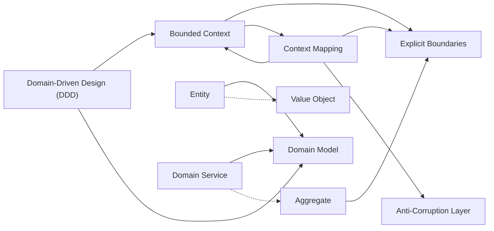
```mermaid
flowchart LR
    n_domain_driven_design["Domain-Driven Design (DDD)"]
    n_domain_model["Domain Model"]
    n_bounded_context["Bounded Context"]
    n_context_mapping["Context Mapping"]
    n_anti_corruption_layer["Anti-Corruption Layer"]
    n_explicit_boundaries["Explicit Boundaries"]
    n_aggregate["Aggregate"]
    n_value_object["Value Object"]
    n_entity["Entity"]
    n_domain_service["Domain Service"]
    n_domain_driven_design --> n_bounded_context
    n_domain_driven_design --> n_domain_model
    n_bounded_context --> n_explicit_boundaries
    n_bounded_context --> n_context_mapping
    n_context_mapping --> n_bounded_context
    n_context_mapping --> n_explicit_boundaries
    n_context_mapping --> n_anti_corruption_layer
    n_aggregate --> n_explicit_boundaries
    n_entity --> n_domain_model
    n_entity -.-> n_value_object
    n_domain_service --> n_domain_model
    n_domain_service -.-> n_aggregate
```

### Domain-Driven Design (DDD)

- Kind: [style](SCHEMA.md#kind-style)
- Category: [Domain Architecture](PRINCIPLES.md#architecture-category-domain-architecture)
- Severity: [contextual](SCHEMA.md#vocabulary-severity-contextual)
- Scope: domain, bounded context, system
- Aliases: DDD
- Layer: [Domain Modeling](SCHEMA.md#layer-domain-modeling)

Details

Definition
A convention of modeling software on the business domain's own language, split into bounded contexts with a domain model in each.

Requires
[Ubiquitous Language](PRINCIPLES.md#architecture-ubiquitous-language), [Bounded Context](PRINCIPLES.md#architecture-bounded-context)

Reinforces
[Domain Model](PRINCIPLES.md#architecture-domain-model), [Semantic Consistency](PRINCIPLES.md#architecture-semantic-consistency)

Enables
[Domain Alignment](LEXICON.md#lexicon-domain-alignment)

In tension with
[Simple CRUD](LEXICON.md#lexicon-simple-crud)

Conflicts with
[Anemic Transaction Script](LEXICON.md#lexicon-anemic-transaction-script)

Referenced by
[Domain Events](PRINCIPLES.md#architecture-domain-events), [Ubiquitous Language](PRINCIPLES.md#architecture-ubiquitous-language)

Tensions
[Domain-Driven Design (DDD) / Simple CRUD](SCHEMA.md#tension-domain-driven-design-ddd-simple-crud)

Distinct from
[Event-Driven Architecture](PRINCIPLES.md#architecture-event-driven-architecture): Domain-driven design models software on the domain's language, while event-driven architecture connects services through published events.

Violated by
[Anemic Domain Model](PRINCIPLES.md#architecture-anemic-domain-model), [Fat Controller](PRINCIPLES.md#architecture-fat-controller)

Detected by
anemic models, scattered business rules

Measured by
domain logic locality

Refactored by
[Extract Domain Model](LEXICON.md#lexicon-extract-domain-model), [Aggregate](PRINCIPLES.md#architecture-aggregate), [Split Bounded Context](LEXICON.md#lexicon-split-bounded-context)

Enforced by
layer rules, domain tests

Before

```typescript
function updateFoo(row: FooRow, name: string) {
  row.name = name;
  row.updated_at = Date.now();
  return fooTable.save(row);
}
```

After

```typescript
class Foo {
  private constructor(
    readonly id: FooId,
    private name: string,
  ) {}
  rename(name: FooName) {
    this.name = name.value;
  }
}
foo.rename(FooName.create(name));
```

How it is checked

Checked by
layer rules, domain tests

Population
Every domain type, business rule and context boundary in the domain layer

Freshness
A verdict stands until a domain type, a rule's location or a context boundary changes

Refusal
The layer rule or the domain test fails when a rule or a model leaves its context or its aggregate

Observation
Where each business rule and invariant is enforced, read from source and the domain tests

Evidence
None, because the catalog states this check as a class, so a watched run belongs to each system that adopts it

Authoritative side
The domain model, which decides the context and the aggregate every rule belongs to

Depends on
[Ubiquitous Language](PRINCIPLES.md#architecture-ubiquitous-language), [Bounded Context](PRINCIPLES.md#architecture-bounded-context), [Domain Model](PRINCIPLES.md#architecture-domain-model), [Semantic Consistency](PRINCIPLES.md#architecture-semantic-consistency), [Domain Alignment](LEXICON.md#lexicon-domain-alignment)

Shape it refuses
[Anemic Transaction Script](LEXICON.md#lexicon-anemic-transaction-script)

### Domain Model

- Kind: [artifact](SCHEMA.md#kind-artifact)
- Category: [Domain Architecture](PRINCIPLES.md#architecture-category-domain-architecture)
- Severity: [contextual](SCHEMA.md#vocabulary-severity-contextual)
- Scope: domain, bounded context
- Layer: [Domain Modeling](SCHEMA.md#layer-domain-modeling)

Details

Definition
A formal definition of the business concepts, rules and invariants of one context, written as types with behavior.

Requires
[Ubiquitous Language](PRINCIPLES.md#architecture-ubiquitous-language), [Invariant](PRINCIPLES.md#architecture-invariant)

Reinforces
[Correctness](PRINCIPLES.md#architecture-correctness), [Semantic Contracts](PRINCIPLES.md#architecture-semantic-contracts)

Enables
[Business Rule Encapsulation](LEXICON.md#lexicon-business-rule-encapsulation)

In tension with
[Persistence Simplicity](LEXICON.md#lexicon-persistence-simplicity)

Conflicts with
[Anemic Domain Model](PRINCIPLES.md#architecture-anemic-domain-model)

Referenced by
[Domain-Driven Design (DDD)](PRINCIPLES.md#architecture-domain-driven-design), [Entity](PRINCIPLES.md#architecture-entity), [Domain Service](PRINCIPLES.md#architecture-domain-service), [Semantic Contracts](PRINCIPLES.md#architecture-semantic-contracts), [Domain Events](PRINCIPLES.md#architecture-domain-events)

Tensions
[Domain Model / Persistence Simplicity](SCHEMA.md#tension-domain-model-persistence-simplicity)

Violated by
[Anemic Domain Model](PRINCIPLES.md#architecture-anemic-domain-model)

Detected by
procedural domain logic in services/controllers

Measured by
rule locality, invariant coverage

Refactored by
[Move Logic to the Domain](LEXICON.md#lexicon-move-logic-to-the-domain), [Value Object](PRINCIPLES.md#architecture-value-object), [Aggregate](PRINCIPLES.md#architecture-aggregate)

Enforced by
domain layer rules, [tests](LEXICON.md#lexicon-tests)

Before

```typescript
type Foo = { status: string; count: number };
function closeFoo(foo: Foo) {
  foo.status = "closed";
}
```

After

```typescript
class Foo {
  #status: "open" | "closed" = "open";
  close() {
    if (this.#status === "closed") throw new Error("Foo already closed");
    this.#status = "closed";
  }
}
```

How it is checked

Checked by
domain layer rules, tests

Population
Every domain type, business rule and context boundary in the domain layer

Freshness
A verdict stands until a domain type, a rule's location or a context boundary changes

Refusal
The layer rule or the domain test fails when a rule or a model leaves its context or its aggregate

Observation
Where each business rule and invariant is enforced, read from source and the domain tests

Evidence
None, because the catalog states this check as a class, so a watched run belongs to each system that adopts it

Authoritative side
The domain model, which decides the context and the aggregate every rule belongs to

Depends on
[Ubiquitous Language](PRINCIPLES.md#architecture-ubiquitous-language), [Invariant](PRINCIPLES.md#architecture-invariant), [Correctness](PRINCIPLES.md#architecture-correctness), [Semantic Contracts](PRINCIPLES.md#architecture-semantic-contracts), [Business Rule Encapsulation](LEXICON.md#lexicon-business-rule-encapsulation)

Shape it refuses
[Anemic Domain Model](PRINCIPLES.md#architecture-anemic-domain-model)

### Bounded Context

- Kind: [constraint](SCHEMA.md#kind-constraint)
- Category: [Domain Architecture](PRINCIPLES.md#architecture-category-domain-architecture)
- Severity: [recommended](SCHEMA.md#vocabulary-severity-recommended)
- Scope: domain, service, team
- Layer: [Domain Modeling](SCHEMA.md#layer-domain-modeling)

Details

Definition
A rule or precondition that each domain model holds inside one explicit boundary, where its terms have one meaning.

Requires
[Explicit Boundaries](PRINCIPLES.md#architecture-explicit-boundaries), [Ubiquitous Language](PRINCIPLES.md#architecture-ubiquitous-language)

Reinforces
[Modularity](PRINCIPLES.md#architecture-modularity), [Autonomy](PRINCIPLES.md#architecture-autonomy)

Enables
[Context Mapping](PRINCIPLES.md#architecture-context-mapping), [Microservices](PRINCIPLES.md#architecture-microservices)

In tension with
[Cross-Context Reuse](LEXICON.md#lexicon-cross-context-reuse)

Conflicts with
[Shared Global Model](LEXICON.md#lexicon-shared-global-model)

Referenced by
[Domain-Driven Design (DDD)](PRINCIPLES.md#architecture-domain-driven-design), [Context Mapping](PRINCIPLES.md#architecture-context-mapping), [Package by Feature](PRINCIPLES.md#architecture-package-by-feature), [Microservices](PRINCIPLES.md#architecture-microservices)

Contracts
[Domain Modeling](ALGORITHMS.md#algorithms-domain-modeling)

Tensions
[Bounded Context / Cross-Context Reuse](SCHEMA.md#tension-bounded-context-cross-context-reuse)

Distinct from
[Relationship Semantics](LEXICON.md#lexicon-relationship-semantics): A bounded context fixes meaning inside one boundary, while relationship semantics fixes the meaning of each link between boundaries.

Violated by
[Shared Global Model](LEXICON.md#lexicon-shared-global-model)

Detected by
shared domain entities across contexts

Measured by
context coupling

Refactored by
[Split Bounded Context](LEXICON.md#lexicon-split-bounded-context), [Anti-Corruption Layer](PRINCIPLES.md#architecture-anti-corruption-layer), [Context Mapping](PRINCIPLES.md#architecture-context-mapping)

Enforced by
package/service boundaries

Before

```typescript
type FooStatus = "A" | "D";
function priceBar(status: FooStatus) {
  return status === "A" ? 10 : 0;
}
```

After

```typescript
type FooStatus = "active" | "disabled";
type BarEligibility = "eligible" | "ineligible";
function toBarEligibility(status: FooStatus): BarEligibility {
  return status === "active" ? "eligible" : "ineligible";
}
```

How it is checked

Checked by
package/service boundaries

Population
Every domain type, business rule and context boundary in the domain layer

Freshness
A verdict stands until a domain type, a rule's location or a context boundary changes

Refusal
The layer rule or the domain test fails when a rule or a model leaves its context or its aggregate

Observation
Where each business rule and invariant is enforced, read from source and the domain tests

Evidence
None, because the catalog states this check as a class, so a watched run belongs to each system that adopts it

Authoritative side
The domain model, which decides the context and the aggregate every rule belongs to

Depends on
[Explicit Boundaries](PRINCIPLES.md#architecture-explicit-boundaries), [Ubiquitous Language](PRINCIPLES.md#architecture-ubiquitous-language), [Modularity](PRINCIPLES.md#architecture-modularity), [Autonomy](PRINCIPLES.md#architecture-autonomy), [Context Mapping](PRINCIPLES.md#architecture-context-mapping), [Microservices](PRINCIPLES.md#architecture-microservices)

Shape it refuses
[Shared Global Model](LEXICON.md#lexicon-shared-global-model)

### Context Mapping

- Kind: [activity](SCHEMA.md#kind-activity)
- Category: [Domain Architecture](PRINCIPLES.md#architecture-category-domain-architecture)
- Severity: [recommended](SCHEMA.md#vocabulary-severity-recommended)
- Scope: bounded contexts, integration
- Layer: [Domain Modeling](SCHEMA.md#layer-domain-modeling)

Details

Definition
The activity of recording how bounded contexts relate, including which one is upstream and how their models translate.

Requires
[Bounded Context](PRINCIPLES.md#architecture-bounded-context), [Relationship Semantics](LEXICON.md#lexicon-relationship-semantics)

Reinforces
[Explicit Boundaries](PRINCIPLES.md#architecture-explicit-boundaries), [Integration Clarity](LEXICON.md#lexicon-integration-clarity)

Enables
[Anti-Corruption Layer](PRINCIPLES.md#architecture-anti-corruption-layer)

In tension with
[Documentation Overhead](LEXICON.md#lexicon-documentation-overhead)

Conflicts with
[Implicit Integration](LEXICON.md#lexicon-implicit-integration)

Referenced by
[Bounded Context](PRINCIPLES.md#architecture-bounded-context)

Tensions
[Context Mapping / Documentation Overhead](SCHEMA.md#tension-context-mapping-documentation-overhead)

Violated by
[Implicit Integration](LEXICON.md#lexicon-implicit-integration)

Detected by
unclear ownership, ambiguous integration flows

Measured by
undocumented dependency count

Refactored by
none

Enforced by
architecture docs, dependency reviews

Before

```typescript
fooService.writeDirectly(barDatabase, foo);
barService.readDirectly(fooDatabase, foo.id);
```

After

```typescript
const contextMap = {
  upstream: "FooContext",
  downstream: "BarContext",
  relationship: "published-language",
} as const;
fooEvents.publish(toBarIntegrationEvent(foo));
```

How it is checked

Checked by
architecture docs, dependency reviews

Population
Every domain type, business rule and context boundary in the domain layer

Freshness
A verdict stands until a domain type, a rule's location or a context boundary changes

Refusal
The layer rule or the domain test fails when a rule or a model leaves its context or its aggregate

Observation
Where each business rule and invariant is enforced, read from source and the domain tests

Evidence
None, because the catalog states this check as a class, so a watched run belongs to each system that adopts it

Authoritative side
The domain model, which decides the context and the aggregate every rule belongs to

Depends on
[Bounded Context](PRINCIPLES.md#architecture-bounded-context), [Relationship Semantics](LEXICON.md#lexicon-relationship-semantics), [Explicit Boundaries](PRINCIPLES.md#architecture-explicit-boundaries), [Integration Clarity](LEXICON.md#lexicon-integration-clarity), [Anti-Corruption Layer](PRINCIPLES.md#architecture-anti-corruption-layer)

Shape it refuses
[Implicit Integration](LEXICON.md#lexicon-implicit-integration)

### Anti-Corruption Layer

- Kind: [pattern](SCHEMA.md#kind-pattern)
- Category: [Domain Architecture](PRINCIPLES.md#architecture-category-domain-architecture)
- Severity: [recommended](SCHEMA.md#vocabulary-severity-recommended)
- Scope: integration, bounded context boundary
- Layer: [Domain Modeling](SCHEMA.md#layer-domain-modeling)

Details

Definition
A design pattern that translates an external system's model into the local domain's terms at the boundary.

Requires
[Explicit Boundary](LEXICON.md#lexicon-explicit-boundary), [Translation Model](LEXICON.md#lexicon-translation-model)

Reinforces
[Domain Purity](LEXICON.md#lexicon-domain-purity), [Low Coupling](PRINCIPLES.md#architecture-low-coupling)

Enables
[Legacy/System Integration](LEXICON.md#lexicon-legacy-system-integration)

In tension with
[Mapping Overhead](LEXICON.md#lexicon-mapping-overhead)

Conflicts with
[Vendor Lock-In Leakage](PRINCIPLES.md#architecture-vendor-lock-in-leakage)

Referenced by
[Context Mapping](PRINCIPLES.md#architecture-context-mapping), [Adapter Pattern](PRINCIPLES.md#architecture-adapter-pattern)

Contracts
[Anti-Corruption Layer Over Cross-Context Leak](ALGORITHMS.md#algorithms-no-leaky-context)

Tensions
[Anti-Corruption Layer / Mapping Overhead](SCHEMA.md#tension-anti-corruption-layer-mapping-overhead)

Violated by
[Direct External Coupling](LEXICON.md#lexicon-direct-external-coupling)

Detected by
external DTOs used in domain layer

Measured by
leakage count, adapter coverage

Refactored by
[Extract Adapter](LEXICON.md#lexicon-extract-adapter), [Introduce Boundary DTO](LEXICON.md#lexicon-introduce-boundary-dto)

Enforced by
import rules, layer tests

Before

```typescript
function createBar(fooResponse: FooApiResponse) {
  return barService.create({ foo_status: fooResponse.state_code });
}
```

After

```typescript
type BarInput = { eligible: boolean };
function fromFoo(response: FooApiResponse): BarInput {
  return { eligible: response.state_code === "A" };
}
barService.create(fromFoo(fooResponse));
```

How it is checked

Checked by
import rules, layer tests

Population
Every domain type, business rule and context boundary in the domain layer

Freshness
A verdict stands until a domain type, a rule's location or a context boundary changes

Refusal
The layer rule or the domain test fails when a rule or a model leaves its context or its aggregate

Observation
Where each business rule and invariant is enforced, read from source and the domain tests

Evidence
None, because the catalog states this check as a class, so a watched run belongs to each system that adopts it

Authoritative side
The domain model, which decides the context and the aggregate every rule belongs to

Depends on
[Explicit Boundary](LEXICON.md#lexicon-explicit-boundary), [Translation Model](LEXICON.md#lexicon-translation-model), [Domain Purity](LEXICON.md#lexicon-domain-purity), [Low Coupling](PRINCIPLES.md#architecture-low-coupling), [Legacy/System Integration](LEXICON.md#lexicon-legacy-system-integration)

Shape it refuses
[Vendor Lock-In Leakage](PRINCIPLES.md#architecture-vendor-lock-in-leakage), [Vendor Lock-In Leakage](PRINCIPLES.md#architecture-vendor-lock-in-leakage)

### Explicit Boundaries

- Kind: [principle](SCHEMA.md#kind-principle)
- Category: [Domain Architecture](PRINCIPLES.md#architecture-category-domain-architecture)
- Severity: [mandatory](SCHEMA.md#vocabulary-severity-mandatory)
- Scope: module, component, service, domain
- Layer: [Domain Modeling](SCHEMA.md#layer-domain-modeling)

Details

Definition
A design rule that each module declares its public interface and owner, and other modules reach it only through that interface.

Requires
[Stable Interfaces](PRINCIPLES.md#architecture-stable-interfaces), [Ownership](LEXICON.md#lexicon-ownership)

Reinforces
[Modularity](PRINCIPLES.md#architecture-modularity), [Encapsulation](PRINCIPLES.md#architecture-encapsulation)

Enables
[Replaceability](PRINCIPLES.md#architecture-replaceability), [Governance](PRINCIPLES.md#architecture-governance)

In tension with
[Cross-Cutting Concerns](LEXICON.md#lexicon-cross-cutting-concerns)

Conflicts with
[Boundary Leakage](PRINCIPLES.md#architecture-boundary-leakage)

Referenced by
[Bounded Context](PRINCIPLES.md#architecture-bounded-context), [Context Mapping](PRINCIPLES.md#architecture-context-mapping), [Aggregate](PRINCIPLES.md#architecture-aggregate), [Single Responsibility Principle (SRP)](PRINCIPLES.md#architecture-single-responsibility), [Separation of Concerns](PRINCIPLES.md#architecture-separation-of-concerns), [High Cohesion](PRINCIPLES.md#architecture-high-cohesion), [Modularity](PRINCIPLES.md#architecture-modularity), [Independence](PRINCIPLES.md#architecture-independence), [Declared Jurisdiction](PRINCIPLES.md#architecture-declared-jurisdiction)

Tensions
[Explicit Boundaries / Cross-Cutting Concerns](SCHEMA.md#tension-cross-cutting-concerns-explicit-boundaries)

Distinct from
[Declared Jurisdiction](PRINCIPLES.md#architecture-declared-jurisdiction): Explicit boundaries declare a module's interface and owner, while declared jurisdiction declares which roots and files a naming gate governs.

Distinct from
[Abstraction](PRINCIPLES.md#architecture-abstraction): Explicit boundaries fix where one module ends, while abstraction fixes how a concept is expressed without its detail.

Distinct from
[Encapsulation](PRINCIPLES.md#architecture-encapsulation): Explicit boundaries govern access between modules, while encapsulation governs changes to one object's state.

Distinct from
[Governance](PRINCIPLES.md#architecture-governance): Explicit boundaries are the declared interfaces, while governance holds decisions to shared policy.

Distinct from
[Single Source of Truth](PRINCIPLES.md#architecture-single-source-of-truth): Explicit boundaries give each module one public interface, while a single source of truth gives each fact one owning definition.

Distinct from
[Independence](PRINCIPLES.md#architecture-independence): Explicit boundaries declare the interface, while independence is testing and deploying a module without its neighbors.

Distinct from
[Modularity](PRINCIPLES.md#architecture-modularity): Explicit boundaries declare each module's interface and owner, while modularity is the division into modules itself.

Distinct from
[Separation of Concerns](PRINCIPLES.md#architecture-separation-of-concerns): Explicit boundaries declare interfaces, while separation of concerns decides which concerns sit on each side of them.

Distinct from
[Single Responsibility Principle (SRP)](PRINCIPLES.md#architecture-single-responsibility): Explicit boundaries declare interfaces, while single responsibility limits what sits behind one to one reason to change.

Violated by
[Boundary Leakage](PRINCIPLES.md#architecture-boundary-leakage), [Inappropriate Intimacy](PRINCIPLES.md#architecture-inappropriate-intimacy)

Detected by
forbidden imports, [cyclic dependencies](PRINCIPLES.md#architecture-circular-dependency)

Measured by
boundary violation count

Refactored by
[Move Behavior to Its Owner](LEXICON.md#lexicon-move-behavior-to-its-owner), [Define Contract](LEXICON.md#lexicon-define-contract), [Restrict Exports](LEXICON.md#lexicon-restrict-exports)

Enforced by
module rules, architecture tests

Before

```typescript
import { fooDatabase } from "../../foo/infrastructure/database";
export function loadBar(id: string) {
  return fooDatabase.query(id);
}
```

After

```typescript
export interface FooGateway {
  find(id: FooId): Promise<FooSnapshot>;
}
export function loadBar(id: FooId, foos: FooGateway) {
  return foos.find(id);
}
```

How it is checked

Checked by
module rules, architecture tests

Population
Every domain type, business rule and context boundary in the domain layer

Freshness
A verdict stands until a domain type, a rule's location or a context boundary changes

Refusal
The layer rule or the domain test fails when a rule or a model leaves its context or its aggregate

Observation
Where each business rule and invariant is enforced, read from source and the domain tests

Evidence
None, because the catalog states this check as a class, so a watched run belongs to each system that adopts it

Authoritative side
The domain model, which decides the context and the aggregate every rule belongs to

Depends on
[Stable Interfaces](PRINCIPLES.md#architecture-stable-interfaces), [Ownership](LEXICON.md#lexicon-ownership), [Modularity](PRINCIPLES.md#architecture-modularity), [Encapsulation](PRINCIPLES.md#architecture-encapsulation), [Replaceability](PRINCIPLES.md#architecture-replaceability), [Governance](PRINCIPLES.md#architecture-governance)

Shape it refuses
[Boundary Leakage](PRINCIPLES.md#architecture-boundary-leakage)

### Aggregate

- Kind: [pattern](SCHEMA.md#kind-pattern)
- Category: [Domain Architecture](PRINCIPLES.md#architecture-category-domain-architecture)
- Severity: [contextual](SCHEMA.md#vocabulary-severity-contextual)
- Scope: domain, consistency boundary, bounded context
- Layer: [Domain Modeling](SCHEMA.md#layer-domain-modeling)

Details

Definition
A design pattern that groups entities under one root, which is the only entry point and keeps the group's invariants.

Requires
[Explicit Boundaries](PRINCIPLES.md#architecture-explicit-boundaries)

Reinforces
[Invariant](PRINCIPLES.md#architecture-invariant), [Encapsulation](PRINCIPLES.md#architecture-encapsulation)

Enables
[Transactional Consistency Boundary](LEXICON.md#lexicon-transactional-consistency-boundary), [Root-Guarded Invariants](LEXICON.md#lexicon-root-guarded-invariants)

In tension with
[Aggregate Size](LEXICON.md#lexicon-aggregate-size)

Conflicts with
[Anemic Domain Model](PRINCIPLES.md#architecture-anemic-domain-model)

Referenced by
[Domain Service](PRINCIPLES.md#architecture-domain-service)

Tensions
[Aggregate / Aggregate Size](SCHEMA.md#tension-aggregate-aggregate-size)

Violated by
[Anemic Domain Model](PRINCIPLES.md#architecture-anemic-domain-model)

Detected by
cross-entity invariant checks scattered in services

Measured by
out-of-aggregate invariant enforcement count

Refactored by
[Add Aggregate Invariant](LEXICON.md#lexicon-add-aggregate-invariant)

Enforced by
domain model review

Before

```typescript
fooOrder.total -= item.price;
fooOrderItems.delete(item.id);
```

After

```typescript
class FooOrder {
  #items: FooItem[] = [];
  #total = 0;
  removeItem(id: FooItemId) {
    this.#items = this.#items.filter((item) => item.id !== id);
    this.#total = this.#items.reduce((sum, item) => sum + item.price, 0);
  }
}
```

How it is checked

Checked by
domain model review

Population
Every domain type, business rule and context boundary in the domain layer

Freshness
A verdict stands until a domain type, a rule's location or a context boundary changes

Refusal
The layer rule or the domain test fails when a rule or a model leaves its context or its aggregate

Observation
Where each business rule and invariant is enforced, read from source and the domain tests

Evidence
None, because the catalog states this check as a class, so a watched run belongs to each system that adopts it

Authoritative side
The domain model, which decides the context and the aggregate every rule belongs to

Depends on
[Explicit Boundaries](PRINCIPLES.md#architecture-explicit-boundaries), [Invariant](PRINCIPLES.md#architecture-invariant), [Encapsulation](PRINCIPLES.md#architecture-encapsulation), [Transactional Consistency Boundary](LEXICON.md#lexicon-transactional-consistency-boundary), [Root-Guarded Invariants](LEXICON.md#lexicon-root-guarded-invariants)

Shape it refuses
[Anemic Domain Model](PRINCIPLES.md#architecture-anemic-domain-model)

### Value Object

- Kind: [pattern](SCHEMA.md#kind-pattern)
- Category: [Domain Architecture](PRINCIPLES.md#architecture-category-domain-architecture)
- Severity: [recommended](SCHEMA.md#vocabulary-severity-recommended)
- Scope: domain, modeling, immutability
- Layer: [Domain Modeling](SCHEMA.md#layer-domain-modeling)

Details

Definition
A design pattern that models a domain value as an immutable, self-validating object compared by its attributes.

Requires
[Value Equality](LEXICON.md#lexicon-value-equality)

Reinforces
[Immutability](PRINCIPLES.md#architecture-immutability), [Encapsulation](PRINCIPLES.md#architecture-encapsulation)

Enables
[Self-Validating Values](LEXICON.md#lexicon-self-validating-values), [Side-Effect-Free Equality](LEXICON.md#lexicon-side-effect-free-equality)

In tension with
[Object Count](LEXICON.md#lexicon-object-count)

Conflicts with
[Primitive Obsession](PRINCIPLES.md#architecture-primitive-obsession), [Data Clumps](PRINCIPLES.md#architecture-data-clumps), [Long Parameter List](PRINCIPLES.md#architecture-long-parameter-list)

Referenced by
[Entity](PRINCIPLES.md#architecture-entity)

Tensions
[Value Object / Object Count](SCHEMA.md#tension-object-count-value-object)

Violated by
[Primitive Obsession](PRINCIPLES.md#architecture-primitive-obsession)

Detected by
repeated validation of the same primitive shape

Measured by
primitive-typed domain concept count

Refactored by
none

Enforced by
domain model review

Before

```typescript
function priceFoo(amount: number, currency: string) {
  return { amount, currency };
}
```

After

```typescript
class Money {
  private constructor(
    readonly amount: number,
    readonly currency: string,
  ) {}
  static of(amount: number, currency: string): Money {
    if (amount < 0) throw new Error("negative money");
    return new Money(amount, currency);
  }
  equals(other: Money) {
    return this.amount === other.amount && this.currency === other.currency;
  }
  add(other: Money): Money {
    return Money.of(this.amount + other.amount, this.currency);
  }
}
```

How it is checked

Checked by
domain model review

Population
Every domain type, business rule and context boundary in the domain layer

Freshness
A verdict stands until a domain type, a rule's location or a context boundary changes

Refusal
The layer rule or the domain test fails when a rule or a model leaves its context or its aggregate

Observation
Where each business rule and invariant is enforced, read from source and the domain tests

Evidence
None, because the catalog states this check as a class, so a watched run belongs to each system that adopts it

Authoritative side
The domain model, which decides the context and the aggregate every rule belongs to

Depends on
[Value Equality](LEXICON.md#lexicon-value-equality), [Immutability](PRINCIPLES.md#architecture-immutability), [Encapsulation](PRINCIPLES.md#architecture-encapsulation), [Self-Validating Values](LEXICON.md#lexicon-self-validating-values), [Side-Effect-Free Equality](LEXICON.md#lexicon-side-effect-free-equality)

Shape it refuses
[Primitive Obsession](PRINCIPLES.md#architecture-primitive-obsession), [Data Clumps](PRINCIPLES.md#architecture-data-clumps), [Long Parameter List](PRINCIPLES.md#architecture-long-parameter-list)

### Entity

- Kind: [pattern](SCHEMA.md#kind-pattern)
- Category: [Domain Architecture](PRINCIPLES.md#architecture-category-domain-architecture)
- Severity: [contextual](SCHEMA.md#vocabulary-severity-contextual)
- Scope: domain, identity, lifecycle
- Layer: [Domain Modeling](SCHEMA.md#layer-domain-modeling)

Details

Definition
A design pattern that models a domain object by a stable identity, which stays the same while its attributes change.

Requires
[Stable Identity](LEXICON.md#lexicon-stable-identity)

Reinforces
[Domain Model](PRINCIPLES.md#architecture-domain-model), [Encapsulation](PRINCIPLES.md#architecture-encapsulation)

Enables
[Identity-Based Equality](LEXICON.md#lexicon-identity-based-equality), [Lifecycle Tracking](LEXICON.md#lexicon-lifecycle-tracking)

In tension with
[Value Object](PRINCIPLES.md#architecture-value-object)

Conflicts with
[Anemic Domain Model](PRINCIPLES.md#architecture-anemic-domain-model)

Tensions
[Entity / Value Object](SCHEMA.md#tension-entity-value-object)

Distinct from
[Value Object](PRINCIPLES.md#architecture-value-object): An entity is known by an identity that outlives its attributes, while a value object is known only by its attributes.

Violated by
[Attribute-Compared Identity](LEXICON.md#lexicon-attribute-compared-identity)

Detected by
equality by field value where identity is meant

Measured by
attribute-equality misuse count

Refactored by
none

Enforced by
domain model review

Before

```typescript
type Foo = { id: string; name: string; status: string };
foo.status = "active";
```

After

```typescript
class Foo {
  constructor(
    readonly id: FooId,
    private name: string,
    private status: FooStatus,
  ) {}
  equals(other: Foo) {
    return this.id === other.id;
  }
  activate() {
    this.status = "active";
  }
}
```

How it is checked

Checked by
domain model review

Population
Every domain type, business rule and context boundary in the domain layer

Freshness
A verdict stands until a domain type, a rule's location or a context boundary changes

Refusal
The layer rule or the domain test fails when a rule or a model leaves its context or its aggregate

Observation
Where each business rule and invariant is enforced, read from source and the domain tests

Evidence
None, because the catalog states this check as a class, so a watched run belongs to each system that adopts it

Authoritative side
The domain model, which decides the context and the aggregate every rule belongs to

Depends on
[Stable Identity](LEXICON.md#lexicon-stable-identity), [Domain Model](PRINCIPLES.md#architecture-domain-model), [Encapsulation](PRINCIPLES.md#architecture-encapsulation), [Identity-Based Equality](LEXICON.md#lexicon-identity-based-equality), [Lifecycle Tracking](LEXICON.md#lexicon-lifecycle-tracking)

Shape it refuses
[Anemic Domain Model](PRINCIPLES.md#architecture-anemic-domain-model)

### Domain Service

- Kind: [pattern](SCHEMA.md#kind-pattern)
- Category: [Domain Architecture](PRINCIPLES.md#architecture-category-domain-architecture)
- Severity: [contextual](SCHEMA.md#vocabulary-severity-contextual)
- Scope: domain, behavior, coordination
- Layer: [Domain Modeling](SCHEMA.md#layer-domain-modeling)

Details

Definition
A design pattern that places a domain rule spanning several entities in a stateless service named in the domain's language.

Requires
[Domain Model](PRINCIPLES.md#architecture-domain-model)

Reinforces
[Single Responsibility Principle (SRP)](PRINCIPLES.md#architecture-single-responsibility), [Ubiquitous Language](PRINCIPLES.md#architecture-ubiquitous-language)

Enables
[Cross-Entity Domain Logic](LEXICON.md#lexicon-cross-entity-domain-logic)

In tension with
[Aggregate](PRINCIPLES.md#architecture-aggregate)

Conflicts with
[Fat Controller](PRINCIPLES.md#architecture-fat-controller), [Transaction Script Sprawl](PRINCIPLES.md#architecture-transaction-script-sprawl)

Tensions
[Domain Service / Aggregate](SCHEMA.md#tension-aggregate-domain-service)

Distinct from
[Aggregate](PRINCIPLES.md#architecture-aggregate): A domain service holds a stateless rule spanning entities, while an aggregate holds entities and their invariants under one root.

Violated by
[Fat Controller](PRINCIPLES.md#architecture-fat-controller)

Detected by
domain logic in application/transport layers

Measured by
misplaced domain-rule count

Refactored by
none

Enforced by
domain model review

Before

```typescript
class FooAccount {
  transferTo(other: FooAccount, amount: number) {
    this.balance -= amount;
    other.balance += amount;
  }
}
```

After

```typescript
class FooTransferService {
  transfer(from: FooAccount, to: FooAccount, amount: Money) {
    from.withdraw(amount);
    to.deposit(amount);
  }
}
```

How it is checked

Checked by
domain model review

Population
Every domain type, business rule and context boundary in the domain layer

Freshness
A verdict stands until a domain type, a rule's location or a context boundary changes

Refusal
The layer rule or the domain test fails when a rule or a model leaves its context or its aggregate

Observation
Where each business rule and invariant is enforced, read from source and the domain tests

Evidence
None, because the catalog states this check as a class, so a watched run belongs to each system that adopts it

Authoritative side
The domain model, which decides the context and the aggregate every rule belongs to

Depends on
[Domain Model](PRINCIPLES.md#architecture-domain-model), [Single Responsibility Principle (SRP)](PRINCIPLES.md#architecture-single-responsibility), [Ubiquitous Language](PRINCIPLES.md#architecture-ubiquitous-language), [Cross-Entity Domain Logic](LEXICON.md#lexicon-cross-entity-domain-logic)

Shape it refuses
[Fat Controller](PRINCIPLES.md#architecture-fat-controller), [Transaction Script Sprawl](PRINCIPLES.md#architecture-transaction-script-sprawl)

## Runtime Discovery / Dynamic Binding

Every principle in this category is listed as a record. Each record carries its kind, its severity, the scopes it applies at and the layer it lives in, then the edge relations that join it to other records, the records that point back at it, the contracts that answer to it and the tensions it takes part in. The descriptors say how it is violated, detected, measured, repaired and enforced. Where the record carries one, an exemplar shows the shape before and after the principle is applied.

Relations diagram

The relations inside this category.

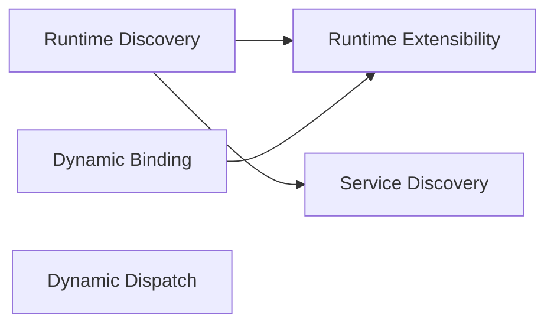
```mermaid
flowchart LR
    n_runtime_discovery["Runtime Discovery"]
    n_service_discovery["Service Discovery"]
    n_dynamic_binding["Dynamic Binding"]
    n_dynamic_dispatch["Dynamic Dispatch"]
    n_runtime_extensibility["Runtime Extensibility"]
    n_runtime_discovery --> n_runtime_extensibility
    n_runtime_discovery --> n_service_discovery
    n_dynamic_binding --> n_runtime_extensibility
```

### Runtime Discovery

- Kind: [mechanism](SCHEMA.md#kind-mechanism)
- Category: [Runtime Discovery / Dynamic Binding](PRINCIPLES.md#architecture-category-runtime-discovery-dynamic-binding)
- Severity: [contextual](SCHEMA.md#vocabulary-severity-contextual)
- Scope: runtime, plugin, module, service
- Aliases: Auto-Discovery, Registry/Discovery Mechanism
- Layer: [Extensibility Core](SCHEMA.md#layer-extensibility-core)

Details

Definition
A mechanism that finds the available handlers, plugins or services at startup by matching a naming convention, a file pattern or metadata, and registers each one it finds in place of a hand-written list.

Requires
[Metadata](LEXICON.md#lexicon-metadata), [Convention](LEXICON.md#lexicon-convention)

Reinforces
[Runtime Extensibility](PRINCIPLES.md#architecture-runtime-extensibility)

Enables
[Plugin Architecture](PRINCIPLES.md#architecture-plugin-architecture), [Service Discovery](PRINCIPLES.md#architecture-service-discovery), [Self-Registration](LEXICON.md#lexicon-self-registration)

In tension with
[Predictability](PRINCIPLES.md#architecture-predictability), [Static Analysis](PRINCIPLES.md#architecture-static-analysis), [Startup Cost](LEXICON.md#lexicon-startup-cost)

Conflicts with
[Compile-Time Binding](LEXICON.md#lexicon-compile-time-binding), [Manual Registration](LEXICON.md#lexicon-manual-registration)

Referenced by
[Self-Describing Architecture](PRINCIPLES.md#architecture-self-describing-architecture), [Metadata-Driven Design](PRINCIPLES.md#architecture-metadata-driven-design), [Capability Declaration](PRINCIPLES.md#architecture-capability-declaration), [Manifest-Based Design](PRINCIPLES.md#architecture-manifest-based-design), [Reflection](PRINCIPLES.md#architecture-reflection)

Contracts
[Runtime Discovery](ALGORITHMS.md#algorithms-runtime-discovery)

Tensions
[Runtime Discovery / Predictability](SCHEMA.md#tension-predictability-runtime-discovery), [Runtime Discovery / Static Analysis](SCHEMA.md#tension-runtime-discovery-static-analysis), [Runtime Discovery / Startup Cost](SCHEMA.md#tension-runtime-discovery-startup-cost)

Distinct from
[Capability Declaration](PRINCIPLES.md#architecture-capability-declaration): Runtime discovery finds which components exist, while a capability declaration states what each one supports.

Distinct from
[Introspection](PRINCIPLES.md#architecture-introspection): Runtime discovery finds components by convention or pattern, while introspection reads one object's type and members.

Distinct from
[Reflection](PRINCIPLES.md#architecture-reflection): Runtime discovery finds and registers components, while reflection reads and acts on type metadata, which discovery may use.

Distinct from
[Service Discovery](PRINCIPLES.md#architecture-service-discovery): Runtime discovery finds in-process components at startup, while service discovery resolves a service name to a network endpoint at call time.

Distinct from
[Static Analysis](PRINCIPLES.md#architecture-static-analysis): Runtime discovery decides the component set as the program starts, while static analysis reasons about source that has not run.

Violated by
[Manual Registration](LEXICON.md#lexicon-manual-registration)

Detected by
manual class/service lists

Measured by
discovery coverage

Refactored by
[Registry Pattern](PRINCIPLES.md#architecture-registry-pattern), [Static Analysis](PRINCIPLES.md#architecture-static-analysis), [Manifest-Based Design](PRINCIPLES.md#architecture-manifest-based-design)

Enforced by
startup validation

Before

```typescript
import { FooHandler } from "./foo-handler";
import { BarHandler } from "./bar-handler";
const handlers = [new FooHandler(), new BarHandler()];
```

After

```typescript
const modules = await discover<HandlerModule>("./handlers/*.handler.js");
const handlers = modules.map((module) => module.create());
```

How it is checked

Checked by
startup validation

Population
Every binding the runtime resolves: handlers, plugins, services, formatters and policies

Freshness
A verdict stands until a registered module, a discovery pattern or the configuration changes

Refusal
Startup validation or the composition-root test fails when a declared binding resolves to nothing

Observation
The resolved bindings reported at startup, compared with the modules on disk and the configuration

Evidence
None, because the catalog states this check as a class, so a watched run belongs to each system that adopts it

Authoritative side
The modules on disk and the configuration, which the bindings reported at startup are compared against

Depends on
[Metadata](LEXICON.md#lexicon-metadata), [Convention](LEXICON.md#lexicon-convention), [Runtime Extensibility](PRINCIPLES.md#architecture-runtime-extensibility), [Plugin Architecture](PRINCIPLES.md#architecture-plugin-architecture), [Service Discovery](PRINCIPLES.md#architecture-service-discovery), [Self-Registration](LEXICON.md#lexicon-self-registration)

Shape it refuses
[Compile-Time Binding](LEXICON.md#lexicon-compile-time-binding), [Manual Registration](LEXICON.md#lexicon-manual-registration)

### Service Discovery

- Kind: [mechanism](SCHEMA.md#kind-mechanism)
- Category: [Runtime Discovery / Dynamic Binding](PRINCIPLES.md#architecture-category-runtime-discovery-dynamic-binding)
- Severity: [contextual](SCHEMA.md#vocabulary-severity-contextual)
- Scope: service, network, runtime
- Layer: [Extensibility Core](SCHEMA.md#layer-extensibility-core)

Details

Definition
A mechanism that resolves a service name to a healthy network endpoint at call time through a registry.

Requires
[Service Registry](PRINCIPLES.md#architecture-service-registry), [Health Checks](PRINCIPLES.md#architecture-health-checks)

Reinforces
[Scalability](PRINCIPLES.md#architecture-scalability), [Resilience](PRINCIPLES.md#architecture-resilience)

Enables
[Dynamic Routing](LEXICON.md#lexicon-dynamic-routing), [Failover](PRINCIPLES.md#architecture-failover)

In tension with
[Operational Complexity](LEXICON.md#lexicon-operational-complexity)

Conflicts with
[Hardcoded Endpoints](LEXICON.md#lexicon-hardcoded-endpoints)

Referenced by
[Runtime Discovery](PRINCIPLES.md#architecture-runtime-discovery)

Tensions
[Service Discovery / Operational Complexity](SCHEMA.md#tension-operational-complexity-service-discovery)

Distinct from
[Failover](PRINCIPLES.md#architecture-failover): Service discovery resolves a name to a healthy endpoint, while failover switches traffic to a standby when the active one fails.

Distinct from
[Health Checks](PRINCIPLES.md#architecture-health-checks): Service discovery resolves endpoints, while health checks report whether each endpoint is ready.

Distinct from
[Service Registry](PRINCIPLES.md#architecture-service-registry): Service discovery is the lookup at call time, while the service registry is the table the lookup reads.

Violated by
[Hardcoded Endpoints](LEXICON.md#lexicon-hardcoded-endpoints)

Detected by
hardcoded URLs, missing registry lookup

Measured by
dynamic resolution coverage

Refactored by
none

Enforced by
config scans, deployment policy

Before

```typescript
const fooUrl = "http://10.0.0.14:8080";
await http.get(`${fooUrl}/foo/${id}`);
```

After

```typescript
const endpoint = await serviceDiscovery.resolve("foo-service");
await http.get(new URL(`/foo/${id}`, endpoint));
```

How it is checked

Checked by
config scans, deployment policy

Population
Every binding the runtime resolves: handlers, plugins, services, formatters and policies

Freshness
A verdict stands until a registered module, a discovery pattern or the configuration changes

Refusal
Startup validation or the composition-root test fails when a declared binding resolves to nothing

Observation
The resolved bindings reported at startup, compared with the modules on disk and the configuration

Evidence
None, because the catalog states this check as a class, so a watched run belongs to each system that adopts it

Authoritative side
The modules on disk and the configuration, which the bindings reported at startup are compared against

Depends on
[Service Registry](PRINCIPLES.md#architecture-service-registry), [Health Checks](PRINCIPLES.md#architecture-health-checks), [Scalability](PRINCIPLES.md#architecture-scalability), [Resilience](PRINCIPLES.md#architecture-resilience), [Dynamic Routing](LEXICON.md#lexicon-dynamic-routing), [Failover](PRINCIPLES.md#architecture-failover)

Shape it refuses
[Hardcoded Endpoints](LEXICON.md#lexicon-hardcoded-endpoints)

### Dynamic Binding

- Kind: [mechanism](SCHEMA.md#kind-mechanism)
- Category: [Runtime Discovery / Dynamic Binding](PRINCIPLES.md#architecture-category-runtime-discovery-dynamic-binding)
- Severity: [contextual](SCHEMA.md#vocabulary-severity-contextual)
- Scope: runtime, interface, plugin, module, service
- Aliases: Late Binding, Runtime Binding
- Layer: [Extensibility Core](SCHEMA.md#layer-extensibility-core)

Details

Definition
A mechanism that selects the implementation behind an interface at runtime, from configuration or a registry, so the choice is made at bootstrap or first use rather than fixed in code.

Requires
[Abstraction](PRINCIPLES.md#architecture-abstraction), [Runtime Resolution](LEXICON.md#lexicon-runtime-resolution)

Reinforces
[Polymorphism](PRINCIPLES.md#architecture-polymorphism), [Extensibility](LEXICON.md#lexicon-extensibility), [Runtime Extensibility](PRINCIPLES.md#architecture-runtime-extensibility)

Enables
[Strategy Swap](LEXICON.md#lexicon-strategy-swap), [Deferred Implementation Choice](LEXICON.md#lexicon-deferred-implementation-choice)

In tension with
[Static Safety](LEXICON.md#lexicon-static-safety), [Predictability](PRINCIPLES.md#architecture-predictability), [Debugging](LEXICON.md#lexicon-debugging)

Conflicts with
[Compile-Time Binding](LEXICON.md#lexicon-compile-time-binding)

Referenced by
[Capability Declaration](PRINCIPLES.md#architecture-capability-declaration), [Reflection](PRINCIPLES.md#architecture-reflection), [Service Registry](PRINCIPLES.md#architecture-service-registry)

Tensions
[Dynamic Binding / Static Safety](SCHEMA.md#tension-dynamic-binding-static-safety), [Dynamic Binding / Predictability](SCHEMA.md#tension-dynamic-binding-predictability), [Dynamic Binding / Debugging](SCHEMA.md#tension-debugging-dynamic-binding)

Distinct from
[Capability Declaration](PRINCIPLES.md#architecture-capability-declaration): Dynamic binding picks an implementation at runtime, while a capability declaration lists what an implementation supports so the pick can be checked.

Distinct from
[Polymorphism](PRINCIPLES.md#architecture-polymorphism): Polymorphism lets the receiver choose the implementation per call, while dynamic binding chooses it from configuration or a registry.

Distinct from
[Service Registry](PRINCIPLES.md#architecture-service-registry): Dynamic binding is the choice made at runtime, while a service registry is the keyed table it can choose from.

Violated by
[Compile-Time Binding](LEXICON.md#lexicon-compile-time-binding)

Detected by
hardcoded implementation selection

Measured by
runtime binding coverage

Refactored by
[Factory Pattern](PRINCIPLES.md#architecture-factory-pattern), [Registry](LEXICON.md#lexicon-registry), [Strategy Pattern](PRINCIPLES.md#architecture-strategy-pattern)

Enforced by
integration tests

Before

```typescript
const formatter = new JsonFooFormatter();
formatter.format(foo);
```

After

```typescript
const formatter = formatterRegistry.get(config.format);
if (!formatter) throw new Error(`unknown formatter: ${config.format}`);
formatter.format(foo);
```

How it is checked

Checked by
integration tests

Population
Every binding the runtime resolves: handlers, plugins, services, formatters and policies

Freshness
A verdict stands until a registered module, a discovery pattern or the configuration changes

Refusal
Startup validation or the composition-root test fails when a declared binding resolves to nothing

Observation
The resolved bindings reported at startup, compared with the modules on disk and the configuration

Evidence
None, because the catalog states this check as a class, so a watched run belongs to each system that adopts it

Authoritative side
The modules on disk and the configuration, which the bindings reported at startup are compared against

Depends on
[Abstraction](PRINCIPLES.md#architecture-abstraction), [Runtime Resolution](LEXICON.md#lexicon-runtime-resolution), [Polymorphism](PRINCIPLES.md#architecture-polymorphism), [Extensibility](LEXICON.md#lexicon-extensibility), [Runtime Extensibility](PRINCIPLES.md#architecture-runtime-extensibility), [Strategy Swap](LEXICON.md#lexicon-strategy-swap), [Deferred Implementation Choice](LEXICON.md#lexicon-deferred-implementation-choice)

Shape it refuses
[Compile-Time Binding](LEXICON.md#lexicon-compile-time-binding)

### Dynamic Dispatch

- Kind: [mechanism](SCHEMA.md#kind-mechanism)
- Category: [Runtime Discovery / Dynamic Binding](PRINCIPLES.md#architecture-category-runtime-discovery-dynamic-binding)
- Severity: [recommended](SCHEMA.md#vocabulary-severity-recommended)
- Scope: method, interface, runtime
- Layer: [Extensibility Core](SCHEMA.md#layer-extensibility-core)

Details

Definition
A mechanism that chooses which operation runs from the receiver or a keyed table at runtime, replacing a conditional over kinds.

Requires
[Polymorphism](PRINCIPLES.md#architecture-polymorphism)

Reinforces
[Open/Closed Principle (OCP)](PRINCIPLES.md#architecture-open-closed)

Enables
[Replace Conditional with Polymorphism](LEXICON.md#lexicon-replace-conditional-with-polymorphism)

In tension with
[Traceability](PRINCIPLES.md#architecture-traceability)

Conflicts with
[Type Switching](LEXICON.md#lexicon-type-switching)

Referenced by
[Polymorphism](PRINCIPLES.md#architecture-polymorphism)

Tensions
[Dynamic Dispatch / Traceability](SCHEMA.md#tension-dynamic-dispatch-traceability)

Violated by
[Type Switching](LEXICON.md#lexicon-type-switching)

Detected by
switch/if chains on type

Measured by
conditional dispatch count

Refactored by
[Replace Conditional with Polymorphism](LEXICON.md#lexicon-replace-conditional-with-polymorphism), [Strategy Pattern](PRINCIPLES.md#architecture-strategy-pattern)

Enforced by
lint rules, [review](LEXICON.md#lexicon-review)

Before

```typescript
function execute(kind: string, foo: Foo) {
  if (kind === "save") return saveFoo(foo);
  if (kind === "publish") return publishFoo(foo);
}
```

After

```typescript
const commands: Record<string, (foo: Foo) => unknown> = {
  save: saveFoo,
  publish: publishFoo,
};
function execute(kind: string, foo: Foo) {
  const command = commands[kind];
  if (!command) throw new Error(`unknown command ${kind}`);
  return command(foo);
}
```

How it is checked

Checked by
lint rules, review

Population
Every binding the runtime resolves: handlers, plugins, services, formatters and policies

Freshness
A verdict stands until a registered module, a discovery pattern or the configuration changes

Refusal
Startup validation or the composition-root test fails when a declared binding resolves to nothing

Observation
The resolved bindings reported at startup, compared with the modules on disk and the configuration

Evidence
None, because the catalog states this check as a class, so a watched run belongs to each system that adopts it

Authoritative side
The modules on disk and the configuration, which the bindings reported at startup are compared against

Depends on
[Polymorphism](PRINCIPLES.md#architecture-polymorphism), [Open/Closed Principle (OCP)](PRINCIPLES.md#architecture-open-closed), [Replace Conditional with Polymorphism](LEXICON.md#lexicon-replace-conditional-with-polymorphism)

Shape it refuses
[Type Switching](LEXICON.md#lexicon-type-switching)

### Runtime Extensibility

- Kind: [quality-attribute](SCHEMA.md#kind-quality-attribute)
- Category: [Runtime Discovery / Dynamic Binding](PRINCIPLES.md#architecture-category-runtime-discovery-dynamic-binding)
- Severity: [contextual](SCHEMA.md#vocabulary-severity-contextual)
- Scope: runtime, plugin, system
- Layer: [Extensibility Core](SCHEMA.md#layer-extensibility-core)

Details

Definition
The degree to which new capability can be added to a running system through extension points, without modifying its core.

Requires
[Extension Points](PRINCIPLES.md#architecture-extension-points), [Stable Interfaces](PRINCIPLES.md#architecture-stable-interfaces)

Reinforces
[Plugin Architecture](PRINCIPLES.md#architecture-plugin-architecture), [Open/Closed Principle (OCP)](PRINCIPLES.md#architecture-open-closed)

Enables
[Capability Addition without Core Modification](LEXICON.md#lexicon-capability-addition-without-core-modification)

In tension with
[Predictability](PRINCIPLES.md#architecture-predictability), [Security](LEXICON.md#lexicon-security)

Conflicts with
[Closed Static Core](LEXICON.md#lexicon-closed-static-core)

Referenced by
[Runtime Discovery](PRINCIPLES.md#architecture-runtime-discovery), [Dynamic Binding](PRINCIPLES.md#architecture-dynamic-binding), [Runtime Code Generation](PRINCIPLES.md#architecture-runtime-code-generation), [Prototype Pattern](PRINCIPLES.md#architecture-prototype-pattern), [Plugin Architecture](PRINCIPLES.md#architecture-plugin-architecture), [Feature Toggle](PRINCIPLES.md#architecture-feature-toggle)

Contracts
[Runtime Extensibility](ALGORITHMS.md#algorithms-runtime-extensibility)

Tensions
[Runtime Extensibility / Predictability](SCHEMA.md#tension-predictability-runtime-extensibility), [Runtime Extensibility / Security](SCHEMA.md#tension-runtime-extensibility-security)

Distinct from
[Stable Interfaces](PRINCIPLES.md#architecture-stable-interfaces): Runtime extensibility adds capability through extension points, while stable interfaces keep those points unchanged across releases.

Distinct from
[Extensibility](LEXICON.md#lexicon-extensibility): Extensibility is adding behavior with little change to existing code, while runtime extensibility adds it to a system that is already running.

Violated by
[Closed Core](LEXICON.md#lexicon-closed-core)

Detected by
repeated core changes for variants

Measured by
extension/core-change ratio

Refactored by
[Extension Points](PRINCIPLES.md#architecture-extension-points)

Enforced by
extension conformance tests

Before

```typescript
switch (pluginName) {
  case "foo":
    return new FooPlugin();
  case "bar":
    return new BarPlugin();
}
```

After

```typescript
export function registerPlugin(name: string, create: () => Plugin) {
  pluginRegistry.set(name, create);
}
const plugin = pluginRegistry.get(pluginName)?.();
```

How it is checked

Checked by
extension conformance tests

Population
Every binding the runtime resolves: handlers, plugins, services, formatters and policies

Freshness
A verdict stands until a registered module, a discovery pattern or the configuration changes

Refusal
Startup validation or the composition-root test fails when a declared binding resolves to nothing

Observation
The resolved bindings reported at startup, compared with the modules on disk and the configuration

Evidence
None, because the catalog states this check as a class, so a watched run belongs to each system that adopts it

Authoritative side
The modules on disk and the configuration, which the bindings reported at startup are compared against

Depends on
[Extension Points](PRINCIPLES.md#architecture-extension-points), [Stable Interfaces](PRINCIPLES.md#architecture-stable-interfaces), [Plugin Architecture](PRINCIPLES.md#architecture-plugin-architecture), [Open/Closed Principle (OCP)](PRINCIPLES.md#architecture-open-closed), [Capability Addition without Core Modification](LEXICON.md#lexicon-capability-addition-without-core-modification)

Shape it refuses
[Closed Static Core](LEXICON.md#lexicon-closed-static-core)

## Causality / Ordering / Distributed Time

Every principle in this category is listed as a record. Each record carries its kind, its severity, the scopes it applies at and the layer it lives in, then the edge relations that join it to other records, the records that point back at it, the contracts that answer to it and the tensions it takes part in. The descriptors say how it is violated, detected, measured, repaired and enforced. Where the record carries one, an exemplar shows the shape before and after the principle is applied.

Relations diagram

The relations inside this category.

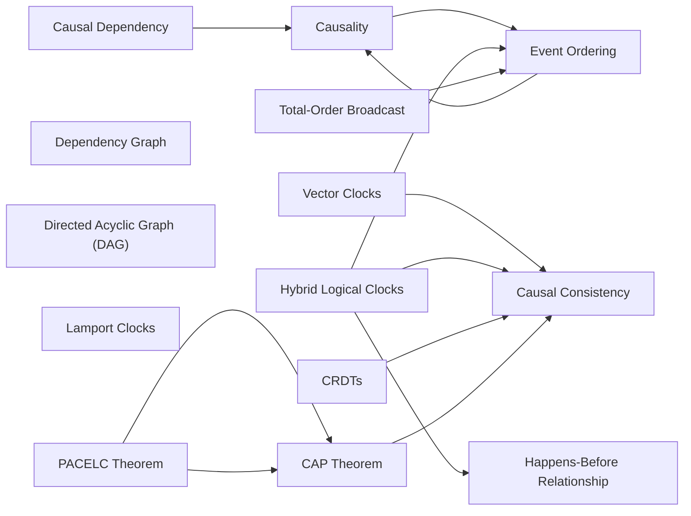
```mermaid
flowchart LR
    n_causality["Causality"]
    n_causal_consistency["Causal Consistency"]
    n_happens_before_relationship["Happens-Before Relationship"]
    n_event_ordering["Event Ordering"]
    n_causal_dependency["Causal Dependency"]
    n_dependency_graph["Dependency Graph"]
    n_directed_acyclic_graph["Directed Acyclic Graph (DAG)"]
    n_vector_clocks["Vector Clocks"]
    n_lamport_clocks["Lamport Clocks"]
    n_hybrid_logical_clocks["Hybrid Logical Clocks"]
    n_crdts["CRDTs"]
    n_total_order_broadcast["Total-Order Broadcast"]
    n_cap_theorem["CAP Theorem"]
    n_pacelc_theorem["PACELC Theorem"]
    n_causality --> n_event_ordering
    n_event_ordering --> n_causality
    n_causal_dependency --> n_causality
    n_vector_clocks --> n_causal_consistency
    n_hybrid_logical_clocks --> n_happens_before_relationship
    n_hybrid_logical_clocks --> n_causal_consistency
    n_hybrid_logical_clocks --> n_event_ordering
    n_crdts --> n_causal_consistency
    n_total_order_broadcast --> n_event_ordering
    n_cap_theorem --> n_causal_consistency
    n_pacelc_theorem --> n_cap_theorem
    n_pacelc_theorem --> n_cap_theorem
```

### Causality

- Kind: [principle](SCHEMA.md#kind-principle)
- Category: [Causality / Ordering / Distributed Time](PRINCIPLES.md#architecture-category-causality-ordering-distributed-time)
- Severity: [contextual](SCHEMA.md#vocabulary-severity-contextual)
- Scope: event, workflow, distributed state
- Layer: [Causality Core](SCHEMA.md#layer-causality-core)

Details

Definition
A design rule that every effect records the event that caused it, so its order can be reasoned about.

Requires
[Causation Tracking](LEXICON.md#lexicon-causation-tracking)

Reinforces
[Traceability](PRINCIPLES.md#architecture-traceability), [Event Ordering](PRINCIPLES.md#architecture-event-ordering)

Enables
[Correct Workflow Reasoning](LEXICON.md#lexicon-correct-workflow-reasoning)

In tension with
[Parallelism](PRINCIPLES.md#architecture-parallelism)

Conflicts with
[Unordered Side Effects](LEXICON.md#lexicon-unordered-side-effects)

Referenced by
[Event Ordering](PRINCIPLES.md#architecture-event-ordering), [Causal Dependency](PRINCIPLES.md#architecture-causal-dependency), [Causation ID](PRINCIPLES.md#architecture-causation-id), [Distributed Tracing](PRINCIPLES.md#architecture-distributed-tracing)

Contracts
[Causality Core](ALGORITHMS.md#algorithms-causality-core)

Tensions
[Causality / Parallelism](SCHEMA.md#tension-causality-parallelism)

Violated by
[Unlinked Events](LEXICON.md#lexicon-unlinked-events)

Detected by
missing causation/correlation metadata

Measured by
causal trace completeness

Refactored by
[Causation ID](PRINCIPLES.md#architecture-causation-id), [Make Order Explicit](LEXICON.md#lexicon-make-order-explicit)

Enforced by
event schema and workflow tests

Before

```typescript
events.push({ type: "BarCreated", at: Date.now() });
events.push({ type: "FooCreated", at: Date.now() });
```

After

```typescript
const fooCreated = append({ type: "FooCreated" });
append({ type: "BarCreated", causedBy: fooCreated.id });
```

How it is checked

Checked by
event schema and workflow tests

Population
Every event, replica update and dependency edge whose order affects the result

Freshness
A verdict stands until the event schema, the ordering key or the replication protocol changes

Refusal
The ordering or consistency test fails, or the graph check rejects the edge that breaks the order

Observation
Causation metadata on events, ordering-anomaly counts from tests, and the extracted dependency graph

Evidence
None, because the catalog states this check as a class, so a watched run belongs to each system that adopts it

Authoritative side
The ordering key and the replication protocol, which every event and replica update conforms to

Depends on
[Causation Tracking](LEXICON.md#lexicon-causation-tracking), [Traceability](PRINCIPLES.md#architecture-traceability), [Event Ordering](PRINCIPLES.md#architecture-event-ordering), [Correct Workflow Reasoning](LEXICON.md#lexicon-correct-workflow-reasoning)

Shape it refuses
[Unordered Side Effects](LEXICON.md#lexicon-unordered-side-effects)

### Causal Consistency

- Kind: [model](SCHEMA.md#kind-model)
- Category: [Causality / Ordering / Distributed Time](PRINCIPLES.md#architecture-category-causality-ordering-distributed-time)
- Severity: [contextual](SCHEMA.md#vocabulary-severity-contextual)
- Scope: distributed data, events
- Layer: [Causality Core](SCHEMA.md#layer-causality-core)

Details

Definition
A conceptual representation of a consistency guarantee in which no reader sees an effect before its cause.

Requires
[Causal Ordering](LEXICON.md#lexicon-causal-ordering)

Reinforces
[Eventual Consistency Safety](LEXICON.md#lexicon-eventual-consistency-safety)

Enables
[User-Visible Ordering Guarantees](LEXICON.md#lexicon-user-visible-ordering-guarantees)

In tension with
[Latency/Availability](LEXICON.md#lexicon-latency-availability)

Conflicts with
[Arbitrary Reordering](LEXICON.md#lexicon-arbitrary-reordering), [Read-Your-Writes Violation](PRINCIPLES.md#architecture-read-your-writes-violation)

Referenced by
[Vector Clocks](PRINCIPLES.md#architecture-vector-clocks), [Hybrid Logical Clocks](PRINCIPLES.md#architecture-hybrid-logical-clocks), [CRDTs](PRINCIPLES.md#architecture-crdts), [CAP Theorem](PRINCIPLES.md#architecture-cap-theorem)

Tensions
[Causal Consistency / Latency/Availability](SCHEMA.md#tension-causal-consistency-latency-availability)

Violated by
[Arbitrary Reordering](LEXICON.md#lexicon-arbitrary-reordering)

Detected by
order anomaly tests

Measured by
causal anomaly rate

Refactored by
[Causation ID](PRINCIPLES.md#architecture-causation-id), [Read From Primary After Write](LEXICON.md#lexicon-read-from-primary-after-write)

Enforced by
consistency tests

Before

```typescript
replica.apply(barCreated);
replica.apply(fooCreated);
```

After

```typescript
replica.applyWhenReady(barCreated, {
  requires: [fooCreated.id],
});
replica.apply(fooCreated);
```

How it is checked

Checked by
consistency tests

Population
Every event, replica update and dependency edge whose order affects the result

Freshness
A verdict stands until the event schema, the ordering key or the replication protocol changes

Refusal
The ordering or consistency test fails, or the graph check rejects the edge that breaks the order

Observation
Causation metadata on events, ordering-anomaly counts from tests, and the extracted dependency graph

Evidence
None, because the catalog states this check as a class, so a watched run belongs to each system that adopts it

Authoritative side
The ordering key and the replication protocol, which every event and replica update conforms to

Depends on
[Causal Ordering](LEXICON.md#lexicon-causal-ordering), [Eventual Consistency Safety](LEXICON.md#lexicon-eventual-consistency-safety), [User-Visible Ordering Guarantees](LEXICON.md#lexicon-user-visible-ordering-guarantees)

Shape it refuses
[Arbitrary Reordering](LEXICON.md#lexicon-arbitrary-reordering), [Read-Your-Writes Violation](PRINCIPLES.md#architecture-read-your-writes-violation)

### Happens-Before Relationship

- Kind: [model](SCHEMA.md#kind-model)
- Category: [Causality / Ordering / Distributed Time](PRINCIPLES.md#architecture-category-causality-ordering-distributed-time)
- Severity: [contextual](SCHEMA.md#vocabulary-severity-contextual)
- Scope: concurrency, distributed events
- Layer: [Causality Core](SCHEMA.md#layer-causality-core)

Details

Definition
A conceptual representation of the partial order in which one operation is known to precede another.

Requires
[Ordering Semantics](LEXICON.md#lexicon-ordering-semantics)

Reinforces
[Correctness](PRINCIPLES.md#architecture-correctness), [Causal Reasoning](LEXICON.md#lexicon-causal-reasoning)

Enables
[Race Detection](LEXICON.md#lexicon-race-detection)

In tension with
[Parallel Execution](LEXICON.md#lexicon-parallel-execution)

Conflicts with
[Race Conditions](LEXICON.md#lexicon-race-conditions)

Referenced by
[Hybrid Logical Clocks](PRINCIPLES.md#architecture-hybrid-logical-clocks)

Tensions
[Happens-Before Relationship / Parallel Execution](SCHEMA.md#tension-happens-before-relationship-parallel-execution)

Violated by
[Race Conditions](LEXICON.md#lexicon-race-conditions)

Detected by
race detectors, missing synchronization

Measured by
ordering violation count

Refactored by
[Apply Concurrency Control](LEXICON.md#lexicon-apply-concurrency-control), [Make Order Explicit](LEXICON.md#lexicon-make-order-explicit)

Enforced by
concurrency tests

Before

```typescript
const a = { id: "a", at: Date.now() };
const b = { id: "b", at: Date.now() };
```

After

```typescript
const a = { id: "a", ordinal: 1 };
const b = { id: "b", ordinal: 2, after: [a.id] };
assert(happensBefore(a, b));
```

How it is checked

Checked by
concurrency tests

Population
Every event, replica update and dependency edge whose order affects the result

Freshness
A verdict stands until the event schema, the ordering key or the replication protocol changes

Refusal
The ordering or consistency test fails, or the graph check rejects the edge that breaks the order

Observation
Causation metadata on events, ordering-anomaly counts from tests, and the extracted dependency graph

Evidence
None, because the catalog states this check as a class, so a watched run belongs to each system that adopts it

Authoritative side
The ordering key and the replication protocol, which every event and replica update conforms to

Depends on
[Ordering Semantics](LEXICON.md#lexicon-ordering-semantics), [Correctness](PRINCIPLES.md#architecture-correctness), [Causal Reasoning](LEXICON.md#lexicon-causal-reasoning), [Race Detection](LEXICON.md#lexicon-race-detection)

Shape it refuses
[Race Conditions](LEXICON.md#lexicon-race-conditions)

### Event Ordering

- Kind: [constraint](SCHEMA.md#kind-constraint)
- Category: [Causality / Ordering / Distributed Time](PRINCIPLES.md#architecture-category-causality-ordering-distributed-time)
- Severity: [contextual](SCHEMA.md#vocabulary-severity-contextual)
- Scope: stream, queue, consumer
- Layer: [Causality Core](SCHEMA.md#layer-causality-core)

Details

Definition
A rule or precondition that a stateful consumer processes the events of one key in their sequence order.

Requires
[Ordering Key or Sequence](LEXICON.md#lexicon-ordering-key-or-sequence)

Reinforces
[Causality](PRINCIPLES.md#architecture-causality)

Enables
[Correct Stateful Processing](LEXICON.md#lexicon-correct-stateful-processing)

In tension with
[Throughput](PRINCIPLES.md#architecture-throughput)

Conflicts with
[Unordered Parallel Consumption](LEXICON.md#lexicon-unordered-parallel-consumption)

Referenced by
[Causality](PRINCIPLES.md#architecture-causality), [Hybrid Logical Clocks](PRINCIPLES.md#architecture-hybrid-logical-clocks), [Total-Order Broadcast](PRINCIPLES.md#architecture-total-order-broadcast)

Tensions
[Event Ordering / Throughput](SCHEMA.md#tension-event-ordering-throughput)

Distinct from
[Ordering Key or Sequence](LEXICON.md#lexicon-ordering-key-or-sequence): Event ordering binds the consumer to process one key's events in order, while the ordering key is the field on each event that makes the order known.

Violated by
[Unordered Parallel Consumption](LEXICON.md#lexicon-unordered-parallel-consumption)

Detected by
missing ordering key/sequence checks

Measured by
out-of-order rate

Refactored by
[Partitioning](PRINCIPLES.md#architecture-partitioning), [Logical Counter](LEXICON.md#lexicon-logical-counter), [Reorder Buffer](LEXICON.md#lexicon-reorder-buffer)

Enforced by
stream config, consumer tests

Before

```typescript
events.sort((a, b) => a.timestamp - b.timestamp);
```

After

```typescript
events.sort((a, b) => a.streamOrdinal - b.streamOrdinal);
```

How it is checked

Checked by
stream config, consumer tests

Population
Every event, replica update and dependency edge whose order affects the result

Freshness
A verdict stands until the event schema, the ordering key or the replication protocol changes

Refusal
The ordering or consistency test fails, or the graph check rejects the edge that breaks the order

Observation
Causation metadata on events, ordering-anomaly counts from tests, and the extracted dependency graph

Evidence
None, because the catalog states this check as a class, so a watched run belongs to each system that adopts it

Authoritative side
The ordering key and the replication protocol, which every event and replica update conforms to

Depends on
[Ordering Key or Sequence](LEXICON.md#lexicon-ordering-key-or-sequence), [Causality](PRINCIPLES.md#architecture-causality), [Correct Stateful Processing](LEXICON.md#lexicon-correct-stateful-processing)

Shape it refuses
[Unordered Parallel Consumption](LEXICON.md#lexicon-unordered-parallel-consumption)

### Causal Dependency

- Kind: [model](SCHEMA.md#kind-model)
- Category: [Causality / Ordering / Distributed Time](PRINCIPLES.md#architecture-category-causality-ordering-distributed-time)
- Severity: [recommended](SCHEMA.md#vocabulary-severity-recommended)
- Scope: event, workflow, module
- Layer: [Causality Core](SCHEMA.md#layer-causality-core)

Details

Definition
A conceptual representation of one step or event that cannot proceed until another has happened.

Requires
[Dependency Declaration](LEXICON.md#lexicon-dependency-declaration)

Reinforces
[Causality](PRINCIPLES.md#architecture-causality), [Traceability](PRINCIPLES.md#architecture-traceability)

Enables
[Impact Analysis](PRINCIPLES.md#architecture-impact-analysis)

In tension with
[Graph Complexity](LEXICON.md#lexicon-graph-complexity)

Conflicts with
[Hidden Dependency](LEXICON.md#lexicon-hidden-dependency)

Tensions
[Causal Dependency / Graph Complexity](SCHEMA.md#tension-causal-dependency-graph-complexity)

Violated by
[Hidden Dependency](LEXICON.md#lexicon-hidden-dependency)

Detected by
undocumented call/event dependency

Measured by
hidden dependency count

Refactored by
[Explicit Dependency](LEXICON.md#lexicon-explicit-dependency), [Causation ID](PRINCIPLES.md#architecture-causation-id)

Enforced by
dependency graph checks

Before

```typescript
processBar(barEvent);
```

After

```typescript
if (!projection.has(barEvent.fooEventId)) defer(barEvent);
else processBar(barEvent);
```

How it is checked

Checked by
dependency graph checks

Population
Every event, replica update and dependency edge whose order affects the result

Freshness
A verdict stands until the event schema, the ordering key or the replication protocol changes

Refusal
The ordering or consistency test fails, or the graph check rejects the edge that breaks the order

Observation
Causation metadata on events, ordering-anomaly counts from tests, and the extracted dependency graph

Evidence
None, because the catalog states this check as a class, so a watched run belongs to each system that adopts it

Authoritative side
The ordering key and the replication protocol, which every event and replica update conforms to

Depends on
[Dependency Declaration](LEXICON.md#lexicon-dependency-declaration), [Causality](PRINCIPLES.md#architecture-causality), [Traceability](PRINCIPLES.md#architecture-traceability), [Impact Analysis](PRINCIPLES.md#architecture-impact-analysis)

Shape it refuses
[Hidden Dependency](LEXICON.md#lexicon-hidden-dependency)

### Dependency Graph

- Kind: [artifact](SCHEMA.md#kind-artifact)
- Category: [Causality / Ordering / Distributed Time](PRINCIPLES.md#architecture-category-causality-ordering-distributed-time)
- Severity: [mandatory](SCHEMA.md#vocabulary-severity-mandatory)
- Scope: codebase, runtime, deployment
- Layer: [Causality Core](SCHEMA.md#layer-causality-core)

Details

Definition
Descriptive data about which modules, tasks or services depend on which, extracted as a directed graph.

Requires
[Dependency Extraction](LEXICON.md#lexicon-dependency-extraction)

Reinforces
[Architecture Compliance](LEXICON.md#lexicon-architecture-compliance)

Enables
[Cycle Detection](LEXICON.md#lexicon-cycle-detection), [Impact Analysis](PRINCIPLES.md#architecture-impact-analysis)

In tension with
[Dynamic Loading](LEXICON.md#lexicon-dynamic-loading)

Conflicts with
[Hidden Dependency](LEXICON.md#lexicon-hidden-dependency)

Referenced by
[Impact Analysis](PRINCIPLES.md#architecture-impact-analysis)

Tensions
[Dependency Graph / Dynamic Loading](SCHEMA.md#tension-dependency-graph-dynamic-loading)

Violated by
[Hidden Dependency](LEXICON.md#lexicon-hidden-dependency)

Detected by
graph extraction mismatch

Measured by
cycle count, graph density

Refactored by
[Invert Dependency](LEXICON.md#lexicon-invert-dependency)

Enforced by
dependency graph CI checks

Before

```typescript
const tasks = [loadFoo, buildBar, publishBaz];
await Promise.all(tasks.map((task) => task()));
```

After

```typescript
const graph = new DependencyGraph();
graph.add("buildBar", { dependsOn: ["loadFoo"] });
graph.add("publishBaz", { dependsOn: ["buildBar"] });
await graph.execute();
```

How it is checked

Checked by
dependency graph CI checks

Population
Every event, replica update and dependency edge whose order affects the result

Freshness
A verdict stands until the event schema, the ordering key or the replication protocol changes

Refusal
The ordering or consistency test fails, or the graph check rejects the edge that breaks the order

Observation
Causation metadata on events, ordering-anomaly counts from tests, and the extracted dependency graph

Evidence
None, because the catalog states this check as a class, so a watched run belongs to each system that adopts it

Authoritative side
The ordering key and the replication protocol, which every event and replica update conforms to

Depends on
[Dependency Extraction](LEXICON.md#lexicon-dependency-extraction), [Architecture Compliance](LEXICON.md#lexicon-architecture-compliance), [Cycle Detection](LEXICON.md#lexicon-cycle-detection), [Impact Analysis](PRINCIPLES.md#architecture-impact-analysis)

Shape it refuses
[Hidden Dependency](LEXICON.md#lexicon-hidden-dependency)

### Directed Acyclic Graph (DAG)

- Kind: [constraint](SCHEMA.md#kind-constraint)
- Category: [Causality / Ordering / Distributed Time](PRINCIPLES.md#architecture-category-causality-ordering-distributed-time)
- Severity: [contextual](SCHEMA.md#vocabulary-severity-contextual)
- Mandatory for: dependency architecture
- Scope: dependency graph, workflow, build
- Aliases: Directed Dependencies
- Layer: [Causality Core](SCHEMA.md#layer-causality-core)

Details

Definition
A rule or precondition that every dependency points one way and the graph they form has no cycle, so its nodes can be put in topological order.

Requires
none

Reinforces
[Layering](LEXICON.md#lexicon-layering), [Build Order](LEXICON.md#lexicon-build-order)

Enables
[Topological Ordering](LEXICON.md#lexicon-topological-ordering)

In tension with
[Bidirectional Collaboration](LEXICON.md#lexicon-bidirectional-collaboration)

Conflicts with
[Circular Dependency](PRINCIPLES.md#architecture-circular-dependency)

Contracts
[Checklist Creation Kernel](ALGORITHMS.md#algorithms-checklist-creation-kernel)

Tensions
[Directed Acyclic Graph (DAG) / Bidirectional Collaboration](SCHEMA.md#tension-bidirectional-collaboration-directed-acyclic-graph-dag)

Violated by
[Circular Dependency](PRINCIPLES.md#architecture-circular-dependency)

Detected by
[cycle detection](LEXICON.md#lexicon-cycle-detection)

Measured by
cycle count

Refactored by
[Invert Dependency](LEXICON.md#lexicon-invert-dependency), [Extract Interface](LEXICON.md#lexicon-extract-interface), [Split Module](LEXICON.md#lexicon-split-module)

Enforced by
graph checks

Before

```typescript
graph.addEdge("foo", "bar");
graph.addEdge("bar", "foo");
```

After

```typescript
const dag = new Dag();
dag.addEdge("foo", "bar");
if (dag.wouldCreateCycle("bar", "foo")) throw new Error("cycle rejected");
```

How it is checked

Checked by
graph checks

Population
Every event, replica update and dependency edge whose order affects the result

Freshness
A verdict stands until the event schema, the ordering key or the replication protocol changes

Refusal
The ordering or consistency test fails, or the graph check rejects the edge that breaks the order

Observation
Causation metadata on events, ordering-anomaly counts from tests, and the extracted dependency graph

Evidence
None, because the catalog states this check as a class, so a watched run belongs to each system that adopts it

Authoritative side
The ordering key and the replication protocol, which every event and replica update conforms to

Depends on
[Layering](LEXICON.md#lexicon-layering), [Build Order](LEXICON.md#lexicon-build-order), [Topological Ordering](LEXICON.md#lexicon-topological-ordering)

Shape it refuses
[Circular Dependency](PRINCIPLES.md#architecture-circular-dependency)

### Vector Clocks

- Kind: [mechanism](SCHEMA.md#kind-mechanism)
- Category: [Causality / Ordering / Distributed Time](PRINCIPLES.md#architecture-category-causality-ordering-distributed-time)
- Severity: [contextual](SCHEMA.md#vocabulary-severity-contextual)
- Scope: distributed events, replication
- Layer: [Causality Core](SCHEMA.md#layer-causality-core)

Details

Definition
A mechanism that keeps one counter per node on each update, so two updates can be compared as ordered or concurrent.

Requires
[Node Identity](LEXICON.md#lexicon-node-identity), [Version Vector](LEXICON.md#lexicon-version-vector)

Reinforces
[Causal Consistency](PRINCIPLES.md#architecture-causal-consistency)

Enables
[Concurrent Update Detection](LEXICON.md#lexicon-concurrent-update-detection)

In tension with
[Metadata Size](LEXICON.md#lexicon-metadata-size)

Conflicts with
[Single Global Clock Assumption](LEXICON.md#lexicon-single-global-clock-assumption)

Tensions
[Vector Clocks / Metadata Size](SCHEMA.md#tension-metadata-size-vector-clocks)

Violated by
[Lost Update](PRINCIPLES.md#architecture-lost-update)

Detected by
lost causality in distributed updates

Measured by
conflict detection accuracy

Refactored by
none

Enforced by
replication protocol tests

Before

```typescript
const winner = a.updatedAt > b.updatedAt ? a : b;
```

After

```typescript
const relation = compareVectorClocks(a.clock, b.clock);
if (relation === "concurrent") return mergeFoo(a, b);
return relation === "after" ? a : b;
```

How it is checked

Checked by
replication protocol tests

Population
Every event, replica update and dependency edge whose order affects the result

Freshness
A verdict stands until the event schema, the ordering key or the replication protocol changes

Refusal
The ordering or consistency test fails, or the graph check rejects the edge that breaks the order

Observation
Causation metadata on events, ordering-anomaly counts from tests, and the extracted dependency graph

Evidence
None, because the catalog states this check as a class, so a watched run belongs to each system that adopts it

Authoritative side
The ordering key and the replication protocol, which every event and replica update conforms to

Depends on
[Node Identity](LEXICON.md#lexicon-node-identity), [Version Vector](LEXICON.md#lexicon-version-vector), [Causal Consistency](PRINCIPLES.md#architecture-causal-consistency), [Concurrent Update Detection](LEXICON.md#lexicon-concurrent-update-detection)

Shape it refuses
[Single Global Clock Assumption](LEXICON.md#lexicon-single-global-clock-assumption)

### Lamport Clocks

- Kind: [mechanism](SCHEMA.md#kind-mechanism)
- Category: [Causality / Ordering / Distributed Time](PRINCIPLES.md#architecture-category-causality-ordering-distributed-time)
- Severity: [contextual](SCHEMA.md#vocabulary-severity-contextual)
- Scope: distributed events
- Layer: [Causality Core](SCHEMA.md#layer-causality-core)

Details

Definition
A mechanism that stamps each event with a logical counter, advanced on every send and receive, to give a partial order.

Requires
[Logical Counter](LEXICON.md#lexicon-logical-counter)

Reinforces
[Happens-Before Reasoning](LEXICON.md#lexicon-happens-before-reasoning)

Enables
[Partial Ordering](LEXICON.md#lexicon-partial-ordering)

In tension with
[No Concurrent Causality Distinction](LEXICON.md#lexicon-no-concurrent-causality-distinction)

Conflicts with
[Wall-Clock Ordering Assumption](LEXICON.md#lexicon-wall-clock-ordering-assumption)

Tensions
[Lamport Clocks / No Concurrent Causality Distinction](SCHEMA.md#tension-lamport-clocks-no-concurrent-causality-distinction)

Distinct from
[Logical Counter](LEXICON.md#lexicon-logical-counter): Lamport clocks are the whole stamping scheme, advanced on every send and receive, while the logical counter is the value each process keeps.

Violated by
[Wall-Clock Ordering Assumption](LEXICON.md#lexicon-wall-clock-ordering-assumption)

Detected by
timestamp ordering anomalies

Measured by
ordering anomaly rate

Refactored by
none

Enforced by
protocol tests

Before

```typescript
const event = { at: Date.now(), value: foo };
```

After

```typescript
const event = { logicalTime: lamport.tick(), value: foo };
lamport.observe(remoteEvent.logicalTime);
```

How it is checked

Checked by
protocol tests

Population
Every event, replica update and dependency edge whose order affects the result

Freshness
A verdict stands until the event schema, the ordering key or the replication protocol changes

Refusal
The ordering or consistency test fails, or the graph check rejects the edge that breaks the order

Observation
Causation metadata on events, ordering-anomaly counts from tests, and the extracted dependency graph

Evidence
None, because the catalog states this check as a class, so a watched run belongs to each system that adopts it

Authoritative side
The ordering key and the replication protocol, which every event and replica update conforms to

Depends on
[Logical Counter](LEXICON.md#lexicon-logical-counter), [Happens-Before Reasoning](LEXICON.md#lexicon-happens-before-reasoning), [Partial Ordering](LEXICON.md#lexicon-partial-ordering)

Shape it refuses
[Wall-Clock Ordering Assumption](LEXICON.md#lexicon-wall-clock-ordering-assumption)

### Hybrid Logical Clocks

- Kind: [mechanism](SCHEMA.md#kind-mechanism)
- Category: [Causality / Ordering / Distributed Time](PRINCIPLES.md#architecture-category-causality-ordering-distributed-time)
- Severity: [contextual](SCHEMA.md#vocabulary-severity-contextual)
- Mandatory for: distributed systems
- Scope: event, distributed state, time
- Layer: [Causality Core](SCHEMA.md#layer-causality-core)

Details

Definition
A mechanism that combines physical time with a logical counter, so timestamps follow causal order and stay close to wall-clock time.

Requires
[Happens-Before Relationship](PRINCIPLES.md#architecture-happens-before-relationship)

Reinforces
[Causal Consistency](PRINCIPLES.md#architecture-causal-consistency), [Event Ordering](PRINCIPLES.md#architecture-event-ordering)

Enables
[Wall-Clock-Correlated Causal Order](LEXICON.md#lexicon-wall-clock-correlated-causal-order)

In tension with
[Clock Skew](LEXICON.md#lexicon-clock-skew)

Conflicts with
[Physical-Clock-Only Ordering](LEXICON.md#lexicon-physical-clock-only-ordering)

Tensions
[Hybrid Logical Clocks / Clock Skew](SCHEMA.md#tension-clock-skew-hybrid-logical-clocks)

Violated by
[Physical-Clock-Only Ordering](LEXICON.md#lexicon-physical-clock-only-ordering)

Detected by
last-writer-wins on physical time

Measured by
out-of-causal-order event rate

Refactored by
none

Enforced by
distributed-systems review

Before

```typescript
const event = { at: Date.now(), value: foo };
```

After

```typescript
const event = { hlc: hlc.now(), value: foo };
hlc.update(remoteEvent.hlc);
```

How it is checked

Checked by
distributed-systems review

Population
Every event, replica update and dependency edge whose order affects the result

Freshness
A verdict stands until the event schema, the ordering key or the replication protocol changes

Refusal
The ordering or consistency test fails, or the graph check rejects the edge that breaks the order

Observation
Causation metadata on events, ordering-anomaly counts from tests, and the extracted dependency graph

Evidence
None, because the catalog states this check as a class, so a watched run belongs to each system that adopts it

Authoritative side
The ordering key and the replication protocol, which every event and replica update conforms to

Depends on
[Happens-Before Relationship](PRINCIPLES.md#architecture-happens-before-relationship), [Causal Consistency](PRINCIPLES.md#architecture-causal-consistency), [Event Ordering](PRINCIPLES.md#architecture-event-ordering), [Wall-Clock-Correlated Causal Order](LEXICON.md#lexicon-wall-clock-correlated-causal-order)

Shape it refuses
[Physical-Clock-Only Ordering](LEXICON.md#lexicon-physical-clock-only-ordering)

### CRDTs

- Kind: [mechanism](SCHEMA.md#kind-mechanism)
- Category: [Causality / Ordering / Distributed Time](PRINCIPLES.md#architecture-category-causality-ordering-distributed-time)
- Severity: [contextual](SCHEMA.md#vocabulary-severity-contextual)
- Scope: distributed state, replication, convergence
- Aliases: Conflict-Free Replicated Data Types
- Layer: [Causality Core](SCHEMA.md#layer-causality-core)

Details

Definition
A mechanism that stores replicated state in data types whose merge is commutative, so replicas converge without coordination.

Requires
[Commutative Merge](LEXICON.md#lexicon-commutative-merge)

Reinforces
[Eventual Consistency](PRINCIPLES.md#architecture-eventual-consistency), [Causal Consistency](PRINCIPLES.md#architecture-causal-consistency)

Enables
[Conflict-Free Replica Convergence](LEXICON.md#lexicon-conflict-free-replica-convergence)

In tension with
[Metadata Overhead](LEXICON.md#lexicon-metadata-overhead), [Last-Write-Wins Overwrite](LEXICON.md#lexicon-last-write-wins-overwrite)

Conflicts with
none

Tensions
[CRDTs / Metadata Overhead](SCHEMA.md#tension-crdts-metadata-overhead), [CRDTs / Last-Write-Wins Overwrite](SCHEMA.md#tension-crdts-last-write-wins-overwrite)

Violated by
[Lost Update](PRINCIPLES.md#architecture-lost-update)

Detected by
lost updates under concurrent replication

Measured by
merge-conflict data-loss rate

Refactored by
none

Enforced by
replication design review

Before

```typescript
foo.tags = incoming.updatedAt > foo.updatedAt ? incoming.tags : foo.tags;
```

After

```typescript
foo.tags = orSet.merge(foo.tags, incoming.tags);
```

How it is checked

Checked by
replication design review

Population
Every event, replica update and dependency edge whose order affects the result

Freshness
A verdict stands until the event schema, the ordering key or the replication protocol changes

Refusal
The ordering or consistency test fails, or the graph check rejects the edge that breaks the order

Observation
Causation metadata on events, ordering-anomaly counts from tests, and the extracted dependency graph

Evidence
None, because the catalog states this check as a class, so a watched run belongs to each system that adopts it

Authoritative side
The ordering key and the replication protocol, which every event and replica update conforms to

Depends on
[Commutative Merge](LEXICON.md#lexicon-commutative-merge), [Eventual Consistency](PRINCIPLES.md#architecture-eventual-consistency), [Causal Consistency](PRINCIPLES.md#architecture-causal-consistency), [Conflict-Free Replica Convergence](LEXICON.md#lexicon-conflict-free-replica-convergence)

Shape it refuses
Not answered

### Total-Order Broadcast

- Kind: [mechanism](SCHEMA.md#kind-mechanism)
- Category: [Causality / Ordering / Distributed Time](PRINCIPLES.md#architecture-category-causality-ordering-distributed-time)
- Severity: [contextual](SCHEMA.md#vocabulary-severity-contextual)
- Mandatory for: distributed systems
- Scope: event, distributed state, ordering
- Layer: [Causality Core](SCHEMA.md#layer-causality-core)

Details

Definition
A mechanism that delivers every message to every node in the same order, agreed by consensus.

Requires
[Consensus](PRINCIPLES.md#architecture-consensus)

Reinforces
[Event Ordering](PRINCIPLES.md#architecture-event-ordering), [Consistency](PRINCIPLES.md#architecture-consistency)

Enables
[Identical Delivery Order Across Nodes](LEXICON.md#lexicon-identical-delivery-order-across-nodes)

In tension with
[Latency](PRINCIPLES.md#architecture-latency)

Conflicts with
[Per-Node Independent Ordering](LEXICON.md#lexicon-per-node-independent-ordering)

Tensions
[Total-Order Broadcast / Latency](SCHEMA.md#tension-latency-total-order-broadcast)

Violated by
[Per-Node Independent Ordering](LEXICON.md#lexicon-per-node-independent-ordering)

Detected by
state divergence across nodes given same events

Measured by
cross-node order divergence rate

Refactored by
none

Enforced by
distributed-systems review

Before

```typescript
replica.apply(event);
```

After

```typescript
const sequenced = await totalOrder.broadcast(event);
replica.applyInOrder(sequenced.sequence, sequenced.event);
```

How it is checked

Checked by
distributed-systems review

Population
Every event, replica update and dependency edge whose order affects the result

Freshness
A verdict stands until the event schema, the ordering key or the replication protocol changes

Refusal
The ordering or consistency test fails, or the graph check rejects the edge that breaks the order

Observation
Causation metadata on events, ordering-anomaly counts from tests, and the extracted dependency graph

Evidence
None, because the catalog states this check as a class, so a watched run belongs to each system that adopts it

Authoritative side
The ordering key and the replication protocol, which every event and replica update conforms to

Depends on
[Consensus](PRINCIPLES.md#architecture-consensus), [Event Ordering](PRINCIPLES.md#architecture-event-ordering), [Consistency](PRINCIPLES.md#architecture-consistency), [Identical Delivery Order Across Nodes](LEXICON.md#lexicon-identical-delivery-order-across-nodes)

Shape it refuses
[Per-Node Independent Ordering](LEXICON.md#lexicon-per-node-independent-ordering)

### CAP Theorem

- Kind: [model](SCHEMA.md#kind-model)
- Category: [Causality / Ordering / Distributed Time](PRINCIPLES.md#architecture-category-causality-ordering-distributed-time)
- Severity: [contextual](SCHEMA.md#vocabulary-severity-contextual)
- Mandatory for: distributed systems
- Scope: distributed state, consistency, availability
- Layer: [Causality Core](SCHEMA.md#layer-causality-core)

Details

Definition
A conceptual representation of the choice a distributed store makes during a network partition, between consistency and availability.

Requires
[Network Partition Possibility](LEXICON.md#lexicon-network-partition-possibility)

Reinforces
[Causal Consistency](PRINCIPLES.md#architecture-causal-consistency), [Eventual Consistency](PRINCIPLES.md#architecture-eventual-consistency)

Enables
[Explicit Consistency/Availability Choice Under Partition](LEXICON.md#lexicon-explicit-consistency-availability-choice-under-partition)

In tension with
[Latency](PRINCIPLES.md#architecture-latency)

Conflicts with
[Assumed Total Consistency And Availability](LEXICON.md#lexicon-assumed-total-consistency-and-availability)

Referenced by
[PACELC Theorem](PRINCIPLES.md#architecture-pacelc-theorem)

Tensions
[CAP Theorem / Latency](SCHEMA.md#tension-cap-theorem-latency)

Distinct from
[Causal Consistency](PRINCIPLES.md#architecture-causal-consistency): The CAP theorem states the trade-off a store makes during a partition, while causal consistency is one guarantee a store can offer.

Distinct from
[Eventual Consistency](PRINCIPLES.md#architecture-eventual-consistency): The CAP theorem is the trade-off, while eventual consistency is the guarantee an available store settles for.

Distinct from
[PACELC Theorem](PRINCIPLES.md#architecture-pacelc-theorem): The CAP theorem covers only a partition, while PACELC adds the latency and consistency trade-off of a healthy network.

Violated by
[Assumed Total Consistency And Availability](LEXICON.md#lexicon-assumed-total-consistency-and-availability)

Detected by
split-brain writes or stalls during network partitions

Measured by
consistency/availability violations during partition events

Refactored by
none

Enforced by
distributed-systems review

Before

```typescript
await Promise.all(replicas.map((r) => r.write(foo)));
return "always consistent and available";
```

After

```typescript
const policy = partitionPolicyFor(foo.class);
return policy === "CP" ? writeWithQuorum(foo) : writeAvailableAndReconcile(foo);
```

How it is checked

Checked by
distributed-systems review

Population
Every event, replica update and dependency edge whose order affects the result

Freshness
A verdict stands until the event schema, the ordering key or the replication protocol changes

Refusal
The ordering or consistency test fails, or the graph check rejects the edge that breaks the order

Observation
Causation metadata on events, ordering-anomaly counts from tests, and the extracted dependency graph

Evidence
None, because the catalog states this check as a class, so a watched run belongs to each system that adopts it

Authoritative side
The ordering key and the replication protocol, which every event and replica update conforms to

Depends on
[Network Partition Possibility](LEXICON.md#lexicon-network-partition-possibility), [Causal Consistency](PRINCIPLES.md#architecture-causal-consistency), [Eventual Consistency](PRINCIPLES.md#architecture-eventual-consistency), [Explicit Consistency/Availability Choice Under Partition](LEXICON.md#lexicon-explicit-consistency-availability-choice-under-partition)

Shape it refuses
[Assumed Total Consistency And Availability](LEXICON.md#lexicon-assumed-total-consistency-and-availability)

### PACELC Theorem

- Kind: [model](SCHEMA.md#kind-model)
- Category: [Causality / Ordering / Distributed Time](PRINCIPLES.md#architecture-category-causality-ordering-distributed-time)
- Severity: [contextual](SCHEMA.md#vocabulary-severity-contextual)
- Scope: distributed state, consistency, latency
- Layer: [Causality Core](SCHEMA.md#layer-causality-core)

Details

Definition
A conceptual representation that extends the CAP theorem with the trade-off a healthy network still forces, between latency and consistency.

Requires
[CAP Theorem](PRINCIPLES.md#architecture-cap-theorem)

Reinforces
[CAP Theorem](PRINCIPLES.md#architecture-cap-theorem), [Latency](PRINCIPLES.md#architecture-latency)

Enables
[Latency-Consistency Trade-off When Healthy](LEXICON.md#lexicon-latency-consistency-trade-off-when-healthy)

In tension with
[Throughput](PRINCIPLES.md#architecture-throughput)

Conflicts with
[Consistency Assumed Free When Healthy](LEXICON.md#lexicon-consistency-assumed-free-when-healthy)

Tensions
[PACELC Theorem / Throughput](SCHEMA.md#tension-pacelc-theorem-throughput)

Violated by
[Consistency Assumed Free When Healthy](LEXICON.md#lexicon-consistency-assumed-free-when-healthy)

Detected by
tail latency driven by synchronous cross-region consistency during normal operation

Measured by
latency-vs-staleness tradeoff per read class

Refactored by
none

Enforced by
distributed-systems review

Before

```typescript
const foo = await readFromAllRegionsStrongly(id);
```

After

```typescript
const foo = tolerateStaleness(id.class)
  ? await readLocalReplica(id)
  : await readStronglyAcrossRegions(id);
```

How it is checked

Checked by
distributed-systems review

Population
Every event, replica update and dependency edge whose order affects the result

Freshness
A verdict stands until the event schema, the ordering key or the replication protocol changes

Refusal
The ordering or consistency test fails, or the graph check rejects the edge that breaks the order

Observation
Causation metadata on events, ordering-anomaly counts from tests, and the extracted dependency graph

Evidence
None, because the catalog states this check as a class, so a watched run belongs to each system that adopts it

Authoritative side
The ordering key and the replication protocol, which every event and replica update conforms to

Depends on
[CAP Theorem](PRINCIPLES.md#architecture-cap-theorem), [CAP Theorem](PRINCIPLES.md#architecture-cap-theorem), [Latency](PRINCIPLES.md#architecture-latency), [Latency-Consistency Trade-off When Healthy](LEXICON.md#lexicon-latency-consistency-trade-off-when-healthy)

Shape it refuses
[Consistency Assumed Free When Healthy](LEXICON.md#lexicon-consistency-assumed-free-when-healthy)

## Contracts / Interfaces / Compatibility

Every principle in this category is listed as a record. Each record carries its kind, its severity, the scopes it applies at and the layer it lives in, then the edge relations that join it to other records, the records that point back at it, the contracts that answer to it and the tensions it takes part in. The descriptors say how it is violated, detected, measured, repaired and enforced. Where the record carries one, an exemplar shows the shape before and after the principle is applied.

Relations diagram

The relations inside this category.


```mermaid
flowchart LR
    n_design_by_contract["Design by Contract"]
    n_explicit_contracts["Explicit Contracts"]
    n_stable_interfaces["Stable Interfaces"]
    n_interface_based_design["Interface-Based Design"]
    n_contract_first_design["Contract-First Design"]
    n_api_contract["API Contract"]
    n_service_contract["Service Contract"]
    n_data_contract["Data Contract"]
    n_schema_contract["Schema Contract"]
    n_semantic_contracts["Semantic Contracts"]
    n_preconditions["Preconditions"]
    n_postconditions["Postconditions"]
    n_invariant["Invariant"]
    n_backward_compatibility["Backward Compatibility"]
    n_forward_compatibility["Forward Compatibility"]
    n_versioning["Versioning"]
    n_protocol_compatibility["Protocol Compatibility"]
    n_interoperability["Interoperability"]
    n_uniform_interface["Uniform Interface"]
    n_consumer_driven_contracts["Consumer-Driven Contracts"]
    n_design_by_contract --> n_preconditions
    n_design_by_contract --> n_postconditions
    n_design_by_contract --> n_invariant
    n_explicit_contracts --> n_stable_interfaces
    n_explicit_contracts --> n_interoperability
    n_explicit_contracts --> n_contract_first_design
    n_stable_interfaces --> n_versioning
    n_stable_interfaces --> n_backward_compatibility
    n_interface_based_design --> n_stable_interfaces
    n_contract_first_design --> n_explicit_contracts
    n_contract_first_design --> n_schema_contract
    n_contract_first_design --> n_interoperability
    n_contract_first_design --> n_backward_compatibility
    n_api_contract --> n_versioning
    n_api_contract --> n_stable_interfaces
    n_api_contract --> n_interoperability
    n_service_contract --> n_api_contract
    n_data_contract --> n_interoperability
    n_schema_contract --> n_data_contract
    n_preconditions --> n_design_by_contract
    n_postconditions --> n_invariant
    n_backward_compatibility --> n_versioning
    n_backward_compatibility --> n_stable_interfaces
    n_versioning --> n_stable_interfaces
    n_versioning --> n_backward_compatibility
    n_protocol_compatibility --> n_versioning
    n_protocol_compatibility --> n_interoperability
    n_consumer_driven_contracts --> n_explicit_contracts
    n_consumer_driven_contracts --> n_backward_compatibility
    n_consumer_driven_contracts --> n_contract_first_design
```

### Design by Contract

- Kind: [principle](SCHEMA.md#kind-principle)
- Category: [Contracts / Interfaces / Compatibility](PRINCIPLES.md#architecture-category-contracts-interfaces-compatibility)
- Severity: [recommended](SCHEMA.md#vocabulary-severity-recommended)
- Scope: API, function, class, service
- Aliases: DbC
- Layer: [Contracts Core](SCHEMA.md#layer-contracts-core)

Details

Definition
A design rule that every operation states the preconditions it needs, the postconditions it guarantees and the invariants it keeps.

Requires
[Preconditions](PRINCIPLES.md#architecture-preconditions), [Postconditions](PRINCIPLES.md#architecture-postconditions), [Invariant](PRINCIPLES.md#architecture-invariant)

Reinforces
[Correctness](PRINCIPLES.md#architecture-correctness), [Predictability](PRINCIPLES.md#architecture-predictability)

Enables
[Contract Testing](LEXICON.md#lexicon-contract-testing), [Liskov Substitution Principle (LSP)](PRINCIPLES.md#architecture-liskov-substitution)

In tension with
[Development Speed](LEXICON.md#lexicon-development-speed)

Conflicts with
[Implicit Behavior](LEXICON.md#lexicon-implicit-behavior)

Referenced by
[Preconditions](PRINCIPLES.md#architecture-preconditions), [Correctness](PRINCIPLES.md#architecture-correctness)

Contracts
[Architectural Contract Algebra](ALGORITHMS.md#algorithms-architectural-contract-algebra), [Contract-Based Verification Kernel](ALGORITHMS.md#algorithms-contract-based-verification-kernel)

Tensions
[Design by Contract / Development Speed](SCHEMA.md#tension-design-by-contract-development-speed)

Distinct from
[Liskov Substitution Principle (LSP)](PRINCIPLES.md#architecture-liskov-substitution): Design by contract states each operation's conditions, while Liskov substitution requires a subtype to keep the conditions of its base type.

Violated by
[Implicit Assumptions](LEXICON.md#lexicon-implicit-assumptions), [Trusting Invalid Inputs](LEXICON.md#lexicon-trusting-invalid-inputs)

Detected by
missing assertions, missing validation, vague public APIs

Measured by
contract coverage

Refactored by
[Precondition Check](LEXICON.md#lexicon-precondition-check), [Postcondition Check](LEXICON.md#lexicon-postcondition-check), [Invariant Check](LEXICON.md#lexicon-invariant-check)

Enforced by
assertions, contract tests, [static analysis](REASONING.md#reasoning-technique-static-analysis)

Refused by rules
design-by-contract

Before

```typescript
function divideFoo(total: number, count: number) {
  return total / count;
}
```

After

```typescript
function divideFoo(total: number, count: number): number {
  if (!Number.isFinite(total)) throw new Error("pre: total must be finite");
  if (!Number.isInteger(count) || count <= 0)
    throw new Error("pre: count must be positive");
  const result = total / count;
  if (!Number.isFinite(result)) throw new Error("post: result must be finite");
  return result;
}
```

How it is checked

Checked by
assertions, contract tests, static analysis

Population
Every public boundary: operations, endpoints, messages, schemas and protocol frames

Freshness
A verdict stands for one version of the contract and goes stale when the contract or its implementation changes

Refusal
The contract test, schema validation or API diff gate fails the change that breaks the contract

Observation
The contract or schema compared with the implementation and with each consumer's recorded expectation

Evidence
None, because the catalog states this check as a class, so a watched run belongs to each system that adopts it

Authoritative side
The contract, which the implementation and each consumer's recorded expectation are compared against

Depends on
[Preconditions](PRINCIPLES.md#architecture-preconditions), [Postconditions](PRINCIPLES.md#architecture-postconditions), [Invariant](PRINCIPLES.md#architecture-invariant), [Correctness](PRINCIPLES.md#architecture-correctness), [Predictability](PRINCIPLES.md#architecture-predictability), [Contract Testing](LEXICON.md#lexicon-contract-testing), [Liskov Substitution Principle (LSP)](PRINCIPLES.md#architecture-liskov-substitution)

Shape it refuses
[Implicit Behavior](LEXICON.md#lexicon-implicit-behavior)

### Explicit Contracts

- Kind: [principle](SCHEMA.md#kind-principle)
- Category: [Contracts / Interfaces / Compatibility](PRINCIPLES.md#architecture-category-contracts-interfaces-compatibility)
- Severity: [mandatory](SCHEMA.md#vocabulary-severity-mandatory)
- Scope: API, service, data, protocol
- Layer: [Contracts Core](SCHEMA.md#layer-contracts-core)

Details

Definition
A design rule that every boundary declares the shape and meaning of what crosses it in a typed contract.

Requires
[Stable Interfaces](PRINCIPLES.md#architecture-stable-interfaces), [Type Safety](PRINCIPLES.md#architecture-type-safety)

Reinforces
[Predictability](PRINCIPLES.md#architecture-predictability), [Interoperability](PRINCIPLES.md#architecture-interoperability)

Enables
[Contract-First Design](PRINCIPLES.md#architecture-contract-first-design)

In tension with
[Rapid Prototyping](LEXICON.md#lexicon-rapid-prototyping)

Conflicts with
[Implicit Contract](PRINCIPLES.md#architecture-implicit-contract)

Referenced by
[Contract-First Design](PRINCIPLES.md#architecture-contract-first-design), [Consumer-Driven Contracts](PRINCIPLES.md#architecture-consumer-driven-contracts), [Predictability](PRINCIPLES.md#architecture-predictability), [Autonomy](PRINCIPLES.md#architecture-autonomy)

Contracts
[Contracts Core](ALGORITHMS.md#algorithms-contracts-core), [PAG Authoring Kernel](ALGORITHMS.md#algorithms-pag-authoring-kernel)

Tensions
[Explicit Contracts / Rapid Prototyping](SCHEMA.md#tension-explicit-contracts-rapid-prototyping)

Distinct from
[Determinism](PRINCIPLES.md#architecture-determinism): Explicit contracts declare what crosses a boundary, while determinism makes the same inputs give the same result.

Distinct from
[Contract-First Design](PRINCIPLES.md#architecture-contract-first-design): Explicit contracts require a declared contract, while contract-first design fixes when it is written, before the implementation.

Distinct from
[Independence](PRINCIPLES.md#architecture-independence): Explicit contracts declare boundaries, while independence lets a module be tested and deployed without its neighbors.

Violated by
[Dynamic Untyped Boundaries](LEXICON.md#lexicon-dynamic-untyped-boundaries), [Untyped Payloads](LEXICON.md#lexicon-untyped-payloads)

Detected by
public methods without DTO/schema, dynamic maps at boundaries

Measured by
boundary contract coverage

Refactored by
[Introduce Boundary DTO](LEXICON.md#lexicon-introduce-boundary-dto), [Schema Validation](PRINCIPLES.md#architecture-schema-validation), [Extract Interface](LEXICON.md#lexicon-extract-interface)

Enforced by
[schema validation](PRINCIPLES.md#architecture-schema-validation), API linting

Before

```typescript
function saveFoo(foo: any): any {
  return fooStore.save(foo);
}
```

After

```typescript
interface SaveFoo {
  execute(
    input: Readonly<{ id: FooId; name: string }>,
  ): Promise<{ saved: true; version: number }>;
}
const saveFoo: SaveFoo = { execute: (input) => fooStore.save(input) };
```

How it is checked

Checked by
schema validation, API linting

Population
Every public boundary: operations, endpoints, messages, schemas and protocol frames

Freshness
A verdict stands for one version of the contract and goes stale when the contract or its implementation changes

Refusal
The contract test, schema validation or API diff gate fails the change that breaks the contract

Observation
The contract or schema compared with the implementation and with each consumer's recorded expectation

Evidence
None, because the catalog states this check as a class, so a watched run belongs to each system that adopts it

Authoritative side
The contract, which the implementation and each consumer's recorded expectation are compared against

Depends on
[Stable Interfaces](PRINCIPLES.md#architecture-stable-interfaces), [Type Safety](PRINCIPLES.md#architecture-type-safety), [Predictability](PRINCIPLES.md#architecture-predictability), [Interoperability](PRINCIPLES.md#architecture-interoperability), [Contract-First Design](PRINCIPLES.md#architecture-contract-first-design)

Shape it refuses
[Implicit Contract](PRINCIPLES.md#architecture-implicit-contract), [Implicit Contract](PRINCIPLES.md#architecture-implicit-contract)

### Stable Interfaces

- Kind: [quality-attribute](SCHEMA.md#kind-quality-attribute)
- Category: [Contracts / Interfaces / Compatibility](PRINCIPLES.md#architecture-category-contracts-interfaces-compatibility)
- Severity: [mandatory](SCHEMA.md#vocabulary-severity-mandatory)
- Scope: API, module, service
- Layer: [Contracts Core](SCHEMA.md#layer-contracts-core)

Details

Definition
The degree to which a public interface keeps its signatures and meaning across releases.

Requires
[Versioning](PRINCIPLES.md#architecture-versioning), [Backward Compatibility](PRINCIPLES.md#architecture-backward-compatibility)

Reinforces
[Low Coupling](PRINCIPLES.md#architecture-low-coupling), [Replaceability](PRINCIPLES.md#architecture-replaceability)

Enables
[Independent Consumers](LEXICON.md#lexicon-independent-consumers)

In tension with
[Evolution Speed](LEXICON.md#lexicon-evolution-speed)

Conflicts with
[Breaking Change](LEXICON.md#lexicon-breaking-change)

Referenced by
[Explicit Boundaries](PRINCIPLES.md#architecture-explicit-boundaries), [Runtime Extensibility](PRINCIPLES.md#architecture-runtime-extensibility), [Explicit Contracts](PRINCIPLES.md#architecture-explicit-contracts), [Interface-Based Design](PRINCIPLES.md#architecture-interface-based-design), [API Contract](PRINCIPLES.md#architecture-api-contract), [Backward Compatibility](PRINCIPLES.md#architecture-backward-compatibility), [Versioning](PRINCIPLES.md#architecture-versioning), [Low Coupling](PRINCIPLES.md#architecture-low-coupling), [Encapsulation](PRINCIPLES.md#architecture-encapsulation), [Composability](PRINCIPLES.md#architecture-composability), [Replaceability](PRINCIPLES.md#architecture-replaceability), [Dependency Inversion Principle (DIP)](PRINCIPLES.md#architecture-dependency-inversion), [Plugin Architecture](PRINCIPLES.md#architecture-plugin-architecture), [Extension Points](PRINCIPLES.md#architecture-extension-points), [Principle of Least Surprise](PRINCIPLES.md#architecture-principle-of-least-surprise)

Tensions
[Stable Interfaces / Evolution Speed](SCHEMA.md#tension-evolution-speed-stable-interfaces)

Violated by
[Unversioned Breaking Change](PRINCIPLES.md#architecture-unversioned-breaking-change), [Schema Drift](PRINCIPLES.md#architecture-schema-drift)

Detected by
incompatible API diffs

Measured by
breaking-change frequency

Refactored by
[Versioning](PRINCIPLES.md#architecture-versioning), [Extract Adapter](LEXICON.md#lexicon-extract-adapter), [Gradual Deprecation](LEXICON.md#lexicon-gradual-deprecation)

Enforced by
API diff checks, contract tests

Before

```typescript
class FooService {
  createFoo(name: string, tags: string[], notify: boolean, source: string) {}
}
```

After

```typescript
type CreateFooRequest = Readonly<{
  name: string;
  tags: readonly string[];
  extensions: Readonly<Record<string, unknown>>;
}>;
interface FooService {
  create(request: CreateFooRequest): Promise<FooId>;
}
```

How it is checked

Checked by
API diff checks, contract tests

Population
Every public boundary: operations, endpoints, messages, schemas and protocol frames

Freshness
A verdict stands for one version of the contract and goes stale when the contract or its implementation changes

Refusal
The contract test, schema validation or API diff gate fails the change that breaks the contract

Observation
The contract or schema compared with the implementation and with each consumer's recorded expectation

Evidence
None, because the catalog states this check as a class, so a watched run belongs to each system that adopts it

Authoritative side
The contract, which the implementation and each consumer's recorded expectation are compared against

Depends on
[Versioning](PRINCIPLES.md#architecture-versioning), [Backward Compatibility](PRINCIPLES.md#architecture-backward-compatibility), [Low Coupling](PRINCIPLES.md#architecture-low-coupling), [Replaceability](PRINCIPLES.md#architecture-replaceability), [Independent Consumers](LEXICON.md#lexicon-independent-consumers)

Shape it refuses
[Breaking Change](LEXICON.md#lexicon-breaking-change)

### Interface-Based Design

- Kind: [principle](SCHEMA.md#kind-principle)
- Category: [Contracts / Interfaces / Compatibility](PRINCIPLES.md#architecture-category-contracts-interfaces-compatibility)
- Severity: [recommended](SCHEMA.md#vocabulary-severity-recommended)
- Scope: class, module, service
- Layer: [Contracts Core](SCHEMA.md#layer-contracts-core)

Details

Definition
A design rule that a module depends on interfaces, and the implementation behind each one is supplied from outside.

Requires
[Abstraction](PRINCIPLES.md#architecture-abstraction), [Stable Interfaces](PRINCIPLES.md#architecture-stable-interfaces)

Reinforces
[Dependency Inversion Principle (DIP)](PRINCIPLES.md#architecture-dependency-inversion), [Testability](PRINCIPLES.md#architecture-testability)

Enables
[Dependency Injection](PRINCIPLES.md#architecture-dependency-injection), [Adapter Pattern](PRINCIPLES.md#architecture-adapter-pattern)

In tension with
[Interface Overuse](LEXICON.md#lexicon-interface-overuse)

Conflicts with
[Concrete Coupling](PRINCIPLES.md#architecture-concrete-coupling)

Referenced by
[Composition Over Inheritance](PRINCIPLES.md#architecture-composition-over-inheritance)

Tensions
[Interface-Based Design / Interface Overuse](SCHEMA.md#tension-interface-based-design-interface-overuse)

Distinct from
[Composition Over Inheritance](PRINCIPLES.md#architecture-composition-over-inheritance): Interface-based design depends on interfaces, while composition over inheritance reuses behavior by holding objects rather than extending classes.

Distinct from
[Dependency Inversion Principle (DIP)](PRINCIPLES.md#architecture-dependency-inversion): Interface-based design depends on interfaces supplied from outside, while dependency inversion also fixes that the policy side owns the interface.

Violated by
[Concrete Coupling](PRINCIPLES.md#architecture-concrete-coupling)

Detected by
concrete constructor dependencies

Measured by
interface-to-implementation boundary ratio

Refactored by
[Extract Interface](LEXICON.md#lexicon-extract-interface), [Dependency Injection](PRINCIPLES.md#architecture-dependency-injection)

Enforced by
dependency rules

Before

```typescript
function processFoo(store: SqlFooStore, foo: Foo) {
  return store.insert(foo);
}
```

After

```typescript
interface FooWriter {
  save(foo: Foo): Promise<void>;
}
function processFoo(store: FooWriter, foo: Foo) {
  return store.save(foo);
}
```

How it is checked

Checked by
dependency rules

Population
Every public boundary: operations, endpoints, messages, schemas and protocol frames

Freshness
A verdict stands for one version of the contract and goes stale when the contract or its implementation changes

Refusal
The contract test, schema validation or API diff gate fails the change that breaks the contract

Observation
The contract or schema compared with the implementation and with each consumer's recorded expectation

Evidence
None, because the catalog states this check as a class, so a watched run belongs to each system that adopts it

Authoritative side
The contract, which the implementation and each consumer's recorded expectation are compared against

Depends on
[Abstraction](PRINCIPLES.md#architecture-abstraction), [Stable Interfaces](PRINCIPLES.md#architecture-stable-interfaces), [Dependency Inversion Principle (DIP)](PRINCIPLES.md#architecture-dependency-inversion), [Testability](PRINCIPLES.md#architecture-testability), [Dependency Injection](PRINCIPLES.md#architecture-dependency-injection), [Adapter Pattern](PRINCIPLES.md#architecture-adapter-pattern)

Shape it refuses
[Concrete Coupling](PRINCIPLES.md#architecture-concrete-coupling)

### Contract-First Design

- Kind: [principle](SCHEMA.md#kind-principle)
- Category: [Contracts / Interfaces / Compatibility](PRINCIPLES.md#architecture-category-contracts-interfaces-compatibility)
- Severity: [recommended](SCHEMA.md#vocabulary-severity-recommended)
- Scope: API, service, integration
- Layer: [Contracts Core](SCHEMA.md#layer-contracts-core)

Details

Definition
A design rule that a boundary's contract is written and agreed before the implementation behind it.

Requires
[Explicit Contracts](PRINCIPLES.md#architecture-explicit-contracts), [Schema Contract](PRINCIPLES.md#architecture-schema-contract)

Reinforces
[Interoperability](PRINCIPLES.md#architecture-interoperability), [Backward Compatibility](PRINCIPLES.md#architecture-backward-compatibility)

Enables
[Consumer-Driven Development](LEXICON.md#lexicon-consumer-driven-development)

In tension with
[Iteration Speed](LEXICON.md#lexicon-iteration-speed)

Conflicts with
[Implementation-First Integration](LEXICON.md#lexicon-implementation-first-integration)

Referenced by
[Explicit Contracts](PRINCIPLES.md#architecture-explicit-contracts), [Consumer-Driven Contracts](PRINCIPLES.md#architecture-consumer-driven-contracts)

Tensions
[Contract-First Design / Iteration Speed](SCHEMA.md#tension-contract-first-design-iteration-speed)

Violated by
[Implementation-First Integration](LEXICON.md#lexicon-implementation-first-integration)

Detected by
absent contract before implementation

Measured by
contract-first coverage

Refactored by
[Define Contract](LEXICON.md#lexicon-define-contract), [Code Generation](LEXICON.md#lexicon-code-generation), [Contract Testing](LEXICON.md#lexicon-contract-testing)

Enforced by
CI contract gates

Before

```typescript
app.post("/foo", async (request) => fooStore.save(await request.json()));
```

After

```typescript
type CreateFooRequest = { name: string };
type CreateFooResponse = { id: FooId; version: 1 };
interface CreateFooContract {
  request: CreateFooRequest;
  response: CreateFooResponse;
}
app.post("/foo", implement<CreateFooContract>(createFoo));
```

How it is checked

Checked by
CI contract gates

Population
Every public boundary: operations, endpoints, messages, schemas and protocol frames

Freshness
A verdict stands for one version of the contract and goes stale when the contract or its implementation changes

Refusal
The contract test, schema validation or API diff gate fails the change that breaks the contract

Observation
The contract or schema compared with the implementation and with each consumer's recorded expectation

Evidence
None, because the catalog states this check as a class, so a watched run belongs to each system that adopts it

Authoritative side
The contract, which the implementation and each consumer's recorded expectation are compared against

Depends on
[Explicit Contracts](PRINCIPLES.md#architecture-explicit-contracts), [Schema Contract](PRINCIPLES.md#architecture-schema-contract), [Interoperability](PRINCIPLES.md#architecture-interoperability), [Backward Compatibility](PRINCIPLES.md#architecture-backward-compatibility), [Consumer-Driven Development](LEXICON.md#lexicon-consumer-driven-development)

Shape it refuses
[Implementation-First Integration](LEXICON.md#lexicon-implementation-first-integration)

### API Contract

- Kind: [constraint](SCHEMA.md#kind-constraint)
- Category: [Contracts / Interfaces / Compatibility](PRINCIPLES.md#architecture-category-contracts-interfaces-compatibility)
- Severity: [mandatory](SCHEMA.md#vocabulary-severity-mandatory)
- Scope: API, service boundary
- Layer: [Contracts Core](SCHEMA.md#layer-contracts-core)

Details

Definition
A rule or precondition that each endpoint declares its request, response and error shapes in a versioned schema.

Requires
[Schema](LEXICON.md#lexicon-schema), [Versioning](PRINCIPLES.md#architecture-versioning), [Stable Interfaces](PRINCIPLES.md#architecture-stable-interfaces)

Reinforces
[Interoperability](PRINCIPLES.md#architecture-interoperability), [Predictability](PRINCIPLES.md#architecture-predictability)

Enables
[Client Compatibility](LEXICON.md#lexicon-client-compatibility)

In tension with
[Evolution](LEXICON.md#lexicon-evolution)

Conflicts with
[Breaking API Change](LEXICON.md#lexicon-breaking-api-change)

Referenced by
[Service Contract](PRINCIPLES.md#architecture-service-contract), [Self-Describing API](PRINCIPLES.md#architecture-self-describing-api)

Tensions
[API Contract / Evolution](SCHEMA.md#tension-api-contract-evolution)

Distinct from
[Semantic Contract](LEXICON.md#lexicon-semantic-contract): An API contract declares the shapes of requests, responses and errors, while a semantic contract declares what the operations mean.

Violated by
[Ad-Hoc Endpoints](LEXICON.md#lexicon-ad-hoc-endpoints), [Inconsistent Error Model](PRINCIPLES.md#architecture-inconsistent-error-model)

Detected by
OpenAPI drift, missing endpoint schemas

Measured by
contract coverage, breaking diff count

Refactored by
[Define Contract](LEXICON.md#lexicon-define-contract), [Standard Error Contract](LEXICON.md#lexicon-standard-error-contract), [Versioning](PRINCIPLES.md#architecture-versioning)

Enforced by
OpenAPI linting, contract tests

Before

```typescript
app.get("/foo/:id", async (request) => fooStore.find(request.params.id));
```

After

```typescript
const getFooApi = endpoint({
  method: "GET",
  path: "/v1/foo/{id}",
  request: FooIdSchema,
  response: FooResponseSchema,
  errors: ["FOO_NOT_FOUND"] as const,
});
```

How it is checked

Checked by
OpenAPI linting, contract tests

Population
Every public boundary: operations, endpoints, messages, schemas and protocol frames

Freshness
A verdict stands for one version of the contract and goes stale when the contract or its implementation changes

Refusal
The contract test, schema validation or API diff gate fails the change that breaks the contract

Observation
The contract or schema compared with the implementation and with each consumer's recorded expectation

Evidence
None, because the catalog states this check as a class, so a watched run belongs to each system that adopts it

Authoritative side
The contract, which the implementation and each consumer's recorded expectation are compared against

Depends on
[Schema](LEXICON.md#lexicon-schema), [Versioning](PRINCIPLES.md#architecture-versioning), [Stable Interfaces](PRINCIPLES.md#architecture-stable-interfaces), [Interoperability](PRINCIPLES.md#architecture-interoperability), [Predictability](PRINCIPLES.md#architecture-predictability), [Client Compatibility](LEXICON.md#lexicon-client-compatibility)

Shape it refuses
[Breaking API Change](LEXICON.md#lexicon-breaking-api-change)

### Service Contract

- Kind: [constraint](SCHEMA.md#kind-constraint)
- Category: [Contracts / Interfaces / Compatibility](PRINCIPLES.md#architecture-category-contracts-interfaces-compatibility)
- Severity: [mandatory](SCHEMA.md#vocabulary-severity-mandatory)
- Scope: service, integration
- Layer: [Contracts Core](SCHEMA.md#layer-contracts-core)

Details

Definition
A rule or precondition that a service declares its operations, their results and their side effects to every consumer.

Requires
[API Contract](PRINCIPLES.md#architecture-api-contract), [Semantic Contract](LEXICON.md#lexicon-semantic-contract)

Reinforces
[Autonomy](PRINCIPLES.md#architecture-autonomy), [Compatibility](LEXICON.md#lexicon-compatibility)

Enables
[Independent Deployment](LEXICON.md#lexicon-independent-deployment)

In tension with
[Distributed Evolution](LEXICON.md#lexicon-distributed-evolution)

Conflicts with
[Hidden Service Coupling](LEXICON.md#lexicon-hidden-service-coupling)

Referenced by
[Service-Oriented Architecture](PRINCIPLES.md#architecture-service-oriented-architecture)

Tensions
[Service Contract / Distributed Evolution](SCHEMA.md#tension-distributed-evolution-service-contract)

Distinct from
[API Contract](PRINCIPLES.md#architecture-api-contract): A service contract declares a service's operations, results and side effects, while an API contract declares the shapes at each endpoint.

Distinct from
[Semantic Contract](LEXICON.md#lexicon-semantic-contract): A service contract covers one service's whole surface, while a semantic contract is the meaning part of any interface's contract.

Violated by
[Hidden Service Coupling](LEXICON.md#lexicon-hidden-service-coupling), [Silent Breaking Changes](LEXICON.md#lexicon-silent-breaking-changes)

Detected by
consumer failures after service changes

Measured by
consumer contract pass rate

Refactored by
[Consumer-Driven Contract Tests](LEXICON.md#lexicon-consumer-driven-contract-tests), [Service Level Objectives](LEXICON.md#lexicon-service-level-objectives), [Versioning](PRINCIPLES.md#architecture-versioning)

Enforced by
contract tests, deployment gates

Before

```typescript
class FooClient {
  create(body: any) {
    return http.post("/foo", body);
  }
}
```

After

```typescript
interface FooServiceContract {
  create(input: CreateFoo): Promise<Result<FooCreated, FooError>>;
}
class FooClient implements FooServiceContract {
  create(input: CreateFoo) {
    return transport.call("Foo.Create", input);
  }
}
```

How it is checked

Checked by
contract tests, deployment gates

Population
Every public boundary: operations, endpoints, messages, schemas and protocol frames

Freshness
A verdict stands for one version of the contract and goes stale when the contract or its implementation changes

Refusal
The contract test, schema validation or API diff gate fails the change that breaks the contract

Observation
The contract or schema compared with the implementation and with each consumer's recorded expectation

Evidence
None, because the catalog states this check as a class, so a watched run belongs to each system that adopts it

Authoritative side
The contract, which the implementation and each consumer's recorded expectation are compared against

Depends on
[API Contract](PRINCIPLES.md#architecture-api-contract), [Semantic Contract](LEXICON.md#lexicon-semantic-contract), [Autonomy](PRINCIPLES.md#architecture-autonomy), [Compatibility](LEXICON.md#lexicon-compatibility), [Independent Deployment](LEXICON.md#lexicon-independent-deployment)

Shape it refuses
[Hidden Service Coupling](LEXICON.md#lexicon-hidden-service-coupling)

### Data Contract

- Kind: [constraint](SCHEMA.md#kind-constraint)
- Category: [Contracts / Interfaces / Compatibility](PRINCIPLES.md#architecture-category-contracts-interfaces-compatibility)
- Severity: [mandatory](SCHEMA.md#vocabulary-severity-mandatory)
- Scope: data, message, persistence, integration
- Layer: [Contracts Core](SCHEMA.md#layer-contracts-core)

Details

Definition
A rule or precondition that data exchanged between parties has declared fields, types, nullability and meaning.

Requires
[Schema](LEXICON.md#lexicon-schema), [Type Safety](PRINCIPLES.md#architecture-type-safety), [Semantic Consistency](PRINCIPLES.md#architecture-semantic-consistency)

Reinforces
[Interoperability](PRINCIPLES.md#architecture-interoperability), [Data Quality](LEXICON.md#lexicon-data-quality)

Enables
[Schema Evolution](LEXICON.md#lexicon-schema-evolution)

In tension with
[Flexible Ingestion](LEXICON.md#lexicon-flexible-ingestion)

Conflicts with
[Schema Drift](PRINCIPLES.md#architecture-schema-drift)

Referenced by
[Schema Contract](PRINCIPLES.md#architecture-schema-contract), [Schema Validation](PRINCIPLES.md#architecture-schema-validation), [Canonical Data Model](PRINCIPLES.md#architecture-canonical-data-model)

Tensions
[Data Contract / Flexible Ingestion](SCHEMA.md#tension-data-contract-flexible-ingestion)

Violated by
[Untyped Payloads](LEXICON.md#lexicon-untyped-payloads), [Null Semantics Drift](PRINCIPLES.md#architecture-null-semantics-drift)

Detected by
data validation failures, schema mismatch

Measured by
schema conformance rate

Refactored by
[Introduce Boundary DTO](LEXICON.md#lexicon-introduce-boundary-dto), [Schema Validation](PRINCIPLES.md#architecture-schema-validation), [Canonical Data Model](PRINCIPLES.md#architecture-canonical-data-model)

Enforced by
[schema registry](LEXICON.md#lexicon-schema-registry), validation gates

Before

```typescript
type FooMessage = Record<string, unknown>;
queue.publish("foo", payload);
```

After

```typescript
type FooMessageV1 = Readonly<{
  type: "FooCreated";
  version: 1;
  fooId: FooId;
  name: string;
}>;
queue.publish<FooMessageV1>("foo.created.v1", message);
```

How it is checked

Checked by
schema registry, validation gates

Population
Every public boundary: operations, endpoints, messages, schemas and protocol frames

Freshness
A verdict stands for one version of the contract and goes stale when the contract or its implementation changes

Refusal
The contract test, schema validation or API diff gate fails the change that breaks the contract

Observation
The contract or schema compared with the implementation and with each consumer's recorded expectation

Evidence
None, because the catalog states this check as a class, so a watched run belongs to each system that adopts it

Authoritative side
The contract, which the implementation and each consumer's recorded expectation are compared against

Depends on
[Schema](LEXICON.md#lexicon-schema), [Type Safety](PRINCIPLES.md#architecture-type-safety), [Semantic Consistency](PRINCIPLES.md#architecture-semantic-consistency), [Interoperability](PRINCIPLES.md#architecture-interoperability), [Data Quality](LEXICON.md#lexicon-data-quality), [Schema Evolution](LEXICON.md#lexicon-schema-evolution)

Shape it refuses
[Schema Drift](PRINCIPLES.md#architecture-schema-drift)

### Schema Contract

- Kind: [constraint](SCHEMA.md#kind-constraint)
- Category: [Contracts / Interfaces / Compatibility](PRINCIPLES.md#architecture-category-contracts-interfaces-compatibility)
- Severity: [mandatory](SCHEMA.md#vocabulary-severity-mandatory)
- Scope: data, API, message
- Layer: [Contracts Core](SCHEMA.md#layer-contracts-core)

Details

Definition
A rule or precondition that every payload is validated against a machine-readable schema at the boundary it crosses.

Requires
[Canonical Schema](PRINCIPLES.md#architecture-canonical-schema), [Schema Validation](PRINCIPLES.md#architecture-schema-validation)

Reinforces
[Data Contract](PRINCIPLES.md#architecture-data-contract), [Compatibility](LEXICON.md#lexicon-compatibility)

Enables
[Automated Validation](LEXICON.md#lexicon-automated-validation)

In tension with
[Schema Flexibility](LEXICON.md#lexicon-schema-flexibility)

Conflicts with
[Ad-Hoc Payloads](LEXICON.md#lexicon-ad-hoc-payloads)

Referenced by
[Contract-First Design](PRINCIPLES.md#architecture-contract-first-design), [Schema Validation](PRINCIPLES.md#architecture-schema-validation), [Canonical Schema](PRINCIPLES.md#architecture-canonical-schema)

Tensions
[Schema Contract / Schema Flexibility](SCHEMA.md#tension-schema-contract-schema-flexibility)

Distinct from
[Data Contract](PRINCIPLES.md#architecture-data-contract): A data contract declares the fields, types and meaning of exchanged data, while a schema contract validates each payload against a schema at the boundary.

Violated by
[Ad-Hoc Payloads](LEXICON.md#lexicon-ad-hoc-payloads), [Schema Drift](PRINCIPLES.md#architecture-schema-drift)

Detected by
schema diff failures

Measured by
schema validation coverage

Refactored by
[Schema Validation](PRINCIPLES.md#architecture-schema-validation), [Binary Schema Encoding](LEXICON.md#lexicon-binary-schema-encoding), [Define Contract](LEXICON.md#lexicon-define-contract)

Enforced by
[schema registry](LEXICON.md#lexicon-schema-registry), CI schema checks

Before

```typescript
const foo = JSON.parse(raw) as Foo;
```

After

```typescript
const FooSchema = object({ id: string(), count: integer() });
const foo: Foo = FooSchema.parse(JSON.parse(raw));
```

How it is checked

Checked by
schema registry, CI schema checks

Population
Every public boundary: operations, endpoints, messages, schemas and protocol frames

Freshness
A verdict stands for one version of the contract and goes stale when the contract or its implementation changes

Refusal
The contract test, schema validation or API diff gate fails the change that breaks the contract

Observation
The contract or schema compared with the implementation and with each consumer's recorded expectation

Evidence
None, because the catalog states this check as a class, so a watched run belongs to each system that adopts it

Authoritative side
The contract, which the implementation and each consumer's recorded expectation are compared against

Depends on
[Canonical Schema](PRINCIPLES.md#architecture-canonical-schema), [Schema Validation](PRINCIPLES.md#architecture-schema-validation), [Data Contract](PRINCIPLES.md#architecture-data-contract), [Compatibility](LEXICON.md#lexicon-compatibility), [Automated Validation](LEXICON.md#lexicon-automated-validation)

Shape it refuses
[Ad-Hoc Payloads](LEXICON.md#lexicon-ad-hoc-payloads)

### Semantic Contracts

- Kind: [constraint](SCHEMA.md#kind-constraint)
- Category: [Contracts / Interfaces / Compatibility](PRINCIPLES.md#architecture-category-contracts-interfaces-compatibility)
- Severity: [mandatory](SCHEMA.md#vocabulary-severity-mandatory)
- Scope: domain, API, data
- Layer: [Contracts Core](SCHEMA.md#layer-contracts-core)

Details

Definition
A rule or precondition that each term and value at a boundary has one agreed meaning, beyond its type.

Requires
[Ubiquitous Language](PRINCIPLES.md#architecture-ubiquitous-language), [Domain Model](PRINCIPLES.md#architecture-domain-model)

Reinforces
[Semantic Consistency](PRINCIPLES.md#architecture-semantic-consistency), [Correctness](PRINCIPLES.md#architecture-correctness)

Enables
[Reliable Integration](LEXICON.md#lexicon-reliable-integration)

In tension with
[Cross-Domain Translation](LEXICON.md#lexicon-cross-domain-translation)

Conflicts with
[Ambiguous Naming](LEXICON.md#lexicon-ambiguous-naming)

Referenced by
[Domain Model](PRINCIPLES.md#architecture-domain-model), [Semantic Consistency](PRINCIPLES.md#architecture-semantic-consistency), [Ubiquitous Language](PRINCIPLES.md#architecture-ubiquitous-language)

Tensions
[Semantic Contracts / Cross-Domain Translation](SCHEMA.md#tension-cross-domain-translation-semantic-contracts)

Violated by
[Ambiguous Naming](LEXICON.md#lexicon-ambiguous-naming)

Detected by
conflicting field meanings, overloaded names

Measured by
semantic conflict count

Refactored by
[Name the Concept](LEXICON.md#lexicon-name-the-concept), [Split Bounded Context](LEXICON.md#lexicon-split-bounded-context), [Anti-Corruption Layer](PRINCIPLES.md#architecture-anti-corruption-layer)

Enforced by
domain glossary, contract review

Before

```typescript
function reserveFoo(count: number) {
  return fooStore.decrement(count);
}
```

After

```typescript
type PositiveCount = number & { readonly __brand: "PositiveCount" };
function reserveFoo(count: PositiveCount): Promise<{ reserved: true }> {
  return fooInventory.reserveExactly(count);
}
```

How it is checked

Checked by
domain glossary, contract review

Population
Every public boundary: operations, endpoints, messages, schemas and protocol frames

Freshness
A verdict stands for one version of the contract and goes stale when the contract or its implementation changes

Refusal
The contract test, schema validation or API diff gate fails the change that breaks the contract

Observation
The contract or schema compared with the implementation and with each consumer's recorded expectation

Evidence
None, because the catalog states this check as a class, so a watched run belongs to each system that adopts it

Authoritative side
The contract, which the implementation and each consumer's recorded expectation are compared against

Depends on
[Ubiquitous Language](PRINCIPLES.md#architecture-ubiquitous-language), [Domain Model](PRINCIPLES.md#architecture-domain-model), [Semantic Consistency](PRINCIPLES.md#architecture-semantic-consistency), [Correctness](PRINCIPLES.md#architecture-correctness), [Reliable Integration](LEXICON.md#lexicon-reliable-integration)

Shape it refuses
[Ambiguous Naming](LEXICON.md#lexicon-ambiguous-naming)

### Preconditions

- Kind: [constraint](SCHEMA.md#kind-constraint)
- Category: [Contracts / Interfaces / Compatibility](PRINCIPLES.md#architecture-category-contracts-interfaces-compatibility)
- Severity: [mandatory](SCHEMA.md#vocabulary-severity-mandatory)
- Scope: function, method, API
- Layer: [Contracts Core](SCHEMA.md#layer-contracts-core)

Details

Definition
A rule or precondition that must hold on an operation's input and state before the operation runs.

Requires
[Input Validation](PRINCIPLES.md#architecture-input-validation)

Reinforces
[Design by Contract](PRINCIPLES.md#architecture-design-by-contract), [Fail Fast](PRINCIPLES.md#architecture-fail-fast)

Enables
[Correctness](PRINCIPLES.md#architecture-correctness)

In tension with
[Permissive APIs](LEXICON.md#lexicon-permissive-apis)

Conflicts with
[Implicit Assumptions](LEXICON.md#lexicon-implicit-assumptions)

Referenced by
[Design by Contract](PRINCIPLES.md#architecture-design-by-contract), [Liskov Substitution Principle (LSP)](PRINCIPLES.md#architecture-liskov-substitution), [Fail Fast](PRINCIPLES.md#architecture-fail-fast)

Tensions
[Preconditions / Permissive APIs](SCHEMA.md#tension-permissive-apis-preconditions)

Distinct from
[Invariant](PRINCIPLES.md#architecture-invariant): A precondition holds before one operation runs, while an invariant holds in every reachable state.

Distinct from
[Postconditions](PRINCIPLES.md#architecture-postconditions): A precondition is checked before an operation runs, while a postcondition is guaranteed when it returns.

Violated by
[Trusting Invalid Inputs](LEXICON.md#lexicon-trusting-invalid-inputs)

Detected by
missing validation before state transition

Measured by
invalid-input handling coverage

Refactored by
[Precondition Check](LEXICON.md#lexicon-precondition-check), [Schema Validation](PRINCIPLES.md#architecture-schema-validation)

Enforced by
[validation rules](LEXICON.md#lexicon-validation-rules), [static analysis](REASONING.md#reasoning-technique-static-analysis)

Before

```typescript
function renameFoo(foo: Foo, name: string) {
  foo.name = name;
}
```

After

```typescript
function renameFoo(foo: Foo, name: string) {
  if (foo.status !== "active") throw new Error("pre: Foo must be active");
  if (name.trim().length === 0) throw new Error("pre: name required");
  foo.rename(name.trim());
}
```

How it is checked

Checked by
validation rules, static analysis

Population
Every public boundary: operations, endpoints, messages, schemas and protocol frames

Freshness
A verdict stands for one version of the contract and goes stale when the contract or its implementation changes

Refusal
The contract test, schema validation or API diff gate fails the change that breaks the contract

Observation
The contract or schema compared with the implementation and with each consumer's recorded expectation

Evidence
None, because the catalog states this check as a class, so a watched run belongs to each system that adopts it

Authoritative side
The contract, which the implementation and each consumer's recorded expectation are compared against

Depends on
[Input Validation](PRINCIPLES.md#architecture-input-validation), [Design by Contract](PRINCIPLES.md#architecture-design-by-contract), [Fail Fast](PRINCIPLES.md#architecture-fail-fast), [Correctness](PRINCIPLES.md#architecture-correctness)

Shape it refuses
[Implicit Assumptions](LEXICON.md#lexicon-implicit-assumptions)

### Postconditions

- Kind: [constraint](SCHEMA.md#kind-constraint)
- Category: [Contracts / Interfaces / Compatibility](PRINCIPLES.md#architecture-category-contracts-interfaces-compatibility)
- Severity: [recommended](SCHEMA.md#vocabulary-severity-recommended)
- Scope: function, method, transaction
- Layer: [Contracts Core](SCHEMA.md#layer-contracts-core)

Details

Definition
A rule or precondition that an operation's result and resulting state must satisfy when it returns.

Requires
[Result Validation](LEXICON.md#lexicon-result-validation), [Invariant](PRINCIPLES.md#architecture-invariant)

Reinforces
[Correctness](PRINCIPLES.md#architecture-correctness), [Predictability](PRINCIPLES.md#architecture-predictability)

Enables
[Testability](PRINCIPLES.md#architecture-testability)

In tension with
[Runtime Cost](LEXICON.md#lexicon-runtime-cost)

Conflicts with
[Undefined Results](LEXICON.md#lexicon-undefined-results)

Referenced by
[Design by Contract](PRINCIPLES.md#architecture-design-by-contract), [Liskov Substitution Principle (LSP)](PRINCIPLES.md#architecture-liskov-substitution)

Tensions
[Postconditions / Runtime Cost](SCHEMA.md#tension-postconditions-runtime-cost)

Distinct from
[Invariant](PRINCIPLES.md#architecture-invariant): A postcondition holds when one operation returns, while an invariant holds in every state an entity can reach.

Violated by
[Undefined Results](LEXICON.md#lexicon-undefined-results)

Detected by
missing assertions on results

Measured by
property test coverage

Refactored by
[Invariant Check](LEXICON.md#lexicon-invariant-check), [Introduce Typed Result](LEXICON.md#lexicon-introduce-typed-result), [Contract Testing](LEXICON.md#lexicon-contract-testing)

Enforced by
property tests, invariant checks

Before

```typescript
async function createFoo(foo: Foo) {
  return fooStore.save(foo);
}
```

After

```typescript
async function createFoo(foo: Foo): Promise<FooId> {
  await fooStore.save(foo);
  const saved = await fooStore.find(foo.id);
  if (!saved) throw new Error("post: Foo must be persisted");
  return saved.id;
}
```

How it is checked

Checked by
property tests, invariant checks

Population
Every public boundary: operations, endpoints, messages, schemas and protocol frames

Freshness
A verdict stands for one version of the contract and goes stale when the contract or its implementation changes

Refusal
The contract test, schema validation or API diff gate fails the change that breaks the contract

Observation
The contract or schema compared with the implementation and with each consumer's recorded expectation

Evidence
None, because the catalog states this check as a class, so a watched run belongs to each system that adopts it

Authoritative side
The contract, which the implementation and each consumer's recorded expectation are compared against

Depends on
[Result Validation](LEXICON.md#lexicon-result-validation), [Invariant](PRINCIPLES.md#architecture-invariant), [Correctness](PRINCIPLES.md#architecture-correctness), [Predictability](PRINCIPLES.md#architecture-predictability), [Testability](PRINCIPLES.md#architecture-testability)

Shape it refuses
[Undefined Results](LEXICON.md#lexicon-undefined-results)

### Invariant

- Kind: [constraint](SCHEMA.md#kind-constraint)
- Category: [Contracts / Interfaces / Compatibility](PRINCIPLES.md#architecture-category-contracts-interfaces-compatibility)
- Severity: [mandatory](SCHEMA.md#vocabulary-severity-mandatory)
- Scope: entity, aggregate, module, system
- Layer: [Contracts Core](SCHEMA.md#layer-contracts-core)

Details

Definition
A rule or precondition that holds for an entity or aggregate in every state it can reach.

Requires
[Encapsulation](PRINCIPLES.md#architecture-encapsulation), [Validation](PRINCIPLES.md#architecture-validation)

Reinforces
[Correctness](PRINCIPLES.md#architecture-correctness), [Consistency](PRINCIPLES.md#architecture-consistency)

Enables
[Safe Refactoring](LEXICON.md#lexicon-safe-refactoring)

In tension with
[Flexibility](LEXICON.md#lexicon-flexibility)

Conflicts with
[External State Mutation](LEXICON.md#lexicon-external-state-mutation)

Referenced by
[Domain Model](PRINCIPLES.md#architecture-domain-model), [Aggregate](PRINCIPLES.md#architecture-aggregate), [Design by Contract](PRINCIPLES.md#architecture-design-by-contract), [Postconditions](PRINCIPLES.md#architecture-postconditions), [Liskov Substitution Principle (LSP)](PRINCIPLES.md#architecture-liskov-substitution), [Consistency](PRINCIPLES.md#architecture-consistency)

Tensions
[Invariant / Flexibility](SCHEMA.md#tension-flexibility-invariant)

Violated by
[Reachable Invalid State](LEXICON.md#lexicon-reachable-invalid-state)

Detected by
mutable public state, missing invariant checks

Measured by
invariant test coverage

Refactored by
[Encapsulate State](LEXICON.md#lexicon-encapsulate-state), [Factory Pattern](PRINCIPLES.md#architecture-factory-pattern), [Validate at the Boundary](LEXICON.md#lexicon-validate-at-the-boundary)

Enforced by
domain tests, constructors, type system

Before

```typescript
class FooAccount {
  balance = 0;
  withdraw(amount: number) {
    this.balance -= amount;
  }
}
```

After

```typescript
class FooAccount {
  #balance = 0;
  withdraw(amount: number) {
    if (amount <= 0 || amount > this.#balance)
      throw new Error("invariant: balance >= 0");
    this.#balance -= amount;
  }
}
```

How it is checked

Checked by
domain tests, constructors, type system

Population
Every public boundary: operations, endpoints, messages, schemas and protocol frames

Freshness
A verdict stands for one version of the contract and goes stale when the contract or its implementation changes

Refusal
The contract test, schema validation or API diff gate fails the change that breaks the contract

Observation
The contract or schema compared with the implementation and with each consumer's recorded expectation

Evidence
None, because the catalog states this check as a class, so a watched run belongs to each system that adopts it

Authoritative side
The contract, which the implementation and each consumer's recorded expectation are compared against

Depends on
[Encapsulation](PRINCIPLES.md#architecture-encapsulation), [Validation](PRINCIPLES.md#architecture-validation), [Correctness](PRINCIPLES.md#architecture-correctness), [Consistency](PRINCIPLES.md#architecture-consistency), [Safe Refactoring](LEXICON.md#lexicon-safe-refactoring)

Shape it refuses
[External State Mutation](LEXICON.md#lexicon-external-state-mutation)

### Backward Compatibility

- Kind: [constraint](SCHEMA.md#kind-constraint)
- Category: [Contracts / Interfaces / Compatibility](PRINCIPLES.md#architecture-category-contracts-interfaces-compatibility)
- Severity: [mandatory](SCHEMA.md#vocabulary-severity-mandatory)
- Scope: API, schema, protocol
- Layer: [Contracts Core](SCHEMA.md#layer-contracts-core)

Details

Definition
A rule or precondition that a new version keeps working for consumers written against an older one.

Requires
[Versioning](PRINCIPLES.md#architecture-versioning), [Stable Interfaces](PRINCIPLES.md#architecture-stable-interfaces)

Reinforces
[Consumer Safety](LEXICON.md#lexicon-consumer-safety)

Enables
[Incremental Deployment](LEXICON.md#lexicon-incremental-deployment)

In tension with
[Cleanup / Simplification](LEXICON.md#lexicon-cleanup-simplification)

Conflicts with
[Breaking Change](LEXICON.md#lexicon-breaking-change)

Referenced by
[Stable Interfaces](PRINCIPLES.md#architecture-stable-interfaces), [Contract-First Design](PRINCIPLES.md#architecture-contract-first-design), [Versioning](PRINCIPLES.md#architecture-versioning), [Consumer-Driven Contracts](PRINCIPLES.md#architecture-consumer-driven-contracts), [Declared Jurisdiction](PRINCIPLES.md#architecture-declared-jurisdiction)

Tensions
[Backward Compatibility / Cleanup / Simplification](SCHEMA.md#tension-backward-compatibility-cleanup-simplification)

Distinct from
[Consumer-Driven Contracts](PRINCIPLES.md#architecture-consumer-driven-contracts): Backward compatibility is the property a new version keeps, while consumer-driven contracts are how a provider verifies it against recorded expectations.

Violated by
[Breaking Change](LEXICON.md#lexicon-breaking-change)

Detected by
API/schema diff

Measured by
breaking-change count

Refactored by
[Versioning](PRINCIPLES.md#architecture-versioning), [Gradual Deprecation](LEXICON.md#lexicon-gradual-deprecation), [Extract Adapter](LEXICON.md#lexicon-extract-adapter)

Enforced by
compatibility tests, API diff gates

Before

```typescript
app.get("/foo", () => ({ label: "Foo", tags: [] }));
```

After

```typescript
app.get("/v1/foo", () => ({ name: "Foo" }));
app.get("/v2/foo", () => ({ label: "Foo", tags: [] }));
```

How it is checked

Checked by
compatibility tests, API diff gates

Population
Every public boundary: operations, endpoints, messages, schemas and protocol frames

Freshness
A verdict stands for one version of the contract and goes stale when the contract or its implementation changes

Refusal
The contract test, schema validation or API diff gate fails the change that breaks the contract

Observation
The contract or schema compared with the implementation and with each consumer's recorded expectation

Evidence
None, because the catalog states this check as a class, so a watched run belongs to each system that adopts it

Authoritative side
The contract, which the implementation and each consumer's recorded expectation are compared against

Depends on
[Versioning](PRINCIPLES.md#architecture-versioning), [Stable Interfaces](PRINCIPLES.md#architecture-stable-interfaces), [Consumer Safety](LEXICON.md#lexicon-consumer-safety), [Incremental Deployment](LEXICON.md#lexicon-incremental-deployment)

Shape it refuses
[Breaking Change](LEXICON.md#lexicon-breaking-change)

### Forward Compatibility

- Kind: [constraint](SCHEMA.md#kind-constraint)
- Category: [Contracts / Interfaces / Compatibility](PRINCIPLES.md#architecture-category-contracts-interfaces-compatibility)
- Severity: [recommended](SCHEMA.md#vocabulary-severity-recommended)
- Scope: API, schema, protocol
- Aliases: Unknown Field Handling
- Layer: [Contracts Core](SCHEMA.md#layer-contracts-core)

Details

Definition
A rule or precondition that an older reader accepts data from a newer writer by ignoring the fields it does not know rather than failing on them.

Requires
[Extensible Schema](LEXICON.md#lexicon-extensible-schema)

Reinforces
[Evolutionary Architecture](PRINCIPLES.md#architecture-evolutionary-architecture)

Enables
[Rolling Upgrades](LEXICON.md#lexicon-rolling-upgrades)

In tension with
[Strong Validation](LEXICON.md#lexicon-strong-validation)

Conflicts with
[Strict Fragile Parsers](LEXICON.md#lexicon-strict-fragile-parsers)

Tensions
[Forward Compatibility / Strong Validation](SCHEMA.md#tension-forward-compatibility-strong-validation)

Distinct from
[Extensible Schema](LEXICON.md#lexicon-extensible-schema): Forward compatibility is the reader tolerating unknown fields, while an extensible schema is the writer's shape that lets fields be added.

Violated by
[Strict Fragile Parsers](LEXICON.md#lexicon-strict-fragile-parsers)

Detected by
parser failures on additive changes

Measured by
forward-compatibility test pass rate

Refactored by
[Extension Points](PRINCIPLES.md#architecture-extension-points), [Tolerant Reader](LEXICON.md#lexicon-tolerant-reader)

Enforced by
compatibility test matrix

Refused by rules
forward-compatibility

Before

```typescript
function readFoo(input: { name: string }) {
  if (Object.keys(input).length !== 1) throw new Error("unknown field");
  return input.name;
}
```

After

```typescript
type FooEnvelope = { name: string; extensions?: Record<string, unknown> };
function readFoo(input: FooEnvelope) {
  return { name: input.name, extensions: input.extensions ?? {} };
}
```

How it is checked

Checked by
compatibility test matrix

Population
Every public boundary: operations, endpoints, messages, schemas and protocol frames

Freshness
A verdict stands for one version of the contract and goes stale when the contract or its implementation changes

Refusal
The contract test, schema validation or API diff gate fails the change that breaks the contract

Observation
The contract or schema compared with the implementation and with each consumer's recorded expectation

Evidence
None, because the catalog states this check as a class, so a watched run belongs to each system that adopts it

Authoritative side
The contract, which the implementation and each consumer's recorded expectation are compared against

Depends on
[Extensible Schema](LEXICON.md#lexicon-extensible-schema), [Evolutionary Architecture](PRINCIPLES.md#architecture-evolutionary-architecture), [Rolling Upgrades](LEXICON.md#lexicon-rolling-upgrades)

Shape it refuses
[Strict Fragile Parsers](LEXICON.md#lexicon-strict-fragile-parsers)

### Versioning

- Kind: [mechanism](SCHEMA.md#kind-mechanism)
- Category: [Contracts / Interfaces / Compatibility](PRINCIPLES.md#architecture-category-contracts-interfaces-compatibility)
- Severity: [mandatory](SCHEMA.md#vocabulary-severity-mandatory)
- Scope: API, schema, package, service
- Layer: [Contracts Core](SCHEMA.md#layer-contracts-core)

Details

Definition
A mechanism that labels each release of an interface or schema, so consumers can tell compatible changes from breaking ones.

Requires
[Stable Interfaces](PRINCIPLES.md#architecture-stable-interfaces), [Compatibility Policy](LEXICON.md#lexicon-compatibility-policy)

Reinforces
[Backward Compatibility](PRINCIPLES.md#architecture-backward-compatibility), [Governance](PRINCIPLES.md#architecture-governance)

Enables
[Controlled Evolution](LEXICON.md#lexicon-controlled-evolution)

In tension with
[Version Sprawl](LEXICON.md#lexicon-version-sprawl)

Conflicts with
[Silent Breaking Changes](LEXICON.md#lexicon-silent-breaking-changes)

Referenced by
[Stable Interfaces](PRINCIPLES.md#architecture-stable-interfaces), [API Contract](PRINCIPLES.md#architecture-api-contract), [Backward Compatibility](PRINCIPLES.md#architecture-backward-compatibility), [Protocol Compatibility](PRINCIPLES.md#architecture-protocol-compatibility), [Integration Events](PRINCIPLES.md#architecture-integration-events)

Contracts
[Versioned Evolution Over Breaking Change](ALGORITHMS.md#algorithms-no-breaking-change), [Living Profile Kernel](ALGORITHMS.md#algorithms-living-profile-kernel)

Tensions
[Versioning / Version Sprawl](SCHEMA.md#tension-version-sprawl-versioning)

Violated by
[Unversioned Breaking Change](PRINCIPLES.md#architecture-unversioned-breaking-change)

Detected by
incompatible diff without version bump

Measured by
version compliance, deprecation window

Refactored by
none

Enforced by
release gates, API checks

Before

```typescript
queue.publish("foo.created", { id: foo.id, name: foo.name });
```

After

```typescript
queue.publish("foo.created.v2", {
  schemaVersion: 2,
  id: foo.id,
  label: foo.name,
});
```

How it is checked

Checked by
release gates, API checks

Population
Every public boundary: operations, endpoints, messages, schemas and protocol frames

Freshness
A verdict stands for one version of the contract and goes stale when the contract or its implementation changes

Refusal
The contract test, schema validation or API diff gate fails the change that breaks the contract

Observation
The contract or schema compared with the implementation and with each consumer's recorded expectation

Evidence
None, because the catalog states this check as a class, so a watched run belongs to each system that adopts it

Authoritative side
The contract, which the implementation and each consumer's recorded expectation are compared against

Depends on
[Stable Interfaces](PRINCIPLES.md#architecture-stable-interfaces), [Compatibility Policy](LEXICON.md#lexicon-compatibility-policy), [Backward Compatibility](PRINCIPLES.md#architecture-backward-compatibility), [Governance](PRINCIPLES.md#architecture-governance), [Controlled Evolution](LEXICON.md#lexicon-controlled-evolution)

Shape it refuses
[Silent Breaking Changes](LEXICON.md#lexicon-silent-breaking-changes)

### Protocol Compatibility

- Kind: [constraint](SCHEMA.md#kind-constraint)
- Category: [Contracts / Interfaces / Compatibility](PRINCIPLES.md#architecture-category-contracts-interfaces-compatibility)
- Severity: [mandatory](SCHEMA.md#vocabulary-severity-mandatory)
- Scope: integration, network, message
- Layer: [Contracts Core](SCHEMA.md#layer-contracts-core)

Details

Definition
A rule or precondition that both ends of a connection speak a declared protocol version they both support.

Requires
[Protocol Contract](LEXICON.md#lexicon-protocol-contract), [Versioning](PRINCIPLES.md#architecture-versioning)

Reinforces
[Interoperability](PRINCIPLES.md#architecture-interoperability)

Enables
[Multi-Client Integration](LEXICON.md#lexicon-multi-client-integration)

In tension with
[Protocol Optimization](LEXICON.md#lexicon-protocol-optimization)

Conflicts with
[Proprietary Drift](LEXICON.md#lexicon-proprietary-drift)

Tensions
[Protocol Compatibility / Protocol Optimization](SCHEMA.md#tension-protocol-compatibility-protocol-optimization)

Distinct from
[Protocol Contract](LEXICON.md#lexicon-protocol-contract): Protocol compatibility is both ends agreeing on a supported version, while the protocol contract is the set of messages and sequences that version defines.

Violated by
[Proprietary Drift](LEXICON.md#lexicon-proprietary-drift)

Detected by
protocol conformance failure

Measured by
conformance test pass rate

Refactored by
[Extract Adapter](LEXICON.md#lexicon-extract-adapter), [Standardize the Interface](LEXICON.md#lexicon-standardize-the-interface)

Enforced by
conformance tests

Before

```typescript
socket.send(JSON.stringify({ action: "save", foo }));
```

After

```typescript
type FooFrameV1 = { protocol: "foo/1"; type: "save"; payload: Foo };
socket.send(
  encodeFrame<FooFrameV1>({ protocol: "foo/1", type: "save", payload: foo }),
);
```

How it is checked

Checked by
conformance tests

Population
Every public boundary: operations, endpoints, messages, schemas and protocol frames

Freshness
A verdict stands for one version of the contract and goes stale when the contract or its implementation changes

Refusal
The contract test, schema validation or API diff gate fails the change that breaks the contract

Observation
The contract or schema compared with the implementation and with each consumer's recorded expectation

Evidence
None, because the catalog states this check as a class, so a watched run belongs to each system that adopts it

Authoritative side
The contract, which the implementation and each consumer's recorded expectation are compared against

Depends on
[Protocol Contract](LEXICON.md#lexicon-protocol-contract), [Versioning](PRINCIPLES.md#architecture-versioning), [Interoperability](PRINCIPLES.md#architecture-interoperability), [Multi-Client Integration](LEXICON.md#lexicon-multi-client-integration)

Shape it refuses
[Proprietary Drift](LEXICON.md#lexicon-proprietary-drift)

### Interoperability

- Kind: [quality-attribute](SCHEMA.md#kind-quality-attribute)
- Category: [Contracts / Interfaces / Compatibility](PRINCIPLES.md#architecture-category-contracts-interfaces-compatibility)
- Severity: [mandatory](SCHEMA.md#vocabulary-severity-mandatory)
- Scope: API, data, protocol, system
- Layer: [Contracts Core](SCHEMA.md#layer-contracts-core)

Details

Definition
The degree to which separate systems exchange data and use it correctly through shared formats and contracts.

Requires
[Contracts](LEXICON.md#lexicon-contracts), [Standards](LEXICON.md#lexicon-standards), [Compatibility](LEXICON.md#lexicon-compatibility)

Reinforces
[Portability](PRINCIPLES.md#architecture-portability), [Integration](LEXICON.md#lexicon-integration)

Enables
[Cross-System Communication](LEXICON.md#lexicon-cross-system-communication)

In tension with
[Domain-Specific Optimization](LEXICON.md#lexicon-domain-specific-optimization)

Conflicts with
[Proprietary Coupling](LEXICON.md#lexicon-proprietary-coupling)

Referenced by
[Explicit Contracts](PRINCIPLES.md#architecture-explicit-contracts), [Contract-First Design](PRINCIPLES.md#architecture-contract-first-design), [API Contract](PRINCIPLES.md#architecture-api-contract), [Data Contract](PRINCIPLES.md#architecture-data-contract), [Protocol Compatibility](PRINCIPLES.md#architecture-protocol-compatibility), [Standards Compliance](PRINCIPLES.md#architecture-standards-compliance), [Integration Events](PRINCIPLES.md#architecture-integration-events), [Robustness Principle](PRINCIPLES.md#architecture-robustness-principle), [Standardization](PRINCIPLES.md#architecture-standardization), [Self-Describing API](PRINCIPLES.md#architecture-self-describing-api), [Adapter Pattern](PRINCIPLES.md#architecture-adapter-pattern), [Schema Validation](PRINCIPLES.md#architecture-schema-validation), [Canonical Data Model](PRINCIPLES.md#architecture-canonical-data-model), [Semantic Consistency](PRINCIPLES.md#architecture-semantic-consistency)

Tensions
[Interoperability / Domain-Specific Optimization](SCHEMA.md#tension-domain-specific-optimization-interoperability)

Distinct from
[Portability](PRINCIPLES.md#architecture-portability): Interoperability is systems exchanging data correctly, while portability is software running on another platform unchanged.

Distinct from
[Compatibility](LEXICON.md#lexicon-compatibility): Interoperability is exchange through shared formats and contracts, while compatibility is working across versions without modification.

Distinct from
[Data Quality](LEXICON.md#lexicon-data-quality): Interoperability is exchange between systems, while data quality is the accuracy and completeness of the data exchanged.

Distinct from
[Domain-Specific Optimization](LEXICON.md#lexicon-domain-specific-optimization): Interoperability is broad exchange, while domain-specific optimization is the tuning for one domain it trades against.

Distinct from
[Integration](LEXICON.md#lexicon-integration): Interoperability is the ability to exchange data correctly, while integration is the degree systems are actually connected into one whole.

Distinct from
[Semantic Consistency](PRINCIPLES.md#architecture-semantic-consistency): Interoperability spans separate systems, while semantic consistency is one name keeping one meaning inside a system.

Distinct from
[Discoverability](LEXICON.md#lexicon-discoverability): Interoperability is exchanging data correctly, while discoverability is how easily a component's capabilities are found.

Violated by
[Proprietary Coupling](LEXICON.md#lexicon-proprietary-coupling), [Implicit Assumptions](LEXICON.md#lexicon-implicit-assumptions)

Detected by
integration test failures

Measured by
interoperability test coverage

Refactored by
[Standardize the Interface](LEXICON.md#lexicon-standardize-the-interface), [Extract Adapter](LEXICON.md#lexicon-extract-adapter), [Schema Validation](PRINCIPLES.md#architecture-schema-validation)

Enforced by
contract tests, standards checks

Before

```typescript
fooClient.send(serializeWithPrivateFormat(foo));
```

After

```typescript
const payload: JsonFooV1 = toJsonFooV1(foo);
fooClient.send(JSON.stringify(payload), { contentType: "application/json" });
```

How it is checked

Checked by
contract tests, standards checks

Population
Every public boundary: operations, endpoints, messages, schemas and protocol frames

Freshness
A verdict stands for one version of the contract and goes stale when the contract or its implementation changes

Refusal
The contract test, schema validation or API diff gate fails the change that breaks the contract

Observation
The contract or schema compared with the implementation and with each consumer's recorded expectation

Evidence
None, because the catalog states this check as a class, so a watched run belongs to each system that adopts it

Authoritative side
The contract, which the implementation and each consumer's recorded expectation are compared against

Depends on
[Contracts](LEXICON.md#lexicon-contracts), [Standards](LEXICON.md#lexicon-standards), [Compatibility](LEXICON.md#lexicon-compatibility), [Portability](PRINCIPLES.md#architecture-portability), [Integration](LEXICON.md#lexicon-integration), [Cross-System Communication](LEXICON.md#lexicon-cross-system-communication)

Shape it refuses
[Proprietary Coupling](LEXICON.md#lexicon-proprietary-coupling)

### Uniform Interface

- Kind: [constraint](SCHEMA.md#kind-constraint)
- Category: [Contracts / Interfaces / Compatibility](PRINCIPLES.md#architecture-category-contracts-interfaces-compatibility)
- Severity: [recommended](SCHEMA.md#vocabulary-severity-recommended)
- Scope: API, resource boundary
- Layer: [Contracts Core](SCHEMA.md#layer-contracts-core)

Details

Definition
A rule or precondition that every resource in an API uses the same verbs, response shapes and error format.

Requires
[Consistent Semantics](LEXICON.md#lexicon-consistent-semantics), [Stable Contracts](LEXICON.md#lexicon-stable-contracts)

Reinforces
[Principle of Least Surprise](PRINCIPLES.md#architecture-principle-of-least-surprise)

Enables
[API Usability](LEXICON.md#lexicon-api-usability)

In tension with
[Specialized Endpoints](LEXICON.md#lexicon-specialized-endpoints)

Conflicts with
[Ad-Hoc Endpoints](LEXICON.md#lexicon-ad-hoc-endpoints), [Chatty Interface](PRINCIPLES.md#architecture-chatty-interface)

Referenced by
[Composite Pattern](PRINCIPLES.md#architecture-composite-pattern)

Tensions
[Uniform Interface / Specialized Endpoints](SCHEMA.md#tension-specialized-endpoints-uniform-interface)

Distinct from
[Consistent Semantics](LEXICON.md#lexicon-consistent-semantics): A uniform interface fixes the same verbs, shapes and error format across resources, while consistent semantics fixes that an operation means the same thing everywhere.

Distinct from
[Stable Contracts](LEXICON.md#lexicon-stable-contracts): A uniform interface is sameness across resources, while stable contracts are sameness over time.

Violated by
[Ambiguous API](LEXICON.md#lexicon-ambiguous-api), [Inconsistent Error Model](PRINCIPLES.md#architecture-inconsistent-error-model)

Detected by
API lint violations

Measured by
endpoint consistency score

Refactored by
[Standardize the Interface](LEXICON.md#lexicon-standardize-the-interface), [Standard Error Contract](LEXICON.md#lexicon-standard-error-contract)

Enforced by
API style guide, OpenAPI linting

Before

```typescript
fooApi.createFoo(foo);
barApi.post("/bar", bar);
bazApi.execute("DELETE_BAZ", baz.id);
```

After

```typescript
resourceClient.post("/foos", foo);
resourceClient.post("/bars", bar);
resourceClient.delete(`/bazes/${baz.id}`);
```

How it is checked

Checked by
API style guide, OpenAPI linting

Population
Every public boundary: operations, endpoints, messages, schemas and protocol frames

Freshness
A verdict stands for one version of the contract and goes stale when the contract or its implementation changes

Refusal
The contract test, schema validation or API diff gate fails the change that breaks the contract

Observation
The contract or schema compared with the implementation and with each consumer's recorded expectation

Evidence
None, because the catalog states this check as a class, so a watched run belongs to each system that adopts it

Authoritative side
The contract, which the implementation and each consumer's recorded expectation are compared against

Depends on
[Consistent Semantics](LEXICON.md#lexicon-consistent-semantics), [Stable Contracts](LEXICON.md#lexicon-stable-contracts), [Principle of Least Surprise](PRINCIPLES.md#architecture-principle-of-least-surprise), [API Usability](LEXICON.md#lexicon-api-usability)

Shape it refuses
[Ad-Hoc Endpoints](LEXICON.md#lexicon-ad-hoc-endpoints), [Chatty Interface](PRINCIPLES.md#architecture-chatty-interface)

### Consumer-Driven Contracts

- Kind: [constraint](SCHEMA.md#kind-constraint)
- Category: [Contracts / Interfaces / Compatibility](PRINCIPLES.md#architecture-category-contracts-interfaces-compatibility)
- Severity: [recommended](SCHEMA.md#vocabulary-severity-recommended)
- Scope: API, service, integration
- Layer: [Contracts Core](SCHEMA.md#layer-contracts-core)

Details

Definition
A rule or precondition that a provider verifies each change against the expectations its consumers have recorded.

Requires
[Explicit Contracts](PRINCIPLES.md#architecture-explicit-contracts)

Reinforces
[Backward Compatibility](PRINCIPLES.md#architecture-backward-compatibility), [Contract-First Design](PRINCIPLES.md#architecture-contract-first-design)

Enables
[Provider Change Safety](LEXICON.md#lexicon-provider-change-safety), [Consumer-Verified Compatibility](LEXICON.md#lexicon-consumer-verified-compatibility)

In tension with
[Provider Autonomy](LEXICON.md#lexicon-provider-autonomy)

Conflicts with
[Unversioned Breaking Change](PRINCIPLES.md#architecture-unversioned-breaking-change)

Tensions
[Consumer-Driven Contracts / Provider Autonomy](SCHEMA.md#tension-consumer-driven-contracts-provider-autonomy)

Violated by
[Silent Breaking Changes](LEXICON.md#lexicon-silent-breaking-changes)

Detected by
integration breaks discovered only in production

Measured by
consumer-break incident rate

Refactored by
[Consumer-Driven Contract Tests](LEXICON.md#lexicon-consumer-driven-contract-tests)

Enforced by
contract test gate

Before

```typescript
fooProvider.deploy(newFooApi);
```

After

```typescript
const expectations = collectContractsFrom(["bar-service", "baz-service"]);
const result = verifyProvider(newFooApi, expectations);
if (!result.satisfied) throw new BrokenConsumerContractError(result.violations);
fooProvider.deploy(newFooApi);
```

How it is checked

Checked by
contract test gate

Population
Every public boundary: operations, endpoints, messages, schemas and protocol frames

Freshness
A verdict stands for one version of the contract and goes stale when the contract or its implementation changes

Refusal
The contract test, schema validation or API diff gate fails the change that breaks the contract

Observation
The contract or schema compared with the implementation and with each consumer's recorded expectation

Evidence
None, because the catalog states this check as a class, so a watched run belongs to each system that adopts it

Authoritative side
The contract, which the implementation and each consumer's recorded expectation are compared against

Depends on
[Explicit Contracts](PRINCIPLES.md#architecture-explicit-contracts), [Backward Compatibility](PRINCIPLES.md#architecture-backward-compatibility), [Contract-First Design](PRINCIPLES.md#architecture-contract-first-design), [Provider Change Safety](LEXICON.md#lexicon-provider-change-safety), [Consumer-Verified Compatibility](LEXICON.md#lexicon-consumer-verified-compatibility)

Shape it refuses
[Unversioned Breaking Change](PRINCIPLES.md#architecture-unversioned-breaking-change)

## Control / Coordination / Centralization

Every principle in this category is listed as a record. Each record carries its kind, its severity, the scopes it applies at and the layer it lives in, then the edge relations that join it to other records, the records that point back at it, the contracts that answer to it and the tensions it takes part in. The descriptors say how it is violated, detected, measured, repaired and enforced. Where the record carries one, an exemplar shows the shape before and after the principle is applied.

Relations diagram

The relations inside this category.

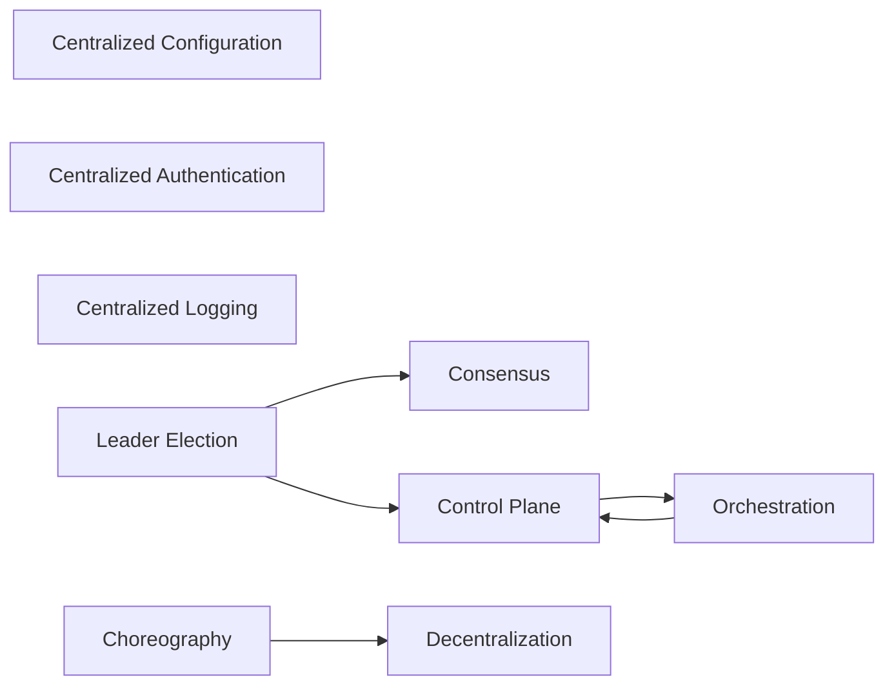
```mermaid
flowchart LR
    n_control_plane["Control Plane"]
    n_orchestration["Orchestration"]
    n_centralized_configuration["Centralized Configuration"]
    n_centralized_authentication["Centralized Authentication"]
    n_centralized_logging["Centralized Logging"]
    n_decentralization["Decentralization"]
    n_leader_election["Leader Election"]
    n_consensus["Consensus"]
    n_choreography["Choreography"]
    n_control_plane --> n_orchestration
    n_orchestration --> n_control_plane
    n_leader_election --> n_consensus
    n_leader_election --> n_control_plane
    n_choreography --> n_decentralization
```

### Control Plane

- Kind: [artifact](SCHEMA.md#kind-artifact)
- Category: [Control / Coordination / Centralization](PRINCIPLES.md#architecture-category-control-coordination-centralization)
- Severity: [contextual](SCHEMA.md#vocabulary-severity-contextual)
- Scope: platform, infrastructure, distributed system
- Layer: [Execution Core](SCHEMA.md#layer-execution-core)

Details

Definition
Descriptive data about the desired state of a distributed runtime, held in one place and applied to every node through a management interface.

Requires
[Management API](LEXICON.md#lexicon-management-api), [Policy](LEXICON.md#lexicon-policy)

Reinforces
[Governance](PRINCIPLES.md#architecture-governance), [Orchestration](PRINCIPLES.md#architecture-orchestration)

Enables
[Centralized Control of Distributed Runtime](LEXICON.md#lexicon-centralized-control-of-distributed-runtime)

In tension with
[Availability](LEXICON.md#lexicon-availability)

Conflicts with
[Fully Decentralized Control](LEXICON.md#lexicon-fully-decentralized-control)

Referenced by
[Orchestration](PRINCIPLES.md#architecture-orchestration), [Leader Election](PRINCIPLES.md#architecture-leader-election)

Contracts
[Control Plane](ALGORITHMS.md#algorithms-control-plane)

Tensions
[Control Plane / Availability](SCHEMA.md#tension-availability-control-plane)

Violated by
[Scattered Configuration](LEXICON.md#lexicon-scattered-configuration)

Detected by
manual node/service control

Measured by
control coverage, control-plane availability

Refactored by
[Management API](LEXICON.md#lexicon-management-api), [Policy as Code](PRINCIPLES.md#architecture-policy-as-code)

Enforced by
platform architecture

Before

```typescript
for (const node of fooNodes) {
  node.configure({ retries: 3, timeoutMs: 500 });
}
```

After

```typescript
controlPlane.apply("foo-service", {
  retries: 3,
  timeoutMs: 500,
  rollout: "progressive",
});
```

How it is checked

Checked by
platform architecture

Population
Every node, service and workflow step that shares configuration, identity, logs, leadership or agreement

Freshness
A verdict stands until membership, topology or the coordinating policy changes

Refusal
The workflow test or the platform policy rejects a participant that bypasses the coordinator or the agreed value

Observation
The control plane's recorded state compared with each participant's reported state

Evidence
None, because the catalog states this check as a class, so a watched run belongs to each system that adopts it

Authoritative side
The control plane's recorded state, which each participant's reported state is compared against

Depends on
[Management API](LEXICON.md#lexicon-management-api), [Policy](LEXICON.md#lexicon-policy), [Governance](PRINCIPLES.md#architecture-governance), [Orchestration](PRINCIPLES.md#architecture-orchestration), [Centralized Control of Distributed Runtime](LEXICON.md#lexicon-centralized-control-of-distributed-runtime)

Shape it refuses
[Fully Decentralized Control](LEXICON.md#lexicon-fully-decentralized-control)

### Orchestration

- Kind: [mechanism](SCHEMA.md#kind-mechanism)
- Category: [Control / Coordination / Centralization](PRINCIPLES.md#architecture-category-control-coordination-centralization)
- Severity: [contextual](SCHEMA.md#vocabulary-severity-contextual)
- Scope: workflow, deployment, services
- Layer: [Execution Core](SCHEMA.md#layer-execution-core)

Details

Definition
A mechanism that runs a multi-step workflow from one coordinator, which calls each step in order and tracks its outcome.

Requires
[Coordinator](LEXICON.md#lexicon-coordinator)

Reinforces
[Control Plane](PRINCIPLES.md#architecture-control-plane), [Saga Pattern](PRINCIPLES.md#architecture-saga-pattern)

Enables
[Ordered Multi-Step Execution](LEXICON.md#lexicon-ordered-multi-step-execution)

In tension with
[Centralized Coordinator Coupling](LEXICON.md#lexicon-centralized-coordinator-coupling)

Conflicts with
[Pure Choreography](LEXICON.md#lexicon-pure-choreography)

Referenced by
[Control Plane](PRINCIPLES.md#architecture-control-plane)

Contracts
[Workflow Creation Kernel](ALGORITHMS.md#algorithms-workflow-creation-kernel)

Tensions
[Orchestration / Centralized Coordinator Coupling](SCHEMA.md#tension-centralized-coordinator-coupling-orchestration)

Distinct from
[Coordinator](LEXICON.md#lexicon-coordinator): Orchestration is the mechanism of driving a workflow from one place, while the coordinator is the component that plays that role.

Violated by
[Pure Choreography](LEXICON.md#lexicon-pure-choreography)

Detected by
unclear workflow ownership

Measured by
workflow observability/completion

Refactored by
none

Enforced by
workflow tests

Before

```typescript
await fooService.create(foo);
await barService.create(bar);
await bazService.create(baz);
```

After

```typescript
await orchestrator.run("CreateFooFlow", {
  steps: [
    step("foo", () => fooService.create(foo)),
    step("bar", () => barService.create(bar)),
    step("baz", () => bazService.create(baz)),
  ],
});
```

How it is checked

Checked by
workflow tests

Population
Every node, service and workflow step that shares configuration, identity, logs, leadership or agreement

Freshness
A verdict stands until membership, topology or the coordinating policy changes

Refusal
The workflow test or the platform policy rejects a participant that bypasses the coordinator or the agreed value

Observation
The control plane's recorded state compared with each participant's reported state

Evidence
None, because the catalog states this check as a class, so a watched run belongs to each system that adopts it

Authoritative side
The control plane's recorded state, which each participant's reported state is compared against

Depends on
[Coordinator](LEXICON.md#lexicon-coordinator), [Control Plane](PRINCIPLES.md#architecture-control-plane), [Saga Pattern](PRINCIPLES.md#architecture-saga-pattern), [Ordered Multi-Step Execution](LEXICON.md#lexicon-ordered-multi-step-execution)

Shape it refuses
[Pure Choreography](LEXICON.md#lexicon-pure-choreography)

### Centralized Configuration

- Kind: [pattern](SCHEMA.md#kind-pattern)
- Category: [Control / Coordination / Centralization](PRINCIPLES.md#architecture-category-control-coordination-centralization)
- Severity: [contextual](SCHEMA.md#vocabulary-severity-contextual)
- Scope: service, platform, runtime
- Layer: [Execution Core](SCHEMA.md#layer-execution-core)

Details

Definition
A design pattern that keeps every service's configuration in one versioned store the services read from.

Requires
[Config Store](LEXICON.md#lexicon-config-store), [Access Control](PRINCIPLES.md#architecture-access-control)

Reinforces
[Governance](PRINCIPLES.md#architecture-governance), [Consistency](PRINCIPLES.md#architecture-consistency)

Enables
[Unified Config Management](LEXICON.md#lexicon-unified-config-management)

In tension with
[Central Dependency Risk](LEXICON.md#lexicon-central-dependency-risk)

Conflicts with
[Scattered Configuration](LEXICON.md#lexicon-scattered-configuration)

Tensions
[Centralized Configuration / Central Dependency Risk](SCHEMA.md#tension-central-dependency-risk-centralized-configuration)

Violated by
[Scattered Configuration](LEXICON.md#lexicon-scattered-configuration)

Detected by
config drift

Measured by
config drift count

Refactored by
[Schema Validation](PRINCIPLES.md#architecture-schema-validation)

Enforced by
config policy

Before

```typescript
const fooConfig = loadLocalFooConfig();
const barConfig = loadLocalBarConfig();
const bazConfig = loadLocalBazConfig();
```

After

```typescript
const config = await configService.readVersioned("platform/v3");
fooApp.apply(config.foo);
barApp.apply(config.bar);
bazApp.apply(config.baz);
```

How it is checked

Checked by
config policy

Population
Every node, service and workflow step that shares configuration, identity, logs, leadership or agreement

Freshness
A verdict stands until membership, topology or the coordinating policy changes

Refusal
The workflow test or the platform policy rejects a participant that bypasses the coordinator or the agreed value

Observation
The control plane's recorded state compared with each participant's reported state

Evidence
None, because the catalog states this check as a class, so a watched run belongs to each system that adopts it

Authoritative side
The control plane's recorded state, which each participant's reported state is compared against

Depends on
[Config Store](LEXICON.md#lexicon-config-store), [Access Control](PRINCIPLES.md#architecture-access-control), [Governance](PRINCIPLES.md#architecture-governance), [Consistency](PRINCIPLES.md#architecture-consistency), [Unified Config Management](LEXICON.md#lexicon-unified-config-management)

Shape it refuses
[Scattered Configuration](LEXICON.md#lexicon-scattered-configuration)

### Centralized Authentication

- Kind: [pattern](SCHEMA.md#kind-pattern)
- Category: [Control / Coordination / Centralization](PRINCIPLES.md#architecture-category-control-coordination-centralization)
- Severity: [recommended](SCHEMA.md#vocabulary-severity-recommended)
- Scope: identity, system
- Layer: [Execution Core](SCHEMA.md#layer-execution-core)

Details

Definition
A design pattern that verifies identity once, at a shared identity provider, and passes the result to each service.

Requires
[Identity Provider](LEXICON.md#lexicon-identity-provider)

Reinforces
[Security](LEXICON.md#lexicon-security), [Governance](PRINCIPLES.md#architecture-governance)

Enables
[Unified Identity](LEXICON.md#lexicon-unified-identity)

In tension with
[Identity Provider Availability](LEXICON.md#lexicon-identity-provider-availability)

Conflicts with
[Scattered Auth Implementations](LEXICON.md#lexicon-scattered-auth-implementations)

Tensions
[Centralized Authentication / Identity Provider Availability](SCHEMA.md#tension-centralized-authentication-identity-provider-availability)

Violated by
[Scattered Auth Implementations](LEXICON.md#lexicon-scattered-auth-implementations)

Detected by
duplicated credential stores

Measured by
auth centralization coverage

Refactored by
[Identity Provider](LEXICON.md#lexicon-identity-provider)

Enforced by
[security policy](ALGORITHMS.md#algorithms-security-policy)

Before

```typescript
fooService.verifyToken(token);
barService.verifyToken(token);
bazService.verifyToken(token);
```

After

```typescript
const identity = await identityProvider.authenticate(token);
await fooService.handle({ identity });
await barService.handle({ identity });
await bazService.handle({ identity });
```

How it is checked

Checked by
security policy

Population
Every node, service and workflow step that shares configuration, identity, logs, leadership or agreement

Freshness
A verdict stands until membership, topology or the coordinating policy changes

Refusal
The workflow test or the platform policy rejects a participant that bypasses the coordinator or the agreed value

Observation
The control plane's recorded state compared with each participant's reported state

Evidence
None, because the catalog states this check as a class, so a watched run belongs to each system that adopts it

Authoritative side
The control plane's recorded state, which each participant's reported state is compared against

Depends on
[Identity Provider](LEXICON.md#lexicon-identity-provider), [Security](LEXICON.md#lexicon-security), [Governance](PRINCIPLES.md#architecture-governance), [Unified Identity](LEXICON.md#lexicon-unified-identity)

Shape it refuses
[Scattered Auth Implementations](LEXICON.md#lexicon-scattered-auth-implementations)

### Centralized Logging

- Kind: [pattern](SCHEMA.md#kind-pattern)
- Category: [Control / Coordination / Centralization](PRINCIPLES.md#architecture-category-control-coordination-centralization)
- Severity: [recommended](SCHEMA.md#vocabulary-severity-recommended)
- Scope: services, platform
- Layer: [Execution Core](SCHEMA.md#layer-execution-core)

Details

Definition
A design pattern that ships structured logs from every instance to one aggregated store.

Requires
[Log Aggregation](LEXICON.md#lexicon-log-aggregation)

Reinforces
[Observability](PRINCIPLES.md#architecture-observability), [Auditability](PRINCIPLES.md#architecture-auditability)

Enables
[Cross-Service Analysis](LEXICON.md#lexicon-cross-service-analysis)

In tension with
[Cost/Personal Data Exposure](LEXICON.md#lexicon-cost-personal-data-exposure)

Conflicts with
[Local-Only Logs](LEXICON.md#lexicon-local-only-logs)

Tensions
[Centralized Logging / Cost/Personal Data Exposure](SCHEMA.md#tension-centralized-logging-cost-personal-data-exposure)

Violated by
[Local-Only Logs](LEXICON.md#lexicon-local-only-logs)

Detected by
missing log shipping

Measured by
log ingestion coverage

Refactored by
[Log Aggregation](LEXICON.md#lexicon-log-aggregation), [Canonical Data Model](PRINCIPLES.md#architecture-canonical-data-model)

Enforced by
observability policy

Before

```typescript
fooService.writeLocalLog(event);
barService.writeLocalLog(event);
bazService.writeLocalLog(event);
```

After

```typescript
const sink = new CentralLogSink();
fooService.useLogger(structuredLogger(sink));
barService.useLogger(structuredLogger(sink));
bazService.useLogger(structuredLogger(sink));
```

How it is checked

Checked by
observability policy

Population
Every node, service and workflow step that shares configuration, identity, logs, leadership or agreement

Freshness
A verdict stands until membership, topology or the coordinating policy changes

Refusal
The workflow test or the platform policy rejects a participant that bypasses the coordinator or the agreed value

Observation
The control plane's recorded state compared with each participant's reported state

Evidence
None, because the catalog states this check as a class, so a watched run belongs to each system that adopts it

Authoritative side
The control plane's recorded state, which each participant's reported state is compared against

Depends on
[Log Aggregation](LEXICON.md#lexicon-log-aggregation), [Observability](PRINCIPLES.md#architecture-observability), [Auditability](PRINCIPLES.md#architecture-auditability), [Cross-Service Analysis](LEXICON.md#lexicon-cross-service-analysis)

Shape it refuses
[Local-Only Logs](LEXICON.md#lexicon-local-only-logs)

### Decentralization

- Kind: [principle](SCHEMA.md#kind-principle)
- Category: [Control / Coordination / Centralization](PRINCIPLES.md#architecture-category-control-coordination-centralization)
- Severity: [contextual](SCHEMA.md#vocabulary-severity-contextual)
- Scope: system, team, service
- Layer: [Execution Core](SCHEMA.md#layer-execution-core)

Details

Definition
A design rule that decisions and runtime control sit with the teams and services that own them, joined by contracts.

Requires
[Autonomy](PRINCIPLES.md#architecture-autonomy), [Contracts](LEXICON.md#lexicon-contracts)

Reinforces
[Microservices](PRINCIPLES.md#architecture-microservices), [Resilience](PRINCIPLES.md#architecture-resilience)

Enables
[Independent Ownership](LEXICON.md#lexicon-independent-ownership)

In tension with
[Governance](PRINCIPLES.md#architecture-governance), [Consistency](PRINCIPLES.md#architecture-consistency)

Conflicts with
[Centralized Control](LEXICON.md#lexicon-centralized-control)

Referenced by
[Choreography](PRINCIPLES.md#architecture-choreography), [Autonomy](PRINCIPLES.md#architecture-autonomy), [Single Source of Truth](PRINCIPLES.md#architecture-single-source-of-truth)

Tensions
[Decentralization / Governance](SCHEMA.md#tension-decentralization-governance), [Decentralization / Consistency](SCHEMA.md#tension-consistency-decentralization)

Violated by
[Centralized Control](LEXICON.md#lexicon-centralized-control)

Detected by
centralized team/service dependency

Measured by
decision/deployment dependency count

Refactored by
[Assign Owner](LEXICON.md#lexicon-assign-owner), [Management API](LEXICON.md#lexicon-management-api)

Enforced by
ownership model

Before

```typescript
const coordinator = new GlobalFooCoordinator();
await coordinator.approveEveryFoo(foo);
```

After

```typescript
await fooNode.validate(foo);
await fooNode.commit(foo);
await fooNode.publish({ type: "FooCommitted", fooId: foo.id });
```

How it is checked

Checked by
ownership model

Population
Every node, service and workflow step that shares configuration, identity, logs, leadership or agreement

Freshness
A verdict stands until membership, topology or the coordinating policy changes

Refusal
The workflow test or the platform policy rejects a participant that bypasses the coordinator or the agreed value

Observation
The control plane's recorded state compared with each participant's reported state

Evidence
None, because the catalog states this check as a class, so a watched run belongs to each system that adopts it

Authoritative side
The control plane's recorded state, which each participant's reported state is compared against

Depends on
[Autonomy](PRINCIPLES.md#architecture-autonomy), [Contracts](LEXICON.md#lexicon-contracts), [Microservices](PRINCIPLES.md#architecture-microservices), [Resilience](PRINCIPLES.md#architecture-resilience), [Independent Ownership](LEXICON.md#lexicon-independent-ownership)

Shape it refuses
[Centralized Control](LEXICON.md#lexicon-centralized-control)

### Leader Election

- Kind: [mechanism](SCHEMA.md#kind-mechanism)
- Category: [Control / Coordination / Centralization](PRINCIPLES.md#architecture-category-control-coordination-centralization)
- Severity: [contextual](SCHEMA.md#vocabulary-severity-contextual)
- Mandatory for: distributed systems
- Scope: distributed system, coordination, availability
- Layer: [Execution Core](SCHEMA.md#layer-execution-core)

Details

Definition
A mechanism that lets a group of nodes agree on one coordinator and replace it when it fails.

Requires
[Consensus](PRINCIPLES.md#architecture-consensus)

Reinforces
[Control Plane](PRINCIPLES.md#architecture-control-plane), [Fault Tolerance](PRINCIPLES.md#architecture-fault-tolerance)

Enables
[Single-Writer Coordination](LEXICON.md#lexicon-single-writer-coordination), [Automatic Failover of Leadership](LEXICON.md#lexicon-automatic-failover-of-leadership)

In tension with
[Availability](LEXICON.md#lexicon-availability)

Conflicts with
[Split-Brain Coordination](LEXICON.md#lexicon-split-brain-coordination)

Tensions
[Leader Election / Availability](SCHEMA.md#tension-availability-leader-election)

Violated by
[Split-Brain Coordination](LEXICON.md#lexicon-split-brain-coordination)

Detected by
concurrent leader actions / split-brain

Measured by
split-brain incident rate

Refactored by
none

Enforced by
distributed-systems review

Before

```typescript
if (process.env.IS_LEADER === "true") runFooScheduler();
```

After

```typescript
const lease = await fooCoordinator.acquireLeadership("foo-scheduler", {
  ttlMs: 10_000,
});
lease.onAcquired(() => runFooScheduler());
lease.onLost(() => stopFooScheduler());
```

How it is checked

Checked by
distributed-systems review

Population
Every node, service and workflow step that shares configuration, identity, logs, leadership or agreement

Freshness
A verdict stands until membership, topology or the coordinating policy changes

Refusal
The workflow test or the platform policy rejects a participant that bypasses the coordinator or the agreed value

Observation
The control plane's recorded state compared with each participant's reported state

Evidence
None, because the catalog states this check as a class, so a watched run belongs to each system that adopts it

Authoritative side
The control plane's recorded state, which each participant's reported state is compared against

Depends on
[Consensus](PRINCIPLES.md#architecture-consensus), [Control Plane](PRINCIPLES.md#architecture-control-plane), [Fault Tolerance](PRINCIPLES.md#architecture-fault-tolerance), [Single-Writer Coordination](LEXICON.md#lexicon-single-writer-coordination), [Automatic Failover of Leadership](LEXICON.md#lexicon-automatic-failover-of-leadership)

Shape it refuses
[Split-Brain Coordination](LEXICON.md#lexicon-split-brain-coordination)

### Consensus

- Kind: [mechanism](SCHEMA.md#kind-mechanism)
- Category: [Control / Coordination / Centralization](PRINCIPLES.md#architecture-category-control-coordination-centralization)
- Severity: [contextual](SCHEMA.md#vocabulary-severity-contextual)
- Mandatory for: distributed systems
- Scope: distributed system, agreement, consistency
- Layer: [Execution Core](SCHEMA.md#layer-execution-core)

Details

Definition
A mechanism that lets a quorum of nodes commit one value, so every correct node ends up with the same value.

Requires
[Quorum](LEXICON.md#lexicon-quorum)

Reinforces
[Consistency](PRINCIPLES.md#architecture-consistency), [Fault Tolerance](PRINCIPLES.md#architecture-fault-tolerance)

Enables
[Agreed Single Value Across Nodes](LEXICON.md#lexicon-agreed-single-value-across-nodes)

In tension with
[Latency](PRINCIPLES.md#architecture-latency), [Availability](LEXICON.md#lexicon-availability)

Conflicts with
[Independent Node Decisions](LEXICON.md#lexicon-independent-node-decisions)

Referenced by
[Total-Order Broadcast](PRINCIPLES.md#architecture-total-order-broadcast), [Leader Election](PRINCIPLES.md#architecture-leader-election)

Tensions
[Consensus / Latency](SCHEMA.md#tension-consensus-latency), [Consensus / Availability](SCHEMA.md#tension-availability-consensus)

Distinct from
[Leader Election](PRINCIPLES.md#architecture-leader-election): Consensus commits one value across a quorum, while leader election uses it to agree on one coordinator and replace it when it fails.

Distinct from
[Total-Order Broadcast](PRINCIPLES.md#architecture-total-order-broadcast): Consensus agrees on one value, while total-order broadcast agrees on the order of every message.

Violated by
[Independent Node Decisions](LEXICON.md#lexicon-independent-node-decisions)

Detected by
divergent committed state across replicas

Measured by
agreement-violation rate

Refactored by
none

Enforced by
distributed-systems review

Before

```typescript
fooNodeA.setValue(value);
```

After

```typescript
const committed = await fooCluster.propose(value, {
  quorum: majority(fooNodes),
});
if (!committed.accepted) throw new NoQuorumError();
```

How it is checked

Checked by
distributed-systems review

Population
Every node, service and workflow step that shares configuration, identity, logs, leadership or agreement

Freshness
A verdict stands until membership, topology or the coordinating policy changes

Refusal
The workflow test or the platform policy rejects a participant that bypasses the coordinator or the agreed value

Observation
The control plane's recorded state compared with each participant's reported state

Evidence
None, because the catalog states this check as a class, so a watched run belongs to each system that adopts it

Authoritative side
The control plane's recorded state, which each participant's reported state is compared against

Depends on
[Quorum](LEXICON.md#lexicon-quorum), [Consistency](PRINCIPLES.md#architecture-consistency), [Fault Tolerance](PRINCIPLES.md#architecture-fault-tolerance), [Agreed Single Value Across Nodes](LEXICON.md#lexicon-agreed-single-value-across-nodes)

Shape it refuses
[Independent Node Decisions](LEXICON.md#lexicon-independent-node-decisions)

### Choreography

- Kind: [mechanism](SCHEMA.md#kind-mechanism)
- Category: [Control / Coordination / Centralization](PRINCIPLES.md#architecture-category-control-coordination-centralization)
- Severity: [contextual](SCHEMA.md#vocabulary-severity-contextual)
- Scope: distributed system, coordination, event
- Layer: [Execution Core](SCHEMA.md#layer-execution-core)

Details

Definition
A mechanism that coordinates a cross-service flow through events, with each service reacting to the previous one's event.

Requires
[Event-Driven Architecture](PRINCIPLES.md#architecture-event-driven-architecture)

Reinforces
[Decentralization](PRINCIPLES.md#architecture-decentralization), [Autonomy](PRINCIPLES.md#architecture-autonomy)

Enables
[Central-Orchestrator-Free Coordination](LEXICON.md#lexicon-central-orchestrator-free-coordination)

In tension with
[Traceability](PRINCIPLES.md#architecture-traceability)

Conflicts with
[Central Orchestrator Bottleneck](LEXICON.md#lexicon-central-orchestrator-bottleneck)

Tensions
[Choreography / Traceability](SCHEMA.md#tension-choreography-traceability)

Violated by
[Central Orchestrator Bottleneck](LEXICON.md#lexicon-central-orchestrator-bottleneck)

Detected by
a central coordinator coupled to all participants

Measured by
orchestrator fan-out coupling

Refactored by
none

Enforced by
[architecture review](PRINCIPLES.md#architecture-architecture-review)

Before

```typescript
await orchestrator.run("CreateFoo", [
  () => createFoo(foo),
  () => reserveBar(foo),
  () => notifyBaz(foo),
]);
```

After

```typescript
fooEvents.on("FooCreated", (event) => barService.reserve(event.fooId));
barEvents.on("BarReserved", (event) => bazService.notify(event.fooId));
```

How it is checked

Checked by
architecture review

Population
Every node, service and workflow step that shares configuration, identity, logs, leadership or agreement

Freshness
A verdict stands until membership, topology or the coordinating policy changes

Refusal
The workflow test or the platform policy rejects a participant that bypasses the coordinator or the agreed value

Observation
The control plane's recorded state compared with each participant's reported state

Evidence
None, because the catalog states this check as a class, so a watched run belongs to each system that adopts it

Authoritative side
The control plane's recorded state, which each participant's reported state is compared against

Depends on
[Event-Driven Architecture](PRINCIPLES.md#architecture-event-driven-architecture), [Decentralization](PRINCIPLES.md#architecture-decentralization), [Autonomy](PRINCIPLES.md#architecture-autonomy), [Central-Orchestrator-Free Coordination](LEXICON.md#lexicon-central-orchestrator-free-coordination)

Shape it refuses
[Central Orchestrator Bottleneck](LEXICON.md#lexicon-central-orchestrator-bottleneck)

## Correctness / Determinism / Verification

Every principle in this category is listed as a record. Each record carries its kind, its severity, the scopes it applies at and the layer it lives in, then the edge relations that join it to other records, the records that point back at it, the contracts that answer to it and the tensions it takes part in. The descriptors say how it is violated, detected, measured, repaired and enforced. Where the record carries one, an exemplar shows the shape before and after the principle is applied.

Relations diagram

The relations inside this category.

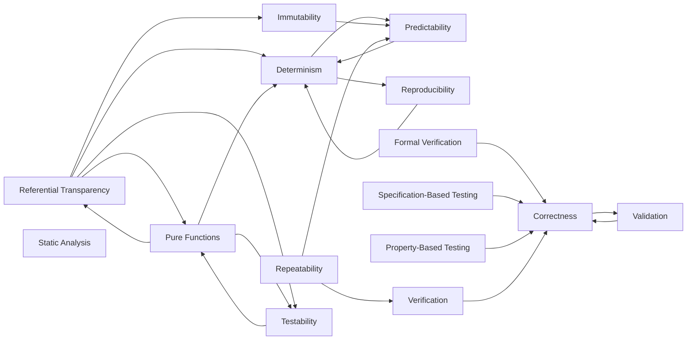
```mermaid
flowchart LR
    n_determinism["Determinism"]
    n_predictability["Predictability"]
    n_referential_transparency["Referential Transparency"]
    n_pure_functions["Pure Functions"]
    n_immutability["Immutability"]
    n_reproducibility["Reproducibility"]
    n_repeatability["Repeatability"]
    n_correctness["Correctness"]
    n_formal_verification["Formal Verification"]
    n_specification_based_testing["Specification-Based Testing"]
    n_property_based_testing["Property-Based Testing"]
    n_static_analysis["Static Analysis"]
    n_testability["Testability"]
    n_validation["Validation"]
    n_verification["Verification"]
    n_determinism --> n_predictability
    n_determinism --> n_reproducibility
    n_predictability --> n_determinism
    n_referential_transparency --> n_pure_functions
    n_referential_transparency --> n_immutability
    n_referential_transparency --> n_determinism
    n_referential_transparency --> n_testability
    n_pure_functions --> n_testability
    n_pure_functions --> n_determinism
    n_pure_functions --> n_referential_transparency
    n_immutability --> n_predictability
    n_reproducibility --> n_determinism
    n_repeatability --> n_verification
    n_repeatability --> n_predictability
    n_correctness --> n_validation
    n_formal_verification --> n_correctness
    n_specification_based_testing --> n_correctness
    n_property_based_testing --> n_correctness
    n_testability --> n_pure_functions
    n_validation --> n_correctness
    n_verification --> n_correctness
```

### Determinism

- Kind: [principle](SCHEMA.md#kind-principle)
- Category: [Correctness / Determinism / Verification](PRINCIPLES.md#architecture-category-correctness-determinism-verification)
- Severity: [recommended](SCHEMA.md#vocabulary-severity-recommended)
- Scope: function, process, build, test
- Layer: [Computation Core](SCHEMA.md#layer-computation-core)

Details

Definition
A design rule that the same inputs and state always produce the same result, with time and randomness passed in as inputs.

Requires
[Controlled State](LEXICON.md#lexicon-controlled-state), [Controlled State](LEXICON.md#lexicon-controlled-state)

Reinforces
[Predictability](PRINCIPLES.md#architecture-predictability), [Reproducibility](PRINCIPLES.md#architecture-reproducibility)

Enables
[Reliable Testing](LEXICON.md#lexicon-reliable-testing)

In tension with
[Runtime Adaptivity](LEXICON.md#lexicon-runtime-adaptivity)

Conflicts with
[Hidden Time/Randomness/Global State](LEXICON.md#lexicon-hidden-time-randomness-global-state)

Referenced by
[Predictability](PRINCIPLES.md#architecture-predictability), [Referential Transparency](PRINCIPLES.md#architecture-referential-transparency), [Pure Functions](PRINCIPLES.md#architecture-pure-functions), [Reproducibility](PRINCIPLES.md#architecture-reproducibility), [Artificial Intelligence Architecture](PRINCIPLES.md#architecture-artificial-intelligence-architecture), [Agentic Architecture](PRINCIPLES.md#architecture-agentic-architecture), [Write Scope and Read Population](PRINCIPLES.md#architecture-write-scope-and-read-population), [One-Sided Liveness](PRINCIPLES.md#architecture-one-sided-liveness), [Declare-Before-Read Order](PRINCIPLES.md#architecture-declare-before-read-order), [Derived Party Count](PRINCIPLES.md#architecture-derived-party-count), [Externally Resolved Slot](PRINCIPLES.md#architecture-externally-resolved-slot)

Contracts
[Computation Core](ALGORITHMS.md#algorithms-computation-core)

Tensions
[Determinism / Runtime Adaptivity](SCHEMA.md#tension-determinism-runtime-adaptivity)

Distinct from
[Referential Transparency](PRINCIPLES.md#architecture-referential-transparency): Determinism is the same inputs giving the same result, while referential transparency is being able to replace an expression by its value.

Violated by
[Hidden Time/Randomness/Global State](LEXICON.md#lexicon-hidden-time-randomness-global-state)

Detected by
flaky tests, hidden random/time calls

Measured by
flake rate, reproducibility score

Refactored by
[Inject Clock and Randomness](LEXICON.md#lexicon-inject-clock-and-randomness), [Encapsulate State](LEXICON.md#lexicon-encapsulate-state)

Enforced by
deterministic test rules

Before

```typescript
function makeFoo(name: string) {
  return { id: crypto.randomUUID(), name, createdAt: new Date() };
}
```

After

```typescript
function makeFoo(name: string, id: FooId, createdAt: Date): Foo {
  return { id, name, createdAt };
}
```

How it is checked

Checked by
deterministic test rules

Population
Every function, build and test run whose result the verification claims to hold

Freshness
A verdict stands for the code, inputs and dependency versions it ran against, and goes stale when any of them changes

Refusal
The failing test, proof or analyzer finding fails the gate

Observation
Test, proof and analyzer results, plus reruns that show whether a result repeats

Evidence
None, because the catalog states this check as a class, so a watched run belongs to each system that adopts it

Authoritative side
The specification the test or proof encodes, which a result is compared against

Depends on
[Controlled State](LEXICON.md#lexicon-controlled-state), [Controlled State](LEXICON.md#lexicon-controlled-state), [Predictability](PRINCIPLES.md#architecture-predictability), [Reproducibility](PRINCIPLES.md#architecture-reproducibility), [Reliable Testing](LEXICON.md#lexicon-reliable-testing)

Shape it refuses
[Hidden Time/Randomness/Global State](LEXICON.md#lexicon-hidden-time-randomness-global-state)

### Predictability

- Kind: [quality-attribute](SCHEMA.md#kind-quality-attribute)
- Category: [Correctness / Determinism / Verification](PRINCIPLES.md#architecture-category-correctness-determinism-verification)
- Severity: [recommended](SCHEMA.md#vocabulary-severity-recommended)
- Scope: API, module, runtime
- Layer: [Computation Core](SCHEMA.md#layer-computation-core)

Details

Definition
The degree to which a caller can foresee what an operation does from its interface and contract.

Requires
[Determinism](PRINCIPLES.md#architecture-determinism), [Explicit Contracts](PRINCIPLES.md#architecture-explicit-contracts)

Reinforces
[Principle of Least Surprise](PRINCIPLES.md#architecture-principle-of-least-surprise)

Enables
[Safe Refactoring](LEXICON.md#lexicon-safe-refactoring)

In tension with
[Dynamic Runtime Behavior](LEXICON.md#lexicon-dynamic-runtime-behavior)

Conflicts with
[Hidden Behavior](LEXICON.md#lexicon-hidden-behavior)

Referenced by
[Runtime Discovery](PRINCIPLES.md#architecture-runtime-discovery), [Dynamic Binding](PRINCIPLES.md#architecture-dynamic-binding), [Runtime Extensibility](PRINCIPLES.md#architecture-runtime-extensibility), [Design by Contract](PRINCIPLES.md#architecture-design-by-contract), [Explicit Contracts](PRINCIPLES.md#architecture-explicit-contracts), [API Contract](PRINCIPLES.md#architecture-api-contract), [Postconditions](PRINCIPLES.md#architecture-postconditions), [Determinism](PRINCIPLES.md#architecture-determinism), [Immutability](PRINCIPLES.md#architecture-immutability), [Repeatability](PRINCIPLES.md#architecture-repeatability), [Pattern Consistency](PRINCIPLES.md#architecture-pattern-consistency), [Declarative Configuration](PRINCIPLES.md#architecture-declarative-configuration), [Convention over Configuration](PRINCIPLES.md#architecture-convention-over-configuration), [Principle of Least Surprise](PRINCIPLES.md#architecture-principle-of-least-surprise), [State Isolation](PRINCIPLES.md#architecture-state-isolation), [Controlled Side Effects](PRINCIPLES.md#architecture-controlled-side-effects)

Tensions
[Predictability / Dynamic Runtime Behavior](SCHEMA.md#tension-dynamic-runtime-behavior-predictability)

Distinct from
[Correctness](PRINCIPLES.md#architecture-correctness): Predictability is foreseeing behavior from the contract, while correctness is the behavior matching its specification.

Distinct from
[Pattern Consistency](PRINCIPLES.md#architecture-pattern-consistency): Predictability is foreseeing one operation, while pattern consistency is one problem solved one way across the codebase.

Distinct from
[Interoperability](PRINCIPLES.md#architecture-interoperability): Predictability is a caller foreseeing behavior, while interoperability is systems exchanging data.

Distinct from
[Reproducibility](PRINCIPLES.md#architecture-reproducibility): Predictability is foreseeing what an operation does, while reproducibility is a run giving the same output from pinned inputs on another machine.

Distinct from
[Testability](PRINCIPLES.md#architecture-testability): Predictability is foreseeing behavior, while testability is exercising code in isolation.

Distinct from
[Concurrency Correctness](LEXICON.md#lexicon-concurrency-correctness): Predictability is foreseeing behavior from a contract, while concurrency correctness is freedom from races when units run at once.

Distinct from
[Dynamic Runtime Behavior](LEXICON.md#lexicon-dynamic-runtime-behavior): Predictability is foreseeable behavior, while dynamic runtime behavior is the adaptivity that undermines it.

Distinct from
[Maintainability](LEXICON.md#lexicon-maintainability): Predictability is foreseeing behavior, while maintainability is the ease of changing it.

Distinct from
[Security](LEXICON.md#lexicon-security): Predictability is foreseeable behavior, while security is protection from misuse.

Distinct from
[Startup Cost](LEXICON.md#lexicon-startup-cost): Predictability is foreseeable behavior, while startup cost is the time discovery adds at initialization.

Distinct from
[Repeatability](PRINCIPLES.md#architecture-repeatability): Predictability is foreseeing an outcome from the contract, while repeatability is rerunning and observing the same outcome.

Distinct from
[Runtime Extensibility](PRINCIPLES.md#architecture-runtime-extensibility): Predictability is fixed, foreseeable behavior, while runtime extensibility is adding capability to a running system.

Distinct from
[Static Safety](LEXICON.md#lexicon-static-safety): Predictability is a caller foreseeing behavior, while static safety is the compiler catching classes of error before the code runs.

Distinct from
[Thread Safety](LEXICON.md#lexicon-thread-safety): Predictability is foreseeing behavior from a contract, while thread safety is data surviving concurrent access uncorrupted.

Violated by
[Hidden Side Effect](PRINCIPLES.md#architecture-hidden-side-effect), [Temporal Coupling](PRINCIPLES.md#architecture-temporal-coupling)

Detected by
nondeterministic tests, ambiguous APIs

Measured by
flake/misuse rate

Refactored by
[Declare Capability](LEXICON.md#lexicon-declare-capability), [Define Contract](LEXICON.md#lexicon-define-contract)

Enforced by
[tests](LEXICON.md#lexicon-tests), [contracts](LEXICON.md#lexicon-contracts), linting

Before

```typescript
function saveFoo(foo: Foo) {
  if (Math.random() > 0.5) return memoryStore.save(foo);
  return sqlStore.save(foo);
}
```

After

```typescript
function saveFoo(store: FooStore, foo: Foo) {
  return store.save(foo);
}
```

How it is checked

Checked by
tests, contracts, linting

Population
Every function, build and test run whose result the verification claims to hold

Freshness
A verdict stands for the code, inputs and dependency versions it ran against, and goes stale when any of them changes

Refusal
The failing test, proof or analyzer finding fails the gate

Observation
Test, proof and analyzer results, plus reruns that show whether a result repeats

Evidence
None, because the catalog states this check as a class, so a watched run belongs to each system that adopts it

Authoritative side
The specification the test or proof encodes, which a result is compared against

Depends on
[Determinism](PRINCIPLES.md#architecture-determinism), [Explicit Contracts](PRINCIPLES.md#architecture-explicit-contracts), [Principle of Least Surprise](PRINCIPLES.md#architecture-principle-of-least-surprise), [Safe Refactoring](LEXICON.md#lexicon-safe-refactoring)

Shape it refuses
[Hidden Behavior](LEXICON.md#lexicon-hidden-behavior)

### Referential Transparency

- Kind: [principle](SCHEMA.md#kind-principle)
- Category: [Correctness / Determinism / Verification](PRINCIPLES.md#architecture-category-correctness-determinism-verification)
- Severity: [contextual](SCHEMA.md#vocabulary-severity-contextual)
- Scope: function, expression
- Layer: [Computation Core](SCHEMA.md#layer-computation-core)

Details

Definition
A design rule that an expression can be replaced by its value without changing the program's behavior.

Requires
[Pure Functions](PRINCIPLES.md#architecture-pure-functions), [Immutability](PRINCIPLES.md#architecture-immutability)

Reinforces
[Determinism](PRINCIPLES.md#architecture-determinism), [Testability](PRINCIPLES.md#architecture-testability)

Enables
[Safe Substitution](LEXICON.md#lexicon-safe-substitution)

In tension with
[Stateful IO](LEXICON.md#lexicon-stateful-io)

Conflicts with
[Side Effects](LEXICON.md#lexicon-side-effects)

Referenced by
[Pure Functions](PRINCIPLES.md#architecture-pure-functions)

Tensions
[Referential Transparency / Stateful IO](SCHEMA.md#tension-referential-transparency-stateful-io)

Distinct from
[Immutability](PRINCIPLES.md#architecture-immutability): Referential transparency lets an expression be replaced by its value, while immutability forbids a value from changing after creation.

Violated by
[Hidden Time/Randomness/Global State](LEXICON.md#lexicon-hidden-time-randomness-global-state)

Detected by
hidden dependency on time/random/global state

Measured by
pure function coverage

Refactored by
[Pure Functions](PRINCIPLES.md#architecture-pure-functions), [Dependency Injection](PRINCIPLES.md#architecture-dependency-injection)

Enforced by
[code review](PRINCIPLES.md#architecture-code-review), functional boundaries

Before

```typescript
function fooTotal(values: number[]) {
  globalCounter += 1;
  return values.reduce((a, b) => a + b, 0) + globalCounter;
}
```

After

```typescript
function fooTotal(values: readonly number[]) {
  return values.reduce((a, b) => a + b, 0);
}
```

How it is checked

Checked by
code review, functional boundaries

Population
Every function, build and test run whose result the verification claims to hold

Freshness
A verdict stands for the code, inputs and dependency versions it ran against, and goes stale when any of them changes

Refusal
The failing test, proof or analyzer finding fails the gate

Observation
Test, proof and analyzer results, plus reruns that show whether a result repeats

Evidence
None, because the catalog states this check as a class, so a watched run belongs to each system that adopts it

Authoritative side
The specification the test or proof encodes, which a result is compared against

Depends on
[Pure Functions](PRINCIPLES.md#architecture-pure-functions), [Immutability](PRINCIPLES.md#architecture-immutability), [Determinism](PRINCIPLES.md#architecture-determinism), [Testability](PRINCIPLES.md#architecture-testability), [Safe Substitution](LEXICON.md#lexicon-safe-substitution)

Shape it refuses
[Side Effects](LEXICON.md#lexicon-side-effects)

### Pure Functions

- Kind: [technique](SCHEMA.md#kind-technique)
- Category: [Correctness / Determinism / Verification](PRINCIPLES.md#architecture-category-correctness-determinism-verification)
- Severity: [recommended](SCHEMA.md#vocabulary-severity-recommended)
- Scope: function, domain logic
- Layer: [Computation Core](SCHEMA.md#layer-computation-core)

Details

Definition
A technique for writing logic as functions whose result depends only on their arguments and which have no side effects.

Requires
[No Side Effects](LEXICON.md#lexicon-no-side-effects), [Explicit Inputs](LEXICON.md#lexicon-explicit-inputs)

Reinforces
[Testability](PRINCIPLES.md#architecture-testability), [Determinism](PRINCIPLES.md#architecture-determinism)

Enables
[Referential Transparency](PRINCIPLES.md#architecture-referential-transparency)

In tension with
[Stateful Operations](LEXICON.md#lexicon-stateful-operations)

Conflicts with
[Hidden IO](LEXICON.md#lexicon-hidden-io)

Referenced by
[Referential Transparency](PRINCIPLES.md#architecture-referential-transparency), [Testability](PRINCIPLES.md#architecture-testability)

Tensions
[Pure Functions / Stateful Operations](SCHEMA.md#tension-pure-functions-stateful-operations)

Violated by
[Side Effects](LEXICON.md#lexicon-side-effects), [Hidden IO](LEXICON.md#lexicon-hidden-io)

Detected by
side-effect calls inside pure layer

Measured by
pure core ratio

Refactored by
[Pure Core / Imperative Shell](LEXICON.md#lexicon-pure-core-imperative-shell)

Enforced by
layer rules, [tests](LEXICON.md#lexicon-tests)

Before

```typescript
function normalizeFoo(foo: Foo) {
  foo.name = foo.name.trim();
  fooStore.save(foo);
  return foo;
}
```

After

```typescript
function normalizeFoo(foo: Foo): Foo {
  return { ...foo, name: foo.name.trim() };
}
```

How it is checked

Checked by
layer rules, tests

Population
Every function, build and test run whose result the verification claims to hold

Freshness
A verdict stands for the code, inputs and dependency versions it ran against, and goes stale when any of them changes

Refusal
The failing test, proof or analyzer finding fails the gate

Observation
Test, proof and analyzer results, plus reruns that show whether a result repeats

Evidence
None, because the catalog states this check as a class, so a watched run belongs to each system that adopts it

Authoritative side
The specification the test or proof encodes, which a result is compared against

Depends on
[No Side Effects](LEXICON.md#lexicon-no-side-effects), [Explicit Inputs](LEXICON.md#lexicon-explicit-inputs), [Testability](PRINCIPLES.md#architecture-testability), [Determinism](PRINCIPLES.md#architecture-determinism), [Referential Transparency](PRINCIPLES.md#architecture-referential-transparency)

Shape it refuses
[Hidden IO](LEXICON.md#lexicon-hidden-io)

### Immutability

- Kind: [principle](SCHEMA.md#kind-principle)
- Category: [Correctness / Determinism / Verification](PRINCIPLES.md#architecture-category-correctness-determinism-verification)
- Severity: [recommended](SCHEMA.md#vocabulary-severity-recommended)
- Scope: data, value object, concurrency
- Layer: [Computation Core](SCHEMA.md#layer-computation-core)

Details

Definition
A design rule that a value is never changed after it is created, and a change produces a new value.

Requires
[Value Semantics](LEXICON.md#lexicon-value-semantics)

Reinforces
[Thread Safety](LEXICON.md#lexicon-thread-safety), [Predictability](PRINCIPLES.md#architecture-predictability)

Enables
[Safe Sharing](LEXICON.md#lexicon-safe-sharing)

In tension with
[Allocation Cost](LEXICON.md#lexicon-allocation-cost)

Conflicts with
[Shared Mutable State](PRINCIPLES.md#architecture-shared-mutable-state)

Referenced by
[Value Object](PRINCIPLES.md#architecture-value-object), [Referential Transparency](PRINCIPLES.md#architecture-referential-transparency), [Independent Lifetime Axes](PRINCIPLES.md#architecture-independent-lifetime-axes)

Tensions
[Immutability / Allocation Cost](SCHEMA.md#tension-allocation-cost-immutability)

Violated by
[Shared Mutable State](PRINCIPLES.md#architecture-shared-mutable-state), [Exposed Internals](LEXICON.md#lexicon-exposed-internals)

Detected by
setters on value objects, mutable public fields

Measured by
mutable state count

Refactored by
[Make Immutable](LEXICON.md#lexicon-make-immutable)

Enforced by
type system, lint rules

Refused by rules
immutability

Before

```typescript
type Foo = { name: string; tags: string[] };
function addTag(foo: Foo, tag: string) {
  foo.tags.push(tag);
  return foo;
}
```

After

```typescript
type Foo = Readonly<{ name: string; tags: readonly string[] }>;
function addTag(foo: Foo, tag: string): Foo {
  return { ...foo, tags: [...foo.tags, tag] };
}
```

How it is checked

Checked by
type system, lint rules

Population
Every function, build and test run whose result the verification claims to hold

Freshness
A verdict stands for the code, inputs and dependency versions it ran against, and goes stale when any of them changes

Refusal
The failing test, proof or analyzer finding fails the gate

Observation
Test, proof and analyzer results, plus reruns that show whether a result repeats

Evidence
None, because the catalog states this check as a class, so a watched run belongs to each system that adopts it

Authoritative side
The specification the test or proof encodes, which a result is compared against

Depends on
[Value Semantics](LEXICON.md#lexicon-value-semantics), [Thread Safety](LEXICON.md#lexicon-thread-safety), [Predictability](PRINCIPLES.md#architecture-predictability), [Safe Sharing](LEXICON.md#lexicon-safe-sharing)

Shape it refuses
[Shared Mutable State](PRINCIPLES.md#architecture-shared-mutable-state)

### Reproducibility

- Kind: [quality-attribute](SCHEMA.md#kind-quality-attribute)
- Category: [Correctness / Determinism / Verification](PRINCIPLES.md#architecture-category-correctness-determinism-verification)
- Severity: [recommended](SCHEMA.md#vocabulary-severity-recommended)
- Scope: build, test, deployment, ML
- Layer: [Computation Core](SCHEMA.md#layer-computation-core)

Details

Definition
The degree to which a build, test or training run gives the same output from the same pinned inputs on another machine.

Requires
[Determinism](PRINCIPLES.md#architecture-determinism), [Versioned Inputs](LEXICON.md#lexicon-versioned-inputs)

Reinforces
[Auditability](PRINCIPLES.md#architecture-auditability)

Enables
[Debugging](LEXICON.md#lexicon-debugging), [Compliance](PRINCIPLES.md#architecture-compliance)

In tension with
[Continuous Updates](LEXICON.md#lexicon-continuous-updates)

Conflicts with
[Floating Dependencies](LEXICON.md#lexicon-floating-dependencies), [Flaky Test Normalization](PRINCIPLES.md#architecture-flaky-test-normalization)

Referenced by
[Determinism](PRINCIPLES.md#architecture-determinism), [Environment Parity](PRINCIPLES.md#architecture-environment-parity), [Infrastructure as Code](PRINCIPLES.md#architecture-infrastructure-as-code), [Immutable Infrastructure](PRINCIPLES.md#architecture-immutable-infrastructure), [Machine Learning Architecture](PRINCIPLES.md#architecture-machine-learning-architecture), [Prompt Engineering](PRINCIPLES.md#architecture-prompt-engineering), [Benchmarking](PRINCIPLES.md#architecture-benchmarking)

Tensions
[Reproducibility / Continuous Updates](SCHEMA.md#tension-continuous-updates-reproducibility)

Distinct from
[Continuous Updates](LEXICON.md#lexicon-continuous-updates): Reproducibility pins every input, while continuous updates are the dependency changes that pinning holds back.

Violated by
[Floating Dependencies](LEXICON.md#lexicon-floating-dependencies)

Detected by
build output drift

Measured by
reproducible build/test pass rate

Refactored by
[Pin Versions](LEXICON.md#lexicon-pin-versions)

Enforced by
lockfiles, build verification

Before

```typescript
const result = trainFoo(data, { seed: Math.random() });
```

After

```typescript
const config = {
  seed: 42,
  datasetVersion: "foo-v3",
  algorithmVersion: "1.2.0",
} as const;
const result = trainFoo(data, config);
```

How it is checked

Checked by
lockfiles, build verification

Population
Every function, build and test run whose result the verification claims to hold

Freshness
A verdict stands for the code, inputs and dependency versions it ran against, and goes stale when any of them changes

Refusal
The failing test, proof or analyzer finding fails the gate

Observation
Test, proof and analyzer results, plus reruns that show whether a result repeats

Evidence
None, because the catalog states this check as a class, so a watched run belongs to each system that adopts it

Authoritative side
The specification the test or proof encodes, which a result is compared against

Depends on
[Determinism](PRINCIPLES.md#architecture-determinism), [Versioned Inputs](LEXICON.md#lexicon-versioned-inputs), [Auditability](PRINCIPLES.md#architecture-auditability), [Debugging](LEXICON.md#lexicon-debugging), [Compliance](PRINCIPLES.md#architecture-compliance)

Shape it refuses
[Floating Dependencies](LEXICON.md#lexicon-floating-dependencies), [Flaky Test Normalization](PRINCIPLES.md#architecture-flaky-test-normalization)

### Repeatability

- Kind: [quality-attribute](SCHEMA.md#kind-quality-attribute)
- Category: [Correctness / Determinism / Verification](PRINCIPLES.md#architecture-category-correctness-determinism-verification)
- Severity: [mandatory](SCHEMA.md#vocabulary-severity-mandatory)
- Scope: test, build, process
- Layer: [Computation Core](SCHEMA.md#layer-computation-core)

Details

Definition
The degree to which rerunning the same test or process in the same environment gives the same result.

Requires
[Controlled State](LEXICON.md#lexicon-controlled-state)

Reinforces
[Verification](PRINCIPLES.md#architecture-verification), [Predictability](PRINCIPLES.md#architecture-predictability)

Enables
[Reliable Automation](LEXICON.md#lexicon-reliable-automation)

In tension with
[Real-World Variability](LEXICON.md#lexicon-real-world-variability)

Conflicts with
[Environment-Sensitive Behavior](LEXICON.md#lexicon-environment-sensitive-behavior)

Tensions
[Repeatability / Real-World Variability](SCHEMA.md#tension-real-world-variability-repeatability)

Distinct from
[Real-World Variability](LEXICON.md#lexicon-real-world-variability): Repeatability is the same result from a controlled rerun, while real-world variability is how far those controlled conditions differ from production.

Violated by
[Environment-Sensitive Behavior](LEXICON.md#lexicon-environment-sensitive-behavior)

Detected by
flaky test results

Measured by
rerun consistency

Refactored by
[Containerization](PRINCIPLES.md#architecture-containerization), [Fake at the Boundary](LEXICON.md#lexicon-fake-at-the-boundary)

Enforced by
CI rerun policy

Before

```typescript
test("foo", () => expect(runFoo(Date.now())).toEqual(snapshot()));
```

After

```typescript
test("foo", () => {
  const clock = new FixedClock("2026-01-01T00:00:00Z");
  expect(runFoo(clock)).toEqual(expectedFoo);
});
```

How it is checked

Checked by
CI rerun policy

Population
Every function, build and test run whose result the verification claims to hold

Freshness
A verdict stands for the code, inputs and dependency versions it ran against, and goes stale when any of them changes

Refusal
The failing test, proof or analyzer finding fails the gate

Observation
Test, proof and analyzer results, plus reruns that show whether a result repeats

Evidence
None, because the catalog states this check as a class, so a watched run belongs to each system that adopts it

Authoritative side
The specification the test or proof encodes, which a result is compared against

Depends on
[Controlled State](LEXICON.md#lexicon-controlled-state), [Verification](PRINCIPLES.md#architecture-verification), [Predictability](PRINCIPLES.md#architecture-predictability), [Reliable Automation](LEXICON.md#lexicon-reliable-automation)

Shape it refuses
[Environment-Sensitive Behavior](LEXICON.md#lexicon-environment-sensitive-behavior)

### Correctness

- Kind: [quality-attribute](SCHEMA.md#kind-quality-attribute)
- Category: [Correctness / Determinism / Verification](PRINCIPLES.md#architecture-category-correctness-determinism-verification)
- Severity: [mandatory](SCHEMA.md#vocabulary-severity-mandatory)
- Scope: function, module, system
- Layer: [Computation Core](SCHEMA.md#layer-computation-core)

Details

Definition
The degree to which the behavior of code matches its specification.

Requires
[Specification](LEXICON.md#lexicon-specification), [Validation](PRINCIPLES.md#architecture-validation), [Tests](LEXICON.md#lexicon-tests)

Reinforces
[Design by Contract](PRINCIPLES.md#architecture-design-by-contract)

Enables
[Safe Operation](LEXICON.md#lexicon-safe-operation)

In tension with
[Delivery Speed](LEXICON.md#lexicon-delivery-speed)

Conflicts with
[Undefined Behavior](LEXICON.md#lexicon-undefined-behavior)

Referenced by
[Domain Model](PRINCIPLES.md#architecture-domain-model), [Happens-Before Relationship](PRINCIPLES.md#architecture-happens-before-relationship), [Design by Contract](PRINCIPLES.md#architecture-design-by-contract), [Semantic Contracts](PRINCIPLES.md#architecture-semantic-contracts), [Preconditions](PRINCIPLES.md#architecture-preconditions), [Postconditions](PRINCIPLES.md#architecture-postconditions), [Invariant](PRINCIPLES.md#architecture-invariant), [Formal Verification](PRINCIPLES.md#architecture-formal-verification), [Specification-Based Testing](PRINCIPLES.md#architecture-specification-based-testing), [Property-Based Testing](PRINCIPLES.md#architecture-property-based-testing), [Validation](PRINCIPLES.md#architecture-validation), [Verification](PRINCIPLES.md#architecture-verification), [Fail Fast](PRINCIPLES.md#architecture-fail-fast), [Error Handling](PRINCIPLES.md#architecture-error-handling), [Design Review](PRINCIPLES.md#architecture-design-review), [First-Principles Design](PRINCIPLES.md#architecture-first-principles-design), [Model Evaluation](PRINCIPLES.md#architecture-model-evaluation), [Finite State Machine](PRINCIPLES.md#architecture-finite-state-machine), [Schema Validation](PRINCIPLES.md#architecture-schema-validation), [Type Safety](PRINCIPLES.md#architecture-type-safety), [Single Source of Truth](PRINCIPLES.md#architecture-single-source-of-truth), [Semantic Consistency](PRINCIPLES.md#architecture-semantic-consistency), [Input Validation](PRINCIPLES.md#architecture-input-validation), [Atomicity](PRINCIPLES.md#architecture-atomicity), [ACID](PRINCIPLES.md#architecture-acid), [Consistency](PRINCIPLES.md#architecture-consistency), [Isolation](PRINCIPLES.md#architecture-isolation), [Concurrency Control](PRINCIPLES.md#architecture-concurrency-control)

Tensions
[Correctness / Delivery Speed](SCHEMA.md#tension-correctness-delivery-speed)

Distinct from
[Interoperability](PRINCIPLES.md#architecture-interoperability): Correctness is code matching its specification, while interoperability is separate systems exchanging data correctly.

Distinct from
[Observability](PRINCIPLES.md#architecture-observability): Correctness is matching the specification, while observability is inferring behavior from the signals a system emits.

Distinct from
[Maintainability](LEXICON.md#lexicon-maintainability): Correctness is behaving as specified now, while maintainability is the ease of changing the behavior later.

Distinct from
[Robustness](LEXICON.md#lexicon-robustness): Correctness is behaving as specified for valid input, while robustness is continuing to operate under invalid input and stress.

Distinct from
[Simplicity](LEXICON.md#lexicon-simplicity): Correctness is matching the specification, while simplicity is the absence of unneeded structure.

Distinct from
[Model Safety](PRINCIPLES.md#architecture-model-safety): Correctness is matching a specification, while model safety is preventing harmful model inputs, outputs and actions.

Distinct from
[Resilience](PRINCIPLES.md#architecture-resilience): Correctness is right behavior, while resilience is containing failure and recovering from it.

Distinct from
[Semantic Consistency](PRINCIPLES.md#architecture-semantic-consistency): Correctness is behavior matching the specification, while semantic consistency is one name keeping one meaning.

Distinct from
[Security](LEXICON.md#lexicon-security): Correctness is matching the specification, while security is protecting data and behavior from misuse.

Violated by
[Undefined Behavior](LEXICON.md#lexicon-undefined-behavior)

Detected by
failing tests, invariant violations

Measured by
defect rate, spec coverage

Refactored by
[Unit Tests](LEXICON.md#lexicon-unit-tests), [Define Contract](LEXICON.md#lexicon-define-contract)

Enforced by
CI, formal/static checks

Before

```typescript
function averageFoo(total: number, count: number) {
  return total / count;
}
```

After

```typescript
function averageFoo(total: number, count: number) {
  if (!Number.isFinite(total)) throw new Error("invalid total");
  if (!Number.isInteger(count) || count <= 0) throw new Error("invalid count");
  return total / count;
}
```

How it is checked

Checked by
CI, formal/static checks

Population
Every function, build and test run whose result the verification claims to hold

Freshness
A verdict stands for the code, inputs and dependency versions it ran against, and goes stale when any of them changes

Refusal
The failing test, proof or analyzer finding fails the gate

Observation
Test, proof and analyzer results, plus reruns that show whether a result repeats

Evidence
None, because the catalog states this check as a class, so a watched run belongs to each system that adopts it

Authoritative side
The specification the test or proof encodes, which a result is compared against

Depends on
[Specification](LEXICON.md#lexicon-specification), [Validation](PRINCIPLES.md#architecture-validation), [Tests](LEXICON.md#lexicon-tests), [Design by Contract](PRINCIPLES.md#architecture-design-by-contract), [Safe Operation](LEXICON.md#lexicon-safe-operation)

Shape it refuses
[Undefined Behavior](LEXICON.md#lexicon-undefined-behavior)

### Formal Verification

- Kind: [activity](SCHEMA.md#kind-activity)
- Category: [Correctness / Determinism / Verification](PRINCIPLES.md#architecture-category-correctness-determinism-verification)
- Severity: [contextual](SCHEMA.md#vocabulary-severity-contextual)
- Scope: algorithm, protocol, critical system
- Layer: [Computation Core](SCHEMA.md#layer-computation-core)

Details

Definition
The activity of proving, against a formal specification, that an algorithm or protocol keeps its invariants for every input.

Requires
[Formal Specification](LEXICON.md#lexicon-formal-specification)

Reinforces
[Correctness](PRINCIPLES.md#architecture-correctness)

Enables
[Mathematical Assurance](LEXICON.md#lexicon-mathematical-assurance)

In tension with
[Cost/Complexity](LEXICON.md#lexicon-cost-complexity)

Conflicts with
[Informal Validation Only](LEXICON.md#lexicon-informal-validation-only)

Tensions
[Formal Verification / Cost/Complexity](SCHEMA.md#tension-cost-complexity-formal-verification)

Violated by
[Informal Validation Only](LEXICON.md#lexicon-informal-validation-only)

Detected by
missing formal model for critical invariant

Measured by
proven property coverage

Refactored by
[Formal Model](LEXICON.md#lexicon-formal-model)

Enforced by
proof tooling

Before

```typescript
function transferFoo(a: FooBalance, b: FooBalance, amount: number) {
  a.value -= amount;
  b.value += amount;
}
```

After

```typescript
function transferFoo(state: FooState, amount: PositiveAmount): FooState {
  requires(state.from >= amount.value);
  const next = { from: state.from - amount.value, to: state.to + amount.value };
  ensures(next.from + next.to === state.from + state.to);
  return next;
}
```

How it is checked

Checked by
proof tooling

Population
Every function, build and test run whose result the verification claims to hold

Freshness
A verdict stands for the code, inputs and dependency versions it ran against, and goes stale when any of them changes

Refusal
The failing test, proof or analyzer finding fails the gate

Observation
Test, proof and analyzer results, plus reruns that show whether a result repeats

Evidence
None, because the catalog states this check as a class, so a watched run belongs to each system that adopts it

Authoritative side
The specification the test or proof encodes, which a result is compared against

Depends on
[Formal Specification](LEXICON.md#lexicon-formal-specification), [Correctness](PRINCIPLES.md#architecture-correctness), [Mathematical Assurance](LEXICON.md#lexicon-mathematical-assurance)

Shape it refuses
[Informal Validation Only](LEXICON.md#lexicon-informal-validation-only)

### Specification-Based Testing

- Kind: [activity](SCHEMA.md#kind-activity)
- Category: [Correctness / Determinism / Verification](PRINCIPLES.md#architecture-category-correctness-determinism-verification)
- Severity: [recommended](SCHEMA.md#vocabulary-severity-recommended)
- Scope: function, API, module
- Layer: [Computation Core](SCHEMA.md#layer-computation-core)

Details

Definition
The activity of deriving tests from a specification's stated behavior, independently of how the code implements it.

Requires
[Specification](LEXICON.md#lexicon-specification)

Reinforces
[Correctness](PRINCIPLES.md#architecture-correctness), [Contracts](LEXICON.md#lexicon-contracts)

Enables
[Behavior Validation](LEXICON.md#lexicon-behavior-validation)

In tension with
[Spec Maintenance](LEXICON.md#lexicon-spec-maintenance)

Conflicts with
[Implementation-Only Testing](LEXICON.md#lexicon-implementation-only-testing), [Mock Mirage](PRINCIPLES.md#architecture-mock-mirage)

Contracts
[Test Coverage Kernel](ALGORITHMS.md#algorithms-test-coverage-kernel)

Tensions
[Specification-Based Testing / Spec Maintenance](SCHEMA.md#tension-spec-maintenance-specification-based-testing)

Violated by
[Implementation-Only Testing](LEXICON.md#lexicon-implementation-only-testing)

Detected by
lack of spec-derived tests

Measured by
spec coverage

Refactored by
none

Enforced by
test gates

Before

```typescript
test("saveFoo", async () => expect(await saveFoo(foo)).toBeTruthy());
```

After

```typescript
describeContract("FooStore", (store) => {
  it("returns the saved Foo", async () => {
    await store.save(foo);
    expect(await store.find(foo.id)).toEqual(foo);
  });
});
```

How it is checked

Checked by
test gates

Population
Every function, build and test run whose result the verification claims to hold

Freshness
A verdict stands for the code, inputs and dependency versions it ran against, and goes stale when any of them changes

Refusal
The failing test, proof or analyzer finding fails the gate

Observation
Test, proof and analyzer results, plus reruns that show whether a result repeats

Evidence
None, because the catalog states this check as a class, so a watched run belongs to each system that adopts it

Authoritative side
The specification the test or proof encodes, which a result is compared against

Depends on
[Specification](LEXICON.md#lexicon-specification), [Correctness](PRINCIPLES.md#architecture-correctness), [Contracts](LEXICON.md#lexicon-contracts), [Behavior Validation](LEXICON.md#lexicon-behavior-validation)

Shape it refuses
[Implementation-Only Testing](LEXICON.md#lexicon-implementation-only-testing), [Mock Mirage](PRINCIPLES.md#architecture-mock-mirage)

### Property-Based Testing

- Kind: [activity](SCHEMA.md#kind-activity)
- Category: [Correctness / Determinism / Verification](PRINCIPLES.md#architecture-category-correctness-determinism-verification)
- Severity: [recommended](SCHEMA.md#vocabulary-severity-recommended)
- Scope: function, algorithm, parser, domain invariant
- Layer: [Computation Core](SCHEMA.md#layer-computation-core)

Details

Definition
The activity of checking that a stated property holds for many generated inputs, and shrinking each failure to a minimal counterexample.

Requires
[Properties/Invariants](LEXICON.md#lexicon-properties-invariants)

Reinforces
[Correctness](PRINCIPLES.md#architecture-correctness), [Robustness](LEXICON.md#lexicon-robustness)

Enables
[Broad Input Exploration](LEXICON.md#lexicon-broad-input-exploration)

In tension with
[Shrinking/Debug Complexity](LEXICON.md#lexicon-shrinking-debug-complexity)

Conflicts with
[Example-Only Testing](LEXICON.md#lexicon-example-only-testing)

Tensions
[Property-Based Testing / Shrinking/Debug Complexity](SCHEMA.md#tension-property-based-testing-shrinking-debug-complexity)

Violated by
[Example-Only Testing](LEXICON.md#lexicon-example-only-testing)

Detected by
missing generative tests for critical properties

Measured by
property coverage, counterexample count

Refactored by
[Code Generation](LEXICON.md#lexicon-code-generation)

Enforced by
property test suite

Before

```typescript
test("normalizeFoo", () =>
  expect(normalizeFoo({ name: " Foo " }).name).toBe("Foo"));
```

After

```typescript
property(string(), (name) => {
  const once = normalizeFoo({ name });
  const twice = normalizeFoo(once);
  expect(twice).toEqual(once);
});
```

How it is checked

Checked by
property test suite

Population
Every function, build and test run whose result the verification claims to hold

Freshness
A verdict stands for the code, inputs and dependency versions it ran against, and goes stale when any of them changes

Refusal
The failing test, proof or analyzer finding fails the gate

Observation
Test, proof and analyzer results, plus reruns that show whether a result repeats

Evidence
None, because the catalog states this check as a class, so a watched run belongs to each system that adopts it

Authoritative side
The specification the test or proof encodes, which a result is compared against

Depends on
[Properties/Invariants](LEXICON.md#lexicon-properties-invariants), [Correctness](PRINCIPLES.md#architecture-correctness), [Robustness](LEXICON.md#lexicon-robustness), [Broad Input Exploration](LEXICON.md#lexicon-broad-input-exploration)

Shape it refuses
[Example-Only Testing](LEXICON.md#lexicon-example-only-testing)

### Static Analysis

- Kind: [mechanism](SCHEMA.md#kind-mechanism)
- Category: [Correctness / Determinism / Verification](PRINCIPLES.md#architecture-category-correctness-determinism-verification)
- Severity: [mandatory](SCHEMA.md#vocabulary-severity-mandatory)
- Scope: codebase, build
- Layer: [Computation Core](SCHEMA.md#layer-computation-core)

Details

Definition
A mechanism that checks source code against a ruleset without running it.

Requires
[Ruleset](LEXICON.md#lexicon-ruleset)

Reinforces
[Type Safety](PRINCIPLES.md#architecture-type-safety), [Security](LEXICON.md#lexicon-security), [Architecture Compliance](LEXICON.md#lexicon-architecture-compliance)

Enables
[Automated Enforcement](LEXICON.md#lexicon-automated-enforcement)

In tension with
[False Positives](LEXICON.md#lexicon-false-positives)

Conflicts with
[Unchecked Dynamic Code](LEXICON.md#lexicon-unchecked-dynamic-code)

Referenced by
[Runtime Discovery](PRINCIPLES.md#architecture-runtime-discovery), [Metaprogramming](PRINCIPLES.md#architecture-metaprogramming), [Reflection](PRINCIPLES.md#architecture-reflection), [Plugin Architecture](PRINCIPLES.md#architecture-plugin-architecture), [Type Safety](PRINCIPLES.md#architecture-type-safety)

Tensions
[Static Analysis / False Positives](SCHEMA.md#tension-false-positives-static-analysis)

Distinct from
[Type Safety](PRINCIPLES.md#architecture-type-safety): Static analysis checks source against any ruleset, while type safety is the compiler rejecting operations on values of the wrong type.

Distinct from
[Automated Enforcement](LEXICON.md#lexicon-automated-enforcement): Static analysis is one way to check source without running it, while automated enforcement is any machine check that rules hold.

Violated by
[Ignored Analyzer Findings](LEXICON.md#lexicon-ignored-analyzer-findings)

Detected by
static analysis rule failures

Measured by
issue count, false-positive rate

Refactored by
[Automated Enforcement](LEXICON.md#lexicon-automated-enforcement), [Track Rule Metrics](LEXICON.md#lexicon-track-rule-metrics)

Enforced by
CI quality gates

Before

```typescript
const foo: any = loadFoo();
foo.nmae.toUpperCase();
```

After

```typescript
const foo: Foo = loadFoo();
foo.name.toUpperCase();
runTypeCheck({ noImplicitAny: true, strictNullChecks: true });
```

How it is checked

Checked by
CI quality gates

Population
Every function, build and test run whose result the verification claims to hold

Freshness
A verdict stands for the code, inputs and dependency versions it ran against, and goes stale when any of them changes

Refusal
The failing test, proof or analyzer finding fails the gate

Observation
Test, proof and analyzer results, plus reruns that show whether a result repeats

Evidence
None, because the catalog states this check as a class, so a watched run belongs to each system that adopts it

Authoritative side
The specification the test or proof encodes, which a result is compared against

Depends on
[Ruleset](LEXICON.md#lexicon-ruleset), [Type Safety](PRINCIPLES.md#architecture-type-safety), [Security](LEXICON.md#lexicon-security), [Architecture Compliance](LEXICON.md#lexicon-architecture-compliance), [Automated Enforcement](LEXICON.md#lexicon-automated-enforcement)

Shape it refuses
[Unchecked Dynamic Code](LEXICON.md#lexicon-unchecked-dynamic-code)

### Testability

- Kind: [quality-attribute](SCHEMA.md#kind-quality-attribute)
- Category: [Correctness / Determinism / Verification](PRINCIPLES.md#architecture-category-correctness-determinism-verification)
- Severity: [mandatory](SCHEMA.md#vocabulary-severity-mandatory)
- Scope: class, module, service
- Layer: [Computation Core](SCHEMA.md#layer-computation-core)

Details

Definition
The degree to which code can be tested in isolation, with its dependencies, time and randomness supplied by the test.

Requires
[Low Coupling](PRINCIPLES.md#architecture-low-coupling), [Deterministic Behavior](LEXICON.md#lexicon-deterministic-behavior)

Reinforces
[Dependency Inversion Principle (DIP)](PRINCIPLES.md#architecture-dependency-inversion), [Pure Functions](PRINCIPLES.md#architecture-pure-functions)

Enables
[Regression Safety](LEXICON.md#lexicon-regression-safety)

In tension with
[Encapsulation Extremes](LEXICON.md#lexicon-encapsulation-extremes)

Conflicts with
[Hidden Dependency](LEXICON.md#lexicon-hidden-dependency), [Test Pyramid Inversion](PRINCIPLES.md#architecture-test-pyramid-inversion)

Referenced by
[Interface-Based Design](PRINCIPLES.md#architecture-interface-based-design), [Postconditions](PRINCIPLES.md#architecture-postconditions), [Referential Transparency](PRINCIPLES.md#architecture-referential-transparency), [Pure Functions](PRINCIPLES.md#architecture-pure-functions), [Single Responsibility Principle (SRP)](PRINCIPLES.md#architecture-single-responsibility), [High Cohesion](PRINCIPLES.md#architecture-high-cohesion), [Singleton Pattern](PRINCIPLES.md#architecture-singleton-pattern), [Stateless Processing](PRINCIPLES.md#architecture-stateless-processing), [Dependency Injection](PRINCIPLES.md#architecture-dependency-injection), [Service Locator Pattern](PRINCIPLES.md#architecture-service-locator-pattern), [Ports and Adapters Architecture](PRINCIPLES.md#architecture-ports-and-adapters-architecture), [Clean Architecture](PRINCIPLES.md#architecture-clean-architecture), [State Isolation](PRINCIPLES.md#architecture-state-isolation), [Controlled Side Effects](PRINCIPLES.md#architecture-controlled-side-effects)

Tensions
[Testability / Encapsulation Extremes](SCHEMA.md#tension-encapsulation-extremes-testability)

Distinct from
[High Cohesion](PRINCIPLES.md#architecture-high-cohesion): Testability is running code in isolation, while high cohesion is its members sharing one purpose.

Distinct from
[Encapsulation Extremes](LEXICON.md#lexicon-encapsulation-extremes): Testability is observing a unit in a test, while encapsulation extremes are the hiding that makes it hard to observe.

Distinct from
[Explicit Dependencies](LEXICON.md#lexicon-explicit-dependencies): Testability is supplying a unit's dependencies in a test, while explicit dependencies are those dependencies being visible in its signature.

Violated by
[Hidden Time/Randomness/Global State](LEXICON.md#lexicon-hidden-time-randomness-global-state), [Hidden Dependency](LEXICON.md#lexicon-hidden-dependency)

Detected by
difficult setup, excessive mocking, flaky tests

Measured by
test setup complexity, coverage, flake rate

Refactored by
[Dependency Injection](PRINCIPLES.md#architecture-dependency-injection), [Make Effects Explicit](LEXICON.md#lexicon-make-effects-explicit)

Enforced by
test gates, [architecture review](PRINCIPLES.md#architecture-architecture-review)

Before

```typescript
function createFoo(name: string) {
  return fooDb.save({ id: crypto.randomUUID(), name, createdAt: new Date() });
}
```

After

```typescript
function createFoo(name: string, ids: IdSource, clock: Clock, store: FooStore) {
  return store.save({ id: ids.nextFooId(), name, createdAt: clock.now() });
}
```

How it is checked

Checked by
test gates, architecture review

Population
Every function, build and test run whose result the verification claims to hold

Freshness
A verdict stands for the code, inputs and dependency versions it ran against, and goes stale when any of them changes

Refusal
The failing test, proof or analyzer finding fails the gate

Observation
Test, proof and analyzer results, plus reruns that show whether a result repeats

Evidence
None, because the catalog states this check as a class, so a watched run belongs to each system that adopts it

Authoritative side
The specification the test or proof encodes, which a result is compared against

Depends on
[Low Coupling](PRINCIPLES.md#architecture-low-coupling), [Deterministic Behavior](LEXICON.md#lexicon-deterministic-behavior), [Dependency Inversion Principle (DIP)](PRINCIPLES.md#architecture-dependency-inversion), [Pure Functions](PRINCIPLES.md#architecture-pure-functions), [Regression Safety](LEXICON.md#lexicon-regression-safety)

Shape it refuses
[Hidden Dependency](LEXICON.md#lexicon-hidden-dependency), [Test Pyramid Inversion](PRINCIPLES.md#architecture-test-pyramid-inversion)

### Validation

- Kind: [activity](SCHEMA.md#kind-activity)
- Category: [Correctness / Determinism / Verification](PRINCIPLES.md#architecture-category-correctness-determinism-verification)
- Severity: [mandatory](SCHEMA.md#vocabulary-severity-mandatory)
- Scope: input, behavior, requirement
- Layer: [Computation Core](SCHEMA.md#layer-computation-core)

Details

Definition
The activity of checking that inputs and delivered behavior meet the acceptance criteria of their users.

Requires
[Acceptance Criteria](LEXICON.md#lexicon-acceptance-criteria)

Reinforces
[Correctness](PRINCIPLES.md#architecture-correctness)

Enables
[Fitness for Use](LEXICON.md#lexicon-fitness-for-use)

In tension with
[Iteration Speed](LEXICON.md#lexicon-iteration-speed)

Conflicts with
[Assumption-Driven Delivery](LEXICON.md#lexicon-assumption-driven-delivery)

Referenced by
[Invariant](PRINCIPLES.md#architecture-invariant), [Correctness](PRINCIPLES.md#architecture-correctness), [Fail Fast](PRINCIPLES.md#architecture-fail-fast), [Self-Describing Structures](PRINCIPLES.md#architecture-self-describing-structures), [Metadata-Driven Design](PRINCIPLES.md#architecture-metadata-driven-design), [Canonicalization](PRINCIPLES.md#architecture-canonicalization), [Consistency](PRINCIPLES.md#architecture-consistency)

Tensions
[Validation / Iteration Speed](SCHEMA.md#tension-iteration-speed-validation)

Violated by
[Assumption-Driven Delivery](LEXICON.md#lexicon-assumption-driven-delivery)

Detected by
missing acceptance tests

Measured by
acceptance coverage

Refactored by
[Validate at the Boundary](LEXICON.md#lexicon-validate-at-the-boundary), [Component Tests](LEXICON.md#lexicon-component-tests)

Enforced by
CI gates, QA policy

Before

```typescript
function createFoo(input: any) {
  return fooStore.save(input);
}
```

After

```typescript
function createFoo(input: unknown) {
  const foo = CreateFooSchema.parse(input);
  return fooStore.save(foo);
}
```

How it is checked

Checked by
CI gates, QA policy

Population
Every function, build and test run whose result the verification claims to hold

Freshness
A verdict stands for the code, inputs and dependency versions it ran against, and goes stale when any of them changes

Refusal
The failing test, proof or analyzer finding fails the gate

Observation
Test, proof and analyzer results, plus reruns that show whether a result repeats

Evidence
None, because the catalog states this check as a class, so a watched run belongs to each system that adopts it

Authoritative side
The specification the test or proof encodes, which a result is compared against

Depends on
[Acceptance Criteria](LEXICON.md#lexicon-acceptance-criteria), [Correctness](PRINCIPLES.md#architecture-correctness), [Fitness for Use](LEXICON.md#lexicon-fitness-for-use)

Shape it refuses
[Assumption-Driven Delivery](LEXICON.md#lexicon-assumption-driven-delivery)

### Verification

- Kind: [activity](SCHEMA.md#kind-activity)
- Category: [Correctness / Determinism / Verification](PRINCIPLES.md#architecture-category-correctness-determinism-verification)
- Severity: [mandatory](SCHEMA.md#vocabulary-severity-mandatory)
- Scope: implementation, system
- Layer: [Computation Core](SCHEMA.md#layer-computation-core)

Details

Definition
The activity of checking that an implementation conforms to its specification.

Requires
[Specification](LEXICON.md#lexicon-specification)

Reinforces
[Correctness](PRINCIPLES.md#architecture-correctness)

Enables
[Specification Compliance](LEXICON.md#lexicon-specification-compliance)

In tension with
[Cost](LEXICON.md#lexicon-cost)

Conflicts with
[Untested Implementation](LEXICON.md#lexicon-untested-implementation)

Referenced by
[Repeatability](PRINCIPLES.md#architecture-repeatability)

Contracts
[Codebase Verification Kernel](ALGORITHMS.md#algorithms-codebase-verification-kernel)

Tensions
[Verification / Cost](SCHEMA.md#tension-cost-verification)

Violated by
[Untested Implementation](LEXICON.md#lexicon-untested-implementation)

Detected by
missing tests/static checks

Measured by
verification coverage

Refactored by
[Unit Tests](LEXICON.md#lexicon-unit-tests), [Static Analysis](PRINCIPLES.md#architecture-static-analysis)

Enforced by
CI gates

Before

```typescript
await fooStore.save(foo);
return { ok: true };
```

After

```typescript
await fooStore.save(foo);
const persisted = await fooStore.find(foo.id);
if (!persisted || persisted.version !== foo.version)
  throw new Error("verification failed");
return { ok: true } as const;
```

How it is checked

Checked by
CI gates

Population
Every function, build and test run whose result the verification claims to hold

Freshness
A verdict stands for the code, inputs and dependency versions it ran against, and goes stale when any of them changes

Refusal
The failing test, proof or analyzer finding fails the gate

Observation
Test, proof and analyzer results, plus reruns that show whether a result repeats

Evidence
None, because the catalog states this check as a class, so a watched run belongs to each system that adopts it

Authoritative side
The specification the test or proof encodes, which a result is compared against

Depends on
[Specification](LEXICON.md#lexicon-specification), [Correctness](PRINCIPLES.md#architecture-correctness), [Specification Compliance](LEXICON.md#lexicon-specification-compliance)

Shape it refuses
[Untested Implementation](LEXICON.md#lexicon-untested-implementation)

## Portability / Infrastructure / Deployment

Every principle in this category is listed as a record. Each record carries its kind, its severity, the scopes it applies at and the layer it lives in, then the edge relations that join it to other records, the records that point back at it, the contracts that answer to it and the tensions it takes part in. The descriptors say how it is violated, detected, measured, repaired and enforced. Where the record carries one, an exemplar shows the shape before and after the principle is applied.

Relations diagram

The relations inside this category.

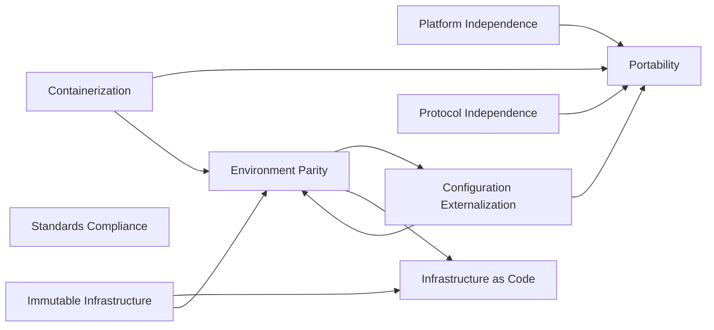
```mermaid
flowchart LR
    n_portability["Portability"]
    n_platform_independence["Platform Independence"]
    n_environment_parity["Environment Parity"]
    n_containerization["Containerization"]
    n_infrastructure_as_code["Infrastructure as Code"]
    n_standards_compliance["Standards Compliance"]
    n_protocol_independence["Protocol Independence"]
    n_configuration_externalization["Configuration Externalization"]
    n_immutable_infrastructure["Immutable Infrastructure"]
    n_platform_independence --> n_portability
    n_environment_parity --> n_configuration_externalization
    n_environment_parity --> n_infrastructure_as_code
    n_containerization --> n_portability
    n_containerization --> n_environment_parity
    n_protocol_independence --> n_portability
    n_configuration_externalization --> n_portability
    n_configuration_externalization --> n_environment_parity
    n_immutable_infrastructure --> n_infrastructure_as_code
    n_immutable_infrastructure --> n_environment_parity
```

### Portability

- Kind: [quality-attribute](SCHEMA.md#kind-quality-attribute)
- Category: [Portability / Infrastructure / Deployment](PRINCIPLES.md#architecture-category-portability-infrastructure-deployment)
- Severity: [contextual](SCHEMA.md#vocabulary-severity-contextual)
- Scope: application, infrastructure, runtime
- Layer: [Resource Core](SCHEMA.md#layer-resource-core)

Details

Definition
The degree to which software runs on another platform or environment without code changes.

Requires
[Abstraction](PRINCIPLES.md#architecture-abstraction), [Standards](LEXICON.md#lexicon-standards)

Reinforces
[Replaceability](PRINCIPLES.md#architecture-replaceability)

Enables
[Platform Migration](LEXICON.md#lexicon-platform-migration)

In tension with
[Platform Optimization](LEXICON.md#lexicon-platform-optimization)

Conflicts with
[Platform-Specific Coupling](LEXICON.md#lexicon-platform-specific-coupling)

Referenced by
[Interoperability](PRINCIPLES.md#architecture-interoperability), [Platform Independence](PRINCIPLES.md#architecture-platform-independence), [Containerization](PRINCIPLES.md#architecture-containerization), [Protocol Independence](PRINCIPLES.md#architecture-protocol-independence), [Configuration Externalization](PRINCIPLES.md#architecture-configuration-externalization), [Low Coupling](PRINCIPLES.md#architecture-low-coupling), [Abstraction](PRINCIPLES.md#architecture-abstraction), [Independence](PRINCIPLES.md#architecture-independence), [Case Dialect](PRINCIPLES.md#architecture-case-dialect)

Tensions
[Portability / Platform Optimization](SCHEMA.md#tension-platform-optimization-portability)

Distinct from
[Integration](LEXICON.md#lexicon-integration): Portability is running on another platform, while integration is being connected to other systems.

Distinct from
[Platform Optimization](LEXICON.md#lexicon-platform-optimization): Portability is running anywhere unchanged, while platform optimization is the tuning for one platform that it gives up.

Violated by
[Platform-Specific Coupling](LEXICON.md#lexicon-platform-specific-coupling)

Detected by
platform-specific imports in core

Measured by
portability violation count

Refactored by
[Extract Adapter](LEXICON.md#lexicon-extract-adapter), [Introduce Port](LEXICON.md#lexicon-introduce-port)

Enforced by
dependency rules

Before

```typescript
const path = "C:\\foo\\data\\foos.json";
const processId = windowsApi.currentProcessId();
```

After

```typescript
const path = join(config.dataDirectory, "foos.json");
const processId = runtime.processId();
```

How it is checked

Checked by
dependency rules

Population
Every platform call, environment, configuration value and infrastructure resource the deployment uses

Freshness
A verdict stands until the code, the image, the configuration or the live infrastructure changes

Refusal
The import rule, config scan or drift detection fails the change or the deploy

Observation
Platform imports read from source, and the declared infrastructure compared with the live state

Evidence
None, because the catalog states this check as a class, so a watched run belongs to each system that adopts it

Authoritative side
The declared infrastructure, which the live state is compared against

Depends on
[Abstraction](PRINCIPLES.md#architecture-abstraction), [Standards](LEXICON.md#lexicon-standards), [Replaceability](PRINCIPLES.md#architecture-replaceability), [Platform Migration](LEXICON.md#lexicon-platform-migration)

Shape it refuses
[Platform-Specific Coupling](LEXICON.md#lexicon-platform-specific-coupling)

### Platform Independence

- Kind: [principle](SCHEMA.md#kind-principle)
- Category: [Portability / Infrastructure / Deployment](PRINCIPLES.md#architecture-category-portability-infrastructure-deployment)
- Severity: [contextual](SCHEMA.md#vocabulary-severity-contextual)
- Scope: application, runtime
- Layer: [Resource Core](SCHEMA.md#layer-resource-core)

Details

Definition
A design rule that portable layers reach the operating system and vendor services only through abstractions.

Requires
[Platform Abstraction](LEXICON.md#lexicon-platform-abstraction)

Reinforces
[Portability](PRINCIPLES.md#architecture-portability)

Enables
[Cross-Platform Deployment](LEXICON.md#lexicon-cross-platform-deployment)

In tension with
[Native Optimization](LEXICON.md#lexicon-native-optimization)

Conflicts with
[OS/Vendor Lock-In](LEXICON.md#lexicon-os-vendor-lock-in)

Tensions
[Platform Independence / Native Optimization](SCHEMA.md#tension-native-optimization-platform-independence)

Violated by
[OS/Vendor Lock-In](LEXICON.md#lexicon-os-vendor-lock-in)

Detected by
OS-specific paths/APIs in portable layers

Measured by
cross-platform test pass rate

Refactored by
[Introduce Port](LEXICON.md#lexicon-introduce-port), [Canonicalization](PRINCIPLES.md#architecture-canonicalization)

Enforced by
cross-platform CI

Before

```typescript
function saveFoo(foo: Foo) {
  return winRegistry.write("Foo", foo);
}
```

After

```typescript
interface FooPersistence {
  save(foo: Foo): Promise<void>;
}
function saveFoo(foo: Foo, persistence: FooPersistence) {
  return persistence.save(foo);
}
```

How it is checked

Checked by
cross-platform CI

Population
Every platform call, environment, configuration value and infrastructure resource the deployment uses

Freshness
A verdict stands until the code, the image, the configuration or the live infrastructure changes

Refusal
The import rule, config scan or drift detection fails the change or the deploy

Observation
Platform imports read from source, and the declared infrastructure compared with the live state

Evidence
None, because the catalog states this check as a class, so a watched run belongs to each system that adopts it

Authoritative side
The declared infrastructure, which the live state is compared against

Depends on
[Platform Abstraction](LEXICON.md#lexicon-platform-abstraction), [Portability](PRINCIPLES.md#architecture-portability), [Cross-Platform Deployment](LEXICON.md#lexicon-cross-platform-deployment)

Shape it refuses
[OS/Vendor Lock-In](LEXICON.md#lexicon-os-vendor-lock-in)

### Environment Parity

- Kind: [principle](SCHEMA.md#kind-principle)
- Category: [Portability / Infrastructure / Deployment](PRINCIPLES.md#architecture-category-portability-infrastructure-deployment)
- Severity: [recommended](SCHEMA.md#vocabulary-severity-recommended)
- Scope: dev, test, staging, production
- Layer: [Resource Core](SCHEMA.md#layer-resource-core)

Details

Definition
A design rule that development, test, staging and production run the same build, differing only in configuration.

Requires
[Configuration Externalization](PRINCIPLES.md#architecture-configuration-externalization), [Infrastructure as Code](PRINCIPLES.md#architecture-infrastructure-as-code)

Reinforces
[Reproducibility](PRINCIPLES.md#architecture-reproducibility)

Enables
[Reliable Deployment](LEXICON.md#lexicon-reliable-deployment)

In tension with
[Cost](LEXICON.md#lexicon-cost)

Conflicts with
[Snowflake Environments](LEXICON.md#lexicon-snowflake-environments)

Referenced by
[Containerization](PRINCIPLES.md#architecture-containerization), [Configuration Externalization](PRINCIPLES.md#architecture-configuration-externalization), [Immutable Infrastructure](PRINCIPLES.md#architecture-immutable-infrastructure)

Tensions
[Environment Parity / Cost](SCHEMA.md#tension-cost-environment-parity)

Distinct from
[Configuration Externalization](PRINCIPLES.md#architecture-configuration-externalization): Environment parity runs the same build everywhere, while configuration externalization is how the differences are kept outside that build.

Violated by
[Snowflake Environments](LEXICON.md#lexicon-snowflake-environments)

Detected by
works-in-dev-only defects

Measured by
[environment drift](LEXICON.md#lexicon-environment-drift)

Refactored by
[Containerization](PRINCIPLES.md#architecture-containerization), [Externalize Configuration](LEXICON.md#lexicon-externalize-configuration), [Infrastructure as Code](PRINCIPLES.md#architecture-infrastructure-as-code)

Enforced by
environment drift checks

Before

```typescript
if (env === "dev") useMemoryFooStore();
if (env === "prod") useSqlFooStore();
```

After

```typescript
const container = buildFooImage("foo-app:1.0.0");
runEnvironment("dev", container, devConfig);
runEnvironment("prod", container, prodConfig);
```

How it is checked

Checked by
environment drift checks

Population
Every platform call, environment, configuration value and infrastructure resource the deployment uses

Freshness
A verdict stands until the code, the image, the configuration or the live infrastructure changes

Refusal
The import rule, config scan or drift detection fails the change or the deploy

Observation
Platform imports read from source, and the declared infrastructure compared with the live state

Evidence
None, because the catalog states this check as a class, so a watched run belongs to each system that adopts it

Authoritative side
The declared infrastructure, which the live state is compared against

Depends on
[Configuration Externalization](PRINCIPLES.md#architecture-configuration-externalization), [Infrastructure as Code](PRINCIPLES.md#architecture-infrastructure-as-code), [Reproducibility](PRINCIPLES.md#architecture-reproducibility), [Reliable Deployment](LEXICON.md#lexicon-reliable-deployment)

Shape it refuses
[Snowflake Environments](LEXICON.md#lexicon-snowflake-environments)

### Containerization

- Kind: [mechanism](SCHEMA.md#kind-mechanism)
- Category: [Portability / Infrastructure / Deployment](PRINCIPLES.md#architecture-category-portability-infrastructure-deployment)
- Severity: [contextual](SCHEMA.md#vocabulary-severity-contextual)
- Scope: application, runtime, deployment
- Layer: [Resource Core](SCHEMA.md#layer-resource-core)

Details

Definition
A mechanism that packages an application with its runtime dependencies into an image that runs the same on any host.

Requires
[Image Definition](LEXICON.md#lexicon-image-definition), [Externalized Config](LEXICON.md#lexicon-externalized-config)

Reinforces
[Portability](PRINCIPLES.md#architecture-portability), [Environment Parity](PRINCIPLES.md#architecture-environment-parity)

Enables
[Repeatable Runtime Packaging](LEXICON.md#lexicon-repeatable-runtime-packaging)

In tension with
[Image Complexity](LEXICON.md#lexicon-image-complexity)

Conflicts with
[Host-Coupled Deployment](LEXICON.md#lexicon-host-coupled-deployment)

Tensions
[Containerization / Image Complexity](SCHEMA.md#tension-containerization-image-complexity)

Violated by
[Host-Coupled Deployment](LEXICON.md#lexicon-host-coupled-deployment)

Detected by
manual host setup requirements

Measured by
image reproducibility

Refactored by
[Externalize Configuration](LEXICON.md#lexicon-externalize-configuration)

Enforced by
image scans, build pipeline

Before

```typescript
installFooDependenciesOnHost();
startFooWithHostRuntime();
```

After

```typescript
const image = containerImage({
  base: "node:22-alpine",
  copy: ["dist", "package.json"],
  command: ["node", "dist/main.js"],
});
```

How it is checked

Checked by
image scans, build pipeline

Population
Every platform call, environment, configuration value and infrastructure resource the deployment uses

Freshness
A verdict stands until the code, the image, the configuration or the live infrastructure changes

Refusal
The import rule, config scan or drift detection fails the change or the deploy

Observation
Platform imports read from source, and the declared infrastructure compared with the live state

Evidence
None, because the catalog states this check as a class, so a watched run belongs to each system that adopts it

Authoritative side
The declared infrastructure, which the live state is compared against

Depends on
[Image Definition](LEXICON.md#lexicon-image-definition), [Externalized Config](LEXICON.md#lexicon-externalized-config), [Portability](PRINCIPLES.md#architecture-portability), [Environment Parity](PRINCIPLES.md#architecture-environment-parity), [Repeatable Runtime Packaging](LEXICON.md#lexicon-repeatable-runtime-packaging)

Shape it refuses
[Host-Coupled Deployment](LEXICON.md#lexicon-host-coupled-deployment)

### Infrastructure as Code

- Kind: [activity](SCHEMA.md#kind-activity)
- Category: [Portability / Infrastructure / Deployment](PRINCIPLES.md#architecture-category-portability-infrastructure-deployment)
- Severity: [contextual](SCHEMA.md#vocabulary-severity-contextual)
- Mandatory for: managed infrastructure
- Scope: infrastructure, deployment
- Aliases: IaC
- Layer: [Resource Core](SCHEMA.md#layer-resource-core)

Details

Definition
The practice of declaring infrastructure in versioned files and provisioning it from them.

Requires
[Declarative Configuration](PRINCIPLES.md#architecture-declarative-configuration), [Version Control](LEXICON.md#lexicon-version-control)

Reinforces
[Reproducibility](PRINCIPLES.md#architecture-reproducibility), [Governance](PRINCIPLES.md#architecture-governance)

Enables
[Automated Provisioning](LEXICON.md#lexicon-automated-provisioning)

In tension with
[Tooling Complexity](LEXICON.md#lexicon-tooling-complexity)

Conflicts with
[Manual Infrastructure Changes](LEXICON.md#lexicon-manual-infrastructure-changes)

Referenced by
[Environment Parity](PRINCIPLES.md#architecture-environment-parity), [Immutable Infrastructure](PRINCIPLES.md#architecture-immutable-infrastructure), [Declarative Configuration](PRINCIPLES.md#architecture-declarative-configuration)

Tensions
[Infrastructure as Code / Tooling Complexity](SCHEMA.md#tension-infrastructure-as-code-tooling-complexity)

Violated by
[Manual Infrastructure Changes](LEXICON.md#lexicon-manual-infrastructure-changes)

Detected by
drift between code and live infra

Measured by
drift count, IaC coverage

Refactored by
none

Enforced by
[policy-as-code](PRINCIPLES.md#architecture-policy-as-code), drift detection

Before

```typescript
cloudConsole.createDatabase("foo-prod");
cloudConsole.openPort(5432);
```

After

```typescript
const fooDatabase = databaseResource({
  name: "foo-prod",
  engine: "postgres",
  encrypted: true,
  networkPolicy: "foo-only",
});
```

How it is checked

Checked by
policy-as-code, drift detection

Population
Every platform call, environment, configuration value and infrastructure resource the deployment uses

Freshness
A verdict stands until the code, the image, the configuration or the live infrastructure changes

Refusal
The import rule, config scan or drift detection fails the change or the deploy

Observation
Platform imports read from source, and the declared infrastructure compared with the live state

Evidence
None, because the catalog states this check as a class, so a watched run belongs to each system that adopts it

Authoritative side
The declared infrastructure, which the live state is compared against

Depends on
[Declarative Configuration](PRINCIPLES.md#architecture-declarative-configuration), [Version Control](LEXICON.md#lexicon-version-control), [Reproducibility](PRINCIPLES.md#architecture-reproducibility), [Governance](PRINCIPLES.md#architecture-governance), [Automated Provisioning](LEXICON.md#lexicon-automated-provisioning)

Shape it refuses
[Manual Infrastructure Changes](LEXICON.md#lexicon-manual-infrastructure-changes)

### Standards Compliance

- Kind: [constraint](SCHEMA.md#kind-constraint)
- Category: [Portability / Infrastructure / Deployment](PRINCIPLES.md#architecture-category-portability-infrastructure-deployment)
- Severity: [contextual](SCHEMA.md#vocabulary-severity-contextual)
- Scope: protocol, security, data, infrastructure
- Layer: [Resource Core](SCHEMA.md#layer-resource-core)

Details

Definition
A rule or precondition that an implementation conforms to the published standard for its protocol, format or domain.

Requires
[Applicable Standard](LEXICON.md#lexicon-applicable-standard)

Reinforces
[Interoperability](PRINCIPLES.md#architecture-interoperability), [Compliance](PRINCIPLES.md#architecture-compliance)

Enables
[Certification/Compatibility](LEXICON.md#lexicon-certification-compatibility)

In tension with
[Innovation/Flexibility](LEXICON.md#lexicon-innovation-flexibility)

Conflicts with
[Proprietary Deviation](LEXICON.md#lexicon-proprietary-deviation)

Tensions
[Standards Compliance / Innovation/Flexibility](SCHEMA.md#tension-innovation-flexibility-standards-compliance)

Distinct from
[Compliance](PRINCIPLES.md#architecture-compliance): Standards compliance is technical conformance to a published protocol or format, while compliance is implementing and evidencing the controls a regulation requires.

Distinct from
[Applicable Standard](LEXICON.md#lexicon-applicable-standard): Standards compliance is conforming, while the applicable standard is the one standard identified to conform to.

Violated by
[Proprietary Deviation](LEXICON.md#lexicon-proprietary-deviation)

Detected by
conformance test failure

Measured by
standard compliance score

Refactored by
[Contract Testing](LEXICON.md#lexicon-contract-testing)

Enforced by
standards checks

Before

```typescript
const payload = encodePrivateFooBinary(foo);
```

After

```typescript
const payload: JsonFooV1 = toJsonFoo(foo);
http.send(JSON.stringify(payload), {
  contentType: "application/json; charset=utf-8",
});
```

How it is checked

Checked by
standards checks

Population
Every platform call, environment, configuration value and infrastructure resource the deployment uses

Freshness
A verdict stands until the code, the image, the configuration or the live infrastructure changes

Refusal
The import rule, config scan or drift detection fails the change or the deploy

Observation
Platform imports read from source, and the declared infrastructure compared with the live state

Evidence
None, because the catalog states this check as a class, so a watched run belongs to each system that adopts it

Authoritative side
The declared infrastructure, which the live state is compared against

Depends on
[Applicable Standard](LEXICON.md#lexicon-applicable-standard), [Interoperability](PRINCIPLES.md#architecture-interoperability), [Compliance](PRINCIPLES.md#architecture-compliance), [Certification/Compatibility](LEXICON.md#lexicon-certification-compatibility)

Shape it refuses
[Proprietary Deviation](LEXICON.md#lexicon-proprietary-deviation)

### Protocol Independence

- Kind: [principle](SCHEMA.md#kind-principle)
- Category: [Portability / Infrastructure / Deployment](PRINCIPLES.md#architecture-category-portability-infrastructure-deployment)
- Severity: [recommended](SCHEMA.md#vocabulary-severity-recommended)
- Scope: integration, service boundary
- Layer: [Resource Core](SCHEMA.md#layer-resource-core)

Details

Definition
A design rule that domain logic is written against ports, and each transport protocol reaches it through its own adapter.

Requires
[Adapter/Port Abstraction](LEXICON.md#lexicon-adapter-port-abstraction)

Reinforces
[Portability](PRINCIPLES.md#architecture-portability), [Replaceability](PRINCIPLES.md#architecture-replaceability)

Enables
[Protocol Swap](LEXICON.md#lexicon-protocol-swap)

In tension with
[Protocol-Specific Features](LEXICON.md#lexicon-protocol-specific-features)

Conflicts with
[Protocol-Coupled Domain Logic](LEXICON.md#lexicon-protocol-coupled-domain-logic)

Tensions
[Protocol Independence / Protocol-Specific Features](SCHEMA.md#tension-protocol-independence-protocol-specific-features)

Violated by
[Protocol-Coupled Domain Logic](LEXICON.md#lexicon-protocol-coupled-domain-logic)

Detected by
protocol imports in core layer

Measured by
protocol leakage count

Refactored by
[Introduce Port](LEXICON.md#lexicon-introduce-port), [Extract Adapter](LEXICON.md#lexicon-extract-adapter)

Enforced by
import rules

Before

```typescript
class FooService {
  handleHttp(request: HttpRequest) {
    return fooStore.save(request.body);
  }
}
```

After

```typescript
class CreateFoo {
  constructor(private readonly store: FooStore) {}
  execute(input: CreateFooInput) {
    return this.store.save(Foo.create(input));
  }
}
httpAdapter.bind(createFoo);
grpcAdapter.bind(createFoo);
```

How it is checked

Checked by
import rules

Population
Every platform call, environment, configuration value and infrastructure resource the deployment uses

Freshness
A verdict stands until the code, the image, the configuration or the live infrastructure changes

Refusal
The import rule, config scan or drift detection fails the change or the deploy

Observation
Platform imports read from source, and the declared infrastructure compared with the live state

Evidence
None, because the catalog states this check as a class, so a watched run belongs to each system that adopts it

Authoritative side
The declared infrastructure, which the live state is compared against

Depends on
[Adapter/Port Abstraction](LEXICON.md#lexicon-adapter-port-abstraction), [Portability](PRINCIPLES.md#architecture-portability), [Replaceability](PRINCIPLES.md#architecture-replaceability), [Protocol Swap](LEXICON.md#lexicon-protocol-swap)

Shape it refuses
[Protocol-Coupled Domain Logic](LEXICON.md#lexicon-protocol-coupled-domain-logic)

### Configuration Externalization

- Kind: [principle](SCHEMA.md#kind-principle)
- Category: [Portability / Infrastructure / Deployment](PRINCIPLES.md#architecture-category-portability-infrastructure-deployment)
- Severity: [mandatory](SCHEMA.md#vocabulary-severity-mandatory)
- Scope: application, deployment, runtime
- Aliases: Externalized Configuration
- Layer: [Resource Core](SCHEMA.md#layer-resource-core)

Details

Definition
A design rule that environment-specific values are read from validated external configuration at startup.

Requires
[Config Schema](LEXICON.md#lexicon-config-schema), [Secure Config Handling](LEXICON.md#lexicon-secure-config-handling)

Reinforces
[Portability](PRINCIPLES.md#architecture-portability), [Environment Parity](PRINCIPLES.md#architecture-environment-parity)

Enables
[Environment-Specific Deployment](LEXICON.md#lexicon-environment-specific-deployment)

In tension with
[Config Sprawl](LEXICON.md#lexicon-config-sprawl)

Conflicts with
[Hardcoded Configuration](PRINCIPLES.md#architecture-hardcoded-configuration)

Referenced by
[Environment Parity](PRINCIPLES.md#architecture-environment-parity)

Tensions
[Configuration Externalization / Config Sprawl](SCHEMA.md#tension-config-sprawl-configuration-externalization)

Violated by
[Hardcoded Configuration](PRINCIPLES.md#architecture-hardcoded-configuration)

Detected by
hardcoded URLs/secrets/paths

Measured by
externalized config coverage

Refactored by
[Externalize Configuration](LEXICON.md#lexicon-externalize-configuration), [Validate at the Boundary](LEXICON.md#lexicon-validate-at-the-boundary)

Enforced by
secret/config scans

Before

```typescript
const config = {
  fooUrl: "https://foo.prod.example",
  retries: 3,
};
```

After

```typescript
type FooConfig = Readonly<{ fooUrl: URL; retries: number }>;
const config = FooConfigSchema.parse({
  fooUrl: process.env.FOO_URL,
  retries: process.env.FOO_RETRIES,
});
```

How it is checked

Checked by
secret/config scans

Population
Every platform call, environment, configuration value and infrastructure resource the deployment uses

Freshness
A verdict stands until the code, the image, the configuration or the live infrastructure changes

Refusal
The import rule, config scan or drift detection fails the change or the deploy

Observation
Platform imports read from source, and the declared infrastructure compared with the live state

Evidence
None, because the catalog states this check as a class, so a watched run belongs to each system that adopts it

Authoritative side
The declared infrastructure, which the live state is compared against

Depends on
[Config Schema](LEXICON.md#lexicon-config-schema), [Secure Config Handling](LEXICON.md#lexicon-secure-config-handling), [Portability](PRINCIPLES.md#architecture-portability), [Environment Parity](PRINCIPLES.md#architecture-environment-parity), [Environment-Specific Deployment](LEXICON.md#lexicon-environment-specific-deployment)

Shape it refuses
[Hardcoded Configuration](PRINCIPLES.md#architecture-hardcoded-configuration)

### Immutable Infrastructure

- Kind: [approach](SCHEMA.md#kind-approach)
- Category: [Portability / Infrastructure / Deployment](PRINCIPLES.md#architecture-category-portability-infrastructure-deployment)
- Severity: [contextual](SCHEMA.md#vocabulary-severity-contextual)
- Mandatory for: managed infrastructure
- Scope: infrastructure, deployment, reproducibility
- Layer: [Resource Core](SCHEMA.md#layer-resource-core)

Details

Definition
An approach in which servers are replaced from a new image for every change, instead of being patched in place.

Requires
[Infrastructure as Code](PRINCIPLES.md#architecture-infrastructure-as-code)

Reinforces
[Environment Parity](PRINCIPLES.md#architecture-environment-parity), [Reproducibility](PRINCIPLES.md#architecture-reproducibility)

Enables
[Deterministic Redeploys](LEXICON.md#lexicon-deterministic-redeploys), [Instance Replacement over Mutation](LEXICON.md#lexicon-instance-replacement-over-mutation)

In tension with
[Deploy Time](LEXICON.md#lexicon-deploy-time)

Conflicts with
[In-Place Server Mutation](LEXICON.md#lexicon-in-place-server-mutation)

Tensions
[Immutable Infrastructure / Deploy Time](SCHEMA.md#tension-deploy-time-immutable-infrastructure)

Violated by
[In-Place Server Mutation](LEXICON.md#lexicon-in-place-server-mutation)

Detected by
SSH mutation of live instances

Measured by
config drift across instances

Refactored by
none

Enforced by
deployment review

Before

```typescript
ssh(server, "apt-get update && systemctl restart foo");
```

After

```typescript
const image = buildFooImage("foo:1.4.0");
replaceInstances("foo", image);
```

How it is checked

Checked by
deployment review

Population
Every platform call, environment, configuration value and infrastructure resource the deployment uses

Freshness
A verdict stands until the code, the image, the configuration or the live infrastructure changes

Refusal
The import rule, config scan or drift detection fails the change or the deploy

Observation
Platform imports read from source, and the declared infrastructure compared with the live state

Evidence
None, because the catalog states this check as a class, so a watched run belongs to each system that adopts it

Authoritative side
The declared infrastructure, which the live state is compared against

Depends on
[Infrastructure as Code](PRINCIPLES.md#architecture-infrastructure-as-code), [Environment Parity](PRINCIPLES.md#architecture-environment-parity), [Reproducibility](PRINCIPLES.md#architecture-reproducibility), [Deterministic Redeploys](LEXICON.md#lexicon-deterministic-redeploys), [Instance Replacement over Mutation](LEXICON.md#lexicon-instance-replacement-over-mutation)

Shape it refuses
[In-Place Server Mutation](LEXICON.md#lexicon-in-place-server-mutation)

## Core Modular Design

Every principle in this category is listed as a record. Each record carries its kind, its severity, the scopes it applies at and the layer it lives in, then the edge relations that join it to other records, the records that point back at it, the contracts that answer to it and the tensions it takes part in. The descriptors say how it is violated, detected, measured, repaired and enforced. Where the record carries one, an exemplar shows the shape before and after the principle is applied.

Relations diagram

The relations inside this category.

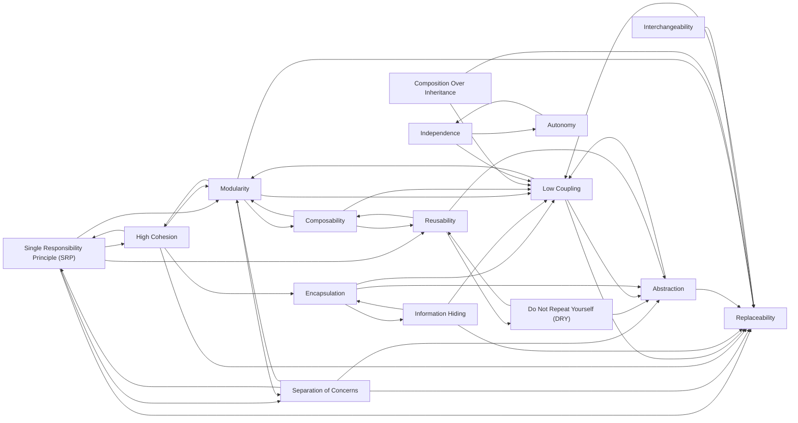
```mermaid
flowchart LR
    n_single_responsibility["Single Responsibility Principle (SRP)"]
    n_separation_of_concerns["Separation of Concerns"]
    n_duplicate_code["Do Not Repeat Yourself (DRY)"]
    n_high_cohesion["High Cohesion"]
    n_low_coupling["Low Coupling"]
    n_encapsulation["Encapsulation"]
    n_information_hiding["Information Hiding"]
    n_abstraction["Abstraction"]
    n_modularity["Modularity"]
    n_composability["Composability"]
    n_composition_over_inheritance["Composition Over Inheritance"]
    n_reusability["Reusability"]
    n_replaceability["Replaceability"]
    n_interchangeability["Interchangeability"]
    n_independence["Independence"]
    n_autonomy["Autonomy"]
    n_single_responsibility --> n_high_cohesion
    n_single_responsibility --> n_separation_of_concerns
    n_single_responsibility --> n_modularity
    n_single_responsibility --> n_replaceability
    n_single_responsibility --> n_reusability
    n_separation_of_concerns --> n_abstraction
    n_separation_of_concerns --> n_single_responsibility
    n_separation_of_concerns --> n_modularity
    n_separation_of_concerns --> n_replaceability
    n_duplicate_code --> n_abstraction
    n_duplicate_code --> n_reusability
    n_high_cohesion --> n_single_responsibility
    n_high_cohesion --> n_modularity
    n_high_cohesion --> n_encapsulation
    n_high_cohesion --> n_replaceability
    n_low_coupling --> n_abstraction
    n_low_coupling --> n_modularity
    n_low_coupling --> n_replaceability
    n_encapsulation --> n_information_hiding
    n_encapsulation --> n_abstraction
    n_encapsulation --> n_low_coupling
    n_information_hiding --> n_encapsulation
    n_information_hiding --> n_low_coupling
    n_information_hiding --> n_replaceability
    n_abstraction --> n_low_coupling
    n_abstraction --> n_replaceability
    n_modularity --> n_high_cohesion
    n_modularity --> n_low_coupling
    n_modularity --> n_separation_of_concerns
    n_modularity --> n_composability
    n_modularity --> n_replaceability
    n_composability --> n_low_coupling
    n_composability --> n_modularity
    n_composability --> n_reusability
    n_composition_over_inheritance --> n_low_coupling
    n_composition_over_inheritance --> n_replaceability
    n_reusability --> n_abstraction
    n_reusability --> n_duplicate_code
    n_reusability --> n_composability
    n_replaceability --> n_low_coupling
    n_interchangeability --> n_replaceability
    n_independence --> n_low_coupling
    n_independence --> n_autonomy
    n_autonomy --> n_independence
```

### Single Responsibility Principle (SRP)

- Kind: [principle](SCHEMA.md#kind-principle)
- Category: [Core Modular Design](PRINCIPLES.md#architecture-category-core-modular-design)
- Severity: [mandatory](SCHEMA.md#vocabulary-severity-mandatory)
- Scope: class, module, service
- Aliases: SRP, Single Responsibility Principle
- Layer: [Structural Core](SCHEMA.md#layer-structural-core)

Details

Definition
A design rule that a class or module has one reason to change, because it serves one responsibility.

Requires
[High Cohesion](PRINCIPLES.md#architecture-high-cohesion), [Explicit Boundaries](PRINCIPLES.md#architecture-explicit-boundaries)

Reinforces
[Separation of Concerns](PRINCIPLES.md#architecture-separation-of-concerns), [Modularity](PRINCIPLES.md#architecture-modularity), [Testability](PRINCIPLES.md#architecture-testability)

Enables
[Replaceability](PRINCIPLES.md#architecture-replaceability), [Reusability](PRINCIPLES.md#architecture-reusability)

In tension with
[Excessive Fragmentation](LEXICON.md#lexicon-excessive-fragmentation)

Conflicts with
[God Object](PRINCIPLES.md#architecture-god-object), [Divergent Change](PRINCIPLES.md#architecture-divergent-change)

Referenced by
[Domain Service](PRINCIPLES.md#architecture-domain-service), [Separation of Concerns](PRINCIPLES.md#architecture-separation-of-concerns), [High Cohesion](PRINCIPLES.md#architecture-high-cohesion), [Interface Segregation Principle (ISP)](PRINCIPLES.md#architecture-interface-segregation), [Command Pattern](PRINCIPLES.md#architecture-command-pattern), [Chain of Responsibility Pattern](PRINCIPLES.md#architecture-chain-of-responsibility-pattern), [Iterator Pattern](PRINCIPLES.md#architecture-iterator-pattern), [Pipes and Filters](PRINCIPLES.md#architecture-pipes-and-filters)

Tensions
[Single Responsibility Principle (SRP) / Excessive Fragmentation](SCHEMA.md#tension-excessive-fragmentation-single-responsibility-principle-srp)

Distinct from
[Interface Segregation Principle (ISP)](PRINCIPLES.md#architecture-interface-segregation): Single responsibility limits a module's reasons to change, while interface segregation limits what a client depends on.

Distinct from
[Open/Closed Principle (OCP)](PRINCIPLES.md#architecture-open-closed): Single responsibility limits reasons to change, while the open/closed principle governs adding behavior without editing.

Distinct from
[Composability](PRINCIPLES.md#architecture-composability): Single responsibility limits what one part does, while composability governs how parts combine.

Distinct from
[Separation of Concerns](PRINCIPLES.md#architecture-separation-of-concerns): Single responsibility is one reason to change per class or module, while separation of concerns separates the named concerns of a system.

Violated by
[God Object](PRINCIPLES.md#architecture-god-object), [Divergent Change](PRINCIPLES.md#architecture-divergent-change)

Detected by
high fan-in/fan-out, unrelated methods, unrelated dependencies

Measured by
cohesion score, responsibility count, change-coupling

Refactored by
[Extract Class](LEXICON.md#lexicon-extract-class), [Extract Module](LEXICON.md#lexicon-extract-module), [Split Bounded Context](LEXICON.md#lexicon-split-bounded-context), [Move Behavior to Its Owner](LEXICON.md#lexicon-move-behavior-to-its-owner)

Enforced by
architecture tests, package boundaries, [static analysis](REASONING.md#reasoning-technique-static-analysis)

Before

```typescript
class FooService {
  save(foo: Foo) {
    fooDb.insert(foo);
  }
  send(foo: Foo) {
    fooMail.send(foo);
  }
  report(foo: Foo) {
    return `${foo.id}:${foo.name}`;
  }
}
```

After

```typescript
class FooRepository {
  save(foo: Foo) {
    return fooDb.insert(foo);
  }
}
class FooNotifier {
  send(foo: Foo) {
    return fooMail.send(foo);
  }
}
class FooReporter {
  report(foo: Foo) {
    return `${foo.id}:${foo.name}`;
  }
}
```

How it is checked

Checked by
architecture tests, package boundaries, static analysis

Population
Every class, module and package boundary in the codebase

Freshness
A verdict stands until the module's contents, exports or imports change

Refusal
The dependency, visibility or clone rule fails the build on the change that breaks the property

Observation
Cohesion, coupling, duplication and export metrics read from source and the import graph

Evidence
None, because the catalog states this check as a class, so a watched run belongs to each system that adopts it

Authoritative side
The declared module boundary, which every import and export conforms to

Depends on
[High Cohesion](PRINCIPLES.md#architecture-high-cohesion), [Explicit Boundaries](PRINCIPLES.md#architecture-explicit-boundaries), [Separation of Concerns](PRINCIPLES.md#architecture-separation-of-concerns), [Modularity](PRINCIPLES.md#architecture-modularity), [Testability](PRINCIPLES.md#architecture-testability), [Replaceability](PRINCIPLES.md#architecture-replaceability), [Reusability](PRINCIPLES.md#architecture-reusability)

Shape it refuses
[God Object](PRINCIPLES.md#architecture-god-object), [God Object](PRINCIPLES.md#architecture-god-object), [Divergent Change](PRINCIPLES.md#architecture-divergent-change)

### Separation of Concerns

- Kind: [principle](SCHEMA.md#kind-principle)
- Category: [Core Modular Design](PRINCIPLES.md#architecture-category-core-modular-design)
- Severity: [mandatory](SCHEMA.md#vocabulary-severity-mandatory)
- Scope: module, package, component, system
- Aliases: SoC
- Layer: [Structural Core](SCHEMA.md#layer-structural-core)

Details

Definition
A design rule that parsing, business logic, persistence and presentation each live in their own part of the code.

Requires
[Explicit Boundaries](PRINCIPLES.md#architecture-explicit-boundaries), [Abstraction](PRINCIPLES.md#architecture-abstraction)

Reinforces
[Single Responsibility Principle (SRP)](PRINCIPLES.md#architecture-single-responsibility), [Modularity](PRINCIPLES.md#architecture-modularity), [Layered Architecture](PRINCIPLES.md#architecture-layered-architecture)

Enables
[Maintainability](LEXICON.md#lexicon-maintainability), [Replaceability](PRINCIPLES.md#architecture-replaceability)

In tension with
[Over-Layering](LEXICON.md#lexicon-over-layering)

Conflicts with
[Cross-Cutting Leakage](LEXICON.md#lexicon-cross-cutting-leakage), [Mixed Layers](LEXICON.md#lexicon-mixed-layers)

Referenced by
[Single Responsibility Principle (SRP)](PRINCIPLES.md#architecture-single-responsibility), [Modularity](PRINCIPLES.md#architecture-modularity), [Visitor Pattern](PRINCIPLES.md#architecture-visitor-pattern), [Statecharts](PRINCIPLES.md#architecture-statecharts), [Layered Architecture](PRINCIPLES.md#architecture-layered-architecture), [One Concern Per File](PRINCIPLES.md#architecture-one-concern-per-file)

Tensions
[Separation of Concerns / Over-Layering](SCHEMA.md#tension-over-layering-separation-of-concerns)

Distinct from
[One Concern Per File](PRINCIPLES.md#architecture-one-concern-per-file): Separation of concerns splits code by responsibility, while one concern per file binds each file to one declared role tag.

Distinct from
[Open/Closed Principle (OCP)](PRINCIPLES.md#architecture-open-closed): Separation of concerns decides where concerns live, while the open/closed principle decides how behavior is added.

Distinct from
[Composability](PRINCIPLES.md#architecture-composability): Separation of concerns keeps concerns apart, while composability lets parts combine.

Violated by
[Mixed Layers](LEXICON.md#lexicon-mixed-layers)

Detected by
layer imports, mixed naming roles, cross-boundary logic

Measured by
dependency direction, layer purity, concern overlap

Refactored by
[Extract Module](LEXICON.md#lexicon-extract-module), [Move Behavior to Its Owner](LEXICON.md#lexicon-move-behavior-to-its-owner), [Define Module Boundaries](LEXICON.md#lexicon-define-module-boundaries)

Enforced by
import rules, dependency graph checks

Refused by rules
separation-of-concerns

Before

```typescript
function handleFoo(request: Request) {
  const foo = JSON.parse(request.body);
  fooDb.insert(foo);
  return `<div>${foo.name}</div>`;
}
```

After

```typescript
function parseFoo(request: Request): Foo {
  return decodeFoo(request.body);
}
function saveFoo(foo: Foo) {
  return fooDb.insert(foo);
}
function renderFoo(foo: Foo) {
  return `<div>${foo.name}</div>`;
}
```

How it is checked

Checked by
import rules, dependency graph checks

Population
Every class, module and package boundary in the codebase

Freshness
A verdict stands until the module's contents, exports or imports change

Refusal
The dependency, visibility or clone rule fails the build on the change that breaks the property

Observation
Cohesion, coupling, duplication and export metrics read from source and the import graph

Evidence
None, because the catalog states this check as a class, so a watched run belongs to each system that adopts it

Authoritative side
The declared module boundary, which every import and export conforms to

Depends on
[Explicit Boundaries](PRINCIPLES.md#architecture-explicit-boundaries), [Abstraction](PRINCIPLES.md#architecture-abstraction), [Single Responsibility Principle (SRP)](PRINCIPLES.md#architecture-single-responsibility), [Modularity](PRINCIPLES.md#architecture-modularity), [Layered Architecture](PRINCIPLES.md#architecture-layered-architecture), [Maintainability](LEXICON.md#lexicon-maintainability), [Replaceability](PRINCIPLES.md#architecture-replaceability)

Shape it refuses
[Cross-Cutting Leakage](LEXICON.md#lexicon-cross-cutting-leakage), [Mixed Layers](LEXICON.md#lexicon-mixed-layers)

### Do Not Repeat Yourself (DRY)

- Kind: [principle](SCHEMA.md#kind-principle)
- Category: [Core Modular Design](PRINCIPLES.md#architecture-category-core-modular-design)
- Severity: [mandatory](SCHEMA.md#vocabulary-severity-mandatory)
- Scope: function, module, domain
- Aliases: DRY, Do Not Repeat Yourself, Don't Repeat Yourself
- Layer: [Structural Core](SCHEMA.md#layer-structural-core)

Details

Definition
A design rule that each piece of logic, constant or schema has one source in the code, and every other use refers to it.

Requires
[Abstraction](PRINCIPLES.md#architecture-abstraction), [Canonical Source](LEXICON.md#lexicon-canonical-source)

Reinforces
[Single Source of Truth](PRINCIPLES.md#architecture-single-source-of-truth), [Reusability](PRINCIPLES.md#architecture-reusability)

Enables
[Consistency](PRINCIPLES.md#architecture-consistency), [Maintainability](LEXICON.md#lexicon-maintainability)

In tension with
[Locality of Behavior](LEXICON.md#lexicon-locality-of-behavior), [Simplicity](LEXICON.md#lexicon-simplicity)

Conflicts with
[Copy-Paste Programming](LEXICON.md#lexicon-copy-paste-programming)

Referenced by
[Reusability](PRINCIPLES.md#architecture-reusability), [Metaprogramming](PRINCIPLES.md#architecture-metaprogramming), [Single Source of Truth](PRINCIPLES.md#architecture-single-source-of-truth), [Normalization](PRINCIPLES.md#architecture-normalization)

Tensions
[Do Not Repeat Yourself (DRY) / Locality of Behavior](SCHEMA.md#tension-do-not-repeat-yourself-dry-locality-of-behavior), [Do Not Repeat Yourself (DRY) / Simplicity](SCHEMA.md#tension-do-not-repeat-yourself-dry-simplicity)

Violated by
[Copy-Paste Programming](LEXICON.md#lexicon-copy-paste-programming)

Detected by
clone detection, duplicated branches, repeated literals

Measured by
duplication percentage, clone count

Refactored by
[Extract Function](LEXICON.md#lexicon-extract-function), [Extract Module](LEXICON.md#lexicon-extract-module), [Introduce Parameter Object](LEXICON.md#lexicon-introduce-parameter-object), [Centralize the Rule](LEXICON.md#lexicon-centralize-the-rule)

Enforced by
clone analyzers, lint rules, review gates

Refused by rules
duplicate-code

Before

```typescript
function validateFoo(foo: Foo) {
  if (!foo.name || foo.name.length > 40) throw new Error("invalid name");
}
function validateBar(bar: Bar) {
  if (!bar.name || bar.name.length > 40) throw new Error("invalid name");
}
```

After

```typescript
function validateName(name: string) {
  if (!name || name.length > 40) throw new Error("invalid name");
}
function validateFoo(foo: Foo) {
  validateName(foo.name);
}
function validateBar(bar: Bar) {
  validateName(bar.name);
}
```

How it is checked

Checked by
clone analyzers, lint rules, review gates

Population
Every class, module and package boundary in the codebase

Freshness
A verdict stands until the module's contents, exports or imports change

Refusal
The dependency, visibility or clone rule fails the build on the change that breaks the property

Observation
Cohesion, coupling, duplication and export metrics read from source and the import graph

Evidence
None, because the catalog states this check as a class, so a watched run belongs to each system that adopts it

Authoritative side
The declared module boundary, which every import and export conforms to

Depends on
[Abstraction](PRINCIPLES.md#architecture-abstraction), [Canonical Source](LEXICON.md#lexicon-canonical-source), [Single Source of Truth](PRINCIPLES.md#architecture-single-source-of-truth), [Reusability](PRINCIPLES.md#architecture-reusability), [Consistency](PRINCIPLES.md#architecture-consistency), [Maintainability](LEXICON.md#lexicon-maintainability)

Shape it refuses
[Copy-Paste Programming](LEXICON.md#lexicon-copy-paste-programming)

### High Cohesion

- Kind: [quality-attribute](SCHEMA.md#kind-quality-attribute)
- Category: [Core Modular Design](PRINCIPLES.md#architecture-category-core-modular-design)
- Severity: [mandatory](SCHEMA.md#vocabulary-severity-mandatory)
- Scope: class, module, component
- Layer: [Structural Core](SCHEMA.md#layer-structural-core)

Details

Definition
The degree to which the members of a class or module work on the same data towards the same purpose.

Requires
[Single Responsibility Principle (SRP)](PRINCIPLES.md#architecture-single-responsibility), [Explicit Boundaries](PRINCIPLES.md#architecture-explicit-boundaries)

Reinforces
[Modularity](PRINCIPLES.md#architecture-modularity), [Encapsulation](PRINCIPLES.md#architecture-encapsulation)

Enables
[Testability](PRINCIPLES.md#architecture-testability), [Replaceability](PRINCIPLES.md#architecture-replaceability)

In tension with
[Over-Specialization](LEXICON.md#lexicon-over-specialization)

Conflicts with
[God Object](PRINCIPLES.md#architecture-god-object), [Utility Dump](PRINCIPLES.md#architecture-utility-dump), [Shotgun Surgery](PRINCIPLES.md#architecture-shotgun-surgery)

Referenced by
[Single Responsibility Principle (SRP)](PRINCIPLES.md#architecture-single-responsibility), [Modularity](PRINCIPLES.md#architecture-modularity)

Tensions
[High Cohesion / Over-Specialization](SCHEMA.md#tension-high-cohesion-over-specialization)

Distinct from
[Over-Specialization](LEXICON.md#lexicon-over-specialization): High cohesion is members sharing one purpose, while over-specialization is the reuse lost by narrowing that purpose too far.

Violated by
[Divergent Change](PRINCIPLES.md#architecture-divergent-change)

Detected by
low LCOM, scattered dependencies, unrelated public API

Measured by
cohesion metrics, change locality

Refactored by
[Extract Class](LEXICON.md#lexicon-extract-class), [Split Module](LEXICON.md#lexicon-split-module), [Move Behavior to Its Owner](LEXICON.md#lexicon-move-behavior-to-its-owner)

Enforced by
module ownership, [architecture review](PRINCIPLES.md#architecture-architecture-review)

Before

```typescript
class FooManager {
  saveFoo(foo: Foo) {
    return fooDb.insert(foo);
  }
  resizeImage(image: Image) {
    return image.resize(100, 100);
  }
  parseBar(raw: string) {
    return JSON.parse(raw) as Bar;
  }
}
```

After

```typescript
class FooRepository {
  save(foo: Foo) {
    return fooDb.insert(foo);
  }
  load(id: FooId) {
    return fooDb.find(id);
  }
  remove(id: FooId) {
    return fooDb.delete(id);
  }
}
class ImageResizer {
  resize(image: Image) {
    return image.resize(100, 100);
  }
}
class BarParser {
  parse(raw: string) {
    return JSON.parse(raw) as Bar;
  }
}
```

How it is checked

Checked by
module ownership, architecture review

Population
Every class, module and package boundary in the codebase

Freshness
A verdict stands until the module's contents, exports or imports change

Refusal
The dependency, visibility or clone rule fails the build on the change that breaks the property

Observation
Cohesion, coupling, duplication and export metrics read from source and the import graph

Evidence
None, because the catalog states this check as a class, so a watched run belongs to each system that adopts it

Authoritative side
The declared module boundary, which every import and export conforms to

Depends on
[Single Responsibility Principle (SRP)](PRINCIPLES.md#architecture-single-responsibility), [Explicit Boundaries](PRINCIPLES.md#architecture-explicit-boundaries), [Modularity](PRINCIPLES.md#architecture-modularity), [Encapsulation](PRINCIPLES.md#architecture-encapsulation), [Testability](PRINCIPLES.md#architecture-testability), [Replaceability](PRINCIPLES.md#architecture-replaceability)

Shape it refuses
[God Object](PRINCIPLES.md#architecture-god-object), [Utility Dump](PRINCIPLES.md#architecture-utility-dump), [Shotgun Surgery](PRINCIPLES.md#architecture-shotgun-surgery)

### Low Coupling

- Kind: [quality-attribute](SCHEMA.md#kind-quality-attribute)
- Category: [Core Modular Design](PRINCIPLES.md#architecture-category-core-modular-design)
- Severity: [mandatory](SCHEMA.md#vocabulary-severity-mandatory)
- Scope: module, component, service
- Aliases: Loose Coupling, Decoupling
- Layer: [Structural Core](SCHEMA.md#layer-structural-core)

Details

Definition
The degree to which a module can change without forcing changes in the modules around it.

Requires
[Abstraction](PRINCIPLES.md#architecture-abstraction), [Stable Interfaces](PRINCIPLES.md#architecture-stable-interfaces)

Reinforces
[Modularity](PRINCIPLES.md#architecture-modularity), [Replaceability](PRINCIPLES.md#architecture-replaceability), [Portability](PRINCIPLES.md#architecture-portability)

Enables
[Independent Deployment](LEXICON.md#lexicon-independent-deployment), [Independent Testing](LEXICON.md#lexicon-independent-testing)

In tension with
[Runtime Indirection](LEXICON.md#lexicon-runtime-indirection)

Conflicts with
[Tight Coupling](LEXICON.md#lexicon-tight-coupling), [Circular Dependency](PRINCIPLES.md#architecture-circular-dependency), [Inappropriate Intimacy](PRINCIPLES.md#architecture-inappropriate-intimacy), [Message Chain](PRINCIPLES.md#architecture-message-chain)

Referenced by
[Anti-Corruption Layer](PRINCIPLES.md#architecture-anti-corruption-layer), [Stable Interfaces](PRINCIPLES.md#architecture-stable-interfaces), [Testability](PRINCIPLES.md#architecture-testability), [Encapsulation](PRINCIPLES.md#architecture-encapsulation), [Information Hiding](PRINCIPLES.md#architecture-information-hiding), [Abstraction](PRINCIPLES.md#architecture-abstraction), [Modularity](PRINCIPLES.md#architecture-modularity), [Composability](PRINCIPLES.md#architecture-composability), [Composition Over Inheritance](PRINCIPLES.md#architecture-composition-over-inheritance), [Replaceability](PRINCIPLES.md#architecture-replaceability), [Independence](PRINCIPLES.md#architecture-independence), [Interface Segregation Principle (ISP)](PRINCIPLES.md#architecture-interface-segregation), [Dependency Inversion Principle (DIP)](PRINCIPLES.md#architecture-dependency-inversion), [Event-Driven Architecture](PRINCIPLES.md#architecture-event-driven-architecture), [Publish/Subscribe Pattern](PRINCIPLES.md#architecture-publish-subscribe-pattern), [Message Broker](PRINCIPLES.md#architecture-message-broker), [Asynchronous Communication](PRINCIPLES.md#architecture-asynchronous-communication), [Mediator Pattern](PRINCIPLES.md#architecture-mediator-pattern), [Service-Oriented Architecture](PRINCIPLES.md#architecture-service-oriented-architecture)

Tensions
[Low Coupling / Runtime Indirection](SCHEMA.md#tension-low-coupling-runtime-indirection)

Distinct from
[High Cohesion](PRINCIPLES.md#architecture-high-cohesion): Low coupling is about the dependencies between modules, while high cohesion is about the purpose inside one.

Distinct from
[Portability](PRINCIPLES.md#architecture-portability): Low coupling limits how far a change ripples between modules, while portability is running on another platform unchanged.

Distinct from
[Replaceability](PRINCIPLES.md#architecture-replaceability): Low coupling limits how far a change spreads, while replaceability is swapping an implementation without editing its callers.

Distinct from
[Stable Interfaces](PRINCIPLES.md#architecture-stable-interfaces): Low coupling is few forced changes between modules, while stable interfaces are signatures that keep across releases.

Distinct from
[Testability](PRINCIPLES.md#architecture-testability): Low coupling concerns change between modules, while testability is running code in isolation with supplied dependencies.

Distinct from
[Domain Purity](LEXICON.md#lexicon-domain-purity): Low coupling applies between any modules, while domain purity keeps the domain model free of infrastructure concerns.

Violated by
[Tight Coupling](LEXICON.md#lexicon-tight-coupling), [Circular Dependency](PRINCIPLES.md#architecture-circular-dependency)

Detected by
dependency cycles, high afferent/efferent coupling

Measured by
coupling metrics, dependency graph density

Refactored by
[Extract Interface](LEXICON.md#lexicon-extract-interface), [Dependency Injection](PRINCIPLES.md#architecture-dependency-injection), [Extract Adapter](LEXICON.md#lexicon-extract-adapter)

Enforced by
dependency rules, architecture fitness tests

Before

```typescript
class FooService {
  save(foo: Foo) {
    const db = new SqlDatabase("foo-prod");
    barIndex.update(foo);
    return db.table("foos").insert(foo);
  }
}
```

After

```typescript
class FooService {
  constructor(private readonly events: EventSink) {}
  save(foo: Foo) {
    return this.events.emit({ type: "FooSaved", foo });
  }
}
```

How it is checked

Checked by
dependency rules, architecture fitness tests

Population
Every class, module and package boundary in the codebase

Freshness
A verdict stands until the module's contents, exports or imports change

Refusal
The dependency, visibility or clone rule fails the build on the change that breaks the property

Observation
Cohesion, coupling, duplication and export metrics read from source and the import graph

Evidence
None, because the catalog states this check as a class, so a watched run belongs to each system that adopts it

Authoritative side
The declared module boundary, which every import and export conforms to

Depends on
[Abstraction](PRINCIPLES.md#architecture-abstraction), [Stable Interfaces](PRINCIPLES.md#architecture-stable-interfaces), [Modularity](PRINCIPLES.md#architecture-modularity), [Replaceability](PRINCIPLES.md#architecture-replaceability), [Portability](PRINCIPLES.md#architecture-portability), [Independent Deployment](LEXICON.md#lexicon-independent-deployment), [Independent Testing](LEXICON.md#lexicon-independent-testing)

Shape it refuses
[Tight Coupling](LEXICON.md#lexicon-tight-coupling), [Circular Dependency](PRINCIPLES.md#architecture-circular-dependency), [Inappropriate Intimacy](PRINCIPLES.md#architecture-inappropriate-intimacy), [Message Chain](PRINCIPLES.md#architecture-message-chain)

### Encapsulation

- Kind: [principle](SCHEMA.md#kind-principle)
- Category: [Core Modular Design](PRINCIPLES.md#architecture-category-core-modular-design)
- Severity: [mandatory](SCHEMA.md#vocabulary-severity-mandatory)
- Scope: class, module, component
- Layer: [Structural Core](SCHEMA.md#layer-structural-core)

Details

Definition
A design rule that an object's state is changed only through its own operations, which keep its invariants.

Requires
[Information Hiding](PRINCIPLES.md#architecture-information-hiding), [Stable Interfaces](PRINCIPLES.md#architecture-stable-interfaces)

Reinforces
[Abstraction](PRINCIPLES.md#architecture-abstraction), [Low Coupling](PRINCIPLES.md#architecture-low-coupling)

Enables
[Change Isolation](LEXICON.md#lexicon-change-isolation), [Invariant Protection](LEXICON.md#lexicon-invariant-protection)

In tension with
[Debuggability](LEXICON.md#lexicon-debuggability)

Conflicts with
[Exposed Internals](LEXICON.md#lexicon-exposed-internals), [Exposed Internals](LEXICON.md#lexicon-exposed-internals), [Feature Envy](PRINCIPLES.md#architecture-feature-envy)

Referenced by
[Explicit Boundaries](PRINCIPLES.md#architecture-explicit-boundaries), [Aggregate](PRINCIPLES.md#architecture-aggregate), [Value Object](PRINCIPLES.md#architecture-value-object), [Entity](PRINCIPLES.md#architecture-entity), [Invariant](PRINCIPLES.md#architecture-invariant), [High Cohesion](PRINCIPLES.md#architecture-high-cohesion), [Information Hiding](PRINCIPLES.md#architecture-information-hiding), [Introspection](PRINCIPLES.md#architecture-introspection), [Command Pattern](PRINCIPLES.md#architecture-command-pattern), [Iterator Pattern](PRINCIPLES.md#architecture-iterator-pattern), [Memento Pattern](PRINCIPLES.md#architecture-memento-pattern), [Factory Pattern](PRINCIPLES.md#architecture-factory-pattern), [Facade Pattern](PRINCIPLES.md#architecture-facade-pattern), [Proxy Pattern](PRINCIPLES.md#architecture-proxy-pattern), [State Isolation](PRINCIPLES.md#architecture-state-isolation)

Tensions
[Encapsulation / Debuggability](SCHEMA.md#tension-debuggability-encapsulation)

Distinct from
[Abstraction](PRINCIPLES.md#architecture-abstraction): Encapsulation guards an object's state behind its operations, while abstraction expresses what a thing does without how.

Distinct from
[Information Hiding](PRINCIPLES.md#architecture-information-hiding): Encapsulation protects state and its invariants, while information hiding keeps implementation decisions private behind an interface.

Distinct from
[Single Responsibility Principle (SRP)](PRINCIPLES.md#architecture-single-responsibility): Encapsulation guards state, while single responsibility limits a module to one reason to change.

Distinct from
[Immutability](PRINCIPLES.md#architecture-immutability): Encapsulation controls how state changes, while immutability forbids change after creation.

Distinct from
[Open/Closed Principle (OCP)](PRINCIPLES.md#architecture-open-closed): Encapsulation protects existing state, while the open/closed principle governs how new behavior is added.

Distinct from
[State Isolation](PRINCIPLES.md#architecture-state-isolation): Encapsulation limits writes to an object's own operations, while state isolation limits writes to one unit of concurrent execution.

Violated by
[Exposed Internals](LEXICON.md#lexicon-exposed-internals), [Shared Mutable State](PRINCIPLES.md#architecture-shared-mutable-state)

Detected by
public state, excessive setters, external invariant manipulation

Measured by
public surface area, mutation exposure

Refactored by
[Encapsulate State](LEXICON.md#lexicon-encapsulate-state), [Extract Function](LEXICON.md#lexicon-extract-function), [Restrict Exports](LEXICON.md#lexicon-restrict-exports)

Enforced by
visibility rules, linting, API review

Refused by rules
encapsulation

Before

```typescript
class FooCounter {
  count = 0;
}
const counter = new FooCounter();
counter.count = -100;
```

After

```typescript
class FooCounter {
  #count = 0;
  increment() {
    this.#count += 1;
  }
  value() {
    return this.#count;
  }
}
```

How it is checked

Checked by
visibility rules, linting, API review

Population
Every class, module and package boundary in the codebase

Freshness
A verdict stands until the module's contents, exports or imports change

Refusal
The dependency, visibility or clone rule fails the build on the change that breaks the property

Observation
Cohesion, coupling, duplication and export metrics read from source and the import graph

Evidence
None, because the catalog states this check as a class, so a watched run belongs to each system that adopts it

Authoritative side
The declared module boundary, which every import and export conforms to

Depends on
[Information Hiding](PRINCIPLES.md#architecture-information-hiding), [Stable Interfaces](PRINCIPLES.md#architecture-stable-interfaces), [Abstraction](PRINCIPLES.md#architecture-abstraction), [Low Coupling](PRINCIPLES.md#architecture-low-coupling), [Change Isolation](LEXICON.md#lexicon-change-isolation), [Invariant Protection](LEXICON.md#lexicon-invariant-protection)

Shape it refuses
[Exposed Internals](LEXICON.md#lexicon-exposed-internals), [Exposed Internals](LEXICON.md#lexicon-exposed-internals), [Feature Envy](PRINCIPLES.md#architecture-feature-envy)

### Information Hiding

- Kind: [principle](SCHEMA.md#kind-principle)
- Category: [Core Modular Design](PRINCIPLES.md#architecture-category-core-modular-design)
- Severity: [mandatory](SCHEMA.md#vocabulary-severity-mandatory)
- Scope: class, module, package
- Layer: [Structural Core](SCHEMA.md#layer-structural-core)

Details

Definition
A design rule that a module exposes an interface and keeps the implementation decisions behind it private.

Requires
[Encapsulation](PRINCIPLES.md#architecture-encapsulation), [Explicit Interfaces](LEXICON.md#lexicon-explicit-interfaces)

Reinforces
[Low Coupling](PRINCIPLES.md#architecture-low-coupling), [Replaceability](PRINCIPLES.md#architecture-replaceability)

Enables
[Internal Refactoring](LEXICON.md#lexicon-internal-refactoring)

In tension with
[Observability](PRINCIPLES.md#architecture-observability)

Conflicts with
[Leaky Abstraction](LEXICON.md#lexicon-leaky-abstraction)

Referenced by
[Encapsulation](PRINCIPLES.md#architecture-encapsulation), [Memento Pattern](PRINCIPLES.md#architecture-memento-pattern), [Facade Pattern](PRINCIPLES.md#architecture-facade-pattern)

Tensions
[Information Hiding / Observability](SCHEMA.md#tension-information-hiding-observability)

Violated by
[Leaky Abstraction](LEXICON.md#lexicon-leaky-abstraction), [Exposed Internals](LEXICON.md#lexicon-exposed-internals)

Detected by
internal packages imported externally, exposed persistence models

Measured by
internal API exposure, dependency leakage

Refactored by
[Facade Pattern](PRINCIPLES.md#architecture-facade-pattern), [Restrict Exports](LEXICON.md#lexicon-restrict-exports)

Enforced by
package visibility, module export rules

Before

```typescript
class FooStore {
  public readonly rows = new Map<string, Foo>();
}
fooStore.rows.set(foo.id, foo);
```

After

```typescript
interface FooStore {
  save(foo: Foo): void;
  find(id: string): Foo | undefined;
}
class MapFooStore implements FooStore {
  #rows = new Map<string, Foo>();
  save(foo: Foo) {
    this.#rows.set(foo.id, foo);
  }
  find(id: string) {
    return this.#rows.get(id);
  }
}
```

How it is checked

Checked by
package visibility, module export rules

Population
Every class, module and package boundary in the codebase

Freshness
A verdict stands until the module's contents, exports or imports change

Refusal
The dependency, visibility or clone rule fails the build on the change that breaks the property

Observation
Cohesion, coupling, duplication and export metrics read from source and the import graph

Evidence
None, because the catalog states this check as a class, so a watched run belongs to each system that adopts it

Authoritative side
The declared module boundary, which every import and export conforms to

Depends on
[Encapsulation](PRINCIPLES.md#architecture-encapsulation), [Explicit Interfaces](LEXICON.md#lexicon-explicit-interfaces), [Low Coupling](PRINCIPLES.md#architecture-low-coupling), [Replaceability](PRINCIPLES.md#architecture-replaceability), [Internal Refactoring](LEXICON.md#lexicon-internal-refactoring)

Shape it refuses
[Leaky Abstraction](LEXICON.md#lexicon-leaky-abstraction)

### Abstraction

- Kind: [principle](SCHEMA.md#kind-principle)
- Category: [Core Modular Design](PRINCIPLES.md#architecture-category-core-modular-design)
- Severity: [mandatory](SCHEMA.md#vocabulary-severity-mandatory)
- Scope: class, module, service, system
- Layer: [Structural Core](SCHEMA.md#layer-structural-core)

Details

Definition
A design rule that a concept is expressed by what it does for the code that uses it, and the detail of how it does it stays out of that expression.

Requires
[Stable Semantics](LEXICON.md#lexicon-stable-semantics), [Interface Definition](LEXICON.md#lexicon-interface-definition)

Reinforces
[Dependency Inversion Principle (DIP)](PRINCIPLES.md#architecture-dependency-inversion), [Low Coupling](PRINCIPLES.md#architecture-low-coupling), [Portability](PRINCIPLES.md#architecture-portability)

Enables
[Polymorphism](PRINCIPLES.md#architecture-polymorphism), [Replaceability](PRINCIPLES.md#architecture-replaceability)

In tension with
[Simplicity](LEXICON.md#lexicon-simplicity)

Conflicts with
[Concrete Coupling](PRINCIPLES.md#architecture-concrete-coupling), [Middle Man](PRINCIPLES.md#architecture-middle-man)

Referenced by
[Dynamic Binding](PRINCIPLES.md#architecture-dynamic-binding), [Interface-Based Design](PRINCIPLES.md#architecture-interface-based-design), [Portability](PRINCIPLES.md#architecture-portability), [Separation of Concerns](PRINCIPLES.md#architecture-separation-of-concerns), [Do Not Repeat Yourself (DRY)](PRINCIPLES.md#architecture-duplicate-code), [Low Coupling](PRINCIPLES.md#architecture-low-coupling), [Encapsulation](PRINCIPLES.md#architecture-encapsulation), [Reusability](PRINCIPLES.md#architecture-reusability), [Dependency Inversion Principle (DIP)](PRINCIPLES.md#architecture-dependency-inversion), [Open/Closed Principle (OCP)](PRINCIPLES.md#architecture-open-closed), [Polymorphism](PRINCIPLES.md#architecture-polymorphism), [Inversion of Control (IoC)](PRINCIPLES.md#architecture-inversion-of-control), [Dependency Injection](PRINCIPLES.md#architecture-dependency-injection)

Tensions
[Abstraction / Simplicity](SCHEMA.md#tension-abstraction-simplicity)

Distinct from
[Dependency Inversion Principle (DIP)](PRINCIPLES.md#architecture-dependency-inversion): Abstraction expresses a concept by what it does, while dependency inversion fixes that the high-level policy owns that expression.

Distinct from
[Do Not Repeat Yourself (DRY)](PRINCIPLES.md#architecture-duplicate-code): Abstraction hides how a thing works behind what it does, while DRY keeps one source for each piece of logic.

Distinct from
[Interface-Based Design](PRINCIPLES.md#architecture-interface-based-design): Abstraction is the general rule, while interface-based design applies it to module dependencies supplied from outside.

Distinct from
[Inversion of Control (IoC)](PRINCIPLES.md#architecture-inversion-of-control): Abstraction hides detail, while inversion of control moves object creation and control flow to a framework or composition root.

Distinct from
[Open/Closed Principle (OCP)](PRINCIPLES.md#architecture-open-closed): Abstraction hides detail, while the open/closed principle adds behavior at an extension point without editing existing code.

Distinct from
[Separation of Concerns](PRINCIPLES.md#architecture-separation-of-concerns): Abstraction separates what from how, while separation of concerns separates parsing, logic, persistence and presentation.

Violated by
[Leaky Abstraction](LEXICON.md#lexicon-leaky-abstraction), [Concrete Coupling](PRINCIPLES.md#architecture-concrete-coupling)

Detected by
concrete type usage across boundaries

Measured by
abstraction ratio, interface stability

Refactored by
[Extract Interface](LEXICON.md#lexicon-extract-interface), [Introduce Port](LEXICON.md#lexicon-introduce-port), [Invert Dependency](LEXICON.md#lexicon-invert-dependency)

Enforced by
architecture tests, dependency inversion rules

Before

```typescript
function saveFoo(foo: Foo) {
  return sqlClient.query("insert into foos(id,name) values($1,$2)", [
    foo.id,
    foo.name,
  ]);
}
```

After

```typescript
interface FooRepository {
  save(foo: Foo): Promise<void>;
}
class SqlFooRepository implements FooRepository {
  save(foo: Foo) {
    return sqlClient.query("insert into foos(id,name) values($1,$2)", [
      foo.id,
      foo.name,
    ]);
  }
}
class HttpFooRepository implements FooRepository {
  save(foo: Foo) {
    return http.post("/foos", foo);
  }
}
function saveFoo(foo: Foo, repository: FooRepository) {
  return repository.save(foo);
}
```

How it is checked

Checked by
architecture tests, dependency inversion rules

Population
Every class, module and package boundary in the codebase

Freshness
A verdict stands until the module's contents, exports or imports change

Refusal
The dependency, visibility or clone rule fails the build on the change that breaks the property

Observation
Cohesion, coupling, duplication and export metrics read from source and the import graph

Evidence
None, because the catalog states this check as a class, so a watched run belongs to each system that adopts it

Authoritative side
The declared module boundary, which every import and export conforms to

Depends on
[Stable Semantics](LEXICON.md#lexicon-stable-semantics), [Interface Definition](LEXICON.md#lexicon-interface-definition), [Dependency Inversion Principle (DIP)](PRINCIPLES.md#architecture-dependency-inversion), [Low Coupling](PRINCIPLES.md#architecture-low-coupling), [Portability](PRINCIPLES.md#architecture-portability), [Polymorphism](PRINCIPLES.md#architecture-polymorphism), [Replaceability](PRINCIPLES.md#architecture-replaceability)

Shape it refuses
[Concrete Coupling](PRINCIPLES.md#architecture-concrete-coupling), [Middle Man](PRINCIPLES.md#architecture-middle-man)

### Modularity

- Kind: [principle](SCHEMA.md#kind-principle)
- Category: [Core Modular Design](PRINCIPLES.md#architecture-category-core-modular-design)
- Severity: [mandatory](SCHEMA.md#vocabulary-severity-mandatory)
- Scope: package, component, service, system
- Layer: [Structural Core](SCHEMA.md#layer-structural-core)

Details

Definition
A design rule that a system is divided into cohesive modules with explicit boundaries and few dependencies between them.

Requires
[High Cohesion](PRINCIPLES.md#architecture-high-cohesion), [Low Coupling](PRINCIPLES.md#architecture-low-coupling), [Explicit Boundaries](PRINCIPLES.md#architecture-explicit-boundaries)

Reinforces
[Separation of Concerns](PRINCIPLES.md#architecture-separation-of-concerns), [Composability](PRINCIPLES.md#architecture-composability)

Enables
[Replaceability](PRINCIPLES.md#architecture-replaceability), [Plugin Architecture](PRINCIPLES.md#architecture-plugin-architecture)

In tension with
[Cross-Cutting Concerns](LEXICON.md#lexicon-cross-cutting-concerns)

Conflicts with
[Big Ball of Mud](PRINCIPLES.md#architecture-big-ball-of-mud)

Referenced by
[Bounded Context](PRINCIPLES.md#architecture-bounded-context), [Explicit Boundaries](PRINCIPLES.md#architecture-explicit-boundaries), [Single Responsibility Principle (SRP)](PRINCIPLES.md#architecture-single-responsibility), [Separation of Concerns](PRINCIPLES.md#architecture-separation-of-concerns), [High Cohesion](PRINCIPLES.md#architecture-high-cohesion), [Low Coupling](PRINCIPLES.md#architecture-low-coupling), [Composability](PRINCIPLES.md#architecture-composability), [Plugin Architecture](PRINCIPLES.md#architecture-plugin-architecture), [Component-Based Architecture](PRINCIPLES.md#architecture-component-based-architecture), [Package by Feature](PRINCIPLES.md#architecture-package-by-feature)

Tensions
[Modularity / Cross-Cutting Concerns](SCHEMA.md#tension-cross-cutting-concerns-modularity)

Distinct from
[Autonomy](PRINCIPLES.md#architecture-autonomy): Modularity divides a system into cohesive parts, while autonomy gives each owner its own data and decisions.

Distinct from
[Composability](PRINCIPLES.md#architecture-composability): Modularity divides a system, while composability lets its parts combine.

Distinct from
[Encapsulation](PRINCIPLES.md#architecture-encapsulation): Modularity is division into modules, while encapsulation protects one object's state.

Distinct from
[Open/Closed Principle (OCP)](PRINCIPLES.md#architecture-open-closed): Modularity divides the system, while the open/closed principle governs adding behavior at an extension point.

Distinct from
[Package by Feature](PRINCIPLES.md#architecture-package-by-feature): Modularity is the rule to divide, while package by feature chooses the axis of division, the feature.

Distinct from
[Separation of Concerns](PRINCIPLES.md#architecture-separation-of-concerns): Modularity divides into cohesive modules, while separation of concerns names which concerns must not share a part.

Distinct from
[Single Responsibility Principle (SRP)](PRINCIPLES.md#architecture-single-responsibility): Modularity is the division of a system, while single responsibility limits one class or module to one reason to change.

Violated by
[Circular Dependency](PRINCIPLES.md#architecture-circular-dependency), [Shared Mutable State](PRINCIPLES.md#architecture-shared-mutable-state), [Boundary Leakage](PRINCIPLES.md#architecture-boundary-leakage)

Detected by
dependency cycles, unstable module graph

Measured by
modularity score, graph density, instability

Refactored by
[Split Module](LEXICON.md#lexicon-split-module), [Define Module Boundaries](LEXICON.md#lexicon-define-module-boundaries), [Invert Dependency](LEXICON.md#lexicon-invert-dependency)

Enforced by
module rules, package ownership, [fitness functions](PRINCIPLES.md#architecture-fitness-functions)

Before

```typescript
class FooApplication {
  parse(raw: string) {
    return JSON.parse(raw) as Foo;
  }
  save(foo: Foo) {
    return fooDb.insert(foo);
  }
  publish(foo: Foo) {
    return fooBus.emit(foo);
  }
}
```

After

```typescript
export const fooParser = { parse: (raw: string) => decodeFoo(raw) };
export const fooRepository = { save: (foo: Foo) => fooDb.insert(foo) };
export const fooPublisher = { publish: (foo: Foo) => fooBus.emit(foo) };
```

How it is checked

Checked by
module rules, package ownership, fitness functions

Population
Every class, module and package boundary in the codebase

Freshness
A verdict stands until the module's contents, exports or imports change

Refusal
The dependency, visibility or clone rule fails the build on the change that breaks the property

Observation
Cohesion, coupling, duplication and export metrics read from source and the import graph

Evidence
None, because the catalog states this check as a class, so a watched run belongs to each system that adopts it

Authoritative side
The declared module boundary, which every import and export conforms to

Depends on
[High Cohesion](PRINCIPLES.md#architecture-high-cohesion), [Low Coupling](PRINCIPLES.md#architecture-low-coupling), [Explicit Boundaries](PRINCIPLES.md#architecture-explicit-boundaries), [Separation of Concerns](PRINCIPLES.md#architecture-separation-of-concerns), [Composability](PRINCIPLES.md#architecture-composability), [Replaceability](PRINCIPLES.md#architecture-replaceability), [Plugin Architecture](PRINCIPLES.md#architecture-plugin-architecture)

Shape it refuses
[Big Ball of Mud](PRINCIPLES.md#architecture-big-ball-of-mud)

### Composability

- Kind: [principle](SCHEMA.md#kind-principle)
- Category: [Core Modular Design](PRINCIPLES.md#architecture-category-core-modular-design)
- Severity: [recommended](SCHEMA.md#vocabulary-severity-recommended)
- Scope: function, component, system
- Layer: [Structural Core](SCHEMA.md#layer-structural-core)

Details

Definition
A design rule that parts share compatible interfaces and carry no hidden side effects, so they can be combined into larger parts.

Requires
[Stable Interfaces](PRINCIPLES.md#architecture-stable-interfaces), [Low Coupling](PRINCIPLES.md#architecture-low-coupling)

Reinforces
[Modularity](PRINCIPLES.md#architecture-modularity), [Reusability](PRINCIPLES.md#architecture-reusability)

Enables
[Pipeline Architecture](PRINCIPLES.md#architecture-pipeline-architecture), [Plugin Architecture](PRINCIPLES.md#architecture-plugin-architecture)

In tension with
[Performance Overhead](LEXICON.md#lexicon-performance-overhead)

Conflicts with
[Monolithic Procedures](LEXICON.md#lexicon-monolithic-procedures)

Referenced by
[Modularity](PRINCIPLES.md#architecture-modularity), [Reusability](PRINCIPLES.md#architecture-reusability), [Decorator Pattern](PRINCIPLES.md#architecture-decorator-pattern), [Pipeline Architecture](PRINCIPLES.md#architecture-pipeline-architecture), [Component-Based Architecture](PRINCIPLES.md#architecture-component-based-architecture), [Pipes and Filters](PRINCIPLES.md#architecture-pipes-and-filters)

Tensions
[Composability / Performance Overhead](SCHEMA.md#tension-composability-performance-overhead)

Distinct from
[Do Not Repeat Yourself (DRY)](PRINCIPLES.md#architecture-duplicate-code): Composability lets parts combine through compatible interfaces, while DRY keeps one source for each piece of logic.

Violated by
[Hidden Side Effect](PRINCIPLES.md#architecture-hidden-side-effect), [Implementation-Specific Contracts](LEXICON.md#lexicon-implementation-specific-contracts)

Detected by
non-chainable APIs, incompatible contracts

Measured by
composition count, interface compatibility

Refactored by
[Standardize the Interface](LEXICON.md#lexicon-standardize-the-interface), [Extract Module](LEXICON.md#lexicon-extract-module), [Adapter Pattern](PRINCIPLES.md#architecture-adapter-pattern)

Enforced by
contract tests, type checks

Before

```typescript
function processFoo(raw: string) {
  const foo = JSON.parse(raw) as Foo;
  const normalized = { ...foo, name: foo.name.trim() };
  return fooDb.insert(normalized);
}
```

After

```typescript
const parseFoo = (raw: string): Foo => decodeFoo(raw);
const normalizeFoo = (foo: Foo): Foo => ({ ...foo, name: foo.name.trim() });
const saveFoo = (foo: Foo) => fooDb.insert(foo);
const processFoo = flow(parseFoo, normalizeFoo, saveFoo);
```

How it is checked

Checked by
contract tests, type checks

Population
Every class, module and package boundary in the codebase

Freshness
A verdict stands until the module's contents, exports or imports change

Refusal
The dependency, visibility or clone rule fails the build on the change that breaks the property

Observation
Cohesion, coupling, duplication and export metrics read from source and the import graph

Evidence
None, because the catalog states this check as a class, so a watched run belongs to each system that adopts it

Authoritative side
The declared module boundary, which every import and export conforms to

Depends on
[Stable Interfaces](PRINCIPLES.md#architecture-stable-interfaces), [Low Coupling](PRINCIPLES.md#architecture-low-coupling), [Modularity](PRINCIPLES.md#architecture-modularity), [Reusability](PRINCIPLES.md#architecture-reusability), [Pipeline Architecture](PRINCIPLES.md#architecture-pipeline-architecture), [Plugin Architecture](PRINCIPLES.md#architecture-plugin-architecture)

Shape it refuses
[Monolithic Procedures](LEXICON.md#lexicon-monolithic-procedures)

### Composition Over Inheritance

- Kind: [principle](SCHEMA.md#kind-principle)
- Category: [Core Modular Design](PRINCIPLES.md#architecture-category-core-modular-design)
- Severity: [recommended](SCHEMA.md#vocabulary-severity-recommended)
- Scope: class, component
- Aliases: Composite Reuse Principle
- Layer: [Structural Core](SCHEMA.md#layer-structural-core)

Details

Definition
A design rule that behavior is reused by holding and delegating to another object instead of extending its class.

Requires
[Delegation](LEXICON.md#lexicon-delegation), [Interface-Based Design](PRINCIPLES.md#architecture-interface-based-design)

Reinforces
[Low Coupling](PRINCIPLES.md#architecture-low-coupling), [Replaceability](PRINCIPLES.md#architecture-replaceability)

Enables
[Strategy Pattern](PRINCIPLES.md#architecture-strategy-pattern), [Decorator Pattern](PRINCIPLES.md#architecture-decorator-pattern)

In tension with
[Simplicity for Trivial Reuse](LEXICON.md#lexicon-simplicity-for-trivial-reuse)

Conflicts with
[Deep Inheritance Hierarchy](LEXICON.md#lexicon-deep-inheritance-hierarchy)

Referenced by
[Bridge Pattern](PRINCIPLES.md#architecture-bridge-pattern)

Tensions
[Composition Over Inheritance / Simplicity for Trivial Reuse](SCHEMA.md#tension-composition-over-inheritance-simplicity-for-trivial-reuse)

Violated by
[Deep Inheritance Hierarchy](LEXICON.md#lexicon-deep-inheritance-hierarchy), [Broken Inheritance](LEXICON.md#lexicon-broken-inheritance)

Detected by
inheritance depth, overridden behavior conflicts

Measured by
inheritance depth, composition ratio

Refactored by
[Replace Inheritance with Delegation](LEXICON.md#lexicon-replace-inheritance-with-delegation), [Strategy Pattern](PRINCIPLES.md#architecture-strategy-pattern)

Enforced by
inheritance depth limits, review rules

Before

```typescript
class RetryingSqlFooStore extends SqlFooStore {
  async save(foo: Foo) {
    for (let attempt = 0; attempt < 3; attempt += 1) {
      try {
        return await super.save(foo);
      } catch (error) {
        if (attempt === 2) throw error;
      }
    }
  }
}
```

After

```typescript
class RetryingFooStore implements FooStore {
  constructor(
    private readonly inner: FooStore,
    private readonly attempts: number,
  ) {}
  async save(foo: Foo) {
    for (let attempt = 0; attempt < this.attempts; attempt += 1) {
      try {
        return await this.inner.save(foo);
      } catch (error) {
        if (attempt === this.attempts - 1) throw error;
      }
    }
  }
}
```

How it is checked

Checked by
inheritance depth limits, review rules

Population
Every class, module and package boundary in the codebase

Freshness
A verdict stands until the module's contents, exports or imports change

Refusal
The dependency, visibility or clone rule fails the build on the change that breaks the property

Observation
Cohesion, coupling, duplication and export metrics read from source and the import graph

Evidence
None, because the catalog states this check as a class, so a watched run belongs to each system that adopts it

Authoritative side
The declared module boundary, which every import and export conforms to

Depends on
[Delegation](LEXICON.md#lexicon-delegation), [Interface-Based Design](PRINCIPLES.md#architecture-interface-based-design), [Low Coupling](PRINCIPLES.md#architecture-low-coupling), [Replaceability](PRINCIPLES.md#architecture-replaceability), [Strategy Pattern](PRINCIPLES.md#architecture-strategy-pattern), [Decorator Pattern](PRINCIPLES.md#architecture-decorator-pattern)

Shape it refuses
[Deep Inheritance Hierarchy](LEXICON.md#lexicon-deep-inheritance-hierarchy)

### Reusability

- Kind: [quality-attribute](SCHEMA.md#kind-quality-attribute)
- Category: [Core Modular Design](PRINCIPLES.md#architecture-category-core-modular-design)
- Severity: [recommended](SCHEMA.md#vocabulary-severity-recommended)
- Scope: function, module, component
- Layer: [Structural Core](SCHEMA.md#layer-structural-core)

Details

Definition
The degree to which a function or module can serve a new caller without change, because it carries no context of its first one.

Requires
[Abstraction](PRINCIPLES.md#architecture-abstraction), [Stable Contracts](LEXICON.md#lexicon-stable-contracts)

Reinforces
[Do Not Repeat Yourself (DRY)](PRINCIPLES.md#architecture-duplicate-code), [Composability](PRINCIPLES.md#architecture-composability)

Enables
[Shared Libraries](LEXICON.md#lexicon-shared-libraries), [Product Lines](LEXICON.md#lexicon-product-lines)

In tension with
[YAGNI](LEXICON.md#lexicon-yagni), [Over-Generalization](LEXICON.md#lexicon-over-generalization)

Conflicts with
[Context-Specific Coupling](LEXICON.md#lexicon-context-specific-coupling)

Referenced by
[Single Responsibility Principle (SRP)](PRINCIPLES.md#architecture-single-responsibility), [Do Not Repeat Yourself (DRY)](PRINCIPLES.md#architecture-duplicate-code), [Composability](PRINCIPLES.md#architecture-composability)

Tensions
[Reusability / YAGNI](SCHEMA.md#tension-reusability-yagni), [Reusability / Over-Generalization](SCHEMA.md#tension-over-generalization-reusability)

Distinct from
[Over-Generalization](LEXICON.md#lexicon-over-generalization): Reusability serves new callers unchanged, while over-generalization is the clarity lost by making code serve every case.

Violated by
[Context-Specific Coupling](LEXICON.md#lexicon-context-specific-coupling)

Detected by
environment-specific logic in reusable code

Measured by
reuse count, dependency portability

Refactored by
[Introduce Parameter Object](LEXICON.md#lexicon-introduce-parameter-object), [Extract Module](LEXICON.md#lexicon-extract-module), [Pass Context Explicitly](LEXICON.md#lexicon-pass-context-explicitly)

Enforced by
API review, dependency rules

Before

```typescript
function saveAdminFoo(foo: Foo) {
  return adminFooDb.insert(foo);
}
function savePublicFoo(foo: Foo) {
  return publicFooDb.insert(foo);
}
```

After

```typescript
function saveFoo(store: FooStore, foo: Foo) {
  return store.save(foo);
}
const saveAdminFoo = (foo: Foo) => saveFoo(adminFooStore, foo);
const savePublicFoo = (foo: Foo) => saveFoo(publicFooStore, foo);
```

How it is checked

Checked by
API review, dependency rules

Population
Every class, module and package boundary in the codebase

Freshness
A verdict stands until the module's contents, exports or imports change

Refusal
The dependency, visibility or clone rule fails the build on the change that breaks the property

Observation
Cohesion, coupling, duplication and export metrics read from source and the import graph

Evidence
None, because the catalog states this check as a class, so a watched run belongs to each system that adopts it

Authoritative side
The declared module boundary, which every import and export conforms to

Depends on
[Abstraction](PRINCIPLES.md#architecture-abstraction), [Stable Contracts](LEXICON.md#lexicon-stable-contracts), [Do Not Repeat Yourself (DRY)](PRINCIPLES.md#architecture-duplicate-code), [Composability](PRINCIPLES.md#architecture-composability), [Shared Libraries](LEXICON.md#lexicon-shared-libraries), [Product Lines](LEXICON.md#lexicon-product-lines)

Shape it refuses
[Context-Specific Coupling](LEXICON.md#lexicon-context-specific-coupling)

### Replaceability

- Kind: [quality-attribute](SCHEMA.md#kind-quality-attribute)
- Category: [Core Modular Design](PRINCIPLES.md#architecture-category-core-modular-design)
- Severity: [recommended](SCHEMA.md#vocabulary-severity-recommended)
- Scope: component, service, infrastructure
- Layer: [Structural Core](SCHEMA.md#layer-structural-core)

Details

Definition
The degree to which a component can be swapped for another implementation of its interface without editing its callers.

Requires
[Stable Interfaces](PRINCIPLES.md#architecture-stable-interfaces), [Low Coupling](PRINCIPLES.md#architecture-low-coupling)

Reinforces
[Dependency Inversion Principle (DIP)](PRINCIPLES.md#architecture-dependency-inversion), [Ports and Adapters Architecture](PRINCIPLES.md#architecture-ports-and-adapters-architecture)

Enables
[Vendor Swap](LEXICON.md#lexicon-vendor-swap), [Plugin Architecture](PRINCIPLES.md#architecture-plugin-architecture)

In tension with
[Deep Optimization](LEXICON.md#lexicon-deep-optimization)

Conflicts with
[Concrete Coupling](PRINCIPLES.md#architecture-concrete-coupling)

Referenced by
[Explicit Boundaries](PRINCIPLES.md#architecture-explicit-boundaries), [Stable Interfaces](PRINCIPLES.md#architecture-stable-interfaces), [Portability](PRINCIPLES.md#architecture-portability), [Protocol Independence](PRINCIPLES.md#architecture-protocol-independence), [Single Responsibility Principle (SRP)](PRINCIPLES.md#architecture-single-responsibility), [Separation of Concerns](PRINCIPLES.md#architecture-separation-of-concerns), [High Cohesion](PRINCIPLES.md#architecture-high-cohesion), [Low Coupling](PRINCIPLES.md#architecture-low-coupling), [Information Hiding](PRINCIPLES.md#architecture-information-hiding), [Abstraction](PRINCIPLES.md#architecture-abstraction), [Modularity](PRINCIPLES.md#architecture-modularity), [Composition Over Inheritance](PRINCIPLES.md#architecture-composition-over-inheritance), [Interchangeability](PRINCIPLES.md#architecture-interchangeability), [Adapter Pattern](PRINCIPLES.md#architecture-adapter-pattern), [Dependency Injection](PRINCIPLES.md#architecture-dependency-injection), [Ports and Adapters Architecture](PRINCIPLES.md#architecture-ports-and-adapters-architecture), [Component-Based Architecture](PRINCIPLES.md#architecture-component-based-architecture)

Tensions
[Replaceability / Deep Optimization](SCHEMA.md#tension-deep-optimization-replaceability)

Distinct from
[High Cohesion](PRINCIPLES.md#architecture-high-cohesion): Replaceability is swapping an implementation, while high cohesion is members sharing one purpose.

Distinct from
[Interchangeability](PRINCIPLES.md#architecture-interchangeability): Replaceability is substituting one implementation when the code changes, while interchangeability is selecting among several live implementations at runtime.

Distinct from
[Portability](PRINCIPLES.md#architecture-portability): Replaceability swaps one component, while portability moves the whole software to another platform.

Distinct from
[Reusability](PRINCIPLES.md#architecture-reusability): Replaceability puts a new implementation behind the same callers, while reusability serves a new caller with the same implementation.

Distinct from
[Testability](PRINCIPLES.md#architecture-testability): Replaceability swaps an implementation in production, while testability supplies dependencies in a test.

Distinct from
[Stable Interfaces](PRINCIPLES.md#architecture-stable-interfaces): Replaceability swaps what sits behind an interface, while stable interfaces keep the interface itself unchanged across releases.

Distinct from
[Maintainability](LEXICON.md#lexicon-maintainability): Replaceability makes one kind of change cheap, while maintainability is the ease of every kind of correction and extension.

Violated by
[Vendor Lock-In Leakage](PRINCIPLES.md#architecture-vendor-lock-in-leakage)

Detected by
infrastructure imports in core layers

Measured by
adapter coverage, boundary purity

Refactored by
[Introduce Port](LEXICON.md#lexicon-introduce-port), [Extract Adapter](LEXICON.md#lexicon-extract-adapter), [Invert Dependency](LEXICON.md#lexicon-invert-dependency)

Enforced by
import restrictions, adapter tests

Before

```typescript
class FooService {
  private readonly store = new SqlFooStore();
  save(foo: Foo) {
    return this.store.save(foo);
  }
}
```

After

```typescript
class FooService {
  constructor(private readonly store: FooStore) {}
  save(foo: Foo) {
    return this.store.save(foo);
  }
}
test("saves without a database", async () => {
  const store = new MemoryFooStore();
  await new FooService(store).save(foo);
  expect(store.find(foo.id)).toEqual(foo);
});
```

How it is checked

Checked by
import restrictions, adapter tests

Population
Every class, module and package boundary in the codebase

Freshness
A verdict stands until the module's contents, exports or imports change

Refusal
The dependency, visibility or clone rule fails the build on the change that breaks the property

Observation
Cohesion, coupling, duplication and export metrics read from source and the import graph

Evidence
None, because the catalog states this check as a class, so a watched run belongs to each system that adopts it

Authoritative side
The declared module boundary, which every import and export conforms to

Depends on
[Stable Interfaces](PRINCIPLES.md#architecture-stable-interfaces), [Low Coupling](PRINCIPLES.md#architecture-low-coupling), [Dependency Inversion Principle (DIP)](PRINCIPLES.md#architecture-dependency-inversion), [Ports and Adapters Architecture](PRINCIPLES.md#architecture-ports-and-adapters-architecture), [Vendor Swap](LEXICON.md#lexicon-vendor-swap), [Plugin Architecture](PRINCIPLES.md#architecture-plugin-architecture)

Shape it refuses
[Concrete Coupling](PRINCIPLES.md#architecture-concrete-coupling)

### Interchangeability

- Kind: [quality-attribute](SCHEMA.md#kind-quality-attribute)
- Category: [Core Modular Design](PRINCIPLES.md#architecture-category-core-modular-design)
- Severity: [recommended](SCHEMA.md#vocabulary-severity-recommended)
- Scope: component, plugin, service
- Layer: [Structural Core](SCHEMA.md#layer-structural-core)

Details

Definition
The degree to which several implementations conform to one contract closely enough to be selected at runtime.

Requires
[Contract Compatibility](LEXICON.md#lexicon-contract-compatibility), [Contract Compatibility](LEXICON.md#lexicon-contract-compatibility)

Reinforces
[Replaceability](PRINCIPLES.md#architecture-replaceability), [Polymorphism](PRINCIPLES.md#architecture-polymorphism)

Enables
[Strategy Swap](LEXICON.md#lexicon-strategy-swap), [Strategy Swap](LEXICON.md#lexicon-strategy-swap)

In tension with
[Specialized Optimization](LEXICON.md#lexicon-specialized-optimization)

Conflicts with
[Implementation-Specific Contracts](LEXICON.md#lexicon-implementation-specific-contracts)

Referenced by
[Polymorphism](PRINCIPLES.md#architecture-polymorphism), [Abstract Factory Pattern](PRINCIPLES.md#architecture-abstract-factory-pattern)

Tensions
[Interchangeability / Specialized Optimization](SCHEMA.md#tension-interchangeability-specialized-optimization)

Distinct from
[Specialized Optimization](LEXICON.md#lexicon-specialized-optimization): Interchangeability lets implementations be swapped, while specialized optimization is the tuning for one implementation that it gives up.

Violated by
[Implementation-Specific Contracts](LEXICON.md#lexicon-implementation-specific-contracts)

Detected by
contract test failure, incompatible schema

Measured by
conformance score, compatibility tests

Refactored by
[Standardize the Interface](LEXICON.md#lexicon-standardize-the-interface), [Extract Adapter](LEXICON.md#lexicon-extract-adapter), [Contract Testing](LEXICON.md#lexicon-contract-testing)

Enforced by
contract tests, [schema validation](PRINCIPLES.md#architecture-schema-validation)

Before

```typescript
function loadFoo(kind: "sql" | "memory", id: FooId) {
  if (kind === "sql") return sqlFooStore.find(id);
  return memoryFooStore.get(id);
}
```

After

```typescript
interface FooStore {
  find(id: FooId): Promise<Foo | undefined>;
}
function loadFoo(store: FooStore, id: FooId) {
  return store.find(id);
}
```

How it is checked

Checked by
contract tests, schema validation

Population
Every class, module and package boundary in the codebase

Freshness
A verdict stands until the module's contents, exports or imports change

Refusal
The dependency, visibility or clone rule fails the build on the change that breaks the property

Observation
Cohesion, coupling, duplication and export metrics read from source and the import graph

Evidence
None, because the catalog states this check as a class, so a watched run belongs to each system that adopts it

Authoritative side
The declared module boundary, which every import and export conforms to

Depends on
[Contract Compatibility](LEXICON.md#lexicon-contract-compatibility), [Contract Compatibility](LEXICON.md#lexicon-contract-compatibility), [Replaceability](PRINCIPLES.md#architecture-replaceability), [Polymorphism](PRINCIPLES.md#architecture-polymorphism), [Strategy Swap](LEXICON.md#lexicon-strategy-swap), [Strategy Swap](LEXICON.md#lexicon-strategy-swap)

Shape it refuses
[Implementation-Specific Contracts](LEXICON.md#lexicon-implementation-specific-contracts)

### Independence

- Kind: [principle](SCHEMA.md#kind-principle)
- Category: [Core Modular Design](PRINCIPLES.md#architecture-category-core-modular-design)
- Severity: [recommended](SCHEMA.md#vocabulary-severity-recommended)
- Scope: module, service, deployment
- Layer: [Structural Core](SCHEMA.md#layer-structural-core)

Details

Definition
A design rule that a module can be tested and deployed without the modules around it being present or released.

Requires
[Low Coupling](PRINCIPLES.md#architecture-low-coupling), [Explicit Boundaries](PRINCIPLES.md#architecture-explicit-boundaries)

Reinforces
[Autonomy](PRINCIPLES.md#architecture-autonomy), [Portability](PRINCIPLES.md#architecture-portability)

Enables
[Independent Testing](LEXICON.md#lexicon-independent-testing), [Independent Deployment](LEXICON.md#lexicon-independent-deployment)

In tension with
[Coordination Cost](LEXICON.md#lexicon-coordination-cost)

Conflicts with
[Shared Runtime Dependency](LEXICON.md#lexicon-shared-runtime-dependency)

Referenced by
[Autonomy](PRINCIPLES.md#architecture-autonomy)

Tensions
[Independence / Coordination Cost](SCHEMA.md#tension-coordination-cost-independence)

Violated by
[Shared Database](LEXICON.md#lexicon-shared-database), [Synchronous Chain Trap](PRINCIPLES.md#architecture-synchronous-chain-trap)

Detected by
shared mutable resources, deployment coupling

Measured by
independent deployability, dependency count

Refactored by
[Split Bounded Context](LEXICON.md#lexicon-split-bounded-context), [Domain Events](PRINCIPLES.md#architecture-domain-events), [Introduce Port](LEXICON.md#lexicon-introduce-port)

Enforced by
deployment rules, service ownership

Before

```typescript
class FooModule {
  create(foo: Foo) {
    barModule.refresh(foo.id);
    bazModule.rebuild(foo.id);
    return fooDb.insert(foo);
  }
}
```

After

```typescript
class FooModule {
  constructor(
    private readonly store: FooStore,
    private readonly events: EventSink,
  ) {}
  async create(foo: Foo) {
    await this.store.save(foo);
    this.events.emit({ type: "FooCreated", fooId: foo.id });
  }
}
```

How it is checked

Checked by
deployment rules, service ownership

Population
Every class, module and package boundary in the codebase

Freshness
A verdict stands until the module's contents, exports or imports change

Refusal
The dependency, visibility or clone rule fails the build on the change that breaks the property

Observation
Cohesion, coupling, duplication and export metrics read from source and the import graph

Evidence
None, because the catalog states this check as a class, so a watched run belongs to each system that adopts it

Authoritative side
The declared module boundary, which every import and export conforms to

Depends on
[Low Coupling](PRINCIPLES.md#architecture-low-coupling), [Explicit Boundaries](PRINCIPLES.md#architecture-explicit-boundaries), [Autonomy](PRINCIPLES.md#architecture-autonomy), [Portability](PRINCIPLES.md#architecture-portability), [Independent Testing](LEXICON.md#lexicon-independent-testing), [Independent Deployment](LEXICON.md#lexicon-independent-deployment)

Shape it refuses
[Shared Runtime Dependency](LEXICON.md#lexicon-shared-runtime-dependency)

### Autonomy

- Kind: [principle](SCHEMA.md#kind-principle)
- Category: [Core Modular Design](PRINCIPLES.md#architecture-category-core-modular-design)
- Severity: [contextual](SCHEMA.md#vocabulary-severity-contextual)
- Scope: service, team, bounded context
- Aliases: Service Autonomy
- Layer: [Structural Core](SCHEMA.md#layer-structural-core)

Details

Definition
A design rule that a service or team owns its data and decisions, so it alone writes its data and others reach or change it only through its published API or events.

Requires
[Independence](PRINCIPLES.md#architecture-independence), [Own Data](LEXICON.md#lexicon-own-data), [Explicit Contracts](PRINCIPLES.md#architecture-explicit-contracts)

Reinforces
[Decentralization](PRINCIPLES.md#architecture-decentralization), [Resilience](PRINCIPLES.md#architecture-resilience)

Enables
[Microservices](PRINCIPLES.md#architecture-microservices), [Bounded Context Ownership](LEXICON.md#lexicon-bounded-context-ownership), [Independent Deployment](LEXICON.md#lexicon-independent-deployment)

In tension with
[Governance](PRINCIPLES.md#architecture-governance), [Standardization](PRINCIPLES.md#architecture-standardization), [Global Consistency](LEXICON.md#lexicon-global-consistency)

Conflicts with
[Centralized Runtime Control](LEXICON.md#lexicon-centralized-runtime-control), [Shared Database](LEXICON.md#lexicon-shared-database), [Cyclic Deployment Dependency](PRINCIPLES.md#architecture-cyclic-deployment-dependency)

Referenced by
[Bounded Context](PRINCIPLES.md#architecture-bounded-context), [Service Contract](PRINCIPLES.md#architecture-service-contract), [Decentralization](PRINCIPLES.md#architecture-decentralization), [Choreography](PRINCIPLES.md#architecture-choreography), [Independence](PRINCIPLES.md#architecture-independence), [Microservices](PRINCIPLES.md#architecture-microservices), [Service-Oriented Architecture](PRINCIPLES.md#architecture-service-oriented-architecture)

Tensions
[Autonomy / Governance](SCHEMA.md#tension-autonomy-governance), [Autonomy / Standardization](SCHEMA.md#tension-autonomy-standardization), [Autonomy / Global Consistency](SCHEMA.md#tension-autonomy-global-consistency)

Distinct from
[Explicit Contracts](PRINCIPLES.md#architecture-explicit-contracts): Autonomy is ownership of data and decisions, while explicit contracts are the declared boundaries others use to reach them.

Distinct from
[Governance](PRINCIPLES.md#architecture-governance): Autonomy leaves decisions with their owner, while governance holds decisions to shared policy.

Distinct from
[Standardization](PRINCIPLES.md#architecture-standardization): Autonomy lets each owner choose, while standardization fixes one choice everywhere.

Distinct from
[Decentralization](PRINCIPLES.md#architecture-decentralization): Autonomy is one unit owning its data and decisions, while decentralization is the system-wide placement of control with those units.

Distinct from
[Independence](PRINCIPLES.md#architecture-independence): Autonomy is ownership, while independence is being tested and deployed without the neighboring modules.

Violated by
[Shared Database](LEXICON.md#lexicon-shared-database), [Distributed Monolith](PRINCIPLES.md#architecture-distributed-monolith)

Detected by
external writes to owned data, cross-team coupling

Measured by
ownership clarity, deployment independence

Refactored by
[Own Data per Service](LEXICON.md#lexicon-own-data-per-service), [Split Bounded Context](LEXICON.md#lexicon-split-bounded-context), [Domain Events](PRINCIPLES.md#architecture-domain-events)

Enforced by
ownership boundaries, API policies

Before

```typescript
async function createFoo(foo: Foo) {
  const bar = await barService.get(foo.barId);
  await bazService.validate(foo, bar);
  return fooStore.save(foo);
}
```

After

```typescript
async function createFoo(foo: Foo) {
  await fooStore.save(foo);
  await outbox.append({ type: "FooCreated", fooId: foo.id, barId: foo.barId });
}
```

How it is checked

Checked by
ownership boundaries, API policies

Population
Every class, module and package boundary in the codebase

Freshness
A verdict stands until the module's contents, exports or imports change

Refusal
The dependency, visibility or clone rule fails the build on the change that breaks the property

Observation
Cohesion, coupling, duplication and export metrics read from source and the import graph

Evidence
None, because the catalog states this check as a class, so a watched run belongs to each system that adopts it

Authoritative side
The declared module boundary, which every import and export conforms to

Depends on
[Independence](PRINCIPLES.md#architecture-independence), [Own Data](LEXICON.md#lexicon-own-data), [Explicit Contracts](PRINCIPLES.md#architecture-explicit-contracts), [Decentralization](PRINCIPLES.md#architecture-decentralization), [Resilience](PRINCIPLES.md#architecture-resilience), [Microservices](PRINCIPLES.md#architecture-microservices), [Bounded Context Ownership](LEXICON.md#lexicon-bounded-context-ownership), [Independent Deployment](LEXICON.md#lexicon-independent-deployment)

Shape it refuses
[Centralized Runtime Control](LEXICON.md#lexicon-centralized-runtime-control), [Shared Database](LEXICON.md#lexicon-shared-database), [Cyclic Deployment Dependency](PRINCIPLES.md#architecture-cyclic-deployment-dependency)

## SOLID / Object-Oriented Design

Every principle in this category is listed as a record. Each record carries its kind, its severity, the scopes it applies at and the layer it lives in, then the edge relations that join it to other records, the records that point back at it, the contracts that answer to it and the tensions it takes part in. The descriptors say how it is violated, detected, measured, repaired and enforced. Where the record carries one, an exemplar shows the shape before and after the principle is applied.

Relations diagram

The relations inside this category.

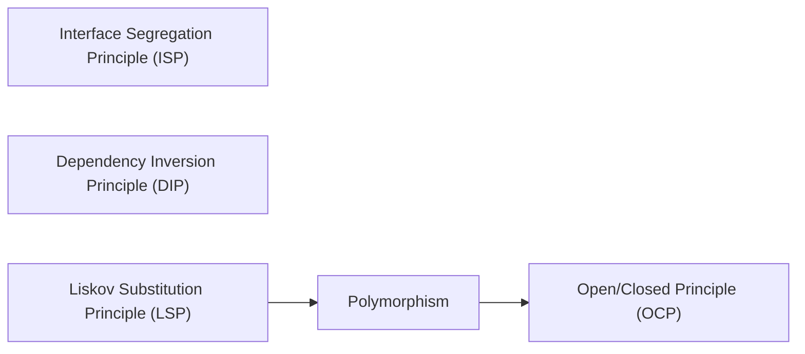
```mermaid
flowchart LR
    n_interface_segregation["Interface Segregation Principle (ISP)"]
    n_dependency_inversion["Dependency Inversion Principle (DIP)"]
    n_open_closed["Open/Closed Principle (OCP)"]
    n_liskov_substitution["Liskov Substitution Principle (LSP)"]
    n_polymorphism["Polymorphism"]
    n_liskov_substitution --> n_polymorphism
    n_polymorphism --> n_open_closed
```

### Interface Segregation Principle (ISP)

- Kind: [principle](SCHEMA.md#kind-principle)
- Category: [SOLID / Object-Oriented Design](PRINCIPLES.md#architecture-category-solid-object-oriented-design)
- Severity: [mandatory](SCHEMA.md#vocabulary-severity-mandatory)
- Scope: interface, service, module
- Aliases: ISP, Interface Segregation Principle
- Layer: [Structural Core](SCHEMA.md#layer-structural-core)

Details

Definition
A design rule that a client depends on an interface holding only the methods it uses.

Requires
[Role-Specific Interfaces](LEXICON.md#lexicon-role-specific-interfaces)

Reinforces
[Single Responsibility Principle (SRP)](PRINCIPLES.md#architecture-single-responsibility), [Low Coupling](PRINCIPLES.md#architecture-low-coupling)

Enables
[Consumer-Specific Contracts](LEXICON.md#lexicon-consumer-specific-contracts)

In tension with
[Interface Proliferation](LEXICON.md#lexicon-interface-proliferation)

Conflicts with
[Fat Interface](LEXICON.md#lexicon-fat-interface), [Repository Dump](PRINCIPLES.md#architecture-repository-dump)

Tensions
[Interface Segregation Principle (ISP) / Interface Proliferation](SCHEMA.md#tension-interface-proliferation-interface-segregation-principle-isp)

Violated by
[Fat Interface](LEXICON.md#lexicon-fat-interface)

Detected by
unused interface method implementations

Measured by
interface method usage ratio

Refactored by
[Split Interface](LEXICON.md#lexicon-split-interface), [Extract Role Interface](LEXICON.md#lexicon-extract-role-interface)

Enforced by
interface usage analysis, lint rules

Before

```typescript
interface FooWorker {
  load(id: FooId): Foo;
  save(foo: Foo): void;
  delete(id: FooId): void;
  export(): string;
}
class FooReader implements FooWorker {}
```

After

```typescript
interface FooReader {
  load(id: FooId): Foo;
}
interface FooWriter {
  save(foo: Foo): void;
}
interface FooRemover {
  delete(id: FooId): void;
}
class CachedFooReader implements FooReader {
  load(id: FooId) {
    return fooCache.get(id)!;
  }
}
```

How it is checked

Checked by
interface usage analysis, lint rules

Population
Every interface, class hierarchy and dependency edge in the object model

Freshness
A verdict stands until an interface, an override or a dependency changes

Refusal
The dependency rule or the contract test fails a change that breaks substitution, segregation or dependency direction

Observation
Interface usage, override contracts and dependency direction, read from source and contract tests

Evidence
None, because the catalog states this check as a class, so a watched run belongs to each system that adopts it

Authoritative side
The interface contract, which every implementation and override conforms to

Depends on
[Role-Specific Interfaces](LEXICON.md#lexicon-role-specific-interfaces), [Single Responsibility Principle (SRP)](PRINCIPLES.md#architecture-single-responsibility), [Low Coupling](PRINCIPLES.md#architecture-low-coupling), [Consumer-Specific Contracts](LEXICON.md#lexicon-consumer-specific-contracts)

Shape it refuses
[Fat Interface](LEXICON.md#lexicon-fat-interface), [Repository Dump](PRINCIPLES.md#architecture-repository-dump)

### Dependency Inversion Principle (DIP)

- Kind: [principle](SCHEMA.md#kind-principle)
- Category: [SOLID / Object-Oriented Design](PRINCIPLES.md#architecture-category-solid-object-oriented-design)
- Severity: [mandatory](SCHEMA.md#vocabulary-severity-mandatory)
- Scope: module, component, layer
- Aliases: DIP, Dependency Inversion Principle
- Layer: [Structural Core](SCHEMA.md#layer-structural-core)

Details

Definition
A design rule that high-level policy and low-level detail both depend on an abstraction owned by the policy.

Requires
[Abstraction](PRINCIPLES.md#architecture-abstraction), [Stable Interfaces](PRINCIPLES.md#architecture-stable-interfaces)

Reinforces
[Low Coupling](PRINCIPLES.md#architecture-low-coupling), [Clean Architecture](PRINCIPLES.md#architecture-clean-architecture)

Enables
[Dependency Injection](PRINCIPLES.md#architecture-dependency-injection), [Ports and Adapters Architecture](PRINCIPLES.md#architecture-ports-and-adapters-architecture)

In tension with
[Runtime Indirection](LEXICON.md#lexicon-runtime-indirection)

Conflicts with
[Concrete Coupling](PRINCIPLES.md#architecture-concrete-coupling)

Referenced by
[Interface-Based Design](PRINCIPLES.md#architecture-interface-based-design), [Testability](PRINCIPLES.md#architecture-testability), [Abstraction](PRINCIPLES.md#architecture-abstraction), [Replaceability](PRINCIPLES.md#architecture-replaceability), [Inversion of Control (IoC)](PRINCIPLES.md#architecture-inversion-of-control), [Dependency Injection](PRINCIPLES.md#architecture-dependency-injection), [Service Locator Pattern](PRINCIPLES.md#architecture-service-locator-pattern), [Ports and Adapters Architecture](PRINCIPLES.md#architecture-ports-and-adapters-architecture), [Clean Architecture](PRINCIPLES.md#architecture-clean-architecture)

Tensions
[Dependency Inversion Principle (DIP) / Runtime Indirection](SCHEMA.md#tension-dependency-inversion-principle-dip-runtime-indirection)

Distinct from
[Inversion of Control (IoC)](PRINCIPLES.md#architecture-inversion-of-control): Dependency inversion fixes which side owns the abstraction, while inversion of control moves object creation and control flow to a framework or composition root.

Violated by
[Concrete Coupling](PRINCIPLES.md#architecture-concrete-coupling)

Detected by
dependency direction violations

Measured by
inward dependency ratio

Refactored by
[Extract Interface](LEXICON.md#lexicon-extract-interface), [Introduce Port](LEXICON.md#lexicon-introduce-port), [Dependency Injection](PRINCIPLES.md#architecture-dependency-injection)

Enforced by
dependency graph rules, architecture tests

Before

```typescript
class FooService {
  private readonly store = new SqlFooStore();
  save(foo: Foo) {
    return this.store.save(foo);
  }
}
```

After

```typescript
interface FooStore {
  save(foo: Foo): Promise<void>;
}
class FooService {
  constructor(private readonly store: FooStore) {}
  save(foo: Foo) {
    return this.store.save(foo);
  }
}
```

How it is checked

Checked by
dependency graph rules, architecture tests

Population
Every interface, class hierarchy and dependency edge in the object model

Freshness
A verdict stands until an interface, an override or a dependency changes

Refusal
The dependency rule or the contract test fails a change that breaks substitution, segregation or dependency direction

Observation
Interface usage, override contracts and dependency direction, read from source and contract tests

Evidence
None, because the catalog states this check as a class, so a watched run belongs to each system that adopts it

Authoritative side
The interface contract, which every implementation and override conforms to

Depends on
[Abstraction](PRINCIPLES.md#architecture-abstraction), [Stable Interfaces](PRINCIPLES.md#architecture-stable-interfaces), [Low Coupling](PRINCIPLES.md#architecture-low-coupling), [Clean Architecture](PRINCIPLES.md#architecture-clean-architecture), [Dependency Injection](PRINCIPLES.md#architecture-dependency-injection), [Ports and Adapters Architecture](PRINCIPLES.md#architecture-ports-and-adapters-architecture)

Shape it refuses
[Concrete Coupling](PRINCIPLES.md#architecture-concrete-coupling)

### Open/Closed Principle (OCP)

- Kind: [principle](SCHEMA.md#kind-principle)
- Category: [SOLID / Object-Oriented Design](PRINCIPLES.md#architecture-category-solid-object-oriented-design)
- Severity: [recommended](SCHEMA.md#vocabulary-severity-recommended)
- Scope: class, module, component
- Aliases: OCP, Open-Closed Principle
- Layer: [Structural Core](SCHEMA.md#layer-structural-core)

Details

Definition
A design rule that a module gains new behavior by adding code at an extension point, leaving its existing code unchanged.

Requires
[Abstraction](PRINCIPLES.md#architecture-abstraction), [Extension Points](PRINCIPLES.md#architecture-extension-points)

Reinforces
[Plugin Architecture](PRINCIPLES.md#architecture-plugin-architecture), [Strategy Pattern](PRINCIPLES.md#architecture-strategy-pattern)

Enables
[Feature Extension without Modification](LEXICON.md#lexicon-feature-extension-without-modification)

In tension with
[Simplicity](LEXICON.md#lexicon-simplicity)

Conflicts with
[Switch-Based Extension](LEXICON.md#lexicon-switch-based-extension)

Referenced by
[Dynamic Dispatch](PRINCIPLES.md#architecture-dynamic-dispatch), [Runtime Extensibility](PRINCIPLES.md#architecture-runtime-extensibility), [Polymorphism](PRINCIPLES.md#architecture-polymorphism), [Strategy Pattern](PRINCIPLES.md#architecture-strategy-pattern), [Command Pattern](PRINCIPLES.md#architecture-command-pattern), [State Pattern](PRINCIPLES.md#architecture-state-pattern), [Chain of Responsibility Pattern](PRINCIPLES.md#architecture-chain-of-responsibility-pattern), [Visitor Pattern](PRINCIPLES.md#architecture-visitor-pattern), [Factory Pattern](PRINCIPLES.md#architecture-factory-pattern), [Factory Method Pattern](PRINCIPLES.md#architecture-factory-method-pattern), [Decorator Pattern](PRINCIPLES.md#architecture-decorator-pattern), [Composite Pattern](PRINCIPLES.md#architecture-composite-pattern), [Plugin Architecture](PRINCIPLES.md#architecture-plugin-architecture), [Extension Points](PRINCIPLES.md#architecture-extension-points)

Contracts
[Extensibility Core](ALGORITHMS.md#algorithms-extensibility-core)

Tensions
[Open/Closed Principle (OCP) / Simplicity](SCHEMA.md#tension-open-closed-principle-ocp-simplicity)

Distinct from
[Composability](PRINCIPLES.md#architecture-composability): The open/closed principle adds behavior without editing existing code, while composability combines parts through compatible interfaces.

Violated by
[Switch-Based Extension](LEXICON.md#lexicon-switch-based-extension)

Detected by
growing conditionals, repeated edits to central classes

Measured by
modification frequency of core modules

Refactored by
[Strategy Pattern](PRINCIPLES.md#architecture-strategy-pattern), [Extension Points](PRINCIPLES.md#architecture-extension-points), [Plugin Architecture](PRINCIPLES.md#architecture-plugin-architecture)

Enforced by
extension policies, change analysis

Refused by rules
open-closed

Before

```typescript
function priceFoo(kind: string, value: number) {
  if (kind === "foo") return value;
  if (kind === "bar") return value * 2;
  throw new Error("unknown kind");
}
```

After

```typescript
interface FooPricing {
  price(value: number): number;
}
const registry = new Map<string, FooPricing>();
export function registerPricing(kind: string, pricing: FooPricing) {
  registry.set(kind, pricing);
}
export function priceFoo(kind: string, value: number) {
  const pricing = registry.get(kind);
  if (!pricing) throw new Error(`unknown kind ${kind}`);
  return pricing.price(value);
}
registerPricing("bar", { price: (value) => value * 2 });
```

How it is checked

Checked by
extension policies, change analysis

Population
Every interface, class hierarchy and dependency edge in the object model

Freshness
A verdict stands until an interface, an override or a dependency changes

Refusal
The dependency rule or the contract test fails a change that breaks substitution, segregation or dependency direction

Observation
Interface usage, override contracts and dependency direction, read from source and contract tests

Evidence
None, because the catalog states this check as a class, so a watched run belongs to each system that adopts it

Authoritative side
The interface contract, which every implementation and override conforms to

Depends on
[Abstraction](PRINCIPLES.md#architecture-abstraction), [Extension Points](PRINCIPLES.md#architecture-extension-points), [Plugin Architecture](PRINCIPLES.md#architecture-plugin-architecture), [Strategy Pattern](PRINCIPLES.md#architecture-strategy-pattern), [Feature Extension without Modification](LEXICON.md#lexicon-feature-extension-without-modification)

Shape it refuses
[Switch-Based Extension](LEXICON.md#lexicon-switch-based-extension)

### Liskov Substitution Principle (LSP)

- Kind: [principle](SCHEMA.md#kind-principle)
- Category: [SOLID / Object-Oriented Design](PRINCIPLES.md#architecture-category-solid-object-oriented-design)
- Severity: [mandatory](SCHEMA.md#vocabulary-severity-mandatory)
- Scope: class, interface, type hierarchy
- Aliases: LSP, Liskov Substitution Principle, Behavioral Subtyping
- Layer: [Structural Core](SCHEMA.md#layer-structural-core)

Details

Definition
A design rule that a subtype can replace its base type anywhere, because it keeps the base type's preconditions, postconditions and invariants.

Requires
[Contract Preservation](LEXICON.md#lexicon-contract-preservation), [Preconditions](PRINCIPLES.md#architecture-preconditions), [Postconditions](PRINCIPLES.md#architecture-postconditions), [Invariant](PRINCIPLES.md#architecture-invariant)

Reinforces
[Polymorphism](PRINCIPLES.md#architecture-polymorphism), [Type Safety](PRINCIPLES.md#architecture-type-safety)

Enables
[Safe Substitution](LEXICON.md#lexicon-safe-substitution), [Substitutability](LEXICON.md#lexicon-substitutability)

In tension with
[Narrow Specialized Behavior](LEXICON.md#lexicon-narrow-specialized-behavior)

Conflicts with
[Broken Inheritance](LEXICON.md#lexicon-broken-inheritance), [Broken Inheritance](LEXICON.md#lexicon-broken-inheritance)

Referenced by
[Design by Contract](PRINCIPLES.md#architecture-design-by-contract)

Tensions
[Liskov Substitution Principle (LSP) / Narrow Specialized Behavior](SCHEMA.md#tension-liskov-substitution-principle-lsp-narrow-specialized-behavior)

Violated by
[Broken Inheritance](LEXICON.md#lexicon-broken-inheritance)

Detected by
overridden method contract divergence

Measured by
contract test pass rate across subtypes

Refactored by
[Replace Inheritance with Delegation](LEXICON.md#lexicon-replace-inheritance-with-delegation), [Extract Interface](LEXICON.md#lexicon-extract-interface), [Split Hierarchy](LEXICON.md#lexicon-split-hierarchy)

Enforced by
contract tests, type tests

Before

```typescript
class FooStore {
  save(foo: Foo): Promise<Receipt> {
    return persist(foo);
  }
}
class ReadOnlyFooStore extends FooStore {
  save(): Promise<Receipt> {
    throw new Error("not supported");
  }
}
```

After

```typescript
class FooStore {
  save(foo: Foo): Promise<Receipt> {
    return persist(foo);
  }
}
class AuditedFooStore extends FooStore {
  async save(foo: Foo): Promise<Receipt> {
    const receipt = await super.save(foo);
    audit.record(receipt);
    return receipt;
  }
}
```

How it is checked

Checked by
contract tests, type tests

Population
Every interface, class hierarchy and dependency edge in the object model

Freshness
A verdict stands until an interface, an override or a dependency changes

Refusal
The dependency rule or the contract test fails a change that breaks substitution, segregation or dependency direction

Observation
Interface usage, override contracts and dependency direction, read from source and contract tests

Evidence
None, because the catalog states this check as a class, so a watched run belongs to each system that adopts it

Authoritative side
The interface contract, which every implementation and override conforms to

Depends on
[Contract Preservation](LEXICON.md#lexicon-contract-preservation), [Preconditions](PRINCIPLES.md#architecture-preconditions), [Postconditions](PRINCIPLES.md#architecture-postconditions), [Invariant](PRINCIPLES.md#architecture-invariant), [Polymorphism](PRINCIPLES.md#architecture-polymorphism), [Type Safety](PRINCIPLES.md#architecture-type-safety), [Safe Substitution](LEXICON.md#lexicon-safe-substitution), [Substitutability](LEXICON.md#lexicon-substitutability)

Shape it refuses
[Broken Inheritance](LEXICON.md#lexicon-broken-inheritance), [Broken Inheritance](LEXICON.md#lexicon-broken-inheritance)

### Polymorphism

- Kind: [mechanism](SCHEMA.md#kind-mechanism)
- Category: [SOLID / Object-Oriented Design](PRINCIPLES.md#architecture-category-solid-object-oriented-design)
- Severity: [recommended](SCHEMA.md#vocabulary-severity-recommended)
- Scope: class, interface, runtime
- Layer: [Structural Core](SCHEMA.md#layer-structural-core)

Details

Definition
A mechanism that lets one interface have several implementations, with the implementation chosen by the object that receives the call.

Requires
[Abstraction](PRINCIPLES.md#architecture-abstraction), [Substitutability](LEXICON.md#lexicon-substitutability)

Reinforces
[Open/Closed Principle (OCP)](PRINCIPLES.md#architecture-open-closed), [Strategy Pattern](PRINCIPLES.md#architecture-strategy-pattern)

Enables
[Dynamic Dispatch](PRINCIPLES.md#architecture-dynamic-dispatch), [Interchangeability](PRINCIPLES.md#architecture-interchangeability)

In tension with
[Traceability](PRINCIPLES.md#architecture-traceability)

Conflicts with
[Type Switching](LEXICON.md#lexicon-type-switching)

Referenced by
[Dynamic Binding](PRINCIPLES.md#architecture-dynamic-binding), [Dynamic Dispatch](PRINCIPLES.md#architecture-dynamic-dispatch), [Abstraction](PRINCIPLES.md#architecture-abstraction), [Interchangeability](PRINCIPLES.md#architecture-interchangeability), [Liskov Substitution Principle (LSP)](PRINCIPLES.md#architecture-liskov-substitution), [Strategy Pattern](PRINCIPLES.md#architecture-strategy-pattern), [State Pattern](PRINCIPLES.md#architecture-state-pattern), [Null Object Pattern](PRINCIPLES.md#architecture-null-object-pattern)

Tensions
[Polymorphism / Traceability](SCHEMA.md#tension-polymorphism-traceability)

Distinct from
[Dynamic Dispatch](PRINCIPLES.md#architecture-dynamic-dispatch): Polymorphism is one interface with several implementations, while dynamic dispatch is the runtime selection of which one runs, from the receiver or a keyed table.

Distinct from
[Type Safety](PRINCIPLES.md#architecture-type-safety): Polymorphism varies the implementation behind a type, while type safety rejects operations on the wrong type.

Violated by
[Type Switching](LEXICON.md#lexicon-type-switching)

Detected by
conditional type checks, duplicated branching

Measured by
polymorphic dispatch ratio

Refactored by
[Replace Conditional with Polymorphism](LEXICON.md#lexicon-replace-conditional-with-polymorphism)

Enforced by
[code review](PRINCIPLES.md#architecture-code-review), static analysis rules

Before

```typescript
function renderFoo(kind: string, foo: Foo) {
  if (kind === "text") return foo.name;
  if (kind === "json") return JSON.stringify(foo);
  throw new Error("unknown renderer");
}
```

After

```typescript
interface FooRenderer {
  render(foo: Foo): string;
}
class TextFooRenderer implements FooRenderer {
  render(foo: Foo) {
    return foo.name;
  }
}
class JsonFooRenderer implements FooRenderer {
  render(foo: Foo) {
    return JSON.stringify(foo);
  }
}
function renderFoo(renderer: FooRenderer, foo: Foo) {
  return renderer.render(foo);
}
```

How it is checked

Checked by
code review, static analysis rules

Population
Every interface, class hierarchy and dependency edge in the object model

Freshness
A verdict stands until an interface, an override or a dependency changes

Refusal
The dependency rule or the contract test fails a change that breaks substitution, segregation or dependency direction

Observation
Interface usage, override contracts and dependency direction, read from source and contract tests

Evidence
None, because the catalog states this check as a class, so a watched run belongs to each system that adopts it

Authoritative side
The interface contract, which every implementation and override conforms to

Depends on
[Abstraction](PRINCIPLES.md#architecture-abstraction), [Substitutability](LEXICON.md#lexicon-substitutability), [Open/Closed Principle (OCP)](PRINCIPLES.md#architecture-open-closed), [Strategy Pattern](PRINCIPLES.md#architecture-strategy-pattern), [Dynamic Dispatch](PRINCIPLES.md#architecture-dynamic-dispatch), [Interchangeability](PRINCIPLES.md#architecture-interchangeability)

Shape it refuses
[Type Switching](LEXICON.md#lexicon-type-switching)

## Event / Messaging / Asynchronous Architecture

Every principle in this category is listed as a record. Each record carries its kind, its severity, the scopes it applies at and the layer it lives in, then the edge relations that join it to other records, the records that point back at it, the contracts that answer to it and the tensions it takes part in. The descriptors say how it is violated, detected, measured, repaired and enforced. Where the record carries one, an exemplar shows the shape before and after the principle is applied.

Relations diagram

The relations inside this category.

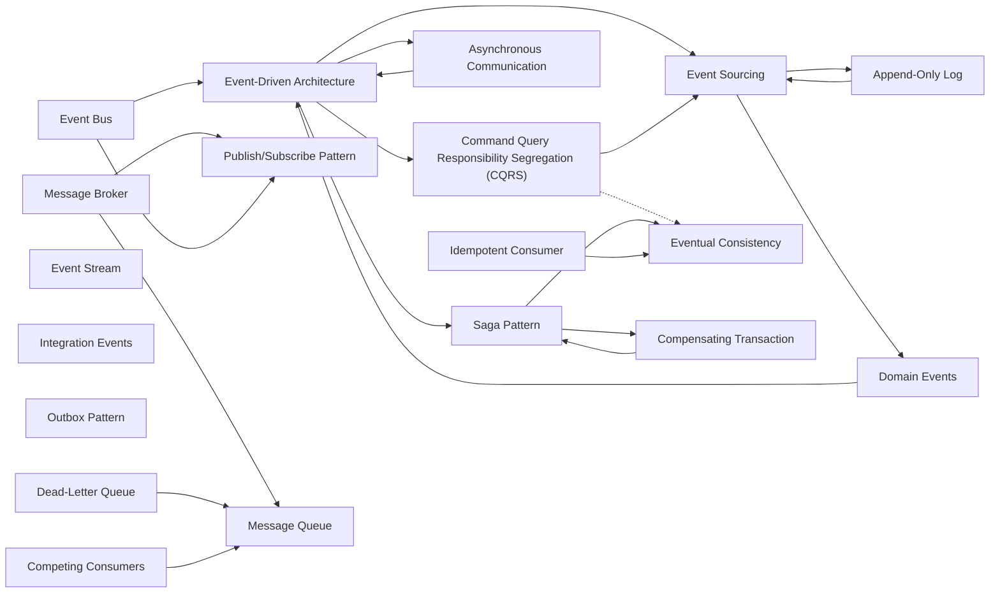
```mermaid
flowchart LR
    n_event_driven_architecture["Event-Driven Architecture"]
    n_publish_subscribe_pattern["Publish/Subscribe Pattern"]
    n_message_queue["Message Queue"]
    n_message_broker["Message Broker"]
    n_event_bus["Event Bus"]
    n_event_stream["Event Stream"]
    n_event_sourcing["Event Sourcing"]
    n_command_query_responsibility_segregation["Command Query Responsibility Segregation (CQRS)"]
    n_domain_events["Domain Events"]
    n_integration_events["Integration Events"]
    n_asynchronous_communication["Asynchronous Communication"]
    n_eventual_consistency["Eventual Consistency"]
    n_saga_pattern["Saga Pattern"]
    n_outbox_pattern["Outbox Pattern"]
    n_compensating_transaction["Compensating Transaction"]
    n_append_only_log["Append-Only Log"]
    n_dead_letter_queue["Dead-Letter Queue"]
    n_idempotent_consumer["Idempotent Consumer"]
    n_competing_consumers["Competing Consumers"]
    n_event_driven_architecture --> n_asynchronous_communication
    n_event_driven_architecture --> n_event_sourcing
    n_event_driven_architecture --> n_command_query_responsibility_segregation
    n_event_driven_architecture --> n_saga_pattern
    n_message_broker --> n_message_queue
    n_message_broker --> n_publish_subscribe_pattern
    n_event_bus --> n_publish_subscribe_pattern
    n_event_bus --> n_event_driven_architecture
    n_event_sourcing --> n_append_only_log
    n_event_sourcing --> n_domain_events
    n_command_query_responsibility_segregation --> n_event_sourcing
    n_command_query_responsibility_segregation -.-> n_eventual_consistency
    n_domain_events --> n_event_driven_architecture
    n_asynchronous_communication --> n_event_driven_architecture
    n_saga_pattern --> n_compensating_transaction
    n_saga_pattern --> n_eventual_consistency
    n_compensating_transaction --> n_saga_pattern
    n_append_only_log --> n_event_sourcing
    n_dead_letter_queue --> n_message_queue
    n_idempotent_consumer --> n_eventual_consistency
    n_competing_consumers --> n_message_queue
```

### Event-Driven Architecture

- Kind: [style](SCHEMA.md#kind-style)
- Category: [Event / Messaging / Asynchronous Architecture](PRINCIPLES.md#architecture-category-event-messaging-asynchronous-architecture)
- Severity: [contextual](SCHEMA.md#vocabulary-severity-contextual)
- Scope: service, integration, system
- Aliases: EDA
- Layer: [Execution Core](SCHEMA.md#layer-execution-core)

Details

Definition
A convention of connecting services through published events, with each consumer reacting independently of the producer.

Requires
[Events](LEXICON.md#lexicon-events), [Message Contract](LEXICON.md#lexicon-message-contract), [Idempotency](PRINCIPLES.md#architecture-idempotency)

Reinforces
[Low Coupling](PRINCIPLES.md#architecture-low-coupling), [Asynchronous Communication](PRINCIPLES.md#architecture-asynchronous-communication)

Enables
[Event Sourcing](PRINCIPLES.md#architecture-event-sourcing), [Command Query Responsibility Segregation (CQRS)](PRINCIPLES.md#architecture-command-query-responsibility-segregation), [Saga Pattern](PRINCIPLES.md#architecture-saga-pattern)

In tension with
[Debuggability](LEXICON.md#lexicon-debuggability), [Strong Consistency](LEXICON.md#lexicon-strong-consistency)

Conflicts with
[Hidden Temporal Coupling](LEXICON.md#lexicon-hidden-temporal-coupling)

Referenced by
[Choreography](PRINCIPLES.md#architecture-choreography), [Event Bus](PRINCIPLES.md#architecture-event-bus), [Domain Events](PRINCIPLES.md#architecture-domain-events), [Asynchronous Communication](PRINCIPLES.md#architecture-asynchronous-communication), [Observer Pattern](PRINCIPLES.md#architecture-observer-pattern), [Idempotency](PRINCIPLES.md#architecture-idempotency)

Tensions
[Event-Driven Architecture / Debuggability](SCHEMA.md#tension-debuggability-event-driven-architecture), [Event-Driven Architecture / Strong Consistency](SCHEMA.md#tension-event-driven-architecture-strong-consistency)

Violated by
[Non-Idempotent Operation](LEXICON.md#lexicon-non-idempotent-operation), [Ad-Hoc Payloads](LEXICON.md#lexicon-ad-hoc-payloads)

Detected by
missing correlation IDs, direct synchronous chains

Measured by
event contract coverage, [retry safety](LEXICON.md#lexicon-retry-safety)

Refactored by
[Domain Events](PRINCIPLES.md#architecture-domain-events), [Outbox Pattern](PRINCIPLES.md#architecture-outbox-pattern), [Consumer-Driven Contract Tests](LEXICON.md#lexicon-consumer-driven-contract-tests)

Enforced by
[schema registry](LEXICON.md#lexicon-schema-registry), idempotency tests

Before

```typescript
async function createFoo(foo: Foo) {
  await fooStore.save(foo);
  await barService.refresh(foo.id);
  await bazService.notify(foo.id);
}
```

After

```typescript
async function createFoo(foo: Foo) {
  await fooStore.save(foo);
  await events.publish({ type: "FooCreated", fooId: foo.id });
}
events.on("FooCreated", updateBarProjection);
events.on("FooCreated", notifyBaz);
```

How it is checked

Checked by
schema registry, idempotency tests

Population
Every event, message, topic and consumer that crosses an asynchronous boundary

Freshness
A verdict stands until an event schema, a consumer or the delivery guarantee changes

Refusal
The schema registry, idempotency test or workflow test fails the change that breaks delivery or contract

Observation
Published schemas, consumer registrations, and redelivery, lag and dead-letter counts from the broker

Evidence
None, because the catalog states this check as a class, so a watched run belongs to each system that adopts it

Authoritative side
The published schema and the delivery guarantee, which every producer and consumer conforms to

Depends on
[Events](LEXICON.md#lexicon-events), [Message Contract](LEXICON.md#lexicon-message-contract), [Idempotency](PRINCIPLES.md#architecture-idempotency), [Low Coupling](PRINCIPLES.md#architecture-low-coupling), [Asynchronous Communication](PRINCIPLES.md#architecture-asynchronous-communication), [Event Sourcing](PRINCIPLES.md#architecture-event-sourcing), [Command Query Responsibility Segregation (CQRS)](PRINCIPLES.md#architecture-command-query-responsibility-segregation), [Saga Pattern](PRINCIPLES.md#architecture-saga-pattern)

Shape it refuses
[Hidden Temporal Coupling](LEXICON.md#lexicon-hidden-temporal-coupling)

### Publish/Subscribe Pattern

- Kind: [pattern](SCHEMA.md#kind-pattern)
- Category: [Event / Messaging / Asynchronous Architecture](PRINCIPLES.md#architecture-category-event-messaging-asynchronous-architecture)
- Severity: [contextual](SCHEMA.md#vocabulary-severity-contextual)
- Scope: integration, eventing
- Aliases: Pub/Sub
- Layer: [Execution Core](SCHEMA.md#layer-execution-core)

Details

Definition
A design pattern in which publishers send messages to a topic and every subscriber to that topic receives them.

Requires
[Publisher](LEXICON.md#lexicon-publisher), [Subscriber](LEXICON.md#lexicon-subscriber), [Broker/Event Bus](LEXICON.md#lexicon-broker-event-bus)

Reinforces
[Low Coupling](PRINCIPLES.md#architecture-low-coupling)

Enables
[Fan-Out Notification](LEXICON.md#lexicon-fan-out-notification)

In tension with
[Delivery Ordering](LEXICON.md#lexicon-delivery-ordering)

Conflicts with
[Direct Point-to-Point Calls](LEXICON.md#lexicon-direct-point-to-point-calls)

Referenced by
[Message Broker](PRINCIPLES.md#architecture-message-broker), [Event Bus](PRINCIPLES.md#architecture-event-bus)

Tensions
[Publish/Subscribe Pattern / Delivery Ordering](SCHEMA.md#tension-delivery-ordering-publish-subscribe-pattern)

Violated by
[Point-to-Point Coupling](LEXICON.md#lexicon-point-to-point-coupling)

Detected by
direct calls to subscriber list

Measured by
publisher-subscriber coupling

Refactored by
[Event Bus](PRINCIPLES.md#architecture-event-bus)

Enforced by
messaging contracts

Before

```typescript
function saveFoo(foo: Foo) {
  fooStore.save(foo);
  auditFoo(foo);
  indexFoo(foo);
}
```

After

```typescript
publisher.publish("foo.saved", { fooId: foo.id });
subscriber.on("foo.saved", auditFoo);
subscriber.on("foo.saved", indexFoo);
```

How it is checked

Checked by
messaging contracts

Population
Every event, message, topic and consumer that crosses an asynchronous boundary

Freshness
A verdict stands until an event schema, a consumer or the delivery guarantee changes

Refusal
The schema registry, idempotency test or workflow test fails the change that breaks delivery or contract

Observation
Published schemas, consumer registrations, and redelivery, lag and dead-letter counts from the broker

Evidence
None, because the catalog states this check as a class, so a watched run belongs to each system that adopts it

Authoritative side
The published schema and the delivery guarantee, which every producer and consumer conforms to

Depends on
[Publisher](LEXICON.md#lexicon-publisher), [Subscriber](LEXICON.md#lexicon-subscriber), [Broker/Event Bus](LEXICON.md#lexicon-broker-event-bus), [Low Coupling](PRINCIPLES.md#architecture-low-coupling), [Fan-Out Notification](LEXICON.md#lexicon-fan-out-notification)

Shape it refuses
[Direct Point-to-Point Calls](LEXICON.md#lexicon-direct-point-to-point-calls)

### Message Queue

- Kind: [mechanism](SCHEMA.md#kind-mechanism)
- Category: [Event / Messaging / Asynchronous Architecture](PRINCIPLES.md#architecture-category-event-messaging-asynchronous-architecture)
- Severity: [contextual](SCHEMA.md#vocabulary-severity-contextual)
- Scope: integration, async processing
- Layer: [Execution Core](SCHEMA.md#layer-execution-core)

Details

Definition
A mechanism that holds messages durably until a consumer takes and acknowledges each one.

Requires
[Message Contract](LEXICON.md#lexicon-message-contract), [Consumer](LEXICON.md#lexicon-consumer)

Reinforces
[Resilience](PRINCIPLES.md#architecture-resilience), [Backpressure](PRINCIPLES.md#architecture-backpressure)

Enables
[Asynchronous Processing](LEXICON.md#lexicon-asynchronous-processing)

In tension with
[Latency](PRINCIPLES.md#architecture-latency)

Conflicts with
[In-Memory Direct Invocation](LEXICON.md#lexicon-in-memory-direct-invocation)

Referenced by
[Message Broker](PRINCIPLES.md#architecture-message-broker), [Dead-Letter Queue](PRINCIPLES.md#architecture-dead-letter-queue), [Competing Consumers](PRINCIPLES.md#architecture-competing-consumers)

Tensions
[Message Queue / Latency](SCHEMA.md#tension-latency-message-queue)

Distinct from
[Consumer](LEXICON.md#lexicon-consumer): A message queue holds messages until they are acknowledged, while the consumer is the component that takes and processes them.

Violated by
[Missing Backpressure](PRINCIPLES.md#architecture-missing-backpressure)

Detected by
synchronous blocking chains for async work

Measured by
queue depth, retry/dead-letter rates

Refactored by
[Competing Consumers](PRINCIPLES.md#architecture-competing-consumers)

Enforced by
infrastructure policy, load tests

Before

```typescript
for (const foo of foos) await processFoo(foo);
```

After

```typescript
for (const foo of foos) await fooQueue.enqueue({ type: "ProcessFoo", foo });
fooWorker.consume(fooQueue, (message) => processFoo(message.foo));
```

How it is checked

Checked by
infrastructure policy, load tests

Population
Every event, message, topic and consumer that crosses an asynchronous boundary

Freshness
A verdict stands until an event schema, a consumer or the delivery guarantee changes

Refusal
The schema registry, idempotency test or workflow test fails the change that breaks delivery or contract

Observation
Published schemas, consumer registrations, and redelivery, lag and dead-letter counts from the broker

Evidence
None, because the catalog states this check as a class, so a watched run belongs to each system that adopts it

Authoritative side
The published schema and the delivery guarantee, which every producer and consumer conforms to

Depends on
[Message Contract](LEXICON.md#lexicon-message-contract), [Consumer](LEXICON.md#lexicon-consumer), [Resilience](PRINCIPLES.md#architecture-resilience), [Backpressure](PRINCIPLES.md#architecture-backpressure), [Asynchronous Processing](LEXICON.md#lexicon-asynchronous-processing)

Shape it refuses
[In-Memory Direct Invocation](LEXICON.md#lexicon-in-memory-direct-invocation)

### Message Broker

- Kind: [artifact](SCHEMA.md#kind-artifact)
- Category: [Event / Messaging / Asynchronous Architecture](PRINCIPLES.md#architecture-category-event-messaging-asynchronous-architecture)
- Severity: [contextual](SCHEMA.md#vocabulary-severity-contextual)
- Scope: integration, messaging
- Layer: [Execution Core](SCHEMA.md#layer-execution-core)

Details

Definition
Descriptive data about topics, queues and routing rules, held by an intermediary service that delivers messages between producers and consumers.

Requires
[Message Queue](PRINCIPLES.md#architecture-message-queue), [Routing](LEXICON.md#lexicon-routing)

Reinforces
[Low Coupling](PRINCIPLES.md#architecture-low-coupling), [Scalability](PRINCIPLES.md#architecture-scalability)

Enables
[Publish/Subscribe Pattern](PRINCIPLES.md#architecture-publish-subscribe-pattern), [Work Distribution](LEXICON.md#lexicon-work-distribution)

In tension with
[Operational Dependency](LEXICON.md#lexicon-operational-dependency)

Conflicts with
[Point-to-Point Coupling](LEXICON.md#lexicon-point-to-point-coupling)

Tensions
[Message Broker / Operational Dependency](SCHEMA.md#tension-message-broker-operational-dependency)

Violated by
[Direct Point-to-Point Calls](LEXICON.md#lexicon-direct-point-to-point-calls)

Detected by
direct service calls in async workflows

Measured by
broker usage coverage

Refactored by
[Message Queue](PRINCIPLES.md#architecture-message-queue)

Enforced by
architecture policy

Before

```typescript
await fooService.sendToBar(barMessage);
await fooService.sendToBaz(bazMessage);
```

After

```typescript
await broker.publish("foo.created", fooMessage, { durable: true });
broker.subscribe(
  "foo.created",
  { group: "bar-consumer", ack: "manual" },
  handleBar,
);
broker.subscribe(
  "foo.created",
  { group: "baz-consumer", ack: "manual" },
  handleBaz,
);
```

How it is checked

Checked by
architecture policy

Population
Every event, message, topic and consumer that crosses an asynchronous boundary

Freshness
A verdict stands until an event schema, a consumer or the delivery guarantee changes

Refusal
The schema registry, idempotency test or workflow test fails the change that breaks delivery or contract

Observation
Published schemas, consumer registrations, and redelivery, lag and dead-letter counts from the broker

Evidence
None, because the catalog states this check as a class, so a watched run belongs to each system that adopts it

Authoritative side
The published schema and the delivery guarantee, which every producer and consumer conforms to

Depends on
[Message Queue](PRINCIPLES.md#architecture-message-queue), [Routing](LEXICON.md#lexicon-routing), [Low Coupling](PRINCIPLES.md#architecture-low-coupling), [Scalability](PRINCIPLES.md#architecture-scalability), [Publish/Subscribe Pattern](PRINCIPLES.md#architecture-publish-subscribe-pattern), [Work Distribution](LEXICON.md#lexicon-work-distribution)

Shape it refuses
[Point-to-Point Coupling](LEXICON.md#lexicon-point-to-point-coupling)

### Event Bus

- Kind: [mechanism](SCHEMA.md#kind-mechanism)
- Category: [Event / Messaging / Asynchronous Architecture](PRINCIPLES.md#architecture-category-event-messaging-asynchronous-architecture)
- Severity: [contextual](SCHEMA.md#vocabulary-severity-contextual)
- Scope: application, integration
- Layer: [Execution Core](SCHEMA.md#layer-execution-core)

Details

Definition
A mechanism that dispatches each emitted event to the handlers registered for its type.

Requires
[Event Contract](LEXICON.md#lexicon-event-contract), [Subscriber Model](LEXICON.md#lexicon-subscriber-model)

Reinforces
[Publish/Subscribe Pattern](PRINCIPLES.md#architecture-publish-subscribe-pattern), [Event-Driven Architecture](PRINCIPLES.md#architecture-event-driven-architecture)

Enables
[Decoupled Event Distribution](LEXICON.md#lexicon-decoupled-event-distribution)

In tension with
[Event Storm / Traceability](LEXICON.md#lexicon-event-storm-traceability)

Conflicts with
[Direct Event Handler Calls](LEXICON.md#lexicon-direct-event-handler-calls)

Tensions
[Event Bus / Event Storm / Traceability](SCHEMA.md#tension-event-bus-event-storm-traceability)

Violated by
[Hidden Dependency](LEXICON.md#lexicon-hidden-dependency)

Detected by
undocumented subscribers

Measured by
event dependency visibility

Refactored by
[Registry Pattern](PRINCIPLES.md#architecture-registry-pattern)

Enforced by
handler registry validation

Before

```typescript
fooEditor.onSave = (foo) => fooView.refresh(foo);
fooEditor.onDelete = (id) => fooView.remove(id);
```

After

```typescript
eventBus.emit({ type: "FooSaved", foo });
eventBus.emit({ type: "FooDeleted", fooId: id });
eventBus.on("FooSaved", (event) => fooView.refresh(event.foo));
```

How it is checked

Checked by
handler registry validation

Population
Every event, message, topic and consumer that crosses an asynchronous boundary

Freshness
A verdict stands until an event schema, a consumer or the delivery guarantee changes

Refusal
The schema registry, idempotency test or workflow test fails the change that breaks delivery or contract

Observation
Published schemas, consumer registrations, and redelivery, lag and dead-letter counts from the broker

Evidence
None, because the catalog states this check as a class, so a watched run belongs to each system that adopts it

Authoritative side
The published schema and the delivery guarantee, which every producer and consumer conforms to

Depends on
[Event Contract](LEXICON.md#lexicon-event-contract), [Subscriber Model](LEXICON.md#lexicon-subscriber-model), [Publish/Subscribe Pattern](PRINCIPLES.md#architecture-publish-subscribe-pattern), [Event-Driven Architecture](PRINCIPLES.md#architecture-event-driven-architecture), [Decoupled Event Distribution](LEXICON.md#lexicon-decoupled-event-distribution)

Shape it refuses
[Direct Event Handler Calls](LEXICON.md#lexicon-direct-event-handler-calls)

### Event Stream

- Kind: [mechanism](SCHEMA.md#kind-mechanism)
- Category: [Event / Messaging / Asynchronous Architecture](PRINCIPLES.md#architecture-category-event-messaging-asynchronous-architecture)
- Severity: [contextual](SCHEMA.md#vocabulary-severity-contextual)
- Scope: stream processing, integration
- Layer: [Execution Core](SCHEMA.md#layer-execution-core)

Details

Definition
A mechanism that keeps events in an ordered, replayable log that consumers read from their own offset.

Requires
[Ordered Log](LEXICON.md#lexicon-ordered-log), [Event Schema](LEXICON.md#lexicon-event-schema)

Reinforces
[Streaming Architecture](PRINCIPLES.md#architecture-streaming-architecture)

Enables
[Replay](LEXICON.md#lexicon-replay), [Continuous Processing](LEXICON.md#lexicon-continuous-processing)

In tension with
[Storage Volume](LEXICON.md#lexicon-storage-volume)

Conflicts with
[Mutable State Only](LEXICON.md#lexicon-mutable-state-only)

Referenced by
[Streaming Architecture](PRINCIPLES.md#architecture-streaming-architecture)

Tensions
[Event Stream / Storage Volume](SCHEMA.md#tension-event-stream-storage-volume)

Violated by
[Non-Replayable Processing](LEXICON.md#lexicon-non-replayable-processing)

Detected by
missing offsets, missing event schema

Measured by
replay success, lag

Refactored by
[Offset Tracking](LEXICON.md#lexicon-offset-tracking)

Enforced by
stream contract tests

Before

```typescript
const latest = await fooApi.getCurrentState(fooId);
```

After

```typescript
const stream = fooEvents.stream(fooId);
for await (const event of stream) fooProjection.apply(event);
```

How it is checked

Checked by
stream contract tests

Population
Every event, message, topic and consumer that crosses an asynchronous boundary

Freshness
A verdict stands until an event schema, a consumer or the delivery guarantee changes

Refusal
The schema registry, idempotency test or workflow test fails the change that breaks delivery or contract

Observation
Published schemas, consumer registrations, and redelivery, lag and dead-letter counts from the broker

Evidence
None, because the catalog states this check as a class, so a watched run belongs to each system that adopts it

Authoritative side
The published schema and the delivery guarantee, which every producer and consumer conforms to

Depends on
[Ordered Log](LEXICON.md#lexicon-ordered-log), [Event Schema](LEXICON.md#lexicon-event-schema), [Streaming Architecture](PRINCIPLES.md#architecture-streaming-architecture), [Replay](LEXICON.md#lexicon-replay), [Continuous Processing](LEXICON.md#lexicon-continuous-processing)

Shape it refuses
[Mutable State Only](LEXICON.md#lexicon-mutable-state-only)

### Event Sourcing

- Kind: [pattern](SCHEMA.md#kind-pattern)
- Category: [Event / Messaging / Asynchronous Architecture](PRINCIPLES.md#architecture-category-event-messaging-asynchronous-architecture)
- Severity: [contextual](SCHEMA.md#vocabulary-severity-contextual)
- Scope: domain, persistence
- Layer: [Execution Core](SCHEMA.md#layer-execution-core)

Details

Definition
A design pattern that stores state as the sequence of events that produced it and rebuilds current state by replaying them.

Requires
[Append-Only Log](PRINCIPLES.md#architecture-append-only-log), [Domain Events](PRINCIPLES.md#architecture-domain-events)

Reinforces
[Auditability](PRINCIPLES.md#architecture-auditability), [Temporal Modeling](LEXICON.md#lexicon-temporal-modeling)

Enables
[Replay](LEXICON.md#lexicon-replay), [Replay](LEXICON.md#lexicon-replay)

In tension with
[Query Complexity](LEXICON.md#lexicon-query-complexity)

Conflicts with
[CRUD-Only State Persistence](LEXICON.md#lexicon-crud-only-state-persistence)

Referenced by
[Event-Driven Architecture](PRINCIPLES.md#architecture-event-driven-architecture), [Command Query Responsibility Segregation (CQRS)](PRINCIPLES.md#architecture-command-query-responsibility-segregation), [Append-Only Log](PRINCIPLES.md#architecture-append-only-log)

Tensions
[Event Sourcing / Query Complexity](SCHEMA.md#tension-event-sourcing-query-complexity)

Distinct from
[Command Query Responsibility Segregation (CQRS)](PRINCIPLES.md#architecture-command-query-responsibility-segregation): Event sourcing stores state as its events, while CQRS separates the command model from the query model whatever the storage.

Distinct from
[Append-Only Log](PRINCIPLES.md#architecture-append-only-log): Event sourcing rebuilds state by replay, while an append-only log is the storage it replays from.

Distinct from
[Domain Events](PRINCIPLES.md#architecture-domain-events): Event sourcing makes events the source of state, while domain events can be published with state stored some other way.

Distinct from
[Saga Pattern](PRINCIPLES.md#architecture-saga-pattern): Event sourcing is how state is stored, while a saga is how a distributed transaction is coordinated.

Violated by
[CRUD-Only State Persistence](LEXICON.md#lexicon-crud-only-state-persistence)

Detected by
state changes lacking events

Measured by
event/state consistency

Refactored by
[Query Projection](LEXICON.md#lexicon-query-projection)

Enforced by
event append rules

Before

```typescript
type FooRow = { id: FooId; name: string; status: string };
await fooTable.update(foo);
```

After

```typescript
type FooEvent = FooCreated | FooRenamed | FooClosed;
await fooEventStore.append(foo.id, foo.uncommittedEvents());
const foo = fooEventStore.read(fooId).reduce(applyFooEvent, emptyFoo());
```

How it is checked

Checked by
event append rules

Population
Every event, message, topic and consumer that crosses an asynchronous boundary

Freshness
A verdict stands until an event schema, a consumer or the delivery guarantee changes

Refusal
The schema registry, idempotency test or workflow test fails the change that breaks delivery or contract

Observation
Published schemas, consumer registrations, and redelivery, lag and dead-letter counts from the broker

Evidence
None, because the catalog states this check as a class, so a watched run belongs to each system that adopts it

Authoritative side
The published schema and the delivery guarantee, which every producer and consumer conforms to

Depends on
[Append-Only Log](PRINCIPLES.md#architecture-append-only-log), [Domain Events](PRINCIPLES.md#architecture-domain-events), [Auditability](PRINCIPLES.md#architecture-auditability), [Temporal Modeling](LEXICON.md#lexicon-temporal-modeling), [Replay](LEXICON.md#lexicon-replay), [Replay](LEXICON.md#lexicon-replay)

Shape it refuses
[CRUD-Only State Persistence](LEXICON.md#lexicon-crud-only-state-persistence)

### Command Query Responsibility Segregation (CQRS)

- Kind: [pattern](SCHEMA.md#kind-pattern)
- Category: [Event / Messaging / Asynchronous Architecture](PRINCIPLES.md#architecture-category-event-messaging-asynchronous-architecture)
- Severity: [contextual](SCHEMA.md#vocabulary-severity-contextual)
- Scope: application, data access
- Aliases: CQRS
- Layer: [Execution Core](SCHEMA.md#layer-execution-core)

Details

Definition
A design pattern that separates the model that handles commands from the model that answers queries.

Requires
[Command/Query Separation](LEXICON.md#lexicon-command-query-separation)

Reinforces
[Scalability](PRINCIPLES.md#architecture-scalability), [Event Sourcing](PRINCIPLES.md#architecture-event-sourcing)

Enables
[Read/Write Model Optimization](LEXICON.md#lexicon-read-write-model-optimization)

In tension with
[Eventual Consistency](PRINCIPLES.md#architecture-eventual-consistency)

Conflicts with
[Unified CRUD Model](LEXICON.md#lexicon-unified-crud-model)

Referenced by
[Event-Driven Architecture](PRINCIPLES.md#architecture-event-driven-architecture)

Tensions
[Command Query Responsibility Segregation (CQRS) / Eventual Consistency](SCHEMA.md#tension-command-query-responsibility-segregation-cqrs-eventual-consistency)

Distinct from
[Saga Pattern](PRINCIPLES.md#architecture-saga-pattern): CQRS splits the write model from the read model, while a saga sequences local transactions with compensations.

Violated by
[Unified CRUD Model](LEXICON.md#lexicon-unified-crud-model)

Detected by
command/query side-effect violations

Measured by
read/write separation compliance

Refactored by
none

Enforced by
handler conventions, [tests](LEXICON.md#lexicon-tests)

Before

```typescript
class FooRepository {
  save(foo: Foo) {}
  search(query: string): Foo[] {
    return complexJoin(query);
  }
}
```

After

```typescript
class FooCommandStore {
  save(foo: Foo) {
    return fooDb.write(foo);
  }
}
class FooQueryStore {
  search(query: string) {
    return fooReadModel.search(query);
  }
}
commandBus.execute(new SaveFoo(foo));
queryBus.execute(new SearchFoos(query));
```

How it is checked

Checked by
handler conventions, tests

Population
Every event, message, topic and consumer that crosses an asynchronous boundary

Freshness
A verdict stands until an event schema, a consumer or the delivery guarantee changes

Refusal
The schema registry, idempotency test or workflow test fails the change that breaks delivery or contract

Observation
Published schemas, consumer registrations, and redelivery, lag and dead-letter counts from the broker

Evidence
None, because the catalog states this check as a class, so a watched run belongs to each system that adopts it

Authoritative side
The published schema and the delivery guarantee, which every producer and consumer conforms to

Depends on
[Command/Query Separation](LEXICON.md#lexicon-command-query-separation), [Scalability](PRINCIPLES.md#architecture-scalability), [Event Sourcing](PRINCIPLES.md#architecture-event-sourcing), [Read/Write Model Optimization](LEXICON.md#lexicon-read-write-model-optimization)

Shape it refuses
[Unified CRUD Model](LEXICON.md#lexicon-unified-crud-model)

### Domain Events

- Kind: [pattern](SCHEMA.md#kind-pattern)
- Category: [Event / Messaging / Asynchronous Architecture](PRINCIPLES.md#architecture-category-event-messaging-asynchronous-architecture)
- Severity: [recommended](SCHEMA.md#vocabulary-severity-recommended)
- Scope: domain, bounded context
- Layer: [Execution Core](SCHEMA.md#layer-execution-core)

Details

Definition
A design pattern that records each significant change in the domain as an event named in the domain's language.

Requires
[Domain Model](PRINCIPLES.md#architecture-domain-model), [Event Semantics](LEXICON.md#lexicon-event-semantics)

Reinforces
[Domain-Driven Design (DDD)](PRINCIPLES.md#architecture-domain-driven-design), [Event-Driven Architecture](PRINCIPLES.md#architecture-event-driven-architecture)

Enables
[Decoupled Domain Reactions](LEXICON.md#lexicon-decoupled-domain-reactions)

In tension with
[Event Granularity](LEXICON.md#lexicon-event-granularity)

Conflicts with
[Infrastructure Events in Domain](LEXICON.md#lexicon-infrastructure-events-in-domain)

Referenced by
[Event Sourcing](PRINCIPLES.md#architecture-event-sourcing)

Tensions
[Domain Events / Event Granularity](SCHEMA.md#tension-domain-events-event-granularity)

Violated by
[Infrastructure Events in Domain](LEXICON.md#lexicon-infrastructure-events-in-domain)

Detected by
CRUD-named domain events

Measured by
semantic event quality

Refactored by
[Name the Concept](LEXICON.md#lexicon-name-the-concept)

Enforced by
domain review

Before

```typescript
class Foo {
  rename(name: string) {
    this.name = name;
  }
}
```

After

```typescript
class Foo {
  #events: FooDomainEvent[] = [];
  rename(name: string) {
    this.name = name;
    this.#events.push({ type: "FooRenamed", fooId: this.id, name });
  }
}
```

How it is checked

Checked by
domain review

Population
Every event, message, topic and consumer that crosses an asynchronous boundary

Freshness
A verdict stands until an event schema, a consumer or the delivery guarantee changes

Refusal
The schema registry, idempotency test or workflow test fails the change that breaks delivery or contract

Observation
Published schemas, consumer registrations, and redelivery, lag and dead-letter counts from the broker

Evidence
None, because the catalog states this check as a class, so a watched run belongs to each system that adopts it

Authoritative side
The published schema and the delivery guarantee, which every producer and consumer conforms to

Depends on
[Domain Model](PRINCIPLES.md#architecture-domain-model), [Event Semantics](LEXICON.md#lexicon-event-semantics), [Domain-Driven Design (DDD)](PRINCIPLES.md#architecture-domain-driven-design), [Event-Driven Architecture](PRINCIPLES.md#architecture-event-driven-architecture), [Decoupled Domain Reactions](LEXICON.md#lexicon-decoupled-domain-reactions)

Shape it refuses
[Infrastructure Events in Domain](LEXICON.md#lexicon-infrastructure-events-in-domain)

### Integration Events

- Kind: [pattern](SCHEMA.md#kind-pattern)
- Category: [Event / Messaging / Asynchronous Architecture](PRINCIPLES.md#architecture-category-event-messaging-asynchronous-architecture)
- Severity: [recommended](SCHEMA.md#vocabulary-severity-recommended)
- Scope: service boundary, messaging
- Layer: [Execution Core](SCHEMA.md#layer-execution-core)

Details

Definition
A design pattern that publishes a versioned public event, mapped from an internal domain event, for consumers outside the service.

Requires
[Message Contract](LEXICON.md#lexicon-message-contract), [Versioning](PRINCIPLES.md#architecture-versioning)

Reinforces
[Interoperability](PRINCIPLES.md#architecture-interoperability)

Enables
[Cross-Service Communication](LEXICON.md#lexicon-cross-service-communication)

In tension with
[Duplication with Domain Events](LEXICON.md#lexicon-duplication-with-domain-events)

Conflicts with
[Internal Domain Event Leakage](LEXICON.md#lexicon-internal-domain-event-leakage)

Tensions
[Integration Events / Duplication with Domain Events](SCHEMA.md#tension-duplication-with-domain-events-integration-events)

Violated by
[Internal Domain Event Leakage](LEXICON.md#lexicon-internal-domain-event-leakage)

Detected by
internal event schema published externally

Measured by
boundary event contract coverage

Refactored by
none

Enforced by
event schema review

Before

```typescript
barService.consume(fooDomainEvent);
```

After

```typescript
const integrationEvent: FooCreatedV1 = {
  type: "com.example.foo-created.v1",
  fooId: event.fooId,
  occurredAt: clock.now().toISOString(),
};
integrationBus.publish(integrationEvent);
```

How it is checked

Checked by
event schema review

Population
Every event, message, topic and consumer that crosses an asynchronous boundary

Freshness
A verdict stands until an event schema, a consumer or the delivery guarantee changes

Refusal
The schema registry, idempotency test or workflow test fails the change that breaks delivery or contract

Observation
Published schemas, consumer registrations, and redelivery, lag and dead-letter counts from the broker

Evidence
None, because the catalog states this check as a class, so a watched run belongs to each system that adopts it

Authoritative side
The published schema and the delivery guarantee, which every producer and consumer conforms to

Depends on
[Message Contract](LEXICON.md#lexicon-message-contract), [Versioning](PRINCIPLES.md#architecture-versioning), [Interoperability](PRINCIPLES.md#architecture-interoperability), [Cross-Service Communication](LEXICON.md#lexicon-cross-service-communication)

Shape it refuses
[Internal Domain Event Leakage](LEXICON.md#lexicon-internal-domain-event-leakage)

### Asynchronous Communication

- Kind: [principle](SCHEMA.md#kind-principle)
- Category: [Event / Messaging / Asynchronous Architecture](PRINCIPLES.md#architecture-category-event-messaging-asynchronous-architecture)
- Severity: [contextual](SCHEMA.md#vocabulary-severity-contextual)
- Scope: service, system
- Layer: [Execution Core](SCHEMA.md#layer-execution-core)

Details

Definition
A design rule that work the caller does not need at once is sent as a message, so the caller does not wait on it.

Requires
[Message Contract](LEXICON.md#lexicon-message-contract), [Retry Safety](LEXICON.md#lexicon-retry-safety)

Reinforces
[Resilience](PRINCIPLES.md#architecture-resilience), [Low Coupling](PRINCIPLES.md#architecture-low-coupling)

Enables
[Event-Driven Architecture](PRINCIPLES.md#architecture-event-driven-architecture)

In tension with
[Immediate Consistency](LEXICON.md#lexicon-immediate-consistency)

Conflicts with
[Synchronous Chain Trap](PRINCIPLES.md#architecture-synchronous-chain-trap)

Referenced by
[Event-Driven Architecture](PRINCIPLES.md#architecture-event-driven-architecture)

Tensions
[Asynchronous Communication / Immediate Consistency](SCHEMA.md#tension-asynchronous-communication-immediate-consistency)

Violated by
[Synchronous Chain Trap](PRINCIPLES.md#architecture-synchronous-chain-trap)

Detected by
long blocking chains

Measured by
sync dependency depth

Refactored by
[Message Queue](PRINCIPLES.md#architecture-message-queue), [Query Projection](LEXICON.md#lexicon-query-projection)

Enforced by
[architecture review](PRINCIPLES.md#architecture-architecture-review)

Before

```typescript
const bar = await barService.createFromFoo(foo);
const baz = await bazService.createFromBar(bar);
```

After

```typescript
await outbox.append({ type: "FooCreated", fooId: foo.id });
return { accepted: true, fooId: foo.id };
```

How it is checked

Checked by
architecture review

Population
Every event, message, topic and consumer that crosses an asynchronous boundary

Freshness
A verdict stands until an event schema, a consumer or the delivery guarantee changes

Refusal
The schema registry, idempotency test or workflow test fails the change that breaks delivery or contract

Observation
Published schemas, consumer registrations, and redelivery, lag and dead-letter counts from the broker

Evidence
None, because the catalog states this check as a class, so a watched run belongs to each system that adopts it

Authoritative side
The published schema and the delivery guarantee, which every producer and consumer conforms to

Depends on
[Message Contract](LEXICON.md#lexicon-message-contract), [Retry Safety](LEXICON.md#lexicon-retry-safety), [Resilience](PRINCIPLES.md#architecture-resilience), [Low Coupling](PRINCIPLES.md#architecture-low-coupling), [Event-Driven Architecture](PRINCIPLES.md#architecture-event-driven-architecture)

Shape it refuses
[Synchronous Chain Trap](PRINCIPLES.md#architecture-synchronous-chain-trap), [Synchronous Chain Trap](PRINCIPLES.md#architecture-synchronous-chain-trap)

### Eventual Consistency

- Kind: [model](SCHEMA.md#kind-model)
- Category: [Event / Messaging / Asynchronous Architecture](PRINCIPLES.md#architecture-category-event-messaging-asynchronous-architecture)
- Severity: [contextual](SCHEMA.md#vocabulary-severity-contextual)
- Scope: distributed system, data
- Layer: [Execution Core](SCHEMA.md#layer-execution-core)

Details

Definition
A conceptual representation of a consistency guarantee in which replicas and projections converge once updates stop arriving.

Requires
[Idempotency](PRINCIPLES.md#architecture-idempotency), [Retry Pattern](PRINCIPLES.md#architecture-retry-pattern), [Reconciliation](LEXICON.md#lexicon-reconciliation)

Reinforces
[Availability](LEXICON.md#lexicon-availability), [Scalability](PRINCIPLES.md#architecture-scalability)

Enables
[Distributed Autonomy](LEXICON.md#lexicon-distributed-autonomy)

In tension with
[User Expectations](LEXICON.md#lexicon-user-expectations), [Strong Immediate Consistency](LEXICON.md#lexicon-strong-immediate-consistency)

Conflicts with
none

Referenced by
[CRDTs](PRINCIPLES.md#architecture-crdts), [CAP Theorem](PRINCIPLES.md#architecture-cap-theorem), [Command Query Responsibility Segregation (CQRS)](PRINCIPLES.md#architecture-command-query-responsibility-segregation), [Saga Pattern](PRINCIPLES.md#architecture-saga-pattern), [Idempotent Consumer](PRINCIPLES.md#architecture-idempotent-consumer)

Tensions
[Eventual Consistency / User Expectations](SCHEMA.md#tension-eventual-consistency-user-expectations), [Eventual Consistency / Strong Immediate Consistency](SCHEMA.md#tension-eventual-consistency-strong-immediate-consistency)

Distinct from
[Causal Consistency](PRINCIPLES.md#architecture-causal-consistency): Eventual consistency promises only that replicas converge, while causal consistency also promises that no effect is read before its cause.

Violated by
[Global ACID Transaction](LEXICON.md#lexicon-global-acid-transaction)

Detected by
synchronous compensation hacks

Measured by
convergence time, inconsistency window

Refactored by
[Query Projection](LEXICON.md#lexicon-query-projection), [Reconciliation Job](LEXICON.md#lexicon-reconciliation-job), [Saga Pattern](PRINCIPLES.md#architecture-saga-pattern)

Enforced by
consistency tests

Before

```typescript
await fooStore.save(foo);
await fooSearch.update(foo);
await fooAnalytics.update(foo);
```

After

```typescript
await fooStore.save(foo);
fooEvents.emit({ type: "FooSaved", foo });
const view = await fooSearchView.find(foo.id);
const converged = view.version >= foo.version;
return { foo: view, converged };
```

How it is checked

Checked by
consistency tests

Population
Every event, message, topic and consumer that crosses an asynchronous boundary

Freshness
A verdict stands until an event schema, a consumer or the delivery guarantee changes

Refusal
The schema registry, idempotency test or workflow test fails the change that breaks delivery or contract

Observation
Published schemas, consumer registrations, and redelivery, lag and dead-letter counts from the broker

Evidence
None, because the catalog states this check as a class, so a watched run belongs to each system that adopts it

Authoritative side
The published schema and the delivery guarantee, which every producer and consumer conforms to

Depends on
[Idempotency](PRINCIPLES.md#architecture-idempotency), [Retry Pattern](PRINCIPLES.md#architecture-retry-pattern), [Reconciliation](LEXICON.md#lexicon-reconciliation), [Availability](LEXICON.md#lexicon-availability), [Scalability](PRINCIPLES.md#architecture-scalability), [Distributed Autonomy](LEXICON.md#lexicon-distributed-autonomy)

Shape it refuses
Not answered

### Saga Pattern

- Kind: [pattern](SCHEMA.md#kind-pattern)
- Category: [Event / Messaging / Asynchronous Architecture](PRINCIPLES.md#architecture-category-event-messaging-asynchronous-architecture)
- Severity: [contextual](SCHEMA.md#vocabulary-severity-contextual)
- Scope: service workflow, distributed system
- Aliases: Saga
- Layer: [Execution Core](SCHEMA.md#layer-execution-core)

Details

Definition
A design pattern that runs a cross-service transaction as a sequence of local steps, each paired with a compensating step.

Requires
[Compensating Transaction](PRINCIPLES.md#architecture-compensating-transaction), [Idempotency](PRINCIPLES.md#architecture-idempotency)

Reinforces
[Eventual Consistency](PRINCIPLES.md#architecture-eventual-consistency)

Enables
[Long-Running Transactions](LEXICON.md#lexicon-long-running-transactions)

In tension with
[Workflow Complexity](LEXICON.md#lexicon-workflow-complexity)

Conflicts with
[Global ACID Transaction](LEXICON.md#lexicon-global-acid-transaction)

Referenced by
[Orchestration](PRINCIPLES.md#architecture-orchestration), [Event-Driven Architecture](PRINCIPLES.md#architecture-event-driven-architecture), [Compensating Transaction](PRINCIPLES.md#architecture-compensating-transaction)

Tensions
[Saga Pattern / Workflow Complexity](SCHEMA.md#tension-saga-pattern-workflow-complexity)

Violated by
[Global ACID Transaction](LEXICON.md#lexicon-global-acid-transaction), [Hidden Distributed Transaction](LEXICON.md#lexicon-hidden-distributed-transaction)

Detected by
distributed transaction attempts

Measured by
compensation coverage

Refactored by
[Compensating Transaction](PRINCIPLES.md#architecture-compensating-transaction)

Enforced by
workflow tests

Before

```typescript
const tx = coordinator.begin();
await fooService.prepare(tx, foo);
await barService.prepare(tx, bar);
await bazService.prepare(tx, baz);
await coordinator.commit(tx);
```

After

```typescript
await saga([
  {
    action: () => fooService.create(foo),
    compensate: (id) => fooService.cancel(id),
  },
  {
    action: () => barService.create(bar),
    compensate: (id) => barService.cancel(id),
  },
  {
    action: () => bazService.create(baz),
    compensate: (id) => bazService.cancel(id),
  },
]).run();
```

How it is checked

Checked by
workflow tests

Population
Every event, message, topic and consumer that crosses an asynchronous boundary

Freshness
A verdict stands until an event schema, a consumer or the delivery guarantee changes

Refusal
The schema registry, idempotency test or workflow test fails the change that breaks delivery or contract

Observation
Published schemas, consumer registrations, and redelivery, lag and dead-letter counts from the broker

Evidence
None, because the catalog states this check as a class, so a watched run belongs to each system that adopts it

Authoritative side
The published schema and the delivery guarantee, which every producer and consumer conforms to

Depends on
[Compensating Transaction](PRINCIPLES.md#architecture-compensating-transaction), [Idempotency](PRINCIPLES.md#architecture-idempotency), [Eventual Consistency](PRINCIPLES.md#architecture-eventual-consistency), [Long-Running Transactions](LEXICON.md#lexicon-long-running-transactions)

Shape it refuses
[Global ACID Transaction](LEXICON.md#lexicon-global-acid-transaction)

### Outbox Pattern

- Kind: [pattern](SCHEMA.md#kind-pattern)
- Category: [Event / Messaging / Asynchronous Architecture](PRINCIPLES.md#architecture-category-event-messaging-asynchronous-architecture)
- Severity: [recommended](SCHEMA.md#vocabulary-severity-recommended)
- Scope: persistence, messaging
- Aliases: Transactional Outbox
- Layer: [Execution Core](SCHEMA.md#layer-execution-core)

Details

Definition
A design pattern that writes an outgoing message in the same local transaction as the state change, and a relay publishes it afterwards.

Requires
[Local Transaction](LEXICON.md#lexicon-local-transaction), [Message Relay](LEXICON.md#lexicon-message-relay)

Reinforces
[Event Reliability](LEXICON.md#lexicon-event-reliability)

Enables
[Atomic State Change + Message Publish](LEXICON.md#lexicon-atomic-state-change-message-publish)

In tension with
[Relay Complexity](LEXICON.md#lexicon-relay-complexity)

Conflicts with
[Dual Write](PRINCIPLES.md#architecture-dual-write)

Tensions
[Outbox Pattern / Relay Complexity](SCHEMA.md#tension-outbox-pattern-relay-complexity)

Violated by
[Dual Write](PRINCIPLES.md#architecture-dual-write)

Detected by
dual-write patterns

Measured by
lost-message rate, outbox coverage

Refactored by
[Message Relay](LEXICON.md#lexicon-message-relay)

Enforced by
persistence rules, integration tests

Before

```typescript
await fooStore.save(foo);
await eventBus.publish({ type: "FooSaved", fooId: foo.id });
```

After

```typescript
await database.transaction(async (tx) => {
  await tx.foos.save(foo);
  await tx.outbox.insert({ id: eventId(), type: "FooSaved", fooId: foo.id });
});
await outboxRelay.publishPending();
```

How it is checked

Checked by
persistence rules, integration tests

Population
Every event, message, topic and consumer that crosses an asynchronous boundary

Freshness
A verdict stands until an event schema, a consumer or the delivery guarantee changes

Refusal
The schema registry, idempotency test or workflow test fails the change that breaks delivery or contract

Observation
Published schemas, consumer registrations, and redelivery, lag and dead-letter counts from the broker

Evidence
None, because the catalog states this check as a class, so a watched run belongs to each system that adopts it

Authoritative side
The published schema and the delivery guarantee, which every producer and consumer conforms to

Depends on
[Local Transaction](LEXICON.md#lexicon-local-transaction), [Message Relay](LEXICON.md#lexicon-message-relay), [Event Reliability](LEXICON.md#lexicon-event-reliability), [Atomic State Change + Message Publish](LEXICON.md#lexicon-atomic-state-change-message-publish)

Shape it refuses
[Dual Write](PRINCIPLES.md#architecture-dual-write)

### Compensating Transaction

- Kind: [mechanism](SCHEMA.md#kind-mechanism)
- Category: [Event / Messaging / Asynchronous Architecture](PRINCIPLES.md#architecture-category-event-messaging-asynchronous-architecture)
- Severity: [contextual](SCHEMA.md#vocabulary-severity-contextual)
- Scope: workflow, distributed transaction
- Aliases: Compensating Action
- Layer: [Execution Core](SCHEMA.md#layer-execution-core)

Details

Definition
A mechanism that undoes the business effect of a completed step when a later step of the workflow fails.

Requires
[Reversible/Compensable Step](LEXICON.md#lexicon-reversible-compensable-step)

Reinforces
[Saga Pattern](PRINCIPLES.md#architecture-saga-pattern), [Resilience](PRINCIPLES.md#architecture-resilience)

Enables
[Failure Recovery](LEXICON.md#lexicon-failure-recovery)

In tension with
[Business Complexity](LEXICON.md#lexicon-business-complexity)

Conflicts with
[Irreversible Side Effects](LEXICON.md#lexicon-irreversible-side-effects)

Referenced by
[Saga Pattern](PRINCIPLES.md#architecture-saga-pattern)

Tensions
[Compensating Transaction / Business Complexity](SCHEMA.md#tension-business-complexity-compensating-transaction)

Violated by
[Irreversible Side Effects](LEXICON.md#lexicon-irreversible-side-effects)

Detected by
saga steps without compensation

Measured by
compensation coverage

Refactored by
none

Enforced by
workflow tests

Before

```typescript
await fooService.create(foo);
await barService.create(bar);
```

After

```typescript
const fooId = await fooService.create(foo);
try {
  await barService.create(bar);
} catch (error) {
  await fooService.compensateCreate(fooId);
  throw error;
}
```

How it is checked

Checked by
workflow tests

Population
Every event, message, topic and consumer that crosses an asynchronous boundary

Freshness
A verdict stands until an event schema, a consumer or the delivery guarantee changes

Refusal
The schema registry, idempotency test or workflow test fails the change that breaks delivery or contract

Observation
Published schemas, consumer registrations, and redelivery, lag and dead-letter counts from the broker

Evidence
None, because the catalog states this check as a class, so a watched run belongs to each system that adopts it

Authoritative side
The published schema and the delivery guarantee, which every producer and consumer conforms to

Depends on
[Reversible/Compensable Step](LEXICON.md#lexicon-reversible-compensable-step), [Saga Pattern](PRINCIPLES.md#architecture-saga-pattern), [Resilience](PRINCIPLES.md#architecture-resilience), [Failure Recovery](LEXICON.md#lexicon-failure-recovery)

Shape it refuses
[Irreversible Side Effects](LEXICON.md#lexicon-irreversible-side-effects)

### Append-Only Log

- Kind: [pattern](SCHEMA.md#kind-pattern)
- Category: [Event / Messaging / Asynchronous Architecture](PRINCIPLES.md#architecture-category-event-messaging-asynchronous-architecture)
- Severity: [contextual](SCHEMA.md#vocabulary-severity-contextual)
- Scope: event store, audit, stream
- Layer: [Execution Core](SCHEMA.md#layer-execution-core)

Details

Definition
A design pattern that records history as immutable entries added at the end of the log.

Requires
[Immutable Events](LEXICON.md#lexicon-immutable-events)

Reinforces
[Auditability](PRINCIPLES.md#architecture-auditability), [Event Sourcing](PRINCIPLES.md#architecture-event-sourcing)

Enables
[Replay](LEXICON.md#lexicon-replay), [Temporal Queries](LEXICON.md#lexicon-temporal-queries)

In tension with
[Storage Growth](LEXICON.md#lexicon-storage-growth)

Conflicts with
[In-Place Mutation](LEXICON.md#lexicon-in-place-mutation)

Referenced by
[Event Sourcing](PRINCIPLES.md#architecture-event-sourcing)

Tensions
[Append-Only Log / Storage Growth](SCHEMA.md#tension-append-only-log-storage-growth)

Distinct from
[Domain Events](PRINCIPLES.md#architecture-domain-events): An append-only log is the storage shape that never rewrites an entry, while domain events are what gets recorded, named in the domain's language.

Violated by
[In-Place Mutation](LEXICON.md#lexicon-in-place-mutation)

Detected by
mutable event rows

Measured by
append-only compliance

Refactored by
[Snapshot Compaction](LEXICON.md#lexicon-snapshot-compaction)

Enforced by
database constraints

Before

```typescript
fooState.set(foo.id, foo);
fooState.delete(foo.id);
```

After

```typescript
type FooLogEntry = FooCreated | FooUpdated | FooRemoved;
fooLog.append({ seq: nextSeq(), type: "FooRemoved", fooId: foo.id });
const state = projectFooLog(fooLog.read());
```

How it is checked

Checked by
database constraints

Population
Every event, message, topic and consumer that crosses an asynchronous boundary

Freshness
A verdict stands until an event schema, a consumer or the delivery guarantee changes

Refusal
The schema registry, idempotency test or workflow test fails the change that breaks delivery or contract

Observation
Published schemas, consumer registrations, and redelivery, lag and dead-letter counts from the broker

Evidence
None, because the catalog states this check as a class, so a watched run belongs to each system that adopts it

Authoritative side
The published schema and the delivery guarantee, which every producer and consumer conforms to

Depends on
[Immutable Events](LEXICON.md#lexicon-immutable-events), [Auditability](PRINCIPLES.md#architecture-auditability), [Event Sourcing](PRINCIPLES.md#architecture-event-sourcing), [Replay](LEXICON.md#lexicon-replay), [Temporal Queries](LEXICON.md#lexicon-temporal-queries)

Shape it refuses
[In-Place Mutation](LEXICON.md#lexicon-in-place-mutation)

### Dead-Letter Queue

- Kind: [pattern](SCHEMA.md#kind-pattern)
- Category: [Event / Messaging / Asynchronous Architecture](PRINCIPLES.md#architecture-category-event-messaging-asynchronous-architecture)
- Severity: [contextual](SCHEMA.md#vocabulary-severity-contextual)
- Mandatory for: production systems
- Scope: service, messaging, resilience
- Aliases: DLQ
- Layer: [Execution Core](SCHEMA.md#layer-execution-core)

Details

Definition
A design pattern that moves a message which keeps failing into a separate queue, where it can be inspected and reprocessed.

Requires
[Message Queue](PRINCIPLES.md#architecture-message-queue)

Reinforces
[Fault Isolation](LEXICON.md#lexicon-fault-isolation), [Observability](PRINCIPLES.md#architecture-observability)

Enables
[Poison-Message Quarantine](LEXICON.md#lexicon-poison-message-quarantine), [Reprocessing After Fix](LEXICON.md#lexicon-reprocessing-after-fix)

In tension with
[Operational Overhead](LEXICON.md#lexicon-operational-overhead)

Conflicts with
[Infinite Redelivery Loop](LEXICON.md#lexicon-infinite-redelivery-loop)

Tensions
[Dead-Letter Queue / Operational Overhead](SCHEMA.md#tension-dead-letter-queue-operational-overhead)

Violated by
[Infinite Redelivery Loop](LEXICON.md#lexicon-infinite-redelivery-loop)

Detected by
retry storms on a single poison message

Measured by
redelivery count per failed message

Refactored by
none

Enforced by
messaging design review

Before

```typescript
worker.consume(fooQueue, async (message) => {
  await processFoo(message);
});
```

After

```typescript
worker.consume(fooQueue, async (message) => {
  try {
    await processFoo(message);
  } catch (error) {
    if (message.attempts >= 5) return fooDeadLetterQueue.send(message, error);
    throw error;
  }
});
```

How it is checked

Checked by
messaging design review

Population
Every event, message, topic and consumer that crosses an asynchronous boundary

Freshness
A verdict stands until an event schema, a consumer or the delivery guarantee changes

Refusal
The schema registry, idempotency test or workflow test fails the change that breaks delivery or contract

Observation
Published schemas, consumer registrations, and redelivery, lag and dead-letter counts from the broker

Evidence
None, because the catalog states this check as a class, so a watched run belongs to each system that adopts it

Authoritative side
The published schema and the delivery guarantee, which every producer and consumer conforms to

Depends on
[Message Queue](PRINCIPLES.md#architecture-message-queue), [Fault Isolation](LEXICON.md#lexicon-fault-isolation), [Observability](PRINCIPLES.md#architecture-observability), [Poison-Message Quarantine](LEXICON.md#lexicon-poison-message-quarantine), [Reprocessing After Fix](LEXICON.md#lexicon-reprocessing-after-fix)

Shape it refuses
[Infinite Redelivery Loop](LEXICON.md#lexicon-infinite-redelivery-loop)

### Idempotent Consumer

- Kind: [pattern](SCHEMA.md#kind-pattern)
- Category: [Event / Messaging / Asynchronous Architecture](PRINCIPLES.md#architecture-category-event-messaging-asynchronous-architecture)
- Severity: [contextual](SCHEMA.md#vocabulary-severity-contextual)
- Mandatory for: distributed systems
- Scope: service, messaging, correctness
- Layer: [Execution Core](SCHEMA.md#layer-execution-core)

Details

Definition
A design pattern in which a consumer records each message it has processed, so a redelivered message has no second effect.

Requires
[Deduplication Key](LEXICON.md#lexicon-deduplication-key)

Reinforces
[Eventual Consistency](PRINCIPLES.md#architecture-eventual-consistency), [At-Least-Once Delivery Safety](LEXICON.md#lexicon-at-least-once-delivery-safety)

Enables
[Safe Message Redelivery](LEXICON.md#lexicon-safe-message-redelivery)

In tension with
[State Overhead](LEXICON.md#lexicon-state-overhead)

Conflicts with
[Duplicate Side Effects](LEXICON.md#lexicon-duplicate-side-effects)

Tensions
[Idempotent Consumer / State Overhead](SCHEMA.md#tension-idempotent-consumer-state-overhead)

Violated by
[Duplicate Side Effects](LEXICON.md#lexicon-duplicate-side-effects)

Detected by
duplicate effects under at-least-once delivery

Measured by
duplicate-processing incident rate

Refactored by
none

Enforced by
messaging design review

Before

```typescript
worker.consume(fooQueue, (message) => chargeFoo(message.fooId, message.amount));
```

After

```typescript
worker.consume(fooQueue, async (message) => {
  if (await processedMessages.has(message.id)) return;
  await chargeFoo(message.fooId, message.amount);
  await processedMessages.add(message.id);
});
```

How it is checked

Checked by
messaging design review

Population
Every event, message, topic and consumer that crosses an asynchronous boundary

Freshness
A verdict stands until an event schema, a consumer or the delivery guarantee changes

Refusal
The schema registry, idempotency test or workflow test fails the change that breaks delivery or contract

Observation
Published schemas, consumer registrations, and redelivery, lag and dead-letter counts from the broker

Evidence
None, because the catalog states this check as a class, so a watched run belongs to each system that adopts it

Authoritative side
The published schema and the delivery guarantee, which every producer and consumer conforms to

Depends on
[Deduplication Key](LEXICON.md#lexicon-deduplication-key), [Eventual Consistency](PRINCIPLES.md#architecture-eventual-consistency), [At-Least-Once Delivery Safety](LEXICON.md#lexicon-at-least-once-delivery-safety), [Safe Message Redelivery](LEXICON.md#lexicon-safe-message-redelivery)

Shape it refuses
[Duplicate Side Effects](LEXICON.md#lexicon-duplicate-side-effects)

### Competing Consumers

- Kind: [pattern](SCHEMA.md#kind-pattern)
- Category: [Event / Messaging / Asynchronous Architecture](PRINCIPLES.md#architecture-category-event-messaging-asynchronous-architecture)
- Severity: [contextual](SCHEMA.md#vocabulary-severity-contextual)
- Scope: service, messaging, scalability
- Layer: [Execution Core](SCHEMA.md#layer-execution-core)

Details

Definition
A design pattern in which several consumers read from one queue, and each message goes to only one of them.

Requires
[Message Queue](PRINCIPLES.md#architecture-message-queue)

Reinforces
[Horizontal Scaling](PRINCIPLES.md#architecture-horizontal-scaling), [Load Balancing](PRINCIPLES.md#architecture-load-balancing)

Enables
[Parallel Message Processing](LEXICON.md#lexicon-parallel-message-processing), [Consumer Elasticity](LEXICON.md#lexicon-consumer-elasticity)

In tension with
[Ordering](LEXICON.md#lexicon-ordering)

Conflicts with
[Single Serial Consumer](LEXICON.md#lexicon-single-serial-consumer)

Tensions
[Competing Consumers / Ordering](SCHEMA.md#tension-competing-consumers-ordering)

Violated by
[Single Serial Consumer](LEXICON.md#lexicon-single-serial-consumer)

Detected by
queue depth rising with a single processor

Measured by
consumer utilization vs backlog growth

Refactored by
none

Enforced by
messaging design review

Before

```typescript
fooWorker.consume(fooQueue, processFoo);
```

After

```typescript
for (let worker = 0; worker < WORKER_COUNT; worker += 1) {
  new FooWorker(worker).consume(fooQueue, processFoo);
}
```

How it is checked

Checked by
messaging design review

Population
Every event, message, topic and consumer that crosses an asynchronous boundary

Freshness
A verdict stands until an event schema, a consumer or the delivery guarantee changes

Refusal
The schema registry, idempotency test or workflow test fails the change that breaks delivery or contract

Observation
Published schemas, consumer registrations, and redelivery, lag and dead-letter counts from the broker

Evidence
None, because the catalog states this check as a class, so a watched run belongs to each system that adopts it

Authoritative side
The published schema and the delivery guarantee, which every producer and consumer conforms to

Depends on
[Message Queue](PRINCIPLES.md#architecture-message-queue), [Horizontal Scaling](PRINCIPLES.md#architecture-horizontal-scaling), [Load Balancing](PRINCIPLES.md#architecture-load-balancing), [Parallel Message Processing](LEXICON.md#lexicon-parallel-message-processing), [Consumer Elasticity](LEXICON.md#lexicon-consumer-elasticity)

Shape it refuses
[Single Serial Consumer](LEXICON.md#lexicon-single-serial-consumer)

## Error Handling / Resilience

Every principle in this category is listed as a record. Each record carries its kind, its severity, the scopes it applies at and the layer it lives in, then the edge relations that join it to other records, the records that point back at it, the contracts that answer to it and the tensions it takes part in. The descriptors say how it is violated, detected, measured, repaired and enforced. Where the record carries one, an exemplar shows the shape before and after the principle is applied.

Relations diagram

The relations inside this category.

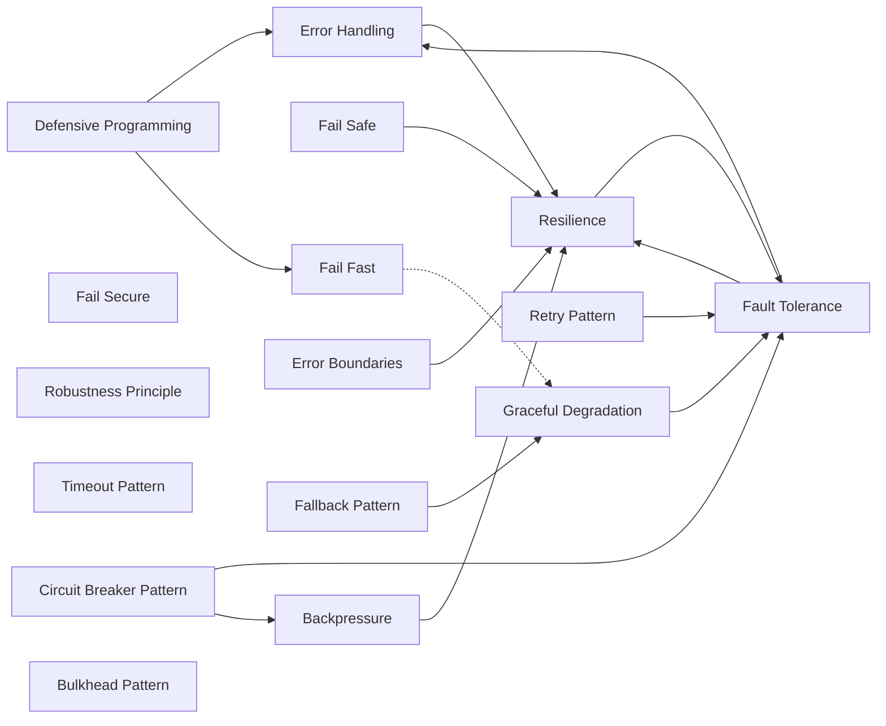
```mermaid
flowchart LR
    n_defensive_programming["Defensive Programming"]
    n_fail_fast["Fail Fast"]
    n_fail_safe["Fail Safe"]
    n_fail_secure["Fail Secure"]
    n_graceful_degradation["Graceful Degradation"]
    n_fault_tolerance["Fault Tolerance"]
    n_resilience["Resilience"]
    n_robustness_principle["Robustness Principle"]
    n_error_handling["Error Handling"]
    n_error_boundaries["Error Boundaries"]
    n_fallback_pattern["Fallback Pattern"]
    n_retry_pattern["Retry Pattern"]
    n_timeout_pattern["Timeout Pattern"]
    n_circuit_breaker_pattern["Circuit Breaker Pattern"]
    n_bulkhead_pattern["Bulkhead Pattern"]
    n_backpressure["Backpressure"]
    n_defensive_programming --> n_error_handling
    n_defensive_programming --> n_fail_fast
    n_fail_fast -.-> n_graceful_degradation
    n_fail_safe --> n_resilience
    n_graceful_degradation --> n_fault_tolerance
    n_fault_tolerance --> n_error_handling
    n_fault_tolerance --> n_resilience
    n_resilience --> n_fault_tolerance
    n_error_handling --> n_resilience
    n_error_boundaries --> n_resilience
    n_fallback_pattern --> n_graceful_degradation
    n_retry_pattern --> n_fault_tolerance
    n_circuit_breaker_pattern --> n_fault_tolerance
    n_circuit_breaker_pattern --> n_backpressure
    n_backpressure --> n_resilience
```

### Defensive Programming

- Kind: [principle](SCHEMA.md#kind-principle)
- Category: [Error Handling / Resilience](PRINCIPLES.md#architecture-category-error-handling-resilience)
- Severity: [mandatory](SCHEMA.md#vocabulary-severity-mandatory)
- Scope: function, module, boundary
- Layer: [Correctness Core](SCHEMA.md#layer-correctness-core)

Details

Definition
A design rule that code checks its inputs and assumptions before acting on them, and reports a violation as an explicit error.

Requires
[Input Validation](PRINCIPLES.md#architecture-input-validation), [Error Handling](PRINCIPLES.md#architecture-error-handling)

Reinforces
[Robustness](LEXICON.md#lexicon-robustness), [Fail Fast](PRINCIPLES.md#architecture-fail-fast)

Enables
[Safe Failure](LEXICON.md#lexicon-safe-failure)

In tension with
[Verbosity](LEXICON.md#lexicon-verbosity)

Conflicts with
[Trusting Invalid Inputs](LEXICON.md#lexicon-trusting-invalid-inputs)

Tensions
[Defensive Programming / Verbosity](SCHEMA.md#tension-defensive-programming-verbosity)

Distinct from
[Error Handling](PRINCIPLES.md#architecture-error-handling): Defensive programming checks inputs and assumptions before acting, while error handling decides what happens to an error once raised.

Violated by
[Trusting Invalid Inputs](LEXICON.md#lexicon-trusting-invalid-inputs)

Detected by
null/empty/range unsafe access

Measured by
guard coverage, runtime exception rate

Refactored by
[Precondition Check](LEXICON.md#lexicon-precondition-check), [Input Validation](PRINCIPLES.md#architecture-input-validation)

Enforced by
linting, [tests](LEXICON.md#lexicon-tests)

Before

```typescript
function renameFoo(foo: Foo, name: string) {
  foo.name = name.trim();
}
```

After

```typescript
function renameFoo(foo: Foo | undefined, name: unknown) {
  if (!foo) throw new Error("Foo required");
  if (typeof name !== "string" || name.trim().length === 0)
    throw new Error("valid name required");
  return { ...foo, name: name.trim() };
}
```

How it is checked

Checked by
linting, tests

Population
Every failure path: catch blocks, dependency calls, input boundaries and fallbacks

Freshness
A verdict stands until a dependency, a failure path or the resilience policy changes

Refusal
The lint rule, failure-injection test or policy check fails the change that leaves a failure path unhandled or unsafe

Observation
Catch blocks and dependency calls read from source, plus outcomes recorded by failure-injection runs

Evidence
None, because the catalog states this check as a class, so a watched run belongs to each system that adopts it

Authoritative side
The resilience policy, which every failure path conforms to

Depends on
[Input Validation](PRINCIPLES.md#architecture-input-validation), [Error Handling](PRINCIPLES.md#architecture-error-handling), [Robustness](LEXICON.md#lexicon-robustness), [Fail Fast](PRINCIPLES.md#architecture-fail-fast), [Safe Failure](LEXICON.md#lexicon-safe-failure)

Shape it refuses
[Trusting Invalid Inputs](LEXICON.md#lexicon-trusting-invalid-inputs)

### Fail Fast

- Kind: [principle](SCHEMA.md#kind-principle)
- Category: [Error Handling / Resilience](PRINCIPLES.md#architecture-category-error-handling-resilience)
- Severity: [recommended](SCHEMA.md#vocabulary-severity-recommended)
- Scope: input, startup, invariant boundary
- Layer: [Correctness Core](SCHEMA.md#layer-correctness-core)

Details

Definition
A design rule that invalid input or state stops the operation at the point it is detected, with an explicit error.

Requires
[Preconditions](PRINCIPLES.md#architecture-preconditions), [Validation](PRINCIPLES.md#architecture-validation)

Reinforces
[Correctness](PRINCIPLES.md#architecture-correctness), [Observability](PRINCIPLES.md#architecture-observability)

Enables
[Early Defect Detection](LEXICON.md#lexicon-early-defect-detection)

In tension with
[Graceful Degradation](PRINCIPLES.md#architecture-graceful-degradation)

Conflicts with
[Silent Failure](LEXICON.md#lexicon-silent-failure), [Silent Data Corruption](PRINCIPLES.md#architecture-silent-data-corruption)

Referenced by
[Preconditions](PRINCIPLES.md#architecture-preconditions), [Defensive Programming](PRINCIPLES.md#architecture-defensive-programming), [Schema Validation](PRINCIPLES.md#architecture-schema-validation), [Input Validation](PRINCIPLES.md#architecture-input-validation)

Contracts
[Correctness Core](ALGORITHMS.md#algorithms-correctness-core)

Tensions
[Fail Fast / Graceful Degradation](SCHEMA.md#tension-fail-fast-graceful-degradation)

Distinct from
[Defensive Programming](PRINCIPLES.md#architecture-defensive-programming): Fail fast stops the operation where invalid state is found, while defensive programming is the checking that finds it.

Distinct from
[Design by Contract](PRINCIPLES.md#architecture-design-by-contract): Fail fast is how a violation is handled, by stopping, while design by contract is where the conditions are stated.

Distinct from
[Graceful Degradation](PRINCIPLES.md#architecture-graceful-degradation): Fail fast stops on invalid state, while graceful degradation keeps the rest running when an optional dependency fails.

Violated by
[Exception Swallowing](LEXICON.md#lexicon-exception-swallowing)

Detected by
ignored exceptions, default fallbacks masking errors

Measured by
late failure rate

Refactored by
[Precondition Check](LEXICON.md#lexicon-precondition-check), [Fail Fast or Fall Back](LEXICON.md#lexicon-fail-fast-or-fall-back)

Enforced by
validation tests

Refused by rules
fail-fast

Before

```typescript
const fooUrl = process.env.FOO_URL ?? "http://localhost:3000";
startFooApp(fooUrl);
```

After

```typescript
const fooUrl = process.env.FOO_URL;
if (!fooUrl) throw new Error("FOO_URL is required");
startFooApp(new URL(fooUrl));
```

How it is checked

Checked by
validation tests

Population
Every failure path: catch blocks, dependency calls, input boundaries and fallbacks

Freshness
A verdict stands until a dependency, a failure path or the resilience policy changes

Refusal
The lint rule, failure-injection test or policy check fails the change that leaves a failure path unhandled or unsafe

Observation
Catch blocks and dependency calls read from source, plus outcomes recorded by failure-injection runs

Evidence
None, because the catalog states this check as a class, so a watched run belongs to each system that adopts it

Authoritative side
The resilience policy, which every failure path conforms to

Depends on
[Preconditions](PRINCIPLES.md#architecture-preconditions), [Validation](PRINCIPLES.md#architecture-validation), [Correctness](PRINCIPLES.md#architecture-correctness), [Observability](PRINCIPLES.md#architecture-observability), [Early Defect Detection](LEXICON.md#lexicon-early-defect-detection)

Shape it refuses
[Silent Failure](LEXICON.md#lexicon-silent-failure), [Silent Data Corruption](PRINCIPLES.md#architecture-silent-data-corruption)

### Fail Safe

- Kind: [principle](SCHEMA.md#kind-principle)
- Category: [Error Handling / Resilience](PRINCIPLES.md#architecture-category-error-handling-resilience)
- Severity: [mandatory](SCHEMA.md#vocabulary-severity-mandatory)
- Scope: runtime, operation, security
- Layer: [Correctness Core](SCHEMA.md#layer-correctness-core)

Details

Definition
A design rule that a failing operation leaves the system in the state that causes the least harm.

Requires
[Safe Defaults](LEXICON.md#lexicon-safe-defaults)

Reinforces
[Resilience](PRINCIPLES.md#architecture-resilience)

Enables
[Damage Limitation](LEXICON.md#lexicon-damage-limitation)

In tension with
[Availability](LEXICON.md#lexicon-availability)

Conflicts with
[Unsafe Default Continuation](LEXICON.md#lexicon-unsafe-default-continuation)

Tensions
[Fail Safe / Availability](SCHEMA.md#tension-availability-fail-safe)

Violated by
[Unsafe Default Continuation](LEXICON.md#lexicon-unsafe-default-continuation)

Detected by
fallback to unsafe behavior

Measured by
unsafe failure modes

Refactored by
[Fallback Pattern](PRINCIPLES.md#architecture-fallback-pattern), [Fail Fast or Fall Back](LEXICON.md#lexicon-fail-fast-or-fall-back)

Enforced by
failure-mode tests

Before

```typescript
try {
  await openFooGate();
} catch {
  fooGate.unlock();
}
```

After

```typescript
try {
  await openFooGate();
} catch {
  fooGate.lock();
  throw new Error("Foo gate remains locked");
}
```

How it is checked

Checked by
failure-mode tests

Population
Every failure path: catch blocks, dependency calls, input boundaries and fallbacks

Freshness
A verdict stands until a dependency, a failure path or the resilience policy changes

Refusal
The lint rule, failure-injection test or policy check fails the change that leaves a failure path unhandled or unsafe

Observation
Catch blocks and dependency calls read from source, plus outcomes recorded by failure-injection runs

Evidence
None, because the catalog states this check as a class, so a watched run belongs to each system that adopts it

Authoritative side
The resilience policy, which every failure path conforms to

Depends on
[Safe Defaults](LEXICON.md#lexicon-safe-defaults), [Resilience](PRINCIPLES.md#architecture-resilience), [Damage Limitation](LEXICON.md#lexicon-damage-limitation)

Shape it refuses
[Unsafe Default Continuation](LEXICON.md#lexicon-unsafe-default-continuation)

### Fail Secure

- Kind: [principle](SCHEMA.md#kind-principle)
- Category: [Error Handling / Resilience](PRINCIPLES.md#architecture-category-error-handling-resilience)
- Severity: [mandatory](SCHEMA.md#vocabulary-severity-mandatory)
- Scope: auth, access, infrastructure
- Layer: [Correctness Core](SCHEMA.md#layer-correctness-core)

Details

Definition
A design rule that an authentication or policy failure denies access.

Requires
[Secure by Default](PRINCIPLES.md#architecture-secure-by-default)

Reinforces
[Security by Design](PRINCIPLES.md#architecture-security-by-design)

Enables
[Deny-by-Default Behavior](LEXICON.md#lexicon-deny-by-default-behavior)

In tension with
[Availability](LEXICON.md#lexicon-availability)

Conflicts with
[Fail Open](LEXICON.md#lexicon-fail-open)

Referenced by
[Secure by Default](PRINCIPLES.md#architecture-secure-by-default)

Tensions
[Fail Secure / Availability](SCHEMA.md#tension-availability-fail-secure)

Violated by
[Fail Open](LEXICON.md#lexicon-fail-open)

Detected by
fail-open branches

Measured by
fail-open count

Refactored by
[Default Deny](LEXICON.md#lexicon-default-deny)

Enforced by
security tests, policy checks

Before

```typescript
function authorizeFoo(token?: string) {
  if (!token) return { role: "admin" };
  return decodeToken(token);
}
```

After

```typescript
function authorizeFoo(token?: string): FooIdentity {
  if (!token) throw new UnauthorizedError();
  const identity = verifyToken(token);
  if (!identity) throw new UnauthorizedError();
  return identity;
}
```

How it is checked

Checked by
security tests, policy checks

Population
Every failure path: catch blocks, dependency calls, input boundaries and fallbacks

Freshness
A verdict stands until a dependency, a failure path or the resilience policy changes

Refusal
The lint rule, failure-injection test or policy check fails the change that leaves a failure path unhandled or unsafe

Observation
Catch blocks and dependency calls read from source, plus outcomes recorded by failure-injection runs

Evidence
None, because the catalog states this check as a class, so a watched run belongs to each system that adopts it

Authoritative side
The resilience policy, which every failure path conforms to

Depends on
[Secure by Default](PRINCIPLES.md#architecture-secure-by-default), [Security by Design](PRINCIPLES.md#architecture-security-by-design), [Deny-by-Default Behavior](LEXICON.md#lexicon-deny-by-default-behavior)

Shape it refuses
[Fail Open](LEXICON.md#lexicon-fail-open)

### Graceful Degradation

- Kind: [principle](SCHEMA.md#kind-principle)
- Category: [Error Handling / Resilience](PRINCIPLES.md#architecture-category-error-handling-resilience)
- Severity: [recommended](SCHEMA.md#vocabulary-severity-recommended)
- Scope: service, UX, system
- Layer: [Correctness Core](SCHEMA.md#layer-correctness-core)

Details

Definition
A design rule that the failure of an optional dependency removes only the feature it serves, and the rest of the system keeps working.

Requires
[Fallback](LEXICON.md#lexicon-fallback), [Feature Isolation](LEXICON.md#lexicon-feature-isolation)

Reinforces
[Fault Tolerance](PRINCIPLES.md#architecture-fault-tolerance)

Enables
[Partial Availability](LEXICON.md#lexicon-partial-availability)

In tension with
[Consistency / Feature Completeness](LEXICON.md#lexicon-consistency-feature-completeness)

Conflicts with
[All-Or-Nothing Failure](LEXICON.md#lexicon-all-or-nothing-failure)

Referenced by
[Fail Fast](PRINCIPLES.md#architecture-fail-fast), [Fallback Pattern](PRINCIPLES.md#architecture-fallback-pattern)

Tensions
[Graceful Degradation / Consistency / Feature Completeness](SCHEMA.md#tension-consistency-feature-completeness-graceful-degradation)

Violated by
[All-Or-Nothing Failure](LEXICON.md#lexicon-all-or-nothing-failure)

Detected by
critical path dependency on optional service

Measured by
partial availability under failure

Refactored by
[Fallback Pattern](PRINCIPLES.md#architecture-fallback-pattern)

Enforced by
chaos tests

Before

```typescript
async function renderFooPage() {
  const foo = await fooService.get();
  const bar = await barRecommendations.get();
  return render(foo, bar);
}
```

After

```typescript
async function renderFooPage() {
  const foo = await fooService.get();
  const bar = await barRecommendations.get().catch(() => [] as Bar[]);
  return render(foo, bar);
}
```

How it is checked

Checked by
chaos tests

Population
Every failure path: catch blocks, dependency calls, input boundaries and fallbacks

Freshness
A verdict stands until a dependency, a failure path or the resilience policy changes

Refusal
The lint rule, failure-injection test or policy check fails the change that leaves a failure path unhandled or unsafe

Observation
Catch blocks and dependency calls read from source, plus outcomes recorded by failure-injection runs

Evidence
None, because the catalog states this check as a class, so a watched run belongs to each system that adopts it

Authoritative side
The resilience policy, which every failure path conforms to

Depends on
[Fallback](LEXICON.md#lexicon-fallback), [Feature Isolation](LEXICON.md#lexicon-feature-isolation), [Fault Tolerance](PRINCIPLES.md#architecture-fault-tolerance), [Partial Availability](LEXICON.md#lexicon-partial-availability)

Shape it refuses
[All-Or-Nothing Failure](LEXICON.md#lexicon-all-or-nothing-failure)

### Fault Tolerance

- Kind: [quality-attribute](SCHEMA.md#kind-quality-attribute)
- Category: [Error Handling / Resilience](PRINCIPLES.md#architecture-category-error-handling-resilience)
- Severity: [contextual](SCHEMA.md#vocabulary-severity-contextual)
- Scope: service, system, infrastructure
- Layer: [Correctness Core](SCHEMA.md#layer-correctness-core)

Details

Definition
The degree to which a system keeps operating correctly when some of its components fail.

Requires
[Redundancy](PRINCIPLES.md#architecture-redundancy), [Error Handling](PRINCIPLES.md#architecture-error-handling)

Reinforces
[Resilience](PRINCIPLES.md#architecture-resilience)

Enables
[Continued Operation Under Failure](LEXICON.md#lexicon-continued-operation-under-failure)

In tension with
[Cost](LEXICON.md#lexicon-cost)

Conflicts with
[Single Point of Failure](LEXICON.md#lexicon-single-point-of-failure)

Referenced by
[Leader Election](PRINCIPLES.md#architecture-leader-election), [Consensus](PRINCIPLES.md#architecture-consensus), [Graceful Degradation](PRINCIPLES.md#architecture-graceful-degradation), [Resilience](PRINCIPLES.md#architecture-resilience), [Retry Pattern](PRINCIPLES.md#architecture-retry-pattern), [Circuit Breaker Pattern](PRINCIPLES.md#architecture-circuit-breaker-pattern), [Redundancy](PRINCIPLES.md#architecture-redundancy), [Chaos Engineering](PRINCIPLES.md#architecture-chaos-engineering), [RAID Redundancy](PRINCIPLES.md#architecture-raid-redundancy)

Tensions
[Fault Tolerance / Cost](SCHEMA.md#tension-cost-fault-tolerance)

Violated by
[Single Point of Failure](LEXICON.md#lexicon-single-point-of-failure)

Detected by
no retry/failover/fallback for critical path

Measured by
failure recovery rate, [availability](LEXICON.md#lexicon-availability)

Refactored by
[Bounded Retry](LEXICON.md#lexicon-bounded-retry), [Failover](PRINCIPLES.md#architecture-failover), [Redundancy](PRINCIPLES.md#architecture-redundancy)

Enforced by
resilience tests

Before

```typescript
const foo = await fooReplicaA.read(id);
```

After

```typescript
const foo = await firstSuccessful([
  () => fooReplicaA.read(id),
  () => fooReplicaB.read(id),
  () => fooReplicaC.read(id),
]);
```

How it is checked

Checked by
resilience tests

Population
Every failure path: catch blocks, dependency calls, input boundaries and fallbacks

Freshness
A verdict stands until a dependency, a failure path or the resilience policy changes

Refusal
The lint rule, failure-injection test or policy check fails the change that leaves a failure path unhandled or unsafe

Observation
Catch blocks and dependency calls read from source, plus outcomes recorded by failure-injection runs

Evidence
None, because the catalog states this check as a class, so a watched run belongs to each system that adopts it

Authoritative side
The resilience policy, which every failure path conforms to

Depends on
[Redundancy](PRINCIPLES.md#architecture-redundancy), [Error Handling](PRINCIPLES.md#architecture-error-handling), [Resilience](PRINCIPLES.md#architecture-resilience), [Continued Operation Under Failure](LEXICON.md#lexicon-continued-operation-under-failure)

Shape it refuses
[Single Point of Failure](LEXICON.md#lexicon-single-point-of-failure)

### Resilience

- Kind: [quality-attribute](SCHEMA.md#kind-quality-attribute)
- Category: [Error Handling / Resilience](PRINCIPLES.md#architecture-category-error-handling-resilience)
- Severity: [contextual](SCHEMA.md#vocabulary-severity-contextual)
- Mandatory for: production systems
- Scope: service, system, infrastructure
- Layer: [Correctness Core](SCHEMA.md#layer-correctness-core)

Details

Definition
The degree to which a system contains failures, stays stable under stress and recovers.

Requires
[Fault Tolerance](PRINCIPLES.md#architecture-fault-tolerance), [Observability](PRINCIPLES.md#architecture-observability)

Reinforces
[Self-Healing Architecture](PRINCIPLES.md#architecture-self-healing-architecture), [Recovery](LEXICON.md#lexicon-recovery)

Enables
[Stability Under Stress](LEXICON.md#lexicon-stability-under-stress)

In tension with
[Complexity](LEXICON.md#lexicon-complexity)

Conflicts with
[Brittle Architecture](LEXICON.md#lexicon-brittle-architecture)

Referenced by
[Service Discovery](PRINCIPLES.md#architecture-service-discovery), [Decentralization](PRINCIPLES.md#architecture-decentralization), [Autonomy](PRINCIPLES.md#architecture-autonomy), [Message Queue](PRINCIPLES.md#architecture-message-queue), [Asynchronous Communication](PRINCIPLES.md#architecture-asynchronous-communication), [Compensating Transaction](PRINCIPLES.md#architecture-compensating-transaction), [Fail Safe](PRINCIPLES.md#architecture-fail-safe), [Fault Tolerance](PRINCIPLES.md#architecture-fault-tolerance), [Error Handling](PRINCIPLES.md#architecture-error-handling), [Error Boundaries](PRINCIPLES.md#architecture-error-boundaries), [Backpressure](PRINCIPLES.md#architecture-backpressure), [Observability](PRINCIPLES.md#architecture-observability), [Statelessness](PRINCIPLES.md#architecture-statelessness), [Self-Healing Architecture](PRINCIPLES.md#architecture-self-healing-architecture), [Rollback](PRINCIPLES.md#architecture-rollback)

Tensions
[Resilience / Complexity](SCHEMA.md#tension-complexity-resilience)

Distinct from
[Fault Tolerance](PRINCIPLES.md#architecture-fault-tolerance): Resilience contains failures and recovers from them, while fault tolerance keeps operating correctly while components are failing.

Distinct from
[Low Coupling](PRINCIPLES.md#architecture-low-coupling): Resilience is surviving failure, while low coupling is surviving change.

Distinct from
[Observability](PRINCIPLES.md#architecture-observability): Resilience is containing and recovering from failure, while observability is seeing what the system does.

Distinct from
[Complexity](LEXICON.md#lexicon-complexity): Resilience is surviving failure, while complexity is the intricacy that its mechanisms add.

Distinct from
[Debuggability](LEXICON.md#lexicon-debuggability): Resilience is recovering without help, while debuggability is how easily the developer can locate a fault.

Distinct from
[Stability](LEXICON.md#lexicon-stability): Resilience includes recovery after failure, while stability is steady operation under load without collapse.

Violated by
[Failure Propagation](LEXICON.md#lexicon-failure-propagation)

Detected by
[failure propagation](LEXICON.md#lexicon-failure-propagation), lack of isolation

Measured by
MTTR, error budget, [availability](LEXICON.md#lexicon-availability)

Refactored by
[Circuit Breaker Pattern](PRINCIPLES.md#architecture-circuit-breaker-pattern), [Bulkhead Pattern](PRINCIPLES.md#architecture-bulkhead-pattern), [Retry Pattern](PRINCIPLES.md#architecture-retry-pattern), [Timeout Pattern](PRINCIPLES.md#architecture-timeout-pattern)

Enforced by
[chaos testing](REASONING.md#reasoning-technique-chaos-testing), SLO gates

Before

```typescript
async function loadFoo(id: FooId) {
  return remoteFoo.get(id);
}
```

After

```typescript
async function loadFoo(id: FooId) {
  return circuitBreaker.execute(() =>
    retry.withBackoff(() => remoteFoo.get(id), { attempts: 3 }),
  );
}
```

How it is checked

Checked by
chaos testing, SLO gates

Population
Every failure path: catch blocks, dependency calls, input boundaries and fallbacks

Freshness
A verdict stands until a dependency, a failure path or the resilience policy changes

Refusal
The lint rule, failure-injection test or policy check fails the change that leaves a failure path unhandled or unsafe

Observation
Catch blocks and dependency calls read from source, plus outcomes recorded by failure-injection runs

Evidence
None, because the catalog states this check as a class, so a watched run belongs to each system that adopts it

Authoritative side
The resilience policy, which every failure path conforms to

Depends on
[Fault Tolerance](PRINCIPLES.md#architecture-fault-tolerance), [Observability](PRINCIPLES.md#architecture-observability), [Self-Healing Architecture](PRINCIPLES.md#architecture-self-healing-architecture), [Recovery](LEXICON.md#lexicon-recovery), [Stability Under Stress](LEXICON.md#lexicon-stability-under-stress)

Shape it refuses
[Brittle Architecture](LEXICON.md#lexicon-brittle-architecture)

### Robustness Principle

- Kind: [principle](SCHEMA.md#kind-principle)
- Category: [Error Handling / Resilience](PRINCIPLES.md#architecture-category-error-handling-resilience)
- Severity: [contextual](SCHEMA.md#vocabulary-severity-contextual)
- Scope: protocol, API, input processing
- Aliases: Postel's Law
- Layer: [Correctness Core](SCHEMA.md#layer-correctness-core)

Details

Definition
A design rule that a component is strict in what it sends and tolerant of harmless variation in what it receives.

Requires
[Strict Output](LEXICON.md#lexicon-strict-output), [Tolerant Input](LEXICON.md#lexicon-tolerant-input)

Reinforces
[Compatibility](LEXICON.md#lexicon-compatibility)

Enables
[Interoperability](PRINCIPLES.md#architecture-interoperability)

In tension with
[Strict Validation](LEXICON.md#lexicon-strict-validation)

Conflicts with
[Fragile Parsing](LEXICON.md#lexicon-fragile-parsing)

Tensions
[Robustness Principle / Strict Validation](SCHEMA.md#tension-robustness-principle-strict-validation)

Violated by
[Fragile Parsing](LEXICON.md#lexicon-fragile-parsing)

Detected by
parser brittleness

Measured by
compatibility failure rate

Refactored by
[Canonicalization](PRINCIPLES.md#architecture-canonicalization), [Invariant Check](LEXICON.md#lexicon-invariant-check)

Enforced by
compatibility test suite

Before

```typescript
function readFoo(message: any) {
  return { id: message.id, name: message.name };
}
function writeFoo(foo: Foo) {
  return { ...foo, debug: globalThis };
}
```

After

```typescript
function readFoo(message: unknown) {
  const value = FooEnvelopeSchema.parse(message);
  return { id: value.id, name: value.name };
}
function writeFoo(foo: Foo): FooEnvelopeV1 {
  return { version: 1, id: foo.id, name: foo.name };
}
```

How it is checked

Checked by
compatibility test suite

Population
Every failure path: catch blocks, dependency calls, input boundaries and fallbacks

Freshness
A verdict stands until a dependency, a failure path or the resilience policy changes

Refusal
The lint rule, failure-injection test or policy check fails the change that leaves a failure path unhandled or unsafe

Observation
Catch blocks and dependency calls read from source, plus outcomes recorded by failure-injection runs

Evidence
None, because the catalog states this check as a class, so a watched run belongs to each system that adopts it

Authoritative side
The resilience policy, which every failure path conforms to

Depends on
[Strict Output](LEXICON.md#lexicon-strict-output), [Tolerant Input](LEXICON.md#lexicon-tolerant-input), [Compatibility](LEXICON.md#lexicon-compatibility), [Interoperability](PRINCIPLES.md#architecture-interoperability)

Shape it refuses
[Fragile Parsing](LEXICON.md#lexicon-fragile-parsing)

### Error Handling

- Kind: [principle](SCHEMA.md#kind-principle)
- Category: [Error Handling / Resilience](PRINCIPLES.md#architecture-category-error-handling-resilience)
- Severity: [mandatory](SCHEMA.md#vocabulary-severity-mandatory)
- Scope: function, module, service
- Layer: [Correctness Core](SCHEMA.md#layer-correctness-core)

Details

Definition
A design rule that every error is either handled with its context kept, or propagated as a typed error the caller must handle.

Requires
[Error Model](LEXICON.md#lexicon-error-model), [Observability](PRINCIPLES.md#architecture-observability)

Reinforces
[Resilience](PRINCIPLES.md#architecture-resilience), [Correctness](PRINCIPLES.md#architecture-correctness)

Enables
[Controlled Failure](LEXICON.md#lexicon-controlled-failure)

In tension with
[Simplicity](LEXICON.md#lexicon-simplicity)

Conflicts with
[Exception Swallowing](LEXICON.md#lexicon-exception-swallowing), [Exception Control Flow](PRINCIPLES.md#architecture-exception-control-flow)

Referenced by
[Defensive Programming](PRINCIPLES.md#architecture-defensive-programming), [Fault Tolerance](PRINCIPLES.md#architecture-fault-tolerance)

Tensions
[Error Handling / Simplicity](SCHEMA.md#tension-error-handling-simplicity)

Violated by
[Exception Swallowing](LEXICON.md#lexicon-exception-swallowing), [Silent Failure](LEXICON.md#lexicon-silent-failure)

Detected by
empty catch blocks, unchecked result errors

Measured by
unhandled error count

Refactored by
[Introduce Typed Result](LEXICON.md#lexicon-introduce-typed-result), [Distributed Tracing](PRINCIPLES.md#architecture-distributed-tracing)

Enforced by
linting, [tests](LEXICON.md#lexicon-tests)

Refused by rules
error-handling

Before

```typescript
async function loadFoo(id: FooId) {
  try {
    return await fooStore.find(id);
  } catch {
    return null;
  }
}
```

After

```typescript
type LoadFooResult =
  | { ok: true; value: Foo }
  | { ok: false; error: "NOT_FOUND" | "STORE_UNAVAILABLE" };
async function loadFoo(id: FooId): Promise<LoadFooResult> {
  return fooStore.findResult(id);
}
```

How it is checked

Checked by
linting, tests

Population
Every failure path: catch blocks, dependency calls, input boundaries and fallbacks

Freshness
A verdict stands until a dependency, a failure path or the resilience policy changes

Refusal
The lint rule, failure-injection test or policy check fails the change that leaves a failure path unhandled or unsafe

Observation
Catch blocks and dependency calls read from source, plus outcomes recorded by failure-injection runs

Evidence
None, because the catalog states this check as a class, so a watched run belongs to each system that adopts it

Authoritative side
The resilience policy, which every failure path conforms to

Depends on
[Error Model](LEXICON.md#lexicon-error-model), [Observability](PRINCIPLES.md#architecture-observability), [Resilience](PRINCIPLES.md#architecture-resilience), [Correctness](PRINCIPLES.md#architecture-correctness), [Controlled Failure](LEXICON.md#lexicon-controlled-failure)

Shape it refuses
[Exception Swallowing](LEXICON.md#lexicon-exception-swallowing), [Exception Control Flow](PRINCIPLES.md#architecture-exception-control-flow)

### Error Boundaries

- Kind: [pattern](SCHEMA.md#kind-pattern)
- Category: [Error Handling / Resilience](PRINCIPLES.md#architecture-category-error-handling-resilience)
- Severity: [recommended](SCHEMA.md#vocabulary-severity-recommended)
- Scope: component, UI, service boundary
- Layer: [Correctness Core](SCHEMA.md#layer-correctness-core)

Details

Definition
A design pattern that catches failures at a component boundary, so a failing part renders or returns an error while the rest keeps running.

Requires
[Failure Isolation](LEXICON.md#lexicon-failure-isolation)

Reinforces
[Resilience](PRINCIPLES.md#architecture-resilience)

Enables
[Localized Recovery](LEXICON.md#lexicon-localized-recovery)

In tension with
[Hidden Errors](LEXICON.md#lexicon-hidden-errors)

Conflicts with
[Failure Propagation](LEXICON.md#lexicon-failure-propagation)

Tensions
[Error Boundaries / Hidden Errors](SCHEMA.md#tension-error-boundaries-hidden-errors)

Violated by
[Failure Propagation](LEXICON.md#lexicon-failure-propagation)

Detected by
uncaught exceptions crossing boundary

Measured by
blast radius

Refactored by
[Bulkhead Pattern](PRINCIPLES.md#architecture-bulkhead-pattern)

Enforced by
failure tests

Before

```typescript
function renderApp() {
  return renderFooPanel(loadFoo());
}
```

After

```typescript
function FooBoundary({ render }: { render(): View }) {
  try {
    return render();
  } catch (error) {
    return renderFooError(toFooError(error));
  }
}
const app = FooBoundary({ render: () => renderFooPanel(loadFoo()) });
```

How it is checked

Checked by
failure tests

Population
Every failure path: catch blocks, dependency calls, input boundaries and fallbacks

Freshness
A verdict stands until a dependency, a failure path or the resilience policy changes

Refusal
The lint rule, failure-injection test or policy check fails the change that leaves a failure path unhandled or unsafe

Observation
Catch blocks and dependency calls read from source, plus outcomes recorded by failure-injection runs

Evidence
None, because the catalog states this check as a class, so a watched run belongs to each system that adopts it

Authoritative side
The resilience policy, which every failure path conforms to

Depends on
[Failure Isolation](LEXICON.md#lexicon-failure-isolation), [Resilience](PRINCIPLES.md#architecture-resilience), [Localized Recovery](LEXICON.md#lexicon-localized-recovery)

Shape it refuses
[Failure Propagation](LEXICON.md#lexicon-failure-propagation)

### Fallback Pattern

- Kind: [pattern](SCHEMA.md#kind-pattern)
- Category: [Error Handling / Resilience](PRINCIPLES.md#architecture-category-error-handling-resilience)
- Severity: [contextual](SCHEMA.md#vocabulary-severity-contextual)
- Scope: service, dependency call
- Layer: [Correctness Core](SCHEMA.md#layer-correctness-core)

Details

Definition
A design pattern that routes a failed call to an alternate provider or response declared in advance.

Requires
[Alternate Behavior](LEXICON.md#lexicon-alternate-behavior)

Reinforces
[Graceful Degradation](PRINCIPLES.md#architecture-graceful-degradation)

Enables
[Partial Availability](LEXICON.md#lexicon-partial-availability)

In tension with
[Stale/Reduced Results](LEXICON.md#lexicon-stale-reduced-results)

Conflicts with
[Single Behavior Path](LEXICON.md#lexicon-single-behavior-path)

Tensions
[Fallback Pattern / Stale/Reduced Results](SCHEMA.md#tension-fallback-pattern-stale-reduced-results)

Violated by
[Single Behavior Path](LEXICON.md#lexicon-single-behavior-path)

Detected by
hard dependency in optional path

Measured by
fallback coverage

Refactored by
none

Enforced by
failure injection tests

Before

```typescript
const foo = await primaryFooStore.find(id);
```

After

```typescript
const foo = await primaryFooStore
  .find(id)
  .catch(() => replicaFooStore.find(id));
if (!foo) throw new FooUnavailableError(id);
```

How it is checked

Checked by
failure injection tests

Population
Every failure path: catch blocks, dependency calls, input boundaries and fallbacks

Freshness
A verdict stands until a dependency, a failure path or the resilience policy changes

Refusal
The lint rule, failure-injection test or policy check fails the change that leaves a failure path unhandled or unsafe

Observation
Catch blocks and dependency calls read from source, plus outcomes recorded by failure-injection runs

Evidence
None, because the catalog states this check as a class, so a watched run belongs to each system that adopts it

Authoritative side
The resilience policy, which every failure path conforms to

Depends on
[Alternate Behavior](LEXICON.md#lexicon-alternate-behavior), [Graceful Degradation](PRINCIPLES.md#architecture-graceful-degradation), [Partial Availability](LEXICON.md#lexicon-partial-availability)

Shape it refuses
[Single Behavior Path](LEXICON.md#lexicon-single-behavior-path)

### Retry Pattern

- Kind: [pattern](SCHEMA.md#kind-pattern)
- Category: [Error Handling / Resilience](PRINCIPLES.md#architecture-category-error-handling-resilience)
- Severity: [contextual](SCHEMA.md#vocabulary-severity-contextual)
- Scope: network, IO, message handling
- Aliases: Retry
- Layer: [Correctness Core](SCHEMA.md#layer-correctness-core)

Details

Definition
A design pattern that repeats an idempotent call after a transient failure, a bounded number of times with backoff.

Requires
[Idempotency](PRINCIPLES.md#architecture-idempotency), [Timeout](LEXICON.md#lexicon-timeout), [Backoff](LEXICON.md#lexicon-backoff)

Reinforces
[Fault Tolerance](PRINCIPLES.md#architecture-fault-tolerance)

Enables
[Transient Failure Recovery](LEXICON.md#lexicon-transient-failure-recovery)

In tension with
[Load Amplification](LEXICON.md#lexicon-load-amplification)

Conflicts with
[Non-Idempotent Operation](LEXICON.md#lexicon-non-idempotent-operation)

Referenced by
[Eventual Consistency](PRINCIPLES.md#architecture-eventual-consistency)

Tensions
[Retry Pattern / Load Amplification](SCHEMA.md#tension-load-amplification-retry-pattern)

Violated by
[Unbounded Retry](LEXICON.md#lexicon-unbounded-retry), [Retry Storm](PRINCIPLES.md#architecture-retry-storm)

Detected by
retry loops without timeout/backoff

Measured by
retry success rate, retry storm rate

Refactored by
[Backoff](LEXICON.md#lexicon-backoff), [Idempotency Key](LEXICON.md#lexicon-idempotency-key)

Enforced by
resilience libraries, policy checks

Before

```typescript
await remoteFoo.save(foo);
```

After

```typescript
await retry.withBackoff(() => remoteFoo.save(foo), {
  attempts: 3,
  retryIf: isTransientError,
  jitter: true,
});
```

How it is checked

Checked by
resilience libraries, policy checks

Population
Every failure path: catch blocks, dependency calls, input boundaries and fallbacks

Freshness
A verdict stands until a dependency, a failure path or the resilience policy changes

Refusal
The lint rule, failure-injection test or policy check fails the change that leaves a failure path unhandled or unsafe

Observation
Catch blocks and dependency calls read from source, plus outcomes recorded by failure-injection runs

Evidence
None, because the catalog states this check as a class, so a watched run belongs to each system that adopts it

Authoritative side
The resilience policy, which every failure path conforms to

Depends on
[Idempotency](PRINCIPLES.md#architecture-idempotency), [Timeout](LEXICON.md#lexicon-timeout), [Backoff](LEXICON.md#lexicon-backoff), [Fault Tolerance](PRINCIPLES.md#architecture-fault-tolerance), [Transient Failure Recovery](LEXICON.md#lexicon-transient-failure-recovery)

Shape it refuses
[Non-Idempotent Operation](LEXICON.md#lexicon-non-idempotent-operation)

### Timeout Pattern

- Kind: [pattern](SCHEMA.md#kind-pattern)
- Category: [Error Handling / Resilience](PRINCIPLES.md#architecture-category-error-handling-resilience)
- Severity: [mandatory](SCHEMA.md#vocabulary-severity-mandatory)
- Scope: network, IO, dependency call
- Layer: [Correctness Core](SCHEMA.md#layer-correctness-core)

Details

Definition
A design pattern that gives every external call a time budget and fails the call when the budget runs out.

Requires
[Time Budget](LEXICON.md#lexicon-time-budget)

Reinforces
[Fault Isolation](LEXICON.md#lexicon-fault-isolation)

Enables
[Bounded Waiting](LEXICON.md#lexicon-bounded-waiting)

In tension with
[Slow Operation Tolerance](LEXICON.md#lexicon-slow-operation-tolerance)

Conflicts with
[Timeout Omission](PRINCIPLES.md#architecture-timeout-omission)

Tensions
[Timeout Pattern / Slow Operation Tolerance](SCHEMA.md#tension-slow-operation-tolerance-timeout-pattern)

Violated by
[Timeout Omission](PRINCIPLES.md#architecture-timeout-omission)

Detected by
missing timeout config

Measured by
timeout coverage, latency tail

Refactored by
[Deadline Propagation](LEXICON.md#lexicon-deadline-propagation)

Enforced by
lint/config checks

Before

```typescript
const foo = await remoteFoo.find(id);
```

After

```typescript
const foo = await withTimeout(
  remoteFoo.find(id),
  500,
  () => new FooTimeoutError(id),
);
```

How it is checked

Checked by
lint/config checks

Population
Every failure path: catch blocks, dependency calls, input boundaries and fallbacks

Freshness
A verdict stands until a dependency, a failure path or the resilience policy changes

Refusal
The lint rule, failure-injection test or policy check fails the change that leaves a failure path unhandled or unsafe

Observation
Catch blocks and dependency calls read from source, plus outcomes recorded by failure-injection runs

Evidence
None, because the catalog states this check as a class, so a watched run belongs to each system that adopts it

Authoritative side
The resilience policy, which every failure path conforms to

Depends on
[Time Budget](LEXICON.md#lexicon-time-budget), [Fault Isolation](LEXICON.md#lexicon-fault-isolation), [Bounded Waiting](LEXICON.md#lexicon-bounded-waiting)

Shape it refuses
[Timeout Omission](PRINCIPLES.md#architecture-timeout-omission), [Timeout Omission](PRINCIPLES.md#architecture-timeout-omission)

### Circuit Breaker Pattern

- Kind: [pattern](SCHEMA.md#kind-pattern)
- Category: [Error Handling / Resilience](PRINCIPLES.md#architecture-category-error-handling-resilience)
- Severity: [contextual](SCHEMA.md#vocabulary-severity-contextual)
- Scope: dependency call, service
- Aliases: Circuit Breaker
- Layer: [Correctness Core](SCHEMA.md#layer-correctness-core)

Details

Definition
A design pattern that stops calling a dependency after repeated failures and probes it again after a wait.

Requires
[Failure Threshold](LEXICON.md#lexicon-failure-threshold), [Fallback](LEXICON.md#lexicon-fallback)

Reinforces
[Fault Tolerance](PRINCIPLES.md#architecture-fault-tolerance), [Backpressure](PRINCIPLES.md#architecture-backpressure)

Enables
[Cascading Failure Prevention](LEXICON.md#lexicon-cascading-failure-prevention)

In tension with
[Availability of Degraded Dependency](LEXICON.md#lexicon-availability-of-degraded-dependency)

Conflicts with
[Unbounded Retry](LEXICON.md#lexicon-unbounded-retry), [Retry Storm](PRINCIPLES.md#architecture-retry-storm)

Tensions
[Circuit Breaker Pattern / Availability of Degraded Dependency](SCHEMA.md#tension-availability-of-degraded-dependency-circuit-breaker-pattern)

Violated by
[Failure Propagation](LEXICON.md#lexicon-failure-propagation)

Detected by
high failure dependency calls without breaker

Measured by
breaker trip rate, downstream error rate

Refactored by
none

Enforced by
[resilience policy](ALGORITHMS.md#algorithms-resilience-policy)

Before

```typescript
async function loadFoo(id: FooId) {
  return remoteFoo.find(id);
}
```

After

```typescript
const fooBreaker = new CircuitBreaker({
  failureThreshold: 5,
  resetAfterMs: 30_000,
});
async function loadFoo(id: FooId) {
  return fooBreaker.execute(() => remoteFoo.find(id));
}
```

How it is checked

Checked by
resilience policy

Population
Every failure path: catch blocks, dependency calls, input boundaries and fallbacks

Freshness
A verdict stands until a dependency, a failure path or the resilience policy changes

Refusal
The lint rule, failure-injection test or policy check fails the change that leaves a failure path unhandled or unsafe

Observation
Catch blocks and dependency calls read from source, plus outcomes recorded by failure-injection runs

Evidence
None, because the catalog states this check as a class, so a watched run belongs to each system that adopts it

Authoritative side
The resilience policy, which every failure path conforms to

Depends on
[Failure Threshold](LEXICON.md#lexicon-failure-threshold), [Fallback](LEXICON.md#lexicon-fallback), [Fault Tolerance](PRINCIPLES.md#architecture-fault-tolerance), [Backpressure](PRINCIPLES.md#architecture-backpressure), [Cascading Failure Prevention](LEXICON.md#lexicon-cascading-failure-prevention)

Shape it refuses
[Unbounded Retry](LEXICON.md#lexicon-unbounded-retry), [Retry Storm](PRINCIPLES.md#architecture-retry-storm)

### Bulkhead Pattern

- Kind: [pattern](SCHEMA.md#kind-pattern)
- Category: [Error Handling / Resilience](PRINCIPLES.md#architecture-category-error-handling-resilience)
- Severity: [contextual](SCHEMA.md#vocabulary-severity-contextual)
- Scope: resource pool, service, runtime
- Layer: [Correctness Core](SCHEMA.md#layer-correctness-core)

Details

Definition
A design pattern that gives each workload its own pool of threads or connections, so one workload cannot exhaust the others.

Requires
[Resource Isolation](LEXICON.md#lexicon-resource-isolation)

Reinforces
[Fault Isolation](LEXICON.md#lexicon-fault-isolation)

Enables
[Blast-Radius Reduction](LEXICON.md#lexicon-blast-radius-reduction)

In tension with
[Resource Utilization](PRINCIPLES.md#architecture-resource-utilization)

Conflicts with
[Shared Resource Pool](LEXICON.md#lexicon-shared-resource-pool)

Tensions
[Bulkhead Pattern / Resource Utilization](SCHEMA.md#tension-bulkhead-pattern-resource-utilization)

Violated by
[Shared Resource Pool](LEXICON.md#lexicon-shared-resource-pool)

Detected by
shared pools across critical/noncritical workloads

Measured by
resource saturation isolation

Refactored by
none

Enforced by
resource policy

Before

```typescript
const pool = new WorkerPool(100);
pool.submit(fooTask);
pool.submit(barTask);
```

After

```typescript
const fooPool = new WorkerPool(20);
const barPool = new WorkerPool(20);
fooPool.submit(fooTask);
barPool.submit(barTask);
```

How it is checked

Checked by
resource policy

Population
Every failure path: catch blocks, dependency calls, input boundaries and fallbacks

Freshness
A verdict stands until a dependency, a failure path or the resilience policy changes

Refusal
The lint rule, failure-injection test or policy check fails the change that leaves a failure path unhandled or unsafe

Observation
Catch blocks and dependency calls read from source, plus outcomes recorded by failure-injection runs

Evidence
None, because the catalog states this check as a class, so a watched run belongs to each system that adopts it

Authoritative side
The resilience policy, which every failure path conforms to

Depends on
[Resource Isolation](LEXICON.md#lexicon-resource-isolation), [Fault Isolation](LEXICON.md#lexicon-fault-isolation), [Blast-Radius Reduction](LEXICON.md#lexicon-blast-radius-reduction)

Shape it refuses
[Shared Resource Pool](LEXICON.md#lexicon-shared-resource-pool)

### Backpressure

- Kind: [mechanism](SCHEMA.md#kind-mechanism)
- Category: [Error Handling / Resilience](PRINCIPLES.md#architecture-category-error-handling-resilience)
- Severity: [contextual](SCHEMA.md#vocabulary-severity-contextual)
- Mandatory for: high-load systems
- Scope: stream, queue, service
- Layer: [Correctness Core](SCHEMA.md#layer-correctness-core)

Details

Definition
A mechanism that lets a consumer signal its capacity, so a producer slows down when the consumer falls behind.

Requires
[Capacity Signaling](LEXICON.md#lexicon-capacity-signaling)

Reinforces
[Resilience](PRINCIPLES.md#architecture-resilience), [Stability](LEXICON.md#lexicon-stability)

Enables
[Overload Protection](LEXICON.md#lexicon-overload-protection)

In tension with
[Throughput](PRINCIPLES.md#architecture-throughput)

Conflicts with
[Missing Backpressure](PRINCIPLES.md#architecture-missing-backpressure)

Referenced by
[Message Queue](PRINCIPLES.md#architecture-message-queue), [Circuit Breaker Pattern](PRINCIPLES.md#architecture-circuit-breaker-pattern), [Rate Limiting](PRINCIPLES.md#architecture-rate-limiting), [Streaming Architecture](PRINCIPLES.md#architecture-streaming-architecture)

Tensions
[Backpressure / Throughput](SCHEMA.md#tension-backpressure-throughput)

Distinct from
[Event Stream](PRINCIPLES.md#architecture-event-stream): Backpressure is a consumer slowing its producer, while an event stream is the replayable log consumers read from their own offset.

Distinct from
[Message Queue](PRINCIPLES.md#architecture-message-queue): Backpressure signals capacity back to the producer, while a message queue holds messages until a consumer takes them.

Distinct from
[Rate Limiting](PRINCIPLES.md#architecture-rate-limiting): Backpressure slows a producer by the consumer's live capacity, while rate limiting caps a caller at a fixed rate and rejects the excess.

Violated by
[Missing Backpressure](PRINCIPLES.md#architecture-missing-backpressure)

Detected by
queue growth without throttling

Measured by
queue depth, rejection/throttle rate

Refactored by
[Rate Limiting](PRINCIPLES.md#architecture-rate-limiting), [Bounded Queue](LEXICON.md#lexicon-bounded-queue), [Autoscaling Policy](LEXICON.md#lexicon-autoscaling-policy)

Enforced by
load tests, runtime policies

Before

```typescript
stream.on("data", (foo) => processFoo(foo));
```

After

```typescript
for await (const foo of stream) {
  await capacity.acquire();
  void processFoo(foo).finally(() => capacity.release());
}
```

How it is checked

Checked by
load tests, runtime policies

Population
Every failure path: catch blocks, dependency calls, input boundaries and fallbacks

Freshness
A verdict stands until a dependency, a failure path or the resilience policy changes

Refusal
The lint rule, failure-injection test or policy check fails the change that leaves a failure path unhandled or unsafe

Observation
Catch blocks and dependency calls read from source, plus outcomes recorded by failure-injection runs

Evidence
None, because the catalog states this check as a class, so a watched run belongs to each system that adopts it

Authoritative side
The resilience policy, which every failure path conforms to

Depends on
[Capacity Signaling](LEXICON.md#lexicon-capacity-signaling), [Resilience](PRINCIPLES.md#architecture-resilience), [Stability](LEXICON.md#lexicon-stability), [Overload Protection](LEXICON.md#lexicon-overload-protection)

Shape it refuses
[Missing Backpressure](PRINCIPLES.md#architecture-missing-backpressure), [Missing Backpressure](PRINCIPLES.md#architecture-missing-backpressure)

## Architecture Review / Evolution / Governance Artifacts

Every principle in this category is listed as a record. Each record carries its kind, its severity, the scopes it applies at and the layer it lives in, then the edge relations that join it to other records, the records that point back at it, the contracts that answer to it and the tensions it takes part in. The descriptors say how it is violated, detected, measured, repaired and enforced. Where the record carries one, an exemplar shows the shape before and after the principle is applied.

Relations diagram

The relations inside this category.

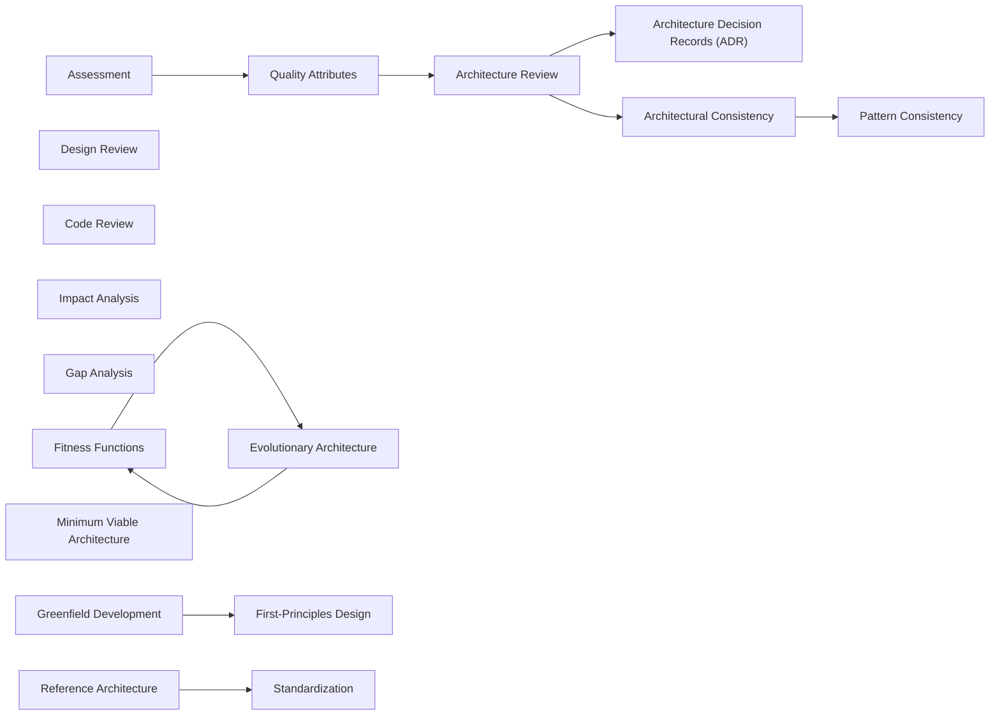
```mermaid
flowchart LR
    n_assessment["Assessment"]
    n_architecture_review["Architecture Review"]
    n_design_review["Design Review"]
    n_code_review["Code Review"]
    n_impact_analysis["Impact Analysis"]
    n_gap_analysis["Gap Analysis"]
    n_fitness_functions["Fitness Functions"]
    n_quality_attributes["Quality Attributes"]
    n_architecture_decision_records["Architecture Decision Records (ADR)"]
    n_evolutionary_architecture["Evolutionary Architecture"]
    n_minimum_viable_architecture["Minimum Viable Architecture"]
    n_greenfield_development["Greenfield Development"]
    n_first_principles_design["First-Principles Design"]
    n_reference_architecture["Reference Architecture"]
    n_pattern_consistency["Pattern Consistency"]
    n_architectural_consistency["Architectural Consistency"]
    n_standardization["Standardization"]
    n_assessment --> n_quality_attributes
    n_architecture_review --> n_architecture_decision_records
    n_architecture_review --> n_architectural_consistency
    n_fitness_functions --> n_evolutionary_architecture
    n_quality_attributes --> n_architecture_review
    n_evolutionary_architecture --> n_fitness_functions
    n_greenfield_development --> n_first_principles_design
    n_reference_architecture --> n_standardization
    n_architectural_consistency --> n_pattern_consistency
```

### Assessment

- Kind: [activity](SCHEMA.md#kind-activity)
- Category: [Architecture Review / Evolution / Governance Artifacts](PRINCIPLES.md#architecture-category-architecture-review-evolution-governance-artifacts)
- Severity: [recommended](SCHEMA.md#vocabulary-severity-recommended)
- Scope: codebase, architecture, risk
- Layer: [Evolution Principles](SCHEMA.md#layer-evolution-principles)

Details

Definition
The activity of evaluating a codebase or architecture against stated criteria, using collected evidence.

Requires
[Criteria](LEXICON.md#lexicon-criteria), [Evidence](LEXICON.md#lexicon-evidence)

Reinforces
[Governance](PRINCIPLES.md#architecture-governance), [Quality Attributes](PRINCIPLES.md#architecture-quality-attributes)

Enables
[Prioritized Refactoring](LEXICON.md#lexicon-prioritized-refactoring)

In tension with
[Time Cost](LEXICON.md#lexicon-time-cost)

Conflicts with
[Assumption-Based Judgment](LEXICON.md#lexicon-assumption-based-judgment)

Tensions
[Assessment / Time Cost](SCHEMA.md#tension-assessment-time-cost)

Violated by
[Assumption-Based Judgment](LEXICON.md#lexicon-assumption-based-judgment)

Detected by
missing evaluation artifacts

Measured by
assessment coverage

Refactored by
none

Enforced by
review process

Before

```typescript
approveFooArchitecture();
```

After

```typescript
const assessment = assess(fooArchitecture, {
  dimensions: ["modularity", "reliability", "security", "operability"],
  evidence: collectArchitectureEvidence(fooSystem),
});
requirePassingAssessment(assessment);
```

How it is checked

Checked by
review process

Population
Every architecture change, decision and deviation the review or gate is asked to pass

Freshness
A verdict stands for the change it reviewed and goes stale when the architecture, the criteria or the decision record changes

Refusal
The gate or the reviewer withholds approval, so the change does not merge

Observation
The recorded review, decision record or fitness run attached to the change

Evidence
None, because the catalog states this check as a class, so a watched run belongs to each system that adopts it

Authoritative side
The decision record and the review criteria, which a change is compared against

Depends on
[Criteria](LEXICON.md#lexicon-criteria), [Evidence](LEXICON.md#lexicon-evidence), [Governance](PRINCIPLES.md#architecture-governance), [Quality Attributes](PRINCIPLES.md#architecture-quality-attributes), [Prioritized Refactoring](LEXICON.md#lexicon-prioritized-refactoring)

Shape it refuses
[Assumption-Based Judgment](LEXICON.md#lexicon-assumption-based-judgment)

### Architecture Review

- Kind: [activity](SCHEMA.md#kind-activity)
- Category: [Architecture Review / Evolution / Governance Artifacts](PRINCIPLES.md#architecture-category-architecture-review-evolution-governance-artifacts)
- Severity: [recommended](SCHEMA.md#vocabulary-severity-recommended)
- Scope: system, component, design change
- Layer: [Evolution Principles](SCHEMA.md#layer-evolution-principles)

Details

Definition
The activity of examining a structural change against the architecture's criteria and recorded decisions before it is accepted.

Requires
[Architecture Criteria](LEXICON.md#lexicon-architecture-criteria), [Architecture Decision Records (ADR)](PRINCIPLES.md#architecture-architecture-decision-records)

Reinforces
[Architectural Consistency](PRINCIPLES.md#architecture-architectural-consistency)

Enables
[Risk Detection](LEXICON.md#lexicon-risk-detection)

In tension with
[Delivery Speed](LEXICON.md#lexicon-delivery-speed)

Conflicts with
[Unreviewed Structural Change](LEXICON.md#lexicon-unreviewed-structural-change)

Referenced by
[Quality Attributes](PRINCIPLES.md#architecture-quality-attributes)

Tensions
[Architecture Review / Delivery Speed](SCHEMA.md#tension-architecture-review-delivery-speed)

Violated by
[Unreviewed Structural Change](LEXICON.md#lexicon-unreviewed-structural-change)

Detected by
unapproved dependency/style changes

Measured by
review coverage

Refactored by
[Code Review](PRINCIPLES.md#architecture-code-review), [Automated Enforcement](LEXICON.md#lexicon-automated-enforcement)

Enforced by
pull request gates

Before

```typescript
mergeFooDesign();
```

After

```typescript
const review = architectureReview({
  context: fooContext,
  decisions: fooDecisions,
  risks: fooRisks,
  qualityAttributes: fooQualityAttributes,
});
review.requireApproval(["architecture-owner", "security-owner"]);
```

How it is checked

Checked by
pull request gates

Population
Every architecture change, decision and deviation the review or gate is asked to pass

Freshness
A verdict stands for the change it reviewed and goes stale when the architecture, the criteria or the decision record changes

Refusal
The gate or the reviewer withholds approval, so the change does not merge

Observation
The recorded review, decision record or fitness run attached to the change

Evidence
None, because the catalog states this check as a class, so a watched run belongs to each system that adopts it

Authoritative side
The decision record and the review criteria, which a change is compared against

Depends on
[Architecture Criteria](LEXICON.md#lexicon-architecture-criteria), [Architecture Decision Records (ADR)](PRINCIPLES.md#architecture-architecture-decision-records), [Architectural Consistency](PRINCIPLES.md#architecture-architectural-consistency), [Risk Detection](LEXICON.md#lexicon-risk-detection)

Shape it refuses
[Unreviewed Structural Change](LEXICON.md#lexicon-unreviewed-structural-change)

### Design Review

- Kind: [activity](SCHEMA.md#kind-activity)
- Category: [Architecture Review / Evolution / Governance Artifacts](PRINCIPLES.md#architecture-category-architecture-review-evolution-governance-artifacts)
- Severity: [recommended](SCHEMA.md#vocabulary-severity-recommended)
- Scope: component, module, feature
- Layer: [Evolution Principles](SCHEMA.md#layer-evolution-principles)

Details

Definition
The activity of checking a component or feature design for contracts, failure modes and testability before it is built.

Requires
[Design Criteria](LEXICON.md#lexicon-design-criteria)

Reinforces
[Correctness](PRINCIPLES.md#architecture-correctness), [Maintainability](LEXICON.md#lexicon-maintainability)

Enables
[Early Defect Prevention](LEXICON.md#lexicon-early-defect-prevention)

In tension with
[Iteration Speed](LEXICON.md#lexicon-iteration-speed)

Conflicts with
[Ad-Hoc Design](LEXICON.md#lexicon-ad-hoc-design)

Tensions
[Design Review / Iteration Speed](SCHEMA.md#tension-design-review-iteration-speed)

Violated by
[Ad-Hoc Design](LEXICON.md#lexicon-ad-hoc-design)

Detected by
missing design record

Measured by
design review finding rate

Refactored by
[Define Contract](LEXICON.md#lexicon-define-contract)

Enforced by
review checklist

Before

```typescript
implementFooDesign(fooDesign);
```

After

```typescript
const review = designReview(fooDesign, {
  contracts: validateContracts,
  failureModes: analyzeFailureModes,
  testability: assessTestability,
});
if (!review.approved) throw new Error("design rejected");
```

How it is checked

Checked by
review checklist

Population
Every architecture change, decision and deviation the review or gate is asked to pass

Freshness
A verdict stands for the change it reviewed and goes stale when the architecture, the criteria or the decision record changes

Refusal
The gate or the reviewer withholds approval, so the change does not merge

Observation
The recorded review, decision record or fitness run attached to the change

Evidence
None, because the catalog states this check as a class, so a watched run belongs to each system that adopts it

Authoritative side
The decision record and the review criteria, which a change is compared against

Depends on
[Design Criteria](LEXICON.md#lexicon-design-criteria), [Correctness](PRINCIPLES.md#architecture-correctness), [Maintainability](LEXICON.md#lexicon-maintainability), [Early Defect Prevention](LEXICON.md#lexicon-early-defect-prevention)

Shape it refuses
[Ad-Hoc Design](LEXICON.md#lexicon-ad-hoc-design)

### Code Review

- Kind: [activity](SCHEMA.md#kind-activity)
- Category: [Architecture Review / Evolution / Governance Artifacts](PRINCIPLES.md#architecture-category-architecture-review-evolution-governance-artifacts)
- Severity: [mandatory](SCHEMA.md#vocabulary-severity-mandatory)
- Scope: code change
- Layer: [Evolution Principles](SCHEMA.md#layer-evolution-principles)

Details

Definition
The activity of having a second party read a code change against review standards before it merges.

Requires
[Review Standards](LEXICON.md#lexicon-review-standards)

Reinforces
[Quality](LEXICON.md#lexicon-quality), [Security](LEXICON.md#lexicon-security), [Consistency](PRINCIPLES.md#architecture-consistency)

Enables
[Defect Detection](LEXICON.md#lexicon-defect-detection)

In tension with
[Throughput](PRINCIPLES.md#architecture-throughput)

Conflicts with
[Direct-to-main Unreviewed Change](LEXICON.md#lexicon-direct-to-main-unreviewed-change)

Tensions
[Code Review / Throughput](SCHEMA.md#tension-code-review-throughput)

Violated by
[Direct-to-main Unreviewed Change](LEXICON.md#lexicon-direct-to-main-unreviewed-change)

Detected by
missing approval/review

Measured by
review coverage, defect escape rate

Refactored by
none

Enforced by
branch protection

Before

```typescript
git.merge(fooChange);
```

After

```typescript
const review = codeReview(fooChange);
review.require({
  approvals: 2,
  passingChecks: ["tests", "types", "security", "architecture"],
});
git.merge(review.approvedCommit);
```

How it is checked

Checked by
branch protection

Population
Every architecture change, decision and deviation the review or gate is asked to pass

Freshness
A verdict stands for the change it reviewed and goes stale when the architecture, the criteria or the decision record changes

Refusal
The gate or the reviewer withholds approval, so the change does not merge

Observation
The recorded review, decision record or fitness run attached to the change

Evidence
None, because the catalog states this check as a class, so a watched run belongs to each system that adopts it

Authoritative side
The decision record and the review criteria, which a change is compared against

Depends on
[Review Standards](LEXICON.md#lexicon-review-standards), [Quality](LEXICON.md#lexicon-quality), [Security](LEXICON.md#lexicon-security), [Consistency](PRINCIPLES.md#architecture-consistency), [Defect Detection](LEXICON.md#lexicon-defect-detection)

Shape it refuses
[Direct-to-main Unreviewed Change](LEXICON.md#lexicon-direct-to-main-unreviewed-change)

### Impact Analysis

- Kind: [activity](SCHEMA.md#kind-activity)
- Category: [Architecture Review / Evolution / Governance Artifacts](PRINCIPLES.md#architecture-category-architecture-review-evolution-governance-artifacts)
- Severity: [recommended](SCHEMA.md#vocabulary-severity-recommended)
- Scope: change, dependency graph, API
- Layer: [Evolution Principles](SCHEMA.md#layer-evolution-principles)

Details

Definition
The activity of tracing a change through the dependency graph to find every consumer it affects.

Requires
[Dependency Graph](PRINCIPLES.md#architecture-dependency-graph), [Contracts](LEXICON.md#lexicon-contracts)

Reinforces
[Change Safety](LEXICON.md#lexicon-change-safety)

Enables
[Regression Scope Selection](LEXICON.md#lexicon-regression-scope-selection)

In tension with
[Analysis Overhead](LEXICON.md#lexicon-analysis-overhead)

Conflicts with
[Blind Change](LEXICON.md#lexicon-blind-change)

Referenced by
[Causal Dependency](PRINCIPLES.md#architecture-causal-dependency), [Dependency Graph](PRINCIPLES.md#architecture-dependency-graph)

Tensions
[Impact Analysis / Analysis Overhead](SCHEMA.md#tension-analysis-overhead-impact-analysis)

Violated by
[Blind Change](LEXICON.md#lexicon-blind-change)

Detected by
change touching dependencies without impact note

Measured by
affected component count

Refactored by
[Unit Tests](LEXICON.md#lexicon-unit-tests)

Enforced by
PR template, dependency tooling

Before

```typescript
renameFooField("name", "label");
```

After

```typescript
const impact = dependencyGraph.impactOf({
  contract: "FooV1.name",
  change: "rename-to-label",
});
for (const consumer of impact.consumers) requireMigration(consumer);
renameFooField("name", "label");
```

How it is checked

Checked by
PR template, dependency tooling

Population
Every architecture change, decision and deviation the review or gate is asked to pass

Freshness
A verdict stands for the change it reviewed and goes stale when the architecture, the criteria or the decision record changes

Refusal
The gate or the reviewer withholds approval, so the change does not merge

Observation
The recorded review, decision record or fitness run attached to the change

Evidence
None, because the catalog states this check as a class, so a watched run belongs to each system that adopts it

Authoritative side
The decision record and the review criteria, which a change is compared against

Depends on
[Dependency Graph](PRINCIPLES.md#architecture-dependency-graph), [Contracts](LEXICON.md#lexicon-contracts), [Change Safety](LEXICON.md#lexicon-change-safety), [Regression Scope Selection](LEXICON.md#lexicon-regression-scope-selection)

Shape it refuses
[Blind Change](LEXICON.md#lexicon-blind-change)

### Gap Analysis

- Kind: [activity](SCHEMA.md#kind-activity)
- Category: [Architecture Review / Evolution / Governance Artifacts](PRINCIPLES.md#architecture-category-architecture-review-evolution-governance-artifacts)
- Severity: [contextual](SCHEMA.md#vocabulary-severity-contextual)
- Scope: compliance, architecture, capability
- Layer: [Evolution Principles](SCHEMA.md#layer-evolution-principles)

Details

Definition
The activity of comparing the current state of a system with its target state and listing each difference.

Requires
[Target State](LEXICON.md#lexicon-target-state), [Current State](LEXICON.md#lexicon-current-state)

Reinforces
[Governance](PRINCIPLES.md#architecture-governance)

Enables
[Remediation Planning](LEXICON.md#lexicon-remediation-planning)

In tension with
[Time Cost](LEXICON.md#lexicon-time-cost)

Conflicts with
[Undefined Target](LEXICON.md#lexicon-undefined-target)

Tensions
[Gap Analysis / Time Cost](SCHEMA.md#tension-gap-analysis-time-cost)

Violated by
[Undefined Target](LEXICON.md#lexicon-undefined-target)

Detected by
unknown compliance/architecture status

Measured by
gap count/severity

Refactored by
[Mitigation Plan](LEXICON.md#lexicon-mitigation-plan)

Enforced by
governance process

Before

```typescript
declareFooSystemReady();
```

After

```typescript
const target = fooTargetArchitecture();
const current = inspectFooArchitecture();
const gaps = compareArchitecture(current, target);
for (const gap of gaps) assignRemediation(gap);
```

How it is checked

Checked by
governance process

Population
Every architecture change, decision and deviation the review or gate is asked to pass

Freshness
A verdict stands for the change it reviewed and goes stale when the architecture, the criteria or the decision record changes

Refusal
The gate or the reviewer withholds approval, so the change does not merge

Observation
The recorded review, decision record or fitness run attached to the change

Evidence
None, because the catalog states this check as a class, so a watched run belongs to each system that adopts it

Authoritative side
The decision record and the review criteria, which a change is compared against

Depends on
[Target State](LEXICON.md#lexicon-target-state), [Current State](LEXICON.md#lexicon-current-state), [Governance](PRINCIPLES.md#architecture-governance), [Remediation Planning](LEXICON.md#lexicon-remediation-planning)

Shape it refuses
[Undefined Target](LEXICON.md#lexicon-undefined-target)

### Fitness Functions

- Kind: [mechanism](SCHEMA.md#kind-mechanism)
- Category: [Architecture Review / Evolution / Governance Artifacts](PRINCIPLES.md#architecture-category-architecture-review-evolution-governance-artifacts)
- Severity: [recommended](SCHEMA.md#vocabulary-severity-recommended)
- Scope: codebase, pipeline, architecture
- Layer: [Evolution Principles](SCHEMA.md#layer-evolution-principles)

Details

Definition
A mechanism that turns an architecture rule into an executable check the pipeline runs on every change.

Requires
[Measurable Architecture Rule](LEXICON.md#lexicon-measurable-architecture-rule)

Reinforces
[Evolutionary Architecture](PRINCIPLES.md#architecture-evolutionary-architecture)

Enables
[Automated Architecture Compliance](LEXICON.md#lexicon-automated-architecture-compliance)

In tension with
[Rule Maintenance](LEXICON.md#lexicon-rule-maintenance)

Conflicts with
[Manual Architecture Review Only](LEXICON.md#lexicon-manual-architecture-review-only)

Referenced by
[Evolutionary Architecture](PRINCIPLES.md#architecture-evolutionary-architecture), [Stated Invariant](PRINCIPLES.md#architecture-stated-invariant), [State-Arity Limit](PRINCIPLES.md#architecture-state-arity-limit)

Contracts
[Enforcement Core](ALGORITHMS.md#algorithms-enforcement-core)

Tensions
[Fitness Functions / Rule Maintenance](SCHEMA.md#tension-fitness-functions-rule-maintenance)

Violated by
[Manual-Only Governance](PRINCIPLES.md#architecture-manual-only-governance)

Detected by
missing executable architecture checks

Measured by
fitness pass/fail trend

Refactored by
none

Enforced by
CI architecture tests

Before

```typescript
architectureGuidelines.write("Foo domain must not import infrastructure");
```

After

```typescript
const fitness = forbidImports({
  from: "src/foo/domain/**",
  to: "src/foo/infrastructure/**",
});
pipeline.enforce(fitness);
```

How it is checked

Checked by
CI architecture tests

Population
Every architecture change, decision and deviation the review or gate is asked to pass

Freshness
A verdict stands for the change it reviewed and goes stale when the architecture, the criteria or the decision record changes

Refusal
The gate or the reviewer withholds approval, so the change does not merge

Observation
The recorded review, decision record or fitness run attached to the change

Evidence
None, because the catalog states this check as a class, so a watched run belongs to each system that adopts it

Authoritative side
The decision record and the review criteria, which a change is compared against

Depends on
[Measurable Architecture Rule](LEXICON.md#lexicon-measurable-architecture-rule), [Evolutionary Architecture](PRINCIPLES.md#architecture-evolutionary-architecture), [Automated Architecture Compliance](LEXICON.md#lexicon-automated-architecture-compliance)

Shape it refuses
[Manual Architecture Review Only](LEXICON.md#lexicon-manual-architecture-review-only)

### Quality Attributes

- Kind: [model](SCHEMA.md#kind-model)
- Category: [Architecture Review / Evolution / Governance Artifacts](PRINCIPLES.md#architecture-category-architecture-review-evolution-governance-artifacts)
- Severity: [recommended](SCHEMA.md#vocabulary-severity-recommended)
- Scope: system, service, codebase
- Layer: [Performance Core](SCHEMA.md#layer-performance-core)

Details

Definition
A conceptual representation of the non-functional properties a system must meet, each stated as a measurable scenario.

Requires
[Attribute Scenarios](LEXICON.md#lexicon-attribute-scenarios)

Reinforces
[Architecture Review](PRINCIPLES.md#architecture-architecture-review)

Enables
[Trade-Off Analysis](LEXICON.md#lexicon-trade-off-analysis)

In tension with
[Competing Attributes](LEXICON.md#lexicon-competing-attributes)

Conflicts with
[Feature-Only Design](PRINCIPLES.md#architecture-feature-only-design)

Referenced by
[Assessment](PRINCIPLES.md#architecture-assessment)

Tensions
[Quality Attributes / Competing Attributes](SCHEMA.md#tension-competing-attributes-quality-attributes)

Violated by
[Feature-Only Design](PRINCIPLES.md#architecture-feature-only-design)

Detected by
missing quality scenarios/SLOs

Measured by
quality attribute scenario pass rate

Refactored by
[Quality Scenarios](LEXICON.md#lexicon-quality-scenarios), [Fitness Functions](PRINCIPLES.md#architecture-fitness-functions)

Enforced by
[architecture review](PRINCIPLES.md#architecture-architecture-review)

Before

```typescript
designFooService();
```

After

```typescript
const attributes = defineQualityAttributes({
  availability: "99.95%",
  p95LatencyMs: 200,
  recoveryTimeMinutes: 5,
  dataLossSeconds: 0,
});
designFooService(attributes);
```

How it is checked

Checked by
architecture review

Population
Every architecture change, decision and deviation the review or gate is asked to pass

Freshness
A verdict stands for the change it reviewed and goes stale when the architecture, the criteria or the decision record changes

Refusal
The gate or the reviewer withholds approval, so the change does not merge

Observation
The recorded review, decision record or fitness run attached to the change

Evidence
None, because the catalog states this check as a class, so a watched run belongs to each system that adopts it

Authoritative side
The decision record and the review criteria, which a change is compared against

Depends on
[Attribute Scenarios](LEXICON.md#lexicon-attribute-scenarios), [Architecture Review](PRINCIPLES.md#architecture-architecture-review), [Trade-Off Analysis](LEXICON.md#lexicon-trade-off-analysis)

Shape it refuses
[Feature-Only Design](PRINCIPLES.md#architecture-feature-only-design)

### Architecture Decision Records (ADR)

- Kind: [artifact](SCHEMA.md#kind-artifact)
- Category: [Architecture Review / Evolution / Governance Artifacts](PRINCIPLES.md#architecture-category-architecture-review-evolution-governance-artifacts)
- Severity: [recommended](SCHEMA.md#vocabulary-severity-recommended)
- Scope: architecture decision
- Aliases: ADRs
- Layer: [Evolution Principles](SCHEMA.md#layer-evolution-principles)

Details

Definition
A formal definition of one architecture decision, recording its context, the choice made and its consequences.

Requires
[Context](LEXICON.md#lexicon-context), [Decision](LEXICON.md#lexicon-decision), [Consequences](LEXICON.md#lexicon-consequences)

Reinforces
[Traceability](PRINCIPLES.md#architecture-traceability), [Governance](PRINCIPLES.md#architecture-governance)

Enables
[Decision History](LEXICON.md#lexicon-decision-history)

In tension with
[Documentation Maintenance](LEXICON.md#lexicon-documentation-maintenance)

Conflicts with
[Tribal Knowledge](LEXICON.md#lexicon-tribal-knowledge)

Referenced by
[Architecture Review](PRINCIPLES.md#architecture-architecture-review)

Tensions
[Architecture Decision Records (ADR) / Documentation Maintenance](SCHEMA.md#tension-architecture-decision-records-adr-documentation-maintenance)

Distinct from
[Consequences](LEXICON.md#lexicon-consequences): A decision record is the whole record, while its consequences are the one part that states the trade-offs and effects.

Distinct from
[Decision](LEXICON.md#lexicon-decision): A decision record is the whole record, while the decision is the one part that states the choice made.

Violated by
[Tribal Knowledge](LEXICON.md#lexicon-tribal-knowledge)

Detected by
architecture change without ADR

Measured by
ADR coverage

Refactored by
[Decision Record with Alternatives](LEXICON.md#lexicon-decision-record-with-alternatives), [Data Change Audit](LEXICON.md#lexicon-data-change-audit)

Enforced by
PR template, review policy

Before

```typescript
chooseFooDatabase("postgres");
```

After

```typescript
const adr = recordDecision({
  id: "ADR-0042",
  title: "Use PostgreSQL for Foo persistence",
  status: "accepted",
  context: fooPersistenceForces,
  decision: "postgres",
  consequences: fooPersistenceConsequences,
});
```

How it is checked

Checked by
PR template, review policy

Population
Every architecture change, decision and deviation the review or gate is asked to pass

Freshness
A verdict stands for the change it reviewed and goes stale when the architecture, the criteria or the decision record changes

Refusal
The gate or the reviewer withholds approval, so the change does not merge

Observation
The recorded review, decision record or fitness run attached to the change

Evidence
None, because the catalog states this check as a class, so a watched run belongs to each system that adopts it

Authoritative side
The decision record and the review criteria, which a change is compared against

Depends on
[Context](LEXICON.md#lexicon-context), [Decision](LEXICON.md#lexicon-decision), [Consequences](LEXICON.md#lexicon-consequences), [Traceability](PRINCIPLES.md#architecture-traceability), [Governance](PRINCIPLES.md#architecture-governance), [Decision History](LEXICON.md#lexicon-decision-history)

Shape it refuses
[Tribal Knowledge](LEXICON.md#lexicon-tribal-knowledge)

### Evolutionary Architecture

- Kind: [approach](SCHEMA.md#kind-approach)
- Category: [Architecture Review / Evolution / Governance Artifacts](PRINCIPLES.md#architecture-category-architecture-review-evolution-governance-artifacts)
- Severity: [contextual](SCHEMA.md#vocabulary-severity-contextual)
- Scope: system, codebase
- Layer: [Evolution Principles](SCHEMA.md#layer-evolution-principles)

Details

Definition
An approach in which the architecture changes in small increments, each guarded by fitness functions.

Requires
[Fitness Functions](PRINCIPLES.md#architecture-fitness-functions), [Incremental Change](LEXICON.md#lexicon-incremental-change)

Reinforces
[Continuous Improvement](LEXICON.md#lexicon-continuous-improvement)

Enables
[Controlled Architecture Evolution](LEXICON.md#lexicon-controlled-architecture-evolution)

In tension with
[Governance Discipline](LEXICON.md#lexicon-governance-discipline)

Conflicts with
[Big-Upfront Frozen Architecture](PRINCIPLES.md#architecture-big-upfront-frozen-architecture), [Lava Flow](PRINCIPLES.md#architecture-lava-flow), [Premature Abstraction](PRINCIPLES.md#architecture-premature-abstraction), [Zombie Code](PRINCIPLES.md#architecture-zombie-code)

Referenced by
[Forward Compatibility](PRINCIPLES.md#architecture-forward-compatibility), [Fitness Functions](PRINCIPLES.md#architecture-fitness-functions)

Contracts
[Evolution Principles](ALGORITHMS.md#algorithms-evolution-principles)

Tensions
[Evolutionary Architecture / Governance Discipline](SCHEMA.md#tension-evolutionary-architecture-governance-discipline)

Violated by
[Architecture Drift](LEXICON.md#lexicon-architecture-drift)

Detected by
accumulating unmeasured drift

Measured by
fitness trend, architecture debt

Refactored by
[Fitness Functions](PRINCIPLES.md#architecture-fitness-functions), [Small-Batch Release](LEXICON.md#lexicon-small-batch-release)

Enforced by
CI/CD architecture checks

Before

```typescript
designFinalFooArchitecture();
freezeArchitectureForever();
```

After

```typescript
const fooArchitecture = evolveArchitecture({
  current: minimumFooArchitecture,
  fitnessFunctions: fooFitnessFunctions,
  nextChange: highestValueArchitectureChange,
});
```

How it is checked

Checked by
CI/CD architecture checks

Population
Every architecture change, decision and deviation the review or gate is asked to pass

Freshness
A verdict stands for the change it reviewed and goes stale when the architecture, the criteria or the decision record changes

Refusal
The gate or the reviewer withholds approval, so the change does not merge

Observation
The recorded review, decision record or fitness run attached to the change

Evidence
None, because the catalog states this check as a class, so a watched run belongs to each system that adopts it

Authoritative side
The decision record and the review criteria, which a change is compared against

Depends on
[Fitness Functions](PRINCIPLES.md#architecture-fitness-functions), [Incremental Change](LEXICON.md#lexicon-incremental-change), [Continuous Improvement](LEXICON.md#lexicon-continuous-improvement), [Controlled Architecture Evolution](LEXICON.md#lexicon-controlled-architecture-evolution)

Shape it refuses
[Big-Upfront Frozen Architecture](PRINCIPLES.md#architecture-big-upfront-frozen-architecture), [Lava Flow](PRINCIPLES.md#architecture-lava-flow), [Premature Abstraction](PRINCIPLES.md#architecture-premature-abstraction), [Zombie Code](PRINCIPLES.md#architecture-zombie-code)

### Minimum Viable Architecture

- Kind: [approach](SCHEMA.md#kind-approach)
- Category: [Architecture Review / Evolution / Governance Artifacts](PRINCIPLES.md#architecture-category-architecture-review-evolution-governance-artifacts)
- Severity: [contextual](SCHEMA.md#vocabulary-severity-contextual)
- Scope: greenfield, early product
- Layer: [Evolution Principles](SCHEMA.md#layer-evolution-principles)

Details

Definition
An approach in which a system starts with only the structure its current quality attributes require, and defers the rest until a force demands it.

Requires
[Essential Quality Attributes](LEXICON.md#lexicon-essential-quality-attributes)

Reinforces
[Simplicity](LEXICON.md#lexicon-simplicity)

Enables
[Early Delivery with Guardrails](LEXICON.md#lexicon-early-delivery-with-guardrails)

In tension with
[Future Scalability](LEXICON.md#lexicon-future-scalability)

Conflicts with
[Architecture Astronaut](PRINCIPLES.md#architecture-architecture-astronaut), [Over-Abstraction](PRINCIPLES.md#architecture-over-abstraction), [Speculative Generality](PRINCIPLES.md#architecture-speculative-generality)

Tensions
[Minimum Viable Architecture / Future Scalability](SCHEMA.md#tension-future-scalability-minimum-viable-architecture)

Violated by
[Speculative Generality](PRINCIPLES.md#architecture-speculative-generality)

Detected by
unused abstractions/infrastructure

Measured by
architecture complexity vs need

Refactored by
[Cleanup / Simplification](LEXICON.md#lexicon-cleanup-simplification), [Defer Generalization](LEXICON.md#lexicon-defer-generalization)

Enforced by
[design review](PRINCIPLES.md#architecture-design-review)

Before

```typescript
buildServiceMesh();
buildGlobalEventBus();
buildPluginPlatform();
createFooEndpoint();
```

After

```typescript
const architecture = defineMinimumArchitecture({
  useCase: "create-and-read-foo",
  components: ["foo-api", "foo-store"],
  deferredUntilForced: ["service-mesh", "plugin-platform"],
});
```

How it is checked

Checked by
design review

Population
Every architecture change, decision and deviation the review or gate is asked to pass

Freshness
A verdict stands for the change it reviewed and goes stale when the architecture, the criteria or the decision record changes

Refusal
The gate or the reviewer withholds approval, so the change does not merge

Observation
The recorded review, decision record or fitness run attached to the change

Evidence
None, because the catalog states this check as a class, so a watched run belongs to each system that adopts it

Authoritative side
The decision record and the review criteria, which a change is compared against

Depends on
[Essential Quality Attributes](LEXICON.md#lexicon-essential-quality-attributes), [Simplicity](LEXICON.md#lexicon-simplicity), [Early Delivery with Guardrails](LEXICON.md#lexicon-early-delivery-with-guardrails)

Shape it refuses
[Architecture Astronaut](PRINCIPLES.md#architecture-architecture-astronaut), [Architecture Astronaut](PRINCIPLES.md#architecture-architecture-astronaut), [Over-Abstraction](PRINCIPLES.md#architecture-over-abstraction), [Speculative Generality](PRINCIPLES.md#architecture-speculative-generality)

### Greenfield Development

- Kind: [model](SCHEMA.md#kind-model)
- Category: [Architecture Review / Evolution / Governance Artifacts](PRINCIPLES.md#architecture-category-architecture-review-evolution-governance-artifacts)
- Severity: [contextual](SCHEMA.md#vocabulary-severity-contextual)
- Scope: new codebase, system
- Layer: [Evolution Principles](SCHEMA.md#layer-evolution-principles)

Details

Definition
An abstraction of building a new system with no inherited code, so its boundaries are designed from the current forces.

Requires
[First-Principles Design](PRINCIPLES.md#architecture-first-principles-design)

Reinforces
[Architecture Foundation](LEXICON.md#lexicon-architecture-foundation)

Enables
[Clean Boundary Design](LEXICON.md#lexicon-clean-boundary-design)

In tension with
[Unknown Requirements](LEXICON.md#lexicon-unknown-requirements), [Legacy Constraints](LEXICON.md#lexicon-legacy-constraints)

Conflicts with
none

Tensions
[Greenfield Development / Unknown Requirements](SCHEMA.md#tension-greenfield-development-unknown-requirements), [Greenfield Development / Legacy Constraints](SCHEMA.md#tension-greenfield-development-legacy-constraints)

Violated by
[Big-Upfront Frozen Architecture](PRINCIPLES.md#architecture-big-upfront-frozen-architecture)

Detected by
heavy structure without validated need

Measured by
[initial complexity](LEXICON.md#lexicon-initial-complexity), adaptability

Refactored by
[Define Module Boundaries](LEXICON.md#lexicon-define-module-boundaries), [Decision Record with Alternatives](LEXICON.md#lexicon-decision-record-with-alternatives)

Enforced by
[architecture review](PRINCIPLES.md#architecture-architecture-review)

Before

```typescript
copyLegacyFooModule();
retainLegacyFooFlags();
retainLegacyFooSchema();
```

After

```typescript
const fooSystem = designFromCurrentForces({
  domain: fooDomain,
  constraints: currentConstraints,
  contracts: currentContracts,
});
```

How it is checked

Checked by
architecture review

Population
Every architecture change, decision and deviation the review or gate is asked to pass

Freshness
A verdict stands for the change it reviewed and goes stale when the architecture, the criteria or the decision record changes

Refusal
The gate or the reviewer withholds approval, so the change does not merge

Observation
The recorded review, decision record or fitness run attached to the change

Evidence
None, because the catalog states this check as a class, so a watched run belongs to each system that adopts it

Authoritative side
The decision record and the review criteria, which a change is compared against

Depends on
[First-Principles Design](PRINCIPLES.md#architecture-first-principles-design), [Architecture Foundation](LEXICON.md#lexicon-architecture-foundation), [Clean Boundary Design](LEXICON.md#lexicon-clean-boundary-design)

Shape it refuses
Not answered

### First-Principles Design

- Kind: [approach](SCHEMA.md#kind-approach)
- Category: [Architecture Review / Evolution / Governance Artifacts](PRINCIPLES.md#architecture-category-architecture-review-evolution-governance-artifacts)
- Severity: [recommended](SCHEMA.md#vocabulary-severity-recommended)
- Scope: architecture, domain, component
- Layer: [Evolution Principles](SCHEMA.md#layer-evolution-principles)

Details

Definition
An approach in which a design is derived from the problem's forces and invariants before any known pattern is chosen.

Requires
[Problem Decomposition](LEXICON.md#lexicon-problem-decomposition)

Reinforces
[Correctness](PRINCIPLES.md#architecture-correctness), [Simplicity](LEXICON.md#lexicon-simplicity)

Enables
[Fit-for-Purpose Architecture](LEXICON.md#lexicon-fit-for-purpose-architecture)

In tension with
[Reuse of Established Patterns](LEXICON.md#lexicon-reuse-of-established-patterns)

Conflicts with
[Pattern Cargo Cult](PRINCIPLES.md#architecture-pattern-cargo-cult), [Golden Hammer](PRINCIPLES.md#architecture-golden-hammer)

Referenced by
[Greenfield Development](PRINCIPLES.md#architecture-greenfield-development)

Contracts
[Design Patterns Core](ALGORITHMS.md#algorithms-design-patterns-core)

Tensions
[First-Principles Design / Reuse of Established Patterns](SCHEMA.md#tension-first-principles-design-reuse-of-established-patterns)

Violated by
[Golden Hammer](PRINCIPLES.md#architecture-golden-hammer)

Detected by
unjustified pattern selection

Measured by
decision rationale quality

Refactored by
[Decision Review](LEXICON.md#lexicon-decision-review), [Remove Pattern Shell](LEXICON.md#lexicon-remove-pattern-shell)

Enforced by
ADR review

Before

```typescript
useMicroservicesBecauseIndustryUsesMicroservices();
```

After

```typescript
const forces = identifyForces(fooProblem);
const invariants = deriveInvariants(forces);
const design = synthesizeArchitecture({ forces, invariants });
```

How it is checked

Checked by
ADR review

Population
Every architecture change, decision and deviation the review or gate is asked to pass

Freshness
A verdict stands for the change it reviewed and goes stale when the architecture, the criteria or the decision record changes

Refusal
The gate or the reviewer withholds approval, so the change does not merge

Observation
The recorded review, decision record or fitness run attached to the change

Evidence
None, because the catalog states this check as a class, so a watched run belongs to each system that adopts it

Authoritative side
The decision record and the review criteria, which a change is compared against

Depends on
[Problem Decomposition](LEXICON.md#lexicon-problem-decomposition), [Correctness](PRINCIPLES.md#architecture-correctness), [Simplicity](LEXICON.md#lexicon-simplicity), [Fit-for-Purpose Architecture](LEXICON.md#lexicon-fit-for-purpose-architecture)

Shape it refuses
[Pattern Cargo Cult](PRINCIPLES.md#architecture-pattern-cargo-cult), [Golden Hammer](PRINCIPLES.md#architecture-golden-hammer), [Pattern Cargo Cult](PRINCIPLES.md#architecture-pattern-cargo-cult)

### Reference Architecture

- Kind: [artifact](SCHEMA.md#kind-artifact)
- Category: [Architecture Review / Evolution / Governance Artifacts](PRINCIPLES.md#architecture-category-architecture-review-evolution-governance-artifacts)
- Severity: [contextual](SCHEMA.md#vocabulary-severity-contextual)
- Scope: platform, organization, system family
- Layer: [Evolution Principles](SCHEMA.md#layer-evolution-principles)

Details

Definition
A formal definition of the modules, patterns and allowed dependencies that a family of systems instantiates.

Requires
[Standard Patterns](LEXICON.md#lexicon-standard-patterns), [Quality Goals](LEXICON.md#lexicon-quality-goals)

Reinforces
[Standardization](PRINCIPLES.md#architecture-standardization), [Consistency](PRINCIPLES.md#architecture-consistency)

Enables
[Reusable Architecture Guidance](LEXICON.md#lexicon-reusable-architecture-guidance)

In tension with
[Team Autonomy](LEXICON.md#lexicon-team-autonomy)

Conflicts with
[Uncoordinated Divergence](LEXICON.md#lexicon-uncoordinated-divergence)

Tensions
[Reference Architecture / Team Autonomy](SCHEMA.md#tension-reference-architecture-team-autonomy)

Distinct from
[Reusable Architecture Guidance](LEXICON.md#lexicon-reusable-architecture-guidance): A reference architecture defines the modules and dependencies a family of systems instantiates, while reusable guidance is the wider body of advice it packages.

Violated by
[Uncoordinated Divergence](LEXICON.md#lexicon-uncoordinated-divergence)

Detected by
deviation without ADR

Measured by
conformance/deviation rate

Refactored by
[Gap Analysis](PRINCIPLES.md#architecture-gap-analysis)

Enforced by
[architecture review](PRINCIPLES.md#architecture-architecture-review)

Before

```typescript
teamA.buildFooOneWay();
teamB.buildFooAnotherWay();
```

After

```typescript
const fooReference = defineReferenceArchitecture({
  modules: ["api", "application", "domain", "adapters"],
  allowedDependencies: fooDependencyRules,
});
teamA.instantiate(fooReference);
teamB.instantiate(fooReference);
```

How it is checked

Checked by
architecture review

Population
Every architecture change, decision and deviation the review or gate is asked to pass

Freshness
A verdict stands for the change it reviewed and goes stale when the architecture, the criteria or the decision record changes

Refusal
The gate or the reviewer withholds approval, so the change does not merge

Observation
The recorded review, decision record or fitness run attached to the change

Evidence
None, because the catalog states this check as a class, so a watched run belongs to each system that adopts it

Authoritative side
The decision record and the review criteria, which a change is compared against

Depends on
[Standard Patterns](LEXICON.md#lexicon-standard-patterns), [Quality Goals](LEXICON.md#lexicon-quality-goals), [Standardization](PRINCIPLES.md#architecture-standardization), [Consistency](PRINCIPLES.md#architecture-consistency), [Reusable Architecture Guidance](LEXICON.md#lexicon-reusable-architecture-guidance)

Shape it refuses
[Uncoordinated Divergence](LEXICON.md#lexicon-uncoordinated-divergence)

### Pattern Consistency

- Kind: [quality-attribute](SCHEMA.md#kind-quality-attribute)
- Category: [Architecture Review / Evolution / Governance Artifacts](PRINCIPLES.md#architecture-category-architecture-review-evolution-governance-artifacts)
- Severity: [recommended](SCHEMA.md#vocabulary-severity-recommended)
- Scope: codebase, system
- Layer: [Evolution Principles](SCHEMA.md#layer-evolution-principles)

Details

Definition
The degree to which one kind of problem is solved with the same pattern throughout a codebase.

Requires
[Naming/Structure Conventions](LEXICON.md#lexicon-naming-structure-conventions)

Reinforces
[Predictability](PRINCIPLES.md#architecture-predictability), [Maintainability](LEXICON.md#lexicon-maintainability)

Enables
[Easier Refactoring](LEXICON.md#lexicon-easier-refactoring)

In tension with
[Local Optimization](LEXICON.md#lexicon-local-optimization)

Conflicts with
[Ad-Hoc Pattern Mixing](LEXICON.md#lexicon-ad-hoc-pattern-mixing)

Referenced by
[Architectural Consistency](PRINCIPLES.md#architecture-architectural-consistency), [Convention over Configuration](PRINCIPLES.md#architecture-convention-over-configuration)

Tensions
[Pattern Consistency / Local Optimization](SCHEMA.md#tension-local-optimization-pattern-consistency)

Distinct from
[Architectural Consistency](PRINCIPLES.md#architecture-architectural-consistency): Pattern consistency is one problem solved one way everywhere, while architectural consistency is code following the declared boundaries and layers.

Distinct from
[Local Optimization](LEXICON.md#lexicon-local-optimization): Pattern consistency is the degree shared patterns are used, while local optimization is the one-off gain that using them gives up.

Violated by
[Ad-Hoc Pattern Mixing](LEXICON.md#lexicon-ad-hoc-pattern-mixing)

Detected by
inconsistent implementations of same concern

Measured by
pattern variance count

Refactored by
[Standardize the Interface](LEXICON.md#lexicon-standardize-the-interface)

Enforced by
linting, [review](LEXICON.md#lexicon-review), scaffolding

Before

```typescript
fooModule.useRepository();
barModule.queryDatabaseDirectly();
bazModule.useActiveRecord();
```

After

```typescript
const persistencePattern = "repository" as const;
fooModule.use(persistencePattern);
barModule.use(persistencePattern);
bazModule.use(persistencePattern);
```

How it is checked

Checked by
linting, review, scaffolding

Population
Every architecture change, decision and deviation the review or gate is asked to pass

Freshness
A verdict stands for the change it reviewed and goes stale when the architecture, the criteria or the decision record changes

Refusal
The gate or the reviewer withholds approval, so the change does not merge

Observation
The recorded review, decision record or fitness run attached to the change

Evidence
None, because the catalog states this check as a class, so a watched run belongs to each system that adopts it

Authoritative side
The decision record and the review criteria, which a change is compared against

Depends on
[Naming/Structure Conventions](LEXICON.md#lexicon-naming-structure-conventions), [Predictability](PRINCIPLES.md#architecture-predictability), [Maintainability](LEXICON.md#lexicon-maintainability), [Easier Refactoring](LEXICON.md#lexicon-easier-refactoring)

Shape it refuses
[Ad-Hoc Pattern Mixing](LEXICON.md#lexicon-ad-hoc-pattern-mixing)

### Architectural Consistency

- Kind: [quality-attribute](SCHEMA.md#kind-quality-attribute)
- Category: [Architecture Review / Evolution / Governance Artifacts](PRINCIPLES.md#architecture-category-architecture-review-evolution-governance-artifacts)
- Severity: [mandatory](SCHEMA.md#vocabulary-severity-mandatory)
- Scope: system, codebase
- Layer: [Evolution Principles](SCHEMA.md#layer-evolution-principles)

Details

Definition
The degree to which the code follows the system's declared boundaries, layers and dependency rules.

Requires
[Architecture Rules](LEXICON.md#lexicon-architecture-rules), [Governance](PRINCIPLES.md#architecture-governance)

Reinforces
[Pattern Consistency](PRINCIPLES.md#architecture-pattern-consistency)

Enables
[Predictable Evolution](LEXICON.md#lexicon-predictable-evolution)

In tension with
[Local Autonomy](LEXICON.md#lexicon-local-autonomy)

Conflicts with
[Architecture Drift](LEXICON.md#lexicon-architecture-drift)

Referenced by
[Architecture Review](PRINCIPLES.md#architecture-architecture-review)

Contracts
[Architectural Relationship Algebra](ALGORITHMS.md#algorithms-architectural-relationship-algebra)

Tensions
[Architectural Consistency / Local Autonomy](SCHEMA.md#tension-architectural-consistency-local-autonomy)

Distinct from
[Local Autonomy](LEXICON.md#lexicon-local-autonomy): Architectural consistency is the degree the code follows declared rules, while local autonomy is the team freedom that enforcing them costs.

Violated by
[Architecture Drift](LEXICON.md#lexicon-architecture-drift)

Detected by
architecture fitness failures

Measured by
violation trend

Refactored by
[Architecture Test](LEXICON.md#lexicon-architecture-test)

Enforced by
architecture tests

Before

```typescript
fooDomain.imports(sqlClient);
barDomain.imports(httpClient);
```

After

```typescript
architectureRules.enforce([
  forbid("domain", "infrastructure"),
  requirePortFor("external-io"),
]);
```

How it is checked

Checked by
architecture tests

Population
Every architecture change, decision and deviation the review or gate is asked to pass

Freshness
A verdict stands for the change it reviewed and goes stale when the architecture, the criteria or the decision record changes

Refusal
The gate or the reviewer withholds approval, so the change does not merge

Observation
The recorded review, decision record or fitness run attached to the change

Evidence
None, because the catalog states this check as a class, so a watched run belongs to each system that adopts it

Authoritative side
The decision record and the review criteria, which a change is compared against

Depends on
[Architecture Rules](LEXICON.md#lexicon-architecture-rules), [Governance](PRINCIPLES.md#architecture-governance), [Pattern Consistency](PRINCIPLES.md#architecture-pattern-consistency), [Predictable Evolution](LEXICON.md#lexicon-predictable-evolution)

Shape it refuses
[Architecture Drift](LEXICON.md#lexicon-architecture-drift)

### Standardization

- Kind: [principle](SCHEMA.md#kind-principle)
- Category: [Architecture Review / Evolution / Governance Artifacts](PRINCIPLES.md#architecture-category-architecture-review-evolution-governance-artifacts)
- Severity: [contextual](SCHEMA.md#vocabulary-severity-contextual)
- Scope: codebase, platform, organization
- Layer: [Evolution Principles](SCHEMA.md#layer-evolution-principles)

Details

Definition
A design rule that one format, tool or pattern is chosen for each recurring concern and applied everywhere it occurs.

Requires
[Standards Definition](LEXICON.md#lexicon-standards-definition)

Reinforces
[Consistency](PRINCIPLES.md#architecture-consistency), [Interoperability](PRINCIPLES.md#architecture-interoperability)

Enables
[Reuse](LEXICON.md#lexicon-reuse), [Operability](LEXICON.md#lexicon-operability)

In tension with
[Innovation/Autonomy](LEXICON.md#lexicon-innovation-autonomy)

Conflicts with
[Unbounded Variation](LEXICON.md#lexicon-unbounded-variation)

Referenced by
[Autonomy](PRINCIPLES.md#architecture-autonomy), [Reference Architecture](PRINCIPLES.md#architecture-reference-architecture)

Tensions
[Standardization / Innovation/Autonomy](SCHEMA.md#tension-innovation-autonomy-standardization)

Violated by
[Inconsistent Conventions](LEXICON.md#lexicon-inconsistent-conventions)

Detected by
standards deviation

Measured by
conformance rate

Refactored by
[Standardize the Interface](LEXICON.md#lexicon-standardize-the-interface)

Enforced by
CI policies, templates

Before

```typescript
teamA.emit({ foo_id: foo.id });
teamB.emit({ id: foo.id, type: "foo" });
```

After

```typescript
const FooCreatedV1 = standardEvent({
  type: "FooCreated",
  version: 1,
  fields: { fooId: FooIdSchema },
});
teamA.emit(FooCreatedV1.create(foo));
teamB.emit(FooCreatedV1.create(foo));
```

How it is checked

Checked by
CI policies, templates

Population
Every architecture change, decision and deviation the review or gate is asked to pass

Freshness
A verdict stands for the change it reviewed and goes stale when the architecture, the criteria or the decision record changes

Refusal
The gate or the reviewer withholds approval, so the change does not merge

Observation
The recorded review, decision record or fitness run attached to the change

Evidence
None, because the catalog states this check as a class, so a watched run belongs to each system that adopts it

Authoritative side
The decision record and the review criteria, which a change is compared against

Depends on
[Standards Definition](LEXICON.md#lexicon-standards-definition), [Consistency](PRINCIPLES.md#architecture-consistency), [Interoperability](PRINCIPLES.md#architecture-interoperability), [Reuse](LEXICON.md#lexicon-reuse), [Operability](LEXICON.md#lexicon-operability)

Shape it refuses
[Unbounded Variation](LEXICON.md#lexicon-unbounded-variation)

## Metadata / Self-Description / Declarative Systems

Every principle in this category is listed as a record. Each record carries its kind, its severity, the scopes it applies at and the layer it lives in, then the edge relations that join it to other records, the records that point back at it, the contracts that answer to it and the tensions it takes part in. The descriptors say how it is violated, detected, measured, repaired and enforced. Where the record carries one, an exemplar shows the shape before and after the principle is applied.

Relations diagram

The relations inside this category.

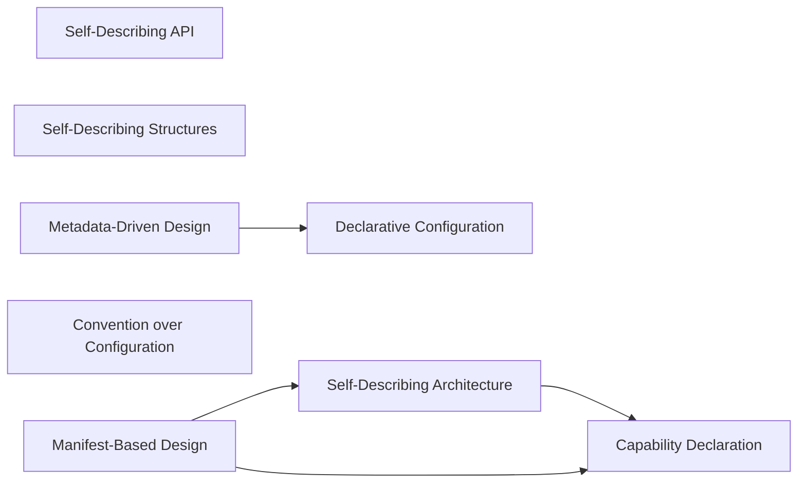
```mermaid
flowchart LR
    n_self_describing_architecture["Self-Describing Architecture"]
    n_self_describing_api["Self-Describing API"]
    n_self_describing_structures["Self-Describing Structures"]
    n_metadata_driven_design["Metadata-Driven Design"]
    n_declarative_configuration["Declarative Configuration"]
    n_convention_over_configuration["Convention over Configuration"]
    n_capability_declaration["Capability Declaration"]
    n_manifest_based_design["Manifest-Based Design"]
    n_self_describing_architecture --> n_capability_declaration
    n_metadata_driven_design --> n_declarative_configuration
    n_manifest_based_design --> n_self_describing_architecture
    n_manifest_based_design --> n_capability_declaration
```

### Self-Describing Architecture

- Kind: [principle](SCHEMA.md#kind-principle)
- Category: [Metadata / Self-Description / Declarative Systems](PRINCIPLES.md#architecture-category-metadata-self-description-declarative-systems)
- Severity: [contextual](SCHEMA.md#vocabulary-severity-contextual)
- Scope: system, runtime, integration
- Layer: [Declarative Core](SCHEMA.md#layer-declarative-core)

Details

Definition
A design rule that each module declares its name, version, capabilities and requirements in metadata that tools and the runtime can read.

Requires
[Metadata](LEXICON.md#lexicon-metadata), [Capability Declaration](PRINCIPLES.md#architecture-capability-declaration)

Reinforces
[Discoverability](LEXICON.md#lexicon-discoverability), [Runtime Discovery](PRINCIPLES.md#architecture-runtime-discovery)

Enables
[Plugin Architecture](PRINCIPLES.md#architecture-plugin-architecture), [Automation](LEXICON.md#lexicon-automation)

In tension with
[Metadata Drift](LEXICON.md#lexicon-metadata-drift)

Conflicts with
[Hidden Runtime Behavior](LEXICON.md#lexicon-hidden-runtime-behavior)

Referenced by
[Manifest-Based Design](PRINCIPLES.md#architecture-manifest-based-design)

Tensions
[Self-Describing Architecture / Metadata Drift](SCHEMA.md#tension-metadata-drift-self-describing-architecture)

Violated by
[Hidden Runtime Behavior](LEXICON.md#lexicon-hidden-runtime-behavior)

Detected by
undocumented runtime capability

Measured by
metadata coverage

Refactored by
[Manifest-Based Design](PRINCIPLES.md#architecture-manifest-based-design), [Declare Capability](LEXICON.md#lexicon-declare-capability), [Schema Validation](PRINCIPLES.md#architecture-schema-validation)

Enforced by
manifest validation, metadata tests

Before

```typescript
const modules = [new FooModule(), new BarModule()];
```

After

```typescript
type ModuleDescriptor = {
  name: string;
  version: string;
  provides: readonly string[];
  requires: readonly string[];
};
const fooModule = defineModule({
  name: "foo",
  version: "1.0.0",
  provides: ["FooStore"],
  requires: ["EventBus"],
});
```

How it is checked

Checked by
manifest validation, metadata tests

Population
Every manifest, schema, configuration file and declared capability, and the code each one describes

Freshness
A verdict stands until the metadata or the code it describes changes

Refusal
Manifest or schema validation fails when a declaration and the code disagree

Observation
Each declaration compared with the capability, endpoint or structure found in the code

Evidence
None, because the catalog states this check as a class, so a watched run belongs to each system that adopts it

Authoritative side
None, because the declaration and the code both declare the capability, so a green comparison shows that they agree and not that either is right

Depends on
[Metadata](LEXICON.md#lexicon-metadata), [Capability Declaration](PRINCIPLES.md#architecture-capability-declaration), [Discoverability](LEXICON.md#lexicon-discoverability), [Runtime Discovery](PRINCIPLES.md#architecture-runtime-discovery), [Plugin Architecture](PRINCIPLES.md#architecture-plugin-architecture), [Automation](LEXICON.md#lexicon-automation)

Shape it refuses
[Hidden Runtime Behavior](LEXICON.md#lexicon-hidden-runtime-behavior)

### Self-Describing API

- Kind: [principle](SCHEMA.md#kind-principle)
- Category: [Metadata / Self-Description / Declarative Systems](PRINCIPLES.md#architecture-category-metadata-self-description-declarative-systems)
- Severity: [recommended](SCHEMA.md#vocabulary-severity-recommended)
- Scope: API, integration
- Layer: [Declarative Core](SCHEMA.md#layer-declarative-core)

Details

Definition
A design rule that an API publishes machine-readable descriptions of its operations, payloads and errors.

Requires
[API Contract](PRINCIPLES.md#architecture-api-contract), [Metadata](LEXICON.md#lexicon-metadata)

Reinforces
[Discoverability](LEXICON.md#lexicon-discoverability), [Interoperability](PRINCIPLES.md#architecture-interoperability)

Enables
[Client Generation](LEXICON.md#lexicon-client-generation), [HATEOAS-style Navigation](LEXICON.md#lexicon-hateoas-style-navigation)

In tension with
[Payload Verbosity](LEXICON.md#lexicon-payload-verbosity)

Conflicts with
[Opaque API](LEXICON.md#lexicon-opaque-api)

Tensions
[Self-Describing API / Payload Verbosity](SCHEMA.md#tension-payload-verbosity-self-describing-api)

Violated by
[Opaque API](LEXICON.md#lexicon-opaque-api)

Detected by
missing OpenAPI/metadata

Measured by
API documentation/contract coverage

Refactored by
[Define Contract](LEXICON.md#lexicon-define-contract), [Declare Capability](LEXICON.md#lexicon-declare-capability), [Standard Error Contract](LEXICON.md#lexicon-standard-error-contract)

Enforced by
API linting, docs gates

Before

```typescript
app.post("/foo", createFoo);
```

After

```typescript
const createFooApi = defineEndpoint({
  method: "POST",
  path: "/foos",
  request: CreateFooSchema,
  response: FooCreatedSchema,
  errors: FooErrorSchema,
});
```

How it is checked

Checked by
API linting, docs gates

Population
Every manifest, schema, configuration file and declared capability, and the code each one describes

Freshness
A verdict stands until the metadata or the code it describes changes

Refusal
Manifest or schema validation fails when a declaration and the code disagree

Observation
Each declaration compared with the capability, endpoint or structure found in the code

Evidence
None, because the catalog states this check as a class, so a watched run belongs to each system that adopts it

Authoritative side
None, because the declaration and the code both declare the capability, so a green comparison shows that they agree and not that either is right

Depends on
[API Contract](PRINCIPLES.md#architecture-api-contract), [Metadata](LEXICON.md#lexicon-metadata), [Discoverability](LEXICON.md#lexicon-discoverability), [Interoperability](PRINCIPLES.md#architecture-interoperability), [Client Generation](LEXICON.md#lexicon-client-generation), [HATEOAS-style Navigation](LEXICON.md#lexicon-hateoas-style-navigation)

Shape it refuses
[Opaque API](LEXICON.md#lexicon-opaque-api)

### Self-Describing Structures

- Kind: [principle](SCHEMA.md#kind-principle)
- Category: [Metadata / Self-Description / Declarative Systems](PRINCIPLES.md#architecture-category-metadata-self-description-declarative-systems)
- Severity: [contextual](SCHEMA.md#vocabulary-severity-contextual)
- Scope: data, runtime, metadata
- Layer: [Declarative Core](SCHEMA.md#layer-declarative-core)

Details

Definition
A design rule that a data structure carries its own type tags and field names, so a reader can interpret it without outside knowledge.

Requires
[Type Metadata](LEXICON.md#lexicon-type-metadata), [Schema](LEXICON.md#lexicon-schema)

Reinforces
[Introspection](PRINCIPLES.md#architecture-introspection), [Validation](PRINCIPLES.md#architecture-validation)

Enables
[Dynamic Processing](LEXICON.md#lexicon-dynamic-processing)

In tension with
[Size Overhead](LEXICON.md#lexicon-size-overhead)

Conflicts with
[Opaque Binary/Untyped Structures](LEXICON.md#lexicon-opaque-binary-untyped-structures)

Referenced by
[Derived Naming Registry](PRINCIPLES.md#architecture-derived-naming-registry)

Tensions
[Self-Describing Structures / Size Overhead](SCHEMA.md#tension-self-describing-structures-size-overhead)

Violated by
[Opaque Binary/Untyped Structures](LEXICON.md#lexicon-opaque-binary-untyped-structures)

Detected by
missing type/schema markers

Measured by
metadata completeness

Refactored by
[Introduce Discriminated Union](LEXICON.md#lexicon-introduce-discriminated-union), [Schema Validation](PRINCIPLES.md#architecture-schema-validation), [Manifest-Based Design](PRINCIPLES.md#architecture-manifest-based-design)

Enforced by
[schema validation](PRINCIPLES.md#architecture-schema-validation)

Before

```typescript
const node = ["foo", "foo_1", 3, true];
```

After

```typescript
const node = { kind: "foo", id: "foo_1", count: 3, active: true } as const;
```

How it is checked

Checked by
schema validation

Population
Every manifest, schema, configuration file and declared capability, and the code each one describes

Freshness
A verdict stands until the metadata or the code it describes changes

Refusal
Manifest or schema validation fails when a declaration and the code disagree

Observation
Each declaration compared with the capability, endpoint or structure found in the code

Evidence
None, because the catalog states this check as a class, so a watched run belongs to each system that adopts it

Authoritative side
None, because the declaration and the code both declare the capability, so a green comparison shows that they agree and not that either is right

Depends on
[Type Metadata](LEXICON.md#lexicon-type-metadata), [Schema](LEXICON.md#lexicon-schema), [Introspection](PRINCIPLES.md#architecture-introspection), [Validation](PRINCIPLES.md#architecture-validation), [Dynamic Processing](LEXICON.md#lexicon-dynamic-processing)

Shape it refuses
[Opaque Binary/Untyped Structures](LEXICON.md#lexicon-opaque-binary-untyped-structures)

### Metadata-Driven Design

- Kind: [approach](SCHEMA.md#kind-approach)
- Category: [Metadata / Self-Description / Declarative Systems](PRINCIPLES.md#architecture-category-metadata-self-description-declarative-systems)
- Severity: [contextual](SCHEMA.md#vocabulary-severity-contextual)
- Scope: runtime, configuration, framework
- Layer: [Declarative Core](SCHEMA.md#layer-declarative-core)

Details

Definition
An approach in which behavior such as forms, routes or plugins is generated from validated metadata instead of written case by case.

Requires
[Metadata Schema](LEXICON.md#lexicon-metadata-schema), [Validation](PRINCIPLES.md#architecture-validation)

Reinforces
[Declarative Configuration](PRINCIPLES.md#architecture-declarative-configuration), [Runtime Discovery](PRINCIPLES.md#architecture-runtime-discovery)

Enables
[Code Generation](LEXICON.md#lexicon-code-generation), [Plugins](LEXICON.md#lexicon-plugins)

In tension with
[Debuggability](LEXICON.md#lexicon-debuggability)

Conflicts with
[Hardcoded Behavior](LEXICON.md#lexicon-hardcoded-behavior)

Referenced by
[Model-Driven Architecture](PRINCIPLES.md#architecture-model-driven-architecture)

Tensions
[Metadata-Driven Design / Debuggability](SCHEMA.md#tension-debuggability-metadata-driven-design)

Violated by
[Unvalidated Metadata](LEXICON.md#lexicon-unvalidated-metadata), [Hidden Runtime Behavior](LEXICON.md#lexicon-hidden-runtime-behavior)

Detected by
metadata/config drift

Measured by
metadata coverage, config error rate

Refactored by
[Declare Capability](LEXICON.md#lexicon-declare-capability), [Schema Validation](PRINCIPLES.md#architecture-schema-validation), [Configuration Schema](LEXICON.md#lexicon-configuration-schema)

Enforced by
metadata schema tests

Before

```typescript
if (field === "name") renderText();
if (field === "count") renderNumber();
```

After

```typescript
const fooFields = {
  name: { kind: "text", required: true },
  count: { kind: "integer", min: 0 },
} as const;
renderForm(fooFields);
```

How it is checked

Checked by
metadata schema tests

Population
Every manifest, schema, configuration file and declared capability, and the code each one describes

Freshness
A verdict stands until the metadata or the code it describes changes

Refusal
Manifest or schema validation fails when a declaration and the code disagree

Observation
Each declaration compared with the capability, endpoint or structure found in the code

Evidence
None, because the catalog states this check as a class, so a watched run belongs to each system that adopts it

Authoritative side
None, because the declaration and the code both declare the capability, so a green comparison shows that they agree and not that either is right

Depends on
[Metadata Schema](LEXICON.md#lexicon-metadata-schema), [Validation](PRINCIPLES.md#architecture-validation), [Declarative Configuration](PRINCIPLES.md#architecture-declarative-configuration), [Runtime Discovery](PRINCIPLES.md#architecture-runtime-discovery), [Code Generation](LEXICON.md#lexicon-code-generation), [Plugins](LEXICON.md#lexicon-plugins)

Shape it refuses
[Hardcoded Behavior](LEXICON.md#lexicon-hardcoded-behavior)

### Declarative Configuration

- Kind: [principle](SCHEMA.md#kind-principle)
- Category: [Metadata / Self-Description / Declarative Systems](PRINCIPLES.md#architecture-category-metadata-self-description-declarative-systems)
- Severity: [recommended](SCHEMA.md#vocabulary-severity-recommended)
- Scope: configuration, infrastructure, runtime
- Layer: [Declarative Core](SCHEMA.md#layer-declarative-core)

Details

Definition
A design rule that a system's settings are declared as validated data, and the system configures itself from that data.

Requires
[Schema Validation](PRINCIPLES.md#architecture-schema-validation), [Explicit Semantics](LEXICON.md#lexicon-explicit-semantics)

Reinforces
[Predictability](PRINCIPLES.md#architecture-predictability), [Infrastructure as Code](PRINCIPLES.md#architecture-infrastructure-as-code)

Enables
[Runtime Configuration without Code Change](LEXICON.md#lexicon-runtime-configuration-without-code-change)

In tension with
[Dynamic Complexity](LEXICON.md#lexicon-dynamic-complexity)

Conflicts with
[Hardcoded Configuration](PRINCIPLES.md#architecture-hardcoded-configuration)

Referenced by
[Infrastructure as Code](PRINCIPLES.md#architecture-infrastructure-as-code), [Metadata-Driven Design](PRINCIPLES.md#architecture-metadata-driven-design), [Domain-Specific Language (DSL)](PRINCIPLES.md#architecture-domain-specific-language), [Registry-Held Order](PRINCIPLES.md#architecture-registry-held-order)

Contracts
[Declarative Core](ALGORITHMS.md#algorithms-declarative-core)

Tensions
[Declarative Configuration / Dynamic Complexity](SCHEMA.md#tension-declarative-configuration-dynamic-complexity)

Violated by
[Hardcoded Behavior](LEXICON.md#lexicon-hardcoded-behavior)

Detected by
hardcoded environment values

Measured by
configuration externalization coverage

Refactored by
[Externalize Configuration](LEXICON.md#lexicon-externalize-configuration), [Configuration Schema](LEXICON.md#lexicon-configuration-schema)

Enforced by
config linting, [validation](PRINCIPLES.md#architecture-validation)

Before

```typescript
const app = new FooApp();
app.enableCache();
app.setRetries(3);
app.register(new BarPlugin());
```

After

```typescript
const config = defineFooConfig({
  cache: { enabled: true },
  retries: 3,
  plugins: ["bar"],
});
const app = FooApp.fromConfig(config);
```

How it is checked

Checked by
config linting, validation

Population
Every manifest, schema, configuration file and declared capability, and the code each one describes

Freshness
A verdict stands until the metadata or the code it describes changes

Refusal
Manifest or schema validation fails when a declaration and the code disagree

Observation
Each declaration compared with the capability, endpoint or structure found in the code

Evidence
None, because the catalog states this check as a class, so a watched run belongs to each system that adopts it

Authoritative side
None, because the declaration and the code both declare the capability, so a green comparison shows that they agree and not that either is right

Depends on
[Schema Validation](PRINCIPLES.md#architecture-schema-validation), [Explicit Semantics](LEXICON.md#lexicon-explicit-semantics), [Predictability](PRINCIPLES.md#architecture-predictability), [Infrastructure as Code](PRINCIPLES.md#architecture-infrastructure-as-code), [Runtime Configuration without Code Change](LEXICON.md#lexicon-runtime-configuration-without-code-change)

Shape it refuses
[Hardcoded Configuration](PRINCIPLES.md#architecture-hardcoded-configuration)

### Convention over Configuration

- Kind: [principle](SCHEMA.md#kind-principle)
- Category: [Metadata / Self-Description / Declarative Systems](PRINCIPLES.md#architecture-category-metadata-self-description-declarative-systems)
- Severity: [contextual](SCHEMA.md#vocabulary-severity-contextual)
- Scope: framework, application structure
- Aliases: Coding by Convention
- Layer: [Declarative Core](SCHEMA.md#layer-declarative-core)

Details

Definition
A design rule that a framework infers settings from stable naming and placement conventions, and explicit configuration covers only the exceptions.

Requires
[Stable Conventions](LEXICON.md#lexicon-stable-conventions)

Reinforces
[Pattern Consistency](PRINCIPLES.md#architecture-pattern-consistency), [Predictability](PRINCIPLES.md#architecture-predictability)

Enables
[Reduced Boilerplate](LEXICON.md#lexicon-reduced-boilerplate)

In tension with
[Explicitness](LEXICON.md#lexicon-explicitness)

Conflicts with
[Excessive Configuration](LEXICON.md#lexicon-excessive-configuration)

Referenced by
[Derived Naming Registry](PRINCIPLES.md#architecture-derived-naming-registry)

Contracts
[Automation Kernel](ALGORITHMS.md#algorithms-automation-kernel)

Tensions
[Convention over Configuration / Explicitness](SCHEMA.md#tension-convention-over-configuration-explicitness)

Distinct from
[Self-Describing Structures](PRINCIPLES.md#architecture-self-describing-structures): Convention over configuration infers settings from naming and placement, while self-describing structures carry their own type tags and field names.

Violated by
[Inconsistent Conventions](LEXICON.md#lexicon-inconsistent-conventions)

Detected by
convention deviations

Measured by
convention compliance score

Refactored by
[Standardize the Interface](LEXICON.md#lexicon-standardize-the-interface), [Centralize the Rule](LEXICON.md#lexicon-centralize-the-rule)

Enforced by
scaffolding, lint rules

Before

```typescript
registerHandler("foo", "./handlers/foo-handler", "FooHandler");
registerHandler("bar", "./handlers/bar-handler", "BarHandler");
```

After

```typescript
const handlers = discoverHandlers("./handlers/*.handler.ts");
```

How it is checked

Checked by
scaffolding, lint rules

Population
Every manifest, schema, configuration file and declared capability, and the code each one describes

Freshness
A verdict stands until the metadata or the code it describes changes

Refusal
Manifest or schema validation fails when a declaration and the code disagree

Observation
Each declaration compared with the capability, endpoint or structure found in the code

Evidence
None, because the catalog states this check as a class, so a watched run belongs to each system that adopts it

Authoritative side
None, because the declaration and the code both declare the capability, so a green comparison shows that they agree and not that either is right

Depends on
[Stable Conventions](LEXICON.md#lexicon-stable-conventions), [Pattern Consistency](PRINCIPLES.md#architecture-pattern-consistency), [Predictability](PRINCIPLES.md#architecture-predictability), [Reduced Boilerplate](LEXICON.md#lexicon-reduced-boilerplate)

Shape it refuses
[Excessive Configuration](LEXICON.md#lexicon-excessive-configuration)

### Capability Declaration

- Kind: [mechanism](SCHEMA.md#kind-mechanism)
- Category: [Metadata / Self-Description / Declarative Systems](PRINCIPLES.md#architecture-category-metadata-self-description-declarative-systems)
- Severity: [recommended](SCHEMA.md#vocabulary-severity-recommended)
- Scope: plugin, service, runtime
- Layer: [Declarative Core](SCHEMA.md#layer-declarative-core)

Details

Definition
A mechanism by which a plugin or service lists the operations it supports, so callers test the list instead of probing for methods.

Requires
[Manifest](LEXICON.md#lexicon-manifest), [Contracts](LEXICON.md#lexicon-contracts)

Reinforces
[Runtime Discovery](PRINCIPLES.md#architecture-runtime-discovery), [Self-Description](LEXICON.md#lexicon-self-description)

Enables
[Dynamic Binding](PRINCIPLES.md#architecture-dynamic-binding)

In tension with
[Declaration Drift](LEXICON.md#lexicon-declaration-drift)

Conflicts with
[Implicit Capability](LEXICON.md#lexicon-implicit-capability)

Referenced by
[Self-Describing Architecture](PRINCIPLES.md#architecture-self-describing-architecture), [Manifest-Based Design](PRINCIPLES.md#architecture-manifest-based-design)

Tensions
[Capability Declaration / Declaration Drift](SCHEMA.md#tension-capability-declaration-declaration-drift)

Violated by
[Implicit Capability](LEXICON.md#lexicon-implicit-capability)

Detected by
manifest-code mismatch

Measured by
declared/actual capability match rate

Refactored by
[Manifest-Based Design](PRINCIPLES.md#architecture-manifest-based-design), [Extract Role Interface](LEXICON.md#lexicon-extract-role-interface)

Enforced by
manifest validation, conformance tests

Before

```typescript
try {
  await plugin.exportFoo(foo);
} catch (error) {
  if (isMissingMethod(error)) return;
}
```

After

```typescript
type FooPlugin = {
  capabilities: readonly ("read" | "write" | "export")[];
  exportFoo?: (foo: Foo) => Promise<void>;
};
if (plugin.capabilities.includes("export")) await plugin.exportFoo!(foo);
```

How it is checked

Checked by
manifest validation, conformance tests

Population
Every manifest, schema, configuration file and declared capability, and the code each one describes

Freshness
A verdict stands until the metadata or the code it describes changes

Refusal
Manifest or schema validation fails when a declaration and the code disagree

Observation
Each declaration compared with the capability, endpoint or structure found in the code

Evidence
None, because the catalog states this check as a class, so a watched run belongs to each system that adopts it

Authoritative side
None, because the declaration and the code both declare the capability, so a green comparison shows that they agree and not that either is right

Depends on
[Manifest](LEXICON.md#lexicon-manifest), [Contracts](LEXICON.md#lexicon-contracts), [Runtime Discovery](PRINCIPLES.md#architecture-runtime-discovery), [Self-Description](LEXICON.md#lexicon-self-description), [Dynamic Binding](PRINCIPLES.md#architecture-dynamic-binding)

Shape it refuses
[Implicit Capability](LEXICON.md#lexicon-implicit-capability)

### Manifest-Based Design

- Kind: [pattern](SCHEMA.md#kind-pattern)
- Category: [Metadata / Self-Description / Declarative Systems](PRINCIPLES.md#architecture-category-metadata-self-description-declarative-systems)
- Severity: [contextual](SCHEMA.md#vocabulary-severity-contextual)
- Scope: plugin, module, deployment
- Layer: [Declarative Core](SCHEMA.md#layer-declarative-core)

Details

Definition
A design pattern that loads modules or plugins from a validated manifest listing each entry, version and dependency.

Requires
[Manifest Schema](LEXICON.md#lexicon-manifest-schema)

Reinforces
[Self-Describing Architecture](PRINCIPLES.md#architecture-self-describing-architecture), [Runtime Discovery](PRINCIPLES.md#architecture-runtime-discovery)

Enables
[Plugin Loading](LEXICON.md#lexicon-plugin-loading), [Capability Declaration](PRINCIPLES.md#architecture-capability-declaration)

In tension with
[Manifest Drift](LEXICON.md#lexicon-manifest-drift)

Conflicts with
[Hardcoded Registration](LEXICON.md#lexicon-hardcoded-registration)

Tensions
[Manifest-Based Design / Manifest Drift](SCHEMA.md#tension-manifest-based-design-manifest-drift)

Violated by
[Implicit Capability](LEXICON.md#lexicon-implicit-capability), [Hidden Dependency](LEXICON.md#lexicon-hidden-dependency)

Detected by
manifest mismatch, load failure

Measured by
manifest validation pass rate

Refactored by
[Discovery Validation](LEXICON.md#lexicon-discovery-validation)

Enforced by
CI validation

Before

```typescript
loadPlugin("./foo.js");
loadPlugin("./bar.js");
```

After

```typescript
const manifest = {
  name: "foo-suite",
  plugins: [
    { name: "foo", entry: "./foo.js", version: "1.0.0" },
    { name: "bar", entry: "./bar.js", version: "1.0.0" },
  ],
} as const;
loadManifest(manifest);
```

How it is checked

Checked by
CI validation

Population
Every manifest, schema, configuration file and declared capability, and the code each one describes

Freshness
A verdict stands until the metadata or the code it describes changes

Refusal
Manifest or schema validation fails when a declaration and the code disagree

Observation
Each declaration compared with the capability, endpoint or structure found in the code

Evidence
None, because the catalog states this check as a class, so a watched run belongs to each system that adopts it

Authoritative side
None, because the declaration and the code both declare the capability, so a green comparison shows that they agree and not that either is right

Depends on
[Manifest Schema](LEXICON.md#lexicon-manifest-schema), [Self-Describing Architecture](PRINCIPLES.md#architecture-self-describing-architecture), [Runtime Discovery](PRINCIPLES.md#architecture-runtime-discovery), [Plugin Loading](LEXICON.md#lexicon-plugin-loading), [Capability Declaration](PRINCIPLES.md#architecture-capability-declaration)

Shape it refuses
[Hardcoded Registration](LEXICON.md#lexicon-hardcoded-registration)

## Metaprogramming / Language-Oriented Architecture

Every principle in this category is listed as a record. Each record carries its kind, its severity, the scopes it applies at and the layer it lives in, then the edge relations that join it to other records, the records that point back at it, the contracts that answer to it and the tensions it takes part in. The descriptors say how it is violated, detected, measured, repaired and enforced. Where the record carries one, an exemplar shows the shape before and after the principle is applied.

Relations diagram

The relations inside this category.

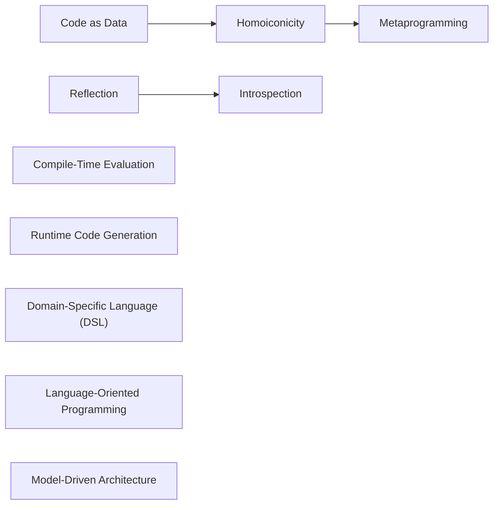
```mermaid
flowchart LR
    n_homoiconicity["Homoiconicity"]
    n_code_as_data["Code as Data"]
    n_metaprogramming["Metaprogramming"]
    n_reflection["Reflection"]
    n_introspection["Introspection"]
    n_compile_time_evaluation["Compile-Time Evaluation"]
    n_runtime_code_generation["Runtime Code Generation"]
    n_domain_specific_language["Domain-Specific Language (DSL)"]
    n_language_oriented_programming["Language-Oriented Programming"]
    n_model_driven_architecture["Model-Driven Architecture"]
    n_homoiconicity --> n_metaprogramming
    n_code_as_data --> n_homoiconicity
    n_reflection --> n_introspection
```

### Homoiconicity

- Kind: [quality-attribute](SCHEMA.md#kind-quality-attribute)
- Category: [Metaprogramming / Language-Oriented Architecture](PRINCIPLES.md#architecture-category-metaprogramming-language-oriented-architecture)
- Severity: [contextual](SCHEMA.md#vocabulary-severity-contextual)
- Scope: language, metaprogramming
- Layer: [Declarative Core](SCHEMA.md#layer-declarative-core)

Details

Definition
The degree to which a language represents its programs in its own data structures, so programs can be inspected and transformed as data.

Requires
[Code-as-Data Representation](LEXICON.md#lexicon-code-as-data-representation)

Reinforces
[Metaprogramming](PRINCIPLES.md#architecture-metaprogramming)

Enables
[Macro Systems](LEXICON.md#lexicon-macro-systems), [DSLs](LEXICON.md#lexicon-dsls)

In tension with
[Readability](LEXICON.md#lexicon-readability)

Conflicts with
[Opaque Syntax Trees](LEXICON.md#lexicon-opaque-syntax-trees)

Referenced by
[Code as Data](PRINCIPLES.md#architecture-code-as-data)

Tensions
[Homoiconicity / Readability](SCHEMA.md#tension-homoiconicity-readability)

Distinct from
[Readability](LEXICON.md#lexicon-readability): Homoiconicity is programs held as data, while readability is how easily the developer reads the source that results.

Violated by
[String-Based Code Generation](LEXICON.md#lexicon-string-based-code-generation)

Detected by
language capability check

Measured by
macro/code-as-data usage

Refactored by
[Syntax Tree Generation](LEXICON.md#lexicon-syntax-tree-generation)

Enforced by
language/tooling constraints

Refused by rules
homoiconicity

Before

```typescript
function evaluateFoo(foo: Foo) {
  return foo.value * 2;
}
const fooRule = { operation: "multiply", operand: 2 };
```

After

```typescript
type Expr =
  | { op: "value"; key: keyof Foo }
  | { op: "const"; value: number }
  | { op: "multiply"; left: Expr; right: Expr };
const fooRule: Expr = {
  op: "multiply",
  left: { op: "value", key: "value" },
  right: { op: "const", value: 2 },
};
const result = evaluate(fooRule, foo);
```

How it is checked

Checked by
language/tooling constraints

Population
Every generator, reflective access, evaluation site and language definition in the codebase

Freshness
A verdict stands until a generator, a grammar or the model it generates from changes

Refusal
The banned-API rule, the generator test or the grammar validation fails the change

Observation
Eval and reflection call sites read from source, and generated output compared with its model

Evidence
None, because the catalog states this check as a class, so a watched run belongs to each system that adopts it

Authoritative side
The model and the grammar, which generated output is derived from and compared against

Depends on
[Code-as-Data Representation](LEXICON.md#lexicon-code-as-data-representation), [Metaprogramming](PRINCIPLES.md#architecture-metaprogramming), [Macro Systems](LEXICON.md#lexicon-macro-systems), [DSLs](LEXICON.md#lexicon-dsls)

Shape it refuses
[Opaque Syntax Trees](LEXICON.md#lexicon-opaque-syntax-trees)

### Code as Data

- Kind: [principle](SCHEMA.md#kind-principle)
- Category: [Metaprogramming / Language-Oriented Architecture](PRINCIPLES.md#architecture-category-metaprogramming-language-oriented-architecture)
- Severity: [contextual](SCHEMA.md#vocabulary-severity-contextual)
- Scope: language, compiler, runtime
- Layer: [Declarative Core](SCHEMA.md#layer-declarative-core)

Details

Definition
A design rule that logic to be generated or transformed is held as a typed data structure, such as a syntax tree, that tools can inspect and rewrite.

Requires
[AST or Data Representation](LEXICON.md#lexicon-ast-or-data-representation)

Reinforces
[Homoiconicity](PRINCIPLES.md#architecture-homoiconicity), [Code Generation](LEXICON.md#lexicon-code-generation)

Enables
[Program Transformation](LEXICON.md#lexicon-program-transformation)

In tension with
[Safety/Debuggability](LEXICON.md#lexicon-safety-debuggability)

Conflicts with
[String-Based Code Generation](LEXICON.md#lexicon-string-based-code-generation)

Tensions
[Code as Data / Safety/Debuggability](SCHEMA.md#tension-code-as-data-safety-debuggability)

Violated by
[Unchecked Dynamic Code](LEXICON.md#lexicon-unchecked-dynamic-code)

Detected by
dynamic eval/string code construction

Measured by
unsafe eval count

Refactored by
[Syntax Tree Generation](LEXICON.md#lexicon-syntax-tree-generation), [Domain-Specific Language (DSL)](PRINCIPLES.md#architecture-domain-specific-language)

Enforced by
banned API rules

Before

```typescript
function fooRule(foo: Foo) {
  return foo.count > 3 && foo.active;
}
```

After

```typescript
const fooRule = {
  op: "and",
  args: [
    { op: "gt", field: "count", value: 3 },
    { op: "eq", field: "active", value: true },
  ],
} as const;
executeRule(fooRule, foo);
```

How it is checked

Checked by
banned API rules

Population
Every generator, reflective access, evaluation site and language definition in the codebase

Freshness
A verdict stands until a generator, a grammar or the model it generates from changes

Refusal
The banned-API rule, the generator test or the grammar validation fails the change

Observation
Eval and reflection call sites read from source, and generated output compared with its model

Evidence
None, because the catalog states this check as a class, so a watched run belongs to each system that adopts it

Authoritative side
The model and the grammar, which generated output is derived from and compared against

Depends on
[AST or Data Representation](LEXICON.md#lexicon-ast-or-data-representation), [Homoiconicity](PRINCIPLES.md#architecture-homoiconicity), [Code Generation](LEXICON.md#lexicon-code-generation), [Program Transformation](LEXICON.md#lexicon-program-transformation)

Shape it refuses
[String-Based Code Generation](LEXICON.md#lexicon-string-based-code-generation)

### Metaprogramming

- Kind: [technique](SCHEMA.md#kind-technique)
- Category: [Metaprogramming / Language-Oriented Architecture](PRINCIPLES.md#architecture-category-metaprogramming-language-oriented-architecture)
- Severity: [contextual](SCHEMA.md#vocabulary-severity-contextual)
- Scope: compile-time, runtime, framework
- Layer: [Declarative Core](SCHEMA.md#layer-declarative-core)

Details

Definition
A technique for writing programs that generate or transform other programs, at compile time or at runtime.

Requires
[Reflection/AST/Code Generation](LEXICON.md#lexicon-reflection-ast-code-generation)

Reinforces
[Do Not Repeat Yourself (DRY)](PRINCIPLES.md#architecture-duplicate-code), [DSLs](LEXICON.md#lexicon-dsls)

Enables
[Boilerplate Elimination](LEXICON.md#lexicon-boilerplate-elimination)

In tension with
[Debuggability](LEXICON.md#lexicon-debuggability), [Static Analysis](PRINCIPLES.md#architecture-static-analysis), [Explicit Handwritten Code](LEXICON.md#lexicon-explicit-handwritten-code)

Conflicts with
none

Referenced by
[Homoiconicity](PRINCIPLES.md#architecture-homoiconicity)

Tensions
[Metaprogramming / Debuggability](SCHEMA.md#tension-debuggability-metaprogramming), [Metaprogramming / Static Analysis](SCHEMA.md#tension-metaprogramming-static-analysis), [Metaprogramming / Explicit Handwritten Code](SCHEMA.md#tension-explicit-handwritten-code-metaprogramming)

Distinct from
[DSLs](LEXICON.md#lexicon-dsls): Metaprogramming is code that writes or transforms code, while a domain-specific language is a notation for one domain, which metaprogramming can build.

Violated by
[Unchecked Dynamic Code](LEXICON.md#lexicon-unchecked-dynamic-code)

Detected by
dynamic generation without tests/schema

Measured by
generated code coverage, [complexity](REASONING.md#reasoning-lens-complexity)

Refactored by
[Unit Tests](LEXICON.md#lexicon-unit-tests), [Declare Capability](LEXICON.md#lexicon-declare-capability)

Enforced by
generator validation

Before

```typescript
class FooDto {
  id!: string;
  name!: string;
}
class BarDto {
  id!: string;
  name!: string;
}
```

After

```typescript
const entity = defineEntity({ id: string(), name: string() });
const FooDto = generateType("FooDto", entity);
const BarDto = generateType("BarDto", entity);
```

How it is checked

Checked by
generator validation

Population
Every generator, reflective access, evaluation site and language definition in the codebase

Freshness
A verdict stands until a generator, a grammar or the model it generates from changes

Refusal
The banned-API rule, the generator test or the grammar validation fails the change

Observation
Eval and reflection call sites read from source, and generated output compared with its model

Evidence
None, because the catalog states this check as a class, so a watched run belongs to each system that adopts it

Authoritative side
The model and the grammar, which generated output is derived from and compared against

Depends on
[Reflection/AST/Code Generation](LEXICON.md#lexicon-reflection-ast-code-generation), [Do Not Repeat Yourself (DRY)](PRINCIPLES.md#architecture-duplicate-code), [DSLs](LEXICON.md#lexicon-dsls), [Boilerplate Elimination](LEXICON.md#lexicon-boilerplate-elimination)

Shape it refuses
Not answered

### Reflection

- Kind: [mechanism](SCHEMA.md#kind-mechanism)
- Category: [Metaprogramming / Language-Oriented Architecture](PRINCIPLES.md#architecture-category-metaprogramming-language-oriented-architecture)
- Severity: [contextual](SCHEMA.md#vocabulary-severity-contextual)
- Scope: runtime, metadata, framework
- Layer: [Declarative Core](SCHEMA.md#layer-declarative-core)

Details

Definition
A mechanism that lets a program read and act on type metadata about its own structure at runtime.

Requires
[Runtime Type Metadata](LEXICON.md#lexicon-runtime-type-metadata)

Reinforces
[Introspection](PRINCIPLES.md#architecture-introspection), [Runtime Discovery](PRINCIPLES.md#architecture-runtime-discovery)

Enables
[Dynamic Binding](PRINCIPLES.md#architecture-dynamic-binding)

In tension with
[Performance/Safety](LEXICON.md#lexicon-performance-safety), [Static Analysis](PRINCIPLES.md#architecture-static-analysis)

Conflicts with
none

Tensions
[Reflection / Performance/Safety](SCHEMA.md#tension-performance-safety-reflection), [Reflection / Static Analysis](SCHEMA.md#tension-reflection-static-analysis)

Distinct from
[Dynamic Binding](PRINCIPLES.md#architecture-dynamic-binding): Reflection reads type metadata at runtime, while dynamic binding selects an implementation at runtime, with or without reflection.

Distinct from
[Introspection](PRINCIPLES.md#architecture-introspection): Introspection only reads a type and its members, while reflection also acts on what it reads.

Distinct from
[Static Analysis](PRINCIPLES.md#architecture-static-analysis): Reflection inspects structure while the program runs, while static analysis inspects source without running it.

Violated by
[Reflective Contract Bypass](LEXICON.md#lexicon-reflective-contract-bypass)

Detected by
reflective access to internals

Measured by
unsafe reflection count

Refactored by
[Declare Capability](LEXICON.md#lexicon-declare-capability)

Enforced by
lint/security rules

Before

```typescript
const fields = ["id", "name", "count"];
for (const field of fields) renderField(foo[field]);
```

After

```typescript
for (const [field, metadata] of reflect(FooSchema).entries()) {
  renderField(field, metadata, foo[field]);
}
```

How it is checked

Checked by
lint/security rules

Population
Every generator, reflective access, evaluation site and language definition in the codebase

Freshness
A verdict stands until a generator, a grammar or the model it generates from changes

Refusal
The banned-API rule, the generator test or the grammar validation fails the change

Observation
Eval and reflection call sites read from source, and generated output compared with its model

Evidence
None, because the catalog states this check as a class, so a watched run belongs to each system that adopts it

Authoritative side
The model and the grammar, which generated output is derived from and compared against

Depends on
[Runtime Type Metadata](LEXICON.md#lexicon-runtime-type-metadata), [Introspection](PRINCIPLES.md#architecture-introspection), [Runtime Discovery](PRINCIPLES.md#architecture-runtime-discovery), [Dynamic Binding](PRINCIPLES.md#architecture-dynamic-binding)

Shape it refuses
Not answered

### Introspection

- Kind: [mechanism](SCHEMA.md#kind-mechanism)
- Category: [Metaprogramming / Language-Oriented Architecture](PRINCIPLES.md#architecture-category-metaprogramming-language-oriented-architecture)
- Severity: [contextual](SCHEMA.md#vocabulary-severity-contextual)
- Scope: runtime, metadata
- Layer: [Declarative Core](SCHEMA.md#layer-declarative-core)

Details

Definition
A mechanism that lets a program query an object's type and public members at runtime without changing them.

Requires
[Type Metadata](LEXICON.md#lexicon-type-metadata)

Reinforces
[Self-Describing Systems](LEXICON.md#lexicon-self-describing-systems)

Enables
[Discovery](LEXICON.md#lexicon-discovery), [Diagnostics](LEXICON.md#lexicon-diagnostics)

In tension with
[Encapsulation](PRINCIPLES.md#architecture-encapsulation)

Conflicts with
[Opaque Runtime Behavior](PRINCIPLES.md#architecture-opaque-runtime-behavior)

Referenced by
[Self-Describing Structures](PRINCIPLES.md#architecture-self-describing-structures), [Reflection](PRINCIPLES.md#architecture-reflection)

Tensions
[Introspection / Encapsulation](SCHEMA.md#tension-encapsulation-introspection)

Violated by
[Exposed Internals](LEXICON.md#lexicon-exposed-internals)

Detected by
introspection of private internals

Measured by
introspection usage risk

Refactored by
[Declare Capability](LEXICON.md#lexicon-declare-capability)

Enforced by
API boundaries

Before

```typescript
function supportsExport(plugin: any) {
  try {
    plugin.exportFoo(foo);
    return true;
  } catch {
    return false;
  }
}
```

After

```typescript
function supportsExport(plugin: Plugin) {
  return introspect(plugin).methods.includes("exportFoo");
}
```

How it is checked

Checked by
API boundaries

Population
Every generator, reflective access, evaluation site and language definition in the codebase

Freshness
A verdict stands until a generator, a grammar or the model it generates from changes

Refusal
The banned-API rule, the generator test or the grammar validation fails the change

Observation
Eval and reflection call sites read from source, and generated output compared with its model

Evidence
None, because the catalog states this check as a class, so a watched run belongs to each system that adopts it

Authoritative side
The model and the grammar, which generated output is derived from and compared against

Depends on
[Type Metadata](LEXICON.md#lexicon-type-metadata), [Self-Describing Systems](LEXICON.md#lexicon-self-describing-systems), [Discovery](LEXICON.md#lexicon-discovery), [Diagnostics](LEXICON.md#lexicon-diagnostics)

Shape it refuses
[Opaque Runtime Behavior](PRINCIPLES.md#architecture-opaque-runtime-behavior), [Opaque Runtime Behavior](PRINCIPLES.md#architecture-opaque-runtime-behavior)

### Compile-Time Evaluation

- Kind: [mechanism](SCHEMA.md#kind-mechanism)
- Category: [Metaprogramming / Language-Oriented Architecture](PRINCIPLES.md#architecture-category-metaprogramming-language-oriented-architecture)
- Severity: [contextual](SCHEMA.md#vocabulary-severity-contextual)
- Scope: compiler, build
- Layer: [Declarative Core](SCHEMA.md#layer-declarative-core)

Details

Definition
A mechanism that computes values, checks or generated code during the build, so the work and its errors happen before runtime.

Requires
[Compile-Time Inputs](LEXICON.md#lexicon-compile-time-inputs)

Reinforces
[Optimization](PRINCIPLES.md#architecture-optimization), [Type Safety](PRINCIPLES.md#architecture-type-safety)

Enables
[Early Error Detection](LEXICON.md#lexicon-early-error-detection)

In tension with
[Build Complexity](LEXICON.md#lexicon-build-complexity), [Runtime Dynamic Evaluation](LEXICON.md#lexicon-runtime-dynamic-evaluation)

Conflicts with
none

Tensions
[Compile-Time Evaluation / Build Complexity](SCHEMA.md#tension-build-complexity-compile-time-evaluation), [Compile-Time Evaluation / Runtime Dynamic Evaluation](SCHEMA.md#tension-compile-time-evaluation-runtime-dynamic-evaluation)

Violated by
[Deferred Static Check](LEXICON.md#lexicon-deferred-static-check)

Detected by
repeated runtime reflection/validation

Measured by
compile-time coverage

Refactored by
none

Enforced by
compiler plugins/build checks

Before

```typescript
const fooRoutes = buildRoutesAtStartup(fooRouteDefinitions);
```

After

```typescript
const fooRoutes = compileTime(() => buildRoutes(fooRouteDefinitions));
export const routeTable = fooRoutes;
```

How it is checked

Checked by
compiler plugins/build checks

Population
Every generator, reflective access, evaluation site and language definition in the codebase

Freshness
A verdict stands until a generator, a grammar or the model it generates from changes

Refusal
The banned-API rule, the generator test or the grammar validation fails the change

Observation
Eval and reflection call sites read from source, and generated output compared with its model

Evidence
None, because the catalog states this check as a class, so a watched run belongs to each system that adopts it

Authoritative side
The model and the grammar, which generated output is derived from and compared against

Depends on
[Compile-Time Inputs](LEXICON.md#lexicon-compile-time-inputs), [Optimization](PRINCIPLES.md#architecture-optimization), [Type Safety](PRINCIPLES.md#architecture-type-safety), [Early Error Detection](LEXICON.md#lexicon-early-error-detection)

Shape it refuses
Not answered

### Runtime Code Generation

- Kind: [mechanism](SCHEMA.md#kind-mechanism)
- Category: [Metaprogramming / Language-Oriented Architecture](PRINCIPLES.md#architecture-category-metaprogramming-language-oriented-architecture)
- Severity: [discouraged](SCHEMA.md#vocabulary-severity-discouraged)
- Scope: runtime, framework
- Layer: [Declarative Core](SCHEMA.md#layer-declarative-core)

Details

Definition
A mechanism that builds executable code while the program runs, from a specification such as a field mapping.

Requires
[Safe Generation Boundary](LEXICON.md#lexicon-safe-generation-boundary)

Reinforces
[Runtime Extensibility](PRINCIPLES.md#architecture-runtime-extensibility)

Enables
[Dynamic Optimization/Adaptation](LEXICON.md#lexicon-dynamic-optimization-adaptation)

In tension with
[Security/Debugging](LEXICON.md#lexicon-security-debugging), [Static Safety](LEXICON.md#lexicon-static-safety)

Conflicts with
none

Tensions
[Runtime Code Generation / Security/Debugging](SCHEMA.md#tension-runtime-code-generation-security-debugging), [Runtime Code Generation / Static Safety](SCHEMA.md#tension-runtime-code-generation-static-safety)

Violated by
[Unchecked Dynamic Code](LEXICON.md#lexicon-unchecked-dynamic-code)

Detected by
dynamic eval with external input

Measured by
unsafe generation paths

Refactored by
[Syntax Tree Generation](LEXICON.md#lexicon-syntax-tree-generation), [Sandboxing](LEXICON.md#lexicon-sandboxing), [Compile-Time Evaluation](PRINCIPLES.md#architecture-compile-time-evaluation)

Enforced by
[security policy](ALGORITHMS.md#algorithms-security-policy)

Before

```typescript
function mapFoo(row: any) {
  return { id: row["foo_id"], name: row["foo_name"], count: row["foo_count"] };
}
```

After

```typescript
const mapFoo = generateMapper<FooRow, Foo>({
  foo_id: "id",
  foo_name: "name",
  foo_count: "count",
});
```

How it is checked

Checked by
security policy

Population
Every generator, reflective access, evaluation site and language definition in the codebase

Freshness
A verdict stands until a generator, a grammar or the model it generates from changes

Refusal
The banned-API rule, the generator test or the grammar validation fails the change

Observation
Eval and reflection call sites read from source, and generated output compared with its model

Evidence
None, because the catalog states this check as a class, so a watched run belongs to each system that adopts it

Authoritative side
The model and the grammar, which generated output is derived from and compared against

Depends on
[Safe Generation Boundary](LEXICON.md#lexicon-safe-generation-boundary), [Runtime Extensibility](PRINCIPLES.md#architecture-runtime-extensibility), [Dynamic Optimization/Adaptation](LEXICON.md#lexicon-dynamic-optimization-adaptation)

Shape it refuses
Not answered

### Domain-Specific Language (DSL)

- Kind: [pattern](SCHEMA.md#kind-pattern)
- Category: [Metaprogramming / Language-Oriented Architecture](PRINCIPLES.md#architecture-category-metaprogramming-language-oriented-architecture)
- Severity: [contextual](SCHEMA.md#vocabulary-severity-contextual)
- Scope: domain, configuration, rules
- Layer: [Declarative Core](SCHEMA.md#layer-declarative-core)

Details

Definition
A design pattern that expresses a domain's rules or workflows in a small language with a defined grammar and a validator.

Requires
[Formal Grammar/Semantics](LEXICON.md#lexicon-formal-grammar-semantics)

Reinforces
[Declarative Configuration](PRINCIPLES.md#architecture-declarative-configuration), [Ubiquitous Language](PRINCIPLES.md#architecture-ubiquitous-language)

Enables
[Domain Expressiveness](LEXICON.md#lexicon-domain-expressiveness)

In tension with
[Tooling/Maintenance](LEXICON.md#lexicon-tooling-maintenance)

Conflicts with
[General-Purpose Boilerplate](LEXICON.md#lexicon-general-purpose-boilerplate)

Tensions
[Domain-Specific Language (DSL) / Tooling/Maintenance](SCHEMA.md#tension-domain-specific-language-dsl-tooling-maintenance)

Violated by
[Ad-Hoc Mini-Language](LEXICON.md#lexicon-ad-hoc-mini-language)

Detected by
stringly-typed rules without parser/schema

Measured by
DSL validation coverage

Refactored by
[Validate at the Boundary](LEXICON.md#lexicon-validate-at-the-boundary)

Enforced by
DSL tests, schema/grammar checks

Before

```typescript
createWorkflow([
  { type: "validate", target: "foo" },
  { type: "save", target: "foo" },
  { type: "publish", target: "foo.created" },
]);
```

After

```typescript
fooWorkflow("create", (flow) =>
  flow.validate(FooSchema).save("FooStore").publish("FooCreated"),
);
```

How it is checked

Checked by
DSL tests, schema/grammar checks

Population
Every generator, reflective access, evaluation site and language definition in the codebase

Freshness
A verdict stands until a generator, a grammar or the model it generates from changes

Refusal
The banned-API rule, the generator test or the grammar validation fails the change

Observation
Eval and reflection call sites read from source, and generated output compared with its model

Evidence
None, because the catalog states this check as a class, so a watched run belongs to each system that adopts it

Authoritative side
The model and the grammar, which generated output is derived from and compared against

Depends on
[Formal Grammar/Semantics](LEXICON.md#lexicon-formal-grammar-semantics), [Declarative Configuration](PRINCIPLES.md#architecture-declarative-configuration), [Ubiquitous Language](PRINCIPLES.md#architecture-ubiquitous-language), [Domain Expressiveness](LEXICON.md#lexicon-domain-expressiveness)

Shape it refuses
[General-Purpose Boilerplate](LEXICON.md#lexicon-general-purpose-boilerplate)

### Language-Oriented Programming

- Kind: [approach](SCHEMA.md#kind-approach)
- Category: [Metaprogramming / Language-Oriented Architecture](PRINCIPLES.md#architecture-category-metaprogramming-language-oriented-architecture)
- Severity: [contextual](SCHEMA.md#vocabulary-severity-contextual)
- Scope: domain, platform, code generation
- Layer: [Declarative Core](SCHEMA.md#layer-declarative-core)

Details

Definition
An approach in which each problem domain gets its own language, with a type checker and an evaluator, and solutions are written in it.

Requires
[DSLs](LEXICON.md#lexicon-dsls), [Code Generation or Interpreters](LEXICON.md#lexicon-code-generation-or-interpreters)

Reinforces
[Domain Modeling](LEXICON.md#lexicon-domain-modeling)

Enables
[High-Level Domain Expression](LEXICON.md#lexicon-high-level-domain-expression)

In tension with
[Toolchain Complexity](LEXICON.md#lexicon-toolchain-complexity), [One-Size General-Purpose Code](LEXICON.md#lexicon-one-size-general-purpose-code)

Conflicts with
none

Tensions
[Language-Oriented Programming / Toolchain Complexity](SCHEMA.md#tension-language-oriented-programming-toolchain-complexity), [Language-Oriented Programming / One-Size General-Purpose Code](SCHEMA.md#tension-language-oriented-programming-one-size-general-purpose-code)

Distinct from
[One-Size General-Purpose Code](LEXICON.md#lexicon-one-size-general-purpose-code): Language-oriented programming gives each domain its own language, while general-purpose code writes every domain in one language.

Violated by
[Ad-Hoc Mini-Language](LEXICON.md#lexicon-ad-hoc-mini-language)

Detected by
multiple inconsistent rule/config syntaxes

Measured by
language consistency/tooling

Refactored by
[Domain-Specific Language (DSL)](PRINCIPLES.md#architecture-domain-specific-language), [Automated Enforcement](LEXICON.md#lexicon-automated-enforcement)

Enforced by
grammar/schema validation

Before

```typescript
function processFoo(config: Record<string, unknown>) {
  interpretAdHocConfig(config);
}
```

After

```typescript
const FooPolicyLanguage = defineLanguage({
  expressions: ["field", "equals", "all", "any"],
  typeChecker: fooPolicyTypeChecker,
  evaluator: fooPolicyEvaluator,
});
FooPolicyLanguage.run(fooPolicy, foo);
```

How it is checked

Checked by
grammar/schema validation

Population
Every generator, reflective access, evaluation site and language definition in the codebase

Freshness
A verdict stands until a generator, a grammar or the model it generates from changes

Refusal
The banned-API rule, the generator test or the grammar validation fails the change

Observation
Eval and reflection call sites read from source, and generated output compared with its model

Evidence
None, because the catalog states this check as a class, so a watched run belongs to each system that adopts it

Authoritative side
The model and the grammar, which generated output is derived from and compared against

Depends on
[DSLs](LEXICON.md#lexicon-dsls), [Code Generation or Interpreters](LEXICON.md#lexicon-code-generation-or-interpreters), [Domain Modeling](LEXICON.md#lexicon-domain-modeling), [High-Level Domain Expression](LEXICON.md#lexicon-high-level-domain-expression)

Shape it refuses
Not answered

### Model-Driven Architecture

- Kind: [approach](SCHEMA.md#kind-approach)
- Category: [Metaprogramming / Language-Oriented Architecture](PRINCIPLES.md#architecture-category-metaprogramming-language-oriented-architecture)
- Severity: [contextual](SCHEMA.md#vocabulary-severity-contextual)
- Scope: system, code generation, domain model
- Aliases: MDA
- Layer: [Declarative Core](SCHEMA.md#layer-declarative-core)

Details

Definition
An approach in which a formal model is the source of truth and the implementation is generated from it by transformation rules.

Requires
[Formal Model](LEXICON.md#lexicon-formal-model), [Transformation Rules](LEXICON.md#lexicon-transformation-rules)

Reinforces
[Metadata-Driven Design](PRINCIPLES.md#architecture-metadata-driven-design)

Enables
[Generated Implementations](LEXICON.md#lexicon-generated-implementations)

In tension with
none

Conflicts with
[Handwritten Divergence](LEXICON.md#lexicon-handwritten-divergence)

Distinct from
[Metadata-Driven Design](PRINCIPLES.md#architecture-metadata-driven-design): Model-driven architecture generates the implementation from a formal model by transformation rules, while metadata-driven design drives forms, routes or plugins from validated metadata.

Violated by
[Handwritten Divergence](LEXICON.md#lexicon-handwritten-divergence)

Detected by
model-code drift

Measured by
generation conformance

Refactored by
[Code Generation](LEXICON.md#lexicon-code-generation), [Model Evaluation](PRINCIPLES.md#architecture-model-evaluation)

Enforced by
generation CI

Before

```typescript
class FooController {}
class FooService {}
class FooRepository {}
class FooDto {}
```

After

```typescript
const fooModel = defineModel({
  entity: "Foo",
  fields: { id: "FooId", name: "string" },
  operations: ["create", "read", "rename"],
});
generateApplication(fooModel);
```

How it is checked

Checked by
generation CI

Population
Every generator, reflective access, evaluation site and language definition in the codebase

Freshness
A verdict stands until a generator, a grammar or the model it generates from changes

Refusal
The banned-API rule, the generator test or the grammar validation fails the change

Observation
Eval and reflection call sites read from source, and generated output compared with its model

Evidence
None, because the catalog states this check as a class, so a watched run belongs to each system that adopts it

Authoritative side
The model and the grammar, which generated output is derived from and compared against

Depends on
[Formal Model](LEXICON.md#lexicon-formal-model), [Transformation Rules](LEXICON.md#lexicon-transformation-rules), [Metadata-Driven Design](PRINCIPLES.md#architecture-metadata-driven-design), [Generated Implementations](LEXICON.md#lexicon-generated-implementations)

Shape it refuses
[Handwritten Divergence](LEXICON.md#lexicon-handwritten-divergence)

## Model Architecture

Every principle in this category is listed as a record. Each record carries its kind, its severity, the scopes it applies at and the layer it lives in, then the edge relations that join it to other records, the records that point back at it, the contracts that answer to it and the tensions it takes part in. The descriptors say how it is violated, detected, measured, repaired and enforced. Where the record carries one, an exemplar shows the shape before and after the principle is applied.

Relations diagram

The relations inside this category.

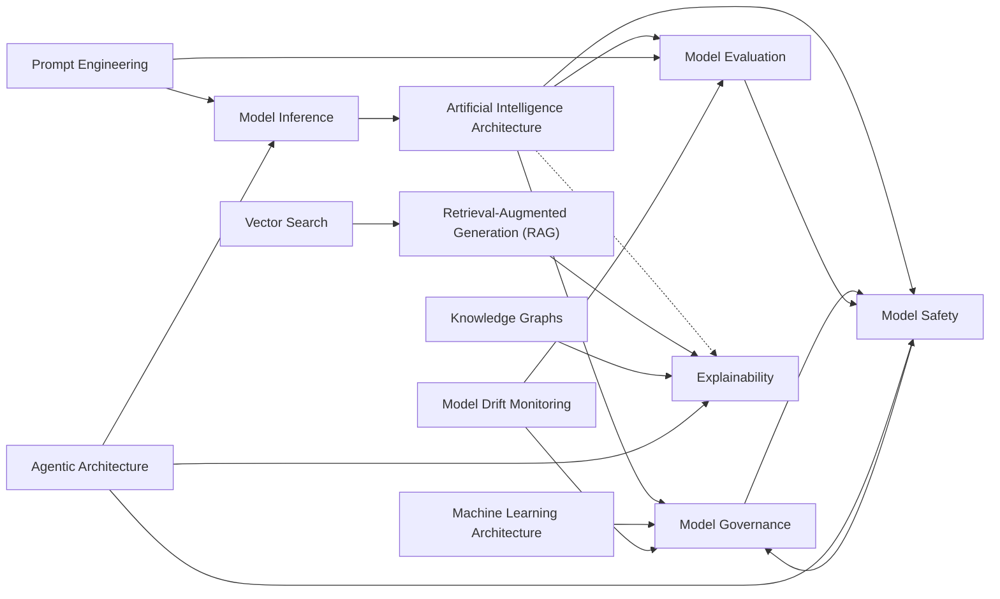
```mermaid
flowchart LR
    n_artificial_intelligence_architecture["Artificial Intelligence Architecture"]
    n_machine_learning_architecture["Machine Learning Architecture"]
    n_model_governance["Model Governance"]
    n_model_evaluation["Model Evaluation"]
    n_model_inference["Model Inference"]
    n_retrieval_augmented_generation["Retrieval-Augmented Generation (RAG)"]
    n_vector_search["Vector Search"]
    n_knowledge_graphs["Knowledge Graphs"]
    n_explainability["Explainability"]
    n_model_safety["Model Safety"]
    n_prompt_engineering["Prompt Engineering"]
    n_model_drift_monitoring["Model Drift Monitoring"]
    n_agentic_architecture["Agentic Architecture"]
    n_artificial_intelligence_architecture --> n_model_governance
    n_artificial_intelligence_architecture --> n_model_evaluation
    n_artificial_intelligence_architecture --> n_model_safety
    n_artificial_intelligence_architecture -.-> n_explainability
    n_machine_learning_architecture --> n_model_governance
    n_model_governance --> n_model_safety
    n_model_evaluation --> n_model_safety
    n_model_inference --> n_artificial_intelligence_architecture
    n_retrieval_augmented_generation --> n_explainability
    n_vector_search --> n_retrieval_augmented_generation
    n_knowledge_graphs --> n_explainability
    n_model_safety --> n_model_governance
    n_prompt_engineering --> n_model_inference
    n_prompt_engineering --> n_model_evaluation
    n_model_drift_monitoring --> n_model_evaluation
    n_model_drift_monitoring --> n_model_governance
    n_agentic_architecture --> n_model_inference
    n_agentic_architecture --> n_explainability
    n_agentic_architecture --> n_model_safety
```

### Artificial Intelligence Architecture

- Kind: [model](SCHEMA.md#kind-model)
- Category: [Model Architecture](PRINCIPLES.md#architecture-category-model-architecture)
- Severity: [contextual](SCHEMA.md#vocabulary-severity-contextual)
- Mandatory for: model-backed systems
- Scope: model-backed system, application, platform
- Layer: [Correctness Core](SCHEMA.md#layer-correctness-core)

Details

Definition
A conceptual representation of a system that calls a model behind validated inputs, grounded context, schema-checked outputs and governance.

Requires
[Model Governance](PRINCIPLES.md#architecture-model-governance), [Data/Model Boundaries](LEXICON.md#lexicon-data-model-boundaries)

Reinforces
[Model Evaluation](PRINCIPLES.md#architecture-model-evaluation), [Model Safety](PRINCIPLES.md#architecture-model-safety)

Enables
[Model-Integrated Systems](LEXICON.md#lexicon-model-integrated-systems)

In tension with
[Determinism](PRINCIPLES.md#architecture-determinism), [Explainability](PRINCIPLES.md#architecture-explainability)

Conflicts with
[Opaque Ungoverned Model Use](LEXICON.md#lexicon-opaque-ungoverned-model-use)

Referenced by
[Model Inference](PRINCIPLES.md#architecture-model-inference)

Tensions
[Artificial Intelligence Architecture / Determinism](SCHEMA.md#tension-artificial-intelligence-architecture-determinism), [Artificial Intelligence Architecture / Explainability](SCHEMA.md#tension-artificial-intelligence-architecture-explainability)

Violated by
[Opaque Ungoverned Model Use](LEXICON.md#lexicon-opaque-ungoverned-model-use)

Detected by
model calls without tests, [logging](PRINCIPLES.md#architecture-logging), [fallback](LEXICON.md#lexicon-fallback), [policy](LEXICON.md#lexicon-policy)

Measured by
model quality/safety/evaluation coverage

Refactored by
[Evaluation Suite](LEXICON.md#lexicon-evaluation-suite), [Introduce Port](LEXICON.md#lexicon-introduce-port), [Guardrails](LEXICON.md#lexicon-guardrails)

Enforced by
model governance gates

Before

```typescript
async function answerFoo(prompt: string) {
  return model.generate(prompt);
}
```

After

```typescript
async function answerFoo(request: FooRequest) {
  const input = FooRequestSchema.parse(request);
  const context = await fooRetriever.retrieve(input.query);
  const output = await fooModel.generate(buildFooPrompt(input, context));
  return FooResponseSchema.parse(output);
}
```

How it is checked

Checked by
model governance gates

Population
Every model call, model version, prompt, retrieval index and agent tool in a model-backed system

Freshness
A verdict stands for one model version, prompt version and dataset, and goes stale when any of them changes

Refusal
The evaluation gate or the governance gate blocks a model, prompt or index that fails its thresholds or lacks approval

Observation
Evaluation reports, registry entries and live output metrics recorded against the model version

Evidence
None, because the catalog states this check as a class, so a watched run belongs to each system that adopts it

Authoritative side
The evaluation thresholds and the approval record, which a model, prompt or index is compared against

Depends on
[Model Governance](PRINCIPLES.md#architecture-model-governance), [Data/Model Boundaries](LEXICON.md#lexicon-data-model-boundaries), [Model Evaluation](PRINCIPLES.md#architecture-model-evaluation), [Model Safety](PRINCIPLES.md#architecture-model-safety), [Model-Integrated Systems](LEXICON.md#lexicon-model-integrated-systems)

Shape it refuses
[Opaque Ungoverned Model Use](LEXICON.md#lexicon-opaque-ungoverned-model-use)

### Machine Learning Architecture

- Kind: [model](SCHEMA.md#kind-model)
- Category: [Model Architecture](PRINCIPLES.md#architecture-category-model-architecture)
- Severity: [contextual](SCHEMA.md#vocabulary-severity-contextual)
- Scope: ML pipeline, model serving, data
- Layer: [Correctness Core](SCHEMA.md#layer-correctness-core)

Details

Definition
A conceptual representation of a model's lifecycle as versioned data, feature, training, evaluation and serving stages.

Requires
[Data Pipeline](LEXICON.md#lexicon-data-pipeline), [Training/Inference Separation](LEXICON.md#lexicon-training-inference-separation)

Reinforces
[Reproducibility](PRINCIPLES.md#architecture-reproducibility), [Model Governance](PRINCIPLES.md#architecture-model-governance)

Enables
[Reliable Model Lifecycle](LEXICON.md#lexicon-reliable-model-lifecycle)

In tension with
[Experimentation Speed](LEXICON.md#lexicon-experimentation-speed)

Conflicts with
[Ad-Hoc Notebook-to-Production](LEXICON.md#lexicon-ad-hoc-notebook-to-production)

Tensions
[Machine Learning Architecture / Experimentation Speed](SCHEMA.md#tension-experimentation-speed-machine-learning-architecture)

Violated by
[Model Version Ambiguity](PRINCIPLES.md#architecture-model-version-ambiguity)

Detected by
missing lineage, untracked training inputs

Measured by
[reproducibility](PRINCIPLES.md#architecture-reproducibility), drift, evaluation metrics

Refactored by
[Data Pipeline](LEXICON.md#lexicon-data-pipeline), [Prompt Versioning](LEXICON.md#lexicon-prompt-versioning)

Enforced by
MLOps gates

Before

```typescript
const model = trainFoo(loadAllData());
serve(model);
```

After

```typescript
const dataset = datasetRegistry.load("foo", "v3");
const features = fooFeaturePipeline.transform(dataset);
const model = trainFoo(features, versionedTrainingConfig);
modelRegistry.register(model, evaluateFooModel(model, validationSet));
```

How it is checked

Checked by
MLOps gates

Population
Every model call, model version, prompt, retrieval index and agent tool in a model-backed system

Freshness
A verdict stands for one model version, prompt version and dataset, and goes stale when any of them changes

Refusal
The evaluation gate or the governance gate blocks a model, prompt or index that fails its thresholds or lacks approval

Observation
Evaluation reports, registry entries and live output metrics recorded against the model version

Evidence
None, because the catalog states this check as a class, so a watched run belongs to each system that adopts it

Authoritative side
The evaluation thresholds and the approval record, which a model, prompt or index is compared against

Depends on
[Data Pipeline](LEXICON.md#lexicon-data-pipeline), [Training/Inference Separation](LEXICON.md#lexicon-training-inference-separation), [Reproducibility](PRINCIPLES.md#architecture-reproducibility), [Model Governance](PRINCIPLES.md#architecture-model-governance), [Reliable Model Lifecycle](LEXICON.md#lexicon-reliable-model-lifecycle)

Shape it refuses
[Ad-Hoc Notebook-to-Production](LEXICON.md#lexicon-ad-hoc-notebook-to-production)

### Model Governance

- Kind: [activity](SCHEMA.md#kind-activity)
- Category: [Model Architecture](PRINCIPLES.md#architecture-category-model-architecture)
- Severity: [contextual](SCHEMA.md#vocabulary-severity-contextual)
- Mandatory for: production models
- Scope: model lifecycle, model-backed system
- Layer: [Correctness Core](SCHEMA.md#layer-correctness-core)

Details

Definition
The activity of registering, evaluating and approving each model version before it is deployed.

Requires
[Model Registry](LEXICON.md#lexicon-model-registry), [Evaluation](LEXICON.md#lexicon-evaluation), [Approval Policy](LEXICON.md#lexicon-approval-policy)

Reinforces
[Compliance](PRINCIPLES.md#architecture-compliance), [Model Safety](PRINCIPLES.md#architecture-model-safety)

Enables
[Controlled Model Deployment](LEXICON.md#lexicon-controlled-model-deployment)

In tension with
[Experiment Velocity](LEXICON.md#lexicon-experiment-velocity)

Conflicts with
[Unapproved Model Deployment](LEXICON.md#lexicon-unapproved-model-deployment), [Model Version Ambiguity](PRINCIPLES.md#architecture-model-version-ambiguity)

Referenced by
[Artificial Intelligence Architecture](PRINCIPLES.md#architecture-artificial-intelligence-architecture), [Machine Learning Architecture](PRINCIPLES.md#architecture-machine-learning-architecture), [Model Safety](PRINCIPLES.md#architecture-model-safety), [Model Drift Monitoring](PRINCIPLES.md#architecture-model-drift-monitoring)

Tensions
[Model Governance / Experiment Velocity](SCHEMA.md#tension-experiment-velocity-model-governance)

Distinct from
[Evaluation](LEXICON.md#lexicon-evaluation): Model governance registers and approves versions, while evaluation is the assessment it relies on.

Violated by
[Unapproved Model Deployment](LEXICON.md#lexicon-unapproved-model-deployment)

Detected by
model without lineage/approval/eval

Measured by
governance coverage

Refactored by
[Registry Pattern](PRINCIPLES.md#architecture-registry-pattern), [Evaluation Suite](LEXICON.md#lexicon-evaluation-suite)

Enforced by
CI/CD model gates

Before

```typescript
deployModel(newestModelFile());
```

After

```typescript
const candidate = modelRegistry.get("foo-model", "1.4.0");
requireApproval(candidate, ["model-owner", "risk-owner"]);
requirePolicyCompliance(candidate, fooModelPolicies);
deployModel(candidate);
```

How it is checked

Checked by
CI/CD model gates

Population
Every model call, model version, prompt, retrieval index and agent tool in a model-backed system

Freshness
A verdict stands for one model version, prompt version and dataset, and goes stale when any of them changes

Refusal
The evaluation gate or the governance gate blocks a model, prompt or index that fails its thresholds or lacks approval

Observation
Evaluation reports, registry entries and live output metrics recorded against the model version

Evidence
None, because the catalog states this check as a class, so a watched run belongs to each system that adopts it

Authoritative side
The evaluation thresholds and the approval record, which a model, prompt or index is compared against

Depends on
[Model Registry](LEXICON.md#lexicon-model-registry), [Evaluation](LEXICON.md#lexicon-evaluation), [Approval Policy](LEXICON.md#lexicon-approval-policy), [Compliance](PRINCIPLES.md#architecture-compliance), [Model Safety](PRINCIPLES.md#architecture-model-safety), [Controlled Model Deployment](LEXICON.md#lexicon-controlled-model-deployment)

Shape it refuses
[Unapproved Model Deployment](LEXICON.md#lexicon-unapproved-model-deployment), [Model Version Ambiguity](PRINCIPLES.md#architecture-model-version-ambiguity)

### Model Evaluation

- Kind: [activity](SCHEMA.md#kind-activity)
- Category: [Model Architecture](PRINCIPLES.md#architecture-category-model-architecture)
- Severity: [mandatory](SCHEMA.md#vocabulary-severity-mandatory)
- Scope: model, model-backed feature, pipeline
- Layer: [Correctness Core](SCHEMA.md#layer-correctness-core)

Details

Definition
The activity of measuring a model against datasets, metrics and slices, and comparing the results with acceptance thresholds.

Requires
[Dataset](LEXICON.md#lexicon-dataset), [Metrics](LEXICON.md#lexicon-metrics), [Acceptance Criteria](LEXICON.md#lexicon-acceptance-criteria)

Reinforces
[Model Safety](PRINCIPLES.md#architecture-model-safety), [Correctness](PRINCIPLES.md#architecture-correctness)

Enables
[Model Selection/Regression Detection](LEXICON.md#lexicon-model-selection-regression-detection)

In tension with
[Metric Completeness](LEXICON.md#lexicon-metric-completeness)

Conflicts with
[Untested Model Deployment](LEXICON.md#lexicon-untested-model-deployment)

Referenced by
[Artificial Intelligence Architecture](PRINCIPLES.md#architecture-artificial-intelligence-architecture), [Prompt Engineering](PRINCIPLES.md#architecture-prompt-engineering), [Model Drift Monitoring](PRINCIPLES.md#architecture-model-drift-monitoring)

Tensions
[Model Evaluation / Metric Completeness](SCHEMA.md#tension-metric-completeness-model-evaluation)

Violated by
[Untested Model Deployment](LEXICON.md#lexicon-untested-model-deployment)

Detected by
missing eval report/gate

Measured by
task metrics, safety metrics, regression rate

Refactored by
[Evaluation Suite](LEXICON.md#lexicon-evaluation-suite)

Enforced by
model CI gates

Before

```typescript
if (model.accuracy > 0.8) deploy(model);
```

After

```typescript
const evaluation = evaluateModel(model, {
  datasets: [fooValidationSet, fooStressSet],
  metrics: [precision, recall, calibration, latencyP95],
  slices: ["foo-kind", "foo-region"],
});
requireThresholds(evaluation, fooModelThresholds);
```

How it is checked

Checked by
model CI gates

Population
Every model call, model version, prompt, retrieval index and agent tool in a model-backed system

Freshness
A verdict stands for one model version, prompt version and dataset, and goes stale when any of them changes

Refusal
The evaluation gate or the governance gate blocks a model, prompt or index that fails its thresholds or lacks approval

Observation
Evaluation reports, registry entries and live output metrics recorded against the model version

Evidence
None, because the catalog states this check as a class, so a watched run belongs to each system that adopts it

Authoritative side
The evaluation thresholds and the approval record, which a model, prompt or index is compared against

Depends on
[Dataset](LEXICON.md#lexicon-dataset), [Metrics](LEXICON.md#lexicon-metrics), [Acceptance Criteria](LEXICON.md#lexicon-acceptance-criteria), [Model Safety](PRINCIPLES.md#architecture-model-safety), [Correctness](PRINCIPLES.md#architecture-correctness), [Model Selection/Regression Detection](LEXICON.md#lexicon-model-selection-regression-detection)

Shape it refuses
[Untested Model Deployment](LEXICON.md#lexicon-untested-model-deployment)

### Model Inference

- Kind: [capability](SCHEMA.md#kind-capability)
- Category: [Model Architecture](PRINCIPLES.md#architecture-category-model-architecture)
- Severity: [contextual](SCHEMA.md#vocabulary-severity-contextual)
- Scope: service, model serving
- Aliases: Runtime Prediction/Generation
- Layer: [Correctness Core](SCHEMA.md#layer-correctness-core)

Details

Definition
The ability to run a trained model on validated input at runtime and return a checked prediction or generation.

Requires
[Model Artifact](LEXICON.md#lexicon-model-artifact), [Input/Output Contract](LEXICON.md#lexicon-input-output-contract)

Reinforces
[Artificial Intelligence Architecture](PRINCIPLES.md#architecture-artificial-intelligence-architecture)

Enables
none

In tension with
[Latency/Cost](LEXICON.md#lexicon-latency-cost)

Conflicts with
[Training-Time-Only Model Logic](LEXICON.md#lexicon-training-time-only-model-logic)

Referenced by
[Prompt Engineering](PRINCIPLES.md#architecture-prompt-engineering), [Agentic Architecture](PRINCIPLES.md#architecture-agentic-architecture)

Tensions
[Model Inference / Latency/Cost](SCHEMA.md#tension-latency-cost-model-inference)

Violated by
[Opaque Ungoverned Model Use](LEXICON.md#lexicon-opaque-ungoverned-model-use)

Detected by
raw model calls in business logic

Measured by
[latency](PRINCIPLES.md#architecture-latency), error rate, output quality

Refactored by
[Extract Module](LEXICON.md#lexicon-extract-module), [Extract Adapter](LEXICON.md#lexicon-extract-adapter)

Enforced by
serving standards

Before

```typescript
const output = model.predict(input as any);
```

After

```typescript
const input = FooInferenceSchema.parse(rawInput);
const output = await inferenceRuntime.predict(fooModelVersion, input, {
  timeoutMs: 500,
  traceId,
});
return FooPredictionSchema.parse(output);
```

How it is checked

Checked by
serving standards

Population
Every model call, model version, prompt, retrieval index and agent tool in a model-backed system

Freshness
A verdict stands for one model version, prompt version and dataset, and goes stale when any of them changes

Refusal
The evaluation gate or the governance gate blocks a model, prompt or index that fails its thresholds or lacks approval

Observation
Evaluation reports, registry entries and live output metrics recorded against the model version

Evidence
None, because the catalog states this check as a class, so a watched run belongs to each system that adopts it

Authoritative side
The evaluation thresholds and the approval record, which a model, prompt or index is compared against

Depends on
[Model Artifact](LEXICON.md#lexicon-model-artifact), [Input/Output Contract](LEXICON.md#lexicon-input-output-contract), [Artificial Intelligence Architecture](PRINCIPLES.md#architecture-artificial-intelligence-architecture)

Shape it refuses
[Training-Time-Only Model Logic](LEXICON.md#lexicon-training-time-only-model-logic)

### Retrieval-Augmented Generation (RAG)

- Kind: [pattern](SCHEMA.md#kind-pattern)
- Category: [Model Architecture](PRINCIPLES.md#architecture-category-model-architecture)
- Severity: [contextual](SCHEMA.md#vocabulary-severity-contextual)
- Scope: language-model system, knowledge retrieval
- Aliases: RAG
- Layer: [Correctness Core](SCHEMA.md#layer-correctness-core)

Details

Definition
A design pattern that retrieves relevant documents for a question and passes them to the model, so the answer can cite its sources.

Requires
[Retriever](LEXICON.md#lexicon-retriever), [Document Store](LEXICON.md#lexicon-document-store), [Grounding Strategy](LEXICON.md#lexicon-grounding-strategy)

Reinforces
[Explainability](PRINCIPLES.md#architecture-explainability), [Knowledge Freshness](LEXICON.md#lexicon-knowledge-freshness)

Enables
[Contextual Generation](LEXICON.md#lexicon-contextual-generation)

In tension with
[Retrieval Quality/Latency](LEXICON.md#lexicon-retrieval-quality-latency)

Conflicts with
[Ungrounded Generation](LEXICON.md#lexicon-ungrounded-generation)

Referenced by
[Vector Search](PRINCIPLES.md#architecture-vector-search)

Tensions
[Retrieval-Augmented Generation (RAG) / Retrieval Quality/Latency](SCHEMA.md#tension-retrieval-augmented-generation-rag-retrieval-quality-latency)

Violated by
[Ungrounded Generation](LEXICON.md#lexicon-ungrounded-generation)

Detected by
missing citations/context in grounded tasks

Measured by
retrieval precision/recall, groundedness

Refactored by
[Retriever](LEXICON.md#lexicon-retriever), [Evidence Citation](LEXICON.md#lexicon-evidence-citation)

Enforced by
RAG evals

Before

```typescript
const answer = await model.generate(`Answer: ${question}`);
```

After

```typescript
const query = normalizeFooQuery(question);
const documents = await fooRetriever.search(query, { topK: 8 });
const groundedPrompt = buildGroundedFooPrompt(question, documents);
const answer = await model.generate(groundedPrompt);
return attachCitations(answer, documents);
```

How it is checked

Checked by
RAG evals

Population
Every model call, model version, prompt, retrieval index and agent tool in a model-backed system

Freshness
A verdict stands for one model version, prompt version and dataset, and goes stale when any of them changes

Refusal
The evaluation gate or the governance gate blocks a model, prompt or index that fails its thresholds or lacks approval

Observation
Evaluation reports, registry entries and live output metrics recorded against the model version

Evidence
None, because the catalog states this check as a class, so a watched run belongs to each system that adopts it

Authoritative side
The evaluation thresholds and the approval record, which a model, prompt or index is compared against

Depends on
[Retriever](LEXICON.md#lexicon-retriever), [Document Store](LEXICON.md#lexicon-document-store), [Grounding Strategy](LEXICON.md#lexicon-grounding-strategy), [Explainability](PRINCIPLES.md#architecture-explainability), [Knowledge Freshness](LEXICON.md#lexicon-knowledge-freshness), [Contextual Generation](LEXICON.md#lexicon-contextual-generation)

Shape it refuses
[Ungrounded Generation](LEXICON.md#lexicon-ungrounded-generation)

### Vector Search

- Kind: [mechanism](SCHEMA.md#kind-mechanism)
- Category: [Model Architecture](PRINCIPLES.md#architecture-category-model-architecture)
- Severity: [contextual](SCHEMA.md#vocabulary-severity-contextual)
- Scope: retrieval, search, RAG
- Layer: [Correctness Core](SCHEMA.md#layer-correctness-core)

Details

Definition
A mechanism that finds records whose embeddings lie close to a query's embedding.

Requires
[Embeddings](LEXICON.md#lexicon-embeddings), [Vector Index](LEXICON.md#lexicon-vector-index)

Reinforces
[Retrieval-Augmented Generation (RAG)](PRINCIPLES.md#architecture-retrieval-augmented-generation), [Semantic Search](LEXICON.md#lexicon-semantic-search)

Enables
[Similarity Retrieval](LEXICON.md#lexicon-similarity-retrieval)

In tension with
[Explainability/Recall](LEXICON.md#lexicon-explainability-recall)

Conflicts with
[Exact Keyword Search Only](LEXICON.md#lexicon-exact-keyword-search-only)

Tensions
[Vector Search / Explainability/Recall](SCHEMA.md#tension-explainability-recall-vector-search)

Violated by
[Exact Keyword Search Only](LEXICON.md#lexicon-exact-keyword-search-only)

Detected by
poor semantic recall

Measured by
retrieval metrics, [latency](PRINCIPLES.md#architecture-latency)

Refactored by
[Evaluation Suite](LEXICON.md#lexicon-evaluation-suite)

Enforced by
retrieval evaluation

Before

```typescript
const results = foos.filter((foo) => foo.text.includes(query));
```

After

```typescript
const queryVector = await embedder.embed(query);
const results = await fooVectorIndex.search(queryVector, {
  topK: 10,
  filter: { tenantId },
});
```

How it is checked

Checked by
retrieval evaluation

Population
Every model call, model version, prompt, retrieval index and agent tool in a model-backed system

Freshness
A verdict stands for one model version, prompt version and dataset, and goes stale when any of them changes

Refusal
The evaluation gate or the governance gate blocks a model, prompt or index that fails its thresholds or lacks approval

Observation
Evaluation reports, registry entries and live output metrics recorded against the model version

Evidence
None, because the catalog states this check as a class, so a watched run belongs to each system that adopts it

Authoritative side
The evaluation thresholds and the approval record, which a model, prompt or index is compared against

Depends on
[Embeddings](LEXICON.md#lexicon-embeddings), [Vector Index](LEXICON.md#lexicon-vector-index), [Retrieval-Augmented Generation (RAG)](PRINCIPLES.md#architecture-retrieval-augmented-generation), [Semantic Search](LEXICON.md#lexicon-semantic-search), [Similarity Retrieval](LEXICON.md#lexicon-similarity-retrieval)

Shape it refuses
[Exact Keyword Search Only](LEXICON.md#lexicon-exact-keyword-search-only)

### Knowledge Graphs

- Kind: [pattern](SCHEMA.md#kind-pattern)
- Category: [Model Architecture](PRINCIPLES.md#architecture-category-model-architecture)
- Severity: [contextual](SCHEMA.md#vocabulary-severity-contextual)
- Scope: knowledge modeling, retrieval, reasoning
- Layer: [Correctness Core](SCHEMA.md#layer-correctness-core)

Details

Definition
A design pattern that stores knowledge as typed entities and named relations, validated against a schema, so queries can traverse them.

Requires
[Entities](LEXICON.md#lexicon-entities), [Relations](LEXICON.md#lexicon-relations), [Schema/Ontology](LEXICON.md#lexicon-schema-ontology)

Reinforces
[Semantic Consistency](PRINCIPLES.md#architecture-semantic-consistency), [Explainability](PRINCIPLES.md#architecture-explainability)

Enables
[Relationship-Aware Retrieval/Reasoning](LEXICON.md#lexicon-relationship-aware-retrieval-reasoning)

In tension with
[Curation Cost](LEXICON.md#lexicon-curation-cost)

Conflicts with
[Flat Document-Only Knowledge](LEXICON.md#lexicon-flat-document-only-knowledge)

Tensions
[Knowledge Graphs / Curation Cost](SCHEMA.md#tension-curation-cost-knowledge-graphs)

Violated by
[Flat Document-Only Knowledge](LEXICON.md#lexicon-flat-document-only-knowledge)

Detected by
repeated need for entity relationship traversal

Measured by
graph coverage, query accuracy

Refactored by
none

Enforced by
schema/ontology validation

Before

```typescript
const fooLinks = new Map<string, string[]>();
fooLinks.set(foo.id, [bar.id, baz.id]);
```

After

```typescript
const graph = new KnowledgeGraph();
graph.addNode(foo.id, "Foo", foo);
graph.addNode(bar.id, "Bar", bar);
graph.addEdge(foo.id, "DEPENDS_ON", bar.id);
graph.addEdge(bar.id, "PRODUCES", baz.id);
```

How it is checked

Checked by
schema/ontology validation

Population
Every model call, model version, prompt, retrieval index and agent tool in a model-backed system

Freshness
A verdict stands for one model version, prompt version and dataset, and goes stale when any of them changes

Refusal
The evaluation gate or the governance gate blocks a model, prompt or index that fails its thresholds or lacks approval

Observation
Evaluation reports, registry entries and live output metrics recorded against the model version

Evidence
None, because the catalog states this check as a class, so a watched run belongs to each system that adopts it

Authoritative side
The evaluation thresholds and the approval record, which a model, prompt or index is compared against

Depends on
[Entities](LEXICON.md#lexicon-entities), [Relations](LEXICON.md#lexicon-relations), [Schema/Ontology](LEXICON.md#lexicon-schema-ontology), [Semantic Consistency](PRINCIPLES.md#architecture-semantic-consistency), [Explainability](PRINCIPLES.md#architecture-explainability), [Relationship-Aware Retrieval/Reasoning](LEXICON.md#lexicon-relationship-aware-retrieval-reasoning)

Shape it refuses
[Flat Document-Only Knowledge](LEXICON.md#lexicon-flat-document-only-knowledge)

### Explainability

- Kind: [quality-attribute](SCHEMA.md#kind-quality-attribute)
- Category: [Model Architecture](PRINCIPLES.md#architecture-category-model-architecture)
- Severity: [contextual](SCHEMA.md#vocabulary-severity-contextual)
- Mandatory for: regulated domains
- Scope: model, model-backed system, decision flow
- Layer: [Correctness Core](SCHEMA.md#layer-correctness-core)

Details

Definition
The degree to which a model's decision comes with the evidence or attribution a reviewer needs to understand it.

Requires
[Traceability](PRINCIPLES.md#architecture-traceability), [Rationale/Evidence](LEXICON.md#lexicon-rationale-evidence)

Reinforces
[Governance](PRINCIPLES.md#architecture-governance), [Trust](LEXICON.md#lexicon-trust)

Enables
[Audit and Debugging](LEXICON.md#lexicon-audit-and-debugging)

In tension with
[Model Complexity](LEXICON.md#lexicon-model-complexity)

Conflicts with
[Opaque Black-Box Decisions](LEXICON.md#lexicon-opaque-black-box-decisions)

Referenced by
[Artificial Intelligence Architecture](PRINCIPLES.md#architecture-artificial-intelligence-architecture), [Retrieval-Augmented Generation (RAG)](PRINCIPLES.md#architecture-retrieval-augmented-generation), [Knowledge Graphs](PRINCIPLES.md#architecture-knowledge-graphs), [Agentic Architecture](PRINCIPLES.md#architecture-agentic-architecture)

Tensions
[Explainability / Model Complexity](SCHEMA.md#tension-explainability-model-complexity)

Distinct from
[Model Safety](PRINCIPLES.md#architecture-model-safety): Explainability is a decision arriving with its evidence, while model safety is harmful inputs, outputs and actions being prevented.

Distinct from
[Traceability](PRINCIPLES.md#architecture-traceability): Explainability is why one model decision was made, while traceability is following a request or change end to end.

Distinct from
[Knowledge Freshness](LEXICON.md#lexicon-knowledge-freshness): Explainability is showing the evidence behind a decision, while knowledge freshness is that evidence being current.

Distinct from
[Model Complexity](LEXICON.md#lexicon-model-complexity): Explainability is understanding a decision, while model complexity is the intricacy that makes it harder.

Distinct from
[Trust](LEXICON.md#lexicon-trust): Explainability is the evidence a reviewer can inspect, while trust is how far users rely on the outputs.

Distinct from
[Semantic Consistency](PRINCIPLES.md#architecture-semantic-consistency): Explainability concerns a model's decisions, while semantic consistency concerns names keeping one meaning.

Violated by
[Opaque Black-Box Decisions](LEXICON.md#lexicon-opaque-black-box-decisions)

Detected by
missing rationale/feature attribution/citations

Measured by
explanation coverage/quality

Refactored by
[Evidence Citation](LEXICON.md#lexicon-evidence-citation)

Enforced by
model governance gates

Before

```typescript
return model.predict(foo.features);
```

After

```typescript
const prediction = await model.predict(foo.features);
const explanation = await explainer.explain({
  modelVersion: model.version,
  input: foo.features,
  prediction,
});
return { prediction, explanation };
```

How it is checked

Checked by
model governance gates

Population
Every model call, model version, prompt, retrieval index and agent tool in a model-backed system

Freshness
A verdict stands for one model version, prompt version and dataset, and goes stale when any of them changes

Refusal
The evaluation gate or the governance gate blocks a model, prompt or index that fails its thresholds or lacks approval

Observation
Evaluation reports, registry entries and live output metrics recorded against the model version

Evidence
None, because the catalog states this check as a class, so a watched run belongs to each system that adopts it

Authoritative side
The evaluation thresholds and the approval record, which a model, prompt or index is compared against

Depends on
[Traceability](PRINCIPLES.md#architecture-traceability), [Rationale/Evidence](LEXICON.md#lexicon-rationale-evidence), [Governance](PRINCIPLES.md#architecture-governance), [Trust](LEXICON.md#lexicon-trust), [Audit and Debugging](LEXICON.md#lexicon-audit-and-debugging)

Shape it refuses
[Opaque Black-Box Decisions](LEXICON.md#lexicon-opaque-black-box-decisions)

### Model Safety

- Kind: [quality-attribute](SCHEMA.md#kind-quality-attribute)
- Category: [Model Architecture](PRINCIPLES.md#architecture-category-model-architecture)
- Severity: [contextual](SCHEMA.md#vocabulary-severity-contextual)
- Mandatory for: model-backed systems
- Scope: model-backed system, model, application
- Layer: [Correctness Core](SCHEMA.md#layer-correctness-core)

Details

Definition
The degree to which a model-backed system prevents harmful inputs, outputs and actions through evaluation, guardrails and monitoring.

Requires
[Evaluation](LEXICON.md#lexicon-evaluation), [Guardrails](LEXICON.md#lexicon-guardrails), [Monitoring](PRINCIPLES.md#architecture-monitoring)

Reinforces
[Model Governance](PRINCIPLES.md#architecture-model-governance), [Security](LEXICON.md#lexicon-security)

Enables
[Safe Model Deployment](LEXICON.md#lexicon-safe-model-deployment)

In tension with
[Capability/Utility](LEXICON.md#lexicon-capability-utility)

Conflicts with
[Unguarded Model Autonomy](LEXICON.md#lexicon-unguarded-model-autonomy)

Referenced by
[Artificial Intelligence Architecture](PRINCIPLES.md#architecture-artificial-intelligence-architecture), [Model Governance](PRINCIPLES.md#architecture-model-governance), [Model Evaluation](PRINCIPLES.md#architecture-model-evaluation), [Agentic Architecture](PRINCIPLES.md#architecture-agentic-architecture)

Tensions
[Model Safety / Capability/Utility](SCHEMA.md#tension-capability-utility-model-safety)

Distinct from
[Capability/Utility](LEXICON.md#lexicon-capability-utility): Model safety is harm being prevented, while capability is the usefulness that strict limits can constrain.

Violated by
[Unguarded Model Autonomy](LEXICON.md#lexicon-unguarded-model-autonomy)

Detected by
safety eval failures, missing policy filters

Measured by
safety incident rate, eval pass rate

Refactored by
[Guardrails](LEXICON.md#lexicon-guardrails), [Code Review](PRINCIPLES.md#architecture-code-review), [Evaluation Suite](LEXICON.md#lexicon-evaluation-suite)

Enforced by
safety gates, runtime monitors

Before

```typescript
return model.generate(userPrompt);
```

After

```typescript
const input = await safety.validateInput(userPrompt);
const draft = await model.generate(input);
const checked = await safety.validateOutput(draft, {
  policy: "foo-assistant-v2",
});
if (!checked.allowed) return safeRefusal(checked.reasons);
return checked.output;
```

How it is checked

Checked by
safety gates, runtime monitors

Population
Every model call, model version, prompt, retrieval index and agent tool in a model-backed system

Freshness
A verdict stands for one model version, prompt version and dataset, and goes stale when any of them changes

Refusal
The evaluation gate or the governance gate blocks a model, prompt or index that fails its thresholds or lacks approval

Observation
Evaluation reports, registry entries and live output metrics recorded against the model version

Evidence
None, because the catalog states this check as a class, so a watched run belongs to each system that adopts it

Authoritative side
The evaluation thresholds and the approval record, which a model, prompt or index is compared against

Depends on
[Evaluation](LEXICON.md#lexicon-evaluation), [Guardrails](LEXICON.md#lexicon-guardrails), [Monitoring](PRINCIPLES.md#architecture-monitoring), [Model Governance](PRINCIPLES.md#architecture-model-governance), [Security](LEXICON.md#lexicon-security), [Safe Model Deployment](LEXICON.md#lexicon-safe-model-deployment)

Shape it refuses
[Unguarded Model Autonomy](LEXICON.md#lexicon-unguarded-model-autonomy)

### Prompt Engineering

- Kind: [technique](SCHEMA.md#kind-technique)
- Category: [Model Architecture](PRINCIPLES.md#architecture-category-model-architecture)
- Severity: [contextual](SCHEMA.md#vocabulary-severity-contextual)
- Mandatory for: model-backed systems
- Scope: model-backed system, language-model system, application
- Layer: [Correctness Core](SCHEMA.md#layer-correctness-core)

Details

Definition
A technique for writing model instructions as versioned templates with fixed parameters and an evaluation for each change.

Requires
[Model Inference](PRINCIPLES.md#architecture-model-inference)

Reinforces
[Model Evaluation](PRINCIPLES.md#architecture-model-evaluation), [Reproducibility](PRINCIPLES.md#architecture-reproducibility)

Enables
[Structured, Versioned Prompts](LEXICON.md#lexicon-structured-versioned-prompts)

In tension with
[Robustness](LEXICON.md#lexicon-robustness)

Conflicts with
[Prompt Sprawl](PRINCIPLES.md#architecture-prompt-sprawl)

Tensions
[Prompt Engineering / Robustness](SCHEMA.md#tension-prompt-engineering-robustness)

Violated by
[Prompt Sprawl](PRINCIPLES.md#architecture-prompt-sprawl)

Detected by
scattered prompt string literals

Measured by
duplicated prompt count

Refactored by
[Prompt Registry](LEXICON.md#lexicon-prompt-registry)

Enforced by
model design review

Before

```typescript
const answer = await model.generate("summarize: " + text);
```

After

```typescript
const prompt = fooPromptTemplate.render({
  task: "summarize",
  input: text,
  format: "bullet-points",
  maxWords: 100,
});
const answer = await model.generate(prompt, { temperature: 0, stop: ["\n\n"] });
```

How it is checked

Checked by
model design review

Population
Every model call, model version, prompt, retrieval index and agent tool in a model-backed system

Freshness
A verdict stands for one model version, prompt version and dataset, and goes stale when any of them changes

Refusal
The evaluation gate or the governance gate blocks a model, prompt or index that fails its thresholds or lacks approval

Observation
Evaluation reports, registry entries and live output metrics recorded against the model version

Evidence
None, because the catalog states this check as a class, so a watched run belongs to each system that adopts it

Authoritative side
The evaluation thresholds and the approval record, which a model, prompt or index is compared against

Depends on
[Model Inference](PRINCIPLES.md#architecture-model-inference), [Model Evaluation](PRINCIPLES.md#architecture-model-evaluation), [Reproducibility](PRINCIPLES.md#architecture-reproducibility), [Structured, Versioned Prompts](LEXICON.md#lexicon-structured-versioned-prompts)

Shape it refuses
[Prompt Sprawl](PRINCIPLES.md#architecture-prompt-sprawl)

### Model Drift Monitoring

- Kind: [activity](SCHEMA.md#kind-activity)
- Category: [Model Architecture](PRINCIPLES.md#architecture-category-model-architecture)
- Severity: [contextual](SCHEMA.md#vocabulary-severity-contextual)
- Mandatory for: production models
- Scope: model-backed system, model lifecycle, operations
- Layer: [Correctness Core](SCHEMA.md#layer-correctness-core)

Details

Definition
The activity of tracking a deployed model's inputs and output quality over time and alerting when they move past a threshold.

Requires
[Model Evaluation](PRINCIPLES.md#architecture-model-evaluation)

Reinforces
[Observability](PRINCIPLES.md#architecture-observability), [Model Governance](PRINCIPLES.md#architecture-model-governance)

Enables
[Degradation Detection](LEXICON.md#lexicon-degradation-detection), [Retraining Triggers](LEXICON.md#lexicon-retraining-triggers)

In tension with
[Monitoring Cost](LEXICON.md#lexicon-monitoring-cost)

Conflicts with
[Deploy-and-Forget Models](LEXICON.md#lexicon-deploy-and-forget-models), [Model Drift](LEXICON.md#lexicon-model-drift)

Tensions
[Model Drift Monitoring / Monitoring Cost](SCHEMA.md#tension-model-drift-monitoring-monitoring-cost)

Distinct from
[Model Evaluation](PRINCIPLES.md#architecture-model-evaluation): Drift monitoring watches a deployed model over time, while evaluation measures a model against fixed datasets and thresholds.

Distinct from
[Model Governance](PRINCIPLES.md#architecture-model-governance): Drift monitoring runs after deployment, while governance approves each version before it is deployed.

Violated by
[Deploy-and-Forget Models](LEXICON.md#lexicon-deploy-and-forget-models)

Detected by
no ongoing evaluation of live model outputs

Measured by
drift in accuracy/quality metrics over time

Refactored by
none

Enforced by
model governance review

Before

```typescript
serveModel(fooModel);
```

After

```typescript
monitor.track(fooModel, {
  metrics: [inputDistribution, predictionConfidence, groundTruthLag],
  alertOn: { populationStabilityIndex: 0.2 },
});
```

How it is checked

Checked by
model governance review

Population
Every model call, model version, prompt, retrieval index and agent tool in a model-backed system

Freshness
A verdict stands for one model version, prompt version and dataset, and goes stale when any of them changes

Refusal
The evaluation gate or the governance gate blocks a model, prompt or index that fails its thresholds or lacks approval

Observation
Evaluation reports, registry entries and live output metrics recorded against the model version

Evidence
None, because the catalog states this check as a class, so a watched run belongs to each system that adopts it

Authoritative side
The evaluation thresholds and the approval record, which a model, prompt or index is compared against

Depends on
[Model Evaluation](PRINCIPLES.md#architecture-model-evaluation), [Observability](PRINCIPLES.md#architecture-observability), [Model Governance](PRINCIPLES.md#architecture-model-governance), [Degradation Detection](LEXICON.md#lexicon-degradation-detection), [Retraining Triggers](LEXICON.md#lexicon-retraining-triggers)

Shape it refuses
[Deploy-and-Forget Models](LEXICON.md#lexicon-deploy-and-forget-models), [Model Drift](LEXICON.md#lexicon-model-drift)

### Agentic Architecture

- Kind: [pattern](SCHEMA.md#kind-pattern)
- Category: [Model Architecture](PRINCIPLES.md#architecture-category-model-architecture)
- Severity: [contextual](SCHEMA.md#vocabulary-severity-contextual)
- Mandatory for: regulated domains
- Scope: model-backed system, reasoning, decision flow
- Layer: [Correctness Core](SCHEMA.md#layer-correctness-core)

Details

Definition
A design pattern in which the model chooses actions from a scoped set of tools, within a step limit and under review.

Requires
[Model Inference](PRINCIPLES.md#architecture-model-inference), [Tool Interface](LEXICON.md#lexicon-tool-interface)

Reinforces
[Explainability](PRINCIPLES.md#architecture-explainability), [Model Safety](PRINCIPLES.md#architecture-model-safety)

Enables
[Bounded Tool-Using Agents](LEXICON.md#lexicon-bounded-tool-using-agents), [Governed Autonomy](LEXICON.md#lexicon-governed-autonomy)

In tension with
[Determinism](PRINCIPLES.md#architecture-determinism)

Conflicts with
[Ungrounded Content](PRINCIPLES.md#architecture-ungrounded-content)

Tensions
[Agentic Architecture / Determinism](SCHEMA.md#tension-agentic-architecture-determinism)

Violated by
[Unbounded Autonomy](LEXICON.md#lexicon-unbounded-autonomy)

Detected by
agent actions without tool scoping or step limits

Measured by
unguarded agent action rate

Refactored by
[Guardrails](LEXICON.md#lexicon-guardrails), [Rate Limiting](PRINCIPLES.md#architecture-rate-limiting), [Code Review](PRINCIPLES.md#architecture-code-review)

Enforced by
model safety review

Before

```typescript
const answer = await model.generate(question);
```

After

```typescript
const agent = createFooAgent({
  tools: [searchFoos, calculator, fooStore],
  maxSteps: 8,
});
const answer = await agent.run(question);
```

How it is checked

Checked by
model safety review

Population
Every model call, model version, prompt, retrieval index and agent tool in a model-backed system

Freshness
A verdict stands for one model version, prompt version and dataset, and goes stale when any of them changes

Refusal
The evaluation gate or the governance gate blocks a model, prompt or index that fails its thresholds or lacks approval

Observation
Evaluation reports, registry entries and live output metrics recorded against the model version

Evidence
None, because the catalog states this check as a class, so a watched run belongs to each system that adopts it

Authoritative side
The evaluation thresholds and the approval record, which a model, prompt or index is compared against

Depends on
[Model Inference](PRINCIPLES.md#architecture-model-inference), [Tool Interface](LEXICON.md#lexicon-tool-interface), [Explainability](PRINCIPLES.md#architecture-explainability), [Model Safety](PRINCIPLES.md#architecture-model-safety), [Bounded Tool-Using Agents](LEXICON.md#lexicon-bounded-tool-using-agents), [Governed Autonomy](LEXICON.md#lexicon-governed-autonomy)

Shape it refuses
[Ungrounded Content](PRINCIPLES.md#architecture-ungrounded-content)

## Observability / Auditability / Traceability

Every principle in this category is listed as a record. Each record carries its kind, its severity, the scopes it applies at and the layer it lives in, then the edge relations that join it to other records, the records that point back at it, the contracts that answer to it and the tensions it takes part in. The descriptors say how it is violated, detected, measured, repaired and enforced. Where the record carries one, an exemplar shows the shape before and after the principle is applied.

Relations diagram

The relations inside this category.

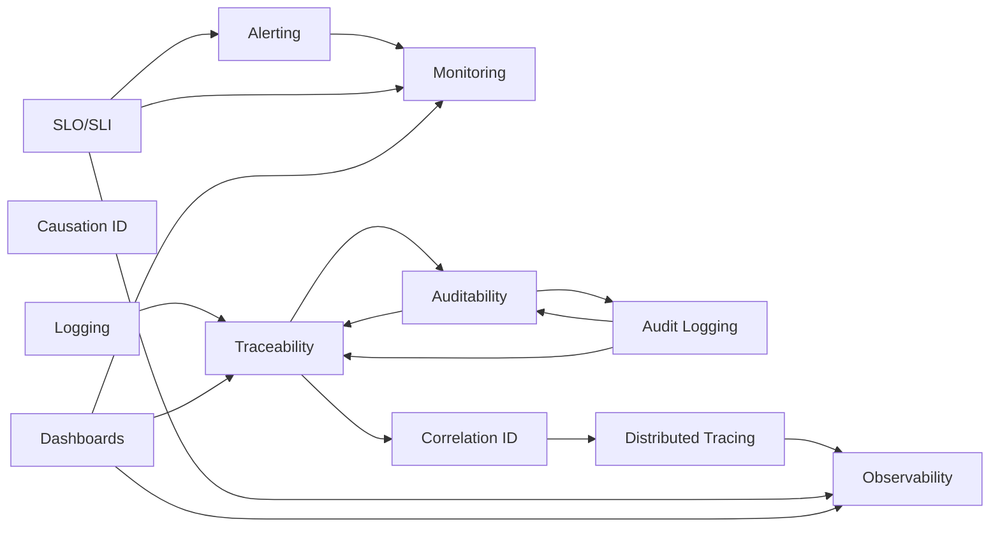
```mermaid
flowchart LR
    n_observability["Observability"]
    n_logging["Logging"]
    n_monitoring["Monitoring"]
    n_alerting["Alerting"]
    n_auditability["Auditability"]
    n_audit_logging["Audit Logging"]
    n_traceability["Traceability"]
    n_correlation_id["Correlation ID"]
    n_causation_id["Causation ID"]
    n_distributed_tracing["Distributed Tracing"]
    n_slo_sli["SLO/SLI"]
    n_dashboards["Dashboards"]
    n_logging --> n_traceability
    n_alerting --> n_monitoring
    n_auditability --> n_audit_logging
    n_auditability --> n_traceability
    n_audit_logging --> n_auditability
    n_audit_logging --> n_traceability
    n_traceability --> n_correlation_id
    n_traceability --> n_auditability
    n_correlation_id --> n_distributed_tracing
    n_distributed_tracing --> n_observability
    n_slo_sli --> n_monitoring
    n_slo_sli --> n_observability
    n_slo_sli --> n_alerting
    n_dashboards --> n_monitoring
    n_dashboards --> n_observability
    n_dashboards --> n_traceability
```

### Observability

- Kind: [quality-attribute](SCHEMA.md#kind-quality-attribute)
- Category: [Observability / Auditability / Traceability](PRINCIPLES.md#architecture-category-observability-auditability-traceability)
- Severity: [contextual](SCHEMA.md#vocabulary-severity-contextual)
- Mandatory for: production systems
- Scope: service, system, runtime
- Layer: [Observability](SCHEMA.md#layer-observability)

Details

Definition
The degree to which a system's internal behavior in production can be inferred from the logs, metrics and traces it emits.

Requires
[Logs](LEXICON.md#lexicon-logs), [Metrics](LEXICON.md#lexicon-metrics), [Traces](LEXICON.md#lexicon-traces)

Reinforces
[Resilience](PRINCIPLES.md#architecture-resilience), [Debuggability](LEXICON.md#lexicon-debuggability)

Enables
[Incident Diagnosis](LEXICON.md#lexicon-incident-diagnosis)

In tension with
[Cost/Noise](LEXICON.md#lexicon-cost-noise)

Conflicts with
[Unobservable Failure](PRINCIPLES.md#architecture-unobservable-failure)

Referenced by
[Centralized Logging](PRINCIPLES.md#architecture-centralized-logging), [Information Hiding](PRINCIPLES.md#architecture-information-hiding), [Dead-Letter Queue](PRINCIPLES.md#architecture-dead-letter-queue), [Fail Fast](PRINCIPLES.md#architecture-fail-fast), [Resilience](PRINCIPLES.md#architecture-resilience), [Error Handling](PRINCIPLES.md#architecture-error-handling), [Model Drift Monitoring](PRINCIPLES.md#architecture-model-drift-monitoring), [Distributed Tracing](PRINCIPLES.md#architecture-distributed-tracing), [SLO/SLI](PRINCIPLES.md#architecture-slo-sli), [Dashboards](PRINCIPLES.md#architecture-dashboards), [Self-Healing Architecture](PRINCIPLES.md#architecture-self-healing-architecture), [Canary Deployment](PRINCIPLES.md#architecture-canary-deployment), [Chaos Engineering](PRINCIPLES.md#architecture-chaos-engineering)

Contracts
[Observability](ALGORITHMS.md#algorithms-observability)

Tensions
[Observability / Cost/Noise](SCHEMA.md#tension-cost-noise-observability)

Distinct from
[Fault Tolerance](PRINCIPLES.md#architecture-fault-tolerance): Observability is seeing internal behavior, while fault tolerance is operating correctly through component failure.

Distinct from
[Auditability](PRINCIPLES.md#architecture-auditability): Observability infers internal behavior from signals, while auditability ties sensitive actions to their actors afterwards.

Distinct from
[Traceability](PRINCIPLES.md#architecture-traceability): Observability is the whole view from logs, metrics and traces, while traceability is following one request or change end to end.

Distinct from
[Cost/Noise](LEXICON.md#lexicon-cost-noise): Observability is the insight telemetry gives, while cost and noise are what collecting more of it adds.

Distinct from
[Debuggability](LEXICON.md#lexicon-debuggability): Observability is inferring behavior in production, while debuggability is how easily the developer locates a fault.

Distinct from
[Fault Isolation](LEXICON.md#lexicon-fault-isolation): Observability is seeing a failure, while fault isolation is keeping it from spreading.

Violated by
[Blind Operation](LEXICON.md#lexicon-blind-operation)

Detected by
missing telemetry around critical paths

Measured by
telemetry coverage, MTTR

Refactored by
[Structured Log](LEXICON.md#lexicon-structured-log), [Metrics](LEXICON.md#lexicon-metrics), [Distributed Tracing](PRINCIPLES.md#architecture-distributed-tracing)

Enforced by
observability standards

Before

```typescript
async function processFoo(foo: Foo) {
  await fooStore.save(foo);
}
```

After

```typescript
async function processFoo(foo: Foo, telemetry: Telemetry) {
  return telemetry.trace("foo.process", { fooId: foo.id }, async (span) => {
    await fooStore.save(foo);
    span.event("foo.saved");
    telemetry.count("foo.processed", 1);
  });
}
```

How it is checked

Checked by
observability standards

Population
Every critical path, sensitive operation, request and message the telemetry is meant to cover

Freshness
A verdict stands until a code path, a telemetry field or an alert threshold changes

Refusal
The logging, tracing or audit policy check fails a change that leaves a covered path without its signal

Observation
Emitted logs, metrics, spans and audit records, compared with the paths that should emit them

Evidence
None, because the catalog states this check as a class, so a watched run belongs to each system that adopts it

Authoritative side
The declared telemetry coverage, which the emitted signals are compared against

Depends on
[Logs](LEXICON.md#lexicon-logs), [Metrics](LEXICON.md#lexicon-metrics), [Traces](LEXICON.md#lexicon-traces), [Resilience](PRINCIPLES.md#architecture-resilience), [Debuggability](LEXICON.md#lexicon-debuggability), [Incident Diagnosis](LEXICON.md#lexicon-incident-diagnosis)

Shape it refuses
[Unobservable Failure](PRINCIPLES.md#architecture-unobservable-failure), [Unobservable Failure](PRINCIPLES.md#architecture-unobservable-failure)

### Logging

- Kind: [mechanism](SCHEMA.md#kind-mechanism)
- Category: [Observability / Auditability / Traceability](PRINCIPLES.md#architecture-category-observability-auditability-traceability)
- Severity: [mandatory](SCHEMA.md#vocabulary-severity-mandatory)
- Scope: application, service
- Layer: [Observability](SCHEMA.md#layer-observability)

Details

Definition
A mechanism that records structured events with their context as the code runs.

Requires
[Structured Events](LEXICON.md#lexicon-structured-events), [Context](LEXICON.md#lexicon-context)

Reinforces
[Traceability](PRINCIPLES.md#architecture-traceability), [Debugging](LEXICON.md#lexicon-debugging)

Enables
[Incident Analysis](LEXICON.md#lexicon-incident-analysis)

In tension with
[Noise/Personal Data Leakage](LEXICON.md#lexicon-noise-personal-data-leakage)

Conflicts with
[Silent Failure](LEXICON.md#lexicon-silent-failure), [Log-as-Control-Flow](PRINCIPLES.md#architecture-log-as-control-flow)

Tensions
[Logging / Noise/Personal Data Leakage](SCHEMA.md#tension-logging-noise-personal-data-leakage)

Violated by
[Unobservable Failure](PRINCIPLES.md#architecture-unobservable-failure)

Detected by
absence of logs on error/business events

Measured by
log coverage, signal/noise ratio

Refactored by
[Structured Log](LEXICON.md#lexicon-structured-log), [Pass Context Explicitly](LEXICON.md#lexicon-pass-context-explicitly)

Enforced by
logging policy, linting

Before

```typescript
console.log("saved", foo);
```

After

```typescript
logger.info("foo.saved", { fooId: foo.id, version: foo.version });
```

How it is checked

Checked by
logging policy, linting

Population
Every critical path, sensitive operation, request and message the telemetry is meant to cover

Freshness
A verdict stands until a code path, a telemetry field or an alert threshold changes

Refusal
The logging, tracing or audit policy check fails a change that leaves a covered path without its signal

Observation
Emitted logs, metrics, spans and audit records, compared with the paths that should emit them

Evidence
None, because the catalog states this check as a class, so a watched run belongs to each system that adopts it

Authoritative side
The declared telemetry coverage, which the emitted signals are compared against

Depends on
[Structured Events](LEXICON.md#lexicon-structured-events), [Context](LEXICON.md#lexicon-context), [Traceability](PRINCIPLES.md#architecture-traceability), [Debugging](LEXICON.md#lexicon-debugging), [Incident Analysis](LEXICON.md#lexicon-incident-analysis)

Shape it refuses
[Silent Failure](LEXICON.md#lexicon-silent-failure), [Log-as-Control-Flow](PRINCIPLES.md#architecture-log-as-control-flow)

### Monitoring

- Kind: [mechanism](SCHEMA.md#kind-mechanism)
- Category: [Observability / Auditability / Traceability](PRINCIPLES.md#architecture-category-observability-auditability-traceability)
- Severity: [mandatory](SCHEMA.md#vocabulary-severity-mandatory)
- Scope: service, infrastructure
- Layer: [Observability](SCHEMA.md#layer-observability)

Details

Definition
A mechanism that collects metrics about resources and service levels over time and compares them with thresholds.

Requires
[Metrics](LEXICON.md#lexicon-metrics), [Thresholds](LEXICON.md#lexicon-thresholds)

Reinforces
[Reliability](LEXICON.md#lexicon-reliability)

Enables
[Failure Detection](LEXICON.md#lexicon-failure-detection)

In tension with
[Alert Noise](LEXICON.md#lexicon-alert-noise)

Conflicts with
[Blind Operation](LEXICON.md#lexicon-blind-operation)

Referenced by
[Model Safety](PRINCIPLES.md#architecture-model-safety), [Alerting](PRINCIPLES.md#architecture-alerting), [SLO/SLI](PRINCIPLES.md#architecture-slo-sli), [Dashboards](PRINCIPLES.md#architecture-dashboards), [Resource Utilization](PRINCIPLES.md#architecture-resource-utilization)

Tensions
[Monitoring / Alert Noise](SCHEMA.md#tension-alert-noise-monitoring)

Distinct from
[Alerting](PRINCIPLES.md#architecture-alerting): Monitoring collects and compares metrics over time, while alerting notifies a responder when a condition holds past its threshold.

Distinct from
[Metrics](LEXICON.md#lexicon-metrics): Monitoring is the mechanism that collects and compares, while metrics are the measurements it collects.

Distinct from
[Guardrails](LEXICON.md#lexicon-guardrails): Monitoring observes behavior after the fact, while guardrails bound what a model may output or do as it runs.

Violated by
[Blind Operation](LEXICON.md#lexicon-blind-operation)

Detected by
missing dashboards/SLI metrics

Measured by
metric coverage, detection latency

Refactored by
[Metrics](LEXICON.md#lexicon-metrics), [Service Level Objectives](LEXICON.md#lexicon-service-level-objectives)

Enforced by
production readiness checklist

Before

```typescript
setInterval(() => report(fooQueue.length), 60_000);
```

After

```typescript
metrics.gauge("foo.queue.depth", () => fooQueue.length);
metrics.histogram("foo.processing.duration_ms", fooProcessingDuration);
```

How it is checked

Checked by
production readiness checklist

Population
Every critical path, sensitive operation, request and message the telemetry is meant to cover

Freshness
A verdict stands until a code path, a telemetry field or an alert threshold changes

Refusal
The logging, tracing or audit policy check fails a change that leaves a covered path without its signal

Observation
Emitted logs, metrics, spans and audit records, compared with the paths that should emit them

Evidence
None, because the catalog states this check as a class, so a watched run belongs to each system that adopts it

Authoritative side
The declared telemetry coverage, which the emitted signals are compared against

Depends on
[Metrics](LEXICON.md#lexicon-metrics), [Thresholds](LEXICON.md#lexicon-thresholds), [Reliability](LEXICON.md#lexicon-reliability), [Failure Detection](LEXICON.md#lexicon-failure-detection)

Shape it refuses
[Blind Operation](LEXICON.md#lexicon-blind-operation)

### Alerting

- Kind: [mechanism](SCHEMA.md#kind-mechanism)
- Category: [Observability / Auditability / Traceability](PRINCIPLES.md#architecture-category-observability-auditability-traceability)
- Severity: [mandatory](SCHEMA.md#vocabulary-severity-mandatory)
- Scope: operations, service
- Layer: [Observability](SCHEMA.md#layer-observability)

Details

Definition
A mechanism that notifies an on-call responder when a monitored condition holds for longer than its threshold.

Requires
[Monitoring](PRINCIPLES.md#architecture-monitoring), [Thresholds](LEXICON.md#lexicon-thresholds)

Reinforces
[Incident Response](LEXICON.md#lexicon-incident-response)

Enables
[Timely Intervention](LEXICON.md#lexicon-timely-intervention)

In tension with
[Alert Fatigue](LEXICON.md#lexicon-alert-fatigue)

Conflicts with
[Silent Failure](LEXICON.md#lexicon-silent-failure), [Observability Noise](PRINCIPLES.md#architecture-observability-noise)

Referenced by
[SLO/SLI](PRINCIPLES.md#architecture-slo-sli)

Tensions
[Alerting / Alert Fatigue](SCHEMA.md#tension-alert-fatigue-alerting)

Violated by
[Unobservable Failure](PRINCIPLES.md#architecture-unobservable-failure)

Detected by
incident reported by customers before monitoring caught it

Measured by
MTTD, alert precision

Refactored by
[Alert on Critical Failure](LEXICON.md#lexicon-alert-on-critical-failure), [Track Rule Metrics](LEXICON.md#lexicon-track-rule-metrics)

Enforced by
on-call policy

Before

```typescript
if (errorRate > 0.05) notify("foo errors");
```

After

```typescript
alerts.define("FooErrorBudgetBurn", {
  condition: rate("foo.errors", "5m") > 0.05,
  for: "10m",
  severity: "critical",
});
```

How it is checked

Checked by
on-call policy

Population
Every critical path, sensitive operation, request and message the telemetry is meant to cover

Freshness
A verdict stands until a code path, a telemetry field or an alert threshold changes

Refusal
The logging, tracing or audit policy check fails a change that leaves a covered path without its signal

Observation
Emitted logs, metrics, spans and audit records, compared with the paths that should emit them

Evidence
None, because the catalog states this check as a class, so a watched run belongs to each system that adopts it

Authoritative side
The declared telemetry coverage, which the emitted signals are compared against

Depends on
[Monitoring](PRINCIPLES.md#architecture-monitoring), [Thresholds](LEXICON.md#lexicon-thresholds), [Incident Response](LEXICON.md#lexicon-incident-response), [Timely Intervention](LEXICON.md#lexicon-timely-intervention)

Shape it refuses
[Silent Failure](LEXICON.md#lexicon-silent-failure), [Observability Noise](PRINCIPLES.md#architecture-observability-noise)

### Auditability

- Kind: [quality-attribute](SCHEMA.md#kind-quality-attribute)
- Category: [Observability / Auditability / Traceability](PRINCIPLES.md#architecture-category-observability-auditability-traceability)
- Severity: [contextual](SCHEMA.md#vocabulary-severity-contextual)
- Mandatory for: regulated or sensitive systems
- Scope: system, data, security
- Layer: [Observability](SCHEMA.md#layer-observability)

Details

Definition
The degree to which each sensitive action can be traced afterwards to its actor, target, time and reason.

Requires
[Audit Logging](PRINCIPLES.md#architecture-audit-logging), [Traceability](PRINCIPLES.md#architecture-traceability)

Reinforces
[Compliance](PRINCIPLES.md#architecture-compliance)

Enables
[Accountability](LEXICON.md#lexicon-accountability)

In tension with
[Storage/Privacy](LEXICON.md#lexicon-storage-privacy)

Conflicts with
[Opaque Mutation](LEXICON.md#lexicon-opaque-mutation)

Referenced by
[Centralized Logging](PRINCIPLES.md#architecture-centralized-logging), [Reproducibility](PRINCIPLES.md#architecture-reproducibility), [Event Sourcing](PRINCIPLES.md#architecture-event-sourcing), [Append-Only Log](PRINCIPLES.md#architecture-append-only-log), [Audit Logging](PRINCIPLES.md#architecture-audit-logging), [Traceability](PRINCIPLES.md#architecture-traceability), [Compliance](PRINCIPLES.md#architecture-compliance), [Continuous Compliance](PRINCIPLES.md#architecture-continuous-compliance)

Contracts
[Governed Autonomous Plan Loop](ALGORITHMS.md#algorithms-governed-autonomous-plan-loop)

Tensions
[Auditability / Storage/Privacy](SCHEMA.md#tension-auditability-storage-privacy)

Distinct from
[Traceability](PRINCIPLES.md#architecture-traceability): Auditability ties each sensitive action to its actor, target, time and reason, while traceability follows a request or change end to end.

Distinct from
[Storage/Privacy](LEXICON.md#lexicon-storage-privacy): Auditability is keeping the history, while storage and privacy are the costs of keeping it.

Distinct from
[Reproducibility](PRINCIPLES.md#architecture-reproducibility): Auditability records what happened, while reproducibility reruns it and gets the same output.

Violated by
[Untracked Mutation](LEXICON.md#lexicon-untracked-mutation)

Detected by
missing audit event for sensitive operation

Measured by
audit event coverage

Refactored by
[Audit Logging](PRINCIPLES.md#architecture-audit-logging), [Data Change Audit](LEXICON.md#lexicon-data-change-audit)

Enforced by
compliance gates

Before

```typescript
function renameFoo(foo: Foo, name: string) {
  foo.name = name;
}
```

After

```typescript
function renameFoo(foo: Foo, name: string, actor: Actor) {
  const previous = foo.name;
  foo.rename(name);
  audit.append({
    action: "FooRenamed",
    fooId: foo.id,
    actorId: actor.id,
    previous,
    next: name,
  });
}
```

How it is checked

Checked by
compliance gates

Population
Every critical path, sensitive operation, request and message the telemetry is meant to cover

Freshness
A verdict stands until a code path, a telemetry field or an alert threshold changes

Refusal
The logging, tracing or audit policy check fails a change that leaves a covered path without its signal

Observation
Emitted logs, metrics, spans and audit records, compared with the paths that should emit them

Evidence
None, because the catalog states this check as a class, so a watched run belongs to each system that adopts it

Authoritative side
The declared telemetry coverage, which the emitted signals are compared against

Depends on
[Audit Logging](PRINCIPLES.md#architecture-audit-logging), [Traceability](PRINCIPLES.md#architecture-traceability), [Compliance](PRINCIPLES.md#architecture-compliance), [Accountability](LEXICON.md#lexicon-accountability)

Shape it refuses
[Opaque Mutation](LEXICON.md#lexicon-opaque-mutation)

### Audit Logging

- Kind: [mechanism](SCHEMA.md#kind-mechanism)
- Category: [Observability / Auditability / Traceability](PRINCIPLES.md#architecture-category-observability-auditability-traceability)
- Severity: [contextual](SCHEMA.md#vocabulary-severity-contextual)
- Mandatory for: sensitive systems
- Scope: security, compliance, data mutation
- Layer: [Observability](SCHEMA.md#layer-observability)

Details

Definition
A mechanism that appends an immutable record of each sensitive operation, naming the actor, the action, the target and the time.

Requires
[Actor](LEXICON.md#lexicon-actor), [Action](LEXICON.md#lexicon-action), [Timestamp](LEXICON.md#lexicon-timestamp), [Target](LEXICON.md#lexicon-target)

Reinforces
[Auditability](PRINCIPLES.md#architecture-auditability), [Traceability](PRINCIPLES.md#architecture-traceability)

Enables
[Forensics](LEXICON.md#lexicon-forensics)

In tension with
[Privacy](LEXICON.md#lexicon-privacy)

Conflicts with
[Untracked Mutation](LEXICON.md#lexicon-untracked-mutation)

Referenced by
[Auditability](PRINCIPLES.md#architecture-auditability)

Tensions
[Audit Logging / Privacy](SCHEMA.md#tension-audit-logging-privacy)

Violated by
[Opaque Mutation](LEXICON.md#lexicon-opaque-mutation)

Detected by
missing audit instrumentation

Measured by
audit coverage

Refactored by
[Append-Only Log](PRINCIPLES.md#architecture-append-only-log)

Enforced by
[policy-as-code](PRINCIPLES.md#architecture-policy-as-code), [tests](LEXICON.md#lexicon-tests)

Before

```typescript
logger.info(`user ${user.id} changed foo ${foo.id}`);
```

After

```typescript
auditLog.append({
  eventId: eventId(),
  action: "FOO_UPDATE",
  actorId: user.id,
  resourceId: foo.id,
  occurredAt: clock.now().toISOString(),
});
```

How it is checked

Checked by
policy-as-code, tests

Population
Every critical path, sensitive operation, request and message the telemetry is meant to cover

Freshness
A verdict stands until a code path, a telemetry field or an alert threshold changes

Refusal
The logging, tracing or audit policy check fails a change that leaves a covered path without its signal

Observation
Emitted logs, metrics, spans and audit records, compared with the paths that should emit them

Evidence
None, because the catalog states this check as a class, so a watched run belongs to each system that adopts it

Authoritative side
The declared telemetry coverage, which the emitted signals are compared against

Depends on
[Actor](LEXICON.md#lexicon-actor), [Action](LEXICON.md#lexicon-action), [Timestamp](LEXICON.md#lexicon-timestamp), [Target](LEXICON.md#lexicon-target), [Auditability](PRINCIPLES.md#architecture-auditability), [Traceability](PRINCIPLES.md#architecture-traceability), [Forensics](LEXICON.md#lexicon-forensics)

Shape it refuses
[Untracked Mutation](LEXICON.md#lexicon-untracked-mutation)

### Traceability

- Kind: [quality-attribute](SCHEMA.md#kind-quality-attribute)
- Category: [Observability / Auditability / Traceability](PRINCIPLES.md#architecture-category-observability-auditability-traceability)
- Severity: [mandatory](SCHEMA.md#vocabulary-severity-mandatory)
- Scope: request, workflow, change
- Layer: [Observability](SCHEMA.md#layer-observability)

Details

Definition
The degree to which a request, workflow or change can be followed end to end through correlated records.

Requires
[Correlation ID](PRINCIPLES.md#architecture-correlation-id), [Logs/Traces](LEXICON.md#lexicon-logs-traces)

Reinforces
[Debuggability](LEXICON.md#lexicon-debuggability), [Auditability](PRINCIPLES.md#architecture-auditability)

Enables
[End-to-End Causality](LEXICON.md#lexicon-end-to-end-causality)

In tension with
[Metadata Propagation Overhead](LEXICON.md#lexicon-metadata-propagation-overhead)

Conflicts with
[Anonymous Flow](LEXICON.md#lexicon-anonymous-flow)

Referenced by
[Dynamic Dispatch](PRINCIPLES.md#architecture-dynamic-dispatch), [Causality](PRINCIPLES.md#architecture-causality), [Causal Dependency](PRINCIPLES.md#architecture-causal-dependency), [Choreography](PRINCIPLES.md#architecture-choreography), [Polymorphism](PRINCIPLES.md#architecture-polymorphism), [Architecture Decision Records (ADR)](PRINCIPLES.md#architecture-architecture-decision-records), [Explainability](PRINCIPLES.md#architecture-explainability), [Logging](PRINCIPLES.md#architecture-logging), [Auditability](PRINCIPLES.md#architecture-auditability), [Audit Logging](PRINCIPLES.md#architecture-audit-logging), [Dashboards](PRINCIPLES.md#architecture-dashboards), [Chain of Responsibility Pattern](PRINCIPLES.md#architecture-chain-of-responsibility-pattern), [Inversion of Control (IoC)](PRINCIPLES.md#architecture-inversion-of-control)

Tensions
[Traceability / Metadata Propagation Overhead](SCHEMA.md#tension-metadata-propagation-overhead-traceability)

Distinct from
[Metadata Propagation Overhead](LEXICON.md#lexicon-metadata-propagation-overhead): Traceability is following a request end to end, while propagation overhead is the size and processing that carrying its metadata costs.

Violated by
[Uncorrelated Events](LEXICON.md#lexicon-uncorrelated-events)

Detected by
missing correlation propagation

Measured by
trace completeness

Refactored by
[Correlation ID](PRINCIPLES.md#architecture-correlation-id), [Distributed Tracing](PRINCIPLES.md#architecture-distributed-tracing)

Enforced by
middleware, tracing policy

Before

```typescript
await processFoo(foo);
```

After

```typescript
const trace = traceContext.start({ operation: "processFoo", fooId: foo.id });
await processFoo(foo, trace);
trace.finish();
```

How it is checked

Checked by
middleware, tracing policy

Population
Every critical path, sensitive operation, request and message the telemetry is meant to cover

Freshness
A verdict stands until a code path, a telemetry field or an alert threshold changes

Refusal
The logging, tracing or audit policy check fails a change that leaves a covered path without its signal

Observation
Emitted logs, metrics, spans and audit records, compared with the paths that should emit them

Evidence
None, because the catalog states this check as a class, so a watched run belongs to each system that adopts it

Authoritative side
The declared telemetry coverage, which the emitted signals are compared against

Depends on
[Correlation ID](PRINCIPLES.md#architecture-correlation-id), [Logs/Traces](LEXICON.md#lexicon-logs-traces), [Debuggability](LEXICON.md#lexicon-debuggability), [Auditability](PRINCIPLES.md#architecture-auditability), [End-to-End Causality](LEXICON.md#lexicon-end-to-end-causality)

Shape it refuses
[Anonymous Flow](LEXICON.md#lexicon-anonymous-flow)

### Correlation ID

- Kind: [mechanism](SCHEMA.md#kind-mechanism)
- Category: [Observability / Auditability / Traceability](PRINCIPLES.md#architecture-category-observability-auditability-traceability)
- Severity: [contextual](SCHEMA.md#vocabulary-severity-contextual)
- Mandatory for: distributed systems
- Scope: request, message, workflow
- Layer: [Observability](SCHEMA.md#layer-observability)

Details

Definition
A mechanism that attaches one identifier to a request and carries it through every call, message and log line the request causes.

Requires
[Context Propagation](LEXICON.md#lexicon-context-propagation)

Reinforces
[Distributed Tracing](PRINCIPLES.md#architecture-distributed-tracing)

Enables
[Request-Level Traceability](LEXICON.md#lexicon-request-level-traceability)

In tension with
[Header/Metadata Management](LEXICON.md#lexicon-header-metadata-management)

Conflicts with
[Uncorrelated Events](LEXICON.md#lexicon-uncorrelated-events)

Referenced by
[Traceability](PRINCIPLES.md#architecture-traceability)

Tensions
[Correlation ID / Header/Metadata Management](SCHEMA.md#tension-correlation-id-header-metadata-management)

Distinct from
[Distributed Tracing](PRINCIPLES.md#architecture-distributed-tracing): A correlation id is one identifier carried through a request, while distributed tracing records each call as a timed span of one trace.

Violated by
[Uncorrelated Events](LEXICON.md#lexicon-uncorrelated-events)

Detected by
missing correlation field

Measured by
correlation coverage

Refactored by
[Chain of Responsibility Pattern](PRINCIPLES.md#architecture-chain-of-responsibility-pattern)

Enforced by
logging/tracing standards

Before

```typescript
await http.post("/bar", { fooId: foo.id });
```

After

```typescript
const correlationId =
  request.headers.get("X-Correlation-ID") ?? idSource.next();
await http.post(
  "/bar",
  { fooId: foo.id },
  { headers: { "X-Correlation-ID": correlationId } },
);
```

How it is checked

Checked by
logging/tracing standards

Population
Every critical path, sensitive operation, request and message the telemetry is meant to cover

Freshness
A verdict stands until a code path, a telemetry field or an alert threshold changes

Refusal
The logging, tracing or audit policy check fails a change that leaves a covered path without its signal

Observation
Emitted logs, metrics, spans and audit records, compared with the paths that should emit them

Evidence
None, because the catalog states this check as a class, so a watched run belongs to each system that adopts it

Authoritative side
The declared telemetry coverage, which the emitted signals are compared against

Depends on
[Context Propagation](LEXICON.md#lexicon-context-propagation), [Distributed Tracing](PRINCIPLES.md#architecture-distributed-tracing), [Request-Level Traceability](LEXICON.md#lexicon-request-level-traceability)

Shape it refuses
[Uncorrelated Events](LEXICON.md#lexicon-uncorrelated-events)

### Causation ID

- Kind: [mechanism](SCHEMA.md#kind-mechanism)
- Category: [Observability / Auditability / Traceability](PRINCIPLES.md#architecture-category-observability-auditability-traceability)
- Severity: [recommended](SCHEMA.md#vocabulary-severity-recommended)
- Scope: event, message, workflow
- Layer: [Observability](SCHEMA.md#layer-observability)

Details

Definition
A mechanism that stamps each event with the identifier of the event that caused it.

Requires
[Event Metadata](LEXICON.md#lexicon-event-metadata)

Reinforces
[Causality](PRINCIPLES.md#architecture-causality), [Audit Trail](LEXICON.md#lexicon-audit-trail)

Enables
[Cause-Effect Reconstruction](LEXICON.md#lexicon-cause-effect-reconstruction)

In tension with
[Metadata Verbosity](LEXICON.md#lexicon-metadata-verbosity)

Conflicts with
[Unlinked Events](LEXICON.md#lexicon-unlinked-events)

Tensions
[Causation ID / Metadata Verbosity](SCHEMA.md#tension-causation-id-metadata-verbosity)

Violated by
[Unlinked Events](LEXICON.md#lexicon-unlinked-events)

Detected by
missing causation field in event metadata

Measured by
causation coverage

Refactored by
none

Enforced by
event schema rules

Before

```typescript
events.publish({ id: eventId(), type: "BarCreated", fooId: event.fooId });
```

After

```typescript
events.publish({
  id: eventId(),
  type: "BarCreated",
  fooId: event.fooId,
  correlationId: event.correlationId,
  causationId: event.id,
});
```

How it is checked

Checked by
event schema rules

Population
Every critical path, sensitive operation, request and message the telemetry is meant to cover

Freshness
A verdict stands until a code path, a telemetry field or an alert threshold changes

Refusal
The logging, tracing or audit policy check fails a change that leaves a covered path without its signal

Observation
Emitted logs, metrics, spans and audit records, compared with the paths that should emit them

Evidence
None, because the catalog states this check as a class, so a watched run belongs to each system that adopts it

Authoritative side
The declared telemetry coverage, which the emitted signals are compared against

Depends on
[Event Metadata](LEXICON.md#lexicon-event-metadata), [Causality](PRINCIPLES.md#architecture-causality), [Audit Trail](LEXICON.md#lexicon-audit-trail), [Cause-Effect Reconstruction](LEXICON.md#lexicon-cause-effect-reconstruction)

Shape it refuses
[Unlinked Events](LEXICON.md#lexicon-unlinked-events)

### Distributed Tracing

- Kind: [mechanism](SCHEMA.md#kind-mechanism)
- Category: [Observability / Auditability / Traceability](PRINCIPLES.md#architecture-category-observability-auditability-traceability)
- Severity: [contextual](SCHEMA.md#vocabulary-severity-contextual)
- Mandatory for: distributed systems
- Scope: distributed system, service mesh
- Layer: [Observability](SCHEMA.md#layer-observability)

Details

Definition
A mechanism that propagates a trace context across service calls and records each call as a timed span of one trace.

Requires
[Trace Context Propagation](LEXICON.md#lexicon-trace-context-propagation)

Reinforces
[Observability](PRINCIPLES.md#architecture-observability), [Causality](PRINCIPLES.md#architecture-causality)

Enables
[Latency/Failure Root Cause Analysis](LEXICON.md#lexicon-latency-failure-root-cause-analysis)

In tension with
[Overhead/Sampling](LEXICON.md#lexicon-overhead-sampling)

Conflicts with
[Opaque Distributed Calls](LEXICON.md#lexicon-opaque-distributed-calls)

Referenced by
[Correlation ID](PRINCIPLES.md#architecture-correlation-id)

Tensions
[Distributed Tracing / Overhead/Sampling](SCHEMA.md#tension-distributed-tracing-overhead-sampling)

Violated by
[Opaque Distributed Calls](LEXICON.md#lexicon-opaque-distributed-calls)

Detected by
broken traces, missing spans

Measured by
trace completeness, span coverage

Refactored by
none

Enforced by
observability policy

Before

```typescript
await fooService.call();
await barService.call();
```

After

```typescript
await tracer.span("foo.request", async (span) => {
  await fooService.call({ traceparent: span.traceparent });
  await barService.call({ traceparent: span.traceparent });
});
```

How it is checked

Checked by
observability policy

Population
Every critical path, sensitive operation, request and message the telemetry is meant to cover

Freshness
A verdict stands until a code path, a telemetry field or an alert threshold changes

Refusal
The logging, tracing or audit policy check fails a change that leaves a covered path without its signal

Observation
Emitted logs, metrics, spans and audit records, compared with the paths that should emit them

Evidence
None, because the catalog states this check as a class, so a watched run belongs to each system that adopts it

Authoritative side
The declared telemetry coverage, which the emitted signals are compared against

Depends on
[Trace Context Propagation](LEXICON.md#lexicon-trace-context-propagation), [Observability](PRINCIPLES.md#architecture-observability), [Causality](PRINCIPLES.md#architecture-causality), [Latency/Failure Root Cause Analysis](LEXICON.md#lexicon-latency-failure-root-cause-analysis)

Shape it refuses
[Opaque Distributed Calls](LEXICON.md#lexicon-opaque-distributed-calls)

### SLO/SLI

- Kind: [constraint](SCHEMA.md#kind-constraint)
- Category: [Observability / Auditability / Traceability](PRINCIPLES.md#architecture-category-observability-auditability-traceability)
- Severity: [contextual](SCHEMA.md#vocabulary-severity-contextual)
- Mandatory for: production systems
- Scope: service, reliability, operations
- Aliases: Service Level Objective, Service Level Indicator, Objective Reliability Targets
- Layer: [Observability](SCHEMA.md#layer-observability)

Details

Definition
A rule or precondition that a service's reliability is stated as a measured indicator with an objective and an error budget over a window.

Requires
[Monitoring](PRINCIPLES.md#architecture-monitoring)

Reinforces
[Observability](PRINCIPLES.md#architecture-observability), [Alerting](PRINCIPLES.md#architecture-alerting)

Enables
[Error-Budget Decisions](LEXICON.md#lexicon-error-budget-decisions)

In tension with
[Feature Velocity](LEXICON.md#lexicon-feature-velocity)

Conflicts with
[Vague Reliability Goals](LEXICON.md#lexicon-vague-reliability-goals)

Tensions
[SLO/SLI / Feature Velocity](SCHEMA.md#tension-feature-velocity-slo-sli)

Violated by
[Vague Reliability Goals](LEXICON.md#lexicon-vague-reliability-goals)

Detected by
no measured indicator behind reliability claims

Measured by
SLO attainment vs error budget

Refactored by
[Service Level Objectives](LEXICON.md#lexicon-service-level-objectives)

Enforced by
reliability review

Before

```typescript
alert.when(latency > 1000);
```

After

```typescript
const fooLatencySli = ratio("foo.requests.fast", "foo.requests.total");
defineSLO("foo-latency", {
  sli: fooLatencySli,
  objective: 0.99,
  window: "30d",
  errorBudget: 0.01,
});
```

How it is checked

Checked by
reliability review

Population
Every critical path, sensitive operation, request and message the telemetry is meant to cover

Freshness
A verdict stands until a code path, a telemetry field or an alert threshold changes

Refusal
The logging, tracing or audit policy check fails a change that leaves a covered path without its signal

Observation
Emitted logs, metrics, spans and audit records, compared with the paths that should emit them

Evidence
None, because the catalog states this check as a class, so a watched run belongs to each system that adopts it

Authoritative side
The declared telemetry coverage, which the emitted signals are compared against

Depends on
[Monitoring](PRINCIPLES.md#architecture-monitoring), [Observability](PRINCIPLES.md#architecture-observability), [Alerting](PRINCIPLES.md#architecture-alerting), [Error-Budget Decisions](LEXICON.md#lexicon-error-budget-decisions)

Shape it refuses
[Vague Reliability Goals](LEXICON.md#lexicon-vague-reliability-goals)

### Dashboards

- Kind: [artifact](SCHEMA.md#kind-artifact)
- Category: [Observability / Auditability / Traceability](PRINCIPLES.md#architecture-category-observability-auditability-traceability)
- Severity: [recommended](SCHEMA.md#vocabulary-severity-recommended)
- Scope: service, operations, visibility
- Layer: [Observability](SCHEMA.md#layer-observability)

Details

Definition
Descriptive data about a system's key signals, arranged as panels that show health and trends at a glance.

Requires
[Monitoring](PRINCIPLES.md#architecture-monitoring)

Reinforces
[Observability](PRINCIPLES.md#architecture-observability), [Traceability](PRINCIPLES.md#architecture-traceability)

Enables
[At-a-Glance System Health](LEXICON.md#lexicon-at-a-glance-system-health), [Trend Visibility](LEXICON.md#lexicon-trend-visibility)

In tension with
[Dashboard Sprawl](LEXICON.md#lexicon-dashboard-sprawl)

Conflicts with
[Log-Grep-Only Diagnosis](LEXICON.md#lexicon-log-grep-only-diagnosis)

Tensions
[Dashboards / Dashboard Sprawl](SCHEMA.md#tension-dashboard-sprawl-dashboards)

Violated by
[Log-Grep-Only Diagnosis](LEXICON.md#lexicon-log-grep-only-diagnosis)

Detected by
no curated view of key signals

Measured by
time-to-diagnose during incidents

Refactored by
[Monitoring](PRINCIPLES.md#architecture-monitoring)

Enforced by
operations review

Before

```typescript
grepLogsForFooErrors();
```

After

```typescript
const fooDashboard = dashboard("foo-health", {
  panels: [
    rate("foo.errors"),
    histogram("foo.latency"),
    gauge("foo.queue.depth"),
  ],
});
```

How it is checked

Checked by
operations review

Population
Every critical path, sensitive operation, request and message the telemetry is meant to cover

Freshness
A verdict stands until a code path, a telemetry field or an alert threshold changes

Refusal
The logging, tracing or audit policy check fails a change that leaves a covered path without its signal

Observation
Emitted logs, metrics, spans and audit records, compared with the paths that should emit them

Evidence
None, because the catalog states this check as a class, so a watched run belongs to each system that adopts it

Authoritative side
The declared telemetry coverage, which the emitted signals are compared against

Depends on
[Monitoring](PRINCIPLES.md#architecture-monitoring), [Observability](PRINCIPLES.md#architecture-observability), [Traceability](PRINCIPLES.md#architecture-traceability), [At-a-Glance System Health](LEXICON.md#lexicon-at-a-glance-system-health), [Trend Visibility](LEXICON.md#lexicon-trend-visibility)

Shape it refuses
[Log-Grep-Only Diagnosis](LEXICON.md#lexicon-log-grep-only-diagnosis)

## Behavioral Patterns

Every principle in this category is listed as a record. Each record carries its kind, its severity, the scopes it applies at and the layer it lives in, then the edge relations that join it to other records, the records that point back at it, the contracts that answer to it and the tensions it takes part in. The descriptors say how it is violated, detected, measured, repaired and enforced. Where the record carries one, an exemplar shows the shape before and after the principle is applied.

Relations diagram

The relations inside this category.

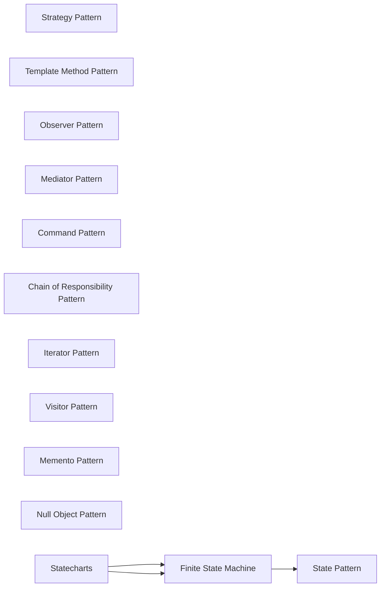
```mermaid
flowchart LR
    n_strategy_pattern["Strategy Pattern"]
    n_template_method_pattern["Template Method Pattern"]
    n_observer_pattern["Observer Pattern"]
    n_mediator_pattern["Mediator Pattern"]
    n_command_pattern["Command Pattern"]
    n_state_pattern["State Pattern"]
    n_chain_of_responsibility_pattern["Chain of Responsibility Pattern"]
    n_iterator_pattern["Iterator Pattern"]
    n_visitor_pattern["Visitor Pattern"]
    n_memento_pattern["Memento Pattern"]
    n_null_object_pattern["Null Object Pattern"]
    n_finite_state_machine["Finite State Machine"]
    n_statecharts["Statecharts"]
    n_finite_state_machine --> n_state_pattern
    n_statecharts --> n_finite_state_machine
    n_statecharts --> n_finite_state_machine
```

### Strategy Pattern

- Kind: [pattern](SCHEMA.md#kind-pattern)
- Category: [Behavioral Patterns](PRINCIPLES.md#architecture-category-behavioral-patterns)
- Severity: [recommended](SCHEMA.md#vocabulary-severity-recommended)
- Scope: algorithm, policy, behavior
- Aliases: Policy Pattern
- Layer: [Design Patterns Core](SCHEMA.md#layer-design-patterns-core)

Details

Definition
A design pattern that puts each interchangeable algorithm behind one interface, so the caller selects behavior by passing an object.

Requires
[Interchangeable Algorithms](LEXICON.md#lexicon-interchangeable-algorithms)

Reinforces
[Open/Closed Principle (OCP)](PRINCIPLES.md#architecture-open-closed), [Polymorphism](PRINCIPLES.md#architecture-polymorphism)

Enables
[Runtime Behavior Selection](LEXICON.md#lexicon-runtime-behavior-selection)

In tension with
[Class Count](LEXICON.md#lexicon-class-count)

Conflicts with
[Large Conditional Logic](LEXICON.md#lexicon-large-conditional-logic)

Referenced by
[Composition Over Inheritance](PRINCIPLES.md#architecture-composition-over-inheritance), [Open/Closed Principle (OCP)](PRINCIPLES.md#architecture-open-closed), [Polymorphism](PRINCIPLES.md#architecture-polymorphism)

Tensions
[Strategy Pattern / Class Count](SCHEMA.md#tension-class-count-strategy-pattern)

Distinct from
[Decorator Pattern](PRINCIPLES.md#architecture-decorator-pattern): A strategy replaces behavior behind one interface, while a decorator adds behavior by wrapping an object in the same interface.

Violated by
[Large Conditional Logic](LEXICON.md#lexicon-large-conditional-logic)

Detected by
conditional strategy selection with duplicated behavior

Measured by
conditional complexity

Refactored by
none

Enforced by
complexity thresholds, [review](LEXICON.md#lexicon-review)

Before

```typescript
function priceFoo(kind: string, value: number) {
  if (kind === "standard") return value;
  if (kind === "double") return value * 2;
  return 0;
}
```

After

```typescript
interface FooPricing {
  price(value: number): number;
}
const standard: FooPricing = { price: (value) => value };
const doubled: FooPricing = { price: (value) => value * 2 };
function priceFoo(strategy: FooPricing, value: number) {
  return strategy.price(value);
}
```

How it is checked

Checked by
complexity thresholds, review

Population
Every module whose behavior varies by mode, state, request kind or traversal

Freshness
A verdict stands until the module's branching or its state model changes

Refusal
The review or the complexity threshold rejects the change that reintroduces the branching the pattern removes

Observation
Conditional complexity and dispatch counts read from source, and the recorded design review

Evidence
None, because the catalog states this check as a class, so a watched run belongs to each system that adopts it

Authoritative side
The pattern's dispatch structure, which a change to the module's branching is compared against

Depends on
[Interchangeable Algorithms](LEXICON.md#lexicon-interchangeable-algorithms), [Open/Closed Principle (OCP)](PRINCIPLES.md#architecture-open-closed), [Polymorphism](PRINCIPLES.md#architecture-polymorphism), [Runtime Behavior Selection](LEXICON.md#lexicon-runtime-behavior-selection)

Shape it refuses
[Large Conditional Logic](LEXICON.md#lexicon-large-conditional-logic)

### Template Method Pattern

- Kind: [pattern](SCHEMA.md#kind-pattern)
- Category: [Behavioral Patterns](PRINCIPLES.md#architecture-category-behavioral-patterns)
- Severity: [contextual](SCHEMA.md#vocabulary-severity-contextual)
- Scope: workflow, framework
- Layer: [Design Patterns Core](SCHEMA.md#layer-design-patterns-core)

Details

Definition
A design pattern that fixes the steps of an algorithm in a base class and lets subclasses supply the steps that vary.

Requires
[Stable Algorithm Skeleton](LEXICON.md#lexicon-stable-algorithm-skeleton)

Reinforces
[Framework Reuse](LEXICON.md#lexicon-framework-reuse)

Enables
[Controlled Variation](LEXICON.md#lexicon-controlled-variation)

In tension with
[Inheritance Coupling](LEXICON.md#lexicon-inheritance-coupling)

Conflicts with
[Duplicated Workflow](LEXICON.md#lexicon-duplicated-workflow)

Tensions
[Template Method Pattern / Inheritance Coupling](SCHEMA.md#tension-inheritance-coupling-template-method-pattern)

Violated by
[Duplicated Workflow](LEXICON.md#lexicon-duplicated-workflow)

Detected by
duplicated method sequences

Measured by
workflow duplication

Refactored by
none

Enforced by
[design review](PRINCIPLES.md#architecture-design-review)

Before

```typescript
function importJsonFoo(raw: string) {
  validateJson(raw);
  return saveFoo(parseJson(raw));
}
function importCsvFoo(raw: string) {
  validateCsv(raw);
  return saveFoo(parseCsv(raw));
}
```

After

```typescript
abstract class FooImporter {
  import(raw: string) {
    this.validate(raw);
    return saveFoo(this.parse(raw));
  }
  protected abstract validate(raw: string): void;
  protected abstract parse(raw: string): Foo;
}
```

How it is checked

Checked by
design review

Population
Every module whose behavior varies by mode, state, request kind or traversal

Freshness
A verdict stands until the module's branching or its state model changes

Refusal
The review or the complexity threshold rejects the change that reintroduces the branching the pattern removes

Observation
Conditional complexity and dispatch counts read from source, and the recorded design review

Evidence
None, because the catalog states this check as a class, so a watched run belongs to each system that adopts it

Authoritative side
The pattern's dispatch structure, which a change to the module's branching is compared against

Depends on
[Stable Algorithm Skeleton](LEXICON.md#lexicon-stable-algorithm-skeleton), [Framework Reuse](LEXICON.md#lexicon-framework-reuse), [Controlled Variation](LEXICON.md#lexicon-controlled-variation)

Shape it refuses
[Duplicated Workflow](LEXICON.md#lexicon-duplicated-workflow)

### Observer Pattern

- Kind: [pattern](SCHEMA.md#kind-pattern)
- Category: [Behavioral Patterns](PRINCIPLES.md#architecture-category-behavioral-patterns)
- Severity: [recommended](SCHEMA.md#vocabulary-severity-recommended)
- Scope: event notification, runtime
- Layer: [Design Patterns Core](SCHEMA.md#layer-design-patterns-core)

Details

Definition
A design pattern in which a subject publishes events to subscribers it does not know by name.

Requires
[Subject/Subscriber Contract](LEXICON.md#lexicon-subject-subscriber-contract)

Reinforces
[Event-Driven Architecture](PRINCIPLES.md#architecture-event-driven-architecture)

Enables
[Decoupled Notification](LEXICON.md#lexicon-decoupled-notification)

In tension with
[Ordering](LEXICON.md#lexicon-ordering), [Debuggability](LEXICON.md#lexicon-debuggability)

Conflicts with
[Direct Callback Coupling](LEXICON.md#lexicon-direct-callback-coupling)

Tensions
[Observer Pattern / Ordering](SCHEMA.md#tension-observer-pattern-ordering), [Observer Pattern / Debuggability](SCHEMA.md#tension-debuggability-observer-pattern)

Violated by
[Direct Callback Coupling](LEXICON.md#lexicon-direct-callback-coupling)

Detected by
direct calls to multiple listeners

Measured by
subscriber coupling count

Refactored by
none

Enforced by
event contract tests

Before

```typescript
class FooEditor {
  save(foo: Foo) {
    fooStore.save(foo);
    refreshFooView(foo);
    sendFooEmail(foo);
  }
}
```

After

```typescript
class FooEvents {
  #listeners = new Set<(event: FooEvent) => void>();
  subscribe(listener: (event: FooEvent) => void) {
    this.#listeners.add(listener);
  }
  publish(event: FooEvent) {
    this.#listeners.forEach((listener) => listener(event));
  }
}
class FooEditor {
  constructor(private readonly events: FooEvents) {}
  save(foo: Foo) {
    fooStore.save(foo);
    this.events.publish({ type: "FooSaved", foo });
  }
}
fooEvents.subscribe((event) => refreshFooView(event.foo));
fooEvents.subscribe((event) => sendFooEmail(event.foo));
```

How it is checked

Checked by
event contract tests

Population
Every module whose behavior varies by mode, state, request kind or traversal

Freshness
A verdict stands until the module's branching or its state model changes

Refusal
The review or the complexity threshold rejects the change that reintroduces the branching the pattern removes

Observation
Conditional complexity and dispatch counts read from source, and the recorded design review

Evidence
None, because the catalog states this check as a class, so a watched run belongs to each system that adopts it

Authoritative side
The pattern's dispatch structure, which a change to the module's branching is compared against

Depends on
[Subject/Subscriber Contract](LEXICON.md#lexicon-subject-subscriber-contract), [Event-Driven Architecture](PRINCIPLES.md#architecture-event-driven-architecture), [Decoupled Notification](LEXICON.md#lexicon-decoupled-notification)

Shape it refuses
[Direct Callback Coupling](LEXICON.md#lexicon-direct-callback-coupling)

### Mediator Pattern

- Kind: [pattern](SCHEMA.md#kind-pattern)
- Category: [Behavioral Patterns](PRINCIPLES.md#architecture-category-behavioral-patterns)
- Severity: [contextual](SCHEMA.md#vocabulary-severity-contextual)
- Scope: object coordination, module
- Layer: [Design Patterns Core](SCHEMA.md#layer-design-patterns-core)

Details

Definition
A design pattern that routes the interactions between a set of objects through one coordinating object.

Requires
[Coordination Complexity](LEXICON.md#lexicon-coordination-complexity)

Reinforces
[Low Coupling](PRINCIPLES.md#architecture-low-coupling)

Enables
[Centralized Interaction Logic](LEXICON.md#lexicon-centralized-interaction-logic)

In tension with
[Mediator God Object](LEXICON.md#lexicon-mediator-god-object)

Conflicts with
[Mesh Dependencies](LEXICON.md#lexicon-mesh-dependencies)

Tensions
[Mediator Pattern / Mediator God Object](SCHEMA.md#tension-mediator-god-object-mediator-pattern)

Violated by
[Mesh Dependencies](LEXICON.md#lexicon-mesh-dependencies)

Detected by
dense object dependency graph

Measured by
interaction graph density

Refactored by
none

Enforced by
dependency graph checks

Before

```typescript
fooEditor.notify(fooList, fooDetails, fooToolbar, foo);
fooList.update(fooDetails, fooToolbar, foo);
```

After

```typescript
class FooMediator {
  constructor(
    private readonly list: FooList,
    private readonly details: FooDetails,
  ) {}
  handle(event: FooEvent) {
    this.list.apply(event);
    this.details.apply(event);
  }
}
```

How it is checked

Checked by
dependency graph checks

Population
Every module whose behavior varies by mode, state, request kind or traversal

Freshness
A verdict stands until the module's branching or its state model changes

Refusal
The review or the complexity threshold rejects the change that reintroduces the branching the pattern removes

Observation
Conditional complexity and dispatch counts read from source, and the recorded design review

Evidence
None, because the catalog states this check as a class, so a watched run belongs to each system that adopts it

Authoritative side
The pattern's dispatch structure, which a change to the module's branching is compared against

Depends on
[Coordination Complexity](LEXICON.md#lexicon-coordination-complexity), [Low Coupling](PRINCIPLES.md#architecture-low-coupling), [Centralized Interaction Logic](LEXICON.md#lexicon-centralized-interaction-logic)

Shape it refuses
[Mesh Dependencies](LEXICON.md#lexicon-mesh-dependencies)

### Command Pattern

- Kind: [pattern](SCHEMA.md#kind-pattern)
- Category: [Behavioral Patterns](PRINCIPLES.md#architecture-category-behavioral-patterns)
- Severity: [recommended](SCHEMA.md#vocabulary-severity-recommended)
- Scope: behavior, invocation, workflow
- Aliases: Action Pattern
- Layer: [Design Patterns Core](SCHEMA.md#layer-design-patterns-core)

Details

Definition
A design pattern that wraps a request in an object, so it can be queued, deferred or undone.

Requires
[Encapsulation](PRINCIPLES.md#architecture-encapsulation)

Reinforces
[Open/Closed Principle (OCP)](PRINCIPLES.md#architecture-open-closed), [Single Responsibility Principle (SRP)](PRINCIPLES.md#architecture-single-responsibility)

Enables
[Undo/Redo](LEXICON.md#lexicon-undo-redo), [Deferred Execution](LEXICON.md#lexicon-deferred-execution), [Deferred Execution](LEXICON.md#lexicon-deferred-execution)

In tension with
[Simplicity](LEXICON.md#lexicon-simplicity)

Conflicts with
[Direct Method Invocation](LEXICON.md#lexicon-direct-method-invocation)

Tensions
[Command Pattern / Simplicity](SCHEMA.md#tension-command-pattern-simplicity)

Violated by
[Direct Method Invocation](LEXICON.md#lexicon-direct-method-invocation)

Detected by
switch/if chains selecting an operation to run

Measured by
dispatch-branch count per action site

Refactored by
none

Enforced by
[design review](PRINCIPLES.md#architecture-design-review)

Before

```typescript
button.onClick = () => fooEditor.delete(foo.id);
```

After

```typescript
interface FooCommand {
  execute(): void;
  undo(): void;
}
class DeleteFooCommand implements FooCommand {
  constructor(private readonly id: FooId) {}
  execute() {
    fooStore.delete(this.id);
  }
  undo() {
    fooStore.restore(this.id);
  }
}
history.run(new DeleteFooCommand(foo.id));
```

How it is checked

Checked by
design review

Population
Every module whose behavior varies by mode, state, request kind or traversal

Freshness
A verdict stands until the module's branching or its state model changes

Refusal
The review or the complexity threshold rejects the change that reintroduces the branching the pattern removes

Observation
Conditional complexity and dispatch counts read from source, and the recorded design review

Evidence
None, because the catalog states this check as a class, so a watched run belongs to each system that adopts it

Authoritative side
The pattern's dispatch structure, which a change to the module's branching is compared against

Depends on
[Encapsulation](PRINCIPLES.md#architecture-encapsulation), [Open/Closed Principle (OCP)](PRINCIPLES.md#architecture-open-closed), [Single Responsibility Principle (SRP)](PRINCIPLES.md#architecture-single-responsibility), [Undo/Redo](LEXICON.md#lexicon-undo-redo), [Deferred Execution](LEXICON.md#lexicon-deferred-execution), [Deferred Execution](LEXICON.md#lexicon-deferred-execution)

Shape it refuses
[Direct Method Invocation](LEXICON.md#lexicon-direct-method-invocation)

### State Pattern

- Kind: [pattern](SCHEMA.md#kind-pattern)
- Category: [Behavioral Patterns](PRINCIPLES.md#architecture-category-behavioral-patterns)
- Severity: [recommended](SCHEMA.md#vocabulary-severity-recommended)
- Scope: behavior, state machine, lifecycle
- Layer: [Design Patterns Core](SCHEMA.md#layer-design-patterns-core)

Details

Definition
A design pattern that gives each state of an object its own class, so behavior and legal transitions change with the state.

Requires
[Explicit State Model](LEXICON.md#lexicon-explicit-state-model)

Reinforces
[Open/Closed Principle (OCP)](PRINCIPLES.md#architecture-open-closed), [Polymorphism](PRINCIPLES.md#architecture-polymorphism)

Enables
[State-Local Behavior](LEXICON.md#lexicon-state-local-behavior), [Legal-Transition Enforcement](LEXICON.md#lexicon-legal-transition-enforcement)

In tension with
[Class Proliferation](LEXICON.md#lexicon-class-proliferation)

Conflicts with
[Boolean Flag Soup](LEXICON.md#lexicon-boolean-flag-soup)

Referenced by
[Finite State Machine](PRINCIPLES.md#architecture-finite-state-machine)

Contracts
[State Pattern](ALGORITHMS.md#algorithms-state-pattern)

Tensions
[State Pattern / Class Proliferation](SCHEMA.md#tension-class-proliferation-state-pattern)

Violated by
[Boolean Flag Soup](LEXICON.md#lexicon-boolean-flag-soup)

Detected by
repeated conditionals on a status field

Measured by
status-conditional density

Refactored by
none

Enforced by
[design review](PRINCIPLES.md#architecture-design-review)

Before

```typescript
function handleFoo(foo: Foo, event: string) {
  if (foo.status === "draft" && event === "submit") foo.status = "review";
  if (foo.status === "review" && event === "approve") foo.status = "published";
}
```

After

```typescript
interface FooState {
  submit(): FooState;
  approve(): FooState;
}
const published: FooState = {
  submit: () => published,
  approve: () => published,
};
const review: FooState = { submit: () => review, approve: () => published };
const draft: FooState = { submit: () => review, approve: () => draft };
class Foo {
  constructor(private state: FooState = draft) {}
  submit() {
    this.state = this.state.submit();
  }
  approve() {
    this.state = this.state.approve();
  }
}
```

How it is checked

Checked by
design review

Population
Every module whose behavior varies by mode, state, request kind or traversal

Freshness
A verdict stands until the module's branching or its state model changes

Refusal
The review or the complexity threshold rejects the change that reintroduces the branching the pattern removes

Observation
Conditional complexity and dispatch counts read from source, and the recorded design review

Evidence
None, because the catalog states this check as a class, so a watched run belongs to each system that adopts it

Authoritative side
The pattern's dispatch structure, which a change to the module's branching is compared against

Depends on
[Explicit State Model](LEXICON.md#lexicon-explicit-state-model), [Open/Closed Principle (OCP)](PRINCIPLES.md#architecture-open-closed), [Polymorphism](PRINCIPLES.md#architecture-polymorphism), [State-Local Behavior](LEXICON.md#lexicon-state-local-behavior), [Legal-Transition Enforcement](LEXICON.md#lexicon-legal-transition-enforcement)

Shape it refuses
[Boolean Flag Soup](LEXICON.md#lexicon-boolean-flag-soup)

### Chain of Responsibility Pattern

- Kind: [pattern](SCHEMA.md#kind-pattern)
- Category: [Behavioral Patterns](PRINCIPLES.md#architecture-category-behavioral-patterns)
- Severity: [recommended](SCHEMA.md#vocabulary-severity-recommended)
- Scope: behavior, request handling, pipeline
- Layer: [Design Patterns Core](SCHEMA.md#layer-design-patterns-core)

Details

Definition
A design pattern that passes a request along an ordered list of handlers until one of them handles it.

Requires
[Uniform Handler Interface](LEXICON.md#lexicon-uniform-handler-interface)

Reinforces
[Open/Closed Principle (OCP)](PRINCIPLES.md#architecture-open-closed), [Single Responsibility Principle (SRP)](PRINCIPLES.md#architecture-single-responsibility)

Enables
[Pluggable Handling](LEXICON.md#lexicon-pluggable-handling), [Ordered Fallthrough](LEXICON.md#lexicon-ordered-fallthrough)

In tension with
[Traceability](PRINCIPLES.md#architecture-traceability)

Conflicts with
[Monolithic Handler](LEXICON.md#lexicon-monolithic-handler)

Tensions
[Chain of Responsibility Pattern / Traceability](SCHEMA.md#tension-chain-of-responsibility-pattern-traceability)

Violated by
[Monolithic Handler](LEXICON.md#lexicon-monolithic-handler)

Detected by
long if/else ladders handling heterogeneous requests

Measured by
handler cyclomatic complexity

Refactored by
none

Enforced by
[design review](PRINCIPLES.md#architecture-design-review)

Before

```typescript
function handleFoo(request: FooRequest) {
  if (request.size > MAX_SIZE) return reject(request);
  if (!request.authorized) return deny(request);
  return process(request);
}
```

After

```typescript
type FooHandler = (request: FooRequest, next: () => FooResult) => FooResult;
const enforceSize: FooHandler = (request, next) =>
  request.size > MAX_SIZE ? reject(request) : next();
const enforceAuth: FooHandler = (request, next) =>
  request.authorized ? next() : deny(request);
const chain = composeHandlers([
  enforceSize,
  enforceAuth,
  () => process(request),
]);
chain(request);
```

How it is checked

Checked by
design review

Population
Every module whose behavior varies by mode, state, request kind or traversal

Freshness
A verdict stands until the module's branching or its state model changes

Refusal
The review or the complexity threshold rejects the change that reintroduces the branching the pattern removes

Observation
Conditional complexity and dispatch counts read from source, and the recorded design review

Evidence
None, because the catalog states this check as a class, so a watched run belongs to each system that adopts it

Authoritative side
The pattern's dispatch structure, which a change to the module's branching is compared against

Depends on
[Uniform Handler Interface](LEXICON.md#lexicon-uniform-handler-interface), [Open/Closed Principle (OCP)](PRINCIPLES.md#architecture-open-closed), [Single Responsibility Principle (SRP)](PRINCIPLES.md#architecture-single-responsibility), [Pluggable Handling](LEXICON.md#lexicon-pluggable-handling), [Ordered Fallthrough](LEXICON.md#lexicon-ordered-fallthrough)

Shape it refuses
[Monolithic Handler](LEXICON.md#lexicon-monolithic-handler)

### Iterator Pattern

- Kind: [pattern](SCHEMA.md#kind-pattern)
- Category: [Behavioral Patterns](PRINCIPLES.md#architecture-category-behavioral-patterns)
- Severity: [contextual](SCHEMA.md#vocabulary-severity-contextual)
- Scope: behavior, traversal, collection
- Aliases: Cursor
- Layer: [Design Patterns Core](SCHEMA.md#layer-design-patterns-core)

Details

Definition
A design pattern that lets callers traverse a collection without seeing how it is stored.

Requires
[Uniform Traversal Interface](LEXICON.md#lexicon-uniform-traversal-interface)

Reinforces
[Encapsulation](PRINCIPLES.md#architecture-encapsulation), [Single Responsibility Principle (SRP)](PRINCIPLES.md#architecture-single-responsibility)

Enables
[Structure-Agnostic Iteration](LEXICON.md#lexicon-structure-agnostic-iteration), [Lazy Traversal](LEXICON.md#lexicon-lazy-traversal)

In tension with
[Simplicity](LEXICON.md#lexicon-simplicity)

Conflicts with
[Exposed Internal Representation](LEXICON.md#lexicon-exposed-internal-representation)

Tensions
[Iterator Pattern / Simplicity](SCHEMA.md#tension-iterator-pattern-simplicity)

Violated by
[Exposed Internal Representation](LEXICON.md#lexicon-exposed-internal-representation)

Detected by
index/pointer traversal of another type's internals

Measured by
internal-structure access count

Refactored by
none

Enforced by
[design review](PRINCIPLES.md#architecture-design-review)

Before

```typescript
for (let i = 0; i < fooTree.nodes.length; i += 1) visit(fooTree.nodes[i]);
```

After

```typescript
class FooTree {
  #roots: FooNode[] = [];
  *[Symbol.iterator](): Iterator<Foo> {
    for (const node of this.#roots) yield* this.walk(node);
  }
}
for (const foo of fooTree) visit(foo);
```

How it is checked

Checked by
design review

Population
Every module whose behavior varies by mode, state, request kind or traversal

Freshness
A verdict stands until the module's branching or its state model changes

Refusal
The review or the complexity threshold rejects the change that reintroduces the branching the pattern removes

Observation
Conditional complexity and dispatch counts read from source, and the recorded design review

Evidence
None, because the catalog states this check as a class, so a watched run belongs to each system that adopts it

Authoritative side
The pattern's dispatch structure, which a change to the module's branching is compared against

Depends on
[Uniform Traversal Interface](LEXICON.md#lexicon-uniform-traversal-interface), [Encapsulation](PRINCIPLES.md#architecture-encapsulation), [Single Responsibility Principle (SRP)](PRINCIPLES.md#architecture-single-responsibility), [Structure-Agnostic Iteration](LEXICON.md#lexicon-structure-agnostic-iteration), [Lazy Traversal](LEXICON.md#lexicon-lazy-traversal)

Shape it refuses
[Exposed Internal Representation](LEXICON.md#lexicon-exposed-internal-representation)

### Visitor Pattern

- Kind: [pattern](SCHEMA.md#kind-pattern)
- Category: [Behavioral Patterns](PRINCIPLES.md#architecture-category-behavioral-patterns)
- Severity: [contextual](SCHEMA.md#vocabulary-severity-contextual)
- Scope: behavior, operation, type hierarchy
- Layer: [Design Patterns Core](SCHEMA.md#layer-design-patterns-core)

Details

Definition
A design pattern that places each operation over a type hierarchy in its own visitor, so an operation is added without editing the element types.

Requires
[Stable Element Hierarchy](LEXICON.md#lexicon-stable-element-hierarchy)

Reinforces
[Open/Closed Principle (OCP)](PRINCIPLES.md#architecture-open-closed), [Separation of Concerns](PRINCIPLES.md#architecture-separation-of-concerns)

Enables
[Operation Extension Without Element Change](LEXICON.md#lexicon-operation-extension-without-element-change)

In tension with
[Element Stability](LEXICON.md#lexicon-element-stability)

Conflicts with
[Type Switching](LEXICON.md#lexicon-type-switching)

Tensions
[Visitor Pattern / Element Stability](SCHEMA.md#tension-element-stability-visitor-pattern)

Violated by
[Type Switching](LEXICON.md#lexicon-type-switching)

Detected by
type-tag switches repeated per operation

Measured by
type-switch duplication across operations

Refactored by
none

Enforced by
[design review](PRINCIPLES.md#architecture-design-review)

Before

```typescript
function renderFoo(node: FooNode) {
  if (node.kind === "text") return node.value;
  if (node.kind === "group") return node.children.map(renderFoo).join("");
}
```

After

```typescript
interface FooVisitor<T> {
  text(node: TextNode): T;
  group(node: GroupNode): T;
}
class RenderFooVisitor implements FooVisitor<string> {
  text(node: TextNode) {
    return node.value;
  }
  group(node: GroupNode) {
    return node.children.map((child) => child.accept(this)).join("");
  }
}
```

How it is checked

Checked by
design review

Population
Every module whose behavior varies by mode, state, request kind or traversal

Freshness
A verdict stands until the module's branching or its state model changes

Refusal
The review or the complexity threshold rejects the change that reintroduces the branching the pattern removes

Observation
Conditional complexity and dispatch counts read from source, and the recorded design review

Evidence
None, because the catalog states this check as a class, so a watched run belongs to each system that adopts it

Authoritative side
The pattern's dispatch structure, which a change to the module's branching is compared against

Depends on
[Stable Element Hierarchy](LEXICON.md#lexicon-stable-element-hierarchy), [Open/Closed Principle (OCP)](PRINCIPLES.md#architecture-open-closed), [Separation of Concerns](PRINCIPLES.md#architecture-separation-of-concerns), [Operation Extension Without Element Change](LEXICON.md#lexicon-operation-extension-without-element-change)

Shape it refuses
[Type Switching](LEXICON.md#lexicon-type-switching)

### Memento Pattern

- Kind: [pattern](SCHEMA.md#kind-pattern)
- Category: [Behavioral Patterns](PRINCIPLES.md#architecture-category-behavioral-patterns)
- Severity: [contextual](SCHEMA.md#vocabulary-severity-contextual)
- Scope: behavior, state capture, history
- Layer: [Design Patterns Core](SCHEMA.md#layer-design-patterns-core)

Details

Definition
A design pattern in which an object captures its own state in an opaque snapshot it can later restore.

Requires
[Encapsulation](PRINCIPLES.md#architecture-encapsulation)

Reinforces
[Information Hiding](PRINCIPLES.md#architecture-information-hiding)

Enables
[Undo/Redo](LEXICON.md#lexicon-undo-redo), [Snapshot/Restore](LEXICON.md#lexicon-snapshot-restore)

In tension with
[Memory Footprint](LEXICON.md#lexicon-memory-footprint)

Conflicts with
[External State Reach-In](LEXICON.md#lexicon-external-state-reach-in)

Tensions
[Memento Pattern / Memory Footprint](SCHEMA.md#tension-memento-pattern-memory-footprint)

Violated by
[External State Reach-In](LEXICON.md#lexicon-external-state-reach-in)

Detected by
external code reconstructing internal state

Measured by
private-field external access count

Refactored by
none

Enforced by
[design review](PRINCIPLES.md#architecture-design-review)

Before

```typescript
const backupName = foo.name;
const backupTags = [...foo.tags];
foo.rename(newName);
if (canceled) {
  foo.name = backupName;
  foo.tags = backupTags;
}
```

After

```typescript
class FooMemento {
  constructor(readonly snapshot: Readonly<Foo>) {}
}
const memento = foo.save();
foo.rename(newName);
if (canceled) foo.restore(memento);
```

How it is checked

Checked by
design review

Population
Every module whose behavior varies by mode, state, request kind or traversal

Freshness
A verdict stands until the module's branching or its state model changes

Refusal
The review or the complexity threshold rejects the change that reintroduces the branching the pattern removes

Observation
Conditional complexity and dispatch counts read from source, and the recorded design review

Evidence
None, because the catalog states this check as a class, so a watched run belongs to each system that adopts it

Authoritative side
The pattern's dispatch structure, which a change to the module's branching is compared against

Depends on
[Encapsulation](PRINCIPLES.md#architecture-encapsulation), [Information Hiding](PRINCIPLES.md#architecture-information-hiding), [Undo/Redo](LEXICON.md#lexicon-undo-redo), [Snapshot/Restore](LEXICON.md#lexicon-snapshot-restore)

Shape it refuses
[External State Reach-In](LEXICON.md#lexicon-external-state-reach-in)

### Null Object Pattern

- Kind: [pattern](SCHEMA.md#kind-pattern)
- Category: [Behavioral Patterns](PRINCIPLES.md#architecture-category-behavioral-patterns)
- Severity: [contextual](SCHEMA.md#vocabulary-severity-contextual)
- Scope: behavior, absence, default
- Aliases: Null Object
- Layer: [Design Patterns Core](SCHEMA.md#layer-design-patterns-core)

Details

Definition
A design pattern that represents absence with an object implementing the expected interface as a no-op.

Requires
[Shared Behavioral Interface](LEXICON.md#lexicon-shared-behavioral-interface)

Reinforces
[Polymorphism](PRINCIPLES.md#architecture-polymorphism), [Fail-Safe Defaults](LEXICON.md#lexicon-fail-safe-defaults)

Enables
[Null-Check Elimination](LEXICON.md#lexicon-null-check-elimination)

In tension with
[Silent No-Op Risk](LEXICON.md#lexicon-silent-no-op-risk)

Conflicts with
[Null Semantics Drift](PRINCIPLES.md#architecture-null-semantics-drift)

Tensions
[Null Object Pattern / Silent No-Op Risk](SCHEMA.md#tension-null-object-pattern-silent-no-op-risk)

Violated by
[Scattered Null Guards](LEXICON.md#lexicon-scattered-null-guards)

Detected by
repeated null checks before the same operation

Measured by
null-guard density

Refactored by
none

Enforced by
[design review](PRINCIPLES.md#architecture-design-review)

Before

```typescript
const logger = config.logger;
if (logger) logger.info("foo saved");
```

After

```typescript
interface FooLogger {
  info(message: string): void;
}
const NoopFooLogger: FooLogger = { info() {} };
const logger = config.logger ?? NoopFooLogger;
logger.info("foo saved");
```

How it is checked

Checked by
design review

Population
Every module whose behavior varies by mode, state, request kind or traversal

Freshness
A verdict stands until the module's branching or its state model changes

Refusal
The review or the complexity threshold rejects the change that reintroduces the branching the pattern removes

Observation
Conditional complexity and dispatch counts read from source, and the recorded design review

Evidence
None, because the catalog states this check as a class, so a watched run belongs to each system that adopts it

Authoritative side
The pattern's dispatch structure, which a change to the module's branching is compared against

Depends on
[Shared Behavioral Interface](LEXICON.md#lexicon-shared-behavioral-interface), [Polymorphism](PRINCIPLES.md#architecture-polymorphism), [Fail-Safe Defaults](LEXICON.md#lexicon-fail-safe-defaults), [Null-Check Elimination](LEXICON.md#lexicon-null-check-elimination)

Shape it refuses
[Null Semantics Drift](PRINCIPLES.md#architecture-null-semantics-drift)

### Finite State Machine

- Kind: [model](SCHEMA.md#kind-model)
- Category: [Behavioral Patterns](PRINCIPLES.md#architecture-category-behavioral-patterns)
- Severity: [recommended](SCHEMA.md#vocabulary-severity-recommended)
- Scope: behavior, state modeling, control flow
- Aliases: FSM, State Machine
- Layer: [Design Patterns Core](SCHEMA.md#layer-design-patterns-core)

Details

Definition
A conceptual representation of behavior as a closed set of states and the events that move between them.

Requires
[Explicit State Set](LEXICON.md#lexicon-explicit-state-set)

Reinforces
[State Pattern](PRINCIPLES.md#architecture-state-pattern), [Correctness](PRINCIPLES.md#architecture-correctness)

Enables
[Legal-Transition Enforcement](LEXICON.md#lexicon-legal-transition-enforcement), [Exhaustive State Reasoning](LEXICON.md#lexicon-exhaustive-state-reasoning)

In tension with
[State Explosion](LEXICON.md#lexicon-state-explosion)

Conflicts with
[Boolean Flag Soup](LEXICON.md#lexicon-boolean-flag-soup)

Referenced by
[Statecharts](PRINCIPLES.md#architecture-statecharts)

Contracts
[Finite State Machine](ALGORITHMS.md#algorithms-finite-state-machine)

Tensions
[Finite State Machine / State Explosion](SCHEMA.md#tension-finite-state-machine-state-explosion)

Violated by
[Boolean Flag Soup](LEXICON.md#lexicon-boolean-flag-soup)

Detected by
impossible or contradictory state combinations reachable at runtime

Measured by
count of representable-but-illegal states

Refactored by
none

Enforced by
state model review

Before

```typescript
let isOpen = false,
  isLoading = false,
  isError = false;
function onClick() {
  isLoading = true;
  if (isOpen) isOpen = false;
}
```

After

```typescript
type FooState = "closed" | "loading" | "open" | "error";
const transitions: Record<FooState, Partial<Record<FooEvent, FooState>>> = {
  closed: { open: "loading" },
  loading: { ready: "open", fail: "error" },
  open: { close: "closed" },
  error: { retry: "loading" },
};
function next(state: FooState, event: FooEvent): FooState {
  return transitions[state][event] ?? state;
}
```

How it is checked

Checked by
state model review

Population
Every module whose behavior varies by mode, state, request kind or traversal

Freshness
A verdict stands until the module's branching or its state model changes

Refusal
The review or the complexity threshold rejects the change that reintroduces the branching the pattern removes

Observation
Conditional complexity and dispatch counts read from source, and the recorded design review

Evidence
None, because the catalog states this check as a class, so a watched run belongs to each system that adopts it

Authoritative side
The pattern's dispatch structure, which a change to the module's branching is compared against

Depends on
[Explicit State Set](LEXICON.md#lexicon-explicit-state-set), [State Pattern](PRINCIPLES.md#architecture-state-pattern), [Correctness](PRINCIPLES.md#architecture-correctness), [Legal-Transition Enforcement](LEXICON.md#lexicon-legal-transition-enforcement), [Exhaustive State Reasoning](LEXICON.md#lexicon-exhaustive-state-reasoning)

Shape it refuses
[Boolean Flag Soup](LEXICON.md#lexicon-boolean-flag-soup)

### Statecharts

- Kind: [model](SCHEMA.md#kind-model)
- Category: [Behavioral Patterns](PRINCIPLES.md#architecture-category-behavioral-patterns)
- Severity: [contextual](SCHEMA.md#vocabulary-severity-contextual)
- Scope: behavior, state modeling, hierarchy
- Layer: [Design Patterns Core](SCHEMA.md#layer-design-patterns-core)

Details

Definition
A conceptual representation of a state machine extended with nested states and parallel regions.

Requires
[Finite State Machine](PRINCIPLES.md#architecture-finite-state-machine)

Reinforces
[Finite State Machine](PRINCIPLES.md#architecture-finite-state-machine), [Separation of Concerns](PRINCIPLES.md#architecture-separation-of-concerns)

Enables
[Hierarchical States](LEXICON.md#lexicon-hierarchical-states), [Parallel Regions](LEXICON.md#lexicon-parallel-regions), [Guarded Transitions](LEXICON.md#lexicon-guarded-transitions)

In tension with
[Tooling Complexity](LEXICON.md#lexicon-tooling-complexity)

Conflicts with
[Flat State Explosion](LEXICON.md#lexicon-flat-state-explosion)

Contracts
[Statecharts](ALGORITHMS.md#algorithms-statecharts)

Tensions
[Statecharts / Tooling Complexity](SCHEMA.md#tension-statecharts-tooling-complexity)

Distinct from
[Finite State Machine](PRINCIPLES.md#architecture-finite-state-machine): A finite state machine is flat states and events, while statecharts add nested states and parallel regions to it.

Violated by
[Flat State Explosion](LEXICON.md#lexicon-flat-state-explosion)

Detected by
combinatorial state growth from independent concerns modeled in one flat machine

Measured by
transition duplication across sibling states

Refactored by
none

Enforced by
state model review

Before

```typescript
type S = "idleMuted" | "idleLoud" | "playingMuted" | "playingLoud";
```

After

```typescript
const fooChart = {
  initial: "idle",
  states: { idle: {}, playing: {} },
  parallel: { volume: { states: { muted: {}, loud: {} } } },
};
```

How it is checked

Checked by
state model review

Population
Every module whose behavior varies by mode, state, request kind or traversal

Freshness
A verdict stands until the module's branching or its state model changes

Refusal
The review or the complexity threshold rejects the change that reintroduces the branching the pattern removes

Observation
Conditional complexity and dispatch counts read from source, and the recorded design review

Evidence
None, because the catalog states this check as a class, so a watched run belongs to each system that adopts it

Authoritative side
The pattern's dispatch structure, which a change to the module's branching is compared against

Depends on
[Finite State Machine](PRINCIPLES.md#architecture-finite-state-machine), [Finite State Machine](PRINCIPLES.md#architecture-finite-state-machine), [Separation of Concerns](PRINCIPLES.md#architecture-separation-of-concerns), [Hierarchical States](LEXICON.md#lexicon-hierarchical-states), [Parallel Regions](LEXICON.md#lexicon-parallel-regions), [Guarded Transitions](LEXICON.md#lexicon-guarded-transitions)

Shape it refuses
[Flat State Explosion](LEXICON.md#lexicon-flat-state-explosion)

## Creational Patterns

Every principle in this category is listed as a record. Each record carries its kind, its severity, the scopes it applies at and the layer it lives in, then the edge relations that join it to other records, the records that point back at it, the contracts that answer to it and the tensions it takes part in. The descriptors say how it is violated, detected, measured, repaired and enforced. Where the record carries one, an exemplar shows the shape before and after the principle is applied.

Relations diagram

The relations inside this category.

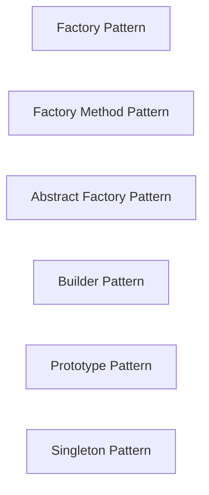
```mermaid
flowchart LR
    n_factory_pattern["Factory Pattern"]
    n_factory_method_pattern["Factory Method Pattern"]
    n_abstract_factory_pattern["Abstract Factory Pattern"]
    n_builder_pattern["Builder Pattern"]
    n_prototype_pattern["Prototype Pattern"]
    n_singleton_pattern["Singleton Pattern"]
```

### Factory Pattern

- Kind: [pattern](SCHEMA.md#kind-pattern)
- Category: [Creational Patterns](PRINCIPLES.md#architecture-category-creational-patterns)
- Severity: [recommended](SCHEMA.md#vocabulary-severity-recommended)
- Scope: [object_creation](SCHEMA.md#force-object-creation), module
- Layer: [Design Patterns Core](SCHEMA.md#layer-design-patterns-core)

Details

Definition
A design pattern that moves the construction of an object and its defaults into one function or object.

Requires
[Creation Variation](LEXICON.md#lexicon-creation-variation)

Reinforces
[Open/Closed Principle (OCP)](PRINCIPLES.md#architecture-open-closed), [Encapsulation](PRINCIPLES.md#architecture-encapsulation)

Enables
[Polymorphic Construction](LEXICON.md#lexicon-polymorphic-construction)

In tension with
[Simplicity](LEXICON.md#lexicon-simplicity)

Conflicts with
[Scattered Construction Logic](LEXICON.md#lexicon-scattered-construction-logic)

Referenced by
[Registry Pattern](PRINCIPLES.md#architecture-registry-pattern)

Tensions
[Factory Pattern / Simplicity](SCHEMA.md#tension-factory-pattern-simplicity)

Violated by
[Scattered Construction Logic](LEXICON.md#lexicon-scattered-construction-logic)

Detected by
repeated constructors/switches

Measured by
construction duplication count

Refactored by
none

Enforced by
creation policy review

Before

```typescript
const foo = new Foo("foo", 0, [], new Date(), "draft");
```

After

```typescript
function makeFoo(name: string): Foo {
  return new Foo(fooId(), name, 0, [], clock.now(), "draft");
}
```

How it is checked

Checked by
creation policy review

Population
Every construction site of the types the pattern governs

Freshness
A verdict stands until a constructor, a variant or the composition root changes

Refusal
The review or the construction test rejects a construction that bypasses the creational owner

Observation
Constructor call sites and their argument counts, read from source

Evidence
None, because the catalog states this check as a class, so a watched run belongs to each system that adopts it

Authoritative side
The creational owner, which every construction site goes through

Depends on
[Creation Variation](LEXICON.md#lexicon-creation-variation), [Open/Closed Principle (OCP)](PRINCIPLES.md#architecture-open-closed), [Encapsulation](PRINCIPLES.md#architecture-encapsulation), [Polymorphic Construction](LEXICON.md#lexicon-polymorphic-construction)

Shape it refuses
[Scattered Construction Logic](LEXICON.md#lexicon-scattered-construction-logic)

### Factory Method Pattern

- Kind: [pattern](SCHEMA.md#kind-pattern)
- Category: [Creational Patterns](PRINCIPLES.md#architecture-category-creational-patterns)
- Severity: [contextual](SCHEMA.md#vocabulary-severity-contextual)
- Scope: class hierarchy, framework
- Aliases: Virtual Constructor
- Layer: [Design Patterns Core](SCHEMA.md#layer-design-patterns-core)

Details

Definition
A design pattern in which a base class calls an overridable method to create the objects its workflow uses.

Requires
[Subclass-Controlled Creation](LEXICON.md#lexicon-subclass-controlled-creation)

Reinforces
[Open/Closed Principle (OCP)](PRINCIPLES.md#architecture-open-closed)

Enables
[Deferred Instantiation](LEXICON.md#lexicon-deferred-instantiation)

In tension with
[Inheritance Complexity](LEXICON.md#lexicon-inheritance-complexity)

Conflicts with
[Concrete Constructor Coupling](LEXICON.md#lexicon-concrete-constructor-coupling)

Tensions
[Factory Method Pattern / Inheritance Complexity](SCHEMA.md#tension-factory-method-pattern-inheritance-complexity)

Violated by
[Concrete Constructor Coupling](LEXICON.md#lexicon-concrete-constructor-coupling)

Detected by
base class directly instantiates variant

Measured by
variant construction duplication

Refactored by
none

Enforced by
[design review](PRINCIPLES.md#architecture-design-review)

Before

```typescript
class FooImporter {
  import(raw: string) {
    return new JsonFooParser().parse(raw);
  }
}
```

After

```typescript
abstract class FooImporter {
  protected abstract parser(): FooParser;
  import(raw: string) {
    return this.parser().parse(raw);
  }
}
class JsonFooImporter extends FooImporter {
  protected parser() {
    return new JsonFooParser();
  }
}
```

How it is checked

Checked by
design review

Population
Every construction site of the types the pattern governs

Freshness
A verdict stands until a constructor, a variant or the composition root changes

Refusal
The review or the construction test rejects a construction that bypasses the creational owner

Observation
Constructor call sites and their argument counts, read from source

Evidence
None, because the catalog states this check as a class, so a watched run belongs to each system that adopts it

Authoritative side
The creational owner, which every construction site goes through

Depends on
[Subclass-Controlled Creation](LEXICON.md#lexicon-subclass-controlled-creation), [Open/Closed Principle (OCP)](PRINCIPLES.md#architecture-open-closed), [Deferred Instantiation](LEXICON.md#lexicon-deferred-instantiation)

Shape it refuses
[Concrete Constructor Coupling](LEXICON.md#lexicon-concrete-constructor-coupling)

### Abstract Factory Pattern

- Kind: [pattern](SCHEMA.md#kind-pattern)
- Category: [Creational Patterns](PRINCIPLES.md#architecture-category-creational-patterns)
- Severity: [contextual](SCHEMA.md#vocabulary-severity-contextual)
- Scope: product family, component
- Layer: [Design Patterns Core](SCHEMA.md#layer-design-patterns-core)

Details

Definition
A design pattern that creates a whole family of related objects through one interface, so the members always match.

Requires
[Related Product Variants](LEXICON.md#lexicon-related-product-variants)

Reinforces
[Interchangeability](PRINCIPLES.md#architecture-interchangeability)

Enables
[Family-Level Replacement](LEXICON.md#lexicon-family-level-replacement)

In tension with
[Boilerplate](LEXICON.md#lexicon-boilerplate)

Conflicts with
[Mixed Product Families](LEXICON.md#lexicon-mixed-product-families)

Tensions
[Abstract Factory Pattern / Boilerplate](SCHEMA.md#tension-abstract-factory-pattern-boilerplate)

Violated by
[Mixed Product Families](LEXICON.md#lexicon-mixed-product-families)

Detected by
manual selection of related product classes

Measured by
family mismatch defects

Refactored by
none

Enforced by
factory conformance tests

Before

```typescript
const store = env === "test" ? new MemoryFooStore() : new SqlFooStore();
const bus = env === "test" ? new MemoryFooBus() : new KafkaFooBus();
```

After

```typescript
interface FooPlatformFactory {
  store(): FooStore;
  bus(): FooBus;
}
class TestFooPlatformFactory implements FooPlatformFactory {
  store() {
    return new MemoryFooStore();
  }
  bus() {
    return new MemoryFooBus();
  }
}
```

How it is checked

Checked by
factory conformance tests

Population
Every construction site of the types the pattern governs

Freshness
A verdict stands until a constructor, a variant or the composition root changes

Refusal
The review or the construction test rejects a construction that bypasses the creational owner

Observation
Constructor call sites and their argument counts, read from source

Evidence
None, because the catalog states this check as a class, so a watched run belongs to each system that adopts it

Authoritative side
The creational owner, which every construction site goes through

Depends on
[Related Product Variants](LEXICON.md#lexicon-related-product-variants), [Interchangeability](PRINCIPLES.md#architecture-interchangeability), [Family-Level Replacement](LEXICON.md#lexicon-family-level-replacement)

Shape it refuses
[Mixed Product Families](LEXICON.md#lexicon-mixed-product-families)

### Builder Pattern

- Kind: [pattern](SCHEMA.md#kind-pattern)
- Category: [Creational Patterns](PRINCIPLES.md#architecture-category-creational-patterns)
- Severity: [recommended](SCHEMA.md#vocabulary-severity-recommended)
- Scope: object construction, API
- Layer: [Design Patterns Core](SCHEMA.md#layer-design-patterns-core)

Details

Definition
A design pattern that assembles a complex object step by step through named calls and validates it when it is built.

Requires
[Complex Construction](LEXICON.md#lexicon-complex-construction)

Reinforces
[Intent-Revealing Interface](PRINCIPLES.md#architecture-intent-revealing-interface)

Enables
[Valid Object Creation](LEXICON.md#lexicon-valid-object-creation)

In tension with
[Boilerplate](LEXICON.md#lexicon-boilerplate)

Conflicts with
[Telescoping Constructor](LEXICON.md#lexicon-telescoping-constructor)

Tensions
[Builder Pattern / Boilerplate](SCHEMA.md#tension-boilerplate-builder-pattern)

Violated by
[Telescoping Constructor](LEXICON.md#lexicon-telescoping-constructor)

Detected by
high-arity constructors

Measured by
constructor parameter count

Refactored by
none

Enforced by
API review

Before

```typescript
const foo = new Foo("foo_1", "Foo", [], 0, false, undefined, "draft");
```

After

```typescript
const foo = new FooBuilder()
  .withId("foo_1")
  .withName("Foo")
  .withStatus("draft")
  .build();
```

How it is checked

Checked by
API review

Population
Every construction site of the types the pattern governs

Freshness
A verdict stands until a constructor, a variant or the composition root changes

Refusal
The review or the construction test rejects a construction that bypasses the creational owner

Observation
Constructor call sites and their argument counts, read from source

Evidence
None, because the catalog states this check as a class, so a watched run belongs to each system that adopts it

Authoritative side
The creational owner, which every construction site goes through

Depends on
[Complex Construction](LEXICON.md#lexicon-complex-construction), [Intent-Revealing Interface](PRINCIPLES.md#architecture-intent-revealing-interface), [Valid Object Creation](LEXICON.md#lexicon-valid-object-creation)

Shape it refuses
[Telescoping Constructor](LEXICON.md#lexicon-telescoping-constructor)

### Prototype Pattern

- Kind: [pattern](SCHEMA.md#kind-pattern)
- Category: [Creational Patterns](PRINCIPLES.md#architecture-category-creational-patterns)
- Severity: [contextual](SCHEMA.md#vocabulary-severity-contextual)
- Scope: [object_creation](SCHEMA.md#force-object-creation), runtime
- Layer: [Design Patterns Core](SCHEMA.md#layer-design-patterns-core)

Details

Definition
A design pattern that creates new objects by cloning a prepared template and applying overrides.

Requires
[Cloneable Template Object](LEXICON.md#lexicon-cloneable-template-object)

Reinforces
[Runtime Extensibility](PRINCIPLES.md#architecture-runtime-extensibility)

Enables
[Dynamic Object Creation](LEXICON.md#lexicon-dynamic-object-creation)

In tension with
[Copy Semantics](LEXICON.md#lexicon-copy-semantics)

Conflicts with
[Complex Factory Hierarchies](LEXICON.md#lexicon-complex-factory-hierarchies)

Tensions
[Prototype Pattern / Copy Semantics](SCHEMA.md#tension-copy-semantics-prototype-pattern)

Violated by
[Repeated Expensive Setup](LEXICON.md#lexicon-repeated-expensive-setup)

Detected by
duplicate initialization flows

Measured by
initialization duplication/cost

Refactored by
none

Enforced by
clone tests

Before

```typescript
function copyFoo(foo: Foo) {
  return new Foo(
    foo.id,
    foo.name,
    [...foo.tags],
    foo.settings.theme,
    foo.settings.mode,
  );
}
```

After

```typescript
class FooPrototype {
  constructor(private readonly base: Foo) {}
  clone(overrides: Partial<Foo> = {}): Foo {
    return structuredClone({ ...this.base, ...overrides });
  }
}
const template = new FooPrototype(await buildExpensiveFoo());
const draft = template.clone({ name: "quick" });
```

How it is checked

Checked by
clone tests

Population
Every construction site of the types the pattern governs

Freshness
A verdict stands until a constructor, a variant or the composition root changes

Refusal
The review or the construction test rejects a construction that bypasses the creational owner

Observation
Constructor call sites and their argument counts, read from source

Evidence
None, because the catalog states this check as a class, so a watched run belongs to each system that adopts it

Authoritative side
The creational owner, which every construction site goes through

Depends on
[Cloneable Template Object](LEXICON.md#lexicon-cloneable-template-object), [Runtime Extensibility](PRINCIPLES.md#architecture-runtime-extensibility), [Dynamic Object Creation](LEXICON.md#lexicon-dynamic-object-creation)

Shape it refuses
[Complex Factory Hierarchies](LEXICON.md#lexicon-complex-factory-hierarchies)

### Singleton Pattern

- Kind: [pattern](SCHEMA.md#kind-pattern)
- Category: [Creational Patterns](PRINCIPLES.md#architecture-category-creational-patterns)
- Severity: [discouraged](SCHEMA.md#vocabulary-severity-discouraged)
- Scope: [object_creation](SCHEMA.md#force-object-creation), lifetime, composition root
- Aliases: Singleton
- Layer: [Design Patterns Core](SCHEMA.md#layer-design-patterns-core)

Details

Definition
A design pattern that restricts a class to one instance, reached through a global access point.

Requires
[Single-Instance Need](LEXICON.md#lexicon-single-instance-need)

Reinforces
[Controlled Instantiation](LEXICON.md#lexicon-controlled-instantiation)

Enables
[Shared Resource Access](LEXICON.md#lexicon-shared-resource-access)

In tension with
[Testability](PRINCIPLES.md#architecture-testability), [Dependency Injection](PRINCIPLES.md#architecture-dependency-injection)

Conflicts with
[Global Mutable State](LEXICON.md#lexicon-global-mutable-state)

Tensions
[Singleton Pattern / Testability](SCHEMA.md#tension-singleton-pattern-testability), [Singleton Pattern / Dependency Injection](SCHEMA.md#tension-dependency-injection-singleton-pattern)

Violated by
[Global Mutable State](LEXICON.md#lexicon-global-mutable-state)

Detected by
static global access to a shared service

Measured by
global-instance reach-in count

Refactored by
[Composition Root](LEXICON.md#lexicon-composition-root), [Dependency Injection](PRINCIPLES.md#architecture-dependency-injection)

Enforced by
composition-root review

Before

```typescript
let instance: FooService | undefined;
function getFooService() {
  return (instance ??= new FooService());
}
```

After

```typescript
class FooService {}
export function composeApp() {
  const fooService = new FooService();
  return { fooService, fooController: new FooController(fooService) };
}
```

How it is checked

Checked by
composition-root review

Population
Every construction site of the types the pattern governs

Freshness
A verdict stands until a constructor, a variant or the composition root changes

Refusal
The review or the construction test rejects a construction that bypasses the creational owner

Observation
Constructor call sites and their argument counts, read from source

Evidence
None, because the catalog states this check as a class, so a watched run belongs to each system that adopts it

Authoritative side
The creational owner, which every construction site goes through

Depends on
[Single-Instance Need](LEXICON.md#lexicon-single-instance-need), [Controlled Instantiation](LEXICON.md#lexicon-controlled-instantiation), [Shared Resource Access](LEXICON.md#lexicon-shared-resource-access)

Shape it refuses
[Global Mutable State](LEXICON.md#lexicon-global-mutable-state)

## Structural Patterns

Every principle in this category is listed as a record. Each record carries its kind, its severity, the scopes it applies at and the layer it lives in, then the edge relations that join it to other records, the records that point back at it, the contracts that answer to it and the tensions it takes part in. The descriptors say how it is violated, detected, measured, repaired and enforced. Where the record carries one, an exemplar shows the shape before and after the principle is applied.

Relations diagram

The relations inside this category.

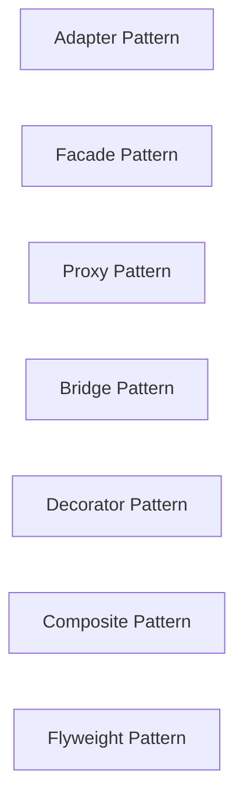
```mermaid
flowchart LR
    n_adapter_pattern["Adapter Pattern"]
    n_facade_pattern["Facade Pattern"]
    n_proxy_pattern["Proxy Pattern"]
    n_bridge_pattern["Bridge Pattern"]
    n_decorator_pattern["Decorator Pattern"]
    n_composite_pattern["Composite Pattern"]
    n_flyweight_pattern["Flyweight Pattern"]
```

### Adapter Pattern

- Kind: [pattern](SCHEMA.md#kind-pattern)
- Category: [Structural Patterns](PRINCIPLES.md#architecture-category-structural-patterns)
- Severity: [mandatory](SCHEMA.md#vocabulary-severity-mandatory)
- Scope: integration, boundary
- Layer: [Design Patterns Core](SCHEMA.md#layer-design-patterns-core)

Details

Definition
A design pattern that wraps a component with an incompatible interface so it implements the interface its callers expect.

Requires
[Incompatible Interfaces](LEXICON.md#lexicon-incompatible-interfaces)

Reinforces
[Anti-Corruption Layer](PRINCIPLES.md#architecture-anti-corruption-layer), [Replaceability](PRINCIPLES.md#architecture-replaceability)

Enables
[Interoperability](PRINCIPLES.md#architecture-interoperability)

In tension with
[Mapping Overhead](LEXICON.md#lexicon-mapping-overhead)

Conflicts with
[Direct External Coupling](LEXICON.md#lexicon-direct-external-coupling)

Referenced by
[Interface-Based Design](PRINCIPLES.md#architecture-interface-based-design)

Tensions
[Adapter Pattern / Mapping Overhead](SCHEMA.md#tension-adapter-pattern-mapping-overhead)

Distinct from
[Anti-Corruption Layer](PRINCIPLES.md#architecture-anti-corruption-layer): An adapter fits one incompatible interface to the one expected, while an anti-corruption layer translates a whole external model into the local domain's terms.

Violated by
[Direct External Coupling](LEXICON.md#lexicon-direct-external-coupling)

Detected by
external SDK types in domain/application

Measured by
external leakage count

Refactored by
[Extract Adapter](LEXICON.md#lexicon-extract-adapter), [Anti-Corruption Layer](PRINCIPLES.md#architecture-anti-corruption-layer)

Enforced by
boundary import rules

Before

```typescript
function saveFoo(foo: Foo) {
  return legacyClient.put(foo.id, foo.name, foo.count);
}
```

After

```typescript
class LegacyFooAdapter implements FooStore {
  constructor(private readonly client: LegacyClient) {}
  save(foo: Foo) {
    return this.client.put(foo.id, foo.name, foo.count);
  }
}
```

How it is checked

Checked by
boundary import rules

Population
Every boundary, wrapper and composite structure that sits between a caller and the objects it uses

Freshness
A verdict stands until the wrapped interface or its callers change

Refusal
The boundary import rule or the conformance test fails a caller that reaches past the structure

Observation
Imports and call sites that cross the structure, read from source

Evidence
None, because the catalog states this check as a class, so a watched run belongs to each system that adopts it

Authoritative side
The structure's interface, which every caller goes through

Depends on
[Incompatible Interfaces](LEXICON.md#lexicon-incompatible-interfaces), [Anti-Corruption Layer](PRINCIPLES.md#architecture-anti-corruption-layer), [Replaceability](PRINCIPLES.md#architecture-replaceability), [Interoperability](PRINCIPLES.md#architecture-interoperability)

Shape it refuses
[Direct External Coupling](LEXICON.md#lexicon-direct-external-coupling)

### Facade Pattern

- Kind: [pattern](SCHEMA.md#kind-pattern)
- Category: [Structural Patterns](PRINCIPLES.md#architecture-category-structural-patterns)
- Severity: [recommended](SCHEMA.md#vocabulary-severity-recommended)
- Scope: module, subsystem, API
- Layer: [Design Patterns Core](SCHEMA.md#layer-design-patterns-core)

Details

Definition
A design pattern that gives a subsystem one simple entry point, so callers do not depend on its parts.

Requires
[Subsystem Complexity](LEXICON.md#lexicon-subsystem-complexity)

Reinforces
[Encapsulation](PRINCIPLES.md#architecture-encapsulation), [Information Hiding](PRINCIPLES.md#architecture-information-hiding)

Enables
[Simplified Access](LEXICON.md#lexicon-simplified-access)

In tension with
[Over-Centralization](LEXICON.md#lexicon-over-centralization)

Conflicts with
[Leaky Subsystem API](LEXICON.md#lexicon-leaky-subsystem-api)

Tensions
[Facade Pattern / Over-Centralization](SCHEMA.md#tension-facade-pattern-over-centralization)

Violated by
[Leaky Subsystem API](LEXICON.md#lexicon-leaky-subsystem-api)

Detected by
broad dependency surface to subsystem

Measured by
consumer dependency count

Refactored by
none

Enforced by
API boundary rules

Before

```typescript
const foo = fooValidator.validate(fooParser.parse(raw));
await fooStore.save(foo);
await fooEvents.publish(foo);
```

After

```typescript
class FooFacade {
  async create(raw: string) {
    const foo = fooValidator.validate(fooParser.parse(raw));
    await fooStore.save(foo);
    await fooEvents.publish(foo);
  }
}
```

How it is checked

Checked by
API boundary rules

Population
Every boundary, wrapper and composite structure that sits between a caller and the objects it uses

Freshness
A verdict stands until the wrapped interface or its callers change

Refusal
The boundary import rule or the conformance test fails a caller that reaches past the structure

Observation
Imports and call sites that cross the structure, read from source

Evidence
None, because the catalog states this check as a class, so a watched run belongs to each system that adopts it

Authoritative side
The structure's interface, which every caller goes through

Depends on
[Subsystem Complexity](LEXICON.md#lexicon-subsystem-complexity), [Encapsulation](PRINCIPLES.md#architecture-encapsulation), [Information Hiding](PRINCIPLES.md#architecture-information-hiding), [Simplified Access](LEXICON.md#lexicon-simplified-access)

Shape it refuses
[Leaky Subsystem API](LEXICON.md#lexicon-leaky-subsystem-api)

### Proxy Pattern

- Kind: [pattern](SCHEMA.md#kind-pattern)
- Category: [Structural Patterns](PRINCIPLES.md#architecture-category-structural-patterns)
- Severity: [contextual](SCHEMA.md#vocabulary-severity-contextual)
- Scope: access control, remote access, lazy loading
- Aliases: Surrogate
- Layer: [Design Patterns Core](SCHEMA.md#layer-design-patterns-core)

Details

Definition
A design pattern that places a stand-in with the same interface in front of an object, to control, defer or cache access to it.

Requires
[Controlled Access](LEXICON.md#lexicon-controlled-access)

Reinforces
[Encapsulation](PRINCIPLES.md#architecture-encapsulation), [Security](LEXICON.md#lexicon-security)

Enables
[Lazy Load](LEXICON.md#lexicon-lazy-load), [Authorization](PRINCIPLES.md#architecture-authorization), [Remote Stub](LEXICON.md#lexicon-remote-stub)

In tension with
[Transparency / Debugging](LEXICON.md#lexicon-transparency-debugging)

Conflicts with
[Direct Access](LEXICON.md#lexicon-direct-access)

Tensions
[Proxy Pattern / Transparency / Debugging](SCHEMA.md#tension-proxy-pattern-transparency-debugging)

Violated by
[Direct Access](LEXICON.md#lexicon-direct-access)

Detected by
bypassed access wrapper

Measured by
proxy bypass count

Refactored by
none

Enforced by
access rules

Before

```typescript
function loadFoo(id: FooId) {
  return remoteFooStore.find(id);
}
```

After

```typescript
class CachingFooStoreProxy implements FooStore {
  constructor(private readonly target: FooStore) {}
  async find(id: FooId) {
    const cached = fooCache.get(id);
    if (cached) return cached;
    const foo = await this.target.find(id);
    fooCache.set(id, foo);
    return foo;
  }
}
```

How it is checked

Checked by
access rules

Population
Every boundary, wrapper and composite structure that sits between a caller and the objects it uses

Freshness
A verdict stands until the wrapped interface or its callers change

Refusal
The boundary import rule or the conformance test fails a caller that reaches past the structure

Observation
Imports and call sites that cross the structure, read from source

Evidence
None, because the catalog states this check as a class, so a watched run belongs to each system that adopts it

Authoritative side
The structure's interface, which every caller goes through

Depends on
[Controlled Access](LEXICON.md#lexicon-controlled-access), [Encapsulation](PRINCIPLES.md#architecture-encapsulation), [Security](LEXICON.md#lexicon-security), [Lazy Load](LEXICON.md#lexicon-lazy-load), [Authorization](PRINCIPLES.md#architecture-authorization), [Remote Stub](LEXICON.md#lexicon-remote-stub)

Shape it refuses
[Direct Access](LEXICON.md#lexicon-direct-access)

### Bridge Pattern

- Kind: [pattern](SCHEMA.md#kind-pattern)
- Category: [Structural Patterns](PRINCIPLES.md#architecture-category-structural-patterns)
- Severity: [contextual](SCHEMA.md#vocabulary-severity-contextual)
- Scope: abstraction, implementation variation
- Aliases: Handle-Body
- Layer: [Design Patterns Core](SCHEMA.md#layer-design-patterns-core)

Details

Definition
A design pattern that separates two independent axes of variation into two hierarchies joined by composition.

Requires
[Independent Variation Axes](LEXICON.md#lexicon-independent-variation-axes)

Reinforces
[Composition Over Inheritance](PRINCIPLES.md#architecture-composition-over-inheritance)

Enables
[Implementation Swap](LEXICON.md#lexicon-implementation-swap)

In tension with
[Indirection](LEXICON.md#lexicon-indirection)

Conflicts with
[Cartesian Inheritance Explosion](LEXICON.md#lexicon-cartesian-inheritance-explosion)

Tensions
[Bridge Pattern / Indirection](SCHEMA.md#tension-bridge-pattern-indirection)

Violated by
[Cartesian Inheritance Explosion](LEXICON.md#lexicon-cartesian-inheritance-explosion)

Detected by
parallel hierarchies / deep variant classes

Measured by
variant class count

Refactored by
none

Enforced by
[design review](PRINCIPLES.md#architecture-design-review)

Before

```typescript
class SqlJsonFooExporter {}
class SqlCsvFooExporter {}
class MemoryJsonFooExporter {}
class MemoryCsvFooExporter {}
```

After

```typescript
interface FooSource {
  read(): Promise<readonly Foo[]>;
}
interface FooFormat {
  encode(foos: readonly Foo[]): string;
}
class FooExporter {
  constructor(
    private readonly source: FooSource,
    private readonly format: FooFormat,
  ) {}
  async export() {
    return this.format.encode(await this.source.read());
  }
}
```

How it is checked

Checked by
design review

Population
Every boundary, wrapper and composite structure that sits between a caller and the objects it uses

Freshness
A verdict stands until the wrapped interface or its callers change

Refusal
The boundary import rule or the conformance test fails a caller that reaches past the structure

Observation
Imports and call sites that cross the structure, read from source

Evidence
None, because the catalog states this check as a class, so a watched run belongs to each system that adopts it

Authoritative side
The structure's interface, which every caller goes through

Depends on
[Independent Variation Axes](LEXICON.md#lexicon-independent-variation-axes), [Composition Over Inheritance](PRINCIPLES.md#architecture-composition-over-inheritance), [Implementation Swap](LEXICON.md#lexicon-implementation-swap)

Shape it refuses
[Cartesian Inheritance Explosion](LEXICON.md#lexicon-cartesian-inheritance-explosion)

### Decorator Pattern

- Kind: [pattern](SCHEMA.md#kind-pattern)
- Category: [Structural Patterns](PRINCIPLES.md#architecture-category-structural-patterns)
- Severity: [contextual](SCHEMA.md#vocabulary-severity-contextual)
- Scope: behavior composition
- Layer: [Design Patterns Core](SCHEMA.md#layer-design-patterns-core)

Details

Definition
A design pattern that adds behavior to an object by wrapping it in another object with the same interface.

Requires
[Common Interface](LEXICON.md#lexicon-common-interface)

Reinforces
[Open/Closed Principle (OCP)](PRINCIPLES.md#architecture-open-closed), [Composability](PRINCIPLES.md#architecture-composability)

Enables
[Runtime Behavior Extension](LEXICON.md#lexicon-runtime-behavior-extension)

In tension with
[Stack Debugging](LEXICON.md#lexicon-stack-debugging)

Conflicts with
[Subclass Explosion](LEXICON.md#lexicon-subclass-explosion)

Referenced by
[Composition Over Inheritance](PRINCIPLES.md#architecture-composition-over-inheritance)

Tensions
[Decorator Pattern / Stack Debugging](SCHEMA.md#tension-decorator-pattern-stack-debugging)

Violated by
[Subclass Explosion](LEXICON.md#lexicon-subclass-explosion)

Detected by
repeated wrapper-like subclasses

Measured by
variant explosion count

Refactored by
none

Enforced by
interface conformance tests

Before

```typescript
class LoggedSqlFooStore extends SqlFooStore {
  override save(foo: Foo) {
    logger.info("foo.saved", { fooId: foo.id });
    return super.save(foo);
  }
}
```

After

```typescript
class LoggedFooStore implements FooStore {
  constructor(
    private readonly inner: FooStore,
    private readonly log: Log,
  ) {}
  save(foo: Foo) {
    this.log.write(foo.id);
    return this.inner.save(foo);
  }
}
```

How it is checked

Checked by
interface conformance tests

Population
Every boundary, wrapper and composite structure that sits between a caller and the objects it uses

Freshness
A verdict stands until the wrapped interface or its callers change

Refusal
The boundary import rule or the conformance test fails a caller that reaches past the structure

Observation
Imports and call sites that cross the structure, read from source

Evidence
None, because the catalog states this check as a class, so a watched run belongs to each system that adopts it

Authoritative side
The structure's interface, which every caller goes through

Depends on
[Common Interface](LEXICON.md#lexicon-common-interface), [Open/Closed Principle (OCP)](PRINCIPLES.md#architecture-open-closed), [Composability](PRINCIPLES.md#architecture-composability), [Runtime Behavior Extension](LEXICON.md#lexicon-runtime-behavior-extension)

Shape it refuses
[Subclass Explosion](LEXICON.md#lexicon-subclass-explosion)

### Composite Pattern

- Kind: [pattern](SCHEMA.md#kind-pattern)
- Category: [Structural Patterns](PRINCIPLES.md#architecture-category-structural-patterns)
- Severity: [recommended](SCHEMA.md#vocabulary-severity-recommended)
- Scope: structure, tree, hierarchy
- Layer: [Design Patterns Core](SCHEMA.md#layer-design-patterns-core)

Details

Definition
A design pattern that gives leaves and groups one interface, so a tree is traversed without checking which kind each node is.

Requires
[Uniform Component Interface](LEXICON.md#lexicon-uniform-component-interface)

Reinforces
[Uniform Interface](PRINCIPLES.md#architecture-uniform-interface), [Open/Closed Principle (OCP)](PRINCIPLES.md#architecture-open-closed)

Enables
[Recursive Composition](LEXICON.md#lexicon-recursive-composition), [Leaf/Composite Transparency](LEXICON.md#lexicon-leaf-composite-transparency)

In tension with
[Type Safety](PRINCIPLES.md#architecture-type-safety)

Conflicts with
[Leaf-vs-Container Special-Casing](LEXICON.md#lexicon-leaf-vs-container-special-casing)

Tensions
[Composite Pattern / Type Safety](SCHEMA.md#tension-composite-pattern-type-safety)

Violated by
[Leaf-vs-Container Special-Casing](LEXICON.md#lexicon-leaf-vs-container-special-casing)

Detected by
isContainer/isLeaf conditionals during traversal

Measured by
node-kind conditional count

Refactored by
none

Enforced by
[design review](PRINCIPLES.md#architecture-design-review)

Before

```typescript
function totalFoo(item: Foo | FooGroup): number {
  if ("children" in item)
    return item.children.reduce((sum, child) => sum + totalFoo(child), 0);
  return item.value;
}
```

After

```typescript
interface FooComponent {
  total(): number;
}
class FooLeaf implements FooComponent {
  constructor(private readonly value: number) {}
  total() {
    return this.value;
  }
}
class FooGroup implements FooComponent {
  constructor(private readonly children: readonly FooComponent[]) {}
  total() {
    return this.children.reduce((sum, child) => sum + child.total(), 0);
  }
}
```

How it is checked

Checked by
design review

Population
Every boundary, wrapper and composite structure that sits between a caller and the objects it uses

Freshness
A verdict stands until the wrapped interface or its callers change

Refusal
The boundary import rule or the conformance test fails a caller that reaches past the structure

Observation
Imports and call sites that cross the structure, read from source

Evidence
None, because the catalog states this check as a class, so a watched run belongs to each system that adopts it

Authoritative side
The structure's interface, which every caller goes through

Depends on
[Uniform Component Interface](LEXICON.md#lexicon-uniform-component-interface), [Uniform Interface](PRINCIPLES.md#architecture-uniform-interface), [Open/Closed Principle (OCP)](PRINCIPLES.md#architecture-open-closed), [Recursive Composition](LEXICON.md#lexicon-recursive-composition), [Leaf/Composite Transparency](LEXICON.md#lexicon-leaf-composite-transparency)

Shape it refuses
[Leaf-vs-Container Special-Casing](LEXICON.md#lexicon-leaf-vs-container-special-casing)

### Flyweight Pattern

- Kind: [pattern](SCHEMA.md#kind-pattern)
- Category: [Structural Patterns](PRINCIPLES.md#architecture-category-structural-patterns)
- Severity: [contextual](SCHEMA.md#vocabulary-severity-contextual)
- Scope: structure, memory, sharing
- Layer: [Design Patterns Core](SCHEMA.md#layer-design-patterns-core)

Details

Definition
A design pattern that shares one copy of immutable intrinsic state among many objects, each keeping only its own extrinsic state.

Requires
[Separable Intrinsic State](LEXICON.md#lexicon-separable-intrinsic-state)

Reinforces
[Memory Efficiency](PRINCIPLES.md#architecture-memory-efficiency)

Enables
[Shared Immutable State](LEXICON.md#lexicon-shared-immutable-state), [High-Cardinality Object Reuse](LEXICON.md#lexicon-high-cardinality-object-reuse)

In tension with
[Complexity](LEXICON.md#lexicon-complexity)

Conflicts with
[Per-Instance Duplicate State](LEXICON.md#lexicon-per-instance-duplicate-state)

Tensions
[Flyweight Pattern / Complexity](SCHEMA.md#tension-complexity-flyweight-pattern)

Violated by
[Per-Instance Duplicate State](LEXICON.md#lexicon-per-instance-duplicate-state)

Detected by
repeated equal intrinsic state across objects

Measured by
duplicate-state memory footprint

Refactored by
none

Enforced by
profiling review

Before

```typescript
const icons = foos.map(
  (foo) => new FooIcon(foo.position, loadSprite(foo.kind)),
);
```

After

```typescript
const spriteCache = new Map<string, Sprite>();
function fooSprite(kind: string) {
  const cached = spriteCache.get(kind);
  if (cached) return cached;
  const sprite = loadSprite(kind);
  spriteCache.set(kind, sprite);
  return sprite;
}
const icons = foos.map((foo) => ({
  position: foo.position,
  sprite: fooSprite(foo.kind),
}));
```

How it is checked

Checked by
profiling review

Population
Every boundary, wrapper and composite structure that sits between a caller and the objects it uses

Freshness
A verdict stands until the wrapped interface or its callers change

Refusal
The boundary import rule or the conformance test fails a caller that reaches past the structure

Observation
Imports and call sites that cross the structure, read from source

Evidence
None, because the catalog states this check as a class, so a watched run belongs to each system that adopts it

Authoritative side
The structure's interface, which every caller goes through

Depends on
[Separable Intrinsic State](LEXICON.md#lexicon-separable-intrinsic-state), [Memory Efficiency](PRINCIPLES.md#architecture-memory-efficiency), [Shared Immutable State](LEXICON.md#lexicon-shared-immutable-state), [High-Cardinality Object Reuse](LEXICON.md#lexicon-high-cardinality-object-reuse)

Shape it refuses
[Per-Instance Duplicate State](LEXICON.md#lexicon-per-instance-duplicate-state)

## Scalability / Performance / Optimization

Every principle in this category is listed as a record. Each record carries its kind, its severity, the scopes it applies at and the layer it lives in, then the edge relations that join it to other records, the records that point back at it, the contracts that answer to it and the tensions it takes part in. The descriptors say how it is violated, detected, measured, repaired and enforced. Where the record carries one, an exemplar shows the shape before and after the principle is applied.

Relations diagram

The relations inside this category.

```mermaid
flowchart LR
    n_scalability["Scalability"]
    n_horizontal_scaling["Horizontal Scaling"]
    n_vertical_scaling["Vertical Scaling"]
    n_elasticity["Elasticity"]
    n_load_balancing["Load Balancing"]
    n_sharding["Sharding"]
    n_partitioning["Partitioning"]
    n_caching["Caching"]
    n_statelessness["Statelessness"]
    n_concurrency["Concurrency"]
    n_parallelism["Parallelism"]
    n_throughput["Throughput"]
    n_latency["Latency"]
    n_performance_engineering["Performance Engineering"]
    n_algorithmic_efficiency["Algorithmic Efficiency"]
    n_time_complexity["Time Complexity"]
    n_space_complexity["Space Complexity"]
    n_big_o_notation["Big O Notation"]
    n_optimization["Optimization"]
    n_profiling["Profiling"]
    n_benchmarking["Benchmarking"]
    n_bottleneck_analysis["Bottleneck Analysis"]
    n_resource_utilization["Resource Utilization"]
    n_rate_limiting["Rate Limiting"]
    n_memory_efficiency["Memory Efficiency"]
    n_cdn_edge_caching["CDN / Edge Caching"]
    n_read_replica["Read Replica"]
    n_queuing_theory["Queuing Theory"]
    n_scalability --> n_performance_engineering
    n_horizontal_scaling --> n_elasticity
    n_elasticity --> n_scalability
    n_load_balancing --> n_scalability
    n_sharding --> n_horizontal_scaling
    n_partitioning --> n_scalability
    n_partitioning --> n_parallelism
    n_caching --> n_scalability
    n_statelessness --> n_horizontal_scaling
    n_statelessness --> n_load_balancing
    n_concurrency --> n_throughput
    n_parallelism --> n_throughput
    n_throughput --> n_scalability
    n_throughput -.-> n_latency
    n_latency --> n_performance_engineering
    n_performance_engineering --> n_profiling
    n_performance_engineering --> n_benchmarking
    n_performance_engineering --> n_scalability
    n_algorithmic_efficiency --> n_scalability
    n_time_complexity --> n_algorithmic_efficiency
    n_time_complexity -.-> n_space_complexity
    n_space_complexity --> n_resource_utilization
    n_space_complexity -.-> n_time_complexity
    n_big_o_notation --> n_algorithmic_efficiency
    n_optimization --> n_profiling
    n_optimization --> n_performance_engineering
    n_profiling --> n_performance_engineering
    n_benchmarking --> n_performance_engineering
    n_bottleneck_analysis --> n_profiling
    n_bottleneck_analysis --> n_optimization
    n_resource_utilization --> n_performance_engineering
    n_memory_efficiency --> n_scalability
    n_cdn_edge_caching --> n_caching
    n_cdn_edge_caching --> n_latency
    n_read_replica --> n_horizontal_scaling
    n_read_replica --> n_load_balancing
    n_queuing_theory --> n_latency
```

### Scalability

- Kind: [quality-attribute](SCHEMA.md#kind-quality-attribute)
- Category: [Scalability / Performance / Optimization](PRINCIPLES.md#architecture-category-scalability-performance-optimization)
- Severity: [contextual](SCHEMA.md#vocabulary-severity-contextual)
- Scope: service, system, infrastructure
- Layer: [Performance Core](SCHEMA.md#layer-performance-core)

Details

Definition
The degree to which a system keeps its throughput and latency as load grows, by adding resources.

Requires
[Load Model](LEXICON.md#lexicon-load-model), [Bottleneck Awareness](LEXICON.md#lexicon-bottleneck-awareness)

Reinforces
[Performance Engineering](PRINCIPLES.md#architecture-performance-engineering)

Enables
[Growth Handling](LEXICON.md#lexicon-growth-handling)

In tension with
[Simplicity](LEXICON.md#lexicon-simplicity), [Consistency](PRINCIPLES.md#architecture-consistency)

Conflicts with
[Fixed-Capacity Design](LEXICON.md#lexicon-fixed-capacity-design)

Referenced by
[Service Discovery](PRINCIPLES.md#architecture-service-discovery), [Message Broker](PRINCIPLES.md#architecture-message-broker), [Command Query Responsibility Segregation (CQRS)](PRINCIPLES.md#architecture-command-query-responsibility-segregation), [Eventual Consistency](PRINCIPLES.md#architecture-eventual-consistency), [Elasticity](PRINCIPLES.md#architecture-elasticity), [Load Balancing](PRINCIPLES.md#architecture-load-balancing), [Partitioning](PRINCIPLES.md#architecture-partitioning), [Caching](PRINCIPLES.md#architecture-caching), [Throughput](PRINCIPLES.md#architecture-throughput), [Performance Engineering](PRINCIPLES.md#architecture-performance-engineering), [Algorithmic Efficiency](PRINCIPLES.md#architecture-algorithmic-efficiency), [Memory Efficiency](PRINCIPLES.md#architecture-memory-efficiency), [Stateless Processing](PRINCIPLES.md#architecture-stateless-processing), [Replication](PRINCIPLES.md#architecture-replication), [Microservices](PRINCIPLES.md#architecture-microservices)

Tensions
[Scalability / Simplicity](SCHEMA.md#tension-scalability-simplicity), [Scalability / Consistency](SCHEMA.md#tension-consistency-scalability)

Distinct from
[Elasticity](PRINCIPLES.md#architecture-elasticity): Scalability is keeping throughput as load grows by adding resources, while elasticity is those resources following demand automatically in both directions.

Distinct from
[Low Coupling](PRINCIPLES.md#architecture-low-coupling): Scalability is growing with load, while low coupling is changing without ripple.

Distinct from
[Memory Efficiency](PRINCIPLES.md#architecture-memory-efficiency): Scalability is growth by adding resources, while memory efficiency is bounded use of the resources one process has.

Distinct from
[Resilience](PRINCIPLES.md#architecture-resilience): Scalability is holding performance under load, while resilience is containing and recovering from failure.

Distinct from
[Testability](PRINCIPLES.md#architecture-testability): Scalability is growing with load, while testability is running code in isolation.

Distinct from
[Cost Efficiency](LEXICON.md#lexicon-cost-efficiency): Scalability is keeping throughput as load grows, while cost efficiency is the resource cost of the work.

Distinct from
[Resource Efficiency](LEXICON.md#lexicon-resource-efficiency): Scalability adds resources to meet load, while resource efficiency uses as few as possible for the same work.

Distinct from
[Simplicity](LEXICON.md#lexicon-simplicity): Scalability is growth with load, while simplicity is the absence of the structure that growth tends to add.

Distinct from
[Availability](LEXICON.md#lexicon-availability): Scalability is performance under growing load, while availability is the share of time the system serves at all.

Violated by
[Bottlenecks](LEXICON.md#lexicon-bottlenecks)

Detected by
saturation under load test

Measured by
throughput under increasing load

Refactored by
[Caching](PRINCIPLES.md#architecture-caching), [Partitioning](PRINCIPLES.md#architecture-partitioning), [Introduce Async Event](LEXICON.md#lexicon-introduce-async-event), [Horizontal Scaling](PRINCIPLES.md#architecture-horizontal-scaling)

Enforced by
load tests, SLO gates

Before

```typescript
class FooServer {
  private readonly foos = new Map<FooId, Foo>();
  handle(request: FooRequest) {
    return processFoo(request, this.foos);
  }
}
```

After

```typescript
class FooServer {
  constructor(private readonly store: DistributedFooStore) {}
  handle(request: FooRequest) {
    return processFoo(request, this.store);
  }
}
```

How it is checked

Checked by
load tests, SLO gates

Population
Every performance-sensitive path, resource and scaling policy under a declared workload

Freshness
A verdict stands for the measured workload and build, and goes stale when either changes

Refusal
The load test, benchmark or SLO gate fails the change that breaks its budget

Observation
Profiles, benchmark results, load-test metrics and production telemetry measured against their budgets

Evidence
None, because the catalog states this check as a class, so a watched run belongs to each system that adopts it

Authoritative side
The declared budget, which every measurement is compared against

Depends on
[Load Model](LEXICON.md#lexicon-load-model), [Bottleneck Awareness](LEXICON.md#lexicon-bottleneck-awareness), [Performance Engineering](PRINCIPLES.md#architecture-performance-engineering), [Growth Handling](LEXICON.md#lexicon-growth-handling)

Shape it refuses
[Fixed-Capacity Design](LEXICON.md#lexicon-fixed-capacity-design)

### Horizontal Scaling

- Kind: [technique](SCHEMA.md#kind-technique)
- Category: [Scalability / Performance / Optimization](PRINCIPLES.md#architecture-category-scalability-performance-optimization)
- Severity: [contextual](SCHEMA.md#vocabulary-severity-contextual)
- Scope: service, infrastructure
- Layer: [Performance Core](SCHEMA.md#layer-performance-core)

Details

Definition
A technique for adding capacity by running more stateless instances of a service behind a load balancer.

Requires
[Statelessness or Shared State Strategy](LEXICON.md#lexicon-statelessness-or-shared-state-strategy)

Reinforces
[Elasticity](PRINCIPLES.md#architecture-elasticity), [Availability](LEXICON.md#lexicon-availability)

Enables
[Scale-Out](LEXICON.md#lexicon-scale-out)

In tension with
[Distributed Coordination](LEXICON.md#lexicon-distributed-coordination)

Conflicts with
[Instance-Local State](LEXICON.md#lexicon-instance-local-state)

Referenced by
[Competing Consumers](PRINCIPLES.md#architecture-competing-consumers), [Sharding](PRINCIPLES.md#architecture-sharding), [Statelessness](PRINCIPLES.md#architecture-statelessness), [Read Replica](PRINCIPLES.md#architecture-read-replica), [Space-Based Architecture](PRINCIPLES.md#architecture-space-based-architecture)

Tensions
[Horizontal Scaling / Distributed Coordination](SCHEMA.md#tension-distributed-coordination-horizontal-scaling)

Violated by
[Instance Affinity](LEXICON.md#lexicon-instance-affinity)

Detected by
local session/state coupling

Measured by
scale-out efficiency

Refactored by
[Externalize Session State](LEXICON.md#lexicon-externalize-session-state), [Load Balancing](PRINCIPLES.md#architecture-load-balancing)

Enforced by
deployment tests

Before

```typescript
deployFoo({ replicas: 1, cpu: 32, memoryGb: 128 });
```

After

```typescript
deployFoo({ replicas: 12, cpu: 2, memoryGb: 4, stateless: true });
```

How it is checked

Checked by
deployment tests

Population
Every performance-sensitive path, resource and scaling policy under a declared workload

Freshness
A verdict stands for the measured workload and build, and goes stale when either changes

Refusal
The load test, benchmark or SLO gate fails the change that breaks its budget

Observation
Profiles, benchmark results, load-test metrics and production telemetry measured against their budgets

Evidence
None, because the catalog states this check as a class, so a watched run belongs to each system that adopts it

Authoritative side
The declared budget, which every measurement is compared against

Depends on
[Statelessness or Shared State Strategy](LEXICON.md#lexicon-statelessness-or-shared-state-strategy), [Elasticity](PRINCIPLES.md#architecture-elasticity), [Availability](LEXICON.md#lexicon-availability), [Scale-Out](LEXICON.md#lexicon-scale-out)

Shape it refuses
[Instance-Local State](LEXICON.md#lexicon-instance-local-state)

### Vertical Scaling

- Kind: [technique](SCHEMA.md#kind-technique)
- Category: [Scalability / Performance / Optimization](PRINCIPLES.md#architecture-category-scalability-performance-optimization)
- Severity: [contextual](SCHEMA.md#vocabulary-severity-contextual)
- Scope: infrastructure, process
- Layer: [Performance Core](SCHEMA.md#layer-performance-core)

Details

Definition
A technique for adding capacity by giving one instance more CPU, memory or I/O.

Requires
[Resource Headroom](LEXICON.md#lexicon-resource-headroom)

Reinforces
[Simplicity](LEXICON.md#lexicon-simplicity)

Enables
[Capacity Increase without Distribution](LEXICON.md#lexicon-capacity-increase-without-distribution)

In tension with
[Cost/Limit](LEXICON.md#lexicon-cost-limit)

Conflicts with
[Hard Resource Ceiling](LEXICON.md#lexicon-hard-resource-ceiling)

Tensions
[Vertical Scaling / Cost/Limit](SCHEMA.md#tension-cost-limit-vertical-scaling)

Violated by
[Hard Resource Ceiling](LEXICON.md#lexicon-hard-resource-ceiling)

Detected by
resource saturation trends

Measured by
utilization/headroom

Refactored by
[Profiling](PRINCIPLES.md#architecture-profiling), [Horizontal Scaling](PRINCIPLES.md#architecture-horizontal-scaling)

Enforced by
[capacity planning](LEXICON.md#lexicon-capacity-planning)

Before

```typescript
deployFoo({ cpu: 1, memoryGb: 1 });
queueFooWhenSaturated();
```

After

```typescript
deployFoo({ cpu: 8, memoryGb: 32 });
verifyFooCapacity({ targetConcurrency: 200 });
```

How it is checked

Checked by
capacity planning

Population
Every performance-sensitive path, resource and scaling policy under a declared workload

Freshness
A verdict stands for the measured workload and build, and goes stale when either changes

Refusal
The load test, benchmark or SLO gate fails the change that breaks its budget

Observation
Profiles, benchmark results, load-test metrics and production telemetry measured against their budgets

Evidence
None, because the catalog states this check as a class, so a watched run belongs to each system that adopts it

Authoritative side
The declared budget, which every measurement is compared against

Depends on
[Resource Headroom](LEXICON.md#lexicon-resource-headroom), [Simplicity](LEXICON.md#lexicon-simplicity), [Capacity Increase without Distribution](LEXICON.md#lexicon-capacity-increase-without-distribution)

Shape it refuses
[Hard Resource Ceiling](LEXICON.md#lexicon-hard-resource-ceiling)

### Elasticity

- Kind: [quality-attribute](SCHEMA.md#kind-quality-attribute)
- Category: [Scalability / Performance / Optimization](PRINCIPLES.md#architecture-category-scalability-performance-optimization)
- Severity: [contextual](SCHEMA.md#vocabulary-severity-contextual)
- Scope: deployment, infrastructure
- Layer: [Performance Core](SCHEMA.md#layer-performance-core)

Details

Definition
The degree to which a system's provisioned capacity follows demand up and down automatically.

Requires
[Auto-Scaling](PRINCIPLES.md#architecture-auto-scaling), [Metrics](LEXICON.md#lexicon-metrics)

Reinforces
[Scalability](PRINCIPLES.md#architecture-scalability), [Cost Efficiency](LEXICON.md#lexicon-cost-efficiency)

Enables
[Dynamic Capacity](LEXICON.md#lexicon-dynamic-capacity)

In tension with
[Warm-Up Latency](LEXICON.md#lexicon-warm-up-latency)

Conflicts with
[Fixed Provisioning](LEXICON.md#lexicon-fixed-provisioning)

Referenced by
[Horizontal Scaling](PRINCIPLES.md#architecture-horizontal-scaling), [Auto-Scaling](PRINCIPLES.md#architecture-auto-scaling), [Space-Based Architecture](PRINCIPLES.md#architecture-space-based-architecture)

Tensions
[Elasticity / Warm-Up Latency](SCHEMA.md#tension-elasticity-warm-up-latency)

Distinct from
[Availability](LEXICON.md#lexicon-availability): Elasticity is capacity following demand, while availability is the share of time the system can serve.

Distinct from
[Cost Efficiency](LEXICON.md#lexicon-cost-efficiency): Elasticity is capacity following demand, while cost efficiency is the work done per unit of resource cost.

Distinct from
[Warm-Up Latency](LEXICON.md#lexicon-warm-up-latency): Elasticity adds capacity when demand rises, while warm-up latency is the delay before that capacity can serve.

Violated by
[Fixed Provisioning](LEXICON.md#lexicon-fixed-provisioning)

Detected by
under/over-provisioning patterns

Measured by
scale response time, utilization

Refactored by
[Autoscaling Policy](LEXICON.md#lexicon-autoscaling-policy), [Externalize Session State](LEXICON.md#lexicon-externalize-session-state)

Enforced by
infrastructure policy

Before

```typescript
deployFooWorkers({ replicas: 10 });
```

After

```typescript
deployFooWorkers({
  minReplicas: 2,
  maxReplicas: 50,
  target: { queueDepthPerReplica: 100 },
});
```

How it is checked

Checked by
infrastructure policy

Population
Every performance-sensitive path, resource and scaling policy under a declared workload

Freshness
A verdict stands for the measured workload and build, and goes stale when either changes

Refusal
The load test, benchmark or SLO gate fails the change that breaks its budget

Observation
Profiles, benchmark results, load-test metrics and production telemetry measured against their budgets

Evidence
None, because the catalog states this check as a class, so a watched run belongs to each system that adopts it

Authoritative side
The declared budget, which every measurement is compared against

Depends on
[Auto-Scaling](PRINCIPLES.md#architecture-auto-scaling), [Metrics](LEXICON.md#lexicon-metrics), [Scalability](PRINCIPLES.md#architecture-scalability), [Cost Efficiency](LEXICON.md#lexicon-cost-efficiency), [Dynamic Capacity](LEXICON.md#lexicon-dynamic-capacity)

Shape it refuses
[Fixed Provisioning](LEXICON.md#lexicon-fixed-provisioning)

### Load Balancing

- Kind: [mechanism](SCHEMA.md#kind-mechanism)
- Category: [Scalability / Performance / Optimization](PRINCIPLES.md#architecture-category-scalability-performance-optimization)
- Severity: [contextual](SCHEMA.md#vocabulary-severity-contextual)
- Scope: traffic, service
- Layer: [Performance Core](SCHEMA.md#layer-performance-core)

Details

Definition
A mechanism that spreads incoming requests across healthy instances of a service.

Requires
[Multiple Targets](LEXICON.md#lexicon-multiple-targets), [Health Checks](PRINCIPLES.md#architecture-health-checks)

Reinforces
[Availability](LEXICON.md#lexicon-availability), [Scalability](PRINCIPLES.md#architecture-scalability)

Enables
[Traffic Distribution](LEXICON.md#lexicon-traffic-distribution)

In tension with
[Session Affinity](LEXICON.md#lexicon-session-affinity)

Conflicts with
[Single Target Routing](LEXICON.md#lexicon-single-target-routing)

Referenced by
[Competing Consumers](PRINCIPLES.md#architecture-competing-consumers), [Statelessness](PRINCIPLES.md#architecture-statelessness), [Read Replica](PRINCIPLES.md#architecture-read-replica), [Health Checks](PRINCIPLES.md#architecture-health-checks)

Tensions
[Load Balancing / Session Affinity](SCHEMA.md#tension-load-balancing-session-affinity)

Violated by
[Single Target Routing](LEXICON.md#lexicon-single-target-routing)

Detected by
skewed instance utilization

Measured by
request distribution, [latency](PRINCIPLES.md#architecture-latency)

Refactored by
[Externalize Session State](LEXICON.md#lexicon-externalize-session-state)

Enforced by
infrastructure config checks

Before

```typescript
const endpoint = fooServers[0];
endpoint.handle(request);
```

After

```typescript
const endpoint = fooLoadBalancer.next({ key: request.fooId });
endpoint.handle(request);
```

How it is checked

Checked by
infrastructure config checks

Population
Every performance-sensitive path, resource and scaling policy under a declared workload

Freshness
A verdict stands for the measured workload and build, and goes stale when either changes

Refusal
The load test, benchmark or SLO gate fails the change that breaks its budget

Observation
Profiles, benchmark results, load-test metrics and production telemetry measured against their budgets

Evidence
None, because the catalog states this check as a class, so a watched run belongs to each system that adopts it

Authoritative side
The declared budget, which every measurement is compared against

Depends on
[Multiple Targets](LEXICON.md#lexicon-multiple-targets), [Health Checks](PRINCIPLES.md#architecture-health-checks), [Availability](LEXICON.md#lexicon-availability), [Scalability](PRINCIPLES.md#architecture-scalability), [Traffic Distribution](LEXICON.md#lexicon-traffic-distribution)

Shape it refuses
[Single Target Routing](LEXICON.md#lexicon-single-target-routing)

### Sharding

- Kind: [pattern](SCHEMA.md#kind-pattern)
- Category: [Scalability / Performance / Optimization](PRINCIPLES.md#architecture-category-scalability-performance-optimization)
- Severity: [contextual](SCHEMA.md#vocabulary-severity-contextual)
- Scope: database, storage, messaging
- Layer: [Performance Core](SCHEMA.md#layer-performance-core)

Details

Definition
A design pattern that splits a dataset across separate stores by a shard key, and routes each request to the shard that holds its key.

Requires
[Partition Key](LEXICON.md#lexicon-partition-key)

Reinforces
[Horizontal Scaling](PRINCIPLES.md#architecture-horizontal-scaling)

Enables
[Large Dataset Scaling](LEXICON.md#lexicon-large-dataset-scaling)

In tension with
[Cross-Shard Queries](LEXICON.md#lexicon-cross-shard-queries)

Conflicts with
[Single Monolithic Store](LEXICON.md#lexicon-single-monolithic-store)

Tensions
[Sharding / Cross-Shard Queries](SCHEMA.md#tension-cross-shard-queries-sharding)

Violated by
[Single Monolithic Store](LEXICON.md#lexicon-single-monolithic-store)

Detected by
hotspot partitions, storage bottleneck

Measured by
shard balance, query fan-out

Refactored by
[Partitioning](PRINCIPLES.md#architecture-partitioning)

Enforced by
data architecture review

Before

```typescript
const foo = await singleFooDatabase.find(id);
```

After

```typescript
const shard = fooShardMap.resolve(id);
const foo = await shard.find(id);
```

How it is checked

Checked by
data architecture review

Population
Every performance-sensitive path, resource and scaling policy under a declared workload

Freshness
A verdict stands for the measured workload and build, and goes stale when either changes

Refusal
The load test, benchmark or SLO gate fails the change that breaks its budget

Observation
Profiles, benchmark results, load-test metrics and production telemetry measured against their budgets

Evidence
None, because the catalog states this check as a class, so a watched run belongs to each system that adopts it

Authoritative side
The declared budget, which every measurement is compared against

Depends on
[Partition Key](LEXICON.md#lexicon-partition-key), [Horizontal Scaling](PRINCIPLES.md#architecture-horizontal-scaling), [Large Dataset Scaling](LEXICON.md#lexicon-large-dataset-scaling)

Shape it refuses
[Single Monolithic Store](LEXICON.md#lexicon-single-monolithic-store)

### Partitioning

- Kind: [technique](SCHEMA.md#kind-technique)
- Category: [Scalability / Performance / Optimization](PRINCIPLES.md#architecture-category-scalability-performance-optimization)
- Severity: [contextual](SCHEMA.md#vocabulary-severity-contextual)
- Scope: data, workload, service
- Layer: [Performance Core](SCHEMA.md#layer-performance-core)

Details

Definition
A technique for dividing data or work into independent partitions by a key, so each can be processed in parallel.

Requires
[Partition Strategy](LEXICON.md#lexicon-partition-strategy)

Reinforces
[Scalability](PRINCIPLES.md#architecture-scalability), [Isolation](PRINCIPLES.md#architecture-isolation)

Enables
[Parallelism](PRINCIPLES.md#architecture-parallelism)

In tension with
[Rebalancing Complexity](LEXICON.md#lexicon-rebalancing-complexity)

Conflicts with
[Global Shared State](LEXICON.md#lexicon-global-shared-state)

Tensions
[Partitioning / Rebalancing Complexity](SCHEMA.md#tension-partitioning-rebalancing-complexity)

Distinct from
[Parallelism](PRINCIPLES.md#architecture-parallelism): Partitioning divides data or work by a key, while parallelism runs the independent parts at the same time.

Violated by
[Single Monolithic Store](LEXICON.md#lexicon-single-monolithic-store)

Detected by
hotspot resource usage

Measured by
partition balance

Refactored by
none

Enforced by
[architecture review](PRINCIPLES.md#architecture-architecture-review)

Before

```typescript
const events = await fooLog.readAll();
```

After

```typescript
const partition = hash(fooId) % partitionCount;
const events = await fooLog.readPartition(partition);
```

How it is checked

Checked by
architecture review

Population
Every performance-sensitive path, resource and scaling policy under a declared workload

Freshness
A verdict stands for the measured workload and build, and goes stale when either changes

Refusal
The load test, benchmark or SLO gate fails the change that breaks its budget

Observation
Profiles, benchmark results, load-test metrics and production telemetry measured against their budgets

Evidence
None, because the catalog states this check as a class, so a watched run belongs to each system that adopts it

Authoritative side
The declared budget, which every measurement is compared against

Depends on
[Partition Strategy](LEXICON.md#lexicon-partition-strategy), [Scalability](PRINCIPLES.md#architecture-scalability), [Isolation](PRINCIPLES.md#architecture-isolation), [Parallelism](PRINCIPLES.md#architecture-parallelism)

Shape it refuses
[Global Shared State](LEXICON.md#lexicon-global-shared-state)

### Caching

- Kind: [pattern](SCHEMA.md#kind-pattern)
- Category: [Scalability / Performance / Optimization](PRINCIPLES.md#architecture-category-scalability-performance-optimization)
- Severity: [contextual](SCHEMA.md#vocabulary-severity-contextual)
- Scope: data access, computation, API
- Layer: [Performance Core](SCHEMA.md#layer-performance-core)

Details

Definition
A design pattern that stores the result of an expensive read or computation under a key derived from every input it depends on, and serves it again while that key matches.

Requires
[Invalidation Policy](LEXICON.md#lexicon-invalidation-policy)

Reinforces
[Latency Reduction](LEXICON.md#lexicon-latency-reduction), [Scalability](PRINCIPLES.md#architecture-scalability)

Enables
[Reduced Load](LEXICON.md#lexicon-reduced-load)

In tension with
[Consistency](PRINCIPLES.md#architecture-consistency), [Always-Fresh Reads](LEXICON.md#lexicon-always-fresh-reads)

Conflicts with
[Cache Poisoning by Design](PRINCIPLES.md#architecture-cache-poisoning-by-design)

Referenced by
[CDN / Edge Caching](PRINCIPLES.md#architecture-cdn-edge-caching)

Tensions
[Caching / Consistency](SCHEMA.md#tension-caching-consistency), [Caching / Always-Fresh Reads](SCHEMA.md#tension-always-fresh-reads-caching)

Violated by
[Repeated Stable Computation](LEXICON.md#lexicon-repeated-stable-computation)

Detected by
hot repeated reads, high latency calls

Measured by
hit ratio, stale read rate

Refactored by
[Context-Keyed Cache](LEXICON.md#lexicon-context-keyed-cache), [Cache Invalidation on Write](LEXICON.md#lexicon-cache-invalidation-on-write)

Enforced by
performance tests

Before

```typescript
async function loadFoo(id: FooId) {
  return fooStore.find(id);
}
```

After

```typescript
async function loadFoo(id: FooId) {
  const key = fingerprint(id, await fooStore.versionOf(id));
  const cached = await fooCache.get(key);
  if (cached) return cached;
  const foo = await fooStore.find(id);
  if (foo) await fooCache.set(key, foo);
  return foo;
}
```

How it is checked

Checked by
performance tests

Population
Every performance-sensitive path, resource and scaling policy under a declared workload

Freshness
A verdict stands for the measured workload and build, and goes stale when either changes

Refusal
The load test, benchmark or SLO gate fails the change that breaks its budget

Observation
Profiles, benchmark results, load-test metrics and production telemetry measured against their budgets

Evidence
None, because the catalog states this check as a class, so a watched run belongs to each system that adopts it

Authoritative side
The declared budget, which every measurement is compared against

Depends on
[Invalidation Policy](LEXICON.md#lexicon-invalidation-policy), [Latency Reduction](LEXICON.md#lexicon-latency-reduction), [Scalability](PRINCIPLES.md#architecture-scalability), [Reduced Load](LEXICON.md#lexicon-reduced-load)

Shape it refuses
[Cache Poisoning by Design](PRINCIPLES.md#architecture-cache-poisoning-by-design)

### Statelessness

- Kind: [principle](SCHEMA.md#kind-principle)
- Category: [Scalability / Performance / Optimization](PRINCIPLES.md#architecture-category-scalability-performance-optimization)
- Severity: [recommended](SCHEMA.md#vocabulary-severity-recommended)
- Scope: service, process, handler
- Layer: [Performance Core](SCHEMA.md#layer-performance-core)

Details

Definition
A design rule that a handler keeps no request state between calls, so any instance can serve any request.

Requires
[Externalized State](LEXICON.md#lexicon-externalized-state)

Reinforces
[Horizontal Scaling](PRINCIPLES.md#architecture-horizontal-scaling), [Resilience](PRINCIPLES.md#architecture-resilience)

Enables
[Load Balancing](PRINCIPLES.md#architecture-load-balancing), [Auto-Scaling](PRINCIPLES.md#architecture-auto-scaling)

In tension with
[State Access Latency](LEXICON.md#lexicon-state-access-latency)

Conflicts with
[Instance Affinity](LEXICON.md#lexicon-instance-affinity), [Temporal Coupling](PRINCIPLES.md#architecture-temporal-coupling)

Tensions
[Statelessness / State Access Latency](SCHEMA.md#tension-state-access-latency-statelessness)

Violated by
[Instance-Local State](LEXICON.md#lexicon-instance-local-state)

Detected by
mutable static/session-local state

Measured by
state externalization coverage

Refactored by
[Externalize Session State](LEXICON.md#lexicon-externalize-session-state), [Session Management](PRINCIPLES.md#architecture-session-management)

Enforced by
architecture tests

Before

```typescript
class FooHandler {
  private currentUser?: User;
  handle(request: Request) {
    this.currentUser = request.user;
    return processFoo(request, this.currentUser);
  }
}
```

After

```typescript
class FooHandler {
  handle(request: Request) {
    return processFoo(request, request.user);
  }
}
```

How it is checked

Checked by
architecture tests

Population
Every performance-sensitive path, resource and scaling policy under a declared workload

Freshness
A verdict stands for the measured workload and build, and goes stale when either changes

Refusal
The load test, benchmark or SLO gate fails the change that breaks its budget

Observation
Profiles, benchmark results, load-test metrics and production telemetry measured against their budgets

Evidence
None, because the catalog states this check as a class, so a watched run belongs to each system that adopts it

Authoritative side
The declared budget, which every measurement is compared against

Depends on
[Externalized State](LEXICON.md#lexicon-externalized-state), [Horizontal Scaling](PRINCIPLES.md#architecture-horizontal-scaling), [Resilience](PRINCIPLES.md#architecture-resilience), [Load Balancing](PRINCIPLES.md#architecture-load-balancing), [Auto-Scaling](PRINCIPLES.md#architecture-auto-scaling)

Shape it refuses
[Instance Affinity](LEXICON.md#lexicon-instance-affinity), [Temporal Coupling](PRINCIPLES.md#architecture-temporal-coupling)

### Concurrency

- Kind: [model](SCHEMA.md#kind-model)
- Category: [Scalability / Performance / Optimization](PRINCIPLES.md#architecture-category-scalability-performance-optimization)
- Severity: [contextual](SCHEMA.md#vocabulary-severity-contextual)
- Scope: runtime, service, algorithm
- Layer: [Performance Core](SCHEMA.md#layer-performance-core)

Details

Definition
A conceptual representation of several tasks in progress over overlapping time, with their access to shared state coordinated.

Requires
[Concurrency Control](PRINCIPLES.md#architecture-concurrency-control)

Reinforces
[Throughput](PRINCIPLES.md#architecture-throughput)

Enables
[Overlapping Work](LEXICON.md#lexicon-overlapping-work)

In tension with
[Complexity](LEXICON.md#lexicon-complexity)

Conflicts with
[Race Conditions](LEXICON.md#lexicon-race-conditions)

Tensions
[Concurrency / Complexity](SCHEMA.md#tension-complexity-concurrency)

Violated by
[Race Conditions](LEXICON.md#lexicon-race-conditions)

Detected by
data races, flaky concurrent tests

Measured by
[throughput](PRINCIPLES.md#architecture-throughput), race count

Refactored by
[Apply Concurrency Control](LEXICON.md#lexicon-apply-concurrency-control), [Make Immutable](LEXICON.md#lexicon-make-immutable)

Enforced by
race detectors, [tests](LEXICON.md#lexicon-tests)

Refused by rules
concurrency

Before

```typescript
for (const foo of foos) await processFoo(foo);
```

After

```typescript
await Promise.all(foos.map((foo) => processFoo(foo)));
```

How it is checked

Checked by
race detectors, tests

Population
Every performance-sensitive path, resource and scaling policy under a declared workload

Freshness
A verdict stands for the measured workload and build, and goes stale when either changes

Refusal
The load test, benchmark or SLO gate fails the change that breaks its budget

Observation
Profiles, benchmark results, load-test metrics and production telemetry measured against their budgets

Evidence
None, because the catalog states this check as a class, so a watched run belongs to each system that adopts it

Authoritative side
The declared budget, which every measurement is compared against

Depends on
[Concurrency Control](PRINCIPLES.md#architecture-concurrency-control), [Throughput](PRINCIPLES.md#architecture-throughput), [Overlapping Work](LEXICON.md#lexicon-overlapping-work)

Shape it refuses
[Race Conditions](LEXICON.md#lexicon-race-conditions)

### Parallelism

- Kind: [technique](SCHEMA.md#kind-technique)
- Category: [Scalability / Performance / Optimization](PRINCIPLES.md#architecture-category-scalability-performance-optimization)
- Severity: [contextual](SCHEMA.md#vocabulary-severity-contextual)
- Scope: algorithm, processing, runtime
- Layer: [Performance Core](SCHEMA.md#layer-performance-core)

Details

Definition
A technique for running independent units of work at the same time on several cores or workers.

Requires
[Independent Work Units](LEXICON.md#lexicon-independent-work-units)

Reinforces
[Throughput](PRINCIPLES.md#architecture-throughput), [Performance](LEXICON.md#lexicon-performance)

Enables
[Multi-Core Utilization](LEXICON.md#lexicon-multi-core-utilization)

In tension with
[Coordination Overhead](LEXICON.md#lexicon-coordination-overhead)

Conflicts with
[Sequential Bottleneck](LEXICON.md#lexicon-sequential-bottleneck)

Referenced by
[Causality](PRINCIPLES.md#architecture-causality), [Partitioning](PRINCIPLES.md#architecture-partitioning), [Fan-out/Fan-in](PRINCIPLES.md#architecture-fan-out-fan-in)

Tensions
[Parallelism / Coordination Overhead](SCHEMA.md#tension-coordination-overhead-parallelism)

Violated by
[Sequential Bottleneck](LEXICON.md#lexicon-sequential-bottleneck)

Detected by
CPU bottlenecks with independent work

Measured by
speedup, utilization

Refactored by
none

Enforced by
performance benchmarks

Before

```typescript
const results = foos.map((foo) => cpuHeavyFoo(foo));
```

After

```typescript
const results = await workerPool.map(foos, (foo) => cpuHeavyFoo(foo));
```

How it is checked

Checked by
performance benchmarks

Population
Every performance-sensitive path, resource and scaling policy under a declared workload

Freshness
A verdict stands for the measured workload and build, and goes stale when either changes

Refusal
The load test, benchmark or SLO gate fails the change that breaks its budget

Observation
Profiles, benchmark results, load-test metrics and production telemetry measured against their budgets

Evidence
None, because the catalog states this check as a class, so a watched run belongs to each system that adopts it

Authoritative side
The declared budget, which every measurement is compared against

Depends on
[Independent Work Units](LEXICON.md#lexicon-independent-work-units), [Throughput](PRINCIPLES.md#architecture-throughput), [Performance](LEXICON.md#lexicon-performance), [Multi-Core Utilization](LEXICON.md#lexicon-multi-core-utilization)

Shape it refuses
[Sequential Bottleneck](LEXICON.md#lexicon-sequential-bottleneck)

### Throughput

- Kind: [metric](SCHEMA.md#kind-metric)
- Category: [Scalability / Performance / Optimization](PRINCIPLES.md#architecture-category-scalability-performance-optimization)
- Severity: [contextual](SCHEMA.md#vocabulary-severity-contextual)
- Scope: service, pipeline, system
- Layer: [Performance Core](SCHEMA.md#layer-performance-core)

Details

Definition
The rate at which a system completes requests, messages or items, counted per unit of time.

Requires
[Capacity Model](LEXICON.md#lexicon-capacity-model)

Reinforces
[Scalability](PRINCIPLES.md#architecture-scalability)

Enables
[Load Handling](LEXICON.md#lexicon-load-handling)

In tension with
[Latency](PRINCIPLES.md#architecture-latency)

Conflicts with
[Bottlenecks](LEXICON.md#lexicon-bottlenecks)

Referenced by
[Event Ordering](PRINCIPLES.md#architecture-event-ordering), [PACELC Theorem](PRINCIPLES.md#architecture-pacelc-theorem), [Backpressure](PRINCIPLES.md#architecture-backpressure), [Code Review](PRINCIPLES.md#architecture-code-review), [Concurrency](PRINCIPLES.md#architecture-concurrency), [Parallelism](PRINCIPLES.md#architecture-parallelism), [Fan-out/Fan-in](PRINCIPLES.md#architecture-fan-out-fan-in), [Isolation](PRINCIPLES.md#architecture-isolation)

Tensions
[Throughput / Latency](SCHEMA.md#tension-latency-throughput)

Distinct from
[Latency](PRINCIPLES.md#architecture-latency): Throughput counts completions per unit of time, while latency measures the time of one request.

Violated by
[Bottlenecks](LEXICON.md#lexicon-bottlenecks)

Detected by
load test failures

Measured by
requests/messages/items per second

Refactored by
[Bottleneck Analysis](PRINCIPLES.md#architecture-bottleneck-analysis), [Parallelism](PRINCIPLES.md#architecture-parallelism), [Horizontal Scaling](PRINCIPLES.md#architecture-horizontal-scaling)

Enforced by
performance gates

Before

```typescript
for (const foo of foos) await fooStore.save(foo);
```

After

```typescript
for (const batch of chunk(foos, 500)) await fooStore.saveBatch(batch);
```

How it is checked

Checked by
performance gates

Population
Every performance-sensitive path, resource and scaling policy under a declared workload

Freshness
A verdict stands for the measured workload and build, and goes stale when either changes

Refusal
The load test, benchmark or SLO gate fails the change that breaks its budget

Observation
Profiles, benchmark results, load-test metrics and production telemetry measured against their budgets

Evidence
None, because the catalog states this check as a class, so a watched run belongs to each system that adopts it

Authoritative side
The declared budget, which every measurement is compared against

Depends on
[Capacity Model](LEXICON.md#lexicon-capacity-model), [Scalability](PRINCIPLES.md#architecture-scalability), [Load Handling](LEXICON.md#lexicon-load-handling)

Shape it refuses
[Bottlenecks](LEXICON.md#lexicon-bottlenecks)

### Latency

- Kind: [metric](SCHEMA.md#kind-metric)
- Category: [Scalability / Performance / Optimization](PRINCIPLES.md#architecture-category-scalability-performance-optimization)
- Severity: [contextual](SCHEMA.md#vocabulary-severity-contextual)
- Scope: API, service, user flow
- Layer: [Performance Core](SCHEMA.md#layer-performance-core)

Details

Definition
A measure of the time between a request and its response, usually reported at percentiles.

Requires
[Time Budget](LEXICON.md#lexicon-time-budget)

Reinforces
[User Experience](LEXICON.md#lexicon-user-experience), [Performance Engineering](PRINCIPLES.md#architecture-performance-engineering)

Enables
[Responsiveness](LEXICON.md#lexicon-responsiveness)

In tension with
[Throughput/Batching](LEXICON.md#lexicon-throughput-batching)

Conflicts with
[Long Blocking Work](LEXICON.md#lexicon-long-blocking-work)

Referenced by
[Total-Order Broadcast](PRINCIPLES.md#architecture-total-order-broadcast), [CAP Theorem](PRINCIPLES.md#architecture-cap-theorem), [PACELC Theorem](PRINCIPLES.md#architecture-pacelc-theorem), [Consensus](PRINCIPLES.md#architecture-consensus), [Message Queue](PRINCIPLES.md#architecture-message-queue), [Throughput](PRINCIPLES.md#architecture-throughput), [CDN / Edge Caching](PRINCIPLES.md#architecture-cdn-edge-caching), [Queuing Theory](PRINCIPLES.md#architecture-queuing-theory), [Consistency](PRINCIPLES.md#architecture-consistency), [Pessimistic Locking](PRINCIPLES.md#architecture-pessimistic-locking)

Tensions
[Latency / Throughput/Batching](SCHEMA.md#tension-latency-throughput-batching)

Violated by
[Long Blocking Work](LEXICON.md#lexicon-long-blocking-work)

Detected by
trace span delays

Measured by
p50/p95/p99 latency

Refactored by
[Caching](PRINCIPLES.md#architecture-caching), [Introduce Async Event](LEXICON.md#lexicon-introduce-async-event), [Add Index](LEXICON.md#lexicon-add-index)

Enforced by
SLO gates

Before

```typescript
async function renderFoo(id: FooId) {
  const foo = await fooStore.find(id);
  const bar = await barStore.find(foo.barId);
  const baz = await bazStore.find(foo.bazId);
  return render(foo, bar, baz);
}
```

After

```typescript
async function renderFoo(id: FooId) {
  const foo = await fooStore.find(id);
  const [bar, baz] = await Promise.all([
    barStore.find(foo.barId),
    bazStore.find(foo.bazId),
  ]);
  return render(foo, bar, baz);
}
```

How it is checked

Checked by
SLO gates

Population
Every performance-sensitive path, resource and scaling policy under a declared workload

Freshness
A verdict stands for the measured workload and build, and goes stale when either changes

Refusal
The load test, benchmark or SLO gate fails the change that breaks its budget

Observation
Profiles, benchmark results, load-test metrics and production telemetry measured against their budgets

Evidence
None, because the catalog states this check as a class, so a watched run belongs to each system that adopts it

Authoritative side
The declared budget, which every measurement is compared against

Depends on
[Time Budget](LEXICON.md#lexicon-time-budget), [User Experience](LEXICON.md#lexicon-user-experience), [Performance Engineering](PRINCIPLES.md#architecture-performance-engineering), [Responsiveness](LEXICON.md#lexicon-responsiveness)

Shape it refuses
[Long Blocking Work](LEXICON.md#lexicon-long-blocking-work)

### Performance Engineering

- Kind: [activity](SCHEMA.md#kind-activity)
- Category: [Scalability / Performance / Optimization](PRINCIPLES.md#architecture-category-scalability-performance-optimization)
- Severity: [recommended](SCHEMA.md#vocabulary-severity-recommended)
- Scope: codebase, service, system
- Aliases: Evidence-Based Optimization
- Layer: [Performance Core](SCHEMA.md#layer-performance-core)

Details

Definition
The practice of setting performance budgets, measuring against a representative workload and changing code only where a measurement points.

Requires
[Profiling](PRINCIPLES.md#architecture-profiling), [Benchmarking](PRINCIPLES.md#architecture-benchmarking)

Reinforces
[Scalability](PRINCIPLES.md#architecture-scalability), [Resource Efficiency](LEXICON.md#lexicon-resource-efficiency)

Enables
none

In tension with
[Maintainability](LEXICON.md#lexicon-maintainability)

Conflicts with
[Guess-Based Optimization](LEXICON.md#lexicon-guess-based-optimization)

Referenced by
[Scalability](PRINCIPLES.md#architecture-scalability), [Latency](PRINCIPLES.md#architecture-latency), [Optimization](PRINCIPLES.md#architecture-optimization), [Profiling](PRINCIPLES.md#architecture-profiling), [Benchmarking](PRINCIPLES.md#architecture-benchmarking), [Resource Utilization](PRINCIPLES.md#architecture-resource-utilization)

Contracts
[Performance Core](ALGORITHMS.md#algorithms-performance-core)

Tensions
[Performance Engineering / Maintainability](SCHEMA.md#tension-maintainability-performance-engineering)

Distinct from
[Benchmarking](PRINCIPLES.md#architecture-benchmarking): Performance engineering is the practice that sets budgets and acts on measurements, while benchmarking is the controlled timing it measures with.

Violated by
[Guess-Based Optimization](LEXICON.md#lexicon-guess-based-optimization)

Detected by
performance changes lacking benchmark

Measured by
benchmark trend, SLO compliance

Refactored by
[Profiling](PRINCIPLES.md#architecture-profiling), [Bottleneck Analysis](PRINCIPLES.md#architecture-bottleneck-analysis), [Benchmarking](PRINCIPLES.md#architecture-benchmarking)

Enforced by
performance CI

Before

```typescript
optimizeFooCode();
```

After

```typescript
const budget = { p95LatencyMs: 150, throughputPerSecond: 1000 } as const;
const profile = await measureFooWorkload(representativeLoad);
const change = optimize(profile.hotspot);
assertPerformance(change, budget);
```

How it is checked

Checked by
performance CI

Population
Every performance-sensitive path, resource and scaling policy under a declared workload

Freshness
A verdict stands for the measured workload and build, and goes stale when either changes

Refusal
The load test, benchmark or SLO gate fails the change that breaks its budget

Observation
Profiles, benchmark results, load-test metrics and production telemetry measured against their budgets

Evidence
None, because the catalog states this check as a class, so a watched run belongs to each system that adopts it

Authoritative side
The declared budget, which every measurement is compared against

Depends on
[Profiling](PRINCIPLES.md#architecture-profiling), [Benchmarking](PRINCIPLES.md#architecture-benchmarking), [Scalability](PRINCIPLES.md#architecture-scalability), [Resource Efficiency](LEXICON.md#lexicon-resource-efficiency)

Shape it refuses
[Guess-Based Optimization](LEXICON.md#lexicon-guess-based-optimization)

### Algorithmic Efficiency

- Kind: [principle](SCHEMA.md#kind-principle)
- Category: [Scalability / Performance / Optimization](PRINCIPLES.md#architecture-category-scalability-performance-optimization)
- Severity: [contextual](SCHEMA.md#vocabulary-severity-contextual)
- Scope: algorithm, data structure
- Layer: [Performance Core](SCHEMA.md#layer-performance-core)

Details

Definition
A design rule that an algorithm and its data structures are chosen for how their cost grows with input size.

Requires
[Complexity Awareness](LEXICON.md#lexicon-complexity-awareness)

Reinforces
[Scalability](PRINCIPLES.md#architecture-scalability)

Enables
[Efficient Processing](LEXICON.md#lexicon-efficient-processing)

In tension with
[Implementation Simplicity](LEXICON.md#lexicon-implementation-simplicity)

Conflicts with
[Inefficient Algorithm Choice](LEXICON.md#lexicon-inefficient-algorithm-choice), [N Plus One Query](PRINCIPLES.md#architecture-n-plus-one-query)

Referenced by
[Time Complexity](PRINCIPLES.md#architecture-time-complexity), [Big O Notation](PRINCIPLES.md#architecture-big-o-notation)

Tensions
[Algorithmic Efficiency / Implementation Simplicity](SCHEMA.md#tension-algorithmic-efficiency-implementation-simplicity)

Violated by
[Inefficient Algorithm Choice](LEXICON.md#lexicon-inefficient-algorithm-choice)

Detected by
complexity analysis, benchmark slope

Measured by
time/space complexity

Refactored by
[Replace Algorithm](LEXICON.md#lexicon-replace-algorithm), [Add Index](LEXICON.md#lexicon-add-index)

Enforced by
[review](LEXICON.md#lexicon-review), benchmarks

Before

```typescript
function hasFoo(foos: Foo[], id: FooId) {
  return foos.some((foo) => foo.id === id);
}
```

After

```typescript
function indexFoos(foos: readonly Foo[]) {
  return new Map(foos.map((foo) => [foo.id, foo]));
}
const hasFoo = (index: ReadonlyMap<FooId, Foo>, id: FooId) => index.has(id);
```

How it is checked

Checked by
review, benchmarks

Population
Every performance-sensitive path, resource and scaling policy under a declared workload

Freshness
A verdict stands for the measured workload and build, and goes stale when either changes

Refusal
The load test, benchmark or SLO gate fails the change that breaks its budget

Observation
Profiles, benchmark results, load-test metrics and production telemetry measured against their budgets

Evidence
None, because the catalog states this check as a class, so a watched run belongs to each system that adopts it

Authoritative side
The declared budget, which every measurement is compared against

Depends on
[Complexity Awareness](LEXICON.md#lexicon-complexity-awareness), [Scalability](PRINCIPLES.md#architecture-scalability), [Efficient Processing](LEXICON.md#lexicon-efficient-processing)

Shape it refuses
[Inefficient Algorithm Choice](LEXICON.md#lexicon-inefficient-algorithm-choice), [N Plus One Query](PRINCIPLES.md#architecture-n-plus-one-query)

### Time Complexity

- Kind: [metric](SCHEMA.md#kind-metric)
- Category: [Scalability / Performance / Optimization](PRINCIPLES.md#architecture-category-scalability-performance-optimization)
- Severity: [contextual](SCHEMA.md#vocabulary-severity-contextual)
- Scope: algorithm, function
- Layer: [Performance Core](SCHEMA.md#layer-performance-core)

Details

Definition
A measure of how an algorithm's running time grows as its input grows.

Requires
[Input Size Model](LEXICON.md#lexicon-input-size-model)

Reinforces
[Algorithmic Efficiency](PRINCIPLES.md#architecture-algorithmic-efficiency)

Enables
[Scalability Analysis](LEXICON.md#lexicon-scalability-analysis)

In tension with
[Space Complexity](PRINCIPLES.md#architecture-space-complexity)

Conflicts with
[Unbounded Runtime Growth](LEXICON.md#lexicon-unbounded-runtime-growth)

Referenced by
[Space Complexity](PRINCIPLES.md#architecture-space-complexity)

Tensions
[Time Complexity / Space Complexity](SCHEMA.md#tension-space-complexity-time-complexity)

Violated by
[Inefficient Algorithm Choice](LEXICON.md#lexicon-inefficient-algorithm-choice)

Detected by
nested loops over large inputs, benchmark slope

Measured by
Big O, runtime scaling

Refactored by
[Replace Algorithm](LEXICON.md#lexicon-replace-algorithm), [Add Index](LEXICON.md#lexicon-add-index), [Caching](PRINCIPLES.md#architecture-caching)

Enforced by
benchmark thresholds

Before

```typescript
function duplicateFooIds(foos: Foo[]) {
  return foos.filter(
    (foo, index) => foos.findIndex((x) => x.id === foo.id) !== index,
  );
}
```

After

```typescript
function duplicateFooIds(foos: readonly Foo[]) {
  const seen = new Set<FooId>();
  return foos.filter((foo) => seen.has(foo.id) || !seen.add(foo.id));
}
```

How it is checked

Checked by
benchmark thresholds

Population
Every performance-sensitive path, resource and scaling policy under a declared workload

Freshness
A verdict stands for the measured workload and build, and goes stale when either changes

Refusal
The load test, benchmark or SLO gate fails the change that breaks its budget

Observation
Profiles, benchmark results, load-test metrics and production telemetry measured against their budgets

Evidence
None, because the catalog states this check as a class, so a watched run belongs to each system that adopts it

Authoritative side
The declared budget, which every measurement is compared against

Depends on
[Input Size Model](LEXICON.md#lexicon-input-size-model), [Algorithmic Efficiency](PRINCIPLES.md#architecture-algorithmic-efficiency), [Scalability Analysis](LEXICON.md#lexicon-scalability-analysis)

Shape it refuses
[Unbounded Runtime Growth](LEXICON.md#lexicon-unbounded-runtime-growth)

### Space Complexity

- Kind: [metric](SCHEMA.md#kind-metric)
- Category: [Scalability / Performance / Optimization](PRINCIPLES.md#architecture-category-scalability-performance-optimization)
- Severity: [contextual](SCHEMA.md#vocabulary-severity-contextual)
- Scope: algorithm, process
- Layer: [Performance Core](SCHEMA.md#layer-performance-core)

Details

Definition
A measure of how an algorithm's memory use grows as its input grows.

Requires
[Memory Model](LEXICON.md#lexicon-memory-model)

Reinforces
[Resource Utilization](PRINCIPLES.md#architecture-resource-utilization)

Enables
[Memory Scalability](LEXICON.md#lexicon-memory-scalability)

In tension with
[Time Complexity](PRINCIPLES.md#architecture-time-complexity)

Conflicts with
[Unbounded Memory Growth](LEXICON.md#lexicon-unbounded-memory-growth)

Referenced by
[Time Complexity](PRINCIPLES.md#architecture-time-complexity)

Tensions
[Space Complexity / Time Complexity](SCHEMA.md#tension-space-complexity-time-complexity)

Distinct from
[Resource Utilization](PRINCIPLES.md#architecture-resource-utilization): Space complexity is how an algorithm's memory grows with input, while resource utilization is how much provisioned capacity is in use now.

Distinct from
[Time Complexity](PRINCIPLES.md#architecture-time-complexity): Space complexity measures memory growth, while time complexity measures running-time growth.

Violated by
[Unbounded Memory Growth](LEXICON.md#lexicon-unbounded-memory-growth)

Detected by
memory profiling, [full materialization](LEXICON.md#lexicon-full-materialization)

Measured by
Big O space, peak memory

Refactored by
[Sequential Access](PRINCIPLES.md#architecture-sequential-access), [Iterator Pattern](PRINCIPLES.md#architecture-iterator-pattern), [Chunked Processing](LEXICON.md#lexicon-chunked-processing)

Enforced by
memory benchmarks

Before

```typescript
function processFoos(stream: AsyncIterable<Foo>) {
  return collectAll(stream).then((foos) => foos.map(transformFoo));
}
```

After

```typescript
async function* processFoos(stream: AsyncIterable<Foo>) {
  for await (const foo of stream) yield transformFoo(foo);
}
```

How it is checked

Checked by
memory benchmarks

Population
Every performance-sensitive path, resource and scaling policy under a declared workload

Freshness
A verdict stands for the measured workload and build, and goes stale when either changes

Refusal
The load test, benchmark or SLO gate fails the change that breaks its budget

Observation
Profiles, benchmark results, load-test metrics and production telemetry measured against their budgets

Evidence
None, because the catalog states this check as a class, so a watched run belongs to each system that adopts it

Authoritative side
The declared budget, which every measurement is compared against

Depends on
[Memory Model](LEXICON.md#lexicon-memory-model), [Resource Utilization](PRINCIPLES.md#architecture-resource-utilization), [Memory Scalability](LEXICON.md#lexicon-memory-scalability)

Shape it refuses
[Unbounded Memory Growth](LEXICON.md#lexicon-unbounded-memory-growth)

### Big O Notation

- Kind: [technique](SCHEMA.md#kind-technique)
- Category: [Scalability / Performance / Optimization](PRINCIPLES.md#architecture-category-scalability-performance-optimization)
- Severity: [contextual](SCHEMA.md#vocabulary-severity-contextual)
- Scope: algorithm
- Layer: [Performance Core](SCHEMA.md#layer-performance-core)

Details

Definition
A method for classifying an algorithm by the upper bound on how its cost grows with input size, ignoring constant factors.

Requires
[Complexity Model](LEXICON.md#lexicon-complexity-model)

Reinforces
[Algorithmic Efficiency](PRINCIPLES.md#architecture-algorithmic-efficiency)

Enables
[Comparative Analysis](LEXICON.md#lexicon-comparative-analysis)

In tension with
[Constant-Factor Practicality](LEXICON.md#lexicon-constant-factor-practicality)

Conflicts with
[Anecdotal Performance Claims](LEXICON.md#lexicon-anecdotal-performance-claims)

Tensions
[Big O Notation / Constant-Factor Practicality](SCHEMA.md#tension-big-o-notation-constant-factor-practicality)

Violated by
[Inefficient Algorithm Choice](LEXICON.md#lexicon-inefficient-algorithm-choice)

Detected by
missing complexity note for critical algorithm

Measured by
asymptotic classification

Refactored by
[Replace Algorithm](LEXICON.md#lexicon-replace-algorithm)

Enforced by
review checklist

Before

```typescript
function pairFoosWithBars(foos: Foo[], bars: Bar[]) {
  return foos.flatMap((foo) =>
    bars.filter((bar) => bar.fooId === foo.id).map((bar) => [foo, bar]),
  );
}
```

After

```typescript
function pairFoosWithBars(foos: readonly Foo[], bars: readonly Bar[]) {
  const barsByFoo = groupBy(bars, (bar) => bar.fooId);
  return foos.flatMap((foo) =>
    (barsByFoo.get(foo.id) ?? []).map((bar) => [foo, bar]),
  );
}
```

How it is checked

Checked by
review checklist

Population
Every performance-sensitive path, resource and scaling policy under a declared workload

Freshness
A verdict stands for the measured workload and build, and goes stale when either changes

Refusal
The load test, benchmark or SLO gate fails the change that breaks its budget

Observation
Profiles, benchmark results, load-test metrics and production telemetry measured against their budgets

Evidence
None, because the catalog states this check as a class, so a watched run belongs to each system that adopts it

Authoritative side
The declared budget, which every measurement is compared against

Depends on
[Complexity Model](LEXICON.md#lexicon-complexity-model), [Algorithmic Efficiency](PRINCIPLES.md#architecture-algorithmic-efficiency), [Comparative Analysis](LEXICON.md#lexicon-comparative-analysis)

Shape it refuses
[Anecdotal Performance Claims](LEXICON.md#lexicon-anecdotal-performance-claims)

### Optimization

- Kind: [activity](SCHEMA.md#kind-activity)
- Category: [Scalability / Performance / Optimization](PRINCIPLES.md#architecture-category-scalability-performance-optimization)
- Severity: [contextual](SCHEMA.md#vocabulary-severity-contextual)
- Scope: code, database, system
- Layer: [Performance Core](SCHEMA.md#layer-performance-core)

Details

Definition
The activity of changing code or configuration to reduce the cost of a bottleneck that a measurement has located.

Requires
[Profiling](PRINCIPLES.md#architecture-profiling), [Bottleneck Evidence](LEXICON.md#lexicon-bottleneck-evidence)

Reinforces
[Performance Engineering](PRINCIPLES.md#architecture-performance-engineering)

Enables
[Resource Efficiency](LEXICON.md#lexicon-resource-efficiency)

In tension with
[Readability/Maintainability](LEXICON.md#lexicon-readability-maintainability)

Conflicts with
[Premature Optimization](LEXICON.md#lexicon-premature-optimization)

Referenced by
[Compile-Time Evaluation](PRINCIPLES.md#architecture-compile-time-evaluation), [Bottleneck Analysis](PRINCIPLES.md#architecture-bottleneck-analysis)

Tensions
[Optimization / Readability/Maintainability](SCHEMA.md#tension-optimization-readability-maintainability)

Distinct from
[Bottleneck Analysis](PRINCIPLES.md#architecture-bottleneck-analysis): Optimization changes the code at a bottleneck, while bottleneck analysis finds where it is.

Distinct from
[Performance Engineering](PRINCIPLES.md#architecture-performance-engineering): Optimization is one change at a located bottleneck, while performance engineering is the whole practice of budgets, measurement and change.

Violated by
[Premature Optimization](LEXICON.md#lexicon-premature-optimization)

Detected by
complex code without performance evidence

Measured by
benchmark delta, SLO improvement

Refactored by
[Bottleneck Analysis](PRINCIPLES.md#architecture-bottleneck-analysis), [Cleanup / Simplification](LEXICON.md#lexicon-cleanup-simplification)

Enforced by
benchmark review

Before

```typescript
const fooCache = new Map<FooId, Foo>();
function loadFoo(id: FooId) {
  return fooCache.get(id) ?? expensiveLoad(id);
}
```

After

```typescript
const profile = profiler.measure("foo.load", representativeFooIds);
if (profile.hotspot === "foo-store-read") {
  enableBoundedFooCache({ maxEntries: 10_000, keyBy: fooVersionFingerprint });
}
```

How it is checked

Checked by
benchmark review

Population
Every performance-sensitive path, resource and scaling policy under a declared workload

Freshness
A verdict stands for the measured workload and build, and goes stale when either changes

Refusal
The load test, benchmark or SLO gate fails the change that breaks its budget

Observation
Profiles, benchmark results, load-test metrics and production telemetry measured against their budgets

Evidence
None, because the catalog states this check as a class, so a watched run belongs to each system that adopts it

Authoritative side
The declared budget, which every measurement is compared against

Depends on
[Profiling](PRINCIPLES.md#architecture-profiling), [Bottleneck Evidence](LEXICON.md#lexicon-bottleneck-evidence), [Performance Engineering](PRINCIPLES.md#architecture-performance-engineering), [Resource Efficiency](LEXICON.md#lexicon-resource-efficiency)

Shape it refuses
[Premature Optimization](LEXICON.md#lexicon-premature-optimization)

### Profiling

- Kind: [technique](SCHEMA.md#kind-technique)
- Category: [Scalability / Performance / Optimization](PRINCIPLES.md#architecture-category-scalability-performance-optimization)
- Severity: [recommended](SCHEMA.md#vocabulary-severity-recommended)
- Scope: runtime, code path
- Layer: [Performance Core](SCHEMA.md#layer-performance-core)

Details

Definition
A technique for measuring where a running program spends its time and memory under a representative workload.

Requires
[Representative Workload](LEXICON.md#lexicon-representative-workload)

Reinforces
[Performance Engineering](PRINCIPLES.md#architecture-performance-engineering)

Enables
[Bottleneck Detection](LEXICON.md#lexicon-bottleneck-detection)

In tension with
[Measurement Overhead](LEXICON.md#lexicon-measurement-overhead)

Conflicts with
[Guesswork](LEXICON.md#lexicon-guesswork)

Referenced by
[Performance Engineering](PRINCIPLES.md#architecture-performance-engineering), [Optimization](PRINCIPLES.md#architecture-optimization), [Bottleneck Analysis](PRINCIPLES.md#architecture-bottleneck-analysis)

Tensions
[Profiling / Measurement Overhead](SCHEMA.md#tension-measurement-overhead-profiling)

Violated by
[Guesswork](LEXICON.md#lexicon-guesswork)

Detected by
missing profile evidence

Measured by
hotspot attribution

Refactored by
none

Enforced by
performance review

Before

```typescript
rewriteFooParserForSpeed();
```

After

```typescript
const profile = await profiler.capture(() => parseFooBatch(batch));
const hotspot = profile.topFrame();
optimizeFooFrame(hotspot);
```

How it is checked

Checked by
performance review

Population
Every performance-sensitive path, resource and scaling policy under a declared workload

Freshness
A verdict stands for the measured workload and build, and goes stale when either changes

Refusal
The load test, benchmark or SLO gate fails the change that breaks its budget

Observation
Profiles, benchmark results, load-test metrics and production telemetry measured against their budgets

Evidence
None, because the catalog states this check as a class, so a watched run belongs to each system that adopts it

Authoritative side
The declared budget, which every measurement is compared against

Depends on
[Representative Workload](LEXICON.md#lexicon-representative-workload), [Performance Engineering](PRINCIPLES.md#architecture-performance-engineering), [Bottleneck Detection](LEXICON.md#lexicon-bottleneck-detection)

Shape it refuses
[Guesswork](LEXICON.md#lexicon-guesswork)

### Benchmarking

- Kind: [activity](SCHEMA.md#kind-activity)
- Category: [Scalability / Performance / Optimization](PRINCIPLES.md#architecture-category-scalability-performance-optimization)
- Severity: [recommended](SCHEMA.md#vocabulary-severity-recommended)
- Scope: function, service, system
- Layer: [Performance Core](SCHEMA.md#layer-performance-core)

Details

Definition
The activity of timing a fixed workload repeatedly in a controlled environment, so results can be compared across changes.

Requires
[Repeatable Test Environment](LEXICON.md#lexicon-repeatable-test-environment)

Reinforces
[Reproducibility](PRINCIPLES.md#architecture-reproducibility), [Performance Engineering](PRINCIPLES.md#architecture-performance-engineering)

Enables
[Regression Detection](LEXICON.md#lexicon-regression-detection)

In tension with
[Environment Drift](LEXICON.md#lexicon-environment-drift)

Conflicts with
[Anecdotal Timing](LEXICON.md#lexicon-anecdotal-timing)

Referenced by
[Performance Engineering](PRINCIPLES.md#architecture-performance-engineering)

Tensions
[Benchmarking / Environment Drift](SCHEMA.md#tension-benchmarking-environment-drift)

Violated by
[Anecdotal Performance Claims](LEXICON.md#lexicon-anecdotal-performance-claims)

Detected by
missing benchmark for perf-sensitive changes

Measured by
benchmark score/trend

Refactored by
[Immutable Infrastructure](PRINCIPLES.md#architecture-immutable-infrastructure)

Enforced by
benchmark CI

Before

```typescript
const start = clock.now();
runFoo();
report(clock.now() - start);
```

After

```typescript
benchmark("foo.parse", {
  warmup: 100,
  iterations: 10_000,
  run: () => parseFoo(fixture),
});
```

How it is checked

Checked by
benchmark CI

Population
Every performance-sensitive path, resource and scaling policy under a declared workload

Freshness
A verdict stands for the measured workload and build, and goes stale when either changes

Refusal
The load test, benchmark or SLO gate fails the change that breaks its budget

Observation
Profiles, benchmark results, load-test metrics and production telemetry measured against their budgets

Evidence
None, because the catalog states this check as a class, so a watched run belongs to each system that adopts it

Authoritative side
The declared budget, which every measurement is compared against

Depends on
[Repeatable Test Environment](LEXICON.md#lexicon-repeatable-test-environment), [Reproducibility](PRINCIPLES.md#architecture-reproducibility), [Performance Engineering](PRINCIPLES.md#architecture-performance-engineering), [Regression Detection](LEXICON.md#lexicon-regression-detection)

Shape it refuses
[Anecdotal Timing](LEXICON.md#lexicon-anecdotal-timing)

### Bottleneck Analysis

- Kind: [activity](SCHEMA.md#kind-activity)
- Category: [Scalability / Performance / Optimization](PRINCIPLES.md#architecture-category-scalability-performance-optimization)
- Severity: [recommended](SCHEMA.md#vocabulary-severity-recommended)
- Scope: code path, system
- Layer: [Performance Core](SCHEMA.md#layer-performance-core)

Details

Definition
The activity of finding the stage that limits a system's overall throughput or latency, from traces and profiles.

Requires
[Profiling](PRINCIPLES.md#architecture-profiling), [Metrics](LEXICON.md#lexicon-metrics)

Reinforces
[Optimization](PRINCIPLES.md#architecture-optimization)

Enables
[Targeted Improvement](LEXICON.md#lexicon-targeted-improvement)

In tension with
[Distributed Complexity](LEXICON.md#lexicon-distributed-complexity)

Conflicts with
[Local Micro-Optimization](LEXICON.md#lexicon-local-micro-optimization)

Tensions
[Bottleneck Analysis / Distributed Complexity](SCHEMA.md#tension-bottleneck-analysis-distributed-complexity)

Violated by
[Local Micro-Optimization](LEXICON.md#lexicon-local-micro-optimization)

Detected by
performance work without hotspot evidence

Measured by
bottleneck contribution percentage

Refactored by
[Parallelism](PRINCIPLES.md#architecture-parallelism), [Caching](PRINCIPLES.md#architecture-caching)

Enforced by
performance review

Before

```typescript
addMoreFooWorkers();
```

After

```typescript
const trace = await measureFooPipeline();
const bottleneck = trace.stages.sort((a, b) => b.waitMs - a.waitMs)[0];
removeBottleneck(bottleneck);
```

How it is checked

Checked by
performance review

Population
Every performance-sensitive path, resource and scaling policy under a declared workload

Freshness
A verdict stands for the measured workload and build, and goes stale when either changes

Refusal
The load test, benchmark or SLO gate fails the change that breaks its budget

Observation
Profiles, benchmark results, load-test metrics and production telemetry measured against their budgets

Evidence
None, because the catalog states this check as a class, so a watched run belongs to each system that adopts it

Authoritative side
The declared budget, which every measurement is compared against

Depends on
[Profiling](PRINCIPLES.md#architecture-profiling), [Metrics](LEXICON.md#lexicon-metrics), [Optimization](PRINCIPLES.md#architecture-optimization), [Targeted Improvement](LEXICON.md#lexicon-targeted-improvement)

Shape it refuses
[Local Micro-Optimization](LEXICON.md#lexicon-local-micro-optimization)

### Resource Utilization

- Kind: [metric](SCHEMA.md#kind-metric)
- Category: [Scalability / Performance / Optimization](PRINCIPLES.md#architecture-category-scalability-performance-optimization)
- Severity: [contextual](SCHEMA.md#vocabulary-severity-contextual)
- Scope: CPU, memory, IO, network
- Layer: [Performance Core](SCHEMA.md#layer-performance-core)

Details

Definition
A measure of how much of the provisioned CPU, memory, I/O and network capacity is in use.

Requires
[Monitoring](PRINCIPLES.md#architecture-monitoring)

Reinforces
[Performance Engineering](PRINCIPLES.md#architecture-performance-engineering)

Enables
[Capacity Planning](LEXICON.md#lexicon-capacity-planning)

In tension with
[Over-Provisioning](LEXICON.md#lexicon-over-provisioning)

Conflicts with
[Resource Waste/Saturation](LEXICON.md#lexicon-resource-waste-saturation)

Referenced by
[Bulkhead Pattern](PRINCIPLES.md#architecture-bulkhead-pattern), [Space Complexity](PRINCIPLES.md#architecture-space-complexity)

Tensions
[Resource Utilization / Over-Provisioning](SCHEMA.md#tension-over-provisioning-resource-utilization)

Violated by
[Resource Waste/Saturation](LEXICON.md#lexicon-resource-waste-saturation)

Detected by
monitoring metrics

Measured by
CPU/memory/IO/network utilization

Refactored by
[Profiling](PRINCIPLES.md#architecture-profiling), [Horizontal Scaling](PRINCIPLES.md#architecture-horizontal-scaling), [Externalize Configuration](LEXICON.md#lexicon-externalize-configuration)

Enforced by
SLO/capacity policy

Before

```typescript
deployFoo({ cpu: 16, memoryGb: 64 });
```

After

```typescript
const sizing = rightSizeFoo({
  cpuP95: metrics.cpu("foo", "p95"),
  memoryP95: metrics.memory("foo", "p95"),
  headroom: 0.25,
});
deployFoo(sizing);
```

How it is checked

Checked by
SLO/capacity policy

Population
Every performance-sensitive path, resource and scaling policy under a declared workload

Freshness
A verdict stands for the measured workload and build, and goes stale when either changes

Refusal
The load test, benchmark or SLO gate fails the change that breaks its budget

Observation
Profiles, benchmark results, load-test metrics and production telemetry measured against their budgets

Evidence
None, because the catalog states this check as a class, so a watched run belongs to each system that adopts it

Authoritative side
The declared budget, which every measurement is compared against

Depends on
[Monitoring](PRINCIPLES.md#architecture-monitoring), [Performance Engineering](PRINCIPLES.md#architecture-performance-engineering), [Capacity Planning](LEXICON.md#lexicon-capacity-planning)

Shape it refuses
[Resource Waste/Saturation](LEXICON.md#lexicon-resource-waste-saturation)

### Rate Limiting

- Kind: [mechanism](SCHEMA.md#kind-mechanism)
- Category: [Scalability / Performance / Optimization](PRINCIPLES.md#architecture-category-scalability-performance-optimization)
- Severity: [contextual](SCHEMA.md#vocabulary-severity-contextual)
- Mandatory for: public APIs
- Scope: API, service, queue
- Layer: [Performance Core](SCHEMA.md#layer-performance-core)

Details

Definition
A mechanism that caps how many requests a caller can make in a time window and rejects the excess.

Requires
[Quota Policy](LEXICON.md#lexicon-quota-policy)

Reinforces
[Backpressure](PRINCIPLES.md#architecture-backpressure), [Security](LEXICON.md#lexicon-security)

Enables
[Abuse/Overload Protection](LEXICON.md#lexicon-abuse-overload-protection)

In tension with
[User Experience](LEXICON.md#lexicon-user-experience)

Conflicts with
[Unbounded Access](LEXICON.md#lexicon-unbounded-access)

Tensions
[Rate Limiting / User Experience](SCHEMA.md#tension-rate-limiting-user-experience)

Violated by
[Unbounded Access](LEXICON.md#lexicon-unbounded-access)

Detected by
missing rate limiter on public/expensive endpoints

Measured by
limit hit rate, overload incidents

Refactored by
none

Enforced by
API gateway/policy

Before

```typescript
app.post("/foo", createFoo);
```

After

```typescript
app.post(
  "/foo",
  rateLimit({
    key: (request) => request.identity.id,
    limit: 100,
    windowMs: 60_000,
  }),
  createFoo,
);
```

How it is checked

Checked by
API gateway/policy

Population
Every performance-sensitive path, resource and scaling policy under a declared workload

Freshness
A verdict stands for the measured workload and build, and goes stale when either changes

Refusal
The load test, benchmark or SLO gate fails the change that breaks its budget

Observation
Profiles, benchmark results, load-test metrics and production telemetry measured against their budgets

Evidence
None, because the catalog states this check as a class, so a watched run belongs to each system that adopts it

Authoritative side
The declared budget, which every measurement is compared against

Depends on
[Quota Policy](LEXICON.md#lexicon-quota-policy), [Backpressure](PRINCIPLES.md#architecture-backpressure), [Security](LEXICON.md#lexicon-security), [Abuse/Overload Protection](LEXICON.md#lexicon-abuse-overload-protection)

Shape it refuses
[Unbounded Access](LEXICON.md#lexicon-unbounded-access)

### Memory Efficiency

- Kind: [quality-attribute](SCHEMA.md#kind-quality-attribute)
- Category: [Scalability / Performance / Optimization](PRINCIPLES.md#architecture-category-scalability-performance-optimization)
- Severity: [contextual](SCHEMA.md#vocabulary-severity-contextual)
- Scope: algorithm, process, stream
- Layer: [Performance Core](SCHEMA.md#layer-performance-core)

Details

Definition
The degree to which a process handles its input with bounded memory, by streaming or chunking instead of loading it whole.

Requires
[Space Complexity Awareness](LEXICON.md#lexicon-space-complexity-awareness)

Reinforces
[Scalability](PRINCIPLES.md#architecture-scalability)

Enables
[Large Input Handling](LEXICON.md#lexicon-large-input-handling)

In tension with
[CPU Cost](LEXICON.md#lexicon-cpu-cost)

Conflicts with
[Full Materialization](LEXICON.md#lexicon-full-materialization)

Referenced by
[Flyweight Pattern](PRINCIPLES.md#architecture-flyweight-pattern), [Single-Pass Processing](PRINCIPLES.md#architecture-single-pass-processing), [Lazy Evaluation](PRINCIPLES.md#architecture-lazy-evaluation), [Sequential Access](PRINCIPLES.md#architecture-sequential-access)

Tensions
[Memory Efficiency / CPU Cost](SCHEMA.md#tension-cpu-cost-memory-efficiency)

Distinct from
[CPU Cost](LEXICON.md#lexicon-cpu-cost): Memory efficiency bounds the memory a process uses, while CPU cost is the processor time that streaming or chunking may add.

Violated by
[Unbounded Memory Growth](LEXICON.md#lexicon-unbounded-memory-growth)

Detected by
memory profile spikes

Measured by
peak memory, allocation rate

Refactored by
[Event Stream](PRINCIPLES.md#architecture-event-stream), [Chunked Processing](LEXICON.md#lexicon-chunked-processing), [Iterator Pattern](PRINCIPLES.md#architecture-iterator-pattern)

Enforced by
memory benchmarks

Before

```typescript
const copies = foos.map((foo) => structuredClone(foo));
```

After

```typescript
function* fooViews(foos: readonly Foo[]) {
  for (const foo of foos) yield { id: foo.id, name: foo.name };
}
```

How it is checked

Checked by
memory benchmarks

Population
Every performance-sensitive path, resource and scaling policy under a declared workload

Freshness
A verdict stands for the measured workload and build, and goes stale when either changes

Refusal
The load test, benchmark or SLO gate fails the change that breaks its budget

Observation
Profiles, benchmark results, load-test metrics and production telemetry measured against their budgets

Evidence
None, because the catalog states this check as a class, so a watched run belongs to each system that adopts it

Authoritative side
The declared budget, which every measurement is compared against

Depends on
[Space Complexity Awareness](LEXICON.md#lexicon-space-complexity-awareness), [Scalability](PRINCIPLES.md#architecture-scalability), [Large Input Handling](LEXICON.md#lexicon-large-input-handling)

Shape it refuses
[Full Materialization](LEXICON.md#lexicon-full-materialization)

### CDN / Edge Caching

- Kind: [mechanism](SCHEMA.md#kind-mechanism)
- Category: [Scalability / Performance / Optimization](PRINCIPLES.md#architecture-category-scalability-performance-optimization)
- Severity: [contextual](SCHEMA.md#vocabulary-severity-contextual)
- Scope: service, infrastructure, latency
- Aliases: Content Delivery Network
- Layer: [Performance Core](SCHEMA.md#layer-performance-core)

Details

Definition
A mechanism that serves cacheable content from servers near the requester, keyed by a fingerprint of the content.

Requires
[Cacheable Content](LEXICON.md#lexicon-cacheable-content)

Reinforces
[Caching](PRINCIPLES.md#architecture-caching), [Latency](PRINCIPLES.md#architecture-latency)

Enables
[Origin Offload](LEXICON.md#lexicon-origin-offload), [Geographically-Local Delivery](LEXICON.md#lexicon-geographically-local-delivery)

In tension with
[Cache Invalidation](LEXICON.md#lexicon-cache-invalidation)

Conflicts with
[Origin-Only Serving](LEXICON.md#lexicon-origin-only-serving)

Tensions
[CDN / Edge Caching / Cache Invalidation](SCHEMA.md#tension-cache-invalidation-cdn-edge-caching)

Violated by
[Origin-Only Serving](LEXICON.md#lexicon-origin-only-serving)

Detected by
static assets served from origin per request

Measured by
origin request rate / cache hit ratio

Refactored by
none

Enforced by
performance review

Before

```typescript
app.get("/foo/:id/avatar", serveFooAvatarFromOrigin);
```

After

```typescript
app.get(
  "/foo/:id/avatar",
  edgeCache({
    immutable: true,
    key: (request) => avatarFingerprint(request.params.id),
  }),
  serveFooAvatarFromOrigin,
);
```

How it is checked

Checked by
performance review

Population
Every performance-sensitive path, resource and scaling policy under a declared workload

Freshness
A verdict stands for the measured workload and build, and goes stale when either changes

Refusal
The load test, benchmark or SLO gate fails the change that breaks its budget

Observation
Profiles, benchmark results, load-test metrics and production telemetry measured against their budgets

Evidence
None, because the catalog states this check as a class, so a watched run belongs to each system that adopts it

Authoritative side
The declared budget, which every measurement is compared against

Depends on
[Cacheable Content](LEXICON.md#lexicon-cacheable-content), [Caching](PRINCIPLES.md#architecture-caching), [Latency](PRINCIPLES.md#architecture-latency), [Origin Offload](LEXICON.md#lexicon-origin-offload), [Geographically-Local Delivery](LEXICON.md#lexicon-geographically-local-delivery)

Shape it refuses
[Origin-Only Serving](LEXICON.md#lexicon-origin-only-serving)

### Read Replica

- Kind: [technique](SCHEMA.md#kind-technique)
- Category: [Scalability / Performance / Optimization](PRINCIPLES.md#architecture-category-scalability-performance-optimization)
- Severity: [contextual](SCHEMA.md#vocabulary-severity-contextual)
- Scope: service, database, scalability
- Layer: [Performance Core](SCHEMA.md#layer-performance-core)

Details

Definition
A technique for routing read queries to replicated copies of a database, so the primary handles only writes.

Requires
[Replication](PRINCIPLES.md#architecture-replication)

Reinforces
[Horizontal Scaling](PRINCIPLES.md#architecture-horizontal-scaling), [Load Balancing](PRINCIPLES.md#architecture-load-balancing)

Enables
[Read Traffic Offload](LEXICON.md#lexicon-read-traffic-offload)

In tension with
[Read-Your-Writes Consistency](LEXICON.md#lexicon-read-your-writes-consistency)

Conflicts with
[Single-Primary Read Contention](LEXICON.md#lexicon-single-primary-read-contention)

Tensions
[Read Replica / Read-Your-Writes Consistency](SCHEMA.md#tension-read-replica-read-your-writes-consistency)

Distinct from
[Horizontal Scaling](PRINCIPLES.md#architecture-horizontal-scaling): A read replica scales database reads by copying data, while horizontal scaling adds stateless service instances behind a load balancer.

Violated by
[Single-Primary Read Contention](LEXICON.md#lexicon-single-primary-read-contention)

Detected by
read load saturating the write primary

Measured by
primary read/write contention ratio

Refactored by
none

Enforced by
database design review

Before

```typescript
const foo = await primaryDb.query(fooQuery);
await primaryDb.write(fooCommand);
```

After

```typescript
const foo = await replicaRouter.read(fooQuery);
await primaryDb.write(fooCommand);
```

How it is checked

Checked by
database design review

Population
Every performance-sensitive path, resource and scaling policy under a declared workload

Freshness
A verdict stands for the measured workload and build, and goes stale when either changes

Refusal
The load test, benchmark or SLO gate fails the change that breaks its budget

Observation
Profiles, benchmark results, load-test metrics and production telemetry measured against their budgets

Evidence
None, because the catalog states this check as a class, so a watched run belongs to each system that adopts it

Authoritative side
The declared budget, which every measurement is compared against

Depends on
[Replication](PRINCIPLES.md#architecture-replication), [Horizontal Scaling](PRINCIPLES.md#architecture-horizontal-scaling), [Load Balancing](PRINCIPLES.md#architecture-load-balancing), [Read Traffic Offload](LEXICON.md#lexicon-read-traffic-offload)

Shape it refuses
[Single-Primary Read Contention](LEXICON.md#lexicon-single-primary-read-contention)

### Queuing Theory

- Kind: [model](SCHEMA.md#kind-model)
- Category: [Scalability / Performance / Optimization](PRINCIPLES.md#architecture-category-scalability-performance-optimization)
- Severity: [contextual](SCHEMA.md#vocabulary-severity-contextual)
- Scope: performance, capacity, system
- Layer: [Performance Core](SCHEMA.md#layer-performance-core)

Details

Definition
A conceptual representation of a system as queues with arrival and service rates, used to predict waiting time and size capacity.

Requires
[Arrival and Service Rates](LEXICON.md#lexicon-arrival-and-service-rates)

Reinforces
[Capacity Planning](LEXICON.md#lexicon-capacity-planning), [Latency](PRINCIPLES.md#architecture-latency)

Enables
[Wait-Time Prediction](LEXICON.md#lexicon-wait-time-prediction), [Utilization-Based Sizing](LEXICON.md#lexicon-utilization-based-sizing)

In tension with
[Model Assumptions](LEXICON.md#lexicon-model-assumptions)

Conflicts with
[Guess-Based Capacity](LEXICON.md#lexicon-guess-based-capacity)

Contracts
[Queuing Theory](ALGORITHMS.md#algorithms-queuing-theory)

Tensions
[Queuing Theory / Model Assumptions](SCHEMA.md#tension-model-assumptions-queuing-theory)

Violated by
[Guess-Based Capacity](LEXICON.md#lexicon-guess-based-capacity)

Detected by
latency collapsing as utilization approaches saturation

Measured by
predicted vs actual queue depth and wait time

Refactored by
none

Enforced by
capacity review

Before

```typescript
const workers = 4;
```

After

```typescript
const rho = arrivalRate / (workers * serviceRate);
if (rho >= 1) throw new Error("unstable queue: utilization >= 1");
const avgWaitMs = mm1WaitTime({ arrivalRate, serviceRate, servers: workers });
```

How it is checked

Checked by
capacity review

Population
Every performance-sensitive path, resource and scaling policy under a declared workload

Freshness
A verdict stands for the measured workload and build, and goes stale when either changes

Refusal
The load test, benchmark or SLO gate fails the change that breaks its budget

Observation
Profiles, benchmark results, load-test metrics and production telemetry measured against their budgets

Evidence
None, because the catalog states this check as a class, so a watched run belongs to each system that adopts it

Authoritative side
The declared budget, which every measurement is compared against

Depends on
[Arrival and Service Rates](LEXICON.md#lexicon-arrival-and-service-rates), [Capacity Planning](LEXICON.md#lexicon-capacity-planning), [Latency](PRINCIPLES.md#architecture-latency), [Wait-Time Prediction](LEXICON.md#lexicon-wait-time-prediction), [Utilization-Based Sizing](LEXICON.md#lexicon-utilization-based-sizing)

Shape it refuses
[Guess-Based Capacity](LEXICON.md#lexicon-guess-based-capacity)

## Streaming / Pipeline / Dataflow Processing

Every principle in this category is listed as a record. Each record carries its kind, its severity, the scopes it applies at and the layer it lives in, then the edge relations that join it to other records, the records that point back at it, the contracts that answer to it and the tensions it takes part in. The descriptors say how it is violated, detected, measured, repaired and enforced. Where the record carries one, an exemplar shows the shape before and after the principle is applied.

Relations diagram

The relations inside this category.

```mermaid
flowchart LR
    n_streaming_architecture["Streaming Architecture"]
    n_single_pass_processing["Single-Pass Processing"]
    n_pipeline_architecture["Pipeline Architecture"]
    n_lazy_evaluation["Lazy Evaluation"]
    n_sequential_access["Sequential Access"]
    n_forward_only_processing["Forward-Only Processing"]
    n_dataflow_architecture["Dataflow Architecture"]
    n_stateless_processing["Stateless Processing"]
    n_windowing["Windowing"]
    n_fan_out_fan_in["Fan-out/Fan-in"]
    n_batch_vs_stream["Batch-vs-Stream"]
    n_streaming_architecture --> n_single_pass_processing
    n_forward_only_processing --> n_single_pass_processing
    n_dataflow_architecture --> n_pipeline_architecture
    n_windowing --> n_streaming_architecture
```

### Streaming Architecture

- Kind: [style](SCHEMA.md#kind-style)
- Category: [Streaming / Pipeline / Dataflow Processing](PRINCIPLES.md#architecture-category-streaming-pipeline-dataflow-processing)
- Severity: [contextual](SCHEMA.md#vocabulary-severity-contextual)
- Scope: data processing, integration
- Layer: [Execution Core](SCHEMA.md#layer-execution-core)

Details

Definition
A convention of processing data record by record as it arrives, with backpressure, instead of collecting it first.

Requires
[Event Stream](PRINCIPLES.md#architecture-event-stream), [Backpressure](PRINCIPLES.md#architecture-backpressure)

Reinforces
[Single-Pass Processing](PRINCIPLES.md#architecture-single-pass-processing)

Enables
[Continuous Processing](LEXICON.md#lexicon-continuous-processing)

In tension with
[Ordering/State](LEXICON.md#lexicon-ordering-state), [Batch-Only Processing](LEXICON.md#lexicon-batch-only-processing)

Conflicts with
none

Referenced by
[Event Stream](PRINCIPLES.md#architecture-event-stream), [Windowing](PRINCIPLES.md#architecture-windowing)

Tensions
[Streaming Architecture / Ordering/State](SCHEMA.md#tension-ordering-state-streaming-architecture), [Streaming Architecture / Batch-Only Processing](SCHEMA.md#tension-batch-only-processing-streaming-architecture)

Violated by
[Full Materialization](LEXICON.md#lexicon-full-materialization)

Detected by
unbounded collection over stream source

Measured by
lag, [throughput](PRINCIPLES.md#architecture-throughput), memory usage

Refactored by
[Backpressure](PRINCIPLES.md#architecture-backpressure)

Enforced by
load/memory tests

Before

```typescript
const foos = await source.readAll();
const results = foos.map(transformFoo);
await sink.writeAll(results);
```

After

```typescript
for await (const foo of source.stream()) {
  await sink.write(transformFoo(foo));
}
```

How it is checked

Checked by
load/memory tests

Population
Every stage, stream source, accumulator and data edge of a pipeline

Freshness
A verdict stands until a stage, its contract or the input volume changes

Refusal
The pipeline test or the memory test fails a stage that materializes unbounded input or hides a data dependency

Observation
Stage contracts read from source, plus lag, throughput and memory measured under load

Evidence
None, because the catalog states this check as a class, so a watched run belongs to each system that adopts it

Authoritative side
The stage contract, which each stage's behavior under load is compared against

Depends on
[Event Stream](PRINCIPLES.md#architecture-event-stream), [Backpressure](PRINCIPLES.md#architecture-backpressure), [Single-Pass Processing](PRINCIPLES.md#architecture-single-pass-processing), [Continuous Processing](LEXICON.md#lexicon-continuous-processing)

Shape it refuses
Not answered

### Single-Pass Processing

- Kind: [principle](SCHEMA.md#kind-principle)
- Category: [Streaming / Pipeline / Dataflow Processing](PRINCIPLES.md#architecture-category-streaming-pipeline-dataflow-processing)
- Severity: [contextual](SCHEMA.md#vocabulary-severity-contextual)
- Scope: algorithm, stream, parser
- Layer: [Execution Core](SCHEMA.md#layer-execution-core)

Details

Definition
A design rule that large input is read once, with every result it feeds computed in that one pass.

Requires
[Forward-Only State Model](LEXICON.md#lexicon-forward-only-state-model)

Reinforces
[Memory Efficiency](PRINCIPLES.md#architecture-memory-efficiency)

Enables
[Large Input Handling](LEXICON.md#lexicon-large-input-handling)

In tension with
[Global Optimization](LEXICON.md#lexicon-global-optimization), [Multi-Pass Full Materialization](LEXICON.md#lexicon-multi-pass-full-materialization)

Conflicts with
none

Referenced by
[Streaming Architecture](PRINCIPLES.md#architecture-streaming-architecture), [Forward-Only Processing](PRINCIPLES.md#architecture-forward-only-processing)

Tensions
[Single-Pass Processing / Global Optimization](SCHEMA.md#tension-global-optimization-single-pass-processing), [Single-Pass Processing / Multi-Pass Full Materialization](SCHEMA.md#tension-multi-pass-full-materialization-single-pass-processing)

Violated by
[Repeated Full Scan](LEXICON.md#lexicon-repeated-full-scan)

Detected by
multiple loops/materializations over same large input

Measured by
pass count, memory use

Refactored by
[Fuse Passes](LEXICON.md#lexicon-fuse-passes), [Iterator Pattern](PRINCIPLES.md#architecture-iterator-pattern)

Enforced by
performance review

Before

```typescript
const names = foos.map((foo) => foo.name);
const active = foos.filter((foo) => foo.active);
const total = foos.reduce((sum, foo) => sum + foo.count, 0);
```

After

```typescript
const names: string[] = [];
const active: Foo[] = [];
let total = 0;
for (const foo of foos) {
  names.push(foo.name);
  if (foo.active) active.push(foo);
  total += foo.count;
}
```

How it is checked

Checked by
performance review

Population
Every stage, stream source, accumulator and data edge of a pipeline

Freshness
A verdict stands until a stage, its contract or the input volume changes

Refusal
The pipeline test or the memory test fails a stage that materializes unbounded input or hides a data dependency

Observation
Stage contracts read from source, plus lag, throughput and memory measured under load

Evidence
None, because the catalog states this check as a class, so a watched run belongs to each system that adopts it

Authoritative side
The stage contract, which each stage's behavior under load is compared against

Depends on
[Forward-Only State Model](LEXICON.md#lexicon-forward-only-state-model), [Memory Efficiency](PRINCIPLES.md#architecture-memory-efficiency), [Large Input Handling](LEXICON.md#lexicon-large-input-handling)

Shape it refuses
Not answered

### Pipeline Architecture

- Kind: [pattern](SCHEMA.md#kind-pattern)
- Category: [Streaming / Pipeline / Dataflow Processing](PRINCIPLES.md#architecture-category-streaming-pipeline-dataflow-processing)
- Severity: [recommended](SCHEMA.md#vocabulary-severity-recommended)
- Scope: processing, dataflow, build
- Layer: [Execution Core](SCHEMA.md#layer-execution-core)

Details

Definition
A design pattern that splits processing into ordered stages, each with a declared input and output contract.

Requires
[Stage Contracts](LEXICON.md#lexicon-stage-contracts)

Reinforces
[Composability](PRINCIPLES.md#architecture-composability), [Streaming](LEXICON.md#lexicon-streaming)

Enables
[Stepwise Transformation](LEXICON.md#lexicon-stepwise-transformation)

In tension with
[Error Propagation/Debugging](LEXICON.md#lexicon-error-propagation-debugging)

Conflicts with
[Monolithic Processing Function](LEXICON.md#lexicon-monolithic-processing-function)

Referenced by
[Composability](PRINCIPLES.md#architecture-composability), [Dataflow Architecture](PRINCIPLES.md#architecture-dataflow-architecture)

Tensions
[Pipeline Architecture / Error Propagation/Debugging](SCHEMA.md#tension-error-propagation-debugging-pipeline-architecture)

Violated by
[Monolithic Processing Function](LEXICON.md#lexicon-monolithic-processing-function)

Detected by
long procedural transformation chain

Measured by
stage cohesion, stage contract coverage

Refactored by
[Define Contract](LEXICON.md#lexicon-define-contract)

Enforced by
pipeline tests

Before

```typescript
function processFoo(raw: string) {
  const parsed = JSON.parse(raw);
  const validated = validateFoo(parsed);
  const normalized = normalizeFoo(validated);
  return saveFoo(normalized);
}
```

After

```typescript
const fooPipeline = pipeline(
  parseJson,
  validateWith(FooSchema),
  normalizeFoo,
  saveFoo,
);
fooPipeline.run(raw);
```

How it is checked

Checked by
pipeline tests

Population
Every stage, stream source, accumulator and data edge of a pipeline

Freshness
A verdict stands until a stage, its contract or the input volume changes

Refusal
The pipeline test or the memory test fails a stage that materializes unbounded input or hides a data dependency

Observation
Stage contracts read from source, plus lag, throughput and memory measured under load

Evidence
None, because the catalog states this check as a class, so a watched run belongs to each system that adopts it

Authoritative side
The stage contract, which each stage's behavior under load is compared against

Depends on
[Stage Contracts](LEXICON.md#lexicon-stage-contracts), [Composability](PRINCIPLES.md#architecture-composability), [Streaming](LEXICON.md#lexicon-streaming), [Stepwise Transformation](LEXICON.md#lexicon-stepwise-transformation)

Shape it refuses
[Monolithic Processing Function](LEXICON.md#lexicon-monolithic-processing-function)

### Lazy Evaluation

- Kind: [approach](SCHEMA.md#kind-approach)
- Category: [Streaming / Pipeline / Dataflow Processing](PRINCIPLES.md#architecture-category-streaming-pipeline-dataflow-processing)
- Severity: [contextual](SCHEMA.md#vocabulary-severity-contextual)
- Scope: computation, collection, stream
- Layer: [Execution Core](SCHEMA.md#layer-execution-core)

Details

Definition
An approach in which a value is computed only when something consumes it.

Requires
[Deferred Execution Semantics](LEXICON.md#lexicon-deferred-execution-semantics)

Reinforces
[Memory Efficiency](PRINCIPLES.md#architecture-memory-efficiency)

Enables
[Avoiding Unneeded Work](LEXICON.md#lexicon-avoiding-unneeded-work)

In tension with
[Debuggability/Resource Lifetime](LEXICON.md#lexicon-debuggability-resource-lifetime), [Eager Full Materialization](LEXICON.md#lexicon-eager-full-materialization)

Conflicts with
none

Tensions
[Lazy Evaluation / Debuggability/Resource Lifetime](SCHEMA.md#tension-debuggability-resource-lifetime-lazy-evaluation), [Lazy Evaluation / Eager Full Materialization](SCHEMA.md#tension-eager-full-materialization-lazy-evaluation)

Violated by
[Full Materialization](LEXICON.md#lexicon-full-materialization)

Detected by
eager loading of large unused data

Measured by
avoided work, memory reduction

Refactored by
[Iterator Pattern](PRINCIPLES.md#architecture-iterator-pattern)

Enforced by
performance tests

Before

```typescript
const normalized = millionFoos.map(normalizeFoo);
const active = normalized.filter((foo) => foo.active);
const firstTen = active.slice(0, 10);
```

After

```typescript
const firstTen = sequence(millionFoos)
  .map(normalizeFoo)
  .filter((foo) => foo.active)
  .take(10)
  .toArray();
```

How it is checked

Checked by
performance tests

Population
Every stage, stream source, accumulator and data edge of a pipeline

Freshness
A verdict stands until a stage, its contract or the input volume changes

Refusal
The pipeline test or the memory test fails a stage that materializes unbounded input or hides a data dependency

Observation
Stage contracts read from source, plus lag, throughput and memory measured under load

Evidence
None, because the catalog states this check as a class, so a watched run belongs to each system that adopts it

Authoritative side
The stage contract, which each stage's behavior under load is compared against

Depends on
[Deferred Execution Semantics](LEXICON.md#lexicon-deferred-execution-semantics), [Memory Efficiency](PRINCIPLES.md#architecture-memory-efficiency), [Avoiding Unneeded Work](LEXICON.md#lexicon-avoiding-unneeded-work)

Shape it refuses
Not answered

### Sequential Access

- Kind: [pattern](SCHEMA.md#kind-pattern)
- Category: [Streaming / Pipeline / Dataflow Processing](PRINCIPLES.md#architecture-category-streaming-pipeline-dataflow-processing)
- Severity: [contextual](SCHEMA.md#vocabulary-severity-contextual)
- Scope: file, stream, iterator
- Layer: [Execution Core](SCHEMA.md#layer-execution-core)

Details

Definition
A design pattern that reads a source in its stored order through a cursor or scan, instead of looking records up one by one.

Requires
[Ordered Read Model](LEXICON.md#lexicon-ordered-read-model)

Reinforces
[Memory Efficiency](PRINCIPLES.md#architecture-memory-efficiency)

Enables
[Large Data Processing](LEXICON.md#lexicon-large-data-processing)

In tension with
[Lookup Performance](LEXICON.md#lexicon-lookup-performance), [Random Access Requirement](LEXICON.md#lexicon-random-access-requirement)

Conflicts with
none

Tensions
[Sequential Access / Lookup Performance](SCHEMA.md#tension-lookup-performance-sequential-access), [Sequential Access / Random Access Requirement](SCHEMA.md#tension-random-access-requirement-sequential-access)

Violated by
[Random Access over a Stream](LEXICON.md#lexicon-random-access-over-a-stream)

Detected by
seek/index assumptions on sequential source

Measured by
access pattern cost

Refactored by
none

Enforced by
performance tests

Before

```typescript
for (const id of fooIds) await fooStore.randomRead(id);
```

After

```typescript
for await (const foo of fooStore.scan({ orderBy: "id" })) {
  processFoo(foo);
}
```

How it is checked

Checked by
performance tests

Population
Every stage, stream source, accumulator and data edge of a pipeline

Freshness
A verdict stands until a stage, its contract or the input volume changes

Refusal
The pipeline test or the memory test fails a stage that materializes unbounded input or hides a data dependency

Observation
Stage contracts read from source, plus lag, throughput and memory measured under load

Evidence
None, because the catalog states this check as a class, so a watched run belongs to each system that adopts it

Authoritative side
The stage contract, which each stage's behavior under load is compared against

Depends on
[Ordered Read Model](LEXICON.md#lexicon-ordered-read-model), [Memory Efficiency](PRINCIPLES.md#architecture-memory-efficiency), [Large Data Processing](LEXICON.md#lexicon-large-data-processing)

Shape it refuses
Not answered

### Forward-Only Processing

- Kind: [constraint](SCHEMA.md#kind-constraint)
- Category: [Streaming / Pipeline / Dataflow Processing](PRINCIPLES.md#architecture-category-streaming-pipeline-dataflow-processing)
- Severity: [contextual](SCHEMA.md#vocabulary-severity-contextual)
- Scope: stream, parser, iterator
- Aliases: No Backtracking Requirement
- Layer: [Execution Core](SCHEMA.md#layer-execution-core)

Details

Definition
A rule or precondition that a stream is read once in order, keeping only rolling state, so no decision ever needs to revisit earlier input.

Requires
none

Reinforces
[Single-Pass Processing](PRINCIPLES.md#architecture-single-pass-processing)

Enables
[Streaming Parsers](LEXICON.md#lexicon-streaming-parsers)

In tension with
[Complex Grammar/Global State](LEXICON.md#lexicon-complex-grammar-global-state), [Backtracking Algorithm](LEXICON.md#lexicon-backtracking-algorithm)

Conflicts with
none

Tensions
[Forward-Only Processing / Complex Grammar/Global State](SCHEMA.md#tension-complex-grammar-global-state-forward-only-processing), [Forward-Only Processing / Backtracking Algorithm](SCHEMA.md#tension-backtracking-algorithm-forward-only-processing)

Violated by
[Look-Back Buffering](LEXICON.md#lexicon-look-back-buffering)

Detected by
buffering full stream to look back

Measured by
buffer size, pass count

Refactored by
[Windowing](PRINCIPLES.md#architecture-windowing), [Tolerant Reader](LEXICON.md#lexicon-tolerant-reader)

Enforced by
memory tests

Before

```typescript
const cursor = fooStream.cursor();
cursor.next();
cursor.previous();
cursor.seek(0);
```

After

```typescript
for await (const foo of fooStream) {
  await processFoo(foo);
}
```

How it is checked

Checked by
memory tests

Population
Every stage, stream source, accumulator and data edge of a pipeline

Freshness
A verdict stands until a stage, its contract or the input volume changes

Refusal
The pipeline test or the memory test fails a stage that materializes unbounded input or hides a data dependency

Observation
Stage contracts read from source, plus lag, throughput and memory measured under load

Evidence
None, because the catalog states this check as a class, so a watched run belongs to each system that adopts it

Authoritative side
The stage contract, which each stage's behavior under load is compared against

Depends on
[Single-Pass Processing](PRINCIPLES.md#architecture-single-pass-processing), [Streaming Parsers](LEXICON.md#lexicon-streaming-parsers)

Shape it refuses
Not answered

### Dataflow Architecture

- Kind: [style](SCHEMA.md#kind-style)
- Category: [Streaming / Pipeline / Dataflow Processing](PRINCIPLES.md#architecture-category-streaming-pipeline-dataflow-processing)
- Severity: [contextual](SCHEMA.md#vocabulary-severity-contextual)
- Scope: processing, workflow, stream
- Layer: [Execution Core](SCHEMA.md#layer-execution-core)

Details

Definition
A convention of arranging processing as a graph of stages connected by explicit data edges, where a stage runs when its inputs arrive.

Requires
[Data Dependencies](LEXICON.md#lexicon-data-dependencies), [Stages](LEXICON.md#lexicon-stages)

Reinforces
[Pipeline Architecture](PRINCIPLES.md#architecture-pipeline-architecture)

Enables
[Parallel/Stream Processing](LEXICON.md#lexicon-parallel-stream-processing)

In tension with
[State Coordination](LEXICON.md#lexicon-state-coordination)

Conflicts with
[Control-Flow-Centric Monolith](LEXICON.md#lexicon-control-flow-centric-monolith)

Tensions
[Dataflow Architecture / State Coordination](SCHEMA.md#tension-dataflow-architecture-state-coordination)

Violated by
[Hidden Dependency](LEXICON.md#lexicon-hidden-dependency)

Detected by
implicit shared state in pipeline

Measured by
data dependency clarity

Refactored by
[Pipeline Architecture](PRINCIPLES.md#architecture-pipeline-architecture)

Enforced by
pipeline contracts

Before

```typescript
controller.runFoo();
controller.runBar();
controller.runBaz();
```

After

```typescript
const graph = dataflow()
  .source("foo", fooSource)
  .map("bar", "foo", toBar)
  .map("baz", "bar", toBaz)
  .sink("output", "baz", bazSink);
await graph.run();
```

How it is checked

Checked by
pipeline contracts

Population
Every stage, stream source, accumulator and data edge of a pipeline

Freshness
A verdict stands until a stage, its contract or the input volume changes

Refusal
The pipeline test or the memory test fails a stage that materializes unbounded input or hides a data dependency

Observation
Stage contracts read from source, plus lag, throughput and memory measured under load

Evidence
None, because the catalog states this check as a class, so a watched run belongs to each system that adopts it

Authoritative side
The stage contract, which each stage's behavior under load is compared against

Depends on
[Data Dependencies](LEXICON.md#lexicon-data-dependencies), [Stages](LEXICON.md#lexicon-stages), [Pipeline Architecture](PRINCIPLES.md#architecture-pipeline-architecture), [Parallel/Stream Processing](LEXICON.md#lexicon-parallel-stream-processing)

Shape it refuses
[Control-Flow-Centric Monolith](LEXICON.md#lexicon-control-flow-centric-monolith)

### Stateless Processing

- Kind: [principle](SCHEMA.md#kind-principle)
- Category: [Streaming / Pipeline / Dataflow Processing](PRINCIPLES.md#architecture-category-streaming-pipeline-dataflow-processing)
- Severity: [recommended](SCHEMA.md#vocabulary-severity-recommended)
- Scope: function, stream processor, service
- Layer: [Execution Core](SCHEMA.md#layer-execution-core)

Details

Definition
A design rule that a processor derives each result only from its input and explicitly passed context.

Requires
[Explicit Inputs](LEXICON.md#lexicon-explicit-inputs), [No Hidden State](LEXICON.md#lexicon-no-hidden-state)

Reinforces
[Scalability](PRINCIPLES.md#architecture-scalability), [Testability](PRINCIPLES.md#architecture-testability)

Enables
[Parallel Processing](LEXICON.md#lexicon-parallel-processing)

In tension with
[Stateful Business Rules](LEXICON.md#lexicon-stateful-business-rules)

Conflicts with
[Stateful Hidden Accumulation](LEXICON.md#lexicon-stateful-hidden-accumulation)

Tensions
[Stateless Processing / Stateful Business Rules](SCHEMA.md#tension-stateful-business-rules-stateless-processing)

Violated by
[Stateful Hidden Accumulation](LEXICON.md#lexicon-stateful-hidden-accumulation)

Detected by
mutable state across records/requests

Measured by
stateful operator count

Refactored by
[Externalize Session State](LEXICON.md#lexicon-externalize-session-state), [Pass Context Explicitly](LEXICON.md#lexicon-pass-context-explicitly)

Enforced by
[code review](PRINCIPLES.md#architecture-code-review), [tests](LEXICON.md#lexicon-tests)

Before

```typescript
class FooProcessor {
  private previous?: Foo;
  process(foo: Foo) {
    const result = merge(this.previous, foo);
    this.previous = foo;
    return result;
  }
}
```

After

```typescript
function processFoo(foo: Foo, context: Readonly<FooContext>): FooResult {
  return deriveFooResult(foo, context);
}
```

How it is checked

Checked by
code review, tests

Population
Every stage, stream source, accumulator and data edge of a pipeline

Freshness
A verdict stands until a stage, its contract or the input volume changes

Refusal
The pipeline test or the memory test fails a stage that materializes unbounded input or hides a data dependency

Observation
Stage contracts read from source, plus lag, throughput and memory measured under load

Evidence
None, because the catalog states this check as a class, so a watched run belongs to each system that adopts it

Authoritative side
The stage contract, which each stage's behavior under load is compared against

Depends on
[Explicit Inputs](LEXICON.md#lexicon-explicit-inputs), [No Hidden State](LEXICON.md#lexicon-no-hidden-state), [Scalability](PRINCIPLES.md#architecture-scalability), [Testability](PRINCIPLES.md#architecture-testability), [Parallel Processing](LEXICON.md#lexicon-parallel-processing)

Shape it refuses
[Stateful Hidden Accumulation](LEXICON.md#lexicon-stateful-hidden-accumulation)

### Windowing

- Kind: [mechanism](SCHEMA.md#kind-mechanism)
- Category: [Streaming / Pipeline / Dataflow Processing](PRINCIPLES.md#architecture-category-streaming-pipeline-dataflow-processing)
- Severity: [contextual](SCHEMA.md#vocabulary-severity-contextual)
- Scope: data processing, streaming, aggregation
- Layer: [Execution Core](SCHEMA.md#layer-execution-core)

Details

Definition
A mechanism that groups an unbounded stream into bounded windows of event time and aggregates each window separately.

Requires
[Event Time](LEXICON.md#lexicon-event-time)

Reinforces
[Streaming Architecture](PRINCIPLES.md#architecture-streaming-architecture), [Bounded State](LEXICON.md#lexicon-bounded-state)

Enables
[Bounded Aggregation over Unbounded Streams](LEXICON.md#lexicon-bounded-aggregation-over-unbounded-streams)

In tension with
[Late-Data Handling](LEXICON.md#lexicon-late-data-handling)

Conflicts with
[Unbounded Accumulation](LEXICON.md#lexicon-unbounded-accumulation)

Tensions
[Windowing / Late-Data Handling](SCHEMA.md#tension-late-data-handling-windowing)

Violated by
[Unbounded Accumulation](LEXICON.md#lexicon-unbounded-accumulation)

Detected by
unbounded accumulator over a stream

Measured by
aggregation state growth rate

Refactored by
none

Enforced by
streaming design review

Before

```typescript
const total = allFooEvents.reduce((sum, event) => sum + event.value, 0);
```

After

```typescript
for await (const window of fooStream.tumbling({ seconds: 60 })) {
  emit(
    window.start,
    window.events.reduce((sum, event) => sum + event.value, 0),
  );
}
```

How it is checked

Checked by
streaming design review

Population
Every stage, stream source, accumulator and data edge of a pipeline

Freshness
A verdict stands until a stage, its contract or the input volume changes

Refusal
The pipeline test or the memory test fails a stage that materializes unbounded input or hides a data dependency

Observation
Stage contracts read from source, plus lag, throughput and memory measured under load

Evidence
None, because the catalog states this check as a class, so a watched run belongs to each system that adopts it

Authoritative side
The stage contract, which each stage's behavior under load is compared against

Depends on
[Event Time](LEXICON.md#lexicon-event-time), [Streaming Architecture](PRINCIPLES.md#architecture-streaming-architecture), [Bounded State](LEXICON.md#lexicon-bounded-state), [Bounded Aggregation over Unbounded Streams](LEXICON.md#lexicon-bounded-aggregation-over-unbounded-streams)

Shape it refuses
[Unbounded Accumulation](LEXICON.md#lexicon-unbounded-accumulation)

### Fan-out/Fan-in

- Kind: [pattern](SCHEMA.md#kind-pattern)
- Category: [Streaming / Pipeline / Dataflow Processing](PRINCIPLES.md#architecture-category-streaming-pipeline-dataflow-processing)
- Severity: [contextual](SCHEMA.md#vocabulary-severity-contextual)
- Scope: data processing, parallelism, pipeline
- Aliases: Upward Reduction
- Layer: [Execution Core](SCHEMA.md#layer-execution-core)

Details

Definition
A design pattern that splits work into independent parts processed in parallel, then merges their results.

Requires
[Independent Work Units](LEXICON.md#lexicon-independent-work-units)

Reinforces
[Parallelism](PRINCIPLES.md#architecture-parallelism), [Throughput](PRINCIPLES.md#architecture-throughput)

Enables
[Parallel Branch Processing](LEXICON.md#lexicon-parallel-branch-processing), [Result Aggregation](LEXICON.md#lexicon-result-aggregation)

In tension with
[Coordination Overhead](LEXICON.md#lexicon-coordination-overhead), [Serial Item Processing](LEXICON.md#lexicon-serial-item-processing)

Conflicts with
none

Tensions
[Fan-out/Fan-in / Coordination Overhead](SCHEMA.md#tension-coordination-overhead-fan-out-fan-in), [Fan-out/Fan-in / Serial Item Processing](SCHEMA.md#tension-fan-out-fan-in-serial-item-processing)

Violated by
[Sequential Bottleneck](LEXICON.md#lexicon-sequential-bottleneck)

Detected by
serial loop over parallelizable work

Measured by
parallelism utilization

Refactored by
none

Enforced by
pipeline design review

Before

```typescript
const report = await buildFullFooReport(foos);
```

After

```typescript
const partials = await fanOut(partition(foos), buildPartialFooReport);
const report = fanIn(partials, mergeFooReports);
```

How it is checked

Checked by
pipeline design review

Population
Every stage, stream source, accumulator and data edge of a pipeline

Freshness
A verdict stands until a stage, its contract or the input volume changes

Refusal
The pipeline test or the memory test fails a stage that materializes unbounded input or hides a data dependency

Observation
Stage contracts read from source, plus lag, throughput and memory measured under load

Evidence
None, because the catalog states this check as a class, so a watched run belongs to each system that adopts it

Authoritative side
The stage contract, which each stage's behavior under load is compared against

Depends on
[Independent Work Units](LEXICON.md#lexicon-independent-work-units), [Parallelism](PRINCIPLES.md#architecture-parallelism), [Throughput](PRINCIPLES.md#architecture-throughput), [Parallel Branch Processing](LEXICON.md#lexicon-parallel-branch-processing), [Result Aggregation](LEXICON.md#lexicon-result-aggregation)

Shape it refuses
Not answered

### Batch-vs-Stream

- Kind: [approach](SCHEMA.md#kind-approach)
- Category: [Streaming / Pipeline / Dataflow Processing](PRINCIPLES.md#architecture-category-streaming-pipeline-dataflow-processing)
- Severity: [contextual](SCHEMA.md#vocabulary-severity-contextual)
- Scope: data processing, latency, architecture
- Layer: [Execution Core](SCHEMA.md#layer-execution-core)

Details

Definition
An approach in which the processing model, periodic batch or continuous stream, is chosen by how fresh the data must be.

Requires
[Latency Requirement Clarity](LEXICON.md#lexicon-latency-requirement-clarity)

Reinforces
[Fitness for Purpose](LEXICON.md#lexicon-fitness-for-purpose)

Enables
[Latency-Appropriate Processing Model](LEXICON.md#lexicon-latency-appropriate-processing-model)

In tension with
[Operational Duplication](LEXICON.md#lexicon-operational-duplication)

Conflicts with
[One-Size-Fits-All Processing](LEXICON.md#lexicon-one-size-fits-all-processing)

Tensions
[Batch-vs-Stream / Operational Duplication](SCHEMA.md#tension-batch-vs-stream-operational-duplication)

Violated by
[One-Size-Fits-All Processing](LEXICON.md#lexicon-one-size-fits-all-processing)

Detected by
batch cadence mismatched to freshness requirements

Measured by
data-freshness lag vs requirement

Refactored by
none

Enforced by
data architecture review

Before

```typescript
schedule.daily(() => reprocessAllFoos());
```

After

```typescript
fooStream.subscribe((foo) => processFoo(foo));
```

How it is checked

Checked by
data architecture review

Population
Every stage, stream source, accumulator and data edge of a pipeline

Freshness
A verdict stands until a stage, its contract or the input volume changes

Refusal
The pipeline test or the memory test fails a stage that materializes unbounded input or hides a data dependency

Observation
Stage contracts read from source, plus lag, throughput and memory measured under load

Evidence
None, because the catalog states this check as a class, so a watched run belongs to each system that adopts it

Authoritative side
The stage contract, which each stage's behavior under load is compared against

Depends on
[Latency Requirement Clarity](LEXICON.md#lexicon-latency-requirement-clarity), [Fitness for Purpose](LEXICON.md#lexicon-fitness-for-purpose), [Latency-Appropriate Processing Model](LEXICON.md#lexicon-latency-appropriate-processing-model)

Shape it refuses
[One-Size-Fits-All Processing](LEXICON.md#lexicon-one-size-fits-all-processing)

## Plugin / Extensibility / IoC

Every principle in this category is listed as a record. Each record carries its kind, its severity, the scopes it applies at and the layer it lives in, then the edge relations that join it to other records, the records that point back at it, the contracts that answer to it and the tensions it takes part in. The descriptors say how it is violated, detected, measured, repaired and enforced. Where the record carries one, an exemplar shows the shape before and after the principle is applied.

Relations diagram

The relations inside this category.

```mermaid
flowchart LR
    n_plugin_architecture["Plugin Architecture"]
    n_extension_points["Extension Points"]
    n_inversion_of_control["Inversion of Control (IoC)"]
    n_dependency_injection["Dependency Injection"]
    n_service_registry["Service Registry"]
    n_registry_pattern["Registry Pattern"]
    n_service_locator_pattern["Service Locator Pattern"]
    n_feature_toggle["Feature Toggle"]
    n_plugin_architecture --> n_extension_points
    n_extension_points --> n_plugin_architecture
    n_inversion_of_control --> n_dependency_injection
```

### Plugin Architecture

- Kind: [style](SCHEMA.md#kind-style)
- Category: [Plugin / Extensibility / IoC](PRINCIPLES.md#architecture-category-plugin-extensibility-ioc)
- Severity: [contextual](SCHEMA.md#vocabulary-severity-contextual)
- Scope: component, runtime, system
- Layer: [Extensibility Core](SCHEMA.md#layer-extensibility-core)

Details

Definition
A convention of building a small core that discovers and loads plugins through declared extension points.

Requires
[Extension Points](PRINCIPLES.md#architecture-extension-points), [Stable Interfaces](PRINCIPLES.md#architecture-stable-interfaces), [Discovery](LEXICON.md#lexicon-discovery)

Reinforces
[Open/Closed Principle (OCP)](PRINCIPLES.md#architecture-open-closed), [Modularity](PRINCIPLES.md#architecture-modularity)

Enables
[Runtime Extensibility](PRINCIPLES.md#architecture-runtime-extensibility)

In tension with
[Static Analysis](PRINCIPLES.md#architecture-static-analysis), [Security](LEXICON.md#lexicon-security)

Conflicts with
[Hardcoded Extensions](LEXICON.md#lexicon-hardcoded-extensions)

Referenced by
[Runtime Discovery](PRINCIPLES.md#architecture-runtime-discovery), [Runtime Extensibility](PRINCIPLES.md#architecture-runtime-extensibility), [Modularity](PRINCIPLES.md#architecture-modularity), [Composability](PRINCIPLES.md#architecture-composability), [Replaceability](PRINCIPLES.md#architecture-replaceability), [Open/Closed Principle (OCP)](PRINCIPLES.md#architecture-open-closed), [Self-Describing Architecture](PRINCIPLES.md#architecture-self-describing-architecture), [Extension Points](PRINCIPLES.md#architecture-extension-points)

Tensions
[Plugin Architecture / Static Analysis](SCHEMA.md#tension-plugin-architecture-static-analysis), [Plugin Architecture / Security](SCHEMA.md#tension-plugin-architecture-security)

Violated by
[Hardcoded Extensions](LEXICON.md#lexicon-hardcoded-extensions)

Detected by
direct plugin imports, central switch for plugins

Measured by
plugin isolation score

Refactored by
[Extension Points](PRINCIPLES.md#architecture-extension-points), [Registry Pattern](PRINCIPLES.md#architecture-registry-pattern)

Enforced by
plugin contract tests, dependency rules

Before

```typescript
class FooApp {
  run() {
    new FooExport().run();
    new BarExport().run();
  }
}
```

After

```typescript
interface FooPlugin {
  name: string;
  setup(app: FooApp): void;
}
class FooApp {
  constructor(private readonly plugins: readonly FooPlugin[]) {}
  run() {
    this.plugins.forEach((plugin) => plugin.setup(this));
  }
}
```

How it is checked

Checked by
plugin contract tests, dependency rules

Population
Every extension point, plugin, registration and dependency construction site

Freshness
A verdict stands until a plugin, a registration or the composition root changes

Refusal
The dependency rule, plugin contract test or banned-API rule fails a change that hardcodes an extension or hides a dependency

Observation
Imports from the core to plugins, construction sites and registry contents, read from source and at startup

Evidence
None, because the catalog states this check as a class, so a watched run belongs to each system that adopts it

Authoritative side
The extension contract, which every plugin conforms to while the core names no plugin

Depends on
[Extension Points](PRINCIPLES.md#architecture-extension-points), [Stable Interfaces](PRINCIPLES.md#architecture-stable-interfaces), [Discovery](LEXICON.md#lexicon-discovery), [Open/Closed Principle (OCP)](PRINCIPLES.md#architecture-open-closed), [Modularity](PRINCIPLES.md#architecture-modularity), [Runtime Extensibility](PRINCIPLES.md#architecture-runtime-extensibility)

Shape it refuses
[Hardcoded Extensions](LEXICON.md#lexicon-hardcoded-extensions)

### Extension Points

- Kind: [mechanism](SCHEMA.md#kind-mechanism)
- Category: [Plugin / Extensibility / IoC](PRINCIPLES.md#architecture-category-plugin-extensibility-ioc)
- Severity: [recommended](SCHEMA.md#vocabulary-severity-recommended)
- Scope: framework, plugin, module
- Layer: [Extensibility Core](SCHEMA.md#layer-extensibility-core)

Details

Definition
A mechanism that exposes named hooks or interfaces where new behavior can be added without editing the core.

Requires
[Stable Interfaces](PRINCIPLES.md#architecture-stable-interfaces), [Contracts](LEXICON.md#lexicon-contracts)

Reinforces
[Open/Closed Principle (OCP)](PRINCIPLES.md#architecture-open-closed), [Plugin Architecture](PRINCIPLES.md#architecture-plugin-architecture)

Enables
[Third-Party Extension](LEXICON.md#lexicon-third-party-extension)

In tension with
[API Surface Growth](LEXICON.md#lexicon-api-surface-growth)

Conflicts with
[Closed Core](LEXICON.md#lexicon-closed-core)

Referenced by
[Runtime Extensibility](PRINCIPLES.md#architecture-runtime-extensibility), [Open/Closed Principle (OCP)](PRINCIPLES.md#architecture-open-closed), [Plugin Architecture](PRINCIPLES.md#architecture-plugin-architecture)

Tensions
[Extension Points / API Surface Growth](SCHEMA.md#tension-api-surface-growth-extension-points)

Violated by
[Closed Core](LEXICON.md#lexicon-closed-core)

Detected by
repeated core edits for variants

Measured by
extension coverage

Refactored by
[Extract Interface](LEXICON.md#lexicon-extract-interface)

Enforced by
extension tests, API review

Before

```typescript
function saveFoo(foo: Foo) {
  validateFoo(foo);
  fooStore.save(foo);
  sendFooEmail(foo);
}
```

After

```typescript
type FooHooks = {
  beforeSave: Array<(foo: Foo) => void>;
  afterSave: Array<(foo: Foo) => void>;
};
function saveFoo(foo: Foo, hooks: FooHooks) {
  hooks.beforeSave.forEach((hook) => hook(foo));
  fooStore.save(foo);
  hooks.afterSave.forEach((hook) => hook(foo));
}
```

How it is checked

Checked by
extension tests, API review

Population
Every extension point, plugin, registration and dependency construction site

Freshness
A verdict stands until a plugin, a registration or the composition root changes

Refusal
The dependency rule, plugin contract test or banned-API rule fails a change that hardcodes an extension or hides a dependency

Observation
Imports from the core to plugins, construction sites and registry contents, read from source and at startup

Evidence
None, because the catalog states this check as a class, so a watched run belongs to each system that adopts it

Authoritative side
The extension contract, which every plugin conforms to while the core names no plugin

Depends on
[Stable Interfaces](PRINCIPLES.md#architecture-stable-interfaces), [Contracts](LEXICON.md#lexicon-contracts), [Open/Closed Principle (OCP)](PRINCIPLES.md#architecture-open-closed), [Plugin Architecture](PRINCIPLES.md#architecture-plugin-architecture), [Third-Party Extension](LEXICON.md#lexicon-third-party-extension)

Shape it refuses
[Closed Core](LEXICON.md#lexicon-closed-core)

### Inversion of Control (IoC)

- Kind: [principle](SCHEMA.md#kind-principle)
- Category: [Plugin / Extensibility / IoC](PRINCIPLES.md#architecture-category-plugin-extensibility-ioc)
- Severity: [recommended](SCHEMA.md#vocabulary-severity-recommended)
- Scope: framework, runtime, component
- Layer: [Extensibility Core](SCHEMA.md#layer-extensibility-core)

Details

Definition
A design rule that a framework or composition root owns object creation and control flow, and application code supplies the parts it calls.

Requires
[Abstraction](PRINCIPLES.md#architecture-abstraction), [Composition Root](LEXICON.md#lexicon-composition-root)

Reinforces
[Dependency Inversion Principle (DIP)](PRINCIPLES.md#architecture-dependency-inversion), [Dependency Injection](PRINCIPLES.md#architecture-dependency-injection)

Enables
[Framework Control Flow](LEXICON.md#lexicon-framework-control-flow), [Plugins](LEXICON.md#lexicon-plugins)

In tension with
[Traceability](PRINCIPLES.md#architecture-traceability)

Conflicts with
[Direct Control Ownership](LEXICON.md#lexicon-direct-control-ownership)

Tensions
[Inversion of Control (IoC) / Traceability](SCHEMA.md#tension-inversion-of-control-ioc-traceability)

Violated by
[Direct Control Ownership](LEXICON.md#lexicon-direct-control-ownership)

Detected by
scattered object lifecycle construction

Measured by
composition centralization

Refactored by
[Dependency Injection](PRINCIPLES.md#architecture-dependency-injection), [Composition Root](LEXICON.md#lexicon-composition-root)

Enforced by
lifecycle rules

Before

```typescript
class FooJob {
  run() {
    const store = new SqlFooStore();
    return store.save(makeFoo());
  }
}
```

After

```typescript
class FooJob {
  constructor(
    private readonly make: () => Foo,
    private readonly store: FooStore,
  ) {}
  run() {
    return this.store.save(this.make());
  }
}
container.run(FooJob);
```

How it is checked

Checked by
lifecycle rules

Population
Every extension point, plugin, registration and dependency construction site

Freshness
A verdict stands until a plugin, a registration or the composition root changes

Refusal
The dependency rule, plugin contract test or banned-API rule fails a change that hardcodes an extension or hides a dependency

Observation
Imports from the core to plugins, construction sites and registry contents, read from source and at startup

Evidence
None, because the catalog states this check as a class, so a watched run belongs to each system that adopts it

Authoritative side
The extension contract, which every plugin conforms to while the core names no plugin

Depends on
[Abstraction](PRINCIPLES.md#architecture-abstraction), [Composition Root](LEXICON.md#lexicon-composition-root), [Dependency Inversion Principle (DIP)](PRINCIPLES.md#architecture-dependency-inversion), [Dependency Injection](PRINCIPLES.md#architecture-dependency-injection), [Framework Control Flow](LEXICON.md#lexicon-framework-control-flow), [Plugins](LEXICON.md#lexicon-plugins)

Shape it refuses
[Direct Control Ownership](LEXICON.md#lexicon-direct-control-ownership)

### Dependency Injection

- Kind: [pattern](SCHEMA.md#kind-pattern)
- Category: [Plugin / Extensibility / IoC](PRINCIPLES.md#architecture-category-plugin-extensibility-ioc)
- Severity: [recommended](SCHEMA.md#vocabulary-severity-recommended)
- Scope: class, module, component
- Aliases: DI
- Layer: [Extensibility Core](SCHEMA.md#layer-extensibility-core)

Details

Definition
A design pattern that passes an object its dependencies from outside, usually through its constructor.

Requires
[Abstraction](PRINCIPLES.md#architecture-abstraction), [Composition Root](LEXICON.md#lexicon-composition-root)

Reinforces
[Dependency Inversion Principle (DIP)](PRINCIPLES.md#architecture-dependency-inversion), [Testability](PRINCIPLES.md#architecture-testability)

Enables
[Mocking](LEXICON.md#lexicon-mocking), [Replaceability](PRINCIPLES.md#architecture-replaceability)

In tension with
[Constructor Complexity](LEXICON.md#lexicon-constructor-complexity)

Conflicts with
[Hardcoded Instantiation](LEXICON.md#lexicon-hardcoded-instantiation), [Ambient Context](PRINCIPLES.md#architecture-ambient-context)

Referenced by
[Interface-Based Design](PRINCIPLES.md#architecture-interface-based-design), [Dependency Inversion Principle (DIP)](PRINCIPLES.md#architecture-dependency-inversion), [Singleton Pattern](PRINCIPLES.md#architecture-singleton-pattern), [Inversion of Control (IoC)](PRINCIPLES.md#architecture-inversion-of-control)

Tensions
[Dependency Injection / Constructor Complexity](SCHEMA.md#tension-constructor-complexity-dependency-injection)

Distinct from
[Adapter Pattern](PRINCIPLES.md#architecture-adapter-pattern): Dependency injection supplies a dependency from outside, while an adapter makes an incompatible interface fit the one expected.

Distinct from
[Composition Root](LEXICON.md#lexicon-composition-root): Dependency injection is passing dependencies in, while the composition root is the one place where they are wired.

Distinct from
[Ports and Adapters Architecture](PRINCIPLES.md#architecture-ports-and-adapters-architecture): Dependency injection is how one object receives its dependencies, while ports and adapters is how a whole core is isolated from its technologies.

Distinct from
[Singleton Pattern](PRINCIPLES.md#architecture-singleton-pattern): Dependency injection passes a dependency in, while a singleton is reached through a global access point.

Violated by
[Hardcoded Instantiation](LEXICON.md#lexicon-hardcoded-instantiation)

Detected by
direct construction of external dependencies

Measured by
injected dependency ratio

Refactored by
[Factory Pattern](PRINCIPLES.md#architecture-factory-pattern)

Enforced by
lint rules, dependency review

Before

```typescript
class FooService {
  private readonly clock = new SystemClock();
  private readonly store = new SqlFooStore();
}
```

After

```typescript
class FooService {
  constructor(
    private readonly clock: Clock,
    private readonly store: FooStore,
  ) {}
}
```

How it is checked

Checked by
lint rules, dependency review

Population
Every extension point, plugin, registration and dependency construction site

Freshness
A verdict stands until a plugin, a registration or the composition root changes

Refusal
The dependency rule, plugin contract test or banned-API rule fails a change that hardcodes an extension or hides a dependency

Observation
Imports from the core to plugins, construction sites and registry contents, read from source and at startup

Evidence
None, because the catalog states this check as a class, so a watched run belongs to each system that adopts it

Authoritative side
The extension contract, which every plugin conforms to while the core names no plugin

Depends on
[Abstraction](PRINCIPLES.md#architecture-abstraction), [Composition Root](LEXICON.md#lexicon-composition-root), [Dependency Inversion Principle (DIP)](PRINCIPLES.md#architecture-dependency-inversion), [Testability](PRINCIPLES.md#architecture-testability), [Mocking](LEXICON.md#lexicon-mocking), [Replaceability](PRINCIPLES.md#architecture-replaceability)

Shape it refuses
[Hardcoded Instantiation](LEXICON.md#lexicon-hardcoded-instantiation), [Ambient Context](PRINCIPLES.md#architecture-ambient-context)

### Service Registry

- Kind: [mechanism](SCHEMA.md#kind-mechanism)
- Category: [Plugin / Extensibility / IoC](PRINCIPLES.md#architecture-category-plugin-extensibility-ioc)
- Severity: [contextual](SCHEMA.md#vocabulary-severity-contextual)
- Scope: runtime, service, plugin
- Layer: [Extensibility Core](SCHEMA.md#layer-extensibility-core)

Details

Definition
A mechanism where services or plugins register under a key and are resolved by that key at runtime.

Requires
[Registration Protocol](LEXICON.md#lexicon-registration-protocol)

Reinforces
[Discovery](LEXICON.md#lexicon-discovery), [Dynamic Binding](PRINCIPLES.md#architecture-dynamic-binding)

Enables
[Dynamic Resolution](LEXICON.md#lexicon-dynamic-resolution)

In tension with
[Registry Availability](LEXICON.md#lexicon-registry-availability)

Conflicts with
[Hardcoded Lookup](LEXICON.md#lexicon-hardcoded-lookup)

Referenced by
[Service Discovery](PRINCIPLES.md#architecture-service-discovery)

Tensions
[Service Registry / Registry Availability](SCHEMA.md#tension-registry-availability-service-registry)

Distinct from
[Health Checks](PRINCIPLES.md#architecture-health-checks): A service registry resolves a key to a registered service, while health checks report whether an instance is ready to serve.

Violated by
[Hardcoded Lookup](LEXICON.md#lexicon-hardcoded-lookup)

Detected by
static lookup tables

Measured by
registry coverage

Refactored by
[Service Discovery](PRINCIPLES.md#architecture-service-discovery)

Enforced by
startup checks, [health checks](PRINCIPLES.md#architecture-health-checks)

Before

```typescript
const fooService = new FooService(new SqlFooStore());
const barService = new BarService(new SqlBarStore());
```

After

```typescript
const services = new ServiceRegistry();
services.register("FooStore", () => new SqlFooStore());
services.register("FooService", (r) => new FooService(r.resolve("FooStore")));
```

How it is checked

Checked by
startup checks, health checks

Population
Every extension point, plugin, registration and dependency construction site

Freshness
A verdict stands until a plugin, a registration or the composition root changes

Refusal
The dependency rule, plugin contract test or banned-API rule fails a change that hardcodes an extension or hides a dependency

Observation
Imports from the core to plugins, construction sites and registry contents, read from source and at startup

Evidence
None, because the catalog states this check as a class, so a watched run belongs to each system that adopts it

Authoritative side
The extension contract, which every plugin conforms to while the core names no plugin

Depends on
[Registration Protocol](LEXICON.md#lexicon-registration-protocol), [Discovery](LEXICON.md#lexicon-discovery), [Dynamic Binding](PRINCIPLES.md#architecture-dynamic-binding), [Dynamic Resolution](LEXICON.md#lexicon-dynamic-resolution)

Shape it refuses
[Hardcoded Lookup](LEXICON.md#lexicon-hardcoded-lookup)

### Registry Pattern

- Kind: [pattern](SCHEMA.md#kind-pattern)
- Category: [Plugin / Extensibility / IoC](PRINCIPLES.md#architecture-category-plugin-extensibility-ioc)
- Severity: [contextual](SCHEMA.md#vocabulary-severity-contextual)
- Scope: runtime, module, plugin
- Layer: [Extensibility Core](SCHEMA.md#layer-extensibility-core)

Details

Definition
A design pattern that replaces a conditional over kinds with a keyed table that each kind registers itself into.

Requires
[Keyed Registration](LEXICON.md#lexicon-keyed-registration)

Reinforces
[Discovery](LEXICON.md#lexicon-discovery), [Factory Pattern](PRINCIPLES.md#architecture-factory-pattern)

Enables
[Dynamic Lookup](LEXICON.md#lexicon-dynamic-lookup)

In tension with
[Global State](LEXICON.md#lexicon-global-state)

Conflicts with
[Direct Reference](LEXICON.md#lexicon-direct-reference)

Tensions
[Registry Pattern / Global State](SCHEMA.md#tension-global-state-registry-pattern)

Distinct from
[Factory Pattern](PRINCIPLES.md#architecture-factory-pattern): A registry replaces a conditional over kinds with a keyed table, while a factory owns how one object and its defaults are built.

Violated by
[Ungoverned Global Registry](LEXICON.md#lexicon-ungoverned-global-registry)

Detected by
mutable global maps without lifecycle

Measured by
registry consistency

Refactored by
[Narrow Type](LEXICON.md#lexicon-narrow-type)

Enforced by
registry validation

Before

```typescript
function makeFoo(kind: string) {
  if (kind === "foo") return new Foo1();
  if (kind === "bar") return new Bar();
  throw new Error("unknown kind");
}
```

After

```typescript
type FooFactory = () => Foo;
const registry = new Map<string, FooFactory>();
export const registerFoo = (kind: string, factory: FooFactory) =>
  registry.set(kind, factory);
export const makeFoo = (kind: string) =>
  registry.get(kind)?.() ?? fail(`unknown ${kind}`);
```

How it is checked

Checked by
registry validation

Population
Every extension point, plugin, registration and dependency construction site

Freshness
A verdict stands until a plugin, a registration or the composition root changes

Refusal
The dependency rule, plugin contract test or banned-API rule fails a change that hardcodes an extension or hides a dependency

Observation
Imports from the core to plugins, construction sites and registry contents, read from source and at startup

Evidence
None, because the catalog states this check as a class, so a watched run belongs to each system that adopts it

Authoritative side
The extension contract, which every plugin conforms to while the core names no plugin

Depends on
[Keyed Registration](LEXICON.md#lexicon-keyed-registration), [Discovery](LEXICON.md#lexicon-discovery), [Factory Pattern](PRINCIPLES.md#architecture-factory-pattern), [Dynamic Lookup](LEXICON.md#lexicon-dynamic-lookup)

Shape it refuses
[Direct Reference](LEXICON.md#lexicon-direct-reference)

### Service Locator Pattern

- Kind: [pattern](SCHEMA.md#kind-pattern)
- Category: [Plugin / Extensibility / IoC](PRINCIPLES.md#architecture-category-plugin-extensibility-ioc)
- Severity: [discouraged](SCHEMA.md#vocabulary-severity-discouraged)
- Scope: runtime, dependency access
- Layer: [Extensibility Core](SCHEMA.md#layer-extensibility-core)

Details

Definition
A design pattern in which code fetches its dependencies from a global registry at the point of use.

Requires
[Registry](LEXICON.md#lexicon-registry)

Reinforces
[Runtime Lookup](LEXICON.md#lexicon-runtime-lookup)

Enables
[Late Resolution](LEXICON.md#lexicon-late-resolution)

In tension with
[Testability](PRINCIPLES.md#architecture-testability), [Dependency Inversion Principle (DIP)](PRINCIPLES.md#architecture-dependency-inversion), [Explicit Dependencies](LEXICON.md#lexicon-explicit-dependencies)

Conflicts with
none

Tensions
[Service Locator Pattern / Testability](SCHEMA.md#tension-service-locator-pattern-testability), [Service Locator Pattern / Dependency Inversion Principle (DIP)](SCHEMA.md#tension-dependency-inversion-principle-dip-service-locator-pattern), [Service Locator Pattern / Explicit Dependencies](SCHEMA.md#tension-explicit-dependencies-service-locator-pattern)

Violated by
[Hidden Dependency](LEXICON.md#lexicon-hidden-dependency)

Detected by
service locator calls inside domain logic

Measured by
hidden dependency count

Refactored by
[Dependency Injection](PRINCIPLES.md#architecture-dependency-injection)

Enforced by
banned API rules

Before

```typescript
class FooController {
  save(foo: Foo) {
    const store = serviceLocator.resolve<FooStore>("FooStore");
    return store.save(foo);
  }
}
```

After

```typescript
class FooController {
  constructor(private readonly store: FooStore) {}
  save(foo: Foo) {
    return this.store.save(foo);
  }
}
```

How it is checked

Checked by
banned API rules

Population
Every extension point, plugin, registration and dependency construction site

Freshness
A verdict stands until a plugin, a registration or the composition root changes

Refusal
The dependency rule, plugin contract test or banned-API rule fails a change that hardcodes an extension or hides a dependency

Observation
Imports from the core to plugins, construction sites and registry contents, read from source and at startup

Evidence
None, because the catalog states this check as a class, so a watched run belongs to each system that adopts it

Authoritative side
The extension contract, which every plugin conforms to while the core names no plugin

Depends on
[Registry](LEXICON.md#lexicon-registry), [Runtime Lookup](LEXICON.md#lexicon-runtime-lookup), [Late Resolution](LEXICON.md#lexicon-late-resolution)

Shape it refuses
Not answered

### Feature Toggle

- Kind: [mechanism](SCHEMA.md#kind-mechanism)
- Category: [Plugin / Extensibility / IoC](PRINCIPLES.md#architecture-category-plugin-extensibility-ioc)
- Severity: [contextual](SCHEMA.md#vocabulary-severity-contextual)
- Scope: application, release, runtime
- Aliases: Feature Flag
- Layer: [Extensibility Core](SCHEMA.md#layer-extensibility-core)

Details

Definition
A mechanism that switches a code path on or off at runtime from externally held flag state, so a release can happen without a deploy.

Requires
[Externalized Flag State](LEXICON.md#lexicon-externalized-flag-state)

Reinforces
[Continuous Delivery](LEXICON.md#lexicon-continuous-delivery), [Runtime Extensibility](PRINCIPLES.md#architecture-runtime-extensibility)

Enables
[Decoupled Deploy and Release](LEXICON.md#lexicon-decoupled-deploy-and-release), [Gradual Rollout](LEXICON.md#lexicon-gradual-rollout)

In tension with
[Flag Debt](LEXICON.md#lexicon-flag-debt)

Conflicts with
[Hardcoded Branch Constant](LEXICON.md#lexicon-hardcoded-branch-constant)

Tensions
[Feature Toggle / Flag Debt](SCHEMA.md#tension-feature-toggle-flag-debt)

Violated by
[Hardcoded Branch Constant](LEXICON.md#lexicon-hardcoded-branch-constant)

Detected by
compile-time flags requiring redeploy to flip

Measured by
redeploys per behavior change

Refactored by
none

Enforced by
release review

Before

```typescript
if (NEW_FOO_FLOW_ENABLED) runNewFooFlow();
else runOldFooFlow();
```

After

```typescript
if (featureFlags.enabled("new-foo-flow", { user, percentage: 10 }))
  runNewFooFlow();
else runOldFooFlow();
```

How it is checked

Checked by
release review

Population
Every extension point, plugin, registration and dependency construction site

Freshness
A verdict stands until a plugin, a registration or the composition root changes

Refusal
The dependency rule, plugin contract test or banned-API rule fails a change that hardcodes an extension or hides a dependency

Observation
Imports from the core to plugins, construction sites and registry contents, read from source and at startup

Evidence
None, because the catalog states this check as a class, so a watched run belongs to each system that adopts it

Authoritative side
The extension contract, which every plugin conforms to while the core names no plugin

Depends on
[Externalized Flag State](LEXICON.md#lexicon-externalized-flag-state), [Continuous Delivery](LEXICON.md#lexicon-continuous-delivery), [Runtime Extensibility](PRINCIPLES.md#architecture-runtime-extensibility), [Decoupled Deploy and Release](LEXICON.md#lexicon-decoupled-deploy-and-release), [Gradual Rollout](LEXICON.md#lexicon-gradual-rollout)

Shape it refuses
[Hardcoded Branch Constant](LEXICON.md#lexicon-hardcoded-branch-constant)

## Self-Healing / Recovery / Deployment Safety

Every principle in this category is listed as a record. Each record carries its kind, its severity, the scopes it applies at and the layer it lives in, then the edge relations that join it to other records, the records that point back at it, the contracts that answer to it and the tensions it takes part in. The descriptors say how it is violated, detected, measured, repaired and enforced. Where the record carries one, an exemplar shows the shape before and after the principle is applied.

Relations diagram

The relations inside this category.

```mermaid
flowchart LR
    n_self_healing_architecture["Self-Healing Architecture"]
    n_health_checks["Health Checks"]
    n_failover["Failover"]
    n_redundancy["Redundancy"]
    n_replication["Replication"]
    n_auto_scaling["Auto-Scaling"]
    n_auto_remediation["Auto-Remediation"]
    n_rollback["Rollback"]
    n_blue_green_deployment["Blue-Green Deployment"]
    n_canary_deployment["Canary Deployment"]
    n_chaos_engineering["Chaos Engineering"]
    n_graceful_shutdown["Graceful Shutdown"]
    n_raid_redundancy["RAID Redundancy"]
    n_self_healing_architecture --> n_health_checks
    n_self_healing_architecture --> n_auto_remediation
    n_health_checks --> n_self_healing_architecture
    n_failover --> n_redundancy
    n_redundancy --> n_failover
    n_replication --> n_failover
    n_auto_remediation --> n_self_healing_architecture
    n_blue_green_deployment --> n_rollback
    n_chaos_engineering --> n_self_healing_architecture
    n_raid_redundancy --> n_redundancy
```

### Self-Healing Architecture

- Kind: [capability](SCHEMA.md#kind-capability)
- Category: [Self-Healing / Recovery / Deployment Safety](PRINCIPLES.md#architecture-category-self-healing-recovery-deployment-safety)
- Severity: [contextual](SCHEMA.md#vocabulary-severity-contextual)
- Scope: system, infrastructure, runtime
- Aliases: Self-Healing
- Layer: [Correctness Core](SCHEMA.md#layer-correctness-core)

Details

Definition
The ability of a system to detect a failed component from its health signals and restore it without human action.

Requires
[Observability](PRINCIPLES.md#architecture-observability), [Health Checks](PRINCIPLES.md#architecture-health-checks), [Automation](LEXICON.md#lexicon-automation)

Reinforces
[Resilience](PRINCIPLES.md#architecture-resilience)

Enables
[Auto-Remediation](PRINCIPLES.md#architecture-auto-remediation)

In tension with
[Unsafe Automation](LEXICON.md#lexicon-unsafe-automation)

Conflicts with
[Manual Runbook Dependency](PRINCIPLES.md#architecture-manual-runbook-dependency)

Referenced by
[Resilience](PRINCIPLES.md#architecture-resilience), [Health Checks](PRINCIPLES.md#architecture-health-checks), [Auto-Remediation](PRINCIPLES.md#architecture-auto-remediation), [Chaos Engineering](PRINCIPLES.md#architecture-chaos-engineering)

Tensions
[Self-Healing Architecture / Unsafe Automation](SCHEMA.md#tension-self-healing-architecture-unsafe-automation)

Distinct from
[Auto-Remediation](PRINCIPLES.md#architecture-auto-remediation): A self-healing architecture is the whole system restoring its components, while auto-remediation is one automated response to one known failure.

Distinct from
[Automation](LEXICON.md#lexicon-automation): Self-healing is restoring failed components without human action, while automation is any task run without manual intervention.

Distinct from
[Recovery](LEXICON.md#lexicon-recovery): Self-healing is recovery that the system starts itself, while recovery is returning to correct operation by any means.

Violated by
[Manual Runbook Dependency](PRINCIPLES.md#architecture-manual-runbook-dependency)

Detected by
recurring manual recovery steps

Measured by
MTTR, auto-recovery success

Refactored by
[Health Checks](PRINCIPLES.md#architecture-health-checks), [Recovery Policy](LEXICON.md#lexicon-recovery-policy)

Enforced by
orchestration policy, runbooks

Before

```typescript
process.on("error", (error) => fooLog.record(error));
```

After

```typescript
supervisor.watch("foo-worker", {
  start: startFooWorker,
  health: fooWorkerHealth,
  restart: { maxAttempts: 5, backoffMs: 1000 },
});
```

How it is checked

Checked by
orchestration policy, runbooks

Population
Every service, replica, release and recovery path in production

Freshness
A verdict stands until the topology, the release or the recovery policy changes, and is renewed by each recovery drill

Refusal
The release gate, disaster-recovery test or orchestration policy blocks a release or topology without a working recovery path

Observation
Health signals, recovery outcomes and drill results recorded against each service

Evidence
None, because the catalog states this check as a class, so a watched run belongs to each system that adopts it

Authoritative side
The recovery policy, which each drill and recovery outcome is compared against

Depends on
[Observability](PRINCIPLES.md#architecture-observability), [Health Checks](PRINCIPLES.md#architecture-health-checks), [Automation](LEXICON.md#lexicon-automation), [Resilience](PRINCIPLES.md#architecture-resilience), [Auto-Remediation](PRINCIPLES.md#architecture-auto-remediation)

Shape it refuses
[Manual Runbook Dependency](PRINCIPLES.md#architecture-manual-runbook-dependency)

### Health Checks

- Kind: [mechanism](SCHEMA.md#kind-mechanism)
- Category: [Self-Healing / Recovery / Deployment Safety](PRINCIPLES.md#architecture-category-self-healing-recovery-deployment-safety)
- Severity: [contextual](SCHEMA.md#vocabulary-severity-contextual)
- Mandatory for: services
- Scope: service, deployment, runtime
- Layer: [Correctness Core](SCHEMA.md#layer-correctness-core)

Details

Definition
A mechanism that reports whether an instance and the dependencies it needs are ready to serve, so routing and restarts can act on it.

Requires
[Observable Health Criteria](LEXICON.md#lexicon-observable-health-criteria)

Reinforces
[Self-Healing Architecture](PRINCIPLES.md#architecture-self-healing-architecture), [Load Balancing](PRINCIPLES.md#architecture-load-balancing)

Enables
[Readiness/Liveness Routing](LEXICON.md#lexicon-readiness-liveness-routing)

In tension with
[False Positives](LEXICON.md#lexicon-false-positives)

Conflicts with
[Blind Routing](LEXICON.md#lexicon-blind-routing)

Referenced by
[Service Discovery](PRINCIPLES.md#architecture-service-discovery), [Load Balancing](PRINCIPLES.md#architecture-load-balancing), [Self-Healing Architecture](PRINCIPLES.md#architecture-self-healing-architecture)

Tensions
[Health Checks / False Positives](SCHEMA.md#tension-false-positives-health-checks)

Distinct from
[Load Balancing](PRINCIPLES.md#architecture-load-balancing): Health checks report whether an instance can serve, while load balancing spreads requests across the instances that can.

Violated by
[Blind Routing](LEXICON.md#lexicon-blind-routing)

Detected by
missing or shallow health endpoint

Measured by
health-check accuracy

Refactored by
none

Enforced by
deployment policy

Before

```typescript
app.get("/health", () => "ok");
```

After

```typescript
app.get("/health", async () => {
  const fooStoreOk = await fooStore.ping();
  const eventBusOk = await eventBus.ping();
  return {
    state: fooStoreOk && eventBusOk ? "ready" : "blocked",
    checks: { fooStore: fooStoreOk, eventBus: eventBusOk },
  };
});
```

How it is checked

Checked by
deployment policy

Population
Every service, replica, release and recovery path in production

Freshness
A verdict stands until the topology, the release or the recovery policy changes, and is renewed by each recovery drill

Refusal
The release gate, disaster-recovery test or orchestration policy blocks a release or topology without a working recovery path

Observation
Health signals, recovery outcomes and drill results recorded against each service

Evidence
None, because the catalog states this check as a class, so a watched run belongs to each system that adopts it

Authoritative side
The recovery policy, which each drill and recovery outcome is compared against

Depends on
[Observable Health Criteria](LEXICON.md#lexicon-observable-health-criteria), [Self-Healing Architecture](PRINCIPLES.md#architecture-self-healing-architecture), [Load Balancing](PRINCIPLES.md#architecture-load-balancing), [Readiness/Liveness Routing](LEXICON.md#lexicon-readiness-liveness-routing)

Shape it refuses
[Blind Routing](LEXICON.md#lexicon-blind-routing)

### Failover

- Kind: [mechanism](SCHEMA.md#kind-mechanism)
- Category: [Self-Healing / Recovery / Deployment Safety](PRINCIPLES.md#architecture-category-self-healing-recovery-deployment-safety)
- Severity: [contextual](SCHEMA.md#vocabulary-severity-contextual)
- Scope: service, infrastructure, data
- Layer: [Correctness Core](SCHEMA.md#layer-correctness-core)

Details

Definition
A mechanism that switches traffic or reads to a standby instance when the active one fails.

Requires
[Redundancy](PRINCIPLES.md#architecture-redundancy), [Health Detection](LEXICON.md#lexicon-health-detection)

Reinforces
[Availability](LEXICON.md#lexicon-availability)

Enables
[Continuity During Failure](LEXICON.md#lexicon-continuity-during-failure)

In tension with
[Consistency](PRINCIPLES.md#architecture-consistency)

Conflicts with
[Single Instance Dependency](LEXICON.md#lexicon-single-instance-dependency)

Referenced by
[Service Discovery](PRINCIPLES.md#architecture-service-discovery), [Redundancy](PRINCIPLES.md#architecture-redundancy), [Replication](PRINCIPLES.md#architecture-replication)

Tensions
[Failover / Consistency](SCHEMA.md#tension-consistency-failover)

Distinct from
[Redundancy](PRINCIPLES.md#architecture-redundancy): Failover is the switch to a standby, while redundancy is keeping the standby there to switch to.

Distinct from
[Replication](PRINCIPLES.md#architecture-replication): Failover switches traffic to another instance, while replication keeps that instance's data current.

Violated by
[Single Instance Dependency](LEXICON.md#lexicon-single-instance-dependency)

Detected by
single active dependency with no failover

Measured by
failover time, [availability](LEXICON.md#lexicon-availability)

Refactored by
[Read Replica](PRINCIPLES.md#architecture-read-replica)

Enforced by
disaster recovery tests

Before

```typescript
const foo = await primaryFooStore.find(id);
```

After

```typescript
const foo = await failover.read([primaryFooStore, secondaryFooStore], (store) =>
  store.find(id),
);
```

How it is checked

Checked by
disaster recovery tests

Population
Every service, replica, release and recovery path in production

Freshness
A verdict stands until the topology, the release or the recovery policy changes, and is renewed by each recovery drill

Refusal
The release gate, disaster-recovery test or orchestration policy blocks a release or topology without a working recovery path

Observation
Health signals, recovery outcomes and drill results recorded against each service

Evidence
None, because the catalog states this check as a class, so a watched run belongs to each system that adopts it

Authoritative side
The recovery policy, which each drill and recovery outcome is compared against

Depends on
[Redundancy](PRINCIPLES.md#architecture-redundancy), [Health Detection](LEXICON.md#lexicon-health-detection), [Availability](LEXICON.md#lexicon-availability), [Continuity During Failure](LEXICON.md#lexicon-continuity-during-failure)

Shape it refuses
[Single Instance Dependency](LEXICON.md#lexicon-single-instance-dependency)

### Redundancy

- Kind: [mechanism](SCHEMA.md#kind-mechanism)
- Category: [Self-Healing / Recovery / Deployment Safety](PRINCIPLES.md#architecture-category-self-healing-recovery-deployment-safety)
- Severity: [contextual](SCHEMA.md#vocabulary-severity-contextual)
- Scope: infrastructure, service, data
- Layer: [Correctness Core](SCHEMA.md#layer-correctness-core)

Details

Definition
A mechanism that keeps spare instances or capacity for a critical component, spread across failure domains.

Requires
[Replication or Alternate Capacity](LEXICON.md#lexicon-replication-or-alternate-capacity)

Reinforces
[Fault Tolerance](PRINCIPLES.md#architecture-fault-tolerance)

Enables
[Failover](PRINCIPLES.md#architecture-failover)

In tension with
[Cost](LEXICON.md#lexicon-cost)

Conflicts with
[Single Point of Failure](LEXICON.md#lexicon-single-point-of-failure)

Referenced by
[Fault Tolerance](PRINCIPLES.md#architecture-fault-tolerance), [Failover](PRINCIPLES.md#architecture-failover), [RAID Redundancy](PRINCIPLES.md#architecture-raid-redundancy)

Tensions
[Redundancy / Cost](SCHEMA.md#tension-cost-redundancy)

Violated by
[Single Point of Failure](LEXICON.md#lexicon-single-point-of-failure)

Detected by
SPOF analysis

Measured by
redundancy factor

Refactored by
[Read Replica](PRINCIPLES.md#architecture-read-replica), [Failover](PRINCIPLES.md#architecture-failover)

Enforced by
[architecture review](PRINCIPLES.md#architecture-architecture-review)

Before

```typescript
const fooService = deploy({ replicas: 1 });
```

After

```typescript
const fooService = deploy({
  replicas: 3,
  spreadAcross: ["zone-a", "zone-b", "zone-c"],
});
```

How it is checked

Checked by
architecture review

Population
Every service, replica, release and recovery path in production

Freshness
A verdict stands until the topology, the release or the recovery policy changes, and is renewed by each recovery drill

Refusal
The release gate, disaster-recovery test or orchestration policy blocks a release or topology without a working recovery path

Observation
Health signals, recovery outcomes and drill results recorded against each service

Evidence
None, because the catalog states this check as a class, so a watched run belongs to each system that adopts it

Authoritative side
The recovery policy, which each drill and recovery outcome is compared against

Depends on
[Replication or Alternate Capacity](LEXICON.md#lexicon-replication-or-alternate-capacity), [Fault Tolerance](PRINCIPLES.md#architecture-fault-tolerance), [Failover](PRINCIPLES.md#architecture-failover)

Shape it refuses
[Single Point of Failure](LEXICON.md#lexicon-single-point-of-failure)

### Replication

- Kind: [mechanism](SCHEMA.md#kind-mechanism)
- Category: [Self-Healing / Recovery / Deployment Safety](PRINCIPLES.md#architecture-category-self-healing-recovery-deployment-safety)
- Severity: [contextual](SCHEMA.md#vocabulary-severity-contextual)
- Scope: database, service, cache
- Layer: [Correctness Core](SCHEMA.md#layer-correctness-core)

Details

Definition
A mechanism that keeps copies of data on several nodes under a declared consistency policy, such as a write quorum.

Requires
[Consistency Policy](LEXICON.md#lexicon-consistency-policy)

Reinforces
[Scalability](PRINCIPLES.md#architecture-scalability), [Availability](LEXICON.md#lexicon-availability)

Enables
[Read Scaling](LEXICON.md#lexicon-read-scaling), [Failover](PRINCIPLES.md#architecture-failover)

In tension with
[Consistency Lag](LEXICON.md#lexicon-consistency-lag)

Conflicts with
[Single Copy State](LEXICON.md#lexicon-single-copy-state)

Referenced by
[Read Replica](PRINCIPLES.md#architecture-read-replica)

Tensions
[Replication / Consistency Lag](SCHEMA.md#tension-consistency-lag-replication)

Violated by
[Single Copy State](LEXICON.md#lexicon-single-copy-state)

Detected by
SPOF data stores

Measured by
replication lag, replica count

Refactored by
[Read Replica](PRINCIPLES.md#architecture-read-replica), [Consistency Contract](LEXICON.md#lexicon-consistency-contract)

Enforced by
infrastructure policy

Before

```typescript
await primaryFooStore.save(foo);
```

After

```typescript
await replicatedFooStore.save(foo, { replicas: 3, writeQuorum: 2 });
```

How it is checked

Checked by
infrastructure policy

Population
Every service, replica, release and recovery path in production

Freshness
A verdict stands until the topology, the release or the recovery policy changes, and is renewed by each recovery drill

Refusal
The release gate, disaster-recovery test or orchestration policy blocks a release or topology without a working recovery path

Observation
Health signals, recovery outcomes and drill results recorded against each service

Evidence
None, because the catalog states this check as a class, so a watched run belongs to each system that adopts it

Authoritative side
The recovery policy, which each drill and recovery outcome is compared against

Depends on
[Consistency Policy](LEXICON.md#lexicon-consistency-policy), [Scalability](PRINCIPLES.md#architecture-scalability), [Availability](LEXICON.md#lexicon-availability), [Read Scaling](LEXICON.md#lexicon-read-scaling), [Failover](PRINCIPLES.md#architecture-failover)

Shape it refuses
[Single Copy State](LEXICON.md#lexicon-single-copy-state)

### Auto-Scaling

- Kind: [capability](SCHEMA.md#kind-capability)
- Category: [Self-Healing / Recovery / Deployment Safety](PRINCIPLES.md#architecture-category-self-healing-recovery-deployment-safety)
- Severity: [contextual](SCHEMA.md#vocabulary-severity-contextual)
- Scope: deployment, service, infrastructure
- Aliases: Demand-Based Capacity
- Layer: [Correctness Core](SCHEMA.md#layer-correctness-core)

Details

Definition
The ability to change the number of running instances automatically, between set bounds, from a load metric.

Requires
[Horizontal Scalability](LEXICON.md#lexicon-horizontal-scalability), [Metrics](LEXICON.md#lexicon-metrics)

Reinforces
[Elasticity](PRINCIPLES.md#architecture-elasticity)

Enables
none

In tension with
[Cost/Cold Start](LEXICON.md#lexicon-cost-cold-start), [Fixed Capacity](LEXICON.md#lexicon-fixed-capacity)

Conflicts with
none

Referenced by
[Elasticity](PRINCIPLES.md#architecture-elasticity), [Statelessness](PRINCIPLES.md#architecture-statelessness)

Tensions
[Auto-Scaling / Cost/Cold Start](SCHEMA.md#tension-auto-scaling-cost-cold-start), [Auto-Scaling / Fixed Capacity](SCHEMA.md#tension-auto-scaling-fixed-capacity)

Violated by
[Fixed-Capacity Design](LEXICON.md#lexicon-fixed-capacity-design)

Detected by
saturation under load without scale policy

Measured by
scaling latency, saturation rate

Refactored by
[Autoscaling Policy](LEXICON.md#lexicon-autoscaling-policy), [Externalize Session State](LEXICON.md#lexicon-externalize-session-state)

Enforced by
infrastructure-as-code policy

Before

```typescript
deployFooWorkers({ replicas: 4 });
```

After

```typescript
deployFooWorkers({
  minReplicas: 2,
  maxReplicas: 20,
  scaleOn: { queueDepthPerWorker: 100 },
  scaleInCooldownSeconds: 300,
});
```

How it is checked

Checked by
infrastructure-as-code policy

Population
Every service, replica, release and recovery path in production

Freshness
A verdict stands until the topology, the release or the recovery policy changes, and is renewed by each recovery drill

Refusal
The release gate, disaster-recovery test or orchestration policy blocks a release or topology without a working recovery path

Observation
Health signals, recovery outcomes and drill results recorded against each service

Evidence
None, because the catalog states this check as a class, so a watched run belongs to each system that adopts it

Authoritative side
The recovery policy, which each drill and recovery outcome is compared against

Depends on
[Horizontal Scalability](LEXICON.md#lexicon-horizontal-scalability), [Metrics](LEXICON.md#lexicon-metrics), [Elasticity](PRINCIPLES.md#architecture-elasticity)

Shape it refuses
Not answered

### Auto-Remediation

- Kind: [capability](SCHEMA.md#kind-capability)
- Category: [Self-Healing / Recovery / Deployment Safety](PRINCIPLES.md#architecture-category-self-healing-recovery-deployment-safety)
- Severity: [contextual](SCHEMA.md#vocabulary-severity-contextual)
- Scope: runtime, service, infrastructure
- Aliases: Autonomous Recovery
- Layer: [Correctness Core](SCHEMA.md#layer-correctness-core)

Details

Definition
The ability to run a guarded, automated response, such as a restart, a reset and replay or a compaction, when an alert or a health signal shows a failure whose fix is known.

Requires
[Health Signal](LEXICON.md#lexicon-health-signal), [Remediation Workflow](LEXICON.md#lexicon-remediation-workflow)

Reinforces
[Self-Healing Architecture](PRINCIPLES.md#architecture-self-healing-architecture)

Enables
[Incident Reduction](LEXICON.md#lexicon-incident-reduction), [Reduced Mean Time to Recovery](LEXICON.md#lexicon-reduced-mean-time-to-recovery)

In tension with
[Unsafe Automation](LEXICON.md#lexicon-unsafe-automation), [Manual Remediation](LEXICON.md#lexicon-manual-remediation)

Conflicts with
[Manual Runbook Dependency](PRINCIPLES.md#architecture-manual-runbook-dependency)

Referenced by
[Self-Healing Architecture](PRINCIPLES.md#architecture-self-healing-architecture)

Tensions
[Auto-Remediation / Unsafe Automation](SCHEMA.md#tension-auto-remediation-unsafe-automation), [Auto-Remediation / Manual Remediation](SCHEMA.md#tension-auto-remediation-manual-remediation)

Distinct from
[Incident Reduction](LEXICON.md#lexicon-incident-reduction): Auto-remediation is running the known fix, while incident reduction is the fall in incidents that reach a responder as a result.

Distinct from
[Reduced Mean Time to Recovery](LEXICON.md#lexicon-reduced-mean-time-to-recovery): Auto-remediation is running the known fix, while reduced mean time to recovery is the shorter outage that results.

Violated by
[Manual Runbook Dependency](PRINCIPLES.md#architecture-manual-runbook-dependency)

Detected by
repeated manual runbook actions

Measured by
remediation success, false action rate

Refactored by
[Automate the Runbook](LEXICON.md#lexicon-automate-the-runbook), [Guardrails](LEXICON.md#lexicon-guardrails)

Enforced by
operations policy

Before

```typescript
alert.on("FooDiskFull", pageOnCall);
```

After

```typescript
alert.on("FooDiskFull", async (event) => {
  await fooStorage.compact(event.volumeId);
  await fooStorage.verify(event.volumeId);
});
```

How it is checked

Checked by
operations policy

Population
Every service, replica, release and recovery path in production

Freshness
A verdict stands until the topology, the release or the recovery policy changes, and is renewed by each recovery drill

Refusal
The release gate, disaster-recovery test or orchestration policy blocks a release or topology without a working recovery path

Observation
Health signals, recovery outcomes and drill results recorded against each service

Evidence
None, because the catalog states this check as a class, so a watched run belongs to each system that adopts it

Authoritative side
The recovery policy, which each drill and recovery outcome is compared against

Depends on
[Health Signal](LEXICON.md#lexicon-health-signal), [Remediation Workflow](LEXICON.md#lexicon-remediation-workflow), [Self-Healing Architecture](PRINCIPLES.md#architecture-self-healing-architecture), [Incident Reduction](LEXICON.md#lexicon-incident-reduction), [Reduced Mean Time to Recovery](LEXICON.md#lexicon-reduced-mean-time-to-recovery)

Shape it refuses
[Manual Runbook Dependency](PRINCIPLES.md#architecture-manual-runbook-dependency)

### Rollback

- Kind: [mechanism](SCHEMA.md#kind-mechanism)
- Category: [Self-Healing / Recovery / Deployment Safety](PRINCIPLES.md#architecture-category-self-healing-recovery-deployment-safety)
- Severity: [mandatory](SCHEMA.md#vocabulary-severity-mandatory)
- Scope: deployment, release
- Layer: [Correctness Core](SCHEMA.md#layer-correctness-core)

Details

Definition
A mechanism that restores the previous versioned release when a deployment fails its verification.

Requires
[Versioned Artifact](LEXICON.md#lexicon-versioned-artifact), [Reversible Deployment](LEXICON.md#lexicon-reversible-deployment)

Reinforces
[Resilience](PRINCIPLES.md#architecture-resilience), [Recovery](LEXICON.md#lexicon-recovery)

Enables
[Fast Failure Recovery](LEXICON.md#lexicon-fast-failure-recovery)

In tension with
[Data Migration Compatibility](LEXICON.md#lexicon-data-migration-compatibility)

Conflicts with
[Irreversible Deployment](LEXICON.md#lexicon-irreversible-deployment), [Irreversible Migration](PRINCIPLES.md#architecture-irreversible-migration)

Referenced by
[Blue-Green Deployment](PRINCIPLES.md#architecture-blue-green-deployment)

Tensions
[Rollback / Data Migration Compatibility](SCHEMA.md#tension-data-migration-compatibility-rollback)

Violated by
[Irreversible Deployment](LEXICON.md#lexicon-irreversible-deployment)

Detected by
no rollback path

Measured by
rollback success time

Refactored by
[Rollback Plan](LEXICON.md#lexicon-rollback-plan), [Expand-Contract Migration](LEXICON.md#lexicon-expand-contract-migration)

Enforced by
release gates

Before

```typescript
deploy(fooVersion);
```

After

```typescript
const release = await deploy(fooVersion);
if (!(await release.verify())) await release.rollback(previousFooVersion);
```

How it is checked

Checked by
release gates

Population
Every service, replica, release and recovery path in production

Freshness
A verdict stands until the topology, the release or the recovery policy changes, and is renewed by each recovery drill

Refusal
The release gate, disaster-recovery test or orchestration policy blocks a release or topology without a working recovery path

Observation
Health signals, recovery outcomes and drill results recorded against each service

Evidence
None, because the catalog states this check as a class, so a watched run belongs to each system that adopts it

Authoritative side
The recovery policy, which each drill and recovery outcome is compared against

Depends on
[Versioned Artifact](LEXICON.md#lexicon-versioned-artifact), [Reversible Deployment](LEXICON.md#lexicon-reversible-deployment), [Resilience](PRINCIPLES.md#architecture-resilience), [Recovery](LEXICON.md#lexicon-recovery), [Fast Failure Recovery](LEXICON.md#lexicon-fast-failure-recovery)

Shape it refuses
[Irreversible Deployment](LEXICON.md#lexicon-irreversible-deployment), [Irreversible Migration](PRINCIPLES.md#architecture-irreversible-migration)

### Blue-Green Deployment

- Kind: [pattern](SCHEMA.md#kind-pattern)
- Category: [Self-Healing / Recovery / Deployment Safety](PRINCIPLES.md#architecture-category-self-healing-recovery-deployment-safety)
- Severity: [contextual](SCHEMA.md#vocabulary-severity-contextual)
- Scope: deployment, release
- Aliases: Red-Black Deployment
- Layer: [Correctness Core](SCHEMA.md#layer-correctness-core)

Details

Definition
A design pattern that deploys a release to an idle copy of production, verifies it, and switches traffic to it at once.

Requires
[Parallel Environments](LEXICON.md#lexicon-parallel-environments)

Reinforces
[Rollback](PRINCIPLES.md#architecture-rollback), [Availability](LEXICON.md#lexicon-availability)

Enables
[Low-Risk Cutover](LEXICON.md#lexicon-low-risk-cutover)

In tension with
[Infrastructure Cost](LEXICON.md#lexicon-infrastructure-cost)

Conflicts with
[In-Place Mutation Only](LEXICON.md#lexicon-in-place-mutation-only)

Tensions
[Blue-Green Deployment / Infrastructure Cost](SCHEMA.md#tension-blue-green-deployment-infrastructure-cost)

Violated by
[In-Place Mutation Only](LEXICON.md#lexicon-in-place-mutation-only)

Detected by
no parallel release environment

Measured by
cutover failure rate

Refactored by
none

Enforced by
deployment pipeline

Before

```typescript
routeAllTraffic(deployFoo("v2"));
```

After

```typescript
const green = await deployFoo("v2");
await verify(green);
await router.switch({ from: "blue", to: "green" });
```

How it is checked

Checked by
deployment pipeline

Population
Every service, replica, release and recovery path in production

Freshness
A verdict stands until the topology, the release or the recovery policy changes, and is renewed by each recovery drill

Refusal
The release gate, disaster-recovery test or orchestration policy blocks a release or topology without a working recovery path

Observation
Health signals, recovery outcomes and drill results recorded against each service

Evidence
None, because the catalog states this check as a class, so a watched run belongs to each system that adopts it

Authoritative side
The recovery policy, which each drill and recovery outcome is compared against

Depends on
[Parallel Environments](LEXICON.md#lexicon-parallel-environments), [Rollback](PRINCIPLES.md#architecture-rollback), [Availability](LEXICON.md#lexicon-availability), [Low-Risk Cutover](LEXICON.md#lexicon-low-risk-cutover)

Shape it refuses
[In-Place Mutation Only](LEXICON.md#lexicon-in-place-mutation-only)

### Canary Deployment

- Kind: [pattern](SCHEMA.md#kind-pattern)
- Category: [Self-Healing / Recovery / Deployment Safety](PRINCIPLES.md#architecture-category-self-healing-recovery-deployment-safety)
- Severity: [contextual](SCHEMA.md#vocabulary-severity-contextual)
- Scope: deployment, release
- Aliases: Canary Release
- Layer: [Correctness Core](SCHEMA.md#layer-correctness-core)

Details

Definition
A design pattern that sends a small share of traffic to a new release and widens the share only while its error and latency stay within limits.

Requires
[Traffic Splitting](LEXICON.md#lexicon-traffic-splitting), [Observability](PRINCIPLES.md#architecture-observability)

Reinforces
[Progressive Delivery](LEXICON.md#lexicon-progressive-delivery)

Enables
[Controlled Exposure](LEXICON.md#lexicon-controlled-exposure)

In tension with
[Rollout Complexity](LEXICON.md#lexicon-rollout-complexity)

Conflicts with
[Big-Bang Release](PRINCIPLES.md#architecture-big-bang-release)

Tensions
[Canary Deployment / Rollout Complexity](SCHEMA.md#tension-canary-deployment-rollout-complexity)

Violated by
[Big-Bang Release](PRINCIPLES.md#architecture-big-bang-release)

Detected by
no staged traffic policy

Measured by
canary error budget, rollback trigger rate

Refactored by
[Guardrails](LEXICON.md#lexicon-guardrails)

Enforced by
deployment pipeline

Before

```typescript
await router.route("foo-v2", 100);
```

After

```typescript
await router.route("foo-v2", 5);
await verifyCanary({ errorRate: 0.01, latencyP95Ms: 200 });
await router.progressiveShift("foo-v2", [25, 50, 100]);
```

How it is checked

Checked by
deployment pipeline

Population
Every service, replica, release and recovery path in production

Freshness
A verdict stands until the topology, the release or the recovery policy changes, and is renewed by each recovery drill

Refusal
The release gate, disaster-recovery test or orchestration policy blocks a release or topology without a working recovery path

Observation
Health signals, recovery outcomes and drill results recorded against each service

Evidence
None, because the catalog states this check as a class, so a watched run belongs to each system that adopts it

Authoritative side
The recovery policy, which each drill and recovery outcome is compared against

Depends on
[Traffic Splitting](LEXICON.md#lexicon-traffic-splitting), [Observability](PRINCIPLES.md#architecture-observability), [Progressive Delivery](LEXICON.md#lexicon-progressive-delivery), [Controlled Exposure](LEXICON.md#lexicon-controlled-exposure)

Shape it refuses
[Big-Bang Release](PRINCIPLES.md#architecture-big-bang-release)

### Chaos Engineering

- Kind: [activity](SCHEMA.md#kind-activity)
- Category: [Self-Healing / Recovery / Deployment Safety](PRINCIPLES.md#architecture-category-self-healing-recovery-deployment-safety)
- Severity: [contextual](SCHEMA.md#vocabulary-severity-contextual)
- Scope: system, resilience, operations
- Layer: [Correctness Core](SCHEMA.md#layer-correctness-core)

Details

Definition
The practice of injecting controlled faults into a running system to test a stated hypothesis about how it recovers.

Requires
[Observability](PRINCIPLES.md#architecture-observability)

Reinforces
[Self-Healing Architecture](PRINCIPLES.md#architecture-self-healing-architecture), [Fault Tolerance](PRINCIPLES.md#architecture-fault-tolerance)

Enables
[Empirical Resilience Verification](LEXICON.md#lexicon-empirical-resilience-verification)

In tension with
[Production Risk](LEXICON.md#lexicon-production-risk)

Conflicts with
[Untested Failure Assumptions](LEXICON.md#lexicon-untested-failure-assumptions)

Tensions
[Chaos Engineering / Production Risk](SCHEMA.md#tension-chaos-engineering-production-risk)

Violated by
[Untested Failure Assumptions](LEXICON.md#lexicon-untested-failure-assumptions)

Detected by
no fault-injection testing of recovery paths

Measured by
unverified failure-mode count

Refactored by
none

Enforced by
resilience review

Before

```typescript
assumeFooSurvivesZoneLoss();
```

After

```typescript
chaos.experiment("foo-zone-loss", {
  inject: () => killZone("zone-a"),
  hypothesis: () => fooHealth.available(),
});
```

How it is checked

Checked by
resilience review

Population
Every service, replica, release and recovery path in production

Freshness
A verdict stands until the topology, the release or the recovery policy changes, and is renewed by each recovery drill

Refusal
The release gate, disaster-recovery test or orchestration policy blocks a release or topology without a working recovery path

Observation
Health signals, recovery outcomes and drill results recorded against each service

Evidence
None, because the catalog states this check as a class, so a watched run belongs to each system that adopts it

Authoritative side
The recovery policy, which each drill and recovery outcome is compared against

Depends on
[Observability](PRINCIPLES.md#architecture-observability), [Self-Healing Architecture](PRINCIPLES.md#architecture-self-healing-architecture), [Fault Tolerance](PRINCIPLES.md#architecture-fault-tolerance), [Empirical Resilience Verification](LEXICON.md#lexicon-empirical-resilience-verification)

Shape it refuses
[Untested Failure Assumptions](LEXICON.md#lexicon-untested-failure-assumptions)

### Graceful Shutdown

- Kind: [mechanism](SCHEMA.md#kind-mechanism)
- Category: [Self-Healing / Recovery / Deployment Safety](PRINCIPLES.md#architecture-category-self-healing-recovery-deployment-safety)
- Severity: [contextual](SCHEMA.md#vocabulary-severity-contextual)
- Mandatory for: production systems
- Scope: service, runtime, resilience
- Layer: [Correctness Core](SCHEMA.md#layer-correctness-core)

Details

Definition
A mechanism that, on a stop signal, stops accepting work, drains in-flight work and closes connections before the process exits.

Requires
[Lifecycle Signals](LEXICON.md#lexicon-lifecycle-signals)

Reinforces
[Reliability](LEXICON.md#lexicon-reliability), [Data Integrity](LEXICON.md#lexicon-data-integrity)

Enables
[In-Flight Work Drain](LEXICON.md#lexicon-in-flight-work-drain), [Connection Cleanup](LEXICON.md#lexicon-connection-cleanup)

In tension with
[Shutdown Latency](LEXICON.md#lexicon-shutdown-latency)

Conflicts with
[Hard Process Kill](LEXICON.md#lexicon-hard-process-kill)

Tensions
[Graceful Shutdown / Shutdown Latency](SCHEMA.md#tension-graceful-shutdown-shutdown-latency)

Violated by
[Hard Process Kill](LEXICON.md#lexicon-hard-process-kill)

Detected by
dropped in-flight work on deploy/restart

Measured by
requests lost per restart

Refactored by
none

Enforced by
operations review

Before

```typescript
process.on("SIGTERM", () => process.exit(0));
```

After

```typescript
process.on("SIGTERM", async () => {
  server.stopAccepting();
  await fooQueue.drain();
  await server.close();
  process.exit(0);
});
```

How it is checked

Checked by
operations review

Population
Every service, replica, release and recovery path in production

Freshness
A verdict stands until the topology, the release or the recovery policy changes, and is renewed by each recovery drill

Refusal
The release gate, disaster-recovery test or orchestration policy blocks a release or topology without a working recovery path

Observation
Health signals, recovery outcomes and drill results recorded against each service

Evidence
None, because the catalog states this check as a class, so a watched run belongs to each system that adopts it

Authoritative side
The recovery policy, which each drill and recovery outcome is compared against

Depends on
[Lifecycle Signals](LEXICON.md#lexicon-lifecycle-signals), [Reliability](LEXICON.md#lexicon-reliability), [Data Integrity](LEXICON.md#lexicon-data-integrity), [In-Flight Work Drain](LEXICON.md#lexicon-in-flight-work-drain), [Connection Cleanup](LEXICON.md#lexicon-connection-cleanup)

Shape it refuses
[Hard Process Kill](LEXICON.md#lexicon-hard-process-kill)

### RAID Redundancy

- Kind: [technique](SCHEMA.md#kind-technique)
- Category: [Self-Healing / Recovery / Deployment Safety](PRINCIPLES.md#architecture-category-self-healing-recovery-deployment-safety)
- Severity: [contextual](SCHEMA.md#vocabulary-severity-contextual)
- Mandatory for: managed infrastructure
- Scope: storage, redundancy, infrastructure
- Aliases: Redundant Array of Independent Disks
- Layer: [Correctness Core](SCHEMA.md#layer-correctness-core)

Details

Definition
A technique for spreading data across several disks with mirroring or parity, so the loss of a disk loses no data.

Requires
[Multiple Physical Disks](LEXICON.md#lexicon-multiple-physical-disks)

Reinforces
[Redundancy](PRINCIPLES.md#architecture-redundancy), [Fault Tolerance](PRINCIPLES.md#architecture-fault-tolerance)

Enables
[Disk-Failure Survival](LEXICON.md#lexicon-disk-failure-survival), [Parity-Based Recovery](LEXICON.md#lexicon-parity-based-recovery)

In tension with
[Write Amplification](LEXICON.md#lexicon-write-amplification)

Conflicts with
[Single-Disk Point of Failure](LEXICON.md#lexicon-single-disk-point-of-failure)

Tensions
[RAID Redundancy / Write Amplification](SCHEMA.md#tension-raid-redundancy-write-amplification)

Violated by
[Single-Disk Point of Failure](LEXICON.md#lexicon-single-disk-point-of-failure)

Detected by
total data loss when one drive fails

Measured by
tolerated simultaneous disk failures

Refactored by
none

Enforced by
storage architecture review

Before

```typescript
const store = new SingleDiskFooStore("/dev/sda");
```

After

```typescript
const store = new FooStore({
  volume: raidArray({
    level: 10,
    disks: ["/dev/sda", "/dev/sdb", "/dev/sdc", "/dev/sdd"],
  }),
});
```

How it is checked

Checked by
storage architecture review

Population
Every service, replica, release and recovery path in production

Freshness
A verdict stands until the topology, the release or the recovery policy changes, and is renewed by each recovery drill

Refusal
The release gate, disaster-recovery test or orchestration policy blocks a release or topology without a working recovery path

Observation
Health signals, recovery outcomes and drill results recorded against each service

Evidence
None, because the catalog states this check as a class, so a watched run belongs to each system that adopts it

Authoritative side
The recovery policy, which each drill and recovery outcome is compared against

Depends on
[Multiple Physical Disks](LEXICON.md#lexicon-multiple-physical-disks), [Redundancy](PRINCIPLES.md#architecture-redundancy), [Fault Tolerance](PRINCIPLES.md#architecture-fault-tolerance), [Disk-Failure Survival](LEXICON.md#lexicon-disk-failure-survival), [Parity-Based Recovery](LEXICON.md#lexicon-parity-based-recovery)

Shape it refuses
[Single-Disk Point of Failure](LEXICON.md#lexicon-single-disk-point-of-failure)

## Schema / Canonical Data / Semantics

Every principle in this category is listed as a record. Each record carries its kind, its severity, the scopes it applies at and the layer it lives in, then the edge relations that join it to other records, the records that point back at it, the contracts that answer to it and the tensions it takes part in. The descriptors say how it is violated, detected, measured, repaired and enforced. Where the record carries one, an exemplar shows the shape before and after the principle is applied.

Relations diagram

The relations inside this category.

```mermaid
flowchart LR
    n_schema_validation["Schema Validation"]
    n_type_safety["Type Safety"]
    n_canonical_model["Canonical Model"]
    n_canonical_data_model["Canonical Data Model"]
    n_canonical_schema["Canonical Schema"]
    n_canonicalization["Canonicalization"]
    n_single_source_of_truth["Single Source of Truth"]
    n_normalization["Normalization"]
    n_semantic_consistency["Semantic Consistency"]
    n_ubiquitous_language["Ubiquitous Language"]
    n_intent_revealing_interface["Intent-Revealing Interface"]
    n_principle_of_least_surprise["Principle of Least Surprise"]
    n_database_normalization["Database Normalization"]
    n_canonical_model --> n_semantic_consistency
    n_canonical_model --> n_ubiquitous_language
    n_canonical_model --> n_single_source_of_truth
    n_canonical_data_model --> n_canonical_model
    n_canonical_data_model --> n_normalization
    n_canonical_schema --> n_canonical_data_model
    n_canonical_schema --> n_schema_validation
    n_semantic_consistency --> n_ubiquitous_language
    n_ubiquitous_language --> n_intent_revealing_interface
    n_intent_revealing_interface --> n_principle_of_least_surprise
    n_principle_of_least_surprise --> n_intent_revealing_interface
    n_database_normalization --> n_single_source_of_truth
```

### Schema Validation

- Kind: [mechanism](SCHEMA.md#kind-mechanism)
- Category: [Schema / Canonical Data / Semantics](PRINCIPLES.md#architecture-category-schema-canonical-data-semantics)
- Severity: [mandatory](SCHEMA.md#vocabulary-severity-mandatory)
- Scope: data, API, message
- Layer: [Contracts Core](SCHEMA.md#layer-contracts-core)

Details

Definition
A mechanism that parses incoming data against a schema at the boundary and rejects any payload that does not conform.

Requires
[Schema Contract](PRINCIPLES.md#architecture-schema-contract)

Reinforces
[Correctness](PRINCIPLES.md#architecture-correctness), [Data Contract](PRINCIPLES.md#architecture-data-contract)

Enables
[Fail Fast](PRINCIPLES.md#architecture-fail-fast), [Interoperability](PRINCIPLES.md#architecture-interoperability)

In tension with
[Flexible Input](LEXICON.md#lexicon-flexible-input)

Conflicts with
[Untyped Payloads](LEXICON.md#lexicon-untyped-payloads)

Referenced by
[Schema Contract](PRINCIPLES.md#architecture-schema-contract), [Declarative Configuration](PRINCIPLES.md#architecture-declarative-configuration), [Canonical Schema](PRINCIPLES.md#architecture-canonical-schema)

Tensions
[Schema Validation / Flexible Input](SCHEMA.md#tension-flexible-input-schema-validation)

Violated by
[Trusting External Input](LEXICON.md#lexicon-trusting-external-input)

Detected by
missing validator at boundary

Measured by
validation coverage

Refactored by
[Introduce Boundary DTO](LEXICON.md#lexicon-introduce-boundary-dto)

Enforced by
[runtime validation](REASONING.md#reasoning-technique-runtime-validation), CI schema checks

Before

```typescript
const foo = JSON.parse(raw) as Foo;
```

After

```typescript
const FooSchema = object({
  id: string(),
  name: string().min(1),
  count: integer().min(0),
});
const foo = FooSchema.parse(JSON.parse(raw));
```

How it is checked

Checked by
runtime validation, CI schema checks

Population
Every schema, type, name and stored fact that represents one concept

Freshness
A verdict stands until a schema, a type or a stored representation changes

Refusal
The type checker, schema registry or validation pipeline fails a representation that diverges from the canonical one

Observation
Schemas and types compared across producers, stores and consumers of the same concept

Evidence
None, because the catalog states this check as a class, so a watched run belongs to each system that adopts it

Authoritative side
The canonical representation, which every producer, store and consumer conforms to

Depends on
[Schema Contract](PRINCIPLES.md#architecture-schema-contract), [Correctness](PRINCIPLES.md#architecture-correctness), [Data Contract](PRINCIPLES.md#architecture-data-contract), [Fail Fast](PRINCIPLES.md#architecture-fail-fast), [Interoperability](PRINCIPLES.md#architecture-interoperability)

Shape it refuses
[Untyped Payloads](LEXICON.md#lexicon-untyped-payloads)

### Type Safety

- Kind: [mechanism](SCHEMA.md#kind-mechanism)
- Category: [Schema / Canonical Data / Semantics](PRINCIPLES.md#architecture-category-schema-canonical-data-semantics)
- Severity: [mandatory](SCHEMA.md#vocabulary-severity-mandatory)
- Scope: function, module, API, data
- Layer: [Contracts Core](SCHEMA.md#layer-contracts-core)

Details

Definition
A mechanism that has the compiler reject operations on values of the wrong type before the code runs.

Requires
[Explicit Types](LEXICON.md#lexicon-explicit-types)

Reinforces
[Correctness](PRINCIPLES.md#architecture-correctness), [Contracts](LEXICON.md#lexicon-contracts)

Enables
[Static Analysis](PRINCIPLES.md#architecture-static-analysis)

In tension with
[Rapid Scripting](LEXICON.md#lexicon-rapid-scripting)

Conflicts with
[Dynamic Untyped Boundaries](LEXICON.md#lexicon-dynamic-untyped-boundaries), [Stringly Typed Programming](PRINCIPLES.md#architecture-stringly-typed-programming)

Referenced by
[Explicit Contracts](PRINCIPLES.md#architecture-explicit-contracts), [Data Contract](PRINCIPLES.md#architecture-data-contract), [Static Analysis](PRINCIPLES.md#architecture-static-analysis), [Liskov Substitution Principle (LSP)](PRINCIPLES.md#architecture-liskov-substitution), [Compile-Time Evaluation](PRINCIPLES.md#architecture-compile-time-evaluation), [Composite Pattern](PRINCIPLES.md#architecture-composite-pattern)

Tensions
[Type Safety / Rapid Scripting](SCHEMA.md#tension-rapid-scripting-type-safety)

Distinct from
[Compile-Time Evaluation](PRINCIPLES.md#architecture-compile-time-evaluation): Type safety rejects wrongly typed operations at compile time, while compile-time evaluation runs computations and checks during the build.

Violated by
[Dynamic Untyped Boundaries](LEXICON.md#lexicon-dynamic-untyped-boundaries)

Detected by
weak type usage, unsafe casts

Measured by
type coverage, unsafe cast count

Refactored by
[Narrow Type](LEXICON.md#lexicon-narrow-type), [Introduce Boundary DTO](LEXICON.md#lexicon-introduce-boundary-dto)

Enforced by
compiler flags, type checker

Refused by rules
type-safety

Before

```typescript
function loadFoo(id: string): any {
  return fooStore.get(id);
}
const count = loadFoo("x").coutn + 1;
```

After

```typescript
type FooId = string & { readonly __brand: "FooId" };
type Foo = Readonly<{ id: FooId; count: number }>;
function loadFoo(id: FooId): Foo | undefined {
  return fooStore.get(id);
}
```

How it is checked

Checked by
compiler flags, type checker

Population
Every schema, type, name and stored fact that represents one concept

Freshness
A verdict stands until a schema, a type or a stored representation changes

Refusal
The type checker, schema registry or validation pipeline fails a representation that diverges from the canonical one

Observation
Schemas and types compared across producers, stores and consumers of the same concept

Evidence
None, because the catalog states this check as a class, so a watched run belongs to each system that adopts it

Authoritative side
The canonical representation, which every producer, store and consumer conforms to

Depends on
[Explicit Types](LEXICON.md#lexicon-explicit-types), [Correctness](PRINCIPLES.md#architecture-correctness), [Contracts](LEXICON.md#lexicon-contracts), [Static Analysis](PRINCIPLES.md#architecture-static-analysis)

Shape it refuses
[Dynamic Untyped Boundaries](LEXICON.md#lexicon-dynamic-untyped-boundaries), [Stringly Typed Programming](PRINCIPLES.md#architecture-stringly-typed-programming)

### Canonical Model

- Kind: [principle](SCHEMA.md#kind-principle)
- Category: [Schema / Canonical Data / Semantics](PRINCIPLES.md#architecture-category-schema-canonical-data-semantics)
- Severity: [contextual](SCHEMA.md#vocabulary-severity-contextual)
- Scope: domain, integration, data
- Layer: [Contracts Core](SCHEMA.md#layer-contracts-core)

Details

Definition
A design rule that a concept has one authoritative representation, and every other representation is translated to and from it.

Requires
[Semantic Consistency](PRINCIPLES.md#architecture-semantic-consistency), [Ubiquitous Language](PRINCIPLES.md#architecture-ubiquitous-language)

Reinforces
[Single Source of Truth](PRINCIPLES.md#architecture-single-source-of-truth)

Enables
[Normalized Translation](LEXICON.md#lexicon-normalized-translation)

In tension with
[Bounded Context Autonomy](LEXICON.md#lexicon-bounded-context-autonomy)

Conflicts with
[Multiple Competing Models](LEXICON.md#lexicon-multiple-competing-models)

Referenced by
[Canonical Data Model](PRINCIPLES.md#architecture-canonical-data-model)

Tensions
[Canonical Model / Bounded Context Autonomy](SCHEMA.md#tension-bounded-context-autonomy-canonical-model)

Violated by
[Multiple Competing Models](LEXICON.md#lexicon-multiple-competing-models)

Detected by
same concept modeled inconsistently

Measured by
model duplication count

Refactored by
[Canonical Data Model](PRINCIPLES.md#architecture-canonical-data-model), [Anti-Corruption Layer](PRINCIPLES.md#architecture-anti-corruption-layer)

Enforced by
schema governance, domain review

Before

```typescript
type ApiFoo = { foo_id: string; label: string };
type DbFoo = { id: string; name: string };
type UiFoo = { key: string; title: string };
```

After

```typescript
type Foo = Readonly<{ id: FooId; name: string }>;
const fromApi = (value: ApiFoo): Foo => ({
  id: fooId(value.foo_id),
  name: value.label,
});
const toUi = (foo: Foo): UiFoo => ({ key: foo.id, title: foo.name });
```

How it is checked

Checked by
schema governance, domain review

Population
Every schema, type, name and stored fact that represents one concept

Freshness
A verdict stands until a schema, a type or a stored representation changes

Refusal
The type checker, schema registry or validation pipeline fails a representation that diverges from the canonical one

Observation
Schemas and types compared across producers, stores and consumers of the same concept

Evidence
None, because the catalog states this check as a class, so a watched run belongs to each system that adopts it

Authoritative side
The canonical representation, which every producer, store and consumer conforms to

Depends on
[Semantic Consistency](PRINCIPLES.md#architecture-semantic-consistency), [Ubiquitous Language](PRINCIPLES.md#architecture-ubiquitous-language), [Single Source of Truth](PRINCIPLES.md#architecture-single-source-of-truth), [Normalized Translation](LEXICON.md#lexicon-normalized-translation)

Shape it refuses
[Multiple Competing Models](LEXICON.md#lexicon-multiple-competing-models)

### Canonical Data Model

- Kind: [pattern](SCHEMA.md#kind-pattern)
- Category: [Schema / Canonical Data / Semantics](PRINCIPLES.md#architecture-category-schema-canonical-data-semantics)
- Severity: [contextual](SCHEMA.md#vocabulary-severity-contextual)
- Scope: integration, enterprise data
- Layer: [Contracts Core](SCHEMA.md#layer-contracts-core)

Details

Definition
A design pattern in which integrated systems exchange data through one shared model, with a mapping per system.

Requires
[Canonical Model](PRINCIPLES.md#architecture-canonical-model), [Data Contract](PRINCIPLES.md#architecture-data-contract)

Reinforces
[Interoperability](PRINCIPLES.md#architecture-interoperability), [Normalization](PRINCIPLES.md#architecture-normalization)

Enables
[Cross-System Mapping](LEXICON.md#lexicon-cross-system-mapping)

In tension with
[Bounded Context Purity](LEXICON.md#lexicon-bounded-context-purity), [Local Model Autonomy](LEXICON.md#lexicon-local-model-autonomy)

Conflicts with
none

Referenced by
[Canonical Schema](PRINCIPLES.md#architecture-canonical-schema)

Tensions
[Canonical Data Model / Bounded Context Purity](SCHEMA.md#tension-bounded-context-purity-canonical-data-model), [Canonical Data Model / Local Model Autonomy](SCHEMA.md#tension-canonical-data-model-local-model-autonomy)

Violated by
[Multiple Competing Models](LEXICON.md#lexicon-multiple-competing-models)

Detected by
duplicated transformation logic

Measured by
transformation duplication

Refactored by
[Anti-Corruption Layer](PRINCIPLES.md#architecture-anti-corruption-layer)

Enforced by
data contract review

Before

```typescript
fooTable.insert({ foo_id: foo.id, foo_name: foo.name });
barTable.insert({ id: foo.id, label: foo.name });
```

After

```typescript
type CanonicalFoo = Readonly<{ id: FooId; name: string }>;
fooRepository.save(canonicalFoo);
barProjection.apply(canonicalFoo);
```

How it is checked

Checked by
data contract review

Population
Every schema, type, name and stored fact that represents one concept

Freshness
A verdict stands until a schema, a type or a stored representation changes

Refusal
The type checker, schema registry or validation pipeline fails a representation that diverges from the canonical one

Observation
Schemas and types compared across producers, stores and consumers of the same concept

Evidence
None, because the catalog states this check as a class, so a watched run belongs to each system that adopts it

Authoritative side
The canonical representation, which every producer, store and consumer conforms to

Depends on
[Canonical Model](PRINCIPLES.md#architecture-canonical-model), [Data Contract](PRINCIPLES.md#architecture-data-contract), [Interoperability](PRINCIPLES.md#architecture-interoperability), [Normalization](PRINCIPLES.md#architecture-normalization), [Cross-System Mapping](LEXICON.md#lexicon-cross-system-mapping)

Shape it refuses
Not answered

### Canonical Schema

- Kind: [artifact](SCHEMA.md#kind-artifact)
- Category: [Schema / Canonical Data / Semantics](PRINCIPLES.md#architecture-category-schema-canonical-data-semantics)
- Severity: [recommended](SCHEMA.md#vocabulary-severity-recommended)
- Scope: data, message, API
- Layer: [Contracts Core](SCHEMA.md#layer-contracts-core)

Details

Definition
A formal definition of one concept's shape, published once and used by every API, message and store that carries the concept.

Requires
[Canonical Data Model](PRINCIPLES.md#architecture-canonical-data-model)

Reinforces
[Schema Contract](PRINCIPLES.md#architecture-schema-contract)

Enables
[Schema Validation](PRINCIPLES.md#architecture-schema-validation)

In tension with
[Service-Specific Schemas](LEXICON.md#lexicon-service-specific-schemas)

Conflicts with
[Schema Drift](PRINCIPLES.md#architecture-schema-drift)

Referenced by
[Schema Contract](PRINCIPLES.md#architecture-schema-contract)

Tensions
[Canonical Schema / Service-Specific Schemas](SCHEMA.md#tension-canonical-schema-service-specific-schemas)

Violated by
[Schema Drift](PRINCIPLES.md#architecture-schema-drift)

Detected by
schema diff conflict

Measured by
schema reuse/conformance rate

Refactored by
[Canonical Data Model](PRINCIPLES.md#architecture-canonical-data-model), [Versioning](PRINCIPLES.md#architecture-versioning)

Enforced by
[schema registry](LEXICON.md#lexicon-schema-registry)

Before

```typescript
const fooSchema = { id: "string", name: "string" };
const barFooSchema = { fooId: "text", label: "text" };
```

After

```typescript
export const CanonicalFooSchema = schema({
  id: fooIdSchema,
  name: nonEmptyString,
});
fooApi.use(CanonicalFooSchema);
barProjection.use(CanonicalFooSchema);
```

How it is checked

Checked by
schema registry

Population
Every schema, type, name and stored fact that represents one concept

Freshness
A verdict stands until a schema, a type or a stored representation changes

Refusal
The type checker, schema registry or validation pipeline fails a representation that diverges from the canonical one

Observation
Schemas and types compared across producers, stores and consumers of the same concept

Evidence
None, because the catalog states this check as a class, so a watched run belongs to each system that adopts it

Authoritative side
The canonical representation, which every producer, store and consumer conforms to

Depends on
[Canonical Data Model](PRINCIPLES.md#architecture-canonical-data-model), [Schema Contract](PRINCIPLES.md#architecture-schema-contract), [Schema Validation](PRINCIPLES.md#architecture-schema-validation)

Shape it refuses
[Schema Drift](PRINCIPLES.md#architecture-schema-drift)

### Canonicalization

- Kind: [technique](SCHEMA.md#kind-technique)
- Category: [Schema / Canonical Data / Semantics](PRINCIPLES.md#architecture-category-schema-canonical-data-semantics)
- Severity: [recommended](SCHEMA.md#vocabulary-severity-recommended)
- Scope: input, data, security
- Layer: [Contracts Core](SCHEMA.md#layer-contracts-core)

Details

Definition
A technique for converting equivalent values to one normal form before they are compared, stored or checked.

Requires
[Canonical Format](LEXICON.md#lexicon-canonical-format)

Reinforces
[Validation](PRINCIPLES.md#architecture-validation), [Deduplication](LEXICON.md#lexicon-deduplication)

Enables
[Idempotency](PRINCIPLES.md#architecture-idempotency), [Security Checks](LEXICON.md#lexicon-security-checks)

In tension with
[Lossless Preservation](LEXICON.md#lexicon-lossless-preservation)

Conflicts with
[Ambiguous Encoding](LEXICON.md#lexicon-ambiguous-encoding)

Tensions
[Canonicalization / Lossless Preservation](SCHEMA.md#tension-canonicalization-lossless-preservation)

Violated by
[Ambiguous Encoding](LEXICON.md#lexicon-ambiguous-encoding)

Detected by
duplicate semantically equivalent values

Measured by
normalization defect count

Refactored by
none

Enforced by
validation pipeline

Before

```typescript
const keys = ["Foo", " foo ", "FOO"];
const map = new Map(keys.map((key) => [key, loadFoo(key)]));
```

After

```typescript
function canonicalFooKey(value: string) {
  return value.trim().normalize("NFKC").toLowerCase();
}
const map = new Map(
  keys.map((key) => [canonicalFooKey(key), loadFoo(canonicalFooKey(key))]),
);
```

How it is checked

Checked by
validation pipeline

Population
Every schema, type, name and stored fact that represents one concept

Freshness
A verdict stands until a schema, a type or a stored representation changes

Refusal
The type checker, schema registry or validation pipeline fails a representation that diverges from the canonical one

Observation
Schemas and types compared across producers, stores and consumers of the same concept

Evidence
None, because the catalog states this check as a class, so a watched run belongs to each system that adopts it

Authoritative side
The canonical representation, which every producer, store and consumer conforms to

Depends on
[Canonical Format](LEXICON.md#lexicon-canonical-format), [Validation](PRINCIPLES.md#architecture-validation), [Deduplication](LEXICON.md#lexicon-deduplication), [Idempotency](PRINCIPLES.md#architecture-idempotency), [Security Checks](LEXICON.md#lexicon-security-checks)

Shape it refuses
[Ambiguous Encoding](LEXICON.md#lexicon-ambiguous-encoding)

### Single Source of Truth

- Kind: [principle](SCHEMA.md#kind-principle)
- Category: [Schema / Canonical Data / Semantics](PRINCIPLES.md#architecture-category-schema-canonical-data-semantics)
- Severity: [mandatory](SCHEMA.md#vocabulary-severity-mandatory)
- Scope: configuration, data, rule, schema
- Aliases: SSOT
- Layer: [Contracts Core](SCHEMA.md#layer-contracts-core)

Details

Definition
A design rule that each fact, rule or configuration value has one owning definition, and every other value is derived from it.

Requires
[Ownership](LEXICON.md#lexicon-ownership), [Canonical Definition](LEXICON.md#lexicon-canonical-definition)

Reinforces
[Do Not Repeat Yourself (DRY)](PRINCIPLES.md#architecture-duplicate-code), [Consistency](PRINCIPLES.md#architecture-consistency)

Enables
[Governance](PRINCIPLES.md#architecture-governance), [Correctness](PRINCIPLES.md#architecture-correctness)

In tension with
[Availability](LEXICON.md#lexicon-availability), [Decentralization](PRINCIPLES.md#architecture-decentralization)

Conflicts with
[Duplicated Authority](LEXICON.md#lexicon-duplicated-authority), [Magic Value](PRINCIPLES.md#architecture-magic-value)

Referenced by
[Do Not Repeat Yourself (DRY)](PRINCIPLES.md#architecture-duplicate-code), [Canonical Model](PRINCIPLES.md#architecture-canonical-model), [Database Normalization](PRINCIPLES.md#architecture-database-normalization), [Derived Record State](PRINCIPLES.md#architecture-derived-record-state), [Projection Channel](PRINCIPLES.md#architecture-projection-channel), [Two-Direction Index](PRINCIPLES.md#architecture-two-direction-index), [Period-Decided Disposition](PRINCIPLES.md#architecture-period-decided-disposition), [Single Aggregate](PRINCIPLES.md#architecture-single-aggregate), [Closed Vocabulary](PRINCIPLES.md#architecture-closed-vocabulary), [Declared Jurisdiction](PRINCIPLES.md#architecture-declared-jurisdiction), [Derived Naming Registry](PRINCIPLES.md#architecture-derived-naming-registry), [Collision Consolidation](PRINCIPLES.md#architecture-collision-consolidation), [Externally Resolved Slot](PRINCIPLES.md#architecture-externally-resolved-slot)

Contracts
[Structural Core](ALGORITHMS.md#algorithms-structural-core), [Centralization Kernel](ALGORITHMS.md#algorithms-centralization-kernel), [CSS Type-Cascade Kernel](ALGORITHMS.md#algorithms-css-type-cascade-concern)

Tensions
[Single Source of Truth / Availability](SCHEMA.md#tension-availability-single-source-of-truth), [Single Source of Truth / Decentralization](SCHEMA.md#tension-decentralization-single-source-of-truth)

Distinct from
[Canonical Model](PRINCIPLES.md#architecture-canonical-model): A single source of truth gives each fact one owner, while a canonical model gives a concept one representation that others translate to and from.

Distinct from
[Closed Vocabulary](PRINCIPLES.md#architecture-closed-vocabulary): A single source of truth owns each fact once, while a closed vocabulary limits the words a name slot may hold.

Distinct from
[Collision Consolidation](PRINCIPLES.md#architecture-collision-consolidation): A single source of truth is one owner per fact, while collision consolidation reads a taken filename as evidence of two files doing one job.

Distinct from
[Declared Jurisdiction](PRINCIPLES.md#architecture-declared-jurisdiction): A single source of truth is one owner per fact, while declared jurisdiction is the declaration a naming gate reads its scope from.

Distinct from
[Do Not Repeat Yourself (DRY)](PRINCIPLES.md#architecture-duplicate-code): A single source of truth owns facts, rules and configuration values, while DRY keeps one source for logic and constants in code.

Distinct from
[Decentralization](PRINCIPLES.md#architecture-decentralization): A single source of truth centralizes ownership of a fact, while decentralization spreads decisions and control to the owning teams.

Distinct from
[Determinism](PRINCIPLES.md#architecture-determinism): A single source of truth fixes where a fact lives, while determinism fixes that the same inputs give the same result.

Distinct from
[Governance](PRINCIPLES.md#architecture-governance): A single source of truth owns facts, while governance holds decisions to policy.

Violated by
[Duplicated Authority](LEXICON.md#lexicon-duplicated-authority)

Detected by
conflicting definitions

Measured by
duplicate authority count

Refactored by
[Centralize the Rule](LEXICON.md#lexicon-centralize-the-rule)

Enforced by
config governance, [schema registry](LEXICON.md#lexicon-schema-registry)

Before

```typescript
let fooCount = 0;
const foos: Foo[] = [];
function addFoo(foo: Foo) {
  foos.push(foo);
  fooCount += 1;
}
```

After

```typescript
const foos: Foo[] = [];
function addFoo(foo: Foo) {
  foos.push(foo);
}
function fooCount() {
  return foos.length;
}
```

How it is checked

Checked by
config governance, schema registry

Population
Every schema, type, name and stored fact that represents one concept

Freshness
A verdict stands until a schema, a type or a stored representation changes

Refusal
The type checker, schema registry or validation pipeline fails a representation that diverges from the canonical one

Observation
Schemas and types compared across producers, stores and consumers of the same concept

Evidence
None, because the catalog states this check as a class, so a watched run belongs to each system that adopts it

Authoritative side
The canonical representation, which every producer, store and consumer conforms to

Depends on
[Ownership](LEXICON.md#lexicon-ownership), [Canonical Definition](LEXICON.md#lexicon-canonical-definition), [Do Not Repeat Yourself (DRY)](PRINCIPLES.md#architecture-duplicate-code), [Consistency](PRINCIPLES.md#architecture-consistency), [Governance](PRINCIPLES.md#architecture-governance), [Correctness](PRINCIPLES.md#architecture-correctness)

Shape it refuses
[Duplicated Authority](LEXICON.md#lexicon-duplicated-authority), [Magic Value](PRINCIPLES.md#architecture-magic-value)

### Normalization

- Kind: [technique](SCHEMA.md#kind-technique)
- Category: [Schema / Canonical Data / Semantics](PRINCIPLES.md#architecture-category-schema-canonical-data-semantics)
- Severity: [contextual](SCHEMA.md#vocabulary-severity-contextual)
- Scope: database, schema, data model
- Layer: [Contracts Core](SCHEMA.md#layer-contracts-core)

Details

Definition
A technique for storing each fact once and referring to it by key wherever it is needed.

Requires
[Data Semantics](LEXICON.md#lexicon-data-semantics)

Reinforces
[Consistency](PRINCIPLES.md#architecture-consistency), [Do Not Repeat Yourself (DRY)](PRINCIPLES.md#architecture-duplicate-code)

Enables
[Reduced Redundancy](LEXICON.md#lexicon-reduced-redundancy)

In tension with
[Query Performance](LEXICON.md#lexicon-query-performance), [Denormalized Read Models](LEXICON.md#lexicon-denormalized-read-models)

Conflicts with
none

Referenced by
[Canonical Data Model](PRINCIPLES.md#architecture-canonical-data-model)

Tensions
[Normalization / Query Performance](SCHEMA.md#tension-normalization-query-performance), [Normalization / Denormalized Read Models](SCHEMA.md#tension-denormalized-read-models-normalization)

Violated by
[Duplicated Denormalized Columns](LEXICON.md#lexicon-duplicated-denormalized-columns)

Detected by
update anomalies, duplicated facts

Measured by
redundancy/anomaly count

Refactored by
[Entity](PRINCIPLES.md#architecture-entity), [Database Normalization](PRINCIPLES.md#architecture-database-normalization), [Name the Concept](LEXICON.md#lexicon-name-the-concept)

Enforced by
schema review, database constraints

Before

```typescript
type Foo = { id: FooId; barName: string; barEmail: string };
const foos: Foo[] = duplicateBarAcrossFoos();
```

After

```typescript
type Foo = { id: FooId; barId: BarId };
type Bar = { id: BarId; name: string; email: string };
const foos = new Map<FooId, Foo>();
const bars = new Map<BarId, Bar>();
```

How it is checked

Checked by
schema review, database constraints

Population
Every schema, type, name and stored fact that represents one concept

Freshness
A verdict stands until a schema, a type or a stored representation changes

Refusal
The type checker, schema registry or validation pipeline fails a representation that diverges from the canonical one

Observation
Schemas and types compared across producers, stores and consumers of the same concept

Evidence
None, because the catalog states this check as a class, so a watched run belongs to each system that adopts it

Authoritative side
The canonical representation, which every producer, store and consumer conforms to

Depends on
[Data Semantics](LEXICON.md#lexicon-data-semantics), [Consistency](PRINCIPLES.md#architecture-consistency), [Do Not Repeat Yourself (DRY)](PRINCIPLES.md#architecture-duplicate-code), [Reduced Redundancy](LEXICON.md#lexicon-reduced-redundancy)

Shape it refuses
Not answered

### Semantic Consistency

- Kind: [quality-attribute](SCHEMA.md#kind-quality-attribute)
- Category: [Schema / Canonical Data / Semantics](PRINCIPLES.md#architecture-category-schema-canonical-data-semantics)
- Severity: [mandatory](SCHEMA.md#vocabulary-severity-mandatory)
- Scope: domain, API, data
- Layer: [Contracts Core](SCHEMA.md#layer-contracts-core)

Details

Definition
The degree to which one name carries one meaning across the code, the schemas and the documentation.

Requires
[Ubiquitous Language](PRINCIPLES.md#architecture-ubiquitous-language), [Semantic Contracts](PRINCIPLES.md#architecture-semantic-contracts)

Reinforces
[Correctness](PRINCIPLES.md#architecture-correctness), [Interoperability](PRINCIPLES.md#architecture-interoperability)

Enables
[Disambiguation](LEXICON.md#lexicon-disambiguation)

In tension with
[Polysemy Across Contexts](LEXICON.md#lexicon-polysemy-across-contexts)

Conflicts with
[Ambiguous Naming](LEXICON.md#lexicon-ambiguous-naming), [Inconsistent Error Model](PRINCIPLES.md#architecture-inconsistent-error-model)

Referenced by
[Domain-Driven Design (DDD)](PRINCIPLES.md#architecture-domain-driven-design), [Data Contract](PRINCIPLES.md#architecture-data-contract), [Semantic Contracts](PRINCIPLES.md#architecture-semantic-contracts), [Knowledge Graphs](PRINCIPLES.md#architecture-knowledge-graphs), [Canonical Model](PRINCIPLES.md#architecture-canonical-model)

Tensions
[Semantic Consistency / Polysemy Across Contexts](SCHEMA.md#tension-polysemy-across-contexts-semantic-consistency)

Distinct from
[Polysemy Across Contexts](LEXICON.md#lexicon-polysemy-across-contexts): Semantic consistency is one name keeping one meaning, while polysemy across contexts is a term legitimately meaning different things in different bounded contexts.

Violated by
[Ambiguous Naming](LEXICON.md#lexicon-ambiguous-naming)

Detected by
conflicting glossary/schema definitions

Measured by
semantic conflict count

Refactored by
[Name the Concept](LEXICON.md#lexicon-name-the-concept), [Split Bounded Context](LEXICON.md#lexicon-split-bounded-context), [Anti-Corruption Layer](PRINCIPLES.md#architecture-anti-corruption-layer)

Enforced by
glossary review, schema review

Before

```typescript
function createFoo(name: string) {}
function renameFoo(label: string) {}
function findFoo(title: string) {}
```

After

```typescript
type FooName = string & { readonly __brand: "FooName" };
function createFoo(name: FooName) {}
function renameFoo(name: FooName) {}
function findFoo(name: FooName) {}
```

How it is checked

Checked by
glossary review, schema review

Population
Every schema, type, name and stored fact that represents one concept

Freshness
A verdict stands until a schema, a type or a stored representation changes

Refusal
The type checker, schema registry or validation pipeline fails a representation that diverges from the canonical one

Observation
Schemas and types compared across producers, stores and consumers of the same concept

Evidence
None, because the catalog states this check as a class, so a watched run belongs to each system that adopts it

Authoritative side
The canonical representation, which every producer, store and consumer conforms to

Depends on
[Ubiquitous Language](PRINCIPLES.md#architecture-ubiquitous-language), [Semantic Contracts](PRINCIPLES.md#architecture-semantic-contracts), [Correctness](PRINCIPLES.md#architecture-correctness), [Interoperability](PRINCIPLES.md#architecture-interoperability), [Disambiguation](LEXICON.md#lexicon-disambiguation)

Shape it refuses
[Ambiguous Naming](LEXICON.md#lexicon-ambiguous-naming), [Inconsistent Error Model](PRINCIPLES.md#architecture-inconsistent-error-model)

### Ubiquitous Language

- Kind: [activity](SCHEMA.md#kind-activity)
- Category: [Schema / Canonical Data / Semantics](PRINCIPLES.md#architecture-category-schema-canonical-data-semantics)
- Severity: [recommended](SCHEMA.md#vocabulary-severity-recommended)
- Scope: bounded context, domain, codebase
- Layer: [Contracts Core](SCHEMA.md#layer-contracts-core)

Details

Definition
The practice of using the domain's own terms, agreed with its experts, in conversation, documentation and code alike.

Requires
[Domain Collaboration](LEXICON.md#lexicon-domain-collaboration)

Reinforces
[Domain-Driven Design (DDD)](PRINCIPLES.md#architecture-domain-driven-design), [Semantic Contracts](PRINCIPLES.md#architecture-semantic-contracts)

Enables
[Intent-Revealing Interface](PRINCIPLES.md#architecture-intent-revealing-interface)

In tension with
[Cross-Context Terminology](LEXICON.md#lexicon-cross-context-terminology)

Conflicts with
[Technical/Domain Mismatch](LEXICON.md#lexicon-technical-domain-mismatch)

Referenced by
[Domain-Driven Design (DDD)](PRINCIPLES.md#architecture-domain-driven-design), [Domain Model](PRINCIPLES.md#architecture-domain-model), [Bounded Context](PRINCIPLES.md#architecture-bounded-context), [Domain Service](PRINCIPLES.md#architecture-domain-service), [Semantic Contracts](PRINCIPLES.md#architecture-semantic-contracts), [Domain-Specific Language (DSL)](PRINCIPLES.md#architecture-domain-specific-language), [Canonical Model](PRINCIPLES.md#architecture-canonical-model), [Semantic Consistency](PRINCIPLES.md#architecture-semantic-consistency), [Closed Vocabulary](PRINCIPLES.md#architecture-closed-vocabulary)

Tensions
[Ubiquitous Language / Cross-Context Terminology](SCHEMA.md#tension-cross-context-terminology-ubiquitous-language)

Violated by
[Technical/Domain Mismatch](LEXICON.md#lexicon-technical-domain-mismatch)

Detected by
synonym drift, ambiguous names

Measured by
naming consistency score

Refactored by
[Name the Concept](LEXICON.md#lexicon-name-the-concept)

Enforced by
naming rules, domain review

Before

```typescript
function changeThingState(record: any, code: string) {
  record.s = code;
}
```

After

```typescript
function activateFoo(foo: Foo) {
  foo.activate();
  fooEvents.emit({ type: "FooActivated", fooId: foo.id });
}
```

How it is checked

Checked by
naming rules, domain review

Population
Every schema, type, name and stored fact that represents one concept

Freshness
A verdict stands until a schema, a type or a stored representation changes

Refusal
The type checker, schema registry or validation pipeline fails a representation that diverges from the canonical one

Observation
Schemas and types compared across producers, stores and consumers of the same concept

Evidence
None, because the catalog states this check as a class, so a watched run belongs to each system that adopts it

Authoritative side
The canonical representation, which every producer, store and consumer conforms to

Depends on
[Domain Collaboration](LEXICON.md#lexicon-domain-collaboration), [Domain-Driven Design (DDD)](PRINCIPLES.md#architecture-domain-driven-design), [Semantic Contracts](PRINCIPLES.md#architecture-semantic-contracts), [Intent-Revealing Interface](PRINCIPLES.md#architecture-intent-revealing-interface)

Shape it refuses
[Technical/Domain Mismatch](LEXICON.md#lexicon-technical-domain-mismatch)

### Intent-Revealing Interface

- Kind: [principle](SCHEMA.md#kind-principle)
- Category: [Schema / Canonical Data / Semantics](PRINCIPLES.md#architecture-category-schema-canonical-data-semantics)
- Severity: [recommended](SCHEMA.md#vocabulary-severity-recommended)
- Scope: API, method, class, module
- Aliases: Intent-Revealing API
- Layer: [Contracts Core](SCHEMA.md#layer-contracts-core)

Details

Definition
A design rule that an operation's name and parameters state what it does for the caller.

Requires
[Clear Semantics](LEXICON.md#lexicon-clear-semantics), [Naming Consistency](LEXICON.md#lexicon-naming-consistency)

Reinforces
[Principle of Least Surprise](PRINCIPLES.md#architecture-principle-of-least-surprise)

Enables
[Readability](LEXICON.md#lexicon-readability), [Correct Usage](LEXICON.md#lexicon-correct-usage)

In tension with
[Concise Naming](LEXICON.md#lexicon-concise-naming)

Conflicts with
[Ambiguous API](LEXICON.md#lexicon-ambiguous-api), [Boolean Trap](PRINCIPLES.md#architecture-boolean-trap)

Referenced by
[Builder Pattern](PRINCIPLES.md#architecture-builder-pattern), [Ubiquitous Language](PRINCIPLES.md#architecture-ubiquitous-language), [Principle of Least Surprise](PRINCIPLES.md#architecture-principle-of-least-surprise)

Tensions
[Intent-Revealing Interface / Concise Naming](SCHEMA.md#tension-concise-naming-intent-revealing-interface)

Distinct from
[Principle of Least Surprise](PRINCIPLES.md#architecture-principle-of-least-surprise): An intent-revealing interface states what an operation does in its name and parameters, while least surprise requires the behavior to match what they lead a caller to expect.

Violated by
[Ambiguous API](LEXICON.md#lexicon-ambiguous-api), [Boolean Trap](PRINCIPLES.md#architecture-boolean-trap)

Detected by
generic names, unclear parameters

Measured by
API clarity review findings

Refactored by
[Name the Concept](LEXICON.md#lexicon-name-the-concept), [Replace Boolean with Enum](LEXICON.md#lexicon-replace-boolean-with-enum), [Value Object](PRINCIPLES.md#architecture-value-object)

Enforced by
naming lint, API review

Before

```typescript
foo.update("s", "A");
foo.apply(3, true);
```

After

```typescript
foo.activate();
foo.reserve({ quantity: 3, notify: true });
```

How it is checked

Checked by
naming lint, API review

Population
Every schema, type, name and stored fact that represents one concept

Freshness
A verdict stands until a schema, a type or a stored representation changes

Refusal
The type checker, schema registry or validation pipeline fails a representation that diverges from the canonical one

Observation
Schemas and types compared across producers, stores and consumers of the same concept

Evidence
None, because the catalog states this check as a class, so a watched run belongs to each system that adopts it

Authoritative side
The canonical representation, which every producer, store and consumer conforms to

Depends on
[Clear Semantics](LEXICON.md#lexicon-clear-semantics), [Naming Consistency](LEXICON.md#lexicon-naming-consistency), [Principle of Least Surprise](PRINCIPLES.md#architecture-principle-of-least-surprise), [Readability](LEXICON.md#lexicon-readability), [Correct Usage](LEXICON.md#lexicon-correct-usage)

Shape it refuses
[Ambiguous API](LEXICON.md#lexicon-ambiguous-api), [Boolean Trap](PRINCIPLES.md#architecture-boolean-trap)

### Principle of Least Surprise

- Kind: [principle](SCHEMA.md#kind-principle)
- Category: [Schema / Canonical Data / Semantics](PRINCIPLES.md#architecture-category-schema-canonical-data-semantics)
- Severity: [recommended](SCHEMA.md#vocabulary-severity-recommended)
- Scope: API, UX, module behavior
- Aliases: Principle of Least Astonishment, POLA
- Layer: [Contracts Core](SCHEMA.md#layer-contracts-core)

Details

Definition
A design rule that an operation behaves the way its name and its conventions lead a caller to expect.

Requires
[Predictability](PRINCIPLES.md#architecture-predictability), [Convention](LEXICON.md#lexicon-convention)

Reinforces
[Stable Interfaces](PRINCIPLES.md#architecture-stable-interfaces), [Intent-Revealing Interface](PRINCIPLES.md#architecture-intent-revealing-interface)

Enables
[Safe Use](LEXICON.md#lexicon-safe-use)

In tension with
[Clever Abstractions](LEXICON.md#lexicon-clever-abstractions)

Conflicts with
[Hidden Side Effect](PRINCIPLES.md#architecture-hidden-side-effect)

Referenced by
[Uniform Interface](PRINCIPLES.md#architecture-uniform-interface), [Predictability](PRINCIPLES.md#architecture-predictability), [Intent-Revealing Interface](PRINCIPLES.md#architecture-intent-revealing-interface)

Contracts
[Human Factors](ALGORITHMS.md#algorithms-human-factors)

Tensions
[Principle of Least Surprise / Clever Abstractions](SCHEMA.md#tension-clever-abstractions-principle-of-least-surprise)

Violated by
[Hidden Side Effect](PRINCIPLES.md#architecture-hidden-side-effect)

Detected by
misleading names, [hidden behavior](LEXICON.md#lexicon-hidden-behavior)

Measured by
surprise defects, misuse reports

Refactored by
[Name the Concept](LEXICON.md#lexicon-name-the-concept), [Make Effects Explicit](LEXICON.md#lexicon-make-effects-explicit), [Standardize the Interface](LEXICON.md#lexicon-standardize-the-interface)

Enforced by
API review, [tests](LEXICON.md#lexicon-tests)

Before

```typescript
function getFoo(id: FooId) {
  fooStore.delete(id);
  return undefined;
}
```

After

```typescript
function getFoo(id: FooId) {
  return fooStore.find(id);
}
function deleteFoo(id: FooId) {
  return fooStore.delete(id);
}
```

How it is checked

Checked by
API review, tests

Population
Every schema, type, name and stored fact that represents one concept

Freshness
A verdict stands until a schema, a type or a stored representation changes

Refusal
The type checker, schema registry or validation pipeline fails a representation that diverges from the canonical one

Observation
Schemas and types compared across producers, stores and consumers of the same concept

Evidence
None, because the catalog states this check as a class, so a watched run belongs to each system that adopts it

Authoritative side
The canonical representation, which every producer, store and consumer conforms to

Depends on
[Predictability](PRINCIPLES.md#architecture-predictability), [Convention](LEXICON.md#lexicon-convention), [Stable Interfaces](PRINCIPLES.md#architecture-stable-interfaces), [Intent-Revealing Interface](PRINCIPLES.md#architecture-intent-revealing-interface), [Safe Use](LEXICON.md#lexicon-safe-use)

Shape it refuses
[Hidden Side Effect](PRINCIPLES.md#architecture-hidden-side-effect)

### Database Normalization

- Kind: [technique](SCHEMA.md#kind-technique)
- Category: [Schema / Canonical Data / Semantics](PRINCIPLES.md#architecture-category-schema-canonical-data-semantics)
- Severity: [recommended](SCHEMA.md#vocabulary-severity-recommended)
- Scope: schema, data modeling, integrity
- Layer: [Contracts Core](SCHEMA.md#layer-contracts-core)

Details

Definition
A technique for decomposing tables by their functional dependencies into normal forms, so no column depends on anything but its key.

Requires
[Functional Dependencies](LEXICON.md#lexicon-functional-dependencies)

Reinforces
[Single Source of Truth](PRINCIPLES.md#architecture-single-source-of-truth), [Data Integrity](LEXICON.md#lexicon-data-integrity)

Enables
[Non-Redundant Storage](LEXICON.md#lexicon-non-redundant-storage), [Non-Redundant Storage](LEXICON.md#lexicon-non-redundant-storage)

In tension with
[Read Performance](LEXICON.md#lexicon-read-performance)

Conflicts with
[Duplicated Denormalized Columns](LEXICON.md#lexicon-duplicated-denormalized-columns)

Tensions
[Database Normalization / Read Performance](SCHEMA.md#tension-database-normalization-read-performance)

Violated by
[Duplicated Denormalized Columns](LEXICON.md#lexicon-duplicated-denormalized-columns)

Detected by
the same fact stored in multiple places drifting out of sync

Measured by
update-anomaly incidents and redundant-column count

Refactored by
none

Enforced by
schema review

Before

```typescript
type FooRow = {
  id: string;
  customerName: string;
  customerCity: string;
  customerCityZip: string;
};
```

After

```typescript
type Foo = { id: FooId; customerId: CustomerId };
type Customer = { id: CustomerId; name: string; cityId: CityId };
type City = { id: CityId; name: string; zip: string };
```

How it is checked

Checked by
schema review

Population
Every schema, type, name and stored fact that represents one concept

Freshness
A verdict stands until a schema, a type or a stored representation changes

Refusal
The type checker, schema registry or validation pipeline fails a representation that diverges from the canonical one

Observation
Schemas and types compared across producers, stores and consumers of the same concept

Evidence
None, because the catalog states this check as a class, so a watched run belongs to each system that adopts it

Authoritative side
The canonical representation, which every producer, store and consumer conforms to

Depends on
[Functional Dependencies](LEXICON.md#lexicon-functional-dependencies), [Single Source of Truth](PRINCIPLES.md#architecture-single-source-of-truth), [Data Integrity](LEXICON.md#lexicon-data-integrity), [Non-Redundant Storage](LEXICON.md#lexicon-non-redundant-storage), [Non-Redundant Storage](LEXICON.md#lexicon-non-redundant-storage)

Shape it refuses
[Duplicated Denormalized Columns](LEXICON.md#lexicon-duplicated-denormalized-columns)

## Security / Privacy / Compliance / Governance

Every principle in this category is listed as a record. Each record carries its kind, its severity, the scopes it applies at and the layer it lives in, then the edge relations that join it to other records, the records that point back at it, the contracts that answer to it and the tensions it takes part in. The descriptors say how it is violated, detected, measured, repaired and enforced. Where the record carries one, an exemplar shows the shape before and after the principle is applied.

Relations diagram

The relations inside this category.

```mermaid
flowchart LR
    n_security_by_design["Security by Design"]
    n_defense_in_depth["Defense in Depth"]
    n_least_privilege["Least Privilege"]
    n_zero_trust_architecture["Zero Trust Architecture"]
    n_secure_by_default["Secure by Default"]
    n_attack_surface_reduction["Attack Surface Reduction"]
    n_threat_modeling["Threat Modeling"]
    n_authentication["Authentication"]
    n_authorization["Authorization"]
    n_access_control["Access Control"]
    n_role_based_access_control["Role-Based Access Control (RBAC)"]
    n_attribute_based_access_control["Attribute-Based Access Control (ABAC)"]
    n_input_validation["Input Validation"]
    n_output_encoding["Output Encoding"]
    n_encryption_at_rest["Encryption at Rest"]
    n_encryption_in_transit["Encryption in Transit"]
    n_secrets_management["Secrets Management"]
    n_privacy_by_design["Privacy by Design"]
    n_compliance["Compliance"]
    n_governance["Governance"]
    n_policy_enforcement["Policy Enforcement"]
    n_policy_as_code["Policy as Code"]
    n_risk_management["Risk Management"]
    n_continuous_compliance["Continuous Compliance"]
    n_csrf_protection["CSRF Protection"]
    n_parameterized_queries["Parameterized Queries"]
    n_session_management["Session Management"]
    n_security_by_design --> n_threat_modeling
    n_security_by_design --> n_secure_by_default
    n_security_by_design --> n_defense_in_depth
    n_security_by_design --> n_compliance
    n_defense_in_depth --> n_security_by_design
    n_least_privilege --> n_access_control
    n_least_privilege --> n_zero_trust_architecture
    n_zero_trust_architecture --> n_least_privilege
    n_attack_surface_reduction --> n_security_by_design
    n_threat_modeling --> n_security_by_design
    n_threat_modeling --> n_risk_management
    n_authentication --> n_access_control
    n_authorization --> n_least_privilege
    n_access_control --> n_least_privilege
    n_role_based_access_control --> n_access_control
    n_privacy_by_design --> n_compliance
    n_compliance --> n_governance
    n_compliance --> n_risk_management
    n_governance --> n_compliance
    n_policy_enforcement --> n_compliance
    n_policy_as_code --> n_continuous_compliance
    n_risk_management --> n_compliance
    n_risk_management --> n_security_by_design
    n_continuous_compliance --> n_policy_as_code
    n_continuous_compliance --> n_compliance
    n_csrf_protection --> n_authentication
    n_csrf_protection --> n_defense_in_depth
    n_parameterized_queries --> n_input_validation
    n_parameterized_queries --> n_secure_by_default
    n_session_management --> n_authentication
    n_session_management --> n_access_control
    n_session_management --> n_least_privilege
```

### Security by Design

- Kind: [principle](SCHEMA.md#kind-principle)
- Category: [Security / Privacy / Compliance / Governance](PRINCIPLES.md#architecture-category-security-privacy-compliance-governance)
- Severity: [mandatory](SCHEMA.md#vocabulary-severity-mandatory)
- Scope: system, service, codebase
- Layer: [Security Core](SCHEMA.md#layer-security-core)

Details

Definition
A design rule that threats are modeled and controls built into every component from its first design.

Requires
[Threat Modeling](PRINCIPLES.md#architecture-threat-modeling), [Secure by Default](PRINCIPLES.md#architecture-secure-by-default)

Reinforces
[Defense in Depth](PRINCIPLES.md#architecture-defense-in-depth), [Compliance](PRINCIPLES.md#architecture-compliance)

Enables
[Proactive Risk Reduction](LEXICON.md#lexicon-proactive-risk-reduction)

In tension with
[Developer Ergonomics](LEXICON.md#lexicon-developer-ergonomics)

Conflicts with
[Security as Afterthought](LEXICON.md#lexicon-security-as-afterthought)

Referenced by
[Fail Secure](PRINCIPLES.md#architecture-fail-secure), [Defense in Depth](PRINCIPLES.md#architecture-defense-in-depth), [Attack Surface Reduction](PRINCIPLES.md#architecture-attack-surface-reduction), [Threat Modeling](PRINCIPLES.md#architecture-threat-modeling), [Risk Management](PRINCIPLES.md#architecture-risk-management)

Contracts
[Security Core](ALGORITHMS.md#algorithms-security-core)

Tensions
[Security by Design / Developer Ergonomics](SCHEMA.md#tension-developer-ergonomics-security-by-design)

Distinct from
[Attack Surface Reduction](PRINCIPLES.md#architecture-attack-surface-reduction): Security by design builds controls in from the first design, while attack surface reduction removes what nothing uses.

Distinct from
[Fail Secure](PRINCIPLES.md#architecture-fail-secure): Security by design is the approach to every component, while fail secure is one rule, that a failed check denies access.

Distinct from
[Defense in Depth](PRINCIPLES.md#architecture-defense-in-depth): Security by design puts controls in from the start, while defense in depth layers several independent controls on each asset.

Distinct from
[Secure by Default](PRINCIPLES.md#architecture-secure-by-default): Security by design shapes the whole design, while secure by default fixes the state its settings ship in.

Violated by
[Security as Afterthought](LEXICON.md#lexicon-security-as-afterthought)

Detected by
missing authz/input validation/threat model

Measured by
security control coverage

Refactored by
[Trust Boundaries](LEXICON.md#lexicon-trust-boundaries), [Input Validation](PRINCIPLES.md#architecture-input-validation), [Access Control](PRINCIPLES.md#architecture-access-control)

Enforced by
security gates, [policy-as-code](PRINCIPLES.md#architecture-policy-as-code)

Before

```typescript
function createFoo(request: Request) {
  return fooStore.save(request.body as Foo);
}
```

After

```typescript
function createFoo(request: Request, identity: Identity) {
  const input = CreateFooSchema.parse(request.body);
  authorize(identity, "foo:create");
  return fooStore.save(Foo.create(input));
}
```

How it is checked

Checked by
security gates, policy-as-code

Population
Every endpoint, credential, data store, permission and policy inside the trust boundary

Freshness
A verdict stands until the code, the policy, the configuration or the threat model changes

Refusal
The security gate, policy engine or secret scan fails the change or rejects the request

Observation
Scans of source and configuration, policy decisions, and security test results

Evidence
None, because the catalog states this check as a class, so a watched run belongs to each system that adopts it

Authoritative side
The policy and the threat model, which code, configuration and requests conform to

Depends on
[Threat Modeling](PRINCIPLES.md#architecture-threat-modeling), [Secure by Default](PRINCIPLES.md#architecture-secure-by-default), [Defense in Depth](PRINCIPLES.md#architecture-defense-in-depth), [Compliance](PRINCIPLES.md#architecture-compliance), [Proactive Risk Reduction](LEXICON.md#lexicon-proactive-risk-reduction)

Shape it refuses
[Security as Afterthought](LEXICON.md#lexicon-security-as-afterthought)

### Defense in Depth

- Kind: [principle](SCHEMA.md#kind-principle)
- Category: [Security / Privacy / Compliance / Governance](PRINCIPLES.md#architecture-category-security-privacy-compliance-governance)
- Severity: [mandatory](SCHEMA.md#vocabulary-severity-mandatory)
- Scope: system, infrastructure, application
- Layer: [Security Core](SCHEMA.md#layer-security-core)

Details

Definition
A design rule that several independent security controls protect each asset, so one failed control does not expose it.

Requires
[Layered Controls](LEXICON.md#lexicon-layered-controls)

Reinforces
[Security by Design](PRINCIPLES.md#architecture-security-by-design)

Enables
[Compromise Containment](LEXICON.md#lexicon-compromise-containment)

In tension with
[Complexity](LEXICON.md#lexicon-complexity)

Conflicts with
[Single Control Reliance](LEXICON.md#lexicon-single-control-reliance)

Referenced by
[Security by Design](PRINCIPLES.md#architecture-security-by-design), [CSRF Protection](PRINCIPLES.md#architecture-csrf-protection)

Tensions
[Defense in Depth / Complexity](SCHEMA.md#tension-complexity-defense-in-depth)

Violated by
[Single Control Reliance](LEXICON.md#lexicon-single-control-reliance)

Detected by
missing secondary control

Measured by
control depth

Refactored by
[Controls](LEXICON.md#lexicon-controls)

Enforced by
threat model review

Before

```typescript
app.post("/foo", createFoo);
```

After

```typescript
app.post(
  "/foo",
  authenticate(),
  authorize("foo:create"),
  validate(CreateFooSchema),
  rateLimit({ limit: 100 }),
  audit("FOO_CREATE"),
  createFoo,
);
```

How it is checked

Checked by
threat model review

Population
Every endpoint, credential, data store, permission and policy inside the trust boundary

Freshness
A verdict stands until the code, the policy, the configuration or the threat model changes

Refusal
The security gate, policy engine or secret scan fails the change or rejects the request

Observation
Scans of source and configuration, policy decisions, and security test results

Evidence
None, because the catalog states this check as a class, so a watched run belongs to each system that adopts it

Authoritative side
The policy and the threat model, which code, configuration and requests conform to

Depends on
[Layered Controls](LEXICON.md#lexicon-layered-controls), [Security by Design](PRINCIPLES.md#architecture-security-by-design), [Compromise Containment](LEXICON.md#lexicon-compromise-containment)

Shape it refuses
[Single Control Reliance](LEXICON.md#lexicon-single-control-reliance)

### Least Privilege

- Kind: [principle](SCHEMA.md#kind-principle)
- Category: [Security / Privacy / Compliance / Governance](PRINCIPLES.md#architecture-category-security-privacy-compliance-governance)
- Severity: [mandatory](SCHEMA.md#vocabulary-severity-mandatory)
- Scope: user, service, process, data
- Aliases: Principle of Least Privilege, PoLP
- Layer: [Security Core](SCHEMA.md#layer-security-core)

Details

Definition
A design rule that each user, service and process holds only the permissions its task needs.

Requires
[Access Control](PRINCIPLES.md#architecture-access-control), [Minimal Permissions](LEXICON.md#lexicon-minimal-permissions)

Reinforces
[Zero Trust Architecture](PRINCIPLES.md#architecture-zero-trust-architecture), [Damage Limitation](LEXICON.md#lexicon-damage-limitation)

Enables
[Reduced Blast Radius](LEXICON.md#lexicon-reduced-blast-radius)

In tension with
[Operational Convenience](LEXICON.md#lexicon-operational-convenience)

Conflicts with
[Broad Admin Access](LEXICON.md#lexicon-broad-admin-access)

Referenced by
[Zero Trust Architecture](PRINCIPLES.md#architecture-zero-trust-architecture), [Authorization](PRINCIPLES.md#architecture-authorization), [Access Control](PRINCIPLES.md#architecture-access-control), [Session Management](PRINCIPLES.md#architecture-session-management)

Contracts
[Least Privilege Over Broad Privilege](ALGORITHMS.md#algorithms-no-broad-privilege)

Tensions
[Least Privilege / Operational Convenience](SCHEMA.md#tension-least-privilege-operational-convenience)

Violated by
[Broad Admin Access](LEXICON.md#lexicon-broad-admin-access)

Detected by
overbroad roles/scopes

Measured by
privilege excess count

Refactored by
[Least-Privilege Credential](LEXICON.md#lexicon-least-privilege-credential)

Enforced by
IAM policy checks

Before

```typescript
class FooJob {
  constructor(private readonly db: AdminDatabase) {}
  run(foo: Foo) {
    return this.db.execute(`insert into foo values (?)`, foo);
  }
}
```

After

```typescript
interface FooWriter {
  insert(foo: Foo): Promise<void>;
}
class FooJob {
  constructor(private readonly foos: FooWriter) {}
  run(foo: Foo) {
    return this.foos.insert(foo);
  }
}
```

How it is checked

Checked by
IAM policy checks

Population
Every endpoint, credential, data store, permission and policy inside the trust boundary

Freshness
A verdict stands until the code, the policy, the configuration or the threat model changes

Refusal
The security gate, policy engine or secret scan fails the change or rejects the request

Observation
Scans of source and configuration, policy decisions, and security test results

Evidence
None, because the catalog states this check as a class, so a watched run belongs to each system that adopts it

Authoritative side
The policy and the threat model, which code, configuration and requests conform to

Depends on
[Access Control](PRINCIPLES.md#architecture-access-control), [Minimal Permissions](LEXICON.md#lexicon-minimal-permissions), [Zero Trust Architecture](PRINCIPLES.md#architecture-zero-trust-architecture), [Damage Limitation](LEXICON.md#lexicon-damage-limitation), [Reduced Blast Radius](LEXICON.md#lexicon-reduced-blast-radius)

Shape it refuses
[Broad Admin Access](LEXICON.md#lexicon-broad-admin-access)

### Zero Trust Architecture

- Kind: [style](SCHEMA.md#kind-style)
- Category: [Security / Privacy / Compliance / Governance](PRINCIPLES.md#architecture-category-security-privacy-compliance-governance)
- Severity: [contextual](SCHEMA.md#vocabulary-severity-contextual)
- Scope: system, network, identity
- Aliases: Zero Trust
- Layer: [Security Core](SCHEMA.md#layer-security-core)

Details

Definition
A convention of authenticating and authorizing every request on its own identity and context, whatever network it comes from.

Requires
[Strong Identity](LEXICON.md#lexicon-strong-identity), [Continuous Authorization](LEXICON.md#lexicon-continuous-authorization)

Reinforces
[Least Privilege](PRINCIPLES.md#architecture-least-privilege)

Enables
[Perimeterless Security](LEXICON.md#lexicon-perimeterless-security)

In tension with
[Latency/Complexity](LEXICON.md#lexicon-latency-complexity)

Conflicts with
[Trusted Internal Network Assumption](LEXICON.md#lexicon-trusted-internal-network-assumption)

Referenced by
[Least Privilege](PRINCIPLES.md#architecture-least-privilege)

Term
[Zero Trust](LEXICON.md#lexicon-zero-trust)

Tensions
[Zero Trust Architecture / Latency/Complexity](SCHEMA.md#tension-latency-complexity-zero-trust-architecture)

Violated by
[Trusted Internal Network Assumption](LEXICON.md#lexicon-trusted-internal-network-assumption)

Detected by
internal endpoints without authz/authn

Measured by
trustless control coverage

Refactored by
[Authentication](PRINCIPLES.md#architecture-authentication), [Authorization](PRINCIPLES.md#architecture-authorization), [Network Segmentation](LEXICON.md#lexicon-network-segmentation)

Enforced by
[policy-as-code](PRINCIPLES.md#architecture-policy-as-code), gateway rules

Before

```typescript
if (request.network === "internal") return createFoo(request.body);
```

After

```typescript
const identity = authenticate(request.credentials);
authorize(identity, "foo:create", { resource: request.body.id });
verifyDevice(request.deviceAttestation);
return createFoo(CreateFooSchema.parse(request.body));
```

How it is checked

Checked by
policy-as-code, gateway rules

Population
Every endpoint, credential, data store, permission and policy inside the trust boundary

Freshness
A verdict stands until the code, the policy, the configuration or the threat model changes

Refusal
The security gate, policy engine or secret scan fails the change or rejects the request

Observation
Scans of source and configuration, policy decisions, and security test results

Evidence
None, because the catalog states this check as a class, so a watched run belongs to each system that adopts it

Authoritative side
The policy and the threat model, which code, configuration and requests conform to

Depends on
[Strong Identity](LEXICON.md#lexicon-strong-identity), [Continuous Authorization](LEXICON.md#lexicon-continuous-authorization), [Least Privilege](PRINCIPLES.md#architecture-least-privilege), [Perimeterless Security](LEXICON.md#lexicon-perimeterless-security)

Shape it refuses
[Trusted Internal Network Assumption](LEXICON.md#lexicon-trusted-internal-network-assumption)

### Secure by Default

- Kind: [principle](SCHEMA.md#kind-principle)
- Category: [Security / Privacy / Compliance / Governance](PRINCIPLES.md#architecture-category-security-privacy-compliance-governance)
- Severity: [mandatory](SCHEMA.md#vocabulary-severity-mandatory)
- Scope: configuration, API, product
- Aliases: Secure Defaults
- Layer: [Security Core](SCHEMA.md#layer-security-core)

Details

Definition
A design rule that every setting ships in its most restrictive safe state, and weakening one requires an explicit opt-in.

Requires
[Safe Defaults](LEXICON.md#lexicon-safe-defaults)

Reinforces
[Fail Secure](PRINCIPLES.md#architecture-fail-secure)

Enables
[Reduced Misconfiguration Risk](LEXICON.md#lexicon-reduced-misconfiguration-risk)

In tension with
[Ease of Initial Use](LEXICON.md#lexicon-ease-of-initial-use)

Conflicts with
[Insecure Defaults](LEXICON.md#lexicon-insecure-defaults)

Referenced by
[Fail Secure](PRINCIPLES.md#architecture-fail-secure), [Security by Design](PRINCIPLES.md#architecture-security-by-design), [Parameterized Queries](PRINCIPLES.md#architecture-parameterized-queries)

Tensions
[Secure by Default / Ease of Initial Use](SCHEMA.md#tension-ease-of-initial-use-secure-by-default)

Distinct from
[Fail Secure](PRINCIPLES.md#architecture-fail-secure): Secure by default is the state settings ship in, while fail secure is the state a failed check leaves access in.

Distinct from
[Safe Defaults](LEXICON.md#lexicon-safe-defaults): Secure by default restricts access in the shipped settings, while safe defaults avoid harm in the shipped behavior.

Violated by
[Insecure Defaults](LEXICON.md#lexicon-insecure-defaults)

Detected by
insecure default config

Measured by
insecure default count

Refactored by
[Default Deny](LEXICON.md#lexicon-default-deny)

Enforced by
config policy

Before

```typescript
const fooApi = createApi({ public: true, tls: false, audit: false });
```

After

```typescript
const fooApi = createApi({
  public: false,
  tls: "required",
  authentication: "required",
  audit: true,
});
```

How it is checked

Checked by
config policy

Population
Every endpoint, credential, data store, permission and policy inside the trust boundary

Freshness
A verdict stands until the code, the policy, the configuration or the threat model changes

Refusal
The security gate, policy engine or secret scan fails the change or rejects the request

Observation
Scans of source and configuration, policy decisions, and security test results

Evidence
None, because the catalog states this check as a class, so a watched run belongs to each system that adopts it

Authoritative side
The policy and the threat model, which code, configuration and requests conform to

Depends on
[Safe Defaults](LEXICON.md#lexicon-safe-defaults), [Fail Secure](PRINCIPLES.md#architecture-fail-secure), [Reduced Misconfiguration Risk](LEXICON.md#lexicon-reduced-misconfiguration-risk)

Shape it refuses
[Insecure Defaults](LEXICON.md#lexicon-insecure-defaults)

### Attack Surface Reduction

- Kind: [principle](SCHEMA.md#kind-principle)
- Category: [Security / Privacy / Compliance / Governance](PRINCIPLES.md#architecture-category-security-privacy-compliance-governance)
- Severity: [mandatory](SCHEMA.md#vocabulary-severity-mandatory)
- Scope: API, service, infrastructure
- Layer: [Security Core](SCHEMA.md#layer-security-core)

Details

Definition
A design rule that endpoints, ports, features and permissions nothing uses are removed or disabled.

Requires
[Minimal Exposure](LEXICON.md#lexicon-minimal-exposure)

Reinforces
[Security by Design](PRINCIPLES.md#architecture-security-by-design)

Enables
[Reduced Exploitability](LEXICON.md#lexicon-reduced-exploitability)

In tension with
[Feature Exposure](LEXICON.md#lexicon-feature-exposure)

Conflicts with
[Unnecessary Public Surface](LEXICON.md#lexicon-unnecessary-public-surface)

Tensions
[Attack Surface Reduction / Feature Exposure](SCHEMA.md#tension-attack-surface-reduction-feature-exposure)

Violated by
[Unnecessary Public Surface](LEXICON.md#lexicon-unnecessary-public-surface)

Detected by
exposed unused routes/services

Measured by
exposed surface count

Refactored by
[Restrict Exports](LEXICON.md#lexicon-restrict-exports), [Access Control](PRINCIPLES.md#architecture-access-control), [Feature Toggle](PRINCIPLES.md#architecture-feature-toggle)

Enforced by
attack surface scanning

Before

```typescript
app.enableDebugConsole();
app.exposeAdminApi();
app.loadAllPlugins();
```

After

```typescript
app.register(fooPublicApi);
app.disable("debug-console");
app.disable("admin-api");
app.loadPlugins(approvedFooPlugins);
```

How it is checked

Checked by
attack surface scanning

Population
Every endpoint, credential, data store, permission and policy inside the trust boundary

Freshness
A verdict stands until the code, the policy, the configuration or the threat model changes

Refusal
The security gate, policy engine or secret scan fails the change or rejects the request

Observation
Scans of source and configuration, policy decisions, and security test results

Evidence
None, because the catalog states this check as a class, so a watched run belongs to each system that adopts it

Authoritative side
The policy and the threat model, which code, configuration and requests conform to

Depends on
[Minimal Exposure](LEXICON.md#lexicon-minimal-exposure), [Security by Design](PRINCIPLES.md#architecture-security-by-design), [Reduced Exploitability](LEXICON.md#lexicon-reduced-exploitability)

Shape it refuses
[Unnecessary Public Surface](LEXICON.md#lexicon-unnecessary-public-surface)

### Threat Modeling

- Kind: [activity](SCHEMA.md#kind-activity)
- Category: [Security / Privacy / Compliance / Governance](PRINCIPLES.md#architecture-category-security-privacy-compliance-governance)
- Severity: [contextual](SCHEMA.md#vocabulary-severity-contextual)
- Mandatory for: sensitive systems
- Scope: feature, system, architecture
- Layer: [Security Core](SCHEMA.md#layer-security-core)

Details

Definition
The activity of listing a flow's assets, trust boundaries and threats, and choosing a mitigation for each threat.

Requires
[Assets](LEXICON.md#lexicon-assets), [Trust Boundaries](LEXICON.md#lexicon-trust-boundaries), [Threat Scenarios](LEXICON.md#lexicon-threat-scenarios)

Reinforces
[Security by Design](PRINCIPLES.md#architecture-security-by-design), [Risk Management](PRINCIPLES.md#architecture-risk-management)

Enables
[Control Selection](LEXICON.md#lexicon-control-selection)

In tension with
[Delivery Speed](LEXICON.md#lexicon-delivery-speed)

Conflicts with
[Assumption-Driven Security](LEXICON.md#lexicon-assumption-driven-security), [Security Theater](PRINCIPLES.md#architecture-security-theater)

Referenced by
[Security by Design](PRINCIPLES.md#architecture-security-by-design)

Tensions
[Threat Modeling / Delivery Speed](SCHEMA.md#tension-delivery-speed-threat-modeling)

Distinct from
[Control Selection](LEXICON.md#lexicon-control-selection): Threat modeling lists the assets, boundaries and threats, while control selection chooses the controls that answer them.

Violated by
[Assumption-Driven Security](LEXICON.md#lexicon-assumption-driven-security)

Detected by
missing threat model for sensitive flow

Measured by
threat model coverage

Refactored by
[Mitigation Plan](LEXICON.md#lexicon-mitigation-plan)

Enforced by
security review gates

Before

```typescript
designFooUpload();
shipFooUpload();
```

After

```typescript
const threats = modelThreats(fooUploadFlow, [
  "spoofing",
  "tampering",
  "repudiation",
  "disclosure",
  "denial",
  "elevation",
]);
for (const threat of threats) requireMitigation(threat);
shipFooUpload();
```

How it is checked

Checked by
security review gates

Population
Every endpoint, credential, data store, permission and policy inside the trust boundary

Freshness
A verdict stands until the code, the policy, the configuration or the threat model changes

Refusal
The security gate, policy engine or secret scan fails the change or rejects the request

Observation
Scans of source and configuration, policy decisions, and security test results

Evidence
None, because the catalog states this check as a class, so a watched run belongs to each system that adopts it

Authoritative side
The policy and the threat model, which code, configuration and requests conform to

Depends on
[Assets](LEXICON.md#lexicon-assets), [Trust Boundaries](LEXICON.md#lexicon-trust-boundaries), [Threat Scenarios](LEXICON.md#lexicon-threat-scenarios), [Security by Design](PRINCIPLES.md#architecture-security-by-design), [Risk Management](PRINCIPLES.md#architecture-risk-management), [Control Selection](LEXICON.md#lexicon-control-selection)

Shape it refuses
[Assumption-Driven Security](LEXICON.md#lexicon-assumption-driven-security), [Security Theater](PRINCIPLES.md#architecture-security-theater)

### Authentication

- Kind: [mechanism](SCHEMA.md#kind-mechanism)
- Category: [Security / Privacy / Compliance / Governance](PRINCIPLES.md#architecture-category-security-privacy-compliance-governance)
- Severity: [mandatory](SCHEMA.md#vocabulary-severity-mandatory)
- Scope: user, service, API
- Layer: [Security Core](SCHEMA.md#layer-security-core)

Details

Definition
A mechanism that verifies a caller's claimed identity from a credential before any protected action runs.

Requires
[Identity Proof](LEXICON.md#lexicon-identity-proof)

Reinforces
[Access Control](PRINCIPLES.md#architecture-access-control)

Enables
[Identity-Aware Authorization](LEXICON.md#lexicon-identity-aware-authorization)

In tension with
[User Experience](LEXICON.md#lexicon-user-experience)

Conflicts with
[Anonymous Sensitive Access](LEXICON.md#lexicon-anonymous-sensitive-access)

Referenced by
[CSRF Protection](PRINCIPLES.md#architecture-csrf-protection), [Session Management](PRINCIPLES.md#architecture-session-management)

Tensions
[Authentication / User Experience](SCHEMA.md#tension-authentication-user-experience)

Distinct from
[Access Control](PRINCIPLES.md#architecture-access-control): Authentication verifies who the caller is, while access control decides what that caller may do.

Distinct from
[CSRF Protection](PRINCIPLES.md#architecture-csrf-protection): Authentication verifies an identity, while CSRF protection verifies that a request came from the site's own pages.

Distinct from
[Session Management](PRINCIPLES.md#architecture-session-management): Authentication verifies a credential once, while session management keeps the result across requests.

Violated by
[Anonymous Sensitive Access](LEXICON.md#lexicon-anonymous-sensitive-access)

Detected by
unauthenticated protected endpoints

Measured by
auth coverage

Refactored by
none

Enforced by
route policies, [tests](LEXICON.md#lexicon-tests)

Before

```typescript
const userId = request.headers.get("X-User-ID");
return loadFooFor(userId!);
```

After

```typescript
const credential = requireHeader(request, "Authorization");
const identity = await authenticator.verify(credential);
if (!identity) throw new UnauthorizedError();
return loadFooFor(identity.subject);
```

How it is checked

Checked by
route policies, tests

Population
Every endpoint, credential, data store, permission and policy inside the trust boundary

Freshness
A verdict stands until the code, the policy, the configuration or the threat model changes

Refusal
The security gate, policy engine or secret scan fails the change or rejects the request

Observation
Scans of source and configuration, policy decisions, and security test results

Evidence
None, because the catalog states this check as a class, so a watched run belongs to each system that adopts it

Authoritative side
The policy and the threat model, which code, configuration and requests conform to

Depends on
[Identity Proof](LEXICON.md#lexicon-identity-proof), [Access Control](PRINCIPLES.md#architecture-access-control), [Identity-Aware Authorization](LEXICON.md#lexicon-identity-aware-authorization)

Shape it refuses
[Anonymous Sensitive Access](LEXICON.md#lexicon-anonymous-sensitive-access)

### Authorization

- Kind: [mechanism](SCHEMA.md#kind-mechanism)
- Category: [Security / Privacy / Compliance / Governance](PRINCIPLES.md#architecture-category-security-privacy-compliance-governance)
- Severity: [mandatory](SCHEMA.md#vocabulary-severity-mandatory)
- Scope: API, domain action, data access
- Layer: [Security Core](SCHEMA.md#layer-security-core)

Details

Definition
A mechanism that decides, from a policy, whether an authenticated principal may perform an action on a resource.

Requires
[Authenticated Principal](LEXICON.md#lexicon-authenticated-principal), [Policy](LEXICON.md#lexicon-policy)

Reinforces
[Least Privilege](PRINCIPLES.md#architecture-least-privilege)

Enables
[Controlled Access](LEXICON.md#lexicon-controlled-access)

In tension with
[Policy Complexity](LEXICON.md#lexicon-policy-complexity)

Conflicts with
[Authenticated-Equals-Authorized](LEXICON.md#lexicon-authenticated-equals-authorized), [Authorization Scattering](PRINCIPLES.md#architecture-authorization-scattering)

Referenced by
[Proxy Pattern](PRINCIPLES.md#architecture-proxy-pattern)

Tensions
[Authorization / Policy Complexity](SCHEMA.md#tension-authorization-policy-complexity)

Distinct from
[Remote Stub](LEXICON.md#lexicon-remote-stub): Authorization decides whether a principal may act, while a remote stub forwards calls to an object in another process.

Violated by
[Unrestricted Access](LEXICON.md#lexicon-unrestricted-access)

Detected by
protected operation without authz guard

Measured by
authorization coverage

Refactored by
[Policy Enforcement](PRINCIPLES.md#architecture-policy-enforcement), [Centralize Policy](LEXICON.md#lexicon-centralize-policy)

Enforced by
security tests, [policy-as-code](PRINCIPLES.md#architecture-policy-as-code)

Before

```typescript
const identity = authenticate(request);
return fooStore.delete(request.params.id);
```

After

```typescript
const identity = authenticate(request);
authorize(identity, "foo:delete", { fooId: request.params.id });
return fooStore.delete(request.params.id);
```

How it is checked

Checked by
security tests, policy-as-code

Population
Every endpoint, credential, data store, permission and policy inside the trust boundary

Freshness
A verdict stands until the code, the policy, the configuration or the threat model changes

Refusal
The security gate, policy engine or secret scan fails the change or rejects the request

Observation
Scans of source and configuration, policy decisions, and security test results

Evidence
None, because the catalog states this check as a class, so a watched run belongs to each system that adopts it

Authoritative side
The policy and the threat model, which code, configuration and requests conform to

Depends on
[Authenticated Principal](LEXICON.md#lexicon-authenticated-principal), [Policy](LEXICON.md#lexicon-policy), [Least Privilege](PRINCIPLES.md#architecture-least-privilege), [Controlled Access](LEXICON.md#lexicon-controlled-access)

Shape it refuses
[Authenticated-Equals-Authorized](LEXICON.md#lexicon-authenticated-equals-authorized), [Authorization Scattering](PRINCIPLES.md#architecture-authorization-scattering)

### Access Control

- Kind: [mechanism](SCHEMA.md#kind-mechanism)
- Category: [Security / Privacy / Compliance / Governance](PRINCIPLES.md#architecture-category-security-privacy-compliance-governance)
- Severity: [mandatory](SCHEMA.md#vocabulary-severity-mandatory)
- Scope: API, data, infrastructure
- Layer: [Security Core](SCHEMA.md#layer-security-core)

Details

Definition
A mechanism that evaluates an access policy for each request to a resource and denies the request when the policy does not allow it.

Requires
[Authorization Policy](LEXICON.md#lexicon-authorization-policy)

Reinforces
[Least Privilege](PRINCIPLES.md#architecture-least-privilege)

Enables
[Resource Protection](LEXICON.md#lexicon-resource-protection)

In tension with
[Usability](LEXICON.md#lexicon-usability)

Conflicts with
[Unrestricted Access](LEXICON.md#lexicon-unrestricted-access)

Referenced by
[Centralized Configuration](PRINCIPLES.md#architecture-centralized-configuration), [Least Privilege](PRINCIPLES.md#architecture-least-privilege), [Authentication](PRINCIPLES.md#architecture-authentication), [Role-Based Access Control (RBAC)](PRINCIPLES.md#architecture-role-based-access-control), [Session Management](PRINCIPLES.md#architecture-session-management)

Tensions
[Access Control / Usability](SCHEMA.md#tension-access-control-usability)

Distinct from
[Session Management](PRINCIPLES.md#architecture-session-management): Access control evaluates a policy per request, while session management keeps the authenticated session the request carries.

Distinct from
[Config Store](LEXICON.md#lexicon-config-store): Access control decides who may reach a resource, while a config store is one such resource, holding configuration for many services.

Violated by
[Unrestricted Access](LEXICON.md#lexicon-unrestricted-access)

Detected by
resource endpoint lacking policy

Measured by
access control coverage

Refactored by
none

Enforced by
policy tests

Refused by rules
access-control

Before

```typescript
if (user.role === "admin") return fooStore.findAll();
```

After

```typescript
const decision = accessPolicy.evaluate({
  subject: user,
  action: "foo:list",
  resource: { tenantId: request.tenantId },
});
if (!decision.allowed) throw new ForbiddenError();
return fooStore.findAll(request.tenantId);
```

How it is checked

Checked by
policy tests

Population
Every endpoint, credential, data store, permission and policy inside the trust boundary

Freshness
A verdict stands until the code, the policy, the configuration or the threat model changes

Refusal
The security gate, policy engine or secret scan fails the change or rejects the request

Observation
Scans of source and configuration, policy decisions, and security test results

Evidence
None, because the catalog states this check as a class, so a watched run belongs to each system that adopts it

Authoritative side
The policy and the threat model, which code, configuration and requests conform to

Depends on
[Authorization Policy](LEXICON.md#lexicon-authorization-policy), [Least Privilege](PRINCIPLES.md#architecture-least-privilege), [Resource Protection](LEXICON.md#lexicon-resource-protection)

Shape it refuses
[Unrestricted Access](LEXICON.md#lexicon-unrestricted-access)

### Role-Based Access Control (RBAC)

- Kind: [model](SCHEMA.md#kind-model)
- Category: [Security / Privacy / Compliance / Governance](PRINCIPLES.md#architecture-category-security-privacy-compliance-governance)
- Severity: [contextual](SCHEMA.md#vocabulary-severity-contextual)
- Scope: user, role, resource
- Aliases: RBAC
- Layer: [Security Core](SCHEMA.md#layer-security-core)

Details

Definition
A conceptual representation of access control, Role-Based Access Control (RBAC), in which permissions attach to roles and users receive roles.

Requires
[Role Definitions](LEXICON.md#lexicon-role-definitions)

Reinforces
[Access Control](PRINCIPLES.md#architecture-access-control)

Enables
[Coarse-Grained Permission Management](LEXICON.md#lexicon-coarse-grained-permission-management)

In tension with
[Role Explosion](LEXICON.md#lexicon-role-explosion)

Conflicts with
[Ad-Hoc Permission Checks](LEXICON.md#lexicon-ad-hoc-permission-checks)

Tensions
[Role-Based Access Control (RBAC) / Role Explosion](SCHEMA.md#tension-role-based-access-control-rbac-role-explosion)

Violated by
[Hardcoded Rules](LEXICON.md#lexicon-hardcoded-rules)

Detected by
scattered role checks

Measured by
role-policy consistency

Refactored by
[Centralize Policy](LEXICON.md#lexicon-centralize-policy)

Enforced by
[authorization tests](LEXICON.md#lexicon-authorization-tests)

Before

```typescript
if (user.name === "Developer") allowDeleteFoo();
```

After

```typescript
const roles = new Map([
  ["foo-reader", ["foo:read"]],
  ["foo-editor", ["foo:read", "foo:write"]],
  ["foo-admin", ["foo:read", "foo:write", "foo:delete"]],
]);
authorizeRole(user.roles, "foo:delete", roles);
```

How it is checked

Checked by
authorization tests

Population
Every endpoint, credential, data store, permission and policy inside the trust boundary

Freshness
A verdict stands until the code, the policy, the configuration or the threat model changes

Refusal
The security gate, policy engine or secret scan fails the change or rejects the request

Observation
Scans of source and configuration, policy decisions, and security test results

Evidence
None, because the catalog states this check as a class, so a watched run belongs to each system that adopts it

Authoritative side
The policy and the threat model, which code, configuration and requests conform to

Depends on
[Role Definitions](LEXICON.md#lexicon-role-definitions), [Access Control](PRINCIPLES.md#architecture-access-control), [Coarse-Grained Permission Management](LEXICON.md#lexicon-coarse-grained-permission-management)

Shape it refuses
[Ad-Hoc Permission Checks](LEXICON.md#lexicon-ad-hoc-permission-checks)

### Attribute-Based Access Control (ABAC)

- Kind: [model](SCHEMA.md#kind-model)
- Category: [Security / Privacy / Compliance / Governance](PRINCIPLES.md#architecture-category-security-privacy-compliance-governance)
- Severity: [contextual](SCHEMA.md#vocabulary-severity-contextual)
- Scope: user, resource, context
- Aliases: ABAC
- Layer: [Security Core](SCHEMA.md#layer-security-core)

Details

Definition
A conceptual representation of access control, Attribute-Based Access Control (ABAC), in which a policy decides from attributes of the subject, the resource and the environment.

Requires
[Attribute Definitions](LEXICON.md#lexicon-attribute-definitions), [Policy Engine](LEXICON.md#lexicon-policy-engine)

Reinforces
[Fine-Grained Access Control](LEXICON.md#lexicon-fine-grained-access-control)

Enables
[Context-Aware Authorization](LEXICON.md#lexicon-context-aware-authorization)

In tension with
[Policy Complexity](LEXICON.md#lexicon-policy-complexity)

Conflicts with
[Hardcoded Rules](LEXICON.md#lexicon-hardcoded-rules)

Tensions
[Attribute-Based Access Control (ABAC) / Policy Complexity](SCHEMA.md#tension-attribute-based-access-control-abac-policy-complexity)

Violated by
[Hardcoded Rules](LEXICON.md#lexicon-hardcoded-rules)

Detected by
duplicated attribute checks in handlers

Measured by
policy centralization

Refactored by
[Policy as Code](PRINCIPLES.md#architecture-policy-as-code), [Policy Engine](LEXICON.md#lexicon-policy-engine)

Enforced by
[policy-as-code](PRINCIPLES.md#architecture-policy-as-code)

Before

```typescript
if (user.role === "editor") return updateFoo(foo);
```

After

```typescript
const decision = policy.evaluate({
  subject: { id: user.id, department: user.department },
  action: "foo:update",
  resource: { ownerId: foo.ownerId, classification: foo.classification },
  environment: { time: clock.now() },
});
if (!decision.allowed) throw new ForbiddenError();
```

How it is checked

Checked by
policy-as-code

Population
Every endpoint, credential, data store, permission and policy inside the trust boundary

Freshness
A verdict stands until the code, the policy, the configuration or the threat model changes

Refusal
The security gate, policy engine or secret scan fails the change or rejects the request

Observation
Scans of source and configuration, policy decisions, and security test results

Evidence
None, because the catalog states this check as a class, so a watched run belongs to each system that adopts it

Authoritative side
The policy and the threat model, which code, configuration and requests conform to

Depends on
[Attribute Definitions](LEXICON.md#lexicon-attribute-definitions), [Policy Engine](LEXICON.md#lexicon-policy-engine), [Fine-Grained Access Control](LEXICON.md#lexicon-fine-grained-access-control), [Context-Aware Authorization](LEXICON.md#lexicon-context-aware-authorization)

Shape it refuses
[Hardcoded Rules](LEXICON.md#lexicon-hardcoded-rules)

### Input Validation

- Kind: [mechanism](SCHEMA.md#kind-mechanism)
- Category: [Security / Privacy / Compliance / Governance](PRINCIPLES.md#architecture-category-security-privacy-compliance-governance)
- Severity: [mandatory](SCHEMA.md#vocabulary-severity-mandatory)
- Scope: API, boundary, function
- Layer: [Security Core](SCHEMA.md#layer-security-core)

Details

Definition
A mechanism that checks external input against a schema at the boundary before core logic uses it.

Requires
[Validation Rules](LEXICON.md#lexicon-validation-rules), [Schema](LEXICON.md#lexicon-schema)

Reinforces
[Security](LEXICON.md#lexicon-security), [Correctness](PRINCIPLES.md#architecture-correctness)

Enables
[Fail Fast](PRINCIPLES.md#architecture-fail-fast)

In tension with
[Input Flexibility](LEXICON.md#lexicon-input-flexibility)

Conflicts with
[Trusting External Input](LEXICON.md#lexicon-trusting-external-input)

Referenced by
[Preconditions](PRINCIPLES.md#architecture-preconditions), [Defensive Programming](PRINCIPLES.md#architecture-defensive-programming), [Parameterized Queries](PRINCIPLES.md#architecture-parameterized-queries)

Contracts
[Boundary Validation Over Unvalidated Input](ALGORITHMS.md#algorithms-no-unvalidated-input)

Tensions
[Input Validation / Input Flexibility](SCHEMA.md#tension-input-flexibility-input-validation)

Violated by
[Trusting External Input](LEXICON.md#lexicon-trusting-external-input)

Detected by
missing boundary validators

Measured by
validation coverage

Refactored by
[Schema Validation](PRINCIPLES.md#architecture-schema-validation)

Enforced by
validation middleware, [tests](LEXICON.md#lexicon-tests)

Refused by rules
input-validation

Before

```typescript
const input = request.body as Foo;
fooStore.save(input);
```

After

```typescript
const input = CreateFooSchema.parse(request.body);
fooStore.save(input);
```

How it is checked

Checked by
validation middleware, tests

Population
Every endpoint, credential, data store, permission and policy inside the trust boundary

Freshness
A verdict stands until the code, the policy, the configuration or the threat model changes

Refusal
The security gate, policy engine or secret scan fails the change or rejects the request

Observation
Scans of source and configuration, policy decisions, and security test results

Evidence
None, because the catalog states this check as a class, so a watched run belongs to each system that adopts it

Authoritative side
The policy and the threat model, which code, configuration and requests conform to

Depends on
[Validation Rules](LEXICON.md#lexicon-validation-rules), [Schema](LEXICON.md#lexicon-schema), [Security](LEXICON.md#lexicon-security), [Correctness](PRINCIPLES.md#architecture-correctness), [Fail Fast](PRINCIPLES.md#architecture-fail-fast)

Shape it refuses
[Trusting External Input](LEXICON.md#lexicon-trusting-external-input)

### Output Encoding

- Kind: [mechanism](SCHEMA.md#kind-mechanism)
- Category: [Security / Privacy / Compliance / Governance](PRINCIPLES.md#architecture-category-security-privacy-compliance-governance)
- Severity: [mandatory](SCHEMA.md#vocabulary-severity-mandatory)
- Scope: UI, API, serialization
- Layer: [Security Core](SCHEMA.md#layer-security-core)

Details

Definition
A mechanism that escapes values for the context they are written into, such as HTML, SQL or a shell.

Requires
[Context-Aware Encoding](LEXICON.md#lexicon-context-aware-encoding)

Reinforces
[Injection Prevention](LEXICON.md#lexicon-injection-prevention)

Enables
[Safe Rendering](LEXICON.md#lexicon-safe-rendering)

In tension with
[Formatting Flexibility](LEXICON.md#lexicon-formatting-flexibility)

Conflicts with
[Raw Output Rendering](LEXICON.md#lexicon-raw-output-rendering)

Tensions
[Output Encoding / Formatting Flexibility](SCHEMA.md#tension-formatting-flexibility-output-encoding)

Violated by
[Raw Output Rendering](LEXICON.md#lexicon-raw-output-rendering)

Detected by
raw HTML/SQL/shell output paths

Measured by
unsafe sink count

Refactored by
[Context-Aware Encoding](LEXICON.md#lexicon-context-aware-encoding)

Enforced by
security linting

Before

```typescript
response.html(`<div>${foo.name}</div>`);
```

After

```typescript
response.html(`<div>${escapeHtml(foo.name)}</div>`);
```

How it is checked

Checked by
security linting

Population
Every endpoint, credential, data store, permission and policy inside the trust boundary

Freshness
A verdict stands until the code, the policy, the configuration or the threat model changes

Refusal
The security gate, policy engine or secret scan fails the change or rejects the request

Observation
Scans of source and configuration, policy decisions, and security test results

Evidence
None, because the catalog states this check as a class, so a watched run belongs to each system that adopts it

Authoritative side
The policy and the threat model, which code, configuration and requests conform to

Depends on
[Context-Aware Encoding](LEXICON.md#lexicon-context-aware-encoding), [Injection Prevention](LEXICON.md#lexicon-injection-prevention), [Safe Rendering](LEXICON.md#lexicon-safe-rendering)

Shape it refuses
[Raw Output Rendering](LEXICON.md#lexicon-raw-output-rendering)

### Encryption at Rest

- Kind: [mechanism](SCHEMA.md#kind-mechanism)
- Category: [Security / Privacy / Compliance / Governance](PRINCIPLES.md#architecture-category-security-privacy-compliance-governance)
- Severity: [contextual](SCHEMA.md#vocabulary-severity-contextual)
- Mandatory for: sensitive data
- Scope: storage, database, backups
- Layer: [Security Core](SCHEMA.md#layer-security-core)

Details

Definition
A mechanism that encrypts stored data with managed keys, so the storage medium alone does not reveal it.

Requires
[Key Management](LEXICON.md#lexicon-key-management)

Reinforces
[Data Protection](LEXICON.md#lexicon-data-protection)

Enables
[Confidentiality of Stored Data](LEXICON.md#lexicon-confidentiality-of-stored-data)

In tension with
[Key Operations](LEXICON.md#lexicon-key-operations)

Conflicts with
[Plaintext Sensitive Storage](LEXICON.md#lexicon-plaintext-sensitive-storage)

Tensions
[Encryption at Rest / Key Operations](SCHEMA.md#tension-encryption-at-rest-key-operations)

Violated by
[Plaintext Sensitive Storage](LEXICON.md#lexicon-plaintext-sensitive-storage)

Detected by
storage config scan

Measured by
encrypted storage coverage

Refactored by
[Key Management](LEXICON.md#lexicon-key-management)

Enforced by
infrastructure policy

Refused by rules
encryption-at-rest

Before

```typescript
await disk.write("foos.json", JSON.stringify(foos));
```

After

```typescript
const ciphertext = await keyManager.encrypt(
  "foo-data-key",
  JSON.stringify(foos),
);
await disk.write("foos.enc", ciphertext);
```

How it is checked

Checked by
infrastructure policy

Population
Every endpoint, credential, data store, permission and policy inside the trust boundary

Freshness
A verdict stands until the code, the policy, the configuration or the threat model changes

Refusal
The security gate, policy engine or secret scan fails the change or rejects the request

Observation
Scans of source and configuration, policy decisions, and security test results

Evidence
None, because the catalog states this check as a class, so a watched run belongs to each system that adopts it

Authoritative side
The policy and the threat model, which code, configuration and requests conform to

Depends on
[Key Management](LEXICON.md#lexicon-key-management), [Data Protection](LEXICON.md#lexicon-data-protection), [Confidentiality of Stored Data](LEXICON.md#lexicon-confidentiality-of-stored-data)

Shape it refuses
[Plaintext Sensitive Storage](LEXICON.md#lexicon-plaintext-sensitive-storage)

### Encryption in Transit

- Kind: [mechanism](SCHEMA.md#kind-mechanism)
- Category: [Security / Privacy / Compliance / Governance](PRINCIPLES.md#architecture-category-security-privacy-compliance-governance)
- Severity: [mandatory](SCHEMA.md#vocabulary-severity-mandatory)
- Scope: network, service communication
- Layer: [Security Core](SCHEMA.md#layer-security-core)

Details

Definition
A mechanism that encrypts traffic between parties with TLS or mutual TLS and verifies the peer's certificate.

Requires
[TLS/mTLS](LEXICON.md#lexicon-tls-mtls)

Reinforces
[Confidentiality](LEXICON.md#lexicon-confidentiality), [Integrity](LEXICON.md#lexicon-integrity)

Enables
[Secure Communication](LEXICON.md#lexicon-secure-communication)

In tension with
[Certificate Management](LEXICON.md#lexicon-certificate-management)

Conflicts with
[Plaintext Transport](LEXICON.md#lexicon-plaintext-transport)

Tensions
[Encryption in Transit / Certificate Management](SCHEMA.md#tension-certificate-management-encryption-in-transit)

Distinct from
[TLS/mTLS](LEXICON.md#lexicon-tls-mtls): Encryption in transit is the practice of encrypting traffic and verifying peers, while TLS and mutual TLS are the protocols that do it.

Violated by
[Plaintext Transport](LEXICON.md#lexicon-plaintext-transport)

Detected by
HTTP/plain socket usage

Measured by
encrypted transport coverage

Refactored by
[TLS/mTLS](LEXICON.md#lexicon-tls-mtls)

Enforced by
gateway/network policy

Refused by rules
encryption-in-transit

Before

```typescript
const client = new HttpClient("http://foo.internal");
```

After

```typescript
const client = new HttpClient("https://foo.internal", {
  tls: { minVersion: "TLSv1.3", verifyPeer: true },
});
```

How it is checked

Checked by
gateway/network policy

Population
Every endpoint, credential, data store, permission and policy inside the trust boundary

Freshness
A verdict stands until the code, the policy, the configuration or the threat model changes

Refusal
The security gate, policy engine or secret scan fails the change or rejects the request

Observation
Scans of source and configuration, policy decisions, and security test results

Evidence
None, because the catalog states this check as a class, so a watched run belongs to each system that adopts it

Authoritative side
The policy and the threat model, which code, configuration and requests conform to

Depends on
[TLS/mTLS](LEXICON.md#lexicon-tls-mtls), [Confidentiality](LEXICON.md#lexicon-confidentiality), [Integrity](LEXICON.md#lexicon-integrity), [Secure Communication](LEXICON.md#lexicon-secure-communication)

Shape it refuses
[Plaintext Transport](LEXICON.md#lexicon-plaintext-transport)

### Secrets Management

- Kind: [activity](SCHEMA.md#kind-activity)
- Category: [Security / Privacy / Compliance / Governance](PRINCIPLES.md#architecture-category-security-privacy-compliance-governance)
- Severity: [mandatory](SCHEMA.md#vocabulary-severity-mandatory)
- Scope: config, deployment, runtime
- Layer: [Security Core](SCHEMA.md#layer-security-core)

Details

Definition
The practice of keeping credentials in a secret store, reading them at runtime and rotating them on a schedule.

Requires
[Secret Store](LEXICON.md#lexicon-secret-store), [Rotation Policy](LEXICON.md#lexicon-rotation-policy)

Reinforces
[Secure Configuration](LEXICON.md#lexicon-secure-configuration)

Enables
[Safe Credential Handling](LEXICON.md#lexicon-safe-credential-handling)

In tension with
[Operational Complexity](LEXICON.md#lexicon-operational-complexity)

Conflicts with
[Hardcoded Secrets](LEXICON.md#lexicon-hardcoded-secrets), [Secret Sprawl](PRINCIPLES.md#architecture-secret-sprawl)

Contracts
[Secret Store Over Hardcoded Secrets](ALGORITHMS.md#algorithms-no-hardcoded-secrets)

Tensions
[Secrets Management / Operational Complexity](SCHEMA.md#tension-operational-complexity-secrets-management)

Violated by
[Secret Sprawl](PRINCIPLES.md#architecture-secret-sprawl), [Hardcoded Secrets](LEXICON.md#lexicon-hardcoded-secrets)

Detected by
secret scanning

Measured by
secret exposure count

Refactored by
[Secret Rotation](LEXICON.md#lexicon-secret-rotation)

Enforced by
secret scans, CI gates

Before

```typescript
const fooClient = new FooClient({ apiKey: "foo_live_abc123" });
```

After

```typescript
const apiKey = await secretStore.read("services/foo/api-key");
if (!apiKey) throw new Error("missing foo api key");
const fooClient = new FooClient({ apiKey });
```

How it is checked

Checked by
secret scans, CI gates

Population
Every endpoint, credential, data store, permission and policy inside the trust boundary

Freshness
A verdict stands until the code, the policy, the configuration or the threat model changes

Refusal
The security gate, policy engine or secret scan fails the change or rejects the request

Observation
Scans of source and configuration, policy decisions, and security test results

Evidence
None, because the catalog states this check as a class, so a watched run belongs to each system that adopts it

Authoritative side
The policy and the threat model, which code, configuration and requests conform to

Depends on
[Secret Store](LEXICON.md#lexicon-secret-store), [Rotation Policy](LEXICON.md#lexicon-rotation-policy), [Secure Configuration](LEXICON.md#lexicon-secure-configuration), [Safe Credential Handling](LEXICON.md#lexicon-safe-credential-handling)

Shape it refuses
[Hardcoded Secrets](LEXICON.md#lexicon-hardcoded-secrets), [Secret Sprawl](PRINCIPLES.md#architecture-secret-sprawl)

### Privacy by Design

- Kind: [principle](SCHEMA.md#kind-principle)
- Category: [Security / Privacy / Compliance / Governance](PRINCIPLES.md#architecture-category-security-privacy-compliance-governance)
- Severity: [contextual](SCHEMA.md#vocabulary-severity-contextual)
- Mandatory for: systems holding personal data
- Scope: data, product, system
- Layer: [Security Core](SCHEMA.md#layer-security-core)

Details

Definition
A design rule that privacy protection is part of a system's design from its first version, covering which personal data it collects, how long it keeps it, who can see it and what its defaults expose.

Requires
[Data Minimization](LEXICON.md#lexicon-data-minimization), [Consent/Policy](LEXICON.md#lexicon-consent-policy)

Reinforces
[Compliance](PRINCIPLES.md#architecture-compliance), [Security](LEXICON.md#lexicon-security)

Enables
[Privacy Compliance](LEXICON.md#lexicon-privacy-compliance)

In tension with
[Analytics/Personalization](LEXICON.md#lexicon-analytics-personalization)

Conflicts with
[Personal Data Oversharing](PRINCIPLES.md#architecture-personal-data-oversharing)

Tensions
[Privacy by Design / Analytics/Personalization](SCHEMA.md#tension-analytics-personalization-privacy-by-design)

Distinct from
[Data Minimization](LEXICON.md#lexicon-data-minimization): Privacy by design covers collection, retention, visibility and defaults from the first version, while data minimization is its collection and retention part.

Violated by
[Personal Data Oversharing](PRINCIPLES.md#architecture-personal-data-oversharing)

Detected by
personal-data flow without policy

Measured by
personal-data surface, retention compliance

Refactored by
[Purpose Binding](LEXICON.md#lexicon-purpose-binding), [Retention Policy](LEXICON.md#lexicon-retention-policy)

Enforced by
privacy review, [policy-as-code](PRINCIPLES.md#architecture-policy-as-code)

Before

```typescript
auditLog.append({ user, request, foo, headers: request.headers });
```

After

```typescript
auditLog.append({
  actorId: pseudonymize(user.id),
  action: "FOO_READ",
  fooId: foo.id,
  purpose: "support",
});
```

How it is checked

Checked by
privacy review, policy-as-code

Population
Every endpoint, credential, data store, permission and policy inside the trust boundary

Freshness
A verdict stands until the code, the policy, the configuration or the threat model changes

Refusal
The security gate, policy engine or secret scan fails the change or rejects the request

Observation
Scans of source and configuration, policy decisions, and security test results

Evidence
None, because the catalog states this check as a class, so a watched run belongs to each system that adopts it

Authoritative side
The policy and the threat model, which code, configuration and requests conform to

Depends on
[Data Minimization](LEXICON.md#lexicon-data-minimization), [Consent/Policy](LEXICON.md#lexicon-consent-policy), [Compliance](PRINCIPLES.md#architecture-compliance), [Security](LEXICON.md#lexicon-security), [Privacy Compliance](LEXICON.md#lexicon-privacy-compliance)

Shape it refuses
[Personal Data Oversharing](PRINCIPLES.md#architecture-personal-data-oversharing), [Personal Data Oversharing](PRINCIPLES.md#architecture-personal-data-oversharing)

### Compliance

- Kind: [constraint](SCHEMA.md#kind-constraint)
- Category: [Security / Privacy / Compliance / Governance](PRINCIPLES.md#architecture-category-security-privacy-compliance-governance)
- Severity: [contextual](SCHEMA.md#vocabulary-severity-contextual)
- Mandatory for: regulated systems
- Scope: system, organization, process
- Layer: [Security Core](SCHEMA.md#layer-security-core)

Details

Definition
A rule or precondition that a system implements the controls a regulation or standard requires, and keeps evidence of each one.

Requires
[Controls](LEXICON.md#lexicon-controls), [Evidence](LEXICON.md#lexicon-evidence), [Auditability](PRINCIPLES.md#architecture-auditability)

Reinforces
[Governance](PRINCIPLES.md#architecture-governance), [Risk Management](PRINCIPLES.md#architecture-risk-management)

Enables
[Regulatory Alignment](LEXICON.md#lexicon-regulatory-alignment)

In tension with
[Delivery Speed](LEXICON.md#lexicon-delivery-speed)

Conflicts with
[Uncontrolled Change](LEXICON.md#lexicon-uncontrolled-change)

Referenced by
[Reproducibility](PRINCIPLES.md#architecture-reproducibility), [Standards Compliance](PRINCIPLES.md#architecture-standards-compliance), [Model Governance](PRINCIPLES.md#architecture-model-governance), [Auditability](PRINCIPLES.md#architecture-auditability), [Security by Design](PRINCIPLES.md#architecture-security-by-design), [Privacy by Design](PRINCIPLES.md#architecture-privacy-by-design), [Governance](PRINCIPLES.md#architecture-governance), [Policy Enforcement](PRINCIPLES.md#architecture-policy-enforcement), [Risk Management](PRINCIPLES.md#architecture-risk-management), [Continuous Compliance](PRINCIPLES.md#architecture-continuous-compliance)

Tensions
[Compliance / Delivery Speed](SCHEMA.md#tension-compliance-delivery-speed)

Violated by
[Point-in-Time Audit Only](LEXICON.md#lexicon-point-in-time-audit-only)

Detected by
compliance gap assessment

Measured by
control pass rate

Refactored by
[Controls](LEXICON.md#lexicon-controls), [Evidence Citation](LEXICON.md#lexicon-evidence-citation)

Enforced by
compliance gates

Before

```typescript
storeFooData(foo);
```

After

```typescript
const classified = classify(foo);
const controls = compliance.requirements(classified, "foo-storage");
await enforceControls(controls);
await storeFooData(foo);
```

How it is checked

Checked by
compliance gates

Population
Every endpoint, credential, data store, permission and policy inside the trust boundary

Freshness
A verdict stands until the code, the policy, the configuration or the threat model changes

Refusal
The security gate, policy engine or secret scan fails the change or rejects the request

Observation
Scans of source and configuration, policy decisions, and security test results

Evidence
None, because the catalog states this check as a class, so a watched run belongs to each system that adopts it

Authoritative side
The policy and the threat model, which code, configuration and requests conform to

Depends on
[Controls](LEXICON.md#lexicon-controls), [Evidence](LEXICON.md#lexicon-evidence), [Auditability](PRINCIPLES.md#architecture-auditability), [Governance](PRINCIPLES.md#architecture-governance), [Risk Management](PRINCIPLES.md#architecture-risk-management), [Regulatory Alignment](LEXICON.md#lexicon-regulatory-alignment)

Shape it refuses
[Uncontrolled Change](LEXICON.md#lexicon-uncontrolled-change)

### Governance

- Kind: [principle](SCHEMA.md#kind-principle)
- Category: [Security / Privacy / Compliance / Governance](PRINCIPLES.md#architecture-category-security-privacy-compliance-governance)
- Severity: [contextual](SCHEMA.md#vocabulary-severity-contextual)
- Scope: organization, architecture, platform
- Layer: [Security Core](SCHEMA.md#layer-security-core)

Details

Definition
A design rule that architecture decisions are held to stated policies and standards, through review and automated gates.

Requires
[Policy](LEXICON.md#lexicon-policy), [Standards](LEXICON.md#lexicon-standards), [Review](LEXICON.md#lexicon-review)

Reinforces
[Compliance](PRINCIPLES.md#architecture-compliance), [Consistency](PRINCIPLES.md#architecture-consistency)

Enables
[Controlled Evolution](LEXICON.md#lexicon-controlled-evolution)

In tension with
[Team Velocity](LEXICON.md#lexicon-team-velocity)

Conflicts with
[Unbounded Autonomy](LEXICON.md#lexicon-unbounded-autonomy)

Referenced by
[Explicit Boundaries](PRINCIPLES.md#architecture-explicit-boundaries), [Versioning](PRINCIPLES.md#architecture-versioning), [Control Plane](PRINCIPLES.md#architecture-control-plane), [Centralized Configuration](PRINCIPLES.md#architecture-centralized-configuration), [Centralized Authentication](PRINCIPLES.md#architecture-centralized-authentication), [Decentralization](PRINCIPLES.md#architecture-decentralization), [Infrastructure as Code](PRINCIPLES.md#architecture-infrastructure-as-code), [Autonomy](PRINCIPLES.md#architecture-autonomy), [Assessment](PRINCIPLES.md#architecture-assessment), [Gap Analysis](PRINCIPLES.md#architecture-gap-analysis), [Architecture Decision Records (ADR)](PRINCIPLES.md#architecture-architecture-decision-records), [Architectural Consistency](PRINCIPLES.md#architecture-architectural-consistency), [Explainability](PRINCIPLES.md#architecture-explainability), [Single Source of Truth](PRINCIPLES.md#architecture-single-source-of-truth), [Compliance](PRINCIPLES.md#architecture-compliance)

Tensions
[Governance / Team Velocity](SCHEMA.md#tension-governance-team-velocity)

Distinct from
[Decentralization](PRINCIPLES.md#architecture-decentralization): Governance holds decisions to shared policy, while decentralization leaves them with the owning teams.

Distinct from
[Standardization](PRINCIPLES.md#architecture-standardization): Governance reviews and gates decisions against policy, while standardization is one policy it can enforce, one choice per concern.

Violated by
[Uncontrolled Change](LEXICON.md#lexicon-uncontrolled-change)

Detected by
standard violations, undocumented decisions

Measured by
policy compliance

Refactored by
[Standardize the Interface](LEXICON.md#lexicon-standardize-the-interface), [Design Review](PRINCIPLES.md#architecture-design-review)

Enforced by
architecture board, [policy-as-code](PRINCIPLES.md#architecture-policy-as-code)

Before

```typescript
teams.defineFooApisIndependently();
```

After

```typescript
const governance = defineArchitecturePolicy({
  apiVersioning: "required",
  schemaRegistry: "required",
  ownership: "single-team",
});
architectureGate.enforce(governance);
```

How it is checked

Checked by
architecture board, policy-as-code

Population
Every endpoint, credential, data store, permission and policy inside the trust boundary

Freshness
A verdict stands until the code, the policy, the configuration or the threat model changes

Refusal
The security gate, policy engine or secret scan fails the change or rejects the request

Observation
Scans of source and configuration, policy decisions, and security test results

Evidence
None, because the catalog states this check as a class, so a watched run belongs to each system that adopts it

Authoritative side
The policy and the threat model, which code, configuration and requests conform to

Depends on
[Policy](LEXICON.md#lexicon-policy), [Standards](LEXICON.md#lexicon-standards), [Review](LEXICON.md#lexicon-review), [Compliance](PRINCIPLES.md#architecture-compliance), [Consistency](PRINCIPLES.md#architecture-consistency), [Controlled Evolution](LEXICON.md#lexicon-controlled-evolution)

Shape it refuses
[Unbounded Autonomy](LEXICON.md#lexicon-unbounded-autonomy)

### Policy Enforcement

- Kind: [mechanism](SCHEMA.md#kind-mechanism)
- Category: [Security / Privacy / Compliance / Governance](PRINCIPLES.md#architecture-category-security-privacy-compliance-governance)
- Severity: [mandatory](SCHEMA.md#vocabulary-severity-mandatory)
- Scope: code, infrastructure, runtime
- Layer: [Security Core](SCHEMA.md#layer-security-core)

Details

Definition
A mechanism that blocks an action a policy forbids at the point the action is attempted.

Requires
[Defined Policy](LEXICON.md#lexicon-defined-policy)

Reinforces
[Compliance](PRINCIPLES.md#architecture-compliance), [Security](LEXICON.md#lexicon-security)

Enables
[Automated Control](LEXICON.md#lexicon-automated-control)

In tension with
[False Positives](LEXICON.md#lexicon-false-positives)

Conflicts with
[Manual-Only Review](LEXICON.md#lexicon-manual-only-review)

Tensions
[Policy Enforcement / False Positives](SCHEMA.md#tension-false-positives-policy-enforcement)

Violated by
[Manual-Only Governance](PRINCIPLES.md#architecture-manual-only-governance)

Detected by
policy drift

Measured by
policy violation count

Refactored by
[Policy as Code](PRINCIPLES.md#architecture-policy-as-code), [Fitness Functions](PRINCIPLES.md#architecture-fitness-functions)

Enforced by
CI/CD, runtime policy engine

Before

```typescript
if (!policyAllows(user, foo)) fooLog.record("policy violation");
return updateFoo(foo);
```

After

```typescript
if (!policyAllows(user, foo)) throw new ForbiddenError();
return updateFoo(foo);
```

How it is checked

Checked by
CI/CD, runtime policy engine

Population
Every endpoint, credential, data store, permission and policy inside the trust boundary

Freshness
A verdict stands until the code, the policy, the configuration or the threat model changes

Refusal
The security gate, policy engine or secret scan fails the change or rejects the request

Observation
Scans of source and configuration, policy decisions, and security test results

Evidence
None, because the catalog states this check as a class, so a watched run belongs to each system that adopts it

Authoritative side
The policy and the threat model, which code, configuration and requests conform to

Depends on
[Defined Policy](LEXICON.md#lexicon-defined-policy), [Compliance](PRINCIPLES.md#architecture-compliance), [Security](LEXICON.md#lexicon-security), [Automated Control](LEXICON.md#lexicon-automated-control)

Shape it refuses
[Manual-Only Review](LEXICON.md#lexicon-manual-only-review)

### Policy as Code

- Kind: [mechanism](SCHEMA.md#kind-mechanism)
- Category: [Security / Privacy / Compliance / Governance](PRINCIPLES.md#architecture-category-security-privacy-compliance-governance)
- Severity: [recommended](SCHEMA.md#vocabulary-severity-recommended)
- Scope: infrastructure, deployment, security
- Layer: [Security Core](SCHEMA.md#layer-security-core)

Details

Definition
A mechanism that expresses policies as machine-readable rules which a pipeline or policy engine evaluates automatically.

Requires
[Machine-Readable Policies](LEXICON.md#lexicon-machine-readable-policies)

Reinforces
[Continuous Compliance](PRINCIPLES.md#architecture-continuous-compliance)

Enables
[Automated Enforcement](LEXICON.md#lexicon-automated-enforcement)

In tension with
[Policy Maintenance](LEXICON.md#lexicon-policy-maintenance)

Conflicts with
[Manual-Only Governance](PRINCIPLES.md#architecture-manual-only-governance)

Referenced by
[Continuous Compliance](PRINCIPLES.md#architecture-continuous-compliance)

Tensions
[Policy as Code / Policy Maintenance](SCHEMA.md#tension-policy-as-code-policy-maintenance)

Violated by
[Manual-Only Review](LEXICON.md#lexicon-manual-only-review)

Detected by
missing policy rule for known control

Measured by
automated policy coverage

Refactored by
[Fitness Functions](PRINCIPLES.md#architecture-fitness-functions)

Enforced by
[policy engine](LEXICON.md#lexicon-policy-engine)

Before

```typescript
document.write("Only foo-admin may delete Foo");
```

After

```typescript
const fooDeletePolicy = policy({
  action: "foo:delete",
  allow: (input) => input.subject.roles.includes("foo-admin"),
});
policyGate.enforce(fooDeletePolicy);
```

How it is checked

Checked by
policy engine

Population
Every endpoint, credential, data store, permission and policy inside the trust boundary

Freshness
A verdict stands until the code, the policy, the configuration or the threat model changes

Refusal
The security gate, policy engine or secret scan fails the change or rejects the request

Observation
Scans of source and configuration, policy decisions, and security test results

Evidence
None, because the catalog states this check as a class, so a watched run belongs to each system that adopts it

Authoritative side
The policy and the threat model, which code, configuration and requests conform to

Depends on
[Machine-Readable Policies](LEXICON.md#lexicon-machine-readable-policies), [Continuous Compliance](PRINCIPLES.md#architecture-continuous-compliance), [Automated Enforcement](LEXICON.md#lexicon-automated-enforcement)

Shape it refuses
[Manual-Only Governance](PRINCIPLES.md#architecture-manual-only-governance), [Manual-Only Governance](PRINCIPLES.md#architecture-manual-only-governance)

### Risk Management

- Kind: [activity](SCHEMA.md#kind-activity)
- Category: [Security / Privacy / Compliance / Governance](PRINCIPLES.md#architecture-category-security-privacy-compliance-governance)
- Severity: [contextual](SCHEMA.md#vocabulary-severity-contextual)
- Scope: architecture, security, delivery
- Layer: [Security Core](SCHEMA.md#layer-security-core)

Details

Definition
The activity of identifying risks, rating their likelihood and impact, and assigning each one an owner and a mitigation.

Requires
[Risk Identification](LEXICON.md#lexicon-risk-identification), [Mitigation](LEXICON.md#lexicon-mitigation)

Reinforces
[Compliance](PRINCIPLES.md#architecture-compliance), [Security by Design](PRINCIPLES.md#architecture-security-by-design)

Enables
[Priority-Based Controls](LEXICON.md#lexicon-priority-based-controls)

In tension with
[Speed](LEXICON.md#lexicon-speed)

Conflicts with
[Unowned Risk](PRINCIPLES.md#architecture-unowned-risk)

Referenced by
[Threat Modeling](PRINCIPLES.md#architecture-threat-modeling), [Compliance](PRINCIPLES.md#architecture-compliance)

Tensions
[Risk Management / Speed](SCHEMA.md#tension-risk-management-speed)

Distinct from
[Mitigation](LEXICON.md#lexicon-mitigation): Risk management is the whole cycle of identifying, rating and owning risks, while mitigation is the step that reduces one.

Distinct from
[Risk Identification](LEXICON.md#lexicon-risk-identification): Risk management runs the whole cycle, while risk identification is its first step, finding the risks.

Distinct from
[Threat Modeling](PRINCIPLES.md#architecture-threat-modeling): Risk management covers every kind of risk, while threat modeling covers the security threats to one flow.

Violated by
[Unowned Risk](PRINCIPLES.md#architecture-unowned-risk)

Detected by
risk register gaps

Measured by
residual risk score

Refactored by
[Mitigation Plan](LEXICON.md#lexicon-mitigation-plan), [Restrict Exports](LEXICON.md#lexicon-restrict-exports)

Enforced by
review gates

Before

```typescript
shipFooFeature();
```

After

```typescript
const risk = assessRisk(fooFeature, {
  likelihood: 3,
  impact: 5,
  controls: ["rate-limit", "audit", "rollback"],
});
if (risk.residual > riskTolerance) throw new Error("risk not accepted");
shipFooFeature();
```

How it is checked

Checked by
review gates

Population
Every endpoint, credential, data store, permission and policy inside the trust boundary

Freshness
A verdict stands until the code, the policy, the configuration or the threat model changes

Refusal
The security gate, policy engine or secret scan fails the change or rejects the request

Observation
Scans of source and configuration, policy decisions, and security test results

Evidence
None, because the catalog states this check as a class, so a watched run belongs to each system that adopts it

Authoritative side
The policy and the threat model, which code, configuration and requests conform to

Depends on
[Risk Identification](LEXICON.md#lexicon-risk-identification), [Mitigation](LEXICON.md#lexicon-mitigation), [Compliance](PRINCIPLES.md#architecture-compliance), [Security by Design](PRINCIPLES.md#architecture-security-by-design), [Priority-Based Controls](LEXICON.md#lexicon-priority-based-controls)

Shape it refuses
[Unowned Risk](PRINCIPLES.md#architecture-unowned-risk), [Unowned Risk](PRINCIPLES.md#architecture-unowned-risk)

### Continuous Compliance

- Kind: [capability](SCHEMA.md#kind-capability)
- Category: [Security / Privacy / Compliance / Governance](PRINCIPLES.md#architecture-category-security-privacy-compliance-governance)
- Severity: [contextual](SCHEMA.md#vocabulary-severity-contextual)
- Scope: CI/CD, infrastructure, codebase
- Layer: [Security Core](SCHEMA.md#layer-security-core)

Details

Definition
The ability to check compliance on every change, with automated policy gates and evidence capture.

Requires
[Policy as Code](PRINCIPLES.md#architecture-policy-as-code), [Evidence Automation](LEXICON.md#lexicon-evidence-automation)

Reinforces
[Compliance](PRINCIPLES.md#architecture-compliance), [Auditability](PRINCIPLES.md#architecture-auditability)

Enables
[Ongoing Assurance](LEXICON.md#lexicon-ongoing-assurance)

In tension with
[Pipeline Complexity](LEXICON.md#lexicon-pipeline-complexity)

Conflicts with
[Point-in-Time Audit Only](LEXICON.md#lexicon-point-in-time-audit-only)

Referenced by
[Policy as Code](PRINCIPLES.md#architecture-policy-as-code)

Tensions
[Continuous Compliance / Pipeline Complexity](SCHEMA.md#tension-continuous-compliance-pipeline-complexity)

Distinct from
[Evidence Automation](LEXICON.md#lexicon-evidence-automation): Continuous compliance checks every change against policy, while evidence automation collects the proof that the checks ran.

Distinct from
[Ongoing Assurance](LEXICON.md#lexicon-ongoing-assurance): Continuous compliance is checking on every change, while ongoing assurance is being able to show at any time that controls still work.

Violated by
[Point-in-Time Audit Only](LEXICON.md#lexicon-point-in-time-audit-only)

Detected by
missing automated compliance checks

Measured by
continuous control pass rate

Refactored by
[Automated Enforcement](LEXICON.md#lexicon-automated-enforcement), [Policy as Code](PRINCIPLES.md#architecture-policy-as-code)

Enforced by
CI/CD controls

Before

```typescript
runComplianceAuditOncePerYear();
```

After

```typescript
pipeline.on("change", async (change) => {
  const result = await complianceScanner.evaluate(change);
  if (!result.compliant) throw new ComplianceGateError(result.violations);
});
```

How it is checked

Checked by
CI/CD controls

Population
Every endpoint, credential, data store, permission and policy inside the trust boundary

Freshness
A verdict stands until the code, the policy, the configuration or the threat model changes

Refusal
The security gate, policy engine or secret scan fails the change or rejects the request

Observation
Scans of source and configuration, policy decisions, and security test results

Evidence
None, because the catalog states this check as a class, so a watched run belongs to each system that adopts it

Authoritative side
The policy and the threat model, which code, configuration and requests conform to

Depends on
[Policy as Code](PRINCIPLES.md#architecture-policy-as-code), [Evidence Automation](LEXICON.md#lexicon-evidence-automation), [Compliance](PRINCIPLES.md#architecture-compliance), [Auditability](PRINCIPLES.md#architecture-auditability), [Ongoing Assurance](LEXICON.md#lexicon-ongoing-assurance)

Shape it refuses
[Point-in-Time Audit Only](LEXICON.md#lexicon-point-in-time-audit-only)

### CSRF Protection

- Kind: [mechanism](SCHEMA.md#kind-mechanism)
- Category: [Security / Privacy / Compliance / Governance](PRINCIPLES.md#architecture-category-security-privacy-compliance-governance)
- Severity: [contextual](SCHEMA.md#vocabulary-severity-contextual)
- Mandatory for: public APIs
- Scope: service, web, security
- Aliases: Cross-Site Request Forgery Protection
- Layer: [Security Core](SCHEMA.md#layer-security-core)

Details

Definition
A mechanism that rejects state-changing requests which lack proof of coming from the site's own pages, such as an anti-forgery token.

Requires
[Request Origin Verification](LEXICON.md#lexicon-request-origin-verification)

Reinforces
[Authentication](PRINCIPLES.md#architecture-authentication), [Defense in Depth](PRINCIPLES.md#architecture-defense-in-depth)

Enables
[Forged-Request Rejection](LEXICON.md#lexicon-forged-request-rejection)

In tension with
[Client Complexity](LEXICON.md#lexicon-client-complexity)

Conflicts with
[Ambient-Credential Trust](LEXICON.md#lexicon-ambient-credential-trust)

Tensions
[CSRF Protection / Client Complexity](SCHEMA.md#tension-client-complexity-csrf-protection)

Violated by
[Ambient-Credential Trust](LEXICON.md#lexicon-ambient-credential-trust)

Detected by
no anti-forgery token on mutating endpoints

Measured by
unprotected state-changing endpoint count

Refactored by
none

Enforced by
security review

Before

```typescript
app.post("/foo/delete", deleteFoo);
```

After

```typescript
app.post("/foo/delete", verifyCsrfToken(), requireSameSite(), deleteFoo);
```

How it is checked

Checked by
security review

Population
Every endpoint, credential, data store, permission and policy inside the trust boundary

Freshness
A verdict stands until the code, the policy, the configuration or the threat model changes

Refusal
The security gate, policy engine or secret scan fails the change or rejects the request

Observation
Scans of source and configuration, policy decisions, and security test results

Evidence
None, because the catalog states this check as a class, so a watched run belongs to each system that adopts it

Authoritative side
The policy and the threat model, which code, configuration and requests conform to

Depends on
[Request Origin Verification](LEXICON.md#lexicon-request-origin-verification), [Authentication](PRINCIPLES.md#architecture-authentication), [Defense in Depth](PRINCIPLES.md#architecture-defense-in-depth), [Forged-Request Rejection](LEXICON.md#lexicon-forged-request-rejection)

Shape it refuses
[Ambient-Credential Trust](LEXICON.md#lexicon-ambient-credential-trust)

### Parameterized Queries

- Kind: [mechanism](SCHEMA.md#kind-mechanism)
- Category: [Security / Privacy / Compliance / Governance](PRINCIPLES.md#architecture-category-security-privacy-compliance-governance)
- Severity: [mandatory](SCHEMA.md#vocabulary-severity-mandatory)
- Scope: service, database, security
- Layer: [Security Core](SCHEMA.md#layer-security-core)

Details

Definition
A mechanism that sends query text and values to the database separately, so values are never parsed as query syntax.

Requires
[Query Parameter Binding](LEXICON.md#lexicon-query-parameter-binding)

Reinforces
[Input Validation](PRINCIPLES.md#architecture-input-validation), [Secure by Default](PRINCIPLES.md#architecture-secure-by-default)

Enables
[Injection-Safe Data Access](LEXICON.md#lexicon-injection-safe-data-access)

In tension with
[Dynamic Query Flexibility](LEXICON.md#lexicon-dynamic-query-flexibility)

Conflicts with
[String-Concatenated SQL](LEXICON.md#lexicon-string-concatenated-sql)

Tensions
[Parameterized Queries / Dynamic Query Flexibility](SCHEMA.md#tension-dynamic-query-flexibility-parameterized-queries)

Distinct from
[Input Validation](PRINCIPLES.md#architecture-input-validation): Parameterized queries keep values out of query syntax whatever they contain, while input validation checks what values contain before use.

Violated by
[String-Concatenated SQL](LEXICON.md#lexicon-string-concatenated-sql)

Detected by
string interpolation into query text

Measured by
concatenated-query count

Refactored by
none

Enforced by
security review

Before

```typescript
db.query(`select * from foos where id = '${id}'`);
```

After

```typescript
db.query("select * from foos where id = $1", [id]);
```

How it is checked

Checked by
security review

Population
Every endpoint, credential, data store, permission and policy inside the trust boundary

Freshness
A verdict stands until the code, the policy, the configuration or the threat model changes

Refusal
The security gate, policy engine or secret scan fails the change or rejects the request

Observation
Scans of source and configuration, policy decisions, and security test results

Evidence
None, because the catalog states this check as a class, so a watched run belongs to each system that adopts it

Authoritative side
The policy and the threat model, which code, configuration and requests conform to

Depends on
[Query Parameter Binding](LEXICON.md#lexicon-query-parameter-binding), [Input Validation](PRINCIPLES.md#architecture-input-validation), [Secure by Default](PRINCIPLES.md#architecture-secure-by-default), [Injection-Safe Data Access](LEXICON.md#lexicon-injection-safe-data-access)

Shape it refuses
[String-Concatenated SQL](LEXICON.md#lexicon-string-concatenated-sql)

### Session Management

- Kind: [mechanism](SCHEMA.md#kind-mechanism)
- Category: [Security / Privacy / Compliance / Governance](PRINCIPLES.md#architecture-category-security-privacy-compliance-governance)
- Severity: [contextual](SCHEMA.md#vocabulary-severity-contextual)
- Mandatory for: sensitive systems
- Scope: service, authentication, security
- Layer: [Security Core](SCHEMA.md#layer-security-core)

Details

Definition
A mechanism that keeps authenticated sessions on the server, with expiry, rotation and revocation, and gives the client only an opaque identifier.

Requires
[Authentication](PRINCIPLES.md#architecture-authentication)

Reinforces
[Access Control](PRINCIPLES.md#architecture-access-control), [Least Privilege](PRINCIPLES.md#architecture-least-privilege)

Enables
[Bounded Session Lifetime](LEXICON.md#lexicon-bounded-session-lifetime), [Revocable Access](LEXICON.md#lexicon-revocable-access)

In tension with
[User Convenience](LEXICON.md#lexicon-user-convenience)

Conflicts with
[Immortal Client-Trusted Session](LEXICON.md#lexicon-immortal-client-trusted-session)

Tensions
[Session Management / User Convenience](SCHEMA.md#tension-session-management-user-convenience)

Violated by
[Immortal Client-Trusted Session](LEXICON.md#lexicon-immortal-client-trusted-session)

Detected by
no expiry/rotation/revocation on sessions

Measured by
unbounded-session count

Refactored by
none

Enforced by
security review

Before

```typescript
res.cookie("userId", user.id);
```

After

```typescript
const session = await sessions.create(user.id, {
  ttlMs: 3_600_000,
  rotateOnAuth: true,
});
res.cookie("sid", session.id, {
  httpOnly: true,
  secure: true,
  sameSite: "strict",
});
```

How it is checked

Checked by
security review

Population
Every endpoint, credential, data store, permission and policy inside the trust boundary

Freshness
A verdict stands until the code, the policy, the configuration or the threat model changes

Refusal
The security gate, policy engine or secret scan fails the change or rejects the request

Observation
Scans of source and configuration, policy decisions, and security test results

Evidence
None, because the catalog states this check as a class, so a watched run belongs to each system that adopts it

Authoritative side
The policy and the threat model, which code, configuration and requests conform to

Depends on
[Authentication](PRINCIPLES.md#architecture-authentication), [Access Control](PRINCIPLES.md#architecture-access-control), [Least Privilege](PRINCIPLES.md#architecture-least-privilege), [Bounded Session Lifetime](LEXICON.md#lexicon-bounded-session-lifetime), [Revocable Access](LEXICON.md#lexicon-revocable-access)

Shape it refuses
[Immortal Client-Trusted Session](LEXICON.md#lexicon-immortal-client-trusted-session)

## Codebase / System Architecture Styles

Every principle in this category is listed as a record. Each record carries its kind, its severity, the scopes it applies at and the layer it lives in, then the edge relations that join it to other records, the records that point back at it, the contracts that answer to it and the tensions it takes part in. The descriptors say how it is violated, detected, measured, repaired and enforced. Where the record carries one, an exemplar shows the shape before and after the principle is applied.

Relations diagram

The relations inside this category.

```mermaid
flowchart LR
    n_ports_and_adapters_architecture["Ports and Adapters Architecture"]
    n_clean_architecture["Clean Architecture"]
    n_layered_architecture["Layered Architecture"]
    n_component_based_architecture["Component-Based Architecture"]
    n_package_by_feature["Package by Feature"]
    n_microservices["Microservices"]
    n_monolith_architecture["Monolith Architecture"]
    n_pipes_and_filters["Pipes and Filters"]
    n_service_oriented_architecture["Service-Oriented Architecture"]
    n_space_based_architecture["Space-Based Architecture"]
    n_ports_and_adapters_architecture --> n_clean_architecture
```

### Ports and Adapters Architecture

- Kind: [style](SCHEMA.md#kind-style)
- Category: [Codebase / System Architecture Styles](PRINCIPLES.md#architecture-category-codebase-system-architecture-styles)
- Severity: [recommended](SCHEMA.md#vocabulary-severity-recommended)
- Scope: application, service, component
- Aliases: Hexagonal Architecture, Ports and Adapters
- Layer: [Structural Core](SCHEMA.md#layer-structural-core)

Details

Definition
A convention of keeping a domain core free of framework and data types, with every external dependency behind a port the application owns and implemented by an adapter outside it.

Requires
[Ports](LEXICON.md#lexicon-ports), [Adapters](LEXICON.md#lexicon-adapters), [Dependency Inversion Principle (DIP)](PRINCIPLES.md#architecture-dependency-inversion), [Domain Core](LEXICON.md#lexicon-domain-core)

Reinforces
[Replaceability](PRINCIPLES.md#architecture-replaceability), [Testability](PRINCIPLES.md#architecture-testability), [Clean Architecture](PRINCIPLES.md#architecture-clean-architecture)

Enables
[Infrastructure Independence](LEXICON.md#lexicon-infrastructure-independence), [External System Isolation](LEXICON.md#lexicon-external-system-isolation)

In tension with
[Boilerplate](LEXICON.md#lexicon-boilerplate), [Initial Complexity](LEXICON.md#lexicon-initial-complexity)

Conflicts with
[Framework Leakage](PRINCIPLES.md#architecture-framework-leakage)

Referenced by
[Replaceability](PRINCIPLES.md#architecture-replaceability), [Dependency Inversion Principle (DIP)](PRINCIPLES.md#architecture-dependency-inversion)

Tensions
[Ports and Adapters Architecture / Boilerplate](SCHEMA.md#tension-boilerplate-ports-and-adapters-architecture), [Ports and Adapters Architecture / Initial Complexity](SCHEMA.md#tension-initial-complexity-ports-and-adapters-architecture)

Distinct from
[Clean Architecture](PRINCIPLES.md#architecture-clean-architecture): Ports and adapters isolates the core behind ports, while clean architecture arranges concentric layers whose dependencies point inward.

Violated by
[Concrete Coupling](PRINCIPLES.md#architecture-concrete-coupling), [Framework Leakage](PRINCIPLES.md#architecture-framework-leakage)

Detected by
inward/outward dependency violations, dependency direction violations

Measured by
adapter coverage, boundary purity, core purity score

Refactored by
[Introduce Port](LEXICON.md#lexicon-introduce-port), [Extract Adapter](LEXICON.md#lexicon-extract-adapter), [Move Framework Outward](LEXICON.md#lexicon-move-framework-outward)

Enforced by
layer dependency rules, architecture tests

Before

```typescript
class FooService {
  save(foo: Foo) {
    return sql.query("insert into foo values (?)", foo);
  }
}
```

After

```typescript
interface SaveFooPort {
  save(foo: Foo): Promise<void>;
}
class FooService {
  constructor(private readonly port: SaveFooPort) {}
  save(foo: Foo) {
    return this.port.save(foo);
  }
}
class SqlFooAdapter implements SaveFooPort {
  save(foo: Foo) {
    return sqlFooStore.save(foo);
  }
}
```

How it is checked

Checked by
layer dependency rules, architecture tests

Population
Every import, package and service boundary the style's dependency rules range over

Freshness
A verdict stands until an import, a package boundary or a deployment unit changes

Refusal
The layer or dependency rule fails the build on an edge the style forbids

Observation
The import graph and the deployment topology, read from source and configuration

Evidence
None, because the catalog states this check as a class, so a watched run belongs to each system that adopts it

Authoritative side
The style's declared dependency rules, which every import and deployment edge conforms to

Depends on
[Ports](LEXICON.md#lexicon-ports), [Adapters](LEXICON.md#lexicon-adapters), [Dependency Inversion Principle (DIP)](PRINCIPLES.md#architecture-dependency-inversion), [Domain Core](LEXICON.md#lexicon-domain-core), [Replaceability](PRINCIPLES.md#architecture-replaceability), [Testability](PRINCIPLES.md#architecture-testability), [Clean Architecture](PRINCIPLES.md#architecture-clean-architecture), [Infrastructure Independence](LEXICON.md#lexicon-infrastructure-independence), [External System Isolation](LEXICON.md#lexicon-external-system-isolation)

Shape it refuses
[Framework Leakage](PRINCIPLES.md#architecture-framework-leakage)

### Clean Architecture

- Kind: [style](SCHEMA.md#kind-style)
- Category: [Codebase / System Architecture Styles](PRINCIPLES.md#architecture-category-codebase-system-architecture-styles)
- Severity: [recommended](SCHEMA.md#vocabulary-severity-recommended)
- Scope: application, system
- Layer: [Structural Core](SCHEMA.md#layer-structural-core)

Details

Definition
A convention of concentric layers in which source dependencies point only inward, towards the use cases and entities.

Requires
[Dependency Rule](LEXICON.md#lexicon-dependency-rule), [Use Cases](LEXICON.md#lexicon-use-cases), [Boundaries](LEXICON.md#lexicon-boundaries)

Reinforces
[Dependency Inversion Principle (DIP)](PRINCIPLES.md#architecture-dependency-inversion), [Testability](PRINCIPLES.md#architecture-testability)

Enables
[Framework Independence](LEXICON.md#lexicon-framework-independence)

In tension with
[Boilerplate](LEXICON.md#lexicon-boilerplate)

Conflicts with
[Layer Leakage](LEXICON.md#lexicon-layer-leakage)

Referenced by
[Dependency Inversion Principle (DIP)](PRINCIPLES.md#architecture-dependency-inversion), [Ports and Adapters Architecture](PRINCIPLES.md#architecture-ports-and-adapters-architecture)

Tensions
[Clean Architecture / Boilerplate](SCHEMA.md#tension-boilerplate-clean-architecture)

Violated by
[Layer Leakage](LEXICON.md#lexicon-layer-leakage)

Detected by
dependency rule violations

Measured by
inward dependency compliance

Refactored by
[Move Logic to the Domain](LEXICON.md#lexicon-move-logic-to-the-domain), [Extract Interface](LEXICON.md#lexicon-extract-interface), [Extract Adapter](LEXICON.md#lexicon-extract-adapter)

Enforced by
dependency graph rules

Before

```typescript
class FooController {
  async create(request: Request) {
    return orm.foo.create(await request.json());
  }
}
```

After

```typescript
interface CreateFooGateway {
  save(foo: Foo): Promise<void>;
}
class CreateFooInteractor {
  constructor(private readonly gateway: CreateFooGateway) {}
  execute(input: CreateFooInput) {
    return this.gateway.save(Foo.create(input));
  }
}
class FooController {
  constructor(private readonly useCase: CreateFooInteractor) {}
}
```

How it is checked

Checked by
dependency graph rules

Population
Every import, package and service boundary the style's dependency rules range over

Freshness
A verdict stands until an import, a package boundary or a deployment unit changes

Refusal
The layer or dependency rule fails the build on an edge the style forbids

Observation
The import graph and the deployment topology, read from source and configuration

Evidence
None, because the catalog states this check as a class, so a watched run belongs to each system that adopts it

Authoritative side
The style's declared dependency rules, which every import and deployment edge conforms to

Depends on
[Dependency Rule](LEXICON.md#lexicon-dependency-rule), [Use Cases](LEXICON.md#lexicon-use-cases), [Boundaries](LEXICON.md#lexicon-boundaries), [Dependency Inversion Principle (DIP)](PRINCIPLES.md#architecture-dependency-inversion), [Testability](PRINCIPLES.md#architecture-testability), [Framework Independence](LEXICON.md#lexicon-framework-independence)

Shape it refuses
[Layer Leakage](LEXICON.md#lexicon-layer-leakage)

### Layered Architecture

- Kind: [style](SCHEMA.md#kind-style)
- Category: [Codebase / System Architecture Styles](PRINCIPLES.md#architecture-category-codebase-system-architecture-styles)
- Severity: [contextual](SCHEMA.md#vocabulary-severity-contextual)
- Scope: application, system
- Aliases: N-Tier Architecture
- Layer: [Structural Core](SCHEMA.md#layer-structural-core)

Details

Definition
A convention of stacking presentation, application and persistence layers, each calling only the layer below it.

Requires
[Layer Separation](LEXICON.md#lexicon-layer-separation)

Reinforces
[Separation of Concerns](PRINCIPLES.md#architecture-separation-of-concerns)

Enables
[Structured Code Organization](LEXICON.md#lexicon-structured-code-organization)

In tension with
[Anemic Layers](LEXICON.md#lexicon-anemic-layers)

Conflicts with
[Layer Skipping](LEXICON.md#lexicon-layer-skipping)

Referenced by
[Separation of Concerns](PRINCIPLES.md#architecture-separation-of-concerns)

Tensions
[Layered Architecture / Anemic Layers](SCHEMA.md#tension-anemic-layers-layered-architecture)

Violated by
[Layer Skipping](LEXICON.md#lexicon-layer-skipping)

Detected by
forbidden layer imports

Measured by
layer violation count

Refactored by
[Move Behavior to Its Owner](LEXICON.md#lexicon-move-behavior-to-its-owner), [Introduce Port](LEXICON.md#lexicon-introduce-port)

Enforced by
layer rules

Before

```typescript
function createFoo(request: Request) {
  return sql.query("insert into foo values (?)", JSON.parse(request.body));
}
```

After

```typescript
class FooController {
  constructor(private readonly service: FooService) {}
}
class FooService {
  constructor(private readonly repository: FooRepository) {}
}
class SqlFooRepository implements FooRepository {
  save(foo: Foo) {
    return fooTable.insert(foo);
  }
}
```

How it is checked

Checked by
layer rules

Population
Every import, package and service boundary the style's dependency rules range over

Freshness
A verdict stands until an import, a package boundary or a deployment unit changes

Refusal
The layer or dependency rule fails the build on an edge the style forbids

Observation
The import graph and the deployment topology, read from source and configuration

Evidence
None, because the catalog states this check as a class, so a watched run belongs to each system that adopts it

Authoritative side
The style's declared dependency rules, which every import and deployment edge conforms to

Depends on
[Layer Separation](LEXICON.md#lexicon-layer-separation), [Separation of Concerns](PRINCIPLES.md#architecture-separation-of-concerns), [Structured Code Organization](LEXICON.md#lexicon-structured-code-organization)

Shape it refuses
[Layer Skipping](LEXICON.md#lexicon-layer-skipping)

### Component-Based Architecture

- Kind: [style](SCHEMA.md#kind-style)
- Category: [Codebase / System Architecture Styles](PRINCIPLES.md#architecture-category-codebase-system-architecture-styles)
- Severity: [recommended](SCHEMA.md#vocabulary-severity-recommended)
- Scope: component, system
- Layer: [Structural Core](SCHEMA.md#layer-structural-core)

Details

Definition
A convention of building a system from components that declare what they export and what they require.

Requires
[Component Boundaries](LEXICON.md#lexicon-component-boundaries), [Contracts](LEXICON.md#lexicon-contracts)

Reinforces
[Modularity](PRINCIPLES.md#architecture-modularity), [Composability](PRINCIPLES.md#architecture-composability)

Enables
[Reuse](LEXICON.md#lexicon-reuse), [Replaceability](PRINCIPLES.md#architecture-replaceability)

In tension with
[Integration Overhead](LEXICON.md#lexicon-integration-overhead)

Conflicts with
[Big Ball of Mud](PRINCIPLES.md#architecture-big-ball-of-mud)

Tensions
[Component-Based Architecture / Integration Overhead](SCHEMA.md#tension-component-based-architecture-integration-overhead)

Violated by
[Exposed Internals](LEXICON.md#lexicon-exposed-internals)

Detected by
boundary import violations

Measured by
component cohesion/coupling

Refactored by
[Extract Module](LEXICON.md#lexicon-extract-module), [Define Contract](LEXICON.md#lexicon-define-contract)

Enforced by
component ownership rules

Before

```typescript
const app = {
  createFoo,
  createBar,
  renderFoo,
  saveBar,
  publishBaz,
};
```

After

```typescript
const fooComponent = defineComponent({
  name: "foo",
  exports: { createFoo, FooView },
  requires: { FooStore, EventBus },
});
```

How it is checked

Checked by
component ownership rules

Population
Every import, package and service boundary the style's dependency rules range over

Freshness
A verdict stands until an import, a package boundary or a deployment unit changes

Refusal
The layer or dependency rule fails the build on an edge the style forbids

Observation
The import graph and the deployment topology, read from source and configuration

Evidence
None, because the catalog states this check as a class, so a watched run belongs to each system that adopts it

Authoritative side
The style's declared dependency rules, which every import and deployment edge conforms to

Depends on
[Component Boundaries](LEXICON.md#lexicon-component-boundaries), [Contracts](LEXICON.md#lexicon-contracts), [Modularity](PRINCIPLES.md#architecture-modularity), [Composability](PRINCIPLES.md#architecture-composability), [Reuse](LEXICON.md#lexicon-reuse), [Replaceability](PRINCIPLES.md#architecture-replaceability)

Shape it refuses
[Big Ball of Mud](PRINCIPLES.md#architecture-big-ball-of-mud)

### Package by Feature

- Kind: [principle](SCHEMA.md#kind-principle)
- Category: [Codebase / System Architecture Styles](PRINCIPLES.md#architecture-category-codebase-system-architecture-styles)
- Severity: [recommended](SCHEMA.md#vocabulary-severity-recommended)
- Scope: package, module
- Layer: [Structural Core](SCHEMA.md#layer-structural-core)

Details

Definition
A design rule that code is grouped by the feature it serves, so one change stays inside one package.

Requires
[Feature Cohesion](LEXICON.md#lexicon-feature-cohesion)

Reinforces
[Modularity](PRINCIPLES.md#architecture-modularity), [Bounded Context](PRINCIPLES.md#architecture-bounded-context)

Enables
[Locality of Change](LEXICON.md#lexicon-locality-of-change)

In tension with
[Shared Technical Concerns](LEXICON.md#lexicon-shared-technical-concerns)

Conflicts with
[Package by Technical Layer Only](LEXICON.md#lexicon-package-by-technical-layer-only)

Tensions
[Package by Feature / Shared Technical Concerns](SCHEMA.md#tension-package-by-feature-shared-technical-concerns)

Violated by
[Package by Technical Layer Only](LEXICON.md#lexicon-package-by-technical-layer-only)

Detected by
change sets spanning many layer packages

Measured by
change locality

Refactored by
[Repackage by Feature](LEXICON.md#lexicon-repackage-by-feature), [Extract Module](LEXICON.md#lexicon-extract-module)

Enforced by
package conventions

Before

```typescript
src / controllers / foo.ts;
src / controllers / bar.ts;
src / services / foo.ts;
src / services / bar.ts;
src / repositories / foo.ts;
src / repositories / bar.ts;
```

After

```typescript
src / foo / controller.ts;
src / foo / service.ts;
src / foo / repository.ts;
src / bar / controller.ts;
src / bar / service.ts;
src / bar / repository.ts;
```

How it is checked

Checked by
package conventions

Population
Every import, package and service boundary the style's dependency rules range over

Freshness
A verdict stands until an import, a package boundary or a deployment unit changes

Refusal
The layer or dependency rule fails the build on an edge the style forbids

Observation
The import graph and the deployment topology, read from source and configuration

Evidence
None, because the catalog states this check as a class, so a watched run belongs to each system that adopts it

Authoritative side
The style's declared dependency rules, which every import and deployment edge conforms to

Depends on
[Feature Cohesion](LEXICON.md#lexicon-feature-cohesion), [Modularity](PRINCIPLES.md#architecture-modularity), [Bounded Context](PRINCIPLES.md#architecture-bounded-context), [Locality of Change](LEXICON.md#lexicon-locality-of-change)

Shape it refuses
[Package by Technical Layer Only](LEXICON.md#lexicon-package-by-technical-layer-only)

### Microservices

- Kind: [style](SCHEMA.md#kind-style)
- Category: [Codebase / System Architecture Styles](PRINCIPLES.md#architecture-category-codebase-system-architecture-styles)
- Severity: [contextual](SCHEMA.md#vocabulary-severity-contextual)
- Scope: system, service, deployment
- Aliases: Microservice Architecture
- Layer: [Structural Core](SCHEMA.md#layer-structural-core)

Details

Definition
A convention of splitting a system into services that each own their data and deploy independently.

Requires
[Autonomy](PRINCIPLES.md#architecture-autonomy), [Independent Deployment](LEXICON.md#lexicon-independent-deployment)

Reinforces
[Scalability](PRINCIPLES.md#architecture-scalability), [Bounded Context](PRINCIPLES.md#architecture-bounded-context)

Enables
[Decentralized Ownership](LEXICON.md#lexicon-decentralized-ownership)

In tension with
[Operational Complexity](LEXICON.md#lexicon-operational-complexity), [Consistency](PRINCIPLES.md#architecture-consistency)

Conflicts with
[Distributed Monolith](PRINCIPLES.md#architecture-distributed-monolith)

Referenced by
[Bounded Context](PRINCIPLES.md#architecture-bounded-context), [Decentralization](PRINCIPLES.md#architecture-decentralization), [Autonomy](PRINCIPLES.md#architecture-autonomy)

Tensions
[Microservices / Operational Complexity](SCHEMA.md#tension-microservices-operational-complexity), [Microservices / Consistency](SCHEMA.md#tension-consistency-microservices)

Violated by
[Shared Database](LEXICON.md#lexicon-shared-database), [Synchronous Chain Trap](PRINCIPLES.md#architecture-synchronous-chain-trap)

Detected by
deployment coupling, cross-service transactions

Measured by
deploy independence, coupling metrics

Refactored by
[Split Bounded Context](LEXICON.md#lexicon-split-bounded-context), [Own Data per Service](LEXICON.md#lexicon-own-data-per-service), [Domain Events](PRINCIPLES.md#architecture-domain-events)

Enforced by
service ownership, API contracts

Before

```typescript
class SharedApplication {
  createFoo(foo: Foo) {
    return sharedDb.insert("foo", foo);
  }
  createBar(bar: Bar) {
    return sharedDb.insert("bar", bar);
  }
}
```

After

```typescript
class FooService {
  constructor(
    private readonly fooStore: FooStore,
    private readonly outbox: Outbox,
  ) {}
  create(foo: Foo) {
    return transact(() => [
      this.fooStore.save(foo),
      this.outbox.append(fooCreated(foo)),
    ]);
  }
}
class BarService {
  constructor(private readonly barStore: BarStore) {}
}
```

How it is checked

Checked by
service ownership, API contracts

Population
Every import, package and service boundary the style's dependency rules range over

Freshness
A verdict stands until an import, a package boundary or a deployment unit changes

Refusal
The layer or dependency rule fails the build on an edge the style forbids

Observation
The import graph and the deployment topology, read from source and configuration

Evidence
None, because the catalog states this check as a class, so a watched run belongs to each system that adopts it

Authoritative side
The style's declared dependency rules, which every import and deployment edge conforms to

Depends on
[Autonomy](PRINCIPLES.md#architecture-autonomy), [Independent Deployment](LEXICON.md#lexicon-independent-deployment), [Scalability](PRINCIPLES.md#architecture-scalability), [Bounded Context](PRINCIPLES.md#architecture-bounded-context), [Decentralized Ownership](LEXICON.md#lexicon-decentralized-ownership)

Shape it refuses
[Distributed Monolith](PRINCIPLES.md#architecture-distributed-monolith)

### Monolith Architecture

- Kind: [style](SCHEMA.md#kind-style)
- Category: [Codebase / System Architecture Styles](PRINCIPLES.md#architecture-category-codebase-system-architecture-styles)
- Severity: [contextual](SCHEMA.md#vocabulary-severity-contextual)
- Scope: application, deployment
- Aliases: Monolith
- Layer: [Structural Core](SCHEMA.md#layer-structural-core)

Details

Definition
A convention of deploying a system as one unit, with its modules kept apart by internal boundaries.

Requires
[Unified Deployment Boundary](LEXICON.md#lexicon-unified-deployment-boundary)

Reinforces
[Operational Simplicity](LEXICON.md#lexicon-operational-simplicity)

Enables
[Transactional Simplicity](LEXICON.md#lexicon-transactional-simplicity)

In tension with
[Team Autonomy](LEXICON.md#lexicon-team-autonomy), [Independent Scaling](LEXICON.md#lexicon-independent-scaling)

Conflicts with
[Big Ball of Mud](PRINCIPLES.md#architecture-big-ball-of-mud)

Tensions
[Monolith Architecture / Team Autonomy](SCHEMA.md#tension-monolith-architecture-team-autonomy), [Monolith Architecture / Independent Scaling](SCHEMA.md#tension-independent-scaling-monolith-architecture)

Violated by
[Big Ball of Mud](PRINCIPLES.md#architecture-big-ball-of-mud)

Detected by
cyclic packages, high global coupling

Measured by
module boundary health

Refactored by
[Define Module Boundaries](LEXICON.md#lexicon-define-module-boundaries)

Enforced by
modular monolith rules

Before

```typescript
await http.post("foo-service", foo);
await http.post("bar-service", bar);
await http.post("baz-service", baz);
```

After

```typescript
class ModularMonolith {
  constructor(
    readonly foo: FooModule,
    readonly bar: BarModule,
    readonly baz: BazModule,
  ) {}
}
await app.foo.create(foo);
await app.bar.create(bar);
```

How it is checked

Checked by
modular monolith rules

Population
Every import, package and service boundary the style's dependency rules range over

Freshness
A verdict stands until an import, a package boundary or a deployment unit changes

Refusal
The layer or dependency rule fails the build on an edge the style forbids

Observation
The import graph and the deployment topology, read from source and configuration

Evidence
None, because the catalog states this check as a class, so a watched run belongs to each system that adopts it

Authoritative side
The style's declared dependency rules, which every import and deployment edge conforms to

Depends on
[Unified Deployment Boundary](LEXICON.md#lexicon-unified-deployment-boundary), [Operational Simplicity](LEXICON.md#lexicon-operational-simplicity), [Transactional Simplicity](LEXICON.md#lexicon-transactional-simplicity)

Shape it refuses
[Big Ball of Mud](PRINCIPLES.md#architecture-big-ball-of-mud)

### Pipes and Filters

- Kind: [style](SCHEMA.md#kind-style)
- Category: [Codebase / System Architecture Styles](PRINCIPLES.md#architecture-category-codebase-system-architecture-styles)
- Severity: [recommended](SCHEMA.md#vocabulary-severity-recommended)
- Scope: application, data processing, composition
- Layer: [Structural Core](SCHEMA.md#layer-structural-core)

Details

Definition
A convention of processing data through independent stages that share one input and output interface.

Requires
[Uniform Stage Interface](LEXICON.md#lexicon-uniform-stage-interface)

Reinforces
[Single Responsibility Principle (SRP)](PRINCIPLES.md#architecture-single-responsibility), [Composability](PRINCIPLES.md#architecture-composability)

Enables
[Reorderable Stages](LEXICON.md#lexicon-reorderable-stages), [Independent Stage Testing](LEXICON.md#lexicon-independent-stage-testing)

In tension with
[End-to-End Traceability](LEXICON.md#lexicon-end-to-end-traceability)

Conflicts with
[Monolithic Transform Function](LEXICON.md#lexicon-monolithic-transform-function)

Tensions
[Pipes and Filters / End-to-End Traceability](SCHEMA.md#tension-end-to-end-traceability-pipes-and-filters)

Violated by
[Monolithic Transform Function](LEXICON.md#lexicon-monolithic-transform-function)

Detected by
long sequential transform bodies

Measured by
transform-step count per function

Refactored by
[Pipeline Architecture](PRINCIPLES.md#architecture-pipeline-architecture)

Enforced by
[design review](PRINCIPLES.md#architecture-design-review)

Before

```typescript
function processFoo(raw: string) {
  const parsed = parseFoo(raw);
  const cleaned = cleanFoo(parsed);
  return enrichFoo(cleaned);
}
```

After

```typescript
const filters: FooFilter[] = [parseFoo, cleanFoo, enrichFoo];
const fooPipeline = connect(filters);
fooPipeline.run(raw);
```

How it is checked

Checked by
design review

Population
Every import, package and service boundary the style's dependency rules range over

Freshness
A verdict stands until an import, a package boundary or a deployment unit changes

Refusal
The layer or dependency rule fails the build on an edge the style forbids

Observation
The import graph and the deployment topology, read from source and configuration

Evidence
None, because the catalog states this check as a class, so a watched run belongs to each system that adopts it

Authoritative side
The style's declared dependency rules, which every import and deployment edge conforms to

Depends on
[Uniform Stage Interface](LEXICON.md#lexicon-uniform-stage-interface), [Single Responsibility Principle (SRP)](PRINCIPLES.md#architecture-single-responsibility), [Composability](PRINCIPLES.md#architecture-composability), [Reorderable Stages](LEXICON.md#lexicon-reorderable-stages), [Independent Stage Testing](LEXICON.md#lexicon-independent-stage-testing)

Shape it refuses
[Monolithic Transform Function](LEXICON.md#lexicon-monolithic-transform-function)

### Service-Oriented Architecture

- Kind: [style](SCHEMA.md#kind-style)
- Category: [Codebase / System Architecture Styles](PRINCIPLES.md#architecture-category-codebase-system-architecture-styles)
- Severity: [contextual](SCHEMA.md#vocabulary-severity-contextual)
- Scope: application, service, integration
- Aliases: SOA
- Layer: [Structural Core](SCHEMA.md#layer-structural-core)

Details

Definition
A convention of exposing each business capability as a service governed by a published contract.

Requires
[Service Contract](PRINCIPLES.md#architecture-service-contract)

Reinforces
[Autonomy](PRINCIPLES.md#architecture-autonomy), [Low Coupling](PRINCIPLES.md#architecture-low-coupling)

Enables
[Contract-Governed Service Reuse](LEXICON.md#lexicon-contract-governed-service-reuse)

In tension with
[Operational Overhead](LEXICON.md#lexicon-operational-overhead)

Conflicts with
[Shared Monolithic Application](LEXICON.md#lexicon-shared-monolithic-application)

Tensions
[Service-Oriented Architecture / Operational Overhead](SCHEMA.md#tension-operational-overhead-service-oriented-architecture)

Violated by
[Shared Monolithic Application](LEXICON.md#lexicon-shared-monolithic-application)

Detected by
unrelated operations sharing one class/module

Measured by
capability cohesion per module

Refactored by
none

Enforced by
[architecture review](PRINCIPLES.md#architecture-architecture-review)

Before

```typescript
class Application {
  createFoo() {}
  createBar() {}
  createBaz() {}
}
```

After

```typescript
const fooService = registerService(
  "FooService",
  { create: createFoo },
  { contract: FooServiceContract },
);
serviceBus.expose(fooService);
```

How it is checked

Checked by
architecture review

Population
Every import, package and service boundary the style's dependency rules range over

Freshness
A verdict stands until an import, a package boundary or a deployment unit changes

Refusal
The layer or dependency rule fails the build on an edge the style forbids

Observation
The import graph and the deployment topology, read from source and configuration

Evidence
None, because the catalog states this check as a class, so a watched run belongs to each system that adopts it

Authoritative side
The style's declared dependency rules, which every import and deployment edge conforms to

Depends on
[Service Contract](PRINCIPLES.md#architecture-service-contract), [Autonomy](PRINCIPLES.md#architecture-autonomy), [Low Coupling](PRINCIPLES.md#architecture-low-coupling), [Contract-Governed Service Reuse](LEXICON.md#lexicon-contract-governed-service-reuse)

Shape it refuses
[Shared Monolithic Application](LEXICON.md#lexicon-shared-monolithic-application)

### Space-Based Architecture

- Kind: [style](SCHEMA.md#kind-style)
- Category: [Codebase / System Architecture Styles](PRINCIPLES.md#architecture-category-codebase-system-architecture-styles)
- Severity: [contextual](SCHEMA.md#vocabulary-severity-contextual)
- Scope: application, scalability, distributed state
- Layer: [Structural Core](SCHEMA.md#layer-structural-core)

Details

Definition
A convention of holding working state in a replicated in-memory space, so no central database limits scaling.

Requires
[Replicated In-Memory State](LEXICON.md#lexicon-replicated-in-memory-state)

Reinforces
[Horizontal Scaling](PRINCIPLES.md#architecture-horizontal-scaling), [Elasticity](PRINCIPLES.md#architecture-elasticity)

Enables
[Database-Bottleneck Removal](LEXICON.md#lexicon-database-bottleneck-removal)

In tension with
[Consistency](PRINCIPLES.md#architecture-consistency)

Conflicts with
[Central Database Bottleneck](LEXICON.md#lexicon-central-database-bottleneck)

Tensions
[Space-Based Architecture / Consistency](SCHEMA.md#tension-consistency-space-based-architecture)

Violated by
[Central Database Bottleneck](LEXICON.md#lexicon-central-database-bottleneck)

Detected by
single datastore as the scaling limit

Measured by
central-datastore contention rate

Refactored by
none

Enforced by
[architecture review](PRINCIPLES.md#architecture-architecture-review)

Before

```typescript
const foo = await centralDatabase.find(id);
```

After

```typescript
const foo = await fooSpace.read(id);
fooSpace.on("write", replicateToPeers);
```

How it is checked

Checked by
architecture review

Population
Every import, package and service boundary the style's dependency rules range over

Freshness
A verdict stands until an import, a package boundary or a deployment unit changes

Refusal
The layer or dependency rule fails the build on an edge the style forbids

Observation
The import graph and the deployment topology, read from source and configuration

Evidence
None, because the catalog states this check as a class, so a watched run belongs to each system that adopts it

Authoritative side
The style's declared dependency rules, which every import and deployment edge conforms to

Depends on
[Replicated In-Memory State](LEXICON.md#lexicon-replicated-in-memory-state), [Horizontal Scaling](PRINCIPLES.md#architecture-horizontal-scaling), [Elasticity](PRINCIPLES.md#architecture-elasticity), [Database-Bottleneck Removal](LEXICON.md#lexicon-database-bottleneck-removal)

Shape it refuses
[Central Database Bottleneck](LEXICON.md#lexicon-central-database-bottleneck)

## Coordination Surfaces

Every principle in this category is listed as a record. Each record carries its kind, its severity, the scopes it applies at and the layer it lives in, then the edge relations that join it to other records, the records that point back at it, the contracts that answer to it and the tensions it takes part in. The descriptors say how it is violated, detected, measured, repaired and enforced. Where the record carries one, an exemplar shows the shape before and after the principle is applied.

Relations diagram

The relations inside this category.

```mermaid
flowchart LR
    n_stated_invariant["Stated Invariant"]
    n_derived_record_state["Derived Record State"]
    n_declared_subject["Declared Subject"]
    n_write_barrier["Write Barrier"]
    n_operand_free_outcome_surface["Operand-Free Outcome Surface"]
    n_projection_channel["Projection Channel"]
    n_two_direction_index["Two-Direction Index"]
    n_independent_lifetime_axes["Independent Lifetime Axes"]
    n_section_lifetime_divergence["Section Lifetime Divergence"]
    n_write_scope_and_read_population["Write Scope and Read Population"]
    n_read_time_join["Read-Time Join"]
    n_one_sided_liveness["One-Sided Liveness"]
    n_reversible_channel_encoding["Reversible Channel Encoding"]
    n_declare_before_read_order["Declare-Before-Read Order"]
    n_period_decided_disposition["Period-Decided Disposition"]
    n_derived_party_count["Derived Party Count"]
    n_fan_in_ceiling["Fan-In Ceiling"]
    n_state_arity_limit["State-Arity Limit"]
    n_carrier_and_payload_split["Carrier and Payload Split"]
    n_joinable_mandated_field["Joinable Mandated Field"]
    n_single_aggregate["Single Aggregate"]
    n_contradicted_invariant["Contradicted Invariant"]
    n_written_status_marker["Written Status Marker"]
    n_invocation_keyed_report["Invocation-Keyed Report"]
    n_narrowed_aggregate["Narrowed Aggregate"]
    n_cyclic_tiebreak["Cyclic Tiebreak"]
    n_destructive_closure["Destructive Closure"]
    n_hand_kept_index["Hand-Kept Index"]
    n_stated_invariant --x n_contradicted_invariant
    n_derived_record_state --x n_written_status_marker
    n_operand_free_outcome_surface --> n_stated_invariant
    n_operand_free_outcome_surface --x n_contradicted_invariant
    n_two_direction_index --x n_hand_kept_index
    n_independent_lifetime_axes --x n_destructive_closure
    n_section_lifetime_divergence --> n_independent_lifetime_axes
    n_read_time_join --> n_write_scope_and_read_population
    n_period_decided_disposition --x n_cyclic_tiebreak
    n_fan_in_ceiling --> n_derived_party_count
    n_joinable_mandated_field --> n_carrier_and_payload_split
    n_single_aggregate --x n_invocation_keyed_report
    n_single_aggregate --x n_narrowed_aggregate
```

### Stated Invariant

- Kind: [principle](SCHEMA.md#kind-principle)
- Category: [Coordination Surfaces](PRINCIPLES.md#architecture-category-coordination-surfaces)
- Severity: [mandatory](SCHEMA.md#vocabulary-severity-mandatory)
- Scope: topology, coordination
- Layer: [Execution Core](SCHEMA.md#layer-execution-core)

Details

Definition
A design rule that an invariant a topology relies on is written with its property in a form that could be false, the set it ranges over, the parties it binds and the thing that would object if it stopped holding.

Requires
[Coordination Surface](LEXICON.md#lexicon-coordination-surface)

Reinforces
[Fitness Functions](PRINCIPLES.md#architecture-fitness-functions)

Enables
[Traceable Guarantee](LEXICON.md#lexicon-traceable-guarantee)

In tension with
none

Conflicts with
[Contradicted Invariant](PRINCIPLES.md#architecture-contradicted-invariant)

Referenced by
[Operand-Free Outcome Surface](PRINCIPLES.md#architecture-operand-free-outcome-surface)

Expressed in the grammar by
[INVARIANT](GRAMMAR.md#pag-keyword-invariant), [invariant_record](GRAMMAR.md#pag-production-invariant-record), [invariant_block](GRAMMAR.md#pag-production-invariant-block)

Violated by
[Unobjected Invariant](LEXICON.md#lexicon-unobjected-invariant), [Unreceived Invariant](LEXICON.md#lexicon-unreceived-invariant)

Detected by
an invariant with no objector, or one that names no set or no bound party

Measured by
invariants stated without an objector and not marked unheld

Refactored by
[Name the Objector](LEXICON.md#lexicon-name-the-objector), [Mark the Invariant Unheld](LEXICON.md#lexicon-mark-the-invariant-unheld)

Enforced by
coordination review

Before

```text
every surface has one writer → nothing counts writers → a second writer lands and every guarantee resting on the first still reads as sound
```

After

```text
property: one writer per record → set: every record on a coordination surface → parties: every writer → objector: a check failing a record whose fence names two writers
```

How it is checked

Checked by
coordination review

Population
Every coordination surface, record, run declaration and shared measurement a governed tree carries

Freshness
A verdict stands until a surface's schema, a record's writer or subject, or a run's declared scope changes

Refusal
The coordination rules fail a surface whose records name no writer or subject, a run with no declared write scope, and an index that disagrees with the directory it indexes

Observation
Each surface's records compared against its declared schema, and each run's writes compared against its declared scope

Evidence
None, because the catalog states this check as a class, so a watched run belongs to each system that adopts it

Authoritative side
The declared schema and lifetime of each surface, which every record and every mechanism acting on it conforms to

Depends on
[Coordination Surface](LEXICON.md#lexicon-coordination-surface), [Fitness Functions](PRINCIPLES.md#architecture-fitness-functions), [Traceable Guarantee](LEXICON.md#lexicon-traceable-guarantee)

Shape it refuses
[Contradicted Invariant](PRINCIPLES.md#architecture-contradicted-invariant)

### Derived Record State

- Kind: [principle](SCHEMA.md#kind-principle)
- Category: [Coordination Surfaces](PRINCIPLES.md#architecture-category-coordination-surfaces)
- Severity: [mandatory](SCHEMA.md#vocabulary-severity-mandatory)
- Scope: record, coordination
- Layer: [Execution Core](SCHEMA.md#layer-execution-core)

Details

Definition
A design rule that a record's state is a query over the edges it carries, open while its satisfying artifact is unresolved, blocked while a blocker is open and absorbed once the artifact exists, so no party writes a state.

Requires
[Coordination Record](LEXICON.md#lexicon-coordination-record), [Acknowledger](LEXICON.md#lexicon-acknowledger)

Reinforces
[Single Source of Truth](PRINCIPLES.md#architecture-single-source-of-truth)

Enables
[Traceable Guarantee](LEXICON.md#lexicon-traceable-guarantee)

In tension with
none

Conflicts with
[Written Status Marker](PRINCIPLES.md#architecture-written-status-marker)

Distinct from
[Single Source of Truth](PRINCIPLES.md#architecture-single-source-of-truth): Derived record state applies one owning source to a record's status, while a single source of truth covers any fact, rule or configuration value.

Violated by
[Written Status Marker](PRINCIPLES.md#architecture-written-status-marker)

Detected by
a record carrying a state that its edges no longer support

Measured by
records whose written state differs from the derived one

Refactored by
[Derive State from Edges](LEXICON.md#lexicon-derive-state-from-edges)

Enforced by
the coordination closure check, which refuses a judgment closure that cites an artifact and an artifact closure that cites none

Before

```text
a record reads status: done → its artifact was later deleted → the marker still asserts done
```

After

```text
the record cites satisfied-by: <artifact> → the artifact resolves: absorbed → the artifact is gone: open, with no field anyone has to remember to change
```

How it is checked

Checked by
the coordination closure check, which refuses a judgment closure that cites an artifact and an artifact closure that cites none

Population
Every coordination surface, record, run declaration and shared measurement a governed tree carries

Freshness
A verdict stands until a surface's schema, a record's writer or subject, or a run's declared scope changes

Refusal
The coordination rules fail a surface whose records name no writer or subject, a run with no declared write scope, and an index that disagrees with the directory it indexes

Observation
Each surface's records compared against its declared schema, and each run's writes compared against its declared scope

Evidence
None, because the catalog states this check as a class, so a watched run belongs to each system that adopts it

Authoritative side
The declared schema and lifetime of each surface, which every record and every mechanism acting on it conforms to

Depends on
[Coordination Record](LEXICON.md#lexicon-coordination-record), [Acknowledger](LEXICON.md#lexicon-acknowledger), [Single Source of Truth](PRINCIPLES.md#architecture-single-source-of-truth), [Traceable Guarantee](LEXICON.md#lexicon-traceable-guarantee)

Shape it refuses
[Written Status Marker](PRINCIPLES.md#architecture-written-status-marker)

### Declared Subject

- Kind: [constraint](SCHEMA.md#kind-constraint)
- Category: [Coordination Surfaces](PRINCIPLES.md#architecture-category-coordination-surfaces)
- Severity: [mandatory](SCHEMA.md#vocabulary-severity-mandatory)
- Scope: record, identity
- Layer: [Execution Core](SCHEMA.md#layer-execution-core)

Details

Definition
A rule or precondition that a record carries an allocated id and a declared subject key as two fields, so a moved surface keeps the id, a renamed subject keeps the key, and two records sharing a key are a finding.

Requires
[Coordination Record](LEXICON.md#lexicon-coordination-record)

Reinforces
[Stable Identity](LEXICON.md#lexicon-stable-identity)

Enables
[Rederivation Detection](LEXICON.md#lexicon-rederivation-detection)

In tension with
none

Conflicts with
none

Distinct from
[Stable Identity](LEXICON.md#lexicon-stable-identity): A declared subject keeps a record's id and its subject as two fields that survive different renames, while stable identity requires only that one identifier last the entity's lifetime.

Violated by
[Location-Derived Identity](LEXICON.md#lexicon-location-derived-identity)

Detected by
a record whose id changes when its surface moves, or two records about one subject

Measured by
records sharing a subject key

Refactored by
[Allocate Identity Once](LEXICON.md#lexicon-allocate-identity-once), [Declare the Subject Beside the Id](LEXICON.md#lexicon-declare-the-subject-beside-the-id)

Enforced by
coordination review

Before

```text
record id = <surface-path>-<ordinal> → the surface moves → every id changes and every edge citing one dangles
```

After

```text
id = <surface-key>-<ordinal>, allocated once → subject = <declared> → a second record declaring the same subject is reported
```

How it is checked

Checked by
coordination review

Population
Every coordination surface, record, run declaration and shared measurement a governed tree carries

Freshness
A verdict stands until a surface's schema, a record's writer or subject, or a run's declared scope changes

Refusal
The coordination rules fail a surface whose records name no writer or subject, a run with no declared write scope, and an index that disagrees with the directory it indexes

Observation
Each surface's records compared against its declared schema, and each run's writes compared against its declared scope

Evidence
None, because the catalog states this check as a class, so a watched run belongs to each system that adopts it

Authoritative side
The declared schema and lifetime of each surface, which every record and every mechanism acting on it conforms to

Depends on
[Coordination Record](LEXICON.md#lexicon-coordination-record), [Stable Identity](LEXICON.md#lexicon-stable-identity), [Rederivation Detection](LEXICON.md#lexicon-rederivation-detection)

Shape it refuses
Not answered

### Write Barrier

- Kind: [mechanism](SCHEMA.md#kind-mechanism)
- Category: [Coordination Surfaces](PRINCIPLES.md#architecture-category-coordination-surfaces)
- Severity: [contextual](SCHEMA.md#vocabulary-severity-contextual)
- Scope: surface, concurrency
- Layer: [Execution Core](SCHEMA.md#layer-execution-core)

Details

Definition
A mechanism that lets a planned exclusive write to a shared surface proceed only once every peer is observed parked, beside a compare-and-swap that covers every other write.

Requires
[Coordination Surface](LEXICON.md#lexicon-coordination-surface)

Reinforces
[Optimistic Locking](PRINCIPLES.md#architecture-optimistic-locking)

Enables
[Single-Writer Coordination](LEXICON.md#lexicon-single-writer-coordination)

In tension with
none

Conflicts with
[Lost Update](PRINCIPLES.md#architecture-lost-update)

Expressed in the grammar by
[refusal_line](GRAMMAR.md#pag-production-refusal-line)

Violated by
[Whole-Surface Rewrite](LEXICON.md#lexicon-whole-surface-rewrite)

Detected by
content a peer wrote missing after an exclusive write that reported success

Measured by
exclusive writes taken without every peer observed parked

Refactored by
[Hold the Barrier for Planned Writes](LEXICON.md#lexicon-hold-the-barrier-for-planned-writes), [Optimistic Locking](PRINCIPLES.md#architecture-optimistic-locking)

Enforced by
coordination review

Before

```text
a tool rewrites the board whole → a peer's record written a moment earlier is gone → every check passes
```

After

```text
planned rewrite → wait until every peer is parked → write → any other write: re-read, compare its own span, refuse with the diff on an overlap
```

How it is checked

Checked by
coordination review

Population
Every coordination surface, record, run declaration and shared measurement a governed tree carries

Freshness
A verdict stands until a surface's schema, a record's writer or subject, or a run's declared scope changes

Refusal
The coordination rules fail a surface whose records name no writer or subject, a run with no declared write scope, and an index that disagrees with the directory it indexes

Observation
Each surface's records compared against its declared schema, and each run's writes compared against its declared scope

Evidence
None, because the catalog states this check as a class, so a watched run belongs to each system that adopts it

Authoritative side
The declared schema and lifetime of each surface, which every record and every mechanism acting on it conforms to

Depends on
[Coordination Surface](LEXICON.md#lexicon-coordination-surface), [Optimistic Locking](PRINCIPLES.md#architecture-optimistic-locking), [Single-Writer Coordination](LEXICON.md#lexicon-single-writer-coordination)

Shape it refuses
[Lost Update](PRINCIPLES.md#architecture-lost-update)

### Operand-Free Outcome Surface

- Kind: [constraint](SCHEMA.md#kind-constraint)
- Category: [Coordination Surfaces](PRINCIPLES.md#architecture-category-coordination-surfaces)
- Severity: [mandatory](SCHEMA.md#vocabulary-severity-mandatory)
- Scope: surface, authorship
- Layer: [Execution Core](SCHEMA.md#layer-execution-core)

Details

Definition
A rule or precondition that a surface carrying one jointly authored product declares that one writer per record has no operand there, and settles a collision by announcement and by each author cutting its own duplicate.

Requires
[Outcome Surface](LEXICON.md#lexicon-outcome-surface)

Reinforces
[Stated Invariant](PRINCIPLES.md#architecture-stated-invariant)

Enables
[Traceable Guarantee](LEXICON.md#lexicon-traceable-guarantee)

In tension with
none

Conflicts with
[Contradicted Invariant](PRINCIPLES.md#architecture-contradicted-invariant)

Distinct from
[Stated Invariant](PRINCIPLES.md#architecture-stated-invariant): An operand-free outcome surface declares where one invariant cannot apply, while a stated invariant is the form every invariant is written in.

Violated by
[Assumed Single Writer](LEXICON.md#lexicon-assumed-single-writer), [Fenced Joint Surface](LEXICON.md#lexicon-fenced-joint-surface)

Detected by
an outcome surface with no declaration that the invariant has no operand there

Measured by
outcome surfaces missing the declaration

Refactored by
[Declare the Missing Operand](LEXICON.md#lexicon-declare-the-missing-operand), [Settle Collisions by Announcement](LEXICON.md#lexicon-settle-collisions-by-announcement)

Enforced by
coordination review

Before

```text
a class statement written by several parties → the one-writer invariant is assumed to hold → nothing objects when two parties write the same clause
```

After

```text
the surface declares: one writer per record has no operand here → a collision is announced → each author cuts its own duplicate
```

How it is checked

Checked by
coordination review

Population
Every coordination surface, record, run declaration and shared measurement a governed tree carries

Freshness
A verdict stands until a surface's schema, a record's writer or subject, or a run's declared scope changes

Refusal
The coordination rules fail a surface whose records name no writer or subject, a run with no declared write scope, and an index that disagrees with the directory it indexes

Observation
Each surface's records compared against its declared schema, and each run's writes compared against its declared scope

Evidence
None, because the catalog states this check as a class, so a watched run belongs to each system that adopts it

Authoritative side
The declared schema and lifetime of each surface, which every record and every mechanism acting on it conforms to

Depends on
[Outcome Surface](LEXICON.md#lexicon-outcome-surface), [Stated Invariant](PRINCIPLES.md#architecture-stated-invariant), [Traceable Guarantee](LEXICON.md#lexicon-traceable-guarantee)

Shape it refuses
[Contradicted Invariant](PRINCIPLES.md#architecture-contradicted-invariant)

### Projection Channel

- Kind: [constraint](SCHEMA.md#kind-constraint)
- Category: [Coordination Surfaces](PRINCIPLES.md#architecture-category-coordination-surfaces)
- Severity: [mandatory](SCHEMA.md#vocabulary-severity-mandatory)
- Scope: context, reader
- Layer: [Execution Core](SCHEMA.md#layer-execution-core)

Details

Definition
A rule or precondition that the projection a host injects into every bounded reader is refreshed in the same change as the fact it carries, in a shape a check reads.

Requires
[Host Projection](LEXICON.md#lexicon-host-projection), [Bounded Reader](LEXICON.md#lexicon-bounded-reader)

Reinforces
[Single Source of Truth](PRINCIPLES.md#architecture-single-source-of-truth)

Enables
[Traceable Guarantee](LEXICON.md#lexicon-traceable-guarantee)

In tension with
none

Conflicts with
none

Violated by
[Deferred Projection](LEXICON.md#lexicon-deferred-projection), [Overgrown Projection](LEXICON.md#lexicon-overgrown-projection)

Detected by
a projection line that disagrees with the surface it summarizes

Measured by
changes that moved a projected fact without the projection

Refactored by
[Refresh the Projection in the Same Change](LEXICON.md#lexicon-refresh-the-projection-in-the-same-change), [Check the Projection's Shape](LEXICON.md#lexicon-check-the-projection-s-shape)

Enforced by
coordination review

Before

```text
a seat goes inactive on the board → the injected line still lists it → every spawned reader plans around a party that is gone
```

After

```text
the board write and the projection write land in one change → a check reads the projection's declared shape
```

How it is checked

Checked by
coordination review

Population
Every coordination surface, record, run declaration and shared measurement a governed tree carries

Freshness
A verdict stands until a surface's schema, a record's writer or subject, or a run's declared scope changes

Refusal
The coordination rules fail a surface whose records name no writer or subject, a run with no declared write scope, and an index that disagrees with the directory it indexes

Observation
Each surface's records compared against its declared schema, and each run's writes compared against its declared scope

Evidence
None, because the catalog states this check as a class, so a watched run belongs to each system that adopts it

Authoritative side
The declared schema and lifetime of each surface, which every record and every mechanism acting on it conforms to

Depends on
[Host Projection](LEXICON.md#lexicon-host-projection), [Bounded Reader](LEXICON.md#lexicon-bounded-reader), [Single Source of Truth](PRINCIPLES.md#architecture-single-source-of-truth), [Traceable Guarantee](LEXICON.md#lexicon-traceable-guarantee)

Shape it refuses
Not answered

### Two-Direction Index

- Kind: [mechanism](SCHEMA.md#kind-mechanism)
- Category: [Coordination Surfaces](PRINCIPLES.md#architecture-category-coordination-surfaces)
- Severity: [mandatory](SCHEMA.md#vocabulary-severity-mandatory)
- Scope: index, directory
- Layer: [Execution Core](SCHEMA.md#layer-execution-core)

Details

Definition
A mechanism that generates an index from the directory on every run and checks it both ways, reporting an entry with no file and a file with no entry, with every scan independent of depth.

Requires
[Coordination Surface](LEXICON.md#lexicon-coordination-surface)

Reinforces
[Single Source of Truth](PRINCIPLES.md#architecture-single-source-of-truth)

Enables
[Traceable Guarantee](LEXICON.md#lexicon-traceable-guarantee)

In tension with
none

Conflicts with
[Hand-Kept Index](PRINCIPLES.md#architecture-hand-kept-index)

Violated by
[Hand-Kept Index](PRINCIPLES.md#architecture-hand-kept-index), [One-Way Index Check](LEXICON.md#lexicon-one-way-index-check)

Detected by
an index entry that resolves to no file, or a file no entry names

Measured by
index entries and files missing their counterpart

Refactored by
[Generate the Index from the Directory](LEXICON.md#lexicon-generate-the-index-from-the-directory), [Check Both Directions](LEXICON.md#lexicon-check-both-directions)

Enforced by
coordination review

Before

```text
the agent index is edited by hand → a seat is added without an entry → the scan covers fewer seats than it claims
```

After

```text
the index is generated from the directory → an entry with no file fails → a file with no entry fails
```

How it is checked

Checked by
coordination review

Population
Every coordination surface, record, run declaration and shared measurement a governed tree carries

Freshness
A verdict stands until a surface's schema, a record's writer or subject, or a run's declared scope changes

Refusal
The coordination rules fail a surface whose records name no writer or subject, a run with no declared write scope, and an index that disagrees with the directory it indexes

Observation
Each surface's records compared against its declared schema, and each run's writes compared against its declared scope

Evidence
None, because the catalog states this check as a class, so a watched run belongs to each system that adopts it

Authoritative side
The declared schema and lifetime of each surface, which every record and every mechanism acting on it conforms to

Depends on
[Coordination Surface](LEXICON.md#lexicon-coordination-surface), [Single Source of Truth](PRINCIPLES.md#architecture-single-source-of-truth), [Traceable Guarantee](LEXICON.md#lexicon-traceable-guarantee)

Shape it refuses
[Hand-Kept Index](PRINCIPLES.md#architecture-hand-kept-index)

### Independent Lifetime Axes

- Kind: [principle](SCHEMA.md#kind-principle)
- Category: [Coordination Surfaces](PRINCIPLES.md#architecture-category-coordination-surfaces)
- Severity: [mandatory](SCHEMA.md#vocabulary-severity-mandatory)
- Scope: surface, lifetime
- Layer: [Execution Core](SCHEMA.md#layer-execution-core)

Details

Definition
A design rule that a surface's lifetime is declared on three independent axes, retention, mutability and removal authority, each taking a value from a closed set, so no single word stands for all three.

Requires
[Retention](LEXICON.md#lexicon-retention), [Mutability](LEXICON.md#lexicon-mutability), [Removal Authority](LEXICON.md#lexicon-removal-authority)

Reinforces
[Immutability](PRINCIPLES.md#architecture-immutability)

Enables
[Governed Removal](LEXICON.md#lexicon-governed-removal)

In tension with
none

Conflicts with
[Destructive Closure](PRINCIPLES.md#architecture-destructive-closure)

Referenced by
[Section Lifetime Divergence](PRINCIPLES.md#architecture-section-lifetime-divergence)

Contracts
[Convergence Walk](ALGORITHMS.md#algorithms-convergence-walk), [Lifetime Resolution](ALGORITHMS.md#algorithms-lifetime-resolution)

Distinct from
[Immutability](PRINCIPLES.md#architecture-immutability): Independent lifetime axes declare mutability as one of three questions about a surface, while immutability is the single rule that a value never changes after it is created.

Violated by
[Single-Word Lifetime](LEXICON.md#lexicon-single-word-lifetime)

Detected by
a surface whose lifetime names retention alone

Measured by
surfaces missing a value on any axis

Refactored by
[Declare All Three Lifetime Axes](LEXICON.md#lexicon-declare-all-three-lifetime-axes)

Enforced by
the coordination declaration check, which reports a mechanism named for a lifetime axis that never reads that axis

Before

```text
lifetime: deleted on close → a sweep implements it faithfully → the argument behind a ruling is destroyed
```

After

```text
retention: kept → mutability: frozen → removal authority: nobody → closing moves the surface to the archive
```

How it is checked

Checked by
the coordination declaration check, which reports a mechanism named for a lifetime axis that never reads that axis

Population
Every coordination surface, record, run declaration and shared measurement a governed tree carries

Freshness
A verdict stands until a surface's schema, a record's writer or subject, or a run's declared scope changes

Refusal
The coordination rules fail a surface whose records name no writer or subject, a run with no declared write scope, and an index that disagrees with the directory it indexes

Observation
Each surface's records compared against its declared schema, and each run's writes compared against its declared scope

Evidence
None, because the catalog states this check as a class, so a watched run belongs to each system that adopts it

Authoritative side
The declared schema and lifetime of each surface, which every record and every mechanism acting on it conforms to

Depends on
[Retention](LEXICON.md#lexicon-retention), [Mutability](LEXICON.md#lexicon-mutability), [Removal Authority](LEXICON.md#lexicon-removal-authority), [Immutability](PRINCIPLES.md#architecture-immutability), [Governed Removal](LEXICON.md#lexicon-governed-removal)

Shape it refuses
[Destructive Closure](PRINCIPLES.md#architecture-destructive-closure)

### Section Lifetime Divergence

- Kind: [constraint](SCHEMA.md#kind-constraint)
- Category: [Coordination Surfaces](PRINCIPLES.md#architecture-category-coordination-surfaces)
- Severity: [recommended](SCHEMA.md#vocabulary-severity-recommended)
- Scope: surface, section
- Layer: [Execution Core](SCHEMA.md#layer-execution-core)

Details

Definition
A rule or precondition that a file states a default lifetime and each section declares only the axes on which it differs, since the narrower unit is the more constrained one.

Requires
[Retention](LEXICON.md#lexicon-retention), [Mutability](LEXICON.md#lexicon-mutability)

Reinforces
[Independent Lifetime Axes](PRINCIPLES.md#architecture-independent-lifetime-axes)

Enables
[Governed Removal](LEXICON.md#lexicon-governed-removal)

In tension with
none

Conflicts with
none

Violated by
[File-Wide Lifetime](LEXICON.md#lexicon-file-wide-lifetime)

Detected by
an operation permitted by the file's lifetime acting on a section whose own lifetime forbids it

Measured by
divergent sections carrying no declaration

Refactored by
[Declare the File Default](LEXICON.md#lexicon-declare-the-file-default), [Declare Each Divergent Section](LEXICON.md#lexicon-declare-each-divergent-section)

Enforced by
coordination review

Before

```text
a document declares owner-rewritable → its contract block is rewritten by a sweep that the file's word allowed
```

After

```text
file default: owner-rewritable → contract block: mutability frozen → the sweep skips the block
```

How it is checked

Checked by
coordination review

Population
Every coordination surface, record, run declaration and shared measurement a governed tree carries

Freshness
A verdict stands until a surface's schema, a record's writer or subject, or a run's declared scope changes

Refusal
The coordination rules fail a surface whose records name no writer or subject, a run with no declared write scope, and an index that disagrees with the directory it indexes

Observation
Each surface's records compared against its declared schema, and each run's writes compared against its declared scope

Evidence
None, because the catalog states this check as a class, so a watched run belongs to each system that adopts it

Authoritative side
The declared schema and lifetime of each surface, which every record and every mechanism acting on it conforms to

Depends on
[Retention](LEXICON.md#lexicon-retention), [Mutability](LEXICON.md#lexicon-mutability), [Independent Lifetime Axes](PRINCIPLES.md#architecture-independent-lifetime-axes), [Governed Removal](LEXICON.md#lexicon-governed-removal)

Shape it refuses
Not answered

### Write Scope and Read Population

- Kind: [principle](SCHEMA.md#kind-principle)
- Category: [Coordination Surfaces](PRINCIPLES.md#architecture-category-coordination-surfaces)
- Severity: [mandatory](SCHEMA.md#vocabulary-severity-mandatory)
- Scope: run, invocation
- Layer: [Execution Core](SCHEMA.md#layer-execution-core)

Details

Definition
A design rule that a run declares the paths it writes and publishes the set it read as two declarations, because collision is decided by the first and a published result's validity by the second.

Requires
[Write Scope](LEXICON.md#lexicon-write-scope), [Read Population](LEXICON.md#lexicon-read-population)

Reinforces
[Determinism](PRINCIPLES.md#architecture-determinism)

Enables
[Shared Invocation](LEXICON.md#lexicon-shared-invocation)

In tension with
none

Conflicts with
none

Referenced by
[Read-Time Join](PRINCIPLES.md#architecture-read-time-join)

Expressed in the grammar by
[population_clause](GRAMMAR.md#pag-production-population-clause)

Distinct from
[Determinism](PRINCIPLES.md#architecture-determinism): Write scope and read population separate what a run touches from what it read, while determinism requires that the same inputs produce the same result.

Violated by
[Conflated Scope](LEXICON.md#lexicon-conflated-scope)

Detected by
a run that reads more than it writes and publishes only its write scope

Measured by
runs publishing no read population

Refactored by
[Declare the Write Scope](LEXICON.md#lexicon-declare-the-write-scope), [Publish the Read Population](LEXICON.md#lexicon-publish-the-read-population)

Enforced by
the coordination writer check, which fails a writer a run reaches outside the sanctioned set

Before

```text
a run declares scope: <subtree> → it also reads a sibling tree → a later caller reuses its result for the sibling and gets a verdict nobody measured
```

After

```text
write scope: <subtree> → read population: <subtree> + <sibling> → the collision test reads the first, the coverage test reads the second
```

How it is checked

Checked by
the coordination writer check, which fails a writer a run reaches outside the sanctioned set

Population
Every coordination surface, record, run declaration and shared measurement a governed tree carries

Freshness
A verdict stands until a surface's schema, a record's writer or subject, or a run's declared scope changes

Refusal
The coordination rules fail a surface whose records name no writer or subject, a run with no declared write scope, and an index that disagrees with the directory it indexes

Observation
Each surface's records compared against its declared schema, and each run's writes compared against its declared scope

Evidence
None, because the catalog states this check as a class, so a watched run belongs to each system that adopts it

Authoritative side
The declared schema and lifetime of each surface, which every record and every mechanism acting on it conforms to

Depends on
[Write Scope](LEXICON.md#lexicon-write-scope), [Read Population](LEXICON.md#lexicon-read-population), [Determinism](PRINCIPLES.md#architecture-determinism), [Shared Invocation](LEXICON.md#lexicon-shared-invocation)

Shape it refuses
Not answered

### Read-Time Join

- Kind: [mechanism](SCHEMA.md#kind-mechanism)
- Category: [Coordination Surfaces](PRINCIPLES.md#architecture-category-coordination-surfaces)
- Severity: [recommended](SCHEMA.md#vocabulary-severity-recommended)
- Scope: run, invocation
- Layer: [Execution Core](SCHEMA.md#layer-execution-core)

Details

Definition
A mechanism that lets a caller whose question a live declared scope already covers read that run's published result and its standing, writing nothing, so it cannot deadlock, be orphaned or need cleanup.

Requires
[Joiner](LEXICON.md#lexicon-joiner), [Read Population](LEXICON.md#lexicon-read-population)

Reinforces
[Write Scope and Read Population](PRINCIPLES.md#architecture-write-scope-and-read-population)

Enables
[Shared Invocation](LEXICON.md#lexicon-shared-invocation)

In tension with
none

Conflicts with
none

Contracts
[Invocation Join](ALGORITHMS.md#algorithms-invocation-join)

Distinct from
[Joiner](LEXICON.md#lexicon-joiner): A read-time join is the mechanism that serves a covered question from a published result, while a joiner is the caller that uses it.

Violated by
[Attached Second Caller](LEXICON.md#lexicon-attached-second-caller), [Duplicate Covered Run](LEXICON.md#lexicon-duplicate-covered-run)

Detected by
two runs over one covered question, or a caller waiting on another run's handle

Measured by
duplicate runs a live scope covered

Refactored by
[Test Coverage First](LEXICON.md#lexicon-test-coverage-first), [Join by Reading the Published Result](LEXICON.md#lexicon-join-by-reading-the-published-result)

Enforced by
coordination review

Before

```text
a second caller starts the same measurement → both write the same report → the second waits on the first's lock
```

After

```text
caller → does a live scope cover the question? yes: read the published result and its standing, write nothing → no: start, and only then enter the collision comparison
```

How it is checked

Checked by
coordination review

Population
Every coordination surface, record, run declaration and shared measurement a governed tree carries

Freshness
A verdict stands until a surface's schema, a record's writer or subject, or a run's declared scope changes

Refusal
The coordination rules fail a surface whose records name no writer or subject, a run with no declared write scope, and an index that disagrees with the directory it indexes

Observation
Each surface's records compared against its declared schema, and each run's writes compared against its declared scope

Evidence
None, because the catalog states this check as a class, so a watched run belongs to each system that adopts it

Authoritative side
The declared schema and lifetime of each surface, which every record and every mechanism acting on it conforms to

Depends on
[Joiner](LEXICON.md#lexicon-joiner), [Read Population](LEXICON.md#lexicon-read-population), [Write Scope and Read Population](PRINCIPLES.md#architecture-write-scope-and-read-population), [Shared Invocation](LEXICON.md#lexicon-shared-invocation)

Shape it refuses
Not answered

### One-Sided Liveness

- Kind: [principle](SCHEMA.md#kind-principle)
- Category: [Coordination Surfaces](PRINCIPLES.md#architecture-category-coordination-surfaces)
- Severity: [recommended](SCHEMA.md#vocabulary-severity-recommended)
- Scope: process, liveness
- Layer: [Execution Core](SCHEMA.md#layer-execution-core)

Details

Definition
A design rule that a process's absence proves it is dead while its presence proves nothing, so liveness is derived once, from the witness first and from a generous window only where the witness cannot decide.

Requires
[Liveness Witness](LEXICON.md#lexicon-liveness-witness)

Reinforces
[Determinism](PRINCIPLES.md#architecture-determinism)

Enables
[Shared Invocation](LEXICON.md#lexicon-shared-invocation)

In tension with
none

Conflicts with
none

Distinct from
[Determinism](PRINCIPLES.md#architecture-determinism): One-sided liveness decides what a process's presence can prove, while determinism requires that the same inputs produce the same result.

Violated by
[Presence as Liveness](LEXICON.md#lexicon-presence-as-liveness), [Per-Consumer Liveness](LEXICON.md#lexicon-per-consumer-liveness)

Detected by
two consumers of one liveness question reaching different answers

Measured by
liveness derivations outside the single one

Refactored by
[Derive Liveness Once](LEXICON.md#lexicon-derive-liveness-once), [Witness First](LEXICON.md#lexicon-witness-first), [Window Second](LEXICON.md#lexicon-window-second)

Enforced by
coordination review

Before

```text
a process id is present → the claim is kept → the id was reused by an unrelated process and the claim never expires
```

After

```text
id absent: dead → id present: undecided → fall to the window, set long, because too short loses a write and too long costs one re-run
```

How it is checked

Checked by
coordination review

Population
Every coordination surface, record, run declaration and shared measurement a governed tree carries

Freshness
A verdict stands until a surface's schema, a record's writer or subject, or a run's declared scope changes

Refusal
The coordination rules fail a surface whose records name no writer or subject, a run with no declared write scope, and an index that disagrees with the directory it indexes

Observation
Each surface's records compared against its declared schema, and each run's writes compared against its declared scope

Evidence
None, because the catalog states this check as a class, so a watched run belongs to each system that adopts it

Authoritative side
The declared schema and lifetime of each surface, which every record and every mechanism acting on it conforms to

Depends on
[Liveness Witness](LEXICON.md#lexicon-liveness-witness), [Determinism](PRINCIPLES.md#architecture-determinism), [Shared Invocation](LEXICON.md#lexicon-shared-invocation)

Shape it refuses
Not answered

### Reversible Channel Encoding

- Kind: [constraint](SCHEMA.md#kind-constraint)
- Category: [Coordination Surfaces](PRINCIPLES.md#architecture-category-coordination-surfaces)
- Severity: [recommended](SCHEMA.md#vocabulary-severity-recommended)
- Scope: channel, naming
- Layer: [Execution Core](SCHEMA.md#layer-execution-core)

Details

Definition
A rule or precondition that a channel name is a total and invertible encoding of the scope it belongs to, with an alphabet that excludes the separator, so a retention check can read the scope back out of the name.

Requires
[Write Scope](LEXICON.md#lexicon-write-scope)

Reinforces
[Stable Identity](LEXICON.md#lexicon-stable-identity)

Enables
[Governed Removal](LEXICON.md#lexicon-governed-removal)

In tension with
none

Conflicts with
none

Distinct from
[Stable Identity](LEXICON.md#lexicon-stable-identity): A reversible channel encoding lets the owning scope be read back out of a name, while stable identity requires only that the name not change.

Violated by
[Digest-Named Channel](LEXICON.md#lexicon-digest-named-channel)

Detected by
a channel whose name decodes to no scope

Measured by
channels no remover can attribute to a scope

Refactored by
[Encode the Scope Reversibly](LEXICON.md#lexicon-encode-the-scope-reversibly), [Declare the Remover](LEXICON.md#lexicon-declare-the-remover)

Enforced by
the coordination channel check, which reports a channel whose decoded scope resolves to nothing

Before

```text
channel = digest(<scope>) → channels never collide → no check can tell which channel is stale
```

After

```text
channel = encode(<scope>), invertible → decode(channel) resolves to nothing → the declared remover deletes it
```

How it is checked

Checked by
the coordination channel check, which reports a channel whose decoded scope resolves to nothing

Population
Every coordination surface, record, run declaration and shared measurement a governed tree carries

Freshness
A verdict stands until a surface's schema, a record's writer or subject, or a run's declared scope changes

Refusal
The coordination rules fail a surface whose records name no writer or subject, a run with no declared write scope, and an index that disagrees with the directory it indexes

Observation
Each surface's records compared against its declared schema, and each run's writes compared against its declared scope

Evidence
None, because the catalog states this check as a class, so a watched run belongs to each system that adopts it

Authoritative side
The declared schema and lifetime of each surface, which every record and every mechanism acting on it conforms to

Depends on
[Write Scope](LEXICON.md#lexicon-write-scope), [Stable Identity](LEXICON.md#lexicon-stable-identity), [Governed Removal](LEXICON.md#lexicon-governed-removal)

Shape it refuses
Not answered

### Declare-Before-Read Order

- Kind: [mechanism](SCHEMA.md#kind-mechanism)
- Category: [Coordination Surfaces](PRINCIPLES.md#architecture-category-coordination-surfaces)
- Severity: [recommended](SCHEMA.md#vocabulary-severity-recommended)
- Scope: run, concurrency
- Layer: [Execution Core](SCHEMA.md#layer-execution-core)

Details

Definition
A mechanism that orders two simultaneous starters without a lock by writing each entry before reading the set, with the start stamp and then the party identity breaking a tie.

Requires
[Write Scope](LEXICON.md#lexicon-write-scope)

Reinforces
[Determinism](PRINCIPLES.md#architecture-determinism)

Enables
[Shared Invocation](LEXICON.md#lexicon-shared-invocation)

In tension with
none

Conflicts with
none

Violated by
[Read Before Declare](LEXICON.md#lexicon-read-before-declare)

Detected by
two runs over one scope that both proceeded

Measured by
simultaneous starters that both proceeded

Refactored by
[Write the Entry Before Reading the Set](LEXICON.md#lexicon-write-the-entry-before-reading-the-set)

Enforced by
coordination review

Before

```text
starter A reads: nobody → starter B reads: nobody → both write → both proceed
```

After

```text
A writes its entry → B writes its entry → each reads both → the earlier stamp proceeds, the other exits without writing
```

How it is checked

Checked by
coordination review

Population
Every coordination surface, record, run declaration and shared measurement a governed tree carries

Freshness
A verdict stands until a surface's schema, a record's writer or subject, or a run's declared scope changes

Refusal
The coordination rules fail a surface whose records name no writer or subject, a run with no declared write scope, and an index that disagrees with the directory it indexes

Observation
Each surface's records compared against its declared schema, and each run's writes compared against its declared scope

Evidence
None, because the catalog states this check as a class, so a watched run belongs to each system that adopts it

Authoritative side
The declared schema and lifetime of each surface, which every record and every mechanism acting on it conforms to

Depends on
[Write Scope](LEXICON.md#lexicon-write-scope), [Determinism](PRINCIPLES.md#architecture-determinism), [Shared Invocation](LEXICON.md#lexicon-shared-invocation)

Shape it refuses
Not answered

### Period-Decided Disposition

- Kind: [principle](SCHEMA.md#kind-principle)
- Category: [Coordination Surfaces](PRINCIPLES.md#architecture-category-coordination-surfaces)
- Severity: [recommended](SCHEMA.md#vocabulary-severity-recommended)
- Scope: duplicate, derivation
- Layer: [Execution Core](SCHEMA.md#layer-execution-core)

Details

Definition
A design rule that a duplicate is first counted by its distinguished copies and then read by the period of each derivation edge, so a periodic copy owes a comparator and a one-shot copy is a record whose source is repaired instead.

Requires
[Distinguished Copy](LEXICON.md#lexicon-distinguished-copy), [Derivation Period](LEXICON.md#lexicon-derivation-period)

Reinforces
[Single Source of Truth](PRINCIPLES.md#architecture-single-source-of-truth)

Enables
[Traceable Guarantee](LEXICON.md#lexicon-traceable-guarantee)

In tension with
none

Conflicts with
[Cyclic Tiebreak](PRINCIPLES.md#architecture-cyclic-tiebreak)

Contracts
[Duplicate Disposition Walk](ALGORITHMS.md#algorithms-duplicate-disposition-walk)

Distinct from
[Single Source of Truth](PRINCIPLES.md#architecture-single-source-of-truth): Period-decided disposition decides what to do with the copies a fact already has, while a single source of truth is the state it restores.

Violated by
[Blanket Collapse](LEXICON.md#lexicon-blanket-collapse)

Detected by
a collapse that removed a copy written once against an earlier state of its source

Measured by
copies collapsed across one-shot edges

Refactored by
[Count Distinguished Copies](LEXICON.md#lexicon-count-distinguished-copies), [Read Each Period](LEXICON.md#lexicon-read-each-period), [Repair the Source](LEXICON.md#lexicon-repair-the-source)

Enforced by
coordination review

Before

```text
a rule stated in code and in several documents → every document copy is rewritten to match → the record of what each surface said when it was written is gone
```

After

```text
one distinguished copy: a direction → every other edge one-shot: diagnose the copies, repair the source → a copy no party reaches: add it
```

How it is checked

Checked by
coordination review

Population
Every coordination surface, record, run declaration and shared measurement a governed tree carries

Freshness
A verdict stands until a surface's schema, a record's writer or subject, or a run's declared scope changes

Refusal
The coordination rules fail a surface whose records name no writer or subject, a run with no declared write scope, and an index that disagrees with the directory it indexes

Observation
Each surface's records compared against its declared schema, and each run's writes compared against its declared scope

Evidence
None, because the catalog states this check as a class, so a watched run belongs to each system that adopts it

Authoritative side
The declared schema and lifetime of each surface, which every record and every mechanism acting on it conforms to

Depends on
[Distinguished Copy](LEXICON.md#lexicon-distinguished-copy), [Derivation Period](LEXICON.md#lexicon-derivation-period), [Single Source of Truth](PRINCIPLES.md#architecture-single-source-of-truth), [Traceable Guarantee](LEXICON.md#lexicon-traceable-guarantee)

Shape it refuses
[Cyclic Tiebreak](PRINCIPLES.md#architecture-cyclic-tiebreak)

### Derived Party Count

- Kind: [principle](SCHEMA.md#kind-principle)
- Category: [Coordination Surfaces](PRINCIPLES.md#architecture-category-coordination-surfaces)
- Severity: [contextual](SCHEMA.md#vocabulary-severity-contextual)
- Scope: allocation, coordination
- Layer: [Execution Core](SCHEMA.md#layer-execution-core)

Details

Definition
A design rule that the number of parties a body of work implies is derived from how the work is partitioned into concerns, so two parties holding one partition reach one count.

Requires
[Concern Partition](LEXICON.md#lexicon-concern-partition)

Reinforces
[Determinism](PRINCIPLES.md#architecture-determinism)

Enables
[Traceable Guarantee](LEXICON.md#lexicon-traceable-guarantee)

In tension with
none

Conflicts with
none

Referenced by
[Fan-In Ceiling](PRINCIPLES.md#architecture-fan-in-ceiling)

Distinct from
[Determinism](PRINCIPLES.md#architecture-determinism): A derived party count ties allocation to a partition of the work, while determinism requires that the same inputs produce the same result.

Violated by
[Preferred Party Count](LEXICON.md#lexicon-preferred-party-count)

Detected by
a count that moved while no partition moved

Measured by
counts proposed with no partition behind them

Refactored by
[Derive the Partition](LEXICON.md#lexicon-derive-the-partition), [Count the Partition's Concerns](LEXICON.md#lexicon-count-the-partition-s-concerns)

Enforced by
none: no mechanism derives the partition, so the count rests on review

Before

```text
the work gets a fixed number of parties → surfaces are split to give each one something → contradictions pile up on the shared ones
```

After

```text
coupling relation → connected components → concerns → floor: concerns that must contradict each other → ceiling: the worst fan-in
```

How it is checked

Checked by
none: no mechanism derives the partition, so the count rests on review

Population
Every coordination surface, record, run declaration and shared measurement a governed tree carries

Freshness
A verdict stands until a surface's schema, a record's writer or subject, or a run's declared scope changes

Refusal
The coordination rules fail a surface whose records name no writer or subject, a run with no declared write scope, and an index that disagrees with the directory it indexes

Observation
Each surface's records compared against its declared schema, and each run's writes compared against its declared scope

Evidence
None, because the catalog states this check as a class, so a watched run belongs to each system that adopts it

Authoritative side
The declared schema and lifetime of each surface, which every record and every mechanism acting on it conforms to

Depends on
[Concern Partition](LEXICON.md#lexicon-concern-partition), [Determinism](PRINCIPLES.md#architecture-determinism), [Traceable Guarantee](LEXICON.md#lexicon-traceable-guarantee)

Shape it refuses
Not answered

### Fan-In Ceiling

- Kind: [constraint](SCHEMA.md#kind-constraint)
- Category: [Coordination Surfaces](PRINCIPLES.md#architecture-category-coordination-surfaces)
- Severity: [contextual](SCHEMA.md#vocabulary-severity-contextual)
- Scope: allocation, surface
- Layer: [Execution Core](SCHEMA.md#layer-execution-core)

Details

Definition
A rule or precondition that the useful number of parties is bounded by the fan-in of the most contended surface, where claims resting on it go stale faster than they help.

Requires
[Fan-In](LEXICON.md#lexicon-fan-in)

Reinforces
[Derived Party Count](PRINCIPLES.md#architecture-derived-party-count)

Enables
[Traceable Guarantee](LEXICON.md#lexicon-traceable-guarantee)

In tension with
none

Conflicts with
none

Violated by
[Crowded Surface](LEXICON.md#lexicon-crowded-surface)

Detected by
a surface whose claims are answered more often than they are used

Measured by
stale claims published per surface

Refactored by
[Mark Claims with Their Read Moment](LEXICON.md#lexicon-mark-claims-with-their-read-moment), [Partition the Surface](LEXICON.md#lexicon-partition-the-surface)

Enforced by
none: no mechanism counts fan-in, so the bound rests on review

Before

```text
more parties join → each composes claims about one shared surface → every stale claim is read and answered by every other party
```

After

```text
fan-in measured from recorded authorship and citations → the surface above the ceiling is split or its claims arrive marked stale
```

How it is checked

Checked by
none: no mechanism counts fan-in, so the bound rests on review

Population
Every coordination surface, record, run declaration and shared measurement a governed tree carries

Freshness
A verdict stands until a surface's schema, a record's writer or subject, or a run's declared scope changes

Refusal
The coordination rules fail a surface whose records name no writer or subject, a run with no declared write scope, and an index that disagrees with the directory it indexes

Observation
Each surface's records compared against its declared schema, and each run's writes compared against its declared scope

Evidence
None, because the catalog states this check as a class, so a watched run belongs to each system that adopts it

Authoritative side
The declared schema and lifetime of each surface, which every record and every mechanism acting on it conforms to

Depends on
[Fan-In](LEXICON.md#lexicon-fan-in), [Derived Party Count](PRINCIPLES.md#architecture-derived-party-count), [Traceable Guarantee](LEXICON.md#lexicon-traceable-guarantee)

Shape it refuses
Not answered

### State-Arity Limit

- Kind: [constraint](SCHEMA.md#kind-constraint)
- Category: [Coordination Surfaces](PRINCIPLES.md#architecture-category-coordination-surfaces)
- Severity: [recommended](SCHEMA.md#vocabulary-severity-recommended)
- Scope: check, state
- Layer: [Execution Core](SCHEMA.md#layer-execution-core)

Details

Definition
A rule or precondition that a property relating two states of content, such as growing but never shrinking, is enforced only by a mechanism holding both readings, in the layer that already spans runs.

Requires
[Coordination Surface](LEXICON.md#lexicon-coordination-surface)

Reinforces
[Fitness Functions](PRINCIPLES.md#architecture-fitness-functions)

Enables
[Traceable Guarantee](LEXICON.md#lexicon-traceable-guarantee)

In tension with
none

Conflicts with
none

Violated by
[Single-State Change Check](LEXICON.md#lexicon-single-state-change-check), [Remembering Checker](LEXICON.md#lexicon-remembering-checker)

Detected by
content removed from a required section while every single-state check passes

Measured by
change rules held only by single-state checks

Refactored by
[Retain the Prior State in the Spanning Layer](LEXICON.md#lexicon-retain-the-prior-state-in-the-spanning-layer), [Compare the Two Readings](LEXICON.md#lexicon-compare-the-two-readings)

Enforced by
coordination review

Before

```text
a check requires the section → it passes from empty to full and from full to empty alike
```

After

```text
the spanning layer records the section's extent per run → the next run compares → shortened: refuse → the sets differ: not comparable, refuse rather than compute
```

How it is checked

Checked by
coordination review

Population
Every coordination surface, record, run declaration and shared measurement a governed tree carries

Freshness
A verdict stands until a surface's schema, a record's writer or subject, or a run's declared scope changes

Refusal
The coordination rules fail a surface whose records name no writer or subject, a run with no declared write scope, and an index that disagrees with the directory it indexes

Observation
Each surface's records compared against its declared schema, and each run's writes compared against its declared scope

Evidence
None, because the catalog states this check as a class, so a watched run belongs to each system that adopts it

Authoritative side
The declared schema and lifetime of each surface, which every record and every mechanism acting on it conforms to

Depends on
[Coordination Surface](LEXICON.md#lexicon-coordination-surface), [Fitness Functions](PRINCIPLES.md#architecture-fitness-functions), [Traceable Guarantee](LEXICON.md#lexicon-traceable-guarantee)

Shape it refuses
Not answered

### Carrier and Payload Split

- Kind: [principle](SCHEMA.md#kind-principle)
- Category: [Coordination Surfaces](PRINCIPLES.md#architecture-category-coordination-surfaces)
- Severity: [recommended](SCHEMA.md#vocabulary-severity-recommended)
- Scope: surface, field
- Layer: [Execution Core](SCHEMA.md#layer-execution-core)

Details

Definition
A design rule that a surface read through a tool types the fields a mechanism joins on and leaves the fields only a reader consumes as prose, deciding the line per field.

Requires
[Carrier Field](LEXICON.md#lexicon-carrier-field), [Payload Field](LEXICON.md#lexicon-payload-field)

Reinforces
[Closed Vocabulary](PRINCIPLES.md#architecture-closed-vocabulary)

Enables
[Traceable Guarantee](LEXICON.md#lexicon-traceable-guarantee)

In tension with
none

Conflicts with
none

Referenced by
[Joinable Mandated Field](PRINCIPLES.md#architecture-joinable-mandated-field)

Distinct from
[Closed Vocabulary](PRINCIPLES.md#architecture-closed-vocabulary): The carrier and payload split decides which fields are typed at all, while a closed vocabulary governs the words a typed name slot may take.

Violated by
[Prose-Parsing Mechanism](LEXICON.md#lexicon-prose-parsing-mechanism), [Restating Payload](LEXICON.md#lexicon-restating-payload)

Detected by
a mechanism parsing a prose field, or a carrier and a payload that answer one question differently

Measured by
fields no declaration assigns to either side

Refactored by
[Type the Carrier](LEXICON.md#lexicon-type-the-carrier), [Leave the Payload Prose](LEXICON.md#lexicon-leave-the-payload-prose), [Remove the Restating Payload](LEXICON.md#lexicon-remove-the-restating-payload)

Enforced by
none: whether a value is resolvable is a judgment at authoring, so the split rests on review

Before

```text
a status sentence is parsed for the word done → a reader edits the sentence → the parse misreads it
```

After

```text
state: <closed value> as the carrier → reason: <prose> as the payload → the mechanism reads the key and never the sentence
```

How it is checked

Checked by
none: whether a value is resolvable is a judgment at authoring, so the split rests on review

Population
Every coordination surface, record, run declaration and shared measurement a governed tree carries

Freshness
A verdict stands until a surface's schema, a record's writer or subject, or a run's declared scope changes

Refusal
The coordination rules fail a surface whose records name no writer or subject, a run with no declared write scope, and an index that disagrees with the directory it indexes

Observation
Each surface's records compared against its declared schema, and each run's writes compared against its declared scope

Evidence
None, because the catalog states this check as a class, so a watched run belongs to each system that adopts it

Authoritative side
The declared schema and lifetime of each surface, which every record and every mechanism acting on it conforms to

Depends on
[Carrier Field](LEXICON.md#lexicon-carrier-field), [Payload Field](LEXICON.md#lexicon-payload-field), [Closed Vocabulary](PRINCIPLES.md#architecture-closed-vocabulary), [Traceable Guarantee](LEXICON.md#lexicon-traceable-guarantee)

Shape it refuses
Not answered

### Joinable Mandated Field

- Kind: [constraint](SCHEMA.md#kind-constraint)
- Category: [Coordination Surfaces](PRINCIPLES.md#architecture-category-coordination-surfaces)
- Severity: [recommended](SCHEMA.md#vocabulary-severity-recommended)
- Scope: field, schema
- Layer: [Execution Core](SCHEMA.md#layer-execution-core)

Details

Definition
A rule or precondition that a mandated field takes a value from a closed set or an identifier, or declares that it is written for readers, so a governed surface never looks measured on a property nothing can read.

Requires
[Carrier Field](LEXICON.md#lexicon-carrier-field)

Reinforces
[Carrier and Payload Split](PRINCIPLES.md#architecture-carrier-and-payload-split)

Enables
[Traceable Guarantee](LEXICON.md#lexicon-traceable-guarantee)

In tension with
none

Conflicts with
none

Violated by
[Unread Prose Mandate](LEXICON.md#lexicon-unread-prose-mandate)

Detected by
a mandated prose field that no declaration marks as written for readers

Measured by
mandated fields in neither a resolvable form nor declared for readers

Refactored by
[Draw the Value from a Closed Set](LEXICON.md#lexicon-draw-the-value-from-a-closed-set), [Declare the Field for Readers](LEXICON.md#lexicon-declare-the-field-for-readers)

Enforced by
coordination review

Before

```text
every record must carry a lifetime paragraph → each author writes one → nothing can join on it
```

After

```text
lifetime: retention <value>, mutability <value>, removal authority <value> → a check joins on the three values
```

How it is checked

Checked by
coordination review

Population
Every coordination surface, record, run declaration and shared measurement a governed tree carries

Freshness
A verdict stands until a surface's schema, a record's writer or subject, or a run's declared scope changes

Refusal
The coordination rules fail a surface whose records name no writer or subject, a run with no declared write scope, and an index that disagrees with the directory it indexes

Observation
Each surface's records compared against its declared schema, and each run's writes compared against its declared scope

Evidence
None, because the catalog states this check as a class, so a watched run belongs to each system that adopts it

Authoritative side
The declared schema and lifetime of each surface, which every record and every mechanism acting on it conforms to

Depends on
[Carrier Field](LEXICON.md#lexicon-carrier-field), [Carrier and Payload Split](PRINCIPLES.md#architecture-carrier-and-payload-split), [Traceable Guarantee](LEXICON.md#lexicon-traceable-guarantee)

Shape it refuses
Not answered

### Single Aggregate

- Kind: [constraint](SCHEMA.md#kind-constraint)
- Category: [Coordination Surfaces](PRINCIPLES.md#architecture-category-coordination-surfaces)
- Severity: [mandatory](SCHEMA.md#vocabulary-severity-mandatory)
- Scope: measurement, report
- Layer: [Execution Core](SCHEMA.md#layer-execution-core)

Details

Definition
A rule or precondition that a shared measurement keeps one aggregate, overwritten by each run that can honestly replace it, while a run that cannot streams its verdict instead of writing a second report.

Requires
[Read Population](LEXICON.md#lexicon-read-population)

Reinforces
[Single Source of Truth](PRINCIPLES.md#architecture-single-source-of-truth)

Enables
[Traceable Guarantee](LEXICON.md#lexicon-traceable-guarantee)

In tension with
none

Conflicts with
[Invocation-Keyed Report](PRINCIPLES.md#architecture-invocation-keyed-report), [Narrowed Aggregate](PRINCIPLES.md#architecture-narrowed-aggregate)

Violated by
[Invocation-Keyed Report](PRINCIPLES.md#architecture-invocation-keyed-report), [Narrowed Aggregate](PRINCIPLES.md#architecture-narrowed-aggregate)

Detected by
a second report describing the aggregate's subject

Measured by
reports beside the aggregate

Refactored by
[Write the Aggregate Only from a Full Run](LEXICON.md#lexicon-write-the-aggregate-only-from-a-full-run), [Stream Narrowed Verdicts](LEXICON.md#lexicon-stream-narrowed-verdicts)

Enforced by
coordination review

Before

```text
a narrowed run writes report.<scope>.json → the directory fills with reports each true of one moment → none of them is the state
```

After

```text
a full run overwrites the aggregate → a narrowed run prints its verdict and writes nothing
```

How it is checked

Checked by
coordination review

Population
Every coordination surface, record, run declaration and shared measurement a governed tree carries

Freshness
A verdict stands until a surface's schema, a record's writer or subject, or a run's declared scope changes

Refusal
The coordination rules fail a surface whose records name no writer or subject, a run with no declared write scope, and an index that disagrees with the directory it indexes

Observation
Each surface's records compared against its declared schema, and each run's writes compared against its declared scope

Evidence
None, because the catalog states this check as a class, so a watched run belongs to each system that adopts it

Authoritative side
The declared schema and lifetime of each surface, which every record and every mechanism acting on it conforms to

Depends on
[Read Population](LEXICON.md#lexicon-read-population), [Single Source of Truth](PRINCIPLES.md#architecture-single-source-of-truth), [Traceable Guarantee](LEXICON.md#lexicon-traceable-guarantee)

Shape it refuses
[Invocation-Keyed Report](PRINCIPLES.md#architecture-invocation-keyed-report), [Narrowed Aggregate](PRINCIPLES.md#architecture-narrowed-aggregate)

### Contradicted Invariant

- Kind: [anti-pattern](SCHEMA.md#kind-anti-pattern)
- Category: [Coordination Surfaces](PRINCIPLES.md#architecture-category-coordination-surfaces)
- Severity: [discouraged](SCHEMA.md#vocabulary-severity-discouraged)
- Scope: topology
- Layer: [Execution Core](SCHEMA.md#layer-execution-core)

Details

Definition
A defect in which one surface states the opposite of an invariant another relies on, so every mechanism faithfully implementing either statement stays green while the invariant is violated.

Requires
none

Reinforces
none

Enables
none

In tension with
none

Conflicts with
none

Referenced by
[Stated Invariant](PRINCIPLES.md#architecture-stated-invariant), [Operand-Free Outcome Surface](PRINCIPLES.md#architecture-operand-free-outcome-surface)

Formed by
restating an invariant in a second surface and changing only one of the copies

Detected by
two statements of one invariant that no single query ranges over

Measured by
invariants whose copies disagree

Refactored by
[Treat the Statements as One Unit](LEXICON.md#lexicon-treat-the-statements-as-one-unit), [Re-Derive Every Copy on Change](LEXICON.md#lexicon-re-derive-every-copy-on-change)

Enforced by
coordination review

Before

```text
the model states one writer per record → a template states one writer per file → a tool built from the template rewrites whole files and every check passes
```

After

```text
every copy of the invariant is listed → a change re-derives the set → the most delivered copy is updated first
```

How it is checked

Checked by
coordination review

Population
Every coordination surface, record, run declaration and shared measurement a governed tree carries

Freshness
A verdict stands until a surface's schema, a record's writer or subject, or a run's declared scope changes

Refusal
The coordination rules fail a surface whose records name no writer or subject, a run with no declared write scope, and an index that disagrees with the directory it indexes

Observation
Each surface's records compared against its declared schema, and each run's writes compared against its declared scope

Evidence
None, because the catalog states this check as a class, so a watched run belongs to each system that adopts it

Authoritative side
The declared schema and lifetime of each surface, which every record and every mechanism acting on it conforms to

Depends on
Not answered

Shape it refuses
[Contradicted Invariant](PRINCIPLES.md#architecture-contradicted-invariant)

### Written Status Marker

- Kind: [anti-pattern](SCHEMA.md#kind-anti-pattern)
- Category: [Coordination Surfaces](PRINCIPLES.md#architecture-category-coordination-surfaces)
- Severity: [discouraged](SCHEMA.md#vocabulary-severity-discouraged)
- Scope: record
- Layer: [Execution Core](SCHEMA.md#layer-execution-core)

Details

Definition
A defect in which a party writes a record's state as a marker instead of deriving it from the record's edges, so the marker goes stale and asserts a state that no longer holds.

Requires
none

Reinforces
none

Enables
none

In tension with
none

Conflicts with
none

Referenced by
[Derived Record State](PRINCIPLES.md#architecture-derived-record-state)

Formed by
adding a status field that parties are trusted to keep current

Detected by
a status field whose value the record's edges contradict

Measured by
records carrying a written state

Refactored by
[Derive State from Edges](LEXICON.md#lexicon-derive-state-from-edges)

Enforced by
coordination review

Before

```text
status: absorbed is written and left in place → the record rests there as a marker
```

After

```text
absorbed is a transition → extract to the accumulator → delete in the same change
```

How it is checked

Checked by
coordination review

Population
Every coordination surface, record, run declaration and shared measurement a governed tree carries

Freshness
A verdict stands until a surface's schema, a record's writer or subject, or a run's declared scope changes

Refusal
The coordination rules fail a surface whose records name no writer or subject, a run with no declared write scope, and an index that disagrees with the directory it indexes

Observation
Each surface's records compared against its declared schema, and each run's writes compared against its declared scope

Evidence
None, because the catalog states this check as a class, so a watched run belongs to each system that adopts it

Authoritative side
The declared schema and lifetime of each surface, which every record and every mechanism acting on it conforms to

Depends on
Not answered

Shape it refuses
[Written Status Marker](PRINCIPLES.md#architecture-written-status-marker)

### Invocation-Keyed Report

- Kind: [anti-pattern](SCHEMA.md#kind-anti-pattern)
- Category: [Coordination Surfaces](PRINCIPLES.md#architecture-category-coordination-surfaces)
- Severity: [discouraged](SCHEMA.md#vocabulary-severity-discouraged)
- Scope: report
- Layer: [Execution Core](SCHEMA.md#layer-execution-core)

Details

Definition
A defect in which a run writes its result under a name derived from how it was invoked, beside the shared aggregate, so documents accumulate that each describe a moment and none the state.

Requires
none

Reinforces
none

Enables
none

In tension with
none

Conflicts with
none

Referenced by
[Single Aggregate](PRINCIPLES.md#architecture-single-aggregate)

Formed by
keying a report's filename on the scope, the caller or the flags of a run

Detected by
a report whose name carries a scope or caller segment

Measured by
keyed reports beside the aggregate

Refactored by
[Stream Narrowed Verdicts](LEXICON.md#lexicon-stream-narrowed-verdicts), [Keep One Aggregate](LEXICON.md#lexicon-keep-one-aggregate)

Enforced by
coordination review

Before

```text
report.<member>.json, report.<caller>.json → nobody prunes them → a reader cannot tell which is current
```

After

```text
one aggregate report → narrowed runs print their verdict
```

How it is checked

Checked by
coordination review

Population
Every coordination surface, record, run declaration and shared measurement a governed tree carries

Freshness
A verdict stands until a surface's schema, a record's writer or subject, or a run's declared scope changes

Refusal
The coordination rules fail a surface whose records name no writer or subject, a run with no declared write scope, and an index that disagrees with the directory it indexes

Observation
Each surface's records compared against its declared schema, and each run's writes compared against its declared scope

Evidence
None, because the catalog states this check as a class, so a watched run belongs to each system that adopts it

Authoritative side
The declared schema and lifetime of each surface, which every record and every mechanism acting on it conforms to

Depends on
Not answered

Shape it refuses
[Invocation-Keyed Report](PRINCIPLES.md#architecture-invocation-keyed-report)

### Narrowed Aggregate

- Kind: [anti-pattern](SCHEMA.md#kind-anti-pattern)
- Category: [Coordination Surfaces](PRINCIPLES.md#architecture-category-coordination-surfaces)
- Severity: [discouraged](SCHEMA.md#vocabulary-severity-discouraged)
- Scope: report
- Layer: [Execution Core](SCHEMA.md#layer-execution-core)

Details

Definition
A defect in which a run over a narrowed scope overwrites the whole-scope aggregate, so the aggregate reports a smaller population as though it were the whole.

Requires
none

Reinforces
none

Enables
none

In tension with
none

Conflicts with
none

Referenced by
[Single Aggregate](PRINCIPLES.md#architecture-single-aggregate)

Distinct from
[Invocation-Keyed Report](PRINCIPLES.md#architecture-invocation-keyed-report): A narrowed aggregate overwrites the one aggregate with a partial result, while an invocation-keyed report writes a second document beside it.

Formed by
writing the aggregate from a run that measured part of its population

Detected by
an aggregate whose recorded population is smaller than the declared one

Measured by
aggregate writes from narrowed runs

Refactored by
[Write the Aggregate Only from a Full Run](LEXICON.md#lexicon-write-the-aggregate-only-from-a-full-run)

Enforced by
coordination review

Before

```text
a run over one member writes the aggregate → the aggregate now reads clean for the whole tree
```

After

```text
the narrowed run streams its verdict → the aggregate keeps the last full run's result
```

How it is checked

Checked by
coordination review

Population
Every coordination surface, record, run declaration and shared measurement a governed tree carries

Freshness
A verdict stands until a surface's schema, a record's writer or subject, or a run's declared scope changes

Refusal
The coordination rules fail a surface whose records name no writer or subject, a run with no declared write scope, and an index that disagrees with the directory it indexes

Observation
Each surface's records compared against its declared schema, and each run's writes compared against its declared scope

Evidence
None, because the catalog states this check as a class, so a watched run belongs to each system that adopts it

Authoritative side
The declared schema and lifetime of each surface, which every record and every mechanism acting on it conforms to

Depends on
Not answered

Shape it refuses
[Narrowed Aggregate](PRINCIPLES.md#architecture-narrowed-aggregate)

### Cyclic Tiebreak

- Kind: [anti-pattern](SCHEMA.md#kind-anti-pattern)
- Category: [Coordination Surfaces](PRINCIPLES.md#architecture-category-coordination-surfaces)
- Severity: [discouraged](SCHEMA.md#vocabulary-severity-discouraged)
- Scope: duplicate
- Layer: [Execution Core](SCHEMA.md#layer-execution-core)

Details

Definition
A defect in which a tiebreak picks a source among copies none of which is distinguished, turning a correct refusal into a direction no copy supports.

Requires
none

Reinforces
none

Enables
none

In tension with
none

Conflicts with
none

Referenced by
[Period-Decided Disposition](PRINCIPLES.md#architecture-period-decided-disposition)

Formed by
breaking a tie by recency, path order or authorship when no copy derives from another and none is resolved

Detected by
a collapse direction chosen over a set with no distinguished copy

Measured by
collapses directed by a tiebreak

Refactored by
[Refuse and Name the Cycle](LEXICON.md#lexicon-refuse-and-name-the-cycle)

Enforced by
coordination review

Before

```text
no copy is the source → the newest file wins → every other copy is rewritten toward a value nobody decided
```

After

```text
no distinguished copy → refuse as a cycle → the decision stays with the party who holds the information
```

How it is checked

Checked by
coordination review

Population
Every coordination surface, record, run declaration and shared measurement a governed tree carries

Freshness
A verdict stands until a surface's schema, a record's writer or subject, or a run's declared scope changes

Refusal
The coordination rules fail a surface whose records name no writer or subject, a run with no declared write scope, and an index that disagrees with the directory it indexes

Observation
Each surface's records compared against its declared schema, and each run's writes compared against its declared scope

Evidence
None, because the catalog states this check as a class, so a watched run belongs to each system that adopts it

Authoritative side
The declared schema and lifetime of each surface, which every record and every mechanism acting on it conforms to

Depends on
Not answered

Shape it refuses
[Cyclic Tiebreak](PRINCIPLES.md#architecture-cyclic-tiebreak)

### Destructive Closure

- Kind: [anti-pattern](SCHEMA.md#kind-anti-pattern)
- Category: [Coordination Surfaces](PRINCIPLES.md#architecture-category-coordination-surfaces)
- Severity: [discouraged](SCHEMA.md#vocabulary-severity-discouraged)
- Scope: venue
- Layer: [Execution Core](SCHEMA.md#layer-execution-core)

Details

Definition
A defect in which closing a converged venue deletes it instead of moving it to the archive, keeping the outcome and destroying the argument it came from.

Requires
none

Reinforces
none

Enables
none

In tension with
none

Conflicts with
none

Referenced by
[Independent Lifetime Axes](PRINCIPLES.md#architecture-independent-lifetime-axes)

Formed by
implementing a lifetime stated as deleted by removing the venue from the repository

Detected by
a closed venue that exists in neither the active surface nor the archive

Measured by
venues closed by deletion

Refactored by
[Archive the Absorbed Venue](LEXICON.md#lexicon-archive-the-absorbed-venue)

Enforced by
coordination review

Before

```text
the venue converges → it is deleted → a later reader holds the ruling and cannot tell it from a preference
```

After

```text
the venue converges → its outcome is absorbed → the venue moves to the archive with every position intact
```

How it is checked

Checked by
coordination review

Population
Every coordination surface, record, run declaration and shared measurement a governed tree carries

Freshness
A verdict stands until a surface's schema, a record's writer or subject, or a run's declared scope changes

Refusal
The coordination rules fail a surface whose records name no writer or subject, a run with no declared write scope, and an index that disagrees with the directory it indexes

Observation
Each surface's records compared against its declared schema, and each run's writes compared against its declared scope

Evidence
None, because the catalog states this check as a class, so a watched run belongs to each system that adopts it

Authoritative side
The declared schema and lifetime of each surface, which every record and every mechanism acting on it conforms to

Depends on
Not answered

Shape it refuses
[Destructive Closure](PRINCIPLES.md#architecture-destructive-closure)

### Hand-Kept Index

- Kind: [anti-pattern](SCHEMA.md#kind-anti-pattern)
- Category: [Coordination Surfaces](PRINCIPLES.md#architecture-category-coordination-surfaces)
- Severity: [discouraged](SCHEMA.md#vocabulary-severity-discouraged)
- Scope: index
- Layer: [Execution Core](SCHEMA.md#layer-execution-core)

Details

Definition
A defect in which an index is written by hand beside what it indexes, so it drifts silently because nothing compares the two.

Requires
none

Reinforces
none

Enables
none

In tension with
none

Conflicts with
none

Referenced by
[Two-Direction Index](PRINCIPLES.md#architecture-two-direction-index)

Formed by
adding and removing index entries by hand

Detected by
an index entry with no file, or a file with no entry

Measured by
entries and files missing their counterpart

Refactored by
[Generate the Index from the Directory](LEXICON.md#lexicon-generate-the-index-from-the-directory)

Enforced by
coordination review

Before

```text
a seat file is added → the index is not edited → the scan resolves fewer seats than it reports
```

After

```text
the index is regenerated from the directory on every run
```

How it is checked

Checked by
coordination review

Population
Every coordination surface, record, run declaration and shared measurement a governed tree carries

Freshness
A verdict stands until a surface's schema, a record's writer or subject, or a run's declared scope changes

Refusal
The coordination rules fail a surface whose records name no writer or subject, a run with no declared write scope, and an index that disagrees with the directory it indexes

Observation
Each surface's records compared against its declared schema, and each run's writes compared against its declared scope

Evidence
None, because the catalog states this check as a class, so a watched run belongs to each system that adopts it

Authoritative side
The declared schema and lifetime of each surface, which every record and every mechanism acting on it conforms to

Depends on
Not answered

Shape it refuses
[Hand-Kept Index](PRINCIPLES.md#architecture-hand-kept-index)

## Taxonomy / Classification / Naming

Every principle in this category is listed as a record. Each record carries its kind, its severity, the scopes it applies at and the layer it lives in, then the edge relations that join it to other records, the records that point back at it, the contracts that answer to it and the tensions it takes part in. The descriptors say how it is violated, detected, measured, repaired and enforced. Where the record carries one, an exemplar shows the shape before and after the principle is applied.

Relations diagram

The relations inside this category.

```mermaid
flowchart LR
    n_closed_vocabulary["Closed Vocabulary"]
    n_positional_slot_resolution["Positional Slot Resolution"]
    n_concern_folder_correspondence["Concern-Folder Correspondence"]
    n_glob_resolvable_tree["Glob-Resolvable Tree"]
    n_declared_jurisdiction["Declared Jurisdiction"]
    n_bounded_nesting_depth["Bounded Nesting Depth"]
    n_sideways_overflow["Sideways Overflow"]
    n_one_concern_per_file["One Concern Per File"]
    n_narrowest_concern["Narrowest Concern"]
    n_layer_spine_precedence["Layer Spine Precedence"]
    n_agnostic_first_vocabulary["Agnostic-First Vocabulary"]
    n_guided_vocabulary_refusal["Guided Vocabulary Refusal"]
    n_derived_naming_registry["Derived Naming Registry"]
    n_set_relative_member_name["Set-Relative Member Name"]
    n_manual_identity_migration["Manual Identity Migration"]
    n_collision_consolidation["Collision Consolidation"]
    n_mirrored_test_placement["Mirrored Test Placement"]
    n_sanctioned_generic_subject["Sanctioned Generic Subject"]
    n_conformance_at_creation["Conformance at Creation"]
    n_registry_held_order["Registry-Held Order"]
    n_externally_resolved_slot["Externally Resolved Slot"]
    n_case_dialect["Case Dialect"]
    n_root_spine_files["Root Spine Files"]
    n_closed_vocabulary --> n_concern_folder_correspondence
    n_positional_slot_resolution --> n_closed_vocabulary
    n_positional_slot_resolution --> n_concern_folder_correspondence
    n_concern_folder_correspondence --> n_glob_resolvable_tree
    n_glob_resolvable_tree --> n_concern_folder_correspondence
    n_declared_jurisdiction --> n_bounded_nesting_depth
    n_declared_jurisdiction --> n_glob_resolvable_tree
    n_bounded_nesting_depth --> n_sideways_overflow
    n_sideways_overflow --> n_bounded_nesting_depth
    n_one_concern_per_file --> n_narrowest_concern
    n_narrowest_concern --> n_layer_spine_precedence
    n_layer_spine_precedence --> n_narrowest_concern
    n_agnostic_first_vocabulary --> n_closed_vocabulary
    n_guided_vocabulary_refusal --> n_closed_vocabulary
    n_guided_vocabulary_refusal --> n_agnostic_first_vocabulary
    n_derived_naming_registry --> n_declared_jurisdiction
    n_collision_consolidation --> n_one_concern_per_file
    n_sanctioned_generic_subject --> n_closed_vocabulary
    n_conformance_at_creation --> n_glob_resolvable_tree
    n_registry_held_order --> n_positional_slot_resolution
    n_externally_resolved_slot --> n_closed_vocabulary
    n_case_dialect --> n_positional_slot_resolution
    n_case_dialect --> n_closed_vocabulary
```

### Closed Vocabulary

- Kind: [principle](SCHEMA.md#kind-principle)
- Category: [Taxonomy / Classification / Naming](PRINCIPLES.md#architecture-category-taxonomy-classification-naming)
- Severity: [mandatory](SCHEMA.md#vocabulary-severity-mandatory)
- Scope: repository, folder, filename
- Layer: [Structural Core](SCHEMA.md#layer-structural-core)

Details

Definition
A design rule that every word in a name slot comes from a declared list, and a new word enters the list only by an approved edit.

Requires
[Vocabulary Admission](LEXICON.md#lexicon-vocabulary-admission), [Rejection Table](LEXICON.md#lexicon-rejection-table)

Reinforces
[Single Source of Truth](PRINCIPLES.md#architecture-single-source-of-truth), [Ubiquitous Language](PRINCIPLES.md#architecture-ubiquitous-language)

Enables
[Placement Predictability](LEXICON.md#lexicon-placement-predictability), [Concern-Folder Correspondence](PRINCIPLES.md#architecture-concern-folder-correspondence)

In tension with
[Naming Expressiveness](LEXICON.md#lexicon-naming-expressiveness)

Conflicts with
[Vocabulary Inflation](LEXICON.md#lexicon-vocabulary-inflation), [Nominalized Process Word](LEXICON.md#lexicon-nominalized-process-word), [Adjective Slot Word](LEXICON.md#lexicon-adjective-slot-word), [Plural Subject](LEXICON.md#lexicon-plural-subject), [Measurement Word](LEXICON.md#lexicon-measurement-word), [Instance Identifier Word](LEXICON.md#lexicon-instance-identifier-word)

Referenced by
[Carrier and Payload Split](PRINCIPLES.md#architecture-carrier-and-payload-split), [Positional Slot Resolution](PRINCIPLES.md#architecture-positional-slot-resolution), [Agnostic-First Vocabulary](PRINCIPLES.md#architecture-agnostic-first-vocabulary), [Guided Vocabulary Refusal](PRINCIPLES.md#architecture-guided-vocabulary-refusal), [Sanctioned Generic Subject](PRINCIPLES.md#architecture-sanctioned-generic-subject), [Externally Resolved Slot](PRINCIPLES.md#architecture-externally-resolved-slot), [Case Dialect](PRINCIPLES.md#architecture-case-dialect)

Contracts
[Vocabulary Admission Gate](ALGORITHMS.md#algorithms-vocabulary-admission-gate), [Taxonomy Kernel](ALGORITHMS.md#algorithms-taxonomy-kernel)

Tensions
[Closed Vocabulary / Naming Expressiveness](SCHEMA.md#tension-closed-vocabulary-naming-expressiveness)

Distinct from
[Agnostic-First Vocabulary](PRINCIPLES.md#architecture-agnostic-first-vocabulary): A closed vocabulary admits a word only by approved edit, while agnostic-first decides which words to admit, domain-neutral roles before domain ones.

Violated by
[Vocabulary Inflation](LEXICON.md#lexicon-vocabulary-inflation)

Detected by
a name slot holding a word absent from its declared array

Measured by
undeclared-word count per governed root

Refactored by
[Rename to a Declared Word](LEXICON.md#lexicon-rename-to-a-declared-word), [Vocabulary Admission](LEXICON.md#lexicon-vocabulary-admission)

Enforced by
registry-backed naming gate, developer approval

Before

```text
<container>/managers/foo.manager.ts → neither "managers" nor "manager" is a declared word
```

After

```text
<container>/coordinators/foo.coordinator.ts → the declared concern that already covers the role
```

How it is checked

Checked by
registry-backed naming gate, developer approval

Population
Every folder and filename under a declared governed root, and every word in the declared vocabularies

Freshness
A verdict stands until a file is added, moved or renamed, or a vocabulary or root declaration changes

Refusal
The naming or placement gate fails the lint run on the file, naming the declared word that covers a refused one

Observation
Each path parsed by position against the declared containers, depth cap and closed vocabularies

Evidence
Watched to fire and to accept: one suite lints a file whose tag is undeclared and one whose tag differs from its folder, another refuses a repeated role and a path past the depth cap, and both pass conforming paths

Authoritative side
The declared vocabularies and roots, which every path conforms to, so an undeclared word is an approved edit to the declaration

Depends on
[Vocabulary Admission](LEXICON.md#lexicon-vocabulary-admission), [Rejection Table](LEXICON.md#lexicon-rejection-table), [Single Source of Truth](PRINCIPLES.md#architecture-single-source-of-truth), [Ubiquitous Language](PRINCIPLES.md#architecture-ubiquitous-language), [Placement Predictability](LEXICON.md#lexicon-placement-predictability), [Concern-Folder Correspondence](PRINCIPLES.md#architecture-concern-folder-correspondence)

Shape it refuses
[Vocabulary Inflation](LEXICON.md#lexicon-vocabulary-inflation), [Nominalized Process Word](LEXICON.md#lexicon-nominalized-process-word), [Adjective Slot Word](LEXICON.md#lexicon-adjective-slot-word), [Plural Subject](LEXICON.md#lexicon-plural-subject), [Measurement Word](LEXICON.md#lexicon-measurement-word), [Instance Identifier Word](LEXICON.md#lexicon-instance-identifier-word)

### Positional Slot Resolution

- Kind: [mechanism](SCHEMA.md#kind-mechanism)
- Category: [Taxonomy / Classification / Naming](PRINCIPLES.md#architecture-category-taxonomy-classification-naming)
- Severity: [mandatory](SCHEMA.md#vocabulary-severity-mandatory)
- Scope: folder, filename
- Layer: [Structural Core](SCHEMA.md#layer-structural-core)

Details

Definition
A mechanism that reads each word of a path by the slot it lands in, so the last dot-segment before a file's extension is always its concern and a folder named after a concern tag resolves as the latest role its depth can legally take.

Requires
[Concern Tag](LEXICON.md#lexicon-concern-tag), [Subject Slot](LEXICON.md#lexicon-subject-slot), [Ordered Role Sequence](LEXICON.md#lexicon-ordered-role-sequence)

Reinforces
[Closed Vocabulary](PRINCIPLES.md#architecture-closed-vocabulary), [Placement Predictability](LEXICON.md#lexicon-placement-predictability)

Enables
[Variant Slot](LEXICON.md#lexicon-variant-slot), [Glob Resolvability](LEXICON.md#lexicon-glob-resolvability), [Concern-Folder Correspondence](PRINCIPLES.md#architecture-concern-folder-correspondence)

In tension with
none

Conflicts with
[Concern-Swallowing Compound](LEXICON.md#lexicon-concern-swallowing-compound), [Free-Form Folder Level](LEXICON.md#lexicon-free-form-folder-level)

Referenced by
[Registry-Held Order](PRINCIPLES.md#architecture-registry-held-order), [Case Dialect](PRINCIPLES.md#architecture-case-dialect)

Contracts
[Name Projection](ALGORITHMS.md#algorithms-name-projection)

Distinct from
[Case Dialect](PRINCIPLES.md#architecture-case-dialect): Positional slot resolution reads slots from dot-separated segments, while a case dialect reads the same slots from word boundaries in another case.

Distinct from
[Subject Slot](LEXICON.md#lexicon-subject-slot): Positional slot resolution is the reading rule, while the subject slot is one position it reads.

Distinct from
[Variant Slot](LEXICON.md#lexicon-variant-slot): Positional slot resolution is the reading rule, while the variant slot is one position it reads.

Violated by
[Vocabulary-Bound Reading](LEXICON.md#lexicon-vocabulary-bound-reading)

Detected by
a filename whose last segment before the extension is not a declared concern tag, or a folder carrying a concern tag's label that the resolver places in the subject role

Measured by
unparseable filename count, and folders whose resolved role differs from the latest legal role for their word

Refactored by
[Split the Compound](LEXICON.md#lexicon-split-the-compound), [Move the Tag to the Concern Slot](LEXICON.md#lexicon-move-the-tag-to-the-concern-slot), [Correct the Resolver](LEXICON.md#lexicon-correct-the-resolver)

Enforced by
filename parser, naming gate, placement gate

Before

```text
foo-registry.ts → one fused word, so neither slot resolves
```

After

```text
foo.registry.ts → subject "foo", concern "registry"; position decides, so a concern word is legal in the subject slot too
```

How it is checked

Checked by
filename parser, naming gate, placement gate

Population
Every folder and filename under a declared governed root, and every word in the declared vocabularies

Freshness
A verdict stands until a file is added, moved or renamed, or a vocabulary or root declaration changes

Refusal
The naming or placement gate fails the lint run on the file, naming the declared word that covers a refused one

Observation
Each path parsed by position against the declared containers, depth cap and closed vocabularies

Evidence
Watched to fire and to accept: one suite lints a file whose tag is undeclared and one whose tag differs from its folder, another refuses a repeated role and a path past the depth cap, and both pass conforming paths

Authoritative side
The declared vocabularies and roots, which every path conforms to, so an undeclared word is an approved edit to the declaration

Depends on
[Concern Tag](LEXICON.md#lexicon-concern-tag), [Subject Slot](LEXICON.md#lexicon-subject-slot), [Ordered Role Sequence](LEXICON.md#lexicon-ordered-role-sequence), [Closed Vocabulary](PRINCIPLES.md#architecture-closed-vocabulary), [Placement Predictability](LEXICON.md#lexicon-placement-predictability), [Variant Slot](LEXICON.md#lexicon-variant-slot), [Glob Resolvability](LEXICON.md#lexicon-glob-resolvability), [Concern-Folder Correspondence](PRINCIPLES.md#architecture-concern-folder-correspondence)

Shape it refuses
[Concern-Swallowing Compound](LEXICON.md#lexicon-concern-swallowing-compound), [Free-Form Folder Level](LEXICON.md#lexicon-free-form-folder-level)

### Concern-Folder Correspondence

- Kind: [constraint](SCHEMA.md#kind-constraint)
- Category: [Taxonomy / Classification / Naming](PRINCIPLES.md#architecture-category-taxonomy-classification-naming)
- Severity: [mandatory](SCHEMA.md#vocabulary-severity-mandatory)
- Scope: folder, filename
- Layer: [Structural Core](SCHEMA.md#layer-structural-core)

Details

Definition
A rule or precondition that a file's concern tag matches the label of the folder that holds it.

Requires
[Concern Folder](LEXICON.md#lexicon-concern-folder), [Concern Tag](LEXICON.md#lexicon-concern-tag), [Collection Concern](LEXICON.md#lexicon-collection-concern), [Single-Unit Concern](LEXICON.md#lexicon-single-unit-concern), [Mass Concern](LEXICON.md#lexicon-mass-concern)

Reinforces
[Glob Resolvability](LEXICON.md#lexicon-glob-resolvability)

Enables
[Glob-Resolvable Tree](PRINCIPLES.md#architecture-glob-resolvable-tree)

In tension with
none

Conflicts with
[Free-Form Folder Level](LEXICON.md#lexicon-free-form-folder-level)

Referenced by
[Closed Vocabulary](PRINCIPLES.md#architecture-closed-vocabulary), [Positional Slot Resolution](PRINCIPLES.md#architecture-positional-slot-resolution), [Glob-Resolvable Tree](PRINCIPLES.md#architecture-glob-resolvable-tree)

Contracts
[Taxonomy Completion](ALGORITHMS.md#algorithms-taxonomy-completion)

Violated by
[Tag-Folder Mismatch](LEXICON.md#lexicon-tag-folder-mismatch)

Detected by
tag/folder mismatch on a filesystem walk

Measured by
mismatched file count

Refactored by
[Move to the Matching Concern Folder](LEXICON.md#lexicon-move-to-the-matching-concern-folder), [Reclassify the File](LEXICON.md#lexicon-reclassify-the-file)

Enforced by
placement gate, naming gate

Before

```text
<container>/caches/foo.store.ts → the folder says cache, the tag says store
```

After

```text
<container>/stores/foo.store.ts → the tag terminates the name and names the parent folder
```

How it is checked

Checked by
placement gate, naming gate

Population
Every folder and filename under a declared governed root, and every word in the declared vocabularies

Freshness
A verdict stands until a file is added, moved or renamed, or a vocabulary or root declaration changes

Refusal
The naming or placement gate fails the lint run on the file, naming the declared word that covers a refused one

Observation
Each path parsed by position against the declared containers, depth cap and closed vocabularies

Evidence
Watched to fire and to accept: one suite lints a file whose tag is undeclared and one whose tag differs from its folder, another refuses a repeated role and a path past the depth cap, and both pass conforming paths

Authoritative side
The declared vocabularies and roots, which every path conforms to, so an undeclared word is an approved edit to the declaration

Depends on
[Concern Folder](LEXICON.md#lexicon-concern-folder), [Concern Tag](LEXICON.md#lexicon-concern-tag), [Collection Concern](LEXICON.md#lexicon-collection-concern), [Single-Unit Concern](LEXICON.md#lexicon-single-unit-concern), [Mass Concern](LEXICON.md#lexicon-mass-concern), [Glob Resolvability](LEXICON.md#lexicon-glob-resolvability), [Glob-Resolvable Tree](PRINCIPLES.md#architecture-glob-resolvable-tree)

Shape it refuses
[Free-Form Folder Level](LEXICON.md#lexicon-free-form-folder-level)

### Glob-Resolvable Tree

- Kind: [mechanism](SCHEMA.md#kind-mechanism)
- Category: [Taxonomy / Classification / Naming](PRINCIPLES.md#architecture-category-taxonomy-classification-naming)
- Severity: [mandatory](SCHEMA.md#vocabulary-severity-mandatory)
- Scope: repository
- Layer: [Structural Core](SCHEMA.md#layer-structural-core)

Details

Definition
A mechanism that lets one unanchored pattern per concern collect every matching file or folder, at whatever depth it sits.

Requires
[Concern-Folder Correspondence](PRINCIPLES.md#architecture-concern-folder-correspondence)

Reinforces
[Discoverability](LEXICON.md#lexicon-discoverability), [Glob Resolvability](LEXICON.md#lexicon-glob-resolvability)

Enables
[Shape-Discovered Surface](LEXICON.md#lexicon-shape-discovered-surface)

In tension with
none

Conflicts with
[Concern-Swallowing Compound](LEXICON.md#lexicon-concern-swallowing-compound)

Referenced by
[Concern-Folder Correspondence](PRINCIPLES.md#architecture-concern-folder-correspondence), [Declared Jurisdiction](PRINCIPLES.md#architecture-declared-jurisdiction), [Conformance at Creation](PRINCIPLES.md#architecture-conformance-at-creation)

Contracts
[Discovery Verification](ALGORITHMS.md#algorithms-discovery-verification)

Distinct from
[Shape-Discovered Surface](LEXICON.md#lexicon-shape-discovered-surface): A glob-resolvable tree is the property that one pattern collects a concern at any depth, while a shape-discovered surface is a consumer that collects by such a pattern.

Violated by
[Depth-Anchored Discovery](LEXICON.md#lexicon-depth-anchored-discovery)

Detected by
a pattern that must enumerate depths to collect one concern

Measured by
depth-anchored pattern count

Refactored by
[Unanchor the Pattern](LEXICON.md#lexicon-unanchor-the-pattern), [Restore the Terminating Tag](LEXICON.md#lexicon-restore-the-terminating-tag)

Enforced by
aggregator review, placement gate

Before

```text
<root>/*/validators/*.ts and <root>/*/*/validators/*.ts → one pattern per depth, and a new grouping adds another
```

After

```text
**/*.validator.ts for the files, **/validators/ for the folders → two unanchored patterns resolve the concern tree-wide
```

How it is checked

Checked by
aggregator review, placement gate

Population
Every folder and filename under a declared governed root, and every word in the declared vocabularies

Freshness
A verdict stands until a file is added, moved or renamed, or a vocabulary or root declaration changes

Refusal
The naming or placement gate fails the lint run on the file, naming the declared word that covers a refused one

Observation
Each path parsed by position against the declared containers, depth cap and closed vocabularies

Evidence
Watched to fire and to accept: one suite lints a file whose tag is undeclared and one whose tag differs from its folder, another refuses a repeated role and a path past the depth cap, and both pass conforming paths

Authoritative side
The declared vocabularies and roots, which every path conforms to, so an undeclared word is an approved edit to the declaration

Depends on
[Concern-Folder Correspondence](PRINCIPLES.md#architecture-concern-folder-correspondence), [Discoverability](LEXICON.md#lexicon-discoverability), [Glob Resolvability](LEXICON.md#lexicon-glob-resolvability), [Shape-Discovered Surface](LEXICON.md#lexicon-shape-discovered-surface)

Shape it refuses
[Concern-Swallowing Compound](LEXICON.md#lexicon-concern-swallowing-compound)

### Declared Jurisdiction

- Kind: [principle](SCHEMA.md#kind-principle)
- Category: [Taxonomy / Classification / Naming](PRINCIPLES.md#architecture-category-taxonomy-classification-naming)
- Severity: [mandatory](SCHEMA.md#vocabulary-severity-mandatory)
- Scope: repository, root, file
- Layer: [Structural Core](SCHEMA.md#layer-structural-core)

Details

Definition
A design rule that a naming gate reads from one declaration the roots it governs, the containers and buckets under each, the classes of file exempt from the grammar, and the trees another system authors or resolves by name, which are exempted once and never governed.

Requires
[Governed Root](LEXICON.md#lexicon-governed-root), [Container Level](LEXICON.md#lexicon-container-level), [Flat Bucket](LEXICON.md#lexicon-flat-bucket), [Ignore Declaration](LEXICON.md#lexicon-ignore-declaration), [Ecosystem-Fixed Name](LEXICON.md#lexicon-ecosystem-fixed-name), [Structurally Exempt File](LEXICON.md#lexicon-structurally-exempt-file), [Compound Marker](LEXICON.md#lexicon-compound-marker)

Reinforces
[Explicit Boundaries](PRINCIPLES.md#architecture-explicit-boundaries), [Single Source of Truth](PRINCIPLES.md#architecture-single-source-of-truth)

Enables
[Bounded Nesting Depth](PRINCIPLES.md#architecture-bounded-nesting-depth), [Glob-Resolvable Tree](PRINCIPLES.md#architecture-glob-resolvable-tree), [Backward Compatibility](PRINCIPLES.md#architecture-backward-compatibility)

In tension with
none

Conflicts with
[Ignore-List Silencing](LEXICON.md#lexicon-ignore-list-silencing), [Depth-Relief Container](LEXICON.md#lexicon-depth-relief-container), [Claimed Foreign Tree](LEXICON.md#lexicon-claimed-foreign-tree), [Duplicated Authority](LEXICON.md#lexicon-duplicated-authority)

Referenced by
[Derived Naming Registry](PRINCIPLES.md#architecture-derived-naming-registry)

Contracts
[Taxonomy Jurisdiction](ALGORITHMS.md#algorithms-taxonomy-jurisdiction), [Container Ladder](ALGORITHMS.md#algorithms-container-ladder)

Violated by
[Shape-Inferred Jurisdiction](LEXICON.md#lexicon-shape-inferred-jurisdiction), [Ignore-List Silencing](LEXICON.md#lexicon-ignore-list-silencing), [Per-Check Exemption List](LEXICON.md#lexicon-per-check-exemption-list)

Detected by
a folder at a governed root that is in neither the container nor the bucket declaration, an ignore entry naming authored source that belongs to no exempt class, or a declared root that holds another system's ownership marker

Measured by
undeclared root-level folder count, ignore entries outside the exempt classes, and exemptions held outside the one upstream declaration

Refactored by
[Declare the Root](LEXICON.md#lexicon-declare-the-root), [Place the Folder in an Existing Container](LEXICON.md#lexicon-place-the-folder-in-an-existing-container), [Remove the Ignore Entry](LEXICON.md#lexicon-remove-the-ignore-entry), [Collapse the Exemption Lists](LEXICON.md#lexicon-collapse-the-exemption-lists)

Enforced by
jurisdiction gate, the taxonomy validator, which refuses an ignore entry of wildcards or of a whole extension, and the coordination member's declaration check, which resolves every declared upstream root against the disk and refuses a root carrying a foreign ownership marker

Before

```text
"a folder holding no folders is a bucket" → inferred, so a container that loses its last folder silently reclassifies and its next loose file passes
```

After

```text
containers{<root>: [...]} + specialContainers{<root>: [...]} → both kinds declared; a folder in neither is flagged
```

How it is checked

Checked by
jurisdiction gate, the taxonomy validator, which refuses an ignore entry of wildcards or of a whole extension, and the coordination member's declaration check, which resolves every declared upstream root against the disk and refuses a root carrying a foreign ownership marker

Population
Every folder and filename under a declared governed root, and every word in the declared vocabularies

Freshness
A verdict stands until a file is added, moved or renamed, or a vocabulary or root declaration changes

Refusal
The naming or placement gate fails the lint run on the file, naming the declared word that covers a refused one

Observation
Each path parsed by position against the declared containers, depth cap and closed vocabularies

Evidence
Watched to fire and to accept: one suite lints a file whose tag is undeclared and one whose tag differs from its folder, another refuses a repeated role and a path past the depth cap, and both pass conforming paths

Authoritative side
The declared vocabularies and roots, which every path conforms to, so an undeclared word is an approved edit to the declaration

Depends on
[Governed Root](LEXICON.md#lexicon-governed-root), [Container Level](LEXICON.md#lexicon-container-level), [Flat Bucket](LEXICON.md#lexicon-flat-bucket), [Ignore Declaration](LEXICON.md#lexicon-ignore-declaration), [Ecosystem-Fixed Name](LEXICON.md#lexicon-ecosystem-fixed-name), [Structurally Exempt File](LEXICON.md#lexicon-structurally-exempt-file), [Compound Marker](LEXICON.md#lexicon-compound-marker), [Explicit Boundaries](PRINCIPLES.md#architecture-explicit-boundaries), [Single Source of Truth](PRINCIPLES.md#architecture-single-source-of-truth), [Bounded Nesting Depth](PRINCIPLES.md#architecture-bounded-nesting-depth), [Glob-Resolvable Tree](PRINCIPLES.md#architecture-glob-resolvable-tree), [Backward Compatibility](PRINCIPLES.md#architecture-backward-compatibility)

Shape it refuses
[Ignore-List Silencing](LEXICON.md#lexicon-ignore-list-silencing), [Depth-Relief Container](LEXICON.md#lexicon-depth-relief-container), [Claimed Foreign Tree](LEXICON.md#lexicon-claimed-foreign-tree), [Duplicated Authority](LEXICON.md#lexicon-duplicated-authority)

### Bounded Nesting Depth

- Kind: [constraint](SCHEMA.md#kind-constraint)
- Category: [Taxonomy / Classification / Naming](PRINCIPLES.md#architecture-category-taxonomy-classification-naming)
- Severity: [mandatory](SCHEMA.md#vocabulary-severity-mandatory)
- Scope: folder, root
- Layer: [Structural Core](SCHEMA.md#layer-structural-core)

Details

Definition
A rule or precondition that a file sits within a fixed number of folders below its governed root, with each folder taking a later role than the one above it.

Requires
[Depth Cap](LEXICON.md#lexicon-depth-cap), [Ordered Role Sequence](LEXICON.md#lexicon-ordered-role-sequence)

Reinforces
[Placement Predictability](LEXICON.md#lexicon-placement-predictability)

Enables
[Sideways Overflow](PRINCIPLES.md#architecture-sideways-overflow)

In tension with
[Tree Compactness](LEXICON.md#lexicon-tree-compactness)

Conflicts with
[Downward Nesting](LEXICON.md#lexicon-downward-nesting)

Referenced by
[Declared Jurisdiction](PRINCIPLES.md#architecture-declared-jurisdiction), [Sideways Overflow](PRINCIPLES.md#architecture-sideways-overflow)

Contracts
[Path Role Walk](ALGORITHMS.md#algorithms-path-role-walk)

Tensions
[Bounded Nesting Depth / Tree Compactness](SCHEMA.md#tension-bounded-nesting-depth-tree-compactness)

Distinct from
[Backward Compatibility](PRINCIPLES.md#architecture-backward-compatibility): Bounded nesting depth limits a path, while backward compatibility keeps a new version working for old consumers.

Distinct from
[Depth Cap](LEXICON.md#lexicon-depth-cap): Bounded nesting depth joins two conditions on a path, while the depth cap is the first, the number of folders.

Distinct from
[Ordered Role Sequence](LEXICON.md#lexicon-ordered-role-sequence): Bounded nesting depth joins two conditions on a path, while the ordered role sequence is the second, the order of roles.

Violated by
[Downward Nesting](LEXICON.md#lexicon-downward-nesting)

Detected by
a path over the cap, or a role repeated or revisited along it

Measured by
over-cap path count

Refactored by
[Take the Variant Slot](LEXICON.md#lexicon-take-the-variant-slot), [Add a Sibling Subject Folder](LEXICON.md#lexicon-add-a-sibling-subject-folder)

Enforced by
placement gate

Before

```text
<container>/foo/pools/lru/bar.pool.ts → one folder past the cap, and the extra level resolves to no role at all
```

After

```text
<container>/foo/pools/bar.lru.pool.ts → container, subject, concern, in order and at the cap; the discriminator moved into the variant slot
```

How it is checked

Checked by
placement gate

Population
Every folder and filename under a declared governed root, and every word in the declared vocabularies

Freshness
A verdict stands until a file is added, moved or renamed, or a vocabulary or root declaration changes

Refusal
The naming or placement gate fails the lint run on the file, naming the declared word that covers a refused one

Observation
Each path parsed by position against the declared containers, depth cap and closed vocabularies

Evidence
Watched to fire and to accept: one suite lints a file whose tag is undeclared and one whose tag differs from its folder, another refuses a repeated role and a path past the depth cap, and both pass conforming paths

Authoritative side
The declared vocabularies and roots, which every path conforms to, so an undeclared word is an approved edit to the declaration

Depends on
[Depth Cap](LEXICON.md#lexicon-depth-cap), [Ordered Role Sequence](LEXICON.md#lexicon-ordered-role-sequence), [Placement Predictability](LEXICON.md#lexicon-placement-predictability), [Sideways Overflow](PRINCIPLES.md#architecture-sideways-overflow)

Shape it refuses
[Downward Nesting](LEXICON.md#lexicon-downward-nesting)

### Sideways Overflow

- Kind: [pattern](SCHEMA.md#kind-pattern)
- Category: [Taxonomy / Classification / Naming](PRINCIPLES.md#architecture-category-taxonomy-classification-naming)
- Severity: [mandatory](SCHEMA.md#vocabulary-severity-mandatory)
- Scope: folder, filename
- Layer: [Structural Core](SCHEMA.md#layer-structural-core)

Details

Definition
A design pattern that resolves a naming collision with the filename's variant slot and resolves breadth with a sibling subject folder.

Requires
[Variant Slot](LEXICON.md#lexicon-variant-slot), [Subject Folder](LEXICON.md#lexicon-subject-folder)

Reinforces
[Bounded Nesting Depth](PRINCIPLES.md#architecture-bounded-nesting-depth)

Enables
[Glob Resolvability](LEXICON.md#lexicon-glob-resolvability)

In tension with
none

Conflicts with
[Downward Nesting](LEXICON.md#lexicon-downward-nesting)

Referenced by
[Bounded Nesting Depth](PRINCIPLES.md#architecture-bounded-nesting-depth)

Violated by
[Downward Nesting](LEXICON.md#lexicon-downward-nesting)

Detected by
a folder level introduced where a variant or a sibling subject folder resolves the collision

Measured by
nesting-relief count

Refactored by
[Take the Variant Slot](LEXICON.md#lexicon-take-the-variant-slot), [Add a Sibling Subject Folder](LEXICON.md#lexicon-add-a-sibling-subject-folder)

Enforced by
placement gate, reshape review

Before

```text
<container>/caches/lru/foo.cache.ts beside <container>/caches/fifo/foo.cache.ts → the collision was relieved by a new level
```

After

```text
<container>/caches/foo.lru.cache.ts beside <container>/caches/foo.fifo.cache.ts → relieved by the variant slot, at the same depth
```

How it is checked

Checked by
placement gate, reshape review

Population
Every folder and filename under a declared governed root, and every word in the declared vocabularies

Freshness
A verdict stands until a file is added, moved or renamed, or a vocabulary or root declaration changes

Refusal
The naming or placement gate fails the lint run on the file, naming the declared word that covers a refused one

Observation
Each path parsed by position against the declared containers, depth cap and closed vocabularies

Evidence
Watched to fire and to accept: one suite lints a file whose tag is undeclared and one whose tag differs from its folder, another refuses a repeated role and a path past the depth cap, and both pass conforming paths

Authoritative side
The declared vocabularies and roots, which every path conforms to, so an undeclared word is an approved edit to the declaration

Depends on
[Variant Slot](LEXICON.md#lexicon-variant-slot), [Subject Folder](LEXICON.md#lexicon-subject-folder), [Bounded Nesting Depth](PRINCIPLES.md#architecture-bounded-nesting-depth), [Glob Resolvability](LEXICON.md#lexicon-glob-resolvability)

Shape it refuses
[Downward Nesting](LEXICON.md#lexicon-downward-nesting)

### One Concern Per File

- Kind: [principle](SCHEMA.md#kind-principle)
- Category: [Taxonomy / Classification / Naming](PRINCIPLES.md#architecture-category-taxonomy-classification-naming)
- Severity: [mandatory](SCHEMA.md#vocabulary-severity-mandatory)
- Scope: file
- Layer: [Structural Core](SCHEMA.md#layer-structural-core)

Details

Definition
A design rule that each file plays exactly one declared role, and a file that plays two is split.

Requires
[Classification Judgment](LEXICON.md#lexicon-classification-judgment)

Reinforces
[Separation of Concerns](PRINCIPLES.md#architecture-separation-of-concerns)

Enables
[Narrowest Concern](PRINCIPLES.md#architecture-narrowest-concern)

In tension with
none

Conflicts with
[Multi-Role File](LEXICON.md#lexicon-multi-role-file), [Sentence-Shaped Name](LEXICON.md#lexicon-sentence-shaped-name)

Referenced by
[Collision Consolidation](PRINCIPLES.md#architecture-collision-consolidation)

Distinct from
[Collision Consolidation](PRINCIPLES.md#architecture-collision-consolidation): One concern per file splits a file that plays two roles, while collision consolidation merges two files that play one.

Distinct from
[Narrowest Concern](PRINCIPLES.md#architecture-narrowest-concern): One concern per file requires a single role, while narrowest concern chooses which declared role names it.

Violated by
[Multi-Role File](LEXICON.md#lexicon-multi-role-file)

Detected by
a file that classifies equally well under two declared concerns

Measured by
split-candidate count

Refactored by
[Split by Responsibility](LEXICON.md#lexicon-split-by-responsibility)

Enforced by
classification review

Before

```text
foo.store.ts → holds the state AND validates every write, so its concern is two words
```

After

```text
foo.store.ts + foo.validator.ts → the ambiguity was the finding; the split is the fix
```

How it is checked

Checked by
classification review

Population
Every folder and filename under a declared governed root, and every word in the declared vocabularies

Freshness
A verdict stands until a file is added, moved or renamed, or a vocabulary or root declaration changes

Refusal
The naming or placement gate fails the lint run on the file, naming the declared word that covers a refused one

Observation
Each path parsed by position against the declared containers, depth cap and closed vocabularies

Evidence
Watched to fire and to accept: one suite lints a file whose tag is undeclared and one whose tag differs from its folder, another refuses a repeated role and a path past the depth cap, and both pass conforming paths

Authoritative side
The declared vocabularies and roots, which every path conforms to, so an undeclared word is an approved edit to the declaration

Depends on
[Classification Judgment](LEXICON.md#lexicon-classification-judgment), [Separation of Concerns](PRINCIPLES.md#architecture-separation-of-concerns), [Narrowest Concern](PRINCIPLES.md#architecture-narrowest-concern)

Shape it refuses
[Multi-Role File](LEXICON.md#lexicon-multi-role-file), [Sentence-Shaped Name](LEXICON.md#lexicon-sentence-shaped-name)

### Narrowest Concern

- Kind: [principle](SCHEMA.md#kind-principle)
- Category: [Taxonomy / Classification / Naming](PRINCIPLES.md#architecture-category-taxonomy-classification-naming)
- Severity: [mandatory](SCHEMA.md#vocabulary-severity-mandatory)
- Scope: file
- Layer: [Structural Core](SCHEMA.md#layer-structural-core)

Details

Definition
A design rule that a file is classified under the narrowest declared role that describes it accurately.

Requires
[Classification Judgment](LEXICON.md#lexicon-classification-judgment)

Reinforces
[Placement Predictability](LEXICON.md#lexicon-placement-predictability)

Enables
[Layer Spine Precedence](PRINCIPLES.md#architecture-layer-spine-precedence)

In tension with
none

Conflicts with
[Saturated Role Tag](LEXICON.md#lexicon-saturated-role-tag)

Referenced by
[One Concern Per File](PRINCIPLES.md#architecture-one-concern-per-file), [Layer Spine Precedence](PRINCIPLES.md#architecture-layer-spine-precedence)

Contracts
[Concern Classification](ALGORITHMS.md#algorithms-concern-classification)

Violated by
[Saturated Role Tag](LEXICON.md#lexicon-saturated-role-tag)

Detected by
one tag carrying files of several distinct roles

Measured by
files per tag, skew toward the broadest tags

Refactored by
[Reclassify to the Narrower Role](LEXICON.md#lexicon-reclassify-to-the-narrower-role)

Enforced by
classification review

Before

```text
foo.manager.ts → names a stature, so it fits lifecycle owners, caches, registries and coordinators alike
```

After

```text
foo.coordinator.ts → the narrowest declared role that is accurate; a file that cannot choose is doing both
```

How it is checked

Checked by
classification review

Population
Every folder and filename under a declared governed root, and every word in the declared vocabularies

Freshness
A verdict stands until a file is added, moved or renamed, or a vocabulary or root declaration changes

Refusal
The naming or placement gate fails the lint run on the file, naming the declared word that covers a refused one

Observation
Each path parsed by position against the declared containers, depth cap and closed vocabularies

Evidence
Watched to fire and to accept: one suite lints a file whose tag is undeclared and one whose tag differs from its folder, another refuses a repeated role and a path past the depth cap, and both pass conforming paths

Authoritative side
The declared vocabularies and roots, which every path conforms to, so an undeclared word is an approved edit to the declaration

Depends on
[Classification Judgment](LEXICON.md#lexicon-classification-judgment), [Placement Predictability](LEXICON.md#lexicon-placement-predictability), [Layer Spine Precedence](PRINCIPLES.md#architecture-layer-spine-precedence)

Shape it refuses
[Saturated Role Tag](LEXICON.md#lexicon-saturated-role-tag)

### Layer Spine Precedence

- Kind: [mechanism](SCHEMA.md#kind-mechanism)
- Category: [Taxonomy / Classification / Naming](PRINCIPLES.md#architecture-category-taxonomy-classification-naming)
- Severity: [contextual](SCHEMA.md#vocabulary-severity-contextual)
- Scope: file
- Layer: [Structural Core](SCHEMA.md#layer-structural-core)

Details

Definition
A mechanism that breaks an irreducible tie between two roles in favor of the one nearer the domain on the layer spine.

Requires
[Layer Spine](LEXICON.md#lexicon-layer-spine)

Reinforces
[Narrowest Concern](PRINCIPLES.md#architecture-narrowest-concern)

Enables
[Placement Predictability](LEXICON.md#lexicon-placement-predictability)

In tension with
none

Conflicts with
[Multi-Role File](LEXICON.md#lexicon-multi-role-file)

Referenced by
[Narrowest Concern](PRINCIPLES.md#architecture-narrowest-concern)

Violated by
[Spine Read as a Dependency Rule](LEXICON.md#lexicon-spine-read-as-a-dependency-rule)

Detected by
an irreducible two-concern overlap resolved by preference rather than by layer

Measured by
unresolved overlap count

Refactored by
[Apply the Domain-Ward Tie-Break](LEXICON.md#lexicon-apply-the-domain-ward-tie-break)

Enforced by
classification review

Before

```text
a file that is irreducibly both is tagged by whichever word came to mind first
```

After

```text
model (domain) beats schema (infrastructure) → domain-ward wins, and only as a tie-break after the split test fails
```

How it is checked

Checked by
classification review

Population
Every folder and filename under a declared governed root, and every word in the declared vocabularies

Freshness
A verdict stands until a file is added, moved or renamed, or a vocabulary or root declaration changes

Refusal
The naming or placement gate fails the lint run on the file, naming the declared word that covers a refused one

Observation
Each path parsed by position against the declared containers, depth cap and closed vocabularies

Evidence
Watched to fire and to accept: one suite lints a file whose tag is undeclared and one whose tag differs from its folder, another refuses a repeated role and a path past the depth cap, and both pass conforming paths

Authoritative side
The declared vocabularies and roots, which every path conforms to, so an undeclared word is an approved edit to the declaration

Depends on
[Layer Spine](LEXICON.md#lexicon-layer-spine), [Narrowest Concern](PRINCIPLES.md#architecture-narrowest-concern), [Placement Predictability](LEXICON.md#lexicon-placement-predictability)

Shape it refuses
[Multi-Role File](LEXICON.md#lexicon-multi-role-file)

### Agnostic-First Vocabulary

- Kind: [principle](SCHEMA.md#kind-principle)
- Category: [Taxonomy / Classification / Naming](PRINCIPLES.md#architecture-category-taxonomy-classification-naming)
- Severity: [mandatory](SCHEMA.md#vocabulary-severity-mandatory)
- Scope: repository, vocabulary
- Layer: [Structural Core](SCHEMA.md#layer-structural-core)

Details

Definition
A design rule that a domain-specific role word is admitted only where no domain-neutral role already covers it.

Requires
[Is-A Test](LEXICON.md#lexicon-is-a-test), [Rejection Table](LEXICON.md#lexicon-rejection-table)

Reinforces
[Closed Vocabulary](PRINCIPLES.md#architecture-closed-vocabulary)

Enables
[Discoverability](LEXICON.md#lexicon-discoverability)

In tension with
none

Conflicts with
[Vocabulary Inflation](LEXICON.md#lexicon-vocabulary-inflation), [Nominalized Process Word](LEXICON.md#lexicon-nominalized-process-word), [Saturated Role Tag](LEXICON.md#lexicon-saturated-role-tag)

Referenced by
[Guided Vocabulary Refusal](PRINCIPLES.md#architecture-guided-vocabulary-refusal)

Violated by
[Domain-Dialect Role](LEXICON.md#lexicon-domain-dialect-role)

Detected by
a domain tag whose role a declared agnostic concern already covers

Measured by
domain-tag share of the vocabulary

Refactored by
[Classify to the Meta Concern](LEXICON.md#lexicon-classify-to-the-meta-concern)

Enforced by
[rejection table](LEXICON.md#lexicon-rejection-table), developer approval

Before

```text
<container>/managers/ and <container>/helpers/ → two catch-all words for roles the agnostic set already names
```

After

```text
<container>/coordinators/ and <container>/predicates/ → a domain tag is admitted only where no agnostic concern covers the role
```

How it is checked

Checked by
rejection table, developer approval

Population
Every folder and filename under a declared governed root, and every word in the declared vocabularies

Freshness
A verdict stands until a file is added, moved or renamed, or a vocabulary or root declaration changes

Refusal
The naming or placement gate fails the lint run on the file, naming the declared word that covers a refused one

Observation
Each path parsed by position against the declared containers, depth cap and closed vocabularies

Evidence
Watched to fire and to accept: one suite lints a file whose tag is undeclared and one whose tag differs from its folder, another refuses a repeated role and a path past the depth cap, and both pass conforming paths

Authoritative side
The declared vocabularies and roots, which every path conforms to, so an undeclared word is an approved edit to the declaration

Depends on
[Is-A Test](LEXICON.md#lexicon-is-a-test), [Rejection Table](LEXICON.md#lexicon-rejection-table), [Closed Vocabulary](PRINCIPLES.md#architecture-closed-vocabulary), [Discoverability](LEXICON.md#lexicon-discoverability)

Shape it refuses
[Vocabulary Inflation](LEXICON.md#lexicon-vocabulary-inflation), [Nominalized Process Word](LEXICON.md#lexicon-nominalized-process-word), [Saturated Role Tag](LEXICON.md#lexicon-saturated-role-tag)

### Guided Vocabulary Refusal

- Kind: [mechanism](SCHEMA.md#kind-mechanism)
- Category: [Taxonomy / Classification / Naming](PRINCIPLES.md#architecture-category-taxonomy-classification-naming)
- Severity: [mandatory](SCHEMA.md#vocabulary-severity-mandatory)
- Scope: repository, vocabulary, tooling
- Layer: [Structural Core](SCHEMA.md#layer-structural-core)

Details

Definition
A mechanism that answers a refused word with the declared word that covers its role, looked up in an indexed rejection table.

Requires
[Rejection Table](LEXICON.md#lexicon-rejection-table), [Covering Concern](LEXICON.md#lexicon-covering-concern), [Reverse Coverage Resolution](LEXICON.md#lexicon-reverse-coverage-resolution)

Reinforces
[Closed Vocabulary](PRINCIPLES.md#architecture-closed-vocabulary), [Agnostic-First Vocabulary](PRINCIPLES.md#architecture-agnostic-first-vocabulary)

Enables
[Vocabulary Admission](LEXICON.md#lexicon-vocabulary-admission), [Discoverability](LEXICON.md#lexicon-discoverability)

In tension with
none

Conflicts with
[Unguided Refusal](LEXICON.md#lexicon-unguided-refusal), [Borrowed Synonymy](LEXICON.md#lexicon-borrowed-synonymy)

Violated by
[Unguided Refusal](LEXICON.md#lexicon-unguided-refusal)

Detected by
a refusal message naming only the rejected word, and a rejection table readable by the developer but not by the gate

Measured by
share of refusals carrying a resolved replacement

Refactored by
[Index the Rejection Table by Refused Word](LEXICON.md#lexicon-index-the-rejection-table-by-refused-word), [Name the Covering Concern in the Refusal](LEXICON.md#lexicon-name-the-covering-concern-in-the-refusal)

Enforced by
registry-backed naming gate, rejection-table index drift-check

Before

```text
'foo.manager.ts' → "'manager' is not a declared concern tag" → the developer guesses again, and the table that already answered this sits in prose no gate reads
```

After

```text
refused word → rejection-table index → "'manager' is covered by 'coordinator'" → foo.coordinator.ts; coverage is decided by the role a file plays, never by a general-language synonym set
```

How it is checked

Checked by
registry-backed naming gate, rejection-table index drift-check

Population
Every folder and filename under a declared governed root, and every word in the declared vocabularies

Freshness
A verdict stands until a file is added, moved or renamed, or a vocabulary or root declaration changes

Refusal
The naming or placement gate fails the lint run on the file, naming the declared word that covers a refused one

Observation
Each path parsed by position against the declared containers, depth cap and closed vocabularies

Evidence
Watched to fire and to accept: one suite lints a file whose tag is undeclared and one whose tag differs from its folder, another refuses a repeated role and a path past the depth cap, and both pass conforming paths

Authoritative side
The declared vocabularies and roots, which every path conforms to, so an undeclared word is an approved edit to the declaration

Depends on
[Rejection Table](LEXICON.md#lexicon-rejection-table), [Covering Concern](LEXICON.md#lexicon-covering-concern), [Reverse Coverage Resolution](LEXICON.md#lexicon-reverse-coverage-resolution), [Closed Vocabulary](PRINCIPLES.md#architecture-closed-vocabulary), [Agnostic-First Vocabulary](PRINCIPLES.md#architecture-agnostic-first-vocabulary), [Vocabulary Admission](LEXICON.md#lexicon-vocabulary-admission), [Discoverability](LEXICON.md#lexicon-discoverability)

Shape it refuses
[Unguided Refusal](LEXICON.md#lexicon-unguided-refusal), [Borrowed Synonymy](LEXICON.md#lexicon-borrowed-synonymy)

### Derived Naming Registry

- Kind: [artifact](SCHEMA.md#kind-artifact)
- Category: [Taxonomy / Classification / Naming](PRINCIPLES.md#architecture-category-taxonomy-classification-naming)
- Severity: [mandatory](SCHEMA.md#vocabulary-severity-mandatory)
- Scope: repository, tooling
- Layer: [Structural Core](SCHEMA.md#layer-structural-core)

Details

Definition
Descriptive data about the declared vocabulary and roots, derived from the naming document so a gate can read it, with the reasoning kept in the document.

Requires
[Single Source of Truth](PRINCIPLES.md#architecture-single-source-of-truth)

Reinforces
[Convention over Configuration](PRINCIPLES.md#architecture-convention-over-configuration), [Self-Describing Structures](PRINCIPLES.md#architecture-self-describing-structures)

Enables
[Declared Jurisdiction](PRINCIPLES.md#architecture-declared-jurisdiction), [Placement Predictability](LEXICON.md#lexicon-placement-predictability)

In tension with
none

Conflicts with
[Reasoning in the Registry](LEXICON.md#lexicon-reasoning-in-the-registry)

Contracts
[Taxonomy Ledger](ALGORITHMS.md#algorithms-taxonomy-ledger)

Violated by
[Prose-Only Vocabulary](LEXICON.md#lexicon-prose-only-vocabulary), [Reasoning in the Registry](LEXICON.md#lexicon-reasoning-in-the-registry)

Detected by
a tag in the document and absent from the registry, or either way round

Measured by
document/registry drift count

Refactored by
[Derive the Registry from the Document](LEXICON.md#lexicon-derive-the-registry-from-the-document), [Move Reasoning Back to the Document](LEXICON.md#lexicon-move-reasoning-back-to-the-document)

Enforced by
registry/document cross-check

Before

```text
the vocabulary lives only in prose, so every gate re-reads it by hand and a rule written into the config is read by no gate
```

After

```text
document holds the reasoning → registry holds the declarations → one gate and one classifier read the registry; drift either way is a bug
```

How it is checked

Checked by
registry/document cross-check

Population
Every folder and filename under a declared governed root, and every word in the declared vocabularies

Freshness
A verdict stands until a file is added, moved or renamed, or a vocabulary or root declaration changes

Refusal
The naming or placement gate fails the lint run on the file, naming the declared word that covers a refused one

Observation
Each path parsed by position against the declared containers, depth cap and closed vocabularies

Evidence
Watched to fire and to accept: one suite lints a file whose tag is undeclared and one whose tag differs from its folder, another refuses a repeated role and a path past the depth cap, and both pass conforming paths

Authoritative side
The declared vocabularies and roots, which every path conforms to, so an undeclared word is an approved edit to the declaration

Depends on
[Single Source of Truth](PRINCIPLES.md#architecture-single-source-of-truth), [Convention over Configuration](PRINCIPLES.md#architecture-convention-over-configuration), [Self-Describing Structures](PRINCIPLES.md#architecture-self-describing-structures), [Declared Jurisdiction](PRINCIPLES.md#architecture-declared-jurisdiction), [Placement Predictability](LEXICON.md#lexicon-placement-predictability)

Shape it refuses
[Reasoning in the Registry](LEXICON.md#lexicon-reasoning-in-the-registry)

### Set-Relative Member Name

- Kind: [constraint](SCHEMA.md#kind-constraint)
- Category: [Taxonomy / Classification / Naming](PRINCIPLES.md#architecture-category-taxonomy-classification-naming)
- Severity: [mandatory](SCHEMA.md#vocabulary-severity-mandatory)
- Scope: filename
- Layer: [Structural Core](SCHEMA.md#layer-structural-core)

Details

Definition
A rule or precondition that a file inside a subject folder names only its own subject, because the folder already names the set.

Requires
[Subject Folder](LEXICON.md#lexicon-subject-folder)

Reinforces
[Naming Consistency](LEXICON.md#lexicon-naming-consistency)

Enables
[Concise Naming](LEXICON.md#lexicon-concise-naming)

In tension with
none

Conflicts with
[Restated Set Member](LEXICON.md#lexicon-restated-set-member)

Violated by
[Restated Set Member](LEXICON.md#lexicon-restated-set-member)

Detected by
a file subject equal to the subject folder above it

Measured by
restated-member count

Refactored by
[Drop the Redundant Head](LEXICON.md#lexicon-drop-the-redundant-head)

Enforced by
naming gate

Before

```text
<container>/foo/behaviors/foo-bar.behavior.ts → restates what the folder already said
```

After

```text
<container>/foo/behaviors/bar.behavior.ts → the folder names the set, the file names the member
```

How it is checked

Checked by
naming gate

Population
Every folder and filename under a declared governed root, and every word in the declared vocabularies

Freshness
A verdict stands until a file is added, moved or renamed, or a vocabulary or root declaration changes

Refusal
The naming or placement gate fails the lint run on the file, naming the declared word that covers a refused one

Observation
Each path parsed by position against the declared containers, depth cap and closed vocabularies

Evidence
Watched to fire and to accept: one suite lints a file whose tag is undeclared and one whose tag differs from its folder, another refuses a repeated role and a path past the depth cap, and both pass conforming paths

Authoritative side
The declared vocabularies and roots, which every path conforms to, so an undeclared word is an approved edit to the declaration

Depends on
[Subject Folder](LEXICON.md#lexicon-subject-folder), [Naming Consistency](LEXICON.md#lexicon-naming-consistency), [Concise Naming](LEXICON.md#lexicon-concise-naming)

Shape it refuses
[Restated Set Member](LEXICON.md#lexicon-restated-set-member)

### Manual Identity Migration

- Kind: [technique](SCHEMA.md#kind-technique)
- Category: [Taxonomy / Classification / Naming](PRINCIPLES.md#architecture-category-taxonomy-classification-naming)
- Severity: [mandatory](SCHEMA.md#vocabulary-severity-mandatory)
- Scope: repository, refactor
- Layer: [Structural Core](SCHEMA.md#layer-structural-core)

Details

Definition
A technique for renaming files one container at a time by hand, re-pointing each pattern and comparing what each aggregator collects before and after.

Requires
[Identity Migration](LEXICON.md#lexicon-identity-migration), [Shape-Discovered Surface](LEXICON.md#lexicon-shape-discovered-surface), [Conversion Record](LEXICON.md#lexicon-conversion-record), [Alignment Entry](LEXICON.md#lexicon-alignment-entry), [Re-Alignment Cadence](LEXICON.md#lexicon-re-alignment-cadence), [Frozen Baseline](LEXICON.md#lexicon-frozen-baseline), [Unreferenced Export Triage](LEXICON.md#lexicon-unreferenced-export-triage)

Reinforces
[Container-by-Container Reshape](LEXICON.md#lexicon-container-by-container-reshape)

Enables
[Maintainability](LEXICON.md#lexicon-maintainability)

In tension with
none

Conflicts with
[Automated Reshape](LEXICON.md#lexicon-automated-reshape)

Contracts
[Reshape Risk Priority](ALGORITHMS.md#algorithms-reshape-risk-priority), [Container Reshape](ALGORITHMS.md#algorithms-container-reshape), [Export Triage Ladder](ALGORITHMS.md#algorithms-export-triage-ladder), [Alignment Cadence](ALGORITHMS.md#algorithms-alignment-cadence)

Violated by
[Automated Reshape](LEXICON.md#lexicon-automated-reshape)

Detected by
a shape-discovered surface whose collected count changed across a rename

Measured by
collected-member delta per aggregator

Refactored by
[Re-Point the Pattern](LEXICON.md#lexicon-re-point-the-pattern), [Verify the Collected Count](LEXICON.md#lexicon-verify-the-collected-count)

Enforced by
per-container reshape review, gate green between containers

Before

```text
a rename tool rewrites every literal path; **/*.validator.ts now collects nothing and the gate stays green because nothing is left to check
```

After

```text
one container → rename → update every importer → re-point every pattern → compare collected counts against the previous run → gate green before the next container
```

How it is checked

Checked by
per-container reshape review, gate green between containers

Population
Every folder and filename under a declared governed root, and every word in the declared vocabularies

Freshness
A verdict stands until a file is added, moved or renamed, or a vocabulary or root declaration changes

Refusal
The naming or placement gate fails the lint run on the file, naming the declared word that covers a refused one

Observation
Each path parsed by position against the declared containers, depth cap and closed vocabularies

Evidence
Watched to fire and to accept: one suite lints a file whose tag is undeclared and one whose tag differs from its folder, another refuses a repeated role and a path past the depth cap, and both pass conforming paths

Authoritative side
The declared vocabularies and roots, which every path conforms to, so an undeclared word is an approved edit to the declaration

Depends on
[Identity Migration](LEXICON.md#lexicon-identity-migration), [Shape-Discovered Surface](LEXICON.md#lexicon-shape-discovered-surface), [Conversion Record](LEXICON.md#lexicon-conversion-record), [Alignment Entry](LEXICON.md#lexicon-alignment-entry), [Re-Alignment Cadence](LEXICON.md#lexicon-re-alignment-cadence), [Frozen Baseline](LEXICON.md#lexicon-frozen-baseline), [Unreferenced Export Triage](LEXICON.md#lexicon-unreferenced-export-triage), [Container-by-Container Reshape](LEXICON.md#lexicon-container-by-container-reshape), [Maintainability](LEXICON.md#lexicon-maintainability)

Shape it refuses
[Automated Reshape](LEXICON.md#lexicon-automated-reshape)

### Collision Consolidation

- Kind: [principle](SCHEMA.md#kind-principle)
- Category: [Taxonomy / Classification / Naming](PRINCIPLES.md#architecture-category-taxonomy-classification-naming)
- Severity: [mandatory](SCHEMA.md#vocabulary-severity-mandatory)
- Scope: folder, filename
- Layer: [Structural Core](SCHEMA.md#layer-structural-core)

Details

Definition
A design rule that a filename already held by another file is first read as a sign that both files do the same job, and a variant is added only after the code shows that their jobs differ.

Requires
[Variant Slot](LEXICON.md#lexicon-variant-slot), [One Concern Per File](PRINCIPLES.md#architecture-one-concern-per-file)

Reinforces
[Single Source of Truth](PRINCIPLES.md#architecture-single-source-of-truth)

Enables
[Placement Predictability](LEXICON.md#lexicon-placement-predictability)

In tension with
none

Conflicts with
[Variant-Masked Duplicate](LEXICON.md#lexicon-variant-masked-duplicate)

Violated by
[Variant-Masked Duplicate](LEXICON.md#lexicon-variant-masked-duplicate)

Detected by
a variant whose sibling in the same folder shares its concern and one of its responsibilities

Measured by
variants admitted without a consolidation verdict

Refactored by
[Compare Both Files](LEXICON.md#lexicon-compare-both-files), [Merge One Job or Name the Facet](LEXICON.md#lexicon-merge-one-job-or-name-the-facet)

Enforced by
the duplicates verdict each conversion record carries, reviewed per file

Before

```text
foo.validator.ts exists → the new file becomes foo.extra.validator.ts, and both run the same checks under two names
```

After

```text
the name is taken → both files are read → one job: merged into foo.validator.ts; two jobs: the variant names the facet the code shows
```

How it is checked

Checked by
the duplicates verdict each conversion record carries, reviewed per file

Population
Every folder and filename under a declared governed root, and every word in the declared vocabularies

Freshness
A verdict stands until a file is added, moved or renamed, or a vocabulary or root declaration changes

Refusal
The naming or placement gate fails the lint run on the file, naming the declared word that covers a refused one

Observation
Each path parsed by position against the declared containers, depth cap and closed vocabularies

Evidence
Watched to fire and to accept: one suite lints a file whose tag is undeclared and one whose tag differs from its folder, another refuses a repeated role and a path past the depth cap, and both pass conforming paths

Authoritative side
The declared vocabularies and roots, which every path conforms to, so an undeclared word is an approved edit to the declaration

Depends on
[Variant Slot](LEXICON.md#lexicon-variant-slot), [One Concern Per File](PRINCIPLES.md#architecture-one-concern-per-file), [Single Source of Truth](PRINCIPLES.md#architecture-single-source-of-truth), [Placement Predictability](LEXICON.md#lexicon-placement-predictability)

Shape it refuses
[Variant-Masked Duplicate](LEXICON.md#lexicon-variant-masked-duplicate)

### Mirrored Test Placement

- Kind: [constraint](SCHEMA.md#kind-constraint)
- Category: [Taxonomy / Classification / Naming](PRINCIPLES.md#architecture-category-taxonomy-classification-naming)
- Severity: [mandatory](SCHEMA.md#vocabulary-severity-mandatory)
- Scope: folder, file
- Layer: [Structural Core](SCHEMA.md#layer-structural-core)

Details

Definition
A rule or precondition that a test sits in the concern folder of the file it tests, under a test root mirroring that file's governed root, and moves whenever that file moves.

Requires
[Compound Marker](LEXICON.md#lexicon-compound-marker), [Concern Folder](LEXICON.md#lexicon-concern-folder)

Reinforces
[Discoverability](LEXICON.md#lexicon-discoverability)

Enables
[Identity Migration](LEXICON.md#lexicon-identity-migration)

In tension with
none

Conflicts with
[Stranded Test](LEXICON.md#lexicon-stranded-test)

Violated by
[Stranded Test](LEXICON.md#lexicon-stranded-test), [Shared-Subject Test](LEXICON.md#lexicon-shared-subject-test)

Detected by
a test whose path does not mirror the concern folder of the file it names

Measured by
tests off their mirrored path

Refactored by
[Move the Test with Its Subject](LEXICON.md#lexicon-move-the-test-with-its-subject), [Split One Test per Subject](LEXICON.md#lexicon-split-one-test-per-subject)

Enforced by
the centralized-test and subjectless-test checks, and the taxonomy step's mirror check

Before

```text
<root>/validators/foo.validator.ts moves to <root>/predicates/foo.predicate.ts → its test stays under the old validators mirror
```

After

```text
<test-root>/predicates/foo.predicate.test.ts → the test moves in the same pass and names the file it now covers
```

How it is checked

Checked by
the centralized-test and subjectless-test checks, and the taxonomy step's mirror check

Population
Every folder and filename under a declared governed root, and every word in the declared vocabularies

Freshness
A verdict stands until a file is added, moved or renamed, or a vocabulary or root declaration changes

Refusal
The naming or placement gate fails the lint run on the file, naming the declared word that covers a refused one

Observation
Each path parsed by position against the declared containers, depth cap and closed vocabularies

Evidence
Watched to fire and to accept: one suite lints a file whose tag is undeclared and one whose tag differs from its folder, another refuses a repeated role and a path past the depth cap, and both pass conforming paths

Authoritative side
The declared vocabularies and roots, which every path conforms to, so an undeclared word is an approved edit to the declaration

Depends on
[Compound Marker](LEXICON.md#lexicon-compound-marker), [Concern Folder](LEXICON.md#lexicon-concern-folder), [Discoverability](LEXICON.md#lexicon-discoverability), [Identity Migration](LEXICON.md#lexicon-identity-migration)

Shape it refuses
[Stranded Test](LEXICON.md#lexicon-stranded-test)

### Sanctioned Generic Subject

- Kind: [constraint](SCHEMA.md#kind-constraint)
- Category: [Taxonomy / Classification / Naming](PRINCIPLES.md#architecture-category-taxonomy-classification-naming)
- Severity: [mandatory](SCHEMA.md#vocabulary-severity-mandatory)
- Scope: filename
- Layer: [Structural Core](SCHEMA.md#layer-structural-core)

Details

Definition
A rule or precondition that a file takes the one generic subject only when it is generic over its type parameters and names no domain noun anywhere in its source.

Requires
[Subject Slot](LEXICON.md#lexicon-subject-slot)

Reinforces
[Closed Vocabulary](PRINCIPLES.md#architecture-closed-vocabulary)

Enables
[Placement Predictability](LEXICON.md#lexicon-placement-predictability)

In tension with
none

Conflicts with
[Grouping Label](LEXICON.md#lexicon-grouping-label)

Violated by
[Generic Subject over a Domain File](LEXICON.md#lexicon-generic-subject-over-a-domain-file)

Detected by
a file carrying the generic subject whose source names a domain noun

Measured by
generic-subject files that fail either test

Refactored by
[Take the Domain Noun as the Subject](LEXICON.md#lexicon-take-the-domain-noun-as-the-subject)

Enforced by
classification review

Before

```text
base.cache.ts → holds a cache typed to invoices and sessions, so the generic name hides two subjects
```

After

```text
base.lru.cache.ts for the cache generic over its keys and values, and invoice.cache.ts for the one that names invoices
```

How it is checked

Checked by
classification review

Population
Every folder and filename under a declared governed root, and every word in the declared vocabularies

Freshness
A verdict stands until a file is added, moved or renamed, or a vocabulary or root declaration changes

Refusal
The naming or placement gate fails the lint run on the file, naming the declared word that covers a refused one

Observation
Each path parsed by position against the declared containers, depth cap and closed vocabularies

Evidence
Watched to fire and to accept: one suite lints a file whose tag is undeclared and one whose tag differs from its folder, another refuses a repeated role and a path past the depth cap, and both pass conforming paths

Authoritative side
The declared vocabularies and roots, which every path conforms to, so an undeclared word is an approved edit to the declaration

Depends on
[Subject Slot](LEXICON.md#lexicon-subject-slot), [Closed Vocabulary](PRINCIPLES.md#architecture-closed-vocabulary), [Placement Predictability](LEXICON.md#lexicon-placement-predictability)

Shape it refuses
[Grouping Label](LEXICON.md#lexicon-grouping-label)

### Conformance at Creation

- Kind: [principle](SCHEMA.md#kind-principle)
- Category: [Taxonomy / Classification / Naming](PRINCIPLES.md#architecture-category-taxonomy-classification-naming)
- Severity: [mandatory](SCHEMA.md#vocabulary-severity-mandatory)
- Scope: file
- Layer: [Structural Core](SCHEMA.md#layer-structural-core)

Details

Definition
A design rule that a file created under a governed root is named and placed correctly when it is first written, so no conversion queue accumulates behind new work.

Requires
[Governed Root](LEXICON.md#lexicon-governed-root), [Classification Judgment](LEXICON.md#lexicon-classification-judgment)

Reinforces
[Placement Predictability](LEXICON.md#lexicon-placement-predictability)

Enables
[Glob-Resolvable Tree](PRINCIPLES.md#architecture-glob-resolvable-tree)

In tension with
none

Conflicts with
[Automated Reshape](LEXICON.md#lexicon-automated-reshape)

Violated by
[Provisional Name](LEXICON.md#lexicon-provisional-name)

Detected by
a newly created file that the naming or placement gate refuses

Measured by
new files refused on their first run

Refactored by
[Classify Before the First Write](LEXICON.md#lexicon-classify-before-the-first-write)

Enforced by
naming gate, placement gate

Before

```text
a new helper lands as temp.ts, to be renamed later, and three importers bind to the temporary name
```

After

```text
the file is read into its role before it is written → foo.formatter.ts in formatters/ from the first commit
```

How it is checked

Checked by
naming gate, placement gate

Population
Every folder and filename under a declared governed root, and every word in the declared vocabularies

Freshness
A verdict stands until a file is added, moved or renamed, or a vocabulary or root declaration changes

Refusal
The naming or placement gate fails the lint run on the file, naming the declared word that covers a refused one

Observation
Each path parsed by position against the declared containers, depth cap and closed vocabularies

Evidence
Watched to fire and to accept: one suite lints a file whose tag is undeclared and one whose tag differs from its folder, another refuses a repeated role and a path past the depth cap, and both pass conforming paths

Authoritative side
The declared vocabularies and roots, which every path conforms to, so an undeclared word is an approved edit to the declaration

Depends on
[Governed Root](LEXICON.md#lexicon-governed-root), [Classification Judgment](LEXICON.md#lexicon-classification-judgment), [Placement Predictability](LEXICON.md#lexicon-placement-predictability), [Glob-Resolvable Tree](PRINCIPLES.md#architecture-glob-resolvable-tree)

Shape it refuses
[Automated Reshape](LEXICON.md#lexicon-automated-reshape)

### Registry-Held Order

- Kind: [principle](SCHEMA.md#kind-principle)
- Category: [Taxonomy / Classification / Naming](PRINCIPLES.md#architecture-category-taxonomy-classification-naming)
- Severity: [mandatory](SCHEMA.md#vocabulary-severity-mandatory)
- Scope: filename
- Layer: [Structural Core](SCHEMA.md#layer-structural-core)

Details

Definition
A design rule that load or execution order is held by an import list or a registry, so a filename carries no numeric prefix the grammar would have to parse.

Requires
[Positional Slot Resolution](PRINCIPLES.md#architecture-positional-slot-resolution)

Reinforces
[Declarative Configuration](PRINCIPLES.md#architecture-declarative-configuration)

Enables
[Glob Resolvability](LEXICON.md#lexicon-glob-resolvability)

In tension with
none

Conflicts with
[Numeric Order Prefix](LEXICON.md#lexicon-numeric-order-prefix)

Distinct from
[Declarative Configuration](PRINCIPLES.md#architecture-declarative-configuration): Registry-held order keeps sequence out of filenames, while declarative configuration keeps settings in validated data.

Violated by
[Numeric Order Prefix](LEXICON.md#lexicon-numeric-order-prefix)

Detected by
a filename whose first segment is a number

Measured by
numerically prefixed filenames

Refactored by
[Move the Order into the Registry](LEXICON.md#lexicon-move-the-order-into-the-registry), [Drop the Prefix](LEXICON.md#lexicon-drop-the-prefix)

Enforced by
naming gate

Before

```text
01-setup.step.ts, 02-build.step.ts → inserting a step renumbers every name after it
```

After

```text
setup.step.ts, build.step.ts, and the order held once in the registry that runs them
```

How it is checked

Checked by
naming gate

Population
Every folder and filename under a declared governed root, and every word in the declared vocabularies

Freshness
A verdict stands until a file is added, moved or renamed, or a vocabulary or root declaration changes

Refusal
The naming or placement gate fails the lint run on the file, naming the declared word that covers a refused one

Observation
Each path parsed by position against the declared containers, depth cap and closed vocabularies

Evidence
Watched to fire and to accept: one suite lints a file whose tag is undeclared and one whose tag differs from its folder, another refuses a repeated role and a path past the depth cap, and both pass conforming paths

Authoritative side
The declared vocabularies and roots, which every path conforms to, so an undeclared word is an approved edit to the declaration

Depends on
[Positional Slot Resolution](PRINCIPLES.md#architecture-positional-slot-resolution), [Declarative Configuration](PRINCIPLES.md#architecture-declarative-configuration), [Glob Resolvability](LEXICON.md#lexicon-glob-resolvability)

Shape it refuses
[Numeric Order Prefix](LEXICON.md#lexicon-numeric-order-prefix)

### Externally Resolved Slot

- Kind: [mechanism](SCHEMA.md#kind-mechanism)
- Category: [Taxonomy / Classification / Naming](PRINCIPLES.md#architecture-category-taxonomy-classification-naming)
- Severity: [mandatory](SCHEMA.md#vocabulary-severity-mandatory)
- Scope: root, filename, vocabulary
- Layer: [Structural Core](SCHEMA.md#layer-structural-core)

Details

Definition
A mechanism that resolves a name slot whose words another source owns against that source, whether an index that allocates identities, an upstream key set or a field the file itself carries, so the closed vocabulary never holds a copy of them.

Requires
[Variant Slot](LEXICON.md#lexicon-variant-slot), [Closed Vocabulary](PRINCIPLES.md#architecture-closed-vocabulary)

Reinforces
[Single Source of Truth](PRINCIPLES.md#architecture-single-source-of-truth), [Determinism](PRINCIPLES.md#architecture-determinism)

Enables
[Stable Identity](LEXICON.md#lexicon-stable-identity), [Glob Resolvability](LEXICON.md#lexicon-glob-resolvability)

In tension with
none

Conflicts with
[Vocabulary Inflation](LEXICON.md#lexicon-vocabulary-inflation), [Duplicated Authority](LEXICON.md#lexicon-duplicated-authority)

Violated by
[Copied Slot Word](LEXICON.md#lexicon-copied-slot-word)

Detected by
a vocabulary entry that mirrors a row of an allocating index, or a corpus file whose facet segment differs from the facet its own field declares

Measured by
slot words held both in the vocabulary and in the source that owns them

Refactored by
[Resolve the Slot Against Its Source](LEXICON.md#lexicon-resolve-the-slot-against-its-source), [Remove the Copies](LEXICON.md#lexicon-remove-the-copies)

Enforced by
the coordination member's slot check, which resolves a seat letter against the index that allocates it

Before

```text
each new seat letter is added to the variants array → the array and the index disagree as soon as one moves
```

After

```text
the variant slot resolves against the index that allocates letters → a new seat needs no vocabulary edit
```

How it is checked

Checked by
the coordination member's slot check, which resolves a seat letter against the index that allocates it

Population
Every folder and filename under a declared governed root, and every word in the declared vocabularies

Freshness
A verdict stands until a file is added, moved or renamed, or a vocabulary or root declaration changes

Refusal
The naming or placement gate fails the lint run on the file, naming the declared word that covers a refused one

Observation
Each path parsed by position against the declared containers, depth cap and closed vocabularies

Evidence
Watched to fire and to accept: one suite lints a file whose tag is undeclared and one whose tag differs from its folder, another refuses a repeated role and a path past the depth cap, and both pass conforming paths

Authoritative side
The declared vocabularies and roots, which every path conforms to, so an undeclared word is an approved edit to the declaration

Depends on
[Variant Slot](LEXICON.md#lexicon-variant-slot), [Closed Vocabulary](PRINCIPLES.md#architecture-closed-vocabulary), [Single Source of Truth](PRINCIPLES.md#architecture-single-source-of-truth), [Determinism](PRINCIPLES.md#architecture-determinism), [Stable Identity](LEXICON.md#lexicon-stable-identity), [Glob Resolvability](LEXICON.md#lexicon-glob-resolvability)

Shape it refuses
[Vocabulary Inflation](LEXICON.md#lexicon-vocabulary-inflation), [Duplicated Authority](LEXICON.md#lexicon-duplicated-authority)

### Case Dialect

- Kind: [mechanism](SCHEMA.md#kind-mechanism)
- Category: [Taxonomy / Classification / Naming](PRINCIPLES.md#architecture-category-taxonomy-classification-naming)
- Severity: [contextual](SCHEMA.md#vocabulary-severity-contextual)
- Scope: filename
- Layer: [Structural Core](SCHEMA.md#layer-structural-core)

Details

Definition
A mechanism that binds file extensions to the case their language names files in and reads the same subject, variant and concern slots from the stem's word boundaries.

Requires
[Word-Boundary Case](LEXICON.md#lexicon-word-boundary-case), [Positional Slot Resolution](PRINCIPLES.md#architecture-positional-slot-resolution)

Reinforces
[Closed Vocabulary](PRINCIPLES.md#architecture-closed-vocabulary), [Portability](PRINCIPLES.md#architecture-portability)

Enables
[Glob Resolvability](LEXICON.md#lexicon-glob-resolvability)

In tension with
none

Conflicts with
[Concern-Swallowing Compound](LEXICON.md#lexicon-concern-swallowing-compound)

Contracts
[Dialect Resolution](ALGORITHMS.md#algorithms-dialect-resolution)

Violated by
[Per-Language Vocabulary](LEXICON.md#lexicon-per-language-vocabulary)

Detected by
a dialect file whose trailing words are not a declared concern tag, or a dialect naming a case no splitter reads

Measured by
dialect files that do not resolve to three declared slots

Refactored by
[Declare the Dialect](LEXICON.md#lexicon-declare-the-dialect), [Rename to the Case's Word Run](LEXICON.md#lexicon-rename-to-the-case-s-word-run)

Enforced by
naming gate, which parses a dialect's word run, and the taxonomy validator, which refuses a case no splitter reads

Before

```text
a language that names files in pascal case falls outside the grammar, so its files are ignored or forced into dotted kebab names its tools do not find
```

After

```text
SessionRefreshValidator.<ext> under a pascal dialect → words session, refresh, validator → subject session, variant refresh, concern validator, and its folder stays kebab
```

How it is checked

Checked by
naming gate, which parses a dialect's word run, and the taxonomy validator, which refuses a case no splitter reads

Population
Every folder and filename under a declared governed root, and every word in the declared vocabularies

Freshness
A verdict stands until a file is added, moved or renamed, or a vocabulary or root declaration changes

Refusal
The naming or placement gate fails the lint run on the file, naming the declared word that covers a refused one

Observation
Each path parsed by position against the declared containers, depth cap and closed vocabularies

Evidence
Watched to fire and to accept: one suite lints a file whose tag is undeclared and one whose tag differs from its folder, another refuses a repeated role and a path past the depth cap, and both pass conforming paths

Authoritative side
The declared vocabularies and roots, which every path conforms to, so an undeclared word is an approved edit to the declaration

Depends on
[Word-Boundary Case](LEXICON.md#lexicon-word-boundary-case), [Positional Slot Resolution](PRINCIPLES.md#architecture-positional-slot-resolution), [Closed Vocabulary](PRINCIPLES.md#architecture-closed-vocabulary), [Portability](PRINCIPLES.md#architecture-portability), [Glob Resolvability](LEXICON.md#lexicon-glob-resolvability)

Shape it refuses
[Concern-Swallowing Compound](LEXICON.md#lexicon-concern-swallowing-compound)

### Root Spine Files

- Kind: [constraint](SCHEMA.md#kind-constraint)
- Category: [Taxonomy / Classification / Naming](PRINCIPLES.md#architecture-category-taxonomy-classification-naming)
- Severity: [mandatory](SCHEMA.md#vocabulary-severity-mandatory)
- Scope: root
- Layer: [Structural Core](SCHEMA.md#layer-structural-core)

Details

Definition
A rule or precondition that a governed root carries only its entry document and its accumulators at the root, and every other file sits in a concern folder.

Requires
[Governed Root](LEXICON.md#lexicon-governed-root), [Concern Folder](LEXICON.md#lexicon-concern-folder)

Reinforces
[Placement Predictability](LEXICON.md#lexicon-placement-predictability)

Enables
[Discoverability](LEXICON.md#lexicon-discoverability)

In tension with
none

Conflicts with
[Free-Form Folder Level](LEXICON.md#lexicon-free-form-folder-level)

Distinct from
[Governed Root](LEXICON.md#lexicon-governed-root): Root spine files limit which files may sit at a governed root, while the governed root is the declaration that brings a tree under the taxonomy.

Violated by
[Loose Root File](LEXICON.md#lexicon-loose-root-file)

Detected by
a loose file at a governed root

Measured by
loose root files

Refactored by
[Move the File into Its Concern Folder](LEXICON.md#lexicon-move-the-file-into-its-concern-folder)

Enforced by
placement gate

Before

```text
<root>/notes.ts beside <root>/README.md → the loose file resolves to no role
```

After

```text
<root>/README.md and the underscore-marked accumulators stay; every other file moves to <root>/<container>/<concern>/
```

How it is checked

Checked by
placement gate

Population
Every folder and filename under a declared governed root, and every word in the declared vocabularies

Freshness
A verdict stands until a file is added, moved or renamed, or a vocabulary or root declaration changes

Refusal
The naming or placement gate fails the lint run on the file, naming the declared word that covers a refused one

Observation
Each path parsed by position against the declared containers, depth cap and closed vocabularies

Evidence
Watched to fire and to accept: one suite lints a file whose tag is undeclared and one whose tag differs from its folder, another refuses a repeated role and a path past the depth cap, and both pass conforming paths

Authoritative side
The declared vocabularies and roots, which every path conforms to, so an undeclared word is an approved edit to the declaration

Depends on
[Governed Root](LEXICON.md#lexicon-governed-root), [Concern Folder](LEXICON.md#lexicon-concern-folder), [Placement Predictability](LEXICON.md#lexicon-placement-predictability), [Discoverability](LEXICON.md#lexicon-discoverability)

Shape it refuses
[Free-Form Folder Level](LEXICON.md#lexicon-free-form-folder-level)

## Transactions / State / Concurrency

Every principle in this category is listed as a record. Each record carries its kind, its severity, the scopes it applies at and the layer it lives in, then the edge relations that join it to other records, the records that point back at it, the contracts that answer to it and the tensions it takes part in. The descriptors say how it is violated, detected, measured, repaired and enforced. Where the record carries one, an exemplar shows the shape before and after the principle is applied.

Relations diagram

The relations inside this category.

```mermaid
flowchart LR
    n_idempotency["Idempotency"]
    n_atomicity["Atomicity"]
    n_acid["ACID"]
    n_transaction_boundary["Transaction Boundary"]
    n_unit_of_work_pattern["Unit of Work Pattern"]
    n_consistency["Consistency"]
    n_isolation["Isolation"]
    n_concurrency_control["Concurrency Control"]
    n_optimistic_locking["Optimistic Locking"]
    n_pessimistic_locking["Pessimistic Locking"]
    n_state_isolation["State Isolation"]
    n_controlled_side_effects["Controlled Side Effects"]
    n_petri_nets["Petri Nets"]
    n_atomicity --> n_transaction_boundary
    n_atomicity --> n_consistency
    n_acid --> n_atomicity
    n_acid --> n_consistency
    n_acid --> n_isolation
    n_transaction_boundary --> n_atomicity
    n_transaction_boundary --> n_unit_of_work_pattern
    n_unit_of_work_pattern --> n_transaction_boundary
    n_unit_of_work_pattern --> n_atomicity
    n_unit_of_work_pattern --> n_consistency
    n_isolation --> n_concurrency_control
    n_concurrency_control --> n_isolation
    n_optimistic_locking --> n_concurrency_control
    n_pessimistic_locking --> n_isolation
```

### Idempotency

- Kind: [principle](SCHEMA.md#kind-principle)
- Category: [Transactions / State / Concurrency](PRINCIPLES.md#architecture-category-transactions-state-concurrency)
- Severity: [mandatory](SCHEMA.md#vocabulary-severity-mandatory)
- Scope: API, command, message handler
- Aliases: Idempotence
- Layer: [Atomic Boundary](SCHEMA.md#layer-atomic-boundary)

Details

Definition
A design rule that repeating an operation with the same input has the same effect as running it once.

Requires
[Idempotency Key or Deterministic Operation](LEXICON.md#lexicon-idempotency-key-or-deterministic-operation)

Reinforces
[Retry Safety](LEXICON.md#lexicon-retry-safety), [Event-Driven Architecture](PRINCIPLES.md#architecture-event-driven-architecture)

Enables
[Safe Retries](LEXICON.md#lexicon-safe-retries)

In tension with
[State Tracking](LEXICON.md#lexicon-state-tracking)

Conflicts with
[Non-Repeatable Side Effects](LEXICON.md#lexicon-non-repeatable-side-effects)

Referenced by
[Event-Driven Architecture](PRINCIPLES.md#architecture-event-driven-architecture), [Eventual Consistency](PRINCIPLES.md#architecture-eventual-consistency), [Saga Pattern](PRINCIPLES.md#architecture-saga-pattern), [Retry Pattern](PRINCIPLES.md#architecture-retry-pattern), [Canonicalization](PRINCIPLES.md#architecture-canonicalization)

Tensions
[Idempotency / State Tracking](SCHEMA.md#tension-idempotency-state-tracking)

Violated by
[Non-Idempotent Operation](LEXICON.md#lexicon-non-idempotent-operation), [Duplicate Side Effects](LEXICON.md#lexicon-duplicate-side-effects)

Detected by
side-effectful handlers without deduplication

Measured by
duplicate-effect defect rate

Refactored by
[Idempotency Key](LEXICON.md#lexicon-idempotency-key), [Idempotent Consumer](PRINCIPLES.md#architecture-idempotent-consumer)

Enforced by
retry tests, API policy

Before

```typescript
app.post("/foo", async (request) => fooStore.create(await request.json()));
```

After

```typescript
app.post("/foo", async (request) => {
  const key = requireHeader(request, "Idempotency-Key");
  const body = await request.json();
  return idempotency.execute(key, () => fooStore.create(body));
});
```

How it is checked

Checked by
retry tests, API policy

Population
Every multi-step write, shared mutable state and retried side effect

Freshness
A verdict stands until the write path, the isolation level or the concurrency model changes

Refusal
The transaction or concurrency test fails a write path that loses an update, commits partially or repeats an effect

Observation
Outcomes of concurrent and retried runs, plus the transaction boundaries read from source

Evidence
None, because the catalog states this check as a class, so a watched run belongs to each system that adopts it

Authoritative side
The transaction boundary and the isolation level, which every write path conforms to

Depends on
[Idempotency Key or Deterministic Operation](LEXICON.md#lexicon-idempotency-key-or-deterministic-operation), [Retry Safety](LEXICON.md#lexicon-retry-safety), [Event-Driven Architecture](PRINCIPLES.md#architecture-event-driven-architecture), [Safe Retries](LEXICON.md#lexicon-safe-retries)

Shape it refuses
[Non-Repeatable Side Effects](LEXICON.md#lexicon-non-repeatable-side-effects)

### Atomicity

- Kind: [principle](SCHEMA.md#kind-principle)
- Category: [Transactions / State / Concurrency](PRINCIPLES.md#architecture-category-transactions-state-concurrency)
- Severity: [mandatory](SCHEMA.md#vocabulary-severity-mandatory)
- Scope: transaction, operation, workflow
- Layer: [Atomic Boundary](SCHEMA.md#layer-atomic-boundary)

Details

Definition
A design rule that the steps of a state change either all take effect or none do.

Requires
[Transaction Boundary](PRINCIPLES.md#architecture-transaction-boundary)

Reinforces
[Consistency](PRINCIPLES.md#architecture-consistency), [Correctness](PRINCIPLES.md#architecture-correctness)

Enables
[All-or-Nothing State Change](LEXICON.md#lexicon-all-or-nothing-state-change)

In tension with
[Distributed Scalability](LEXICON.md#lexicon-distributed-scalability)

Conflicts with
[Partial Commit](LEXICON.md#lexicon-partial-commit)

Referenced by
[ACID](PRINCIPLES.md#architecture-acid), [Transaction Boundary](PRINCIPLES.md#architecture-transaction-boundary), [Unit of Work Pattern](PRINCIPLES.md#architecture-unit-of-work-pattern)

Contracts
[Atomic Boundary](ALGORITHMS.md#algorithms-atomic-boundary)

Tensions
[Atomicity / Distributed Scalability](SCHEMA.md#tension-atomicity-distributed-scalability)

Violated by
[Partial Commit](LEXICON.md#lexicon-partial-commit)

Detected by
multi-step writes without transaction/compensation

Measured by
partial failure rate

Refactored by
[Introduce Transaction Boundary](LEXICON.md#lexicon-introduce-transaction-boundary), [Saga Pattern](PRINCIPLES.md#architecture-saga-pattern), [Compensating Transaction](PRINCIPLES.md#architecture-compensating-transaction)

Enforced by
transaction tests

Before

```typescript
await fooStore.remove(from, foo.id);
await fooStore.add(to, foo.id);
```

After

```typescript
await database.transaction(async (tx) => {
  await tx.foos.remove(from, foo.id);
  await tx.foos.add(to, foo.id);
});
```

How it is checked

Checked by
transaction tests

Population
Every multi-step write, shared mutable state and retried side effect

Freshness
A verdict stands until the write path, the isolation level or the concurrency model changes

Refusal
The transaction or concurrency test fails a write path that loses an update, commits partially or repeats an effect

Observation
Outcomes of concurrent and retried runs, plus the transaction boundaries read from source

Evidence
None, because the catalog states this check as a class, so a watched run belongs to each system that adopts it

Authoritative side
The transaction boundary and the isolation level, which every write path conforms to

Depends on
[Transaction Boundary](PRINCIPLES.md#architecture-transaction-boundary), [Consistency](PRINCIPLES.md#architecture-consistency), [Correctness](PRINCIPLES.md#architecture-correctness), [All-or-Nothing State Change](LEXICON.md#lexicon-all-or-nothing-state-change)

Shape it refuses
[Partial Commit](LEXICON.md#lexicon-partial-commit)

### ACID

- Kind: [model](SCHEMA.md#kind-model)
- Category: [Transactions / State / Concurrency](PRINCIPLES.md#architecture-category-transactions-state-concurrency)
- Severity: [contextual](SCHEMA.md#vocabulary-severity-contextual)
- Scope: database, transaction
- Aliases: Atomicity, Consistency, Isolation, Durability
- Layer: [Atomic Boundary](SCHEMA.md#layer-atomic-boundary)

Details

Definition
A conceptual representation of the four guarantees of a database transaction: atomicity, consistency, isolation and durability.

Requires
[Atomicity](PRINCIPLES.md#architecture-atomicity), [Consistency](PRINCIPLES.md#architecture-consistency), [Isolation](PRINCIPLES.md#architecture-isolation), [Durability](LEXICON.md#lexicon-durability)

Reinforces
[Correctness](PRINCIPLES.md#architecture-correctness)

Enables
[Strong Transactional Guarantees](LEXICON.md#lexicon-strong-transactional-guarantees)

In tension with
[Distributed Availability](LEXICON.md#lexicon-distributed-availability), [BASE/Eventual Consistency](LEXICON.md#lexicon-base-eventual-consistency)

Conflicts with
none

Tensions
[ACID / Distributed Availability](SCHEMA.md#tension-acid-distributed-availability), [ACID / BASE/Eventual Consistency](SCHEMA.md#tension-acid-base-eventual-consistency)

Distinct from
[BASE/Eventual Consistency](LEXICON.md#lexicon-base-eventual-consistency): ACID keeps each transaction atomic, consistent, isolated and durable, while BASE favors availability and lets replicas converge later.

Violated by
[Partial Commit](LEXICON.md#lexicon-partial-commit)

Detected by
non-transactional multi-write invariants

Measured by
transactional invariant defects

Refactored by
[Introduce Transaction Boundary](LEXICON.md#lexicon-introduce-transaction-boundary), [Invariant Check](LEXICON.md#lexicon-invariant-check)

Enforced by
DB transactions, isolation tests

Before

```typescript
await fooDb.write(foo);
await barDb.write(bar);
```

After

```typescript
await database.transaction({ isolation: "serializable" }, async (tx) => {
  await tx.foos.save(foo);
  await tx.bars.save(bar);
  assertInvariant(foo, bar);
});
```

How it is checked

Checked by
DB transactions, isolation tests

Population
Every multi-step write, shared mutable state and retried side effect

Freshness
A verdict stands until the write path, the isolation level or the concurrency model changes

Refusal
The transaction or concurrency test fails a write path that loses an update, commits partially or repeats an effect

Observation
Outcomes of concurrent and retried runs, plus the transaction boundaries read from source

Evidence
None, because the catalog states this check as a class, so a watched run belongs to each system that adopts it

Authoritative side
The transaction boundary and the isolation level, which every write path conforms to

Depends on
[Atomicity](PRINCIPLES.md#architecture-atomicity), [Consistency](PRINCIPLES.md#architecture-consistency), [Isolation](PRINCIPLES.md#architecture-isolation), [Durability](LEXICON.md#lexicon-durability), [Correctness](PRINCIPLES.md#architecture-correctness), [Strong Transactional Guarantees](LEXICON.md#lexicon-strong-transactional-guarantees)

Shape it refuses
Not answered

### Transaction Boundary

- Kind: [constraint](SCHEMA.md#kind-constraint)
- Category: [Transactions / State / Concurrency](PRINCIPLES.md#architecture-category-transactions-state-concurrency)
- Severity: [mandatory](SCHEMA.md#vocabulary-severity-mandatory)
- Scope: unit of work, aggregate, service
- Layer: [Atomic Boundary](SCHEMA.md#layer-atomic-boundary)

Details

Definition
A rule or precondition that a transaction covers exactly the writes of one unit of work inside one service.

Requires
[Consistency Rules](LEXICON.md#lexicon-consistency-rules)

Reinforces
[Atomicity](PRINCIPLES.md#architecture-atomicity), [Unit of Work Pattern](PRINCIPLES.md#architecture-unit-of-work-pattern)

Enables
[Safe State Mutation](LEXICON.md#lexicon-safe-state-mutation)

In tension with
[Large Transaction Scope](LEXICON.md#lexicon-large-transaction-scope)

Conflicts with
[Hidden Distributed Transaction](LEXICON.md#lexicon-hidden-distributed-transaction)

Referenced by
[Atomicity](PRINCIPLES.md#architecture-atomicity), [Unit of Work Pattern](PRINCIPLES.md#architecture-unit-of-work-pattern)

Contracts
[Transaction Boundary](ALGORITHMS.md#algorithms-transaction-boundary)

Tensions
[Transaction Boundary / Large Transaction Scope](SCHEMA.md#tension-large-transaction-scope-transaction-boundary)

Distinct from
[Consistency Rules](LEXICON.md#lexicon-consistency-rules): A transaction boundary fixes which writes one transaction covers, while consistency rules are the invariants it must keep inside that scope.

Violated by
[Hidden Distributed Transaction](LEXICON.md#lexicon-hidden-distributed-transaction)

Detected by
transaction scope leakage

Measured by
transaction size/duration

Refactored by
[Restrict Exports](LEXICON.md#lexicon-restrict-exports), [Saga Pattern](PRINCIPLES.md#architecture-saga-pattern)

Enforced by
transaction policy

Before

```typescript
await beginTransaction();
await controller.parse(request);
await service.validate(foo);
await repository.save(foo);
await commitTransaction();
```

After

```typescript
async function createFoo(input: CreateFoo) {
  const foo = validateFoo(input);
  return database.transaction((tx) => new FooRepository(tx).save(foo));
}
```

How it is checked

Checked by
transaction policy

Population
Every multi-step write, shared mutable state and retried side effect

Freshness
A verdict stands until the write path, the isolation level or the concurrency model changes

Refusal
The transaction or concurrency test fails a write path that loses an update, commits partially or repeats an effect

Observation
Outcomes of concurrent and retried runs, plus the transaction boundaries read from source

Evidence
None, because the catalog states this check as a class, so a watched run belongs to each system that adopts it

Authoritative side
The transaction boundary and the isolation level, which every write path conforms to

Depends on
[Consistency Rules](LEXICON.md#lexicon-consistency-rules), [Atomicity](PRINCIPLES.md#architecture-atomicity), [Unit of Work Pattern](PRINCIPLES.md#architecture-unit-of-work-pattern), [Safe State Mutation](LEXICON.md#lexicon-safe-state-mutation)

Shape it refuses
[Hidden Distributed Transaction](LEXICON.md#lexicon-hidden-distributed-transaction)

### Unit of Work Pattern

- Kind: [pattern](SCHEMA.md#kind-pattern)
- Category: [Transactions / State / Concurrency](PRINCIPLES.md#architecture-category-transactions-state-concurrency)
- Severity: [recommended](SCHEMA.md#vocabulary-severity-recommended)
- Scope: application service, persistence
- Aliases: Unit of Work
- Layer: [Atomic Boundary](SCHEMA.md#layer-atomic-boundary)

Details

Definition
A design pattern that collects the changes of one use case and commits them together in a single transaction.

Requires
[Transaction Boundary](PRINCIPLES.md#architecture-transaction-boundary)

Reinforces
[Atomicity](PRINCIPLES.md#architecture-atomicity), [Consistency](PRINCIPLES.md#architecture-consistency)

Enables
[Coordinated Persistence](LEXICON.md#lexicon-coordinated-persistence)

In tension with
[Repository Complexity](LEXICON.md#lexicon-repository-complexity)

Conflicts with
[Scattered Save Calls](LEXICON.md#lexicon-scattered-save-calls)

Referenced by
[Transaction Boundary](PRINCIPLES.md#architecture-transaction-boundary)

Tensions
[Unit of Work Pattern / Repository Complexity](SCHEMA.md#tension-repository-complexity-unit-of-work-pattern)

Violated by
[Scattered Save Calls](LEXICON.md#lexicon-scattered-save-calls)

Detected by
multiple independent saves in one use case

Measured by
save coordination defects

Refactored by
none

Enforced by
persistence conventions

Before

```typescript
await fooRepository.save(foo);
await barRepository.save(bar);
await eventRepository.save(event);
```

After

```typescript
const uow = unitOfWork.begin();
uow.foos.save(foo);
uow.bars.save(bar);
uow.events.append(event);
await uow.commit();
```

How it is checked

Checked by
persistence conventions

Population
Every multi-step write, shared mutable state and retried side effect

Freshness
A verdict stands until the write path, the isolation level or the concurrency model changes

Refusal
The transaction or concurrency test fails a write path that loses an update, commits partially or repeats an effect

Observation
Outcomes of concurrent and retried runs, plus the transaction boundaries read from source

Evidence
None, because the catalog states this check as a class, so a watched run belongs to each system that adopts it

Authoritative side
The transaction boundary and the isolation level, which every write path conforms to

Depends on
[Transaction Boundary](PRINCIPLES.md#architecture-transaction-boundary), [Atomicity](PRINCIPLES.md#architecture-atomicity), [Consistency](PRINCIPLES.md#architecture-consistency), [Coordinated Persistence](LEXICON.md#lexicon-coordinated-persistence)

Shape it refuses
[Scattered Save Calls](LEXICON.md#lexicon-scattered-save-calls)

### Consistency

- Kind: [quality-attribute](SCHEMA.md#kind-quality-attribute)
- Category: [Transactions / State / Concurrency](PRINCIPLES.md#architecture-category-transactions-state-concurrency)
- Severity: [mandatory](SCHEMA.md#vocabulary-severity-mandatory)
- Scope: data, transaction, distributed system
- Layer: [Atomic Boundary](SCHEMA.md#layer-atomic-boundary)

Details

Definition
The degree to which stored data satisfies its invariants after every change.

Requires
[Invariant](PRINCIPLES.md#architecture-invariant), [Validation](PRINCIPLES.md#architecture-validation)

Reinforces
[Correctness](PRINCIPLES.md#architecture-correctness)

Enables
[Reliable State](LEXICON.md#lexicon-reliable-state)

In tension with
[Availability](LEXICON.md#lexicon-availability), [Latency](PRINCIPLES.md#architecture-latency)

Conflicts with
[Inconsistent Replicas/Models](LEXICON.md#lexicon-inconsistent-replicas-models)

Referenced by
[Total-Order Broadcast](PRINCIPLES.md#architecture-total-order-broadcast), [Invariant](PRINCIPLES.md#architecture-invariant), [Centralized Configuration](PRINCIPLES.md#architecture-centralized-configuration), [Decentralization](PRINCIPLES.md#architecture-decentralization), [Consensus](PRINCIPLES.md#architecture-consensus), [Do Not Repeat Yourself (DRY)](PRINCIPLES.md#architecture-duplicate-code), [Code Review](PRINCIPLES.md#architecture-code-review), [Reference Architecture](PRINCIPLES.md#architecture-reference-architecture), [Standardization](PRINCIPLES.md#architecture-standardization), [Scalability](PRINCIPLES.md#architecture-scalability), [Caching](PRINCIPLES.md#architecture-caching), [Failover](PRINCIPLES.md#architecture-failover), [Single Source of Truth](PRINCIPLES.md#architecture-single-source-of-truth), [Normalization](PRINCIPLES.md#architecture-normalization), [Governance](PRINCIPLES.md#architecture-governance), [Microservices](PRINCIPLES.md#architecture-microservices), [Space-Based Architecture](PRINCIPLES.md#architecture-space-based-architecture), [Atomicity](PRINCIPLES.md#architecture-atomicity), [ACID](PRINCIPLES.md#architecture-acid), [Unit of Work Pattern](PRINCIPLES.md#architecture-unit-of-work-pattern)

Tensions
[Consistency / Availability](SCHEMA.md#tension-availability-consistency), [Consistency / Latency](SCHEMA.md#tension-consistency-latency)

Distinct from
[Correctness](PRINCIPLES.md#architecture-correctness): Consistency is stored data satisfying its invariants, while correctness is code behavior matching its specification.

Distinct from
[Fault Tolerance](PRINCIPLES.md#architecture-fault-tolerance): Consistency is data keeping its invariants, while fault tolerance is operation continuing through component failure.

Distinct from
[Interoperability](PRINCIPLES.md#architecture-interoperability): Consistency is data inside one system keeping its invariants, while interoperability is separate systems exchanging data.

Distinct from
[Always-Fresh Reads](LEXICON.md#lexicon-always-fresh-reads): Consistency is invariants holding after every change, while always-fresh reads is every read seeing the latest write.

Distinct from
[Availability](LEXICON.md#lexicon-availability): Consistency is data keeping its invariants, while availability is the system answering at all.

Distinct from
[Durability](LEXICON.md#lexicon-durability): Consistency is invariants holding after a change, while durability is a committed change surviving a crash.

Distinct from
[Maintainability](LEXICON.md#lexicon-maintainability): Consistency is a property of stored data, while maintainability is a property of the code that changes it.

Distinct from
[Scalability](PRINCIPLES.md#architecture-scalability): Consistency is invariants holding, while scalability is performance holding as load grows.

Distinct from
[Operational Complexity](LEXICON.md#lexicon-operational-complexity): Consistency is invariants holding, while operational complexity is the effort of running the system in production.

Distinct from
[Quality](LEXICON.md#lexicon-quality): Consistency is one property of stored data, while quality is how far a system meets all its expectations.

Distinct from
[Security](LEXICON.md#lexicon-security): Consistency is data keeping its invariants, while security is protection from misuse and attack.

Distinct from
[Simplicity](LEXICON.md#lexicon-simplicity): Consistency is invariants holding, while simplicity is the absence of unneeded structure.

Violated by
[Reachable Invalid State](LEXICON.md#lexicon-reachable-invalid-state)

Detected by
data anomalies, failed invariant checks

Measured by
consistency violation count

Refactored by
[Invariant Check](LEXICON.md#lexicon-invariant-check), [Introduce Transaction Boundary](LEXICON.md#lexicon-introduce-transaction-boundary), [Reconciliation Job](LEXICON.md#lexicon-reconciliation-job)

Enforced by
database constraints, invariant tests

Before

```typescript
foo.total = foo.items.reduce((sum, item) => sum + item.value, 0);
foo.itemCount = externalCount;
```

After

```typescript
function rebuildFoo(items: readonly FooItem[]): Foo {
  return { items, total: sum(items), itemCount: items.length };
}
const foo = rebuildFoo(items);
```

How it is checked

Checked by
database constraints, invariant tests

Population
Every multi-step write, shared mutable state and retried side effect

Freshness
A verdict stands until the write path, the isolation level or the concurrency model changes

Refusal
The transaction or concurrency test fails a write path that loses an update, commits partially or repeats an effect

Observation
Outcomes of concurrent and retried runs, plus the transaction boundaries read from source

Evidence
None, because the catalog states this check as a class, so a watched run belongs to each system that adopts it

Authoritative side
The transaction boundary and the isolation level, which every write path conforms to

Depends on
[Invariant](PRINCIPLES.md#architecture-invariant), [Validation](PRINCIPLES.md#architecture-validation), [Correctness](PRINCIPLES.md#architecture-correctness), [Reliable State](LEXICON.md#lexicon-reliable-state)

Shape it refuses
[Inconsistent Replicas/Models](LEXICON.md#lexicon-inconsistent-replicas-models)

### Isolation

- Kind: [constraint](SCHEMA.md#kind-constraint)
- Category: [Transactions / State / Concurrency](PRINCIPLES.md#architecture-category-transactions-state-concurrency)
- Severity: [contextual](SCHEMA.md#vocabulary-severity-contextual)
- Scope: database, transaction, concurrency
- Layer: [Atomic Boundary](SCHEMA.md#layer-atomic-boundary)

Details

Definition
A rule or precondition that concurrent transactions do not see each other's uncommitted changes, to the degree the isolation level declares.

Requires
[Concurrency Control](PRINCIPLES.md#architecture-concurrency-control)

Reinforces
[Correctness](PRINCIPLES.md#architecture-correctness)

Enables
[Safe Concurrent Operations](LEXICON.md#lexicon-safe-concurrent-operations)

In tension with
[Throughput](PRINCIPLES.md#architecture-throughput)

Conflicts with
[Dirty Reads/Writes](LEXICON.md#lexicon-dirty-reads-writes)

Referenced by
[Partitioning](PRINCIPLES.md#architecture-partitioning), [ACID](PRINCIPLES.md#architecture-acid), [Concurrency Control](PRINCIPLES.md#architecture-concurrency-control), [Pessimistic Locking](PRINCIPLES.md#architecture-pessimistic-locking)

Tensions
[Isolation / Throughput](SCHEMA.md#tension-isolation-throughput)

Violated by
[Dirty Reads/Writes](LEXICON.md#lexicon-dirty-reads-writes)

Detected by
concurrency tests, isolation anomalies

Measured by
anomaly rate, lock contention

Refactored by
[Pessimistic Locking](PRINCIPLES.md#architecture-pessimistic-locking), [Transaction Isolation Level](LEXICON.md#lexicon-transaction-isolation-level)

Enforced by
DB isolation, concurrency tests

Before

```typescript
const foo = await fooStore.find(id);
foo.count += 1;
await fooStore.save(foo);
```

After

```typescript
await database.transaction({ isolation: "serializable" }, async (tx) => {
  const foo = await tx.foos.lock(id);
  await tx.foos.save({ ...foo, count: foo.count + 1 });
});
```

How it is checked

Checked by
DB isolation, concurrency tests

Population
Every multi-step write, shared mutable state and retried side effect

Freshness
A verdict stands until the write path, the isolation level or the concurrency model changes

Refusal
The transaction or concurrency test fails a write path that loses an update, commits partially or repeats an effect

Observation
Outcomes of concurrent and retried runs, plus the transaction boundaries read from source

Evidence
None, because the catalog states this check as a class, so a watched run belongs to each system that adopts it

Authoritative side
The transaction boundary and the isolation level, which every write path conforms to

Depends on
[Concurrency Control](PRINCIPLES.md#architecture-concurrency-control), [Correctness](PRINCIPLES.md#architecture-correctness), [Safe Concurrent Operations](LEXICON.md#lexicon-safe-concurrent-operations)

Shape it refuses
[Dirty Reads/Writes](LEXICON.md#lexicon-dirty-reads-writes)

### Concurrency Control

- Kind: [mechanism](SCHEMA.md#kind-mechanism)
- Category: [Transactions / State / Concurrency](PRINCIPLES.md#architecture-category-transactions-state-concurrency)
- Severity: [mandatory](SCHEMA.md#vocabulary-severity-mandatory)
- Scope: transaction, memory, distributed system
- Layer: [Atomic Boundary](SCHEMA.md#layer-atomic-boundary)

Details

Definition
A mechanism that coordinates concurrent access to shared state, through locks, versions or compare-and-swap.

Requires
[Shared State Identification](LEXICON.md#lexicon-shared-state-identification)

Reinforces
[Isolation](PRINCIPLES.md#architecture-isolation), [Correctness](PRINCIPLES.md#architecture-correctness)

Enables
[Safe Parallel Mutation](LEXICON.md#lexicon-safe-parallel-mutation)

In tension with
[Performance](LEXICON.md#lexicon-performance)

Conflicts with
[Race Conditions](LEXICON.md#lexicon-race-conditions), [Lost Update](PRINCIPLES.md#architecture-lost-update)

Referenced by
[Concurrency](PRINCIPLES.md#architecture-concurrency), [Isolation](PRINCIPLES.md#architecture-isolation), [Optimistic Locking](PRINCIPLES.md#architecture-optimistic-locking)

Tensions
[Concurrency Control / Performance](SCHEMA.md#tension-concurrency-control-performance)

Violated by
[Race Conditions](LEXICON.md#lexicon-race-conditions)

Detected by
race detectors, flaky concurrent tests

Measured by
race count, contention

Refactored by
[Pessimistic Locking](PRINCIPLES.md#architecture-pessimistic-locking), [Make Immutable](LEXICON.md#lexicon-make-immutable), [Optimistic Locking](PRINCIPLES.md#architecture-optimistic-locking)

Enforced by
thread-safety analysis, [tests](LEXICON.md#lexicon-tests)

Before

```typescript
const foo = await fooStore.find(id);
await fooStore.save({ ...foo, count: foo.count + 1 });
```

After

```typescript
await fooStore.update(
  id,
  (current) => ({
    ...current,
    count: current.count + 1,
  }),
  { expectedVersion: foo.version },
);
```

How it is checked

Checked by
thread-safety analysis, tests

Population
Every multi-step write, shared mutable state and retried side effect

Freshness
A verdict stands until the write path, the isolation level or the concurrency model changes

Refusal
The transaction or concurrency test fails a write path that loses an update, commits partially or repeats an effect

Observation
Outcomes of concurrent and retried runs, plus the transaction boundaries read from source

Evidence
None, because the catalog states this check as a class, so a watched run belongs to each system that adopts it

Authoritative side
The transaction boundary and the isolation level, which every write path conforms to

Depends on
[Shared State Identification](LEXICON.md#lexicon-shared-state-identification), [Isolation](PRINCIPLES.md#architecture-isolation), [Correctness](PRINCIPLES.md#architecture-correctness), [Safe Parallel Mutation](LEXICON.md#lexicon-safe-parallel-mutation)

Shape it refuses
[Race Conditions](LEXICON.md#lexicon-race-conditions), [Lost Update](PRINCIPLES.md#architecture-lost-update)

### Optimistic Locking

- Kind: [pattern](SCHEMA.md#kind-pattern)
- Category: [Transactions / State / Concurrency](PRINCIPLES.md#architecture-category-transactions-state-concurrency)
- Severity: [contextual](SCHEMA.md#vocabulary-severity-contextual)
- Scope: persistence, transaction
- Aliases: Own-Span Compare-and-Swap
- Layer: [Atomic Boundary](SCHEMA.md#layer-atomic-boundary)

Details

Definition
A design pattern that checks a record's version when it is written and rejects the write if another writer changed it first, comparing only the writer's own span where a surface is fenced per writer.

Requires
[Version Field](LEXICON.md#lexicon-version-field)

Reinforces
[Concurrency Control](PRINCIPLES.md#architecture-concurrency-control)

Enables
[Conflict Detection](LEXICON.md#lexicon-conflict-detection)

In tension with
[Retry Complexity](LEXICON.md#lexicon-retry-complexity)

Conflicts with
[Blind Overwrite](LEXICON.md#lexicon-blind-overwrite)

Referenced by
[Write Barrier](PRINCIPLES.md#architecture-write-barrier)

Tensions
[Optimistic Locking / Retry Complexity](SCHEMA.md#tension-optimistic-locking-retry-complexity)

Violated by
[Lost Update](PRINCIPLES.md#architecture-lost-update)

Detected by
updates without version check

Measured by
conflict/retry rate

Refactored by
none

Enforced by
repository rules, integration tests

Before

```typescript
await fooTable.update({ id: foo.id, name: foo.name });
```

After

```typescript
const updated = await fooTable.update({
  id: foo.id,
  expectedVersion: foo.version,
  next: { ...foo, version: foo.version + 1 },
});
if (!updated) throw new ConflictError(foo.id);
```

How it is checked

Checked by
repository rules, integration tests

Population
Every multi-step write, shared mutable state and retried side effect

Freshness
A verdict stands until the write path, the isolation level or the concurrency model changes

Refusal
The transaction or concurrency test fails a write path that loses an update, commits partially or repeats an effect

Observation
Outcomes of concurrent and retried runs, plus the transaction boundaries read from source

Evidence
None, because the catalog states this check as a class, so a watched run belongs to each system that adopts it

Authoritative side
The transaction boundary and the isolation level, which every write path conforms to

Depends on
[Version Field](LEXICON.md#lexicon-version-field), [Concurrency Control](PRINCIPLES.md#architecture-concurrency-control), [Conflict Detection](LEXICON.md#lexicon-conflict-detection)

Shape it refuses
[Blind Overwrite](LEXICON.md#lexicon-blind-overwrite)

### Pessimistic Locking

- Kind: [pattern](SCHEMA.md#kind-pattern)
- Category: [Transactions / State / Concurrency](PRINCIPLES.md#architecture-category-transactions-state-concurrency)
- Severity: [contextual](SCHEMA.md#vocabulary-severity-contextual)
- Scope: persistence, critical section
- Layer: [Atomic Boundary](SCHEMA.md#layer-atomic-boundary)

Details

Definition
A design pattern that locks a record before reading it for update, so other writers wait until the transaction ends.

Requires
[Lock Ownership](LEXICON.md#lexicon-lock-ownership)

Reinforces
[Isolation](PRINCIPLES.md#architecture-isolation)

Enables
[Strong Conflict Prevention](LEXICON.md#lexicon-strong-conflict-prevention)

In tension with
[Deadlock Freedom](LEXICON.md#lexicon-deadlock-freedom), [Latency](PRINCIPLES.md#architecture-latency), [Lock-Free Throughput](LEXICON.md#lexicon-lock-free-throughput)

Conflicts with
none

Tensions
[Pessimistic Locking / Deadlock Freedom](SCHEMA.md#tension-deadlock-freedom-pessimistic-locking), [Pessimistic Locking / Latency](SCHEMA.md#tension-latency-pessimistic-locking), [Pessimistic Locking / Lock-Free Throughput](SCHEMA.md#tension-lock-free-throughput-pessimistic-locking)

Violated by
[Blind Overwrite](LEXICON.md#lexicon-blind-overwrite)

Detected by
concurrent update conflicts

Measured by
lock wait/deadlock rate

Refactored by
[Apply Concurrency Control](LEXICON.md#lexicon-apply-concurrency-control)

Enforced by
transactional tests

Before

```typescript
const foo = await fooTable.find(id);
await fooTable.save(change(foo));
```

After

```typescript
await database.transaction(async (tx) => {
  const foo = await tx.foos.findForUpdate(id);
  await tx.foos.save(change(foo));
});
```

How it is checked

Checked by
transactional tests

Population
Every multi-step write, shared mutable state and retried side effect

Freshness
A verdict stands until the write path, the isolation level or the concurrency model changes

Refusal
The transaction or concurrency test fails a write path that loses an update, commits partially or repeats an effect

Observation
Outcomes of concurrent and retried runs, plus the transaction boundaries read from source

Evidence
None, because the catalog states this check as a class, so a watched run belongs to each system that adopts it

Authoritative side
The transaction boundary and the isolation level, which every write path conforms to

Depends on
[Lock Ownership](LEXICON.md#lexicon-lock-ownership), [Isolation](PRINCIPLES.md#architecture-isolation), [Strong Conflict Prevention](LEXICON.md#lexicon-strong-conflict-prevention)

Shape it refuses
Not answered

### State Isolation

- Kind: [principle](SCHEMA.md#kind-principle)
- Category: [Transactions / State / Concurrency](PRINCIPLES.md#architecture-category-transactions-state-concurrency)
- Severity: [mandatory](SCHEMA.md#vocabulary-severity-mandatory)
- Scope: function, component, service
- Layer: [Atomic Boundary](SCHEMA.md#layer-atomic-boundary)

Details

Definition
A design rule that each piece of mutable state belongs to one unit of concurrent execution, so no two units that run at the same time can write it.

Requires
[Encapsulation](PRINCIPLES.md#architecture-encapsulation), [Ownership](LEXICON.md#lexicon-ownership)

Reinforces
[Predictability](PRINCIPLES.md#architecture-predictability), [Concurrency Correctness](LEXICON.md#lexicon-concurrency-correctness)

Enables
[Testability](PRINCIPLES.md#architecture-testability)

In tension with
[Data Sharing](LEXICON.md#lexicon-data-sharing)

Conflicts with
[Shared Mutable State](PRINCIPLES.md#architecture-shared-mutable-state)

Contracts
[Resource Core](ALGORITHMS.md#algorithms-resource-core)

Tensions
[State Isolation / Data Sharing](SCHEMA.md#tension-data-sharing-state-isolation)

Violated by
[Global Mutable State](LEXICON.md#lexicon-global-mutable-state)

Detected by
static mutable fields, shared caches without ownership

Measured by
global state count

Refactored by
[Encapsulate State](LEXICON.md#lexicon-encapsulate-state), [Pass Context Explicitly](LEXICON.md#lexicon-pass-context-explicitly), [Make Immutable](LEXICON.md#lexicon-make-immutable)

Enforced by
lint rules, architecture tests

Before

```typescript
const globalFooState: Foo[] = [];
function addFoo(foo: Foo) {
  globalFooState.push(foo);
}
```

After

```typescript
class FooSession {
  #state: Foo[] = [];
  add(foo: Foo) {
    this.#state = [...this.#state, foo];
  }
  snapshot() {
    return [...this.#state];
  }
}
```

How it is checked

Checked by
lint rules, architecture tests

Population
Every multi-step write, shared mutable state and retried side effect

Freshness
A verdict stands until the write path, the isolation level or the concurrency model changes

Refusal
The transaction or concurrency test fails a write path that loses an update, commits partially or repeats an effect

Observation
Outcomes of concurrent and retried runs, plus the transaction boundaries read from source

Evidence
None, because the catalog states this check as a class, so a watched run belongs to each system that adopts it

Authoritative side
The transaction boundary and the isolation level, which every write path conforms to

Depends on
[Encapsulation](PRINCIPLES.md#architecture-encapsulation), [Ownership](LEXICON.md#lexicon-ownership), [Predictability](PRINCIPLES.md#architecture-predictability), [Concurrency Correctness](LEXICON.md#lexicon-concurrency-correctness), [Testability](PRINCIPLES.md#architecture-testability)

Shape it refuses
[Shared Mutable State](PRINCIPLES.md#architecture-shared-mutable-state)

### Controlled Side Effects

- Kind: [principle](SCHEMA.md#kind-principle)
- Category: [Transactions / State / Concurrency](PRINCIPLES.md#architecture-category-transactions-state-concurrency)
- Severity: [recommended](SCHEMA.md#vocabulary-severity-recommended)
- Scope: function, module, boundary
- Layer: [Atomic Boundary](SCHEMA.md#layer-atomic-boundary)

Details

Definition
A design rule that mutation, I/O and persistence happen at declared boundaries, around a core of pure functions.

Requires
[Effect Boundaries](LEXICON.md#lexicon-effect-boundaries)

Reinforces
[Predictability](PRINCIPLES.md#architecture-predictability), [Testability](PRINCIPLES.md#architecture-testability)

Enables
[Pure Core / Imperative Shell](LEXICON.md#lexicon-pure-core-imperative-shell)

In tension with
[Performance Optimization](LEXICON.md#lexicon-performance-optimization)

Conflicts with
[Action at a Distance](PRINCIPLES.md#architecture-action-at-a-distance), [Hidden Side Effect](PRINCIPLES.md#architecture-hidden-side-effect)

Contracts
[Execution Core](ALGORITHMS.md#algorithms-execution-core)

Tensions
[Controlled Side Effects / Performance Optimization](SCHEMA.md#tension-controlled-side-effects-performance-optimization)

Violated by
[Hidden Side Effect](PRINCIPLES.md#architecture-hidden-side-effect)

Detected by
side effects in domain/pure functions

Measured by
side-effect boundary violations

Refactored by
[Make Effects Explicit](LEXICON.md#lexicon-make-effects-explicit), [Separate Query from Command](LEXICON.md#lexicon-separate-query-from-command)

Enforced by
effect linting, layer rules

Before

```typescript
function calculateFoo(foo: Foo) {
  foo.count += 1;
  fooLog.record(foo);
  fooDb.save(foo);
  return foo.count;
}
```

After

```typescript
function nextFoo(foo: Foo): Foo {
  return { ...foo, count: foo.count + 1 };
}
async function applyFoo(foo: Foo, store: FooStore, log: Log) {
  const next = nextFoo(foo);
  log.write(next);
  await store.save(next);
  return next;
}
```

How it is checked

Checked by
effect linting, layer rules

Population
Every multi-step write, shared mutable state and retried side effect

Freshness
A verdict stands until the write path, the isolation level or the concurrency model changes

Refusal
The transaction or concurrency test fails a write path that loses an update, commits partially or repeats an effect

Observation
Outcomes of concurrent and retried runs, plus the transaction boundaries read from source

Evidence
None, because the catalog states this check as a class, so a watched run belongs to each system that adopts it

Authoritative side
The transaction boundary and the isolation level, which every write path conforms to

Depends on
[Effect Boundaries](LEXICON.md#lexicon-effect-boundaries), [Predictability](PRINCIPLES.md#architecture-predictability), [Testability](PRINCIPLES.md#architecture-testability), [Pure Core / Imperative Shell](LEXICON.md#lexicon-pure-core-imperative-shell)

Shape it refuses
[Action at a Distance](PRINCIPLES.md#architecture-action-at-a-distance), [Hidden Side Effect](PRINCIPLES.md#architecture-hidden-side-effect)

### Petri Nets

- Kind: [model](SCHEMA.md#kind-model)
- Category: [Transactions / State / Concurrency](PRINCIPLES.md#architecture-category-transactions-state-concurrency)
- Severity: [contextual](SCHEMA.md#vocabulary-severity-contextual)
- Scope: concurrency, workflow, verification
- Layer: [Atomic Boundary](SCHEMA.md#layer-atomic-boundary)

Details

Definition
A conceptual representation of concurrent flow as places holding tokens and transitions that consume and produce them, which can be analyzed for deadlock.

Requires
[Places and Transitions](LEXICON.md#lexicon-places-and-transitions)

Reinforces
[Concurrency Correctness](LEXICON.md#lexicon-concurrency-correctness), [Deadlock Freedom](LEXICON.md#lexicon-deadlock-freedom)

Enables
[Concurrent-Flow Modeling](LEXICON.md#lexicon-concurrent-flow-modeling), [Reachability and Deadlock Analysis](LEXICON.md#lexicon-reachability-and-deadlock-analysis)

In tension with
[Modeling Overhead](LEXICON.md#lexicon-modeling-overhead)

Conflicts with
[Ad-Hoc Lock Ordering](LEXICON.md#lexicon-ad-hoc-lock-ordering)

Contracts
[Petri Nets](ALGORITHMS.md#algorithms-petri-nets)

Tensions
[Petri Nets / Modeling Overhead](SCHEMA.md#tension-modeling-overhead-petri-nets)

Violated by
[Ad-Hoc Lock Ordering](LEXICON.md#lexicon-ad-hoc-lock-ordering)

Detected by
deadlocks or lost tokens found only at runtime

Measured by
unreachable or deadlock-prone markings

Refactored by
none

Enforced by
concurrency model review

Before

```typescript
acquire(a);
acquire(b);
work();
release(b);
release(a);
```

After

```typescript
const net = petriNet({
  places: { idle: 1, aHeld: 0, bHeld: 0 },
  transitions: [
    { name: "takeA", consume: { idle: 1 }, produce: { aHeld: 1 } },
    { name: "takeB", consume: { aHeld: 1 }, produce: { bHeld: 1 } },
  ],
});
assertNoDeadlock(reachableMarkings(net));
```

How it is checked

Checked by
concurrency model review

Population
Every multi-step write, shared mutable state and retried side effect

Freshness
A verdict stands until the write path, the isolation level or the concurrency model changes

Refusal
The transaction or concurrency test fails a write path that loses an update, commits partially or repeats an effect

Observation
Outcomes of concurrent and retried runs, plus the transaction boundaries read from source

Evidence
None, because the catalog states this check as a class, so a watched run belongs to each system that adopts it

Authoritative side
The transaction boundary and the isolation level, which every write path conforms to

Depends on
[Places and Transitions](LEXICON.md#lexicon-places-and-transitions), [Concurrency Correctness](LEXICON.md#lexicon-concurrency-correctness), [Deadlock Freedom](LEXICON.md#lexicon-deadlock-freedom), [Concurrent-Flow Modeling](LEXICON.md#lexicon-concurrent-flow-modeling), [Reachability and Deadlock Analysis](LEXICON.md#lexicon-reachability-and-deadlock-analysis)

Shape it refuses
[Ad-Hoc Lock Ordering](LEXICON.md#lexicon-ad-hoc-lock-ordering)

---

Chapters: [Principles](PRINCIPLES.md) · [Lexicon](LEXICON.md) · [Algorithms](ALGORITHMS.md) · [Reasoning](REASONING.md) · [Grammar](GRAMMAR.md) · [Schema](SCHEMA.md)
