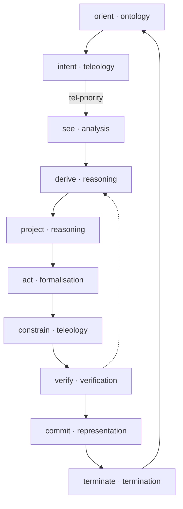
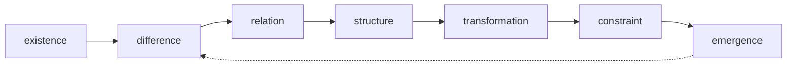

© 2025 Jay Baleine - Disciplined AI Software Development · Bane's Lab documentation is covered by [CC BY-SA 4.0](https://creativecommons.org/licenses/by-sa/4.0/)

# Reasoning — Ontology — Bane's Lab

> Every algorithm grammar is an instance of the derivation loop, which has ten stages, each on one reasoning axis, joined by transitions that sequence, gate or…

Canonical: https://banes-lab.com/ontology/reasoning

# The Ontology

The ontology is a queryable canon of software architecture. It holds every principle with its relations and its repair, every term with its definition, every algorithm with its contract, the reasoning that derives them, the layers they live in and how every tension between them is resolved, and every reference from one record to another is a link.

# Reasoning

576 of 576 shown

## Sections

- [The derivation loop](#reason-loop-derivation-loop)
- [The substrate](#the-substrate)
- [The reasoning layers](#the-reasoning-layers)
- [The axes](#the-axes)
- [The nodes](#the-nodes)
- [The mathematics](#the-mathematics)
- [The dimensions](#the-dimensions)
- [The lenses](#the-lenses)
- [The modes](#the-modes)
- [The representations](#the-representations)
- [The pattern types](#the-pattern-types)
- [The models](#the-models)
- [The universal axes](#the-universal-axes)
- [The test surfaces](#the-test-surfaces)
- [The techniques](#the-techniques)
- [The invariants](#the-invariants)
- [The uncovered cells](#the-uncovered-cells)
- [The maps](#the-maps)
- [The groundings](#the-groundings)

## The derivation loop

Every algorithm grammar is an instance of the derivation loop, which has ten stages, each on one reasoning axis, joined by transitions that sequence, gate or refute back. Each stage is listed with the contracts that run at it and the records it grounds, and the traversal is taught in [the loop](../START.md#the-loop) on the methodology page.

Relations diagram

The derivation loop with its gates.



### orient

- Axis: [ontology](REASONING.md#reason-axis-ontology)

Details

Contracts
[Evidence-Before-Generation](ALGORITHMS.md#algo-evidence-before-generation), [Semantic Operation Boundary](ALGORITHMS.md#algo-semantic-operation-boundary), [Capability Profile](ALGORITHMS.md#algo-capability-profile), [Domain Cache Validation](ALGORITHMS.md#algo-domain-cache-validation), [Scope Extraction](ALGORITHMS.md#algo-scope-extraction), [Domain Knowledge Base](ALGORITHMS.md#algo-domain-knowledge-base), [DSL Compliance Loading](ALGORITHMS.md#algo-dsl-compliance-loading), [Workspace Configuration Discovery](ALGORITHMS.md#algo-workspace-configuration-discovery), [Runtime-Neutral Automation Boundary](ALGORITHMS.md#algo-runtime-neutral-automation-boundary), [Capability Degradation](ALGORITHMS.md#algo-capability-degradation), [Automation Opportunity Detection](ALGORITHMS.md#algo-automation-opportunity-detection), [Runtime-Agnostic Adapter Boundary](ALGORITHMS.md#algo-runtime-agnostic-adapter-boundary), [Capability Disclosure](ALGORITHMS.md#algo-capability-disclosure), [Iterative Variation Discovery](ALGORITHMS.md#algo-iterative-variation-discovery), [Detection Registry](ALGORITHMS.md#algo-detection-registry), [Orientation Stage](ALGORITHMS.md#algo-orientation-stage), [Authoritative Source Loading](ALGORITHMS.md#algo-authoritative-source-loading), [Trust Anchor](ALGORITHMS.md#algo-trust-anchor), [Intent & Directionality Normalization](ALGORITHMS.md#algo-intent-directionality-normalization), [Skeptical Context Acquisition](ALGORITHMS.md#algo-skeptical-context-acquisition), [Dynamic Discovery Pattern Generation](ALGORITHMS.md#algo-dynamic-discovery-pattern-generation), [Context Initialization](ALGORITHMS.md#algo-context-initialization), [Trust Anchor Declaration](ALGORITHMS.md#algo-trust-anchor-declaration), [Profile Compose](ALGORITHMS.md#algo-profile-compose), [Seed Composition](ALGORITHMS.md#algo-seed-composition), [PAG Document Declaration](ALGORITHMS.md#algo-pag-document-declaration), [Analysis Workspace](ALGORITHMS.md#algo-analysis-workspace), [Registry Baseline](ALGORITHMS.md#algo-registry-baseline), [Taxonomy Jurisdiction](ALGORITHMS.md#algo-taxonomy-jurisdiction), [Coverage Workspace](ALGORITHMS.md#algo-coverage-workspace)

### intent

- Axis: [teleology](REASONING.md#reason-axis-teleology)

Details

Contracts
[Adaptive Phase Boundary](ALGORITHMS.md#algo-adaptive-phase-boundary), [Static-to-Dynamic Readiness](ALGORITHMS.md#algo-static-to-dynamic-readiness), [Automation Priority Ordering](ALGORITHMS.md#algo-automation-priority-ordering), [Canonical Variation Selection](ALGORITHMS.md#algo-canonical-variation-selection), [Developer Decision Gate](ALGORITHMS.md#algo-developer-decision-gate), [Teleological Intent Gate](ALGORITHMS.md#algo-teleological-intent-gate), [Severity-Ordered Remediation](ALGORITHMS.md#algo-severity-ordered-remediation), [Anti-Pattern Priority Matrix](ALGORITHMS.md#algo-anti-pattern-priority-matrix), [Reshape Risk Priority](ALGORITHMS.md#algo-reshape-risk-priority), [Coverage Risk Prioritisation](ALGORITHMS.md#algo-coverage-risk-prioritisation)

### see

- Axis: [analysis](REASONING.md#reason-axis-analysis)

Details

Contracts
[Non-Destructive Domain Investigation](ALGORITHMS.md#algo-non-destructive-domain-investigation), [Risk Complexity Reversibility](ALGORITHMS.md#algo-risk-complexity-reversibility), [Existing Pattern Extraction](ALGORITHMS.md#algo-existing-pattern-extraction), [Knowledge Documentation Relevance](ALGORITHMS.md#algo-knowledge-documentation-relevance), [Breaking Point Calculation](ALGORITHMS.md#algo-breaking-point-calculation), [Convention Strength Analysis](ALGORITHMS.md#algo-convention-strength-analysis), [Scalability Projection](ALGORITHMS.md#algo-scalability-projection), [Research Guidance](ALGORITHMS.md#algo-research-guidance), [Tool Calibration](ALGORITHMS.md#algo-tool-calibration), [PAG Keyword Ontology](ALGORITHMS.md#algo-pag-keyword-ontology), [Compliance Gap](ALGORITHMS.md#algo-compliance-gap), [Semantic Domain Partitioning](ALGORITHMS.md#algo-semantic-domain-partitioning), [Behavioral Signature Extraction](ALGORITHMS.md#algo-behavioral-signature-extraction), [Cross-Class Pattern Detection](ALGORITHMS.md#algo-cross-class-pattern-detection), [Behavioral Inconsistency](ALGORITHMS.md#algo-behavioral-inconsistency), [Sequential Chain Duplication](ALGORITHMS.md#algo-sequential-chain-duplication), [Temporal Coupling Detection](ALGORITHMS.md#algo-temporal-coupling-detection), [Relational Graph Duplication](ALGORITHMS.md#algo-relational-graph-duplication), [Causal Wiring Duplication](ALGORITHMS.md#algo-causal-wiring-duplication), [Anomaly Outlier Detection](ALGORITHMS.md#algo-anomaly-outlier-detection), [Conceptual Duplication Detection](ALGORITHMS.md#algo-conceptual-duplication-detection), [Fractal Scale Duplication](ALGORITHMS.md#algo-fractal-scale-duplication), [Path Role Walk](ALGORITHMS.md#algo-path-role-walk), [Surface Grid Walk](ALGORITHMS.md#algo-surface-grid-walk)

### derive

- Axis: [reasoning](REASONING.md#reason-axis-reasoning)

Details

Contracts
[Principle Extraction](ALGORITHMS.md#algo-principle-extraction), [Hybrid Workflow Orchestration](ALGORITHMS.md#algo-hybrid-workflow-orchestration), [Context Forking Configuration](ALGORITHMS.md#algo-context-forking-configuration), [Verb-Based Execution Classification](ALGORITHMS.md#algo-verb-based-execution-classification), [Workflow Type Document Selection](ALGORITHMS.md#algo-workflow-type-document-selection), [Workflow Principles Mapping](ALGORITHMS.md#algo-workflow-principles-mapping), [Intentional Static Separation](ALGORITHMS.md#algo-intentional-static-separation), [Extension Interface Discovery](ALGORITHMS.md#algo-extension-interface-discovery), [Pattern Classification](ALGORITHMS.md#algo-pattern-classification), [Refactor Intent Classification](ALGORITHMS.md#algo-refactor-intent-classification), [Architecture Compliance Targeting](ALGORITHMS.md#algo-architecture-compliance-targeting), [Existing Solution Conflict](ALGORITHMS.md#algo-existing-solution-conflict), [Planning Stage](ALGORITHMS.md#algo-planning-stage), [Principle Activation](ALGORITHMS.md#algo-principle-activation), [Protocol Semantic Selection](ALGORITHMS.md#algo-protocol-semantic-selection), [Violation Classification](ALGORITHMS.md#algo-violation-classification), [PAG Ambiguity Reduction](ALGORITHMS.md#algo-pag-ambiguity-reduction), [Anti-Pattern Classification](ALGORITHMS.md#algo-anti-pattern-classification), [Abstraction Boundary Principle](ALGORITHMS.md#algo-abstraction-boundary-principle), [Base-Class Candidate Selection](ALGORITHMS.md#algo-base-class-candidate-selection), [Canonical Config Resolution](ALGORITHMS.md#algo-canonical-config-resolution), [Concern Classification](ALGORITHMS.md#algo-concern-classification), [Uncovered Gap Derivation](ALGORITHMS.md#algo-uncovered-gap-derivation)

### project

- Axis: [reasoning](REASONING.md#reason-axis-reasoning)

Details

Contracts
[Phase Validation Requirement](ALGORITHMS.md#algo-phase-validation-requirement), [Validation Strategy Composition](ALGORITHMS.md#algo-validation-strategy-composition), [Agent Sequence Definition](ALGORITHMS.md#algo-agent-sequence-definition), [Four-Dimensional Agent Graph](ALGORITHMS.md#algo-four-dimensional-agent-graph), [Performance-Aware Discovery Design](ALGORITHMS.md#algo-performance-aware-discovery-design), [Dynamic Extension Architecture](ALGORITHMS.md#algo-dynamic-extension-architecture), [Migration Action Mapping](ALGORITHMS.md#algo-migration-action-mapping), [Atomic Refactor Phase](ALGORITHMS.md#algo-atomic-refactor-phase), [Phase Decomposition](ALGORITHMS.md#algo-phase-decomposition), [Four-Dimensional Phase Graph](ALGORITHMS.md#algo-four-dimensional-phase-graph), [Dependency Linearization](ALGORITHMS.md#algo-dependency-linearization), [Severity Assignment](ALGORITHMS.md#algo-severity-assignment), [Loop Class Labeling](ALGORITHMS.md#algo-loop-class-labeling), [PAG Node Decomposition](ALGORITHMS.md#algo-pag-node-decomposition), [PAG Structure Declaration](ALGORITHMS.md#algo-pag-coordination-construct), [Concrete-vs-Abstract Responsibility Split](ALGORITHMS.md#algo-concrete-vs-abstract-responsibility-split), [Template Method Lifecycle](ALGORITHMS.md#algo-template-method-lifecycle), [Migration Ordering](ALGORITHMS.md#algo-migration-ordering), [Stage Ordering](ALGORITHMS.md#algo-stage-ordering), [Name Projection](ALGORITHMS.md#algo-name-projection), [Technique and Invariant Selection](ALGORITHMS.md#algo-technique-invariant-selection)

### act

- Axis: [formalisation](REASONING.md#reason-axis-formalisation)

Details

Contracts
[Portable Contract Composition](ALGORITHMS.md#algo-portable-contract-composition), [Adapter Rendering](ALGORITHMS.md#algo-adapter-rendering), [File Modification Recovery](ALGORITHMS.md#algo-agent-workflow-file-modification-recovery), [Shared Document Workspace](ALGORITHMS.md#algo-shared-document-workspace), [Agent Document Responsibility](ALGORITHMS.md#algo-agent-document-responsibility), [Agent Activation Invocation](ALGORITHMS.md#algo-agent-activation-invocation), [Parallel Batch Execution](ALGORITHMS.md#algo-parallel-batch-execution), [Sequential Agent Execution](ALGORITHMS.md#algo-sequential-agent-execution), [Handoff Signal](ALGORITHMS.md#algo-handoff-signal), [Orchestrator Action](ALGORITHMS.md#algo-orchestrator-action), [Workflow Coordination Sequence](ALGORITHMS.md#algo-workflow-coordination-sequence), [Workflow Recovery Loop](ALGORITHMS.md#algo-workflow-recovery-loop), [Checklist Integration](ALGORITHMS.md#algo-checklist-integration), [Phase Documentation Template](ALGORITHMS.md#algo-phase-documentation-template), [Capability Invocation Protocol](ALGORITHMS.md#algo-capability-invocation-protocol), [Centralized Reference Resolver](ALGORITHMS.md#algo-centralized-reference-resolver), [Cache Invalidation Strategy](ALGORITHMS.md#algo-cache-invalidation-strategy), [Manual Fallback Preservation](ALGORITHMS.md#algo-manual-fallback-preservation), [Dynamic Failure Isolation](ALGORITHMS.md#algo-dynamic-failure-isolation), [Entry Point Migration](ALGORITHMS.md#algo-entry-point-migration), [Knowledge Capture](ALGORITHMS.md#algo-knowledge-capture), [Replacement Refactor](ALGORITHMS.md#algo-replacement-refactor), [Rollback-Centered Execution](ALGORITHMS.md#algo-rollback-centered-execution), [Compilation Stage](ALGORITHMS.md#algo-compilation-stage), [Codebase Pattern Enforcement](ALGORITHMS.md#algo-codebase-pattern-enforcement), [Verb Template Binding](ALGORITHMS.md#algo-verb-template-binding), [Task Atomization](ALGORITHMS.md#algo-task-atomization), [Ripple Chain Analysis](ALGORITHMS.md#algo-ripple-chain-analysis), [Validator Coverage](ALGORITHMS.md#algo-validator-coverage), [Structured Observability Context](ALGORITHMS.md#algo-structured-observability-context), [Cross-Cutting Surface Coverage](ALGORITHMS.md#algo-cross-cutting-surface-coverage), [Legacy Elimination](ALGORITHMS.md#algo-legacy-elimination), [Hierarchical Numbering](ALGORITHMS.md#algo-hierarchical-numbering), [File-Scoped Fix](ALGORITHMS.md#algo-file-scoped-fix), [File Limit Remediation](ALGORITHMS.md#algo-file-limit-remediation), [Import Boundary Remediation](ALGORITHMS.md#algo-import-boundary-remediation), [Naming Convention Remediation](ALGORITHMS.md#algo-naming-convention-remediation), [Base-Class Compliance Remediation](ALGORITHMS.md#algo-base-class-compliance-remediation), [CSS Token Remediation](ALGORITHMS.md#algo-css-token-remediation), [DOM Factory Remediation](ALGORITHMS.md#algo-dom-factory-remediation), [Console Usage Remediation](ALGORITHMS.md#algo-console-usage-remediation), [Lifecycle Symmetry Remediation](ALGORITHMS.md#algo-lifecycle-symmetry-remediation), [Stylelint Post-Fix](ALGORITHMS.md#algo-stylelint-post-fix), [File Modification Recovery](ALGORITHMS.md#algo-file-modification-recovery), [Defensive String Normalization](ALGORITHMS.md#algo-defensive-string-normalization), [Safe Arithmetic Contract](ALGORITHMS.md#algo-safe-arithmetic-contract), [Recursion Control](ALGORITHMS.md#algo-recursion-control), [Advanced Tool Escalation](ALGORITHMS.md#algo-advanced-tool-escalation), [Idempotent Merge](ALGORITHMS.md#algo-idempotent-merge), [Deterministic Merge Core](ALGORITHMS.md#algo-deterministic-merge-core), [Persistence Fork](ALGORITHMS.md#algo-persistence-fork), [Composed Turn Contract](ALGORITHMS.md#algo-composed-turn-contract), [PAG Explicit Control Flow](ALGORITHMS.md#algo-pag-explicit-control-flow), [PAG Semantic Operation](ALGORITHMS.md#algo-pag-tool-invocation), [Base Schematic Composition](ALGORITHMS.md#algo-base-schematic-composition), [Backup-Verified Migration](ALGORITHMS.md#algo-backup-verified-migration), [Registry Regeneration](ALGORITHMS.md#algo-registry-regeneration), [Anti-Reintroduction Gate](ALGORITHMS.md#algo-anti-reintroduction-gate), [Comment Normalization Remediation](ALGORITHMS.md#algo-comment-normalization-remediation), [Custom-Rule Derivation](ALGORITHMS.md#algo-custom-rule-derivation), [Container Reshape](ALGORITHMS.md#algo-container-reshape), [Test Authoring](ALGORITHMS.md#algo-test-authoring)

### constrain

- Axis: [teleology](REASONING.md#reason-axis-teleology)

Details

Contracts
[Creation History Collision](ALGORITHMS.md#algo-creation-history-collision), [Replacement Safety](ALGORITHMS.md#algo-replacement-safety), [Automation Operation Mode](ALGORITHMS.md#algo-automation-operation-mode), [Operation Mode Gating](ALGORITHMS.md#algo-operation-mode-gating), [Admissibility Constraint Gate](ALGORITHMS.md#algo-admissibility-constraint-stage), [Phase-Separated Execution](ALGORITHMS.md#algo-phase-separated-execution), [Boundary Reconciliation](ALGORITHMS.md#algo-boundary-reconciliation), [PAG Invariant Record](ALGORITHMS.md#algo-pag-constraint-boundary), [Vocabulary Admission Gate](ALGORITHMS.md#algo-vocabulary-admission-gate)

Grounds
[Governed Autonomous Plan Loop](ALGORITHMS.md#algo-governed-autonomous-plan-loop)

### verify

- Axis: [verification](REASONING.md#reason-axis-verification)

Details

Contracts
[Semantic Compliance Validation](ALGORITHMS.md#algo-semantic-compliance-validation), [Evidence Grounding Validation](ALGORITHMS.md#algo-evidence-grounding-validation), [Algorithmic Embodiment Validation](ALGORITHMS.md#algo-algorithmic-embodiment-validation), [Workflow Validation Gate](ALGORITHMS.md#algo-workflow-validation-gate), [Measured-vs-Estimated Validation](ALGORITHMS.md#algo-measured-vs-estimated-validation), [Architecture Validation Before Persistence](ALGORITHMS.md#algo-architecture-validation-before-persistence), [Additive Debt Gate](ALGORITHMS.md#algo-additive-debt-gate), [Pattern-Specific Validation](ALGORITHMS.md#algo-pattern-specific-validation), [Zero-Duplication Verification](ALGORITHMS.md#algo-zero-duplication-verification), [Validation Score](ALGORITHMS.md#algo-validation-score), [Validation Stage](ALGORITHMS.md#algo-validation-stage), [Semantic Debt Policy](ALGORITHMS.md#algo-semantic-debt-policy), [Evidence-Based Claim Verification](ALGORITHMS.md#algo-evidence-based-claim-verification), [Validation Suite Battery](ALGORITHMS.md#algo-validation-suite-battery), [Repair Stage](ALGORITHMS.md#algo-repair-stage), [Bounded Repair Loop](ALGORITHMS.md#algo-bounded-repair-loop), [Severity Failure Routing](ALGORITHMS.md#algo-severity-failure-routing), [Verification Loop](ALGORITHMS.md#algo-verification-loop), [Verification Execution](ALGORITHMS.md#algo-verification-execution), [Reverification Gate](ALGORITHMS.md#algo-reverification-gate), [Evidence-Gated Claim Verification](ALGORITHMS.md#algo-evidence-gated-claim-verification), [Environment Capability Verification](ALGORITHMS.md#algo-environment-capability-verification), [Behavioral Self-Test](ALGORITHMS.md#algo-behavioral-self-test), [Adversarial Input Testing](ALGORITHMS.md#algo-adversarial-input-testing), [Recursive Self-Verification](ALGORITHMS.md#algo-recursive-self-verification), [Plan Phase Verification](ALGORITHMS.md#algo-plan-phase-verification), [Delta Capture](ALGORITHMS.md#algo-delta-capture), [Mode Contract Validation](ALGORITHMS.md#algo-mode-contract-validation), [PAG Handoff Gate](ALGORITHMS.md#algo-pag-validation-gate), [Anti-Pattern Elimination Verification](ALGORITHMS.md#algo-anti-pattern-elimination-verification), [Distillation Metrics](ALGORITHMS.md#algo-distillation-metrics), [Machine Verdict Derivation](ALGORITHMS.md#algo-machine-verdict-derivation), [Discovery Verification](ALGORITHMS.md#algo-discovery-verification), [Evidence Verdict](ALGORITHMS.md#algo-evidence-verdict)

### commit

- Axis: [representation](REASONING.md#reason-axis-representation)

Details

Contracts
[Audit Artifact](ALGORITHMS.md#algo-audit-artifact), [Final Generation Report](ALGORITHMS.md#algo-final-generation-report), [Template Assembly](ALGORITHMS.md#algo-template-assembly), [Automation Session Report](ALGORITHMS.md#algo-automation-session-report), [Centralization Report](ALGORITHMS.md#algo-centralization-report), [Rendering Stage](ALGORITHMS.md#algo-rendering-stage), [Checklist Output Rendering](ALGORITHMS.md#algo-checklist-output-rendering), [Partial Success Reporting](ALGORITHMS.md#algo-partial-success-reporting), [Completion Report](ALGORITHMS.md#algo-completion-report), [Investigation Report](ALGORITHMS.md#algo-investigation-report), [Action Log](ALGORITHMS.md#algo-action-log), [Living Plan State](ALGORITHMS.md#algo-living-plan-state), [Version Provenance](ALGORITHMS.md#algo-version-provenance), [Versioned Turn Provenance](ALGORITHMS.md#algo-versioned-turn-provenance), [Pattern Distillation History](ALGORITHMS.md#algo-pattern-distillation-history), [Taxonomy Ledger](ALGORITHMS.md#algo-taxonomy-ledger), [Coverage Ledger](ALGORITHMS.md#algo-coverage-ledger)

### terminate

- Axis: [termination](REASONING.md#reason-axis-termination)

Details

Contracts
[Agent Generation Completion](ALGORITHMS.md#algo-agent-generation-completion), [First-Time Initiation](ALGORITHMS.md#algo-first-time-initiation), [Automation Completion Status](ALGORITHMS.md#algo-automation-completion-status), [Completion Truthfulness](ALGORITHMS.md#algo-completion-truthfulness), [Explicit Termination](ALGORITHMS.md#algo-explicit-termination), [Early Success Exit](ALGORITHMS.md#algo-early-success-exit), [Iteration Bound](ALGORITHMS.md#algo-iteration-bound), [Validation Gate](ALGORITHMS.md#algo-validation-gate), [Phase Close Gate](ALGORITHMS.md#algo-phase-close-gate), [PAG Well-Formedness Validation](ALGORITHMS.md#algo-pag-well-formedness-validation), [Completion Truthfulness](ALGORITHMS.md#algo-pattern-distillation-completion-truthfulness), [Bounded Cascade Termination](ALGORITHMS.md#algo-bounded-cascade-termination), [Taxonomy Completion](ALGORITHMS.md#algo-taxonomy-completion), [Coverage Completion](ALGORITHMS.md#algo-coverage-completion)

### orient → intent

Details

[orient](REASONING.md#stage-orient) → [intent](REASONING.md#stage-intent) · Transition: sequences

### intent → see

Details

[intent](REASONING.md#stage-intent) → [see](REASONING.md#stage-see) · Transition: gates · Gate: tel-priority · On fail: redirect

### see → derive

Details

[see](REASONING.md#stage-see) → [derive](REASONING.md#stage-derive) · Transition: sequences

### derive → project

Details

[derive](REASONING.md#stage-derive) → [project](REASONING.md#stage-project) · Transition: sequences

### project → act

Details

[project](REASONING.md#stage-project) → [act](REASONING.md#stage-act) · Transition: sequences

### act → constrain

Details

[act](REASONING.md#stage-act) → [constrain](REASONING.md#stage-constrain) · Transition: sequences

### constrain → verify

Details

[constrain](REASONING.md#stage-constrain) → [verify](REASONING.md#stage-verify) · Transition: sequences

### verify → derive

Details

[verify](REASONING.md#stage-verify) → [derive](REASONING.md#stage-derive) · Transition: refutes-back · Gate: ver-evidence · On fail: derive

### verify → commit

Details

[verify](REASONING.md#stage-verify) → [commit](REASONING.md#stage-commit) · Transition: sequences

### commit → terminate

Details

[commit](REASONING.md#stage-commit) → [terminate](REASONING.md#stage-terminate) · Transition: sequences

### terminate → orient

Details

[terminate](REASONING.md#stage-terminate) → [orient](REASONING.md#stage-orient) · Transition: sequences · Gate: ter-stop · On pass: stop

## The substrate

Beneath the loop lies the generative substrate, meaning the cycle every node passes through, the recursion that turns emergence back into a new difference, and the math types each node yields.

Recursion · [emergence](REASONING.md#reason-substrate-node-emergence) → [difference](REASONING.md#reason-substrate-node-difference)

Relations diagram

The substrate cycle and its recursion.



### Existence

- Layer: [substrate](REASONING.md#reason-layer-substrate)
- Math type: [set-theory](REASONING.md#reason-math-type-set-theory)

Details

Math types
[set-theory](REASONING.md#reason-math-type-set-theory)

### Difference

- Layer: [substrate](REASONING.md#reason-layer-substrate)
- Math type: [logic](REASONING.md#reason-math-type-logic)

Details

Math types
[logic](REASONING.md#reason-math-type-logic)

### Relation

- Layer: [substrate](REASONING.md#reason-layer-substrate)
- Math type: [graph](REASONING.md#reason-math-type-graph)

Details

Math types
[graph](REASONING.md#reason-math-type-graph), [category-theory](REASONING.md#reason-math-domain-category-theory)

### Structure

- Layer: [substrate](REASONING.md#reason-layer-substrate)
- Math type: [algebra](REASONING.md#reason-math-type-algebra)

Details

Math types
[algebra](REASONING.md#reason-math-type-algebra)

### Transformation

- Layer: [substrate](REASONING.md#reason-layer-substrate)
- Math type: [analysis](REASONING.md#reason-math-type-analysis)

Details

Math types
[analysis](REASONING.md#reason-math-type-analysis)

### Constraint

- Layer: [substrate](REASONING.md#reason-layer-substrate)
- Math type: [optimisation](REASONING.md#reason-math-type-optimisation)

Details

Math types
[optimisation](REASONING.md#reason-math-type-optimisation)

### Invariant

- Layer: [substrate](REASONING.md#reason-layer-substrate)
- Math type: [topology](REASONING.md#reason-math-type-topology)

Details

Math types
[topology](REASONING.md#reason-math-type-topology), symmetry

### Information

- Layer: [substrate](REASONING.md#reason-layer-substrate)
- Math type: [information-theory](REASONING.md#reason-math-type-information-theory)

Details

Math types
[information-theory](REASONING.md#reason-math-type-information-theory)

### Procedure

- Layer: [substrate](REASONING.md#reason-layer-substrate)
- Math type: [computation](REASONING.md#reason-math-type-computation)

Details

Math types
[computation](REASONING.md#reason-math-type-computation)

### Emergence

- Layer: [substrate](REASONING.md#reason-layer-substrate)
- Math type: [dynamical-systems](REASONING.md#reason-math-type-dynamical-systems)

Details

Math types
[dynamical-systems](REASONING.md#reason-math-type-dynamical-systems), [complexity](REASONING.md#reason-lens-complexity)

## The reasoning layers

The reasoning axes are arranged on these layers, each listed with the question it answers and the axes it holds.

### Substrate

Details

Question
How does anything come to be?

### Epistemic

Details

Question
How is it known?

Axes
[ontology](REASONING.md#reason-axis-ontology), [analysis](REASONING.md#reason-axis-analysis), [reasoning](REASONING.md#reason-axis-reasoning), [representation](REASONING.md#reason-axis-representation), [formalisation](REASONING.md#reason-axis-formalisation)

### Conative

Details

Question
What is worth doing?

Axes
[teleology](REASONING.md#reason-axis-teleology)

### Evaluative

Details

Question
Is it right, and is it done?

Axes
[verification](REASONING.md#reason-axis-verification), [termination](REASONING.md#reason-axis-termination)

## The axes

Each reasoning axis is a typed, terminating question on one layer, listed with the nodes a run may select on it and the contracts positioned on it.

### ontology

- Layer: [epistemic](REASONING.md#reason-layer-epistemic)
- Mandatory: when-relevant
- Math type: [set-theory](REASONING.md#reason-math-type-set-theory)
- Selectable: yes

Details

Question
What is it?

Nodes
[ont-identity](REASONING.md#reason-node-ont-identity), [ont-composition](REASONING.md#reason-node-ont-composition), [ont-structure](REASONING.md#reason-node-ont-structure), [ont-relation](REASONING.md#reason-node-ont-relation), [ont-space](REASONING.md#reason-node-ont-space), [ont-time](REASONING.md#reason-node-ont-time), [ont-state](REASONING.md#reason-node-ont-state), [ont-change](REASONING.md#reason-node-ont-change), [ont-behaviour](REASONING.md#reason-node-ont-behaviour), [ont-function](REASONING.md#reason-node-ont-function), [ont-cause](REASONING.md#reason-node-ont-cause), [ont-meaning](REASONING.md#reason-node-ont-meaning), [ont-scale](REASONING.md#reason-node-ont-scale), [ont-probability](REASONING.md#reason-node-ont-probability), [ont-novelty](REASONING.md#reason-node-ont-novelty)

Contracts
[Evidence-Before-Generation](ALGORITHMS.md#algo-evidence-before-generation), [Semantic Operation Boundary](ALGORITHMS.md#algo-semantic-operation-boundary), [Capability Profile](ALGORITHMS.md#algo-capability-profile), [Domain Cache Validation](ALGORITHMS.md#algo-domain-cache-validation), [Scope Extraction](ALGORITHMS.md#algo-scope-extraction), [Domain Knowledge Base](ALGORITHMS.md#algo-domain-knowledge-base), [DSL Compliance Loading](ALGORITHMS.md#algo-dsl-compliance-loading), [Workspace Configuration Discovery](ALGORITHMS.md#algo-workspace-configuration-discovery), [Runtime-Neutral Automation Boundary](ALGORITHMS.md#algo-runtime-neutral-automation-boundary), [Capability Degradation](ALGORITHMS.md#algo-capability-degradation), [Automation Opportunity Detection](ALGORITHMS.md#algo-automation-opportunity-detection), [Runtime-Agnostic Adapter Boundary](ALGORITHMS.md#algo-runtime-agnostic-adapter-boundary), [Capability Disclosure](ALGORITHMS.md#algo-capability-disclosure), [Iterative Variation Discovery](ALGORITHMS.md#algo-iterative-variation-discovery), [Detection Registry](ALGORITHMS.md#algo-detection-registry), [Orientation Stage](ALGORITHMS.md#algo-orientation-stage), [Authoritative Source Loading](ALGORITHMS.md#algo-authoritative-source-loading), [Trust Anchor](ALGORITHMS.md#algo-trust-anchor), [Intent & Directionality Normalization](ALGORITHMS.md#algo-intent-directionality-normalization), [Skeptical Context Acquisition](ALGORITHMS.md#algo-skeptical-context-acquisition), [Dynamic Discovery Pattern Generation](ALGORITHMS.md#algo-dynamic-discovery-pattern-generation), [Context Initialization](ALGORITHMS.md#algo-context-initialization), [Trust Anchor Declaration](ALGORITHMS.md#algo-trust-anchor-declaration), [Profile Compose](ALGORITHMS.md#algo-profile-compose), [Seed Composition](ALGORITHMS.md#algo-seed-composition), [PAG Document Declaration](ALGORITHMS.md#algo-pag-document-declaration), [Analysis Workspace](ALGORITHMS.md#algo-analysis-workspace), [Registry Baseline](ALGORITHMS.md#algo-registry-baseline), [Taxonomy Jurisdiction](ALGORITHMS.md#algo-taxonomy-jurisdiction), [Coverage Workspace](ALGORITHMS.md#algo-coverage-workspace)

### analysis

- Layer: [epistemic](REASONING.md#reason-layer-epistemic)
- Mandatory: when-relevant
- Math type: [graph](REASONING.md#reason-math-type-graph)
- Selectable: yes

Details

Question
How is it to be seen?

Nodes
[ana-structural](REASONING.md#reason-node-ana-structural), [ana-temporal](REASONING.md#reason-node-ana-temporal), [ana-spatial](REASONING.md#reason-node-ana-spatial), [ana-statistical](REASONING.md#reason-node-ana-statistical), [ana-frequency](REASONING.md#reason-node-ana-frequency), [ana-sequential](REASONING.md#reason-node-ana-sequential), [ana-relational](REASONING.md#reason-node-ana-relational), [ana-behavioural](REASONING.md#reason-node-ana-behavioural), [ana-functional](REASONING.md#reason-node-ana-functional), [ana-semantic](REASONING.md#reason-node-ana-semantic), [ana-causal](REASONING.md#reason-node-ana-causal), [ana-predictive](REASONING.md#reason-node-ana-predictive), [ana-anomaly](REASONING.md#reason-node-ana-anomaly), [ana-evolutionary](REASONING.md#reason-node-ana-evolutionary), [ana-fractal](REASONING.md#reason-node-ana-fractal)

Contracts
[Non-Destructive Domain Investigation](ALGORITHMS.md#algo-non-destructive-domain-investigation), [Risk Complexity Reversibility](ALGORITHMS.md#algo-risk-complexity-reversibility), [Existing Pattern Extraction](ALGORITHMS.md#algo-existing-pattern-extraction), [Knowledge Documentation Relevance](ALGORITHMS.md#algo-knowledge-documentation-relevance), [Breaking Point Calculation](ALGORITHMS.md#algo-breaking-point-calculation), [Convention Strength Analysis](ALGORITHMS.md#algo-convention-strength-analysis), [Scalability Projection](ALGORITHMS.md#algo-scalability-projection), [Research Guidance](ALGORITHMS.md#algo-research-guidance), [Tool Calibration](ALGORITHMS.md#algo-tool-calibration), [PAG Keyword Ontology](ALGORITHMS.md#algo-pag-keyword-ontology), [Compliance Gap](ALGORITHMS.md#algo-compliance-gap), [Semantic Domain Partitioning](ALGORITHMS.md#algo-semantic-domain-partitioning), [Behavioral Signature Extraction](ALGORITHMS.md#algo-behavioral-signature-extraction), [Cross-Class Pattern Detection](ALGORITHMS.md#algo-cross-class-pattern-detection), [Behavioral Inconsistency](ALGORITHMS.md#algo-behavioral-inconsistency), [Sequential Chain Duplication](ALGORITHMS.md#algo-sequential-chain-duplication), [Temporal Coupling Detection](ALGORITHMS.md#algo-temporal-coupling-detection), [Relational Graph Duplication](ALGORITHMS.md#algo-relational-graph-duplication), [Causal Wiring Duplication](ALGORITHMS.md#algo-causal-wiring-duplication), [Anomaly Outlier Detection](ALGORITHMS.md#algo-anomaly-outlier-detection), [Conceptual Duplication Detection](ALGORITHMS.md#algo-conceptual-duplication-detection), [Fractal Scale Duplication](ALGORITHMS.md#algo-fractal-scale-duplication), [Path Role Walk](ALGORITHMS.md#algo-path-role-walk), [Surface Grid Walk](ALGORITHMS.md#algo-surface-grid-walk)

### reasoning

- Layer: [epistemic](REASONING.md#reason-layer-epistemic)
- Mandatory: when-relevant
- Math type: [logic](REASONING.md#reason-math-type-logic)
- Selectable: yes

Details

Question
Why, and what follows?

Nodes
[rea-observation](REASONING.md#reason-node-rea-observation), [rea-description](REASONING.md#reason-node-rea-description), [rea-comparison](REASONING.md#reason-node-rea-comparison), [rea-classification](REASONING.md#reason-node-rea-classification), [rea-explanation](REASONING.md#reason-node-rea-explanation), [rea-prediction](REASONING.md#reason-node-rea-prediction), [rea-intervention](REASONING.md#reason-node-rea-intervention), [rea-creation](REASONING.md#reason-node-rea-creation), [rea-reflection](REASONING.md#reason-node-rea-reflection)

Contracts
[Principle Extraction](ALGORITHMS.md#algo-principle-extraction), [Phase Validation Requirement](ALGORITHMS.md#algo-phase-validation-requirement), [Validation Strategy Composition](ALGORITHMS.md#algo-validation-strategy-composition), [Hybrid Workflow Orchestration](ALGORITHMS.md#algo-hybrid-workflow-orchestration), [Context Forking Configuration](ALGORITHMS.md#algo-context-forking-configuration), [Verb-Based Execution Classification](ALGORITHMS.md#algo-verb-based-execution-classification), [Workflow Type Document Selection](ALGORITHMS.md#algo-workflow-type-document-selection), [Agent Sequence Definition](ALGORITHMS.md#algo-agent-sequence-definition), [Four-Dimensional Agent Graph](ALGORITHMS.md#algo-four-dimensional-agent-graph), [Workflow Principles Mapping](ALGORITHMS.md#algo-workflow-principles-mapping), [Intentional Static Separation](ALGORITHMS.md#algo-intentional-static-separation), [Extension Interface Discovery](ALGORITHMS.md#algo-extension-interface-discovery), [Performance-Aware Discovery Design](ALGORITHMS.md#algo-performance-aware-discovery-design), [Dynamic Extension Architecture](ALGORITHMS.md#algo-dynamic-extension-architecture), [Pattern Classification](ALGORITHMS.md#algo-pattern-classification), [Refactor Intent Classification](ALGORITHMS.md#algo-refactor-intent-classification), [Architecture Compliance Targeting](ALGORITHMS.md#algo-architecture-compliance-targeting), [Existing Solution Conflict](ALGORITHMS.md#algo-existing-solution-conflict), [Migration Action Mapping](ALGORITHMS.md#algo-migration-action-mapping), [Atomic Refactor Phase](ALGORITHMS.md#algo-atomic-refactor-phase), [Planning Stage](ALGORITHMS.md#algo-planning-stage), [Principle Activation](ALGORITHMS.md#algo-principle-activation), [Protocol Semantic Selection](ALGORITHMS.md#algo-protocol-semantic-selection), [Phase Decomposition](ALGORITHMS.md#algo-phase-decomposition), [Four-Dimensional Phase Graph](ALGORITHMS.md#algo-four-dimensional-phase-graph), [Dependency Linearization](ALGORITHMS.md#algo-dependency-linearization), [Severity Assignment](ALGORITHMS.md#algo-severity-assignment), [Loop Class Labeling](ALGORITHMS.md#algo-loop-class-labeling), [Violation Classification](ALGORITHMS.md#algo-violation-classification), [PAG Node Decomposition](ALGORITHMS.md#algo-pag-node-decomposition), [PAG Structure Declaration](ALGORITHMS.md#algo-pag-coordination-construct), [PAG Ambiguity Reduction](ALGORITHMS.md#algo-pag-ambiguity-reduction), [Anti-Pattern Classification](ALGORITHMS.md#algo-anti-pattern-classification), [Abstraction Boundary Principle](ALGORITHMS.md#algo-abstraction-boundary-principle), [Base-Class Candidate Selection](ALGORITHMS.md#algo-base-class-candidate-selection), [Concrete-vs-Abstract Responsibility Split](ALGORITHMS.md#algo-concrete-vs-abstract-responsibility-split), [Template Method Lifecycle](ALGORITHMS.md#algo-template-method-lifecycle), [Migration Ordering](ALGORITHMS.md#algo-migration-ordering), [Canonical Config Resolution](ALGORITHMS.md#algo-canonical-config-resolution), [Stage Ordering](ALGORITHMS.md#algo-stage-ordering), [Concern Classification](ALGORITHMS.md#algo-concern-classification), [Name Projection](ALGORITHMS.md#algo-name-projection), [Uncovered Gap Derivation](ALGORITHMS.md#algo-uncovered-gap-derivation), [Technique and Invariant Selection](ALGORITHMS.md#algo-technique-invariant-selection)

### representation

- Layer: [epistemic](REASONING.md#reason-layer-epistemic)
- Mandatory: when-relevant
- Math type: [information-theory](REASONING.md#reason-math-type-information-theory)
- Selectable: yes

Details

Question
How is it encoded?

Nodes
[rep-symbolic](REASONING.md#reason-node-rep-symbolic), [rep-numerical](REASONING.md#reason-node-rep-numerical), [rep-geometric](REASONING.md#reason-node-rep-geometric), [rep-topological](REASONING.md#reason-node-rep-topological), [rep-information-theoretic](REASONING.md#reason-node-rep-information-theoretic), [rep-probabilistic](REASONING.md#reason-node-rep-probabilistic), [rep-dynamical](REASONING.md#reason-node-rep-dynamical), [rep-computational](REASONING.md#reason-node-rep-computational)

Contracts
[Audit Artifact](ALGORITHMS.md#algo-audit-artifact), [Final Generation Report](ALGORITHMS.md#algo-final-generation-report), [Template Assembly](ALGORITHMS.md#algo-template-assembly), [Automation Session Report](ALGORITHMS.md#algo-automation-session-report), [Centralization Report](ALGORITHMS.md#algo-centralization-report), [Rendering Stage](ALGORITHMS.md#algo-rendering-stage), [Checklist Output Rendering](ALGORITHMS.md#algo-checklist-output-rendering), [Partial Success Reporting](ALGORITHMS.md#algo-partial-success-reporting), [Completion Report](ALGORITHMS.md#algo-completion-report), [Investigation Report](ALGORITHMS.md#algo-investigation-report), [Action Log](ALGORITHMS.md#algo-action-log), [Living Plan State](ALGORITHMS.md#algo-living-plan-state), [Version Provenance](ALGORITHMS.md#algo-version-provenance), [Versioned Turn Provenance](ALGORITHMS.md#algo-versioned-turn-provenance), [Pattern Distillation History](ALGORITHMS.md#algo-pattern-distillation-history), [Taxonomy Ledger](ALGORITHMS.md#algo-taxonomy-ledger), [Coverage Ledger](ALGORITHMS.md#algo-coverage-ledger)

### formalisation

- Layer: [epistemic](REASONING.md#reason-layer-epistemic)
- Mandatory: when-relevant
- Math type: [computation](REASONING.md#reason-math-type-computation)
- Selectable: yes

Details

Question
What does it resolve to?

Nodes
[for-existence](REASONING.md#reason-node-for-existence), [for-structure](REASONING.md#reason-node-for-structure), [for-relation](REASONING.md#reason-node-for-relation), [for-space](REASONING.md#reason-node-for-space), [for-transformation](REASONING.md#reason-node-for-transformation), [for-invariance](REASONING.md#reason-node-for-invariance), [for-uncertainty](REASONING.md#reason-node-for-uncertainty), [for-computation](REASONING.md#reason-node-for-computation), [for-abstraction](REASONING.md#reason-node-for-abstraction), [for-creation](REASONING.md#reason-node-for-creation), [for-absence](REASONING.md#reason-node-for-absence)

Contracts
[Portable Contract Composition](ALGORITHMS.md#algo-portable-contract-composition), [Adapter Rendering](ALGORITHMS.md#algo-adapter-rendering), [File Modification Recovery](ALGORITHMS.md#algo-agent-workflow-file-modification-recovery), [Shared Document Workspace](ALGORITHMS.md#algo-shared-document-workspace), [Agent Document Responsibility](ALGORITHMS.md#algo-agent-document-responsibility), [Agent Activation Invocation](ALGORITHMS.md#algo-agent-activation-invocation), [Parallel Batch Execution](ALGORITHMS.md#algo-parallel-batch-execution), [Sequential Agent Execution](ALGORITHMS.md#algo-sequential-agent-execution), [Handoff Signal](ALGORITHMS.md#algo-handoff-signal), [Orchestrator Action](ALGORITHMS.md#algo-orchestrator-action), [Workflow Coordination Sequence](ALGORITHMS.md#algo-workflow-coordination-sequence), [Workflow Recovery Loop](ALGORITHMS.md#algo-workflow-recovery-loop), [Checklist Integration](ALGORITHMS.md#algo-checklist-integration), [Phase Documentation Template](ALGORITHMS.md#algo-phase-documentation-template), [Capability Invocation Protocol](ALGORITHMS.md#algo-capability-invocation-protocol), [Centralized Reference Resolver](ALGORITHMS.md#algo-centralized-reference-resolver), [Cache Invalidation Strategy](ALGORITHMS.md#algo-cache-invalidation-strategy), [Manual Fallback Preservation](ALGORITHMS.md#algo-manual-fallback-preservation), [Dynamic Failure Isolation](ALGORITHMS.md#algo-dynamic-failure-isolation), [Entry Point Migration](ALGORITHMS.md#algo-entry-point-migration), [Knowledge Capture](ALGORITHMS.md#algo-knowledge-capture), [Replacement Refactor](ALGORITHMS.md#algo-replacement-refactor), [Rollback-Centered Execution](ALGORITHMS.md#algo-rollback-centered-execution), [Compilation Stage](ALGORITHMS.md#algo-compilation-stage), [Codebase Pattern Enforcement](ALGORITHMS.md#algo-codebase-pattern-enforcement), [Verb Template Binding](ALGORITHMS.md#algo-verb-template-binding), [Task Atomization](ALGORITHMS.md#algo-task-atomization), [Ripple Chain Analysis](ALGORITHMS.md#algo-ripple-chain-analysis), [Validator Coverage](ALGORITHMS.md#algo-validator-coverage), [Structured Observability Context](ALGORITHMS.md#algo-structured-observability-context), [Cross-Cutting Surface Coverage](ALGORITHMS.md#algo-cross-cutting-surface-coverage), [Legacy Elimination](ALGORITHMS.md#algo-legacy-elimination), [Hierarchical Numbering](ALGORITHMS.md#algo-hierarchical-numbering), [File-Scoped Fix](ALGORITHMS.md#algo-file-scoped-fix), [File Limit Remediation](ALGORITHMS.md#algo-file-limit-remediation), [Import Boundary Remediation](ALGORITHMS.md#algo-import-boundary-remediation), [Naming Convention Remediation](ALGORITHMS.md#algo-naming-convention-remediation), [Base-Class Compliance Remediation](ALGORITHMS.md#algo-base-class-compliance-remediation), [CSS Token Remediation](ALGORITHMS.md#algo-css-token-remediation), [DOM Factory Remediation](ALGORITHMS.md#algo-dom-factory-remediation), [Console Usage Remediation](ALGORITHMS.md#algo-console-usage-remediation), [Lifecycle Symmetry Remediation](ALGORITHMS.md#algo-lifecycle-symmetry-remediation), [Stylelint Post-Fix](ALGORITHMS.md#algo-stylelint-post-fix), [File Modification Recovery](ALGORITHMS.md#algo-file-modification-recovery), [Defensive String Normalization](ALGORITHMS.md#algo-defensive-string-normalization), [Safe Arithmetic Contract](ALGORITHMS.md#algo-safe-arithmetic-contract), [Recursion Control](ALGORITHMS.md#algo-recursion-control), [Advanced Tool Escalation](ALGORITHMS.md#algo-advanced-tool-escalation), [Idempotent Merge](ALGORITHMS.md#algo-idempotent-merge), [Deterministic Merge Core](ALGORITHMS.md#algo-deterministic-merge-core), [Persistence Fork](ALGORITHMS.md#algo-persistence-fork), [Composed Turn Contract](ALGORITHMS.md#algo-composed-turn-contract), [PAG Explicit Control Flow](ALGORITHMS.md#algo-pag-explicit-control-flow), [PAG Semantic Operation](ALGORITHMS.md#algo-pag-tool-invocation), [Base Schematic Composition](ALGORITHMS.md#algo-base-schematic-composition), [Backup-Verified Migration](ALGORITHMS.md#algo-backup-verified-migration), [Registry Regeneration](ALGORITHMS.md#algo-registry-regeneration), [Anti-Reintroduction Gate](ALGORITHMS.md#algo-anti-reintroduction-gate), [Comment Normalization Remediation](ALGORITHMS.md#algo-comment-normalization-remediation), [Custom-Rule Derivation](ALGORITHMS.md#algo-custom-rule-derivation), [Container Reshape](ALGORITHMS.md#algo-container-reshape), [Test Authoring](ALGORITHMS.md#algo-test-authoring)

### teleology

- Layer: [conative](REASONING.md#reason-layer-conative)
- Mandatory: always
- Math type: [optimisation](REASONING.md#reason-math-type-optimisation)
- Selectable: no

Details

Question
What is it for?

Nodes
[tel-objective](REASONING.md#reason-node-tel-objective), [tel-utility](REASONING.md#reason-node-tel-utility), [tel-cost](REASONING.md#reason-node-tel-cost), [tel-priority](REASONING.md#reason-node-tel-priority)

Contracts
[Creation History Collision](ALGORITHMS.md#algo-creation-history-collision), [Adaptive Phase Boundary](ALGORITHMS.md#algo-adaptive-phase-boundary), [Replacement Safety](ALGORITHMS.md#algo-replacement-safety), [Static-to-Dynamic Readiness](ALGORITHMS.md#algo-static-to-dynamic-readiness), [Automation Operation Mode](ALGORITHMS.md#algo-automation-operation-mode), [Automation Priority Ordering](ALGORITHMS.md#algo-automation-priority-ordering), [Operation Mode Gating](ALGORITHMS.md#algo-operation-mode-gating), [Canonical Variation Selection](ALGORITHMS.md#algo-canonical-variation-selection), [Developer Decision Gate](ALGORITHMS.md#algo-developer-decision-gate), [Teleological Intent Gate](ALGORITHMS.md#algo-teleological-intent-gate), [Admissibility Constraint Gate](ALGORITHMS.md#algo-admissibility-constraint-stage), [Severity-Ordered Remediation](ALGORITHMS.md#algo-severity-ordered-remediation), [Phase-Separated Execution](ALGORITHMS.md#algo-phase-separated-execution), [Boundary Reconciliation](ALGORITHMS.md#algo-boundary-reconciliation), [PAG Invariant Record](ALGORITHMS.md#algo-pag-constraint-boundary), [Anti-Pattern Priority Matrix](ALGORITHMS.md#algo-anti-pattern-priority-matrix), [Reshape Risk Priority](ALGORITHMS.md#algo-reshape-risk-priority), [Vocabulary Admission Gate](ALGORITHMS.md#algo-vocabulary-admission-gate), [Coverage Risk Prioritisation](ALGORITHMS.md#algo-coverage-risk-prioritisation)

### verification

- Layer: [evaluative](REASONING.md#reason-layer-evaluative)
- Mandatory: always
- Math type: [logic](REASONING.md#reason-math-type-logic)
- Selectable: no

Details

Question
Is it real?

Nodes
[ver-evidence](REASONING.md#reason-node-ver-evidence), [ver-ground-truth](REASONING.md#reason-node-ver-ground-truth), [ver-falsification](REASONING.md#reason-node-ver-falsification), [ver-confidence](REASONING.md#reason-node-ver-confidence), [ver-refutation](REASONING.md#reason-node-ver-refutation), [ver-population](REASONING.md#reason-node-ver-population), [ver-freshness](REASONING.md#reason-node-ver-freshness), [ver-standing](REASONING.md#reason-node-ver-standing), [ver-refusal](REASONING.md#reason-node-ver-refusal)

Contracts
[Semantic Compliance Validation](ALGORITHMS.md#algo-semantic-compliance-validation), [Evidence Grounding Validation](ALGORITHMS.md#algo-evidence-grounding-validation), [Algorithmic Embodiment Validation](ALGORITHMS.md#algo-algorithmic-embodiment-validation), [Workflow Validation Gate](ALGORITHMS.md#algo-workflow-validation-gate), [Measured-vs-Estimated Validation](ALGORITHMS.md#algo-measured-vs-estimated-validation), [Architecture Validation Before Persistence](ALGORITHMS.md#algo-architecture-validation-before-persistence), [Additive Debt Gate](ALGORITHMS.md#algo-additive-debt-gate), [Pattern-Specific Validation](ALGORITHMS.md#algo-pattern-specific-validation), [Zero-Duplication Verification](ALGORITHMS.md#algo-zero-duplication-verification), [Validation Score](ALGORITHMS.md#algo-validation-score), [Validation Stage](ALGORITHMS.md#algo-validation-stage), [Semantic Debt Policy](ALGORITHMS.md#algo-semantic-debt-policy), [Evidence-Based Claim Verification](ALGORITHMS.md#algo-evidence-based-claim-verification), [Validation Suite Battery](ALGORITHMS.md#algo-validation-suite-battery), [Repair Stage](ALGORITHMS.md#algo-repair-stage), [Bounded Repair Loop](ALGORITHMS.md#algo-bounded-repair-loop), [Severity Failure Routing](ALGORITHMS.md#algo-severity-failure-routing), [Verification Loop](ALGORITHMS.md#algo-verification-loop), [Verification Execution](ALGORITHMS.md#algo-verification-execution), [Reverification Gate](ALGORITHMS.md#algo-reverification-gate), [Evidence-Gated Claim Verification](ALGORITHMS.md#algo-evidence-gated-claim-verification), [Environment Capability Verification](ALGORITHMS.md#algo-environment-capability-verification), [Behavioral Self-Test](ALGORITHMS.md#algo-behavioral-self-test), [Adversarial Input Testing](ALGORITHMS.md#algo-adversarial-input-testing), [Recursive Self-Verification](ALGORITHMS.md#algo-recursive-self-verification), [Plan Phase Verification](ALGORITHMS.md#algo-plan-phase-verification), [Delta Capture](ALGORITHMS.md#algo-delta-capture), [Mode Contract Validation](ALGORITHMS.md#algo-mode-contract-validation), [PAG Handoff Gate](ALGORITHMS.md#algo-pag-validation-gate), [Anti-Pattern Elimination Verification](ALGORITHMS.md#algo-anti-pattern-elimination-verification), [Distillation Metrics](ALGORITHMS.md#algo-distillation-metrics), [Machine Verdict Derivation](ALGORITHMS.md#algo-machine-verdict-derivation), [Discovery Verification](ALGORITHMS.md#algo-discovery-verification), [Evidence Verdict](ALGORITHMS.md#algo-evidence-verdict)

### termination

- Layer: [evaluative](REASONING.md#reason-layer-evaluative)
- Mandatory: always
- Math type: [set-theory](REASONING.md#reason-math-type-set-theory)
- Selectable: no

Details

Question
Is it done?

Nodes
[ter-completion](REASONING.md#reason-node-ter-completion), [ter-saturation](REASONING.md#reason-node-ter-saturation), [ter-diminishing-returns](REASONING.md#reason-node-ter-diminishing-returns), [ter-block](REASONING.md#reason-node-ter-block), [ter-stop](REASONING.md#reason-node-ter-stop), [ter-promotion](REASONING.md#reason-node-ter-promotion), [ter-publication](REASONING.md#reason-node-ter-publication)

Contracts
[Agent Generation Completion](ALGORITHMS.md#algo-agent-generation-completion), [First-Time Initiation](ALGORITHMS.md#algo-first-time-initiation), [Automation Completion Status](ALGORITHMS.md#algo-automation-completion-status), [Completion Truthfulness](ALGORITHMS.md#algo-completion-truthfulness), [Explicit Termination](ALGORITHMS.md#algo-explicit-termination), [Early Success Exit](ALGORITHMS.md#algo-early-success-exit), [Iteration Bound](ALGORITHMS.md#algo-iteration-bound), [Validation Gate](ALGORITHMS.md#algo-validation-gate), [Phase Close Gate](ALGORITHMS.md#algo-phase-close-gate), [PAG Well-Formedness Validation](ALGORITHMS.md#algo-pag-well-formedness-validation), [Completion Truthfulness](ALGORITHMS.md#algo-pattern-distillation-completion-truthfulness), [Bounded Cascade Termination](ALGORITHMS.md#algo-bounded-cascade-termination), [Taxonomy Completion](ALGORITHMS.md#algo-taxonomy-completion), [Coverage Completion](ALGORITHMS.md#algo-coverage-completion)

## The nodes

Every node on the axes is listed with the concept it resolves to, the question it asks, the math type it yields, the shape of its answer, its decision test and its role, and the surfaces and contracts that ground themselves in it.

### ont-identity

- Axis: [ontology](REASONING.md#reason-axis-ontology)
- Math type: [set-theory](REASONING.md#reason-math-type-set-theory)
- Concept: [identity](REASONING.md#reason-dimension-identity)

Details

### ont-composition

- Axis: [ontology](REASONING.md#reason-axis-ontology)
- Math type: [set-theory](REASONING.md#reason-math-type-set-theory)
- Concept: [composition](REASONING.md#reason-dimension-composition)

Details

### ont-structure

- Axis: [ontology](REASONING.md#reason-axis-ontology)
- Math type: [algebra](REASONING.md#reason-math-type-algebra)
- Concept: [structure](REASONING.md#reason-dimension-structure)

Details

### ont-relation

- Axis: [ontology](REASONING.md#reason-axis-ontology)
- Math type: [graph](REASONING.md#reason-math-type-graph)
- Concept: [relation](REASONING.md#reason-dimension-relation)

Details

### ont-space

- Axis: [ontology](REASONING.md#reason-axis-ontology)
- Math type: [topology](REASONING.md#reason-math-type-topology)
- Concept: [space](REASONING.md#reason-dimension-space)

Details

### ont-time

- Axis: [ontology](REASONING.md#reason-axis-ontology)
- Math type: [analysis](REASONING.md#reason-math-type-analysis)
- Concept: [time](REASONING.md#reason-dimension-time)

Details

### ont-state

- Axis: [ontology](REASONING.md#reason-axis-ontology)
- Math type: [set-theory](REASONING.md#reason-math-type-set-theory)
- Concept: [state](REASONING.md#reason-dimension-state)

Details

### ont-change

- Axis: [ontology](REASONING.md#reason-axis-ontology)
- Math type: [analysis](REASONING.md#reason-math-type-analysis)
- Concept: [change](REASONING.md#reason-dimension-change)

Details

### ont-behaviour

- Axis: [ontology](REASONING.md#reason-axis-ontology)
- Math type: [dynamical-systems](REASONING.md#reason-math-type-dynamical-systems)
- Concept: [behaviour](REASONING.md#reason-dimension-behaviour)

Details

### ont-function

- Axis: [ontology](REASONING.md#reason-axis-ontology)
- Math type: [analysis](REASONING.md#reason-math-type-analysis)
- Concept: [function](REASONING.md#reason-dimension-function)

Details

### ont-cause

- Axis: [ontology](REASONING.md#reason-axis-ontology)
- Math type: [analysis](REASONING.md#reason-math-type-analysis)
- Concept: [cause](REASONING.md#reason-dimension-cause)

Details

### ont-meaning

- Axis: [ontology](REASONING.md#reason-axis-ontology)
- Math type: [logic](REASONING.md#reason-math-type-logic)
- Concept: [meaning](REASONING.md#reason-dimension-meaning)

Details

### ont-scale

- Axis: [ontology](REASONING.md#reason-axis-ontology)
- Math type: [topology](REASONING.md#reason-math-type-topology)
- Concept: [scale](REASONING.md#reason-dimension-scale)

Details

### ont-probability

- Axis: [ontology](REASONING.md#reason-axis-ontology)
- Math type: [probability](REASONING.md#reason-math-type-probability)
- Concept: [probability](REASONING.md#reason-dimension-probability)

Details

### ont-novelty

- Axis: [ontology](REASONING.md#reason-axis-ontology)
- Math type: [probability](REASONING.md#reason-math-type-probability)
- Concept: [novelty](REASONING.md#reason-dimension-novelty)

Details

Grounded by
[Concrete-vs-Abstract Responsibility Split](ALGORITHMS.md#algo-concrete-vs-abstract-responsibility-split)

### ana-structural

- Axis: [analysis](REASONING.md#reason-axis-analysis)
- Math type: [algebra](REASONING.md#reason-math-type-algebra)
- Concept: [structural](REASONING.md#reason-lens-structural)

Details

### ana-temporal

- Axis: [analysis](REASONING.md#reason-axis-analysis)
- Math type: [analysis](REASONING.md#reason-math-type-analysis)
- Concept: [temporal](REASONING.md#reason-lens-temporal)

Details

Grounded by
[Temporal Coupling Detection](ALGORITHMS.md#algo-temporal-coupling-detection)

### ana-spatial

- Axis: [analysis](REASONING.md#reason-axis-analysis)
- Math type: [topology](REASONING.md#reason-math-type-topology)
- Concept: [spatial](REASONING.md#reason-lens-spatial)

Details

### ana-statistical

- Axis: [analysis](REASONING.md#reason-axis-analysis)
- Math type: [probability](REASONING.md#reason-math-type-probability)
- Concept: [statistical](REASONING.md#reason-lens-statistical)

Details

### ana-frequency

- Axis: [analysis](REASONING.md#reason-axis-analysis)
- Math type: [information-theory](REASONING.md#reason-math-type-information-theory)
- Concept: [frequency](REASONING.md#reason-lens-frequency)

Details

### ana-sequential

- Axis: [analysis](REASONING.md#reason-axis-analysis)
- Math type: [logic](REASONING.md#reason-math-type-logic)
- Concept: [sequential](REASONING.md#reason-lens-sequential)

Details

Grounded by
[Sequential Chain Duplication](ALGORITHMS.md#algo-sequential-chain-duplication)

### ana-relational

- Axis: [analysis](REASONING.md#reason-axis-analysis)
- Math type: [graph](REASONING.md#reason-math-type-graph)
- Concept: [relational](REASONING.md#reason-lens-relational)

Details

Grounded by
[Relational Graph Duplication](ALGORITHMS.md#algo-relational-graph-duplication)

### ana-behavioural

- Axis: [analysis](REASONING.md#reason-axis-analysis)
- Math type: [dynamical-systems](REASONING.md#reason-math-type-dynamical-systems)
- Concept: [behavioural](REASONING.md#reason-lens-behavioural)

Details

### ana-functional

- Axis: [analysis](REASONING.md#reason-axis-analysis)
- Math type: [analysis](REASONING.md#reason-math-type-analysis)
- Concept: [functional](REASONING.md#reason-lens-functional)

Details

### ana-semantic

- Axis: [analysis](REASONING.md#reason-axis-analysis)
- Math type: [logic](REASONING.md#reason-math-type-logic)
- Concept: [semantic](REASONING.md#reason-lens-semantic)

Details

Grounded by
[Conceptual Duplication Detection](ALGORITHMS.md#algo-conceptual-duplication-detection)

### ana-causal

- Axis: [analysis](REASONING.md#reason-axis-analysis)
- Math type: [analysis](REASONING.md#reason-math-type-analysis)
- Concept: [causal](REASONING.md#reason-lens-causal)

Details

Grounded by
[Causal Wiring Duplication](ALGORITHMS.md#algo-causal-wiring-duplication)

### ana-predictive

- Axis: [analysis](REASONING.md#reason-axis-analysis)
- Math type: [probability](REASONING.md#reason-math-type-probability)
- Concept: [predictive](REASONING.md#reason-lens-predictive)

Details

### ana-anomaly

- Axis: [analysis](REASONING.md#reason-axis-analysis)
- Math type: [probability](REASONING.md#reason-math-type-probability)
- Concept: [anomaly](REASONING.md#reason-lens-anomaly)

Details

Grounded by
[Anomaly Outlier Detection](ALGORITHMS.md#algo-anomaly-outlier-detection)

### ana-evolutionary

- Axis: [analysis](REASONING.md#reason-axis-analysis)
- Math type: [dynamical-systems](REASONING.md#reason-math-type-dynamical-systems)
- Concept: [evolutionary](REASONING.md#reason-lens-evolutionary)

Details

### ana-fractal

- Axis: [analysis](REASONING.md#reason-axis-analysis)
- Math type: [topology](REASONING.md#reason-math-type-topology)
- Concept: [fractal](REASONING.md#reason-lens-fractal)

Details

Grounded by
[Fractal Scale Duplication](ALGORITHMS.md#algo-fractal-scale-duplication)

### rea-observation

- Axis: [reasoning](REASONING.md#reason-axis-reasoning)
- Math type: [set-theory](REASONING.md#reason-math-type-set-theory)
- Concept: [observation](REASONING.md#reason-mode-observation)

Details

### rea-description

- Axis: [reasoning](REASONING.md#reason-axis-reasoning)
- Math type: [logic](REASONING.md#reason-math-type-logic)
- Concept: [description](REASONING.md#reason-mode-description)

Details

### rea-comparison

- Axis: [reasoning](REASONING.md#reason-axis-reasoning)
- Math type: [logic](REASONING.md#reason-math-type-logic)
- Concept: [comparison](REASONING.md#reason-mode-comparison)

Details

### rea-classification

- Axis: [reasoning](REASONING.md#reason-axis-reasoning)
- Math type: [set-theory](REASONING.md#reason-math-type-set-theory)
- Concept: [classification](REASONING.md#reason-mode-classification)

Details

### rea-explanation

- Axis: [reasoning](REASONING.md#reason-axis-reasoning)
- Math type: [analysis](REASONING.md#reason-math-type-analysis)
- Concept: [explanation](REASONING.md#reason-mode-explanation)

Details

### rea-prediction

- Axis: [reasoning](REASONING.md#reason-axis-reasoning)
- Math type: [probability](REASONING.md#reason-math-type-probability)
- Concept: [prediction](REASONING.md#reason-mode-prediction)

Details

### rea-intervention

- Axis: [reasoning](REASONING.md#reason-axis-reasoning)
- Math type: [analysis](REASONING.md#reason-math-type-analysis)
- Concept: [intervention](REASONING.md#reason-mode-intervention)

Details

### rea-creation

- Axis: [reasoning](REASONING.md#reason-axis-reasoning)
- Math type: [computation](REASONING.md#reason-math-type-computation)
- Concept: [creation](REASONING.md#reason-mode-creation)

Details

### rea-reflection

- Axis: [reasoning](REASONING.md#reason-axis-reasoning)
- Math type: [topology](REASONING.md#reason-math-type-topology)
- Concept: [reflection](REASONING.md#reason-mode-reflection)

Details

### rep-symbolic

- Axis: [representation](REASONING.md#reason-axis-representation)
- Math type: [algebra](REASONING.md#reason-math-type-algebra)
- Concept: [symbolic](REASONING.md#reason-representation-symbolic)

Details

Question
Is it encoded as equations or notation?

### rep-numerical

- Axis: [representation](REASONING.md#reason-axis-representation)
- Math type: [probability](REASONING.md#reason-math-type-probability)
- Concept: [numerical](REASONING.md#reason-representation-numerical)

Details

Question
Is it encoded as quantities?

### rep-geometric

- Axis: [representation](REASONING.md#reason-axis-representation)
- Math type: [topology](REASONING.md#reason-math-type-topology)
- Concept: [geometric](REASONING.md#reason-representation-geometric)

Details

Question
Is it encoded as shapes or coordinates?

### rep-topological

- Axis: [representation](REASONING.md#reason-axis-representation)
- Math type: [topology](REASONING.md#reason-math-type-topology)
- Concept: [topological](REASONING.md#reason-representation-topological)

Details

Question
Is it encoded as connectivity or continuity?

### rep-information-theoretic

- Axis: [representation](REASONING.md#reason-axis-representation)
- Math type: [information-theory](REASONING.md#reason-math-type-information-theory)
- Concept: [information-theoretic](REASONING.md#reason-representation-information-theoretic)

Details

Question
Is it encoded as entropy or compression?

### rep-probabilistic

- Axis: [representation](REASONING.md#reason-axis-representation)
- Math type: [probability](REASONING.md#reason-math-type-probability)
- Concept: [probabilistic](REASONING.md#reason-representation-probabilistic)

Details

Question
Is it encoded as distributions?

### rep-dynamical

- Axis: [representation](REASONING.md#reason-axis-representation)
- Math type: [dynamical-systems](REASONING.md#reason-math-type-dynamical-systems)
- Concept: [dynamical](REASONING.md#reason-representation-dynamical)

Details

Question
Is it encoded as state transitions?

### rep-computational

- Axis: [representation](REASONING.md#reason-axis-representation)
- Math type: [computation](REASONING.md#reason-math-type-computation)
- Concept: [computational](REASONING.md#reason-representation-computational)

Details

Question
Is it encoded as an algorithm?

### for-existence

- Axis: [formalisation](REASONING.md#reason-axis-formalisation)
- Math type: [set-theory](REASONING.md#reason-math-type-set-theory)

Details

Question
What object exists?

### for-structure

- Axis: [formalisation](REASONING.md#reason-axis-formalisation)
- Math type: [algebra](REASONING.md#reason-math-type-algebra)

Details

Question
What structure holds?

### for-relation

- Axis: [formalisation](REASONING.md#reason-axis-formalisation)
- Math type: [graph](REASONING.md#reason-math-type-graph)

Details

Question
What mapping connects objects?

### for-space

- Axis: [formalisation](REASONING.md#reason-axis-formalisation)
- Math type: [topology](REASONING.md#reason-math-type-topology)

Details

Question
What environment contains them?

### for-transformation

- Axis: [formalisation](REASONING.md#reason-axis-formalisation)
- Math type: [analysis](REASONING.md#reason-math-type-analysis)

Details

Question
What operation applies?

### for-invariance

- Axis: [formalisation](REASONING.md#reason-axis-formalisation)
- Math type: [topology](REASONING.md#reason-math-type-topology)

Details

Question
What is preserved?

### for-uncertainty

- Axis: [formalisation](REASONING.md#reason-axis-formalisation)
- Math type: [probability](REASONING.md#reason-math-type-probability)

Details

Question
What is uncertain?

### for-computation

- Axis: [formalisation](REASONING.md#reason-axis-formalisation)
- Math type: [computation](REASONING.md#reason-math-type-computation)

Details

Question
What is computable?

### for-abstraction

- Axis: [formalisation](REASONING.md#reason-axis-formalisation)
- Math type: [topology](REASONING.md#reason-math-type-topology)

Details

Question
What generalises?

### for-creation

- Axis: [formalisation](REASONING.md#reason-axis-formalisation)
- Math type: [computation](REASONING.md#reason-math-type-computation)

Details

Question
What new structure can emerge?

### for-absence

- Axis: [formalisation](REASONING.md#reason-axis-formalisation)
- Math type: [set-theory](REASONING.md#reason-math-type-set-theory)

Details

Question
What is absent, and is it distinguished from unknown, omitted and zero?

Answer shape
set

Decision test
every absence a later check must distinguish is represented as its own value

### tel-objective

- Axis: [teleology](REASONING.md#reason-axis-teleology)
- Math type: [optimisation](REASONING.md#reason-math-type-optimisation)

Details

Question
What is the objective?

### tel-utility

- Axis: [teleology](REASONING.md#reason-axis-teleology)
- Math type: [optimisation](REASONING.md#reason-math-type-optimisation)

Details

Question
How much does this advance the objective?

Answer shape
number

### tel-cost

- Axis: [teleology](REASONING.md#reason-axis-teleology)
- Math type: [optimisation](REASONING.md#reason-math-type-optimisation)

Details

Question
What does this cost?

Answer shape
number

### tel-priority

- Axis: [teleology](REASONING.md#reason-axis-teleology)
- Math type: [optimisation](REASONING.md#reason-math-type-optimisation)

Details

Question
Is this the highest-worth admissible branch?

Answer shape
boolean

Decision test
the branch has the highest utility minus cost among the admissible branches

Role
injection-gate

Grounded by
[Adaptive Phase Boundary](ALGORITHMS.md#algo-adaptive-phase-boundary), [Automation Priority Ordering](ALGORITHMS.md#algo-automation-priority-ordering), [Developer Decision Gate](ALGORITHMS.md#algo-developer-decision-gate), [Teleological Intent Gate](ALGORITHMS.md#algo-teleological-intent-gate), [Severity Assignment](ALGORITHMS.md#algo-severity-assignment), [Severity Failure Routing](ALGORITHMS.md#algo-severity-failure-routing), [Severity-Ordered Remediation](ALGORITHMS.md#algo-severity-ordered-remediation), [Anti-Pattern Priority Matrix](ALGORITHMS.md#algo-anti-pattern-priority-matrix), [Reshape Risk Priority](ALGORITHMS.md#algo-reshape-risk-priority), [Vocabulary Admission Gate](ALGORITHMS.md#algo-vocabulary-admission-gate), [Coverage Risk Prioritisation](ALGORITHMS.md#algo-coverage-risk-prioritisation)

### ver-evidence

- Axis: [verification](REASONING.md#reason-axis-verification)
- Math type: [logic](REASONING.md#reason-math-type-logic)

Details

Question
What evidence supports this?

Answer shape
evidence-set

Decision test
the evidence set is non-empty

Role
both

Grounded by
[semantic-correctness](REASONING.md#reason-test-surface-semantic-correctness), [functional-correctness](REASONING.md#reason-test-surface-functional-correctness), [state-correctness](REASONING.md#reason-test-surface-state-correctness), [interface-correctness](REASONING.md#reason-test-surface-interface-correctness), [interaction-correctness](REASONING.md#reason-test-surface-interaction-correctness), [temporal-correctness](REASONING.md#reason-test-surface-temporal-correctness), [concurrency-correctness](REASONING.md#reason-test-surface-concurrency-correctness), [memory-correctness](REASONING.md#reason-test-surface-memory-correctness), [resource-correctness](REASONING.md#reason-test-surface-resource-correctness), [performance-correctness](REASONING.md#reason-test-surface-performance-correctness), [reliability-correctness](REASONING.md#reason-test-surface-reliability-correctness), [availability-correctness](REASONING.md#reason-test-surface-availability-correctness), [consistency-correctness](REASONING.md#reason-test-surface-consistency-correctness), [data-correctness](REASONING.md#reason-test-surface-data-correctness), [numerical-correctness](REASONING.md#reason-test-surface-numerical-correctness), [security-correctness](REASONING.md#reason-test-surface-security-correctness), [determinism-correctness](REASONING.md#reason-test-surface-determinism-correctness), [protocol-correctness](REASONING.md#reason-test-surface-protocol-correctness), [configuration-correctness](REASONING.md#reason-test-surface-configuration-correctness), [observability-correctness](REASONING.md#reason-test-surface-observability-correctness), [Evidence Grounding Validation](ALGORITHMS.md#algo-evidence-grounding-validation), [Workflow Validation Gate](ALGORITHMS.md#algo-workflow-validation-gate), [Additive Debt Gate](ALGORITHMS.md#algo-additive-debt-gate), [Zero-Duplication Verification](ALGORITHMS.md#algo-zero-duplication-verification), [Evidence-Based Claim Verification](ALGORITHMS.md#algo-evidence-based-claim-verification), [Verification Execution](ALGORITHMS.md#algo-verification-execution), [Reverification Gate](ALGORITHMS.md#algo-reverification-gate), [Evidence-Gated Claim Verification](ALGORITHMS.md#algo-evidence-gated-claim-verification), [Environment Capability Verification](ALGORITHMS.md#algo-environment-capability-verification), [Recursive Self-Verification](ALGORITHMS.md#algo-recursive-self-verification), [Plan Phase Verification](ALGORITHMS.md#algo-plan-phase-verification), [Mode Contract Validation](ALGORITHMS.md#algo-mode-contract-validation), [PAG Handoff Gate](ALGORITHMS.md#algo-pag-validation-gate), [Anti-Pattern Elimination Verification](ALGORITHMS.md#algo-anti-pattern-elimination-verification), [Machine Verdict Derivation](ALGORITHMS.md#algo-machine-verdict-derivation), [Discovery Verification](ALGORITHMS.md#algo-discovery-verification), [Evidence Verdict](ALGORITHMS.md#algo-evidence-verdict)

### ver-ground-truth

- Axis: [verification](REASONING.md#reason-axis-verification)
- Math type: [logic](REASONING.md#reason-math-type-logic)

Details

Question
Is it true against reality, not merely coherent?

Grounded by
[semantic-correctness](REASONING.md#reason-test-surface-semantic-correctness), [functional-correctness](REASONING.md#reason-test-surface-functional-correctness), [state-correctness](REASONING.md#reason-test-surface-state-correctness), [interface-correctness](REASONING.md#reason-test-surface-interface-correctness), [interaction-correctness](REASONING.md#reason-test-surface-interaction-correctness), [temporal-correctness](REASONING.md#reason-test-surface-temporal-correctness), [concurrency-correctness](REASONING.md#reason-test-surface-concurrency-correctness), [memory-correctness](REASONING.md#reason-test-surface-memory-correctness), [resource-correctness](REASONING.md#reason-test-surface-resource-correctness), [performance-correctness](REASONING.md#reason-test-surface-performance-correctness), [reliability-correctness](REASONING.md#reason-test-surface-reliability-correctness), [availability-correctness](REASONING.md#reason-test-surface-availability-correctness), [consistency-correctness](REASONING.md#reason-test-surface-consistency-correctness), [data-correctness](REASONING.md#reason-test-surface-data-correctness), [numerical-correctness](REASONING.md#reason-test-surface-numerical-correctness), [security-correctness](REASONING.md#reason-test-surface-security-correctness), [determinism-correctness](REASONING.md#reason-test-surface-determinism-correctness), [protocol-correctness](REASONING.md#reason-test-surface-protocol-correctness), [configuration-correctness](REASONING.md#reason-test-surface-configuration-correctness), [observability-correctness](REASONING.md#reason-test-surface-observability-correctness)

### ver-falsification

- Axis: [verification](REASONING.md#reason-axis-verification)
- Math type: [logic](REASONING.md#reason-math-type-logic)

Details

Question
What would refute it?

### ver-confidence

- Axis: [verification](REASONING.md#reason-axis-verification)
- Math type: [probability](REASONING.md#reason-math-type-probability)

Details

Question
How confident is it, and is that enough?

Answer shape
number[0,1]

Decision test
confidence is at or above the threshold

### ver-refutation

- Axis: [verification](REASONING.md#reason-axis-verification)
- Math type: [logic](REASONING.md#reason-math-type-logic)

Details

Question
Does refutation outweigh support?

### ver-population

- Axis: [verification](REASONING.md#reason-axis-verification)
- Math type: [set-theory](REASONING.md#reason-math-type-set-theory)

Details

Question
Over what set was this checked?

Answer shape
n / N

Decision test
the declared population is non-empty and every member is measured or named absent

Role
both

Grounded by
[PAG Handoff Gate](ALGORITHMS.md#algo-pag-validation-gate)

### ver-freshness

- Axis: [verification](REASONING.md#reason-axis-verification)
- Math type: [information-theory](REASONING.md#reason-math-type-information-theory)

Details

Question
Was the read derived after the last relevant mutator?

Answer shape
boolean

Decision test
the fingerprint of the inputs and the code matches the output's declared derivation

### ver-standing

- Axis: [verification](REASONING.md#reason-axis-verification)
- Math type: [logic](REASONING.md#reason-math-type-logic)

Details

Question
Did the read set move beneath the verdict?

Answer shape
boolean

Decision test
the moved set is empty

Grounded by
[PAG Handoff Gate](ALGORITHMS.md#algo-pag-validation-gate)

### ver-refusal

- Axis: [verification](REASONING.md#reason-axis-verification)
- Math type: [logic](REASONING.md#reason-math-type-logic)

Details

Question
Where does this stage refuse to continue?

Answer shape
set

Decision test
a refusal condition is named before the irreversible write

Role
injection-gate

Grounded by
[PAG Handoff Gate](ALGORITHMS.md#algo-pag-validation-gate)

### ter-completion

- Axis: [termination](REASONING.md#reason-axis-termination)
- Math type: [set-theory](REASONING.md#reason-math-type-set-theory)

Details

Question
Is every task done?

Answer shape
boolean

Decision test
every task is done

Role
completion-marker

### ter-saturation

- Axis: [termination](REASONING.md#reason-axis-termination)
- Math type: [set-theory](REASONING.md#reason-math-type-set-theory)

Details

Question
Is nothing left to resolve?

Answer shape
boolean

Decision test
no open items remain

Role
both

### ter-diminishing-returns

- Axis: [termination](REASONING.md#reason-axis-termination)
- Math type: [dynamical-systems](REASONING.md#reason-math-type-dynamical-systems)

Details

Question
Has progress stopped increasing?

Answer shape
counter

Decision test
progress is unchanged across a bounded window

Role
injection-gate

### ter-block

- Axis: [termination](REASONING.md#reason-axis-termination)
- Math type: [logic](REASONING.md#reason-math-type-logic)

Details

Question
Is it blocked on external input?

Answer shape
boolean

Grounded by
[PAG Handoff Gate](ALGORITHMS.md#algo-pag-validation-gate)

### ter-stop

- Axis: [termination](REASONING.md#reason-axis-termination)
- Math type: [optimisation](REASONING.md#reason-math-type-optimisation)

Details

Question
Is it complete and verified, saturated, or blocked?

Answer shape
boolean

Decision test
saturation, completion and verification all hold

Role
completion-marker

Grounded by
[Agent Generation Completion](ALGORITHMS.md#algo-agent-generation-completion), [First-Time Initiation](ALGORITHMS.md#algo-first-time-initiation), [Automation Completion Status](ALGORITHMS.md#algo-automation-completion-status), [Completion Truthfulness](ALGORITHMS.md#algo-completion-truthfulness), [Explicit Termination](ALGORITHMS.md#algo-explicit-termination), [Iteration Bound](ALGORITHMS.md#algo-iteration-bound), [Validation Gate](ALGORITHMS.md#algo-validation-gate), [Phase Close Gate](ALGORITHMS.md#algo-phase-close-gate), [Completion Truthfulness](ALGORITHMS.md#algo-pattern-distillation-completion-truthfulness), [Bounded Cascade Termination](ALGORITHMS.md#algo-bounded-cascade-termination), [Taxonomy Completion](ALGORITHMS.md#algo-taxonomy-completion), [Coverage Completion](ALGORITHMS.md#algo-coverage-completion)

### ter-promotion

- Axis: [termination](REASONING.md#reason-axis-termination)
- Math type: [set-theory](REASONING.md#reason-math-type-set-theory)

Details

Question
Is the candidate promoted, or only produced?

Answer shape
boolean

Decision test
a clean verdict precedes the move into accepted state

### ter-publication

- Axis: [termination](REASONING.md#reason-axis-termination)
- Math type: [logic](REASONING.md#reason-math-type-logic)

Details

Question
Is the boundary to the external system explicit, and who crosses it?

Answer shape
boolean

Decision test
the publication gate names its party

## The mathematics

The predicates are typed by these math types, each listed with its contracts and the domains of mathematics it draws on.

### set-theory

- Domain: [Set theory](REASONING.md#reason-math-domain-set-theory)

Details

Question
What members exist?

Predicate family
membership · cardinality · emptiness

Yields shape
set | boolean

Contracts
[Evidence-Before-Generation](ALGORITHMS.md#algo-evidence-before-generation), [Capability Profile](ALGORITHMS.md#algo-capability-profile), [Scope Extraction](ALGORITHMS.md#algo-scope-extraction), [Domain Knowledge Base](ALGORITHMS.md#algo-domain-knowledge-base), [Existing Pattern Extraction](ALGORITHMS.md#algo-existing-pattern-extraction), [DSL Compliance Loading](ALGORITHMS.md#algo-dsl-compliance-loading), [Workspace Configuration Discovery](ALGORITHMS.md#algo-workspace-configuration-discovery), [Smell Taxonomy](ALGORITHMS.md#algo-smell-taxonomy), [Canonical Semantics](ALGORITHMS.md#algo-canonical-semantics), [Self-Description and Discovery](ALGORITHMS.md#algo-self-description-and-discovery), [Concept Cluster Extraction](ALGORITHMS.md#algo-concept-cluster-extraction), [Responsibility Boundary](ALGORITHMS.md#algo-responsibility-boundary), [Canonical Data](ALGORITHMS.md#algo-canonical-data), [Self-Description Manifest](ALGORITHMS.md#algo-self-description-manifest), [Runtime Discovery](ALGORITHMS.md#algo-runtime-discovery), [Capability Degradation](ALGORITHMS.md#algo-capability-degradation), [Automation Opportunity Detection](ALGORITHMS.md#algo-automation-opportunity-detection), [Capability Disclosure](ALGORITHMS.md#algo-capability-disclosure), [Detection Registry](ALGORITHMS.md#algo-detection-registry), [Orientation Stage](ALGORITHMS.md#algo-orientation-stage), [Authoritative Source Loading](ALGORITHMS.md#algo-authoritative-source-loading), [Skeptical Context Acquisition](ALGORITHMS.md#algo-skeptical-context-acquisition), [Explicit Termination](ALGORITHMS.md#algo-explicit-termination), [Context Initialization](ALGORITHMS.md#algo-context-initialization), [Early Success Exit](ALGORITHMS.md#algo-early-success-exit), [Trust Anchor Declaration](ALGORITHMS.md#algo-trust-anchor-declaration), [Token Source-of-Truth](ALGORITHMS.md#algo-token-source-of-truth), [Custom Type Registration](ALGORITHMS.md#algo-custom-type-registration), [Profile Compose](ALGORITHMS.md#algo-profile-compose), [Seed Composition](ALGORITHMS.md#algo-seed-composition), [PAG Document Declaration](ALGORITHMS.md#algo-pag-document-declaration), [PAG Keyword Ontology](ALGORITHMS.md#algo-pag-keyword-ontology), [Analysis Workspace](ALGORITHMS.md#algo-analysis-workspace), [Registry Baseline](ALGORITHMS.md#algo-registry-baseline), [Semantic Domain Partitioning](ALGORITHMS.md#algo-semantic-domain-partitioning), [Cross-Class Pattern Detection](ALGORITHMS.md#algo-cross-class-pattern-detection), [Temporal Coupling Detection](ALGORITHMS.md#algo-temporal-coupling-detection), [Taxonomy Jurisdiction](ALGORITHMS.md#algo-taxonomy-jurisdiction), [Coverage Workspace](ALGORITHMS.md#algo-coverage-workspace), [Surface Grid Walk](ALGORITHMS.md#algo-surface-grid-walk)

### logic

- Domain: [Logic](REASONING.md#reason-math-domain-logic)

Details

Question
Does it hold, and what follows from it?

Predicate family
boolean predicate

Yields shape
boolean

Contracts
[Semantic Operation Boundary](ALGORITHMS.md#algo-semantic-operation-boundary), [Domain Cache Validation](ALGORITHMS.md#algo-domain-cache-validation), [Principle Extraction](ALGORITHMS.md#algo-principle-extraction), [Phase Validation Requirement](ALGORITHMS.md#algo-phase-validation-requirement), [Validation Strategy Composition](ALGORITHMS.md#algo-validation-strategy-composition), [Semantic Compliance Validation](ALGORITHMS.md#algo-semantic-compliance-validation), [Algorithmic Embodiment Validation](ALGORITHMS.md#algo-algorithmic-embodiment-validation), [Agent Generation Completion](ALGORITHMS.md#algo-agent-generation-completion), [Hybrid Workflow Orchestration](ALGORITHMS.md#algo-hybrid-workflow-orchestration), [Context Forking Configuration](ALGORITHMS.md#algo-context-forking-configuration), [Verb-Based Execution Classification](ALGORITHMS.md#algo-verb-based-execution-classification), [Workflow Type Document Selection](ALGORITHMS.md#algo-workflow-type-document-selection), [Handoff Signal](ALGORITHMS.md#algo-handoff-signal), [Orchestrator Action](ALGORITHMS.md#algo-orchestrator-action), [Workflow Principles Mapping](ALGORITHMS.md#algo-workflow-principles-mapping), [Workflow Validation Gate](ALGORITHMS.md#algo-workflow-validation-gate), [Anti-Pattern Inversion](ALGORITHMS.md#algo-anti-pattern-inversion), [Architecture Smell Record](ALGORITHMS.md#algo-architecture-smell-record), [Architectural Force Classification](ALGORITHMS.md#algo-architectural-force-classification), [Conflict and Tension Resolution](ALGORITHMS.md#algo-conflict-and-tension-resolution), [Violation Detection](ALGORITHMS.md#algo-violation-detection), [Enforcement Gate](ALGORITHMS.md#algo-enforcement-gate), [Modular Boundary Compliance](ALGORITHMS.md#algo-modular-boundary-compliance), [Contract Compatibility](ALGORITHMS.md#algo-contract-compatibility), [Domain Boundary Governance](ALGORITHMS.md#algo-domain-boundary-governance), [Runtime Extensibility](ALGORITHMS.md#algo-runtime-extensibility), [Event and Messaging Consistency](ALGORITHMS.md#algo-event-and-messaging-consistency), [State and Transaction Safety](ALGORITHMS.md#algo-state-and-transaction-safety), [Correctness Verification](ALGORITHMS.md#algo-correctness-verification), [Resilience Policy](ALGORITHMS.md#algo-resilience-policy), [Security Governance](ALGORITHMS.md#algo-security-governance), [Control Plane Coordination](ALGORITHMS.md#algo-control-plane-coordination), [Metaprogramming Safety](ALGORITHMS.md#algo-metaprogramming-safety), [Model Architecture Governance](ALGORITHMS.md#algo-model-lifecycle-governance), [Relationship Schema Validation](ALGORITHMS.md#algo-relationship-schema-validation), [Constraints Over Shortcuts](ALGORITHMS.md#algo-no-shortcuts), [Forward Compatibility Over Backward Compatibility](ALGORITHMS.md#algo-no-backward-compat), [Fail-Fast Over Fallback](ALGORITHMS.md#algo-no-fallback), [Explicit Removal Over Deprecation](ALGORITHMS.md#algo-no-deprecation), [Greenfield Over Legacy](ALGORITHMS.md#algo-no-legacy), [Single-Path Determinism Over Dual-Path](ALGORITHMS.md#algo-no-dual-path), [Immediacy Over Deferring](ALGORITHMS.md#algo-no-deferring), [Mandatory Over Optional](ALGORITHMS.md#algo-no-optional), [Now Over For-Now](ALGORITHMS.md#algo-no-for-now), [Observed Execution Over Unobserved](ALGORITHMS.md#algo-no-unobserved), [Compression Over Repetition](ALGORITHMS.md#algo-no-uncompressed), [Approved Evolution Over Unapproved](ALGORITHMS.md#algo-no-unapproved), [Enforced Feedback Over Ignored](ALGORITHMS.md#algo-no-ignored-feedback), [Single Owner Over Shared Ownership](ALGORITHMS.md#algo-no-shared-ownership), [Bounded Lifetime Over Unbounded](ALGORITHMS.md#algo-no-unbounded), [Enforced Symmetry Over Asymmetric Lifecycle](ALGORITHMS.md#algo-no-asymmetric), [Explicit Retention Over Implicit](ALGORITHMS.md#algo-no-implicit-retention), [Structural Release Over Discipline](ALGORITHMS.md#algo-no-discipline-release), [Immutable Data Over Mutable State](ALGORITHMS.md#algo-no-mutable), [Errors As Language Over Silent Errors](ALGORITHMS.md#algo-no-silent), [Explicit Invalidity Over Hidden](ALGORITHMS.md#algo-no-hidden-invalidity), [Event Emission Over Parent Callbacks](ALGORITHMS.md#algo-no-callbacks), [Monotonic Growth Over Retraction](ALGORITHMS.md#algo-no-retraction), [Semantic Addressing Over Location Addressing](ALGORITHMS.md#algo-no-location), [Ordinal Time Over Timestamps](ALGORITHMS.md#algo-no-timestamps), [Homoiconicity Over Separation](ALGORITHMS.md#algo-no-separation), [Bounded Complexity Over Unlimited](ALGORITHMS.md#algo-no-unlimited), [Computed Health Over Metric Health](ALGORITHMS.md#algo-no-metrics), [Secret Store Over Hardcoded Secrets](ALGORITHMS.md#algo-no-hardcoded-secrets), [Boundary Validation Over Unvalidated Input](ALGORITHMS.md#algo-no-unvalidated-input), [Least Privilege Over Broad Privilege](ALGORITHMS.md#algo-no-broad-privilege), [Config Externalization Over Env Fallback](ALGORITHMS.md#algo-no-env-fallback), [Profile-First Over Unmeasured Optimization](ALGORITHMS.md#algo-no-unmeasured-optimization), [Rule As Code Over Convention](ALGORITHMS.md#algo-no-convention-enforcement), [Design By Contract Over Implicit Contract](ALGORITHMS.md#algo-no-implicit-contract), [Versioned Evolution Over Breaking Change](ALGORITHMS.md#algo-no-breaking-change), [Schema-Validated Boundary Over Untyped](ALGORITHMS.md#algo-no-untyped-boundary), [Atomic Boundary Over Partial Commit](ALGORITHMS.md#algo-no-partial-commit), [Saga Compensation Over Distributed 2PC](ALGORITHMS.md#algo-no-distributed-2pc), [Async Events Over Synchronous Cross-Boundary](ALGORITHMS.md#algo-no-sync-cross-boundary), [Observable Signals Over Opaque Runtime](ALGORITHMS.md#algo-no-opaque-runtime), [Injected Dependency Over Hidden](ALGORITHMS.md#algo-no-hidden-dependency), [Convention Discovery Over Hardcoded Wiring](ALGORITHMS.md#algo-no-hardcoded-wiring), [Declarative Config Over Imperative](ALGORITHMS.md#algo-no-imperative-config), [Anti-Corruption Layer Over Cross-Context Leak](ALGORITHMS.md#algo-no-leaky-context), [Injected Nondeterminism Over Hidden](ALGORITHMS.md#algo-no-hidden-nondeterminism), [Pattern By Fit Over Speculative Pattern](ALGORITHMS.md#algo-no-speculative-pattern), [Document Truth Alignment](ALGORITHMS.md#algo-document-truth-alignment), [Interface Contract](ALGORITHMS.md#algo-interface-contract), [Substitutability](ALGORITHMS.md#algo-substitutability), [Extension Point](ALGORITHMS.md#algo-extension-point), [Behavioral Dispatch](ALGORITHMS.md#algo-behavioral-dispatch), [Port Adapter](ALGORITHMS.md#algo-port-adapter), [Transaction Boundary](ALGORITHMS.md#algo-transaction-boundary), [Idempotent Side Effect](ALGORITHMS.md#algo-idempotent-side-effect), [Deterministic Core](ALGORITHMS.md#algo-deterministic-core), [Error Boundary](ALGORITHMS.md#algo-error-boundary), [Cache Correctness](ALGORITHMS.md#algo-cache-correctness), [Security Policy](ALGORITHMS.md#algo-security-policy), [Control Plane](ALGORITHMS.md#algo-control-plane), [Model Lifecycle Governance](ALGORITHMS.md#algo-ai-model-governance), [Universal Architectural Concern Template](ALGORITHMS.md#algo-universal-architectural-concern-template), [Consumer Config SSOT](ALGORITHMS.md#algo-consumer-config-ssot), [Runtime-Neutral Automation Boundary](ALGORITHMS.md#algo-runtime-neutral-automation-boundary), [Intentional Static Separation](ALGORITHMS.md#algo-intentional-static-separation), [Extension Interface Discovery](ALGORITHMS.md#algo-extension-interface-discovery), [Performance-Aware Discovery Design](ALGORITHMS.md#algo-performance-aware-discovery-design), [Dynamic Extension Architecture](ALGORITHMS.md#algo-dynamic-extension-architecture), [Cache Invalidation Strategy](ALGORITHMS.md#algo-cache-invalidation-strategy), [Dynamic Failure Isolation](ALGORITHMS.md#algo-dynamic-failure-isolation), [Measured-vs-Estimated Validation](ALGORITHMS.md#algo-measured-vs-estimated-validation), [Architecture Validation Before Persistence](ALGORITHMS.md#algo-architecture-validation-before-persistence), [Automation Completion Status](ALGORITHMS.md#algo-automation-completion-status), [Runtime-Agnostic Adapter Boundary](ALGORITHMS.md#algo-runtime-agnostic-adapter-boundary), [Pattern Classification](ALGORITHMS.md#algo-pattern-classification), [Refactor Intent Classification](ALGORITHMS.md#algo-refactor-intent-classification), [Architecture Compliance Targeting](ALGORITHMS.md#algo-architecture-compliance-targeting), [Existing Solution Conflict](ALGORITHMS.md#algo-existing-solution-conflict), [Additive Debt Gate](ALGORITHMS.md#algo-additive-debt-gate), [Pattern-Specific Validation](ALGORITHMS.md#algo-pattern-specific-validation), [Zero-Duplication Verification](ALGORITHMS.md#algo-zero-duplication-verification), [Completion Truthfulness](ALGORITHMS.md#algo-completion-truthfulness), [Trust Anchor](ALGORITHMS.md#algo-trust-anchor), [Intent & Directionality Normalization](ALGORITHMS.md#algo-intent-directionality-normalization), [Planning Stage](ALGORITHMS.md#algo-planning-stage), [Principle Activation](ALGORITHMS.md#algo-principle-activation), [Protocol Semantic Selection](ALGORITHMS.md#algo-protocol-semantic-selection), [Loop Class Labeling](ALGORITHMS.md#algo-loop-class-labeling), [Codebase Pattern Enforcement](ALGORITHMS.md#algo-codebase-pattern-enforcement), [Validator Coverage](ALGORITHMS.md#algo-validator-coverage), [Structured Observability Context](ALGORITHMS.md#algo-structured-observability-context), [Cross-Cutting Surface Coverage](ALGORITHMS.md#algo-cross-cutting-surface-coverage), [Legacy Elimination](ALGORITHMS.md#algo-legacy-elimination), [Validation Stage](ALGORITHMS.md#algo-validation-stage), [Semantic Debt Policy](ALGORITHMS.md#algo-semantic-debt-policy), [Evidence-Based Claim Verification](ALGORITHMS.md#algo-evidence-based-claim-verification), [Validation Suite Battery](ALGORITHMS.md#algo-validation-suite-battery), [Verification Execution](ALGORITHMS.md#algo-verification-execution), [Violation Classification](ALGORITHMS.md#algo-violation-classification), [Reverification Gate](ALGORITHMS.md#algo-reverification-gate), [Evidence-Gated Claim Verification](ALGORITHMS.md#algo-evidence-gated-claim-verification), [Environment Capability Verification](ALGORITHMS.md#algo-environment-capability-verification), [Behavioral Self-Test](ALGORITHMS.md#algo-behavioral-self-test), [Adversarial Input Testing](ALGORITHMS.md#algo-adversarial-input-testing), [Safe Arithmetic Contract](ALGORITHMS.md#algo-safe-arithmetic-contract), [Type-Keyed Appearance](ALGORITHMS.md#algo-type-keyed-appearance), [Plan Phase Verification](ALGORITHMS.md#algo-plan-phase-verification), [Delta Capture](ALGORITHMS.md#algo-delta-capture), [Mode Contract Validation](ALGORITHMS.md#algo-mode-contract-validation), [PAG Handoff Gate](ALGORITHMS.md#algo-pag-validation-gate), [PAG Explicit Control Flow](ALGORITHMS.md#algo-pag-explicit-control-flow), [PAG Ambiguity Reduction](ALGORITHMS.md#algo-pag-ambiguity-reduction), [PAG Well-Formedness Validation](ALGORITHMS.md#algo-pag-well-formedness-validation), [Anti-Pattern Classification](ALGORITHMS.md#algo-anti-pattern-classification), [Abstraction Boundary Principle](ALGORITHMS.md#algo-abstraction-boundary-principle), [Base-Class Candidate Selection](ALGORITHMS.md#algo-base-class-candidate-selection), [Anti-Pattern Elimination Verification](ALGORITHMS.md#algo-anti-pattern-elimination-verification), [Completion Truthfulness](ALGORITHMS.md#algo-pattern-distillation-completion-truthfulness), [Canonical Config Resolution](ALGORITHMS.md#algo-canonical-config-resolution), [Machine Verdict Derivation](ALGORITHMS.md#algo-machine-verdict-derivation), [Concern Classification](ALGORITHMS.md#algo-concern-classification), [Discovery Verification](ALGORITHMS.md#algo-discovery-verification), [Taxonomy Completion](ALGORITHMS.md#algo-taxonomy-completion), [Uncovered Gap Derivation](ALGORITHMS.md#algo-uncovered-gap-derivation), [Evidence Verdict](ALGORITHMS.md#algo-evidence-verdict), [Coverage Completion](ALGORITHMS.md#algo-coverage-completion)

### graph

- Domain: Graphs / Category theory

Details

Question
What connects what?

Predicate family
reachability · coverage · degree

Yields shape
edge-list

Contracts
[Four-Dimensional Agent Graph](ALGORITHMS.md#algo-four-dimensional-agent-graph), [Anti-Pattern Relationship Record](ALGORITHMS.md#algo-anti-pattern-relationship-record), [Architectural Relationship Record](ALGORITHMS.md#algo-architectural-relationship-record), [Architecture Knowledge Graph](ALGORITHMS.md#algo-architecture-knowledge-graph), [Dependency Closure](ALGORITHMS.md#algo-dependency-closure), [Reinforcement Propagation](ALGORITHMS.md#algo-reinforcement-propagation), [Observability and Auditability](ALGORITHMS.md#algo-observability-and-auditability), [Causality and Ordering](ALGORITHMS.md#algo-causality-and-ordering), [Coupling Control](ALGORITHMS.md#algo-coupling-control), [Observability Trace](ALGORITHMS.md#algo-observability-trace), [Causality Ordering](ALGORITHMS.md#algo-causality-ordering), [Finite State Machine](ALGORITHMS.md#algo-finite-state-machine), [Statecharts](ALGORITHMS.md#algo-statecharts), [Petri Nets](ALGORITHMS.md#algo-petri-nets), [Migration Action Mapping](ALGORITHMS.md#algo-migration-action-mapping), [Phase Decomposition](ALGORITHMS.md#algo-phase-decomposition), [Four-Dimensional Phase Graph](ALGORITHMS.md#algo-four-dimensional-phase-graph), [Dependency Linearization](ALGORITHMS.md#algo-dependency-linearization), [Ripple Chain Analysis](ALGORITHMS.md#algo-ripple-chain-analysis), [PAG Node Decomposition](ALGORITHMS.md#algo-pag-node-decomposition), [PAG Structure Declaration](ALGORITHMS.md#algo-pag-coordination-construct), [Relational Graph Duplication](ALGORITHMS.md#algo-relational-graph-duplication), [Causal Wiring Duplication](ALGORITHMS.md#algo-causal-wiring-duplication), [Stage Ordering](ALGORITHMS.md#algo-stage-ordering), [Path Role Walk](ALGORITHMS.md#algo-path-role-walk)

### algebra

- Domain: [Algebra](REASONING.md#reason-math-domain-algebra)

Details

Question
How are parts arranged under laws?

Predicate family
composition · ordering invariant

Yields shape
ordered-structure

Contracts
[Agent Sequence Definition](ALGORITHMS.md#algo-agent-sequence-definition), [Anti-Pattern Remediation Algebra](ALGORITHMS.md#algo-anti-pattern-remediation-algebra), [Architecture Refactoring Roadmap](ALGORITHMS.md#algo-architecture-refactoring-roadmap), [Structural Mediation](ALGORITHMS.md#algo-structural-mediation), [Atomic Refactor Phase](ALGORITHMS.md#algo-atomic-refactor-phase), [Hierarchical Numbering](ALGORITHMS.md#algo-hierarchical-numbering), [Cascade Layer Partition](ALGORITHMS.md#algo-cascade-layer-partition), [Assembly Composition](ALGORITHMS.md#algo-assembly-composition), [Sequential Chain Duplication](ALGORITHMS.md#algo-sequential-chain-duplication), [Concrete-vs-Abstract Responsibility Split](ALGORITHMS.md#algo-concrete-vs-abstract-responsibility-split), [Template Method Lifecycle](ALGORITHMS.md#algo-template-method-lifecycle), [Migration Ordering](ALGORITHMS.md#algo-migration-ordering), [Name Projection](ALGORITHMS.md#algo-name-projection), [Technique and Invariant Selection](ALGORITHMS.md#algo-technique-invariant-selection)

### analysis

- Domain: Functions / Analysis

Details

Question
How do states vary?

Predicate family
operation applied to state

Yields shape
operation

Contracts
[Non-Destructive Domain Investigation](ALGORITHMS.md#algo-non-destructive-domain-investigation), [Risk Complexity Reversibility](ALGORITHMS.md#algo-risk-complexity-reversibility), [Measurement Normalization](ALGORITHMS.md#algo-measurement-normalization), [Streaming Dataflow](ALGORITHMS.md#algo-streaming-dataflow), [Event Messaging](ALGORITHMS.md#algo-event-messaging), [Streaming Dataflow](ALGORITHMS.md#algo-architecture-streaming-dataflow), [Breaking Point Calculation](ALGORITHMS.md#algo-breaking-point-calculation), [Scalability Projection](ALGORITHMS.md#algo-scalability-projection), [Behavioral Signature Extraction](ALGORITHMS.md#algo-behavioral-signature-extraction)

### optimisation

- Domain: Axioms / Optimisation

Details

Question
What is admissible or best?

Predicate family
validation · threshold · argmax

Yields shape
boolean | ranking

Contracts
[Creation History Collision](ALGORITHMS.md#algo-creation-history-collision), [Adaptive Phase Boundary](ALGORITHMS.md#algo-adaptive-phase-boundary), [Replacement Safety](ALGORITHMS.md#algo-replacement-safety), [First-Time Initiation](ALGORITHMS.md#algo-first-time-initiation), [Severity Policy](ALGORITHMS.md#algo-severity-policy), [Refactor Selection](ALGORITHMS.md#algo-refactor-selection), [Architecture Assessment](ALGORITHMS.md#algo-architecture-assessment), [Pattern Selection](ALGORITHMS.md#algo-pattern-selection), [Architectural Style Selection](ALGORITHMS.md#algo-architectural-style-selection), [Performance and Scalability](ALGORITHMS.md#algo-performance-and-scalability), [Architecture Evolution Governance](ALGORITHMS.md#algo-architecture-evolution-governance), [Architectural Recommendation](ALGORITHMS.md#algo-architectural-recommendation), [Architecture Decision Support](ALGORITHMS.md#algo-architecture-decision-support), [Architectural Style Boundary](ALGORITHMS.md#algo-architectural-style-boundary), [Verification Fitness](ALGORITHMS.md#algo-verification-fitness), [Performance Scaling](ALGORITHMS.md#algo-performance-scaling), [Governance Evolution](ALGORITHMS.md#algo-governance-evolution), [Architecture Selection Meta-Algorithm](ALGORITHMS.md#algo-architecture-selection-meta-algorithm), [Static-to-Dynamic Readiness](ALGORITHMS.md#algo-static-to-dynamic-readiness), [Automation Operation Mode](ALGORITHMS.md#algo-automation-operation-mode), [Automation Priority Ordering](ALGORITHMS.md#algo-automation-priority-ordering), [Operation Mode Gating](ALGORITHMS.md#algo-operation-mode-gating), [Canonical Variation Selection](ALGORITHMS.md#algo-canonical-variation-selection), [Developer Decision Gate](ALGORITHMS.md#algo-developer-decision-gate), [Teleological Intent Gate](ALGORITHMS.md#algo-teleological-intent-gate), [Severity Assignment](ALGORITHMS.md#algo-severity-assignment), [Admissibility Constraint Gate](ALGORITHMS.md#algo-admissibility-constraint-stage), [Severity Failure Routing](ALGORITHMS.md#algo-severity-failure-routing), [Severity-Ordered Remediation](ALGORITHMS.md#algo-severity-ordered-remediation), [Phase-Separated Execution](ALGORITHMS.md#algo-phase-separated-execution), [Validation Gate](ALGORITHMS.md#algo-validation-gate), [Layer Fitness Enforcement](ALGORITHMS.md#algo-layer-fitness-enforcement), [Boundary Reconciliation](ALGORITHMS.md#algo-boundary-reconciliation), [Phase Close Gate](ALGORITHMS.md#algo-phase-close-gate), [PAG Invariant Record](ALGORITHMS.md#algo-pag-constraint-boundary), [Anti-Pattern Priority Matrix](ALGORITHMS.md#algo-anti-pattern-priority-matrix), [Bounded Cascade Termination](ALGORITHMS.md#algo-bounded-cascade-termination), [Reshape Risk Priority](ALGORITHMS.md#algo-reshape-risk-priority), [Vocabulary Admission Gate](ALGORITHMS.md#algo-vocabulary-admission-gate), [Coverage Risk Prioritisation](ALGORITHMS.md#algo-coverage-risk-prioritisation)

### topology

- Domain: Topology / Symmetry

Details

Question
What is preserved under change?

Predicate family
invariant / symmetry

Yields shape
boolean

Contracts
[Portability and Deployment Environment](ALGORITHMS.md#algo-portability-and-deployment-environment), [Domain Boundary](ALGORITHMS.md#algo-domain-boundary), [Portability Environment](ALGORITHMS.md#algo-portability-environment), [Placement Isolation](ALGORITHMS.md#algo-placement-isolation), [Fractal Scale Duplication](ALGORITHMS.md#algo-fractal-scale-duplication)

### probability

- Domain: [Probability](REASONING.md#reason-math-domain-probability)

Details

Question
How certain or likely is it?

Predicate family
confidence · distribution · counter

Yields shape
number[0,1]

Contracts
[Knowledge Documentation Relevance](ALGORITHMS.md#algo-knowledge-documentation-relevance), [Evidence Grounding Validation](ALGORITHMS.md#algo-evidence-grounding-validation), [RAG Knowledge Boundary](ALGORITHMS.md#algo-rag-knowledge-boundary), [Queuing Theory](ALGORITHMS.md#algo-queuing-theory), [Convention Strength Analysis](ALGORITHMS.md#algo-convention-strength-analysis), [Research Guidance](ALGORITHMS.md#algo-research-guidance), [Validation Score](ALGORITHMS.md#algo-validation-score), [Tool Calibration](ALGORITHMS.md#algo-tool-calibration), [Recursive Self-Verification](ALGORITHMS.md#algo-recursive-self-verification), [Compliance Gap](ALGORITHMS.md#algo-compliance-gap), [Behavioral Inconsistency](ALGORITHMS.md#algo-behavioral-inconsistency), [Anomaly Outlier Detection](ALGORITHMS.md#algo-anomaly-outlier-detection), [Distillation Metrics](ALGORITHMS.md#algo-distillation-metrics)

### information-theory

- Domain: [Information theory](REASONING.md#reason-math-domain-information-theory)

Details

Question
What is novel, and how compressible is it?

Predicate family
novelty · dedup · hash

Yields shape
hash | novelty-score

Contracts
[Audit Artifact](ALGORITHMS.md#algo-audit-artifact), [Final Generation Report](ALGORITHMS.md#algo-final-generation-report), [Template Assembly](ALGORITHMS.md#algo-template-assembly), [Automation Session Report](ALGORITHMS.md#algo-automation-session-report), [Centralization Report](ALGORITHMS.md#algo-centralization-report), [Rendering Stage](ALGORITHMS.md#algo-rendering-stage), [Checklist Output Rendering](ALGORITHMS.md#algo-checklist-output-rendering), [Partial Success Reporting](ALGORITHMS.md#algo-partial-success-reporting), [Completion Report](ALGORITHMS.md#algo-completion-report), [Investigation Report](ALGORITHMS.md#algo-investigation-report), [Action Log](ALGORITHMS.md#algo-action-log), [Living Plan State](ALGORITHMS.md#algo-living-plan-state), [Version Provenance](ALGORITHMS.md#algo-version-provenance), [Versioned Turn Provenance](ALGORITHMS.md#algo-versioned-turn-provenance), [Conceptual Duplication Detection](ALGORITHMS.md#algo-conceptual-duplication-detection), [Pattern Distillation History](ALGORITHMS.md#algo-pattern-distillation-history), [Taxonomy Ledger](ALGORITHMS.md#algo-taxonomy-ledger), [Coverage Ledger](ALGORITHMS.md#algo-coverage-ledger)

### computation

- Domain: [Computation](REASONING.md#reason-math-domain-computation)

Details

Question
What can be generated or solved?

Predicate family
algorithm / loop

Yields shape
procedure

Contracts
[Portable Contract Composition](ALGORITHMS.md#algo-portable-contract-composition), [Adapter Rendering](ALGORITHMS.md#algo-adapter-rendering), [Agent Creator Kernel](ALGORITHMS.md#algo-agent-creator-kernel), [File Modification Recovery](ALGORITHMS.md#algo-agent-workflow-file-modification-recovery), [Shared Document Workspace](ALGORITHMS.md#algo-shared-document-workspace), [Agent Document Responsibility](ALGORITHMS.md#algo-agent-document-responsibility), [Agent Activation Invocation](ALGORITHMS.md#algo-agent-activation-invocation), [Parallel Batch Execution](ALGORITHMS.md#algo-parallel-batch-execution), [Sequential Agent Execution](ALGORITHMS.md#algo-sequential-agent-execution), [Workflow Coordination Sequence](ALGORITHMS.md#algo-workflow-coordination-sequence), [Checklist Integration](ALGORITHMS.md#algo-checklist-integration), [Phase Documentation Template](ALGORITHMS.md#algo-phase-documentation-template), [Capability Invocation Protocol](ALGORITHMS.md#algo-capability-invocation-protocol), [Workflow Creation Kernel](ALGORITHMS.md#algo-workflow-creation-kernel), [Anti-Pattern Rule Compiler](ALGORITHMS.md#algo-anti-pattern-rule-compiler), [Architecture Fitness Function Generation](ALGORITHMS.md#algo-architecture-fitness-function-generation), [Architecture Catalog Compiler](ALGORITHMS.md#algo-architecture-catalog-compiler), [Master Architecture Governance Kernel](ALGORITHMS.md#algo-master-architecture-governance-kernel), [Architectural Contract Kernel](ALGORITHMS.md#algo-architectural-contract-kernel), [Construction Boundary](ALGORITHMS.md#algo-construction-boundary), [Saga Compensation](ALGORITHMS.md#algo-saga-compensation), [Declarative Metaprogramming](ALGORITHMS.md#algo-declarative-metaprogramming), [Manifest-Driven Documentation](ALGORITHMS.md#algo-manifest-driven-documentation), [Centralized Reference Resolver](ALGORITHMS.md#algo-centralized-reference-resolver), [Manual Fallback Preservation](ALGORITHMS.md#algo-manual-fallback-preservation), [Entry Point Migration](ALGORITHMS.md#algo-entry-point-migration), [Knowledge Capture](ALGORITHMS.md#algo-knowledge-capture), [Automation Kernel](ALGORITHMS.md#algo-automation-kernel), [Replacement Refactor](ALGORITHMS.md#algo-replacement-refactor), [Rollback-Centered Execution](ALGORITHMS.md#algo-rollback-centered-execution), [Centralization Kernel](ALGORITHMS.md#algo-centralization-kernel), [Dynamic Discovery Pattern Generation](ALGORITHMS.md#algo-dynamic-discovery-pattern-generation), [Compilation Stage](ALGORITHMS.md#algo-compilation-stage), [Verb Template Binding](ALGORITHMS.md#algo-verb-template-binding), [Task Atomization](ALGORITHMS.md#algo-task-atomization), [Checklist Creation Kernel](ALGORITHMS.md#algo-checklist-creation-kernel), [File-Scoped Fix](ALGORITHMS.md#algo-file-scoped-fix), [File Limit Remediation](ALGORITHMS.md#algo-file-limit-remediation), [Import Boundary Remediation](ALGORITHMS.md#algo-import-boundary-remediation), [Naming Convention Remediation](ALGORITHMS.md#algo-naming-convention-remediation), [Base-Class Compliance Remediation](ALGORITHMS.md#algo-base-class-compliance-remediation), [CSS Token Remediation](ALGORITHMS.md#algo-css-token-remediation), [DOM Factory Remediation](ALGORITHMS.md#algo-dom-factory-remediation), [Console Usage Remediation](ALGORITHMS.md#algo-console-usage-remediation), [Lifecycle Symmetry Remediation](ALGORITHMS.md#algo-lifecycle-symmetry-remediation), [Stylelint Post-Fix](ALGORITHMS.md#algo-stylelint-post-fix), [Codebase Verification Kernel](ALGORITHMS.md#algo-codebase-verification-kernel), [File Modification Recovery](ALGORITHMS.md#algo-file-modification-recovery), [Defensive String Normalization](ALGORITHMS.md#algo-defensive-string-normalization), [Advanced Tool Escalation](ALGORITHMS.md#algo-advanced-tool-escalation), [Contract-Based Verification Kernel](ALGORITHMS.md#algo-contract-based-verification-kernel), [Governed Construction Boundary](ALGORITHMS.md#algo-governed-construction-boundary), [Type-Migration Centralization](ALGORITHMS.md#algo-type-migration-centralization), [Governed Autonomous Plan Loop](ALGORITHMS.md#algo-governed-autonomous-plan-loop), [Idempotent Merge](ALGORITHMS.md#algo-idempotent-merge), [Deterministic Merge Core](ALGORITHMS.md#algo-deterministic-merge-core), [Persistence Fork](ALGORITHMS.md#algo-persistence-fork), [Living Profile Kernel](ALGORITHMS.md#algo-living-profile-kernel), [Composed Turn Contract](ALGORITHMS.md#algo-composed-turn-contract), [Loop-Owned Mode Selection](ALGORITHMS.md#algo-loop-owned-mode-selection), [PAG Semantic Operation](ALGORITHMS.md#algo-pag-tool-invocation), [PAG Authoring Kernel](ALGORITHMS.md#algo-pag-authoring-kernel), [Base Schematic Composition](ALGORITHMS.md#algo-base-schematic-composition), [Backup-Verified Migration](ALGORITHMS.md#algo-backup-verified-migration), [Registry Regeneration](ALGORITHMS.md#algo-registry-regeneration), [Anti-Reintroduction Gate](ALGORITHMS.md#algo-anti-reintroduction-gate), [Pattern Distiller Kernel](ALGORITHMS.md#algo-pattern-distiller-kernel), [Quality Governance Loop](ALGORITHMS.md#algo-quality-governance-loop), [Comment Normalization Remediation](ALGORITHMS.md#algo-comment-normalization-remediation), [Custom-Rule Derivation](ALGORITHMS.md#algo-custom-rule-derivation), [Container Reshape](ALGORITHMS.md#algo-container-reshape), [Taxonomy Kernel](ALGORITHMS.md#algo-taxonomy-kernel), [Test Authoring](ALGORITHMS.md#algo-test-authoring), [Test Coverage Kernel](ALGORITHMS.md#algo-test-coverage-kernel)

### dynamical-systems

- Domain: Complexity / Dynamical systems

Details

Question
What stable pattern arises, and has it converged?

Predicate family
fixed-point · convergence · oscillation

Yields shape
boolean | counter

Contracts
[Workflow Recovery Loop](ALGORITHMS.md#algo-workflow-recovery-loop), [Anti-Pattern Propagation Kernel](ALGORITHMS.md#algo-anti-pattern-propagation-kernel), [Resilience Control](ALGORITHMS.md#algo-resilience-control), [Recovery Deployment](ALGORITHMS.md#algo-recovery-deployment), [Iterative Variation Discovery](ALGORITHMS.md#algo-iterative-variation-discovery), [Repair Stage](ALGORITHMS.md#algo-repair-stage), [Bounded Repair Loop](ALGORITHMS.md#algo-bounded-repair-loop), [Verification Loop](ALGORITHMS.md#algo-verification-loop), [Iteration Bound](ALGORITHMS.md#algo-iteration-bound), [Recursion Control](ALGORITHMS.md#algo-recursion-control)

### number

Details

Studies
quantity

Question
What can be counted or measured?

### algebra

Details

Studies
operations and structures

Question
What rules govern transformations?

### geometry

Details

Studies
space and form

Question
What shapes and spaces exist?

### topology

Details

Studies
continuity and connectivity

Question
What remains invariant under deformation?

### analysis

Details

Studies
change and limits

Question
How do quantities vary?

### logic

Details

Studies
truth and inference

Question
What statements follow from others?

### set-theory

Details

Studies
collection and membership

Question
What objects can be constructed?

### combinatorics

Details

Studies
discrete arrangements

Question
How many configurations exist?

### probability

Details

Studies
uncertainty

Question
What outcomes are possible and likely?

### information-theory

Details

Studies
information and compression

Question
What patterns can be encoded?

### computation

Details

Studies
procedures and algorithms

Question
What can be generated or solved?

### category-theory

Details

Studies
relationships between structures

Question
How do mathematical worlds connect?

## The dimensions

The ontological dimensions are what can be observed about a subject, and each is listed with the test surfaces that observe it.

### identity

- Nature: object

Details

Question
What exists?

Surfaces
[data-correctness](REASONING.md#reason-test-surface-data-correctness)

### composition

- Nature: elements

Details

Question
What is it made of?

Surfaces
[memory-correctness](REASONING.md#reason-test-surface-memory-correctness), [resource-correctness](REASONING.md#reason-test-surface-resource-correctness)

### structure

- Nature: arrangement

Details

Question
How are parts arranged?

Surfaces
[interface-correctness](REASONING.md#reason-test-surface-interface-correctness)

### relation

- Nature: mapping

Details

Question
What connects it to other things?

Surfaces
[interaction-correctness](REASONING.md#reason-test-surface-interaction-correctness), [consistency-correctness](REASONING.md#reason-test-surface-consistency-correctness), [protocol-correctness](REASONING.md#reason-test-surface-protocol-correctness)

### space

- Nature: geometry

Details

Question
Where is it?

### time

- Nature: process

Details

Question
When does it occur?

Surfaces
[temporal-correctness](REASONING.md#reason-test-surface-temporal-correctness)

### state

- Nature: condition

Details

Question
What condition is it in?

Surfaces
[state-correctness](REASONING.md#reason-test-surface-state-correctness), [configuration-correctness](REASONING.md#reason-test-surface-configuration-correctness)

### change

- Nature: operation

Details

Question
How does it transform?

### behaviour

- Nature: dynamics

Details

Question
What does it do?

Surfaces
[concurrency-correctness](REASONING.md#reason-test-surface-concurrency-correctness)

### function

- Nature: mapping

Details

Question
What role does it fulfil?

Surfaces
[functional-correctness](REASONING.md#reason-test-surface-functional-correctness)

### cause

- Nature: mechanism

Details

Question
Why does it happen?

Surfaces
[security-correctness](REASONING.md#reason-test-surface-security-correctness)

### meaning

- Nature: semantics

Details

Question
What does it signify?

Surfaces
[semantic-correctness](REASONING.md#reason-test-surface-semantic-correctness), [observability-correctness](REASONING.md#reason-test-surface-observability-correctness)

### scale

- Nature: hierarchy

Details

Question
At what level does it exist?

Surfaces
[performance-correctness](REASONING.md#reason-test-surface-performance-correctness), [numerical-correctness](REASONING.md#reason-test-surface-numerical-correctness)

### probability

- Nature: distribution

Details

Question
How certain is it?

Surfaces
[reliability-correctness](REASONING.md#reason-test-surface-reliability-correctness), [availability-correctness](REASONING.md#reason-test-surface-availability-correctness)

### novelty

- Nature: creation

Details

Question
What deviates from expectation?

Surfaces
[determinism-correctness](REASONING.md#reason-test-surface-determinism-correctness)

## The lenses

The analysis lenses are how a subject is seen. Each sits on one universal axis and is listed with the fields of mathematics it draws on, the surfaces and detectors it feeds and the test surfaces that see through it.

### structural

- Nature: arrangement
- Universal axis: [arrangement](REASONING.md#reason-universal-axis-arrangement)

Details

Question
How are the parts organised?

Fields
[algebra](REASONING.md#reason-math-type-algebra), [category-theory](REASONING.md#reason-math-domain-category-theory)

Surfaces
structural_duplication, copy_paste_duplication

Detectors
[Behavioral Signature Extraction](ALGORITHMS.md#algo-behavioral-signature-extraction), [Cross-Class Pattern Detection](ALGORITHMS.md#algo-cross-class-pattern-detection)

Test surfaces
[interface-correctness](REASONING.md#reason-test-surface-interface-correctness), [data-correctness](REASONING.md#reason-test-surface-data-correctness), [configuration-correctness](REASONING.md#reason-test-surface-configuration-correctness)

### temporal

- Nature: time
- Universal axis: [dynamics](REASONING.md#reason-universal-axis-dynamics)

Details

Question
How does it vary through time?

Fields
differential-equations, [dynamical-systems](REASONING.md#reason-math-type-dynamical-systems)

Surfaces
temporal_coupling

Detectors
[Temporal Coupling Detection](ALGORITHMS.md#algo-temporal-coupling-detection)

Test surfaces
[temporal-correctness](REASONING.md#reason-test-surface-temporal-correctness), [concurrency-correctness](REASONING.md#reason-test-surface-concurrency-correctness), [availability-correctness](REASONING.md#reason-test-surface-availability-correctness)

### spatial

- Nature: location
- Universal axis: [arrangement](REASONING.md#reason-universal-axis-arrangement)

Details

Question
How is it distributed in space?

Fields
[geometry](REASONING.md#reason-math-domain-geometry), [topology](REASONING.md#reason-math-type-topology)

Surfaces
none

Detectors
none

### statistical

- Nature: distribution
- Universal axis: [abstraction](REASONING.md#reason-universal-axis-abstraction)

Details

Question
What regularities emerge from many observations?

Fields
[probability](REASONING.md#reason-math-type-probability), statistics

Surfaces
none

Detectors
none

Test surfaces
[performance-correctness](REASONING.md#reason-test-surface-performance-correctness), [consistency-correctness](REASONING.md#reason-test-surface-consistency-correctness)

### frequency

- Nature: recurrence
- Universal axis: [dynamics](REASONING.md#reason-universal-axis-dynamics)

Details

Question
What repeats, and how often?

Fields
harmonic-analysis

Surfaces
copy_paste_duplication

Detectors
[Cross-Class Pattern Detection](ALGORITHMS.md#algo-cross-class-pattern-detection)

Test surfaces
[observability-correctness](REASONING.md#reason-test-surface-observability-correctness)

### sequential

- Nature: order
- Universal axis: [dynamics](REASONING.md#reason-universal-axis-dynamics)

Details

Question
In what order do things occur?

Fields
[logic](REASONING.md#reason-math-type-logic), [combinatorics](REASONING.md#reason-math-domain-combinatorics)

Surfaces
sequential_duplication

Detectors
[Sequential Chain Duplication](ALGORITHMS.md#algo-sequential-chain-duplication)

Test surfaces
[state-correctness](REASONING.md#reason-test-surface-state-correctness), [protocol-correctness](REASONING.md#reason-test-surface-protocol-correctness)

### relational

- Nature: relationships
- Universal axis: [interaction](REASONING.md#reason-universal-axis-interaction)

Details

Question
What connects what?

Fields
[algebra](REASONING.md#reason-math-type-algebra), [category-theory](REASONING.md#reason-math-domain-category-theory)

Surfaces
relational_duplication

Detectors
[Relational Graph Duplication](ALGORITHMS.md#algo-relational-graph-duplication)

Test surfaces
[interaction-correctness](REASONING.md#reason-test-surface-interaction-correctness)

### behavioural

- Nature: action
- Universal axis: [interaction](REASONING.md#reason-universal-axis-interaction)

Details

Question
How does an entity tend to act?

Fields
[dynamical-systems](REASONING.md#reason-math-type-dynamical-systems)

Surfaces
behavioral_inconsistency

Detectors
[Behavioral Inconsistency](ALGORITHMS.md#algo-behavioral-inconsistency), [Behavioral Signature Extraction](ALGORITHMS.md#algo-behavioral-signature-extraction)

Test surfaces
[functional-correctness](REASONING.md#reason-test-surface-functional-correctness), [resource-correctness](REASONING.md#reason-test-surface-resource-correctness)

### functional

- Nature: purpose
- Universal axis: [abstraction](REASONING.md#reason-universal-axis-abstraction)

Details

Question
What role does something perform?

Fields
functional-analysis

Surfaces
none

Detectors
none

### semantic

- Nature: meaning
- Universal axis: [abstraction](REASONING.md#reason-universal-axis-abstraction)

Details

Question
What meaning is conveyed?

Fields
none

Surfaces
conceptual_duplication

Detectors
[Conceptual Duplication Detection](ALGORITHMS.md#algo-conceptual-duplication-detection)

Test surfaces
[semantic-correctness](REASONING.md#reason-test-surface-semantic-correctness)

### causal

- Nature: cause
- Universal axis: [interaction](REASONING.md#reason-universal-axis-interaction)

Details

Question
What produces what?

Fields
mathematical-modelling

Surfaces
causal_duplication

Detectors
[Causal Wiring Duplication](ALGORITHMS.md#algo-causal-wiring-duplication)

Test surfaces
[security-correctness](REASONING.md#reason-test-surface-security-correctness)

### predictive

- Nature: expectation
- Universal axis: [abstraction](REASONING.md#reason-universal-axis-abstraction)

Details

Question
What usually follows?

Fields
applied-mathematics

Surfaces
none

Detectors
none

### anomaly

- Nature: exception
- Universal axis: [abstraction](REASONING.md#reason-universal-axis-abstraction)

Details

Question
What breaks the normal pattern?

Fields
statistics

Surfaces
behavioral_inconsistency

Detectors
[Anomaly Outlier Detection](ALGORITHMS.md#algo-anomaly-outlier-detection)

Test surfaces
[reliability-correctness](REASONING.md#reason-test-surface-reliability-correctness), [numerical-correctness](REASONING.md#reason-test-surface-numerical-correctness), [determinism-correctness](REASONING.md#reason-test-surface-determinism-correctness)

### evolutionary

- Nature: development
- Universal axis: [dynamics](REASONING.md#reason-universal-axis-dynamics)

Details

Question
How does the pattern itself change?

Fields
[dynamical-systems](REASONING.md#reason-math-type-dynamical-systems)

Surfaces
none

Detectors
none

Test surfaces
[memory-correctness](REASONING.md#reason-test-surface-memory-correctness)

### fractal

- Nature: self-similarity
- Universal axis: [abstraction](REASONING.md#reason-universal-axis-abstraction)

Details

Question
Does the same structure recur at different scales?

Fields
fractal-geometry, renormalisation

Surfaces
scale_duplication

Detectors
[Fractal Scale Duplication](ALGORITHMS.md#algo-fractal-scale-duplication)

### transformational

- Nature: transformation
- Universal axis: [dynamics](REASONING.md#reason-universal-axis-dynamics)

Details

Question
How does one state become another?

Fields
[algebra](REASONING.md#reason-math-type-algebra), [computation](REASONING.md#reason-math-type-computation)

Surfaces
none

Detectors
none

### invariant

- Nature: invariance
- Universal axis: [arrangement](REASONING.md#reason-universal-axis-arrangement)

Details

Question
What remains unchanged?

Fields
symmetry, [topology](REASONING.md#reason-math-type-topology)

Surfaces
none

Detectors
none

### optimisation

- Nature: selection
- Universal axis: [abstraction](REASONING.md#reason-universal-axis-abstraction)

Details

Question
What is the best possible state?

Fields
operations-research

Surfaces
none

Detectors
none

### complexity

- Nature: difficulty
- Universal axis: [abstraction](REASONING.md#reason-universal-axis-abstraction)

Details

Question
How difficult is the transformation?

Fields
computation-theory

Surfaces
none

Detectors
none

## The modes

Each reasoning mode is listed with the practice it names and the techniques that work in it.

### observation

Details

Mode
identifying patterns or examples

Question
What is there?

Techniques
[static-analysis](REASONING.md#reason-technique-static-analysis), [runtime-validation](REASONING.md#reason-technique-runtime-validation), [profiling](REASONING.md#reason-technique-profiling), [heap-analysis](REASONING.md#reason-technique-heap-analysis), [monitoring](REASONING.md#reason-technique-monitoring)

### description

Details

Mode
defining objects

Question
How can it be characterised?

Techniques
[tracing](REASONING.md#reason-technique-tracing)

### comparison

Details

Mode
finding similarities and differences

Question
How is it similar or different?

Techniques
[unit-testing](REASONING.md#reason-technique-unit-testing), [integration-testing](REASONING.md#reason-technique-integration-testing), [end-to-end-testing](REASONING.md#reason-technique-end-to-end-testing), [differential-testing](REASONING.md#reason-technique-differential-testing), [contract-testing](REASONING.md#reason-technique-contract-testing), [assertion-checking](REASONING.md#reason-technique-assertion-checking)

### classification

Details

Mode
grouping by properties

Question
Which kind is it?

Techniques
[property-based-testing](REASONING.md#reason-technique-property-based-testing)

### abstraction

Details

Mode
removing irrelevant details

### generalisation

Details

Mode
extending examples into principles

### formalisation

Details

Mode
expressing ideas symbolically

### explanation

Details

Mode
identifying mechanisms

Question
Why is it this way?

Techniques
[model-checking](REASONING.md#reason-technique-model-checking)

### deduction

Details

Mode
deriving necessary consequences

### construction

Details

Mode
building objects that satisfy rules

### proof

Details

Mode
establishing certainty

### prediction

Details

Mode
inferring future states

Question
What comes next?

Techniques
[load-testing](REASONING.md#reason-technique-load-testing), [stress-testing](REASONING.md#reason-technique-stress-testing)

### optimisation

Details

Mode
selecting preferred solutions

### intervention

Details

Mode
modifying systems

Question
How can it be changed?

Techniques
[fault-injection](REASONING.md#reason-technique-fault-injection), [chaos-testing](REASONING.md#reason-technique-chaos-testing)

### creation

Details

Mode
generating new structures

Question
Can new examples be produced?

Techniques
[fuzz-testing](REASONING.md#reason-technique-fuzz-testing)

### reflection

Details

Mode
discovering the principles behind the examples

Question
What general principles emerge?

Techniques
[deterministic-replay](REASONING.md#reason-technique-deterministic-replay)

## The representations

A result can be encoded in any of these representation layers.

### symbolic

Details

equations, formulas, notation

### logical

Details

statements, predicates, proofs

### numerical

Details

numbers, quantities, measurements

### algebraic

Details

operations, groups, fields

### geometric

Details

shapes, coordinates, spaces

### topological

Details

connectivity, continuity

### graphical

Details

diagrams, graphs, networks

### matrix

Details

linear transformations

### functional

Details

mappings between spaces

### information-theoretic

Details

entropy, encoding, compression

### probabilistic

Details

distributions and likelihoods

### dynamical

Details

state transitions

### computational

Details

algorithms and programs

### categorical

Details

objects and morphisms

## The pattern types

Each pattern type is listed with the mathematical viewpoint it takes.

### symbolic

Details

formal systems and equations

### numerical

Details

quantity and arithmetic

### algebraic

Details

operations and transformations

### geometric

Details

shape and space

### topological

Details

connectivity and invariance

### logical

Details

truth and implication

### combinatorial

Details

possible arrangements

### statistical

Details

distribution and variation

### probabilistic

Details

randomness and uncertainty

### information

Details

compression and complexity

### dynamical

Details

change over time

### computational

Details

procedures and algorithms

### categorical

Details

relationships between structures

### fractal

Details

recursive self-similarity

## The models

The models are sequences that restate the same cycle from different starting points.

### ontogenesis

- Question: How does a pattern come to be?
- Recursion: emergence → difference

Details

Sequence
[existence](REASONING.md#reason-substrate-node-existence) → [difference](REASONING.md#reason-substrate-node-difference) → [relation](REASONING.md#reason-substrate-node-relation) → [structure](REASONING.md#reason-substrate-node-structure) → [transformation](REASONING.md#reason-substrate-node-transformation) → [constraint](REASONING.md#reason-substrate-node-constraint) → [emergence](REASONING.md#reason-substrate-node-emergence)

### epistemology

- Question: How is a pattern known?

Details

Sequence
[observation](REASONING.md#reason-mode-observation) → [description](REASONING.md#reason-mode-description) → [comparison](REASONING.md#reason-mode-comparison) → [classification](REASONING.md#reason-mode-classification) → [explanation](REASONING.md#reason-mode-explanation) → [prediction](REASONING.md#reason-mode-prediction) → [intervention](REASONING.md#reason-mode-intervention) → [creation](REASONING.md#reason-mode-creation) → [reflection](REASONING.md#reason-mode-reflection)

### cognition

- Question: How does a system perceive, act, and adapt?
- Recursion: evolution → difference

Details

Sequence
[existence](REASONING.md#reason-substrate-node-existence) → [difference](REASONING.md#reason-substrate-node-difference) → [relation](REASONING.md#reason-substrate-node-relation) → [structure](REASONING.md#reason-substrate-node-structure) → [transformation](REASONING.md#reason-substrate-node-transformation) → [constraint](REASONING.md#reason-substrate-node-constraint) → [emergence](REASONING.md#reason-substrate-node-emergence) → [representation](REASONING.md#reason-axis-representation) → memory → [prediction](REASONING.md#reason-mode-prediction) → action → feedback → evolution

### pattern-cycle

- Question: How does pattern-work proceed?
- Recursion: create → exist

Details

Sequence
exist → differentiate → relate → organise → transform → constrain → stabilise → represent → reason → predict → create

## The universal axes

The five universal axes are listed with the dimensions each one subsumes and the lenses that sit on it.

### existence

Details

Question
What entities are present?

Subsumes
[identity](REASONING.md#reason-dimension-identity)

### arrangement

Details

Question
How are they organised?

Subsumes
[structure](REASONING.md#reason-dimension-structure), [space](REASONING.md#reason-dimension-space)

Lenses
[structural](REASONING.md#reason-lens-structural), [spatial](REASONING.md#reason-lens-spatial), [invariant](REASONING.md#reason-lens-invariant)

### dynamics

Details

Question
How do they change?

Subsumes
[time](REASONING.md#reason-dimension-time), evolution

Lenses
[temporal](REASONING.md#reason-lens-temporal), [frequency](REASONING.md#reason-lens-frequency), [sequential](REASONING.md#reason-lens-sequential), [evolutionary](REASONING.md#reason-lens-evolutionary), [transformational](REASONING.md#reason-lens-transformational)

### interaction

Details

Question
How do they influence one another?

Subsumes
[relation](REASONING.md#reason-dimension-relation), [behaviour](REASONING.md#reason-dimension-behaviour), causality

Lenses
[relational](REASONING.md#reason-lens-relational), [behavioural](REASONING.md#reason-lens-behavioural), [causal](REASONING.md#reason-lens-causal)

### abstraction

Details

Question
What meaning or principle can be inferred?

Subsumes
semantics, [function](REASONING.md#reason-dimension-function), [prediction](REASONING.md#reason-mode-prediction)

Lenses
[statistical](REASONING.md#reason-lens-statistical), [functional](REASONING.md#reason-lens-functional), [semantic](REASONING.md#reason-lens-semantic), [predictive](REASONING.md#reason-lens-predictive), [anomaly](REASONING.md#reason-lens-anomaly), [fractal](REASONING.md#reason-lens-fractal), [optimisation](REASONING.md#reason-lens-optimisation), [complexity](REASONING.md#reason-lens-complexity)

## The test surfaces

The test surfaces are what a system can be wrong about. Each is a dimension seen through a lens, listed with the invariant that must hold, the techniques that observe it, the predicate and what grounds it, the evidence it requires and the verdicts it can return. The architecture page reads the same grid in [what can drift, seen through how it drifts](../architecture/COVERAGE.md#what-can-drift-seen-through-how-it-drifts).

### semantic-correctness

- Dimension: [meaning](REASONING.md#reason-dimension-meaning)
- Lens: [semantic](REASONING.md#reason-lens-semantic)
- Invariant: [correct-outputs](REASONING.md#reason-invariant-correct-outputs)

Details

Failure modes
wrong value, incorrect algorithm, wrong computation

Techniques
[unit-testing](REASONING.md#reason-technique-unit-testing), [property-based-testing](REASONING.md#reason-technique-property-based-testing), [differential-testing](REASONING.md#reason-technique-differential-testing), [assertion-checking](REASONING.md#reason-technique-assertion-checking)

Predicate grounds
[ver-ground-truth](REASONING.md#reason-node-ver-ground-truth)

Evidence
test-result · required

Evidence grounds
[ver-evidence](REASONING.md#reason-node-ver-evidence)

Verdicts
pass, fail, unknown

Predicate · equivalence

```text
output(input) = expected(input)
```

### functional-correctness

- Dimension: [function](REASONING.md#reason-dimension-function)
- Lens: [behavioural](REASONING.md#reason-lens-behavioural)
- Invariant: [correct-state-evolution](REASONING.md#reason-invariant-correct-state-evolution)

Details

Failure modes
invalid workflow, missing transition, incorrect business rule

Techniques
[integration-testing](REASONING.md#reason-technique-integration-testing), [model-checking](REASONING.md#reason-technique-model-checking)

Predicate grounds
[ver-ground-truth](REASONING.md#reason-node-ver-ground-truth)

Evidence
test-result · required

Evidence grounds
[ver-evidence](REASONING.md#reason-node-ver-evidence)

Verdicts
pass, fail, unknown

Predicate · invariant

```text
transition in allowedTransitions
```

### state-correctness

- Dimension: [state](REASONING.md#reason-dimension-state)
- Lens: [sequential](REASONING.md#reason-lens-sequential)
- Invariant: [valid-state-transitions](REASONING.md#reason-invariant-valid-state-transitions)

Details

Failure modes
invalid state, broken state transitions, violated lifecycle rules

Techniques
[assertion-checking](REASONING.md#reason-technique-assertion-checking), [property-based-testing](REASONING.md#reason-technique-property-based-testing)

Predicate grounds
[ver-ground-truth](REASONING.md#reason-node-ver-ground-truth)

Evidence
test-result · required

Evidence grounds
[ver-evidence](REASONING.md#reason-node-ver-evidence)

Verdicts
pass, fail, unknown

Predicate · temporal-order

```text
state[t+1] in next(state[t])
```

### interface-correctness

- Dimension: [structure](REASONING.md#reason-dimension-structure)
- Lens: [structural](REASONING.md#reason-lens-structural)
- Invariant: [valid-interfaces-and-contracts](REASONING.md#reason-invariant-valid-interfaces-and-contracts)

Details

Failure modes
invalid input/output shape, schema mismatch, contract violation

Techniques
[runtime-validation](REASONING.md#reason-technique-runtime-validation), [contract-testing](REASONING.md#reason-technique-contract-testing)

Predicate grounds
[ver-ground-truth](REASONING.md#reason-node-ver-ground-truth)

Evidence
test-result · required

Evidence grounds
[ver-evidence](REASONING.md#reason-node-ver-evidence)

Verdicts
pass, fail, unknown

Predicate · schema

```text
payload models declaredSchema
```

### interaction-correctness

- Dimension: [relation](REASONING.md#reason-dimension-relation)
- Lens: [relational](REASONING.md#reason-lens-relational)
- Invariant: [correct-interactions](REASONING.md#reason-invariant-correct-interactions)

Details

Failure modes
wrong API response, incorrect UI behaviour, invalid component communication

Techniques
[end-to-end-testing](REASONING.md#reason-technique-end-to-end-testing), [contract-testing](REASONING.md#reason-technique-contract-testing), [integration-testing](REASONING.md#reason-technique-integration-testing)

Predicate grounds
[ver-ground-truth](REASONING.md#reason-node-ver-ground-truth)

Evidence
test-result · required

Evidence grounds
[ver-evidence](REASONING.md#reason-node-ver-evidence)

Verdicts
pass, fail, unknown

Predicate · equivalence

```text
response = contract(request)
```

### temporal-correctness

- Dimension: [time](REASONING.md#reason-dimension-time)
- Lens: [temporal](REASONING.md#reason-lens-temporal)
- Invariant: [acceptable-execution-time](REASONING.md#reason-invariant-acceptable-execution-time)

Details

Failure modes
timeout, deadline miss, stale data, starvation

Techniques
[load-testing](REASONING.md#reason-technique-load-testing), [monitoring](REASONING.md#reason-technique-monitoring), [tracing](REASONING.md#reason-technique-tracing)

Predicate grounds
[ver-ground-truth](REASONING.md#reason-node-ver-ground-truth)

Evidence
measurement · required

Evidence grounds
[ver-evidence](REASONING.md#reason-node-ver-evidence)

Verdicts
pass, fail, unknown

Predicate · bound

```text
elapsed <= deadline
```

### concurrency-correctness

- Dimension: [behaviour](REASONING.md#reason-dimension-behaviour)
- Lens: [temporal](REASONING.md#reason-lens-temporal)
- Invariant: [safe-concurrent-behaviour](REASONING.md#reason-invariant-safe-concurrent-behaviour)

Details

Failure modes
race conditions, deadlocks, livelocks, ordering failures

Techniques
[stress-testing](REASONING.md#reason-technique-stress-testing), [deterministic-replay](REASONING.md#reason-technique-deterministic-replay)

Predicate grounds
[ver-ground-truth](REASONING.md#reason-node-ver-ground-truth)

Evidence
runtime-observation · required

Evidence grounds
[ver-evidence](REASONING.md#reason-node-ver-evidence)

Verdicts
pass, fail, unknown

Predicate · invariant

```text
for-all interleavings: linearizable(history)
```

### memory-correctness

- Dimension: [composition](REASONING.md#reason-dimension-composition)
- Lens: [evolutionary](REASONING.md#reason-lens-evolutionary)
- Invariant: [controlled-memory-usage](REASONING.md#reason-invariant-controlled-memory-usage)

Details

Failure modes
memory leaks, excessive allocation, fragmentation, retention bugs

Techniques
[heap-analysis](REASONING.md#reason-technique-heap-analysis), [profiling](REASONING.md#reason-technique-profiling)

Predicate grounds
[ver-ground-truth](REASONING.md#reason-node-ver-ground-truth)

Evidence
measurement · required

Evidence grounds
[ver-evidence](REASONING.md#reason-node-ver-evidence)

Verdicts
pass, fail, unknown

Predicate · bound

```text
liveSet bounded as t grows and retained delta approaches 0
```

### resource-correctness

- Dimension: [composition](REASONING.md#reason-dimension-composition)
- Lens: [behavioural](REASONING.md#reason-lens-behavioural)
- Invariant: [acceptable-resource-consumption](REASONING.md#reason-invariant-acceptable-resource-consumption)

Details

Failure modes
file/socket/connection/handle leaks

Techniques
[monitoring](REASONING.md#reason-technique-monitoring), [assertion-checking](REASONING.md#reason-technique-assertion-checking)

Predicate grounds
[ver-ground-truth](REASONING.md#reason-node-ver-ground-truth)

Evidence
runtime-observation · required

Evidence grounds
[ver-evidence](REASONING.md#reason-node-ver-evidence)

Verdicts
pass, fail, unknown

Predicate · absence

```text
acquired = released (no leaked handles)
```

### performance-correctness

- Dimension: [scale](REASONING.md#reason-dimension-scale)
- Lens: [statistical](REASONING.md#reason-lens-statistical)
- Invariant: [acceptable-execution-time](REASONING.md#reason-invariant-acceptable-execution-time)

Details

Failure modes
slow algorithms, excessive CPU, high latency, throughput degradation

Techniques
[profiling](REASONING.md#reason-technique-profiling), [load-testing](REASONING.md#reason-technique-load-testing)

Predicate grounds
[ver-ground-truth](REASONING.md#reason-node-ver-ground-truth)

Evidence
measurement · required

Evidence grounds
[ver-evidence](REASONING.md#reason-node-ver-evidence)

Verdicts
pass, fail, unknown

Predicate · bound

```text
latency_p99 <= budget and throughput >= floor
```

### reliability-correctness

- Dimension: [probability](REASONING.md#reason-dimension-probability)
- Lens: [anomaly](REASONING.md#reason-lens-anomaly)
- Invariant: [reliability-under-faults](REASONING.md#reason-invariant-reliability-under-faults)

Details

Failure modes
crashes, unhandled exceptions, process termination

Techniques
[chaos-testing](REASONING.md#reason-technique-chaos-testing), [fault-injection](REASONING.md#reason-technique-fault-injection), [monitoring](REASONING.md#reason-technique-monitoring)

Predicate grounds
[ver-ground-truth](REASONING.md#reason-node-ver-ground-truth)

Evidence
runtime-observation · required

Evidence grounds
[ver-evidence](REASONING.md#reason-node-ver-evidence)

Verdicts
pass, fail, unknown

Predicate · absence

```text
no input leads to an unhandled fault
```

### availability-correctness

- Dimension: [probability](REASONING.md#reason-dimension-probability)
- Lens: [temporal](REASONING.md#reason-lens-temporal)
- Invariant: [availability-under-stress](REASONING.md#reason-invariant-availability-under-stress)

Details

Failure modes
service outage, cascading failure, degraded service

Techniques
[chaos-testing](REASONING.md#reason-technique-chaos-testing), [fault-injection](REASONING.md#reason-technique-fault-injection)

Predicate grounds
[ver-ground-truth](REASONING.md#reason-node-ver-ground-truth)

Evidence
runtime-observation · required

Evidence grounds
[ver-evidence](REASONING.md#reason-node-ver-evidence)

Verdicts
pass, fail, unknown

Predicate · bound

```text
uptime >= SLO under the declared fault set
```

### consistency-correctness

- Dimension: [relation](REASONING.md#reason-dimension-relation)
- Lens: [statistical](REASONING.md#reason-lens-statistical)
- Invariant: [consistency-across-components](REASONING.md#reason-invariant-consistency-across-components)

Details

Failure modes
stale cache, divergent replicas, invalid synchronization

Techniques
[differential-testing](REASONING.md#reason-technique-differential-testing), [assertion-checking](REASONING.md#reason-technique-assertion-checking)

Predicate grounds
[ver-ground-truth](REASONING.md#reason-node-ver-ground-truth)

Evidence
test-result · required

Evidence grounds
[ver-evidence](REASONING.md#reason-node-ver-evidence)

Verdicts
pass, fail, unknown

Predicate · invariant

```text
for-all replicas: converge(state)
```

### data-correctness

- Dimension: [identity](REASONING.md#reason-dimension-identity)
- Lens: [structural](REASONING.md#reason-lens-structural)
- Invariant: [correct-outputs](REASONING.md#reason-invariant-correct-outputs)

Details

Failure modes
corrupted persistence, invalid migrations, duplicate records

Techniques
[assertion-checking](REASONING.md#reason-technique-assertion-checking), [integration-testing](REASONING.md#reason-technique-integration-testing)

Predicate grounds
[ver-ground-truth](REASONING.md#reason-node-ver-ground-truth)

Evidence
test-result · required

Evidence grounds
[ver-evidence](REASONING.md#reason-node-ver-evidence)

Verdicts
pass, fail, unknown

Predicate · invariant

```text
persisted = written and migrate then inverse = identity
```

### numerical-correctness

- Dimension: [scale](REASONING.md#reason-dimension-scale)
- Lens: [anomaly](REASONING.md#reason-lens-anomaly)
- Invariant: [numerical-validity](REASONING.md#reason-invariant-numerical-validity)

Details

Failure modes
overflow, precision loss, NaN propagation

Techniques
[property-based-testing](REASONING.md#reason-technique-property-based-testing), [static-analysis](REASONING.md#reason-technique-static-analysis)

Predicate grounds
[ver-ground-truth](REASONING.md#reason-node-ver-ground-truth)

Evidence
analysis-report · required

Evidence grounds
[ver-evidence](REASONING.md#reason-node-ver-evidence)

Verdicts
pass, fail, unknown

Predicate · invariant

```text
result is finite and not overflow and not NaN
```

### security-correctness

- Dimension: [cause](REASONING.md#reason-dimension-cause)
- Lens: [causal](REASONING.md#reason-lens-causal)
- Invariant: [security-boundaries](REASONING.md#reason-invariant-security-boundaries)

Details

Failure modes
injection, privilege escalation, unsafe deserialization

Techniques
[static-analysis](REASONING.md#reason-technique-static-analysis), [fuzz-testing](REASONING.md#reason-technique-fuzz-testing)

Predicate grounds
[ver-ground-truth](REASONING.md#reason-node-ver-ground-truth)

Evidence
analysis-report · required

Evidence grounds
[ver-evidence](REASONING.md#reason-node-ver-evidence)

Verdicts
pass, fail, unknown

Predicate · absence

```text
no input yields privilege escalation or injection
```

### determinism-correctness

- Dimension: [novelty](REASONING.md#reason-dimension-novelty)
- Lens: [anomaly](REASONING.md#reason-lens-anomaly)
- Invariant: [deterministic-behaviour-where-required](REASONING.md#reason-invariant-deterministic-behaviour-where-required)

Details

Failure modes
the same input producing different outputs

Techniques
[property-based-testing](REASONING.md#reason-technique-property-based-testing), [deterministic-replay](REASONING.md#reason-technique-deterministic-replay)

Predicate grounds
[ver-ground-truth](REASONING.md#reason-node-ver-ground-truth)

Evidence
test-result · required

Evidence grounds
[ver-evidence](REASONING.md#reason-node-ver-evidence)

Verdicts
pass, fail, unknown

Predicate · equivalence

```text
f(x) = f(x) across runs
```

### protocol-correctness

- Dimension: [relation](REASONING.md#reason-dimension-relation)
- Lens: [sequential](REASONING.md#reason-lens-sequential)
- Invariant: [protocol-compliance](REASONING.md#reason-invariant-protocol-compliance)

Details

Failure modes
invalid message ordering, malformed communication sequence

Techniques
[contract-testing](REASONING.md#reason-technique-contract-testing), [model-checking](REASONING.md#reason-technique-model-checking)

Predicate grounds
[ver-ground-truth](REASONING.md#reason-node-ver-ground-truth)

Evidence
test-result · required

Evidence grounds
[ver-evidence](REASONING.md#reason-node-ver-evidence)

Verdicts
pass, fail, unknown

Predicate · temporal-order

```text
messageSeq in protocolGrammar
```

### configuration-correctness

- Dimension: [state](REASONING.md#reason-dimension-state)
- Lens: [structural](REASONING.md#reason-lens-structural)
- Invariant: [configuration-validity](REASONING.md#reason-invariant-configuration-validity)

Details

Failure modes
invalid environment variables, feature flag errors, deployment mismatch

Techniques
[runtime-validation](REASONING.md#reason-technique-runtime-validation), [static-analysis](REASONING.md#reason-technique-static-analysis)

Predicate grounds
[ver-ground-truth](REASONING.md#reason-node-ver-ground-truth)

Evidence
analysis-report · required

Evidence grounds
[ver-evidence](REASONING.md#reason-node-ver-evidence)

Verdicts
pass, fail, unknown

Predicate · schema

```text
config models configSchema
```

### observability-correctness

- Dimension: [meaning](REASONING.md#reason-dimension-meaning)
- Lens: [frequency](REASONING.md#reason-lens-frequency)
- Invariant: [accurate-observability](REASONING.md#reason-invariant-accurate-observability)

Details

Failure modes
missing logs, incorrect metrics, broken traces

Techniques
[monitoring](REASONING.md#reason-technique-monitoring), [tracing](REASONING.md#reason-technique-tracing)

Predicate grounds
[ver-ground-truth](REASONING.md#reason-node-ver-ground-truth)

Evidence
runtime-observation · required

Evidence grounds
[ver-evidence](REASONING.md#reason-node-ver-evidence)

Verdicts
pass, fail, unknown

Predicate · invariant

```text
for-all event: emitted and measurable
```

## The techniques

Each technique a surface is observed by works in one reasoning mode and is listed with the surfaces that use it.

### static-analysis

- Mode: [observation](REASONING.md#reason-mode-observation)

Details

Principle
Reads structure and types for defects before execution

Surfaces
[numerical-correctness](REASONING.md#reason-test-surface-numerical-correctness), [security-correctness](REASONING.md#reason-test-surface-security-correctness), [configuration-correctness](REASONING.md#reason-test-surface-configuration-correctness)

### unit-testing

- Mode: [comparison](REASONING.md#reason-mode-comparison)

Details

Principle
Compares observed with expected results on an isolated unit

Surfaces
[semantic-correctness](REASONING.md#reason-test-surface-semantic-correctness)

### integration-testing

- Mode: [comparison](REASONING.md#reason-mode-comparison)

Details

Principle
Compares observed with expected results across cooperating parts

Surfaces
[functional-correctness](REASONING.md#reason-test-surface-functional-correctness), [interaction-correctness](REASONING.md#reason-test-surface-interaction-correctness), [data-correctness](REASONING.md#reason-test-surface-data-correctness)

### end-to-end-testing

- Mode: [comparison](REASONING.md#reason-mode-comparison)

Details

Principle
Compares observed with expected results on the whole system

Surfaces
[interaction-correctness](REASONING.md#reason-test-surface-interaction-correctness)

### property-based-testing

- Mode: [classification](REASONING.md#reason-mode-classification)

Details

Principle
Asserts that an invariant holds across a generated input space

Surfaces
[semantic-correctness](REASONING.md#reason-test-surface-semantic-correctness), [state-correctness](REASONING.md#reason-test-surface-state-correctness), [numerical-correctness](REASONING.md#reason-test-surface-numerical-correctness), [determinism-correctness](REASONING.md#reason-test-surface-determinism-correctness)

### differential-testing

- Mode: [comparison](REASONING.md#reason-mode-comparison)

Details

Principle
Compares observed results with a reference implementation, the oracle

Surfaces
[semantic-correctness](REASONING.md#reason-test-surface-semantic-correctness), [consistency-correctness](REASONING.md#reason-test-surface-consistency-correctness)

### contract-testing

- Mode: [comparison](REASONING.md#reason-mode-comparison)

Details

Principle
Compares an observed interface with an agreed contract

Surfaces
[interface-correctness](REASONING.md#reason-test-surface-interface-correctness), [interaction-correctness](REASONING.md#reason-test-surface-interaction-correctness), [protocol-correctness](REASONING.md#reason-test-surface-protocol-correctness)

### runtime-validation

- Mode: [observation](REASONING.md#reason-mode-observation)

Details

Principle
Checks boundary data against its declared shape at runtime

Surfaces
[interface-correctness](REASONING.md#reason-test-surface-interface-correctness), [configuration-correctness](REASONING.md#reason-test-surface-configuration-correctness)

### assertion-checking

- Mode: [comparison](REASONING.md#reason-mode-comparison)

Details

Principle
Checks a runtime condition against an assumed invariant

Surfaces
[semantic-correctness](REASONING.md#reason-test-surface-semantic-correctness), [state-correctness](REASONING.md#reason-test-surface-state-correctness), [resource-correctness](REASONING.md#reason-test-surface-resource-correctness), [consistency-correctness](REASONING.md#reason-test-surface-consistency-correctness), [data-correctness](REASONING.md#reason-test-surface-data-correctness)

### fuzz-testing

- Mode: [creation](REASONING.md#reason-mode-creation)

Details

Principle
Generates adversarial inputs to provoke unhandled failures

Surfaces
[security-correctness](REASONING.md#reason-test-surface-security-correctness)

### load-testing

- Mode: [prediction](REASONING.md#reason-mode-prediction)

Details

Principle
Projects behaviour under expected demand

Surfaces
[temporal-correctness](REASONING.md#reason-test-surface-temporal-correctness), [performance-correctness](REASONING.md#reason-test-surface-performance-correctness)

### stress-testing

- Mode: [prediction](REASONING.md#reason-mode-prediction)

Details

Principle
Projects behaviour past its limits to expose timing and ordering defects

Surfaces
[concurrency-correctness](REASONING.md#reason-test-surface-concurrency-correctness)

### profiling

- Mode: [observation](REASONING.md#reason-mode-observation)

Details

Principle
Measures the distribution of execution cost

Surfaces
[memory-correctness](REASONING.md#reason-test-surface-memory-correctness), [performance-correctness](REASONING.md#reason-test-surface-performance-correctness)

### heap-analysis

- Mode: [observation](REASONING.md#reason-mode-observation)

Details

Principle
Measures allocation and retention over time

Surfaces
[memory-correctness](REASONING.md#reason-test-surface-memory-correctness)

### tracing

- Mode: [description](REASONING.md#reason-mode-description)

Details

Principle
Describes the runtime flow across components

Surfaces
[temporal-correctness](REASONING.md#reason-test-surface-temporal-correctness), [observability-correctness](REASONING.md#reason-test-surface-observability-correctness)

### fault-injection

- Mode: [intervention](REASONING.md#reason-mode-intervention)

Details

Principle
Induces a failure and observes the response

Surfaces
[reliability-correctness](REASONING.md#reason-test-surface-reliability-correctness), [availability-correctness](REASONING.md#reason-test-surface-availability-correctness)

### chaos-testing

- Mode: [intervention](REASONING.md#reason-mode-intervention)

Details

Principle
Induces random failures and observes how the system recovers

Surfaces
[reliability-correctness](REASONING.md#reason-test-surface-reliability-correctness), [availability-correctness](REASONING.md#reason-test-surface-availability-correctness)

### model-checking

- Mode: [explanation](REASONING.md#reason-mode-explanation)

Details

Principle
Proves that a property holds across the reachable state space

Surfaces
[functional-correctness](REASONING.md#reason-test-surface-functional-correctness), [protocol-correctness](REASONING.md#reason-test-surface-protocol-correctness)

### deterministic-replay

- Mode: [reflection](REASONING.md#reason-mode-reflection)

Details

Principle
Reproduces a run to isolate a non-deterministic cause

Surfaces
[concurrency-correctness](REASONING.md#reason-test-surface-concurrency-correctness), [determinism-correctness](REASONING.md#reason-test-surface-determinism-correctness)

### monitoring

- Mode: [observation](REASONING.md#reason-mode-observation)

Details

Principle
Observes live behaviour for deviations from normal

Surfaces
[temporal-correctness](REASONING.md#reason-test-surface-temporal-correctness), [resource-correctness](REASONING.md#reason-test-surface-resource-correctness), [reliability-correctness](REASONING.md#reason-test-surface-reliability-correctness), [observability-correctness](REASONING.md#reason-test-surface-observability-correctness)

## The invariants

Each invariant the test surfaces assert is listed with the surfaces that assert it.

### correct-outputs

Details

Invariant
Outputs are correct

Surfaces
[semantic-correctness](REASONING.md#reason-test-surface-semantic-correctness), [data-correctness](REASONING.md#reason-test-surface-data-correctness)

### correct-state-evolution

Details

Invariant
State evolves correctly

Surfaces
[functional-correctness](REASONING.md#reason-test-surface-functional-correctness)

### valid-state-transitions

Details

Invariant
State transitions are valid

Surfaces
[state-correctness](REASONING.md#reason-test-surface-state-correctness)

### correct-interactions

Details

Invariant
Interactions between components are correct

Surfaces
[interaction-correctness](REASONING.md#reason-test-surface-interaction-correctness)

### valid-interfaces-and-contracts

Details

Invariant
Interfaces and contracts are valid

Surfaces
[interface-correctness](REASONING.md#reason-test-surface-interface-correctness)

### acceptable-execution-time

Details

Invariant
Execution time is acceptable

Surfaces
[temporal-correctness](REASONING.md#reason-test-surface-temporal-correctness), [performance-correctness](REASONING.md#reason-test-surface-performance-correctness)

### acceptable-resource-consumption

Details

Invariant
Resource consumption is acceptable

Surfaces
[resource-correctness](REASONING.md#reason-test-surface-resource-correctness)

### safe-concurrent-behaviour

Details

Invariant
Concurrent behaviour is safe

Surfaces
[concurrency-correctness](REASONING.md#reason-test-surface-concurrency-correctness)

### controlled-memory-usage

Details

Invariant
Memory usage is controlled

Surfaces
[memory-correctness](REASONING.md#reason-test-surface-memory-correctness)

### reliability-under-faults

Details

Invariant
The system stays reliable under faults

Surfaces
[reliability-correctness](REASONING.md#reason-test-surface-reliability-correctness)

### availability-under-stress

Details

Invariant
The system stays available under stress

Surfaces
[availability-correctness](REASONING.md#reason-test-surface-availability-correctness)

### consistency-across-components

Details

Invariant
Components stay consistent with each other

Surfaces
[consistency-correctness](REASONING.md#reason-test-surface-consistency-correctness)

### deterministic-behaviour-where-required

Details

Invariant
Behaviour is deterministic where determinism is required

Surfaces
[determinism-correctness](REASONING.md#reason-test-surface-determinism-correctness)

### numerical-validity

Details

Invariant
Numerical results are valid

Surfaces
[numerical-correctness](REASONING.md#reason-test-surface-numerical-correctness)

### security-boundaries

Details

Invariant
Security boundaries hold

Surfaces
[security-correctness](REASONING.md#reason-test-surface-security-correctness)

### protocol-compliance

Details

Invariant
Communication complies with its protocol

Surfaces
[protocol-correctness](REASONING.md#reason-test-surface-protocol-correctness)

### configuration-validity

Details

Invariant
Configuration is valid

Surfaces
[configuration-correctness](REASONING.md#reason-test-surface-configuration-correctness)

### accurate-observability

Details

Invariant
Logs, metrics and traces report the system accurately

Surfaces
[observability-correctness](REASONING.md#reason-test-surface-observability-correctness)

### epi-reachable-check

Details

Invariant
Every representation in jurisdiction has a computable check

### epi-declared-domain

Details

Invariant
A check's domain is explicit and reported beside its verdict

### epi-declared-dependency

Details

Invariant
A dependency is declared by the referent, never inferred from a name

### epi-verdict-is-representation

Details

Invariant
A verdict is itself a representation and stays checkable

### epi-preserved-distinction

Details

Invariant
A lowering keeps every distinction a later check needs

### epi-fresh-read

Details

Invariant
A check reads a representation derived after the last relevant mutator

### epi-one-derivation

Details

Invariant
One canonical question has one authoritative derivation

### epi-weakest-link

Details

Invariant
A chain is as certain as its least certain link

### epi-observation-locates

Details

Invariant
Dynamic observation locates a failure and never certifies absence

### epi-terminate-on-three

Details

Invariant
Work stops only when saturation, completion and verification all hold

## The uncovered cells

These cells of the dimension and lens grid are not yet covered by any surface. The list is derived from the grid and the surfaces, never stored.

### identity through temporal

Details

[identity](REASONING.md#reason-dimension-identity) through [temporal](REASONING.md#reason-lens-temporal)

### identity through spatial

Details

[identity](REASONING.md#reason-dimension-identity) through [spatial](REASONING.md#reason-lens-spatial)

### identity through statistical

Details

[identity](REASONING.md#reason-dimension-identity) through [statistical](REASONING.md#reason-lens-statistical)

### identity through frequency

Details

[identity](REASONING.md#reason-dimension-identity) through [frequency](REASONING.md#reason-lens-frequency)

### identity through sequential

Details

[identity](REASONING.md#reason-dimension-identity) through [sequential](REASONING.md#reason-lens-sequential)

### identity through relational

Details

[identity](REASONING.md#reason-dimension-identity) through [relational](REASONING.md#reason-lens-relational)

### identity through behavioural

Details

[identity](REASONING.md#reason-dimension-identity) through [behavioural](REASONING.md#reason-lens-behavioural)

### identity through functional

Details

[identity](REASONING.md#reason-dimension-identity) through [functional](REASONING.md#reason-lens-functional)

### identity through semantic

Details

[identity](REASONING.md#reason-dimension-identity) through [semantic](REASONING.md#reason-lens-semantic)

### identity through causal

Details

[identity](REASONING.md#reason-dimension-identity) through [causal](REASONING.md#reason-lens-causal)

### identity through predictive

Details

[identity](REASONING.md#reason-dimension-identity) through [predictive](REASONING.md#reason-lens-predictive)

### identity through anomaly

Details

[identity](REASONING.md#reason-dimension-identity) through [anomaly](REASONING.md#reason-lens-anomaly)

### identity through evolutionary

Details

[identity](REASONING.md#reason-dimension-identity) through [evolutionary](REASONING.md#reason-lens-evolutionary)

### identity through fractal

Details

[identity](REASONING.md#reason-dimension-identity) through [fractal](REASONING.md#reason-lens-fractal)

### identity through transformational

Details

[identity](REASONING.md#reason-dimension-identity) through [transformational](REASONING.md#reason-lens-transformational)

### identity through invariant

Details

[identity](REASONING.md#reason-dimension-identity) through [invariant](REASONING.md#reason-lens-invariant)

### identity through optimisation

Details

[identity](REASONING.md#reason-dimension-identity) through [optimisation](REASONING.md#reason-lens-optimisation)

### identity through complexity

Details

[identity](REASONING.md#reason-dimension-identity) through [complexity](REASONING.md#reason-lens-complexity)

### composition through structural

Details

[composition](REASONING.md#reason-dimension-composition) through [structural](REASONING.md#reason-lens-structural)

### composition through temporal

Details

[composition](REASONING.md#reason-dimension-composition) through [temporal](REASONING.md#reason-lens-temporal)

### composition through spatial

Details

[composition](REASONING.md#reason-dimension-composition) through [spatial](REASONING.md#reason-lens-spatial)

### composition through statistical

Details

[composition](REASONING.md#reason-dimension-composition) through [statistical](REASONING.md#reason-lens-statistical)

### composition through frequency

Details

[composition](REASONING.md#reason-dimension-composition) through [frequency](REASONING.md#reason-lens-frequency)

### composition through sequential

Details

[composition](REASONING.md#reason-dimension-composition) through [sequential](REASONING.md#reason-lens-sequential)

### composition through relational

Details

[composition](REASONING.md#reason-dimension-composition) through [relational](REASONING.md#reason-lens-relational)

### composition through functional

Details

[composition](REASONING.md#reason-dimension-composition) through [functional](REASONING.md#reason-lens-functional)

### composition through semantic

Details

[composition](REASONING.md#reason-dimension-composition) through [semantic](REASONING.md#reason-lens-semantic)

### composition through causal

Details

[composition](REASONING.md#reason-dimension-composition) through [causal](REASONING.md#reason-lens-causal)

### composition through predictive

Details

[composition](REASONING.md#reason-dimension-composition) through [predictive](REASONING.md#reason-lens-predictive)

### composition through anomaly

Details

[composition](REASONING.md#reason-dimension-composition) through [anomaly](REASONING.md#reason-lens-anomaly)

### composition through fractal

Details

[composition](REASONING.md#reason-dimension-composition) through [fractal](REASONING.md#reason-lens-fractal)

### composition through transformational

Details

[composition](REASONING.md#reason-dimension-composition) through [transformational](REASONING.md#reason-lens-transformational)

### composition through invariant

Details

[composition](REASONING.md#reason-dimension-composition) through [invariant](REASONING.md#reason-lens-invariant)

### composition through optimisation

Details

[composition](REASONING.md#reason-dimension-composition) through [optimisation](REASONING.md#reason-lens-optimisation)

### composition through complexity

Details

[composition](REASONING.md#reason-dimension-composition) through [complexity](REASONING.md#reason-lens-complexity)

### structure through temporal

Details

[structure](REASONING.md#reason-dimension-structure) through [temporal](REASONING.md#reason-lens-temporal)

### structure through spatial

Details

[structure](REASONING.md#reason-dimension-structure) through [spatial](REASONING.md#reason-lens-spatial)

### structure through statistical

Details

[structure](REASONING.md#reason-dimension-structure) through [statistical](REASONING.md#reason-lens-statistical)

### structure through frequency

Details

[structure](REASONING.md#reason-dimension-structure) through [frequency](REASONING.md#reason-lens-frequency)

### structure through sequential

Details

[structure](REASONING.md#reason-dimension-structure) through [sequential](REASONING.md#reason-lens-sequential)

### structure through relational

Details

[structure](REASONING.md#reason-dimension-structure) through [relational](REASONING.md#reason-lens-relational)

### structure through behavioural

Details

[structure](REASONING.md#reason-dimension-structure) through [behavioural](REASONING.md#reason-lens-behavioural)

### structure through functional

Details

[structure](REASONING.md#reason-dimension-structure) through [functional](REASONING.md#reason-lens-functional)

### structure through semantic

Details

[structure](REASONING.md#reason-dimension-structure) through [semantic](REASONING.md#reason-lens-semantic)

### structure through causal

Details

[structure](REASONING.md#reason-dimension-structure) through [causal](REASONING.md#reason-lens-causal)

### structure through predictive

Details

[structure](REASONING.md#reason-dimension-structure) through [predictive](REASONING.md#reason-lens-predictive)

### structure through anomaly

Details

[structure](REASONING.md#reason-dimension-structure) through [anomaly](REASONING.md#reason-lens-anomaly)

### structure through evolutionary

Details

[structure](REASONING.md#reason-dimension-structure) through [evolutionary](REASONING.md#reason-lens-evolutionary)

### structure through fractal

Details

[structure](REASONING.md#reason-dimension-structure) through [fractal](REASONING.md#reason-lens-fractal)

### structure through transformational

Details

[structure](REASONING.md#reason-dimension-structure) through [transformational](REASONING.md#reason-lens-transformational)

### structure through invariant

Details

[structure](REASONING.md#reason-dimension-structure) through [invariant](REASONING.md#reason-lens-invariant)

### structure through optimisation

Details

[structure](REASONING.md#reason-dimension-structure) through [optimisation](REASONING.md#reason-lens-optimisation)

### structure through complexity

Details

[structure](REASONING.md#reason-dimension-structure) through [complexity](REASONING.md#reason-lens-complexity)

### relation through structural

Details

[relation](REASONING.md#reason-dimension-relation) through [structural](REASONING.md#reason-lens-structural)

### relation through temporal

Details

[relation](REASONING.md#reason-dimension-relation) through [temporal](REASONING.md#reason-lens-temporal)

### relation through spatial

Details

[relation](REASONING.md#reason-dimension-relation) through [spatial](REASONING.md#reason-lens-spatial)

### relation through frequency

Details

[relation](REASONING.md#reason-dimension-relation) through [frequency](REASONING.md#reason-lens-frequency)

### relation through behavioural

Details

[relation](REASONING.md#reason-dimension-relation) through [behavioural](REASONING.md#reason-lens-behavioural)

### relation through functional

Details

[relation](REASONING.md#reason-dimension-relation) through [functional](REASONING.md#reason-lens-functional)

### relation through semantic

Details

[relation](REASONING.md#reason-dimension-relation) through [semantic](REASONING.md#reason-lens-semantic)

### relation through causal

Details

[relation](REASONING.md#reason-dimension-relation) through [causal](REASONING.md#reason-lens-causal)

### relation through predictive

Details

[relation](REASONING.md#reason-dimension-relation) through [predictive](REASONING.md#reason-lens-predictive)

### relation through anomaly

Details

[relation](REASONING.md#reason-dimension-relation) through [anomaly](REASONING.md#reason-lens-anomaly)

### relation through evolutionary

Details

[relation](REASONING.md#reason-dimension-relation) through [evolutionary](REASONING.md#reason-lens-evolutionary)

### relation through fractal

Details

[relation](REASONING.md#reason-dimension-relation) through [fractal](REASONING.md#reason-lens-fractal)

### relation through transformational

Details

[relation](REASONING.md#reason-dimension-relation) through [transformational](REASONING.md#reason-lens-transformational)

### relation through invariant

Details

[relation](REASONING.md#reason-dimension-relation) through [invariant](REASONING.md#reason-lens-invariant)

### relation through optimisation

Details

[relation](REASONING.md#reason-dimension-relation) through [optimisation](REASONING.md#reason-lens-optimisation)

### relation through complexity

Details

[relation](REASONING.md#reason-dimension-relation) through [complexity](REASONING.md#reason-lens-complexity)

### space through structural

Details

[space](REASONING.md#reason-dimension-space) through [structural](REASONING.md#reason-lens-structural)

### space through temporal

Details

[space](REASONING.md#reason-dimension-space) through [temporal](REASONING.md#reason-lens-temporal)

### space through spatial

Details

[space](REASONING.md#reason-dimension-space) through [spatial](REASONING.md#reason-lens-spatial)

### space through statistical

Details

[space](REASONING.md#reason-dimension-space) through [statistical](REASONING.md#reason-lens-statistical)

### space through frequency

Details

[space](REASONING.md#reason-dimension-space) through [frequency](REASONING.md#reason-lens-frequency)

### space through sequential

Details

[space](REASONING.md#reason-dimension-space) through [sequential](REASONING.md#reason-lens-sequential)

### space through relational

Details

[space](REASONING.md#reason-dimension-space) through [relational](REASONING.md#reason-lens-relational)

### space through behavioural

Details

[space](REASONING.md#reason-dimension-space) through [behavioural](REASONING.md#reason-lens-behavioural)

### space through functional

Details

[space](REASONING.md#reason-dimension-space) through [functional](REASONING.md#reason-lens-functional)

### space through semantic

Details

[space](REASONING.md#reason-dimension-space) through [semantic](REASONING.md#reason-lens-semantic)

### space through causal

Details

[space](REASONING.md#reason-dimension-space) through [causal](REASONING.md#reason-lens-causal)

### space through predictive

Details

[space](REASONING.md#reason-dimension-space) through [predictive](REASONING.md#reason-lens-predictive)

### space through anomaly

Details

[space](REASONING.md#reason-dimension-space) through [anomaly](REASONING.md#reason-lens-anomaly)

### space through evolutionary

Details

[space](REASONING.md#reason-dimension-space) through [evolutionary](REASONING.md#reason-lens-evolutionary)

### space through fractal

Details

[space](REASONING.md#reason-dimension-space) through [fractal](REASONING.md#reason-lens-fractal)

### space through transformational

Details

[space](REASONING.md#reason-dimension-space) through [transformational](REASONING.md#reason-lens-transformational)

### space through invariant

Details

[space](REASONING.md#reason-dimension-space) through [invariant](REASONING.md#reason-lens-invariant)

### space through optimisation

Details

[space](REASONING.md#reason-dimension-space) through [optimisation](REASONING.md#reason-lens-optimisation)

### space through complexity

Details

[space](REASONING.md#reason-dimension-space) through [complexity](REASONING.md#reason-lens-complexity)

### time through structural

Details

[time](REASONING.md#reason-dimension-time) through [structural](REASONING.md#reason-lens-structural)

### time through spatial

Details

[time](REASONING.md#reason-dimension-time) through [spatial](REASONING.md#reason-lens-spatial)

### time through statistical

Details

[time](REASONING.md#reason-dimension-time) through [statistical](REASONING.md#reason-lens-statistical)

### time through frequency

Details

[time](REASONING.md#reason-dimension-time) through [frequency](REASONING.md#reason-lens-frequency)

### time through sequential

Details

[time](REASONING.md#reason-dimension-time) through [sequential](REASONING.md#reason-lens-sequential)

### time through relational

Details

[time](REASONING.md#reason-dimension-time) through [relational](REASONING.md#reason-lens-relational)

### time through behavioural

Details

[time](REASONING.md#reason-dimension-time) through [behavioural](REASONING.md#reason-lens-behavioural)

### time through functional

Details

[time](REASONING.md#reason-dimension-time) through [functional](REASONING.md#reason-lens-functional)

### time through semantic

Details

[time](REASONING.md#reason-dimension-time) through [semantic](REASONING.md#reason-lens-semantic)

### time through causal

Details

[time](REASONING.md#reason-dimension-time) through [causal](REASONING.md#reason-lens-causal)

### time through predictive

Details

[time](REASONING.md#reason-dimension-time) through [predictive](REASONING.md#reason-lens-predictive)

### time through anomaly

Details

[time](REASONING.md#reason-dimension-time) through [anomaly](REASONING.md#reason-lens-anomaly)

### time through evolutionary

Details

[time](REASONING.md#reason-dimension-time) through [evolutionary](REASONING.md#reason-lens-evolutionary)

### time through fractal

Details

[time](REASONING.md#reason-dimension-time) through [fractal](REASONING.md#reason-lens-fractal)

### time through transformational

Details

[time](REASONING.md#reason-dimension-time) through [transformational](REASONING.md#reason-lens-transformational)

### time through invariant

Details

[time](REASONING.md#reason-dimension-time) through [invariant](REASONING.md#reason-lens-invariant)

### time through optimisation

Details

[time](REASONING.md#reason-dimension-time) through [optimisation](REASONING.md#reason-lens-optimisation)

### time through complexity

Details

[time](REASONING.md#reason-dimension-time) through [complexity](REASONING.md#reason-lens-complexity)

### state through temporal

Details

[state](REASONING.md#reason-dimension-state) through [temporal](REASONING.md#reason-lens-temporal)

### state through spatial

Details

[state](REASONING.md#reason-dimension-state) through [spatial](REASONING.md#reason-lens-spatial)

### state through statistical

Details

[state](REASONING.md#reason-dimension-state) through [statistical](REASONING.md#reason-lens-statistical)

### state through frequency

Details

[state](REASONING.md#reason-dimension-state) through [frequency](REASONING.md#reason-lens-frequency)

### state through relational

Details

[state](REASONING.md#reason-dimension-state) through [relational](REASONING.md#reason-lens-relational)

### state through behavioural

Details

[state](REASONING.md#reason-dimension-state) through [behavioural](REASONING.md#reason-lens-behavioural)

### state through functional

Details

[state](REASONING.md#reason-dimension-state) through [functional](REASONING.md#reason-lens-functional)

### state through semantic

Details

[state](REASONING.md#reason-dimension-state) through [semantic](REASONING.md#reason-lens-semantic)

### state through causal

Details

[state](REASONING.md#reason-dimension-state) through [causal](REASONING.md#reason-lens-causal)

### state through predictive

Details

[state](REASONING.md#reason-dimension-state) through [predictive](REASONING.md#reason-lens-predictive)

### state through anomaly

Details

[state](REASONING.md#reason-dimension-state) through [anomaly](REASONING.md#reason-lens-anomaly)

### state through evolutionary

Details

[state](REASONING.md#reason-dimension-state) through [evolutionary](REASONING.md#reason-lens-evolutionary)

### state through fractal

Details

[state](REASONING.md#reason-dimension-state) through [fractal](REASONING.md#reason-lens-fractal)

### state through transformational

Details

[state](REASONING.md#reason-dimension-state) through [transformational](REASONING.md#reason-lens-transformational)

### state through invariant

Details

[state](REASONING.md#reason-dimension-state) through [invariant](REASONING.md#reason-lens-invariant)

### state through optimisation

Details

[state](REASONING.md#reason-dimension-state) through [optimisation](REASONING.md#reason-lens-optimisation)

### state through complexity

Details

[state](REASONING.md#reason-dimension-state) through [complexity](REASONING.md#reason-lens-complexity)

### change through structural

Details

[change](REASONING.md#reason-dimension-change) through [structural](REASONING.md#reason-lens-structural)

### change through temporal

Details

[change](REASONING.md#reason-dimension-change) through [temporal](REASONING.md#reason-lens-temporal)

### change through spatial

Details

[change](REASONING.md#reason-dimension-change) through [spatial](REASONING.md#reason-lens-spatial)

### change through statistical

Details

[change](REASONING.md#reason-dimension-change) through [statistical](REASONING.md#reason-lens-statistical)

### change through frequency

Details

[change](REASONING.md#reason-dimension-change) through [frequency](REASONING.md#reason-lens-frequency)

### change through sequential

Details

[change](REASONING.md#reason-dimension-change) through [sequential](REASONING.md#reason-lens-sequential)

### change through relational

Details

[change](REASONING.md#reason-dimension-change) through [relational](REASONING.md#reason-lens-relational)

### change through behavioural

Details

[change](REASONING.md#reason-dimension-change) through [behavioural](REASONING.md#reason-lens-behavioural)

### change through functional

Details

[change](REASONING.md#reason-dimension-change) through [functional](REASONING.md#reason-lens-functional)

### change through semantic

Details

[change](REASONING.md#reason-dimension-change) through [semantic](REASONING.md#reason-lens-semantic)

### change through causal

Details

[change](REASONING.md#reason-dimension-change) through [causal](REASONING.md#reason-lens-causal)

### change through predictive

Details

[change](REASONING.md#reason-dimension-change) through [predictive](REASONING.md#reason-lens-predictive)

### change through anomaly

Details

[change](REASONING.md#reason-dimension-change) through [anomaly](REASONING.md#reason-lens-anomaly)

### change through evolutionary

Details

[change](REASONING.md#reason-dimension-change) through [evolutionary](REASONING.md#reason-lens-evolutionary)

### change through fractal

Details

[change](REASONING.md#reason-dimension-change) through [fractal](REASONING.md#reason-lens-fractal)

### change through transformational

Details

[change](REASONING.md#reason-dimension-change) through [transformational](REASONING.md#reason-lens-transformational)

### change through invariant

Details

[change](REASONING.md#reason-dimension-change) through [invariant](REASONING.md#reason-lens-invariant)

### change through optimisation

Details

[change](REASONING.md#reason-dimension-change) through [optimisation](REASONING.md#reason-lens-optimisation)

### change through complexity

Details

[change](REASONING.md#reason-dimension-change) through [complexity](REASONING.md#reason-lens-complexity)

### behaviour through structural

Details

[behaviour](REASONING.md#reason-dimension-behaviour) through [structural](REASONING.md#reason-lens-structural)

### behaviour through spatial

Details

[behaviour](REASONING.md#reason-dimension-behaviour) through [spatial](REASONING.md#reason-lens-spatial)

### behaviour through statistical

Details

[behaviour](REASONING.md#reason-dimension-behaviour) through [statistical](REASONING.md#reason-lens-statistical)

### behaviour through frequency

Details

[behaviour](REASONING.md#reason-dimension-behaviour) through [frequency](REASONING.md#reason-lens-frequency)

### behaviour through sequential

Details

[behaviour](REASONING.md#reason-dimension-behaviour) through [sequential](REASONING.md#reason-lens-sequential)

### behaviour through relational

Details

[behaviour](REASONING.md#reason-dimension-behaviour) through [relational](REASONING.md#reason-lens-relational)

### behaviour through behavioural

Details

[behaviour](REASONING.md#reason-dimension-behaviour) through [behavioural](REASONING.md#reason-lens-behavioural)

### behaviour through functional

Details

[behaviour](REASONING.md#reason-dimension-behaviour) through [functional](REASONING.md#reason-lens-functional)

### behaviour through semantic

Details

[behaviour](REASONING.md#reason-dimension-behaviour) through [semantic](REASONING.md#reason-lens-semantic)

### behaviour through causal

Details

[behaviour](REASONING.md#reason-dimension-behaviour) through [causal](REASONING.md#reason-lens-causal)

### behaviour through predictive

Details

[behaviour](REASONING.md#reason-dimension-behaviour) through [predictive](REASONING.md#reason-lens-predictive)

### behaviour through anomaly

Details

[behaviour](REASONING.md#reason-dimension-behaviour) through [anomaly](REASONING.md#reason-lens-anomaly)

### behaviour through evolutionary

Details

[behaviour](REASONING.md#reason-dimension-behaviour) through [evolutionary](REASONING.md#reason-lens-evolutionary)

### behaviour through fractal

Details

[behaviour](REASONING.md#reason-dimension-behaviour) through [fractal](REASONING.md#reason-lens-fractal)

### behaviour through transformational

Details

[behaviour](REASONING.md#reason-dimension-behaviour) through [transformational](REASONING.md#reason-lens-transformational)

### behaviour through invariant

Details

[behaviour](REASONING.md#reason-dimension-behaviour) through [invariant](REASONING.md#reason-lens-invariant)

### behaviour through optimisation

Details

[behaviour](REASONING.md#reason-dimension-behaviour) through [optimisation](REASONING.md#reason-lens-optimisation)

### behaviour through complexity

Details

[behaviour](REASONING.md#reason-dimension-behaviour) through [complexity](REASONING.md#reason-lens-complexity)

### function through structural

Details

[function](REASONING.md#reason-dimension-function) through [structural](REASONING.md#reason-lens-structural)

### function through temporal

Details

[function](REASONING.md#reason-dimension-function) through [temporal](REASONING.md#reason-lens-temporal)

### function through spatial

Details

[function](REASONING.md#reason-dimension-function) through [spatial](REASONING.md#reason-lens-spatial)

### function through statistical

Details

[function](REASONING.md#reason-dimension-function) through [statistical](REASONING.md#reason-lens-statistical)

### function through frequency

Details

[function](REASONING.md#reason-dimension-function) through [frequency](REASONING.md#reason-lens-frequency)

### function through sequential

Details

[function](REASONING.md#reason-dimension-function) through [sequential](REASONING.md#reason-lens-sequential)

### function through relational

Details

[function](REASONING.md#reason-dimension-function) through [relational](REASONING.md#reason-lens-relational)

### function through functional

Details

[function](REASONING.md#reason-dimension-function) through [functional](REASONING.md#reason-lens-functional)

### function through semantic

Details

[function](REASONING.md#reason-dimension-function) through [semantic](REASONING.md#reason-lens-semantic)

### function through causal

Details

[function](REASONING.md#reason-dimension-function) through [causal](REASONING.md#reason-lens-causal)

### function through predictive

Details

[function](REASONING.md#reason-dimension-function) through [predictive](REASONING.md#reason-lens-predictive)

### function through anomaly

Details

[function](REASONING.md#reason-dimension-function) through [anomaly](REASONING.md#reason-lens-anomaly)

### function through evolutionary

Details

[function](REASONING.md#reason-dimension-function) through [evolutionary](REASONING.md#reason-lens-evolutionary)

### function through fractal

Details

[function](REASONING.md#reason-dimension-function) through [fractal](REASONING.md#reason-lens-fractal)

### function through transformational

Details

[function](REASONING.md#reason-dimension-function) through [transformational](REASONING.md#reason-lens-transformational)

### function through invariant

Details

[function](REASONING.md#reason-dimension-function) through [invariant](REASONING.md#reason-lens-invariant)

### function through optimisation

Details

[function](REASONING.md#reason-dimension-function) through [optimisation](REASONING.md#reason-lens-optimisation)

### function through complexity

Details

[function](REASONING.md#reason-dimension-function) through [complexity](REASONING.md#reason-lens-complexity)

### cause through structural

Details

[cause](REASONING.md#reason-dimension-cause) through [structural](REASONING.md#reason-lens-structural)

### cause through temporal

Details

[cause](REASONING.md#reason-dimension-cause) through [temporal](REASONING.md#reason-lens-temporal)

### cause through spatial

Details

[cause](REASONING.md#reason-dimension-cause) through [spatial](REASONING.md#reason-lens-spatial)

### cause through statistical

Details

[cause](REASONING.md#reason-dimension-cause) through [statistical](REASONING.md#reason-lens-statistical)

### cause through frequency

Details

[cause](REASONING.md#reason-dimension-cause) through [frequency](REASONING.md#reason-lens-frequency)

### cause through sequential

Details

[cause](REASONING.md#reason-dimension-cause) through [sequential](REASONING.md#reason-lens-sequential)

### cause through relational

Details

[cause](REASONING.md#reason-dimension-cause) through [relational](REASONING.md#reason-lens-relational)

### cause through behavioural

Details

[cause](REASONING.md#reason-dimension-cause) through [behavioural](REASONING.md#reason-lens-behavioural)

### cause through functional

Details

[cause](REASONING.md#reason-dimension-cause) through [functional](REASONING.md#reason-lens-functional)

### cause through semantic

Details

[cause](REASONING.md#reason-dimension-cause) through [semantic](REASONING.md#reason-lens-semantic)

### cause through predictive

Details

[cause](REASONING.md#reason-dimension-cause) through [predictive](REASONING.md#reason-lens-predictive)

### cause through anomaly

Details

[cause](REASONING.md#reason-dimension-cause) through [anomaly](REASONING.md#reason-lens-anomaly)

### cause through evolutionary

Details

[cause](REASONING.md#reason-dimension-cause) through [evolutionary](REASONING.md#reason-lens-evolutionary)

### cause through fractal

Details

[cause](REASONING.md#reason-dimension-cause) through [fractal](REASONING.md#reason-lens-fractal)

### cause through transformational

Details

[cause](REASONING.md#reason-dimension-cause) through [transformational](REASONING.md#reason-lens-transformational)

### cause through invariant

Details

[cause](REASONING.md#reason-dimension-cause) through [invariant](REASONING.md#reason-lens-invariant)

### cause through optimisation

Details

[cause](REASONING.md#reason-dimension-cause) through [optimisation](REASONING.md#reason-lens-optimisation)

### cause through complexity

Details

[cause](REASONING.md#reason-dimension-cause) through [complexity](REASONING.md#reason-lens-complexity)

### meaning through structural

Details

[meaning](REASONING.md#reason-dimension-meaning) through [structural](REASONING.md#reason-lens-structural)

### meaning through temporal

Details

[meaning](REASONING.md#reason-dimension-meaning) through [temporal](REASONING.md#reason-lens-temporal)

### meaning through spatial

Details

[meaning](REASONING.md#reason-dimension-meaning) through [spatial](REASONING.md#reason-lens-spatial)

### meaning through statistical

Details

[meaning](REASONING.md#reason-dimension-meaning) through [statistical](REASONING.md#reason-lens-statistical)

### meaning through sequential

Details

[meaning](REASONING.md#reason-dimension-meaning) through [sequential](REASONING.md#reason-lens-sequential)

### meaning through relational

Details

[meaning](REASONING.md#reason-dimension-meaning) through [relational](REASONING.md#reason-lens-relational)

### meaning through behavioural

Details

[meaning](REASONING.md#reason-dimension-meaning) through [behavioural](REASONING.md#reason-lens-behavioural)

### meaning through functional

Details

[meaning](REASONING.md#reason-dimension-meaning) through [functional](REASONING.md#reason-lens-functional)

### meaning through causal

Details

[meaning](REASONING.md#reason-dimension-meaning) through [causal](REASONING.md#reason-lens-causal)

### meaning through predictive

Details

[meaning](REASONING.md#reason-dimension-meaning) through [predictive](REASONING.md#reason-lens-predictive)

### meaning through anomaly

Details

[meaning](REASONING.md#reason-dimension-meaning) through [anomaly](REASONING.md#reason-lens-anomaly)

### meaning through evolutionary

Details

[meaning](REASONING.md#reason-dimension-meaning) through [evolutionary](REASONING.md#reason-lens-evolutionary)

### meaning through fractal

Details

[meaning](REASONING.md#reason-dimension-meaning) through [fractal](REASONING.md#reason-lens-fractal)

### meaning through transformational

Details

[meaning](REASONING.md#reason-dimension-meaning) through [transformational](REASONING.md#reason-lens-transformational)

### meaning through invariant

Details

[meaning](REASONING.md#reason-dimension-meaning) through [invariant](REASONING.md#reason-lens-invariant)

### meaning through optimisation

Details

[meaning](REASONING.md#reason-dimension-meaning) through [optimisation](REASONING.md#reason-lens-optimisation)

### meaning through complexity

Details

[meaning](REASONING.md#reason-dimension-meaning) through [complexity](REASONING.md#reason-lens-complexity)

### scale through structural

Details

[scale](REASONING.md#reason-dimension-scale) through [structural](REASONING.md#reason-lens-structural)

### scale through temporal

Details

[scale](REASONING.md#reason-dimension-scale) through [temporal](REASONING.md#reason-lens-temporal)

### scale through spatial

Details

[scale](REASONING.md#reason-dimension-scale) through [spatial](REASONING.md#reason-lens-spatial)

### scale through frequency

Details

[scale](REASONING.md#reason-dimension-scale) through [frequency](REASONING.md#reason-lens-frequency)

### scale through sequential

Details

[scale](REASONING.md#reason-dimension-scale) through [sequential](REASONING.md#reason-lens-sequential)

### scale through relational

Details

[scale](REASONING.md#reason-dimension-scale) through [relational](REASONING.md#reason-lens-relational)

### scale through behavioural

Details

[scale](REASONING.md#reason-dimension-scale) through [behavioural](REASONING.md#reason-lens-behavioural)

### scale through functional

Details

[scale](REASONING.md#reason-dimension-scale) through [functional](REASONING.md#reason-lens-functional)

### scale through semantic

Details

[scale](REASONING.md#reason-dimension-scale) through [semantic](REASONING.md#reason-lens-semantic)

### scale through causal

Details

[scale](REASONING.md#reason-dimension-scale) through [causal](REASONING.md#reason-lens-causal)

### scale through predictive

Details

[scale](REASONING.md#reason-dimension-scale) through [predictive](REASONING.md#reason-lens-predictive)

### scale through evolutionary

Details

[scale](REASONING.md#reason-dimension-scale) through [evolutionary](REASONING.md#reason-lens-evolutionary)

### scale through fractal

Details

[scale](REASONING.md#reason-dimension-scale) through [fractal](REASONING.md#reason-lens-fractal)

### scale through transformational

Details

[scale](REASONING.md#reason-dimension-scale) through [transformational](REASONING.md#reason-lens-transformational)

### scale through invariant

Details

[scale](REASONING.md#reason-dimension-scale) through [invariant](REASONING.md#reason-lens-invariant)

### scale through optimisation

Details

[scale](REASONING.md#reason-dimension-scale) through [optimisation](REASONING.md#reason-lens-optimisation)

### scale through complexity

Details

[scale](REASONING.md#reason-dimension-scale) through [complexity](REASONING.md#reason-lens-complexity)

### probability through structural

Details

[probability](REASONING.md#reason-dimension-probability) through [structural](REASONING.md#reason-lens-structural)

### probability through spatial

Details

[probability](REASONING.md#reason-dimension-probability) through [spatial](REASONING.md#reason-lens-spatial)

### probability through statistical

Details

[probability](REASONING.md#reason-dimension-probability) through [statistical](REASONING.md#reason-lens-statistical)

### probability through frequency

Details

[probability](REASONING.md#reason-dimension-probability) through [frequency](REASONING.md#reason-lens-frequency)

### probability through sequential

Details

[probability](REASONING.md#reason-dimension-probability) through [sequential](REASONING.md#reason-lens-sequential)

### probability through relational

Details

[probability](REASONING.md#reason-dimension-probability) through [relational](REASONING.md#reason-lens-relational)

### probability through behavioural

Details

[probability](REASONING.md#reason-dimension-probability) through [behavioural](REASONING.md#reason-lens-behavioural)

### probability through functional

Details

[probability](REASONING.md#reason-dimension-probability) through [functional](REASONING.md#reason-lens-functional)

### probability through semantic

Details

[probability](REASONING.md#reason-dimension-probability) through [semantic](REASONING.md#reason-lens-semantic)

### probability through causal

Details

[probability](REASONING.md#reason-dimension-probability) through [causal](REASONING.md#reason-lens-causal)

### probability through predictive

Details

[probability](REASONING.md#reason-dimension-probability) through [predictive](REASONING.md#reason-lens-predictive)

### probability through evolutionary

Details

[probability](REASONING.md#reason-dimension-probability) through [evolutionary](REASONING.md#reason-lens-evolutionary)

### probability through fractal

Details

[probability](REASONING.md#reason-dimension-probability) through [fractal](REASONING.md#reason-lens-fractal)

### probability through transformational

Details

[probability](REASONING.md#reason-dimension-probability) through [transformational](REASONING.md#reason-lens-transformational)

### probability through invariant

Details

[probability](REASONING.md#reason-dimension-probability) through [invariant](REASONING.md#reason-lens-invariant)

### probability through optimisation

Details

[probability](REASONING.md#reason-dimension-probability) through [optimisation](REASONING.md#reason-lens-optimisation)

### probability through complexity

Details

[probability](REASONING.md#reason-dimension-probability) through [complexity](REASONING.md#reason-lens-complexity)

### novelty through structural

Details

[novelty](REASONING.md#reason-dimension-novelty) through [structural](REASONING.md#reason-lens-structural)

### novelty through temporal

Details

[novelty](REASONING.md#reason-dimension-novelty) through [temporal](REASONING.md#reason-lens-temporal)

### novelty through spatial

Details

[novelty](REASONING.md#reason-dimension-novelty) through [spatial](REASONING.md#reason-lens-spatial)

### novelty through statistical

Details

[novelty](REASONING.md#reason-dimension-novelty) through [statistical](REASONING.md#reason-lens-statistical)

### novelty through frequency

Details

[novelty](REASONING.md#reason-dimension-novelty) through [frequency](REASONING.md#reason-lens-frequency)

### novelty through sequential

Details

[novelty](REASONING.md#reason-dimension-novelty) through [sequential](REASONING.md#reason-lens-sequential)

### novelty through relational

Details

[novelty](REASONING.md#reason-dimension-novelty) through [relational](REASONING.md#reason-lens-relational)

### novelty through behavioural

Details

[novelty](REASONING.md#reason-dimension-novelty) through [behavioural](REASONING.md#reason-lens-behavioural)

### novelty through functional

Details

[novelty](REASONING.md#reason-dimension-novelty) through [functional](REASONING.md#reason-lens-functional)

### novelty through semantic

Details

[novelty](REASONING.md#reason-dimension-novelty) through [semantic](REASONING.md#reason-lens-semantic)

### novelty through causal

Details

[novelty](REASONING.md#reason-dimension-novelty) through [causal](REASONING.md#reason-lens-causal)

### novelty through predictive

Details

[novelty](REASONING.md#reason-dimension-novelty) through [predictive](REASONING.md#reason-lens-predictive)

### novelty through evolutionary

Details

[novelty](REASONING.md#reason-dimension-novelty) through [evolutionary](REASONING.md#reason-lens-evolutionary)

### novelty through fractal

Details

[novelty](REASONING.md#reason-dimension-novelty) through [fractal](REASONING.md#reason-lens-fractal)

### novelty through transformational

Details

[novelty](REASONING.md#reason-dimension-novelty) through [transformational](REASONING.md#reason-lens-transformational)

### novelty through invariant

Details

[novelty](REASONING.md#reason-dimension-novelty) through [invariant](REASONING.md#reason-lens-invariant)

### novelty through optimisation

Details

[novelty](REASONING.md#reason-dimension-novelty) through [optimisation](REASONING.md#reason-lens-optimisation)

### novelty through complexity

Details

[novelty](REASONING.md#reason-dimension-novelty) through [complexity](REASONING.md#reason-lens-complexity)

## The maps

The reasoning face carries these maps beside its records, namely the foundation sequence with the math types on each of its layers, the invariant groups, and the operations a pattern admits.

### Foundation sequence

Details

logic-set-theory-axioms → [structure](REASONING.md#reason-substrate-node-structure) → [change](REASONING.md#reason-dimension-change) → relationships → possibility → application

### structure

Details

[algebra](REASONING.md#reason-math-type-algebra), [geometry](REASONING.md#reason-math-domain-geometry)

### change

Details

[analysis](REASONING.md#reason-math-type-analysis), [dynamics](REASONING.md#reason-universal-axis-dynamics)

### relationships

Details

[category-theory](REASONING.md#reason-math-domain-category-theory), [information-theory](REASONING.md#reason-math-type-information-theory)

### possibility

Details

[probability](REASONING.md#reason-math-type-probability), [computation](REASONING.md#reason-math-type-computation), [complexity](REASONING.md#reason-lens-complexity)

### generative

Details

objects, relations, transformations, constraints, [emergence](REASONING.md#reason-substrate-node-emergence)

### systemic

Details

entity, [relation](REASONING.md#reason-substrate-node-relation), [state](REASONING.md#reason-dimension-state), [transformation](REASONING.md#reason-substrate-node-transformation), [constraint](REASONING.md#reason-substrate-node-constraint), [information](REASONING.md#reason-substrate-node-information), feedback, [emergence](REASONING.md#reason-substrate-node-emergence)

### Members

Details

detection, [classification](REASONING.md#reason-mode-classification), [explanation](REASONING.md#reason-mode-explanation), [prediction](REASONING.md#reason-mode-prediction), generation

## The groundings

Every grounding edge the reasoning face declares is listed with the record it leaves from and the record or grammar it lands on, or with the label it carries where it names a rule rather than a record.

### ver-evidence

Details

[ver-evidence](REASONING.md#reason-node-ver-evidence) → Carries: claims-are-lies

### constrain

Details

[constrain](REASONING.md#stage-constrain) → Lands on: [Governed Autonomous Plan Loop](ALGORITHMS.md#algo-governed-autonomous-plan-loop)

### derivation-loop

Details

[derivation-loop](REASONING.md#reason-loop-derivation-loop) → Lands on: [Checklist Creation Kernel](ALGORITHMS.md#algo-checklist-creation-kernel)

### derivation-loop

Details

[derivation-loop](REASONING.md#reason-loop-derivation-loop) → Lands on: pag:template:checklist

---

Chapters: [Principles](PRINCIPLES.md) · [Lexicon](LEXICON.md) · [Algorithms](ALGORITHMS.md) · [Reasoning](REASONING.md) · [Schema](SCHEMA.md)
