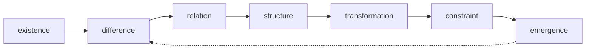

© 2025 Jay Baleine - Disciplined Methodology · Bane's Lab documentation is covered by [CC BY-SA 4.0](https://creativecommons.org/licenses/by-sa/4.0/)

# Reasoning — Ontology — Bane's Lab

> Every algorithm grammar is an instance of the derivation loop, which has ten stages, each on one reasoning axis, joined by transitions that sequence, gate or…

Canonical: https://banes-lab.com/ontology/reasoning

# The Ontology

The ontology is a queryable canon of software architecture. It holds every principle with its relations and its repair, every term with its definition, every algorithm with its contract, the reasoning that derives them, the layers they live in and how every tension between them is resolved, and every reference from one record to another is a link.

# Reasoning

594 of 594 shown

## Sections

- [The derivation loop](#reasoning-loop-derivation-loop)
- [The substrate](#the-substrate)
- [The reasoning layers](#the-reasoning-layers)
- [The axes](#the-axes)
- [The nodes](#the-nodes)
- [The mathematics](#the-mathematics)
- [The dimensions](#the-dimensions)
- [The lenses](#the-lenses)
- [The modes](#the-modes)
- [The representations](#the-representations)
- [The pattern types](#the-pattern-types)
- [The models](#the-models)
- [The universal axes](#the-universal-axes)
- [The test surfaces](#the-test-surfaces)
- [The techniques](#the-techniques)
- [The invariants](#the-invariants)
- [Failure shapes](#the-failure-shapes)
- [The uncovered cells](#the-uncovered-cells)
- [The maps](#the-maps)
- [The groundings](#the-groundings)

## The derivation loop

Every algorithm grammar is an instance of the derivation loop, which has ten stages, each on one reasoning axis, joined by transitions that sequence, gate or refute back. Each stage is listed with the contracts that run at it and the records it grounds, and the traversal is taught in [the loop](../START.md#the-loop) on the methodology page.

How it is checked

**Checked by**

the reasoning-native check, which requires every process grammar's kernel to map the loop's stages and every staged record to name a real stage and that stage's axis

**Population**

Every process grammar, its kernel and its staged records

**Freshness**

A verdict stands until the loop, a grammar or a staged record changes

**Refusal**

The gate fails on an unknown stage, a stage whose axis does not match, or a kernel that omits the verify stage

**Observation**

None, because the loop is a procedure the grammars instantiate, and nothing observes it while a run executes

**Evidence**

Watched to fire and to accept: a suite plants an unknown stage, a mismatched axis and a kernel that omits the verify stage, and passes a fully typed staged record

**Authoritative side**

The loop's stage list, which every kernel and staged record cites

**Depends on**

Not answered

**Shape it refuses**

Not answered

Relations diagram

The derivation loop with its gates.


### orient

- Axis: [ontology](REASONING.md#reasoning-axis-ontology)

Details

Contracts
[Evidence-Before-Generation](ALGORITHMS.md#algorithms-evidence-before-generation), [Semantic Operation Boundary](ALGORITHMS.md#algorithms-semantic-operation-boundary), [Capability Profile](ALGORITHMS.md#algorithms-capability-profile), [Domain Cache Validation](ALGORITHMS.md#algorithms-domain-cache-validation), [Scope Extraction](ALGORITHMS.md#algorithms-scope-extraction), [Domain Knowledge Base](ALGORITHMS.md#algorithms-domain-knowledge-base), [DSL Compliance Loading](ALGORITHMS.md#algorithms-dsl-compliance-loading), [Workspace Configuration Discovery](ALGORITHMS.md#algorithms-workspace-configuration-discovery), [Runtime-Neutral Automation Boundary](ALGORITHMS.md#algorithms-runtime-neutral-automation-boundary), [Capability Degradation](ALGORITHMS.md#algorithms-capability-degradation), [Automation Opportunity Detection](ALGORITHMS.md#algorithms-automation-opportunity-detection), [Runtime-Agnostic Adapter Boundary](ALGORITHMS.md#algorithms-runtime-agnostic-adapter-boundary), [Capability Disclosure](ALGORITHMS.md#algorithms-capability-disclosure), [Iterative Variation Discovery](ALGORITHMS.md#algorithms-iterative-variation-discovery), [Detection Registry](ALGORITHMS.md#algorithms-detection-registry), [Orientation Stage](ALGORITHMS.md#algorithms-orientation-stage), [Authoritative Source Loading](ALGORITHMS.md#algorithms-authoritative-source-loading), [Trust Anchor](ALGORITHMS.md#algorithms-trust-anchor), [Intent & Directionality Normalization](ALGORITHMS.md#algorithms-intent-directionality-normalization), [Skeptical Context Acquisition](ALGORITHMS.md#algorithms-skeptical-context-acquisition), [Dynamic Discovery Pattern Generation](ALGORITHMS.md#algorithms-dynamic-discovery-pattern-generation), [Context Initialization](ALGORITHMS.md#algorithms-context-initialization), [Trust Anchor Declaration](ALGORITHMS.md#algorithms-trust-anchor-declaration), [Coverage Workspace](ALGORITHMS.md#algorithms-coverage-workspace), [PAG Document Declaration](ALGORITHMS.md#algorithms-pag-document-declaration), [Analysis Workspace](ALGORITHMS.md#algorithms-analysis-workspace), [Registry Baseline](ALGORITHMS.md#algorithms-registry-baseline), [Profile Compose](ALGORITHMS.md#algorithms-profile-compose), [Seed Composition](ALGORITHMS.md#algorithms-seed-composition), [Taxonomy Jurisdiction](ALGORITHMS.md#algorithms-taxonomy-jurisdiction)

How it is checked

Checked by
the reasoning-native check, which requires every process grammar's kernel to map the loop's stages and every staged record to name a real stage and that stage's axis

Population
Every process grammar, its kernel and its staged records

Freshness
A verdict stands until the loop, a grammar or a staged record changes

Refusal
The gate fails on an unknown stage, a stage whose axis does not match, or a kernel that omits the verify stage

Observation
None, because the loop is a procedure the grammars instantiate, and nothing observes it while a run executes

Evidence
Watched to fire and to accept: a suite plants an unknown stage, a mismatched axis and a kernel that omits the verify stage, and passes a fully typed staged record

Authoritative side
The loop's stage list, which every kernel and staged record cites

Depends on
Not answered

Shape it refuses
Not answered

### intent

- Axis: [teleology](REASONING.md#reasoning-axis-teleology)

Details

Contracts
[Adaptive Phase Boundary](ALGORITHMS.md#algorithms-adaptive-phase-boundary), [Static-to-Dynamic Readiness](ALGORITHMS.md#algorithms-static-to-dynamic-readiness), [Automation Priority Ordering](ALGORITHMS.md#algorithms-automation-priority-ordering), [Canonical Variation Selection](ALGORITHMS.md#algorithms-canonical-variation-selection), [Developer Decision Gate](ALGORITHMS.md#algorithms-developer-decision-gate), [Teleological Intent Gate](ALGORITHMS.md#algorithms-teleological-intent-gate), [Severity-Ordered Remediation](ALGORITHMS.md#algorithms-severity-ordered-remediation), [Coverage Risk Prioritization](ALGORITHMS.md#algorithms-coverage-risk-prioritization), [Anti-Pattern Priority Matrix](ALGORITHMS.md#algorithms-anti-pattern-priority-matrix), [Reshape Risk Priority](ALGORITHMS.md#algorithms-reshape-risk-priority)

How it is checked

Checked by
the reasoning-native check, which requires every process grammar's kernel to map the loop's stages and every staged record to name a real stage and that stage's axis

Population
Every process grammar, its kernel and its staged records

Freshness
A verdict stands until the loop, a grammar or a staged record changes

Refusal
The gate fails on an unknown stage, a stage whose axis does not match, or a kernel that omits the verify stage

Observation
None, because the loop is a procedure the grammars instantiate, and nothing observes it while a run executes

Evidence
Watched to fire and to accept: a suite plants an unknown stage, a mismatched axis and a kernel that omits the verify stage, and passes a fully typed staged record

Authoritative side
The loop's stage list, which every kernel and staged record cites

Depends on
Not answered

Shape it refuses
Not answered

### see

- Axis: [analysis](REASONING.md#reasoning-axis-analysis)

Details

Contracts
[Non-Destructive Domain Investigation](ALGORITHMS.md#algorithms-non-destructive-domain-investigation), [Risk Complexity Reversibility](ALGORITHMS.md#algorithms-risk-complexity-reversibility), [Existing Pattern Extraction](ALGORITHMS.md#algorithms-existing-pattern-extraction), [Knowledge Documentation Relevance](ALGORITHMS.md#algorithms-knowledge-documentation-relevance), [Breaking Point Calculation](ALGORITHMS.md#algorithms-breaking-point-calculation), [Convention Strength Analysis](ALGORITHMS.md#algorithms-convention-strength-analysis), [Scalability Projection](ALGORITHMS.md#algorithms-scalability-projection), [Research Guidance](ALGORITHMS.md#algorithms-research-guidance), [Tool Calibration](ALGORITHMS.md#algorithms-tool-calibration), [Lifetime Resolution](ALGORITHMS.md#algorithms-lifetime-resolution), [Surface Grid Walk](ALGORITHMS.md#algorithms-surface-grid-walk), [PAG Keyword Ontology](ALGORITHMS.md#algorithms-pag-keyword-ontology), [Compliance Gap](ALGORITHMS.md#algorithms-compliance-gap), [Semantic Domain Partitioning](ALGORITHMS.md#algorithms-semantic-domain-partitioning), [Behavioral Signature Extraction](ALGORITHMS.md#algorithms-behavioral-signature-extraction), [Cross-Class Pattern Detection](ALGORITHMS.md#algorithms-cross-class-pattern-detection), [Behavioral Inconsistency](ALGORITHMS.md#algorithms-behavioral-inconsistency), [Sequential Chain Duplication](ALGORITHMS.md#algorithms-sequential-chain-duplication), [Temporal Coupling Detection](ALGORITHMS.md#algorithms-temporal-coupling-detection), [Relational Graph Duplication](ALGORITHMS.md#algorithms-relational-graph-duplication), [Causal Wiring Duplication](ALGORITHMS.md#algorithms-causal-wiring-duplication), [Anomaly Outlier Detection](ALGORITHMS.md#algorithms-anomaly-outlier-detection), [Conceptual Duplication Detection](ALGORITHMS.md#algorithms-conceptual-duplication-detection), [Fractal Scale Duplication](ALGORITHMS.md#algorithms-fractal-scale-duplication), [Path Role Walk](ALGORITHMS.md#algorithms-path-role-walk)

How it is checked

Checked by
the reasoning-native check, which requires every process grammar's kernel to map the loop's stages and every staged record to name a real stage and that stage's axis

Population
Every process grammar, its kernel and its staged records

Freshness
A verdict stands until the loop, a grammar or a staged record changes

Refusal
The gate fails on an unknown stage, a stage whose axis does not match, or a kernel that omits the verify stage

Observation
None, because the loop is a procedure the grammars instantiate, and nothing observes it while a run executes

Evidence
Watched to fire and to accept: a suite plants an unknown stage, a mismatched axis and a kernel that omits the verify stage, and passes a fully typed staged record

Authoritative side
The loop's stage list, which every kernel and staged record cites

Depends on
Not answered

Shape it refuses
Not answered

### derive

- Axis: [reasoning](REASONING.md#reasoning-axis-reasoning)

Details

Contracts
[Principle Extraction](ALGORITHMS.md#algorithms-principle-extraction), [Hybrid Workflow Orchestration](ALGORITHMS.md#algorithms-hybrid-workflow-orchestration), [Context Forking Configuration](ALGORITHMS.md#algorithms-context-forking-configuration), [Verb-Based Execution Classification](ALGORITHMS.md#algorithms-verb-based-execution-classification), [Workflow Type Document Selection](ALGORITHMS.md#algorithms-workflow-type-document-selection), [Workflow Principles Mapping](ALGORITHMS.md#algorithms-workflow-principles-mapping), [Intentional Static Separation](ALGORITHMS.md#algorithms-intentional-static-separation), [Extension Interface Discovery](ALGORITHMS.md#algorithms-extension-interface-discovery), [Pattern Classification](ALGORITHMS.md#algorithms-pattern-classification), [Refactor Intent Classification](ALGORITHMS.md#algorithms-refactor-intent-classification), [Architecture Compliance Targeting](ALGORITHMS.md#algorithms-architecture-compliance-targeting), [Existing Solution Conflict](ALGORITHMS.md#algorithms-existing-solution-conflict), [Planning Stage](ALGORITHMS.md#algorithms-planning-stage), [Principle Activation](ALGORITHMS.md#algorithms-principle-activation), [Protocol Semantic Selection](ALGORITHMS.md#algorithms-protocol-semantic-selection), [Violation Classification](ALGORITHMS.md#algorithms-violation-classification), [Invocation Join](ALGORITHMS.md#algorithms-invocation-join), [Duplicate Disposition Walk](ALGORITHMS.md#algorithms-duplicate-disposition-walk), [Uncovered Gap Derivation](ALGORITHMS.md#algorithms-uncovered-gap-derivation), [PAG Ambiguity Reduction](ALGORITHMS.md#algorithms-pag-ambiguity-reduction), [Anti-Pattern Classification](ALGORITHMS.md#algorithms-anti-pattern-classification), [Abstraction Boundary Principle](ALGORITHMS.md#algorithms-abstraction-boundary-principle), [Base-Class Candidate Selection](ALGORITHMS.md#algorithms-base-class-candidate-selection), [Canonical Config Resolution](ALGORITHMS.md#algorithms-canonical-config-resolution), [Concern Classification](ALGORITHMS.md#algorithms-concern-classification), [Container Ladder](ALGORITHMS.md#algorithms-container-ladder), [Export Triage Ladder](ALGORITHMS.md#algorithms-export-triage-ladder)

How it is checked

Checked by
the reasoning-native check, which requires every process grammar's kernel to map the loop's stages and every staged record to name a real stage and that stage's axis

Population
Every process grammar, its kernel and its staged records

Freshness
A verdict stands until the loop, a grammar or a staged record changes

Refusal
The gate fails on an unknown stage, a stage whose axis does not match, or a kernel that omits the verify stage

Observation
None, because the loop is a procedure the grammars instantiate, and nothing observes it while a run executes

Evidence
Watched to fire and to accept: a suite plants an unknown stage, a mismatched axis and a kernel that omits the verify stage, and passes a fully typed staged record

Authoritative side
The loop's stage list, which every kernel and staged record cites

Depends on
Not answered

Shape it refuses
Not answered

### project

- Axis: [reasoning](REASONING.md#reasoning-axis-reasoning)

Details

Contracts
[Phase Validation Requirement](ALGORITHMS.md#algorithms-phase-validation-requirement), [Validation Strategy Composition](ALGORITHMS.md#algorithms-validation-strategy-composition), [Agent Sequence Definition](ALGORITHMS.md#algorithms-agent-sequence-definition), [Four-Dimensional Agent Graph](ALGORITHMS.md#algorithms-four-dimensional-agent-graph), [Performance-Aware Discovery Design](ALGORITHMS.md#algorithms-performance-aware-discovery-design), [Dynamic Extension Architecture](ALGORITHMS.md#algorithms-dynamic-extension-architecture), [Migration Action Mapping](ALGORITHMS.md#algorithms-migration-action-mapping), [Atomic Refactor Phase](ALGORITHMS.md#algorithms-atomic-refactor-phase), [Phase Decomposition](ALGORITHMS.md#algorithms-phase-decomposition), [Four-Dimensional Phase Graph](ALGORITHMS.md#algorithms-four-dimensional-phase-graph), [Dependency Linearization](ALGORITHMS.md#algorithms-dependency-linearization), [Severity Assignment](ALGORITHMS.md#algorithms-severity-assignment), [Loop Class Labeling](ALGORITHMS.md#algorithms-loop-class-labeling), [Technique and Invariant Selection](ALGORITHMS.md#algorithms-technique-invariant-selection), [PAG Node Decomposition](ALGORITHMS.md#algorithms-pag-node-decomposition), [PAG Structure Declaration](ALGORITHMS.md#algorithms-pag-coordination-construct), [Concrete-vs-Abstract Responsibility Split](ALGORITHMS.md#algorithms-concrete-vs-abstract-responsibility-split), [Template Method Lifecycle](ALGORITHMS.md#algorithms-template-method-lifecycle), [Migration Ordering](ALGORITHMS.md#algorithms-migration-ordering), [Stage Ordering](ALGORITHMS.md#algorithms-stage-ordering), [Name Projection](ALGORITHMS.md#algorithms-name-projection), [Dialect Resolution](ALGORITHMS.md#algorithms-dialect-resolution)

How it is checked

Checked by
the reasoning-native check, which requires every process grammar's kernel to map the loop's stages and every staged record to name a real stage and that stage's axis

Population
Every process grammar, its kernel and its staged records

Freshness
A verdict stands until the loop, a grammar or a staged record changes

Refusal
The gate fails on an unknown stage, a stage whose axis does not match, or a kernel that omits the verify stage

Observation
None, because the loop is a procedure the grammars instantiate, and nothing observes it while a run executes

Evidence
Watched to fire and to accept: a suite plants an unknown stage, a mismatched axis and a kernel that omits the verify stage, and passes a fully typed staged record

Authoritative side
The loop's stage list, which every kernel and staged record cites

Depends on
Not answered

Shape it refuses
Not answered

### act

- Axis: [formalization](REASONING.md#reasoning-axis-formalization)

Details

Contracts
[Portable Contract Composition](ALGORITHMS.md#algorithms-portable-contract-composition), [Adapter Rendering](ALGORITHMS.md#algorithms-adapter-rendering), [Agent Workflow File Modification Recovery](ALGORITHMS.md#algorithms-agent-workflow-file-modification-recovery), [Shared Document Workspace](ALGORITHMS.md#algorithms-shared-document-workspace), [Agent Document Responsibility](ALGORITHMS.md#algorithms-agent-document-responsibility), [Agent Activation Invocation](ALGORITHMS.md#algorithms-agent-activation-invocation), [Parallel Batch Execution](ALGORITHMS.md#algorithms-parallel-batch-execution), [Sequential Agent Execution](ALGORITHMS.md#algorithms-sequential-agent-execution), [Handoff Signal](ALGORITHMS.md#algorithms-handoff-signal), [Orchestrator Action](ALGORITHMS.md#algorithms-orchestrator-action), [Workflow Coordination Sequence](ALGORITHMS.md#algorithms-workflow-coordination-sequence), [Workflow Recovery Loop](ALGORITHMS.md#algorithms-workflow-recovery-loop), [Checklist Integration](ALGORITHMS.md#algorithms-checklist-integration), [Phase Documentation Template](ALGORITHMS.md#algorithms-phase-documentation-template), [Capability Invocation Protocol](ALGORITHMS.md#algorithms-capability-invocation-protocol), [Centralized Reference Resolver](ALGORITHMS.md#algorithms-centralized-reference-resolver), [Cache Invalidation Strategy](ALGORITHMS.md#algorithms-cache-invalidation-strategy), [Manual Fallback Preservation](ALGORITHMS.md#algorithms-manual-fallback-preservation), [Dynamic Failure Isolation](ALGORITHMS.md#algorithms-dynamic-failure-isolation), [Entry Point Migration](ALGORITHMS.md#algorithms-entry-point-migration), [Knowledge Capture](ALGORITHMS.md#algorithms-knowledge-capture), [Replacement Refactor](ALGORITHMS.md#algorithms-replacement-refactor), [Rollback-Centered Execution](ALGORITHMS.md#algorithms-rollback-centered-execution), [Compilation Stage](ALGORITHMS.md#algorithms-compilation-stage), [Codebase Pattern Enforcement](ALGORITHMS.md#algorithms-codebase-pattern-enforcement), [Verb Template Binding](ALGORITHMS.md#algorithms-verb-template-binding), [Task Atomization](ALGORITHMS.md#algorithms-task-atomization), [Ripple Chain Analysis](ALGORITHMS.md#algorithms-ripple-chain-analysis), [Validator Coverage](ALGORITHMS.md#algorithms-validator-coverage), [Structured Observability Context](ALGORITHMS.md#algorithms-structured-observability-context), [Cross-Cutting Surface Coverage](ALGORITHMS.md#algorithms-cross-cutting-surface-coverage), [Legacy Elimination](ALGORITHMS.md#algorithms-legacy-elimination), [Hierarchical Numbering](ALGORITHMS.md#algorithms-hierarchical-numbering), [File-Scoped Fix](ALGORITHMS.md#algorithms-file-scoped-fix), [File Limit Remediation](ALGORITHMS.md#algorithms-file-limit-remediation), [Import Boundary Remediation](ALGORITHMS.md#algorithms-import-boundary-remediation), [Naming Convention Remediation](ALGORITHMS.md#algorithms-naming-convention-remediation), [Base-Class Compliance Remediation](ALGORITHMS.md#algorithms-base-class-compliance-remediation), [CSS Token Remediation](ALGORITHMS.md#algorithms-css-token-remediation), [DOM Factory Remediation](ALGORITHMS.md#algorithms-dom-factory-remediation), [Console Usage Remediation](ALGORITHMS.md#algorithms-console-usage-remediation), [Lifecycle Symmetry Remediation](ALGORITHMS.md#algorithms-lifecycle-symmetry-remediation), [Stylelint Post-Fix](ALGORITHMS.md#algorithms-stylelint-post-fix), [File Modification Recovery](ALGORITHMS.md#algorithms-file-modification-recovery), [Defensive String Normalization](ALGORITHMS.md#algorithms-defensive-string-normalization), [Safe Arithmetic Contract](ALGORITHMS.md#algorithms-safe-arithmetic-contract), [Recursion Control](ALGORITHMS.md#algorithms-recursion-control), [Advanced Tool Escalation](ALGORITHMS.md#algorithms-advanced-tool-escalation), [Test Authoring](ALGORITHMS.md#algorithms-test-authoring), [PAG Explicit Control Flow](ALGORITHMS.md#algorithms-pag-explicit-control-flow), [PAG Semantic Operation](ALGORITHMS.md#algorithms-pag-tool-invocation), [Base Schematic Composition](ALGORITHMS.md#algorithms-base-schematic-composition), [Backup-Verified Migration](ALGORITHMS.md#algorithms-backup-verified-migration), [Registry Regeneration](ALGORITHMS.md#algorithms-registry-regeneration), [Anti-Reintroduction Gate](ALGORITHMS.md#algorithms-anti-reintroduction-gate), [Idempotent Merge](ALGORITHMS.md#algorithms-idempotent-merge), [Deterministic Merge Core](ALGORITHMS.md#algorithms-deterministic-merge-core), [Persistence Fork](ALGORITHMS.md#algorithms-persistence-fork), [Comment Normalization Remediation](ALGORITHMS.md#algorithms-comment-normalization-remediation), [Custom-Rule Derivation](ALGORITHMS.md#algorithms-custom-rule-derivation), [Composed Turn Contract](ALGORITHMS.md#algorithms-composed-turn-contract), [Container Reshape](ALGORITHMS.md#algorithms-container-reshape)

How it is checked

Checked by
the reasoning-native check, which requires every process grammar's kernel to map the loop's stages and every staged record to name a real stage and that stage's axis

Population
Every process grammar, its kernel and its staged records

Freshness
A verdict stands until the loop, a grammar or a staged record changes

Refusal
The gate fails on an unknown stage, a stage whose axis does not match, or a kernel that omits the verify stage

Observation
None, because the loop is a procedure the grammars instantiate, and nothing observes it while a run executes

Evidence
Watched to fire and to accept: a suite plants an unknown stage, a mismatched axis and a kernel that omits the verify stage, and passes a fully typed staged record

Authoritative side
The loop's stage list, which every kernel and staged record cites

Depends on
Not answered

Shape it refuses
Not answered

### constrain

- Axis: [teleology](REASONING.md#reasoning-axis-teleology)

Details

Contracts
[Creation History Collision](ALGORITHMS.md#algorithms-creation-history-collision), [Replacement Safety](ALGORITHMS.md#algorithms-replacement-safety), [Automation Operation Mode](ALGORITHMS.md#algorithms-automation-operation-mode), [Operation Mode Gating](ALGORITHMS.md#algorithms-operation-mode-gating), [Admissibility Constraint Gate](ALGORITHMS.md#algorithms-admissibility-constraint-stage), [Phase-Separated Execution](ALGORITHMS.md#algorithms-phase-separated-execution), [PAG Invariant Record](ALGORITHMS.md#algorithms-pag-constraint-boundary), [Boundary Reconciliation](ALGORITHMS.md#algorithms-boundary-reconciliation), [Vocabulary Admission Gate](ALGORITHMS.md#algorithms-vocabulary-admission-gate)

Grounds
[Governed Autonomous Plan Loop](ALGORITHMS.md#algorithms-governed-autonomous-plan-loop)

How it is checked

Checked by
the reasoning-native check, which requires every process grammar's kernel to map the loop's stages and every staged record to name a real stage and that stage's axis

Population
Every process grammar, its kernel and its staged records

Freshness
A verdict stands until the loop, a grammar or a staged record changes

Refusal
The gate fails on an unknown stage, a stage whose axis does not match, or a kernel that omits the verify stage

Observation
None, because the loop is a procedure the grammars instantiate, and nothing observes it while a run executes

Evidence
Watched to fire and to accept: a suite plants an unknown stage, a mismatched axis and a kernel that omits the verify stage, and passes a fully typed staged record

Authoritative side
The loop's stage list, which every kernel and staged record cites

Depends on
Not answered

Shape it refuses
Not answered

### verify

- Axis: [verification](REASONING.md#reasoning-axis-verification)

Details

Contracts
[Semantic Compliance Validation](ALGORITHMS.md#algorithms-semantic-compliance-validation), [Evidence Grounding Validation](ALGORITHMS.md#algorithms-evidence-grounding-validation), [Algorithmic Embodiment Validation](ALGORITHMS.md#algorithms-algorithmic-embodiment-validation), [Workflow Validation Gate](ALGORITHMS.md#algorithms-workflow-validation-gate), [Measured-vs-Estimated Validation](ALGORITHMS.md#algorithms-measured-vs-estimated-validation), [Architecture Validation Before Persistence](ALGORITHMS.md#algorithms-architecture-validation-before-persistence), [Additive Debt Gate](ALGORITHMS.md#algorithms-additive-debt-gate), [Pattern-Specific Validation](ALGORITHMS.md#algorithms-pattern-specific-validation), [Zero-Duplication Verification](ALGORITHMS.md#algorithms-zero-duplication-verification), [Validation Score](ALGORITHMS.md#algorithms-validation-score), [Validation Stage](ALGORITHMS.md#algorithms-validation-stage), [Semantic Debt Policy](ALGORITHMS.md#algorithms-semantic-debt-policy), [Evidence-Based Claim Verification](ALGORITHMS.md#algorithms-evidence-based-claim-verification), [Validation Suite Battery](ALGORITHMS.md#algorithms-validation-suite-battery), [Repair Stage](ALGORITHMS.md#algorithms-repair-stage), [Bounded Repair Loop](ALGORITHMS.md#algorithms-bounded-repair-loop), [Severity Failure Routing](ALGORITHMS.md#algorithms-severity-failure-routing), [Verification Loop](ALGORITHMS.md#algorithms-verification-loop), [Verification Execution](ALGORITHMS.md#algorithms-verification-execution), [Reverification Gate](ALGORITHMS.md#algorithms-reverification-gate), [Evidence-Gated Claim Verification](ALGORITHMS.md#algorithms-evidence-gated-claim-verification), [Environment Capability Verification](ALGORITHMS.md#algorithms-environment-capability-verification), [Behavioral Self-Test](ALGORITHMS.md#algorithms-behavioral-self-test), [Adversarial Input Testing](ALGORITHMS.md#algorithms-adversarial-input-testing), [Recursive Self-Verification](ALGORITHMS.md#algorithms-recursive-self-verification), [Evidence Verdict](ALGORITHMS.md#algorithms-evidence-verdict), [PAG Handoff Gate](ALGORITHMS.md#algorithms-pag-validation-gate), [Anti-Pattern Elimination Verification](ALGORITHMS.md#algorithms-anti-pattern-elimination-verification), [Distillation Metrics](ALGORITHMS.md#algorithms-distillation-metrics), [Delta Capture](ALGORITHMS.md#algorithms-delta-capture), [Plan Phase Verification](ALGORITHMS.md#algorithms-plan-phase-verification), [Machine Verdict Derivation](ALGORITHMS.md#algorithms-machine-verdict-derivation), [Mode Contract Validation](ALGORITHMS.md#algorithms-mode-contract-validation), [Discovery Verification](ALGORITHMS.md#algorithms-discovery-verification), [Alignment Cadence](ALGORITHMS.md#algorithms-alignment-cadence)

How it is checked

Checked by
the reasoning-native check, which requires every process grammar's kernel to map the loop's stages and every staged record to name a real stage and that stage's axis

Population
Every process grammar, its kernel and its staged records

Freshness
A verdict stands until the loop, a grammar or a staged record changes

Refusal
The gate fails on an unknown stage, a stage whose axis does not match, or a kernel that omits the verify stage

Observation
None, because the loop is a procedure the grammars instantiate, and nothing observes it while a run executes

Evidence
Watched to fire and to accept: a suite plants an unknown stage, a mismatched axis and a kernel that omits the verify stage, and passes a fully typed staged record

Authoritative side
The loop's stage list, which every kernel and staged record cites

Depends on
Not answered

Shape it refuses
Not answered

### commit

- Axis: [representation](REASONING.md#reasoning-axis-representation)

Details

Contracts
[Audit Artifact](ALGORITHMS.md#algorithms-audit-artifact), [Final Generation Report](ALGORITHMS.md#algorithms-final-generation-report), [Template Assembly](ALGORITHMS.md#algorithms-template-assembly), [Automation Session Report](ALGORITHMS.md#algorithms-automation-session-report), [Centralization Report](ALGORITHMS.md#algorithms-centralization-report), [Rendering Stage](ALGORITHMS.md#algorithms-rendering-stage), [Checklist Output Rendering](ALGORITHMS.md#algorithms-checklist-output-rendering), [Partial Success Reporting](ALGORITHMS.md#algorithms-partial-success-reporting), [Completion Report](ALGORITHMS.md#algorithms-completion-report), [Investigation Report](ALGORITHMS.md#algorithms-investigation-report), [Action Log](ALGORITHMS.md#algorithms-action-log), [Convergence Walk](ALGORITHMS.md#algorithms-convergence-walk), [Coverage Ledger](ALGORITHMS.md#algorithms-coverage-ledger), [Pattern Distillation History](ALGORITHMS.md#algorithms-pattern-distillation-history), [Version Provenance](ALGORITHMS.md#algorithms-version-provenance), [Living Plan State](ALGORITHMS.md#algorithms-living-plan-state), [Versioned Turn Provenance](ALGORITHMS.md#algorithms-versioned-turn-provenance), [Taxonomy Ledger](ALGORITHMS.md#algorithms-taxonomy-ledger)

How it is checked

Checked by
the reasoning-native check, which requires every process grammar's kernel to map the loop's stages and every staged record to name a real stage and that stage's axis

Population
Every process grammar, its kernel and its staged records

Freshness
A verdict stands until the loop, a grammar or a staged record changes

Refusal
The gate fails on an unknown stage, a stage whose axis does not match, or a kernel that omits the verify stage

Observation
None, because the loop is a procedure the grammars instantiate, and nothing observes it while a run executes

Evidence
Watched to fire and to accept: a suite plants an unknown stage, a mismatched axis and a kernel that omits the verify stage, and passes a fully typed staged record

Authoritative side
The loop's stage list, which every kernel and staged record cites

Depends on
Not answered

Shape it refuses
Not answered

### terminate

- Axis: [termination](REASONING.md#reasoning-axis-termination)

Details

Contracts
[Agent Generation Completion](ALGORITHMS.md#algorithms-agent-generation-completion), [First-Time Initiation](ALGORITHMS.md#algorithms-first-time-initiation), [Automation Completion Status](ALGORITHMS.md#algorithms-automation-completion-status), [Completion Truthfulness](ALGORITHMS.md#algorithms-completion-truthfulness), [Explicit Termination](ALGORITHMS.md#algorithms-explicit-termination), [Early Success Exit](ALGORITHMS.md#algorithms-early-success-exit), [Iteration Bound](ALGORITHMS.md#algorithms-iteration-bound), [Validation Gate](ALGORITHMS.md#algorithms-validation-gate), [Coverage Completion](ALGORITHMS.md#algorithms-coverage-completion), [PAG Well-Formedness Validation](ALGORITHMS.md#algorithms-pag-well-formedness-validation), [Pattern Distillation Completion Truthfulness](ALGORITHMS.md#algorithms-pattern-distillation-completion-truthfulness), [Phase Close Gate](ALGORITHMS.md#algorithms-phase-close-gate), [Bounded Cascade Termination](ALGORITHMS.md#algorithms-bounded-cascade-termination), [Taxonomy Completion](ALGORITHMS.md#algorithms-taxonomy-completion)

How it is checked

Checked by
the reasoning-native check, which requires every process grammar's kernel to map the loop's stages and every staged record to name a real stage and that stage's axis

Population
Every process grammar, its kernel and its staged records

Freshness
A verdict stands until the loop, a grammar or a staged record changes

Refusal
The gate fails on an unknown stage, a stage whose axis does not match, or a kernel that omits the verify stage

Observation
None, because the loop is a procedure the grammars instantiate, and nothing observes it while a run executes

Evidence
Watched to fire and to accept: a suite plants an unknown stage, a mismatched axis and a kernel that omits the verify stage, and passes a fully typed staged record

Authoritative side
The loop's stage list, which every kernel and staged record cites

Depends on
Not answered

Shape it refuses
Not answered

### orient → intent

Details

[orient](REASONING.md#stage-orient) → [intent](REASONING.md#stage-intent) · Transition: sequences

### intent → see

Details

[intent](REASONING.md#stage-intent) → [see](REASONING.md#stage-see) · Transition: gates · Gate: tel-priority · On fail: redirect

### see → derive

Details

[see](REASONING.md#stage-see) → [derive](REASONING.md#stage-derive) · Transition: sequences

### derive → project

Details

[derive](REASONING.md#stage-derive) → [project](REASONING.md#stage-project) · Transition: sequences

### project → act

Details

[project](REASONING.md#stage-project) → [act](REASONING.md#stage-act) · Transition: sequences

### act → constrain

Details

[act](REASONING.md#stage-act) → [constrain](REASONING.md#stage-constrain) · Transition: sequences

### constrain → verify

Details

[constrain](REASONING.md#stage-constrain) → [verify](REASONING.md#stage-verify) · Transition: sequences

### verify → derive

Details

[verify](REASONING.md#stage-verify) → [derive](REASONING.md#stage-derive) · Transition: refutes-back · Gate: ver-evidence · On fail: derive

### verify → commit

Details

[verify](REASONING.md#stage-verify) → [commit](REASONING.md#stage-commit) · Transition: sequences

### commit → terminate

Details

[commit](REASONING.md#stage-commit) → [terminate](REASONING.md#stage-terminate) · Transition: sequences

### terminate → orient

Details

[terminate](REASONING.md#stage-terminate) → [orient](REASONING.md#stage-orient) · Transition: sequences · Gate: ter-stop · On pass: stop

## The substrate

Beneath the loop lies the generative substrate, meaning the cycle every node passes through, the recursion that turns emergence back into a new difference, and the math types each node yields.

Recursion · [emergence](REASONING.md#reasoning-substrate-node-emergence) → [difference](REASONING.md#reasoning-substrate-node-difference)

Relations diagram

The substrate cycle and its recursion.



### Existence

- Layer: [Substrate](REASONING.md#reasoning-layer-substrate)
- Math type: [set-theory](REASONING.md#reasoning-math-type-set-theory)

Details

How it is checked

Checked by
the ontology resolution gate over every model step, math type, genesis tag and construct that names a substrate node

Population
Every model, document construct and genesis tag that names the substrate node

Freshness
A verdict stands until the substrate or a record that names one of its nodes changes

Refusal
The gate fails on a reference to a substrate node that does not exist

Observation
None, because a substrate node is a primitive of pattern formation, and nothing observes it while a run executes

Evidence
Watched to fire and to accept: one suite plants a step outside its model's step kind, another plants a ground whose kind exists and whose id does not, and the bundled data validates clean

Authoritative side
The substrate node list, which every step, math type, tag and construct that names a node cites

Depends on
Not answered

Shape it refuses
Not answered

### Difference

- Layer: [Substrate](REASONING.md#reasoning-layer-substrate)
- Math type: [logic](REASONING.md#reasoning-math-type-logic)

Details

How it is checked

Checked by
the ontology resolution gate over every model step, math type, genesis tag and construct that names a substrate node

Population
Every model, document construct and genesis tag that names the substrate node

Freshness
A verdict stands until the substrate or a record that names one of its nodes changes

Refusal
The gate fails on a reference to a substrate node that does not exist

Observation
None, because a substrate node is a primitive of pattern formation, and nothing observes it while a run executes

Evidence
Watched to fire and to accept: one suite plants a step outside its model's step kind, another plants a ground whose kind exists and whose id does not, and the bundled data validates clean

Authoritative side
The substrate node list, which every step, math type, tag and construct that names a node cites

Depends on
Not answered

Shape it refuses
Not answered

### Relation

- Layer: [Substrate](REASONING.md#reasoning-layer-substrate)
- Math type: [graph](REASONING.md#reasoning-math-type-graph)

Details

How it is checked

Checked by
the ontology resolution gate over every model step, math type, genesis tag and construct that names a substrate node

Population
Every model, document construct and genesis tag that names the substrate node

Freshness
A verdict stands until the substrate or a record that names one of its nodes changes

Refusal
The gate fails on a reference to a substrate node that does not exist

Observation
None, because a substrate node is a primitive of pattern formation, and nothing observes it while a run executes

Evidence
Watched to fire and to accept: one suite plants a step outside its model's step kind, another plants a ground whose kind exists and whose id does not, and the bundled data validates clean

Authoritative side
The substrate node list, which every step, math type, tag and construct that names a node cites

Depends on
Not answered

Shape it refuses
Not answered

### Structure

- Layer: [Substrate](REASONING.md#reasoning-layer-substrate)
- Math type: [algebra](REASONING.md#reasoning-math-type-algebra)

Details

How it is checked

Checked by
the ontology resolution gate over every model step, math type, genesis tag and construct that names a substrate node

Population
Every model, document construct and genesis tag that names the substrate node

Freshness
A verdict stands until the substrate or a record that names one of its nodes changes

Refusal
The gate fails on a reference to a substrate node that does not exist

Observation
None, because a substrate node is a primitive of pattern formation, and nothing observes it while a run executes

Evidence
Watched to fire and to accept: one suite plants a step outside its model's step kind, another plants a ground whose kind exists and whose id does not, and the bundled data validates clean

Authoritative side
The substrate node list, which every step, math type, tag and construct that names a node cites

Depends on
Not answered

Shape it refuses
Not answered

### Transformation

- Layer: [Substrate](REASONING.md#reasoning-layer-substrate)
- Math type: [analysis](REASONING.md#reasoning-math-type-analysis)

Details

How it is checked

Checked by
the ontology resolution gate over every model step, math type, genesis tag and construct that names a substrate node

Population
Every model, document construct and genesis tag that names the substrate node

Freshness
A verdict stands until the substrate or a record that names one of its nodes changes

Refusal
The gate fails on a reference to a substrate node that does not exist

Observation
None, because a substrate node is a primitive of pattern formation, and nothing observes it while a run executes

Evidence
Watched to fire and to accept: one suite plants a step outside its model's step kind, another plants a ground whose kind exists and whose id does not, and the bundled data validates clean

Authoritative side
The substrate node list, which every step, math type, tag and construct that names a node cites

Depends on
Not answered

Shape it refuses
Not answered

### Constraint

- Layer: [Substrate](REASONING.md#reasoning-layer-substrate)
- Math type: [optimization](REASONING.md#reasoning-math-type-optimization)

Details

How it is checked

Checked by
the ontology resolution gate over every model step, math type, genesis tag and construct that names a substrate node

Population
Every model, document construct and genesis tag that names the substrate node

Freshness
A verdict stands until the substrate or a record that names one of its nodes changes

Refusal
The gate fails on a reference to a substrate node that does not exist

Observation
None, because a substrate node is a primitive of pattern formation, and nothing observes it while a run executes

Evidence
Watched to fire and to accept: one suite plants a step outside its model's step kind, another plants a ground whose kind exists and whose id does not, and the bundled data validates clean

Authoritative side
The substrate node list, which every step, math type, tag and construct that names a node cites

Depends on
Not answered

Shape it refuses
Not answered

### Invariant

- Layer: [Substrate](REASONING.md#reasoning-layer-substrate)
- Math type: [topology](REASONING.md#reasoning-math-type-topology)

Details

How it is checked

Checked by
the ontology resolution gate over every model step, math type, genesis tag and construct that names a substrate node

Population
Every model, document construct and genesis tag that names the substrate node

Freshness
A verdict stands until the substrate or a record that names one of its nodes changes

Refusal
The gate fails on a reference to a substrate node that does not exist

Observation
None, because a substrate node is a primitive of pattern formation, and nothing observes it while a run executes

Evidence
Watched to fire and to accept: one suite plants a step outside its model's step kind, another plants a ground whose kind exists and whose id does not, and the bundled data validates clean

Authoritative side
The substrate node list, which every step, math type, tag and construct that names a node cites

Depends on
Not answered

Shape it refuses
Not answered

### Uncertainty

- Layer: [Substrate](REASONING.md#reasoning-layer-substrate)
- Math type: [probability](REASONING.md#reasoning-math-type-probability)

Details

How it is checked

Checked by
the ontology resolution gate over every model step, math type, genesis tag and construct that names a substrate node

Population
Every model, document construct and genesis tag that names the substrate node

Freshness
A verdict stands until the substrate or a record that names one of its nodes changes

Refusal
The gate fails on a reference to a substrate node that does not exist

Observation
None, because a substrate node is a primitive of pattern formation, and nothing observes it while a run executes

Evidence
Watched to fire and to accept: one suite plants a step outside its model's step kind, another plants a ground whose kind exists and whose id does not, and the bundled data validates clean

Authoritative side
The substrate node list, which every step, math type, tag and construct that names a node cites

Depends on
Not answered

Shape it refuses
Not answered

### Information

- Layer: [Substrate](REASONING.md#reasoning-layer-substrate)
- Math type: [information-theory](REASONING.md#reasoning-math-type-information-theory)

Details

How it is checked

Checked by
the ontology resolution gate over every model step, math type, genesis tag and construct that names a substrate node

Population
Every model, document construct and genesis tag that names the substrate node

Freshness
A verdict stands until the substrate or a record that names one of its nodes changes

Refusal
The gate fails on a reference to a substrate node that does not exist

Observation
None, because a substrate node is a primitive of pattern formation, and nothing observes it while a run executes

Evidence
Watched to fire and to accept: one suite plants a step outside its model's step kind, another plants a ground whose kind exists and whose id does not, and the bundled data validates clean

Authoritative side
The substrate node list, which every step, math type, tag and construct that names a node cites

Depends on
Not answered

Shape it refuses
Not answered

### Procedure

- Layer: [Substrate](REASONING.md#reasoning-layer-substrate)
- Math type: [computation](REASONING.md#reasoning-math-type-computation)

Details

How it is checked

Checked by
the ontology resolution gate over every model step, math type, genesis tag and construct that names a substrate node

Population
Every model, document construct and genesis tag that names the substrate node

Freshness
A verdict stands until the substrate or a record that names one of its nodes changes

Refusal
The gate fails on a reference to a substrate node that does not exist

Observation
None, because a substrate node is a primitive of pattern formation, and nothing observes it while a run executes

Evidence
Watched to fire and to accept: one suite plants a step outside its model's step kind, another plants a ground whose kind exists and whose id does not, and the bundled data validates clean

Authoritative side
The substrate node list, which every step, math type, tag and construct that names a node cites

Depends on
Not answered

Shape it refuses
Not answered

### Emergence

- Layer: [Substrate](REASONING.md#reasoning-layer-substrate)
- Math type: [dynamical-systems](REASONING.md#reasoning-math-type-dynamical-systems)

Details

How it is checked

Checked by
the ontology resolution gate over every model step, math type, genesis tag and construct that names a substrate node

Population
Every model, document construct and genesis tag that names the substrate node

Freshness
A verdict stands until the substrate or a record that names one of its nodes changes

Refusal
The gate fails on a reference to a substrate node that does not exist

Observation
None, because a substrate node is a primitive of pattern formation, and nothing observes it while a run executes

Evidence
Watched to fire and to accept: one suite plants a step outside its model's step kind, another plants a ground whose kind exists and whose id does not, and the bundled data validates clean

Authoritative side
The substrate node list, which every step, math type, tag and construct that names a node cites

Depends on
Not answered

Shape it refuses
Not answered

## The reasoning layers

The reasoning axes are arranged on these layers, each listed with the question it answers and the axes it holds.

### Substrate

Details

Question
How does anything come to be?

How it is checked

Checked by
the ontology resolution gate, which requires every axis and substrate node that names a layer to resolve

Population
Every axis and substrate node that names the layer

Freshness
A verdict stands until the layer list or a record that names a layer changes

Refusal
The gate fails on an axis or substrate node that names a layer that does not exist

Observation
None, because a layer is a grouping of axes, and nothing observes it while a run executes

Evidence
Watched to fire and to accept: a suite plants an axis that names a missing layer, and the bundled references resolve

Authoritative side
The layer list, which every axis and substrate node that names a layer cites

Depends on
Not answered

Shape it refuses
Not answered

### Epistemic

Details

Question
How is it known?

Axes
[ontology](REASONING.md#reasoning-axis-ontology), [analysis](REASONING.md#reasoning-axis-analysis), [reasoning](REASONING.md#reasoning-axis-reasoning), [representation](REASONING.md#reasoning-axis-representation), [formalization](REASONING.md#reasoning-axis-formalization)

How it is checked

Checked by
the ontology resolution gate, which requires every axis and substrate node that names a layer to resolve

Population
Every axis and substrate node that names the layer

Freshness
A verdict stands until the layer list or a record that names a layer changes

Refusal
The gate fails on an axis or substrate node that names a layer that does not exist

Observation
None, because a layer is a grouping of axes, and nothing observes it while a run executes

Evidence
Watched to fire and to accept: a suite plants an axis that names a missing layer, and the bundled references resolve

Authoritative side
The layer list, which every axis and substrate node that names a layer cites

Depends on
Not answered

Shape it refuses
Not answered

### Conative

Details

Question
What is worth doing?

Axes
[teleology](REASONING.md#reasoning-axis-teleology)

How it is checked

Checked by
the ontology resolution gate, which requires every axis and substrate node that names a layer to resolve

Population
Every axis and substrate node that names the layer

Freshness
A verdict stands until the layer list or a record that names a layer changes

Refusal
The gate fails on an axis or substrate node that names a layer that does not exist

Observation
None, because a layer is a grouping of axes, and nothing observes it while a run executes

Evidence
Watched to fire and to accept: a suite plants an axis that names a missing layer, and the bundled references resolve

Authoritative side
The layer list, which every axis and substrate node that names a layer cites

Depends on
Not answered

Shape it refuses
Not answered

### Evaluative

Details

Question
Is it right, and is it done?

Axes
[verification](REASONING.md#reasoning-axis-verification), [termination](REASONING.md#reasoning-axis-termination)

How it is checked

Checked by
the ontology resolution gate, which requires every axis and substrate node that names a layer to resolve

Population
Every axis and substrate node that names the layer

Freshness
A verdict stands until the layer list or a record that names a layer changes

Refusal
The gate fails on an axis or substrate node that names a layer that does not exist

Observation
None, because a layer is a grouping of axes, and nothing observes it while a run executes

Evidence
Watched to fire and to accept: a suite plants an axis that names a missing layer, and the bundled references resolve

Authoritative side
The layer list, which every axis and substrate node that names a layer cites

Depends on
Not answered

Shape it refuses
Not answered

## The axes

Each reasoning axis is a typed, terminating question on one layer, listed with the nodes a run may select on it and the contracts positioned on it.

### ontology

- Layer: [Epistemic](REASONING.md#reasoning-layer-epistemic)
- Mandatory: when-relevant
- Math type: [set-theory](REASONING.md#reasoning-math-type-set-theory)
- Selectable: yes

Details

Question
What is it?

Nodes
[ont-identity](REASONING.md#reasoning-node-ont-identity), [ont-composition](REASONING.md#reasoning-node-ont-composition), [ont-structure](REASONING.md#reasoning-node-ont-structure), [ont-relation](REASONING.md#reasoning-node-ont-relation), [ont-space](REASONING.md#reasoning-node-ont-space), [ont-time](REASONING.md#reasoning-node-ont-time), [ont-state](REASONING.md#reasoning-node-ont-state), [ont-change](REASONING.md#reasoning-node-ont-change), [ont-behavior](REASONING.md#reasoning-node-ont-behavior), [ont-function](REASONING.md#reasoning-node-ont-function), [ont-cause](REASONING.md#reasoning-node-ont-cause), [ont-meaning](REASONING.md#reasoning-node-ont-meaning), [ont-scale](REASONING.md#reasoning-node-ont-scale), [ont-probability](REASONING.md#reasoning-node-ont-probability), [ont-novelty](REASONING.md#reasoning-node-ont-novelty)

Contracts
[Evidence-Before-Generation](ALGORITHMS.md#algorithms-evidence-before-generation), [Semantic Operation Boundary](ALGORITHMS.md#algorithms-semantic-operation-boundary), [Capability Profile](ALGORITHMS.md#algorithms-capability-profile), [Domain Cache Validation](ALGORITHMS.md#algorithms-domain-cache-validation), [Scope Extraction](ALGORITHMS.md#algorithms-scope-extraction), [Domain Knowledge Base](ALGORITHMS.md#algorithms-domain-knowledge-base), [DSL Compliance Loading](ALGORITHMS.md#algorithms-dsl-compliance-loading), [Workspace Configuration Discovery](ALGORITHMS.md#algorithms-workspace-configuration-discovery), [Runtime-Neutral Automation Boundary](ALGORITHMS.md#algorithms-runtime-neutral-automation-boundary), [Capability Degradation](ALGORITHMS.md#algorithms-capability-degradation), [Automation Opportunity Detection](ALGORITHMS.md#algorithms-automation-opportunity-detection), [Runtime-Agnostic Adapter Boundary](ALGORITHMS.md#algorithms-runtime-agnostic-adapter-boundary), [Capability Disclosure](ALGORITHMS.md#algorithms-capability-disclosure), [Iterative Variation Discovery](ALGORITHMS.md#algorithms-iterative-variation-discovery), [Detection Registry](ALGORITHMS.md#algorithms-detection-registry), [Orientation Stage](ALGORITHMS.md#algorithms-orientation-stage), [Authoritative Source Loading](ALGORITHMS.md#algorithms-authoritative-source-loading), [Trust Anchor](ALGORITHMS.md#algorithms-trust-anchor), [Intent & Directionality Normalization](ALGORITHMS.md#algorithms-intent-directionality-normalization), [Skeptical Context Acquisition](ALGORITHMS.md#algorithms-skeptical-context-acquisition), [Dynamic Discovery Pattern Generation](ALGORITHMS.md#algorithms-dynamic-discovery-pattern-generation), [Context Initialization](ALGORITHMS.md#algorithms-context-initialization), [Trust Anchor Declaration](ALGORITHMS.md#algorithms-trust-anchor-declaration), [Coverage Workspace](ALGORITHMS.md#algorithms-coverage-workspace), [PAG Document Declaration](ALGORITHMS.md#algorithms-pag-document-declaration), [Analysis Workspace](ALGORITHMS.md#algorithms-analysis-workspace), [Registry Baseline](ALGORITHMS.md#algorithms-registry-baseline), [Profile Compose](ALGORITHMS.md#algorithms-profile-compose), [Seed Composition](ALGORITHMS.md#algorithms-seed-composition), [Taxonomy Jurisdiction](ALGORITHMS.md#algorithms-taxonomy-jurisdiction)

How it is checked

Checked by
the ontology resolution gate, which requires every node, loop stage and grammar ground that names an axis to resolve

Population
Every reasoning node, loop stage and algorithm record that names the axis

Freshness
A verdict stands until the axis list or a record that names an axis changes

Refusal
The gate fails on a node, stage or ground that names an axis that does not exist

Observation
None, because an axis is a category of question, and nothing observes it while a run executes

Evidence
Watched to fire and to accept: a suite plants a node whose axis does not exist and a staged record whose axis is not its stage's axis, and the bundled records validate clean

Authoritative side
The axis list, which every node, stage and ground that names an axis cites

Depends on
Not answered

Shape it refuses
Not answered

### analysis

- Layer: [Epistemic](REASONING.md#reasoning-layer-epistemic)
- Mandatory: when-relevant
- Math type: [graph](REASONING.md#reasoning-math-type-graph)
- Selectable: yes

Details

Question
How is it to be seen?

Nodes
[ana-structural](REASONING.md#reasoning-node-ana-structural), [ana-temporal](REASONING.md#reasoning-node-ana-temporal), [ana-spatial](REASONING.md#reasoning-node-ana-spatial), [ana-statistical](REASONING.md#reasoning-node-ana-statistical), [ana-frequency](REASONING.md#reasoning-node-ana-frequency), [ana-sequential](REASONING.md#reasoning-node-ana-sequential), [ana-relational](REASONING.md#reasoning-node-ana-relational), [ana-behavioral](REASONING.md#reasoning-node-ana-behavioral), [ana-functional](REASONING.md#reasoning-node-ana-functional), [ana-semantic](REASONING.md#reasoning-node-ana-semantic), [ana-causal](REASONING.md#reasoning-node-ana-causal), [ana-predictive](REASONING.md#reasoning-node-ana-predictive), [ana-anomaly](REASONING.md#reasoning-node-ana-anomaly), [ana-evolutionary](REASONING.md#reasoning-node-ana-evolutionary), [ana-fractal](REASONING.md#reasoning-node-ana-fractal)

Contracts
[Non-Destructive Domain Investigation](ALGORITHMS.md#algorithms-non-destructive-domain-investigation), [Risk Complexity Reversibility](ALGORITHMS.md#algorithms-risk-complexity-reversibility), [Existing Pattern Extraction](ALGORITHMS.md#algorithms-existing-pattern-extraction), [Knowledge Documentation Relevance](ALGORITHMS.md#algorithms-knowledge-documentation-relevance), [Breaking Point Calculation](ALGORITHMS.md#algorithms-breaking-point-calculation), [Convention Strength Analysis](ALGORITHMS.md#algorithms-convention-strength-analysis), [Scalability Projection](ALGORITHMS.md#algorithms-scalability-projection), [Research Guidance](ALGORITHMS.md#algorithms-research-guidance), [Tool Calibration](ALGORITHMS.md#algorithms-tool-calibration), [Lifetime Resolution](ALGORITHMS.md#algorithms-lifetime-resolution), [Surface Grid Walk](ALGORITHMS.md#algorithms-surface-grid-walk), [PAG Keyword Ontology](ALGORITHMS.md#algorithms-pag-keyword-ontology), [Compliance Gap](ALGORITHMS.md#algorithms-compliance-gap), [Semantic Domain Partitioning](ALGORITHMS.md#algorithms-semantic-domain-partitioning), [Behavioral Signature Extraction](ALGORITHMS.md#algorithms-behavioral-signature-extraction), [Cross-Class Pattern Detection](ALGORITHMS.md#algorithms-cross-class-pattern-detection), [Behavioral Inconsistency](ALGORITHMS.md#algorithms-behavioral-inconsistency), [Sequential Chain Duplication](ALGORITHMS.md#algorithms-sequential-chain-duplication), [Temporal Coupling Detection](ALGORITHMS.md#algorithms-temporal-coupling-detection), [Relational Graph Duplication](ALGORITHMS.md#algorithms-relational-graph-duplication), [Causal Wiring Duplication](ALGORITHMS.md#algorithms-causal-wiring-duplication), [Anomaly Outlier Detection](ALGORITHMS.md#algorithms-anomaly-outlier-detection), [Conceptual Duplication Detection](ALGORITHMS.md#algorithms-conceptual-duplication-detection), [Fractal Scale Duplication](ALGORITHMS.md#algorithms-fractal-scale-duplication), [Path Role Walk](ALGORITHMS.md#algorithms-path-role-walk)

How it is checked

Checked by
the ontology resolution gate, which requires every node, loop stage and grammar ground that names an axis to resolve

Population
Every reasoning node, loop stage and algorithm record that names the axis

Freshness
A verdict stands until the axis list or a record that names an axis changes

Refusal
The gate fails on a node, stage or ground that names an axis that does not exist

Observation
None, because an axis is a category of question, and nothing observes it while a run executes

Evidence
Watched to fire and to accept: a suite plants a node whose axis does not exist and a staged record whose axis is not its stage's axis, and the bundled records validate clean

Authoritative side
The axis list, which every node, stage and ground that names an axis cites

Depends on
Not answered

Shape it refuses
Not answered

### reasoning

- Layer: [Epistemic](REASONING.md#reasoning-layer-epistemic)
- Mandatory: when-relevant
- Math type: [logic](REASONING.md#reasoning-math-type-logic)
- Selectable: yes

Details

Question
Why, and what follows?

Nodes
[rea-observation](REASONING.md#reasoning-node-rea-observation), [rea-description](REASONING.md#reasoning-node-rea-description), [rea-comparison](REASONING.md#reasoning-node-rea-comparison), [rea-classification](REASONING.md#reasoning-node-rea-classification), [rea-explanation](REASONING.md#reasoning-node-rea-explanation), [rea-prediction](REASONING.md#reasoning-node-rea-prediction), [rea-intervention](REASONING.md#reasoning-node-rea-intervention), [rea-creation](REASONING.md#reasoning-node-rea-creation), [rea-reflection](REASONING.md#reasoning-node-rea-reflection)

Contracts
[Principle Extraction](ALGORITHMS.md#algorithms-principle-extraction), [Phase Validation Requirement](ALGORITHMS.md#algorithms-phase-validation-requirement), [Validation Strategy Composition](ALGORITHMS.md#algorithms-validation-strategy-composition), [Hybrid Workflow Orchestration](ALGORITHMS.md#algorithms-hybrid-workflow-orchestration), [Context Forking Configuration](ALGORITHMS.md#algorithms-context-forking-configuration), [Verb-Based Execution Classification](ALGORITHMS.md#algorithms-verb-based-execution-classification), [Workflow Type Document Selection](ALGORITHMS.md#algorithms-workflow-type-document-selection), [Agent Sequence Definition](ALGORITHMS.md#algorithms-agent-sequence-definition), [Four-Dimensional Agent Graph](ALGORITHMS.md#algorithms-four-dimensional-agent-graph), [Workflow Principles Mapping](ALGORITHMS.md#algorithms-workflow-principles-mapping), [Intentional Static Separation](ALGORITHMS.md#algorithms-intentional-static-separation), [Extension Interface Discovery](ALGORITHMS.md#algorithms-extension-interface-discovery), [Performance-Aware Discovery Design](ALGORITHMS.md#algorithms-performance-aware-discovery-design), [Dynamic Extension Architecture](ALGORITHMS.md#algorithms-dynamic-extension-architecture), [Pattern Classification](ALGORITHMS.md#algorithms-pattern-classification), [Refactor Intent Classification](ALGORITHMS.md#algorithms-refactor-intent-classification), [Architecture Compliance Targeting](ALGORITHMS.md#algorithms-architecture-compliance-targeting), [Existing Solution Conflict](ALGORITHMS.md#algorithms-existing-solution-conflict), [Migration Action Mapping](ALGORITHMS.md#algorithms-migration-action-mapping), [Atomic Refactor Phase](ALGORITHMS.md#algorithms-atomic-refactor-phase), [Planning Stage](ALGORITHMS.md#algorithms-planning-stage), [Principle Activation](ALGORITHMS.md#algorithms-principle-activation), [Protocol Semantic Selection](ALGORITHMS.md#algorithms-protocol-semantic-selection), [Phase Decomposition](ALGORITHMS.md#algorithms-phase-decomposition), [Four-Dimensional Phase Graph](ALGORITHMS.md#algorithms-four-dimensional-phase-graph), [Dependency Linearization](ALGORITHMS.md#algorithms-dependency-linearization), [Severity Assignment](ALGORITHMS.md#algorithms-severity-assignment), [Loop Class Labeling](ALGORITHMS.md#algorithms-loop-class-labeling), [Violation Classification](ALGORITHMS.md#algorithms-violation-classification), [Invocation Join](ALGORITHMS.md#algorithms-invocation-join), [Duplicate Disposition Walk](ALGORITHMS.md#algorithms-duplicate-disposition-walk), [Uncovered Gap Derivation](ALGORITHMS.md#algorithms-uncovered-gap-derivation), [Technique and Invariant Selection](ALGORITHMS.md#algorithms-technique-invariant-selection), [PAG Node Decomposition](ALGORITHMS.md#algorithms-pag-node-decomposition), [PAG Structure Declaration](ALGORITHMS.md#algorithms-pag-coordination-construct), [PAG Ambiguity Reduction](ALGORITHMS.md#algorithms-pag-ambiguity-reduction), [Anti-Pattern Classification](ALGORITHMS.md#algorithms-anti-pattern-classification), [Abstraction Boundary Principle](ALGORITHMS.md#algorithms-abstraction-boundary-principle), [Base-Class Candidate Selection](ALGORITHMS.md#algorithms-base-class-candidate-selection), [Concrete-vs-Abstract Responsibility Split](ALGORITHMS.md#algorithms-concrete-vs-abstract-responsibility-split), [Template Method Lifecycle](ALGORITHMS.md#algorithms-template-method-lifecycle), [Migration Ordering](ALGORITHMS.md#algorithms-migration-ordering), [Canonical Config Resolution](ALGORITHMS.md#algorithms-canonical-config-resolution), [Stage Ordering](ALGORITHMS.md#algorithms-stage-ordering), [Concern Classification](ALGORITHMS.md#algorithms-concern-classification), [Name Projection](ALGORITHMS.md#algorithms-name-projection), [Container Ladder](ALGORITHMS.md#algorithms-container-ladder), [Export Triage Ladder](ALGORITHMS.md#algorithms-export-triage-ladder), [Dialect Resolution](ALGORITHMS.md#algorithms-dialect-resolution)

How it is checked

Checked by
the ontology resolution gate, which requires every node, loop stage and grammar ground that names an axis to resolve

Population
Every reasoning node, loop stage and algorithm record that names the axis

Freshness
A verdict stands until the axis list or a record that names an axis changes

Refusal
The gate fails on a node, stage or ground that names an axis that does not exist

Observation
None, because an axis is a category of question, and nothing observes it while a run executes

Evidence
Watched to fire and to accept: a suite plants a node whose axis does not exist and a staged record whose axis is not its stage's axis, and the bundled records validate clean

Authoritative side
The axis list, which every node, stage and ground that names an axis cites

Depends on
Not answered

Shape it refuses
Not answered

### representation

- Layer: [Epistemic](REASONING.md#reasoning-layer-epistemic)
- Mandatory: when-relevant
- Math type: [information-theory](REASONING.md#reasoning-math-type-information-theory)
- Selectable: yes

Details

Question
How is it encoded?

Nodes
[rep-symbolic](REASONING.md#reasoning-node-rep-symbolic), [rep-numerical](REASONING.md#reasoning-node-rep-numerical), [rep-geometric](REASONING.md#reasoning-node-rep-geometric), [rep-topological](REASONING.md#reasoning-node-rep-topological), [rep-information-theoretic](REASONING.md#reasoning-node-rep-information-theoretic), [rep-probabilistic](REASONING.md#reasoning-node-rep-probabilistic), [rep-dynamical](REASONING.md#reasoning-node-rep-dynamical), [rep-computational](REASONING.md#reasoning-node-rep-computational)

Contracts
[Audit Artifact](ALGORITHMS.md#algorithms-audit-artifact), [Final Generation Report](ALGORITHMS.md#algorithms-final-generation-report), [Template Assembly](ALGORITHMS.md#algorithms-template-assembly), [Automation Session Report](ALGORITHMS.md#algorithms-automation-session-report), [Centralization Report](ALGORITHMS.md#algorithms-centralization-report), [Rendering Stage](ALGORITHMS.md#algorithms-rendering-stage), [Checklist Output Rendering](ALGORITHMS.md#algorithms-checklist-output-rendering), [Partial Success Reporting](ALGORITHMS.md#algorithms-partial-success-reporting), [Completion Report](ALGORITHMS.md#algorithms-completion-report), [Investigation Report](ALGORITHMS.md#algorithms-investigation-report), [Action Log](ALGORITHMS.md#algorithms-action-log), [Convergence Walk](ALGORITHMS.md#algorithms-convergence-walk), [Coverage Ledger](ALGORITHMS.md#algorithms-coverage-ledger), [Pattern Distillation History](ALGORITHMS.md#algorithms-pattern-distillation-history), [Version Provenance](ALGORITHMS.md#algorithms-version-provenance), [Living Plan State](ALGORITHMS.md#algorithms-living-plan-state), [Versioned Turn Provenance](ALGORITHMS.md#algorithms-versioned-turn-provenance), [Taxonomy Ledger](ALGORITHMS.md#algorithms-taxonomy-ledger)

How it is checked

Checked by
the ontology resolution gate, which requires every node, loop stage and grammar ground that names an axis to resolve

Population
Every reasoning node, loop stage and algorithm record that names the axis

Freshness
A verdict stands until the axis list or a record that names an axis changes

Refusal
The gate fails on a node, stage or ground that names an axis that does not exist

Observation
None, because an axis is a category of question, and nothing observes it while a run executes

Evidence
Watched to fire and to accept: a suite plants a node whose axis does not exist and a staged record whose axis is not its stage's axis, and the bundled records validate clean

Authoritative side
The axis list, which every node, stage and ground that names an axis cites

Depends on
Not answered

Shape it refuses
Not answered

### formalization

- Layer: [Epistemic](REASONING.md#reasoning-layer-epistemic)
- Mandatory: when-relevant
- Math type: [computation](REASONING.md#reasoning-math-type-computation)
- Selectable: yes

Details

Question
What does it resolve to?

Nodes
[for-existence](REASONING.md#reasoning-node-for-existence), [for-structure](REASONING.md#reasoning-node-for-structure), [for-relation](REASONING.md#reasoning-node-for-relation), [for-space](REASONING.md#reasoning-node-for-space), [for-transformation](REASONING.md#reasoning-node-for-transformation), [for-invariance](REASONING.md#reasoning-node-for-invariance), [for-uncertainty](REASONING.md#reasoning-node-for-uncertainty), [for-computation](REASONING.md#reasoning-node-for-computation), [for-abstraction](REASONING.md#reasoning-node-for-abstraction), [for-creation](REASONING.md#reasoning-node-for-creation), [for-absence](REASONING.md#reasoning-node-for-absence)

Contracts
[Portable Contract Composition](ALGORITHMS.md#algorithms-portable-contract-composition), [Adapter Rendering](ALGORITHMS.md#algorithms-adapter-rendering), [Agent Workflow File Modification Recovery](ALGORITHMS.md#algorithms-agent-workflow-file-modification-recovery), [Shared Document Workspace](ALGORITHMS.md#algorithms-shared-document-workspace), [Agent Document Responsibility](ALGORITHMS.md#algorithms-agent-document-responsibility), [Agent Activation Invocation](ALGORITHMS.md#algorithms-agent-activation-invocation), [Parallel Batch Execution](ALGORITHMS.md#algorithms-parallel-batch-execution), [Sequential Agent Execution](ALGORITHMS.md#algorithms-sequential-agent-execution), [Handoff Signal](ALGORITHMS.md#algorithms-handoff-signal), [Orchestrator Action](ALGORITHMS.md#algorithms-orchestrator-action), [Workflow Coordination Sequence](ALGORITHMS.md#algorithms-workflow-coordination-sequence), [Workflow Recovery Loop](ALGORITHMS.md#algorithms-workflow-recovery-loop), [Checklist Integration](ALGORITHMS.md#algorithms-checklist-integration), [Phase Documentation Template](ALGORITHMS.md#algorithms-phase-documentation-template), [Capability Invocation Protocol](ALGORITHMS.md#algorithms-capability-invocation-protocol), [Centralized Reference Resolver](ALGORITHMS.md#algorithms-centralized-reference-resolver), [Cache Invalidation Strategy](ALGORITHMS.md#algorithms-cache-invalidation-strategy), [Manual Fallback Preservation](ALGORITHMS.md#algorithms-manual-fallback-preservation), [Dynamic Failure Isolation](ALGORITHMS.md#algorithms-dynamic-failure-isolation), [Entry Point Migration](ALGORITHMS.md#algorithms-entry-point-migration), [Knowledge Capture](ALGORITHMS.md#algorithms-knowledge-capture), [Replacement Refactor](ALGORITHMS.md#algorithms-replacement-refactor), [Rollback-Centered Execution](ALGORITHMS.md#algorithms-rollback-centered-execution), [Compilation Stage](ALGORITHMS.md#algorithms-compilation-stage), [Codebase Pattern Enforcement](ALGORITHMS.md#algorithms-codebase-pattern-enforcement), [Verb Template Binding](ALGORITHMS.md#algorithms-verb-template-binding), [Task Atomization](ALGORITHMS.md#algorithms-task-atomization), [Ripple Chain Analysis](ALGORITHMS.md#algorithms-ripple-chain-analysis), [Validator Coverage](ALGORITHMS.md#algorithms-validator-coverage), [Structured Observability Context](ALGORITHMS.md#algorithms-structured-observability-context), [Cross-Cutting Surface Coverage](ALGORITHMS.md#algorithms-cross-cutting-surface-coverage), [Legacy Elimination](ALGORITHMS.md#algorithms-legacy-elimination), [Hierarchical Numbering](ALGORITHMS.md#algorithms-hierarchical-numbering), [File-Scoped Fix](ALGORITHMS.md#algorithms-file-scoped-fix), [File Limit Remediation](ALGORITHMS.md#algorithms-file-limit-remediation), [Import Boundary Remediation](ALGORITHMS.md#algorithms-import-boundary-remediation), [Naming Convention Remediation](ALGORITHMS.md#algorithms-naming-convention-remediation), [Base-Class Compliance Remediation](ALGORITHMS.md#algorithms-base-class-compliance-remediation), [CSS Token Remediation](ALGORITHMS.md#algorithms-css-token-remediation), [DOM Factory Remediation](ALGORITHMS.md#algorithms-dom-factory-remediation), [Console Usage Remediation](ALGORITHMS.md#algorithms-console-usage-remediation), [Lifecycle Symmetry Remediation](ALGORITHMS.md#algorithms-lifecycle-symmetry-remediation), [Stylelint Post-Fix](ALGORITHMS.md#algorithms-stylelint-post-fix), [File Modification Recovery](ALGORITHMS.md#algorithms-file-modification-recovery), [Defensive String Normalization](ALGORITHMS.md#algorithms-defensive-string-normalization), [Safe Arithmetic Contract](ALGORITHMS.md#algorithms-safe-arithmetic-contract), [Recursion Control](ALGORITHMS.md#algorithms-recursion-control), [Advanced Tool Escalation](ALGORITHMS.md#algorithms-advanced-tool-escalation), [Test Authoring](ALGORITHMS.md#algorithms-test-authoring), [PAG Explicit Control Flow](ALGORITHMS.md#algorithms-pag-explicit-control-flow), [PAG Semantic Operation](ALGORITHMS.md#algorithms-pag-tool-invocation), [Base Schematic Composition](ALGORITHMS.md#algorithms-base-schematic-composition), [Backup-Verified Migration](ALGORITHMS.md#algorithms-backup-verified-migration), [Registry Regeneration](ALGORITHMS.md#algorithms-registry-regeneration), [Anti-Reintroduction Gate](ALGORITHMS.md#algorithms-anti-reintroduction-gate), [Idempotent Merge](ALGORITHMS.md#algorithms-idempotent-merge), [Deterministic Merge Core](ALGORITHMS.md#algorithms-deterministic-merge-core), [Persistence Fork](ALGORITHMS.md#algorithms-persistence-fork), [Comment Normalization Remediation](ALGORITHMS.md#algorithms-comment-normalization-remediation), [Custom-Rule Derivation](ALGORITHMS.md#algorithms-custom-rule-derivation), [Composed Turn Contract](ALGORITHMS.md#algorithms-composed-turn-contract), [Container Reshape](ALGORITHMS.md#algorithms-container-reshape)

How it is checked

Checked by
the ontology resolution gate, which requires every node, loop stage and grammar ground that names an axis to resolve

Population
Every reasoning node, loop stage and algorithm record that names the axis

Freshness
A verdict stands until the axis list or a record that names an axis changes

Refusal
The gate fails on a node, stage or ground that names an axis that does not exist

Observation
None, because an axis is a category of question, and nothing observes it while a run executes

Evidence
Watched to fire and to accept: a suite plants a node whose axis does not exist and a staged record whose axis is not its stage's axis, and the bundled records validate clean

Authoritative side
The axis list, which every node, stage and ground that names an axis cites

Depends on
Not answered

Shape it refuses
Not answered

### teleology

- Layer: [Conative](REASONING.md#reasoning-layer-conative)
- Mandatory: always
- Math type: [optimization](REASONING.md#reasoning-math-type-optimization)
- Selectable: no

Details

Question
What is it for?

Nodes
[tel-objective](REASONING.md#reasoning-node-tel-objective), [tel-utility](REASONING.md#reasoning-node-tel-utility), [tel-cost](REASONING.md#reasoning-node-tel-cost), [tel-priority](REASONING.md#reasoning-node-tel-priority)

Contracts
[Creation History Collision](ALGORITHMS.md#algorithms-creation-history-collision), [Adaptive Phase Boundary](ALGORITHMS.md#algorithms-adaptive-phase-boundary), [Replacement Safety](ALGORITHMS.md#algorithms-replacement-safety), [Static-to-Dynamic Readiness](ALGORITHMS.md#algorithms-static-to-dynamic-readiness), [Automation Operation Mode](ALGORITHMS.md#algorithms-automation-operation-mode), [Automation Priority Ordering](ALGORITHMS.md#algorithms-automation-priority-ordering), [Operation Mode Gating](ALGORITHMS.md#algorithms-operation-mode-gating), [Canonical Variation Selection](ALGORITHMS.md#algorithms-canonical-variation-selection), [Developer Decision Gate](ALGORITHMS.md#algorithms-developer-decision-gate), [Teleological Intent Gate](ALGORITHMS.md#algorithms-teleological-intent-gate), [Admissibility Constraint Gate](ALGORITHMS.md#algorithms-admissibility-constraint-stage), [Severity-Ordered Remediation](ALGORITHMS.md#algorithms-severity-ordered-remediation), [Phase-Separated Execution](ALGORITHMS.md#algorithms-phase-separated-execution), [Coverage Risk Prioritization](ALGORITHMS.md#algorithms-coverage-risk-prioritization), [PAG Invariant Record](ALGORITHMS.md#algorithms-pag-constraint-boundary), [Anti-Pattern Priority Matrix](ALGORITHMS.md#algorithms-anti-pattern-priority-matrix), [Boundary Reconciliation](ALGORITHMS.md#algorithms-boundary-reconciliation), [Reshape Risk Priority](ALGORITHMS.md#algorithms-reshape-risk-priority), [Vocabulary Admission Gate](ALGORITHMS.md#algorithms-vocabulary-admission-gate)

How it is checked

Checked by
the ontology resolution gate, which requires every node, loop stage and grammar ground that names an axis to resolve

Population
Every reasoning node, loop stage and algorithm record that names the axis

Freshness
A verdict stands until the axis list or a record that names an axis changes

Refusal
The gate fails on a node, stage or ground that names an axis that does not exist

Observation
None, because an axis is a category of question, and nothing observes it while a run executes

Evidence
Watched to fire and to accept: a suite plants a node whose axis does not exist and a staged record whose axis is not its stage's axis, and the bundled records validate clean

Authoritative side
The axis list, which every node, stage and ground that names an axis cites

Depends on
Not answered

Shape it refuses
Not answered

### verification

- Layer: [Evaluative](REASONING.md#reasoning-layer-evaluative)
- Mandatory: always
- Math type: [logic](REASONING.md#reasoning-math-type-logic)
- Selectable: no

Details

Question
Is it real?

Nodes
[ver-evidence](REASONING.md#reasoning-node-ver-evidence), [ver-ground-truth](REASONING.md#reasoning-node-ver-ground-truth), [ver-falsification](REASONING.md#reasoning-node-ver-falsification), [ver-confidence](REASONING.md#reasoning-node-ver-confidence), [ver-refutation](REASONING.md#reasoning-node-ver-refutation), [ver-population](REASONING.md#reasoning-node-ver-population), [ver-freshness](REASONING.md#reasoning-node-ver-freshness), [ver-standing](REASONING.md#reasoning-node-ver-standing), [ver-refusal](REASONING.md#reasoning-node-ver-refusal), [ver-observation](REASONING.md#reasoning-node-ver-observation)

Contracts
[Semantic Compliance Validation](ALGORITHMS.md#algorithms-semantic-compliance-validation), [Evidence Grounding Validation](ALGORITHMS.md#algorithms-evidence-grounding-validation), [Algorithmic Embodiment Validation](ALGORITHMS.md#algorithms-algorithmic-embodiment-validation), [Workflow Validation Gate](ALGORITHMS.md#algorithms-workflow-validation-gate), [Measured-vs-Estimated Validation](ALGORITHMS.md#algorithms-measured-vs-estimated-validation), [Architecture Validation Before Persistence](ALGORITHMS.md#algorithms-architecture-validation-before-persistence), [Additive Debt Gate](ALGORITHMS.md#algorithms-additive-debt-gate), [Pattern-Specific Validation](ALGORITHMS.md#algorithms-pattern-specific-validation), [Zero-Duplication Verification](ALGORITHMS.md#algorithms-zero-duplication-verification), [Validation Score](ALGORITHMS.md#algorithms-validation-score), [Validation Stage](ALGORITHMS.md#algorithms-validation-stage), [Semantic Debt Policy](ALGORITHMS.md#algorithms-semantic-debt-policy), [Evidence-Based Claim Verification](ALGORITHMS.md#algorithms-evidence-based-claim-verification), [Validation Suite Battery](ALGORITHMS.md#algorithms-validation-suite-battery), [Repair Stage](ALGORITHMS.md#algorithms-repair-stage), [Bounded Repair Loop](ALGORITHMS.md#algorithms-bounded-repair-loop), [Severity Failure Routing](ALGORITHMS.md#algorithms-severity-failure-routing), [Verification Loop](ALGORITHMS.md#algorithms-verification-loop), [Verification Execution](ALGORITHMS.md#algorithms-verification-execution), [Reverification Gate](ALGORITHMS.md#algorithms-reverification-gate), [Evidence-Gated Claim Verification](ALGORITHMS.md#algorithms-evidence-gated-claim-verification), [Environment Capability Verification](ALGORITHMS.md#algorithms-environment-capability-verification), [Behavioral Self-Test](ALGORITHMS.md#algorithms-behavioral-self-test), [Adversarial Input Testing](ALGORITHMS.md#algorithms-adversarial-input-testing), [Recursive Self-Verification](ALGORITHMS.md#algorithms-recursive-self-verification), [Evidence Verdict](ALGORITHMS.md#algorithms-evidence-verdict), [PAG Handoff Gate](ALGORITHMS.md#algorithms-pag-validation-gate), [Anti-Pattern Elimination Verification](ALGORITHMS.md#algorithms-anti-pattern-elimination-verification), [Distillation Metrics](ALGORITHMS.md#algorithms-distillation-metrics), [Delta Capture](ALGORITHMS.md#algorithms-delta-capture), [Plan Phase Verification](ALGORITHMS.md#algorithms-plan-phase-verification), [Machine Verdict Derivation](ALGORITHMS.md#algorithms-machine-verdict-derivation), [Mode Contract Validation](ALGORITHMS.md#algorithms-mode-contract-validation), [Discovery Verification](ALGORITHMS.md#algorithms-discovery-verification), [Alignment Cadence](ALGORITHMS.md#algorithms-alignment-cadence)

How it is checked

Checked by
the ontology resolution gate, which requires every node, loop stage and grammar ground that names an axis to resolve

Population
Every reasoning node, loop stage and algorithm record that names the axis

Freshness
A verdict stands until the axis list or a record that names an axis changes

Refusal
The gate fails on a node, stage or ground that names an axis that does not exist

Observation
None, because an axis is a category of question, and nothing observes it while a run executes

Evidence
Watched to fire and to accept: a suite plants a node whose axis does not exist and a staged record whose axis is not its stage's axis, and the bundled records validate clean

Authoritative side
The axis list, which every node, stage and ground that names an axis cites

Depends on
Not answered

Shape it refuses
Not answered

### termination

- Layer: [Evaluative](REASONING.md#reasoning-layer-evaluative)
- Mandatory: always
- Math type: [set-theory](REASONING.md#reasoning-math-type-set-theory)
- Selectable: no

Details

Question
Is it done?

Nodes
[ter-completion](REASONING.md#reasoning-node-ter-completion), [ter-saturation](REASONING.md#reasoning-node-ter-saturation), [ter-diminishing-returns](REASONING.md#reasoning-node-ter-diminishing-returns), [ter-block](REASONING.md#reasoning-node-ter-block), [ter-stop](REASONING.md#reasoning-node-ter-stop), [ter-promotion](REASONING.md#reasoning-node-ter-promotion), [ter-publication](REASONING.md#reasoning-node-ter-publication)

Contracts
[Agent Generation Completion](ALGORITHMS.md#algorithms-agent-generation-completion), [First-Time Initiation](ALGORITHMS.md#algorithms-first-time-initiation), [Automation Completion Status](ALGORITHMS.md#algorithms-automation-completion-status), [Completion Truthfulness](ALGORITHMS.md#algorithms-completion-truthfulness), [Explicit Termination](ALGORITHMS.md#algorithms-explicit-termination), [Early Success Exit](ALGORITHMS.md#algorithms-early-success-exit), [Iteration Bound](ALGORITHMS.md#algorithms-iteration-bound), [Validation Gate](ALGORITHMS.md#algorithms-validation-gate), [Coverage Completion](ALGORITHMS.md#algorithms-coverage-completion), [PAG Well-Formedness Validation](ALGORITHMS.md#algorithms-pag-well-formedness-validation), [Pattern Distillation Completion Truthfulness](ALGORITHMS.md#algorithms-pattern-distillation-completion-truthfulness), [Phase Close Gate](ALGORITHMS.md#algorithms-phase-close-gate), [Bounded Cascade Termination](ALGORITHMS.md#algorithms-bounded-cascade-termination), [Taxonomy Completion](ALGORITHMS.md#algorithms-taxonomy-completion)

How it is checked

Checked by
the ontology resolution gate, which requires every node, loop stage and grammar ground that names an axis to resolve

Population
Every reasoning node, loop stage and algorithm record that names the axis

Freshness
A verdict stands until the axis list or a record that names an axis changes

Refusal
The gate fails on a node, stage or ground that names an axis that does not exist

Observation
None, because an axis is a category of question, and nothing observes it while a run executes

Evidence
Watched to fire and to accept: a suite plants a node whose axis does not exist and a staged record whose axis is not its stage's axis, and the bundled records validate clean

Authoritative side
The axis list, which every node, stage and ground that names an axis cites

Depends on
Not answered

Shape it refuses
Not answered

## The nodes

Every node on the axes is listed with the concept it resolves to, the question it asks, the math type it yields, the shape of its answer, its decision test and its role, and the surfaces and contracts that ground themselves in it.

### Identity

- Axis: [ontology](REASONING.md#reasoning-axis-ontology)
- Math type: [set-theory](REASONING.md#reasoning-math-type-set-theory)
- Concept: [identity](REASONING.md#reasoning-dimension-identity)

Details

How it is checked

Checked by
the structured-document validator, which requires the gate clause each node grounds wherever a document writes, reads, stops or reports

Population
Every structured document whose constructs ground the node

Freshness
A verdict stands until the document, the grammar or the node changes

Refusal
The validator fails a gate that omits the clause the node asks for

Observation
None, because a node is a question a gate asks; the answer comes from the check the gate runs

Evidence
Watched to fire and to accept: a suite plants a check with no evidence, a gate with no population, a write with no refusal and a node with no gate, and validates a well-formed document clean

Authoritative side
The gate clause the node asks for, which every document's gate conforms to

Depends on
Not answered

Shape it refuses
Not answered

### Composition

- Axis: [ontology](REASONING.md#reasoning-axis-ontology)
- Math type: [set-theory](REASONING.md#reasoning-math-type-set-theory)
- Concept: [composition](REASONING.md#reasoning-dimension-composition)

Details

How it is checked

Checked by
the structured-document validator, which requires the gate clause each node grounds wherever a document writes, reads, stops or reports

Population
Every structured document whose constructs ground the node

Freshness
A verdict stands until the document, the grammar or the node changes

Refusal
The validator fails a gate that omits the clause the node asks for

Observation
None, because a node is a question a gate asks; the answer comes from the check the gate runs

Evidence
Watched to fire and to accept: a suite plants a check with no evidence, a gate with no population, a write with no refusal and a node with no gate, and validates a well-formed document clean

Authoritative side
The gate clause the node asks for, which every document's gate conforms to

Depends on
Not answered

Shape it refuses
Not answered

### Structure

- Axis: [ontology](REASONING.md#reasoning-axis-ontology)
- Math type: [algebra](REASONING.md#reasoning-math-type-algebra)
- Concept: [structure](REASONING.md#reasoning-dimension-structure)

Details

How it is checked

Checked by
the structured-document validator, which requires the gate clause each node grounds wherever a document writes, reads, stops or reports

Population
Every structured document whose constructs ground the node

Freshness
A verdict stands until the document, the grammar or the node changes

Refusal
The validator fails a gate that omits the clause the node asks for

Observation
None, because a node is a question a gate asks; the answer comes from the check the gate runs

Evidence
Watched to fire and to accept: a suite plants a check with no evidence, a gate with no population, a write with no refusal and a node with no gate, and validates a well-formed document clean

Authoritative side
The gate clause the node asks for, which every document's gate conforms to

Depends on
Not answered

Shape it refuses
Not answered

### Relation

- Axis: [ontology](REASONING.md#reasoning-axis-ontology)
- Math type: [graph](REASONING.md#reasoning-math-type-graph)
- Concept: [relation](REASONING.md#reasoning-dimension-relation)

Details

How it is checked

Checked by
the structured-document validator, which requires the gate clause each node grounds wherever a document writes, reads, stops or reports

Population
Every structured document whose constructs ground the node

Freshness
A verdict stands until the document, the grammar or the node changes

Refusal
The validator fails a gate that omits the clause the node asks for

Observation
None, because a node is a question a gate asks; the answer comes from the check the gate runs

Evidence
Watched to fire and to accept: a suite plants a check with no evidence, a gate with no population, a write with no refusal and a node with no gate, and validates a well-formed document clean

Authoritative side
The gate clause the node asks for, which every document's gate conforms to

Depends on
Not answered

Shape it refuses
Not answered

### Space

- Axis: [ontology](REASONING.md#reasoning-axis-ontology)
- Math type: [topology](REASONING.md#reasoning-math-type-topology)
- Concept: [space](REASONING.md#reasoning-dimension-space)

Details

How it is checked

Checked by
the structured-document validator, which requires the gate clause each node grounds wherever a document writes, reads, stops or reports

Population
Every structured document whose constructs ground the node

Freshness
A verdict stands until the document, the grammar or the node changes

Refusal
The validator fails a gate that omits the clause the node asks for

Observation
None, because a node is a question a gate asks; the answer comes from the check the gate runs

Evidence
Watched to fire and to accept: a suite plants a check with no evidence, a gate with no population, a write with no refusal and a node with no gate, and validates a well-formed document clean

Authoritative side
The gate clause the node asks for, which every document's gate conforms to

Depends on
Not answered

Shape it refuses
Not answered

### Time

- Axis: [ontology](REASONING.md#reasoning-axis-ontology)
- Math type: [analysis](REASONING.md#reasoning-math-type-analysis)
- Concept: [time](REASONING.md#reasoning-dimension-time)

Details

How it is checked

Checked by
the structured-document validator, which requires the gate clause each node grounds wherever a document writes, reads, stops or reports

Population
Every structured document whose constructs ground the node

Freshness
A verdict stands until the document, the grammar or the node changes

Refusal
The validator fails a gate that omits the clause the node asks for

Observation
None, because a node is a question a gate asks; the answer comes from the check the gate runs

Evidence
Watched to fire and to accept: a suite plants a check with no evidence, a gate with no population, a write with no refusal and a node with no gate, and validates a well-formed document clean

Authoritative side
The gate clause the node asks for, which every document's gate conforms to

Depends on
Not answered

Shape it refuses
Not answered

### State

- Axis: [ontology](REASONING.md#reasoning-axis-ontology)
- Math type: [set-theory](REASONING.md#reasoning-math-type-set-theory)
- Concept: [state](REASONING.md#reasoning-dimension-state)

Details

How it is checked

Checked by
the structured-document validator, which requires the gate clause each node grounds wherever a document writes, reads, stops or reports

Population
Every structured document whose constructs ground the node

Freshness
A verdict stands until the document, the grammar or the node changes

Refusal
The validator fails a gate that omits the clause the node asks for

Observation
None, because a node is a question a gate asks; the answer comes from the check the gate runs

Evidence
Watched to fire and to accept: a suite plants a check with no evidence, a gate with no population, a write with no refusal and a node with no gate, and validates a well-formed document clean

Authoritative side
The gate clause the node asks for, which every document's gate conforms to

Depends on
Not answered

Shape it refuses
Not answered

### Change

- Axis: [ontology](REASONING.md#reasoning-axis-ontology)
- Math type: [analysis](REASONING.md#reasoning-math-type-analysis)
- Concept: [change](REASONING.md#reasoning-dimension-change)

Details

How it is checked

Checked by
the structured-document validator, which requires the gate clause each node grounds wherever a document writes, reads, stops or reports

Population
Every structured document whose constructs ground the node

Freshness
A verdict stands until the document, the grammar or the node changes

Refusal
The validator fails a gate that omits the clause the node asks for

Observation
None, because a node is a question a gate asks; the answer comes from the check the gate runs

Evidence
Watched to fire and to accept: a suite plants a check with no evidence, a gate with no population, a write with no refusal and a node with no gate, and validates a well-formed document clean

Authoritative side
The gate clause the node asks for, which every document's gate conforms to

Depends on
Not answered

Shape it refuses
Not answered

### Behavior

- Axis: [ontology](REASONING.md#reasoning-axis-ontology)
- Math type: [dynamical-systems](REASONING.md#reasoning-math-type-dynamical-systems)
- Concept: [behavior](REASONING.md#reasoning-dimension-behavior)

Details

How it is checked

Checked by
the structured-document validator, which requires the gate clause each node grounds wherever a document writes, reads, stops or reports

Population
Every structured document whose constructs ground the node

Freshness
A verdict stands until the document, the grammar or the node changes

Refusal
The validator fails a gate that omits the clause the node asks for

Observation
None, because a node is a question a gate asks; the answer comes from the check the gate runs

Evidence
Watched to fire and to accept: a suite plants a check with no evidence, a gate with no population, a write with no refusal and a node with no gate, and validates a well-formed document clean

Authoritative side
The gate clause the node asks for, which every document's gate conforms to

Depends on
Not answered

Shape it refuses
Not answered

### Function

- Axis: [ontology](REASONING.md#reasoning-axis-ontology)
- Math type: [analysis](REASONING.md#reasoning-math-type-analysis)
- Concept: [function](REASONING.md#reasoning-dimension-function)

Details

How it is checked

Checked by
the structured-document validator, which requires the gate clause each node grounds wherever a document writes, reads, stops or reports

Population
Every structured document whose constructs ground the node

Freshness
A verdict stands until the document, the grammar or the node changes

Refusal
The validator fails a gate that omits the clause the node asks for

Observation
None, because a node is a question a gate asks; the answer comes from the check the gate runs

Evidence
Watched to fire and to accept: a suite plants a check with no evidence, a gate with no population, a write with no refusal and a node with no gate, and validates a well-formed document clean

Authoritative side
The gate clause the node asks for, which every document's gate conforms to

Depends on
Not answered

Shape it refuses
Not answered

### Cause

- Axis: [ontology](REASONING.md#reasoning-axis-ontology)
- Math type: [analysis](REASONING.md#reasoning-math-type-analysis)
- Concept: [cause](REASONING.md#reasoning-dimension-cause)

Details

How it is checked

Checked by
the structured-document validator, which requires the gate clause each node grounds wherever a document writes, reads, stops or reports

Population
Every structured document whose constructs ground the node

Freshness
A verdict stands until the document, the grammar or the node changes

Refusal
The validator fails a gate that omits the clause the node asks for

Observation
None, because a node is a question a gate asks; the answer comes from the check the gate runs

Evidence
Watched to fire and to accept: a suite plants a check with no evidence, a gate with no population, a write with no refusal and a node with no gate, and validates a well-formed document clean

Authoritative side
The gate clause the node asks for, which every document's gate conforms to

Depends on
Not answered

Shape it refuses
Not answered

### Meaning

- Axis: [ontology](REASONING.md#reasoning-axis-ontology)
- Math type: [logic](REASONING.md#reasoning-math-type-logic)
- Concept: [meaning](REASONING.md#reasoning-dimension-meaning)

Details

How it is checked

Checked by
the structured-document validator, which requires the gate clause each node grounds wherever a document writes, reads, stops or reports

Population
Every structured document whose constructs ground the node

Freshness
A verdict stands until the document, the grammar or the node changes

Refusal
The validator fails a gate that omits the clause the node asks for

Observation
None, because a node is a question a gate asks; the answer comes from the check the gate runs

Evidence
Watched to fire and to accept: a suite plants a check with no evidence, a gate with no population, a write with no refusal and a node with no gate, and validates a well-formed document clean

Authoritative side
The gate clause the node asks for, which every document's gate conforms to

Depends on
Not answered

Shape it refuses
Not answered

### Scale

- Axis: [ontology](REASONING.md#reasoning-axis-ontology)
- Math type: [topology](REASONING.md#reasoning-math-type-topology)
- Concept: [scale](REASONING.md#reasoning-dimension-scale)

Details

How it is checked

Checked by
the structured-document validator, which requires the gate clause each node grounds wherever a document writes, reads, stops or reports

Population
Every structured document whose constructs ground the node

Freshness
A verdict stands until the document, the grammar or the node changes

Refusal
The validator fails a gate that omits the clause the node asks for

Observation
None, because a node is a question a gate asks; the answer comes from the check the gate runs

Evidence
Watched to fire and to accept: a suite plants a check with no evidence, a gate with no population, a write with no refusal and a node with no gate, and validates a well-formed document clean

Authoritative side
The gate clause the node asks for, which every document's gate conforms to

Depends on
Not answered

Shape it refuses
Not answered

### Probability

- Axis: [ontology](REASONING.md#reasoning-axis-ontology)
- Math type: [probability](REASONING.md#reasoning-math-type-probability)
- Concept: [probability](REASONING.md#reasoning-dimension-probability)

Details

How it is checked

Checked by
the structured-document validator, which requires the gate clause each node grounds wherever a document writes, reads, stops or reports

Population
Every structured document whose constructs ground the node

Freshness
A verdict stands until the document, the grammar or the node changes

Refusal
The validator fails a gate that omits the clause the node asks for

Observation
None, because a node is a question a gate asks; the answer comes from the check the gate runs

Evidence
Watched to fire and to accept: a suite plants a check with no evidence, a gate with no population, a write with no refusal and a node with no gate, and validates a well-formed document clean

Authoritative side
The gate clause the node asks for, which every document's gate conforms to

Depends on
Not answered

Shape it refuses
Not answered

### Novelty

- Axis: [ontology](REASONING.md#reasoning-axis-ontology)
- Math type: [probability](REASONING.md#reasoning-math-type-probability)
- Concept: [novelty](REASONING.md#reasoning-dimension-novelty)

Details

Grounded by
[Concrete-vs-Abstract Responsibility Split](ALGORITHMS.md#algorithms-concrete-vs-abstract-responsibility-split)

How it is checked

Checked by
the structured-document validator, which requires the gate clause each node grounds wherever a document writes, reads, stops or reports

Population
Every structured document whose constructs ground the node

Freshness
A verdict stands until the document, the grammar or the node changes

Refusal
The validator fails a gate that omits the clause the node asks for

Observation
None, because a node is a question a gate asks; the answer comes from the check the gate runs

Evidence
Watched to fire and to accept: a suite plants a check with no evidence, a gate with no population, a write with no refusal and a node with no gate, and validates a well-formed document clean

Authoritative side
The gate clause the node asks for, which every document's gate conforms to

Depends on
Not answered

Shape it refuses
Not answered

### Structural Analysis

- Axis: [analysis](REASONING.md#reasoning-axis-analysis)
- Math type: [algebra](REASONING.md#reasoning-math-type-algebra)
- Concept: [structural](REASONING.md#reasoning-lens-structure)

Details

How it is checked

Checked by
the structured-document validator, which requires the gate clause each node grounds wherever a document writes, reads, stops or reports

Population
Every structured document whose constructs ground the node

Freshness
A verdict stands until the document, the grammar or the node changes

Refusal
The validator fails a gate that omits the clause the node asks for

Observation
None, because a node is a question a gate asks; the answer comes from the check the gate runs

Evidence
Watched to fire and to accept: a suite plants a check with no evidence, a gate with no population, a write with no refusal and a node with no gate, and validates a well-formed document clean

Authoritative side
The gate clause the node asks for, which every document's gate conforms to

Depends on
Not answered

Shape it refuses
Not answered

### Temporal Analysis

- Axis: [analysis](REASONING.md#reasoning-axis-analysis)
- Math type: [analysis](REASONING.md#reasoning-math-type-analysis)
- Concept: [temporal](REASONING.md#reasoning-lens-time)

Details

Grounded by
[Temporal Coupling Detection](ALGORITHMS.md#algorithms-temporal-coupling-detection)

How it is checked

Checked by
the structured-document validator, which requires the gate clause each node grounds wherever a document writes, reads, stops or reports

Population
Every structured document whose constructs ground the node

Freshness
A verdict stands until the document, the grammar or the node changes

Refusal
The validator fails a gate that omits the clause the node asks for

Observation
None, because a node is a question a gate asks; the answer comes from the check the gate runs

Evidence
Watched to fire and to accept: a suite plants a check with no evidence, a gate with no population, a write with no refusal and a node with no gate, and validates a well-formed document clean

Authoritative side
The gate clause the node asks for, which every document's gate conforms to

Depends on
Not answered

Shape it refuses
Not answered

### Spatial Analysis

- Axis: [analysis](REASONING.md#reasoning-axis-analysis)
- Math type: [topology](REASONING.md#reasoning-math-type-topology)
- Concept: [spatial](REASONING.md#reasoning-lens-space)

Details

How it is checked

Checked by
the structured-document validator, which requires the gate clause each node grounds wherever a document writes, reads, stops or reports

Population
Every structured document whose constructs ground the node

Freshness
A verdict stands until the document, the grammar or the node changes

Refusal
The validator fails a gate that omits the clause the node asks for

Observation
None, because a node is a question a gate asks; the answer comes from the check the gate runs

Evidence
Watched to fire and to accept: a suite plants a check with no evidence, a gate with no population, a write with no refusal and a node with no gate, and validates a well-formed document clean

Authoritative side
The gate clause the node asks for, which every document's gate conforms to

Depends on
Not answered

Shape it refuses
Not answered

### Statistical Analysis

- Axis: [analysis](REASONING.md#reasoning-axis-analysis)
- Math type: [probability](REASONING.md#reasoning-math-type-probability)
- Concept: [statistical](REASONING.md#reasoning-lens-statistical)

Details

How it is checked

Checked by
the structured-document validator, which requires the gate clause each node grounds wherever a document writes, reads, stops or reports

Population
Every structured document whose constructs ground the node

Freshness
A verdict stands until the document, the grammar or the node changes

Refusal
The validator fails a gate that omits the clause the node asks for

Observation
None, because a node is a question a gate asks; the answer comes from the check the gate runs

Evidence
Watched to fire and to accept: a suite plants a check with no evidence, a gate with no population, a write with no refusal and a node with no gate, and validates a well-formed document clean

Authoritative side
The gate clause the node asks for, which every document's gate conforms to

Depends on
Not answered

Shape it refuses
Not answered

### Frequency Analysis

- Axis: [analysis](REASONING.md#reasoning-axis-analysis)
- Math type: [information-theory](REASONING.md#reasoning-math-type-information-theory)
- Concept: [frequency](REASONING.md#reasoning-lens-frequency)

Details

How it is checked

Checked by
the structured-document validator, which requires the gate clause each node grounds wherever a document writes, reads, stops or reports

Population
Every structured document whose constructs ground the node

Freshness
A verdict stands until the document, the grammar or the node changes

Refusal
The validator fails a gate that omits the clause the node asks for

Observation
None, because a node is a question a gate asks; the answer comes from the check the gate runs

Evidence
Watched to fire and to accept: a suite plants a check with no evidence, a gate with no population, a write with no refusal and a node with no gate, and validates a well-formed document clean

Authoritative side
The gate clause the node asks for, which every document's gate conforms to

Depends on
Not answered

Shape it refuses
Not answered

### Sequential Analysis

- Axis: [analysis](REASONING.md#reasoning-axis-analysis)
- Math type: [logic](REASONING.md#reasoning-math-type-logic)
- Concept: [sequential](REASONING.md#reasoning-lens-sequential)

Details

Grounded by
[Sequential Chain Duplication](ALGORITHMS.md#algorithms-sequential-chain-duplication)

How it is checked

Checked by
the structured-document validator, which requires the gate clause each node grounds wherever a document writes, reads, stops or reports

Population
Every structured document whose constructs ground the node

Freshness
A verdict stands until the document, the grammar or the node changes

Refusal
The validator fails a gate that omits the clause the node asks for

Observation
None, because a node is a question a gate asks; the answer comes from the check the gate runs

Evidence
Watched to fire and to accept: a suite plants a check with no evidence, a gate with no population, a write with no refusal and a node with no gate, and validates a well-formed document clean

Authoritative side
The gate clause the node asks for, which every document's gate conforms to

Depends on
Not answered

Shape it refuses
Not answered

### Relational Analysis

- Axis: [analysis](REASONING.md#reasoning-axis-analysis)
- Math type: [graph](REASONING.md#reasoning-math-type-graph)
- Concept: [relational](REASONING.md#reasoning-lens-relation)

Details

Grounded by
[Relational Graph Duplication](ALGORITHMS.md#algorithms-relational-graph-duplication)

How it is checked

Checked by
the structured-document validator, which requires the gate clause each node grounds wherever a document writes, reads, stops or reports

Population
Every structured document whose constructs ground the node

Freshness
A verdict stands until the document, the grammar or the node changes

Refusal
The validator fails a gate that omits the clause the node asks for

Observation
None, because a node is a question a gate asks; the answer comes from the check the gate runs

Evidence
Watched to fire and to accept: a suite plants a check with no evidence, a gate with no population, a write with no refusal and a node with no gate, and validates a well-formed document clean

Authoritative side
The gate clause the node asks for, which every document's gate conforms to

Depends on
Not answered

Shape it refuses
Not answered

### Behavioral Analysis

- Axis: [analysis](REASONING.md#reasoning-axis-analysis)
- Math type: [dynamical-systems](REASONING.md#reasoning-math-type-dynamical-systems)
- Concept: [behavioral](REASONING.md#reasoning-lens-behavior)

Details

How it is checked

Checked by
the structured-document validator, which requires the gate clause each node grounds wherever a document writes, reads, stops or reports

Population
Every structured document whose constructs ground the node

Freshness
A verdict stands until the document, the grammar or the node changes

Refusal
The validator fails a gate that omits the clause the node asks for

Observation
None, because a node is a question a gate asks; the answer comes from the check the gate runs

Evidence
Watched to fire and to accept: a suite plants a check with no evidence, a gate with no population, a write with no refusal and a node with no gate, and validates a well-formed document clean

Authoritative side
The gate clause the node asks for, which every document's gate conforms to

Depends on
Not answered

Shape it refuses
Not answered

### Functional Analysis

- Axis: [analysis](REASONING.md#reasoning-axis-analysis)
- Math type: [analysis](REASONING.md#reasoning-math-type-analysis)
- Concept: [functional](REASONING.md#reasoning-lens-function)

Details

How it is checked

Checked by
the structured-document validator, which requires the gate clause each node grounds wherever a document writes, reads, stops or reports

Population
Every structured document whose constructs ground the node

Freshness
A verdict stands until the document, the grammar or the node changes

Refusal
The validator fails a gate that omits the clause the node asks for

Observation
None, because a node is a question a gate asks; the answer comes from the check the gate runs

Evidence
Watched to fire and to accept: a suite plants a check with no evidence, a gate with no population, a write with no refusal and a node with no gate, and validates a well-formed document clean

Authoritative side
The gate clause the node asks for, which every document's gate conforms to

Depends on
Not answered

Shape it refuses
Not answered

### Semantic Analysis

- Axis: [analysis](REASONING.md#reasoning-axis-analysis)
- Math type: [logic](REASONING.md#reasoning-math-type-logic)
- Concept: [semantic](REASONING.md#reasoning-lens-meaning)

Details

Grounded by
[Conceptual Duplication Detection](ALGORITHMS.md#algorithms-conceptual-duplication-detection)

How it is checked

Checked by
the structured-document validator, which requires the gate clause each node grounds wherever a document writes, reads, stops or reports

Population
Every structured document whose constructs ground the node

Freshness
A verdict stands until the document, the grammar or the node changes

Refusal
The validator fails a gate that omits the clause the node asks for

Observation
None, because a node is a question a gate asks; the answer comes from the check the gate runs

Evidence
Watched to fire and to accept: a suite plants a check with no evidence, a gate with no population, a write with no refusal and a node with no gate, and validates a well-formed document clean

Authoritative side
The gate clause the node asks for, which every document's gate conforms to

Depends on
Not answered

Shape it refuses
Not answered

### Causal Analysis

- Axis: [analysis](REASONING.md#reasoning-axis-analysis)
- Math type: [analysis](REASONING.md#reasoning-math-type-analysis)
- Concept: [causal](REASONING.md#reasoning-lens-cause)

Details

Grounded by
[Causal Wiring Duplication](ALGORITHMS.md#algorithms-causal-wiring-duplication)

How it is checked

Checked by
the structured-document validator, which requires the gate clause each node grounds wherever a document writes, reads, stops or reports

Population
Every structured document whose constructs ground the node

Freshness
A verdict stands until the document, the grammar or the node changes

Refusal
The validator fails a gate that omits the clause the node asks for

Observation
None, because a node is a question a gate asks; the answer comes from the check the gate runs

Evidence
Watched to fire and to accept: a suite plants a check with no evidence, a gate with no population, a write with no refusal and a node with no gate, and validates a well-formed document clean

Authoritative side
The gate clause the node asks for, which every document's gate conforms to

Depends on
Not answered

Shape it refuses
Not answered

### Predictive Analysis

- Axis: [analysis](REASONING.md#reasoning-axis-analysis)
- Math type: [probability](REASONING.md#reasoning-math-type-probability)
- Concept: [predictive](REASONING.md#reasoning-lens-prediction)

Details

How it is checked

Checked by
the structured-document validator, which requires the gate clause each node grounds wherever a document writes, reads, stops or reports

Population
Every structured document whose constructs ground the node

Freshness
A verdict stands until the document, the grammar or the node changes

Refusal
The validator fails a gate that omits the clause the node asks for

Observation
None, because a node is a question a gate asks; the answer comes from the check the gate runs

Evidence
Watched to fire and to accept: a suite plants a check with no evidence, a gate with no population, a write with no refusal and a node with no gate, and validates a well-formed document clean

Authoritative side
The gate clause the node asks for, which every document's gate conforms to

Depends on
Not answered

Shape it refuses
Not answered

### Anomaly Analysis

- Axis: [analysis](REASONING.md#reasoning-axis-analysis)
- Math type: [probability](REASONING.md#reasoning-math-type-probability)
- Concept: [anomaly](REASONING.md#reasoning-lens-anomaly)

Details

Grounded by
[Anomaly Outlier Detection](ALGORITHMS.md#algorithms-anomaly-outlier-detection)

How it is checked

Checked by
the structured-document validator, which requires the gate clause each node grounds wherever a document writes, reads, stops or reports

Population
Every structured document whose constructs ground the node

Freshness
A verdict stands until the document, the grammar or the node changes

Refusal
The validator fails a gate that omits the clause the node asks for

Observation
None, because a node is a question a gate asks; the answer comes from the check the gate runs

Evidence
Watched to fire and to accept: a suite plants a check with no evidence, a gate with no population, a write with no refusal and a node with no gate, and validates a well-formed document clean

Authoritative side
The gate clause the node asks for, which every document's gate conforms to

Depends on
Not answered

Shape it refuses
Not answered

### Evolutionary Analysis

- Axis: [analysis](REASONING.md#reasoning-axis-analysis)
- Math type: [dynamical-systems](REASONING.md#reasoning-math-type-dynamical-systems)
- Concept: [evolutionary](REASONING.md#reasoning-lens-change)

Details

How it is checked

Checked by
the structured-document validator, which requires the gate clause each node grounds wherever a document writes, reads, stops or reports

Population
Every structured document whose constructs ground the node

Freshness
A verdict stands until the document, the grammar or the node changes

Refusal
The validator fails a gate that omits the clause the node asks for

Observation
None, because a node is a question a gate asks; the answer comes from the check the gate runs

Evidence
Watched to fire and to accept: a suite plants a check with no evidence, a gate with no population, a write with no refusal and a node with no gate, and validates a well-formed document clean

Authoritative side
The gate clause the node asks for, which every document's gate conforms to

Depends on
Not answered

Shape it refuses
Not answered

### Fractal Analysis

- Axis: [analysis](REASONING.md#reasoning-axis-analysis)
- Math type: [topology](REASONING.md#reasoning-math-type-topology)
- Concept: [fractal](REASONING.md#reasoning-lens-fractal)

Details

Grounded by
[Fractal Scale Duplication](ALGORITHMS.md#algorithms-fractal-scale-duplication)

How it is checked

Checked by
the structured-document validator, which requires the gate clause each node grounds wherever a document writes, reads, stops or reports

Population
Every structured document whose constructs ground the node

Freshness
A verdict stands until the document, the grammar or the node changes

Refusal
The validator fails a gate that omits the clause the node asks for

Observation
None, because a node is a question a gate asks; the answer comes from the check the gate runs

Evidence
Watched to fire and to accept: a suite plants a check with no evidence, a gate with no population, a write with no refusal and a node with no gate, and validates a well-formed document clean

Authoritative side
The gate clause the node asks for, which every document's gate conforms to

Depends on
Not answered

Shape it refuses
Not answered

### Observation

- Axis: [reasoning](REASONING.md#reasoning-axis-reasoning)
- Math type: [set-theory](REASONING.md#reasoning-math-type-set-theory)
- Concept: [observation](REASONING.md#reasoning-mode-observation)

Details

How it is checked

Checked by
the structured-document validator, which requires the gate clause each node grounds wherever a document writes, reads, stops or reports

Population
Every structured document whose constructs ground the node

Freshness
A verdict stands until the document, the grammar or the node changes

Refusal
The validator fails a gate that omits the clause the node asks for

Observation
None, because a node is a question a gate asks; the answer comes from the check the gate runs

Evidence
Watched to fire and to accept: a suite plants a check with no evidence, a gate with no population, a write with no refusal and a node with no gate, and validates a well-formed document clean

Authoritative side
The gate clause the node asks for, which every document's gate conforms to

Depends on
Not answered

Shape it refuses
Not answered

### Description

- Axis: [reasoning](REASONING.md#reasoning-axis-reasoning)
- Math type: [logic](REASONING.md#reasoning-math-type-logic)
- Concept: [description](REASONING.md#reasoning-mode-description)

Details

How it is checked

Checked by
the structured-document validator, which requires the gate clause each node grounds wherever a document writes, reads, stops or reports

Population
Every structured document whose constructs ground the node

Freshness
A verdict stands until the document, the grammar or the node changes

Refusal
The validator fails a gate that omits the clause the node asks for

Observation
None, because a node is a question a gate asks; the answer comes from the check the gate runs

Evidence
Watched to fire and to accept: a suite plants a check with no evidence, a gate with no population, a write with no refusal and a node with no gate, and validates a well-formed document clean

Authoritative side
The gate clause the node asks for, which every document's gate conforms to

Depends on
Not answered

Shape it refuses
Not answered

### Comparison

- Axis: [reasoning](REASONING.md#reasoning-axis-reasoning)
- Math type: [logic](REASONING.md#reasoning-math-type-logic)
- Concept: [comparison](REASONING.md#reasoning-mode-comparison)

Details

How it is checked

Checked by
the structured-document validator, which requires the gate clause each node grounds wherever a document writes, reads, stops or reports

Population
Every structured document whose constructs ground the node

Freshness
A verdict stands until the document, the grammar or the node changes

Refusal
The validator fails a gate that omits the clause the node asks for

Observation
None, because a node is a question a gate asks; the answer comes from the check the gate runs

Evidence
Watched to fire and to accept: a suite plants a check with no evidence, a gate with no population, a write with no refusal and a node with no gate, and validates a well-formed document clean

Authoritative side
The gate clause the node asks for, which every document's gate conforms to

Depends on
Not answered

Shape it refuses
Not answered

### Classification

- Axis: [reasoning](REASONING.md#reasoning-axis-reasoning)
- Math type: [set-theory](REASONING.md#reasoning-math-type-set-theory)
- Concept: [classification](REASONING.md#reasoning-mode-classification)

Details

How it is checked

Checked by
the structured-document validator, which requires the gate clause each node grounds wherever a document writes, reads, stops or reports

Population
Every structured document whose constructs ground the node

Freshness
A verdict stands until the document, the grammar or the node changes

Refusal
The validator fails a gate that omits the clause the node asks for

Observation
None, because a node is a question a gate asks; the answer comes from the check the gate runs

Evidence
Watched to fire and to accept: a suite plants a check with no evidence, a gate with no population, a write with no refusal and a node with no gate, and validates a well-formed document clean

Authoritative side
The gate clause the node asks for, which every document's gate conforms to

Depends on
Not answered

Shape it refuses
Not answered

### Explanation

- Axis: [reasoning](REASONING.md#reasoning-axis-reasoning)
- Math type: [analysis](REASONING.md#reasoning-math-type-analysis)
- Concept: [explanation](REASONING.md#reasoning-mode-explanation)

Details

How it is checked

Checked by
the structured-document validator, which requires the gate clause each node grounds wherever a document writes, reads, stops or reports

Population
Every structured document whose constructs ground the node

Freshness
A verdict stands until the document, the grammar or the node changes

Refusal
The validator fails a gate that omits the clause the node asks for

Observation
None, because a node is a question a gate asks; the answer comes from the check the gate runs

Evidence
Watched to fire and to accept: a suite plants a check with no evidence, a gate with no population, a write with no refusal and a node with no gate, and validates a well-formed document clean

Authoritative side
The gate clause the node asks for, which every document's gate conforms to

Depends on
Not answered

Shape it refuses
Not answered

### Prediction

- Axis: [reasoning](REASONING.md#reasoning-axis-reasoning)
- Math type: [probability](REASONING.md#reasoning-math-type-probability)
- Concept: [prediction](REASONING.md#reasoning-mode-prediction)

Details

How it is checked

Checked by
the structured-document validator, which requires the gate clause each node grounds wherever a document writes, reads, stops or reports

Population
Every structured document whose constructs ground the node

Freshness
A verdict stands until the document, the grammar or the node changes

Refusal
The validator fails a gate that omits the clause the node asks for

Observation
None, because a node is a question a gate asks; the answer comes from the check the gate runs

Evidence
Watched to fire and to accept: a suite plants a check with no evidence, a gate with no population, a write with no refusal and a node with no gate, and validates a well-formed document clean

Authoritative side
The gate clause the node asks for, which every document's gate conforms to

Depends on
Not answered

Shape it refuses
Not answered

### Intervention

- Axis: [reasoning](REASONING.md#reasoning-axis-reasoning)
- Math type: [analysis](REASONING.md#reasoning-math-type-analysis)
- Concept: [intervention](REASONING.md#reasoning-mode-intervention)

Details

How it is checked

Checked by
the structured-document validator, which requires the gate clause each node grounds wherever a document writes, reads, stops or reports

Population
Every structured document whose constructs ground the node

Freshness
A verdict stands until the document, the grammar or the node changes

Refusal
The validator fails a gate that omits the clause the node asks for

Observation
None, because a node is a question a gate asks; the answer comes from the check the gate runs

Evidence
Watched to fire and to accept: a suite plants a check with no evidence, a gate with no population, a write with no refusal and a node with no gate, and validates a well-formed document clean

Authoritative side
The gate clause the node asks for, which every document's gate conforms to

Depends on
Not answered

Shape it refuses
Not answered

### Creation

- Axis: [reasoning](REASONING.md#reasoning-axis-reasoning)
- Math type: [computation](REASONING.md#reasoning-math-type-computation)
- Concept: [creation](REASONING.md#reasoning-mode-creation)

Details

How it is checked

Checked by
the structured-document validator, which requires the gate clause each node grounds wherever a document writes, reads, stops or reports

Population
Every structured document whose constructs ground the node

Freshness
A verdict stands until the document, the grammar or the node changes

Refusal
The validator fails a gate that omits the clause the node asks for

Observation
None, because a node is a question a gate asks; the answer comes from the check the gate runs

Evidence
Watched to fire and to accept: a suite plants a check with no evidence, a gate with no population, a write with no refusal and a node with no gate, and validates a well-formed document clean

Authoritative side
The gate clause the node asks for, which every document's gate conforms to

Depends on
Not answered

Shape it refuses
Not answered

### Reflection

- Axis: [reasoning](REASONING.md#reasoning-axis-reasoning)
- Math type: [topology](REASONING.md#reasoning-math-type-topology)
- Concept: [reflection](REASONING.md#reasoning-mode-reflection)

Details

How it is checked

Checked by
the structured-document validator, which requires the gate clause each node grounds wherever a document writes, reads, stops or reports

Population
Every structured document whose constructs ground the node

Freshness
A verdict stands until the document, the grammar or the node changes

Refusal
The validator fails a gate that omits the clause the node asks for

Observation
None, because a node is a question a gate asks; the answer comes from the check the gate runs

Evidence
Watched to fire and to accept: a suite plants a check with no evidence, a gate with no population, a write with no refusal and a node with no gate, and validates a well-formed document clean

Authoritative side
The gate clause the node asks for, which every document's gate conforms to

Depends on
Not answered

Shape it refuses
Not answered

### Symbolic Representation

- Axis: [representation](REASONING.md#reasoning-axis-representation)
- Math type: [algebra](REASONING.md#reasoning-math-type-algebra)
- Concept: [symbolic](REASONING.md#reasoning-representation-symbolic)

Details

Question
Is it encoded as equations or notation?

How it is checked

Checked by
the structured-document validator, which requires the gate clause each node grounds wherever a document writes, reads, stops or reports

Population
Every structured document whose constructs ground the node

Freshness
A verdict stands until the document, the grammar or the node changes

Refusal
The validator fails a gate that omits the clause the node asks for

Observation
None, because a node is a question a gate asks; the answer comes from the check the gate runs

Evidence
Watched to fire and to accept: a suite plants a check with no evidence, a gate with no population, a write with no refusal and a node with no gate, and validates a well-formed document clean

Authoritative side
The gate clause the node asks for, which every document's gate conforms to

Depends on
Not answered

Shape it refuses
Not answered

### Numerical Representation

- Axis: [representation](REASONING.md#reasoning-axis-representation)
- Math type: [probability](REASONING.md#reasoning-math-type-probability)
- Concept: [numerical](REASONING.md#reasoning-representation-number)

Details

Question
Is it encoded as quantities?

How it is checked

Checked by
the structured-document validator, which requires the gate clause each node grounds wherever a document writes, reads, stops or reports

Population
Every structured document whose constructs ground the node

Freshness
A verdict stands until the document, the grammar or the node changes

Refusal
The validator fails a gate that omits the clause the node asks for

Observation
None, because a node is a question a gate asks; the answer comes from the check the gate runs

Evidence
Watched to fire and to accept: a suite plants a check with no evidence, a gate with no population, a write with no refusal and a node with no gate, and validates a well-formed document clean

Authoritative side
The gate clause the node asks for, which every document's gate conforms to

Depends on
Not answered

Shape it refuses
Not answered

### Geometric Representation

- Axis: [representation](REASONING.md#reasoning-axis-representation)
- Math type: [topology](REASONING.md#reasoning-math-type-topology)
- Concept: [geometric](REASONING.md#reasoning-representation-geometry)

Details

Question
Is it encoded as shapes or coordinates?

How it is checked

Checked by
the structured-document validator, which requires the gate clause each node grounds wherever a document writes, reads, stops or reports

Population
Every structured document whose constructs ground the node

Freshness
A verdict stands until the document, the grammar or the node changes

Refusal
The validator fails a gate that omits the clause the node asks for

Observation
None, because a node is a question a gate asks; the answer comes from the check the gate runs

Evidence
Watched to fire and to accept: a suite plants a check with no evidence, a gate with no population, a write with no refusal and a node with no gate, and validates a well-formed document clean

Authoritative side
The gate clause the node asks for, which every document's gate conforms to

Depends on
Not answered

Shape it refuses
Not answered

### Topological Representation

- Axis: [representation](REASONING.md#reasoning-axis-representation)
- Math type: [topology](REASONING.md#reasoning-math-type-topology)
- Concept: [topological](REASONING.md#reasoning-representation-topology)

Details

Question
Is it encoded as connectivity or continuity?

How it is checked

Checked by
the structured-document validator, which requires the gate clause each node grounds wherever a document writes, reads, stops or reports

Population
Every structured document whose constructs ground the node

Freshness
A verdict stands until the document, the grammar or the node changes

Refusal
The validator fails a gate that omits the clause the node asks for

Observation
None, because a node is a question a gate asks; the answer comes from the check the gate runs

Evidence
Watched to fire and to accept: a suite plants a check with no evidence, a gate with no population, a write with no refusal and a node with no gate, and validates a well-formed document clean

Authoritative side
The gate clause the node asks for, which every document's gate conforms to

Depends on
Not answered

Shape it refuses
Not answered

### Information-Theoretic Representation

- Axis: [representation](REASONING.md#reasoning-axis-representation)
- Math type: [information-theory](REASONING.md#reasoning-math-type-information-theory)
- Concept: [information-theoretic](REASONING.md#reasoning-representation-information-theory)

Details

Question
Is it encoded as entropy or compression?

How it is checked

Checked by
the structured-document validator, which requires the gate clause each node grounds wherever a document writes, reads, stops or reports

Population
Every structured document whose constructs ground the node

Freshness
A verdict stands until the document, the grammar or the node changes

Refusal
The validator fails a gate that omits the clause the node asks for

Observation
None, because a node is a question a gate asks; the answer comes from the check the gate runs

Evidence
Watched to fire and to accept: a suite plants a check with no evidence, a gate with no population, a write with no refusal and a node with no gate, and validates a well-formed document clean

Authoritative side
The gate clause the node asks for, which every document's gate conforms to

Depends on
Not answered

Shape it refuses
Not answered

### Probabilistic Representation

- Axis: [representation](REASONING.md#reasoning-axis-representation)
- Math type: [probability](REASONING.md#reasoning-math-type-probability)
- Concept: [probabilistic](REASONING.md#reasoning-representation-probability)

Details

Question
Is it encoded as distributions?

How it is checked

Checked by
the structured-document validator, which requires the gate clause each node grounds wherever a document writes, reads, stops or reports

Population
Every structured document whose constructs ground the node

Freshness
A verdict stands until the document, the grammar or the node changes

Refusal
The validator fails a gate that omits the clause the node asks for

Observation
None, because a node is a question a gate asks; the answer comes from the check the gate runs

Evidence
Watched to fire and to accept: a suite plants a check with no evidence, a gate with no population, a write with no refusal and a node with no gate, and validates a well-formed document clean

Authoritative side
The gate clause the node asks for, which every document's gate conforms to

Depends on
Not answered

Shape it refuses
Not answered

### Dynamical Representation

- Axis: [representation](REASONING.md#reasoning-axis-representation)
- Math type: [dynamical-systems](REASONING.md#reasoning-math-type-dynamical-systems)
- Concept: [dynamical](REASONING.md#reasoning-representation-dynamical-systems)

Details

Question
Is it encoded as state transitions?

How it is checked

Checked by
the structured-document validator, which requires the gate clause each node grounds wherever a document writes, reads, stops or reports

Population
Every structured document whose constructs ground the node

Freshness
A verdict stands until the document, the grammar or the node changes

Refusal
The validator fails a gate that omits the clause the node asks for

Observation
None, because a node is a question a gate asks; the answer comes from the check the gate runs

Evidence
Watched to fire and to accept: a suite plants a check with no evidence, a gate with no population, a write with no refusal and a node with no gate, and validates a well-formed document clean

Authoritative side
The gate clause the node asks for, which every document's gate conforms to

Depends on
Not answered

Shape it refuses
Not answered

### Computational Representation

- Axis: [representation](REASONING.md#reasoning-axis-representation)
- Math type: [computation](REASONING.md#reasoning-math-type-computation)
- Concept: [computational](REASONING.md#reasoning-representation-computation)

Details

Question
Is it encoded as an algorithm?

How it is checked

Checked by
the structured-document validator, which requires the gate clause each node grounds wherever a document writes, reads, stops or reports

Population
Every structured document whose constructs ground the node

Freshness
A verdict stands until the document, the grammar or the node changes

Refusal
The validator fails a gate that omits the clause the node asks for

Observation
None, because a node is a question a gate asks; the answer comes from the check the gate runs

Evidence
Watched to fire and to accept: a suite plants a check with no evidence, a gate with no population, a write with no refusal and a node with no gate, and validates a well-formed document clean

Authoritative side
The gate clause the node asks for, which every document's gate conforms to

Depends on
Not answered

Shape it refuses
Not answered

### Existence

- Axis: [formalization](REASONING.md#reasoning-axis-formalization)
- Math type: [set-theory](REASONING.md#reasoning-math-type-set-theory)

Details

Question
What object exists?

How it is checked

Checked by
the structured-document validator, which requires the gate clause each node grounds wherever a document writes, reads, stops or reports

Population
Every structured document whose constructs ground the node

Freshness
A verdict stands until the document, the grammar or the node changes

Refusal
The validator fails a gate that omits the clause the node asks for

Observation
None, because a node is a question a gate asks; the answer comes from the check the gate runs

Evidence
Watched to fire and to accept: a suite plants a check with no evidence, a gate with no population, a write with no refusal and a node with no gate, and validates a well-formed document clean

Authoritative side
The gate clause the node asks for, which every document's gate conforms to

Depends on
Not answered

Shape it refuses
Not answered

### Formal Structure

- Axis: [formalization](REASONING.md#reasoning-axis-formalization)
- Math type: [algebra](REASONING.md#reasoning-math-type-algebra)

Details

Question
What structure holds?

How it is checked

Checked by
the structured-document validator, which requires the gate clause each node grounds wherever a document writes, reads, stops or reports

Population
Every structured document whose constructs ground the node

Freshness
A verdict stands until the document, the grammar or the node changes

Refusal
The validator fails a gate that omits the clause the node asks for

Observation
None, because a node is a question a gate asks; the answer comes from the check the gate runs

Evidence
Watched to fire and to accept: a suite plants a check with no evidence, a gate with no population, a write with no refusal and a node with no gate, and validates a well-formed document clean

Authoritative side
The gate clause the node asks for, which every document's gate conforms to

Depends on
Not answered

Shape it refuses
Not answered

### Mapping

- Axis: [formalization](REASONING.md#reasoning-axis-formalization)
- Math type: [graph](REASONING.md#reasoning-math-type-graph)

Details

Question
What mapping connects objects?

How it is checked

Checked by
the structured-document validator, which requires the gate clause each node grounds wherever a document writes, reads, stops or reports

Population
Every structured document whose constructs ground the node

Freshness
A verdict stands until the document, the grammar or the node changes

Refusal
The validator fails a gate that omits the clause the node asks for

Observation
None, because a node is a question a gate asks; the answer comes from the check the gate runs

Evidence
Watched to fire and to accept: a suite plants a check with no evidence, a gate with no population, a write with no refusal and a node with no gate, and validates a well-formed document clean

Authoritative side
The gate clause the node asks for, which every document's gate conforms to

Depends on
Not answered

Shape it refuses
Not answered

### Environment

- Axis: [formalization](REASONING.md#reasoning-axis-formalization)
- Math type: [topology](REASONING.md#reasoning-math-type-topology)

Details

Question
What environment contains them?

How it is checked

Checked by
the structured-document validator, which requires the gate clause each node grounds wherever a document writes, reads, stops or reports

Population
Every structured document whose constructs ground the node

Freshness
A verdict stands until the document, the grammar or the node changes

Refusal
The validator fails a gate that omits the clause the node asks for

Observation
None, because a node is a question a gate asks; the answer comes from the check the gate runs

Evidence
Watched to fire and to accept: a suite plants a check with no evidence, a gate with no population, a write with no refusal and a node with no gate, and validates a well-formed document clean

Authoritative side
The gate clause the node asks for, which every document's gate conforms to

Depends on
Not answered

Shape it refuses
Not answered

### Transformation

- Axis: [formalization](REASONING.md#reasoning-axis-formalization)
- Math type: [analysis](REASONING.md#reasoning-math-type-analysis)

Details

Question
What operation applies?

How it is checked

Checked by
the structured-document validator, which requires the gate clause each node grounds wherever a document writes, reads, stops or reports

Population
Every structured document whose constructs ground the node

Freshness
A verdict stands until the document, the grammar or the node changes

Refusal
The validator fails a gate that omits the clause the node asks for

Observation
None, because a node is a question a gate asks; the answer comes from the check the gate runs

Evidence
Watched to fire and to accept: a suite plants a check with no evidence, a gate with no population, a write with no refusal and a node with no gate, and validates a well-formed document clean

Authoritative side
The gate clause the node asks for, which every document's gate conforms to

Depends on
Not answered

Shape it refuses
Not answered

### Invariance

- Axis: [formalization](REASONING.md#reasoning-axis-formalization)
- Math type: [topology](REASONING.md#reasoning-math-type-topology)

Details

Question
What is preserved?

How it is checked

Checked by
the structured-document validator, which requires the gate clause each node grounds wherever a document writes, reads, stops or reports

Population
Every structured document whose constructs ground the node

Freshness
A verdict stands until the document, the grammar or the node changes

Refusal
The validator fails a gate that omits the clause the node asks for

Observation
None, because a node is a question a gate asks; the answer comes from the check the gate runs

Evidence
Watched to fire and to accept: a suite plants a check with no evidence, a gate with no population, a write with no refusal and a node with no gate, and validates a well-formed document clean

Authoritative side
The gate clause the node asks for, which every document's gate conforms to

Depends on
Not answered

Shape it refuses
Not answered

### Uncertainty

- Axis: [formalization](REASONING.md#reasoning-axis-formalization)
- Math type: [probability](REASONING.md#reasoning-math-type-probability)

Details

Question
What is uncertain?

How it is checked

Checked by
the structured-document validator, which requires the gate clause each node grounds wherever a document writes, reads, stops or reports

Population
Every structured document whose constructs ground the node

Freshness
A verdict stands until the document, the grammar or the node changes

Refusal
The validator fails a gate that omits the clause the node asks for

Observation
None, because a node is a question a gate asks; the answer comes from the check the gate runs

Evidence
Watched to fire and to accept: a suite plants a check with no evidence, a gate with no population, a write with no refusal and a node with no gate, and validates a well-formed document clean

Authoritative side
The gate clause the node asks for, which every document's gate conforms to

Depends on
Not answered

Shape it refuses
Not answered

### Computability

- Axis: [formalization](REASONING.md#reasoning-axis-formalization)
- Math type: [computation](REASONING.md#reasoning-math-type-computation)

Details

Question
What is computable?

How it is checked

Checked by
the structured-document validator, which requires the gate clause each node grounds wherever a document writes, reads, stops or reports

Population
Every structured document whose constructs ground the node

Freshness
A verdict stands until the document, the grammar or the node changes

Refusal
The validator fails a gate that omits the clause the node asks for

Observation
None, because a node is a question a gate asks; the answer comes from the check the gate runs

Evidence
Watched to fire and to accept: a suite plants a check with no evidence, a gate with no population, a write with no refusal and a node with no gate, and validates a well-formed document clean

Authoritative side
The gate clause the node asks for, which every document's gate conforms to

Depends on
Not answered

Shape it refuses
Not answered

### Abstraction

- Axis: [formalization](REASONING.md#reasoning-axis-formalization)
- Math type: [topology](REASONING.md#reasoning-math-type-topology)

Details

Question
What generalizes?

How it is checked

Checked by
the structured-document validator, which requires the gate clause each node grounds wherever a document writes, reads, stops or reports

Population
Every structured document whose constructs ground the node

Freshness
A verdict stands until the document, the grammar or the node changes

Refusal
The validator fails a gate that omits the clause the node asks for

Observation
None, because a node is a question a gate asks; the answer comes from the check the gate runs

Evidence
Watched to fire and to accept: a suite plants a check with no evidence, a gate with no population, a write with no refusal and a node with no gate, and validates a well-formed document clean

Authoritative side
The gate clause the node asks for, which every document's gate conforms to

Depends on
Not answered

Shape it refuses
Not answered

### Emergence

- Axis: [formalization](REASONING.md#reasoning-axis-formalization)
- Math type: [computation](REASONING.md#reasoning-math-type-computation)

Details

Question
What new structure can emerge?

How it is checked

Checked by
the structured-document validator, which requires the gate clause each node grounds wherever a document writes, reads, stops or reports

Population
Every structured document whose constructs ground the node

Freshness
A verdict stands until the document, the grammar or the node changes

Refusal
The validator fails a gate that omits the clause the node asks for

Observation
None, because a node is a question a gate asks; the answer comes from the check the gate runs

Evidence
Watched to fire and to accept: a suite plants a check with no evidence, a gate with no population, a write with no refusal and a node with no gate, and validates a well-formed document clean

Authoritative side
The gate clause the node asks for, which every document's gate conforms to

Depends on
Not answered

Shape it refuses
Not answered

### Absence

- Axis: [formalization](REASONING.md#reasoning-axis-formalization)
- Math type: [set-theory](REASONING.md#reasoning-math-type-set-theory)

Details

Question
What is absent, and is it distinguished from unknown, omitted and zero?

Answer shape
set

Decision test
every absence a later check must distinguish is represented as its own value

How it is checked

Checked by
the structured-document validator, which requires the gate clause each node grounds wherever a document writes, reads, stops or reports

Population
Every structured document whose constructs ground the node

Freshness
A verdict stands until the document, the grammar or the node changes

Refusal
The validator fails a gate that omits the clause the node asks for

Observation
None, because a node is a question a gate asks; the answer comes from the check the gate runs

Evidence
Watched to fire and to accept: a suite plants a check with no evidence, a gate with no population, a write with no refusal and a node with no gate, and validates a well-formed document clean

Authoritative side
The gate clause the node asks for, which every document's gate conforms to

Depends on
Not answered

Shape it refuses
Not answered

### Objective

- Axis: [teleology](REASONING.md#reasoning-axis-teleology)
- Math type: [optimization](REASONING.md#reasoning-math-type-optimization)

Details

Question
What is the objective?

Grounded by
[meta_block](GRAMMAR.md#pag-production-meta-block), [meta_field](GRAMMAR.md#pag-production-meta-field), [node_meta_tag](GRAMMAR.md#pag-production-node-meta-tag)

How it is checked

Checked by
the structured-document validator, which requires the gate clause each node grounds wherever a document writes, reads, stops or reports

Population
Every structured document whose constructs ground the node

Freshness
A verdict stands until the document, the grammar or the node changes

Refusal
The validator fails a gate that omits the clause the node asks for

Observation
None, because a node is a question a gate asks; the answer comes from the check the gate runs

Evidence
Watched to fire and to accept: a suite plants a check with no evidence, a gate with no population, a write with no refusal and a node with no gate, and validates a well-formed document clean

Authoritative side
The gate clause the node asks for, which every document's gate conforms to

Depends on
Not answered

Shape it refuses
Not answered

### Branch Utility

- Axis: [teleology](REASONING.md#reasoning-axis-teleology)
- Math type: [optimization](REASONING.md#reasoning-math-type-optimization)

Details

Question
How much does this advance the objective?

Answer shape
number

How it is checked

Checked by
the structured-document validator, which requires the gate clause each node grounds wherever a document writes, reads, stops or reports

Population
Every structured document whose constructs ground the node

Freshness
A verdict stands until the document, the grammar or the node changes

Refusal
The validator fails a gate that omits the clause the node asks for

Observation
None, because a node is a question a gate asks; the answer comes from the check the gate runs

Evidence
Watched to fire and to accept: a suite plants a check with no evidence, a gate with no population, a write with no refusal and a node with no gate, and validates a well-formed document clean

Authoritative side
The gate clause the node asks for, which every document's gate conforms to

Depends on
Not answered

Shape it refuses
Not answered

### Branch Cost

- Axis: [teleology](REASONING.md#reasoning-axis-teleology)
- Math type: [optimization](REASONING.md#reasoning-math-type-optimization)

Details

Question
What does this cost?

Answer shape
number

How it is checked

Checked by
the structured-document validator, which requires the gate clause each node grounds wherever a document writes, reads, stops or reports

Population
Every structured document whose constructs ground the node

Freshness
A verdict stands until the document, the grammar or the node changes

Refusal
The validator fails a gate that omits the clause the node asks for

Observation
None, because a node is a question a gate asks; the answer comes from the check the gate runs

Evidence
Watched to fire and to accept: a suite plants a check with no evidence, a gate with no population, a write with no refusal and a node with no gate, and validates a well-formed document clean

Authoritative side
The gate clause the node asks for, which every document's gate conforms to

Depends on
Not answered

Shape it refuses
Not answered

### Branch Priority

- Axis: [teleology](REASONING.md#reasoning-axis-teleology)
- Math type: [optimization](REASONING.md#reasoning-math-type-optimization)

Details

Question
Is this the highest-worth admissible branch?

Answer shape
boolean

Decision test
the branch has the highest utility minus cost among the admissible branches

Role
injection-gate

Grounded by
[Adaptive Phase Boundary](ALGORITHMS.md#algorithms-adaptive-phase-boundary), [Automation Priority Ordering](ALGORITHMS.md#algorithms-automation-priority-ordering), [Developer Decision Gate](ALGORITHMS.md#algorithms-developer-decision-gate), [Teleological Intent Gate](ALGORITHMS.md#algorithms-teleological-intent-gate), [Severity Assignment](ALGORITHMS.md#algorithms-severity-assignment), [Severity Failure Routing](ALGORITHMS.md#algorithms-severity-failure-routing), [Severity-Ordered Remediation](ALGORITHMS.md#algorithms-severity-ordered-remediation), [Coverage Risk Prioritization](ALGORITHMS.md#algorithms-coverage-risk-prioritization), [Anti-Pattern Priority Matrix](ALGORITHMS.md#algorithms-anti-pattern-priority-matrix), [Reshape Risk Priority](ALGORITHMS.md#algorithms-reshape-risk-priority), [Vocabulary Admission Gate](ALGORITHMS.md#algorithms-vocabulary-admission-gate), [priority_queue_declaration](GRAMMAR.md#pag-production-priority-queue-declaration)

How it is checked

Checked by
the structured-document validator, which requires the gate clause each node grounds wherever a document writes, reads, stops or reports

Population
Every structured document whose constructs ground the node

Freshness
A verdict stands until the document, the grammar or the node changes

Refusal
The validator fails a gate that omits the clause the node asks for

Observation
None, because a node is a question a gate asks; the answer comes from the check the gate runs

Evidence
Watched to fire and to accept: a suite plants a check with no evidence, a gate with no population, a write with no refusal and a node with no gate, and validates a well-formed document clean

Authoritative side
The gate clause the node asks for, which every document's gate conforms to

Depends on
Not answered

Shape it refuses
Not answered

### Evidence

- Axis: [verification](REASONING.md#reasoning-axis-verification)
- Math type: [set-theory](REASONING.md#reasoning-math-type-set-theory)

Details

Question
What evidence supports this?

Answer shape
set

Decision test
the evidence set is non-empty

Role
both

Grounded by
[semantic-correctness](REASONING.md#reasoning-test-surface-semantic-correctness), [functional-correctness](REASONING.md#reasoning-test-surface-functional-correctness), [state-correctness](REASONING.md#reasoning-test-surface-state-correctness), [interface-correctness](REASONING.md#reasoning-test-surface-interface-correctness), [interaction-correctness](REASONING.md#reasoning-test-surface-interaction-correctness), [temporal-correctness](REASONING.md#reasoning-test-surface-temporal-correctness), [concurrency-correctness](REASONING.md#reasoning-test-surface-concurrency-correctness), [memory-correctness](REASONING.md#reasoning-test-surface-memory-correctness), [resource-correctness](REASONING.md#reasoning-test-surface-resource-correctness), [performance-correctness](REASONING.md#reasoning-test-surface-performance-correctness), [reliability-correctness](REASONING.md#reasoning-test-surface-reliability-correctness), [availability-correctness](REASONING.md#reasoning-test-surface-availability-correctness), [consistency-correctness](REASONING.md#reasoning-test-surface-consistency-correctness), [data-correctness](REASONING.md#reasoning-test-surface-data-correctness), [numerical-correctness](REASONING.md#reasoning-test-surface-numerical-correctness), [security-correctness](REASONING.md#reasoning-test-surface-security-correctness), [determinism-correctness](REASONING.md#reasoning-test-surface-determinism-correctness), [protocol-correctness](REASONING.md#reasoning-test-surface-protocol-correctness), [configuration-correctness](REASONING.md#reasoning-test-surface-configuration-correctness), [observability-correctness](REASONING.md#reasoning-test-surface-observability-correctness), [Evidence Grounding Validation](ALGORITHMS.md#algorithms-evidence-grounding-validation), [Workflow Validation Gate](ALGORITHMS.md#algorithms-workflow-validation-gate), [Additive Debt Gate](ALGORITHMS.md#algorithms-additive-debt-gate), [Zero-Duplication Verification](ALGORITHMS.md#algorithms-zero-duplication-verification), [Evidence-Based Claim Verification](ALGORITHMS.md#algorithms-evidence-based-claim-verification), [Verification Execution](ALGORITHMS.md#algorithms-verification-execution), [Reverification Gate](ALGORITHMS.md#algorithms-reverification-gate), [Evidence-Gated Claim Verification](ALGORITHMS.md#algorithms-evidence-gated-claim-verification), [Environment Capability Verification](ALGORITHMS.md#algorithms-environment-capability-verification), [Recursive Self-Verification](ALGORITHMS.md#algorithms-recursive-self-verification), [Evidence Verdict](ALGORITHMS.md#algorithms-evidence-verdict), [PAG Handoff Gate](ALGORITHMS.md#algorithms-pag-validation-gate), [Anti-Pattern Elimination Verification](ALGORITHMS.md#algorithms-anti-pattern-elimination-verification), [Plan Phase Verification](ALGORITHMS.md#algorithms-plan-phase-verification), [Machine Verdict Derivation](ALGORITHMS.md#algorithms-machine-verdict-derivation), [Mode Contract Validation](ALGORITHMS.md#algorithms-mode-contract-validation), [Discovery Verification](ALGORITHMS.md#algorithms-discovery-verification), [handoff_gate](GRAMMAR.md#pag-production-handoff-gate), [check_line](GRAMMAR.md#pag-production-check-line), [check_marker](GRAMMAR.md#pag-production-check-marker), [report_block](GRAMMAR.md#pag-production-report-block)

How it is checked

Checked by
the structured-document validator, which requires the gate clause each node grounds wherever a document writes, reads, stops or reports

Population
Every structured document whose constructs ground the node

Freshness
A verdict stands until the document, the grammar or the node changes

Refusal
The validator fails a gate that omits the clause the node asks for

Observation
None, because a node is a question a gate asks; the answer comes from the check the gate runs

Evidence
Watched to fire and to accept: a suite plants a check with no evidence, a gate with no population, a write with no refusal and a node with no gate, and validates a well-formed document clean

Authoritative side
The gate clause the node asks for, which every document's gate conforms to

Depends on
Not answered

Shape it refuses
Not answered

### Ground Truth

- Axis: [verification](REASONING.md#reasoning-axis-verification)
- Math type: [logic](REASONING.md#reasoning-math-type-logic)

Details

Question
Is it true against reality, not merely coherent?

Grounded by
[semantic-correctness](REASONING.md#reasoning-test-surface-semantic-correctness), [functional-correctness](REASONING.md#reasoning-test-surface-functional-correctness), [state-correctness](REASONING.md#reasoning-test-surface-state-correctness), [interface-correctness](REASONING.md#reasoning-test-surface-interface-correctness), [interaction-correctness](REASONING.md#reasoning-test-surface-interaction-correctness), [temporal-correctness](REASONING.md#reasoning-test-surface-temporal-correctness), [concurrency-correctness](REASONING.md#reasoning-test-surface-concurrency-correctness), [memory-correctness](REASONING.md#reasoning-test-surface-memory-correctness), [resource-correctness](REASONING.md#reasoning-test-surface-resource-correctness), [performance-correctness](REASONING.md#reasoning-test-surface-performance-correctness), [reliability-correctness](REASONING.md#reasoning-test-surface-reliability-correctness), [availability-correctness](REASONING.md#reasoning-test-surface-availability-correctness), [consistency-correctness](REASONING.md#reasoning-test-surface-consistency-correctness), [data-correctness](REASONING.md#reasoning-test-surface-data-correctness), [numerical-correctness](REASONING.md#reasoning-test-surface-numerical-correctness), [security-correctness](REASONING.md#reasoning-test-surface-security-correctness), [determinism-correctness](REASONING.md#reasoning-test-surface-determinism-correctness), [protocol-correctness](REASONING.md#reasoning-test-surface-protocol-correctness), [configuration-correctness](REASONING.md#reasoning-test-surface-configuration-correctness), [observability-correctness](REASONING.md#reasoning-test-surface-observability-correctness)

How it is checked

Checked by
the structured-document validator, which requires the gate clause each node grounds wherever a document writes, reads, stops or reports

Population
Every structured document whose constructs ground the node

Freshness
A verdict stands until the document, the grammar or the node changes

Refusal
The validator fails a gate that omits the clause the node asks for

Observation
None, because a node is a question a gate asks; the answer comes from the check the gate runs

Evidence
Watched to fire and to accept: a suite plants a check with no evidence, a gate with no population, a write with no refusal and a node with no gate, and validates a well-formed document clean

Authoritative side
The gate clause the node asks for, which every document's gate conforms to

Depends on
Not answered

Shape it refuses
Not answered

### Refutation Condition

- Axis: [verification](REASONING.md#reasoning-axis-verification)
- Math type: [logic](REASONING.md#reasoning-math-type-logic)

Details

Question
What would refute it?

Grounded by
[invariant_record](GRAMMAR.md#pag-production-invariant-record)

How it is checked

Checked by
the structured-document validator, which requires the gate clause each node grounds wherever a document writes, reads, stops or reports

Population
Every structured document whose constructs ground the node

Freshness
A verdict stands until the document, the grammar or the node changes

Refusal
The validator fails a gate that omits the clause the node asks for

Observation
None, because a node is a question a gate asks; the answer comes from the check the gate runs

Evidence
Watched to fire and to accept: a suite plants a check with no evidence, a gate with no population, a write with no refusal and a node with no gate, and validates a well-formed document clean

Authoritative side
The gate clause the node asks for, which every document's gate conforms to

Depends on
Not answered

Shape it refuses
Not answered

### Confidence

- Axis: [verification](REASONING.md#reasoning-axis-verification)
- Math type: [probability](REASONING.md#reasoning-math-type-probability)

Details

Question
How confident is it, and is that enough?

Answer shape
number[0,1]

Decision test
confidence is at or above the threshold

Grounded by
[verdict](GRAMMAR.md#pag-production-verdict)

How it is checked

Checked by
the structured-document validator, which requires the gate clause each node grounds wherever a document writes, reads, stops or reports

Population
Every structured document whose constructs ground the node

Freshness
A verdict stands until the document, the grammar or the node changes

Refusal
The validator fails a gate that omits the clause the node asks for

Observation
None, because a node is a question a gate asks; the answer comes from the check the gate runs

Evidence
Watched to fire and to accept: a suite plants a check with no evidence, a gate with no population, a write with no refusal and a node with no gate, and validates a well-formed document clean

Authoritative side
The gate clause the node asks for, which every document's gate conforms to

Depends on
Not answered

Shape it refuses
Not answered

### Support Against Refutation

- Axis: [verification](REASONING.md#reasoning-axis-verification)
- Math type: [logic](REASONING.md#reasoning-math-type-logic)

Details

Question
Does refutation outweigh support?

Grounded by
[result_line](GRAMMAR.md#pag-production-result-line), [repair_edge](GRAMMAR.md#pag-production-repair-edge)

How it is checked

Checked by
the structured-document validator, which requires the gate clause each node grounds wherever a document writes, reads, stops or reports

Population
Every structured document whose constructs ground the node

Freshness
A verdict stands until the document, the grammar or the node changes

Refusal
The validator fails a gate that omits the clause the node asks for

Observation
None, because a node is a question a gate asks; the answer comes from the check the gate runs

Evidence
Watched to fire and to accept: a suite plants a check with no evidence, a gate with no population, a write with no refusal and a node with no gate, and validates a well-formed document clean

Authoritative side
The gate clause the node asks for, which every document's gate conforms to

Depends on
Not answered

Shape it refuses
Not answered

### Population

- Axis: [verification](REASONING.md#reasoning-axis-verification)
- Math type: [set-theory](REASONING.md#reasoning-math-type-set-theory)

Details

Question
Over what set was this checked?

Answer shape
ratio

Decision test
the declared population is non-empty and every member is measured or named absent

Role
both

Grounded by
[PAG Handoff Gate](ALGORITHMS.md#algorithms-pag-validation-gate), [population_clause](GRAMMAR.md#pag-production-population-clause), [report_field](GRAMMAR.md#pag-production-report-field)

How it is checked

Checked by
the structured-document validator, which requires the gate clause each node grounds wherever a document writes, reads, stops or reports

Population
Every structured document whose constructs ground the node

Freshness
A verdict stands until the document, the grammar or the node changes

Refusal
The validator fails a gate that omits the clause the node asks for

Observation
None, because a node is a question a gate asks; the answer comes from the check the gate runs

Evidence
Watched to fire and to accept: a suite plants a check with no evidence, a gate with no population, a write with no refusal and a node with no gate, and validates a well-formed document clean

Authoritative side
The gate clause the node asks for, which every document's gate conforms to

Depends on
Not answered

Shape it refuses
Not answered

### Freshness

- Axis: [verification](REASONING.md#reasoning-axis-verification)
- Math type: [information-theory](REASONING.md#reasoning-math-type-information-theory)

Details

Question
Was the read derived after the last relevant mutator?

Answer shape
boolean

Decision test
the fingerprint of the inputs and the code matches the output's declared derivation

Grounded by
[freshness_clause](GRAMMAR.md#pag-production-freshness-clause), [report_field](GRAMMAR.md#pag-production-report-field)

How it is checked

Checked by
the structured-document validator, which requires the gate clause each node grounds wherever a document writes, reads, stops or reports

Population
Every structured document whose constructs ground the node

Freshness
A verdict stands until the document, the grammar or the node changes

Refusal
The validator fails a gate that omits the clause the node asks for

Observation
None, because a node is a question a gate asks; the answer comes from the check the gate runs

Evidence
Watched to fire and to accept: a suite plants a check with no evidence, a gate with no population, a write with no refusal and a node with no gate, and validates a well-formed document clean

Authoritative side
The gate clause the node asks for, which every document's gate conforms to

Depends on
Not answered

Shape it refuses
Not answered

### Standing

- Axis: [verification](REASONING.md#reasoning-axis-verification)
- Math type: [logic](REASONING.md#reasoning-math-type-logic)

Details

Question
Did the read set move beneath the verdict?

Answer shape
boolean

Decision test
the moved set is empty

Grounded by
[PAG Handoff Gate](ALGORITHMS.md#algorithms-pag-validation-gate), [standing_line](GRAMMAR.md#pag-production-standing-line)

How it is checked

Checked by
the structured-document validator, which requires the gate clause each node grounds wherever a document writes, reads, stops or reports

Population
Every structured document whose constructs ground the node

Freshness
A verdict stands until the document, the grammar or the node changes

Refusal
The validator fails a gate that omits the clause the node asks for

Observation
None, because a node is a question a gate asks; the answer comes from the check the gate runs

Evidence
Watched to fire and to accept: a suite plants a check with no evidence, a gate with no population, a write with no refusal and a node with no gate, and validates a well-formed document clean

Authoritative side
The gate clause the node asks for, which every document's gate conforms to

Depends on
Not answered

Shape it refuses
Not answered

### Refusal

- Axis: [verification](REASONING.md#reasoning-axis-verification)
- Math type: [set-theory](REASONING.md#reasoning-math-type-set-theory)

Details

Question
Where does this stage refuse to continue?

Answer shape
set

Decision test
a refusal condition is named before the irreversible write

Role
injection-gate

Grounded by
[PAG Handoff Gate](ALGORITHMS.md#algorithms-pag-validation-gate), [refusal_line](GRAMMAR.md#pag-production-refusal-line)

How it is checked

Checked by
the structured-document validator, which requires the gate clause each node grounds wherever a document writes, reads, stops or reports

Population
Every structured document whose constructs ground the node

Freshness
A verdict stands until the document, the grammar or the node changes

Refusal
The validator fails a gate that omits the clause the node asks for

Observation
None, because a node is a question a gate asks; the answer comes from the check the gate runs

Evidence
Watched to fire and to accept: a suite plants a check with no evidence, a gate with no population, a write with no refusal and a node with no gate, and validates a well-formed document clean

Authoritative side
The gate clause the node asks for, which every document's gate conforms to

Depends on
Not answered

Shape it refuses
Not answered

### Located Observation

- Axis: [verification](REASONING.md#reasoning-axis-verification)
- Math type: [set-theory](REASONING.md#reasoning-math-type-set-theory)

Details

Question
Does the observation locate a failure, or is an absence of failures read as proof?

Answer shape
set

Decision test
every observed location is reported as located, and no observed absence is reported as verified

Grounded by
[report_field](GRAMMAR.md#pag-production-report-field)

How it is checked

Checked by
the structured-document validator, which requires the gate clause each node grounds wherever a document writes, reads, stops or reports

Population
Every structured document whose constructs ground the node

Freshness
A verdict stands until the document, the grammar or the node changes

Refusal
The validator fails a gate that omits the clause the node asks for

Observation
None, because a node is a question a gate asks; the answer comes from the check the gate runs

Evidence
Watched to fire and to accept: a suite plants a check with no evidence, a gate with no population, a write with no refusal and a node with no gate, and validates a well-formed document clean

Authoritative side
The gate clause the node asks for, which every document's gate conforms to

Depends on
Not answered

Shape it refuses
Not answered

### Completion

- Axis: [termination](REASONING.md#reasoning-axis-termination)
- Math type: [set-theory](REASONING.md#reasoning-math-type-set-theory)

Details

Question
Is every task done?

Answer shape
boolean

Decision test
every task is done

Role
completion-marker

How it is checked

Checked by
the structured-document validator, which requires the gate clause each node grounds wherever a document writes, reads, stops or reports

Population
Every structured document whose constructs ground the node

Freshness
A verdict stands until the document, the grammar or the node changes

Refusal
The validator fails a gate that omits the clause the node asks for

Observation
None, because a node is a question a gate asks; the answer comes from the check the gate runs

Evidence
Watched to fire and to accept: a suite plants a check with no evidence, a gate with no population, a write with no refusal and a node with no gate, and validates a well-formed document clean

Authoritative side
The gate clause the node asks for, which every document's gate conforms to

Depends on
Not answered

Shape it refuses
Not answered

### Saturation

- Axis: [termination](REASONING.md#reasoning-axis-termination)
- Math type: [set-theory](REASONING.md#reasoning-math-type-set-theory)

Details

Question
Is nothing left to resolve?

Answer shape
boolean

Decision test
no open items remain

Role
both

How it is checked

Checked by
the structured-document validator, which requires the gate clause each node grounds wherever a document writes, reads, stops or reports

Population
Every structured document whose constructs ground the node

Freshness
A verdict stands until the document, the grammar or the node changes

Refusal
The validator fails a gate that omits the clause the node asks for

Observation
None, because a node is a question a gate asks; the answer comes from the check the gate runs

Evidence
Watched to fire and to accept: a suite plants a check with no evidence, a gate with no population, a write with no refusal and a node with no gate, and validates a well-formed document clean

Authoritative side
The gate clause the node asks for, which every document's gate conforms to

Depends on
Not answered

Shape it refuses
Not answered

### Diminishing Returns

- Axis: [termination](REASONING.md#reasoning-axis-termination)
- Math type: [dynamical-systems](REASONING.md#reasoning-math-type-dynamical-systems)

Details

Question
Has progress stopped increasing?

Answer shape
counter

Decision test
progress is unchanged across a bounded window

Role
injection-gate

How it is checked

Checked by
the structured-document validator, which requires the gate clause each node grounds wherever a document writes, reads, stops or reports

Population
Every structured document whose constructs ground the node

Freshness
A verdict stands until the document, the grammar or the node changes

Refusal
The validator fails a gate that omits the clause the node asks for

Observation
None, because a node is a question a gate asks; the answer comes from the check the gate runs

Evidence
Watched to fire and to accept: a suite plants a check with no evidence, a gate with no population, a write with no refusal and a node with no gate, and validates a well-formed document clean

Authoritative side
The gate clause the node asks for, which every document's gate conforms to

Depends on
Not answered

Shape it refuses
Not answered

### Blocked Run

- Axis: [termination](REASONING.md#reasoning-axis-termination)
- Math type: [logic](REASONING.md#reasoning-math-type-logic)

Details

Question
Is it blocked on external input?

Answer shape
boolean

Grounded by
[PAG Handoff Gate](ALGORITHMS.md#algorithms-pag-validation-gate), [result_line](GRAMMAR.md#pag-production-result-line), [wait_statement](GRAMMAR.md#pag-production-wait-statement)

How it is checked

Checked by
the structured-document validator, which requires the gate clause each node grounds wherever a document writes, reads, stops or reports

Population
Every structured document whose constructs ground the node

Freshness
A verdict stands until the document, the grammar or the node changes

Refusal
The validator fails a gate that omits the clause the node asks for

Observation
None, because a node is a question a gate asks; the answer comes from the check the gate runs

Evidence
Watched to fire and to accept: a suite plants a check with no evidence, a gate with no population, a write with no refusal and a node with no gate, and validates a well-formed document clean

Authoritative side
The gate clause the node asks for, which every document's gate conforms to

Depends on
Not answered

Shape it refuses
Not answered

### Stop Condition

- Axis: [termination](REASONING.md#reasoning-axis-termination)
- Math type: [optimization](REASONING.md#reasoning-math-type-optimization)

Details

Question
Do saturation, completion and verification all hold, or is the run blocked?

Answer shape
boolean

Decision test
saturation, completion and verification all hold, or ter-block holds

Role
completion-marker

Grounded by
[Agent Generation Completion](ALGORITHMS.md#algorithms-agent-generation-completion), [First-Time Initiation](ALGORITHMS.md#algorithms-first-time-initiation), [Automation Completion Status](ALGORITHMS.md#algorithms-automation-completion-status), [Completion Truthfulness](ALGORITHMS.md#algorithms-completion-truthfulness), [Explicit Termination](ALGORITHMS.md#algorithms-explicit-termination), [Iteration Bound](ALGORITHMS.md#algorithms-iteration-bound), [Validation Gate](ALGORITHMS.md#algorithms-validation-gate), [Coverage Completion](ALGORITHMS.md#algorithms-coverage-completion), [Pattern Distillation Completion Truthfulness](ALGORITHMS.md#algorithms-pattern-distillation-completion-truthfulness), [Phase Close Gate](ALGORITHMS.md#algorithms-phase-close-gate), [Bounded Cascade Termination](ALGORITHMS.md#algorithms-bounded-cascade-termination), [Taxonomy Completion](ALGORITHMS.md#algorithms-taxonomy-completion), [report_field](GRAMMAR.md#pag-production-report-field)

How it is checked

Checked by
the structured-document validator, which requires the gate clause each node grounds wherever a document writes, reads, stops or reports

Population
Every structured document whose constructs ground the node

Freshness
A verdict stands until the document, the grammar or the node changes

Refusal
The validator fails a gate that omits the clause the node asks for

Observation
None, because a node is a question a gate asks; the answer comes from the check the gate runs

Evidence
Watched to fire and to accept: a suite plants a check with no evidence, a gate with no population, a write with no refusal and a node with no gate, and validates a well-formed document clean

Authoritative side
The gate clause the node asks for, which every document's gate conforms to

Depends on
Not answered

Shape it refuses
Not answered

### Promotion

- Axis: [termination](REASONING.md#reasoning-axis-termination)
- Math type: [set-theory](REASONING.md#reasoning-math-type-set-theory)

Details

Question
Is the candidate promoted, or only produced?

Answer shape
boolean

Decision test
a clean verdict precedes the move into accepted state

How it is checked

Checked by
the structured-document validator, which requires the gate clause each node grounds wherever a document writes, reads, stops or reports

Population
Every structured document whose constructs ground the node

Freshness
A verdict stands until the document, the grammar or the node changes

Refusal
The validator fails a gate that omits the clause the node asks for

Observation
None, because a node is a question a gate asks; the answer comes from the check the gate runs

Evidence
Watched to fire and to accept: a suite plants a check with no evidence, a gate with no population, a write with no refusal and a node with no gate, and validates a well-formed document clean

Authoritative side
The gate clause the node asks for, which every document's gate conforms to

Depends on
Not answered

Shape it refuses
Not answered

### Publication

- Axis: [termination](REASONING.md#reasoning-axis-termination)
- Math type: [logic](REASONING.md#reasoning-math-type-logic)

Details

Question
Is the boundary to the external system explicit, and who crosses it?

Answer shape
boolean

Decision test
the publication gate names its party

How it is checked

Checked by
the structured-document validator, which requires the gate clause each node grounds wherever a document writes, reads, stops or reports

Population
Every structured document whose constructs ground the node

Freshness
A verdict stands until the document, the grammar or the node changes

Refusal
The validator fails a gate that omits the clause the node asks for

Observation
None, because a node is a question a gate asks; the answer comes from the check the gate runs

Evidence
Watched to fire and to accept: a suite plants a check with no evidence, a gate with no population, a write with no refusal and a node with no gate, and validates a well-formed document clean

Authoritative side
The gate clause the node asks for, which every document's gate conforms to

Depends on
Not answered

Shape it refuses
Not answered

## The mathematics

The predicates are typed by these math types, each listed with its contracts and the domains of mathematics it draws on.

### set-theory

Details

Question
What members exist?

Fields
[set-theory](REASONING.md#reasoning-math-domain-set-theory)

Predicate family
membership · cardinality · emptiness

Yields shape
set | boolean | ratio

Contracts
[Evidence-Before-Generation](ALGORITHMS.md#algorithms-evidence-before-generation), [Capability Profile](ALGORITHMS.md#algorithms-capability-profile), [Scope Extraction](ALGORITHMS.md#algorithms-scope-extraction), [Domain Knowledge Base](ALGORITHMS.md#algorithms-domain-knowledge-base), [Existing Pattern Extraction](ALGORITHMS.md#algorithms-existing-pattern-extraction), [DSL Compliance Loading](ALGORITHMS.md#algorithms-dsl-compliance-loading), [Workspace Configuration Discovery](ALGORITHMS.md#algorithms-workspace-configuration-discovery), [Smell Taxonomy](ALGORITHMS.md#algorithms-smell-taxonomy), [Responsibility Boundary](ALGORITHMS.md#algorithms-responsibility-boundary), [Canonical Data](ALGORITHMS.md#algorithms-canonical-data), [Self-Description Manifest](ALGORITHMS.md#algorithms-self-description-manifest), [Runtime Discovery](ALGORITHMS.md#algorithms-runtime-discovery), [Canonical Semantics](ALGORITHMS.md#algorithms-canonical-semantics), [Self-Description and Discovery](ALGORITHMS.md#algorithms-self-description-and-discovery), [Concept Cluster Extraction](ALGORITHMS.md#algorithms-concept-cluster-extraction), [Capability Degradation](ALGORITHMS.md#algorithms-capability-degradation), [Automation Opportunity Detection](ALGORITHMS.md#algorithms-automation-opportunity-detection), [Capability Disclosure](ALGORITHMS.md#algorithms-capability-disclosure), [Detection Registry](ALGORITHMS.md#algorithms-detection-registry), [Orientation Stage](ALGORITHMS.md#algorithms-orientation-stage), [Authoritative Source Loading](ALGORITHMS.md#algorithms-authoritative-source-loading), [Skeptical Context Acquisition](ALGORITHMS.md#algorithms-skeptical-context-acquisition), [Explicit Termination](ALGORITHMS.md#algorithms-explicit-termination), [Context Initialization](ALGORITHMS.md#algorithms-context-initialization), [Early Success Exit](ALGORITHMS.md#algorithms-early-success-exit), [Trust Anchor Declaration](ALGORITHMS.md#algorithms-trust-anchor-declaration), [Duplicate Disposition Walk](ALGORITHMS.md#algorithms-duplicate-disposition-walk), [Lifetime Resolution](ALGORITHMS.md#algorithms-lifetime-resolution), [Coverage Workspace](ALGORITHMS.md#algorithms-coverage-workspace), [Surface Grid Walk](ALGORITHMS.md#algorithms-surface-grid-walk), [PAG Document Declaration](ALGORITHMS.md#algorithms-pag-document-declaration), [PAG Keyword Ontology](ALGORITHMS.md#algorithms-pag-keyword-ontology), [Analysis Workspace](ALGORITHMS.md#algorithms-analysis-workspace), [Registry Baseline](ALGORITHMS.md#algorithms-registry-baseline), [Semantic Domain Partitioning](ALGORITHMS.md#algorithms-semantic-domain-partitioning), [Cross-Class Pattern Detection](ALGORITHMS.md#algorithms-cross-class-pattern-detection), [Temporal Coupling Detection](ALGORITHMS.md#algorithms-temporal-coupling-detection), [Profile Compose](ALGORITHMS.md#algorithms-profile-compose), [Seed Composition](ALGORITHMS.md#algorithms-seed-composition), [Token Source-of-Truth](ALGORITHMS.md#algorithms-token-source-of-truth), [Custom Type Registration](ALGORITHMS.md#algorithms-custom-type-registration), [Taxonomy Jurisdiction](ALGORITHMS.md#algorithms-taxonomy-jurisdiction)

How it is checked

Checked by
the yields check, which holds every algorithm's yields and every node's answer shape within the math type's shapes, the ontology resolution gate over every record that names the math type

Population
Every algorithm record, node, axis and substrate node that names the math type

Freshness
A verdict stands until the math type's shapes or a record that names it changes

Refusal
The gate fails on a yield or answer shape outside the type's shapes, or a reference to a type that does not exist

Observation
None, because a math type is a family of answers, and nothing observes it while a run executes

Evidence
Watched to fire and to accept: one suite plants a node with a dangling math type, another plants an answer shape outside the type's shapes, and the bundled data validates clean

Authoritative side
The math type's shapes, which every yield and answer shape conforms to

Depends on
Not answered

Shape it refuses
Not answered

### logic

Details

Question
Does it hold, and what follows from it?

Fields
[logic](REASONING.md#reasoning-math-domain-logic)

Predicate family
boolean predicate

Yields shape
boolean

Contracts
[Semantic Operation Boundary](ALGORITHMS.md#algorithms-semantic-operation-boundary), [Domain Cache Validation](ALGORITHMS.md#algorithms-domain-cache-validation), [Principle Extraction](ALGORITHMS.md#algorithms-principle-extraction), [Phase Validation Requirement](ALGORITHMS.md#algorithms-phase-validation-requirement), [Validation Strategy Composition](ALGORITHMS.md#algorithms-validation-strategy-composition), [Semantic Compliance Validation](ALGORITHMS.md#algorithms-semantic-compliance-validation), [Algorithmic Embodiment Validation](ALGORITHMS.md#algorithms-algorithmic-embodiment-validation), [Agent Generation Completion](ALGORITHMS.md#algorithms-agent-generation-completion), [Hybrid Workflow Orchestration](ALGORITHMS.md#algorithms-hybrid-workflow-orchestration), [Context Forking Configuration](ALGORITHMS.md#algorithms-context-forking-configuration), [Verb-Based Execution Classification](ALGORITHMS.md#algorithms-verb-based-execution-classification), [Workflow Type Document Selection](ALGORITHMS.md#algorithms-workflow-type-document-selection), [Handoff Signal](ALGORITHMS.md#algorithms-handoff-signal), [Orchestrator Action](ALGORITHMS.md#algorithms-orchestrator-action), [Workflow Principles Mapping](ALGORITHMS.md#algorithms-workflow-principles-mapping), [Workflow Validation Gate](ALGORITHMS.md#algorithms-workflow-validation-gate), [Anti-Pattern Inversion](ALGORITHMS.md#algorithms-anti-pattern-inversion), [Architecture Smell Record](ALGORITHMS.md#algorithms-architecture-smell-record), [Document Truth Alignment](ALGORITHMS.md#algorithms-document-truth-alignment), [Interface Contract](ALGORITHMS.md#algorithms-interface-contract), [Substitutability](ALGORITHMS.md#algorithms-substitutability), [Extension Point](ALGORITHMS.md#algorithms-extension-point), [Behavioral Dispatch](ALGORITHMS.md#algorithms-behavioral-dispatch), [Port Adapter](ALGORITHMS.md#algorithms-port-adapter), [Transaction Boundary](ALGORITHMS.md#algorithms-transaction-boundary), [Idempotent Side Effect](ALGORITHMS.md#algorithms-idempotent-side-effect), [Deterministic Core](ALGORITHMS.md#algorithms-deterministic-core), [Error Boundary](ALGORITHMS.md#algorithms-error-boundary), [Cache Correctness](ALGORITHMS.md#algorithms-cache-correctness), [Security Policy](ALGORITHMS.md#algorithms-security-policy), [Control Plane](ALGORITHMS.md#algorithms-control-plane), [Universal Architectural Concern Template](ALGORITHMS.md#algorithms-universal-architectural-concern-template), [Consumer Config SSOT](ALGORITHMS.md#algorithms-consumer-config-ssot), [Architectural Force Classification](ALGORITHMS.md#algorithms-architectural-force-classification), [Conflict and Tension Resolution](ALGORITHMS.md#algorithms-conflict-and-tension-resolution), [Violation Detection](ALGORITHMS.md#algorithms-violation-detection), [Enforcement Gate](ALGORITHMS.md#algorithms-enforcement-gate), [Modular Boundary Compliance](ALGORITHMS.md#algorithms-modular-boundary-compliance), [Contract Compatibility](ALGORITHMS.md#algorithms-contract-compatibility), [Runtime Extensibility](ALGORITHMS.md#algorithms-runtime-extensibility), [Event and Messaging Consistency](ALGORITHMS.md#algorithms-event-and-messaging-consistency), [State and Transaction Safety](ALGORITHMS.md#algorithms-state-and-transaction-safety), [Correctness Verification](ALGORITHMS.md#algorithms-correctness-verification), [Resilience Policy](ALGORITHMS.md#algorithms-resilience-policy), [Security Governance](ALGORITHMS.md#algorithms-security-governance), [Control Plane Coordination](ALGORITHMS.md#algorithms-control-plane-coordination), [Metaprogramming Safety](ALGORITHMS.md#algorithms-metaprogramming-safety), [Model Lifecycle Governance](ALGORITHMS.md#algorithms-model-lifecycle-governance), [Relationship Schema Validation](ALGORITHMS.md#algorithms-relationship-schema-validation), [Constraints Over Shortcuts](ALGORITHMS.md#algorithms-no-shortcuts), [Forward Compatibility Over Backward Compatibility](ALGORITHMS.md#algorithms-no-backward-compat), [Fail-Fast Over Fallback](ALGORITHMS.md#algorithms-no-fallback), [Explicit Removal Over Deprecation](ALGORITHMS.md#algorithms-no-deprecation), [Greenfield Over Legacy](ALGORITHMS.md#algorithms-no-legacy), [Single-Path Determinism Over Dual-Path](ALGORITHMS.md#algorithms-no-dual-path), [Immediacy Over Deferring](ALGORITHMS.md#algorithms-no-deferring), [Mandatory Over Optional](ALGORITHMS.md#algorithms-no-optional), [Now Over For-Now](ALGORITHMS.md#algorithms-no-for-now), [Observed Execution Over Unobserved](ALGORITHMS.md#algorithms-no-unobserved), [Compression Over Repetition](ALGORITHMS.md#algorithms-no-uncompressed), [Approved Evolution Over Unapproved](ALGORITHMS.md#algorithms-no-unapproved), [Enforced Feedback Over Ignored](ALGORITHMS.md#algorithms-no-ignored-feedback), [Single Owner Over Shared Ownership](ALGORITHMS.md#algorithms-no-shared-ownership), [Bounded Lifetime Over Unbounded](ALGORITHMS.md#algorithms-no-unbounded), [Enforced Symmetry Over Asymmetric Lifecycle](ALGORITHMS.md#algorithms-no-asymmetric), [Explicit Retention Over Implicit](ALGORITHMS.md#algorithms-no-implicit-retention), [Structural Release Over Discipline](ALGORITHMS.md#algorithms-no-discipline-release), [Immutable Data Over Mutable State](ALGORITHMS.md#algorithms-no-mutable), [Errors As Language Over Silent Errors](ALGORITHMS.md#algorithms-no-silent), [Explicit Invalidity Over Hidden](ALGORITHMS.md#algorithms-no-hidden-invalidity), [Event Emission Over Parent Callbacks](ALGORITHMS.md#algorithms-no-callbacks), [Monotonic Growth Over Retraction](ALGORITHMS.md#algorithms-no-retraction), [Semantic Addressing Over Location Addressing](ALGORITHMS.md#algorithms-no-location), [Ordinal Time Over Timestamps](ALGORITHMS.md#algorithms-no-timestamps), [Homoiconicity Over Separation](ALGORITHMS.md#algorithms-no-separation), [Bounded Complexity Over Unlimited](ALGORITHMS.md#algorithms-no-unlimited), [Computed Health Over Metric Health](ALGORITHMS.md#algorithms-no-metrics), [Secret Store Over Hardcoded Secrets](ALGORITHMS.md#algorithms-no-hardcoded-secrets), [Boundary Validation Over Unvalidated Input](ALGORITHMS.md#algorithms-no-unvalidated-input), [Least Privilege Over Broad Privilege](ALGORITHMS.md#algorithms-no-broad-privilege), [Config Externalization Over Env Fallback](ALGORITHMS.md#algorithms-no-env-fallback), [Profile-First Over Unmeasured Optimization](ALGORITHMS.md#algorithms-no-unmeasured-optimization), [Rule As Code Over Convention](ALGORITHMS.md#algorithms-no-convention-enforcement), [Design By Contract Over Implicit Contract](ALGORITHMS.md#algorithms-no-implicit-contract), [Versioned Evolution Over Breaking Change](ALGORITHMS.md#algorithms-no-breaking-change), [Schema-Validated Boundary Over Untyped](ALGORITHMS.md#algorithms-no-untyped-boundary), [Atomic Boundary Over Partial Commit](ALGORITHMS.md#algorithms-no-partial-commit), [Saga Compensation Over Distributed 2PC](ALGORITHMS.md#algorithms-no-distributed-2pc), [Async Events Over Synchronous Cross-Boundary](ALGORITHMS.md#algorithms-no-sync-cross-boundary), [Observable Signals Over Opaque Runtime](ALGORITHMS.md#algorithms-no-opaque-runtime), [Injected Dependency Over Hidden](ALGORITHMS.md#algorithms-no-hidden-dependency), [Convention Discovery Over Hardcoded Wiring](ALGORITHMS.md#algorithms-no-hardcoded-wiring), [Declarative Config Over Imperative](ALGORITHMS.md#algorithms-no-imperative-config), [Anti-Corruption Layer Over Cross-Context Leak](ALGORITHMS.md#algorithms-no-leaky-context), [Injected Nondeterminism Over Hidden](ALGORITHMS.md#algorithms-no-hidden-nondeterminism), [Pattern By Fit Over Speculative Pattern](ALGORITHMS.md#algorithms-no-speculative-pattern), [Runtime-Neutral Automation Boundary](ALGORITHMS.md#algorithms-runtime-neutral-automation-boundary), [Intentional Static Separation](ALGORITHMS.md#algorithms-intentional-static-separation), [Extension Interface Discovery](ALGORITHMS.md#algorithms-extension-interface-discovery), [Performance-Aware Discovery Design](ALGORITHMS.md#algorithms-performance-aware-discovery-design), [Dynamic Extension Architecture](ALGORITHMS.md#algorithms-dynamic-extension-architecture), [Cache Invalidation Strategy](ALGORITHMS.md#algorithms-cache-invalidation-strategy), [Dynamic Failure Isolation](ALGORITHMS.md#algorithms-dynamic-failure-isolation), [Measured-vs-Estimated Validation](ALGORITHMS.md#algorithms-measured-vs-estimated-validation), [Architecture Validation Before Persistence](ALGORITHMS.md#algorithms-architecture-validation-before-persistence), [Automation Completion Status](ALGORITHMS.md#algorithms-automation-completion-status), [Runtime-Agnostic Adapter Boundary](ALGORITHMS.md#algorithms-runtime-agnostic-adapter-boundary), [Pattern Classification](ALGORITHMS.md#algorithms-pattern-classification), [Refactor Intent Classification](ALGORITHMS.md#algorithms-refactor-intent-classification), [Architecture Compliance Targeting](ALGORITHMS.md#algorithms-architecture-compliance-targeting), [Existing Solution Conflict](ALGORITHMS.md#algorithms-existing-solution-conflict), [Additive Debt Gate](ALGORITHMS.md#algorithms-additive-debt-gate), [Pattern-Specific Validation](ALGORITHMS.md#algorithms-pattern-specific-validation), [Zero-Duplication Verification](ALGORITHMS.md#algorithms-zero-duplication-verification), [Completion Truthfulness](ALGORITHMS.md#algorithms-completion-truthfulness), [Trust Anchor](ALGORITHMS.md#algorithms-trust-anchor), [Intent & Directionality Normalization](ALGORITHMS.md#algorithms-intent-directionality-normalization), [Planning Stage](ALGORITHMS.md#algorithms-planning-stage), [Principle Activation](ALGORITHMS.md#algorithms-principle-activation), [Protocol Semantic Selection](ALGORITHMS.md#algorithms-protocol-semantic-selection), [Loop Class Labeling](ALGORITHMS.md#algorithms-loop-class-labeling), [Codebase Pattern Enforcement](ALGORITHMS.md#algorithms-codebase-pattern-enforcement), [Validator Coverage](ALGORITHMS.md#algorithms-validator-coverage), [Structured Observability Context](ALGORITHMS.md#algorithms-structured-observability-context), [Cross-Cutting Surface Coverage](ALGORITHMS.md#algorithms-cross-cutting-surface-coverage), [Legacy Elimination](ALGORITHMS.md#algorithms-legacy-elimination), [Validation Stage](ALGORITHMS.md#algorithms-validation-stage), [Semantic Debt Policy](ALGORITHMS.md#algorithms-semantic-debt-policy), [Evidence-Based Claim Verification](ALGORITHMS.md#algorithms-evidence-based-claim-verification), [Validation Suite Battery](ALGORITHMS.md#algorithms-validation-suite-battery), [Verification Execution](ALGORITHMS.md#algorithms-verification-execution), [Violation Classification](ALGORITHMS.md#algorithms-violation-classification), [Reverification Gate](ALGORITHMS.md#algorithms-reverification-gate), [Evidence-Gated Claim Verification](ALGORITHMS.md#algorithms-evidence-gated-claim-verification), [Environment Capability Verification](ALGORITHMS.md#algorithms-environment-capability-verification), [Behavioral Self-Test](ALGORITHMS.md#algorithms-behavioral-self-test), [Adversarial Input Testing](ALGORITHMS.md#algorithms-adversarial-input-testing), [Safe Arithmetic Contract](ALGORITHMS.md#algorithms-safe-arithmetic-contract), [Invocation Join](ALGORITHMS.md#algorithms-invocation-join), [Uncovered Gap Derivation](ALGORITHMS.md#algorithms-uncovered-gap-derivation), [Evidence Verdict](ALGORITHMS.md#algorithms-evidence-verdict), [Coverage Completion](ALGORITHMS.md#algorithms-coverage-completion), [PAG Handoff Gate](ALGORITHMS.md#algorithms-pag-validation-gate), [PAG Explicit Control Flow](ALGORITHMS.md#algorithms-pag-explicit-control-flow), [PAG Ambiguity Reduction](ALGORITHMS.md#algorithms-pag-ambiguity-reduction), [PAG Well-Formedness Validation](ALGORITHMS.md#algorithms-pag-well-formedness-validation), [Anti-Pattern Classification](ALGORITHMS.md#algorithms-anti-pattern-classification), [Abstraction Boundary Principle](ALGORITHMS.md#algorithms-abstraction-boundary-principle), [Base-Class Candidate Selection](ALGORITHMS.md#algorithms-base-class-candidate-selection), [Anti-Pattern Elimination Verification](ALGORITHMS.md#algorithms-anti-pattern-elimination-verification), [Pattern Distillation Completion Truthfulness](ALGORITHMS.md#algorithms-pattern-distillation-completion-truthfulness), [Delta Capture](ALGORITHMS.md#algorithms-delta-capture), [Plan Phase Verification](ALGORITHMS.md#algorithms-plan-phase-verification), [Canonical Config Resolution](ALGORITHMS.md#algorithms-canonical-config-resolution), [Machine Verdict Derivation](ALGORITHMS.md#algorithms-machine-verdict-derivation), [Mode Contract Validation](ALGORITHMS.md#algorithms-mode-contract-validation), [Type-Keyed Appearance](ALGORITHMS.md#algorithms-type-keyed-appearance), [Concern Classification](ALGORITHMS.md#algorithms-concern-classification), [Discovery Verification](ALGORITHMS.md#algorithms-discovery-verification), [Taxonomy Completion](ALGORITHMS.md#algorithms-taxonomy-completion), [Container Ladder](ALGORITHMS.md#algorithms-container-ladder), [Export Triage Ladder](ALGORITHMS.md#algorithms-export-triage-ladder), [Alignment Cadence](ALGORITHMS.md#algorithms-alignment-cadence)

How it is checked

Checked by
the yields check, which holds every algorithm's yields and every node's answer shape within the math type's shapes, the ontology resolution gate over every record that names the math type

Population
Every algorithm record, node, axis and substrate node that names the math type

Freshness
A verdict stands until the math type's shapes or a record that names it changes

Refusal
The gate fails on a yield or answer shape outside the type's shapes, or a reference to a type that does not exist

Observation
None, because a math type is a family of answers, and nothing observes it while a run executes

Evidence
Watched to fire and to accept: one suite plants a node with a dangling math type, another plants an answer shape outside the type's shapes, and the bundled data validates clean

Authoritative side
The math type's shapes, which every yield and answer shape conforms to

Depends on
Not answered

Shape it refuses
Not answered

### graph

Details

Question
What connects what?

Fields
[category-theory](REASONING.md#reasoning-math-domain-category-theory)

Predicate family
reachability · coverage · degree

Yields shape
edge-list

Contracts
[Four-Dimensional Agent Graph](ALGORITHMS.md#algorithms-four-dimensional-agent-graph), [Anti-Pattern Relationship Record](ALGORITHMS.md#algorithms-anti-pattern-relationship-record), [Coupling Control](ALGORITHMS.md#algorithms-coupling-control), [Observability Trace](ALGORITHMS.md#algorithms-observability-trace), [Causality Ordering](ALGORITHMS.md#algorithms-causality-ordering), [Finite State Machine](ALGORITHMS.md#algorithms-finite-state-machine), [Statecharts](ALGORITHMS.md#algorithms-statecharts), [Petri Nets](ALGORITHMS.md#algorithms-petri-nets), [Architectural Relationship Record](ALGORITHMS.md#algorithms-architectural-relationship-record), [Architecture Knowledge Graph](ALGORITHMS.md#algorithms-architecture-knowledge-graph), [Dependency Closure](ALGORITHMS.md#algorithms-dependency-closure), [Reinforcement Propagation](ALGORITHMS.md#algorithms-reinforcement-propagation), [Observability and Auditability](ALGORITHMS.md#algorithms-observability-and-auditability), [Migration Action Mapping](ALGORITHMS.md#algorithms-migration-action-mapping), [Phase Decomposition](ALGORITHMS.md#algorithms-phase-decomposition), [Four-Dimensional Phase Graph](ALGORITHMS.md#algorithms-four-dimensional-phase-graph), [Dependency Linearization](ALGORITHMS.md#algorithms-dependency-linearization), [Ripple Chain Analysis](ALGORITHMS.md#algorithms-ripple-chain-analysis), [PAG Node Decomposition](ALGORITHMS.md#algorithms-pag-node-decomposition), [PAG Structure Declaration](ALGORITHMS.md#algorithms-pag-coordination-construct), [Relational Graph Duplication](ALGORITHMS.md#algorithms-relational-graph-duplication), [Causal Wiring Duplication](ALGORITHMS.md#algorithms-causal-wiring-duplication), [Stage Ordering](ALGORITHMS.md#algorithms-stage-ordering), [Path Role Walk](ALGORITHMS.md#algorithms-path-role-walk)

How it is checked

Checked by
the yields check, which holds every algorithm's yields and every node's answer shape within the math type's shapes, the ontology resolution gate over every record that names the math type

Population
Every algorithm record, node, axis and substrate node that names the math type

Freshness
A verdict stands until the math type's shapes or a record that names it changes

Refusal
The gate fails on a yield or answer shape outside the type's shapes, or a reference to a type that does not exist

Observation
None, because a math type is a family of answers, and nothing observes it while a run executes

Evidence
Watched to fire and to accept: one suite plants a node with a dangling math type, another plants an answer shape outside the type's shapes, and the bundled data validates clean

Authoritative side
The math type's shapes, which every yield and answer shape conforms to

Depends on
Not answered

Shape it refuses
Not answered

### algebra

Details

Question
How are parts arranged under laws?

Fields
[algebra](REASONING.md#reasoning-math-domain-algebra)

Predicate family
composition · ordering invariant

Yields shape
ordered-structure

Contracts
[Agent Sequence Definition](ALGORITHMS.md#algorithms-agent-sequence-definition), [Anti-Pattern Remediation Algebra](ALGORITHMS.md#algorithms-anti-pattern-remediation-algebra), [Structural Mediation](ALGORITHMS.md#algorithms-structural-mediation), [Architecture Refactoring Roadmap](ALGORITHMS.md#algorithms-architecture-refactoring-roadmap), [Atomic Refactor Phase](ALGORITHMS.md#algorithms-atomic-refactor-phase), [Hierarchical Numbering](ALGORITHMS.md#algorithms-hierarchical-numbering), [Technique and Invariant Selection](ALGORITHMS.md#algorithms-technique-invariant-selection), [Sequential Chain Duplication](ALGORITHMS.md#algorithms-sequential-chain-duplication), [Concrete-vs-Abstract Responsibility Split](ALGORITHMS.md#algorithms-concrete-vs-abstract-responsibility-split), [Template Method Lifecycle](ALGORITHMS.md#algorithms-template-method-lifecycle), [Migration Ordering](ALGORITHMS.md#algorithms-migration-ordering), [Cascade Layer Partition](ALGORITHMS.md#algorithms-cascade-layer-partition), [Assembly Composition](ALGORITHMS.md#algorithms-assembly-composition), [Name Projection](ALGORITHMS.md#algorithms-name-projection), [Dialect Resolution](ALGORITHMS.md#algorithms-dialect-resolution)

How it is checked

Checked by
the yields check, which holds every algorithm's yields and every node's answer shape within the math type's shapes, the ontology resolution gate over every record that names the math type

Population
Every algorithm record, node, axis and substrate node that names the math type

Freshness
A verdict stands until the math type's shapes or a record that names it changes

Refusal
The gate fails on a yield or answer shape outside the type's shapes, or a reference to a type that does not exist

Observation
None, because a math type is a family of answers, and nothing observes it while a run executes

Evidence
Watched to fire and to accept: one suite plants a node with a dangling math type, another plants an answer shape outside the type's shapes, and the bundled data validates clean

Authoritative side
The math type's shapes, which every yield and answer shape conforms to

Depends on
Not answered

Shape it refuses
Not answered

### analysis

Details

Question
How do states vary?

Fields
[analysis](REASONING.md#reasoning-math-domain-analysis)

Predicate family
operation applied to state

Yields shape
operation

Contracts
[Non-Destructive Domain Investigation](ALGORITHMS.md#algorithms-non-destructive-domain-investigation), [Risk Complexity Reversibility](ALGORITHMS.md#algorithms-risk-complexity-reversibility), [Event Messaging](ALGORITHMS.md#algorithms-event-messaging), [Streaming Dataflow](ALGORITHMS.md#algorithms-streaming-dataflow), [Measurement Normalization](ALGORITHMS.md#algorithms-measurement-normalization), [Breaking Point Calculation](ALGORITHMS.md#algorithms-breaking-point-calculation), [Scalability Projection](ALGORITHMS.md#algorithms-scalability-projection), [Behavioral Signature Extraction](ALGORITHMS.md#algorithms-behavioral-signature-extraction)

How it is checked

Checked by
the yields check, which holds every algorithm's yields and every node's answer shape within the math type's shapes, the ontology resolution gate over every record that names the math type

Population
Every algorithm record, node, axis and substrate node that names the math type

Freshness
A verdict stands until the math type's shapes or a record that names it changes

Refusal
The gate fails on a yield or answer shape outside the type's shapes, or a reference to a type that does not exist

Observation
None, because a math type is a family of answers, and nothing observes it while a run executes

Evidence
Watched to fire and to accept: one suite plants a node with a dangling math type, another plants an answer shape outside the type's shapes, and the bundled data validates clean

Authoritative side
The math type's shapes, which every yield and answer shape conforms to

Depends on
Not answered

Shape it refuses
Not answered

### optimization

Details

Question
What is admissible or best?

Predicate family
validation · threshold · argmax

Yields shape
boolean | ranking | number

Contracts
[Creation History Collision](ALGORITHMS.md#algorithms-creation-history-collision), [Adaptive Phase Boundary](ALGORITHMS.md#algorithms-adaptive-phase-boundary), [Replacement Safety](ALGORITHMS.md#algorithms-replacement-safety), [First-Time Initiation](ALGORITHMS.md#algorithms-first-time-initiation), [Architectural Style Boundary](ALGORITHMS.md#algorithms-architectural-style-boundary), [Verification Fitness](ALGORITHMS.md#algorithms-verification-fitness), [Performance Scaling](ALGORITHMS.md#algorithms-performance-scaling), [Architecture Selection Meta-Algorithm](ALGORITHMS.md#algorithms-architecture-selection-meta-algorithm), [Severity Policy](ALGORITHMS.md#algorithms-severity-policy), [Refactor Selection](ALGORITHMS.md#algorithms-refactor-selection), [Architecture Assessment](ALGORITHMS.md#algorithms-architecture-assessment), [Pattern Selection](ALGORITHMS.md#algorithms-pattern-selection), [Performance and Scalability](ALGORITHMS.md#algorithms-performance-and-scalability), [Architecture Evolution Governance](ALGORITHMS.md#algorithms-architecture-evolution-governance), [Architectural Recommendation](ALGORITHMS.md#algorithms-architectural-recommendation), [Architecture Decision Support](ALGORITHMS.md#algorithms-architecture-decision-support), [Static-to-Dynamic Readiness](ALGORITHMS.md#algorithms-static-to-dynamic-readiness), [Automation Operation Mode](ALGORITHMS.md#algorithms-automation-operation-mode), [Automation Priority Ordering](ALGORITHMS.md#algorithms-automation-priority-ordering), [Operation Mode Gating](ALGORITHMS.md#algorithms-operation-mode-gating), [Canonical Variation Selection](ALGORITHMS.md#algorithms-canonical-variation-selection), [Developer Decision Gate](ALGORITHMS.md#algorithms-developer-decision-gate), [Teleological Intent Gate](ALGORITHMS.md#algorithms-teleological-intent-gate), [Severity Assignment](ALGORITHMS.md#algorithms-severity-assignment), [Admissibility Constraint Gate](ALGORITHMS.md#algorithms-admissibility-constraint-stage), [Severity Failure Routing](ALGORITHMS.md#algorithms-severity-failure-routing), [Severity-Ordered Remediation](ALGORITHMS.md#algorithms-severity-ordered-remediation), [Phase-Separated Execution](ALGORITHMS.md#algorithms-phase-separated-execution), [Validation Gate](ALGORITHMS.md#algorithms-validation-gate), [Coverage Risk Prioritization](ALGORITHMS.md#algorithms-coverage-risk-prioritization), [PAG Invariant Record](ALGORITHMS.md#algorithms-pag-constraint-boundary), [Anti-Pattern Priority Matrix](ALGORITHMS.md#algorithms-anti-pattern-priority-matrix), [Boundary Reconciliation](ALGORITHMS.md#algorithms-boundary-reconciliation), [Phase Close Gate](ALGORITHMS.md#algorithms-phase-close-gate), [Bounded Cascade Termination](ALGORITHMS.md#algorithms-bounded-cascade-termination), [Layer Fitness Enforcement](ALGORITHMS.md#algorithms-layer-fitness-enforcement), [Reshape Risk Priority](ALGORITHMS.md#algorithms-reshape-risk-priority), [Vocabulary Admission Gate](ALGORITHMS.md#algorithms-vocabulary-admission-gate)

How it is checked

Checked by
the yields check, which holds every algorithm's yields and every node's answer shape within the math type's shapes, the ontology resolution gate over every record that names the math type

Population
Every algorithm record, node, axis and substrate node that names the math type

Freshness
A verdict stands until the math type's shapes or a record that names it changes

Refusal
The gate fails on a yield or answer shape outside the type's shapes, or a reference to a type that does not exist

Observation
None, because a math type is a family of answers, and nothing observes it while a run executes

Evidence
Watched to fire and to accept: one suite plants a node with a dangling math type, another plants an answer shape outside the type's shapes, and the bundled data validates clean

Authoritative side
The math type's shapes, which every yield and answer shape conforms to

Depends on
Not answered

Shape it refuses
Not answered

### topology

Details

Question
What is preserved under change?

Fields
[topology](REASONING.md#reasoning-math-domain-topology)

Predicate family
invariant / symmetry

Yields shape
boolean

Contracts
[Domain Boundary](ALGORITHMS.md#algorithms-domain-boundary), [Portability Environment](ALGORITHMS.md#algorithms-portability-environment), [Fractal Scale Duplication](ALGORITHMS.md#algorithms-fractal-scale-duplication), [Placement Isolation](ALGORITHMS.md#algorithms-placement-isolation)

How it is checked

Checked by
the yields check, which holds every algorithm's yields and every node's answer shape within the math type's shapes, the ontology resolution gate over every record that names the math type

Population
Every algorithm record, node, axis and substrate node that names the math type

Freshness
A verdict stands until the math type's shapes or a record that names it changes

Refusal
The gate fails on a yield or answer shape outside the type's shapes, or a reference to a type that does not exist

Observation
None, because a math type is a family of answers, and nothing observes it while a run executes

Evidence
Watched to fire and to accept: one suite plants a node with a dangling math type, another plants an answer shape outside the type's shapes, and the bundled data validates clean

Authoritative side
The math type's shapes, which every yield and answer shape conforms to

Depends on
Not answered

Shape it refuses
Not answered

### probability

Details

Question
How certain or likely is it?

Fields
[probability](REASONING.md#reasoning-math-domain-probability)

Predicate family
confidence · distribution · counter

Yields shape
number[0,1]

Contracts
[Knowledge Documentation Relevance](ALGORITHMS.md#algorithms-knowledge-documentation-relevance), [Evidence Grounding Validation](ALGORITHMS.md#algorithms-evidence-grounding-validation), [RAG Knowledge Boundary](ALGORITHMS.md#algorithms-rag-knowledge-boundary), [Queuing Theory](ALGORITHMS.md#algorithms-queuing-theory), [Convention Strength Analysis](ALGORITHMS.md#algorithms-convention-strength-analysis), [Research Guidance](ALGORITHMS.md#algorithms-research-guidance), [Validation Score](ALGORITHMS.md#algorithms-validation-score), [Tool Calibration](ALGORITHMS.md#algorithms-tool-calibration), [Recursive Self-Verification](ALGORITHMS.md#algorithms-recursive-self-verification), [Compliance Gap](ALGORITHMS.md#algorithms-compliance-gap), [Behavioral Inconsistency](ALGORITHMS.md#algorithms-behavioral-inconsistency), [Anomaly Outlier Detection](ALGORITHMS.md#algorithms-anomaly-outlier-detection), [Distillation Metrics](ALGORITHMS.md#algorithms-distillation-metrics)

How it is checked

Checked by
the yields check, which holds every algorithm's yields and every node's answer shape within the math type's shapes, the ontology resolution gate over every record that names the math type

Population
Every algorithm record, node, axis and substrate node that names the math type

Freshness
A verdict stands until the math type's shapes or a record that names it changes

Refusal
The gate fails on a yield or answer shape outside the type's shapes, or a reference to a type that does not exist

Observation
None, because a math type is a family of answers, and nothing observes it while a run executes

Evidence
Watched to fire and to accept: one suite plants a node with a dangling math type, another plants an answer shape outside the type's shapes, and the bundled data validates clean

Authoritative side
The math type's shapes, which every yield and answer shape conforms to

Depends on
Not answered

Shape it refuses
Not answered

### information-theory

Details

Question
What is novel, and how compressible is it?

Fields
[information-theory](REASONING.md#reasoning-math-domain-information-theory)

Predicate family
novelty · dedup · hash

Yields shape
hash | novelty-score | boolean

Contracts
[Audit Artifact](ALGORITHMS.md#algorithms-audit-artifact), [Final Generation Report](ALGORITHMS.md#algorithms-final-generation-report), [Template Assembly](ALGORITHMS.md#algorithms-template-assembly), [Automation Session Report](ALGORITHMS.md#algorithms-automation-session-report), [Centralization Report](ALGORITHMS.md#algorithms-centralization-report), [Rendering Stage](ALGORITHMS.md#algorithms-rendering-stage), [Checklist Output Rendering](ALGORITHMS.md#algorithms-checklist-output-rendering), [Partial Success Reporting](ALGORITHMS.md#algorithms-partial-success-reporting), [Completion Report](ALGORITHMS.md#algorithms-completion-report), [Investigation Report](ALGORITHMS.md#algorithms-investigation-report), [Action Log](ALGORITHMS.md#algorithms-action-log), [Coverage Ledger](ALGORITHMS.md#algorithms-coverage-ledger), [Conceptual Duplication Detection](ALGORITHMS.md#algorithms-conceptual-duplication-detection), [Pattern Distillation History](ALGORITHMS.md#algorithms-pattern-distillation-history), [Version Provenance](ALGORITHMS.md#algorithms-version-provenance), [Living Plan State](ALGORITHMS.md#algorithms-living-plan-state), [Versioned Turn Provenance](ALGORITHMS.md#algorithms-versioned-turn-provenance), [Taxonomy Ledger](ALGORITHMS.md#algorithms-taxonomy-ledger)

How it is checked

Checked by
the yields check, which holds every algorithm's yields and every node's answer shape within the math type's shapes, the ontology resolution gate over every record that names the math type

Population
Every algorithm record, node, axis and substrate node that names the math type

Freshness
A verdict stands until the math type's shapes or a record that names it changes

Refusal
The gate fails on a yield or answer shape outside the type's shapes, or a reference to a type that does not exist

Observation
None, because a math type is a family of answers, and nothing observes it while a run executes

Evidence
Watched to fire and to accept: one suite plants a node with a dangling math type, another plants an answer shape outside the type's shapes, and the bundled data validates clean

Authoritative side
The math type's shapes, which every yield and answer shape conforms to

Depends on
Not answered

Shape it refuses
Not answered

### computation

Details

Question
What procedure produces it?

Fields
[computation](REASONING.md#reasoning-math-domain-computation)

Predicate family
algorithm / loop

Yields shape
procedure

Contracts
[Portable Contract Composition](ALGORITHMS.md#algorithms-portable-contract-composition), [Adapter Rendering](ALGORITHMS.md#algorithms-adapter-rendering), [Agent Creator Kernel](ALGORITHMS.md#algorithms-agent-creator-kernel), [Agent Workflow File Modification Recovery](ALGORITHMS.md#algorithms-agent-workflow-file-modification-recovery), [Shared Document Workspace](ALGORITHMS.md#algorithms-shared-document-workspace), [Agent Document Responsibility](ALGORITHMS.md#algorithms-agent-document-responsibility), [Agent Activation Invocation](ALGORITHMS.md#algorithms-agent-activation-invocation), [Parallel Batch Execution](ALGORITHMS.md#algorithms-parallel-batch-execution), [Sequential Agent Execution](ALGORITHMS.md#algorithms-sequential-agent-execution), [Workflow Coordination Sequence](ALGORITHMS.md#algorithms-workflow-coordination-sequence), [Checklist Integration](ALGORITHMS.md#algorithms-checklist-integration), [Phase Documentation Template](ALGORITHMS.md#algorithms-phase-documentation-template), [Capability Invocation Protocol](ALGORITHMS.md#algorithms-capability-invocation-protocol), [Workflow Creation Kernel](ALGORITHMS.md#algorithms-workflow-creation-kernel), [Anti-Pattern Rule Compiler](ALGORITHMS.md#algorithms-anti-pattern-rule-compiler), [Architectural Contract Kernel](ALGORITHMS.md#algorithms-architectural-contract-kernel), [Construction Boundary](ALGORITHMS.md#algorithms-construction-boundary), [Saga Compensation](ALGORITHMS.md#algorithms-saga-compensation), [Declarative Metaprogramming](ALGORITHMS.md#algorithms-declarative-metaprogramming), [Manifest-Driven Documentation](ALGORITHMS.md#algorithms-manifest-driven-documentation), [Architecture Fitness Function Generation](ALGORITHMS.md#algorithms-architecture-fitness-function-generation), [Architecture Catalog Compiler](ALGORITHMS.md#algorithms-architecture-catalog-compiler), [Master Architecture Governance Kernel](ALGORITHMS.md#algorithms-master-architecture-governance-kernel), [Centralized Reference Resolver](ALGORITHMS.md#algorithms-centralized-reference-resolver), [Manual Fallback Preservation](ALGORITHMS.md#algorithms-manual-fallback-preservation), [Entry Point Migration](ALGORITHMS.md#algorithms-entry-point-migration), [Knowledge Capture](ALGORITHMS.md#algorithms-knowledge-capture), [Automation Kernel](ALGORITHMS.md#algorithms-automation-kernel), [Replacement Refactor](ALGORITHMS.md#algorithms-replacement-refactor), [Rollback-Centered Execution](ALGORITHMS.md#algorithms-rollback-centered-execution), [Centralization Kernel](ALGORITHMS.md#algorithms-centralization-kernel), [Dynamic Discovery Pattern Generation](ALGORITHMS.md#algorithms-dynamic-discovery-pattern-generation), [Compilation Stage](ALGORITHMS.md#algorithms-compilation-stage), [Verb Template Binding](ALGORITHMS.md#algorithms-verb-template-binding), [Task Atomization](ALGORITHMS.md#algorithms-task-atomization), [Checklist Creation Kernel](ALGORITHMS.md#algorithms-checklist-creation-kernel), [File-Scoped Fix](ALGORITHMS.md#algorithms-file-scoped-fix), [File Limit Remediation](ALGORITHMS.md#algorithms-file-limit-remediation), [Import Boundary Remediation](ALGORITHMS.md#algorithms-import-boundary-remediation), [Naming Convention Remediation](ALGORITHMS.md#algorithms-naming-convention-remediation), [Base-Class Compliance Remediation](ALGORITHMS.md#algorithms-base-class-compliance-remediation), [CSS Token Remediation](ALGORITHMS.md#algorithms-css-token-remediation), [DOM Factory Remediation](ALGORITHMS.md#algorithms-dom-factory-remediation), [Console Usage Remediation](ALGORITHMS.md#algorithms-console-usage-remediation), [Lifecycle Symmetry Remediation](ALGORITHMS.md#algorithms-lifecycle-symmetry-remediation), [Stylelint Post-Fix](ALGORITHMS.md#algorithms-stylelint-post-fix), [Codebase Verification Kernel](ALGORITHMS.md#algorithms-codebase-verification-kernel), [File Modification Recovery](ALGORITHMS.md#algorithms-file-modification-recovery), [Defensive String Normalization](ALGORITHMS.md#algorithms-defensive-string-normalization), [Advanced Tool Escalation](ALGORITHMS.md#algorithms-advanced-tool-escalation), [Contract-Based Verification Kernel](ALGORITHMS.md#algorithms-contract-based-verification-kernel), [Convergence Walk](ALGORITHMS.md#algorithms-convergence-walk), [Test Authoring](ALGORITHMS.md#algorithms-test-authoring), [Test Coverage Kernel](ALGORITHMS.md#algorithms-test-coverage-kernel), [PAG Semantic Operation](ALGORITHMS.md#algorithms-pag-tool-invocation), [PAG Authoring Kernel](ALGORITHMS.md#algorithms-pag-authoring-kernel), [Base Schematic Composition](ALGORITHMS.md#algorithms-base-schematic-composition), [Backup-Verified Migration](ALGORITHMS.md#algorithms-backup-verified-migration), [Registry Regeneration](ALGORITHMS.md#algorithms-registry-regeneration), [Anti-Reintroduction Gate](ALGORITHMS.md#algorithms-anti-reintroduction-gate), [Pattern Distiller Kernel](ALGORITHMS.md#algorithms-pattern-distiller-kernel), [Idempotent Merge](ALGORITHMS.md#algorithms-idempotent-merge), [Deterministic Merge Core](ALGORITHMS.md#algorithms-deterministic-merge-core), [Persistence Fork](ALGORITHMS.md#algorithms-persistence-fork), [Living Profile Kernel](ALGORITHMS.md#algorithms-living-profile-kernel), [Governed Autonomous Plan Loop](ALGORITHMS.md#algorithms-governed-autonomous-plan-loop), [Quality Governance Loop](ALGORITHMS.md#algorithms-quality-governance-loop), [Comment Normalization Remediation](ALGORITHMS.md#algorithms-comment-normalization-remediation), [Custom-Rule Derivation](ALGORITHMS.md#algorithms-custom-rule-derivation), [Composed Turn Contract](ALGORITHMS.md#algorithms-composed-turn-contract), [Loop-Owned Mode Selection](ALGORITHMS.md#algorithms-loop-owned-mode-selection), [Governed Construction Boundary](ALGORITHMS.md#algorithms-governed-construction-boundary), [Type-Migration Centralization](ALGORITHMS.md#algorithms-type-migration-centralization), [Container Reshape](ALGORITHMS.md#algorithms-container-reshape), [Taxonomy Kernel](ALGORITHMS.md#algorithms-taxonomy-kernel)

How it is checked

Checked by
the yields check, which holds every algorithm's yields and every node's answer shape within the math type's shapes, the ontology resolution gate over every record that names the math type

Population
Every algorithm record, node, axis and substrate node that names the math type

Freshness
A verdict stands until the math type's shapes or a record that names it changes

Refusal
The gate fails on a yield or answer shape outside the type's shapes, or a reference to a type that does not exist

Observation
None, because a math type is a family of answers, and nothing observes it while a run executes

Evidence
Watched to fire and to accept: one suite plants a node with a dangling math type, another plants an answer shape outside the type's shapes, and the bundled data validates clean

Authoritative side
The math type's shapes, which every yield and answer shape conforms to

Depends on
Not answered

Shape it refuses
Not answered

### dynamical-systems

Details

Question
What stable pattern arises, and has it converged?

Predicate family
fixed-point · convergence · oscillation

Yields shape
boolean | counter

Contracts
[Workflow Recovery Loop](ALGORITHMS.md#algorithms-workflow-recovery-loop), [Anti-Pattern Propagation Kernel](ALGORITHMS.md#algorithms-anti-pattern-propagation-kernel), [Resilience Control](ALGORITHMS.md#algorithms-resilience-control), [Recovery Deployment](ALGORITHMS.md#algorithms-recovery-deployment), [Iterative Variation Discovery](ALGORITHMS.md#algorithms-iterative-variation-discovery), [Repair Stage](ALGORITHMS.md#algorithms-repair-stage), [Bounded Repair Loop](ALGORITHMS.md#algorithms-bounded-repair-loop), [Verification Loop](ALGORITHMS.md#algorithms-verification-loop), [Iteration Bound](ALGORITHMS.md#algorithms-iteration-bound), [Recursion Control](ALGORITHMS.md#algorithms-recursion-control)

How it is checked

Checked by
the yields check, which holds every algorithm's yields and every node's answer shape within the math type's shapes, the ontology resolution gate over every record that names the math type

Population
Every algorithm record, node, axis and substrate node that names the math type

Freshness
A verdict stands until the math type's shapes or a record that names it changes

Refusal
The gate fails on a yield or answer shape outside the type's shapes, or a reference to a type that does not exist

Observation
None, because a math type is a family of answers, and nothing observes it while a run executes

Evidence
Watched to fire and to accept: one suite plants a node with a dangling math type, another plants an answer shape outside the type's shapes, and the bundled data validates clean

Authoritative side
The math type's shapes, which every yield and answer shape conforms to

Depends on
Not answered

Shape it refuses
Not answered

### number

Details

Studies
quantity

Question
What can be counted or measured?

How it is checked

Checked by
the ontology resolution gate over the math types and foundations that name the domain

Population
Every math type and foundation layer that names the domain

Freshness
A verdict stands until the domain list or a record that names a domain changes

Refusal
The gate fails on a reference to a domain that does not exist

Observation
None, because a math domain is a field of study, and nothing observes it while a run executes

Evidence
Watched to fire and to accept: a suite plants a math type that names a missing domain, and the bundled references resolve

Authoritative side
The domain list, which every math type and foundation that names a domain cites

Depends on
Not answered

Shape it refuses
Not answered

### algebra

Details

Studies
operations and structures

Question
What rules govern transformations?

How it is checked

Checked by
the ontology resolution gate over the math types and foundations that name the domain

Population
Every math type and foundation layer that names the domain

Freshness
A verdict stands until the domain list or a record that names a domain changes

Refusal
The gate fails on a reference to a domain that does not exist

Observation
None, because a math domain is a field of study, and nothing observes it while a run executes

Evidence
Watched to fire and to accept: a suite plants a math type that names a missing domain, and the bundled references resolve

Authoritative side
The domain list, which every math type and foundation that names a domain cites

Depends on
Not answered

Shape it refuses
Not answered

### geometry

Details

Studies
space and form

Question
What shapes and spaces exist?

How it is checked

Checked by
the ontology resolution gate over the math types and foundations that name the domain

Population
Every math type and foundation layer that names the domain

Freshness
A verdict stands until the domain list or a record that names a domain changes

Refusal
The gate fails on a reference to a domain that does not exist

Observation
None, because a math domain is a field of study, and nothing observes it while a run executes

Evidence
Watched to fire and to accept: a suite plants a math type that names a missing domain, and the bundled references resolve

Authoritative side
The domain list, which every math type and foundation that names a domain cites

Depends on
Not answered

Shape it refuses
Not answered

### topology

Details

Studies
continuity and connectivity

Question
What remains invariant under deformation?

How it is checked

Checked by
the ontology resolution gate over the math types and foundations that name the domain

Population
Every math type and foundation layer that names the domain

Freshness
A verdict stands until the domain list or a record that names a domain changes

Refusal
The gate fails on a reference to a domain that does not exist

Observation
None, because a math domain is a field of study, and nothing observes it while a run executes

Evidence
Watched to fire and to accept: a suite plants a math type that names a missing domain, and the bundled references resolve

Authoritative side
The domain list, which every math type and foundation that names a domain cites

Depends on
Not answered

Shape it refuses
Not answered

### analysis

Details

Studies
change and limits

Question
How do quantities vary?

How it is checked

Checked by
the ontology resolution gate over the math types and foundations that name the domain

Population
Every math type and foundation layer that names the domain

Freshness
A verdict stands until the domain list or a record that names a domain changes

Refusal
The gate fails on a reference to a domain that does not exist

Observation
None, because a math domain is a field of study, and nothing observes it while a run executes

Evidence
Watched to fire and to accept: a suite plants a math type that names a missing domain, and the bundled references resolve

Authoritative side
The domain list, which every math type and foundation that names a domain cites

Depends on
Not answered

Shape it refuses
Not answered

### logic

Details

Studies
truth and inference

Question
What statements follow from others?

How it is checked

Checked by
the ontology resolution gate over the math types and foundations that name the domain

Population
Every math type and foundation layer that names the domain

Freshness
A verdict stands until the domain list or a record that names a domain changes

Refusal
The gate fails on a reference to a domain that does not exist

Observation
None, because a math domain is a field of study, and nothing observes it while a run executes

Evidence
Watched to fire and to accept: a suite plants a math type that names a missing domain, and the bundled references resolve

Authoritative side
The domain list, which every math type and foundation that names a domain cites

Depends on
Not answered

Shape it refuses
Not answered

### set-theory

Details

Studies
collection and membership

Question
What objects can be constructed?

How it is checked

Checked by
the ontology resolution gate over the math types and foundations that name the domain

Population
Every math type and foundation layer that names the domain

Freshness
A verdict stands until the domain list or a record that names a domain changes

Refusal
The gate fails on a reference to a domain that does not exist

Observation
None, because a math domain is a field of study, and nothing observes it while a run executes

Evidence
Watched to fire and to accept: a suite plants a math type that names a missing domain, and the bundled references resolve

Authoritative side
The domain list, which every math type and foundation that names a domain cites

Depends on
Not answered

Shape it refuses
Not answered

### combinatorics

Details

Studies
discrete arrangements

Question
How many configurations exist?

How it is checked

Checked by
the ontology resolution gate over the math types and foundations that name the domain

Population
Every math type and foundation layer that names the domain

Freshness
A verdict stands until the domain list or a record that names a domain changes

Refusal
The gate fails on a reference to a domain that does not exist

Observation
None, because a math domain is a field of study, and nothing observes it while a run executes

Evidence
Watched to fire and to accept: a suite plants a math type that names a missing domain, and the bundled references resolve

Authoritative side
The domain list, which every math type and foundation that names a domain cites

Depends on
Not answered

Shape it refuses
Not answered

### probability

Details

Studies
uncertainty

Question
What outcomes are possible and likely?

How it is checked

Checked by
the ontology resolution gate over the math types and foundations that name the domain

Population
Every math type and foundation layer that names the domain

Freshness
A verdict stands until the domain list or a record that names a domain changes

Refusal
The gate fails on a reference to a domain that does not exist

Observation
None, because a math domain is a field of study, and nothing observes it while a run executes

Evidence
Watched to fire and to accept: a suite plants a math type that names a missing domain, and the bundled references resolve

Authoritative side
The domain list, which every math type and foundation that names a domain cites

Depends on
Not answered

Shape it refuses
Not answered

### information-theory

Details

Studies
information and compression

Question
What patterns can be encoded?

How it is checked

Checked by
the ontology resolution gate over the math types and foundations that name the domain

Population
Every math type and foundation layer that names the domain

Freshness
A verdict stands until the domain list or a record that names a domain changes

Refusal
The gate fails on a reference to a domain that does not exist

Observation
None, because a math domain is a field of study, and nothing observes it while a run executes

Evidence
Watched to fire and to accept: a suite plants a math type that names a missing domain, and the bundled references resolve

Authoritative side
The domain list, which every math type and foundation that names a domain cites

Depends on
Not answered

Shape it refuses
Not answered

### computation

Details

Studies
procedures and algorithms

Question
What can be generated or solved?

How it is checked

Checked by
the ontology resolution gate over the math types and foundations that name the domain

Population
Every math type and foundation layer that names the domain

Freshness
A verdict stands until the domain list or a record that names a domain changes

Refusal
The gate fails on a reference to a domain that does not exist

Observation
None, because a math domain is a field of study, and nothing observes it while a run executes

Evidence
Watched to fire and to accept: a suite plants a math type that names a missing domain, and the bundled references resolve

Authoritative side
The domain list, which every math type and foundation that names a domain cites

Depends on
Not answered

Shape it refuses
Not answered

### category-theory

Details

Studies
relationships between structures

Question
How do mathematical worlds connect?

How it is checked

Checked by
the ontology resolution gate over the math types and foundations that name the domain

Population
Every math type and foundation layer that names the domain

Freshness
A verdict stands until the domain list or a record that names a domain changes

Refusal
The gate fails on a reference to a domain that does not exist

Observation
None, because a math domain is a field of study, and nothing observes it while a run executes

Evidence
Watched to fire and to accept: a suite plants a math type that names a missing domain, and the bundled references resolve

Authoritative side
The domain list, which every math type and foundation that names a domain cites

Depends on
Not answered

Shape it refuses
Not answered

## The dimensions

The ontological dimensions are what can be observed about a subject, and each is listed with the test surfaces that observe it.

### identity

- Nature: object

Details

Question
What exists?

Surfaces
[data-correctness](REASONING.md#reasoning-test-surface-data-correctness)

How it is checked

Checked by
the test-surface catalog, which pairs each dimension with a lens and the techniques that check the pair, the ontology resolution gate over every surface and node that names the dimension

Population
Every test surface and ontology node that names the dimension

Freshness
A verdict stands until the dimension, the surfaces that name it or their lenses change

Refusal
The gate fails on a surface or node that names a dimension that does not exist

Observation
None, because a dimension is a question asked of a system; the techniques its surfaces list observe the system

Evidence
Watched to fire and to accept: a suite plants a surface whose dimension does not exist, and the bundled surfaces validate clean

Authoritative side
The dimension list, which every surface and node that names a dimension cites

Depends on
Not answered

Shape it refuses
Not answered

### composition

- Nature: elements

Details

Question
What is it made of?

Surfaces
[memory-correctness](REASONING.md#reasoning-test-surface-memory-correctness), [resource-correctness](REASONING.md#reasoning-test-surface-resource-correctness)

How it is checked

Checked by
the test-surface catalog, which pairs each dimension with a lens and the techniques that check the pair, the ontology resolution gate over every surface and node that names the dimension

Population
Every test surface and ontology node that names the dimension

Freshness
A verdict stands until the dimension, the surfaces that name it or their lenses change

Refusal
The gate fails on a surface or node that names a dimension that does not exist

Observation
None, because a dimension is a question asked of a system; the techniques its surfaces list observe the system

Evidence
Watched to fire and to accept: a suite plants a surface whose dimension does not exist, and the bundled surfaces validate clean

Authoritative side
The dimension list, which every surface and node that names a dimension cites

Depends on
Not answered

Shape it refuses
Not answered

### structure

- Nature: arrangement

Details

Question
How are parts arranged?

Surfaces
[interface-correctness](REASONING.md#reasoning-test-surface-interface-correctness)

How it is checked

Checked by
the test-surface catalog, which pairs each dimension with a lens and the techniques that check the pair, the ontology resolution gate over every surface and node that names the dimension

Population
Every test surface and ontology node that names the dimension

Freshness
A verdict stands until the dimension, the surfaces that name it or their lenses change

Refusal
The gate fails on a surface or node that names a dimension that does not exist

Observation
None, because a dimension is a question asked of a system; the techniques its surfaces list observe the system

Evidence
Watched to fire and to accept: a suite plants a surface whose dimension does not exist, and the bundled surfaces validate clean

Authoritative side
The dimension list, which every surface and node that names a dimension cites

Depends on
Not answered

Shape it refuses
Not answered

### relation

- Nature: mapping

Details

Question
What connects it to other things?

Surfaces
[interaction-correctness](REASONING.md#reasoning-test-surface-interaction-correctness), [consistency-correctness](REASONING.md#reasoning-test-surface-consistency-correctness), [protocol-correctness](REASONING.md#reasoning-test-surface-protocol-correctness)

How it is checked

Checked by
the test-surface catalog, which pairs each dimension with a lens and the techniques that check the pair, the ontology resolution gate over every surface and node that names the dimension

Population
Every test surface and ontology node that names the dimension

Freshness
A verdict stands until the dimension, the surfaces that name it or their lenses change

Refusal
The gate fails on a surface or node that names a dimension that does not exist

Observation
None, because a dimension is a question asked of a system; the techniques its surfaces list observe the system

Evidence
Watched to fire and to accept: a suite plants a surface whose dimension does not exist, and the bundled surfaces validate clean

Authoritative side
The dimension list, which every surface and node that names a dimension cites

Depends on
Not answered

Shape it refuses
Not answered

### space

- Nature: position

Details

Question
Where is it?

Fields
[geometry](REASONING.md#reasoning-math-domain-geometry)

How it is checked

Checked by
the test-surface catalog, which pairs each dimension with a lens and the techniques that check the pair, the ontology resolution gate over every surface and node that names the dimension

Population
Every test surface and ontology node that names the dimension

Freshness
A verdict stands until the dimension, the surfaces that name it or their lenses change

Refusal
The gate fails on a surface or node that names a dimension that does not exist

Observation
None, because a dimension is a question asked of a system; the techniques its surfaces list observe the system

Evidence
Watched to fire and to accept: a suite plants a surface whose dimension does not exist, and the bundled surfaces validate clean

Authoritative side
The dimension list, which every surface and node that names a dimension cites

Depends on
Not answered

Shape it refuses
Not answered

### time

- Nature: process

Details

Question
When does it occur?

Surfaces
[temporal-correctness](REASONING.md#reasoning-test-surface-temporal-correctness)

How it is checked

Checked by
the test-surface catalog, which pairs each dimension with a lens and the techniques that check the pair, the ontology resolution gate over every surface and node that names the dimension

Population
Every test surface and ontology node that names the dimension

Freshness
A verdict stands until the dimension, the surfaces that name it or their lenses change

Refusal
The gate fails on a surface or node that names a dimension that does not exist

Observation
None, because a dimension is a question asked of a system; the techniques its surfaces list observe the system

Evidence
Watched to fire and to accept: a suite plants a surface whose dimension does not exist, and the bundled surfaces validate clean

Authoritative side
The dimension list, which every surface and node that names a dimension cites

Depends on
Not answered

Shape it refuses
Not answered

### state

- Nature: condition

Details

Question
What condition is it in?

Surfaces
[state-correctness](REASONING.md#reasoning-test-surface-state-correctness), [configuration-correctness](REASONING.md#reasoning-test-surface-configuration-correctness)

How it is checked

Checked by
the test-surface catalog, which pairs each dimension with a lens and the techniques that check the pair, the ontology resolution gate over every surface and node that names the dimension

Population
Every test surface and ontology node that names the dimension

Freshness
A verdict stands until the dimension, the surfaces that name it or their lenses change

Refusal
The gate fails on a surface or node that names a dimension that does not exist

Observation
None, because a dimension is a question asked of a system; the techniques its surfaces list observe the system

Evidence
Watched to fire and to accept: a suite plants a surface whose dimension does not exist, and the bundled surfaces validate clean

Authoritative side
The dimension list, which every surface and node that names a dimension cites

Depends on
Not answered

Shape it refuses
Not answered

### change

- Nature: operation

Details

Question
How does it transform?

How it is checked

Checked by
the test-surface catalog, which pairs each dimension with a lens and the techniques that check the pair, the ontology resolution gate over every surface and node that names the dimension

Population
Every test surface and ontology node that names the dimension

Freshness
A verdict stands until the dimension, the surfaces that name it or their lenses change

Refusal
The gate fails on a surface or node that names a dimension that does not exist

Observation
None, because a dimension is a question asked of a system; the techniques its surfaces list observe the system

Evidence
Watched to fire and to accept: a suite plants a surface whose dimension does not exist, and the bundled surfaces validate clean

Authoritative side
The dimension list, which every surface and node that names a dimension cites

Depends on
Not answered

Shape it refuses
Not answered

### behavior

- Nature: dynamics

Details

Question
What does it do?

Surfaces
[concurrency-correctness](REASONING.md#reasoning-test-surface-concurrency-correctness)

How it is checked

Checked by
the test-surface catalog, which pairs each dimension with a lens and the techniques that check the pair, the ontology resolution gate over every surface and node that names the dimension

Population
Every test surface and ontology node that names the dimension

Freshness
A verdict stands until the dimension, the surfaces that name it or their lenses change

Refusal
The gate fails on a surface or node that names a dimension that does not exist

Observation
None, because a dimension is a question asked of a system; the techniques its surfaces list observe the system

Evidence
Watched to fire and to accept: a suite plants a surface whose dimension does not exist, and the bundled surfaces validate clean

Authoritative side
The dimension list, which every surface and node that names a dimension cites

Depends on
Not answered

Shape it refuses
Not answered

### function

- Nature: mapping

Details

Question
What role does it fulfill?

Surfaces
[functional-correctness](REASONING.md#reasoning-test-surface-functional-correctness)

How it is checked

Checked by
the test-surface catalog, which pairs each dimension with a lens and the techniques that check the pair, the ontology resolution gate over every surface and node that names the dimension

Population
Every test surface and ontology node that names the dimension

Freshness
A verdict stands until the dimension, the surfaces that name it or their lenses change

Refusal
The gate fails on a surface or node that names a dimension that does not exist

Observation
None, because a dimension is a question asked of a system; the techniques its surfaces list observe the system

Evidence
Watched to fire and to accept: a suite plants a surface whose dimension does not exist, and the bundled surfaces validate clean

Authoritative side
The dimension list, which every surface and node that names a dimension cites

Depends on
Not answered

Shape it refuses
Not answered

### cause

- Nature: mechanism

Details

Question
Why does it happen?

Surfaces
[security-correctness](REASONING.md#reasoning-test-surface-security-correctness)

How it is checked

Checked by
the test-surface catalog, which pairs each dimension with a lens and the techniques that check the pair, the ontology resolution gate over every surface and node that names the dimension

Population
Every test surface and ontology node that names the dimension

Freshness
A verdict stands until the dimension, the surfaces that name it or their lenses change

Refusal
The gate fails on a surface or node that names a dimension that does not exist

Observation
None, because a dimension is a question asked of a system; the techniques its surfaces list observe the system

Evidence
Watched to fire and to accept: a suite plants a surface whose dimension does not exist, and the bundled surfaces validate clean

Authoritative side
The dimension list, which every surface and node that names a dimension cites

Depends on
Not answered

Shape it refuses
Not answered

### meaning

- Nature: semantics

Details

Question
What does it signify?

Surfaces
[semantic-correctness](REASONING.md#reasoning-test-surface-semantic-correctness), [observability-correctness](REASONING.md#reasoning-test-surface-observability-correctness)

How it is checked

Checked by
the test-surface catalog, which pairs each dimension with a lens and the techniques that check the pair, the ontology resolution gate over every surface and node that names the dimension

Population
Every test surface and ontology node that names the dimension

Freshness
A verdict stands until the dimension, the surfaces that name it or their lenses change

Refusal
The gate fails on a surface or node that names a dimension that does not exist

Observation
None, because a dimension is a question asked of a system; the techniques its surfaces list observe the system

Evidence
Watched to fire and to accept: a suite plants a surface whose dimension does not exist, and the bundled surfaces validate clean

Authoritative side
The dimension list, which every surface and node that names a dimension cites

Depends on
Not answered

Shape it refuses
Not answered

### scale

- Nature: hierarchy

Details

Question
At what level does it exist?

Surfaces
[performance-correctness](REASONING.md#reasoning-test-surface-performance-correctness), [numerical-correctness](REASONING.md#reasoning-test-surface-numerical-correctness)

How it is checked

Checked by
the test-surface catalog, which pairs each dimension with a lens and the techniques that check the pair, the ontology resolution gate over every surface and node that names the dimension

Population
Every test surface and ontology node that names the dimension

Freshness
A verdict stands until the dimension, the surfaces that name it or their lenses change

Refusal
The gate fails on a surface or node that names a dimension that does not exist

Observation
None, because a dimension is a question asked of a system; the techniques its surfaces list observe the system

Evidence
Watched to fire and to accept: a suite plants a surface whose dimension does not exist, and the bundled surfaces validate clean

Authoritative side
The dimension list, which every surface and node that names a dimension cites

Depends on
Not answered

Shape it refuses
Not answered

### probability

- Nature: distribution

Details

Question
How certain is it?

Surfaces
[reliability-correctness](REASONING.md#reasoning-test-surface-reliability-correctness), [availability-correctness](REASONING.md#reasoning-test-surface-availability-correctness)

How it is checked

Checked by
the test-surface catalog, which pairs each dimension with a lens and the techniques that check the pair, the ontology resolution gate over every surface and node that names the dimension

Population
Every test surface and ontology node that names the dimension

Freshness
A verdict stands until the dimension, the surfaces that name it or their lenses change

Refusal
The gate fails on a surface or node that names a dimension that does not exist

Observation
None, because a dimension is a question asked of a system; the techniques its surfaces list observe the system

Evidence
Watched to fire and to accept: a suite plants a surface whose dimension does not exist, and the bundled surfaces validate clean

Authoritative side
The dimension list, which every surface and node that names a dimension cites

Depends on
Not answered

Shape it refuses
Not answered

### novelty

- Nature: creation

Details

Question
What deviates from expectation?

Surfaces
[determinism-correctness](REASONING.md#reasoning-test-surface-determinism-correctness)

How it is checked

Checked by
the test-surface catalog, which pairs each dimension with a lens and the techniques that check the pair, the ontology resolution gate over every surface and node that names the dimension

Population
Every test surface and ontology node that names the dimension

Freshness
A verdict stands until the dimension, the surfaces that name it or their lenses change

Refusal
The gate fails on a surface or node that names a dimension that does not exist

Observation
None, because a dimension is a question asked of a system; the techniques its surfaces list observe the system

Evidence
Watched to fire and to accept: a suite plants a surface whose dimension does not exist, and the bundled surfaces validate clean

Authoritative side
The dimension list, which every surface and node that names a dimension cites

Depends on
Not answered

Shape it refuses
Not answered

## The lenses

The analysis lenses are how a subject is seen. Each sits on one universal axis and is listed with the fields of mathematics it draws on, the surfaces and detectors it feeds and the test surfaces that see through it.

### structure

- Nature: arrangement
- Universal axis: [arrangement](REASONING.md#reasoning-universal-axis-arrangement)

Details

Question
How are the parts organized?

Fields
[algebra](REASONING.md#reasoning-math-domain-algebra), [category-theory](REASONING.md#reasoning-math-domain-category-theory)

Surfaces
structural_duplication, copy_paste_duplication

Detectors
[Behavioral Signature Extraction](ALGORITHMS.md#algorithms-behavioral-signature-extraction), [Cross-Class Pattern Detection](ALGORITHMS.md#algorithms-cross-class-pattern-detection)

Test surfaces
[interface-correctness](REASONING.md#reasoning-test-surface-interface-correctness), [data-correctness](REASONING.md#reasoning-test-surface-data-correctness), [configuration-correctness](REASONING.md#reasoning-test-surface-configuration-correctness)

How it is checked

Checked by
the detectors each lens names, which resolve to algorithms records and scan code for the lens's duplication shapes, the test-surface catalog, which pairs each lens with a dimension

Population
The code the lens's detectors scan, and every surface that names the lens

Freshness
A verdict stands until the scanned code, a detector or a surface changes

Refusal
The gate fails on a detector that resolves to no record, or a surface that names an unknown lens

Observation
None, because a lens is a way of reading structure; its detectors read source, not a running system

Evidence
Watched to fire and to accept: one suite plants a surface whose lens does not exist, another plants a detector that resolves to no record, and the bundled data validates clean

Authoritative side
The lens list and the algorithm records, which a surface and a detector cite

Depends on
Not answered

Shape it refuses
Not answered

### time

- Nature: time
- Universal axis: [dynamics](REASONING.md#reasoning-universal-axis-dynamics)

Details

Question
How does it vary through time?

Fields
differential-equations, dynamical-systems

Surfaces
temporal_coupling

Detectors
[Temporal Coupling Detection](ALGORITHMS.md#algorithms-temporal-coupling-detection)

Test surfaces
[temporal-correctness](REASONING.md#reasoning-test-surface-temporal-correctness), [concurrency-correctness](REASONING.md#reasoning-test-surface-concurrency-correctness), [availability-correctness](REASONING.md#reasoning-test-surface-availability-correctness)

How it is checked

Checked by
the detectors each lens names, which resolve to algorithms records and scan code for the lens's duplication shapes, the test-surface catalog, which pairs each lens with a dimension

Population
The code the lens's detectors scan, and every surface that names the lens

Freshness
A verdict stands until the scanned code, a detector or a surface changes

Refusal
The gate fails on a detector that resolves to no record, or a surface that names an unknown lens

Observation
None, because a lens is a way of reading structure; its detectors read source, not a running system

Evidence
Watched to fire and to accept: one suite plants a surface whose lens does not exist, another plants a detector that resolves to no record, and the bundled data validates clean

Authoritative side
The lens list and the algorithm records, which a surface and a detector cite

Depends on
Not answered

Shape it refuses
Not answered

### space

- Nature: location
- Universal axis: [arrangement](REASONING.md#reasoning-universal-axis-arrangement)

Details

Question
How is it distributed in space?

Fields
[geometry](REASONING.md#reasoning-math-domain-geometry), [topology](REASONING.md#reasoning-math-domain-topology)

Surfaces
none

Detectors
none

How it is checked

Checked by
the detectors each lens names, which resolve to algorithms records and scan code for the lens's duplication shapes, the test-surface catalog, which pairs each lens with a dimension

Population
The code the lens's detectors scan, and every surface that names the lens

Freshness
A verdict stands until the scanned code, a detector or a surface changes

Refusal
The gate fails on a detector that resolves to no record, or a surface that names an unknown lens

Observation
None, because a lens is a way of reading structure; its detectors read source, not a running system

Evidence
Watched to fire and to accept: one suite plants a surface whose lens does not exist, another plants a detector that resolves to no record, and the bundled data validates clean

Authoritative side
The lens list and the algorithm records, which a surface and a detector cite

Depends on
Not answered

Shape it refuses
Not answered

### statistical

- Nature: distribution
- Universal axis: [abstraction](REASONING.md#reasoning-universal-axis-abstraction)

Details

Question
What regularities emerge from many observations?

Fields
[probability](REASONING.md#reasoning-math-domain-probability), statistics

Surfaces
none

Detectors
none

Test surfaces
[performance-correctness](REASONING.md#reasoning-test-surface-performance-correctness), [consistency-correctness](REASONING.md#reasoning-test-surface-consistency-correctness)

How it is checked

Checked by
the detectors each lens names, which resolve to algorithms records and scan code for the lens's duplication shapes, the test-surface catalog, which pairs each lens with a dimension

Population
The code the lens's detectors scan, and every surface that names the lens

Freshness
A verdict stands until the scanned code, a detector or a surface changes

Refusal
The gate fails on a detector that resolves to no record, or a surface that names an unknown lens

Observation
None, because a lens is a way of reading structure; its detectors read source, not a running system

Evidence
Watched to fire and to accept: one suite plants a surface whose lens does not exist, another plants a detector that resolves to no record, and the bundled data validates clean

Authoritative side
The lens list and the algorithm records, which a surface and a detector cite

Depends on
Not answered

Shape it refuses
Not answered

### frequency

- Nature: recurrence
- Universal axis: [dynamics](REASONING.md#reasoning-universal-axis-dynamics)

Details

Question
What repeats, and how often?

Fields
harmonic-analysis

Surfaces
copy_paste_duplication

Detectors
[Cross-Class Pattern Detection](ALGORITHMS.md#algorithms-cross-class-pattern-detection)

Test surfaces
[observability-correctness](REASONING.md#reasoning-test-surface-observability-correctness)

How it is checked

Checked by
the detectors each lens names, which resolve to algorithms records and scan code for the lens's duplication shapes, the test-surface catalog, which pairs each lens with a dimension

Population
The code the lens's detectors scan, and every surface that names the lens

Freshness
A verdict stands until the scanned code, a detector or a surface changes

Refusal
The gate fails on a detector that resolves to no record, or a surface that names an unknown lens

Observation
None, because a lens is a way of reading structure; its detectors read source, not a running system

Evidence
Watched to fire and to accept: one suite plants a surface whose lens does not exist, another plants a detector that resolves to no record, and the bundled data validates clean

Authoritative side
The lens list and the algorithm records, which a surface and a detector cite

Depends on
Not answered

Shape it refuses
Not answered

### sequential

- Nature: order
- Universal axis: [dynamics](REASONING.md#reasoning-universal-axis-dynamics)

Details

Question
In what order do things occur?

Fields
[logic](REASONING.md#reasoning-math-domain-logic), [combinatorics](REASONING.md#reasoning-math-domain-combinatorics)

Surfaces
sequential_duplication

Detectors
[Sequential Chain Duplication](ALGORITHMS.md#algorithms-sequential-chain-duplication)

Test surfaces
[state-correctness](REASONING.md#reasoning-test-surface-state-correctness), [protocol-correctness](REASONING.md#reasoning-test-surface-protocol-correctness)

How it is checked

Checked by
the detectors each lens names, which resolve to algorithms records and scan code for the lens's duplication shapes, the test-surface catalog, which pairs each lens with a dimension

Population
The code the lens's detectors scan, and every surface that names the lens

Freshness
A verdict stands until the scanned code, a detector or a surface changes

Refusal
The gate fails on a detector that resolves to no record, or a surface that names an unknown lens

Observation
None, because a lens is a way of reading structure; its detectors read source, not a running system

Evidence
Watched to fire and to accept: one suite plants a surface whose lens does not exist, another plants a detector that resolves to no record, and the bundled data validates clean

Authoritative side
The lens list and the algorithm records, which a surface and a detector cite

Depends on
Not answered

Shape it refuses
Not answered

### relation

- Nature: relationships
- Universal axis: [interaction](REASONING.md#reasoning-universal-axis-interaction)

Details

Question
What connects what?

Fields
[algebra](REASONING.md#reasoning-math-domain-algebra), [category-theory](REASONING.md#reasoning-math-domain-category-theory)

Surfaces
relational_duplication

Detectors
[Relational Graph Duplication](ALGORITHMS.md#algorithms-relational-graph-duplication)

Test surfaces
[interaction-correctness](REASONING.md#reasoning-test-surface-interaction-correctness)

How it is checked

Checked by
the detectors each lens names, which resolve to algorithms records and scan code for the lens's duplication shapes, the test-surface catalog, which pairs each lens with a dimension

Population
The code the lens's detectors scan, and every surface that names the lens

Freshness
A verdict stands until the scanned code, a detector or a surface changes

Refusal
The gate fails on a detector that resolves to no record, or a surface that names an unknown lens

Observation
None, because a lens is a way of reading structure; its detectors read source, not a running system

Evidence
Watched to fire and to accept: one suite plants a surface whose lens does not exist, another plants a detector that resolves to no record, and the bundled data validates clean

Authoritative side
The lens list and the algorithm records, which a surface and a detector cite

Depends on
Not answered

Shape it refuses
Not answered

### behavior

- Nature: action
- Universal axis: [interaction](REASONING.md#reasoning-universal-axis-interaction)

Details

Question
How does an entity tend to act?

Fields
dynamical-systems

Surfaces
behavioral_inconsistency

Detectors
[Behavioral Inconsistency](ALGORITHMS.md#algorithms-behavioral-inconsistency), [Behavioral Signature Extraction](ALGORITHMS.md#algorithms-behavioral-signature-extraction)

Test surfaces
[functional-correctness](REASONING.md#reasoning-test-surface-functional-correctness), [resource-correctness](REASONING.md#reasoning-test-surface-resource-correctness)

How it is checked

Checked by
the detectors each lens names, which resolve to algorithms records and scan code for the lens's duplication shapes, the test-surface catalog, which pairs each lens with a dimension

Population
The code the lens's detectors scan, and every surface that names the lens

Freshness
A verdict stands until the scanned code, a detector or a surface changes

Refusal
The gate fails on a detector that resolves to no record, or a surface that names an unknown lens

Observation
None, because a lens is a way of reading structure; its detectors read source, not a running system

Evidence
Watched to fire and to accept: one suite plants a surface whose lens does not exist, another plants a detector that resolves to no record, and the bundled data validates clean

Authoritative side
The lens list and the algorithm records, which a surface and a detector cite

Depends on
Not answered

Shape it refuses
Not answered

### function

- Nature: purpose
- Universal axis: [abstraction](REASONING.md#reasoning-universal-axis-abstraction)

Details

Question
What role does something perform?

Fields
functional-analysis

Surfaces
none

Detectors
none

How it is checked

Checked by
the detectors each lens names, which resolve to algorithms records and scan code for the lens's duplication shapes, the test-surface catalog, which pairs each lens with a dimension

Population
The code the lens's detectors scan, and every surface that names the lens

Freshness
A verdict stands until the scanned code, a detector or a surface changes

Refusal
The gate fails on a detector that resolves to no record, or a surface that names an unknown lens

Observation
None, because a lens is a way of reading structure; its detectors read source, not a running system

Evidence
Watched to fire and to accept: one suite plants a surface whose lens does not exist, another plants a detector that resolves to no record, and the bundled data validates clean

Authoritative side
The lens list and the algorithm records, which a surface and a detector cite

Depends on
Not answered

Shape it refuses
Not answered

### meaning

- Nature: meaning
- Universal axis: [abstraction](REASONING.md#reasoning-universal-axis-abstraction)

Details

Question
What meaning is conveyed?

Fields
none

Surfaces
conceptual_duplication

Detectors
[Conceptual Duplication Detection](ALGORITHMS.md#algorithms-conceptual-duplication-detection)

Test surfaces
[semantic-correctness](REASONING.md#reasoning-test-surface-semantic-correctness)

How it is checked

Checked by
the detectors each lens names, which resolve to algorithms records and scan code for the lens's duplication shapes, the test-surface catalog, which pairs each lens with a dimension

Population
The code the lens's detectors scan, and every surface that names the lens

Freshness
A verdict stands until the scanned code, a detector or a surface changes

Refusal
The gate fails on a detector that resolves to no record, or a surface that names an unknown lens

Observation
None, because a lens is a way of reading structure; its detectors read source, not a running system

Evidence
Watched to fire and to accept: one suite plants a surface whose lens does not exist, another plants a detector that resolves to no record, and the bundled data validates clean

Authoritative side
The lens list and the algorithm records, which a surface and a detector cite

Depends on
Not answered

Shape it refuses
Not answered

### cause

- Nature: cause
- Universal axis: [interaction](REASONING.md#reasoning-universal-axis-interaction)

Details

Question
What produces what?

Fields
mathematical-modeling

Surfaces
causal_duplication

Detectors
[Causal Wiring Duplication](ALGORITHMS.md#algorithms-causal-wiring-duplication)

Test surfaces
[security-correctness](REASONING.md#reasoning-test-surface-security-correctness)

How it is checked

Checked by
the detectors each lens names, which resolve to algorithms records and scan code for the lens's duplication shapes, the test-surface catalog, which pairs each lens with a dimension

Population
The code the lens's detectors scan, and every surface that names the lens

Freshness
A verdict stands until the scanned code, a detector or a surface changes

Refusal
The gate fails on a detector that resolves to no record, or a surface that names an unknown lens

Observation
None, because a lens is a way of reading structure; its detectors read source, not a running system

Evidence
Watched to fire and to accept: one suite plants a surface whose lens does not exist, another plants a detector that resolves to no record, and the bundled data validates clean

Authoritative side
The lens list and the algorithm records, which a surface and a detector cite

Depends on
Not answered

Shape it refuses
Not answered

### prediction

- Nature: expectation
- Universal axis: [abstraction](REASONING.md#reasoning-universal-axis-abstraction)

Details

Question
What usually follows?

Fields
applied-mathematics

Surfaces
none

Detectors
none

How it is checked

Checked by
the detectors each lens names, which resolve to algorithms records and scan code for the lens's duplication shapes, the test-surface catalog, which pairs each lens with a dimension

Population
The code the lens's detectors scan, and every surface that names the lens

Freshness
A verdict stands until the scanned code, a detector or a surface changes

Refusal
The gate fails on a detector that resolves to no record, or a surface that names an unknown lens

Observation
None, because a lens is a way of reading structure; its detectors read source, not a running system

Evidence
Watched to fire and to accept: one suite plants a surface whose lens does not exist, another plants a detector that resolves to no record, and the bundled data validates clean

Authoritative side
The lens list and the algorithm records, which a surface and a detector cite

Depends on
Not answered

Shape it refuses
Not answered

### anomaly

- Nature: exception
- Universal axis: [abstraction](REASONING.md#reasoning-universal-axis-abstraction)

Details

Question
What breaks the normal pattern?

Fields
statistics

Surfaces
behavioral_inconsistency

Detectors
[Anomaly Outlier Detection](ALGORITHMS.md#algorithms-anomaly-outlier-detection)

Test surfaces
[reliability-correctness](REASONING.md#reasoning-test-surface-reliability-correctness), [numerical-correctness](REASONING.md#reasoning-test-surface-numerical-correctness), [determinism-correctness](REASONING.md#reasoning-test-surface-determinism-correctness)

How it is checked

Checked by
the detectors each lens names, which resolve to algorithms records and scan code for the lens's duplication shapes, the test-surface catalog, which pairs each lens with a dimension

Population
The code the lens's detectors scan, and every surface that names the lens

Freshness
A verdict stands until the scanned code, a detector or a surface changes

Refusal
The gate fails on a detector that resolves to no record, or a surface that names an unknown lens

Observation
None, because a lens is a way of reading structure; its detectors read source, not a running system

Evidence
Watched to fire and to accept: one suite plants a surface whose lens does not exist, another plants a detector that resolves to no record, and the bundled data validates clean

Authoritative side
The lens list and the algorithm records, which a surface and a detector cite

Depends on
Not answered

Shape it refuses
Not answered

### change

- Nature: development
- Universal axis: [dynamics](REASONING.md#reasoning-universal-axis-dynamics)

Details

Question
How does the pattern itself change?

Fields
dynamical-systems

Surfaces
none

Detectors
none

Test surfaces
[memory-correctness](REASONING.md#reasoning-test-surface-memory-correctness)

How it is checked

Checked by
the detectors each lens names, which resolve to algorithms records and scan code for the lens's duplication shapes, the test-surface catalog, which pairs each lens with a dimension

Population
The code the lens's detectors scan, and every surface that names the lens

Freshness
A verdict stands until the scanned code, a detector or a surface changes

Refusal
The gate fails on a detector that resolves to no record, or a surface that names an unknown lens

Observation
None, because a lens is a way of reading structure; its detectors read source, not a running system

Evidence
Watched to fire and to accept: one suite plants a surface whose lens does not exist, another plants a detector that resolves to no record, and the bundled data validates clean

Authoritative side
The lens list and the algorithm records, which a surface and a detector cite

Depends on
Not answered

Shape it refuses
Not answered

### fractal

- Nature: self-similarity
- Universal axis: [abstraction](REASONING.md#reasoning-universal-axis-abstraction)

Details

Question
Does the same structure recur at different scales?

Fields
fractal-geometry, renormalization

Surfaces
scale_duplication

Detectors
[Fractal Scale Duplication](ALGORITHMS.md#algorithms-fractal-scale-duplication)

How it is checked

Checked by
the detectors each lens names, which resolve to algorithms records and scan code for the lens's duplication shapes, the test-surface catalog, which pairs each lens with a dimension

Population
The code the lens's detectors scan, and every surface that names the lens

Freshness
A verdict stands until the scanned code, a detector or a surface changes

Refusal
The gate fails on a detector that resolves to no record, or a surface that names an unknown lens

Observation
None, because a lens is a way of reading structure; its detectors read source, not a running system

Evidence
Watched to fire and to accept: one suite plants a surface whose lens does not exist, another plants a detector that resolves to no record, and the bundled data validates clean

Authoritative side
The lens list and the algorithm records, which a surface and a detector cite

Depends on
Not answered

Shape it refuses
Not answered

### transformation

- Nature: transformation
- Universal axis: [dynamics](REASONING.md#reasoning-universal-axis-dynamics)

Details

Question
How does one state become another?

Fields
[algebra](REASONING.md#reasoning-math-domain-algebra), [computation](REASONING.md#reasoning-math-domain-computation)

Surfaces
none

Detectors
none

How it is checked

Checked by
the detectors each lens names, which resolve to algorithms records and scan code for the lens's duplication shapes, the test-surface catalog, which pairs each lens with a dimension

Population
The code the lens's detectors scan, and every surface that names the lens

Freshness
A verdict stands until the scanned code, a detector or a surface changes

Refusal
The gate fails on a detector that resolves to no record, or a surface that names an unknown lens

Observation
None, because a lens is a way of reading structure; its detectors read source, not a running system

Evidence
Watched to fire and to accept: one suite plants a surface whose lens does not exist, another plants a detector that resolves to no record, and the bundled data validates clean

Authoritative side
The lens list and the algorithm records, which a surface and a detector cite

Depends on
Not answered

Shape it refuses
Not answered

### invariant

- Nature: invariance
- Universal axis: [arrangement](REASONING.md#reasoning-universal-axis-arrangement)

Details

Question
What remains unchanged?

Fields
[topology](REASONING.md#reasoning-math-domain-topology), symmetry

Surfaces
none

Detectors
none

How it is checked

Checked by
the detectors each lens names, which resolve to algorithms records and scan code for the lens's duplication shapes, the test-surface catalog, which pairs each lens with a dimension

Population
The code the lens's detectors scan, and every surface that names the lens

Freshness
A verdict stands until the scanned code, a detector or a surface changes

Refusal
The gate fails on a detector that resolves to no record, or a surface that names an unknown lens

Observation
None, because a lens is a way of reading structure; its detectors read source, not a running system

Evidence
Watched to fire and to accept: one suite plants a surface whose lens does not exist, another plants a detector that resolves to no record, and the bundled data validates clean

Authoritative side
The lens list and the algorithm records, which a surface and a detector cite

Depends on
Not answered

Shape it refuses
Not answered

### optimization

- Nature: selection
- Universal axis: [abstraction](REASONING.md#reasoning-universal-axis-abstraction)

Details

Question
What is the best possible state?

Fields
operations-research

Surfaces
none

Detectors
none

How it is checked

Checked by
the detectors each lens names, which resolve to algorithms records and scan code for the lens's duplication shapes, the test-surface catalog, which pairs each lens with a dimension

Population
The code the lens's detectors scan, and every surface that names the lens

Freshness
A verdict stands until the scanned code, a detector or a surface changes

Refusal
The gate fails on a detector that resolves to no record, or a surface that names an unknown lens

Observation
None, because a lens is a way of reading structure; its detectors read source, not a running system

Evidence
Watched to fire and to accept: one suite plants a surface whose lens does not exist, another plants a detector that resolves to no record, and the bundled data validates clean

Authoritative side
The lens list and the algorithm records, which a surface and a detector cite

Depends on
Not answered

Shape it refuses
Not answered

### complexity

- Nature: difficulty
- Universal axis: [abstraction](REASONING.md#reasoning-universal-axis-abstraction)

Details

Question
How difficult is the transformation?

Fields
computation-theory

Surfaces
none

Detectors
none

How it is checked

Checked by
the detectors each lens names, which resolve to algorithms records and scan code for the lens's duplication shapes, the test-surface catalog, which pairs each lens with a dimension

Population
The code the lens's detectors scan, and every surface that names the lens

Freshness
A verdict stands until the scanned code, a detector or a surface changes

Refusal
The gate fails on a detector that resolves to no record, or a surface that names an unknown lens

Observation
None, because a lens is a way of reading structure; its detectors read source, not a running system

Evidence
Watched to fire and to accept: one suite plants a surface whose lens does not exist, another plants a detector that resolves to no record, and the bundled data validates clean

Authoritative side
The lens list and the algorithm records, which a surface and a detector cite

Depends on
Not answered

Shape it refuses
Not answered

## The modes

Each reasoning mode is listed with the practice it names and the techniques that work in it.

### observation

Details

Mode
identifying patterns or examples

Question
What is there?

Techniques
[static-analysis](REASONING.md#reasoning-technique-static-analysis), [runtime-validation](REASONING.md#reasoning-technique-runtime-validation), [profiling](REASONING.md#reasoning-technique-profiling), [heap-analysis](REASONING.md#reasoning-technique-heap-analysis), [monitoring](REASONING.md#reasoning-technique-monitoring)

How it is checked

Checked by
the ontology resolution gate over the techniques, nodes and structured-document constructs that name the mode, the model-step check for every model whose steps are modes

Population
Every technique, node, model step and document construct that names the mode

Freshness
A verdict stands until the mode list or a record that names a mode changes

Refusal
The gate fails on a technique, node, model step or construct that names a mode that does not exist

Observation
None, because a mode is a way of reasoning, and nothing observes it while a run executes

Evidence
Watched to fire and to accept: a suite plants a technique whose mode does not exist, and the bundled records validate clean

Authoritative side
The mode list, which every technique, node, step and construct that names a mode cites

Depends on
Not answered

Shape it refuses
Not answered

### description

Details

Mode
defining objects

Question
How can it be characterized?

Techniques
[tracing](REASONING.md#reasoning-technique-tracing)

How it is checked

Checked by
the ontology resolution gate over the techniques, nodes and structured-document constructs that name the mode, the model-step check for every model whose steps are modes

Population
Every technique, node, model step and document construct that names the mode

Freshness
A verdict stands until the mode list or a record that names a mode changes

Refusal
The gate fails on a technique, node, model step or construct that names a mode that does not exist

Observation
None, because a mode is a way of reasoning, and nothing observes it while a run executes

Evidence
Watched to fire and to accept: a suite plants a technique whose mode does not exist, and the bundled records validate clean

Authoritative side
The mode list, which every technique, node, step and construct that names a mode cites

Depends on
Not answered

Shape it refuses
Not answered

### comparison

Details

Mode
finding similarities and differences

Question
How is it similar or different?

Techniques
[unit-testing](REASONING.md#reasoning-technique-unit-testing), [integration-testing](REASONING.md#reasoning-technique-integration-testing), [end-to-end-testing](REASONING.md#reasoning-technique-end-to-end-testing), [differential-testing](REASONING.md#reasoning-technique-differential-testing), [contract-testing](REASONING.md#reasoning-technique-contract-testing), [assertion-checking](REASONING.md#reasoning-technique-assertion-checking), [read-after-write-verification](REASONING.md#reasoning-technique-read-after-write-verification)

How it is checked

Checked by
the ontology resolution gate over the techniques, nodes and structured-document constructs that name the mode, the model-step check for every model whose steps are modes

Population
Every technique, node, model step and document construct that names the mode

Freshness
A verdict stands until the mode list or a record that names a mode changes

Refusal
The gate fails on a technique, node, model step or construct that names a mode that does not exist

Observation
None, because a mode is a way of reasoning, and nothing observes it while a run executes

Evidence
Watched to fire and to accept: a suite plants a technique whose mode does not exist, and the bundled records validate clean

Authoritative side
The mode list, which every technique, node, step and construct that names a mode cites

Depends on
Not answered

Shape it refuses
Not answered

### classification

Details

Mode
grouping by properties

Question
Which kind is it?

Techniques
[property-based-testing](REASONING.md#reasoning-technique-property-based-testing)

How it is checked

Checked by
the ontology resolution gate over the techniques, nodes and structured-document constructs that name the mode, the model-step check for every model whose steps are modes

Population
Every technique, node, model step and document construct that names the mode

Freshness
A verdict stands until the mode list or a record that names a mode changes

Refusal
The gate fails on a technique, node, model step or construct that names a mode that does not exist

Observation
None, because a mode is a way of reasoning, and nothing observes it while a run executes

Evidence
Watched to fire and to accept: a suite plants a technique whose mode does not exist, and the bundled records validate clean

Authoritative side
The mode list, which every technique, node, step and construct that names a mode cites

Depends on
Not answered

Shape it refuses
Not answered

### abstraction

Details

Mode
removing irrelevant details

How it is checked

Checked by
the ontology resolution gate over the techniques, nodes and structured-document constructs that name the mode, the model-step check for every model whose steps are modes

Population
Every technique, node, model step and document construct that names the mode

Freshness
A verdict stands until the mode list or a record that names a mode changes

Refusal
The gate fails on a technique, node, model step or construct that names a mode that does not exist

Observation
None, because a mode is a way of reasoning, and nothing observes it while a run executes

Evidence
Watched to fire and to accept: a suite plants a technique whose mode does not exist, and the bundled records validate clean

Authoritative side
The mode list, which every technique, node, step and construct that names a mode cites

Depends on
Not answered

Shape it refuses
Not answered

### generalization

Details

Mode
extending examples into principles

How it is checked

Checked by
the ontology resolution gate over the techniques, nodes and structured-document constructs that name the mode, the model-step check for every model whose steps are modes

Population
Every technique, node, model step and document construct that names the mode

Freshness
A verdict stands until the mode list or a record that names a mode changes

Refusal
The gate fails on a technique, node, model step or construct that names a mode that does not exist

Observation
None, because a mode is a way of reasoning, and nothing observes it while a run executes

Evidence
Watched to fire and to accept: a suite plants a technique whose mode does not exist, and the bundled records validate clean

Authoritative side
The mode list, which every technique, node, step and construct that names a mode cites

Depends on
Not answered

Shape it refuses
Not answered

### formalization

Details

Mode
expressing ideas symbolically

How it is checked

Checked by
the ontology resolution gate over the techniques, nodes and structured-document constructs that name the mode, the model-step check for every model whose steps are modes

Population
Every technique, node, model step and document construct that names the mode

Freshness
A verdict stands until the mode list or a record that names a mode changes

Refusal
The gate fails on a technique, node, model step or construct that names a mode that does not exist

Observation
None, because a mode is a way of reasoning, and nothing observes it while a run executes

Evidence
Watched to fire and to accept: a suite plants a technique whose mode does not exist, and the bundled records validate clean

Authoritative side
The mode list, which every technique, node, step and construct that names a mode cites

Depends on
Not answered

Shape it refuses
Not answered

### explanation

Details

Mode
identifying mechanisms

Question
Why is it this way?

Techniques
[model-checking](REASONING.md#reasoning-technique-model-checking)

How it is checked

Checked by
the ontology resolution gate over the techniques, nodes and structured-document constructs that name the mode, the model-step check for every model whose steps are modes

Population
Every technique, node, model step and document construct that names the mode

Freshness
A verdict stands until the mode list or a record that names a mode changes

Refusal
The gate fails on a technique, node, model step or construct that names a mode that does not exist

Observation
None, because a mode is a way of reasoning, and nothing observes it while a run executes

Evidence
Watched to fire and to accept: a suite plants a technique whose mode does not exist, and the bundled records validate clean

Authoritative side
The mode list, which every technique, node, step and construct that names a mode cites

Depends on
Not answered

Shape it refuses
Not answered

### deduction

Details

Mode
deriving necessary consequences

How it is checked

Checked by
the ontology resolution gate over the techniques, nodes and structured-document constructs that name the mode, the model-step check for every model whose steps are modes

Population
Every technique, node, model step and document construct that names the mode

Freshness
A verdict stands until the mode list or a record that names a mode changes

Refusal
The gate fails on a technique, node, model step or construct that names a mode that does not exist

Observation
None, because a mode is a way of reasoning, and nothing observes it while a run executes

Evidence
Watched to fire and to accept: a suite plants a technique whose mode does not exist, and the bundled records validate clean

Authoritative side
The mode list, which every technique, node, step and construct that names a mode cites

Depends on
Not answered

Shape it refuses
Not answered

### construction

Details

Mode
building objects that satisfy rules

How it is checked

Checked by
the ontology resolution gate over the techniques, nodes and structured-document constructs that name the mode, the model-step check for every model whose steps are modes

Population
Every technique, node, model step and document construct that names the mode

Freshness
A verdict stands until the mode list or a record that names a mode changes

Refusal
The gate fails on a technique, node, model step or construct that names a mode that does not exist

Observation
None, because a mode is a way of reasoning, and nothing observes it while a run executes

Evidence
Watched to fire and to accept: a suite plants a technique whose mode does not exist, and the bundled records validate clean

Authoritative side
The mode list, which every technique, node, step and construct that names a mode cites

Depends on
Not answered

Shape it refuses
Not answered

### proof

Details

Mode
establishing certainty

How it is checked

Checked by
the ontology resolution gate over the techniques, nodes and structured-document constructs that name the mode, the model-step check for every model whose steps are modes

Population
Every technique, node, model step and document construct that names the mode

Freshness
A verdict stands until the mode list or a record that names a mode changes

Refusal
The gate fails on a technique, node, model step or construct that names a mode that does not exist

Observation
None, because a mode is a way of reasoning, and nothing observes it while a run executes

Evidence
Watched to fire and to accept: a suite plants a technique whose mode does not exist, and the bundled records validate clean

Authoritative side
The mode list, which every technique, node, step and construct that names a mode cites

Depends on
Not answered

Shape it refuses
Not answered

### prediction

Details

Mode
inferring future states

Question
What comes next?

Techniques
[load-testing](REASONING.md#reasoning-technique-load-testing), [stress-testing](REASONING.md#reasoning-technique-stress-testing)

How it is checked

Checked by
the ontology resolution gate over the techniques, nodes and structured-document constructs that name the mode, the model-step check for every model whose steps are modes

Population
Every technique, node, model step and document construct that names the mode

Freshness
A verdict stands until the mode list or a record that names a mode changes

Refusal
The gate fails on a technique, node, model step or construct that names a mode that does not exist

Observation
None, because a mode is a way of reasoning, and nothing observes it while a run executes

Evidence
Watched to fire and to accept: a suite plants a technique whose mode does not exist, and the bundled records validate clean

Authoritative side
The mode list, which every technique, node, step and construct that names a mode cites

Depends on
Not answered

Shape it refuses
Not answered

### optimization

Details

Mode
selecting preferred solutions

How it is checked

Checked by
the ontology resolution gate over the techniques, nodes and structured-document constructs that name the mode, the model-step check for every model whose steps are modes

Population
Every technique, node, model step and document construct that names the mode

Freshness
A verdict stands until the mode list or a record that names a mode changes

Refusal
The gate fails on a technique, node, model step or construct that names a mode that does not exist

Observation
None, because a mode is a way of reasoning, and nothing observes it while a run executes

Evidence
Watched to fire and to accept: a suite plants a technique whose mode does not exist, and the bundled records validate clean

Authoritative side
The mode list, which every technique, node, step and construct that names a mode cites

Depends on
Not answered

Shape it refuses
Not answered

### intervention

Details

Mode
modifying systems

Question
How can it be changed?

Techniques
[fault-injection](REASONING.md#reasoning-technique-fault-injection), [chaos-testing](REASONING.md#reasoning-technique-chaos-testing), [mutation-testing](REASONING.md#reasoning-technique-mutation-testing)

How it is checked

Checked by
the ontology resolution gate over the techniques, nodes and structured-document constructs that name the mode, the model-step check for every model whose steps are modes

Population
Every technique, node, model step and document construct that names the mode

Freshness
A verdict stands until the mode list or a record that names a mode changes

Refusal
The gate fails on a technique, node, model step or construct that names a mode that does not exist

Observation
None, because a mode is a way of reasoning, and nothing observes it while a run executes

Evidence
Watched to fire and to accept: a suite plants a technique whose mode does not exist, and the bundled records validate clean

Authoritative side
The mode list, which every technique, node, step and construct that names a mode cites

Depends on
Not answered

Shape it refuses
Not answered

### creation

Details

Mode
generating new structures

Question
Can new examples be produced?

Techniques
[fuzz-testing](REASONING.md#reasoning-technique-fuzz-testing)

How it is checked

Checked by
the ontology resolution gate over the techniques, nodes and structured-document constructs that name the mode, the model-step check for every model whose steps are modes

Population
Every technique, node, model step and document construct that names the mode

Freshness
A verdict stands until the mode list or a record that names a mode changes

Refusal
The gate fails on a technique, node, model step or construct that names a mode that does not exist

Observation
None, because a mode is a way of reasoning, and nothing observes it while a run executes

Evidence
Watched to fire and to accept: a suite plants a technique whose mode does not exist, and the bundled records validate clean

Authoritative side
The mode list, which every technique, node, step and construct that names a mode cites

Depends on
Not answered

Shape it refuses
Not answered

### reflection

Details

Mode
discovering the principles behind the examples

Question
What general principles emerge?

Techniques
[deterministic-replay](REASONING.md#reasoning-technique-deterministic-replay)

How it is checked

Checked by
the ontology resolution gate over the techniques, nodes and structured-document constructs that name the mode, the model-step check for every model whose steps are modes

Population
Every technique, node, model step and document construct that names the mode

Freshness
A verdict stands until the mode list or a record that names a mode changes

Refusal
The gate fails on a technique, node, model step or construct that names a mode that does not exist

Observation
None, because a mode is a way of reasoning, and nothing observes it while a run executes

Evidence
Watched to fire and to accept: a suite plants a technique whose mode does not exist, and the bundled records validate clean

Authoritative side
The mode list, which every technique, node, step and construct that names a mode cites

Depends on
Not answered

Shape it refuses
Not answered

## The representations

A result can be encoded in any of these representation layers.

### symbolic

Details

equations, formulas, notation

How it is checked

Checked by
the ontology resolution gate over the nodes and structured-document constructs that name the representation

Population
Every node and document construct that names the representation

Freshness
A verdict stands until the representations or a record that names one changes

Refusal
The gate fails on a node or construct that names a representation that does not exist

Observation
None, because a representation is a form of encoding, and nothing observes it while a run executes

Evidence
Watched to fire and to accept: a suite plants a node that names a missing representation, and the bundled references resolve

Authoritative side
The representation list, which every node and construct that names a representation cites

Depends on
Not answered

Shape it refuses
Not answered

### logical

Details

statements, predicates, proofs

How it is checked

Checked by
the ontology resolution gate over the nodes and structured-document constructs that name the representation

Population
Every node and document construct that names the representation

Freshness
A verdict stands until the representations or a record that names one changes

Refusal
The gate fails on a node or construct that names a representation that does not exist

Observation
None, because a representation is a form of encoding, and nothing observes it while a run executes

Evidence
Watched to fire and to accept: a suite plants a node that names a missing representation, and the bundled references resolve

Authoritative side
The representation list, which every node and construct that names a representation cites

Depends on
Not answered

Shape it refuses
Not answered

### numerical

Details

numbers, quantities, measurements

How it is checked

Checked by
the ontology resolution gate over the nodes and structured-document constructs that name the representation

Population
Every node and document construct that names the representation

Freshness
A verdict stands until the representations or a record that names one changes

Refusal
The gate fails on a node or construct that names a representation that does not exist

Observation
None, because a representation is a form of encoding, and nothing observes it while a run executes

Evidence
Watched to fire and to accept: a suite plants a node that names a missing representation, and the bundled references resolve

Authoritative side
The representation list, which every node and construct that names a representation cites

Depends on
Not answered

Shape it refuses
Not answered

### algebraic

Details

operations, groups, fields

How it is checked

Checked by
the ontology resolution gate over the nodes and structured-document constructs that name the representation

Population
Every node and document construct that names the representation

Freshness
A verdict stands until the representations or a record that names one changes

Refusal
The gate fails on a node or construct that names a representation that does not exist

Observation
None, because a representation is a form of encoding, and nothing observes it while a run executes

Evidence
Watched to fire and to accept: a suite plants a node that names a missing representation, and the bundled references resolve

Authoritative side
The representation list, which every node and construct that names a representation cites

Depends on
Not answered

Shape it refuses
Not answered

### geometric

Details

shapes, coordinates, spaces

How it is checked

Checked by
the ontology resolution gate over the nodes and structured-document constructs that name the representation

Population
Every node and document construct that names the representation

Freshness
A verdict stands until the representations or a record that names one changes

Refusal
The gate fails on a node or construct that names a representation that does not exist

Observation
None, because a representation is a form of encoding, and nothing observes it while a run executes

Evidence
Watched to fire and to accept: a suite plants a node that names a missing representation, and the bundled references resolve

Authoritative side
The representation list, which every node and construct that names a representation cites

Depends on
Not answered

Shape it refuses
Not answered

### topological

Details

connectivity, continuity

How it is checked

Checked by
the ontology resolution gate over the nodes and structured-document constructs that name the representation

Population
Every node and document construct that names the representation

Freshness
A verdict stands until the representations or a record that names one changes

Refusal
The gate fails on a node or construct that names a representation that does not exist

Observation
None, because a representation is a form of encoding, and nothing observes it while a run executes

Evidence
Watched to fire and to accept: a suite plants a node that names a missing representation, and the bundled references resolve

Authoritative side
The representation list, which every node and construct that names a representation cites

Depends on
Not answered

Shape it refuses
Not answered

### graphical

Details

diagrams, graphs, networks

How it is checked

Checked by
the ontology resolution gate over the nodes and structured-document constructs that name the representation

Population
Every node and document construct that names the representation

Freshness
A verdict stands until the representations or a record that names one changes

Refusal
The gate fails on a node or construct that names a representation that does not exist

Observation
None, because a representation is a form of encoding, and nothing observes it while a run executes

Evidence
Watched to fire and to accept: a suite plants a node that names a missing representation, and the bundled references resolve

Authoritative side
The representation list, which every node and construct that names a representation cites

Depends on
Not answered

Shape it refuses
Not answered

### matrix

Details

linear transformations

How it is checked

Checked by
the ontology resolution gate over the nodes and structured-document constructs that name the representation

Population
Every node and document construct that names the representation

Freshness
A verdict stands until the representations or a record that names one changes

Refusal
The gate fails on a node or construct that names a representation that does not exist

Observation
None, because a representation is a form of encoding, and nothing observes it while a run executes

Evidence
Watched to fire and to accept: a suite plants a node that names a missing representation, and the bundled references resolve

Authoritative side
The representation list, which every node and construct that names a representation cites

Depends on
Not answered

Shape it refuses
Not answered

### functional

Details

mappings between spaces

How it is checked

Checked by
the ontology resolution gate over the nodes and structured-document constructs that name the representation

Population
Every node and document construct that names the representation

Freshness
A verdict stands until the representations or a record that names one changes

Refusal
The gate fails on a node or construct that names a representation that does not exist

Observation
None, because a representation is a form of encoding, and nothing observes it while a run executes

Evidence
Watched to fire and to accept: a suite plants a node that names a missing representation, and the bundled references resolve

Authoritative side
The representation list, which every node and construct that names a representation cites

Depends on
Not answered

Shape it refuses
Not answered

### information-theoretic

Details

entropy, encoding, compression

How it is checked

Checked by
the ontology resolution gate over the nodes and structured-document constructs that name the representation

Population
Every node and document construct that names the representation

Freshness
A verdict stands until the representations or a record that names one changes

Refusal
The gate fails on a node or construct that names a representation that does not exist

Observation
None, because a representation is a form of encoding, and nothing observes it while a run executes

Evidence
Watched to fire and to accept: a suite plants a node that names a missing representation, and the bundled references resolve

Authoritative side
The representation list, which every node and construct that names a representation cites

Depends on
Not answered

Shape it refuses
Not answered

### probabilistic

Details

distributions and likelihoods

How it is checked

Checked by
the ontology resolution gate over the nodes and structured-document constructs that name the representation

Population
Every node and document construct that names the representation

Freshness
A verdict stands until the representations or a record that names one changes

Refusal
The gate fails on a node or construct that names a representation that does not exist

Observation
None, because a representation is a form of encoding, and nothing observes it while a run executes

Evidence
Watched to fire and to accept: a suite plants a node that names a missing representation, and the bundled references resolve

Authoritative side
The representation list, which every node and construct that names a representation cites

Depends on
Not answered

Shape it refuses
Not answered

### dynamical

Details

state transitions

How it is checked

Checked by
the ontology resolution gate over the nodes and structured-document constructs that name the representation

Population
Every node and document construct that names the representation

Freshness
A verdict stands until the representations or a record that names one changes

Refusal
The gate fails on a node or construct that names a representation that does not exist

Observation
None, because a representation is a form of encoding, and nothing observes it while a run executes

Evidence
Watched to fire and to accept: a suite plants a node that names a missing representation, and the bundled references resolve

Authoritative side
The representation list, which every node and construct that names a representation cites

Depends on
Not answered

Shape it refuses
Not answered

### computational

Details

algorithms and programs

How it is checked

Checked by
the ontology resolution gate over the nodes and structured-document constructs that name the representation

Population
Every node and document construct that names the representation

Freshness
A verdict stands until the representations or a record that names one changes

Refusal
The gate fails on a node or construct that names a representation that does not exist

Observation
None, because a representation is a form of encoding, and nothing observes it while a run executes

Evidence
Watched to fire and to accept: a suite plants a node that names a missing representation, and the bundled references resolve

Authoritative side
The representation list, which every node and construct that names a representation cites

Depends on
Not answered

Shape it refuses
Not answered

### categorical

Details

objects and morphisms

How it is checked

Checked by
the ontology resolution gate over the nodes and structured-document constructs that name the representation

Population
Every node and document construct that names the representation

Freshness
A verdict stands until the representations or a record that names one changes

Refusal
The gate fails on a node or construct that names a representation that does not exist

Observation
None, because a representation is a form of encoding, and nothing observes it while a run executes

Evidence
Watched to fire and to accept: a suite plants a node that names a missing representation, and the bundled references resolve

Authoritative side
The representation list, which every node and construct that names a representation cites

Depends on
Not answered

Shape it refuses
Not answered

## The pattern types

Each pattern type is listed with the mathematical viewpoint it takes.

### symbolic

Details

formal systems and equations

How it is checked

Checked by
the ontology resolution gate over every ground that names the pattern type

Population
Every construct and record that grounds the pattern type

Freshness
A verdict stands until the pattern types or a record that names one changes

Refusal
The gate fails on a ground that names a pattern type that does not exist

Observation
None, because a pattern type is a viewpoint on structure, and nothing observes it while a run executes

Evidence
Watched to fire and to accept: a suite plants a ground whose kind exists and whose id does not, and a ground filed under the wrong kind, and passes a well-formed one

Authoritative side
The pattern type list, which every ground that names a type cites

Depends on
Not answered

Shape it refuses
Not answered

### numerical

Details

quantity and arithmetic

How it is checked

Checked by
the ontology resolution gate over every ground that names the pattern type

Population
Every construct and record that grounds the pattern type

Freshness
A verdict stands until the pattern types or a record that names one changes

Refusal
The gate fails on a ground that names a pattern type that does not exist

Observation
None, because a pattern type is a viewpoint on structure, and nothing observes it while a run executes

Evidence
Watched to fire and to accept: a suite plants a ground whose kind exists and whose id does not, and a ground filed under the wrong kind, and passes a well-formed one

Authoritative side
The pattern type list, which every ground that names a type cites

Depends on
Not answered

Shape it refuses
Not answered

### algebraic

Details

operations and transformations

How it is checked

Checked by
the ontology resolution gate over every ground that names the pattern type

Population
Every construct and record that grounds the pattern type

Freshness
A verdict stands until the pattern types or a record that names one changes

Refusal
The gate fails on a ground that names a pattern type that does not exist

Observation
None, because a pattern type is a viewpoint on structure, and nothing observes it while a run executes

Evidence
Watched to fire and to accept: a suite plants a ground whose kind exists and whose id does not, and a ground filed under the wrong kind, and passes a well-formed one

Authoritative side
The pattern type list, which every ground that names a type cites

Depends on
Not answered

Shape it refuses
Not answered

### geometric

Details

shape and space

How it is checked

Checked by
the ontology resolution gate over every ground that names the pattern type

Population
Every construct and record that grounds the pattern type

Freshness
A verdict stands until the pattern types or a record that names one changes

Refusal
The gate fails on a ground that names a pattern type that does not exist

Observation
None, because a pattern type is a viewpoint on structure, and nothing observes it while a run executes

Evidence
Watched to fire and to accept: a suite plants a ground whose kind exists and whose id does not, and a ground filed under the wrong kind, and passes a well-formed one

Authoritative side
The pattern type list, which every ground that names a type cites

Depends on
Not answered

Shape it refuses
Not answered

### topological

Details

connectivity and invariance

How it is checked

Checked by
the ontology resolution gate over every ground that names the pattern type

Population
Every construct and record that grounds the pattern type

Freshness
A verdict stands until the pattern types or a record that names one changes

Refusal
The gate fails on a ground that names a pattern type that does not exist

Observation
None, because a pattern type is a viewpoint on structure, and nothing observes it while a run executes

Evidence
Watched to fire and to accept: a suite plants a ground whose kind exists and whose id does not, and a ground filed under the wrong kind, and passes a well-formed one

Authoritative side
The pattern type list, which every ground that names a type cites

Depends on
Not answered

Shape it refuses
Not answered

### logical

Details

truth and implication

How it is checked

Checked by
the ontology resolution gate over every ground that names the pattern type

Population
Every construct and record that grounds the pattern type

Freshness
A verdict stands until the pattern types or a record that names one changes

Refusal
The gate fails on a ground that names a pattern type that does not exist

Observation
None, because a pattern type is a viewpoint on structure, and nothing observes it while a run executes

Evidence
Watched to fire and to accept: a suite plants a ground whose kind exists and whose id does not, and a ground filed under the wrong kind, and passes a well-formed one

Authoritative side
The pattern type list, which every ground that names a type cites

Depends on
Not answered

Shape it refuses
Not answered

### combinatorial

Details

possible arrangements

How it is checked

Checked by
the ontology resolution gate over every ground that names the pattern type

Population
Every construct and record that grounds the pattern type

Freshness
A verdict stands until the pattern types or a record that names one changes

Refusal
The gate fails on a ground that names a pattern type that does not exist

Observation
None, because a pattern type is a viewpoint on structure, and nothing observes it while a run executes

Evidence
Watched to fire and to accept: a suite plants a ground whose kind exists and whose id does not, and a ground filed under the wrong kind, and passes a well-formed one

Authoritative side
The pattern type list, which every ground that names a type cites

Depends on
Not answered

Shape it refuses
Not answered

### statistical

Details

distribution and variation

How it is checked

Checked by
the ontology resolution gate over every ground that names the pattern type

Population
Every construct and record that grounds the pattern type

Freshness
A verdict stands until the pattern types or a record that names one changes

Refusal
The gate fails on a ground that names a pattern type that does not exist

Observation
None, because a pattern type is a viewpoint on structure, and nothing observes it while a run executes

Evidence
Watched to fire and to accept: a suite plants a ground whose kind exists and whose id does not, and a ground filed under the wrong kind, and passes a well-formed one

Authoritative side
The pattern type list, which every ground that names a type cites

Depends on
Not answered

Shape it refuses
Not answered

### probabilistic

Details

randomness and uncertainty

How it is checked

Checked by
the ontology resolution gate over every ground that names the pattern type

Population
Every construct and record that grounds the pattern type

Freshness
A verdict stands until the pattern types or a record that names one changes

Refusal
The gate fails on a ground that names a pattern type that does not exist

Observation
None, because a pattern type is a viewpoint on structure, and nothing observes it while a run executes

Evidence
Watched to fire and to accept: a suite plants a ground whose kind exists and whose id does not, and a ground filed under the wrong kind, and passes a well-formed one

Authoritative side
The pattern type list, which every ground that names a type cites

Depends on
Not answered

Shape it refuses
Not answered

### information

Details

compression and complexity

How it is checked

Checked by
the ontology resolution gate over every ground that names the pattern type

Population
Every construct and record that grounds the pattern type

Freshness
A verdict stands until the pattern types or a record that names one changes

Refusal
The gate fails on a ground that names a pattern type that does not exist

Observation
None, because a pattern type is a viewpoint on structure, and nothing observes it while a run executes

Evidence
Watched to fire and to accept: a suite plants a ground whose kind exists and whose id does not, and a ground filed under the wrong kind, and passes a well-formed one

Authoritative side
The pattern type list, which every ground that names a type cites

Depends on
Not answered

Shape it refuses
Not answered

### dynamical

Details

change over time

How it is checked

Checked by
the ontology resolution gate over every ground that names the pattern type

Population
Every construct and record that grounds the pattern type

Freshness
A verdict stands until the pattern types or a record that names one changes

Refusal
The gate fails on a ground that names a pattern type that does not exist

Observation
None, because a pattern type is a viewpoint on structure, and nothing observes it while a run executes

Evidence
Watched to fire and to accept: a suite plants a ground whose kind exists and whose id does not, and a ground filed under the wrong kind, and passes a well-formed one

Authoritative side
The pattern type list, which every ground that names a type cites

Depends on
Not answered

Shape it refuses
Not answered

### computational

Details

procedures and algorithms

How it is checked

Checked by
the ontology resolution gate over every ground that names the pattern type

Population
Every construct and record that grounds the pattern type

Freshness
A verdict stands until the pattern types or a record that names one changes

Refusal
The gate fails on a ground that names a pattern type that does not exist

Observation
None, because a pattern type is a viewpoint on structure, and nothing observes it while a run executes

Evidence
Watched to fire and to accept: a suite plants a ground whose kind exists and whose id does not, and a ground filed under the wrong kind, and passes a well-formed one

Authoritative side
The pattern type list, which every ground that names a type cites

Depends on
Not answered

Shape it refuses
Not answered

### categorical

Details

relationships between structures

How it is checked

Checked by
the ontology resolution gate over every ground that names the pattern type

Population
Every construct and record that grounds the pattern type

Freshness
A verdict stands until the pattern types or a record that names one changes

Refusal
The gate fails on a ground that names a pattern type that does not exist

Observation
None, because a pattern type is a viewpoint on structure, and nothing observes it while a run executes

Evidence
Watched to fire and to accept: a suite plants a ground whose kind exists and whose id does not, and a ground filed under the wrong kind, and passes a well-formed one

Authoritative side
The pattern type list, which every ground that names a type cites

Depends on
Not answered

Shape it refuses
Not answered

### fractal

Details

recursive self-similarity

How it is checked

Checked by
the ontology resolution gate over every ground that names the pattern type

Population
Every construct and record that grounds the pattern type

Freshness
A verdict stands until the pattern types or a record that names one changes

Refusal
The gate fails on a ground that names a pattern type that does not exist

Observation
None, because a pattern type is a viewpoint on structure, and nothing observes it while a run executes

Evidence
Watched to fire and to accept: a suite plants a ground whose kind exists and whose id does not, and a ground filed under the wrong kind, and passes a well-formed one

Authoritative side
The pattern type list, which every ground that names a type cites

Depends on
Not answered

Shape it refuses
Not answered

## The models

The models are sequences that restate the same cycle from different starting points.

### ontogenesis

- Question: How does a pattern come to be?
- Recursion: emergence → difference

Details

Sequence
[existence](REASONING.md#reasoning-substrate-node-existence) → [difference](REASONING.md#reasoning-substrate-node-difference) → [relation](REASONING.md#reasoning-substrate-node-relation) → [structure](REASONING.md#reasoning-substrate-node-structure) → [transformation](REASONING.md#reasoning-substrate-node-transformation) → [constraint](REASONING.md#reasoning-substrate-node-constraint) → [emergence](REASONING.md#reasoning-substrate-node-emergence)

How it is checked

Checked by
the model-step check, which holds every step to the model's declared step kind, the document-type check, which requires every structured document type to name a model

Population
Every model, its steps, and every document type that names it

Freshness
A verdict stands until the model, its step kind or a document type that names it changes

Refusal
The gate fails on a step outside the declared kind, or a document type whose model does not resolve

Observation
None, because a model is a sequence of reasoning steps, and nothing observes it while a run executes

Evidence
Watched to fire and to accept: one suite plants a step outside the model's step kind, another plants a document type whose model does not resolve, and the bundled data validates clean

Authoritative side
The model's declared step kind, which each step conforms to, and the model, which a document type cites

Depends on
Not answered

Shape it refuses
Not answered

### epistemology

- Question: How is a pattern known?

Details

Sequence
[observation](REASONING.md#reasoning-mode-observation) → [description](REASONING.md#reasoning-mode-description) → [comparison](REASONING.md#reasoning-mode-comparison) → [classification](REASONING.md#reasoning-mode-classification) → [explanation](REASONING.md#reasoning-mode-explanation) → [prediction](REASONING.md#reasoning-mode-prediction) → [intervention](REASONING.md#reasoning-mode-intervention) → [creation](REASONING.md#reasoning-mode-creation) → [reflection](REASONING.md#reasoning-mode-reflection)

How it is checked

Checked by
the model-step check, which holds every step to the model's declared step kind, the document-type check, which requires every structured document type to name a model

Population
Every model, its steps, and every document type that names it

Freshness
A verdict stands until the model, its step kind or a document type that names it changes

Refusal
The gate fails on a step outside the declared kind, or a document type whose model does not resolve

Observation
None, because a model is a sequence of reasoning steps, and nothing observes it while a run executes

Evidence
Watched to fire and to accept: one suite plants a step outside the model's step kind, another plants a document type whose model does not resolve, and the bundled data validates clean

Authoritative side
The model's declared step kind, which each step conforms to, and the model, which a document type cites

Depends on
Not answered

Shape it refuses
Not answered

### cognition

- Question: How does a system perceive, act, and adapt?
- Recursion: evolution → difference

Details

Sequence
existence → difference → relation → structure → transformation → constraint → emergence → representation → memory → prediction → action → feedback → evolution

How it is checked

Checked by
the model-step check, which holds every step to the model's declared step kind, the document-type check, which requires every structured document type to name a model

Population
Every model, its steps, and every document type that names it

Freshness
A verdict stands until the model, its step kind or a document type that names it changes

Refusal
The gate fails on a step outside the declared kind, or a document type whose model does not resolve

Observation
None, because a model is a sequence of reasoning steps, and nothing observes it while a run executes

Evidence
Watched to fire and to accept: one suite plants a step outside the model's step kind, another plants a document type whose model does not resolve, and the bundled data validates clean

Authoritative side
The model's declared step kind, which each step conforms to, and the model, which a document type cites

Depends on
Not answered

Shape it refuses
Not answered

### pattern-cycle

- Question: How does pattern-work proceed?
- Recursion: create → exist

Details

Sequence
exist → differentiate → relate → organize → transform → constrain → stabilize → represent → reasoning → predict → create

How it is checked

Checked by
the model-step check, which holds every step to the model's declared step kind, the document-type check, which requires every structured document type to name a model

Population
Every model, its steps, and every document type that names it

Freshness
A verdict stands until the model, its step kind or a document type that names it changes

Refusal
The gate fails on a step outside the declared kind, or a document type whose model does not resolve

Observation
None, because a model is a sequence of reasoning steps, and nothing observes it while a run executes

Evidence
Watched to fire and to accept: one suite plants a step outside the model's step kind, another plants a document type whose model does not resolve, and the bundled data validates clean

Authoritative side
The model's declared step kind, which each step conforms to, and the model, which a document type cites

Depends on
Not answered

Shape it refuses
Not answered

## The universal axes

The five universal axes are listed with the dimensions each one subsumes and the lenses that sit on it.

### existence

Details

Question
What entities are present?

Subsumes
[identity](REASONING.md#reasoning-dimension-identity)

How it is checked

Checked by
the ontology resolution gate, which requires every lens to name a universal axis that exists

Population
Every lens that names the universal axis

Freshness
A verdict stands until the universal axes or a lens changes

Refusal
The gate fails on a lens that names a universal axis that does not exist

Observation
None, because a universal axis groups lenses, and nothing observes it while a run executes

Evidence
Watched to fire and to accept: a suite plants a lens whose universal axis does not exist, and the bundled lenses validate clean

Authoritative side
The universal axis list, which every lens cites

Depends on
Not answered

Shape it refuses
Not answered

### arrangement

Details

Question
How are they organized?

Subsumes
[structure](REASONING.md#reasoning-dimension-structure), [space](REASONING.md#reasoning-dimension-space)

Lenses
[structural](REASONING.md#reasoning-lens-structure), [spatial](REASONING.md#reasoning-lens-space), [invariant](REASONING.md#reasoning-lens-invariant)

How it is checked

Checked by
the ontology resolution gate, which requires every lens to name a universal axis that exists

Population
Every lens that names the universal axis

Freshness
A verdict stands until the universal axes or a lens changes

Refusal
The gate fails on a lens that names a universal axis that does not exist

Observation
None, because a universal axis groups lenses, and nothing observes it while a run executes

Evidence
Watched to fire and to accept: a suite plants a lens whose universal axis does not exist, and the bundled lenses validate clean

Authoritative side
The universal axis list, which every lens cites

Depends on
Not answered

Shape it refuses
Not answered

### dynamics

Details

Question
How do they change?

Subsumes
[time](REASONING.md#reasoning-dimension-time), [change](REASONING.md#reasoning-dimension-change)

Lenses
[temporal](REASONING.md#reasoning-lens-time), [frequency](REASONING.md#reasoning-lens-frequency), [sequential](REASONING.md#reasoning-lens-sequential), [evolutionary](REASONING.md#reasoning-lens-change), [transformational](REASONING.md#reasoning-lens-transformation)

How it is checked

Checked by
the ontology resolution gate, which requires every lens to name a universal axis that exists

Population
Every lens that names the universal axis

Freshness
A verdict stands until the universal axes or a lens changes

Refusal
The gate fails on a lens that names a universal axis that does not exist

Observation
None, because a universal axis groups lenses, and nothing observes it while a run executes

Evidence
Watched to fire and to accept: a suite plants a lens whose universal axis does not exist, and the bundled lenses validate clean

Authoritative side
The universal axis list, which every lens cites

Depends on
Not answered

Shape it refuses
Not answered

### interaction

Details

Question
How do they influence one another?

Subsumes
[relation](REASONING.md#reasoning-dimension-relation), [behavior](REASONING.md#reasoning-dimension-behavior), [cause](REASONING.md#reasoning-dimension-cause)

Lenses
[relational](REASONING.md#reasoning-lens-relation), [behavioral](REASONING.md#reasoning-lens-behavior), [causal](REASONING.md#reasoning-lens-cause)

How it is checked

Checked by
the ontology resolution gate, which requires every lens to name a universal axis that exists

Population
Every lens that names the universal axis

Freshness
A verdict stands until the universal axes or a lens changes

Refusal
The gate fails on a lens that names a universal axis that does not exist

Observation
None, because a universal axis groups lenses, and nothing observes it while a run executes

Evidence
Watched to fire and to accept: a suite plants a lens whose universal axis does not exist, and the bundled lenses validate clean

Authoritative side
The universal axis list, which every lens cites

Depends on
Not answered

Shape it refuses
Not answered

### abstraction

Details

Question
What meaning or principle can be inferred?

Subsumes
[meaning](REASONING.md#reasoning-dimension-meaning), [function](REASONING.md#reasoning-dimension-function), [probability](REASONING.md#reasoning-dimension-probability)

Lenses
[statistical](REASONING.md#reasoning-lens-statistical), [functional](REASONING.md#reasoning-lens-function), [semantic](REASONING.md#reasoning-lens-meaning), [predictive](REASONING.md#reasoning-lens-prediction), [anomaly](REASONING.md#reasoning-lens-anomaly), [fractal](REASONING.md#reasoning-lens-fractal), [optimization](REASONING.md#reasoning-lens-optimization), [complexity](REASONING.md#reasoning-lens-complexity)

How it is checked

Checked by
the ontology resolution gate, which requires every lens to name a universal axis that exists

Population
Every lens that names the universal axis

Freshness
A verdict stands until the universal axes or a lens changes

Refusal
The gate fails on a lens that names a universal axis that does not exist

Observation
None, because a universal axis groups lenses, and nothing observes it while a run executes

Evidence
Watched to fire and to accept: a suite plants a lens whose universal axis does not exist, and the bundled lenses validate clean

Authoritative side
The universal axis list, which every lens cites

Depends on
Not answered

Shape it refuses
Not answered

## The test surfaces

The test surfaces are what a system can be wrong about. Each is a dimension seen through a lens, listed with the invariant that must hold, the techniques that observe it, the predicate and what grounds it, the evidence it requires and the verdicts it can return. The architecture page reads the same grid in [what can drift, seen through how it drifts](../architecture/COVERAGE.md#what-can-drift-seen-through-how-it-drifts).

### semantic-correctness

- Dimension: [meaning](REASONING.md#reasoning-dimension-meaning)
- Lens: [semantic](REASONING.md#reasoning-lens-meaning)
- Invariant: [correct-outputs](REASONING.md#reasoning-invariant-correct-outputs)
- Predicate: [equivalence](SCHEMA.md#vocabulary-predicate-type-equivalence)

Details

Fit
An output is correct when it signifies what the input asked for, so the surface compares the meaning of the result with the meaning expected.

Failure modes
wrong value, incorrect algorithm, wrong computation

Techniques
[unit-testing](REASONING.md#reasoning-technique-unit-testing), [property-based-testing](REASONING.md#reasoning-technique-property-based-testing), [differential-testing](REASONING.md#reasoning-technique-differential-testing), [assertion-checking](REASONING.md#reasoning-technique-assertion-checking)

Predicate grounds
[ver-ground-truth](REASONING.md#reasoning-node-ver-ground-truth)

Evidence
[test-result](SCHEMA.md#vocabulary-evidence-source-test-result) · required

Evidence grounds
[ver-evidence](REASONING.md#reasoning-node-ver-evidence)

Verdicts
[pass](SCHEMA.md#vocabulary-verdict-pass), [fail](SCHEMA.md#vocabulary-verdict-fail), [unknown](SCHEMA.md#vocabulary-verdict-unknown)

Predicate

```text
output(input) = expected(input)
```

How it is checked

Checked by
the techniques each surface lists, whose results the surface's predicate and evidence decide, the covered-surfaces check, which validates every surface a module declares covered

Population
Every module that declares the surface covered, and the code under that module

Freshness
A verdict stands until the module's code, its declaration or the surface changes

Refusal
The covered-surfaces check fails a module that declares an unknown surface; a surface whose evidence is empty stays unknown, never pass

Observation
The runtime techniques among the surface's list, which locate failures without certifying their absence

Evidence
Watched to fire and to accept: a suite plants a surface with no techniques, an empty verdict domain, a blank predicate and a colliding cell, and the bundled surfaces validate clean

Authoritative side
The evidence the surface's techniques produce, which the verdict is decided from, so an empty evidence set leaves it unknown

Depends on
Not answered

Shape it refuses
Not answered

### functional-correctness

- Dimension: [function](REASONING.md#reasoning-dimension-function)
- Lens: [behavioral](REASONING.md#reasoning-lens-behavior)
- Invariant: [correct-state-evolution](REASONING.md#reasoning-invariant-correct-state-evolution)
- Predicate: [invariant](SCHEMA.md#vocabulary-predicate-type-invariant)

Details

Fit
A workflow fulfils its role through the actions it takes, so the surface reads the role from the transitions the system actually performs.

Failure modes
invalid workflow, missing transition, incorrect business rule

Techniques
[integration-testing](REASONING.md#reasoning-technique-integration-testing), [model-checking](REASONING.md#reasoning-technique-model-checking)

Predicate grounds
[ver-ground-truth](REASONING.md#reasoning-node-ver-ground-truth)

Evidence
[test-result](SCHEMA.md#vocabulary-evidence-source-test-result) · required

Evidence grounds
[ver-evidence](REASONING.md#reasoning-node-ver-evidence)

Verdicts
[pass](SCHEMA.md#vocabulary-verdict-pass), [fail](SCHEMA.md#vocabulary-verdict-fail), [unknown](SCHEMA.md#vocabulary-verdict-unknown)

Predicate

```text
transition in allowedTransitions
```

How it is checked

Checked by
the techniques each surface lists, whose results the surface's predicate and evidence decide, the covered-surfaces check, which validates every surface a module declares covered

Population
Every module that declares the surface covered, and the code under that module

Freshness
A verdict stands until the module's code, its declaration or the surface changes

Refusal
The covered-surfaces check fails a module that declares an unknown surface; a surface whose evidence is empty stays unknown, never pass

Observation
The runtime techniques among the surface's list, which locate failures without certifying their absence

Evidence
Watched to fire and to accept: a suite plants a surface with no techniques, an empty verdict domain, a blank predicate and a colliding cell, and the bundled surfaces validate clean

Authoritative side
The evidence the surface's techniques produce, which the verdict is decided from, so an empty evidence set leaves it unknown

Depends on
Not answered

Shape it refuses
Not answered

### state-correctness

- Dimension: [state](REASONING.md#reasoning-dimension-state)
- Lens: [sequential](REASONING.md#reasoning-lens-sequential)
- Invariant: [valid-state-transitions](REASONING.md#reasoning-invariant-valid-state-transitions)
- Predicate: [temporal-order](SCHEMA.md#vocabulary-predicate-type-temporal-order)

Details

Fit
A state is valid only relative to the one before it, so the surface checks conditions in the order they occur.

Failure modes
invalid state, broken state transitions, violated lifecycle rules

Techniques
[assertion-checking](REASONING.md#reasoning-technique-assertion-checking), [property-based-testing](REASONING.md#reasoning-technique-property-based-testing)

Predicate grounds
[ver-ground-truth](REASONING.md#reasoning-node-ver-ground-truth)

Evidence
[test-result](SCHEMA.md#vocabulary-evidence-source-test-result) · required

Evidence grounds
[ver-evidence](REASONING.md#reasoning-node-ver-evidence)

Verdicts
[pass](SCHEMA.md#vocabulary-verdict-pass), [fail](SCHEMA.md#vocabulary-verdict-fail), [unknown](SCHEMA.md#vocabulary-verdict-unknown)

Predicate

```text
state[t+1] in next(state[t])
```

How it is checked

Checked by
the techniques each surface lists, whose results the surface's predicate and evidence decide, the covered-surfaces check, which validates every surface a module declares covered

Population
Every module that declares the surface covered, and the code under that module

Freshness
A verdict stands until the module's code, its declaration or the surface changes

Refusal
The covered-surfaces check fails a module that declares an unknown surface; a surface whose evidence is empty stays unknown, never pass

Observation
The runtime techniques among the surface's list, which locate failures without certifying their absence

Evidence
Watched to fire and to accept: a suite plants a surface with no techniques, an empty verdict domain, a blank predicate and a colliding cell, and the bundled surfaces validate clean

Authoritative side
The evidence the surface's techniques produce, which the verdict is decided from, so an empty evidence set leaves it unknown

Depends on
Not answered

Shape it refuses
Not answered

### interface-correctness

- Dimension: [structure](REASONING.md#reasoning-dimension-structure)
- Lens: [structural](REASONING.md#reasoning-lens-structure)
- Invariant: [valid-interfaces-and-contracts](REASONING.md#reasoning-invariant-valid-interfaces-and-contracts)
- Predicate: [schema](SCHEMA.md#vocabulary-predicate-type-schema)

Details

Fit
A contract is an arrangement of fields and types, so the surface compares the shape of a payload with the shape the contract declares.

Failure modes
invalid input/output shape, schema mismatch, contract violation

Techniques
[runtime-validation](REASONING.md#reasoning-technique-runtime-validation), [contract-testing](REASONING.md#reasoning-technique-contract-testing)

Predicate grounds
[ver-ground-truth](REASONING.md#reasoning-node-ver-ground-truth)

Evidence
[test-result](SCHEMA.md#vocabulary-evidence-source-test-result) · required

Evidence grounds
[ver-evidence](REASONING.md#reasoning-node-ver-evidence)

Verdicts
[pass](SCHEMA.md#vocabulary-verdict-pass), [fail](SCHEMA.md#vocabulary-verdict-fail), [unknown](SCHEMA.md#vocabulary-verdict-unknown)

Predicate

```text
payload models declaredSchema
```

How it is checked

Checked by
the techniques each surface lists, whose results the surface's predicate and evidence decide, the covered-surfaces check, which validates every surface a module declares covered

Population
Every module that declares the surface covered, and the code under that module

Freshness
A verdict stands until the module's code, its declaration or the surface changes

Refusal
The covered-surfaces check fails a module that declares an unknown surface; a surface whose evidence is empty stays unknown, never pass

Observation
The runtime techniques among the surface's list, which locate failures without certifying their absence

Evidence
Watched to fire and to accept: a suite plants a surface with no techniques, an empty verdict domain, a blank predicate and a colliding cell, and the bundled surfaces validate clean

Authoritative side
The evidence the surface's techniques produce, which the verdict is decided from, so an empty evidence set leaves it unknown

Depends on
Not answered

Shape it refuses
Not answered

### interaction-correctness

- Dimension: [relation](REASONING.md#reasoning-dimension-relation)
- Lens: [relational](REASONING.md#reasoning-lens-relation)
- Invariant: [correct-interactions](REASONING.md#reasoning-invariant-correct-interactions)
- Predicate: [equivalence](SCHEMA.md#vocabulary-predicate-type-equivalence)

Details

Fit
An interaction is the connection between two components, so the surface checks each request against the response its counterpart owes.

Failure modes
wrong API response, incorrect UI behavior, invalid component communication

Techniques
[end-to-end-testing](REASONING.md#reasoning-technique-end-to-end-testing), [contract-testing](REASONING.md#reasoning-technique-contract-testing), [integration-testing](REASONING.md#reasoning-technique-integration-testing)

Predicate grounds
[ver-ground-truth](REASONING.md#reasoning-node-ver-ground-truth)

Evidence
[test-result](SCHEMA.md#vocabulary-evidence-source-test-result) · required

Evidence grounds
[ver-evidence](REASONING.md#reasoning-node-ver-evidence)

Verdicts
[pass](SCHEMA.md#vocabulary-verdict-pass), [fail](SCHEMA.md#vocabulary-verdict-fail), [unknown](SCHEMA.md#vocabulary-verdict-unknown)

Predicate

```text
response = contract(request)
```

How it is checked

Checked by
the techniques each surface lists, whose results the surface's predicate and evidence decide, the covered-surfaces check, which validates every surface a module declares covered

Population
Every module that declares the surface covered, and the code under that module

Freshness
A verdict stands until the module's code, its declaration or the surface changes

Refusal
The covered-surfaces check fails a module that declares an unknown surface; a surface whose evidence is empty stays unknown, never pass

Observation
The runtime techniques among the surface's list, which locate failures without certifying their absence

Evidence
Watched to fire and to accept: a suite plants a surface with no techniques, an empty verdict domain, a blank predicate and a colliding cell, and the bundled surfaces validate clean

Authoritative side
The evidence the surface's techniques produce, which the verdict is decided from, so an empty evidence set leaves it unknown

Depends on
Not answered

Shape it refuses
Not answered

### temporal-correctness

- Dimension: [time](REASONING.md#reasoning-dimension-time)
- Lens: [temporal](REASONING.md#reasoning-lens-time)
- Invariant: [acceptable-execution-time](REASONING.md#reasoning-invariant-acceptable-execution-time)
- Predicate: [bound](SCHEMA.md#vocabulary-predicate-type-bound)

Details

Fit
Execution time is a duration measured across a run, so the surface compares elapsed time with the deadline.

Failure modes
timeout, deadline miss, stale data, starvation

Techniques
[load-testing](REASONING.md#reasoning-technique-load-testing), [monitoring](REASONING.md#reasoning-technique-monitoring), [tracing](REASONING.md#reasoning-technique-tracing)

Predicate grounds
[ver-ground-truth](REASONING.md#reasoning-node-ver-ground-truth)

Evidence
[measurement](SCHEMA.md#vocabulary-evidence-source-measurement) · required

Evidence grounds
[ver-evidence](REASONING.md#reasoning-node-ver-evidence)

Verdicts
[pass](SCHEMA.md#vocabulary-verdict-pass), [fail](SCHEMA.md#vocabulary-verdict-fail), [unknown](SCHEMA.md#vocabulary-verdict-unknown)

Predicate

```text
elapsed <= deadline
```

How it is checked

Checked by
the techniques each surface lists, whose results the surface's predicate and evidence decide, the covered-surfaces check, which validates every surface a module declares covered

Population
Every module that declares the surface covered, and the code under that module

Freshness
A verdict stands until the module's code, its declaration or the surface changes

Refusal
The covered-surfaces check fails a module that declares an unknown surface; a surface whose evidence is empty stays unknown, never pass

Observation
The runtime techniques among the surface's list, which locate failures without certifying their absence

Evidence
Watched to fire and to accept: a suite plants a surface with no techniques, an empty verdict domain, a blank predicate and a colliding cell, and the bundled surfaces validate clean

Authoritative side
The evidence the surface's techniques produce, which the verdict is decided from, so an empty evidence set leaves it unknown

Depends on
Not answered

Shape it refuses
Not answered

### concurrency-correctness

- Dimension: [behavior](REASONING.md#reasoning-dimension-behavior)
- Lens: [temporal](REASONING.md#reasoning-lens-time)
- Invariant: [safe-concurrent-behavior](REASONING.md#reasoning-invariant-safe-concurrent-behavior)
- Predicate: [invariant](SCHEMA.md#vocabulary-predicate-type-invariant)

Details

Fit
Concurrent code misbehaves only in particular interleavings, so the surface examines what the system does across the orderings time allows.

Failure modes
race conditions, deadlocks, livelocks, ordering failures

Techniques
[stress-testing](REASONING.md#reasoning-technique-stress-testing), [deterministic-replay](REASONING.md#reasoning-technique-deterministic-replay)

Predicate grounds
[ver-ground-truth](REASONING.md#reasoning-node-ver-ground-truth)

Evidence
[runtime-observation](SCHEMA.md#vocabulary-evidence-source-runtime-observation) · required

Evidence grounds
[ver-evidence](REASONING.md#reasoning-node-ver-evidence)

Verdicts
[pass](SCHEMA.md#vocabulary-verdict-pass), [fail](SCHEMA.md#vocabulary-verdict-fail), [unknown](SCHEMA.md#vocabulary-verdict-unknown)

Predicate

```text
for-all interleavings: linearizable(history)
```

How it is checked

Checked by
the techniques each surface lists, whose results the surface's predicate and evidence decide, the covered-surfaces check, which validates every surface a module declares covered

Population
Every module that declares the surface covered, and the code under that module

Freshness
A verdict stands until the module's code, its declaration or the surface changes

Refusal
The covered-surfaces check fails a module that declares an unknown surface; a surface whose evidence is empty stays unknown, never pass

Observation
The runtime techniques among the surface's list, which locate failures without certifying their absence

Evidence
Watched to fire and to accept: a suite plants a surface with no techniques, an empty verdict domain, a blank predicate and a colliding cell, and the bundled surfaces validate clean

Authoritative side
The evidence the surface's techniques produce, which the verdict is decided from, so an empty evidence set leaves it unknown

Depends on
Not answered

Shape it refuses
Not answered

### memory-correctness

- Dimension: [composition](REASONING.md#reasoning-dimension-composition)
- Lens: [evolutionary](REASONING.md#reasoning-lens-change)
- Invariant: [controlled-memory-usage](REASONING.md#reasoning-invariant-controlled-memory-usage)
- Predicate: [bound](SCHEMA.md#vocabulary-predicate-type-bound)

Details

Fit
A leak shows as the live set growing in content over a long run, so the surface tracks what memory holds as the run develops.

Failure modes
memory leaks, excessive allocation, fragmentation, retention bugs

Techniques
[heap-analysis](REASONING.md#reasoning-technique-heap-analysis), [profiling](REASONING.md#reasoning-technique-profiling)

Predicate grounds
[ver-ground-truth](REASONING.md#reasoning-node-ver-ground-truth)

Evidence
[measurement](SCHEMA.md#vocabulary-evidence-source-measurement) · required

Evidence grounds
[ver-evidence](REASONING.md#reasoning-node-ver-evidence)

Verdicts
[pass](SCHEMA.md#vocabulary-verdict-pass), [fail](SCHEMA.md#vocabulary-verdict-fail), [unknown](SCHEMA.md#vocabulary-verdict-unknown)

Predicate

```text
liveSet bounded as t grows and retained delta approaches 0
```

How it is checked

Checked by
the techniques each surface lists, whose results the surface's predicate and evidence decide, the covered-surfaces check, which validates every surface a module declares covered

Population
Every module that declares the surface covered, and the code under that module

Freshness
A verdict stands until the module's code, its declaration or the surface changes

Refusal
The covered-surfaces check fails a module that declares an unknown surface; a surface whose evidence is empty stays unknown, never pass

Observation
The runtime techniques among the surface's list, which locate failures without certifying their absence

Evidence
Watched to fire and to accept: a suite plants a surface with no techniques, an empty verdict domain, a blank predicate and a colliding cell, and the bundled surfaces validate clean

Authoritative side
The evidence the surface's techniques produce, which the verdict is decided from, so an empty evidence set leaves it unknown

Depends on
Not answered

Shape it refuses
Not answered

### resource-correctness

- Dimension: [composition](REASONING.md#reasoning-dimension-composition)
- Lens: [behavioral](REASONING.md#reasoning-lens-behavior)
- Invariant: [acceptable-resource-consumption](REASONING.md#reasoning-invariant-acceptable-resource-consumption)
- Predicate: [absence](SCHEMA.md#vocabulary-predicate-type-absence)

Details

Fit
A handle leak is a resource the system acquires and never gives back, so the surface pairs each acquisition with its release.

Failure modes
file/socket/connection/handle leaks

Techniques
[monitoring](REASONING.md#reasoning-technique-monitoring), [assertion-checking](REASONING.md#reasoning-technique-assertion-checking)

Predicate grounds
[ver-ground-truth](REASONING.md#reasoning-node-ver-ground-truth)

Evidence
[runtime-observation](SCHEMA.md#vocabulary-evidence-source-runtime-observation) · required

Evidence grounds
[ver-evidence](REASONING.md#reasoning-node-ver-evidence)

Verdicts
[pass](SCHEMA.md#vocabulary-verdict-pass), [fail](SCHEMA.md#vocabulary-verdict-fail), [unknown](SCHEMA.md#vocabulary-verdict-unknown)

Predicate

```text
acquired = released (no leaked handles)
```

How it is checked

Checked by
the techniques each surface lists, whose results the surface's predicate and evidence decide, the covered-surfaces check, which validates every surface a module declares covered

Population
Every module that declares the surface covered, and the code under that module

Freshness
A verdict stands until the module's code, its declaration or the surface changes

Refusal
The covered-surfaces check fails a module that declares an unknown surface; a surface whose evidence is empty stays unknown, never pass

Observation
The runtime techniques among the surface's list, which locate failures without certifying their absence

Evidence
Watched to fire and to accept: a suite plants a surface with no techniques, an empty verdict domain, a blank predicate and a colliding cell, and the bundled surfaces validate clean

Authoritative side
The evidence the surface's techniques produce, which the verdict is decided from, so an empty evidence set leaves it unknown

Depends on
Not answered

Shape it refuses
Not answered

### performance-correctness

- Dimension: [scale](REASONING.md#reasoning-dimension-scale)
- Lens: [statistical](REASONING.md#reasoning-lens-statistical)
- Invariant: [acceptable-execution-time](REASONING.md#reasoning-invariant-acceptable-execution-time)
- Predicate: [bound](SCHEMA.md#vocabulary-predicate-type-bound)

Details

Fit
Performance depends on load, and one request says little about it, so the surface reads latency and throughput as distributions over many requests.

Failure modes
slow algorithms, excessive CPU, high latency, throughput degradation

Techniques
[profiling](REASONING.md#reasoning-technique-profiling), [load-testing](REASONING.md#reasoning-technique-load-testing)

Predicate grounds
[ver-ground-truth](REASONING.md#reasoning-node-ver-ground-truth)

Evidence
[measurement](SCHEMA.md#vocabulary-evidence-source-measurement) · required

Evidence grounds
[ver-evidence](REASONING.md#reasoning-node-ver-evidence)

Verdicts
[pass](SCHEMA.md#vocabulary-verdict-pass), [fail](SCHEMA.md#vocabulary-verdict-fail), [unknown](SCHEMA.md#vocabulary-verdict-unknown)

Predicate

```text
latency_p99 <= budget and throughput >= floor
```

How it is checked

Checked by
the techniques each surface lists, whose results the surface's predicate and evidence decide, the covered-surfaces check, which validates every surface a module declares covered

Population
Every module that declares the surface covered, and the code under that module

Freshness
A verdict stands until the module's code, its declaration or the surface changes

Refusal
The covered-surfaces check fails a module that declares an unknown surface; a surface whose evidence is empty stays unknown, never pass

Observation
The runtime techniques among the surface's list, which locate failures without certifying their absence

Evidence
Watched to fire and to accept: a suite plants a surface with no techniques, an empty verdict domain, a blank predicate and a colliding cell, and the bundled surfaces validate clean

Authoritative side
The evidence the surface's techniques produce, which the verdict is decided from, so an empty evidence set leaves it unknown

Depends on
Not answered

Shape it refuses
Not answered

### reliability-correctness

- Dimension: [probability](REASONING.md#reasoning-dimension-probability)
- Lens: [anomaly](REASONING.md#reasoning-lens-anomaly)
- Invariant: [reliability-under-faults](REASONING.md#reasoning-invariant-reliability-under-faults)
- Predicate: [absence](SCHEMA.md#vocabulary-predicate-type-absence)

Details

Fit
A crash is a rare departure from normal running, so the surface looks for the inputs and faults that make it likely.

Failure modes
crashes, unhandled exceptions, process termination

Techniques
[chaos-testing](REASONING.md#reasoning-technique-chaos-testing), [fault-injection](REASONING.md#reasoning-technique-fault-injection), [monitoring](REASONING.md#reasoning-technique-monitoring)

Predicate grounds
[ver-ground-truth](REASONING.md#reasoning-node-ver-ground-truth)

Evidence
[runtime-observation](SCHEMA.md#vocabulary-evidence-source-runtime-observation) · required

Evidence grounds
[ver-evidence](REASONING.md#reasoning-node-ver-evidence)

Verdicts
[pass](SCHEMA.md#vocabulary-verdict-pass), [fail](SCHEMA.md#vocabulary-verdict-fail), [unknown](SCHEMA.md#vocabulary-verdict-unknown)

Predicate

```text
no input leads to an unhandled fault
```

How it is checked

Checked by
the techniques each surface lists, whose results the surface's predicate and evidence decide, the covered-surfaces check, which validates every surface a module declares covered

Population
Every module that declares the surface covered, and the code under that module

Freshness
A verdict stands until the module's code, its declaration or the surface changes

Refusal
The covered-surfaces check fails a module that declares an unknown surface; a surface whose evidence is empty stays unknown, never pass

Observation
The runtime techniques among the surface's list, which locate failures without certifying their absence

Evidence
Watched to fire and to accept: a suite plants a surface with no techniques, an empty verdict domain, a blank predicate and a colliding cell, and the bundled surfaces validate clean

Authoritative side
The evidence the surface's techniques produce, which the verdict is decided from, so an empty evidence set leaves it unknown

Depends on
Not answered

Shape it refuses
Not answered

### availability-correctness

- Dimension: [probability](REASONING.md#reasoning-dimension-probability)
- Lens: [temporal](REASONING.md#reasoning-lens-time)
- Invariant: [availability-under-stress](REASONING.md#reasoning-invariant-availability-under-stress)
- Predicate: [bound](SCHEMA.md#vocabulary-predicate-type-bound)

Details

Fit
Availability is the share of time the service answers, so the surface measures uptime over a period under a declared fault set.

Failure modes
service outage, cascading failure, degraded service

Techniques
[chaos-testing](REASONING.md#reasoning-technique-chaos-testing), [fault-injection](REASONING.md#reasoning-technique-fault-injection)

Predicate grounds
[ver-ground-truth](REASONING.md#reasoning-node-ver-ground-truth)

Evidence
[runtime-observation](SCHEMA.md#vocabulary-evidence-source-runtime-observation) · required

Evidence grounds
[ver-evidence](REASONING.md#reasoning-node-ver-evidence)

Verdicts
[pass](SCHEMA.md#vocabulary-verdict-pass), [fail](SCHEMA.md#vocabulary-verdict-fail), [unknown](SCHEMA.md#vocabulary-verdict-unknown)

Predicate

```text
uptime >= SLO under the declared fault set
```

How it is checked

Checked by
the techniques each surface lists, whose results the surface's predicate and evidence decide, the covered-surfaces check, which validates every surface a module declares covered

Population
Every module that declares the surface covered, and the code under that module

Freshness
A verdict stands until the module's code, its declaration or the surface changes

Refusal
The covered-surfaces check fails a module that declares an unknown surface; a surface whose evidence is empty stays unknown, never pass

Observation
The runtime techniques among the surface's list, which locate failures without certifying their absence

Evidence
Watched to fire and to accept: a suite plants a surface with no techniques, an empty verdict domain, a blank predicate and a colliding cell, and the bundled surfaces validate clean

Authoritative side
The evidence the surface's techniques produce, which the verdict is decided from, so an empty evidence set leaves it unknown

Depends on
Not answered

Shape it refuses
Not answered

### consistency-correctness

- Dimension: [relation](REASONING.md#reasoning-dimension-relation)
- Lens: [statistical](REASONING.md#reasoning-lens-statistical)
- Invariant: [consistency-across-components](REASONING.md#reasoning-invariant-consistency-across-components)
- Predicate: [invariant](SCHEMA.md#vocabulary-predicate-type-invariant)

Details

Fit
Replicas agree or drift as a population, so the surface compares the state of every copy with the others.

Failure modes
stale cache, divergent replicas, invalid synchronization

Techniques
[differential-testing](REASONING.md#reasoning-technique-differential-testing), [assertion-checking](REASONING.md#reasoning-technique-assertion-checking)

Predicate grounds
[ver-ground-truth](REASONING.md#reasoning-node-ver-ground-truth)

Evidence
[test-result](SCHEMA.md#vocabulary-evidence-source-test-result) · required

Evidence grounds
[ver-evidence](REASONING.md#reasoning-node-ver-evidence)

Verdicts
[pass](SCHEMA.md#vocabulary-verdict-pass), [fail](SCHEMA.md#vocabulary-verdict-fail), [unknown](SCHEMA.md#vocabulary-verdict-unknown)

Predicate

```text
for-all replicas: converge(state)
```

How it is checked

Checked by
the techniques each surface lists, whose results the surface's predicate and evidence decide, the covered-surfaces check, which validates every surface a module declares covered

Population
Every module that declares the surface covered, and the code under that module

Freshness
A verdict stands until the module's code, its declaration or the surface changes

Refusal
The covered-surfaces check fails a module that declares an unknown surface; a surface whose evidence is empty stays unknown, never pass

Observation
The runtime techniques among the surface's list, which locate failures without certifying their absence

Evidence
Watched to fire and to accept: a suite plants a surface with no techniques, an empty verdict domain, a blank predicate and a colliding cell, and the bundled surfaces validate clean

Authoritative side
The evidence the surface's techniques produce, which the verdict is decided from, so an empty evidence set leaves it unknown

Depends on
Not answered

Shape it refuses
Not answered

### data-correctness

- Dimension: [identity](REASONING.md#reasoning-dimension-identity)
- Lens: [structural](REASONING.md#reasoning-lens-structure)
- Invariant: [correct-outputs](REASONING.md#reasoning-invariant-correct-outputs)
- Predicate: [invariant](SCHEMA.md#vocabulary-predicate-type-invariant)

Details

Fit
Persisted data is correct when each record is still the same record in the same shape, so the surface checks identity and layout across writes and migrations.

Failure modes
corrupted persistence, invalid migrations, duplicate records

Techniques
[assertion-checking](REASONING.md#reasoning-technique-assertion-checking), [integration-testing](REASONING.md#reasoning-technique-integration-testing)

Predicate grounds
[ver-ground-truth](REASONING.md#reasoning-node-ver-ground-truth)

Evidence
[test-result](SCHEMA.md#vocabulary-evidence-source-test-result) · required

Evidence grounds
[ver-evidence](REASONING.md#reasoning-node-ver-evidence)

Verdicts
[pass](SCHEMA.md#vocabulary-verdict-pass), [fail](SCHEMA.md#vocabulary-verdict-fail), [unknown](SCHEMA.md#vocabulary-verdict-unknown)

Predicate

```text
persisted = written and migrate then inverse = identity
```

How it is checked

Checked by
the techniques each surface lists, whose results the surface's predicate and evidence decide, the covered-surfaces check, which validates every surface a module declares covered

Population
Every module that declares the surface covered, and the code under that module

Freshness
A verdict stands until the module's code, its declaration or the surface changes

Refusal
The covered-surfaces check fails a module that declares an unknown surface; a surface whose evidence is empty stays unknown, never pass

Observation
The runtime techniques among the surface's list, which locate failures without certifying their absence

Evidence
Watched to fire and to accept: a suite plants a surface with no techniques, an empty verdict domain, a blank predicate and a colliding cell, and the bundled surfaces validate clean

Authoritative side
The evidence the surface's techniques produce, which the verdict is decided from, so an empty evidence set leaves it unknown

Depends on
Not answered

Shape it refuses
Not answered

### numerical-correctness

- Dimension: [scale](REASONING.md#reasoning-dimension-scale)
- Lens: [anomaly](REASONING.md#reasoning-lens-anomaly)
- Invariant: [numerical-validity](REASONING.md#reasoning-invariant-numerical-validity)
- Predicate: [invariant](SCHEMA.md#vocabulary-predicate-type-invariant)

Details

Fit
Numbers fail at the edges of their range, so the surface looks for the magnitudes where a result overflows, loses precision or turns into NaN.

Failure modes
overflow, precision loss, NaN propagation

Techniques
[property-based-testing](REASONING.md#reasoning-technique-property-based-testing), [static-analysis](REASONING.md#reasoning-technique-static-analysis)

Predicate grounds
[ver-ground-truth](REASONING.md#reasoning-node-ver-ground-truth)

Evidence
[analysis-report](SCHEMA.md#vocabulary-evidence-source-analysis-report) · required

Evidence grounds
[ver-evidence](REASONING.md#reasoning-node-ver-evidence)

Verdicts
[pass](SCHEMA.md#vocabulary-verdict-pass), [fail](SCHEMA.md#vocabulary-verdict-fail), [unknown](SCHEMA.md#vocabulary-verdict-unknown)

Predicate

```text
result is finite and not overflow and not NaN
```

How it is checked

Checked by
the techniques each surface lists, whose results the surface's predicate and evidence decide, the covered-surfaces check, which validates every surface a module declares covered

Population
Every module that declares the surface covered, and the code under that module

Freshness
A verdict stands until the module's code, its declaration or the surface changes

Refusal
The covered-surfaces check fails a module that declares an unknown surface; a surface whose evidence is empty stays unknown, never pass

Observation
The runtime techniques among the surface's list, which locate failures without certifying their absence

Evidence
Watched to fire and to accept: a suite plants a surface with no techniques, an empty verdict domain, a blank predicate and a colliding cell, and the bundled surfaces validate clean

Authoritative side
The evidence the surface's techniques produce, which the verdict is decided from, so an empty evidence set leaves it unknown

Depends on
Not answered

Shape it refuses
Not answered

### security-correctness

- Dimension: [cause](REASONING.md#reasoning-dimension-cause)
- Lens: [causal](REASONING.md#reasoning-lens-cause)
- Invariant: [security-boundaries](REASONING.md#reasoning-invariant-security-boundaries)
- Predicate: [absence](SCHEMA.md#vocabulary-predicate-type-absence)

Details

Fit
An exploit is a chain from an input to an effect the boundary should prevent, so the surface traces what each input can cause.

Failure modes
injection, privilege escalation, unsafe deserialization

Techniques
[static-analysis](REASONING.md#reasoning-technique-static-analysis), [fuzz-testing](REASONING.md#reasoning-technique-fuzz-testing)

Predicate grounds
[ver-ground-truth](REASONING.md#reasoning-node-ver-ground-truth)

Evidence
[analysis-report](SCHEMA.md#vocabulary-evidence-source-analysis-report) · required

Evidence grounds
[ver-evidence](REASONING.md#reasoning-node-ver-evidence)

Verdicts
[pass](SCHEMA.md#vocabulary-verdict-pass), [fail](SCHEMA.md#vocabulary-verdict-fail), [unknown](SCHEMA.md#vocabulary-verdict-unknown)

Predicate

```text
no input yields privilege escalation or injection
```

How it is checked

Checked by
the techniques each surface lists, whose results the surface's predicate and evidence decide, the covered-surfaces check, which validates every surface a module declares covered

Population
Every module that declares the surface covered, and the code under that module

Freshness
A verdict stands until the module's code, its declaration or the surface changes

Refusal
The covered-surfaces check fails a module that declares an unknown surface; a surface whose evidence is empty stays unknown, never pass

Observation
The runtime techniques among the surface's list, which locate failures without certifying their absence

Evidence
Watched to fire and to accept: a suite plants a surface with no techniques, an empty verdict domain, a blank predicate and a colliding cell, and the bundled surfaces validate clean

Authoritative side
The evidence the surface's techniques produce, which the verdict is decided from, so an empty evidence set leaves it unknown

Depends on
Not answered

Shape it refuses
Not answered

### determinism-correctness

- Dimension: [novelty](REASONING.md#reasoning-dimension-novelty)
- Lens: [anomaly](REASONING.md#reasoning-lens-anomaly)
- Invariant: [deterministic-behavior-where-required](REASONING.md#reasoning-invariant-deterministic-behavior-where-required)
- Predicate: [equivalence](SCHEMA.md#vocabulary-predicate-type-equivalence)

Details

Fit
Nondeterminism appears as an output that differs from the one expected for the same input, so the surface repeats runs and looks for the deviation.

Failure modes
the same input producing different outputs

Techniques
[property-based-testing](REASONING.md#reasoning-technique-property-based-testing), [deterministic-replay](REASONING.md#reasoning-technique-deterministic-replay)

Predicate grounds
[ver-ground-truth](REASONING.md#reasoning-node-ver-ground-truth)

Evidence
[test-result](SCHEMA.md#vocabulary-evidence-source-test-result) · required

Evidence grounds
[ver-evidence](REASONING.md#reasoning-node-ver-evidence)

Verdicts
[pass](SCHEMA.md#vocabulary-verdict-pass), [fail](SCHEMA.md#vocabulary-verdict-fail), [unknown](SCHEMA.md#vocabulary-verdict-unknown)

Predicate

```text
f(x) = f(x) across runs
```

How it is checked

Checked by
the techniques each surface lists, whose results the surface's predicate and evidence decide, the covered-surfaces check, which validates every surface a module declares covered

Population
Every module that declares the surface covered, and the code under that module

Freshness
A verdict stands until the module's code, its declaration or the surface changes

Refusal
The covered-surfaces check fails a module that declares an unknown surface; a surface whose evidence is empty stays unknown, never pass

Observation
The runtime techniques among the surface's list, which locate failures without certifying their absence

Evidence
Watched to fire and to accept: a suite plants a surface with no techniques, an empty verdict domain, a blank predicate and a colliding cell, and the bundled surfaces validate clean

Authoritative side
The evidence the surface's techniques produce, which the verdict is decided from, so an empty evidence set leaves it unknown

Depends on
Not answered

Shape it refuses
Not answered

### protocol-correctness

- Dimension: [relation](REASONING.md#reasoning-dimension-relation)
- Lens: [sequential](REASONING.md#reasoning-lens-sequential)
- Invariant: [protocol-compliance](REASONING.md#reasoning-invariant-protocol-compliance)
- Predicate: [temporal-order](SCHEMA.md#vocabulary-predicate-type-temporal-order)

Details

Fit
A protocol is a relation between parties that holds only in a given order of messages, so the surface checks the sequence against the protocol's grammar.

Failure modes
invalid message ordering, malformed communication sequence

Techniques
[contract-testing](REASONING.md#reasoning-technique-contract-testing), [model-checking](REASONING.md#reasoning-technique-model-checking)

Predicate grounds
[ver-ground-truth](REASONING.md#reasoning-node-ver-ground-truth)

Evidence
[test-result](SCHEMA.md#vocabulary-evidence-source-test-result) · required

Evidence grounds
[ver-evidence](REASONING.md#reasoning-node-ver-evidence)

Verdicts
[pass](SCHEMA.md#vocabulary-verdict-pass), [fail](SCHEMA.md#vocabulary-verdict-fail), [unknown](SCHEMA.md#vocabulary-verdict-unknown)

Predicate

```text
messageSeq in protocolGrammar
```

How it is checked

Checked by
the techniques each surface lists, whose results the surface's predicate and evidence decide, the covered-surfaces check, which validates every surface a module declares covered

Population
Every module that declares the surface covered, and the code under that module

Freshness
A verdict stands until the module's code, its declaration or the surface changes

Refusal
The covered-surfaces check fails a module that declares an unknown surface; a surface whose evidence is empty stays unknown, never pass

Observation
The runtime techniques among the surface's list, which locate failures without certifying their absence

Evidence
Watched to fire and to accept: a suite plants a surface with no techniques, an empty verdict domain, a blank predicate and a colliding cell, and the bundled surfaces validate clean

Authoritative side
The evidence the surface's techniques produce, which the verdict is decided from, so an empty evidence set leaves it unknown

Depends on
Not answered

Shape it refuses
Not answered

### configuration-correctness

- Dimension: [state](REASONING.md#reasoning-dimension-state)
- Lens: [structural](REASONING.md#reasoning-lens-structure)
- Invariant: [configuration-validity](REASONING.md#reasoning-invariant-configuration-validity)
- Predicate: [schema](SCHEMA.md#vocabulary-predicate-type-schema)

Details

Fit
Configuration is the condition a deployment starts in, and it is valid when its keys and values take the declared shape, so the surface checks it against its schema.

Failure modes
invalid environment variables, feature flag errors, deployment mismatch

Techniques
[runtime-validation](REASONING.md#reasoning-technique-runtime-validation), [static-analysis](REASONING.md#reasoning-technique-static-analysis)

Predicate grounds
[ver-ground-truth](REASONING.md#reasoning-node-ver-ground-truth)

Evidence
[analysis-report](SCHEMA.md#vocabulary-evidence-source-analysis-report) · required

Evidence grounds
[ver-evidence](REASONING.md#reasoning-node-ver-evidence)

Verdicts
[pass](SCHEMA.md#vocabulary-verdict-pass), [fail](SCHEMA.md#vocabulary-verdict-fail), [unknown](SCHEMA.md#vocabulary-verdict-unknown)

Predicate

```text
config models configSchema
```

How it is checked

Checked by
the techniques each surface lists, whose results the surface's predicate and evidence decide, the covered-surfaces check, which validates every surface a module declares covered

Population
Every module that declares the surface covered, and the code under that module

Freshness
A verdict stands until the module's code, its declaration or the surface changes

Refusal
The covered-surfaces check fails a module that declares an unknown surface; a surface whose evidence is empty stays unknown, never pass

Observation
The runtime techniques among the surface's list, which locate failures without certifying their absence

Evidence
Watched to fire and to accept: a suite plants a surface with no techniques, an empty verdict domain, a blank predicate and a colliding cell, and the bundled surfaces validate clean

Authoritative side
The evidence the surface's techniques produce, which the verdict is decided from, so an empty evidence set leaves it unknown

Depends on
Not answered

Shape it refuses
Not answered

### observability-correctness

- Dimension: [meaning](REASONING.md#reasoning-dimension-meaning)
- Lens: [frequency](REASONING.md#reasoning-lens-frequency)
- Invariant: [accurate-observability](REASONING.md#reasoning-invariant-accurate-observability)
- Predicate: [invariant](SCHEMA.md#vocabulary-predicate-type-invariant)

Details

Fit
A signal is accurate when every event it stands for is emitted each time the event occurs, so the surface compares how often events happen with how often they are reported.

Failure modes
missing logs, incorrect metrics, broken traces

Techniques
[monitoring](REASONING.md#reasoning-technique-monitoring), [tracing](REASONING.md#reasoning-technique-tracing)

Predicate grounds
[ver-ground-truth](REASONING.md#reasoning-node-ver-ground-truth)

Evidence
[runtime-observation](SCHEMA.md#vocabulary-evidence-source-runtime-observation) · required

Evidence grounds
[ver-evidence](REASONING.md#reasoning-node-ver-evidence)

Verdicts
[pass](SCHEMA.md#vocabulary-verdict-pass), [fail](SCHEMA.md#vocabulary-verdict-fail), [unknown](SCHEMA.md#vocabulary-verdict-unknown)

Predicate

```text
for-all event: emitted and measurable
```

How it is checked

Checked by
the techniques each surface lists, whose results the surface's predicate and evidence decide, the covered-surfaces check, which validates every surface a module declares covered

Population
Every module that declares the surface covered, and the code under that module

Freshness
A verdict stands until the module's code, its declaration or the surface changes

Refusal
The covered-surfaces check fails a module that declares an unknown surface; a surface whose evidence is empty stays unknown, never pass

Observation
The runtime techniques among the surface's list, which locate failures without certifying their absence

Evidence
Watched to fire and to accept: a suite plants a surface with no techniques, an empty verdict domain, a blank predicate and a colliding cell, and the bundled surfaces validate clean

Authoritative side
The evidence the surface's techniques produce, which the verdict is decided from, so an empty evidence set leaves it unknown

Depends on
Not answered

Shape it refuses
Not answered

## The techniques

Each technique a surface is observed by works in one reasoning mode and is listed with the surfaces that use it.

### static-analysis

- Mode: [observation](REASONING.md#reasoning-mode-observation)

Details

Principle
Reads structure and types for defects before execution

Refused by rules
[Static Analysis](PRINCIPLES.md#architecture-static-analysis)

Goes silent when
Reports nothing when its rule never visits the construct, as with a misspelled visitor key

Surfaces
[numerical-correctness](REASONING.md#reasoning-test-surface-numerical-correctness), [security-correctness](REASONING.md#reasoning-test-surface-security-correctness), [configuration-correctness](REASONING.md#reasoning-test-surface-configuration-correctness)

How it is checked

Checked by
the test surfaces that list the technique, whose predicates decide what a run of the technique shows

Population
Every surface that lists the technique, and the code those surfaces cover

Freshness
A verdict stands until the technique, a surface that lists it or the covered code changes

Refusal
The gate fails a surface that lists an unknown technique, and a technique that states no way it fails

Observation
The technique's own runs, which locate failures; its fails field names the way it goes silent

Evidence
Watched to fire and to accept: one suite plants a surface that lists an unknown technique, another plants a technique that states no way it fails, and the bundled data validates clean

Authoritative side
The technique record, which every surface that lists it cites

Depends on
Not answered

Shape it refuses
Not answered

### unit-testing

- Mode: [comparison](REASONING.md#reasoning-mode-comparison)

Details

Principle
Compares observed with expected results on an isolated unit

Goes silent when
Passes when the doubles that isolate the unit no longer behave like the real collaborators

Surfaces
[semantic-correctness](REASONING.md#reasoning-test-surface-semantic-correctness)

How it is checked

Checked by
the test surfaces that list the technique, whose predicates decide what a run of the technique shows

Population
Every surface that lists the technique, and the code those surfaces cover

Freshness
A verdict stands until the technique, a surface that lists it or the covered code changes

Refusal
The gate fails a surface that lists an unknown technique, and a technique that states no way it fails

Observation
The technique's own runs, which locate failures; its fails field names the way it goes silent

Evidence
Watched to fire and to accept: one suite plants a surface that lists an unknown technique, another plants a technique that states no way it fails, and the bundled data validates clean

Authoritative side
The technique record, which every surface that lists it cites

Depends on
Not answered

Shape it refuses
Not answered

### integration-testing

- Mode: [comparison](REASONING.md#reasoning-mode-comparison)

Details

Principle
Compares observed with expected results across cooperating parts

Goes silent when
Passes on an environment that differs from production in the part that fails

Surfaces
[functional-correctness](REASONING.md#reasoning-test-surface-functional-correctness), [interaction-correctness](REASONING.md#reasoning-test-surface-interaction-correctness), [data-correctness](REASONING.md#reasoning-test-surface-data-correctness)

How it is checked

Checked by
the test surfaces that list the technique, whose predicates decide what a run of the technique shows

Population
Every surface that lists the technique, and the code those surfaces cover

Freshness
A verdict stands until the technique, a surface that lists it or the covered code changes

Refusal
The gate fails a surface that lists an unknown technique, and a technique that states no way it fails

Observation
The technique's own runs, which locate failures; its fails field names the way it goes silent

Evidence
Watched to fire and to accept: one suite plants a surface that lists an unknown technique, another plants a technique that states no way it fails, and the bundled data validates clean

Authoritative side
The technique record, which every surface that lists it cites

Depends on
Not answered

Shape it refuses
Not answered

### end-to-end-testing

- Mode: [comparison](REASONING.md#reasoning-mode-comparison)

Details

Principle
Compares observed with expected results on the whole system

Goes silent when
Is retried until it passes, so an intermittent failure is read as noise

Surfaces
[interaction-correctness](REASONING.md#reasoning-test-surface-interaction-correctness)

How it is checked

Checked by
the test surfaces that list the technique, whose predicates decide what a run of the technique shows

Population
Every surface that lists the technique, and the code those surfaces cover

Freshness
A verdict stands until the technique, a surface that lists it or the covered code changes

Refusal
The gate fails a surface that lists an unknown technique, and a technique that states no way it fails

Observation
The technique's own runs, which locate failures; its fails field names the way it goes silent

Evidence
Watched to fire and to accept: one suite plants a surface that lists an unknown technique, another plants a technique that states no way it fails, and the bundled data validates clean

Authoritative side
The technique record, which every surface that lists it cites

Depends on
Not answered

Shape it refuses
Not answered

### property-based-testing

- Mode: [classification](REASONING.md#reasoning-mode-classification)

Details

Principle
Asserts that an invariant holds across a generated input space

Refused by rules
[Property-Based Testing](PRINCIPLES.md#architecture-property-based-testing)

Goes silent when
Passes when the generator never produces the inputs that break the property

Surfaces
[semantic-correctness](REASONING.md#reasoning-test-surface-semantic-correctness), [state-correctness](REASONING.md#reasoning-test-surface-state-correctness), [numerical-correctness](REASONING.md#reasoning-test-surface-numerical-correctness), [determinism-correctness](REASONING.md#reasoning-test-surface-determinism-correctness)

How it is checked

Checked by
the test surfaces that list the technique, whose predicates decide what a run of the technique shows

Population
Every surface that lists the technique, and the code those surfaces cover

Freshness
A verdict stands until the technique, a surface that lists it or the covered code changes

Refusal
The gate fails a surface that lists an unknown technique, and a technique that states no way it fails

Observation
The technique's own runs, which locate failures; its fails field names the way it goes silent

Evidence
Watched to fire and to accept: one suite plants a surface that lists an unknown technique, another plants a technique that states no way it fails, and the bundled data validates clean

Authoritative side
The technique record, which every surface that lists it cites

Depends on
Not answered

Shape it refuses
Not answered

### differential-testing

- Mode: [comparison](REASONING.md#reasoning-mode-comparison)

Details

Principle
Compares observed results with a reference implementation, the oracle

Goes silent when
Passes when the reference implementation shares the defect

Surfaces
[semantic-correctness](REASONING.md#reasoning-test-surface-semantic-correctness), [consistency-correctness](REASONING.md#reasoning-test-surface-consistency-correctness)

How it is checked

Checked by
the test surfaces that list the technique, whose predicates decide what a run of the technique shows

Population
Every surface that lists the technique, and the code those surfaces cover

Freshness
A verdict stands until the technique, a surface that lists it or the covered code changes

Refusal
The gate fails a surface that lists an unknown technique, and a technique that states no way it fails

Observation
The technique's own runs, which locate failures; its fails field names the way it goes silent

Evidence
Watched to fire and to accept: one suite plants a surface that lists an unknown technique, another plants a technique that states no way it fails, and the bundled data validates clean

Authoritative side
The technique record, which every surface that lists it cites

Depends on
Not answered

Shape it refuses
Not answered

### contract-testing

- Mode: [comparison](REASONING.md#reasoning-mode-comparison)

Details

Principle
Compares an observed interface with an agreed contract

Goes silent when
Passes against a copy of the contract that drifted from the one the provider serves

Surfaces
[interface-correctness](REASONING.md#reasoning-test-surface-interface-correctness), [interaction-correctness](REASONING.md#reasoning-test-surface-interaction-correctness), [protocol-correctness](REASONING.md#reasoning-test-surface-protocol-correctness)

How it is checked

Checked by
the test surfaces that list the technique, whose predicates decide what a run of the technique shows

Population
Every surface that lists the technique, and the code those surfaces cover

Freshness
A verdict stands until the technique, a surface that lists it or the covered code changes

Refusal
The gate fails a surface that lists an unknown technique, and a technique that states no way it fails

Observation
The technique's own runs, which locate failures; its fails field names the way it goes silent

Evidence
Watched to fire and to accept: one suite plants a surface that lists an unknown technique, another plants a technique that states no way it fails, and the bundled data validates clean

Authoritative side
The technique record, which every surface that lists it cites

Depends on
Not answered

Shape it refuses
Not answered

### runtime-validation

- Mode: [observation](REASONING.md#reasoning-mode-observation)

Details

Principle
Checks boundary data against its declared shape at runtime

Goes silent when
Never runs on a path that reaches the core without crossing the boundary

Surfaces
[interface-correctness](REASONING.md#reasoning-test-surface-interface-correctness), [configuration-correctness](REASONING.md#reasoning-test-surface-configuration-correctness)

How it is checked

Checked by
the test surfaces that list the technique, whose predicates decide what a run of the technique shows

Population
Every surface that lists the technique, and the code those surfaces cover

Freshness
A verdict stands until the technique, a surface that lists it or the covered code changes

Refusal
The gate fails a surface that lists an unknown technique, and a technique that states no way it fails

Observation
The technique's own runs, which locate failures; its fails field names the way it goes silent

Evidence
Watched to fire and to accept: one suite plants a surface that lists an unknown technique, another plants a technique that states no way it fails, and the bundled data validates clean

Authoritative side
The technique record, which every surface that lists it cites

Depends on
Not answered

Shape it refuses
Not answered

### assertion-checking

- Mode: [comparison](REASONING.md#reasoning-mode-comparison)

Details

Principle
Checks a runtime condition against an assumed invariant

Goes silent when
Is compiled out or disabled in the build that runs in production

Surfaces
[semantic-correctness](REASONING.md#reasoning-test-surface-semantic-correctness), [state-correctness](REASONING.md#reasoning-test-surface-state-correctness), [resource-correctness](REASONING.md#reasoning-test-surface-resource-correctness), [consistency-correctness](REASONING.md#reasoning-test-surface-consistency-correctness), [data-correctness](REASONING.md#reasoning-test-surface-data-correctness)

How it is checked

Checked by
the test surfaces that list the technique, whose predicates decide what a run of the technique shows

Population
Every surface that lists the technique, and the code those surfaces cover

Freshness
A verdict stands until the technique, a surface that lists it or the covered code changes

Refusal
The gate fails a surface that lists an unknown technique, and a technique that states no way it fails

Observation
The technique's own runs, which locate failures; its fails field names the way it goes silent

Evidence
Watched to fire and to accept: one suite plants a surface that lists an unknown technique, another plants a technique that states no way it fails, and the bundled data validates clean

Authoritative side
The technique record, which every surface that lists it cites

Depends on
Not answered

Shape it refuses
Not answered

### fuzz-testing

- Mode: [creation](REASONING.md#reasoning-mode-creation)

Details

Principle
Generates adversarial inputs to provoke unhandled failures

Goes silent when
Stops before the generated inputs reach the failing region, and the run reports no crash

Surfaces
[security-correctness](REASONING.md#reasoning-test-surface-security-correctness)

How it is checked

Checked by
the test surfaces that list the technique, whose predicates decide what a run of the technique shows

Population
Every surface that lists the technique, and the code those surfaces cover

Freshness
A verdict stands until the technique, a surface that lists it or the covered code changes

Refusal
The gate fails a surface that lists an unknown technique, and a technique that states no way it fails

Observation
The technique's own runs, which locate failures; its fails field names the way it goes silent

Evidence
Watched to fire and to accept: one suite plants a surface that lists an unknown technique, another plants a technique that states no way it fails, and the bundled data validates clean

Authoritative side
The technique record, which every surface that lists it cites

Depends on
Not answered

Shape it refuses
Not answered

### load-testing

- Mode: [prediction](REASONING.md#reasoning-mode-prediction)

Details

Principle
Projects behavior under expected demand

Goes silent when
Runs a workload shaped unlike real demand

Surfaces
[temporal-correctness](REASONING.md#reasoning-test-surface-temporal-correctness), [performance-correctness](REASONING.md#reasoning-test-surface-performance-correctness)

How it is checked

Checked by
the test surfaces that list the technique, whose predicates decide what a run of the technique shows

Population
Every surface that lists the technique, and the code those surfaces cover

Freshness
A verdict stands until the technique, a surface that lists it or the covered code changes

Refusal
The gate fails a surface that lists an unknown technique, and a technique that states no way it fails

Observation
The technique's own runs, which locate failures; its fails field names the way it goes silent

Evidence
Watched to fire and to accept: one suite plants a surface that lists an unknown technique, another plants a technique that states no way it fails, and the bundled data validates clean

Authoritative side
The technique record, which every surface that lists it cites

Depends on
Not answered

Shape it refuses
Not answered

### stress-testing

- Mode: [prediction](REASONING.md#reasoning-mode-prediction)

Details

Principle
Projects behavior past its limits to expose timing and ordering defects

Goes silent when
Ends at a limit below the one production reaches

Surfaces
[concurrency-correctness](REASONING.md#reasoning-test-surface-concurrency-correctness)

How it is checked

Checked by
the test surfaces that list the technique, whose predicates decide what a run of the technique shows

Population
Every surface that lists the technique, and the code those surfaces cover

Freshness
A verdict stands until the technique, a surface that lists it or the covered code changes

Refusal
The gate fails a surface that lists an unknown technique, and a technique that states no way it fails

Observation
The technique's own runs, which locate failures; its fails field names the way it goes silent

Evidence
Watched to fire and to accept: one suite plants a surface that lists an unknown technique, another plants a technique that states no way it fails, and the bundled data validates clean

Authoritative side
The technique record, which every surface that lists it cites

Depends on
Not answered

Shape it refuses
Not answered

### profiling

- Mode: [observation](REASONING.md#reasoning-mode-observation)

Details

Principle
Measures the distribution of execution cost

Refused by rules
[Profiling](PRINCIPLES.md#architecture-profiling)

Goes silent when
Samples too coarsely to see a short, frequent cost

Surfaces
[memory-correctness](REASONING.md#reasoning-test-surface-memory-correctness), [performance-correctness](REASONING.md#reasoning-test-surface-performance-correctness)

How it is checked

Checked by
the test surfaces that list the technique, whose predicates decide what a run of the technique shows

Population
Every surface that lists the technique, and the code those surfaces cover

Freshness
A verdict stands until the technique, a surface that lists it or the covered code changes

Refusal
The gate fails a surface that lists an unknown technique, and a technique that states no way it fails

Observation
The technique's own runs, which locate failures; its fails field names the way it goes silent

Evidence
Watched to fire and to accept: one suite plants a surface that lists an unknown technique, another plants a technique that states no way it fails, and the bundled data validates clean

Authoritative side
The technique record, which every surface that lists it cites

Depends on
Not answered

Shape it refuses
Not answered

### heap-analysis

- Mode: [observation](REASONING.md#reasoning-mode-observation)

Details

Principle
Measures allocation and retention over time

Goes silent when
Measures a run too short for retention to show

Surfaces
[memory-correctness](REASONING.md#reasoning-test-surface-memory-correctness)

How it is checked

Checked by
the test surfaces that list the technique, whose predicates decide what a run of the technique shows

Population
Every surface that lists the technique, and the code those surfaces cover

Freshness
A verdict stands until the technique, a surface that lists it or the covered code changes

Refusal
The gate fails a surface that lists an unknown technique, and a technique that states no way it fails

Observation
The technique's own runs, which locate failures; its fails field names the way it goes silent

Evidence
Watched to fire and to accept: one suite plants a surface that lists an unknown technique, another plants a technique that states no way it fails, and the bundled data validates clean

Authoritative side
The technique record, which every surface that lists it cites

Depends on
Not answered

Shape it refuses
Not answered

### tracing

- Mode: [description](REASONING.md#reasoning-mode-description)

Details

Principle
Describes the runtime flow across components

Goes silent when
Loses spans at an uninstrumented hop, and the trace reads as complete

Surfaces
[temporal-correctness](REASONING.md#reasoning-test-surface-temporal-correctness), [observability-correctness](REASONING.md#reasoning-test-surface-observability-correctness)

How it is checked

Checked by
the test surfaces that list the technique, whose predicates decide what a run of the technique shows

Population
Every surface that lists the technique, and the code those surfaces cover

Freshness
A verdict stands until the technique, a surface that lists it or the covered code changes

Refusal
The gate fails a surface that lists an unknown technique, and a technique that states no way it fails

Observation
The technique's own runs, which locate failures; its fails field names the way it goes silent

Evidence
Watched to fire and to accept: one suite plants a surface that lists an unknown technique, another plants a technique that states no way it fails, and the bundled data validates clean

Authoritative side
The technique record, which every surface that lists it cites

Depends on
Not answered

Shape it refuses
Not answered

### fault-injection

- Mode: [intervention](REASONING.md#reasoning-mode-intervention)

Details

Principle
Induces a failure and observes the response

Goes silent when
Injects only the faults the developer anticipated

Surfaces
[reliability-correctness](REASONING.md#reasoning-test-surface-reliability-correctness), [availability-correctness](REASONING.md#reasoning-test-surface-availability-correctness)

How it is checked

Checked by
the test surfaces that list the technique, whose predicates decide what a run of the technique shows

Population
Every surface that lists the technique, and the code those surfaces cover

Freshness
A verdict stands until the technique, a surface that lists it or the covered code changes

Refusal
The gate fails a surface that lists an unknown technique, and a technique that states no way it fails

Observation
The technique's own runs, which locate failures; its fails field names the way it goes silent

Evidence
Watched to fire and to accept: one suite plants a surface that lists an unknown technique, another plants a technique that states no way it fails, and the bundled data validates clean

Authoritative side
The technique record, which every surface that lists it cites

Depends on
Not answered

Shape it refuses
Not answered

### chaos-testing

- Mode: [intervention](REASONING.md#reasoning-mode-intervention)

Details

Principle
Induces random failures and observes how the system recovers

Goes silent when
Runs where the dependency that fails in production is absent

Surfaces
[reliability-correctness](REASONING.md#reasoning-test-surface-reliability-correctness), [availability-correctness](REASONING.md#reasoning-test-surface-availability-correctness)

How it is checked

Checked by
the test surfaces that list the technique, whose predicates decide what a run of the technique shows

Population
Every surface that lists the technique, and the code those surfaces cover

Freshness
A verdict stands until the technique, a surface that lists it or the covered code changes

Refusal
The gate fails a surface that lists an unknown technique, and a technique that states no way it fails

Observation
The technique's own runs, which locate failures; its fails field names the way it goes silent

Evidence
Watched to fire and to accept: one suite plants a surface that lists an unknown technique, another plants a technique that states no way it fails, and the bundled data validates clean

Authoritative side
The technique record, which every surface that lists it cites

Depends on
Not answered

Shape it refuses
Not answered

### model-checking

- Mode: [explanation](REASONING.md#reasoning-mode-explanation)

Details

Principle
Proves that a property holds across the reachable state space

Goes silent when
Proves the model while the code drifts away from it

Surfaces
[functional-correctness](REASONING.md#reasoning-test-surface-functional-correctness), [protocol-correctness](REASONING.md#reasoning-test-surface-protocol-correctness)

How it is checked

Checked by
the test surfaces that list the technique, whose predicates decide what a run of the technique shows

Population
Every surface that lists the technique, and the code those surfaces cover

Freshness
A verdict stands until the technique, a surface that lists it or the covered code changes

Refusal
The gate fails a surface that lists an unknown technique, and a technique that states no way it fails

Observation
The technique's own runs, which locate failures; its fails field names the way it goes silent

Evidence
Watched to fire and to accept: one suite plants a surface that lists an unknown technique, another plants a technique that states no way it fails, and the bundled data validates clean

Authoritative side
The technique record, which every surface that lists it cites

Depends on
Not answered

Shape it refuses
Not answered

### deterministic-replay

- Mode: [reflection](REASONING.md#reasoning-mode-reflection)

Details

Principle
Reproduces a run to isolate a non-deterministic cause

Goes silent when
Replays a recording that left out the source of the non-determinism

Surfaces
[concurrency-correctness](REASONING.md#reasoning-test-surface-concurrency-correctness), [determinism-correctness](REASONING.md#reasoning-test-surface-determinism-correctness)

How it is checked

Checked by
the test surfaces that list the technique, whose predicates decide what a run of the technique shows

Population
Every surface that lists the technique, and the code those surfaces cover

Freshness
A verdict stands until the technique, a surface that lists it or the covered code changes

Refusal
The gate fails a surface that lists an unknown technique, and a technique that states no way it fails

Observation
The technique's own runs, which locate failures; its fails field names the way it goes silent

Evidence
Watched to fire and to accept: one suite plants a surface that lists an unknown technique, another plants a technique that states no way it fails, and the bundled data validates clean

Authoritative side
The technique record, which every surface that lists it cites

Depends on
Not answered

Shape it refuses
Not answered

### monitoring

- Mode: [observation](REASONING.md#reasoning-mode-observation)

Details

Principle
Observes live behavior for deviations from normal

Refused by rules
[Monitoring](PRINCIPLES.md#architecture-monitoring)

Goes silent when
Reports no deviation because the signal it watches was never emitted

Surfaces
[temporal-correctness](REASONING.md#reasoning-test-surface-temporal-correctness), [resource-correctness](REASONING.md#reasoning-test-surface-resource-correctness), [reliability-correctness](REASONING.md#reasoning-test-surface-reliability-correctness), [observability-correctness](REASONING.md#reasoning-test-surface-observability-correctness)

How it is checked

Checked by
the test surfaces that list the technique, whose predicates decide what a run of the technique shows

Population
Every surface that lists the technique, and the code those surfaces cover

Freshness
A verdict stands until the technique, a surface that lists it or the covered code changes

Refusal
The gate fails a surface that lists an unknown technique, and a technique that states no way it fails

Observation
The technique's own runs, which locate failures; its fails field names the way it goes silent

Evidence
Watched to fire and to accept: one suite plants a surface that lists an unknown technique, another plants a technique that states no way it fails, and the bundled data validates clean

Authoritative side
The technique record, which every surface that lists it cites

Depends on
Not answered

Shape it refuses
Not answered

### mutation-testing

- Mode: [intervention](REASONING.md#reasoning-mode-intervention)

Details

Principle
Introduces a deliberate defect and checks that the tests or the rule report it

Goes silent when
Counts a mutant as caught by a test that fails for an unrelated reason

How it is checked

Checked by
the test surfaces that list the technique, whose predicates decide what a run of the technique shows

Population
Every surface that lists the technique, and the code those surfaces cover

Freshness
A verdict stands until the technique, a surface that lists it or the covered code changes

Refusal
The gate fails a surface that lists an unknown technique, and a technique that states no way it fails

Observation
The technique's own runs, which locate failures; its fails field names the way it goes silent

Evidence
Watched to fire and to accept: one suite plants a surface that lists an unknown technique, another plants a technique that states no way it fails, and the bundled data validates clean

Authoritative side
The technique record, which every surface that lists it cites

Depends on
Not answered

Shape it refuses
Not answered

### read-after-write-verification

- Mode: [comparison](REASONING.md#reasoning-mode-comparison)

Details

Principle
Reads back what was written and compares it with what was meant to be written

Goes silent when
Reads from a cache or a buffer instead of the store the write reached

How it is checked

Checked by
the test surfaces that list the technique, whose predicates decide what a run of the technique shows

Population
Every surface that lists the technique, and the code those surfaces cover

Freshness
A verdict stands until the technique, a surface that lists it or the covered code changes

Refusal
The gate fails a surface that lists an unknown technique, and a technique that states no way it fails

Observation
The technique's own runs, which locate failures; its fails field names the way it goes silent

Evidence
Watched to fire and to accept: one suite plants a surface that lists an unknown technique, another plants a technique that states no way it fails, and the bundled data validates clean

Authoritative side
The technique record, which every surface that lists it cites

Depends on
Not answered

Shape it refuses
Not answered

## The invariants

Each invariant the test surfaces assert is listed with the surfaces that assert it.

### Correct Outputs

Details

Invariant
Outputs are correct

Surfaces
[semantic-correctness](REASONING.md#reasoning-test-surface-semantic-correctness), [data-correctness](REASONING.md#reasoning-test-surface-data-correctness)

How it is checked

Checked by
the test surfaces that assert the invariant, through the techniques each surface lists, the structured-document validator, for each epistemic invariant the grammar's constructs ground

Population
Every test surface and document construct that names the invariant

Freshness
A verdict stands until the invariant, a surface that asserts it or a construct that grounds it changes

Refusal
The gate fails on a surface that names an unknown invariant, and the document validator fails a gate that omits a grounded clause

Observation
The runtime techniques among the surfaces that assert the invariant, which locate a violation without certifying its absence

Evidence
Watched to fire and to accept: one suite plants a surface that names an unknown invariant, another plants an invariant record with no clauses, and the bundled data validates clean

Authoritative side
The invariant record, which every surface and document construct that asserts it cites

Depends on
Not answered

Shape it refuses
Not answered

### Correct State Evolution

Details

Invariant
State evolves correctly

Surfaces
[functional-correctness](REASONING.md#reasoning-test-surface-functional-correctness)

How it is checked

Checked by
the test surfaces that assert the invariant, through the techniques each surface lists, the structured-document validator, for each epistemic invariant the grammar's constructs ground

Population
Every test surface and document construct that names the invariant

Freshness
A verdict stands until the invariant, a surface that asserts it or a construct that grounds it changes

Refusal
The gate fails on a surface that names an unknown invariant, and the document validator fails a gate that omits a grounded clause

Observation
The runtime techniques among the surfaces that assert the invariant, which locate a violation without certifying its absence

Evidence
Watched to fire and to accept: one suite plants a surface that names an unknown invariant, another plants an invariant record with no clauses, and the bundled data validates clean

Authoritative side
The invariant record, which every surface and document construct that asserts it cites

Depends on
Not answered

Shape it refuses
Not answered

### Valid State Transitions

Details

Invariant
State transitions are valid

Surfaces
[state-correctness](REASONING.md#reasoning-test-surface-state-correctness)

How it is checked

Checked by
the test surfaces that assert the invariant, through the techniques each surface lists, the structured-document validator, for each epistemic invariant the grammar's constructs ground

Population
Every test surface and document construct that names the invariant

Freshness
A verdict stands until the invariant, a surface that asserts it or a construct that grounds it changes

Refusal
The gate fails on a surface that names an unknown invariant, and the document validator fails a gate that omits a grounded clause

Observation
The runtime techniques among the surfaces that assert the invariant, which locate a violation without certifying its absence

Evidence
Watched to fire and to accept: one suite plants a surface that names an unknown invariant, another plants an invariant record with no clauses, and the bundled data validates clean

Authoritative side
The invariant record, which every surface and document construct that asserts it cites

Depends on
Not answered

Shape it refuses
Not answered

### Correct Interactions

Details

Invariant
Interactions between components are correct

Surfaces
[interaction-correctness](REASONING.md#reasoning-test-surface-interaction-correctness)

How it is checked

Checked by
the test surfaces that assert the invariant, through the techniques each surface lists, the structured-document validator, for each epistemic invariant the grammar's constructs ground

Population
Every test surface and document construct that names the invariant

Freshness
A verdict stands until the invariant, a surface that asserts it or a construct that grounds it changes

Refusal
The gate fails on a surface that names an unknown invariant, and the document validator fails a gate that omits a grounded clause

Observation
The runtime techniques among the surfaces that assert the invariant, which locate a violation without certifying its absence

Evidence
Watched to fire and to accept: one suite plants a surface that names an unknown invariant, another plants an invariant record with no clauses, and the bundled data validates clean

Authoritative side
The invariant record, which every surface and document construct that asserts it cites

Depends on
Not answered

Shape it refuses
Not answered

### Valid Interfaces and Contracts

Details

Invariant
Interfaces and contracts are valid

Surfaces
[interface-correctness](REASONING.md#reasoning-test-surface-interface-correctness)

How it is checked

Checked by
the test surfaces that assert the invariant, through the techniques each surface lists, the structured-document validator, for each epistemic invariant the grammar's constructs ground

Population
Every test surface and document construct that names the invariant

Freshness
A verdict stands until the invariant, a surface that asserts it or a construct that grounds it changes

Refusal
The gate fails on a surface that names an unknown invariant, and the document validator fails a gate that omits a grounded clause

Observation
The runtime techniques among the surfaces that assert the invariant, which locate a violation without certifying its absence

Evidence
Watched to fire and to accept: one suite plants a surface that names an unknown invariant, another plants an invariant record with no clauses, and the bundled data validates clean

Authoritative side
The invariant record, which every surface and document construct that asserts it cites

Depends on
Not answered

Shape it refuses
Not answered

### Acceptable Execution Time

Details

Invariant
Execution time is acceptable

Surfaces
[temporal-correctness](REASONING.md#reasoning-test-surface-temporal-correctness), [performance-correctness](REASONING.md#reasoning-test-surface-performance-correctness)

How it is checked

Checked by
the test surfaces that assert the invariant, through the techniques each surface lists, the structured-document validator, for each epistemic invariant the grammar's constructs ground

Population
Every test surface and document construct that names the invariant

Freshness
A verdict stands until the invariant, a surface that asserts it or a construct that grounds it changes

Refusal
The gate fails on a surface that names an unknown invariant, and the document validator fails a gate that omits a grounded clause

Observation
The runtime techniques among the surfaces that assert the invariant, which locate a violation without certifying its absence

Evidence
Watched to fire and to accept: one suite plants a surface that names an unknown invariant, another plants an invariant record with no clauses, and the bundled data validates clean

Authoritative side
The invariant record, which every surface and document construct that asserts it cites

Depends on
Not answered

Shape it refuses
Not answered

### Acceptable Resource Consumption

Details

Invariant
Resource consumption is acceptable

Surfaces
[resource-correctness](REASONING.md#reasoning-test-surface-resource-correctness)

How it is checked

Checked by
the test surfaces that assert the invariant, through the techniques each surface lists, the structured-document validator, for each epistemic invariant the grammar's constructs ground

Population
Every test surface and document construct that names the invariant

Freshness
A verdict stands until the invariant, a surface that asserts it or a construct that grounds it changes

Refusal
The gate fails on a surface that names an unknown invariant, and the document validator fails a gate that omits a grounded clause

Observation
The runtime techniques among the surfaces that assert the invariant, which locate a violation without certifying its absence

Evidence
Watched to fire and to accept: one suite plants a surface that names an unknown invariant, another plants an invariant record with no clauses, and the bundled data validates clean

Authoritative side
The invariant record, which every surface and document construct that asserts it cites

Depends on
Not answered

Shape it refuses
Not answered

### Safe Concurrent Behavior

Details

Invariant
Concurrent behavior is safe

Surfaces
[concurrency-correctness](REASONING.md#reasoning-test-surface-concurrency-correctness)

How it is checked

Checked by
the test surfaces that assert the invariant, through the techniques each surface lists, the structured-document validator, for each epistemic invariant the grammar's constructs ground

Population
Every test surface and document construct that names the invariant

Freshness
A verdict stands until the invariant, a surface that asserts it or a construct that grounds it changes

Refusal
The gate fails on a surface that names an unknown invariant, and the document validator fails a gate that omits a grounded clause

Observation
The runtime techniques among the surfaces that assert the invariant, which locate a violation without certifying its absence

Evidence
Watched to fire and to accept: one suite plants a surface that names an unknown invariant, another plants an invariant record with no clauses, and the bundled data validates clean

Authoritative side
The invariant record, which every surface and document construct that asserts it cites

Depends on
Not answered

Shape it refuses
Not answered

### Controlled Memory Usage

Details

Invariant
Memory usage is controlled

Surfaces
[memory-correctness](REASONING.md#reasoning-test-surface-memory-correctness)

How it is checked

Checked by
the test surfaces that assert the invariant, through the techniques each surface lists, the structured-document validator, for each epistemic invariant the grammar's constructs ground

Population
Every test surface and document construct that names the invariant

Freshness
A verdict stands until the invariant, a surface that asserts it or a construct that grounds it changes

Refusal
The gate fails on a surface that names an unknown invariant, and the document validator fails a gate that omits a grounded clause

Observation
The runtime techniques among the surfaces that assert the invariant, which locate a violation without certifying its absence

Evidence
Watched to fire and to accept: one suite plants a surface that names an unknown invariant, another plants an invariant record with no clauses, and the bundled data validates clean

Authoritative side
The invariant record, which every surface and document construct that asserts it cites

Depends on
Not answered

Shape it refuses
Not answered

### Reliability Under Faults

Details

Invariant
The system stays reliable under faults

Surfaces
[reliability-correctness](REASONING.md#reasoning-test-surface-reliability-correctness)

How it is checked

Checked by
the test surfaces that assert the invariant, through the techniques each surface lists, the structured-document validator, for each epistemic invariant the grammar's constructs ground

Population
Every test surface and document construct that names the invariant

Freshness
A verdict stands until the invariant, a surface that asserts it or a construct that grounds it changes

Refusal
The gate fails on a surface that names an unknown invariant, and the document validator fails a gate that omits a grounded clause

Observation
The runtime techniques among the surfaces that assert the invariant, which locate a violation without certifying its absence

Evidence
Watched to fire and to accept: one suite plants a surface that names an unknown invariant, another plants an invariant record with no clauses, and the bundled data validates clean

Authoritative side
The invariant record, which every surface and document construct that asserts it cites

Depends on
Not answered

Shape it refuses
Not answered

### Availability Under Stress

Details

Invariant
The system stays available under stress

Surfaces
[availability-correctness](REASONING.md#reasoning-test-surface-availability-correctness)

How it is checked

Checked by
the test surfaces that assert the invariant, through the techniques each surface lists, the structured-document validator, for each epistemic invariant the grammar's constructs ground

Population
Every test surface and document construct that names the invariant

Freshness
A verdict stands until the invariant, a surface that asserts it or a construct that grounds it changes

Refusal
The gate fails on a surface that names an unknown invariant, and the document validator fails a gate that omits a grounded clause

Observation
The runtime techniques among the surfaces that assert the invariant, which locate a violation without certifying its absence

Evidence
Watched to fire and to accept: one suite plants a surface that names an unknown invariant, another plants an invariant record with no clauses, and the bundled data validates clean

Authoritative side
The invariant record, which every surface and document construct that asserts it cites

Depends on
Not answered

Shape it refuses
Not answered

### Consistency Across Components

Details

Invariant
Components stay consistent with each other

Surfaces
[consistency-correctness](REASONING.md#reasoning-test-surface-consistency-correctness)

How it is checked

Checked by
the test surfaces that assert the invariant, through the techniques each surface lists, the structured-document validator, for each epistemic invariant the grammar's constructs ground

Population
Every test surface and document construct that names the invariant

Freshness
A verdict stands until the invariant, a surface that asserts it or a construct that grounds it changes

Refusal
The gate fails on a surface that names an unknown invariant, and the document validator fails a gate that omits a grounded clause

Observation
The runtime techniques among the surfaces that assert the invariant, which locate a violation without certifying its absence

Evidence
Watched to fire and to accept: one suite plants a surface that names an unknown invariant, another plants an invariant record with no clauses, and the bundled data validates clean

Authoritative side
The invariant record, which every surface and document construct that asserts it cites

Depends on
Not answered

Shape it refuses
Not answered

### Required Determinism

Details

Invariant
Behavior is deterministic where determinism is required

Surfaces
[determinism-correctness](REASONING.md#reasoning-test-surface-determinism-correctness)

How it is checked

Checked by
the test surfaces that assert the invariant, through the techniques each surface lists, the structured-document validator, for each epistemic invariant the grammar's constructs ground

Population
Every test surface and document construct that names the invariant

Freshness
A verdict stands until the invariant, a surface that asserts it or a construct that grounds it changes

Refusal
The gate fails on a surface that names an unknown invariant, and the document validator fails a gate that omits a grounded clause

Observation
The runtime techniques among the surfaces that assert the invariant, which locate a violation without certifying its absence

Evidence
Watched to fire and to accept: one suite plants a surface that names an unknown invariant, another plants an invariant record with no clauses, and the bundled data validates clean

Authoritative side
The invariant record, which every surface and document construct that asserts it cites

Depends on
Not answered

Shape it refuses
Not answered

### Numerical Validity

Details

Invariant
Numerical results are valid

Surfaces
[numerical-correctness](REASONING.md#reasoning-test-surface-numerical-correctness)

How it is checked

Checked by
the test surfaces that assert the invariant, through the techniques each surface lists, the structured-document validator, for each epistemic invariant the grammar's constructs ground

Population
Every test surface and document construct that names the invariant

Freshness
A verdict stands until the invariant, a surface that asserts it or a construct that grounds it changes

Refusal
The gate fails on a surface that names an unknown invariant, and the document validator fails a gate that omits a grounded clause

Observation
The runtime techniques among the surfaces that assert the invariant, which locate a violation without certifying its absence

Evidence
Watched to fire and to accept: one suite plants a surface that names an unknown invariant, another plants an invariant record with no clauses, and the bundled data validates clean

Authoritative side
The invariant record, which every surface and document construct that asserts it cites

Depends on
Not answered

Shape it refuses
Not answered

### Security Boundaries

Details

Invariant
Security boundaries hold

Surfaces
[security-correctness](REASONING.md#reasoning-test-surface-security-correctness)

How it is checked

Checked by
the test surfaces that assert the invariant, through the techniques each surface lists, the structured-document validator, for each epistemic invariant the grammar's constructs ground

Population
Every test surface and document construct that names the invariant

Freshness
A verdict stands until the invariant, a surface that asserts it or a construct that grounds it changes

Refusal
The gate fails on a surface that names an unknown invariant, and the document validator fails a gate that omits a grounded clause

Observation
The runtime techniques among the surfaces that assert the invariant, which locate a violation without certifying its absence

Evidence
Watched to fire and to accept: one suite plants a surface that names an unknown invariant, another plants an invariant record with no clauses, and the bundled data validates clean

Authoritative side
The invariant record, which every surface and document construct that asserts it cites

Depends on
Not answered

Shape it refuses
Not answered

### Protocol Compliance

Details

Invariant
Communication complies with its protocol

Surfaces
[protocol-correctness](REASONING.md#reasoning-test-surface-protocol-correctness)

How it is checked

Checked by
the test surfaces that assert the invariant, through the techniques each surface lists, the structured-document validator, for each epistemic invariant the grammar's constructs ground

Population
Every test surface and document construct that names the invariant

Freshness
A verdict stands until the invariant, a surface that asserts it or a construct that grounds it changes

Refusal
The gate fails on a surface that names an unknown invariant, and the document validator fails a gate that omits a grounded clause

Observation
The runtime techniques among the surfaces that assert the invariant, which locate a violation without certifying its absence

Evidence
Watched to fire and to accept: one suite plants a surface that names an unknown invariant, another plants an invariant record with no clauses, and the bundled data validates clean

Authoritative side
The invariant record, which every surface and document construct that asserts it cites

Depends on
Not answered

Shape it refuses
Not answered

### Configuration Validity

Details

Invariant
Configuration is valid

Surfaces
[configuration-correctness](REASONING.md#reasoning-test-surface-configuration-correctness)

How it is checked

Checked by
the test surfaces that assert the invariant, through the techniques each surface lists, the structured-document validator, for each epistemic invariant the grammar's constructs ground

Population
Every test surface and document construct that names the invariant

Freshness
A verdict stands until the invariant, a surface that asserts it or a construct that grounds it changes

Refusal
The gate fails on a surface that names an unknown invariant, and the document validator fails a gate that omits a grounded clause

Observation
The runtime techniques among the surfaces that assert the invariant, which locate a violation without certifying its absence

Evidence
Watched to fire and to accept: one suite plants a surface that names an unknown invariant, another plants an invariant record with no clauses, and the bundled data validates clean

Authoritative side
The invariant record, which every surface and document construct that asserts it cites

Depends on
Not answered

Shape it refuses
Not answered

### Accurate Observability

Details

Invariant
Logs, metrics and traces report the system accurately

Surfaces
[observability-correctness](REASONING.md#reasoning-test-surface-observability-correctness)

How it is checked

Checked by
the test surfaces that assert the invariant, through the techniques each surface lists, the structured-document validator, for each epistemic invariant the grammar's constructs ground

Population
Every test surface and document construct that names the invariant

Freshness
A verdict stands until the invariant, a surface that asserts it or a construct that grounds it changes

Refusal
The gate fails on a surface that names an unknown invariant, and the document validator fails a gate that omits a grounded clause

Observation
The runtime techniques among the surfaces that assert the invariant, which locate a violation without certifying its absence

Evidence
Watched to fire and to accept: one suite plants a surface that names an unknown invariant, another plants an invariant record with no clauses, and the bundled data validates clean

Authoritative side
The invariant record, which every surface and document construct that asserts it cites

Depends on
Not answered

Shape it refuses
Not answered

### Reachable Check

Details

Invariant
Every representation in jurisdiction has a computable check

Grounded by
[meta_field](GRAMMAR.md#pag-production-meta-field)

How it is checked

Checked by
the test surfaces that assert the invariant, through the techniques each surface lists, the structured-document validator, for each epistemic invariant the grammar's constructs ground

Population
Every test surface and document construct that names the invariant

Freshness
A verdict stands until the invariant, a surface that asserts it or a construct that grounds it changes

Refusal
The gate fails on a surface that names an unknown invariant, and the document validator fails a gate that omits a grounded clause

Observation
The runtime techniques among the surfaces that assert the invariant, which locate a violation without certifying its absence

Evidence
Watched to fire and to accept: one suite plants a surface that names an unknown invariant, another plants an invariant record with no clauses, and the bundled data validates clean

Authoritative side
The invariant record, which every surface and document construct that asserts it cites

Depends on
Not answered

Shape it refuses
Not answered

### Declared Domain

Details

Invariant
A check's domain is explicit and reported beside its verdict

How it is checked

Checked by
the test surfaces that assert the invariant, through the techniques each surface lists, the structured-document validator, for each epistemic invariant the grammar's constructs ground

Population
Every test surface and document construct that names the invariant

Freshness
A verdict stands until the invariant, a surface that asserts it or a construct that grounds it changes

Refusal
The gate fails on a surface that names an unknown invariant, and the document validator fails a gate that omits a grounded clause

Observation
The runtime techniques among the surfaces that assert the invariant, which locate a violation without certifying its absence

Evidence
Watched to fire and to accept: one suite plants a surface that names an unknown invariant, another plants an invariant record with no clauses, and the bundled data validates clean

Authoritative side
The invariant record, which every surface and document construct that asserts it cites

Depends on
Not answered

Shape it refuses
Not answered

### Declared Dependency

Details

Invariant
A dependency is declared by the referent, never inferred from a name

Grounded by
[dag_declaration](GRAMMAR.md#pag-production-dag-declaration), [edge_clause](GRAMMAR.md#pag-production-edge-clause)

How it is checked

Checked by
the test surfaces that assert the invariant, through the techniques each surface lists, the structured-document validator, for each epistemic invariant the grammar's constructs ground

Population
Every test surface and document construct that names the invariant

Freshness
A verdict stands until the invariant, a surface that asserts it or a construct that grounds it changes

Refusal
The gate fails on a surface that names an unknown invariant, and the document validator fails a gate that omits a grounded clause

Observation
The runtime techniques among the surfaces that assert the invariant, which locate a violation without certifying its absence

Evidence
Watched to fire and to accept: one suite plants a surface that names an unknown invariant, another plants an invariant record with no clauses, and the bundled data validates clean

Authoritative side
The invariant record, which every surface and document construct that asserts it cites

Depends on
Not answered

Shape it refuses
Not answered

### Checked Verdict

Details

Invariant
A verdict is itself a representation and has a reachable check of its own

Grounded by
[report_block](GRAMMAR.md#pag-production-report-block)

How it is checked

Checked by
the test surfaces that assert the invariant, through the techniques each surface lists, the structured-document validator, for each epistemic invariant the grammar's constructs ground

Population
Every test surface and document construct that names the invariant

Freshness
A verdict stands until the invariant, a surface that asserts it or a construct that grounds it changes

Refusal
The gate fails on a surface that names an unknown invariant, and the document validator fails a gate that omits a grounded clause

Observation
The runtime techniques among the surfaces that assert the invariant, which locate a violation without certifying its absence

Evidence
Watched to fire and to accept: one suite plants a surface that names an unknown invariant, another plants an invariant record with no clauses, and the bundled data validates clean

Authoritative side
The invariant record, which every surface and document construct that asserts it cites

Depends on
Not answered

Shape it refuses
Not answered

### Preserved Distinction

Details

Invariant
A lowering keeps every distinction a later check needs

Grounded by
[preserves_clause](GRAMMAR.md#pag-production-preserves-clause)

How it is checked

Checked by
the test surfaces that assert the invariant, through the techniques each surface lists, the structured-document validator, for each epistemic invariant the grammar's constructs ground

Population
Every test surface and document construct that names the invariant

Freshness
A verdict stands until the invariant, a surface that asserts it or a construct that grounds it changes

Refusal
The gate fails on a surface that names an unknown invariant, and the document validator fails a gate that omits a grounded clause

Observation
The runtime techniques among the surfaces that assert the invariant, which locate a violation without certifying its absence

Evidence
Watched to fire and to accept: one suite plants a surface that names an unknown invariant, another plants an invariant record with no clauses, and the bundled data validates clean

Authoritative side
The invariant record, which every surface and document construct that asserts it cites

Depends on
Not answered

Shape it refuses
Not answered

### Fresh Read

Details

Invariant
A check reads a representation derived after the last relevant mutator

How it is checked

Checked by
the test surfaces that assert the invariant, through the techniques each surface lists, the structured-document validator, for each epistemic invariant the grammar's constructs ground

Population
Every test surface and document construct that names the invariant

Freshness
A verdict stands until the invariant, a surface that asserts it or a construct that grounds it changes

Refusal
The gate fails on a surface that names an unknown invariant, and the document validator fails a gate that omits a grounded clause

Observation
The runtime techniques among the surfaces that assert the invariant, which locate a violation without certifying its absence

Evidence
Watched to fire and to accept: one suite plants a surface that names an unknown invariant, another plants an invariant record with no clauses, and the bundled data validates clean

Authoritative side
The invariant record, which every surface and document construct that asserts it cites

Depends on
Not answered

Shape it refuses
Not answered

### One Derivation

Details

Invariant
One canonical question has one authoritative derivation

How it is checked

Checked by
the test surfaces that assert the invariant, through the techniques each surface lists, the structured-document validator, for each epistemic invariant the grammar's constructs ground

Population
Every test surface and document construct that names the invariant

Freshness
A verdict stands until the invariant, a surface that asserts it or a construct that grounds it changes

Refusal
The gate fails on a surface that names an unknown invariant, and the document validator fails a gate that omits a grounded clause

Observation
The runtime techniques among the surfaces that assert the invariant, which locate a violation without certifying its absence

Evidence
Watched to fire and to accept: one suite plants a surface that names an unknown invariant, another plants an invariant record with no clauses, and the bundled data validates clean

Authoritative side
The invariant record, which every surface and document construct that asserts it cites

Depends on
Not answered

Shape it refuses
Not answered

### Weakest Link

Details

Invariant
A chain is as certain as its least certain link, and a link below the floor is removed from the chain

How it is checked

Checked by
the test surfaces that assert the invariant, through the techniques each surface lists, the structured-document validator, for each epistemic invariant the grammar's constructs ground

Population
Every test surface and document construct that names the invariant

Freshness
A verdict stands until the invariant, a surface that asserts it or a construct that grounds it changes

Refusal
The gate fails on a surface that names an unknown invariant, and the document validator fails a gate that omits a grounded clause

Observation
The runtime techniques among the surfaces that assert the invariant, which locate a violation without certifying its absence

Evidence
Watched to fire and to accept: one suite plants a surface that names an unknown invariant, another plants an invariant record with no clauses, and the bundled data validates clean

Authoritative side
The invariant record, which every surface and document construct that asserts it cites

Depends on
Not answered

Shape it refuses
Not answered

### Observation Scope

Details

Invariant
Dynamic observation locates a failure and never certifies absence

How it is checked

Checked by
the test surfaces that assert the invariant, through the techniques each surface lists, the structured-document validator, for each epistemic invariant the grammar's constructs ground

Population
Every test surface and document construct that names the invariant

Freshness
A verdict stands until the invariant, a surface that asserts it or a construct that grounds it changes

Refusal
The gate fails on a surface that names an unknown invariant, and the document validator fails a gate that omits a grounded clause

Observation
The runtime techniques among the surfaces that assert the invariant, which locate a violation without certifying its absence

Evidence
Watched to fire and to accept: one suite plants a surface that names an unknown invariant, another plants an invariant record with no clauses, and the bundled data validates clean

Authoritative side
The invariant record, which every surface and document construct that asserts it cites

Depends on
Not answered

Shape it refuses
Not answered

### Three-Condition Stop

Details

Invariant
A run stops when saturation, completion and verification all hold, or when it is blocked on something outside it

How it is checked

Checked by
the test surfaces that assert the invariant, through the techniques each surface lists, the structured-document validator, for each epistemic invariant the grammar's constructs ground

Population
Every test surface and document construct that names the invariant

Freshness
A verdict stands until the invariant, a surface that asserts it or a construct that grounds it changes

Refusal
The gate fails on a surface that names an unknown invariant, and the document validator fails a gate that omits a grounded clause

Observation
The runtime techniques among the surfaces that assert the invariant, which locate a violation without certifying its absence

Evidence
Watched to fire and to accept: one suite plants a surface that names an unknown invariant, another plants an invariant record with no clauses, and the bundled data validates clean

Authoritative side
The invariant record, which every surface and document construct that asserts it cites

Depends on
Not answered

Shape it refuses
Not answered

## Failure shapes

Each failure shape names a way a check goes wrong without failing, the invariant it breaks, its fix, the records it shows up in and the quality rules that refuse it.

### No reachable check

Details

Shape
A representation that no check reaches.

Fix
Declare the representation into a check's jurisdiction, or state in writing that it lies outside it.

Breaks
[epi-reachable-check](REASONING.md#reasoning-invariant-epi-reachable-check)

Seen in
[Manual-Only Governance](PRINCIPLES.md#architecture-manual-only-governance), [Unobservable Failure](PRINCIPLES.md#architecture-unobservable-failure), [Untested Implementation](LEXICON.md#lexicon-untested-implementation)

Refused by rules
None, because whether a representation is reachable is a property of the gate's jurisdiction, which no source rule sees

How it is checked

Checked by
the quality rules each shape names, which refuse its syntactic signature where one exists, the classification step of the verification substrate, which files every silent failure under a shape before a fix is chosen

Population
Every source file the named rules lint, and every failure a check or a review classifies

Freshness
A verdict stands until the linted source, a named rule or the shape's instances change

Refusal
A named rule fails the lint stage on the signature; the invariant each shape breaks is gated in every structured document that grounds it

Observation
The runtime observations that locate a failure, which are then filed under a shape

Evidence
Watched to fire and to accept: a suite plants a shape that names no invariant and no canon, and the bundled shapes validate clean

Authoritative side
The invariant the shape breaks, which the shape cites, while each named rule conforms to the shape's signature

Depends on
Not answered

Shape it refuses
Not answered

### Empty domain

Details

Shape
A check that ran over an empty domain and reported a pass.

Fix
Report the population beside every rate, and confirm at start-up that every name the check uses resolves.

Breaks
[epi-declared-domain](REASONING.md#reasoning-invariant-epi-declared-domain)

Seen in
[Silent Failure](LEXICON.md#lexicon-silent-failure)

Refused by rules
empty-block, exception-handling

How it is checked

Checked by
the quality rules each shape names, which refuse its syntactic signature where one exists, the classification step of the verification substrate, which files every silent failure under a shape before a fix is chosen

Population
Every source file the named rules lint, and every failure a check or a review classifies

Freshness
A verdict stands until the linted source, a named rule or the shape's instances change

Refusal
A named rule fails the lint stage on the signature; the invariant each shape breaks is gated in every structured document that grounds it

Observation
The runtime observations that locate a failure, which are then filed under a shape

Evidence
Watched to fire and to accept: a suite plants a shape that names no invariant and no canon, and the bundled shapes validate clean

Authoritative side
The invariant the shape breaks, which the shape cites, while each named rule conforms to the shape's signature

Depends on
Not answered

Shape it refuses
Not answered

### Spent parent

Details

Shape
A parent counted as read while its children were never read.

Fix
Subtract the read set from the child set and report what remains.

Breaks
[epi-declared-domain](REASONING.md#reasoning-invariant-epi-declared-domain)

Refused by rules
None, because a read set is known only while the run executes

How it is checked

Checked by
the quality rules each shape names, which refuse its syntactic signature where one exists, the classification step of the verification substrate, which files every silent failure under a shape before a fix is chosen

Population
Every source file the named rules lint, and every failure a check or a review classifies

Freshness
A verdict stands until the linted source, a named rule or the shape's instances change

Refusal
A named rule fails the lint stage on the signature; the invariant each shape breaks is gated in every structured document that grounds it

Observation
The runtime observations that locate a failure, which are then filed under a shape

Evidence
Watched to fire and to accept: a suite plants a shape that names no invariant and no canon, and the bundled shapes validate clean

Authoritative side
The invariant the shape breaks, which the shape cites, while each named rule conforms to the shape's signature

Depends on
Not answered

Shape it refuses
Not answered

### Edge from spelling

Details

Shape
A dependency created because two names share a word.

Fix
Join on the id the referent declares.

Breaks
[epi-declared-dependency](REASONING.md#reasoning-invariant-epi-declared-dependency)

Seen in
[Hidden Dependency](LEXICON.md#lexicon-hidden-dependency)

Refused by rules
None, because a join on spelling reads like any other string comparison in source

How it is checked

Checked by
the quality rules each shape names, which refuse its syntactic signature where one exists, the classification step of the verification substrate, which files every silent failure under a shape before a fix is chosen

Population
Every source file the named rules lint, and every failure a check or a review classifies

Freshness
A verdict stands until the linted source, a named rule or the shape's instances change

Refusal
A named rule fails the lint stage on the signature; the invariant each shape breaks is gated in every structured document that grounds it

Observation
The runtime observations that locate a failure, which are then filed under a shape

Evidence
Watched to fire and to accept: a suite plants a shape that names no invariant and no canon, and the bundled shapes validate clean

Authoritative side
The invariant the shape breaks, which the shape cites, while each named rule conforms to the shape's signature

Depends on
Not answered

Shape it refuses
Not answered

### Trusted leaf

Details

Shape
A node inside the graph that is trusted without a check, such as an exit code or a modification time.

Fix
Route the node through a check that can fail, and disclose what no check can reach.

Breaks
[epi-verdict-is-representation](REASONING.md#reasoning-invariant-epi-verdict-is-representation)

Seen in
[Flaky Test Normalization](PRINCIPLES.md#architecture-flaky-test-normalization), [Mock Mirage](PRINCIPLES.md#architecture-mock-mirage), [Security Theater](PRINCIPLES.md#architecture-security-theater)

Refused by rules
error-handling

How it is checked

Checked by
the quality rules each shape names, which refuse its syntactic signature where one exists, the classification step of the verification substrate, which files every silent failure under a shape before a fix is chosen

Population
Every source file the named rules lint, and every failure a check or a review classifies

Freshness
A verdict stands until the linted source, a named rule or the shape's instances change

Refusal
A named rule fails the lint stage on the signature; the invariant each shape breaks is gated in every structured document that grounds it

Observation
The runtime observations that locate a failure, which are then filed under a shape

Evidence
Watched to fire and to accept: a suite plants a shape that names no invariant and no canon, and the bundled shapes validate clean

Authoritative side
The invariant the shape breaks, which the shape cites, while each named rule conforms to the shape's signature

Depends on
Not answered

Shape it refuses
Not answered

### Lossy lowering

Details

Shape
A reshaped representation that dropped a distinction a later check needs.

Fix
Keep the distinction, and refuse at the writer anything the layout cannot express.

Breaks
[epi-preserved-distinction](REASONING.md#reasoning-invariant-epi-preserved-distinction)

Seen in
[Null Semantics Drift](PRINCIPLES.md#architecture-null-semantics-drift), [Schema Drift](PRINCIPLES.md#architecture-schema-drift), [Silent Data Corruption](PRINCIPLES.md#architecture-silent-data-corruption)

Refused by rules
type-safety

How it is checked

Checked by
the quality rules each shape names, which refuse its syntactic signature where one exists, the classification step of the verification substrate, which files every silent failure under a shape before a fix is chosen

Population
Every source file the named rules lint, and every failure a check or a review classifies

Freshness
A verdict stands until the linted source, a named rule or the shape's instances change

Refusal
A named rule fails the lint stage on the signature; the invariant each shape breaks is gated in every structured document that grounds it

Observation
The runtime observations that locate a failure, which are then filed under a shape

Evidence
Watched to fire and to accept: a suite plants a shape that names no invariant and no canon, and the bundled shapes validate clean

Authoritative side
The invariant the shape breaks, which the shape cites, while each named rule conforms to the shape's signature

Depends on
Not answered

Shape it refuses
Not answered

### Stale read

Details

Shape
A check that reads a representation the run already changed.

Fix
Derive after the last mutator, and decide freshness by the fingerprint of the inputs and the code.

Breaks
[epi-fresh-read](REASONING.md#reasoning-invariant-epi-fresh-read)

Seen in
[Cache Poisoning by Design](PRINCIPLES.md#architecture-cache-poisoning-by-design)

Refused by rules
None, because no catalogued rule refuses a cache keyed by time or by lifetime alone

How it is checked

Checked by
the quality rules each shape names, which refuse its syntactic signature where one exists, the classification step of the verification substrate, which files every silent failure under a shape before a fix is chosen

Population
Every source file the named rules lint, and every failure a check or a review classifies

Freshness
A verdict stands until the linted source, a named rule or the shape's instances change

Refusal
A named rule fails the lint stage on the signature; the invariant each shape breaks is gated in every structured document that grounds it

Observation
The runtime observations that locate a failure, which are then filed under a shape

Evidence
Watched to fire and to accept: a suite plants a shape that names no invariant and no canon, and the bundled shapes validate clean

Authoritative side
The invariant the shape breaks, which the shape cites, while each named rule conforms to the shape's signature

Depends on
Not answered

Shape it refuses
Not answered

### Two derivations

Details

Shape
One question answered by two derivations that can drift apart.

Fix
Collapse them to one derivation, computed by the producer of the answer.

Breaks
[epi-one-derivation](REASONING.md#reasoning-invariant-epi-one-derivation)

Seen in
[Duplicated Authority](LEXICON.md#lexicon-duplicated-authority)

Refused by rules
duplicate-code

How it is checked

Checked by
the quality rules each shape names, which refuse its syntactic signature where one exists, the classification step of the verification substrate, which files every silent failure under a shape before a fix is chosen

Population
Every source file the named rules lint, and every failure a check or a review classifies

Freshness
A verdict stands until the linted source, a named rule or the shape's instances change

Refusal
A named rule fails the lint stage on the signature; the invariant each shape breaks is gated in every structured document that grounds it

Observation
The runtime observations that locate a failure, which are then filed under a shape

Evidence
Watched to fire and to accept: a suite plants a shape that names no invariant and no canon, and the bundled shapes validate clean

Authoritative side
The invariant the shape breaks, which the shape cites, while each named rule conforms to the shape's signature

Depends on
Not answered

Shape it refuses
Not answered

### Weak link kept

Details

Shape
A link below the certainty floor kept in a chain with a flag on it.

Fix
Remove the link from the chain.

Breaks
[epi-weakest-link](REASONING.md#reasoning-invariant-epi-weakest-link)

Refused by rules
None, because the certainty of a link is a property of the chain, which no source rule sees

How it is checked

Checked by
the quality rules each shape names, which refuse its syntactic signature where one exists, the classification step of the verification substrate, which files every silent failure under a shape before a fix is chosen

Population
Every source file the named rules lint, and every failure a check or a review classifies

Freshness
A verdict stands until the linted source, a named rule or the shape's instances change

Refusal
A named rule fails the lint stage on the signature; the invariant each shape breaks is gated in every structured document that grounds it

Observation
The runtime observations that locate a failure, which are then filed under a shape

Evidence
Watched to fire and to accept: a suite plants a shape that names no invariant and no canon, and the bundled shapes validate clean

Authoritative side
The invariant the shape breaks, which the shape cites, while each named rule conforms to the shape's signature

Depends on
Not answered

Shape it refuses
Not answered

### Absence certified by observation

Details

Shape
No observed failure read as proof that no failure exists.

Fix
Use the observation to locate failures, and leave the verdict on absence to a check.

Breaks
[epi-observation-locates](REASONING.md#reasoning-invariant-epi-observation-locates)

Refused by rules
None, because the shape lies in how a report is read, not in source

How it is checked

Checked by
the quality rules each shape names, which refuse its syntactic signature where one exists, the classification step of the verification substrate, which files every silent failure under a shape before a fix is chosen

Population
Every source file the named rules lint, and every failure a check or a review classifies

Freshness
A verdict stands until the linted source, a named rule or the shape's instances change

Refusal
A named rule fails the lint stage on the signature; the invariant each shape breaks is gated in every structured document that grounds it

Observation
The runtime observations that locate a failure, which are then filed under a shape

Evidence
Watched to fire and to accept: a suite plants a shape that names no invariant and no canon, and the bundled shapes validate clean

Authoritative side
The invariant the shape breaks, which the shape cites, while each named rule conforms to the shape's signature

Depends on
Not answered

Shape it refuses
Not answered

### Stop on confidence

Details

Shape
A run that stops because the model is confident, before completion, saturation and verification hold.

Fix
Stop only when the three conditions hold, or when the run is blocked on something outside it.

Breaks
[epi-terminate-on-three](REASONING.md#reasoning-invariant-epi-terminate-on-three)

Refused by rules
None, because the shape lies in how a run decides to stop, not in source

How it is checked

Checked by
the quality rules each shape names, which refuse its syntactic signature where one exists, the classification step of the verification substrate, which files every silent failure under a shape before a fix is chosen

Population
Every source file the named rules lint, and every failure a check or a review classifies

Freshness
A verdict stands until the linted source, a named rule or the shape's instances change

Refusal
A named rule fails the lint stage on the signature; the invariant each shape breaks is gated in every structured document that grounds it

Observation
The runtime observations that locate a failure, which are then filed under a shape

Evidence
Watched to fire and to accept: a suite plants a shape that names no invariant and no canon, and the bundled shapes validate clean

Authoritative side
The invariant the shape breaks, which the shape cites, while each named rule conforms to the shape's signature

Depends on
Not answered

Shape it refuses
Not answered

### Unfailable floor

Details

Shape
A threshold set below what its population already meets, so the check it guards cannot fail until most of the population is gone.

Fix
Set the floor from the population as it stands, and plant a case below it to watch the check fail.

Breaks
[epi-verdict-is-representation](REASONING.md#reasoning-invariant-epi-verdict-is-representation)

Refused by rules
None, because whether a floor can be reached is a property of the population, which no source rule sees

How it is checked

Checked by
the quality rules each shape names, which refuse its syntactic signature where one exists, the classification step of the verification substrate, which files every silent failure under a shape before a fix is chosen

Population
Every source file the named rules lint, and every failure a check or a review classifies

Freshness
A verdict stands until the linted source, a named rule or the shape's instances change

Refusal
A named rule fails the lint stage on the signature; the invariant each shape breaks is gated in every structured document that grounds it

Observation
The runtime observations that locate a failure, which are then filed under a shape

Evidence
Watched to fire and to accept: a suite plants a shape that names no invariant and no canon, and the bundled shapes validate clean

Authoritative side
The invariant the shape breaks, which the shape cites, while each named rule conforms to the shape's signature

Depends on
Not answered

Shape it refuses
Not answered

### Verdictless verifier

Details

Shape
A tool named as a verifier that reports no pass, no fail and no exit code, so what it examines has no check at all.

Fix
Give the tool a verdict and an exit code, or rename it to the probe it is.

Breaks
[epi-reachable-check](REASONING.md#reasoning-invariant-epi-reachable-check)

Refused by rules
None, because whether a tool issues a verdict is a property of its output contract, which no source rule sees

How it is checked

Checked by
the quality rules each shape names, which refuse its syntactic signature where one exists, the classification step of the verification substrate, which files every silent failure under a shape before a fix is chosen

Population
Every source file the named rules lint, and every failure a check or a review classifies

Freshness
A verdict stands until the linted source, a named rule or the shape's instances change

Refusal
A named rule fails the lint stage on the signature; the invariant each shape breaks is gated in every structured document that grounds it

Observation
The runtime observations that locate a failure, which are then filed under a shape

Evidence
Watched to fire and to accept: a suite plants a shape that names no invariant and no canon, and the bundled shapes validate clean

Authoritative side
The invariant the shape breaks, which the shape cites, while each named rule conforms to the shape's signature

Depends on
Not answered

Shape it refuses
Not answered

### Unindexed construct kind

Details

Shape
A kind of construct the index a family of checks reads never records, so every check over that index misses every construct of the kind.

Fix
Record the kind in the index, and confirm that a planted construct of the kind is reported.

Breaks
[epi-preserved-distinction](REASONING.md#reasoning-invariant-epi-preserved-distinction)

Refused by rules
None, because an index's coverage of construct kinds is a property of its builder, which no source rule sees

How it is checked

Checked by
the quality rules each shape names, which refuse its syntactic signature where one exists, the classification step of the verification substrate, which files every silent failure under a shape before a fix is chosen

Population
Every source file the named rules lint, and every failure a check or a review classifies

Freshness
A verdict stands until the linted source, a named rule or the shape's instances change

Refusal
A named rule fails the lint stage on the signature; the invariant each shape breaks is gated in every structured document that grounds it

Observation
The runtime observations that locate a failure, which are then filed under a shape

Evidence
Watched to fire and to accept: a suite plants a shape that names no invariant and no canon, and the bundled shapes validate clean

Authoritative side
The invariant the shape breaks, which the shape cites, while each named rule conforms to the shape's signature

Depends on
Not answered

Shape it refuses
Not answered

## The uncovered cells

These cells of the dimension and lens grid are not yet covered by any surface. The list is derived from the grid and the surfaces, never stored.

### identity through temporal

Details

[identity](REASONING.md#reasoning-dimension-identity) through [temporal](REASONING.md#reasoning-lens-time)

### identity through spatial

Details

[identity](REASONING.md#reasoning-dimension-identity) through [spatial](REASONING.md#reasoning-lens-space)

### identity through statistical

Details

[identity](REASONING.md#reasoning-dimension-identity) through [statistical](REASONING.md#reasoning-lens-statistical)

### identity through frequency

Details

[identity](REASONING.md#reasoning-dimension-identity) through [frequency](REASONING.md#reasoning-lens-frequency)

### identity through sequential

Details

[identity](REASONING.md#reasoning-dimension-identity) through [sequential](REASONING.md#reasoning-lens-sequential)

### identity through relational

Details

[identity](REASONING.md#reasoning-dimension-identity) through [relational](REASONING.md#reasoning-lens-relation)

### identity through behavioral

Details

[identity](REASONING.md#reasoning-dimension-identity) through [behavioral](REASONING.md#reasoning-lens-behavior)

### identity through functional

Details

[identity](REASONING.md#reasoning-dimension-identity) through [functional](REASONING.md#reasoning-lens-function)

### identity through semantic

Details

[identity](REASONING.md#reasoning-dimension-identity) through [semantic](REASONING.md#reasoning-lens-meaning)

### identity through causal

Details

[identity](REASONING.md#reasoning-dimension-identity) through [causal](REASONING.md#reasoning-lens-cause)

### identity through predictive

Details

[identity](REASONING.md#reasoning-dimension-identity) through [predictive](REASONING.md#reasoning-lens-prediction)

### identity through anomaly

Details

[identity](REASONING.md#reasoning-dimension-identity) through [anomaly](REASONING.md#reasoning-lens-anomaly)

### identity through evolutionary

Details

[identity](REASONING.md#reasoning-dimension-identity) through [evolutionary](REASONING.md#reasoning-lens-change)

### identity through fractal

Details

[identity](REASONING.md#reasoning-dimension-identity) through [fractal](REASONING.md#reasoning-lens-fractal)

### identity through transformational

Details

[identity](REASONING.md#reasoning-dimension-identity) through [transformational](REASONING.md#reasoning-lens-transformation)

### identity through invariant

Details

[identity](REASONING.md#reasoning-dimension-identity) through [invariant](REASONING.md#reasoning-lens-invariant)

### identity through optimization

Details

[identity](REASONING.md#reasoning-dimension-identity) through [optimization](REASONING.md#reasoning-lens-optimization)

### identity through complexity

Details

[identity](REASONING.md#reasoning-dimension-identity) through [complexity](REASONING.md#reasoning-lens-complexity)

### composition through structural

Details

[composition](REASONING.md#reasoning-dimension-composition) through [structural](REASONING.md#reasoning-lens-structure)

### composition through temporal

Details

[composition](REASONING.md#reasoning-dimension-composition) through [temporal](REASONING.md#reasoning-lens-time)

### composition through spatial

Details

[composition](REASONING.md#reasoning-dimension-composition) through [spatial](REASONING.md#reasoning-lens-space)

### composition through statistical

Details

[composition](REASONING.md#reasoning-dimension-composition) through [statistical](REASONING.md#reasoning-lens-statistical)

### composition through frequency

Details

[composition](REASONING.md#reasoning-dimension-composition) through [frequency](REASONING.md#reasoning-lens-frequency)

### composition through sequential

Details

[composition](REASONING.md#reasoning-dimension-composition) through [sequential](REASONING.md#reasoning-lens-sequential)

### composition through relational

Details

[composition](REASONING.md#reasoning-dimension-composition) through [relational](REASONING.md#reasoning-lens-relation)

### composition through functional

Details

[composition](REASONING.md#reasoning-dimension-composition) through [functional](REASONING.md#reasoning-lens-function)

### composition through semantic

Details

[composition](REASONING.md#reasoning-dimension-composition) through [semantic](REASONING.md#reasoning-lens-meaning)

### composition through causal

Details

[composition](REASONING.md#reasoning-dimension-composition) through [causal](REASONING.md#reasoning-lens-cause)

### composition through predictive

Details

[composition](REASONING.md#reasoning-dimension-composition) through [predictive](REASONING.md#reasoning-lens-prediction)

### composition through anomaly

Details

[composition](REASONING.md#reasoning-dimension-composition) through [anomaly](REASONING.md#reasoning-lens-anomaly)

### composition through fractal

Details

[composition](REASONING.md#reasoning-dimension-composition) through [fractal](REASONING.md#reasoning-lens-fractal)

### composition through transformational

Details

[composition](REASONING.md#reasoning-dimension-composition) through [transformational](REASONING.md#reasoning-lens-transformation)

### composition through invariant

Details

[composition](REASONING.md#reasoning-dimension-composition) through [invariant](REASONING.md#reasoning-lens-invariant)

### composition through optimization

Details

[composition](REASONING.md#reasoning-dimension-composition) through [optimization](REASONING.md#reasoning-lens-optimization)

### composition through complexity

Details

[composition](REASONING.md#reasoning-dimension-composition) through [complexity](REASONING.md#reasoning-lens-complexity)

### structure through temporal

Details

[structure](REASONING.md#reasoning-dimension-structure) through [temporal](REASONING.md#reasoning-lens-time)

### structure through spatial

Details

[structure](REASONING.md#reasoning-dimension-structure) through [spatial](REASONING.md#reasoning-lens-space)

### structure through statistical

Details

[structure](REASONING.md#reasoning-dimension-structure) through [statistical](REASONING.md#reasoning-lens-statistical)

### structure through frequency

Details

[structure](REASONING.md#reasoning-dimension-structure) through [frequency](REASONING.md#reasoning-lens-frequency)

### structure through sequential

Details

[structure](REASONING.md#reasoning-dimension-structure) through [sequential](REASONING.md#reasoning-lens-sequential)

### structure through relational

Details

[structure](REASONING.md#reasoning-dimension-structure) through [relational](REASONING.md#reasoning-lens-relation)

### structure through behavioral

Details

[structure](REASONING.md#reasoning-dimension-structure) through [behavioral](REASONING.md#reasoning-lens-behavior)

### structure through functional

Details

[structure](REASONING.md#reasoning-dimension-structure) through [functional](REASONING.md#reasoning-lens-function)

### structure through semantic

Details

[structure](REASONING.md#reasoning-dimension-structure) through [semantic](REASONING.md#reasoning-lens-meaning)

### structure through causal

Details

[structure](REASONING.md#reasoning-dimension-structure) through [causal](REASONING.md#reasoning-lens-cause)

### structure through predictive

Details

[structure](REASONING.md#reasoning-dimension-structure) through [predictive](REASONING.md#reasoning-lens-prediction)

### structure through anomaly

Details

[structure](REASONING.md#reasoning-dimension-structure) through [anomaly](REASONING.md#reasoning-lens-anomaly)

### structure through evolutionary

Details

[structure](REASONING.md#reasoning-dimension-structure) through [evolutionary](REASONING.md#reasoning-lens-change)

### structure through fractal

Details

[structure](REASONING.md#reasoning-dimension-structure) through [fractal](REASONING.md#reasoning-lens-fractal)

### structure through transformational

Details

[structure](REASONING.md#reasoning-dimension-structure) through [transformational](REASONING.md#reasoning-lens-transformation)

### structure through invariant

Details

[structure](REASONING.md#reasoning-dimension-structure) through [invariant](REASONING.md#reasoning-lens-invariant)

### structure through optimization

Details

[structure](REASONING.md#reasoning-dimension-structure) through [optimization](REASONING.md#reasoning-lens-optimization)

### structure through complexity

Details

[structure](REASONING.md#reasoning-dimension-structure) through [complexity](REASONING.md#reasoning-lens-complexity)

### relation through structural

Details

[relation](REASONING.md#reasoning-dimension-relation) through [structural](REASONING.md#reasoning-lens-structure)

### relation through temporal

Details

[relation](REASONING.md#reasoning-dimension-relation) through [temporal](REASONING.md#reasoning-lens-time)

### relation through spatial

Details

[relation](REASONING.md#reasoning-dimension-relation) through [spatial](REASONING.md#reasoning-lens-space)

### relation through frequency

Details

[relation](REASONING.md#reasoning-dimension-relation) through [frequency](REASONING.md#reasoning-lens-frequency)

### relation through behavioral

Details

[relation](REASONING.md#reasoning-dimension-relation) through [behavioral](REASONING.md#reasoning-lens-behavior)

### relation through functional

Details

[relation](REASONING.md#reasoning-dimension-relation) through [functional](REASONING.md#reasoning-lens-function)

### relation through semantic

Details

[relation](REASONING.md#reasoning-dimension-relation) through [semantic](REASONING.md#reasoning-lens-meaning)

### relation through causal

Details

[relation](REASONING.md#reasoning-dimension-relation) through [causal](REASONING.md#reasoning-lens-cause)

### relation through predictive

Details

[relation](REASONING.md#reasoning-dimension-relation) through [predictive](REASONING.md#reasoning-lens-prediction)

### relation through anomaly

Details

[relation](REASONING.md#reasoning-dimension-relation) through [anomaly](REASONING.md#reasoning-lens-anomaly)

### relation through evolutionary

Details

[relation](REASONING.md#reasoning-dimension-relation) through [evolutionary](REASONING.md#reasoning-lens-change)

### relation through fractal

Details

[relation](REASONING.md#reasoning-dimension-relation) through [fractal](REASONING.md#reasoning-lens-fractal)

### relation through transformational

Details

[relation](REASONING.md#reasoning-dimension-relation) through [transformational](REASONING.md#reasoning-lens-transformation)

### relation through invariant

Details

[relation](REASONING.md#reasoning-dimension-relation) through [invariant](REASONING.md#reasoning-lens-invariant)

### relation through optimization

Details

[relation](REASONING.md#reasoning-dimension-relation) through [optimization](REASONING.md#reasoning-lens-optimization)

### relation through complexity

Details

[relation](REASONING.md#reasoning-dimension-relation) through [complexity](REASONING.md#reasoning-lens-complexity)

### space through structural

Details

[space](REASONING.md#reasoning-dimension-space) through [structural](REASONING.md#reasoning-lens-structure)

### space through temporal

Details

[space](REASONING.md#reasoning-dimension-space) through [temporal](REASONING.md#reasoning-lens-time)

### space through spatial

Details

[space](REASONING.md#reasoning-dimension-space) through [spatial](REASONING.md#reasoning-lens-space)

### space through statistical

Details

[space](REASONING.md#reasoning-dimension-space) through [statistical](REASONING.md#reasoning-lens-statistical)

### space through frequency

Details

[space](REASONING.md#reasoning-dimension-space) through [frequency](REASONING.md#reasoning-lens-frequency)

### space through sequential

Details

[space](REASONING.md#reasoning-dimension-space) through [sequential](REASONING.md#reasoning-lens-sequential)

### space through relational

Details

[space](REASONING.md#reasoning-dimension-space) through [relational](REASONING.md#reasoning-lens-relation)

### space through behavioral

Details

[space](REASONING.md#reasoning-dimension-space) through [behavioral](REASONING.md#reasoning-lens-behavior)

### space through functional

Details

[space](REASONING.md#reasoning-dimension-space) through [functional](REASONING.md#reasoning-lens-function)

### space through semantic

Details

[space](REASONING.md#reasoning-dimension-space) through [semantic](REASONING.md#reasoning-lens-meaning)

### space through causal

Details

[space](REASONING.md#reasoning-dimension-space) through [causal](REASONING.md#reasoning-lens-cause)

### space through predictive

Details

[space](REASONING.md#reasoning-dimension-space) through [predictive](REASONING.md#reasoning-lens-prediction)

### space through anomaly

Details

[space](REASONING.md#reasoning-dimension-space) through [anomaly](REASONING.md#reasoning-lens-anomaly)

### space through evolutionary

Details

[space](REASONING.md#reasoning-dimension-space) through [evolutionary](REASONING.md#reasoning-lens-change)

### space through fractal

Details

[space](REASONING.md#reasoning-dimension-space) through [fractal](REASONING.md#reasoning-lens-fractal)

### space through transformational

Details

[space](REASONING.md#reasoning-dimension-space) through [transformational](REASONING.md#reasoning-lens-transformation)

### space through invariant

Details

[space](REASONING.md#reasoning-dimension-space) through [invariant](REASONING.md#reasoning-lens-invariant)

### space through optimization

Details

[space](REASONING.md#reasoning-dimension-space) through [optimization](REASONING.md#reasoning-lens-optimization)

### space through complexity

Details

[space](REASONING.md#reasoning-dimension-space) through [complexity](REASONING.md#reasoning-lens-complexity)

### time through structural

Details

[time](REASONING.md#reasoning-dimension-time) through [structural](REASONING.md#reasoning-lens-structure)

### time through spatial

Details

[time](REASONING.md#reasoning-dimension-time) through [spatial](REASONING.md#reasoning-lens-space)

### time through statistical

Details

[time](REASONING.md#reasoning-dimension-time) through [statistical](REASONING.md#reasoning-lens-statistical)

### time through frequency

Details

[time](REASONING.md#reasoning-dimension-time) through [frequency](REASONING.md#reasoning-lens-frequency)

### time through sequential

Details

[time](REASONING.md#reasoning-dimension-time) through [sequential](REASONING.md#reasoning-lens-sequential)

### time through relational

Details

[time](REASONING.md#reasoning-dimension-time) through [relational](REASONING.md#reasoning-lens-relation)

### time through behavioral

Details

[time](REASONING.md#reasoning-dimension-time) through [behavioral](REASONING.md#reasoning-lens-behavior)

### time through functional

Details

[time](REASONING.md#reasoning-dimension-time) through [functional](REASONING.md#reasoning-lens-function)

### time through semantic

Details

[time](REASONING.md#reasoning-dimension-time) through [semantic](REASONING.md#reasoning-lens-meaning)

### time through causal

Details

[time](REASONING.md#reasoning-dimension-time) through [causal](REASONING.md#reasoning-lens-cause)

### time through predictive

Details

[time](REASONING.md#reasoning-dimension-time) through [predictive](REASONING.md#reasoning-lens-prediction)

### time through anomaly

Details

[time](REASONING.md#reasoning-dimension-time) through [anomaly](REASONING.md#reasoning-lens-anomaly)

### time through evolutionary

Details

[time](REASONING.md#reasoning-dimension-time) through [evolutionary](REASONING.md#reasoning-lens-change)

### time through fractal

Details

[time](REASONING.md#reasoning-dimension-time) through [fractal](REASONING.md#reasoning-lens-fractal)

### time through transformational

Details

[time](REASONING.md#reasoning-dimension-time) through [transformational](REASONING.md#reasoning-lens-transformation)

### time through invariant

Details

[time](REASONING.md#reasoning-dimension-time) through [invariant](REASONING.md#reasoning-lens-invariant)

### time through optimization

Details

[time](REASONING.md#reasoning-dimension-time) through [optimization](REASONING.md#reasoning-lens-optimization)

### time through complexity

Details

[time](REASONING.md#reasoning-dimension-time) through [complexity](REASONING.md#reasoning-lens-complexity)

### state through temporal

Details

[state](REASONING.md#reasoning-dimension-state) through [temporal](REASONING.md#reasoning-lens-time)

### state through spatial

Details

[state](REASONING.md#reasoning-dimension-state) through [spatial](REASONING.md#reasoning-lens-space)

### state through statistical

Details

[state](REASONING.md#reasoning-dimension-state) through [statistical](REASONING.md#reasoning-lens-statistical)

### state through frequency

Details

[state](REASONING.md#reasoning-dimension-state) through [frequency](REASONING.md#reasoning-lens-frequency)

### state through relational

Details

[state](REASONING.md#reasoning-dimension-state) through [relational](REASONING.md#reasoning-lens-relation)

### state through behavioral

Details

[state](REASONING.md#reasoning-dimension-state) through [behavioral](REASONING.md#reasoning-lens-behavior)

### state through functional

Details

[state](REASONING.md#reasoning-dimension-state) through [functional](REASONING.md#reasoning-lens-function)

### state through semantic

Details

[state](REASONING.md#reasoning-dimension-state) through [semantic](REASONING.md#reasoning-lens-meaning)

### state through causal

Details

[state](REASONING.md#reasoning-dimension-state) through [causal](REASONING.md#reasoning-lens-cause)

### state through predictive

Details

[state](REASONING.md#reasoning-dimension-state) through [predictive](REASONING.md#reasoning-lens-prediction)

### state through anomaly

Details

[state](REASONING.md#reasoning-dimension-state) through [anomaly](REASONING.md#reasoning-lens-anomaly)

### state through evolutionary

Details

[state](REASONING.md#reasoning-dimension-state) through [evolutionary](REASONING.md#reasoning-lens-change)

### state through fractal

Details

[state](REASONING.md#reasoning-dimension-state) through [fractal](REASONING.md#reasoning-lens-fractal)

### state through transformational

Details

[state](REASONING.md#reasoning-dimension-state) through [transformational](REASONING.md#reasoning-lens-transformation)

### state through invariant

Details

[state](REASONING.md#reasoning-dimension-state) through [invariant](REASONING.md#reasoning-lens-invariant)

### state through optimization

Details

[state](REASONING.md#reasoning-dimension-state) through [optimization](REASONING.md#reasoning-lens-optimization)

### state through complexity

Details

[state](REASONING.md#reasoning-dimension-state) through [complexity](REASONING.md#reasoning-lens-complexity)

### change through structural

Details

[change](REASONING.md#reasoning-dimension-change) through [structural](REASONING.md#reasoning-lens-structure)

### change through temporal

Details

[change](REASONING.md#reasoning-dimension-change) through [temporal](REASONING.md#reasoning-lens-time)

### change through spatial

Details

[change](REASONING.md#reasoning-dimension-change) through [spatial](REASONING.md#reasoning-lens-space)

### change through statistical

Details

[change](REASONING.md#reasoning-dimension-change) through [statistical](REASONING.md#reasoning-lens-statistical)

### change through frequency

Details

[change](REASONING.md#reasoning-dimension-change) through [frequency](REASONING.md#reasoning-lens-frequency)

### change through sequential

Details

[change](REASONING.md#reasoning-dimension-change) through [sequential](REASONING.md#reasoning-lens-sequential)

### change through relational

Details

[change](REASONING.md#reasoning-dimension-change) through [relational](REASONING.md#reasoning-lens-relation)

### change through behavioral

Details

[change](REASONING.md#reasoning-dimension-change) through [behavioral](REASONING.md#reasoning-lens-behavior)

### change through functional

Details

[change](REASONING.md#reasoning-dimension-change) through [functional](REASONING.md#reasoning-lens-function)

### change through semantic

Details

[change](REASONING.md#reasoning-dimension-change) through [semantic](REASONING.md#reasoning-lens-meaning)

### change through causal

Details

[change](REASONING.md#reasoning-dimension-change) through [causal](REASONING.md#reasoning-lens-cause)

### change through predictive

Details

[change](REASONING.md#reasoning-dimension-change) through [predictive](REASONING.md#reasoning-lens-prediction)

### change through anomaly

Details

[change](REASONING.md#reasoning-dimension-change) through [anomaly](REASONING.md#reasoning-lens-anomaly)

### change through evolutionary

Details

[change](REASONING.md#reasoning-dimension-change) through [evolutionary](REASONING.md#reasoning-lens-change)

### change through fractal

Details

[change](REASONING.md#reasoning-dimension-change) through [fractal](REASONING.md#reasoning-lens-fractal)

### change through transformational

Details

[change](REASONING.md#reasoning-dimension-change) through [transformational](REASONING.md#reasoning-lens-transformation)

### change through invariant

Details

[change](REASONING.md#reasoning-dimension-change) through [invariant](REASONING.md#reasoning-lens-invariant)

### change through optimization

Details

[change](REASONING.md#reasoning-dimension-change) through [optimization](REASONING.md#reasoning-lens-optimization)

### change through complexity

Details

[change](REASONING.md#reasoning-dimension-change) through [complexity](REASONING.md#reasoning-lens-complexity)

### behavior through structural

Details

[behavior](REASONING.md#reasoning-dimension-behavior) through [structural](REASONING.md#reasoning-lens-structure)

### behavior through spatial

Details

[behavior](REASONING.md#reasoning-dimension-behavior) through [spatial](REASONING.md#reasoning-lens-space)

### behavior through statistical

Details

[behavior](REASONING.md#reasoning-dimension-behavior) through [statistical](REASONING.md#reasoning-lens-statistical)

### behavior through frequency

Details

[behavior](REASONING.md#reasoning-dimension-behavior) through [frequency](REASONING.md#reasoning-lens-frequency)

### behavior through sequential

Details

[behavior](REASONING.md#reasoning-dimension-behavior) through [sequential](REASONING.md#reasoning-lens-sequential)

### behavior through relational

Details

[behavior](REASONING.md#reasoning-dimension-behavior) through [relational](REASONING.md#reasoning-lens-relation)

### behavior through behavioral

Details

[behavior](REASONING.md#reasoning-dimension-behavior) through [behavioral](REASONING.md#reasoning-lens-behavior)

### behavior through functional

Details

[behavior](REASONING.md#reasoning-dimension-behavior) through [functional](REASONING.md#reasoning-lens-function)

### behavior through semantic

Details

[behavior](REASONING.md#reasoning-dimension-behavior) through [semantic](REASONING.md#reasoning-lens-meaning)

### behavior through causal

Details

[behavior](REASONING.md#reasoning-dimension-behavior) through [causal](REASONING.md#reasoning-lens-cause)

### behavior through predictive

Details

[behavior](REASONING.md#reasoning-dimension-behavior) through [predictive](REASONING.md#reasoning-lens-prediction)

### behavior through anomaly

Details

[behavior](REASONING.md#reasoning-dimension-behavior) through [anomaly](REASONING.md#reasoning-lens-anomaly)

### behavior through evolutionary

Details

[behavior](REASONING.md#reasoning-dimension-behavior) through [evolutionary](REASONING.md#reasoning-lens-change)

### behavior through fractal

Details

[behavior](REASONING.md#reasoning-dimension-behavior) through [fractal](REASONING.md#reasoning-lens-fractal)

### behavior through transformational

Details

[behavior](REASONING.md#reasoning-dimension-behavior) through [transformational](REASONING.md#reasoning-lens-transformation)

### behavior through invariant

Details

[behavior](REASONING.md#reasoning-dimension-behavior) through [invariant](REASONING.md#reasoning-lens-invariant)

### behavior through optimization

Details

[behavior](REASONING.md#reasoning-dimension-behavior) through [optimization](REASONING.md#reasoning-lens-optimization)

### behavior through complexity

Details

[behavior](REASONING.md#reasoning-dimension-behavior) through [complexity](REASONING.md#reasoning-lens-complexity)

### function through structural

Details

[function](REASONING.md#reasoning-dimension-function) through [structural](REASONING.md#reasoning-lens-structure)

### function through temporal

Details

[function](REASONING.md#reasoning-dimension-function) through [temporal](REASONING.md#reasoning-lens-time)

### function through spatial

Details

[function](REASONING.md#reasoning-dimension-function) through [spatial](REASONING.md#reasoning-lens-space)

### function through statistical

Details

[function](REASONING.md#reasoning-dimension-function) through [statistical](REASONING.md#reasoning-lens-statistical)

### function through frequency

Details

[function](REASONING.md#reasoning-dimension-function) through [frequency](REASONING.md#reasoning-lens-frequency)

### function through sequential

Details

[function](REASONING.md#reasoning-dimension-function) through [sequential](REASONING.md#reasoning-lens-sequential)

### function through relational

Details

[function](REASONING.md#reasoning-dimension-function) through [relational](REASONING.md#reasoning-lens-relation)

### function through functional

Details

[function](REASONING.md#reasoning-dimension-function) through [functional](REASONING.md#reasoning-lens-function)

### function through semantic

Details

[function](REASONING.md#reasoning-dimension-function) through [semantic](REASONING.md#reasoning-lens-meaning)

### function through causal

Details

[function](REASONING.md#reasoning-dimension-function) through [causal](REASONING.md#reasoning-lens-cause)

### function through predictive

Details

[function](REASONING.md#reasoning-dimension-function) through [predictive](REASONING.md#reasoning-lens-prediction)

### function through anomaly

Details

[function](REASONING.md#reasoning-dimension-function) through [anomaly](REASONING.md#reasoning-lens-anomaly)

### function through evolutionary

Details

[function](REASONING.md#reasoning-dimension-function) through [evolutionary](REASONING.md#reasoning-lens-change)

### function through fractal

Details

[function](REASONING.md#reasoning-dimension-function) through [fractal](REASONING.md#reasoning-lens-fractal)

### function through transformational

Details

[function](REASONING.md#reasoning-dimension-function) through [transformational](REASONING.md#reasoning-lens-transformation)

### function through invariant

Details

[function](REASONING.md#reasoning-dimension-function) through [invariant](REASONING.md#reasoning-lens-invariant)

### function through optimization

Details

[function](REASONING.md#reasoning-dimension-function) through [optimization](REASONING.md#reasoning-lens-optimization)

### function through complexity

Details

[function](REASONING.md#reasoning-dimension-function) through [complexity](REASONING.md#reasoning-lens-complexity)

### cause through structural

Details

[cause](REASONING.md#reasoning-dimension-cause) through [structural](REASONING.md#reasoning-lens-structure)

### cause through temporal

Details

[cause](REASONING.md#reasoning-dimension-cause) through [temporal](REASONING.md#reasoning-lens-time)

### cause through spatial

Details

[cause](REASONING.md#reasoning-dimension-cause) through [spatial](REASONING.md#reasoning-lens-space)

### cause through statistical

Details

[cause](REASONING.md#reasoning-dimension-cause) through [statistical](REASONING.md#reasoning-lens-statistical)

### cause through frequency

Details

[cause](REASONING.md#reasoning-dimension-cause) through [frequency](REASONING.md#reasoning-lens-frequency)

### cause through sequential

Details

[cause](REASONING.md#reasoning-dimension-cause) through [sequential](REASONING.md#reasoning-lens-sequential)

### cause through relational

Details

[cause](REASONING.md#reasoning-dimension-cause) through [relational](REASONING.md#reasoning-lens-relation)

### cause through behavioral

Details

[cause](REASONING.md#reasoning-dimension-cause) through [behavioral](REASONING.md#reasoning-lens-behavior)

### cause through functional

Details

[cause](REASONING.md#reasoning-dimension-cause) through [functional](REASONING.md#reasoning-lens-function)

### cause through semantic

Details

[cause](REASONING.md#reasoning-dimension-cause) through [semantic](REASONING.md#reasoning-lens-meaning)

### cause through predictive

Details

[cause](REASONING.md#reasoning-dimension-cause) through [predictive](REASONING.md#reasoning-lens-prediction)

### cause through anomaly

Details

[cause](REASONING.md#reasoning-dimension-cause) through [anomaly](REASONING.md#reasoning-lens-anomaly)

### cause through evolutionary

Details

[cause](REASONING.md#reasoning-dimension-cause) through [evolutionary](REASONING.md#reasoning-lens-change)

### cause through fractal

Details

[cause](REASONING.md#reasoning-dimension-cause) through [fractal](REASONING.md#reasoning-lens-fractal)

### cause through transformational

Details

[cause](REASONING.md#reasoning-dimension-cause) through [transformational](REASONING.md#reasoning-lens-transformation)

### cause through invariant

Details

[cause](REASONING.md#reasoning-dimension-cause) through [invariant](REASONING.md#reasoning-lens-invariant)

### cause through optimization

Details

[cause](REASONING.md#reasoning-dimension-cause) through [optimization](REASONING.md#reasoning-lens-optimization)

### cause through complexity

Details

[cause](REASONING.md#reasoning-dimension-cause) through [complexity](REASONING.md#reasoning-lens-complexity)

### meaning through structural

Details

[meaning](REASONING.md#reasoning-dimension-meaning) through [structural](REASONING.md#reasoning-lens-structure)

### meaning through temporal

Details

[meaning](REASONING.md#reasoning-dimension-meaning) through [temporal](REASONING.md#reasoning-lens-time)

### meaning through spatial

Details

[meaning](REASONING.md#reasoning-dimension-meaning) through [spatial](REASONING.md#reasoning-lens-space)

### meaning through statistical

Details

[meaning](REASONING.md#reasoning-dimension-meaning) through [statistical](REASONING.md#reasoning-lens-statistical)

### meaning through sequential

Details

[meaning](REASONING.md#reasoning-dimension-meaning) through [sequential](REASONING.md#reasoning-lens-sequential)

### meaning through relational

Details

[meaning](REASONING.md#reasoning-dimension-meaning) through [relational](REASONING.md#reasoning-lens-relation)

### meaning through behavioral

Details

[meaning](REASONING.md#reasoning-dimension-meaning) through [behavioral](REASONING.md#reasoning-lens-behavior)

### meaning through functional

Details

[meaning](REASONING.md#reasoning-dimension-meaning) through [functional](REASONING.md#reasoning-lens-function)

### meaning through causal

Details

[meaning](REASONING.md#reasoning-dimension-meaning) through [causal](REASONING.md#reasoning-lens-cause)

### meaning through predictive

Details

[meaning](REASONING.md#reasoning-dimension-meaning) through [predictive](REASONING.md#reasoning-lens-prediction)

### meaning through anomaly

Details

[meaning](REASONING.md#reasoning-dimension-meaning) through [anomaly](REASONING.md#reasoning-lens-anomaly)

### meaning through evolutionary

Details

[meaning](REASONING.md#reasoning-dimension-meaning) through [evolutionary](REASONING.md#reasoning-lens-change)

### meaning through fractal

Details

[meaning](REASONING.md#reasoning-dimension-meaning) through [fractal](REASONING.md#reasoning-lens-fractal)

### meaning through transformational

Details

[meaning](REASONING.md#reasoning-dimension-meaning) through [transformational](REASONING.md#reasoning-lens-transformation)

### meaning through invariant

Details

[meaning](REASONING.md#reasoning-dimension-meaning) through [invariant](REASONING.md#reasoning-lens-invariant)

### meaning through optimization

Details

[meaning](REASONING.md#reasoning-dimension-meaning) through [optimization](REASONING.md#reasoning-lens-optimization)

### meaning through complexity

Details

[meaning](REASONING.md#reasoning-dimension-meaning) through [complexity](REASONING.md#reasoning-lens-complexity)

### scale through structural

Details

[scale](REASONING.md#reasoning-dimension-scale) through [structural](REASONING.md#reasoning-lens-structure)

### scale through temporal

Details

[scale](REASONING.md#reasoning-dimension-scale) through [temporal](REASONING.md#reasoning-lens-time)

### scale through spatial

Details

[scale](REASONING.md#reasoning-dimension-scale) through [spatial](REASONING.md#reasoning-lens-space)

### scale through frequency

Details

[scale](REASONING.md#reasoning-dimension-scale) through [frequency](REASONING.md#reasoning-lens-frequency)

### scale through sequential

Details

[scale](REASONING.md#reasoning-dimension-scale) through [sequential](REASONING.md#reasoning-lens-sequential)

### scale through relational

Details

[scale](REASONING.md#reasoning-dimension-scale) through [relational](REASONING.md#reasoning-lens-relation)

### scale through behavioral

Details

[scale](REASONING.md#reasoning-dimension-scale) through [behavioral](REASONING.md#reasoning-lens-behavior)

### scale through functional

Details

[scale](REASONING.md#reasoning-dimension-scale) through [functional](REASONING.md#reasoning-lens-function)

### scale through semantic

Details

[scale](REASONING.md#reasoning-dimension-scale) through [semantic](REASONING.md#reasoning-lens-meaning)

### scale through causal

Details

[scale](REASONING.md#reasoning-dimension-scale) through [causal](REASONING.md#reasoning-lens-cause)

### scale through predictive

Details

[scale](REASONING.md#reasoning-dimension-scale) through [predictive](REASONING.md#reasoning-lens-prediction)

### scale through evolutionary

Details

[scale](REASONING.md#reasoning-dimension-scale) through [evolutionary](REASONING.md#reasoning-lens-change)

### scale through fractal

Details

[scale](REASONING.md#reasoning-dimension-scale) through [fractal](REASONING.md#reasoning-lens-fractal)

### scale through transformational

Details

[scale](REASONING.md#reasoning-dimension-scale) through [transformational](REASONING.md#reasoning-lens-transformation)

### scale through invariant

Details

[scale](REASONING.md#reasoning-dimension-scale) through [invariant](REASONING.md#reasoning-lens-invariant)

### scale through optimization

Details

[scale](REASONING.md#reasoning-dimension-scale) through [optimization](REASONING.md#reasoning-lens-optimization)

### scale through complexity

Details

[scale](REASONING.md#reasoning-dimension-scale) through [complexity](REASONING.md#reasoning-lens-complexity)

### probability through structural

Details

[probability](REASONING.md#reasoning-dimension-probability) through [structural](REASONING.md#reasoning-lens-structure)

### probability through spatial

Details

[probability](REASONING.md#reasoning-dimension-probability) through [spatial](REASONING.md#reasoning-lens-space)

### probability through statistical

Details

[probability](REASONING.md#reasoning-dimension-probability) through [statistical](REASONING.md#reasoning-lens-statistical)

### probability through frequency

Details

[probability](REASONING.md#reasoning-dimension-probability) through [frequency](REASONING.md#reasoning-lens-frequency)

### probability through sequential

Details

[probability](REASONING.md#reasoning-dimension-probability) through [sequential](REASONING.md#reasoning-lens-sequential)

### probability through relational

Details

[probability](REASONING.md#reasoning-dimension-probability) through [relational](REASONING.md#reasoning-lens-relation)

### probability through behavioral

Details

[probability](REASONING.md#reasoning-dimension-probability) through [behavioral](REASONING.md#reasoning-lens-behavior)

### probability through functional

Details

[probability](REASONING.md#reasoning-dimension-probability) through [functional](REASONING.md#reasoning-lens-function)

### probability through semantic

Details

[probability](REASONING.md#reasoning-dimension-probability) through [semantic](REASONING.md#reasoning-lens-meaning)

### probability through causal

Details

[probability](REASONING.md#reasoning-dimension-probability) through [causal](REASONING.md#reasoning-lens-cause)

### probability through predictive

Details

[probability](REASONING.md#reasoning-dimension-probability) through [predictive](REASONING.md#reasoning-lens-prediction)

### probability through evolutionary

Details

[probability](REASONING.md#reasoning-dimension-probability) through [evolutionary](REASONING.md#reasoning-lens-change)

### probability through fractal

Details

[probability](REASONING.md#reasoning-dimension-probability) through [fractal](REASONING.md#reasoning-lens-fractal)

### probability through transformational

Details

[probability](REASONING.md#reasoning-dimension-probability) through [transformational](REASONING.md#reasoning-lens-transformation)

### probability through invariant

Details

[probability](REASONING.md#reasoning-dimension-probability) through [invariant](REASONING.md#reasoning-lens-invariant)

### probability through optimization

Details

[probability](REASONING.md#reasoning-dimension-probability) through [optimization](REASONING.md#reasoning-lens-optimization)

### probability through complexity

Details

[probability](REASONING.md#reasoning-dimension-probability) through [complexity](REASONING.md#reasoning-lens-complexity)

### novelty through structural

Details

[novelty](REASONING.md#reasoning-dimension-novelty) through [structural](REASONING.md#reasoning-lens-structure)

### novelty through temporal

Details

[novelty](REASONING.md#reasoning-dimension-novelty) through [temporal](REASONING.md#reasoning-lens-time)

### novelty through spatial

Details

[novelty](REASONING.md#reasoning-dimension-novelty) through [spatial](REASONING.md#reasoning-lens-space)

### novelty through statistical

Details

[novelty](REASONING.md#reasoning-dimension-novelty) through [statistical](REASONING.md#reasoning-lens-statistical)

### novelty through frequency

Details

[novelty](REASONING.md#reasoning-dimension-novelty) through [frequency](REASONING.md#reasoning-lens-frequency)

### novelty through sequential

Details

[novelty](REASONING.md#reasoning-dimension-novelty) through [sequential](REASONING.md#reasoning-lens-sequential)

### novelty through relational

Details

[novelty](REASONING.md#reasoning-dimension-novelty) through [relational](REASONING.md#reasoning-lens-relation)

### novelty through behavioral

Details

[novelty](REASONING.md#reasoning-dimension-novelty) through [behavioral](REASONING.md#reasoning-lens-behavior)

### novelty through functional

Details

[novelty](REASONING.md#reasoning-dimension-novelty) through [functional](REASONING.md#reasoning-lens-function)

### novelty through semantic

Details

[novelty](REASONING.md#reasoning-dimension-novelty) through [semantic](REASONING.md#reasoning-lens-meaning)

### novelty through causal

Details

[novelty](REASONING.md#reasoning-dimension-novelty) through [causal](REASONING.md#reasoning-lens-cause)

### novelty through predictive

Details

[novelty](REASONING.md#reasoning-dimension-novelty) through [predictive](REASONING.md#reasoning-lens-prediction)

### novelty through evolutionary

Details

[novelty](REASONING.md#reasoning-dimension-novelty) through [evolutionary](REASONING.md#reasoning-lens-change)

### novelty through fractal

Details

[novelty](REASONING.md#reasoning-dimension-novelty) through [fractal](REASONING.md#reasoning-lens-fractal)

### novelty through transformational

Details

[novelty](REASONING.md#reasoning-dimension-novelty) through [transformational](REASONING.md#reasoning-lens-transformation)

### novelty through invariant

Details

[novelty](REASONING.md#reasoning-dimension-novelty) through [invariant](REASONING.md#reasoning-lens-invariant)

### novelty through optimization

Details

[novelty](REASONING.md#reasoning-dimension-novelty) through [optimization](REASONING.md#reasoning-lens-optimization)

### novelty through complexity

Details

[novelty](REASONING.md#reasoning-dimension-novelty) through [complexity](REASONING.md#reasoning-lens-complexity)

## The maps

The reasoning collection carries these maps beside its records, namely the foundation sequence with the math types on each of its layers, the invariant groups, and the operations a pattern admits.

### Foundation sequence

Details

logic-set-theory-axioms → structure → change → relationships → possibility → application

### structure

Details

[algebra](REASONING.md#reasoning-math-type-algebra), geometry

### change

Details

[analysis](REASONING.md#reasoning-math-type-analysis), dynamics

### relationships

Details

category-theory, [information-theory](REASONING.md#reasoning-math-type-information-theory)

### possibility

Details

[probability](REASONING.md#reasoning-math-type-probability), [computation](REASONING.md#reasoning-math-type-computation), complexity

### generative

Details

objects, relations, transformations, constraints, [emergence](REASONING.md#reasoning-substrate-node-emergence)

### systemic

Details

entity, [relation](REASONING.md#reasoning-substrate-node-relation), state, [transformation](REASONING.md#reasoning-substrate-node-transformation), [constraint](REASONING.md#reasoning-substrate-node-constraint), [information](REASONING.md#reasoning-substrate-node-information), feedback, [emergence](REASONING.md#reasoning-substrate-node-emergence)

### Members

Details

detection, classification, explanation, prediction, generation

## The groundings

Every grounding edge the reasoning collection declares is listed with the record it leaves from and the record or grammar it lands on, or with the label it carries where it names a rule rather than a record.

### ver-evidence

Details

[ver-evidence](REASONING.md#reasoning-node-ver-evidence) → Carries: an unverified claim carries no weight

### constrain

Details

[constrain](REASONING.md#stage-constrain) → Lands on: [Governed Autonomous Plan Loop](ALGORITHMS.md#algorithms-governed-autonomous-plan-loop)

### derivation-loop

Details

[derivation-loop](REASONING.md#reasoning-loop-derivation-loop) → Lands on: [Checklist Creation Kernel](ALGORITHMS.md#algorithms-checklist-creation-kernel)

### derivation-loop

Details

[derivation-loop](REASONING.md#reasoning-loop-derivation-loop) → Lands on: [checklist](GRAMMAR.md#pag-template-checklist)

---

Chapters: [Principles](PRINCIPLES.md) · [Lexicon](LEXICON.md) · [Algorithms](ALGORITHMS.md) · [Reasoning](REASONING.md) · [Grammar](GRAMMAR.md) · [Schema](SCHEMA.md)
