© 2025 Jay Baleine - Disciplined AI Software Development · Bane's Lab documentation is covered by [CC BY-SA 4.0](https://creativecommons.org/licenses/by-sa/4.0/)

# Schema — Ontology — Bane's Lab

> Every record is classified by this closed kind taxonomy, listed in decision order with each kind's discriminator, what it is distinguished from, the definition…

Canonical: https://banes-lab.com/ontology/schema

# The Ontology

The ontology is a queryable canon of software architecture. It holds every principle with its relations and its repair, every term with its definition, every algorithm with its contract, the reasoning that derives them, the layers they live in and how every tension between them is resolved, and every reference from one record to another is a link.

# Schema

485 of 485 shown

## Sections

- [The kind taxonomy](#the-kind-taxonomy)
- [The relation ranges](#the-relation-ranges)
- [The forces](#the-forces)
- [The layer topology](#the-layer-topology)
- [The membership](#the-membership)
- [The resolutions](#the-resolutions)

## The kind taxonomy

Every record is classified by this closed kind taxonomy, listed in decision order with each kind's discriminator, what it is distinguished from, the definition openings that signal it, and how many principles and terms carry it. The reasoning behind the taxonomy is described in [every record has a kind](../architecture/PRINCIPLES.md#every-record-has-a-kind) on the architecture page.

The canon resolves, because every edge names a record that exists and every kind is in range.

### anti-pattern

- Principles of this kind: 78
- Terms of this kind: 314

Details

Discriminator
an undesirable, recurring solution or condition that a well-designed system avoids

Distinguished from
vs quality-attribute — it is a thing to eliminate, not a good property; it is referenced only via conflicts_with

Definition openings
a defect where, a defect in which, a failure that, an undesirable

### metric

- Principles of this kind: 5
- Terms of this kind: 11

Details

Discriminator
a quantitative measure or rate tracked as a number

Distinguished from
vs quality-attribute — the measurement itself (Cost, Latency), not the property being measured (Performance)

Definition openings
a measure of, the rate at which, the resource or financial

### quality-attribute

- Principles of this kind: 29
- Terms of this kind: 317

Details

Discriminator
a desirable property a system exhibits to a degree ('the degree to which…')

Distinguished from
vs capability — a property the system has more or less of, not a discrete thing it can do

Definition openings
the degree to which, the ease with which, the extent to which, the proportion of time

### principle

- Principles of this kind: 71
- Terms of this kind: 6

Details

Discriminator
a normative design rule prescribing how to build ('you should…')

Distinguished from
vs constraint — a prescriptive ideal/value, not a hard boundary that must hold

Definition openings
none

### constraint

- Principles of this kind: 25
- Terms of this kind: 181

Details

Discriminator
a rule or precondition that must hold for correctness or acceptance ('requires that…')

Distinguished from
vs principle — a binding boundary/requirement, not a prescriptive ideal

Definition openings
predefined conditions, a rule or precondition, a clear assignment of responsibility

### capability

- Principles of this kind: 6
- Terms of this kind: 331

Details

Discriminator
a discrete ability the system gains ('the ability to…')

Distinguished from
vs mechanism — what can be done, not the concrete facility that provides it

Definition openings
the ability to, the ability of, the capacity to

### activity

- Principles of this kind: 25
- Terms of this kind: 34

Details

Discriminator
an action or process that is performed ('the activity of …-ing')

Distinguished from
vs technique — the doing itself, not the reusable method for doing it

Definition openings
the activity of, the act of, the practice of

### pattern

- Principles of this kind: 69
- Terms of this kind: 8

Details

Discriminator
a named, reusable structural solution to a recurring design problem

Distinguished from
vs mechanism — a design-level arrangement of parts, not a concrete runtime facility

Definition openings
an architecture that, an architecture isolating, a design pattern

### mechanism

- Principles of this kind: 71
- Terms of this kind: 39

Details

Discriminator
a concrete facility or means that implements behavior at runtime ('a facility that…')

Distinguished from
vs technique — a runtime thing that operates, not a method a person or tool applies

Definition openings
a facility that, a mechanism that

### technique

- Principles of this kind: 15
- Terms of this kind: 17

Details

Discriminator
a repeatable method or skill applied to achieve a result ('a technique for…')

Distinguished from
vs approach — a specific method, not a broad guiding strategy

Definition openings
a technique for, a method for

### approach

- Principles of this kind: 9
- Terms of this kind: 13

Details

Discriminator
a broad strategy or paradigm for tackling a class of problems

Distinguished from
vs style — a problem-solving strategy, not a convention of expression

Definition openings
an approach in which, a strategy for, a paradigm

### model

- Principles of this kind: 18
- Terms of this kind: 17

Details

Discriminator
a conceptual representation or abstraction of a domain, data, or behavior ('a model of…')

Distinguished from
vs artifact — the conceptual representation, not a concrete produced instance of it

Definition openings
a conceptual representation, an abstraction of

### artifact

- Principles of this kind: 9
- Terms of this kind: 67

Details

Discriminator
a concrete produced or consumed thing — a document, schema, or data

Distinguished from
vs mechanism — a static thing produced or read, not active behavior

Definition openings
a formal definition of, a precise, authoritative description, descriptive data about

### style

- Principles of this kind: 16
- Terms of this kind: 2

Details

Discriminator
a convention of expression or organization ('a … style')

Distinguished from
vs approach — how something is written or arranged, not the strategy for solving

Definition openings
a convention of

## The relation ranges

The relation ranges say which kinds each edge relation may point at. The polarity law says that one relation, conflicts with, points only at anti-patterns, and the slots the ranges constrain are derived in [principles are typed](../architecture/PRINCIPLES.md#principles-are-typed) on the architecture page.

Relations diagram

Which kinds each relation may point at.

```mermaid
flowchart LR
n_relation_conflicts_with["conflicts_with"]
n_relation_enables["enables"]
n_relation_reinforces["reinforces"]
n_relation_requires["requires"]
n_relation_tensions_with["tensions_with"]
n_anti_pattern["anti-pattern"]
n_metric["metric"]
n_quality_attribute["quality-attribute"]
n_principle["principle"]
n_constraint["constraint"]
n_capability["capability"]
n_activity["activity"]
n_pattern["pattern"]
n_mechanism["mechanism"]
n_technique["technique"]
n_approach["approach"]
n_model["model"]
n_artifact["artifact"]
n_style["style"]
n_relation_conflicts_with --> n_anti_pattern
n_relation_enables --> n_metric
n_relation_enables --> n_quality_attribute
n_relation_enables --> n_principle
n_relation_enables --> n_constraint
n_relation_enables --> n_capability
n_relation_enables --> n_activity
n_relation_enables --> n_pattern
n_relation_enables --> n_mechanism
n_relation_enables --> n_technique
n_relation_enables --> n_approach
n_relation_enables --> n_model
n_relation_enables --> n_artifact
n_relation_enables --> n_style
n_relation_reinforces --> n_metric
n_relation_reinforces --> n_quality_attribute
n_relation_reinforces --> n_principle
n_relation_reinforces --> n_constraint
n_relation_reinforces --> n_capability
n_relation_reinforces --> n_activity
n_relation_reinforces --> n_pattern
n_relation_reinforces --> n_mechanism
n_relation_reinforces --> n_technique
n_relation_reinforces --> n_approach
n_relation_reinforces --> n_model
n_relation_reinforces --> n_artifact
n_relation_reinforces --> n_style
n_relation_requires --> n_metric
n_relation_requires --> n_quality_attribute
n_relation_requires --> n_principle
n_relation_requires --> n_constraint
n_relation_requires --> n_capability
n_relation_requires --> n_activity
n_relation_requires --> n_pattern
n_relation_requires --> n_mechanism
n_relation_requires --> n_technique
n_relation_requires --> n_approach
n_relation_requires --> n_model
n_relation_requires --> n_artifact
n_relation_requires --> n_style
n_relation_tensions_with --> n_metric
n_relation_tensions_with --> n_quality_attribute
n_relation_tensions_with --> n_principle
n_relation_tensions_with --> n_constraint
n_relation_tensions_with --> n_capability
n_relation_tensions_with --> n_activity
n_relation_tensions_with --> n_pattern
n_relation_tensions_with --> n_mechanism
n_relation_tensions_with --> n_technique
n_relation_tensions_with --> n_approach
n_relation_tensions_with --> n_model
n_relation_tensions_with --> n_artifact
n_relation_tensions_with --> n_style
```

### conflicts_with

Details

Kinds in range
[anti-pattern](SCHEMA.md#kind-anti-pattern)

### enables

Details

Kinds in range
[metric](SCHEMA.md#kind-metric), [quality-attribute](SCHEMA.md#kind-quality-attribute), [principle](SCHEMA.md#kind-principle), [constraint](SCHEMA.md#kind-constraint), [capability](SCHEMA.md#kind-capability), [activity](SCHEMA.md#kind-activity), [pattern](SCHEMA.md#kind-pattern), [mechanism](SCHEMA.md#kind-mechanism), [technique](SCHEMA.md#kind-technique), [approach](SCHEMA.md#kind-approach), [model](SCHEMA.md#kind-model), [artifact](SCHEMA.md#kind-artifact), [style](SCHEMA.md#kind-style)

### reinforces

Details

Kinds in range
[metric](SCHEMA.md#kind-metric), [quality-attribute](SCHEMA.md#kind-quality-attribute), [principle](SCHEMA.md#kind-principle), [constraint](SCHEMA.md#kind-constraint), [capability](SCHEMA.md#kind-capability), [activity](SCHEMA.md#kind-activity), [pattern](SCHEMA.md#kind-pattern), [mechanism](SCHEMA.md#kind-mechanism), [technique](SCHEMA.md#kind-technique), [approach](SCHEMA.md#kind-approach), [model](SCHEMA.md#kind-model), [artifact](SCHEMA.md#kind-artifact), [style](SCHEMA.md#kind-style)

### requires

Details

Kinds in range
[metric](SCHEMA.md#kind-metric), [quality-attribute](SCHEMA.md#kind-quality-attribute), [principle](SCHEMA.md#kind-principle), [constraint](SCHEMA.md#kind-constraint), [capability](SCHEMA.md#kind-capability), [activity](SCHEMA.md#kind-activity), [pattern](SCHEMA.md#kind-pattern), [mechanism](SCHEMA.md#kind-mechanism), [technique](SCHEMA.md#kind-technique), [approach](SCHEMA.md#kind-approach), [model](SCHEMA.md#kind-model), [artifact](SCHEMA.md#kind-artifact), [style](SCHEMA.md#kind-style)

### tensions_with

Details

Kinds in range
[metric](SCHEMA.md#kind-metric), [quality-attribute](SCHEMA.md#kind-quality-attribute), [principle](SCHEMA.md#kind-principle), [constraint](SCHEMA.md#kind-constraint), [capability](SCHEMA.md#kind-capability), [activity](SCHEMA.md#kind-activity), [pattern](SCHEMA.md#kind-pattern), [mechanism](SCHEMA.md#kind-mechanism), [technique](SCHEMA.md#kind-technique), [approach](SCHEMA.md#kind-approach), [model](SCHEMA.md#kind-model), [artifact](SCHEMA.md#kind-artifact), [style](SCHEMA.md#kind-style)

## The forces

The algorithms and principles are joined by these canonical forces. Each force names the contracts that answer to it and the principles whose scope it is.

### architecture evolution

Details

Contracts
[Admissibility Constraint Gate](ALGORITHMS.md#algo-admissibility-constraint-stage), [Analysis Workspace](ALGORITHMS.md#algo-analysis-workspace), [Anti-Pattern Elimination Verification](ALGORITHMS.md#algo-anti-pattern-elimination-verification), [Anti-Pattern Relationship Record](ALGORITHMS.md#algo-anti-pattern-relationship-record), [Anti-Reintroduction Gate](ALGORITHMS.md#algo-anti-reintroduction-gate), [Architectural Contract Algebra](ALGORITHMS.md#algo-architectural-contract-algebra), [Architectural Force Classification](ALGORITHMS.md#algo-architectural-force-classification), [Architectural Recommendation](ALGORITHMS.md#algo-architectural-recommendation), [Architectural Relationship Algebra](ALGORITHMS.md#algo-architectural-relationship-algebra), [Architecture Assessment](ALGORITHMS.md#algo-architecture-assessment), [Architecture Decision Support](ALGORITHMS.md#algo-architecture-decision-support), [Architecture Evolution Governance](ALGORITHMS.md#algo-architecture-evolution-governance), [Architecture Fitness Function Generation](ALGORITHMS.md#algo-architecture-fitness-function-generation), [Architecture Knowledge Graph](ALGORITHMS.md#algo-architecture-knowledge-graph), [Backup-Verified Migration](ALGORITHMS.md#algo-backup-verified-migration), [<Centralization Concern>](ALGORITHMS.md#algo-centralization-concern), [Centralization Kernel](ALGORITHMS.md#algo-centralization-kernel), [Centralized Reference Resolver](ALGORITHMS.md#algo-centralized-reference-resolver), [Checklist Creation Kernel](ALGORITHMS.md#algo-checklist-creation-kernel), [<Checklist Governance Concern>](ALGORITHMS.md#algo-checklist-governance-concern), [Checklist Integration](ALGORITHMS.md#algo-checklist-integration), [Checklist Output Rendering](ALGORITHMS.md#algo-checklist-output-rendering), [Codebase Pattern Enforcement](ALGORITHMS.md#algo-codebase-pattern-enforcement), [Compilation Stage](ALGORITHMS.md#algo-compilation-stage), [Concept Cluster Extraction](ALGORITHMS.md#algo-concept-cluster-extraction), [Container Reshape](ALGORITHMS.md#algo-container-reshape), [Contract Compatibility](ALGORITHMS.md#algo-contract-compatibility), [Coverage Ledger](ALGORITHMS.md#algo-coverage-ledger), [Cross-Cutting Surface Coverage](ALGORITHMS.md#algo-cross-cutting-surface-coverage), [Cross-Stage Invariants](ALGORITHMS.md#algo-cross-stage-invariants), [CSS Type-Cascade Kernel](ALGORITHMS.md#algo-css-type-cascade-concern), [Dependency Closure](ALGORITHMS.md#algo-dependency-closure), [Detection Registry](ALGORITHMS.md#algo-detection-registry), [Distillation Metrics](ALGORITHMS.md#algo-distillation-metrics), [DSL Compliance Loading](ALGORITHMS.md#algo-dsl-compliance-loading), [Enforcement Gate](ALGORITHMS.md#algo-enforcement-gate), [Entry Point Migration](ALGORITHMS.md#algo-entry-point-migration), [Four-Dimensional Phase Graph](ALGORITHMS.md#algo-four-dimensional-phase-graph), [Fractal Scale Duplication](ALGORITHMS.md#algo-fractal-scale-duplication), [Governance Evolution](ALGORITHMS.md#algo-governance-evolution), [Hierarchical Numbering](ALGORITHMS.md#algo-hierarchical-numbering), [Knowledge Capture](ALGORITHMS.md#algo-knowledge-capture), [Layer Fitness Enforcement](ALGORITHMS.md#algo-layer-fitness-enforcement), [Legacy Elimination](ALGORITHMS.md#algo-legacy-elimination), [Master Architecture Governance Kernel](ALGORITHMS.md#algo-master-architecture-governance-kernel), [Migration Action Mapping](ALGORITHMS.md#algo-migration-action-mapping), [Migration Ordering](ALGORITHMS.md#algo-migration-ordering), [Naming Convention Remediation](ALGORITHMS.md#algo-naming-convention-remediation), [Completion Truthfulness](ALGORITHMS.md#algo-pattern-distillation-completion-truthfulness), [Phase Decomposition](ALGORITHMS.md#algo-phase-decomposition), [Planning Stage](ALGORITHMS.md#algo-planning-stage), [Principle Activation](ALGORITHMS.md#algo-principle-activation), [Reinforcement Propagation](ALGORITHMS.md#algo-reinforcement-propagation), [Rendering Stage](ALGORITHMS.md#algo-rendering-stage), [Reshape Risk Priority](ALGORITHMS.md#algo-reshape-risk-priority), [Ripple Chain Analysis](ALGORITHMS.md#algo-ripple-chain-analysis), [Rollback-Centered Execution](ALGORITHMS.md#algo-rollback-centered-execution), [Semantic Debt Policy](ALGORITHMS.md#algo-semantic-debt-policy), [Severity Assignment](ALGORITHMS.md#algo-severity-assignment), [Taxonomy Jurisdiction](ALGORITHMS.md#algo-taxonomy-jurisdiction), [Taxonomy Kernel](ALGORITHMS.md#algo-taxonomy-kernel), [Taxonomy Ledger](ALGORITHMS.md#algo-taxonomy-ledger), [Teleological Intent Gate](ALGORITHMS.md#algo-teleological-intent-gate), [Template Assembly](ALGORITHMS.md#algo-template-assembly), [Test Coverage Kernel](ALGORITHMS.md#algo-test-coverage-kernel), [Type-Migration Centralization](ALGORITHMS.md#algo-type-migration-centralization), [Universal Architectural Concern Template](ALGORITHMS.md#algo-universal-architectural-concern-template), [Validation Suite Battery](ALGORITHMS.md#algo-validation-suite-battery), [Verification Fitness](ALGORITHMS.md#algo-verification-fitness), [Version Provenance](ALGORITHMS.md#algo-version-provenance), [Workflow Creation Kernel](ALGORITHMS.md#algo-workflow-creation-kernel), [<Workflow Orchestration Concern>](ALGORITHMS.md#algo-workflow-orchestration-concern), [Workflow Validation Gate](ALGORITHMS.md#algo-workflow-validation-gate)

Principles
[Unowned Risk](PRINCIPLES.md#arch-unowned-risk), [Unversioned Breaking Change](PRINCIPLES.md#arch-unversioned-breaking-change), [Stringly Typed Programming](PRINCIPLES.md#arch-stringly-typed-programming), [Boolean Trap](PRINCIPLES.md#arch-boolean-trap), [Golden Hammer](PRINCIPLES.md#arch-golden-hammer), [Lava Flow](PRINCIPLES.md#arch-lava-flow), [Zombie Code](PRINCIPLES.md#arch-zombie-code), [Cyclic Deployment Dependency](PRINCIPLES.md#arch-cyclic-deployment-dependency), [N Plus One Query](PRINCIPLES.md#arch-n-plus-one-query), [Personal Data Oversharing](PRINCIPLES.md#arch-personal-data-oversharing), [Irreversible Migration](PRINCIPLES.md#arch-irreversible-migration)

### causality ordering

Details

Contracts
[Architectural Contract Kernel](ALGORITHMS.md#algo-architectural-contract-kernel), [Automation Priority Ordering](ALGORITHMS.md#algo-automation-priority-ordering), [Boundary Reconciliation](ALGORITHMS.md#algo-boundary-reconciliation), [Causal Wiring Duplication](ALGORITHMS.md#algo-causal-wiring-duplication), [Causality and Ordering](ALGORITHMS.md#algo-causality-and-ordering), [Causality Ordering](ALGORITHMS.md#algo-causality-ordering), [Dependency Linearization](ALGORITHMS.md#algo-dependency-linearization), [Event and Messaging Consistency](ALGORITHMS.md#algo-event-and-messaging-consistency), [Event Messaging](ALGORITHMS.md#algo-event-messaging), [Living Plan State](ALGORITHMS.md#algo-living-plan-state), [Migration Ordering](ALGORITHMS.md#algo-migration-ordering), [Observability and Auditability](ALGORITHMS.md#algo-observability-and-auditability), [PAG Structure Declaration](ALGORITHMS.md#algo-pag-coordination-construct), [Sequential Chain Duplication](ALGORITHMS.md#algo-sequential-chain-duplication), [Stage Ordering](ALGORITHMS.md#algo-stage-ordering), [Streaming Dataflow](ALGORITHMS.md#algo-streaming-dataflow), [Versioned Turn Provenance](ALGORITHMS.md#algo-versioned-turn-provenance)

Principles
[Implicit Contract](PRINCIPLES.md#arch-implicit-contract), [Temporal Coupling](PRINCIPLES.md#arch-temporal-coupling)

### contract compatibility

Details

Contracts
[Abstraction Boundary Principle](ALGORITHMS.md#algo-abstraction-boundary-principle), [Adapter Rendering](ALGORITHMS.md#algo-adapter-rendering), [Agent Creator Kernel](ALGORITHMS.md#algo-agent-creator-kernel), [<Agent Generation Concern>](ALGORITHMS.md#algo-agent-generation-concern), [Anti-Pattern Classification](ALGORITHMS.md#algo-anti-pattern-classification), [Anti-Pattern Inversion](ALGORITHMS.md#algo-anti-pattern-inversion), [Anti-Reintroduction Gate](ALGORITHMS.md#algo-anti-reintroduction-gate), [Architectural Contract Algebra](ALGORITHMS.md#algo-architectural-contract-algebra), [Architectural Contract Kernel](ALGORITHMS.md#algo-architectural-contract-kernel), [Architectural Relationship Algebra](ALGORITHMS.md#algo-architectural-relationship-algebra), [Architectural Relationship Record](ALGORITHMS.md#algo-architectural-relationship-record), [Architectural Style Boundary](ALGORITHMS.md#algo-architectural-style-boundary), [<Architecture Anti-Pattern>](ALGORITHMS.md#algo-architecture-anti-pattern), [Architecture Selection Meta-Algorithm](ALGORITHMS.md#algo-architecture-selection-meta-algorithm), [Architecture Smell Record](ALGORITHMS.md#algo-architecture-smell-record), [Streaming Dataflow](ALGORITHMS.md#algo-architecture-streaming-dataflow), [Architecture Validation Before Persistence](ALGORITHMS.md#algo-architecture-validation-before-persistence), [<Automation Concern>](ALGORITHMS.md#algo-automation-concern), [Automation Kernel](ALGORITHMS.md#algo-automation-kernel), [Automation Operation Mode](ALGORITHMS.md#algo-automation-operation-mode), [Base-Class Candidate Selection](ALGORITHMS.md#algo-base-class-candidate-selection), [Behavioral Dispatch](ALGORITHMS.md#algo-behavioral-dispatch), [Behavioral Self-Test](ALGORITHMS.md#algo-behavioral-self-test), [Composed Turn Contract](ALGORITHMS.md#algo-composed-turn-contract), [Concrete-vs-Abstract Responsibility Split](ALGORITHMS.md#algo-concrete-vs-abstract-responsibility-split), [Console Usage Remediation](ALGORITHMS.md#algo-console-usage-remediation), [Construction Boundary](ALGORITHMS.md#algo-construction-boundary), [Consumer Config SSOT](ALGORITHMS.md#algo-consumer-config-ssot), [<Context Verification Concern>](ALGORITHMS.md#algo-context-verification-concern), [Contract-Based Verification Kernel](ALGORITHMS.md#algo-contract-based-verification-kernel), [Contract Compatibility](ALGORITHMS.md#algo-contract-compatibility), [Correctness Verification](ALGORITHMS.md#algo-correctness-verification), [Coupling Control](ALGORITHMS.md#algo-coupling-control), [CSS Type-Cascade Kernel](ALGORITHMS.md#algo-css-type-cascade-concern), [Custom Type Registration](ALGORITHMS.md#algo-custom-type-registration), [Declarative Metaprogramming](ALGORITHMS.md#algo-declarative-metaprogramming), [Document Truth Alignment](ALGORITHMS.md#algo-document-truth-alignment), [Domain Knowledge Base](ALGORITHMS.md#algo-domain-knowledge-base), [DSL Compliance Loading](ALGORITHMS.md#algo-dsl-compliance-loading), [Dynamic Extension Architecture](ALGORITHMS.md#algo-dynamic-extension-architecture), [Enforcement Gate](ALGORITHMS.md#algo-enforcement-gate), [Error Boundary](ALGORITHMS.md#algo-error-boundary), [Event and Messaging Consistency](ALGORITHMS.md#algo-event-and-messaging-consistency), [Extension Interface Discovery](ALGORITHMS.md#algo-extension-interface-discovery), [Extension Point](ALGORITHMS.md#algo-extension-point), [File-Scoped Fix](ALGORITHMS.md#algo-file-scoped-fix), [Four-Dimensional Agent Graph](ALGORITHMS.md#algo-four-dimensional-agent-graph), [Four-Dimensional Phase Graph](ALGORITHMS.md#algo-four-dimensional-phase-graph), [Interface Contract](ALGORITHMS.md#algo-interface-contract), [Layer Fitness Enforcement](ALGORITHMS.md#algo-layer-fitness-enforcement), [Manifest-Driven Documentation](ALGORITHMS.md#algo-manifest-driven-documentation), [Metaprogramming Safety](ALGORITHMS.md#algo-metaprogramming-safety), [Mode Contract Validation](ALGORITHMS.md#algo-mode-contract-validation), [<Mode-Driven Response Schema>](ALGORITHMS.md#algo-mode-driven-response-schema), [Model Architecture Governance](ALGORITHMS.md#algo-model-lifecycle-governance), [Name Projection](ALGORITHMS.md#algo-name-projection), [Operation Mode Gating](ALGORITHMS.md#algo-operation-mode-gating), [PAG Authoring Kernel](ALGORITHMS.md#algo-pag-authoring-kernel), [PAG Document Declaration](ALGORITHMS.md#algo-pag-document-declaration), [PAG Node Decomposition](ALGORITHMS.md#algo-pag-node-decomposition), [PAG Semantic Operation](ALGORITHMS.md#algo-pag-tool-invocation), [<Pattern Distillation Concern>](ALGORITHMS.md#algo-pattern-distillation-concern), [Pattern Selection](ALGORITHMS.md#algo-pattern-selection), [Phase-Separated Execution](ALGORITHMS.md#algo-phase-separated-execution), [Placement Isolation](ALGORITHMS.md#algo-placement-isolation), [Portable Contract Composition](ALGORITHMS.md#algo-portable-contract-composition), [Principle Activation](ALGORITHMS.md#algo-principle-activation), [Refactor Selection](ALGORITHMS.md#algo-refactor-selection), [Responsibility Boundary](ALGORITHMS.md#algo-responsibility-boundary), [Risk Complexity Reversibility](ALGORITHMS.md#algo-risk-complexity-reversibility), [Runtime-Agnostic Adapter Boundary](ALGORITHMS.md#algo-runtime-agnostic-adapter-boundary), [Runtime Discovery](ALGORITHMS.md#algo-runtime-discovery), [Runtime Extensibility](ALGORITHMS.md#algo-runtime-extensibility), [Safe Arithmetic Contract](ALGORITHMS.md#algo-safe-arithmetic-contract), [Scope Extraction](ALGORITHMS.md#algo-scope-extraction), [Security Policy](ALGORITHMS.md#algo-security-policy), [Self-Description and Discovery](ALGORITHMS.md#algo-self-description-and-discovery), [Self-Description Manifest](ALGORITHMS.md#algo-self-description-manifest), [Semantic Operation Boundary](ALGORITHMS.md#algo-semantic-operation-boundary), [State and Transaction Safety](ALGORITHMS.md#algo-state-and-transaction-safety), [Streaming Dataflow](ALGORITHMS.md#algo-streaming-dataflow), [Structural Mediation](ALGORITHMS.md#algo-structural-mediation), [Substitutability](ALGORITHMS.md#algo-substitutability), [Technique and Invariant Selection](ALGORITHMS.md#algo-technique-invariant-selection), [Template Assembly](ALGORITHMS.md#algo-template-assembly), [Template Method Lifecycle](ALGORITHMS.md#algo-template-method-lifecycle), [Type-Keyed Appearance](ALGORITHMS.md#algo-type-keyed-appearance), [Universal Architectural Concern Template](ALGORITHMS.md#algo-universal-architectural-concern-template), [Workflow Creation Kernel](ALGORITHMS.md#algo-workflow-creation-kernel), [<Workflow Orchestration Concern>](ALGORITHMS.md#algo-workflow-orchestration-concern), [Workflow Validation Gate](ALGORITHMS.md#algo-workflow-validation-gate)

Principles
[Schema Drift](PRINCIPLES.md#arch-schema-drift), [Implicit Contract](PRINCIPLES.md#arch-implicit-contract), [Unobservable Failure](PRINCIPLES.md#arch-unobservable-failure), [Unversioned Breaking Change](PRINCIPLES.md#arch-unversioned-breaking-change), [Distributed Monolith](PRINCIPLES.md#arch-distributed-monolith), [Feature Envy](PRINCIPLES.md#arch-feature-envy), [Inappropriate Intimacy](PRINCIPLES.md#arch-inappropriate-intimacy), [Data Clumps](PRINCIPLES.md#arch-data-clumps), [Long Parameter List](PRINCIPLES.md#arch-long-parameter-list), [Over-Abstraction](PRINCIPLES.md#arch-over-abstraction), [Pattern Cargo Cult](PRINCIPLES.md#arch-pattern-cargo-cult), [Temporal Coupling](PRINCIPLES.md#arch-temporal-coupling), [Anemic Domain Model](PRINCIPLES.md#arch-anemic-domain-model), [Chatty Interface](PRINCIPLES.md#arch-chatty-interface), [Silent Data Corruption](PRINCIPLES.md#arch-silent-data-corruption), [Read-Your-Writes Violation](PRINCIPLES.md#arch-read-your-writes-violation), [Irreversible Migration](PRINCIPLES.md#arch-irreversible-migration), [Test Pyramid Inversion](PRINCIPLES.md#arch-test-pyramid-inversion), [Mock Mirage](PRINCIPLES.md#arch-mock-mirage), [Prompt Sprawl](PRINCIPLES.md#arch-prompt-sprawl)

### control coordination

Details

Contracts
[Admissibility Constraint Gate](ALGORITHMS.md#algo-admissibility-constraint-stage), [Agent Activation Invocation](ALGORITHMS.md#algo-agent-activation-invocation), [Agent Sequence Definition](ALGORITHMS.md#algo-agent-sequence-definition), [Automation Completion Status](ALGORITHMS.md#algo-automation-completion-status), [<Automation Concern>](ALGORITHMS.md#algo-automation-concern), [Automation Opportunity Detection](ALGORITHMS.md#algo-automation-opportunity-detection), [Behavioral Dispatch](ALGORITHMS.md#algo-behavioral-dispatch), [Behavioral Signature Extraction](ALGORITHMS.md#algo-behavioral-signature-extraction), [Bounded Repair Loop](ALGORITHMS.md#algo-bounded-repair-loop), [Checklist Creation Kernel](ALGORITHMS.md#algo-checklist-creation-kernel), [Checklist Integration](ALGORITHMS.md#algo-checklist-integration), [Compilation Stage](ALGORITHMS.md#algo-compilation-stage), [Concrete-vs-Abstract Responsibility Split](ALGORITHMS.md#algo-concrete-vs-abstract-responsibility-split), [Context Forking Configuration](ALGORITHMS.md#algo-context-forking-configuration), [Control Plane](ALGORITHMS.md#algo-control-plane), [Control Plane Coordination](ALGORITHMS.md#algo-control-plane-coordination), [Cross-Stage Invariants](ALGORITHMS.md#algo-cross-stage-invariants), [Dependency Linearization](ALGORITHMS.md#algo-dependency-linearization), [Explicit Termination](ALGORITHMS.md#algo-explicit-termination), [Four-Dimensional Agent Graph](ALGORITHMS.md#algo-four-dimensional-agent-graph), [Four-Dimensional Phase Graph](ALGORITHMS.md#algo-four-dimensional-phase-graph), [Handoff Signal](ALGORITHMS.md#algo-handoff-signal), [Hierarchical Numbering](ALGORITHMS.md#algo-hierarchical-numbering), [Hybrid Workflow Orchestration](ALGORITHMS.md#algo-hybrid-workflow-orchestration), [Loop Class Labeling](ALGORITHMS.md#algo-loop-class-labeling), [Orchestrator Action](ALGORITHMS.md#algo-orchestrator-action), [Orientation Stage](ALGORITHMS.md#algo-orientation-stage), [PAG Structure Declaration](ALGORITHMS.md#algo-pag-coordination-construct), [PAG Explicit Control Flow](ALGORITHMS.md#algo-pag-explicit-control-flow), [Parallel Batch Execution](ALGORITHMS.md#algo-parallel-batch-execution), [Pattern Selection](ALGORITHMS.md#algo-pattern-selection), [Phase Decomposition](ALGORITHMS.md#algo-phase-decomposition), [Phase Documentation Template](ALGORITHMS.md#algo-phase-documentation-template), [Planning Stage](ALGORITHMS.md#algo-planning-stage), [Rendering Stage](ALGORITHMS.md#algo-rendering-stage), [Repair Stage](ALGORITHMS.md#algo-repair-stage), [Sequential Agent Execution](ALGORITHMS.md#algo-sequential-agent-execution), [Severity Assignment](ALGORITHMS.md#algo-severity-assignment), [Severity Failure Routing](ALGORITHMS.md#algo-severity-failure-routing), [Shared Document Workspace](ALGORITHMS.md#algo-shared-document-workspace), [Task Atomization](ALGORITHMS.md#algo-task-atomization), [Teleological Intent Gate](ALGORITHMS.md#algo-teleological-intent-gate), [Template Assembly](ALGORITHMS.md#algo-template-assembly), [Temporal Coupling Detection](ALGORITHMS.md#algo-temporal-coupling-detection), [Verb-Based Execution Classification](ALGORITHMS.md#algo-verb-based-execution-classification), [Verb Template Binding](ALGORITHMS.md#algo-verb-template-binding), [Workflow Coordination Sequence](ALGORITHMS.md#algo-workflow-coordination-sequence), [Workflow Creation Kernel](ALGORITHMS.md#algo-workflow-creation-kernel), [<Workflow Orchestration Concern>](ALGORITHMS.md#algo-workflow-orchestration-concern), [Workflow Type Document Selection](ALGORITHMS.md#algo-workflow-type-document-selection)

Principles
[God Object](PRINCIPLES.md#arch-god-object), [Middle Man](PRINCIPLES.md#arch-middle-man), [Transaction Script Sprawl](PRINCIPLES.md#arch-transaction-script-sprawl), [Fat Controller](PRINCIPLES.md#arch-fat-controller), [Repository Dump](PRINCIPLES.md#arch-repository-dump)

### correctness verification

Details

Contracts
[Action Log](ALGORITHMS.md#algo-action-log), [Adaptive Phase Boundary](ALGORITHMS.md#algo-adaptive-phase-boundary), [Admissibility Constraint Gate](ALGORITHMS.md#algo-admissibility-constraint-stage), [Advanced Tool Escalation](ALGORITHMS.md#algo-advanced-tool-escalation), [Adversarial Input Testing](ALGORITHMS.md#algo-adversarial-input-testing), [Agent Creator Kernel](ALGORITHMS.md#algo-agent-creator-kernel), [Agent Generation Completion](ALGORITHMS.md#algo-agent-generation-completion), [<Agent Generation Concern>](ALGORITHMS.md#algo-agent-generation-concern), [Agent Sequence Definition](ALGORITHMS.md#algo-agent-sequence-definition), [File Modification Recovery](ALGORITHMS.md#algo-agent-workflow-file-modification-recovery), [Model Lifecycle Governance](ALGORITHMS.md#algo-ai-model-governance), [Algorithmic Embodiment Validation](ALGORITHMS.md#algo-algorithmic-embodiment-validation), [Anomaly Outlier Detection](ALGORITHMS.md#algo-anomaly-outlier-detection), [Anti-Pattern Elimination Verification](ALGORITHMS.md#algo-anti-pattern-elimination-verification), [Anti-Pattern Inversion](ALGORITHMS.md#algo-anti-pattern-inversion), [Anti-Pattern Priority Matrix](ALGORITHMS.md#algo-anti-pattern-priority-matrix), [Anti-Pattern Propagation Kernel](ALGORITHMS.md#algo-anti-pattern-propagation-kernel), [Anti-Pattern Remediation Algebra](ALGORITHMS.md#algo-anti-pattern-remediation-algebra), [Anti-Pattern Rule Compiler](ALGORITHMS.md#algo-anti-pattern-rule-compiler), [Anti-Reintroduction Gate](ALGORITHMS.md#algo-anti-reintroduction-gate), [Architectural Contract Algebra](ALGORITHMS.md#algo-architectural-contract-algebra), [Architectural Contract Kernel](ALGORITHMS.md#algo-architectural-contract-kernel), [Architectural Relationship Algebra](ALGORITHMS.md#algo-architectural-relationship-algebra), [<Architecture Anti-Pattern>](ALGORITHMS.md#algo-architecture-anti-pattern), [Architecture Compliance Targeting](ALGORITHMS.md#algo-architecture-compliance-targeting), [Architecture Evolution Governance](ALGORITHMS.md#algo-architecture-evolution-governance), [Architecture Refactoring Roadmap](ALGORITHMS.md#algo-architecture-refactoring-roadmap), [Architecture Selection Meta-Algorithm](ALGORITHMS.md#algo-architecture-selection-meta-algorithm), [Architecture Smell Record](ALGORITHMS.md#algo-architecture-smell-record), [Architecture Validation Before Persistence](ALGORITHMS.md#algo-architecture-validation-before-persistence), [Atomic Refactor Phase](ALGORITHMS.md#algo-atomic-refactor-phase), [Audit Artifact](ALGORITHMS.md#algo-audit-artifact), [Authoritative Source Loading](ALGORITHMS.md#algo-authoritative-source-loading), [Automation Completion Status](ALGORITHMS.md#algo-automation-completion-status), [<Automation Concern>](ALGORITHMS.md#algo-automation-concern), [Automation Kernel](ALGORITHMS.md#algo-automation-kernel), [Automation Operation Mode](ALGORITHMS.md#algo-automation-operation-mode), [Automation Session Report](ALGORITHMS.md#algo-automation-session-report), [Backup-Verified Migration](ALGORITHMS.md#algo-backup-verified-migration), [Base-Class Compliance Remediation](ALGORITHMS.md#algo-base-class-compliance-remediation), [Boundary Reconciliation](ALGORITHMS.md#algo-boundary-reconciliation), [Bounded Cascade Termination](ALGORITHMS.md#algo-bounded-cascade-termination), [Cache Correctness](ALGORITHMS.md#algo-cache-correctness), [Canonical Data](ALGORITHMS.md#algo-canonical-data), [Capability Degradation](ALGORITHMS.md#algo-capability-degradation), [Capability Invocation Protocol](ALGORITHMS.md#algo-capability-invocation-protocol), [Capability Profile](ALGORITHMS.md#algo-capability-profile), [Causality and Ordering](ALGORITHMS.md#algo-causality-and-ordering), [Causality Ordering](ALGORITHMS.md#algo-causality-ordering), [<Centralization Concern>](ALGORITHMS.md#algo-centralization-concern), [Centralization Kernel](ALGORITHMS.md#algo-centralization-kernel), [Centralization Report](ALGORITHMS.md#algo-centralization-report), [Checklist Creation Kernel](ALGORITHMS.md#algo-checklist-creation-kernel), [<Checklist Governance Concern>](ALGORITHMS.md#algo-checklist-governance-concern), [Checklist Output Rendering](ALGORITHMS.md#algo-checklist-output-rendering), [Codebase Pattern Enforcement](ALGORITHMS.md#algo-codebase-pattern-enforcement), [Codebase Verification Kernel](ALGORITHMS.md#algo-codebase-verification-kernel), [Comment Normalization Remediation](ALGORITHMS.md#algo-comment-normalization-remediation), [Compilation Stage](ALGORITHMS.md#algo-compilation-stage), [Completion Report](ALGORITHMS.md#algo-completion-report), [Completion Truthfulness](ALGORITHMS.md#algo-completion-truthfulness), [Compliance Gap](ALGORITHMS.md#algo-compliance-gap), [<Compliance Verification Concern>](ALGORITHMS.md#algo-compliance-verification-concern), [Console Usage Remediation](ALGORITHMS.md#algo-console-usage-remediation), [Consumer Config SSOT](ALGORITHMS.md#algo-consumer-config-ssot), [Context Forking Configuration](ALGORITHMS.md#algo-context-forking-configuration), [Context Initialization](ALGORITHMS.md#algo-context-initialization), [<Context Verification Concern>](ALGORITHMS.md#algo-context-verification-concern), [Contract-Based Verification Kernel](ALGORITHMS.md#algo-contract-based-verification-kernel), [Contract Compatibility](ALGORITHMS.md#algo-contract-compatibility), [Correctness Verification](ALGORITHMS.md#algo-correctness-verification), [Coverage Completion](ALGORITHMS.md#algo-coverage-completion), [Coverage Ledger](ALGORITHMS.md#algo-coverage-ledger), [Coverage Risk Prioritisation](ALGORITHMS.md#algo-coverage-risk-prioritisation), [Coverage Workspace](ALGORITHMS.md#algo-coverage-workspace), [Cross-Stage Invariants](ALGORITHMS.md#algo-cross-stage-invariants), [CSS Token Remediation](ALGORITHMS.md#algo-css-token-remediation), [Custom-Rule Derivation](ALGORITHMS.md#algo-custom-rule-derivation), [Declarative Metaprogramming](ALGORITHMS.md#algo-declarative-metaprogramming), [Dependency Linearization](ALGORITHMS.md#algo-dependency-linearization), [Detection Registry](ALGORITHMS.md#algo-detection-registry), [Deterministic Core](ALGORITHMS.md#algo-deterministic-core), [Deterministic Merge Core](ALGORITHMS.md#algo-deterministic-merge-core), [Discovery Verification](ALGORITHMS.md#algo-discovery-verification), [Document Truth Alignment](ALGORITHMS.md#algo-document-truth-alignment), [DOM Factory Remediation](ALGORITHMS.md#algo-dom-factory-remediation), [Domain Cache Validation](ALGORITHMS.md#algo-domain-cache-validation), [DSL Compliance Loading](ALGORITHMS.md#algo-dsl-compliance-loading), [Dynamic Extension Architecture](ALGORITHMS.md#algo-dynamic-extension-architecture), [Dynamic Failure Isolation](ALGORITHMS.md#algo-dynamic-failure-isolation), [Early Success Exit](ALGORITHMS.md#algo-early-success-exit), [Enforcement Gate](ALGORITHMS.md#algo-enforcement-gate), [Environment Capability Verification](ALGORITHMS.md#algo-environment-capability-verification), [Event and Messaging Consistency](ALGORITHMS.md#algo-event-and-messaging-consistency), [Evidence-Based Claim Verification](ALGORITHMS.md#algo-evidence-based-claim-verification), [Evidence-Gated Claim Verification](ALGORITHMS.md#algo-evidence-gated-claim-verification), [Evidence Grounding Validation](ALGORITHMS.md#algo-evidence-grounding-validation), [Evidence Verdict](ALGORITHMS.md#algo-evidence-verdict), [Existing Pattern Extraction](ALGORITHMS.md#algo-existing-pattern-extraction), [Explicit Termination](ALGORITHMS.md#algo-explicit-termination), [Extension Point](ALGORITHMS.md#algo-extension-point), [File Limit Remediation](ALGORITHMS.md#algo-file-limit-remediation), [File Modification Recovery](ALGORITHMS.md#algo-file-modification-recovery), [File-Scoped Fix](ALGORITHMS.md#algo-file-scoped-fix), [Final Generation Report](ALGORITHMS.md#algo-final-generation-report), [Governed Autonomous Plan Loop](ALGORITHMS.md#algo-governed-autonomous-plan-loop), [<Governed Plan Concern>](ALGORITHMS.md#algo-governed-plan-concern), [Handoff Signal](ALGORITHMS.md#algo-handoff-signal), [Import Boundary Remediation](ALGORITHMS.md#algo-import-boundary-remediation), [Intent & Directionality Normalization](ALGORITHMS.md#algo-intent-directionality-normalization), [Investigation Report](ALGORITHMS.md#algo-investigation-report), [Iteration Bound](ALGORITHMS.md#algo-iteration-bound), [Knowledge Capture](ALGORITHMS.md#algo-knowledge-capture), [Legacy Elimination](ALGORITHMS.md#algo-legacy-elimination), [Lifecycle Symmetry Remediation](ALGORITHMS.md#algo-lifecycle-symmetry-remediation), [<Living Accumulation Concern>](ALGORITHMS.md#algo-living-accumulation-concern), [Living Plan State](ALGORITHMS.md#algo-living-plan-state), [Loop-Owned Mode Selection](ALGORITHMS.md#algo-loop-owned-mode-selection), [Machine Verdict Derivation](ALGORITHMS.md#algo-machine-verdict-derivation), [Manifest-Driven Documentation](ALGORITHMS.md#algo-manifest-driven-documentation), [Master Architecture Governance Kernel](ALGORITHMS.md#algo-master-architecture-governance-kernel), [Measured-vs-Estimated Validation](ALGORITHMS.md#algo-measured-vs-estimated-validation), [Metaprogramming Safety](ALGORITHMS.md#algo-metaprogramming-safety), [Migration Ordering](ALGORITHMS.md#algo-migration-ordering), [Mode Contract Validation](ALGORITHMS.md#algo-mode-contract-validation), [<Mode-Driven Response Schema>](ALGORITHMS.md#algo-mode-driven-response-schema), [Modular Boundary Compliance](ALGORITHMS.md#algo-modular-boundary-compliance), [Naming Convention Remediation](ALGORITHMS.md#algo-naming-convention-remediation), [Operation Mode Gating](ALGORITHMS.md#algo-operation-mode-gating), [Orientation Stage](ALGORITHMS.md#algo-orientation-stage), [PAG Ambiguity Reduction](ALGORITHMS.md#algo-pag-ambiguity-reduction), [PAG Authoring Kernel](ALGORITHMS.md#algo-pag-authoring-kernel), [PAG Invariant Record](ALGORITHMS.md#algo-pag-constraint-boundary), [PAG Explicit Control Flow](ALGORITHMS.md#algo-pag-explicit-control-flow), [<PAG Instruction Concern>](ALGORITHMS.md#algo-pag-instruction-concern), [PAG Keyword Ontology](ALGORITHMS.md#algo-pag-keyword-ontology), [PAG Handoff Gate](ALGORITHMS.md#algo-pag-validation-gate), [PAG Well-Formedness Validation](ALGORITHMS.md#algo-pag-well-formedness-validation), [Partial Success Reporting](ALGORITHMS.md#algo-partial-success-reporting), [Pattern Classification](ALGORITHMS.md#algo-pattern-classification), [Completion Truthfulness](ALGORITHMS.md#algo-pattern-distillation-completion-truthfulness), [<Pattern Distillation Concern>](ALGORITHMS.md#algo-pattern-distillation-concern), [Pattern Distiller Kernel](ALGORITHMS.md#algo-pattern-distiller-kernel), [Pattern-Specific Validation](ALGORITHMS.md#algo-pattern-specific-validation), [Phase Close Gate](ALGORITHMS.md#algo-phase-close-gate), [Phase Decomposition](ALGORITHMS.md#algo-phase-decomposition), [Phase-Separated Execution](ALGORITHMS.md#algo-phase-separated-execution), [Phase Validation Requirement](ALGORITHMS.md#algo-phase-validation-requirement), [Plan Phase Verification](ALGORITHMS.md#algo-plan-phase-verification), [Planning Stage](ALGORITHMS.md#algo-planning-stage), [Portability and Deployment Environment](ALGORITHMS.md#algo-portability-and-deployment-environment), [Portability Environment](ALGORITHMS.md#algo-portability-environment), [Portable Contract Composition](ALGORITHMS.md#algo-portable-contract-composition), [Principle Activation](ALGORITHMS.md#algo-principle-activation), [Protocol Semantic Selection](ALGORITHMS.md#algo-protocol-semantic-selection), [Quality Governance Loop](ALGORITHMS.md#algo-quality-governance-loop), [RAG Knowledge Boundary](ALGORITHMS.md#algo-rag-knowledge-boundary), [Recursive Self-Verification](ALGORITHMS.md#algo-recursive-self-verification), [Refactor Selection](ALGORITHMS.md#algo-refactor-selection), [Relationship Schema Validation](ALGORITHMS.md#algo-relationship-schema-validation), [Rendering Stage](ALGORITHMS.md#algo-rendering-stage), [Repair Stage](ALGORITHMS.md#algo-repair-stage), [Replacement Refactor](ALGORITHMS.md#algo-replacement-refactor), [Replacement Safety](ALGORITHMS.md#algo-replacement-safety), [Reshape Risk Priority](ALGORITHMS.md#algo-reshape-risk-priority), [Reverification Gate](ALGORITHMS.md#algo-reverification-gate), [Ripple Chain Analysis](ALGORITHMS.md#algo-ripple-chain-analysis), [Rollback-Centered Execution](ALGORITHMS.md#algo-rollback-centered-execution), [Runtime Discovery](ALGORITHMS.md#algo-runtime-discovery), [Runtime-Neutral Automation Boundary](ALGORITHMS.md#algo-runtime-neutral-automation-boundary), [Security Governance](ALGORITHMS.md#algo-security-governance), [Security Policy](ALGORITHMS.md#algo-security-policy), [Semantic Compliance Validation](ALGORITHMS.md#algo-semantic-compliance-validation), [Semantic Debt Policy](ALGORITHMS.md#algo-semantic-debt-policy), [Sequential Agent Execution](ALGORITHMS.md#algo-sequential-agent-execution), [Severity-Ordered Remediation](ALGORITHMS.md#algo-severity-ordered-remediation), [Skeptical Context Acquisition](ALGORITHMS.md#algo-skeptical-context-acquisition), [Smell Taxonomy](ALGORITHMS.md#algo-smell-taxonomy), [State and Transaction Safety](ALGORITHMS.md#algo-state-and-transaction-safety), [Static-to-Dynamic Readiness](ALGORITHMS.md#algo-static-to-dynamic-readiness), [Stylelint Post-Fix](ALGORITHMS.md#algo-stylelint-post-fix), [Substitutability](ALGORITHMS.md#algo-substitutability), [Surface Grid Walk](ALGORITHMS.md#algo-surface-grid-walk), [Task Atomization](ALGORITHMS.md#algo-task-atomization), [Taxonomy Completion](ALGORITHMS.md#algo-taxonomy-completion), [Taxonomy Kernel](ALGORITHMS.md#algo-taxonomy-kernel), [Technique and Invariant Selection](ALGORITHMS.md#algo-technique-invariant-selection), [Teleological Intent Gate](ALGORITHMS.md#algo-teleological-intent-gate), [Test Authoring](ALGORITHMS.md#algo-test-authoring), [<Test Coverage Concern>](ALGORITHMS.md#algo-test-coverage-concern), [Test Coverage Kernel](ALGORITHMS.md#algo-test-coverage-kernel), [Tool Calibration](ALGORITHMS.md#algo-tool-calibration), [Trust Anchor](ALGORITHMS.md#algo-trust-anchor), [Trust Anchor Declaration](ALGORITHMS.md#algo-trust-anchor-declaration), [Type-Migration Centralization](ALGORITHMS.md#algo-type-migration-centralization), [Uncovered Gap Derivation](ALGORITHMS.md#algo-uncovered-gap-derivation), [Universal Architectural Concern Template](ALGORITHMS.md#algo-universal-architectural-concern-template), [Validation Gate](ALGORITHMS.md#algo-validation-gate), [Validation Score](ALGORITHMS.md#algo-validation-score), [Validation Stage](ALGORITHMS.md#algo-validation-stage), [Validation Strategy Composition](ALGORITHMS.md#algo-validation-strategy-composition), [Validation Suite Battery](ALGORITHMS.md#algo-validation-suite-battery), [Validator Coverage](ALGORITHMS.md#algo-validator-coverage), [Verb Template Binding](ALGORITHMS.md#algo-verb-template-binding), [Verification Execution](ALGORITHMS.md#algo-verification-execution), [Verification Fitness](ALGORITHMS.md#algo-verification-fitness), [Verification Loop](ALGORITHMS.md#algo-verification-loop), [Violation Classification](ALGORITHMS.md#algo-violation-classification), [Workflow Coordination Sequence](ALGORITHMS.md#algo-workflow-coordination-sequence), [Workflow Creation Kernel](ALGORITHMS.md#algo-workflow-creation-kernel), [<Workflow Orchestration Concern>](ALGORITHMS.md#algo-workflow-orchestration-concern), [Workflow Recovery Loop](ALGORITHMS.md#algo-workflow-recovery-loop), [Workflow Validation Gate](ALGORITHMS.md#algo-workflow-validation-gate), [Zero-Duplication Verification](ALGORITHMS.md#algo-zero-duplication-verification)

Principles
[Manual-Only Governance](PRINCIPLES.md#arch-manual-only-governance), [Middle Man](PRINCIPLES.md#arch-middle-man), [Primitive Obsession](PRINCIPLES.md#arch-primitive-obsession), [Long Parameter List](PRINCIPLES.md#arch-long-parameter-list), [Pattern Cargo Cult](PRINCIPLES.md#arch-pattern-cargo-cult), [Temporal Coupling](PRINCIPLES.md#arch-temporal-coupling), [Exception Control Flow](PRINCIPLES.md#arch-exception-control-flow), [Transaction Script Sprawl](PRINCIPLES.md#arch-transaction-script-sprawl), [Fat Controller](PRINCIPLES.md#arch-fat-controller), [Repository Dump](PRINCIPLES.md#arch-repository-dump), [Cache Poisoning by Design](PRINCIPLES.md#arch-cache-poisoning-by-design), [Silent Data Corruption](PRINCIPLES.md#arch-silent-data-corruption), [Log-as-Control-Flow](PRINCIPLES.md#arch-log-as-control-flow), [Mock Mirage](PRINCIPLES.md#arch-mock-mirage), [Flaky Test Normalization](PRINCIPLES.md#arch-flaky-test-normalization)

### domain boundary

Details

Contracts
[Adaptive Phase Boundary](ALGORITHMS.md#algo-adaptive-phase-boundary), [Agent Creator Kernel](ALGORITHMS.md#algo-agent-creator-kernel), [<Agent Generation Concern>](ALGORITHMS.md#algo-agent-generation-concern), [Architectural Style Boundary](ALGORITHMS.md#algo-architectural-style-boundary), [Architectural Style Selection](ALGORITHMS.md#algo-architectural-style-selection), [Audit Artifact](ALGORITHMS.md#algo-audit-artifact), [<Automation Concern>](ALGORITHMS.md#algo-automation-concern), [Base-Class Candidate Selection](ALGORITHMS.md#algo-base-class-candidate-selection), [Behavioral Signature Extraction](ALGORITHMS.md#algo-behavioral-signature-extraction), [Conceptual Duplication Detection](ALGORITHMS.md#algo-conceptual-duplication-detection), [Concern Classification](ALGORITHMS.md#algo-concern-classification), [Creation History Collision](ALGORITHMS.md#algo-creation-history-collision), [Domain Boundary](ALGORITHMS.md#algo-domain-boundary), [Domain Boundary Governance](ALGORITHMS.md#algo-domain-boundary-governance), [Domain Cache Validation](ALGORITHMS.md#algo-domain-cache-validation), [Domain Knowledge Base](ALGORITHMS.md#algo-domain-knowledge-base), [Event Messaging](ALGORITHMS.md#algo-event-messaging), [Evidence-Before-Generation](ALGORITHMS.md#algo-evidence-before-generation), [Final Generation Report](ALGORITHMS.md#algo-final-generation-report), [Intentional Static Separation](ALGORITHMS.md#algo-intentional-static-separation), [Knowledge Documentation Relevance](ALGORITHMS.md#algo-knowledge-documentation-relevance), [Non-Destructive Domain Investigation](ALGORITHMS.md#algo-non-destructive-domain-investigation), [PAG Node Decomposition](ALGORITHMS.md#algo-pag-node-decomposition), [Port Adapter](ALGORITHMS.md#algo-port-adapter), [Portable Contract Composition](ALGORITHMS.md#algo-portable-contract-composition), [Principle Extraction](ALGORITHMS.md#algo-principle-extraction), [Relational Graph Duplication](ALGORITHMS.md#algo-relational-graph-duplication), [Risk Complexity Reversibility](ALGORITHMS.md#algo-risk-complexity-reversibility), [Scope Extraction](ALGORITHMS.md#algo-scope-extraction), [Semantic Domain Partitioning](ALGORITHMS.md#algo-semantic-domain-partitioning)

Principles
[God Object](PRINCIPLES.md#arch-god-object), [Primitive Obsession](PRINCIPLES.md#arch-primitive-obsession), [Magic Value](PRINCIPLES.md#arch-magic-value), [Anemic Domain Model](PRINCIPLES.md#arch-anemic-domain-model), [Transaction Script Sprawl](PRINCIPLES.md#arch-transaction-script-sprawl), [Repository Dump](PRINCIPLES.md#arch-repository-dump), [Utility Dump](PRINCIPLES.md#arch-utility-dump), [Framework Leakage](PRINCIPLES.md#arch-framework-leakage), [Vendor Lock-In Leakage](PRINCIPLES.md#arch-vendor-lock-in-leakage), [Big-Upfront Frozen Architecture](PRINCIPLES.md#arch-big-upfront-frozen-architecture), [Architecture Astronaut](PRINCIPLES.md#arch-architecture-astronaut)

### event messaging

Details

Contracts
[Causality and Ordering](ALGORITHMS.md#algo-causality-and-ordering), [Causality Ordering](ALGORITHMS.md#algo-causality-ordering), [Console Usage Remediation](ALGORITHMS.md#algo-console-usage-remediation), [DSL Compliance Loading](ALGORITHMS.md#algo-dsl-compliance-loading), [Event and Messaging Consistency](ALGORITHMS.md#algo-event-and-messaging-consistency), [Event Messaging](ALGORITHMS.md#algo-event-messaging), [Handoff Signal](ALGORITHMS.md#algo-handoff-signal), [Hybrid Workflow Orchestration](ALGORITHMS.md#algo-hybrid-workflow-orchestration), [Orchestrator Action](ALGORITHMS.md#algo-orchestrator-action), [PAG Structure Declaration](ALGORITHMS.md#algo-pag-coordination-construct), [Parallel Batch Execution](ALGORITHMS.md#algo-parallel-batch-execution), [Profile Compose](ALGORITHMS.md#algo-profile-compose), [Quality Governance Loop](ALGORITHMS.md#algo-quality-governance-loop), [Saga Compensation](ALGORITHMS.md#algo-saga-compensation), [Sequential Agent Execution](ALGORITHMS.md#algo-sequential-agent-execution), [Template Assembly](ALGORITHMS.md#algo-template-assembly), [Workflow Creation Kernel](ALGORITHMS.md#algo-workflow-creation-kernel), [<Workflow Orchestration Concern>](ALGORITHMS.md#algo-workflow-orchestration-concern), [Workflow Validation Gate](ALGORITHMS.md#algo-workflow-validation-gate)

Principles
[Unversioned Breaking Change](PRINCIPLES.md#arch-unversioned-breaking-change), [Message Chain](PRINCIPLES.md#arch-message-chain), [Hidden Side Effect](PRINCIPLES.md#arch-hidden-side-effect), [Action at a Distance](PRINCIPLES.md#arch-action-at-a-distance), [Dual Write](PRINCIPLES.md#arch-dual-write)

### metaprogramming modeling

Details

Contracts
[Authoritative Source Loading](ALGORITHMS.md#algo-authoritative-source-loading), [Declarative Metaprogramming](ALGORITHMS.md#algo-declarative-metaprogramming), [DSL Compliance Loading](ALGORITHMS.md#algo-dsl-compliance-loading), [Dynamic Discovery Pattern Generation](ALGORITHMS.md#algo-dynamic-discovery-pattern-generation), [First-Time Initiation](ALGORITHMS.md#algo-first-time-initiation), [Metaprogramming Safety](ALGORITHMS.md#algo-metaprogramming-safety), [Orientation Stage](ALGORITHMS.md#algo-orientation-stage), [PAG Authoring Kernel](ALGORITHMS.md#algo-pag-authoring-kernel), [PAG Document Declaration](ALGORITHMS.md#algo-pag-document-declaration), [<PAG Instruction Concern>](ALGORITHMS.md#algo-pag-instruction-concern), [PAG Keyword Ontology](ALGORITHMS.md#algo-pag-keyword-ontology), [Phase Decomposition](ALGORITHMS.md#algo-phase-decomposition), [Phase Documentation Template](ALGORITHMS.md#algo-phase-documentation-template), [Template Assembly](ALGORITHMS.md#algo-template-assembly), [Verb Template Binding](ALGORITHMS.md#algo-verb-template-binding), [Workflow Creation Kernel](ALGORITHMS.md#algo-workflow-creation-kernel), [<Workflow Orchestration Concern>](ALGORITHMS.md#algo-workflow-orchestration-concern), [Workflow Validation Gate](ALGORITHMS.md#algo-workflow-validation-gate)

Principles
[Opaque Runtime Behavior](PRINCIPLES.md#arch-opaque-runtime-behavior)

### model governance

Details

Contracts
[Advanced Tool Escalation](ALGORITHMS.md#algo-advanced-tool-escalation), [Agent Activation Invocation](ALGORITHMS.md#algo-agent-activation-invocation), [Agent Document Responsibility](ALGORITHMS.md#algo-agent-document-responsibility), [Agent Generation Completion](ALGORITHMS.md#algo-agent-generation-completion), [<Agent Generation Concern>](ALGORITHMS.md#algo-agent-generation-concern), [Agent Sequence Definition](ALGORITHMS.md#algo-agent-sequence-definition), [Model Lifecycle Governance](ALGORITHMS.md#algo-ai-model-governance), [Anti-Pattern Inversion](ALGORITHMS.md#algo-anti-pattern-inversion), [Architecture Smell Record](ALGORITHMS.md#algo-architecture-smell-record), [Canonical Config Resolution](ALGORITHMS.md#algo-canonical-config-resolution), [Canonical Data](ALGORITHMS.md#algo-canonical-data), [Canonical Semantics](ALGORITHMS.md#algo-canonical-semantics), [Capability Invocation Protocol](ALGORITHMS.md#algo-capability-invocation-protocol), [Causality and Ordering](ALGORITHMS.md#algo-causality-and-ordering), [Causality Ordering](ALGORITHMS.md#algo-causality-ordering), [<Checklist Governance Concern>](ALGORITHMS.md#algo-checklist-governance-concern), [Checklist Integration](ALGORITHMS.md#algo-checklist-integration), [Context Forking Configuration](ALGORITHMS.md#algo-context-forking-configuration), [Cross-Stage Invariants](ALGORITHMS.md#algo-cross-stage-invariants), [Custom-Rule Derivation](ALGORITHMS.md#algo-custom-rule-derivation), [Declarative Metaprogramming](ALGORITHMS.md#algo-declarative-metaprogramming), [Delta Capture](ALGORITHMS.md#algo-delta-capture), [Domain Boundary Governance](ALGORITHMS.md#algo-domain-boundary-governance), [DSL Compliance Loading](ALGORITHMS.md#algo-dsl-compliance-loading), [Evidence-Based Claim Verification](ALGORITHMS.md#algo-evidence-based-claim-verification), [Evidence-Before-Generation](ALGORITHMS.md#algo-evidence-before-generation), [Evidence Grounding Validation](ALGORITHMS.md#algo-evidence-grounding-validation), [First-Time Initiation](ALGORITHMS.md#algo-first-time-initiation), [Four-Dimensional Agent Graph](ALGORITHMS.md#algo-four-dimensional-agent-graph), [Four-Dimensional Phase Graph](ALGORITHMS.md#algo-four-dimensional-phase-graph), [Handoff Signal](ALGORITHMS.md#algo-handoff-signal), [Hybrid Workflow Orchestration](ALGORITHMS.md#algo-hybrid-workflow-orchestration), [Living Profile Kernel](ALGORITHMS.md#algo-living-profile-kernel), [Machine Verdict Derivation](ALGORITHMS.md#algo-machine-verdict-derivation), [Metaprogramming Safety](ALGORITHMS.md#algo-metaprogramming-safety), [Model Architecture Governance](ALGORITHMS.md#algo-model-lifecycle-governance), [Orchestrator Action](ALGORITHMS.md#algo-orchestrator-action), [PAG Ambiguity Reduction](ALGORITHMS.md#algo-pag-ambiguity-reduction), [PAG Authoring Kernel](ALGORITHMS.md#algo-pag-authoring-kernel), [PAG Invariant Record](ALGORITHMS.md#algo-pag-constraint-boundary), [<PAG Instruction Concern>](ALGORITHMS.md#algo-pag-instruction-concern), [PAG Handoff Gate](ALGORITHMS.md#algo-pag-validation-gate), [PAG Well-Formedness Validation](ALGORITHMS.md#algo-pag-well-formedness-validation), [Parallel Batch Execution](ALGORITHMS.md#algo-parallel-batch-execution), [Performance and Scalability](ALGORITHMS.md#algo-performance-and-scalability), [Phase Documentation Template](ALGORITHMS.md#algo-phase-documentation-template), [Phase Validation Requirement](ALGORITHMS.md#algo-phase-validation-requirement), [Profile Compose](ALGORITHMS.md#algo-profile-compose), [Quality Governance Loop](ALGORITHMS.md#algo-quality-governance-loop), [RAG Knowledge Boundary](ALGORITHMS.md#algo-rag-knowledge-boundary), [Research Guidance](ALGORITHMS.md#algo-research-guidance), [Runtime-Agnostic Adapter Boundary](ALGORITHMS.md#algo-runtime-agnostic-adapter-boundary), [Security Governance](ALGORITHMS.md#algo-security-governance), [Security Policy](ALGORITHMS.md#algo-security-policy), [Self-Description Manifest](ALGORITHMS.md#algo-self-description-manifest), [Sequential Agent Execution](ALGORITHMS.md#algo-sequential-agent-execution), [Shared Document Workspace](ALGORITHMS.md#algo-shared-document-workspace), [Template Assembly](ALGORITHMS.md#algo-template-assembly), [Type-Migration Centralization](ALGORITHMS.md#algo-type-migration-centralization), [Universal Architectural Concern Template](ALGORITHMS.md#algo-universal-architectural-concern-template), [Validation Stage](ALGORITHMS.md#algo-validation-stage), [Validation Strategy Composition](ALGORITHMS.md#algo-validation-strategy-composition), [Verb-Based Execution Classification](ALGORITHMS.md#algo-verb-based-execution-classification), [Violation Detection](ALGORITHMS.md#algo-violation-detection), [Vocabulary Admission Gate](ALGORITHMS.md#algo-vocabulary-admission-gate), [Workflow Coordination Sequence](ALGORITHMS.md#algo-workflow-coordination-sequence), [Workflow Creation Kernel](ALGORITHMS.md#algo-workflow-creation-kernel), [<Workflow Orchestration Concern>](ALGORITHMS.md#algo-workflow-orchestration-concern), [Workflow Principles Mapping](ALGORITHMS.md#algo-workflow-principles-mapping), [Workflow Recovery Loop](ALGORITHMS.md#algo-workflow-recovery-loop), [Workflow Type Document Selection](ALGORITHMS.md#algo-workflow-type-document-selection), [Workflow Validation Gate](ALGORITHMS.md#algo-workflow-validation-gate), [Workspace Configuration Discovery](ALGORITHMS.md#algo-workspace-configuration-discovery)

Principles
[Schema Drift](PRINCIPLES.md#arch-schema-drift), [Boundary Leakage](PRINCIPLES.md#arch-boundary-leakage), [Inconsistent Error Model](PRINCIPLES.md#arch-inconsistent-error-model), [Anemic Domain Model](PRINCIPLES.md#arch-anemic-domain-model), [Vendor Lock-In Leakage](PRINCIPLES.md#arch-vendor-lock-in-leakage), [Security Theater](PRINCIPLES.md#arch-security-theater), [Authorization Scattering](PRINCIPLES.md#arch-authorization-scattering), [Architecture Astronaut](PRINCIPLES.md#arch-architecture-astronaut), [Prompt Sprawl](PRINCIPLES.md#arch-prompt-sprawl), [Ungrounded Content](PRINCIPLES.md#arch-ungrounded-content), [Model Version Ambiguity](PRINCIPLES.md#arch-model-version-ambiguity)

### modularity

Details

Contracts
[Abstraction Boundary Principle](ALGORITHMS.md#algo-abstraction-boundary-principle), [Adaptive Phase Boundary](ALGORITHMS.md#algo-adaptive-phase-boundary), [Agent Document Responsibility](ALGORITHMS.md#algo-agent-document-responsibility), [Agent Sequence Definition](ALGORITHMS.md#algo-agent-sequence-definition), [Anti-Pattern Propagation Kernel](ALGORITHMS.md#algo-anti-pattern-propagation-kernel), [Architectural Contract Algebra](ALGORITHMS.md#algo-architectural-contract-algebra), [Architectural Style Boundary](ALGORITHMS.md#algo-architectural-style-boundary), [Architectural Style Selection](ALGORITHMS.md#algo-architectural-style-selection), [<Architecture Anti-Pattern>](ALGORITHMS.md#algo-architecture-anti-pattern), [Architecture Compliance Targeting](ALGORITHMS.md#algo-architecture-compliance-targeting), [Assembly Composition](ALGORITHMS.md#algo-assembly-composition), [Base-Class Candidate Selection](ALGORITHMS.md#algo-base-class-candidate-selection), [Base Schematic Composition](ALGORITHMS.md#algo-base-schematic-composition), [Canonical Data](ALGORITHMS.md#algo-canonical-data), [Cascade Layer Partition](ALGORITHMS.md#algo-cascade-layer-partition), [Centralized Reference Resolver](ALGORITHMS.md#algo-centralized-reference-resolver), [Comment Normalization Remediation](ALGORITHMS.md#algo-comment-normalization-remediation), [Concrete-vs-Abstract Responsibility Split](ALGORITHMS.md#algo-concrete-vs-abstract-responsibility-split), [Construction Boundary](ALGORITHMS.md#algo-construction-boundary), [Consumer Config SSOT](ALGORITHMS.md#algo-consumer-config-ssot), [Container Reshape](ALGORITHMS.md#algo-container-reshape), [Correctness Verification](ALGORITHMS.md#algo-correctness-verification), [Coupling Control](ALGORITHMS.md#algo-coupling-control), [Custom-Rule Derivation](ALGORITHMS.md#algo-custom-rule-derivation), [Defensive String Normalization](ALGORITHMS.md#algo-defensive-string-normalization), [Delta Capture](ALGORITHMS.md#algo-delta-capture), [Document Truth Alignment](ALGORITHMS.md#algo-document-truth-alignment), [DOM Factory Remediation](ALGORITHMS.md#algo-dom-factory-remediation), [Domain Boundary](ALGORITHMS.md#algo-domain-boundary), [Domain Boundary Governance](ALGORITHMS.md#algo-domain-boundary-governance), [Entry Point Migration](ALGORITHMS.md#algo-entry-point-migration), [Error Boundary](ALGORITHMS.md#algo-error-boundary), [Extension Interface Discovery](ALGORITHMS.md#algo-extension-interface-discovery), [File Limit Remediation](ALGORITHMS.md#algo-file-limit-remediation), [Fractal Scale Duplication](ALGORITHMS.md#algo-fractal-scale-duplication), [Governed Construction Boundary](ALGORITHMS.md#algo-governed-construction-boundary), [Handoff Signal](ALGORITHMS.md#algo-handoff-signal), [Import Boundary Remediation](ALGORITHMS.md#algo-import-boundary-remediation), [Intentional Static Separation](ALGORITHMS.md#algo-intentional-static-separation), [Manifest-Driven Documentation](ALGORITHMS.md#algo-manifest-driven-documentation), [Modular Boundary Compliance](ALGORITHMS.md#algo-modular-boundary-compliance), [Observability and Auditability](ALGORITHMS.md#algo-observability-and-auditability), [PAG Node Decomposition](ALGORITHMS.md#algo-pag-node-decomposition), [PAG Handoff Gate](ALGORITHMS.md#algo-pag-validation-gate), [Path Role Walk](ALGORITHMS.md#algo-path-role-walk), [<Pattern Distillation Concern>](ALGORITHMS.md#algo-pattern-distillation-concern), [Pattern Distillation History](ALGORITHMS.md#algo-pattern-distillation-history), [Pattern Distiller Kernel](ALGORITHMS.md#algo-pattern-distiller-kernel), [Phase Validation Requirement](ALGORITHMS.md#algo-phase-validation-requirement), [Planning Stage](ALGORITHMS.md#algo-planning-stage), [Profile Compose](ALGORITHMS.md#algo-profile-compose), [RAG Knowledge Boundary](ALGORITHMS.md#algo-rag-knowledge-boundary), [Relational Graph Duplication](ALGORITHMS.md#algo-relational-graph-duplication), [Responsibility Boundary](ALGORITHMS.md#algo-responsibility-boundary), [Rollback-Centered Execution](ALGORITHMS.md#algo-rollback-centered-execution), [Runtime-Agnostic Adapter Boundary](ALGORITHMS.md#algo-runtime-agnostic-adapter-boundary), [Runtime-Neutral Automation Boundary](ALGORITHMS.md#algo-runtime-neutral-automation-boundary), [Scope Extraction](ALGORITHMS.md#algo-scope-extraction), [Semantic Domain Partitioning](ALGORITHMS.md#algo-semantic-domain-partitioning), [Semantic Operation Boundary](ALGORITHMS.md#algo-semantic-operation-boundary), [State and Transaction Safety](ALGORITHMS.md#algo-state-and-transaction-safety), [Structural Mediation](ALGORITHMS.md#algo-structural-mediation), [Task Atomization](ALGORITHMS.md#algo-task-atomization), [<Taxonomy Concern>](ALGORITHMS.md#algo-taxonomy-concern), [Taxonomy Kernel](ALGORITHMS.md#algo-taxonomy-kernel), [Transaction Boundary](ALGORITHMS.md#algo-transaction-boundary), [Trust Anchor Declaration](ALGORITHMS.md#algo-trust-anchor-declaration), [Universal Architectural Concern Template](ALGORITHMS.md#algo-universal-architectural-concern-template), [Validation Strategy Composition](ALGORITHMS.md#algo-validation-strategy-composition)

Principles
[Big Ball of Mud](PRINCIPLES.md#arch-big-ball-of-mud), [God Object](PRINCIPLES.md#arch-god-object), [Concrete Coupling](PRINCIPLES.md#arch-concrete-coupling), [Shared Mutable State](PRINCIPLES.md#arch-shared-mutable-state), [Boundary Leakage](PRINCIPLES.md#arch-boundary-leakage), [Distributed Monolith](PRINCIPLES.md#arch-distributed-monolith), [Shotgun Surgery](PRINCIPLES.md#arch-shotgun-surgery), [Divergent Change](PRINCIPLES.md#arch-divergent-change), [Feature Envy](PRINCIPLES.md#arch-feature-envy), [Inappropriate Intimacy](PRINCIPLES.md#arch-inappropriate-intimacy), [Middle Man](PRINCIPLES.md#arch-middle-man), [Long Parameter List](PRINCIPLES.md#arch-long-parameter-list), [Premature Abstraction](PRINCIPLES.md#arch-premature-abstraction), [Temporal Coupling](PRINCIPLES.md#arch-temporal-coupling), [Anemic Domain Model](PRINCIPLES.md#arch-anemic-domain-model), [Utility Dump](PRINCIPLES.md#arch-utility-dump), [Vendor Lock-In Leakage](PRINCIPLES.md#arch-vendor-lock-in-leakage), [Circular Dependency](PRINCIPLES.md#arch-circular-dependency), [Synchronous Chain Trap](PRINCIPLES.md#arch-synchronous-chain-trap), [Chatty Interface](PRINCIPLES.md#arch-chatty-interface), [Secret Sprawl](PRINCIPLES.md#arch-secret-sprawl)

### object creation

Details

Contracts
[Advanced Tool Escalation](ALGORITHMS.md#algo-advanced-tool-escalation), [Codebase Pattern Enforcement](ALGORITHMS.md#algo-codebase-pattern-enforcement), [Compilation Stage](ALGORITHMS.md#algo-compilation-stage), [Construction Boundary](ALGORITHMS.md#algo-construction-boundary), [CSS Type-Cascade Kernel](ALGORITHMS.md#algo-css-type-cascade-concern), [DOM Factory Remediation](ALGORITHMS.md#algo-dom-factory-remediation), [Governed Construction Boundary](ALGORITHMS.md#algo-governed-construction-boundary), [Layer Fitness Enforcement](ALGORITHMS.md#algo-layer-fitness-enforcement)

Principles
[Long Parameter List](PRINCIPLES.md#arch-long-parameter-list)

### observability traceability

Details

Contracts
[Model Lifecycle Governance](ALGORITHMS.md#algo-ai-model-governance), [<Architecture Anti-Pattern>](ALGORITHMS.md#algo-architecture-anti-pattern), [<Automation Concern>](ALGORITHMS.md#algo-automation-concern), [Causality and Ordering](ALGORITHMS.md#algo-causality-and-ordering), [Checklist Output Rendering](ALGORITHMS.md#algo-checklist-output-rendering), [Console Usage Remediation](ALGORITHMS.md#algo-console-usage-remediation), [Discovery Verification](ALGORITHMS.md#algo-discovery-verification), [Dynamic Extension Architecture](ALGORITHMS.md#algo-dynamic-extension-architecture), [Event and Messaging Consistency](ALGORITHMS.md#algo-event-and-messaging-consistency), [Evidence-Gated Claim Verification](ALGORITHMS.md#algo-evidence-gated-claim-verification), [Evidence Grounding Validation](ALGORITHMS.md#algo-evidence-grounding-validation), [Extension Point](ALGORITHMS.md#algo-extension-point), [Non-Destructive Domain Investigation](ALGORITHMS.md#algo-non-destructive-domain-investigation), [Observability and Auditability](ALGORITHMS.md#algo-observability-and-auditability), [Observability Trace](ALGORITHMS.md#algo-observability-trace), [Plan Phase Verification](ALGORITHMS.md#algo-plan-phase-verification), [Recovery Deployment](ALGORITHMS.md#algo-recovery-deployment), [Structured Observability Context](ALGORITHMS.md#algo-structured-observability-context), [Taxonomy Ledger](ALGORITHMS.md#algo-taxonomy-ledger), [Universal Architectural Concern Template](ALGORITHMS.md#algo-universal-architectural-concern-template), [Validation Suite Battery](ALGORITHMS.md#algo-validation-suite-battery), [Versioned Turn Provenance](ALGORITHMS.md#algo-versioned-turn-provenance), [Violation Detection](ALGORITHMS.md#algo-violation-detection), [Workflow Coordination Sequence](ALGORITHMS.md#algo-workflow-coordination-sequence)

Principles
[Observability Noise](PRINCIPLES.md#arch-observability-noise), [Mock Mirage](PRINCIPLES.md#arch-mock-mirage)

### performance scaling

Details

Contracts
[Adaptive Phase Boundary](ALGORITHMS.md#algo-adaptive-phase-boundary), [<Automation Concern>](ALGORITHMS.md#algo-automation-concern), [Automation Kernel](ALGORITHMS.md#algo-automation-kernel), [Automation Session Report](ALGORITHMS.md#algo-automation-session-report), [Breaking Point Calculation](ALGORITHMS.md#algo-breaking-point-calculation), [Cross-Cutting Surface Coverage](ALGORITHMS.md#algo-cross-cutting-surface-coverage), [Knowledge Capture](ALGORITHMS.md#algo-knowledge-capture), [Measured-vs-Estimated Validation](ALGORITHMS.md#algo-measured-vs-estimated-validation), [Performance and Scalability](ALGORITHMS.md#algo-performance-and-scalability), [Performance-Aware Discovery Design](ALGORITHMS.md#algo-performance-aware-discovery-design), [Performance Scaling](ALGORITHMS.md#algo-performance-scaling), [Scalability Projection](ALGORITHMS.md#algo-scalability-projection), [Semantic Domain Partitioning](ALGORITHMS.md#algo-semantic-domain-partitioning), [Token Source-of-Truth](ALGORITHMS.md#algo-token-source-of-truth)

Principles
[Feature-Only Design](PRINCIPLES.md#arch-feature-only-design)

### resilience recovery

Details

Contracts
[File Modification Recovery](ALGORITHMS.md#algo-agent-workflow-file-modification-recovery), [Streaming Dataflow](ALGORITHMS.md#algo-architecture-streaming-dataflow), [<Automation Concern>](ALGORITHMS.md#algo-automation-concern), [Automation Kernel](ALGORITHMS.md#algo-automation-kernel), [Boundary Reconciliation](ALGORITHMS.md#algo-boundary-reconciliation), [Bounded Cascade Termination](ALGORITHMS.md#algo-bounded-cascade-termination), [Bounded Repair Loop](ALGORITHMS.md#algo-bounded-repair-loop), [Cache Correctness](ALGORITHMS.md#algo-cache-correctness), [Capability Degradation](ALGORITHMS.md#algo-capability-degradation), [Centralized Reference Resolver](ALGORITHMS.md#algo-centralized-reference-resolver), [Cross-Cutting Surface Coverage](ALGORITHMS.md#algo-cross-cutting-surface-coverage), [Dynamic Extension Architecture](ALGORITHMS.md#algo-dynamic-extension-architecture), [Error Boundary](ALGORITHMS.md#algo-error-boundary), [Event and Messaging Consistency](ALGORITHMS.md#algo-event-and-messaging-consistency), [Explicit Termination](ALGORITHMS.md#algo-explicit-termination), [File Modification Recovery](ALGORITHMS.md#algo-file-modification-recovery), [Governed Autonomous Plan Loop](ALGORITHMS.md#algo-governed-autonomous-plan-loop), [Idempotent Side Effect](ALGORITHMS.md#algo-idempotent-side-effect), [Manual Fallback Preservation](ALGORITHMS.md#algo-manual-fallback-preservation), [Orchestrator Action](ALGORITHMS.md#algo-orchestrator-action), [Persistence Fork](ALGORITHMS.md#algo-persistence-fork), [Recovery Deployment](ALGORITHMS.md#algo-recovery-deployment), [Repair Stage](ALGORITHMS.md#algo-repair-stage), [Resilience Control](ALGORITHMS.md#algo-resilience-control), [Resilience Policy](ALGORITHMS.md#algo-resilience-policy), [Rollback-Centered Execution](ALGORITHMS.md#algo-rollback-centered-execution), [Severity Failure Routing](ALGORITHMS.md#algo-severity-failure-routing), [State and Transaction Safety](ALGORITHMS.md#algo-state-and-transaction-safety), [Static-to-Dynamic Readiness](ALGORITHMS.md#algo-static-to-dynamic-readiness), [Streaming Dataflow](ALGORITHMS.md#algo-streaming-dataflow), [Workflow Creation Kernel](ALGORITHMS.md#algo-workflow-creation-kernel), [Workflow Principles Mapping](ALGORITHMS.md#algo-workflow-principles-mapping), [Workflow Recovery Loop](ALGORITHMS.md#algo-workflow-recovery-loop)

Principles
[Retry Storm](PRINCIPLES.md#arch-retry-storm), [Timeout Omission](PRINCIPLES.md#arch-timeout-omission), [Missing Backpressure](PRINCIPLES.md#arch-missing-backpressure), [Log-as-Control-Flow](PRINCIPLES.md#arch-log-as-control-flow), [Manual Runbook Dependency](PRINCIPLES.md#arch-manual-runbook-dependency)

### runtime extensibility

Details

Contracts
[Agent Creator Kernel](ALGORITHMS.md#algo-agent-creator-kernel), [<Agent Generation Concern>](ALGORITHMS.md#algo-agent-generation-concern), [Algorithmic Embodiment Validation](ALGORITHMS.md#algo-algorithmic-embodiment-validation), [<Automation Concern>](ALGORITHMS.md#algo-automation-concern), [Automation Kernel](ALGORITHMS.md#algo-automation-kernel), [Automation Opportunity Detection](ALGORITHMS.md#algo-automation-opportunity-detection), [Automation Session Report](ALGORITHMS.md#algo-automation-session-report), [Cache Invalidation Strategy](ALGORITHMS.md#algo-cache-invalidation-strategy), [<Centralization Concern>](ALGORITHMS.md#algo-centralization-concern), [Centralization Kernel](ALGORITHMS.md#algo-centralization-kernel), [Checklist Creation Kernel](ALGORITHMS.md#algo-checklist-creation-kernel), [<Checklist Governance Concern>](ALGORITHMS.md#algo-checklist-governance-concern), [Compliance Gap](ALGORITHMS.md#algo-compliance-gap), [Composed Turn Contract](ALGORITHMS.md#algo-composed-turn-contract), [Context Forking Configuration](ALGORITHMS.md#algo-context-forking-configuration), [Context Initialization](ALGORITHMS.md#algo-context-initialization), [Convention Strength Analysis](ALGORITHMS.md#algo-convention-strength-analysis), [Correctness Verification](ALGORITHMS.md#algo-correctness-verification), [Detection Registry](ALGORITHMS.md#algo-detection-registry), [DSL Compliance Loading](ALGORITHMS.md#algo-dsl-compliance-loading), [Dynamic Discovery Pattern Generation](ALGORITHMS.md#algo-dynamic-discovery-pattern-generation), [Dynamic Extension Architecture](ALGORITHMS.md#algo-dynamic-extension-architecture), [Dynamic Failure Isolation](ALGORITHMS.md#algo-dynamic-failure-isolation), [Enforcement Gate](ALGORITHMS.md#algo-enforcement-gate), [Entry Point Migration](ALGORITHMS.md#algo-entry-point-migration), [Evidence-Before-Generation](ALGORITHMS.md#algo-evidence-before-generation), [Extension Interface Discovery](ALGORITHMS.md#algo-extension-interface-discovery), [Extension Point](ALGORITHMS.md#algo-extension-point), [Governed Autonomous Plan Loop](ALGORITHMS.md#algo-governed-autonomous-plan-loop), [Hybrid Workflow Orchestration](ALGORITHMS.md#algo-hybrid-workflow-orchestration), [Intentional Static Separation](ALGORITHMS.md#algo-intentional-static-separation), [Iterative Variation Discovery](ALGORITHMS.md#algo-iterative-variation-discovery), [Knowledge Documentation Relevance](ALGORITHMS.md#algo-knowledge-documentation-relevance), [Measured-vs-Estimated Validation](ALGORITHMS.md#algo-measured-vs-estimated-validation), [Migration Action Mapping](ALGORITHMS.md#algo-migration-action-mapping), [<Mode-Driven Response Schema>](ALGORITHMS.md#algo-mode-driven-response-schema), [Non-Destructive Domain Investigation](ALGORITHMS.md#algo-non-destructive-domain-investigation), [PAG Semantic Operation](ALGORITHMS.md#algo-pag-tool-invocation), [Pattern Classification](ALGORITHMS.md#algo-pattern-classification), [Completion Truthfulness](ALGORITHMS.md#algo-pattern-distillation-completion-truthfulness), [Pattern Distiller Kernel](ALGORITHMS.md#algo-pattern-distiller-kernel), [Performance-Aware Discovery Design](ALGORITHMS.md#algo-performance-aware-discovery-design), [Phase-Separated Execution](ALGORITHMS.md#algo-phase-separated-execution), [Protocol Semantic Selection](ALGORITHMS.md#algo-protocol-semantic-selection), [Registry Baseline](ALGORITHMS.md#algo-registry-baseline), [Registry Regeneration](ALGORITHMS.md#algo-registry-regeneration), [Ripple Chain Analysis](ALGORITHMS.md#algo-ripple-chain-analysis), [Runtime Discovery](ALGORITHMS.md#algo-runtime-discovery), [Runtime Extensibility](ALGORITHMS.md#algo-runtime-extensibility), [Runtime-Neutral Automation Boundary](ALGORITHMS.md#algo-runtime-neutral-automation-boundary), [Scalability Projection](ALGORITHMS.md#algo-scalability-projection), [Self-Description and Discovery](ALGORITHMS.md#algo-self-description-and-discovery), [Skeptical Context Acquisition](ALGORITHMS.md#algo-skeptical-context-acquisition), [Static-to-Dynamic Readiness](ALGORITHMS.md#algo-static-to-dynamic-readiness), [Validator Coverage](ALGORITHMS.md#algo-validator-coverage), [Verification Fitness](ALGORITHMS.md#algo-verification-fitness), [Workflow Creation Kernel](ALGORITHMS.md#algo-workflow-creation-kernel), [<Workflow Orchestration Concern>](ALGORITHMS.md#algo-workflow-orchestration-concern), [Workflow Validation Gate](ALGORITHMS.md#algo-workflow-validation-gate), [Workspace Configuration Discovery](ALGORITHMS.md#algo-workspace-configuration-discovery)

Principles
[Opaque Runtime Behavior](PRINCIPLES.md#arch-opaque-runtime-behavior), [Speculative Generality](PRINCIPLES.md#arch-speculative-generality)

### security governance

Details

Contracts
[Model Lifecycle Governance](ALGORITHMS.md#algo-ai-model-governance), [Architectural Contract Kernel](ALGORITHMS.md#algo-architectural-contract-kernel), [Architecture Catalog Compiler](ALGORITHMS.md#algo-architecture-catalog-compiler), [Architecture Evolution Governance](ALGORITHMS.md#algo-architecture-evolution-governance), [Checklist Creation Kernel](ALGORITHMS.md#algo-checklist-creation-kernel), [<Checklist Governance Concern>](ALGORITHMS.md#algo-checklist-governance-concern), [Conflict and Tension Resolution](ALGORITHMS.md#algo-conflict-and-tension-resolution), [Control Plane](ALGORITHMS.md#algo-control-plane), [Control Plane Coordination](ALGORITHMS.md#algo-control-plane-coordination), [Cross-Cutting Surface Coverage](ALGORITHMS.md#algo-cross-cutting-surface-coverage), [Developer Decision Gate](ALGORITHMS.md#algo-developer-decision-gate), [Domain Boundary Governance](ALGORITHMS.md#algo-domain-boundary-governance), [Error Boundary](ALGORITHMS.md#algo-error-boundary), [Governance Evolution](ALGORITHMS.md#algo-governance-evolution), [Governed Autonomous Plan Loop](ALGORITHMS.md#algo-governed-autonomous-plan-loop), [<Governed Plan Concern>](ALGORITHMS.md#algo-governed-plan-concern), [Loop-Owned Mode Selection](ALGORITHMS.md#algo-loop-owned-mode-selection), [Master Architecture Governance Kernel](ALGORITHMS.md#algo-master-architecture-governance-kernel), [<Mode-Driven Response Schema>](ALGORITHMS.md#algo-mode-driven-response-schema), [Model Architecture Governance](ALGORITHMS.md#algo-model-lifecycle-governance), [PAG Invariant Record](ALGORITHMS.md#algo-pag-constraint-boundary), [Phase Close Gate](ALGORITHMS.md#algo-phase-close-gate), [Plan Phase Verification](ALGORITHMS.md#algo-plan-phase-verification), [Quality-Engine Kernel](ALGORITHMS.md#algo-quality-engine-concern), [Quality Governance Loop](ALGORITHMS.md#algo-quality-governance-loop), [Recursion Control](ALGORITHMS.md#algo-recursion-control), [Security Governance](ALGORITHMS.md#algo-security-governance), [Security Policy](ALGORITHMS.md#algo-security-policy), [Severity Policy](ALGORITHMS.md#algo-severity-policy), [Trust Anchor](ALGORITHMS.md#algo-trust-anchor), [Version Provenance](ALGORITHMS.md#algo-version-provenance)

Principles
[Schema Drift](PRINCIPLES.md#arch-schema-drift), [Manual-Only Governance](PRINCIPLES.md#arch-manual-only-governance), [Fat Controller](PRINCIPLES.md#arch-fat-controller), [Cache Poisoning by Design](PRINCIPLES.md#arch-cache-poisoning-by-design), [Security Theater](PRINCIPLES.md#arch-security-theater), [Authorization Scattering](PRINCIPLES.md#arch-authorization-scattering), [Secret Sprawl](PRINCIPLES.md#arch-secret-sprawl), [Feature-Only Design](PRINCIPLES.md#arch-feature-only-design)

### semantic consistency

Details

Contracts
[Additive Debt Gate](ALGORITHMS.md#algo-additive-debt-gate), [Agent Document Responsibility](ALGORITHMS.md#algo-agent-document-responsibility), [Anomaly Outlier Detection](ALGORITHMS.md#algo-anomaly-outlier-detection), [Anti-Pattern Classification](ALGORITHMS.md#algo-anti-pattern-classification), [Anti-Pattern Elimination Verification](ALGORITHMS.md#algo-anti-pattern-elimination-verification), [Anti-Pattern Propagation Kernel](ALGORITHMS.md#algo-anti-pattern-propagation-kernel), [Architecture Compliance Targeting](ALGORITHMS.md#algo-architecture-compliance-targeting), [Streaming Dataflow](ALGORITHMS.md#algo-architecture-streaming-dataflow), [Automation Opportunity Detection](ALGORITHMS.md#algo-automation-opportunity-detection), [Base-Class Candidate Selection](ALGORITHMS.md#algo-base-class-candidate-selection), [Base-Class Compliance Remediation](ALGORITHMS.md#algo-base-class-compliance-remediation), [Behavioral Inconsistency](ALGORITHMS.md#algo-behavioral-inconsistency), [Behavioral Signature Extraction](ALGORITHMS.md#algo-behavioral-signature-extraction), [Cache Invalidation Strategy](ALGORITHMS.md#algo-cache-invalidation-strategy), [Canonical Config Resolution](ALGORITHMS.md#algo-canonical-config-resolution), [Canonical Data](ALGORITHMS.md#algo-canonical-data), [Canonical Semantics](ALGORITHMS.md#algo-canonical-semantics), [Canonical Variation Selection](ALGORITHMS.md#algo-canonical-variation-selection), [Capability Disclosure](ALGORITHMS.md#algo-capability-disclosure), [Causal Wiring Duplication](ALGORITHMS.md#algo-causal-wiring-duplication), [<Centralization Concern>](ALGORITHMS.md#algo-centralization-concern), [Centralization Kernel](ALGORITHMS.md#algo-centralization-kernel), [Centralization Report](ALGORITHMS.md#algo-centralization-report), [Centralized Reference Resolver](ALGORITHMS.md#algo-centralized-reference-resolver), [Comment Normalization Remediation](ALGORITHMS.md#algo-comment-normalization-remediation), [Completion Truthfulness](ALGORITHMS.md#algo-completion-truthfulness), [Composed Turn Contract](ALGORITHMS.md#algo-composed-turn-contract), [Conceptual Duplication Detection](ALGORITHMS.md#algo-conceptual-duplication-detection), [Concern Classification](ALGORITHMS.md#algo-concern-classification), [Console Usage Remediation](ALGORITHMS.md#algo-console-usage-remediation), [Control Plane](ALGORITHMS.md#algo-control-plane), [Control Plane Coordination](ALGORITHMS.md#algo-control-plane-coordination), [Creation History Collision](ALGORITHMS.md#algo-creation-history-collision), [Cross-Class Pattern Detection](ALGORITHMS.md#algo-cross-class-pattern-detection), [Custom Type Registration](ALGORITHMS.md#algo-custom-type-registration), [Defensive String Normalization](ALGORITHMS.md#algo-defensive-string-normalization), [Distillation Metrics](ALGORITHMS.md#algo-distillation-metrics), [Domain Boundary](ALGORITHMS.md#algo-domain-boundary), [Domain Cache Validation](ALGORITHMS.md#algo-domain-cache-validation), [Entry Point Migration](ALGORITHMS.md#algo-entry-point-migration), [Existing Pattern Extraction](ALGORITHMS.md#algo-existing-pattern-extraction), [Existing Solution Conflict](ALGORITHMS.md#algo-existing-solution-conflict), [Idempotent Side Effect](ALGORITHMS.md#algo-idempotent-side-effect), [Intent & Directionality Normalization](ALGORITHMS.md#algo-intent-directionality-normalization), [Interface Contract](ALGORITHMS.md#algo-interface-contract), [Iterative Variation Discovery](ALGORITHMS.md#algo-iterative-variation-discovery), [Measurement Normalization](ALGORITHMS.md#algo-measurement-normalization), [<Mode-Driven Response Schema>](ALGORITHMS.md#algo-mode-driven-response-schema), [Name Projection](ALGORITHMS.md#algo-name-projection), [PAG Ambiguity Reduction](ALGORITHMS.md#algo-pag-ambiguity-reduction), [PAG Document Declaration](ALGORITHMS.md#algo-pag-document-declaration), [<PAG Instruction Concern>](ALGORITHMS.md#algo-pag-instruction-concern), [PAG Keyword Ontology](ALGORITHMS.md#algo-pag-keyword-ontology), [Path Role Walk](ALGORITHMS.md#algo-path-role-walk), [Pattern Classification](ALGORITHMS.md#algo-pattern-classification), [Completion Truthfulness](ALGORITHMS.md#algo-pattern-distillation-completion-truthfulness), [<Pattern Distillation Concern>](ALGORITHMS.md#algo-pattern-distillation-concern), [Pattern Distiller Kernel](ALGORITHMS.md#algo-pattern-distiller-kernel), [Pattern-Specific Validation](ALGORITHMS.md#algo-pattern-specific-validation), [Persistence Fork](ALGORITHMS.md#algo-persistence-fork), [Portable Contract Composition](ALGORITHMS.md#algo-portable-contract-composition), [Protocol Semantic Selection](ALGORITHMS.md#algo-protocol-semantic-selection), [Quality-Engine Kernel](ALGORITHMS.md#algo-quality-engine-concern), [Quality Governance Loop](ALGORITHMS.md#algo-quality-governance-loop), [Refactor Intent Classification](ALGORITHMS.md#algo-refactor-intent-classification), [Replacement Refactor](ALGORITHMS.md#algo-replacement-refactor), [Runtime-Agnostic Adapter Boundary](ALGORITHMS.md#algo-runtime-agnostic-adapter-boundary), [Runtime-Neutral Automation Boundary](ALGORITHMS.md#algo-runtime-neutral-automation-boundary), [Seed Composition](ALGORITHMS.md#algo-seed-composition), [Semantic Compliance Validation](ALGORITHMS.md#algo-semantic-compliance-validation), [Semantic Debt Policy](ALGORITHMS.md#algo-semantic-debt-policy), [Semantic Domain Partitioning](ALGORITHMS.md#algo-semantic-domain-partitioning), [Semantic Operation Boundary](ALGORITHMS.md#algo-semantic-operation-boundary), [Sequential Chain Duplication](ALGORITHMS.md#algo-sequential-chain-duplication), [Shared Document Workspace](ALGORITHMS.md#algo-shared-document-workspace), [Stage Ordering](ALGORITHMS.md#algo-stage-ordering), [Surface Grid Walk](ALGORITHMS.md#algo-surface-grid-walk), [Taxonomy Completion](ALGORITHMS.md#algo-taxonomy-completion), [<Taxonomy Concern>](ALGORITHMS.md#algo-taxonomy-concern), [Taxonomy Jurisdiction](ALGORITHMS.md#algo-taxonomy-jurisdiction), [Taxonomy Kernel](ALGORITHMS.md#algo-taxonomy-kernel), [Template Method Lifecycle](ALGORITHMS.md#algo-template-method-lifecycle), [Temporal Coupling Detection](ALGORITHMS.md#algo-temporal-coupling-detection), [<Test Coverage Concern>](ALGORITHMS.md#algo-test-coverage-concern), [Test Coverage Kernel](ALGORITHMS.md#algo-test-coverage-kernel), [Token Source-of-Truth](ALGORITHMS.md#algo-token-source-of-truth), [Transaction Boundary](ALGORITHMS.md#algo-transaction-boundary), [Type-Migration Centralization](ALGORITHMS.md#algo-type-migration-centralization), [Validation Stage](ALGORITHMS.md#algo-validation-stage), [Violation Classification](ALGORITHMS.md#algo-violation-classification), [Vocabulary Admission Gate](ALGORITHMS.md#algo-vocabulary-admission-gate), [Workflow Coordination Sequence](ALGORITHMS.md#algo-workflow-coordination-sequence), [Workspace Configuration Discovery](ALGORITHMS.md#algo-workspace-configuration-discovery), [Zero-Duplication Verification](ALGORITHMS.md#algo-zero-duplication-verification)

Principles
[God Object](PRINCIPLES.md#arch-god-object), [Hardcoded Configuration](PRINCIPLES.md#arch-hardcoded-configuration), [Null Semantics Drift](PRINCIPLES.md#arch-null-semantics-drift), [Anemic Domain Model](PRINCIPLES.md#arch-anemic-domain-model), [Flaky Test Normalization](PRINCIPLES.md#arch-flaky-test-normalization)

### state transaction

Details

Contracts
[File Modification Recovery](ALGORITHMS.md#algo-agent-workflow-file-modification-recovery), [Atomic Refactor Phase](ALGORITHMS.md#algo-atomic-refactor-phase), [Automation Operation Mode](ALGORITHMS.md#algo-automation-operation-mode), [Context Forking Configuration](ALGORITHMS.md#algo-context-forking-configuration), [Custom-Rule Derivation](ALGORITHMS.md#algo-custom-rule-derivation), [Early Success Exit](ALGORITHMS.md#algo-early-success-exit), [Event and Messaging Consistency](ALGORITHMS.md#algo-event-and-messaging-consistency), [File Modification Recovery](ALGORITHMS.md#algo-file-modification-recovery), [Governed Autonomous Plan Loop](ALGORITHMS.md#algo-governed-autonomous-plan-loop), [<Governed Plan Concern>](ALGORITHMS.md#algo-governed-plan-concern), [Hybrid Workflow Orchestration](ALGORITHMS.md#algo-hybrid-workflow-orchestration), [Idempotent Merge](ALGORITHMS.md#algo-idempotent-merge), [Idempotent Side Effect](ALGORITHMS.md#algo-idempotent-side-effect), [<Living Accumulation Concern>](ALGORITHMS.md#algo-living-accumulation-concern), [Living Plan State](ALGORITHMS.md#algo-living-plan-state), [Loop-Owned Mode Selection](ALGORITHMS.md#algo-loop-owned-mode-selection), [Non-Destructive Domain Investigation](ALGORITHMS.md#algo-non-destructive-domain-investigation), [Operation Mode Gating](ALGORITHMS.md#algo-operation-mode-gating), [Orchestrator Action](ALGORITHMS.md#algo-orchestrator-action), [<Pattern Distillation Concern>](ALGORITHMS.md#algo-pattern-distillation-concern), [Phase Close Gate](ALGORITHMS.md#algo-phase-close-gate), [Phase-Separated Execution](ALGORITHMS.md#algo-phase-separated-execution), [Replacement Safety](ALGORITHMS.md#algo-replacement-safety), [Resilience Policy](ALGORITHMS.md#algo-resilience-policy), [Rollback-Centered Execution](ALGORITHMS.md#algo-rollback-centered-execution), [Sequential Agent Execution](ALGORITHMS.md#algo-sequential-agent-execution), [State and Transaction Safety](ALGORITHMS.md#algo-state-and-transaction-safety), [Transaction Boundary](ALGORITHMS.md#algo-transaction-boundary), [Versioned Turn Provenance](ALGORITHMS.md#algo-versioned-turn-provenance), [Workflow Creation Kernel](ALGORITHMS.md#algo-workflow-creation-kernel), [<Workflow Orchestration Concern>](ALGORITHMS.md#algo-workflow-orchestration-concern), [Workflow Principles Mapping](ALGORITHMS.md#algo-workflow-principles-mapping), [Workflow Recovery Loop](ALGORITHMS.md#algo-workflow-recovery-loop)

Principles
[Big Ball of Mud](PRINCIPLES.md#arch-big-ball-of-mud), [Hardcoded Configuration](PRINCIPLES.md#arch-hardcoded-configuration), [Shared Mutable State](PRINCIPLES.md#arch-shared-mutable-state), [Distributed Monolith](PRINCIPLES.md#arch-distributed-monolith), [Ambient Context](PRINCIPLES.md#arch-ambient-context), [Transaction Script Sprawl](PRINCIPLES.md#arch-transaction-script-sprawl), [Lost Update](PRINCIPLES.md#arch-lost-update), [Big-Bang Release](PRINCIPLES.md#arch-big-bang-release)

### streaming dataflow

Details

Contracts
[Architecture Fitness Function Generation](ALGORITHMS.md#algo-architecture-fitness-function-generation), [Streaming Dataflow](ALGORITHMS.md#algo-architecture-streaming-dataflow), [Automation Kernel](ALGORITHMS.md#algo-automation-kernel), [Backup-Verified Migration](ALGORITHMS.md#algo-backup-verified-migration), [<Living Accumulation Concern>](ALGORITHMS.md#algo-living-accumulation-concern), [Rollback-Centered Execution](ALGORITHMS.md#algo-rollback-centered-execution), [Streaming Dataflow](ALGORITHMS.md#algo-streaming-dataflow)

Principles
none

## The layer topology

The layer topology holds the four core layers, the domains beneath them, the cross-cutting domains and the edges that join them. Every layer is an algorithm contract, and each record names the categories of principle and term that belong to it. Why a layer grouping exists beside the topical one is described in [the canon is grouped twice](../architecture/PRINCIPLES.md#the-canon-is-grouped-twice) on the architecture page.

Relations diagram

The layer topology.

```mermaid
flowchart TB
n_layer_atomic_boundary["Atomic Boundary"]
n_layer_causality_core["Causality Core"]
n_layer_computation_core["Computation Core"]
n_layer_contracts_core["Contracts Core"]
n_layer_correctness_core["Correctness Core"]
n_layer_declarative_core["Declarative Core"]
n_layer_design_patterns_core["Design Patterns Core"]
n_layer_domain_modeling["Domain Modeling"]
n_layer_enforcement_core["Enforcement Core"]
n_layer_evolution_principles["Evolution Principles"]
n_layer_execution_core["Execution Core"]
n_layer_extensibility_core["Extensibility Core"]
n_layer_human_factors["Human Factors"]
n_layer_observability["Observability"]
n_layer_performance_core["Performance Core"]
n_layer_resource_core["Resource Core"]
n_layer_security_core["Security Core"]
n_layer_structural_core["Structural Core"]
n_layer_resource_core -- observe --> n_layer_computation_core
n_layer_computation_core -- feeds --> n_layer_execution_core
n_layer_resource_core -- feeds --> n_layer_execution_core
n_layer_execution_core -- feeds --> n_layer_structural_core
n_layer_structural_core -- feedback --> n_layer_execution_core
n_layer_structural_core -- feeds --> n_layer_human_factors
n_layer_structural_core -- feeds --> n_layer_evolution_principles
n_layer_evolution_principles -- feeds --> n_layer_human_factors
n_layer_correctness_core -- cross-cuts --> n_layer_structural_core
n_layer_security_core -- cross-cuts --> n_layer_structural_core
n_layer_performance_core -- cross-cuts --> n_layer_structural_core
n_layer_contracts_core -- cross-cuts --> n_layer_structural_core
n_layer_causality_core -- cross-cuts --> n_layer_structural_core
n_layer_declarative_core -- cross-cuts --> n_layer_structural_core
n_layer_extensibility_core -- cross-cuts --> n_layer_structural_core
n_layer_observability -- cross-cuts --> n_layer_structural_core
n_layer_enforcement_core -- cross-cuts --> n_layer_structural_core
n_layer_atomic_boundary -- cross-cuts --> n_layer_structural_core
n_layer_domain_modeling -- cross-cuts --> n_layer_structural_core
n_layer_design_patterns_core -- cross-cuts --> n_layer_structural_core
```

### Atomic Boundary

- Contract: [Atomic Boundary](ALGORITHMS.md#algo-atomic-boundary)

Details

Member categories
[Transactions / State / Concurrency](PRINCIPLES.md#arch-category-transactions-state-concurrency)

Outgoing edges
cross-cuts → [Structural Core](SCHEMA.md#layer-structural-core)

Incoming edges
none

### Causality Core

- Contract: [Causality Core](ALGORITHMS.md#algo-causality-core)

Details

Member categories
[Causality / Ordering / Distributed Time](PRINCIPLES.md#arch-category-causality-ordering-distributed-time)

Outgoing edges
cross-cuts → [Structural Core](SCHEMA.md#layer-structural-core)

Incoming edges
none

### Computation Core

- Contract: [Computation Core](ALGORITHMS.md#algo-computation-core)

Details

Member categories
[Correctness / Determinism / Verification](PRINCIPLES.md#arch-category-correctness-determinism-verification)

Outgoing edges
feeds → [Execution Core](SCHEMA.md#layer-execution-core)

Incoming edges
observe → [Resource Core](SCHEMA.md#layer-resource-core)

### Contracts Core

- Contract: [Contracts Core](ALGORITHMS.md#algo-contracts-core)

Details

Member categories
[Contracts / Interfaces / Compatibility](PRINCIPLES.md#arch-category-contracts-interfaces-compatibility), [Schema / Canonical Data / Semantics](PRINCIPLES.md#arch-category-schema-canonical-data-semantics)

Outgoing edges
cross-cuts → [Structural Core](SCHEMA.md#layer-structural-core)

Incoming edges
none

### Correctness Core

- Contract: [Correctness Core](ALGORITHMS.md#algo-correctness-core)

Details

Member categories
[Error Handling / Resilience](PRINCIPLES.md#arch-category-error-handling-resilience), [Model Architecture](PRINCIPLES.md#arch-category-model-architecture), [Self-Healing / Recovery / Deployment Safety](PRINCIPLES.md#arch-category-self-healing-recovery-deployment-safety), [Quality Attributes](LEXICON.md#lex-category-quality-attributes)

Outgoing edges
cross-cuts → [Structural Core](SCHEMA.md#layer-structural-core)

Incoming edges
none

### Declarative Core

- Contract: [Declarative Core](ALGORITHMS.md#algo-declarative-core)

Details

Member categories
[Metadata / Self-Description / Declarative Systems](PRINCIPLES.md#arch-category-metadata-self-description-declarative-systems), [Metaprogramming / Language-Oriented Architecture](PRINCIPLES.md#arch-category-metaprogramming-language-oriented-architecture)

Outgoing edges
cross-cuts → [Structural Core](SCHEMA.md#layer-structural-core)

Incoming edges
none

### Design Patterns Core

- Contract: [Design Patterns Core](ALGORITHMS.md#algo-design-patterns-core)

Details

Member categories
[Behavioral Patterns](PRINCIPLES.md#arch-category-behavioral-patterns), [Creational Patterns](PRINCIPLES.md#arch-category-creational-patterns), [Structural Patterns](PRINCIPLES.md#arch-category-structural-patterns)

Outgoing edges
cross-cuts → [Structural Core](SCHEMA.md#layer-structural-core)

Incoming edges
none

### Domain Modeling

- Contract: [Domain Modeling](ALGORITHMS.md#algo-domain-modeling)

Details

Member categories
[Domain Architecture](PRINCIPLES.md#arch-category-domain-architecture)

Outgoing edges
cross-cuts → [Structural Core](SCHEMA.md#layer-structural-core)

Incoming edges
none

### Enforcement Core

- Contract: [Enforcement Core](ALGORITHMS.md#algo-enforcement-core)

Details

Member categories
[anti-patterns](PRINCIPLES.md#arch-category-anti-patterns)

Outgoing edges
cross-cuts → [Structural Core](SCHEMA.md#layer-structural-core)

Incoming edges
none

### Evolution Principles

- Contract: [Evolution Principles](ALGORITHMS.md#algo-evolution-principles)

Details

Member categories
[Architecture Review / Evolution / Governance Artifacts](PRINCIPLES.md#arch-category-architecture-review-evolution-governance-artifacts), [Architecture Review Evolution Governance](LEXICON.md#lex-category-architecture-review-evolution-governance)

Outgoing edges
feeds → [Human Factors](SCHEMA.md#layer-human-factors)

Incoming edges
feeds → [Structural Core](SCHEMA.md#layer-structural-core)

### Execution Core

- Contract: [Execution Core](ALGORITHMS.md#algo-execution-core)

Details

Member categories
[Control / Coordination / Centralization](PRINCIPLES.md#arch-category-control-coordination-centralization), [Event / Messaging / Asynchronous Architecture](PRINCIPLES.md#arch-category-event-messaging-asynchronous-architecture), [Streaming / Pipeline / Dataflow Processing](PRINCIPLES.md#arch-category-streaming-pipeline-dataflow-processing), [Event Messaging Async](LEXICON.md#lex-category-event-messaging-async)

Outgoing edges
feeds → [Structural Core](SCHEMA.md#layer-structural-core)

Incoming edges
feeds → [Computation Core](SCHEMA.md#layer-computation-core), feeds → [Resource Core](SCHEMA.md#layer-resource-core), feedback → [Structural Core](SCHEMA.md#layer-structural-core)

### Extensibility Core

- Contract: [Extensibility Core](ALGORITHMS.md#algo-extensibility-core)

Details

Member categories
[Plugin / Extensibility / IoC](PRINCIPLES.md#arch-category-plugin-extensibility-ioc), [Runtime Discovery / Dynamic Binding](PRINCIPLES.md#arch-category-runtime-discovery-dynamic-binding)

Outgoing edges
cross-cuts → [Structural Core](SCHEMA.md#layer-structural-core)

Incoming edges
none

### Human Factors

- Contract: [Human Factors](ALGORITHMS.md#algo-human-factors)

Details

Member categories
none

Outgoing edges
none

Incoming edges
feeds → [Structural Core](SCHEMA.md#layer-structural-core), feeds → [Evolution Principles](SCHEMA.md#layer-evolution-principles)

### Observability

- Contract: [Observability](ALGORITHMS.md#algo-observability)

Details

Member categories
[Observability / Auditability / Traceability](PRINCIPLES.md#arch-category-observability-auditability-traceability)

Outgoing edges
cross-cuts → [Structural Core](SCHEMA.md#layer-structural-core)

Incoming edges
none

### Performance Core

- Contract: [Performance Core](ALGORITHMS.md#algo-performance-core)

Details

Member categories
[Scalability / Performance / Optimization](PRINCIPLES.md#arch-category-scalability-performance-optimization)

Outgoing edges
cross-cuts → [Structural Core](SCHEMA.md#layer-structural-core)

Incoming edges
none

### Resource Core

- Contract: [Resource Core](ALGORITHMS.md#algo-resource-core)

Details

Member categories
[Portability / Infrastructure / Deployment](PRINCIPLES.md#arch-category-portability-infrastructure-deployment)

Outgoing edges
observe → [Computation Core](SCHEMA.md#layer-computation-core), feeds → [Execution Core](SCHEMA.md#layer-execution-core)

Incoming edges
none

### Security Core

- Contract: [Security Core](ALGORITHMS.md#algo-security-core)

Details

Member categories
[Security / Privacy / Compliance / Governance](PRINCIPLES.md#arch-category-security-privacy-compliance-governance), [Security Privacy Compliance](LEXICON.md#lex-category-security-privacy-compliance)

Outgoing edges
cross-cuts → [Structural Core](SCHEMA.md#layer-structural-core)

Incoming edges
none

### Structural Core

- Contract: [Structural Core](ALGORITHMS.md#algo-structural-core)

Details

Member categories
[Codebase / System Architecture Styles](PRINCIPLES.md#arch-category-codebase-system-architecture-styles), [Core Modular Design](PRINCIPLES.md#arch-category-core-modular-design), [SOLID / Object-Oriented Design](PRINCIPLES.md#arch-category-solid-object-oriented-design), [Taxonomy / Classification / Naming](PRINCIPLES.md#arch-category-taxonomy-classification-naming), [Core Vocabulary](LEXICON.md#lex-category-core-vocabulary)

Outgoing edges
feedback → [Execution Core](SCHEMA.md#layer-execution-core), feeds → [Human Factors](SCHEMA.md#layer-human-factors), feeds → [Evolution Principles](SCHEMA.md#layer-evolution-principles)

Incoming edges
feeds → [Execution Core](SCHEMA.md#layer-execution-core), cross-cuts → [Correctness Core](SCHEMA.md#layer-correctness-core), cross-cuts → [Security Core](SCHEMA.md#layer-security-core), cross-cuts → [Performance Core](SCHEMA.md#layer-performance-core), cross-cuts → [Contracts Core](SCHEMA.md#layer-contracts-core), cross-cuts → [Causality Core](SCHEMA.md#layer-causality-core), cross-cuts → [Declarative Core](SCHEMA.md#layer-declarative-core), cross-cuts → [Extensibility Core](SCHEMA.md#layer-extensibility-core), cross-cuts → [Observability](SCHEMA.md#layer-observability), cross-cuts → [Enforcement Core](SCHEMA.md#layer-enforcement-core), cross-cuts → [Atomic Boundary](SCHEMA.md#layer-atomic-boundary), cross-cuts → [Domain Modeling](SCHEMA.md#layer-domain-modeling), cross-cuts → [Design Patterns Core](SCHEMA.md#layer-design-patterns-core)

## The membership

Every category of principle and term is listed with the layer it belongs to.

### anti-patterns

Details

[anti-patterns](PRINCIPLES.md#arch-category-anti-patterns) · [Enforcement Core](SCHEMA.md#layer-enforcement-core)

### Architecture Review / Evolution / Governance Artifacts

Details

[Architecture Review / Evolution / Governance Artifacts](PRINCIPLES.md#arch-category-architecture-review-evolution-governance-artifacts) · [Evolution Principles](SCHEMA.md#layer-evolution-principles)

### Behavioral Patterns

Details

[Behavioral Patterns](PRINCIPLES.md#arch-category-behavioral-patterns) · [Design Patterns Core](SCHEMA.md#layer-design-patterns-core)

### Causality / Ordering / Distributed Time

Details

[Causality / Ordering / Distributed Time](PRINCIPLES.md#arch-category-causality-ordering-distributed-time) · [Causality Core](SCHEMA.md#layer-causality-core)

### Codebase / System Architecture Styles

Details

[Codebase / System Architecture Styles](PRINCIPLES.md#arch-category-codebase-system-architecture-styles) · [Structural Core](SCHEMA.md#layer-structural-core)

### Contracts / Interfaces / Compatibility

Details

[Contracts / Interfaces / Compatibility](PRINCIPLES.md#arch-category-contracts-interfaces-compatibility) · [Contracts Core](SCHEMA.md#layer-contracts-core)

### Control / Coordination / Centralization

Details

[Control / Coordination / Centralization](PRINCIPLES.md#arch-category-control-coordination-centralization) · [Execution Core](SCHEMA.md#layer-execution-core)

### Core Modular Design

Details

[Core Modular Design](PRINCIPLES.md#arch-category-core-modular-design) · [Structural Core](SCHEMA.md#layer-structural-core)

### Correctness / Determinism / Verification

Details

[Correctness / Determinism / Verification](PRINCIPLES.md#arch-category-correctness-determinism-verification) · [Computation Core](SCHEMA.md#layer-computation-core)

### Creational Patterns

Details

[Creational Patterns](PRINCIPLES.md#arch-category-creational-patterns) · [Design Patterns Core](SCHEMA.md#layer-design-patterns-core)

### Domain Architecture

Details

[Domain Architecture](PRINCIPLES.md#arch-category-domain-architecture) · [Domain Modeling](SCHEMA.md#layer-domain-modeling)

### Error Handling / Resilience

Details

[Error Handling / Resilience](PRINCIPLES.md#arch-category-error-handling-resilience) · [Correctness Core](SCHEMA.md#layer-correctness-core)

### Event / Messaging / Asynchronous Architecture

Details

[Event / Messaging / Asynchronous Architecture](PRINCIPLES.md#arch-category-event-messaging-asynchronous-architecture) · [Execution Core](SCHEMA.md#layer-execution-core)

### Metadata / Self-Description / Declarative Systems

Details

[Metadata / Self-Description / Declarative Systems](PRINCIPLES.md#arch-category-metadata-self-description-declarative-systems) · [Declarative Core](SCHEMA.md#layer-declarative-core)

### Metaprogramming / Language-Oriented Architecture

Details

[Metaprogramming / Language-Oriented Architecture](PRINCIPLES.md#arch-category-metaprogramming-language-oriented-architecture) · [Declarative Core](SCHEMA.md#layer-declarative-core)

### Model Architecture

Details

[Model Architecture](PRINCIPLES.md#arch-category-model-architecture) · [Correctness Core](SCHEMA.md#layer-correctness-core)

### Observability / Auditability / Traceability

Details

[Observability / Auditability / Traceability](PRINCIPLES.md#arch-category-observability-auditability-traceability) · [Observability](SCHEMA.md#layer-observability)

### Plugin / Extensibility / IoC

Details

[Plugin / Extensibility / IoC](PRINCIPLES.md#arch-category-plugin-extensibility-ioc) · [Extensibility Core](SCHEMA.md#layer-extensibility-core)

### Portability / Infrastructure / Deployment

Details

[Portability / Infrastructure / Deployment](PRINCIPLES.md#arch-category-portability-infrastructure-deployment) · [Resource Core](SCHEMA.md#layer-resource-core)

### Runtime Discovery / Dynamic Binding

Details

[Runtime Discovery / Dynamic Binding](PRINCIPLES.md#arch-category-runtime-discovery-dynamic-binding) · [Extensibility Core](SCHEMA.md#layer-extensibility-core)

### Scalability / Performance / Optimization

Details

[Scalability / Performance / Optimization](PRINCIPLES.md#arch-category-scalability-performance-optimization) · [Performance Core](SCHEMA.md#layer-performance-core)

### Schema / Canonical Data / Semantics

Details

[Schema / Canonical Data / Semantics](PRINCIPLES.md#arch-category-schema-canonical-data-semantics) · [Contracts Core](SCHEMA.md#layer-contracts-core)

### Security / Privacy / Compliance / Governance

Details

[Security / Privacy / Compliance / Governance](PRINCIPLES.md#arch-category-security-privacy-compliance-governance) · [Security Core](SCHEMA.md#layer-security-core)

### Self-Healing / Recovery / Deployment Safety

Details

[Self-Healing / Recovery / Deployment Safety](PRINCIPLES.md#arch-category-self-healing-recovery-deployment-safety) · [Correctness Core](SCHEMA.md#layer-correctness-core)

### SOLID / Object-Oriented Design

Details

[SOLID / Object-Oriented Design](PRINCIPLES.md#arch-category-solid-object-oriented-design) · [Structural Core](SCHEMA.md#layer-structural-core)

### Streaming / Pipeline / Dataflow Processing

Details

[Streaming / Pipeline / Dataflow Processing](PRINCIPLES.md#arch-category-streaming-pipeline-dataflow-processing) · [Execution Core](SCHEMA.md#layer-execution-core)

### Structural Patterns

Details

[Structural Patterns](PRINCIPLES.md#arch-category-structural-patterns) · [Design Patterns Core](SCHEMA.md#layer-design-patterns-core)

### Taxonomy / Classification / Naming

Details

[Taxonomy / Classification / Naming](PRINCIPLES.md#arch-category-taxonomy-classification-naming) · [Structural Core](SCHEMA.md#layer-structural-core)

### Transactions / State / Concurrency

Details

[Transactions / State / Concurrency](PRINCIPLES.md#arch-category-transactions-state-concurrency) · [Atomic Boundary](SCHEMA.md#layer-atomic-boundary)

### Architecture Review Evolution Governance

Details

[Architecture Review Evolution Governance](LEXICON.md#lex-category-architecture-review-evolution-governance) · [Evolution Principles](SCHEMA.md#layer-evolution-principles)

### Core Vocabulary

Details

[Core Vocabulary](LEXICON.md#lex-category-core-vocabulary) · [Structural Core](SCHEMA.md#layer-structural-core)

### Event Messaging Async

Details

[Event Messaging Async](LEXICON.md#lex-category-event-messaging-async) · [Execution Core](SCHEMA.md#layer-execution-core)

### Quality Attributes

Details

[Quality Attributes](LEXICON.md#lex-category-quality-attributes) · [Correctness Core](SCHEMA.md#layer-correctness-core)

### Security Privacy Compliance

Details

[Security Privacy Compliance](LEXICON.md#lex-category-security-privacy-compliance) · [Security Core](SCHEMA.md#layer-security-core)

## The resolutions

Every tension edge in the canon is listed with its resolution, meaning the two records, the mechanism that settles it, the layer each side owns and the rule. An explicit resolution is one the canon states, and the rest are derived from the layers the two sides occupy, by the derivation described in [separate, trade, or mitigate](../architecture/PRINCIPLES.md#separate-trade-or-mitigate) on the architecture page.

### Do Not Repeat Yourself (DRY) against Locality of Behavior

- Mechanism: mitigation
- Stated by the canon

Details

Scope of the first
[Do Not Repeat Yourself (DRY)](PRINCIPLES.md#arch-duplicate-code) · Layer: [Structural Core](SCHEMA.md#layer-structural-core)

Scope of the second
[Locality of Behavior](LEXICON.md#lex-locality-of-behavior) · Layer: [Structural Core](SCHEMA.md#layer-structural-core)

Rule
Knowledge that means the same thing, such as a rule, a schema or a single source of truth, is centralized. Code that only looks alike stays local, because abstracting a coincidental similarity produces shared code with no shared meaning.

### Normalization against Query Performance

- Mechanism: scope-separation
- Stated by the canon

Details

Scope of the first
[Normalization](PRINCIPLES.md#arch-normalization) · Layer: [Contracts Core](SCHEMA.md#layer-contracts-core)

Scope of the second
[Query Performance](LEXICON.md#lex-query-performance) · Layer: [Performance Core](SCHEMA.md#layer-performance-core)

Rule
The source of truth is normalized into one canonical store with no duplication. Derived read models, or projections, are denormalized for query performance, and the canonical store never is, so the two live in separate scopes: the system of record and the read projection.

### Normalization against Denormalized Read Models

- Mechanism: scope-separation
- Stated by the canon

Details

Scope of the first
[Normalization](PRINCIPLES.md#arch-normalization) · Layer: [Contracts Core](SCHEMA.md#layer-contracts-core)

Scope of the second
[Denormalized Read Models](LEXICON.md#lex-denormalized-read-models) · Layer: [Performance Core](SCHEMA.md#layer-performance-core)

Rule
The canonical store is normalized, and only the read models rebuilt from it are denormalized. Normalization governs the write model and denormalization governs the read projection, so the two never compete over one store.

### Database Normalization against Read Performance

- Mechanism: scope-separation
- Stated by the canon

Details

Scope of the first
[Database Normalization](PRINCIPLES.md#arch-database-normalization) · Layer: [Contracts Core](SCHEMA.md#layer-contracts-core)

Scope of the second
[Read Performance](LEXICON.md#lex-read-performance) · Layer: [Performance Core](SCHEMA.md#layer-performance-core)

Rule
The canonical schema stays normalized. Read performance comes from derived, denormalized projections rebuilt from it, never from denormalizing the source of truth.

### Assessment against Time Cost

- Mechanism: irreducible-tradeoff
- Derived from the layers

Details

Scope of the first
[Assessment](PRINCIPLES.md#arch-assessment) · Layer: [Evolution Principles](SCHEMA.md#layer-evolution-principles)

Scope of the second
[Time Cost](LEXICON.md#lex-time-cost) · Layer: [Structural Core](SCHEMA.md#layer-structural-core)

Rule
"assessment" (evolution-principles layer) is traded against "Time Cost" (structural-core layer) — a principle cannot be scope-separated from a quality, metric, or cost it competes with; resolve by measuring "Time Cost" and choosing an explicit operating point.

### Architecture Review against Delivery Speed

- Mechanism: irreducible-tradeoff
- Derived from the layers

Details

Scope of the first
[Architecture Review](PRINCIPLES.md#arch-architecture-review) · Layer: [Evolution Principles](SCHEMA.md#layer-evolution-principles)

Scope of the second
[Delivery Speed](LEXICON.md#lex-delivery-speed) · Layer: [Structural Core](SCHEMA.md#layer-structural-core)

Rule
"architecture-review" (evolution-principles layer) is traded against "Delivery Speed" (structural-core layer) — a principle cannot be scope-separated from a quality, metric, or cost it competes with; resolve by measuring "Delivery Speed" and choosing an explicit operating point.

### Design Review against Iteration Speed

- Mechanism: irreducible-tradeoff
- Derived from the layers

Details

Scope of the first
[Design Review](PRINCIPLES.md#arch-design-review) · Layer: [Evolution Principles](SCHEMA.md#layer-evolution-principles)

Scope of the second
[Iteration Speed](LEXICON.md#lex-iteration-speed) · Layer: [Structural Core](SCHEMA.md#layer-structural-core)

Rule
"design-review" (evolution-principles layer) is traded against "Iteration Speed" (structural-core layer) — a principle cannot be scope-separated from a quality, metric, or cost it competes with; resolve by measuring "Iteration Speed" and choosing an explicit operating point.

### Code Review against Throughput

- Mechanism: irreducible-tradeoff
- Derived from the layers

Details

Scope of the first
[Code Review](PRINCIPLES.md#arch-code-review) · Layer: [Evolution Principles](SCHEMA.md#layer-evolution-principles)

Scope of the second
[Throughput](PRINCIPLES.md#arch-throughput) · Layer: [Performance Core](SCHEMA.md#layer-performance-core)

Rule
"code-review" (evolution-principles layer) is traded against "Throughput" (performance-core layer) — a principle cannot be scope-separated from a quality, metric, or cost it competes with; resolve by measuring "Throughput" and choosing an explicit operating point.

### Impact Analysis against Analysis Overhead

- Mechanism: irreducible-tradeoff
- Derived from the layers

Details

Scope of the first
[Impact Analysis](PRINCIPLES.md#arch-impact-analysis) · Layer: [Evolution Principles](SCHEMA.md#layer-evolution-principles)

Scope of the second
[Analysis Overhead](LEXICON.md#lex-analysis-overhead) · Layer: [Evolution Principles](SCHEMA.md#layer-evolution-principles)

Rule
"impact-analysis" (evolution-principles layer) is traded against "Analysis Overhead" (evolution-principles layer) — a principle cannot be scope-separated from a quality, metric, or cost it competes with; resolve by measuring "Analysis Overhead" and choosing an explicit operating point.

### Gap Analysis against Time Cost

- Mechanism: irreducible-tradeoff
- Derived from the layers

Details

Scope of the first
[Gap Analysis](PRINCIPLES.md#arch-gap-analysis) · Layer: [Evolution Principles](SCHEMA.md#layer-evolution-principles)

Scope of the second
[Time Cost](LEXICON.md#lex-time-cost) · Layer: [Structural Core](SCHEMA.md#layer-structural-core)

Rule
"gap-analysis" (evolution-principles layer) is traded against "Time Cost" (structural-core layer) — a principle cannot be scope-separated from a quality, metric, or cost it competes with; resolve by measuring "Time Cost" and choosing an explicit operating point.

### Fitness Functions against Rule Maintenance

- Mechanism: irreducible-tradeoff
- Derived from the layers

Details

Scope of the first
[Fitness Functions](PRINCIPLES.md#arch-fitness-functions) · Layer: [Evolution Principles](SCHEMA.md#layer-evolution-principles)

Scope of the second
[Rule Maintenance](LEXICON.md#lex-rule-maintenance) · Layer: [Evolution Principles](SCHEMA.md#layer-evolution-principles)

Rule
"fitness-functions" (evolution-principles layer) is traded against "Rule Maintenance" (evolution-principles layer) — a principle cannot be scope-separated from a quality, metric, or cost it competes with; resolve by measuring "Rule Maintenance" and choosing an explicit operating point.

### Quality Attributes against Competing Attributes

- Mechanism: irreducible-tradeoff
- Derived from the layers

Details

Scope of the first
[Quality Attributes](PRINCIPLES.md#arch-quality-attributes) · Layer: [Performance Core](SCHEMA.md#layer-performance-core)

Scope of the second
[Competing Attributes](LEXICON.md#lex-competing-attributes) · Layer: [Evolution Principles](SCHEMA.md#layer-evolution-principles)

Rule
"quality-attributes" (performance-core layer) is traded against "Competing Attributes" (evolution-principles layer) — a principle cannot be scope-separated from a quality, metric, or cost it competes with; resolve by measuring "Competing Attributes" and choosing an explicit operating point.

### Architecture Decision Records (ADR) against Documentation Maintenance

- Mechanism: irreducible-tradeoff
- Derived from the layers

Details

Scope of the first
[Architecture Decision Records (ADR)](PRINCIPLES.md#arch-architecture-decision-records) · Layer: [Evolution Principles](SCHEMA.md#layer-evolution-principles)

Scope of the second
[Documentation Maintenance](LEXICON.md#lex-documentation-maintenance) · Layer: [Evolution Principles](SCHEMA.md#layer-evolution-principles)

Rule
"architecture-decision-records" (evolution-principles layer) is traded against "Documentation Maintenance" (evolution-principles layer) — a principle cannot be scope-separated from a quality, metric, or cost it competes with; resolve by measuring "Documentation Maintenance" and choosing an explicit operating point.

### Evolutionary Architecture against Governance Discipline

- Mechanism: irreducible-tradeoff
- Derived from the layers

Details

Scope of the first
[Evolutionary Architecture](PRINCIPLES.md#arch-evolutionary-architecture) · Layer: [Evolution Principles](SCHEMA.md#layer-evolution-principles)

Scope of the second
[Governance Discipline](LEXICON.md#lex-governance-discipline) · Layer: [Evolution Principles](SCHEMA.md#layer-evolution-principles)

Rule
"evolutionary-architecture" (evolution-principles layer) is traded against "Governance Discipline" (evolution-principles layer) — a principle cannot be scope-separated from a quality, metric, or cost it competes with; resolve by measuring "Governance Discipline" and choosing an explicit operating point.

### Minimum Viable Architecture against Future Scalability

- Mechanism: irreducible-tradeoff
- Derived from the layers

Details

Scope of the first
[Minimum Viable Architecture](PRINCIPLES.md#arch-minimum-viable-architecture) · Layer: [Evolution Principles](SCHEMA.md#layer-evolution-principles)

Scope of the second
[Future Scalability](LEXICON.md#lex-future-scalability) · Layer: [Evolution Principles](SCHEMA.md#layer-evolution-principles)

Rule
"minimum-viable-architecture" (evolution-principles layer) is traded against "Future Scalability" (evolution-principles layer) — a principle cannot be scope-separated from a quality, metric, or cost it competes with; resolve by measuring "Future Scalability" and choosing an explicit operating point.

### Greenfield Development against Unknown Requirements

- Mechanism: irreducible-tradeoff
- Derived from the layers

Details

Scope of the first
[Greenfield Development](PRINCIPLES.md#arch-greenfield-development) · Layer: [Evolution Principles](SCHEMA.md#layer-evolution-principles)

Scope of the second
[Unknown Requirements](LEXICON.md#lex-unknown-requirements) · Layer: [Evolution Principles](SCHEMA.md#layer-evolution-principles)

Rule
"greenfield-development" (evolution-principles layer) is traded against "Unknown Requirements" (evolution-principles layer) — a principle cannot be scope-separated from a quality, metric, or cost it competes with; resolve by measuring "Unknown Requirements" and choosing an explicit operating point.

### Greenfield Development against Legacy Constraints

- Mechanism: irreducible-tradeoff
- Derived from the layers

Details

Scope of the first
[Greenfield Development](PRINCIPLES.md#arch-greenfield-development) · Layer: [Evolution Principles](SCHEMA.md#layer-evolution-principles)

Scope of the second
[Legacy Constraints](LEXICON.md#lex-legacy-constraints) · Layer: [Evolution Principles](SCHEMA.md#layer-evolution-principles)

Rule
"greenfield-development" (evolution-principles layer) is traded against "Legacy Constraints" (evolution-principles layer) — a principle cannot be scope-separated from a quality, metric, or cost it competes with; resolve by measuring "Legacy Constraints" and choosing an explicit operating point.

### First-Principles Design against Reuse of Established Patterns

- Mechanism: irreducible-tradeoff
- Derived from the layers

Details

Scope of the first
[First-Principles Design](PRINCIPLES.md#arch-first-principles-design) · Layer: [Evolution Principles](SCHEMA.md#layer-evolution-principles)

Scope of the second
[Reuse of Established Patterns](LEXICON.md#lex-reuse-of-established-patterns) · Layer: [Evolution Principles](SCHEMA.md#layer-evolution-principles)

Rule
"first-principles-design" (evolution-principles layer) is traded against "Reuse of Established Patterns" (evolution-principles layer) — a principle cannot be scope-separated from a quality, metric, or cost it competes with; resolve by measuring "Reuse of Established Patterns" and choosing an explicit operating point.

### Reference Architecture against Team Autonomy

- Mechanism: irreducible-tradeoff
- Derived from the layers

Details

Scope of the first
[Reference Architecture](PRINCIPLES.md#arch-reference-architecture) · Layer: [Evolution Principles](SCHEMA.md#layer-evolution-principles)

Scope of the second
[Team Autonomy](LEXICON.md#lex-team-autonomy) · Layer: [Human Factors](SCHEMA.md#layer-human-factors)

Rule
"reference-architecture" (evolution-principles layer) is traded against "Team Autonomy" (human-factors layer) — a principle cannot be scope-separated from a quality, metric, or cost it competes with; resolve by measuring "Team Autonomy" and choosing an explicit operating point.

### Pattern Consistency against Local Optimization

- Mechanism: irreducible-tradeoff
- Derived from the layers

Details

Scope of the first
[Pattern Consistency](PRINCIPLES.md#arch-pattern-consistency) · Layer: [Evolution Principles](SCHEMA.md#layer-evolution-principles)

Scope of the second
[Local Optimization](LEXICON.md#lex-local-optimization) · Layer: [Evolution Principles](SCHEMA.md#layer-evolution-principles)

Rule
"pattern-consistency" (evolution-principles layer) is traded against "Local Optimization" (evolution-principles layer) — a principle cannot be scope-separated from a quality, metric, or cost it competes with; resolve by measuring "Local Optimization" and choosing an explicit operating point.

### Architectural Consistency against Local Autonomy

- Mechanism: irreducible-tradeoff
- Derived from the layers

Details

Scope of the first
[Architectural Consistency](PRINCIPLES.md#arch-architectural-consistency) · Layer: [Evolution Principles](SCHEMA.md#layer-evolution-principles)

Scope of the second
[Local Autonomy](LEXICON.md#lex-local-autonomy) · Layer: [Evolution Principles](SCHEMA.md#layer-evolution-principles)

Rule
"architectural-consistency" (evolution-principles layer) is traded against "Local Autonomy" (evolution-principles layer) — a principle cannot be scope-separated from a quality, metric, or cost it competes with; resolve by measuring "Local Autonomy" and choosing an explicit operating point.

### Standardization against Innovation/Autonomy

- Mechanism: irreducible-tradeoff
- Derived from the layers

Details

Scope of the first
[Standardization](PRINCIPLES.md#arch-standardization) · Layer: [Evolution Principles](SCHEMA.md#layer-evolution-principles)

Scope of the second
[Innovation/Autonomy](LEXICON.md#lex-innovation-autonomy) · Layer: [Evolution Principles](SCHEMA.md#layer-evolution-principles)

Rule
"standardization" (evolution-principles layer) is traded against "Innovation/Autonomy" (evolution-principles layer) — a principle cannot be scope-separated from a quality, metric, or cost it competes with; resolve by measuring "Innovation/Autonomy" and choosing an explicit operating point.

### Strategy Pattern against Class Count

- Mechanism: irreducible-tradeoff
- Derived from the layers

Details

Scope of the first
[Strategy Pattern](PRINCIPLES.md#arch-strategy-pattern) · Layer: [Design Patterns Core](SCHEMA.md#layer-design-patterns-core)

Scope of the second
[Class Count](LEXICON.md#lex-class-count) · Layer: [Design Patterns Core](SCHEMA.md#layer-design-patterns-core)

Rule
"strategy-pattern" (design-patterns-core layer) is traded against "Class Count" (design-patterns-core layer) — a principle cannot be scope-separated from a quality, metric, or cost it competes with; resolve by measuring "Class Count" and choosing an explicit operating point.

### Template Method Pattern against Inheritance Coupling

- Mechanism: irreducible-tradeoff
- Derived from the layers

Details

Scope of the first
[Template Method Pattern](PRINCIPLES.md#arch-template-method-pattern) · Layer: [Design Patterns Core](SCHEMA.md#layer-design-patterns-core)

Scope of the second
[Inheritance Coupling](LEXICON.md#lex-inheritance-coupling) · Layer: [Design Patterns Core](SCHEMA.md#layer-design-patterns-core)

Rule
"template-method-pattern" (design-patterns-core layer) is traded against "Inheritance Coupling" (design-patterns-core layer) — a principle cannot be scope-separated from a quality, metric, or cost it competes with; resolve by measuring "Inheritance Coupling" and choosing an explicit operating point.

### Observer Pattern against Ordering

- Mechanism: irreducible-tradeoff
- Derived from the layers

Details

Scope of the first
[Observer Pattern](PRINCIPLES.md#arch-observer-pattern) · Layer: [Design Patterns Core](SCHEMA.md#layer-design-patterns-core)

Scope of the second
[Ordering](LEXICON.md#lex-ordering) · Layer: [Causality Core](SCHEMA.md#layer-causality-core)

Rule
"observer-pattern" (design-patterns-core layer) is traded against "Ordering" (causality-core layer) — a principle cannot be scope-separated from a quality, metric, or cost it competes with; resolve by measuring "Ordering" and choosing an explicit operating point.

### Observer Pattern against Debuggability

- Mechanism: irreducible-tradeoff
- Derived from the layers

Details

Scope of the first
[Observer Pattern](PRINCIPLES.md#arch-observer-pattern) · Layer: [Design Patterns Core](SCHEMA.md#layer-design-patterns-core)

Scope of the second
[Debuggability](LEXICON.md#lex-debuggability) · Layer: [Observability](SCHEMA.md#layer-observability)

Rule
"observer-pattern" (design-patterns-core layer) is traded against "Debuggability" (observability layer) — a principle cannot be scope-separated from a quality, metric, or cost it competes with; resolve by measuring "Debuggability" and choosing an explicit operating point.

### Mediator Pattern against Mediator God Object

- Mechanism: irreducible-tradeoff
- Derived from the layers

Details

Scope of the first
[Mediator Pattern](PRINCIPLES.md#arch-mediator-pattern) · Layer: [Design Patterns Core](SCHEMA.md#layer-design-patterns-core)

Scope of the second
[Mediator God Object](LEXICON.md#lex-mediator-god-object) · Layer: [Design Patterns Core](SCHEMA.md#layer-design-patterns-core)

Rule
"mediator-pattern" (design-patterns-core layer) is traded against "Mediator God Object" (design-patterns-core layer) — a principle cannot be scope-separated from a quality, metric, or cost it competes with; resolve by measuring "Mediator God Object" and choosing an explicit operating point.

### Command Pattern against Simplicity

- Mechanism: irreducible-tradeoff
- Derived from the layers

Details

Scope of the first
[Command Pattern](PRINCIPLES.md#arch-command-pattern) · Layer: [Design Patterns Core](SCHEMA.md#layer-design-patterns-core)

Scope of the second
[Simplicity](LEXICON.md#lex-simplicity) · Layer: [Human Factors](SCHEMA.md#layer-human-factors)

Rule
"command-pattern" (design-patterns-core layer) is traded against "Simplicity" (human-factors layer) — a principle cannot be scope-separated from a quality, metric, or cost it competes with; resolve by measuring "Simplicity" and choosing an explicit operating point.

### State Pattern against Class Proliferation

- Mechanism: irreducible-tradeoff
- Derived from the layers

Details

Scope of the first
[State Pattern](PRINCIPLES.md#arch-state-pattern) · Layer: [Design Patterns Core](SCHEMA.md#layer-design-patterns-core)

Scope of the second
[Class Proliferation](LEXICON.md#lex-class-proliferation) · Layer: [Design Patterns Core](SCHEMA.md#layer-design-patterns-core)

Rule
"state-pattern" (design-patterns-core layer) is traded against "Class Proliferation" (design-patterns-core layer) — a principle cannot be scope-separated from a quality, metric, or cost it competes with; resolve by measuring "Class Proliferation" and choosing an explicit operating point.

### Chain of Responsibility Pattern against Traceability

- Mechanism: irreducible-tradeoff
- Derived from the layers

Details

Scope of the first
[Chain of Responsibility Pattern](PRINCIPLES.md#arch-chain-of-responsibility-pattern) · Layer: [Design Patterns Core](SCHEMA.md#layer-design-patterns-core)

Scope of the second
[Traceability](PRINCIPLES.md#arch-traceability) · Layer: [Observability](SCHEMA.md#layer-observability)

Rule
"chain-of-responsibility-pattern" (design-patterns-core layer) is traded against "Traceability" (observability layer) — a principle cannot be scope-separated from a quality, metric, or cost it competes with; resolve by measuring "Traceability" and choosing an explicit operating point.

### Iterator Pattern against Simplicity

- Mechanism: irreducible-tradeoff
- Derived from the layers

Details

Scope of the first
[Iterator Pattern](PRINCIPLES.md#arch-iterator-pattern) · Layer: [Design Patterns Core](SCHEMA.md#layer-design-patterns-core)

Scope of the second
[Simplicity](LEXICON.md#lex-simplicity) · Layer: [Human Factors](SCHEMA.md#layer-human-factors)

Rule
"iterator-pattern" (design-patterns-core layer) is traded against "Simplicity" (human-factors layer) — a principle cannot be scope-separated from a quality, metric, or cost it competes with; resolve by measuring "Simplicity" and choosing an explicit operating point.

### Visitor Pattern against Element Stability

- Mechanism: irreducible-tradeoff
- Derived from the layers

Details

Scope of the first
[Visitor Pattern](PRINCIPLES.md#arch-visitor-pattern) · Layer: [Design Patterns Core](SCHEMA.md#layer-design-patterns-core)

Scope of the second
[Element Stability](LEXICON.md#lex-element-stability) · Layer: [Design Patterns Core](SCHEMA.md#layer-design-patterns-core)

Rule
"visitor-pattern" (design-patterns-core layer) is traded against "Element Stability" (design-patterns-core layer) — a principle cannot be scope-separated from a quality, metric, or cost it competes with; resolve by measuring "Element Stability" and choosing an explicit operating point.

### Memento Pattern against Memory Footprint

- Mechanism: irreducible-tradeoff
- Derived from the layers

Details

Scope of the first
[Memento Pattern](PRINCIPLES.md#arch-memento-pattern) · Layer: [Design Patterns Core](SCHEMA.md#layer-design-patterns-core)

Scope of the second
[Memory Footprint](LEXICON.md#lex-memory-footprint) · Layer: [Design Patterns Core](SCHEMA.md#layer-design-patterns-core)

Rule
"memento-pattern" (design-patterns-core layer) is traded against "Memory Footprint" (design-patterns-core layer) — a principle cannot be scope-separated from a quality, metric, or cost it competes with; resolve by measuring "Memory Footprint" and choosing an explicit operating point.

### Null Object Pattern against Silent No-Op Risk

- Mechanism: irreducible-tradeoff
- Derived from the layers

Details

Scope of the first
[Null Object Pattern](PRINCIPLES.md#arch-null-object-pattern) · Layer: [Design Patterns Core](SCHEMA.md#layer-design-patterns-core)

Scope of the second
[Silent No-Op Risk](LEXICON.md#lex-silent-no-op-risk) · Layer: [Design Patterns Core](SCHEMA.md#layer-design-patterns-core)

Rule
"null-object-pattern" (design-patterns-core layer) is traded against "Silent No-Op Risk" (design-patterns-core layer) — a principle cannot be scope-separated from a quality, metric, or cost it competes with; resolve by measuring "Silent No-Op Risk" and choosing an explicit operating point.

### Finite State Machine against State Explosion

- Mechanism: irreducible-tradeoff
- Derived from the layers

Details

Scope of the first
[Finite State Machine](PRINCIPLES.md#arch-finite-state-machine) · Layer: [Design Patterns Core](SCHEMA.md#layer-design-patterns-core)

Scope of the second
[State Explosion](LEXICON.md#lex-state-explosion) · Layer: [Design Patterns Core](SCHEMA.md#layer-design-patterns-core)

Rule
"finite-state-machine" (design-patterns-core layer) is traded against "State Explosion" (design-patterns-core layer) — a principle cannot be scope-separated from a quality, metric, or cost it competes with; resolve by measuring "State Explosion" and choosing an explicit operating point.

### Statecharts against Tooling Complexity

- Mechanism: irreducible-tradeoff
- Derived from the layers

Details

Scope of the first
[Statecharts](PRINCIPLES.md#arch-statecharts) · Layer: [Design Patterns Core](SCHEMA.md#layer-design-patterns-core)

Scope of the second
[Tooling Complexity](LEXICON.md#lex-tooling-complexity) · Layer: [Human Factors](SCHEMA.md#layer-human-factors)

Rule
"statecharts" (design-patterns-core layer) is traded against "Tooling Complexity" (human-factors layer) — a principle cannot be scope-separated from a quality, metric, or cost it competes with; resolve by measuring "Tooling Complexity" and choosing an explicit operating point.

### Causality against Parallelism

- Mechanism: irreducible-tradeoff
- Derived from the layers

Details

Scope of the first
[Causality](PRINCIPLES.md#arch-causality) · Layer: [Causality Core](SCHEMA.md#layer-causality-core)

Scope of the second
[Parallelism](PRINCIPLES.md#arch-parallelism) · Layer: [Performance Core](SCHEMA.md#layer-performance-core)

Rule
"causality" (causality-core layer) is traded against "Parallelism" (performance-core layer) — a principle cannot be scope-separated from a quality, metric, or cost it competes with; resolve by measuring "Parallelism" and choosing an explicit operating point.

### Causal Consistency against Latency/Availability

- Mechanism: irreducible-tradeoff
- Derived from the layers

Details

Scope of the first
[Causal Consistency](PRINCIPLES.md#arch-causal-consistency) · Layer: [Causality Core](SCHEMA.md#layer-causality-core)

Scope of the second
[Latency/Availability](LEXICON.md#lex-latency-availability) · Layer: [Causality Core](SCHEMA.md#layer-causality-core)

Rule
"causal-consistency" (causality-core layer) is traded against "Latency/Availability" (causality-core layer) — a principle cannot be scope-separated from a quality, metric, or cost it competes with; resolve by measuring "Latency/Availability" and choosing an explicit operating point.

### Happens-Before Relationship against Parallel Execution

- Mechanism: irreducible-tradeoff
- Derived from the layers

Details

Scope of the first
[Happens-Before Relationship](PRINCIPLES.md#arch-happens-before-relationship) · Layer: [Causality Core](SCHEMA.md#layer-causality-core)

Scope of the second
[Parallel Execution](LEXICON.md#lex-parallel-execution) · Layer: [Causality Core](SCHEMA.md#layer-causality-core)

Rule
"happens-before-relationship" (causality-core layer) is traded against "Parallel Execution" (causality-core layer) — a principle cannot be scope-separated from a quality, metric, or cost it competes with; resolve by measuring "Parallel Execution" and choosing an explicit operating point.

### Event Ordering against Throughput

- Mechanism: irreducible-tradeoff
- Derived from the layers

Details

Scope of the first
[Event Ordering](PRINCIPLES.md#arch-event-ordering) · Layer: [Causality Core](SCHEMA.md#layer-causality-core)

Scope of the second
[Throughput](PRINCIPLES.md#arch-throughput) · Layer: [Performance Core](SCHEMA.md#layer-performance-core)

Rule
"event-ordering" (causality-core layer) is traded against "Throughput" (performance-core layer) — a principle cannot be scope-separated from a quality, metric, or cost it competes with; resolve by measuring "Throughput" and choosing an explicit operating point.

### Causal Dependency against Graph Complexity

- Mechanism: irreducible-tradeoff
- Derived from the layers

Details

Scope of the first
[Causal Dependency](PRINCIPLES.md#arch-causal-dependency) · Layer: [Causality Core](SCHEMA.md#layer-causality-core)

Scope of the second
[Graph Complexity](LEXICON.md#lex-graph-complexity) · Layer: [Causality Core](SCHEMA.md#layer-causality-core)

Rule
"causal-dependency" (causality-core layer) is traded against "Graph Complexity" (causality-core layer) — a principle cannot be scope-separated from a quality, metric, or cost it competes with; resolve by measuring "Graph Complexity" and choosing an explicit operating point.

### Dependency Graph against Dynamic Loading

- Mechanism: irreducible-tradeoff
- Derived from the layers

Details

Scope of the first
[Dependency Graph](PRINCIPLES.md#arch-dependency-graph) · Layer: [Causality Core](SCHEMA.md#layer-causality-core)

Scope of the second
[Dynamic Loading](LEXICON.md#lex-dynamic-loading) · Layer: [Causality Core](SCHEMA.md#layer-causality-core)

Rule
"dependency-graph" (causality-core layer) is traded against "Dynamic Loading" (causality-core layer) — a principle cannot be scope-separated from a quality, metric, or cost it competes with; resolve by measuring "Dynamic Loading" and choosing an explicit operating point.

### Directed Acyclic Graph (DAG) against Bidirectional Collaboration

- Mechanism: irreducible-tradeoff
- Derived from the layers

Details

Scope of the first
[Directed Acyclic Graph (DAG)](PRINCIPLES.md#arch-directed-acyclic-graph) · Layer: [Causality Core](SCHEMA.md#layer-causality-core)

Scope of the second
[Bidirectional Collaboration](LEXICON.md#lex-bidirectional-collaboration) · Layer: [Causality Core](SCHEMA.md#layer-causality-core)

Rule
"directed-acyclic-graph" (causality-core layer) is traded against "Bidirectional Collaboration" (causality-core layer) — a principle cannot be scope-separated from a quality, metric, or cost it competes with; resolve by measuring "Bidirectional Collaboration" and choosing an explicit operating point.

### Vector Clocks against Metadata Size

- Mechanism: irreducible-tradeoff
- Derived from the layers

Details

Scope of the first
[Vector Clocks](PRINCIPLES.md#arch-vector-clocks) · Layer: [Causality Core](SCHEMA.md#layer-causality-core)

Scope of the second
[Metadata Size](LEXICON.md#lex-metadata-size) · Layer: [Causality Core](SCHEMA.md#layer-causality-core)

Rule
"vector-clocks" (causality-core layer) is traded against "Metadata Size" (causality-core layer) — a principle cannot be scope-separated from a quality, metric, or cost it competes with; resolve by measuring "Metadata Size" and choosing an explicit operating point.

### Lamport Clocks against No Concurrent Causality Distinction

- Mechanism: irreducible-tradeoff
- Derived from the layers

Details

Scope of the first
[Lamport Clocks](PRINCIPLES.md#arch-lamport-clocks) · Layer: [Causality Core](SCHEMA.md#layer-causality-core)

Scope of the second
[No Concurrent Causality Distinction](LEXICON.md#lex-no-concurrent-causality-distinction) · Layer: [Causality Core](SCHEMA.md#layer-causality-core)

Rule
"lamport-clocks" (causality-core layer) is traded against "No Concurrent Causality Distinction" (causality-core layer) — a principle cannot be scope-separated from a quality, metric, or cost it competes with; resolve by measuring "No Concurrent Causality Distinction" and choosing an explicit operating point.

### Hybrid Logical Clocks against Clock Skew

- Mechanism: irreducible-tradeoff
- Derived from the layers

Details

Scope of the first
[Hybrid Logical Clocks](PRINCIPLES.md#arch-hybrid-logical-clocks) · Layer: [Causality Core](SCHEMA.md#layer-causality-core)

Scope of the second
[Clock Skew](LEXICON.md#lex-clock-skew) · Layer: [Causality Core](SCHEMA.md#layer-causality-core)

Rule
"hybrid-logical-clocks" (causality-core layer) is traded against "Clock Skew" (causality-core layer) — a principle cannot be scope-separated from a quality, metric, or cost it competes with; resolve by measuring "Clock Skew" and choosing an explicit operating point.

### CRDTs against Metadata Overhead

- Mechanism: irreducible-tradeoff
- Derived from the layers

Details

Scope of the first
[CRDTs](PRINCIPLES.md#arch-crdts) · Layer: [Causality Core](SCHEMA.md#layer-causality-core)

Scope of the second
[Metadata Overhead](LEXICON.md#lex-metadata-overhead) · Layer: [Causality Core](SCHEMA.md#layer-causality-core)

Rule
"crdts" (causality-core layer) is traded against "Metadata Overhead" (causality-core layer) — a principle cannot be scope-separated from a quality, metric, or cost it competes with; resolve by measuring "Metadata Overhead" and choosing an explicit operating point.

### CRDTs against Last-Write-Wins Overwrite

- Mechanism: irreducible-tradeoff
- Derived from the layers

Details

Scope of the first
[CRDTs](PRINCIPLES.md#arch-crdts) · Layer: [Causality Core](SCHEMA.md#layer-causality-core)

Scope of the second
[Last-Write-Wins Overwrite](LEXICON.md#lex-last-write-wins-overwrite) · Layer: [Causality Core](SCHEMA.md#layer-causality-core)

Rule
"crdts" (causality-core layer) is traded against "Last-Write-Wins Overwrite" (causality-core layer) — a principle cannot be scope-separated from a quality, metric, or cost it competes with; resolve by measuring "Last-Write-Wins Overwrite" and choosing an explicit operating point.

### Total-Order Broadcast against Latency

- Mechanism: irreducible-tradeoff
- Derived from the layers

Details

Scope of the first
[Total-Order Broadcast](PRINCIPLES.md#arch-total-order-broadcast) · Layer: [Causality Core](SCHEMA.md#layer-causality-core)

Scope of the second
[Latency](PRINCIPLES.md#arch-latency) · Layer: [Performance Core](SCHEMA.md#layer-performance-core)

Rule
"total-order-broadcast" (causality-core layer) is traded against "Latency" (performance-core layer) — a principle cannot be scope-separated from a quality, metric, or cost it competes with; resolve by measuring "Latency" and choosing an explicit operating point.

### CAP Theorem against Latency

- Mechanism: irreducible-tradeoff
- Derived from the layers

Details

Scope of the first
[CAP Theorem](PRINCIPLES.md#arch-cap-theorem) · Layer: [Causality Core](SCHEMA.md#layer-causality-core)

Scope of the second
[Latency](PRINCIPLES.md#arch-latency) · Layer: [Performance Core](SCHEMA.md#layer-performance-core)

Rule
"cap-theorem" (causality-core layer) is traded against "Latency" (performance-core layer) — a principle cannot be scope-separated from a quality, metric, or cost it competes with; resolve by measuring "Latency" and choosing an explicit operating point.

### PACELC Theorem against Throughput

- Mechanism: irreducible-tradeoff
- Derived from the layers

Details

Scope of the first
[PACELC Theorem](PRINCIPLES.md#arch-pacelc-theorem) · Layer: [Causality Core](SCHEMA.md#layer-causality-core)

Scope of the second
[Throughput](PRINCIPLES.md#arch-throughput) · Layer: [Performance Core](SCHEMA.md#layer-performance-core)

Rule
"pacelc-theorem" (causality-core layer) is traded against "Throughput" (performance-core layer) — a principle cannot be scope-separated from a quality, metric, or cost it competes with; resolve by measuring "Throughput" and choosing an explicit operating point.

### Ports and Adapters Architecture against Boilerplate

- Mechanism: irreducible-tradeoff
- Derived from the layers

Details

Scope of the first
[Ports and Adapters Architecture](PRINCIPLES.md#arch-ports-and-adapters-architecture) · Layer: [Structural Core](SCHEMA.md#layer-structural-core)

Scope of the second
[Boilerplate](LEXICON.md#lex-boilerplate) · Layer: [Structural Core](SCHEMA.md#layer-structural-core)

Rule
"ports-and-adapters-architecture" (structural-core layer) is traded against "Boilerplate" (structural-core layer) — a principle cannot be scope-separated from a quality, metric, or cost it competes with; resolve by measuring "Boilerplate" and choosing an explicit operating point.

### Hexagonal Architecture against Initial Complexity

- Mechanism: irreducible-tradeoff
- Derived from the layers

Details

Scope of the first
[Hexagonal Architecture](PRINCIPLES.md#arch-hexagonal-architecture) · Layer: [Structural Core](SCHEMA.md#layer-structural-core)

Scope of the second
[Initial Complexity](LEXICON.md#lex-initial-complexity) · Layer: [Structural Core](SCHEMA.md#layer-structural-core)

Rule
"hexagonal-architecture" (structural-core layer) is traded against "Initial Complexity" (structural-core layer) — a principle cannot be scope-separated from a quality, metric, or cost it competes with; resolve by measuring "Initial Complexity" and choosing an explicit operating point.

### Clean Architecture against Boilerplate

- Mechanism: irreducible-tradeoff
- Derived from the layers

Details

Scope of the first
[Clean Architecture](PRINCIPLES.md#arch-clean-architecture) · Layer: [Structural Core](SCHEMA.md#layer-structural-core)

Scope of the second
[Boilerplate](LEXICON.md#lex-boilerplate) · Layer: [Structural Core](SCHEMA.md#layer-structural-core)

Rule
"clean-architecture" (structural-core layer) is traded against "Boilerplate" (structural-core layer) — a principle cannot be scope-separated from a quality, metric, or cost it competes with; resolve by measuring "Boilerplate" and choosing an explicit operating point.

### Layered Architecture against Anemic Layers

- Mechanism: irreducible-tradeoff
- Derived from the layers

Details

Scope of the first
[Layered Architecture](PRINCIPLES.md#arch-layered-architecture) · Layer: [Structural Core](SCHEMA.md#layer-structural-core)

Scope of the second
[Anemic Layers](LEXICON.md#lex-anemic-layers) · Layer: [Structural Core](SCHEMA.md#layer-structural-core)

Rule
"layered-architecture" (structural-core layer) is traded against "Anemic Layers" (structural-core layer) — a principle cannot be scope-separated from a quality, metric, or cost it competes with; resolve by measuring "Anemic Layers" and choosing an explicit operating point.

### Component-Based Architecture against Integration Overhead

- Mechanism: irreducible-tradeoff
- Derived from the layers

Details

Scope of the first
[Component-Based Architecture](PRINCIPLES.md#arch-component-based-architecture) · Layer: [Structural Core](SCHEMA.md#layer-structural-core)

Scope of the second
[Integration Overhead](LEXICON.md#lex-integration-overhead) · Layer: [Structural Core](SCHEMA.md#layer-structural-core)

Rule
"component-based-architecture" (structural-core layer) is traded against "Integration Overhead" (structural-core layer) — a principle cannot be scope-separated from a quality, metric, or cost it competes with; resolve by measuring "Integration Overhead" and choosing an explicit operating point.

### Package by Feature against Shared Technical Concerns

- Mechanism: irreducible-tradeoff
- Derived from the layers

Details

Scope of the first
[Package by Feature](PRINCIPLES.md#arch-package-by-feature) · Layer: [Structural Core](SCHEMA.md#layer-structural-core)

Scope of the second
[Shared Technical Concerns](LEXICON.md#lex-shared-technical-concerns) · Layer: [Structural Core](SCHEMA.md#layer-structural-core)

Rule
"package-by-feature" (structural-core layer) is traded against "Shared Technical Concerns" (structural-core layer) — a principle cannot be scope-separated from a quality, metric, or cost it competes with; resolve by measuring "Shared Technical Concerns" and choosing an explicit operating point.

### Microservices against Operational Complexity

- Mechanism: irreducible-tradeoff
- Derived from the layers

Details

Scope of the first
[Microservices](PRINCIPLES.md#arch-microservices) · Layer: [Structural Core](SCHEMA.md#layer-structural-core)

Scope of the second
[Operational Complexity](LEXICON.md#lex-operational-complexity) · Layer: [Structural Core](SCHEMA.md#layer-structural-core)

Rule
"microservices" (structural-core layer) is traded against "Operational Complexity" (structural-core layer) — a principle cannot be scope-separated from a quality, metric, or cost it competes with; resolve by measuring "Operational Complexity" and choosing an explicit operating point.

### Microservices against Consistency

- Mechanism: irreducible-tradeoff
- Derived from the layers

Details

Scope of the first
[Microservices](PRINCIPLES.md#arch-microservices) · Layer: [Structural Core](SCHEMA.md#layer-structural-core)

Scope of the second
[Consistency](PRINCIPLES.md#arch-consistency) · Layer: [Atomic Boundary](SCHEMA.md#layer-atomic-boundary)

Rule
"microservices" (structural-core layer) is traded against "Consistency" (atomic-boundary layer) — a principle cannot be scope-separated from a quality, metric, or cost it competes with; resolve by measuring "Consistency" and choosing an explicit operating point.

### Monolith Architecture against Team Autonomy

- Mechanism: irreducible-tradeoff
- Derived from the layers

Details

Scope of the first
[Monolith Architecture](PRINCIPLES.md#arch-monolith-architecture) · Layer: [Structural Core](SCHEMA.md#layer-structural-core)

Scope of the second
[Team Autonomy](LEXICON.md#lex-team-autonomy) · Layer: [Human Factors](SCHEMA.md#layer-human-factors)

Rule
"monolith-architecture" (structural-core layer) is traded against "Team Autonomy" (human-factors layer) — a principle cannot be scope-separated from a quality, metric, or cost it competes with; resolve by measuring "Team Autonomy" and choosing an explicit operating point.

### Monolith Architecture against Independent Scaling

- Mechanism: irreducible-tradeoff
- Derived from the layers

Details

Scope of the first
[Monolith Architecture](PRINCIPLES.md#arch-monolith-architecture) · Layer: [Structural Core](SCHEMA.md#layer-structural-core)

Scope of the second
[Independent Scaling](LEXICON.md#lex-independent-scaling) · Layer: [Structural Core](SCHEMA.md#layer-structural-core)

Rule
"monolith-architecture" (structural-core layer) is traded against "Independent Scaling" (structural-core layer) — a principle cannot be scope-separated from a quality, metric, or cost it competes with; resolve by measuring "Independent Scaling" and choosing an explicit operating point.

### Pipes and Filters against End-to-End Traceability

- Mechanism: irreducible-tradeoff
- Derived from the layers

Details

Scope of the first
[Pipes and Filters](PRINCIPLES.md#arch-pipes-and-filters) · Layer: [Structural Core](SCHEMA.md#layer-structural-core)

Scope of the second
[End-to-End Traceability](LEXICON.md#lex-end-to-end-traceability) · Layer: [Structural Core](SCHEMA.md#layer-structural-core)

Rule
"pipes-and-filters" (structural-core layer) is traded against "End-to-End Traceability" (structural-core layer) — a principle cannot be scope-separated from a quality, metric, or cost it competes with; resolve by measuring "End-to-End Traceability" and choosing an explicit operating point.

### Service-Oriented Architecture against Operational Overhead

- Mechanism: irreducible-tradeoff
- Derived from the layers

Details

Scope of the first
[Service-Oriented Architecture](PRINCIPLES.md#arch-service-oriented-architecture) · Layer: [Structural Core](SCHEMA.md#layer-structural-core)

Scope of the second
[Operational Overhead](LEXICON.md#lex-operational-overhead) · Layer: [Resource Core](SCHEMA.md#layer-resource-core)

Rule
"service-oriented-architecture" (structural-core layer) is traded against "Operational Overhead" (resource-core layer) — a principle cannot be scope-separated from a quality, metric, or cost it competes with; resolve by measuring "Operational Overhead" and choosing an explicit operating point.

### Space-Based Architecture against Consistency

- Mechanism: irreducible-tradeoff
- Derived from the layers

Details

Scope of the first
[Space-Based Architecture](PRINCIPLES.md#arch-space-based-architecture) · Layer: [Structural Core](SCHEMA.md#layer-structural-core)

Scope of the second
[Consistency](PRINCIPLES.md#arch-consistency) · Layer: [Atomic Boundary](SCHEMA.md#layer-atomic-boundary)

Rule
"space-based-architecture" (structural-core layer) is traded against "Consistency" (atomic-boundary layer) — a principle cannot be scope-separated from a quality, metric, or cost it competes with; resolve by measuring "Consistency" and choosing an explicit operating point.

### Design by Contract against Development Speed

- Mechanism: irreducible-tradeoff
- Derived from the layers

Details

Scope of the first
[Design by Contract](PRINCIPLES.md#arch-design-by-contract) · Layer: [Contracts Core](SCHEMA.md#layer-contracts-core)

Scope of the second
[Development Speed](LEXICON.md#lex-development-speed) · Layer: [Contracts Core](SCHEMA.md#layer-contracts-core)

Rule
"design-by-contract" (contracts-core layer) is traded against "Development Speed" (contracts-core layer) — a principle cannot be scope-separated from a quality, metric, or cost it competes with; resolve by measuring "Development Speed" and choosing an explicit operating point.

### Explicit Contracts against Rapid Prototyping

- Mechanism: irreducible-tradeoff
- Derived from the layers

Details

Scope of the first
[Explicit Contracts](PRINCIPLES.md#arch-explicit-contracts) · Layer: [Contracts Core](SCHEMA.md#layer-contracts-core)

Scope of the second
[Rapid Prototyping](LEXICON.md#lex-rapid-prototyping) · Layer: [Contracts Core](SCHEMA.md#layer-contracts-core)

Rule
"explicit-contracts" (contracts-core layer) is traded against "Rapid Prototyping" (contracts-core layer) — a principle cannot be scope-separated from a quality, metric, or cost it competes with; resolve by measuring "Rapid Prototyping" and choosing an explicit operating point.

### Stable Interfaces against Evolution Speed

- Mechanism: irreducible-tradeoff
- Derived from the layers

Details

Scope of the first
[Stable Interfaces](PRINCIPLES.md#arch-stable-interfaces) · Layer: [Contracts Core](SCHEMA.md#layer-contracts-core)

Scope of the second
[Evolution Speed](LEXICON.md#lex-evolution-speed) · Layer: [Contracts Core](SCHEMA.md#layer-contracts-core)

Rule
"stable-interfaces" (contracts-core layer) is traded against "Evolution Speed" (contracts-core layer) — a principle cannot be scope-separated from a quality, metric, or cost it competes with; resolve by measuring "Evolution Speed" and choosing an explicit operating point.

### Interface-Based Design against Interface Overuse

- Mechanism: irreducible-tradeoff
- Derived from the layers

Details

Scope of the first
[Interface-Based Design](PRINCIPLES.md#arch-interface-based-design) · Layer: [Contracts Core](SCHEMA.md#layer-contracts-core)

Scope of the second
[Interface Overuse](LEXICON.md#lex-interface-overuse) · Layer: [Contracts Core](SCHEMA.md#layer-contracts-core)

Rule
"interface-based-design" (contracts-core layer) is traded against "Interface Overuse" (contracts-core layer) — a principle cannot be scope-separated from a quality, metric, or cost it competes with; resolve by measuring "Interface Overuse" and choosing an explicit operating point.

### Contract-First Design against Iteration Speed

- Mechanism: irreducible-tradeoff
- Derived from the layers

Details

Scope of the first
[Contract-First Design](PRINCIPLES.md#arch-contract-first-design) · Layer: [Contracts Core](SCHEMA.md#layer-contracts-core)

Scope of the second
[Iteration Speed](LEXICON.md#lex-iteration-speed) · Layer: [Structural Core](SCHEMA.md#layer-structural-core)

Rule
"contract-first-design" (contracts-core layer) is traded against "Iteration Speed" (structural-core layer) — a principle cannot be scope-separated from a quality, metric, or cost it competes with; resolve by measuring "Iteration Speed" and choosing an explicit operating point.

### API Contract against Evolution

- Mechanism: irreducible-tradeoff
- Derived from the layers

Details

Scope of the first
[API Contract](PRINCIPLES.md#arch-api-contract) · Layer: [Contracts Core](SCHEMA.md#layer-contracts-core)

Scope of the second
[Evolution](LEXICON.md#lex-evolution) · Layer: [Contracts Core](SCHEMA.md#layer-contracts-core)

Rule
"api-contract" (contracts-core layer) is traded against "Evolution" (contracts-core layer) — a principle cannot be scope-separated from a quality, metric, or cost it competes with; resolve by measuring "Evolution" and choosing an explicit operating point.

### Service Contract against Distributed Evolution

- Mechanism: irreducible-tradeoff
- Derived from the layers

Details

Scope of the first
[Service Contract](PRINCIPLES.md#arch-service-contract) · Layer: [Contracts Core](SCHEMA.md#layer-contracts-core)

Scope of the second
[Distributed Evolution](LEXICON.md#lex-distributed-evolution) · Layer: [Contracts Core](SCHEMA.md#layer-contracts-core)

Rule
"service-contract" (contracts-core layer) is traded against "Distributed Evolution" (contracts-core layer) — a principle cannot be scope-separated from a quality, metric, or cost it competes with; resolve by measuring "Distributed Evolution" and choosing an explicit operating point.

### Data Contract against Flexible Ingestion

- Mechanism: irreducible-tradeoff
- Derived from the layers

Details

Scope of the first
[Data Contract](PRINCIPLES.md#arch-data-contract) · Layer: [Contracts Core](SCHEMA.md#layer-contracts-core)

Scope of the second
[Flexible Ingestion](LEXICON.md#lex-flexible-ingestion) · Layer: [Contracts Core](SCHEMA.md#layer-contracts-core)

Rule
"data-contract" (contracts-core layer) is traded against "Flexible Ingestion" (contracts-core layer) — a principle cannot be scope-separated from a quality, metric, or cost it competes with; resolve by measuring "Flexible Ingestion" and choosing an explicit operating point.

### Schema Contract against Schema Flexibility

- Mechanism: irreducible-tradeoff
- Derived from the layers

Details

Scope of the first
[Schema Contract](PRINCIPLES.md#arch-schema-contract) · Layer: [Contracts Core](SCHEMA.md#layer-contracts-core)

Scope of the second
[Schema Flexibility](LEXICON.md#lex-schema-flexibility) · Layer: [Contracts Core](SCHEMA.md#layer-contracts-core)

Rule
"schema-contract" (contracts-core layer) is traded against "Schema Flexibility" (contracts-core layer) — a principle cannot be scope-separated from a quality, metric, or cost it competes with; resolve by measuring "Schema Flexibility" and choosing an explicit operating point.

### Semantic Contracts against Cross-Domain Translation

- Mechanism: irreducible-tradeoff
- Derived from the layers

Details

Scope of the first
[Semantic Contracts](PRINCIPLES.md#arch-semantic-contracts) · Layer: [Contracts Core](SCHEMA.md#layer-contracts-core)

Scope of the second
[Cross-Domain Translation](LEXICON.md#lex-cross-domain-translation) · Layer: [Contracts Core](SCHEMA.md#layer-contracts-core)

Rule
"semantic-contracts" (contracts-core layer) is traded against "Cross-Domain Translation" (contracts-core layer) — a principle cannot be scope-separated from a quality, metric, or cost it competes with; resolve by measuring "Cross-Domain Translation" and choosing an explicit operating point.

### Preconditions against Permissive APIs

- Mechanism: irreducible-tradeoff
- Derived from the layers

Details

Scope of the first
[Preconditions](PRINCIPLES.md#arch-preconditions) · Layer: [Contracts Core](SCHEMA.md#layer-contracts-core)

Scope of the second
[Permissive APIs](LEXICON.md#lex-permissive-apis) · Layer: [Contracts Core](SCHEMA.md#layer-contracts-core)

Rule
"preconditions" (contracts-core layer) is traded against "Permissive APIs" (contracts-core layer) — a principle cannot be scope-separated from a quality, metric, or cost it competes with; resolve by measuring "Permissive APIs" and choosing an explicit operating point.

### Postconditions against Runtime Cost

- Mechanism: irreducible-tradeoff
- Derived from the layers

Details

Scope of the first
[Postconditions](PRINCIPLES.md#arch-postconditions) · Layer: [Contracts Core](SCHEMA.md#layer-contracts-core)

Scope of the second
[Runtime Cost](LEXICON.md#lex-runtime-cost) · Layer: [Contracts Core](SCHEMA.md#layer-contracts-core)

Rule
"postconditions" (contracts-core layer) is traded against "Runtime Cost" (contracts-core layer) — a principle cannot be scope-separated from a quality, metric, or cost it competes with; resolve by measuring "Runtime Cost" and choosing an explicit operating point.

### Invariants against Flexibility

- Mechanism: irreducible-tradeoff
- Derived from the layers

Details

Scope of the first
[Invariants](PRINCIPLES.md#arch-invariants) · Layer: [Contracts Core](SCHEMA.md#layer-contracts-core)

Scope of the second
[Flexibility](LEXICON.md#lex-flexibility) · Layer: [Contracts Core](SCHEMA.md#layer-contracts-core)

Rule
"invariants" (contracts-core layer) is traded against "Flexibility" (contracts-core layer) — a principle cannot be scope-separated from a quality, metric, or cost it competes with; resolve by measuring "Flexibility" and choosing an explicit operating point.

### Backward Compatibility against Cleanup / Simplification

- Mechanism: irreducible-tradeoff
- Derived from the layers

Details

Scope of the first
[Backward Compatibility](PRINCIPLES.md#arch-backward-compatibility) · Layer: [Contracts Core](SCHEMA.md#layer-contracts-core)

Scope of the second
[Cleanup / Simplification](LEXICON.md#lex-cleanup-simplification) · Layer: [Contracts Core](SCHEMA.md#layer-contracts-core)

Rule
"backward-compatibility" (contracts-core layer) is traded against "Cleanup / Simplification" (contracts-core layer) — a principle cannot be scope-separated from a quality, metric, or cost it competes with; resolve by measuring "Cleanup / Simplification" and choosing an explicit operating point.

### Forward Compatibility against Strong Validation

- Mechanism: irreducible-tradeoff
- Derived from the layers

Details

Scope of the first
[Forward Compatibility](PRINCIPLES.md#arch-forward-compatibility) · Layer: [Contracts Core](SCHEMA.md#layer-contracts-core)

Scope of the second
[Strong Validation](LEXICON.md#lex-strong-validation) · Layer: [Contracts Core](SCHEMA.md#layer-contracts-core)

Rule
"forward-compatibility" (contracts-core layer) is traded against "Strong Validation" (contracts-core layer) — a principle cannot be scope-separated from a quality, metric, or cost it competes with; resolve by measuring "Strong Validation" and choosing an explicit operating point.

### Versioning against Version Sprawl

- Mechanism: irreducible-tradeoff
- Derived from the layers

Details

Scope of the first
[Versioning](PRINCIPLES.md#arch-versioning) · Layer: [Contracts Core](SCHEMA.md#layer-contracts-core)

Scope of the second
[Version Sprawl](LEXICON.md#lex-version-sprawl) · Layer: [Contracts Core](SCHEMA.md#layer-contracts-core)

Rule
"versioning" (contracts-core layer) is traded against "Version Sprawl" (contracts-core layer) — a principle cannot be scope-separated from a quality, metric, or cost it competes with; resolve by measuring "Version Sprawl" and choosing an explicit operating point.

### Protocol Compatibility against Protocol Optimization

- Mechanism: irreducible-tradeoff
- Derived from the layers

Details

Scope of the first
[Protocol Compatibility](PRINCIPLES.md#arch-protocol-compatibility) · Layer: [Contracts Core](SCHEMA.md#layer-contracts-core)

Scope of the second
[Protocol Optimization](LEXICON.md#lex-protocol-optimization) · Layer: [Contracts Core](SCHEMA.md#layer-contracts-core)

Rule
"protocol-compatibility" (contracts-core layer) is traded against "Protocol Optimization" (contracts-core layer) — a principle cannot be scope-separated from a quality, metric, or cost it competes with; resolve by measuring "Protocol Optimization" and choosing an explicit operating point.

### Interoperability against Domain-Specific Optimization

- Mechanism: irreducible-tradeoff
- Derived from the layers

Details

Scope of the first
[Interoperability](PRINCIPLES.md#arch-interoperability) · Layer: [Contracts Core](SCHEMA.md#layer-contracts-core)

Scope of the second
[Domain-Specific Optimization](LEXICON.md#lex-domain-specific-optimization) · Layer: [Contracts Core](SCHEMA.md#layer-contracts-core)

Rule
"interoperability" (contracts-core layer) is traded against "Domain-Specific Optimization" (contracts-core layer) — a principle cannot be scope-separated from a quality, metric, or cost it competes with; resolve by measuring "Domain-Specific Optimization" and choosing an explicit operating point.

### Uniform Interface against Specialized Endpoints

- Mechanism: irreducible-tradeoff
- Derived from the layers

Details

Scope of the first
[Uniform Interface](PRINCIPLES.md#arch-uniform-interface) · Layer: [Contracts Core](SCHEMA.md#layer-contracts-core)

Scope of the second
[Specialized Endpoints](LEXICON.md#lex-specialized-endpoints) · Layer: [Contracts Core](SCHEMA.md#layer-contracts-core)

Rule
"uniform-interface" (contracts-core layer) is traded against "Specialized Endpoints" (contracts-core layer) — a principle cannot be scope-separated from a quality, metric, or cost it competes with; resolve by measuring "Specialized Endpoints" and choosing an explicit operating point.

### Consumer-Driven Contracts against Provider Autonomy

- Mechanism: irreducible-tradeoff
- Derived from the layers

Details

Scope of the first
[Consumer-Driven Contracts](PRINCIPLES.md#arch-consumer-driven-contracts) · Layer: [Contracts Core](SCHEMA.md#layer-contracts-core)

Scope of the second
[Provider Autonomy](LEXICON.md#lex-provider-autonomy) · Layer: [Contracts Core](SCHEMA.md#layer-contracts-core)

Rule
"consumer-driven-contracts" (contracts-core layer) is traded against "Provider Autonomy" (contracts-core layer) — a principle cannot be scope-separated from a quality, metric, or cost it competes with; resolve by measuring "Provider Autonomy" and choosing an explicit operating point.

### Control Plane against Availability

- Mechanism: irreducible-tradeoff
- Derived from the layers

Details

Scope of the first
[Control Plane](PRINCIPLES.md#arch-control-plane) · Layer: [Execution Core](SCHEMA.md#layer-execution-core)

Scope of the second
[Availability](LEXICON.md#lex-availability) · Layer: [Correctness Core](SCHEMA.md#layer-correctness-core)

Rule
"control-plane" (execution-core layer) is traded against "Availability" (correctness-core layer) — a principle cannot be scope-separated from a quality, metric, or cost it competes with; resolve by measuring "Availability" and choosing an explicit operating point.

### Orchestration against Centralized Coordinator Coupling

- Mechanism: irreducible-tradeoff
- Derived from the layers

Details

Scope of the first
[Orchestration](PRINCIPLES.md#arch-orchestration) · Layer: [Execution Core](SCHEMA.md#layer-execution-core)

Scope of the second
[Centralized Coordinator Coupling](LEXICON.md#lex-centralized-coordinator-coupling) · Layer: [Execution Core](SCHEMA.md#layer-execution-core)

Rule
"orchestration" (execution-core layer) is traded against "Centralized Coordinator Coupling" (execution-core layer) — a principle cannot be scope-separated from a quality, metric, or cost it competes with; resolve by measuring "Centralized Coordinator Coupling" and choosing an explicit operating point.

### Centralized Configuration against Central Dependency Risk

- Mechanism: irreducible-tradeoff
- Derived from the layers

Details

Scope of the first
[Centralized Configuration](PRINCIPLES.md#arch-centralized-configuration) · Layer: [Execution Core](SCHEMA.md#layer-execution-core)

Scope of the second
[Central Dependency Risk](LEXICON.md#lex-central-dependency-risk) · Layer: [Execution Core](SCHEMA.md#layer-execution-core)

Rule
"centralized-configuration" (execution-core layer) is traded against "Central Dependency Risk" (execution-core layer) — a principle cannot be scope-separated from a quality, metric, or cost it competes with; resolve by measuring "Central Dependency Risk" and choosing an explicit operating point.

### Centralized Authentication against Identity Provider Availability

- Mechanism: irreducible-tradeoff
- Derived from the layers

Details

Scope of the first
[Centralized Authentication](PRINCIPLES.md#arch-centralized-authentication) · Layer: [Execution Core](SCHEMA.md#layer-execution-core)

Scope of the second
[Identity Provider Availability](LEXICON.md#lex-identity-provider-availability) · Layer: [Execution Core](SCHEMA.md#layer-execution-core)

Rule
"centralized-authentication" (execution-core layer) is traded against "Identity Provider Availability" (execution-core layer) — a principle cannot be scope-separated from a quality, metric, or cost it competes with; resolve by measuring "Identity Provider Availability" and choosing an explicit operating point.

### Centralized Logging against Cost/Personal Data Exposure

- Mechanism: irreducible-tradeoff
- Derived from the layers

Details

Scope of the first
[Centralized Logging](PRINCIPLES.md#arch-centralized-logging) · Layer: [Execution Core](SCHEMA.md#layer-execution-core)

Scope of the second
[Cost/Personal Data Exposure](LEXICON.md#lex-cost-personal-data-exposure) · Layer: [Execution Core](SCHEMA.md#layer-execution-core)

Rule
"centralized-logging" (execution-core layer) is traded against "Cost/Personal Data Exposure" (execution-core layer) — a principle cannot be scope-separated from a quality, metric, or cost it competes with; resolve by measuring "Cost/Personal Data Exposure" and choosing an explicit operating point.

### Decentralization against Governance

- Mechanism: scope-separation
- Derived from the layers

Details

Scope of the first
[Decentralization](PRINCIPLES.md#arch-decentralization) · Layer: [Execution Core](SCHEMA.md#layer-execution-core)

Scope of the second
[Governance](PRINCIPLES.md#arch-governance) · Layer: [Security Core](SCHEMA.md#layer-security-core)

Rule
"decentralization" governs the execution-core layer and "Governance" the security-core layer — two principles in different layers; apply each within its own layer instead of trading one off inside the other.

### Decentralization against Consistency

- Mechanism: irreducible-tradeoff
- Derived from the layers

Details

Scope of the first
[Decentralization](PRINCIPLES.md#arch-decentralization) · Layer: [Execution Core](SCHEMA.md#layer-execution-core)

Scope of the second
[Consistency](PRINCIPLES.md#arch-consistency) · Layer: [Atomic Boundary](SCHEMA.md#layer-atomic-boundary)

Rule
"decentralization" (execution-core layer) is traded against "Consistency" (atomic-boundary layer) — a principle cannot be scope-separated from a quality, metric, or cost it competes with; resolve by measuring "Consistency" and choosing an explicit operating point.

### Leader Election against Availability

- Mechanism: irreducible-tradeoff
- Derived from the layers

Details

Scope of the first
[Leader Election](PRINCIPLES.md#arch-leader-election) · Layer: [Execution Core](SCHEMA.md#layer-execution-core)

Scope of the second
[Availability](LEXICON.md#lex-availability) · Layer: [Correctness Core](SCHEMA.md#layer-correctness-core)

Rule
"leader-election" (execution-core layer) is traded against "Availability" (correctness-core layer) — a principle cannot be scope-separated from a quality, metric, or cost it competes with; resolve by measuring "Availability" and choosing an explicit operating point.

### Consensus against Latency

- Mechanism: irreducible-tradeoff
- Derived from the layers

Details

Scope of the first
[Consensus](PRINCIPLES.md#arch-consensus) · Layer: [Execution Core](SCHEMA.md#layer-execution-core)

Scope of the second
[Latency](PRINCIPLES.md#arch-latency) · Layer: [Performance Core](SCHEMA.md#layer-performance-core)

Rule
"consensus" (execution-core layer) is traded against "Latency" (performance-core layer) — a principle cannot be scope-separated from a quality, metric, or cost it competes with; resolve by measuring "Latency" and choosing an explicit operating point.

### Consensus against Availability

- Mechanism: irreducible-tradeoff
- Derived from the layers

Details

Scope of the first
[Consensus](PRINCIPLES.md#arch-consensus) · Layer: [Execution Core](SCHEMA.md#layer-execution-core)

Scope of the second
[Availability](LEXICON.md#lex-availability) · Layer: [Correctness Core](SCHEMA.md#layer-correctness-core)

Rule
"consensus" (execution-core layer) is traded against "Availability" (correctness-core layer) — a principle cannot be scope-separated from a quality, metric, or cost it competes with; resolve by measuring "Availability" and choosing an explicit operating point.

### Choreography against Traceability

- Mechanism: irreducible-tradeoff
- Derived from the layers

Details

Scope of the first
[Choreography](PRINCIPLES.md#arch-choreography) · Layer: [Execution Core](SCHEMA.md#layer-execution-core)

Scope of the second
[Traceability](PRINCIPLES.md#arch-traceability) · Layer: [Observability](SCHEMA.md#layer-observability)

Rule
"choreography" (execution-core layer) is traded against "Traceability" (observability layer) — a principle cannot be scope-separated from a quality, metric, or cost it competes with; resolve by measuring "Traceability" and choosing an explicit operating point.

### Single Responsibility Principle (SRP) against Excessive Fragmentation

- Mechanism: irreducible-tradeoff
- Derived from the layers

Details

Scope of the first
[Single Responsibility Principle (SRP)](PRINCIPLES.md#arch-single-responsibility) · Layer: [Structural Core](SCHEMA.md#layer-structural-core)

Scope of the second
[Excessive Fragmentation](LEXICON.md#lex-excessive-fragmentation) · Layer: [Structural Core](SCHEMA.md#layer-structural-core)

Rule
"single-responsibility" (structural-core layer) is traded against "Excessive Fragmentation" (structural-core layer) — a principle cannot be scope-separated from a quality, metric, or cost it competes with; resolve by measuring "Excessive Fragmentation" and choosing an explicit operating point.

### Separation of Concerns against Over-Layering

- Mechanism: irreducible-tradeoff
- Derived from the layers

Details

Scope of the first
[Separation of Concerns](PRINCIPLES.md#arch-separation-of-concerns) · Layer: [Structural Core](SCHEMA.md#layer-structural-core)

Scope of the second
[Over-Layering](LEXICON.md#lex-over-layering) · Layer: [Structural Core](SCHEMA.md#layer-structural-core)

Rule
"separation-of-concerns" (structural-core layer) is traded against "Over-Layering" (structural-core layer) — a principle cannot be scope-separated from a quality, metric, or cost it competes with; resolve by measuring "Over-Layering" and choosing an explicit operating point.

### Do Not Repeat Yourself (DRY) against Simplicity

- Mechanism: irreducible-tradeoff
- Derived from the layers

Details

Scope of the first
[Do Not Repeat Yourself (DRY)](PRINCIPLES.md#arch-duplicate-code) · Layer: [Structural Core](SCHEMA.md#layer-structural-core)

Scope of the second
[Simplicity](LEXICON.md#lex-simplicity) · Layer: [Human Factors](SCHEMA.md#layer-human-factors)

Rule
"duplicate-code" (structural-core layer) is traded against "Simplicity" (human-factors layer) — a principle cannot be scope-separated from a quality, metric, or cost it competes with; resolve by measuring "Simplicity" and choosing an explicit operating point.

### High Cohesion against Over-Specialization

- Mechanism: irreducible-tradeoff
- Derived from the layers

Details

Scope of the first
[High Cohesion](PRINCIPLES.md#arch-high-cohesion) · Layer: [Structural Core](SCHEMA.md#layer-structural-core)

Scope of the second
[Over-Specialization](LEXICON.md#lex-over-specialization) · Layer: [Structural Core](SCHEMA.md#layer-structural-core)

Rule
"high-cohesion" (structural-core layer) is traded against "Over-Specialization" (structural-core layer) — a principle cannot be scope-separated from a quality, metric, or cost it competes with; resolve by measuring "Over-Specialization" and choosing an explicit operating point.

### Low Coupling against Runtime Indirection

- Mechanism: irreducible-tradeoff
- Derived from the layers

Details

Scope of the first
[Low Coupling](PRINCIPLES.md#arch-low-coupling) · Layer: [Structural Core](SCHEMA.md#layer-structural-core)

Scope of the second
[Runtime Indirection](LEXICON.md#lex-runtime-indirection) · Layer: [Structural Core](SCHEMA.md#layer-structural-core)

Rule
"low-coupling" (structural-core layer) is traded against "Runtime Indirection" (structural-core layer) — a principle cannot be scope-separated from a quality, metric, or cost it competes with; resolve by measuring "Runtime Indirection" and choosing an explicit operating point.

### Encapsulation against Debuggability

- Mechanism: irreducible-tradeoff
- Derived from the layers

Details

Scope of the first
[Encapsulation](PRINCIPLES.md#arch-encapsulation) · Layer: [Structural Core](SCHEMA.md#layer-structural-core)

Scope of the second
[Debuggability](LEXICON.md#lex-debuggability) · Layer: [Observability](SCHEMA.md#layer-observability)

Rule
"encapsulation" (structural-core layer) is traded against "Debuggability" (observability layer) — a principle cannot be scope-separated from a quality, metric, or cost it competes with; resolve by measuring "Debuggability" and choosing an explicit operating point.

### Information Hiding against Observability

- Mechanism: irreducible-tradeoff
- Derived from the layers

Details

Scope of the first
[Information Hiding](PRINCIPLES.md#arch-information-hiding) · Layer: [Structural Core](SCHEMA.md#layer-structural-core)

Scope of the second
[Observability](PRINCIPLES.md#arch-observability) · Layer: [Observability](SCHEMA.md#layer-observability)

Rule
"information-hiding" (structural-core layer) is traded against "Observability" (observability layer) — a principle cannot be scope-separated from a quality, metric, or cost it competes with; resolve by measuring "Observability" and choosing an explicit operating point.

### Abstraction against Simplicity

- Mechanism: irreducible-tradeoff
- Derived from the layers

Details

Scope of the first
[Abstraction](PRINCIPLES.md#arch-abstraction) · Layer: [Structural Core](SCHEMA.md#layer-structural-core)

Scope of the second
[Simplicity](LEXICON.md#lex-simplicity) · Layer: [Human Factors](SCHEMA.md#layer-human-factors)

Rule
"abstraction" (structural-core layer) is traded against "Simplicity" (human-factors layer) — a principle cannot be scope-separated from a quality, metric, or cost it competes with; resolve by measuring "Simplicity" and choosing an explicit operating point.

### Modularity against Cross-Cutting Concerns

- Mechanism: irreducible-tradeoff
- Derived from the layers

Details

Scope of the first
[Modularity](PRINCIPLES.md#arch-modularity) · Layer: [Structural Core](SCHEMA.md#layer-structural-core)

Scope of the second
[Cross-Cutting Concerns](LEXICON.md#lex-cross-cutting-concerns) · Layer: [Structural Core](SCHEMA.md#layer-structural-core)

Rule
"modularity" (structural-core layer) is traded against "Cross-Cutting Concerns" (structural-core layer) — a principle cannot be scope-separated from a quality, metric, or cost it competes with; resolve by measuring "Cross-Cutting Concerns" and choosing an explicit operating point.

### Composability against Performance Overhead

- Mechanism: irreducible-tradeoff
- Derived from the layers

Details

Scope of the first
[Composability](PRINCIPLES.md#arch-composability) · Layer: [Structural Core](SCHEMA.md#layer-structural-core)

Scope of the second
[Performance Overhead](LEXICON.md#lex-performance-overhead) · Layer: [Structural Core](SCHEMA.md#layer-structural-core)

Rule
"composability" (structural-core layer) is traded against "Performance Overhead" (structural-core layer) — a principle cannot be scope-separated from a quality, metric, or cost it competes with; resolve by measuring "Performance Overhead" and choosing an explicit operating point.

### Composition Over Inheritance against Simplicity for Trivial Reuse

- Mechanism: irreducible-tradeoff
- Derived from the layers

Details

Scope of the first
[Composition Over Inheritance](PRINCIPLES.md#arch-composition-over-inheritance) · Layer: [Structural Core](SCHEMA.md#layer-structural-core)

Scope of the second
[Simplicity for Trivial Reuse](LEXICON.md#lex-simplicity-for-trivial-reuse) · Layer: [Structural Core](SCHEMA.md#layer-structural-core)

Rule
"composition-over-inheritance" (structural-core layer) is traded against "Simplicity for Trivial Reuse" (structural-core layer) — a principle cannot be scope-separated from a quality, metric, or cost it competes with; resolve by measuring "Simplicity for Trivial Reuse" and choosing an explicit operating point.

### Reusability against YAGNI

- Mechanism: irreducible-tradeoff
- Derived from the layers

Details

Scope of the first
[Reusability](PRINCIPLES.md#arch-reusability) · Layer: [Structural Core](SCHEMA.md#layer-structural-core)

Scope of the second
[YAGNI](LEXICON.md#lex-yagni) · Layer: [Structural Core](SCHEMA.md#layer-structural-core)

Rule
"reusability" (structural-core layer) is traded against "YAGNI" (structural-core layer) — a principle cannot be scope-separated from a quality, metric, or cost it competes with; resolve by measuring "YAGNI" and choosing an explicit operating point.

### Reusability against Over-Generalization

- Mechanism: irreducible-tradeoff
- Derived from the layers

Details

Scope of the first
[Reusability](PRINCIPLES.md#arch-reusability) · Layer: [Structural Core](SCHEMA.md#layer-structural-core)

Scope of the second
[Over-Generalization](LEXICON.md#lex-over-generalization) · Layer: [Structural Core](SCHEMA.md#layer-structural-core)

Rule
"reusability" (structural-core layer) is traded against "Over-Generalization" (structural-core layer) — a principle cannot be scope-separated from a quality, metric, or cost it competes with; resolve by measuring "Over-Generalization" and choosing an explicit operating point.

### Replaceability against Deep Optimization

- Mechanism: irreducible-tradeoff
- Derived from the layers

Details

Scope of the first
[Replaceability](PRINCIPLES.md#arch-replaceability) · Layer: [Structural Core](SCHEMA.md#layer-structural-core)

Scope of the second
[Deep Optimization](LEXICON.md#lex-deep-optimization) · Layer: [Structural Core](SCHEMA.md#layer-structural-core)

Rule
"replaceability" (structural-core layer) is traded against "Deep Optimization" (structural-core layer) — a principle cannot be scope-separated from a quality, metric, or cost it competes with; resolve by measuring "Deep Optimization" and choosing an explicit operating point.

### Interchangeability against Specialized Optimization

- Mechanism: irreducible-tradeoff
- Derived from the layers

Details

Scope of the first
[Interchangeability](PRINCIPLES.md#arch-interchangeability) · Layer: [Structural Core](SCHEMA.md#layer-structural-core)

Scope of the second
[Specialized Optimization](LEXICON.md#lex-specialized-optimization) · Layer: [Structural Core](SCHEMA.md#layer-structural-core)

Rule
"interchangeability" (structural-core layer) is traded against "Specialized Optimization" (structural-core layer) — a principle cannot be scope-separated from a quality, metric, or cost it competes with; resolve by measuring "Specialized Optimization" and choosing an explicit operating point.

### Independence against Coordination Cost

- Mechanism: irreducible-tradeoff
- Derived from the layers

Details

Scope of the first
[Independence](PRINCIPLES.md#arch-independence) · Layer: [Structural Core](SCHEMA.md#layer-structural-core)

Scope of the second
[Coordination Cost](LEXICON.md#lex-coordination-cost) · Layer: [Structural Core](SCHEMA.md#layer-structural-core)

Rule
"independence" (structural-core layer) is traded against "Coordination Cost" (structural-core layer) — a principle cannot be scope-separated from a quality, metric, or cost it competes with; resolve by measuring "Coordination Cost" and choosing an explicit operating point.

### Autonomy against Governance

- Mechanism: scope-separation
- Derived from the layers

Details

Scope of the first
[Autonomy](PRINCIPLES.md#arch-autonomy) · Layer: [Structural Core](SCHEMA.md#layer-structural-core)

Scope of the second
[Governance](PRINCIPLES.md#arch-governance) · Layer: [Security Core](SCHEMA.md#layer-security-core)

Rule
"autonomy" governs the structural-core layer and "Governance" the security-core layer — two principles in different layers; apply each within its own layer instead of trading one off inside the other.

### Autonomy against Standardization

- Mechanism: scope-separation
- Derived from the layers

Details

Scope of the first
[Autonomy](PRINCIPLES.md#arch-autonomy) · Layer: [Structural Core](SCHEMA.md#layer-structural-core)

Scope of the second
[Standardization](PRINCIPLES.md#arch-standardization) · Layer: [Evolution Principles](SCHEMA.md#layer-evolution-principles)

Rule
"autonomy" governs the structural-core layer and "Standardization" the evolution-principles layer — two principles in different layers; apply each within its own layer instead of trading one off inside the other.

### Determinism against Runtime Adaptivity

- Mechanism: irreducible-tradeoff
- Derived from the layers

Details

Scope of the first
[Determinism](PRINCIPLES.md#arch-determinism) · Layer: [Computation Core](SCHEMA.md#layer-computation-core)

Scope of the second
[Runtime Adaptivity](LEXICON.md#lex-runtime-adaptivity) · Layer: [Computation Core](SCHEMA.md#layer-computation-core)

Rule
"determinism" (computation-core layer) is traded against "Runtime Adaptivity" (computation-core layer) — a principle cannot be scope-separated from a quality, metric, or cost it competes with; resolve by measuring "Runtime Adaptivity" and choosing an explicit operating point.

### Predictability against Dynamic Runtime Behavior

- Mechanism: irreducible-tradeoff
- Derived from the layers

Details

Scope of the first
[Predictability](PRINCIPLES.md#arch-predictability) · Layer: [Computation Core](SCHEMA.md#layer-computation-core)

Scope of the second
[Dynamic Runtime Behavior](LEXICON.md#lex-dynamic-runtime-behavior) · Layer: [Computation Core](SCHEMA.md#layer-computation-core)

Rule
"predictability" (computation-core layer) is traded against "Dynamic Runtime Behavior" (computation-core layer) — a principle cannot be scope-separated from a quality, metric, or cost it competes with; resolve by measuring "Dynamic Runtime Behavior" and choosing an explicit operating point.

### Referential Transparency against Stateful IO

- Mechanism: irreducible-tradeoff
- Derived from the layers

Details

Scope of the first
[Referential Transparency](PRINCIPLES.md#arch-referential-transparency) · Layer: [Computation Core](SCHEMA.md#layer-computation-core)

Scope of the second
[Stateful IO](LEXICON.md#lex-stateful-io) · Layer: [Computation Core](SCHEMA.md#layer-computation-core)

Rule
"referential-transparency" (computation-core layer) is traded against "Stateful IO" (computation-core layer) — a principle cannot be scope-separated from a quality, metric, or cost it competes with; resolve by measuring "Stateful IO" and choosing an explicit operating point.

### Pure Functions against Stateful Operations

- Mechanism: irreducible-tradeoff
- Derived from the layers

Details

Scope of the first
[Pure Functions](PRINCIPLES.md#arch-pure-functions) · Layer: [Computation Core](SCHEMA.md#layer-computation-core)

Scope of the second
[Stateful Operations](LEXICON.md#lex-stateful-operations) · Layer: [Computation Core](SCHEMA.md#layer-computation-core)

Rule
"pure-functions" (computation-core layer) is traded against "Stateful Operations" (computation-core layer) — a principle cannot be scope-separated from a quality, metric, or cost it competes with; resolve by measuring "Stateful Operations" and choosing an explicit operating point.

### Immutability against Allocation Cost

- Mechanism: irreducible-tradeoff
- Derived from the layers

Details

Scope of the first
[Immutability](PRINCIPLES.md#arch-immutability) · Layer: [Computation Core](SCHEMA.md#layer-computation-core)

Scope of the second
[Allocation Cost](LEXICON.md#lex-allocation-cost) · Layer: [Computation Core](SCHEMA.md#layer-computation-core)

Rule
"immutability" (computation-core layer) is traded against "Allocation Cost" (computation-core layer) — a principle cannot be scope-separated from a quality, metric, or cost it competes with; resolve by measuring "Allocation Cost" and choosing an explicit operating point.

### Reproducibility against Continuous Updates

- Mechanism: irreducible-tradeoff
- Derived from the layers

Details

Scope of the first
[Reproducibility](PRINCIPLES.md#arch-reproducibility) · Layer: [Computation Core](SCHEMA.md#layer-computation-core)

Scope of the second
[Continuous Updates](LEXICON.md#lex-continuous-updates) · Layer: [Computation Core](SCHEMA.md#layer-computation-core)

Rule
"reproducibility" (computation-core layer) is traded against "Continuous Updates" (computation-core layer) — a principle cannot be scope-separated from a quality, metric, or cost it competes with; resolve by measuring "Continuous Updates" and choosing an explicit operating point.

### Repeatability against Real-World Variability

- Mechanism: irreducible-tradeoff
- Derived from the layers

Details

Scope of the first
[Repeatability](PRINCIPLES.md#arch-repeatability) · Layer: [Computation Core](SCHEMA.md#layer-computation-core)

Scope of the second
[Real-World Variability](LEXICON.md#lex-real-world-variability) · Layer: [Computation Core](SCHEMA.md#layer-computation-core)

Rule
"repeatability" (computation-core layer) is traded against "Real-World Variability" (computation-core layer) — a principle cannot be scope-separated from a quality, metric, or cost it competes with; resolve by measuring "Real-World Variability" and choosing an explicit operating point.

### Correctness against Delivery Speed

- Mechanism: irreducible-tradeoff
- Derived from the layers

Details

Scope of the first
[Correctness](PRINCIPLES.md#arch-correctness) · Layer: [Computation Core](SCHEMA.md#layer-computation-core)

Scope of the second
[Delivery Speed](LEXICON.md#lex-delivery-speed) · Layer: [Structural Core](SCHEMA.md#layer-structural-core)

Rule
"correctness" (computation-core layer) is traded against "Delivery Speed" (structural-core layer) — a principle cannot be scope-separated from a quality, metric, or cost it competes with; resolve by measuring "Delivery Speed" and choosing an explicit operating point.

### Formal Verification against Cost/Complexity

- Mechanism: irreducible-tradeoff
- Derived from the layers

Details

Scope of the first
[Formal Verification](PRINCIPLES.md#arch-formal-verification) · Layer: [Computation Core](SCHEMA.md#layer-computation-core)

Scope of the second
[Cost/Complexity](LEXICON.md#lex-cost-complexity) · Layer: [Computation Core](SCHEMA.md#layer-computation-core)

Rule
"formal-verification" (computation-core layer) is traded against "Cost/Complexity" (computation-core layer) — a principle cannot be scope-separated from a quality, metric, or cost it competes with; resolve by measuring "Cost/Complexity" and choosing an explicit operating point.

### Specification-Based Testing against Spec Maintenance

- Mechanism: irreducible-tradeoff
- Derived from the layers

Details

Scope of the first
[Specification-Based Testing](PRINCIPLES.md#arch-specification-based-testing) · Layer: [Computation Core](SCHEMA.md#layer-computation-core)

Scope of the second
[Spec Maintenance](LEXICON.md#lex-spec-maintenance) · Layer: [Computation Core](SCHEMA.md#layer-computation-core)

Rule
"specification-based-testing" (computation-core layer) is traded against "Spec Maintenance" (computation-core layer) — a principle cannot be scope-separated from a quality, metric, or cost it competes with; resolve by measuring "Spec Maintenance" and choosing an explicit operating point.

### Property-Based Testing against Shrinking/Debug Complexity

- Mechanism: irreducible-tradeoff
- Derived from the layers

Details

Scope of the first
[Property-Based Testing](PRINCIPLES.md#arch-property-based-testing) · Layer: [Computation Core](SCHEMA.md#layer-computation-core)

Scope of the second
[Shrinking/Debug Complexity](LEXICON.md#lex-shrinking-debug-complexity) · Layer: [Computation Core](SCHEMA.md#layer-computation-core)

Rule
"property-based-testing" (computation-core layer) is traded against "Shrinking/Debug Complexity" (computation-core layer) — a principle cannot be scope-separated from a quality, metric, or cost it competes with; resolve by measuring "Shrinking/Debug Complexity" and choosing an explicit operating point.

### Static Analysis against False Positives

- Mechanism: irreducible-tradeoff
- Derived from the layers

Details

Scope of the first
[Static Analysis](PRINCIPLES.md#arch-static-analysis) · Layer: [Computation Core](SCHEMA.md#layer-computation-core)

Scope of the second
[False Positives](LEXICON.md#lex-false-positives) · Layer: [Structural Core](SCHEMA.md#layer-structural-core)

Rule
"static-analysis" (computation-core layer) is traded against "False Positives" (structural-core layer) — a principle cannot be scope-separated from a quality, metric, or cost it competes with; resolve by measuring "False Positives" and choosing an explicit operating point.

### Testability against Encapsulation Extremes

- Mechanism: irreducible-tradeoff
- Derived from the layers

Details

Scope of the first
[Testability](PRINCIPLES.md#arch-testability) · Layer: [Computation Core](SCHEMA.md#layer-computation-core)

Scope of the second
[Encapsulation Extremes](LEXICON.md#lex-encapsulation-extremes) · Layer: [Computation Core](SCHEMA.md#layer-computation-core)

Rule
"testability" (computation-core layer) is traded against "Encapsulation Extremes" (computation-core layer) — a principle cannot be scope-separated from a quality, metric, or cost it competes with; resolve by measuring "Encapsulation Extremes" and choosing an explicit operating point.

### Validation against Iteration Speed

- Mechanism: irreducible-tradeoff
- Derived from the layers

Details

Scope of the first
[Validation](PRINCIPLES.md#arch-validation) · Layer: [Computation Core](SCHEMA.md#layer-computation-core)

Scope of the second
[Iteration Speed](LEXICON.md#lex-iteration-speed) · Layer: [Structural Core](SCHEMA.md#layer-structural-core)

Rule
"validation" (computation-core layer) is traded against "Iteration Speed" (structural-core layer) — a principle cannot be scope-separated from a quality, metric, or cost it competes with; resolve by measuring "Iteration Speed" and choosing an explicit operating point.

### Verification against Cost

- Mechanism: irreducible-tradeoff
- Derived from the layers

Details

Scope of the first
[Verification](PRINCIPLES.md#arch-verification) · Layer: [Computation Core](SCHEMA.md#layer-computation-core)

Scope of the second
[Cost](LEXICON.md#lex-cost) · Layer: [Structural Core](SCHEMA.md#layer-structural-core)

Rule
"verification" (computation-core layer) is traded against "Cost" (structural-core layer) — a principle cannot be scope-separated from a quality, metric, or cost it competes with; resolve by measuring "Cost" and choosing an explicit operating point.

### Factory Pattern against Simplicity

- Mechanism: irreducible-tradeoff
- Derived from the layers

Details

Scope of the first
[Factory Pattern](PRINCIPLES.md#arch-factory-pattern) · Layer: [Design Patterns Core](SCHEMA.md#layer-design-patterns-core)

Scope of the second
[Simplicity](LEXICON.md#lex-simplicity) · Layer: [Human Factors](SCHEMA.md#layer-human-factors)

Rule
"factory-pattern" (design-patterns-core layer) is traded against "Simplicity" (human-factors layer) — a principle cannot be scope-separated from a quality, metric, or cost it competes with; resolve by measuring "Simplicity" and choosing an explicit operating point.

### Factory Method Pattern against Inheritance Complexity

- Mechanism: irreducible-tradeoff
- Derived from the layers

Details

Scope of the first
[Factory Method Pattern](PRINCIPLES.md#arch-factory-method-pattern) · Layer: [Design Patterns Core](SCHEMA.md#layer-design-patterns-core)

Scope of the second
[Inheritance Complexity](LEXICON.md#lex-inheritance-complexity) · Layer: [Design Patterns Core](SCHEMA.md#layer-design-patterns-core)

Rule
"factory-method-pattern" (design-patterns-core layer) is traded against "Inheritance Complexity" (design-patterns-core layer) — a principle cannot be scope-separated from a quality, metric, or cost it competes with; resolve by measuring "Inheritance Complexity" and choosing an explicit operating point.

### Abstract Factory Pattern against Boilerplate

- Mechanism: irreducible-tradeoff
- Derived from the layers

Details

Scope of the first
[Abstract Factory Pattern](PRINCIPLES.md#arch-abstract-factory-pattern) · Layer: [Design Patterns Core](SCHEMA.md#layer-design-patterns-core)

Scope of the second
[Boilerplate](LEXICON.md#lex-boilerplate) · Layer: [Structural Core](SCHEMA.md#layer-structural-core)

Rule
"abstract-factory-pattern" (design-patterns-core layer) is traded against "Boilerplate" (structural-core layer) — a principle cannot be scope-separated from a quality, metric, or cost it competes with; resolve by measuring "Boilerplate" and choosing an explicit operating point.

### Builder Pattern against Boilerplate

- Mechanism: irreducible-tradeoff
- Derived from the layers

Details

Scope of the first
[Builder Pattern](PRINCIPLES.md#arch-builder-pattern) · Layer: [Design Patterns Core](SCHEMA.md#layer-design-patterns-core)

Scope of the second
[Boilerplate](LEXICON.md#lex-boilerplate) · Layer: [Structural Core](SCHEMA.md#layer-structural-core)

Rule
"builder-pattern" (design-patterns-core layer) is traded against "Boilerplate" (structural-core layer) — a principle cannot be scope-separated from a quality, metric, or cost it competes with; resolve by measuring "Boilerplate" and choosing an explicit operating point.

### Prototype Pattern against Copy Semantics

- Mechanism: irreducible-tradeoff
- Derived from the layers

Details

Scope of the first
[Prototype Pattern](PRINCIPLES.md#arch-prototype-pattern) · Layer: [Design Patterns Core](SCHEMA.md#layer-design-patterns-core)

Scope of the second
[Copy Semantics](LEXICON.md#lex-copy-semantics) · Layer: [Design Patterns Core](SCHEMA.md#layer-design-patterns-core)

Rule
"prototype-pattern" (design-patterns-core layer) is traded against "Copy Semantics" (design-patterns-core layer) — a principle cannot be scope-separated from a quality, metric, or cost it competes with; resolve by measuring "Copy Semantics" and choosing an explicit operating point.

### Singleton Pattern against Testability

- Mechanism: irreducible-tradeoff
- Derived from the layers

Details

Scope of the first
[Singleton Pattern](PRINCIPLES.md#arch-singleton-pattern) · Layer: [Design Patterns Core](SCHEMA.md#layer-design-patterns-core)

Scope of the second
[Testability](PRINCIPLES.md#arch-testability) · Layer: [Computation Core](SCHEMA.md#layer-computation-core)

Rule
"singleton-pattern" (design-patterns-core layer) is traded against "Testability" (computation-core layer) — a principle cannot be scope-separated from a quality, metric, or cost it competes with; resolve by measuring "Testability" and choosing an explicit operating point.

### Singleton Pattern against Dependency Injection

- Mechanism: irreducible-tradeoff
- Derived from the layers

Details

Scope of the first
[Singleton Pattern](PRINCIPLES.md#arch-singleton-pattern) · Layer: [Design Patterns Core](SCHEMA.md#layer-design-patterns-core)

Scope of the second
[Dependency Injection](PRINCIPLES.md#arch-dependency-injection) · Layer: [Extensibility Core](SCHEMA.md#layer-extensibility-core)

Rule
"singleton-pattern" (design-patterns-core layer) is traded against "Dependency Injection" (extensibility-core layer) — a principle cannot be scope-separated from a quality, metric, or cost it competes with; resolve by measuring "Dependency Injection" and choosing an explicit operating point.

### Domain-Driven Design (DDD) against Simple CRUD

- Mechanism: irreducible-tradeoff
- Derived from the layers

Details

Scope of the first
[Domain-Driven Design (DDD)](PRINCIPLES.md#arch-domain-driven-design) · Layer: [Domain Modeling](SCHEMA.md#layer-domain-modeling)

Scope of the second
[Simple CRUD](LEXICON.md#lex-simple-crud) · Layer: [Domain Modeling](SCHEMA.md#layer-domain-modeling)

Rule
"domain-driven-design" (domain-modeling layer) is traded against "Simple CRUD" (domain-modeling layer) — a principle cannot be scope-separated from a quality, metric, or cost it competes with; resolve by measuring "Simple CRUD" and choosing an explicit operating point.

### Domain Model against Persistence Simplicity

- Mechanism: irreducible-tradeoff
- Derived from the layers

Details

Scope of the first
[Domain Model](PRINCIPLES.md#arch-domain-model) · Layer: [Domain Modeling](SCHEMA.md#layer-domain-modeling)

Scope of the second
[Persistence Simplicity](LEXICON.md#lex-persistence-simplicity) · Layer: [Domain Modeling](SCHEMA.md#layer-domain-modeling)

Rule
"domain-model" (domain-modeling layer) is traded against "Persistence Simplicity" (domain-modeling layer) — a principle cannot be scope-separated from a quality, metric, or cost it competes with; resolve by measuring "Persistence Simplicity" and choosing an explicit operating point.

### Bounded Context against Cross-Context Reuse

- Mechanism: irreducible-tradeoff
- Derived from the layers

Details

Scope of the first
[Bounded Context](PRINCIPLES.md#arch-bounded-context) · Layer: [Domain Modeling](SCHEMA.md#layer-domain-modeling)

Scope of the second
[Cross-Context Reuse](LEXICON.md#lex-cross-context-reuse) · Layer: [Domain Modeling](SCHEMA.md#layer-domain-modeling)

Rule
"bounded-context" (domain-modeling layer) is traded against "Cross-Context Reuse" (domain-modeling layer) — a principle cannot be scope-separated from a quality, metric, or cost it competes with; resolve by measuring "Cross-Context Reuse" and choosing an explicit operating point.

### Context Mapping against Documentation Overhead

- Mechanism: irreducible-tradeoff
- Derived from the layers

Details

Scope of the first
[Context Mapping](PRINCIPLES.md#arch-context-mapping) · Layer: [Domain Modeling](SCHEMA.md#layer-domain-modeling)

Scope of the second
[Documentation Overhead](LEXICON.md#lex-documentation-overhead) · Layer: [Domain Modeling](SCHEMA.md#layer-domain-modeling)

Rule
"context-mapping" (domain-modeling layer) is traded against "Documentation Overhead" (domain-modeling layer) — a principle cannot be scope-separated from a quality, metric, or cost it competes with; resolve by measuring "Documentation Overhead" and choosing an explicit operating point.

### Anti-Corruption Layer against Mapping Overhead

- Mechanism: irreducible-tradeoff
- Derived from the layers

Details

Scope of the first
[Anti-Corruption Layer](PRINCIPLES.md#arch-anti-corruption-layer) · Layer: [Domain Modeling](SCHEMA.md#layer-domain-modeling)

Scope of the second
[Mapping Overhead](LEXICON.md#lex-mapping-overhead) · Layer: [Structural Core](SCHEMA.md#layer-structural-core)

Rule
"anti-corruption-layer" (domain-modeling layer) is traded against "Mapping Overhead" (structural-core layer) — a principle cannot be scope-separated from a quality, metric, or cost it competes with; resolve by measuring "Mapping Overhead" and choosing an explicit operating point.

### Explicit Boundaries against Cross-Cutting Concerns

- Mechanism: irreducible-tradeoff
- Derived from the layers

Details

Scope of the first
[Explicit Boundaries](PRINCIPLES.md#arch-explicit-boundaries) · Layer: [Domain Modeling](SCHEMA.md#layer-domain-modeling)

Scope of the second
[Cross-Cutting Concerns](LEXICON.md#lex-cross-cutting-concerns) · Layer: [Structural Core](SCHEMA.md#layer-structural-core)

Rule
"explicit-boundaries" (domain-modeling layer) is traded against "Cross-Cutting Concerns" (structural-core layer) — a principle cannot be scope-separated from a quality, metric, or cost it competes with; resolve by measuring "Cross-Cutting Concerns" and choosing an explicit operating point.

### Aggregate against Aggregate Size

- Mechanism: irreducible-tradeoff
- Derived from the layers

Details

Scope of the first
[Aggregate](PRINCIPLES.md#arch-aggregate) · Layer: [Domain Modeling](SCHEMA.md#layer-domain-modeling)

Scope of the second
[Aggregate Size](LEXICON.md#lex-aggregate-size) · Layer: [Domain Modeling](SCHEMA.md#layer-domain-modeling)

Rule
"aggregate" (domain-modeling layer) is traded against "Aggregate Size" (domain-modeling layer) — a principle cannot be scope-separated from a quality, metric, or cost it competes with; resolve by measuring "Aggregate Size" and choosing an explicit operating point.

### Value Object against Object Count

- Mechanism: irreducible-tradeoff
- Derived from the layers

Details

Scope of the first
[Value Object](PRINCIPLES.md#arch-value-object) · Layer: [Domain Modeling](SCHEMA.md#layer-domain-modeling)

Scope of the second
[Object Count](LEXICON.md#lex-object-count) · Layer: [Domain Modeling](SCHEMA.md#layer-domain-modeling)

Rule
"value-object" (domain-modeling layer) is traded against "Object Count" (domain-modeling layer) — a principle cannot be scope-separated from a quality, metric, or cost it competes with; resolve by measuring "Object Count" and choosing an explicit operating point.

### Entity against Value Object

- Mechanism: irreducible-tradeoff
- Derived from the layers

Details

Scope of the first
[Entity](PRINCIPLES.md#arch-entity) · Layer: [Domain Modeling](SCHEMA.md#layer-domain-modeling)

Scope of the second
[Value Object](PRINCIPLES.md#arch-value-object) · Layer: [Domain Modeling](SCHEMA.md#layer-domain-modeling)

Rule
"entity" (domain-modeling layer) is traded against "Value Object" (domain-modeling layer) — a principle cannot be scope-separated from a quality, metric, or cost it competes with; resolve by measuring "Value Object" and choosing an explicit operating point.

### Domain Service against Aggregate

- Mechanism: irreducible-tradeoff
- Derived from the layers

Details

Scope of the first
[Domain Service](PRINCIPLES.md#arch-domain-service) · Layer: [Domain Modeling](SCHEMA.md#layer-domain-modeling)

Scope of the second
[Aggregate](PRINCIPLES.md#arch-aggregate) · Layer: [Domain Modeling](SCHEMA.md#layer-domain-modeling)

Rule
"domain-service" (domain-modeling layer) is traded against "Aggregate" (domain-modeling layer) — a principle cannot be scope-separated from a quality, metric, or cost it competes with; resolve by measuring "Aggregate" and choosing an explicit operating point.

### Defensive Programming against Verbosity

- Mechanism: irreducible-tradeoff
- Derived from the layers

Details

Scope of the first
[Defensive Programming](PRINCIPLES.md#arch-defensive-programming) · Layer: [Correctness Core](SCHEMA.md#layer-correctness-core)

Scope of the second
[Verbosity](LEXICON.md#lex-verbosity) · Layer: [Correctness Core](SCHEMA.md#layer-correctness-core)

Rule
"defensive-programming" (correctness-core layer) is traded against "Verbosity" (correctness-core layer) — a principle cannot be scope-separated from a quality, metric, or cost it competes with; resolve by measuring "Verbosity" and choosing an explicit operating point.

### Fail Fast against Graceful Degradation

- Mechanism: irreducible-tradeoff
- Derived from the layers

Details

Scope of the first
[Fail Fast](PRINCIPLES.md#arch-fail-fast) · Layer: [Correctness Core](SCHEMA.md#layer-correctness-core)

Scope of the second
[Graceful Degradation](PRINCIPLES.md#arch-graceful-degradation) · Layer: [Correctness Core](SCHEMA.md#layer-correctness-core)

Rule
"fail-fast" (correctness-core layer) is traded against "Graceful Degradation" (correctness-core layer) — a principle cannot be scope-separated from a quality, metric, or cost it competes with; resolve by measuring "Graceful Degradation" and choosing an explicit operating point.

### Fail Safe against Availability

- Mechanism: irreducible-tradeoff
- Derived from the layers

Details

Scope of the first
[Fail Safe](PRINCIPLES.md#arch-fail-safe) · Layer: [Correctness Core](SCHEMA.md#layer-correctness-core)

Scope of the second
[Availability](LEXICON.md#lex-availability) · Layer: [Correctness Core](SCHEMA.md#layer-correctness-core)

Rule
"fail-safe" (correctness-core layer) is traded against "Availability" (correctness-core layer) — a principle cannot be scope-separated from a quality, metric, or cost it competes with; resolve by measuring "Availability" and choosing an explicit operating point.

### Fail Secure against Availability

- Mechanism: irreducible-tradeoff
- Derived from the layers

Details

Scope of the first
[Fail Secure](PRINCIPLES.md#arch-fail-secure) · Layer: [Correctness Core](SCHEMA.md#layer-correctness-core)

Scope of the second
[Availability](LEXICON.md#lex-availability) · Layer: [Correctness Core](SCHEMA.md#layer-correctness-core)

Rule
"fail-secure" (correctness-core layer) is traded against "Availability" (correctness-core layer) — a principle cannot be scope-separated from a quality, metric, or cost it competes with; resolve by measuring "Availability" and choosing an explicit operating point.

### Graceful Degradation against Consistency / Feature Completeness

- Mechanism: irreducible-tradeoff
- Derived from the layers

Details

Scope of the first
[Graceful Degradation](PRINCIPLES.md#arch-graceful-degradation) · Layer: [Correctness Core](SCHEMA.md#layer-correctness-core)

Scope of the second
[Consistency / Feature Completeness](LEXICON.md#lex-consistency-feature-completeness) · Layer: [Correctness Core](SCHEMA.md#layer-correctness-core)

Rule
"graceful-degradation" (correctness-core layer) is traded against "Consistency / Feature Completeness" (correctness-core layer) — a principle cannot be scope-separated from a quality, metric, or cost it competes with; resolve by measuring "Consistency / Feature Completeness" and choosing an explicit operating point.

### Fault Tolerance against Cost

- Mechanism: irreducible-tradeoff
- Derived from the layers

Details

Scope of the first
[Fault Tolerance](PRINCIPLES.md#arch-fault-tolerance) · Layer: [Correctness Core](SCHEMA.md#layer-correctness-core)

Scope of the second
[Cost](LEXICON.md#lex-cost) · Layer: [Structural Core](SCHEMA.md#layer-structural-core)

Rule
"fault-tolerance" (correctness-core layer) is traded against "Cost" (structural-core layer) — a principle cannot be scope-separated from a quality, metric, or cost it competes with; resolve by measuring "Cost" and choosing an explicit operating point.

### Resilience against Complexity

- Mechanism: irreducible-tradeoff
- Derived from the layers

Details

Scope of the first
[Resilience](PRINCIPLES.md#arch-resilience) · Layer: [Correctness Core](SCHEMA.md#layer-correctness-core)

Scope of the second
[Complexity](LEXICON.md#lex-complexity) · Layer: [Human Factors](SCHEMA.md#layer-human-factors)

Rule
"resilience" (correctness-core layer) is traded against "Complexity" (human-factors layer) — a principle cannot be scope-separated from a quality, metric, or cost it competes with; resolve by measuring "Complexity" and choosing an explicit operating point.

### Robustness Principle against Strict Validation

- Mechanism: irreducible-tradeoff
- Derived from the layers

Details

Scope of the first
[Robustness Principle](PRINCIPLES.md#arch-robustness-principle) · Layer: [Correctness Core](SCHEMA.md#layer-correctness-core)

Scope of the second
[Strict Validation](LEXICON.md#lex-strict-validation) · Layer: [Correctness Core](SCHEMA.md#layer-correctness-core)

Rule
"robustness-principle" (correctness-core layer) is traded against "Strict Validation" (correctness-core layer) — a principle cannot be scope-separated from a quality, metric, or cost it competes with; resolve by measuring "Strict Validation" and choosing an explicit operating point.

### Error Handling against Simplicity

- Mechanism: irreducible-tradeoff
- Derived from the layers

Details

Scope of the first
[Error Handling](PRINCIPLES.md#arch-error-handling) · Layer: [Correctness Core](SCHEMA.md#layer-correctness-core)

Scope of the second
[Simplicity](LEXICON.md#lex-simplicity) · Layer: [Human Factors](SCHEMA.md#layer-human-factors)

Rule
"error-handling" (correctness-core layer) is traded against "Simplicity" (human-factors layer) — a principle cannot be scope-separated from a quality, metric, or cost it competes with; resolve by measuring "Simplicity" and choosing an explicit operating point.

### Error Boundaries against Hidden Errors

- Mechanism: irreducible-tradeoff
- Derived from the layers

Details

Scope of the first
[Error Boundaries](PRINCIPLES.md#arch-error-boundaries) · Layer: [Correctness Core](SCHEMA.md#layer-correctness-core)

Scope of the second
[Hidden Errors](LEXICON.md#lex-hidden-errors) · Layer: [Correctness Core](SCHEMA.md#layer-correctness-core)

Rule
"error-boundaries" (correctness-core layer) is traded against "Hidden Errors" (correctness-core layer) — a principle cannot be scope-separated from a quality, metric, or cost it competes with; resolve by measuring "Hidden Errors" and choosing an explicit operating point.

### Fallback Pattern against Stale/Reduced Results

- Mechanism: irreducible-tradeoff
- Derived from the layers

Details

Scope of the first
[Fallback Pattern](PRINCIPLES.md#arch-fallback-pattern) · Layer: [Correctness Core](SCHEMA.md#layer-correctness-core)

Scope of the second
[Stale/Reduced Results](LEXICON.md#lex-stale-reduced-results) · Layer: [Correctness Core](SCHEMA.md#layer-correctness-core)

Rule
"fallback-pattern" (correctness-core layer) is traded against "Stale/Reduced Results" (correctness-core layer) — a principle cannot be scope-separated from a quality, metric, or cost it competes with; resolve by measuring "Stale/Reduced Results" and choosing an explicit operating point.

### Retry Pattern against Load Amplification

- Mechanism: irreducible-tradeoff
- Derived from the layers

Details

Scope of the first
[Retry Pattern](PRINCIPLES.md#arch-retry-pattern) · Layer: [Correctness Core](SCHEMA.md#layer-correctness-core)

Scope of the second
[Load Amplification](LEXICON.md#lex-load-amplification) · Layer: [Correctness Core](SCHEMA.md#layer-correctness-core)

Rule
"retry-pattern" (correctness-core layer) is traded against "Load Amplification" (correctness-core layer) — a principle cannot be scope-separated from a quality, metric, or cost it competes with; resolve by measuring "Load Amplification" and choosing an explicit operating point.

### Timeout Pattern against Slow Operation Tolerance

- Mechanism: irreducible-tradeoff
- Derived from the layers

Details

Scope of the first
[Timeout Pattern](PRINCIPLES.md#arch-timeout-pattern) · Layer: [Correctness Core](SCHEMA.md#layer-correctness-core)

Scope of the second
[Slow Operation Tolerance](LEXICON.md#lex-slow-operation-tolerance) · Layer: [Correctness Core](SCHEMA.md#layer-correctness-core)

Rule
"timeout-pattern" (correctness-core layer) is traded against "Slow Operation Tolerance" (correctness-core layer) — a principle cannot be scope-separated from a quality, metric, or cost it competes with; resolve by measuring "Slow Operation Tolerance" and choosing an explicit operating point.

### Circuit Breaker Pattern against Availability of Degraded Dependency

- Mechanism: irreducible-tradeoff
- Derived from the layers

Details

Scope of the first
[Circuit Breaker Pattern](PRINCIPLES.md#arch-circuit-breaker-pattern) · Layer: [Correctness Core](SCHEMA.md#layer-correctness-core)

Scope of the second
[Availability of Degraded Dependency](LEXICON.md#lex-availability-of-degraded-dependency) · Layer: [Correctness Core](SCHEMA.md#layer-correctness-core)

Rule
"circuit-breaker-pattern" (correctness-core layer) is traded against "Availability of Degraded Dependency" (correctness-core layer) — a principle cannot be scope-separated from a quality, metric, or cost it competes with; resolve by measuring "Availability of Degraded Dependency" and choosing an explicit operating point.

### Bulkhead Pattern against Resource Utilization

- Mechanism: irreducible-tradeoff
- Derived from the layers

Details

Scope of the first
[Bulkhead Pattern](PRINCIPLES.md#arch-bulkhead-pattern) · Layer: [Correctness Core](SCHEMA.md#layer-correctness-core)

Scope of the second
[Resource Utilization](PRINCIPLES.md#arch-resource-utilization) · Layer: [Performance Core](SCHEMA.md#layer-performance-core)

Rule
"bulkhead-pattern" (correctness-core layer) is traded against "Resource Utilization" (performance-core layer) — a principle cannot be scope-separated from a quality, metric, or cost it competes with; resolve by measuring "Resource Utilization" and choosing an explicit operating point.

### Backpressure against Throughput

- Mechanism: irreducible-tradeoff
- Derived from the layers

Details

Scope of the first
[Backpressure](PRINCIPLES.md#arch-backpressure) · Layer: [Correctness Core](SCHEMA.md#layer-correctness-core)

Scope of the second
[Throughput](PRINCIPLES.md#arch-throughput) · Layer: [Performance Core](SCHEMA.md#layer-performance-core)

Rule
"backpressure" (correctness-core layer) is traded against "Throughput" (performance-core layer) — a principle cannot be scope-separated from a quality, metric, or cost it competes with; resolve by measuring "Throughput" and choosing an explicit operating point.

### Event-Driven Architecture against Debuggability

- Mechanism: irreducible-tradeoff
- Derived from the layers

Details

Scope of the first
[Event-Driven Architecture](PRINCIPLES.md#arch-event-driven-architecture) · Layer: [Execution Core](SCHEMA.md#layer-execution-core)

Scope of the second
[Debuggability](LEXICON.md#lex-debuggability) · Layer: [Observability](SCHEMA.md#layer-observability)

Rule
"event-driven-architecture" (execution-core layer) is traded against "Debuggability" (observability layer) — a principle cannot be scope-separated from a quality, metric, or cost it competes with; resolve by measuring "Debuggability" and choosing an explicit operating point.

### Event-Driven Architecture against Strong Consistency

- Mechanism: irreducible-tradeoff
- Derived from the layers

Details

Scope of the first
[Event-Driven Architecture](PRINCIPLES.md#arch-event-driven-architecture) · Layer: [Execution Core](SCHEMA.md#layer-execution-core)

Scope of the second
[Strong Consistency](LEXICON.md#lex-strong-consistency) · Layer: [Execution Core](SCHEMA.md#layer-execution-core)

Rule
"event-driven-architecture" (execution-core layer) is traded against "Strong Consistency" (execution-core layer) — a principle cannot be scope-separated from a quality, metric, or cost it competes with; resolve by measuring "Strong Consistency" and choosing an explicit operating point.

### Publish/Subscribe Pattern against Delivery Ordering

- Mechanism: irreducible-tradeoff
- Derived from the layers

Details

Scope of the first
[Publish/Subscribe Pattern](PRINCIPLES.md#arch-publish-subscribe-pattern) · Layer: [Execution Core](SCHEMA.md#layer-execution-core)

Scope of the second
[Delivery Ordering](LEXICON.md#lex-delivery-ordering) · Layer: [Execution Core](SCHEMA.md#layer-execution-core)

Rule
"publish-subscribe-pattern" (execution-core layer) is traded against "Delivery Ordering" (execution-core layer) — a principle cannot be scope-separated from a quality, metric, or cost it competes with; resolve by measuring "Delivery Ordering" and choosing an explicit operating point.

### Message Queue against Latency

- Mechanism: irreducible-tradeoff
- Derived from the layers

Details

Scope of the first
[Message Queue](PRINCIPLES.md#arch-message-queue) · Layer: [Execution Core](SCHEMA.md#layer-execution-core)

Scope of the second
[Latency](PRINCIPLES.md#arch-latency) · Layer: [Performance Core](SCHEMA.md#layer-performance-core)

Rule
"message-queue" (execution-core layer) is traded against "Latency" (performance-core layer) — a principle cannot be scope-separated from a quality, metric, or cost it competes with; resolve by measuring "Latency" and choosing an explicit operating point.

### Message Broker against Operational Dependency

- Mechanism: irreducible-tradeoff
- Derived from the layers

Details

Scope of the first
[Message Broker](PRINCIPLES.md#arch-message-broker) · Layer: [Execution Core](SCHEMA.md#layer-execution-core)

Scope of the second
[Operational Dependency](LEXICON.md#lex-operational-dependency) · Layer: [Execution Core](SCHEMA.md#layer-execution-core)

Rule
"message-broker" (execution-core layer) is traded against "Operational Dependency" (execution-core layer) — a principle cannot be scope-separated from a quality, metric, or cost it competes with; resolve by measuring "Operational Dependency" and choosing an explicit operating point.

### Event Bus against Event Storm / Traceability

- Mechanism: irreducible-tradeoff
- Derived from the layers

Details

Scope of the first
[Event Bus](PRINCIPLES.md#arch-event-bus) · Layer: [Execution Core](SCHEMA.md#layer-execution-core)

Scope of the second
[Event Storm / Traceability](LEXICON.md#lex-event-storm-traceability) · Layer: [Execution Core](SCHEMA.md#layer-execution-core)

Rule
"event-bus" (execution-core layer) is traded against "Event Storm / Traceability" (execution-core layer) — a principle cannot be scope-separated from a quality, metric, or cost it competes with; resolve by measuring "Event Storm / Traceability" and choosing an explicit operating point.

### Event Stream against Storage Volume

- Mechanism: irreducible-tradeoff
- Derived from the layers

Details

Scope of the first
[Event Stream](PRINCIPLES.md#arch-event-stream) · Layer: [Execution Core](SCHEMA.md#layer-execution-core)

Scope of the second
[Storage Volume](LEXICON.md#lex-storage-volume) · Layer: [Execution Core](SCHEMA.md#layer-execution-core)

Rule
"event-stream" (execution-core layer) is traded against "Storage Volume" (execution-core layer) — a principle cannot be scope-separated from a quality, metric, or cost it competes with; resolve by measuring "Storage Volume" and choosing an explicit operating point.

### Event Sourcing against Query Complexity

- Mechanism: irreducible-tradeoff
- Derived from the layers

Details

Scope of the first
[Event Sourcing](PRINCIPLES.md#arch-event-sourcing) · Layer: [Execution Core](SCHEMA.md#layer-execution-core)

Scope of the second
[Query Complexity](LEXICON.md#lex-query-complexity) · Layer: [Execution Core](SCHEMA.md#layer-execution-core)

Rule
"event-sourcing" (execution-core layer) is traded against "Query Complexity" (execution-core layer) — a principle cannot be scope-separated from a quality, metric, or cost it competes with; resolve by measuring "Query Complexity" and choosing an explicit operating point.

### CQRS against Eventual Consistency

- Mechanism: irreducible-tradeoff
- Derived from the layers

Details

Scope of the first
[CQRS](PRINCIPLES.md#arch-command-query-responsibility-segregation) · Layer: [Execution Core](SCHEMA.md#layer-execution-core)

Scope of the second
[Eventual Consistency](PRINCIPLES.md#arch-eventual-consistency) · Layer: [Execution Core](SCHEMA.md#layer-execution-core)

Rule
"command-query-responsibility-segregation" (execution-core layer) is traded against "Eventual Consistency" (execution-core layer) — a principle cannot be scope-separated from a quality, metric, or cost it competes with; resolve by measuring "Eventual Consistency" and choosing an explicit operating point.

### Domain Events against Event Granularity

- Mechanism: irreducible-tradeoff
- Derived from the layers

Details

Scope of the first
[Domain Events](PRINCIPLES.md#arch-domain-events) · Layer: [Execution Core](SCHEMA.md#layer-execution-core)

Scope of the second
[Event Granularity](LEXICON.md#lex-event-granularity) · Layer: [Execution Core](SCHEMA.md#layer-execution-core)

Rule
"domain-events" (execution-core layer) is traded against "Event Granularity" (execution-core layer) — a principle cannot be scope-separated from a quality, metric, or cost it competes with; resolve by measuring "Event Granularity" and choosing an explicit operating point.

### Integration Events against Duplication with Domain Events

- Mechanism: irreducible-tradeoff
- Derived from the layers

Details

Scope of the first
[Integration Events](PRINCIPLES.md#arch-integration-events) · Layer: [Execution Core](SCHEMA.md#layer-execution-core)

Scope of the second
[Duplication with Domain Events](LEXICON.md#lex-duplication-with-domain-events) · Layer: [Execution Core](SCHEMA.md#layer-execution-core)

Rule
"integration-events" (execution-core layer) is traded against "Duplication with Domain Events" (execution-core layer) — a principle cannot be scope-separated from a quality, metric, or cost it competes with; resolve by measuring "Duplication with Domain Events" and choosing an explicit operating point.

### Asynchronous Communication against Immediate Consistency

- Mechanism: irreducible-tradeoff
- Derived from the layers

Details

Scope of the first
[Asynchronous Communication](PRINCIPLES.md#arch-asynchronous-communication) · Layer: [Execution Core](SCHEMA.md#layer-execution-core)

Scope of the second
[Immediate Consistency](LEXICON.md#lex-immediate-consistency) · Layer: [Execution Core](SCHEMA.md#layer-execution-core)

Rule
"asynchronous-communication" (execution-core layer) is traded against "Immediate Consistency" (execution-core layer) — a principle cannot be scope-separated from a quality, metric, or cost it competes with; resolve by measuring "Immediate Consistency" and choosing an explicit operating point.

### Service Autonomy against Global Consistency

- Mechanism: irreducible-tradeoff
- Derived from the layers

Details

Scope of the first
[Service Autonomy](PRINCIPLES.md#arch-service-autonomy) · Layer: [Execution Core](SCHEMA.md#layer-execution-core)

Scope of the second
[Global Consistency](LEXICON.md#lex-global-consistency) · Layer: [Execution Core](SCHEMA.md#layer-execution-core)

Rule
"service-autonomy" (execution-core layer) is traded against "Global Consistency" (execution-core layer) — a principle cannot be scope-separated from a quality, metric, or cost it competes with; resolve by measuring "Global Consistency" and choosing an explicit operating point.

### Eventual Consistency against User Expectations

- Mechanism: irreducible-tradeoff
- Derived from the layers

Details

Scope of the first
[Eventual Consistency](PRINCIPLES.md#arch-eventual-consistency) · Layer: [Execution Core](SCHEMA.md#layer-execution-core)

Scope of the second
[User Expectations](LEXICON.md#lex-user-expectations) · Layer: [Execution Core](SCHEMA.md#layer-execution-core)

Rule
"eventual-consistency" (execution-core layer) is traded against "User Expectations" (execution-core layer) — a principle cannot be scope-separated from a quality, metric, or cost it competes with; resolve by measuring "User Expectations" and choosing an explicit operating point.

### Eventual Consistency against Strong Immediate Consistency

- Mechanism: irreducible-tradeoff
- Derived from the layers

Details

Scope of the first
[Eventual Consistency](PRINCIPLES.md#arch-eventual-consistency) · Layer: [Execution Core](SCHEMA.md#layer-execution-core)

Scope of the second
[Strong Immediate Consistency](LEXICON.md#lex-strong-immediate-consistency) · Layer: [Execution Core](SCHEMA.md#layer-execution-core)

Rule
"eventual-consistency" (execution-core layer) is traded against "Strong Immediate Consistency" (execution-core layer) — a principle cannot be scope-separated from a quality, metric, or cost it competes with; resolve by measuring "Strong Immediate Consistency" and choosing an explicit operating point.

### Saga Pattern against Workflow Complexity

- Mechanism: irreducible-tradeoff
- Derived from the layers

Details

Scope of the first
[Saga Pattern](PRINCIPLES.md#arch-saga-pattern) · Layer: [Execution Core](SCHEMA.md#layer-execution-core)

Scope of the second
[Workflow Complexity](LEXICON.md#lex-workflow-complexity) · Layer: [Execution Core](SCHEMA.md#layer-execution-core)

Rule
"saga-pattern" (execution-core layer) is traded against "Workflow Complexity" (execution-core layer) — a principle cannot be scope-separated from a quality, metric, or cost it competes with; resolve by measuring "Workflow Complexity" and choosing an explicit operating point.

### Outbox Pattern against Relay Complexity

- Mechanism: irreducible-tradeoff
- Derived from the layers

Details

Scope of the first
[Outbox Pattern](PRINCIPLES.md#arch-outbox-pattern) · Layer: [Execution Core](SCHEMA.md#layer-execution-core)

Scope of the second
[Relay Complexity](LEXICON.md#lex-relay-complexity) · Layer: [Execution Core](SCHEMA.md#layer-execution-core)

Rule
"outbox-pattern" (execution-core layer) is traded against "Relay Complexity" (execution-core layer) — a principle cannot be scope-separated from a quality, metric, or cost it competes with; resolve by measuring "Relay Complexity" and choosing an explicit operating point.

### Compensating Transaction against Business Complexity

- Mechanism: irreducible-tradeoff
- Derived from the layers

Details

Scope of the first
[Compensating Transaction](PRINCIPLES.md#arch-compensating-transaction) · Layer: [Execution Core](SCHEMA.md#layer-execution-core)

Scope of the second
[Business Complexity](LEXICON.md#lex-business-complexity) · Layer: [Execution Core](SCHEMA.md#layer-execution-core)

Rule
"compensating-transaction" (execution-core layer) is traded against "Business Complexity" (execution-core layer) — a principle cannot be scope-separated from a quality, metric, or cost it competes with; resolve by measuring "Business Complexity" and choosing an explicit operating point.

### Append-Only Log against Storage Growth

- Mechanism: irreducible-tradeoff
- Derived from the layers

Details

Scope of the first
[Append-Only Log](PRINCIPLES.md#arch-append-only-log) · Layer: [Execution Core](SCHEMA.md#layer-execution-core)

Scope of the second
[Storage Growth](LEXICON.md#lex-storage-growth) · Layer: [Execution Core](SCHEMA.md#layer-execution-core)

Rule
"append-only-log" (execution-core layer) is traded against "Storage Growth" (execution-core layer) — a principle cannot be scope-separated from a quality, metric, or cost it competes with; resolve by measuring "Storage Growth" and choosing an explicit operating point.

### Dead-Letter Queue against Operational Overhead

- Mechanism: irreducible-tradeoff
- Derived from the layers

Details

Scope of the first
[Dead-Letter Queue](PRINCIPLES.md#arch-dead-letter-queue) · Layer: [Execution Core](SCHEMA.md#layer-execution-core)

Scope of the second
[Operational Overhead](LEXICON.md#lex-operational-overhead) · Layer: [Resource Core](SCHEMA.md#layer-resource-core)

Rule
"dead-letter-queue" (execution-core layer) is traded against "Operational Overhead" (resource-core layer) — a principle cannot be scope-separated from a quality, metric, or cost it competes with; resolve by measuring "Operational Overhead" and choosing an explicit operating point.

### Idempotent Consumer against State Overhead

- Mechanism: irreducible-tradeoff
- Derived from the layers

Details

Scope of the first
[Idempotent Consumer](PRINCIPLES.md#arch-idempotent-consumer) · Layer: [Execution Core](SCHEMA.md#layer-execution-core)

Scope of the second
[State Overhead](LEXICON.md#lex-state-overhead) · Layer: [Execution Core](SCHEMA.md#layer-execution-core)

Rule
"idempotent-consumer" (execution-core layer) is traded against "State Overhead" (execution-core layer) — a principle cannot be scope-separated from a quality, metric, or cost it competes with; resolve by measuring "State Overhead" and choosing an explicit operating point.

### Competing Consumers against Ordering

- Mechanism: irreducible-tradeoff
- Derived from the layers

Details

Scope of the first
[Competing Consumers](PRINCIPLES.md#arch-competing-consumers) · Layer: [Execution Core](SCHEMA.md#layer-execution-core)

Scope of the second
[Ordering](LEXICON.md#lex-ordering) · Layer: [Causality Core](SCHEMA.md#layer-causality-core)

Rule
"competing-consumers" (execution-core layer) is traded against "Ordering" (causality-core layer) — a principle cannot be scope-separated from a quality, metric, or cost it competes with; resolve by measuring "Ordering" and choosing an explicit operating point.

### Self-Describing Architecture against Metadata Drift

- Mechanism: irreducible-tradeoff
- Derived from the layers

Details

Scope of the first
[Self-Describing Architecture](PRINCIPLES.md#arch-self-describing-architecture) · Layer: [Declarative Core](SCHEMA.md#layer-declarative-core)

Scope of the second
[Metadata Drift](LEXICON.md#lex-metadata-drift) · Layer: [Declarative Core](SCHEMA.md#layer-declarative-core)

Rule
"self-describing-architecture" (declarative-core layer) is traded against "Metadata Drift" (declarative-core layer) — a principle cannot be scope-separated from a quality, metric, or cost it competes with; resolve by measuring "Metadata Drift" and choosing an explicit operating point.

### Self-Describing API against Payload Verbosity

- Mechanism: irreducible-tradeoff
- Derived from the layers

Details

Scope of the first
[Self-Describing API](PRINCIPLES.md#arch-self-describing-api) · Layer: [Declarative Core](SCHEMA.md#layer-declarative-core)

Scope of the second
[Payload Verbosity](LEXICON.md#lex-payload-verbosity) · Layer: [Declarative Core](SCHEMA.md#layer-declarative-core)

Rule
"self-describing-api" (declarative-core layer) is traded against "Payload Verbosity" (declarative-core layer) — a principle cannot be scope-separated from a quality, metric, or cost it competes with; resolve by measuring "Payload Verbosity" and choosing an explicit operating point.

### Self-Describing Structures against Size Overhead

- Mechanism: irreducible-tradeoff
- Derived from the layers

Details

Scope of the first
[Self-Describing Structures](PRINCIPLES.md#arch-self-describing-structures) · Layer: [Declarative Core](SCHEMA.md#layer-declarative-core)

Scope of the second
[Size Overhead](LEXICON.md#lex-size-overhead) · Layer: [Declarative Core](SCHEMA.md#layer-declarative-core)

Rule
"self-describing-structures" (declarative-core layer) is traded against "Size Overhead" (declarative-core layer) — a principle cannot be scope-separated from a quality, metric, or cost it competes with; resolve by measuring "Size Overhead" and choosing an explicit operating point.

### Metadata-Driven Design against Debuggability

- Mechanism: irreducible-tradeoff
- Derived from the layers

Details

Scope of the first
[Metadata-Driven Design](PRINCIPLES.md#arch-metadata-driven-design) · Layer: [Declarative Core](SCHEMA.md#layer-declarative-core)

Scope of the second
[Debuggability](LEXICON.md#lex-debuggability) · Layer: [Observability](SCHEMA.md#layer-observability)

Rule
"metadata-driven-design" (declarative-core layer) is traded against "Debuggability" (observability layer) — a principle cannot be scope-separated from a quality, metric, or cost it competes with; resolve by measuring "Debuggability" and choosing an explicit operating point.

### Declarative Configuration against Dynamic Complexity

- Mechanism: irreducible-tradeoff
- Derived from the layers

Details

Scope of the first
[Declarative Configuration](PRINCIPLES.md#arch-declarative-configuration) · Layer: [Declarative Core](SCHEMA.md#layer-declarative-core)

Scope of the second
[Dynamic Complexity](LEXICON.md#lex-dynamic-complexity) · Layer: [Declarative Core](SCHEMA.md#layer-declarative-core)

Rule
"declarative-configuration" (declarative-core layer) is traded against "Dynamic Complexity" (declarative-core layer) — a principle cannot be scope-separated from a quality, metric, or cost it competes with; resolve by measuring "Dynamic Complexity" and choosing an explicit operating point.

### Convention over Configuration against Explicitness

- Mechanism: irreducible-tradeoff
- Derived from the layers

Details

Scope of the first
[Convention over Configuration](PRINCIPLES.md#arch-convention-over-configuration) · Layer: [Declarative Core](SCHEMA.md#layer-declarative-core)

Scope of the second
[Explicitness](LEXICON.md#lex-explicitness) · Layer: [Declarative Core](SCHEMA.md#layer-declarative-core)

Rule
"convention-over-configuration" (declarative-core layer) is traded against "Explicitness" (declarative-core layer) — a principle cannot be scope-separated from a quality, metric, or cost it competes with; resolve by measuring "Explicitness" and choosing an explicit operating point.

### Capability Declaration against Declaration Drift

- Mechanism: irreducible-tradeoff
- Derived from the layers

Details

Scope of the first
[Capability Declaration](PRINCIPLES.md#arch-capability-declaration) · Layer: [Declarative Core](SCHEMA.md#layer-declarative-core)

Scope of the second
[Declaration Drift](LEXICON.md#lex-declaration-drift) · Layer: [Declarative Core](SCHEMA.md#layer-declarative-core)

Rule
"capability-declaration" (declarative-core layer) is traded against "Declaration Drift" (declarative-core layer) — a principle cannot be scope-separated from a quality, metric, or cost it competes with; resolve by measuring "Declaration Drift" and choosing an explicit operating point.

### Manifest-Based Design against Manifest Drift

- Mechanism: irreducible-tradeoff
- Derived from the layers

Details

Scope of the first
[Manifest-Based Design](PRINCIPLES.md#arch-manifest-based-design) · Layer: [Declarative Core](SCHEMA.md#layer-declarative-core)

Scope of the second
[Manifest Drift](LEXICON.md#lex-manifest-drift) · Layer: [Declarative Core](SCHEMA.md#layer-declarative-core)

Rule
"manifest-based-design" (declarative-core layer) is traded against "Manifest Drift" (declarative-core layer) — a principle cannot be scope-separated from a quality, metric, or cost it competes with; resolve by measuring "Manifest Drift" and choosing an explicit operating point.

### Homoiconicity against Readability

- Mechanism: irreducible-tradeoff
- Derived from the layers

Details

Scope of the first
[Homoiconicity](PRINCIPLES.md#arch-homoiconicity) · Layer: [Declarative Core](SCHEMA.md#layer-declarative-core)

Scope of the second
[Readability](LEXICON.md#lex-readability) · Layer: [Human Factors](SCHEMA.md#layer-human-factors)

Rule
"homoiconicity" (declarative-core layer) is traded against "Readability" (human-factors layer) — a principle cannot be scope-separated from a quality, metric, or cost it competes with; resolve by measuring "Readability" and choosing an explicit operating point.

### Code as Data against Safety/Debuggability

- Mechanism: irreducible-tradeoff
- Derived from the layers

Details

Scope of the first
[Code as Data](PRINCIPLES.md#arch-code-as-data) · Layer: [Declarative Core](SCHEMA.md#layer-declarative-core)

Scope of the second
[Safety/Debuggability](LEXICON.md#lex-safety-debuggability) · Layer: [Declarative Core](SCHEMA.md#layer-declarative-core)

Rule
"code-as-data" (declarative-core layer) is traded against "Safety/Debuggability" (declarative-core layer) — a principle cannot be scope-separated from a quality, metric, or cost it competes with; resolve by measuring "Safety/Debuggability" and choosing an explicit operating point.

### Metaprogramming against Debuggability

- Mechanism: irreducible-tradeoff
- Derived from the layers

Details

Scope of the first
[Metaprogramming](PRINCIPLES.md#arch-metaprogramming) · Layer: [Declarative Core](SCHEMA.md#layer-declarative-core)

Scope of the second
[Debuggability](LEXICON.md#lex-debuggability) · Layer: [Observability](SCHEMA.md#layer-observability)

Rule
"metaprogramming" (declarative-core layer) is traded against "Debuggability" (observability layer) — a principle cannot be scope-separated from a quality, metric, or cost it competes with; resolve by measuring "Debuggability" and choosing an explicit operating point.

### Metaprogramming against Static Analysis

- Mechanism: irreducible-tradeoff
- Derived from the layers

Details

Scope of the first
[Metaprogramming](PRINCIPLES.md#arch-metaprogramming) · Layer: [Declarative Core](SCHEMA.md#layer-declarative-core)

Scope of the second
[Static Analysis](PRINCIPLES.md#arch-static-analysis) · Layer: [Computation Core](SCHEMA.md#layer-computation-core)

Rule
"metaprogramming" (declarative-core layer) is traded against "Static Analysis" (computation-core layer) — a principle cannot be scope-separated from a quality, metric, or cost it competes with; resolve by measuring "Static Analysis" and choosing an explicit operating point.

### Metaprogramming against Explicit Handwritten Code

- Mechanism: irreducible-tradeoff
- Derived from the layers

Details

Scope of the first
[Metaprogramming](PRINCIPLES.md#arch-metaprogramming) · Layer: [Declarative Core](SCHEMA.md#layer-declarative-core)

Scope of the second
[Explicit Handwritten Code](LEXICON.md#lex-explicit-handwritten-code) · Layer: [Declarative Core](SCHEMA.md#layer-declarative-core)

Rule
"metaprogramming" (declarative-core layer) is traded against "Explicit Handwritten Code" (declarative-core layer) — a principle cannot be scope-separated from a quality, metric, or cost it competes with; resolve by measuring "Explicit Handwritten Code" and choosing an explicit operating point.

### Reflection against Performance/Safety

- Mechanism: irreducible-tradeoff
- Derived from the layers

Details

Scope of the first
[Reflection](PRINCIPLES.md#arch-reflection) · Layer: [Declarative Core](SCHEMA.md#layer-declarative-core)

Scope of the second
[Performance/Safety](LEXICON.md#lex-performance-safety) · Layer: [Declarative Core](SCHEMA.md#layer-declarative-core)

Rule
"reflection" (declarative-core layer) is traded against "Performance/Safety" (declarative-core layer) — a principle cannot be scope-separated from a quality, metric, or cost it competes with; resolve by measuring "Performance/Safety" and choosing an explicit operating point.

### Reflection against Static Analysis

- Mechanism: irreducible-tradeoff
- Derived from the layers

Details

Scope of the first
[Reflection](PRINCIPLES.md#arch-reflection) · Layer: [Declarative Core](SCHEMA.md#layer-declarative-core)

Scope of the second
[Static Analysis](PRINCIPLES.md#arch-static-analysis) · Layer: [Computation Core](SCHEMA.md#layer-computation-core)

Rule
"reflection" (declarative-core layer) is traded against "Static Analysis" (computation-core layer) — a principle cannot be scope-separated from a quality, metric, or cost it competes with; resolve by measuring "Static Analysis" and choosing an explicit operating point.

### Introspection against Encapsulation

- Mechanism: irreducible-tradeoff
- Derived from the layers

Details

Scope of the first
[Introspection](PRINCIPLES.md#arch-introspection) · Layer: [Declarative Core](SCHEMA.md#layer-declarative-core)

Scope of the second
[Encapsulation](PRINCIPLES.md#arch-encapsulation) · Layer: [Structural Core](SCHEMA.md#layer-structural-core)

Rule
"introspection" (declarative-core layer) is traded against "Encapsulation" (structural-core layer) — a principle cannot be scope-separated from a quality, metric, or cost it competes with; resolve by measuring "Encapsulation" and choosing an explicit operating point.

### Compile-Time Evaluation against Build Complexity

- Mechanism: irreducible-tradeoff
- Derived from the layers

Details

Scope of the first
[Compile-Time Evaluation](PRINCIPLES.md#arch-compile-time-evaluation) · Layer: [Declarative Core](SCHEMA.md#layer-declarative-core)

Scope of the second
[Build Complexity](LEXICON.md#lex-build-complexity) · Layer: [Declarative Core](SCHEMA.md#layer-declarative-core)

Rule
"compile-time-evaluation" (declarative-core layer) is traded against "Build Complexity" (declarative-core layer) — a principle cannot be scope-separated from a quality, metric, or cost it competes with; resolve by measuring "Build Complexity" and choosing an explicit operating point.

### Compile-Time Evaluation against Runtime Dynamic Evaluation

- Mechanism: irreducible-tradeoff
- Derived from the layers

Details

Scope of the first
[Compile-Time Evaluation](PRINCIPLES.md#arch-compile-time-evaluation) · Layer: [Declarative Core](SCHEMA.md#layer-declarative-core)

Scope of the second
[Runtime Dynamic Evaluation](LEXICON.md#lex-runtime-dynamic-evaluation) · Layer: [Declarative Core](SCHEMA.md#layer-declarative-core)

Rule
"compile-time-evaluation" (declarative-core layer) is traded against "Runtime Dynamic Evaluation" (declarative-core layer) — a principle cannot be scope-separated from a quality, metric, or cost it competes with; resolve by measuring "Runtime Dynamic Evaluation" and choosing an explicit operating point.

### Runtime Code Generation against Security/Debugging

- Mechanism: irreducible-tradeoff
- Derived from the layers

Details

Scope of the first
[Runtime Code Generation](PRINCIPLES.md#arch-runtime-code-generation) · Layer: [Declarative Core](SCHEMA.md#layer-declarative-core)

Scope of the second
[Security/Debugging](LEXICON.md#lex-security-debugging) · Layer: [Declarative Core](SCHEMA.md#layer-declarative-core)

Rule
"runtime-code-generation" (declarative-core layer) is traded against "Security/Debugging" (declarative-core layer) — a principle cannot be scope-separated from a quality, metric, or cost it competes with; resolve by measuring "Security/Debugging" and choosing an explicit operating point.

### Runtime Code Generation against Static Safety

- Mechanism: irreducible-tradeoff
- Derived from the layers

Details

Scope of the first
[Runtime Code Generation](PRINCIPLES.md#arch-runtime-code-generation) · Layer: [Declarative Core](SCHEMA.md#layer-declarative-core)

Scope of the second
[Static Safety](LEXICON.md#lex-static-safety) · Layer: [Correctness Core](SCHEMA.md#layer-correctness-core)

Rule
"runtime-code-generation" (declarative-core layer) is traded against "Static Safety" (correctness-core layer) — a principle cannot be scope-separated from a quality, metric, or cost it competes with; resolve by measuring "Static Safety" and choosing an explicit operating point.

### Domain-Specific Language (DSL) against Tooling/Maintenance

- Mechanism: irreducible-tradeoff
- Derived from the layers

Details

Scope of the first
[Domain-Specific Language (DSL)](PRINCIPLES.md#arch-domain-specific-language) · Layer: [Declarative Core](SCHEMA.md#layer-declarative-core)

Scope of the second
[Tooling/Maintenance](LEXICON.md#lex-tooling-maintenance) · Layer: [Declarative Core](SCHEMA.md#layer-declarative-core)

Rule
"domain-specific-language" (declarative-core layer) is traded against "Tooling/Maintenance" (declarative-core layer) — a principle cannot be scope-separated from a quality, metric, or cost it competes with; resolve by measuring "Tooling/Maintenance" and choosing an explicit operating point.

### Language-Oriented Programming against Toolchain Complexity

- Mechanism: irreducible-tradeoff
- Derived from the layers

Details

Scope of the first
[Language-Oriented Programming](PRINCIPLES.md#arch-language-oriented-programming) · Layer: [Declarative Core](SCHEMA.md#layer-declarative-core)

Scope of the second
[Toolchain Complexity](LEXICON.md#lex-toolchain-complexity) · Layer: [Declarative Core](SCHEMA.md#layer-declarative-core)

Rule
"language-oriented-programming" (declarative-core layer) is traded against "Toolchain Complexity" (declarative-core layer) — a principle cannot be scope-separated from a quality, metric, or cost it competes with; resolve by measuring "Toolchain Complexity" and choosing an explicit operating point.

### Language-Oriented Programming against One-Size General-Purpose Code

- Mechanism: irreducible-tradeoff
- Derived from the layers

Details

Scope of the first
[Language-Oriented Programming](PRINCIPLES.md#arch-language-oriented-programming) · Layer: [Declarative Core](SCHEMA.md#layer-declarative-core)

Scope of the second
[One-Size General-Purpose Code](LEXICON.md#lex-one-size-general-purpose-code) · Layer: [Declarative Core](SCHEMA.md#layer-declarative-core)

Rule
"language-oriented-programming" (declarative-core layer) is traded against "One-Size General-Purpose Code" (declarative-core layer) — a principle cannot be scope-separated from a quality, metric, or cost it competes with; resolve by measuring "One-Size General-Purpose Code" and choosing an explicit operating point.

### Artificial Intelligence Architecture against Determinism

- Mechanism: irreducible-tradeoff
- Derived from the layers

Details

Scope of the first
[Artificial Intelligence Architecture](PRINCIPLES.md#arch-artificial-intelligence-architecture) · Layer: [Correctness Core](SCHEMA.md#layer-correctness-core)

Scope of the second
[Determinism](PRINCIPLES.md#arch-determinism) · Layer: [Computation Core](SCHEMA.md#layer-computation-core)

Rule
"artificial-intelligence-architecture" (correctness-core layer) is traded against "Determinism" (computation-core layer) — a principle cannot be scope-separated from a quality, metric, or cost it competes with; resolve by measuring "Determinism" and choosing an explicit operating point.

### Artificial Intelligence Architecture against Explainability

- Mechanism: irreducible-tradeoff
- Derived from the layers

Details

Scope of the first
[Artificial Intelligence Architecture](PRINCIPLES.md#arch-artificial-intelligence-architecture) · Layer: [Correctness Core](SCHEMA.md#layer-correctness-core)

Scope of the second
[Explainability](PRINCIPLES.md#arch-explainability) · Layer: [Correctness Core](SCHEMA.md#layer-correctness-core)

Rule
"artificial-intelligence-architecture" (correctness-core layer) is traded against "Explainability" (correctness-core layer) — a principle cannot be scope-separated from a quality, metric, or cost it competes with; resolve by measuring "Explainability" and choosing an explicit operating point.

### Machine Learning Architecture against Experimentation Speed

- Mechanism: irreducible-tradeoff
- Derived from the layers

Details

Scope of the first
[Machine Learning Architecture](PRINCIPLES.md#arch-machine-learning-architecture) · Layer: [Correctness Core](SCHEMA.md#layer-correctness-core)

Scope of the second
[Experimentation Speed](LEXICON.md#lex-experimentation-speed) · Layer: [Correctness Core](SCHEMA.md#layer-correctness-core)

Rule
"machine-learning-architecture" (correctness-core layer) is traded against "Experimentation Speed" (correctness-core layer) — a principle cannot be scope-separated from a quality, metric, or cost it competes with; resolve by measuring "Experimentation Speed" and choosing an explicit operating point.

### Model Governance against Experiment Velocity

- Mechanism: irreducible-tradeoff
- Derived from the layers

Details

Scope of the first
[Model Governance](PRINCIPLES.md#arch-model-governance) · Layer: [Correctness Core](SCHEMA.md#layer-correctness-core)

Scope of the second
[Experiment Velocity](LEXICON.md#lex-experiment-velocity) · Layer: [Correctness Core](SCHEMA.md#layer-correctness-core)

Rule
"model-governance" (correctness-core layer) is traded against "Experiment Velocity" (correctness-core layer) — a principle cannot be scope-separated from a quality, metric, or cost it competes with; resolve by measuring "Experiment Velocity" and choosing an explicit operating point.

### Model Evaluation against Metric Completeness

- Mechanism: irreducible-tradeoff
- Derived from the layers

Details

Scope of the first
[Model Evaluation](PRINCIPLES.md#arch-model-evaluation) · Layer: [Correctness Core](SCHEMA.md#layer-correctness-core)

Scope of the second
[Metric Completeness](LEXICON.md#lex-metric-completeness) · Layer: [Correctness Core](SCHEMA.md#layer-correctness-core)

Rule
"model-evaluation" (correctness-core layer) is traded against "Metric Completeness" (correctness-core layer) — a principle cannot be scope-separated from a quality, metric, or cost it competes with; resolve by measuring "Metric Completeness" and choosing an explicit operating point.

### Model Inference against Latency/Cost

- Mechanism: irreducible-tradeoff
- Derived from the layers

Details

Scope of the first
[Model Inference](PRINCIPLES.md#arch-model-inference) · Layer: [Correctness Core](SCHEMA.md#layer-correctness-core)

Scope of the second
[Latency/Cost](LEXICON.md#lex-latency-cost) · Layer: [Performance Core](SCHEMA.md#layer-performance-core)

Rule
"model-inference" (correctness-core layer) is traded against "Latency/Cost" (performance-core layer) — a principle cannot be scope-separated from a quality, metric, or cost it competes with; resolve by measuring "Latency/Cost" and choosing an explicit operating point.

### Retrieval-Augmented Generation (RAG) against Retrieval Quality/Latency

- Mechanism: irreducible-tradeoff
- Derived from the layers

Details

Scope of the first
[Retrieval-Augmented Generation (RAG)](PRINCIPLES.md#arch-retrieval-augmented-generation) · Layer: [Correctness Core](SCHEMA.md#layer-correctness-core)

Scope of the second
[Retrieval Quality/Latency](LEXICON.md#lex-retrieval-quality-latency) · Layer: [Performance Core](SCHEMA.md#layer-performance-core)

Rule
"retrieval-augmented-generation" (correctness-core layer) is traded against "Retrieval Quality/Latency" (performance-core layer) — a principle cannot be scope-separated from a quality, metric, or cost it competes with; resolve by measuring "Retrieval Quality/Latency" and choosing an explicit operating point.

### Vector Search against Explainability/Recall

- Mechanism: irreducible-tradeoff
- Derived from the layers

Details

Scope of the first
[Vector Search](PRINCIPLES.md#arch-vector-search) · Layer: [Correctness Core](SCHEMA.md#layer-correctness-core)

Scope of the second
[Explainability/Recall](LEXICON.md#lex-explainability-recall) · Layer: [Correctness Core](SCHEMA.md#layer-correctness-core)

Rule
"vector-search" (correctness-core layer) is traded against "Explainability/Recall" (correctness-core layer) — a principle cannot be scope-separated from a quality, metric, or cost it competes with; resolve by measuring "Explainability/Recall" and choosing an explicit operating point.

### Knowledge Graphs against Curation Cost

- Mechanism: irreducible-tradeoff
- Derived from the layers

Details

Scope of the first
[Knowledge Graphs](PRINCIPLES.md#arch-knowledge-graphs) · Layer: [Correctness Core](SCHEMA.md#layer-correctness-core)

Scope of the second
[Curation Cost](LEXICON.md#lex-curation-cost) · Layer: [Performance Core](SCHEMA.md#layer-performance-core)

Rule
"knowledge-graphs" (correctness-core layer) is traded against "Curation Cost" (performance-core layer) — a principle cannot be scope-separated from a quality, metric, or cost it competes with; resolve by measuring "Curation Cost" and choosing an explicit operating point.

### Explainability against Model Complexity

- Mechanism: irreducible-tradeoff
- Derived from the layers

Details

Scope of the first
[Explainability](PRINCIPLES.md#arch-explainability) · Layer: [Correctness Core](SCHEMA.md#layer-correctness-core)

Scope of the second
[Model Complexity](LEXICON.md#lex-model-complexity) · Layer: [Correctness Core](SCHEMA.md#layer-correctness-core)

Rule
"explainability" (correctness-core layer) is traded against "Model Complexity" (correctness-core layer) — a principle cannot be scope-separated from a quality, metric, or cost it competes with; resolve by measuring "Model Complexity" and choosing an explicit operating point.

### Model Safety against Capability/Utility

- Mechanism: irreducible-tradeoff
- Derived from the layers

Details

Scope of the first
[Model Safety](PRINCIPLES.md#arch-model-safety) · Layer: [Correctness Core](SCHEMA.md#layer-correctness-core)

Scope of the second
[Capability/Utility](LEXICON.md#lex-capability-utility) · Layer: [Correctness Core](SCHEMA.md#layer-correctness-core)

Rule
"model-safety" (correctness-core layer) is traded against "Capability/Utility" (correctness-core layer) — a principle cannot be scope-separated from a quality, metric, or cost it competes with; resolve by measuring "Capability/Utility" and choosing an explicit operating point.

### Prompt Engineering against Robustness

- Mechanism: irreducible-tradeoff
- Derived from the layers

Details

Scope of the first
[Prompt Engineering](PRINCIPLES.md#arch-prompt-engineering) · Layer: [Correctness Core](SCHEMA.md#layer-correctness-core)

Scope of the second
[Robustness](LEXICON.md#lex-robustness) · Layer: [Correctness Core](SCHEMA.md#layer-correctness-core)

Rule
"prompt-engineering" (correctness-core layer) is traded against "Robustness" (correctness-core layer) — a principle cannot be scope-separated from a quality, metric, or cost it competes with; resolve by measuring "Robustness" and choosing an explicit operating point.

### Model Drift Monitoring against Monitoring Cost

- Mechanism: irreducible-tradeoff
- Derived from the layers

Details

Scope of the first
[Model Drift Monitoring](PRINCIPLES.md#arch-model-drift-monitoring) · Layer: [Correctness Core](SCHEMA.md#layer-correctness-core)

Scope of the second
[Monitoring Cost](LEXICON.md#lex-monitoring-cost) · Layer: [Performance Core](SCHEMA.md#layer-performance-core)

Rule
"model-drift-monitoring" (correctness-core layer) is traded against "Monitoring Cost" (performance-core layer) — a principle cannot be scope-separated from a quality, metric, or cost it competes with; resolve by measuring "Monitoring Cost" and choosing an explicit operating point.

### Agentic Architecture against Determinism

- Mechanism: irreducible-tradeoff
- Derived from the layers

Details

Scope of the first
[Agentic Architecture](PRINCIPLES.md#arch-agentic-architecture) · Layer: [Correctness Core](SCHEMA.md#layer-correctness-core)

Scope of the second
[Determinism](PRINCIPLES.md#arch-determinism) · Layer: [Computation Core](SCHEMA.md#layer-computation-core)

Rule
"agentic-architecture" (correctness-core layer) is traded against "Determinism" (computation-core layer) — a principle cannot be scope-separated from a quality, metric, or cost it competes with; resolve by measuring "Determinism" and choosing an explicit operating point.

### Observability against Cost/Noise

- Mechanism: irreducible-tradeoff
- Derived from the layers

Details

Scope of the first
[Observability](PRINCIPLES.md#arch-observability) · Layer: [Observability](SCHEMA.md#layer-observability)

Scope of the second
[Cost/Noise](LEXICON.md#lex-cost-noise) · Layer: [Observability](SCHEMA.md#layer-observability)

Rule
"observability" (observability layer) is traded against "Cost/Noise" (observability layer) — a principle cannot be scope-separated from a quality, metric, or cost it competes with; resolve by measuring "Cost/Noise" and choosing an explicit operating point.

### Logging against Noise/Personal Data Leakage

- Mechanism: irreducible-tradeoff
- Derived from the layers

Details

Scope of the first
[Logging](PRINCIPLES.md#arch-logging) · Layer: [Observability](SCHEMA.md#layer-observability)

Scope of the second
[Noise/Personal Data Leakage](LEXICON.md#lex-noise-personal-data-leakage) · Layer: [Observability](SCHEMA.md#layer-observability)

Rule
"logging" (observability layer) is traded against "Noise/Personal Data Leakage" (observability layer) — a principle cannot be scope-separated from a quality, metric, or cost it competes with; resolve by measuring "Noise/Personal Data Leakage" and choosing an explicit operating point.

### Monitoring against Alert Noise

- Mechanism: irreducible-tradeoff
- Derived from the layers

Details

Scope of the first
[Monitoring](PRINCIPLES.md#arch-monitoring) · Layer: [Observability](SCHEMA.md#layer-observability)

Scope of the second
[Alert Noise](LEXICON.md#lex-alert-noise) · Layer: [Observability](SCHEMA.md#layer-observability)

Rule
"monitoring" (observability layer) is traded against "Alert Noise" (observability layer) — a principle cannot be scope-separated from a quality, metric, or cost it competes with; resolve by measuring "Alert Noise" and choosing an explicit operating point.

### Alerting against Alert Fatigue

- Mechanism: irreducible-tradeoff
- Derived from the layers

Details

Scope of the first
[Alerting](PRINCIPLES.md#arch-alerting) · Layer: [Observability](SCHEMA.md#layer-observability)

Scope of the second
[Alert Fatigue](LEXICON.md#lex-alert-fatigue) · Layer: [Observability](SCHEMA.md#layer-observability)

Rule
"alerting" (observability layer) is traded against "Alert Fatigue" (observability layer) — a principle cannot be scope-separated from a quality, metric, or cost it competes with; resolve by measuring "Alert Fatigue" and choosing an explicit operating point.

### Auditability against Storage/Privacy

- Mechanism: irreducible-tradeoff
- Derived from the layers

Details

Scope of the first
[Auditability](PRINCIPLES.md#arch-auditability) · Layer: [Observability](SCHEMA.md#layer-observability)

Scope of the second
[Storage/Privacy](LEXICON.md#lex-storage-privacy) · Layer: [Observability](SCHEMA.md#layer-observability)

Rule
"auditability" (observability layer) is traded against "Storage/Privacy" (observability layer) — a principle cannot be scope-separated from a quality, metric, or cost it competes with; resolve by measuring "Storage/Privacy" and choosing an explicit operating point.

### Audit Logging against Privacy

- Mechanism: irreducible-tradeoff
- Derived from the layers

Details

Scope of the first
[Audit Logging](PRINCIPLES.md#arch-audit-logging) · Layer: [Observability](SCHEMA.md#layer-observability)

Scope of the second
[Privacy](LEXICON.md#lex-privacy) · Layer: [Observability](SCHEMA.md#layer-observability)

Rule
"audit-logging" (observability layer) is traded against "Privacy" (observability layer) — a principle cannot be scope-separated from a quality, metric, or cost it competes with; resolve by measuring "Privacy" and choosing an explicit operating point.

### Traceability against Metadata Propagation Overhead

- Mechanism: irreducible-tradeoff
- Derived from the layers

Details

Scope of the first
[Traceability](PRINCIPLES.md#arch-traceability) · Layer: [Observability](SCHEMA.md#layer-observability)

Scope of the second
[Metadata Propagation Overhead](LEXICON.md#lex-metadata-propagation-overhead) · Layer: [Observability](SCHEMA.md#layer-observability)

Rule
"traceability" (observability layer) is traded against "Metadata Propagation Overhead" (observability layer) — a principle cannot be scope-separated from a quality, metric, or cost it competes with; resolve by measuring "Metadata Propagation Overhead" and choosing an explicit operating point.

### Correlation ID against Header/Metadata Management

- Mechanism: irreducible-tradeoff
- Derived from the layers

Details

Scope of the first
[Correlation ID](PRINCIPLES.md#arch-correlation-id) · Layer: [Observability](SCHEMA.md#layer-observability)

Scope of the second
[Header/Metadata Management](LEXICON.md#lex-header-metadata-management) · Layer: [Observability](SCHEMA.md#layer-observability)

Rule
"correlation-id" (observability layer) is traded against "Header/Metadata Management" (observability layer) — a principle cannot be scope-separated from a quality, metric, or cost it competes with; resolve by measuring "Header/Metadata Management" and choosing an explicit operating point.

### Causation ID against Metadata Verbosity

- Mechanism: irreducible-tradeoff
- Derived from the layers

Details

Scope of the first
[Causation ID](PRINCIPLES.md#arch-causation-id) · Layer: [Observability](SCHEMA.md#layer-observability)

Scope of the second
[Metadata Verbosity](LEXICON.md#lex-metadata-verbosity) · Layer: [Observability](SCHEMA.md#layer-observability)

Rule
"causation-id" (observability layer) is traded against "Metadata Verbosity" (observability layer) — a principle cannot be scope-separated from a quality, metric, or cost it competes with; resolve by measuring "Metadata Verbosity" and choosing an explicit operating point.

### Distributed Tracing against Overhead/Sampling

- Mechanism: irreducible-tradeoff
- Derived from the layers

Details

Scope of the first
[Distributed Tracing](PRINCIPLES.md#arch-distributed-tracing) · Layer: [Observability](SCHEMA.md#layer-observability)

Scope of the second
[Overhead/Sampling](LEXICON.md#lex-overhead-sampling) · Layer: [Observability](SCHEMA.md#layer-observability)

Rule
"distributed-tracing" (observability layer) is traded against "Overhead/Sampling" (observability layer) — a principle cannot be scope-separated from a quality, metric, or cost it competes with; resolve by measuring "Overhead/Sampling" and choosing an explicit operating point.

### SLO/SLI against Feature Velocity

- Mechanism: irreducible-tradeoff
- Derived from the layers

Details

Scope of the first
[SLO/SLI](PRINCIPLES.md#arch-slo-sli) · Layer: [Observability](SCHEMA.md#layer-observability)

Scope of the second
[Feature Velocity](LEXICON.md#lex-feature-velocity) · Layer: [Observability](SCHEMA.md#layer-observability)

Rule
"slo-sli" (observability layer) is traded against "Feature Velocity" (observability layer) — a principle cannot be scope-separated from a quality, metric, or cost it competes with; resolve by measuring "Feature Velocity" and choosing an explicit operating point.

### Dashboards against Dashboard Sprawl

- Mechanism: irreducible-tradeoff
- Derived from the layers

Details

Scope of the first
[Dashboards](PRINCIPLES.md#arch-dashboards) · Layer: [Observability](SCHEMA.md#layer-observability)

Scope of the second
[Dashboard Sprawl](LEXICON.md#lex-dashboard-sprawl) · Layer: [Observability](SCHEMA.md#layer-observability)

Rule
"dashboards" (observability layer) is traded against "Dashboard Sprawl" (observability layer) — a principle cannot be scope-separated from a quality, metric, or cost it competes with; resolve by measuring "Dashboard Sprawl" and choosing an explicit operating point.

### Plugin Architecture against Static Analysis

- Mechanism: irreducible-tradeoff
- Derived from the layers

Details

Scope of the first
[Plugin Architecture](PRINCIPLES.md#arch-plugin-architecture) · Layer: [Extensibility Core](SCHEMA.md#layer-extensibility-core)

Scope of the second
[Static Analysis](PRINCIPLES.md#arch-static-analysis) · Layer: [Computation Core](SCHEMA.md#layer-computation-core)

Rule
"plugin-architecture" (extensibility-core layer) is traded against "Static Analysis" (computation-core layer) — a principle cannot be scope-separated from a quality, metric, or cost it competes with; resolve by measuring "Static Analysis" and choosing an explicit operating point.

### Plugin Architecture against Security

- Mechanism: irreducible-tradeoff
- Derived from the layers

Details

Scope of the first
[Plugin Architecture](PRINCIPLES.md#arch-plugin-architecture) · Layer: [Extensibility Core](SCHEMA.md#layer-extensibility-core)

Scope of the second
[Security](LEXICON.md#lex-security) · Layer: [Security Core](SCHEMA.md#layer-security-core)

Rule
"plugin-architecture" (extensibility-core layer) is traded against "Security" (security-core layer) — a principle cannot be scope-separated from a quality, metric, or cost it competes with; resolve by measuring "Security" and choosing an explicit operating point.

### Extension Points against API Surface Growth

- Mechanism: irreducible-tradeoff
- Derived from the layers

Details

Scope of the first
[Extension Points](PRINCIPLES.md#arch-extension-points) · Layer: [Extensibility Core](SCHEMA.md#layer-extensibility-core)

Scope of the second
[API Surface Growth](LEXICON.md#lex-api-surface-growth) · Layer: [Extensibility Core](SCHEMA.md#layer-extensibility-core)

Rule
"extension-points" (extensibility-core layer) is traded against "API Surface Growth" (extensibility-core layer) — a principle cannot be scope-separated from a quality, metric, or cost it competes with; resolve by measuring "API Surface Growth" and choosing an explicit operating point.

### Inversion of Control (IoC) against Traceability

- Mechanism: irreducible-tradeoff
- Derived from the layers

Details

Scope of the first
[Inversion of Control (IoC)](PRINCIPLES.md#arch-inversion-of-control) · Layer: [Extensibility Core](SCHEMA.md#layer-extensibility-core)

Scope of the second
[Traceability](PRINCIPLES.md#arch-traceability) · Layer: [Observability](SCHEMA.md#layer-observability)

Rule
"inversion-of-control" (extensibility-core layer) is traded against "Traceability" (observability layer) — a principle cannot be scope-separated from a quality, metric, or cost it competes with; resolve by measuring "Traceability" and choosing an explicit operating point.

### Dependency Injection against Constructor Complexity

- Mechanism: irreducible-tradeoff
- Derived from the layers

Details

Scope of the first
[Dependency Injection](PRINCIPLES.md#arch-dependency-injection) · Layer: [Extensibility Core](SCHEMA.md#layer-extensibility-core)

Scope of the second
[Constructor Complexity](LEXICON.md#lex-constructor-complexity) · Layer: [Extensibility Core](SCHEMA.md#layer-extensibility-core)

Rule
"dependency-injection" (extensibility-core layer) is traded against "Constructor Complexity" (extensibility-core layer) — a principle cannot be scope-separated from a quality, metric, or cost it competes with; resolve by measuring "Constructor Complexity" and choosing an explicit operating point.

### Service Registry against Registry Availability

- Mechanism: irreducible-tradeoff
- Derived from the layers

Details

Scope of the first
[Service Registry](PRINCIPLES.md#arch-service-registry) · Layer: [Extensibility Core](SCHEMA.md#layer-extensibility-core)

Scope of the second
[Registry Availability](LEXICON.md#lex-registry-availability) · Layer: [Extensibility Core](SCHEMA.md#layer-extensibility-core)

Rule
"service-registry" (extensibility-core layer) is traded against "Registry Availability" (extensibility-core layer) — a principle cannot be scope-separated from a quality, metric, or cost it competes with; resolve by measuring "Registry Availability" and choosing an explicit operating point.

### Registry Pattern against Global State

- Mechanism: irreducible-tradeoff
- Derived from the layers

Details

Scope of the first
[Registry Pattern](PRINCIPLES.md#arch-registry-pattern) · Layer: [Extensibility Core](SCHEMA.md#layer-extensibility-core)

Scope of the second
[Global State](LEXICON.md#lex-global-state) · Layer: [Extensibility Core](SCHEMA.md#layer-extensibility-core)

Rule
"registry-pattern" (extensibility-core layer) is traded against "Global State" (extensibility-core layer) — a principle cannot be scope-separated from a quality, metric, or cost it competes with; resolve by measuring "Global State" and choosing an explicit operating point.

### Service Locator Pattern against Testability

- Mechanism: irreducible-tradeoff
- Derived from the layers

Details

Scope of the first
[Service Locator Pattern](PRINCIPLES.md#arch-service-locator-pattern) · Layer: [Extensibility Core](SCHEMA.md#layer-extensibility-core)

Scope of the second
[Testability](PRINCIPLES.md#arch-testability) · Layer: [Computation Core](SCHEMA.md#layer-computation-core)

Rule
"service-locator-pattern" (extensibility-core layer) is traded against "Testability" (computation-core layer) — a principle cannot be scope-separated from a quality, metric, or cost it competes with; resolve by measuring "Testability" and choosing an explicit operating point.

### Service Locator Pattern against Dependency Inversion Principle (DIP)

- Mechanism: irreducible-tradeoff
- Derived from the layers

Details

Scope of the first
[Service Locator Pattern](PRINCIPLES.md#arch-service-locator-pattern) · Layer: [Extensibility Core](SCHEMA.md#layer-extensibility-core)

Scope of the second
[Dependency Inversion Principle (DIP)](PRINCIPLES.md#arch-dependency-inversion) · Layer: [Structural Core](SCHEMA.md#layer-structural-core)

Rule
"service-locator-pattern" (extensibility-core layer) is traded against "DIP" (structural-core layer) — a principle cannot be scope-separated from a quality, metric, or cost it competes with; resolve by measuring "DIP" and choosing an explicit operating point.

### Service Locator Pattern against Explicit Dependencies

- Mechanism: irreducible-tradeoff
- Derived from the layers

Details

Scope of the first
[Service Locator Pattern](PRINCIPLES.md#arch-service-locator-pattern) · Layer: [Extensibility Core](SCHEMA.md#layer-extensibility-core)

Scope of the second
[Explicit Dependencies](LEXICON.md#lex-explicit-dependencies) · Layer: [Extensibility Core](SCHEMA.md#layer-extensibility-core)

Rule
"service-locator-pattern" (extensibility-core layer) is traded against "Explicit Dependencies" (extensibility-core layer) — a principle cannot be scope-separated from a quality, metric, or cost it competes with; resolve by measuring "Explicit Dependencies" and choosing an explicit operating point.

### Feature Toggle against Flag Debt

- Mechanism: irreducible-tradeoff
- Derived from the layers

Details

Scope of the first
[Feature Toggle](PRINCIPLES.md#arch-feature-toggle) · Layer: [Extensibility Core](SCHEMA.md#layer-extensibility-core)

Scope of the second
[Flag Debt](LEXICON.md#lex-flag-debt) · Layer: [Extensibility Core](SCHEMA.md#layer-extensibility-core)

Rule
"feature-toggle" (extensibility-core layer) is traded against "Flag Debt" (extensibility-core layer) — a principle cannot be scope-separated from a quality, metric, or cost it competes with; resolve by measuring "Flag Debt" and choosing an explicit operating point.

### Portability against Platform Optimization

- Mechanism: irreducible-tradeoff
- Derived from the layers

Details

Scope of the first
[Portability](PRINCIPLES.md#arch-portability) · Layer: [Resource Core](SCHEMA.md#layer-resource-core)

Scope of the second
[Platform Optimization](LEXICON.md#lex-platform-optimization) · Layer: [Resource Core](SCHEMA.md#layer-resource-core)

Rule
"portability" (resource-core layer) is traded against "Platform Optimization" (resource-core layer) — a principle cannot be scope-separated from a quality, metric, or cost it competes with; resolve by measuring "Platform Optimization" and choosing an explicit operating point.

### Platform Independence against Native Optimization

- Mechanism: irreducible-tradeoff
- Derived from the layers

Details

Scope of the first
[Platform Independence](PRINCIPLES.md#arch-platform-independence) · Layer: [Resource Core](SCHEMA.md#layer-resource-core)

Scope of the second
[Native Optimization](LEXICON.md#lex-native-optimization) · Layer: [Resource Core](SCHEMA.md#layer-resource-core)

Rule
"platform-independence" (resource-core layer) is traded against "Native Optimization" (resource-core layer) — a principle cannot be scope-separated from a quality, metric, or cost it competes with; resolve by measuring "Native Optimization" and choosing an explicit operating point.

### Environment Parity against Cost

- Mechanism: irreducible-tradeoff
- Derived from the layers

Details

Scope of the first
[Environment Parity](PRINCIPLES.md#arch-environment-parity) · Layer: [Resource Core](SCHEMA.md#layer-resource-core)

Scope of the second
[Cost](LEXICON.md#lex-cost) · Layer: [Structural Core](SCHEMA.md#layer-structural-core)

Rule
"environment-parity" (resource-core layer) is traded against "Cost" (structural-core layer) — a principle cannot be scope-separated from a quality, metric, or cost it competes with; resolve by measuring "Cost" and choosing an explicit operating point.

### Containerization against Image Complexity

- Mechanism: irreducible-tradeoff
- Derived from the layers

Details

Scope of the first
[Containerization](PRINCIPLES.md#arch-containerization) · Layer: [Resource Core](SCHEMA.md#layer-resource-core)

Scope of the second
[Image Complexity](LEXICON.md#lex-image-complexity) · Layer: [Resource Core](SCHEMA.md#layer-resource-core)

Rule
"containerization" (resource-core layer) is traded against "Image Complexity" (resource-core layer) — a principle cannot be scope-separated from a quality, metric, or cost it competes with; resolve by measuring "Image Complexity" and choosing an explicit operating point.

### Infrastructure as Code against Tooling Complexity

- Mechanism: irreducible-tradeoff
- Derived from the layers

Details

Scope of the first
[Infrastructure as Code](PRINCIPLES.md#arch-infrastructure-as-code) · Layer: [Resource Core](SCHEMA.md#layer-resource-core)

Scope of the second
[Tooling Complexity](LEXICON.md#lex-tooling-complexity) · Layer: [Human Factors](SCHEMA.md#layer-human-factors)

Rule
"infrastructure-as-code" (resource-core layer) is traded against "Tooling Complexity" (human-factors layer) — a principle cannot be scope-separated from a quality, metric, or cost it competes with; resolve by measuring "Tooling Complexity" and choosing an explicit operating point.

### Standards Compliance against Innovation/Flexibility

- Mechanism: irreducible-tradeoff
- Derived from the layers

Details

Scope of the first
[Standards Compliance](PRINCIPLES.md#arch-standards-compliance) · Layer: [Resource Core](SCHEMA.md#layer-resource-core)

Scope of the second
[Innovation/Flexibility](LEXICON.md#lex-innovation-flexibility) · Layer: [Resource Core](SCHEMA.md#layer-resource-core)

Rule
"standards-compliance" (resource-core layer) is traded against "Innovation/Flexibility" (resource-core layer) — a principle cannot be scope-separated from a quality, metric, or cost it competes with; resolve by measuring "Innovation/Flexibility" and choosing an explicit operating point.

### Protocol Independence against Protocol-Specific Features

- Mechanism: irreducible-tradeoff
- Derived from the layers

Details

Scope of the first
[Protocol Independence](PRINCIPLES.md#arch-protocol-independence) · Layer: [Resource Core](SCHEMA.md#layer-resource-core)

Scope of the second
[Protocol-Specific Features](LEXICON.md#lex-protocol-specific-features) · Layer: [Resource Core](SCHEMA.md#layer-resource-core)

Rule
"protocol-independence" (resource-core layer) is traded against "Protocol-Specific Features" (resource-core layer) — a principle cannot be scope-separated from a quality, metric, or cost it competes with; resolve by measuring "Protocol-Specific Features" and choosing an explicit operating point.

### Configuration Externalization against Config Sprawl

- Mechanism: irreducible-tradeoff
- Derived from the layers

Details

Scope of the first
[Configuration Externalization](PRINCIPLES.md#arch-configuration-externalization) · Layer: [Resource Core](SCHEMA.md#layer-resource-core)

Scope of the second
[Config Sprawl](LEXICON.md#lex-config-sprawl) · Layer: [Resource Core](SCHEMA.md#layer-resource-core)

Rule
"configuration-externalization" (resource-core layer) is traded against "Config Sprawl" (resource-core layer) — a principle cannot be scope-separated from a quality, metric, or cost it competes with; resolve by measuring "Config Sprawl" and choosing an explicit operating point.

### Immutable Infrastructure against Deploy Time

- Mechanism: irreducible-tradeoff
- Derived from the layers

Details

Scope of the first
[Immutable Infrastructure](PRINCIPLES.md#arch-immutable-infrastructure) · Layer: [Resource Core](SCHEMA.md#layer-resource-core)

Scope of the second
[Deploy Time](LEXICON.md#lex-deploy-time) · Layer: [Resource Core](SCHEMA.md#layer-resource-core)

Rule
"immutable-infrastructure" (resource-core layer) is traded against "Deploy Time" (resource-core layer) — a principle cannot be scope-separated from a quality, metric, or cost it competes with; resolve by measuring "Deploy Time" and choosing an explicit operating point.

### Runtime Discovery against Predictability

- Mechanism: irreducible-tradeoff
- Derived from the layers

Details

Scope of the first
[Runtime Discovery](PRINCIPLES.md#arch-runtime-discovery) · Layer: [Extensibility Core](SCHEMA.md#layer-extensibility-core)

Scope of the second
[Predictability](PRINCIPLES.md#arch-predictability) · Layer: [Computation Core](SCHEMA.md#layer-computation-core)

Rule
"runtime-discovery" (extensibility-core layer) is traded against "Predictability" (computation-core layer) — a principle cannot be scope-separated from a quality, metric, or cost it competes with; resolve by measuring "Predictability" and choosing an explicit operating point.

### Runtime Discovery against Static Analysis

- Mechanism: irreducible-tradeoff
- Derived from the layers

Details

Scope of the first
[Runtime Discovery](PRINCIPLES.md#arch-runtime-discovery) · Layer: [Extensibility Core](SCHEMA.md#layer-extensibility-core)

Scope of the second
[Static Analysis](PRINCIPLES.md#arch-static-analysis) · Layer: [Computation Core](SCHEMA.md#layer-computation-core)

Rule
"runtime-discovery" (extensibility-core layer) is traded against "Static Analysis" (computation-core layer) — a principle cannot be scope-separated from a quality, metric, or cost it competes with; resolve by measuring "Static Analysis" and choosing an explicit operating point.

### Service Discovery against Operational Complexity

- Mechanism: irreducible-tradeoff
- Derived from the layers

Details

Scope of the first
[Service Discovery](PRINCIPLES.md#arch-service-discovery) · Layer: [Extensibility Core](SCHEMA.md#layer-extensibility-core)

Scope of the second
[Operational Complexity](LEXICON.md#lex-operational-complexity) · Layer: [Structural Core](SCHEMA.md#layer-structural-core)

Rule
"service-discovery" (extensibility-core layer) is traded against "Operational Complexity" (structural-core layer) — a principle cannot be scope-separated from a quality, metric, or cost it competes with; resolve by measuring "Operational Complexity" and choosing an explicit operating point.

### Auto-Discovery against Startup Cost

- Mechanism: irreducible-tradeoff
- Derived from the layers

Details

Scope of the first
[Auto-Discovery](PRINCIPLES.md#arch-auto-discovery) · Layer: [Extensibility Core](SCHEMA.md#layer-extensibility-core)

Scope of the second
[Startup Cost](LEXICON.md#lex-startup-cost) · Layer: [Extensibility Core](SCHEMA.md#layer-extensibility-core)

Rule
"auto-discovery" (extensibility-core layer) is traded against "Startup Cost" (extensibility-core layer) — a principle cannot be scope-separated from a quality, metric, or cost it competes with; resolve by measuring "Startup Cost" and choosing an explicit operating point.

### Dynamic Binding against Static Safety

- Mechanism: irreducible-tradeoff
- Derived from the layers

Details

Scope of the first
[Dynamic Binding](PRINCIPLES.md#arch-dynamic-binding) · Layer: [Extensibility Core](SCHEMA.md#layer-extensibility-core)

Scope of the second
[Static Safety](LEXICON.md#lex-static-safety) · Layer: [Correctness Core](SCHEMA.md#layer-correctness-core)

Rule
"dynamic-binding" (extensibility-core layer) is traded against "Static Safety" (correctness-core layer) — a principle cannot be scope-separated from a quality, metric, or cost it competes with; resolve by measuring "Static Safety" and choosing an explicit operating point.

### Late Binding against Predictability

- Mechanism: irreducible-tradeoff
- Derived from the layers

Details

Scope of the first
[Late Binding](PRINCIPLES.md#arch-late-binding) · Layer: [Extensibility Core](SCHEMA.md#layer-extensibility-core)

Scope of the second
[Predictability](PRINCIPLES.md#arch-predictability) · Layer: [Computation Core](SCHEMA.md#layer-computation-core)

Rule
"late-binding" (extensibility-core layer) is traded against "Predictability" (computation-core layer) — a principle cannot be scope-separated from a quality, metric, or cost it competes with; resolve by measuring "Predictability" and choosing an explicit operating point.

### Runtime Binding against Debugging

- Mechanism: irreducible-tradeoff
- Derived from the layers

Details

Scope of the first
[Runtime Binding](PRINCIPLES.md#arch-runtime-binding) · Layer: [Extensibility Core](SCHEMA.md#layer-extensibility-core)

Scope of the second
[Debugging](LEXICON.md#lex-debugging) · Layer: [Structural Core](SCHEMA.md#layer-structural-core)

Rule
"runtime-binding" (extensibility-core layer) is traded against "Debugging" (structural-core layer) — a principle cannot be scope-separated from a quality, metric, or cost it competes with; resolve by measuring "Debugging" and choosing an explicit operating point.

### Dynamic Dispatch against Traceability

- Mechanism: irreducible-tradeoff
- Derived from the layers

Details

Scope of the first
[Dynamic Dispatch](PRINCIPLES.md#arch-dynamic-dispatch) · Layer: [Extensibility Core](SCHEMA.md#layer-extensibility-core)

Scope of the second
[Traceability](PRINCIPLES.md#arch-traceability) · Layer: [Observability](SCHEMA.md#layer-observability)

Rule
"dynamic-dispatch" (extensibility-core layer) is traded against "Traceability" (observability layer) — a principle cannot be scope-separated from a quality, metric, or cost it competes with; resolve by measuring "Traceability" and choosing an explicit operating point.

### Runtime Extensibility against Predictability

- Mechanism: irreducible-tradeoff
- Derived from the layers

Details

Scope of the first
[Runtime Extensibility](PRINCIPLES.md#arch-runtime-extensibility) · Layer: [Extensibility Core](SCHEMA.md#layer-extensibility-core)

Scope of the second
[Predictability](PRINCIPLES.md#arch-predictability) · Layer: [Computation Core](SCHEMA.md#layer-computation-core)

Rule
"runtime-extensibility" (extensibility-core layer) is traded against "Predictability" (computation-core layer) — a principle cannot be scope-separated from a quality, metric, or cost it competes with; resolve by measuring "Predictability" and choosing an explicit operating point.

### Runtime Extensibility against Security

- Mechanism: irreducible-tradeoff
- Derived from the layers

Details

Scope of the first
[Runtime Extensibility](PRINCIPLES.md#arch-runtime-extensibility) · Layer: [Extensibility Core](SCHEMA.md#layer-extensibility-core)

Scope of the second
[Security](LEXICON.md#lex-security) · Layer: [Security Core](SCHEMA.md#layer-security-core)

Rule
"runtime-extensibility" (extensibility-core layer) is traded against "Security" (security-core layer) — a principle cannot be scope-separated from a quality, metric, or cost it competes with; resolve by measuring "Security" and choosing an explicit operating point.

### Scalability against Simplicity

- Mechanism: irreducible-tradeoff
- Derived from the layers

Details

Scope of the first
[Scalability](PRINCIPLES.md#arch-scalability) · Layer: [Performance Core](SCHEMA.md#layer-performance-core)

Scope of the second
[Simplicity](LEXICON.md#lex-simplicity) · Layer: [Human Factors](SCHEMA.md#layer-human-factors)

Rule
"scalability" (performance-core layer) is traded against "Simplicity" (human-factors layer) — a principle cannot be scope-separated from a quality, metric, or cost it competes with; resolve by measuring "Simplicity" and choosing an explicit operating point.

### Scalability against Consistency

- Mechanism: irreducible-tradeoff
- Derived from the layers

Details

Scope of the first
[Scalability](PRINCIPLES.md#arch-scalability) · Layer: [Performance Core](SCHEMA.md#layer-performance-core)

Scope of the second
[Consistency](PRINCIPLES.md#arch-consistency) · Layer: [Atomic Boundary](SCHEMA.md#layer-atomic-boundary)

Rule
"scalability" (performance-core layer) is traded against "Consistency" (atomic-boundary layer) — a principle cannot be scope-separated from a quality, metric, or cost it competes with; resolve by measuring "Consistency" and choosing an explicit operating point.

### Horizontal Scaling against Distributed Coordination

- Mechanism: irreducible-tradeoff
- Derived from the layers

Details

Scope of the first
[Horizontal Scaling](PRINCIPLES.md#arch-horizontal-scaling) · Layer: [Performance Core](SCHEMA.md#layer-performance-core)

Scope of the second
[Distributed Coordination](LEXICON.md#lex-distributed-coordination) · Layer: [Performance Core](SCHEMA.md#layer-performance-core)

Rule
"horizontal-scaling" (performance-core layer) is traded against "Distributed Coordination" (performance-core layer) — a principle cannot be scope-separated from a quality, metric, or cost it competes with; resolve by measuring "Distributed Coordination" and choosing an explicit operating point.

### Vertical Scaling against Cost/Limit

- Mechanism: irreducible-tradeoff
- Derived from the layers

Details

Scope of the first
[Vertical Scaling](PRINCIPLES.md#arch-vertical-scaling) · Layer: [Performance Core](SCHEMA.md#layer-performance-core)

Scope of the second
[Cost/Limit](LEXICON.md#lex-cost-limit) · Layer: [Performance Core](SCHEMA.md#layer-performance-core)

Rule
"vertical-scaling" (performance-core layer) is traded against "Cost/Limit" (performance-core layer) — a principle cannot be scope-separated from a quality, metric, or cost it competes with; resolve by measuring "Cost/Limit" and choosing an explicit operating point.

### Elasticity against Warm-Up Latency

- Mechanism: irreducible-tradeoff
- Derived from the layers

Details

Scope of the first
[Elasticity](PRINCIPLES.md#arch-elasticity) · Layer: [Performance Core](SCHEMA.md#layer-performance-core)

Scope of the second
[Warm-Up Latency](LEXICON.md#lex-warm-up-latency) · Layer: [Performance Core](SCHEMA.md#layer-performance-core)

Rule
"elasticity" (performance-core layer) is traded against "Warm-Up Latency" (performance-core layer) — a principle cannot be scope-separated from a quality, metric, or cost it competes with; resolve by measuring "Warm-Up Latency" and choosing an explicit operating point.

### Load Balancing against Session Affinity

- Mechanism: irreducible-tradeoff
- Derived from the layers

Details

Scope of the first
[Load Balancing](PRINCIPLES.md#arch-load-balancing) · Layer: [Performance Core](SCHEMA.md#layer-performance-core)

Scope of the second
[Session Affinity](LEXICON.md#lex-session-affinity) · Layer: [Performance Core](SCHEMA.md#layer-performance-core)

Rule
"load-balancing" (performance-core layer) is traded against "Session Affinity" (performance-core layer) — a principle cannot be scope-separated from a quality, metric, or cost it competes with; resolve by measuring "Session Affinity" and choosing an explicit operating point.

### Sharding against Cross-Shard Queries

- Mechanism: irreducible-tradeoff
- Derived from the layers

Details

Scope of the first
[Sharding](PRINCIPLES.md#arch-sharding) · Layer: [Performance Core](SCHEMA.md#layer-performance-core)

Scope of the second
[Cross-Shard Queries](LEXICON.md#lex-cross-shard-queries) · Layer: [Performance Core](SCHEMA.md#layer-performance-core)

Rule
"sharding" (performance-core layer) is traded against "Cross-Shard Queries" (performance-core layer) — a principle cannot be scope-separated from a quality, metric, or cost it competes with; resolve by measuring "Cross-Shard Queries" and choosing an explicit operating point.

### Partitioning against Rebalancing Complexity

- Mechanism: irreducible-tradeoff
- Derived from the layers

Details

Scope of the first
[Partitioning](PRINCIPLES.md#arch-partitioning) · Layer: [Performance Core](SCHEMA.md#layer-performance-core)

Scope of the second
[Rebalancing Complexity](LEXICON.md#lex-rebalancing-complexity) · Layer: [Performance Core](SCHEMA.md#layer-performance-core)

Rule
"partitioning" (performance-core layer) is traded against "Rebalancing Complexity" (performance-core layer) — a principle cannot be scope-separated from a quality, metric, or cost it competes with; resolve by measuring "Rebalancing Complexity" and choosing an explicit operating point.

### Caching against Consistency

- Mechanism: irreducible-tradeoff
- Derived from the layers

Details

Scope of the first
[Caching](PRINCIPLES.md#arch-caching) · Layer: [Performance Core](SCHEMA.md#layer-performance-core)

Scope of the second
[Consistency](PRINCIPLES.md#arch-consistency) · Layer: [Atomic Boundary](SCHEMA.md#layer-atomic-boundary)

Rule
"caching" (performance-core layer) is traded against "Consistency" (atomic-boundary layer) — a principle cannot be scope-separated from a quality, metric, or cost it competes with; resolve by measuring "Consistency" and choosing an explicit operating point.

### Caching against Always-Fresh Reads

- Mechanism: irreducible-tradeoff
- Derived from the layers

Details

Scope of the first
[Caching](PRINCIPLES.md#arch-caching) · Layer: [Performance Core](SCHEMA.md#layer-performance-core)

Scope of the second
[Always-Fresh Reads](LEXICON.md#lex-always-fresh-reads) · Layer: [Performance Core](SCHEMA.md#layer-performance-core)

Rule
"caching" (performance-core layer) is traded against "Always-Fresh Reads" (performance-core layer) — a principle cannot be scope-separated from a quality, metric, or cost it competes with; resolve by measuring "Always-Fresh Reads" and choosing an explicit operating point.

### Statelessness against State Access Latency

- Mechanism: irreducible-tradeoff
- Derived from the layers

Details

Scope of the first
[Statelessness](PRINCIPLES.md#arch-statelessness) · Layer: [Performance Core](SCHEMA.md#layer-performance-core)

Scope of the second
[State Access Latency](LEXICON.md#lex-state-access-latency) · Layer: [Performance Core](SCHEMA.md#layer-performance-core)

Rule
"statelessness" (performance-core layer) is traded against "State Access Latency" (performance-core layer) — a principle cannot be scope-separated from a quality, metric, or cost it competes with; resolve by measuring "State Access Latency" and choosing an explicit operating point.

### Concurrency against Complexity

- Mechanism: irreducible-tradeoff
- Derived from the layers

Details

Scope of the first
[Concurrency](PRINCIPLES.md#arch-concurrency) · Layer: [Performance Core](SCHEMA.md#layer-performance-core)

Scope of the second
[Complexity](LEXICON.md#lex-complexity) · Layer: [Human Factors](SCHEMA.md#layer-human-factors)

Rule
"concurrency" (performance-core layer) is traded against "Complexity" (human-factors layer) — a principle cannot be scope-separated from a quality, metric, or cost it competes with; resolve by measuring "Complexity" and choosing an explicit operating point.

### Parallelism against Coordination Overhead

- Mechanism: irreducible-tradeoff
- Derived from the layers

Details

Scope of the first
[Parallelism](PRINCIPLES.md#arch-parallelism) · Layer: [Performance Core](SCHEMA.md#layer-performance-core)

Scope of the second
[Coordination Overhead](LEXICON.md#lex-coordination-overhead) · Layer: [Execution Core](SCHEMA.md#layer-execution-core)

Rule
"parallelism" (performance-core layer) is traded against "Coordination Overhead" (execution-core layer) — a principle cannot be scope-separated from a quality, metric, or cost it competes with; resolve by measuring "Coordination Overhead" and choosing an explicit operating point.

### Throughput against Latency

- Mechanism: irreducible-tradeoff
- Derived from the layers

Details

Scope of the first
[Throughput](PRINCIPLES.md#arch-throughput) · Layer: [Performance Core](SCHEMA.md#layer-performance-core)

Scope of the second
[Latency](PRINCIPLES.md#arch-latency) · Layer: [Performance Core](SCHEMA.md#layer-performance-core)

Rule
"throughput" (performance-core layer) is traded against "Latency" (performance-core layer) — a principle cannot be scope-separated from a quality, metric, or cost it competes with; resolve by measuring "Latency" and choosing an explicit operating point.

### Latency against Throughput/Batching

- Mechanism: irreducible-tradeoff
- Derived from the layers

Details

Scope of the first
[Latency](PRINCIPLES.md#arch-latency) · Layer: [Performance Core](SCHEMA.md#layer-performance-core)

Scope of the second
[Throughput/Batching](LEXICON.md#lex-throughput-batching) · Layer: [Performance Core](SCHEMA.md#layer-performance-core)

Rule
"latency" (performance-core layer) is traded against "Throughput/Batching" (performance-core layer) — a principle cannot be scope-separated from a quality, metric, or cost it competes with; resolve by measuring "Throughput/Batching" and choosing an explicit operating point.

### Performance Engineering against Maintainability

- Mechanism: irreducible-tradeoff
- Derived from the layers

Details

Scope of the first
[Performance Engineering](PRINCIPLES.md#arch-performance-engineering) · Layer: [Performance Core](SCHEMA.md#layer-performance-core)

Scope of the second
[Maintainability](LEXICON.md#lex-maintainability) · Layer: [Human Factors](SCHEMA.md#layer-human-factors)

Rule
"performance-engineering" (performance-core layer) is traded against "Maintainability" (human-factors layer) — a principle cannot be scope-separated from a quality, metric, or cost it competes with; resolve by measuring "Maintainability" and choosing an explicit operating point.

### Algorithmic Efficiency against Implementation Simplicity

- Mechanism: irreducible-tradeoff
- Derived from the layers

Details

Scope of the first
[Algorithmic Efficiency](PRINCIPLES.md#arch-algorithmic-efficiency) · Layer: [Performance Core](SCHEMA.md#layer-performance-core)

Scope of the second
[Implementation Simplicity](LEXICON.md#lex-implementation-simplicity) · Layer: [Performance Core](SCHEMA.md#layer-performance-core)

Rule
"algorithmic-efficiency" (performance-core layer) is traded against "Implementation Simplicity" (performance-core layer) — a principle cannot be scope-separated from a quality, metric, or cost it competes with; resolve by measuring "Implementation Simplicity" and choosing an explicit operating point.

### Time Complexity against Space Complexity

- Mechanism: irreducible-tradeoff
- Derived from the layers

Details

Scope of the first
[Time Complexity](PRINCIPLES.md#arch-time-complexity) · Layer: [Performance Core](SCHEMA.md#layer-performance-core)

Scope of the second
[Space Complexity](PRINCIPLES.md#arch-space-complexity) · Layer: [Performance Core](SCHEMA.md#layer-performance-core)

Rule
"time-complexity" (performance-core layer) is traded against "Space Complexity" (performance-core layer) — a principle cannot be scope-separated from a quality, metric, or cost it competes with; resolve by measuring "Space Complexity" and choosing an explicit operating point.

### Big O Notation against Constant-Factor Practicality

- Mechanism: irreducible-tradeoff
- Derived from the layers

Details

Scope of the first
[Big O Notation](PRINCIPLES.md#arch-big-o-notation) · Layer: [Performance Core](SCHEMA.md#layer-performance-core)

Scope of the second
[Constant-Factor Practicality](LEXICON.md#lex-constant-factor-practicality) · Layer: [Performance Core](SCHEMA.md#layer-performance-core)

Rule
"big-o-notation" (performance-core layer) is traded against "Constant-Factor Practicality" (performance-core layer) — a principle cannot be scope-separated from a quality, metric, or cost it competes with; resolve by measuring "Constant-Factor Practicality" and choosing an explicit operating point.

### Optimization against Readability/Maintainability

- Mechanism: irreducible-tradeoff
- Derived from the layers

Details

Scope of the first
[Optimization](PRINCIPLES.md#arch-optimization) · Layer: [Performance Core](SCHEMA.md#layer-performance-core)

Scope of the second
[Readability/Maintainability](LEXICON.md#lex-readability-maintainability) · Layer: [Performance Core](SCHEMA.md#layer-performance-core)

Rule
"optimization" (performance-core layer) is traded against "Readability/Maintainability" (performance-core layer) — a principle cannot be scope-separated from a quality, metric, or cost it competes with; resolve by measuring "Readability/Maintainability" and choosing an explicit operating point.

### Profiling against Measurement Overhead

- Mechanism: irreducible-tradeoff
- Derived from the layers

Details

Scope of the first
[Profiling](PRINCIPLES.md#arch-profiling) · Layer: [Performance Core](SCHEMA.md#layer-performance-core)

Scope of the second
[Measurement Overhead](LEXICON.md#lex-measurement-overhead) · Layer: [Performance Core](SCHEMA.md#layer-performance-core)

Rule
"profiling" (performance-core layer) is traded against "Measurement Overhead" (performance-core layer) — a principle cannot be scope-separated from a quality, metric, or cost it competes with; resolve by measuring "Measurement Overhead" and choosing an explicit operating point.

### Benchmarking against Environment Drift

- Mechanism: irreducible-tradeoff
- Derived from the layers

Details

Scope of the first
[Benchmarking](PRINCIPLES.md#arch-benchmarking) · Layer: [Performance Core](SCHEMA.md#layer-performance-core)

Scope of the second
[Environment Drift](LEXICON.md#lex-environment-drift) · Layer: [Performance Core](SCHEMA.md#layer-performance-core)

Rule
"benchmarking" (performance-core layer) is traded against "Environment Drift" (performance-core layer) — a principle cannot be scope-separated from a quality, metric, or cost it competes with; resolve by measuring "Environment Drift" and choosing an explicit operating point.

### Bottleneck Analysis against Distributed Complexity

- Mechanism: irreducible-tradeoff
- Derived from the layers

Details

Scope of the first
[Bottleneck Analysis](PRINCIPLES.md#arch-bottleneck-analysis) · Layer: [Performance Core](SCHEMA.md#layer-performance-core)

Scope of the second
[Distributed Complexity](LEXICON.md#lex-distributed-complexity) · Layer: [Performance Core](SCHEMA.md#layer-performance-core)

Rule
"bottleneck-analysis" (performance-core layer) is traded against "Distributed Complexity" (performance-core layer) — a principle cannot be scope-separated from a quality, metric, or cost it competes with; resolve by measuring "Distributed Complexity" and choosing an explicit operating point.

### Resource Utilization against Over-Provisioning

- Mechanism: irreducible-tradeoff
- Derived from the layers

Details

Scope of the first
[Resource Utilization](PRINCIPLES.md#arch-resource-utilization) · Layer: [Performance Core](SCHEMA.md#layer-performance-core)

Scope of the second
[Over-Provisioning](LEXICON.md#lex-over-provisioning) · Layer: [Performance Core](SCHEMA.md#layer-performance-core)

Rule
"resource-utilization" (performance-core layer) is traded against "Over-Provisioning" (performance-core layer) — a principle cannot be scope-separated from a quality, metric, or cost it competes with; resolve by measuring "Over-Provisioning" and choosing an explicit operating point.

### Rate Limiting against User Experience

- Mechanism: irreducible-tradeoff
- Derived from the layers

Details

Scope of the first
[Rate Limiting](PRINCIPLES.md#arch-rate-limiting) · Layer: [Performance Core](SCHEMA.md#layer-performance-core)

Scope of the second
[User Experience](LEXICON.md#lex-user-experience) · Layer: [Human Factors](SCHEMA.md#layer-human-factors)

Rule
"rate-limiting" (performance-core layer) is traded against "User Experience" (human-factors layer) — a principle cannot be scope-separated from a quality, metric, or cost it competes with; resolve by measuring "User Experience" and choosing an explicit operating point.

### Memory Efficiency against CPU Cost

- Mechanism: irreducible-tradeoff
- Derived from the layers

Details

Scope of the first
[Memory Efficiency](PRINCIPLES.md#arch-memory-efficiency) · Layer: [Performance Core](SCHEMA.md#layer-performance-core)

Scope of the second
[CPU Cost](LEXICON.md#lex-cpu-cost) · Layer: [Performance Core](SCHEMA.md#layer-performance-core)

Rule
"memory-efficiency" (performance-core layer) is traded against "CPU Cost" (performance-core layer) — a principle cannot be scope-separated from a quality, metric, or cost it competes with; resolve by measuring "CPU Cost" and choosing an explicit operating point.

### CDN / Edge Caching against Cache Invalidation

- Mechanism: irreducible-tradeoff
- Derived from the layers

Details

Scope of the first
[CDN / Edge Caching](PRINCIPLES.md#arch-cdn-edge-caching) · Layer: [Performance Core](SCHEMA.md#layer-performance-core)

Scope of the second
[Cache Invalidation](LEXICON.md#lex-cache-invalidation) · Layer: [Performance Core](SCHEMA.md#layer-performance-core)

Rule
"cdn-edge-caching" (performance-core layer) is traded against "Cache Invalidation" (performance-core layer) — a principle cannot be scope-separated from a quality, metric, or cost it competes with; resolve by measuring "Cache Invalidation" and choosing an explicit operating point.

### Read Replica against Read-Your-Writes Consistency

- Mechanism: irreducible-tradeoff
- Derived from the layers

Details

Scope of the first
[Read Replica](PRINCIPLES.md#arch-read-replica) · Layer: [Performance Core](SCHEMA.md#layer-performance-core)

Scope of the second
[Read-Your-Writes Consistency](LEXICON.md#lex-read-your-writes-consistency) · Layer: [Performance Core](SCHEMA.md#layer-performance-core)

Rule
"read-replica" (performance-core layer) is traded against "Read-Your-Writes Consistency" (performance-core layer) — a principle cannot be scope-separated from a quality, metric, or cost it competes with; resolve by measuring "Read-Your-Writes Consistency" and choosing an explicit operating point.

### Queuing Theory against Model Assumptions

- Mechanism: irreducible-tradeoff
- Derived from the layers

Details

Scope of the first
[Queuing Theory](PRINCIPLES.md#arch-queuing-theory) · Layer: [Performance Core](SCHEMA.md#layer-performance-core)

Scope of the second
[Model Assumptions](LEXICON.md#lex-model-assumptions) · Layer: [Performance Core](SCHEMA.md#layer-performance-core)

Rule
"queuing-theory" (performance-core layer) is traded against "Model Assumptions" (performance-core layer) — a principle cannot be scope-separated from a quality, metric, or cost it competes with; resolve by measuring "Model Assumptions" and choosing an explicit operating point.

### Schema Validation against Flexible Input

- Mechanism: irreducible-tradeoff
- Derived from the layers

Details

Scope of the first
[Schema Validation](PRINCIPLES.md#arch-schema-validation) · Layer: [Contracts Core](SCHEMA.md#layer-contracts-core)

Scope of the second
[Flexible Input](LEXICON.md#lex-flexible-input) · Layer: [Contracts Core](SCHEMA.md#layer-contracts-core)

Rule
"schema-validation" (contracts-core layer) is traded against "Flexible Input" (contracts-core layer) — a principle cannot be scope-separated from a quality, metric, or cost it competes with; resolve by measuring "Flexible Input" and choosing an explicit operating point.

### Type Safety against Rapid Scripting

- Mechanism: irreducible-tradeoff
- Derived from the layers

Details

Scope of the first
[Type Safety](PRINCIPLES.md#arch-type-safety) · Layer: [Contracts Core](SCHEMA.md#layer-contracts-core)

Scope of the second
[Rapid Scripting](LEXICON.md#lex-rapid-scripting) · Layer: [Contracts Core](SCHEMA.md#layer-contracts-core)

Rule
"type-safety" (contracts-core layer) is traded against "Rapid Scripting" (contracts-core layer) — a principle cannot be scope-separated from a quality, metric, or cost it competes with; resolve by measuring "Rapid Scripting" and choosing an explicit operating point.

### Canonical Model against Bounded Context Autonomy

- Mechanism: irreducible-tradeoff
- Derived from the layers

Details

Scope of the first
[Canonical Model](PRINCIPLES.md#arch-canonical-model) · Layer: [Contracts Core](SCHEMA.md#layer-contracts-core)

Scope of the second
[Bounded Context Autonomy](LEXICON.md#lex-bounded-context-autonomy) · Layer: [Contracts Core](SCHEMA.md#layer-contracts-core)

Rule
"canonical-model" (contracts-core layer) is traded against "Bounded Context Autonomy" (contracts-core layer) — a principle cannot be scope-separated from a quality, metric, or cost it competes with; resolve by measuring "Bounded Context Autonomy" and choosing an explicit operating point.

### Canonical Data Model against Bounded Context Purity

- Mechanism: irreducible-tradeoff
- Derived from the layers

Details

Scope of the first
[Canonical Data Model](PRINCIPLES.md#arch-canonical-data-model) · Layer: [Contracts Core](SCHEMA.md#layer-contracts-core)

Scope of the second
[Bounded Context Purity](LEXICON.md#lex-bounded-context-purity) · Layer: [Contracts Core](SCHEMA.md#layer-contracts-core)

Rule
"canonical-data-model" (contracts-core layer) is traded against "Bounded Context Purity" (contracts-core layer) — a principle cannot be scope-separated from a quality, metric, or cost it competes with; resolve by measuring "Bounded Context Purity" and choosing an explicit operating point.

### Canonical Data Model against Local Model Autonomy

- Mechanism: irreducible-tradeoff
- Derived from the layers

Details

Scope of the first
[Canonical Data Model](PRINCIPLES.md#arch-canonical-data-model) · Layer: [Contracts Core](SCHEMA.md#layer-contracts-core)

Scope of the second
[Local Model Autonomy](LEXICON.md#lex-local-model-autonomy) · Layer: [Contracts Core](SCHEMA.md#layer-contracts-core)

Rule
"canonical-data-model" (contracts-core layer) is traded against "Local Model Autonomy" (contracts-core layer) — a principle cannot be scope-separated from a quality, metric, or cost it competes with; resolve by measuring "Local Model Autonomy" and choosing an explicit operating point.

### Canonical Schema against Service-Specific Schemas

- Mechanism: irreducible-tradeoff
- Derived from the layers

Details

Scope of the first
[Canonical Schema](PRINCIPLES.md#arch-canonical-schema) · Layer: [Contracts Core](SCHEMA.md#layer-contracts-core)

Scope of the second
[Service-Specific Schemas](LEXICON.md#lex-service-specific-schemas) · Layer: [Contracts Core](SCHEMA.md#layer-contracts-core)

Rule
"canonical-schema" (contracts-core layer) is traded against "Service-Specific Schemas" (contracts-core layer) — a principle cannot be scope-separated from a quality, metric, or cost it competes with; resolve by measuring "Service-Specific Schemas" and choosing an explicit operating point.

### Canonicalization against Lossless Preservation

- Mechanism: irreducible-tradeoff
- Derived from the layers

Details

Scope of the first
[Canonicalization](PRINCIPLES.md#arch-canonicalization) · Layer: [Contracts Core](SCHEMA.md#layer-contracts-core)

Scope of the second
[Lossless Preservation](LEXICON.md#lex-lossless-preservation) · Layer: [Contracts Core](SCHEMA.md#layer-contracts-core)

Rule
"canonicalization" (contracts-core layer) is traded against "Lossless Preservation" (contracts-core layer) — a principle cannot be scope-separated from a quality, metric, or cost it competes with; resolve by measuring "Lossless Preservation" and choosing an explicit operating point.

### Single Source of Truth against Availability

- Mechanism: irreducible-tradeoff
- Derived from the layers

Details

Scope of the first
[Single Source of Truth](PRINCIPLES.md#arch-single-source-of-truth) · Layer: [Contracts Core](SCHEMA.md#layer-contracts-core)

Scope of the second
[Availability](LEXICON.md#lex-availability) · Layer: [Correctness Core](SCHEMA.md#layer-correctness-core)

Rule
"single-source-of-truth" (contracts-core layer) is traded against "Availability" (correctness-core layer) — a principle cannot be scope-separated from a quality, metric, or cost it competes with; resolve by measuring "Availability" and choosing an explicit operating point.

### Single Source of Truth against Decentralization

- Mechanism: scope-separation
- Derived from the layers

Details

Scope of the first
[Single Source of Truth](PRINCIPLES.md#arch-single-source-of-truth) · Layer: [Contracts Core](SCHEMA.md#layer-contracts-core)

Scope of the second
[Decentralization](PRINCIPLES.md#arch-decentralization) · Layer: [Execution Core](SCHEMA.md#layer-execution-core)

Rule
"single-source-of-truth" governs the contracts-core layer and "Decentralization" the execution-core layer — two principles in different layers; apply each within its own layer instead of trading one off inside the other.

### Semantic Consistency against Polysemy Across Contexts

- Mechanism: irreducible-tradeoff
- Derived from the layers

Details

Scope of the first
[Semantic Consistency](PRINCIPLES.md#arch-semantic-consistency) · Layer: [Contracts Core](SCHEMA.md#layer-contracts-core)

Scope of the second
[Polysemy Across Contexts](LEXICON.md#lex-polysemy-across-contexts) · Layer: [Contracts Core](SCHEMA.md#layer-contracts-core)

Rule
"semantic-consistency" (contracts-core layer) is traded against "Polysemy Across Contexts" (contracts-core layer) — a principle cannot be scope-separated from a quality, metric, or cost it competes with; resolve by measuring "Polysemy Across Contexts" and choosing an explicit operating point.

### Ubiquitous Language against Cross-Context Terminology

- Mechanism: irreducible-tradeoff
- Derived from the layers

Details

Scope of the first
[Ubiquitous Language](PRINCIPLES.md#arch-ubiquitous-language) · Layer: [Contracts Core](SCHEMA.md#layer-contracts-core)

Scope of the second
[Cross-Context Terminology](LEXICON.md#lex-cross-context-terminology) · Layer: [Contracts Core](SCHEMA.md#layer-contracts-core)

Rule
"ubiquitous-language" (contracts-core layer) is traded against "Cross-Context Terminology" (contracts-core layer) — a principle cannot be scope-separated from a quality, metric, or cost it competes with; resolve by measuring "Cross-Context Terminology" and choosing an explicit operating point.

### Intent-Revealing Interface against Concise Naming

- Mechanism: irreducible-tradeoff
- Derived from the layers

Details

Scope of the first
[Intent-Revealing Interface](PRINCIPLES.md#arch-intent-revealing-interface) · Layer: [Contracts Core](SCHEMA.md#layer-contracts-core)

Scope of the second
[Concise Naming](LEXICON.md#lex-concise-naming) · Layer: [Contracts Core](SCHEMA.md#layer-contracts-core)

Rule
"intent-revealing-interface" (contracts-core layer) is traded against "Concise Naming" (contracts-core layer) — a principle cannot be scope-separated from a quality, metric, or cost it competes with; resolve by measuring "Concise Naming" and choosing an explicit operating point.

### Principle of Least Surprise against Clever Abstractions

- Mechanism: irreducible-tradeoff
- Derived from the layers

Details

Scope of the first
[Principle of Least Surprise](PRINCIPLES.md#arch-principle-of-least-surprise) · Layer: [Contracts Core](SCHEMA.md#layer-contracts-core)

Scope of the second
[Clever Abstractions](LEXICON.md#lex-clever-abstractions) · Layer: [Contracts Core](SCHEMA.md#layer-contracts-core)

Rule
"principle-of-least-surprise" (contracts-core layer) is traded against "Clever Abstractions" (contracts-core layer) — a principle cannot be scope-separated from a quality, metric, or cost it competes with; resolve by measuring "Clever Abstractions" and choosing an explicit operating point.

### Security by Design against Developer Ergonomics

- Mechanism: irreducible-tradeoff
- Derived from the layers

Details

Scope of the first
[Security by Design](PRINCIPLES.md#arch-security-by-design) · Layer: [Security Core](SCHEMA.md#layer-security-core)

Scope of the second
[Developer Ergonomics](LEXICON.md#lex-developer-ergonomics) · Layer: [Security Core](SCHEMA.md#layer-security-core)

Rule
"security-by-design" (security-core layer) is traded against "Developer Ergonomics" (security-core layer) — a principle cannot be scope-separated from a quality, metric, or cost it competes with; resolve by measuring "Developer Ergonomics" and choosing an explicit operating point.

### Defense in Depth against Complexity

- Mechanism: irreducible-tradeoff
- Derived from the layers

Details

Scope of the first
[Defense in Depth](PRINCIPLES.md#arch-defense-in-depth) · Layer: [Security Core](SCHEMA.md#layer-security-core)

Scope of the second
[Complexity](LEXICON.md#lex-complexity) · Layer: [Human Factors](SCHEMA.md#layer-human-factors)

Rule
"defense-in-depth" (security-core layer) is traded against "Complexity" (human-factors layer) — a principle cannot be scope-separated from a quality, metric, or cost it competes with; resolve by measuring "Complexity" and choosing an explicit operating point.

### Least Privilege against Operational Convenience

- Mechanism: irreducible-tradeoff
- Derived from the layers

Details

Scope of the first
[Least Privilege](PRINCIPLES.md#arch-least-privilege) · Layer: [Security Core](SCHEMA.md#layer-security-core)

Scope of the second
[Operational Convenience](LEXICON.md#lex-operational-convenience) · Layer: [Security Core](SCHEMA.md#layer-security-core)

Rule
"least-privilege" (security-core layer) is traded against "Operational Convenience" (security-core layer) — a principle cannot be scope-separated from a quality, metric, or cost it competes with; resolve by measuring "Operational Convenience" and choosing an explicit operating point.

### Zero Trust Architecture against Latency/Complexity

- Mechanism: irreducible-tradeoff
- Derived from the layers

Details

Scope of the first
[Zero Trust Architecture](PRINCIPLES.md#arch-zero-trust-architecture) · Layer: [Security Core](SCHEMA.md#layer-security-core)

Scope of the second
[Latency/Complexity](LEXICON.md#lex-latency-complexity) · Layer: [Security Core](SCHEMA.md#layer-security-core)

Rule
"zero-trust-architecture" (security-core layer) is traded against "Latency/Complexity" (security-core layer) — a principle cannot be scope-separated from a quality, metric, or cost it competes with; resolve by measuring "Latency/Complexity" and choosing an explicit operating point.

### Secure by Default against Ease of Initial Use

- Mechanism: irreducible-tradeoff
- Derived from the layers

Details

Scope of the first
[Secure by Default](PRINCIPLES.md#arch-secure-by-default) · Layer: [Security Core](SCHEMA.md#layer-security-core)

Scope of the second
[Ease of Initial Use](LEXICON.md#lex-ease-of-initial-use) · Layer: [Security Core](SCHEMA.md#layer-security-core)

Rule
"secure-by-default" (security-core layer) is traded against "Ease of Initial Use" (security-core layer) — a principle cannot be scope-separated from a quality, metric, or cost it competes with; resolve by measuring "Ease of Initial Use" and choosing an explicit operating point.

### Attack Surface Reduction against Feature Exposure

- Mechanism: irreducible-tradeoff
- Derived from the layers

Details

Scope of the first
[Attack Surface Reduction](PRINCIPLES.md#arch-attack-surface-reduction) · Layer: [Security Core](SCHEMA.md#layer-security-core)

Scope of the second
[Feature Exposure](LEXICON.md#lex-feature-exposure) · Layer: [Security Core](SCHEMA.md#layer-security-core)

Rule
"attack-surface-reduction" (security-core layer) is traded against "Feature Exposure" (security-core layer) — a principle cannot be scope-separated from a quality, metric, or cost it competes with; resolve by measuring "Feature Exposure" and choosing an explicit operating point.

### Threat Modeling against Delivery Speed

- Mechanism: irreducible-tradeoff
- Derived from the layers

Details

Scope of the first
[Threat Modeling](PRINCIPLES.md#arch-threat-modeling) · Layer: [Security Core](SCHEMA.md#layer-security-core)

Scope of the second
[Delivery Speed](LEXICON.md#lex-delivery-speed) · Layer: [Structural Core](SCHEMA.md#layer-structural-core)

Rule
"threat-modeling" (security-core layer) is traded against "Delivery Speed" (structural-core layer) — a principle cannot be scope-separated from a quality, metric, or cost it competes with; resolve by measuring "Delivery Speed" and choosing an explicit operating point.

### Authentication against User Experience

- Mechanism: irreducible-tradeoff
- Derived from the layers

Details

Scope of the first
[Authentication](PRINCIPLES.md#arch-authentication) · Layer: [Security Core](SCHEMA.md#layer-security-core)

Scope of the second
[User Experience](LEXICON.md#lex-user-experience) · Layer: [Performance Core](SCHEMA.md#layer-performance-core)

Rule
"authentication" (security-core layer) is traded against "UX" (performance-core layer) — a principle cannot be scope-separated from a quality, metric, or cost it competes with; resolve by measuring "UX" and choosing an explicit operating point.

### Authorization against Policy Complexity

- Mechanism: irreducible-tradeoff
- Derived from the layers

Details

Scope of the first
[Authorization](PRINCIPLES.md#arch-authorization) · Layer: [Security Core](SCHEMA.md#layer-security-core)

Scope of the second
[Policy Complexity](LEXICON.md#lex-policy-complexity) · Layer: [Security Core](SCHEMA.md#layer-security-core)

Rule
"authorization" (security-core layer) is traded against "Policy Complexity" (security-core layer) — a principle cannot be scope-separated from a quality, metric, or cost it competes with; resolve by measuring "Policy Complexity" and choosing an explicit operating point.

### Access Control against Usability

- Mechanism: irreducible-tradeoff
- Derived from the layers

Details

Scope of the first
[Access Control](PRINCIPLES.md#arch-access-control) · Layer: [Security Core](SCHEMA.md#layer-security-core)

Scope of the second
[Usability](LEXICON.md#lex-usability) · Layer: [Security Core](SCHEMA.md#layer-security-core)

Rule
"access-control" (security-core layer) is traded against "Usability" (security-core layer) — a principle cannot be scope-separated from a quality, metric, or cost it competes with; resolve by measuring "Usability" and choosing an explicit operating point.

### RBAC against Role Explosion

- Mechanism: irreducible-tradeoff
- Derived from the layers

Details

Scope of the first
[RBAC](PRINCIPLES.md#arch-role-based-access-control) · Layer: [Security Core](SCHEMA.md#layer-security-core)

Scope of the second
[Role Explosion](LEXICON.md#lex-role-explosion) · Layer: [Security Core](SCHEMA.md#layer-security-core)

Rule
"role-based-access-control" (security-core layer) is traded against "Role Explosion" (security-core layer) — a principle cannot be scope-separated from a quality, metric, or cost it competes with; resolve by measuring "Role Explosion" and choosing an explicit operating point.

### ABAC against Policy Complexity

- Mechanism: irreducible-tradeoff
- Derived from the layers

Details

Scope of the first
[ABAC](PRINCIPLES.md#arch-attribute-based-access-control) · Layer: [Security Core](SCHEMA.md#layer-security-core)

Scope of the second
[Policy Complexity](LEXICON.md#lex-policy-complexity) · Layer: [Security Core](SCHEMA.md#layer-security-core)

Rule
"attribute-based-access-control" (security-core layer) is traded against "Policy Complexity" (security-core layer) — a principle cannot be scope-separated from a quality, metric, or cost it competes with; resolve by measuring "Policy Complexity" and choosing an explicit operating point.

### Input Validation against Input Flexibility

- Mechanism: irreducible-tradeoff
- Derived from the layers

Details

Scope of the first
[Input Validation](PRINCIPLES.md#arch-input-validation) · Layer: [Security Core](SCHEMA.md#layer-security-core)

Scope of the second
[Input Flexibility](LEXICON.md#lex-input-flexibility) · Layer: [Security Core](SCHEMA.md#layer-security-core)

Rule
"input-validation" (security-core layer) is traded against "Input Flexibility" (security-core layer) — a principle cannot be scope-separated from a quality, metric, or cost it competes with; resolve by measuring "Input Flexibility" and choosing an explicit operating point.

### Output Encoding against Formatting Flexibility

- Mechanism: irreducible-tradeoff
- Derived from the layers

Details

Scope of the first
[Output Encoding](PRINCIPLES.md#arch-output-encoding) · Layer: [Security Core](SCHEMA.md#layer-security-core)

Scope of the second
[Formatting Flexibility](LEXICON.md#lex-formatting-flexibility) · Layer: [Security Core](SCHEMA.md#layer-security-core)

Rule
"output-encoding" (security-core layer) is traded against "Formatting Flexibility" (security-core layer) — a principle cannot be scope-separated from a quality, metric, or cost it competes with; resolve by measuring "Formatting Flexibility" and choosing an explicit operating point.

### Encryption at Rest against Key Operations

- Mechanism: irreducible-tradeoff
- Derived from the layers

Details

Scope of the first
[Encryption at Rest](PRINCIPLES.md#arch-encryption-at-rest) · Layer: [Security Core](SCHEMA.md#layer-security-core)

Scope of the second
[Key Operations](LEXICON.md#lex-key-operations) · Layer: [Security Core](SCHEMA.md#layer-security-core)

Rule
"encryption-at-rest" (security-core layer) is traded against "Key Operations" (security-core layer) — a principle cannot be scope-separated from a quality, metric, or cost it competes with; resolve by measuring "Key Operations" and choosing an explicit operating point.

### Encryption in Transit against Certificate Management

- Mechanism: irreducible-tradeoff
- Derived from the layers

Details

Scope of the first
[Encryption in Transit](PRINCIPLES.md#arch-encryption-in-transit) · Layer: [Security Core](SCHEMA.md#layer-security-core)

Scope of the second
[Certificate Management](LEXICON.md#lex-certificate-management) · Layer: [Security Core](SCHEMA.md#layer-security-core)

Rule
"encryption-in-transit" (security-core layer) is traded against "Certificate Management" (security-core layer) — a principle cannot be scope-separated from a quality, metric, or cost it competes with; resolve by measuring "Certificate Management" and choosing an explicit operating point.

### Secrets Management against Operational Complexity

- Mechanism: irreducible-tradeoff
- Derived from the layers

Details

Scope of the first
[Secrets Management](PRINCIPLES.md#arch-secrets-management) · Layer: [Security Core](SCHEMA.md#layer-security-core)

Scope of the second
[Operational Complexity](LEXICON.md#lex-operational-complexity) · Layer: [Structural Core](SCHEMA.md#layer-structural-core)

Rule
"secrets-management" (security-core layer) is traded against "Operational Complexity" (structural-core layer) — a principle cannot be scope-separated from a quality, metric, or cost it competes with; resolve by measuring "Operational Complexity" and choosing an explicit operating point.

### Privacy by Design against Analytics/Personalization

- Mechanism: irreducible-tradeoff
- Derived from the layers

Details

Scope of the first
[Privacy by Design](PRINCIPLES.md#arch-privacy-by-design) · Layer: [Security Core](SCHEMA.md#layer-security-core)

Scope of the second
[Analytics/Personalization](LEXICON.md#lex-analytics-personalization) · Layer: [Security Core](SCHEMA.md#layer-security-core)

Rule
"privacy-by-design" (security-core layer) is traded against "Analytics/Personalization" (security-core layer) — a principle cannot be scope-separated from a quality, metric, or cost it competes with; resolve by measuring "Analytics/Personalization" and choosing an explicit operating point.

### Compliance against Delivery Speed

- Mechanism: irreducible-tradeoff
- Derived from the layers

Details

Scope of the first
[Compliance](PRINCIPLES.md#arch-compliance) · Layer: [Security Core](SCHEMA.md#layer-security-core)

Scope of the second
[Delivery Speed](LEXICON.md#lex-delivery-speed) · Layer: [Structural Core](SCHEMA.md#layer-structural-core)

Rule
"compliance" (security-core layer) is traded against "Delivery Speed" (structural-core layer) — a principle cannot be scope-separated from a quality, metric, or cost it competes with; resolve by measuring "Delivery Speed" and choosing an explicit operating point.

### Governance against Team Velocity

- Mechanism: irreducible-tradeoff
- Derived from the layers

Details

Scope of the first
[Governance](PRINCIPLES.md#arch-governance) · Layer: [Security Core](SCHEMA.md#layer-security-core)

Scope of the second
[Team Velocity](LEXICON.md#lex-team-velocity) · Layer: [Security Core](SCHEMA.md#layer-security-core)

Rule
"governance" (security-core layer) is traded against "Team Velocity" (security-core layer) — a principle cannot be scope-separated from a quality, metric, or cost it competes with; resolve by measuring "Team Velocity" and choosing an explicit operating point.

### Policy Enforcement against False Positives

- Mechanism: irreducible-tradeoff
- Derived from the layers

Details

Scope of the first
[Policy Enforcement](PRINCIPLES.md#arch-policy-enforcement) · Layer: [Security Core](SCHEMA.md#layer-security-core)

Scope of the second
[False Positives](LEXICON.md#lex-false-positives) · Layer: [Structural Core](SCHEMA.md#layer-structural-core)

Rule
"policy-enforcement" (security-core layer) is traded against "False Positives" (structural-core layer) — a principle cannot be scope-separated from a quality, metric, or cost it competes with; resolve by measuring "False Positives" and choosing an explicit operating point.

### Policy as Code against Policy Maintenance

- Mechanism: irreducible-tradeoff
- Derived from the layers

Details

Scope of the first
[Policy as Code](PRINCIPLES.md#arch-policy-as-code) · Layer: [Security Core](SCHEMA.md#layer-security-core)

Scope of the second
[Policy Maintenance](LEXICON.md#lex-policy-maintenance) · Layer: [Security Core](SCHEMA.md#layer-security-core)

Rule
"policy-as-code" (security-core layer) is traded against "Policy Maintenance" (security-core layer) — a principle cannot be scope-separated from a quality, metric, or cost it competes with; resolve by measuring "Policy Maintenance" and choosing an explicit operating point.

### Risk Management against Speed

- Mechanism: irreducible-tradeoff
- Derived from the layers

Details

Scope of the first
[Risk Management](PRINCIPLES.md#arch-risk-management) · Layer: [Security Core](SCHEMA.md#layer-security-core)

Scope of the second
[Speed](LEXICON.md#lex-speed) · Layer: [Security Core](SCHEMA.md#layer-security-core)

Rule
"risk-management" (security-core layer) is traded against "Speed" (security-core layer) — a principle cannot be scope-separated from a quality, metric, or cost it competes with; resolve by measuring "Speed" and choosing an explicit operating point.

### Continuous Compliance against Pipeline Complexity

- Mechanism: irreducible-tradeoff
- Derived from the layers

Details

Scope of the first
[Continuous Compliance](PRINCIPLES.md#arch-continuous-compliance) · Layer: [Security Core](SCHEMA.md#layer-security-core)

Scope of the second
[Pipeline Complexity](LEXICON.md#lex-pipeline-complexity) · Layer: [Security Core](SCHEMA.md#layer-security-core)

Rule
"continuous-compliance" (security-core layer) is traded against "Pipeline Complexity" (security-core layer) — a principle cannot be scope-separated from a quality, metric, or cost it competes with; resolve by measuring "Pipeline Complexity" and choosing an explicit operating point.

### CSRF Protection against Client Complexity

- Mechanism: irreducible-tradeoff
- Derived from the layers

Details

Scope of the first
[CSRF Protection](PRINCIPLES.md#arch-csrf-protection) · Layer: [Security Core](SCHEMA.md#layer-security-core)

Scope of the second
[Client Complexity](LEXICON.md#lex-client-complexity) · Layer: [Security Core](SCHEMA.md#layer-security-core)

Rule
"csrf-protection" (security-core layer) is traded against "Client Complexity" (security-core layer) — a principle cannot be scope-separated from a quality, metric, or cost it competes with; resolve by measuring "Client Complexity" and choosing an explicit operating point.

### Parameterized Queries against Dynamic Query Flexibility

- Mechanism: irreducible-tradeoff
- Derived from the layers

Details

Scope of the first
[Parameterized Queries](PRINCIPLES.md#arch-parameterized-queries) · Layer: [Security Core](SCHEMA.md#layer-security-core)

Scope of the second
[Dynamic Query Flexibility](LEXICON.md#lex-dynamic-query-flexibility) · Layer: [Security Core](SCHEMA.md#layer-security-core)

Rule
"parameterized-queries" (security-core layer) is traded against "Dynamic Query Flexibility" (security-core layer) — a principle cannot be scope-separated from a quality, metric, or cost it competes with; resolve by measuring "Dynamic Query Flexibility" and choosing an explicit operating point.

### Session Management against User Convenience

- Mechanism: irreducible-tradeoff
- Derived from the layers

Details

Scope of the first
[Session Management](PRINCIPLES.md#arch-session-management) · Layer: [Security Core](SCHEMA.md#layer-security-core)

Scope of the second
[User Convenience](LEXICON.md#lex-user-convenience) · Layer: [Security Core](SCHEMA.md#layer-security-core)

Rule
"session-management" (security-core layer) is traded against "User Convenience" (security-core layer) — a principle cannot be scope-separated from a quality, metric, or cost it competes with; resolve by measuring "User Convenience" and choosing an explicit operating point.

### Self-Healing Architecture against Automation Risk

- Mechanism: irreducible-tradeoff
- Derived from the layers

Details

Scope of the first
[Self-Healing Architecture](PRINCIPLES.md#arch-self-healing-architecture) · Layer: [Correctness Core](SCHEMA.md#layer-correctness-core)

Scope of the second
[Automation Risk](LEXICON.md#lex-automation-risk) · Layer: [Correctness Core](SCHEMA.md#layer-correctness-core)

Rule
"self-healing-architecture" (correctness-core layer) is traded against "Automation Risk" (correctness-core layer) — a principle cannot be scope-separated from a quality, metric, or cost it competes with; resolve by measuring "Automation Risk" and choosing an explicit operating point.

### Autonomous Recovery against False Recovery Actions

- Mechanism: irreducible-tradeoff
- Derived from the layers

Details

Scope of the first
[Autonomous Recovery](PRINCIPLES.md#arch-autonomous-recovery) · Layer: [Correctness Core](SCHEMA.md#layer-correctness-core)

Scope of the second
[False Recovery Actions](LEXICON.md#lex-false-recovery-actions) · Layer: [Correctness Core](SCHEMA.md#layer-correctness-core)

Rule
"autonomous-recovery" (correctness-core layer) is traded against "False Recovery Actions" (correctness-core layer) — a principle cannot be scope-separated from a quality, metric, or cost it competes with; resolve by measuring "False Recovery Actions" and choosing an explicit operating point.

### Health Checks against False Positives

- Mechanism: irreducible-tradeoff
- Derived from the layers

Details

Scope of the first
[Health Checks](PRINCIPLES.md#arch-health-checks) · Layer: [Correctness Core](SCHEMA.md#layer-correctness-core)

Scope of the second
[False Positives](LEXICON.md#lex-false-positives) · Layer: [Structural Core](SCHEMA.md#layer-structural-core)

Rule
"health-checks" (correctness-core layer) is traded against "False Positives" (structural-core layer) — a principle cannot be scope-separated from a quality, metric, or cost it competes with; resolve by measuring "False Positives" and choosing an explicit operating point.

### Failover against Consistency

- Mechanism: irreducible-tradeoff
- Derived from the layers

Details

Scope of the first
[Failover](PRINCIPLES.md#arch-failover) · Layer: [Correctness Core](SCHEMA.md#layer-correctness-core)

Scope of the second
[Consistency](PRINCIPLES.md#arch-consistency) · Layer: [Atomic Boundary](SCHEMA.md#layer-atomic-boundary)

Rule
"failover" (correctness-core layer) is traded against "Consistency" (atomic-boundary layer) — a principle cannot be scope-separated from a quality, metric, or cost it competes with; resolve by measuring "Consistency" and choosing an explicit operating point.

### Redundancy against Cost

- Mechanism: irreducible-tradeoff
- Derived from the layers

Details

Scope of the first
[Redundancy](PRINCIPLES.md#arch-redundancy) · Layer: [Correctness Core](SCHEMA.md#layer-correctness-core)

Scope of the second
[Cost](LEXICON.md#lex-cost) · Layer: [Structural Core](SCHEMA.md#layer-structural-core)

Rule
"redundancy" (correctness-core layer) is traded against "Cost" (structural-core layer) — a principle cannot be scope-separated from a quality, metric, or cost it competes with; resolve by measuring "Cost" and choosing an explicit operating point.

### Replication against Consistency Lag

- Mechanism: irreducible-tradeoff
- Derived from the layers

Details

Scope of the first
[Replication](PRINCIPLES.md#arch-replication) · Layer: [Correctness Core](SCHEMA.md#layer-correctness-core)

Scope of the second
[Consistency Lag](LEXICON.md#lex-consistency-lag) · Layer: [Correctness Core](SCHEMA.md#layer-correctness-core)

Rule
"replication" (correctness-core layer) is traded against "Consistency Lag" (correctness-core layer) — a principle cannot be scope-separated from a quality, metric, or cost it competes with; resolve by measuring "Consistency Lag" and choosing an explicit operating point.

### Auto-Scaling against Cost/Cold Start

- Mechanism: irreducible-tradeoff
- Derived from the layers

Details

Scope of the first
[Auto-Scaling](PRINCIPLES.md#arch-auto-scaling) · Layer: [Correctness Core](SCHEMA.md#layer-correctness-core)

Scope of the second
[Cost/Cold Start](LEXICON.md#lex-cost-cold-start) · Layer: [Correctness Core](SCHEMA.md#layer-correctness-core)

Rule
"auto-scaling" (correctness-core layer) is traded against "Cost/Cold Start" (correctness-core layer) — a principle cannot be scope-separated from a quality, metric, or cost it competes with; resolve by measuring "Cost/Cold Start" and choosing an explicit operating point.

### Auto-Scaling against Fixed Capacity

- Mechanism: irreducible-tradeoff
- Derived from the layers

Details

Scope of the first
[Auto-Scaling](PRINCIPLES.md#arch-auto-scaling) · Layer: [Correctness Core](SCHEMA.md#layer-correctness-core)

Scope of the second
[Fixed Capacity](LEXICON.md#lex-fixed-capacity) · Layer: [Correctness Core](SCHEMA.md#layer-correctness-core)

Rule
"auto-scaling" (correctness-core layer) is traded against "Fixed Capacity" (correctness-core layer) — a principle cannot be scope-separated from a quality, metric, or cost it competes with; resolve by measuring "Fixed Capacity" and choosing an explicit operating point.

### Auto-Remediation against Unsafe Automation

- Mechanism: irreducible-tradeoff
- Derived from the layers

Details

Scope of the first
[Auto-Remediation](PRINCIPLES.md#arch-auto-remediation) · Layer: [Correctness Core](SCHEMA.md#layer-correctness-core)

Scope of the second
[Unsafe Automation](LEXICON.md#lex-unsafe-automation) · Layer: [Correctness Core](SCHEMA.md#layer-correctness-core)

Rule
"auto-remediation" (correctness-core layer) is traded against "Unsafe Automation" (correctness-core layer) — a principle cannot be scope-separated from a quality, metric, or cost it competes with; resolve by measuring "Unsafe Automation" and choosing an explicit operating point.

### Auto-Remediation against Manual Remediation

- Mechanism: irreducible-tradeoff
- Derived from the layers

Details

Scope of the first
[Auto-Remediation](PRINCIPLES.md#arch-auto-remediation) · Layer: [Correctness Core](SCHEMA.md#layer-correctness-core)

Scope of the second
[Manual Remediation](LEXICON.md#lex-manual-remediation) · Layer: [Correctness Core](SCHEMA.md#layer-correctness-core)

Rule
"auto-remediation" (correctness-core layer) is traded against "Manual Remediation" (correctness-core layer) — a principle cannot be scope-separated from a quality, metric, or cost it competes with; resolve by measuring "Manual Remediation" and choosing an explicit operating point.

### Rollback against Data Migration Compatibility

- Mechanism: irreducible-tradeoff
- Derived from the layers

Details

Scope of the first
[Rollback](PRINCIPLES.md#arch-rollback) · Layer: [Correctness Core](SCHEMA.md#layer-correctness-core)

Scope of the second
[Data Migration Compatibility](LEXICON.md#lex-data-migration-compatibility) · Layer: [Correctness Core](SCHEMA.md#layer-correctness-core)

Rule
"rollback" (correctness-core layer) is traded against "Data Migration Compatibility" (correctness-core layer) — a principle cannot be scope-separated from a quality, metric, or cost it competes with; resolve by measuring "Data Migration Compatibility" and choosing an explicit operating point.

### Blue-Green Deployment against Infrastructure Cost

- Mechanism: irreducible-tradeoff
- Derived from the layers

Details

Scope of the first
[Blue-Green Deployment](PRINCIPLES.md#arch-blue-green-deployment) · Layer: [Correctness Core](SCHEMA.md#layer-correctness-core)

Scope of the second
[Infrastructure Cost](LEXICON.md#lex-infrastructure-cost) · Layer: [Correctness Core](SCHEMA.md#layer-correctness-core)

Rule
"blue-green-deployment" (correctness-core layer) is traded against "Infrastructure Cost" (correctness-core layer) — a principle cannot be scope-separated from a quality, metric, or cost it competes with; resolve by measuring "Infrastructure Cost" and choosing an explicit operating point.

### Canary Deployment against Rollout Complexity

- Mechanism: irreducible-tradeoff
- Derived from the layers

Details

Scope of the first
[Canary Deployment](PRINCIPLES.md#arch-canary-deployment) · Layer: [Correctness Core](SCHEMA.md#layer-correctness-core)

Scope of the second
[Rollout Complexity](LEXICON.md#lex-rollout-complexity) · Layer: [Correctness Core](SCHEMA.md#layer-correctness-core)

Rule
"canary-deployment" (correctness-core layer) is traded against "Rollout Complexity" (correctness-core layer) — a principle cannot be scope-separated from a quality, metric, or cost it competes with; resolve by measuring "Rollout Complexity" and choosing an explicit operating point.

### Chaos Engineering against Production Risk

- Mechanism: irreducible-tradeoff
- Derived from the layers

Details

Scope of the first
[Chaos Engineering](PRINCIPLES.md#arch-chaos-engineering) · Layer: [Correctness Core](SCHEMA.md#layer-correctness-core)

Scope of the second
[Production Risk](LEXICON.md#lex-production-risk) · Layer: [Correctness Core](SCHEMA.md#layer-correctness-core)

Rule
"chaos-engineering" (correctness-core layer) is traded against "Production Risk" (correctness-core layer) — a principle cannot be scope-separated from a quality, metric, or cost it competes with; resolve by measuring "Production Risk" and choosing an explicit operating point.

### Graceful Shutdown against Shutdown Latency

- Mechanism: irreducible-tradeoff
- Derived from the layers

Details

Scope of the first
[Graceful Shutdown](PRINCIPLES.md#arch-graceful-shutdown) · Layer: [Correctness Core](SCHEMA.md#layer-correctness-core)

Scope of the second
[Shutdown Latency](LEXICON.md#lex-shutdown-latency) · Layer: [Correctness Core](SCHEMA.md#layer-correctness-core)

Rule
"graceful-shutdown" (correctness-core layer) is traded against "Shutdown Latency" (correctness-core layer) — a principle cannot be scope-separated from a quality, metric, or cost it competes with; resolve by measuring "Shutdown Latency" and choosing an explicit operating point.

### RAID Redundancy against Write Amplification

- Mechanism: irreducible-tradeoff
- Derived from the layers

Details

Scope of the first
[RAID Redundancy](PRINCIPLES.md#arch-raid-redundancy) · Layer: [Correctness Core](SCHEMA.md#layer-correctness-core)

Scope of the second
[Write Amplification](LEXICON.md#lex-write-amplification) · Layer: [Correctness Core](SCHEMA.md#layer-correctness-core)

Rule
"raid-redundancy" (correctness-core layer) is traded against "Write Amplification" (correctness-core layer) — a principle cannot be scope-separated from a quality, metric, or cost it competes with; resolve by measuring "Write Amplification" and choosing an explicit operating point.

### Interface Segregation Principle (ISP) against Interface Proliferation

- Mechanism: irreducible-tradeoff
- Derived from the layers

Details

Scope of the first
[Interface Segregation Principle (ISP)](PRINCIPLES.md#arch-interface-segregation) · Layer: [Structural Core](SCHEMA.md#layer-structural-core)

Scope of the second
[Interface Proliferation](LEXICON.md#lex-interface-proliferation) · Layer: [Structural Core](SCHEMA.md#layer-structural-core)

Rule
"interface-segregation" (structural-core layer) is traded against "Interface Proliferation" (structural-core layer) — a principle cannot be scope-separated from a quality, metric, or cost it competes with; resolve by measuring "Interface Proliferation" and choosing an explicit operating point.

### Dependency Inversion Principle (DIP) against Runtime Indirection

- Mechanism: irreducible-tradeoff
- Derived from the layers

Details

Scope of the first
[Dependency Inversion Principle (DIP)](PRINCIPLES.md#arch-dependency-inversion) · Layer: [Structural Core](SCHEMA.md#layer-structural-core)

Scope of the second
[Runtime Indirection](LEXICON.md#lex-runtime-indirection) · Layer: [Structural Core](SCHEMA.md#layer-structural-core)

Rule
"dependency-inversion" (structural-core layer) is traded against "Runtime Indirection" (structural-core layer) — a principle cannot be scope-separated from a quality, metric, or cost it competes with; resolve by measuring "Runtime Indirection" and choosing an explicit operating point.

### Open/Closed Principle (OCP) against Simplicity

- Mechanism: irreducible-tradeoff
- Derived from the layers

Details

Scope of the first
[Open/Closed Principle (OCP)](PRINCIPLES.md#arch-open-closed) · Layer: [Structural Core](SCHEMA.md#layer-structural-core)

Scope of the second
[Simplicity](LEXICON.md#lex-simplicity) · Layer: [Human Factors](SCHEMA.md#layer-human-factors)

Rule
"open-closed" (structural-core layer) is traded against "Simplicity" (human-factors layer) — a principle cannot be scope-separated from a quality, metric, or cost it competes with; resolve by measuring "Simplicity" and choosing an explicit operating point.

### Liskov Substitution Principle (LSP) against Narrow Specialized Behavior

- Mechanism: irreducible-tradeoff
- Derived from the layers

Details

Scope of the first
[Liskov Substitution Principle (LSP)](PRINCIPLES.md#arch-liskov-substitution) · Layer: [Structural Core](SCHEMA.md#layer-structural-core)

Scope of the second
[Narrow Specialized Behavior](LEXICON.md#lex-narrow-specialized-behavior) · Layer: [Structural Core](SCHEMA.md#layer-structural-core)

Rule
"liskov-substitution" (structural-core layer) is traded against "Narrow Specialized Behavior" (structural-core layer) — a principle cannot be scope-separated from a quality, metric, or cost it competes with; resolve by measuring "Narrow Specialized Behavior" and choosing an explicit operating point.

### Polymorphism against Traceability

- Mechanism: irreducible-tradeoff
- Derived from the layers

Details

Scope of the first
[Polymorphism](PRINCIPLES.md#arch-polymorphism) · Layer: [Structural Core](SCHEMA.md#layer-structural-core)

Scope of the second
[Traceability](PRINCIPLES.md#arch-traceability) · Layer: [Observability](SCHEMA.md#layer-observability)

Rule
"polymorphism" (structural-core layer) is traded against "Traceability" (observability layer) — a principle cannot be scope-separated from a quality, metric, or cost it competes with; resolve by measuring "Traceability" and choosing an explicit operating point.

### Streaming Architecture against Ordering/State

- Mechanism: irreducible-tradeoff
- Derived from the layers

Details

Scope of the first
[Streaming Architecture](PRINCIPLES.md#arch-streaming-architecture) · Layer: [Execution Core](SCHEMA.md#layer-execution-core)

Scope of the second
[Ordering/State](LEXICON.md#lex-ordering-state) · Layer: [Execution Core](SCHEMA.md#layer-execution-core)

Rule
"streaming-architecture" (execution-core layer) is traded against "Ordering/State" (execution-core layer) — a principle cannot be scope-separated from a quality, metric, or cost it competes with; resolve by measuring "Ordering/State" and choosing an explicit operating point.

### Streaming Architecture against Batch-Only Processing

- Mechanism: irreducible-tradeoff
- Derived from the layers

Details

Scope of the first
[Streaming Architecture](PRINCIPLES.md#arch-streaming-architecture) · Layer: [Execution Core](SCHEMA.md#layer-execution-core)

Scope of the second
[Batch-Only Processing](LEXICON.md#lex-batch-only-processing) · Layer: [Execution Core](SCHEMA.md#layer-execution-core)

Rule
"streaming-architecture" (execution-core layer) is traded against "Batch-Only Processing" (execution-core layer) — a principle cannot be scope-separated from a quality, metric, or cost it competes with; resolve by measuring "Batch-Only Processing" and choosing an explicit operating point.

### Single-Pass Processing against Global Optimization

- Mechanism: irreducible-tradeoff
- Derived from the layers

Details

Scope of the first
[Single-Pass Processing](PRINCIPLES.md#arch-single-pass-processing) · Layer: [Execution Core](SCHEMA.md#layer-execution-core)

Scope of the second
[Global Optimization](LEXICON.md#lex-global-optimization) · Layer: [Execution Core](SCHEMA.md#layer-execution-core)

Rule
"single-pass-processing" (execution-core layer) is traded against "Global Optimization" (execution-core layer) — a principle cannot be scope-separated from a quality, metric, or cost it competes with; resolve by measuring "Global Optimization" and choosing an explicit operating point.

### Single-Pass Processing against Multi-Pass Full Materialization

- Mechanism: irreducible-tradeoff
- Derived from the layers

Details

Scope of the first
[Single-Pass Processing](PRINCIPLES.md#arch-single-pass-processing) · Layer: [Execution Core](SCHEMA.md#layer-execution-core)

Scope of the second
[Multi-Pass Full Materialization](LEXICON.md#lex-multi-pass-full-materialization) · Layer: [Execution Core](SCHEMA.md#layer-execution-core)

Rule
"single-pass-processing" (execution-core layer) is traded against "Multi-Pass Full Materialization" (execution-core layer) — a principle cannot be scope-separated from a quality, metric, or cost it competes with; resolve by measuring "Multi-Pass Full Materialization" and choosing an explicit operating point.

### Pipeline Architecture against Error Propagation/Debugging

- Mechanism: irreducible-tradeoff
- Derived from the layers

Details

Scope of the first
[Pipeline Architecture](PRINCIPLES.md#arch-pipeline-architecture) · Layer: [Execution Core](SCHEMA.md#layer-execution-core)

Scope of the second
[Error Propagation/Debugging](LEXICON.md#lex-error-propagation-debugging) · Layer: [Execution Core](SCHEMA.md#layer-execution-core)

Rule
"pipeline-architecture" (execution-core layer) is traded against "Error Propagation/Debugging" (execution-core layer) — a principle cannot be scope-separated from a quality, metric, or cost it competes with; resolve by measuring "Error Propagation/Debugging" and choosing an explicit operating point.

### Lazy Evaluation against Debuggability/Resource Lifetime

- Mechanism: irreducible-tradeoff
- Derived from the layers

Details

Scope of the first
[Lazy Evaluation](PRINCIPLES.md#arch-lazy-evaluation) · Layer: [Execution Core](SCHEMA.md#layer-execution-core)

Scope of the second
[Debuggability/Resource Lifetime](LEXICON.md#lex-debuggability-resource-lifetime) · Layer: [Execution Core](SCHEMA.md#layer-execution-core)

Rule
"lazy-evaluation" (execution-core layer) is traded against "Debuggability/Resource Lifetime" (execution-core layer) — a principle cannot be scope-separated from a quality, metric, or cost it competes with; resolve by measuring "Debuggability/Resource Lifetime" and choosing an explicit operating point.

### Lazy Evaluation against Eager Full Materialization

- Mechanism: irreducible-tradeoff
- Derived from the layers

Details

Scope of the first
[Lazy Evaluation](PRINCIPLES.md#arch-lazy-evaluation) · Layer: [Execution Core](SCHEMA.md#layer-execution-core)

Scope of the second
[Eager Full Materialization](LEXICON.md#lex-eager-full-materialization) · Layer: [Execution Core](SCHEMA.md#layer-execution-core)

Rule
"lazy-evaluation" (execution-core layer) is traded against "Eager Full Materialization" (execution-core layer) — a principle cannot be scope-separated from a quality, metric, or cost it competes with; resolve by measuring "Eager Full Materialization" and choosing an explicit operating point.

### Sequential Access against Lookup Performance

- Mechanism: irreducible-tradeoff
- Derived from the layers

Details

Scope of the first
[Sequential Access](PRINCIPLES.md#arch-sequential-access) · Layer: [Execution Core](SCHEMA.md#layer-execution-core)

Scope of the second
[Lookup Performance](LEXICON.md#lex-lookup-performance) · Layer: [Execution Core](SCHEMA.md#layer-execution-core)

Rule
"sequential-access" (execution-core layer) is traded against "Lookup Performance" (execution-core layer) — a principle cannot be scope-separated from a quality, metric, or cost it competes with; resolve by measuring "Lookup Performance" and choosing an explicit operating point.

### Sequential Access against Random Access Requirement

- Mechanism: irreducible-tradeoff
- Derived from the layers

Details

Scope of the first
[Sequential Access](PRINCIPLES.md#arch-sequential-access) · Layer: [Execution Core](SCHEMA.md#layer-execution-core)

Scope of the second
[Random Access Requirement](LEXICON.md#lex-random-access-requirement) · Layer: [Execution Core](SCHEMA.md#layer-execution-core)

Rule
"sequential-access" (execution-core layer) is traded against "Random Access Requirement" (execution-core layer) — a principle cannot be scope-separated from a quality, metric, or cost it competes with; resolve by measuring "Random Access Requirement" and choosing an explicit operating point.

### Forward-Only Processing against Complex Grammar/Global State

- Mechanism: irreducible-tradeoff
- Derived from the layers

Details

Scope of the first
[Forward-Only Processing](PRINCIPLES.md#arch-forward-only-processing) · Layer: [Execution Core](SCHEMA.md#layer-execution-core)

Scope of the second
[Complex Grammar/Global State](LEXICON.md#lex-complex-grammar-global-state) · Layer: [Execution Core](SCHEMA.md#layer-execution-core)

Rule
"forward-only-processing" (execution-core layer) is traded against "Complex Grammar/Global State" (execution-core layer) — a principle cannot be scope-separated from a quality, metric, or cost it competes with; resolve by measuring "Complex Grammar/Global State" and choosing an explicit operating point.

### Forward-Only Processing against Backtracking Algorithm

- Mechanism: irreducible-tradeoff
- Derived from the layers

Details

Scope of the first
[Forward-Only Processing](PRINCIPLES.md#arch-forward-only-processing) · Layer: [Execution Core](SCHEMA.md#layer-execution-core)

Scope of the second
[Backtracking Algorithm](LEXICON.md#lex-backtracking-algorithm) · Layer: [Execution Core](SCHEMA.md#layer-execution-core)

Rule
"forward-only-processing" (execution-core layer) is traded against "Backtracking Algorithm" (execution-core layer) — a principle cannot be scope-separated from a quality, metric, or cost it competes with; resolve by measuring "Backtracking Algorithm" and choosing an explicit operating point.

### Dataflow Architecture against State Coordination

- Mechanism: irreducible-tradeoff
- Derived from the layers

Details

Scope of the first
[Dataflow Architecture](PRINCIPLES.md#arch-dataflow-architecture) · Layer: [Execution Core](SCHEMA.md#layer-execution-core)

Scope of the second
[State Coordination](LEXICON.md#lex-state-coordination) · Layer: [Execution Core](SCHEMA.md#layer-execution-core)

Rule
"dataflow-architecture" (execution-core layer) is traded against "State Coordination" (execution-core layer) — a principle cannot be scope-separated from a quality, metric, or cost it competes with; resolve by measuring "State Coordination" and choosing an explicit operating point.

### Stateless Processing against Stateful Business Rules

- Mechanism: irreducible-tradeoff
- Derived from the layers

Details

Scope of the first
[Stateless Processing](PRINCIPLES.md#arch-stateless-processing) · Layer: [Execution Core](SCHEMA.md#layer-execution-core)

Scope of the second
[Stateful Business Rules](LEXICON.md#lex-stateful-business-rules) · Layer: [Execution Core](SCHEMA.md#layer-execution-core)

Rule
"stateless-processing" (execution-core layer) is traded against "Stateful Business Rules" (execution-core layer) — a principle cannot be scope-separated from a quality, metric, or cost it competes with; resolve by measuring "Stateful Business Rules" and choosing an explicit operating point.

### Windowing against Late-Data Handling

- Mechanism: irreducible-tradeoff
- Derived from the layers

Details

Scope of the first
[Windowing](PRINCIPLES.md#arch-windowing) · Layer: [Execution Core](SCHEMA.md#layer-execution-core)

Scope of the second
[Late-Data Handling](LEXICON.md#lex-late-data-handling) · Layer: [Execution Core](SCHEMA.md#layer-execution-core)

Rule
"windowing" (execution-core layer) is traded against "Late-Data Handling" (execution-core layer) — a principle cannot be scope-separated from a quality, metric, or cost it competes with; resolve by measuring "Late-Data Handling" and choosing an explicit operating point.

### Fan-out/Fan-in against Coordination Overhead

- Mechanism: irreducible-tradeoff
- Derived from the layers

Details

Scope of the first
[Fan-out/Fan-in](PRINCIPLES.md#arch-fan-out-fan-in) · Layer: [Execution Core](SCHEMA.md#layer-execution-core)

Scope of the second
[Coordination Overhead](LEXICON.md#lex-coordination-overhead) · Layer: [Execution Core](SCHEMA.md#layer-execution-core)

Rule
"fan-out-fan-in" (execution-core layer) is traded against "Coordination Overhead" (execution-core layer) — a principle cannot be scope-separated from a quality, metric, or cost it competes with; resolve by measuring "Coordination Overhead" and choosing an explicit operating point.

### Fan-out/Fan-in against Serial Item Processing

- Mechanism: irreducible-tradeoff
- Derived from the layers

Details

Scope of the first
[Fan-out/Fan-in](PRINCIPLES.md#arch-fan-out-fan-in) · Layer: [Execution Core](SCHEMA.md#layer-execution-core)

Scope of the second
[Serial Item Processing](LEXICON.md#lex-serial-item-processing) · Layer: [Execution Core](SCHEMA.md#layer-execution-core)

Rule
"fan-out-fan-in" (execution-core layer) is traded against "Serial Item Processing" (execution-core layer) — a principle cannot be scope-separated from a quality, metric, or cost it competes with; resolve by measuring "Serial Item Processing" and choosing an explicit operating point.

### Batch-vs-Stream against Operational Duplication

- Mechanism: irreducible-tradeoff
- Derived from the layers

Details

Scope of the first
[Batch-vs-Stream](PRINCIPLES.md#arch-batch-vs-stream) · Layer: [Execution Core](SCHEMA.md#layer-execution-core)

Scope of the second
[Operational Duplication](LEXICON.md#lex-operational-duplication) · Layer: [Execution Core](SCHEMA.md#layer-execution-core)

Rule
"batch-vs-stream" (execution-core layer) is traded against "Operational Duplication" (execution-core layer) — a principle cannot be scope-separated from a quality, metric, or cost it competes with; resolve by measuring "Operational Duplication" and choosing an explicit operating point.

### Adapter Pattern against Mapping Overhead

- Mechanism: irreducible-tradeoff
- Derived from the layers

Details

Scope of the first
[Adapter Pattern](PRINCIPLES.md#arch-adapter-pattern) · Layer: [Design Patterns Core](SCHEMA.md#layer-design-patterns-core)

Scope of the second
[Mapping Overhead](LEXICON.md#lex-mapping-overhead) · Layer: [Structural Core](SCHEMA.md#layer-structural-core)

Rule
"adapter-pattern" (design-patterns-core layer) is traded against "Mapping Overhead" (structural-core layer) — a principle cannot be scope-separated from a quality, metric, or cost it competes with; resolve by measuring "Mapping Overhead" and choosing an explicit operating point.

### Facade Pattern against Over-Centralization

- Mechanism: irreducible-tradeoff
- Derived from the layers

Details

Scope of the first
[Facade Pattern](PRINCIPLES.md#arch-facade-pattern) · Layer: [Design Patterns Core](SCHEMA.md#layer-design-patterns-core)

Scope of the second
[Over-Centralization](LEXICON.md#lex-over-centralization) · Layer: [Design Patterns Core](SCHEMA.md#layer-design-patterns-core)

Rule
"facade-pattern" (design-patterns-core layer) is traded against "Over-Centralization" (design-patterns-core layer) — a principle cannot be scope-separated from a quality, metric, or cost it competes with; resolve by measuring "Over-Centralization" and choosing an explicit operating point.

### Proxy Pattern against Transparency / Debugging

- Mechanism: irreducible-tradeoff
- Derived from the layers

Details

Scope of the first
[Proxy Pattern](PRINCIPLES.md#arch-proxy-pattern) · Layer: [Design Patterns Core](SCHEMA.md#layer-design-patterns-core)

Scope of the second
[Transparency / Debugging](LEXICON.md#lex-transparency-debugging) · Layer: [Design Patterns Core](SCHEMA.md#layer-design-patterns-core)

Rule
"proxy-pattern" (design-patterns-core layer) is traded against "Transparency / Debugging" (design-patterns-core layer) — a principle cannot be scope-separated from a quality, metric, or cost it competes with; resolve by measuring "Transparency / Debugging" and choosing an explicit operating point.

### Bridge Pattern against Indirection

- Mechanism: irreducible-tradeoff
- Derived from the layers

Details

Scope of the first
[Bridge Pattern](PRINCIPLES.md#arch-bridge-pattern) · Layer: [Design Patterns Core](SCHEMA.md#layer-design-patterns-core)

Scope of the second
[Indirection](LEXICON.md#lex-indirection) · Layer: [Design Patterns Core](SCHEMA.md#layer-design-patterns-core)

Rule
"bridge-pattern" (design-patterns-core layer) is traded against "Indirection" (design-patterns-core layer) — a principle cannot be scope-separated from a quality, metric, or cost it competes with; resolve by measuring "Indirection" and choosing an explicit operating point.

### Decorator Pattern against Stack Debugging

- Mechanism: irreducible-tradeoff
- Derived from the layers

Details

Scope of the first
[Decorator Pattern](PRINCIPLES.md#arch-decorator-pattern) · Layer: [Design Patterns Core](SCHEMA.md#layer-design-patterns-core)

Scope of the second
[Stack Debugging](LEXICON.md#lex-stack-debugging) · Layer: [Design Patterns Core](SCHEMA.md#layer-design-patterns-core)

Rule
"decorator-pattern" (design-patterns-core layer) is traded against "Stack Debugging" (design-patterns-core layer) — a principle cannot be scope-separated from a quality, metric, or cost it competes with; resolve by measuring "Stack Debugging" and choosing an explicit operating point.

### Composite Pattern against Type Safety

- Mechanism: irreducible-tradeoff
- Derived from the layers

Details

Scope of the first
[Composite Pattern](PRINCIPLES.md#arch-composite-pattern) · Layer: [Design Patterns Core](SCHEMA.md#layer-design-patterns-core)

Scope of the second
[Type Safety](PRINCIPLES.md#arch-type-safety) · Layer: [Contracts Core](SCHEMA.md#layer-contracts-core)

Rule
"composite-pattern" (design-patterns-core layer) is traded against "Type Safety" (contracts-core layer) — a principle cannot be scope-separated from a quality, metric, or cost it competes with; resolve by measuring "Type Safety" and choosing an explicit operating point.

### Flyweight Pattern against Complexity

- Mechanism: irreducible-tradeoff
- Derived from the layers

Details

Scope of the first
[Flyweight Pattern](PRINCIPLES.md#arch-flyweight-pattern) · Layer: [Design Patterns Core](SCHEMA.md#layer-design-patterns-core)

Scope of the second
[Complexity](LEXICON.md#lex-complexity) · Layer: [Human Factors](SCHEMA.md#layer-human-factors)

Rule
"flyweight-pattern" (design-patterns-core layer) is traded against "Complexity" (human-factors layer) — a principle cannot be scope-separated from a quality, metric, or cost it competes with; resolve by measuring "Complexity" and choosing an explicit operating point.

### Closed Vocabulary against Naming Expressiveness

- Mechanism: irreducible-tradeoff
- Derived from the layers

Details

Scope of the first
[Closed Vocabulary](PRINCIPLES.md#arch-closed-vocabulary) · Layer: [Structural Core](SCHEMA.md#layer-structural-core)

Scope of the second
[Naming Expressiveness](LEXICON.md#lex-naming-expressiveness) · Layer: [Structural Core](SCHEMA.md#layer-structural-core)

Rule
"closed-vocabulary" (structural-core layer) is traded against "Naming Expressiveness" (structural-core layer) — a principle cannot be scope-separated from a quality, metric, or cost it competes with; resolve by measuring "Naming Expressiveness" and choosing an explicit operating point.

### Bounded Nesting Depth against Tree Compactness

- Mechanism: irreducible-tradeoff
- Derived from the layers

Details

Scope of the first
[Bounded Nesting Depth](PRINCIPLES.md#arch-bounded-nesting-depth) · Layer: [Structural Core](SCHEMA.md#layer-structural-core)

Scope of the second
[Tree Compactness](LEXICON.md#lex-tree-compactness) · Layer: [Structural Core](SCHEMA.md#layer-structural-core)

Rule
"bounded-nesting-depth" (structural-core layer) is traded against "Tree Compactness" (structural-core layer) — a principle cannot be scope-separated from a quality, metric, or cost it competes with; resolve by measuring "Tree Compactness" and choosing an explicit operating point.

### Idempotency against State Tracking

- Mechanism: irreducible-tradeoff
- Derived from the layers

Details

Scope of the first
[Idempotency](PRINCIPLES.md#arch-idempotency) · Layer: [Atomic Boundary](SCHEMA.md#layer-atomic-boundary)

Scope of the second
[State Tracking](LEXICON.md#lex-state-tracking) · Layer: [Atomic Boundary](SCHEMA.md#layer-atomic-boundary)

Rule
"idempotency" (atomic-boundary layer) is traded against "State Tracking" (atomic-boundary layer) — a principle cannot be scope-separated from a quality, metric, or cost it competes with; resolve by measuring "State Tracking" and choosing an explicit operating point.

### Atomicity against Distributed Scalability

- Mechanism: irreducible-tradeoff
- Derived from the layers

Details

Scope of the first
[Atomicity](PRINCIPLES.md#arch-atomicity) · Layer: [Atomic Boundary](SCHEMA.md#layer-atomic-boundary)

Scope of the second
[Distributed Scalability](LEXICON.md#lex-distributed-scalability) · Layer: [Atomic Boundary](SCHEMA.md#layer-atomic-boundary)

Rule
"atomicity" (atomic-boundary layer) is traded against "Distributed Scalability" (atomic-boundary layer) — a principle cannot be scope-separated from a quality, metric, or cost it competes with; resolve by measuring "Distributed Scalability" and choosing an explicit operating point.

### ACID against Distributed Availability

- Mechanism: irreducible-tradeoff
- Derived from the layers

Details

Scope of the first
[ACID](PRINCIPLES.md#arch-acid) · Layer: [Atomic Boundary](SCHEMA.md#layer-atomic-boundary)

Scope of the second
[Distributed Availability](LEXICON.md#lex-distributed-availability) · Layer: [Atomic Boundary](SCHEMA.md#layer-atomic-boundary)

Rule
"acid" (atomic-boundary layer) is traded against "Distributed Availability" (atomic-boundary layer) — a principle cannot be scope-separated from a quality, metric, or cost it competes with; resolve by measuring "Distributed Availability" and choosing an explicit operating point.

### ACID against BASE/Eventual Consistency

- Mechanism: irreducible-tradeoff
- Derived from the layers

Details

Scope of the first
[ACID](PRINCIPLES.md#arch-acid) · Layer: [Atomic Boundary](SCHEMA.md#layer-atomic-boundary)

Scope of the second
[BASE/Eventual Consistency](LEXICON.md#lex-base-eventual-consistency) · Layer: [Atomic Boundary](SCHEMA.md#layer-atomic-boundary)

Rule
"acid" (atomic-boundary layer) is traded against "BASE/Eventual Consistency" (atomic-boundary layer) — a principle cannot be scope-separated from a quality, metric, or cost it competes with; resolve by measuring "BASE/Eventual Consistency" and choosing an explicit operating point.

### Transaction Boundary against Large Transaction Scope

- Mechanism: irreducible-tradeoff
- Derived from the layers

Details

Scope of the first
[Transaction Boundary](PRINCIPLES.md#arch-transaction-boundary) · Layer: [Atomic Boundary](SCHEMA.md#layer-atomic-boundary)

Scope of the second
[Large Transaction Scope](LEXICON.md#lex-large-transaction-scope) · Layer: [Atomic Boundary](SCHEMA.md#layer-atomic-boundary)

Rule
"transaction-boundary" (atomic-boundary layer) is traded against "Large Transaction Scope" (atomic-boundary layer) — a principle cannot be scope-separated from a quality, metric, or cost it competes with; resolve by measuring "Large Transaction Scope" and choosing an explicit operating point.

### Unit of Work Pattern against Repository Complexity

- Mechanism: irreducible-tradeoff
- Derived from the layers

Details

Scope of the first
[Unit of Work Pattern](PRINCIPLES.md#arch-unit-of-work-pattern) · Layer: [Atomic Boundary](SCHEMA.md#layer-atomic-boundary)

Scope of the second
[Repository Complexity](LEXICON.md#lex-repository-complexity) · Layer: [Atomic Boundary](SCHEMA.md#layer-atomic-boundary)

Rule
"unit-of-work-pattern" (atomic-boundary layer) is traded against "Repository Complexity" (atomic-boundary layer) — a principle cannot be scope-separated from a quality, metric, or cost it competes with; resolve by measuring "Repository Complexity" and choosing an explicit operating point.

### Consistency against Availability

- Mechanism: irreducible-tradeoff
- Derived from the layers

Details

Scope of the first
[Consistency](PRINCIPLES.md#arch-consistency) · Layer: [Atomic Boundary](SCHEMA.md#layer-atomic-boundary)

Scope of the second
[Availability](LEXICON.md#lex-availability) · Layer: [Correctness Core](SCHEMA.md#layer-correctness-core)

Rule
"consistency" (atomic-boundary layer) is traded against "Availability" (correctness-core layer) — a principle cannot be scope-separated from a quality, metric, or cost it competes with; resolve by measuring "Availability" and choosing an explicit operating point.

### Consistency against Latency

- Mechanism: irreducible-tradeoff
- Derived from the layers

Details

Scope of the first
[Consistency](PRINCIPLES.md#arch-consistency) · Layer: [Atomic Boundary](SCHEMA.md#layer-atomic-boundary)

Scope of the second
[Latency](PRINCIPLES.md#arch-latency) · Layer: [Performance Core](SCHEMA.md#layer-performance-core)

Rule
"consistency" (atomic-boundary layer) is traded against "Latency" (performance-core layer) — a principle cannot be scope-separated from a quality, metric, or cost it competes with; resolve by measuring "Latency" and choosing an explicit operating point.

### Isolation against Throughput

- Mechanism: irreducible-tradeoff
- Derived from the layers

Details

Scope of the first
[Isolation](PRINCIPLES.md#arch-isolation) · Layer: [Atomic Boundary](SCHEMA.md#layer-atomic-boundary)

Scope of the second
[Throughput](PRINCIPLES.md#arch-throughput) · Layer: [Performance Core](SCHEMA.md#layer-performance-core)

Rule
"isolation" (atomic-boundary layer) is traded against "Throughput" (performance-core layer) — a principle cannot be scope-separated from a quality, metric, or cost it competes with; resolve by measuring "Throughput" and choosing an explicit operating point.

### Concurrency Control against Performance

- Mechanism: irreducible-tradeoff
- Derived from the layers

Details

Scope of the first
[Concurrency Control](PRINCIPLES.md#arch-concurrency-control) · Layer: [Atomic Boundary](SCHEMA.md#layer-atomic-boundary)

Scope of the second
[Performance](LEXICON.md#lex-performance) · Layer: [Performance Core](SCHEMA.md#layer-performance-core)

Rule
"concurrency-control" (atomic-boundary layer) is traded against "Performance" (performance-core layer) — a principle cannot be scope-separated from a quality, metric, or cost it competes with; resolve by measuring "Performance" and choosing an explicit operating point.

### Optimistic Locking against Retry Complexity

- Mechanism: irreducible-tradeoff
- Derived from the layers

Details

Scope of the first
[Optimistic Locking](PRINCIPLES.md#arch-optimistic-locking) · Layer: [Atomic Boundary](SCHEMA.md#layer-atomic-boundary)

Scope of the second
[Retry Complexity](LEXICON.md#lex-retry-complexity) · Layer: [Atomic Boundary](SCHEMA.md#layer-atomic-boundary)

Rule
"optimistic-locking" (atomic-boundary layer) is traded against "Retry Complexity" (atomic-boundary layer) — a principle cannot be scope-separated from a quality, metric, or cost it competes with; resolve by measuring "Retry Complexity" and choosing an explicit operating point.

### Pessimistic Locking against Deadlocks

- Mechanism: irreducible-tradeoff
- Derived from the layers

Details

Scope of the first
[Pessimistic Locking](PRINCIPLES.md#arch-pessimistic-locking) · Layer: [Atomic Boundary](SCHEMA.md#layer-atomic-boundary)

Scope of the second
[Deadlocks](LEXICON.md#lex-deadlocks) · Layer: [Atomic Boundary](SCHEMA.md#layer-atomic-boundary)

Rule
"pessimistic-locking" (atomic-boundary layer) is traded against "Deadlocks" (atomic-boundary layer) — a principle cannot be scope-separated from a quality, metric, or cost it competes with; resolve by measuring "Deadlocks" and choosing an explicit operating point.

### Pessimistic Locking against Latency

- Mechanism: irreducible-tradeoff
- Derived from the layers

Details

Scope of the first
[Pessimistic Locking](PRINCIPLES.md#arch-pessimistic-locking) · Layer: [Atomic Boundary](SCHEMA.md#layer-atomic-boundary)

Scope of the second
[Latency](PRINCIPLES.md#arch-latency) · Layer: [Performance Core](SCHEMA.md#layer-performance-core)

Rule
"pessimistic-locking" (atomic-boundary layer) is traded against "Latency" (performance-core layer) — a principle cannot be scope-separated from a quality, metric, or cost it competes with; resolve by measuring "Latency" and choosing an explicit operating point.

### Pessimistic Locking against Lock-Free Throughput

- Mechanism: irreducible-tradeoff
- Derived from the layers

Details

Scope of the first
[Pessimistic Locking](PRINCIPLES.md#arch-pessimistic-locking) · Layer: [Atomic Boundary](SCHEMA.md#layer-atomic-boundary)

Scope of the second
[Lock-Free Throughput](LEXICON.md#lex-lock-free-throughput) · Layer: [Atomic Boundary](SCHEMA.md#layer-atomic-boundary)

Rule
"pessimistic-locking" (atomic-boundary layer) is traded against "Lock-Free Throughput" (atomic-boundary layer) — a principle cannot be scope-separated from a quality, metric, or cost it competes with; resolve by measuring "Lock-Free Throughput" and choosing an explicit operating point.

### State Isolation against Data Sharing

- Mechanism: irreducible-tradeoff
- Derived from the layers

Details

Scope of the first
[State Isolation](PRINCIPLES.md#arch-state-isolation) · Layer: [Atomic Boundary](SCHEMA.md#layer-atomic-boundary)

Scope of the second
[Data Sharing](LEXICON.md#lex-data-sharing) · Layer: [Atomic Boundary](SCHEMA.md#layer-atomic-boundary)

Rule
"state-isolation" (atomic-boundary layer) is traded against "Data Sharing" (atomic-boundary layer) — a principle cannot be scope-separated from a quality, metric, or cost it competes with; resolve by measuring "Data Sharing" and choosing an explicit operating point.

### Controlled Side Effects against Performance Optimization

- Mechanism: irreducible-tradeoff
- Derived from the layers

Details

Scope of the first
[Controlled Side Effects](PRINCIPLES.md#arch-controlled-side-effects) · Layer: [Atomic Boundary](SCHEMA.md#layer-atomic-boundary)

Scope of the second
[Performance Optimization](LEXICON.md#lex-performance-optimization) · Layer: [Atomic Boundary](SCHEMA.md#layer-atomic-boundary)

Rule
"controlled-side-effects" (atomic-boundary layer) is traded against "Performance Optimization" (atomic-boundary layer) — a principle cannot be scope-separated from a quality, metric, or cost it competes with; resolve by measuring "Performance Optimization" and choosing an explicit operating point.

### Petri Nets against Modeling Overhead

- Mechanism: irreducible-tradeoff
- Derived from the layers

Details

Scope of the first
[Petri Nets](PRINCIPLES.md#arch-petri-nets) · Layer: [Atomic Boundary](SCHEMA.md#layer-atomic-boundary)

Scope of the second
[Modeling Overhead](LEXICON.md#lex-modeling-overhead) · Layer: [Atomic Boundary](SCHEMA.md#layer-atomic-boundary)

Rule
"petri-nets" (atomic-boundary layer) is traded against "Modeling Overhead" (atomic-boundary layer) — a principle cannot be scope-separated from a quality, metric, or cost it competes with; resolve by measuring "Modeling Overhead" and choosing an explicit operating point.

---

Chapters: [Principles](PRINCIPLES.md) · [Lexicon](LEXICON.md) · [Algorithms](ALGORITHMS.md) · [Reasoning](REASONING.md) · [Schema](SCHEMA.md)
