© 2025 Jay Baleine - Disciplined Methodology · Bane's Lab documentation is covered by [CC BY-SA 4.0](https://creativecommons.org/licenses/by-sa/4.0/)

# Guide — PAG — Bane's Lab

> This section covers how a first document is written.

Canonical: https://banes-lab.com/pag/guide

# Pattern Abstract Grammar

Structured instructions for LLMs

# Guide

## Writing a first document

This section covers how a first document is written. The work starts with five questions, answered in the order shown in [A1·d five questions](#getting-started-panel-d), and the answers become the document's parts: the objective, each node's purpose and yield, each node's contract, each gate's result line, and each gate's checks with their evidence. Those parts make up [A1·a node shape](#getting-started-panel-a). Inside a node, each line follows [A1·b directive shape](#getting-started-panel-b), whose slots are named in [A1·e directive slots](#getting-started-panel-e), and [A1·c catalog and flow](#getting-started-panel-c) shows what a node declares before it reads. A document written before those answers exist is prose in uppercase.

### Five questions, then the slots

A line that leaves an operand out reads complete to its author. A node says analyze the data and never says into what, so the result exists in the model's reply and nowhere the next node can read it. The grammar gives every part of a node and every part of a directive a slot, and a slot left empty is a decision the model makes in the author's place.

For this reason a node and a directive each have a fixed shape, and the shape carries the meaning. Meaning is resolved by position rather than by wording: every operand gets a slot, rather than a fuller sentence being written around a missing one. In practice, the five questions are answered before the first line is written. Each node has its header, its purpose, its contract, its output and one gate carrying evidence, whose result names the next node and a repair owner. Inside a node, each directive is written as an operation, a target, a relation and a destination, with the destination explicit wherever a result has to survive the line. A catalog is declared before a node reads it, and a transform is named as a function before a node calls it.

To check this, read each node and name what it reads, what it yields and who repairs its failure, then read each directive and name its operation, target, relation, source and destination. A slot with no name is where the model will improvise, and the next node will read nothing. A one-line task with one input and one output needs one directive and no node. The structure grows with the work, and a document that carries a gate for a single read is ceremony.

Meaning is carried by [positional slot resolution](../ontology/PRINCIPLES.md#architecture-positional-slot-resolution): a word is read by the slot it lands in. The yield slot in a node's header types the decision the gate owes. The contract's input slot carries the discipline, because a node reads only the previous node's output, and that is what makes the chain checkable. A line that fills every slot leaves the model one completion and the reviewer one reading.

Declaration comes before use because a node reads data by name, so a transform is a walk over a catalog rather than prose, and a function reads the same in every node that calls it. Control flow is written out because the model should not have to infer structure from the order in which sentences appear, and iteration always takes the two-word form FOR EACH. Where the recovery from a failure is the document's own repair edge, the gate's result line routes the failure there, rather than the branch improvising a recovery.

A1·a node shape

```pag
# a node is the unit · every field is load-bearing, and the gate is what makes it a unit
# NODE <n> — <NAME>   [<layer> · <axis> · <math type> · yields: <shape>]
@purpose: "<what this node decides, in one sentence>"
@axis_question: "<the question its axis asks>"
@cue: "<the one-line reminder a reader executes>"
@mandatory                # present on a node of the conative or evaluative layer · it never folds

CONTRACT:
  input:        <the prior node's output, and nothing else>
  transform:    <what this node does to it, as a chain of semantic operations>
  constraints:  <what binds the transform>
  output:       <the one record the next node reads>
  handoff:      <the condition that closes it, and the shape its decision yields>

# OUTPUT CONTRACT
SET <output> = <the transform applied>

HANDOFF GATE (evidence-bearing):
  rule_id: "<NAME>"   yields: <shape>
  [check] <a claim about the output> (evidence: <what settles it>) over: <the set it ranged over> measured: <n> / <N>
  [check] <a claim about the output> (evidence: <what settles it>)
  [check] <a claim about the output> (evidence: <what settles it>)
  refuse: <the condition that stops it> before <the irreversible write>   # on a node that writes
  result: pass → NODE <n+1> | <named failure> → REPAIR (owner: <the earliest node that can supply the evidence>) | unknown → BLOCKED
```

A1·b directive shape

```pag
# inside a node, a directive is an operation, a target, a relation and a destination · every slot filled
OPERATION <target> PREPOSITION <source> INTO <destination>

READ_RESOURCE <records> FROM <store> INTO <held>
EXTRACT_FACTS <field> FROM <held> INTO <values>
ANALYZE_CONTENT <values> AGAINST <pattern> INTO <findings>
FILTER <values> TO <kept> WHERE <condition>
COMPOSE_ARTIFACT <report> FROM <kept> USING <template>
PERSIST_ARTIFACT <report> TO <destination>
```

A1·c catalog and flow

```pag
# declaration precedes use · a catalog is data a node reads, a function is a transform it names
DECLARE <catalog>: array
SET <catalog> = [
  {id: <member>, asks: "<the question it answers>", yields: <shape>},
  {id: <member>, asks: "<the question it answers>", yields: <shape>}
]

FUNCTION <transform>(<input>):
  DECLARE <out>: array
  SET <out> = []
  FOR EACH <item> IN <input>:
    ANALYZE_CONTENT <item> AGAINST <catalog> INTO <fit>
    IF <fit>.<applies>: APPEND {item: <item>, kind: <fit>.<id>} TO <out>
  RETURN <out>

# branching ends in a colon, iteration names its collection, failure has a recovery
IF <condition>:
    EXECUTE_TOOL <next>
ELSE IF <recoverable>:
    ATTEMPT <retry>
ELSE:
    REPORT_RESULT "<the blocker, named>"
```

A1·d five questions

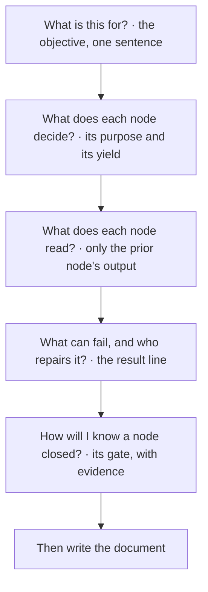

A1·e directive slots

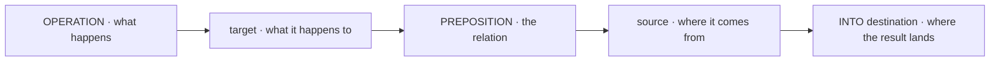

## Document structure

A document says what kind of instruction it is before it gives any instruction, which is the orient stage of [the loop](../START.md#the-loop) written down: what exists is declared before anything is done with it. A document is therefore a [self-describing structure](../ontology/PRINCIPLES.md#architecture-self-describing-structures), laid out as shown in [B1·a skeleton](#document-structure-panel-a) and ordered as shown in [B1·c parts in order](#document-structure-panel-c). A document that opens with a directive has left its own contract unstated. The type it declares is one of those listed in [B1·b the types](#document-structure-panel-b), and [B1·d what a type fixes](#document-structure-panel-d) shows what that one line settles before any node is walked.

### Declare, then instruct

A document with no declared type has an unstated contract, so each reader, the developer or the model, supplies its own. A reader cannot tell whether a document is a standing policy or a one-time task, walks a policy once and then drops it, and the rules it carried end up applying to nothing. A reader classifies a document from its first lines and reads everything after against that guess.

For this reason the type comes first, and everything after it is read against that type. The contract is fixed on the first line with a type, rather than left for the reader to infer from the directives below. In practice, a document runs in this order: the header, the declaration, the meta block and the frame the nodes cite, and it closes with the repair edge and the invariants.

To check this, cover everything below the declaration and ask what the document is for, what will walk it and how it will be used. A declaration that cannot answer all three is missing a type or an intent. A fragment reused inside other documents carries no header of its own, because the enclosing document already declared the contract. A fragment that declares a second type is two documents.

The meta block settles four things before any node runs. The priority between sources decides a disagreement before it arises. The trust anchor ensures that a claim from an untrusted source is never promoted to evidence just by being read. The jurisdiction states what the document may touch and what it declares outside itself, rather than leaving that assumed; it is the same boundary [the honest gaps](../SHIP.md#the-honest-gaps) draws for a system. The recursion limit makes a repair loop terminate. Choosing the type chooses the contract, the reasoning model and the axis at once, and the verb makes that choice legible on the first line.

The substrate and the spine are declared once and cited by every node. The substrate orders the nodes, as described in [node design](GUIDE.md#node-design), and each node names its stage on it. The spine declares every transition: which node leads to which, where a failed [verification](../ontology/PRINCIPLES.md#architecture-verification) sends the work back, and where the loop terminates. A node names its place on both and inherits the rest, which is why a document reads as one structure rather than ten separate documents. The document closes with its invariant records and a report, which states the verdict in a form a later checker can challenge, as described in [a report, not a checkbox](../VERIFY.md#a-report-not-a-checkbox).

B1·a skeleton

```pag
---
name: <document-name>
type: WORKFLOW
version: 1.0.0
---

THIS WORKFLOW EXECUTES <what it is for>

%% META %%:
    priority: <what outranks what when two sources disagree>
    trust: <what is trusted> = TRUSTED, <what is not> = UNTRUSTED
    objective: "<what finished looks like, checkable>"
    jurisdiction: <what the document may touch> | external: <what it declares outside itself>
    recursion_limit: <a bound on repair>

# THE FOUR LAYERS · each answers one question about this document
#   substrate  — how does the artifact come to be        grounds the order of the nodes, named on each by @genesis
#   epistemic  — how is it known                          orient · see · derive · project · act
#   conative   — what is worth doing                      intent · constrain            mandatory, always
#   evaluative — is it right, and are we done             verify · commit · terminate   mandatory, always

# YIELDS-SHAPE LEGEND · every decision resolves to a typed shape
#   set-theory → set|boolean · logic → boolean · graph → edge-list · optimization → boolean|ranking · computation → procedure

# SEMANTIC OPERATION BOUNDARY · nodes say WHAT as operations; an adapter decides HOW, and the core names no tool or path

# THE LOOP SPINE · transitions declared once, every node cites it
# node · layer · axis · yields · transition out

# NODE 1 — ORIENT … NODE 10 — TERMINATE · each with its four-slot tag, its genesis stage, its contract and one evidence-bearing gate

# REPAIR EDGE · verify refutes back to the earliest invalid node, bounded by recursion_limit

# CROSS-NODE INVARIANTS
INVARIANT <name>: <a property that could be false> over: <the set it ranges over> binds: <the parties it constrains> objector: <the check that would disagree | none>

REPORT:
  subject: <the terminal node>
  verdict: pass | fail | unknown
  domain: declared <N> measured <n>
  completion: saturated <bool> complete <bool> verified <bool>
```

B1·b the types

```pag
# a type binds a document to a reasoning model and to the axis of the loop it sits on

# cognition · how a system perceives, acts and adapts
THIS AGENT PERFORMS <a behavior, walked as nodes>                axis: reasoning
THIS WORKFLOW EXECUTES <a multi-node process>                    axis: formalization
THIS PROMPT IS <one interaction>                                 axis: formalization
THIS COMMAND EXECUTES <one invocable operation>                  axis: formalization

# pattern-cycle · how pattern-work proceeds
THIS PROTOCOL DEFINES <a standing procedure, as rules>           axis: formalization
THIS CHECKLIST PROVIDES <tasks with their contracts>             axis: formalization
THIS TASK EXECUTES <one objective>                               axis: formalization
THIS INSTRUCTION IS <general guidance>                           axis: formalization
THIS COMPOSITION RENDERS <a structure from anchors and modifiers> axis: formalization
THIS POLICY ENFORCES <a constraint set>                          axis: teleology
THIS TEMPLATE IMPLEMENTS <a reusable shape, slots open>          axis: representation

# epistemology · how a pattern is known
THIS TEST PERFORMS <a specification checked by running it>       axis: verification
THIS VERIFICATION PERFORMS <claims adjudicated against evidence> axis: verification
THIS AUDIT AUDITS <an artifact against a contract, then corrects> axis: verification
THIS DEBUG RESOLVES <a symptom to an evidence-scored cause>      axis: analysis
THIS DISTILLATION DISTILLS <repeated behavior into one base>    axis: reasoning
THIS TRANSLATION AUDITS <a rendering against its source>         axis: representation
```

B1·c parts in order

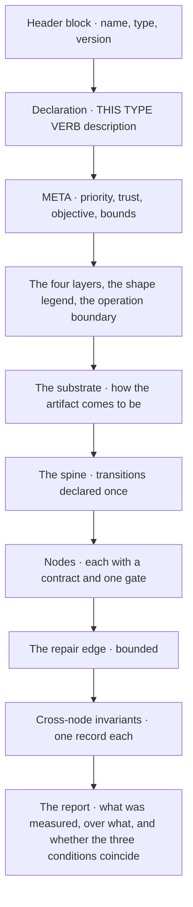

B1·d what a type fixes

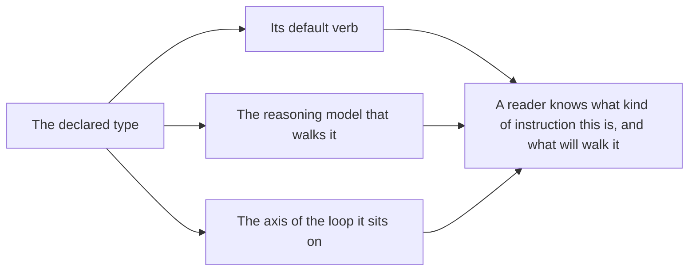

## Semantic operations

Every external effect in a document is a named semantic operation, with explicit parameters and an explicit binding for its result; [C1·e invocation parts](#tool-invocation-panel-e) names those parts, and [C1·c invocation forms](#tool-invocation-panel-c) writes them four ways. The operation says what happens, and [C1·a the operations](#tool-invocation-panel-a) groups the operations by the kind of effect. An adapter outside the document, one per harness, decides how the effect is carried out, which is the split shown in [C1·b document and adapter](#tool-invocation-panel-b) and [C1·d one adapter per harness](#tool-invocation-panel-d). An invocation is the act stage of [the loop](../START.md#the-loop), and it yields a procedure.

### Operations, not tools

An effect described in prose is not addressable by any adapter, and an effect named by one harness's tool is [hardcoded configuration](../ontology/PRINCIPLES.md#architecture-hardcoded-configuration) that only that harness can address. A library of documents names one harness's tools throughout, the harness changes its tool set, and every document breaks at once, which is [vendor lock-in leakage](../ontology/PRINCIPLES.md#architecture-vendor-lock-in-leakage) with nothing in any document to explain it. What one harness calls its tools changes when that harness changes, so any text written against those calls ages with it.

For this reason what an effect means is fixed in the text, and how it runs is decided outside it. The document is separated from the harness at the operation, with one adapter per harness, rather than one document being written per harness. In practice, every effect is named with a semantic operation and given a target, its parameters are passed through a named clause, and its result is bound to a name the next line can read. A location or a command is referred to through a slot the adapter resolves, never through a literal path, and the harness's own tool names, configuration files and features stay out of the document.

To check this, rename the harness under the document and hand it to a different model. Where a line fails, it carried a tool name or a path where an operation or a slot belonged, and the fix belongs in the adapter. A document written for exactly one throwaway session may name whatever it likes, because nothing will port it. The discipline is for a document that will be walked again, by another party, or under another harness.

The operations fall into three groups by the kind of effect: those that act on a tree and produce values, those that leave an artifact in it, and those that reach outside it or address another party. Each operation carries a [semantic contract](../ontology/PRINCIPLES.md#architecture-semantic-contracts), so a document relies on the contract rather than on what a particular tool happens to do.

[Portability](../ontology/PRINCIPLES.md#architecture-portability) follows from this boundary. Operations and slots in the document are [configuration externalization](../ontology/PRINCIPLES.md#architecture-configuration-externalization) applied to an instruction, and one adapter per harness is the [adapter pattern](../ontology/PRINCIPLES.md#architecture-adapter-pattern). A slot with no counterpart in a harness resolves as absent, as described under [limits](VALIDATION.md#limitations). A decision request is the clearest case: a participant has a question surface and a bounded reader does not, so the same operation resolves for one and is absent for the other, while the document stays unchanged. The model a document runs under is always a slot, because choosing the model belongs to the harness.

C1·a the operations

```pag
# SEMANTIC OPERATION BOUNDARY · a node states WHAT as an operation; an adapter decides HOW

# discover, read, search, analyze · operations against a tree that produce values
DISCOVER_RESOURCES "<pattern>" INTO <resources>
READ_RESOURCE <resource> INTO <content>
SEARCH_CONTENT <content> FOR <term> INTO <matches>
ANALYZE_CONTENT <content> AGAINST <criteria> INTO <findings>
EXTRACT_FACTS <fields> FROM <content> INTO <facts>
CALCULATE_METRIC <measure> FROM <facts> INTO <value>

# compose, validate, persist · operations that leave an artifact
COMPOSE_ARTIFACT <artifact> FROM <facts> USING <shape>
VALIDATE_ARTIFACT <artifact> AGAINST <schema>
PERSIST_ARTIFACT <artifact> TO <destination>

# execute, decide, report · effects outside the tree and on other parties
EXECUTE_TOOL <command> WITH timeout: <bound> INTO <result>
REQUEST_DECISION <party> WITH options: [<a>, <b>] INTO <choice>
REPORT_RESULT <artifact> TO <the parties whose next work it creates>
```

C1·b document and adapter

```pag
# the document names an operation and a slot · one adapter per harness resolves both, outside the document
READ_RESOURCE {project.governance_policy} INTO <policy>
EXECUTE_TOOL {toolchain.verify_command} INTO <verdict>

adapter:
    DISCOVER_RESOURCES → <the harness's discovery tool>
    READ_RESOURCE      → <the harness's read tool>
    SEARCH_CONTENT     → <the harness's search tool>
    EXECUTE_TOOL       → <the harness's shell>
    PERSIST_ARTIFACT   → <the harness's write tool>
    REQUEST_DECISION   → <the harness's question surface, or ABSENT for a bounded reader>
    {project.governance_policy} → <the path in this tree>
    {toolchain.verify_command}  → <the command in this tree, or ABSENT>
```

C1·c invocation forms

```pag
READ_RESOURCE <resource>                                 # the operation and its target
READ_RESOURCE <resource> INTO <parsed>                   # bound to a name the next line reads
SEARCH_CONTENT <scope> FOR <term> WITH glob: "*.md"      # named parameters
EXECUTE_TOOL <command> → <result>                       # the arrow is the same binding
```

C1·d one adapter per harness

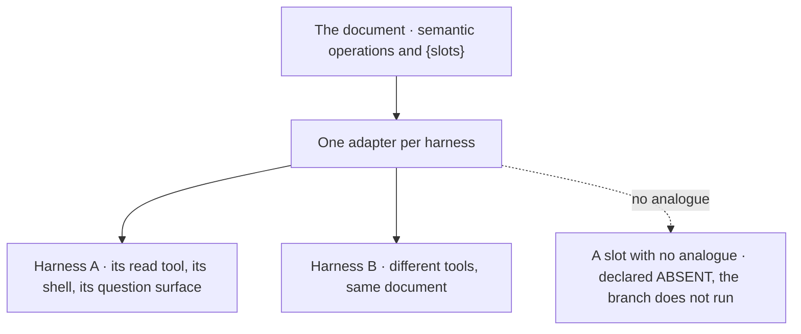

C1·e invocation parts

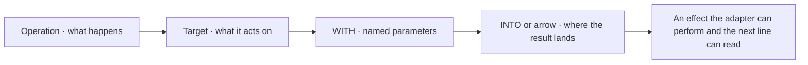

## Node design

A node is one bounded [unit of work](../ontology/PRINCIPLES.md#architecture-unit-of-work-pattern) with one decision, a declared input, a declared output and a gate at its end; [D1·a three granularities](#node-design-panel-a) shows this bounded form beside the two forms that fail. Data moves between nodes by name. A value is declared before its first use, its scope reaches every later node, and no node reads an output that a later node produces, which is the flow written out in [D1·b contracts in order](#node-design-panel-b) and shown in [D1·e forward flow](#node-design-panel-e). Dividing work into nodes is the project stage of [the loop](../START.md#the-loop). It yields the edges between units, and the order of the nodes follows how the artifact comes to be, as listed in [D1·c verb to stage](#node-design-panel-c), rather than a count chosen in advance. [D1·d split or combine](#node-design-panel-d) shows where a boundary belongs.

### Boundaries, data flow, genesis

Directives poured into one flat block have no repair point and no place a gate can hold. A node halfway through a long document fails, neither you nor the model can say which earlier output it needed, and the repair restarts from the top because no boundary was a real checkpoint. A gate can only check what a node produced, so a node that produces several unrelated things has a gate that checks a list rather than a unit.

For this reason the data flow from one node to the next is a contract, and the order of the nodes follows the genesis of the artifact. The boundaries decide the number of nodes, rather than a number deciding the boundaries. In practice, each node has one decision and ends with the gate that shows the decision was made. A node is split at a repair point, a persistence, a decision, or a condition the next node needs, and steps that succeed or fail together are combined. The nodes are ordered by dependency and by genesis, and every contract names the one prior output it reads and the one output it yields.

To check this, read each contract's input slot and name the earlier node that yields it. A node whose input names nothing from its predecessor is in the wrong place, an input that no node produces is a forward reference, and a node that builds before its input is found is a genesis inversion. A document with one decision has one node, and a gate at the end of it is still worth writing.

Granularity can fail in two directions, and both look tidy. If the nodes are too fine, each gate only checks that one line ran. If they are too coarse, the only gate is at the end, where it can no longer say which step failed. The bounded form has [high cohesion](../ontology/PRINCIPLES.md#architecture-high-cohesion) inside a node and [low coupling](../ontology/PRINCIPLES.md#architecture-low-coupling) across the boundary, so the boundary is a repair point and the result line can name its owner.

Node order follows the genesis of the artifact, which is what makes it derivable rather than chosen. A node never depends on an output from a later stage than the one it realizes, because a thing cannot be built before it is found, or checked before it is built. The same rule makes a document orderable as a [directed acyclic graph](../ontology/PRINCIPLES.md#architecture-directed-acyclic-graph), in which a genesis inversion and a forward reference are one defect seen from two sides.

D1·a three granularities

```pag
# too fine · a node per directive, a gate that checks one line ran
# NODE 1 — READ
    READ_RESOURCE <config> INTO <held>
# NODE 2 — PICK
    SET <name> = <held>.<field>

# too coarse · one node, no recovery point, no gate until the end
# NODE 1 — EVERYTHING
    READ_RESOURCE <config> INTO <held>
    READ_RESOURCE <records> INTO <rows>
    FOR EACH <row> IN <rows>:
        COMPOSE_ARTIFACT <shaped> FROM <row> USING <held>.<rules>
        PERSIST_ARTIFACT <shaped> TO <output>

# bounded · one decision per node, a gate at each boundary
# NODE 1 — CONFIGURATION   [epistemic · analysis · set-theory · yields: set]
CONTRACT:
  input:   <the declaration's objective>
  output:  <config>, validated
HANDOFF GATE:
  [check] <config> read (evidence: the read returned content)
  [check] <config> conforms (evidence: VALIDATE_ARTIFACT against <schema> passed)
  [check] <config>.<rules> is non-empty (evidence: a count above zero)
  result: pass → NODE 2 | nonconforming → REPAIR (owner: NODE 1) | unknown → BLOCKED

# NODE 2 — TRANSFORMATION  [epistemic · formalization · computation · yields: procedure]
CONTRACT:
  input:   <config> from NODE 1, and nothing else
  output:  <shaped-records>
HANDOFF GATE:
  [check] one entry per <record> (evidence: the two counts match) over: <records> measured: <shaped> / <records>
  [check] every entry conforms to <config>.<rules> (evidence: VALIDATE_ARTIFACT passed on each)
  [check] <records> unchanged (evidence: a witness read after the transform)
  result: pass → NODE 3 | count mismatch → REPAIR (owner: NODE 2) | unknown → BLOCKED
```

D1·b contracts in order

```pag
# NODE 1 — DISCOVERY   [epistemic · analysis · set-theory · yields: set]
@genesis: existence
CONTRACT:
  input:     <the objective's pattern>
  transform: DISCOVER_RESOURCES "<pattern>" INTO <files>
  output:    <files>
HANDOFF GATE:
  [check] <files> is non-empty (evidence: a count above zero)
  [check] every <file> matches <pattern> (evidence: the discovery's own filter) over: <files> measured: <matching> / <files>
  [check] no <file> lies outside <root> (evidence: every path prefixed by <root>)
  result: pass → NODE 2 | empty set → REPAIR (owner: NODE 1) | unknown → BLOCKED

# NODE 2 — ANALYSIS     [epistemic · reasoning · logic · yields: boolean]
@genesis: difference
CONTRACT:
  input:     <files> from NODE 1
  transform: FOR EACH <file> IN <files>: READ_RESOURCE <file> INTO <content>; ANALYZE_CONTENT <content> AGAINST <pattern> INTO <finding>; APPEND <finding> TO <findings>
  output:    <findings>
HANDOFF GATE:
  [check] every <file> read (evidence: one content per file) over: <files> measured: <read> / <files>
  [check] one <finding> per <file> (evidence: the two counts match)
  [check] every <finding> names its <file> (evidence: no finding with an empty source)
  result: pass → NODE 3 | unread file → REPAIR (owner: NODE 2) | unknown → BLOCKED

# NODE 3 — REPORTING    [evaluative · representation · information-theory · yields: artifact]
@genesis: structure
CONTRACT:
  input:     <findings> from NODE 2 · never anything a later node produces
  transform: COMPOSE_ARTIFACT <report> FROM <findings> USING <shape>; PERSIST_ARTIFACT <report> TO <destination>
  output:    <report>
  freshness: fingerprint(<findings>) + fingerprint(this document)
HANDOFF GATE:
  [check] <report> names every entry in <findings> (evidence: each finding's id present) over: <findings> measured: <named> / <findings>
  [check] <report> persisted (evidence: a read of <destination> returns it)
  [check] <findings> unchanged since NODE 2 (evidence: a witness read)
  refuse: <destination> changed since it was read before PERSIST_ARTIFACT
  result: pass → TERMINATE | missing entry → REPAIR (owner: NODE 3) | unknown → BLOCKED
```

D1·c verb to stage

```pag
# a verb realizes one stage of how an artifact comes to be
# and a node never depends on a later stage than the one it realizes
READ, FIND        → existence       does it exist, is it found
ANALYZE, FILTER   → difference      what distinguishes it
EXTRACT, LINK     → relation        what it connects to
CREATE, WRITE     → structure       how its parts are arranged
EXECUTE, ITERATE  → transformation  what operation it performs
VERIFY            → constraint      what bounds it

# a genesis inversion · a decomposition defect, not a tie to break
# NODE 1 — BUILD    COMPOSE_ARTIFACT <base> FROM <signatures>      structure
# NODE 2 — FIND     DISCOVER_RESOURCES <signatures> INTO <found>   existence · needed by NODE 1
```

D1·d split or combine

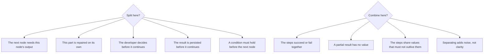

D1·e forward flow

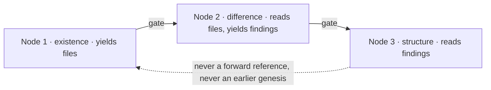

## Writing constraints

A constraint states a boundary in a form the model can quote back and a reviewer can check against a line. It has four parts: a property that could be false, the set it ranges over, the parties it binds, and the objector that would disagree if it stopped holding; [E1·e four slots](#writing-constraints-panel-e) shows these parts, and [E1·a invariant records](#writing-constraints-panel-a) fills them in. A rule that holds everywhere names every node as its set, and a rule that holds inside a context names that context. The invariant block is the constrain stage of [the loop](../START.md#the-loop). It decides what is admissible and yields a boolean over the work rather than an opinion about it, and it closes the document, as shown in [E1·c worked document](#writing-constraints-panel-c). A rule written as encouragement is judged rather than checked, as traced in [E1·d exhortation or record](#writing-constraints-panel-d). A rule written as a bullet under a heading carries no set and no objector, so nothing can say when it was broken, and [E1·b exhortation rewritten](#writing-constraints-panel-b) shows the repair.

### Rules the model can quote

A rule stated as an exhortation binds nothing, because neither you nor a check can say when it was broken. A document says handle errors properly, the model wraps some operations and not others, and the reviewer cannot say the rule was broken because the rule never said what handling was. A model completes an exhortation with whatever careful looks like in its training, and a specific prohibition with the thing it names; a record with a named objector is the only form in which a reviewer and a check read the same rule.

For this reason a behavioral boundary is written as a checkable record with its objector, not as guidance. The reach of a broad exhortation is traded for the checkability of a narrow record, with one violating directive per rule and one objector per record. In practice, each constraint is stated as an invariant record: a name, a property with a verb and its operand, the set it ranges over, the parties it binds, and the objector, which is either a gate check or none. A rule that holds only in a context is scoped by naming the context in its set, rather than by nesting a block. Each record is written so that a reviewer can point at a directive and say it broke this one, and the block sits after the last node.

To check this, write for each constraint the one directive that would violate it, and name the check that would notice. A constraint with no violating directive is an exhortation, and one with no objector is declared debt, which the record states with none. A constraint the model cannot observe from inside the document, such as a rule about its own confidence, cannot be checked by anything and belongs under [limits](VALIDATION.md#limitations) rather than in an invariant record.

Scope is what keeps a constraint set small: a rule that holds everywhere is stated once, with every node as its set, and a rule that holds somewhere names where. The rewrite from exhortation to record is the same move every time. The operation and the operand are named, the adverb is dropped, and the objector is stated. Writing rules this way is [policy as code](../ontology/PRINCIPLES.md#architecture-policy-as-code), and it lets a gate's check cite an invariant by name rather than restating it, as described in [orchestration invariants](ORCHESTRATION.md#orchestration-invariants).

Invariants close a document rather than open it, because they are read against the work they bind. A recovery block sits near the top, because recovery is a mechanism rather than a rule.

E1·a invariant records

```pag
# CROSS-NODE INVARIANTS · hold for every node, read after the nodes they bind · each a record with four slots
INVARIANT read-before-write: a surface is read whole before anything is persisted to it over: every persisting node binds: the reader objector: [check] a witness read precedes PERSIST_ARTIFACT
INVARIANT validate-at-boundary: an input is validated at every node boundary over: every node binds: the reader objector: [check] VALIDATE_ARTIFACT ran on the input at the gate
INVARIANT prior-output-only: a node reads only the prior node's output over: every node binds: the reader objector: [check] input names NODE n-1 or a slot
INVARIANT no-silent-blocker: a blocker stops the run until a decision is requested over: every node binds: the reader objector: [check] result routes unknown to BLOCKED
INVARIANT source-untouched: <source> is never modified in place over: <source> binds: the reader objector: none

# scoped · a property that holds only inside a named context is stated with that context in its set
INVARIANT encrypt-sensitive: every sensitive field is encrypted before it leaves the node over: nodes handling <sensitive-data> binds: the reader objector: [check] no plain-text field in the persisted artifact
INVARIANT audit-access: every access to <sensitive-data> is recorded over: nodes handling <sensitive-data> binds: the reader objector: [check] one audit entry per access
INVARIANT bounded-retention: <data> is not retained past <retention-period> over: persisted <data> binds: the reader objector: none
```

E1·b exhortation rewritten

```pag
# a rule the model can quote back · and a reviewer can check against a line
ALWAYS handle errors properly
INVARIANT wrapped-io: every <file-operation> runs inside TRY/CATCH over: file operations binds: the reader objector: [check] no bare file operation in the transform

NEVER do bad things
INVARIANT inside-the-root: nothing is persisted outside <workspace-root> over: every PERSIST_ARTIFACT binds: the reader objector: [check] every destination under the root

ALWAYS be careful with data
INVARIANT validated-first: <data> is validated against <schema> before it is processed over: every node reading <data> binds: the reader objector: [check] VALIDATE_ARTIFACT precedes the first use

NEVER modify anything
INVARIANT read-only-zone: no file in <read-only-zone> is modified over: <read-only-zone> binds: the reader objector: [check] a witness read of the zone after the run
```

E1·c worked document

```pag
---
name: <processor-name>
type: WORKFLOW
version: 1.0.0
---

THIS WORKFLOW EXECUTES validation and transformation of <records>

%% META %%:
    objective: "An <output> whose entry count matches the conforming input"
    jurisdiction: <source> and <output> | external: every other file
    recursion_limit: 2

ON ERROR <write-failed>:
TRY:
    RENAME <file> TO <file>.bak
    PERSIST_ARTIFACT <content> TO <file>
    DELETE <file>.bak
CATCH:
    RENAME <file>.bak TO <file>

# NODE 1 — INPUT VALIDATION   [epistemic · analysis · logic · yields: boolean]
@genesis: existence
CONTRACT:
  input:     <source>
  transform: READ_RESOURCE <source> INTO <input>; FOR EACH <row> IN <input>.<rows>: VALIDATE_ARTIFACT <row> AGAINST <schema>; IF <row>.<conforms>: APPEND <row> TO <valid> ELSE: REPORT_RESULT "<which row, which field>"
  output:    <valid>
HANDOFF GATE:
  [check] <input> read (evidence: the read returned rows)
  [check] every <row> validated (evidence: one verdict per row) over: <input>.<rows> measured: <validated> / <rows>
  [check] every non-conforming <row> reported with its field (evidence: the report names a field per rejection)
  result: pass → NODE 2 | unread → REPAIR (owner: NODE 1) | unknown → BLOCKED

# NODE 2 — TRANSFORMATION     [epistemic · formalization · computation · yields: procedure]
@genesis: transformation
CONTRACT:
  input:     <valid> from NODE 1
  transform: FOR EACH <row> IN <valid>: COMPOSE_ARTIFACT <entry> FROM <row> USING <mapping>; APPEND <entry> TO <shaped>
  preserves: the source row of every entry
  output:    <shaped>
HANDOFF GATE:
  [check] one <entry> per <row> in <valid> (evidence: the two counts match) over: <valid> measured: <shaped> / <rows>
  [check] every <entry> conforms to <mapping> (evidence: VALIDATE_ARTIFACT passed on each)
  [check] <valid> unchanged (evidence: a witness read after the transform)
  result: pass → NODE 3 | mismatch → REPAIR (owner: NODE 2) | unknown → BLOCKED

# NODE 3 — OUTPUT             [evaluative · representation · information-theory · yields: artifact]
@genesis: emergence
CONTRACT:
  input:     <shaped> from NODE 2
  transform: PERSIST_ARTIFACT <shaped> TO <output>
  output:    <output>
  freshness: fingerprint(<shaped>) + fingerprint(this document)
HANDOFF GATE:
  [check] <output> persisted (evidence: a read of <output> returns it)
  [check] entry count of <output> matches <shaped> (evidence: the two counts match) over: <shaped> measured: <persisted> / <entries>
  [check] <source> unchanged (evidence: a witness read)
  refuse: <output> changed since it was read before PERSIST_ARTIFACT
  result: pass → TERMINATE | loss → REPAIR (owner: NODE 3) | unknown → BLOCKED

# CROSS-NODE INVARIANTS
INVARIANT validate-before-transform: every row is validated before any transform reads it over: every node binds: the reader objector: [check] every <row> validated at NODE 1
INVARIANT reject-with-field: a rejected <row> is reported with its field over: rejected rows binds: the reader objector: [check] the report names a field per rejection at NODE 1
INVARIANT source-untouched: <source> is never modified over: <source> binds: the reader objector: [check] <source> unchanged at NODE 3
INVARIANT non-empty-input: the run does not proceed with zero conforming rows over: every run binds: the reader objector: [check] every <row> validated at NODE 1 over a non-empty set

REPORT:
  subject: NODE 3
  verdict: pass | fail | unknown
  domain: declared <rows> measured <validated>
  populations: conforming <n>, rejected <n>, persisted <n>
  completion: saturated <bool> complete <bool> verified <bool>
```

E1·d exhortation or record

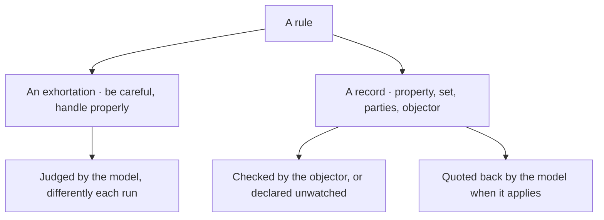

E1·e four slots

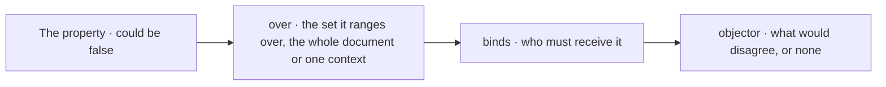

## Well-formedness

This section covers the [static analysis](../ontology/PRINCIPLES.md#architecture-static-analysis) that decides whether a document can be trusted; [F1·e two routes to trust](#well-formedness-panel-e) contrasts it with trusting a document because it reads fluently, and [F1·d the scan](#well-formedness-panel-d) shows the scan. Each defect is named for the shape it catches and has one fix, as paired in [F1·a defect set](#well-formedness-panel-a) and reported in [F1·b scan result](#well-formedness-panel-b). The syntactic defects are a missing declaration, a bare iteration, a lowercase [keyword](KEYWORDS.md#keyword-ontology), a conditional with no colon, a malformed node tag, and a node declared twice. The epistemic defects are a node with no gate, a gate with fewer than three or more than five checks, a check that is a judgment, a check with no evidence, a gate with no population or an empty one, and an unknown left unrouted. The remaining defects are a write with no refusal, an artifact with no freshness, an input that names no source, an invariant missing its set, its parties or its objector, and a bare invariant block. The scan is the terminate stage applied to the document itself: it yields one boolean, and because it reads tokens rather than patterns, its verdict has [repeatability](../ontology/PRINCIPLES.md#architecture-repeatability).

### The defect set and the scan

Polished prose is treated as proof that the instructions are sound. A document reads well, but a bare iteration completes as a count, the node produces one result instead of many, and the gate that would have caught it was never written. Fluency is a property of prose, and the defects that break a document are properties of tokens the prose reader does not see.

For this reason trust comes from a result that repeats on every run, and fluency earns none of it. The tokens are scanned rather than matched against a pattern or read for fluency, because only a token scan reports a location a reader can go to. In practice, a document is scanned for the defect set before it is walked and after every edit. Each defect is reported with its location, what was found, what was expected and the one fix, so a reader repairs the line rather than re-reading the whole document. A document is trusted only when the defect set is empty, and a fluent document that fails the scan counts as ill-formed, however well it reads.

To check this, plant one defect from the set in a passing document and scan it. A scan that stays green cannot catch that class of defect, and a scan that reports it at the wrong location is matching a pattern rather than reading tokens. Well-formedness is structure, not meaning. A document can pass every scan and still ask for the wrong thing, and that is what the gates, the review and the method exist to catch.

The defect set is the grammar's taxonomy of failures, and it is derived rather than collected. Each epistemic defect is one of the ways a representation escapes its check, which the methodology page names from the other side in [the honest gaps](../SHIP.md#the-honest-gaps) and [coverage is derived](../VERIFY.md#coverage-is-derived). A check with no population is the gate that passed over nothing, and an unknown left unrouted is the verdict that folded a third value into pass. A write with no refusal is an irreversible act with nothing to stop it, an input that names no source is a dependency inferred from a name, and an invariant with no objector is a property nothing would disagree with. Each defect has one repair, which is what lets a scanner state it. The scan works on tokens and uses no pattern language; that is a fact about the scanner rather than the grammar, whose conditions may still carry a pattern literal.

Three defects that the scan does not catch show up as gate failures instead, as shown in [F1·c gate failures](#well-formedness-panel-c), and all three are found by tracing a value from the node that yields it to the node that reads it. One of them, a contract whose input names a later node's output, is repaired in the decomposition rather than in the line, because the node is in the wrong place.

F1·a defect set

```pag
# no declaration · a document with no stated kind
%% META %%:
THIS WORKFLOW EXECUTES <what it is for>

# a bare iteration · reads as a count, completes as one
FOR <item> IN <collection>:
FOR EACH <item> IN <collection>:

# a lowercase keyword · a word, not a token
if <condition>
IF <condition>:

# a node with no gate · a unit nothing can prove closed
# NODE 2 — CONVERT   [epistemic · formalization · computation · yields: procedure]
    COMPOSE_ARTIFACT <shaped> FROM <row> USING <rules>
# NODE 2 — CONVERT   [epistemic · formalization · computation · yields: procedure]
    COMPOSE_ARTIFACT <shaped> FROM <row> USING <rules>
    HANDOFF GATE:
      [check] every <row> converted (evidence: one <shaped> per row) over: <rows> measured: <converted> / <rows>
      [check] <shaped> holds one entry per <row> (evidence: the two counts match)
      [check] every entry conforms to <rules> (evidence: VALIDATE_ARTIFACT passed on each)
      result: pass → NODE 3 | mismatch → REPAIR (owner: NODE 2) | unknown → BLOCKED

# a vague check · a judgment in a gate
[check] data looks good
[check] <data>.<field> matches <pattern> (evidence: the match returned true)

# a check with no evidence · a claim the gate cannot settle
[check] <report> is complete
[check] <report> names every entry in <findings> (evidence: each finding's id present)

# a gate with no population · a verdict about nothing
[check] every <file> conforms (evidence: the validator's report)
[check] every <file> conforms (evidence: the validator's report) over: <files> measured: <conforming> / <files>

# an unknown left unrouted · the third verdict absorbed into pass
result: pass → NODE 3 | failure → REPAIR (owner: NODE 2)
result: pass → NODE 3 | failure → REPAIR (owner: NODE 2) | unknown → BLOCKED

# a write with no refusal · an irreversible act with no condition to stop it
PERSIST_ARTIFACT <shaped> TO <destination>
refuse: <destination> changed since it was read before PERSIST_ARTIFACT

# an invariant with no objector · a property nothing would disagree with
INVARIANT one-writer: a record has exactly one writer
INVARIANT one-writer: a record has exactly one writer over: every record binds: every party objector: [check] one open fence per record

# a bare invariant block · a bullet under a head, with no set, no parties, no objector
ALWAYS:
  - VALIDATE at node boundaries
INVARIANT validate-at-boundary: every node validates its output over: every node binds: the reader objector: [check] the gate ran

# a prose directive · an instruction the model must interpret
Get the customer data and check it
READ_RESOURCE <records> INTO <held>
VALIDATE_ARTIFACT <held> AGAINST <schema>
```

F1·b scan result

```text
document: <name>
  defect      for_without_each
  locus       NODE 2, line 4
  found       FOR <item> IN <collection>:
  expected    FOR EACH <item> IN <collection>:
  fix         insert EACH after FOR

  defect      gate_without_population
  locus       NODE 3, gate
  found       three checks, none with a set
  expected    at least one check measured over a declared set
  fix         name the set and the count measured over it

  defect      unknown_unrouted
  locus       NODE 3, result line
  found       pass and failure arms only
  expected    an unknown arm routed to BLOCKED
  fix         add the third arm

  defect      invariant_without_objector
  locus       cross-node invariants, one-writer
  found       a property with no objector
  expected    the check that would disagree, or none as declared debt
  fix         name the objector

verdict: ill_formed
```

F1·c gate failures

```pag
# a value undefined in a later node
# cause · declared inside a branch, so it exists only there
IF <condition>:
    DECLARE <result>: object

DECLARE <result>: object
IF <condition>:
    SET <result>.<value> = <data>

# a gate that always fails
# cause · the check names a value the node never produced
    APPEND <item> TO <processed-items>
HANDOFF GATE:
    [check] <processed-list> populated (evidence: a count above zero)

    APPEND <item> TO <processed-items>
HANDOFF GATE:
    [check] <processed-items> populated (evidence: a count above zero)

# a contract that reads forward
# cause · the input names an output a later node yields
# NODE 2 — ANALYSIS
CONTRACT:
  input: <report> from NODE 3

# NODE 2 — ANALYSIS
CONTRACT:
  input: <files> from NODE 1
```

F1·d the scan

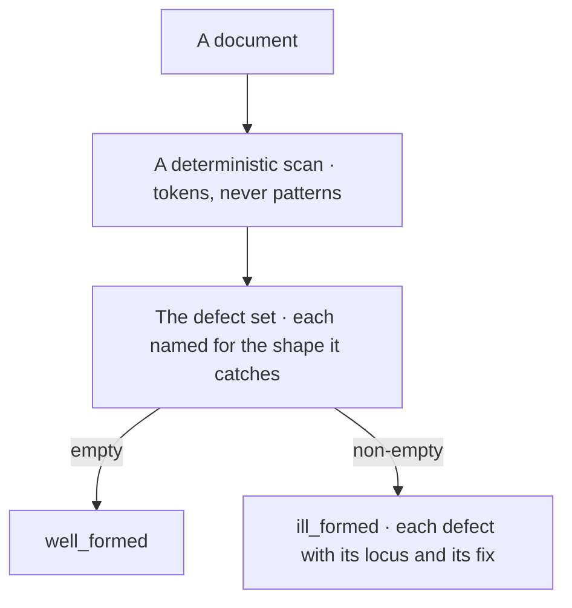

F1·e two routes to trust

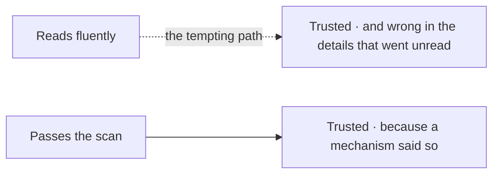

---

Chapters: [Introduction](INTRODUCTION.md) · [Guide](GUIDE.md) · [Orchestration](ORCHESTRATION.md) · [Patterns](PATTERNS.md) · [Keywords](KEYWORDS.md) · [Grammar](GRAMMAR.md) · [Validation](VALIDATION.md) · [Templates](TEMPLATES.md)
