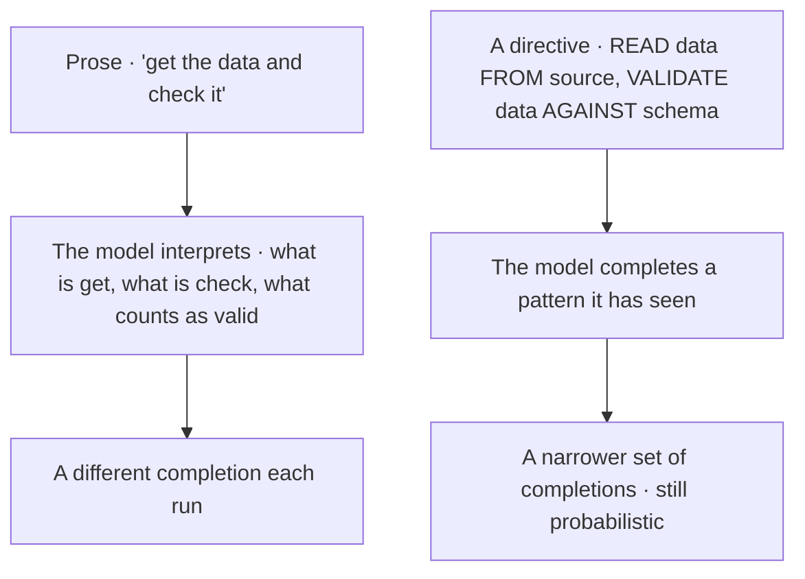
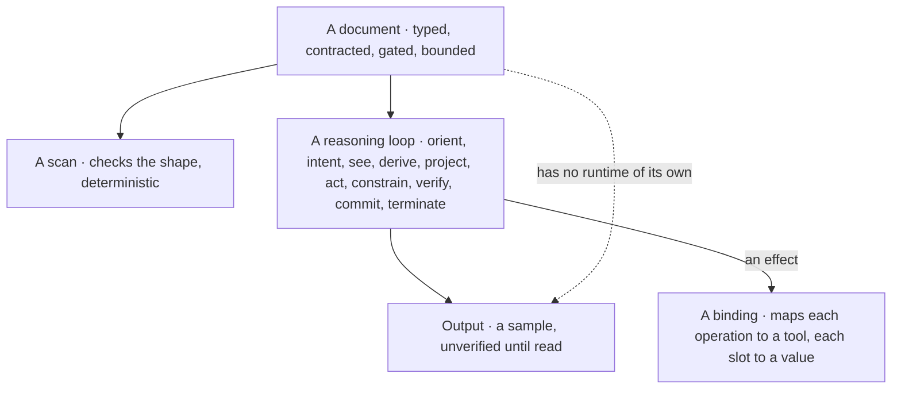
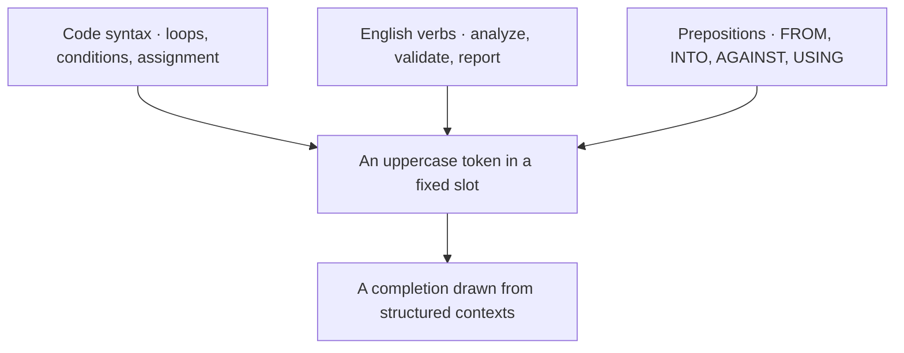
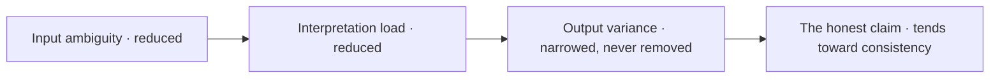
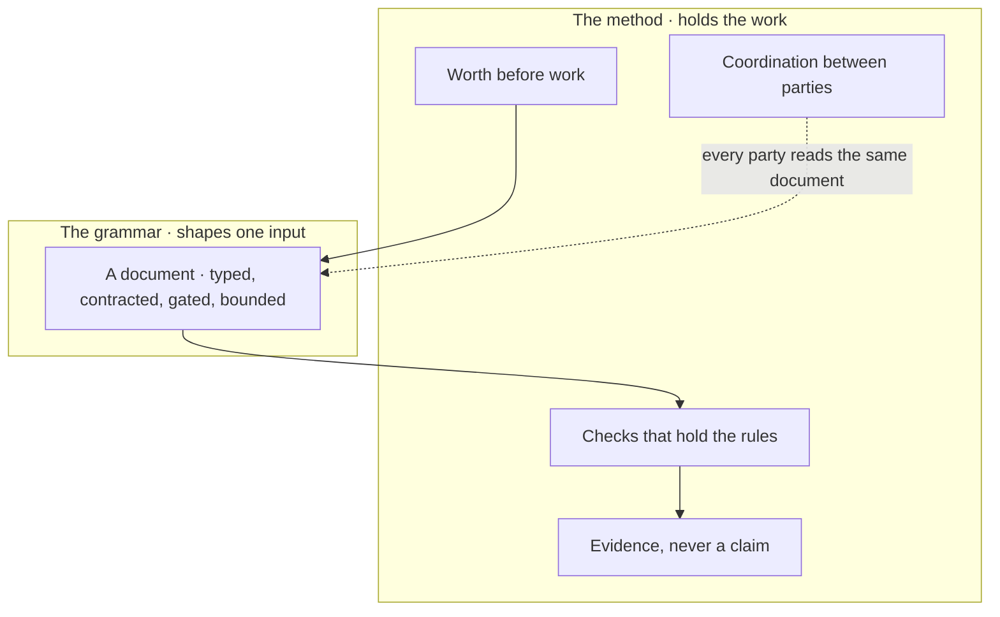
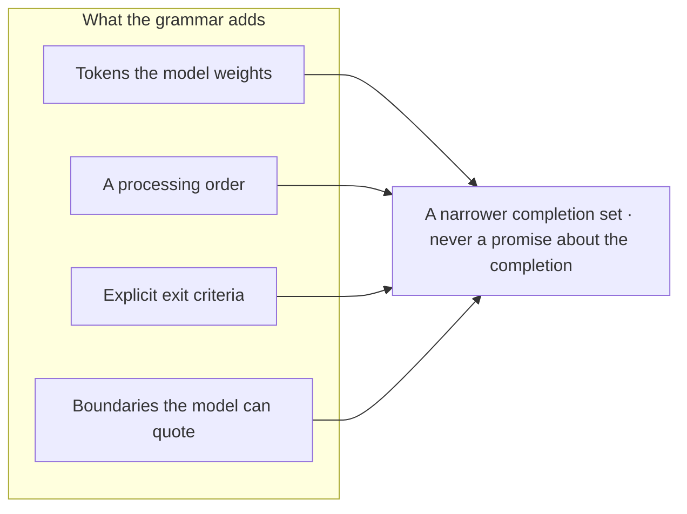

© 2025 Jay Baleine - Disciplined Methodology · Bane's Lab documentation is covered by [CC BY-SA 4.0](https://creativecommons.org/licenses/by-sa/4.0/)

# PAG — Bane's Lab

> Pattern Abstract Grammar (PAG) is a structured format for writing instructions to LLMs, defined by a formal grammar that is grounded in a reasoning ontology and published with a guide and a set of templates.

Canonical: https://banes-lab.com/pag

# Pattern Abstract Grammar

Structured instructions for LLMs

# Introduction

## What PAG is

Pattern Abstract Grammar (PAG) is a structured format for writing the instructions a model is asked to follow. A PAG document declares what kind of instruction it is and what it may touch, and it draws every operative word from a [closed vocabulary](../ontology/PRINCIPLES.md#architecture-closed-vocabulary) of uppercase tokens grounded in a reasoning ontology. The work is grouped into nodes; each node reads the previous node's output and closes on a gate of checkable conditions, each with its evidence and the population it covers. The document states its boundaries as invariant records and ends with a report, and [A1·a minimal document](#what-is-pag-panel-a) shows all of these parts together. Each part is one stage of a reasoning loop written down, as listed in [A1·b construct to stage](#what-is-pag-panel-b), so the document makes [the loop](../START.md#the-loop) legible. [A1·c prose or directive](#what-is-pag-panel-c) shows where variance enters without the grammar, and [A1·d scan, loop, binding](#what-is-pag-panel-d) shows what walks a document. What the tokens gain is described in [why it works](INTRODUCTION.md#why-pag-works), and what the grammar never reaches is described under [limits](VALIDATION.md#limitations).

### A contract, not a request

An instruction written as prose leaves its terms to the model that reads it. The same request run twice produces two plausible results, and neither you nor the model can say which sentence was read differently. An [implicit contract](../ontology/PRINCIPLES.md#architecture-implicit-contract) leaves the model to supply the terms, and it supplies them from the completion, so they vary with it.

For this reason I write an instruction as an [explicit contract](../ontology/PRINCIPLES.md#architecture-explicit-contracts) rather than as a request in prose. The instruction gets a type rather than sharper prose: a declared type, tokens from a closed set and gates with checkable exits, rather than a longer or more careful sentence. In practice, an instruction is written as a PAG document when a reasoning loop will walk it. The document declares its type, states a checkable objective, divides the work into nodes with contracts, closes each node on three to five checks that can be settled with evidence, and bounds the whole with invariants.

To check this, hand the same document to the model twice and compare both outputs against the gates. Where both runs pass every gate, the structure held; where one fails, the failing gate points to the sentence that was still prose. A prompt that asks one question in passing gains nothing from a node structure. The grammar earns its cost where the document will be walked more than once, read by more than one party, or trusted to have done what it says.

A document has no runtime. What walks it is a reasoning loop, the one the methodology page teaches, and every construct of the grammar makes one of that loop's stages explicit. The document type names which reasoning model walks the document and on which axis of the loop it sits, and an adapter outside the document maps each [semantic operation](GUIDE.md#tool-invocation) to the tool that performs it.

Two kinds of check apply to a document. A scan checks its shape; that is [static analysis](../ontology/PRINCIPLES.md#architecture-static-analysis), deterministic and cheap, and it is what makes the grammar parsable. The loop checks its meaning, and that check is not deterministic, because the loop is walked by a model.

A1·a minimal document

```pag
---
name: <document-name>
type: TASK
version: 1.0.0
---

THIS TASK EXECUTES <what the document is for, in one sentence>

%% META %%:
objective: "<what finished looks like, checkable against the tree>"
jurisdiction: <source> | external: everything else
recursion_limit: <a bound on repair>

# NODE 1 — <the first bounded decision>   [epistemic · analysis · logic · yields: boolean]
@genesis: existence
CONTRACT:
input:     <source>
transform: READ_RESOURCE <source> INTO <held>; VALIDATE_ARTIFACT <held> AGAINST <schema>
output:    <held>, validated
HANDOFF GATE:
[check] <held> read from <source> (evidence: the read returned content)
[check] <held> conforms to <schema> (evidence: the validator's report) over: <held> records measured: <conforming> / <records>
[check] every <held>.<record> carries the fields NODE 2 reads (evidence: no record with a missing field)
result: pass → NODE 2 | unread or nonconforming → REPAIR (owner: NODE 1) | unknown → BLOCKED

# NODE 2 — <the decision that consumes the first>   [epistemic · reasoning · set-theory · yields: set]
@genesis: difference
CONTRACT:
input:     <held> from NODE 1
transform: FOR EACH <item> IN <held>.<collection>: ANALYZE_CONTENT <item> AGAINST <criterion> INTO <finding>; IF <finding>.<met>: APPEND <item> TO <result>
output:    <result>
HANDOFF GATE:
[check] every <item> analyzed (evidence: one finding per item) over: <held>.<collection> measured: <analyzed> / <items>
[check] <result> holds every <item> that met <criterion> (evidence: the two counts match)
[check] no <item> outside <held> appears in <result> (evidence: every result item present in <held>)
result: pass → TERMINATE | count mismatch → REPAIR (owner: NODE 1) | unknown → BLOCKED

# CROSS-NODE INVARIANTS
INVARIANT validate-before-persist: <held> is validated before anything is persisted over: every node binds: the reader objector: [check] <held> conforms to <schema> at NODE 1
INVARIANT source-untouched: <source> is never modified in place over: <source> binds: the reader objector: none

REPORT:
subject: NODE 2
verdict: pass | fail | unknown
domain: declared <items> measured <analyzed>
completion: saturated <bool> complete <bool> verified <bool>
```

A1·b construct to stage

```pag
# each construct of a document is one stage of the reasoning loop, written down
declaration          orient      what kind of instruction exists, and what it may touch   yields: a set
keyword directive    see         the lens the intent is read through                    yields: a structured line
node                 project     what follows what, as a contract                       yields: an edge-list
control flow         act         which branch, which iteration                          yields: a procedure
semantic operation   act         which effect, bound to a result                        yields: a procedure
invariant record     constrain   what is admissible, and what would object               yields: a boolean
handoff gate         verify      what evidence closes the node, over what set           yields: pass, fail or unknown
report               commit      the verdict as a representation a checker can challenge yields: an artifact
well-formedness      terminate   whether the document may be trusted                    yields: a boolean
```

A1·c prose or directive



A1·d scan, loop, binding



## Why it works

The grammar does not change how a model behaves; it changes what the model is completing. A large language model predicts the next token from the patterns it was trained on, and a large share of that training is code, configuration and structured documentation. [B1·a three sources](#why-pag-works-panel-a) writes those three sources into one line, and [B1·b vocabulary origin](#why-pag-works-panel-b) shows how they combine. What that gains is limited, and [B1·c the honest claim](#why-pag-works-panel-c) states the limit.

### Pattern completion

Polishing an instruction's wording tends not to change how precisely the model follows it. A page of careful prose gets a confident result that answers a slightly different question, and the difference stays invisible until the result is run. The model completes what it has seen most often, and uppercase verbs with explicit prepositions are what it has seen in code, configuration and documentation.

For this reason I use explicit, high-frequency tokens, which reduce interpretive variance while the output stays probabilistic. Ambiguity is reduced at the input and the output is verified, rather than the input being asked to guarantee anything. In practice, every operative word comes from the [keyword](KEYWORDS.md#keyword-ontology) vocabulary, and its operands are bound with a preposition, so the model completes a recognized structure instead of interpreting a sentence. The intent is stated as an English verb the reader can review.

To check this, rewrite one prose instruction as a directive and run both several times against the same gates. The directive should pass more often, and where it does not, the gate that fails is the one whose condition was still a judgement. Structure helps where the model has seen the structure. A vocabulary invented for one project is prose with capital letters, and the model interprets it as it would interpret a sentence.

The vocabulary combines code syntax for structure with English verbs for intent and prepositions for the relations between operands. A line that carries all three is one the model can complete and a reviewer can read without a legend.

Token frequency is the reason the vocabulary is uppercase and closed. A word that appears in the same slot across many structured contexts carries a stable meaning into the completion, while a word that appears with many meanings carries all of them. So the grammar keeps its verbs few and capitalised, and gives each one a [semantic contract](../ontology/PRINCIPLES.md#architecture-semantic-contracts), stated under [instruction patterns](PATTERNS.md#instruction-patterns). One term for one operation is the [ubiquitous language](../ontology/PRINCIPLES.md#architecture-ubiquitous-language) the model and the reviewer share.

Reducing ambiguity works at the derive stage of [the loop](../START.md#the-loop). There the model works out what a line means, and a line drawn from the vocabulary leaves it one reading where prose leaves several.

B1·a three sources

```pag
# code syntax · a structural pattern the model has completed many times
FOR EACH <item> IN <collection>:

# an english verb · the intent, readable by a reviewer
ANALYZE <held> AGAINST <schema>

# a preposition · the relation between the operands
READ <config> FROM <file> INTO <settings>

# together · one line the model completes and a reviewer can read
EXTRACT <field> FROM <record> INTO <value>
```

B1·b vocabulary origin



B1·c the honest claim



## PAG and the method

A PAG document is one instrument, a single input inside [the loop](../START.md#the-loop) the method owns, as shown in [C1·a one input](#pag-and-the-method-panel-a). It shapes what a model reads, but nothing about it decides whether the work was worth doing, whether the result is true, or how several parties share one tree. Those questions are handled on the methodology page, in [worth before work](../PLAN.md#worth-before-work), [it looked right](../VERIFY.md#it-looked-right) and [coordination is software](../COLLABORATE.md#coordination-is-software). Where a section of this page touches them, it shows how a document expresses them and leaves the reasoning where it lives.

### One instrument inside a method

A document that reads well invites the belief that it did what it says, and a document cannot carry out its own [verification](../ontology/PRINCIPLES.md#architecture-verification). A team writes careful documents, skips the checks because the documents read as complete, and discovers in production that a gate the model reported as passed was never evaluated by anything. A well-shaped input reads as a guarantee because the output usually matches it, and the failures live in the runs where it does not.

For this reason the grammar shapes an input, and the method holds the work around it. The checks sit outside the document, in a gate the method runs, rather than inside it as sentences the model completes. In practice, a document shapes one input: the instruction a party reads before it acts. Everything around that input is held by the method. Worth is decided before the document is written, the output is checked by a gate the document did not run, and parties coordinate through surfaces the document only reads.

To check this, take a document that reported every gate as passed and run the checks the method names over its output. A gate the checks contradict was a sentence the model completed, and the document could not have known. A collaboration with no tools and no shared tree is a conversation, and a document there is a well-shaped message. The instrument does its work where an adapter can perform what the document names.

What a document adds to a collaboration is concrete, as listed in [C1·b what it adds](#pag-and-the-method-panel-b), and each addition narrows the set of completions without promising what the model will do with them. What a document cannot add is stated under [limits](VALIDATION.md#limitations); those absences are real, and the methodology page covers them in it looked right, [verify the verifier](../VERIFY.md#verify-the-verifier) and [a report, not a checkbox](../VERIFY.md#a-report-not-a-checkbox).
[#### Methodology

The loop, who does what, the stance, the gates and the coordination the grammar is written inside.](../START.md) [#### Architecture

The principle canon, the tensions and the decay paths a document's constraints are drawn from.](../architecture/MODEL.md)

C1·a one input



C1·b what it adds



---

Chapters: [Introduction](INTRODUCTION.md) · [Guide](GUIDE.md) · [Orchestration](ORCHESTRATION.md) · [Patterns](PATTERNS.md) · [Keywords](KEYWORDS.md) · [Grammar](GRAMMAR.md) · [Validation](VALIDATION.md) · [Templates](TEMPLATES.md)
