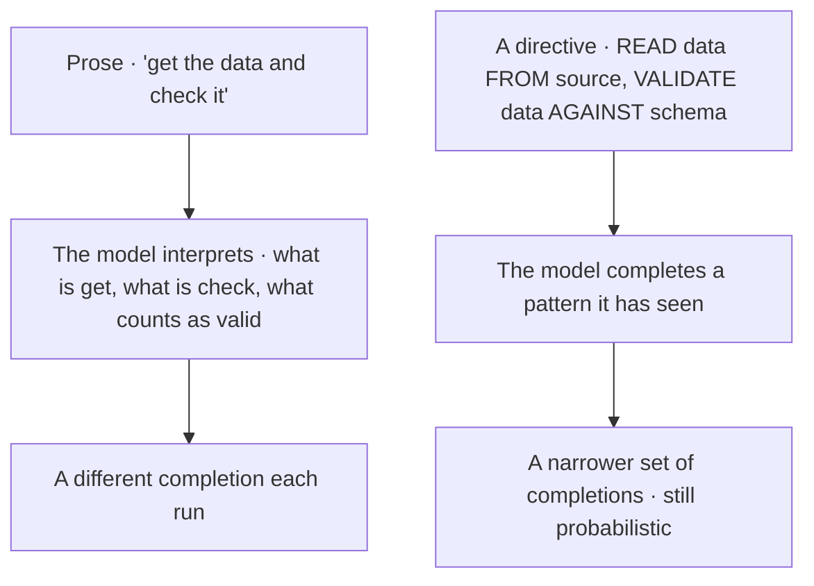
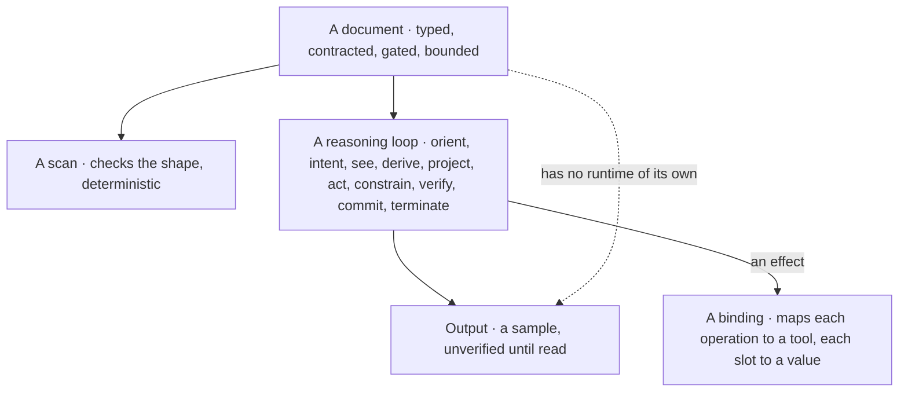
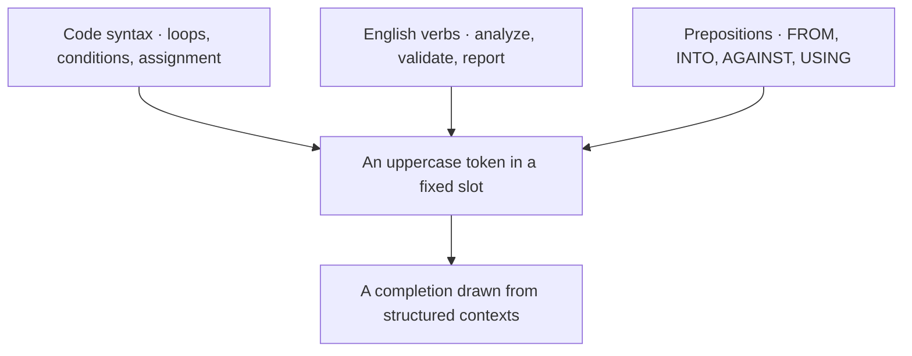
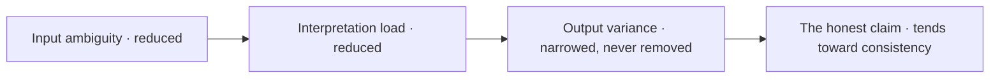
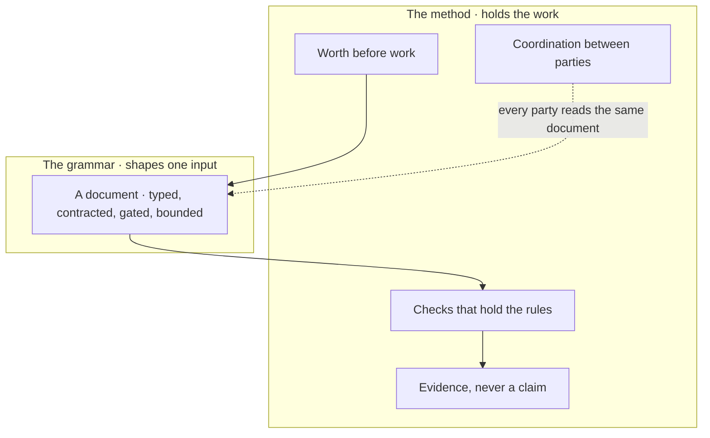
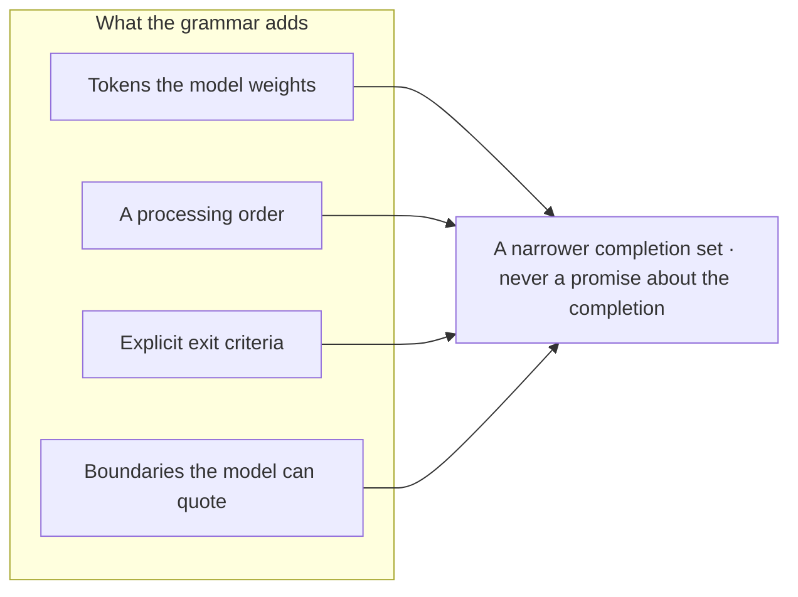

© 2025 Jay Baleine - Disciplined AI Software Development · Documentation is covered by [CC BY-SA 4.0](https://creativecommons.org/licenses/by-sa/4.0/)

# PAG — Bane's Lab

> Pattern Abstract Grammar (PAG) is a structured instruction format for AI systems: a formal grammar grounded in a reasoning ontology, a guide, genesis stages, structure declarations and the template families a reasoning loop walks.

Canonical: https://banes-lab.com/pag

# Pattern Abstract Grammar

Structured instructions for AI systems.

# Introduction

## What PAG is

Pattern Abstract Grammar is a structured instruction format for AI systems. A document written in it declares what kind of instruction it is and what it may touch, and draws every operative word from a [closed vocabulary](../ontology/PRINCIPLES.md#arch-closed-vocabulary) of uppercase tokens grounded in a reasoning ontology. It groups the work into nodes that each read the prior node's output and close on a gate of checkable conditions with their evidence and their population, states its boundaries as invariant records, and closes with a report, which is the whole of [A1·a minimal document](#what-is-pag-panel-a). Each of those constructs is one stage of a reasoning loop written down, as [A1·b construct to stage](#what-is-pag-panel-b) lists, so the document is [the loop](../START.md#the-loop) made legible; [A1·c prose or directive](#what-is-pag-panel-c) shows where the variance enters without it, and [A1·d scan, loop, binding](#what-is-pag-panel-d) what walks it. [Why it works](INTRODUCTION.md#why-pag-works) says what the tokens buy, and limits says what the grammar never reaches.

### A contract, not a request

An instruction is an [explicit contract](../ontology/PRINCIPLES.md#arch-explicit-contracts), not a request in prose. An instruction written as prose leaves its terms to whoever reads it.

The same request run twice yields two plausible results, and nobody can say which sentence was read differently. An [implicit contract](../ontology/PRINCIPLES.md#arch-implicit-contract) leaves the model to supply the terms, and it supplies them from the completion, so they vary with it.

Type the instruction rather than sharpen its prose: a declared type, tokens from a closed set and gates with checkable exits, over a longer or more careful sentence. Write an instruction as a PAG document when a reasoning loop will walk it: declare its type, state a checkable objective, decompose the work into nodes with contracts, close each node on three to five checks someone can settle with evidence, and bound the whole with invariants.

Hand the same document to the model twice and compare the outputs against the gates. Where both runs pass every gate, the structure held; where one fails, the failing gate names the sentence that was still prose.

A prompt that asks one question in passing gains nothing from a node structure. The grammar earns its cost where the document will be walked more than once, read by more than one party, or trusted to have done what it says.

A document has no runtime. What walks it is a reasoning loop, the loop the methodology page teaches, and every construct of the grammar is one of its stages made explicit. The document type names which reasoning model walks it and on which axis of that loop it sits, and an adapter outside the document maps each [semantic operation](GUIDE.md#tool-invocation) to the tool that performs it.

Two checks apply to a document, and they are different kinds of thing. A scan checks its shape, and it is [static analysis](../ontology/PRINCIPLES.md#arch-static-analysis), deterministic and cheap, which is what makes the grammar parsable. The loop checks its meaning, and that is not deterministic, because the loop is walked by a model.

```pag
---
name: <document-name>
type: TASK
version: 1.0.0
---

THIS TASK EXECUTES <what the document is for, in one sentence>

%% META %%:
objective: "<what finished looks like, checkable against the tree>"
jurisdiction: <source> | external: everything else
recursion_limit: <a bound on repair>

# NODE 1 — <the first bounded decision>   [epistemic · analysis · logic · yields: boolean]
@genesis: existence
CONTRACT:
input:     <source>
transform: READ_RESOURCE <source> INTO <held>; VALIDATE_ARTIFACT <held> AGAINST <schema>
output:    <held>, validated
HANDOFF GATE:
[check] <held> read from <source> (evidence: the read returned content)
[check] <held> conforms to <schema> (evidence: the validator's report) over: <held> records measured: <conforming> / <records>
[check] every <held>.<record> carries the fields NODE 2 reads (evidence: no record with a missing field)
result: pass -> NODE 2 | unread or nonconforming -> REPAIR (owner: NODE 1) | unknown -> BLOCKED

# NODE 2 — <the decision that consumes the first>   [epistemic · reasoning · set-theory · yields: set]
@genesis: difference
CONTRACT:
input:     <held> from NODE 1
transform: FOR EACH <item> IN <held>.<collection>: ANALYZE_CONTENT <item> AGAINST <criterion> INTO <finding>; IF <finding>.<met>: APPEND <item> TO <result>
output:    <result>
HANDOFF GATE:
[check] every <item> analyzed (evidence: one finding per item) over: <held>.<collection> measured: <analyzed> / <items>
[check] <result> holds every <item> that met <criterion> (evidence: the two counts match)
[check] no <item> outside <held> appears in <result> (evidence: every result item present in <held>)
result: pass -> TERMINATE | count mismatch -> REPAIR (owner: NODE 1) | unknown -> BLOCKED

# CROSS-NODE INVARIANTS
INVARIANT validate-before-persist: <held> is validated before anything is persisted over: every node binds: the reader objector: [check] <held> conforms to <schema> at NODE 1
INVARIANT source-untouched: <source> is never modified in place over: <source> binds: the reader objector: none

REPORT:
subject: NODE 2
verdict: pass | fail | unknown
domain: declared <items> measured <analyzed>
completion: saturated <bool> complete <bool> verified <bool>
```

```pag
# each construct of a document is one stage of the reasoning loop, written down
declaration          orient      what kind of instruction exists, and what it may touch   yields: a set
keyword directive    see         the lens the intent is read through                    yields: a structured line
node                 project     what follows what, as a contract                       yields: an edge-list
control flow         act         which branch, which iteration                          yields: a procedure
semantic operation   act         which effect, bound to a result                        yields: a procedure
invariant record     constrain   what is admissible, and what would object               yields: a boolean
handoff gate         verify      what evidence closes the node, over what set           yields: pass, fail or unknown
report               commit      the verdict as a representation a checker can challenge yields: an artifact
well-formedness      terminate   whether the document may be trusted                    yields: a boolean
```

A1·c prose or directive



A1·d scan, loop, binding



## Why it works

The grammar does not change how a model behaves. It changes what the model is completing: an LLM predicts the next token from the patterns it was trained on, and a large share of that training is code, configuration and structured documentation, the three sources [B1·a three sources](#why-pag-works-panel-a) writes into one line and [B1·b vocabulary origin](#why-pag-works-panel-b) draws. What that buys is bounded, and [B1·c the honest claim](#why-pag-works-panel-c) states the bound.

### Pattern completion

Explicit high-frequency tokens reduce interpretive variance, and the output stays probabilistic. Careful prose is not answered with a more careful result.

A page of careful prose is answered with a confident result that answered a slightly different question, and the difference is invisible until someone runs it. The model completes what it has seen most often, and uppercase verbs with explicit prepositions are what it has seen in code, configuration and documentation.

Reduce ambiguity at the input and verify the output, rather than asking the input to guarantee anything. Draw every operative word from the [keyword](KEYWORDS.md#keyword-ontology) vocabulary and bind its operands with a preposition, so the model completes a recognized structure instead of interpreting a sentence. State the intent in an English verb the reader can review.

Rewrite one prose instruction as a directive and run both several times against the same gates. The directive passes more often, and where it does not, the gate that fails is the one whose condition was still a judgement.

Structure helps where the model has seen the structure. A vocabulary invented for one project is prose with capital letters, and the model interprets it as it would interpret a sentence.

The vocabulary is a hybrid, code syntax for structure, English verbs for intent, prepositions for the relations between operands, and a line carrying all three is one the model completes and a reviewer reads without a legend.

Token frequency is why the vocabulary is uppercase and closed. A word that appears in the same slot across many structured contexts carries a stable meaning into the completion, and a word that appears in many meanings carries all of them. So the grammar keeps its verbs few, keeps them capitalized, and gives each one a [semantic contract](../ontology/PRINCIPLES.md#arch-semantic-contracts) stated under [instruction patterns](PATTERNS.md#instruction-patterns). One term for one operation is the [ubiquitous language](../ontology/PRINCIPLES.md#arch-ubiquitous-language) the model and the reviewer share.

Ambiguity reduction sits on the derive stage of [the loop](../START.md#the-loop): the model derives what a line means, and a line drawn from the vocabulary leaves it one derivation where prose leaves it several.

```pag
# code syntax · a structural pattern the model has completed many times
FOR EACH <item> IN <collection>:

# an english verb · the intent, readable by a person
ANALYZE <held> AGAINST <schema>

# a preposition · the relation between the operands
READ <config> FROM <file> INTO <settings>

# together · one line the model completes and a person can review
EXTRACT <field> FROM <record> INTO <value>
```

B1·b vocabulary origin



B1·c the honest claim



## PAG and the method

A document is one instrument, one input inside [the loop](../START.md#the-loop) the method owns, as [C1·a one input](#pag-and-the-method-panel-a) draws. It shapes what a model reads, and nothing about it decides whether the work was worth doing, whether the result is true, or how several parties share one tree; [worth before work](../PLAN.md#worth-before-work), [it looked right](../VERIFY.md#it-looked-right) and [coordination is software](../COLLABORATE.md#coordination-is-software) on the methodology page hold those. Where a section here touches them, it shows how a document expresses them and leaves the reasoning where it lives.

### One instrument inside a method

The grammar shapes an input, and the method holds the work around it. A document that reads well invites the belief that it did what it says, and a document cannot verify itself.

A team writes careful documents, skips the checks because the documents read as complete, and discovers in production that a gate the model reported as passed was never evaluated by anything. A well-shaped input reads as a guarantee because the output usually matches it, and the failures live in the runs where it does not.

Put the checks outside the document, in a gate the method runs, rather than inside it as sentences the model completes. Use a document to shape one input: the instruction a party reads before it acts. Hold everything around that input with the method: decide worth before the document is written, check the output with a gate the document did not run, and coordinate parties through surfaces the document only reads.

Take a document that reported every gate passed and run the checks the method names over its output. A gate the checks contradict was a sentence the model completed, and the document could not have known.

A collaboration with no tools and no shared tree is a conversation, and a document there is a well-shaped message. The instrument does its work where an adapter can perform what the document names.

What a document adds to a collaboration is concrete, [C1·b what it adds](#pag-and-the-method-panel-b) lists it, and each addition narrows the completion set without promising what the model will do with it. What it cannot add is stated under limits, and it looked right, [verify the verifier](../VERIFY.md#verify-the-verifier) and a report, not a checkbox exist because those absences are real.
[#### Methodology

The loop, who does what, the stance, the gates and the coordination the grammar is written inside.](../START.md) [#### Architecture

The principle canon, the tensions and the decay paths a document's constraints are drawn from.](../architecture/MODEL.md)

C1·a one input



C1·b what it adds



Documentation is covered by [CC BY-SA 4.0](https://creativecommons.org/licenses/by-sa/4.0/)

© 2025 [Jay Baleine](https://linkedin.com/in/jay-baleine) - Pattern Abstract Grammar

---

Chapters: [Introduction](INTRODUCTION.md) · [Guide](GUIDE.md) · [Orchestration](ORCHESTRATION.md) · [Patterns](PATTERNS.md) · [Keywords](KEYWORDS.md) · [Grammar](GRAMMAR.md) · [Validation](VALIDATION.md) · [Templates](TEMPLATES.md)
