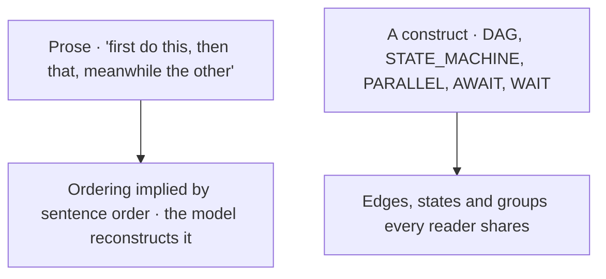
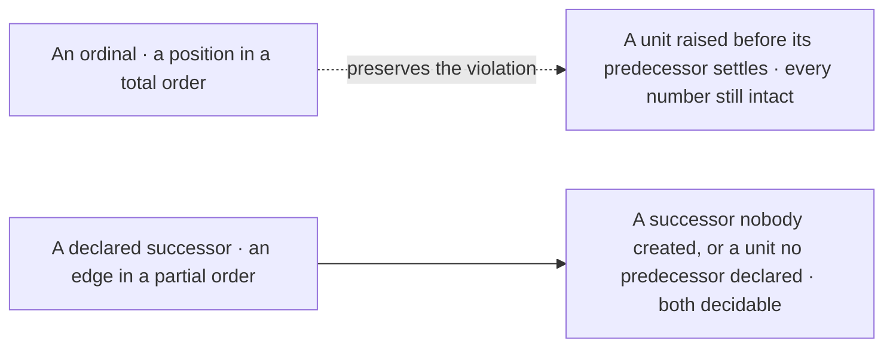
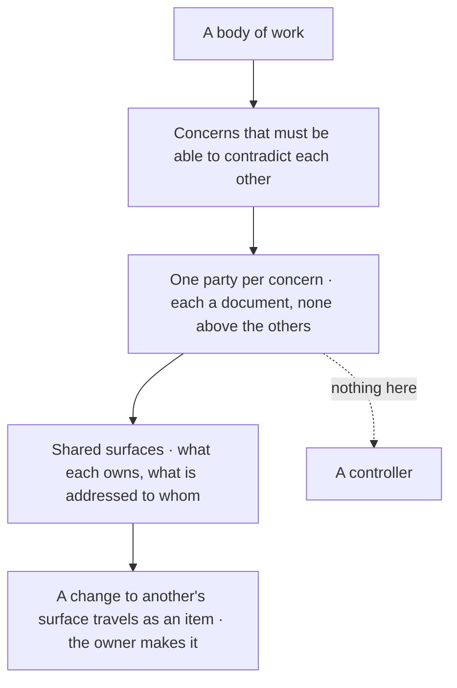
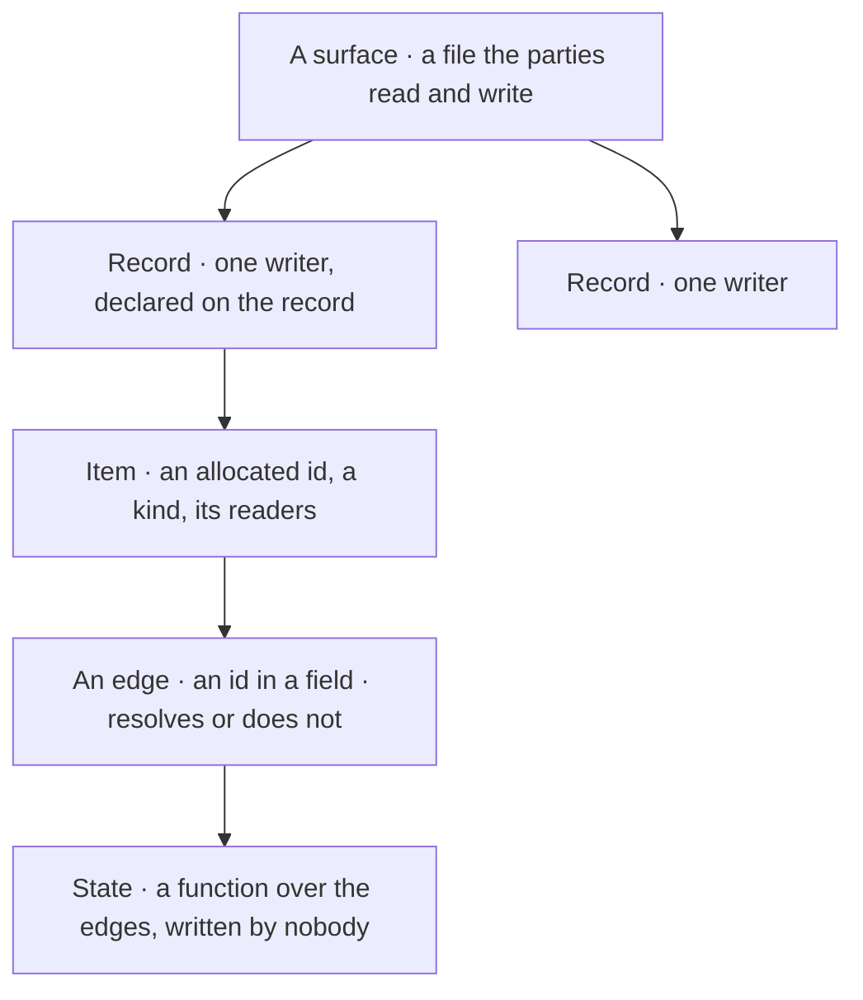
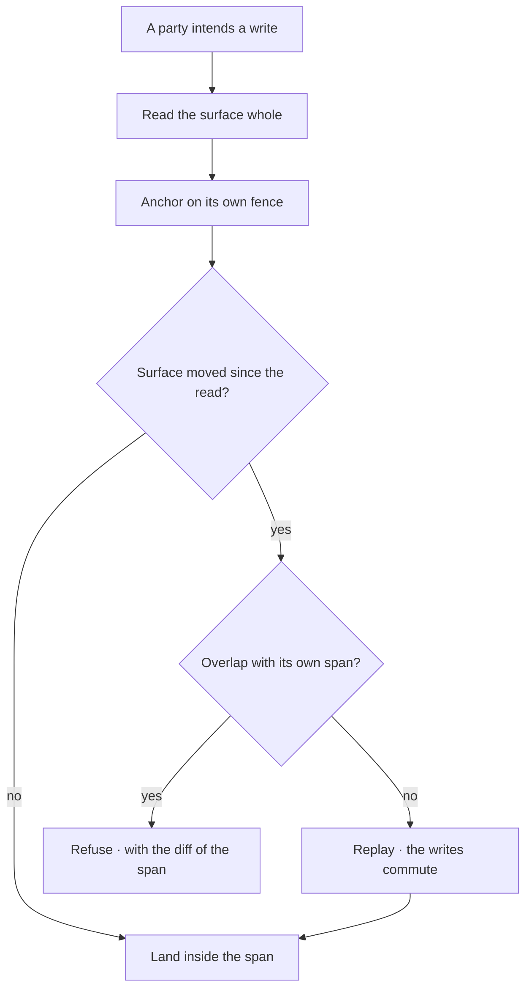
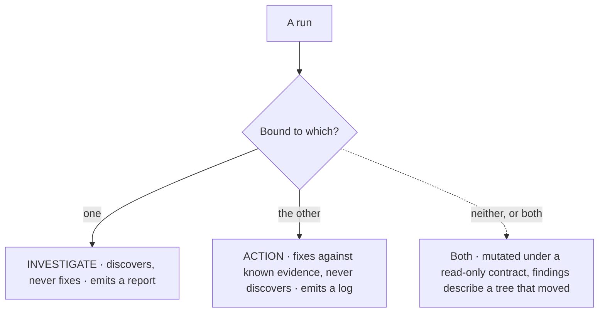
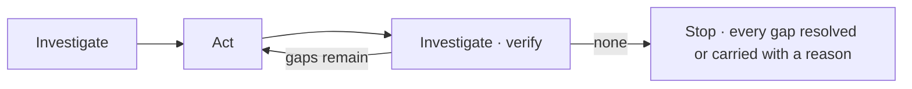
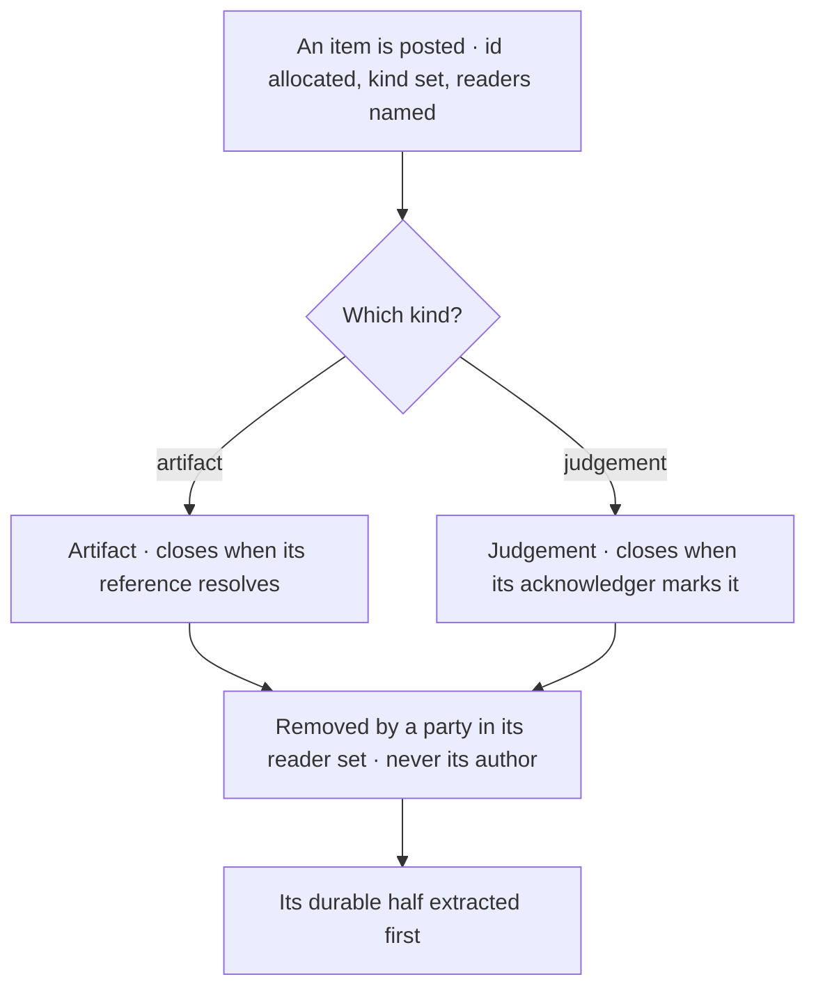
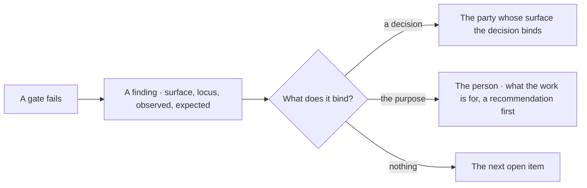
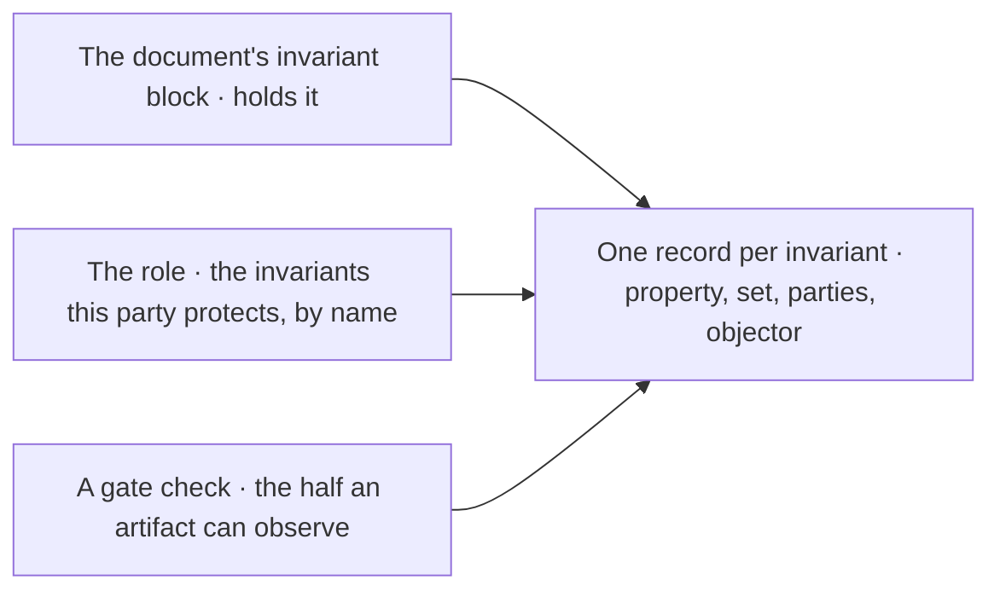

© 2025 Jay Baleine - Disciplined AI Software Development · Documentation is covered by [CC BY-SA 4.0](https://creativecommons.org/licenses/by-sa/4.0/)

# Orchestration — PAG — Bane's Lab

> Orchestration is the part of a document that says how work is ordered and where it runs in parallel, and the grammar refuses to let that be implied. A document…

Canonical: https://banes-lab.com/pag/orchestration

# Pattern Abstract Grammar

Structured instructions for AI systems.

# Orchestration

## Orchestration as declared structure

[Orchestration](../ontology/PRINCIPLES.md#arch-orchestration) is the part of a document that says how work is ordered and where it runs in parallel, and the grammar refuses to let that be implied. A document declares the structure with constructs, each grounded to the representation it makes explicit, the split [A1·d prose or construct](#declared-structure-panel-d) draws. There is a [dependency graph](../ontology/PRINCIPLES.md#arch-dependency-graph) for a partial order with forward dependencies, which [A1·a dependency graph](#declared-structure-panel-a) declares by name because [A1·e name, never number](#declared-structure-panel-e) is what a name buys, and a [finite state machine](../ontology/PRINCIPLES.md#arch-finite-state-machine) for a lifecycle drawn from a closed set of states, as [A1·b state machine](#declared-structure-panel-b) shows. Beside them a priority queue for a ranking, a flowchart for the rendered projection of any of them, a surface for state several parties share, a parallel block for readers that return, and a wait for a reader that never does, the pair [A1·c join and wait](#declared-structure-panel-c) writes. The method teaches the same as [the plan is a graph](../PLAN.md#the-flat-checklist); here it is the project stage of [the loop](../START.md#the-loop), and it yields an edge-list. Ordering carried by sentence order is [temporal coupling](../ontology/PRINCIPLES.md#arch-temporal-coupling), and a model given prose reconstructs a structure of its own.

### Structure is declared

Concurrency and [event ordering](../ontology/PRINCIPLES.md#arch-event-ordering) are declared structure, never implied by textual order. Ordering implied by the order sentences appear in is reconstructed by every reader, differently.

A sequence of decisions is numbered, one is raised out of dependency order because the next number was free, and every citation of the displaced decision resolves to the wrong thing with nothing erroring. A sentence has an order and a graph has edges, and only the second survives being read by a party that did not write it.

Put the order in a graph and the lifecycle in a state machine, over numbering the units and narrating the sequence. Model an order as a dependency graph whose nodes name what they depend on, so the order is partial and a number never stands in for an edge. Model a lifecycle as a finite state machine whose states are a closed set, whose transitions name their trigger and their guard, and whose current state is derived from the tree by a function rather than written by a party. Run independent investigations as bounded readers in a parallel block and join their artifacts with an await, and let a participant wait through a command with its turn open.

Reorder the sentences of a node and re-run it. Where the outcome changed, the ordering was carried by prose, and the repair is the construct that carries it explicitly.

Whether a declared parallel group runs in parallel is a fact about the harness. The grammar declares that the readers are independent; the binding decides what that buys, and a harness with no [concurrency](../ontology/PRINCIPLES.md#arch-concurrency) runs them in order without the document changing.

A dependency graph is the construct for work whose order is a set of edges rather than a line. A node names what it depends on and what succeeds it, and the successor is declared by name, never derived from a position, for the reason [the board and the venue](../COLLABORATE.md#the-board-and-the-venue) gives. A [directed acyclic graph](../ontology/PRINCIPLES.md#arch-directed-acyclic-graph) makes a [circular dependency](../ontology/PRINCIPLES.md#arch-circular-dependency) a defect the reader can see, and where a unit holds every other party's work, at most one such unit is open at a time, because two holds are two waits with no defined order between them.

A finite state machine is the construct for a lifecycle, and its states are a closed set because a mechanism can join on a value from a closed set and cannot join on a sentence. A unit moves forward along its states as it lives and never backwards, with one correction permitted where an act is reversed before anything depends on it. The current state is a [derived state](../VERIFY.md#derived-state), a function over the tree, and no party writes it. [Declarative configuration](../ontology/PRINCIPLES.md#arch-declarative-configuration) of a run is what both constructs are, where a paragraph would only imply it.

A parallel block with an await is the construct for readers that return: a party spawned with a task, receiving nothing shared, returning exactly one typed artifact. Investigations that read a tree and write nothing belong there, one per concern, because reading contends with nothing. A wait is the construct for a participant, which never returns; [posting and waiting are one operation](../COLLABORATE.md#posting-and-waiting-are-one-operation) for it, and a wait is a call rather than a halt. The two constructs are not interchangeable: an await joins a reader that was always going to end, and a wait keeps open a reader that must not.

```pag
# NODE 5 — PROJECT   [epistemic · reasoning · graph · yields: edge-list]
@purpose: "Declare the order as edges, so a reader who did not write it can still resolve it"
@cue: "DECLARE_THE_EDGES"

CONTRACT:
input:        <the units of work>
transform:    for each unit -> name what it depends on -> refuse a cycle -> name the groups that are independent
constraints:  a successor is declared by name, never derived from a position; at most one unit that holds the others is open at a time
output:       DAG <units>
handoff:      acyclic AND every unit names its dependencies (yields: edge-list + boolean)

DAG <units>:
NODE <unit-a>:
<what settles it>
NODE <unit-b> AFTER <unit-a>:
<what settles it>
NODE <unit-c> DEPENDS_ON [<unit-a>]:
<what settles it>
PARALLEL_GROUP: <unit-b>, <unit-c>

HANDOFF GATE (evidence-bearing):
rule_id: "PROJECT"   yields: edge-list + boolean
[check] no unit depends on itself through any path (evidence: the walk over DAG <units>) over: <units> measured: <acyclic> / <units>
[check] every successor is named, none is a number (evidence: the AFTER and DEPENDS_ON clauses)
[check] at most one holding unit is open (evidence: count of open holds)
result: pass -> NODE 6 | a cycle -> REPAIR (owner: NODE 5) | unknown -> BLOCKED
```

```pag
# a lifecycle as a closed set of states · a transition names its trigger and its guard
STATE_MACHINE <unit>:
STATE <planned>:
ENTRY: <no artifact exists yet>
STATE <open>:
ENTRY: <a party has begun>
STATE <settled>:
ENTRY: <every condition of the exit holds>
STATE <retired>:
ENTRY: <what the settlement implies has landed>

TRANSITION FROM <planned> TO <open> ON <first-reading>
TRANSITION FROM <open> TO <settled> ON <exit-condition>
GUARD: <every party that must agree has agreed>
TRANSITION FROM <settled> TO <retired> ON <implied-work-landed>
GUARD: <nothing the settlement distributed is still open>
TRANSITION FROM <open> TO <planned> ON <artifact-removed>
GUARD: <no argument has landed yet>

FUNCTION state_of(unit):
# derived from the tree on every read · never written by a party
IF NOT EXISTS(unit.artifact): RETURN <planned>
IF every_exit_condition_holds(unit) AND implied_work_landed(unit): RETURN <retired>
IF every_exit_condition_holds(unit): RETURN <settled>
RETURN <open>
```

```pag
# NODE 6 — ACT   [epistemic · formalisation · computation · yields: procedures]
CONTRACT:
input:        DAG <units>
transform:    run each independent group as bounded readers -> join their artifacts -> a participant waits rather than returns
constraints:  a bounded reader receives a task and nothing shared; whether a group runs together is the harness's fact, declared independence is the document's
output:       artifacts[] per group
handoff:      every group joined or explicitly still open (yields: procedure)

PARALLEL:
TASK "<investigate unit b · mutate nothing>" WITH agent: <role-b> -> <artifact-b>
TASK "<investigate unit c · mutate nothing>" WITH agent: <role-c> -> <artifact-c>
END
AWAIT <artifact-b>, <artifact-c> INTO <artifacts>

# a participant does not join · it waits, and a wait is a call rather than a halt
WAIT ON <the shared surface> AS <party> INTO <change>
IF <change> == <changed>:
READ_RESOURCE <the shared surface> whole INTO <current>
```

A1·d prose or construct



A1·e name, never number



## Composing a collaboration

A collaboration is composed from parties, and nothing sits above them, the shape [B1·d parties over a partition](#composing-a-workflow-panel-d) draws. The method states the premise as [coordination is software](../COLLABORATE.md#coordination-is-software); the grammar expresses it as documents: [B1·a two terminal nodes](#composing-a-workflow-panel-a) is how a document states its reader class, [B1·b change across ownership](#composing-a-workflow-panel-b) how a finding travels to its owner, and [B1·c party count](#composing-a-workflow-panel-c) how the count is derived rather than chosen. What a document cannot do is make the parties agree; it can only make their disagreement land where a reader can see it.

### Parties over a partition

A collaboration is parties over a partition, coordinating through surfaces, with nothing between them. A workflow written as a sequence of agents with fixed positions runs the same shape on every task, and no task has that shape.

A workflow names four positions before the work is examined, the work has three concerns, one position spends the run relaying between the other three, and the relay is where every message is lost. A party that holds the order for the others is a party every other party waits on, and a design where finders also fix has parties writing a tree that other parties are still reading.

Derive the parties from the partition rather than assign positions, and give the order to the surfaces rather than to a controller. Compose a collaboration by [partitioning](../ontology/PRINCIPLES.md#arch-partitioning) the work into concerns that must be able to contradict each other, and give each concern one document. Let the terminal node state the reader class, so the ending is derived: a participant re-enters after a wait, a bounded reader returns one typed artifact. Route a change across ownership as an item carrying what was observed, what was expected and the one edit, and let the owner's act node be the only one that writes.

Take a running collaboration and remove any one document. Where the others stall, that document was a controller; where they route around it, the composition held.

One writer and one tree is not a collaboration, and the constructs here defend against a party that cannot exist there. A single document with a single reader takes none of this, and adding it is ceremony.

A document's terminal node states the reader class, and the class decides what the node yields: a participant's re-enters after a wait, a bounded reader's is one typed artifact. Which class a reader is, and why the turn rules invert for one of them, is coordination is software's; a document whose terminal node states its class makes the inversion legible, and one that leaves it to the reader gets both classes' rules applied at once.

Ownership is what replaces the controller. Scope is claimed by concern rather than by location, because two parties can claim one folder from two claims that never mention each other. A finding that lands on a surface its finder does not own is a real finding and a forbidden edit at the same time, and the two rules are reconciled by kind rather than by restraint. The finder's act node emits an item with the surface, the locus, what it observed, what it expected and the one change, and the owner makes it. The finder's operation set forbids the mutation, and its handoff gate carries the evidence that nothing it applied touched a surface it does not own, so the collision between fix-on-sight and untouchable scope has a structural answer instead of a careful one.

The count is an output, and the function that derives it is what a document carries instead of a number. The floor is one party per concern, as [a concern is a component](../architecture/SCALE.md#a-concern-is-a-component) derives. The ceiling is where a stale claim costs more than one more perspective buys, as [the ceiling moves by cost](../architecture/SCALE.md#the-ceiling-moves-by-cost) derives.

```pag
# the reader class is derived from what a document receives · its terminal node says which

# NODE 10 — TERMINATE   [evaluative · termination · set-theory · yields: ter-stop boolean]
# a participant · receives what it owns and what is addressed to it, and never returns
CONTRACT:
input:        <items addressed to me> + <open units of my own concern>
transform:    handle what is addressed to me -> perform my own clear work -> WAIT on the shared surface -> re-enter
constraints:  ter-stop is the person's call; a quiet wait is a fact about the peers, never about the queue
output:       nothing terminal · the loop re-enters at NODE 1
handoff:      <changed> -> NODE 1 ORIENT (read the surface whole, then act) | <quiet> -> my own work, then WAIT again

# NODE 10 — TERMINATE   [evaluative · termination · set-theory · yields: ter-stop boolean]
# a bounded reader · receives a task and nothing shared, and returns exactly once
CONTRACT:
input:        <the task it received>
transform:    evaluate saturation AND completion AND verification -> emit one typed artifact
constraints:  no shared surface is read, so no surface rule binds; an unresolved question is a finding with what would settle it, never a held turn
output:       one typed artifact | a blocked report naming what would settle it
handoff:      TERMINATE
```

```pag
# a finding on a surface I do not own becomes an item, never an edit · the op-set forbids it, not restraint

FUNCTION emit_repair(finding):
IF owner_of(finding.surface) == <me>: RETURN {route: "act", change: finding.change}
SET item = {kind: artifact, to: [owner_of(finding.surface)], surface: finding.surface, locus: finding.locus, observed: finding.observed, expected: finding.expected, change: finding.change}
PERSIST_ARTIFACT item TO <the shared surface> AS <me>
RETURN {route: "sent", item: item}

# NODE 6 — ACT   [epistemic · formalisation · computation · yields: procedures]
CONTRACT:
input:        findings
transform:    for each finding -> emit_repair -> apply only what routes to "act"
constraints:  an INVESTIGATE op-set performs no mutation; a mutation on another's surface is a breach whatever its correctness
output:       applied[] + sent[]
handoff:      every finding either applied on my own surface or sent to its owner (yields: boolean)

HANDOFF GATE (evidence-bearing):
rule_id: "ACT"   yields: boolean
[check] no applied change touched a surface I do not own (evidence: applied[].surface)
[check] every sent item names its owner, its locus and the one change (evidence: sent[])
[check] every finding routed exactly once (evidence: applied[] and sent[] partition findings)
result: pass -> NODE 7 | a foreign write -> REPAIR (owner: NODE 6) | unknown -> BLOCKED
```

```pag
# the party count is an output of the structure, never an input to it

FUNCTION derive_count(work):
ANALYZE_CONTENT work FOR <pairs of surfaces where a change to one forces a change to the other> INTO coupling   # yields: edge-list
EXTRACT_FACTS connected_components FROM coupling INTO concerns                                                 # yields: set
CALCULATE_METRIC floor = count(concerns)                                                                        # one party per concern
ANALYZE_CONTENT claims FOR <how many rest on one surface> INTO fan_in                                          # yields: number
CALCULATE_METRIC ceiling = <the population past which a claim is stale more often than it is useful>
RETURN {concerns: concerns, floor: floor, ceiling: ceiling}
```

B1·d parties over a partition



## Shared surfaces

When more than one party writes one tree, the surfaces they share are [shared mutable state](../ontology/PRINCIPLES.md#arch-shared-mutable-state), and a document expresses four things about them: the schema, the records, the items and their lifetime, which [C1·a surface declared](#shared-surfaces-panel-a) writes and [C1·d surface to state](#shared-surfaces-panel-d) draws. The definitions and the reasons are [coordination is software](../COLLABORATE.md#coordination-is-software)'s and [the board and the venue](../COLLABORATE.md#the-board-and-the-venue)'s; this section declares the shape: [C1·b state as function](#shared-surfaces-panel-b) is how a state is read and a write fenced, [C1·e a write lands](#shared-surfaces-panel-e) is where a write lands or refuses, and [C1·c lifetime axes](#shared-surfaces-panel-c) is the declaration a mechanism reads.

### Records, items, derived states

A shared surface holds records with one writer each, and every state is a query over them. A shared document with no declared writer per span is a document every party rewrites whole.

Two parties revise their own records by rewriting the file, each correctly, and the second write is a [lost update](../ontology/PRINCIPLES.md#arch-lost-update) for the first party with no error anywhere. A file offers no span a party can anchor on unless the document declares one, so the only edit available is the whole file.

Declare the surface as a schema a tool can refuse against, rather than describe it in prose the parties keep in mind. Declare a shared surface as a schema: its key in its header, one record per writer with the writer named on the record, and a fence around each record so an edit has a span to anchor on. Declare an item with an id the surface allocates, a kind that selects its closure, and the readers it is addressed to. Derive open, blocked and absorbed by a function over the edges, extract an absorbed item's durable half and delete it in the same change, and declare each surface's lifetime on retention, mutability and removal.

Take the last write to a shared surface and name the span it was anchored on. A write with no span was a whole-file write, and the neighbour it overwrote is the finding.

An outcome surface authored jointly has no per-party unit for one writer per record to range over, so the invariant is declared inapplicable there with its reason, and a collision of meaning there is reached by an announcement of the intended write plus each author cutting its own duplicate.

The document states one writer per record on the record. The act node that writes carries the mechanism as its contract, a witness read, an anchor on its own fence and a refusal when the surface moved, so an edit against a moved surface is refused with the diff and a whole-file write is never the available path.

The document writes no state. Every state is a function over the edges, declared once and evaluated on every read, as [derived state](../VERIFY.md#derived-state) teaches, and an item whose citation resolves is extracted and deleted in the same change rather than left resting in a state.

A lifetime is declared on the three axes [stating an invariant](../COLLABORATE.md#stating-an-invariant) derives, each drawn from a closed set, so the declaration is an operand a mechanism can join on rather than a sentence. A mechanism decides what it may do to a surface from that declaration and never from the shape of its path.

```pag
# the four things a document declares about a shared surface · a structure declaration, never prose
SURFACE <key>:                                   # declared in the header, never derived from the path
RECORD <key>-1 subject: <what it is about>   # one writer, named on the record · the fence an edit anchors on
ITEM <key>-1-1 TO <reader>: <a claim>    # an addressed span · its id allocated once, never reused
SATISFIED_BY <artifact>              # an edge · an id in a field · resolves or does not
BLOCKS <key>-2-1
RECORD <key>-2 subject: <what it is about>
ITEM <key>-2-1 TO <reader>: <a claim>
ANSWERS <key>-1-1

# the states are derived from the edges, never written
state: OPEN | BLOCKED | ABSORBED

# the lifetime, declared on three axes a mechanism can join on
DECLARE lifetime: object
SET lifetime = {retention: <what ends a piece of content>, mutability: <who may rewrite a landed statement>, removal: <who may take content out>}
```

```pag
# no party writes a state · every state is a function over the edges, evaluated on every read
FUNCTION state_of(item):
IF resolves(item.edges.satisfied_by): RETURN <absorbed>       # a transition · extract, then delete in the same change
FOR EACH edge IN inbound(item, <blocks>):
IF state_of(edge.from) == <open>: RETURN <blocked>
RETURN <open>

# NODE 6 — ACT   [epistemic · formalisation · computation · yields: procedures]
CONTRACT:
input:        <my record> + <the surface as it stands>
transform:    read the surface whole -> anchor on my own fence -> land the edit inside it
constraints:  a write to a path not read this turn is an edit to unknown contents; a whole-file write reports success to the one who overwrote and nothing to the one overwritten
output:       <my record, revised>
handoff:      the edit landed inside my fence and the surface had not moved, or the edit was refused with the diff (yields: boolean)

HANDOFF GATE (evidence-bearing):
rule_id: "ACT"   yields: boolean
[check] nothing outside my fence changed (evidence: the diff of the surface) over: the surface's records measured: <untouched> / <records>
[check] the surface was read whole immediately before the write (evidence: the witness read)
[check] a moved surface refused the write, or the write commuted and replayed (evidence: the compare against my own span)
refuse: the surface moved inside my span since the witness read before PERSIST_ARTIFACT
standing: moved-set <the records that moved outside my span>
result: pass -> NODE 7 | a write outside my fence -> REPAIR (owner: NODE 6) | unknown -> BLOCKED
```

```pag
# a lifetime is three independent axes · one word for it drops the axis a reader assumes follows
DECLARE lifetimes: array
SET lifetimes = [
{surface: <a coordination surface>, retention: <current-truth>,  mutability: <owner-rewritable>, removal: <the handler of an item>},
{surface: <an argument>,            retention: <accumulating>,   mutability: <append-only>,      removal: <none while open · moved whole when settled>},
{surface: <an archive>,             retention: <accumulating>,   mutability: <frozen>,           removal: <none>}
]

FUNCTION may_remove(party, content, surface):
# decided from the declaration, never from the shape of the path
SET lifetime = lifetimes[surface]
RETURN lifetime.removal == party.role_on(content)
```

C1·d surface to state



C1·e a write lands



## Phase binding

A run is bound to exactly one of two kinds before it touches anything, the binding [agents as executed contracts](../COLLABORATE.md#agents-as-executed-contracts) derives and [D1·d two kinds](#phase-binding-panel-d) draws. The orient node binds the kind, as [D1·a binding the kind](#phase-binding-panel-a) writes, and the constrain node asks afterwards whether it held, which [D1·b admissibility](#phase-binding-panel-b) writes; [D1·c the cycle](#phase-binding-panel-c) and [D1·e cycle, not line](#phase-binding-panel-e) are the shape the two kinds make together.

### Investigate or act

A run investigates or acts, and the two op-sets share nothing. A run asked to look starts repairing what it sees.

A run finds a defect, repairs it in passing, and reports the defect as open, so the next run repairs it again against a tree where it no longer exists. A finding is a claim about a tree, and a tree the finder also mutated is a different tree from the one the finding describes.

Bind the kind in the orient node before any operation, over declaring it in prose and trusting the op-set to hold. Bind every run to one kind in its orient node, and derive the operations it permits and forbids from that kind rather than listing them by hand. Let an investigation discover, read, search and analyze, and let it persist exactly one report. Let an action read the report, repair each gap in dependency order, and log what changed. Verify in the constrain node, after the operations exist, that each stayed inside its set, and route a breach to the node that owns the fix.

List the operations of a run and mark each as reading or writing. A run with both kinds is unbound, and the first write is where it splits.

A single-party task with one read and one write is one action run, and splitting it into an investigation and an action doubles the document for nothing. The binding matters where the findings will be read by a party that did not produce them.

The binding is a property of the run, declared in its orient node before any operation, and the op-sets follow from it, which is [state isolation](../ontology/PRINCIPLES.md#arch-state-isolation) applied to a run. An investigation may discover resources, read them, search them and analyze them, and it may persist one artifact: the report. It may not edit, write elsewhere or execute a command that mutates, which includes the [verification](../ontology/PRINCIPLES.md#arch-verification) chain, because the chain's early stages rewrite the tree. An action may persist, execute and fix, and it may not widen its scope, because a scope discovered mid-action is a finding nobody reported and nobody will verify. The method teaches the same binding under agents as executed contracts; here it is one node's contract.

The shape that follows is a cycle rather than a line. Investigate, then act, then investigate again to verify what the action did, and stop when the second investigation finds every gap resolved or carried forward with a reason. Each investigation reads the same report and removes what is settled, so the report converges rather than accumulating. A fixed pipeline of positions cannot express this, because it has no edge back, and the edge back is where a repair that missed is caught.

A run declared as an investigation can still contain a write that nobody noticed, and a check that reads the declaration passes it. So the constrain node verifies the observations against the op-set the binding declared, and a breach routes to the node that owns the fix rather than being repaired in place, because repairing it in place is the same breach in the node that found it.

```pag
# NODE 1 — ORIENT   [epistemic · ontology · set-theory · yields: run-context]
@purpose: "Bind the run to exactly one phase kind before touching anything, so the op-set is a contract rather than restraint"
@cue: "DISCLOSE_THEN_BIND"

CONTRACT:
input:        <the invocation>
transform:    detect the phase kind -> bind its allowed and forbidden operations -> bind the one artifact it emits
constraints:  INVESTIGATE and ACTION are mutually exclusive; the checks that heal rewrite the tree, so they belong to ACTION
output:       run_context { phase, allowed_ops, forbidden_ops, artifact }
handoff:      phase bound to exactly one AND the two op-sets disjoint (yields: boolean)

FUNCTION bind_phase(invocation):
DETERMINE kind FROM invocation   # INVESTIGATE | ACTION
IF kind == "INVESTIGATE":
RETURN {phase: "INVESTIGATE", allowed_ops: [DISCOVER_RESOURCES, READ_RESOURCE, SEARCH_CONTENT, ANALYZE_CONTENT], forbidden_ops: [<mutation>, <gap fixing>], artifact: <investigation report>}
IF kind == "ACTION":
RETURN {phase: "ACTION", allowed_ops: [<bounded fix>, PERSIST_ARTIFACT, EXECUTE_TOOL], forbidden_ops: [<gap discovery>], artifact: <action log>}

HANDOFF GATE (evidence-bearing):
rule_id: "ORIENT"   yields: boolean
[check] phase bound to exactly one of INVESTIGATE | ACTION (evidence: run_context.phase)
[check] allowed and forbidden op-sets are disjoint (evidence: run_context.allowed_ops, forbidden_ops)
[check] the artifact the phase emits is the one its kind emits (evidence: run_context.artifact)
result: pass -> NODE 2 | undetectable kind -> REPAIR (owner: NODE 1) | unknown -> BLOCKED
```

```pag
# NODE 7 — CONSTRAIN   [conative · teleology · optimisation · yields: admissibility boolean]
@purpose: "Ask after the operations exist whether they stayed inside the bound op-set · a declaration is not evidence that it held"
@cue: "ADMISSIBLE_BEFORE_VERIFY"

CONTRACT:
input:        observations + run_context
transform:    for each observation -> did it mutate under INVESTIGATE, did it discover under ACTION
constraints:  a breach routes to the node that owns the fix, never a repair in place, because repairing in place is the same breach in the node that found it
output:       admissibility { ok, op_violations[] }
handoff:      GATE — op-sets honoured (yields: boolean)

FUNCTION assess_admissibility(observations, run_context):
DECLARE op_violations: array
SET op_violations = []
FOR EACH o IN observations:
IF run_context.phase == "INVESTIGATE" AND o CAUSED <mutation>: APPEND {claim: o.claim, violation: "mutation under INVESTIGATE"} TO op_violations
IF run_context.phase == "ACTION" AND o DISCOVERED <new scope>: APPEND {claim: o.claim, violation: "discovery under ACTION"} TO op_violations
RETURN {ok: op_violations.length == 0, op_violations: op_violations}

HANDOFF GATE (teleology admissibility gate):
rule_id: "CONSTRAIN"   yields: boolean
[check] admissibility.op_violations.length == 0 (evidence: INVESTIGATE no mutation / ACTION no discovery)
[check] every observation was classified against the phase (evidence: one verdict per observation) over: observations measured: <classified> / <observations>
[check] every breach names the node that owns the fix (evidence: op_violations[].owner)
result: pass -> NODE 8 | a breach -> REPAIR (owner: NODE 6) | unknown -> BLOCKED
```

```pag
# the shape that follows is a cycle rather than a line · the edge back is where a missed repair is caught
INVESTIGATE  -> <a report of evidence · every claim verified, contradicted or unverified>
ACTION       -> <a log of bounded changes against that report · nothing discovered>
INVESTIGATE  -> <the same report, with what is settled removed>
STOP when    <every gap is resolved or carried forward with a reason>
```

D1·d two kinds



D1·e cycle, not line



## Handoff signals

A handoff is an item addressed to the parties that need it, with an allocated id, a declared kind and a closure the kind selects, as [E1·a an item](#handoff-signals-panel-a) writes and [E1·d kind selects closure](#handoff-signals-panel-d) draws. An artifact item asks for something that can exist and closes when a typed reference to it resolves. A judgement item asks for a reading and closes when its acknowledger marks it; [E1·c closing an item](#handoff-signals-panel-c) is the closure either way. A failure is a finding rather than a halt, the route [E1·b failure routes](#handoff-signals-panel-b) and [E1·e failure to finding](#handoff-signals-panel-e) follow, and a report goes to the parties whose next work it creates, never to the person as a closing summary.

### Typed items, falsifiable closures

A handoff is a typed item whose closure is falsifiable by someone other than its author. A handoff closed by whoever wrote it closes whether or not the work exists.

A party declares an item handled, nothing points at the thing it asked for, the item is removed, and the work it named was never done. A closure that a reference decides can be checked by anyone; a closure that a party declares can be checked by nobody but that party.

Let the kind decide the closure, a reference that must resolve or an acknowledger named on the item, rather than the author's word that it is done. Post a handoff as an item with an id the surface allocates, a kind, the parties it is addressed to and a body carrying the finding's surface, locus, observed and expected values. Let an artifact item close by a reference that must resolve and stay true while the work is done, and a judgement item close by its acknowledger. Route a failure by what it binds: a decision to the party whose surface it binds, a question of purpose to the person with a recommendation first, and everything else to the next open item.

For each closed item, name the reference that closed it or the party that acknowledged it. An item closed by its own author with no reference was declared done, not shown done.

The handoff protocol is for parties that share a surface; what a bounded reader does instead is [composing a collaboration](ORCHESTRATION.md#composing-a-workflow)'s.

The kind is on the item and it selects the closure. An artifact item names something that can exist, a file, a gate, a record, so it closes with a typed reference that must resolve. The reference names a condition that can be wrong rather than a path, because a path resolves the moment the file exists and the item reads closed while the defect is open. The reference is also monotone with the work: true when the work is done and false when it is not, so a citation pointing at the findings themselves is refused, since a broken tree would satisfy it. A judgement item closes by its declared acknowledger with no reference; why the acknowledger is required by one kind and forbidden by the other is [the board and the venue](../COLLABORATE.md#the-board-and-the-venue)'s.

A failure flows through the same channel as any other item and routes by what it binds: a decision to the party whose surface it binds, a question of purpose to the person, everything else to the next open item, the routes [a turn never ends to wait](../COLLABORATE.md#a-turn-never-ends-to-wait) derives. A gate's result line is the same routing in miniature, with a third arm the item channel also needs: an unknown, a claim the run could not measure, is blocked rather than passed, and blocked is a state that names the party who owes the answer. The commit node carries the rule that a report goes to the parties whose next work it creates.

The handler removes the item by its id, after extraction, as the board and the venue requires; an item whose readers are all gone is re-addressed rather than left, since an item nobody can handle reads as live traffic forever.

```pag
# an item is a typed span · its kind selects how it closes, and the closure is checked by someone other than its author
DECLARE item: object
SET item = {
id:    <allocated by the surface, never by hand>,
kind:  <artifact | judgement>,
from:  <this party>,
to:    [<the parties that need it>],
body:  {surface: <where>, locus: <what part>, observed: <what was seen>, expected: <what should hold>}
}

FUNCTION closes(item):
# an artifact item asks for something that can exist · it closes when a typed reference resolves
IF item.kind == artifact: RETURN resolves(item.satisfied_by) AND monotone_with_the_work(item.satisfied_by)
# a judgement item asks for a reading · it closes by its declared acknowledger, with nothing to point at
IF item.kind == judgement: RETURN acknowledged_by(item.acknowledger)

FUNCTION may_close(party, item):
RETURN party IN item.to   # a reader, never the author
```

```pag
# a failure is a finding, not a halt · it flows through the same channel and routes by what it binds
FUNCTION route(failure):
SET finding = {surface: failure.surface, locus: failure.locus, observed: failure.observed, expected: failure.expected}
IF failure.blocks_a_decision:
RETURN SEND finding TO <the party whose surface the decision binds>
IF failure.asks_what_the_work_is_for:
RETURN SEND finding TO <the person> AS <a question with a recommendation first>
RETURN <the next open item>

# NODE 9 — COMMIT   [evaluative · representation · information-theory · yields: one typed artifact]
CONTRACT:
input:        findings + run_context
transform:    emit exactly one artifact of the kind bound at orientation, deduplicated, naming every limitation
constraints:  a report goes to the parties whose next work it creates, never to the person as a closing summary
output:       committed { artifact_type, output }
handoff:      one typed artifact emitted (yields: hash + boolean)

HANDOFF GATE (evidence-bearing):
rule_id: "COMMIT"   yields: hash + boolean
[check] exactly one artifact emitted, of the kind bound at orientation (evidence: committed.artifact_type)
[check] every finding addressed to a party that needs it (evidence: findings[].to) over: findings measured: <addressed> / <findings>
[check] no finding recorded twice (evidence: dedup)
refuse: the artifact's destination changed since it was read before PERSIST_ARTIFACT
result: pass -> NODE 10 | duplicate or unaddressed -> REPAIR (owner: NODE 9) | unknown -> BLOCKED
```

```pag
# closing an item · the handler removes it, never the author, and extraction comes first
WHEN <party> handles <item>:
VALIDATE <party> IN <item>.<to>
VALIDATE closes(<item>)
EXTRACT_FACTS <item>.<durable half> INTO <the one home history has>
PERSIST_ARTIFACT <the extraction> TO <that home>
REMOVE <item> BY <item>.<id>       # the span, never a matched line
```

E1·d kind selects closure



E1·e failure to finding



## Orchestration invariants

A collaboration relies on invariants, and [stating an invariant](../COLLABORATE.md#stating-an-invariant) teaches what one must carry: the property in a form that could be false, the set it quantifies over, the parties it binds, and the objector that would disagree if it stopped holding. A document declares each once as a record in its invariant block, as [F1·a invariant records](#orchestration-invariants-panel-a) shows, and a party's role and a gate check each point at that record rather than restating it, which [F1·b gate cites records](#orchestration-invariants-panel-b) writes and [F1·c three homes](#orchestration-invariants-panel-c) draws.

### Declared once, cited thrice

A collaboration's invariants are stated with their objectors, and every home that needs one points at the statement. An invariant restated in every document that needs it is a set of copies that drift.

A document's closing lines, a role and a check each carry their own wording of one rule, one is edited, and the other two keep binding the old rule. A restatement is a copy, and a copy carries no edge back to the statement it copied; a bullet is a restatement with even the statement's slots dropped.

Declare each invariant once as a four-slot record and point at it from every home, rather than restate it where each party reads. Declare every invariant a collaboration relies on as a record with four slots, and where nothing in any artifact would disagree, write none as the objector so the debt is declared rather than hidden. Let a gate check cite the record it holds and let a role name the invariants that party protects, as [a seat is a contract](../START.md#a-seat-is-a-contract) describes. Never head a block with a bare modifier and a list of bullets: a bullet carries no set, no parties and no objector, which is what the scan refuses it for.

For each gate check and role entry, name the invariant record it points at. A line that points at nothing is a copy, and the record it should point at is the finding; a record whose objector is none is the debt the tension has a mechanism names for a rule with no check.

The invariants scale with the parties and the [shared surfaces](ORCHESTRATION.md#shared-surfaces).

One statement, three homes that point at it. A document's invariant block holds the records. A role lists the invariants that party protects, by name. A gate check holds the half an artifact can observe, and where the objector is none that check is the only watcher, so it says so. Delivery demands that an invariant reach every party that needs it, and pointing is how it reaches them without a copy that can disagree, so the record is the unit that is re-derived whenever the invariant changes.

```pag
# CROSS-NODE INVARIANTS  (each a record with four slots · a property nothing would object to declares its objector as none)
INVARIANT one-writer-per-record: a record is written only by the party named on it over: every record on every shared surface binds: every party that writes a surface objector: [check] the anchored edit refuses a write outside the caller's span
INVARIANT no-written-state: no party writes a status marker over: every item on the coordination surface binds: every party objector: [check] a scan for markers on every run
INVARIANT handler-removes: an item is removed by a party in its reader set over: every closed item binds: every party objector: none

# the scan reads the four slots and refuses a record missing one
[check] every invariant names its set, its parties and its objector (evidence: the defect scan) over: <invariants> measured: <complete> / <invariants>
```

```pag
# a node's gate cites the invariant it holds rather than restating it
HANDOFF GATE:
[check] the write landed inside the caller's span (evidence: the anchored edit's report)     # <one-writer-per-record>
[check] no marker written (evidence: the marker scan)                                          # <no-written-state>
[check] the removed item named this party in its reader set (evidence: the item's fence)     # <handler-removes> · objector none, so this check is the only watcher
result: pass -> NODE 4 | span breached -> REPAIR (owner: NODE 3) | unknown -> BLOCKED
```

F1·c three homes



Documentation is covered by [CC BY-SA 4.0](https://creativecommons.org/licenses/by-sa/4.0/)

© 2025 [Jay Baleine](https://linkedin.com/in/jay-baleine) - Pattern Abstract Grammar

---

Chapters: [Introduction](INTRODUCTION.md) · [Guide](GUIDE.md) · [Orchestration](ORCHESTRATION.md) · [Patterns](PATTERNS.md) · [Keywords](KEYWORDS.md) · [Grammar](GRAMMAR.md) · [Validation](VALIDATION.md) · [Templates](TEMPLATES.md)
