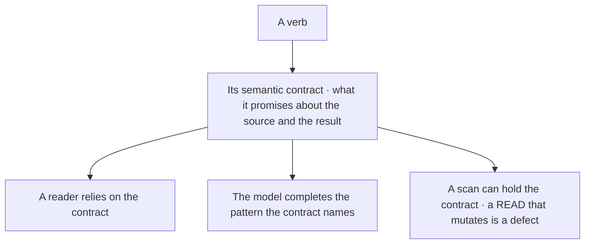
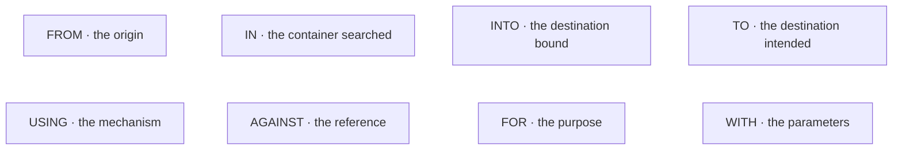
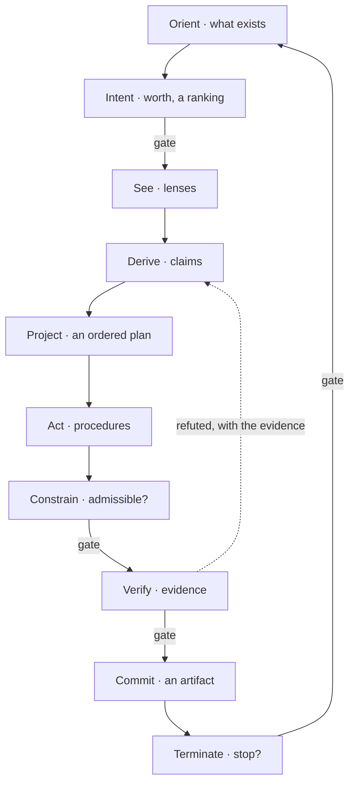
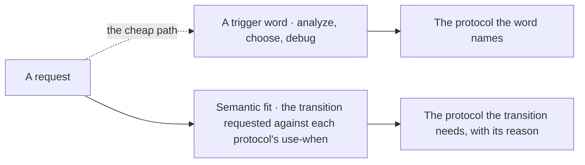
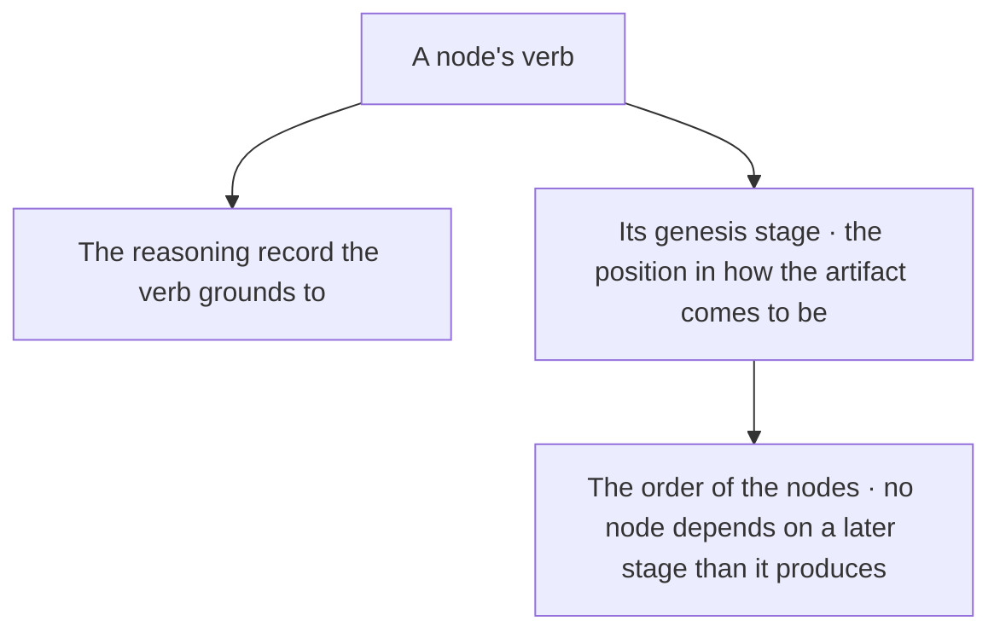
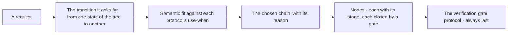
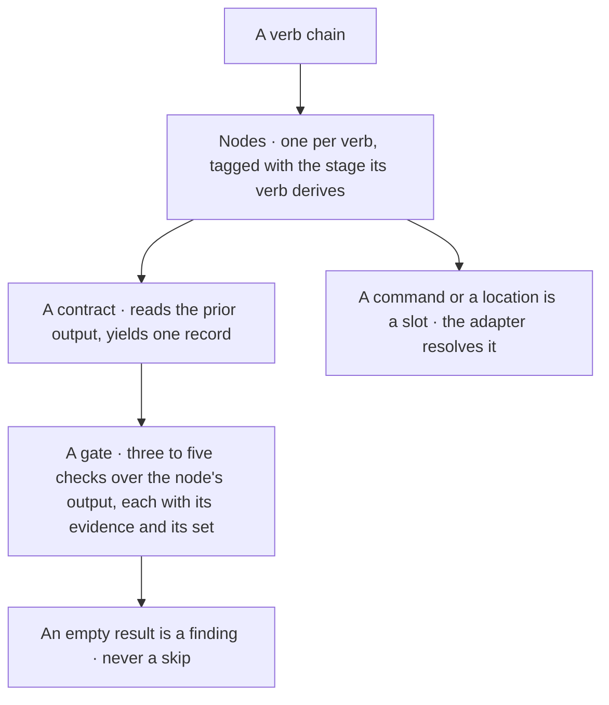
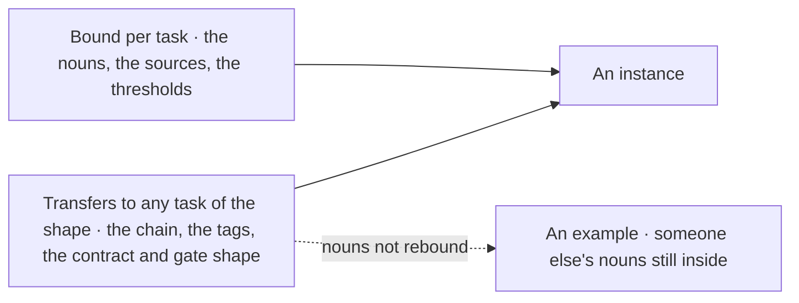
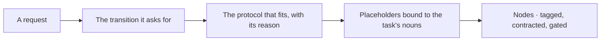
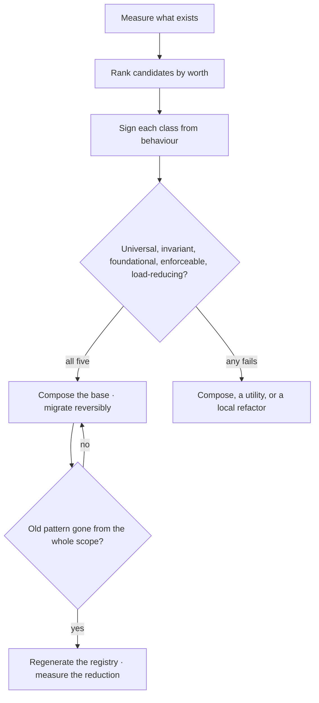

© 2025 Jay Baleine - Disciplined AI Software Development · Documentation is covered by [CC BY-SA 4.0](https://creativecommons.org/licenses/by-sa/4.0/)

# Patterns — PAG — Bane's Lab

> Each verb carries a semantic contract, and the contract is what a document relies on rather than what any particular tool happens to do: a read leaves its…

Canonical: https://banes-lab.com/pag/patterns

# Pattern Abstract Grammar

Structured instructions for AI systems.

# Patterns

## Instruction patterns

Each verb carries a [semantic contract](../ontology/PRINCIPLES.md#arch-semantic-contracts), and the contract is what a document relies on rather than what any particular tool happens to do: a read leaves its source unchanged whatever tool performs it. The contracts are listed by what each verb promises, [A1·a input verbs](#instruction-patterns-panel-a) about the source, [A1·b output verbs](#instruction-patterns-panel-b) about the result, [A1·c control verbs](#instruction-patterns-panel-c) about effects, and [A1·d three readers](#instruction-patterns-panel-d) is who a contract serves. The prepositions carry the relations between the operands, as [A1·e the prepositions](#instruction-patterns-panel-e) declares them, and a verb's contract plus its preposition is the whole meaning of a line.

### Verbs and their contracts

A verb is a semantic contract, and a preposition is a declared relation. A verb with no stated guarantee means whatever the model completes it as.

A document says process the items, the model reads, filters, writes and deletes under one word, and the reviewer cannot say which of those the author meant. A verb the model has seen carry one guarantee across many contexts carries it into the completion; a verb used loosely carries every meaning it has ever had.

Choose the verb by the guarantee the line needs rather than by the tool that will perform it. Read when the source must survive, extract when meaning must, find when only existence matters, filter when order must hold, execute when a side effect is the point. Bind the operands with the preposition that names their relation. Rely on the guarantee downstream, and treat a line whose behaviour breaks it as a defect in the line.

Read a line and state what it promises about its source and its result. A line whose promise you cannot state uses a verb loosely, and the repair is the verb whose guarantee matches the intent.

A contract is a promise the grammar makes about the intent; whether the party executing the line honours it is what [verification](../ontology/PRINCIPLES.md#arch-verification) is for.

A contract promises one of three things: what happens to the source, what the result is, or what effects the line may have. Two carry the most weight. An execute may have side effects, and saying so is what keeps each one from being a [hidden side effect](../ontology/PRINCIPLES.md#arch-hidden-side-effect). A report is a statement to a reader and never a state anything later reads as the truth.

A line with the wrong preposition is a line whose operands are in the wrong relation, and the model completes the relation it was given.

```pag
READ <file> FROM <path> INTO <content>        # non-destructive · the source is unchanged
LOAD <settings> FROM <file>                    # acquisition with parsing
EXTRACT <fields> FROM <record> INTO <values>   # isolation · the source keeps its meaning
FIND <pattern> IN <scope> INTO <found>          # existence · boolean, non-invasive
GLOB "<pattern>" INTO <files>                  # discovery by shape
GREP "<term>" IN <path> INTO <matches>          # discovery by content
```

```pag
WRITE <content> TO <file>                       # idempotent where it overwrites
CREATE <report> FROM <data> USING <template>     # a candidate set or an artifact
APPEND <item> TO <collection>                    # growth without retraction
REPORT <status>                                  # a statement to a reader, never a state

CONVERT <data> TO <format>
FILTER <items> TO <kept> WHERE <condition>       # removes, preserves order
MERGE <sources> INTO <target>
SPLIT <data> BY <delimiter> INTO <segments>
```

```pag
VALIDATE <data> AGAINST <schema>                 # conformance
VERIFY <condition>                               # a boolean, non-modifying
ANALYZE <state> FOR <errors> INTO <found>        # deep examination, may delegate
COMPARE <actual> AGAINST <expected> INTO <diff>
RANK <candidates> BY <score> INTO <ordered>       # score-driven ordering

EXECUTE <command> WITH <params>                  # side effects possible
TASK "<objective>" WITH agent: <role> -> <result>
SEND <message> TO <recipient>
AWAIT <response> INTO <result>
SET <state> = <value>                            # assignment · idempotent
LINK <source> TO <target>                        # a bidirectional association
```

A1·d three readers



A1·e the prepositions



## From intent to structure

A request is turned into structure by walking [the loop](../START.md#the-loop), not by matching a word, the two routes [B1·e fit, not word](#intent-to-structure-panel-e) draws and [B1·b selection by fit](#intent-to-structure-panel-b) writes. Each of the loop's nodes yields a decision of a declared shape: intent a ranking, never a yes; verify a boolean over evidence; terminate a stop only when the work is saturated, complete and verified, the three gates [B1·c typed gates](#intent-to-structure-panel-c) writes. A document that walks the loop writes each node with its contract and a gate wherever the node owes one, which is the whole of [B1·a ten nodes](#intent-to-structure-panel-a), and [B1·d the loop](#intent-to-structure-panel-d) draws the edge a refutation takes back.

### Walk the loop, select by fit

Intent yields a ranking, protocols are selected by fit, and every decision is typed to its shape. A structure chosen from a trigger word answers the word rather than the request.

A request to analyze a plan is routed to the analysis protocol because it said analyze, the plan needed a decision between two designs, and the output is a thorough analysis of the wrong question. A word in a request is evidence about the request and never its subject, and a protocol chosen from the word answers the word.

Derive the structure from the transition the request asks for rather than from the words it uses. Turn a request into nodes by walking the loop in order and closing each node on the gate it owes. State the objective before any seeing and rank the admissible ways of reaching it, so intent yields a ranking with more than one entry. Select a protocol by comparing the transition the request asks for against what each protocol is for, and record the reason. Type every gate to the shape its decision yields, and let a refuted claim go back to derive with the evidence rather than forward with a caveat.

For each node, name the stage it realises and the shape its gate yields. A gate that owes a ranking and returns a yes has folded, and a protocol whose selection cites a word rather than a reason was matched, not chosen.

A descriptive artifact, a reference, a note, a contract, is read rather than walked, and forcing the full loop onto it is fitting a thing to a shape it does not have. Only an artifact that will be walked takes every node.

The four gates the loop names never fold whatever the size of the task, and a document writes each as a typed gate. Worth is a ranking with more than one entry, as [worth before work](../PLAN.md#worth-before-work) states. Admissibility is asked after the operations exist. Evidence is a non-empty set, where no contradiction found is not evidence. Termination is saturation and completion and [verification](../ontology/PRINCIPLES.md#arch-verification) together. Every other node runs when the subject warrants it.

Protocol selection is by fit because a trigger word is the cheapest possible match and the least reliable: the same word appears in requests with nothing in common but the word. The reason travels with the selection so a reader can contest it.

```pag
# the ten nodes · each closes on the gate it owes, and each reads only the prior node's output
# NODE 1 — ORIENT      [epistemic · ontology · set-theory · yields: set]
@purpose: "name what exists before anything is done with it"
CONTRACT:
input:     <the declaration's objective>
transform: READ_RESOURCE <the governing documents> INTO <authority>; DISCOVER_RESOURCES "<pattern>" INTO <what exists>
output:    <what exists>, under <authority>
HANDOFF GATE:
[check] <authority> read before any claim (evidence: the read precedes the first claim)
[check] every claim about the tree has a location (evidence: no claim without a path)
[check] <what exists> is non-empty, or the empty set is reported (evidence: a count, or the report)
result: pass -> NODE 2 | unlocated claim -> REPAIR (owner: NODE 1) | unknown -> BLOCKED

# NODE 2 — INTENT      [conative · teleology · optimisation · yields: ranking]
@purpose: "decide what is worth doing before any effort is spent"
CONTRACT:
input:     <what exists> from NODE 1
transform: SET <objective> = "<one sentence the result is checked against>"; COMPOSE_ARTIFACT <branches> FROM <objective>; RANK <branches> BY <utility minus cost> INTO <ranked>
output:    <ranked>, and the chosen branch
HANDOFF GATE:
[check] <objective> is one sentence a result can be checked against (evidence: the sentence)
[check] <ranked> holds more than one admissible branch (evidence: a count above one) over: <branches> measured: <admissible> / <branches>
[check] the chosen branch is the first of <ranked> (evidence: the ranking)
result: pass -> NODE 3 | one branch -> REPAIR (owner: NODE 2) | unknown -> BLOCKED

# NODE 3 — SEE         [epistemic · analysis · graph · yields: edge-list]
CONTRACT:
input:     <what exists> from NODE 1, under the chosen branch
transform: ANALYZE_CONTENT <what exists> AGAINST <the lenses the subject warrants> INTO <observations>
output:    <observations>
HANDOFF GATE:
[check] every observation names its lens (evidence: one lens per entry) over: <observations> measured: <lensed> / <observations>
[check] every observation has a location (evidence: no entry without a path)
result: pass -> NODE 4 | unlensed observation -> REPAIR (owner: NODE 3) | unknown -> BLOCKED

# NODE 4 — DERIVE      [epistemic · reasoning · logic · yields: boolean]
CONTRACT:
input:     <observations> from NODE 3
transform: EXTRACT_FACTS <claims> FROM <observations> INTO <claims>
output:    <claims>
HANDOFF GATE:
[check] every claim names the observation it rests on (evidence: a source per claim) over: <claims> measured: <sourced> / <claims>
[check] no claim rests on prior knowledge (evidence: every source is in <observations>)
result: pass -> NODE 5 | unsourced claim -> REPAIR (owner: NODE 3) | unknown -> BLOCKED

# NODE 5 — PROJECT     [epistemic · reasoning · graph · yields: edge-list]
CONTRACT:
input:     <claims> from NODE 4
transform: COMPOSE_ARTIFACT <plan> FROM <claims> USING <dependency order>
output:    <plan>
HANDOFF GATE:
[check] <plan> is acyclic (evidence: a topological order exists)
[check] every step of <plan> names its inputs and outputs (evidence: no empty contract) over: <plan> steps measured: <contracted> / <steps>
result: pass -> NODE 6 | a cycle -> REPAIR (owner: NODE 5) | unknown -> BLOCKED

# NODE 6 — ACT         [epistemic · formalisation · computation · yields: procedure]
CONTRACT:
input:     <plan> from NODE 5
transform: EXECUTE_TOOL <plan> INTO <realised>
output:    <realised>
HANDOFF GATE:
[check] every step ran or is reported as blocked (evidence: one status per step) over: <plan> steps measured: <ran or blocked> / <steps>
[check] every step traces to the chosen branch (evidence: the trace)
[check] <realised> names every artifact a step produced (evidence: one entry per step)
refuse: a step that would write outside the chosen branch before EXECUTE_TOOL
result: pass -> NODE 7 | untraced step -> REPAIR (owner: NODE 6) | unknown -> BLOCKED

# NODE 7 — CONSTRAIN   [conative · teleology · optimisation · yields: boolean]
CONTRACT:
input:     <realised> from NODE 6
transform: VALIDATE_ARTIFACT <realised> AGAINST <the chosen branch's cost and the hard limits>
output:    the admissibility verdict
HANDOFF GATE:
[check] nothing ran outside the chosen branch (evidence: every step traces to it) over: <realised> measured: <inside> / <steps>
[check] the realised cost is within the branch's cost (evidence: the two numbers)
[check] no step crossed a hard limit (evidence: the limits, each checked)
result: pass -> NODE 8 | a limit crossed -> REPAIR (owner: NODE 5) | unknown -> BLOCKED

# NODE 8 — VERIFY      [evaluative · verification · logic · yields: boolean]
CONTRACT:
input:     <claims> from NODE 4, and <realised> from NODE 6
transform: VALIDATE_ARTIFACT every <claim> AGAINST <evidence>
output:    the verdicts
HANDOFF GATE:
[check] evidence non-empty for every claim (evidence: the evidence set) over: <claims> measured: <evidenced> / <claims>
[check] every claim names its refuter (evidence: one refuter per claim)
[check] no claim rests on the absence of a contradiction (evidence: each claim's evidence is an observation)
standing: moved-set <the surfaces that changed since NODE 3>
result: pass -> NODE 9 | refuted -> REPAIR (owner: NODE 4) | unknown -> BLOCKED

# NODE 9 — COMMIT      [evaluative · representation · information-theory · yields: artifact]
CONTRACT:
input:     the verdicts from NODE 8
transform: PERSIST_ARTIFACT <result> TO <the surface the next cycle reads>
output:    <result>
freshness: fingerprint(<claims>) + fingerprint(<realised>)
HANDOFF GATE:
[check] <result> persisted where the next cycle reads (evidence: a read returns it)
[check] <result> carries its derivations (evidence: the evidence set travels with it) over: <claims> measured: <carried> / <claims>
[check] nothing earlier was rewritten by the commit (evidence: a witness read)
refuse: <the surface the next cycle reads> changed since it was read before PERSIST_ARTIFACT
result: pass -> NODE 10 | a rewrite -> REPAIR (owner: NODE 9) | unknown -> BLOCKED

# NODE 10 — TERMINATE  [evaluative · termination · set-theory · yields: boolean]
CONTRACT:
input:     <result> from NODE 9
transform: VALIDATE_ARTIFACT <result> AGAINST <saturated, complete, verified>
output:    the stop
HANDOFF GATE:
[check] saturated · nothing remains to examine (evidence: the open set is empty) over: the open set measured: <examined> / <open>
[check] complete · the objective sentence reads true against the tree (evidence: the sentence, checked)
[check] verified · every claim passed NODE 8 (evidence: the verdicts)
result: pass -> TERMINATE | not saturated -> REPAIR (owner: NODE 1) | unknown -> BLOCKED
```

```pag
# selection by semantic fit · never by a word in the request
ANALYZE <request> AGAINST <each protocol's use-when> INTO <fit>
FOR EACH <protocol> IN <protocols>:
IF <fit>[<protocol>].<semantic-match>:
APPEND <protocol> TO <selected> WITH reason: <fit>[<protocol>].<reason>

# what a trigger word would have done
# "analyze" in the request -> the analysis protocol, whatever the request was for
```

```pag
# a decision typed to its shape · a gate owing a ranking is not satisfied by a yes
HANDOFF GATE (evidence-bearing):
rule_id: "INTENT"      yields: ranking
[check] the chosen branch is the argmax over admissible branches (evidence: the ranking)
[check] more than one branch was admissible (evidence: a count above one)
[check] every branch carries what it advances and what it costs (evidence: no branch with an empty field)
result: pass -> NODE 3 | one branch -> REPAIR (owner: NODE 2) | unknown -> BLOCKED

HANDOFF GATE (evidence-bearing):
rule_id: "VERIFY"      yields: boolean
[check] the evidence set is non-empty for every claim (evidence: the set) over: <claims> measured: <evidenced> / <claims>
[check] every claim names what would refute it (evidence: one refuter per claim)
[check] every claim's evidence is an observation, never an absence (evidence: each entry's source)
result: pass -> NODE 9 | refuted -> REPAIR (owner: NODE 4) | unknown -> BLOCKED

HANDOFF GATE (evidence-bearing):
rule_id: "TERMINATE"   yields: boolean
[check] saturation (evidence: the open set is empty) over: the open set measured: <examined> / <open>
[check] completion (evidence: the objective sentence, checked against the tree)
[check] verification (evidence: every claim's verdict)
result: pass -> TERMINATE | not saturated -> REPAIR (owner: NODE 1) | unknown -> BLOCKED
```

B1·d the loop



B1·e fit, not word



## Genesis stages

Every node carries a genesis stage, and the stage is derived from the node's verb rather than chosen, as [C1·d verb to stage](#genesis-stages-panel-d) draws: the verb names where in the substrate cycle the node's artifact comes to be, the table [C1·a genesis stages](#genesis-stages-panel-a) lists, so one word decides the node's legal position. A protocol is a chain of such verbs, [C1·b protocols](#genesis-stages-panel-b) shows four, selected the way [from intent to structure](PATTERNS.md#intent-to-structure) selects and [C1·e request to nodes](#genesis-stages-panel-e) draws, and a document instantiates the chain as tagged, gated nodes in genesis order, as [C1·c chain expanded](#genesis-stages-panel-c) does.

### Derived from the verb

A node's genesis stage derives from its verb, and the header carries one dialect. A node labelled by hand carries a role its verb does not derive.

A node's tag says structure, its only directive reads a file, and the reviewer approves a build step that builds nothing. A verb is a contract about what a node does, so a stage written beside it is a second declaration of the same fact, and a catalog of roles beside the verbs is a second vocabulary the ontology does not carry.

Derive the stage from the verb's grounding in the substrate cycle rather than write a role label beside the verb. Tag every node with the stage its verb derives, and expand a chosen chain into nodes in genesis order, each with a contract that reads the prior output and a gate of its own. Append the [verification](../ontology/PRINCIPLES.md#arch-verification) gate protocol to every plan. Where a node's stage disagrees with its verb, the node is misnamed; where a node depends on a later genesis than it produces, the order is wrong.

Read each node's verb and state the stage it implies. A stage that does not follow from the verb was written by hand, and a header whose bracket carries anything but the layer, the axis, the math type and the yields is a second dialect.

A one-step task has no chain to instantiate. A single read with a single gate is a directive, and tagging it adds a name to nothing.

The stage is a tag beneath the header, derived from the verb, so a reader sees a document's construction order from its tags alone. The header's four slots are [the loop](../START.md#the-loop)'s, the layer, the axis, the math type and the yields, and the same verb names the genesis stage [node design](GUIDE.md#node-design) orders by, so the chain's order is derived from one word and the header stays one shape. Every action verb grounds to a reasoning record, and the stage follows from that record: a verb grounded in observation realises existence, one grounded in construction realises structure, one grounded in a verification node realises constraint, which is what makes the derivation a lookup rather than a judgement.

A protocol is a chain with a use-when and the principles it serves. The use-when names the transition the chain is for, from one state of the tree to another, and the principles name what the chain must leave true, so a selected protocol carries its own acceptance criteria into the nodes it expands to. The verification gate protocol is appended to every plan, because every plan ends by checking its own reasoning against the tree.

```pag
# a genesis stage · where in the substrate cycle a node's artifact comes to be, derived from its verb
existence       FIND, READ, DISCOVER_RESOURCES, READ_RESOURCE     does the thing exist, is it scaffolded
difference      ANALYZE, FILTER, SPLIT, REMOVE                    what boundary makes it distinct
relation        EXTRACT, LINK, SEARCH_CONTENT, EXTRACT_FACTS      what it depends on and connects to
structure       CREATE, INSERT, COMPOSE_ARTIFACT                  how its parts are arranged under its laws
transformation  EXECUTE, CONVERT, ITERATE, EXECUTE_TOOL           what operation it performs
constraint      VERIFY, VALIDATE, ENFORCE, VALIDATE_ARTIFACT      what invariants and gates bound it
emergence       FINALIZE, REPORT, PERSIST_ARTIFACT, REPORT_RESULT does it integrate and stabilise

# the stage is a tag on the node, beneath the header's four slots · one dialect, one header shape
# NODE <n> — <NAME>   [<layer> · <axis> · <math type> · yields: <shape>]
@genesis: <existence | difference | relation | structure | transformation | constraint | emergence>
```

```pag
# a protocol · a verb chain with the transition it is for and the principles it serves
<separate-a-unit>:
use_when:   "a unit mixes concerns or exceeds a bounded complexity"
chain:      ANALYZE -> FIND -> EXTRACT -> CREATE -> VERIFY
principles: [<the principles it serves>]

<extend-without-modifying>:
use_when:   "a new variant extends a stable system"
chain:      ANALYZE -> FIND -> CREATE -> LINK -> VERIFY
principles: [<the principles it serves>]

<replace-a-path>:
use_when:   "an existing production path is replaced"
chain:      FIND -> ANALYZE -> CREATE -> EXECUTE -> VERIFY
principles: [<the principles it serves>]

<author-an-enforcement>:
use_when:   "a new invariant needs automated protection"
chain:      ANALYZE -> CREATE -> LINK -> EXECUTE -> VERIFY
principles: [<the principles it serves>]

<verification-gate>:                     # always appended · every plan ends in it
use_when:   "every plan requires a final reasoning and checklist validation"
chain:      ANALYZE -> VERIFY -> REPORT
principles: [<every active principle>]
```

```pag
# a chain expanded into nodes · each header carries its layer, axis, math type and yields, and each node its genesis stage
# NODE 1 — ANALYZE THE UNIT       [epistemic · analysis · logic · yields: set]
@genesis: difference
# NODE 2 — FIND THE SEAMS         [epistemic · ontology · set-theory · yields: set]
@genesis: existence
# NODE 3 — EXTRACT THE CONCERN    [epistemic · reasoning · graph · yields: edge-list]
@genesis: relation
# NODE 4 — CREATE THE NEW UNIT    [epistemic · formalisation · computation · yields: procedure]
@genesis: structure
# NODE 5 — VERIFY THE SPLIT       [evaluative · verification · logic · yields: boolean]
@genesis: constraint

# the stage is derived from the verb · a node whose stage disagrees with its verb is mislabelled
# a node that depends on a later genesis than it produces is a genesis inversion
```

C1·d verb to stage



C1·e request to nodes



## Algorithm examples

An algorithm is a protocol instantiated: the chain expanded into nodes, each headed by its layer, axis, math type and yields and tagged with its [genesis stage](PATTERNS.md#genesis-stages), each contracted to the prior node's output and closed by an evidence-bearing gate, and every placeholder bound to the task's own nouns. Three instances follow, [D1·a separate a unit](#algorithm-examples-panel-a), [D1·b author an enforcement](#algorithm-examples-panel-b) and [D1·c verification gate](#algorithm-examples-panel-c), and the diagrams say what every instance carries beyond its chain, [D1·d beyond the chain](#algorithm-examples-panel-d), and what transfers between them and what is bound per task, [D1·e transfers or bound](#algorithm-examples-panel-e).

### Three instances

An algorithm is a protocol with its chain expanded, its nodes tagged and its steps gated. An algorithm copied from an example keeps the example's nouns and loses the task's.

A seam search returns nothing, the node is skipped without an entry, the extraction runs over an empty set, and the count that would have exposed the gap is taken over the wrong population. The chain is the protocol's contract and the gates are how the contract is checked, so the two transfer together and the nouns do not.

Bind the task's nouns into the protocol's shape, rather than edit an example until it fits. Write the chain above the nodes, with the reason it was chosen, so a reader sees the protocol before the instance. Expand one node per verb, tag it with the stage the verb derives, and bind each placeholder to a noun from the task so no placeholder survives into the document. Give each node a contract whose input names the prior output, and close it on three to five checks that name its output, the evidence that settles each and the set at least one ranged over. Route a failure to the earliest node that can supply the missing evidence and an unknown to blocked, refuse before every write, make an empty result a finding rather than a silent skip, and name every command and location as a slot the adapter resolves.

Find a placeholder that survived into the document, a node whose stage disagrees with its verb, a contract whose input names nothing from its predecessor, or a gate whose count is taken over a set smaller than the one it claims. Any of the four is an instance that was copied rather than bound.

A node with two decisions is two nodes, and the examples are not a licence to collapse them.

In the first instance two checks carry the honesty. An empty seam set is a unit that does not split and is reported as such, because a green over an empty population measures nothing, and the population beside the verdict is what makes that visible. The repair owner on the extraction gate is the seam node, because a bad extraction is usually a bad seam.

The second instance is the shape every rule held by attention takes before it is trusted. The analysis names a shape rather than an instance, because a check that names an instance dies on the next case. The check is proven to fire the way [the check comes first](../BUILD.md#the-check-comes-first) describes, and that failure routes back to the node that composed the check, not to the probe; the probe's own write is refused where it would land on a real file.

The third instance is appended to every plan rather than chosen; its gate is the evidence gate of [from intent to structure](PATTERNS.md#intent-to-structure), applied to the plan's own reasoning, and its standing line names what moved beneath the plan while it was checked.

```pag
# <separate-a-unit> · ANALYZE -> FIND -> EXTRACT -> CREATE -> VERIFY
# chosen because the request asks to split a unit that mixes two concerns

# NODE 1 — ANALYZE THE UNIT       [epistemic · analysis · logic · yields: set]
@genesis: difference
CONTRACT:
input:     <unit>
transform: READ_RESOURCE <unit> INTO <source>; ANALYZE_CONTENT <source> AGAINST <responsibilities> INTO <concerns>
output:    <concerns>, each naming the lines that carry it
HANDOFF GATE:
[check] <source> read from <unit> (evidence: the read returned content)
[check] <concerns> holds more than one entry (evidence: a count above one) over: <source> lines measured: <assigned> / <lines>
[check] every <concern> names its lines (evidence: no concern with an empty range)
result: pass -> NODE 2 | unread -> REPAIR (owner: NODE 1) | unknown -> BLOCKED

# NODE 2 — FIND THE SEAMS         [epistemic · ontology · set-theory · yields: set]
@genesis: existence
CONTRACT:
input:     <concerns> from NODE 1
transform: SEARCH_CONTENT <source> FOR <boundaries between concerns> INTO <seams>
output:    <seams>
HANDOFF GATE:
[check] every <seam> lies between two <concerns> (evidence: two concern ids per seam) over: <seams> measured: <between two> / <seams>
[check] no <seam> cuts a single statement (evidence: each seam on a statement boundary)
[check] <seams> is non-empty, or the unit is reported as one that does not split (evidence: a count, or the report)
result: pass -> NODE 3 | does not split -> TERMINATE | unknown -> BLOCKED

# NODE 3 — EXTRACT THE CONCERN    [epistemic · reasoning · graph · yields: edge-list]
@genesis: relation
CONTRACT:
input:     <seams> from NODE 2
transform: EXTRACT_FACTS <concern> FROM <source> INTO <extracted>
preserves: every reference between <extracted> and the rest
output:    <extracted>, and every reference between it and the rest
HANDOFF GATE:
[check] <extracted> carries every line of <concern> (evidence: the line ranges match) over: <concern> lines measured: <carried> / <lines>
[check] <source> minus <extracted> carries the rest (evidence: the two ranges partition the source)
[check] every reference between the two is named (evidence: an edge per reference)
result: pass -> NODE 4 | partition broken -> REPAIR (owner: NODE 2) | unknown -> BLOCKED

# NODE 4 — CREATE THE NEW UNIT    [epistemic · formalisation · computation · yields: artifact]
@genesis: structure
CONTRACT:
input:     <extracted> from NODE 3
transform: COMPOSE_ARTIFACT <new-unit> FROM <extracted> USING <the shape units take here>; PERSIST_ARTIFACT <new-unit> TO <destination>
output:    <new-unit>
freshness: fingerprint(<extracted>) + fingerprint(this document)
HANDOFF GATE:
[check] <new-unit> persisted (evidence: a read of <destination> returns it)
[check] <new-unit> declares what it imports from <unit> (evidence: the import list) over: references measured: <declared> / <references>
[check] <unit> declares what it imports from <new-unit> (evidence: the import list)
refuse: <destination> exists and was not read before PERSIST_ARTIFACT
result: pass -> NODE 5 | undeclared import -> REPAIR (owner: NODE 4) | unknown -> BLOCKED

# NODE 5 — VERIFY THE SPLIT       [evaluative · verification · logic · yields: boolean]
@genesis: constraint
CONTRACT:
input:     <new-unit> from NODE 4
transform: EXECUTE_TOOL {toolchain.verify_command} INTO <verdict>; VALIDATE_ARTIFACT <verdict> AGAINST <green on one full run>
output:    <verdict>
HANDOFF GATE:
[check] <verdict> green on one full run (evidence: the run's own output) over: the run's steps measured: <green> / <steps>
[check] no circular dependency between <unit> and <new-unit> (evidence: the import graph)
[check] every consumer of <unit> resolves (evidence: the typecheck)
refuse: a run that would mutate the tree before EXECUTE_TOOL
standing: moved-set <the files changed since NODE 4>
result: pass -> TERMINATE | red -> REPAIR (owner: NODE 3) | unknown -> BLOCKED
```

```pag
# <author-an-enforcement> · ANALYZE -> CREATE -> LINK -> EXECUTE -> VERIFY
# chosen because a rule held by attention needs a check that holds it

# NODE 1 — ANALYZE THE SHAPE      [epistemic · analysis · logic · yields: set]
@genesis: difference
CONTRACT:
input:     <the violations seen so far>
transform: ANALYZE_CONTENT <the violations> AGAINST <the shape they share> INTO <shape>
output:    <shape>, with its one fix
HANDOFF GATE:
[check] <shape> names a structure, never an instance (evidence: no vendor, symbol or path in it)
[check] every violation seen is an instance of <shape> (evidence: one match per violation) over: <the violations> measured: <matched> / <violations>
[check] one fix is stated for <shape> (evidence: the fix sentence)
result: pass -> NODE 2 | instance named -> REPAIR (owner: NODE 1) | unknown -> BLOCKED

# NODE 2 — CREATE THE CHECK       [epistemic · formalisation · computation · yields: artifact]
@genesis: structure
CONTRACT:
input:     <shape> from NODE 1
transform: COMPOSE_ARTIFACT <check> FROM <shape> USING <the form checks take here>; PERSIST_ARTIFACT <check> TO {project.rule_home}
output:    <check>
freshness: fingerprint(<shape>) + fingerprint(this document)
HANDOFF GATE:
[check] <check> persisted (evidence: a read of {project.rule_home} returns it)
[check] <check> reports <shape> and states its fix (evidence: its message)
[check] <check> names no vendor, symbol or path (evidence: a scan of its literals) over: its literals measured: <neutral> / <literals>
refuse: {project.rule_home} already holds a check of that name before PERSIST_ARTIFACT
result: pass -> NODE 3 | instance literal -> REPAIR (owner: NODE 2) | unknown -> BLOCKED

# NODE 3 — LINK THE CHECK         [epistemic · reasoning · graph · yields: edge-list]
@genesis: relation
CONTRACT:
input:     <check> from NODE 2
transform: LINK <check> TO <the registry the gate reads>
output:    the registry entry
HANDOFF GATE:
[check] <check> resolves from the registry (evidence: a lookup returns it)
[check] <check> is active (evidence: the entry)
[check] nothing else in the registry changed (evidence: a diff of the entries) over: registry entries measured: <unchanged> / <entries>
result: pass -> NODE 4 | unresolved -> REPAIR (owner: NODE 3) | unknown -> BLOCKED

# NODE 4 — PROVE IT FIRES         [epistemic · formalisation · analysis · yields: procedure]
@genesis: transformation
CONTRACT:
input:     the registry entry from NODE 3
transform: PERSIST_ARTIFACT <a deliberate violation> TO <a probe>; EXECUTE_TOOL {toolchain.lint_command} INTO <report>; RESTORE <a probe>
output:    <report>
HANDOFF GATE:
[check] <report> names <a probe> under <check> (evidence: the report line)
[check] <report> carries the expected message (evidence: the message text)
[check] <a probe> restored (evidence: a read returns the original) over: probes measured: <restored> / <planted>
refuse: <a probe> names a real file before PERSIST_ARTIFACT
result: pass -> NODE 5 | silent -> REPAIR (owner: NODE 2) | unknown -> BLOCKED

# NODE 5 — VERIFY THE TREE        [evaluative · verification · logic · yields: boolean]
@genesis: constraint
CONTRACT:
input:     <report> from NODE 4
transform: EXECUTE_TOOL {toolchain.verify_command} INTO <verdict>; VALIDATE_ARTIFACT <verdict> AGAINST <green on one full run>
output:    <verdict>
HANDOFF GATE:
[check] <verdict> green on one full run (evidence: the run's own output)
[check] every real occurrence of <shape> repaired in this change (evidence: the check reports none) over: occurrences measured: <repaired> / <occurrences>
[check] <check> caught each of them before the repair (evidence: the first run's report)
refuse: a run that would mutate the tree before EXECUTE_TOOL
standing: moved-set <the files changed since NODE 2>
result: pass -> TERMINATE | occurrence remains -> REPAIR (owner: NODE 1) | unknown -> BLOCKED
```

```pag
# <verification-gate> · ANALYZE -> VERIFY -> REPORT · appended to every plan

# NODE N — VERIFY THE REASONING   [evaluative · verification · logic · yields: boolean]
@genesis: constraint
CONTRACT:
input:     every node above
transform: ANALYZE_CONTENT <every gate above> AGAINST <a check that is a judgement, lacks evidence or lacks a population> INTO <weak-gates>; VALIDATE_ARTIFACT every <claim> IN <the plan> AGAINST <the tree>; REPORT_RESULT <verdict> TO <the parties whose next work it creates>
output:    <verdict>, with every gate, its evidence, and what it reached
HANDOFF GATE:
[check] <weak-gates> is empty (evidence: a count of zero) over: <every gate above> measured: <sound> / <gates>
[check] every <claim> supported by evidence, none by the absence of a contradiction (evidence: an evidence entry per claim)
[check] <verdict> names what the run reached before what it found (evidence: the report's first line)
standing: moved-set <the surfaces re-read since the plan began>
result: pass -> TERMINATE | weak gate -> REPAIR (owner: the earliest node whose gate is weak) | unknown -> BLOCKED
```

D1·d beyond the chain



D1·e transfers or bound



## Integrating algorithms

Two movements connect protocols to work. Instantiation takes a request to a node chain, in the order [E1·d instantiation order](#algorithm-integration-panel-d) draws and [E1·a instantiation](#algorithm-integration-panel-a) writes: name the transition the request asks for, choose the protocol by fit, bind its placeholders to the task's nouns, and expand its chain into tagged nodes, each with a contract and a gate. Distillation takes repeated behaviour to one shared base, and it is a document type of its own: an epistemology walked on the reasoning axis, gated on evidence that the base is universal, invariant, foundational, enforceable and load-reducing, the five [E1·c boundary principles](#algorithm-integration-panel-c) names. It is incomplete until the old pattern is proven gone, as [E1·e distillation order](#algorithm-integration-panel-e) draws. [E1·b distillation](#algorithm-integration-panel-b) is the grammar's own template record.

### Instantiate and distil

A protocol is instantiated by transition and a base is distilled by behavioural evidence, never copied from one case or a resemblance. A base promoted from one instance or a resemblance is that instance's accidents wearing a template's clothes.

A base is raised from two classes whose names rhyme, three later classes are forced to extend it, and each one overrides most of what it inherited because the shared half was the name. A base is a promise that every future instance shares one behaviour, and a promise made from one instance or from a naming resemblance has nothing to be checked against.

Sign the classes from their behaviour and let the five principles decide, rather than raise a base from what the names have in common. Instantiate by naming the transition first, choosing the protocol whose use-when fits it and recording the reason, binding each placeholder to a noun the task owns, and expanding the chain into nodes whose contracts read the prior output and whose gates carry three to five checks with evidence. Distil only after measuring what exists and ranking the candidates by worth. Sign every class from its behaviour, prove the five boundary principles with the evidence that shows each, compose the base within its size limit, migrate each target reversibly from the simplest up, and scan the whole scope for the old pattern before declaring anything complete.

For a base, name the second instance that justified it, the behavioural signature each class was signed with, and the evidence behind each of the five principles. A base with one instance, a name-based signature or an unproven principle is a template that will fight its next user.

A base is justified by behaviour, never by names that look alike; when a shape earns a template is [core templates](TEMPLATES.md#templates-core)'.

Instantiation names the transition first, because [from intent to structure](PATTERNS.md#intent-to-structure) selects the protocol by it, and it ends when no placeholder survives.

Distillation measures before it proposes, because a missing adoption of an existing base looks like a missing [abstraction](../ontology/PRINCIPLES.md#arch-abstraction) until the registry is read. It signs every class from behaviour rather than names: initialisation, lifecycle, [error handling](../ontology/PRINCIPLES.md#arch-error-handling), state, dependencies. The base is concrete responsibilities plus abstract hooks, a [template method pattern](../ontology/PRINCIPLES.md#arch-template-method-pattern), and a single stray occurrence outside the approved locations is a refutation whose result line routes back to composition. The last gate measures the reduction rather than asserting it, so the [single source of truth](../ontology/PRINCIPLES.md#arch-single-source-of-truth) for what bases exist is the registry and never the memory of the party that distilled.

```pag
# instantiation · from a request to a gated node chain

# STEP 1: the transition · what state of the tree the request asks for
Request:    "route each incoming request to the handler that owns it"
Transition: <a registry that resolves a handler by a request's type>

# STEP 2: the protocol · by semantic fit against each use-when, with the reason
Chosen:     <resolve-through-a-registry>
Reason:     "keyed resolution is justified · handlers vary, the key does not"
Chain:      ANALYZE -> FIND -> CREATE -> LINK -> VERIFY

# STEP 3: the nouns · the task's own, so no placeholder survives
<candidates> = the handlers declared in {project.handler_registry}
<key>        = <request>.<type>

# STEP 4: the nodes · one per verb, tagged with its stage, each contract reading the prior output
# NODE 1 — ANALYZE THE REQUESTS   [epistemic · analysis · logic · yields: set]
@genesis: difference
CONTRACT:
input:     <queue>
transform: READ_RESOURCE <queue> INTO <incoming>; EXTRACT_FACTS <type> FROM <incoming> INTO <keys>
output:    <keys>, one per request
HANDOFF GATE:
[check] <incoming> read from <queue> (evidence: the read returned requests)
[check] a <key> resolved for every <request> (evidence: the two counts match) over: <incoming> measured: <keyed> / <requests>
[check] no <request> carries an unknown <type> (evidence: every key in the declared set)
result: pass -> NODE 2 | unknown type -> REPAIR (owner: NODE 1) | unknown -> BLOCKED

# NODE 2 — FIND THE HANDLER       [epistemic · ontology · set-theory · yields: set]
@genesis: existence
CONTRACT:
input:     <keys> from NODE 1
transform: FOR EACH <key> IN <keys>: FIND <handler> IN <candidates> WHERE <handler>.<owns> == <key> INTO <matched>
output:    <matched>
HANDOFF GATE:
[check] exactly one <handler> per <request> (evidence: the two counts match, no duplicates) over: <keys> measured: <matched> / <keys>
[check] every <handler> in <matched> is declared in {project.handler_registry} (evidence: a lookup per handler)
[check] an unmatched <request> reported, never dropped (evidence: the report names each)
result: pass -> NODE 3 | duplicate handler -> REPAIR (owner: NODE 2) | unknown -> BLOCKED

# NODE 3 — CREATE THE ROUTE       [epistemic · formalisation · computation · yields: procedure]
@genesis: structure
CONTRACT:
input:     <matched> from NODE 2
transform: COMPOSE_ARTIFACT <route> FROM <matched> USING <the route shape here>
output:    <route>
HANDOFF GATE:
[check] <route> names its <handler> and its <key> (evidence: both fields non-empty)
[check] one <route> per <matched> entry (evidence: the two counts match) over: <matched> measured: <routed> / <entries>
[check] <route> conforms to <the route shape here> (evidence: VALIDATE_ARTIFACT passed)
result: pass -> NODE 4 | nonconforming -> REPAIR (owner: NODE 3) | unknown -> BLOCKED

# NODE 4 — LINK THE ROUTE         [epistemic · reasoning · graph · yields: edge-list]
@genesis: relation
CONTRACT:
input:     <route> from NODE 3
transform: LINK <route> TO <the dispatch table>
output:    the dispatch entry
HANDOFF GATE:
[check] <route> resolves from <the dispatch table> (evidence: a lookup returns it)
[check] no earlier <route> for <key> remains (evidence: one entry per key) over: dispatch entries measured: <one per key> / <keys>
[check] nothing else in <the dispatch table> changed (evidence: a diff of the entries)
result: pass -> NODE 5 | stale entry -> REPAIR (owner: NODE 4) | unknown -> BLOCKED

# NODE 5 — VERIFY THE DISPATCH    [evaluative · verification · logic · yields: boolean]
@genesis: constraint
CONTRACT:
input:     the dispatch entry from NODE 4
transform: EXECUTE_TOOL <route> WITH <request> INTO <response>; PERSIST_ARTIFACT <response> TO <outbox>; EXECUTE_TOOL {toolchain.verify_command} INTO <verdict>; VALIDATE_ARTIFACT <verdict> AGAINST <green on one full run>
output:    <verdict>
HANDOFF GATE:
[check] <response> persisted (evidence: a read of <outbox> returns it)
[check] <response>.<handled-by> equals <matched>.<handler> (evidence: the two values) over: <requests> measured: <handled by the matched handler> / <requests>
[check] <verdict> green on one full run (evidence: the run's own output)
refuse: <outbox> changed since it was read before PERSIST_ARTIFACT
standing: moved-set <the files changed since NODE 4>
result: pass -> TERMINATE | wrong handler -> REPAIR (owner: NODE 2) | unknown -> BLOCKED
```

```pag
---
name: {task_name}
type: DISTILLATION
version: 1.0.0
---

THIS DISTILLATION DISTILLS repeated behavioural evidence into one justified shared abstraction, and is incomplete until the old pattern is proven gone.

%% META %%:
priority: BEHAVIORAL_EVIDENCE > BOUNDARY_PRINCIPLES > TASK
trust: procedural_scan = TRUSTED, naming_similarity = UNTRUSTED, prior_knowledge = UNTRUSTED
objective: {task_description}
jurisdiction: {task_description} across the role families {convention.role_taxonomy} names | external: every family the scope does not name
recursion_limit: 3

# NODE 1 — ORIENT   [epistemic · ontology · set-theory · yields: set]
@purpose: "load the registry and rule sources, probe capabilities, and measure the existing baseline before proposing any base"
@genesis: existence
CONTRACT:
input:     {task_description}
transform: READ_RESOURCE {project.architecture_registry} INTO registry; READ_RESOURCE {project.rule_sources} INTO rules; EXECUTE_TOOL <capability probes> WITH timeout: <bound> INTO capability; EXTRACT_FACTS <existing bases, implementation counts, hierarchy depth> FROM registry INTO baseline; FOR EACH role IN {convention.role_taxonomy}: ANALYZE_CONTENT <its classes> AGAINST <the expected base> INTO gap
constraints: compare against existing bases before proposing a new one; a missing adoption is not a missing abstraction
output:    baseline_bundle
DECLARE baseline_bundle: object
SET baseline_bundle = {registry: registry, rules: rules, capability: capability, baseline: baseline, gap: <adoption versus abstraction per role>}
HANDOFF GATE (evidence-bearing):
rule_id: "ORIENT"   yields: boolean
[check] the registry and rule sources are loaded with provenance (evidence: baseline_bundle.registry and rules)
[check] the existing architecture is measured (evidence: baseline_bundle.baseline) over: existing bases measured: <measured> / <bases>
[check] the compliance gap distinguishes adoption from abstraction (evidence: baseline_bundle.gap)
refuse: a probe that would mutate the tree before EXECUTE_TOOL
result: pass -> NODE 2 | context unavailable -> BLOCKED | unknown -> BLOCKED

# NODE 2 — INTENT   [conative · teleology · optimisation · yields: ranking]
@purpose: "score every candidate anti-pattern by worth and gate on the highest-worth one and its highest-worth remediation before any composition"
@genesis: difference
@mandatory
CONTRACT:
input:     baseline_bundle from NODE 1
transform: EXTRACT_FACTS candidate anti-patterns FROM baseline_bundle.gap INTO candidates; FOR EACH candidate IN candidates: CALCULATE_METRIC impact minus effort FROM candidate INTO candidate.worth; FILTER candidates WHERE <not already covered by an existing base>; RANK candidates BY worth
constraints: the verdict create-base, prefer-composition, prefer-utility or reject-abstraction is a worth decision, never a reflex
output:    selected
DECLARE selected: object
SET selected = <the argmax admissible candidate with its remediation verdict, or a redirect to adopting an existing base>
HANDOFF GATE (tel-priority injection-gate):
rule_id: "INTENT"   yields: boolean over ranking
[check] every candidate carries impact, effort and an admissibility verdict (evidence: candidates) over: candidates measured: <scored> / <candidates>
[check] the selected candidate is the argmax of impact minus effort among admissible ones (evidence: the ranking's first entry)
[check] no candidate already covered by an existing base is selected (evidence: the coverage filter)
result: pass -> NODE 3 | none admissible -> REPAIR (owner: NODE 1) | unknown -> BLOCKED

# NODE 3 — SIGN   [epistemic · analysis · graph · yields: edge-list + boolean]
@purpose: "sign each class's behaviour from evidence, surface repeated structure and inconsistency, and reason to the boundary verdict"
@genesis: relation
CONTRACT:
input:     selected from NODE 2
transform: FOR EACH class IN <the selected role family>: EXTRACT_FACTS <initialization, lifecycle, error handling, state, dependencies, orchestration> FROM class INTO signature; ANALYZE_CONTENT signatures FOR <repeated structure with occurrence counts and competing implementations> INTO patterns; ANALYZE_CONTENT patterns AGAINST <universal, invariant, foundational, enforcing, load-reducing, and domain coverage> INTO verdict
constraints: a base needs behavioural evidence, never naming similarity; without sufficient boundary principles the verdict is composition, utility or a local refactor
output:    boundary_verdict
DECLARE boundary_verdict: object
SET boundary_verdict = {signatures: signatures, patterns: patterns, verdict: verdict}
HANDOFF GATE (evidence-bearing):
rule_id: "SIGN"   yields: boolean
[check] every class in the family is signed from evidence, not names (evidence: signatures) over: the family measured: <signed> / <classes>
[check] repeated structure and inconsistency are surfaced with counts (evidence: patterns)
[check] a base verdict rests on sufficient boundary principles and coverage (evidence: boundary_verdict.verdict)
result: pass -> NODE 4 | insufficient boundary -> REPAIR (owner: NODE 2) | unknown -> BLOCKED

# NODE 4 — COMPOSE AND MIGRATE   [epistemic · formalisation · computation · yields: procedure]
@purpose: "split concrete from abstract, design the template-method lifecycle, compose the base within limits, and migrate targets simple-first and reversibly"
@genesis: structure
CONTRACT:
input:     boundary_verdict from NODE 3
transform: COMPOSE_ARTIFACT base FROM boundary_verdict USING <concrete constructor, initialize, destroy, handle-error and dependency setup; abstract on-initialize, on-destroy, on-error, configure and execute-core; guard then shared then hook then error policy>; ORDER targets BY ascending complexity then dependency; FOR EACH target IN targets: PERSIST_ARTIFACT <a checkpoint> TO <the checkpoint store>; PERSIST_ARTIFACT <the migrated target> TO target; EXECUTE_TOOL {toolchain.verify.execute} WITH timeout: <bound> INTO removal
constraints: a base over {limits.max_lines} is split; a failed migration restores its checkpoint; a base whose boundary collapsed or that blew the effort budget is inadmissible
preserves: every behaviour signed at NODE 3
output:    migration
DECLARE migration: object
SET migration = {base: base, targets: <each with checkpoint, outcome and removal verdict>, admissible: <boundary still sufficient, size within limit, effort within budget, every target reversible>}
HANDOFF GATE (evidence-bearing):
rule_id: "COMPOSE"   yields: boolean
[check] concrete and abstract responsibilities are split and the lifecycle is defined (evidence: base)
[check] the base is within {limits.max_lines} with a compliant name and location (evidence: the base's size and path)
[check] every target migrated or restored from its checkpoint (evidence: migration.targets) over: targets measured: <migrated> / <targets>
[check] the base is admissible (evidence: migration.admissible)
refuse: a target whose checkpoint cannot be read back before PERSIST_ARTIFACT
result: pass -> NODE 5 | inadmissible -> REPAIR (owner: NODE 3) | unknown -> BLOCKED

# NODE 5 — ELIMINATE   [evaluative · verification · logic + probability · yields: number]
@purpose: "prove the old pattern is eliminated across the whole scope from real source, and migrate any straggler reversibly"
@genesis: constraint
@mandatory
CONTRACT:
input:     migration from NODE 4
transform: SEARCH_CONTENT <the whole scope> FOR <the old pattern> INTO occurrences; FILTER occurrences WHERE <outside the approved base locations>; CALCULATE_METRIC completeness FROM occurrences INTO completeness; ANALYZE_CONTENT occurrences FOR <a stray occurrence that would refute elimination> INTO refuter
constraints: the scan reads real source, never the migration log; a stray occurrence refutes back to NODE 4, bounded by recursion_limit
output:    elimination
DECLARE elimination: object
SET elimination = {occurrences: occurrences, completeness: completeness, refuter: refuter}
HANDOFF GATE (ver-stop gate):
rule_id: "ELIMINATE"   yields: boolean
[check] the scan ran over the whole scope from real source (evidence: the scanned file set) over: the scope measured: <scanned> / <files>
[check] only approved base-location occurrences remain (evidence: elimination.occurrences)
[check] a refuter is named and completeness meets its threshold (evidence: elimination.refuter and completeness)
standing: moved-set <the files changed since NODE 4>
result: pass -> NODE 6 | stray occurrence -> REPAIR (owner: NODE 4) | unknown -> BLOCKED

# NODE 6 — TERMINATE   [evaluative · termination · set-theory · yields: artifact]
@purpose: "regenerate the registry to the new truth, persist measured ROI deduplicated, and stop only on saturation and completion and verification"
@genesis: emergence
@mandatory
CONTRACT:
input:     elimination from NODE 5
transform: EXECUTE_TOOL {project.registry_regenerate} WITH timeout: <bound> INTO regenerated; READ_RESOURCE {project.architecture_registry} INTO registry_after; CALCULATE_METRIC <duplication, code, adoption, lines saved, load> FROM {baseline_bundle, migration, registry_after} INTO roi; COMPOSE_ARTIFACT report FROM {migration, elimination, roi} USING <the success or blocked shape>; PERSIST_ARTIFACT report TO <{task_name} report>; REPORT_RESULT report TO <the parties whose next work it creates>
constraints: ROI is measured, never asserted; the registry reflects the new base and the migrated implementations; a self-assessed done is not ter-stop
output:    report
freshness: fingerprint(registry_after) + fingerprint(this document)
HANDOFF GATE (ter-stop gate):
rule_id: "TERMINATE"   yields: boolean
[check] the registry is regenerated and reflects the new truth (evidence: registry_after names the base and the migrated implementations) over: migrated implementations measured: <represented> / <migrated>
[check] ROI is computed from measurements and history is persisted deduplicated (evidence: roi and the history read back)
[check] success only when saturation and completion and verification all hold (evidence: the termination set)
refuse: a report destination that changed since it was read before PERSIST_ARTIFACT
result: pass -> TERMINATE | registry stale -> REPAIR (owner: NODE 6) | unknown -> BLOCKED

# CROSS-NODE INVARIANTS
INVARIANT measure-before-propose: the existing baseline is measured before any base is proposed over: every distillation binds: the distiller objector: [check] the existing architecture is measured at NODE 1
INVARIANT worth-before-base: the selected candidate is the highest-worth admissible one over: candidates binds: the distiller objector: [check] the selected candidate is the argmax at NODE 2
INVARIANT evidence-not-names: a base rests on behavioural evidence, never on naming similarity over: every base binds: the distiller objector: [check] every class is signed from evidence at NODE 3
INVARIANT reversible-migration: every target migrates through a checkpoint and restores on failure over: targets binds: the distiller objector: [check] every target migrated or restored at NODE 4
INVARIANT gone-means-scanned: elimination is proven over the whole scope from real source over: the scope binds: the distiller objector: [check] the scan ran over the whole scope at NODE 5
INVARIANT roi-measured: ROI is a measurement over the regenerated registry, never an assertion over: every report binds: the distiller objector: [check] ROI is computed from measurements at NODE 6

REPORT:
subject: NODE 6
verdict: pass | fail | unknown
domain: declared <files in scope> measured <scanned>
populations: targets migrated <n>, targets restored <n>, occurrences remaining <n>
refusals: <n> [<reason>]
unresolved: <n> [<reason>]
completion: saturated <bool> complete <bool> verified <bool>

```

```pag
# the boundary principles · a base is justified only when every one holds, with the evidence that shows it
universal       every instance in the family is an instance of the shared behaviour
invariant       the shared half does not vary across them
foundational    other behaviour composes from it
enforceable     a check can hold it
load-reducing   it removes work rather than adding a layer

# otherwise the verdict is compose, a utility, or a local refactor · never a base
```

E1·d instantiation order



E1·e distillation order



Documentation is covered by [CC BY-SA 4.0](https://creativecommons.org/licenses/by-sa/4.0/)

© 2025 [Jay Baleine](https://linkedin.com/in/jay-baleine) - Pattern Abstract Grammar

---

Chapters: [Introduction](INTRODUCTION.md) · [Guide](GUIDE.md) · [Orchestration](ORCHESTRATION.md) · [Patterns](PATTERNS.md) · [Keywords](KEYWORDS.md) · [Grammar](GRAMMAR.md) · [Validation](VALIDATION.md) · [Templates](TEMPLATES.md)
