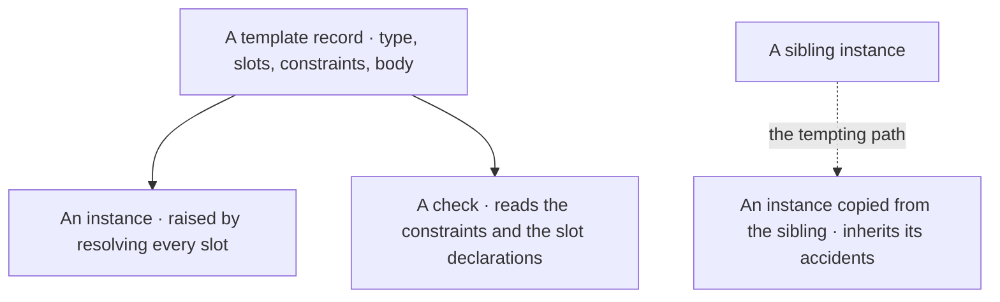
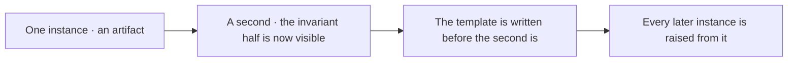
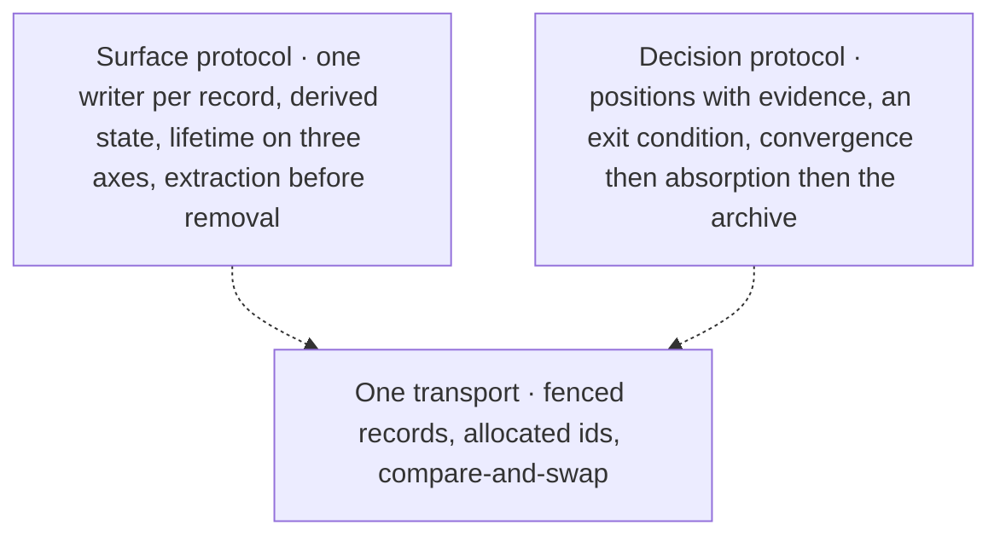
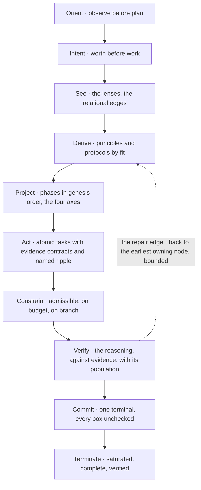
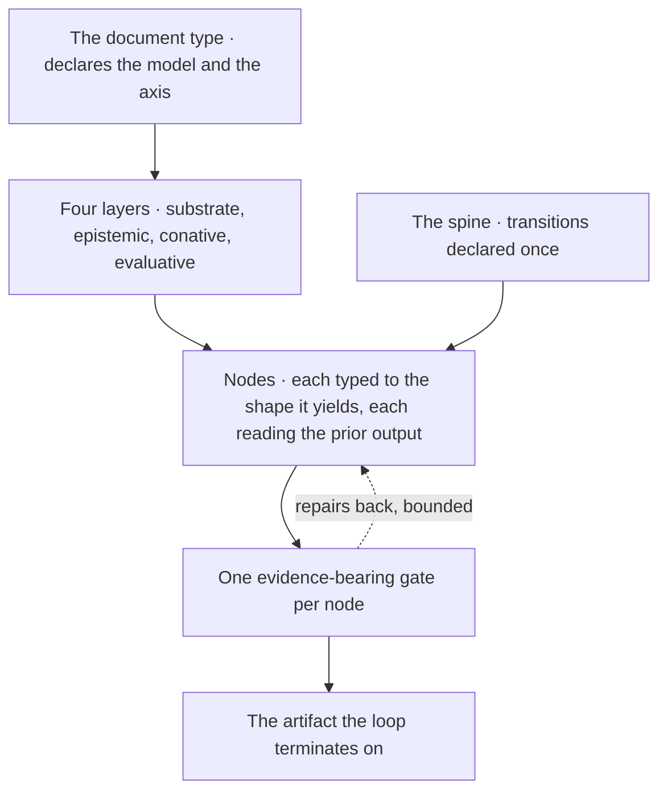
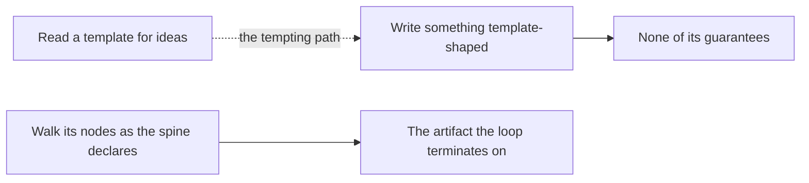
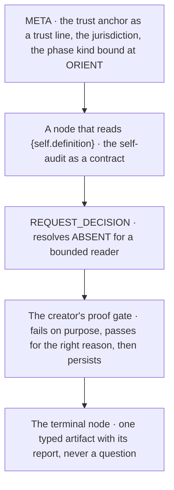

© 2025 Jay Baleine - Disciplined AI Software Development · Documentation is covered by [CC BY-SA 4.0](https://creativecommons.org/licenses/by-sa/4.0/)

# Templates — PAG — Bane's Lab

> A template is a record with four parts, as template record shows: a declared document type, the slots an instance fills, the constraints every instance must…

Canonical: https://banes-lab.com/pag/templates

# Pattern Abstract Grammar

Structured instructions for AI systems.

# Templates

## Core templates

A template is a record with four parts, as [A1·a template record](#templates-core-panel-a) shows: a declared document type, the slots an instance fills, the constraints every instance must satisfy, and a body in which every slot appears by name. It carries the contract of a shape and never one instance's content, which is what [A1·d template and sibling](#templates-core-panel-d) contrasts. Raising an instance is a resolution: each slot is substituted, a slot left unresolved is reported rather than guessed, and a value outside a slot's declared set is a violation, the three outcomes [A1·c resolution](#templates-core-panel-c) lists. The record and [A1·b workflow body](#templates-core-panel-b) are the grammar's own workflow template, read from its records rather than restated here.

### Contract, not content

A template carries the contract, an instance resolves its slots, and a check reads the template. An instance derived from a sibling inherits that sibling's accidents as a contract.

Four parties produce four formats for one surface, each derived from a different sibling, and the check that later reads them derives its schema from a fifth. A sibling carries one instance's choices and a template carries the constraint, and a reader copying a sibling cannot tell which is which.

Raise the second instance from a template written for it, rather than from the first instance. Write a template the second time a shape occurs, before the second instance is written, as [A1·e second instance](#templates-core-panel-e) orders it. Declare its type, name every slot with whether it is required and, where the values form a closed set, that set. Name the constraints every instance must satisfy so a check can read them. Keep in the body only what every instance shares, with every varying value as a slot. Raise each new instance by resolving the slots, and refuse an instance whose resolution reports an unresolved slot or a violation.

Take a template and find a value in it that would be wrong for the next instance. That value is content rather than contract, and a slot is the repair. Then resolve it with one slot missing: a resolution that raises the instance anyway has guessed.

A shape seen once has no template, because one instance cannot show which of its parts are invariant. A template raised from one instance is [premature abstraction](../ontology/PRINCIPLES.md#arch-premature-abstraction).

The slots fall into two kinds by who supplies the value. An instance slot is what this document is for, supplied when it is raised. A host slot is a fact about the tree the document will be walked in, namespaced by what it is a fact about, and resolved by the adapter rather than typed into an instance, which is what keeps one template raisable in any tree.

The constraints are the family's acceptance criteria, and a check over an instance reads them from the template, as [the drop-in](../START.md#onboarding) describes. What the template excludes is as deliberate as what it carries: no model, no path, no tool, for the reasons [semantic operations](GUIDE.md#tool-invocation) gives. A correction lands in the template and reaches every later instance, never in the instance where only its author would see it.

```text
template:
type:        WORKFLOW                       # a declared document type · nothing else
title:       <what the family is for>
slots:
- name:        {WORKFLOW_NAME}             # the value an instance supplies
description: <what the slot holds>
required:    true
kind:        string
- name:        {project.governance_policy}   # a host fact · resolved by the adapter, never typed
required:    true
- name:        {limits.max_lines}            # a bound · resolved from the host's limits
required:    false
- name:        {scope}
required:    true
enum:        [<investigate>, <action>]     # a closed set · a value outside it is a violation
constraints:                                  # what every instance must satisfy · named, checkable
- declaration_required
- gate_per_node
- contract_reads_prior_output
- population_declared
- refusal_before_write
- invariant_has_objector
- no_autonomous_spawn
- single_source_of_truth
body: |
<the document, with every slot as {name}>
```

```pag
---
name: {WORKFLOW_NAME}
type: WORKFLOW
version: 1.0.0
---

THIS WORKFLOW EXECUTES {WORKFLOW_PURPOSE}

%% META %%:
intent: "{WORKFLOW_INTENT}"
objective: "{OBJECTIVE}"
jurisdiction: {INPUT_SOURCE} and {OUTPUT_TARGET} | external: every other surface
recursion_limit: 2

# NODE 1 — {NODE_ONE_TITLE}   [epistemic · analysis · set-theory · yields: set]
@purpose: "read the input and see it through the analysis the workflow is for"
@genesis: existence
CONTRACT:
input:     {INPUT_SOURCE}
transform: READ_RESOURCE {INPUT_SOURCE} INTO input; ANALYZE_CONTENT input AGAINST {ANALYSIS_TARGET} INTO analysis
output:    analysis
HANDOFF GATE (evidence-bearing):
[check] input read from {INPUT_SOURCE} (evidence: the read returned content) over: {INPUT_SOURCE} measured: <read> / <declared>
[check] analysis produced (evidence: a count above zero)
[check] every entry of analysis names its source in input (evidence: no entry with an empty source)
result: pass -> NODE 2 | empty -> REPAIR (owner: NODE 1) | unknown -> BLOCKED

# NODE 2 — {NODE_TWO_TITLE}   [epistemic · formalisation · computation · yields: procedure]
@purpose: "transform every item by one rule, preserving what the next node needs"
@genesis: transformation
CONTRACT:
input:     analysis from NODE 1
transform: FOR EACH item IN analysis: COMPOSE_ARTIFACT result FROM item USING {TRANSFORM_RULE}; APPEND result TO results
preserves: the source of every item
output:    results
HANDOFF GATE:
[check] one result per item (evidence: the two counts match) over: analysis measured: <transformed> / <items>
[check] every result conforms to {TRANSFORM_RULE} (evidence: VALIDATE_ARTIFACT passed on each)
[check] analysis unchanged (evidence: a witness read)
result: pass -> NODE 3 | mismatch -> REPAIR (owner: NODE 2) | unknown -> BLOCKED

# NODE 3 — FINALISATION   [evaluative · representation · information-theory · yields: artifact]
@purpose: "persist the results once, refuse a stale destination, and report to the parties whose next work they create"
@genesis: constraint
CONTRACT:
input:     results from NODE 2
transform: PERSIST_ARTIFACT results TO {OUTPUT_TARGET}; REPORT_RESULT completion TO <the parties whose next work it creates>
output:    {OUTPUT_TARGET}
freshness: fingerprint(results) + fingerprint(this document)
HANDOFF GATE:
[check] {OUTPUT_TARGET} persisted (evidence: a read returns it) over: results measured: <persisted> / <results>
[check] completion reported (evidence: the report)
[check] entry count of {OUTPUT_TARGET} matches results (evidence: the two numbers)
refuse: {OUTPUT_TARGET} changed since it was read before PERSIST_ARTIFACT
standing: moved-set none
result: pass -> TERMINATE | loss -> REPAIR (owner: NODE 3) | unknown -> BLOCKED

# CROSS-NODE INVARIANTS
INVARIANT prior-output-only: a node reads only the prior node's output over: every node binds: the workflow objector: [check] input names NODE n-1 or a slot
INVARIANT one-truth: one fact has one home across the nodes over: every artifact binds: the workflow objector: [check] entry count of the output matches results
INVARIANT no-spawn: no autonomous party is spawned over: every node binds: the workflow objector: none

REPORT:
subject: NODE 3
verdict: pass | fail | unknown
domain: declared <results> measured <persisted>
completion: saturated <bool> complete <bool> verified <bool>

```

```text
resolve <template> WITH <the values an instance supplies>

substituted   every {name} the instance supplied, replaced in the body
unresolved    [{OUTPUT_TARGET}]                        # still in the body · the instance is not ready
violations    [missing_required_slot:{OBJECTIVE},       # a required slot with no value
enum_violation:{scope}]                  # a value outside the slot's closed set

# an instance with a non-empty unresolved or violations list is not raised · nothing guesses a value
```

A1·d template and sibling



A1·e second instance



## Coordination templates

Two templates cover coordination between parties, [B1·a surface protocol](#templates-coordination-panel-a) and [B1·b decision protocol](#templates-coordination-panel-b), and they share one transport with opposite lifetimes, the pair [the board and the venue](../COLLABORATE.md#the-board-and-the-venue) teaches and [B1·d one transport](#templates-coordination-panel-d) draws. Each is a template record with slots drawn from closed sets, raised into an instance by resolving them, and [B1·c two lifetimes](#templates-coordination-panel-c) shows why the fields of one never transfer to the other.

### Surface and decision

Coordination is raised from templates whose slots are the surfaces, their lifetimes and their closures. Each collaboration describes its [shared surfaces](ORCHESTRATION.md#shared-surfaces) in its own words.

A surface is described as append-only, a mechanism implements the word faithfully, and a settled argument is deleted rather than archived because no removal axis was ever declared. A description in words has no closed set a mechanism can join on, so each party implements the words it read.

Raise the protocol from a template whose values come from closed sets, over a description each collaboration writes fresh. Raise a surface protocol by resolving its key and its three lifetime values from their closed sets, and keep its rules as written: read whole, write inside your own record, derive every state, extract before removal. Raise a decision protocol by stating the question and an exit condition the tree can decide, declare a successor by name where one exists, and let the closure be absorption rather than agreement. Where a slot the adapter cannot resolve is named, declare the absence rather than filling it.

For each shared surface, name its three lifetime values and the party that may remove from it. A surface with a one-word lifetime has an undeclared axis, and the mechanism that implements the word will act on the axis it never saw.

A decision with one party is a choice.

The surface protocol puts the lifetime first, because every later rule depends on it, and the three axes are shared surfaces'. Then one writer per record, then a state that is a function over the edges, then a removal that refuses without a reference naming where the extraction landed. The check decides presence and never fidelity, because an extraction is a compression and a text comparison would fail every correct one.

The decision protocol declares its own exit condition or it is an indefinite halt. A position carries evidence or it is an opinion, and its author states what its own proposal makes worse, because a position nobody can attack converges by exhaustion rather than by agreement. What convergence is, and why the archive follows absorption, is the board and the venue's.

```text
template:
type:        PROTOCOL
title:       <how parties share one surface>
slots:
- name: {SURFACE_KEY}          required: true    kind: string
- name: {RETENTION}            required: true    enum: [<current-truth>, <accumulating>, <discharged>]
- name: {MUTABILITY}           required: true    enum: [<owner-rewritable>, <append-only>, <frozen>]
- name: {REMOVAL}              required: true    enum: [<handler>, <author>, <producer>, <none>]
constraints:
- declaration_required
- one_writer_per_record
- state_derived_never_written
- removal_declares_its_extraction
body: |
THIS PROTOCOL DEFINES how parties share {SURFACE_KEY}

DECLARE lifetime: object
SET lifetime = {retention: {RETENTION}, mutability: {MUTABILITY}, removal: {REMOVAL}}

# RULE 1: one writer per record
WHEN <party> writes {SURFACE_KEY}:
READ_RESOURCE {SURFACE_KEY} whole INTO <current>
EDIT {SURFACE_KEY} inside <party>.<record> only

# RULE 2: state is derived
WHEN a state is asked: RETURN state_of(<item>)     # a function over the edges, never a field

# RULE 3: removal declares its extraction
WHEN <item> is absorbed AND <party> IN <item>.<to>:
EXTRACT_FACTS <item>.<durable half> INTO <the one home history has>
REMOVE <item> BY <item>.<id>
```

```text
template:
type:        PROTOCOL
title:       <a decision that holds the build until it converges>
slots:
- name: {QUESTION}             required: true    kind: string
- name: {EXIT_CONDITION}       required: true    kind: string     # checkable against the tree, never judged
- name: {SUCCESSOR}            required: false   kind: string     # declared by name, never derived from a number
constraints:
- declaration_required
- exit_condition_stated
- positions_accumulate_until_convergence
- converged_is_absorbed_before_archived
body: |
THIS PROTOCOL DEFINES how {QUESTION} is decided

# a position carries evidence or it is an opinion · it stands until read and signed
DECLARE position: object
SET position = {claim: <one line>, axis: <the design question>, evidence: <an observation anyone can reproduce>, proposes: <the mechanism>, costs: <what it makes harder, by its own author>, contradicts: <a position id, or nothing>, signed: <the author, or nothing>}

FUNCTION converged(venue):
RETURN every_party_stated_its_needs(venue) AND every_need_is_empty(venue) AND every_position_signed(venue) AND {EXIT_CONDITION}

# NODE 10 — TERMINATE   [evaluative · termination · set-theory · yields: ter-stop boolean]
CONTRACT:
input:        the venue + the distribution its outcome implies
transform:    converge -> distribute the implied work as a plan with an owner per item -> land it -> move the venue whole into the archive
constraints:  convergence certifies agreement and nothing about the tree; leaving the active tree and leaving the repository are different operations
output:       the outcome in the surviving documents, the argument in the archive
handoff:      absorbed (yields: boolean)
```

```pag
# the same transport, opposite lifetimes · the fields belong to the concern and never transfer
<a coordination surface>   carries STATE     who owns what, what is directed at whom      swept · a resolved item is deleted
<an argument>              carries POSITIONS where each party stands, what it still needs   accumulates · moved whole when absorbed

# a position written onto the coordination surface is accumulation on the surface built to be swept
# a state written into an argument is ownership described in a document about a decision
```

B1·d one transport



## Planning templates

A checklist is produced, never written: the ten nodes of [the loop](../START.md#the-loop) produce it, each owning one kind of decision and each closed by a gate, with the repair edge between them, as [C1·d the ten nodes](#templates-planning-panel-d) draws. The [C1·a checklist generator](#templates-planning-panel-a) is the grammar's own checklist template record, and [C1·b rendered checklist](#templates-planning-panel-b) is the surface it emits. That surface carries what is true now and what remains, as [derived state](../VERIFY.md#derived-state) teaches, so a closed task is deleted rather than ticked, and [C1·c verification report](#templates-planning-panel-c) is the verdict that travels with it.

### Produced by nodes, derived by deletion

A checklist is produced by owned, gated nodes, and a state is derived rather than typed. A checklist written in one sitting records the plan its author imagined.

A checklist says most of the units are done, two were undone by a later change, the bar still reads the same, and the next reader re-implements finished work while skipping the undone. A decision made by the wrong node is made without the evidence the owning node would have gathered.

Delete a closed task rather than tick it, so the remaining set is the work and never a count. Walk the nodes in order and let no node make a decision another node owns; delete a task when it is done and verified, and stop when the objective sentence reads true against the tree.

For each unit of a rendered checklist, name the node that decided it and the evidence that node read. A unit nobody can trace to a node was authored, and a status marker on the surface was already lying the first time the tree changed.

A one-task change still walks every node, because a one-line fix can be a fix nobody needed and orientation is what finds that out. What scales down is the size of each node's output, never the node set.

The nodes are the derivation loop applied to a plan. [Verification](../ontology/PRINCIPLES.md#arch-verification) judges the reasoning, not the implementation, and its result line routes findings to the repair edge rather than forward, unknown to blocked. Commit numbers only once the order is stable, and every phase it renders carries the [genesis stage](PATTERNS.md#genesis-stages) its node derived rather than a role label written beside it.

A task's contract has five fields and none is inferred: the change, the file, the evidence that proves it landed, the verifier that reads the evidence, and the non-goal, which is what lets the next reader refuse the addition that would have widened it. A report carries the verdict with the standing [verify the verifier](../VERIFY.md#verify-the-verifier) derives, the domain it was measured over, and the reach a report, not a checkbox reads as coverage. A pass rate is a count nobody derived, and the template has no field for one.

```pag
---
name: {task_name}
type: CHECKLIST
version: 1.0.0
---

THIS CHECKLIST GENERATES a dependency-ordered, evidence-bearing implementation checklist whose framing, worth, seeing, derivation, projection, formalisation, admissibility, verification, commitment and termination are each produced and gated by the node that owns that decision.

%% META %%:
priority: {project.governance_policy} > {project.principle_ontology} > this template > {project.architecture_rules} > {task_description}
trust: tool_output = TRUSTED, prior_knowledge = UNTRUSTED
objective: {task_description}
jurisdiction: {task_description} and the tree the governing documents declare | external: every surface the governing documents do not name
recursion_limit: 3

# NODE 1 — ORIENT   [epistemic · ontology · set-theory · yields: entity-set + evidence]
@purpose: "establish authority, trust and current-system evidence by framing the task through the ontological dimensions"
@axis_question: "What is it?"
@genesis: existence
@cue: "OBSERVE_BEFORE_PLAN"
CONTRACT:
input:     {task_description}
transform: READ_RESOURCE {project.governance_policy} INTO policy; READ_RESOURCE {project.principle_ontology} INTO ontology; DISCOVER_RESOURCES <the artifacts the task names> INTO discovered; EXTRACT_FACTS change_relation FROM {task_description} INTO change
constraints: {project.architecture_rules} is read on an algorithm, protocol, pattern, decomposition, principle or contract task; {project.design_guide} on a style, token, layout, surface or ui task; {project.component_docs} on a component, module, element, render or boundary task; a dimension is walked only when relevant
output:    context_bundle
DECLARE context_bundle: object
SET context_bundle = {intent: change.requested_outcome, change_relation: change.change_relation, dimensions: <the relevant ontological dimensions>, sources: [policy, ontology], discovered: discovered, evidence: <every discovery with its source>, unresolved: change.ambiguity}
HANDOFF GATE (evidence-bearing):
rule_id: "ORIENT"   yields: boolean
[check] core authority loaded (evidence: context_bundle.sources) over: the governing documents measured: <read> / <declared>
[check] change_relation resolved (evidence: change.change_relation is not unknown)
[check] every always-relevant dimension has a readout and the evidence inventory is non-empty (evidence: context_bundle.evidence)
result: pass -> NODE 2 | missing authority -> REPAIR (owner: NODE 1) | unknown -> BLOCKED

# NODE 2 — INTENT   [conative · teleology · optimisation · yields: objective + branch-ranking]
@purpose: "resolve what the work is for, enumerate admissible branches, and gate on the highest-worth one before any seeing"
@axis_question: "What is it for?"   @mandatory
@genesis: difference
@cue: "WORTH_BEFORE_WORK"
CONTRACT:
input:     context_bundle from NODE 1
transform: ANALYZE_CONTENT context_bundle FOR candidate branches INTO branches; FOR EACH branch IN branches: CALCULATE_METRIC utility minus cost FROM branch INTO branch.worth; RANK branches BY worth
constraints: a branch is admissible only when it satisfies the change_relation and the hard constraints; the selected branch is the highest-worth admissible one
output:    teleology_bundle
DECLARE teleology_bundle: object
SET teleology_bundle = {objective: context_bundle.intent, branches: branches, selected: <the argmax admissible branch>}
HANDOFF GATE (tel-priority injection-gate):
rule_id: "INTENT"   yields: boolean over ranking
[check] objective stated (evidence: teleology_bundle.objective)
[check] an admissible branch exists (evidence: branches with admissible true) over: branches measured: <admissible> / <branches>
[check] selected is the argmax of utility minus cost (evidence: the ranking's first entry)
result: pass -> NODE 3 | no admissible branch -> REPAIR (owner: NODE 1) | selected is not argmax -> REPAIR (owner: NODE 2) | unknown -> BLOCKED

# NODE 3 — SEE   [epistemic · analysis · graph · yields: lens-set + analytic edges]
@purpose: "select the analytical lenses relevant to the selected branch and read the system through them"
@axis_question: "How is it to be seen?"
@genesis: relation
@cue: "SELECT_LENSES_BEFORE_DERIVING"
CONTRACT:
input:     teleology_bundle from NODE 2
transform: ANALYZE_CONTENT context_bundle.discovered AGAINST <each relevant lens> INTO observations; EXTRACT_FACTS relational edges FROM observations INTO relational_edges
output:    analysis_bundle
DECLARE analysis_bundle: object
SET analysis_bundle = {lenses: <the relevant lenses>, observations: observations, relational_edges: relational_edges}
HANDOFF GATE (evidence-bearing):
rule_id: "SEE"   yields: edge-list + boolean
[check] every active lens has an observation (evidence: observations) over: analysis_bundle.lenses measured: <observed> / <lenses>
[check] relational edges present where dependencies were discovered (evidence: relational_edges against discovered registrations)
[check] no observation is inferred from a name alone (evidence: every observation cites a read)
result: pass -> NODE 4 | gap -> REPAIR (owner: NODE 3) | unknown -> BLOCKED

# NODE 4 — DERIVE   [epistemic · reasoning · logic · yields: principle and protocol truths]
@purpose: "activate the principles that govern the seen decision surfaces and select protocols by semantic fit"
@axis_question: "Why, and what follows?"
@genesis: relation
@cue: "DERIVE_FROM_EVIDENCE"
CONTRACT:
input:     analysis_bundle from NODE 3
transform: FOR EACH principle IN {project.principle_ontology}: ANALYZE_CONTENT analysis_bundle.observations AGAINST principle.activate_when INTO fit; APPEND {principle, fit, validator} TO active_principles; ANALYZE_CONTENT teleology_bundle.selected AGAINST <each protocol's use-when> INTO selected_protocols
constraints: every active principle binds a decision test and a validator; a protocol is selected by semantic fit, never by a trigger word; the verification protocol is always present
output:    derivation_bundle
DECLARE derivation_bundle: object
SET derivation_bundle = {active_principles: active_principles, selected_protocols: selected_protocols}
HANDOFF GATE (evidence-bearing):
rule_id: "DERIVE"   yields: boolean
[check] every active mandatory principle binds a validator (evidence: active_principles) over: active_principles measured: <bound> / <active>
[check] every selected protocol carries a semantic reason (evidence: selected_protocols.reason)
[check] the verification protocol is present (evidence: selected_protocols)
result: pass -> NODE 5 | gap -> REPAIR (owner: NODE 4) | unknown -> BLOCKED

# NODE 5 — PROJECT   [epistemic · reasoning · logic · yields: 4D graph edge-list]
@purpose: "decompose into phases whose order is the substrate genesis of the artifacts, and project the dependency and ripple graph"
@axis_question: "What follows downstream?"
@genesis: structure
@cue: "DECOMPOSE_AS_GENESIS"
CONTRACT:
input:     derivation_bundle from NODE 4
transform: FOR EACH protocol IN derivation_bundle.selected_protocols: COMPOSE_ARTIFACT phase FROM protocol USING <its genesis stage>; APPEND phase TO phases; COMPOSE_ARTIFACT graph FROM phases USING <Z sequential, X lateral, Y diagonal, W propagation>; ORDER phases BY topological Z then genesis rank
constraints: a phase never depends on a later-genesis output than it produces; severity is metadata that routes failure, never an ordering axis; an empty W carries the evidence it was assessed
preserves: every relational edge from NODE 3
output:    phase_records
DECLARE phase_records: array
SET phase_records = <the ordered phases, each with its four axes and its genesis stage>
HANDOFF GATE (evidence-bearing):
rule_id: "PROJECT"   yields: edge-list + boolean
[check] the Z graph is acyclic and genesis-consistent (evidence: zero cycles, zero inversions) over: phase_records measured: <ordered> / <phases>
[check] every phase declares inputs, outputs, a genesis stage and all four axes (evidence: phase_records)
[check] order is dependency-topological then genesis with severity as metadata only (evidence: no severity grouping)
result: pass -> NODE 6 | cycle or inversion -> REPAIR (owner: NODE 5) | unknown -> BLOCKED

# NODE 6 — ACT   [epistemic · formalisation · computation · yields: task procedures]
@purpose: "formalise phases into atomic, target-specific tasks under binding execution constraints, with full ripple chains"
@axis_question: "What does it resolve to?"
@genesis: transformation
@cue: "FORMALISE_EXECUTABLE_TASKS"
CONTRACT:
input:     phase_records from NODE 5
transform: FOR EACH phase IN phase_records: COMPOSE_ARTIFACT tasks FROM phase USING <the task template of its verb>; FOR EACH task IN tasks: ANALYZE_CONTENT task FOR <the ripple dimensions> INTO task.ripple; APPEND task TO task_records
constraints: the host's patterns bind every step, dependency through {registry}, observability through {logger}, size within {limits.max_lines} and {limits.max_files}; a build or verify task runs {toolchain.build.execute} or {verify_cmd} as a blocking step; a ripple names entities, never counts
output:    task_records
DECLARE task_records: array
SET task_records = <atomic, target-specific tasks with an evidence contract and named ripple, numbered N.M.K>
HANDOFF GATE (evidence-bearing):
rule_id: "ACT"   yields: procedure + set-cardinality
[check] at least one task per phase (evidence: task_records against phase_records) over: phase_records measured: <with tasks> / <phases>
[check] every task is atomic and target-specific with an evidence contract (evidence: expected evidence per task)
[check] every task carries every ripple dimension with names (evidence: task.ripple)
result: pass -> NODE 7 | non-atomic or missing ripple -> REPAIR (owner: NODE 6) | unknown -> BLOCKED

# NODE 7 — CONSTRAIN   [conative · teleology · optimisation · yields: admissibility boolean]
@purpose: "gate the formalised plan on admissibility before verification: still worth executing, still on the selected branch, within the hard limits"
@axis_question: "Is it still worth it, and is it allowed?"   @mandatory
@genesis: constraint
@cue: "ADMISSIBLE_BEFORE_VERIFY"
CONTRACT:
input:     task_records from NODE 6
transform: CALCULATE_METRIC realised cost FROM task_records INTO realised_cost; FOR EACH task IN task_records: ANALYZE_CONTENT task AGAINST teleology_bundle.selected INTO trace; COMPARE realised_cost AGAINST teleology_bundle.selected.cost
output:    admissibility
DECLARE admissibility: object
SET admissibility = {ok: <cost within budget and nothing off branch and no limit breached>, realised_cost: realised_cost, off_branch: <tasks that do not trace>, limit_breaches: <phases over a hard limit>}
HANDOFF GATE (teleology admissibility gate):
rule_id: "CONSTRAIN"   yields: boolean
[check] realised cost within the branch budget (evidence: realised_cost against the budget)
[check] every task traces to the selected branch (evidence: admissibility.off_branch empty) over: task_records measured: <on branch> / <tasks>
[check] no hard limit breached (evidence: admissibility.limit_breaches empty)
result: pass -> NODE 8 | cost over budget or off branch -> REPAIR (owner: NODE 2) | limit breach -> REPAIR (owner: NODE 6) | unknown -> BLOCKED

# NODE 8 — VERIFY   [evaluative · verification · logic + probability · yields: validation report]
@purpose: "judge the generated reasoning against evidence, falsification, confidence and semantic policy before commitment"
@axis_question: "Is it real?"   @mandatory
@genesis: constraint
@cue: "VERIFY_REASONING_NOT_IMPLEMENTATION"
CONTRACT:
input:     admissibility from NODE 7
transform: EXTRACT_FACTS material claims FROM {phase_records, task_records} INTO claims; FOR EACH claim IN claims: SEARCH_CONTENT context_bundle.evidence FOR claim.support INTO support; VALIDATE_ARTIFACT {phase_records, task_records} AGAINST <the validation suites> INTO findings
constraints: a claim is supported only with evidence, never by the absence of a contradiction; confidence is a number tested against a threshold; policy is semantic, never a substring ban; an unmeasured claim is unknown, and unknown is not pass
output:    validation_report
DECLARE validation_report: object
SET validation_report = {status: <pass, repair_required or blocked>, findings: findings, confidence: <the minimum claim confidence>, examined: context_bundle.evidence, unresolved: context_bundle.unresolved}
HANDOFF GATE (ver-stop gate):
rule_id: "VERIFY"   yields: boolean
[check] every finding names what it examined (evidence: findings carry evidence and a rule id)
[check] every material claim has non-empty evidence and a named refuter (evidence: claims) over: claims measured: <supported> / <claims>
[check] confidence at or above threshold (evidence: validation_report.confidence)
[check] status is pass with zero blocking findings (evidence: validation_report.findings)
standing: moved-set <the surfaces re-read since NODE 1>
result: pass -> NODE 9 | repair_required -> REPAIR (owner: <the earliest node named by a finding>) | unknown -> BLOCKED

# REPAIR EDGE  (verify refutes back to the earliest invalid node, bounded by the recursion limit)
CONTRACT:
input:     validation_report.findings, or a failed admissibility
transform: FOR EACH finding IN findings: ORDER finding BY <the node order>; <re-run from the earliest owning node forward, invalidating every dependent record>
constraints: bounded by recursion_limit; severity orders the repairs among failures and never softens a verdict; a downstream record is never restored after an upstream repair
output:    repaired records at pass, or a blocked terminal with the remaining findings

# NODE 9 — COMMIT   [evaluative · representation · information-theory · yields: rendered artifact]
@purpose: "serialise only validated records into the one canonical representation, deduplicated, adding no new decision"
@axis_question: "How is it encoded?"
@genesis: emergence
@cue: "COMMIT_WITHOUT_NEW_DECISIONS"
CONTRACT:
input:     validation_report from NODE 8
transform: COMPOSE_ARTIFACT rendered FROM {context_bundle, teleology_bundle, phase_records, task_records, validation_report} USING <the checklist shape>; REDUCE rendered TO <one entry per phase and task>
constraints: rendering adds no architecture decision; identical content collapses to one representation; a future execution checkbox stays unchecked; every phase carries its genesis stage and its four axes
preserves: every ripple impact by name
output:    rendered
freshness: fingerprint(validation_report) + fingerprint(this document)
HANDOFF GATE (evidence-bearing):
rule_id: "COMMIT"   yields: hash + boolean
[check] no phase or task encoded twice (evidence: the deduplication pass) over: phase_records and task_records measured: <encoded once> / <records>
[check] no future execution checkbox pre-checked (evidence: a render scan)
[check] no architecture decision introduced at render (evidence: the rendering rules)
result: pass -> NODE 10 | integrity defect -> REPAIR (owner: NODE 9) | unknown -> BLOCKED

# NODE 10 — TERMINATE   [evaluative · termination · set-theory · yields: artifact]
@purpose: "stop only on saturation and completion and verification; otherwise block on external input, never a self-assessed stop"
@axis_question: "Are we done?"   @mandatory
@genesis: emergence
@cue: "TERMINATE_EXPLICITLY"
CONTRACT:
input:     rendered from NODE 9
transform: VALIDATE_ARTIFACT rendered AGAINST <every phase and task once, contiguous numbering, no pre-checked execution box> INTO render_check; PERSIST_ARTIFACT rendered TO <{task_name} checklist>; REPORT_RESULT generation_result TO <the parties whose next work it creates>
constraints: exactly one terminal, success or blocked; ter-block routes to REQUEST_DECISION; a self-assessed done is not ter-stop
output:    generation_result
freshness: fingerprint(rendered) + fingerprint(this document)
HANDOFF GATE (ter-stop gate):
rule_id: "TERMINATE"   yields: boolean
[check] status is success or blocked and an output file is named (evidence: generation_result)
[check] success only when saturation and completion and verification all hold (evidence: the termination set) over: the termination set measured: <holding> / <three>
[check] repair cycles within recursion_limit (evidence: the repair count)
[check] no future execution checkbox pre-checked (evidence: render_check)
refuse: the destination changed since it was read before PERSIST_ARTIFACT
standing: moved-set <the surfaces re-read since NODE 8>
result: pass -> TERMINATE | integrity defect -> REPAIR (owner: NODE 9) | unknown -> BLOCKED

# CROSS-NODE INVARIANTS
INVARIANT ontology-before-teleology: authority, trust and the ontology of the change are resolved before its teleology, and both before any seeing over: every generation binds: the generator objector: [check] core authority loaded at NODE 1
INVARIANT four-gates-always: the worth, admissibility, evidence and termination gates run on every generation over: every generation binds: the generator objector: [check] status is success or blocked at NODE 10
INVARIANT typed-decisions: every decision resolves to its declared shape, a ranking never satisfied by a boolean over: every node binds: the generator objector: [check] selected is the argmax at NODE 2
INVARIANT genesis-order: a phase never depends on a later-genesis output than it produces over: phase_records binds: the generator objector: [check] the Z graph is acyclic and genesis-consistent at NODE 5
INVARIANT prior-output-only: a node reads only the prior node's output contract over: every node binds: the generator objector: [check] input names NODE n-1 or a declared variable
INVARIANT evidence-not-absence: a claim is supported only with evidence, never by the absence of a contradiction, and unknown is not pass over: every claim binds: the generator objector: [check] every material claim has non-empty evidence at NODE 8
INVARIANT repair-from-earliest: a failed gate repairs from the earliest owning node and never restores a downstream record over: every repair binds: the generator objector: [check] repair cycles within recursion_limit at NODE 10
INVARIANT generation-not-execution: a gate resolved while generating is separate from a gate that runs when the checklist is executed, and the latter ships unchecked over: every rendered gate binds: the generator objector: [check] no future execution checkbox pre-checked at NODE 10

REPORT:
subject: NODE 10
verdict: pass | fail | unknown
domain: declared <phase and task records> measured <encoded once>
populations: phases <n>, tasks <n>, claims supported <n>, claims unknown <n>
inputs: {task_description} <fingerprint>, {project.governance_policy} <fingerprint>, {project.principle_ontology} <fingerprint>
code: this document <fingerprint>
output: {task_name} checklist <fingerprint>
refusals: <n> [<reason>]
unresolved: <n> [<reason>]
completion: saturated <bool> complete <bool> verified <bool>

```

```markdown
# <the rendered checklist · what the generator emits, every box unchecked>

## Worth

Objective: <the outcome, named so the result can be checked against it>
Not in scope: <the nearest things this change will not do>
Branches ranked: <the way chosen, and why the others lost>

## Admissible

Hard limits: <what no node may cross>
Cost: <what this is allowed to take, and the point past which it stops>

## PHASE 1 — <name> [genesis: <stage> · severity: <routes the repair>]

Reads: nothing.
Ripple: <what this phase's output reaches, by name>
Gate: <the evidence PHASE 2 reads before it starts, over what set>

- [ ] 1.1 <one change> · file: <where> · evidence: <what proves it> · verifier: <who reads it> · not: <what this task leaves alone>

## PHASE 2 — <name> [genesis: <stage> · severity: <routes the repair>]

Reads: the output of PHASE 1.
Ripple: <what this phase's output reaches, by name>
Gate: <the evidence PHASE 3 reads, over what set>

- [ ] 2.1 <one change> · file: <where> · evidence: <what proves it> · verifier: <who reads it> · not: <what this task leaves alone>

## Termination

The run stops when the objective sentence reads true against the tree, not when the boxes are ticked.
```

```markdown
# a verification report · a verdict with its standing, its domain and its reach

subject: <the run>
verdict: <pass | fail | unknown>
standing: <authoritative | withdrawn> # withdrawn where a read surface moved beneath the run
domain: declared <N> measured <n> # what the run claimed to cover, and what it reached
reached: [<every surface the run read>]
moved: [<surfaces that changed mid-run, if any>]
refusals: <n> [<why the run declined to continue, if it did>]
unresolved: <n> [<what stays open>]

## NODE 1 — <name>

### Gate: <what it checks>

- status: <pass | fail | unknown>
- evidence: <file and locus, for every check>
- over: <the set the check ranged over, n of N>
- failure: <which check, what was found · only on fail>
- owner: <the node or party that owns the repair · only on fail>
```

C1·d the ten nodes



## Template families

A template family is a document type whose nodes are the nodes of the reasoning loop, and [D1·d the families](#templates-families-panel-d) lists them with the genesis question each answers. The document has no runtime; what walks it is the reasoning model its type declares, on the axis its type names, and an adapter performs the effects, the walk [D1·e type to artifact](#templates-families-panel-e) draws. Every node states its layer, its axis, the shape its decision yields, the contract it transforms, and one evidence-bearing gate, as [D1·b one node](#templates-families-panel-b) shows beneath [D1·a family header](#templates-families-panel-a). The transitions are declared once in [D1·c loop spine](#templates-families-panel-c) and every node cites it. A template is used by walking its nodes as the spine declares, which is what [execute the template](../PLAN.md#execute-the-template) means, and [D1·f walk or read](#templates-families-panel-f) is the difference that decides whether its guarantees hold.

### Typed nodes, one gate each

A template family is a document type whose nodes are typed contracts, walked by the reasoning model its type declares. A family document that does not say who walks it and on which axis leaves the reader to pick.

A debugging document is walked as a plan, the ranking of candidate lines is skipped, and the first hypothesis is traced to the end. A node that reads only the prior node's output cannot skip a decision, and a gate that owes a shape cannot be satisfied by a different one.

Select the family by the genesis question the artifact answers, and let the type declare who walks it and on which axis. Open a family document by declaring its type, its trust anchor, its recursion limit and the slots every host fact resolves through. State the four layers and the question each answers about this document, and the shape legend every decision is typed by. Give each node a purpose, an axis question, a cue and a contract, type its decisions, and close it on a gate whose checks carry their evidence. Declare the spine once and let every handoff cite it. Select the family by the genesis question the artifact answers.

For each node, name the layer, the axis and the shape its header declares, and the gate that carries evidence. A node missing any of the four is prose in a family's clothes.

A template family fits an artifact that will be walked; what is read rather than walked is stated under [from intent to structure](PATTERNS.md#intent-to-structure).

The trust anchor says which inputs are evidence and which are claims, so a hypothesis is untrusted until it is scored and prior knowledge is untrusted throughout.

A node is [design by contract](../ontology/PRINCIPLES.md#arch-design-by-contract) at the scale of one decision. The repair edge is the one a fixed pipeline lacks, and [validation gates](VALIDATION.md#validation-gates) says what it does.

Families are selected by the genesis question, and each inlines its whole structure rather than importing a shared spine. That is the one place duplication is deliberate: [independence](../ontology/PRINCIPLES.md#arch-independence) is what makes each family walkable on its own. Its loop, its typing and its gates are domain-neutral and transfer to any tree unchanged. Its catalogues, the taxonomies it cites and the thresholds it names, are slots the adapter resolves, as limits states.

```pag
---
name: {task_name}
type: DEBUG
version: 1.0.0
---

THIS DEBUG RESOLVES a symptom to an evidence-scored root cause and one minimal fix by walking the ten-node loop across four reasoning layers

%% META %%:
priority: EVIDENCE > ROOT_CAUSE > SPEED
trust: procedural_trace = TRUSTED, test_result = TRUSTED, prior_knowledge = UNTRUSTED, a_hypothesis = UNTRUSTED_UNTIL_SCORED
objective: {bug_report}
recursion_limit: {limits.max_fix_attempts}
parameters: every taxonomy, threshold and command resolves from {convention.*}, {limits.*} and {toolchain.*}, never typed

THE FOUR LAYERS · each answers one question about this document
substrate    how does a fix come to be            grounds the path from differential to fix
epistemic    how is the bug known                 orient · see · derive · project · act
conative     which line is worth pursuing         intent · constrain          mandatory, always
evaluative   is it fixed, and are we done         verify · commit · terminate mandatory, always

YIELDS-SHAPE LEGEND · every decision resolves to a typed shape
set-theory -> set or boolean   logic -> boolean   graph -> edge-list   optimisation -> boolean or ranking
analysis -> operation   computation -> procedure   probability -> a number in zero to one   dynamical-systems -> boolean or counter
```

```pag
# NODE 2 — INTENT   [conative · teleology · optimisation · yields: ranking]
@purpose: "extract the differential and rank the candidate lines by worth, so one line is traced and the rest are not"
@axis_question: "which line is worth pursuing?"
@cue: "rank before you trace"
@mandatory

CONTRACT:
input:        the session from NODE 1 · the symptom, what works, what breaks
transform:    detect the works-versus-breaks differential; rank the candidate lines by probability times severity minus cost
constraints:  a line is admissible only inside {limits.max_fix_attempts}
output:       <ranked>, and the selected line
handoff:      the selected line is the argmax of the admissible · yields a boolean over a ranking

DECLARE tel: object
SET tel = {
objective: "find and fix the root cause",          # yields: a set
utility:   FUNCTION(line) -> probability(line) * severity(line),   # yields: a number
cost:      FUNCTION(line) -> what tracing it costs,                # yields: a number
priority:  FUNCTION(ranked) -> ranked[0] is admissible             # yields: a boolean over a ranking
}

# OUTPUT CONTRACT
SET <ranked> = RANK <candidate lines> BY tel.utility - tel.cost

HANDOFF GATE (evidence-bearing):
rule_id: "INTENT"   yields: ranking
[check] the selected line is the argmax of utility minus cost (evidence: the ranking)
[check] <ranked> holds more than one admissible line (evidence: a count above one)
[check] no line was traced before the ranking existed (evidence: the trace log starts after this gate)
result: pass -> NODE 3 | one admissible line -> REPAIR (owner: NODE 1) | unknown -> BLOCKED
```

```pag
# THE LOOP SPINE · declared once, every node cites it
# node        layer       axis            yields                     transition out
# orient      epistemic   ontology        a set, with evidence       sequences -> intent
# intent      conative    teleology       an objective, a ranking    GATE worth -> see | redirect
# see         epistemic   analysis        lenses, edges              sequences -> derive
# derive      epistemic   reasoning       claims                     sequences -> project
# project     epistemic   reasoning       an ordered graph           sequences -> act
# act         epistemic   formalisation   procedures                 sequences -> constrain
# constrain   conative    teleology       admissibility              GATE -> verify | repair
# verify      evaluative  verification    a report                   GATE evidence · refutes back to the earliest owner
# commit      evaluative  representation  the artifact               sequences -> terminate
# terminate   evaluative  termination     stop                       GATE stop -> STOP | blocked -> ask

# REPAIR EDGE · verify fails backward to the earliest node that can supply the missing evidence, bounded by {recursion_limit}
# a repair invalidates every dependent record forward · nothing downstream is restored
```

```pag
# the families · each a document type, each walked by the model and axis its type declares
CHECKLIST      pattern-cycle  formalisation   a plan, produced by owned nodes
DEBUG          epistemology   analysis        a symptom to an evidence-scored cause and one fix
VERIFICATION   epistemology   verification    claims adjudicated against implementation evidence
AUDIT          epistemology   verification    an agent measured against its contract, then corrected
DISTILLATION   epistemology   reasoning       repeated behaviour to one proven base
TRANSLATION    epistemology   representation  a rendering audited line by line against its source
COMPOSITION    pattern-cycle  formalisation   a structure rendered from anchors and modifiers

# the genesis question each answers · one question, one family
"how does a plan come to be?"      -> CHECKLIST
"how does a fix come to be?"       -> DEBUG
"how does a verdict come to be?"   -> VERIFICATION, AUDIT
"how does a base come to be?"      -> DISTILLATION
"how does a rendering come to be?" -> TRANSLATION, COMPOSITION
```

D1·e type to artifact



D1·f walk or read



## Agent templates

An agent is a document of the agent type, a cognition walked on the reasoning axis, the shape [E1·a an agent](#templates-agents-panel-a) shows; a verifier is a document of the [verification](../ontology/PRINCIPLES.md#arch-verification) type, an epistemology on the verification axis, as [E1·b a verifier](#templates-agents-panel-b) walks it. A creator is a template that generates an agent, the one [E1·c a creator](#templates-agents-panel-c) carries. What an agent is, why it is a walked loop and never a persona, and how a verifier earns trust, is [agents as executed contracts](../COLLABORATE.md#agents-as-executed-contracts) and [verify the verifier](../VERIFY.md#verify-the-verifier). This section is how a document expresses each, [E1·d where guarantees live](#templates-agents-panel-d) maps the expression, and the first two bodies are the grammar's own template records.

### Walked, not adopted

An agent document carries its guarantees as nodes and gates, so each one can be walked and can fail. An agent's guarantees stated in its description are read, never walked.

An agent's description says it calibrates its detectors, no node reads a fixture, and the description is the only place calibration ever happened. A capability stated in prose has no node that exercises it, so nothing in the document can show the claim false.

Express each guarantee of the agent as a node with a gate, rather than as a sentence about the agent in its description. Write the trust anchor as the trust line of the meta block, the jurisdiction beneath it, and bind the phase kind in the orient node. Write the self-audit as a node whose contract reads the agent's own definition and tests every capability it claims on a positive and a negative case. Let a decision request resolve absent for a bounded reader, so its terminal node yields the artifact and never a question. Write the creator's proof as a gate that runs the rendered agent on a planted contradiction and on a clean case before the persist line, and refuses the persist while either run is missing.

For each capability the agent's description claims, name the node whose gate exercises it. A capability with no node was adopted from the description, and the document has not shown it.

An agent written for a bounded invocation returns instead of asking, the inversion [composing a collaboration](ORCHESTRATION.md#composing-a-workflow) derives; its terminal node yields the artifact, never a question.

A claim's kind decides the evidence that can settle it, because a claim of existence needs a presence search and a claim of behaviour needs an execution, so the orient node assigns each claim its kind and the evidence shape that kind requires before anything is probed. The identity the agent writes under is declared in the body the runtime delivers, for the reason agents as executed contracts gives.

```pag
---
name: {AGENT_NAME}
type: AGENT
version: 1.0.0
---

THIS AGENT PERFORMS {PRIMARY_PURPOSE}

%% META %%:
intent: "{AGENT_DESCRIPTION}"
objective: "{OBJECTIVE}"
jurisdiction: {DOMAIN_SCOPE} | external: everything the scope does not name
recursion_limit: 2

# NODE 1 — DISCOVERY   [epistemic · ontology · set-theory · yields: set]
@purpose: "read the scope before claiming anything about it"
@genesis: existence
CONTRACT:
input:     {DOMAIN_SCOPE}
transform: READ_RESOURCE {DOMAIN_SCOPE} INTO context; ANALYZE_CONTENT context FOR patterns INTO findings
output:    findings
HANDOFF GATE (evidence-bearing):
[check] context read from {DOMAIN_SCOPE} (evidence: the read returned content) over: {DOMAIN_SCOPE} measured: <read> / <declared>
[check] findings populated (evidence: a count above zero)
[check] every finding names its source in context (evidence: no finding with an empty source)
result: pass -> NODE 2 | empty -> REPAIR (owner: NODE 1) | unknown -> BLOCKED

# NODE 2 — EXECUTION   [epistemic · formalisation · computation · yields: procedure]
@purpose: "act on every finding, once, with the evidence of each act recorded"
@genesis: transformation
CONTRACT:
input:     findings from NODE 1
transform: FOR EACH item IN findings: EXECUTE_TOOL {PRIMARY_ACTION} WITH item INTO outcome; APPEND outcome TO outcomes
output:    outcomes
HANDOFF GATE:
[check] one outcome per finding (evidence: the two counts match) over: findings measured: <acted> / <findings>
[check] no outcome rests on an assumption (evidence: every outcome cites the finding it acted on)
[check] findings unchanged (evidence: a witness read)
refuse: a finding whose source cannot be re-read before EXECUTE_TOOL
result: pass -> NODE 3 | mismatch -> REPAIR (owner: NODE 2) | unknown -> BLOCKED

# NODE 3 — VERIFICATION   [evaluative · verification · logic · yields: artifact]
@purpose: "validate the outcomes against the criteria and report to the parties whose next work they create"
@genesis: constraint
CONTRACT:
input:     outcomes from NODE 2
transform: VALIDATE_ARTIFACT outcomes AGAINST {SUCCESS_CRITERIA} INTO verdict; REPORT_RESULT verdict TO <the parties whose next work it creates>
output:    verdict
freshness: fingerprint(outcomes) + fingerprint(this document)
HANDOFF GATE:
[check] outcomes validated against {SUCCESS_CRITERIA} (evidence: the validator's report) over: outcomes measured: <validated> / <outcomes>
[check] verdict reported (evidence: the report)
[check] no residual failure (evidence: zero failing outcomes in the report)
standing: moved-set none
result: pass -> TERMINATE | residual -> REPAIR (owner: NODE 2) | unknown -> BLOCKED

# CROSS-NODE INVARIANTS
INVARIANT read-before-write: a node reads its input before it writes anything over: every node binds: the agent objector: [check] context read at NODE 1
INVARIANT one-gate-per-node: a node hands off through exactly one evidence-bearing gate over: every node binds: the agent objector: [check] result line present
INVARIANT no-spawn: no autonomous party is spawned over: every node binds: the agent objector: none

REPORT:
subject: NODE 3
verdict: pass | fail | unknown
domain: declared <outcomes> measured <validated>
completion: saturated <bool> complete <bool> verified <bool>

```

```pag
---
name: {task_name}
type: VERIFICATION
version: 1.0.0
---

THIS VERIFICATION PERFORMS a forensic adjudication that classifies every context claim verified, contradicted or unverified against observable implementation evidence, with detectors calibrated and adversarially tested before any claim is trusted.

%% META %%:
priority: EVIDENCE > TRUST_ANCHOR > TASK
trust: implementation_observation = TRUSTED, prior_knowledge = UNTRUSTED, a_claim = UNTRUSTED_UNTIL_MAPPED
objective: {context_claims}
jurisdiction: {context_claims} about {target} | external: the runtime, filesystem, command execution and tool io the trust anchor discloses
recursion_limit: {convention.max_recursion_depth}

# NODE 1 — ORIENT   [epistemic · ontology · set-theory · yields: set]
@purpose: "disclose the trust anchor, bind one op-set, and kind every claim by its ontological dimension before touching any claim"
@genesis: existence
CONTRACT:
input:     {context_claims} about {target}
transform: EXTRACT_FACTS <the minimal assumptions and the cannot-verify-the-verifier boundary> FROM <this document> INTO anchor; DETERMINE <INVESTIGATE or ACTION> INTO op_set; FOR EACH claim IN {context_claims}: CLASSIFY claim BY <its ontological dimension and evidence shape>
constraints: the anchor is disclosed, never verified; INVESTIGATE allows gap discovery, testing and documentation and forbids mutation; ACTION allows a bounded fix and forbids discovery; the two are disjoint
output:    run_context
DECLARE run_context: object
SET run_context = {anchor: anchor, op_set: op_set, claims: <every claim with its kind, evidence shape and math type>}
HANDOFF GATE (evidence-bearing):
rule_id: "ORIENT"   yields: boolean
[check] the trust anchor is disclosed with its assumptions and boundary (evidence: run_context.anchor)
[check] exactly one op-set is bound and its allowed and forbidden operations are disjoint (evidence: run_context.op_set)
[check] every claim carries a kind and an evidence shape (evidence: run_context.claims) over: {context_claims} measured: <kinded> / <claims>
result: pass -> NODE 2 | unkinded claim -> REPAIR (owner: NODE 1) | unknown -> BLOCKED

# NODE 2 — INTENT   [conative · teleology · optimisation · yields: ranking]
@purpose: "rank claims by verification worth and choose the method per claim by utility minus cost before probing anything"
@genesis: difference
@mandatory
CONTRACT:
input:     run_context from NODE 1
transform: FOR EACH claim IN run_context.claims: CALCULATE_METRIC risk times uncertainty FROM claim INTO claim.worth; FOR EACH claim IN run_context.claims: RANK <its admissible methods> BY risk-weighted coverage minus cost
constraints: a method is admissible only when its capability is available; a high-worth claim with no admissible method is marked will-be-unverified, never inverted below a low-worth escalation
output:    methods
DECLARE methods: array
SET methods = <one chosen method per claim, the argmax admissible one>
HANDOFF GATE (tel-priority injection-gate):
rule_id: "INTENT"   yields: boolean over ranking
[check] every claim carries a worth and a chosen method (evidence: methods) over: run_context.claims measured: <with method> / <claims>
[check] each chosen method is the argmax of risk-weighted coverage minus cost (evidence: the per-claim ranking)
[check] no high-worth claim is left unmapped while a low-worth claim escalates (evidence: the worth order against the escalations)
result: pass -> NODE 3 | priority inversion -> REPAIR (owner: NODE 2) | unknown -> BLOCKED

# NODE 3 — CALIBRATE   [epistemic · analysis · graph · yields: set + boolean]
@purpose: "probe the runtime, calibrate every detector the chosen methods use against both controls, and arm the defenses before trusting any tool"
@genesis: relation
CONTRACT:
input:     methods from NODE 2
transform: EXECUTE_TOOL <capability probes> WITH timeout: <bound> INTO capability; FOR EACH detector IN <the detectors the methods need>: EXECUTE_TOOL detector WITH <a known-good and a known-bad fixture> INTO detector.reliability; <arm sanitize, safe arithmetic and recursion control to {convention.max_recursion_depth}>
constraints: a detector is untrusted until it passes both controls; probing is by capability, never by an operating-system string
output:    capability_plan
DECLARE capability_plan: object
SET capability_plan = {mode: <full, degraded or blocked>, detectors: <each with its reliability>, defenses: <armed>}
HANDOFF GATE (evidence-bearing):
rule_id: "CALIBRATE"   yields: boolean
[check] capabilities probed and classified (evidence: capability_plan.mode)
[check] every needed detector ran both the false-positive and the false-negative control (evidence: detector.reliability) over: needed detectors measured: <calibrated> / <detectors>
[check] the defenses are armed (evidence: capability_plan.defenses)
refuse: a probe that would mutate the target before EXECUTE_TOOL
result: pass -> NODE 4 | unreliable detector -> REPAIR (owner: NODE 2) | unknown -> BLOCKED

# NODE 4 — GATHER   [epistemic · formalisation · computation · yields: set]
@purpose: "resolve each claim to an observable evidence requirement, order by verdict genesis, gather observations from the implementation, and hold the op-set"
@genesis: transformation
CONTRACT:
input:     capability_plan from NODE 3
transform: FOR EACH claim IN run_context.claims: EXTRACT_FACTS <the observation that would settle it> FROM claim INTO requirement; ORDER requirements BY genesis rank then dependency; FOR EACH requirement IN requirements: READ_RESOURCE <the implementation it names> INTO observation
constraints: a requirement names the settling observation, never a presumed verdict; an observation is gathered, never inferred; a string crosses a boundary only after sanitize; a mutation under INVESTIGATE or a discovery under ACTION is inadmissible
preserves: the distinction between observed, pending escalation and absent
output:    observations
DECLARE observations: array
SET observations = <one per direct requirement, each bound to real implementation, escalations flagged pending>
HANDOFF GATE (evidence-bearing):
rule_id: "GATHER"   yields: boolean
[check] every claim resolves to an observable requirement naming the settling observation (evidence: requirements) over: run_context.claims measured: <mapped> / <claims>
[check] every direct requirement produced an observation from the implementation and none was inferred (evidence: observations)
[check] the op-set was honoured, every boundary cross was sanitized and recursion stayed bounded (evidence: the admissibility record)
result: pass -> NODE 5 | inadmissible act -> REPAIR (owner: NODE 1) | unknown -> BLOCKED

# NODE 5 — ADJUDICATE   [evaluative · verification · logic + probability · yields: set + number]
@purpose: "judge each observation against evidence, behavioural contract and hostile inputs, judge this agent's own claims, and resolve escalations without inference"
@genesis: constraint
@mandatory
CONTRACT:
input:     observations from NODE 4
transform: FOR EACH observation IN observations: CLASSIFY observation BY <verified, contradicted or unverified>; EXECUTE_TOOL <the detectors> WITH <traversal, null-byte, homoglyph, comment and spoof inputs> INTO adversarial; ANALYZE_CONTENT {self.definition} AGAINST <its own must and always claims> INTO self_audit; FOR EACH escalation IN <pending escalations>: <build a bounded tool or mark the claim unverified>
constraints: a match is not evidence until the calibration and adversarial verdicts hold; an overclaim downgrades confidence below threshold; an escalation is never resolved by inference; a stale write is rewritten as complete state
output:    adjudication
DECLARE adjudication: object
SET adjudication = {verdicts: <one per claim>, adversarial: adversarial, self_audit: self_audit, confidence: <a number in zero to one>, refuter: <what would flip a verdict>}
HANDOFF GATE (ver-stop gate):
rule_id: "ADJUDICATE"   yields: boolean
[check] every claim is classified with its evidence and a refuter is named (evidence: adjudication.verdicts) over: run_context.claims measured: <classified> / <claims>
[check] every detector survived the adversarial inputs with the expected outcome (evidence: adjudication.adversarial)
[check] the recursive self-audit ran and an overclaim downgraded confidence (evidence: adjudication.self_audit)
[check] no pending escalation remains unresolved by tool or by an unverified mark (evidence: the escalation record)
refuse: an adversarial input that would escape the intended root before EXECUTE_TOOL
standing: moved-set <the implementation files re-read since NODE 4>
result: pass -> NODE 6 | untested match -> REPAIR (owner: NODE 3) | unknown -> BLOCKED

# NODE 6 — TERMINATE   [evaluative · termination · set-theory · yields: artifact]
@purpose: "emit exactly one typed artifact, deduplicated, naming every limitation, and stop only on saturation and completion and verification"
@genesis: emergence
@mandatory
CONTRACT:
input:     adjudication from NODE 5
transform: COMPOSE_ARTIFACT artifact FROM {run_context, adjudication} USING <the investigation report, the action log, or the blocked report>; REDUCE artifact.findings TO <one per claim and verdict>; PERSIST_ARTIFACT artifact TO <{task_name} report>; REPORT_RESULT artifact TO <the parties whose next work it creates>
constraints: exactly one artifact, bound at orientation; a self-assessed done is not ter-stop
output:    artifact
freshness: fingerprint(adjudication) + fingerprint(this document)
HANDOFF GATE (ter-stop gate):
rule_id: "TERMINATE"   yields: boolean
[check] exactly one typed artifact names every limitation, warning and vulnerability (evidence: artifact)
[check] success only when saturation and completion and verification all hold (evidence: the termination set) over: the termination set measured: <holding> / <three>
[check] findings are deduplicated by claim and verdict (evidence: the reduction pass)
refuse: a report destination that changed since it was read before PERSIST_ARTIFACT
result: pass -> TERMINATE | integrity defect -> REPAIR (owner: NODE 6) | unknown -> BLOCKED

# CROSS-NODE INVARIANTS
INVARIANT anchor-disclosed: the trust anchor is disclosed, never verified, and everything above it is verified over: every run binds: the verifier objector: [check] the trust anchor is disclosed at NODE 1
INVARIANT op-sets-disjoint: INVESTIGATE never mutates and ACTION never discovers new scope over: every operation binds: the verifier objector: [check] the op-set was honoured at NODE 4
INVARIANT calibrate-before-trust: no detector output is trusted before both controls pass over: every detector binds: the verifier objector: [check] every needed detector ran both controls at NODE 3
INVARIANT gathered-never-inferred: an observation comes from the implementation, never from inference over: every observation binds: the verifier objector: [check] none was inferred at NODE 4
INVARIANT match-is-not-evidence: a match counts only after calibration and adversarial survival over: every verdict binds: the verifier objector: [check] every detector survived the adversarial inputs at NODE 5
INVARIANT self-not-exempt: this agent's own claims are audited by the same rules over: every run binds: the verifier objector: [check] the recursive self-audit ran at NODE 5
INVARIANT escalate-never-infer: a missing capability builds a tool or marks the claim unverified over: every escalation binds: the verifier objector: [check] no pending escalation remains at NODE 5

REPORT:
subject: NODE 6
verdict: pass | fail | unknown
domain: declared <claims> measured <classified>
populations: verified <n>, contradicted <n>, unverified <n>
refusals: <n> [<reason>]
unresolved: <n> [<reason>]
completion: saturated <bool> complete <bool> verified <bool>

```

```pag
---
name: {creator_name}
type: TEMPLATE
version: 1.0.0
---

THIS TEMPLATE GENERATES an agent from inspected evidence

%% META %%:
objective: "an agent whose every claimed capability traces to evidence and has failed on purpose once"
jurisdiction: <the domain the agent will investigate> and {project.agent_registry} | external: every other agent
recursion_limit: 2

# NODE 1 — EVIDENCE       [epistemic · ontology · set-theory · yields: set]
@genesis: existence
CONTRACT:
input:     <the domain the agent will investigate>
transform: DISCOVER_RESOURCES "<the domain>" INTO <sources>; FOR EACH <source> IN <sources>: READ_RESOURCE <source> INTO <content>; EXTRACT_FACTS <the shapes the agent must detect> FROM <content> INTO <evidence>
output:    <evidence>
HANDOFF GATE:
[check] <sources> is non-empty because a search was run (evidence: the search log) over: <the domain> measured: <read> / <sources>
[check] every capability the agent will claim traces to an item in <evidence> (evidence: one item per capability)
[check] nothing in <evidence> came from prior knowledge (evidence: a source per item)
result: pass -> NODE 2 | unsourced item -> REPAIR (owner: NODE 1) | unknown -> BLOCKED

# NODE 2 — THE PORTABLE CONTRACT   [epistemic · formalisation · computation · yields: procedure]
@genesis: structure
CONTRACT:
input:     <evidence> from NODE 1
transform: COMPOSE_ARTIFACT <contract> FROM <evidence> · semantic operations only; slots for every host fact, {project.*} {convention.*} {limits.*} {toolchain.*}; no runtime, no tool name, no path, no model
preserves: every capability's trace to its evidence
output:    <contract>
HANDOFF GATE:
[check] <contract> names no harness feature (evidence: a scan of its literals) over: its literals measured: <neutral> / <literals>
[check] every host fact in <contract> is a slot (evidence: no literal path or command)
[check] every operation in <contract> is one an adapter can map (evidence: the operation set)
result: pass -> NODE 3 | harness name -> REPAIR (owner: NODE 2) | unknown -> BLOCKED

# NODE 3 — RENDERING      [evaluative · representation · information-theory · yields: artifact]
@genesis: transformation
CONTRACT:
input:     <contract> from NODE 2
transform: COMPOSE_ARTIFACT <artifact> FROM <contract> USING <the adapter for one runtime>
output:    <artifact>
freshness: fingerprint(<contract>) + fingerprint(<the adapter>)
HANDOFF GATE:
[check] every operation resolved to a tool (evidence: the adapter's map) over: operations measured: <mapped> / <operations>
[check] every slot resolved to a value or a declared absence (evidence: no unresolved slot)
[check] the identity the agent writes under is declared in the body the runtime delivers (evidence: the body)
result: pass -> NODE 4 | unresolved slot -> REPAIR (owner: NODE 2) | unknown -> BLOCKED

# NODE 4 — PROOF BEFORE PERSISTENCE   [evaluative · verification · logic · yields: boolean]
@genesis: constraint
CONTRACT:
input:     <artifact> from NODE 3
transform: EXECUTE_TOOL <artifact> ON <a case with a planted contradiction> INTO <fail-run>; EXECUTE_TOOL <artifact> ON <a clean case> INTO <pass-run>; VALIDATE_ARTIFACT <fail-run>, <pass-run> AGAINST <fails on purpose, passes for the right reason>; PERSIST_ARTIFACT <artifact> TO {project.agent_registry}
output:    the persisted agent
HANDOFF GATE:
[check] the contradiction reported with its evidence (evidence: <fail-run>)
[check] the clean case passed for the right reason (evidence: <pass-run> names the check it passed) over: the two cases measured: <as expected> / <two>
[check] <artifact> persisted only after both cases ran (evidence: the two runs precede the write)
refuse: either run missing before PERSIST_ARTIFACT
result: pass -> TERMINATE | silent contradiction -> REPAIR (owner: NODE 2) | unknown -> BLOCKED

# CROSS-NODE INVARIANTS
INVARIANT evidence-first: an agent is generated from inspected evidence, never from intent alone over: every generated agent binds: the creator objector: [check] nothing in evidence came from prior knowledge at NODE 1
INVARIANT fail-on-purpose: no agent is persisted before it has failed on a planted contradiction over: every generated agent binds: the creator objector: [check] the contradiction reported at NODE 4
```

E1·d where guarantees live



Documentation is covered by [CC BY-SA 4.0](https://creativecommons.org/licenses/by-sa/4.0/)

© 2025 [Jay Baleine](https://linkedin.com/in/jay-baleine) - Pattern Abstract Grammar

---

Chapters: [Introduction](INTRODUCTION.md) · [Guide](GUIDE.md) · [Orchestration](ORCHESTRATION.md) · [Patterns](PATTERNS.md) · [Keywords](KEYWORDS.md) · [Grammar](GRAMMAR.md) · [Validation](VALIDATION.md) · [Templates](TEMPLATES.md)
