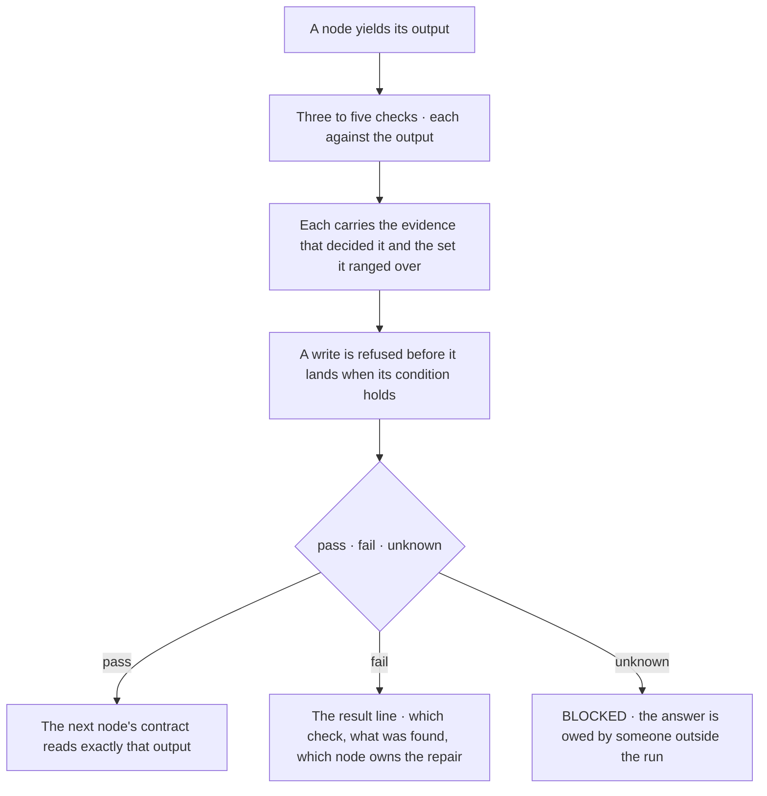
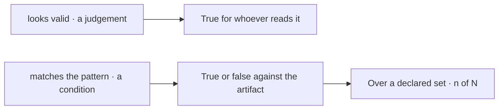
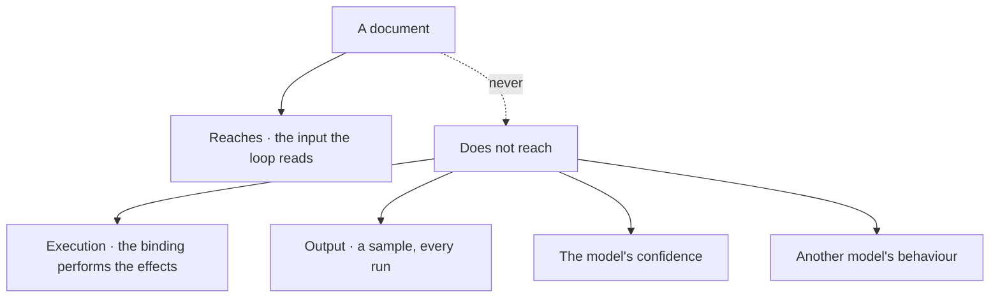
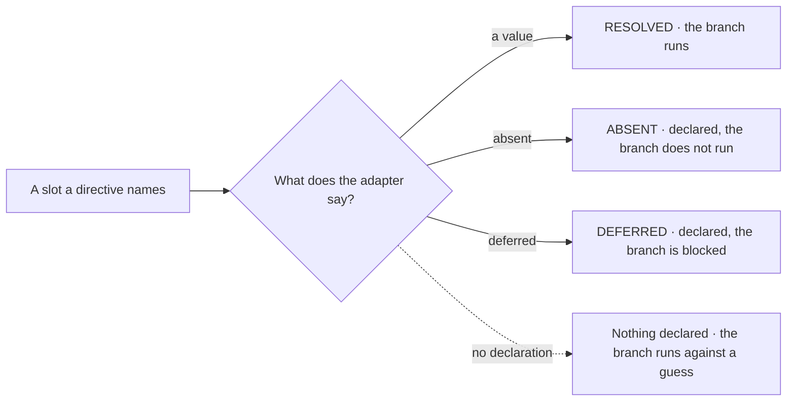

© 2025 Jay Baleine - Disciplined AI Software Development · Documentation is covered by [CC BY-SA 4.0](https://creativecommons.org/licenses/by-sa/4.0/)

# Validation — PAG — Bane's Lab

> A handoff gate closes a node with three to five checks, each checkable against the node's output, each carrying the evidence that decided it and the set it was…

Canonical: https://banes-lab.com/pag/validation

# Pattern Abstract Grammar

Structured instructions for AI systems.

# Validation

## Validation gates

A handoff gate closes a node with three to five checks, each checkable against the node's output, each carrying the evidence that decided it and the set it was measured over, the whole of [A1·a a gate](#validation-gates-panel-a) and what [A1·d at the boundary](#validation-gates-panel-d) draws. Its result line has three arms: the next node on pass, the node that owns the repair on failure, and blocked on unknown, the third verdict [A1·b verdict and domain](#validation-gates-panel-b) shows. A check is a comparison and never a judgement, as [A1·c judgement or check](#validation-gates-panel-c) rewrites one and [A1·e who decides](#validation-gates-panel-e) draws the difference. The gate is the verify stage of [the loop](../START.md#the-loop), and the methodology's [unknown is not pass](../VERIFY.md#unknown-is-not-pass) is its third arm. A node boundary is trusted only when its checks are specific, its verdict carries its domain, and its writes are refused before they land.

### Checkable, with evidence

A check is specific and checkable, with its evidence, its population and its repair owner beside it, and unknown is its own verdict. A vague check passes whatever the reader is inclined to pass, and a check with no domain passes over nothing.

A gate reads that the data looks good, the model reports the gate passed because the data looked good to it, and the next node consumes records that never matched the schema; or the check ran over an empty set and passed over nothing. A condition that compares an artifact to a value can be evaluated by anyone, and a condition that asks whether something looks right can be evaluated only by whoever is looking; a verdict with no domain cannot say what it was true of.

Put the evidence and the population beside the check rather than trust the verdict, so a green reads as coverage and not as silence. Close every node with a gate of three to five checks. Write each as a comparison against the node's output, with the evidence that settles it beside it and, wherever the check ranges over a set, that set and the count measured over it. Mark a hard assertion and a prerequisite as such. Where the node writes, name the condition under which it refuses before the write. Write the result line with all three arms, so a failed check names what was found and routes to the earliest node that can supply the missing evidence, and an unmeasured claim routes to blocked rather than reading as pass. Let the next node's contract read exactly the output the gate confirmed.

Rewrite each check as a comparison and name the artifact on each side and the set it ranged over. A check with no artifact on one side is a judgement, a check with no set is a verdict about nothing, and the node either closes is open however the gate reads.

A gate checks outcomes and never confidence. A check about how sure the model is, or whether it understood, is not observable from outside and belongs under limits rather than in a gate.

The count is bounded on both sides: fewer than three and the gate checks that something ran rather than that a unit closed; more than five and the node has several decisions and is several nodes. A gate that passes and a gate that was never evaluated produce the same silence, which is what the evidence beside each check breaks. A gate that passed over an empty set is the same silence wearing a number, which is what the population beside the verdict breaks. The result line is [fail fast](../ontology/PRINCIPLES.md#arch-fail-fast) at the boundary, the rule [fail at the boundary](../BUILD.md#fail-at-the-boundary) states for a system, and its owner is the earliest node that can supply what the check lacked, so a repair invalidates forward from there and nothing earlier is redone.

The refusal line is where the node declines to continue before an irreversible write, which is the only moment a refusal costs nothing. The standing line names the surfaces that moved beneath the verdict, and a non-empty moved set withdraws the verdict's standing to be quoted without touching the verdict itself, which is what a report, not a checkbox derives. The markers are a closed set with one meaning each: a check, a hard assertion, a prerequisite a prior node must have yielded. Severity is not a marker, because severity orders repairs among failures and never softens a verdict; there is no tier between fail and pass.

```pag
HANDOFF GATE (evidence-bearing):
rule_id: "<NODE NAME>"   yields: <shape>
[check] <file> exists at <path>                    (evidence: the listing that shows it)
[check] <settings> conforms to <schema>            (evidence: the validator's report) over: <settings files> measured: <conforming> / <files>
[check] every <dependency> in <settings> resolves  (evidence: the resolution log)
ASSERT <count> above 0
REQUIRE <prior-node>.<output>
refuse: <destination> changed since it was read before PERSIST_ARTIFACT
standing: moved-set <the surfaces re-read since the node began>
result: pass -> NODE <n+1> | <which check failed, what was found> -> REPAIR (owner: <the earliest node that can supply the evidence>) | unknown -> BLOCKED
```

```pag
# a verdict with no domain · passed over what?
[check] every settings file conforms                (evidence: the validator's report)

# a verdict beside its domain · zero of zero is not evidence
[check] every settings file conforms                (evidence: the validator's report) over: <settings files> measured: 12 / 12
[check] every settings file conforms                (evidence: the validator's report) over: <settings files> measured: 0 / 0    # empty · the gate fails

# the three verdicts · unknown is routed, never absorbed into pass
result: pass -> NODE 4 | schema mismatch -> REPAIR (owner: NODE 2) | unknown -> BLOCKED
```

```pag
# a judgement · true for whoever reads it
[check] the email looks valid
[check] the data is good
[check] everything worked

# a condition · true or false against the artifact, with what settles it and what it ranged over
[check] <record>.<email> matches <pattern>          (evidence: the match returned true)
[check] <records> is non-empty                       (evidence: a count above zero)
[check] every required field present in <record>    (evidence: no missing field named) over: <records> measured: <complete> / <records>
[check] <output>.<count> equals <input>.<count>      (evidence: the two numbers)
```

A1·d at the boundary



A1·e who decides



## Limits

A document's limits are stated where a reader would otherwise assume the opposite, as [B1·a declared limits](#limitations-panel-a) writes and [B1·d what it never reaches](#limitations-panel-d) draws, and each is a limit to design for rather than a flaw to route around. A slot resolves to one of the three states [B1·b slot states](#limitations-panel-b) names and [B1·e three states](#limitations-panel-e) draws, and a reading larger than one session is split as [B1·c size and time](#limitations-panel-c) shows.

### Declared, never assumed

An absence is declared where it would otherwise be assumed, and a slot with no analogue is absent rather than faked. A directive names a capability the harness may not have.

A workflow declares a parallel group and a watch on a surface, the harness has neither, both branches run against a guess, and the workflow reports every gate green over work that never happened. A branch runs against a value unless something says there is none, so a missing declaration reads as a value.

Refuse an adapter that resolves everything, and route each branch by the slot's declared state rather than by whether a value happens to exist. Declare each limit beside the mechanism a reader would otherwise expect to cover it. Split a document that exceeds one reading into nodes the reader takes one at a time, and carry across sessions only what a directive persists to a surface.

For each slot a document names, find its state in the adapter. A slot with no state is a branch running against a guess, and the fix is a declaration rather than a value.

A limit declared is not a limit removed. Stating that output is probabilistic is what makes the gates necessary, and a reader who treats the declaration as a disclaimer has read the page backwards.

The limits partition by what a document can and cannot reach. It reaches the input a reasoning loop reads, and nothing past that. Output is a sample from a distribution every run, so [reproducibility](../ontology/PRINCIPLES.md#arch-reproducibility) is not on offer, and the model's confidence is not observable from outside, so a gate cannot condition on it. A document that names its model has written a claim into a slot the harness owns.

The third slot state is what keeps a document honest. An adapter is a [capability declaration](../ontology/PRINCIPLES.md#arch-capability-declaration), and one that resolves everything is lying about something. Size and time are facts about the party reading the document: a context is bounded, so what crosses a node boundary is the output the next contract reads rather than the whole history, and a session ends, so what the next one needs is persisted rather than remembered.

```pag
# what a document cannot do · declared where a reader would otherwise assume it
LIMIT <execution>:      "a document has no runtime · a reasoning loop walks it and an adapter performs its effects"
LIMIT <determinism>:    "the same document may produce different results across runs"
LIMIT <introspection>:  "a gate checks an outcome · never the model's confidence"
LIMIT <portability>:    "a document written for one model behaves differently under another"
LIMIT <persistence>:    "nothing survives a session unless a directive writes it"
LIMIT <concurrency>:    "a parallel group declares independence · the harness decides what runs together"
LIMIT <availability>:   "an operation assumes the adapter resolves it · an absent resolution is declared, never assumed"
LIMIT <feedback>:       "a document describes a linear or branching flow · watching for change needs a tool"
```

```pag
# a slot resolves to one of three states, and the third is the load-bearing one
SLOT {toolchain.watch}:    ABSENT    "this harness cannot block on a surface · the branch does not run"
SLOT {toolchain.parallel}: RESOLVED  "the harness runs a parallel group together"
SLOT {project.checkpoint}: DEFERRED  "a reversible checkpoint will exist · the branch is blocked, not skipped"

WHEN <a directive names a slot>:
IF <slot> is ABSENT:   DECLARE the absence · SKIP the branch
IF <slot> is DEFERRED: DECLARE the deferral · BLOCK the branch
IF <slot> is RESOLVED: RUN the branch
```

```pag
# a bounded context is a limit, not a surprise
WHEN <document> exceeds <what one reading consumes>:
SPLIT <document> INTO <nodes the reader takes one at a time>
CARRY <the output the next node's contract reads> · never the whole history

WHEN <a workflow runs longer than one session>:
PERSIST_ARTIFACT <what the next session reads> TO <a surface>
READ_RESOURCE <it> at the start of the next · the document itself remembers nothing
```

B1·d what it never reaches



B1·e three states



Documentation is covered by [CC BY-SA 4.0](https://creativecommons.org/licenses/by-sa/4.0/)

© 2025 [Jay Baleine](https://linkedin.com/in/jay-baleine) - Pattern Abstract Grammar

---

Chapters: [Introduction](INTRODUCTION.md) · [Guide](GUIDE.md) · [Orchestration](ORCHESTRATION.md) · [Patterns](PATTERNS.md) · [Keywords](KEYWORDS.md) · [Grammar](GRAMMAR.md) · [Validation](VALIDATION.md) · [Templates](TEMPLATES.md)
