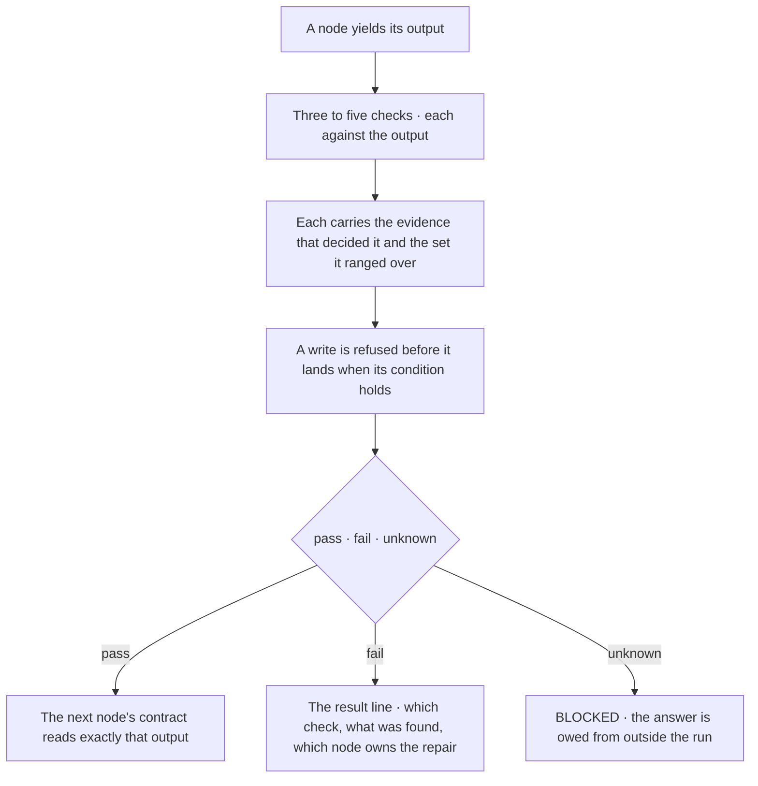
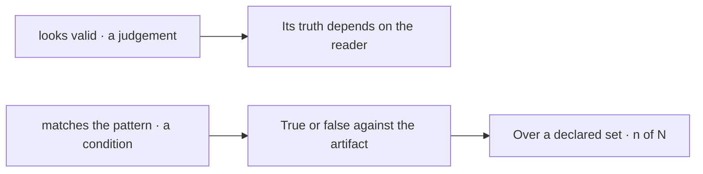
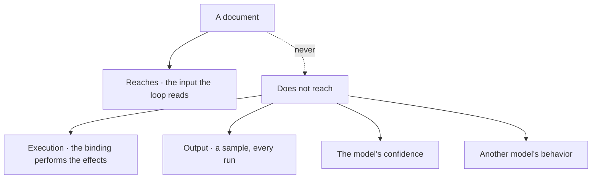
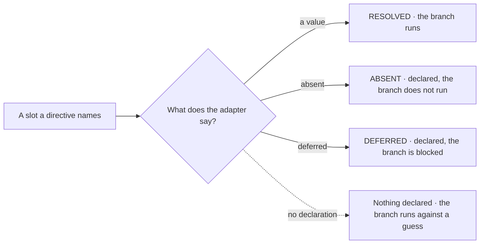

© 2025 Jay Baleine - Disciplined Methodology · Bane's Lab documentation is covered by [CC BY-SA 4.0](https://creativecommons.org/licenses/by-sa/4.0/)

# Validation — PAG — Bane's Lab

> This section covers the handoff gate that closes every node.

Canonical: https://banes-lab.com/pag/validation

# Pattern Abstract Grammar

Structured instructions for LLMs

# Validation

## Validation gates

This section covers the handoff gate that closes every node. A gate holds three to five checks, each compared against the node's output and each carrying the evidence that decided it and the set it was measured over, as shown in [A1·a a gate](#validation-gates-panel-a) and [A1·d at the boundary](#validation-gates-panel-d). Its result line has three arms, which send a pass to the next node, a failure to the node that owns the repair, and an unknown to blocked, as shown in [A1·b verdict and domain](#validation-gates-panel-b). A judgement is rewritten as a comparison in [A1·c judgement or check](#validation-gates-panel-c), and [A1·e who decides](#validation-gates-panel-e) shows the difference between the two. The gate is the verify stage of [the loop](../START.md#the-loop), and its third arm is the rule described in [unknown is not pass](../VERIFY.md#unknown-is-not-pass).

### Checkable, with evidence

A vague check passes whatever the reader is inclined to pass, and a check with no domain passes over nothing. A gate reads that the data looks good, the model reports the gate passed because the data looked good to it, and the next node consumes records that never matched the schema. A condition that compares an artifact to a value gives the model, the developer and a script the same answer, while a condition that asks whether something looks right can give each of them a different one, and a verdict with no domain cannot say what it was true of.

For this reason a check is a comparison against the node's output, with its evidence, its population and its repair owner beside it, and unknown is a verdict of its own. The evidence is written beside each check, together with the set and the count measured over it wherever a check ranges over a set, rather than the verdict standing alone, so a green reads as coverage and not as silence. In practice, every node closes on a gate of three to five checks, each written as a comparison against the node's output. A hard assertion and a prerequisite are marked as such, and where the node writes, the condition under which it refuses is named before the write. The result line carries all three arms, so a failed check names what was found and routes to the earliest node that can supply the missing evidence, and an unmeasured claim routes to blocked rather than reading as pass. The next node's contract reads exactly the output the gate confirmed.

To check this, rewrite each check as a comparison and name the artifact on each side and the set it ranged over. A check with no artifact on one side is a judgement and a check with no set is a verdict about nothing, so in either case the gate's green does not say whether the node closed. A gate checks outcomes, never confidence. How sure the model is, or whether it understood, is not observable from outside, so a check about either belongs under [limits](VALIDATION.md#limitations) rather than in a gate.

The count is bounded on both sides. With fewer than three checks the gate shows that something ran rather than that a unit closed, and with more than five the node holds several decisions and is several nodes. A gate that passes and a gate that was never evaluated produce the same silence, and the evidence beside each check tells them apart. A gate that passed over an empty set produces the same silence with a number attached, and the population beside the verdict exposes it. The result line applies [fail fast](../ontology/PRINCIPLES.md#architecture-fail-fast) at the node boundary, as described for a whole system in [fail at the boundary](../BUILD.md#fail-at-the-boundary), and its owner is the earliest node that can supply what the check lacked, so a repair invalidates forward from there and nothing earlier is redone.

The refusal line stops the node before an irreversible write, because that is the only moment a refusal costs nothing. The standing line names the surfaces that moved beneath the verdict, and a non-empty moved set withdraws the verdict's standing to be quoted without touching the verdict itself, as derived in [a report, not a checkbox](../VERIFY.md#a-report-not-a-checkbox). The markers form a closed set with one meaning each, marking a check, a hard assertion, or a prerequisite that a prior node must have yielded. Severity is not a marker, because severity orders repairs among failures and never softens a verdict, and there is no tier between fail and pass.

A1·a a gate

```pag
HANDOFF GATE (evidence-bearing):
rule_id: "<NODE NAME>"   yields: <shape>
[check] <file> exists at <path>                    (evidence: the listing that shows it)
[check] <settings> conforms to <schema>            (evidence: the validator's report) over: <settings files> measured: <conforming> / <files>
[check] every <dependency> in <settings> resolves  (evidence: the resolution log)
ASSERT <count> above 0
REQUIRE <prior-node>.<output>
refuse: <destination> changed since it was read before PERSIST_ARTIFACT
standing: moved-set <the surfaces re-read since the node began>
result: pass → NODE <n+1> | <which check failed, what was found> → REPAIR (owner: <the earliest node that can supply the evidence>) | unknown → BLOCKED
```

A1·b verdict and domain

```pag
# a verdict with no domain · passed over what?
[check] every settings file conforms                (evidence: the validator's report)

# a verdict beside its domain · zero of zero is not evidence
[check] every settings file conforms                (evidence: the validator's report) over: <settings files> measured: 12 / 12
[check] every settings file conforms                (evidence: the validator's report) over: <settings files> measured: 0 / 0    # empty · the gate fails

# the three verdicts · unknown is routed, never absorbed into pass
result: pass → NODE 4 | schema mismatch → REPAIR (owner: NODE 2) | unknown → BLOCKED
```

A1·c judgement or check

```pag
# a judgement · its truth depends on the reader
[check] the email looks valid
[check] the data is good
[check] everything worked

# a condition · true or false against the artifact, with what settles it and what it ranged over
[check] <record>.<email> matches <pattern>          (evidence: the match returned true)
[check] <records> is non-empty                       (evidence: a count above zero)
[check] every required field present in <record>    (evidence: no missing field named) over: <records> measured: <complete> / <records>
[check] <output>.<count> equals <input>.<count>      (evidence: the two numbers)
```

A1·d at the boundary



A1·e who decides



## Limits

This section covers what a document cannot do and how it says so. The limits a document declares are written in [B1·a declared limits](#limitations-panel-a), and [B1·d what it never reaches](#limitations-panel-d) shows what lies beyond a document's reach. A slot resolves to one of three states, as written in [B1·b slot states](#limitations-panel-b) and shown in [B1·e three states](#limitations-panel-e), and a reading larger than one session is split as shown in [B1·c size and time](#limitations-panel-c). Each limit is one to design for rather than a flaw to route around.

### Declared, never assumed

A directive names a capability the harness may not have. A workflow declares a parallel group and a watch on a surface, the harness has neither, both branches run against a guess, and the workflow reports every gate green over work that never happened. A branch runs against a value unless the adapter declares there is none, so a missing declaration reads as a value.

For this reason an absence is declared where it would otherwise be assumed, and a slot with no analogue is marked absent rather than faked. An adapter that resolves everything is refused, and each branch is routed by the slot's declared state rather than by whether a value happens to exist. In practice, each limit is declared beside the mechanism a reader would otherwise expect to cover it. A document that exceeds one reading is split into nodes the reader takes one at a time, and only what a directive persists to a surface is carried across sessions.

To check this, find the state of each slot a document names in its adapter. A slot with no state is a branch running against a guess, and the repair is a declaration rather than a value. Declaring a limit does not remove it. Stating that output is probabilistic is the reason the gates exist, so the declaration is not a disclaimer.

The limits divide by what a document can and cannot reach. A document reaches the input a reasoning loop reads, and nothing past that. Output is a sample from a distribution on every run, so [reproducibility](../ontology/PRINCIPLES.md#architecture-reproducibility) is not on offer, and the model's confidence is not observable from outside, so a gate cannot condition on it. A document that names its model has written a claim into a slot the harness owns.

The states other than resolved keep a document from running against a guess. An adapter is a [capability declaration](../ontology/PRINCIPLES.md#architecture-capability-declaration), and one that resolves every slot is claiming at least one capability its harness does not have. Size and time are facts about the model reading the document. Its context is bounded, so what crosses a node boundary is the output the next contract reads rather than the whole history, and its session ends, so what the next session needs is persisted rather than remembered.

B1·a declared limits

```pag
# what a document cannot do · declared where a reader would otherwise assume it
LIMIT <execution>:      "a document has no runtime · a reasoning loop walks it and an adapter performs its effects"
LIMIT <determinism>:    "the same document may produce different results across runs"
LIMIT <introspection>:  "a gate checks an outcome · never the model's confidence"
LIMIT <portability>:    "a document written for one model behaves differently under another"
LIMIT <persistence>:    "nothing survives a session unless a directive writes it"
LIMIT <concurrency>:    "a parallel group declares independence · the harness decides what runs together"
LIMIT <availability>:   "an operation assumes the adapter resolves it · an absent resolution is declared, never assumed"
LIMIT <feedback>:       "a document describes a linear or branching flow · watching for change needs a tool"
```

B1·b slot states

```pag
# a slot resolves to one of three states, and the third is the load-bearing one
SLOT {toolchain.watch}:    ABSENT    "this harness cannot block on a surface · the branch does not run"
SLOT {toolchain.parallel}: RESOLVED  "the harness runs a parallel group together"
SLOT {project.checkpoint}: DEFERRED  "a reversible checkpoint will exist · the branch is blocked, not skipped"

WHEN <a directive names a slot>:
IF <slot> is ABSENT:   DECLARE the absence · SKIP the branch
IF <slot> is DEFERRED: DECLARE the deferral · BLOCK the branch
IF <slot> is RESOLVED: RUN the branch
```

B1·c size and time

```pag
# a bounded context is a limit, not a surprise
WHEN <document> exceeds <what one reading consumes>:
SPLIT <document> INTO <nodes the reader takes one at a time>
CARRY <the output the next node's contract reads> · never the whole history

WHEN <a workflow runs longer than one session>:
PERSIST_ARTIFACT <what the next session reads> TO <a surface>
READ_RESOURCE <it> at the start of the next · the document itself remembers nothing
```

B1·d what it never reaches



B1·e three states



---

Chapters: [Introduction](INTRODUCTION.md) · [Guide](GUIDE.md) · [Orchestration](ORCHESTRATION.md) · [Patterns](PATTERNS.md) · [Keywords](KEYWORDS.md) · [Grammar](GRAMMAR.md) · [Validation](VALIDATION.md) · [Templates](TEMPLATES.md)
